# 2018年广西公务员录用考试《行测》题（网友回忆版）

> 省考 · 2018 年 · 4 个模块 · 共 110 题

- [言语理解与表达](#%E8%A8%80%E8%AF%AD%E7%90%86%E8%A7%A3%E4%B8%8E%E8%A1%A8%E8%BE%BE) · 45 题
- [数量关系](#%E6%95%B0%E9%87%8F%E5%85%B3%E7%B3%BB) · 15 题
- [判断推理](#%E5%88%A4%E6%96%AD%E6%8E%A8%E7%90%86) · 35 题
- [资料分析](#%E8%B5%84%E6%96%99%E5%88%86%E6%9E%90) · 15 题

---

## 言语理解与表达

### 第 1 题　qid 2184689 · 逻辑填空

红色文化遗产与古代文化遗产一样，是重要的、不可再生的文化资源，是                的民族优秀文化遗产，也同样需要积极抢救、保护和开发利用，绝不能因其形成的时间短、缺乏“            ”，而忽视其应有的价值。
依次填入划横线部分最恰当的一项是：

- **A**. 举足轻重  时代感
- **B**. 不可或缺  表现力
- **C**. 弥足珍贵  历史感　✅
- **D**. 屈指可数  竞争力

**答案**：C

**官方解析**

第一空，根据横线前“红色文化遗产······是重要的、不可再生的文化资源”，可知，所填词语需体现出“红色文化遗产”的重要性、珍贵性，A项“举足轻重”、B项“不可或缺”均可表达“非常重要”之意、C项“弥足珍贵”指十分珍贵，三项均符合文意，保留。D项“屈指可数”形容数量少，与“重要、不可再生”强调的“重要、珍贵”无关，排除。
第二空，横线前有表示否定含义的词“缺乏”，根据“、”可知，横线前后构成并列关系，语义相近，故所填词语对应红色文化遗产“形成的时间短”，需体现“时间长”之意。C项“历史感”语义合适，当选。A项“时代感”侧重强调“新”，体现的是“时间短”，与文意相悖，排除；B项“表现力”与“时间”的长短无关，排除。
故正确答案为C。
【文段出处】《文化遗产保护切不可“厚古薄今”》

---

### 第 2 题　qid 2184692 · 逻辑填空

科学的目标是追求真理，那么，为实现这个目标，任何理论都不具备            ，在通向真理的道路上，所有的理论都要经受        的实践检验，没有任何人可以凭借外在的社会历史因素，逃避检验，这种天生的公平原则是人类获得意义的重要来源。
依次填入划横线部分最恰当的一项是：

- **A**. 豁免权  严格　✅
- **B**. 优先权  频繁
- **C**. 自主权  系统
- **D**. 主导权  复杂

**答案**：A

**官方解析**

第一空，根据下文“所有理论都要经受实践检验，没有任何人可以逃避”可知，横线处所填词语需强调必须要经受实践的检验、不能搞特权，A项“豁免权”指免除某一方面责任的特权，符合文意，当选。B项“优先权”常用于“先后顺序”的比较语境中，与文意无关，排除；C项“自主权”指按自己意愿行事的权力、D项“主导权”指影响他人的权力，均无法体现“不可逃避实践检验”的特征，故排除。
第二空，代入验证，“经受严格的实践检验”语义得当，当选。
故正确答案为A。
【文段出处】《科学让生活更美好》

---

### 第 3 题　qid 2184698 · 逻辑填空

节目数量多不叫繁荣，只能叫拥挤。                加上品类单一常会带来审美疲劳。所以好的节目一定要敢于        ，同质的、内容形式单一的节目将被淘汰，能激起受众共鸣的、有价值的节目将大受欢迎。
依次填入划横线部分最恰当的一项是：

- **A**. 粗制滥造  冒险
- **B**. 供过于求  创新　✅
- **C**. 华而不实  担当
- **D**. 良莠不齐  突破

**答案**：B

**官方解析**

第一空，横线处所填词语用来形容“审美疲劳”的原因，由首句“节目数量多”产生“拥挤”的不良效果，可知所填词语需体现“数量多”的含义。B项“供过于求”指生产量大于需求量，可体现数量上的“多”，符合文意。A项“粗制滥造”意为制作粗劣，不讲究质量，由下文“品类单一”“同质”可知文段重在强调“类似”而非“质量差”，置于此处程度过重，排除；C项“华而不实”比喻外表好看，内容空虚，文段强调的并非节目内容“空虚”而是同质化的节目数量过多，与文意不符，排除；D项“良莠不齐”指好的、坏的混杂在一起，无法体现“数量多”的含义，排除。
第二空，代入验证，B项“创新”置于文段，表达针对“节目同质、内容形式单一”提出的对策，语义得当，当选。
故正确答案为B。
【文段出处】《好节目到底啥标准》

---

### 第 4 题　qid 2184702 · 逻辑填空

亲力亲为的财富管理方式，就是自己规划自己的财务。                并不表示你在财务管理上失去自主权，一切任由理财专员为你决定。相反的，你仍然须设定财务目标，再由专业理财人士为你度身订造理财计划，以让你达到追求的目标。
填入划横线部分最恰当的一项是：

- **A**. 听之任之
- **B**. 乘间取利
- **C**. 假手于人　✅
- **D**. 越俎代庖

**答案**：C

**官方解析**

文段围绕“亲力亲为的财富管理方式”展开论述。根据“并不表示”“相反的”可知，横线处所填词语与“你仍然须设定财务目标，再由专业理财人士为你度身订造理财计划”语义相同，表达即使你把理财工作交给理财专员，自己仍不失去自主权之意。C项“假手于人”意思是借助别人来为自己办事，语义得当，当选。
A项“听之任之”指任凭事物存在发展而不去过问，体现的是完全交由他人决定，与“自己仍不失去自主权”语义相悖，排除；B项“乘间取利”指利用对方力量薄弱的地方袭击取胜，与文意无关，排除；D项“越俎代庖”比喻超出自己业务范围去处理别人所管的事，强调“越权”，文段表达的是“请他人帮忙”而非“越权”，与文意无关，排除。
故正确答案为C。
【文段出处】《理财：亲力亲为还是假手于人》

---

### 第 5 题　qid 2184708 · 逻辑填空

世界遗产指的是联合国教科文组织确认的、世界罕见的、目前无法替代的文化和自然财产。所以，成为世界文化遗产后，遗产点也不能                。事实上，申遗成功后，遗产点每年都要提交一份详细的监测报告，如地质与环境监测、气象环境监测等，接受联合国教科文组织的监督，按照高标准来        。
依次填入划横线部分最恰当的一项是：

- **A**. 一劳永逸  规划
- **B**. 固步自封  管理
- **C**. 高枕无忧  保护　✅
- **D**. 沾沾自喜  建设

**答案**：C

**官方解析**

第一空，由“申遗成功后，遗产点每年都要提交一份详细的监测报告”可知，申遗成功之后，遗产点每年还要做很多的工作，并接受联合国教科文组织的监督，所以申遗成功不是辛苦一次就可以永远安逸、可以放松警惕的。A项“一劳永逸”形容辛苦一次把事情办好，就可以不再费力了；C项“高枕无忧”指无忧无虑、放松警惕，两项均符合文意，保留。B项“固步自封”指守着老一套，不求进步，文段并未包含不能守着老一套的含义，与文段缺少对应，排除；D项“沾沾自喜”形容自以为不错而得意的样子，多形容人，与“遗产点”搭配不当，排除。
第二空，根据“世界遗产指的是联合国教科文组织确认的、世界罕见的、目前无法替代的文化和自然财产”可知，世界遗产是已经形成的，C项“保护”指尽力照顾，不让这些珍贵的世界遗产受到损害，符合文意，当选。A项“规划”指制定长远的发展计划，文段重点在于按照高标准来进行保护，而不是制定未来的发展计划，排除。
故正确答案为C。
【文段出处】《别以为申遗成功就高枕无忧了》

---

### 第 6 题　qid 2184712 · 逻辑填空

在《娱乐至死》一书中，美国学者尼尔·波兹曼全面剖析和        了电视传媒所主导的文化。他指出，在电视剧行业                的时代，电视剧改变了公众话语的意义和内容；许多公众话题都日渐以娱乐的方式出现，即使是严肃的历史，也难免会遭受娱乐化的解构。
依次填入划横线部分最恰当的一项是：

- **A**. 诠释  独占鳌头
- **B**. 解读  风起云涌
- **C**. 批判  蒸蒸日上　✅
- **D**. 审视  势如破竹

**答案**：C

**官方解析**

本题可从第二空入手，由“电视剧改变了公众话语的意义和内容”可知，文段强调电视剧行业发展迅速，对公众影响很大。C项“蒸蒸日上”形容发展速度快，置于此处形容电视剧行业发展迅速，符合文意，保留；B项“风起云涌”比喻新事物迅速发展，声势浩大，符合文意，保留。A项“独占鳌头”泛指占了首位或者是第一名，文段并未将电视剧与其他娱乐形式进行比较，与文意不符，排除；D项“势如破竹”形势像劈竹子一样，劈开上端之后，底下的都随着刀刃分开了，形容节节胜利，毫无阻碍，多用于“打仗”“作战”等语境中，此处搭配不当，排除。
再回到第一空，后文中“即使是严肃的历史，也难免会遭受娱乐化的解构”表明作者对于“电视传媒主导”的这一文化是不认可的，C项“批判”指对错误的思想、言行进行批驳否定，与作者不认同的态度构成对应，符合文意，当选。B项“解读”是中性词，不能对应作者态度，排除。
故正确答案为C。

---

### 第 7 题　qid 2184714 · 逻辑填空

过度依赖于我们所知的世界会产生惯性。总是欣然接受普遍认知的事物会导致我们不愿意感知和        改变，甚至当改变已                的时候，我们也可能选择无视。
依次填入划横线部分最恰当的一项是：

- **A**. 探寻  近在咫尺
- **B**. 正视  千钧一发
- **C**. 面对  回天无力
- **D**. 接纳  迫在眉睫　✅

**答案**：D

**官方解析**

第一空，所填词语与“改变”搭配，B项“正视”指以正确的观点对待、C项“面对”指面临，正视地看待问题、D项“接纳”指接受，置于此处均可，保留。A项“探寻”指探索寻找，根据“感知改变”可知改变已经发生，故无需寻找，排除。
第二空，由递进关联词“甚至”可知，文段强调当改变已经在我们面前的时候，我们可能也选择无视，形容情况已经就在眼前，D项“迫在眉睫”形容事情就在眼前，符合文意，当选。B项“千钧一发”比喻情况万分危急，C项“回天无力”比喻局势严重，无法挽救，均与文意无关，排除。
故正确答案为D。
【文段出处】《破译黑天鹅》

---

### 第 8 题　qid 2184716 · 逻辑填空

当前，房地产市场几乎被西方舶来式建筑风格一统天下，世界级文化遗产苏州园林正面临着严重的        危机，大师匠人的缺位、传统手艺的失传，都让传统的苏州园林风格                ，几近绝迹。在这种背景下，以富含苏州文化遗产为卖点的房地产项目，引爆市场。
依次填入划横线部分最恰当的一项是：

- **A**. 断代  渐行渐远　✅
- **B**. 传承  曲高和寡
- **C**. 转型  岌岌可危
- **D**. 生存  江河日下

**答案**：A

**官方解析**

第一空，横线处所填词语与“危机”搭配，由“大师匠人的缺位、传统手艺的失传”和“几近绝迹”可知，文段强调苏州园林正在面临无人传承的巨大危机，A项“断代”一般指一个文明成果没有继承人，没办法传承下去，B项“传承”指长期流传下去，两项均符合文意，保留；D项“生存”指存在，置于此处与“危机”搭配，表达苏州园林可能会消失的含义，语义尚可，保留。C项“转型”指运转模式的转变，强调“转变”，而文段中“缺位、失传、几近绝迹”说明苏州园林可能消失，与文意不符，排除。
第二空，横线处所填词语搭配“传统的苏州园林风格”，A项“渐行渐远”指慢慢地走得越来越远，与“几近绝迹”对应，说明苏州园林风格渐渐走远，几乎要消失了，符合文意，当选。B项“曲高和寡”指言语和作品不通俗，能懂的人很少，与文意无关，排除；D项“江河日下”指情况一天天地坏下去，与主语“传统的苏州园林风格”搭配不当，排除。
故正确答案为A。
【文段出处】《文化遗产如何“活起来”》

---

### 第 9 题　qid 2184720 · 逻辑填空

游览花山岩画，船行江流之上，两岸风光旖旎，茂林修竹，清秀        ，不远处的江岸边是一排拔地而起的断岩山，山势陡峭，但郁郁葱葱。临江一面有国画般        留白的石壁，被苍翠的山脊        着，格外显眼。
依次填入划横线部分最恰当的一项是：

- **A**. 俊逸  浸染  环绕
- **B**. 隐约  渲染  嵌入
- **C**. 隐逸  点染  镶嵌　✅
- **D**. 飘逸  点缀  装饰

**答案**：C

**官方解析**

第一空，由“两岸风光旖旎，茂林修竹”可知，横线处所填词语与“清秀”共同形容景色的优美，A项“俊逸”指英俊洒脱，超群拔俗、D项“飘逸”指洒脱自然、C项“隐逸”指隐遁飘逸，置于此处均可。B项“隐约”指依稀，不明显，与文段语义无关，排除。

第二空，横线处所填词语与“国画般”构成对应，故应填入形容国画方面的技巧，C项“点染”是中国国画技法的一种，符合文意，保留；A项“浸染”指逐渐沾染，为染料应用术语，与文段语义无关，排除；D项“点缀”指加以衬托或装饰，使原有事物更加美好，并非国画技法，排除。

第三空，横线处所填词语与“格外显眼”对应，C项“镶嵌”指将一个物体嵌入另一个物体中，使二者固定，可以体现石壁被山脊凸显的样子，符合文意，当选。

故正确答案为C。

【文段出处】《旅途抒怀遇见花山》

---

### 第 10 题　qid 2184722 · 逻辑填空

大脑的衰老和疾病已经成为影响社会发展的巨大负担。中国的脑科学计划需要攀登高峰的            ，也需要“接地气”的先锋队。在社会资源有限的当下，如何        两者，在不忘攀登高峰搞好基础研究的同时，造福社会大众，做好转化研究，是国家科技政策的决策者和基础研究的工作者都需要深思的问题。
依次填入划横线部分最恰当的一项是：

- **A**. 火车头  整合
- **B**. 马前卒  协调
- **C**. 多面手  兼顾
- **D**. 排头兵  平衡　✅

**答案**：D

**官方解析**

第一空，由“也”可知，横线前后构成并列关系，所填词语与“先锋队”对应，“先锋队”指先进、走在前列的人，A项“火车头”比喻起带头领先作用的人、D项“排头兵”指带头的人或最优秀者，均符合文意，保留。B项“马前卒”比喻为人奔走效力的人、C项“多面手”指擅长多种技艺的人，均无法与“先锋队”构成并列，排除。
第二空，根据“在不忘攀登高峰搞好基础研究的同时，造福社会大众，做好转化研究”可知，横线处所填词语应表达兼顾“搞好科学研究”和“造福社会大众”之意，D项“平衡”符合文意，当选。A项“整合”指把零散的东西彼此衔接，从而实现信息系统的资源共享和协同工作，不如“平衡”更能体现两者兼顾之意，排除。
故正确答案为D。
【文段出处】《最后的前沿》

---

### 第 11 题　qid 2184646 · 逻辑填空

优秀传统文化就像一颗颗珍珠，____在岁月的河底。只有运用教育这根主线，我们才能将____起的珍珠重新编织为美丽的项链，使之成为能够传给后人的真正财富。
依次填入划横线部分最恰当的一项是：

- **A**. 遗失  搜集
- **B**. 遗忘  打捞　✅
- **C**. 留存  汇聚
- **D**. 散落  捡拾

**答案**：B

**官方解析**

第一空，根据“重新编织为项链”可知，当下的传统文化就像珍珠一样未利用起来，被忘记在历史的河底。B项“遗忘”指忘记，忘却、D项“散落”指下落分散，均符合文意。A项“遗失”指丢失，丢弃，文段并未表达丢失的语义，置于此处语义过重，且“丢失在河底”搭配不当，排除；C项“留存”指存留，保存，文段并未表达将其保存起来的意思，而是被岁月遗忘了，不符合文意，排除。
第二空，由前文“岁月的河底”可知，要想重新编织美丽的项链，需要将珍珠从河底捞起，B项“打捞”指把沉在水里的人或物找着取上来，符合文意，当选。D项“捡拾”指到处翻找，搜寻，而珍珠已知在河底，不需要到处搜寻，排除。
故正确答案为B。 
【文段出处】《用教育串起中华优秀传统文化的珍珠》

---

### 第 12 题　qid 2184653 · 逻辑填空

政府部门对各类新业态、新模式应有“包容审慎”的态度。各地方、各部门要________，不能用老办法去管制新业态，现行的法律法规大都是针对传统经济，面对新业态、新模式时显得不适应，各地政府部门也往往无所适从，不知该如何监管，经常走一律禁止或________的极端。
依次填入划横线部分最恰当的一项是：

- **A**. 革故鼎新  兼容并包
- **B**. 顺势而为  放任自流　✅
- **C**. 因势利导  视而不见
- **D**. 有的放矢  推波助澜

**答案**：B

**官方解析**

本题可从第二空入手，该空与“一律禁止”构成反义并列，表达另一个极端，即“没有任何部门监管，任其自由发展”之意。B项“放任自流”指任凭事物自由发展，而不做干涉，符合文段语境，保留。A项“兼容并包”指把各个方面全都容纳包括进来，是积极的做法，与文段“极端”消极的感情色彩不符，排除；C项“视而不见”指不注意，不重视，睁着眼却没看见，D项“推波助澜”比喻从旁鼓动、助长坏事物的声势和发展，扩大影响，两项均不是“极端”的做法，排除。
第一空代入验证，由“不能用老办法去管制新业态”可知，该空表达各部门应根据“新业态”的走势，采取适合他们的办法来管制之意，B项“顺势而为”指顺应事情本身的发展方向来做事情，符合文意，当选。
故正确答案为B。
【文段出处】《对无人店的监管应遵循包容审慎原则》

---

### 第 13 题　qid 2184662 · 逻辑填空

城市的发展壮大，固然离不开行政力量的____，但本质上仍是市场配置资源的结果。就目前而言，将一些地方经济中心撤县设市，使其实现从农村政区向城市政区的转化，是符合经济发展形势的。只是，这其中需要_______地设定必要门槛，原有的撤县设市标准，有些已经过时。
依次填入划横线部分最恰当的一项是：

- **A**. 推动  与时俱进　✅
- **B**. 支撑  高瞻远瞩
- **C**. 介入  因地制宜
- **D**. 干预  实事求是

**答案**：A

**官方解析**

本题可从第二空入手，根据“原有的撤县设市标准，有些已经过时”可知，横线处表达撤县设市的措施应当因时而异，随时间而变化发展。A项“与时俱进”指观念、行动和时代一起进步，从而发生一些改变，与“过时”对应，符合文意，保留。B项“高瞻远瞩”比喻眼光远大，看得长远，文段侧重“因时而异”，而非看得长远，排除；C项“因地制宜”意思是根据当地的具体情况，制定或采取适当的措施来干某件事情，侧重随地点不同而变化，排除；D项“实事求是”指从实际对象出发，探求事物的内部联系及其发展的规律性，认识事物的本质，不能体现出随时间而改变，排除。
第一空，代入验证，A项“推动”指向前用力，使工作开展，“行政力量的推动”符合语境，当选。
故正确答案为A。
【文段出处】《撤县设市，不能只看到政府的“钱景”》

---

### 第 14 题　qid 2184668 · 逻辑填空

我们常说“科学是开放的”，不是“封闭的”，科学的开放性意味着它不是永恒真理，可能出错。可是现实生活中，有些人在科学研究中对科学错误_______，一旦自己的科研成果遇到质疑就立刻将其_______。这看似暂时化解了危机，其实禁锢了自身的发展。
依次填入划横线部分最恰当的一项是：

- **A**. 讳莫如深  束之高阁　✅
- **B**. 噤若寒蝉  置之脑后
- **C**. 避而不谈  改头换面
- **D**. 谈虎色变  弃如敝屣

**答案**：A

**官方解析**

第一空，横线前出现“可是”提示转折，根据“科学的开放性意味着它不是永恒真理，可能出错”可知，“有些人”的做法是不能接受或正视科学中的错误。A项“讳莫如深”原指事件重大，讳而不言，后指把事情真相隐瞒得很深，C项“避而不谈”指躲避开而不肯说，指有意回避事实，二者均能体现出不敢正视科学中的错误这样的态度，符合文意，保留。B项“噤若寒蝉”形容因为害怕而不敢说话，D项“谈虎色变”比喻一提到可怕的事就情绪紧张起来，连脸色都变了，“害怕”“可怕”在文段中无从体现且两项均程度过重，排除。
第二空，“这看似暂时化解了危机，其实禁锢了自身的发展”是对横线处的解释。A项“束之高阁”比喻把某事或某种主张、意见、建议等搁置起来，不予理睬和办理，在文中指有些人遇到错误就将科研成果封存起来，暂时化解了危机，但从长远看不利于自身发展，符合文意，当选。C项“改头换面”比喻只改变外表和形式，其内容、实质不变，文意并非只改变形式而不改变内容，与文意不符，排除。
故正确答案为A。
【文段出处】《质疑与回应是科学工作的常态》

---

### 第 15 题　qid 2184675 · 逻辑填空

与传统文艺评论相比，网络时代文艺评论工作中市场因素的影响更加____。对文艺评论而言，互联网是充满机遇的“风口”，文艺评论能否号准市场的脉搏，应当成为一个重要的价值评判标准。因此，网络文艺评论应瞄准市场前沿，善于在海量的网络文艺产品中_______，紧盯市场“潜力股”。
依次填入划横线部分最恰当的一项是：

- **A**. 深刻  去粗取精
- **B**. 显著  明察秋毫
- **C**. 凸显  慧眼识珠　✅
- **D**. 深远  披沙拣金

**答案**：C

**官方解析**

第一空，根据文意，市场因素对网络时代的文艺评论工作影响更大、更明显，A项“深刻”指透彻、深入，体现程度深，B项“显著”、C项“凸显”指影响更加明显，均符合文意，保留。D项“深远”指影响、意义等深刻而长远，在文中无法体现出影响“长远”，排除。
第二空，横线处所填成语表达在“海量的网络文艺产品”中找到“潜力股”，C项“慧眼识珠”泛指敏锐的眼力，称赞人善于识别人才，置于此处符合海量产品中挑出“潜力股”之意，且与前文“瞄准”对应得当，符合文意，当选。A项“去粗取精”指除去杂质，留取精华，文中没有体现出“除去杂质”，排除；B项“明察秋毫”侧重强调任何细小的事物都能看得很清楚，后多形容人能洞察事理，不符合语境，排除。 
故正确答案为C。
【文段出处】《文艺评论要读懂网络时代》

---

### 第 16 题　qid 2184694 · 逻辑填空

在2000多年前的古丝绸之路上，人们就已留下了早期全球化经贸往来的足迹。在当今信息时代，交通、通讯如此发达，经济全球化潮流更是                 。然而，面对保护主义、民粹主义等逆全球化思潮抬头，经济全球化急需新的         。
依次填入划横线部分最恰当的一项是：

- **A**. 势不可挡  推动力　✅
- **B**. 势在必行  保护伞
- **C**. 所向披靡  火车头
- **D**. 来势汹汹  创造力

**答案**：A

**官方解析**

第一空，根据程度加重词“更是”可知，横线处所填词语对应“发达”，体现经济全球化潮流发展势头向好之意，A项“势不可挡”指来势迅猛，不可抵挡，D项“来势汹汹”指动作或事物到来的气势很厉害，用在此处均可，保留。B项“势在必行”指不能躲开或回避，从事情发展的趋势看，必须采取行动、措施，应当采取的措施做主语，而非“经济全球化潮流”，排除；C项“所向披靡”比喻力量所达到的地方，一切障碍全被扫除，根据文意，“保护主义、民粹主义等”都是经济全球化的障碍，故“一切障碍全被扫除”程度过重且不符合文意，排除。 
第二空，搭配“经济全球化”，表示面对逆全球化思潮，经济全球化的发展需要新的力量来对抗逆全球化思潮，A项“推动力”符合语境，当选。D项“创造力”一般不与“经济全球化”搭配，且与“逆全球化思潮”无法构成对应，排除。
故正确答案为A。
【文段出处】《推进经济全球化的新引擎》

---

### 第 17 题　qid 2184706 · 逻辑填空

当下，建立网络安全防御体系尤为重要。“每一台计算机都在贯彻人类的意志，互联网是人类社会在数字空间的投影”。因此，毫无疑问，网络世界也需要技术伦理。但是面对               的黑客，伦理层面只能是              。因此，唯有主动出击，排查风险，防患于未然，才是真正的解决之道。   
依次填入划横线部分最恰当的一项是：

- **A**. 不怀好意  缘木求鱼
- **B**. 别有用心  对牛弹琴
- **C**. 心术不正  鸡同鸭讲
- **D**. 居心叵测  与虎谋皮　✅

**答案**：D

**官方解析**

本题可从第二空入手，根据“唯有主动出击，排查风险，防患于未然，才是真正的解决之道”可知，仅凭伦理层面的措施并不能从根本上解决问题。D项“与虎谋皮”比喻所谋之事有害于对方的切身利益，终难达到目的，在文中指依靠技术伦理自然会触及黑客的利益，是不可能成功的，符合文意，保留。A项“缘木求鱼”比喻方向或办法不对头，不可能达到目的，根据文段所述，“网络世界也需要技术伦理”，因此不能说依靠伦理是完全错误的方法，排除；B项“对牛弹琴”比喻对蠢人谈论高深的道理，白费口舌，常用于讥讽别人，文段并非讽刺黑客，排除；C项“鸡同鸭讲”形容两个人没有共同语言，无法沟通，文意侧重打击黑客单靠伦理是不够的，而非与黑客无法沟通，排除。
第一空，代入验证，D项“居心叵测”指心存险恶，不可推测，置于文段中形容“黑客”符合文意，当选。
故正确答案为D。
【文段出处】《网络安全应杜绝“想不到”》

---

### 第 18 题　qid 2184711 · 逻辑填空

单独看原始数据，报纸似乎的确已经呈现出绝症缠身、<u>             </u> 之势。美国某权威调查报告显示，目前只有的美国人将报纸作为主要新闻来源，这个数字在2001年时是。在数字化浪潮席卷而来的今天，最不缺的就是<u>              </u>地预言最后一张印刷的报纸一定会在至多15年内被埋葬的“先知”。

依次填入划横线部分最恰当的一项是：

- **A**. 固步自封  毫无顾忌
- **B**. 无可救药  大言不惭
- **C**. 日薄西山  胸有成竹　✅
- **D**. 尾大不掉  疾言厉色

**答案**：C

**官方解析**

第一空，由顿号可知，横线处所填词语与“绝症缠身”构成并列关系，语义相近，“绝症缠身”是说病得很严重，濒临死亡，B项“无可救药”比喻已经到了无法挽救的地步，C项“日薄西山”比喻人已经衰老或事物衰败腐朽，临近死亡，均能够与“绝症缠身”形成并列，保留。A项“固步自封”比喻守着老一套，不求进步，D项“尾大不掉”比喻机构庞大，指挥不灵，与“绝症缠身”对应不当，均排除。
第二空，由文意可知，一些所谓的“先知”根据原始数据和数字化大潮，很有把握的判断报纸会在至多15年内消失，C项“胸有成竹”比喻做事之前已经有打算或有把握，符合文意，当选。B项“大言不惭”侧重说大话不感到难为情，而文中的“先知”只是根据数字化大潮的背景下的论断，没有说大话的含义，排除。
故正确答案为C。
【文段出处】《报纸的发明：“旧媒体”往往有绝处逢生能力》

---

### 第 19 题　qid 2184719 · 逻辑填空

一般我们总认为，文学重视形象思维，而科学需要理性逻辑。其实，科学也可以很文艺，              ，充满艺术的想象力。这两者看似关涉领域不同，其实只要有创意，便能               。
依次填入划横线部分最恰当的一项是：

- **A**. 妙趣横生  水乳交融　✅
- **B**. 洞若观火  若合符节
- **C**. 有声有色  相辅相成
- **D**. 入木三分  相映成趣

**答案**：A

**官方解析**

第一空，由“科学也可以很文艺”、“充满艺术的想象力”可知，科学除了理性逻辑也有形象思维，也可以很有趣。A项“妙趣横生”指洋溢着美妙的意趣，侧重有趣，C项“有声有色”形容有意义、很精彩，也形容说话或表演精彩生动，符合文意，保留。B项“洞若观火”形容观察事物非常清楚，侧重的是理性而非想象力，排除；D项“入木三分”借以形容书法笔力遒劲，亦比喻见解、议论深刻、确切，与文意不符，排除。
第二空，由“其实”可知，横线处所填词语与“看似关涉领域不同”语义相反，表达有了创意的存在科学和文学就能够融合，A项“水乳交融”比喻关系非常融洽结合十分紧密，与文意相符，当选。C项“相辅相成”指两件事物互相配合，互相辅助，侧重缺一不可，而文学与科学均是独立学科，没有缺一不可的关联性，与文意不符，排除。
故正确答案为A。
【文段出处】《想象力没有边界，科学也没有边界》

---

### 第 20 题　qid 2184724 · 逻辑填空

中俄文化交流可以增进两国人民的相互了解，特别是可以克服两国经济发展的障碍，进而促进两国的经济发展。中俄文化交流也还有很大的提升空间，文化交流需要向深层次               ，不能把文化交流简化为文艺演出活动，片面地满足于表面上的                。
依次填入划横线部分最恰当的一项是：

- **A**. 迈进  洋洋洒洒
- **B**. 浸入  浩浩荡荡
- **C**. 渗透  风风火火
- **D**. 跨越  轰轰烈烈　✅

**答案**：D

**官方解析**

本题可从第二空入手，横线处搭配“文化交流”，由“还有很大的提升空间”“不能把文化交流简化为文艺演出活动”可知，中俄文化交流不能仅仅满足于表面上的活跃繁荣，D项“轰轰烈烈”形容事业的兴旺，气魄宏伟，符合文意，保留。A项“洋洋洒洒”形容文章或谈话丰富明快，连续不断；B项“浩浩荡荡”形容形势广阔壮大，通常搭配“队伍”“场面”等，C项“风风火火”形容急急忙忙、冒冒失失或者有冲劲的样子，通常搭配对象为“人”，均与“文化交流”搭配不当，排除。
第一空，代入验证，“深层次跨越”和前文“还有很大的提升空间”形成对应，D项当选。
故正确答案为D。
【文段出处】《二十年来的中俄文化交流简论》

---

### 第 21 题　qid 2184628 · 逻辑填空

15世纪以来，葡萄牙、西班牙、荷兰、英国、法国、德国、日本、俄罗斯、美国这九个先后崛起的国家，在历史兴衰和发展方面具有典型的意义。         其发展历史，探寻其发展轨迹，总结其经验教训，对于今天的中国尤其              。
依次填入划横线部分最恰当的一项是：

- **A**. 分析  受益匪浅
- **B**. 阐述  大有裨益　✅
- **C**. 论证  举足轻重
- **D**. 回顾  不可或缺

**答案**：B

**官方解析**

本题可从第二空入手，根据“这九个先后崛起的国家，在历史兴衰和发展方面具有典型的意义”可知，总结九个崛起国家的经验对今天中国的发展有好处、有意义，B项“大有裨益”形容益处很大，符合文意，保留。A项“受益匪浅”形容受到很多益处和启迪，与主体直接搭配即可，比如“我受益匪浅”，文中的“对······受益匪浅”搭配不当，排除；C项“举足轻重”指处于重要地位，一举一动都足以影响全局，D项“不可或缺”侧重非常重要，不能有一点点的缺失，在此处均程度过重，排除。
第一空，代入验证，“阐述历史”搭配恰当，符合语境，B项当选。
故正确答案为B。
【文段出处】《大国崛起：解读15世纪以来9个世界性大国崛起的历史》

---

### 第 22 题　qid 2184633 · 逻辑填空

表情包以其               、蕴意丰富的特点，成为引人注目的网络文化产物，表情包的出现是有特殊背景的，就是互联网传播技术的普及和网络社交文化的繁荣。互联网技术        了各种视觉符号和贴图表情，让人们可以采用日常生活中不能使用的符号来表达情感和传递信息。
依次填入划横线部分最恰当的一项是：

- **A**. 天马行空  萌生
- **B**. 特立独行  派生
- **C**. 惟妙惟肖  催生
- **D**. 一目了然  衍生　✅

**答案**：D

**官方解析**

第一空，所填词语与“表情包”搭配，与“蕴意丰富”共同形容表情包具有的特点。D项“一目了然”指一眼就看得清楚，符合“表情包”直观形象的特点，且“一目了然”可与“蕴意丰富”形成对照，说明表情包在外在形式上简单直接，在内容上含义丰富，对应恰当，保留。A项“天马行空”多比喻诗文气势豪放，不受拘束，也比喻人浮躁，不踏实，与“表情包”搭配不当，排除；B项“特立独行”指特殊的，与众不同的，文中并无“特殊”的含义，排除；C项“惟妙惟肖”形容描绘或仿造得简直跟真的一模一样，非常逼真，强调的是模仿的逼真，“表情包”更多的是在外在形式上简单直接的让人理解含义，并非表情本身有多“逼真”、多像真的表情，排除。
第二空，代入验证，D项“衍生”强调生成新的东西，置于文段中表达互联网技术产生了各种表情包，符合文意，当选。
故正确答案为D。
【文段出处】《解读表情包：网络亚文化的快速繁荣》

---

### 第 23 题　qid 2184638 · 逻辑填空

语言是文化的载体和重要表现形式，不同的方言对应的是              的社会文化、风土人情。最典型的是一些地方曲艺，如花鼓戏、评弹等，往往是        于方言，方能展现其特色与魅力。那么一旦方言衰败，其对应的文化表现形式也将随之        。
依次填入划横线部分最恰当的一项是：

- **A**. 地域性  发源  败落
- **B**. 典型性  固守  湮灭
- **C**. 多元化  依托  凋零　✅
- **D**. 大众化  借助  消亡

**答案**：C

**官方解析**

第一空，搭配“社会文化”“风土人情”，根据文段“不同的方言”可知，横线处所填词语应具有“不同”“差异”的意思。A项“地域性”、B项“典型性”、C项“多元化”均可体现出“差异”“不同”，保留。D项“大众化”强调的是普遍性，而非“差异”，与文意不符，排除。
第二空，横线所在句子说明地方曲艺通过方言来表现特色与魅力，C项“依托”指依靠，强调了曲艺以方言为载体才能展示其特色与魅力，可表示二者之间的关系，符合文意，保留。A项“发源”比喻事物的起源，文段并未提及曲艺来源于方言，与文意不符，排除；B项“固守”是指坚守，保卫和防守得非常坚固，文段并未提及地方曲艺保卫方言的内容，且“固守”后面通常不接“于”，用法错误，排除。
第三空，代入验证，根据“一旦方言衰败”可知，此处用来形容对应的文化形式也将衰败。C项“凋零”指凋败，对应恰当，当选。
故正确答案为C。
【文段出处】《保护方言是对多元文化的尊重》

---

### 第 24 题　qid 2184650 · 片段阅读

台风是一种热带气旋，形成于赤道地区的温暖水域。当暖湿空气开始上升的时候，会产生一个低压区，进而吸引周围更多的暖湿空气。而且气团在上升过程中开始旋转，温度开始下降，冷凝生成云团，释放出热量，进一步加快上升运动。在这种正反馈机理的促进下，气旋不断加强，最终形成威力巨大的台风。
这段文字主要介绍了台风的：

- **A**. 形成原理　✅
- **B**. 地理位置
- **C**. 反馈机制
- **D**. 巨大影响

**答案**：A

**官方解析**

文段首先介绍了“台风”的概念，引出该话题，接着通过“开始上升······进而吸引周围更多的暖湿空气······进一步加快······”介绍了台风形成的过程，最后总结全文，即“在这种正反馈机理的促进下，气旋不断加强，最终形成威力巨大的台风”，故文段重点介绍了台风形成的原理，对应A项。
B项，对应文段首句“形成于赤道地区”，为背景引入部分，非文段重点，排除；
C项，“反馈机理”仅为台风形成原理的一个方面，表述片面，且“反馈机制”表述不明确，文段强调的是“正反馈机理”，排除；
D项，文段并未提及台风带来的“巨大影响”，无中生有，排除。
故正确答案为A。
【文段出处】《台风都是逆时针旋转吗？》

---

### 第 25 题　qid 2184660 · 片段阅读

17世纪的科学是经验主义科学。其时，大家普遍认为人类可以用感官来收集尽可能多的数据，通过这些数据最终了解整个世界。基于此，科学发现具有偶然性，也被大家广泛接受。但科学发展、新科学仪器的使用，让科研数据量呈几何级数增长。这种情况让以往的经验变得不再适用——仅靠感官，人类已经无法处理和掌握这些数据，必须利用计算机进行分析。同时，探索和挖掘数据的方式甚至能够让科学家们“计划偶然性”。
根据这段文字，接下来最可能讲的是：

- **A**. 经验主义科学的局限性
- **B**. 什么是科学发现的偶然性
- **C**. 科学家如何“计划偶然性”　✅
- **D**. 探索和挖掘数据的具体方式

**答案**：C

**官方解析**

文段首先介绍了以往“经验主义科学”的特点，通过“基于此”引出“科学的偶然性”这一话题，并指出当时大家广泛接受科学具有偶然性的情况。随后指出以往的经验具有局限性，必须利用计算机分析，尾句通过程度词“甚至”指出科学家们向着“计划偶然性”转变，故整个文段阐述的是从科学家广泛接受偶然性到“计划偶然性”的转变，故文段最后强调的核心话题是“计划偶然性”，文段接下来应该围绕“科学家们‘计划偶然性’”这一话题展开详细论述，对应C项。
A、B两项，均为前文已经论述过的内容，排除；
D项，未提及最后的核心话题“计划偶然性”，与尾句衔接不当，排除。
故正确答案为C。

---

### 第 26 题　qid 2184637 · 片段阅读

按照马歇尔的定义，消费者剩余是指消费者通过商品交换取得的净收益。具体来讲就是消费者购买某商品的意愿价格与实际成交价格之间的差额。这就是说，消费者剩余的大小取决于两个因素：买方意愿价与实际成交价。我们知道，实际成交价就是市价，单个买家或卖家均无法左右市价，它要由市场决定。如果成交价是市价，则消费者剩余大小就要看买方的意愿价格。买方意愿价格越高，消费者剩余则会越大。
与这段文字的意思相符的一项是：

- **A**. 消费者剩余受卖家定价行为影响
- **B**. 消费者剩余会根据市价的变化而增减　✅
- **C**. 消费者剩余的大小取决于买方的意愿价格
- **D**. 消费者剩余的大小受市场变动的影响较小

**答案**：B

**官方解析**

A项，对应文段“单个买家或卖家均无法左右市价，它要由市场决定”可知，表述错误，排除；
B项，根据文段“消费者剩余的大小取决于两个因素：买方意愿价与实际成交价”和“实际成交价就是市价”可知，消费者剩余会根据市价的变化而变化，表述正确，当选；
C项，“取决于买方的意愿价格”在文段中有一个前提，即成交价是市价的时候消费者剩余大小就要看买方的意愿价格，此处少了文段中的前提，与文意不符，排除；
D项，“影响较小”与文意表述相悖，根据“消费者剩余的大小取决于两个因素：买方意愿价与实际成交价”可知，市场变动对消费者剩余的影响是会起决定性作用的一个方面，排除。
故正确答案为B。
【文段出处】《消费者剩余来自分工》

---

### 第 27 题　qid 2184640 · 片段阅读

分享经济是所有权和使用权相分离的经济，它通过互联网技术，将大量的碎片资源整合在一起，以实现全社会范围内最大化的供需匹配。一方面，个人手中和企业中大量的闲置资源可以通过分享经济的方式得到充分使用，从而减少对资源的浪费；另一方面，现有的产能过剩，产品积压的主要原因是生产企业无法及时了解需求，而分享经济可借助大数据解决信息不对称的问题，做到按需生产，达到对资源的有效分配和高效使用。这些均可在一定程度上减缓资源的过度消耗，从而减少污染物的排放，有效降低环境污染的发生概率。
这段文字意在说明：

- **A**. 资源的分配方式与环境问题息息相关
- **B**. 分享经济改变了社会资源的分配方式
- **C**. 分享经济能有效缓解资源和环境压力　✅
- **D**. 控制环境污染有赖于分享经济的发展

**答案**：C

**官方解析**

文段开篇介绍分享经济的概念，即通过互联网技术整合资源从而实现最大化的供需分配。随后通过两方面详细介绍分享经济是如何做到减少对资源的浪费和高效使用的，尾句通过“这些”对上文进行总结，即分享经济可以减缓资源消耗并降低环境污染，对应C项。
A项，缺少文段主题词“分享经济”，偏离中心，排除；
B项，“改变了社会资源的分配方式”对应尾句之前的表述，非文段最终的结论，且“改变”表述不明确，排除；
D项，“有赖于”程度过重，文段没有提及，根据尾句“一定程度上”可知文段只是强调分享经济可以对环境保护起到一定作用，而非对于环境污染的控制有赖于分享经济，排除。
故正确答案为C。
【文段出处】《分享经济是绿色化的未来选择》

---

### 第 28 题　qid 2184644 · 片段阅读

通常情况下，一个行业的发展总有几个特征性节点。当一项新技术诞生后，会有一个密集的产品发布期，在此期间会经历快速的技术和产品迭代，价格变动也快。就数码领域而言，很多产品的停产或者迭代大都与用户的消费习惯和追求新事物的欲望有关。比如，随着智能手机的拍照功能越发成熟且像素越来越高之后，整个数码相机行业开始转型，走专业化的高端路线。
这段文字主要介绍了：

- **A**. 影响技术和产品迭代的因素
- **B**. 科技产品的迭代周期的独特性
- **C**. 数码产品的更新换代更为频繁
- **D**. 消费市场对产品研发策略影响显著　✅

**答案**：D

**官方解析**

文段开篇介绍新技术诞生后在密集的产品发布期内会有快速的技术和产品迭代，随后通过数码领域更具体地指出了产品迭代是与用户消费习惯和追求新事物的欲望相关的，即消费市场会影响产品是否生产和更新换代，后文以“智能手机”为例介绍市场是怎样影响行业转型的，故文段主要介绍的是用户需求对于产品迭代即研发策略的影响，对应D项。
A项，“影响技术和产品迭代的因素”表述不明确，文段已具体说明了产品的迭代是受用户的消费习惯影响，排除；
B项，文段并未介绍其他领域迭代周期的具体情况，故“独特性”无法体现，排除；
C项，“更为频繁”无中生有，文段没有进行对比，排除。
故正确答案为D。
【文段出处】《过时电子产品定位不清 iPad mini前景堪忧》

---

### 第 29 题　qid 2184647 · 片段阅读

尽管无人驾驶的技术更新速度之快让大众目不暇接，但目前为止，还没有一家公司推出完整、成熟的产品，多数公司尚且困于无人驾驶的测试环节。对一项新技术来说，测试越接近真实的使用环境其结果就越准确。但汽车又不同于其他产品，一旦发生事故，必将危害公共安全。于是，无人驾驶小镇便基于这一需求而诞生。目前，上海、浙江、北京等多地争相开建无人驾驶小镇，各地方政府对此的热衷程度也极大地推动了无人驾驶研究的进一步深入。技术固然重要，但它显然不是未来无人驾驶领域中唯一的决定性环节。
这段文字意在说明“无人驾驶产业”：

- **A**. 技术并非其发展的唯一决定因素
- **B**. 面临诸多未解决的技术壁垒
- **C**. 受到了越来越多地方政府的青睐
- **D**. 无法离开政府的介入与支持　✅

**答案**：D

**官方解析**

文段首先介绍无人驾驶技术的更新速度快，但目前还没有公司可以推出成熟的产品，随后对此进行解释，即汽车不同于其他产品，发生了事故会危害公共安全，通过“于是”引出“无人驾驶小镇”，强调因为地方政府的大力扶持推动了无人驾驶研究的发展，尾句补充论证“技术不是唯一的决定性环节”，即“无人驾驶产业”要发展还需要政府的推动，故文段重点强调政府对于无人驾驶产业不可或缺的作用，对应D项。
A项，是文段补充说明的内容，强调政府支持的重要性，非文段重点，排除；
B项，“诸多未解决的技术壁垒”无中生有，前文只介绍了“困于无人驾驶的测试环节”这一个问题，排除；
C项，未能体现“地方政府”对于推动“无人驾驶产业”的重要性，非文段重点，排除。
故正确答案为D。
【文段出处】《“无人驾驶”大潮袭来》

---

### 第 30 题　qid 2184649 · 片段阅读

技术的革新可以带来阅读方式的变革。印刷术的发明使阅读变得更为普及和便捷，电子技术的发展则缔造了书刊的新形态，催生了“随时随地随心”的自由阅读方式。由于工作和生活的压力，人们可以用于专心阅读的时间越来越少，利用碎片时间的微阅读在一定程度上解决了这一问题。
这段文字意在强调：

- **A**. 技术发展推进阅读方式的演变　✅
- **B**. 阅读时间的减少推动了微阅读的流行
- **C**. 出版社应根据阅读方式的变化做调整
- **D**. 微阅读迎合了当下人们的生活方式

**答案**：A

**官方解析**

文段首先阐述技术的革新可以带来阅读方式的变革。接下来通过“印刷术”“电子技术”以及“微阅读”进行举例说明，论证首句“技术的革新带来阅读方式的变革”，对应A项。
B、D两项所提及的“微阅读”，只是“阅读方式的变革”中的一个例子，非文段重点，排除。
C项，“出版社”在文中并未提及，无中生有，排除。
故正确答案为A。
【文段出处】《阅读是一种生活方式》

---

### 第 31 题　qid 2184655 · 片段阅读

回望中华民族，因为有那些熠熠生辉的华彩诗章留存，漫长的朝代更迭便不再单调，中华文明愈显璀璨。今天我们在谈论保护环境、建设生态文明时，不妨先从古诗词中感受美，培养提高审美能力。毋须讳言，诗词已日渐小众化，能从中有深切体会者，不在多数，这是无法强求的。但通过大众化的包装，让更多人通过诗词贴近自然，感受变化，体会生命的节律，从而领略自然之美，并由此生发出爱护自然、保护自然的责任意识，无疑是一件正能量的事情。
这段文字意在说明：

- **A**. 中华民族有热爱诗歌，爱护自然的传统
- **B**. 建设生态文明需要汲取传统文化的滋养
- **C**. 诗词日渐小众化，需要大众化形式包装
- **D**. 赏析古诗词有助于培养大众的环保意识　✅

**答案**：D

**官方解析**

文段首先介绍了诗词给中华文明带来的益处，接着指出在今天保护环境可以从古诗词入手。随后剖析诗词目前存在的问题，即日渐小众化，能够体会的人不多。尾句通过转折词“但是”引出重点，即通过古诗词大众化可以培养保护环境的责任意识。故文段围绕“古诗词”和“环保”两个核心话题展开，重点强调的是欣赏古诗词可以培养大众的环保意识，对应D项。
A项，文段并未提及“中华民族有爱护自然的传统”，无中生有，排除。
B项，文段谈论的核心话题是“诗词”，而非“传统文化”，非文段重点，排除。
C项，未提及文段主题词“环境保护”，偏离文段中心，排除。
故正确答案为D。
【文段出处】《在古诗词中找寻生态保护之道》

---

### 第 32 题　qid 2184659 · 片段阅读

一个国家一旦登上发展的阶梯，公民的要求就会增加。这时政府只保证增加收入是不够的，政府必须转变观念，从以物质为基础走向以规章为基础。针对亚太国家的研究发现，国民对他们所接受的公共服务相关联的项目如教育、医疗和公共安全的满意度，在他们对政府绩效的评价中占有重要的分量。近年来，亚洲国家对公共服务满意度的重视程度日益提高，并且形成了一些富有特色的做法。
这段文字接下来最可能讲的是亚洲各国：

- **A**. 重视公共服务满意度的缘由
- **B**. 公民对公共服务满意度的数据
- **C**. 提高公共服务满意度的创新做法　✅
- **D**. 公共服务满意度在政府绩效中的占比

**答案**：C

**官方解析**

文段首先指出随着国家的发展，公民要求的增加，政府必须转变观念，接着通过对亚太国家的研究发现，来阐述国民对公共服务的评价占据政府绩效的重要分量，文段尾句指出亚洲国家对公共服务的满意度很重视，并且形成了一些富有特色的做法。那么接下来应围绕文段最后论述的核心话题亚洲国家“富有特色的做法”进行详细阐述，对应C项。
A项，“缘由”对应文段“针对亚太国家······政府绩效的评价中占有重要的分量”，为前文已经论述的内容，排除。
B项的“数据”、D项的“占比”，文段最后并未提及相关内容，故与文段最后论述的话题不一致，排除。
故正确答案为C。
【文段出处】《亚太六国国民对政府绩效的满意度》

---

### 第 33 题　qid 2184664 · 片段阅读

智慧城市运用信息和通信技术手段感测、分析、整合城市运行核心系统的各项关键信息，实现城市智慧式管理和运行，从而对包括民生、环保、公共安全、工商业活动在内的各种需求做出智能响应，进而为城市中的人创造更美好的生活，促进城市的可持续成长。据统计，截至目前我国的副省级以上城市、的地级以上城市，总计约500多个城市提出或正在建设智慧城市，约占世界智慧城市创建总数的一半。

这段文字主要介绍：

- **A**. 建设智慧城市必不可少的条件
- **B**. 我国智慧城市建设的现状　✅
- **C**. 未来城市建设的发展方向
- **D**. 智慧城市与可持续发展的关系

**答案**：B

**官方解析**

文段首先引出了“智慧城市”这一话题，介绍了智慧城市是什么，接下来通过数据展现了目前我国智慧城市的发展现状，所以整个文段围绕“智慧城市”这一核心话题展开，谈论我国的具体情况，对应B项。
A项，“必不可少的条件”文段并未提及，无中生有，排除；
C项，文段的主题词是“智慧城市”，而非“城市建设”，偷换概念，排除；
D项，“智慧城市与可持续发展的关系”仅对应文段首句部分内容，非文段重点，排除。
故正确答案为B。
【文段出处】《城市“未老先衰” “智慧”或成治理良方》

---

### 第 34 题　qid 2184671 · 语句表达

深化供给侧结构性改革，提高农业综合效益和竞争力，都需要抓好农村一、二、三产业融合发展这个重点。但不该忘记的是，促进农村三产融合发展很重要的一个出发点应该是<u>                                </u>。虽然当前第一产业占国内生产总值的比重下降到，但第一产业内就业人数的比重仍占。即使随着工业化城镇化水平提高，也仍会有几亿人留在农村。从长远看，若想让农村劳动力资源得到充分有效利用，既需要推进以人为核心的新型城镇化，让尽可能多的进城务工农民留在城市，但同样重要的是，要为留在农村的劳动力和返乡农民工创造就业机会。

填入画横线部分最恰当的一句是：

- **A**. 提高农村劳动力人口素质
- **B**. 解决农民就业问题　✅
- **C**. 保障进城务工农民的合法权益
- **D**. 提高农村城镇化水平

**答案**：B

**官方解析**

语句填空题，横线在中间需注意与上下文之间的衔接。根据上文可知，需填入内容为“促进农村三产融合发展很重要的一个出发点”。下文对横线内容进行了详细解释说明，第一产业内就业人数的比重大，仍会有几亿人留在农村，说明农村劳动力资源得不到充分有效利用，尾句通过转折词“但”指出要为农民创造就业机会，故横线处强调为农民创造就业机会是非常重要的一个出发点，对应B项。
A项，“提高农村劳动力人口素质”表述无中生有，与后文衔接不当，排除；
C项，“保障进城务工农民的合法权益”表述无中生有，文段意在强调针对留在农村的农民的对策，排除；
D项，“提高农村城镇化水平”为后文转折前内容，非文段强调的内容，文段强调的是解决农民的就业问题，排除。
故正确答案为B。
【文段出处】《三产融合别冷落农民》

---

### 第 35 题　qid 2184678 · 语句表达

①打造了“美丽中国·美丽广西”、南宁国际民歌艺术节、“同唱友谊歌”中越歌曲演唱大赛等对外文化交流品牌
②有效地推动蕴含中国特色和广西特点的优秀文化产品走出国门
③搭建了中国—东盟文化论坛、中国—东盟博览会文化展等对话与合作的重要平台
④广西注重构建对外文化交流的“在场”机制
⑤为充分发挥以文化人、以文促情、以文建信的重要作用
⑥合作共建了首尔、悉尼、曼谷等海外中国文化中心
将以上6个句子重新排列，语序正确的是：

- **A**. ③⑤①④②⑥
- **B**. ⑥⑤①③②④
- **C**. ②⑤③④⑥①
- **D**. ⑤④③①⑥②　✅

**答案**：D

**官方解析**

根据选项判断首句，③句“搭建了重要平台”、⑥句“合作共建了文化中心”均为具体对策的表述，②句“有效推动优秀文化产品走出国门”为对策的意义效果表述，⑤句“为充分发挥重要作用”为目的、目标的表述，根据行文逻辑可知，应先确定目标，再实施具体对策，最后带来意义效果，排除A、B、C三项，锁定正确答案为D。
验证D项，可知⑤句为目的表述，④、③、①、⑥句均为对策表述，②句为对策意义效果表述，逻辑恰当，验证正确。
故正确答案为D。
【文段出处】《广西文宣搭心桥 中华文化通四海》

---

### 第 36 题　qid 2184693 · 片段阅读

以往我们的农民形象塑造形成两种习惯性模式：一种是正面讲述主人公如何在改革与保守或先进与落后等二元对立中凭借忍辱负重、自我牺牲或善良人品等方式化敌为友，赢得村民信赖，取得改革的进展；另一种则是通过主人公的一连串小品化或喜剧化故事去消解矛盾，保持对观众的吸引力。这两种习惯性模式的美学后果在于，农民形象几乎成了一成不变的符号，缺乏应有的丰富性和吸引力，与现实生活存在巨大落差。这种模式是对真实本身的扁平化。
这段文字接下来最可能说的是：

- **A**. 对农民形象单一描述有什么缺点
- **B**. 什么是对农民形象模式化的描述
- **C**. 现在塑造的农民形象有什么改变　✅
- **D**. “真实本身的扁平化”有什么优势

**答案**：C

**官方解析**

文段前文讲述了以往我国对于农民形象塑造的两种习惯性模式，着重看文段最后谈论的核心话题，文段最后表明了以往这两种习惯性塑造模式存在的问题及缺点。故文段接下来可能会解决这一问题，阐述我国农民形象塑造方面的改变，对应C项。
A项，“对农民形象单一描述的缺点”文段前文已阐述，即“缺乏应有的丰富性和吸引力，与现实存在巨大落差”等，故下文不会重复阐述，排除；
B项，“什么是对农民形象模式化的描述”文段前文已阐述，故下文不会重复阐述，排除；
D项，文段尾句表明“真实本身的扁平化”是存在问题和缺点的，故“有什么优势”与文段最后谈论的核心话题相悖，衔接不当，排除。
故正确答案为C。
【文段出处】《农村题材电视剧需升级换代》

---

### 第 37 题　qid 2184697 · 片段阅读

如今，年轻的新生代家长普遍接受过完善的高等教育，一些人还有海外学习和生活的经历，对子女的启蒙教育有着自己的理解和要求。进口的动画片，无论在叙事风格还是在表现手法上，都更接近他们的审美标准。与此同时，儿童的理解能力也在上升，他们可以更早地观察和理解世界。其实，国内并非没有这样的动画资源，像《西游记》之所以成为经典，屡被改编，屡受欢迎，就因为它的神话体系是现实的投射。关键的问题还是在于国内的制作人有没有深度思索、挖掘现实的能力。
从这段文字可以看出作者的观点是：

- **A**. 国产动画的不景气源于制作人不佳　✅
- **B**. 我国动画产业应多向国外同行学习
- **C**. 国产动画应跟上观众群的审美要求
- **D**. 国内实际并不缺少优秀的动画素材

**答案**：A

**官方解析**

文段首先交代背景，新生代家长对子女教育有自己的理解和要求，并表明儿童的理解能力也在上升，以此说明国外进口的动画片因此更满足他们的要求。接着文段通过“其实”转折后强调，国内并非没有像国外那样的动画资源，关键问题在于国内制作人没有相应的制作能力，故文段意在强调，我国动画不满足家长要求的原因是制作人能力尚有欠缺，对应选项为A。
B项，“多向国外同行学习”表述无中生有，文段意在强调我国动画制作人存在的问题，排除；
C项，“应跟上观众群的审美要求”表述无中生有，文段表明问题在于制作人，而非动画本身，排除；
D项，“不缺少优秀的动画素材”并非文段论述重点，文段意在通过“关键的问题”强调制作人能力不足的问题，排除。
故正确答案为A。
【文段出处】《国产动画莫故步自封》

---

### 第 38 题　qid 2184700 · 片段阅读

了解钞票制作过程的人都知道，随处可见的纸币有着艺术品般的制作过程。首先需要艺术家们设计出图稿，或手绘或剪贴，这些手稿需要经过有关部门详细地审查才能获得通过。印刷之前的选纸工作也十分考究，纸张最基本的特征是耐磨、耐折、耐腐蚀、耐酸碱性等。防伪技术也是钞票重点关注的内容，这需要大量的高新技术，安全线、彩色线、蓝纤维等技术的完美融合，才能最大限度地与伪钞做区分。此外，数字、花卉等图案需要具有一定的艺术性，因为钱币代表着一个国家的形象，至少让人看着舒畅，且兼具“收藏”的潜力。
这段文字意在说明：

- **A**. 钞票制作的流程繁琐而复杂
- **B**. 钞票是多种高新技术的融合
- **C**. 钞票蕴含着丰富的艺术价值
- **D**. 钞票对各项工艺流程要求严格　✅

**答案**：D

**官方解析**

文段首先提出观点“纸币有艺术品般的制作过程”，然后通过后文“设计、选纸、防伪、图案”等四个方面进行解释说明即“设计阶段”的手稿需要详细地审查才能通过、“选纸阶段”对纸张的性能要求严格、“防伪技术”需要大量的高新技术、“钱币图案”需要一定的艺术性，通过这几个方面的论述，说明了纸币如艺术品一般，制作流程的严格性，对应D项。
A项，“繁琐而复杂”语义消极，文段通过把钞票比作艺术品体现对其流程要求严格，故感情色彩与文段不符，排除A项；
B项，对应了“防伪技术”这一个阶段，表述片面，排除B项；
C项，艺术价值对应文段“图案设计”这一部分，表述片面，排除C项。
故正确答案为D。
【文段出处】《现金支付 下一个逝去的情怀》

---

### 第 39 题　qid 2184705 · 片段阅读

据史籍记载，北宋时期，阿拉伯地区的“大食国”曾向朝廷进献一种“白沙糖”。按照当时的衡量标准，糖色越白，说明所含杂质越少、制造技艺越精湛，可见在这一时期，阿拉伯地区的炼糖法比较先进。元朝时期，一些阿拉伯制糖人来到中国，将“树灰炼糖法”传授给了福州糖工，进一步提高了中国白糖的质量。《马可·波罗游记》中提到，福州人能大量炼制“非常白的糖”，数量多到惊人。到了明清时期，中国人在以往制糖技术的基础上精益求精，发明出“黄泥水淋脱色法”，生产出洁白如雪、颗粒晶莹的精制蔗糖，其中最为雪白细腻的被称为“西洋糖”。
根据这段文字，以下说法正确的是：

- **A**. 炼糖技法多记载于史籍游记
- **B**. 制糖技术在各个时期的标准不同
- **C**. 国家间的交流促进了制糖技术进步　✅
- **D**. “西洋糖”是使用西方技法制作的糖

**答案**：C

**官方解析**

A项，根据文段，《马克•波罗游记》中提到，福州人能大量炼制“‘非常白的糖’，数量多到惊人”，并没有记载此白砂糖的炼糖技法，则“炼糖技法多记载于史籍游记”无中生有，排除A项；
B项，根据文段，在北宋时期“按照当时的衡量标准，糖色越白，说明所含杂质越少、制造技艺越精湛”，在元朝、明朝时期，都是以“洁白如雪、颗粒晶莹”为标准，各个时期标准一致，排除B项；
C项，根据文段，阿拉伯制糖人“将‘树灰炼糖法’传授给了福州糖工”、中国人发明出“黄泥水淋脱色法”，说明是国家间的交流促进了制糖技术进步，符合文意；
D项，“西洋糖”是中国人在以往制糖技术的基础上精益求精，发明出“黄泥水淋脱色法”，属于中国技法，排除D项。
故正确答案为C。
【文段出处】《丝路“糖史”：中国制糖技术的交流与进步》

---

### 第 40 题　qid 2184707 · 片段阅读

互联网时代的版权保护需要更为灵活包容的政策措施，在保障原创者、版权人利益的同时，也为互联网开放、共享的内生动力预留空间。实际上，从早期在线下制售盗版书、光碟和录音带，到今天在线上点点鼠标、敲敲键盘，就能轻松复制他人智力成果，侵犯版权的困扰由来已久。有些拥有海量用户的媒体平台，自动转载他人新闻作品，既没获得授权也不标明来源。在互联网时代，如何防止“我辛苦种草，你免费放羊”的尴尬又不妨碍开放、共享的互联网精神，如何化解以互动传播为特点的新型传播方式与现有版权制度的冲突，这些都需要更为灵活包容的政策措施。
最适合做这段文字标题的是：

- **A**. 网络版权保护形势严峻
- **B**. 版权保护要立足网络特性
- **C**. 网络版权保护中的“不破不立”
- **D**. 版权保护“呼唤”政策支持　✅

**答案**：D

**官方解析**

文段首句提出观点“互联网时代的版权保护需要更为灵活包容的政策措施”，后文阐述了当前互联网时代侵犯版权的困境，从反面论证了“政策措施”的必要性，最后再次提出观点“这些都需要更为灵活包容的政策措施”，呼应文段观点即版权保护需要政策措施，对应D项。
A项，“网络版权保护形势严峻”对应现状和问题的阐述，文段强调的是政策支持这一对策，非文段重点，排除A项；
B项，“立足网络特性”无中生有，排除B项；
C项，“不破不立”无中生有，文段并没有表述“破”的内容，排除C项。
故正确答案为D。
【文段出处】《互联网时代，版权保护要立体》

---

### 第 41 题　qid 2184677 · 片段阅读

在谈论人类艺术史时，人们往往更看重语言，尤其是作为文本的语言。因为人们习惯地以为，视觉是直观的、具体的和感性的，缺乏深刻而复杂的意蕴。但从历史的角度看，人在使用和理解文字之前就在创造和接触图像了，人类与图像的关系史在时间长度上远超人与文字的关系史。图像的表现与传达不仅由来已久，而且人们通常会发现，很多时候对于视觉艺术的体会与解读，其难度不亚于对语言文字的把握，甚至更为复杂。
这段文字旨在强调：

- **A**. 人们对图像在艺术史中的重要性认识不足　✅
- **B**. 对艺术史的讨论不应局限于语言层面
- **C**. 图像的复杂性导致视觉艺术作品难以被理解
- **D**. 人类的视觉系统比语言系统发展更为充分

**答案**：A

**官方解析**

文段首先点明在人类艺术史中，人们更看重文本的语言，然后通过“但从历史的角度看”转折，重点论述“人类与图像的关系史”更长，且解读上更为复杂，即文段重点说明人们对图像的重要性认识不足，对应A项。
B项，表述不明确，文段转折之后谈论的核心话题是“图像”，排除B项；
C项，“图像的复杂性导致视觉艺术作品难以被理解”因果关系无中生有，排除C项；
D项，文段并没有把人类的视觉系统和语言系统的发展进行对比，故表述无中生有，排除D项。
故正确答案为A。
【文段出处】《关联性：艺术史思考的一大纽结点》

---

### 第 42 题　qid 2184680 · 片段阅读

1960年的美国总统大选是第一次通过电视媒体展现的竞选，电视辩论凸显了尼克松的劣势，让肯尼迪成功翻盘。而在美国城市化逆向进程（即郊区化）中，充满惶恐的中产阶层和工人阶层希望国家发生改变，这种思变心理也让肯尼迪成为受益者。大选的结果促使民权运动进入高潮，延缓了美国保守右翼主导政治议程的进程，使由政府资助的尖端科学、公共设施和社会福利事业得以延续了十多年的高速发展，带来了易用的个人计算机、互联网等革命性的新科技等副产品。
这段文字主要介绍了：

- **A**. 媒体在美国大选中的决定性作用
- **B**. 民众心理对美国大选的重要影响
- **C**. 美国上世纪六七十年代高速发展的原因
- **D**. 1960年美国总统大选的深远意义　✅

**答案**：D

**官方解析**

文段开篇对美国总统大选中肯尼迪胜利的原因进行分析，一是电视媒体凸显肯尼迪的优势，二是美国中产阶级和工人阶级的思变。接着后文对大选的结果进行论述：在政治方面影响了民权运动的发展；在科技社会福利等方面带来了创新性的革命。因此文段重点在强调1960年美国总统大选带来的诸多好处，对应D项。
A项只提及“媒体”的作用，表述片面，且“决定性”过于绝对，排除；
B项只提及“民众心理”，表述片面，排除；
C项“美国上世纪六七十年代高速发展的原因”，偏离文段中心，文段的主题词为“美国总统大选”，排除。
故正确答案为D。
【文段出处】《年轻人的崛起：时代转型再造的美国总统大选》

---

### 第 43 题　qid 2184691 · 语句表达

。20世纪建筑材料与修建技术往往不同于古代传统技艺，必须研究和开发符合不同修建类型的专门修复手段，不仅要保存有代表性的原材料，也要重视针对20世纪材料老化的详细调查。马德里文件强调：重建一个完全消失的遗产地或者某个部分并不是保护的行为。作为历史的见证，一个遗产地的文化价值主要基于它原真的或重要的材料特征。在可持续予以重视的当下，文化价值不能因采用节能措施、智能等新技术而遭受负面冲击。
填入画横线部分最恰当的一句是：

- **A**. 20世纪建筑遗产有其真实性与完整性
- **B**. 20世纪建筑遗产保护离不开技术层面及文化层面的综合把控　✅
- **C**. 保护20世纪遗产与保护古代遗产有同等重要的价值
- **D**. 建筑遗产的价值不仅存在于物质层面还在于其文化意义

**答案**：B

**官方解析**

横线在开头，需结合后文内容进行分析。后文先提到了研究对象为20世纪建筑材料，其保护技术与以往的古代传统工艺不同，所以需要研究不同的修复技术手段，接着通过马德里文件强调，需要在文化层面重视对20世纪建筑材料的保护，应该体现材料的原真性，不能因为新技术而受到一些不良影响。因此后文共提到了两个方面，即从技术层面和文化层面均应该对20世纪建筑遗产进行保护，对应B项。

A项，“真实性与完整性”并不能概括后文提及的技术层面，表述片面，排除；

C项，文段谈论的是“20世纪的建筑遗产”，“20世纪遗产”扩大概念，且文段并非强调是否在价值上具有同等性，而是强调20世纪建筑遗产与以往的建筑材料在修复技术手段方面的区别，表述错误，排除； 

D项，缺少文段谈论的主题词“20世纪的建筑遗产”，且只提到文化层面的意义，表述片面，排除。

故正确答案为B。

【文段出处】《二十世纪建筑遗产保护已迫在眉睫——20世纪建筑遗产保护办法的马德里文件2011的启示》

---

### 第 44 题　qid 2184695 · 片段阅读

印度电影曾经是呆板冗长的舞台剧代名词，模式一成不变，故事老套，人物类型化。孟买的“宝莱坞”也因为模仿“好莱坞”的名字，总让人觉得它像一个仿造色彩浓厚的滑稽剧生产基地。但印度电影在经历过歌舞片、超级英雄片、浪漫爱情片等类型片之后，每年1900多部的生产量，使它的电影工业显现出与好莱坞分庭抗礼的壮观气象。特别是最近十几年，印度电影人有如神助，在现实与虚幻间搭起一座桥梁。于是，他们在这个全球最大的电影市场中磨炼出来的讲故事的能力日益增强，流畅地讲出了一个个精彩的故事。
这段文字意在说明：

- **A**. 印度电影最突出的特点是讲好故事
- **B**. 印度影片经历了从量变到质变的过程
- **C**. 模式的变革促进了印度电影的发展　✅
- **D**. 印度电影对市场喜好的把握日趋精准

**答案**：C

**官方解析**

文段开篇提及印度电影曾经的模式一成不变，过于类型化。转折“但”之后强调，印度电影现在不仅在产量同时在质量上也有所提升。接下来通过程度词“特别是”进一步强调，印度电影改变了以往一成不变，故事老套的模式，在“现实与虚幻间搭起一座桥梁”。尾句通过结论词“于是”指出模式改变之后给印度电影带来的发展，对应C项。
A项，“最突出的特点”无中生有，且文段重点不是论述印度电影的特点是什么，而是重在强调印度电影的发展，排除；
B项，反推文段应该先讲量变后讲质变，而印度电影的量变和质变均是改变模式之后的结果，并非强调经历量变之后才达到质变，排除；
D项，“市场喜好”文中并未提及，无中生有，排除。
故正确答案为C。
【文段出处】《我们向印度电影学什么》

---

### 第 45 题　qid 2184699 · 语句表达

①一座生机勃勃的城市，必定汇集了各方面的资源与活力
②以全球化的视野来看，是城市把世界各地的人们紧紧联系在一起
③城市社会化的精细分工，促进了人与人之间的相互依赖、协调和交流，而创新与创造又促进了生产力的发展
④就像纽约、伦敦、巴黎等国际化大都市的发展历程所展示的那样，城市海纳百川，汇集各路精英，给人以无穷的梦想和希望
⑤城市的发展既是一部群居史，也是一部产业创新与大众创业史
⑥无论是工业时代初期的蒸汽机革命，还是今天的“互联网+”，都是以城市为代表的新生产方式的胜利
将以上6个句子重新排列，语序正确的是：

- **A**. ①③②⑤⑥④
- **B**. ②①④③⑤⑥　✅
- **C**. ⑥③②①④⑤
- **D**. ⑤①③②⑥④

**答案**：B

**官方解析**

从选项入手，确定首句，①②⑥⑤句均有成为首句的可能，不易判断。接着可从文段中找线索，④句中“就像······等国际化大都市的发展历程······城市海纳百川，汇集各路精英······”。④句作为举例，表达城市汇集了资源和人才，在举例之前应该是例子所支持的观点，观察选项，④之前是①或⑥，①提到了城市汇集了各方面的资源和活力，⑥提到城市代表了新生产方式的胜利，①为其论证的观点，因此④之前绑定①，排除A、D两项。对比B、C两项，③句提到“创新与创造”，⑤句提到“创新与大众创业史”，话题一致，衔接恰当，而C项③⑤句之间有②①④三句，②①④三句并未涉及“创新与创造”相关话题，置于③⑤之间衔接不当，排除C项。
故正确答案为B。
【文段出处】《城市发展应当集约化》

---

## 数量关系

### 第 1 题　qid 2184621 · 数学运算

某处室的第一科室和第二科室中分别有6人和3人具备硕士及以上学历。现要从这2个科室中随机选择3名具有硕士及以上学历的人参加某个会议，问3人全部来自第一科室的概率是全部来自第二科室的多少倍？

- **A**. 2
- **B**. 8
- **C**. 12
- **D**. 20　✅

**答案**：D

**官方解析**

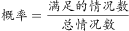。第一科室6人，第二科室3人，总共9人。当3人全部来自第一科室时，所求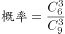；当3人全部来自第二科室时，所求。故前者是后者的：倍。

故正确答案为D。

---

### 第 2 题　qid 2184623 · 数学运算

年终某大型企业的甲、乙、丙三个部门评选优秀员工，已知甲、乙部门优秀员工数分别占三个部门总优秀员工数的和，且甲部门优秀员工数比丙部门的多12人，问三个部门共评选出优秀员工多少人？

- **A**. 120
- **B**. 150
- **C**. 160
- **D**. 180　✅

**答案**：D

**官方解析**

由题干可知，三个部门优秀员工的总人数既为3的倍数又为5的倍数，设优秀员工总人数有15x人。则甲部门优秀员工有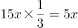人，乙部门有人，丙部门有人。甲部门比丙部门多人，则三个部门优秀员工总人数有人。

故正确答案为D。

---

### 第 3 题　qid 2184625 · 数学运算

在一个高x米的电视塔周围选择6个位置作观测点，每个位置和它相邻的两个位置距离相等，每个位置和电视塔的距离也都相等。每个位置和它相邻位置的距离为144米，在其中一个位置距离地面1.6米的地方以向上45度的角度观测，正好观测到塔顶。问x的值在以下哪个范围？

- **A**. 

- **B**. 

　✅
- **C**. 

- **D**. 
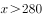

**答案**：B

**官方解析**

由条件“每个位置和它相邻的两个位置距离相等，和电视塔的距离也都相等”，可判定得出6个观测点构成一个正六边形，而电视塔刚好在六边形的中心，如下图所示：连接正六边形对角线，则构成6个正三角形，故ED与每相邻两个点的距离相等，为144米。因为45°，，则，即为等腰直角三角形，则米。米，在B项范围。

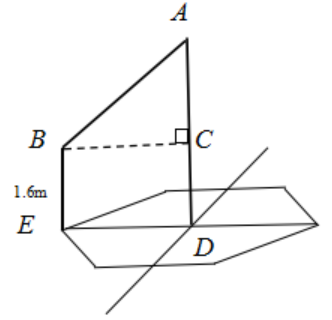

故正确答案为B。

---

### 第 4 题　qid 2184629 · 数学运算

甲和乙两家工厂各开一条产量为250件/天的生产线，完成相同数量的某种产品生产任务。完成部分生产任务后，供货商向乙工厂追加了相当于两家工厂当前已完成任务总量的订单。此时乙工厂增开一条产量为200件/天的生产线，生产10整天后与甲工厂同时完成任务。问供货商是在开始生产多少天后追加的订单？

- **A**. 2
- **B**. 4　✅
- **C**. 6
- **D**. 8

**答案**：B

**官方解析**

设供货商是在开始生产x天后追加的订单，此时甲、乙共完成的工作量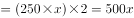，此工作量即为供货商向乙工厂追加的工作量。又因乙工厂增开一条产量为200件/天的生产线，生产10整天后与甲工厂同时完成任务。则，解得，即生产4天后追加的订单。

故正确答案为B。

---

### 第 5 题　qid 2184635 · 数学运算

甲、乙两名编辑校对同一本书，校对速度保持不变。甲完成时乙还有420页没完成，甲完成时乙完成了450页。问乙完成全部工作时，甲：

- **A**. 
早已完成

- **B**. 
刚好完成

- **C**. 
还剩200页
　✅
- **D**. 
还剩

**答案**：C

**官方解析**

根据题意可设书本共有x页，由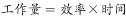，可知相同时间内，效率比等于工作量的比值。，化简可得：，解得页，故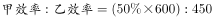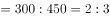，设甲的效率为2，乙的效率为3，则乙全部完成所需时间为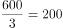，甲完成了，甲还剩页。

故正确答案为C。

---

### 第 6 题　qid 2184642 · 数学运算

某工厂加工一批定制口罩，计划15天完成。做完第5天时订货方要求追加的订货量，且最多延迟5天交货。问工厂的工作效率至少需要提高：

- **A**. 

- **B**. 

- **C**. 

- **D**. 

　✅

**答案**：D

**官方解析**

根据题意赋值原来的工作总量为300，则，做完第5天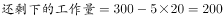，追加的订货单，则此时还需完成，还剩下天，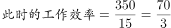，故至少需要提高：。

故正确答案为D。

---

### 第 7 题　qid 2184652 · 数学运算

某种商品出厂编号的最后三位为阿拉伯数字。现有出厂编号最后三位为001～100的产品100件，从中任意抽取1件，出厂编号后三位数字之和为奇数的概率比其为偶数的概率：

- **A**. 
高
　✅
- **B**. 
低

- **C**. 
高

- **D**. 
低

**答案**：A

**官方解析**

根据题意可知：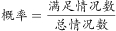，总情况数为100种。

三位数字之和为奇数的情况有：

所以，加和为奇数的情况数为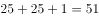种，则加和为偶数情况数为种。

故出厂编号后三位数字之和为奇数的概率比其为偶数的概率高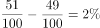。

故正确答案为A。

---

### 第 8 题　qid 2184663 · 数学运算

某工厂生产线有若干台相同的机器，平时固定有5台机器同时生产，每小时总计可以生产300件产品。由于操作机器的人手有限，故每多上线一台机器生产，每台机器平均每小时少生产2件产品。问至少多开多少台机器，才能使生产效率提升以上？

- **A**. 3
- **B**. 4　✅
- **C**. 5
- **D**. 6

**答案**：B

**官方解析**

根据题意可得原来每台机器的生产效率为，设至少多开x台机器，则此时每台机器每小时的生产效率为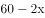，共有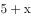台，根据题意可列不等式：，化简可得：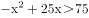，代入选项，问至少，从最小开始代。代入A项：，则，排除A项。代入B项：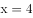，则，满足条件。

故正确答案为B。

---

### 第 9 题　qid 2184667 · 数学运算

单位3个科室分别有7名、9名和6名职工。现抽调2名来自不同科室的职工参加调研活动，问有多少种不同的挑选方式？

- **A**. 146
- **B**. 159　✅
- **C**. 179
- **D**. 286

**答案**：B

**官方解析**

方法一：抽调的2名职工来自不同科室，则抽调的情况为抽调两个科室且每个科室各抽调1人，则挑选方式共有种。

方法二：抽调的2名职工来自不同的科室，其反面为2名职工来自同一个科室。则。三个科室共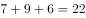人，抽调2名职工的总情况数为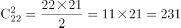。来自同一科室的情况共有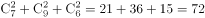。因此抽调2名来自不同科室的职工，挑选方式为种。

故正确答案为B。

---

### 第 10 题　qid 2184672 · 数学运算

姐弟俩相差3岁，2000年姐弟两人年龄之和是妈妈年龄的四分之一，2006年姐弟两人年龄之和是妈妈年龄的二分之一。问哪一年姐弟两人年龄之和等于妈妈的年龄？

- **A**. 2012
- **B**. 2018
- **C**. 2024
- **D**. 2027　✅

**答案**：D

**官方解析**

设2000年弟弟的年龄为x，则姐姐的年龄为，由题意可得：

妈妈2000年和2006年年龄相差6岁，即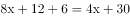，解得。

所以2000年弟弟年龄为3，姐姐年龄为6，妈妈年龄为36。设从2000年开始，过n年，姐弟两人年龄之和等于妈妈年龄，则有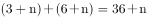，解得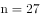。即2000年再过27年为2027年，D项满足要求。

故正确答案为D。

---

### 第 11 题　qid 2184679 · 数学运算

一项测验共有29道单项选择题，答对得5分，答错减3分，不答不得分也不减分，答对15题及以上另加10分，否则另减5分。小郑答题共得60分，问他最少有几道题未答？

- **A**. 1
- **B**. 2
- **C**. 3　✅
- **D**. 4

**答案**：C

**官方解析**

设答对x题，答错y题。由于共29道题，根据选项可知，未答的题均大于0，可知。根据小郑答题共得60分，且答对15题及以上另加10分，否则另减5分。则有两种情况：

①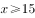；。

因为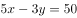，5x和50为5的倍数，则y也为5的倍数。当时，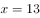，不满足；当时，，满足，此时未答的题为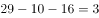道；当时，，不满足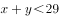。且y增大时，x也会随之增大，则不满足。

②；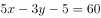。

因为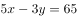，要满足，则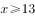，又由于，即。

验证当时，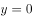，此时不答的题为。

当时，y为小数，不满足题意要求。

根据上述分析可知，最少有3道题未答。

故正确答案为C。

---

### 第 12 题　qid 2184681 · 数学运算

某企业20多名员工参加拓展训练，共准备了16箱饮用水。每人饮用6瓶后，将剩下的1箱半分配给所有女员工，正好每人分1瓶。问参加拓展训练的男员工有多少人？

- **A**. 10
- **B**. 11　✅
- **C**. 12
- **D**. 13

**答案**：B

**官方解析**

设男员工的人数为x，根据题意，女员工的人数等于1箱半饮用水的瓶数，设一箱饮用水有y瓶，则女员工的人数为1.5y。根据所有人共饮用16箱水，男员工每人6瓶，女员工每人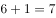瓶。则有。得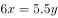，即，根据倍数特性，可得x是11的倍数，结合选项只有B项满足。

故正确答案为B。

---

### 第 13 题　qid 2184683 · 数学运算

某储蓄所两名工作人员，一天内共办理了122件业务，其中小王经手的有是现金业务，小李经手的有为非现金业务，小李当天办理了多少件现金业务？

- **A**. 36
- **B**. 42
- **C**. 48
- **D**. 54　✅

**答案**：D

**官方解析**

根据题意可知：小王经手的有是现金业务，小李经手的有为现金业务，可表示为：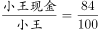，。可知，小王办理的业务总件数应为25的倍数，小李办理的业务总件数为4的倍数。

当小王办理的业务总件数为25件时，小李办理的业务总件数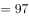件不是4的倍数；

当小王办理的业务总件数为50件时，小李办理的业务总件数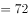件，现金业务件数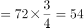件。

故正确答案为D。

---

### 第 14 题　qid 2184687 · 数学运算

有甲、乙两种不同浓度的盐水，取3克甲盐水和1克乙盐水混合可以得到浓度为的盐水；用1克甲盐水和3克乙盐水混合可以得到丙盐水。问用多少克甲盐水和1克丙盐水混合可以得到浓度为的盐水？

- **A**. 2　✅
- **B**. 4
- **C**. 6
- **D**. 8

**答案**：A

**官方解析**

方法一：赋值甲盐水的浓度为，乙盐水。根据“3克甲盐水和1克乙盐水混合可以得到浓度为”及公式可得；根据“1克甲盐水和3克乙盐水混合可以得到丙盐水”可得。设需要甲盐水a克，则，解得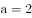。

方法二：根据“1克甲盐水和3克乙盐水混合可以得到丙盐水”，即4克丙中有1克甲和3克乙，所以1克丙中有克甲和克乙，根据题目第一次兑换情况可知：要兑浓度，则需要甲乙的量之比为3:1，设共需要甲a克，即，。所以还需要加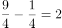克。

故正确答案为A。

---

### 第 15 题　qid 2184688 · 数学运算

办公室8名员工围着一张圆桌就座准备用餐，此时又有3名加完班的员工在已就座的员工中间加座并参加用餐。已知加座后，3名加完班的员工彼此都不相邻，且8名已就座的员工最多与1名加完班的员工相邻。问有多少种不同的加座方式？

- **A**. 336
- **B**. 96　✅
- **C**. 48
- **D**. 30

**答案**：B

**官方解析**

八边形的顶点表示已落座的8个人。根据条件可知，要满足3名加完班的员工彼此都不相邻，且8名已就座的员工最多与1名加完班的员工相邻，有以下情况：

（1）可直接从4个三角形中选3个或4个五角星中选3个，此时方法数为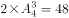种；

（2）可以从三角形或五角星交叉选。选2个相邻的三角形并选对面的一个五角星，这样可组成4种；同样2个五角星并选对面的一个三角形，也可组成4组。共8组。此时方法数有种。

故满足题意要求的方法数有种。

故正确答案为B。

---

## 判断推理

### 第 1 题　qid 2184656 · 逻辑判断

从所给的四个选项中，选择最合适的一个填在问号处，使之呈现一定的规律性：

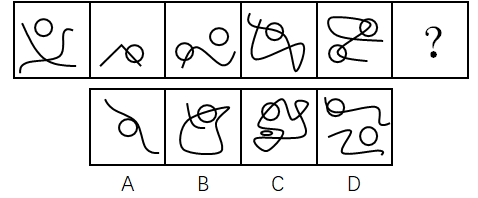

- **A**. A
- **B**. B
- **C**. C　✅
- **D**. D

**答案**：C

**官方解析**

观察图形，元素组成不同，且无明显属性规律，考虑数量规律。观察发现，每个图形中都有封闭区间，优先考虑数面，题干中面数量分别是1，2，3，4，5，依次递增。故？处应是面数量为6的图形。观察选项，A项1个面，B项3个面，C项6个面，D项3个面，只有C项符合。
故正确答案为C。

---

### 第 2 题　qid 2184666 · 逻辑判断

从所给的四个选项中，选择最合适的一个填在问号处，使之呈现一定的规律性：

- **A**. A
- **B**. B
- **C**. C
- **D**. D　✅

**答案**：D

**官方解析**

观察图形，元素组成相同，都由外框四边形和里面的四条短线构成，优先考虑位置规律。两两观察发现，后一个图形相较前一个图形有一条短线的位置发生变化，变化规律为顺时针旋转45度，并且发生位置变化的短线也是顺时针依次变化，如下图，？处应是标记5的短线顺时针旋转45度，故D项符合。

故正确答案为D。

---

### 第 3 题　qid 2184674 · 逻辑判断

从所给的四个选项中，选择最合适的一个填在问号处，使之呈现一定的规律性：

- **A**. A
- **B**. B　✅
- **C**. C
- **D**. D

**答案**：B

**官方解析**

观察图形，元素组成不同，且无明显属性规律，则考虑数量规律。题干图形面特征明显，可优先考虑数面。九宫格优先横行看，第一行面数量依次为：2，3，4；第二行面数量依次为：2，3，4；第三行面数量依次为：2，3，？，所以？处应填入有4个面的图形。A项1个面，B项4个面，C项3个面，D项3个面，只有B项符合。
故正确答案为B。

---

### 第 4 题　qid 2184682 · 逻辑判断

把下面的六个图形分为两类，使每一类图形都有各自的共同特征或规律，分类正确的一项是：

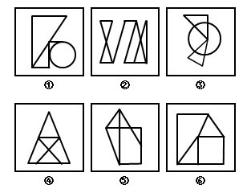

- **A**. ①③④，②⑤⑥　✅
- **B**. ①③⑤，②④⑥
- **C**. ①②⑥，③④⑤
- **D**. ①④⑥，②③⑤

**答案**：A

**官方解析**

观察图形，元素组成不同，且无明显属性规律，则考虑数量规律。因为①和③为直线和圆的相切图形和相交图形，②为日字变形图和田字变形图的组合图形，则可考虑数笔画数，图①有2个奇点，为一笔画图形；图②有4个奇点，为两笔画图形；图③没有奇点，为一笔画图形；图④有2个奇点，为一笔画图形；图⑤有4个奇点，为两笔画图形；图⑥有4个奇点，为两笔画图形。所以，图①③④为一组，均为一笔画图形；图②⑤⑥为一组，均为两笔画图形，对应A项。
故正确答案为A。

---

### 第 5 题　qid 2184685 · 逻辑判断

把下面的六个图形分为两类，使每一类图形都有各自的共同特征或规律，分类正确的一项是：

- **A**. ①④⑥，②③⑤
- **B**. ①③⑥，②④⑤
- **C**. ①②③，④⑤⑥　✅
- **D**. ①②④，③⑤⑥

**答案**：C

**官方解析**

观察图形，都是汉字，元素组成不同，且无属性规律，则考虑数量规律。题干中每个汉字都有封闭空间，优先考虑数面。图①有2个面，图②有2个面，图③有2个面，图④有3个面，图⑤有3个面，图⑥有3个面。所以，图①②③一组，均有2个面；图④⑤⑥一组，均有3个面。
故正确答案为C。

---

### 第 6 题　qid 2184690 · 逻辑判断

左边给定的是纸盒的外表面，下面哪一项能由它折叠而成？

- **A**. A
- **B**. B
- **C**. C　✅
- **D**. D

**答案**：C

**官方解析**

本题考查六面体的空间重构。将题干展开图中的面依次标注为123456，如下图：

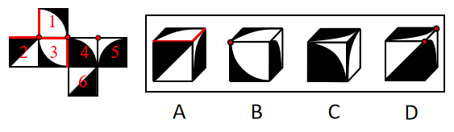

A项：题干中白色扇形面中的两条直角边不在黑色扇形面的白色区域，而选项中白色扇形面中的一条直角边在黑色扇形面的白色区域，选项与题干展开图不一致，排除；

B项：题干中面1和面3的黑色阴影部分无公共点，而选项中，黑色阴影部分有公共点，选项与题干展开图不一致，排除；

C项：选项是面1，面4，面5，和题干一致，当选；

D项：题干中面4和面5的白色部分的直角点是同一点，而选项中，两个面中白色部分的直角点不是同一点，选项与题干展开图不一致，排除。

故正确答案为C。

---

### 第 7 题　qid 2184709 · 逻辑判断

间作是指在同一块田地上于同一生长期内，分行或分带相间种植两种或两种以上作物的种植方式。混作是指在同一块田地上，同期混杂种植两种或两种以上作物的种植方式。套作是指在前季作物生长后期的株行间播种或移栽后季作物的种植方式。
根据上述定义，下列属于混作的是：

- **A**. 在一块田地上种植多年大豆后，连续两年种植牧草
- **B**. 在小麦生长后期每隔3～4行种植1行玉米
- **C**. 在一块土地上每隔4～6公尺宽种植一行咖啡树形成田篱，在田篱之间种植迷迭香
- **D**. 在非洲，有时在同一块田地上随机同时种植玉米、高粱、豇豆、粟、木薯和马铃薯等作物　✅

**答案**：D

**官方解析**

第一步：找出定义关键词。
“同一块田地上，同期混杂种植两种或两种以上作物”。
第二步：逐一分析选项。
A项：在同一块田地上种植多年大豆后，连续两年种植牧草，说明牧草和大豆是单独种植的，并非同期混种两种或两种以上作物，不符合定义，排除；
B项：在小麦生长后期每隔3-4行种植1行玉米，说明小麦和玉米并非同期混种，而是小麦先种、玉米后种，且是按行种植，不符合定义，排除；
C项：在一块土地上每隔4-6公尺种植一行咖啡树，并在咖啡树中间种植迷迭香，说明咖啡树和迷迭香并非混杂种植，而是分行种植，不符合定义，排除；
D项：同一块田地上随机同时种植玉米、高粱等多种作物，符合“同期混杂种植两种或两种以上作物”，符合定义，当选。
故正确答案为D。

---

### 第 8 题　qid 2184713 · 逻辑判断

注意是心理活动对一定对象的指向和集中，是伴随着感知觉、记忆、思维、想象等心理过程的一种共同的心理特征。注意具有稳定性、分配性、转移性等特性，其中注意的转移性是指一个人能够主动地、有目的地及时将注意从一个对象或者活动调整到另一个对象或者活动。
以下情境中体现了注意的转移性的是：

- **A**. 李女士可以一边做饭一边听收音机中播报的新闻节目
- **B**. 刘先生在大会做完工作汇报，立刻开始写工作计划　✅
- **C**. 王先生无论在工作时还是在业余活动中都能做到全神贯注
- **D**. 张女士正在读报纸，忽然被窗外传来的争吵声所吸引

**答案**：B

**官方解析**

第一步：找出定义关键词。
“一个人能够主动地、有目的地及时将注意从一个对象或者活动调整到另一个对象或者活动”。
第二步：逐一分析选项。
A项：李女士可以一边做饭一边听收音机中播放的新闻节目，说明李女士是同时在做饭和收听广播，不符合定义“将注意从一个对象或者活动调整到另一个对象或者活动”，排除；
B项：刘先生在做完工作汇报后开始写工作计划，刘先生是主动地、有目的地将注意从一个活动调整到另一个活动上，符合定义，当选；
C项：王先生能做到全神贯注，并没有体现“将注意从一个对象或者活动调整到另一个对象或者活动”，不符合定义，排除；
D项：张女士正在读报纸，突然被窗外的争吵声吸引，说明张女士并非主动地、有目的地调整注意，而是被动地调整注意，不符合定义，排除。
故正确答案为B。

---

### 第 9 题　qid 2184717 · 逻辑判断

单方行政行为是指行政主体为实现行政目的单方面运用行政权所作的行为。双方行政行为是指行政主体与对方当事人平等、协商一致所作的行为。
根据上述定义，下列属于双方行政行为的是：

- **A**. 国务院颁布《突发性公共卫生事件应急条例》
- **B**. 税务机关对偷税漏税的纳税人作出罚款的处罚决定
- **C**. 市政府为修建机场与建筑企业签订公共工程承包合同　✅
- **D**. 国家旅游局发布夏季假日旅游指南和提示

**答案**：C

**官方解析**

第一步：找出定义关键词。
“行政主体与对方当事人平等、协商一致所作的行为”。
第二步：逐一分析选项。
A项：国务院颁布《突发性公共卫生事件应急条例》，是为了应对突发性公共卫生事件的行政目的而单方面运用权力所作的行为，不符合定义“行政主体与对方当事人平等、协商一致”，排除；
B项：税务机关对偷税漏税的纳税人作出罚款的决定，是为了处罚偷税漏税者的行政目的而单方面运用权力所作的行为，不符合定义“行政主体与对方当事人平等、协商一致”，排除；
C项：市政府为了修建机场与建筑企业签订公共工程承包合同，此时市政府作为一个建设单位与建筑企业属于平等地位，符合定义，当选；
D项：国家旅游局发布夏季假日旅游指南和提示，是为旅游者提供便利而单方面运用权力所作的行为，不符合定义“行政主体与对方当事人平等、协商一致”，排除。
故正确答案为C。

---

### 第 10 题　qid 2184684 · 逻辑判断

自我知识是关于某人自己的心智状态的知识，包括关于某人自己当下的经验、思想、信念或愿望的知识。
根据上述定义，下列不属于自我知识的是：

- **A**. 甲通过听电台的天气报道而得知某地正在下雨　✅
- **B**. 乙查看自己工资后决定换一个工作
- **C**. 丙意识到如果不加强锻炼，会影响自身健康
- **D**. 丁相信自己通过努力一定会成功

**答案**：A

**官方解析**

第一步：找出定义关键词。
“某人自己的心智状态的知识”、“自己当下的经验、思想、信念或愿望的知识”。
第二步：逐一分析选项。
A项：甲通过天气报道知道某地正在下雨，这个信息是由外界传送过来的，不符合“自己当下的经验、思想、信念或愿望的知识”这一关键词，不符合定义，当选； 
B项：乙查看自己的工资后决定换一个工作，是基于自己当下思想的指引而做出的辞职行为，符合“自己当下的思想的知识”这一关键词，符合定义，排除；
C项：丙意识到如果不加强锻炼，会影响自身健康，是基于自己当下思想的指引而做出的判断，符合“自己当下的思想的知识”这一关键词，符合定义，排除；
D项：丁相信自己通过努力一定会成功，是基于自己当下的信念而做出的判断，符合“自己当下的信念的知识”这一关键词，符合定义，排除。
本题为选非题，故正确答案为A。

---

### 第 11 题　qid 2184686 · 逻辑判断

挪用公款罪是指国家机关、国有公司、企业、事业单位、人民团体中从事公务的人，利用职务上主管、管理、经营、经手公共财物的权力及便利条件，挪用公款归个人使用、进行非法活动的，或者挪用公款五万元以上、进行营利活动，或者挪用公款五万元以上、超过三个月未还的。
根据上述定义，下列构成挪用公款罪的是：

- **A**. 某市环保局执法人员将被处罚单位上缴的4万元罚款隐匿不报，据为己有
- **B**. 某省扶贫办主任利用职务之便，将经手的6万元扶贫款以其子女名义投入股市，2个月后赚了钱将其归还　✅
- **C**. 某公立医院的会计利用做账的便利条件挪用医院设备购置费2万元用于家人治病，家人病好以后将钱款归还
- **D**. 某国有企业的仓库保管员将仓库中的价值10万元的货物私自出卖后用于个人高档消费，一个月后担心东窗事发借钱购买货物放回了仓库

**答案**：B

**官方解析**

第一步：找出定义关键词。
“国家机关、国有公司、企业、事业单位、人民团体中从事公务的人”、“利用职务上主管、管理、经营、经手公共财物的权力及便利条件”、“挪用公款归个人使用、进行非法活动的，或者挪用公款五万元以上、进行营利活动，或者挪用公款五万元以上、超过三个月未还的”。
第二步：逐一分析选项。
A项：环保局执法人员将被处罚单位上缴的4万元罚款隐匿不报，据为己有。执法人员只是将钱据为己有，没有明确是否“进行非法活动”，不符合定义，排除；
B项：某扶贫办主任挪用了6万元公款投入股市，是进行了营利活动，符合“挪用公款五万元以上、进行营利活动”的关键词，符合定义，当选；
C项：某公立医院的会计挪用2万元公款是为家人治病，不符合“进行非法活动”，不符合定义，排除；
D项：某国有企业的仓库保管员私自出卖10万元的货物，而不是钱，不符合“挪用公款”；用于个人高档消费，不符合“进行非法活动”的关键词，也不符合“进行营利活动”的关键词；并且一个月后借钱购买货物放回了仓库，不符合“超过三个月未还”，不符合定义，排除。
故正确答案为B。

---

### 第 12 题　qid 2184703 · 逻辑判断

信赖保护原则是行政法的一项基本原则，是指政府对自己作出的行为或承诺应守信用，不得随意变更、反复无常。
根据上述定义，下列属于违反信赖保护原则的是：

- **A**. 某市政府规定对于能够吸引外资企业投资的个人进行奖励，赵某引荐某国企业到该市进行投资，但事后市政府拒绝给付奖励　✅
- **B**. 某省工商局规定外地啤酒进入本地销售必须事先获得该局许可，同时应当缴纳特别经营费，后来该规定因涉嫌行政垄断被废除
- **C**. 某市公安局拟对钱某作出处以吊销许可证的处罚，后经调查证实钱某的行为并未违法，因此未进行处罚
- **D**. 某市环保局认为其下级部门对孙某作出的五万元处罚过重，改为罚款五千元

**答案**：A

**官方解析**

第一步：找出定义关键词。
“政府对自己作出的行为或承诺应守信用”、“不得随意变更、反复无常”。
第二步：逐一分析选项。
A项：赵某引荐某国企业符合该市规定，但是事后市政府拒绝给付奖励，违背了“政府对自己做出的行为或承诺应守信用”，当选；
B项：某省工商局的规定是涉嫌行政垄断被废除，不是政府自己更改，不符合“随意变更、反复无常”的关键词，未违背信赖保护原则，排除；
C项：某市公安局拟对钱某作出处罚，后经调查证实钱某的行为并未违法，因此未进行处罚，不符合“随意变更、反复无常”的关键词，未违背信赖保护原则，排除；
D项：某市环保局更改了下级部门的处罚，是因为处罚过重，后改为罚款五千元。此行为只是对处罚进行了修改，不符合“随意变更、反复无常”的关键词，未违背信赖保护原则，排除。
本题为选非题，故正确答案为A。

---

### 第 13 题　qid 2184710 · 逻辑判断

比附定位是指通过与竞争品牌的比较来确定自身市场地位的一种定位策略，其实质是一种借势定位。
根据上述定义，下列没有使用比附定位策略的是：

- **A**. 某国产手机厂商打出广告语“××手机——中国的苹果”后，品牌知名度迅速得到了提升
- **B**. 美国克莱斯勒汽车公司在其发展初期就在广告宣传中声称自己是美国三大汽车公司之一，收到良好宣传效果
- **C**. 某汽车公司将品牌定位在“小”上，并制作了一则广告：“想想还是小的好”，获得极大成功　✅
- **D**. 某公司在冰激凌包装上打出了“为民族品牌争气，向××（某知名企业）学习”的字样，提高了品牌知名度

**答案**：C

**官方解析**

第一步：找出定义关键词。
“通过与竞争品牌的比较来确定自身市场地位”。
第二步：逐一分析选项。
A项：某国产手机广告中用苹果手机作为比较，使得知名度迅速提升，符合“通过与竞争品牌的比较来确定自身市场地位”，符合定义，排除；
B项：美国克莱斯勒汽车公司在宣传中声称自己是美国三大汽车公司之一，是用其他两大品牌与自己作比较提高宣传效果，符合“通过与竞争品牌的比较来确定自身市场地位”，符合定义，排除；
C项：某汽车公司只是将品牌定位在“小”上来做广告，并没有与竞争品牌作比较，不符合“通过与竞争品牌的比较来确定自身市场地位”，不符合定义，当选；
D项：某公司宣传中用向某知名企业学习的字样来提高知名度，虽然不明确知名企业是否存在该公司的竞争品牌，但C项并没有与竞争品牌作比较，相比来说该项更符合定义，排除。
本题为选非题，故正确答案为C。

---

### 第 14 题　qid 2184715 · 逻辑判断

桂林：北海

- **A**. 墨汁：颜料
- **B**. 开水：自来水
- **C**. 氧气：空气
- **D**. 红茶：黑茶　✅

**答案**：D

**官方解析**

第一步：判断题干词语间的逻辑关系。
桂林和北海是广西壮族自治区地级市，两者是并列关系的反对关系。
第二步：判断选项词语间的逻辑关系。
A项：墨汁主要用于书法，颜料主要用于制造涂料、油墨、油画色膏、化妆油彩、彩色纸张等，两者所在的领域不同，与题干逻辑关系不一致，排除；
B项：自来水加热可以变成开水，与题干逻辑关系不一致，排除； 
C项：氧气是空气的组成部分，两者是组成关系，与题干逻辑关系不一致，排除；
D项：红茶和黑茶都是茶叶中的发酵茶，两者是并列关系中的反对关系，与题干逻辑关系一致，当选。
故正确答案为D。

---

### 第 15 题　qid 2184718 · 逻辑判断

嫁：娶

- **A**. 教：授
- **B**. 订：阅
- **C**. 买：卖　✅
- **D**. 进：出

**答案**：C

**官方解析**

第一步：判断题干词语间逻辑关系。
“嫁”和“娶”是结婚时当事双方同时发生的行为，一方“嫁”，另一方“娶”，二者是并列关系。
第二步：判断选项词语间逻辑关系。
A项：“教”和“授”都有传给别人知识或技能的意思，传道授业时当事双方一方是“教”，另一方是“学”。与题干逻辑关系不一致，排除。
B项：“订”和“阅”不是同一事件中当事双方同时发生的行为，与题干逻辑关系不一致，排除。
C项：“买”和“卖”是交易时当事双方同时发生的行为，一方“买”，另一方“卖”，二者是并列关系，与题干逻辑关系一致，当选。
D项：“进”和“出”不是同一事件中当事双方同时发生的行为，与题干逻辑关系不一致，排除。
故正确答案为C。

---

### 第 16 题　qid 2184721 · 逻辑判断

罪犯：作案

- **A**. 夫妻：结婚　✅
- **B**. 律师：辩论
- **C**. 总统：出访
- **D**. 员工：管理

**答案**：A

**官方解析**

第一步：判断题干词语间的逻辑关系。
作案是成为罪犯的必要条件，二者为必要条件的对应关系。
第二步：判断题干词语间的逻辑关系。
A项：结婚是成为夫妻的必要条件，二者为必要条件的对应关系，与题干逻辑关系一致，当选；
B项：辩论不是成为律师的必要条件，二者不是必要条件的对应关系，与题干逻辑关系不一致，排除；
C项：出访不是成为总统的必要条件，二者不是必要条件的对应关系，与题干逻辑关系不一致，排除；
D项：管理不是成为员工的必要条件，二者不是必要条件的对应关系，与题干逻辑关系不一致，排除。
故正确答案为A。

---

### 第 17 题　qid 2184723 · 逻辑判断

清洁：污垢

- **A**. 守时：信用
- **B**. 沟通：误解　✅
- **C**. 背诵：记忆
- **D**. 批评：改正

**答案**：B

**官方解析**

第一步：判断题干词语间的逻辑关系。
通过清洁可以消除污垢，清洁是消除方式，污垢是消除对象，二者为对应关系。
第二步：判断选项词语间的逻辑关系。
A项：通过守时可以建立信用，守时是信用的一种表现方式，与题干逻辑关系不一致，排除；
B项：通过沟通可以消除误解，沟通是消除方式，误解是消除对象，二者为对应关系，与题干逻辑关系一致，当选；
C项：通过背诵可以加强记忆，背诵是加强记忆的一种方式，与题干逻辑关系不一致，排除；
D项：通过批评可以帮助改正错误，改正属于动词，不能作为消除对象，与题干逻辑关系不一致，排除。
故正确答案为B。

---

### 第 18 题　qid 2184725 · 逻辑判断

土地：耕种

- **A**. 共享单车：租金
- **B**. 电子报纸：便利
- **C**. 矩阵二维码：支付　✅
- **D**. 剪纸艺术：传播

**答案**：C

**官方解析**

解法一：
第一步：判断题干词语间的逻辑关系。
耕种是土地的功能，二者为功能的对应。
第二步：判断选项词语间的逻辑关系。
A项：租金不是共享单车的功能，支付租金是共享单车的使用条件，共享单车的功能是骑行，与题干逻辑关系不一致，排除；
B项：电子报纸的功能是传播新闻，不是便利，与题干逻辑关系不一致，排除；
C项：矩阵二维码的功能是支付，二者为功能的对应，与题干逻辑关系一致，当选；
D项：剪纸艺术的功能是装饰，不是传播，与题干逻辑关系不一致，排除。
故正确答案为C。
解法二：
第一步：判断题干词语间的逻辑关系。
耕种土地，二者为动宾结构。
第二步：判断选项词语间的逻辑关系。
A项：租金与共享单车无法构成动宾结构，与题干逻辑关系不一致，排除；
B项：电子报纸与便利无法构成动宾结构，与题干逻辑关系不一致，排除；
C项：矩阵二维码与支付无法构成动宾结构，与题干逻辑关系不一致，排除；
D项：传播剪纸艺术，二者为动宾结构，与题干逻辑关系一致，当选。
故正确答案为D。
注：本题为争议题，二种解法均可。

---

### 第 19 题　qid 2184630 · 逻辑判断

蚊子：蚊帐：蚊香

- **A**. 院子：木门：铁门
- **B**. 暴雨：雨伞：雨衣　✅
- **C**. 窗户：窗纱：窗帘
- **D**. 疾病：疫苗：病菌

**答案**：B

**官方解析**

第一步：判断题干词语间逻辑关系。
蚊帐和蚊香都是用来防止蚊子叮咬的工具，且蚊帐和蚊香属于并列关系。
第二步：判断选项词语间的逻辑关系。
A项：木门、铁门属于并列关系，但是二者与院子属于组成关系，不是对应关系，与题干逻辑关系不一致，排除；
B项：雨伞和雨衣是用来防止暴雨侵袭的工具，且雨伞和雨衣属于并列关系，与题干逻辑关系一致，当选；
C项：窗纱、窗帘属于并列关系，二者与窗户属于对应关系，但不是工具对应，与题干逻辑关系不一致，排除；
D项：疫苗可以抑制一些病菌，预防疾病发生，疫苗与病菌不属于并列关系，与题干逻辑关系不一致，排除。
故正确答案为B。

---

### 第 20 题　qid 2184632 · 逻辑判断

灯：照明：装饰

- **A**. 房子：明亮：宽敞
- **B**. 水：浇灌：饮用　✅
- **C**. 中国：湖南：山西
- **D**. 门窗：玻璃：钢铁

**答案**：B

**官方解析**

第一步：判断题干词语间逻辑关系。
灯具有照明和装饰的功能，对应关系。
第二步：判断选项词语间逻辑关系。
A项：明亮、宽敞的房子，是偏正结构，与题干逻辑关系不一致，排除；
B项：水具有灌溉和饮用的功能，对应关系，与题干逻辑关系一致，当选；
C项：湖南和山西并列，都属于中国的一个省，组成关系，与题干逻辑关系不一致，排除；
D项：玻璃和钢铁是门窗的原材料，与题干逻辑关系不一致，排除。
故正确答案为B。

---

### 第 21 题　qid 2184634 · 逻辑判断

报纸：读者：发行量

- **A**. 论文：作者：引用率
- **B**. 港口：货物：吞吐量
- **C**. 影片：观众：票房　✅
- **D**. 比赛：主办方：赞助费

**答案**：C

**官方解析**

第一步：判断题干词语间逻辑关系。
“读者”是“报纸”的服务对象，“报纸”销售越多，“发行量”越大，“读者”越多。
第二步：判断选项词语间逻辑关系。
A项：“论文”的服务对象不是“作者”，而是读者，与题干逻辑关系不一致，排除。
B项：“港口”用于存放运输“货物”，经水运输出或输入并经过装卸作业的“货物”越多，“吞吐量”越大，与题干逻辑关系不一致，排除。
C项： “观众”是“影片”的服务对象，“影片”销售越多，“票房”越高，“观众”越多，与题干逻辑关系一致，当选。
D项：“主办方”是主办“比赛”的主体，不是“比赛”的服务对象，与题干逻辑关系不一致，排除。
故正确答案为C。

---

### 第 22 题　qid 2184636 · 逻辑判断

收集素材：编辑整理：出版发行

- **A**. 需求调研：软件开发：交付使用　✅
- **B**. 突发险情：山体滑坡：紧急救援
- **C**. 购买车票：行李安检：预付票款
- **D**. 网络搜索：实地考察：商家发货

**答案**：A

**官方解析**

第一步：判断题干词语间的逻辑关系。
先收集素材，再编辑整理，最后出版发行，题干三者之间为时间的先后顺序并且主体一致，都是出版社。
第二步：判断选项词语间的逻辑关系。
A项：先需求调研，再软件开发，最后交付使用，三者之间为时间的先后顺序并且主体一致，都是软件开发公司，与题干逻辑关系一致，当选； 
B项：山体滑坡是突发险情的一种，二者为种属关系，突发险情需要紧急救援，二者是对应关系，与题干逻辑关系不一致，排除；
C项：应先预付票款，再购买车票，最后行李安检，选项时间顺序错误，与题干逻辑关系不一致，排除；
D项：先进行网络搜索，再实地考察，然后商家发货，三者之间为时间的先后顺序但是主体不一致，网络搜索和实地考察的主体是买家，发货的主体是商家，与题干逻辑关系不一致，排除。
故正确答案为A。

---

### 第 23 题　qid 2184639 · 逻辑判断

（  ）对于 轮船 相当于 电报 对于（  ）

- **A**. 竹筏  电话　✅
- **B**. 货轮  微信
- **C**. 钢铁  通信方式
- **D**. 发动机  传送信息

**答案**：A

**官方解析**

逐一代入选项。
A项：竹筏和轮船均是交通工具的一种，二者为并列关系；电报和电话均是通讯工具的一种，二者为并列关系，前后逻辑关系一致，当选；
B项：货轮是轮船的一种，二者为种属关系；电报和微信均为通讯方式的一种，二者为并列关系，前后逻辑关系不一致，排除；
C项：钢铁是轮船的原材料，二者为原材料和成品的对应；电报是一种通信方式，二者为种属关系，前后逻辑关系不一致，排除；
D项：发动机是轮船的组成部分，二者为组成关系；电报的功能是传递信息，二者为功能的对应，前后逻辑关系不一致，排除。
故正确答案为A。

---

### 第 24 题　qid 2184657 · 逻辑判断

许多大城市的中小学校门口，在每天早晚交通高峰期，都能看到接送孩子的车队长龙。有人认为，开车接送孩子上学是导致交通严重拥堵的原因。
以下哪项如果为真，最能削弱上述观点？

- **A**. 
由于中小学校车的使用率很低，大量家长都选择驾车接送孩子上学

- **B**. 
寒暑假期间早高峰的交通拥堵程度降低，并且空气污染程度也降低

- **C**. 
大城市的中小学校多位于城市的核心区，车流量和人流量本身就很大
　✅
- **D**. 
国家出台了划分学区的政策后，许多孩子可以就近上学

**答案**：C

**官方解析**

第一步：找出论点和论据。
论点：开车接送孩子上学是导致交通严重拥堵的原因。
论据：许多大城市的中小学校门口，每天早晚交通高峰期，都能看到接送小孩的车队长龙。
第二步：逐一分析选项。
A项：校车的使用率低，导致大量家长选择驾车接送小孩上学，解释了开车接送孩子上学的原因，没有涉及到交通拥堵的原因，话题不一致，排除；
B项：寒暑假期间不用接送小孩上学，早高峰的交通拥堵降低，说明了开车接送小孩上学确实加强了交通拥堵，加强结论，排除；
C项：大城市的中小学校多位于城市的核心区，车流量和人流量本身就很大，可能是造成拥堵的其他原因，他因削弱，当选； 
D项：划分学区政策可以让小孩就近上学，与交通拥堵的原因无关，属于无关选项，排除。
故正确答案为C。

---

### 第 25 题　qid 2184665 · 逻辑判断

随着个体化医疗和临床癌症基因组研究的发展，基因检测服务需求越来越广泛。基因组学技术和靶向治疗能够为癌症患者带来巨大益处，在癌症研究领域使用基因组学技术治疗疾病对患者来说很有吸引力，所以网络上提供基因检测服务的公司越来越受追捧。但专家发现，大部分网站提供的个性化癌症诊断或治疗的基因检测项目中至少有一项没有临床应用价值。
由此可以推出：

- **A**. 网络基因检测公司的有些服务没有临床意义　✅
- **B**. 并非所有的基因检测项目都是科学、准确的
- **C**. 并非所有的基因检测项目都是跟癌症有关的
- **D**. 个性化医疗的推广促进了基因组研究的开展

**答案**：A

**官方解析**

日常结论题，根据题干信息逐一分析选项。
A项：题干中专家发现网站上提供的基因项目至少有一项没有临床应用价值，与选项网络基因检测公司的某些服务没有临床意义一致，当选；
B项：基因检测项目是否科学、准确，题干没有提到，无中生有，排除；
C项：题干提到的是癌症研究领域与诊断或治疗癌症有关的基因检测项目，并没有提到其他与癌症无关的基因检测项目，不明确项，排除；
D项：题干中描述的是个体化医疗和基因组研究的开展，使得基因检测服务需求越来越广泛，但并没有提到个体化医疗和基因组研究的开展之间的关系，属于无中生有，排除。
故正确答案为A。

---

### 第 26 题　qid 2184670 · 逻辑判断

研究人员研究了13只克隆绵羊，其中4只是世界上第一只体细胞克隆羊“多莉”的复制品。研究者检测了这些克隆羊的肌肉骨骼、新陈代谢和血压情况。结果发现，与对照组羊对比，这些克隆羊仅患轻度骨关节炎，只有一只为中度。它们没有新陈代谢疾病的症状，血压也正常，相对健康。因此，研究人员指出，克隆动物的衰老过程正常。
以下哪项如果为真，最能削弱上述论证？

- **A**. 研究中对照组羊的年龄比实验组羊的年龄小
- **B**. 世界上第一只克隆羊“多莉”仅仅存活了6年
- **C**. 目前的体细胞克隆技术还远远没达到完善地步
- **D**. 研究人员没有检测与衰老相关的主要分子标记　✅

**答案**：D

**官方解析**

第一步：找出论点和论据。
论点：因此，研究人员指出，克隆动物的衰老过程正常。
论据：研究人员研究了13只克隆绵羊，其中4只是世界上第一只体细胞克隆羊“多莉”的复制品。研究者检测了这些克隆羊的肌肉骨骼、新陈代谢和血压情况。结果发现，与对照组羊对比，这些克隆羊仅患轻度骨关节炎，只有一只为中度。它们没有新陈代谢疾病的症状，血压也正常，相对健康。
第二步：逐一分析选项。
A项：研究中对照组羊的年龄比实验组羊的年龄小，只能表明年龄大的实验组挺健康，但并没有明确说明和衰老的关系，不明确项，无法削弱，排除；
B项：第一只克隆羊“多莉”仅仅存活了6年，和题干论点讨论的“衰老过程是否正常”无关，无法削弱，排除；
C项：目前的体细胞克隆技术还没达到完善，不能说明克隆动物的衰老过程正常，无法削弱，排除； 
D项：研究人员没有检测与衰老相关的主要分子标记，说明实验推不出衰老是否正常这个结论，断开了论点和论据之间的联系，拆桥项，可以削弱，当选。
故正确答案为D。

---

### 第 27 题　qid 2184676 · 逻辑判断

土卫二是土星的一颗被包裹在厚厚冰层中、含有海洋的小型卫星。近日，“卡西尼”号无人探测器探测到从土卫二表面的裂缝中喷出的汽柱中存在氢分子。科学家据此推断，在土卫二的岩石核心与位于其冰壳之下的海洋之间，很可能正在发生热液化学反应，这意味着土卫二几乎具备了蕴育生命所必需的条件，未来人类可以对土卫二展开探索以寻找生命迹象。
以下哪项如果为真，最能质疑上述论证？

- **A**. “卡西尼”号探测器绕土星飞行了13年，未曾发现土卫二上存在生命
- **B**. 在土卫二尚未发现生命所需的硫和磷　✅
- **C**. 地球上，海底热泉中的氢可以充当微生物的食物以及复杂生态系统的基础
- **D**. 此前通过哈勃望远镜获得了木星卫星不存在生命迹象的证据

**答案**：B

**官方解析**

第一步：找出论点和论据。
论点：土卫二几乎具备了蕴育生命所必需的条件，未来人类可以对土卫二展开探索以寻找生命迹象。
论据：“卡西尼”号无人探测器探测到从土卫二表面的裂缝中喷出的汽柱中存在氢分子。
第二步：逐一分析选项。
A项：“卡西尼”号探测器13年内未曾发现土卫二上存在生命，不表示土卫二上没有生命的存在，不能削弱，排除；
B项：土卫二还没有发现生命所需的硫和磷，直接削弱了“土卫二几乎具备了蕴育生命所必需的条件”，削弱论点，当选；
C项：地球上的氢可以充当微生物的生态系统的基础，与土卫二无关，为无关项，排除；
D项：木星卫星不存在生命迹象与题干土卫二无关，为无关项，排除。
故正确答案为B。

---

### 第 28 题　qid 2184643 · 逻辑判断

甲：“吃鱼可以使人聪明。”
乙：“对，我从小就不爱吃鱼，所以我就笨。”
为了使乙的论证成立，必须补充以下哪项为前提？

- **A**. 不爱吃鱼的人一定都笨　✅
- **B**. 聪明的人一定都爱吃鱼
- **C**. 笨的人一定都不爱吃鱼
- **D**. 爱吃鱼的人一定都聪明

**答案**：A

**官方解析**

第一步：找出论点和论据。
论点：笨。
论据：不爱吃鱼。
第二步：逐一分析选项。
A项：在不爱吃鱼与笨之间搭桥，属于加强论证，当选；
B项：说的是聪明的人爱吃鱼，也就是不爱吃鱼的人就不聪明，但是不聪明并不代表一定是笨的，而论点说的是笨人，所以是无关选项，无法加强，排除；
C项：在笨人与不爱吃鱼之间搭桥，但是搭桥的方向反了，排除； 
D项：说的是爱吃鱼的人聪明，而论点说的是笨人，二者讨论的话题不一致，无法加强，排除。
故正确答案为A。

---

### 第 29 题　qid 2184651 · 逻辑判断

好朋友问冰冰：“你是不是不能接受你没有被录取的结果？”
这句话隐含的前提是：

- **A**. 冰冰没办法接受自己没被录取
- **B**. 冰冰应该接受她没被录取的结果
- **C**. 冰冰没有被录取　✅
- **D**. 冰冰是个心理承受能力较差的人

**答案**：C

**官方解析**

第一步：找出论点和论据。
论点：好友问冰冰是否能接受自己没有被录取的结果。
论据：无。
第二步：逐一分析选项。
A项：论点并不确定冰冰到底能不能接受，无关选项，排除；
B项：论点并不涉及冰冰是否应该接受她没被录取的结果，为无关选项，排除；
C项：论点针对的结果是没被录取，如果冰冰被录取了，该论点问题就不存在了，因此没有被录取是论点成立的必要条件，当选； 
D项：题干话题和心理素质无关，排除。
故正确答案为C。

---

### 第 30 题　qid 2184661 · 逻辑判断

数十年来，在恐龙研究中存在这样一个观点：某些恐龙可以根据其骨骼差异来分辨性别。比如，雄性安氏原角龙与雌性的区别在于，雄性具有更宽的头盾，鼻子上的突起也更大。
以下哪项如果为真，最能支持上述观点？

- **A**. 研究者重新分析恐龙化石原始数据，利用混合模型等统计方法进行检验，结果发现恐龙并不存在两性骨骼差异
- **B**. 鸟类和鳄鱼是最接近恐龙的现存动物，雄性鳄鱼比雌性大得多，而鸟类的两性骨骼差异更加明显，如雄孔雀长着巨大的艳丽尾羽，而雌孔雀则朴实无华
- **C**. 目前，有关恐龙的数据样本十分零散，某些恐龙物种的化石也没有获得足够的数量
- **D**. 髓质骨富含钙质，能为蛋壳的生成贮存原料，仅存在于产卵雌性恐龙的长骨中　✅

**答案**：D

**官方解析**

第一步：找出论点和论据。
论点：某些恐龙可以根据其骨骼差异来分辨性别。
论据：雄性安氏原角龙与雌性的区别在于，雄性具有更宽的头盾，鼻子上的突起也更大。
第二步：逐一分析选项。
A项：恐龙不存在两性骨骼差异，说明不能通过骨骼差异来分辨性别，是对论点的否定，不能加强，排除；
B项：指出鸟类和鳄鱼性别之间有骨骼差异，而鸟类和鳄鱼是最接近恐龙的现存动物，所以恐龙也可能性别之间有骨骼差异，属于类比加强，保留；
C项：指出样本数量不足，对论点的得出进行质疑，不能加强，排除；
D项：髓质骨仅存在于产卵雌性恐龙的长骨中，说明可以通过骨骼中是否有髓质骨来分辨是雌性还是雄性的恐龙，属于补充论据加强，保留。
在加强题中，类比属于最弱的加强方式，力度弱于补充论据，故择优选择D项。
故正确答案为D。

---

### 第 31 题　qid 2184669 · 逻辑判断

所有未来企业都是互联网企业，而任何互联网企业都面临竞争压力。因此，甲类工厂不是未来企业。
要使上述论证成立，需要补充以下哪项作为前提？

- **A**. 甲类工厂不面临竞争压力　✅
- **B**. 互联网企业不都是甲类工厂
- **C**. 甲类工厂是互联网企业
- **D**. 互联网企业都是未来企业

**答案**：A

**官方解析**

第一步：找出论点和论据。

论点：甲类工厂不是未来企业，即：甲-未来企业，逆否等价可变为：未来企业-甲

论据：所有未来企业都是互联网企业，而任何互联网企业都面临竞争压力。即：未来企业互联网企业面临竞争压力。

论点论据话题不一致，可考虑论据向论点搭桥，即：①互联网企业-甲 或②面临压力-甲

第二步：逐一分析选项。

A项：甲-面临压力，符合②的逆否等价命题，搭桥项，当选；

B项：不都是即有的是有的不是，无法解释为什么甲不是未来企业，无关选项，排除；

C项：并不符合命题①，搭桥错误，无关选项，排除；

D项：互联网企业是否是未来企业无法解释为什么甲不是未来企业，无关选项，排除。

故正确答案为A。

---

### 第 32 题　qid 2184673 · 逻辑判断

随着年龄的增长，人们对物质的需求逐渐减少，而对精神的需求逐渐增多。因此，为了满足日益增长的精神需求，老年人应当比年轻时更积极地参加文体活动。
以下哪项如果为真，最能支持上述结论？

- **A**. 随着社会的进步，老年人比年轻人有更多的精神需求
- **B**. 比年轻时更积极参加文体活动的老年人生活更充实　✅
- **C**. 一些老年人的物质生活并不富足
- **D**. 老年人的精神需求并不比年轻人多

**答案**：B

**官方解析**

第一步：找出论点和论据。
论点：为了满足日益增长的精神需求，老年人应当比年轻时更积极地参加文体活动。
论据：随着年龄的增长，人们对物质的需求逐渐减少，而对精神的需求逐渐增多。
第二步：逐一分析选项。
A项：老年人比年轻人有更多的精神需求，与论据中随着年龄增长，老年比他年轻时有更多精神需求不同。选项强调的是同一时期的老年人和年轻人两类人，而不是题干中一个人的年龄增长过程中年老和年轻两个状态，与题干无关，无法加强，排除；
B项：老年人参加文体活动比年轻时生活更充实，解释了老年人应当比年轻时更积极参加文体活动的原因，补充论据，可以加强，当选；
C项：老年人生活富足与参加文体活动无关，无法加强，排除； 
D项：老年人与年轻人精神需求作比较，而不是题干老年人与他本身年轻时作比较，无法加强，排除。
故正确答案为B。

---

### 第 33 题　qid 2184696 · 逻辑判断

根据统计结果，2006年至2016年，我国处于世界前的高被引论文为1.69万篇，占世界总数的，超过德国排在世界第3位；我国近两年间发表的论文得到大量引用，被引用次数进入本学科前的国际热点论文为5篇，占世界总数的，世界排名首次达到第3位。此外，我国8个学科领域的论文被引用次数排名世界第2位，包括农业科学、化学、计算机科学、工程技术、材料科学、数学、药学与毒物学、物理学。这表明，近年来我国科技论文的国际影响力持续提升。

由此可以推出:

- **A**. 
近两年国家创新驱动发展战略取得明显实效

- **B**. 
排名靠前的高被引论文占比和论文的国际影响力密切相关
　✅
- **C**. 
我国农业科学处于世界前的高被引论文占世界总数超过

- **D**. 
近两年间发表的被引用次数进入本学科前的国际热点论文总数超过2000篇

**答案**：B

**官方解析**

日常结论题，根据题干信息逐一分析选项。

A项：题干中没有涉及到国家创新驱动发展战略，无中生有，排除； 

B项：题干从多个方面论述我国排名靠前的高被引论文多，然后得出结论我国论文国际影响力高，说明两者密切相关，可以推出，当选； 

C项：题干只说到了前的高被引进论文占世界总数的，未涉及农业科学的高引进占比，无法推出，排除； 

D项：题干说近两年我国发表论文被引用次数进入前的为5篇，占世界总数的，可以算出进入本学科前的国际热点论文总数为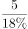，约为28篇，并不是2000篇，无法推出，排除。

故正确答案为B。

---

### 第 34 题　qid 2184701 · 逻辑判断

课间休息时，一位同学帮老师擦了黑板，老师回到教室后询问是谁擦的黑板。
他问了四位同学，得到以下回答：
（1）或者班长擦了，或者学习委员擦了
（2）如果纪律委员没擦，那么班长也没擦
（3）如果卫生委员没擦，那么班长擦了
（4）班长和学习委员都没擦
实际上，四位同学的回答中只有一句是假的。据此可以推出擦黑板的是：

- **A**. 纪律委员
- **B**. 学习委员
- **C**. 卫生委员　✅
- **D**. 班长

**答案**：C

**官方解析**

第一步：整理题干信息。

（1）班长 或 学习委员；

（2）纪律委员班长；

（3） 卫生委员班长；

（4）班长 且 学习委员。

第二步：分析题干。

由提问可知，本题为真假推理，先找矛盾关系，（1）和（4）为矛盾关系，必有一真一假，结合提问，只有一句为假，说明（2）（3）为真，对条件（2）进行逆否等价可知：班长纪律委员，假设班长擦了黑板，则纪律委员也擦了黑板，不符合题干中的只有一位同学擦了黑板，故班长没有擦黑板，对（3）进行逆否等价，可知：班长卫生委员，故班长没有擦黑板，可以推出卫生委员擦了黑板。

故正确答案为C。

---

### 第 35 题　qid 2184704 · 逻辑判断

为了保护斑点猫头鹰，某国政府规定禁止砍伐西北太平洋沿岸的古森林。这一规定施行后，当地的经济状况出现了衰退。由此可见，采取保护斑点猫头鹰的措施导致了经济衰退。
为了使上述结论成立，必须补充以下哪项作为前提？

- **A**. 采取保护斑点猫头鹰的措施是在经济衰退前发生的唯一与衰退关联的事情　✅
- **B**. 全世界在这一时期都出现了经济衰退的迹象
- **C**. 当地经济状况在采取保护斑点猫头鹰的措施之前一直很好
- **D**. 停止对西北太平洋沿岸古森林的砍伐是保护斑点猫头鹰的唯一方法

**答案**：A

**官方解析**

第一步：找出论点和论据。
论点：采取保护斑点猫头鹰的措施导致了经济衰退。
论据：为了保护斑点猫头鹰，某国政府规定禁止砍伐西北太平洋沿岸的古森林，这一规定施行后，当地的经济状况出现了衰退。
第二步：逐一分析选项。
A项：说明该措施是唯一与经济衰退有关的事情，没有其他事情会影响到经济，为论点提供了必要条件，可以支持，保留；
B项：全世界范围内都有经济衰退的现象是目前的一种状态，没有提到导致经济衰退的原因，为无关项，不能支持，排除；
C项：经济状况在采取措施之前是很好的，讨论的是采取措施之前的情况，补充了反面的例子，有一定的加强力度，保留；
D项：讨论的是保护猫头鹰的方法，而论点在讨论停止砍伐森林保护猫头鹰是否会导致经济衰退，二者话题不一致，不能支持，排除。
对比A、C两项，C项只是说保护措施前一直很好，更好的补充对比论据应该是说保护猫头鹰措施之前经济没有衰退，且“一直很好”不完全等同于“一直没有衰退”，故C项的加强力度较弱，对比择优，A项更好。
故正确答案为A。

---

## 资料分析

### 材料 1

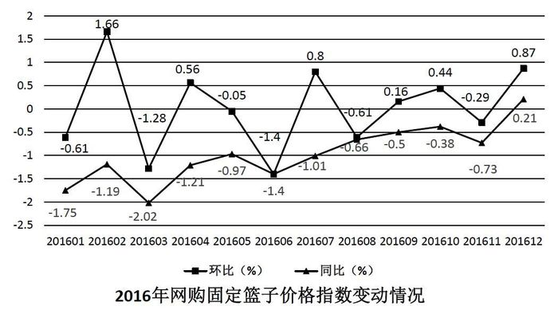

#### 第 1 题　qid 2184622 · 增长

2016年网购固定篮子价格指数环比增速最快的月份是：

- **A**. 1月
- **B**. 2月　✅
- **C**. 7月
- **D**. 12月

**答案**：B

**官方解析**

定位图形材料可知，2016年1月、2月、7月、12月的环比增速分别为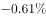、、、，2月12月7月1月，所以环比增速最快的月份是2月份。

故正确答案为B。

---

#### 第 2 题　qid 2184624 · 综合

2016年上半年网购固定篮子价格指数环比下跌的月份有几个？

- **A**. 3
- **B**. 4　✅
- **C**. 5
- **D**. 6

**答案**：B

**官方解析**

固定篮子价格指数环比下跌即只要满足环比增长率为负即可。定位图形材料可知，2016年上半年网购固定篮子价格指数环比下跌的月份有1月()、3月()、5月()、6月(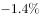)，共4个月。

故正确答案为B。

---

#### 第 3 题　qid 2184626 · 增长

2016年各月网购固定篮子价格指数同比增速与上月该数字之间的差值最大的月份是：

- **A**. 2月
- **B**. 3月
- **C**. 11月
- **D**. 12月　✅

**答案**：D

**官方解析**

定位图形材料可知，2016年各月固定篮子价格指数同比增速与上月该数字之间的差值分别为：A项，2月，；B项，3月，；C项，11月，；D项，12月，。差值最大的是12月。

故正确答案为D。

---

#### 第 4 题　qid 2184627 · 综合

若2016年1月网购固定篮子价格指数为100，则当年12月该指数约为：

- **A**. 101　✅
- **B**. 106
- **C**. 95
- **D**. 99

**答案**：A

**官方解析**

由题意，给出2016年1月的指数，求2016年12月的指数，判定本题为现期计算问题。定位材料可知2016年1月环比下降，故2015年12月网购固定篮子价格指数；根据材料可知，2016年12月网购固定篮子价格指数同比增长率为，故可知2016年12月网购固定篮子，与A项最接近。

故正确答案为A。

---

#### 第 5 题　qid 2184631 · 综合

关于网购固定篮子价格指数变化情况，能够从上述资料中推出的是：

- **A**. 
2016年，网购固定篮子价格指数曾连续3个月环比负增长

- **B**. 
2016年，每个月网购固定篮子价格指数都低于上年同期

- **C**. 
2016年3月购买网购固定篮子商品，平均比2015年3月多花费左右

- **D**. 
2015年12月的网购固定篮子价格指数低于同年1月
　✅

**答案**：D

**官方解析**

A项：由图中环比增速变化曲线可得，2016年网购固定篮子价格指数环比增速没有出现连续三个月为负数的情况，错误。

B项：由材料可知2016年12月，网购固定篮子价格指数同比增长，故2016年12月，网购固定篮子价格指数高于上年同期，错误。

C项：由材料可知2016年3月，网购固定篮子价格指数同比下降，故2016年3月购买网购固定篮子商品，平均比2015年3月少花费左右，错误。

D项：由材料可知，2016年1月，网购固定篮子价格指数环比下降，同比下降，根据可得，网购固定篮子价格指数对应的数值：、，由于两式分子相等，分母前者大于后者，则分数前者小于后者，即2015年12月网购固定篮子价格指数低于同年1月份，正确。

故正确答案为D。

---

### 材料 2

        2017年1～2月，我国副省级城市实现软件业务收入3874亿元，同比增长。其中，软件产品收入1216亿元，同比增长；信息技术服务收入2042亿元，同比增长；嵌入式系统软件收入616亿元，同比增长。

#### 第 6 题　qid 2184616 · 综合

2017年1～2月，副省级城市软件产品和信息技术服务收入占软件业务收入的：

- **A**. 三成多
- **B**. 六成多
- **C**. 八成多　✅
- **D**. 九成多

**答案**：C

**官方解析**

根据题干“2017年1~2月，……占……”，可判定本题为现期比重问题。定位文字材料可知，2017年1~2月，我国副省级城市实现软件业务收入3874亿元，其中软件产品收入1216亿元，信息技术服务收入2042亿元。则2017年1～2月副省级城市软件产品和信息技术服务收入占软件业务收入的，即八成多。

故正确答案为C。

---

#### 第 7 题　qid 2184617 · 综合

2017年1～2月，软件企业数量最多的副省级城市软件业务收入约是软件企业数量最少的副省级城市的多少倍？

- **A**. 5
- **B**. 8
- **C**. 10
- **D**. 19　✅

**答案**：D

**官方解析**

根据题干“2017年1～2月，······是······多少倍”，可判定本题为现期倍数问题。定位表格材料前两列，根据软件企业数量比较可以发现，最多和最少的城市分别是武汉和哈尔滨，二者对应的软件业务收入分别为210.6亿元、11.3亿元。则题干所求倍，与D项最接近。

故正确答案为D。

---

#### 第 8 题　qid 2184618 · 增长

2017年1～2月软件业务收入排名前10的副省级城市中，软件业务收入同比增速超过整体平均水平的有多少个？

- **A**. 4
- **B**. 5　✅
- **C**. 6
- **D**. 7

**答案**：B

**官方解析**

定位文字材料可知，2017年1～2月，我国副省级城市实现软件业务收入同比增长，定位表格材料可知，2017年1-2月软件业务收入排名前10的城市依次为深圳、广州、南京、成都、杭州、青岛、济南、西安、武汉、大连，软件业务收入同比增速超过整体水平（）的城市有广州（）、杭州（）、青岛（）、西安（）、武汉（）共5个副省级城市。

故正确答案为B。

---

#### 第 9 题　qid 2184619 · 平均数

2017年1～2月，长三角地区副省级城市按照平均每家软件企业软件业务收入从高到低排序正确的是：

- **A**. 南京、杭州、宁波
- **B**. 杭州、南京、宁波　✅
- **C**. 宁波、杭州、南京
- **D**. 宁波、南京、杭州

**答案**：B

**官方解析**

根据题干“2017年1～2月，平均每家软件企业软件业务收入”，可判定本题为现期平均数的比较问题。定位表格材料可知每个城市的软件企业数和软件业务收入，根据，则长三角地区副省级城市平均每家企业软件业务收入如下：；；，从高到低排序为杭州、南京、宁波。

故正确答案为B。

---

#### 第 10 题　qid 2184620 · 综合

关于2017年1～2月副省级城市软件业务，能够从上述资料中推出的是：

- **A**. 
软件业务收入增速最快的副省级城市，软件企业数量排名第三

- **B**. 
东北三省副省级城市软件业务收入不足副省级城市总额的

- **C**. 
深圳市平均每家软件企业软件业务收入约是广州市的2倍
　✅
- **D**. 
成都市软件业务收入占副省级城市总体比重高于上年同期水平

**答案**：C

**官方解析**

A项：定位表格材料可知，软件业务收入增速最快的副省级城市为西安市，增速为，其软件企业个数2050个，仅次于武汉市，在副省级城市中排名第二，非第三，错误。

B项：东北三省的副省级城市有大连、沈阳、长春和哈尔滨，定位表格材料可知，四个城市2017年1~2月软件业务收入总额为亿元；定位文字材料可知，2017年1~2月我国副省级城市实现软件业务收入3874亿元。，故东北三省副省级城市软件业务收入超过副省级城市总额的，错误。

C项：定位表格材料可知，2017年1~2月，深圳市软件企业1530个，软件业务收入875.1亿元；广州市软件企业1561个，软件业务收入442.6亿元。则2017年1~2月，深圳市平均每家软件企业软件业务收入是广州的倍，正确。

D项：定位文字材料可知，2017年1~2月我国副省级城市软件业务收入同比增长，定位表格材料可知，2017年1~2月成都市软件业务收入同比增长。根据两期比重比较的结论，部分增长率（）总体增长率()，则比重低于去年同期水平，错误。

故正确答案为C。

---

### 材料 3

        2017年1～4月，S市对欧盟进出口总值为802.6亿元人民币，比去年同期（下同）增长，占我国对欧盟进出口总值的。其中，对欧盟出口621.2亿元，增长，占我国对欧盟出口总值的；自欧盟进口181.4亿元，增长。

        1～4月，S市对欧盟以一般贸易方式进出口总值增长，占同期全市对欧盟进出口总值的；以加工贸易方式进出口总值下降，占同期全市对欧盟进出口总值的；以海关特殊监管方式进出口总值为139.3亿元，下降。

        1～4月，在欧盟前5大贸易国中，S市对德国进出口164.3亿元，增长；对英国进出口123亿元，增长；对荷兰进出口108.1亿元，增长；对意大利进出口61.4亿元，增长；对法国进出口81.1亿元，下降。同期，对“一带一路”沿线欧盟国家进出口113.5亿元，增长。

#### 第 11 题　qid 2184641 · 平均数

2017年1～4月，我国平均每月对欧盟进出口总值约为多少万亿元？

- **A**. 0.3　✅
- **B**. 0.5
- **C**. 0.8
- **D**. 1.2

**答案**：A

**官方解析**

根据题干“2017年1～4月，我国平均每月对欧盟进出口总值约为多少万亿元”，时间与材料一致，可判定本题为现期平均数计算问题。定位材料第一段“2017年1～4月，S市对欧盟进出口总值为802.6亿元人民币······占我国对欧盟进出口总值的”,则2017年1～4月我国平均每月对欧盟进出口总值，与A项最接近。

故正确答案为A。

---

#### 第 12 题　qid 2184645 · 综合

2017年1～4月，S市除一般贸易、加工贸易和海关特殊监管方式进出口贸易之外，其余贸易方式对欧盟进出口约占其对欧盟进出口总值的：

- **A**. 

- **B**. 

　✅
- **C**. 

- **D**. 

**答案**：B

**官方解析**

根据题干“2017年1~4月······占······”，结合选项为百分数，时间与材料一致，可判定本题为现期比重问题。定位材料第一段“2017年1~4月，S市对欧盟进出口总值为802.6亿元人民币”，定位材料第二段“以一般贸易方式进出口总值······占同期全市对欧盟进出口总值的；以加工贸易方式进出口总值······占同期全市对欧盟进出口总值的；以海关特殊监管方式进出口总值为139.3亿元”。则以海关特殊监管方式进出口总值占比，故除这三种贸易方式以外的其余贸易方式占比约为，与B项最接近。

故正确答案为B。

---

#### 第 13 题　qid 2184648 · 增长

2017年1～4月，S市对下列国家进出口同比增长最快的是：

- **A**. 德国
- **B**. 英国
- **C**. 荷兰　✅
- **D**. 意大利

**答案**：C

**官方解析**

定位材料第三段可知，2017年1~4月，S市对德国进出口同比增长，对英国进出口同比增长，对荷兰进出口同比增长，对意大利进出口同比增长。比较可知，对荷兰进出口同比增长最快。

故正确答案为C。

---

#### 第 14 题　qid 2184654 · 比重

2017年1～4月S市对欧盟前5大贸易国中，进出口总值占S市对欧盟进出口总值比重高于上年同期水平的有几个？

- **A**. 1
- **B**. 2　✅
- **C**. 3
- **D**. 4

**答案**：B

**官方解析**

根据题干“2017年1～4月······比重高于上年同期水平······”可判定本题为两期比重问题。根据两期比重比较的结论，部分增长率大于整体增长率，则比重上升。定位材料第一段可知S市对欧盟进出口总值较去年同期增长，即整体增长率为，定位材料第三段，对荷兰（）、意大利（）这2个国家进出口总值的增速大于，因此有2个国家满足条件。

故正确答案为B。

---

#### 第 15 题　qid 2184658 · 综合

关于2017年1～4月S市对欧盟贸易情况，能够从上述资料中推出的是：

- **A**. 以加工贸易方式进出口总值超过200亿元
- **B**. 对欧盟出口总值占全国比重低于自欧盟进口总值占全国比重
- **C**. 对欧盟前3大贸易国进出口总值超过对欧盟进出口额的一半
- **D**. 上年同期对“一带一路”沿线欧盟国家进出口超过100亿元　✅

**答案**：D

**官方解析**

A项：定位材料第一段可知，2017年1~4月S市对欧盟进出口总值为802.6亿元，定位材料第二段可知，2017年1~4月S市以加工贸易方式进出口总值占同期全市对欧盟进出口总值的，则2017年1~4月，S市以加工贸易方式进出口总值，错误；

B项：定位材料第一段可知，2017年1~4月S市对欧盟进出口总值占全国比重为，对欧盟出口总值占全国比重为，根据混合比重的结论“居中而不中”，可得进口总值占全国比重进出口总值占全国比重（）出口总值占全国比重（），错误；

C项：定位材料第一段可知，S市对欧盟进出口总值为802.6亿元，定位材料第三段，可得S市对欧盟前3大贸易国进出口总值分别为：德国（164.3亿元）、英国（123亿元）、荷兰（108.1亿元），，错误；

D项：定位材料第三段可知，2017年1~4月S市对“一带一路”沿线欧盟国家进出口113.5亿元，增长，则上年同期S市对“一带一路”沿线欧盟国家进出口额，正确。

故正确答案为D。

---
