# 2018年新疆生产建设兵团面向社会招录公务员考试《行测》题（网友回忆版）

> 省考 · 2018 年 · 5 个模块 · 共 110 题

- [常识判断](#%E5%B8%B8%E8%AF%86%E5%88%A4%E6%96%AD) · 20 题
- [言语理解与表达](#%E8%A8%80%E8%AF%AD%E7%90%86%E8%A7%A3%E4%B8%8E%E8%A1%A8%E8%BE%BE) · 30 题
- [数量关系](#%E6%95%B0%E9%87%8F%E5%85%B3%E7%B3%BB) · 10 题
- [判断推理](#%E5%88%A4%E6%96%AD%E6%8E%A8%E7%90%86) · 30 题
- [资料分析](#%E8%B5%84%E6%96%99%E5%88%86%E6%9E%90) · 20 题

---

## 常识判断

### 第 1 题　qid 2247150 · 人文常识

“商君尤称刻薄，又处战攻之世，天下趋于诈力，犹且不敢忘信以畜其民，况为四海治平之政者哉！”这段话评价的是哪个历史事件？

- **A**. 商鞅变法　✅
- **B**. 盘庚迁殷
- **C**. 武丁盛世
- **D**. 焚书坑儒

**答案**：A

**官方解析**

本题考查人文常识。
题干中这段话出自《资治通鉴》，原文是：“此四君者，道非粹白，而商君尤称刻薄，又处于战攻之世，天下趋于诈力，犹且不敢忘信以蓄其民，况为四海治平之政者哉。”意思是“这四位君主的治国之道尚称不上完美，而公孙鞅(商鞅)可以说是过于刻薄了，但他们处于你攻我夺的战国乱世，天下尔虞我诈、斗智斗勇之时，尚且不敢忘记树立信誉以收服人民之心，又何况今日治理一统天下的当政者呢！”
A项正确，题干中这段话描述的是战国时期的执政者通过树立信誉来收服人心。四个选项中只有商鞅变法发生在战国，而且“商君”指的就是商鞅；
B项错误，盘庚是商朝一位很有作为的君主，他为了改变当时社会不安定的局面，决心再一次迁都，搬迁到殷（今河南安阳），史称“盘庚迁殷”。与题干不符；
C项错误，武丁盛世又称武丁中兴，盘庚侄子武丁执政时，殷商国势达到鼎盛。武丁在位共五十余年，国势强盛，政治清明，百姓富庶。由“盛世”可知此选项与题干中“又处战攻之世”不相符；
D项错误，焚书坑儒指的是秦始皇在公元前213年和公元前212年焚毁书籍、坑杀“犯禁者四百六十余人”的事件，其目的在于维护统一的集权政治，进一步排除不同的政治思想和见解。与题干不符。
故正确答案为A。

---

### 第 2 题　qid 2247156 · 人文常识

关于声音和光的传播，下列说法错误的是：

- **A**. 光能在真空中传播
- **B**. 声源振幅的大小决定了声音的强弱
- **C**. 光在水中传播的速度比在空气中快　✅
- **D**. 声音在空气中以声波的形式向四周传播

**答案**：C

**官方解析**

本题考查科技常识。

A项正确，光可以在真空中传播，且传播速度最快，约为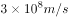；

B项正确，声音的强弱我们称之为响度，响度大小跟振幅有关。振幅越大，响度越大，振幅越小，响度越小；

C项错误，光在水中的速度约为：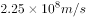，光在空气中的速度约为：。故光在空气中的传播速度比水中快；

D项正确，发声体产生的振动在空气或其他物质中的传播叫做声波。声波借助各种介质向四面八方传播。

本题为选非题，故正确答案为C。

---

### 第 3 题　qid 2247163 · 人文常识

某摄制组根据剧情布置了唐朝的街道，包含四样道具，其中符合历史事实的是：
①《金刚经》 ②丝绸制品 ③青花瓷器 ④土豆

- **A**. ①③④
- **B**. ①②③　✅
- **C**. ③④
- **D**. ②④

**答案**：B

**官方解析**

本题考查人文常识。
唐朝（618年—907年），是继隋朝之后的大一统王朝。
①正确，《金刚经》的首译时间是公元402年，由鸠摩罗什译为《金刚般若波罗蜜经》。故《金刚经》出现在唐朝符合历史事实。
②正确，中国科学家在1958年的考古中发现了距今5300年的大汶口文化时期的丝绸织品。故丝绸制品出现在唐朝是符合历史事实的。
③正确，中国青花瓷最早出现在唐代，唐代的巩县窑就开始使用含有钴的蓝釉彩来装饰陶瓷器，只是唐代青花瓷的制作还不成熟，并没有大规模进行生产。故唐朝出现青花瓷器符合历史事实。
④错误，土豆传入我国的年份还没有定论，根据陕西省兴平县县志的记载，16世纪时（明朝末年）马铃薯已传入中国，这是目前中国对土豆的较早记载。因此唐朝时期街道上不可能出现土豆。
故正确答案为B。

---

### 第 4 题　qid 2247173 · 地理国情

关于下图，下列说法<b>错误</b>的是：

- **A**. 图示地区不会出现太阳直射现象　✅
- **B**. 图示地区的主要河流发源于云贵高原
- **C**. 图示地区河流水位一般六、七月份最高
- **D**. 图示地区广泛分布石林、洞穴和地下暗河

**答案**：A

**官方解析**

本题考查地理国情。图示为我国珠江水系图。
珠江是我国第二大河流，是中国境内第三长河流，全长2320千米，流域面积约44万平方公里。
A项错误，图示地区是珠江水系图，珠江流域位于北纬21°31′—26°49′，太阳直射的区域为北纬23°26′—南纬23°26′S，二者有重合部分。因此，该地区一年中会有太阳直射现象；
B项正确，图示标黑的河流为珠江，珠江的主干--西江发源于云南省沾益县乌蒙山脉中的马雄山，沾益县位于云南省东部，属于云贵高原的一部分。故图示地区的主要河流发源于云贵高原；
C项正确，珠江流域地处亚热带，气候温和多雨，径流年内分配极不均匀，6、7、8三个月占年径流量的50%以上。因此其河流水位一般夏季（六、七月份）最高；
D项正确，珠江流域的上游在我国的云贵高原，云贵高原属于典型的喀斯特地貌分布区，有连片的喀斯特地貌分布，较集中的地区为滇、黔、桂毗邻地带，广泛分布有石林、洞穴和地下暗河。
本题为选非题，故正确答案为A。

---

### 第 5 题　qid 2247177 · 人文常识

关于魏晋南北朝诗歌，下列说法正确的是：

- **A**. 《燕歌行》标志着我国七言古诗的成熟　✅
- **B**. 曹丕是第一位大力创作五言诗的文人
- **C**. 《木兰曲》和《西洲曲》并称中国诗歌史上的“乐府双壁”
- **D**. 陶渊明完成了由玄言诗向山水诗的转变，开山水诗一派

**答案**：A

**官方解析**

本题考查人文常识。
A项正确，《燕歌行》是魏文帝曹丕的诗作。《燕歌行》是我国文学史上最早的完整的文人七言诗，它的产生标志着七言古诗的成熟；
B项错误，曹植是第一位大力写作五言诗的文人。他现存诗歌九十余首，其中有六十多首是五言诗；
C项错误，汉乐府诗《孔雀东南飞》和北朝民歌《木兰诗》合称为“乐府双璧”；
D项错误，玄言诗是一种以阐释老庄和佛教哲理为主要内容的诗歌。山水诗是指描写山水风景的诗。谢灵运和谢朓完成了由玄言诗向山水诗的转变，开山水诗一派。而陶渊明则是田园诗派的创始人。
故正确答案为A。

---

### 第 6 题　qid 2247179 · 人文常识

关于运动中受伤的处置方式，下列说法错误的是：

- **A**. 可通过伸展练习缓解运动后的肌肉酸痛
- **B**. 运动中发生肌肉痉挛可采用冷敷痉挛部位来缓解　✅
- **C**. 一般性关节韧带损伤后，应在24小时内采用冷敷
- **D**. 运动骨折后，应先用夹板或其他代用品固定伤肢

**答案**：B

**官方解析**

本题考查科技常识。
A项正确，肌肉酸痛可以说算肌肉疲劳，肌肉酸痛的原因有两种：一种是乳酸堆积导致的酸痛，还有一种是延迟性肌肉酸痛。可以采取如下有效方式缓解：（1）运动后一定要伸展，拉伸可以让筋膜扩张有利于肌肉整体的体积增长。可以舒展肌肉，让肌肉变的更加有弹性，不至于使肌肉变的僵硬。能够有效的缓解肌肉的压力，加速肌肉的恢复。（2）对酸痛局部进行按摩，使肌肉放松，促进肌肉血液循环，有助损伤修复及痉挛缓解；
B项错误，应对肌肉痉挛的具体方法要根据肌肉疼痛的不同感受而定。一旦发生肌肉痉挛，应缓和地帮助痉挛的肌肉伸展，直到痉挛和疼痛消失，再柔和地按摩。按摩后如果肌肉仍紧绷，需要热敷；而按摩后觉得肌肉酸痛则需冷敷。B项说法不全面；
C项正确，对于一般性关节韧带损伤，应在24小时内采用冷敷，必要时加压包扎24小时以后采用理疗，热敷、按摩、针灸等方式治疗；
D项正确，运动骨折后不要移动患肢，应用夹板或其他代用品固定伤肢，及时护送医院检查治疗。
本题为选非题，故正确答案为B。

---

### 第 7 题　qid 2247181 · 科技常识

关于生活中的物理现象，下列说法正确的是：

- **A**. 烈日下，海水的温度要比沙子低，是因为海水的比热容比沙子小
- **B**. 煮鸡蛋时，鸡蛋放入锅中会沉入锅底，是因为鸡蛋的重力大于阻力
- **C**. 冻肉在水中比在同温度空气中解冻得快，是因为水的热传递性更强　✅
- **D**. 大风吹来时，雨伞会被向上吸起来，是因为伞下方的压强大于上方　✅

**答案**：CD

**官方解析**

注：可能由于考生回忆版不够准确，本题有争议，CD项均正确。
A项错误，烈日下，海水的温度要比沙子低，是因为海水的比热容（即升高一度需要的热量）比沙子大，根据吸热公式可知，在吸收相同的热量时，比热容较大得海水温度升高得更少。因此，我们会感觉海水的温度比沙子低。选项中“海水的比热容比沙子小”表述错误；
B项错误，煮鸡蛋时，鸡蛋放入锅中会沉入锅底，是因为鸡蛋的重力大于它受到的浮力，而非“鸡蛋的重力大于阻力”；
C项正确，冰冻的肉类在水中比在同温度的空气中解冻得快，这是因为与空气相比，水的热传递性更强，水能够较快的将热量转移给冻肉，使其更快解冻；
D项正确，雨伞是弧形的，在相同时间内，空气流经上方的速度大，经过下方的速度小。大风吹来时，伞上方空气流速大、压强小，伞下方空气流速小、压强大，在伞的上、下表面产生一个压强差，在压强差的作用下，伞会被向上吸起来。
故正确答案为CD。

---

### 第 8 题　qid 2247185 · 科技常识

下列关于生活常识的说法，错误的是：

- **A**. 缺铁性贫血应多食用水果，因为维生素C可以帮助铁的转化和利用
- **B**. 燕麦有丰富的膳食纤维，能延缓胃中食物进入小肠的速度，产生饱腹感
- **C**. 柴鸡、肉鸡的营养物质含量相差无几，柴鸡更营养的说法并不科学
- **D**. 蔬菜水果一洗就掉色，是因为人为添加了色素，正常情况应该是无色的　✅

**答案**：D

**官方解析**

A项正确，多吃富含维生素C的新鲜水果，如橙子、猕猴桃、山楂等，对补血也有一定的帮助，因为维生素C可以帮助铁的转化和利用，所以缺铁性贫血应多食用水果；
B项正确，燕麦中含有丰富的膳食纤维，尤其是可溶性膳食纤维能够延缓胃中内容物进入小肠的速度，使人产生饱腹感，有利于糖尿病人和肥胖人群减少进食量；
C项正确，从营养物质含量看柴鸡、肉鸡营养成分相差无几，虽然生长周期长的柴鸡口感在一定程度上或许会比肉鸡更好，但是柴鸡更营养的说法并不科学。并且，散养的鸡所进食的食物很有可能得不到保障，无法追根溯源，并不能完全保证食品安全；
D项错误，掉色是蔬菜水果本身就存在的特质，因为其本身含有大量的天然色素。水洗掉色的“色”就属于水溶性的花青素，葡萄、草莓等都含有此类色素。通常被储存在植物细胞液泡中的花青素，当细胞破损时会溶解到外界的水中，水被染色也就不足为怪了。因此，蔬菜水果一洗就掉色，并不一定是人为添加了色素。
本题为选非题，故正确答案为D。

---

### 第 9 题　qid 2247193 · 人文常识

下列关于天文常识的说法，错误的是：

- **A**. 超级月亮指满月时月亮处于近地点位置
- **B**. 冬季大三角指由织女星、天津四及牛郎星组成的三角形　✅
- **C**. 流星雨的名字来自于辐射点所在的星座或附近比较明亮的星名
- **D**. 土星冲日指土星和太阳正好分处地球两侧，三者几乎成一条直线

**答案**：B

**官方解析**

A项正确，“超级月亮”这个词语本身不是专业的天文术语。月亮绕着地球转的轨道并不是一个纯圆的轨道，而是一个椭圆轨道，月亮在这个椭圆形的轨道运行，有时候会靠近地球，有时候会远离地球，靠近地球的点叫近地点，远离地球的点叫远地点。月亮运行到近地点时，如果是恰逢满月，人们会觉得看到的月亮特别大而明亮，就把它称为超级月亮。
B 项错误，夏季大三角指在夏季的东南方高空里由天琴座的织女星、天鹅座的天津四以及天鹰座的牛郎星组成的三角形。而冬季大三角由大犬座的天狼星、小犬座的南河三以及猎户座的参宿四所形成的三角形。
C项正确，流星雨的命名一般用流星雨辐射点所在的星座或附近比较明亮的星名来命名，例如双子座流星雨的辐射点就位于双子座中。
D项正确，土星冲日是指土星、地球、太阳依次排成一条直线，土星和太阳正好分处地球的两侧。该天象每378天发生一次，土星和地球绕太阳公转的方向相同，公转轨迹都近似为圆。
本题为选非题，故正确答案为B。

---

### 第 10 题　qid 2247197 · 人文常识

关于锦绣工艺，下列说法错误的是：

- **A**. 元代开始，云锦一直为皇家服饰专用品
- **B**. 因宋锦的主要产地在杭州，故又被称为“杭州宋锦”　✅
- **C**. 壮锦是壮族自治区的传统丝织物，充满沉稳、内敛的民族格调
- **D**. 汉朝时，成都设有专管织造蜀锦的官员，因此被称为“锦官城”

**答案**：B

**官方解析**

本题考查人文常识。
A项正确，云锦是我国传统提花丝织锦缎，为南京特产。因其图案绚丽、纹饰华美如天上云霞而得名。云锦至今有约1600年的历史。东晋义熙十三年（417年）在建康设锦署，被认为是云锦正式诞生的标志。从元代开始，云锦一直为皇家服饰御用贡品；
B项错误，宋锦，起源于宋代，主要产地在中国的苏州，故又称之为“苏州宋锦”。因而宋锦主要产地为苏州而非杭州；
C项正确，壮锦与云锦、蜀锦、宋锦并称“中国四大名锦”，是广西壮族地区一项最具代表性的民族手工艺品，它以“对比强烈而不火，柔和淡雅而不温”为特点，特意加入灰色元素淡化过于显眼的颜色表达，充满沉稳、内敛的民族格调；
D项正确，蜀锦起源于战国时期，历史悠久、工艺独特。汉朝时成都蜀锦织造业便已经十分发达，朝廷在成都设有专管织锦的官员，因此成都被称为“锦官城”，简称“锦城”。
本题为选非题，故正确答案为B。

---

### 第 11 题　qid 2247165 · 人文常识

下列描写月的诗句中，表达作者思乡情感的是：

- **A**. 秦时明月汉时关，万里长征人未还
- **B**. 我寄愁心与明月，随风直到夜郎西
- **C**. 东船西舫悄无言，唯见江心秋月白
- **D**. 春风又绿江南岸，明月何时照我还　✅

**答案**：D

**官方解析**

本题考查人文常识。
A项错误，此句出自唐代王昌龄《出塞二首·其一》，“秦时明月汉时关”是诗人暗示这里的战事自秦汉以来一直未间歇过，“万里长征人未还”则使人联想到战争给人带来的灾难，表达了诗人希望早日平息边塞战事，使人民过上安定的生活；
B项错误，此句出自唐代李白《闻王昌龄左迁龙标遥有此寄》，是李白得知好友王昌龄被贬（“左迁”指贬谪，降职）后所作，这里的“愁心”表达的是对远方朋友的思念和担忧；
C项错误，此句出自唐代白居易《琵琶行》，诗句侧面烘托了琵琶女的演奏效果。演奏已经结束，而听者尚沉浸在音乐的境界里，周围鸦雀无声，只有水中倒映着一轮明月。本诗通过写琵琶女生活的不幸，结合诗人自己在宦途所受到的打击，唱出了“同是天涯沦落人，相逢何必曾相识”的心声。表达了诗人对不幸者命运的同情和对自身失意的感慨；
D项正确，此句出自宋代王安石《泊船瓜洲》，这是一首著名的抒情小诗，抒发了诗人眺望江南、思念家乡的深切感情。结句“明月何时照我还”，诗人眺望已久，不觉皓月初上，诗人用疑问的句式，想象出一幅“明月照我还”的画面，进一步表达了诗人的思乡之情。
故正确答案为D。

---

### 第 12 题　qid 2247169 · 人文常识

下列哲学家与其思想主张对应错误的是：

- **A**. 黄宗羲——理势合一　✅
- **B**. 王夫之——气一元论
- **C**. 黑格尔——存在即合理
- **D**. 卢梭——感觉是认识的来源

**答案**：A

**官方解析**

本题考查政治常识。
A项错误，黄宗羲，明末清初经学家、史学家、思想家、地理学家、天文历算学家、教育家，与顾炎武、王夫之并称“明末清初三大思想家”，他在哲学上反对宋学中“理在气先”的理论，认为“理”并不是客观存在的物质实体，而是“气”的运动规律。而“理势合一”的历史观是由王夫之所提出的，他认为历史发展过程是天地自然阴阳二气相互交感而呈现的有规律的运动变化过程，而“理”和“势”亦是阴阳二气相互交感的具体表现。
B项正确，王夫之，明末清初杰出的思想家、哲学家，其主张“气一元论”，认为天地万物即是一气所生，气是唯一的实体。
C项正确，黑格尔是德国19世纪唯心论哲学的代表人物之一。存在即合理出自黑格尔《法哲学原理》序，意思是凡是合乎理性的东西都是现实的，凡是现实的东西都是合乎理性的。这里合乎理性就是指绝对精神，黑格尔把绝对精神看作是世界的本原。
D项正确，卢梭是18世纪法国大革命的思想先驱，启蒙运动最卓越的代表人物之一。在哲学上，卢梭主张感觉是认识的来源。
本题为选非题，故正确答案为A。

---

### 第 13 题　qid 2247174 · 法律常识

根据我国现行《民法典》，下列说法符合相关规定的是：

- **A**. 法人分为企业法人和非企业法人
- **B**. 不满八周岁的未成年人为无民事行为能力人　✅
- **C**. 向人民法院请求保护民事权利的诉讼时效期间为二年
- **D**. 因自愿实施紧急救助行为造成受助人损害的，救助人承担民事责任

**答案**：B

**官方解析**

本题考查法律常识。
A项错误，《民法典》总则编在法人一章，将法人分为营利法人、非营利法人、特别法人。
B项正确，根据《民法典》第二十条规定：“不满八周岁的未成年人为无民事行为能力人，由其法定代理人代理实施民事法律行为。”
C项错误，根据《民法典》第一百八十八条规定：“向人民法院请求保护民事权利的诉讼时效期间为三年。法律另有规定的，依照其规定。”因此，一般情况下，诉讼时效期间是三年。
D项错误，根据《民法典》第一百八十四条规定：“因自愿实施紧急救助行为造成受助人损害的，救助人不承担民事责任。”
故正确答案为B。

---

### 第 14 题　qid 2247175 · 人文常识

关于我国近现代历次土地改革和政策，下列说法错误的是：

- **A**. 《中国土地法大纲》标志中国形成了一套正确的土地革命政策　✅
- **B**. 《井冈山土地法》首次以立法形式肯定了广大农民以革命手段获得土地的权利
- **C**. 《五四指示》将党在抗日战争时期实行的“减租减息”政策改变为实现“耕者有其田”
- **D**. 《中华人民共和国土地改革法》由解放战争时期征收富农多余土地财产改变为保存富农经济

**答案**：A

**官方解析**

本题考查人文常识。
A项错误，1929年颁布的《兴国土地法》将“没收一切土地”改为“没收一切公共土地及地主阶级的土地”，这是一个原则性的改正，保护了中农的利益，到了1931年春，基本上形成了一套正确的土地革命政策。1947年7月至9月，中国共产党在河北省平山县召开全国土地会议，制定和通过了《中国土地法大纲》，明确规定“废除封建性及半封建性剥削的土地制度，实现耕者有其田的土地制度”；
B项正确，《井冈山土地法》是中国共产党历史上第一个土地法，首次以立法的形式肯定了广大农民以革命手段获得土地的权利；
C项正确，《五四指示》将党在抗日战争时期实行的“减租减息”政策改变为实行“耕者有其田”的政策。这一政策的提出，标志着解放区在农民土地问题上，开始由抗日战争时期的削弱封建剥削向变革封建土地关系、废除封建剥削制度过渡；
D项正确，1950年6月28日中央人民政府委员会第八次会议通过了《中华人民共和国土地改革法》，这次土改的目的是废除地主阶级封建剥削的土地所有制，实行农民的土地所有制，解放农村生产力，发展农业生产，为新中国的工业化开辟道路。土改中对待富农的政策，由解放战争时期征收富农多余土地财产改变为保存富农经济。
本题为选非题，故正确答案为A。

---

### 第 15 题　qid 2247178 · 科技常识

关于物质组成及其变化，下列说法正确的是：

- **A**. 汽油挥发和形成水垢均是化学变化
- **B**. 地壳中含量最多的非金属元素是氮
- **C**. 构成物质的三种微粒是分子、原子和电子
- **D**. 组成化合物种类最多的元素是碳　✅

**答案**：D

**官方解析**

本题考查科技常识。
A项错误，物理变化指物质的状态虽然发生了变化，但物质本身的组成成分却没有改变。化学变化是有新物质形成的变化过程。汽油挥发只是汽油由液态变为气态，并没有新物质生成，因此属于物理变化。水垢是指含有钙镁盐类等矿物质的水蒸发后，溶于水的钙离子和镁离子形成了碳酸钙和氢氧化镁两种沉淀，因此属于化学变化；
B项错误，地壳是由沙、黏土、岩石等组成的，地壳中所含元素的含量从高到低的排序是氧、硅、铝、铁、钙，因此地壳中含量最多的金属元素是铝，非金属元素是氧，而不是氮；
C项错误，物质是无限可分的，其中构成物质的三种基本微粒是分子、原子和离子，而非电子；
D项正确，凡除了极少数含碳化合物为无机物以外，其余含碳化合物称为有机物，自然界中物质多数是有机物，因此，组成化合物种类最多的元素是碳。
故正确答案为D。

---

### 第 16 题　qid 2247182 · 地理国情

关于下图中的高速公路，说法错误的是：

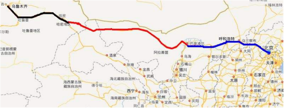

- **A**. 穿越了我国四大沙漠之一的是巴丹吉林沙漠
- **B**. 是目前世界上穿越沙漠最长的高速公路工程
- **C**. 共经过北京、河北、内蒙古、甘肃、新疆5省份　✅
- **D**. 开辟了从霍尔果斯口岸至天津港最快捷的出海通道

**答案**：C

**官方解析**

本题考查地理国情。从图中可以看出，该高速公路为北京—乌鲁木齐高速公路，称作京新高速公路，简称京新高速（G7）。
A项正确，京新高速在内蒙古境内穿过乌兰布和、腾格里、巴丹吉林三大沙漠，其对推进内蒙古及新疆自治区的跨越发展，促进中蒙经济文化往来，巩固边防、维护民族团结和社会稳定具有极其重要的意义；
B项正确，2017年7月15日上午9时16分，国家“一带一路”标志性工程京新高速临白段正式建成通车，标志着世界上穿越沙漠最长的高速公路京新高速（G7）全线通车；
C项错误，京新高速公路连接北京、河北、山西、内蒙古、甘肃、新疆六个省，选项中“5省份”表述错误；
D项正确，京新高速全线贯通后，从北京通往新疆乌鲁木齐的路程比现有路程缩短1300多公里，其开辟了从新疆霍尔果斯口岸至天津港最快捷的出海通道，成为“一带一路”发展战略中新亚欧大陆桥的重要组成部分。
本题为选非题，故正确答案为C。

---

### 第 17 题　qid 2247183 · 人文常识

下列人物形象与其所属作品对应错误的是：

- **A**. 方鸿渐——《围城》
- **B**. 雅罗米尔——《生活在别处》
- **C**. 伊丽莎白——《傲慢与偏见》
- **D**. 吴荪甫——《林家铺子》　✅

**答案**：D

**官方解析**

本题考查人文常识。
A项正确，《围城》是我国作家钱钟书所著的长篇小说，是中国现代文学史上一部风格独特的讽刺小说，被誉为“新儒林外史”。作品通过描写主人公方鸿渐的人生历程，对20世纪三四十年代国统区的国政时弊和众生相进行了抨击；
B项正确，《生活在别处》是捷克小说家米兰·昆德拉创作的长篇小说。作品语言简洁流畅，人物身份明确，在描写主人公雅罗米尔青春和激情的同时，研究人性的崇高与邪恶，透视人身上最黑暗、最深刻的弱点；
C项正确，《傲慢与偏见》是英国小说家简·奥斯汀创作的长篇小说，主人公为小乡绅班纳特的二女儿伊丽莎白。作品以日常生活为素材，生动地反映了18世纪末到19世纪初处于保守和闭塞状态下英国的乡镇生活和世态人情；
D项错误，《林家铺子》是我国作家茅盾于1932年创作的短篇小说。作品讲述的是当时江南杭嘉湖地区一个小店铺的主人林老板，在时局动荡、经济萧条的社会背景下，虽再三苦苦挣扎，但在黑暗势力的盘剥下终于破产的故事。吴荪甫为茅盾长篇小说《子夜》的主人公。
本题为选非题，故正确答案为D。

---

### 第 18 题　qid 2247184 · 法律常识

根据我国《劳动合同法》，下列说法错误的是：

- **A**. 同一用人单位与同一劳动者只能约定一次试用期
- **B**. 劳动合同部分无效，则整个劳动合同都将失去法律效力　✅
- **C**. 经济补偿按劳动者在本单位工作的年限，每满一年支付一个月工资的标准支付
- **D**. 用人单位需提前三十日以书面形式通知劳动者或额外支付一个月工资后才可以解除劳动合同

**答案**：B

**官方解析**

本题考查法律常识。
A项正确，根据我国《劳动合同法》第十九条第二款规定：“同一用人单位与同一劳动者只能约定一次试用期”；
B项错误，根据我国《劳动合同法》第二十七条规定：“劳动合同部分无效，不影响其他部分效力的，其他部分仍然有效。”故选项中“则整个劳动合同都将失去法律效力”表述错误；
C项正确，根据我国《劳动合同法》第四十七条第一款规定：“经济补偿按劳动者在本单位工作的年限，每满一年支付一个月工资的标准向劳动者支付。六个月以上不满一年的，按一年计算；不满六个月的，向劳动者支付半个月工资的经济补偿”；
D项正确，根据我国《劳动合同法》第四十条规定：“有下列情形之一的，用人单位提前三十日以书面形式通知劳动者本人或者额外支付劳动者一个月工资后，可以解除劳动合同：（一）劳动者患病或者非因工负伤，在规定的医疗期满后不能从事原工作，也不能从事由用人单位另行安排的工作的；（二）劳动者不能胜任工作，经过培训或者调整工作岗位，仍不能胜任工作的；（三）劳动合同订立时所依据的客观情况发生重大变化，致使劳动合同无法履行，经用人单位与劳动者协商，未能就变更劳动合同内容达成协议的”。
注：选项D表述不严谨，没有写明适用条件，但是本题为单选题，B项明显错误，故答案为B。
本题为选非题，故正确答案为B。

---

### 第 19 题　qid 2247189 · 地理国情

下列历史事件按发生的先后顺序，排序正确的是：
①西藏和平解放
②大庆油田被发现

③中苏爆发珍宝岛武装冲突
④中国第一颗原子弹爆炸成功

- **A**. ②①③④
- **B**. ④③①②
- **C**. ③④②①
- **D**. ①②④③　✅

**答案**：D

**官方解析**

本题考查人文历史。
①1951年5月中央人民政府全权代表和西藏地方政府全权代表在北京签订《关于和平解放西藏办法的协议》（简称“十七条协议”），宣告西藏和平解放；
②1959年9月，位于松嫩平原上的松基3井，喷射出黑色的石油，大庆油田被发现。
③1969年3月，苏联军队四次侵入我黑龙江省的珍宝岛地区，打死打伤我边防人员，制造严重流血事件。我边防部队被迫还击。中苏双方爆发珍宝岛武装冲突；
④1964年10月16日，中国第一颗原子弹在新疆罗布泊爆炸成功。这是中国成功进行的第一次核试验。
根据历史事件发生的先后顺序，正确的排序是①②④③。
故正确答案为D。

---

### 第 20 题　qid 2247191 · 人文常识

关于紫外线，下列说法正确的是：

- **A**. 人类肉眼能感觉到
- **B**. 可用来消毒杀菌　✅
- **C**. 波长在10nm-500nm之间
- **D**. 容易引发脑部癌变

**答案**：B

**官方解析**

本题考查科技常识。
A项错误，紫外线是波长10nm-400nm的电磁波，位于可见光谱紫端以外，紫外线属于不可见光，不能影响人们的视觉，故人体肉眼不能感觉到；
B项正确，紫外线可以用来消毒杀菌，一般利用特殊设计的紫外线灯照射，使菌体蛋白发生光解、变性，菌体会因氨基酸、核酸遭到破坏而死亡。另外，紫外线通过空气，使空气中的氧电离产生臭氧，也能够加强消毒杀菌作用；
C项错误，紫外线波长在10nm-400nm之间；
D项错误，大量紫外线照射可能对人体皮肤产生伤害，引起黑色素沉积，导致变黑、色斑、水肿甚至水泡等。长期紫外线照射可能损伤细胞DNA，引起皮肤老化，甚至引发皮肤癌，但跟题干中“容易引发脑部癌变”并无直接关系。
故正确答案为B。

---

## 言语理解与表达

### 第 1 题　qid 2247229 · 逻辑填空

湛江市徐闻县是我国重要的菠萝产区，有着粤西唯一的对外贸易口岸的地理位置优势。然而作为如今“一带一路”大热背景下的重点港口城市，徐闻县因常规化的菠萝种植经营模式和观念上的<u> </u><u>     </u>，未能全面认识菠萝销售的信息化和“互联网”对于菠萝种植生产经营的重要价值，因而出现了严重的滞销情况。

填入画横线部分最恰当的一项是：

- **A**. 不思进取
- **B**. 因循守旧　✅
- **C**. 急功近利
- **D**. 一孔之见

**答案**：B

**官方解析**

文段首先介绍徐闻县盛产菠萝的地理优势，转折词“然而”重点强调徐闻县在新的背景下没有与时俱进地利用信息化和“互联网”的经营模式，反而依然遵循常规化的观念和经营模式导致菠萝严重滞销，故横线处填入成语应表达“没有与时俱进”之意，B项“因循守旧”指沿袭旧规，不思革新，死守老一套，缺乏创新精神，符合文意，当选。

A项“不思进取”指不想努力上进，不想有所作为；C项“急功近利”指急于追求眼前的成效和利益；D项“一孔之见”指从一个小窟窿里面所看到的，比喻狭隘片面的见解。三项均与文段强调的“不与时俱进，依然使用常规化的经营模式和观念”不符，排除。

故正确答案为B。

【文段出处】《广东海洋大学学子探寻“互联网菠萝”销售前景》

---

### 第 2 题　qid 2247233 · 逻辑填空

作为材料界的变形金刚，聚氨酯在汽车中的应用      。一辆家用汽车用到的聚氨酯泡沫量就达到15公斤-18公斤，此外，还有很多造型特殊的连接件，以及轻量化要求的结构件等产品，也会用到聚氨酯材料。
填入划横线部分最恰当的一项是：

- **A**. 大有可为
- **B**. 举足轻重　✅
- **C**. 首屈一指
- **D**. 博采众长

**答案**：B

**官方解析**

文段主要介绍聚氨酯的多种利用价值，强调其在汽车应用中的重要性，不仅用量大而且一些有特殊要求的零件也会用到聚氨酯，故横线处填入成语强调聚氨酯在汽车中的应用影响较大，B项“举足轻重”比喻所处地位重要，一举一动都会影响全局，符合文意，当选。
A项“大有可为”指有广阔的发展前途，能大大地发挥作用，后文强调聚氨酯已经运用于汽车的应用，而非将要发挥作用，与文意不符，排除；
C项“首屈一指”表示位居第一，引申为最好的，文段只介绍聚氨酯在汽车应用中的重要性，并未提及聚氨酯是最好的材料，排除；
D项“博采众长”意为广泛采纳众人的长处及各方面的优点，文段并未提及采纳各方优点，排除。
故正确答案为B。
【文段出处】《聚氨酯：材料里的变形金刚》

---

### 第 3 题　qid 2247235 · 逻辑填空

比特币正日益成为各类违法犯罪活动的“帮凶”，潜藏着社会风险。比如，近期多方渠道反映，比特币在所谓的“暗网”世界里作为支付工具      ，而“暗网”中充斥着各类严重的违法犯罪活动。比特币发明的初衷之一就是躲避      ，具有匿名性、跨境流动便利等特征，这些都使其逐渐成为“地下经济”的首选工具。
依次填入画横线部分最恰当的一项是：

- **A**. 招摇过市  责任
- **B**. 供不应求  制裁
- **C**. 大行其道  监管　✅
- **D**. 风靡一时  处罚

**答案**：C

**官方解析**

第一空，根据文段“‘暗网’中充斥着各类严重的违法犯罪活动”可知，横线处填入成语形容比特币作为支付工具在“暗网”很流行。C项“大行其道”指某种新潮事物流行、盛行，成为一种风尚，符合文意，保留；D项“风靡一时”形容一个事物在一个时期非常盛行，像风吹倒草木一样，符合文意，保留；A项“招摇过市”指在人多的地方大摇大摆显示声势，引人注意，与“暗网”隐秘性和匿名性的特点不符，排除；B项“供不应求”形容某事物需求量很大，供应不足的意思，文段并未提及比特币在“暗网”的供求关系，排除。
第二空，根据文段“‘暗网’充斥着各类严重违法犯罪活动。······这些都使其逐渐成为‘地下经济’的首选工具”可知，“暗网”使用比特币作为支付方式目的是为了躲避追踪和监管，对应C项；D项“处罚”指对犯错误或犯罪的人加以惩治，对文意引申过度，排除。
故正确答案为C。
【文段出处】《人民日报：虚拟货币交易缘何叫停》

---

### 第 4 题　qid 2247236 · 逻辑填空

战法，即用兵打仗之法，小则平一城，大则济天下。毛泽东同志打破了历代兵家把游击战当作战役问题来研究的_____，在人类历史上第一次将游击战上升到_____高度，创立了一整套实施游击战争的理论和方法，指导中国人民创造了人类战争史上的奇观。
依次填入画横线部分最恰当的一项是：

- **A**. 传统  战斗
- **B**. 偏见  战备
- **C**. 规约  战术
- **D**. 禁锢  战略　✅

**答案**：D

**官方解析**

第一空，根据文段“打破了历代兵家把游击战当作战役问题”可知，毛泽东同志的用兵打仗之法不同于以往，且横线处搭配“打破”，B项“偏见”是指片面的、偏颇的见解，文段并未说明“历代兵家”的看法是片面的见解，排除；C项“规约”是指经过相互协议规定下来的共同遵守的条款，无法形容“历代兵家”的看法，且通常不与“打破”搭配，排除；A项“传统”、D项“禁锢”搭配恰当，均保留。
第二空，由后文“创立了一整套实施游击战争的理论和方法，指导中国人民创造了人类战争史上的奇观”可知，毛泽东同志是将游击战上升到了对军事斗争全局的策划和指导，D项“战略”指对全局性、高层次的重大问题的策划和指导，符合文意，当选；A项“战斗”泛指斗争，与文意不符，排除。
故正确答案为D。
【文段出处】《你可知道抗日战争中我军特色战法是如何出现的？》

---

### 第 5 题　qid 2247242 · 逻辑填空

在追求自我和个性的90后眼里，      职业选择观念已经无法阻挡他们打破现状、追求工作的新鲜感和幸福感的节奏，根据自己的职业规划和兴趣爱好选择别人眼中      的职业，已不再是新鲜事。
依次填入画横线部分最恰当的一项是：

- **A**. 保守  一般
- **B**. 传统  另类　✅
- **C**. 正确  反常
- **D**. 科学  冒险

**答案**：B

**官方解析**

第一空，横线处填入词语与“职业选择观念”搭配，根据文段“90后‘追求自我和个性’”可知，90后的职业选择观念不同于以往，A项“保守”、B项“传统”均可搭配职业选择观念，保留；C项“正确”、D项“科学”在文段中均未体现，且文段并未论述其他非90后的职业选择观念就是正确、科学的，排除。
第二空，横线处填入词语搭配“职业”，根据文段“90后‘追求自我和个性’”“打破现状、追求工作的新鲜感和幸福感的节奏”“根据自己的职业规划和兴趣爱好选择职业”可知，90后对于工作的选择不同于以前的人，A项“一般”指普通、通常的意思，与文意不符，排除；B项“另类”指另外的一类，指与众不同的、非常特殊的人或事物，符合文意，当选。
故正确答案为B。
【文段出处】《打破传统职业观 我的职业我做主》

---

### 第 6 题　qid 2247247 · 逻辑填空

自18世纪工业革命以来的每一次技术革命，都重塑了全球经济竞争的格局，但似乎每一次我国都      ，唯独今日人工智能革命让中国幸运地站到了与西方发达国家      的同一条起跑线上。与大洋彼岸的精英们朝着人工智能快速行进的脚步相并行，中国企业迈向人工智能的步履也格外铿锵。
依次填入画横线部分最恰当的一项是：

- **A**. 失之交臂  比肩　✅
- **B**. 错失良机  一致
- **C**. 故步自封  并排
- **D**. 无功而返  同步

**答案**：A

**官方解析**

第一空，根据后文可知，文段意在强调我国没有抓住人工智能革命之前的技术革命作为发展机会，A项“失之交臂”指擦肩而过，B项“错失良机”指错误地失去了良好的机会，均符合文意，保留；C项“故步自封”比喻守着老一套，不求进步，不能用来形容我国与技术革命之间的关系，排除；D项“无功而返”指没有任何成效而回来，侧重于强调虽然努力了，但没有做出成效来，而由文段可知，我们并未参与之前的技术革命，与文意不符，排除。
第二空，根据文意，文段强调今日人工智能革命让中国幸运地与西方发达国家站在了同一起跑线上。A项“比肩”比喻相当，常表述为“与······比肩”，搭配恰当，且符合文意，当选；B项“一致”指趋向相同，不能体现出我国与西方发达国家实力相当的含义，且与后文的“同一”语义重复，排除。
故正确答案为A。
【文段出处】《中国抢跑：人工智能》

---

### 第 7 题　qid 2247249 · 逻辑填空

许多家长为了让孩子感受一下世界名校的氛围，趁暑假到海外转一圈，本      ，然而，在对海外游学的目的和内容缺乏成熟考虑的情况下，不顾自身条件盲目跟风，这就值得商榷了。有家长抱怨，“花了钱心疼得不踏实，不花钱对不起孩子更不踏实”，显然这是因缺乏正确认识而      的结果。
依次填入画横线部分最恰当的一项是：

- **A**. 无可厚非  随波逐流　✅
- **B**. 言之有理  照猫画虎
- **C**. 顺理成章  亦步亦趋
- **D**. 合情合理  东施效颦

**答案**：A

**官方解析**

第一空，分析文意可知，文段意在强调许多家长趁暑假带孩子去海外感受名校氛围这一做法是可以理解的，A项“无可厚非”指没有什么可过分责难的，D项“合情合理”指符合情理，均符合文意，保留；B项“言之有理”指说的话有道理，文段中并未体现说话，而是论述家长们让孩子去游学的行为，与文意不符，排除；C项“顺理成章”指随着某种情况的发展而自然产生的结果，与文段缺少对应，文段并未论述出国游学是自然产生的结果，排除。
第二空，横线处所填成语对应前文的“不顾自身条件，盲目跟风”，A项“随波逐流”比喻没有坚定的立场，缺乏判断是非的能力，只能随着别人走，符合文意，当选；D项“东施效颦”比喻模仿别人，模仿不好，反而出丑，文段并未强调模仿别人，也并未体现出丑，与文意不符，排除。
故正确答案为A。
【文段出处】《海外游学勿忘教育之本》

---

### 第 8 题　qid 2247251 · 逻辑填空

一项最新的研究成果表明，人类肤色的差异变大至少从90万年前就开始了，基于非洲地区人们皮肤色素沉着相关基因变异的分析发现，黑皮肤相对来说拥有比较      的遗传变异，这表明“白种人更先进”的种族主义观念存在      。
依次填入画横线部分最恰当的一项是：

- **A**. 明显  偏见
- **B**. 罕见  疑问
- **C**. 快速  漏洞
- **D**. 古老  缺陷　✅

**答案**：D

**官方解析**

第一空，横线处所填词语对应“肤色差异变大至少从90万年前就开始了”，说明黑色皮肤相对拥有比较古老的遗传变异，“90万年前”对应D项“古老”；A项“明显”指清楚地显露，B项“罕见”指很少见到，C项“快速”指速度快，均与文段缺少对应，排除。
第二空，代入验证，D项“缺陷”指欠缺、缺点、不完美，对应前文，前文介绍了黑色皮肤的遗传变异更古老，所以“白种人更先进”的种族主义观念是有所欠缺的，符合文意，当选。
故正确答案为D。
【文段出处】《人类肤色发生差异 90万年前就开始了》

---

### 第 9 题　qid 2247252 · 逻辑填空

曾几何时，地上电杆林立，空中线缆交错成为城市进入工业化、信息化时代的      ，但随着社会发展，城市上空纵横交错的各种线缆就像一张张“蜘蛛网”，不但影响市容，还存在各种安全隐患，因此，架空线入地乃      。
依次填入画横线部分最恰当的一项是：

- **A**. 象征  众望所归
- **B**. 旗帜  板上钉钉
- **C**. 标志  大势所趋　✅
- **D**. 号角  水到渠成

**答案**：C

**官方解析**

第一空，分析文意可知，文段表达“地上电杆林立、空中缆线交错”是城市进入工业化的典型表现，A项“象征”、C项“标志”均符合文意，保留；B项“旗帜”指在某一领域有模范作用的人或事物，与文意无关，排除；D项“号角”指用兽角做的信号，也指号角声，一般指声音，文段未提及声音，与文意不符，排除。
第二空，分析文意可知，文段指出随着社会发展，对空中景观要求提高了，所以架空线入地是顺应社会发展的，C项“大势所趋”指局势发展的趋向，符合文意，当选；A项“众望所归”形容某人威望很高，受到大家的敬仰和信赖，一般用来形容人，不能用来形容架空线入地，排除。
故正确答案为C。
【文段出处】《空中“蜘蛛网” 入地破难题》

---

### 第 10 题　qid 2247253 · 逻辑填空

近年来，国际恐怖主义活动范围不断扩大，原本安全的欧洲接连发生恐怖袭击事件，民众心中      。欧洲专家学者认为，造成恐怖主义泛滥的根本原因并未根除，恐怖袭击变得更加难以防范。世界，尤其是欧洲反恐斗争依然      。
依次填入画横线部分最恰当的一项是：

- **A**. 方寸已乱  扑朔迷离
- **B**. 惶惶不安  任重道远　✅
- **C**. 坐立难安  错综复杂
- **D**. 惊魂未定  前途未卜

**答案**：B

**官方解析**

第一空，横线处所填成语对应前文“恐怖主义活动范围不断扩大，原本安全的欧洲接连发生恐怖袭击事件”，可知民众的内心是恐慌的，A项“方寸已乱”指心绪已被扰乱，B项“惶惶不安”指内心害怕，十分不安，均能表达民众内心恐慌的心情，符合文意，保留；C项“坐立难安”指因为心中有事，站着也不是，坐着也不是，而文段重在强调民众因恐怖袭击事件而内心恐慌，与文意不符，排除；D项“惊魂未定”指受惊后心情还没有平静下来，强调受惊的事情已经结束，而文段强调“恐怖主义活动范围在扩大”，与文意不符，排除。
第二空，由前文“恐怖袭击难以防范”以及程度词“尤其是”进行强调，可知“欧洲地区恐怖主义的防范更是难上加难”，B项“任重道远”比喻责任重大，要经历长期的奋斗，符合文段语境，当选；A项“扑朔迷离”形容事情错综复杂，难以辨别清楚，文段未涉及“难以辨别清楚”，与文意无关，排除。
故正确答案为B。
【文段出处】《恐怖主义的根源在美国》

---

### 第 11 题　qid 2247254 · 逻辑填空

丝绸，是中国献给世界的礼物，也是震泽人民传承至今的文化符号和生活方式。这个以丝绸      的江南古镇，因水兴市，缘丝聚商。蚕桑民俗体验、太湖美食展销、名家书画展出等系列活动精彩演绎了如今震泽丝绸文化的传承，令人      。
依次填入画横线部分最恰当的一项是：

- **A**. 后来居上  心驰神往
- **B**. 声名远扬  目不转睛
- **C**. 白手起家  耳目一新
- **D**. 闻名遐迩  流连忘返　✅

**答案**：D

**官方解析**

第一空，搭配“江南古镇”，并表达通过丝绸出名的意思，B项“声名远扬”指名气很大，传播到很远的地方，D项“闻名遐迩”形容名声很大，远近都知道，均能表达通过丝绸出名的意思，且搭配恰当，正确。A项“后来居上”指后来的超过先前的，文段并未与其他地区比较，无法得出赶超的意思，与文意无关，排除。C项“白手起家”形容在没有基础和条件很差的情况下自力更生，艰苦创业，一般形容人，与“江南古镇”搭配不当，排除。
第二空，由前文的“系列活动精彩演绎”可知，活动让人舍不得离开，D项“流连忘返”比喻喜欢、迷醉某种事物而不愿或忘记离开，符合文段语境，当选。B项“目不转睛”形容注意力高度集中，文中未体现高度集中之意，排除。
故正确答案为D。
【文段出处】《丝绸文旅看震泽》

---

### 第 12 题　qid 2247255 · 逻辑填空

随着社会发展和人民生活水平的不断提高，人民群众对干净的水、清新的空气、安全的食品、优美的环境等方面的要求越来越高，生态环境在群众生活幸福指数中的地位不断      ，环境问题日益成为重要的民生问题。老百姓过去“盼温饱”，现在“盼环保”；过去“求      ”，现在“求生态”。
依次填入画横线部分最恰当的一项是：

- **A**. 加强  健康
- **B**. 深化  安稳
- **C**. 上升  和谐
- **D**. 凸显  生存　✅

**答案**：D

**官方解析**

第一空，由前文“对优美的环境等方面的要求越来越高”可知，生态环境在人们心中的地位也越来越高，C项“上升”指位置、等级、程度、数量等由低向高移动，D项“凸显”指凸出显露，均能表达地位升高的意思，保留。A项“加强”指变得更强，与“地位”搭配不当，排除。B项“深化”指向更深的程度发展，与“地位”搭配不当，排除。
第二空，由“；”可知，前后分句呈现并列关系，“求生态”与“盼环保”形成同义并列，横线应与“盼温饱”语义相近，D项“生存”即满足温饱的需求，符合题意，当选。C项“和谐”指的是和睦协调，与“盼温饱”语义无关，排除。
故正确答案为D。
【文段出处】《新时代生态文明建设让人民生活更美好》

---

### 第 13 题　qid 2247256 · 逻辑填空

张骞通西域、明代盛边贸，在古代丝绸之路上，食物是文化交流的      。从国外引进来的番薯和胡椒影响了中国的种植      ，从中国走出去的茶叶和小麦也充盈了世界餐桌。如今，美食依然是文明互鉴过程中的重要内容。随着“一带一路”倡议深入实施，以美食带动文化交流仍将      。
依次填入画横线部分最恰当的一项是：

- **A**. 主力军  技术  发扬光大
- **B**. 火车头  规模  日新月盛
- **C**. 领头羊  品种  薪火相传
- **D**. 先遣使  结构  大有可为　✅

**答案**：D

**官方解析**

第一空，根据后文“以美食带动文化交流”可知，食物在文化交流中起着带头的作用，B项“火车头”、C项“领头羊”、D项“先遣使”都有带头之意，均保留；而A项“主力军”强调的是发挥主要作用的力量，与“带头”无关，排除。
第二空，通过“也充盈了世界餐桌”可知让食物的种类更丰富，因此第二空重在强调引进来的农作物影响了中国的种植种类，C项“品种”和D项“结构”填入均可，保留；B项“规模”与“种类”无关，排除。
第三空，根据文段“美食依然是文明互鉴过程中的重要内容，随着‘一带一路’倡议深入实施”可知，美食带动文化交流有很大的发展前途和空间，D项“大有可为”指事情有发展前途，很值得做，符合题意，当选；C项“薪火相传”比喻学问和技艺代代相传，和文段意思不相符，排除。
故正确答案为D。
【文段出处】《留学生眼中的中国美食》

---

### 第 14 题　qid 2247257 · 逻辑填空

一项科研成果能否被诺贝尔奖垂青，实力固然重要，但也有运气的成分。比起      于某一个奖项，我们更应关注国内科研人员整体研究水平的提升。当越来越多的诺奖级成果展现出中国      时，我们应当喝彩，同时也应      ：在这些改变世界的重要领域中，我们的角色如何从“参与”转向“引领”、从“学习”转为“创造”？
依次填入画横线部分最恰当的一项是：

- **A**. 痴迷  风格  警惕
- **B**. 热衷  精神  反省
- **C**. 醉心  态度  牢记
- **D**. 执着  元素  思考　✅

**答案**：D

**官方解析**

本题可从第三空入手，空后的“：”对此空进行了解释，“在这些改变世界的重要领域中，我们的角色如何从‘参与’转向‘引领’、从‘学习’转为‘创造’？”是一个问题，D项“思考”搭配“问题”恰当，符合题意。A项“警惕”指对可能发生的危险情况或错误倾向保持敏锐的感觉，文段并没有体现出“危险情况或者错误倾向”的含义，排除。B项“反省”指检查自己的思想行为，检查其中的错误，而文段并未提及自身的错误，不符合题意，排除。C项“牢记”指牢牢记住，通常指记住某件确定的事情，而文段最后是一个问题，而非确定的事实，排除。
验证第二空，D项“元素”指要素，“中国元素”指凡是被大多数中国人（包括海外华人）认同的、凝结着华夏民族传统文化精神，并体现国家尊严和民族利益的形象、符号或习俗。诺贝尔奖级成果中能展现出中国元素，符合题意。
验证第一空，“执着于某个奖项”搭配得当，体现出对奖项的坚持追求，符合题意。
故正确答案为D。
【文段出处】《记者手记：诺奖成果背后的中国身影》

---

### 第 15 题　qid 2247258 · 逻辑填空

有研究指出，火星远古时期在艾瑞达尼亚海盆地留下的深海热液沉积矿物，将成为研究天体生物学的一个新目标，其不仅为火星探索提供了新的      ，同时也可      没有保存下来的早期地球地质环境，为研究地球生命起源打开一扇窗口。专家表示，类似环境表明，生命不一定只能依靠良好的大气或表面温度环境，只要有岩石、热量和水，生命也能      。
依次填入画横线部分最恰当的一项是：

- **A**. 热点  替代  存在　✅
- **B**. 蓝图  探寻  延续
- **C**. 线索  发现  萌芽
- **D**. 思路  窥视  保全

**答案**：A

**官方解析**

本题第一空前后的提示信息不充分，难以判断备选项。可直接从第二空入手，根据空后“为研究地球生命起源打开一扇窗口”可知，文段强调可以通过研究“火星远古时期在艾瑞达尼亚海盆地留下的深海热液沉积矿物”而非“没有保存下来的早期地球地质环境”来了解地球的生命起源，所以“火星远古时期在艾瑞达尼亚海盆地留下的深海热液沉积矿物”可以替代“没有保存下来的早期地球地质环境”，对应A项。而对于 “没有保存下来的早期地球地质环境”，并不能 “探寻”“发现”或者“窥视”，排除B、C、D三项。
第一空，A项“热点”指人们感兴趣的地方或事情，此处形容“火星远古时期在艾瑞达尼亚海盆地留下的深海热液沉积矿物”让人们研究火星时有了更多感兴趣的地方，符合题意，保留。
第三空，代入验证，根据文意可知，有岩石、热量和水，生命也能生存，A项“存在”和“生命”搭配得当，符合题意，当选。
故正确答案为A。
【文段出处】《火星发现37亿年前沉积物 或助研究地球生命起源》

---

### 第 16 题　qid 2247223 · 语句表达

如今，人工智能已经度过了最初的萌芽阶段，正在迅速渗透进生活的方方面面，它的边界也在不断变化和扩展。比如，人们最初会为计算器的计算速度惊诧，将其视作智能，但现在它不过是小学生都能使用的辅助工具。正如《2030年全球人工智能的发展前景》报告中所说，人工智能正在形成一种“人工智能效应”，它“总会将一种新技术带入人们的生活，而一旦人们习惯了这种技术，它便不再被认为是人工智能”。或许，人工智能并不是“忽如一夜春风来”，而是以一种“润物细无声”的姿态存在。从这一层面上来说，              。
填入画横线部分最恰当的一项是：

- **A**. 人工智能的边界正日益扩展
- **B**. 人工智能具有一定的时效性
- **C**. 人工智能时代早已来临　✅
- **D**. 新技术才是人工智能时代的标志

**答案**：C

**官方解析**

横线在结尾，表示总结作用。文段首句论述人工智能不断渗透和扩展到人们的生活中，接着通过“比如”“正如”举例说明。尾句出现“不是······而是”，重点是“而是”之后的内容，强调人工智能是“润物细无声”的存在，“从这一层面上来说”提示总结，即人工智能在生活中早已存在，故对应C项。
A项“边界正日益扩展”对应首句，且表述片面，排除。B项“时效性”文段并未提及，无中生有，排除。D项强调“新技术”对于人工智能的作用，而文段强调人工智能“润物细无声”的作用，排除。
故正确答案为C。
【文段出处】《人工智能时代早已来临 它何时超越人类？》

---

### 第 17 题　qid 2247225 · 语句表达

①西医也不认同出汗等于排毒，因为汗液中～的成分是水和电解质，只有～是尿素和无机盐等代谢废物

②因此，从中医的角度来看，出汗多等于排毒多的说法不成立

③汗出得太多或许会伤及心阴，导致人白天无精打采、乏力、心慌等

④所以汗水的排毒作用，实际是非常有限的

⑤中医典籍认为，汗为津液所化，而且津液为血的重要组成部分，因此有“血汗同源”之说

⑥汗液的形成与排泄是气血运行共同作用的结果，而气血运行与心肺作用有关，所以汗液与心肺两脏的功能也有关

将以上6个句子重新排列，语序正确的一项是：

- **A**. ⑤⑥③②①④　✅
- **B**. ⑥②⑤③④①
- **C**. ⑥②①⑤③④
- **D**. ⑤③⑥②④①

**答案**：A

**官方解析**

本题主要考查语句排序。
对比选项，判断首句。⑤句“中医典籍认为”引出一种观点，⑥句“也有关”为并列的后半部分，故⑤更适合作首句，排除B、C两项。
观察A、D两项，①句出现关联词“也”，说明前面应有观点不认同出汗等于排毒，②句指出中医不认同出汗多等于排毒多，故②①应捆绑，且②在①前，对应A项。
验证A项，⑤句引出“汗是津液”所化，血汗同源的观点，⑥句指出汗液与心肺两脏的功能也有关，③论述汗出多的危害，②①论述中医、西医均不认同出汗多等于排毒多，④进行总结，即汗水排毒作用是有限的，逻辑正确。
故正确答案为A。
【文段出处】（人民网-生命时报）《出汗不等于排毒 有时候出汗过多可能暗示着某种疾病》

---

### 第 18 题　qid 2247227 · 片段阅读

台风是一种破坏力极大的灾害性天气，因此预测和预报台风，历来是气象工作的一项重要任务。预测和预报台风有多种方法，但是为了更准确地掌握它的产生、发展及行进路线，气象工作者很早就希望能够深入到台风中心去探测。这样做的目的，一是更准确地测定台风的中心位置；二是在台风眼中投放向下飘落的“落仪”，落仪可以测定台风眼内各高度上的温度、湿度和气压；三是测量那里的云和天气、风向风速、强风半径、颠簸程度等气象情况，并用无线电自动发报机向地面的气象台进行发报，为各地气象台分析和预报台风的未来动态提供第一手资料。
这段文字意在说明：

- **A**. 预测和预报台风的重要性
- **B**. 如何选择合适的方法预测台风
- **C**. 深入台风中心探测的重要意义　✅
- **D**. 如何拿到台风动态的第一手资料

**答案**：C

**官方解析**

首句指出预测和预报台风是气象工作的重要任务，接着指出在众多预测方法中，气象工作者希望能到台风中心探测，“这样”指代前文“深入到台风中心去探测”，后文展开论述这个做法的目的、意义，故文段重点在于强调深入到台风中心探测的意义，对应C项。
A、B、D三项均未提及主题词“深入台风中心探测”，排除。
故正确答案为C。
【文段出处】《为什么有的飞机要穿入台风中心？真不是走错了》

---

### 第 19 题　qid 2247230 · 语句表达

①共享交通工具改变了人们的出行习惯，又带来了新的管理问题······
②移动社交APP改变了人们的社交姿态，见面不再是社交的唯一方式
③那么，对于像人体冷冻这样堪称改变时代的技术，自然也应该未雨绸缪，通盘考虑可能面临的一切伦理挑战
④凡技术进入应用，技术就不再是技术本身，而是社会关系的影响因素
⑤从大的文明尺度来看，这些人们当下热议的技术仅仅是很小的改变，但足以让人们的社会关系发生天翻地覆的变化
将以上5个句子重新排列，语序正确的一项是：

- **A**. ②③①④⑤
- **B**. ①③⑤④②
- **C**. ④②①⑤③　✅
- **D**. ⑤③①②④

**答案**：C

**官方解析**

对比选项，判断首句。⑤句中“这些”为指代词，不适合做首句，排除D项。对比①②④发现，①句中提到了共享交通工具对人们的改变，②句中提到了移动社交APP对人们社交的改变，均为新技术改变人们的例子，而④句指出，技术进入应用会影响社会关系，分析可知，①②两句均是对④的解释说明，因此④更适合做首句，答案锁定C项。
验证，先指出技术进入应用会影响社会关系，接着列举共享交通工具和移动社交APP的例子，后面用“这些”指代前文，指出技术足以改变人们的社会关系，进而得出结论——人体冷冻这样的技术更需要考虑其要面临的挑战，符合逻辑。
故正确答案为C。
【文段出处】《“冷冻人”苏醒前 不妨思索伦理问题》

---

### 第 20 题　qid 2247232 · 片段阅读

据有关报道，基因编辑技术可被用于彻底治疗抑郁症或早年性痴呆症。但专家提醒，这有可能抹杀患者的创造力，基因编辑技术的应用也或将引发道德方面的问题。因为基因编辑技术一旦得到普及，父母就会利用它“优化”自己的孩子，经过改造的基因必然会遗传给后代，就会出现电影中的“转基因人”。研究人员说，“一旦开始了这种做法，就无法回头了，我们绝不能跨越这个界限。”人类可以利用基因编辑技术来治疗疾病，生产出造福于人类的食物、药品等，但这项技术若得不到合理利用便会造成各类问题。在科学技术迅猛发展的今天，只有保持清醒的头脑，才能使人类不断进步。
这段文字意在强调：

- **A**. 滥用基因编辑技术后果不堪设想　✅
- **B**. “转基因人”将引发严重的伦理问题
- **C**. 使用科学技术的前提是保持清醒的头脑
- **D**. 基因编辑技术在医学方面存在一定局限性

**答案**：A

**官方解析**

文段开篇指出基因编辑技术可以用来治疗疾病，接着通过转折关联词“但”指出该技术在道德方面存在问题，并具体分析问题，后文通过转折关联词“但”继续强调基因编辑技术若得不到合理利用便会造成各类问题，尾句通过必要条件“只有......才”强调要保持清醒头脑。
故文段通篇围绕“基因编辑技术”展开论述，强调滥用基因编辑技术会引发严重后果，对应A项。
B、C两项缺少“基因编辑技术”这一主题词，偏离文段核心话题，排除；
D项“在医学方面存在局限性”表述错误，文段是在强调滥用该技术会产生道德问题，排除。
故正确答案为A。
【文段出处】《基因编辑技术到底有多强大？看了这些你就知道了》

---

### 第 21 题　qid 2247234 · 片段阅读

几年前，中国大力推行“互联网”行动计划之初，很多西方学者还在怀疑：仅靠对传统产业的改造升级，中国经济源头能否“再注活水”？当中国的家电企业实现从卖产品到提供智能装备的“蝶变”，再次把脉中国经济，他们或许能更清晰地看到：中国转型的思路并不仅仅是激活“旧动能”，更是培育“新动能”。正如《华尔街日报》所评价的，“中国曾经以廉价劳动力闻名于世，现在它有了其他东西来贡献给世界——创新。”不断播撒下的创新“火种”，正成为中国奇迹“第二阶段”的新动能。

这段文字意在说明：

- **A**. 
西方学者的质疑不攻自破

- **B**. 
创新是中国经济发展的新动能
　✅
- **C**. 
传统产业升级靠的是培育新动能

- **D**. 
“互联网”助推中国经济成功转型

**答案**：B

**官方解析**

文段开篇提到，西方学者对中国“互联网”行动计划存疑，接着提到中国家电企业从卖产品实现提供智能装备，指出中国的转型思路更是培育“新动能”，后面用《华尔街日报》的评价引出“创新”这一关键词，最后一句对全文进行总结，强调创新是中国经济发展的“新动能”，对应B项。

A项，“西方学者的质疑不攻自破”表述不明确，文段重在强调创新这个“新动能”让质疑不攻自破，排除；

C项，根据“中国转型的思路并不仅仅是激活‘旧动能’，更是培育‘新动能’”可知，激活“旧动能”即传统产业升级，其与“新动能”为中国经济发展的两个方面，故“传统产业升级靠的是培育新动能”为表述片面，排除；

D项“‘互联网’助推中国经济成功转型”为结论之前内容，并非文段重点，且未提及“创新”这一核心词，排除。

故正确答案为B。

【文段出处】《“中国锚”为世界经济注入信心》

---

### 第 22 题　qid 2247237 · 片段阅读

中国自古以来有“叶落归根”的思想观念，而中华民族文化就是海外侨胞的“根”之所在。弘扬中华优秀传统文化不仅可以增强海外侨胞的文化认同感，也可以促进中华优秀文化的海外传播。同时，侨务资源是我国顺利开展国际合作、宣传中华文化的重要媒介。在推动文化“走出去”的同时，我们也在积极倡导文化“请进来”。浙江、广东等沿海省份邀请海外华侨回到祖源地开展“寻根”之旅。这种良好的互动交流方式，不仅促进了海外侨胞更好地了解中华文化，同时也以文化为纽带，加强了海外华侨与中国的联系，为未来中华文化走向海外打下了坚实的基础。
这段文字主要说明了：

- **A**. 中华优秀民族文化的重要纽带作用　✅
- **B**. “叶落归根”对文化交流的促进作用
- **C**. 文化“走出去”和“请进来”的重要举措
- **D**. 侨务资源在推动文化“走出去”方面的意义

**答案**：A

**官方解析**

文段开篇通过“中华民族文化就是海外侨胞的‘根’之所在”指出中华民族文化的重要性，紧接着说明弘扬中华优秀传统文化的意义，对内可以增强海外侨胞的文化认同感，对外可以促进文化的海外传播，后文进一步解释说明，并通过具体事例说明中华优秀文化的重要性，故文段重在强调中华优秀传统文化的重要性，对应A项。
B项，“叶落归根”出现在文段首句，后文紧接着说明“中华民族文化”是‘根’之所在”，并解释说明其如何重要，故文段重在说明“中华民族文化”的重要性，“叶落归根”并非文段重点，排除；
C项，根据文段第二句话可知，“中华民族文化”对内可以增强海外侨胞的文化认同感，对外可以促进文化的海外传播，故文段引出“走出去”和“请进来”的话题依然为了论证中华民族文化的重要性，并非文段重点，排除；
D项，“侨务资源”偏离文段核心话题，文段核心话题围绕“中华民族文化”展开，且选项论述“侨务资源”对“走出去”的意义对应文段尾句，尾句为举例论证部分，故并非文段重点，排除。
故正确答案为A。
【文段出处】《民族复兴需发挥文化的纽带作用》

---

### 第 23 题　qid 2247239 · 片段阅读

随着海冰悄悄消融，进入北冰洋正变得越来越容易，曾经在经济上不具备开采性的北极资源也浮出“冰面”。北极被称为“第二个中东”，它的最大资源也是石油和天然气。5700万年前，北冰洋曾经气候温暖、生物繁茂。科学家曾在北冰洋底的洋脊上打钻取样，在沉积物中发现了厚厚的蕨类植物和浮游生物组成的有机层，在富含碳元素的黑色岩芯中找到大量浮游生物和其他有机物。这种富含碳元素的沉积物正是形成石油的前提。果然，从20世纪60年代起，人们相继在北冰洋大陆架的边缘海中发现了丰富的石油和天然气。
对这段文字概括最恰当的一项是：

- **A**. 石油和天然气是北极最丰富的自然资源　✅
- **B**. 全球温室效应加快了北极被开发的速度
- **C**. 北极富含丰富自然资源的结论已被证实
- **D**. 北极正成为各国争相开发的“第二个中东”

**答案**：A

**官方解析**

文段首先通过“随着”交代背景，说明北极资源开采已具备条件。接着指出北极最大的资源是石油和天然气。最后通过分析指出科学家曾发现大量可形成石油的碳元素，而且人们后来确实在北极发现丰富的石油和天然气，以此来解释说明石油和天然气确实是北极最大的资源，故文段意在强调北极最大的资源是石油和天然气，对应A项。
B项，“温室效应”无中生有，排除；
C项，“证实北极富含丰富自然资源”的目的是论证北极最大的资源是石油和天然气的观点，非文段重点，且“丰富自然资源”扩大概念范围，文段仅表明富含石油和天然气，排除；
D项，“各国争相开发”无中生有，排除。
故正确答案为A。
【文段出处】《十万个为什么|北极最大的资源是什么？》

---

### 第 24 题　qid 2247240 · 片段阅读

文风昌盛之际，公众对考古的兴趣也会随之空前，因此文化官员、文物学者甚至普通百姓，期盼从考古新发现中解开千古之谜的渴望也就不难理解了。民间盗墓已然十分猖獗，屡屡令人扼腕，倘若连地方政府也开始罔顾规矩和法律，任由自己的喜好破土开棺，此风若长，势必不可收拾。如果神州大地处处古墓大开挖，将不但是对先人的不敬，也是对后人的失责，更是对考古学科的亵渎，因为没有哪一代人拥有“一时兴起”便挖墓的权利，也没有哪一代人拥有随意终结后人文化好奇的权利。
这段文字意在强调：

- **A**. 考古学科面临极大危机
- **B**. 考古挖掘存在法律盲区
- **C**. 地方政府不应肆意破土开棺　✅
- **D**. 政府、民间和学者是科学考古的三驾马车

**答案**：C

**官方解析**

文段首先交代背景，当前公众对考古的热情空前强烈。接着文段说明民间已经盗墓猖獗，最后强调政府如果也开始枉顾法律肆意考古，会产生的不良影响。故文段意在表明政府不应跟风肆意考古开棺，对应选项为C。
A项，文段意在强调政府不应肆意考古，肆意考古是对考古学科的亵渎，故“考古学科面临极大危机”非重点，偏离核心，排除；
B项，根据“开始罔顾规矩和法律”可知，我国已有对于考古挖掘的法律规定，文段意在强调政府不应罔顾法律肆意开棺，故表述错误，排除；
D项，“科学考古的三驾马车”表述无中生有，排除。
故正确答案为C。
【文段出处】《人民网评：汤显祖墓擅自被挖，这种“好奇”可以休矣！》

---

### 第 25 题　qid 2247243 · 片段阅读

近年来，在教育部门推行新课程改革，大力实施素质教育、减轻学生负担的进程中，个别地方的家长却成了学校老师的“助教”。家庭作业演变成了“家长作业”，作业种类从检查作业并签字、帮助孩子背诵诗文拓展到听低年级孩子讲故事、制作手抄报、完成小制作等。从教育教学规律上来看，检查作业、发现孩子作业中的错误并督促其改正应该是老师的职责，是一项专业的事情。大多数家长并不具备这样的专业水平，就算有条件胜任也不一定有时间。强迫让家长当“助教”不仅令家长勉为其难，也触及了教师基本的道德底线，让家校关系变了味。
这段文字意在说明：

- **A**. “家长作业”现象不符合教育教学规律
- **B**. 家长不具备当老师“助教”的专业水平
- **C**. 强迫家长当“助教”是教师失责的体现　✅
- **D**. 家长“助教”现象与素质教育背道而驰

**答案**：C

**官方解析**

文段开篇引出背景，介绍个别地方出现家长成了学校老师的“助教”、家庭作业演变成“家长作业”的现象。紧接着说明从教育教学规律上来看，检查作业、发现孩子作业中的错误是老师的职责，强迫家长当“助教”、做“家长作业”不仅令家长勉为其难，也触及了教师基本的道德底线，让家校关系变了味，故文段重在强调家长当助教是教师失责的体现，对应C项。
A项，“家长作业”偏离文段中心，文段重在强调“家长当助教”，排除。
B项，根据“大多数家长并不具备这样的专业水平，就算有条件胜任也不一定有时间”可知，选项表述过于绝对，排除。
D项，“素质教育”为背景所提及话题，并非文段重点，且仅为背景中的一方面，表述片面，排除。
故正确答案为C。
【文段出处】《为什么说叫停“家长作业”不光是给家长松绑？》

---

### 第 26 题　qid 2247244 · 片段阅读

相比其他质谱技术，飞行时间质谱仪操作简便，即使没有接受过分析化学专业培训的人员也可以使用。特别是近年来病原微生物鉴定、质谱成像等应用的发展，使得它越来越被临床检测领域所青睐。例如，以前微生物鉴定通过生化培养的方式完成，耗时、检测准确性低，而现在用飞行时间质谱仪从蛋白组层次进行鉴定，速度快、通量高、准确度更佳。还有，传统蛋白分子的检测分析用的多是免疫检测法，需要第三方抗体来辅助完成，先由抗体与被检物进行免疫化学反应，然后再通过仪器进行检测，方法复杂且容易造成假阳性，而飞行时间质谱仪可以直接对被检物的分子进行检测。
关于飞行时间质谱仪，下列说法正确的是：

- **A**. 生化培养耗时较短
- **B**. 需第三方辅助完成
- **C**. 仪器结构复杂
- **D**. 在检测效率上优势明显　✅

**答案**：D

**官方解析**

A项，根据“以前微生物鉴定通过生化培养的方式完成，耗时、检测准确性低”可知，生化培养的方式比较耗时，表述错误，排除。
B项，根据“传统蛋白分子的检测分析用的多是免疫检测法，需要第三方抗体来辅助完成”可知，是传统的方式需要第三方辅助完成，表述错误，排除。
C项，材料中并未提及飞行时间质谱仪结构方面的信息，无中生有，排除。
D项，根据“现在用飞行时间质谱仪从蛋白组层次进行鉴定，速度快、通量高、准确度更佳”“飞行时间质谱仪可以直接对被检物的分子进行检测”可知，选项表述正确，当选。
故正确答案为D。
【文段出处】《基质辅助激光解吸飞行时间质谱技术及其应用介绍》

---

### 第 27 题　qid 2247245 · 语句表达

随着信息化的发展，网络已渗透到社会方方面面，不仅改变着生产、生活方式，也影响着人们的思维和行为模式。通过网络反映诉求、进行监督、提出建议，相对于传统方式更加高效便捷，日益受到广大人民群众的青睐。可以说，互联网已经成为群众意见表达的重要平台。“                         。”即使是一条微博、一个跟帖，都可能代表一些人群的巨大诉求，都可能寄托一批群众的莫大关切。领导干部应主动走进网络，“面对面”地与网民交心，“键对键”地倾听网民声音，畅通民情民意的网络渠道，切实将人民的智慧和诉求及时有效地转化为施政之源。
填入画横线部分最恰当的一项是：

- **A**. 千里之堤，溃于蚁穴
- **B**. 防民之口，胜于防川
- **C**. 以人为鉴知得失，以史为鉴知兴替
- **D**. 知屋漏者在宇下，知政失者在草野　✅

**答案**：D

**官方解析**

横线在中间，应起到承上启下的作用。横线前通过“可以说”表总结，论述互联网是群众表达意见的重要平台。横线后强调领导干部应主动走进网络，倾听民意，了解民情。故横线处应强调领导干部要多从网络上了解民意，倾听网民的声音，对应D项“知屋漏者在宇下，知政失者在草野”，意为知道房屋漏雨的人在房屋下，知道政治有过失的人在民间，即为政者要走出庙堂，到草野和江湖中去观察、听取意见。
A项“千里之堤，溃于蚁穴”表示一个小小的蚂蚁洞，可以使千里长堤毁于一旦，比喻小事不注意会造成大的危害，强调细节的重要性，与文意无关，排除；
B项“防民之口，胜于防川”指阻止人民进行批评的危害，比堵塞河川引起的水患还要严重，强调不让人民说话必有大害，文段并非强调不让百姓说话的害处，而是强调领导干部要听取百姓的意见，排除；
C项“以人为鉴知得失，以史为鉴知兴替”指用别人作自己的镜子,可以知道自己每一天的得失；用历史作为镜子,可以知道历史上的兴盛衰亡，文段并未提及“以史为鉴”，故衔接不当，排除。
故正确答案为D。
【文段出处】《领导干部对待网络不能“叶公好龙”》

---

### 第 28 题　qid 2247246 · 片段阅读

有一种说法认为人的大脑里有一条关于糖的“奖赏回路”，即糖分摄入，能促使大脑分泌让人产生快乐的物质。多巴胺就是那个巧舌如簧的推销员，让你不知不觉就陷入糖分陷阱。不过，任何东西摄入过量都会带来反作用。研究发现，长期“高糖”的后果不仅可能导致身体上的肥胖，还可能带来心理上的抑郁。但要弄清楚食物和人类身心的关系，并非一朝一夕之功，这将是一项长期研究。
根据这段文字，以下说法正确的是：

- **A**. 多巴胺是产生快乐的生理基础
- **B**. 摄入糖分越多越能提高快乐感
- **C**. 长期摄入糖分的人更容易抑郁　✅
- **D**. 关于糖的奖赏回路的说法毫无依据

**答案**：C

**官方解析**

A项，根据“多巴胺就是那个巧舌如簧的推销员”可知，“多巴胺”仅起到“推销”的作用，“生理基础”无中生有，文段并未提及，排除；
B项，根据文段中“长期‘高糖’的后果······还可能带来心理上的抑郁”可知，表述错误，排除；
C项，根据文段中“长期‘高糖’的后果······还可能带来心理上的抑郁”可知，表述正确，且“更容易”表述温和，当选；
D项，根据“但要弄清楚食物和人类身心的关系······这将是一项长期研究”可知，关于“糖的奖赏回路的说法毫无依据”表述过于绝对，排除。
故正确答案为C。
【文段出处】《爱吃糖的人更易抑郁 吃糖心情好多心理暗示》

---

### 第 29 题　qid 2247248 · 片段阅读

随着媒介巨变，观剧平台逐渐向网络和移动端发展。“网生代”成长为收视主流群体。主力观剧人群的迁移，难免影响到电视剧的表现风格。虽然青少年的确对飞扬的想象力青睐有加，但他们对艺术作品的价值观、真实感、艺术性也同样有要求。就像动画世界里飞天遁地的英雄、变化多端的精灵，无论如何天马行空，总是以观照历史与现实、引发观者对人生课题和社会问题的思考为底色。反观雷剧，脱离生活逻辑，罔顾历史真实，除了引发诟病吐槽，并不能让人获得更深层次的审美体验。
这段文字意在强调：

- **A**. 电视剧的表现风格反映了主力观剧人群的口味
- **B**. 青少年观剧群体对艺术作品的真实性要求较低
- **C**. 动画作品所描绘的世界源于真实的历史与现实
- **D**. 脱离现实的雷剧所能提供的审美体验相当有限　✅

**答案**：D

**官方解析**

文段首先介绍了媒介巨变、主力观剧人群的迁移的情况，然后提出青少年对待艺术作品的要求，接着以动画为例，说明艺术作品离不开“观照历史与现实、引发观者对人生课题和社会问题的思考”，最后，通过与艺术作品对比，强调“雷剧”存在的问题，即“并不能让人获得更深层次的审美体验”。故文段意在强调雷剧提供的审美体验很有限，不能让人获得深层次的审美体验，对应D项。
A项，“电视剧的表现风格”非文段的重点，偏离中心，排除；
B项，根据“但他们对艺术作品的价值观、真实感、艺术性也同样有要求”可知，选项表述与文段意思相反，排除；
C项，“动画作品”为举例论证的内容，非重点，排除。
故正确答案为D。
【文段出处】《“雷剧”为何屡禁不止》

---

### 第 30 题　qid 2247250 · 片段阅读

眼下，房地产市场正在步入稳定有序的轨道，房地产业的“信贷红利”也在逐步消失。如果出现房价稳中有降的现象，那房地产业的“信贷红利”就很有可能转化成“信贷风险”。那么，把希望寄托于房地产业的金融机构，就有可能面临着比向实体经济放贷大得多的风险。既然如此，何不尽快调整信贷理念，把支持实体经济放在金融机构的突出位置，通过支持实体经济来有效降低风险并寻找效益增长的新空间呢？也正因为如此，我们期待监管机构能够转变和升级处罚方式，从只对具体违规案件处罚转向对不执行中央决策的行为进行处罚。
从这段文字我们可以看出，作者的态度是：

- **A**. 认为实体经济更值得金融机构放贷　✅
- **B**. 对房地产行业未来的发展比较乐观
- **C**. 认为监管机构以往的处罚方式欠妥
- **D**. 对金融机构不合理放贷行为很无奈

**答案**：A

**官方解析**

文段首先介绍了房地产市场的现状，并指出在此背景下，金融机构可能面临的风险。接着引出降低风险的措施，即调整信贷理念，并通过“突出位置”强调支持实体经济的重要性，尾句通过“正因为如此”指代前文支持实体经济的对策，论述了要支持实体经济，监管机构需要转变和升级处罚方式，要转换处罚的方向。故作者的态度是金融机构应转变信贷理念，支持实体经济以降低风险并寻求新增长空间，对应A项。
B项，根据“房地产业的‘信贷红利’就很有可能转化成‘信贷风险’”可知，选项表述与作者态度相反，排除；
C项，“欠妥”指以往的处罚方式不恰当，文段重点并未批评以往的方式是否存在问题，而是强调金融机构要支持实体经济，排除；
D项，文段尾句提出了“期待监管机构能够转变和升级处罚方式”的建议，并未表达出无奈的态度，排除。
故正确答案为A。
【文段出处】《千张罚单能否“罚”出银行的实体经济意识》

---

## 数量关系

### 第 1 题　qid 2247211 · 数学运算

为迎接检阅，某连队挑选了63名士兵组成7排9列的方阵。若第1排从左到右的第3个士兵的位置为，问队伍中间的位置应记为：

- **A**. 

　✅
- **B**. 

- **C**. 

- **D**. 
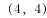

**答案**：A

**官方解析**

若第1排从左到右的第3个士兵的位置为，即其中前面的数字表示排数，后面的数字表示列数。队伍的中间位置，应为最中间一排与最中间一列的交叉点。方阵共7排9列，则最中间一排为第4排、最中间一列为第5列，所以位置应记为。

故正确答案为A。

---

### 第 2 题　qid 2247213 · 数学运算

某公司装修面积320平方米的办公室恰好使用了500块正方形的地砖。问每块地砖的边长为多少米？

- **A**. 0.6
- **B**. 0.8　✅
- **C**. 1
- **D**. 1.2

**答案**：B

**官方解析**

设每块地砖的边长为a，根据500块正方形地砖的面积为320平米可得，，则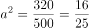，解得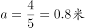。

故正确答案为B。

---

### 第 3 题　qid 2247218 · 数学运算

某农家要建造一个新的矩形鸡圈，如图所示，该鸡圈一面靠围墙，另外三面共使用了200米长的铁丝网。问如果想让鸡圈的面积最大，鸡圈的长和宽比值应为多少？

- **A**. 

- **B**. 

　✅
- **C**. 
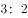

- **D**. 

**答案**：B

**官方解析**

根据题意设长为，宽为，则。

方法一：根据均值不等式：，当且仅当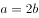时取等号，此时长方形的面积最大。即。

方法二：，则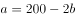，故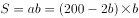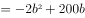。当时，S有最大值。此时，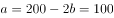，即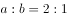。

故正确答案为B。

---

### 第 4 题　qid 2247221 · 数学运算

某公司要完成一项工程，如果单独交给甲项目组，需要x天完成；如果单独交给乙项目组，需要y天完成。若甲、乙两个项目组共同完成该项目，最短需要多少天？

- **A**. 

　✅
- **B**. 
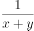

- **C**. 
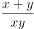

- **D**. 
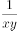

**答案**：A

**官方解析**

根据题意，已知完工时间，故赋值工程总量为工作时间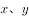的公倍数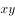。则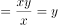，，，所以。

故正确答案为A。

---

### 第 5 题　qid 2247224 · 数学运算

下列哪组边长可以组成一个三角形？

- **A**. 3cm  4cm  7cm
- **B**. 4cm  4cm  9cm
- **C**. 1cm  4cm  6cm
- **D**. 2cm  5cm  4cm　✅

**答案**：D

**官方解析**

根据三角形的性质“两边之和大于第三边，两边之差小于第三边”，逐一验证各选项。 A项：，排除；B项：，排除；C项：，排除；仅剩D项，经验证三边关系满足性质，当选。

故正确答案为D。

---

### 第 6 题　qid 2247210 · 数学运算

某球赛积分规则为胜一场积3分，平一场积1分，负一场积0分。某队经过8场比赛，最终积了13分。问此球队胜、平、负的情况可能有几种？

- **A**. 1
- **B**. 2　✅
- **C**. 3
- **D**. 4

**答案**：B

**官方解析**

设球队胜、平、负的场数分别为x、y、z。根据“经过8场比赛，最终积了13分”，可列不定方程组：                                                

  ······①；······②。

由于数据较小，因此可通过一一枚举来求解。

当时，则、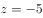，不满足题意，排除；

当，则、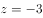，排除；

当，则、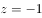，排除；

当，则、，满足题意；

当，则、，满足题意；

当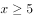，y必然小于0，因此不需要考虑。

则满足题意的情况共有2种。

故正确答案为B。

---

### 第 7 题　qid 2247214 · 数学运算

妇女节时，某饭店推出两种优惠方案，方案一为男士全价，女士打七折；方案二为不分男女，只要三人以上就餐，总价就打八折。若两位男士和两位女士一同前来就餐，方案一的总价比方案二的总价：

- **A**. 
低

- **B**. 
低

- **C**. 
高
　✅
- **D**. 
高

**答案**：C

**官方解析**

由于本题没有给带单位的具体数值，故可采用赋值法，赋值每人的全价费用为100。根据题意可得，按照方案一计算，总价为；按照方案二计算，总价为。方案一比方案二的总价要高，高出的比例为。

故正确答案为C。

---

### 第 8 题　qid 2247216 · 数学运算

某公司产品10月销售利润为20万元，12月份的销售利润比11月份增加11.2万元，假设该产品销售利润逐月增加，且10-12月每月利润增长率相同。问每月利润增长率为：

- **A**. 

- **B**. 

- **C**. 

　✅
- **D**. 

**答案**：C

**官方解析**

设每月利润增长率为r，根据题意可知11月销售利润为。根据公式“”，可知12月相对11月的增长量为：，化简得：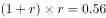，解得或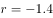。由于利润逐月增加，则利润率为正数，因此每月利润增长率为0.4，即。

故正确答案为C。

注：本题直接解方程难度较大，也可以考虑代入选项进行验证。

---

### 第 9 题　qid 2247217 · 数学运算

在一次体检中，测了学生的身高水平，身高不超过160cm的有30名学生，平均身高为155cm；身高不低于180cm的有45名学生，平均身高为183cm；身高超过160cm的平均身高为175cm；身高低于180cm的平均身高为172cm。请问此次学生的平均身高约为：

- **A**. 172cm
- **B**. 173cm　✅
- **C**. 174cm
- **D**. 175cm

**答案**：B

**官方解析**

设身高超过160cm且低于180cm的学生有x名，身高超过160cm且低于180cm的学生的身高总和为y(cm)。根据题意可得：······①，······②，联合①②，解得，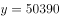，则此次学生的平均身高=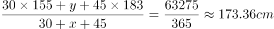，与B项最为接近。

故正确答案为B。

---

### 第 10 题　qid 2247220 · 数学运算

若一个凸多边形有且仅有两个内角为钝角，有至少两个外角为钝角，问该多边形最多有几条边？

- **A**. 4
- **B**. 5　✅
- **C**. 6
- **D**. 7

**答案**：B

**官方解析**

多边形边数=多边形外角个数，问“最多有几条边”，分析最多有几个外角即可。因多边形的外角和为，要外角的个数尽量多，则每个角的角度应尽量小。根据“有且仅有两个内角为钝角（&lt;角度&lt;）”，结合外角+内角，可知外角中有且仅有两个锐角（&lt;角度&lt;），且其余的外角角度均不小于······①。根据“至少两个外角为钝角”，可列表如下：

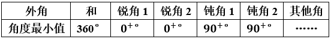

则其他外角角度之和，结合结论①，可知其他外角个数达不到2个，最多有1个，因此，该多边形最多有5条边。

故正确答案为B。

---

## 判断推理

### 第 1 题　qid 2247186 · 图形推理

从所给四个选项中，选择最合适的一个填入问号处，使之呈现一定的规律性：

- **A**. A
- **B**. B
- **C**. C　✅
- **D**. D

**答案**：C

**官方解析**

解析一：元素组成不同，且无明显属性规律，考虑数量规律。题干图形出现了明显的线条相交叉，考虑数交点，九宫格优先横行观察，交点的数量第一行依次为4、9、2，第二行依次为3、？、7，第三行依次为8、1、6。横向上的交点和为15，因此问号处应选择一个交点数为5的图形，A选项3个交点，B选项6个交点，C选项5个交点，D选项9个交点。
故正确答案为C。
解析二：元素组成不同，且无明显属性规律，考虑数量规律。九宫格纵向上直线数量存在规律，第一列的直线数为3、3、7，第二列的直线数为6、？、2，第三列的直线数为1、6、6，竖列直线和为13，因此？处应选择一个直线数为5的图形，A选项3条直线，B选项5条直线，C选项4条直线，D选项3条直线。
故正确答案为B。
 
说明：由于点与线都是数量类规律，并且都比较严谨，但是九宫格的观察方式是优先横行，其次竖列，据此我们倾向于第一种解析。

---

### 第 2 题　qid 2247195 · 图形推理

从所给四个选项中，选择最合适的一个填入问号处，使之呈现一定的规律性：

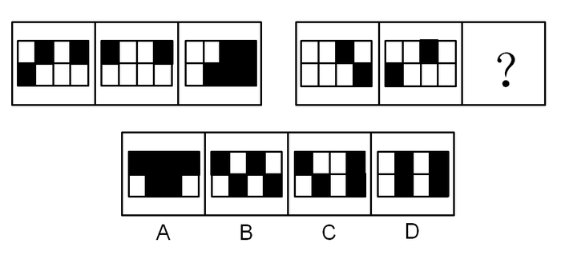

- **A**. A　✅
- **B**. B
- **C**. C
- **D**. D

**答案**：A

**官方解析**

元素组成相似，优先考虑样式规律。图形中出现黑白块，考虑黑白运算。第一组图，白+黑=白，黑+白=白，白+白=黑，黑+黑=黑。第二行图依照此规律进行运算，左上角两块应均为黑色，排除B、C、D选项。
故正确答案为A。

---

### 第 3 题　qid 2247200 · 图形推理

从所给四个选项中，选择最合适的一个填入问号处，使之呈现一定的规律性：

- **A**. A
- **B**. B
- **C**. C　✅
- **D**. D

**答案**：C

**官方解析**

图形元素组成不同，且无明显属性规律，考虑数量规律。观察发现，题干出现单一直线和多边形，考虑数直线。题干图形均有11条直线，则“？”处图形也应该有11条直线。A项有10条直线，排除；B项有14条直线，排除；C项有11条直线，当选；D项有8条直线，排除。
故正确答案为C。

---

### 第 4 题　qid 2247203 · 图形推理

从所给四个选项中，选择最合适的一个填入问号处，使之呈现一定的规律性：

- **A**. A
- **B**. B
- **C**. C　✅
- **D**. D

**答案**：C

**官方解析**

元素组成不同，且无明显属性规律，优先考虑数量规律。第一组图中出现了大量的直角，所以考虑数直角。第一组图形直角的数量为1、2、3。第二组图形中直角的数量为1、2，？，故？处直角数量应为3。A项2个直角，排除；B项4个直角，排除；C项3个直角，当选；D项0个直角，排除。
故正确答案为C。

---

### 第 5 题　qid 2247206 · 图形推理

从所给四个选项中，选择最合适的一个填入问号处，使之呈现一定的规律性：

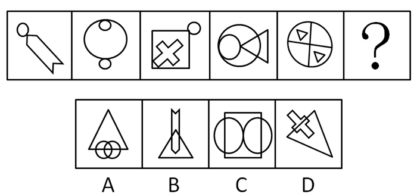

- **A**. A　✅
- **B**. B
- **C**. C
- **D**. D

**答案**：A

**官方解析**

解法1：元素组成不同，且无明显属性规律，优先考虑数量规律。题干出现多个封闭空间，考虑数面。题干图形的面数量依次为：2、3、4、5、6，？，故？处应为7个面的图形。A项7个面，当选；B项3个面，排除；C项6个面，排除；D项3个面，排除。

解法2：元素组成不同优先考虑属性规律。题干都是轴对称图形，并且对称轴数量均为1，由此排除C选项对称轴数量为2；再根据对称轴的方向依次顺时针旋转，需要选一个对称轴竖直的选项，排除D选项，保留A和B选项；再根据题干的曲直性均为有曲线，排除全直线的B选项，选到A选项。

故正确答案为A。

---

### 第 6 题　qid 2247209 · 定义判断

自恋型人格障碍是一种常被误解的复杂人格障碍，基本特征是对自我价值感的夸大和缺乏对他人的公感性。有这种人格障碍的人常有特权感，期望自己能够得到特殊的待遇，其友谊多是从利益出发的。
根据上述定义，下列不属于自恋型人格障碍表现的是：

- **A**. 小张总觉得自己是最优秀的人，理应获得所有荣誉
- **B**. 小赵对朋友精心挑选的礼物总随手一扔，懒得拆开
- **C**. 小刘在寝室的时候喜欢指使他人，就连毛巾都要别人帮忙拿
- **D**. 小林对自己认准的目标从来都坚持不懈，不在意别人的评价　✅

**答案**：D

**官方解析**

第一步：找出定义关键词。
“对自我价值感的夸大”、“缺乏对他人的公感性”、“特权感”、“期望自己得到特殊待遇”。
第二步：逐一分析选项。
A项：小张觉得自己是最优秀的人，符合“对自我价值感的夸大”，理应获得所有荣誉，符合“特权感”、“期望自己得到特殊待遇”，符合定义，排除；
B项：小赵对朋友的礼物态度，符合“缺乏对他人的公感性”，符合定义，排除；
C项：小刘指使他人拿毛巾，符合“特权感”、“期望自己得到特殊待遇”，符合定义，排除；
D项：小林对目标坚持不懈，不在意别人评价，是对目标的一种坚持，不符合“对自我价值感的夸大”，不符合定义，当选。
本题为选非题，故正确答案为D。

---

### 第 7 题　qid 2247212 · 定义判断

次生环境问题是由人类活动引起的，分为环境污染和生态破坏两大类。环境污染是人类直接或间接地向环境排放超过其自净能力的物质或能量，使环境质量恶化，破坏了生态系统和人们的生存环境；生态破坏是人类活动直接作用于自然环境引起的。
根据上述定义，下列属于环境污染的是：

- **A**. 水资源在地区分布不均，进一步加剧了水紧张状态
- **B**. 植被破坏引起的水土流失，污染水质影响生态平衡
- **C**. 大面积开垦草原引起的土地荒漠化，使土地面积和产出量降低
- **D**. 汽车排出的碳氧化合物在紫外线作用下生成的有害浅蓝色烟雾　✅

**答案**：D

**官方解析**

第一步：找出定义关键词。
 环境污染：“人类直接或间接地向环境排放超过其自净能力的物质或能量”、“使环境质量恶化”、“破坏了生态系统和人们的生存环境”；
 生态破坏：“人类活动直接作用于自然环境引起的”。
 第二步：逐一分析选项。
 A项：水资源在地区分布不均，这和人类活动无关，不符合任何一个定义，排除；
 B项：植被破坏导致水土流失，是“人类活动直接作用于自然环境引起的”，符合“生态破坏”定义，不符合“环境污染”定义，排除；
 C项：开垦草原引起的土地荒漠化，是“人类活动直接作用于自然环境引起的”，符合“生态破坏”定义，不符合“环境污染”定义，排除；
 D项：汽车排出的碳氧化合物，符合“人类直接或间接地向环境排放超过其自净能力的物质或能量”，生成有害浅蓝色烟雾，符合“使环境质量恶化”，符合“环境污染”定义，当选。
 故正确答案为D。

---

### 第 8 题　qid 2247215 · 定义判断

善意取得是指无处分权人将不动产或者动产转让给受让人，受让人是善意的且付出合理的价格，依法取得该不动产或者动产的所有权，同时，受让的动产依照法律规定应当登记的已经登记，不需要登记的已经交付给受让人。
根据上述定义，下列交易构成善意取得的是：

- **A**. 甲将自行车借给乙，乙转手将自行车卖给了丙，丙事前不知道乙无处置权，以合理的价格构成了交易　✅
- **B**. 甲擅自将夫妻共有的房产出卖给乙，并签订了协议，但后因纠纷未能办理房屋产权登记，乙要求甲协助办理产权过户手续并交付房屋
- **C**. 甲使用的轿车的行驶证上登记的所有权人是乙，甲未提供有权处分手续，以合理的价格与丙交易了这辆汽车
- **D**. 甲进城务工托付乙经营自己的土地，乙私下将土地转让给了丙，丙承诺以合理的价格购买且准备去登记

**答案**：A

**官方解析**

第一步：找出定义关键词。
 “无处分权人将不动产或者动产转让给受让人”、“受让人是善意的且付出合理价格”、“依法取得该不动产或者动产的所有权”、“动产依照法律规定应当登记的已经登记，不需要登记的已经交付给受让人”
 第二步：逐一分析选项。
 A项：乙将甲的自行车卖给丙，符合“无处分权人将不动产或者动产转让给受让人”，丙事前不知道乙无处置权，并且以合理的价格购买，符合“受让人是善意的且付出合理价格”，符合定义，当选；
 B项：甲擅自将夫妻共有的房产出卖给乙，符合“无处分权人将不动产或者动产转让给受让人”，但只是签订了协议，并未办理房屋产权登记，不符合“依法取得该不动产或者动产的所有权”，不符合定义，排除；
 C项：甲使用的轿车的行驶证上登记的所有权人是乙，并且将车卖给了丙，那么丙是知道甲不是该车的所有者，所以不符合“受让人是善意的”、“依法取得该不动产或者动产的所有权”，不符合定义，排除；
 D项：乙将甲托付给自己的土地卖给了丙，符合“无处分权人将不动产或者动产转让给受让人”，但是乙是私下里卖给丙的，那么丙是否是善意取得的并不明确，并且丙准备去登记说明还没来及登记，不符合“依照法律规定应当登记的已经登记”，不符合定义，排除。
 故正确答案为A。

---

### 第 9 题　qid 2247219 · 定义判断

化感作用是指植物通过释放化学物质到环境中而产生的对其他植物直接或间接的作用。
根据上述定义，下列不符合化感作用的是：

- **A**. 小麦和大豆间作时，小麦的氮吸收能力有所提高
- **B**. 灌木产生的萜类化合物使草本植物种子的萌发受到抑制
- **C**. 洋槐树会向空中挥发有毒物质，使得杂草在树周围的存活率很低
- **D**. 某除草剂中的化学物质会影响双子叶杂草的生长，从而达到灭除作用　✅

**答案**：D

**官方解析**

第一步：找出定义关键词。
“植物通过释放化学物质到环境中”、“产生的对其他植物直接或间接的作用”。
第二步：逐一分析选项。
A项：小麦与大豆间作，从而让小麦的氮吸收能力提高，说明大豆对小麦的生长产生影响，符合“产生的对其他植物直接或间接的作用”，符合定义，排除；
B项：灌木产生的萜类化合物，符合“植物通过释放化学物质到环境中”，使草本植物种子的萌发受到抑制，符合“产生的对其他植物直接或间接的作用”，符合定义，排除；
C项：洋槐树向空中挥发有毒物质，符合“植物通过释放化学物质到环境中”，使周围的杂草成活率低，符合“产生的对其他植物直接或间接的作用”，符合定义，排除；
D项：某除草剂中的化学物质不是植物释放出的，不符合“植物通过释放化学物质到环境中”，不符合定义，当选。
本题为选非题，故正确答案为D。

---

### 第 10 题　qid 2247222 · 定义判断

定制营销就是在对市场营销进行准确定位的基础上，以现代信息技术为主要手段，将顾客作为营销的主体，以顾客的需求为营销导向，企业准确把握顾客的消费心理和消费需求，建立起个性化的顾客交流、管理体系，并以此为基础充分挖掘顾客的消费价值，从而有针对性地开展企业发展活动，提高企业的竞争实力。
根据上述定义，下列不属于定制营销的是：

- **A**. 某家具品牌针对身高过高的消费者，可生产一套加长的家具满足需求
- **B**. 某健身房能根据具体客户健身需求，设计一款适用于个人的器材方案
- **C**. 某游戏针对大部分用户喜欢蛋黄月饼，设计一款集蛋黄，攒莲蓉的游戏　✅
- **D**. 某品牌网站能生产一种定制的皮肤护理或头发护理产品以满足顾客需要

**答案**：C

**官方解析**

第一步：找出定义关键词。
“在对市场营销进行准确定位的基础上”、“以顾客的需求为营销导向”、“准确把握顾客的消费心理和消费需求”、“建立起个性化的顾客交流、管理体系，并以此为基础充分挖掘顾客的消费价值“、“有针对性地开展企业发展活动，提高企业的竞争实力”。
第二步：逐一分析选项。
A项：某家具品牌通过为身高过高的消费者生产专门的加长家具来满足他们的需求，符合“以顾客的需求为营销导向”，“准确把握顾客的消费心理和消费需求”，符合定义，排除；
B项：某健身房根据具体客户的健身需求设计适合个人的器材方案，符合“以顾客的需求为营销导向”，“准确把握顾客的消费心理和消费需求”，符合定义，排除；
C项：某游戏公司针对大部分用户设计一款游戏，而非满足用户的个性化需求，不符合“建立起个性化的顾客交流、管理体系，并以此为基础充分挖掘顾客的消费价值”，不符合定义，当选；
D项：某网站生产定制的皮肤护理或头发护理产品以满足顾客需要，符合“以顾客的需求为营销导向”，“建立起个性化的顾客交流、管理体系，并以此为基础充分挖掘顾客的消费价值“，符合定义，排除。
本题为选非题，故正确答案为C。

---

### 第 11 题　qid 2247226 · 类比推理

磨洋工：懒散拖沓

- **A**. 半瓶醋：一知半解
- **B**. 传声筒：毫无主见
- **C**. 挤牙膏：一毛不拔
- **D**. 敲边鼓：从旁助攻　✅

**答案**：D

**官方解析**

第一步：判断题干词语间逻辑关系。
磨洋工比喻拖延时间，懒散拖沓。磨洋工与懒散拖沓二者为语义关系中的比喻象征关系。并且磨洋工是动宾短语。
第二步：判断选项词语间逻辑关系。
A项：半瓶醋比喻介于懂与不懂之间，且喜欢炫耀；比喻对某种知识或某种技术只略知一二的人。说自己表示谦虚，说别人表示看不起别人。一知半解是指知道得不全面，理解得也不透彻。二者是比喻象征关系，但半瓶醋不是动宾短语，与题干逻辑关系不一致，排除；
B项：传声筒比喻把一个人的话原样传达给另一个人，不添加个人主见。与毫无主见是比喻象征的关系，但传声筒不是动宾短语，与题干逻辑关系不一致，排除；
C项：挤牙膏比喻说话不爽快，经别人一步一步追问，才一点儿一点儿说；一毛不拔比喻为人非常吝啬自私。二者不是比喻象征关系，与题干逻辑关系不一致，排除；
D项：敲边鼓比喻从旁帮腔，从旁助势，帮讲话的人向听者传达思想。敲边鼓与从旁助攻二者为语义关系中的比喻象征关系，并且敲边鼓是动宾短语，与题干逻辑关系一致，当选。
故正确答案为D。

---

### 第 12 题　qid 2247228 · 类比推理

刻舟：求剑

- **A**. 翻江：倒海
- **B**. 草菅：人命
- **C**. 削足：适履　✅
- **D**. 扶危：济困

**答案**：C

**官方解析**

第一步：判断题干词语间逻辑关系。
刻舟求剑比喻人的眼光未与客观世界的发展变化同步，不懂得根据实际情况处理问题。也比喻办事刻板，拘泥而不知变通。“刻舟”是为了“求剑”，二者为目的对应关系。
第二步：判断选项词语间逻辑关系。
A项：翻江倒海意思是形容水势浩大，比喻力量或声势非常壮大。代指非常艰难的事情。“翻江”与“倒海”是并列关系，二者不是目的对应的关系，与题干逻辑关系不一致，排除；
B项：草菅人命意思是把人的性命看得像野草一样轻贱，随意加以摧残。“草菅”与“人命”，二者不是目的对应的关系，与题干逻辑关系不一致，排除；
C项：削足适履意思是因为鞋小脚大，就把脚削去一块来凑合鞋的大小。“削足”是为了“适履”，二者为目的对应关系，与题干逻辑关系一致，当选；
D项：扶危济困指扶助有危难，救济困苦的人。“扶危”与“济困”是并列关系，二者不是目的对应的关系，与题干逻辑关系不一致，排除。
故正确答案为C。

---

### 第 13 题　qid 2247231 · 类比推理

党员：学生

- **A**. 排球：篮球
- **B**. 轮船：货轮
- **C**. 演员：歌手　✅
- **D**. 照相：胶卷

**答案**：C

**官方解析**

第一步：判断题干词语间逻辑关系。
党员与学生二者为交叉关系，有的党员是学生，有的党员不是学生，有的学生是党员，有的学生不是党员。
第二步：判断选项词语间逻辑关系。
A项：排球与篮球二者为并列关系，与题干逻辑关系不一致，排除；
B项：轮船是指所有大的，机动推进的船只，而货轮是按船舶用途分类出来的一种船，二者是种属关系，不是交叉关系，与题干逻辑关系不一致，排除；
C项：演员与歌手二者为交叉关系，有的演员是歌手，有的演员不是歌手，有的歌手是演员，有的歌手不是演员，与题干逻辑关系一致，当选；
D项：照相时候可能会用到胶卷，二者是对应关系，不是交叉关系，与题干逻辑关系不一致，排除。
故正确答案为C。

---

### 第 14 题　qid 2247238 · 类比推理

忧国：忧民

- **A**. 若有：若无
- **B**. 诚惶：诚恐
- **C**. 戒骄：戒躁　✅
- **D**. 相亲：相爱

**答案**：C

**官方解析**

第一步：判断题干词语间逻辑关系。
忧国忧民意思是为国家的前途和人民的命运而担忧。“忧国”与“忧民”为并列关系，且二者皆为动宾短语。
第二步：判断选项词语间逻辑关系。
A项：若有若无意思是形容事物不清晰或关系不亲密。“若有”与“若无”为并列关系，但二者不是动宾短语，与题干逻辑关系不一致，排除；
B项：诚惶诚恐是指非常小心谨慎以至达到害怕不安的程度。“诚惶”与“诚恐”为并列关系，但二者是副词修饰动词的关系，不是动宾短语，与题干逻辑关系不一致，排除；
C项：戒骄戒躁意思是警惕产生骄傲和急躁的情绪。“戒骄”与“戒躁”为并列关系，且二者皆为动宾短语，与题干逻辑关系一致，当选；
D项：相亲相爱形容关系密切，感情深厚。“相亲”与“相爱”为并列关系，但二者不是动宾短语，与题干逻辑关系不一致，排除。
故正确答案为C。

---

### 第 15 题　qid 2247241 · 类比推理

厉：声色俱厉：厉风

- **A**. 苦：同甘共苦：痛苦
- **B**. 爽：英姿飒爽：舒爽　✅
- **C**. 朱：近朱者赤：朱笔
- **D**. 颜：厚颜无耻：颜面

**答案**：B

**官方解析**

第一步：判断题干词语间逻辑关系。
“厉”字有多种释义。“声色俱厉”意思是说话时声音和脸色都很严厉，成语中的“厉”意为严肃；“厉风”形容大风，烈风，词语中的“厉”意为凶猛，三者为语义上的对应关系，且后两个词语分别取了第一个词的不同释义。
第二步：判断选项词语间逻辑关系。
A项：“苦”字有多种释义。“同甘共苦”意思是一同尝甜的，也一同吃苦，比喻有福一起享，有困难一起承担；“痛苦”的“苦”指身体疼痛苦楚，也指精神上的折磨疼痛，希望的破灭而出现的一种心理不平衡状态。两个词语中的“苦”都意为感觉难受。与题干逻辑关系不一致，排除；
B项：“爽”字有多种释义。“英姿飒爽”形容英俊威武、精神焕发的样子。成语中的“爽”意为豪迈、干脆、利落；“舒爽”意为舒适爽快，词语中的“爽”意为舒服。三者为语义上的对应关系，且后两个词语分别取了第一个词的不同释义。与题干逻辑关系一致，当选；
C项：“朱”字有多种释义。“近朱者赤”意思是靠着朱砂的变红，比喻接近好人可以使人变好，接近坏人可以使人变坏。指客观环境对人有很大影响；“朱笔”的意思是蘸红色的毛笔,用以批公文、校古书、批改作业等。两个词语中的“朱”都表红色的意思。与题干逻辑关系不一致，排除；
D项：“颜”字有多种释义。“厚颜无耻”指人脸皮厚，不知羞耻；“颜面”的意思有三：一为容颜、面容；二为面子、脸面、名誉；三为人情、情面。两个词语中的“颜”都有面容、脸面的意思。与题干逻辑关系不一致，排除。
故正确答案为B。

---

### 第 16 题　qid 2247180 · 类比推理

碘酒：红色：消毒

- **A**. 啤酒：畅饮：狂欢
- **B**. 花生：饱满：油料
- **C**. 纸杯：白色：饮水
- **D**. 菠菜：绿色：润肠　✅

**答案**：D

**官方解析**

第一步：判断题干词语间逻辑关系。
红色是碘酒的必然属性（碘酒因储存方式、变质过期，会变颜色，正常碘酒确实是红色的），二者是对应关系中的必然属性对应，消毒是碘酒的功能，二者是对应关系中的功能对应。
第二步：判断选项词语间逻辑关系。
A项：畅饮啤酒，二者是动宾关系，狂欢的时候可以畅饮啤酒，与题干逻辑关系不一致，排除；
B项：饱满是花生可能具有的一种属性特征，二者是对应关系中的或然属性对应，花生是油料的一种，二者为种属关系，与题干逻辑关系不一致，排除；
C项：白色是纸杯可能具有的属性特征，二者是对应关系中的或然属性对应，纸杯的功能是盛水而不是饮水，与题干逻辑关系不一致，排除；
D项：绿色是菠菜的必然属性，二者是对应关系中的必然属性对应，润肠是菠菜的功能，二者是对应关系中的功能对应，与题干逻辑关系一致，当选。
故正确答案为D。

---

### 第 17 题　qid 2247187 · 类比推理

聊天：语言：英语

- **A**. 上课：教室：讲台
- **B**. 旅游：景点：三峡　✅
- **C**. 吃饭：厨师：烤鱼
- **D**. 唱歌：曲目：美声

**答案**：B

**官方解析**

第一步：判断题干词语间逻辑关系。
用语言聊天，二者是对应关系，英语是语言，二者是种属关系。
第二步：判断选项词语间逻辑关系。
A项：教室是上课的地点，二者是地点和行为的对应，讲台在教室里，二者是对应关系中的地点对应，与题干逻辑关系不一致，排除；
B项：去景点旅游，二者是对应关系，三峡是景点，二者是种属关系，与题干逻辑关系一致，当选；
C项：吃饭的时候需要厨师准备食物，烤鱼可能是厨师做的菜品，与题干逻辑关系不一致，排除；
D项：曲目是剧本或歌曲目录，唱歌的时候可能需要曲目，而曲目和美声不是种属关系，与题干逻辑关系不一致，排除。
故正确答案为B。

---

### 第 18 题　qid 2247188 · 类比推理

摘要：论文：文章

- **A**. 成语：谚语：惯用语
- **B**. 纽扣：衬衫：衣服　✅
- **C**. 少年：青年：中年
- **D**. 座椅：汽车：交通

**答案**：B

**官方解析**

第一步：判断题干词语间逻辑关系。
摘要是论文的一部分，二者是组成关系；论文是文章的一种，二者是种属关系。
第二步：判断选项词语间逻辑关系。
A项：惯用语是一种习用的固定词组。有的惯用语是谚语，有的谚语是惯用语，为交叉关系，与题干逻辑关系不一致，排除；
B项：纽扣是衬衫的一部分，二者是组成关系；衬衫是衣服的一种，二者是种属关系，与题干逻辑关系一致，当选；
C项：少年、青年、中年都是人生的不同阶段，三者是并列关系，与题干逻辑关系不一致，排除；
D项：座椅是汽车的一部分，二者是组成关系；但汽车是交通工具的一种，而不是交通的一种，交通是一个行业，与题干逻辑关系不一致，排除。
故正确答案为B。

---

### 第 19 题　qid 2247190 · 类比推理

台秤：称物：重量

- **A**. 轮船：漂浮：救生衣
- **B**. 流水线：打包：工人
- **C**. 订书机：装订：纸张　✅
- **D**. 商品：消费者：销量

**答案**：C

**官方解析**

第一步：判断题干词语间逻辑关系。
台秤可以称物的重量。称物是台秤的功能，二者是对应关系中的功能对应，重量是台秤的测量对象，二者是对应关系中对象的对应。
第二步：判断选项词语间逻辑关系。
A项：轮船和救生衣都可以漂浮在水面上，三者无功能以及测量对象的对应关系，与题干逻辑关系不一致，排除；
B项：工人在流水线上进行打包，打包是工人的动作，而不是功能的对应，与题干逻辑关系不一致，排除；
C项：订书机可以装订纸张。装订是订书机的功能，二者是对应关系中的功能对应，纸张是订书机的作用对象，二者是对应关系中对象的对应。与题干逻辑关系一致，当选；
D项：消费者可以购买商品，二者是对应关系，销量是商品卖出的数量，与题干逻辑关系不一致，排除。
故正确答案为C。

---

### 第 20 题　qid 2247192 · 类比推理

沙漏 对于（  ）相当于（  ）对于 火把

- **A**. 钟表  灯泡　✅
- **B**. 日晷  工具
- **C**. 玻璃  黑夜
- **D**. 葫芦  火灾

**答案**：A

**官方解析**

逐一代入选项。
A项：沙漏和钟表都是记录时间的工具，二者是并列关系；灯泡和火把都是照明的工具，二者是并列关系。前后逻辑关系一致，当选；
B项：沙漏和日晷都是记录时间的工具，二者是并列关系；火把是一种照明工具，二者是种属关系。前后逻辑关系不一致，排除；
C项：玻璃是制作沙漏的原材料，二者是原材料的对应关系；火把一般在黑夜使用，二者是时间的对应关系。前后逻辑关系不一致，排除；
D项：沙漏和葫芦无明显逻辑关系。火把可能造成火灾，二者是因果对应关系。前后逻辑关系不一致，排除。
故正确答案为A。

---

### 第 21 题　qid 2247194 · 逻辑判断

洗碗和叠衣服这些家务活让你心情不佳？有研究者做了一项调查，调查涉及6000多名63岁至99岁的女性志愿者。研究人员发现，与基本不动的老人相比，每天从事30分钟家务的女性志愿者死亡风险低12%。因此，研究人员认为做家务这类简单活动有助于延年益寿。
以下哪项如果为真，最能削弱上述研究者的观点？

- **A**. 这项研究关注的是老年女性，那些年轻时就喜欢运动的人步入老年后也能保持运动的习惯　✅
- **B**. 很多老年人可以培养自己的爱好，比如学习书法、摄影，旅游等，这有助于延年益寿
- **C**. 我国有55.4万个老年协会组织，老年志愿者达2000万人，覆盖了全国绝大多数的城镇社区和农村社区
- **D**. 老年健身操是兼中外之长，融体育、舞蹈、音乐为一体而形成的一套具有我国特点的健身方法

**答案**：A

**官方解析**

第一步：找出论点和论据。
论点：做家务这类简单活动有利于延年益寿。
论据：研究人员发现，与基本不动的老人相比。每天从事30分钟家务的女性志愿者死亡风险低 。
第二步：逐一分析选项。
A项：年轻时就喜欢运动的女性步入老年后也保持运动的习惯，因此有可能是年轻时喜欢运动导致其延年益寿，提出了新的可以延年益寿的原因，他因削弱，当选；
B项：很多老年人可以培养自己的爱好，但与论点中做家务是否能够延年益寿无关，属于无关项，排除；
C项：老年志愿者2000万人，覆盖范围广泛。与论点无关，排除； 
D项：老年健身操是我国的健身方法，题干没有提到老年健身操，无关选项，排除。
故正确答案为A。
注：本题题目不是特别严谨，A项也不是很明确，但是其他选项都是无关项，只有A项能够与题干建立联系，因此对比择优，只能选A。

---

### 第 22 题　qid 2247196 · 逻辑判断

英国伦敦大学的研究发现，过分依赖GPS导航，会阻断脑部海马回形成新的记忆；用惯电子产品会导致很多人只会用零散的语言交流；用游戏和电视节目取代传统阅读会造成人的阅读能力和思考能力下降。于是，研究者认为，高科技会使人变笨。
以下哪项如果为真，最能削弱上述研究者的观点？

- **A**. 人类借助高科技设备，可以更精确地认识自然界，从而提高人类对世界的认知水平
- **B**. 随着神经成像技术和信息处理手段的不断丰富，脑研究逐步转向更为深入的神经功能
- **C**. 有一项实验将一种阻止蛋白合成的药物注射于大鼠海马内，但大鼠的学习能力并未明显受损
- **D**. 有研究发现，人类的大脑可以随着由高科技带来的生活方式的改变而做出相应的调整和变化　✅

**答案**：D

**官方解析**

第一步：找出论点和论据。

论点：高科技会使人变笨。

论据：过分依赖GPS导航，会阻断脑部海马回形成新的记忆；用惯电子产品会导致很多人只会用零散的语言交流；用游戏和电视节目取代传统阅读会造成人的阅读能力和思考能力下降。

论据和论点都在讨论“高科技”和“智商”的关系，主体和话题一致，优先考虑削弱论点，即“高科技不会使人变笨”。

第二步：逐一分析选项。

A项：该项说的是借助高科技能提高人类对世界的认知水平，但认知水平只是体现智商的其中一个方面，并不能完全代表智商水平，只是可能性削弱，先保留；

B项：该项说的是对脑研究的方向会更深入，与论点提到的高科技是否会使人变笨无关，无法削弱，排除；

C项：该项说的是阻止蛋白合成的药物与大鼠学习能力的关系，而论点是针对人来说的，主体不一致，排除；

D项：该项说的是大脑会随着由高科技带来的生活方式的改变做出相应的调整和变化，即大脑是会动态变化的，是会自主调整的，而不是随意受高科技控制的，所以不一定会受到高科技的危害而变笨，可能性削弱，保留；

注：本题AD均是不明确选项，如下图所示，原文是直接用了D项来削弱论点“高科技会使人变笨”，一般不会违反原文来出题，没有意义，故出题人更倾向的答案可能是D项。

本题出得不是很好，在没有原文辅助的情况下，确实会非常纠结，只能靠常识或看过相关文献的积累来做题，但这种题在考试中并不会很多，极少出现，故了解即可，可不作为备考重点。

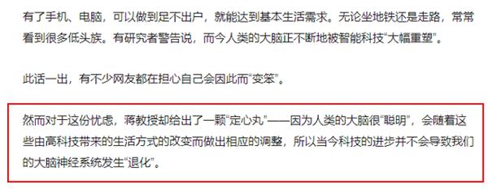

故正确答案为D。

---

### 第 23 题　qid 2247198 · 逻辑判断

心脏疾病与动脉血管中的脂肪栓塞有密切关系。但一项新研究显示，脂肪分子不仅来自食物，还可能来自口腔中的某种细菌。研究者据此认为口腔疾病经常与心脏疾病相关。
以下哪项如果为真，最能支持上述研究者的观点？

- **A**. 心脏病通常由动脉粥样硬化引发，在这个过程中，动脉血管会被一种名为“脂质”的物质堵塞
- **B**. 这种细菌产生的脂类分子与哺乳动物体内脂类的组成成分不同，属于一种特殊的细菌家族　✅
- **C**. 一般情况下，这种细菌只在口腔中保持活跃，在合适环境中它们可能会引发牙周疾病
- **D**. 口腔疾病引起的细胞因子会破坏胰岛腺，减少人体必要胰岛素的分泌量，容易引起糖尿病的发生

**答案**：B

**官方解析**

第一步：找出论点和论据。

论点：口腔疾病经常与心脏疾病相关。

论据：脂肪分子不仅来自食物，还可能来自口腔中的某种细菌。

第二步：逐一分析选项。

A项：心脏病通常由动脉粥样硬化引发，动脉血管会被一种名为“脂质”的物质堵塞，讨论的是心脏病与动脉血管中的脂肪栓塞的关系，与口腔疾病无关，排除；

B项：这种细菌产生了脂类分子说明口腔中的某种细菌确实可以产生脂肪，这解释了论据的“脂肪分子不仅来自食物，还可能来自口腔中的某种细菌”，可以加强，当选。

C项：这种细菌只在口腔中保持活跃，可能会引发牙周疾病，所以与心脏疾病无关。削弱论点，排除；

D项：口腔疾病容易引起糖尿病的发生。没有提到心脏疾病，无关选项，排除。

此题出题人在命制过程中并不严谨，只能通过排除的思维，ACD项是一定不能加强的，所以这道题答案为B。

本题不是很严谨，但我们通过查询原文发现（如下图所示），B项在原文中明确提到了，并且告诉我们这种细菌脂质和人体原生脂质的化学差异也许是导致心脏疾病的原因。出题人题目命制不严谨，同学们无需纠结，本题只要重点学习掌握ACD项为何不能加强即可。

故正确答案为B。

---

### 第 24 题　qid 2247199 · 逻辑判断

有科学家对澳大利亚约35亿年前的一块岩石中的微化石进行了分析，他们用二次离子质谱仪，从每个微化石中的碳-13中分离出碳-12，并测量出两者比例，他们发现这些化石包含一个原始生物群体。因此，他们推测生命早在35亿年前就已在地球上出现。
要得到上述结论，需要补充的前提是：

- **A**. 早在43亿年前，地球上就有液态水存在
- **B**. 微化石的碳-13和碳-12比例具有生物学和代谢功能的特征　✅
- **C**. 甲烷是氧气出现之前地球早期大气的重要成分，是简单有机物
- **D**. 在格陵兰和加拿大都发现了三十几亿年前的疑似生物遗迹的石头

**答案**：B

**官方解析**

第一步：找出论点和论据。
论点：生命早在35亿年前就已经在地球上出现。
论据：科学家从35亿年前微化石中的碳-13中分离出碳-12，并测量出两者比例，发现这些化石包含一个原始生物群体。
论点论据话题一致，都在说35亿年前存在生命/生物群体，要支持可以优先考虑找一个必要条件，即没他不行的条件。
第二步：逐一分析选项。
A项：该项说的是43亿年前出现了液态水的存在，题干讨论的是碳-13和碳-12的比例与生命是否存在之间的关系，话题不一致，无法加强，排除；
B项：假如微化石中的碳-13和碳-12比例不具有生物学和代谢功能的特征，就不能通过二者的比例得出微化石中有原始生物群体，因此是题干成立的必要条件，当选；
C项：该项说的是甲烷的出现时间和特性，题干讨论的是碳-13和碳-12的比例与生命是否存在之间的关系，话题不一致，无法加强，排除；
D项：该项说的是三十几亿年前出现疑似生物遗迹的石头，到底是不是35亿年以前不确定，且只是疑似，并不能够证明一定存在生命，无法加强，排除。
故正确答案为B。

---

### 第 25 题　qid 2247201 · 逻辑判断

我国北方地区沙漠相比2.6万年至1.6万年前的末次盛冰期有较大幅度的收缩，而相比9000年至5000年前的全新世大暖期又有明显扩大。因此，研究者认为，气候的变化，乃至北半球高纬地区冰量变化，是影响我国沙漠和沙地的地表环境变化的主要因素。
如果以下各项为真，最能加强上述论证的是：

- **A**. 利用生物措施和工程措施构筑防护体系的做法有助于控制沙漠化
- **B**. 西北某干旱地区，因为常年有风，所以形成了一个个新月形沙丘
- **C**. 撒哈拉沙漠位于北回归线两侧，受副热带高气压带控制，气候炎热干燥
- **D**. 某段时期，中国北部气温上升，降雨增加，流沙面积比之前收缩了一半　✅

**答案**：D

**官方解析**

第一步：找出论点和论据。
论点：气候的变化，乃至北半球高纬地区冰量变化，是影响我国沙漠和沙地的地表环境变化的主要因素。
论据：我国北方地区沙漠相比2.6万年至1.6万年前的末次盛冰期有较大幅度的收缩，而相比9000年至5000年前的全新世大暖期又有明显扩大。
第二步：逐一分析选项。
A项：该项说的是如何能控制沙漠化，题干讨论的是气候变化和冰量变化与我国沙漠、沙地地表环境变化之间的关系，话题不一致，无法加强，排除；
B项：该项说的是西北某干旱地区因常年有风形成沙丘，题干探讨的主题是气候变化和冰量变化，而非风的变化，偷换概念，话题不一致，无法加强，排除；
C项：该项说的是撒哈拉沙漠气候干燥炎热的原因，题干探讨的是气候变化对沙漠地表环境的影响，话题不一致，无法加强，排除； 
D项：气温上升降雨增加导致流沙面积比之前收缩了一半，说明气候变化对沙地的地表环境变化有影响，补充论据支持，可以加强，当选。
故正确答案为D。

---

### 第 26 题　qid 2247202 · 逻辑判断

冬至日，小明、小红、小丽、小强各吃了一种食物，分别是饺子、汤圆、面条、米饭。已知：①小明没吃饺子，也没吃米饭；②小红没吃饺子，也没吃面条；③如果小明没吃面条，那么小强也没吃饺子；④小丽既没吃饺子，也没吃米饭。
由此可以推出：

- **A**. 小明吃汤圆，小丽吃面条
- **B**. 小强吃面条，小丽吃汤圆
- **C**. 小丽吃汤圆，小明吃面条　✅
- **D**. 小红吃面条，小强吃米饭

**答案**：C

**官方解析**

第一步：翻译题干。

①小明没吃饺子 且 没吃米饭

②小红没吃饺子 且 没吃面条

③小明没吃面条小强没吃饺子

④小丽没吃饺子 且 没吃米饭

由题干条件小明、小红和小丽没吃饺子，可知小强吃了饺子；

由小强吃了饺子，逆否条件③可以推出：小强吃饺子小明吃面条。

第二步：逐一分析选项。

A项：小明吃汤圆，与题干已推结论小明吃面条不符，排除；

B项：小强吃面条，与题干已推结论小强吃饺子不符，排除；

C项：小丽吃汤圆，小明吃面条，正确；

D项：小强吃米饭，与题干已推结论小强吃饺子不符，排除。

故正确答案为C。

---

### 第 27 题　qid 2247204 · 逻辑判断

科研人员做了一项实验，将十多张穿着同样考究的小孩的肖像照展示给一个由医生和教师所组成的评判小组，小组成员需根据肖像照对孩子们的聪明程度做判断，这种主观判断的结果将与客观智力测验的结果相比对。最后，科研人员得出的结论为：人们可以根据相貌丑俊来判断个体的智商高低。
以下哪项如果为真，最能削弱上述结论？

- **A**. 好莱坞的知名影星中不乏名校毕业的高材生
- **B**. 如果一个人仪表堂堂，我们可能错误地认为他一定非常聪慧　✅
- **C**. 根据社会同型交配法则，聪慧基因和美丽基因会不断优化结合
- **D**. 漂亮的小孩能接受到更用心的教育，才智也可以得到更好的开发

**答案**：B

**官方解析**

第一步：找出论点和论据。
论点：人们可以根据相貌丑俊来判断个体的智商高低。
论据：科研人员将十多名穿着相同的小孩肖像照展示给评判组，以此来判断孩子们的聪明程度。
第二步：逐一分析选项。
A项：好莱坞影星中不乏名校毕业的高材生，但这些影星是丑是俊无法判断，无法与高材生建立必然的联系，为不明确选项，无法削弱，排除；
B项：认为一个人仪表堂堂非常聪慧，这种做法可能是错误的，直接削弱了论点，说明相貌和智商之间没有必然联系，当选；
C项：聪慧基因和美丽基因不断优化结合，在美丽和聪慧之间建立了联系，可能美丽的人就聪慧，支持了论点，无法削弱，排除；
D项：漂亮的小孩才智会得到更好的开发，所以一般漂亮的小孩的智力会更高，支持了论点，无法削弱，排除。
故正确答案为B。

---

### 第 28 题　qid 2247205 · 逻辑判断

有科学家研究了现存的几种鹦鹉螺化石，发现其贝壳上的波状螺纹具有树木年轮一样的功能，螺纹分许多隔，虽宽窄不同，但每隔上细小波状生长线在30条左右，与现代农历一个月的天数完全相同。观察发现，鹦鹉螺的波状生长线每天长一条，每月长一隔。并且，很多科学证据表明，月球正逐渐离地球远去，而农历正是月球绕地球一周的天数。
由此可以推出：

- **A**. 鹦鹉螺的波状生长线会越长越慢
- **B**. 鹦鹉螺的波状生长线隔会越长越宽
- **C**. 相同地质年代的螺壳生长线是固定不变的
- **D**. 古鹦鹉螺的每隔生长线数随着化石年代的上溯而逐渐减少　✅

**答案**：D

**官方解析**

日常结论题，根据题干信息逐一分析选项。
A项：鹦鹉螺的波状生长线每天长一条，每月长一隔，无法推出越长越慢，排除；
B项：螺纹分许多隔，宽窄不同，题干并未说明宽窄变化的原因，无法推出鹦鹉螺的波状生长线隔会越长越宽，排除；
C项：相同地质年代的月球与地球的距离一样，那么月球绕地球运行的轨道也一样，绕地球运行一周需要的时间也一样，所以每隔螺壳生长线的“条数”应该相同，但选项表述为螺壳生长线是固定不变，无法判断螺壳生长线除 “条数”外的其他方面是否相同，排除；
D项：题干说月球正逐渐离地球远去，也就意味着随着化石年代的上溯月球与地球的距离更近，那么月球绕地球运行的轨道随之变小，绕地球运行一周需要的时间更短，所以每隔螺壳生长线的“条数”应该减少，可以推出，当选。
故正确答案为D。

---

### 第 29 题　qid 2247207 · 逻辑判断

某次医药试验对无中风和心肌梗死病史的成人高血压患者进行了研究，参与试验的患者被随机分配为两组，一组每日服用一种固定复方制剂（10毫克依那普利和0.8毫克叶酸组成），另一组每日单纯口服10毫克的依那普利片，经过4年多的治疗，固定复方制剂组有2.7%发生中风，依那普利组有3.4%发生中风，也就是说，联合服用依那普利和叶酸后，发生中风的风险显著下降。
要得到上述结论，需要补充的前提是：

- **A**. 实验前，两组患者体内的叶酸水平无显著差异　✅
- **B**. 依那普利能对抗心肌缺血，减轻心肌梗死范围
- **C**. 依那普利和叶酸一起服用不会产生任何副作用
- **D**. 在实验前对两组受试者都进行了中风风险检测

**答案**：A

**官方解析**

第一步：找出论点和论据。
论点：联合服用依那普利和叶酸后，发生中风的风险显著下降。
论据：某次医药试验对无中风和心肌梗死病史的成人高血压患者进行了研究，参与试验的患者被随机分配为两组，一组每日服用一种固定复方制剂（10毫克依那普利和0.8毫克叶酸组成），另一组每日单纯口服10毫克的依那普利片，经过4年多的治疗，固定复方制剂组有2.7%发生中风，依那普利组有3.4%发生中风。
第二步：逐一分析选项。
A项：实验结论得出联合服用依那普利和叶酸后中风的风险下降，表明叶酸起到了降低中风的作用，但如果实验前患者体内的叶酸水平不一的话，就不能必然得出实验结论，为结论成立的必要条件，补充论据，当选；
B项：依那普利能对抗心肌缺血，减轻心肌梗死范围，与结论中风的风险降低无关，为无关项，不是前提条件，排除；
C项：依那普利和叶酸一起服用产生副作用与否，与结论中风的风险降低无关，为无关项，不是前提条件，排除；
D项：实验对象是无中风的患者，在实验前对受试者进行中风风险检测不是必要的前提条件，排除。
故正确答案为A。

---

### 第 30 题　qid 2247208 · 逻辑判断

某调查报告显示，2016年中国女性收入用于消费、储蓄、投资的比例是62:23:16，同时消费比例比上年显著上升，女性对产品或服务的个性化需求往往高于男性。因此，有专家认为，我国女性已成为消费结构升级的重要推动者。
以下哪项如果为真，最能支持上述专家的观点？

- **A**. 
女性非理性消费状况突出，容易受打折、朋友、销售等影响

- **B**. 
国内60左右的女性掌管家中财政，75的家庭消费由女性决策 

- **C**. 
女性对产品和服务的品质有更高的要求，对安全防护等需要强烈 
　✅
- **D**. 
我国15-60岁的女性消费群体约为4.8亿，已成为消费的重要群体

**答案**：C

**官方解析**

第一步：找出论点和论据。

论点：女性已成为消费结构升级的重要推动者。

论据：女性消费比例比上年显著上升，女性对产品或服务的个性化需求往往高于男性。

第二步：逐一分析选项。

A项：女性非理性消费状况突出，可能会导致消费增多，但与成为消费结构升级的重要推动者无关，为无关项，无法加强，排除；

B项：左右的女性掌管家中财政，的家庭消费由女性决策，只能说明绝大多数的消费由女性决定，但没有明确体现出女性是消费“结构升级”的重要推动者，不明确选项，排除；

C项：女性对产品和品质有更高的要求，说明女性消费更注重“质”，补充论据加强“女性已成为消费结构升级的重要推动者”，能加强，当选；

D项：15-60岁的女性已成为消费的重要群体，但不能明确得出是否比男性群体更重要，为不明确选项，无法加强，排除。

故正确答案为C。

注：以下为已查询到的原文，C项在原文中明确作为例证出现，供大家参考。

---

## 资料分析

### 材料 1

        2016年，X省交通运输、仓储和邮政业实现增加值930.8亿元，增长，增速比2015年加快0.4个百分点，快于全省经济增速4.2个百分点；占全省GDP比重，比2015年上升0.2个百分点；对GDP增长贡献率；占全省第三产业增加值比重为，第三产业增长贡献率为。

        2016年，X省高速公路完成投资118亿元，建成公路里程236公里。高速公路通车里程达到5265公里，其中：国家高速公路网（行政级别属于国道的高速公路）里程达到3193公里。全省119个县（市、区）有113个通了高速公路。2016年底X省公路通车里程达到142065公里，新增公路通车里程1106公里，公路密度为。

#### 第 1 题　qid 2247276 · 比重

2016年，X省第三产业增加值占GDP比重约为：

- **A**. 

- **B**. 

- **C**. 

　✅
- **D**. 

**答案**：C

**官方解析**

由题干“2016年，X省第三产业增加值占GDP比重约为”，判定本题为现期比重问题。定位文字材料第一段可知，2016年X省交通运输、仓储和邮政业实现增加值930.8亿元，占全省GDP比重，占全省第三产业增加值比重为。则题目所求为：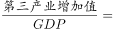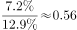，即占比约为，C项满足。

故正确答案为C。

---

#### 第 2 题　qid 2247279 · 综合

X省面积约为多少万平方公里？

- **A**. 14
- **B**. 16　✅
- **C**. 18
- **D**. 20

**答案**：B

**官方解析**

由题干“X省面积约为多少万平方公里”，根据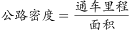，结合材料所给时间，可判定本题为现期平均数问题。定位文字材料文字第二段可知，2016年底X省公路通车里程达到142065公里，公路密度为。根据，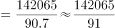，B项较为接近。

故正确答案为B。

---

#### 第 3 题　qid 2247282 · 比重

2016年，X省国道里程中高速公路的比重约比省道：

- **A**. 高2个百分点
- **B**. 高20个百分点
- **C**. 低2个百分点　✅
- **D**. 低20个百分点

**答案**：C

**官方解析**

由题干“2016年，X省国道里程中高速公路的比重约比省道”，结合材料时间，判定本题为现期比重问题。定位文字材料第二段可知，2016年X省高速公路通车里程达到5265公里，国道里程中高速公路里程为3193公里，定位材料统计图2可知，2016年X省省道里程为6701公里，国道里程为11096公里。则题目所求为：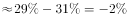，即低2个百分点，C项满足。

故正确答案为C。

---

#### 第 4 题　qid 2247287 · 增长

2016年该省公路密度约比上年增加了多少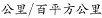？

- **A**. 0.7　✅
- **B**. 1.2
- **C**. 1.9
- **D**. 3.5

**答案**：A

**官方解析**

由题干“2016年该省公路密度约比上年增加了多少”，根据，判定本题为平均数的增长量问题。材料未表述2016年该省面积有所变化，默认面积保持不变，则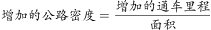。定位文字材料第二段可知，2016年底X省公路通车里程达到142065公里，新增公路通车里程1106公里，公路密度为90.7公里/百平方公里。根据公式：公路密度，则X省面积百平方公里。故题目所求为：公里/百平方公里。

故正确答案为A。

---

#### 第 5 题　qid 2247297 · 综合

关于X省2016年交通发展状况，能够从上述资料中推出的是：

- **A**. 
交通运输、仓储和邮政业增加值较2014年增加了之间

- **B**. 
高速公路通车里程较上年增长以上

- **C**. 
三级以上公路密度超过30

- **D**. 
公路里程中村道占比比乡道占比高不到5个百分点
　✅

**答案**：D

**官方解析**

A项：定位材料文字第一段，2016年，X省交通运输、仓储和邮政业实现增加值增长，增速比2015年加快0.4个百分点，可知2015年交通运输、仓储和邮政业实现增加值同比增长。代入间隔增长率公式：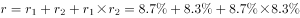，题目表述错误；

B项：定位材料文字第二段，2016年，X省建成高速公路里程236公里，通车里程达到5265公里。则2015年X省高速通车里程，题目所求增速为，错误；

C项：根据图一，三级以上公路里程为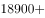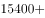，根据本篇材料第2题，X省面积约为1560百平方公里，则三级以上公路密度约为公里/百平方公里，错误；

D项：定位材料文字第二段，2016年底X省公路通车里程达到142065公里；根据图二，公路里程中村道为54865公里，乡道为48896公里，题目所求为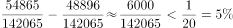，正确。

故正确答案为D。

---

### 材料 2

        2017年上半年，Y市文化创意产业实现增加值1734.7亿元，同比增长，占地区生产总值的；规模以上文创产业法人单位实现收入6902.7亿元，同比增长，比上年4季度和今年1季度分别提高1.3个和0.2个百分点；实现利润总额349.8亿元，同比增长。

        分领域看，上半年，文化艺术服务领域规模以上法人单位实现收入182.7亿元，同比增长；软件和信息技术服务领域实现收入2836.7亿元，增长；设计服务领域实现收入167.1亿元，增长；新闻出版及发行服务领域实现收入340.6亿元，增长。

        分功能区看，上半年文创功能区规模以上法人单位实现收入5087.5亿元，同比增长。其中，文化科技融合示范区实现收入2616.1亿元，同比增长；时尚创意功能区、文化体育（会展）融合功能区、文化艺术品交易功能区分别实现收入187.9亿元、167.5亿元、52.2亿元，同比分别增长、和，均呈快速增长态势。

        上半年文化创意产业完成固定资产投资141.6亿元，同比增长。其中，旅游休闲娱乐领域完成投资81.3亿元，占文创产业投资总额的。

#### 第 6 题　qid 2247319 · 增长

2017年上半年，Y市地区生产总值同比增长。该市文化创意产业增加值占地区生产总值比重比上年提高了约多少个百分点？

- **A**. 0.2
- **B**. 0.8　✅
- **C**. 2.5
- **D**. 6.2

**答案**：B

**官方解析**

由题干“2017年上半年，Y市地区生产总值同比增长（b）。······占······比重比上年提高了约多少个百分点”，可判定本题为两期比重比较问题。定位文字材料第一段可得，“2017年上半年，Y市文化创意产业实现增加值（A）1734.7亿元，同比增长（a），占地区生产总值的”。由两期比重比较公式可得，所求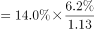，与B项最接近。

故正确答案为B。

---

#### 第 7 题　qid 2247321 · 增长

2017年上半年，Y市软件和信息技术服务领域规模以上法人单位收入同比增量约占全市规模以上文创产业法人单位同比增量的：

- **A**. 四成
- **B**. 五成
- **C**. 六成　✅
- **D**. 七成

**答案**：C

**官方解析**

由题干“2017年上半年······约占······的”，结合选项为几成，可判定本题为现期比重计算问题。定位材料第一、二段可得，“2017年上半年，规模以上文创产业法人单位实现收入6902.7亿元，同比增长，软件和信息技术服务领域实现收入2836.7亿元，增长”。根据可得，2017年上半年，Y市软件和信息技术服务领域规模以上法人单位收入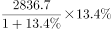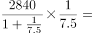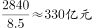。全市规模以上文创产业法人单位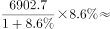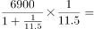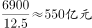。故所求，即为六成。

故正确答案为C。

---

#### 第 8 题　qid 2247329 · 增长

设Y市文化科技融合示范区、时尚创意功能区、文化体育（会展）融合功能区和文化艺术品交易功能区规模以上法人单位2017年上半年收入同比增长率分别为X、Y、Z和N，则以下正确的是：

- **A**. 
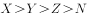

- **B**. 

- **C**. 

- **D**. 

　✅

**答案**：D

**官方解析**

定位材料第三段可得，2017年上半年，文化科技融合示范区实现收入同比增长（X）；时尚创意功能区、文化体育（会展）融合功能区、文化艺术品交易功能区收入同比分别增长（Y），（Z）和（N）。比较可知，。

故正确答案为D。

---

#### 第 9 题　qid 2247340 · 比重

Y市2017年上半年固定资产投资总额为3569.7亿元。则同期旅游休闲娱乐领域之外的文化创意产业完成固定资产投资占全市投资总额的比重为：

- **A**. 

　✅
- **B**. 

- **C**. 

- **D**. 

**答案**：A

**官方解析**

由题干“······占······的比重为”，可判定本题为现期比重计算问题。定位文字材料第四段可得，“（2017年）上半年文化创意产业完成固定资产投资141.6亿元，其中，旅游休闲娱乐领域完成投资81.3亿元，占文创产业投资总额的” 。则同期旅游休闲娱乐领域之外的文化创意产业完成固定资产投资为，故，与A项最接近。

故正确答案为A。

---

#### 第 10 题　qid 2247343 · 增长

关于2017年上半年Y市文化创意产业状况，以下信息中能够从上述资料中推出的有几条？
①2季度收入同比增速快于1季度
②按收入计算的利润率高于上年同期水平
③新闻出版及发行服务领域实现收入比设计服务领域高2倍多
④文化科技融合示范区实现收入增长了400多亿元

- **A**. 1
- **B**. 2　✅
- **C**. 3
- **D**. 4

**答案**：B

**官方解析**

①定位材料第一段可得，“2017年上半年，规模以上文创产业法人单位实现收入6902.7亿元，同比增长，比上年4季度和今年1季度分别提高1.3个和0.2个百分点”。可计算今年一季度增速为。上半年由1季度与2季度构成，根据混合增长率口诀混合居中但不中可知，

，正确； 

②定位材料第一段可得，“（2017年上半年）规模以上文创产业法人单位实现收入（B）6902.7亿元，同比增长（b），实现利润总额（A）349.8亿元，同比增长（a）”。，则可按两期比重比较方法来比较两期利润率高低。，则比重上升，即利润率上升，正确；

③定位材料第二段可得，“（2017年上半年）设计服务领域实现收入167.1亿元，新闻出版及发行服务领域实现收入340.6亿元”。倍多，故新闻出版及发行服务领域实现收入是设计的2倍多，即高1倍多，错误；

④定位材料第三段可得，“（2017年上半年）文化科技融合示范区实现收入2616.1亿元，同比增长”。根据可得，文化科技融合示范区，错误。

正确的有两项。

故正确答案为B。

备注：如果严格按照题干“Y市文化创意产业状况”分析，前两个是找不到对应数据的，选项中没有对应的正确答案个数。因此，合理推测本题前两个说法命题人考查的应该是规模以上文化产业的情况，由于命题不严谨可能会造成争议，特此说明。

---

### 材料 3

        十八大以来，兵团各级紧紧抓住经济换挡升级的有利时机，有力地推动了商贸规模持续扩大。2016年，兵团实现商品销售总额3341.37亿元，比2012年增长2.2倍；社会消费品零售总额632.29亿元，比2012年增长1.1倍。

        2016年，兵团拥有商贸流通企业3357家，比2012年增长。分行业看，批发零售企业3244家，比2012年增长；住宿餐饮企业113家，比2012年增长。

        2016年，兵团拥有亿元以上商品交易市场23家，比2012年增加13家，总摊位数12621个，实现交易额1001.39亿元，比2012年增长25.6倍。分类型看，综合市场6家，其中，工业消费品综合市场1家，农产品综合市场2家，其他综合市场3家；专业市场17家，其中，生产资料市场2家，农产品市场6家，纺织服装鞋帽市场2家，电器、通讯器材、电子设备市场2家，家具、五金及装饰材料市场2家，汽车、摩托车及零配件市场3家。

        2016年，兵团拥有商业综合体3家，商户数共348家，从业人员1802人。其中，自营、联营商户64家，实现销售额1.65亿元；租赁商户284家，实现销售额5.83亿元。

#### 第 11 题　qid 2247293 · 综合

2012年兵团社会消费品零售总额约占商品销售总额的：

- **A**. 

- **B**. 

- **C**. 

　✅
- **D**. 

**答案**：C

**官方解析**

根据题干“2012年······约占······”，结合材料数据为2016年，可判定本题为基期比重问题。定位文字材料第一段，2016年，兵团实现商品销售总额3341.37亿元（B），比2012年增长2.2倍（b）；社会消费品零售总额632.29亿元（A），比2012年增长1.1倍（a）。代入基期比重公式：可得：，与C项最接近。

故正确答案为C。

---

#### 第 12 题　qid 2247295 · 综合

2016年兵团批发零售企业的数量比2012年多出：

- **A**. 1391家
- **B**. 1453家　✅
- **C**. 1518家
- **D**. 1604家

**答案**：B

**官方解析**

由题干“2016年······的数量比2012年多出”，可判定本题为增长量计算问题。定位文字材料第二段，2016年，兵团拥有批发零售企业3244家，比2012年增长。代入增长量计算公式： 可得，批发零售企业增长了 家，与B项最接近。

故正确答案为B。

---

#### 第 13 题　qid 2247300 · 综合

下列符合2016年兵团亿元以上商品交易专业市场分布情况的是：

- **A**. 

　✅
- **B**. 

- **C**. 

- **D**. 

**答案**：A

**官方解析**

根据题干“2016年······分布情况······”，结合选项为各商品交易专业市场所占比重的饼状图，且材料数据时间也是2016年，可判定本题为现期比重问题。定位文字材料第三段，生产资料市场与纺织服装鞋帽市场均为2家，所占比重应相同，排除B、C两项；农产品市场6家，汽车、摩托车及零配件市场3家，农产品市场所占比重应为汽车、摩托车及零配件市场的2倍，排除D项。
故正确答案为A。

---

#### 第 14 题　qid 2247303 · 综合

2016年，兵团商业综合体共实现多少销售额？

- **A**. 1.65亿元
- **B**. 3.23亿元
- **C**. 5.19亿元
- **D**. 7.48亿元　✅

**答案**：D

**官方解析**

定位文字材料第四段，2016年兵团商业综合体中自营、联营商户实现销售额1.65亿元；租赁商户实现销售额5.83亿元。可得2016年兵团商业综合体亿元。

故正确答案为D。

---

#### 第 15 题　qid 2247306 · 综合

可以根据上述资料推出的是：

- **A**. 2012年，兵团商贸流通企业数量约为1700家
- **B**. 2012年，兵团拥有亿元以上商品交易市场11家
- **C**. 2016年，兵团商业综合体每商户平均有5名从业人员　✅
- **D**. 2016年，兵团批发零售企业数量约是住宿餐饮企业数量的20倍

**答案**：C

**官方解析**

A项：定位文字材料第二段，2016年，兵团拥有商贸流通企业3357家，比2012年增长。代入基期计算公式：可得，2012年兵团拥有商贸流通企业家，错误；

B项：定位文字材料第三段，2016年，兵团拥有亿元以上商品交易市场23家，比2012年增加13家。可得2012年兵团拥有亿元以上商品交易市场家，错误；

C项：定位文字材料第四段，2016年，兵团拥有商业综合体3家，商户数共348家，从业人员1802人。可得每商户平均拥有从业人员人，正确；

D项：定位文字材料第二段，2016年兵团拥有批发零售企业3244家，住宿餐饮企业113家。可得批发零售企业数量约为住宿餐饮企业数量的倍，错误。

故正确答案为C。

---

### 材料 4

        2016年，某自治区全年实现农林牧渔业总产值2969.70亿元，比上年增长，其中，农业产值2163.11亿元，增长；林业产值50.28亿元，增长；畜牧业产值653.15亿元，增长；渔业产值22.18亿元，增长；农林牧渔服务业产值80.98亿元，增长。

        全年农作物播种面积9348.42万亩，同比增长。其中，粮食（含薯类）3601.70万亩，增长；棉花3232.36万亩，下降；油料382.82万亩，增长；甜菜115.69万亩，增长；蔬菜489.84万亩，增长。特色林果2475.48万亩，增长，其中，园林水果1490.64万亩，增长。

        全年粮食产量（含薯类）1512.28万吨，下降。棉花420万吨，增长。油料75.89万吨，增长。甜菜554.99万吨，增长。蔬菜1966.45万吨，增长。特色林果产量1790.88万吨，增长，其中，园林水果1011.02万吨，增长。

        年末猪牛羊存栏4621.35万头（只），比上年下降。全年猪牛羊出栏4341.90万头（只），增长。猪牛羊肉总产量134.70万吨，增长，其中，牛肉产量42.48万吨，增长；羊肉产量58.32万吨，增长；猪肉产量33.90万吨，增长。禽肉产量15.92万吨，增长。禽蛋产量36.13万吨，增长。牛奶产量156.08万吨，增长。水产品产量16.16万吨，增长。

        年末农业机械总动力2581.96万千瓦，同比增长。拥有大中型拖拉机48.68万台，增长；小型拖拉机26.74万台，下降。农作物机耕率，农作物机播率。化肥施用量（折纯）250.21万吨，增长。农村用电量108.16亿千瓦时，增长。

        拥有农业产业化经营组织12682家，比上年增加820家。自治区级以上农业产业化重点龙头企业507家。农产品加工（流通）企业14165家（其中规模以上企业达到1030家），增加407家；实现农产品加工（流通）业总产值1895.02亿元，增长；自治区级以上休闲观光农业示范点达到183家，其中，国家级示范点达到19家。

#### 第 16 题　qid 2247263 · 比重

最符合2015年该自治区农林牧渔业各产业产值占农林牧渔总产值的比例情况的是：

- **A**. 

　✅
- **B**. 

- **C**. 

- **D**. 

**答案**：A

**官方解析**

根据题干“2015年······占······比例”，结合材料时间为2016年，判定本题为基期比重问题。定位文字材料第一段可得，2016年该自治区农林牧渔业总产值为亿元，增长率为；农业产值为亿元，增长率为；渔业产值22.18亿元，增长率为；农林牧渔服务业产值为80.98亿元，增长率为。

代入公式可得，2015年农业产值占总产值的比重为，所占比重接近，排除B、D两项；根据可得，2015年渔业产值亿元远小于农林牧渔服务业产值亿元，排除C项。

故正确答案为A。

---

#### 第 17 题　qid 2247266 · 增长

2016年，下列三种农作物的播种面积增加值从大到小排序正确的是：

- **A**. 油料、蔬菜、甜菜
- **B**. 蔬菜、油料、甜菜
- **C**. 甜菜、油料、蔬菜
- **D**. 油料、甜菜、蔬菜　✅

**答案**：D

**官方解析**

由题意：2016年…播种面积增加值从大到小排序，可判定本题为增长量比较问题。定位文字材料第二段可得，2016年油料播种面积为382.82万亩，增长率为；甜菜播种面积为115.69万亩，增长率为；蔬菜播种面积为489.84万亩，增长率为。代入增长量公式可得，油料播种面积增加值为万亩；甜菜播种面积增加值为万亩；蔬菜播种面积增加值为万亩。则播种面积增加值从大到小排序为油料、甜菜、蔬菜。

故正确答案为D。

备注：此处的增加值即增长量，不同于“产业增加值”当中的“增加值”。

---

#### 第 18 题　qid 2247267 · 综合

2016年，亩产量最低的农作物是：

- **A**. 粮食（含薯类）
- **B**. 棉花　✅
- **C**. 特色林果
- **D**. 园林水果

**答案**：B

**官方解析**

根据题干“2016年，亩产量最低的农作物是”判定本题为现期平均数问题。定位文字材料第二段可得，2016年粮食(含薯类)播种面积3601.70万亩，棉花播种面积3232.36万亩，特色林果播种面积2475.48万亩，园林水果播种面积1490.64万亩；定位文字材料第三段可得，2016年粮食产量（含薯类）1512.28万吨，棉花产量420万吨，特色林果产量1790.88万吨，园林水果产量1011.02万吨。

根据可得，2016年粮食（含薯类）亩产量为吨，棉花亩产量吨，特色林果亩产量吨，园林水果亩产量吨。因此2016年亩产量最低的农作物是棉花。

故正确答案为B。

---

#### 第 19 题　qid 2247269 · 综合

2015年，大中型拖拉机的数量是小型拖拉机的多少倍？

- **A**. 0.87
- **B**. 1.67　✅
- **C**. 2.02
- **D**. 2.84

**答案**：B

**官方解析**

根据题干“2015年……是……的多少倍”，结合材料时间为2016年，判定本题为基期倍数问题。定位文字材料第五段可得，2016年大中型拖拉机万台，增长率；小型拖拉机万台，增长率。代入基期倍数公式计算，，略小于1.8，但大于1.8的一半，满足条件的只有B选项。

故正确答案为B。

---

#### 第 20 题　qid 2247271 · 综合

可以根据上述资料推出的是：

- **A**. 
2016年，农业产业化经营组织数量同比增加约
　✅
- **B**. 
2016年，牛羊猪肉产量的同比增长率中，牛肉的最高

- **C**. 
2016年，农产品加工（流通）企业的平均产值超过2000万

- **D**. 
2016年，棉花种植面积、猪牛羊存栏量、化肥施用量的同比增长率均为负值

**答案**：A

**官方解析**

A项：定位文字材料第六段可得，2016年农业产业化经营组织12682家，比上年增加820家，代入公式，正确。

B项：定位文字材料第四段可得，2016年牛肉产量增长、羊肉产量增长、猪肉产量增长，则羊肉产量增长率最高，错误。

C项：定位文字材料第六段可得，2016年农产品加工（流通）企业14165家，实现农产品加工（流通）业总产值1895.02亿元，，错误。

D项：定位文字材料第二段可得，2016年棉花种植面积增长率为；定位文字材料第四段可得，猪牛羊存栏量增长率为；定位文字材料第五段可得，化肥施用量（折纯）增长率为，错误。

故正确答案为A。

---
