# 2018年江苏省公务员录用考试《行测》题（A类）（网友回忆版）

> 省考 · 2018 年 · 6 个模块 · 共 135 题

- [政治理论](#%E6%94%BF%E6%B2%BB%E7%90%86%E8%AE%BA) · 2 题
- [常识判断](#%E5%B8%B8%E8%AF%86%E5%88%A4%E6%96%AD) · 13 题
- [言语理解与表达](#%E8%A8%80%E8%AF%AD%E7%90%86%E8%A7%A3%E4%B8%8E%E8%A1%A8%E8%BE%BE) · 35 题
- [数量关系](#%E6%95%B0%E9%87%8F%E5%85%B3%E7%B3%BB) · 15 题
- [判断推理](#%E5%88%A4%E6%96%AD%E6%8E%A8%E7%90%86) · 50 题
- [资料分析](#%E8%B5%84%E6%96%99%E5%88%86%E6%9E%90) · 20 题

---

## 政治理论

### 第 1 题　qid 2172257 · 新思想

经过长期努力，中国特色社会主义进入了新时代，我国日益走近世界舞台中央，不断为人类作出更大贡献。下列能体现这一深刻变化的是：
①我国对世界经济增长的贡献率世界第一
②我国对外贸易和投资规模稳居世界前列
③我国成为联合国维和行动的主要出兵国
④我国积极参与全球治理体系改革和建设

- **A**. ①②④
- **B**. ①③④
- **C**. ②③④
- **D**. ①②③④　✅

**答案**：D

**官方解析**

本题考查时事政治。中国特色社会主义进入“新时代”论断的依据之一是改革开放以来我国社会的进步和发展，以及十八大以来党和国家事业发展取得了全方位、开创性的成就。因此属于改革开放，尤其是十八大以来我国发展成就的均应当选。
①正确，据IMF和世界银行测算，2013-2016年，中国对世界经济增长的贡献率平均为31.6%，超过美国、欧元区和日本贡献率的总和，居世界第一位。而到了2017年，中国经济增长对世界经济增长的贡献率仍然达到33.2%，继续位居世界第一位。
②正确，商务部党组书记、部长钟山在2017年12月25日召开的全国商务工作会议上表示：过去5年，我国国内消费、对外贸易、双向投资稳居世界前列，开放型经济新体制逐步健全，商务发展取得重大成就，为巩固经贸大国地位、建设经贸强国奠定了坚实基础。
③正确，外交部发言人华春莹2015年10月23日在例行记者会上表示：中国积极参与联合国维和行动，已成为维和行动主要出兵国和出资国，将继续为维护世界和平与安全作出积极贡献。
④正确，习近平总书记在党的十九大报告中指出，中国秉持共商共建共享的全球治理观，积极参与全球治理体系改革和建设，不断贡献中国智慧和力量。例如，近年来，我国实施共建“一带一路”，创办亚洲基础设施投资银行，设立丝路基金，成立金砖国家新开发银行，这都在表明我国正在积极参与全球治理体系的改革和建设。
①②③④都正确。
故正确答案为D。

---

### 第 2 题　qid 2172259 · 新思想

习近平在庆祝中国人民解放军建军90周年大会上指出：“人民军队的历史辉煌，是鲜血生命铸就的，永远值得我们铭记。”下列事件标志着中国共产党开始独立领导革命战争、创建人民军队的有：
①武昌起义  ②南昌起义  ③秋收起义  ④广州起义

- **A**. ①②③
- **B**. ①②④
- **C**. ①③④
- **D**. ②③④　✅

**答案**：D

**官方解析**

本题考查人文常识。
①错误，武昌起义于1911年10月10日，在武汉发生，是资产阶级所领导的，旨在推翻清朝统治的资产阶级革命，是辛亥革命的开端，并非中共领导。不符合题意。
②正确，南昌起义，是中国共产党直接领导的一次武装起义，打响了武装反抗国民党反动统治的第一枪，标志着中国共产党独立地创建革命军队和领导革命战争的开始。
③正确，湘赣边界的秋收起义，是继南昌起义之后，我党领导的又一次著名武装起义。1927年“八七会议”后，中共中央派毛泽东前往领导。起义失利后，毛泽东率队伍转战井冈山，中国革命走上了农村包围城市的正确道路。
④正确，广州起义是指1927年12月11日中国共产党在广州领导工人、农民和革命士兵举行的反抗国民党反动派的武装起义，是中国共产党和中国人民继南昌起义、湘赣边界秋收起义之后，对国民党反动派的又一次英勇反击。因此②③④正确。
故正确答案为D。

---

## 常识判断

### 第 1 题　qid 2172258 · 人文常识

我国全面建设社会主义现代化国家的进程分为两个阶段，2035年的目标是基本实现社会主义现代化，2050年的目标是建成富强民主文明和谐美丽的社会主义现代化强国。
关于这两个阶段目标的特点，下列理解正确的是：
①紧扣我国社会主要矛盾的变化
②突出了以人民为中心的现代化
③设定了增长的数量指标和质量指标
④突出了“四个全面”战略布局的目标要求

- **A**. ①②③
- **B**. ①③④
- **C**. ①②④　✅
- **D**. ①②③④

**答案**：C

**官方解析**

本题考查时事政治。
党的十九大报告指出，我国全面建设社会主义现代化国家的进程分为两个阶段。这两个阶段目标具有五个鲜明特点：
第一，紧扣我国社会主要矛盾变化。两个阶段目标都针对解决发展不平衡不充分问题明确提出了经济建设、政治建设、文化建设、社会建设、生态文明建设的目标要求。
第二，突出发展质量要求，不设数量指标要求。党的十九大报告不再提GDP翻番目标，是为了更好贯彻落实新发展理念，解决发展不平衡不充分问题，推动党和国家事业全面发展。
第三，更加突出“全面深化改革”和“全面依法治国”的目标要求，协调推进“四个全面”战略布局。
第四，突出我们要实现的现代化是社会主义的现代化，是以人民为中心的现代化，是全体人民共同富裕的现代化。十九大报告六次提到“共同富裕”，两个阶段目标都鲜明体现了改善人民生活、缩小差距、实现共同富裕的要求。
第五，两个阶段目标既是未来全面建设社会主义现代化强国的顶层设计，也分层次，有联系也有区别。
据此①②④正确，③错误，应为不设数量指标要求。
故正确答案为C。

---

### 第 2 题　qid 2172261 · 人文常识

下列说法与其所蕴涵的法治原则对应不正确的是：

- **A**. 切蛋糕者最后拿蛋糕——效率原则　✅
- **B**. 两害相权取其轻——利益权衡原则
- **C**. 有恒产者有恒心——人权保障原则
- **D**. 法无授权不可为——权力制约原则

**答案**：A

**官方解析**

本题考查法治原则相关知识。
A项错误，切蛋糕者最后拿蛋糕，意思是一群人分一个蛋糕，若要做到公平，最好的办法是让切蛋糕的人选择最后一块蛋糕。体现的是公平原则，而不是效率原则。
B项正确，两害相较取其轻，指把两项祸事进行比较，选取其中较轻的一项，体现的是利益权衡原则。
C项正确，这句话出自孟子的《孟子·滕文公上》，孟子主张人民应有“恒产”，即土地，孟子不拥护土地私有，而是维护农民稳定占有、使用土地的权利，体现的是人权保障原则，也就是保障人的生存和发展。
D项正确，所谓的法无授权不可为，指国家公权力的行使必须经过法律授权，体现了权力制约原则。
本题为选非题，故正确答案为A。

---

### 第 3 题　qid 2172265 · 法律常识

全国人大常委会《关于实行宪法宣誓制度的决定》的通过，标志着我国公职人员就职宣誓开始走上制度化发展的道路。下列关于宪法宣誓的说法正确的是：

- **A**. 宪法宣誓是向宣誓者施加责任的法律机制
- **B**. 宪法宣誓是宣誓者向在场聆听的人员宣誓
- **C**. 宪法宣誓能实现内在素质向外在规范转变　✅
- **D**. 宪法宣誓是示范敬畏宪法权威的社会仪式

**答案**：C

**官方解析**

本题考查宪法宣誓制度相关知识。
A项错误，向宪法宣誓代表了宣誓人内心的认同和良心上的约束，是对宣誓者内心的一种约束，而不是向宣誓者被动地施加责任的法律机制。
B项错误，宪法宣誓既包含“向宪法宣誓”，也包含“通过宪法来宣誓”，宪法宣誓不再只是向在场的聆听者宣誓，而是向在场、不在场的“人民”宣誓，向自己的内心信仰宣誓，提醒国家工作人员清楚权力的来源、权力的依据和行使权力的准则。
C项正确，宪法的权威源自人民的内心拥护和真诚信仰。通过国家工作人员在就职时进行宪法宣誓这种仪式化的程序强化国家工作人员对人民和人民赋予的权力、对宪法和法律的敬畏之心。面对宪法宣誓，意味着宣誓主体的每项职务行为都要受到宪法约束。
D项错误，国家公职人员对宪法宣誓本身就是实施宪法的内容之一，更是对宪法忠诚、遵守、信仰、敬畏的法定仪式，并非社会仪式。
故正确答案为C。

---

### 第 4 题　qid 2172270 · 科技常识

下列对行政行为类型的判断正确的是：

- **A**. 税务局冻结涉案企业银行存款的行为属行政强制　✅
- **B**. 工商局向个体商贩颁发营业执照的行为属行政确认
- **C**. 财政局对新能源汽车的购买者给予补贴的行为属行政许可
- **D**. 环保局对逾期缴纳罚款的企业加处滞纳金的行为属行政处罚

**答案**：A

**官方解析**

本题主要考查行政法有关知识。
A项正确，行政强制是指为了实施行政管理、达到行政管理目的，对公民、法人或其他组织的人身、财产、行为等采取强制性措施的制度，包括行政强制措施和行政强制执行。根据《行政强制法》第九条第四款规定：“行政强制措施的种类：······冻结存款、汇款······”。因此税务局冻结涉案企业银行存款的行为属行政强制。
B项错误，行政确认是指行政主体依法对相对人的法律地位、法律关系和法律事实进行甄别，给予确定、认可、证明并予以宣告的具体行政行为。行政确认主要形式有：确定、认可、证明、登记、批准、鉴证、鉴定。而工商局向个体商贩颁发营业执照属于行政许可。
C项错误，行政许可是指行政机关根据公民、法人或者其他组织的申请,经依法审查，准予其从事特定活动的行为。通常应以许可证、执照等证书的形式出现。所以财政局对新能源汽车的购买者给予补贴的行为不属于行政许可。
D项错误，行政处罚是指行政机关依法对违反行政管理秩序的公民、法人或者其他组织，以减损权益或者增加义务的方式予以惩戒的行为。根据《行政强制法》第十二条第一款规定，行政强制执行的方式：“（一）加处罚款或者滞纳金······”。所以环保局对逾期缴纳罚款的企业加处滞纳金的行为属于行政强制执行中的间接强制。
故正确答案为A。

---

### 第 5 题　qid 2172274 · 经济常识

当前我国要把防控金融风险放到更加重要的位置，下决心处置一批风险点，确保不发生系统性金融风险。下列不属于金融机构采取的风险防范措施的是：

- **A**. 执行居民存款保险制度
- **B**. 推出新的金融衍生产品　✅
- **C**. 查处违规使用资金行为
- **D**. 控制个人住房贷款规模

**答案**：B

**官方解析**

本题主要考查经济方面的有关知识。
A项正确，根据《国务院存款保险条例》第一条规定：“为了建立和规范存款保险制度，依法保护存款人的合法权益，及时防范和化解金融风险，维护金融稳定，制定本条例”。执行居民存款保险制度，能够将存款人的存款损失降到最低，有效进行风险防范。
B项错误，推出新的金融衍生产品，会吸引资金的投入与支出，虽然新的金融衍生产品能够创造市场活力，但是并不能起到风险防范的作用。2008年美国次贷危机主要原因之一就是过度发展金融衍生产品。
C项正确，查处违规使用资金行为，能够打击违法违规经营活动，同时加强薄弱环节的监管，能够有效的防范风险，避免由于费用失控导致风险的出现。
D项正确，个人住房贷款规模的迅速扩大，会因房价波动、个人财务问题导致房贷断供，对银行形成一定的资产风险，所以控制个人住房贷款规模能防范金融风险。
本题为选非题，故正确答案为B。

---

### 第 6 题　qid 2172278 · 经济常识

当前，不带现金出门正成为一种时尚。从商场到便利店，从水果摊到煎饼铺，从医院到出租车……人们掏出手机，随时可以扫二维码支付。关于这一现象，下列说法正确的是：

- **A**. 货币不再充当商品交易的媒介
- **B**. 货币不再承担支付手段的职能
- **C**. 移动支付减少了社会的现金流通量　✅
- **D**. 移动支付不需要依托银行系统完成

**答案**：C

**官方解析**

本题主要考查经济方面的有关知识。
A项错误，货币是从商品中分离出来固定地充当一般等价物的商品，是商品交换发展到一定阶段的产物，也是充当商品交换的媒介物。使用移动支付，虽然没有货币实物，但是货币仍然充当着商品交易的媒介。
B项错误，货币的支付手段，是指货币被用来清偿债务或支付赋税、租金、工资等。“随时可以扫二维码支付”是一手交钱、一手交货，体现的是货币流通职能。
C项正确，“不带现金出门正成为一种时尚”说明移动支付的兴起使不带现金成为一种习惯，现金在社会上的流通量正在减少，选项表述符合题意。
D项错误，移动支付与银行是有关联的，需要将钱转到移动支付平台上，才能完成支付，因此选项表述不正确。
故正确答案为C。

---

### 第 7 题　qid 2172263 · 人文常识

对下列作品的说法不正确的是：

- **A**. 《兰亭序》记叙了兰亭周围山水之美和聚会的欢乐之情
- **B**. 《祭侄文稿》是颜真卿为纪念“安史之乱”中罹难的亲人而作
- **C**. 《富春山居图》描绘的是浙江富春江一带的山水景观
- **D**. 《清明上河图》描绘了清明时节“路上行人欲断魂”的景象　✅

**答案**：D

**官方解析**

A项正确，东晋穆帝永和九年（公元353年）三月三日，王羲之与谢安、孙绰等四十一位军政高官，在山阴（今浙江绍兴）兰亭“修禊”，会上各人做诗，王羲之为他们的诗写的序文手稿。《兰亭序》中记叙兰亭周围山水之美和聚会的欢乐之情，抒发作者对于生死无常的感慨。
B项正确，《祭侄文稿》是唐代书法家颜真卿追祭从侄颜季明的草稿。此文稿追叙了常山太守颜杲卿（颜季明的父亲）父子一门在安禄山叛乱时，挺身而出，坚决抵抗，以致“父陷子死，巢倾卵覆”，取义成仁，英烈彪炳之事。
C项正确，《富春山居图》是元代画家黄公望创作的纸本绘画，以浙江富春江为背景，全图用墨淡雅，山和水的布置疏密得当，墨色浓淡干湿并用，极富于变化，是黄公望的代表作，被称为“中国十大传世名画”之一。
D项错误，《清明上河图》是北宋风俗画，作者张择端，《清明上河图》描绘了北宋都城东京（今河南开封）的状况，主要是汴京以及汴河两岸的自然风光和繁荣景象，而非描绘路上行人情绪低落，神魂散乱的景象。
本题为选非题，故正确答案为D。

---

### 第 8 题　qid 2172267 · 地理国情

下列诗句所描述的内容与其涉及的地理知识对应不正确的是：

- **A**. 坐地日行八万里——地球自转
- **B**. 月落乌啼霜满天——月球自转　✅
- **C**. 月有阴晴圆缺——月球绕地球公转
- **D**. 银汉横空万象秋——地球绕太阳公转

**答案**：B

**官方解析**

本题考查地理国情。
A项正确，“坐地日行八万里”出自毛泽东的《七律二首・送瘟神》（其一），赤道周长约4万公里（八万里），人在赤道上随地球自转一周，相当于“日行八万里”，这是地球自转产生的线速度体现。
B项错误，“月落乌啼霜满天”出自唐代张继的《枫桥夜泊》，“月落”是地球自转导致的天体视运动，以及月球绕地球公转引起的月相变化（如诗中为上弦月，夜半月落），与月球自转无关。月球自转周期与公转周期相同（同步自转），其影响是月球始终以同一面朝向地球，不直接导致“月落”现象。
C项正确，“月有阴晴圆缺”出自北宋苏轼的《水调歌头・明月几时有》，月相变化由月球绕地球公转时，太阳、地球、月球三者相对位置变化导致，阳光照射月球的角度与范围改变，从而呈现出“阴晴圆缺”。
D项正确，“银汉横空万象秋”出自唐代温庭筠的《七夕》，“银汉（银河）横空”与季节相关，地球绕太阳公转使地球在宇宙空间的位置变化，导致星空的季节视变化，秋季银河呈现特定的夜空形态。
本题为选非题，故正确答案为B。

---

### 第 9 题　qid 2172269 · 人文常识

2017年是5G国际标准正式启动和推进的一年，全球5G进入研发的关键阶段。预计到2018年底，我国将结束5G技术试验。下列关于5G的说法不正确的是：

- **A**. 支撑无人驾驶汽车和无人机的操控
- **B**. 提供充足的网络地址和广阔的创新空间　✅
- **C**. 构建高宽带、低迟延、广覆盖的网络
- **D**. 新波形和新编码是5G新的空口关键技术

**答案**：B

**官方解析**

本题考查5G网络的相关知识。5G是第五代移动电话行动通信标准外文缩写，也称第五代移动通信技术，是4G之后的延伸。和4G相比，5G的提升是全方位的，按照国际通信标准组织3GPP的定义，5G具备高性能、低延迟与高容量特性。A项正确，无人机和无人驾驶汽车都是通过利用机载传感器来感知周围环境，并根据感知所获得的道路、位置和障碍物信息，控制转向和速度，从而使车辆能安全行驶，无人机安全飞行。而无人机和无人驾驶汽车数据传输都是按G来计算的，而且要求低延迟，所以5G的优势支撑了无人驾驶汽车和无人机的操控。B项错误，2017年11月26日，中共中央办公厅、国务院办公厅印发了《推进互联网协议第六版（IPv6）规模部署行动计划》提出，基于互联网协议第四版（IPv4）的全球互联网面临网络地址消耗殆尽、服务质量难以保证等制约性问题，IPv6能够提供充足的网络地址和广阔的创新空间，是全球公认的下一代互联网商业应用解决方案。所以5G不能提供充足的网络地址和广阔的创新空间。C项正确，5G具有高速率、大带宽、低迟延、高可靠、广覆盖、大连接等特点，5G是各类无线、网络及IT新技术的融合和集成。D项正确，新波形和新编码是5G新的空口关键技术，它们决定了无线信号生成、传播的方式和通信系统性能，是5G最核心、最本质的技术。
本题为选非题，故正确答案为B。

---

### 第 10 题　qid 2172272 · 人文常识

下列新技术与其特征对应不正确的是：

- **A**. 物联网——物与物互连、人与物互连、人与人互连
- **B**. 云计算——超大规模、虚拟化、高可扩展性、按需服务
- **C**. 大数据——海量的数据规模、多样的数据类型、数据价值密度高　✅
- **D**. 区块链——分布式数据存储、点对点传输、共识机制、加密算法

**答案**：C

**官方解析**

本题考查新科技相关知识。
A项正确，物联网是新一代信息技术的重要组成部分，也是“信息化”时代的重要发展阶段。根据国际电信联盟（ITU）的定义，物联网主要解决物与物，人与物，人与人之间的互连。
B项正确，云计算是基于互联网的相关服务的增加、使用和交付模式，通常涉及通过互联网来提供动态易扩展且经常是虚拟化的资源。云计算具有分布式、超大规模、虚拟化、高可靠性、通用性、高可扩展性、按需服务、成本极其低廉等特点。
C项错误，大数据，或称巨量资料，指的是需要新处理模式才能具有更强的决策力、洞察力和流程优化能力的海量、高增长率和多样化的信息资产。根据麦肯锡全球研究所的定义，大数据具有海量的数据规模、快速的数据流转、多样的数据类型和价值密度低四大特征，故数据价值密度高说法错误。
D项正确，区块链是分布式数据存储、点对点传输、共识机制、加密算法等计算机技术的新型应用模式。
本题为选非题，故正确答案为C。

---

### 第 11 题　qid 2172276 · 科技常识

下列词语与生物的繁殖行为无关的是

- **A**. 藕断丝连　✅
- **B**. 蜻蜓点水
- **C**. 移花接木
- **D**. 孔雀开屏

**答案**：A

**官方解析**

本题考查生物常识。
A项错误，莲藕体内的运输组织呈螺旋状，当莲藕折断时，那些呈螺旋状的导管并没有真正折断，而是像弹簧一样被拉长，形成了许多丝状的物质，因此出现了“藕断丝连”的现象，该现象跟繁殖无关。
B项正确，当雌雄蜻蜓交配后，雌性蜻蜓在水面上盘旋飞翔，尾尖贴着水面，一点一点地产下受精卵，为“蜻蜓点水”，该行为与蜻蜓的繁殖有关。
C项正确，“移花接木”是指把一种花木的枝条或嫩芽嫁接在另一种花木上，利用植物受伤后具有愈伤的机能，将两个伤面的形成层靠近并扎紧在一起，结果因细胞增生，彼此愈合成为彼此连接的一个整体。“移花接木”属于无性繁殖的一种，跟繁殖有关。
D项正确，“孔雀开屏”是雄孔雀的求偶行为。雄孔雀展开尾屏，不停地做出各种各样优美的舞蹈动作，向雌孔雀炫耀自己的美丽，以此吸引雌孔雀。待到它求偶成功之后，便与雌孔雀一起产卵育雏，该行为与繁殖有关。
本题为选非题，故正确答案为A。

---

### 第 12 题　qid 2172280 · 科技常识

下列对日常生活现象的解释不正确的是

- **A**. 生活中我们一般不会看到高度白酒凝固，是因为酒精的凝固温度低
- **B**. 天然气灶台火焰的外焰温度比内焰温度高，是因为外焰的燃烧更充分
- **C**. 水滴入滚热的油锅会立刻爆炸，是因为高温下水与油发生了剧烈的化学反应　✅
- **D**. 打开冰箱门并不能给室内降温，是因为冰箱在制冷过程中会释放大量的热量

**答案**：C

**官方解析**

本题考查生活常识。
A项正确，水的凝固点是0摄氏度，食用酒精的凝固点是-117摄氏度。酒精与水混合物的凝固点介于-117℃~0℃之间，酒精含量越高，凝固点越低，因此生活中一般看不到高度白酒凝固。
B项正确，火焰通常从外到内分为三层，即外焰、内焰和焰心。外焰与内焰相比，可燃气体与空气接触、混合、充分燃烧，温度最高，而内焰温度要低于外焰。
C项错误，物理变化，指物质的状态虽然发生了变化，但一般说来物质本身的组成成分却没有改变；而化学变化则是有新物质的产生。当水滴入油锅爆炸是因为油温沸点一般在100摄氏度以上，而水在100摄氏度就汽化。当水滴进入滚烫的油里面，在进入的过程中瞬间变成水蒸汽，对周围的油产生了压力，油被很快推向空中，并发出“啪啪啪”的爆炸声。这个现象并没有新物质的产生，只是物理变化，并不涉及化学反应。
D项正确，冰箱仅在封闭的小环境里可以制冷，同时冰箱的压缩机还要向周围环境放热。如果打开冰箱门，冰箱内部的温度就会上升，压缩机就会不停的工作，向室内放热。所以打开冰箱门并不能降低室内温度。
本题为选非题，故正确答案为C。

---

### 第 13 题　qid 2172281 · 人文常识

地震、台风等自然灾害往往造成巨大的财产损失和人员伤亡。下列关于自然灾害的说法正确的是：

- **A**. 泥石流具有突然性、流速快和破坏力强等特点，一般发生在具有特殊地形地貌的地区　✅
- **B**. 台风是发生在太平洋西部海洋和南海海上的热带气旋，台风眼内的风力是测定台风等级的依据
- **C**. 火山爆发是地球内能释放的一种形式，地球上各地的火山分布在陆地上，分为死火山、活火山和休眠火山
- **D**. 地震多发生于地球板块的交界或地壳裂隙地带，地震的烈度是地面受到的影响和破坏程度，震源越深，烈度越大

**答案**：A

**官方解析**

本题考查地理常识。
A项正确，泥石流是指在山区或者其他沟谷深壑等特殊地形地貌的地区，因为暴雨、暴雪或其他自然灾害引发的山体滑坡并携带有大量泥沙以及石块的特殊洪流。泥石流具有突然性以及流速快，流量大，物质容量大和破坏力强等特点。
B项错误，根据中国气象局“实施热带气旋等级国家标准GBT 19201-2006”，热带气旋按中心附近地面最大风速来划分台风等级，而非台风眼的风力。
C项错误，地球上的火山不仅分布在陆地上，还分布在大洋底部，称为“海底火山”，大多分布于大洋中脊与大洋边缘的岛弧处。
D项错误，一个地区的烈度，不仅与这次地震的释放能量（即震级）、震源深度、距离震中的远近有关，还与地震波传播途径中的工程地质条件和工程建筑物的特性有关。但在同等条件下，如果震源越浅，震中距越短，则烈度一般就越高。
故正确答案为A。

---

## 言语理解与表达

### 材料 1

        包括食品安全标准在内的任何强制性技术标准的制定，必然建立在“可标准化程度”这一概念基础上。这是为研究某领域是否适合以单一标准进行一体化治理所创造的分析工具，其含义是指“管制者在事前能否以适当的成本识别被管制行为的类型及其后果，以便更有效地进行统一执法”。<u>         </u>某领域风险类型单一，致害原理相同，<u>          </u>致害性呈匀质化分布，表明其可标准化程度较高，反之，则较低。风险行为的可标准化程度高低决定了其是否适合以“一刀切”的强制性标准进行一体化治理。

        对于可标准化程度较高的食品风险而言，理想意义上的立法设计应通过全面风险评估，以社会总风险最小化为目标，设定“社会最优”的食品安全标准，并交由行政机关统一实施。作为实施层面的“查漏机制”，私法仅在食品安全标准未被执行的情况下，通过民事诉讼发挥私人监控优势及其责任威慑效果，督促行为人积极遵守既定的食品安全标准。在这样的公私法合作框架下，遵守食品安全标准的事实将作为免除民事责任的抗辩事由，违反食品安全标准的行为也将在私法上得到直接评价。因为“社会最优”标准的设定已经过全面权衡和通盘考虑，并选取了社会可接受的最佳标准。

        由于食品风险本身的特殊性，理想意义上的“社会最优”标准固然不是零风险标准，但该标准的设定必然经过全面风险评估和收益权衡。正如社会最优的农药残留标准仍有剩余风险，但若执行零残留标准，人类将面临更严重的食物短缺风险，因而该标准的制定需要全面权衡农药残留的致害成本和农药带来的农作物增产收益。这背后是一种社会总成本与总收益的权衡。符合社会最优标准的食品固然仍可能致害，但此种加害行为已不具有法律上的可归责性，这是人类追求社会总体福利最大化而必须承受的副产品。

        如此看来，法学家们显然是基于理想意义上的立法设计才形成了这样的认识，我国现有且未来将要制定的食品安全标准，均属社会最优标准。但实际上，参与立法的学者可能过于自信。社会最优标准属于纯粹的专业技术判断，用经济学术语表述，即“社会总成本最小化”的标准——其在风险行为的边际收益等于边际成本时达到。通俗地讲，当再提高一个单位的食品安全标准将会增加社会总成本时，便达到了社会最优标准。由于社会最优标准的等级和精准度要求极高，现实中多数食品安全标准都难以企及。这一方面是因为食品风险可标准化程度的制约，另一方面是因为工业化时代的食品安全风险具有极大的不确定性，这给科学上的因果关系判断提出了极大挑战，设定食品安全标准所依赖的风险评估和成本—收益衡量也因此面临技术上的不确定性。当技术理性无法提供准确的决策依据时，标准制定者的政策决断和抽象价值判断就变得不可或缺。因此，现实世界中的食品安全标准注定是一个兼具技术性和政策性的双重判断。尤其是在各类产业政策导向和利益集团博弈条件下，具有利益分配效果的食品安全标准的制定更是难以达到所谓“社会最优”的目标。

#### 第 1 题　qid 2172315 · 片段阅读

对文中所说“可标准化程度”的理解不正确的是

- **A**. 便于管制者用适当的成本识别与管制　✅
- **B**. 是制定强制性技术标准的基础
- **C**. 运用得当有利于有效进行统一执法
- **D**. 便于管制者控制风险产生的后果

**答案**：A

**官方解析**

A项，对应文章第一段“可标准化程度”的定义中“管制者在事前能否以适当的成本识别被管制行为的类型及其后果，以便更有效地进行统一执法”，表示如果管理者可以通过适当的标准识别被管制行为的类型及其后果，则有利于统一有效执法，而“可标准化程度”本身并不能“便于管理者用适当的成本识别与管制”，不符合文意，当选。
B项，由第一段首句的“任何强制性技术标准的制定，必然建立在‘可标准化程度’这一概念基础上”可知表述正确，排除；C项由第一段“可标准化程度”的定义“以便更有效地进行统一执法”可知表述正确，排除；D项，由第二段“对于可标准化程度较高的食品风险而言，理想意义上的立法设计应通过全面风险评估，以社会总风险最小化为目标”可知表述正确，排除。
本题为选非题，故正确答案为A。
【文段出处】《食品安全标准的私法效力及其矫正》

---

#### 第 2 题　qid 2172322 · 逻辑填空

依次填入文中划横线处最恰当的一项是

- **A**. 设  并
- **B**. 若  且　✅
- **C**. 如  但
- **D**. 倘  而

**答案**：B

**官方解析**

第一空，文段开篇提及“可标准化程度”并介绍其定义，接着论述被管制行为的类型及其后果是进行统一执法的前提，横线处开始介绍被管理行为的类型，表示假设，四个选项均可表示假设，符合文意。第二空，“风险类型”“致害原理”“致害性”均为管制者在进行成本识别时需要考虑的要素，构成并列关系，故横线处应填入表示并列的关联词，C项“但”表示转折，D项“而”可表示转折等多种含义，二者均不表示并列，不符合文意，排除；A项“并”可以表示并列，但常用为“并且”，“并”单独与后文连接不当，排除；B项“且”符合文意、用法恰当，当选。
故正确答案为B。
【文段出处】《食品安全标准的私法效力及其矫正》

---

#### 第 3 题　qid 2172329 · 片段阅读

根据文意，农作物中农药残留无法执行零标准的根本原因在于：

- **A**. 农药的使用可以为农作物带来增产效益
- **B**. 完全清除农药残留尚有待科技进步
- **C**. 在现实中农作物无法排除农药的残留
- **D**. 决策需要在社会总成本与总收益中权衡　✅

**答案**：D

**官方解析**

对应文章第三段，首先由“但若执行”提出农药残留无法执行零标准背后的深层次原因，即根本原因，对应D项。
A项“增产效益”只对应“总收益”，未提及“总成本与总收益的权衡”，并非根本原因，排除；B项“有待科技进步”文段未提及，无中生有，排除；C项“无法排除农药的残留”文段未提及，无中生有，且表述绝对化，排除。
故正确答案为D。
【文段出处】《食品安全标准的私法效力及其矫正》

---

#### 第 4 题　qid 2172331 · 片段阅读

作者认为“参与立法的学者可能过于自信”，是因为

- **A**. “最优标准”的食品仍有可能给人造成伤害
- **B**. “最优标准”的食品仍不可能是零风险的
- **C**. “最优标准”的食品在现实中不太可能存在　✅
- **D**. 制定过高的食品安全标准将增加企业和社会成本

**答案**：C

**官方解析**

根据文章第四段可知，作者先通过转折提出“参与立法的学者可能过于自信”，接着通过并列关系引出两个方面进行解释说明，即食品风险可标准化程度的制约以及工业化时代的食品安全风险与技术具有不确定性，最后文段结尾通过“因此”进行概括总结，说明“学者可能过于自信”即社会最优标准不好判定的真正原因在于食品安全标准的制定难以达到所谓“社会最优”的目标，对应C项。
A、B两项，“仍有可能给人造成伤害”与“仍不可能是零风险的”对应文章第三段举例的部分内容，意在说明制定“社会最优标准”的原因，而非“参与立法的学者可能过于自信”的原因，排除；D项，“增加企业和社会成本”，文段没有相关阐述，表述无中生有，排除。
故正确答案为C。
【文段出处】《食品安全标准的私法效力及其矫正》

---

#### 第 5 题　qid 2172332 · 片段阅读

作者通过这篇文章意在说明：

- **A**. 食品安全标准立法的难度　✅
- **B**. 食品安全标准受哪些因素制约
- **C**. 食品安全的可标准化问题
- **D**. 食品安全标准怎样实现社会最优

**答案**：A

**官方解析**

分析整个篇章可知，开篇首先引入食品安全标准这一话题，并说明可标准化程度的重要性，紧接着介绍对于可标准化程度较高的食品风险而言，理想意义上的立法设计应通过全面风险评估，以社会总风险最小化为目标，设定“社会最优”的食品安全标准，而后分析由于食品风险本身的特殊性，理想意义上的“社会最优”标准固然不是零风险标准，最后一段首先通过“如此看来”引出结论，首先说明法学家们显然是基于理想意义上的立法设计才形成了这样的认识，但实际上，参与立法的学者可能过于自信，最后通过“因此”得出结论，即现实世界中的食品安全标准注定是一个兼具技术性和政策性的双重判断，尾句通过程度词“尤其是”强调食品安全标准的制定难度很大，食品安全标准的制定即对食品安全标准的立法工作，对应A项。
B项，“食品安全标准受哪些因素制约”对应文章中原因分析的内容，为结论之前，非重点，排除；
C项，“可标准化问题”表述不具体明确，文章已说明这一问题为设立社会最优标准难度大，即对于食品安全来说，立法是非常困难的，排除；
D项，“食品安全标准怎样实现社会最优”可对应第四段“社会最优标准属于纯粹的专业技术判断”，用经济学术语表述，即“社会总成本最小化”的标准——其在风险行为的边际收益等于边际成本时达到。通俗地讲，当再提高一个单位的食品安全标准将会增加社会总成本时，便达到了社会最优标准”，为结论之前的非重点，排除。
故正确答案为A。
【文段出处】《食品安全标准的私法效力及其矫正》

---

#### 第 6 题　qid 2172337 · 片段阅读

我国《民法总则》颁行以后，就将展开民法典分编的立法。期待在分编立法过程中，进一步强化对个人人格尊严的保护，进一步彰显人文关怀的时代精神。因为我们当前处在互联网和大数据时代，高科技发明面临着被误用或滥用的风险，会对个人隐私权等人格权带来现实威胁。例如，随着互联网的发展，各种“人肉搜索”泛滥，通过各种技术手段非法盗取他人的信息、邮件等行为屡见不鲜。诸如此类的行为严重侵害了个人人格权，甚至危及财产及人身安全，需要在立法层面作出有效应对。
文中提出的“有效应对”，主要是指：

- **A**. 加快人格权立法，提升人格权保护水平　✅
- **B**. 通过分编立法，彰显人文关怀的时代精神
- **C**. 强化对“人肉搜索”等不法行为的打击
- **D**. 注重互联网和大数据时代的法治研究

**答案**：A

**官方解析**

“有效应对”出现在文段的尾句，需结合尾句内容进行理解。尾句先通过“例如”列举问题，之后通过“诸如此类的行为”进行总结，指出这些问题侵害了个人人格权，最后提出对策，故“有效应对”解决的是人格权受侵害的问题，对应A项，且“人格权立法”符合开篇提出的要求，当选。
B项，对应首句的内容，尾句强调的是“人格权”这一话题，与尾句话题不一致，排除；
C项，“人肉搜索”为尾句中举例论证的表述，仅为侵害人格权一个方面的表现，排除；
D项，“法治研究”范围扩大，没有针对人格权受侵害的问题进行解决，排除。
故正确答案为A。
【文段出处】《王利明：民法总则草案彰显人文关怀的时代精神》

---

#### 第 7 题　qid 2172339 · 片段阅读

传统手工艺从来都不是完全浪漫化的存在，不是建立在空中楼阁上，而是存活在一个由生产、传播到消费的经济链条上，并由此形成了一个手工艺职业群体和一套行业体系。脱离了消费市场的手工艺无疑很难生存下去。所以，在当代社会，对手工艺的关注和推广依然要注意挖掘其生存的土壤，探讨其拓展的途径，不能沉浸于对民间文化过分理想化的想象和迷恋之中。
这段文字重在说明

- **A**. 传统手工艺的当代发展
- **B**. 传统手工艺的历史渊源
- **C**. 振兴传统手工艺的策略　✅
- **D**. 发展传统手工艺的误区

**答案**：C

**官方解析**

文段首先引出话题“传统手工艺”，介绍其存在于经济链条上并形成相应的群体和行业体系，之后提出“脱离了消费市场的手工艺很难生存”这一问题，尾句对前文进行总结，提出当代社会发展传统手工艺的对策，故文段的重点对应C项。
A项“当代发展”是现状的表述，文段强调的是对策，排除
B项“历史渊源”为无中生有的表述，排除；
D项“误区”为结论之前的问题性表述，非重点，排除。
故正确答案为C。
【文段出处】《后工业时代手工艺的价值重估》

---

#### 第 8 题　qid 2172340 · 片段阅读

敦煌的壁画，今天来看，有关它的艺术类别、作者群体之争早已淹没在它作为风俗记录的伟大功绩之下。它激发的久远的情感共鸣，它唤起的广阔的文化认同，它引导人们对祖先的精神信仰和世俗生活的深度理解，雄健地跨越历史的长河，如此鲜明和有力地以记忆的方式，作用在欣赏者的心田。
这段文字着重强调的是：

- **A**. 敦煌壁画的巨大功绩　✅
- **B**. 敦煌壁画的文化精神
- **C**. 人们对敦煌壁画的价值认同
- **D**. 人们对敦煌壁画的情感共鸣

**答案**：A

**官方解析**

文段首句指出敦煌壁画有伟大功绩，之后针对“功绩”展开具体论述，依次介绍了“激发情感共鸣”、“唤起文化认同”、“引导人们的信仰和对生活的理解”，故文段为观点+解释说明结构，重点强调敦煌壁画的伟大功绩，对应A项。
B项“文化精神”仅对应“伟大功绩”的一个方面，表述片面，排除；
C、D两项是从“人们”的角度展开论述，文段谈论的是“敦煌壁画”的功绩，主体与文段不一致，且“价值认同”、“情感共鸣”表述片面，排除。
故正确答案为A。
【文段出处】《李明洁-非遗保护的伦理性记忆价值——以作为城镇化记忆样本的上海西郊农民画为例》

---

#### 第 9 题　qid 2172342 · 语句表达

①有些人把这些身份置换的欲望投入了虚拟世界，比如阅读和观影。
②但无论年纪和职业身份如何变化，你的核心身份是恒定的。
③几乎，每个人都只能以一种既定的身份度过一生，有一个被赋予的名字，一段众所周知的经历，然后以此应付各种新旧的关系。
④但是，我们不得不承认，也许谁都有过想隐匿自己、重新开始的时刻。
⑤换句话说，你永远是你。
⑥本质上那些行为也是一种身份重构，你可以借由某个角色的身份重新进入另一种崭新的生活，度过几个小时。
将以上6个句子重新排列，语序正确的是：

- **A**. ①-⑥-②-⑤-③-④
- **B**. ①-②-③-⑤-④-⑥
- **C**. ③-④-⑥-②-①-⑤
- **D**. ③-②-⑤-④-①-⑥　✅

**答案**：D

**官方解析**

观察选项，判断首句。①出现指代词“这些”，前文应先论述指代对象，不适合作首句；③论述客观事实，可以作首句，故排除A、B两项。
又①出现指代词“这些”，故可根据指代词捆绑，判定是②①捆绑还是④①捆绑。根据①中“这些身份置换的欲望”可知，其前应提到“欲望”、“愿望”，④中“也许谁都有过想隐匿自己、重新开始的时刻”即一种“愿望”的表达，故④①捆绑，②谈及“身份是恒定的”，与“欲望”无关，故②①无法捆绑，排除C项。
故正确答案为D。
【文段出处】《&lt;完全陌生&gt;这部讲述骗子的电影，却戳中了我们每个人心底的欲望》

---

#### 第 10 题　qid 2172343 · 片段阅读

AI应用于医疗服务，已经有很长一段时间。机器医生的表现看起来神奇，但在AI专家眼里，这些医疗应用都属于计算机视觉中的图像识别范畴，而大数据支持的图像识别技术，机器的表现已经在很多方面超过了人类，在医学影像领域展现实力属于正常发挥。
这段文字意在说明

- **A**. AI在医学图像识别领域的进展
- **B**. AI用于医学图像识别已趋成熟　✅
- **C**. AI在医学上的表现已超越人类
- **D**. AI必将全面进入医疗服务领域

**答案**：B

**官方解析**

文段开篇提及AI应用于医疗服务时间长，机器医生看起来神奇，接着通过“但”进行转折，“这些医疗应用”指代前文机器医生在医疗领域的应用，阐述在AI专家看来，机器医生在医疗领域的应用属于计算机图像识别范畴，在图像识别技术方面机器超越了人类，在医学领域的发挥属于正常现象，转折之后是重点，故文段重在强调机器在医学图像识别领域的实力很强，B项“已趋成熟”符合文意，当选。
A项“进展”与B项比较，未论述具体进展情况，表述不明确，排除。C项，文段仅提及在计算机视觉中的图像识别范畴机器超越人类“医学上的表现”范围扩大，排除。D项“全面进入”文段未提及，表述过于绝对，排除。
故正确答案为B。
【文段出处】《机器神医创造的精准医学奇迹》

---

#### 第 11 题　qid 2172345 · 片段阅读

近年来，人民币国际化的速度在某种程度上已经告别了之前的高歌猛进，这在很大程度上源于人民币升值周期的结束终结了海外投机者短期持有人民币的热情。但是，随着人民币在国际货币体系中日益发挥实质性作用，其作为国际货币的认可度却在稳步上升，越来越多的官方机构和私人机构都开始严肃对待人民币的国际货币职能，考虑长期持有人民币，而不再仅是将持有人民币作为一种短线投资的手段。例如，2016年6月，欧洲央行发表声明称，该行已完成规模相当于5亿欧元的人民币外汇储备投资。
下列说法不符合文意的是：

- **A**. 人民币国际化进入了新的更加稳定的阶段
- **B**. 人民币升值周期结束遏制了短线炒作的行为
- **C**. 人民币国际化速度变缓使其市场认可度提升　✅
- **D**. 欧洲央行开始认可人民币的国际货币地位

**答案**：C

**官方解析**

C项，由文段“随着人民币在国际货币体系中日益发挥实质性作用······上升”可知，人民币市场度认可提升的原因为人民币在国际货币体系发挥的实质作用，而非“人民币国际化速度变缓”，表述有误，当选。
A项，由“告别了之前的高歌猛进”“作为国际货币的认可度却在稳步上升”可知，表述正确，排除；
B项，由“人民币升值周期的结束终结了海外投机者短期持有人民币的热情”可知，表述正确，排除；
D项，由尾句“欧洲央行发表声明称······”可知，表述正确，排除。
本题为选非题，故正确答案为C。
【文段出处】《欧洲央行，对人民币国际货币地位投了重要赞成票》

---

#### 第 12 题　qid 2172346 · 片段阅读

徽州古村落不同于一般的乡村，它在选址布局、人居理念、耕读文化、宗族承嗣、儒商精神等方面都发展到了较高的形态，有着中国传统文化的深厚积淀。亲历徽州的古村落，就像穿越了久远的时空，不仅感受到似水墨淡彩的自然风光，还能从乡村历史文化中领略到古人的生存智慧。
根据文意，徽州古村落不同于一般的乡村主要在于其：

- **A**. 建筑美学
- **B**. 历史积淀
- **C**. 文化形态　✅
- **D**. 生存智慧

**答案**：C

**官方解析**

文段首先指出徽州古村落在许多方面都发展到了较高的形态，有着深厚的传统文化，接着对其进行具体的解释说明，指出亲历徽州的古村落像穿越了久远的时空，能够从历史文化中感受到古人的生活智慧，故可知文段重在强调徽州古村落有着独特的文化形态，故徽州古村落的不同之处在于其文化形态，对应C项。
A项“建筑美学”非重点，文段重在强调徽州古村落在文化上的价值，排除；B项“历史积淀”非重点，根据文意可知，徽州古村落通过文化的积淀在许多方面呈现出了不同于一般村落的文化形态，文段强调的是“文化”而非“历史”，排除；D项“生存智慧”并非是徽州古村落的特征，根据文意可知，人们可以从乡村历史文化中领略古人的生存智慧，而非徽州村落的智慧，排除。
故正确答案为C。
【文段出处】《徽州古村落的现代开发及环境思考》

---

#### 第 13 题　qid 2172348 · 片段阅读

法律援助不足使得刑事人权保障立法和司法方面的诸多进步难以普惠于所有的甚至是大多数的犯罪嫌疑人、被告人，进而出现了二元失衡的现象。由于律师可以利用法律知识、诉讼经验等资源优势，引导案件处理向有利于其当事人的方向发展，其提出的有关自首、立功等辩护意见的采信率较高，因而有辩护律师的犯罪嫌疑人、被告人比没有辩护律师的犯罪嫌疑人、被告人更有条件和可能享受到诉讼法治进步所带来的“制度红利”，获得更多从宽处理乃至无罪释放的机会。
作者通过这段文字意在说明：

- **A**. 法律援助难以惠及多数犯罪嫌疑人、被告人
- **B**. 法律援助缺失可能影响犯罪嫌疑人、被告人权益的实现　✅
- **C**. 辩护律师的帮助使有些犯罪嫌疑人、被告人获得了宽大处理
- **D**. 法律援助律师的资源优势应在庭审中充分发挥

**答案**：B

**官方解析**

文段首先指出法律援助不足使得人权保障方面的进步难以惠及大多数的犯罪嫌疑人、被告人，接着指出有辩护律师的犯罪嫌疑人、被告人比没有辩护律师的犯罪嫌疑人、被告人更能享受到法治进步带来的“制度红利”，后文通过对比对首句的内容进行解释说明，故文段重在强调法律援助不足会影响保障犯罪嫌疑人、被告人的权益，对应B项。
A项，文段说的是“法律援助不足”，而选项说的是“法律援助”，且文段强调的是“法律援助不足”会使得“······诸多进步难以普惠于······”，也就是说所有的甚至是大多数的犯罪嫌疑人、被告人享受不到“······诸多进步”，而非选项强调的享受不到“法律援助”，表述错误，排除；
C项，文段表述为“更有条件和可能”，“辩护律师的帮助”并非一定能让犯罪嫌疑人、被告人获得宽大处理，选项表述程度过重，排除；
D项，“律师的资源优势”对应后文解释说明的内容，文段谈论的是法律援助对于犯罪嫌疑人、被告人权益的作用，故偏离中心，排除。
故正确答案为B。
【文段出处】《完善刑事法律援助制度 弥补人权司法保障短板》

---

#### 第 14 题　qid 2172350 · 片段阅读

激光技术是20世纪60年代初发展起来的一门高新技术。激光的发射能力强，能量高度集中，比普通光源亮度高亿万倍，比太阳表面的亮度高几百亿倍。若将中等强度的激光束汇聚，可以在焦点产生几千到几万度的高温。另外，激光的单色性很好。我们知道，光的不同颜色是由光的不同波长决定的，而激光的波长基本一致，谱线宽度很窄，颜色很纯。由于这个特性，激光在通信技术中应用很广。
以下说法不符合文意的是：

- **A**. 激光技术已有半个多世纪的历史
- **B**. 激光波长基本一致且单色性好
- **C**. 激光技术有广阔的科技应用前景
- **D**. 激光技术有可能颠覆传统光学理论　✅

**答案**：D

**官方解析**

A项，根据文段“激光技术是20世纪60年代初发展起来的一门高新技术”可知，激光技术已有半个多世纪的历史，故表述正确，排除；
B项，根据文段“激光的波长基本一致，谱线宽度很窄，颜色很纯”可知，故表述正确，排除；
C项，根据文段“激光在通信技术中应用很广”可知，故表述正确，排除；
D项，“颠覆传统光学理论”无中生有，文段并未提及，故表述错误，当选。
本题为选非题，故正确答案为D。

---

#### 第 15 题　qid 2172352 · 片段阅读

精准扶贫不能仅仅专注个别事实，埋头解决个别问题，而不知道把个别贫困或特殊贫困同经济社会发展的宏观背景联系起来。应当明确地认识到，虽然各种特殊贫困都有特殊的因素，但特殊贫困也是在当下信息社会背景下存在的。信息化和网络化中蕴含了十分丰富的资源和能量，应当大力扶持贫困人口或贫困群体尽快了解和适应信息化与网络化的新形势，通过技术培训和典型示范，把远离信息化和网络化的贫困人口引入这个历史进程之中。
这段文字中提取的关键词最恰当的是

- **A**. 精准扶贫  信息社会  技术培训　✅
- **B**. 精准扶贫  特殊贫困  典型示范
- **C**. 贫困群体  宏观背景  信息社会
- **D**. 贫困群体  特殊贫困  技术培训

**答案**：A

**官方解析**

文段首句提出了精准扶贫这一话题，指出精准扶贫的问题，即不能仅关注个别贫困，忽略社会发展，接下来分析了当下各类特殊贫困都与信息社会息息相关，尾句通过“应当”提出对策，即通过技术培训和典型示范扶持贫困人口适应信息化新形势，实现精准扶贫。故本段文字围绕的关键词是“精准扶贫”、“信息社会”、“技术培训”，对应A项。
B项“特殊贫困”非文段谈论的重点，文段强调的是要关注“信息社会”这一宏观背景，排除；C、D两项没有提及“精准扶贫”这一核心话题，排除。
故正确答案为A。
【文段出处】《刘少杰：切实有效开展精准扶贫》

---

#### 第 16 题　qid 2172353 · 语句表达

灾害按照其成因可以划分为由自然现象引起的灾害和由社会现象引起的灾害。在自然现象导致的灾害不存在预见可能性以及社会现象导致的灾害不存在损害避免可能性的场合下，二者均可以被认为属于不可抗力；在自然现象导致的灾害存在预见可能性以及社会现象导致的灾害存在损害避免可能性的场合下，则公共设施的管理者或者其他行政主体都应具有履行相应职权的义务，此时不可抗力就不能成为违法阻却事由。简言之，         。
填入划横线处最恰当的是：

- **A**. 灾害不能理所当然被认为属于不可抗力　✅
- **B**. 不可抗力其实存在着预见的可能性
- **C**. 事后追责必须严格区分灾害的形成是否不可避免
- **D**. 管理者应该尽力避免和防止灾害的形成

**答案**：A

**官方解析**

横线出现在结尾，且通过“简言之”引导，是对上文内容的总结。文段首句介绍了灾害的两种形式，分别是自然灾害和社会灾害，接下来通过并列分句，讨论了两种灾害在不同情况下的认定，第一种认定中，自然灾害的不可预见和社会灾害的损害不可避免，即为不可抗力，第二种情况下，不可抗力不能成为“违法阻却事由”。故文段重在讨论“灾害”和认定“不可抗力”的关系，通过具体的介绍指出并非所有的灾害都被认为为不可抗力，对应A项。
B项，没有提及文段核心话题“灾害”，且文中提及有的自然灾害不存在预见的可能性，排除；
C项“事后追责”、D项“需要避免和防止”均无中生有，与前文衔接不当，排除。
故正确答案为A。
【文段出处】环球法律评论《政府在应对自然灾害中的预见可能性——日本国家责任的视角》

---

#### 第 17 题　qid 2172354 · 片段阅读

发展乡村旅游缺少资金支持，这一难题亟需破解。乡村旅游景区是多方位开放式区域，属于公共空间。改善发展环境，政府义不容辞，可通过整合财政资金，促进景区提档升级，鼓励各地采取以奖代补、先建后补的形式加大财政支持力度；可通过撬动金融资金，搭建银行和政府的对接平台，解决经营主体的贷款难题，加大对乡村旅游的信贷力度；还可通过PPP、众筹等新型融资模式鼓励社会资本进入。让乡村旅游有人投、建得好、管得好。
这段文字重点强调的是

- **A**. 资金匮乏难题严重影响乡村旅游发展
- **B**. 乡村旅游的建设和管理需要资金支持
- **C**. 充分发挥不同资金渠道间的优势互补
- **D**. 发展乡村旅游急需推进多渠道投融资　✅

**答案**：D

**官方解析**

文段首句提出观点，即发展乡村旅游的资金问题亟需解决。接下来通过三个并列分句具体展开，分别从政府、银行、新型融资模式方面提出了解决的办法，故文段重点强调的是发展乡村旅游急需多渠道的投融资，对应D项。
A项“严重影响”强调“乡村旅游发展”问题，文段的重点在于解决问题的对策，排除。
B项“需要”未说明资金从哪里来，文段重点强调的是获得资金的具体融资渠道，故表述不明确，排除。
C项“优势互补”无中生有，且未提及文段围绕的核心话题“乡村旅游”，排除。
故正确答案为D。
【文段出处】《乡村旅游中，要如何突出当地农民的作用？》

---

#### 第 18 题　qid 2172356 · 片段阅读

每个城市都有一个“最优规模”，它取决于城市规模正反两个效用的相互对比。在现实中，正面效用主要是城市经济的集聚效用，负面效用则包括交通拥堵、环境污染、房价高昂、基础设施不足等。经济集聚在提高劳动生产率的同时，也会使城市的土地和住房价格上涨，这时，企业的生产成本和居民的生活成本均会有所上升。城市的拥挤、污染和犯罪问题也会抵消城市扩张带来的好处。只有当一个城市所带来的正效应超过其生产或生活成本时，企业和居民才会留在这个城市。
下列说法与文意不符的是：

- **A**. 城市“最优规模”取决于正负效用的平衡
- **B**. 大城市的负面效用往往大于它的正面效用　✅
- **C**. 拥挤、污染和犯罪等问题会影响城市的扩张
- **D**. 经济的集聚效用是决定城市规模的重要因素

**答案**：B

**官方解析**

A项，根据文段“每个城市都有一个‘最优规模’，它取决于城市规模正反两个效用的相互对比”可知，选项表述正确，排除；
B项，根据文段最后一句可知，大城市即“企业和居民会留在这个城市”应该是正面效用大于负面效用，表述错误，当选；
C项，根据文段“城市的拥挤、污染和犯罪问题也会抵消城市扩张带来的好处”可知，选项表述正确，排除；
D项，根据文段前半部分可知，“最优规模”取决于城市规模的正反两个效用，而正面效用主要是经济的集聚效用，故“经济的集聚效用是决定城市规模的重要因素”表述正确，排除。
本题为选非题，故正确答案为B。
【文段出处】《北京搬离北京》

---

#### 第 19 题　qid 2172357 · 片段阅读

量化历史研究的一部分工作，就是找到合适的量来反映过去。比如身高数据恰好可以在历史研究，尤其是经济史研究中承担起这样的角色。在个体层面影响身高的因素有很多。在社会层面，平均身高和个体青少年时期的生活水平有很密切的关联。身高会在一定年龄定型，直到老年时期都不会发生太大的变化。身高相当于“冻结”了过去的社会经济状况，虽然没有琥珀定住虫子那么精确，但已弥足珍贵。
作者通过这段文字主要想说明的是：

- **A**. 社会经济状况对人体身高有何影响
- **B**. 经济史研究可以参考人的身体数据
- **C**. 量化历史研究如何选取恰当的参量　✅
- **D**. 身高数据“冻结”了社会经济状况

**答案**：C

**官方解析**

文段首先提出观点，即量化历史研究需要找到合适的参量。后文通过“比如”举了“身高”这一例子进行说明，通过“个体层面”和“社会层面”说明了身高能够“冻结”过去的社会经济状况，能够承担起量化经济史研究的角色。故文段为观点+解释说明结构，文段重点强调的是量化历史研究如何选取恰当的参量，对应C项。
A项“人体身高”、D项“身高数据”均为举例的内容，非重点，排除；B项“人的身体数据”范围扩大，且同样属于举例的表述，非重点，排除。
故正确答案为C。
【文段出处】《被身高“冻结”的历史》

---

#### 第 20 题　qid 2172325 · 片段阅读

盐风化作用是指因岩石孔隙中的盐类结晶膨胀而导致的岩石露头表面颗粒分解或脱落的物理风化作用，在地貌上表现为形成大小不等的风化穴，小的几厘米，大的可达几米。盐风化现象在内陆干旱地区和海边表现更为明显，这是陆地上普遍存在的物理风化作用，不仅会导致岩石表面的破碎分解，也会造成建筑石材的粉化脱落，而且在地貌形态塑造过程中扮演着重要的角色。然而，它却一直受到地学界的忽视和误解，被解释为风蚀或水蚀等其他作用的结果。
这段文字接下来最有可能论述的是：

- **A**. 盐风化作用对地貌所造成的危害
- **B**. 盐风化现象地理分布的相关特性
- **C**. 盐风化现象是如何被忽视误解的　✅
- **D**. 盐风化现象形成的原因及其过程

**答案**：C

**官方解析**

文段首先介绍了盐化作用的定义，随后指出了盐化现象在地理分布上的一些相关特征以及造成的危害。文段最后通过转折引出重点，即盐化作用一直以来受到地学界的忽视误解。故下文论述的内容应与文段最后谈论的核心话题保持一致，即围绕着“被忽视误解”展开论述，对应C项。
A项“造成的危害”、B项“地理分布相关性”、D项“原因及过程”均为上述文段论述过的内容，下文不会再重复论述，均排除。
故正确答案为C。
【文段出处】《盐风化地貌：一直被误解，今日始澄清！》

---

#### 第 21 题　qid 2172302 · 逻辑填空

民法基本原则是贯穿于整个民事法律制度和民事规范始终的根本原则，对民事立法、民事司法和当事人民事活动具有      的指导意义。不同的法律部门由于所      的对象不同，所应采取的基本原则也不同。
依次填入划横线处最恰当的一项是

- **A**. 普遍  调整　✅
- **B**. 普适  针对
- **C**. 全面  适用
- **D**. 具体  覆盖

**答案**：A

**官方解析**

第一空，根据“民法基本原则是贯穿于始终的根本原则”可知，横线处强调民法基本原则指导意义贯彻民事立法、民事司法和当事人民事活动所有方面，A项“普遍”、C项“全面”符合文意。B项“普适”搭配不当，通常表述为民法基本原则具有普适性，排除；D项“具体”指不抽象、很明确，体现不出涉及所有方面的意思，与文意不符，排除。
第二空，横线后需搭配“对象”，此处的对象并非指某个具体的人，而是指一系列的社会关系，A项“调整”体现出法律部门的规范作用，符合文意，当选。C项“适用”指符合客观条件的要求，适合应用，与空前“法律部门”搭配不当，通常表述为“法律的适用”，且“适用”不能体现出“规范社会关系”，排除。
故正确答案为A。
【文段出处】《法学家解读民法基本原则:民法的"精神脊梁"》

---

#### 第 22 题　qid 2172307 · 逻辑填空

我们知道，制度是深深      一个国家的历史、文化和现实之中的。一种制度只有与自身的历史、文化高度融合，才能最好地发挥其      。
依次填入划横线处最恰当的一项是

- **A**. 融入  效果
- **B**. 渗入  效用
- **C**. 嵌入  效能　✅
- **D**. 切入  作用

**答案**：C

**官方解析**

第一空，横线处搭配“制度”，且横线之前修饰语为“深深”，故横线处强调制度牢固地存在于国家的历史文化之中，与国家融为一体，C项“嵌入”指牢固地、深深地固定或树立，A项“融入”指融合，符合文意。B项“渗入”强调的是渗透进入，D项“切入”强调的是插入，均体现不出牢固存在的意思，排除。
第二空，横线处表示制度发挥的作用和功效，对比A、C两项，“效果”强调产生的结果，“效能”强调功能、作用，故“效能”用在此处更为恰当，排除A项。
故正确答案为C。
【文段出处】《从决策效率谈中国的制度自信》

---

#### 第 23 题　qid 2172312 · 逻辑填空

新世纪以来，大量书札文献以各种形式出版与      ，也促进了学术界深入挖掘其中所包含的史料价值，阐发其中所      的历史意义。
依次填入划横线处最恰当的一项是：

- **A**. 披露  蕴涵　✅
- **B**. 问世  突显
- **C**. 流传  显露
- **D**. 展示  隐藏

**答案**：A

**官方解析**

本题从第二空入手，横线处搭配“历史意义”，且根据“挖掘其中所包含的史料价值”可知，横线处所在语句与前文相同句式构成并列，故横线处与“包含”语意相近，A项“蕴涵”指包含，与“历史意义”搭配恰当，符合文意，保留。 B项“突显”指突出显示，C项“显露”指明显表露，两项均侧重强调外在显示出来，与包含其中语意相悖，排除。D项“隐藏”与“历史意义”搭配不当，排除。
第一空代入验证，“披露”指通过比较正式的渠道进行公布、发表，符合文意，当选。
故正确答案为A。
【文段出处】《程章灿：尺牍书疏 历史面目——新世纪以来书札文献整理出版的状况与检讨》

---

#### 第 24 题　qid 2172314 · 逻辑填空

当前及今后相当长的一段时期内，教育公平这一价值理念将是社会大众对教育的基本而强烈的诉求，是教育政策的核心价值追求，也是政府推动教育改革的基本      。在教育公平价值理念的映射下，教育      成为促进、实现教育公平的策略选择。
依次填入划横线处最恰当的一项是

- **A**. 目的  平等
- **B**. 目标  均衡　✅
- **C**. 要求  均等
- **D**. 需求  平衡

**答案**：B

**官方解析**

第一空，根据“教育公平这一价值理念将是社会大众对教育的基本而强烈的诉求”可知，教育公平是普通大众的需要和诉求，政府的责任应是实现大众的诉求。故“政府推动教育改革”应以解决“社会大众的强烈诉求”为宗旨，A项“目的”、B项“目标”均符合文。C项“要求”、D项“需求”对应前文“社会大众的诉求”，不符合政府的角色定位，排除。
第二空，根据后文“实现教育公平的策略选择”可知，横线处需填入实现教育公平的措施。B项“教育均衡” 指“教育资源配置的公平”符合文意，当选。A项“教育平等”并不是实现“教育公平”的举措，与文意不符，排除。
故正确答案为B项。
【文段出处】《何为“区域内城乡教育均衡发展”》

---

#### 第 25 题　qid 2172316 · 逻辑填空

近年来，农业生产上利用残渣食物链进行食物生产越来越多，      食用菌为纽带的生态模式效果明显。微生物菌体以其丰富的蛋白质、氨基酸及维生素含量列为重要营养食品，许多食用菌品种还以其突出的抗癌、降脂及提高机体免疫力的功效而成为      的保健食品。
依次填入划横线处最恰当的一项是

- **A**. 多以  不可取代
- **B**. 尤以  首屈一指　✅
- **C**. 素以  交口称赞
- **D**. 却以  无与伦比

**答案**：B

**官方解析**

第一空，根据“农业生产上利用残渣食物链进行食物生产越来越多”、“食用菌为纽带的生态模式效果明显”可知，前后语义程度加重，B项“尤以”表示程度的加重，符合文意，C项“素以”指一直以来，置于此处语义也可，暂留。A项“多以”，置于文中指使用“食用菌”占前面“食物生产”的比例大，但文中并未提及，故排除；D项“却以”表转折关系，引导前后应语义相反，排除。
第二空，根据“重要营养食品”、“突出的功效”这些程度加重词可知，食用菌品种是非常重要的，非常好的保健食品。B项“首屈一指”指居第一位，引申为最好的、最强的，符合“食用菌品种”特别好的语义，当选。C项“交口称赞”指异口同声地称赞，通常表述为“为人们/群众/民众交口称赞”，通常要搭配称赞的主语，不能脱离主语单独使用，而文段缺少主语，故排除。
故正确答案为B。
【文段出处】《微生物在农业生产上的作用》

---

#### 第 26 题　qid 2172319 · 逻辑填空

“广场舞大妈”在一种与现实生活的真实感受形成强烈对比的方式中，通过      的身心体验表达着她们对“共同存在”的渴求。在这个意义上，广场舞已经超越了它的自然属性及其发生主体，成为一种时代      ，即个体化时代人际之间共同感的缺失和对群体性兴奋的向往。
依次填入划横线处最恰当的一项是

- **A**. 无可比拟  共鸣
- **B**. 如痴如醉  精神
- **C**. 由外及内  象征
- **D**. 酣畅淋漓  隐喻　✅

**答案**：D

**官方解析**

第一空，横线处搭配“体验”，文段主要讲了“广场舞大妈”通过跳广场舞的方式表达她们对生活的渴求，故“广场舞”应带给大妈们良好的身心体验，帮助她们很好地抒发内心的渴求。D项“酣畅淋漓”形容非常畅快、舒适，情感得到充分抒发，符合“广场舞大妈”跳“广场舞”时身心得到释放的状态。A项“无可比拟”指没有可以相比的，置于文段表意程度过重，排除；B项“如痴如醉”多用于形容一种忘我的精神享受，而“体验”更多体现的是亲身经历，故搭配不当，排除；C项“由外及内”表示从外到内，而后文“表达渴求”通常指由内向外的表达情感，故与文意不符，排除。
第二空，代入验证，D项“隐喻”是一种比喻，即用一种事物暗喻另一种事物，置于文中表示广场舞是时代的隐喻，能体现出人际之间共同感的缺失和对群体性兴奋的向往，符合文意，当选。
故正确答案为D项。
【文段出处】《广场舞大妈的孤独与狂欢 你不曾懂也不想懂》

---

#### 第 27 题　qid 2172323 · 逻辑填空

湿地拥有独特的自然景观美。湿地的自然景观是湿地自然而然、自足自得的自然之性的      ，是大自然的      造就的自然生态平衡之美。
依次填入划横线处最恰当的一项是：

- **A**. 彰显  鬼斧神工　✅
- **B**. 显现  沧海桑田
- **C**. 凸显  开天辟地
- **D**. 展现  精雕细琢

**答案**：A

**官方解析**

本题可从第二空入手，横线处搭配“大自然”，表达湿地之美是大自然造就的，自然而生的语义，对应选项，A项“鬼斧神工”形容艺术技巧高超，不是人力所能达到的，与“大自然”搭配恰当，符合文段语境，保留。B项“沧海桑田”比喻人世间事物变化极大，或者变化较快，C项“开天辟地”表示前所未有，有史以来的第一次，均与文段语义无关，排除；D项“精雕细琢”比喻做事情精益求精，认真细致，一般搭配主体为人，与“大自然”搭配不当，排除。
第一空，代入验证，“彰显”指明显、显著，鲜明地显示，表达“湿地是大自然之美的体现”，且与前文“湿地拥有独特的自然景观美”相对应，符合文段语境，当选。
故正确答案为A。
【文段出处】《宋薇：湿地的美学价值与景观营造》

---

#### 第 28 题　qid 2172324 · 逻辑填空

小城镇具有低成本吸纳农村人口的先天性优势，是连接城市与乡村的重要      。小城镇在促进农村人口转移、      城乡发展、扩大消费需求及投资需求等方面具有重要作用，尤其是那些位于城市群区域内的小城镇，可以在接受来自大城市      的同时加大对“三农”领域的服务。
依次填入划横线处最恰当的一项是

- **A**. 桥梁  谋划  影响
- **B**. 节点  统筹  辐射　✅
- **C**. 载体  规划  优势
- **D**. 通道  筹划  馈赠

**答案**：B

**官方解析**

第一空，分析语境可知该空表达“小城镇是沟通城市和乡村的重要纽带”之意，对应选项，A项“桥梁”比喻能起沟通作用的人或事物，B项“节点”指一个连接点，均能表达连接、沟通的语义，符合文段语境。C项“载体”指能传递能量或运载其他物质的物体，D项“通道”指来往畅通的道路，均体现不出沟通、连接的语义，排除。
第二空，横线处搭配“城乡发展”，B项“统筹”指通盘筹划，与“城乡发展”搭配恰当，且在政府官样文章中为固定搭配，当选。A项“谋划”指试图找到解决办法，与“城乡发展”搭配不当，且语义不如“统筹”更加丰富，排除。
第三空，代入验证，对于在城市群区域的小城镇，肯定会受到大城市的影响，B项“辐射”指从中心伸展对周边事物产生一定影响，符合文意，当选。
故正确答案为B。
【文段出处】《小城镇在城市群中的大作用》

---

#### 第 29 题　qid 2172284 · 逻辑填空

源远流长的中国传统文化，其本身即是不断变革的产物，它同样      和促使我们，不断创新，去开创新的局面。也只有这样，我们自身传统才能被不断地      ，我们才能在全球化背景下重新塑造出自己新的形象，向世界展示中华审美      。
依次填入划横线处最恰当的一项是：

- **A**. 责成  激活  风范　✅
- **B**. 责令  激发  境界
- **C**. 推动  催化  格调
- **D**. 触动  催生  特质

**答案**：A

**官方解析**

第一空，根据“和”可知，横线处所填词语与“促使”语义相近，表达“传统文化促使我们不断开创新局面”之意，A项“责成”与B项“责令”语义相似，均表示指定某人或某机构办成某件事，C项“推动”指使劲地推向前，三项均符合文意，保留；D项“触动”指碰动，因外界某种因素而激发思想、情感等，无法与“促使”构成并列，排除。
第二空，搭配“自身传统”，并与“重塑自己新形象”相对应，由此可知该空表达传统文化起积极作用的语义。对应选项，A项“激活”指刺激使其活跃地发挥作用，符合文段语境；B项“激发”指激之使奋起，一般搭配“潜能”“活力”等，与“传统文化”搭配不当，排除；C项“催化”指加入催化剂使化学反应速度加快，文段并无加快速度之意，排除。
第三空，代入验证，“展示中华审美风范”搭配恰当，符合文段语境，当选。
故正确答案为A。
【文段出处】《中国乐派的当代美学精神“释义”》

---

#### 第 30 题　qid 2172288 · 逻辑填空

曾有人这样形容快乐——快乐是一      春风，染绿荒芜的山岗；快乐是一      阳光，催绽迟开的花朵；快乐是一      甘泉，浇灌干涸的希望。
依次填入划横线处最恰当的一项是

- **A**. 丝  团  泓
- **B**. 缕  抹  汪　✅
- **C**. 阵  束  片
- **D**. 股  线  眼

**答案**：B

**官方解析**

第一空，搭配“春风”，且对应“染绿荒芜的山岗”，A项“丝”所表达量极小，无法达到染绿山岗的目的，排除。
第二空，搭配“阳光”，且对应“催绽迟开的花朵”，D项“线”所表达量极小，无法达到催绽花朵的目的，排除。
第三空，搭配“甘泉”，且对应“浇灌干涸的希望”，B项“汪”指液体聚集在一个地方，形容水量大，与后文对应得当；C项“片”指面积大，并非水量大，故与“汪”对比，“汪”更合适。
故正确答案为B。
【文段出处】《快乐的生命才完整》

---

#### 第 31 题　qid 2172300 · 逻辑填空

在现今国际竞争格局中，一个国家的综合竞争力也取决于是否有若干个综合经济实力强大的      或城市群，它们是一国国民经济的      ，代表国家参与国际竞争，      周边乃至全国经济的增长。
依次填入划横线处最恰当的一项是

- **A**. 地区  晴雨表  推动
- **B**. 地域  风向标  撬动
- **C**. 区域  制高点  带动　✅
- **D**. 区位  领头羊  启动

**答案**：C

**官方解析**

第一空，根据文意可知，横线处应该表达经济实力强劲的地理范围。A项“地区”、B项“地域”、C项“区域” 均可表示一定范围的地域，符合语境，保留。D项 “区位” 侧重地理位置与区位条件，与文意不符，排除。
第二空，由“综合经济实力强大”“代表国家参与国际竞争”可知，这类经济体在国民经济中占据举足轻重的地位，起到代表的作用。C项“制高点”比喻占据优势有利的地位，契合文意，当选。A项“晴雨表”侧重反映局势变化，B项“风向标”侧重指引发展趋势，二者均体现不出代表之意，排除。
第三空代入验证，“带动经济增长”为固定搭配，指依靠自身发展优势引领、拉动周边及全国经济一同发展，符合文意，当选。
故正确答案为C。
【文段出处】《促进区域协调发展应重视“三个关系”》

---

#### 第 32 题　qid 2172301 · 逻辑填空

在没有经过实践检验之前，医生的设想只是基于临床观察的理论      ，但完美的理论不代表      的理想结局，医学史上一些看似完美的理论在临床实践中      的例子举不胜举。
依次填入划横线处最恰当的一项是

- **A**. 推演  必然  折戟沉沙　✅
- **B**. 演绎  预设  一败涂地
- **C**. 依托  必定  一事无成
- **D**. 支持  预想  不堪一击

**答案**：A

**官方解析**

本题可从第二空入手，横线处对应前文“完美的理论”，由“不代表”可知横线处应表示有了完美的理论不一定会有理想的结局，A项“必然”、C项“必定”符合文意。B项“预设”指前提和先设，D项“预想”指事先设想，与“理想”重复，且无法体现“一定”之意，排除。
第三空，对应横线后的“例子”，根据文意可知，此处的“例子”应指看似完美的理论在实践中失败的例子，故横线处需表达失败之意，A项“折戟沉沙”形容失败十分惨重，符合文意；C项“一事无成”指什么事情都做不成，形容毫无成就，不能搭配“理论”，排除。
第一空代入验证，A项“推演”用在此处表示医生的设想仅为个人的推论，符合文意。
故正确答案为A。
【文段出处】《曾经有一次机遇摆在他的面前，他没有珍惜······》

---

#### 第 33 题　qid 2172303 · 逻辑填空

自近代科学兴起以来，人们      了科学改造世界的力量，也充分享受到了近代科学成果带来的社会福祉。科学为我们设定了行为的标准与判断的      ，整个社会的思维模式已经      地被科学所形塑。
依次填入划横线处最恰当的一项是

- **A**. 亲见  参照  不可避免
- **B**. 见识  规定  不可更改
- **C**. 发现  规则  不可摆脱
- **D**. 见证  依据  不可逆转　✅

**答案**：D

**官方解析**

第一空，根据前文“自近代科学兴起以来”可知，科学改造世界的力量早已被发现，故排除C项“发现”。
第二空，根据前文“行为的标准”可知，所填词语应与“标准”意思相近，用来表示衡量事物的准则。A项“参照”和D项“依据”符合文意且搭配得当，保留。B项“规定”有方法之意，而科学不会设定方法，文意不符，排除。
第三空，根据“也充分享受到了近代科学成果带来的社会福祉”可知，社会的思维模式因为科学而转变应为积极表述。A项“不可避免”指无法避免而必定要发生，所形容的对象一般是消极的事情，此处感情色彩与文意不符，排除。D项“不可逆转”指无法再变回以前，符合文意。
故正确答案为D。
【文段出处】《科技伦理：没有约束的科技是危险的》

---

#### 第 34 题　qid 2172306 · 逻辑填空

本书所论掷地有声，新意迭出，实与作者之研究方法及历史观      ，在不断的学术反思之下，历史研究范式在不断变换，曾经的新概念也在不断衰旧，其      不断削弱。作者在讨论诸问题时，没有再纠缠于此，而是本着历史的实证精神做细致的      与论证。
依次填入划横线处最恰当的一项是

- **A**. 环环相扣  说服力  爬梳
- **B**. 息息相关  可信度  研究
- **C**. 密不可分  诠释力  梳理　✅
- **D**. 不可分割  权威性  追寻

**答案**：C

**官方解析**

第一空，根据文意可知，作者书里所讨论的内容和作者的研究方法及历史观是有关系的，B项“息息相关”、C项“密不可分”和D项“不可分割”均符合文意；A项“环环相扣”指一环接着一环，形容连接得十分紧密，书中内容与作者的研究方法及历史观无法形成“环环相扣”的关系，排除。
第二空，对应横线前“新概念也在不断衰旧”，描述概念从新到旧的过程，但不意味着其对历史的研究是不可信的，所以与概念本身的“可信度”并无关系，排除B项。
第三空，与前面的“问题”搭配，D项“追寻”指的是寻找，文段说“在讨论诸问题”时，说明问题已经存在，不需要寻找，所以D项排除；C项“梳理”与“问题”搭配得当，符合文意。
故正确答案为C。
【文段出处】《教学的审美属性与审美原则——评朱英教授&lt;近代中国商会、行会及商团新论&gt;》

---

#### 第 35 题　qid 2172308 · 逻辑填空

知识可以通过间接的途径获得，审美也存在其他的来源和形式，但师生之间彼此的透彻了解与关切，施教者      透示出的热爱和睿智，受教者      聆听表现出的诚恳和渴望，问题不得解决的苦苦思索，问题解决后的      ，发自内心的钦佩和赏识等等，这种特定时空的共同构思、问答、行动以及伴随其中的喜悦痛苦，是任何第三者不曾感受，别的场合也不曾有过的。
依次填入划横线处最恰当的一项是：

- **A**. 声情并茂  全神贯注  笑逐颜开
- **B**. 倾尽全力  敛声屏气  相视一笑
- **C**. 言传身教  聚精会神  喜上眉梢
- **D**. 循循善诱  凝神屏气  会心一笑　✅

**答案**：D

**官方解析**

本题可从第二空入手，根据“诚恳和渴望”可知，所填成语体现的是学生听老师教导时认真的状态。B项“敛声屏气”形容畏惧、小心的样子，与文段语境不相符，排除。A项“全神贯注”形容注意力高度集中，C项“聚精会神”形容专心致志、注意力高度集中的状态，D项“凝神屏气”形容注意力高度集中，均符合文意，保留。
第三空，根据后文“发自内心的钦佩和赏识”可知，问题解决后学生更多的是内心的一种敬佩。对应D项“会心一笑”，表示内心认可，与“发自内心的钦佩和赏识”对应恰当，且与文段师生共同思考之后解决问题，默契一笑的语境最为契合，保留。A项“笑逐颜开”多用来形容人满脸堆笑的表情和喜悦心情，C项“喜上眉梢”形容高兴时眉开眼笑，仅能体现出十分喜悦，与文段师生共同思考之后解决问题，领悟知识的语境契合度不高，故排除A、C两项。
第一空，代入验证，D项“循循善诱”指善于引导别人进行学习，符合文段语境，当选。
故正确答案为D。
【文段出处】《教学的审美属性与审美原则》

---

## 数量关系

### 第 1 题　qid 2172347 · 数学运算

1，-2，-3，-2，1，（    ）

- **A**. 6　✅
- **B**. 3
- **C**. -1
- **D**. -4

**答案**：A

**官方解析**

数列无明显特征，优先考虑作差。作差后得到新数列：-3，-1，1，3，（  ），为公差是2的等差数列，新数列中，则。

故正确答案为A。

---

### 第 2 题　qid 2172349 · 数学运算

2.1，5.2，8.4，11.8，14.16，（    ）

- **A**. 19.52
- **B**. 19.24
- **C**. 17.82
- **D**. 17.32　✅

**答案**：D

**官方解析**

数列为小数数列，作差无规律，考虑小数点前后的机械划分。划分为：
整数部分：2，5，8，11，14，（  ），为公差是3的等差数列，下一项为17；
小数部分：1，2，4，8，16，（  ），为公比是2的等比数列，下一项为32。
综上可得：所求项为17.32。
故正确答案为D。

---

### 第 3 题　qid 2172351 · 数学运算

1，-5，10，10，40，（  ）

- **A**. -35
- **B**. 50
- **C**. 135
- **D**. 280　✅

**答案**：D

**官方解析**

数列存在明显的倍数关系，优先考虑作商。作商后得到新数列：-5，-2，1，4，（  ），为公差是3的等差数列，新数列中，则。

故正确答案为D。

---

### 第 4 题　qid 2172359 · 数学运算

，，4，9，6，（  ）

- **A**. 
7

- **B**. 
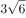
　✅
- **C**. 
8.5

- **D**. 

**答案**：B

**官方解析**

数列无明显特征，作差与幂次均无规律，考虑递推。观察可得：，，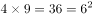，即每相邻三项中，前面两项的乘积等于第三项的平方。依此规律，。

故正确答案为B。

---

### 第 5 题　qid 2172344 · 数学运算

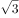，，，，，（    ）

- **A**. 
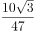

- **B**. 
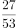

- **C**. 

　✅
- **D**. 
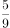

**答案**：C

**官方解析**

题干中分子部分均包含因子，观察分子分母变化趋势，进行反约分，则原数列转化为：，，，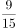，，（    ）。观察可得，分子部分为公比是的等比数列，下一项；分母部分作差后得：2，4，8，16，（    ），为公比是2的等比数列，下一项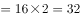，则所求项分母部分。故所求项。

故正确答案为C。

---

### 第 6 题　qid 2172341 · 数学运算

一款手机按2000元单价销售，利润为售价的。若重新定价，将利润降至新售价的，则新售价是：

- **A**. 1900元
- **B**. 1875元　✅
- **C**. 1840元
- **D**. 1835元

**答案**：B

**官方解析**

由题干“售价2000元，利润为售价的”可得，元。又由“重新定价，利润降至新售价的”，设新售价为x元，则，解得，则新售价是1875元。

故正确答案为B。

---

### 第 7 题　qid 2172338 · 数学运算

手工制作一批元宵节花灯，甲、乙、丙三位师傅单独做，分别需要40小时、48小时、60小时完成。如果三位师傅共同制作4小时后，剩余任务由乙、丙一起完成，则乙在整个花灯制作过程中所投入的时间是：

- **A**. 24小时　✅
- **B**. 25小时
- **C**. 26小时
- **D**. 28小时

**答案**：A

**官方解析**

由题意，赋值工作总量为40、48、60的最小公倍数240，则甲的效率为、乙的效率为、丙的效率为。三位师傅共同制作4小时，完成工程量。剩余任务由乙、丙一起完成，则需要时间小时。则乙在整个花灯制作过程中所投入的时间是小时。

故正确答案为A。

---

### 第 8 题　qid 2172388 · 数学运算

某化学实验室有A、B、C三个试管分别盛有10克、20克、30克水，将某种盐溶液10克倒入试管A中，充分混合均匀后，取出10克溶液倒入B试管，充分混合均匀后，取出10克溶液倒入C试管，充分混合均匀后，这时C试管中溶液浓度为，则倒入A试管中的盐溶液浓度是：

- **A**. 

- **B**. 

- **C**. 

- **D**. 

　✅

**答案**：D

**官方解析**

设倒入A试管中的盐溶液浓度为a，将溶液倒入A试管时，混合之后的浓度；同理经过B、C试管的混合之后溶液浓度为，解得。

故正确答案为D。

---

### 第 9 题　qid 2172382 · 数学运算

燃气公司欲在某新建楼盘内铺设天然气管道连通所有住宅楼，楼与楼之间可铺设管道的路线如图所示，圆圈表示各住宅楼，线段及线上数字表示路线及其长度（单位：百米），则铺设的管道最短长度是

- **A**. 1800米
- **B**. 1850米　✅
- **C**. 1950米
- **D**. 2000米

**答案**：B

**官方解析**

要求“天然气管道连通所有住宅楼”且管道长度最短，那么铺设的管道数量应尽量少且每条管道的长度应尽量短。A-F共6栋住宅楼，因此管道数量最少为5条，根据图示，尽可能选择短的管道，选择FA、AC、CE、CD、BD，此时6栋住宅楼均被管道连通且所用长度最短，总长度为米。

故正确答案为B。

---

### 第 10 题　qid 2172299 · 数学运算

如图，在长方形ABCD中，已知三角形ABE、三角形ADF与四边形AECF的面积相等，则三角形AEF与三角形CEF的面积之比是：

- **A**. 5：1　✅
- **B**. 5：2
- **C**. 5：3
- **D**. 2：1

**答案**：A

**官方解析**

设长方形ABCD的长，宽，根据题意，，。因为，则，所以，；同理，，则，所以，。

，则，因此。

故正确答案为A。

---

### 第 11 题　qid 2172286 · 数学运算

小李为办公室购买了红、黄、蓝三种颜色的笔若干支，共花费40.6元。已知红色笔单价为1.7元、黄色笔为3元、蓝色笔为4元，则小李买的笔总数最多是：

- **A**. 19支
- **B**. 20支
- **C**. 21支　✅
- **D**. 22支

**答案**：C

**官方解析**

设购买红色笔、黄色笔、蓝色笔的数量分别为x、y、z支，根据题意可得，即······①。由于y、z均为正整数，而30y与40z的尾数均为0，因此17x的尾数必定为6，则x的尾数必定为8。要使买的笔总数最多，则价格最低的红色笔的数量x应尽量多，又因为，则x最大取18。将18代入①式：，化简得，此时只有，满足二者均为正整数的条件，且此时价钱低的笔购买数量较多，符合题干要求。所买笔总数最多为支。

故正确答案为C。

---

### 第 12 题　qid 2172289 · 数学运算

某高校组织省大学生运动会预选赛，报名选手中男女人数之比为4：3，赛后有91人入选，其中男女之比为8：5。已知落选选手中男女之比为3：4，则报名选手共有：

- **A**. 98人
- **B**. 105人
- **C**. 119人　✅
- **D**. 126人

**答案**：C

**官方解析**

方法一：根据题意可知，入选选手中男女人数分别为人、人。设落选选手中男女人数分别为3x人和4x人，则报名选手中男女人数之比为，解得，所以落选选手人数为人，报名选手共有人。

方法二：线段法。根据题意可得，入选选手中男选手占比为，落选选手中男选手占比为，报名选手中男选手占比为，所以，化简得，解得人，所以报名选手共有人。

故正确答案为C。

---

### 第 13 题　qid 2172296 · 数学运算

某市公安局从辖区2个派出所分别抽调2名警察，将他们随机安排到3个专案组工作，则来自同一派出所的警察不在同一组的概率是：

- **A**. 

　✅
- **B**. 

- **C**. 

- **D**. 

**答案**：A

**官方解析**

由题意可知，4名警察分到3个专案组，必有2人同组，其他2人各自一组。从4人中选出2人，有种方法；随机安排到3个专案组工作，每种分组情况均有种安排方法。所以将4名警察随机安排到3个专案组工作共有种情况。

从反面考虑，若同一派出所的警察在同一组，则其中一个派出所的2名警察被安排到一个专案组，另外一个派出所的2名警察分别安排到另外2个专案组，所以共有种情况。

因此，来自同一派出所的警察不在同一组的概率是。

故正确答案为A。

---

### 第 14 题　qid 2172385 · 数学运算

某单位举行象棋比赛，计分规则为：赢者得2分，负者得0分，平局各得1分，每位选手与其他选手各下一局。已知男选手数是女选手的10倍，而得分是女选手的4.5倍，则参加比赛的男选手数是

- **A**. 40人
- **B**. 30人
- **C**. 20人
- **D**. 10人　✅

**答案**：D

**官方解析**

根据题意可知，无论是有胜负还是平局，每局比赛共得2分。为方便计算，从小到大代入。代入D项：假设参加比赛的男选手数是10人，则女选手人，选手总数人。因为每位选手与其他选手各下一局，所以11人有局比赛，共分，女选手得分为分，1名女选手总得分最多为分，符合题干条件。（同理验证C、B、A选项可知，计算得出女选手总得分均大于可得的最高分）

故正确答案为D。

---

### 第 15 题　qid 2172387 · 数学运算

甲乙两车分别以96千米/小时、24千米/小时的速度在一长288千米的环形公路上行驶。如果甲乙两车在同一地点、沿同一方向同时出发，甲每次追上乙时甲减速，而乙增速，则当甲乙速度相等时甲所行驶的路程是：

- **A**. 950千米
- **B**. 960千米　✅
- **C**. 970千米
- **D**. 980千米

**答案**：B

**官方解析**

根据题意，设甲第一次追上乙所用的时间为，则根据环形追及公式可得：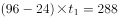，解得小时。此时甲的速度降低为千米/小时，乙的速度提高到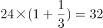千米/小时。

设甲第二次追上乙所用的时间为，则根据环形追及公式可得：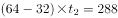，解得小时。此时甲的速度降低为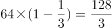千米/小时，乙的速度提高到千米/小时，甲乙速度相等。

所以当甲乙速度相等时甲所行驶的路程是千米。

故正确答案为B。

---

## 判断推理

### 材料 1

甲、乙、丙、丁、戊、己6项工作需要按照一定的先后顺序才能顺利完成。已知：

（1）丁必须在甲之前完成，并且中间只能隔着1项工作；

（2）丙必须在乙之前完成，并且中间只能隔着2项工作。

#### 第 1 题　qid 2172309 · 类比推理

若戊第2个完成，则己第几个完成？

- **A**. 3
- **B**. 4
- **C**. 5
- **D**. 6　✅

**答案**：D

**官方解析**

若戊第2个完成，结合条件（2）可知，丙和乙有两种可能：

①如下图所示，如果丙是第一个完成，乙是第四个完成，

再结合条件（1）可知，丁是第三个完成，甲是第五个完成，如下图所示，故己是第六个完成。

②如下图所示，如果丙是第三个完成，乙是第六个完成，再结合条件（1）可知，丁与甲隔着1项工作，无法满足，故此种可能排除。

综上所述，己是第六个完成。

故正确答案为D。

---

#### 第 2 题　qid 2172311 · 逻辑判断

若甲、乙不是紧挨着先后完成，则可以得出以下哪项？

- **A**. 甲在乙之前完成　✅
- **B**. 乙在甲之前完成
- **C**. 戊在己之前完成
- **D**. 己在戊之前完成

**答案**：A

**官方解析**

题干信息不确定，可用假设法。

由条件（2）可知，丙有三种可能：

①如下图所示，假设丙是第一个完成，乙是第四个完成，再结合条件（1）可知，丁是第三个完成，甲是第五个完成，此时甲、乙紧挨着，与题干条件矛盾，故此种可能排除；

②如下图所示，假设丙是第二个完成，乙是第五个完成，再结合条件（1）可知，若丁是第一个完成，则甲是第三个完成，此时戊和己的顺序无法确定，只能确定甲在乙之前，满足题干假设；

如下图所示，假设丁是第四个完成，则甲是第六个完成，此时甲、乙紧挨着，与题干条件矛盾，故此种可能排除；

③如下图所示，假设丙是第三个完成，乙是第六个完成，再结合条件（1）可知，丁是第二个完成，甲是第四个完成，此时戊和己的顺序无法确定，只能确定甲在乙之前，满足题干假设。

综上所述，甲一定在乙之前。

故正确答案为A。

---

#### 第 3 题　qid 2172368 · 类比推理

地球：行星

- **A**. 英国：国家　✅
- **B**. 江苏：中国
- **C**. 公路：道路
- **D**. 岛屿：大陆

**答案**：A

**官方解析**

第一步：判断题干词语间逻辑关系。
地球是行星，两者之间是种属关系，并且地球是具体的一个行星。
第二步：判断选项词语间逻辑关系。
A项：英国是国家，两者之间是种属关系，并且英国是具体的一个国家，与题干逻辑关系一致，当选；
B项：江苏是中国的一个省，两者之间是组成关系，与题干逻辑关系不一致，排除；
C项：公路是道路的一种，两者之间是种属关系，但是公路没有特指出具体哪一条公路，与题干逻辑关系不一致，排除；
D项：岛屿和大陆两者之间是并列关系，与题干逻辑关系不一致，排除。
故正确答案为A。

---

#### 第 4 题　qid 2172369 · 类比推理

茶水：咖啡：饮品

- **A**. 误解：曲解：理解
- **B**. 谎言：谗言：言论
- **C**. 考试：考核：考验
- **D**. 晋商：徽商：商人　✅

**答案**：D

**官方解析**

第一步：判断题干词语间逻辑关系。
茶水、咖啡都是饮品，因此，前两者之间是并列关系，前两者和第三者之间是种属关系。
第二步：判断选项词语间逻辑关系。
A项：误解和曲解都是做了错误的理解，两者之间是近义关系，和理解是反义关系，与题干逻辑关系不一致，排除；
B项：谎言是不真实的话，谗言是诽谤的话，言论是指发表的意见或议论，第三者和前两者之间不构成种属关系，与题干逻辑关系不一致，排除；
C项：考试和考核都是对参考者进行测试，两者是近义关系，与题干逻辑关系不一致，排除；
D项：晋商和徽商都是商人，前两者之间是并列关系，前两者和第三者之间是种属关系，与题干逻辑关系一致，当选。
故正确答案为D。

---

#### 第 5 题　qid 2172370 · 类比推理

有理数：无理数：实数

- **A**. 洋房：楼房：房屋
- **B**. 阴刻：阳刻：雕刻　✅
- **C**. 西汉：东汉：汉朝
- **D**. 西欧：东欧：欧洲

**答案**：B

**官方解析**

第一步：判断题干词语间逻辑关系。
有理数为整数（正整数、0、负整数）和分数统称，无理数是无限不循环小数，实数分为有理数和无理数，因此前两者之间是矛盾关系，前两者和第三者之间是种属关系。
第二步：判断选项词语间逻辑关系。
A项：洋房是具有欧美样式的房屋，楼房是两层或两层以上的房屋，有的洋房是楼房，有的洋房不是楼房，因此前两者之间是交叉关系，与题干逻辑关系不一致，排除；
B项：阴刻和阳刻都是雕刻方式，两者之间是矛盾关系，且前两者和第三者之间是种属关系，与题干逻辑关系一致，当选；
C项：汉朝主要分为东汉和西汉时期，至公元221年，刘备在成都称帝，史称蜀汉，因此前两者之间是反对关系，且前两者和第三者之间是组成关系，与题干逻辑关系不一致，排除；
D项：欧洲除了西欧和东欧，还包括中欧、南欧、北欧，因此前两者之间是反对关系，与题干逻辑关系不一致，排除。
故正确答案为B。
注：汉朝这一朝代比较特殊，历史上对于汉朝的划分表述一般为“主要分为西汉和东汉”，除此之外，在王莽篡权期间，还曾短暂的出现过玄汉时期，在东汉结束后，刘备也在蜀地建立蜀汉政权。因此，对于西汉和东汉，我们更倾向于是反对关系。

---

#### 第 6 题　qid 2172371 · 类比推理

春耕：秋收：冬藏

- **A**. 立功：表彰：晋级
- **B**. 偷盗：受罚：悔恨
- **C**. 勤奋：致富：捐款
- **D**. 报名：参赛：夺冠　✅

**答案**：D

**官方解析**

第一步：判断题干词语间逻辑关系。
农业生产的一般过程，指春天耕种，秋天收获，冬天储藏，三词间有时间的先后顺序。
第二步：判断选项词语间逻辑关系。
A项：表彰和晋级之间没有明显的时间先后顺序，与题干逻辑关系不一致，排除；
B项：受罚和悔恨之间没有明显的时间先后顺序，与题干逻辑关系不一致，排除；
C项：致富和捐款之间没有必然时间先后顺序，与题干逻辑关系不一致，排除；
D项：报名、参赛、夺冠是参加比赛的一般过程，三词间有明显的时间先后顺序，与题干逻辑关系一致，当选。
故正确答案为D。

---

#### 第 7 题　qid 2172372 · 类比推理

树：柏树：松树：雪松

- **A**. 车：汽车：火车：动车　✅
- **B**. 法：刑法：民法：公民
- **C**. 花：梅花：梨花：香梨
- **D**. 牛：水牛：黄牛：牛黄

**答案**：A

**官方解析**

第一步：判断题干词语间的逻辑关系。
柏树和松树都是树的一种，柏树和松树是并列关系，雪松是松树的一个品种，雪松和松树之间是种属关系。
第二步：判断选项词语间的逻辑关系。
A项：汽车和火车都是车的一种，汽车和火车是并列关系，动车是火车中速度较快的一种，动车和火车之间是种属关系，与题干逻辑关系一致，当选；
B项：刑法和民法都是法的一种，刑法和民法是并列关系，但公民是民法的管理对象，二者非种属关系，与题干逻辑关系不一致，排除；
C项：梅花和梨花都是花的一种，梅花和梨花是并列关系，但香梨并不是梨花的一种，二者非种属关系，与题干逻辑关系不一致，排除；
D项：水牛和黄牛都是牛的一种，水牛和黄牛是并列关系，但牛黄是黄牛身体中的一部分，二者属于组成关系，与题干逻辑关系不一致，排除。
故正确答案为A。

---

#### 第 8 题　qid 2172290 · 类比推理

旱田作物：粮食作物：高产作物

- **A**. 工业酒精：食用酒精：医用酒精
- **B**. 人民日报：光明日报：解放日报
- **C**. 领军人物：新闻人物：公众人物　✅
- **D**. 脊椎动物：哺乳动物：高等动物

**答案**：C

**官方解析**

第一步：判断题干词语间的逻辑关系。
题干三词分别是从作物的生长环境、用途及产量情况3个不同的角度对作物的分类，旱田作物、粮食作物、高产作物，三词间两两互为交叉关系。
第二步：判断选项词语间的逻辑关系。
A项：工业酒精、食用酒精及医用酒精，都是根据酒精的不同用途划分的，三者之间不存在交叉，是并列关系，不是交叉关系，与题干逻辑关系不一致，排除；
B项：人民日报、光明日报及解放日报，是根据报纸的不同出版社划分的，三者之间不存在交叉，是并列关系，不是交叉关系，与题干逻辑关系不一致，排除；
C项：三词分别是从人物所处领域的地位、媒体中出现的情况及受关注程度3个不同的角度对人物的分类，领军人物、新闻人物、公众人物，三词间两两互为交叉关系，与题干逻辑关系一致，当选；
D项：哺乳动物都是脊椎动物，二者是种属关系，与题干逻辑关系不一致，排除。
故正确答案为C。

---

#### 第 9 题　qid 2172293 · 类比推理

（  ）之于 朋友 相当于（  ）之于 婚姻

- **A**. 奋斗——金钱
- **B**. 战友——同学
- **C**. 真诚——爱情　✅
- **D**. 友善——勤奋

**答案**：C

**官方解析**

逐一代入选项。
A项：奋斗中需要朋友，但不能说金钱中需要婚姻，前后逻辑关系不一致，排除；
B项：战友泛指在一起战斗或在一起战斗过的人，也包括一起参军的人，战友是朋友，二者是种属关系，同学和婚姻无明显逻辑关系，前后逻辑关系不一致，排除；
C项：真诚是朋友的基础，爱情是婚姻的基础，前后逻辑关系一致，当选；
D项：友善可以形容朋友间的关系，而勤奋和婚姻无明显逻辑关系，前后逻辑关系不一致，排除。
故正确答案为C。

---

#### 第 10 题　qid 2172294 · 类比推理

清除 之于（  ）相当于 拔除 之于（  ）

- **A**. 垃圾——暗堡
- **B**. 腐败——毒瘤　✅
- **C**. 路障——青苗
- **D**. 积弊——垂柳

**答案**：B

**官方解析**

逐一代入选项。
A项：清除垃圾是动宾搭配，拔除暗堡是动宾搭配，前后逻辑关系一致，保留；
B项：清除腐败是动宾搭配，拔除毒瘤是动宾搭配，前后逻辑关系一致，保留；
C项：清除路障是动宾搭配，拔除青苗是动宾搭配，前后逻辑关系一致，保留；
D项：清除积弊是动宾搭配，拔除垂柳是动宾搭配，前后逻辑关系一致，保留。
比较A、B、C、D项，B选项“腐败”和“毒瘤”均为有害的事物，“清除腐败”和“拔除毒瘤”都是做好事，前后的逻辑关系比A、C、D三项更为接近。
故正确答案为B。

---

#### 第 11 题　qid 2172328 · 逻辑判断

渡长江过长江长江江长

- **A**. 

- **B**. 

　✅
- **C**. 

- **D**. 

**答案**：B

**官方解析**

第一步：分析题干符号间关系。
从相同符号的位置入手：位置2、5、7、10的符号相同；位置3、6、8、9的符号相同；并且位置1、4上的符号与其他位置均不相同。
第二步：判断选项符号间关系。
A项：位置2、5、7、10的符号并不相同，与题干不一致，排除；
B项：位置2、5、7、10的符号相同；位置3、6、8、9的符号相同；并且1、4位置上的符号与其他位置均不相同，与题干一致，当选； 
C项：位置2、5、7、10的符号并不完全相同，与题干不一致，排除；
D项：位置2、5、7、10的符号并不完全相同，与题干不一致，排除。
故正确答案为B。

---

#### 第 12 题　qid 2172355 · 逻辑判断

- **A**. 
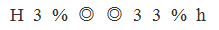

- **B**. 

- **C**. 

- **D**. 

　✅

**答案**：D

**官方解析**

第一步：分析题干符号间关系。
题干一共出现9个符号，从相同符号的位置入手：位置1和9分别是同一字母的大小写形式；位置2、6、7的符号相同；位置3、8的符号相同；并且位置4、5上的符号与其他位置均不相同。

第二步：判断选项符号间关系。
A项：位置1和9分别是同一字母的大小写形式；位置2、6、7的符号相同；位置3、8的符号相同；但是位置4、5上的符号相同，与题干不一致，排除；
B项：位置1和9并非同一字母的大小写形式，与题干不一致，排除； 
C项：位置1和9分别是同一字母的大小写形式；位置2、6、7的符号相同；但位置3、4、8的符号均相同，与题干不一致，排除；
D项：位置1和9分别是同一字母的大小写形式；位置2、6、7的符号相同；位置3、8的符号相同；并且位置4、5上的符号与其他位置均不相同，与题干一致，当选。
故正确答案为D。

---

#### 第 13 题　qid 2172358 · 图形推理

从四个图中选出唯一的一项，填入问号处，使其呈现一定的规律性。

                       

- **A**. A
- **B**. B　✅
- **C**. C
- **D**. D

**答案**：B

**官方解析**

本题考查图形的实际意义，寻找最大共同点。观察发现，题干所有图形都是瓶口直径大于瓶颈直径，且瓶身与瓶底之间没有凹陷处，A、C两项瓶口直径没有大于瓶颈直径，D项有凹陷处，只有B项满足题干图形特征。
故正确答案为B。

---

#### 第 14 题　qid 2172360 · 图形推理

从四个图中选出唯一的一项，填入问号处，使其呈现一定的规律性。

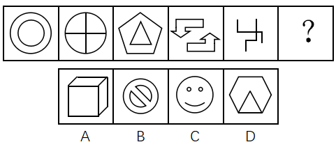

- **A**. A　✅
- **B**. B
- **C**. C
- **D**. D

**答案**：A

**官方解析**

图形元素组成不同，无明显属性规律，考虑数量规律。观察发现，图2为“田”字变形，图5有多个端点，均为笔画数特征图，故考虑笔画数。题干均为两笔画图形，A项为两笔画图形，B项为三笔画图形，C项为四笔画图形，D项为一笔画图形，只有A项满足。
故正确答案为A。

---

#### 第 15 题　qid 2172362 · 图形推理

从四个图中选出唯一的一项，填入问号处，使其呈现一定的规律性。

- **A**. A
- **B**. B
- **C**. C　✅
- **D**. D

**答案**：C

**官方解析**

图形元素组成相同，优先考虑位置规律，但位置无明显规律。观察发现，图一、图三和图五中的两个元素均在右上角和左下角，图二和图四中的两个元素均在左上角和右下角，故？号处图形中的两个元素应在左上角和右下角的位置，排除A项和D项。再次观察发现，题干图形中的两个元素箭头均指向同一方向，B项中两个元素箭头指向不同方向，C项中两个元素箭头指向同一方向。
故正确答案为C。

---

#### 第 16 题　qid 2172364 · 图形推理

从四个图中选出唯一的一项，填入问号处，使其呈现一定的规律性。 

- **A**. A
- **B**. B
- **C**. C
- **D**. D　✅

**答案**：D

**官方解析**

元素组成不同，且无明显属性规律，优先考虑数量规律。题干图形封闭区域明显，优先考虑面数量，题干图形的面数量依次为2、1、2、3、4，单独数面无规律。再次观察发现，题干每幅图形都有一个外框，外框边数分别为4、3、4、5、6，题干图形的外框边数-面数量=2，故“？”处图形的外框边数-面数量=2，只有D项符合。
故正确答案为D。

---

#### 第 17 题　qid 2172380 · 图形推理

下边四个图形中，只有一个是由上边的四个图形拼合（只能通过上、下、左、右平移）而成的，请把它找出来。

- **A**. A
- **B**. B　✅
- **C**. C
- **D**. D

**答案**：B

**官方解析**

本题考查平面拼合，可采用平行且等长相消的方式解题。消去平行且等长的线段后进行组合即可得到轮廓图，即为B选项。平行且等长相消的方式如下图所示：

 

故正确答案为B。

---

#### 第 18 题　qid 2172305 · 图形推理

下边四个图形中，只有一个是由上边的四个图形拼合（只能通过上、下、左、右平移）而成的，请把它找出来。

- **A**. A　✅
- **B**. B
- **C**. C
- **D**. D

**答案**：A

**官方解析**

本题考查平面拼合，可采用平行且等长相消的方式解题。消去平行且等长的线段后进行组合即可得到轮廓图，即为A选项。平行且等长相消的方式如下图所示：

故正确答案为A。

---

#### 第 19 题　qid 2172310 · 图形推理

下边四个图形中，只有一个是由上边的四个图形拼合（只能通过上、下、左、右平移）而成的，请把它找出来。

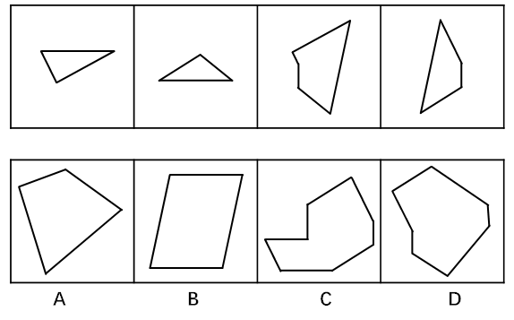

- **A**. A
- **B**. B　✅
- **C**. C
- **D**. D

**答案**：B

**官方解析**

本题考查平面拼合，可采用平行且等长相消的方式解题。消去平行且等长的线段后进行组合即可得到轮廓图，即为B选项。平行且等长相消的方式如下图所示：

故正确答案为B。

---

#### 第 20 题　qid 2172313 · 图形推理

下边四个图形中，只有一个是由上边的四个图形拼合（只能通过上、下、左、右平移）而成的，请把它找出来。

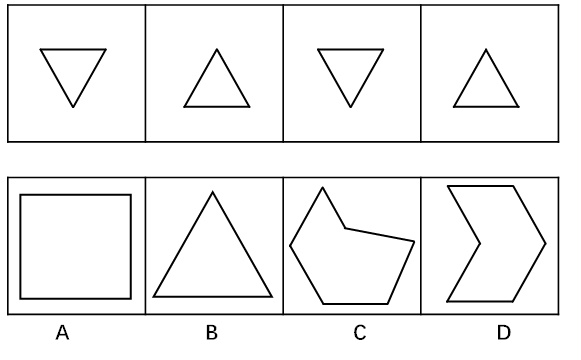

- **A**. A
- **B**. B
- **C**. C
- **D**. D　✅

**答案**：D

**官方解析**

本题考查平面拼合，可采用平行且等长相消的方式解题。本题由两种三角形拼合组成，需要消去平行且等长的线段后进行组合，即可得到轮廓图，即为D选项。平行且等长相消的方式如下图所示：

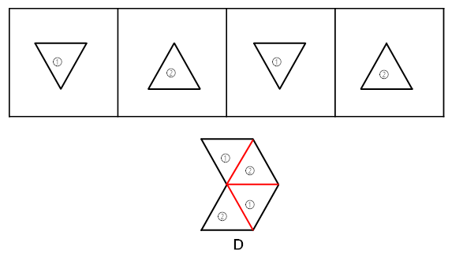

故正确答案为D。

---

#### 第 21 题　qid 2172317 · 图形推理

下边四个图形中，只有一个是由上边的四个图形拼合（只能通过上、下、左、右平移）而成的，请把它找出来。

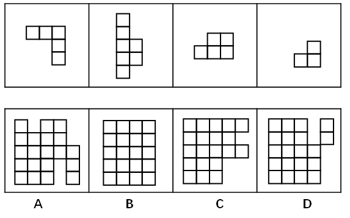

- **A**. A　✅
- **B**. B
- **C**. C
- **D**. D

**答案**：A

**官方解析**

本题考查平面拼合，将平行且等长的部分进行拼合。可优先考虑将题干中第二个图形进行放置，然后将平行且等长的其余部分进行组合，即可得到轮廓图，即为A选项。平行且等长的组合方式如下图所示：

故正确答案为A。

---

#### 第 22 题　qid 2172327 · 图形推理

左边给定的是纸盒外表面的展开图，右边哪一项能由它折叠而成？请把它找出来。

- **A**. A
- **B**. B　✅
- **C**. C
- **D**. D

**答案**：B

**官方解析**

将题干展开图中的面依次标注为面a、b、c、d，如下图：

A项：由面b和面d构成，以面b中的蓝点为起点，顺时针画边，如下图：

题干展开图中与边1相邻的面是面a，而选项中与边1相邻的面是面d，与题干不符，排除；

B项：由面a和面b构成，与题干展开图一致，当选；

C项：由面a和面d构成，以面d中的绿点为起点，顺时针画边，如下图：

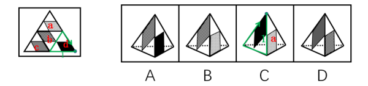

题干展开图中与边1相邻的面是面c，而选项中与边1相邻的面是面a，与题干不符，排除；

D项：由面b和面c构成，以面c中的黄点为起点，顺时针画边，如下图：

题干展开图中与边1相邻的面是面d，而选项中与边1相邻的面是面b，与题干不符，排除。

故正确答案为B。

---

#### 第 23 题　qid 2172330 · 图形推理

左边给定的是纸盒外表面的展开图，右边哪一项能由它折叠而成？请把它找出来。

- **A**. A
- **B**. B
- **C**. C
- **D**. D　✅

**答案**：D

**官方解析**

A项：展示给我们看到的是两个虚线所在的面，在选项和题干中将两个面的公共边标出，发现题干中有一条虚线垂直于公共边，但是A选项中两条虚线面都不垂直于公共边，与题干展开图不符，排除；

B项：展示给我们看到的是两个实线所在的面，在选项和题干中将两个面的公共边标出，发现选项中有一条实线垂直于公共边，但是题干中两条实线面都不垂直于公共边，与题干展开图不符，排除；

C项：展示给我们看到的是一条实线所在的面和一条虚线所在的面，在选项中找到同时发出一条虚线和一条实线的顶点，对应到题干中是标粗的点，如下图：

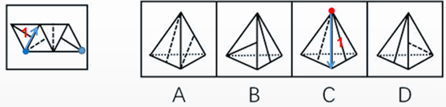

从这个点出发，在虚线面内进行顺时针画边，因为在选项中除虚线面本身只能看到一个实线面，因此我们只能看1所对应的面到底符不符合。在题干中1面中的实线是垂直于这个虚线面的，但是选项C中的实线并没有垂直于这个虚线面，与题干展开图不符，排除；

D项：与题干展开图一致，当选。

故正确答案为D。

---

#### 第 24 题　qid 2172375 · 图形推理

左边给定的是纸盒外表面的展开图，右边哪一项能由它折叠而成？请把它找出来。

- **A**. A
- **B**. B
- **C**. C
- **D**. D　✅

**答案**：D

**官方解析**

本题考查六面体的空间重构。将题干展开图中的面依次标注为面a、b、c、d、e、f，如下图：

A项：右侧的面在展开图中没有出现，属于无中生有的面，选项与题干展开图不一致，排除；

B项：在题干展开图中，面e中的格子三角形两条直角边分别挨着白色区域，而选项中，面e中的格子三角形一条直角边挨着黑色正方形，选项与题干展开图不一致，排除；

C项：选项的三个面分别是面b、面c、面f，如下图：

题干展开图中，面b和面c中的黑色正方形存在一个公共点（如绿点），而选项中，面b和面c中的黑色正方形不存在公共点，选项与题干展开图不一致，排除；

D项：选项的三个面分别是面c、面d、面f，选项与题干展开图一致，当选。

故正确答案为D。

注：有同学会纠结D项右面里的线条方向不对，如果这么理解，这道题就没有答案了，所以从这个细节可以看出，江苏出题人对于面内线条的方向没有过多考虑，也没有在此设坑，如果没有更好的选项，可以选它。

---

#### 第 25 题　qid 2172377 · 图形推理

左边给定的是纸盒外表面的展开图，右边哪一项能由它折叠而成？请把它找出来。

- **A**. A
- **B**. B　✅
- **C**. C
- **D**. D

**答案**：B

**官方解析**

本题考查六面体的空间重构。将题干展开图中的面依次标注为面a、b、c、d、e、f，如下图：

A项：右侧“十”字的面在展开图中没有出现，属于无中生有的面，选项与题干展开图不一致，排除；

B项：选项的三个面分别是面c、面d、面f，选项与题干展开图一致，当选；

C项：选项的三个面分别是面c、面d、面f，如下图：

在题干展开图中，d面的小黑方块挨着f面的小格子方块，而在选项中，d面的小黑方块挨着f面的小白方块，选项与题干展开图不一致，排除；

D项：选项的三个面分别是面b、面c、面e，如下图：

其中，面c和面e为相对面，不可能同时出现，选项与题干展开图不一致，排除。

故正确答案为B。

---

#### 第 26 题　qid 2172389 · 图形推理

从所给的四个选项中，选择最恰当的一个填入问号处，使之呈现一定的规律性。

- **A**. A
- **B**. B
- **C**. C　✅
- **D**. D

**答案**：C

**官方解析**

图形元素组成不同，优先考虑属性规律。九宫格优先按横行来看，第一行中，三幅图依次为仅轴对称图形、仅中心对称图形、仅轴对称图形；代入第二行验证，第二行与第一行规律相同。因此，第三行也应该满足此规律，问号处应该填入一个仅轴对称的图形。A项为仅中心对称图形，B项为既轴对称又中心对称图形，D项为不对称图形，只有C项符合题干规律。
故正确答案为C。

---

#### 第 27 题　qid 2172390 · 图形推理

从所给的四个选项中，选择最恰当的一个填入问号处，使之呈现一定的规律性。

- **A**. A
- **B**. B
- **C**. C
- **D**. D　✅

**答案**：D

**官方解析**

图形元素组成相同，优先考虑位置规律。九宫格优先按横行来看，第一行中，小球的位置相对于正方形依次内、外、内交替出现，并且沿着正方形上方的边从左向右平移。第二行中，小球的位置相对于正方形依次外、内、外交替出现，并且沿着正方形右侧的边从上向下平移。第三行中，前两幅图中的小球的位置相对于正方形依次内、外出现，因此，问号处小球位置应在正方形的内部出现，排除A项；前两幅图小球沿着正方形下方的边从右向左平移，因此，问号处小球应该在正方形下方的边的左边，排除B、C两项。
故正确答案为D。

---

#### 第 28 题　qid 2172391 · 逻辑判断

通常，我们习惯认为运动是减重的关键因素，甚至是最重要的因素。但有专家指出，运动固然非常有益健康，但它实际上对减重并没有太大的帮助。在减重这件事上，迈开腿和管住嘴的地位并不平等，管住嘴实际上比迈开腿更重要。
以下哪项如果为真，最能支持上述专家的观点？

- **A**. 在个人消耗的总热量中，运动消耗的热量只占到极小的一部分　✅
- **B**. 一般来说，我们总是动得多吃得多，动得少吃得少
- **C**. 很多人都会在运动后因为疲劳而放慢节奏，减少热量消耗
- **D**. 只要吃一小块匹萨，就能产生相当于一小时运动所消耗的热量

**答案**：A

**官方解析**

第一步：找出论点和论据。
论点：运动对减重并没有太大帮助。在减重这件事上，管住嘴实际上比迈开腿更重要。
第二步：逐一分析选项。
A项：在个人消耗的总能量中，运动消耗占比极小，说明运动对减重影响极小，是在解释为什么运动对减重没有太大帮助，可以加强，保留；
B项：说的是平时动的多吃的多，动的少吃的少，没有说明运动与减重的关系，也没有与管住嘴之间消耗的能量进行比较，无法削弱，排除；
C项：阐述的是很多人运动后的状态，说明了运动后会减少热量的消耗，但是并不涉及管住嘴对热量的消耗是怎样的，没有比较，无法削弱，排除； 
D项：说明吃一小块匹萨产生的能量相当于运动一小时所消耗的热量，举例说明了管住嘴比迈开腿更重要，加强论据，保留。
比较A、D两项，解释说明力度大于举例加强，所以A项加强力度更强。
故正确答案为A。

---

#### 第 29 题　qid 2172392 · 类比推理

大李认识张先生的朋友小王，而小王又认识大李的朋友林女士。凡认识小王的都具有公共管理专业硕士学位，凡认识林女士的都是江苏人。
根据上述信息，可以得出具有公共管理专业硕士学位的江苏人是：

- **A**. 大李　✅
- **B**. 小王
- **C**. 张先生
- **D**. 林女士

**答案**：A

**官方解析**

题干可翻译为：

①大李认识张先生的朋友小王；

②小王认识大李的朋友林女士；

③认识小王的人具有公共管理硕士学位；

④认识林女士的人江苏人。

根据①可知，大李和张先生均认识小王，结合③可知，大李和张先生均具有公共管理硕士学位，根据②可知，大李认识林女士，结合④可知，大李是江苏人，所以大李是具有公共管理硕士学位的江苏人。

故正确答案为A。

---

#### 第 30 题　qid 2172393 · 逻辑判断

为了减少温室气体排放，有效应对全球气候变暖，有些专家建议，应把燃树发电作为削减二氧化碳排放的策略。他们认为，树木比煤、天然气更具有“碳中性”，砍树燃树所产生的二氧化碳将会被在原地再次生长的树木吸收。
以下哪项如果为真，最能质疑上述专家的观点？

- **A**. 砍树之后及时栽树，新生的树木就会再次吸收空气中的碳，形成稳定的碳循环
- **B**. 燃树发电的政策建议一旦实施，可能会导致乱砍乱伐，加剧全球环境生态危机
- **C**. 碳循环的计算比较复杂，砍树燃树释放的碳与栽树重新吸收的碳可能并不相等
- **D**. 砍树燃树排放的碳要等到新栽树苗长大后才能被完全吸收，时间上存在滞后性　✅

**答案**：D

**官方解析**

第一步：找出论点和论据。
论点：应把燃树发电作为削减二氧化碳排放的策略。
论据：树木比煤、天然气更具有“碳中性”，砍树燃树所产生的二氧化碳将会被在原地再次生长的树木吸收。
第二步：逐一分析选项。
A项：新生树木吸收碳形成稳定碳循环，重复了论据的内容，补充论据进行加强，无法削弱，排除； 
B项：燃树发电会加剧生态危机，说的是燃树发电的不良后果，而题干所讨论的是燃树发电是否能削减二氧化碳排放，二者话题不一致，属于无关选项，无法削弱，排除；
C项：释放的碳和吸收的碳可能并不相等，那到底是释放的碳多还是吸收的碳多，并不明确，排除；
D项：碳在树苗长大后才会被完全吸收，时间上存在滞后性，说明至少对于树苗还没有长大的那段期间来说，还是存在排放更多的二氧化碳，不能削减二氧化碳的排放，能削弱，当选。
故正确答案为D。
【文段出处】《燃木发电？烧“木柴”环保吗？》

---

#### 第 31 题　qid 2172394 · 类比推理

狗不嫌家贫，子不嫌母丑。爱自己家乡的人不会说家乡的坏话，张三就从不说家乡的坏话。可见，他是一个多么爱自己家乡的人啊！
以下哪项的推理方式与上述最为相似？

- **A**. 灯不挑不亮，话不挑不明。如果没有听到张处长这番话，我还在纠结要不要报名参加行业大赛，现在一切都清楚了。看来，张处长的话太重要了！
- **B**. 不入虎穴，焉得虎子？巨大的成功往往伴随着巨大的风险，李四投资股票获得高额回报。可见，他承担了多大的风险啊！
- **C**. 玉不琢不成器，人不学要落后。追求进步的人不会不爱学习的，王教授退休后一直无所事事，不爱学习。可见，王教授已不是一个追求进步的人了！
- **D**. 人不可貌相，海水不可斗量。一个有才能的人不会将他的才能显示出来，李先生就从来没有显示过他的才能。可见，他是一个多么有才能的人啊！　✅

**答案**：D

**官方解析**

第一步：分析题干的推理形式。

爱家乡说坏话，用张三举例，说坏话爱家乡。属于肯定箭头后推肯定箭头前的形式。

第二步：逐一分析选项。

A项：听张处长的话纠结，后半句为，纠结（现在一切都清楚了）张处长的话重要。属于否后推否前，与题干推理形式不同，排除；

B项：巨大的成功巨大的风险，用李四举例，巨大的成功（获得高额回报）巨大的风险。属于肯前推肯后，与题干推理形式不同，排除；

C项：追求进步爱学习，用王教授举例，爱学习追求进步。属于否后推否前，与题干推理形式不同，排除；

D项：有才能显示才能，用李先生举例，显示才能有才能，属于肯后推肯前。与题干推理形式相同，当选。

故正确答案为D。

---

#### 第 32 题　qid 2172395 · 逻辑判断

某人拟在1-5号5个地块上种植玉米、高粱、红薯、大豆和花生5种作物，每个地块仅种植一种作物，每种作物仅种植在一个地块。已知：
（1）如果3号地块种植大豆、高粱或花生，则1号地块种植玉米；
（2）如果4号地块种植高粱或花生，则2号或5号地块种植红薯；
（3）1号地块种植红薯。
根据以上信息，可以得出以下哪项？

- **A**. 2号地块种植高粱
- **B**. 3号地块种植花生
- **C**. 4号地块种植大豆　✅
- **D**. 5号地块种植玉米

**答案**：C

**官方解析**

题干可翻译为：

①3号种植大豆 或 3号种植高粱 或 3号种植花生1号种植玉米；

②4号种植高粱 或 4号种植花生2号种植红薯 或 5号种植红薯；

③1号种植红薯。

由③知：1号种植红薯，则1号不能种植玉米。根据①的逆否命题可知：1号种植玉米3号种植大豆 且 3号种植高粱 且 3号种植花生，则3号只能种植玉米。同时由1号种植红薯知：2号和5号不能种植红薯，根据②的逆否命题可知：2号种植红薯 且 5号种植红薯4号种植高粱 且 4号种植花生，以及1号种植红薯和3号种植玉米可以得出4号只能种植大豆，对应C项。

故正确答案为C。

---

#### 第 33 题　qid 2172396 · 逻辑判断

明知要早睡，却忍不住熬夜追剧；明知吸烟、酗酒有害健康，却挡不住烟酒的诱惑；明知运动有益，却一步都懒得走……生活中，很多人并不缺少健康常识，他们更多的是缺乏一种自律精神。自律的人都会早睡，都会忌口，都坚持运动。如果一个人坚守自律精神，就不会放纵自己，就能够维护自己的生理节律，过上健康幸福的生活。
根据以上陈述，可以得出以下哪项？

- **A**. 所有坚持运动的人都很自律
- **B**. 有的缺乏自律精神的人不缺少健康常识　✅
- **C**. 一个人如果不坚守自律精神，就会放纵自己
- **D**. 维护自己生理节律的人都能过上健康幸福的生活

**答案**：B

**官方解析**

第一步：翻译题干。

①有些人不缺乏健康常识缺乏自律精神；

②自律的人早睡；

③自律的人忌口；

④自律的人坚持运动；

⑤坚守自律精神-放纵自己；

⑥坚守自律精神维护生理节律；

⑦坚守自律精神过上健康生活。

第二步：逐一分析选项。

A项：翻译为坚持运动自律，对④肯后得不到确定性结论，无法推出，排除；

B项：翻译为有些缺乏自律的人不缺乏健康常识，等价于命题①：有些人不缺乏健康常识缺乏自律精神，可以推出，当选；

C项：翻译为-坚持自律放纵自己，对⑤否前得不到确定性结论，无法推出，排除；

D项：翻译为维护自己生理节律的人健康幸福生活，二者之间没有必然的逻辑关系，无法推出，排除。

故正确答案为B。

---

#### 第 34 题　qid 2172397 · 逻辑判断

随着“二孩政策”的实施，母乳喂养越来越多地成为广大年轻女性在生儿育女过程中不可回避的话题。医学专家建议，婴儿出生后最初6个月最好进行纯母乳喂养，而父母也都希望为孩子提供最好的营养。但统计显示，近年来我国0-6个月婴儿的纯母乳喂养率却明显偏低，婴儿6个月内的纯母乳喂养率在农村为30，在城市仅为16。

以下各项如果为真，则除了哪项均能解释上述统计结果？

- **A**. 职场女性往往因工作压力大、工作环境不允许等原因而陷入母乳喂养困窘
- **B**. 母乳喂养可降低儿童患病率，给孩子健康带来的益处可一直延续到成人期　✅
- **C**. 很多母亲并不了解母乳喂养的种种优势，反而把配方奶粉想象得过于美好
- **D**. 母亲因为夜晚哺乳而影响睡眠质量，她们的工作生活节奏被哺乳完全打乱

**答案**：B

**官方解析**

第一步：找出题干矛盾。
父母希望婴儿出生后最初6个月最好进行母乳喂养，但是近年来我国0-6个月婴儿的纯母乳喂养率却明显偏低。
第二步：逐一分析选项。
A项：职场女性因为各种原因而陷入母乳喂养困窘，说明尽管母亲希望进行母乳喂养，但是由于外界原因导致无法进行母乳喂养，可以解释为什么纯母乳喂养率低，排除；
B项：母乳喂养会给孩子带来的好处一直延续到成人期，只是在说明纯母乳给孩子带来的好处，没有解释为什么纯母乳喂养率低，不能解释，当选；
C项：母亲不了解母乳的好处，想象奶粉很好，说明母亲过于依赖奶粉而忽略母乳喂养，可以解释为什么纯母乳喂养率低，排除；
D项：母亲由于夜晚哺乳会影响睡眠，导致工作节奏被打乱，影响工作，母亲有可能因此减少纯母乳喂养孩子的次数，可以解释为什么纯母乳喂养率低，排除。
本题为选非题，故正确答案为B。

---

#### 第 35 题　qid 2172291 · 图形推理

以下是一个44的图形，共有16个小方格。每个小方格中均可填入一个词。要求图形的每行、每列均填入“爱国”“敬业”“诚信”“友善”4个词，不能重复，也不能遗漏。

根据以上信息，依次填入图形中①②③④处的4个词应是：

- **A**. 爱国、敬业、诚信、友善　✅
- **B**. 爱国、诚信、敬业、友善
- **C**. 诚信、友善、爱国、敬业
- **D**. 友善、爱国、敬业、诚信

**答案**：A

**官方解析**

题干信息确定，可用排除法解题。
根据方格第一列出现友善、诚信可知，①不能是友善和诚信，排除C、D两项；
根据方格第三列出现敬业可知，③不能是敬业，排除B项。
故正确答案为A。

---

#### 第 36 题　qid 2172333 · 定义判断

社区居家养老：指以家庭为核心、社区为依托，向居住在家中的老年人提供专业化、社会化服务，以解决日常生活中各种实际困难的养老方式。
下列属于社区居家养老的是：

- **A**. 自从去年住进街道办的托老所后，文大爷整整胖了5斤。那里不光生活很舒心，而且还有周边社区的20多位老人作伴，连过年他都有点舍不得回家
- **B**. 某社区联合一家养老企业推出适老化改造项目：针对老人的生理特点及生活习惯合理调整家里卧室、阳台、卫生间、厨房等处的生活设施。仅去年就完成了600多户家庭的改造工作
- **C**. 退休多年的周婆婆每天上午都去社区养老服务中心跟着专业老师学习民族舞，下午又到那里当义工，傍晚才回家。中心也会定期派专职人员上门为她进行体检及其他服务　✅
- **D**. 南方某养老社区通过“互联网+社区+服务”模式，为准备在该社区过冬的“候鸟老人”提供网上预定租住房源以及接送服务，全程安排旅居、娱乐、社交生活

**答案**：C

**官方解析**

第一步：找出定义关键词。
“以家庭为核心、社区为依托”、“向居住在家中的老年人提供专业化、社会化服务”、“解决日常生活中各种实际困难的养老方式”。
第二步：逐一分析选项。
A项：文大爷住进了街道办的托老所，不属于定义中居住在家中的老年人，不符合定义，排除； 
B项：“某社区联合一家养老企业推出适老化改造项目”更多是企业参与改造工作，不符合以“社区为依托”，且改造工作是一种短期工程，不是长期养老服务，无法帮助老年人“解决日常生活中各种实际困难”，不符合定义，排除；
C项：退休后的周婆婆在社区养老服务中心学习民族舞、当义工，中心也定期派专职人员上门提供体检和其他服务，体现出养老服务中心的专业化和社会化，且能够解决日常生活中各种实际困难，符合定义，当选；
D项：南方某养老社区能为来该社区过冬的老人提供网上预订房源及接送服务，针对的是来该社区过冬的“候鸟老人”，而非居住在家中的老年人，不符合定义，排除。
故正确答案为C。

---

#### 第 37 题　qid 2172361 · 定义判断

院墙外正义：指对于不涉及自身利益的不良行为往往表现得义正辞严、充满正义；但是一旦涉及自身的利益，即使面对的是同样不良的行为，则往往采取完全不同的态度。
下列属于院墙外正义的是：

- **A**. 小赵正在家中看书，从院子外边传来激烈的争吵声。他冲出去一看，原来是隔壁夫妻在吵架。他赶紧回家打电话，请居委会派人来调解
- **B**. 张院长在学院会议上严厉批评个别老师上课迟到的现象，强调必须严肃处理。有人提起他上周迟到的事，他又补充了一句：凡事不能一概而论　✅
- **C**. 小陈担任部门经理以前，也像其他员工一样经常抱怨公司管理措施过于严苛。现在，他已经逐渐理解了管理部门的良苦用心
- **D**. 小李是某医学院大三学生，平时经常向周边的同学和朋友宣传义务献血的意义和好处，但自己却从来没有献过一次血

**答案**：B

**官方解析**

第一步：找出定义关键词。
“不涉及自身利益的不良行为往往表现得义正言辞、充满正义”、“一旦涉及自身利益，面对同样的不良行为，则往往采取完全不同的态度”。
第二步：逐一分析选项。
A项：小赵见隔壁夫妻吵架，打电话请居委会派人来调解，未涉及到自身利益的不良行为，表现充满正义，没有与涉及到自身利益时态度的对比，不符合定义，排除； 
B项：张院长对个别老师迟到的不良行为表现得义正言辞，而说到自己迟到时的态度截然不同，符合“一旦涉及自身利益，面对同样的不良行为，则往往采取完全不同的态度”，符合定义，当选；
C项：小陈担任部门经理前后对公司管理措施态度不一样，公司管理措施不属于不良行为，不符合定义，排除；
D项：义务献血不属于不良行为，不符合定义，排除。
故正确答案为B。

---

#### 第 38 题　qid 2172363 · 定义判断

文化焦虑：指在全球化和现代化进程中，基于传统文化受到外来文化的挤压而产生的迷惘、焦躁、失望、不自信等心理状态。
下列不属于文化焦虑的是：

- **A**. 为应对西方文化的入侵，有些家长建议教育部门尽快制定相关政策，让包括四书五经在内的传统经典进入中小学课堂
- **B**. 全国各地大大小小的城市中，随处可见“罗马广场”“加州小镇”之类的包含外国地名的广场、小区和公园　✅
- **C**. 圣诞节、情人节、复活节现在越来越流行，不少传统节日却受到年轻人的冷落，部分学者呼吁尽快采取措施严格限制洋节日
- **D**. 许多历史文化遗产及人文景观随着如火如荼的旧城改造而不断消失，越来越多的有识之士对此深感忧虑

**答案**：B

**官方解析**

第一步：找出定义关键词。

“在全球化和现代化进程中”、“基于传统文化受到外来文化的挤压”、“产生的迷惘、焦躁、失望、不自信等心理状态” 。

第二步：逐一分析选项。

A项：西方文化入侵，部分家长认为教育部门应尽快制定相关政策，甚至需要将四书五经搬进课堂，体现了“基于传统文化受到外来文化的挤压”，家长着急体现了焦躁焦虑的心理，符合定义，排除； 

B项：全国各地随处可见包含外国地名的广场、小区和公园，体现了“基于传统文化受到外来文化的挤压”，符合原因，但没有焦虑心理，没有结果，不符合定义，当选；

C项：洋节越来越流行，传统节日却受到冷落，部分学者呼吁尽快采取措施严格限制洋节日，体现了“基于传统文化受到外来文化的挤压”，符合定义的原因，学者着急体现了焦躁焦虑的心理，符合定义，排除；

D项：历史文化遗产及人文景观不断消失，旧城改造，体现了“基于传统文化受到外来文化的挤压”，有识之士深感忧虑体现了焦躁焦虑的心理，符合定义，排除。

本题为选非题，故正确答案为B。

注意：此题外来文化的范围较广，不单是指外国文化。A、C、D三项都有原文对应参考。

---

#### 第 39 题　qid 2172365 · 定义判断

副驾驶法则：指坐在驾驶员旁边的人往往喜欢按照自己的经验，对驾驶过程进行指点、评论。泛指旁观者根据个人实践经验指点他人完成操作过程的言行或心态。
下列属于副驾驶法则的是：

- **A**. 老李一上车，教练就打开了驾驶训练语音提示系统：“请系好安全带”“请松开手刹”……老李边操作边观察教练表情
- **B**. 小张乘出租车时总喜欢坐在前排，与驾驶员聊天南地北的段子，还时不时对路上其他司机的驾驶水平评头论足
- **C**. 夏天的市民广场，最热闹的就是下象棋了。每张棋桌旁都围站着一圈圈的棋迷，对弈双方的每步棋都被大家指指点点　✅
- **D**. 冯经理将人事调整初步方案呈报董事长审阅，董事长翻看后圈了几个人，并向他交待了几句，让他拿回去重新修改

**答案**：C

**官方解析**

第一步：找出定义关键词。
“根据个人实践经验”、“指点他人完成操作过程的言行或心态”。
第二步：逐一分析选项。
A项：教练打开语音提示系统，不符合“个人实践经验”，不符合定义，排除； 
B项：小张对其他司机的驾驶水平进行评论，并不是对所乘坐的出租车驾驶员的驾驶操作进行指点，不符合“指点他人完成操作过程的言行或心态”，不符合定义，排除；
C项：对弈过程符合“完成操作过程”，每步棋被指指点点符合“指点他人完成操作过程的言行或心态”，符合定义，当选；
D项：董事长在审阅后交待几句，对方案结果的评论，不符合“完成操作过程”，不符合定义，排除。
故正确答案为C。

---

#### 第 40 题　qid 2172366 · 定义判断

主动补偿：指企业针对自己有瑕疵的产品或服务，主动向消费者做出经济补偿的行为。
下列属于主动补偿的是：

- **A**. 小王和几个同事在某火锅店消费时发现菜盘里有一只死苍蝇，就去找老板讨要说法，经过半个多小时的协商，老板终于同意免单并道歉
- **B**. 某高校食堂收到了学生关于饭菜质次量少、价格偏高的投诉，立即着手整改。三天后，食堂的饭菜质量有了明显提高，价格也有所下降
- **C**. 某公司发现，新近推出的一款手机在充电时发生爆炸，很快向社会公开承诺：用户可在30天内免费更换手机电池，邮寄费、路费等均由公司承担
- **D**. 老张上星期买了一辆摩托车，骑起来感觉很好。两天前，厂家突然通知他带着原始发票到指定修理厂更换电路控制器，还送给他200元加油卡　✅

**答案**：D

**官方解析**

第一步：找出定义关键词。
“企业”、“有瑕疵的产品或服务”、“主动向消费者做出经济补偿”。
第二步：逐一分析选项。
A项：消费者发现问题，找老板协商之后，老板同意免单，说明免单不是老板提出，不符合“主动向消费者做出经济补偿”，不符合定义，排除； 
B项：高校食堂不符合“企业”，降低价格不符合“主动向消费者做出经济补偿”，不符合定义，排除；
C项：手机充电发生爆炸符合“有瑕疵的产品或服务”，但是公司承诺免费更换电池以及承担邮寄费用和路费，不符合“经济补偿”，不符合定义，排除；
D项：厂家通知更换电路控制器，说明该控制器是有瑕疵的，符合 “有瑕疵的产品或服务”，送给老张200元的加油卡，符合“主动向消费者做出经济补偿”，符合定义，当选。
故正确答案为D。

---

#### 第 41 题　qid 2172367 · 定义判断

人才逆流动：指原本在知名大城市工作的专业人士，主动选择到中小城市工作的人才流动现象。
下列属于人才逆流动的是：

- **A**. 小赵家乡的县城近年来经济发展迅猛，正在到处招聘有大城市工作背景的专业人才，反复考虑之后，小赵辞去北京某研究部门的工作回乡应聘成功　✅
- **B**. 高中毕业的小韩在深圳打拼多年，深感这里的工作机遇虽多，年收入也很可观，但竞争压力太大，有时力不从心，春节后他决定留在家乡创业
- **C**. 小黄在天津某大学桥梁设计专业取得硕士学位后，来到女友所在的小城市找了一份不错的工作，他和女友都很开心
- **D**. 80后白领小李在上海的一家金融机构总部任职，几天前决定跳槽到附近的一家保险公司，意外发现自己的这一决定与不少同事的选择不谋而合

**答案**：A

**官方解析**

第一步：找出定义关键词。
“由大城市到中小城市工作”、“专业人士”、“主动选择”。
第二步：逐一分析选项。
A项：北京到县城，符合“由大城市到中小城市工作”，辞去北京工作符合“主动选择”，符合定义，当选；
B项：高中毕业的小韩没有体现出“专业人士”，因竞争压力大、力不从心所以留在家乡创业，不符合“主动选择”，不符合定义，排除；
C项：在天津上学没有体现工作，不符合“由大城市到中小城市工作”，不符合定义，排除；
D项：从金融机构到附近的保险公司不符合“由大城市到中小城市工作”，不符合定义，排除。
故正确答案为A。

---

#### 第 42 题　qid 2172373 · 定义判断

语言智能：指利用计算机程序实现人和机器之间的语言交流，或让机器自主完成与语言有关的工作。
下列属于语言智能的是

- **A**. 人工智能“阿尔法狗”在历时数月的人机大战中以绝对优势战胜多名世界级的围棋高手
- **B**. 为拓展国外市场，某公司新产品设置了语言切换按钮。借助这些按钮，用户可以实现多语种操作系统的切换
- **C**. 在某诗歌比赛中，根据评委说出的关键词，机器人“小薇”当场写出了几首辞藻华美、意境清新的作品　✅
- **D**. 高铁、动车、地铁上都配备了可以自动播报沿途站名、当前时速、实时气温的汉英双语语音系统

**答案**：C

**官方解析**

第一步：找出定义关键词。
“利用计算机程序”、“实现人和机器之间的语言交流”、“机器自主完成与语言有关的工作”
第二步：逐一分析选项。
A项：“阿尔法狗”在人机大战中是与人下围棋，并不涉及语言交流、工作，不符合定义，排除； 
B项：借助语言切换按钮，用户可以实现操作系统的切换，未体现语言交流、工作，不符合定义，排除；
C项：机器人“小薇”根据评委给出的关键词，写出了几首作品，诗歌作品与语言相关，属于“自主完成与语言有关的工作”，符合定义，当选；
D项：自动播报系统是人为设置的，未体现人机交流，也不符合“自主完成与语言有关的工作”，不符合定义，排除。
故正确答案为C。

---

#### 第 43 题　qid 2172374 · 定义判断

危机下沉：指年轻人面对本应在下一年龄段才会出现的问题时所产生的过度担忧。
下列属于危机下沉的是：

- **A**. 每当想起两年后即将开始的退休生活，老张心头就涌起一种莫名的失落和焦虑
- **B**. 小李刚刚考进江城大学，看到周边房价飙涨，天天担心自己毕业后买不起房而无法安家　✅
- **C**. 小黄硕士毕业四五年了，至今还是单身，她担心自己再拖下去就很难找到合适的对象了
- **D**. 小梁夫妇最近为女儿明年上小学的事儿愁得睡不着觉：买不起心仪的那所名校的学区房

**答案**：B

**官方解析**

第一步：找出定义关键词。
“年轻人”、“面对本应下一年龄段才会出现的问题”、“过度担忧”。
第二步：逐一分析选项。
A项：老张焦虑退休生活，说明老张年纪大了，不属于“年轻人”，不符合定义，排除； 
B项：小李刚考上大学，却担心大学毕业后的问题，属于“对下一个年龄段出现问题的过度担忧”，符合定义，当选；
C项：小黄硕士毕业，至今单身，担心找不着对象，担心的是现在的问题，不属于“担心下一个年龄段的问题”，不符合定义，排除；
D项：小梁夫妇担心女儿上学买学区房的事情，小梁夫妇是否年轻不清楚，而且担心买房也是该年龄段出现的问题，不属于“下一个年龄段的问题”，不符合定义，排除。
故正确答案为B。

---

#### 第 44 题　qid 2172376 · 定义判断

恶性抵制：指当事人在自身正当权利长时间受损，经过反复协商都无法解决的情况下采取的不文明、非理性、可能造成严重后果的抵制行为。
下列属于恶性抵制的是：

- **A**. 某小区业主无法忍受广场舞噪音，多次沟通未果后，集资26万元购买了俗称“高音炮”的扩音系统，天天对着广场循环播放汽车喇叭声　✅
- **B**. 老李承包的果园曾经多次被小偷光顾，为了避免更大的损失，他在几棵果树上缠上了铁丝并通上了电，从此果园再也没有被偷过
- **C**. 小区物业发现送快递的电瓶车车速过快，存在安全隐患，多次要求他们减速慢行，却收效甚微，于是禁止所有送快递的电瓶车进入小区
- **D**. 某小区长期受到“牛皮癣”广告的骚扰，于是购买了一款“呼死你”软件，挨个呼叫广告上的手机号码，很快就解决了这个老大难问题

**答案**：A

**官方解析**

第一步：找出定义关键词。
“当事人在自身正当权利长时间受损”、“反复协商都无法解决”、“采取的不文明、非理性、可能造成严重后果的抵制行为”。
第二步：逐一分析选项。
A项：无法忍受广场舞噪音体现了“自身正当权利长时间受损”，多次沟通体现了协商，集资购买“高音炮”扩音系统播放喇叭声符合“采取的不文明、非理性、可能造成严重后果的抵制行为”，符合定义，当选； 
B项：老李缠上铁丝并未跟小偷沟通，不符合“反复协商”，不符合定义，排除；
C项：电瓶车车速快存在安全隐患，只是隐患，未对他人权利造成损害，不符合“当事人在自身正当权利长时间受损”，不符合定义，排除；
D项：小区受到骚扰后直接购买“呼死你”软件解决问题，未体现“反复协商”，不符合定义，排除。
故正确答案为A。

---

#### 第 45 题　qid 2172378 · 定义判断

中介后遗症：指用户接受中介机构的服务后，个人信息被泄露到其他机构而长时间遭到骚扰的现象。
下列属于中介后遗症的是：

- **A**. 小陈在商场购买了一台空调，销售商把小陈的信息通报给了厂家。小陈多次接到询问安装时间及地点的电话，后来又经常接到空调使用情况的回访电话
- **B**. 小蔡在某房地产开发公司买了一套住房，随后就经常接到装修公司询问是否需要家装的电话，小蔡暂时不打算装修，非常反感这些来电
- **C**. 小张通过一家猎头公司找到了满意的工作，但接下来的几个月里每天还会接到一些来路不明的电话，向他推荐“待遇优厚、时间灵活、任务轻松”的工作　✅
- **D**. 老王挂号就医时遇到了自称认识名医的丁某，在看过丁某推荐的名医后，病情未见好转，便不再理会丁某，也不再接丁某的骚扰电话

**答案**：C

**官方解析**

第一步：找出定义关键词。
“用户接受中介机构的服务后，个人信息被泄露到其他机构而长时间遭到骚扰”。
第二步：逐一分析选项。
A项：“小陈接到询问安装时间及地点的电话和空调使用情况回访电话”并非骚扰电话，而是正常的安装和使用回访电话，且并未体现“长时间骚扰”，不符合定义，排除； 
B项：小蔡在某房地产开发公司购买住房后，就经常收到装修公司询问是否装修的电话，但“房地产开发公司”并非中介机构，不符合定义，排除；
C项：小张在通过一家猎头公司找到工作后，接下来的几个月时间每天都会接到工作推荐电话，说明小张受到了长时间的骚扰，“来路不明的电话”说明小张的个人信息遭到了泄露，符合定义，当选；
D项：“老王在看过丁某推荐的名医后，病情未见好转，而老王也不接丁某的电话”，并未体现个人信息被泄露到其他机构，不符合定义，排除。
故正确答案为C。

---

#### 第 46 题　qid 2172379 · 定义判断

非虚构写作：指以“亲历事实”为写作背景，秉承“诚实原则”，强调独特的现场感和真实感的写作行为，是文学创作的一种类型。
下列属于非虚构写作的是：

- **A**. 近年来，国内影视界对宫廷秘史情有独钟，很多影视作品都是根据史书上所载真实事件改编而成的。有案可稽的史料已经成为这类影视创作的重要来源
- **B**. 为了真实再现一桩离奇凶杀案的主要细节，作家阿克亲自来到案件发生的小镇，进行了两年多的实地调查，最终写出了他的成名作《小镇奇案始末》　✅
- **C**. 曹雪芹不但对社会生活有着严肃而深刻的哲学思考，也细心体察自己及身边普通人的不同命运。这些真实故事为他创作《红楼梦》提供了丰富素材
- **D**. 许多研究中国农村问题的学者长年驻守农村，并根据田野调查资料写就论文专著，这与喜欢运用国外流行理论方法的学院派写作在风格上显然不同

**答案**：B

**官方解析**

第一步：找出定义关键词。
“以亲历事实为写作背景”、“秉持诚实原则”、“强调独特的现场感和真实感的写作行为”。
第二步：逐一分析选项。
A项：很多影视作品都是根据史书上所载真实事件改编而成，但影视作品的创作者并非“以亲历事实为写作背景”，不符合定义，排除； 
B项：为了真实再现发生的离奇凶杀案，作家阿克亲自来到案发小镇进行实地调查，符合定义关键词，符合定义，当选；
C项：曹雪芹通过对社会生活的思考和对普通人不同命运的观察创作了《红楼梦》，但这些只是其创作的素材，且小说中的人和事都是作者虚构的，而非真实发生，不符合定义，排除；
D项：学者长期驻守农村，并根据田野调查写成论文专著，但论文专著并非文学创作，不符合定义，排除。
故正确答案为B。

---

#### 第 47 题　qid 2172381 · 定义判断

定向销售：指商家出于特定目的，以低于市场同类商品的价格向特定客户出售商品的营销方式。
下列属于定向销售的是：

- **A**. 为打响知名度，吸引购车者，某汽车城决定开业当日给予医生、教师2万元的优惠，比许多4S店便宜了不少　✅
- **B**. 为庆祝公司成立十周年，某公司董事会决定给员工发放纪念品。经过与某皮具厂家协商，以优惠价格购买了一批时尚、高档的真皮包
- **C**. 为了避免浪费，某生鲜店规定：每天晚上8点后，所有非冰冻类的鲜鱼、鲜肉产品一律五折出售
- **D**. 某食品生产企业为了实现一季度销售业绩开门红，以行业底价线上线下同时开展促销活动，销售量大幅上升

**答案**：A

**官方解析**

第一步：找出定义关键词。
“低于市场同类商品的价格向特定客户出售商品”。
第二步：逐一分析选项。
A项：“比许多4S店便宜了不少”说明低于市场同类商品价格，“给予医生、教师2万元的优惠”说明是向特定客户出售商品，符合定义，当选；
B项：某皮具厂向某公司销售了一批真皮包，但“优惠价格”是否低于市场同类商品价格，表述不明确，不符合定义，排除；
C项：“每晚8点后，所有非冰冻类的鲜鱼、鲜肉产品一律五折出售”并非向特定客户出售商品，不符合定义，排除；
D项：“以行业底价线上线下同时开展促销”并不能说明其售价低于同类商品的价格，且未体现“向特定客户销售商品”，不符合定义，排除。
故正确答案为A。

---

#### 第 48 题　qid 2172383 · 定义判断

头条模式：指互联网公司、媒体等向特定用户精准推送筛选出的、对用户具有重要参考价值信息的一种信息服务模式。
下列属于头条模式的是：

- **A**. 小李在某商场购买奶粉后，三年来陆续收到商场发来的澡盆、遥控玩具、儿童图书等商品的打折促销信息，还真省了不少钱
- **B**. 某网络文献检索平台可以根据用户要求提供所需的文献及其下载率、引用率等信息，但是用户必须提供准确的个人信息
- **C**. 某网络媒体公司将其平台专题栏目内容分为免费和付费两类，付费内容专业性很强，主要供有特定需求的人士选择使用
- **D**. 某新媒体公司通过分析客户数据，组织专门团队实时筛选不同种类的信息，保证特定用户第一时间就能看到自己关心的内容　✅

**答案**：D

**官方解析**

第一步：找出定义关键词。
“互联网公司、媒体”、“向特定用户精准推送”、“对用户具有重要参考价值信息”。
第二步：逐一分析选项。
A项：某商场，不属于“互联网公司、媒体”，不符合定义，排除；
B项：某网络文献检索平台，属于“互联网公司”，根据用户要求提供其所需的文献及其下载率、引用率等，用户提出要求然后平台再提供，不属于“向特定用户精准推送”，不符合定义，排除；
C项：某网络媒体公司，属于“互联网公司、媒体”，但是其付费内容主要供有特定需求的人士选择使用，不属于“向特定用户精准推送”，不符合定义，排除；
D项：某新媒体公司，属于“互联网公司、媒体”，通过分析客户数据而筛选推荐不同信息，属于“向特定用户精准推送”，用户第一时间就能看到自己关心的内容，属于“对用户具有重要参考价值信息”，符合定义，当选。
故正确答案为D。

---

#### 第 49 题　qid 2172384 · 定义判断

数码技术后遗症：指由于过度使用、依赖数码产品而导致的记忆力衰退或认知能力降低现象。
下列属于数码技术后遗症的是：

- **A**. 小朱方位感很好，以前开车从不用导航仪，自从装上导航仪后，就一天也离不开它了。昨晚导航仪出了故障，本来15分钟的车程他整整开了两个小时　✅
- **B**. 六十多岁的丁先生记忆力越来越差，不少曾经滚瓜烂熟的文献材料现在已经记不清楚了，经常需要用手机检索核实相关内容
- **C**. 小李和几个朋友周末一起去网吧玩了个通宵。第二天早上刚走出网吧的时候，觉得路边的行人都是模模糊糊的
- **D**. 张女士多次听朋友说手机上也可以直接购买理财产品，就下载了一个理财APP，不料上了钓鱼网站，被骗了3万多元

**答案**：A

**官方解析**

第一步：找出定义关键词。
“由于过度使用、依赖数码产品”、“导致的记忆力衰退或认知能力降低”。
第二步：逐一分析选项。
A项：小朱开车离不开导航仪，属于“过度使用、依赖数码产品”，导航仪故障之后本来15分钟的车程开了两个小时，说明失去导航仪后不熟悉路况等，方位感减弱，属于“记忆力衰退或认知能力降低”，而二者之间正好存在因果联系，即由于依赖数码产品，才导致的方位感减弱，符合定义，当选； 
B项：丁先生记忆力越来越差是上了年纪的缘故，并非是由于“过度使用、依赖数码产品”导致的，不符合定义，排除；
C项：小李和朋友去网吧通宵属于“过度使用数码产品”，但是第二天早上觉得行人是模糊的，只是视觉上的模糊，仍然可以辨识出行人等，不属于“记忆力衰退或认知能力降低”，不符合定义，排除；
D项：张女士通过手机购买理财产品被骗，不属于“由于过度使用、依赖数码产品”，也不属于“导致的记忆力衰退或认知能力降低”，不符合定义，排除。
故正确答案为A。

---

#### 第 50 题　qid 2172386 · 定义判断

语音融合：指在完全不自觉的情况下，频繁交流的两人口音逐渐趋同的现象。
下列属于语音融合的是：

- **A**. 楼先生旅居海外多年，很少使用中文，更不用说家乡话了。一次晚宴上遇到了一个老乡，一句“烂糊面”勾起了差不多早已忘光的乡音，两人用家乡话整整聊了一夜
- **B**. 老张夫妇结婚十多年了，家里的饮食习惯已经分不清南北，就连张先生的东北腔也几乎失去了原先的味道，妻子的广东话听起来也变得怪怪的，女儿经常取笑他们是真正的“夫唱妇随”　✅
- **C**. 朱女士的汉语口语课深受留学生喜爱，不仅发音标准、语调柔美，还时不时地在课堂上讲一些有趣的小段子。不到半年时间，大多数学员都能学着她的腔调进行日常会话
- **D**. 小黄来到南方某海滨小城工作后，每天坚持收看当地的方言电视节目，模仿播音员的发音。半年之后，她的语调、语气、用词，听起来就像一个土生土长的当地居民

**答案**：B

**官方解析**

第一步：找出定义关键词。
“在完全不自觉的情况下”、“频繁交流的两人口音逐渐趋同”。
第二步：逐一分析选项。
A项：楼先生旅居海外多年，很少使用中文，一句“烂糊面”勾起了乡音的记忆，说明有意识地参与，不属于“在完全不自觉的情况下”，同时与老乡用家乡话畅聊，说明二人口音相同，不属于“频繁交流的两人口音逐渐趋同”，不符合定义，排除；
B项：老张夫妇结婚十多年，二人的口音都发生了变化，夫妻之间的交流是频繁的，属于“频繁交流的两人口音逐渐趋同”，同时根据家里的饮食习惯已经分不清南北，可以判断出，习惯的养成是潜移默化的，属于“在完全不自觉的情况下”，符合定义，当选；
C项：学生上课跟着朱女士学习汉语口语，学习这一行为，不属于“在完全不自觉的情况下”，同时，学生只是学会了她的腔调，不属于“频繁交流的两人口音逐渐趋同”，不符合定义，排除；
D项：小黄坚持学习和模仿播音员的发音，不属于“在完全不自觉的情况下”，不符合定义，排除。
故正确答案为B。

---

## 资料分析

### 材料 1

        2017年末，全国民用汽车保有量21743万辆，比上年末增长。其中私人汽车保有量18695万辆，增长；民用轿车保有量12185万辆，增长，其中私人轿车保有量11416万辆，增长；全国新能源汽车保有量153.0万辆，其中新能源汽车新注册登记65.0万辆，比上年增加15.6万辆。

        按地区分，东部、中部、西部地区机动车保有量分别为15544万辆、9006万辆、6436万辆。其中，西部地区近五年汽车保有量增加1963万辆，年均增速，高于东部、中部地区、的年均增速。

        2017年末，全国机动车驾驶人3.85亿人，近五年年均增加2467万人，汽车驾驶人超3.42亿人。从性别看，男性驾驶人2.74亿人，占；女性驾驶人1.11亿人，占，比上年末提高1.6个百分点。

#### 第 1 题　qid 2172304 · 综合

2016年末全国私人轿车保有量为：

- **A**. 10148万辆　✅
- **B**. 11006万辆
- **C**. 13879万辆
- **D**. 16559万辆

**答案**：A

**官方解析**

由题目求“2016年末全国私人轿车保有量”，结合材料时间为“2017年末”，判定本题为基期计算问题。定位材料第一段 “2017年末，私人轿车保有量11416万辆，增长”。代入公式：，可得2016年末全国私人轿车保有量为万辆，和A项最接近。

故正确答案为A。

---

#### 第 2 题　qid 2172326 · 比重

2017年全国新能源汽车新注册登记数占年末新能源汽车保有量的比重是：

- **A**. 

- **B**. 

　✅
- **C**. 

- **D**. 

**答案**：B

**官方解析**

由题目求“2017年······占······的比重”，判定本题为现期比重问题。定位材料第一段“全国新能源汽车保有量153.0万辆，其中新能源汽车新注册登记65.0万辆”。代入公式：，可得2017年全国新能源汽车新注册登记数占年末新能源汽车保有量的比重是：。

故正确答案为B。

---

#### 第 3 题　qid 2172334 · 综合

2012年末西部地区汽车保有量为：

- **A**. 

- **B**. 

- **C**. 

　✅
- **D**. 

**答案**：C

**官方解析**

由题目求“2012年末西部地区汽车保有量”，结合材料时间为“2017年末”判定本题为基期计算问题。定位材料第二段“2017年末，西部地区近五年汽车保有量增加1963万辆，年均增速”，根据年均增长率公式：，可得：，故可推出2012年末西部地区汽车保有量为万辆。

故正确答案为C。

---

#### 第 4 题　qid 2172335 · 比重

若2018年全国男性机动车驾驶人数量不少于上年末，要使女性机动车驾驶人占比达到，则女性驾驶人增加的人数至少为：

- **A**. 462万
- **B**. 643万　✅
- **C**. 963万
- **D**. 1099万

**答案**：B

**官方解析**

根据题干“2018年，······占比达到”，可判定本题为现期比重问题。定位材料第三段“2017年末，全国机动车驾驶人3.85亿人…男性驾驶人2.74亿人，占；女性驾驶人1.11亿人，占”，2018年女性驾驶人占比，要使得女性驾驶人增加人数最少即分子最小，分数值一定时要使得分子最小即使得分母最小，结合题干“2018年全国男性机动车驾驶人数量不少于上年末”可知男性驾驶人增加人数最少为0，此时分母取最小。可得，解得女性增加人数最少约为643万人。

故正确答案为B。

---

#### 第 5 题　qid 2172336 · 综合

不能从上述资料推出的是：

- **A**. 
2016年全国新能源汽车新注册登记49.4万辆

- **B**. 
2017年末全国机动车保有量为30986万辆

- **C**. 
2017年全国民用轿车保有量增长快于民用汽车

- **D**. 
2013—2017年全国汽车保有量年均增速为
　✅

**答案**：D

**官方解析**

A项：定位材料第一段“2017年末，新能源汽车新注册登记65.0万辆，比上年增加15.6万辆”，则2016年末全国新能源汽车新注册登记万辆，正确；

B项：定位材料第二段“东部、中部、西部地区机动车保有量分别为15544万辆、9006万辆、6436万辆”，则2017年末全国机动车保有量万辆，正确；

C项：定位材料第一段“2017年末，全国民用汽车保有量21743万辆，比上年末增长。其中私人汽车保有量18695万辆，增长；民用轿车保有量12185万辆，增长”，民用轿车保有量增长，大于民用汽车保有量增长，即2017年末全国民用轿车保有量增长快于民用汽车，正确；

D选项：选项求的是“2013—2017年全国汽车保有量年均增速”，定位材料第二段“西部地区近五年汽车保有量增加1963万辆，年均增速，高于东部、中部地区、的年均增速”，只知道三个部分的年均增速，但不知道各地区具体的汽车保有量，因此无法具体计算全国的汽车保有量年均增速，错误。

本题为选非题，故正确答案为D。

---

### 材料 2

        2017年末全国农村贫困人口3046万人，比上年末减少1289万人，比2012年末减少6853万人；贫困发生率（指年末农村贫困人口占目标调查人口的比重）为，比2012年末下降7.1个百分点。2017年全国贫困地区农村居民人均可支配收入9377元，比上年增长。

#### 第 6 题　qid 2172264 · 综合

2013—2017年全国农村贫困人口年均减少的人数是

- **A**. 1055万
- **B**. 1142万
- **C**. 1289万
- **D**. 1371万　✅

**答案**：D

**官方解析**

根据题干“2013-2017年······年均减少的人数是”，可判定本题为年均增长量计算问题。定位文字材料“2017年末全国农村贫困人口3046万人，······比2012年末减少6853万人”，故2013年2017年全国农村贫困人口年均增长量万人，即2013年-2017年全国农村贫困人口年均减少的人数是1370.6万人，与D项最接近。

故正确答案为D。

---

#### 第 7 题　qid 2172268 · 平均数

2017年全国贫困地区农村居民人均可支配收入比上年增加的金额是

- **A**. 782元
- **B**. 853元
- **C**. 891元　✅
- **D**. 1069元

**答案**：C

**官方解析**

根据题干“2017年······比上年增加的金额是”，可判定本题为增长量计算问题。定位文字材料“2017年全国贫困地区农村居民人均可支配收入9377元，比上年增长”，故2017年全国贫困地区农村居民人均可支配收入比上年增加的金额元，C选项最为接近。

故正确答案为C。

---

#### 第 8 题　qid 2172273 · 增长

2017年末全国农村贫困发生率的目标调查人口与2012年末相比，增加的人数是：

- **A**. 1209万　✅
- **B**. 1033万
- **C**. -1319万
- **D**. 0

**答案**：A

**官方解析**

根据题干“2017年······与2012年末相比，增加的人数”，可判定本题为增长量的计算问题。定位文字材料“2017年末全国农村贫困人口3046万人······比2012年末减少6853万人；贫困发生率（指年末农村贫困人口占目标调查人口的比重）为，比2012年末下降7.1个百分点”，故2017年末全国农村贫困发生率的目标调查人口万人，2012年末全国农村贫困发生率的目标调查人口万人，则2017年末全国农村贫困发生率的目标调查人口与2012年末相比，增加人数为：万人，与A项一致。

故正确答案为A。

---

#### 第 9 题　qid 2172277 · 增长

2014—2017年全国、城镇和农村居民人均可支配收入年均增速的快慢关系是

- **A**. 城镇最快、全国次之、农村最慢
- **B**. 农村最快、全国次之、城镇最慢　✅
- **C**. 全国最快、农村次之、城镇最慢
- **D**. 农村最快、城镇次之、全国最慢

**答案**：B

**官方解析**

由题干“2014-2017年······年均增速的快慢关系······”，可判定此题为年均增长率的比较问题。根据年均增长率的公式：，可得：，可看出2017年的值与2013年的值比值越大，年均增速越大，故此题比较2017年与2013年的比值大小即可。定位统计图可知，，，，所以三者的年均增速的快慢关系是：。

故正确答案为B。

---

#### 第 10 题　qid 2172282 · 综合

下列判断不正确的是：

- **A**. 
2012年末全国农村贫困发生率是

- **B**. 
2014—2017年全国城镇和农村居民人均可支配收入均逐年增加

- **C**. 
2014—2017年全国城镇与农村居民人均可支配收入的差额逐年减少
　✅
- **D**. 
2017年全国农村居民人均可支配收入是贫困地区农村居民的1.4倍

**答案**：C

**官方解析**

A项：定位文字材料“2017年末全国农村贫困发生率（指年末农村贫困人口占目标调查人口的比重）为，比2012年末下降7.1个百分点”，可知2012年末全国农村贫困发生率是，正确；

B项：定位统计图，通过数字逐年递增，可知2014-2017年全国城镇和农村居民人均可支配收入均逐年增加，正确；

C项：定位统计图中代表农村和城镇的柱形图可知，2013年全国城镇与农村居民人均可支配收入的差额是元，2014年：元，2015年：元，2016年：元，2017年：元，通过以上数据可看出，2014-2017年全国城镇与农村居民人均可支配收入的差额逐年增加，错误；

D项：定位统计图可知2017年全国农村居民人均可支配收入是13432元，定位文字材料可知2017年全国贫困地区农村居民人均可支配收入是9377元，则2017年全国农村居民人均可支配收入是贫困地区农村居民的倍，正确。

本题为选非题，故正确答案为C。

---

### 材料 3

        2016年江苏规模以上光伏产业总产值2846.2亿元，比上年增长，增速较上年回落3.5个百分点；主营业务收入2720.5亿元，增长，增速回落2.5个百分点；利润总额153.6亿元，增长，增速回落8.8个百分点。苏南、苏中、苏北地区规模以上光伏产业产值分别比上年增长、、。2016年江苏光伏发电新增装机容量123万千瓦，年末累计装机容量546万千瓦。

#### 第 11 题　qid 2172271 · 综合

2015年末江苏光伏发电累计装机容量是：

- **A**. 123万千瓦
- **B**. 423万千瓦　✅
- **C**. 546万千瓦
- **D**. 669万千瓦

**答案**：B

**官方解析**

根据题干“2015年末江苏光伏发电累计装机容量”，结合材料数据为2016年，可判定本题为基期计算问题。定位文字材料最后一句可得：2016年光伏发电新增装机容量123万千瓦，年末累计装机容量546万千瓦。根据公式：，2015年末江苏光伏发电累计装机容量万千瓦。

故正确答案为B。

---

#### 第 12 题　qid 2172275 · 增长

2016年3—12月，江苏规模以上光伏产业产值环比增速低于上年同期的月份个数为：

- **A**. 2个
- **B**. 3个
- **C**. 5个　✅
- **D**. 8个

**答案**：C

**官方解析**

由题目问“环比增速低于上年同期的月份个数”，即每个月的环比增速要与上年同期比较，判定为一般增长率比较问题。定位图1可得“2016年2-12月每个月份同比增长率”，根据增长率公式可得：，即：，故可得：

；。

将②÷①，可得，整理得：,即2016年3月环比增速低于上年同期的环比增速。

由此可得：若本月产值同比增长率小于上月，则本月环比增长率低于上年同期，满足条件的有3月、5月、7月、8月、9月，共5个月份。

故正确答案为C。

---

#### 第 13 题　qid 2172279 · 综合

2014年江苏规模以上光伏产业利润总额为

- **A**. 114.3亿元　✅
- **B**. 127.6亿元
- **C**. 133.9亿元
- **D**. 137.6亿元

**答案**：A

**官方解析**

根据题干“2014年……”，结合材料时间为2016年，可判定本题为间隔基期计算问题。定位文字材料第三行可得：利润总额153.6亿元，增长，增速回落8.8个百分点。故利润总额的间隔增长率。

2014年江苏规模以上光伏产业利润总额亿元，与A项最接近。

故正确答案为A。

---

#### 第 14 题　qid 2172283 · 比重

2015年苏中地区规模以上光伏产业产值占全省的比重为：

- **A**. 

- **B**. 

- **C**. 

- **D**. 

　✅

**答案**：D

**官方解析**

根据题干“2015年······占······的比重”，结合材料数据时间为2016年，可判定本题为基期比重问题。定位文字材料可得：2016年江苏规模以上光伏产业总产值2846.2亿元，比上年增长，苏中地区规模以上光伏产业产值增长；定位图2可得：2016年苏中地区光伏产业产值占总产值比重为。根据基期比重公式：，只有D项满足。

故正确答案为D。

---

#### 第 15 题　qid 2172298 · 综合

下列说法正确的是：

- **A**. 
2016年江苏规模以上光伏产业利润率低于
　✅
- **B**. 
2015年苏中地区规模以上光伏产业产值比苏北地区多10倍以上

- **C**. 
2016年2—12月江苏规模以上光伏产业产值少于上年同期的有3个月

- **D**. 
2015—2016年江苏规模以上光伏产业主营业务收入年均增速不到

**答案**：A

**官方解析**

A项，定位文字材料可得，主营业务收入为2720.5亿元，利润总额为153.6亿元，故2016年江苏规模以上光伏产业利润率，正确；

B项，定位文字材料与饼形图可得，2016年苏中地区规模以上光伏产业产值为925.6亿元，增长率为，苏北地区规模以上光伏产业产值为121.9亿元，增长率为，基期倍数，B项问的是多的倍数，应该再减1倍，多出不到9倍，错误；

C项，定位折线图，要想让2016年2-12月江苏规模以上光伏产业产值少于上年同期，只需定位同比增速为负的月份即可，只有9月与10月两个月满足，错误；

D项，定位文字材料可得2016年主营业收入为2720.5亿元，增长，增速回落2.5个百分点，故2015年增速为。已知年均增长率公式，所以，而，所以应大于，错误。

故正确答案为A。

---

### 材料 4

        为了解市民家庭存书（不含教材教辅）阅读和共享意愿情况，某市统计局成功访问了18岁以上的常住市民2007人。调查显示，关于家庭存书共享意愿的问题，选择“无条件愿意”“有条件愿意”“不愿意”“不知道/不清楚”的受访市民所占比重分别是、、、。

#### 第 16 题　qid 2172285 · 综合

家庭存书超过300册的受访市民人数为：

- **A**. 134
- **B**. 247　✅
- **C**. 616
- **D**. 805

**答案**：B

**官方解析**

根据题干“家庭存书超过300册的受访市民人数”，结合材料给出总受访人数及存书300—500册、501册的受访人数占总受访人数的比重，可判定本题为现期比重问题。定位文字资料“……访问了18岁以上的常住市民2007人”可知，。定位图形材料可得，存书301—500册的受访市民占总受访市民人数的比重为，存书501册及以上的受访市民占总受访市民人数的比重为，故超过300册的受访市民占总受访市民人数的。由，可得：家庭存书超过300册的受访市民，与B项最接近。

故正确答案为B。

---

#### 第 17 题　qid 2172287 · 综合

选择“无条件愿意”共享家庭存书的受访市民比选择“有条件愿意”的多：

- **A**. 5倍
- **B**. 4倍
- **C**. 3倍　✅
- **D**. 2倍

**答案**：C

**官方解析**

根据题干“...比...多”，结合选项几倍，可判定本题为现期倍数问题。定位文字材料，“......访问了18岁以上的常住市民2007人......”选择“无条件愿意”“有条件愿意”的市民所占比重分别是、,所以选择“无条件愿意”共享家庭存书的受访市民比选择“有条件愿意”的多的倍数为倍。

故正确答案为C。

---

#### 第 18 题　qid 2172292 · 综合

家庭存书被翻阅不少于四分之一的受访市民人数不可能为：

- **A**. 1825
- **B**. 1810　✅
- **C**. 1846
- **D**. 1838

**答案**：B

**官方解析**

根据题干“家庭存书被翻阅不少于四分之一”，可判定本题为现期比重问题。不少于四分之一即大于等于四分之一。定位材料图2可得：翻阅四分之一、翻阅一半左右、翻阅四分之三和全部翻阅的人数占受访市民的比重分别为、、和，根据公式可得，该部分受访市民人数为。不知道/不清楚的人数占受访市民的比重为，人数为。故家庭存书被翻阅不少于四分之一的受访市民人数应大于等于1822人且小于等于。结合选项只有B项1810不在此范围。

故正确答案为B。

---

#### 第 19 题　qid 2172295 · 综合

选择“无条件愿意”共享家庭存书的受访市民中，一定有人的家庭存书为：

- **A**. 50册及以下　✅
- **B**. 51—100册
- **C**. 101—300册
- **D**. 301册及以上

**答案**：A

**官方解析**

定位文字材料第一段可得：选择“无条件愿意”的受访市民所占比重为；定位饼状图1可得，受访市民家庭存书情况中50册及以下所占比重为，二者之和为，二者之和超过整体，说明二者之间必然有交集，也就是说选择“无条件愿意”共享家庭存书的受访市民肯定有人的家庭存书为50册及以下。

故正确答案为A。

---

#### 第 20 题　qid 2172297 · 综合

不能从上述资料推出的是：

- **A**. 
有一半以上的受访市民家庭存书不超过100册

- **B**. 
家庭存书被翻阅左右的受访市民不超过100人

- **C**. 
家庭存书被全部翻阅的受访市民中有人选择“不愿意”共享家庭存书
　✅
- **D**. 
选择“无条件愿意”与选择“不愿意”共享家庭存书的受访市民相差800人以上

**答案**：C

**官方解析**

A项：定位图1，受访市民家庭存书51—100册所占比重为，存书50册以下所占比重为。故受访市民家庭存书不超过100册的，多于一半，正确；

B项：定位文字材料和图2，某市统计局成功访问了18岁以上的常住市民2007人，家庭存书被翻阅一成左右的受访市民所占比重为，不知道/不清楚的占。一成即，故家庭存书被翻阅左右的人数总人数比重人100人，正确；

C项：定位图2和文字材料，存书被全部翻阅的受访市民所占比重为，选择“不愿意”共享家庭存书的受访市民所占比重为。二者之和为，二者之和小于整体，所以二者之间可能没有交集，故不能确定被全部翻阅的受访市民中有人选择“不愿意”共享家庭存书，错误；

D项：定位文字材料，某市统计局成功访问了18岁以上的常住市民2007人，关于家庭存书共享意愿问题，选择“无条件愿意”和“不愿意”的受访市民占受访市民所占比重为和。故选择“无条件愿意”与“不愿意”共享家庭存书的受访市民故，即相差超过800人，正确。

本题为选非题，故正确答案为C。

---
