# 2018年江苏省公务员录用考试《行测》题（B类）（网友回忆版）

> 省考 · 2018 年 · 6 个模块 · 共 134 题

- [政治理论](#%E6%94%BF%E6%B2%BB%E7%90%86%E8%AE%BA) · 2 题
- [常识判断](#%E5%B8%B8%E8%AF%86%E5%88%A4%E6%96%AD) · 13 题
- [言语理解与表达](#%E8%A8%80%E8%AF%AD%E7%90%86%E8%A7%A3%E4%B8%8E%E8%A1%A8%E8%BE%BE) · 35 题
- [数量关系](#%E6%95%B0%E9%87%8F%E5%85%B3%E7%B3%BB) · 14 题
- [判断推理](#%E5%88%A4%E6%96%AD%E6%8E%A8%E7%90%86) · 50 题
- [资料分析](#%E8%B5%84%E6%96%99%E5%88%86%E6%9E%90) · 20 题

---

## 政治理论

### 第 1 题　qid 2172257 · 新思想

经过长期努力，中国特色社会主义进入了新时代，我国日益走近世界舞台中央，不断为人类作出更大贡献。下列能体现这一深刻变化的是：
①我国对世界经济增长的贡献率世界第一
②我国对外贸易和投资规模稳居世界前列
③我国成为联合国维和行动的主要出兵国
④我国积极参与全球治理体系改革和建设

- **A**. ①②④
- **B**. ①③④
- **C**. ②③④
- **D**. ①②③④　✅

**答案**：D

**官方解析**

本题考查时事政治。中国特色社会主义进入“新时代”论断的依据之一是改革开放以来我国社会的进步和发展，以及十八大以来党和国家事业发展取得了全方位、开创性的成就。因此属于改革开放，尤其是十八大以来我国发展成就的均应当选。
①正确，据IMF和世界银行测算，2013-2016年，中国对世界经济增长的贡献率平均为31.6%，超过美国、欧元区和日本贡献率的总和，居世界第一位。而到了2017年，中国经济增长对世界经济增长的贡献率仍然达到33.2%，继续位居世界第一位。
②正确，商务部党组书记、部长钟山在2017年12月25日召开的全国商务工作会议上表示：过去5年，我国国内消费、对外贸易、双向投资稳居世界前列，开放型经济新体制逐步健全，商务发展取得重大成就，为巩固经贸大国地位、建设经贸强国奠定了坚实基础。
③正确，外交部发言人华春莹2015年10月23日在例行记者会上表示：中国积极参与联合国维和行动，已成为维和行动主要出兵国和出资国，将继续为维护世界和平与安全作出积极贡献。
④正确，习近平总书记在党的十九大报告中指出，中国秉持共商共建共享的全球治理观，积极参与全球治理体系改革和建设，不断贡献中国智慧和力量。例如，近年来，我国实施共建“一带一路”，创办亚洲基础设施投资银行，设立丝路基金，成立金砖国家新开发银行，这都在表明我国正在积极参与全球治理体系的改革和建设。
①②③④都正确。
故正确答案为D。

---

### 第 2 题　qid 2172259 · 新思想

习近平在庆祝中国人民解放军建军90周年大会上指出：“人民军队的历史辉煌，是鲜血生命铸就的，永远值得我们铭记。”下列事件标志着中国共产党开始独立领导革命战争、创建人民军队的有：
①武昌起义  ②南昌起义  ③秋收起义  ④广州起义

- **A**. ①②③
- **B**. ①②④
- **C**. ①③④
- **D**. ②③④　✅

**答案**：D

**官方解析**

本题考查人文常识。
①错误，武昌起义于1911年10月10日，在武汉发生，是资产阶级所领导的，旨在推翻清朝统治的资产阶级革命，是辛亥革命的开端，并非中共领导。不符合题意。
②正确，南昌起义，是中国共产党直接领导的一次武装起义，打响了武装反抗国民党反动统治的第一枪，标志着中国共产党独立地创建革命军队和领导革命战争的开始。
③正确，湘赣边界的秋收起义，是继南昌起义之后，我党领导的又一次著名武装起义。1927年“八七会议”后，中共中央派毛泽东前往领导。起义失利后，毛泽东率队伍转战井冈山，中国革命走上了农村包围城市的正确道路。
④正确，广州起义是指1927年12月11日中国共产党在广州领导工人、农民和革命士兵举行的反抗国民党反动派的武装起义，是中国共产党和中国人民继南昌起义、湘赣边界秋收起义之后，对国民党反动派的又一次英勇反击。因此②③④正确。
故正确答案为D。

---

## 常识判断

### 第 1 题　qid 2172261 · 人文常识

下列说法与其所蕴涵的法治原则对应不正确的是：

- **A**. 切蛋糕者最后拿蛋糕——效率原则　✅
- **B**. 两害相权取其轻——利益权衡原则
- **C**. 有恒产者有恒心——人权保障原则
- **D**. 法无授权不可为——权力制约原则

**答案**：A

**官方解析**

本题考查法治原则相关知识。
A项错误，切蛋糕者最后拿蛋糕，意思是一群人分一个蛋糕，若要做到公平，最好的办法是让切蛋糕的人选择最后一块蛋糕。体现的是公平原则，而不是效率原则。
B项正确，两害相较取其轻，指把两项祸事进行比较，选取其中较轻的一项，体现的是利益权衡原则。
C项正确，这句话出自孟子的《孟子·滕文公上》，孟子主张人民应有“恒产”，即土地，孟子不拥护土地私有，而是维护农民稳定占有、使用土地的权利，体现的是人权保障原则，也就是保障人的生存和发展。
D项正确，所谓的法无授权不可为，指国家公权力的行使必须经过法律授权，体现了权力制约原则。
本题为选非题，故正确答案为A。

---

### 第 2 题　qid 2172265 · 法律常识

全国人大常委会《关于实行宪法宣誓制度的决定》的通过，标志着我国公职人员就职宣誓开始走上制度化发展的道路。下列关于宪法宣誓的说法正确的是：

- **A**. 宪法宣誓是向宣誓者施加责任的法律机制
- **B**. 宪法宣誓是宣誓者向在场聆听的人员宣誓
- **C**. 宪法宣誓能实现内在素质向外在规范转变　✅
- **D**. 宪法宣誓是示范敬畏宪法权威的社会仪式

**答案**：C

**官方解析**

本题考查宪法宣誓制度相关知识。
A项错误，向宪法宣誓代表了宣誓人内心的认同和良心上的约束，是对宣誓者内心的一种约束，而不是向宣誓者被动地施加责任的法律机制。
B项错误，宪法宣誓既包含“向宪法宣誓”，也包含“通过宪法来宣誓”，宪法宣誓不再只是向在场的聆听者宣誓，而是向在场、不在场的“人民”宣誓，向自己的内心信仰宣誓，提醒国家工作人员清楚权力的来源、权力的依据和行使权力的准则。
C项正确，宪法的权威源自人民的内心拥护和真诚信仰。通过国家工作人员在就职时进行宪法宣誓这种仪式化的程序强化国家工作人员对人民和人民赋予的权力、对宪法和法律的敬畏之心。面对宪法宣誓，意味着宣誓主体的每项职务行为都要受到宪法约束。
D项错误，国家公职人员对宪法宣誓本身就是实施宪法的内容之一，更是对宪法忠诚、遵守、信仰、敬畏的法定仪式，并非社会仪式。
故正确答案为C。

---

### 第 3 题　qid 2172270 · 科技常识

下列对行政行为类型的判断正确的是：

- **A**. 税务局冻结涉案企业银行存款的行为属行政强制　✅
- **B**. 工商局向个体商贩颁发营业执照的行为属行政确认
- **C**. 财政局对新能源汽车的购买者给予补贴的行为属行政许可
- **D**. 环保局对逾期缴纳罚款的企业加处滞纳金的行为属行政处罚

**答案**：A

**官方解析**

本题主要考查行政法有关知识。
A项正确，行政强制是指为了实施行政管理、达到行政管理目的，对公民、法人或其他组织的人身、财产、行为等采取强制性措施的制度，包括行政强制措施和行政强制执行。根据《行政强制法》第九条第四款规定：“行政强制措施的种类：······冻结存款、汇款······”。因此税务局冻结涉案企业银行存款的行为属行政强制。
B项错误，行政确认是指行政主体依法对相对人的法律地位、法律关系和法律事实进行甄别，给予确定、认可、证明并予以宣告的具体行政行为。行政确认主要形式有：确定、认可、证明、登记、批准、鉴证、鉴定。而工商局向个体商贩颁发营业执照属于行政许可。
C项错误，行政许可是指行政机关根据公民、法人或者其他组织的申请,经依法审查，准予其从事特定活动的行为。通常应以许可证、执照等证书的形式出现。所以财政局对新能源汽车的购买者给予补贴的行为不属于行政许可。
D项错误，行政处罚是指行政机关依法对违反行政管理秩序的公民、法人或者其他组织，以减损权益或者增加义务的方式予以惩戒的行为。根据《行政强制法》第十二条第一款规定，行政强制执行的方式：“（一）加处罚款或者滞纳金······”。所以环保局对逾期缴纳罚款的企业加处滞纳金的行为属于行政强制执行中的间接强制。
故正确答案为A。

---

### 第 4 题　qid 2172605 · 法律常识

下列做法具有合法性的是：

- **A**. 某超市在入口处警示“偷一罚十”
- **B**. 某商家合同载明“解释权归商家所有”
- **C**. 某内衣专卖店规定“特殊商品，售出后概不退换”
- **D**. 某网店声明“定作商品，不适用七日内无理由退货的规定”　✅

**答案**：D

**官方解析**

本题主要考查法律常识。
A项错误，所谓“偷一罚十”意思即超市有处罚权利，超市作为经营性企业非行政机关，没有行政处罚权，所以超市在入口处警示“偷一罚十”的行为不具备合法性。
B项错误，《消费者权益保护法》第四条规定：“经营者与消费者进行交易，应当遵循自愿、平等、公平、诚实信用的原则。”因此，商家合同载明“解释权归商家所有”的行为违背了诚实信用、公平自愿的原则，损害了消费者利益，属于不公平不合理的规定，因此该做法不具有合法性。
C项错误，根据《消费者权益保护法》第二十四条规定：“经营者提供的商品或者服务不符合质量要求的，消费者可以依照国家规定、当事人约定退货，或者要求经营者履行更换、修理等义务。没有国家规定和当事人约定的，消费者可以自收到商品之日起七日内退货；七日后符合法定解除合同条件的，消费者可以及时退货，不符合法定解除合同条件的，可以要求经营者履行更换、修理等义务。”因此，内衣店规定的“特殊商品，售后概不退换”的行为不具有合法性。
D项正确，根据我国《消费者权益保护法》第二十五条第一款规定：“经营者采用网络、电视、电话、邮购等方式销售商品，消费者有权自收到商品之日起七日内退货，且无需说明理由，但下列商品除外：（一）消费者定作的；（二）鲜活易腐的；（三）在线下载或者消费者拆封的音像制品、计算机软件等数字化商品；（四）交付的报纸、期刊。”因此，网店声明“定作商品，不适用七日内无理由退货的规定”的行为是合法的。
故正确答案为D。

---

### 第 5 题　qid 2172607 · 人文常识

下列关于侵权损害赔偿的说法，正确的是：

- **A**. 甲的房屋发生大火，乙在救火中被烧伤，甲应赔偿乙的损失
- **B**. 甲在登机时往发动机投掷硬币致航班延误，应赔偿乘客的损失
- **C**. 乙在与甲争吵拉扯中猝死，甲对乙的死亡应承担损害赔偿责任　✅
- **D**. 甲将乙的照片制作成表情包供大家娱乐，侵害了乙的名誉权，应承担损害赔偿责任

**答案**：C

**官方解析**

本题考查法律常识。
A项错误，根据《中华人民共和国民法典》第一百二十一条规定：“没有法定的或者约定的义务，为避免他人利益受损失而进行管理的人，有权请求受益人偿还由此支出的必要费用。”选项中，乙救火的行为属于无因管理，而甲作为无因管理中的受益人，有义务偿还乙因管理造成的损失，属于无因管理之债，而非侵权之债。
B项错误，《中华人民共和国治安管理处罚法》第二十三条第三款规定：“有下列行为之一的，处警告或者二百元以下罚款；情节较重的，处五日以上十日以下拘留，可以并处五百元以下罚款：（三）扰乱公共汽车、电车、火车、船舶、航空器或者其他公共交通工具上的秩序的；”因此，甲向飞机发动机内投硬币的行为违反《中华人民共和国治安管理处罚法》，应当承担行政责任，予以行政处罚，而非侵权赔偿。
C项正确，《中华人民共和国民法典》一千一百六十五条规定：“行为人因过错侵害他人民事权益造成损害的，应当承担侵权责任。依照法律规定推定行为人有过错，其不能证明自己没有过错的，应当承担侵权责任。”乙在与甲争吵拉扯中猝死，甲对于乙的死亡存在过错，应承担损害赔偿责任。
D项错误，侵害公民、法人名誉权的行为主要有：其一，以侮辱方式侵犯他人名誉,即以口头、书面或暴力方式，对他人进行人身攻击，贬损他人人格。其二，以诽谤方式侵犯他人名誉，即以隐瞒真相、捏造事实并加以传播的方式诋毁他人名誉，损害他人尊严。甲将乙的照片制作成表情包供大家娱乐，没有贬损他人名誉。
故正确答案为C。

---

### 第 6 题　qid 2172274 · 经济常识

当前我国要把防控金融风险放到更加重要的位置，下决心处置一批风险点，确保不发生系统性金融风险。下列不属于金融机构采取的风险防范措施的是：

- **A**. 执行居民存款保险制度
- **B**. 推出新的金融衍生产品　✅
- **C**. 查处违规使用资金行为
- **D**. 控制个人住房贷款规模

**答案**：B

**官方解析**

本题主要考查经济方面的有关知识。
A项正确，根据《国务院存款保险条例》第一条规定：“为了建立和规范存款保险制度，依法保护存款人的合法权益，及时防范和化解金融风险，维护金融稳定，制定本条例”。执行居民存款保险制度，能够将存款人的存款损失降到最低，有效进行风险防范。
B项错误，推出新的金融衍生产品，会吸引资金的投入与支出，虽然新的金融衍生产品能够创造市场活力，但是并不能起到风险防范的作用。2008年美国次贷危机主要原因之一就是过度发展金融衍生产品。
C项正确，查处违规使用资金行为，能够打击违法违规经营活动，同时加强薄弱环节的监管，能够有效的防范风险，避免由于费用失控导致风险的出现。
D项正确，个人住房贷款规模的迅速扩大，会因房价波动、个人财务问题导致房贷断供，对银行形成一定的资产风险，所以控制个人住房贷款规模能防范金融风险。
本题为选非题，故正确答案为B。

---

### 第 7 题　qid 2172278 · 经济常识

当前，不带现金出门正成为一种时尚。从商场到便利店，从水果摊到煎饼铺，从医院到出租车……人们掏出手机，随时可以扫二维码支付。关于这一现象，下列说法正确的是：

- **A**. 货币不再充当商品交易的媒介
- **B**. 货币不再承担支付手段的职能
- **C**. 移动支付减少了社会的现金流通量　✅
- **D**. 移动支付不需要依托银行系统完成

**答案**：C

**官方解析**

本题主要考查经济方面的有关知识。
A项错误，货币是从商品中分离出来固定地充当一般等价物的商品，是商品交换发展到一定阶段的产物，也是充当商品交换的媒介物。使用移动支付，虽然没有货币实物，但是货币仍然充当着商品交易的媒介。
B项错误，货币的支付手段，是指货币被用来清偿债务或支付赋税、租金、工资等。“随时可以扫二维码支付”是一手交钱、一手交货，体现的是货币流通职能。
C项正确，“不带现金出门正成为一种时尚”说明移动支付的兴起使不带现金成为一种习惯，现金在社会上的流通量正在减少，选项表述符合题意。
D项错误，移动支付与银行是有关联的，需要将钱转到移动支付平台上，才能完成支付，因此选项表述不正确。
故正确答案为C。

---

### 第 8 题　qid 2172609 · 经济常识

当前，政府治理正从“包打天下”转变到注重运用多种社会力量，共同处理公共事务、提供公共服务。下列做法不符合这一转变的是：

- **A**. 民政局通过招标等方式向社会组织购买扶老助残服务
- **B**. 交管局通过“随手拍”获取市民提供的交通违法信息
- **C**. 环保局联合城管及财政等多个部门集中整治大气污染　✅
- **D**. 公安局联合居委会成立治安巡逻小分队以确保社区安全

**答案**：C

**官方解析**

本题考查管理常识。
A项正确，民政局通过招标等方式，将扶老助残服务交由社会组织一起来提供公共服务。社会组织属于社会力量。
B项正确，交管局通过“随手拍”活动，借助市民的力量共同处理公共事务。市民的力量属于社会力量。
C项错误，环保局只是联合政府内部的各个部门整治污染，并未借助社会力量共同处理公共事务。
D项正确，公安局借助居委会的力量成立治安巡逻小队，居民委员会属于社会力量。
本题为选非题，故正确答案为C。

---

### 第 9 题　qid 2172611 · 科技常识

汉代王符说：“大鹏之动，非一羽之轻也；骐骥之速，非一足之力也。”下列活动未能体现这句话所蕴涵的管理思想的是：

- **A**. 王所长动员单位全体人员开展技术攻关
- **B**. 赵局长事必躬亲完成上级布置的工作任务　✅
- **C**. 市政府将污染治理目标分解给各职能部门
- **D**. 疾控中心联合高校开展流感病毒的防治工作

**答案**：B

**官方解析**

本题考查管理学相关原理。
“大鹏之动，非一羽之轻也；骐骥之速，非一足之力也”出自汉代王符《潜夫论·释难》。意思是大鹏鸟直上九天，不是因为一只翅膀轻轻用劲；千里马跑得很快，不只靠一只脚的力量。形容做事情要互相支持互相合作，相辅相成，强调团队合作的重要性。
A项正确，王所长动员全体人员开展技术攻关，强调了团队合作共同攻坚克难。
B项错误，赵局长事必躬亲完成上级任务，亲力亲为，突出个人，忽视了团队的力量。
C项正确，市政府开展污染防治把目标分解给各职能部门，体现了各部门的共同配合和努力。
D项正确，疾控中心联合高校开展流感防治工作，各单位相辅相成，均发挥了作用。
本题为选非题，故正确答案为B。

---

### 第 10 题　qid 2172267 · 地理国情

下列诗句所描述的内容与其涉及的地理知识对应不正确的是：

- **A**. 坐地日行八万里——地球自转
- **B**. 月落乌啼霜满天——月球自转　✅
- **C**. 月有阴晴圆缺——月球绕地球公转
- **D**. 银汉横空万象秋——地球绕太阳公转

**答案**：B

**官方解析**

本题考查地理国情。
A项正确，“坐地日行八万里”出自毛泽东的《七律二首・送瘟神》（其一），赤道周长约4万公里（八万里），人在赤道上随地球自转一周，相当于“日行八万里”，这是地球自转产生的线速度体现。
B项错误，“月落乌啼霜满天”出自唐代张继的《枫桥夜泊》，“月落”是地球自转导致的天体视运动，以及月球绕地球公转引起的月相变化（如诗中为上弦月，夜半月落），与月球自转无关。月球自转周期与公转周期相同（同步自转），其影响是月球始终以同一面朝向地球，不直接导致“月落”现象。
C项正确，“月有阴晴圆缺”出自北宋苏轼的《水调歌头・明月几时有》，月相变化由月球绕地球公转时，太阳、地球、月球三者相对位置变化导致，阳光照射月球的角度与范围改变，从而呈现出“阴晴圆缺”。
D项正确，“银汉横空万象秋”出自唐代温庭筠的《七夕》，“银汉（银河）横空”与季节相关，地球绕太阳公转使地球在宇宙空间的位置变化，导致星空的季节视变化，秋季银河呈现特定的夜空形态。
本题为选非题，故正确答案为B。

---

### 第 11 题　qid 2172612 · 科技常识

下列说法与其所涉及的物理原理对应不正确的是：

- **A**. 长啸一声，山鸣谷应——声波的衍射　✅
- **B**. 小小秤砣压千斤——杠杆原理
- **C**. 坐井观天，所见甚少——光沿直线传播
- **D**. 墙内开花墙外香——分子无规则扩散运动

**答案**：A

**官方解析**

本题考查物理常识，需结合选项具体分析。
A项错误，“长啸一声，山鸣谷应”是指声音遇到山谷反射回来形成回声。而声波的衍射是指声波传播过程中遇到障碍物时，部分声波会绕至障碍物背后并继续向前传播的一种现象，不符合题意。
B项正确，“小小秤砣压千斤”，根据杠杆平衡的条件：动力×动力臂=阻力×阻力臂，秤砣对秤杆作用的力臂比所挂物对秤杆作用的力臂大的多，所以用较小的秤砣可以与挂较重物体的杠杆平衡。因此，体现的是杠杆原理。
C项正确，青蛙坐在井里，只能看到头顶很小的一片天，是因为光在空气中是沿直线传播造成的。
D项正确，“墙内开花墙外香”是一种扩散现象，分子可以在空气中扩散，当它扩散到墙外的时候，人就闻到花的香味了。
本题为选非题，故正确答案为A。

---

### 第 12 题　qid 2172263 · 人文常识

对下列作品的说法不正确的是：

- **A**. 《兰亭序》记叙了兰亭周围山水之美和聚会的欢乐之情
- **B**. 《祭侄文稿》是颜真卿为纪念“安史之乱”中罹难的亲人而作
- **C**. 《富春山居图》描绘的是浙江富春江一带的山水景观
- **D**. 《清明上河图》描绘了清明时节“路上行人欲断魂”的景象　✅

**答案**：D

**官方解析**

A项正确，东晋穆帝永和九年（公元353年）三月三日，王羲之与谢安、孙绰等四十一位军政高官，在山阴（今浙江绍兴）兰亭“修禊”，会上各人做诗，王羲之为他们的诗写的序文手稿。《兰亭序》中记叙兰亭周围山水之美和聚会的欢乐之情，抒发作者对于生死无常的感慨。
B项正确，《祭侄文稿》是唐代书法家颜真卿追祭从侄颜季明的草稿。此文稿追叙了常山太守颜杲卿（颜季明的父亲）父子一门在安禄山叛乱时，挺身而出，坚决抵抗，以致“父陷子死，巢倾卵覆”，取义成仁，英烈彪炳之事。
C项正确，《富春山居图》是元代画家黄公望创作的纸本绘画，以浙江富春江为背景，全图用墨淡雅，山和水的布置疏密得当，墨色浓淡干湿并用，极富于变化，是黄公望的代表作，被称为“中国十大传世名画”之一。
D项错误，《清明上河图》是北宋风俗画，作者张择端，《清明上河图》描绘了北宋都城东京（今河南开封）的状况，主要是汴京以及汴河两岸的自然风光和繁荣景象，而非描绘路上行人情绪低落，神魂散乱的景象。
本题为选非题，故正确答案为D。

---

### 第 13 题　qid 2172272 · 人文常识

下列新技术与其特征对应不正确的是：

- **A**. 物联网——物与物互连、人与物互连、人与人互连
- **B**. 云计算——超大规模、虚拟化、高可扩展性、按需服务
- **C**. 大数据——海量的数据规模、多样的数据类型、数据价值密度高　✅
- **D**. 区块链——分布式数据存储、点对点传输、共识机制、加密算法

**答案**：C

**官方解析**

本题考查新科技相关知识。
A项正确，物联网是新一代信息技术的重要组成部分，也是“信息化”时代的重要发展阶段。根据国际电信联盟（ITU）的定义，物联网主要解决物与物，人与物，人与人之间的互连。
B项正确，云计算是基于互联网的相关服务的增加、使用和交付模式，通常涉及通过互联网来提供动态易扩展且经常是虚拟化的资源。云计算具有分布式、超大规模、虚拟化、高可靠性、通用性、高可扩展性、按需服务、成本极其低廉等特点。
C项错误，大数据，或称巨量资料，指的是需要新处理模式才能具有更强的决策力、洞察力和流程优化能力的海量、高增长率和多样化的信息资产。根据麦肯锡全球研究所的定义，大数据具有海量的数据规模、快速的数据流转、多样的数据类型和价值密度低四大特征，故数据价值密度高说法错误。
D项正确，区块链是分布式数据存储、点对点传输、共识机制、加密算法等计算机技术的新型应用模式。
本题为选非题，故正确答案为C。

---

## 言语理解与表达

### 材料 1

        包括食品安全标准在内的任何强制性技术标准的制定，必然建立在“可标准化程度”这一概念基础上。这是为研究某领域是否适合以单一标准进行一体化治理所创造的分析工具，其含义是指“管制者在事前能否以适当的成本识别被管制行为的类型及其后果，以便更有效地进行统一执法”。<u>         </u>某领域风险类型单一，致害原理相同，<u>          </u>致害性呈匀质化分布，表明其可标准化程度较高，反之，则较低。风险行为的可标准化程度高低决定了其是否适合以“一刀切”的强制性标准进行一体化治理。

        对于可标准化程度较高的食品风险而言，理想意义上的立法设计应通过全面风险评估，以社会总风险最小化为目标，设定“社会最优”的食品安全标准，并交由行政机关统一实施。作为实施层面的“查漏机制”，私法仅在食品安全标准未被执行的情况下，通过民事诉讼发挥私人监控优势及其责任威慑效果，督促行为人积极遵守既定的食品安全标准。在这样的公私法合作框架下，遵守食品安全标准的事实将作为免除民事责任的抗辩事由，违反食品安全标准的行为也将在私法上得到直接评价。因为“社会最优”标准的设定已经过全面权衡和通盘考虑，并选取了社会可接受的最佳标准。

        由于食品风险本身的特殊性，理想意义上的“社会最优”标准固然不是零风险标准，但该标准的设定必然经过全面风险评估和收益权衡。正如社会最优的农药残留标准仍有剩余风险，但若执行零残留标准，人类将面临更严重的食物短缺风险，因而该标准的制定需要全面权衡农药残留的致害成本和农药带来的农作物增产收益。这背后是一种社会总成本与总收益的权衡。符合社会最优标准的食品固然仍可能致害，但此种加害行为已不具有法律上的可归责性，这是人类追求社会总体福利最大化而必须承受的副产品。

        如此看来，法学家们显然是基于理想意义上的立法设计才形成了这样的认识，我国现有且未来将要制定的食品安全标准，均属社会最优标准。但实际上，参与立法的学者可能过于自信。社会最优标准属于纯粹的专业技术判断，用经济学术语表述，即“社会总成本最小化”的标准——其在风险行为的边际收益等于边际成本时达到。通俗地讲，当再提高一个单位的食品安全标准将会增加社会总成本时，便达到了社会最优标准。由于社会最优标准的等级和精准度要求极高，现实中多数食品安全标准都难以企及。这一方面是因为食品风险可标准化程度的制约，另一方面是因为工业化时代的食品安全风险具有极大的不确定性，这给科学上的因果关系判断提出了极大挑战，设定食品安全标准所依赖的风险评估和成本—收益衡量也因此面临技术上的不确定性。当技术理性无法提供准确的决策依据时，标准制定者的政策决断和抽象价值判断就变得不可或缺。因此，现实世界中的食品安全标准注定是一个兼具技术性和政策性的双重判断。尤其是在各类产业政策导向和利益集团博弈条件下，具有利益分配效果的食品安全标准的制定更是难以达到所谓“社会最优”的目标。

#### 第 1 题　qid 2172315 · 片段阅读

对文中所说“可标准化程度”的理解不正确的是

- **A**. 便于管制者用适当的成本识别与管制　✅
- **B**. 是制定强制性技术标准的基础
- **C**. 运用得当有利于有效进行统一执法
- **D**. 便于管制者控制风险产生的后果

**答案**：A

**官方解析**

A项，对应文章第一段“可标准化程度”的定义中“管制者在事前能否以适当的成本识别被管制行为的类型及其后果，以便更有效地进行统一执法”，表示如果管理者可以通过适当的标准识别被管制行为的类型及其后果，则有利于统一有效执法，而“可标准化程度”本身并不能“便于管理者用适当的成本识别与管制”，不符合文意，当选。
B项，由第一段首句的“任何强制性技术标准的制定，必然建立在‘可标准化程度’这一概念基础上”可知表述正确，排除；C项由第一段“可标准化程度”的定义“以便更有效地进行统一执法”可知表述正确，排除；D项，由第二段“对于可标准化程度较高的食品风险而言，理想意义上的立法设计应通过全面风险评估，以社会总风险最小化为目标”可知表述正确，排除。
本题为选非题，故正确答案为A。
【文段出处】《食品安全标准的私法效力及其矫正》

---

#### 第 2 题　qid 2172322 · 逻辑填空

依次填入文中划横线处最恰当的一项是

- **A**. 设  并
- **B**. 若  且　✅
- **C**. 如  但
- **D**. 倘  而

**答案**：B

**官方解析**

第一空，文段开篇提及“可标准化程度”并介绍其定义，接着论述被管制行为的类型及其后果是进行统一执法的前提，横线处开始介绍被管理行为的类型，表示假设，四个选项均可表示假设，符合文意。第二空，“风险类型”“致害原理”“致害性”均为管制者在进行成本识别时需要考虑的要素，构成并列关系，故横线处应填入表示并列的关联词，C项“但”表示转折，D项“而”可表示转折等多种含义，二者均不表示并列，不符合文意，排除；A项“并”可以表示并列，但常用为“并且”，“并”单独与后文连接不当，排除；B项“且”符合文意、用法恰当，当选。
故正确答案为B。
【文段出处】《食品安全标准的私法效力及其矫正》

---

#### 第 3 题　qid 2172329 · 片段阅读

根据文意，农作物中农药残留无法执行零标准的根本原因在于：

- **A**. 农药的使用可以为农作物带来增产效益
- **B**. 完全清除农药残留尚有待科技进步
- **C**. 在现实中农作物无法排除农药的残留
- **D**. 决策需要在社会总成本与总收益中权衡　✅

**答案**：D

**官方解析**

对应文章第三段，首先由“但若执行”提出农药残留无法执行零标准背后的深层次原因，即根本原因，对应D项。
A项“增产效益”只对应“总收益”，未提及“总成本与总收益的权衡”，并非根本原因，排除；B项“有待科技进步”文段未提及，无中生有，排除；C项“无法排除农药的残留”文段未提及，无中生有，且表述绝对化，排除。
故正确答案为D。
【文段出处】《食品安全标准的私法效力及其矫正》

---

#### 第 4 题　qid 2172331 · 片段阅读

作者认为“参与立法的学者可能过于自信”，是因为

- **A**. “最优标准”的食品仍有可能给人造成伤害
- **B**. “最优标准”的食品仍不可能是零风险的
- **C**. “最优标准”的食品在现实中不太可能存在　✅
- **D**. 制定过高的食品安全标准将增加企业和社会成本

**答案**：C

**官方解析**

根据文章第四段可知，作者先通过转折提出“参与立法的学者可能过于自信”，接着通过并列关系引出两个方面进行解释说明，即食品风险可标准化程度的制约以及工业化时代的食品安全风险与技术具有不确定性，最后文段结尾通过“因此”进行概括总结，说明“学者可能过于自信”即社会最优标准不好判定的真正原因在于食品安全标准的制定难以达到所谓“社会最优”的目标，对应C项。
A、B两项，“仍有可能给人造成伤害”与“仍不可能是零风险的”对应文章第三段举例的部分内容，意在说明制定“社会最优标准”的原因，而非“参与立法的学者可能过于自信”的原因，排除；D项，“增加企业和社会成本”，文段没有相关阐述，表述无中生有，排除。
故正确答案为C。
【文段出处】《食品安全标准的私法效力及其矫正》

---

#### 第 5 题　qid 2172332 · 片段阅读

作者通过这篇文章意在说明：

- **A**. 食品安全标准立法的难度　✅
- **B**. 食品安全标准受哪些因素制约
- **C**. 食品安全的可标准化问题
- **D**. 食品安全标准怎样实现社会最优

**答案**：A

**官方解析**

分析整个篇章可知，开篇首先引入食品安全标准这一话题，并说明可标准化程度的重要性，紧接着介绍对于可标准化程度较高的食品风险而言，理想意义上的立法设计应通过全面风险评估，以社会总风险最小化为目标，设定“社会最优”的食品安全标准，而后分析由于食品风险本身的特殊性，理想意义上的“社会最优”标准固然不是零风险标准，最后一段首先通过“如此看来”引出结论，首先说明法学家们显然是基于理想意义上的立法设计才形成了这样的认识，但实际上，参与立法的学者可能过于自信，最后通过“因此”得出结论，即现实世界中的食品安全标准注定是一个兼具技术性和政策性的双重判断，尾句通过程度词“尤其是”强调食品安全标准的制定难度很大，食品安全标准的制定即对食品安全标准的立法工作，对应A项。
B项，“食品安全标准受哪些因素制约”对应文章中原因分析的内容，为结论之前，非重点，排除；
C项，“可标准化问题”表述不具体明确，文章已说明这一问题为设立社会最优标准难度大，即对于食品安全来说，立法是非常困难的，排除；
D项，“食品安全标准怎样实现社会最优”可对应第四段“社会最优标准属于纯粹的专业技术判断”，用经济学术语表述，即“社会总成本最小化”的标准——其在风险行为的边际收益等于边际成本时达到。通俗地讲，当再提高一个单位的食品安全标准将会增加社会总成本时，便达到了社会最优标准”，为结论之前的非重点，排除。
故正确答案为A。
【文段出处】《食品安全标准的私法效力及其矫正》

---

#### 第 6 题　qid 2172337 · 片段阅读

我国《民法总则》颁行以后，就将展开民法典分编的立法。期待在分编立法过程中，进一步强化对个人人格尊严的保护，进一步彰显人文关怀的时代精神。因为我们当前处在互联网和大数据时代，高科技发明面临着被误用或滥用的风险，会对个人隐私权等人格权带来现实威胁。例如，随着互联网的发展，各种“人肉搜索”泛滥，通过各种技术手段非法盗取他人的信息、邮件等行为屡见不鲜。诸如此类的行为严重侵害了个人人格权，甚至危及财产及人身安全，需要在立法层面作出有效应对。
文中提出的“有效应对”，主要是指：

- **A**. 加快人格权立法，提升人格权保护水平　✅
- **B**. 通过分编立法，彰显人文关怀的时代精神
- **C**. 强化对“人肉搜索”等不法行为的打击
- **D**. 注重互联网和大数据时代的法治研究

**答案**：A

**官方解析**

“有效应对”出现在文段的尾句，需结合尾句内容进行理解。尾句先通过“例如”列举问题，之后通过“诸如此类的行为”进行总结，指出这些问题侵害了个人人格权，最后提出对策，故“有效应对”解决的是人格权受侵害的问题，对应A项，且“人格权立法”符合开篇提出的要求，当选。
B项，对应首句的内容，尾句强调的是“人格权”这一话题，与尾句话题不一致，排除；
C项，“人肉搜索”为尾句中举例论证的表述，仅为侵害人格权一个方面的表现，排除；
D项，“法治研究”范围扩大，没有针对人格权受侵害的问题进行解决，排除。
故正确答案为A。
【文段出处】《王利明：民法总则草案彰显人文关怀的时代精神》

---

#### 第 7 题　qid 2172356 · 片段阅读

每个城市都有一个“最优规模”，它取决于城市规模正反两个效用的相互对比。在现实中，正面效用主要是城市经济的集聚效用，负面效用则包括交通拥堵、环境污染、房价高昂、基础设施不足等。经济集聚在提高劳动生产率的同时，也会使城市的土地和住房价格上涨，这时，企业的生产成本和居民的生活成本均会有所上升。城市的拥挤、污染和犯罪问题也会抵消城市扩张带来的好处。只有当一个城市所带来的正效应超过其生产或生活成本时，企业和居民才会留在这个城市。
下列说法与文意不符的是：

- **A**. 城市“最优规模”取决于正负效用的平衡
- **B**. 大城市的负面效用往往大于它的正面效用　✅
- **C**. 拥挤、污染和犯罪等问题会影响城市的扩张
- **D**. 经济的集聚效用是决定城市规模的重要因素

**答案**：B

**官方解析**

A项，根据文段“每个城市都有一个‘最优规模’，它取决于城市规模正反两个效用的相互对比”可知，选项表述正确，排除；
B项，根据文段最后一句可知，大城市即“企业和居民会留在这个城市”应该是正面效用大于负面效用，表述错误，当选；
C项，根据文段“城市的拥挤、污染和犯罪问题也会抵消城市扩张带来的好处”可知，选项表述正确，排除；
D项，根据文段前半部分可知，“最优规模”取决于城市规模的正反两个效用，而正面效用主要是经济的集聚效用，故“经济的集聚效用是决定城市规模的重要因素”表述正确，排除。
本题为选非题，故正确答案为B。
【文段出处】《北京搬离北京》

---

#### 第 8 题　qid 2172481 · 语句表达

①中国已经成为世界第二大经济体，而且不断拉开与世界第三大经济体的差距。
②这些都给人民币的进一步崛起提供了机会。
③事实上，中国已经取代美国成为世界上第一大货物贸易国。
④此外，中国还通过创建亚投行，发起“一带一路”倡议，大大提升了国家的经济软实力。
⑤人民币国际地位的提升是大势所趋，是中国经济影响力提升决定的。
⑥不仅如此，中国金融市场的发展也取得了长足进步，中国的股票市场规模仅次于美国，上海和深圳正大踏步走在通往世界主要金融中心的道路上。
将以上6个句子重新排列，语序正确的是：

- **A**. ⑤③①②④⑥
- **B**. ⑤①③⑥④②　✅
- **C**. ①③④⑥②⑤
- **D**. ①③②④⑥⑤

**答案**：B

**官方解析**

对比选项，首句不好判断。接下来可寻找捆绑，③句主要强调“中国取代美国成为第一大货物贸易国”，即对中美两国的比较，而⑥句由关联词“不仅如此”递进指出“中国的股票市场规模仅次于美国”，同样是中美两国的比较，故③⑥两句存在共同信息“中美两国”的比较，应紧密相连，形成捆绑，即可锁定B项。对B项进行验证，符合逻辑，语义通顺。
故正确答案为B。
【文段出处】《人民币国际化行稳致远》

---

#### 第 9 题　qid 2172340 · 片段阅读

敦煌的壁画，今天来看，有关它的艺术类别、作者群体之争早已淹没在它作为风俗记录的伟大功绩之下。它激发的久远的情感共鸣，它唤起的广阔的文化认同，它引导人们对祖先的精神信仰和世俗生活的深度理解，雄健地跨越历史的长河，如此鲜明和有力地以记忆的方式，作用在欣赏者的心田。
这段文字着重强调的是：

- **A**. 敦煌壁画的巨大功绩　✅
- **B**. 敦煌壁画的文化精神
- **C**. 人们对敦煌壁画的价值认同
- **D**. 人们对敦煌壁画的情感共鸣

**答案**：A

**官方解析**

文段首句指出敦煌壁画有伟大功绩，之后针对“功绩”展开具体论述，依次介绍了“激发情感共鸣”、“唤起文化认同”、“引导人们的信仰和对生活的理解”，故文段为观点+解释说明结构，重点强调敦煌壁画的伟大功绩，对应A项。
B项“文化精神”仅对应“伟大功绩”的一个方面，表述片面，排除；
C、D两项是从“人们”的角度展开论述，文段谈论的是“敦煌壁画”的功绩，主体与文段不一致，且“价值认同”、“情感共鸣”表述片面，排除。
故正确答案为A。
【文段出处】《李明洁-非遗保护的伦理性记忆价值——以作为城镇化记忆样本的上海西郊农民画为例》

---

#### 第 10 题　qid 2172343 · 片段阅读

AI应用于医疗服务，已经有很长一段时间。机器医生的表现看起来神奇，但在AI专家眼里，这些医疗应用都属于计算机视觉中的图像识别范畴，而大数据支持的图像识别技术，机器的表现已经在很多方面超过了人类，在医学影像领域展现实力属于正常发挥。
这段文字意在说明

- **A**. AI在医学图像识别领域的进展
- **B**. AI用于医学图像识别已趋成熟　✅
- **C**. AI在医学上的表现已超越人类
- **D**. AI必将全面进入医疗服务领域

**答案**：B

**官方解析**

文段开篇提及AI应用于医疗服务时间长，机器医生看起来神奇，接着通过“但”进行转折，“这些医疗应用”指代前文机器医生在医疗领域的应用，阐述在AI专家看来，机器医生在医疗领域的应用属于计算机图像识别范畴，在图像识别技术方面机器超越了人类，在医学领域的发挥属于正常现象，转折之后是重点，故文段重在强调机器在医学图像识别领域的实力很强，B项“已趋成熟”符合文意，当选。
A项“进展”与B项比较，未论述具体进展情况，表述不明确，排除。C项，文段仅提及在计算机视觉中的图像识别范畴机器超越人类“医学上的表现”范围扩大，排除。D项“全面进入”文段未提及，表述过于绝对，排除。
故正确答案为B。
【文段出处】《机器神医创造的精准医学奇迹》

---

#### 第 11 题　qid 2172491 · 片段阅读

信息的网络搜索而非百科全书式的知识储备正成为一种知识生产的常态。之前试图将知识通过个体记忆的方式而存于大脑之中的知识存储方式，面对包括云计算在内的无限量存储信息的互联网方式，已经毫无悬念地败下阵来。互联网对人的记忆能力的取代和提取的外在化，使人自身不再是一个纯粹知识的拥有者，而是转换为新知识的创造者和持有者——所有经典的知识积累都是为了创造和占有新知识而准备。
这段文字意在强调：

- **A**. 大脑的记忆功能在互联网时代已不再重要
- **B**. 经典的知识积累方式将被互联网存储所取代
- **C**. 信息技术改变了以往知识积累和存储的方式　✅
- **D**. 云计算将使人类不再是知识的唯一拥有者

**答案**：C

**官方解析**

文段开篇指出信息的网络搜索正在成为知识生产的常态这一情况，接下来指出之前的知识积累和存储方式在互联网方式面前败下阵来，对前文的常态进行解释说明，尾句通过“使”得出结论，互联网使人不再是一个纯粹的知识拥有者，而是变成了新知识的创造者和持有者，文段重在说明互联网使人们不再单纯地拥有知识，而是持有知识，同义替换即为C项，“改变了以往知识积累和存储的方式”即可对应转换为新知识的创造者和持有者，当选。
A项，“大脑记忆功能不再重要”文段并未提及，无中生有，排除；
B项，“将被互联网存储所取代”偷换时态，根据“信息的网络搜索而非百科全书式的知识储备正成为一种知识生产的常态”可知，这一过程正在进行，排除；
D项，“云计算”缩小范围，且人类不再是知识的唯一拥有者偷换概念，原文表述为人不再是纯粹知识的拥有者，排除。
故正确答案为C。
【文段出处】《微信民族志时代即将来临——人类学家对于文化转型的觉悟》

---

#### 第 12 题　qid 2172492 · 语句表达

在制度性话语权的构建中，指数构建是一个非常重要的内容。指数实际上就是标准化的、易于理解和比较的衡量指标。当今世界，在国家发展水平、治理能力方面有许多指数体系，但是这些指数体系很多是由西方国家主导发布的。国际评级机构发布的这些指数有一定影响力，但这些指数多数都对发展中国家不利。针对国际评级机构的歧视性评级，多数发展中国家会采取防御性策略，对其要么强烈质疑，要么置之不理。但对于像中国这样的大国而言，应采取更加积极的应对方式，即                    。
填入划横线处最恰当的是：

- **A**. 构建自己的指数体系　✅
- **B**. 采取主动进攻性策略
- **C**. 颠覆既有的指数体系
- **D**. 改造国际性评级机构

**答案**：A

**官方解析**

横线出现在结尾，且有解释类引导词“即”，故横线处应对前一分句中的“更加积极的应对方式”做进一步的具体阐述。尾句通过“但”表示转折，前后语义相反，转折之前指出“多数发展中国家”对于西方主导发布的指数采取防御性措施，因此转折之后表明“中国”与前者不一样，即中国对此是主动积极的应对措施，即构建属于自己的指数体系，对应A项。
B项：没有提出文段的核心话题“指数”，与文段话题不一致，排除；
C项：“颠覆既有的”与“构建自己的”比较而言，后者更能体现出积极的态度，排除；
D项：“改造”无法体现出积极感情色彩，且不含“指数”这一话题，与前文衔接不当，排除。
故正确答案为A。
【文段出处】《构建中国自己的评价指数体系》

---

#### 第 13 题　qid 2172350 · 片段阅读

激光技术是20世纪60年代初发展起来的一门高新技术。激光的发射能力强，能量高度集中，比普通光源亮度高亿万倍，比太阳表面的亮度高几百亿倍。若将中等强度的激光束汇聚，可以在焦点产生几千到几万度的高温。另外，激光的单色性很好。我们知道，光的不同颜色是由光的不同波长决定的，而激光的波长基本一致，谱线宽度很窄，颜色很纯。由于这个特性，激光在通信技术中应用很广。
以下说法不符合文意的是：

- **A**. 激光技术已有半个多世纪的历史
- **B**. 激光波长基本一致且单色性好
- **C**. 激光技术有广阔的科技应用前景
- **D**. 激光技术有可能颠覆传统光学理论　✅

**答案**：D

**官方解析**

A项，根据文段“激光技术是20世纪60年代初发展起来的一门高新技术”可知，激光技术已有半个多世纪的历史，故表述正确，排除；
B项，根据文段“激光的波长基本一致，谱线宽度很窄，颜色很纯”可知，故表述正确，排除；
C项，根据文段“激光在通信技术中应用很广”可知，故表述正确，排除；
D项，“颠覆传统光学理论”无中生有，文段并未提及，故表述错误，当选。
本题为选非题，故正确答案为D。

---

#### 第 14 题　qid 2172493 · 片段阅读

新的知识环境，多学科的相互渗透，会深入影响历史学的表达方式。传统历史学虽然也强调关注底层和民众，但受资料、手段制约，过往的历史学主体一直主要限于精英阶层。互联网、大数据，以及社会学、历史人类学的发展与渗透一定会改变传统历史学的表达方式。人类学的田野调查，社会学的故事性叙事，也一定会让历史学作品更活泼更有趣。
以下概括文中未涉及的是：

- **A**. 传统历史学的研究较少关注底层民众
- **B**. 互联网发展激发了民众研究历史学的热情　✅
- **C**. 历史学著作的表达方式应该活泼有趣些
- **D**. 历史学研究可借鉴其他学科的研究方法

**答案**：B

**官方解析**

A项，对应文段“过往的历史学主体一直主要限于精英阶层”，其中，“传统历史学”对应文段“过往的历史学主体”，“较少关注底层民众”对应文段“限于精英阶层”，表述正确，排除。
B项，“激发了民众研究历史学的热情”文段未提及，当选。
C项，由尾句“会让历史学作品更活泼更有趣”可知，表述正确，排除。
D项，尾句“人类学的田野调查，社会学的故事性叙事”说明历史学研究可以借鉴其他学科的研究方法，表述正确，排除。
本题为选非题，故正确答案为B。
【文段出处】无

---

#### 第 15 题　qid 2172346 · 片段阅读

徽州古村落不同于一般的乡村，它在选址布局、人居理念、耕读文化、宗族承嗣、儒商精神等方面都发展到了较高的形态，有着中国传统文化的深厚积淀。亲历徽州的古村落，就像穿越了久远的时空，不仅感受到似水墨淡彩的自然风光，还能从乡村历史文化中领略到古人的生存智慧。
根据文意，徽州古村落不同于一般的乡村主要在于其：

- **A**. 建筑美学
- **B**. 历史积淀
- **C**. 文化形态　✅
- **D**. 生存智慧

**答案**：C

**官方解析**

文段首先指出徽州古村落在许多方面都发展到了较高的形态，有着深厚的传统文化，接着对其进行具体的解释说明，指出亲历徽州的古村落像穿越了久远的时空，能够从历史文化中感受到古人的生活智慧，故可知文段重在强调徽州古村落有着独特的文化形态，故徽州古村落的不同之处在于其文化形态，对应C项。
A项“建筑美学”非重点，文段重在强调徽州古村落在文化上的价值，排除；B项“历史积淀”非重点，根据文意可知，徽州古村落通过文化的积淀在许多方面呈现出了不同于一般村落的文化形态，文段强调的是“文化”而非“历史”，排除；D项“生存智慧”并非是徽州古村落的特征，根据文意可知，人们可以从乡村历史文化中领略古人的生存智慧，而非徽州村落的智慧，排除。
故正确答案为C。
【文段出处】《徽州古村落的现代开发及环境思考》

---

#### 第 16 题　qid 2172494 · 片段阅读

海底砂矿床的蕴藏丰富，从贵重的金刚石、铂砂、金砂，到一般的锡石、磁铁矿、铬铁矿、钨矿，以及廉价的沙砾碎屑，足足有20多种。海底锡矿的开采已成为泰国、印尼、马来西亚等国的一项重要工业。不过，从浅海海底开采最多的还是沙子和砾石，光是美国每年就要开采5亿多吨。这些沙砾除用于玻璃、陶瓷、砂轮的生产外，主要用作建筑材料，还有一些国家从近海浅海底开采钙质砂、贝壳、石灰质页岩等做生产水泥的原料。
以下概括符合文意的是：

- **A**. 工业生产的原材料几乎都能从海底砂矿床获得
- **B**. 海底锡矿的开采已成为东南亚国家的支柱产业
- **C**. 近海浅海海底已成为巨大的建筑材料供应基地　✅
- **D**. 浅海海底沙子和砾石的开采业主要集中在美国

**答案**：C

**官方解析**

文段首先指出海底砂矿床的蕴藏丰富，接着指出海底锡矿的开采成为一些国家的重要工业。后文通过转折关联词“不过”强调，从浅海海底开采最多的还是沙子和砾石，这些沙砾主要用作建筑材料或生产水泥的原料，还有一些国家从近海浅海底开采钙质砂、贝壳等做生产水泥的原料，故文段重在强调近海、浅海海底可以提供建筑材料，对应C项。
A项，文段仅强调海底砂矿床的蕴藏丰富，足足有20多种，但并未提及所有的原材料都可以从海底砂矿床获得，属于无中生有，排除；B项，根据“海底锡矿的开采已成为泰国、印尼、马来西亚等国的一项重要工业”可知，“支柱产业”偷换概念，排除；D项，根据“从浅海海底开采最多的还是沙子和砾石，光是美国每年就要开采5亿多吨”可知，“主要集中在美国”无中生有，排除。
故正确答案为C。

---

#### 第 17 题　qid 2172495 · 片段阅读

发展服务业要注意避免产业空心化，这一提示是必要的，但认为中国经济增长中现代服务业快速发展就一定导致产业空心化，这种看法是不对的，也是相当危险的。在实际工作中持这种看法，会使中国经济失去快速发展现代服务业的重要窗口期。实际上，形成以服务业为主的产业结构，并不意味着制造业地位的衰落，也不代表“去工业化”，更不等于开启了产业空心化进程。
这段文字主要强调的是：

- **A**. 快速发展现代服务业不可能导致产业空心化
- **B**. 如何客观评估快速发展现代服务业的利与弊
- **C**. 是否会导致产业空心化取决于制造业盛衰情况
- **D**. 不应顾虑产业空心化而错失发展服务业的良机　✅

**答案**：D

**官方解析**

文段首先通过转折关联词“但”指出快速发展的服务业不一定会导致产业空心化。接下来指出如果持“服务业一定导致产业空心化”这一错误思想，将会使得服务业失去重要发展时期，尾句进一步指出其实发展服务业不等于开启产业空心化的进程。故文段重在表达不能因为过分考虑产业空心化而错失发展服务业的时机，对应D项。
A项，“不可能导致”表述过于绝对，文段首句表述的是发展服务业不一定导致产业空心化，排除；
B项，“评估发展服务业的利弊”并非文段论述的重点，文段是通过指出服务业不一定会导致产业空心化，强调不应错失服务业发展的时机，排除；
C项，文段讨论的是“服务业”和“产业空心化”的关系，不是“制造业”和“产业空心化”，且“产业空心化取决于制造业盛衰情况”无中生有，排除。
故本题答案为D。
【文段出处】《发展服务业不等于产业空心化》

---

#### 第 18 题　qid 2172496 · 片段阅读

人们往往下意识地认为：感到孤独意味着这个人形单影只。但实际上，人们在独处时未必感到孤独，也可能在人群拥挤时感到孤独。因为孤独来自于人们“拥有的联结”与“渴望的联结”之间的差异，它是一种主观感受。一个人可能被他人围绕，却因为渴望某种联结而不可得，于是感到孤独；而独处则是一种客观状态，是“此时此刻只有我一个人”。
这段文字主要说明：

- **A**. 建立联结是避免孤独的重要途径
- **B**. 人类孤独感产生的真正心理机制
- **C**. 孤独感与是否独处没有必然联系　✅
- **D**. 主观感受和客观状态之间的关联

**答案**：C

**官方解析**

文段首先指出人们一贯认为的观点，即感到孤独意味着独处。随后通过转折词“但”重点强调“人们在独处时未必感到孤独，也可能在人群拥挤时感到孤独”，即孤独感和独处是没有必然联系的，后文通过“因为”对前文观点进行解释说明。故文段重点在转折之后，强调孤独感和独处是没有必然联系的，对应C项。
A项，文段并没有强调如何避免孤独，故对策无中生有，排除；B项“孤独感产生的心理机制”、D项“主观感受”和“客观状态”，均是解释说明部分的内容，非重点，排除。
故正确答案为C。
【文段出处】《感到孤独，可能是因为你对现有的关系还不满意》

---

#### 第 19 题　qid 2172354 · 片段阅读

发展乡村旅游缺少资金支持，这一难题亟需破解。乡村旅游景区是多方位开放式区域，属于公共空间。改善发展环境，政府义不容辞，可通过整合财政资金，促进景区提档升级，鼓励各地采取以奖代补、先建后补的形式加大财政支持力度；可通过撬动金融资金，搭建银行和政府的对接平台，解决经营主体的贷款难题，加大对乡村旅游的信贷力度；还可通过PPP、众筹等新型融资模式鼓励社会资本进入。让乡村旅游有人投、建得好、管得好。
这段文字重点强调的是

- **A**. 资金匮乏难题严重影响乡村旅游发展
- **B**. 乡村旅游的建设和管理需要资金支持
- **C**. 充分发挥不同资金渠道间的优势互补
- **D**. 发展乡村旅游急需推进多渠道投融资　✅

**答案**：D

**官方解析**

文段首句提出观点，即发展乡村旅游的资金问题亟需解决。接下来通过三个并列分句具体展开，分别从政府、银行、新型融资模式方面提出了解决的办法，故文段重点强调的是发展乡村旅游急需多渠道的投融资，对应D项。
A项“严重影响”强调“乡村旅游发展”问题，文段的重点在于解决问题的对策，排除。
B项“需要”未说明资金从哪里来，文段重点强调的是获得资金的具体融资渠道，故表述不明确，排除。
C项“优势互补”无中生有，且未提及文段围绕的核心话题“乡村旅游”，排除。
故正确答案为D。
【文段出处】《乡村旅游中，要如何突出当地农民的作用？》

---

#### 第 20 题　qid 2172325 · 片段阅读

盐风化作用是指因岩石孔隙中的盐类结晶膨胀而导致的岩石露头表面颗粒分解或脱落的物理风化作用，在地貌上表现为形成大小不等的风化穴，小的几厘米，大的可达几米。盐风化现象在内陆干旱地区和海边表现更为明显，这是陆地上普遍存在的物理风化作用，不仅会导致岩石表面的破碎分解，也会造成建筑石材的粉化脱落，而且在地貌形态塑造过程中扮演着重要的角色。然而，它却一直受到地学界的忽视和误解，被解释为风蚀或水蚀等其他作用的结果。
这段文字接下来最有可能论述的是：

- **A**. 盐风化作用对地貌所造成的危害
- **B**. 盐风化现象地理分布的相关特性
- **C**. 盐风化现象是如何被忽视误解的　✅
- **D**. 盐风化现象形成的原因及其过程

**答案**：C

**官方解析**

文段首先介绍了盐化作用的定义，随后指出了盐化现象在地理分布上的一些相关特征以及造成的危害。文段最后通过转折引出重点，即盐化作用一直以来受到地学界的忽视误解。故下文论述的内容应与文段最后谈论的核心话题保持一致，即围绕着“被忽视误解”展开论述，对应C项。
A项“造成的危害”、B项“地理分布相关性”、D项“原因及过程”均为上述文段论述过的内容，下文不会再重复论述，均排除。
故正确答案为C。
【文段出处】《盐风化地貌：一直被误解，今日始澄清！》

---

#### 第 21 题　qid 2172482 · 逻辑填空

沿着开放大道行驶，一座座建设中的高楼            。在灰色膜网的包裹下，一些大楼虽未完全竣工，工地上却不见扬尘，也少有噪音。路旁绿树枝繁叶茂，街上行人悠闲漫步，很是        中央活动区的定位。
依次填入划横线处最恰当的一项是：

- **A**. 错落有致 贴合
- **B**. 拔地而起 契合　✅
- **C**. 鳞次栉比 适合
- **D**. 美轮美奂 吻合

**答案**：B

**官方解析**

第一空，横线处搭配“高楼”，根据“建设中”“一些大楼虽未完全竣工”可知，横线处表示正在建设中的大楼平地而起，B项“拔地而起”形容从地面上突兀而起，符合文意，保留。A项“错落有致”形容事物的布局虽然参差不齐，但却极有情趣，使人看了有好感，C项“鳞次栉比”形容房屋或船只等排列得很密很整齐，D项“美轮美奂”多形容建筑物雄伟壮观、富丽堂皇，均无法对应“建设中”，排除。
第二空，代入验证，B项“契合定位”搭配恰当，符合文意，当选。
故正确答案为B。
【文段出处】《首提“桥头堡”，新推出的上海自贸区改革3.0有什么大不同？》

---

#### 第 22 题　qid 2172323 · 逻辑填空

湿地拥有独特的自然景观美。湿地的自然景观是湿地自然而然、自足自得的自然之性的      ，是大自然的      造就的自然生态平衡之美。
依次填入划横线处最恰当的一项是：

- **A**. 彰显  鬼斧神工　✅
- **B**. 显现  沧海桑田
- **C**. 凸显  开天辟地
- **D**. 展现  精雕细琢

**答案**：A

**官方解析**

本题可从第二空入手，横线处搭配“大自然”，表达湿地之美是大自然造就的，自然而生的语义，对应选项，A项“鬼斧神工”形容艺术技巧高超，不是人力所能达到的，与“大自然”搭配恰当，符合文段语境，保留。B项“沧海桑田”比喻人世间事物变化极大，或者变化较快，C项“开天辟地”表示前所未有，有史以来的第一次，均与文段语义无关，排除；D项“精雕细琢”比喻做事情精益求精，认真细致，一般搭配主体为人，与“大自然”搭配不当，排除。
第一空，代入验证，“彰显”指明显、显著，鲜明地显示，表达“湿地是大自然之美的体现”，且与前文“湿地拥有独特的自然景观美”相对应，符合文段语境，当选。
故正确答案为A。
【文段出处】《宋薇：湿地的美学价值与景观营造》

---

#### 第 23 题　qid 2172314 · 逻辑填空

当前及今后相当长的一段时期内，教育公平这一价值理念将是社会大众对教育的基本而强烈的诉求，是教育政策的核心价值追求，也是政府推动教育改革的基本      。在教育公平价值理念的映射下，教育      成为促进、实现教育公平的策略选择。
依次填入划横线处最恰当的一项是

- **A**. 目的  平等
- **B**. 目标  均衡　✅
- **C**. 要求  均等
- **D**. 需求  平衡

**答案**：B

**官方解析**

第一空，根据“教育公平这一价值理念将是社会大众对教育的基本而强烈的诉求”可知，教育公平是普通大众的需要和诉求，政府的责任应是实现大众的诉求。故“政府推动教育改革”应以解决“社会大众的强烈诉求”为宗旨，A项“目的”、B项“目标”均符合文。C项“要求”、D项“需求”对应前文“社会大众的诉求”，不符合政府的角色定位，排除。
第二空，根据后文“实现教育公平的策略选择”可知，横线处需填入实现教育公平的措施。B项“教育均衡” 指“教育资源配置的公平”符合文意，当选。A项“教育平等”并不是实现“教育公平”的举措，与文意不符，排除。
故正确答案为B项。
【文段出处】《何为“区域内城乡教育均衡发展”》

---

#### 第 24 题　qid 2172484 · 逻辑填空

所谓“儒商”，主要是指那些以儒家思想作为自己经营理念和行为        的商人。这些商人在自己长期的商业实践中，把中国传统文化特别是儒家文化同商品经济法则互补        ，形成了一种具有东方特色的商业文化精神——儒商精神。
依次填入划横线处最恰当的一项是：

- **A**. 风范 整合　✅
- **B**. 风度 结合
- **C**. 风习 融合
- **D**. 风致 统合

**答案**：A

**官方解析**

第一空，根据文意可知，儒商以“儒家思想”为标准来约束自己的经营理念、规范自己的行为，故横线处应体现出规范之意，A项“风范”既含有“儒家思想”的气度，又包含“规范”之意，符合文意，保留。B项“风度”指人的言谈举止和仪态很美好，并无“规范”之意，排除；C项“风习”指风俗习惯，不能修饰“人的行为”，排除；D项“风致”多指风味、情趣，无法体现“规范”之意，排除。
第二空，代入验证，由“儒家文化同商品经济法则互补，形成了一种具有东方特色的商业文化精神——儒家精神”可知，儒家文化与经济法则的结合可以合二为一，成为一个整体。A项“整合”指把零散的东西彼此衔接，形成一个整体，符合文意，当选。
故正确答案为A。
【文段出处】《传统儒商精神的现代构建》

---

#### 第 25 题　qid 2172319 · 逻辑填空

“广场舞大妈”在一种与现实生活的真实感受形成强烈对比的方式中，通过      的身心体验表达着她们对“共同存在”的渴求。在这个意义上，广场舞已经超越了它的自然属性及其发生主体，成为一种时代      ，即个体化时代人际之间共同感的缺失和对群体性兴奋的向往。
依次填入划横线处最恰当的一项是

- **A**. 无可比拟  共鸣
- **B**. 如痴如醉  精神
- **C**. 由外及内  象征
- **D**. 酣畅淋漓  隐喻　✅

**答案**：D

**官方解析**

第一空，横线处搭配“体验”，文段主要讲了“广场舞大妈”通过跳广场舞的方式表达她们对生活的渴求，故“广场舞”应带给大妈们良好的身心体验，帮助她们很好地抒发内心的渴求。D项“酣畅淋漓”形容非常畅快、舒适，情感得到充分抒发，符合“广场舞大妈”跳“广场舞”时身心得到释放的状态。A项“无可比拟”指没有可以相比的，置于文段表意程度过重，排除；B项“如痴如醉”多用于形容一种忘我的精神享受，而“体验”更多体现的是亲身经历，故搭配不当，排除；C项“由外及内”表示从外到内，而后文“表达渴求”通常指由内向外的表达情感，故与文意不符，排除。
第二空，代入验证，D项“隐喻”是一种比喻，即用一种事物暗喻另一种事物，置于文中表示广场舞是时代的隐喻，能体现出人际之间共同感的缺失和对群体性兴奋的向往，符合文意，当选。
故正确答案为D项。
【文段出处】《广场舞大妈的孤独与狂欢 你不曾懂也不想懂》

---

#### 第 26 题　qid 2172316 · 逻辑填空

近年来，农业生产上利用残渣食物链进行食物生产越来越多，      食用菌为纽带的生态模式效果明显。微生物菌体以其丰富的蛋白质、氨基酸及维生素含量列为重要营养食品，许多食用菌品种还以其突出的抗癌、降脂及提高机体免疫力的功效而成为      的保健食品。
依次填入划横线处最恰当的一项是

- **A**. 多以  不可取代
- **B**. 尤以  首屈一指　✅
- **C**. 素以  交口称赞
- **D**. 却以  无与伦比

**答案**：B

**官方解析**

第一空，根据“农业生产上利用残渣食物链进行食物生产越来越多”、“食用菌为纽带的生态模式效果明显”可知，前后语义程度加重，B项“尤以”表示程度的加重，符合文意，C项“素以”指一直以来，置于此处语义也可，暂留。A项“多以”，置于文中指使用“食用菌”占前面“食物生产”的比例大，但文中并未提及，故排除；D项“却以”表转折关系，引导前后应语义相反，排除。
第二空，根据“重要营养食品”、“突出的功效”这些程度加重词可知，食用菌品种是非常重要的，非常好的保健食品。B项“首屈一指”指居第一位，引申为最好的、最强的，符合“食用菌品种”特别好的语义，当选。C项“交口称赞”指异口同声地称赞，通常表述为“为人们/群众/民众交口称赞”，通常要搭配称赞的主语，不能脱离主语单独使用，而文段缺少主语，故排除。
故正确答案为B。
【文段出处】《微生物在农业生产上的作用》

---

#### 第 27 题　qid 2172487 · 逻辑填空

“质疑”其实是最基本的科学精神，也就是对于以前的结果、结论，甚至广泛得到证实和接受的理论体系都需要以怀疑的眼光进行        。但是“质疑”并不完全等同于“怀疑”，更不是全面否定。“质疑”实际上是批评地学习和接受，其目的是        以前工作的漏洞、缺陷、不完善的地方。
依次填入划横线处最恰当的一项是：

- **A**. 审察 发掘
- **B**. 检视 洞悉
- **C**. 审视 发现　✅
- **D**. 核查 揭露

**答案**：C

**官方解析**

第一空，搭配“怀疑的眼光”，表示用怀疑的眼光去仔细确认以前的理论体系，A项“审察”指仔细地察看，B项“检视”指检验查看，C项“审视”指仔细地看，均能表达仔细确认的语义，符合文意，保留。D项“核查”指用一套搜集证据、核对事实的方法来验证缔约各方是否履行条约义务的过程，与“怀疑的眼光”无法搭配，排除。
第二空，分析语境可知，该空表达通过“质疑”找到以前的工作漏洞，C项“发现”指看到或找到以前不知道的事物或规律，符合文意，当选。A项“发掘”指把人们不容易发现的事物揭露或揭示出来，程度过重，由文段可知是通过存疑的方式来发现问题，所以不会是很难发现，该项不符合文段语境，排除；B项“洞悉”指凭直觉或以敏锐的洞察力察觉或辨别出，而文段是通过质疑的方式发现问题，不符合文意，排除。
故正确答案为C。
【文段出处】《什么是科学精神，东西方有何不同？》

---

#### 第 28 题　qid 2172324 · 逻辑填空

小城镇具有低成本吸纳农村人口的先天性优势，是连接城市与乡村的重要      。小城镇在促进农村人口转移、      城乡发展、扩大消费需求及投资需求等方面具有重要作用，尤其是那些位于城市群区域内的小城镇，可以在接受来自大城市      的同时加大对“三农”领域的服务。
依次填入划横线处最恰当的一项是

- **A**. 桥梁  谋划  影响
- **B**. 节点  统筹  辐射　✅
- **C**. 载体  规划  优势
- **D**. 通道  筹划  馈赠

**答案**：B

**官方解析**

第一空，分析语境可知该空表达“小城镇是沟通城市和乡村的重要纽带”之意，对应选项，A项“桥梁”比喻能起沟通作用的人或事物，B项“节点”指一个连接点，均能表达连接、沟通的语义，符合文段语境。C项“载体”指能传递能量或运载其他物质的物体，D项“通道”指来往畅通的道路，均体现不出沟通、连接的语义，排除。
第二空，横线处搭配“城乡发展”，B项“统筹”指通盘筹划，与“城乡发展”搭配恰当，且在政府官样文章中为固定搭配，当选。A项“谋划”指试图找到解决办法，与“城乡发展”搭配不当，且语义不如“统筹”更加丰富，排除。
第三空，代入验证，对于在城市群区域的小城镇，肯定会受到大城市的影响，B项“辐射”指从中心伸展对周边事物产生一定影响，符合文意，当选。
故正确答案为B。
【文段出处】《小城镇在城市群中的大作用》

---

#### 第 29 题　qid 2172426 · 逻辑填空

加入世界贸易组织以来，中国深度      全球经济，发生了不曾      的巨大变化。我们积极抓住战略机遇，主动      ，拓展全方位的开放格局，积极参与到全球经济治理浪潮中。
依次填入划横线处最恰当的一项是：

- **A**. 进入  预想  调节
- **B**. 切入  预料  调整
- **C**. 融入  预见  调适　✅
- **D**. 切入  预见  调节

**答案**：C

**官方解析**

第一空，搭配“全球经济”，表示中国成为全球经济的一部分，A项“进入”指进入某个范围或某个时期里，如进入学校，和“全球经济”搭配不当，排除；B、D两项“切入”指（从某个地方）深入进去，如切入正题，和“全球经济”搭配不当，排除。
第二空代入验证，C项“预见”指预料，和“变化”搭配恰当；
第三空代入验证，C项“调适”指调整使适应，符合文意，当选。
故正确答案为C。
【文段出处】《深度融入全球经济 积极承担中国责任》

---

#### 第 30 题　qid 2172427 · 逻辑填空

中国文化的跨语境交流与传播有广阔的发展空间，我们要      自身文化传播的局限性，拓宽文化传播的视野，推行和而不同的对外传播      ，加大文化在他者语境下的传播      ，提升中国文化以及其核心价值在世界文化中的影响力。
依次填入划横线处最恰当的一项是

- **A**. 打破  需求  速度
- **B**. 突破  诉求  力度　✅
- **C**. 超出  要求  广度
- **D**. 超越  吁求  幅度

**答案**：B

**官方解析**

第一空，与“局限性”搭配，A项“打破”、B项“突破”、D项“超越”均可；C项“超出”一般搭配是“超出范围”，与“局限性”搭配不当，排除。
第二空，根据文意可知，我们希望推行和而不同的文化传播，这是我们的一种希望和要求，A项“需求”和B项“诉求”均符合文意；D项“吁求”指呼吁并恳求，放在此处程度过重，与文段语境不相符，排除。
第三空，前文搭配的是“加大”，“力度”可以和“加大”搭配，而“速度”只能和“加快”搭配，故A项“速度”置于此处搭配不当，排除。
故正确答案为B。
【文段出处】《跨文化语境下中国文化的塑造与传播》

---

#### 第 31 题　qid 2172300 · 逻辑填空

在现今国际竞争格局中，一个国家的综合竞争力也取决于是否有若干个综合经济实力强大的      或城市群，它们是一国国民经济的      ，代表国家参与国际竞争，      周边乃至全国经济的增长。
依次填入划横线处最恰当的一项是

- **A**. 地区  晴雨表  推动
- **B**. 地域  风向标  撬动
- **C**. 区域  制高点  带动　✅
- **D**. 区位  领头羊  启动

**答案**：C

**官方解析**

第一空，根据文意可知，横线处应该表达经济实力强劲的地理范围。A项“地区”、B项“地域”、C项“区域” 均可表示一定范围的地域，符合语境，保留。D项 “区位” 侧重地理位置与区位条件，与文意不符，排除。
第二空，由“综合经济实力强大”“代表国家参与国际竞争”可知，这类经济体在国民经济中占据举足轻重的地位，起到代表的作用。C项“制高点”比喻占据优势有利的地位，契合文意，当选。A项“晴雨表”侧重反映局势变化，B项“风向标”侧重指引发展趋势，二者均体现不出代表之意，排除。
第三空代入验证，“带动经济增长”为固定搭配，指依靠自身发展优势引领、拉动周边及全国经济一同发展，符合文意，当选。
故正确答案为C。
【文段出处】《促进区域协调发展应重视“三个关系”》

---

#### 第 32 题　qid 2172428 · 逻辑填空

实现精准扶贫，关键是具体情况具体分析、特殊贫困特殊对待，要对不同地区不同条件下的特殊贫困做      研究，准确地把握贫困问题的      ，然后      地探寻精准扶贫的有效途径。
依次填入划横线处最恰当的一项是：

- **A**. 细致 关键 分门别类
- **B**. 精准 脉搏 因地制宜
- **C**. 深入 实质 对症下药　✅
- **D**. 切实 本质 深中肯綮

**答案**：C

**官方解析**

第一空，与“研究”搭配，由前文提及的“具体情况具体分析、特殊贫困特殊对待”“不同地区不同条件下的特殊贫困”可知，横线处表示要认真研究不同类型的贫困问题，A项“细致”、B项“精准”、C项“深入”均可体现出认真的含义，符合文意，保留；D项“切实”指切合实际，与文意无关，排除。
第二空，强调实现精准扶贫，要把握贫困问题的根本所在，“关键”“脉搏”“实质”三者均可填入，符合文意，保留。
第三空，论述在准确把握贫困问题的基础上，提出精准有效的解决途径，C项“对症下药”比喻针对事物的问题所在，采取有效的措施，对应前文“具体情况具体分析、特殊贫困特殊对待”，符合文意，当选；A项“分门别类”指把一些事物按照特性和特征分别归入各种门类，体现不出文段强调的针对问题提出解决途径，不符合文意，排除；B项“因地制宜”指根据各地的具体情况，制定适宜的办法，侧重“地区”的差异，与文段强调的“准确地把握贫困问题”无关，排除。
故正确答案为C。
【文段出处】《切实有效开展精准扶贫》

---

#### 第 33 题　qid 2172288 · 逻辑填空

曾有人这样形容快乐——快乐是一      春风，染绿荒芜的山岗；快乐是一      阳光，催绽迟开的花朵；快乐是一      甘泉，浇灌干涸的希望。
依次填入划横线处最恰当的一项是

- **A**. 丝  团  泓
- **B**. 缕  抹  汪　✅
- **C**. 阵  束  片
- **D**. 股  线  眼

**答案**：B

**官方解析**

第一空，搭配“春风”，且对应“染绿荒芜的山岗”，A项“丝”所表达量极小，无法达到染绿山岗的目的，排除。
第二空，搭配“阳光”，且对应“催绽迟开的花朵”，D项“线”所表达量极小，无法达到催绽花朵的目的，排除。
第三空，搭配“甘泉”，且对应“浇灌干涸的希望”，B项“汪”指液体聚集在一个地方，形容水量大，与后文对应得当；C项“片”指面积大，并非水量大，故与“汪”对比，“汪”更合适。
故正确答案为B。
【文段出处】《快乐的生命才完整》

---

#### 第 34 题　qid 2172429 · 逻辑填空

我国养老服务体系正在经历一次现代转型。养老服务体系的现代转型是与社会转型     进行的，但这种转型不是      的，而是需要政府推动、全社会广泛      的。
依次填入划横线处最恰当的一项是：

- **A**. 同时 自觉 关注
- **B**. 同步 自发 参与　✅
- **C**. 共同 自主 支持
- **D**. 协同 自动 响应

**答案**：B

**官方解析**

本题可从第三空入手，分析文意可知，横线处需填入内容与“政府推动”构成并列、表意相近的词语，“推动”指使事物前进，故全社会也应对养老服务体系的转型付出行动，促进其发展。B项“参与”指加入、融入某件事之中，符合文意，保留。A项“关注”指关心重视；C项“支持”指赞同鼓励；D项“响应”指赞同、追随，均只能体现全社会对于养老服务体系转型的态度，而无法体现出实质性的行动，故排除，锁定正确答案为B项。
第一空，代入验证，可知养老服务的转型与社会转型是一起进行的，“同步”指同时进行，符合文意。
第二空，代入验证，根据后文可知，这种转型是需要外界的作用才能进行的，而不能自己进行。B项“自发”指不受外力影响而自然产生，符合文意，当选。
故正确答案为B。
【文段出处】《当代中国养老服务体系经历现代转型》

---

#### 第 35 题　qid 2172308 · 逻辑填空

知识可以通过间接的途径获得，审美也存在其他的来源和形式，但师生之间彼此的透彻了解与关切，施教者      透示出的热爱和睿智，受教者      聆听表现出的诚恳和渴望，问题不得解决的苦苦思索，问题解决后的      ，发自内心的钦佩和赏识等等，这种特定时空的共同构思、问答、行动以及伴随其中的喜悦痛苦，是任何第三者不曾感受，别的场合也不曾有过的。
依次填入划横线处最恰当的一项是：

- **A**. 声情并茂  全神贯注  笑逐颜开
- **B**. 倾尽全力  敛声屏气  相视一笑
- **C**. 言传身教  聚精会神  喜上眉梢
- **D**. 循循善诱  凝神屏气  会心一笑　✅

**答案**：D

**官方解析**

本题可从第二空入手，根据“诚恳和渴望”可知，所填成语体现的是学生听老师教导时认真的状态。B项“敛声屏气”形容畏惧、小心的样子，与文段语境不相符，排除。A项“全神贯注”形容注意力高度集中，C项“聚精会神”形容专心致志、注意力高度集中的状态，D项“凝神屏气”形容注意力高度集中，均符合文意，保留。
第三空，根据后文“发自内心的钦佩和赏识”可知，问题解决后学生更多的是内心的一种敬佩。对应D项“会心一笑”，表示内心认可，与“发自内心的钦佩和赏识”对应恰当，且与文段师生共同思考之后解决问题，默契一笑的语境最为契合，保留。A项“笑逐颜开”多用来形容人满脸堆笑的表情和喜悦心情，C项“喜上眉梢”形容高兴时眉开眼笑，仅能体现出十分喜悦，与文段师生共同思考之后解决问题，领悟知识的语境契合度不高，故排除A、C两项。
第一空，代入验证，D项“循循善诱”指善于引导别人进行学习，符合文段语境，当选。
故正确答案为D。
【文段出处】《教学的审美属性与审美原则》

---

## 数量关系

### 第 1 题　qid 2172347 · 数学运算

1，-2，-3，-2，1，（    ）

- **A**. 6　✅
- **B**. 3
- **C**. -1
- **D**. -4

**答案**：A

**官方解析**

数列无明显特征，优先考虑作差。作差后得到新数列：-3，-1，1，3，（  ），为公差是2的等差数列，新数列中，则。

故正确答案为A。

---

### 第 2 题　qid 2172351 · 数学运算

1，-5，10，10，40，（  ）

- **A**. -35
- **B**. 50
- **C**. 135
- **D**. 280　✅

**答案**：D

**官方解析**

数列存在明显的倍数关系，优先考虑作商。作商后得到新数列：-5，-2，1，4，（  ），为公差是3的等差数列，新数列中，则。

故正确答案为D。

---

### 第 3 题　qid 2172466 · 数学运算

1，2，，，，（  ）

- **A**. 

- **B**. 

- **C**. 

- **D**. 

　✅

**答案**：D

**官方解析**

题干中数据大部分为分数，优先考虑分数数列。三个分数中，分母分别为2、6、30，明显倍数关系，倍数分别为3、5，分别与前两项分子相同，猜测前一项的分子、分母乘积为后一项的分母；再观察分子，，，分别与前两项分母相同，猜测前一项的分子、分母之和为后一项分子。再对前两个整数进行整化分，该数列为，，，，，（  ）。（第二项分子），（第二项分母）；（第三项分子），（第三项分母），均满足刚才猜测的规律，则规律成立。因此所求项分子为，分母为，即。

故正确答案为D。

---

### 第 4 题　qid 2172443 · 数学运算

，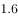，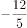，，，（  ）

- **A**. 

- **B**. 

　✅
- **C**. 
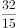

- **D**. 

**答案**：B

**官方解析**

数列中出现分数，无其他明显规律，考虑将数列通分为分母相同的分数：，，，，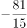。此时分母相同观察分子规律：，是公比为-1.5的等比数列，因此所求项。如果对于数据比较敏感，直接看出相邻项是-1.5倍的关系，可以直接按照等比数列来做。

故正确答案为B。

---

### 第 5 题　qid 2172341 · 数学运算

一款手机按2000元单价销售，利润为售价的。若重新定价，将利润降至新售价的，则新售价是：

- **A**. 1900元
- **B**. 1875元　✅
- **C**. 1840元
- **D**. 1835元

**答案**：B

**官方解析**

由题干“售价2000元，利润为售价的”可得，元。又由“重新定价，利润降至新售价的”，设新售价为x元，则，解得，则新售价是1875元。

故正确答案为B。

---

### 第 6 题　qid 2172445 · 数学运算

如图，在长方形ABCD中，已知三角形ABE、三角形ADF与四边形AECF的面积相等，则三角形AEF与三角形CEF的面积之比是

- **A**. 5:1　✅
- **B**. 5:2
- **C**. 5:3
- **D**. 6:1

**答案**：A

**官方解析**

设长方形ABCD的长，宽，根据题意，，。因为，则，所以，；同理，，则，所以，。

，则，因此。

故正确答案为A。

---

### 第 7 题　qid 2172382 · 数学运算

燃气公司欲在某新建楼盘内铺设天然气管道连通所有住宅楼，楼与楼之间可铺设管道的路线如图所示，圆圈表示各住宅楼，线段及线上数字表示路线及其长度（单位：百米），则铺设的管道最短长度是

- **A**. 1800米
- **B**. 1850米　✅
- **C**. 1950米
- **D**. 2000米

**答案**：B

**官方解析**

要求“天然气管道连通所有住宅楼”且管道长度最短，那么铺设的管道数量应尽量少且每条管道的长度应尽量短。A-F共6栋住宅楼，因此管道数量最少为5条，根据图示，尽可能选择短的管道，选择FA、AC、CE、CD、BD，此时6栋住宅楼均被管道连通且所用长度最短，总长度为米。

故正确答案为B。

---

### 第 8 题　qid 2172286 · 数学运算

小李为办公室购买了红、黄、蓝三种颜色的笔若干支，共花费40.6元。已知红色笔单价为1.7元、黄色笔为3元、蓝色笔为4元，则小李买的笔总数最多是：

- **A**. 19支
- **B**. 20支
- **C**. 21支　✅
- **D**. 22支

**答案**：C

**官方解析**

设购买红色笔、黄色笔、蓝色笔的数量分别为x、y、z支，根据题意可得，即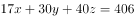······①。由于y、z均为正整数，而30y与40z的尾数均为0，因此17x的尾数必定为6，则x的尾数必定为8。要使买的笔总数最多，则价格最低的红色笔的数量x应尽量多，又因为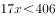，则x最大取18。将18代入①式：，化简得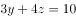，此时只有，满足二者均为正整数的条件，且此时价钱低的笔购买数量较多，符合题干要求。所买笔总数最多为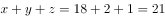支。

故正确答案为C。

---

### 第 9 题　qid 2172434 · 数学运算

甲乙丙分别骑摩托车、乘大巴、打的从A地去B地，甲的出发时间分别比乙丙早15分钟、20分钟，到达时间比乙丙都晚5分钟。已知甲乙的速度之比是2：3，丙的速度是60千米/小时，则AB两地间的距离是

- **A**. 75千米
- **B**. 60千米
- **C**. 48千米
- **D**. 35千米　✅

**答案**：D

**官方解析**

根据题意，设甲从A地到B地用时x分钟，则乙用时分钟，丙用时分钟。根据“路程一定，速度与时间成反比”可得，，解得分钟，所以丙从A地到B地用时分钟，又因为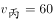千米/小时，因此AB两地间的距离是千米。

故正确答案为D。

---

### 第 10 题　qid 2172435 · 数学运算

编制一批“中国结”，甲乙合作6天可完成；乙丙合作10天可完成；甲乙合作4天后，乙再单独做5天可完成，则甲、乙、丙的工作效率之比是

- **A**. 3：2：1　✅
- **B**. 4：3：2
- **C**. 5：3：1
- **D**. 6：4：3

**答案**：A

**官方解析**

赋值工程总量为30，则 甲、乙、丙的效率关系为：，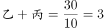。甲乙合作4天，完成工程量，剩余工程量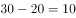，乙再单独做5天可完成，则。因此、，则甲、乙、丙的工作效率之比是3:2:1。

故正确答案为A。

---

### 第 11 题　qid 2172436 · 数学运算

已知正月初六从某火车站乘车出行旅客人数恰好是正月初五的8.5倍，且恰好比正月初七少，则正月初七从该火车站乘车出行的旅客人数至少是：

- **A**. 850人
- **B**. 1300人
- **C**. 1700人　✅
- **D**. 3400人

**答案**：C

**官方解析**

设初五、初六、初七的旅客人数分别为a、b、c（均为正整数）。由题意可知，。根据倍数特性，c一定是100倍数，排除A项；两式整理可得，即，根据倍数特性，c应该是850的倍数，排除B项。题目问“至少”，则在C、D两项中选择较小的1700。

故正确答案为C。

---

### 第 12 题　qid 2172388 · 数学运算

某化学实验室有A、B、C三个试管分别盛有10克、20克、30克水，将某种盐溶液10克倒入试管A中，充分混合均匀后，取出10克溶液倒入B试管，充分混合均匀后，取出10克溶液倒入C试管，充分混合均匀后，这时C试管中溶液浓度为，则倒入A试管中的盐溶液浓度是：

- **A**. 

- **B**. 

- **C**. 

- **D**. 

　✅

**答案**：D

**官方解析**

设倒入A试管中的盐溶液浓度为a，将溶液倒入A试管时，混合之后的浓度；同理经过B、C试管的混合之后溶液浓度为，解得。

故正确答案为D。

---

### 第 13 题　qid 2172296 · 数学运算

某市公安局从辖区2个派出所分别抽调2名警察，将他们随机安排到3个专案组工作，则来自同一派出所的警察不在同一组的概率是：

- **A**. 

　✅
- **B**. 

- **C**. 

- **D**. 

**答案**：A

**官方解析**

由题意可知，4名警察分到3个专案组，必有2人同组，其他2人各自一组。从4人中选出2人，有种方法；随机安排到3个专案组工作，每种分组情况均有种安排方法。所以将4名警察随机安排到3个专案组工作共有种情况。

从反面考虑，若同一派出所的警察在同一组，则其中一个派出所的2名警察被安排到一个专案组，另外一个派出所的2名警察分别安排到另外2个专案组，所以共有种情况。

因此，来自同一派出所的警察不在同一组的概率是。

故正确答案为A。

---

### 第 14 题　qid 2172385 · 数学运算

某单位举行象棋比赛，计分规则为：赢者得2分，负者得0分，平局各得1分，每位选手与其他选手各下一局。已知男选手数是女选手的10倍，而得分是女选手的4.5倍，则参加比赛的男选手数是

- **A**. 40人
- **B**. 30人
- **C**. 20人
- **D**. 10人　✅

**答案**：D

**官方解析**

根据题意可知，无论是有胜负还是平局，每局比赛共得2分。为方便计算，从小到大代入。代入D项：假设参加比赛的男选手数是10人，则女选手人，选手总数人。因为每位选手与其他选手各下一局，所以11人有局比赛，共分，女选手得分为分，1名女选手总得分最多为分，符合题干条件。（同理验证C、B、A选项可知，计算得出女选手总得分均大于可得的最高分）

故正确答案为D。

---

## 判断推理

### 材料 1

甲、乙、丙、丁、戊、己6项工作需要按照一定的先后顺序才能顺利完成。已知：

（1）丁必须在甲之前完成，并且中间只能隔着1项工作；

（2）丙必须在乙之前完成，并且中间只能隔着2项工作。

#### 第 1 题　qid 2172309 · 类比推理

若戊第2个完成，则己第几个完成？

- **A**. 3
- **B**. 4
- **C**. 5
- **D**. 6　✅

**答案**：D

**官方解析**

若戊第2个完成，结合条件（2）可知，丙和乙有两种可能：

①如下图所示，如果丙是第一个完成，乙是第四个完成，

再结合条件（1）可知，丁是第三个完成，甲是第五个完成，如下图所示，故己是第六个完成。

②如下图所示，如果丙是第三个完成，乙是第六个完成，再结合条件（1）可知，丁与甲隔着1项工作，无法满足，故此种可能排除。

综上所述，己是第六个完成。

故正确答案为D。

---

#### 第 2 题　qid 2172311 · 逻辑判断

若甲、乙不是紧挨着先后完成，则可以得出以下哪项？

- **A**. 甲在乙之前完成　✅
- **B**. 乙在甲之前完成
- **C**. 戊在己之前完成
- **D**. 己在戊之前完成

**答案**：A

**官方解析**

题干信息不确定，可用假设法。

由条件（2）可知，丙有三种可能：

①如下图所示，假设丙是第一个完成，乙是第四个完成，再结合条件（1）可知，丁是第三个完成，甲是第五个完成，此时甲、乙紧挨着，与题干条件矛盾，故此种可能排除；

②如下图所示，假设丙是第二个完成，乙是第五个完成，再结合条件（1）可知，若丁是第一个完成，则甲是第三个完成，此时戊和己的顺序无法确定，只能确定甲在乙之前，满足题干假设；

如下图所示，假设丁是第四个完成，则甲是第六个完成，此时甲、乙紧挨着，与题干条件矛盾，故此种可能排除；

③如下图所示，假设丙是第三个完成，乙是第六个完成，再结合条件（1）可知，丁是第二个完成，甲是第四个完成，此时戊和己的顺序无法确定，只能确定甲在乙之前，满足题干假设。

综上所述，甲一定在乙之前。

故正确答案为A。

---

#### 第 3 题　qid 2172369 · 类比推理

茶水：咖啡：饮品

- **A**. 误解：曲解：理解
- **B**. 谎言：谗言：言论
- **C**. 考试：考核：考验
- **D**. 晋商：徽商：商人　✅

**答案**：D

**官方解析**

第一步：判断题干词语间逻辑关系。
茶水、咖啡都是饮品，因此，前两者之间是并列关系，前两者和第三者之间是种属关系。
第二步：判断选项词语间逻辑关系。
A项：误解和曲解都是做了错误的理解，两者之间是近义关系，和理解是反义关系，与题干逻辑关系不一致，排除；
B项：谎言是不真实的话，谗言是诽谤的话，言论是指发表的意见或议论，第三者和前两者之间不构成种属关系，与题干逻辑关系不一致，排除；
C项：考试和考核都是对参考者进行测试，两者是近义关系，与题干逻辑关系不一致，排除；
D项：晋商和徽商都是商人，前两者之间是并列关系，前两者和第三者之间是种属关系，与题干逻辑关系一致，当选。
故正确答案为D。

---

#### 第 4 题　qid 2172438 · 类比推理

吕布：辕门射戟

- **A**. 诸葛亮：三顾茅庐
- **B**. 刘备：白帝托孤　✅
- **C**. 曹操：草船借箭
- **D**. 关羽：刮骨疗伤

**答案**：B

**官方解析**

第一步：判断题干词语间逻辑关系。
辕门射戟，讲的是吕布为了阻止袁术击灭刘备而以他精湛的箭法平息了一场战争的故事，射箭的人是吕布，二者是历史人物与历史典故的对应关系。
第二步：判断选项词语间逻辑关系。
A项：三顾茅庐，讲的是刘备三顾茅庐拜访诸葛亮的故事，三顾茅庐的人是刘备，而非诸葛亮，与题干逻辑关系不一致，排除；
B项：白帝托孤，讲的是刘备病危之时，召丞相诸葛亮、尚书令李严托孤，命二人辅佐其子刘禅的故事，托孤的人是刘备，二者是历史人物与历史典故的对应关系，与题干逻辑关系一致，当选；
C项：草船借箭，讲的是诸葛亮利用曹操多疑的性格，利用几条草船诱敌，借足十万支箭的故事，借箭的人是诸葛亮，而非曹操，与题干逻辑关系不一致，排除；
D项：刮骨疗伤，讲的是华佗为关羽刮骨疗伤的故事，刮骨的人是华佗，而非关羽，关羽是被刮骨的人，与题干逻辑关系不一致，排除。
故正确答案为B。

---

#### 第 5 题　qid 2172441 · 类比推理

交通摄像头：监控路况

- **A**. 指纹密码锁：采集指纹
- **B**. 电子血压仪：测量血压　✅
- **C**. 扫地机器人：净化空气
- **D**. 折叠防盗窗：晾晒衣服

**答案**：B

**官方解析**

第一步：判断题干词语间逻辑关系。
交通摄像头的主要功能是监控路况，二者之间是功能对应关系。
第二步：判断选项词语间逻辑关系。
A项：指纹密码锁的主要功能是防盗，并不是采集指纹，二者之间不是功能对应关系，与题干逻辑关系不一致，排除；
B项：电子血压仪的主要功能是测量血压，二者之间是功能对应关系，与题干逻辑关系一致，当选；
C项：扫地机器人的主要功能是清洁地面，并不是净化空气，二者之间不是功能对应关系，与题干逻辑关系不一致，排除；
D项：折叠防盗窗的主要功能是防盗，并不是晾晒衣服，二者之间不是功能对应关系，与题干逻辑关系不一致，排除。
故正确答案为B。

---

#### 第 6 题　qid 2172444 · 类比推理

三角形：三棱锥

- **A**. 四边形：四面体
- **B**. 五边形：五角星
- **C**. 正方形：正方体　✅
- **D**. 抛物线：圆柱体

**答案**：C

**官方解析**

第一步：判断题干词语间逻辑关系。
三角形是平面图形，三棱锥是立体图形，并且三棱锥中所有的面都是三角形，二者为对应关系。
第二步：判断选项词语间逻辑关系。
A项：四边形是平面图形，四面体是立体图形，但是四面体中所有的面都是三角形，并不是四边形，与题干逻辑关系不一致，排除；
B项；五边形是平面图形，五角星也是平面图形，与题干逻辑关系不一致，排除；
C项：正方形是平面图形，正方体是立体图形，并且正方体中所有的面都是正方形，与题干逻辑关系一致，当选；
D项：抛物线是平面图形，圆柱体是立体图形，但是抛物线不是面，圆柱体中的面是矩形和圆形，与题干逻辑关系不一致，排除。
故正确答案为C。

---

#### 第 7 题　qid 2172446 · 类比推理

事实：伪造的事实

- **A**. 秘密：公开的秘密　✅
- **B**. 陷阱：温柔的陷阱
- **C**. 谎言：善意的谎言
- **D**. 忧愁：甜蜜的忧愁

**答案**：A

**官方解析**

第一步：判断题干词语间逻辑关系。
事实，指事情的真实情况，伪造的事实，指虚假的情况，二者之间是反义关系。
第二步：判断选项词语间逻辑关系。
A项：秘密，指不为人知的事情，公开的秘密，指大家都知道的事情，二者之间是反义关系，与题干逻辑关系一致，当选；
B项：温柔的陷阱，形容陷阱很隐秘，不易发觉，与陷阱不构成反义关系，与题干逻辑关系不一致，排除；
C项：善意的谎言，形容虽有谎言但是为他人着想，并无恶意，与谎言不构成反义关系，与题干逻辑关系不一致，排除；
D项：甜蜜的忧愁，形容虽有忧伤但却是幸福的，与忧愁不构成反义关系，与题干逻辑关系不一致，排除。
故正确答案为A。

---

#### 第 8 题　qid 2172371 · 类比推理

春耕：秋收：冬藏

- **A**. 立功：表彰：晋级
- **B**. 偷盗：受罚：悔恨
- **C**. 勤奋：致富：捐款
- **D**. 报名：参赛：夺冠　✅

**答案**：D

**官方解析**

第一步：判断题干词语间逻辑关系。
农业生产的一般过程，指春天耕种，秋天收获，冬天储藏，三词间有时间的先后顺序。
第二步：判断选项词语间逻辑关系。
A项：表彰和晋级之间没有明显的时间先后顺序，与题干逻辑关系不一致，排除；
B项：受罚和悔恨之间没有明显的时间先后顺序，与题干逻辑关系不一致，排除；
C项：致富和捐款之间没有必然时间先后顺序，与题干逻辑关系不一致，排除；
D项：报名、参赛、夺冠是参加比赛的一般过程，三词间有明显的时间先后顺序，与题干逻辑关系一致，当选。
故正确答案为D。

---

#### 第 9 题　qid 2172447 · 类比推理

考试 之于（  ）相当于（  ）之于 运动

- **A**. 考场——操场
- **B**. 分数——成绩
- **C**. 学生——体操
- **D**. 评价——跑步　✅

**答案**：D

**官方解析**

逐一代入选项。
A项：在考场中考试，在操场上运动，但是顺序反了，排除；
B项：通过考试得到分数，通过运动取得成绩，但是顺序反了，排除；
C项：学生参加考试，二者是参与主体与活动的对应关系，体操属于一种运动方式，二者是种属关系，前后逻辑关系不一致，排除；
D项：考试是一种评价方式，二者属于种属关系，跑步是一种运动方式，二者属于种属关系，前后逻辑关系一致，当选。
故正确答案为D。

---

#### 第 10 题　qid 2172448 · 类比推理

草原 之于（  ）相当于 海洋 之于（  ）

- **A**. 放牧——捕捞　✅
- **B**. 虫草——鱼群
- **C**. 羊群——水手
- **D**. 牧羊犬——指南针

**答案**：A

**官方解析**

逐一代入选项。
A项：在草原进行放牧，草原和放牧是场所和行为的对应关系；在海洋进行捕捞，海洋和捕捞也是场所和行为的对应关系，且放牧和捕捞都是人类生产活动的一种，前后逻辑关系一致，当选；
B项：虫草一般生长在高原地区，草原和虫草无明显逻辑关系；海洋和鱼群为场所与生物的对应关系，前后逻辑关系不一致，排除；
C项：草原和羊群是生存场所与生物的对应关系；海洋和水手是工作场所与职业的对应关系，前后逻辑关系不一致，排除；
D项：牧羊犬可以在草原上帮助人们放牧，二者是生物与其应用场所的对应关系；在海洋航行也可以用指南针来指引方向，二者是应用场所与工具的对应关系，前后逻辑关系不一致，排除。
故正确答案为A。

---

#### 第 11 题　qid 2172450 · 逻辑判断

- **A**. 

- **B**. 

- **C**. 

　✅
- **D**. 

**答案**：C

**官方解析**

第一步：分析题干符号间关系。
从相同符号的位置入手：位置1、9的符号相同；位置2、3的符号相同；位置6、7的符号相同；位置8、10的符号相同；并且位置4、5上的符号与其他位置均不相同。
第二步：判断选项符号间关系。
A项：位置1、9的符号并不相同，与题干不一致，排除；
B项：位置1、9的符号相同；位置2、3的符号相同；但是位置4、5的符号相同，与题干不一致，排除； 
C项：位置1、9的符号相同；位置2、3的符号相同；位置6、7的符号相同；位置8、10的符号相同；并且位置4、5上的符号与其他位置均不相同，与题干一致，当选；
D项：位置1、9的符号并不相同，与题干不一致，排除。
故正确答案为C。

---

#### 第 12 题　qid 2172451 · 逻辑判断

- **A**. 

- **B**. 

- **C**. 

　✅
- **D**. 

**答案**：C

**官方解析**

第一步：分析题干符号间关系。
从相同符号的位置入手：位置1、2的符号相同；位置6、10的符号相同；位置8、9的符号相同；位置3、4、5、7上的符号与其他位置均不相同，且位置1、2、5为字母，位置3、4为数字，剩余位置为字符。
第二步：判断选项符号间关系。
A项：位置1、2的符号相同；位置6、10的符号相同；位置8、9的符号相同；并且位置3、4、5、7上的符号与其他位置均不相同。但是位置4并不是数字，而是字母，与题干不一致，排除；
B项：位置1、2的符号相同；位置6、10的符号相同；但是位置8、9的符号不相同，与题干不一致，排除； 
C项：位置1、2的符号相同；位置6、10的符号相同；位置8、9的符号相同；位置3、4、5、7上的符号与其他位置均不相同，且位置1、2、5为字母，位置3、4为数字，剩余位置为字符，与题干一致，当选；
D项：位置1、2的符号不相同，与题干不一致，排除。
故正确答案为C。

---

#### 第 13 题　qid 2172439 · 图形推理

请从所给的四个选项中，选择最合适的一项填在问号处，使之呈现一定的规律性。 

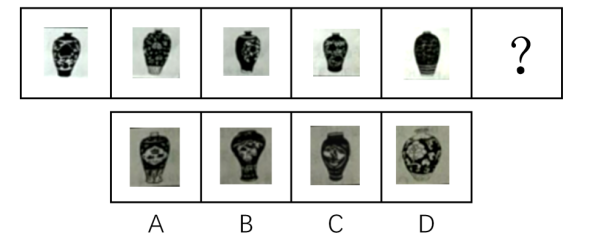

- **A**. A　✅
- **B**. B
- **C**. C
- **D**. D

**答案**：A

**官方解析**

本题考查图形的实际意义，寻找最大共同点。观察发现，题干所有图形都是小口径且无盖的瓶子，B、C两项中瓶子为大口径的瓶子，D项瓶身过宽且口径较大，不符合题干图形特征，均排除。只有A项满足题干图形特征，当选。
故正确答案为A。

---

#### 第 14 题　qid 2172442 · 图形推理

请从所给的这几个选项中，选择最合适的一个填在问号处，使之呈现一定的规律性：

- **A**. A
- **B**. B
- **C**. C　✅
- **D**. D

**答案**：C

**官方解析**

题干图形均由小正方体叠加而成，考虑三视图。观察发现，题干图形的左视图均相同，只有C项的左视图与题干相同。
故正确答案为C。

---

#### 第 15 题　qid 2172362 · 图形推理

从四个图中选出唯一的一项，填入问号处，使其呈现一定的规律性。

- **A**. A
- **B**. B
- **C**. C　✅
- **D**. D

**答案**：C

**官方解析**

图形元素组成相同，优先考虑位置规律，但位置无明显规律。观察发现，图一、图三和图五中的两个元素均在右上角和左下角，图二和图四中的两个元素均在左上角和右下角，故？号处图形中的两个元素应在左上角和右下角的位置，排除A项和D项。再次观察发现，题干图形中的两个元素箭头均指向同一方向，B项中两个元素箭头指向不同方向，C项中两个元素箭头指向同一方向。
故正确答案为C。

---

#### 第 16 题　qid 2172364 · 图形推理

从四个图中选出唯一的一项，填入问号处，使其呈现一定的规律性。 

- **A**. A
- **B**. B
- **C**. C
- **D**. D　✅

**答案**：D

**官方解析**

元素组成不同，且无明显属性规律，优先考虑数量规律。题干图形封闭区域明显，优先考虑面数量，题干图形的面数量依次为2、1、2、3、4，单独数面无规律。再次观察发现，题干每幅图形都有一个外框，外框边数分别为4、3、4、5、6，题干图形的外框边数-面数量=2，故“？”处图形的外框边数-面数量=2，只有D项符合。
故正确答案为D。

---

#### 第 17 题　qid 2172464 · 图形推理

选项四个图形中，只有一个是由题干的四个图形拼合（只能通过上、下、左、右平移）而成的，请把它找出来填入问号处。

- **A**. A
- **B**. B
- **C**. C　✅
- **D**. D

**答案**：C

**官方解析**

本题考查平面拼合，可采用平行且等长相消的方式解题。消去平行且等长的线段后进行组合即可得到轮廓图，即为C项。

平行且等长相消的方式如下图所示：

故正确答案为C。

---

#### 第 18 题　qid 2172477 · 图形推理

选项四个图形中，只有一个是由题干的四个图形拼合（只能通过上、下、左、右平移）而成的，请把它找出来填入问号处。

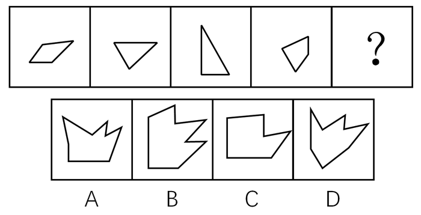

- **A**. A
- **B**. B　✅
- **C**. C
- **D**. D

**答案**：B

**官方解析**

本题考查平面拼合，可采用平行且等长相消的方式解题。消去平行且等长的线段后进行组合即可得到轮廓图，即为B项。平行且等长相消的方式如下图所示：

故正确答案为B。

---

#### 第 19 题　qid 2172468 · 图形推理

选项四个图形中，只有一个是由题干的四个图形拼合（只能通过上、下、左、右平移）而成的，请把它找出来。

- **A**. A
- **B**. B
- **C**. C　✅
- **D**. D

**答案**：C

**官方解析**

本题考查平面拼合，可采用平行且等长相消的方式解题。消去平行且等长的线段后进行组合即可得到轮廓图，即为C项。平行且等长相消的方式如下图所示：

故正确答案为C。

---

#### 第 20 题　qid 2172305 · 图形推理

下边四个图形中，只有一个是由上边的四个图形拼合（只能通过上、下、左、右平移）而成的，请把它找出来。

- **A**. A　✅
- **B**. B
- **C**. C
- **D**. D

**答案**：A

**官方解析**

本题考查平面拼合，可采用平行且等长相消的方式解题。消去平行且等长的线段后进行组合即可得到轮廓图，即为A选项。平行且等长相消的方式如下图所示：

故正确答案为A。

---

#### 第 21 题　qid 2172471 · 图形推理

选项四个图形中，只有一个是由题干的四个图形拼合（只能通过上、下、左、右平移）而成的，请把它找出来。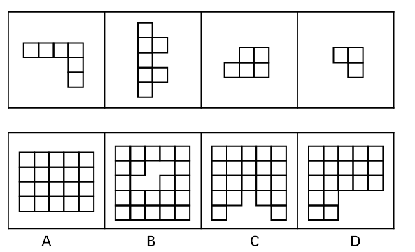

- **A**. A
- **B**. B
- **C**. C　✅
- **D**. D

**答案**：C

**官方解析**

本题考查俄罗斯方块平面拼合。从方块最多的图形入手，贴边代入选项。在题干的4个图形中，图②的方块最多，将它贴边代入各个选项中，只有C项能够把所有图形都代入进去，拼合方式如下图所示。

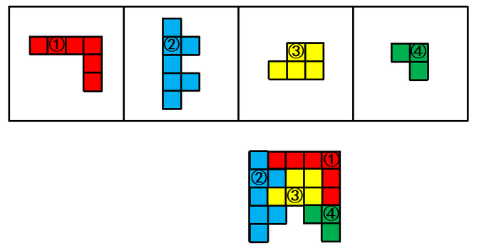

故正确答案为C。

---

#### 第 22 题　qid 2172474 · 图形推理

选项四个图形中，哪个可由左边图形折叠而成？

- **A**. A
- **B**. B　✅
- **C**. C
- **D**. D

**答案**：B

**官方解析**

题干图形从上至下分别标上面a、b、c、d。 

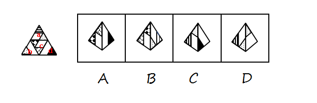

A项：由面c和面d构成，题干沿面c蓝色的点顺时针画边，题干边1挨着面b，选项沿相同点顺时针画边，边1挨着面d，选项与题干不一致，排除；

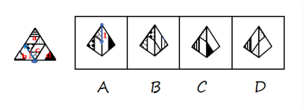

B项：由面c和面a构成，与题干一致，当选； 

C项：由面a和面d构成，题干沿面a黄色的点顺时针画边，题干边2挨着面c,选项沿相同点顺时针画边，边2挨着面d，选项与题干不一致，排除；

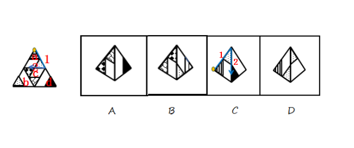 

D项：由面a和面b构成，题干沿面a黄色的点顺时针画边，题干边2挨着面c，选项沿相同点顺时针画边，边2挨着面b，选项与题干不一致，排除。 

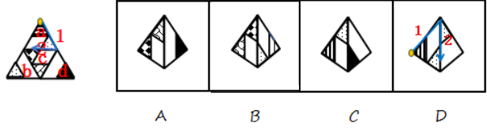

故正确答案为B。

---

#### 第 23 题　qid 2172440 · 图形推理

左边给出的是纸盒外表面的展开图，右边哪一项能由它折叠而成？请把它找出来。

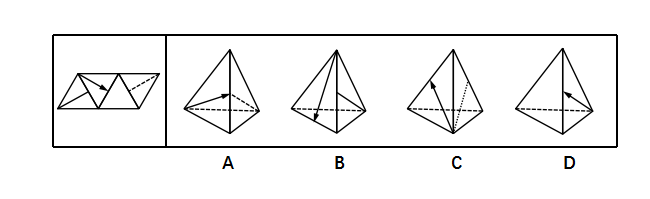

- **A**. A
- **B**. B
- **C**. C
- **D**. D　✅

**答案**：D

**官方解析**

题干图形从左至右分别标上面a、b、c、d。

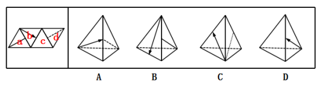

A项：由面b和面d构成，题干沿面b蓝色点顺时针画边，边2挨着c面，选项边2挨着d面，选项与题干不一致，排除；

B项：由面b和面a构成，题干沿面b蓝色点顺时针画边，边3挨着a面，选项边1挨着a面，选项与题干不一致，排除；

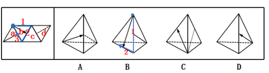

C项：由面b和面d构成，题干沿面b蓝色点顺时针画边，边1挨着d面，选项边3挨着d面，选项与题干不一致，排除；

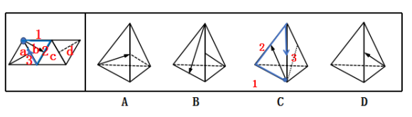

D项：选项与展开图一致，当选。

故正确答案为D。

---

#### 第 24 题　qid 2172449 · 图形推理

左边给定的是纸盒外表面的展开图，右边哪一项能由它折叠而成？请把它找出来。

- **A**. A　✅
- **B**. B
- **C**. C
- **D**. D

**答案**：A

**官方解析**

本题考查六面体的空间重构。将平面图中的各面进行标号，如图1所示：

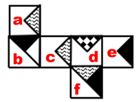

A项：与题干展开图一致，当选；

B项：该项上边和右边的面分别为f面和d面，在展开图中，f面中的波浪线三角形和d面中的黑点三角形没有公共点，而在该项中有公共点，与题干不一致，排除；

C项：该项上边和前边的面分别为b面和d面，展开图中这两个面为相对面，在立体图中不能同时出现，与题干不一致，排除；

D项：该项上边和右边的面分别为e面和d面，在展开图中，e面中的黑三角和d面中的黑点三角形没有交点，而在该项中有交点，与题干不一致，排除。

故正确答案为A。

注：有同学会根据a、c面中S线条的方向排除B、D两项，但还是建议同时掌握通过公共边/公共点对选项进行排除的解题方法，因为江苏出题人对于面内线条的方向一般不做考查，例如2018年江苏A类第87题。

---

#### 第 25 题　qid 2172375 · 图形推理

左边给定的是纸盒外表面的展开图，右边哪一项能由它折叠而成？请把它找出来。

- **A**. A
- **B**. B
- **C**. C
- **D**. D　✅

**答案**：D

**官方解析**

本题考查六面体的空间重构。将题干展开图中的面依次标注为面a、b、c、d、e、f，如下图：

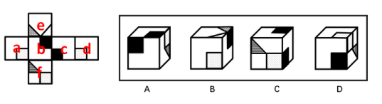

A项：右侧的面在展开图中没有出现，属于无中生有的面，选项与题干展开图不一致，排除；

B项：在题干展开图中，面e中的格子三角形两条直角边分别挨着白色区域，而选项中，面e中的格子三角形一条直角边挨着黑色正方形，选项与题干展开图不一致，排除；

C项：选项的三个面分别是面b、面c、面f，如下图：

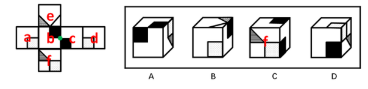

题干展开图中，面b和面c中的黑色正方形存在一个公共点（如绿点），而选项中，面b和面c中的黑色正方形不存在公共点，选项与题干展开图不一致，排除；

D项：选项的三个面分别是面c、面d、面f，选项与题干展开图一致，当选。

故正确答案为D。

注：有同学会纠结D项右面里的线条方向不对，如果这么理解，这道题就没有答案了，所以从这个细节可以看出，江苏出题人对于面内线条的方向没有过多考虑，也没有在此设坑，如果没有更好的选项，可以选它。

---

#### 第 26 题　qid 2172452 · 图形推理

从所给的四个选项中，选择最恰当的一个填入问号处，使之呈现一定的规律性。

- **A**. A
- **B**. B
- **C**. C　✅
- **D**. D

**答案**：C

**官方解析**

图形元素组成不同，优先考虑属性规律。九宫格优先按行看，第一行中，三幅图都是轴对称图形，并且对称轴的方向依次顺时针旋转，第二行与第一行规律相同，第三行也应该满足此规律，只有C项符合。

故正确答案为C。

---

#### 第 27 题　qid 2172390 · 图形推理

从所给的四个选项中，选择最恰当的一个填入问号处，使之呈现一定的规律性。

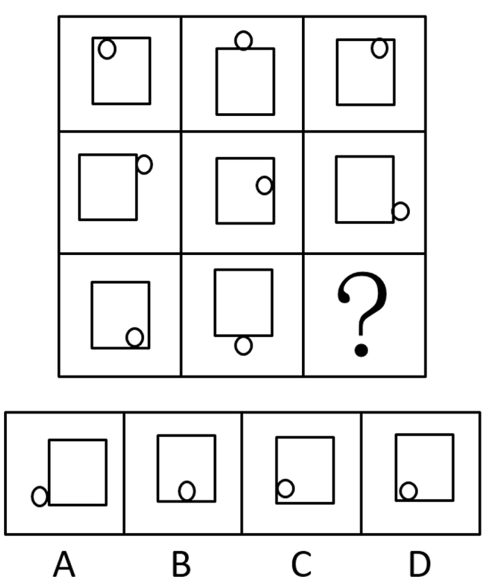

- **A**. A
- **B**. B
- **C**. C
- **D**. D　✅

**答案**：D

**官方解析**

图形元素组成相同，优先考虑位置规律。九宫格优先按横行来看，第一行中，小球的位置相对于正方形依次内、外、内交替出现，并且沿着正方形上方的边从左向右平移。第二行中，小球的位置相对于正方形依次外、内、外交替出现，并且沿着正方形右侧的边从上向下平移。第三行中，前两幅图中的小球的位置相对于正方形依次内、外出现，因此，问号处小球位置应在正方形的内部出现，排除A项；前两幅图小球沿着正方形下方的边从右向左平移，因此，问号处小球应该在正方形下方的边的左边，排除B、C两项。
故正确答案为D。

---

#### 第 28 题　qid 2172453 · 逻辑判断

人们常说，读书可以增长知识、陶冶性情。有专家指出，读书还可以治病，特别是对于一些社会因素引起的心理疾病，如抑郁、压抑、恐慌、烦恼等，读书有很好的疗效。
以下哪项如果为真，最能支持上述专家的观点？

- **A**. 读书能够促使患者转变思维方式，提高认知能力，重新认识世界和认识自己
- **B**. 患者能够从阅读中有意无意获得情感上的认同和慰藉，释放内心的焦虑和不安　✅
- **C**. 汉代大学问家刘向十分重视读书的医疗作用，认为书犹药也，善读之可以医愚
- **D**. 阅读能使大脑中产生一种神经肽，可以增强细胞免疫力，有益于人的身体健康

**答案**：B

**官方解析**

第一步：找出论点和论据。
论点：读书可以治病，特别是对于一些社会因素引起的心理疾病，如抑郁、压抑、恐慌、烦恼等，读书有很好的疗效。
论据：无。
本题只有论点没有论据，加强优先考虑补充论据。
第二步：逐一分析选项。
A项：说的是读书能使患者转变思维，提高认知能力，重新认识世界和自己，与是否能治疗心理疾病无关，无关项，排除；
B项：说明患者能够从阅读中获得情感上的慰藉，释放内心的焦虑与不安，解释说明了阅读是如何治疗心理疾病的，补充论据加强，当选；
C项：指出汉代大学问家认为书犹药也，善读之可以医愚，是其个人观点，而且“医愚”无法说明读书能医治心理疾病，不能加强，排除； 
D项：说明阅读有益身体健康，增强人体免疫力，与是否能治疗心理疾病无关，无关项，排除。
故正确答案为B。

---

#### 第 29 题　qid 2172457 · 逻辑判断

为丰富员工业余生活，某企业每年划出一笔固定经费用作员工的旅游福利。该企业的部分员工自发成立了一个驴友协会，驴友协会中的一些人是该企业的技术骨干。最近，该企业的部分领导准备把这笔经费挪作他用，这一想法得到了企业管理层所有成员的同意，但驴友协会的成员都不同意企业管理层的这一决定。
根据以上陈述，可以得出以下哪项？

- **A**. 有些技术骨干不是管理层成员　✅
- **B**. 管理层成员都不是技术骨干
- **C**. 驴友协会的成员都是技术骨干
- **D**. 有些管理层成员是技术骨干

**答案**：A

**官方解析**

第一步：翻译题干。
①有些驴友协会成员→企业技术骨干；
②企业管理层成员→同意部分领导挪用这笔经费；
③驴友协会成员→-同意部分领导挪用这笔经费。
第二步：逐一分析选项。
A项：翻译为有些技术骨干→-企业管理层成员，根据有些A是B=有些B是A可知，①等价于有些技术骨干→驴友协会成员，结合③②可知，有些技术骨干→驴友协会成员→-同意部分领导挪用这笔经费→-企业管理层成员，即有些技术骨干不是管理层成员，当选；
B项：翻译为企业管理层成员→-技术骨干，结合②③可知，企业管理层成员→同意部分领导挪用这笔经费→-驴友协会成员，-驴友协会成员根据①无法推出-企业技术骨干，排除；
C项：翻译为驴友协会成员→技术骨干，根据①已知有些驴友协会的成员是企业技术骨干，无法推出所有的驴友协会成员都是企业技术骨干，排除；
D项：翻译为有些管理层人员→技术骨干，结合②③可知，企业管理层成员→同意部分领导挪用这笔经费→-驴友协会成员，-驴友协会成员根据①无法推出企业技术骨干，所以无法推出管理层员工与技术骨干之间的关系，排除。
故正确答案为A。

---

#### 第 30 题　qid 2172395 · 逻辑判断

某人拟在1-5号5个地块上种植玉米、高粱、红薯、大豆和花生5种作物，每个地块仅种植一种作物，每种作物仅种植在一个地块。已知：
（1）如果3号地块种植大豆、高粱或花生，则1号地块种植玉米；
（2）如果4号地块种植高粱或花生，则2号或5号地块种植红薯；
（3）1号地块种植红薯。
根据以上信息，可以得出以下哪项？

- **A**. 2号地块种植高粱
- **B**. 3号地块种植花生
- **C**. 4号地块种植大豆　✅
- **D**. 5号地块种植玉米

**答案**：C

**官方解析**

题干可翻译为：

①3号种植大豆 或 3号种植高粱 或 3号种植花生1号种植玉米；

②4号种植高粱 或 4号种植花生2号种植红薯 或 5号种植红薯；

③1号种植红薯。

由③知：1号种植红薯，则1号不能种植玉米。根据①的逆否命题可知：1号种植玉米3号种植大豆 且 3号种植高粱 且 3号种植花生，则3号只能种植玉米。同时由1号种植红薯知：2号和5号不能种植红薯，根据②的逆否命题可知：2号种植红薯 且 5号种植红薯4号种植高粱 且 4号种植花生，以及1号种植红薯和3号种植玉米可以得出4号只能种植大豆，对应C项。

故正确答案为C。

---

#### 第 31 题　qid 2172460 · 逻辑判断

水熊虫不吃不喝能够存活30年，可以忍受高达150℃的高温，可生存在深海和冰冷的太空中。它们惊人的生存能力使之能够躲过灭绝地球上绝大多数生命的大灾难，能够伤害水熊虫的力量只有恒星爆炸或者伽马射线大爆发。有专家由此断言，水熊虫是一种可生存到太阳灭亡那一天的地球生物。
以下哪项如果为真，最能支持上述专家的观点？

- **A**. 有些地球生物可以生存到太阳灭亡的那一天
- **B**. 在太阳灭亡之前水熊虫不会遇到恒星爆炸或者伽马射线大爆发　✅
- **C**. 只有能够不吃不喝存活30年或忍受150℃的高温，才能生存到太阳灭亡的那一天
- **D**. 只有不吃不喝存活30年，才能躲过恒星爆炸或者伽马射线大爆发

**答案**：B

**官方解析**

第一步：找出论点和论据。
论点：水熊虫是一种可生存到太阳灭亡那一天的地球生物。
论据：水熊虫不吃不喝能够存活30年，可以忍受高达150℃的高温，可生存在深海和冰冷的太空中。它们惊人的生存能力使之能够躲过灭绝地球上绝大多数生命的大灾难，能够伤害水熊虫的力量只有恒星爆炸或者伽马射线大爆发。
第二步：逐一分析选项。
A项：有些地球生物可以生存到太阳灭亡那一天，但是有些生物是否包含水熊虫并不明确，无法得知水熊虫是否可以生存到地球灭亡那一天，无法支持，排除； 
B项：水熊虫能够被恒星爆炸或者伽马射线大爆发伤害，所以选项中在太阳灭亡之前不会遇到恒星爆炸或者伽马射线大爆发伤害，是水熊虫不被伤害，能够生存到地球灭亡那一天的必要条件，可以支持，当选；
C项：生存到太阳灭亡那一天，推出不吃不喝存活30年或忍受150℃的高温，是由题干中的论点推出论据，方向错误，无法支持，排除；
D项：论据讨论的是惊人的生存能力使之能够躲过灭绝地球上绝大多数生命的大灾难，而无法躲过恒星爆炸或者伽马射线大爆发的伤害，无法支持，排除。
故正确答案为B。

---

#### 第 32 题　qid 2172461 · 类比推理

某单位要从甲、乙、丙、丁、戊、己6名工作人员中选派3名参加省职业技能大赛。有4位评委分别提出了自己的意见：
（1）甲、丙二人中至少选一人；
（2）乙、戊二人中至少选一人；
（3）乙、丙二人中至多选一人；
（4）甲、丁二人中至多选一人。
后来得知，戊因病不能参赛，并且上述4位评委的意见都得到了尊重。
根据上述信息，该单位选派的参赛选手是：

- **A**. 甲、乙、丙
- **B**. 甲、乙、丁
- **C**. 甲、乙、己　✅
- **D**. 丙、丁、己

**答案**：C

**官方解析**

翻译题干信息：
①甲 或 丙；
②乙 或 戊；
③-乙 或 -丙；
④-甲 或 -丁。
从题干确定信息入手，即戊因病不能参赛，以上四组条件均成立。
由戊不能参赛，结合条件②，否一推一，-戊→乙，可推出乙参赛；
由乙参赛结合条件③，否一推一，乙→-丙，可推出丙不参赛；
由丙不参赛结合条件①，否一推一，-丙→甲，可推出甲参赛；
由甲参赛结合条件④，否一推一，甲→-丁，可推出丁不参赛。
综上，参赛情况为，甲、乙参加，丙、丁不参加。而参赛选手为3名，故己也参赛，参赛选手为甲、乙、己。
故正确答案为C。

---

#### 第 33 题　qid 2172393 · 逻辑判断

为了减少温室气体排放，有效应对全球气候变暖，有些专家建议，应把燃树发电作为削减二氧化碳排放的策略。他们认为，树木比煤、天然气更具有“碳中性”，砍树燃树所产生的二氧化碳将会被在原地再次生长的树木吸收。
以下哪项如果为真，最能质疑上述专家的观点？

- **A**. 砍树之后及时栽树，新生的树木就会再次吸收空气中的碳，形成稳定的碳循环
- **B**. 燃树发电的政策建议一旦实施，可能会导致乱砍乱伐，加剧全球环境生态危机
- **C**. 碳循环的计算比较复杂，砍树燃树释放的碳与栽树重新吸收的碳可能并不相等
- **D**. 砍树燃树排放的碳要等到新栽树苗长大后才能被完全吸收，时间上存在滞后性　✅

**答案**：D

**官方解析**

第一步：找出论点和论据。
论点：应把燃树发电作为削减二氧化碳排放的策略。
论据：树木比煤、天然气更具有“碳中性”，砍树燃树所产生的二氧化碳将会被在原地再次生长的树木吸收。
第二步：逐一分析选项。
A项：新生树木吸收碳形成稳定碳循环，重复了论据的内容，补充论据进行加强，无法削弱，排除； 
B项：燃树发电会加剧生态危机，说的是燃树发电的不良后果，而题干所讨论的是燃树发电是否能削减二氧化碳排放，二者话题不一致，属于无关选项，无法削弱，排除；
C项：释放的碳和吸收的碳可能并不相等，那到底是释放的碳多还是吸收的碳多，并不明确，排除；
D项：碳在树苗长大后才会被完全吸收，时间上存在滞后性，说明至少对于树苗还没有长大的那段期间来说，还是存在排放更多的二氧化碳，不能削减二氧化碳的排放，能削弱，当选。
故正确答案为D。
【文段出处】《燃木发电？烧“木柴”环保吗？》

---

#### 第 34 题　qid 2172469 · 逻辑判断

绿茶的主要成分是茶多酚。近来大量动物实验发现，茶多酚具有抑制肿瘤细胞增殖、促进肿瘤细胞消亡的作用。但是，有些专家通过对大量人群的研究，并未发现饮茶越多癌症发病率就越低这一现象。据此，他们并不认为经常饮茶能够防癌。
以下哪项如果为真，则是上述专家作出结论最合理的假设？

- **A**. 如果茶叶在生产、加工、运输过程中受到重金属、农药等致癌物的污染，则饮茶越多就越增加患癌风险
- **B**. 如果人们长期饮茶但又奉行抽烟、喝酒、熬夜等不良生活习惯，则很难看出经常饮茶带来的防癌作用
- **C**. 只有假定品种不同但份量相同的茶叶中含有的茶多酚基本相同，才能得出经常饮茶能够防癌这一结论
- **D**. 只有在大量人群中发现饮茶越多癌症发病率就越低这一现象，才能得出经常饮茶能够防癌这一结论　✅

**答案**：D

**官方解析**

第一步：找出论点和论据。
论点：经常饮茶并不能够防癌。
论据：通过对大量人群的研究，并未发现饮茶越多癌症发病率就越低这一现象。
本题论点讨论的是饮茶和防癌，论据讨论的是研究中未发现饮茶越多癌症发病率就越低，讨论话题不完全一致，且提问中出现假设，加强可考虑搭桥。
第二步：逐一分析选项。
A项：如果茶叶受到致癌物的污染，则饮茶越多就越增加患癌风险，该项讨论的是受到致癌物污染的茶叶是否会增加患癌风险，而论点讨论的是茶叶本身是否能够防癌，无关项，排除；
B项：人们长期饮茶并且还奉行一些不良的习惯，就很难看出经常饮茶带来的防癌作用，肯定了饮茶能够防癌，削弱了题干论点，不能加强，排除；
C项：选项表述的是在什么情况之下能够得出茶叶能够防癌这一功效，而论点是在讨论茶叶是否能够防癌，二者话题不一致，不能加强，排除；
D项：只有在大量的人群中发现饮茶越多癌症发病率就越低这一现象，才能得出经常饮茶能够防癌这一结论，是在论点和论据之间建立联系，为搭桥项，可以加强，当选。
故正确答案为D。

---

#### 第 35 题　qid 2172473 · 图形推理

以下是一个44的图形，共有16个小方格，每个小方格中均可填入一个词。要求图形的每行、每列均填入“爱国”“敬业”“诚信”“友善”4个词，不能重复，也不能遗漏。

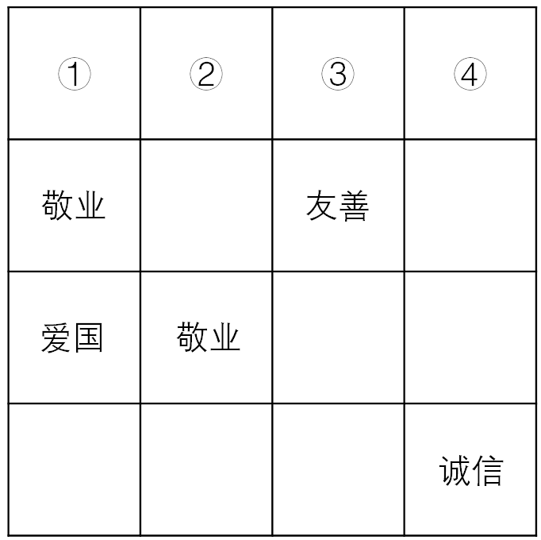

根据以上信息，依次填入图形中①②③④处的4个词应是：

- **A**. 爱国、敬业、诚信、友善
- **B**. 诚信、爱国、敬业、友善
- **C**. 诚信、友善、爱国、敬业　✅
- **D**. 友善、爱国、敬业、诚信

**答案**：C

**官方解析**

题干信息确定，可用排除法解题。
根据方格第一列出现爱国可知，①不能是爱国，排除A项；
根据方格第四列出现诚信可知，④不能是诚信，排除D项；
根据每行每列填入的四个词不能重复可知，第三行的第三列处不能是爱国、敬业和友善，所以只能是诚信，那么第三行的第四列处只能是友善，由于第四列中出现友善，故④不能是友善，故排除B项。
故正确答案为C。

---

#### 第 36 题　qid 2172333 · 定义判断

社区居家养老：指以家庭为核心、社区为依托，向居住在家中的老年人提供专业化、社会化服务，以解决日常生活中各种实际困难的养老方式。
下列属于社区居家养老的是：

- **A**. 自从去年住进街道办的托老所后，文大爷整整胖了5斤。那里不光生活很舒心，而且还有周边社区的20多位老人作伴，连过年他都有点舍不得回家
- **B**. 某社区联合一家养老企业推出适老化改造项目：针对老人的生理特点及生活习惯合理调整家里卧室、阳台、卫生间、厨房等处的生活设施。仅去年就完成了600多户家庭的改造工作
- **C**. 退休多年的周婆婆每天上午都去社区养老服务中心跟着专业老师学习民族舞，下午又到那里当义工，傍晚才回家。中心也会定期派专职人员上门为她进行体检及其他服务　✅
- **D**. 南方某养老社区通过“互联网+社区+服务”模式，为准备在该社区过冬的“候鸟老人”提供网上预定租住房源以及接送服务，全程安排旅居、娱乐、社交生活

**答案**：C

**官方解析**

第一步：找出定义关键词。
“以家庭为核心、社区为依托”、“向居住在家中的老年人提供专业化、社会化服务”、“解决日常生活中各种实际困难的养老方式”。
第二步：逐一分析选项。
A项：文大爷住进了街道办的托老所，不属于定义中居住在家中的老年人，不符合定义，排除； 
B项：“某社区联合一家养老企业推出适老化改造项目”更多是企业参与改造工作，不符合以“社区为依托”，且改造工作是一种短期工程，不是长期养老服务，无法帮助老年人“解决日常生活中各种实际困难”，不符合定义，排除；
C项：退休后的周婆婆在社区养老服务中心学习民族舞、当义工，中心也定期派专职人员上门提供体检和其他服务，体现出养老服务中心的专业化和社会化，且能够解决日常生活中各种实际困难，符合定义，当选；
D项：南方某养老社区能为来该社区过冬的老人提供网上预订房源及接送服务，针对的是来该社区过冬的“候鸟老人”，而非居住在家中的老年人，不符合定义，排除。
故正确答案为C。

---

#### 第 37 题　qid 2172361 · 定义判断

院墙外正义：指对于不涉及自身利益的不良行为往往表现得义正辞严、充满正义；但是一旦涉及自身的利益，即使面对的是同样不良的行为，则往往采取完全不同的态度。
下列属于院墙外正义的是：

- **A**. 小赵正在家中看书，从院子外边传来激烈的争吵声。他冲出去一看，原来是隔壁夫妻在吵架。他赶紧回家打电话，请居委会派人来调解
- **B**. 张院长在学院会议上严厉批评个别老师上课迟到的现象，强调必须严肃处理。有人提起他上周迟到的事，他又补充了一句：凡事不能一概而论　✅
- **C**. 小陈担任部门经理以前，也像其他员工一样经常抱怨公司管理措施过于严苛。现在，他已经逐渐理解了管理部门的良苦用心
- **D**. 小李是某医学院大三学生，平时经常向周边的同学和朋友宣传义务献血的意义和好处，但自己却从来没有献过一次血

**答案**：B

**官方解析**

第一步：找出定义关键词。
“不涉及自身利益的不良行为往往表现得义正言辞、充满正义”、“一旦涉及自身利益，面对同样的不良行为，则往往采取完全不同的态度”。
第二步：逐一分析选项。
A项：小赵见隔壁夫妻吵架，打电话请居委会派人来调解，未涉及到自身利益的不良行为，表现充满正义，没有与涉及到自身利益时态度的对比，不符合定义，排除； 
B项：张院长对个别老师迟到的不良行为表现得义正言辞，而说到自己迟到时的态度截然不同，符合“一旦涉及自身利益，面对同样的不良行为，则往往采取完全不同的态度”，符合定义，当选；
C项：小陈担任部门经理前后对公司管理措施态度不一样，公司管理措施不属于不良行为，不符合定义，排除；
D项：义务献血不属于不良行为，不符合定义，排除。
故正确答案为B。

---

#### 第 38 题　qid 2172476 · 定义判断

亲情经济：指商家利用人们对亲情关系的重视，在传统节日期间举行商业让利促销活动。
下列属于亲情经济的是：

- **A**. 某影楼在店庆3周年之际推出户外全家福拍摄优惠活动
- **B**. 某食品企业中秋节期间适当调高了礼盒装月饼的销售价格
- **C**. 某商场在儿童节前夕推出少儿服装、玩具对折优惠活动
- **D**. 重阳节期间许多商场的按摩椅、保健品都有不同程度的优惠　✅

**答案**：D

**官方解析**

第一步：找出定义关键词。
“商家”、“利用人们对亲情关系的重视”、“在传统节日期间”、“让利促销活动”。
第二步：逐一分析选项。
A项：店庆三周年，不属于传统节日，不符合定义，排除；
B项：提高月饼的销售价格，不属于让利促销活动，不符合定义，排除；
C项：儿童节，不属于传统节日，且是儿童节前夕推出优惠活动，也不符合在节日期间推出优惠活动，不符合定义，排除；
D项：重阳节，属于传统节日，按摩椅、保健品有不同程度的优惠，属于让利促销活动，且选择这些适合送给父母、长辈作为节日礼物的商品促销，属于利用人们对亲情关系的重视，符合定义，当选。
故正确答案为D。

---

#### 第 39 题　qid 2172365 · 定义判断

副驾驶法则：指坐在驾驶员旁边的人往往喜欢按照自己的经验，对驾驶过程进行指点、评论。泛指旁观者根据个人实践经验指点他人完成操作过程的言行或心态。
下列属于副驾驶法则的是：

- **A**. 老李一上车，教练就打开了驾驶训练语音提示系统：“请系好安全带”“请松开手刹”……老李边操作边观察教练表情
- **B**. 小张乘出租车时总喜欢坐在前排，与驾驶员聊天南地北的段子，还时不时对路上其他司机的驾驶水平评头论足
- **C**. 夏天的市民广场，最热闹的就是下象棋了。每张棋桌旁都围站着一圈圈的棋迷，对弈双方的每步棋都被大家指指点点　✅
- **D**. 冯经理将人事调整初步方案呈报董事长审阅，董事长翻看后圈了几个人，并向他交待了几句，让他拿回去重新修改

**答案**：C

**官方解析**

第一步：找出定义关键词。
“根据个人实践经验”、“指点他人完成操作过程的言行或心态”。
第二步：逐一分析选项。
A项：教练打开语音提示系统，不符合“个人实践经验”，不符合定义，排除； 
B项：小张对其他司机的驾驶水平进行评论，并不是对所乘坐的出租车驾驶员的驾驶操作进行指点，不符合“指点他人完成操作过程的言行或心态”，不符合定义，排除；
C项：对弈过程符合“完成操作过程”，每步棋被指指点点符合“指点他人完成操作过程的言行或心态”，符合定义，当选；
D项：董事长在审阅后交待几句，对方案结果的评论，不符合“完成操作过程”，不符合定义，排除。
故正确答案为C。

---

#### 第 40 题　qid 2172366 · 定义判断

主动补偿：指企业针对自己有瑕疵的产品或服务，主动向消费者做出经济补偿的行为。
下列属于主动补偿的是：

- **A**. 小王和几个同事在某火锅店消费时发现菜盘里有一只死苍蝇，就去找老板讨要说法，经过半个多小时的协商，老板终于同意免单并道歉
- **B**. 某高校食堂收到了学生关于饭菜质次量少、价格偏高的投诉，立即着手整改。三天后，食堂的饭菜质量有了明显提高，价格也有所下降
- **C**. 某公司发现，新近推出的一款手机在充电时发生爆炸，很快向社会公开承诺：用户可在30天内免费更换手机电池，邮寄费、路费等均由公司承担
- **D**. 老张上星期买了一辆摩托车，骑起来感觉很好。两天前，厂家突然通知他带着原始发票到指定修理厂更换电路控制器，还送给他200元加油卡　✅

**答案**：D

**官方解析**

第一步：找出定义关键词。
“企业”、“有瑕疵的产品或服务”、“主动向消费者做出经济补偿”。
第二步：逐一分析选项。
A项：消费者发现问题，找老板协商之后，老板同意免单，说明免单不是老板提出，不符合“主动向消费者做出经济补偿”，不符合定义，排除； 
B项：高校食堂不符合“企业”，降低价格不符合“主动向消费者做出经济补偿”，不符合定义，排除；
C项：手机充电发生爆炸符合“有瑕疵的产品或服务”，但是公司承诺免费更换电池以及承担邮寄费用和路费，不符合“经济补偿”，不符合定义，排除；
D项：厂家通知更换电路控制器，说明该控制器是有瑕疵的，符合 “有瑕疵的产品或服务”，送给老张200元的加油卡，符合“主动向消费者做出经济补偿”，符合定义，当选。
故正确答案为D。

---

#### 第 41 题　qid 2172367 · 定义判断

人才逆流动：指原本在知名大城市工作的专业人士，主动选择到中小城市工作的人才流动现象。
下列属于人才逆流动的是：

- **A**. 小赵家乡的县城近年来经济发展迅猛，正在到处招聘有大城市工作背景的专业人才，反复考虑之后，小赵辞去北京某研究部门的工作回乡应聘成功　✅
- **B**. 高中毕业的小韩在深圳打拼多年，深感这里的工作机遇虽多，年收入也很可观，但竞争压力太大，有时力不从心，春节后他决定留在家乡创业
- **C**. 小黄在天津某大学桥梁设计专业取得硕士学位后，来到女友所在的小城市找了一份不错的工作，他和女友都很开心
- **D**. 80后白领小李在上海的一家金融机构总部任职，几天前决定跳槽到附近的一家保险公司，意外发现自己的这一决定与不少同事的选择不谋而合

**答案**：A

**官方解析**

第一步：找出定义关键词。
“由大城市到中小城市工作”、“专业人士”、“主动选择”。
第二步：逐一分析选项。
A项：北京到县城，符合“由大城市到中小城市工作”，辞去北京工作符合“主动选择”，符合定义，当选；
B项：高中毕业的小韩没有体现出“专业人士”，因竞争压力大、力不从心所以留在家乡创业，不符合“主动选择”，不符合定义，排除；
C项：在天津上学没有体现工作，不符合“由大城市到中小城市工作”，不符合定义，排除；
D项：从金融机构到附近的保险公司不符合“由大城市到中小城市工作”，不符合定义，排除。
故正确答案为A。

---

#### 第 42 题　qid 2172432 · 定义判断

田园综合体：指一种新型的集特色优势产业、休闲旅游、乡村社区为一体的跨产业、多功能的农业生产经营体系。
下列属于田园综合体的是：

- **A**. 某县刚刚落成的高科技农业园区中，万亩良田都装配了电子控制设施。园区附近还建有一个多功能老年公寓、十多个大型养生会馆
- **B**. 作为首批省级乡村旅游示范区，向阳村“农家乐”已经成了某镇的骄傲。每年春天，那里的万亩油菜花田都吸引着成千上万的外地游客
- **C**. 某乡打算在三年内建设成为现代化的新型乡村社区，没有高楼大厦，到处是小桥流水，服务配套设施齐全
- **D**. 某乡村经过数年努力，形成了绿色食品生产经营、游客餐饮住宿、湿地公园观光的产业链，山更青水更绿了，村民生活也更富足了　✅

**答案**：D

**官方解析**

第一步：找出定义关键词。
“集特色优势产业、休闲旅游、乡村社区为一体”、“跨产业、多功能的农业生产经营体系”。
第二步：逐一分析选项。
A项：高科技农业园区附近建设的老年公寓和养生会馆，不属于集特色优势产业、跨产业、多功能的农业生产经营体系，不符合定义，排除；
B项：向阳村“农家乐”通过油菜花吸引游客，只体现发展旅游业，是单一产业，不属于跨产业、多功能的农业生产经营体系，不符合定义，排除；
C项：建设新型乡村社区、服务配套设施齐全，没有体现农业生产以及不同产业，不属于跨产业、多功能的农业生产经营体系，不符合定义，排除；
D项：形成了绿色食品生产经营、游客餐饮住宿、湿地公园观光的产业链，涉及到食品行业和旅游业，属于跨产业、多功能的农业生产经营体系，符合定义，当选。
故正确答案为D。

---

#### 第 43 题　qid 2172374 · 定义判断

危机下沉：指年轻人面对本应在下一年龄段才会出现的问题时所产生的过度担忧。
下列属于危机下沉的是：

- **A**. 每当想起两年后即将开始的退休生活，老张心头就涌起一种莫名的失落和焦虑
- **B**. 小李刚刚考进江城大学，看到周边房价飙涨，天天担心自己毕业后买不起房而无法安家　✅
- **C**. 小黄硕士毕业四五年了，至今还是单身，她担心自己再拖下去就很难找到合适的对象了
- **D**. 小梁夫妇最近为女儿明年上小学的事儿愁得睡不着觉：买不起心仪的那所名校的学区房

**答案**：B

**官方解析**

第一步：找出定义关键词。
“年轻人”、“面对本应下一年龄段才会出现的问题”、“过度担忧”。
第二步：逐一分析选项。
A项：老张焦虑退休生活，说明老张年纪大了，不属于“年轻人”，不符合定义，排除； 
B项：小李刚考上大学，却担心大学毕业后的问题，属于“对下一个年龄段出现问题的过度担忧”，符合定义，当选；
C项：小黄硕士毕业，至今单身，担心找不着对象，担心的是现在的问题，不属于“担心下一个年龄段的问题”，不符合定义，排除；
D项：小梁夫妇担心女儿上学买学区房的事情，小梁夫妇是否年轻不清楚，而且担心买房也是该年龄段出现的问题，不属于“下一个年龄段的问题”，不符合定义，排除。
故正确答案为B。

---

#### 第 44 题　qid 2172376 · 定义判断

恶性抵制：指当事人在自身正当权利长时间受损，经过反复协商都无法解决的情况下采取的不文明、非理性、可能造成严重后果的抵制行为。
下列属于恶性抵制的是：

- **A**. 某小区业主无法忍受广场舞噪音，多次沟通未果后，集资26万元购买了俗称“高音炮”的扩音系统，天天对着广场循环播放汽车喇叭声　✅
- **B**. 老李承包的果园曾经多次被小偷光顾，为了避免更大的损失，他在几棵果树上缠上了铁丝并通上了电，从此果园再也没有被偷过
- **C**. 小区物业发现送快递的电瓶车车速过快，存在安全隐患，多次要求他们减速慢行，却收效甚微，于是禁止所有送快递的电瓶车进入小区
- **D**. 某小区长期受到“牛皮癣”广告的骚扰，于是购买了一款“呼死你”软件，挨个呼叫广告上的手机号码，很快就解决了这个老大难问题

**答案**：A

**官方解析**

第一步：找出定义关键词。
“当事人在自身正当权利长时间受损”、“反复协商都无法解决”、“采取的不文明、非理性、可能造成严重后果的抵制行为”。
第二步：逐一分析选项。
A项：无法忍受广场舞噪音体现了“自身正当权利长时间受损”，多次沟通体现了协商，集资购买“高音炮”扩音系统播放喇叭声符合“采取的不文明、非理性、可能造成严重后果的抵制行为”，符合定义，当选； 
B项：老李缠上铁丝并未跟小偷沟通，不符合“反复协商”，不符合定义，排除；
C项：电瓶车车速快存在安全隐患，只是隐患，未对他人权利造成损害，不符合“当事人在自身正当权利长时间受损”，不符合定义，排除；
D项：小区受到骚扰后直接购买“呼死你”软件解决问题，未体现“反复协商”，不符合定义，排除。
故正确答案为A。

---

#### 第 45 题　qid 2172378 · 定义判断

中介后遗症：指用户接受中介机构的服务后，个人信息被泄露到其他机构而长时间遭到骚扰的现象。
下列属于中介后遗症的是：

- **A**. 小陈在商场购买了一台空调，销售商把小陈的信息通报给了厂家。小陈多次接到询问安装时间及地点的电话，后来又经常接到空调使用情况的回访电话
- **B**. 小蔡在某房地产开发公司买了一套住房，随后就经常接到装修公司询问是否需要家装的电话，小蔡暂时不打算装修，非常反感这些来电
- **C**. 小张通过一家猎头公司找到了满意的工作，但接下来的几个月里每天还会接到一些来路不明的电话，向他推荐“待遇优厚、时间灵活、任务轻松”的工作　✅
- **D**. 老王挂号就医时遇到了自称认识名医的丁某，在看过丁某推荐的名医后，病情未见好转，便不再理会丁某，也不再接丁某的骚扰电话

**答案**：C

**官方解析**

第一步：找出定义关键词。
“用户接受中介机构的服务后，个人信息被泄露到其他机构而长时间遭到骚扰”。
第二步：逐一分析选项。
A项：“小陈接到询问安装时间及地点的电话和空调使用情况回访电话”并非骚扰电话，而是正常的安装和使用回访电话，且并未体现“长时间骚扰”，不符合定义，排除； 
B项：小蔡在某房地产开发公司购买住房后，就经常收到装修公司询问是否装修的电话，但“房地产开发公司”并非中介机构，不符合定义，排除；
C项：小张在通过一家猎头公司找到工作后，接下来的几个月时间每天都会接到工作推荐电话，说明小张受到了长时间的骚扰，“来路不明的电话”说明小张的个人信息遭到了泄露，符合定义，当选；
D项：“老王在看过丁某推荐的名医后，病情未见好转，而老王也不接丁某的电话”，并未体现个人信息被泄露到其他机构，不符合定义，排除。
故正确答案为C。

---

#### 第 46 题　qid 2172379 · 定义判断

非虚构写作：指以“亲历事实”为写作背景，秉承“诚实原则”，强调独特的现场感和真实感的写作行为，是文学创作的一种类型。
下列属于非虚构写作的是：

- **A**. 近年来，国内影视界对宫廷秘史情有独钟，很多影视作品都是根据史书上所载真实事件改编而成的。有案可稽的史料已经成为这类影视创作的重要来源
- **B**. 为了真实再现一桩离奇凶杀案的主要细节，作家阿克亲自来到案件发生的小镇，进行了两年多的实地调查，最终写出了他的成名作《小镇奇案始末》　✅
- **C**. 曹雪芹不但对社会生活有着严肃而深刻的哲学思考，也细心体察自己及身边普通人的不同命运。这些真实故事为他创作《红楼梦》提供了丰富素材
- **D**. 许多研究中国农村问题的学者长年驻守农村，并根据田野调查资料写就论文专著，这与喜欢运用国外流行理论方法的学院派写作在风格上显然不同

**答案**：B

**官方解析**

第一步：找出定义关键词。
“以亲历事实为写作背景”、“秉持诚实原则”、“强调独特的现场感和真实感的写作行为”。
第二步：逐一分析选项。
A项：很多影视作品都是根据史书上所载真实事件改编而成，但影视作品的创作者并非“以亲历事实为写作背景”，不符合定义，排除； 
B项：为了真实再现发生的离奇凶杀案，作家阿克亲自来到案发小镇进行实地调查，符合定义关键词，符合定义，当选；
C项：曹雪芹通过对社会生活的思考和对普通人不同命运的观察创作了《红楼梦》，但这些只是其创作的素材，且小说中的人和事都是作者虚构的，而非真实发生，不符合定义，排除；
D项：学者长期驻守农村，并根据田野调查写成论文专著，但论文专著并非文学创作，不符合定义，排除。
故正确答案为B。

---

#### 第 47 题　qid 2172363 · 定义判断

文化焦虑：指在全球化和现代化进程中，基于传统文化受到外来文化的挤压而产生的迷惘、焦躁、失望、不自信等心理状态。
下列不属于文化焦虑的是：

- **A**. 为应对西方文化的入侵，有些家长建议教育部门尽快制定相关政策，让包括四书五经在内的传统经典进入中小学课堂
- **B**. 全国各地大大小小的城市中，随处可见“罗马广场”“加州小镇”之类的包含外国地名的广场、小区和公园　✅
- **C**. 圣诞节、情人节、复活节现在越来越流行，不少传统节日却受到年轻人的冷落，部分学者呼吁尽快采取措施严格限制洋节日
- **D**. 许多历史文化遗产及人文景观随着如火如荼的旧城改造而不断消失，越来越多的有识之士对此深感忧虑

**答案**：B

**官方解析**

第一步：找出定义关键词。

“在全球化和现代化进程中”、“基于传统文化受到外来文化的挤压”、“产生的迷惘、焦躁、失望、不自信等心理状态” 。

第二步：逐一分析选项。

A项：西方文化入侵，部分家长认为教育部门应尽快制定相关政策，甚至需要将四书五经搬进课堂，体现了“基于传统文化受到外来文化的挤压”，家长着急体现了焦躁焦虑的心理，符合定义，排除； 

B项：全国各地随处可见包含外国地名的广场、小区和公园，体现了“基于传统文化受到外来文化的挤压”，符合原因，但没有焦虑心理，没有结果，不符合定义，当选；

C项：洋节越来越流行，传统节日却受到冷落，部分学者呼吁尽快采取措施严格限制洋节日，体现了“基于传统文化受到外来文化的挤压”，符合定义的原因，学者着急体现了焦躁焦虑的心理，符合定义，排除；

D项：历史文化遗产及人文景观不断消失，旧城改造，体现了“基于传统文化受到外来文化的挤压”，有识之士深感忧虑体现了焦躁焦虑的心理，符合定义，排除。

本题为选非题，故正确答案为B。

注意：此题外来文化的范围较广，不单是指外国文化。A、C、D三项都有原文对应参考。

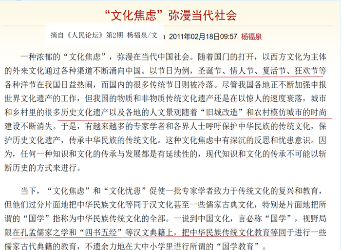

---

#### 第 48 题　qid 2172383 · 定义判断

头条模式：指互联网公司、媒体等向特定用户精准推送筛选出的、对用户具有重要参考价值信息的一种信息服务模式。
下列属于头条模式的是：

- **A**. 小李在某商场购买奶粉后，三年来陆续收到商场发来的澡盆、遥控玩具、儿童图书等商品的打折促销信息，还真省了不少钱
- **B**. 某网络文献检索平台可以根据用户要求提供所需的文献及其下载率、引用率等信息，但是用户必须提供准确的个人信息
- **C**. 某网络媒体公司将其平台专题栏目内容分为免费和付费两类，付费内容专业性很强，主要供有特定需求的人士选择使用
- **D**. 某新媒体公司通过分析客户数据，组织专门团队实时筛选不同种类的信息，保证特定用户第一时间就能看到自己关心的内容　✅

**答案**：D

**官方解析**

第一步：找出定义关键词。
“互联网公司、媒体”、“向特定用户精准推送”、“对用户具有重要参考价值信息”。
第二步：逐一分析选项。
A项：某商场，不属于“互联网公司、媒体”，不符合定义，排除；
B项：某网络文献检索平台，属于“互联网公司”，根据用户要求提供其所需的文献及其下载率、引用率等，用户提出要求然后平台再提供，不属于“向特定用户精准推送”，不符合定义，排除；
C项：某网络媒体公司，属于“互联网公司、媒体”，但是其付费内容主要供有特定需求的人士选择使用，不属于“向特定用户精准推送”，不符合定义，排除；
D项：某新媒体公司，属于“互联网公司、媒体”，通过分析客户数据而筛选推荐不同信息，属于“向特定用户精准推送”，用户第一时间就能看到自己关心的内容，属于“对用户具有重要参考价值信息”，符合定义，当选。
故正确答案为D。

---

#### 第 49 题　qid 2172384 · 定义判断

数码技术后遗症：指由于过度使用、依赖数码产品而导致的记忆力衰退或认知能力降低现象。
下列属于数码技术后遗症的是：

- **A**. 小朱方位感很好，以前开车从不用导航仪，自从装上导航仪后，就一天也离不开它了。昨晚导航仪出了故障，本来15分钟的车程他整整开了两个小时　✅
- **B**. 六十多岁的丁先生记忆力越来越差，不少曾经滚瓜烂熟的文献材料现在已经记不清楚了，经常需要用手机检索核实相关内容
- **C**. 小李和几个朋友周末一起去网吧玩了个通宵。第二天早上刚走出网吧的时候，觉得路边的行人都是模模糊糊的
- **D**. 张女士多次听朋友说手机上也可以直接购买理财产品，就下载了一个理财APP，不料上了钓鱼网站，被骗了3万多元

**答案**：A

**官方解析**

第一步：找出定义关键词。
“由于过度使用、依赖数码产品”、“导致的记忆力衰退或认知能力降低”。
第二步：逐一分析选项。
A项：小朱开车离不开导航仪，属于“过度使用、依赖数码产品”，导航仪故障之后本来15分钟的车程开了两个小时，说明失去导航仪后不熟悉路况等，方位感减弱，属于“记忆力衰退或认知能力降低”，而二者之间正好存在因果联系，即由于依赖数码产品，才导致的方位感减弱，符合定义，当选； 
B项：丁先生记忆力越来越差是上了年纪的缘故，并非是由于“过度使用、依赖数码产品”导致的，不符合定义，排除；
C项：小李和朋友去网吧通宵属于“过度使用数码产品”，但是第二天早上觉得行人是模糊的，只是视觉上的模糊，仍然可以辨识出行人等，不属于“记忆力衰退或认知能力降低”，不符合定义，排除；
D项：张女士通过手机购买理财产品被骗，不属于“由于过度使用、依赖数码产品”，也不属于“导致的记忆力衰退或认知能力降低”，不符合定义，排除。
故正确答案为A。

---

#### 第 50 题　qid 2172386 · 定义判断

语音融合：指在完全不自觉的情况下，频繁交流的两人口音逐渐趋同的现象。
下列属于语音融合的是：

- **A**. 楼先生旅居海外多年，很少使用中文，更不用说家乡话了。一次晚宴上遇到了一个老乡，一句“烂糊面”勾起了差不多早已忘光的乡音，两人用家乡话整整聊了一夜
- **B**. 老张夫妇结婚十多年了，家里的饮食习惯已经分不清南北，就连张先生的东北腔也几乎失去了原先的味道，妻子的广东话听起来也变得怪怪的，女儿经常取笑他们是真正的“夫唱妇随”　✅
- **C**. 朱女士的汉语口语课深受留学生喜爱，不仅发音标准、语调柔美，还时不时地在课堂上讲一些有趣的小段子。不到半年时间，大多数学员都能学着她的腔调进行日常会话
- **D**. 小黄来到南方某海滨小城工作后，每天坚持收看当地的方言电视节目，模仿播音员的发音。半年之后，她的语调、语气、用词，听起来就像一个土生土长的当地居民

**答案**：B

**官方解析**

第一步：找出定义关键词。
“在完全不自觉的情况下”、“频繁交流的两人口音逐渐趋同”。
第二步：逐一分析选项。
A项：楼先生旅居海外多年，很少使用中文，一句“烂糊面”勾起了乡音的记忆，说明有意识地参与，不属于“在完全不自觉的情况下”，同时与老乡用家乡话畅聊，说明二人口音相同，不属于“频繁交流的两人口音逐渐趋同”，不符合定义，排除；
B项：老张夫妇结婚十多年，二人的口音都发生了变化，夫妻之间的交流是频繁的，属于“频繁交流的两人口音逐渐趋同”，同时根据家里的饮食习惯已经分不清南北，可以判断出，习惯的养成是潜移默化的，属于“在完全不自觉的情况下”，符合定义，当选；
C项：学生上课跟着朱女士学习汉语口语，学习这一行为，不属于“在完全不自觉的情况下”，同时，学生只是学会了她的腔调，不属于“频繁交流的两人口音逐渐趋同”，不符合定义，排除；
D项：小黄坚持学习和模仿播音员的发音，不属于“在完全不自觉的情况下”，不符合定义，排除。
故正确答案为B。

---

## 资料分析

### 材料 1

        2017年末，全国民用汽车保有量21743万辆，比上年末增长。其中私人汽车保有量18695万辆，增长；民用轿车保有量12185万辆，增长，其中私人轿车保有量11416万辆，增长；全国新能源汽车保有量153.0万辆，其中新能源汽车新注册登记65.0万辆，比上年增加15.6万辆。

        按地区分，东部、中部、西部地区机动车保有量分别为15544万辆、9006万辆、6436万辆。其中，西部地区近五年汽车保有量增加1963万辆，年均增速，高于东部、中部地区、的年均增速。

        2017年末，全国机动车驾驶人3.85亿人，近五年年均增加2467万人，汽车驾驶人超3.42亿人。从性别看，男性驾驶人2.74亿人，占；女性驾驶人1.11亿人，占，比上年末提高1.6个百分点。

#### 第 1 题　qid 2172304 · 综合

2016年末全国私人轿车保有量为：

- **A**. 10148万辆　✅
- **B**. 11006万辆
- **C**. 13879万辆
- **D**. 16559万辆

**答案**：A

**官方解析**

由题目求“2016年末全国私人轿车保有量”，结合材料时间为“2017年末”，判定本题为基期计算问题。定位材料第一段 “2017年末，私人轿车保有量11416万辆，增长”。代入公式：，可得2016年末全国私人轿车保有量为万辆，和A项最接近。

故正确答案为A。

---

#### 第 2 题　qid 2172326 · 比重

2017年全国新能源汽车新注册登记数占年末新能源汽车保有量的比重是：

- **A**. 

- **B**. 

　✅
- **C**. 

- **D**. 

**答案**：B

**官方解析**

由题目求“2017年······占······的比重”，判定本题为现期比重问题。定位材料第一段“全国新能源汽车保有量153.0万辆，其中新能源汽车新注册登记65.0万辆”。代入公式：，可得2017年全国新能源汽车新注册登记数占年末新能源汽车保有量的比重是：。

故正确答案为B。

---

#### 第 3 题　qid 2172334 · 综合

2012年末西部地区汽车保有量为：

- **A**. 

- **B**. 

- **C**. 

　✅
- **D**. 

**答案**：C

**官方解析**

由题目求“2012年末西部地区汽车保有量”，结合材料时间为“2017年末”判定本题为基期计算问题。定位材料第二段“2017年末，西部地区近五年汽车保有量增加1963万辆，年均增速”，根据年均增长率公式：，可得：，故可推出2012年末西部地区汽车保有量为万辆。

故正确答案为C。

---

#### 第 4 题　qid 2172335 · 比重

若2018年全国男性机动车驾驶人数量不少于上年末，要使女性机动车驾驶人占比达到，则女性驾驶人增加的人数至少为：

- **A**. 462万
- **B**. 643万　✅
- **C**. 963万
- **D**. 1099万

**答案**：B

**官方解析**

根据题干“2018年，······占比达到”，可判定本题为现期比重问题。定位材料第三段“2017年末，全国机动车驾驶人3.85亿人…男性驾驶人2.74亿人，占；女性驾驶人1.11亿人，占”，2018年女性驾驶人占比，要使得女性驾驶人增加人数最少即分子最小，分数值一定时要使得分子最小即使得分母最小，结合题干“2018年全国男性机动车驾驶人数量不少于上年末”可知男性驾驶人增加人数最少为0，此时分母取最小。可得，解得女性增加人数最少约为643万人。

故正确答案为B。

---

#### 第 5 题　qid 2172336 · 综合

不能从上述资料推出的是：

- **A**. 
2016年全国新能源汽车新注册登记49.4万辆

- **B**. 
2017年末全国机动车保有量为30986万辆

- **C**. 
2017年全国民用轿车保有量增长快于民用汽车

- **D**. 
2013—2017年全国汽车保有量年均增速为
　✅

**答案**：D

**官方解析**

A项：定位材料第一段“2017年末，新能源汽车新注册登记65.0万辆，比上年增加15.6万辆”，则2016年末全国新能源汽车新注册登记万辆，正确；

B项：定位材料第二段“东部、中部、西部地区机动车保有量分别为15544万辆、9006万辆、6436万辆”，则2017年末全国机动车保有量万辆，正确；

C项：定位材料第一段“2017年末，全国民用汽车保有量21743万辆，比上年末增长。其中私人汽车保有量18695万辆，增长；民用轿车保有量12185万辆，增长”，民用轿车保有量增长，大于民用汽车保有量增长，即2017年末全国民用轿车保有量增长快于民用汽车，正确；

D选项：选项求的是“2013—2017年全国汽车保有量年均增速”，定位材料第二段“西部地区近五年汽车保有量增加1963万辆，年均增速，高于东部、中部地区、的年均增速”，只知道三个部分的年均增速，但不知道各地区具体的汽车保有量，因此无法具体计算全国的汽车保有量年均增速，错误。

本题为选非题，故正确答案为D。

---

### 材料 2

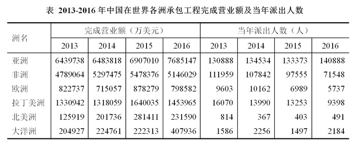

#### 第 6 题　qid 2172454 · 综合

2013-2016年中国在欧洲和北美洲承包工程完成营业额最接近的年份是：

- **A**. 2013年
- **B**. 2014年　✅
- **C**. 2015年
- **D**. 2016年

**答案**：B

**官方解析**

定位表格材料可得，2013-2016年中国在欧洲和北美洲承包工程完成营业额的具体值。估算每年欧洲和北美洲完成营业额的差值：

2013年万美元；2014年万美元；

2015年万美元；2016年万美元。

故2014年欧洲和北美洲完成营业额差值最小，即2014年中国在欧洲和北美洲承包工程完成营业额最接近。

故正确答案为B。

---

#### 第 7 题　qid 2172455 · 平均数

2014-2016年中国在非洲承包工程完成营业额的年平均增量是：

- **A**. -75723万美元
- **B**. -50482万美元
- **C**. 89241万美元
- **D**. 118988万美元　✅

**答案**：D

**官方解析**

根据题干“2014-2016年······年平均增量”，可判定本题为年均增长量的计算问题。定位表格材料可得，2013年中国在非洲承包工程完成营业额为4789064万美元，2016年完成营业额为5146029万美元,故2014-2016年中国在非洲承包工程完成营业额的年平均增量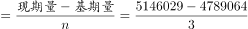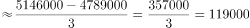万美元，与D项最接近。

故正确答案为D。

---

#### 第 8 题　qid 2172456 · 综合

2013-2016年中国在亚洲承包工程当年派出人数超过其余5个洲派出总人数的年份个数有：

- **A**. 1个
- **B**. 2个　✅
- **C**. 3个
- **D**. 4个

**答案**：B

**官方解析**

定位表格材料“当年派出人数（人）”可得：

2013年中国在亚洲承包工程当年派出人数为130888人，其余5个洲派出总人数为人，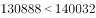，不符合；

2014年中国在亚洲承包工程当年派出人数为134534人，其余5个洲派出总人数为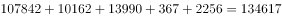人，，不符合；

2015年中国在亚洲承包工程当年派出人数为133373人，其余5个洲派出总人数为人，，符合；

2016年中国在亚洲承包工程当年派出人数为140888人，其余5个洲派出总人数为人，，符合。

符合条件的有2015年和2016年两个年份。

故正确答案为B。

---

#### 第 9 题　qid 2172458 · 比重

下列各洲中，2015年中国在其承包工程派出人数占当年派出总人数的比重与上年相差最大的是：

- **A**. 亚洲　✅
- **B**. 北美洲
- **C**. 欧洲
- **D**. 拉丁美洲

**答案**：A

**官方解析**

根据题干“2015年…占…的比重与上年相差最大的是”，可判定本题为两期比重差的比较问题。定位表格可得：2015年派出人数中，亚洲为133373人，北美洲为403人，欧洲为6989人，拉丁美洲为13253人，派出总人数为人；2014年派出人数中，亚洲为134534人，北美洲为367人，欧洲为10162人，拉丁美洲为13990人，派出总人数为人。根据，故

亚洲的两期比重差：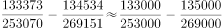；

北美洲的两期比重差：；

欧洲的两期比重差：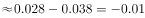；

拉丁美洲的两期比重差：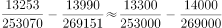。

综上所述，亚洲的比重差最大。

故正确答案为A。

---

#### 第 10 题　qid 2172467 · 综合

下列判断不正确的是：

- **A**. 
2014—2016年中国在世界各洲承包工程完成营业额之和逐年增加

- **B**. 
2016年中国在大洋洲承包工程派出人数不足当年派出总人数的

- **C**. 
2016年中国在世界各洲承包工程派出总人数比2015年少2万人以上

- **D**. 
2013—2016年中国在拉丁美洲承包工程完成营业额均不足当年完成营业总额的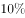
　✅

**答案**：D

**官方解析**

A项：定位表格材料，可得2013年中国在世界各洲承包工程完成营业额之和约为：万美元；2014年完成营业额之和约为：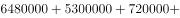万美元；2015年完成营业额之和约为：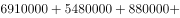万美元；2016年完成营业额之和约为：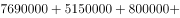万美元，故2014-2016年中国在世界各洲承包工程完成营业额之和逐年增加，正确；

B项：定位表格，可知2016年中国在各大洲承包工程派出人数。故2016年中国在大洋洲承包工程派出人数占总人数比重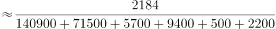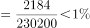，正确；

C项：定位表格，可知2016年和2015年中国在世界各大洲承包工程派出人数。2016年派出人数人，2015年派出人数人，故2016年派出总人数比2015年派出总人数增加人数人，减少超过2万人，正确；

D项：定位表格，可知2013-2016年中国在世界各大洲承包工程完成营业额。2015年拉丁美洲承包工程完成营业额占当年营业总额比重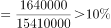，错误；

本题为选非题，故正确答案为D。

---

### 材料 3

        2016年江苏规模以上光伏产业总产值2846.2亿元，比上年增长，增速较上年回落3.5个百分点；主营业务收入2720.5亿元，增长，增速回落2.5个百分点；利润总额153.6亿元，增长，增速回落8.8个百分点。苏南、苏中、苏北地区规模以上光伏产业产值分别比上年增长、、。2016年江苏光伏发电新增装机容量123万千瓦，年末累计装机容量546万千瓦。

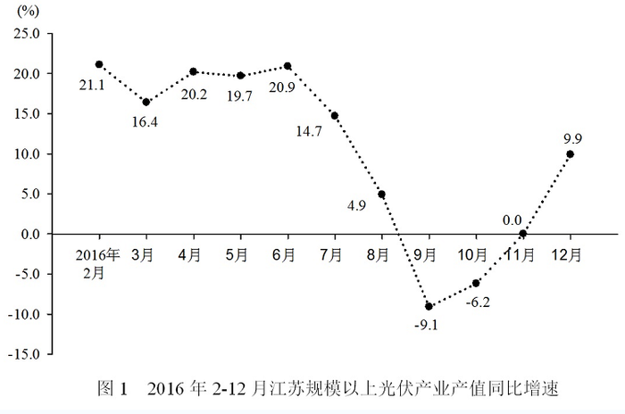

#### 第 11 题　qid 2172271 · 综合

2015年末江苏光伏发电累计装机容量是：

- **A**. 123万千瓦
- **B**. 423万千瓦　✅
- **C**. 546万千瓦
- **D**. 669万千瓦

**答案**：B

**官方解析**

根据题干“2015年末江苏光伏发电累计装机容量”，结合材料数据为2016年，可判定本题为基期计算问题。定位文字材料最后一句可得：2016年光伏发电新增装机容量123万千瓦，年末累计装机容量546万千瓦。根据公式：，2015年末江苏光伏发电累计装机容量万千瓦。

故正确答案为B。

---

#### 第 12 题　qid 2172275 · 增长

2016年3—12月，江苏规模以上光伏产业产值环比增速低于上年同期的月份个数为：

- **A**. 2个
- **B**. 3个
- **C**. 5个　✅
- **D**. 8个

**答案**：C

**官方解析**

由题目问“环比增速低于上年同期的月份个数”，即每个月的环比增速要与上年同期比较，判定为一般增长率比较问题。定位图1可得“2016年2-12月每个月份同比增长率”，根据增长率公式可得：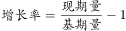，即：，故可得：

；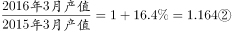。

将②÷①，可得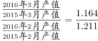，整理得：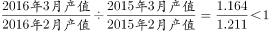,即2016年3月环比增速低于上年同期的环比增速。

由此可得：若本月产值同比增长率小于上月，则本月环比增长率低于上年同期，满足条件的有3月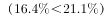、5月、7月、8月、9月，共5个月份。

故正确答案为C。

---

#### 第 13 题　qid 2172279 · 综合

2014年江苏规模以上光伏产业利润总额为

- **A**. 114.3亿元　✅
- **B**. 127.6亿元
- **C**. 133.9亿元
- **D**. 137.6亿元

**答案**：A

**官方解析**

根据题干“2014年……”，结合材料时间为2016年，可判定本题为间隔基期计算问题。定位文字材料第三行可得：利润总额153.6亿元，增长，增速回落8.8个百分点。故利润总额的间隔增长率。

2014年江苏规模以上光伏产业利润总额亿元，与A项最接近。

故正确答案为A。

---

#### 第 14 题　qid 2172283 · 比重

2015年苏中地区规模以上光伏产业产值占全省的比重为：

- **A**. 

- **B**. 

- **C**. 

- **D**. 

　✅

**答案**：D

**官方解析**

根据题干“2015年······占······的比重”，结合材料数据时间为2016年，可判定本题为基期比重问题。定位文字材料可得：2016年江苏规模以上光伏产业总产值2846.2亿元，比上年增长，苏中地区规模以上光伏产业产值增长；定位图2可得：2016年苏中地区光伏产业产值占总产值比重为。根据基期比重公式：，只有D项满足。

故正确答案为D。

---

#### 第 15 题　qid 2172298 · 综合

下列说法正确的是：

- **A**. 
2016年江苏规模以上光伏产业利润率低于
　✅
- **B**. 
2015年苏中地区规模以上光伏产业产值比苏北地区多10倍以上

- **C**. 
2016年2—12月江苏规模以上光伏产业产值少于上年同期的有3个月

- **D**. 
2015—2016年江苏规模以上光伏产业主营业务收入年均增速不到

**答案**：A

**官方解析**

A项，定位文字材料可得，主营业务收入为2720.5亿元，利润总额为153.6亿元，故2016年江苏规模以上光伏产业利润率，正确；

B项，定位文字材料与饼形图可得，2016年苏中地区规模以上光伏产业产值为925.6亿元，增长率为，苏北地区规模以上光伏产业产值为121.9亿元，增长率为，基期倍数，B项问的是多的倍数，应该再减1倍，多出不到9倍，错误；

C项，定位折线图，要想让2016年2-12月江苏规模以上光伏产业产值少于上年同期，只需定位同比增速为负的月份即可，只有9月与10月两个月满足，错误；

D项，定位文字材料可得2016年主营业收入为2720.5亿元，增长，增速回落2.5个百分点，故2015年增速为。已知年均增长率公式，所以，而，所以应大于，错误。

故正确答案为A。

---

### 材料 4

        2017年末全国农村贫困人口3046万人，比上年末减少1289万人，比2012年末减少6853万人；贫困发生率（指年末农村贫困人口占目标调查人口的比重）为，比2012年末下降7.1个百分点。2017年全国贫困地区农村居民人均可支配收入9377元，比上年增长。

#### 第 16 题　qid 2172264 · 综合

2013—2017年全国农村贫困人口年均减少的人数是

- **A**. 1055万
- **B**. 1142万
- **C**. 1289万
- **D**. 1371万　✅

**答案**：D

**官方解析**

根据题干“2013-2017年······年均减少的人数是”，可判定本题为年均增长量计算问题。定位文字材料“2017年末全国农村贫困人口3046万人，······比2012年末减少6853万人”，故2013年2017年全国农村贫困人口年均增长量万人，即2013年-2017年全国农村贫困人口年均减少的人数是1370.6万人，与D项最接近。

故正确答案为D。

---

#### 第 17 题　qid 2172268 · 平均数

2017年全国贫困地区农村居民人均可支配收入比上年增加的金额是

- **A**. 782元
- **B**. 853元
- **C**. 891元　✅
- **D**. 1069元

**答案**：C

**官方解析**

根据题干“2017年······比上年增加的金额是”，可判定本题为增长量计算问题。定位文字材料“2017年全国贫困地区农村居民人均可支配收入9377元，比上年增长”，故2017年全国贫困地区农村居民人均可支配收入比上年增加的金额元，C选项最为接近。

故正确答案为C。

---

#### 第 18 题　qid 2172273 · 增长

2017年末全国农村贫困发生率的目标调查人口与2012年末相比，增加的人数是：

- **A**. 1209万　✅
- **B**. 1033万
- **C**. -1319万
- **D**. 0

**答案**：A

**官方解析**

根据题干“2017年······与2012年末相比，增加的人数”，可判定本题为增长量的计算问题。定位文字材料“2017年末全国农村贫困人口3046万人······比2012年末减少6853万人；贫困发生率（指年末农村贫困人口占目标调查人口的比重）为，比2012年末下降7.1个百分点”，故2017年末全国农村贫困发生率的目标调查人口万人，2012年末全国农村贫困发生率的目标调查人口万人，则2017年末全国农村贫困发生率的目标调查人口与2012年末相比，增加人数为：万人，与A项一致。

故正确答案为A。

---

#### 第 19 题　qid 2172277 · 增长

2014—2017年全国、城镇和农村居民人均可支配收入年均增速的快慢关系是

- **A**. 城镇最快、全国次之、农村最慢
- **B**. 农村最快、全国次之、城镇最慢　✅
- **C**. 全国最快、农村次之、城镇最慢
- **D**. 农村最快、城镇次之、全国最慢

**答案**：B

**官方解析**

由题干“2014-2017年······年均增速的快慢关系······”，可判定此题为年均增长率的比较问题。根据年均增长率的公式：，可得：，可看出2017年的值与2013年的值比值越大，年均增速越大，故此题比较2017年与2013年的比值大小即可。定位统计图可知，，，，所以三者的年均增速的快慢关系是：。

故正确答案为B。

---

#### 第 20 题　qid 2172282 · 综合

下列判断不正确的是：

- **A**. 
2012年末全国农村贫困发生率是

- **B**. 
2014—2017年全国城镇和农村居民人均可支配收入均逐年增加

- **C**. 
2014—2017年全国城镇与农村居民人均可支配收入的差额逐年减少
　✅
- **D**. 
2017年全国农村居民人均可支配收入是贫困地区农村居民的1.4倍

**答案**：C

**官方解析**

A项：定位文字材料“2017年末全国农村贫困发生率（指年末农村贫困人口占目标调查人口的比重）为，比2012年末下降7.1个百分点”，可知2012年末全国农村贫困发生率是，正确；

B项：定位统计图，通过数字逐年递增，可知2014-2017年全国城镇和农村居民人均可支配收入均逐年增加，正确；

C项：定位统计图中代表农村和城镇的柱形图可知，2013年全国城镇与农村居民人均可支配收入的差额是元，2014年：元，2015年：元，2016年：元，2017年：元，通过以上数据可看出，2014-2017年全国城镇与农村居民人均可支配收入的差额逐年增加，错误；

D项：定位统计图可知2017年全国农村居民人均可支配收入是13432元，定位文字材料可知2017年全国贫困地区农村居民人均可支配收入是9377元，则2017年全国农村居民人均可支配收入是贫困地区农村居民的倍，正确。

本题为选非题，故正确答案为C。

---
