# 2018年江苏省公务员录用考试《行测》题（C类）（网友回忆版）

> 省考 · 2018 年 · 6 个模块 · 共 129 题

- [政治理论](#%E6%94%BF%E6%B2%BB%E7%90%86%E8%AE%BA) · 2 题
- [常识判断](#%E5%B8%B8%E8%AF%86%E5%88%A4%E6%96%AD) · 13 题
- [言语理解与表达](#%E8%A8%80%E8%AF%AD%E7%90%86%E8%A7%A3%E4%B8%8E%E8%A1%A8%E8%BE%BE) · 35 题
- [数量关系](#%E6%95%B0%E9%87%8F%E5%85%B3%E7%B3%BB) · 14 题
- [判断推理](#%E5%88%A4%E6%96%AD%E6%8E%A8%E7%90%86) · 45 题
- [资料分析](#%E8%B5%84%E6%96%99%E5%88%86%E6%9E%90) · 20 题

---

## 政治理论

### 第 1 题　qid 2172737 · 新思想

2018年中央一号文件指出，实施乡村振兴战略是决胜全面建成小康社会、全面建设社会主义现代化国家的重大历史任务，是新时代“三农”工作的总抓手，下列对乡村振兴战略的理解，正确的是（  ）。
①实施乡村振兴战略是党的十九大作出的重大决策部署
②实施乡村振兴战略必须强化制度建设、人才支撑和投入保障
③摆脱贫困是乡村振兴的前提，必须坚持精准扶贫、精准脱贫
④到2050年，乡村振兴取得决定性进展，农业农村现代化基本实现

- **A**. ①②③　✅
- **B**. ①②④
- **C**. ①③④
- **D**. ②③④

**答案**：A

**官方解析**

本题考查政治常识。
党的十九大首次提出了实施乡村振兴战略。2018年中央一号文件制定的目标任务是：到2035年，乡村振兴取得决定性进展，农业农村现代化基本实现……到2050年，乡村全面振兴，农业强、农村美、农民富全面实现。故④表述错误，含有④的选项B、C、D三项均排除。
故正确答案为A。

---

### 第 2 题　qid 2172259 · 新思想

习近平在庆祝中国人民解放军建军90周年大会上指出：“人民军队的历史辉煌，是鲜血生命铸就的，永远值得我们铭记。”下列事件标志着中国共产党开始独立领导革命战争、创建人民军队的有：
①武昌起义  ②南昌起义  ③秋收起义  ④广州起义

- **A**. ①②③
- **B**. ①②④
- **C**. ①③④
- **D**. ②③④　✅

**答案**：D

**官方解析**

本题考查人文常识。
①错误，武昌起义于1911年10月10日，在武汉发生，是资产阶级所领导的，旨在推翻清朝统治的资产阶级革命，是辛亥革命的开端，并非中共领导。不符合题意。
②正确，南昌起义，是中国共产党直接领导的一次武装起义，打响了武装反抗国民党反动统治的第一枪，标志着中国共产党独立地创建革命军队和领导革命战争的开始。
③正确，湘赣边界的秋收起义，是继南昌起义之后，我党领导的又一次著名武装起义。1927年“八七会议”后，中共中央派毛泽东前往领导。起义失利后，毛泽东率队伍转战井冈山，中国革命走上了农村包围城市的正确道路。
④正确，广州起义是指1927年12月11日中国共产党在广州领导工人、农民和革命士兵举行的反抗国民党反动派的武装起义，是中国共产党和中国人民继南昌起义、湘赣边界秋收起义之后，对国民党反动派的又一次英勇反击。因此②③④正确。
故正确答案为D。

---

## 常识判断

### 第 1 题　qid 2172261 · 人文常识

下列说法与其所蕴涵的法治原则对应不正确的是：

- **A**. 切蛋糕者最后拿蛋糕——效率原则　✅
- **B**. 两害相权取其轻——利益权衡原则
- **C**. 有恒产者有恒心——人权保障原则
- **D**. 法无授权不可为——权力制约原则

**答案**：A

**官方解析**

本题考查法治原则相关知识。
A项错误，切蛋糕者最后拿蛋糕，意思是一群人分一个蛋糕，若要做到公平，最好的办法是让切蛋糕的人选择最后一块蛋糕。体现的是公平原则，而不是效率原则。
B项正确，两害相较取其轻，指把两项祸事进行比较，选取其中较轻的一项，体现的是利益权衡原则。
C项正确，这句话出自孟子的《孟子·滕文公上》，孟子主张人民应有“恒产”，即土地，孟子不拥护土地私有，而是维护农民稳定占有、使用土地的权利，体现的是人权保障原则，也就是保障人的生存和发展。
D项正确，所谓的法无授权不可为，指国家公权力的行使必须经过法律授权，体现了权力制约原则。
本题为选非题，故正确答案为A。

---

### 第 2 题　qid 2173528 · 人文常识

下列有关村民委员会的说法正确的是（  ）

- **A**. 村民委员会的主任人选应由村党支部提名
- **B**. 村民委员会组成人员由村民代表选举产生
- **C**. 村民委员会接受乡人民政府领导并对它负责
- **D**. 村民委员会协助乡人民政府开展工作　✅

**答案**：D

**官方解析**

本题考查法律常识，主要考查《村民委员会组织法》的相关知识点。
A、B项错误，《村民委员会组织法》第十一条第一款规定：“村民委员会主任、副主任和委员，由村民直接选举产生。任何组织或者个人不得指定、委派或者撤换村民委员会成员。”故AB选项表述均错误。
C项错误，D项正确。根据《村民委员会组织法》第五条规定：“乡、民族乡、镇的人民政府对村民委员会的工作给予指导、支持和帮助，但是不得干预依法属于村民自治范围内的事项。村民委员会协助乡、民族乡、镇的人民政府开展工作。”所以，村民委员会与乡人民政府没有领导与被领导的关系，C项错误；D项“村民委员会协助乡人民政府开展工作”的说法正确。
故正确答案为D。

---

### 第 3 题　qid 2172741 · 法律常识

为改善甲村的交通，乡政府决定对甲村村民每人征收300元，在向县政府报备后，委托甲村村委会收取。村会计张某上门向李某收取了该费用，李某不服，提起行政诉讼。本案的被告应是（  ）

- **A**. 县政府
- **B**. 甲村村委会
- **C**. 乡政府　✅
- **D**. 县政府、乡政府是共同被告

**答案**：C

**官方解析**

本题考查法律常识，主要考查《行政诉讼法》的相关知识点。《行政诉讼法》第二十六条第一款规定：“公民、法人或者其他组织直接向人民法院提起诉讼的，作出行政行为的行政机关是被告。”
A项错误，根据《行政诉讼法》第二十六条第一款规定，县政府没有作出该行政行为，所以不是诉讼主体。
B项错误，《村民委员会组织法》第二条规定：“村民委员会是村民自我管理、自我教育、自我服务的基层群众性自治组织，实行民主选举、民主决策、民主管理、民主监督。”所以甲村村委会不是行政机关，也不是行政诉讼主体。
C项正确，根据《行政诉讼法》第二十六条第一款规定，乡政府作出行政征收决定，行政诉讼的被告是行政主体，所以诉讼主体是乡政府。
D项错误，根据《行政诉讼法》第二十六条第四款规定：“两个以上行政机关作出同一行政行为的，共同作出行政行为的行政机关是共同被告。”县政府没有作出该行政行为，不是诉讼主体，故县政府、乡政府是共同被告说法错误。
故正确答案为C。

---

### 第 4 题　qid 2173537 · 人文常识

村民孙某早年到城里打工并购买了住房，遂将农村的房屋卖掉。随着年岁的增长，孙某打算回乡养老，欲再申请宅基地建房。对此，下列说法正确的是（  ）。

- **A**. 县政府不应批准孙某的宅基地申请　✅
- **B**. 县政府在孙某出售城市住房后可批准其申请
- **C**. 县政府在孙某补交旧宅基地的使用费后可批准其申请
- **D**. 县政府在孙某缴纳新宅基地的使用费后可批准其申请

**答案**：A

**官方解析**

本题主要考查经济类法律常识。
根据我国《土地管理法》第六十二条第一款和第五款规定：“农村村民一户只能拥有一处宅基地，其宅基地的面积不得超过省、自治区、直辖市规定的标准。农村村民出卖、出租、赠与住宅后，再申请宅基地的，不予批准。”题干中，村民孙某已经将农村的房屋卖掉，后回乡养老想要再申请宅基地，不应予以批准，因此B、C、D三项错误。
故正确答案为A。

---

### 第 5 题　qid 2173548 · 人文常识

李某家有一片果园，每到果子成熟时便有人潜入果园偷窃。下列情形李某需要承担侵权责任的是（    ）。

- **A**. 李某在还击小偷甲的棒打时，致甲眼部受伤
- **B**. 李某喝止小偷乙，乙慌不择路掉入水塘头部受伤
- **C**. 李某在扑倒小偷丙时撞到村民徐某，致徐某手部骨折　✅
- **D**. 李某在果园设置捕兽陷阱，小偷丁跌落后致腿部神经受损

**答案**：C

**官方解析**

本题考查法律常识。
A项错误，根据《中华人民共和国民法典》第一百八十一条规定：“因正当防卫造成损害的，不承担责任。正当防卫超过必要的限度，造成不应有的损害的，正当防卫人应当承担适当的民事责任。”小偷甲棒打李某，李某是在正当防卫时致使甲眼部受伤，因此李某不需要承担侵权责任。
B项错误，根据《中华人民共和国民法典》第一千一百七十四条规定：“损害是因受害人故意造成的，行为人不承担责任。”李某只是喝止小偷乙偷窃的行为，但是乙被喝止后仍然逃跑，致使慌不择路掉入水塘头部受伤，乙受伤是因为自己的逃跑行为，李某不应承担责任。
C项正确，根据《中华人民共和国民法典》第一千一百六十八条规定：“二人以上共同实施侵权行为，造成他人损害的，应当承担连带责任。”题中，李某和小偷丙共同导致徐某手部骨折，李某应承担侵权责任。
D项错误，根据《中华人民共和国民法典》一千二百五十八条规定：“在公共场所或者道路上挖掘、修缮安装地下设施等造成他人损害，施工人不能证明已经设置明显标志和采取安全措施的，应当承担侵权责任。”李某挖的坑是在自家果园，非公共场所或道路上，不存在过错，非法律规定的应当承担侵权赔偿的情形。
故正确答案为C。

---

### 第 6 题　qid 2172605 · 法律常识

下列做法具有合法性的是：

- **A**. 某超市在入口处警示“偷一罚十”
- **B**. 某商家合同载明“解释权归商家所有”
- **C**. 某内衣专卖店规定“特殊商品，售出后概不退换”
- **D**. 某网店声明“定作商品，不适用七日内无理由退货的规定”　✅

**答案**：D

**官方解析**

本题主要考查法律常识。
A项错误，所谓“偷一罚十”意思即超市有处罚权利，超市作为经营性企业非行政机关，没有行政处罚权，所以超市在入口处警示“偷一罚十”的行为不具备合法性。
B项错误，《消费者权益保护法》第四条规定：“经营者与消费者进行交易，应当遵循自愿、平等、公平、诚实信用的原则。”因此，商家合同载明“解释权归商家所有”的行为违背了诚实信用、公平自愿的原则，损害了消费者利益，属于不公平不合理的规定，因此该做法不具有合法性。
C项错误，根据《消费者权益保护法》第二十四条规定：“经营者提供的商品或者服务不符合质量要求的，消费者可以依照国家规定、当事人约定退货，或者要求经营者履行更换、修理等义务。没有国家规定和当事人约定的，消费者可以自收到商品之日起七日内退货；七日后符合法定解除合同条件的，消费者可以及时退货，不符合法定解除合同条件的，可以要求经营者履行更换、修理等义务。”因此，内衣店规定的“特殊商品，售后概不退换”的行为不具有合法性。
D项正确，根据我国《消费者权益保护法》第二十五条第一款规定：“经营者采用网络、电视、电话、邮购等方式销售商品，消费者有权自收到商品之日起七日内退货，且无需说明理由，但下列商品除外：（一）消费者定作的；（二）鲜活易腐的；（三）在线下载或者消费者拆封的音像制品、计算机软件等数字化商品；（四）交付的报纸、期刊。”因此，网店声明“定作商品，不适用七日内无理由退货的规定”的行为是合法的。
故正确答案为D。

---

### 第 7 题　qid 2172274 · 经济常识

当前我国要把防控金融风险放到更加重要的位置，下决心处置一批风险点，确保不发生系统性金融风险。下列不属于金融机构采取的风险防范措施的是：

- **A**. 执行居民存款保险制度
- **B**. 推出新的金融衍生产品　✅
- **C**. 查处违规使用资金行为
- **D**. 控制个人住房贷款规模

**答案**：B

**官方解析**

本题主要考查经济方面的有关知识。
A项正确，根据《国务院存款保险条例》第一条规定：“为了建立和规范存款保险制度，依法保护存款人的合法权益，及时防范和化解金融风险，维护金融稳定，制定本条例”。执行居民存款保险制度，能够将存款人的存款损失降到最低，有效进行风险防范。
B项错误，推出新的金融衍生产品，会吸引资金的投入与支出，虽然新的金融衍生产品能够创造市场活力，但是并不能起到风险防范的作用。2008年美国次贷危机主要原因之一就是过度发展金融衍生产品。
C项正确，查处违规使用资金行为，能够打击违法违规经营活动，同时加强薄弱环节的监管，能够有效的防范风险，避免由于费用失控导致风险的出现。
D项正确，个人住房贷款规模的迅速扩大，会因房价波动、个人财务问题导致房贷断供，对银行形成一定的资产风险，所以控制个人住房贷款规模能防范金融风险。
本题为选非题，故正确答案为B。

---

### 第 8 题　qid 2172278 · 经济常识

当前，不带现金出门正成为一种时尚。从商场到便利店，从水果摊到煎饼铺，从医院到出租车……人们掏出手机，随时可以扫二维码支付。关于这一现象，下列说法正确的是：

- **A**. 货币不再充当商品交易的媒介
- **B**. 货币不再承担支付手段的职能
- **C**. 移动支付减少了社会的现金流通量　✅
- **D**. 移动支付不需要依托银行系统完成

**答案**：C

**官方解析**

本题主要考查经济方面的有关知识。
A项错误，货币是从商品中分离出来固定地充当一般等价物的商品，是商品交换发展到一定阶段的产物，也是充当商品交换的媒介物。使用移动支付，虽然没有货币实物，但是货币仍然充当着商品交易的媒介。
B项错误，货币的支付手段，是指货币被用来清偿债务或支付赋税、租金、工资等。“随时可以扫二维码支付”是一手交钱、一手交货，体现的是货币流通职能。
C项正确，“不带现金出门正成为一种时尚”说明移动支付的兴起使不带现金成为一种习惯，现金在社会上的流通量正在减少，选项表述符合题意。
D项错误，移动支付与银行是有关联的，需要将钱转到移动支付平台上，才能完成支付，因此选项表述不正确。
故正确答案为C。

---

### 第 9 题　qid 2172611 · 科技常识

汉代王符说：“大鹏之动，非一羽之轻也；骐骥之速，非一足之力也。”下列活动未能体现这句话所蕴涵的管理思想的是：

- **A**. 王所长动员单位全体人员开展技术攻关
- **B**. 赵局长事必躬亲完成上级布置的工作任务　✅
- **C**. 市政府将污染治理目标分解给各职能部门
- **D**. 疾控中心联合高校开展流感病毒的防治工作

**答案**：B

**官方解析**

本题考查管理学相关原理。
“大鹏之动，非一羽之轻也；骐骥之速，非一足之力也”出自汉代王符《潜夫论·释难》。意思是大鹏鸟直上九天，不是因为一只翅膀轻轻用劲；千里马跑得很快，不只靠一只脚的力量。形容做事情要互相支持互相合作，相辅相成，强调团队合作的重要性。
A项正确，王所长动员全体人员开展技术攻关，强调了团队合作共同攻坚克难。
B项错误，赵局长事必躬亲完成上级任务，亲力亲为，突出个人，忽视了团队的力量。
C项正确，市政府开展污染防治把目标分解给各职能部门，体现了各部门的共同配合和努力。
D项正确，疾控中心联合高校开展流感防治工作，各单位相辅相成，均发挥了作用。
本题为选非题，故正确答案为B。

---

### 第 10 题　qid 2172276 · 科技常识

下列词语与生物的繁殖行为无关的是

- **A**. 藕断丝连　✅
- **B**. 蜻蜓点水
- **C**. 移花接木
- **D**. 孔雀开屏

**答案**：A

**官方解析**

本题考查生物常识。
A项错误，莲藕体内的运输组织呈螺旋状，当莲藕折断时，那些呈螺旋状的导管并没有真正折断，而是像弹簧一样被拉长，形成了许多丝状的物质，因此出现了“藕断丝连”的现象，该现象跟繁殖无关。
B项正确，当雌雄蜻蜓交配后，雌性蜻蜓在水面上盘旋飞翔，尾尖贴着水面，一点一点地产下受精卵，为“蜻蜓点水”，该行为与蜻蜓的繁殖有关。
C项正确，“移花接木”是指把一种花木的枝条或嫩芽嫁接在另一种花木上，利用植物受伤后具有愈伤的机能，将两个伤面的形成层靠近并扎紧在一起，结果因细胞增生，彼此愈合成为彼此连接的一个整体。“移花接木”属于无性繁殖的一种，跟繁殖有关。
D项正确，“孔雀开屏”是雄孔雀的求偶行为。雄孔雀展开尾屏，不停地做出各种各样优美的舞蹈动作，向雌孔雀炫耀自己的美丽，以此吸引雌孔雀。待到它求偶成功之后，便与雌孔雀一起产卵育雏，该行为与繁殖有关。
本题为选非题，故正确答案为A。

---

### 第 11 题　qid 2173560 · 科技常识

下列说法与其所涉及的生物学术语对应不正确的是（  ）

- **A**. 一朝被蛇咬，十年怕井绳——条件反射
- **B**. 一母生九子，连母十个样——遗传　✅
- **C**. 入芝兰之室，久而不闻其香——适应
- **D**. 大树之下无丰草，大块之间无美苗——竞争

**答案**：B

**官方解析**

本题主要考查生物常识。
A项正确，条件反射是指在一定条件下，外界刺激与有机体反应之间建立起来的暂时神经联系，分为第一信号系统的反射和第二信号系统的反射。“一朝被蛇咬，十年怕井绳”说明有了被蛇咬的非条件反射，才建立了害怕类似蛇的井绳的条件反射。
B项错误，遗传是指亲子之间以及子代个体之间性状存在相似性，表明性状可以从亲代传递给子代。“一母生九子，连母十个样”表明母亲和九个孩子之间存在的差异，而生物学上把后代与亲代之间以及后代的个体之间存在的差异现象称为变异。
C项正确，适应是指生物的形态结构和生理机能与其赖以生存的一定环境条件相适合的现象。“入芝兰之室，久而不闻其香”意为香气刺激嗅觉时间久了好像就闻不到香气了，说明香气刺激对感受器的持续作用而使感受性发生变化，属于适应。
D项正确，竞争是指个人或群体的各方力求胜过对方的对抗性行为。“大树之下无丰草，大块之间无美苗”意为大树遮挡阳光，下面的草儿光照不足，自然也长不丰茂；整地时土块不充分整细，导致苗的生长不整齐，选项表明树与草、地块之间进行有利条件的竞争现象。
本题为选非题，故正确答案为B。

---

### 第 12 题　qid 2172269 · 人文常识

2017年是5G国际标准正式启动和推进的一年，全球5G进入研发的关键阶段。预计到2018年底，我国将结束5G技术试验。下列关于5G的说法不正确的是：

- **A**. 支撑无人驾驶汽车和无人机的操控
- **B**. 提供充足的网络地址和广阔的创新空间　✅
- **C**. 构建高宽带、低迟延、广覆盖的网络
- **D**. 新波形和新编码是5G新的空口关键技术

**答案**：B

**官方解析**

本题考查5G网络的相关知识。5G是第五代移动电话行动通信标准外文缩写，也称第五代移动通信技术，是4G之后的延伸。和4G相比，5G的提升是全方位的，按照国际通信标准组织3GPP的定义，5G具备高性能、低延迟与高容量特性。A项正确，无人机和无人驾驶汽车都是通过利用机载传感器来感知周围环境，并根据感知所获得的道路、位置和障碍物信息，控制转向和速度，从而使车辆能安全行驶，无人机安全飞行。而无人机和无人驾驶汽车数据传输都是按G来计算的，而且要求低延迟，所以5G的优势支撑了无人驾驶汽车和无人机的操控。B项错误，2017年11月26日，中共中央办公厅、国务院办公厅印发了《推进互联网协议第六版（IPv6）规模部署行动计划》提出，基于互联网协议第四版（IPv4）的全球互联网面临网络地址消耗殆尽、服务质量难以保证等制约性问题，IPv6能够提供充足的网络地址和广阔的创新空间，是全球公认的下一代互联网商业应用解决方案。所以5G不能提供充足的网络地址和广阔的创新空间。C项正确，5G具有高速率、大带宽、低迟延、高可靠、广覆盖、大连接等特点，5G是各类无线、网络及IT新技术的融合和集成。D项正确，新波形和新编码是5G新的空口关键技术，它们决定了无线信号生成、传播的方式和通信系统性能，是5G最核心、最本质的技术。
本题为选非题，故正确答案为B。

---

### 第 13 题　qid 2172281 · 人文常识

地震、台风等自然灾害往往造成巨大的财产损失和人员伤亡。下列关于自然灾害的说法正确的是：

- **A**. 泥石流具有突然性、流速快和破坏力强等特点，一般发生在具有特殊地形地貌的地区　✅
- **B**. 台风是发生在太平洋西部海洋和南海海上的热带气旋，台风眼内的风力是测定台风等级的依据
- **C**. 火山爆发是地球内能释放的一种形式，地球上各地的火山分布在陆地上，分为死火山、活火山和休眠火山
- **D**. 地震多发生于地球板块的交界或地壳裂隙地带，地震的烈度是地面受到的影响和破坏程度，震源越深，烈度越大

**答案**：A

**官方解析**

本题考查地理常识。
A项正确，泥石流是指在山区或者其他沟谷深壑等特殊地形地貌的地区，因为暴雨、暴雪或其他自然灾害引发的山体滑坡并携带有大量泥沙以及石块的特殊洪流。泥石流具有突然性以及流速快，流量大，物质容量大和破坏力强等特点。
B项错误，根据中国气象局“实施热带气旋等级国家标准GBT 19201-2006”，热带气旋按中心附近地面最大风速来划分台风等级，而非台风眼的风力。
C项错误，地球上的火山不仅分布在陆地上，还分布在大洋底部，称为“海底火山”，大多分布于大洋中脊与大洋边缘的岛弧处。
D项错误，一个地区的烈度，不仅与这次地震的释放能量（即震级）、震源深度、距离震中的远近有关，还与地震波传播途径中的工程地质条件和工程建筑物的特性有关。但在同等条件下，如果震源越浅，震中距越短，则烈度一般就越高。
故正确答案为A。

---

## 言语理解与表达

### 材料 1

        相比虹膜识别、人脸识别，指纹识别是生物识别技术中发展最成熟、最便利、综合成本最优的技术。指纹识别技术利用人体指纹的唯一性与稳定性特点，通过光电技术、模式识别和计算机图像处理技术，对活体指纹进行采集、分析和比对，从而自动、迅速、准确地鉴别出个人信息。

        从20世纪80年代至今，指纹识别的关键技术已经发展得相当成熟：在图像采集方面，已经形成光学、半导体、超声波等多种性能良好的主流传感器；在指纹算法方面，能根据应用需求不断优化，可实现纯特征点比对、特征点加图像比对和纯图像比对等多种比对方式。

        目前，指纹识别技术已在考勤、门禁、移动支付等方面取得了良好的应用效果，并开始在金融、公安、教育、社保等行业广泛应用。随着互联网及移动支付的普及，个人信息安全的重要性日益凸显，指纹识别逐渐从行业应用拓展到终端消费市场，并逐渐成为主流智能手机的标配。

        将指纹识别引入智能手机，手机使用人隐私和金融交易安全能得到有效的保护。所以，手机厂商都<u>           </u>地在手机上加入指纹识别功能。2015年，中国指纹识别传感器销量超过7000万颗，其中超过6000万颗应用到手机上，而2016年中国智能手机市场运用指纹识别传感器的数量已经突破1.2亿颗。

        目前，一套完整的指纹识别产品或方案包含三个必要元素：指纹传感器、指纹算法处理芯片和指纹算法软件。智能手机上的指纹识别应用大部分采用TEE方案，即将指纹比对算法和应用加载到基带芯片中，由模组厂商对传感器进行封装、涂层或者盖板，再提供给手机终端厂商。

        一个好的指纹识别方案需要传感器和算法芯片的有效配合，才能真正实现身份识别的安全可靠。但是，现阶段国内外指纹识别企业多数是传感器芯片与算法芯片分离，厂商要么只做传感器芯片，要么只做指纹算法芯片；而指纹识别也还存在着指纹误识、指纹特征数据被提取、比对结果被伪造等安全隐患。部分厂家的指纹算法芯片的安全防护还没有达到国际标准EAL4+水平，产品的使用稳定性、传感器与算法芯片的兼容性也有待提升，在综合安全防护技术、产业化配套、标准统一化、产品兼容性等方面还需进一步规范。

#### 第 1 题　qid 2172558 · 片段阅读

以下说法不符合文意的是：

- **A**. 指纹识别是基于生物特征的身份识别方式
- **B**. 指纹识别将取代其他识别方式而广泛应用　✅
- **C**. 指纹识别具有使用便捷与性价比高等特点
- **D**. 指纹识别运用了多种高新技术已相当成熟

**答案**：B

**官方解析**

A项，根据第1段“指纹识别技术利用人体指纹的唯一性与稳定性特点，······从而自动、迅速、准确地鉴别出个人信息”可知，“基于生物特征”表述正确，排除；
B项，根据第3段“目前，指纹识别技术已在考勤、门禁、移动支付等方面取得了良好的应用效果，并开始在金融、公安、教育、社保等行业广泛应用”可知，“将取代其他识别方式而广泛应用”时态错误，且“取代其他识别方式”无中生有，故表述有误，当选；
C项，根据第2段“指纹识别是生物识别技术中发展最成熟、最便利、综合成本最优的技术”可知，“具有使用便捷与性价比高等特点”表述正确，排除；
D项，根据第1段 “指纹识别是生物识别技术中发展最成熟······通过光电技术、模式识别和计算机图像处理技术······”可知，“运用了多种高新技术已相当成熟”表述正确，排除。
本题为选非题，故正确答案为B。
【文段出处】《指纹识别技术将进入快速发展期》

---

#### 第 2 题　qid 2172560 · 逻辑填空

填入文中划横线处最恰当的词语是

- **A**. 义无反顾
- **B**. 毅然决然
- **C**. 争先恐后　✅
- **D**. 你追我赶

**答案**：C

**官方解析**

根据文意可知，将指纹识别引入智能手机，有利于保护隐私和交易安全，故横线处表达手机厂商都非常积极地在手机中引入指纹识别，C项“争先恐后”指争着向前，唯恐落后，侧重强调积极，符合手机厂商的做法，符合文意，当选。
A项“义无反顾”指从道义上只有勇往直前，不能犹豫回顾，文段并未提及手机厂商在道义上应如何去做，故与文意不符，排除；B项“毅然决然”指意志坚决，毫不犹豫，文段并未强调手机厂商意志坚决，排除；D项“你追我赶”形容竞赛激烈，大家都不甘落后，侧重强调追赶，而文段强调厂商积极去引入指纹识别，故与文段侧重点不同，排除。
故正确答案为C。
【文段出处】《指纹识别技术将进入快速发展期》

---

#### 第 3 题　qid 2172561 · 片段阅读

以下概括符合文意的是：

- **A**. 主流指纹识别传感器已具有多种图像采集方式　✅
- **B**. 智能手机主要质量指标在于指纹识别的灵敏度
- **C**. 广阔的应用前景导致指纹识别传感器供不应求
- **D**. 指纹识别传感器质量取决于模组厂商工艺水平

**答案**：A

**官方解析**

A项，根据第二段“在图像采集方面，已经形成光学、半导体、超声波等多种性能良好的主流传感器”可知，表述正确，当选；
B项，“指纹识别灵敏度”在文段中并未提及，属于无中生有，排除；
C项，“指纹识别传感器供不应求”在文段中并未体现，属于无中生有，排除；
D项，根据“一个好的指纹识别方案需要传感器和算法芯片的有效配合，才能真正实现身份识别的安全可靠”可知，“取决于模组厂商工艺水平”表述错误，排除。
故正确答案为A。
【文段出处】《指纹识别技术将进入快速发展期》

---

#### 第 4 题　qid 2172564 · 片段阅读

以下内容文中未涉及的是：

- **A**. 指纹识别的工作原理
- **B**. 指纹识别的适用领域
- **C**. 指纹识别的应用效果
- **D**. 指纹识别的准入门槛　✅

**答案**：D

**官方解析**

A项，根据第一段“指纹识别技术利用人体指纹的唯一性与稳定性特点，通过光电技术、模式识别和计算机图像处理技术，对活体指纹进行采集、分析和比对，从而自动、迅速、准确地鉴别出个人信息”可知，A项“工作原理”已经论述，排除；
B项，根据第三段“目前，指纹识别技术已在考勤、门禁、移动支付等方面取得了良好的应用效果，并开始在金融、公安、教育、社保等行业广泛应用”可知，B项“适用领域”已经论述，排除；
C项，根据第三段“目前，指纹识别技术已在考勤、门禁、移动支付等方面取得了良好的应用效果”及第四段“将指纹识别引入智能手机，手机使用人隐私和金融交易安全能得到有效的保护”可知，C项“应用效果”已经论述，排除；
D项，“准入门槛”无中生有，文段没有提及，当选。
本题为选非题，故正确答案为D。
【文段出处】《指纹识别技术将进入快速发展期》

---

#### 第 5 题　qid 2172566 · 片段阅读

这篇文章主要强调的是：

- **A**. 指纹识别技术尚未尽善尽美无懈可击
- **B**. 需要探索指纹识别技术发展的一体化方案　✅
- **C**. 指纹识别技术将拓展更为广阔的应用领域
- **D**. 消除指纹识别技术安全隐患尚需时日

**答案**：B

**官方解析**

文章首段通过对比引出核心话题“指纹识别技术”，并介绍其特征以及原理，接着二、三两段介绍指纹识别技术近年来的蓬勃发展，第四段则重点介绍其应用范围已经拓展到智能手机领域，文段最后两段则承接上文指出了指纹识别技术现存的问题，即存在安全隐患，并论述要进一步提升其安全防护，接着提出解决问题的对策，即“产品的使用稳定性、传感器与算法芯片的兼容性也有待提升，在综合安全防护技术、产业化配套、标准统一化、产品兼容性等方面还需进一步规范”，对策是重点，B项“需要”为对策标志词，“一体化方案”全面概括文段的对策，符合文意，当选。
A项“尚未尽善尽美无懈可击”为问题表述，本身非重点，排除；C项“应用领域”对应文章第三、四段，为客观情况的介绍，非重点，排除；D项“尚需时日”文段未提及，无中生有，且未提及消除安全隐患的具体对策，与B项比较，表述不明确，排除。
故正确答案为B。
【文段出处】《指纹识别技术将进入快速发展期》

---

#### 第 6 题　qid 2172354 · 片段阅读

发展乡村旅游缺少资金支持，这一难题亟需破解。乡村旅游景区是多方位开放式区域，属于公共空间。改善发展环境，政府义不容辞，可通过整合财政资金，促进景区提档升级，鼓励各地采取以奖代补、先建后补的形式加大财政支持力度；可通过撬动金融资金，搭建银行和政府的对接平台，解决经营主体的贷款难题，加大对乡村旅游的信贷力度；还可通过PPP、众筹等新型融资模式鼓励社会资本进入。让乡村旅游有人投、建得好、管得好。
这段文字重点强调的是

- **A**. 资金匮乏难题严重影响乡村旅游发展
- **B**. 乡村旅游的建设和管理需要资金支持
- **C**. 充分发挥不同资金渠道间的优势互补
- **D**. 发展乡村旅游急需推进多渠道投融资　✅

**答案**：D

**官方解析**

文段首句提出观点，即发展乡村旅游的资金问题亟需解决。接下来通过三个并列分句具体展开，分别从政府、银行、新型融资模式方面提出了解决的办法，故文段重点强调的是发展乡村旅游急需多渠道的投融资，对应D项。
A项“严重影响”强调“乡村旅游发展”问题，文段的重点在于解决问题的对策，排除。
B项“需要”未说明资金从哪里来，文段重点强调的是获得资金的具体融资渠道，故表述不明确，排除。
C项“优势互补”无中生有，且未提及文段围绕的核心话题“乡村旅游”，排除。
故正确答案为D。
【文段出处】《乡村旅游中，要如何突出当地农民的作用？》

---

#### 第 7 题　qid 2172343 · 片段阅读

AI应用于医疗服务，已经有很长一段时间。机器医生的表现看起来神奇，但在AI专家眼里，这些医疗应用都属于计算机视觉中的图像识别范畴，而大数据支持的图像识别技术，机器的表现已经在很多方面超过了人类，在医学影像领域展现实力属于正常发挥。
这段文字意在说明

- **A**. AI在医学图像识别领域的进展
- **B**. AI用于医学图像识别已趋成熟　✅
- **C**. AI在医学上的表现已超越人类
- **D**. AI必将全面进入医疗服务领域

**答案**：B

**官方解析**

文段开篇提及AI应用于医疗服务时间长，机器医生看起来神奇，接着通过“但”进行转折，“这些医疗应用”指代前文机器医生在医疗领域的应用，阐述在AI专家看来，机器医生在医疗领域的应用属于计算机图像识别范畴，在图像识别技术方面机器超越了人类，在医学领域的发挥属于正常现象，转折之后是重点，故文段重在强调机器在医学图像识别领域的实力很强，B项“已趋成熟”符合文意，当选。
A项“进展”与B项比较，未论述具体进展情况，表述不明确，排除。C项，文段仅提及在计算机视觉中的图像识别范畴机器超越人类“医学上的表现”范围扩大，排除。D项“全面进入”文段未提及，表述过于绝对，排除。
故正确答案为B。
【文段出处】《机器神医创造的精准医学奇迹》

---

#### 第 8 题　qid 2172346 · 片段阅读

徽州古村落不同于一般的乡村，它在选址布局、人居理念、耕读文化、宗族承嗣、儒商精神等方面都发展到了较高的形态，有着中国传统文化的深厚积淀。亲历徽州的古村落，就像穿越了久远的时空，不仅感受到似水墨淡彩的自然风光，还能从乡村历史文化中领略到古人的生存智慧。
根据文意，徽州古村落不同于一般的乡村主要在于其：

- **A**. 建筑美学
- **B**. 历史积淀
- **C**. 文化形态　✅
- **D**. 生存智慧

**答案**：C

**官方解析**

文段首先指出徽州古村落在许多方面都发展到了较高的形态，有着深厚的传统文化，接着对其进行具体的解释说明，指出亲历徽州的古村落像穿越了久远的时空，能够从历史文化中感受到古人的生活智慧，故可知文段重在强调徽州古村落有着独特的文化形态，故徽州古村落的不同之处在于其文化形态，对应C项。
A项“建筑美学”非重点，文段重在强调徽州古村落在文化上的价值，排除；B项“历史积淀”非重点，根据文意可知，徽州古村落通过文化的积淀在许多方面呈现出了不同于一般村落的文化形态，文段强调的是“文化”而非“历史”，排除；D项“生存智慧”并非是徽州古村落的特征，根据文意可知，人们可以从乡村历史文化中领略古人的生存智慧，而非徽州村落的智慧，排除。
故正确答案为C。
【文段出处】《徽州古村落的现代开发及环境思考》

---

#### 第 9 题　qid 2172345 · 片段阅读

近年来，人民币国际化的速度在某种程度上已经告别了之前的高歌猛进，这在很大程度上源于人民币升值周期的结束终结了海外投机者短期持有人民币的热情。但是，随着人民币在国际货币体系中日益发挥实质性作用，其作为国际货币的认可度却在稳步上升，越来越多的官方机构和私人机构都开始严肃对待人民币的国际货币职能，考虑长期持有人民币，而不再仅是将持有人民币作为一种短线投资的手段。例如，2016年6月，欧洲央行发表声明称，该行已完成规模相当于5亿欧元的人民币外汇储备投资。
下列说法不符合文意的是：

- **A**. 人民币国际化进入了新的更加稳定的阶段
- **B**. 人民币升值周期结束遏制了短线炒作的行为
- **C**. 人民币国际化速度变缓使其市场认可度提升　✅
- **D**. 欧洲央行开始认可人民币的国际货币地位

**答案**：C

**官方解析**

C项，由文段“随着人民币在国际货币体系中日益发挥实质性作用······上升”可知，人民币市场度认可提升的原因为人民币在国际货币体系发挥的实质作用，而非“人民币国际化速度变缓”，表述有误，当选。
A项，由“告别了之前的高歌猛进”“作为国际货币的认可度却在稳步上升”可知，表述正确，排除；
B项，由“人民币升值周期的结束终结了海外投机者短期持有人民币的热情”可知，表述正确，排除；
D项，由尾句“欧洲央行发表声明称······”可知，表述正确，排除。
本题为选非题，故正确答案为C。
【文段出处】《欧洲央行，对人民币国际货币地位投了重要赞成票》

---

#### 第 10 题　qid 2172736 · 片段阅读

人们往往下意识地认为：感到孤独意味着这个人形单影只。但实际上，人们在独处时未必感到孤独，也可能在人群拥挤时感到孤独。因为孤独来自于人们“拥有的联结”与“渴望的联结”之间的差异，它是一种主观感受。一个人可能被他人围绕，却因为渴望某种联结而不可得，于是感到孤独；而独处则是一种客观状态，是“此时此刻只有我一个人”。
这段文字主要说明：

- **A**. 建立联结是避免孤独的重要途径
- **B**. 人类孤独感产生的真正心理机制
- **C**. 主观感受和客观状态之间的关系
- **D**. 孤独感与是否独处没有必然联系　✅

**答案**：D

**官方解析**

文段首先指出人们一贯认为的观点，即感到孤独意味着独处。随后通过转折词“但”重点强调“人们在独处时未必感到孤独，也可能在人群拥挤时感到孤独”，即孤独感和独处是没有必然联系的，后文通过“因为”对前文观点进行解释说明。故文段重点在转折之后，强调孤独感和独处是没有必然联系的，对应D项。
A项，文段并没有强调如何避免孤独，故对策无中生有，排除；B项“孤独感产生的心理机制”、C项“主观感受”和“客观状态”，均是解释说明部分的内容，非重点，排除。
故正确答案为D。
【文段出处】《感到孤独，可能是因为你对现有的关系还不满意》

---

#### 第 11 题　qid 2172325 · 片段阅读

盐风化作用是指因岩石孔隙中的盐类结晶膨胀而导致的岩石露头表面颗粒分解或脱落的物理风化作用，在地貌上表现为形成大小不等的风化穴，小的几厘米，大的可达几米。盐风化现象在内陆干旱地区和海边表现更为明显，这是陆地上普遍存在的物理风化作用，不仅会导致岩石表面的破碎分解，也会造成建筑石材的粉化脱落，而且在地貌形态塑造过程中扮演着重要的角色。然而，它却一直受到地学界的忽视和误解，被解释为风蚀或水蚀等其他作用的结果。
这段文字接下来最有可能论述的是：

- **A**. 盐风化作用对地貌所造成的危害
- **B**. 盐风化现象地理分布的相关特性
- **C**. 盐风化现象是如何被忽视误解的　✅
- **D**. 盐风化现象形成的原因及其过程

**答案**：C

**官方解析**

文段首先介绍了盐化作用的定义，随后指出了盐化现象在地理分布上的一些相关特征以及造成的危害。文段最后通过转折引出重点，即盐化作用一直以来受到地学界的忽视误解。故下文论述的内容应与文段最后谈论的核心话题保持一致，即围绕着“被忽视误解”展开论述，对应C项。
A项“造成的危害”、B项“地理分布相关性”、D项“原因及过程”均为上述文段论述过的内容，下文不会再重复论述，均排除。
故正确答案为C。
【文段出处】《盐风化地貌：一直被误解，今日始澄清！》

---

#### 第 12 题　qid 2172352 · 片段阅读

精准扶贫不能仅仅专注个别事实，埋头解决个别问题，而不知道把个别贫困或特殊贫困同经济社会发展的宏观背景联系起来。应当明确地认识到，虽然各种特殊贫困都有特殊的因素，但特殊贫困也是在当下信息社会背景下存在的。信息化和网络化中蕴含了十分丰富的资源和能量，应当大力扶持贫困人口或贫困群体尽快了解和适应信息化与网络化的新形势，通过技术培训和典型示范，把远离信息化和网络化的贫困人口引入这个历史进程之中。
这段文字中提取的关键词最恰当的是

- **A**. 精准扶贫  信息社会  技术培训　✅
- **B**. 精准扶贫  特殊贫困  典型示范
- **C**. 贫困群体  宏观背景  信息社会
- **D**. 贫困群体  特殊贫困  技术培训

**答案**：A

**官方解析**

文段首句提出了精准扶贫这一话题，指出精准扶贫的问题，即不能仅关注个别贫困，忽略社会发展，接下来分析了当下各类特殊贫困都与信息社会息息相关，尾句通过“应当”提出对策，即通过技术培训和典型示范扶持贫困人口适应信息化新形势，实现精准扶贫。故本段文字围绕的关键词是“精准扶贫”、“信息社会”、“技术培训”，对应A项。
B项“特殊贫困”非文段谈论的重点，文段强调的是要关注“信息社会”这一宏观背景，排除；C、D两项没有提及“精准扶贫”这一核心话题，排除。
故正确答案为A。
【文段出处】《刘少杰：切实有效开展精准扶贫》

---

#### 第 13 题　qid 2172342 · 语句表达

①有些人把这些身份置换的欲望投入了虚拟世界，比如阅读和观影。
②但无论年纪和职业身份如何变化，你的核心身份是恒定的。
③几乎，每个人都只能以一种既定的身份度过一生，有一个被赋予的名字，一段众所周知的经历，然后以此应付各种新旧的关系。
④但是，我们不得不承认，也许谁都有过想隐匿自己、重新开始的时刻。
⑤换句话说，你永远是你。
⑥本质上那些行为也是一种身份重构，你可以借由某个角色的身份重新进入另一种崭新的生活，度过几个小时。
将以上6个句子重新排列，语序正确的是：

- **A**. ①-⑥-②-⑤-③-④
- **B**. ①-②-③-⑤-④-⑥
- **C**. ③-④-⑥-②-①-⑤
- **D**. ③-②-⑤-④-①-⑥　✅

**答案**：D

**官方解析**

观察选项，判断首句。①出现指代词“这些”，前文应先论述指代对象，不适合作首句；③论述客观事实，可以作首句，故排除A、B两项。
又①出现指代词“这些”，故可根据指代词捆绑，判定是②①捆绑还是④①捆绑。根据①中“这些身份置换的欲望”可知，其前应提到“欲望”、“愿望”，④中“也许谁都有过想隐匿自己、重新开始的时刻”即一种“愿望”的表达，故④①捆绑，②谈及“身份是恒定的”，与“欲望”无关，故②①无法捆绑，排除C项。
故正确答案为D。
【文段出处】《&lt;完全陌生&gt;这部讲述骗子的电影，却戳中了我们每个人心底的欲望》

---

#### 第 14 题　qid 2172712 · 片段阅读

心理学家提出，社交网络如果用得好，也能大幅度降低人们的负面情绪，改善心境，但前提是，我们需要把网络当作一个建立联系的平台，真实地表达自己，真诚而善意地与他人交往。在线下，由于地理间隔等问题，有时人们很难找到志同道合的朋友。但依靠网络的便利，许多人反而容易发现知己。
这段文字主要强调的是：

- **A**. 网络交流平台在调节情绪方面具有明显优势
- **B**. 空间阻隔是影响现实中遇见知己的根本原因
- **C**. 社交网络取代线下交往是未来发展必然趋势
- **D**. 正确使用社交网络可以弥补现实交往的不足　✅

**答案**：D

**官方解析**

文段首句指出用好社交网络可以降低人们的负面情绪，接着通过转折关联词“但”强调需要把网络当作一个建立联系的平台，正确使用网络平台促进与他人的交往，然后指出由于地理空间的限制，人们很难在线下找到知心朋友，接着尾句通过转折词“但”强调通过网络平台容易发现知己，解决了人们在现实交往中的不足。故文段重点强调正确使用社交网络对于现实交往的作用，对应D项。
A项，“调节情绪”对应转折之前的内容，非重点，排除；
B项，“空间阻隔”对应转折之前的内容，非重点，且“根本原因”无中生有，排除；
C项，“社交网络取代线下交往”无中生有，排除。
故正确答案为D。
【文段出处】《一个人住如何保持积极向上不颓废？》

---

#### 第 15 题　qid 2172339 · 片段阅读

传统手工艺从来都不是完全浪漫化的存在，不是建立在空中楼阁上，而是存活在一个由生产、传播到消费的经济链条上，并由此形成了一个手工艺职业群体和一套行业体系。脱离了消费市场的手工艺无疑很难生存下去。所以，在当代社会，对手工艺的关注和推广依然要注意挖掘其生存的土壤，探讨其拓展的途径，不能沉浸于对民间文化过分理想化的想象和迷恋之中。
这段文字重在说明

- **A**. 传统手工艺的当代发展
- **B**. 传统手工艺的历史渊源
- **C**. 振兴传统手工艺的策略　✅
- **D**. 发展传统手工艺的误区

**答案**：C

**官方解析**

文段首先引出话题“传统手工艺”，介绍其存在于经济链条上并形成相应的群体和行业体系，之后提出“脱离了消费市场的手工艺很难生存”这一问题，尾句对前文进行总结，提出当代社会发展传统手工艺的对策，故文段的重点对应C项。
A项“当代发展”是现状的表述，文段强调的是对策，排除
B项“历史渊源”为无中生有的表述，排除；
D项“误区”为结论之前的问题性表述，非重点，排除。
故正确答案为C。
【文段出处】《后工业时代手工艺的价值重估》

---

#### 第 16 题　qid 2172495 · 片段阅读

发展服务业要注意避免产业空心化，这一提示是必要的，但认为中国经济增长中现代服务业快速发展就一定导致产业空心化，这种看法是不对的，也是相当危险的。在实际工作中持这种看法，会使中国经济失去快速发展现代服务业的重要窗口期。实际上，形成以服务业为主的产业结构，并不意味着制造业地位的衰落，也不代表“去工业化”，更不等于开启了产业空心化进程。
这段文字主要强调的是：

- **A**. 快速发展现代服务业不可能导致产业空心化
- **B**. 如何客观评估快速发展现代服务业的利与弊
- **C**. 是否会导致产业空心化取决于制造业盛衰情况
- **D**. 不应顾虑产业空心化而错失发展服务业的良机　✅

**答案**：D

**官方解析**

文段首先通过转折关联词“但”指出快速发展的服务业不一定会导致产业空心化。接下来指出如果持“服务业一定导致产业空心化”这一错误思想，将会使得服务业失去重要发展时期，尾句进一步指出其实发展服务业不等于开启产业空心化的进程。故文段重在表达不能因为过分考虑产业空心化而错失发展服务业的时机，对应D项。
A项，“不可能导致”表述过于绝对，文段首句表述的是发展服务业不一定导致产业空心化，排除；
B项，“评估发展服务业的利弊”并非文段论述的重点，文段是通过指出服务业不一定会导致产业空心化，强调不应错失服务业发展的时机，排除；
C项，文段讨论的是“服务业”和“产业空心化”的关系，不是“制造业”和“产业空心化”，且“产业空心化取决于制造业盛衰情况”无中生有，排除。
故本题答案为D。
【文段出处】《发展服务业不等于产业空心化》

---

#### 第 17 题　qid 2172728 · 片段阅读

即便执行最严格的农作物中农药残留标准仍有剩余风险，但若执行零残留标准，人类将面临更严重的食物短缺风险，因而标准的制定需要全面权衡农药残留的致害成本和农药带来的农作物增产收益。这背后是一种社会总成本与总收益的权衡，是人类追求社会总体福利最大化而必须承受的副产品。
下列说法不能从文段中推出的是：

- **A**. 农药残留检验执行零标准在现实中不太可能实施
- **B**. 人类的决策需要在社会总成本与收益中权衡
- **C**. 农作物中残存一定农药其实对解决食品短缺有益　✅
- **D**. 农作物中含有一定农药残留是人类不得已的选择

**答案**：C

**官方解析**

A项，根据文段“若执行零残留标准，人类将面临更严重的食物短缺风险”及“农药残留的背后是人类追求社会总体福利最大化而必须承受的副产品”可知，农药残留检验执行零标准在现实中不太可能，表述正确，排除；
B项，根据文段“这背后是一种社会总成本与总收益的权衡”可知，“这背后”指的就是零残留标准政策的制定，表述正确，排除；
C项，对应文段的逻辑顺序为“若执行零残留标准，会导致更严重的食物短缺风险”，仅能说明要是不想出现食物短缺风险，就不要执行零残留标准，而不能推出农药残留对解决食品短缺有益，“农作物中残存一定农药其实对解决食品短缺有益”无中生有，当选；
D项，由文段结尾“必须承受的副产品”可知，农药残留是人类不得已的选择，表述正确，排除。
本题为选非题，故正确答案为C。

---

#### 第 18 题　qid 2172337 · 片段阅读

我国《民法总则》颁行以后，就将展开民法典分编的立法。期待在分编立法过程中，进一步强化对个人人格尊严的保护，进一步彰显人文关怀的时代精神。因为我们当前处在互联网和大数据时代，高科技发明面临着被误用或滥用的风险，会对个人隐私权等人格权带来现实威胁。例如，随着互联网的发展，各种“人肉搜索”泛滥，通过各种技术手段非法盗取他人的信息、邮件等行为屡见不鲜。诸如此类的行为严重侵害了个人人格权，甚至危及财产及人身安全，需要在立法层面作出有效应对。
文中提出的“有效应对”，主要是指：

- **A**. 加快人格权立法，提升人格权保护水平　✅
- **B**. 通过分编立法，彰显人文关怀的时代精神
- **C**. 强化对“人肉搜索”等不法行为的打击
- **D**. 注重互联网和大数据时代的法治研究

**答案**：A

**官方解析**

“有效应对”出现在文段的尾句，需结合尾句内容进行理解。尾句先通过“例如”列举问题，之后通过“诸如此类的行为”进行总结，指出这些问题侵害了个人人格权，最后提出对策，故“有效应对”解决的是人格权受侵害的问题，对应A项，且“人格权立法”符合开篇提出的要求，当选。
B项，对应首句的内容，尾句强调的是“人格权”这一话题，与尾句话题不一致，排除；
C项，“人肉搜索”为尾句中举例论证的表述，仅为侵害人格权一个方面的表现，排除；
D项，“法治研究”范围扩大，没有针对人格权受侵害的问题进行解决，排除。
故正确答案为A。
【文段出处】《王利明：民法总则草案彰显人文关怀的时代精神》

---

#### 第 19 题　qid 2172731 · 片段阅读

有人从法律操作的层面提出，农民画申遗会造成著作权认定的矛盾，因为国家和民族的文化遗产，作者是集体性和匿名性的。而农民画的作者非常明确，具有著作权法所规定的主客体条件。
根据文意，下列说法不正确的是：

- **A**. 农民画作者拥有作品的著作权
- **B**. 农民画不属于国家或民族的文化　✅
- **C**. 文化遗产通常不能属于单一个体
- **D**. 著作权性质可能影响农民画申遗

**答案**：B

**官方解析**

A项，根据尾句“农民画的作者非常明确，具有著作权法所规定的主客体条件”可知，表述正确，排除；
B项，根据“农民画申遗会造成著作权认定的矛盾，因为国家和民族的文化遗产，作者是集体性和匿名性的”可知，正是因为农民画是国家或民族的文化遗产，才会出现著作权认定的矛盾，所以“农民画不属于国家或民族的文化”与文意不相符，且“文化”偷换概念，文段介绍的是“文化遗产”，表述有误，当选；
C项，根据“因为国家和民族的文化遗产，作者是集体性和匿名性的”可知，表述正确，排除；
D项，根据首句“农民画申遗会造成著作权认定的矛盾”可知，这种矛盾的存在可能会影响农民画申遗，表述正确，排除。
本题为选非题，故正确答案为B。

---

#### 第 20 题　qid 2172353 · 语句表达

灾害按照其成因可以划分为由自然现象引起的灾害和由社会现象引起的灾害。在自然现象导致的灾害不存在预见可能性以及社会现象导致的灾害不存在损害避免可能性的场合下，二者均可以被认为属于不可抗力；在自然现象导致的灾害存在预见可能性以及社会现象导致的灾害存在损害避免可能性的场合下，则公共设施的管理者或者其他行政主体都应具有履行相应职权的义务，此时不可抗力就不能成为违法阻却事由。简言之，         。
填入划横线处最恰当的是：

- **A**. 灾害不能理所当然被认为属于不可抗力　✅
- **B**. 不可抗力其实存在着预见的可能性
- **C**. 事后追责必须严格区分灾害的形成是否不可避免
- **D**. 管理者应该尽力避免和防止灾害的形成

**答案**：A

**官方解析**

横线出现在结尾，且通过“简言之”引导，是对上文内容的总结。文段首句介绍了灾害的两种形式，分别是自然灾害和社会灾害，接下来通过并列分句，讨论了两种灾害在不同情况下的认定，第一种认定中，自然灾害的不可预见和社会灾害的损害不可避免，即为不可抗力，第二种情况下，不可抗力不能成为“违法阻却事由”。故文段重在讨论“灾害”和认定“不可抗力”的关系，通过具体的介绍指出并非所有的灾害都被认为为不可抗力，对应A项。
B项，没有提及文段核心话题“灾害”，且文中提及有的自然灾害不存在预见的可能性，排除；
C项“事后追责”、D项“需要避免和防止”均无中生有，与前文衔接不当，排除。
故正确答案为A。
【文段出处】环球法律评论《政府在应对自然灾害中的预见可能性——日本国家责任的视角》

---

#### 第 21 题　qid 2172316 · 逻辑填空

近年来，农业生产上利用残渣食物链进行食物生产越来越多，      食用菌为纽带的生态模式效果明显。微生物菌体以其丰富的蛋白质、氨基酸及维生素含量列为重要营养食品，许多食用菌品种还以其突出的抗癌、降脂及提高机体免疫力的功效而成为      的保健食品。
依次填入划横线处最恰当的一项是

- **A**. 多以  不可取代
- **B**. 尤以  首屈一指　✅
- **C**. 素以  交口称赞
- **D**. 却以  无与伦比

**答案**：B

**官方解析**

第一空，根据“农业生产上利用残渣食物链进行食物生产越来越多”、“食用菌为纽带的生态模式效果明显”可知，前后语义程度加重，B项“尤以”表示程度的加重，符合文意，C项“素以”指一直以来，置于此处语义也可，暂留。A项“多以”，置于文中指使用“食用菌”占前面“食物生产”的比例大，但文中并未提及，故排除；D项“却以”表转折关系，引导前后应语义相反，排除。
第二空，根据“重要营养食品”、“突出的功效”这些程度加重词可知，食用菌品种是非常重要的，非常好的保健食品。B项“首屈一指”指居第一位，引申为最好的、最强的，符合“食用菌品种”特别好的语义，当选。C项“交口称赞”指异口同声地称赞，通常表述为“为人们/群众/民众交口称赞”，通常要搭配称赞的主语，不能脱离主语单独使用，而文段缺少主语，故排除。
故正确答案为B。
【文段出处】《微生物在农业生产上的作用》

---

#### 第 22 题　qid 2172323 · 逻辑填空

湿地拥有独特的自然景观美。湿地的自然景观是湿地自然而然、自足自得的自然之性的      ，是大自然的      造就的自然生态平衡之美。
依次填入划横线处最恰当的一项是：

- **A**. 彰显  鬼斧神工　✅
- **B**. 显现  沧海桑田
- **C**. 凸显  开天辟地
- **D**. 展现  精雕细琢

**答案**：A

**官方解析**

本题可从第二空入手，横线处搭配“大自然”，表达湿地之美是大自然造就的，自然而生的语义，对应选项，A项“鬼斧神工”形容艺术技巧高超，不是人力所能达到的，与“大自然”搭配恰当，符合文段语境，保留。B项“沧海桑田”比喻人世间事物变化极大，或者变化较快，C项“开天辟地”表示前所未有，有史以来的第一次，均与文段语义无关，排除；D项“精雕细琢”比喻做事情精益求精，认真细致，一般搭配主体为人，与“大自然”搭配不当，排除。
第一空，代入验证，“彰显”指明显、显著，鲜明地显示，表达“湿地是大自然之美的体现”，且与前文“湿地拥有独特的自然景观美”相对应，符合文段语境，当选。
故正确答案为A。
【文段出处】《宋薇：湿地的美学价值与景观营造》

---

#### 第 23 题　qid 2172307 · 逻辑填空

我们知道，制度是深深      一个国家的历史、文化和现实之中的。一种制度只有与自身的历史、文化高度融合，才能最好地发挥其      。
依次填入划横线处最恰当的一项是

- **A**. 融入  效果
- **B**. 渗入  效用
- **C**. 嵌入  效能　✅
- **D**. 切入  作用

**答案**：C

**官方解析**

第一空，横线处搭配“制度”，且横线之前修饰语为“深深”，故横线处强调制度牢固地存在于国家的历史文化之中，与国家融为一体，C项“嵌入”指牢固地、深深地固定或树立，A项“融入”指融合，符合文意。B项“渗入”强调的是渗透进入，D项“切入”强调的是插入，均体现不出牢固存在的意思，排除。
第二空，横线处表示制度发挥的作用和功效，对比A、C两项，“效果”强调产生的结果，“效能”强调功能、作用，故“效能”用在此处更为恰当，排除A项。
故正确答案为C。
【文段出处】《从决策效率谈中国的制度自信》

---

#### 第 24 题　qid 2172484 · 逻辑填空

所谓“儒商”，主要是指那些以儒家思想作为自己经营理念和行为        的商人。这些商人在自己长期的商业实践中，把中国传统文化特别是儒家文化同商品经济法则互补        ，形成了一种具有东方特色的商业文化精神——儒商精神。
依次填入划横线处最恰当的一项是：

- **A**. 风范 整合　✅
- **B**. 风度 结合
- **C**. 风习 融合
- **D**. 风致 统合

**答案**：A

**官方解析**

第一空，根据文意可知，儒商以“儒家思想”为标准来约束自己的经营理念、规范自己的行为，故横线处应体现出规范之意，A项“风范”既含有“儒家思想”的气度，又包含“规范”之意，符合文意，保留。B项“风度”指人的言谈举止和仪态很美好，并无“规范”之意，排除；C项“风习”指风俗习惯，不能修饰“人的行为”，排除；D项“风致”多指风味、情趣，无法体现“规范”之意，排除。
第二空，代入验证，由“儒家文化同商品经济法则互补，形成了一种具有东方特色的商业文化精神——儒家精神”可知，儒家文化与经济法则的结合可以合二为一，成为一个整体。A项“整合”指把零散的东西彼此衔接，形成一个整体，符合文意，当选。
故正确答案为A。
【文段出处】《传统儒商精神的现代构建》

---

#### 第 25 题　qid 2172730 · 逻辑填空

在经济全球化时代，面对多元文化思潮的交流与交锋，人们常常有精神迷失的困惑。如何      西方文化思潮的渗透，始终保持本民族的文化特色？如何实现精神富有，      起源源不断的精神力量？这些都是当代文化发展需要深入思考的命题。
依次填入划横线处最恰当的一项是：

- **A**. 抵挡  集聚
- **B**. 抵触  汇集
- **C**. 抵御  汇聚　✅
- **D**. 抵制  积累

**答案**：C

**官方解析**

第一空，根据“始终保持本民族的文化特色”可知，横线处应体现抵抗、阻挡西方文化思潮的渗透，A项“抵挡”、C项“抵御”、D项“抵制”填入文段语义均可，均保留。B项“抵触”强调的是心理状态，文段强调的是抵抗的行为，与文意不符，排除。
第二空，搭配“源源不断的精神力量”，C项“汇聚”与“源源不断的精神力量”搭配得当，且能体现出将多种文化思想汇总聚集，符合文意，当选。A项“集聚”通常搭配具体的事物，与“精神力量”搭配不当，排除。D项“积累”强调时间上的累积，侧重于由少变多的过程，而根据“多元文化思潮的交流与交锋”“源源不断的精神力量”可知，文段侧重于多种力量的汇聚，排除。
故正确答案为C。
【文段出处】《文献典籍是文化传承发展的基础》

---

#### 第 26 题　qid 2172302 · 逻辑填空

民法基本原则是贯穿于整个民事法律制度和民事规范始终的根本原则，对民事立法、民事司法和当事人民事活动具有      的指导意义。不同的法律部门由于所      的对象不同，所应采取的基本原则也不同。
依次填入划横线处最恰当的一项是

- **A**. 普遍  调整　✅
- **B**. 普适  针对
- **C**. 全面  适用
- **D**. 具体  覆盖

**答案**：A

**官方解析**

第一空，根据“民法基本原则是贯穿于始终的根本原则”可知，横线处强调民法基本原则指导意义贯彻民事立法、民事司法和当事人民事活动所有方面，A项“普遍”、C项“全面”符合文意。B项“普适”搭配不当，通常表述为民法基本原则具有普适性，排除；D项“具体”指不抽象、很明确，体现不出涉及所有方面的意思，与文意不符，排除。
第二空，横线后需搭配“对象”，此处的对象并非指某个具体的人，而是指一系列的社会关系，A项“调整”体现出法律部门的规范作用，符合文意，当选。C项“适用”指符合客观条件的要求，适合应用，与空前“法律部门”搭配不当，通常表述为“法律的适用”，且“适用”不能体现出“规范社会关系”，排除。
故正确答案为A。
【文段出处】《法学家解读民法基本原则:民法的"精神脊梁"》

---

#### 第 27 题　qid 2172324 · 逻辑填空

小城镇具有低成本吸纳农村人口的先天性优势，是连接城市与乡村的重要      。小城镇在促进农村人口转移、      城乡发展、扩大消费需求及投资需求等方面具有重要作用，尤其是那些位于城市群区域内的小城镇，可以在接受来自大城市      的同时加大对“三农”领域的服务。
依次填入划横线处最恰当的一项是

- **A**. 桥梁  谋划  影响
- **B**. 节点  统筹  辐射　✅
- **C**. 载体  规划  优势
- **D**. 通道  筹划  馈赠

**答案**：B

**官方解析**

第一空，分析语境可知该空表达“小城镇是沟通城市和乡村的重要纽带”之意，对应选项，A项“桥梁”比喻能起沟通作用的人或事物，B项“节点”指一个连接点，均能表达连接、沟通的语义，符合文段语境。C项“载体”指能传递能量或运载其他物质的物体，D项“通道”指来往畅通的道路，均体现不出沟通、连接的语义，排除。
第二空，横线处搭配“城乡发展”，B项“统筹”指通盘筹划，与“城乡发展”搭配恰当，且在政府官样文章中为固定搭配，当选。A项“谋划”指试图找到解决办法，与“城乡发展”搭配不当，且语义不如“统筹”更加丰富，排除。
第三空，代入验证，对于在城市群区域的小城镇，肯定会受到大城市的影响，B项“辐射”指从中心伸展对周边事物产生一定影响，符合文意，当选。
故正确答案为B。
【文段出处】《小城镇在城市群中的大作用》

---

#### 第 28 题　qid 2172429 · 逻辑填空

我国养老服务体系正在经历一次现代转型。养老服务体系的现代转型是与社会转型     进行的，但这种转型不是      的，而是需要政府推动、全社会广泛      的。
依次填入划横线处最恰当的一项是：

- **A**. 同时 自觉 关注
- **B**. 同步 自发 参与　✅
- **C**. 共同 自主 支持
- **D**. 协同 自动 响应

**答案**：B

**官方解析**

本题可从第三空入手，分析文意可知，横线处需填入内容与“政府推动”构成并列、表意相近的词语，“推动”指使事物前进，故全社会也应对养老服务体系的转型付出行动，促进其发展。B项“参与”指加入、融入某件事之中，符合文意，保留。A项“关注”指关心重视；C项“支持”指赞同鼓励；D项“响应”指赞同、追随，均只能体现全社会对于养老服务体系转型的态度，而无法体现出实质性的行动，故排除，锁定正确答案为B项。
第一空，代入验证，可知养老服务的转型与社会转型是一起进行的，“同步”指同时进行，符合文意。
第二空，代入验证，根据后文可知，这种转型是需要外界的作用才能进行的，而不能自己进行。B项“自发”指不受外力影响而自然产生，符合文意，当选。
故正确答案为B。
【文段出处】《当代中国养老服务体系经历现代转型》

---

#### 第 29 题　qid 2172300 · 逻辑填空

在现今国际竞争格局中，一个国家的综合竞争力也取决于是否有若干个综合经济实力强大的      或城市群，它们是一国国民经济的      ，代表国家参与国际竞争，      周边乃至全国经济的增长。
依次填入划横线处最恰当的一项是

- **A**. 地区  晴雨表  推动
- **B**. 地域  风向标  撬动
- **C**. 区域  制高点  带动　✅
- **D**. 区位  领头羊  启动

**答案**：C

**官方解析**

第一空，根据文意可知，横线处应该表达经济实力强劲的地理范围。A项“地区”、B项“地域”、C项“区域” 均可表示一定范围的地域，符合语境，保留。D项 “区位” 侧重地理位置与区位条件，与文意不符，排除。
第二空，由“综合经济实力强大”“代表国家参与国际竞争”可知，这类经济体在国民经济中占据举足轻重的地位，起到代表的作用。C项“制高点”比喻占据优势有利的地位，契合文意，当选。A项“晴雨表”侧重反映局势变化，B项“风向标”侧重指引发展趋势，二者均体现不出代表之意，排除。
第三空代入验证，“带动经济增长”为固定搭配，指依靠自身发展优势引领、拉动周边及全国经济一同发展，符合文意，当选。
故正确答案为C。
【文段出处】《促进区域协调发展应重视“三个关系”》

---

#### 第 30 题　qid 2172727 · 逻辑填空

直觉是人类思维的一种特殊存在形态。它_____在人类意识深层，超越人类普遍的理性思维和价值判断，在人类自觉的意志和意识控制之外。受到某种特殊的心理诱因或视听感觉_____、诱发，它会突然出现在意识层，______人类思维，直接对事物、环境状况作出判断。
依次填入划横线处最恰当的一项是：

- **A**. 沉积   推动   引导
- **B**. 潜藏   激活   掌控
- **C**. 蛰伏   刺激   掌管
- **D**. 潜伏   触动   主导　✅

**答案**：D

**官方解析**

第一空，修饰在“人类意识深层”的状态，可知直觉是不容易被人类意识发现的，B项“潜藏”指隐藏，C项“蛰伏”指人或者事物、事件隐藏不露面，D项“潜伏”指埋伏，均符合不容易被发现的语意，保留。A项“沉积”指悬浮在液体中的固体颗粒的连续沉降，与文意无关，排除。
第二空，与“诱发”并列，语意相近，B项“激活”指刺激使其活跃，C项“刺激”指外界事物作用于生物体，使事物起积极变化或精神受到某种影响，D项“触动”指因为外界某种因素而激发思想、情感等，均符合文意，保留。
第三空，根据后文解释可知，直觉能够使人类思维直接对事物、环境作出判断，D项“主导”指引导全局并推动全局发展的事物，符合文意，当选。B项“掌控”指控制，C项“掌管”指负责管理，均有掌握控制之意，可知最终作出判断的是人类思维，而非直觉，故“掌控”“掌管”表意程度过重，不符合文意，排除。
故正确答案为D。

---

#### 第 31 题　qid 2172288 · 逻辑填空

曾有人这样形容快乐——快乐是一      春风，染绿荒芜的山岗；快乐是一      阳光，催绽迟开的花朵；快乐是一      甘泉，浇灌干涸的希望。
依次填入划横线处最恰当的一项是

- **A**. 丝  团  泓
- **B**. 缕  抹  汪　✅
- **C**. 阵  束  片
- **D**. 股  线  眼

**答案**：B

**官方解析**

第一空，搭配“春风”，且对应“染绿荒芜的山岗”，A项“丝”所表达量极小，无法达到染绿山岗的目的，排除。
第二空，搭配“阳光”，且对应“催绽迟开的花朵”，D项“线”所表达量极小，无法达到催绽花朵的目的，排除。
第三空，搭配“甘泉”，且对应“浇灌干涸的希望”，B项“汪”指液体聚集在一个地方，形容水量大，与后文对应得当；C项“片”指面积大，并非水量大，故与“汪”对比，“汪”更合适。
故正确答案为B。
【文段出处】《快乐的生命才完整》

---

#### 第 32 题　qid 2172308 · 逻辑填空

知识可以通过间接的途径获得，审美也存在其他的来源和形式，但师生之间彼此的透彻了解与关切，施教者      透示出的热爱和睿智，受教者      聆听表现出的诚恳和渴望，问题不得解决的苦苦思索，问题解决后的      ，发自内心的钦佩和赏识等等，这种特定时空的共同构思、问答、行动以及伴随其中的喜悦痛苦，是任何第三者不曾感受，别的场合也不曾有过的。
依次填入划横线处最恰当的一项是：

- **A**. 声情并茂  全神贯注  笑逐颜开
- **B**. 倾尽全力  敛声屏气  相视一笑
- **C**. 言传身教  聚精会神  喜上眉梢
- **D**. 循循善诱  凝神屏气  会心一笑　✅

**答案**：D

**官方解析**

本题可从第二空入手，根据“诚恳和渴望”可知，所填成语体现的是学生听老师教导时认真的状态。B项“敛声屏气”形容畏惧、小心的样子，与文段语境不相符，排除。A项“全神贯注”形容注意力高度集中，C项“聚精会神”形容专心致志、注意力高度集中的状态，D项“凝神屏气”形容注意力高度集中，均符合文意，保留。
第三空，根据后文“发自内心的钦佩和赏识”可知，问题解决后学生更多的是内心的一种敬佩。对应D项“会心一笑”，表示内心认可，与“发自内心的钦佩和赏识”对应恰当，且与文段师生共同思考之后解决问题，默契一笑的语境最为契合，保留。A项“笑逐颜开”多用来形容人满脸堆笑的表情和喜悦心情，C项“喜上眉梢”形容高兴时眉开眼笑，仅能体现出十分喜悦，与文段师生共同思考之后解决问题，领悟知识的语境契合度不高，故排除A、C两项。
第一空，代入验证，D项“循循善诱”指善于引导别人进行学习，符合文段语境，当选。
故正确答案为D。
【文段出处】《教学的审美属性与审美原则》

---

#### 第 33 题　qid 2172301 · 逻辑填空

在没有经过实践检验之前，医生的设想只是基于临床观察的理论      ，但完美的理论不代表      的理想结局，医学史上一些看似完美的理论在临床实践中      的例子举不胜举。
依次填入划横线处最恰当的一项是

- **A**. 推演  必然  折戟沉沙　✅
- **B**. 演绎  预设  一败涂地
- **C**. 依托  必定  一事无成
- **D**. 支持  预想  不堪一击

**答案**：A

**官方解析**

本题可从第二空入手，横线处对应前文“完美的理论”，由“不代表”可知横线处应表示有了完美的理论不一定会有理想的结局，A项“必然”、C项“必定”符合文意。B项“预设”指前提和先设，D项“预想”指事先设想，与“理想”重复，且无法体现“一定”之意，排除。
第三空，对应横线后的“例子”，根据文意可知，此处的“例子”应指看似完美的理论在实践中失败的例子，故横线处需表达失败之意，A项“折戟沉沙”形容失败十分惨重，符合文意；C项“一事无成”指什么事情都做不成，形容毫无成就，不能搭配“理论”，排除。
第一空代入验证，A项“推演”用在此处表示医生的设想仅为个人的推论，符合文意。
故正确答案为A。
【文段出处】《曾经有一次机遇摆在他的面前，他没有珍惜······》

---

#### 第 34 题　qid 2172427 · 逻辑填空

中国文化的跨语境交流与传播有广阔的发展空间，我们要      自身文化传播的局限性，拓宽文化传播的视野，推行和而不同的对外传播      ，加大文化在他者语境下的传播      ，提升中国文化以及其核心价值在世界文化中的影响力。
依次填入划横线处最恰当的一项是

- **A**. 打破  需求  速度
- **B**. 突破  诉求  力度　✅
- **C**. 超出  要求  广度
- **D**. 超越  吁求  幅度

**答案**：B

**官方解析**

第一空，与“局限性”搭配，A项“打破”、B项“突破”、D项“超越”均可；C项“超出”一般搭配是“超出范围”，与“局限性”搭配不当，排除。
第二空，根据文意可知，我们希望推行和而不同的文化传播，这是我们的一种希望和要求，A项“需求”和B项“诉求”均符合文意；D项“吁求”指呼吁并恳求，放在此处程度过重，与文段语境不相符，排除。
第三空，前文搭配的是“加大”，“力度”可以和“加大”搭配，而“速度”只能和“加快”搭配，故A项“速度”置于此处搭配不当，排除。
故正确答案为B。
【文段出处】《跨文化语境下中国文化的塑造与传播》

---

#### 第 35 题　qid 2172303 · 逻辑填空

自近代科学兴起以来，人们      了科学改造世界的力量，也充分享受到了近代科学成果带来的社会福祉。科学为我们设定了行为的标准与判断的      ，整个社会的思维模式已经      地被科学所形塑。
依次填入划横线处最恰当的一项是

- **A**. 亲见  参照  不可避免
- **B**. 见识  规定  不可更改
- **C**. 发现  规则  不可摆脱
- **D**. 见证  依据  不可逆转　✅

**答案**：D

**官方解析**

第一空，根据前文“自近代科学兴起以来”可知，科学改造世界的力量早已被发现，故排除C项“发现”。
第二空，根据前文“行为的标准”可知，所填词语应与“标准”意思相近，用来表示衡量事物的准则。A项“参照”和D项“依据”符合文意且搭配得当，保留。B项“规定”有方法之意，而科学不会设定方法，文意不符，排除。
第三空，根据“也充分享受到了近代科学成果带来的社会福祉”可知，社会的思维模式因为科学而转变应为积极表述。A项“不可避免”指无法避免而必定要发生，所形容的对象一般是消极的事情，此处感情色彩与文意不符，排除。D项“不可逆转”指无法再变回以前，符合文意。
故正确答案为D。
【文段出处】《科技伦理：没有约束的科技是危险的》

---

## 数量关系

### 第 1 题　qid 2172347 · 数学运算

1，-2，-3，-2，1，（    ）

- **A**. 6　✅
- **B**. 3
- **C**. -1
- **D**. -4

**答案**：A

**官方解析**

数列无明显特征，优先考虑作差。作差后得到新数列：-3，-1，1，3，（  ），为公差是2的等差数列，新数列中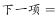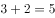，则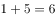。

故正确答案为A。

---

### 第 2 题　qid 2172351 · 数学运算

1，-5，10，10，40，（  ）

- **A**. -35
- **B**. 50
- **C**. 135
- **D**. 280　✅

**答案**：D

**官方解析**

数列存在明显的倍数关系，优先考虑作商。作商后得到新数列：-5，-2，1，4，（  ），为公差是3的等差数列，新数列中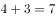，则。

故正确答案为D。

---

### 第 3 题　qid 2172563 · 数学运算

3.2，8.6，15.12，24.20，35.30，（  ）

- **A**. 42.42
- **B**. 48.42　✅
- **C**. 42.56
- **D**. 48.56

**答案**：B

**官方解析**

题干为小数数列，直接作差无规律，考虑整数与小数部分之间作机械划分。整数部分：3、8、15、24、35、（  ），作差后得到：5、7、9、11、（  ），构成公差为2的等差数列，新数列下一项为13，则原数列所求项整数部分为；小数部分：2、6、12、20、30、（  ），作差后得到：4、6、8、10、（  ），构成公差为2的等差数列，新数列下一项为12，则原数列所求项小数部分为。因此，所求项为48.42。

故正确答案为B。

---

### 第 4 题　qid 2172466 · 数学运算

1，2，，，，（  ）

- **A**. 

- **B**. 
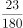

- **C**. 

- **D**. 

　✅

**答案**：D

**官方解析**

题干中数据大部分为分数，优先考虑分数数列。三个分数中，分母分别为2、6、30，明显倍数关系，倍数分别为3、5，分别与前两项分子相同，猜测前一项的分子、分母乘积为后一项的分母；再观察分子，，，分别与前两项分母相同，猜测前一项的分子、分母之和为后一项分子。再对前两个整数进行整化分，该数列为，，，，，（  ）。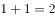（第二项分子），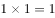（第二项分母）；（第三项分子），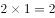（第三项分母），均满足刚才猜测的规律，则规律成立。因此所求项分子为，分母为，即。

故正确答案为D。

---

### 第 5 题　qid 2172341 · 数学运算

一款手机按2000元单价销售，利润为售价的。若重新定价，将利润降至新售价的，则新售价是：

- **A**. 1900元
- **B**. 1875元　✅
- **C**. 1840元
- **D**. 1835元

**答案**：B

**官方解析**

由题干“售价2000元，利润为售价的”可得，元。又由“重新定价，利润降至新售价的”，设新售价为x元，则，解得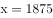，则新售价是1875元。

故正确答案为B。

---

### 第 6 题　qid 2172388 · 数学运算

某化学实验室有A、B、C三个试管分别盛有10克、20克、30克水，将某种盐溶液10克倒入试管A中，充分混合均匀后，取出10克溶液倒入B试管，充分混合均匀后，取出10克溶液倒入C试管，充分混合均匀后，这时C试管中溶液浓度为，则倒入A试管中的盐溶液浓度是：

- **A**. 
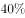

- **B**. 
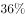

- **C**. 

- **D**. 
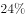
　✅

**答案**：D

**官方解析**

设倒入A试管中的盐溶液浓度为a，将溶液倒入A试管时，混合之后的浓度；同理经过B、C试管的混合之后溶液浓度为，解得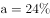。

故正确答案为D。

---

### 第 7 题　qid 2172572 · 数学运算

小李家住在一个小胡同里，各家门牌号从1开始按顺序排列。已知胡同里各家门牌号之和减去小李家门牌号等于85，则小李家门牌号是

- **A**. 5
- **B**. 6　✅
- **C**. 7
- **D**. 8

**答案**：B

**官方解析**

由题干“各家门牌号从1开始按顺序排列”可得，各家门牌号为从1开始的连续自然数列。又已知“胡同里各家门牌号之和减去小李家门牌号等于85”，设一共有N家，小李家门牌号为M，则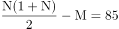，直接求解较复杂，因数目不大，对于N直接枚举代入即可，从1开始的自然数求和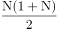比85大一些，试探当时，，小于85；当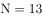时，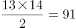，恰好比85大一些，此时；当时，不符合题意。所以小李家门牌号是6。

故正确答案为B。

---

### 第 8 题　qid 2172639 · 数学运算

“和谐号”高速列车从甲地出发向相距1300千米的乙地行驶，列车分别以250千米/小时和300千米/小时的平均速度在两种不同路况的路段上行驶，4.5小时恰好走完全程。则这两种路段的里程数之差是

- **A**. 600千米
- **B**. 700千米
- **C**. 800千米　✅
- **D**. 1050千米

**答案**：C

**官方解析**

设列车以250千米/小时行驶时间为，则以300千米/小时的平均速度行驶时间为，根据题意，行驶总路程为，解得小时，因此，列车以250千米/小时行驶路段的路程为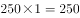千米，以300千米/小时行驶路段的路程为千米，二者相差千米。

故正确答案为C。

---

### 第 9 题　qid 2172299 · 数学运算

如图，在长方形ABCD中，已知三角形ABE、三角形ADF与四边形AECF的面积相等，则三角形AEF与三角形CEF的面积之比是：

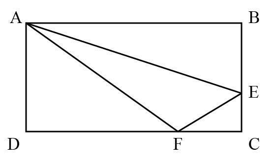

- **A**. 5：1　✅
- **B**. 5：2
- **C**. 5：3
- **D**. 2：1

**答案**：A

**官方解析**

设长方形ABCD的长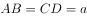，宽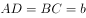，根据题意，，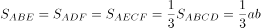。因为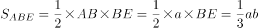，则，所以，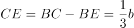；同理，，则，所以，。

，则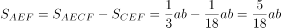，因此。

故正确答案为A。

---

### 第 10 题　qid 2172665 · 数学运算

某新建农庄有一项绿化工程，交给甲、乙、丙、丁4人合作完成。已知4人的工作效率之比为3∶5∶4∶6，甲乙合作完成所需时间比丙丁合作多9天，则4人合作完成工程所需时间是

- **A**. 17天
- **B**. 18天
- **C**. 19天
- **D**. 20天　✅

**答案**：D

**官方解析**

根据题意，赋值甲、乙、丙、丁4人的工作效率分别为3、5、4、6，则甲乙合作的效率为，丙丁合作的效率为。设甲乙合作所需时间为x，则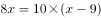，解得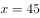，所以4人合作完成工程所需时间是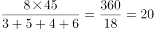天。

故正确答案为D。

---

### 第 11 题　qid 2172667 · 数学运算

一只黑色布袋中装着分别标有数字1、2、3的三种玻璃球若干。若从布袋中随机摸出10个球，球上数字之和为21，则10个球中标有数字1的玻璃球至多有几个？

- **A**. 2个
- **B**. 3个
- **C**. 4个　✅
- **D**. 5个

**答案**：C

**官方解析**

设标有数字1、2、3的玻璃球分别有a、b、c个，根据题意可得：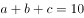······①，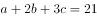······②。得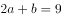，由于a、b均为非负整数，则a的最大值为4。

故正确答案为C。

---

### 第 12 题　qid 2172669 · 数学运算

某乡组织县农民运动会预选赛，报名选手中男女人数比为4∶3，赛后有91人入选，其中男女之比为8∶5。如落选选手中男女之比为3∶4，则报名选手共有

- **A**. 98人
- **B**. 105人
- **C**. 119人　✅
- **D**. 126人

**答案**：C

**官方解析**

方法一：根据题意可知，入选选手中男女人数分别为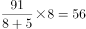人、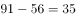人。设落选选手中男女人数分别为3x和4x，则报名选手中男女人数之比为，解得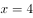，所以落选选手人数为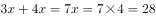人，报名选手共有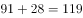人。

方法二：线段法。根据题意可得，入选选手中男选手占比为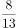，落选选手中男选手占比为，报名选手中男选手占比为，所以，化简得，解得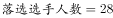人，所以报名选手共有人。

 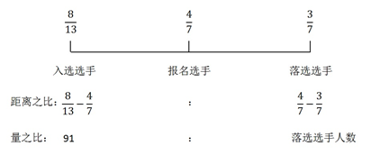

故正确答案为C。

---

### 第 13 题　qid 2172296 · 数学运算

某市公安局从辖区2个派出所分别抽调2名警察，将他们随机安排到3个专案组工作，则来自同一派出所的警察不在同一组的概率是：

- **A**. 

　✅
- **B**. 

- **C**. 

- **D**. 

**答案**：A

**官方解析**

由题意可知，4名警察分到3个专案组，必有2人同组，其他2人各自一组。从4人中选出2人，有种方法；随机安排到3个专案组工作，每种分组情况均有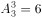种安排方法。所以将4名警察随机安排到3个专案组工作共有种情况。

从反面考虑，若同一派出所的警察在同一组，则其中一个派出所的2名警察被安排到一个专案组，另外一个派出所的2名警察分别安排到另外2个专案组，所以共有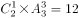种情况。

因此，来自同一派出所的警察不在同一组的概率是。

故正确答案为A。

---

### 第 14 题　qid 2172385 · 数学运算

某单位举行象棋比赛，计分规则为：赢者得2分，负者得0分，平局各得1分，每位选手与其他选手各下一局。已知男选手数是女选手的10倍，而得分是女选手的4.5倍，则参加比赛的男选手数是

- **A**. 40人
- **B**. 30人
- **C**. 20人
- **D**. 10人　✅

**答案**：D

**官方解析**

根据题意可知，无论是有胜负还是平局，每局比赛共得2分。为方便计算，从小到大代入。代入D项：假设参加比赛的男选手数是10人，则女选手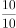人，选手总数人。因为每位选手与其他选手各下一局，所以11人有局比赛，共分，女选手得分为分，1名女选手总得分最多为分，符合题干条件。（同理验证C、B、A选项可知，计算得出女选手总得分均大于可得的最高分）

故正确答案为D。

---

## 判断推理

### 材料 1

甲、乙、丙、丁、戊、己6项工作需要按照一定的先后顺序才能顺利完成。已知：

（1）丁必须在甲之前完成，并且中间只能隔着1项工作；

（2）丙必须在乙之前完成，并且中间只能隔着2项工作。

#### 第 1 题　qid 2172309 · 类比推理

若戊第2个完成，则己第几个完成？

- **A**. 3
- **B**. 4
- **C**. 5
- **D**. 6　✅

**答案**：D

**官方解析**

若戊第2个完成，结合条件（2）可知，丙和乙有两种可能：

①如下图所示，如果丙是第一个完成，乙是第四个完成，

再结合条件（1）可知，丁是第三个完成，甲是第五个完成，如下图所示，故己是第六个完成。

②如下图所示，如果丙是第三个完成，乙是第六个完成，再结合条件（1）可知，丁与甲隔着1项工作，无法满足，故此种可能排除。

综上所述，己是第六个完成。

故正确答案为D。

---

#### 第 2 题　qid 2172311 · 逻辑判断

若甲、乙不是紧挨着先后完成，则可以得出以下哪项？

- **A**. 甲在乙之前完成　✅
- **B**. 乙在甲之前完成
- **C**. 戊在己之前完成
- **D**. 己在戊之前完成

**答案**：A

**官方解析**

题干信息不确定，可用假设法。

由条件（2）可知，丙有三种可能：

①如下图所示，假设丙是第一个完成，乙是第四个完成，再结合条件（1）可知，丁是第三个完成，甲是第五个完成，此时甲、乙紧挨着，与题干条件矛盾，故此种可能排除；

②如下图所示，假设丙是第二个完成，乙是第五个完成，再结合条件（1）可知，若丁是第一个完成，则甲是第三个完成，此时戊和己的顺序无法确定，只能确定甲在乙之前，满足题干假设；

如下图所示，假设丁是第四个完成，则甲是第六个完成，此时甲、乙紧挨着，与题干条件矛盾，故此种可能排除；

③如下图所示，假设丙是第三个完成，乙是第六个完成，再结合条件（1）可知，丁是第二个完成，甲是第四个完成，此时戊和己的顺序无法确定，只能确定甲在乙之前，满足题干假设。

综上所述，甲一定在乙之前。

故正确答案为A。

---

#### 第 3 题　qid 2172441 · 类比推理

交通摄像头：监控路况

- **A**. 指纹密码锁：采集指纹
- **B**. 电子血压仪：测量血压　✅
- **C**. 扫地机器人：净化空气
- **D**. 折叠防盗窗：晾晒衣服

**答案**：B

**官方解析**

第一步：判断题干词语间逻辑关系。
交通摄像头的主要功能是监控路况，二者之间是功能对应关系。
第二步：判断选项词语间逻辑关系。
A项：指纹密码锁的主要功能是防盗，并不是采集指纹，二者之间不是功能对应关系，与题干逻辑关系不一致，排除；
B项：电子血压仪的主要功能是测量血压，二者之间是功能对应关系，与题干逻辑关系一致，当选；
C项：扫地机器人的主要功能是清洁地面，并不是净化空气，二者之间不是功能对应关系，与题干逻辑关系不一致，排除；
D项：折叠防盗窗的主要功能是防盗，并不是晾晒衣服，二者之间不是功能对应关系，与题干逻辑关系不一致，排除。
故正确答案为B。

---

#### 第 4 题　qid 2172372 · 类比推理

树：柏树：松树：雪松

- **A**. 车：汽车：火车：动车　✅
- **B**. 法：刑法：民法：公民
- **C**. 花：梅花：梨花：香梨
- **D**. 牛：水牛：黄牛：牛黄

**答案**：A

**官方解析**

第一步：判断题干词语间的逻辑关系。
柏树和松树都是树的一种，柏树和松树是并列关系，雪松是松树的一个品种，雪松和松树之间是种属关系。
第二步：判断选项词语间的逻辑关系。
A项：汽车和火车都是车的一种，汽车和火车是并列关系，动车是火车中速度较快的一种，动车和火车之间是种属关系，与题干逻辑关系一致，当选；
B项：刑法和民法都是法的一种，刑法和民法是并列关系，但公民是民法的管理对象，二者非种属关系，与题干逻辑关系不一致，排除；
C项：梅花和梨花都是花的一种，梅花和梨花是并列关系，但香梨并不是梨花的一种，二者非种属关系，与题干逻辑关系不一致，排除；
D项：水牛和黄牛都是牛的一种，水牛和黄牛是并列关系，但牛黄是黄牛身体中的一部分，二者属于组成关系，与题干逻辑关系不一致，排除。
故正确答案为A。

---

#### 第 5 题　qid 2172552 · 类比推理

送友人：折柳枝

- **A**. 观花灯：猜谜语
- **B**. 忆屈原：划龙舟　✅
- **C**. 闯关东：走西口
- **D**. 画竹梅：明心志

**答案**：B

**官方解析**

第一步：判断题干词语间逻辑关系。
古人折柳枝是为了送别友人，二者是方式目的的对应关系。
第二步：判断选项词语间逻辑关系。
A项：正月十五元宵节有观花灯、猜谜语的习俗，观花灯与猜谜语是并列关系，与题干逻辑关系不一致，排除；
B项：划龙舟是为了忆屈原，二者是方式目的的对应关系，与题干逻辑关系一致，当选；
C项：闯关东指中原地区百姓去关东谋生的历史；走西口是指无数山西人、陕西人、河北人背井离乡，打通了中原与蒙古的经济和文化通道，带动了北部地区的繁荣和发展。闯关东和走西口都是中国历史上著名的人口迁徙事件，二者是并列关系，与题干逻辑关系不一致，排除；
D项：画竹梅是为了明心志，但词语顺序与题干相反，与题干逻辑关系不一致，排除。
故正确答案为B。

---

#### 第 6 题　qid 2172556 · 类比推理

木鱼：带鱼：黄鱼

- **A**. 虾米：小米：大米　✅
- **B**. 兵家：作家：画家
- **C**. 桃子：橘子：房子
- **D**. 荞麦：小麦：燕麦

**答案**：A

**官方解析**

第一步：判断题干词语间逻辑关系。
木鱼不是鱼，带鱼和黄鱼都是鱼的一种，第一个词与后两者没有明显逻辑关系，后两者是并列关系。
第二步：判断选项词语间逻辑关系。
A项：虾米不是米，小米和大米都是米的一种，第一个词与后两者没有明显逻辑关系，后两者是并列关系，与题干逻辑关系一致，当选；
B项：兵家是古代对军事家或用兵者的通称，也指研究军事的学派。兵家、作家和画家互为交叉关系，与题干逻辑关系不一致，排除；
C项：桃子和橘子都是水果，前两者是并列关系，与题干逻辑关系不一致，排除；
D项：荞麦、小麦和燕麦都是粮食作物，三者是并列关系，与题干逻辑关系不一致，排除。
故正确答案为A。

---

#### 第 7 题　qid 2172444 · 类比推理

三角形：三棱锥

- **A**. 四边形：四面体
- **B**. 五边形：五角星
- **C**. 正方形：正方体　✅
- **D**. 抛物线：圆柱体

**答案**：C

**官方解析**

第一步：判断题干词语间逻辑关系。
三角形是平面图形，三棱锥是立体图形，并且三棱锥中所有的面都是三角形，二者为对应关系。
第二步：判断选项词语间逻辑关系。
A项：四边形是平面图形，四面体是立体图形，但是四面体中所有的面都是三角形，并不是四边形，与题干逻辑关系不一致，排除；
B项；五边形是平面图形，五角星也是平面图形，与题干逻辑关系不一致，排除；
C项：正方形是平面图形，正方体是立体图形，并且正方体中所有的面都是正方形，与题干逻辑关系一致，当选；
D项：抛物线是平面图形，圆柱体是立体图形，但是抛物线不是面，圆柱体中的面是矩形和圆形，与题干逻辑关系不一致，排除。
故正确答案为C。

---

#### 第 8 题　qid 2172371 · 类比推理

春耕：秋收：冬藏

- **A**. 立功：表彰：晋级
- **B**. 偷盗：受罚：悔恨
- **C**. 勤奋：致富：捐款
- **D**. 报名：参赛：夺冠　✅

**答案**：D

**官方解析**

第一步：判断题干词语间逻辑关系。
农业生产的一般过程，指春天耕种，秋天收获，冬天储藏，三词间有时间的先后顺序。
第二步：判断选项词语间逻辑关系。
A项：表彰和晋级之间没有明显的时间先后顺序，与题干逻辑关系不一致，排除；
B项：受罚和悔恨之间没有明显的时间先后顺序，与题干逻辑关系不一致，排除；
C项：致富和捐款之间没有必然时间先后顺序，与题干逻辑关系不一致，排除；
D项：报名、参赛、夺冠是参加比赛的一般过程，三词间有明显的时间先后顺序，与题干逻辑关系一致，当选。
故正确答案为D。

---

#### 第 9 题　qid 2172294 · 类比推理

清除 之于（  ）相当于 拔除 之于（  ）

- **A**. 垃圾——暗堡
- **B**. 腐败——毒瘤　✅
- **C**. 路障——青苗
- **D**. 积弊——垂柳

**答案**：B

**官方解析**

逐一代入选项。
A项：清除垃圾是动宾搭配，拔除暗堡是动宾搭配，前后逻辑关系一致，保留；
B项：清除腐败是动宾搭配，拔除毒瘤是动宾搭配，前后逻辑关系一致，保留；
C项：清除路障是动宾搭配，拔除青苗是动宾搭配，前后逻辑关系一致，保留；
D项：清除积弊是动宾搭配，拔除垂柳是动宾搭配，前后逻辑关系一致，保留。
比较A、B、C、D项，B选项“腐败”和“毒瘤”均为有害的事物，“清除腐败”和“拔除毒瘤”都是做好事，前后的逻辑关系比A、C、D三项更为接近。
故正确答案为B。

---

#### 第 10 题　qid 2172448 · 类比推理

草原 之于（  ）相当于 海洋 之于（  ）

- **A**. 放牧——捕捞　✅
- **B**. 虫草——鱼群
- **C**. 羊群——水手
- **D**. 牧羊犬——指南针

**答案**：A

**官方解析**

逐一代入选项。
A项：在草原进行放牧，草原和放牧是场所和行为的对应关系；在海洋进行捕捞，海洋和捕捞也是场所和行为的对应关系，且放牧和捕捞都是人类生产活动的一种，前后逻辑关系一致，当选；
B项：虫草一般生长在高原地区，草原和虫草无明显逻辑关系；海洋和鱼群为场所与生物的对应关系，前后逻辑关系不一致，排除；
C项：草原和羊群是生存场所与生物的对应关系；海洋和水手是工作场所与职业的对应关系，前后逻辑关系不一致，排除；
D项：牧羊犬可以在草原上帮助人们放牧，二者是生物与其应用场所的对应关系；在海洋航行也可以用指南针来指引方向，二者是应用场所与工具的对应关系，前后逻辑关系不一致，排除。
故正确答案为A。

---

#### 第 11 题　qid 2172570 · 类比推理

刃刀刃刅刄刅刀

- **A**. 刅刃刅刀刃刀刄
- **B**. 刀刃刀刄刅刄刃　✅
- **C**. 刄刃刄刀刀刅刃
- **D**. 刀刃刀刅刃刅刄

**答案**：B

**官方解析**

第一步：分析题干符号间关系。
从相同汉字的位置入手：位置1和3是相同汉字，位置2和7是相同汉字，位置4和6是相同汉字，位置5的汉字只出现过一次。
第二步：判断选项符号间关系。
A项：位置2和5是相同汉字，与题干不一致，排除；
B项：位置1和3是相同汉字，位置2和7是相同汉字，位置4和6是相同汉字，位置5的汉字只出现过一次，与题干一致，当选； 
C项：位置4和5是相同汉字，与题干不一致，排除；
D项：位置2和5是相同汉字，与题干不一致，排除。
故正确答案为B。

---

#### 第 12 题　qid 2172580 · 逻辑判断

- **A**. 

- **B**. 

- **C**. 

- **D**. 

　✅

**答案**：D

**官方解析**

第一步：分析题干符号间关系。
从相同符号的位置入手：位置1、8的符号相同；位置2、3的符号相同；位置4、6的符号相同；位置5、7的符号相同；位置9、10的符号相同。
第二步：判断选项符号间关系。
A项：位置1、8的符号不相同，与题干不一致，排除；
B项：位置9、10的符号不相同，与题干不一致，排除；
C项：位置9、10的符号不相同，与题干不一致，排除；
D项：位置1、8的符号相同；位置2、3的符号相同；位置4、6的符号相同；位置5、7的符号相同；位置9、10的符号相同。与题干一致，当选。
故正确答案为D。

---

#### 第 13 题　qid 2172581 · 图形推理

从四个图中选出唯一的一项，填入问号处，使其呈现出一定的规律性。

- **A**. A
- **B**. B　✅
- **C**. C
- **D**. D

**答案**：B

**官方解析**

本题考查图形的实际意义，寻找最大共同点。观察发现，题干所有图形都是瓶口颈宽大、较短且无盖，A项瓶口颈较细，C项瓶子有盖，D项瓶口颈较长，只有B项满足题干图形特征。
故正确答案为B。

---

#### 第 14 题　qid 2172442 · 图形推理

请从所给的这几个选项中，选择最合适的一个填在问号处，使之呈现一定的规律性：

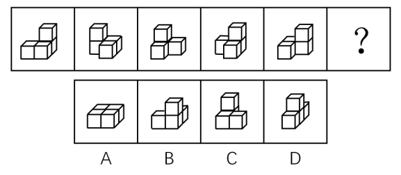

- **A**. A
- **B**. B
- **C**. C　✅
- **D**. D

**答案**：C

**官方解析**

题干图形均由小正方体叠加而成，考虑三视图。观察发现，题干图形的左视图均相同，只有C项的左视图与题干相同。
故正确答案为C。

---

#### 第 15 题　qid 2172585 · 图形推理

从四个图中选出唯一的一项，填入问号处，使其呈现出一定的规律性。

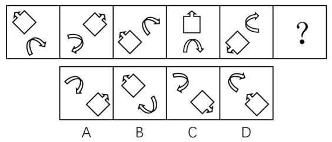

- **A**. A　✅
- **B**. B
- **C**. C
- **D**. D

**答案**：A

**官方解析**

图形元素组成相同，优先考虑位置规律，但位置无明显规律。观察发现，每个图形中由两个元素组成，且这两个元素的箭头均指向相反方向且指向相背，故？号处图形中的两个元素的箭头也应该指向相反方向且指向相背。A项箭头指向相反方向，B项箭头指向相同方向，C项并非相反方向，D项箭头指向相反方向但指向相对，只有A项符合。
故正确答案为A。

---

#### 第 16 题　qid 2172588 · 图形推理

从四个图中选出唯一的一项，填入问号处，使其呈现出一定的规律性。

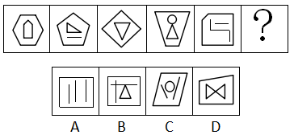

- **A**. A　✅
- **B**. B
- **C**. C
- **D**. D

**答案**：A

**官方解析**

元素组成不相同且属性无明显规律，考虑数量规律。观察图形发现，题干展开图中出现多边形和单一直线，考虑数直线数。整体数直线无规律，考虑内外分开数。每幅图外部直线数分别为：6、5、4、4、5，内部直线数分别为：5、4、3、3、4，发现每幅图外部直线数-内部直线数=1，故？处也应该选择一个符合此规律的图形，只有A选项符合。
故正确答案为A。

---

#### 第 17 题　qid 2172553 · 图形推理

下边四个图形中，只有一个是由上边的四个图形拼合（只能通过上、下、左、右平移）而成的，请把它找出来。

- **A**. A
- **B**. B
- **C**. C
- **D**. D　✅

**答案**：D

**官方解析**

本题考查平面拼合，可采用平行且等长相消的方式解题。消去平行且等长的线段后进行组合即可得到轮廓图，即为D项。

平行且等长相消的方式如下图所示：

故正确答案为D。

---

#### 第 18 题　qid 2172305 · 图形推理

下边四个图形中，只有一个是由上边的四个图形拼合（只能通过上、下、左、右平移）而成的，请把它找出来。

- **A**. A　✅
- **B**. B
- **C**. C
- **D**. D

**答案**：A

**官方解析**

本题考查平面拼合，可采用平行且等长相消的方式解题。消去平行且等长的线段后进行组合即可得到轮廓图，即为A选项。平行且等长相消的方式如下图所示：

故正确答案为A。

---

#### 第 19 题　qid 2172380 · 图形推理

下边四个图形中，只有一个是由上边的四个图形拼合（只能通过上、下、左、右平移）而成的，请把它找出来。

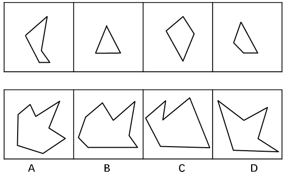

- **A**. A
- **B**. B　✅
- **C**. C
- **D**. D

**答案**：B

**官方解析**

本题考查平面拼合，可采用平行且等长相消的方式解题。消去平行且等长的线段后进行组合即可得到轮廓图，即为B选项。平行且等长相消的方式如下图所示：

 

故正确答案为B。

---

#### 第 20 题　qid 2172468 · 图形推理

选项四个图形中，只有一个是由题干的四个图形拼合（只能通过上、下、左、右平移）而成的，请把它找出来。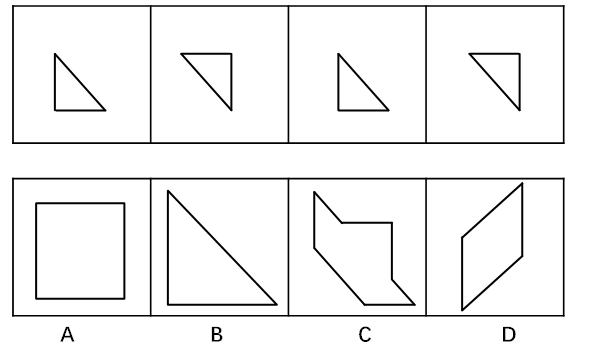

- **A**. A
- **B**. B
- **C**. C　✅
- **D**. D

**答案**：C

**官方解析**

本题考查平面拼合，可采用平行且等长相消的方式解题。消去平行且等长的线段后进行组合即可得到轮廓图，即为C项。平行且等长相消的方式如下图所示：

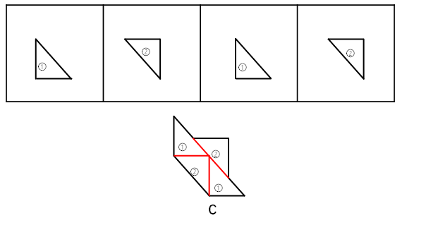

故正确答案为C。

---

#### 第 21 题　qid 2172557 · 图形推理

下边四个图形中，只有一个是由上边的四个图形拼合（只能通过上、下、左、右平移）而成的，请把它找出来。

- **A**. A
- **B**. B　✅
- **C**. C
- **D**. D

**答案**：B

**官方解析**

本题考查平面拼合，可采用平行且等长相消的方式解题。优先考虑确定题干中第二个图形的位置，然后将平行且等长的其余部分进行组合，即可得到轮廓图，即为B项。

平行且等长的组合方式如下图所示：

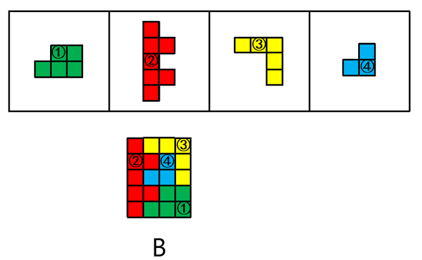

故正确答案为B。

---

#### 第 22 题　qid 2172562 · 图形推理

左边给定的是纸盒外表面的展开图，右边哪一项能由它折叠而成？请把它找出来。

- **A**. A　✅
- **B**. B
- **C**. C
- **D**. D

**答案**：A

**官方解析**

本题考查四面体的空间重构。将平面图中的各面进行标号，如图1所示：

A项：由a面和c面组成，与题干展开图一致，当选；

B项：该项右侧的面为c面或d面，如果是c面，选项中实线和虚线没有交点，而题干展开图中有交点，与题干展开图不一致；如果是d面，选项中d面的实线垂直的公共边挨着的是虚线面，而题干展开图中挨着的是实线面（c面），与题干展开图不一致，该项错误，排除；

C项：该项由a面和b面组成，选项中两个面的虚线没有公共的顶点，而根据展开图中同一直线上的两条边是公共边，可知题干展开图中面a和面b虚线所在的顶点为同一个点，即两个面中的虚线是有公共的顶点，选项与题干展开图不一致，排除；

D项：该项由c面和d面组成，选项两个面中的直线均没有垂直于公共边，而题干展开图中d面中的直线垂直于公共边，与题干展开图不一致，排除。

故正确答案为A。

---

#### 第 23 题　qid 2172567 · 图形推理

左边给定的是纸盒外表面的展开图，右边哪一项能由它折叠而成？请把它找出来。

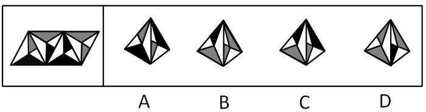

- **A**. A
- **B**. B
- **C**. C　✅
- **D**. D

**答案**：C

**官方解析**

题干图形从左至右分别标上面a、b、c、d。

A项：选项左侧的面为无中生有的面（与题干的a面成镜面图形），选项与题干不一致，排除；

B项：选项右侧的面为无中生有的面（与题干d面成镜面图形），选项与题干不一致，排除；

C项：由面b和面a构成，与题干一致，当选；

D项：选项右侧的面为无中生有的面（与题干的b面成镜面图形），选项与题干不一致，排除。

故正确答案为C。

---

#### 第 24 题　qid 2172569 · 图形推理

左边给定的是纸盒外表面的展开图，右边哪一项能由它折叠而成？请把它找出来。

- **A**. A
- **B**. B
- **C**. C
- **D**. D　✅

**答案**：D

**官方解析**

本题为空间重构题目，用排除思维解题，题干图形标号如下图。

A项：选项侧面为面e，上面为面a或面d。若上面为面d，则选项中面e直线垂直于两面公共边，与题干不一致；若上面为面a，则如上图，以面a中三角形的底边开始顺时针画边，选项中边4挨着面e，而题干中边4挨着面b，与题干不一致，排除；

B项：选项中上面和前面可能是面a与面f，面d与面c，但题干中这两组相邻面的公共边都是两个三角形的底边，而选项中为两个三角形顶点相交，与题干不一致，排除；

C项：选项中侧面为面e，前面为面a或者面d。若前面为面d，则选项中面e直线垂直于两面公共边，与题干不一致；若前面为面a，则如上图，以面a中三角形的底边开始顺时针画边，选项中边4挨着面e，而展开图中边4挨着面b，与题干不一致，排除；

D项：与题干一致，当选。

故正确答案为D。

注：本题不太严谨，因为D项中右侧面里面的矩形方向与题干展开图并不一致，但是因为A、B、C三项相邻面都有明显的错误，所以本题择优选D项。

---

#### 第 25 题　qid 2172377 · 图形推理

左边给定的是纸盒外表面的展开图，右边哪一项能由它折叠而成？请把它找出来。

- **A**. A
- **B**. B　✅
- **C**. C
- **D**. D

**答案**：B

**官方解析**

本题考查六面体的空间重构。将题干展开图中的面依次标注为面a、b、c、d、e、f，如下图：

A项：右侧“十”字的面在展开图中没有出现，属于无中生有的面，选项与题干展开图不一致，排除；

B项：选项的三个面分别是面c、面d、面f，选项与题干展开图一致，当选；

C项：选项的三个面分别是面c、面d、面f，如下图：

在题干展开图中，d面的小黑方块挨着f面的小格子方块，而在选项中，d面的小黑方块挨着f面的小白方块，选项与题干展开图不一致，排除；

D项：选项的三个面分别是面b、面c、面e，如下图：

其中，面c和面e为相对面，不可能同时出现，选项与题干展开图不一致，排除。

故正确答案为B。

---

#### 第 26 题　qid 2172452 · 图形推理

从所给的四个选项中，选择最恰当的一个填入问号处，使之呈现一定的规律性。

- **A**. A
- **B**. B
- **C**. C　✅
- **D**. D

**答案**：C

**官方解析**

图形元素组成不同，优先考虑属性规律。九宫格优先按行看，第一行中，三幅图都是轴对称图形，并且对称轴的方向依次顺时针旋转，第二行与第一行规律相同，第三行也应该满足此规律，只有C项符合。

故正确答案为C。

---

#### 第 27 题　qid 2172576 · 图形推理

从四个图中选出唯一的一项，填入问号处，使其呈现出一定的规律性。

- **A**. A
- **B**. B
- **C**. C
- **D**. D　✅

**答案**：D

**官方解析**

图形元素组成相似，优先考虑样式规律。九宫格优先按行看，第一行中，图一和图二先求异，然后逆时针旋转90°得到图三，第二行验证规律，与第一行规律相同，第三行也应该满足此规律，即“？”图形由图一和图二先求异，然后逆时针旋转90°得到，只有D选项符合。
故正确答案为D。

---

#### 第 28 题　qid 2172453 · 逻辑判断

人们常说，读书可以增长知识、陶冶性情。有专家指出，读书还可以治病，特别是对于一些社会因素引起的心理疾病，如抑郁、压抑、恐慌、烦恼等，读书有很好的疗效。
以下哪项如果为真，最能支持上述专家的观点？

- **A**. 读书能够促使患者转变思维方式，提高认知能力，重新认识世界和认识自己
- **B**. 患者能够从阅读中有意无意获得情感上的认同和慰藉，释放内心的焦虑和不安　✅
- **C**. 汉代大学问家刘向十分重视读书的医疗作用，认为书犹药也，善读之可以医愚
- **D**. 阅读能使大脑中产生一种神经肽，可以增强细胞免疫力，有益于人的身体健康

**答案**：B

**官方解析**

第一步：找出论点和论据。
论点：读书可以治病，特别是对于一些社会因素引起的心理疾病，如抑郁、压抑、恐慌、烦恼等，读书有很好的疗效。
论据：无。
本题只有论点没有论据，加强优先考虑补充论据。
第二步：逐一分析选项。
A项：说的是读书能使患者转变思维，提高认知能力，重新认识世界和自己，与是否能治疗心理疾病无关，无关项，排除；
B项：说明患者能够从阅读中获得情感上的慰藉，释放内心的焦虑与不安，解释说明了阅读是如何治疗心理疾病的，补充论据加强，当选；
C项：指出汉代大学问家认为书犹药也，善读之可以医愚，是其个人观点，而且“医愚”无法说明读书能医治心理疾病，不能加强，排除； 
D项：说明阅读有益身体健康，增强人体免疫力，与是否能治疗心理疾病无关，无关项，排除。
故正确答案为B。

---

#### 第 29 题　qid 2172579 · 逻辑判断

某机关甲、乙、丙、丁4个处室准备深入基层调研。他们准备调研的地方是红星乡、朝阳乡、永丰街道、幸福街道。每个处室恰好选择其中一个地方，各不重复。已知：
（1）要么甲选幸福街道，要么乙选幸福街道，两者必居其一；
（2）要么甲选红星乡，要么丙选永丰街道，两者必居其一；
（3）如果丙选永丰街道，则丁选幸福街道。
根据以上陈述，可以得出以下哪项？

- **A**. 甲选朝阳乡
- **B**. 乙选红星乡
- **C**. 丙选幸福街道
- **D**. 丁选永丰街道　✅

**答案**：D

**官方解析**

翻译题干条件：
（1）要么甲选幸福街道，要么乙选幸福街道
（2）要么甲选红星乡，要么丙选永丰街道
（3）丙选永丰街道→丁选幸福街道
优先从最大信息开始进行推理，题干条件里幸福街道出现最多，根据条件（1）可知，幸福街道只能是甲、乙其一选择。根据题干要求，每个处室选择一个地方而且各不重复，因此其他处室不能选择幸福街道，即丙、丁都没有选择幸福街道。
结合条件（3），丁不选幸福街道，是对于条件（3）的否后，否后必否前，可知，丙不选永丰街道；
由丙不选永丰街道，结合条件（2），可知，甲选红星乡，排除A项；
甲选红星乡，可得甲不选幸福街道，再结合条件（1），可知，乙选幸福街道，排除B项；
因各个科室选择地方各不重复，由乙选幸福街道可知丙不选幸福街道，排除C项；
甲选红星乡，乙选幸福街道，剩下朝阳和永丰由丙、丁选择，而由上述分析，丙不选永丰街道，故丙选朝阳乡，丁选永丰街道。 
故正确答案为D。

---

#### 第 30 题　qid 2172394 · 类比推理

狗不嫌家贫，子不嫌母丑。爱自己家乡的人不会说家乡的坏话，张三就从不说家乡的坏话。可见，他是一个多么爱自己家乡的人啊！
以下哪项的推理方式与上述最为相似？

- **A**. 灯不挑不亮，话不挑不明。如果没有听到张处长这番话，我还在纠结要不要报名参加行业大赛，现在一切都清楚了。看来，张处长的话太重要了！
- **B**. 不入虎穴，焉得虎子？巨大的成功往往伴随着巨大的风险，李四投资股票获得高额回报。可见，他承担了多大的风险啊！
- **C**. 玉不琢不成器，人不学要落后。追求进步的人不会不爱学习的，王教授退休后一直无所事事，不爱学习。可见，王教授已不是一个追求进步的人了！
- **D**. 人不可貌相，海水不可斗量。一个有才能的人不会将他的才能显示出来，李先生就从来没有显示过他的才能。可见，他是一个多么有才能的人啊！　✅

**答案**：D

**官方解析**

第一步：分析题干的推理形式。

爱家乡说坏话，用张三举例，说坏话爱家乡。属于肯定箭头后推肯定箭头前的形式。

第二步：逐一分析选项。

A项：听张处长的话纠结，后半句为，纠结（现在一切都清楚了）张处长的话重要。属于否后推否前，与题干推理形式不同，排除；

B项：巨大的成功巨大的风险，用李四举例，巨大的成功（获得高额回报）巨大的风险。属于肯前推肯后，与题干推理形式不同，排除；

C项：追求进步爱学习，用王教授举例，爱学习追求进步。属于否后推否前，与题干推理形式不同，排除；

D项：有才能显示才能，用李先生举例，显示才能有才能，属于肯后推肯前。与题干推理形式相同，当选。

故正确答案为D。

---

#### 第 31 题　qid 2172393 · 逻辑判断

为了减少温室气体排放，有效应对全球气候变暖，有些专家建议，应把燃树发电作为削减二氧化碳排放的策略。他们认为，树木比煤、天然气更具有“碳中性”，砍树燃树所产生的二氧化碳将会被在原地再次生长的树木吸收。
以下哪项如果为真，最能质疑上述专家的观点？

- **A**. 砍树之后及时栽树，新生的树木就会再次吸收空气中的碳，形成稳定的碳循环
- **B**. 燃树发电的政策建议一旦实施，可能会导致乱砍乱伐，加剧全球环境生态危机
- **C**. 碳循环的计算比较复杂，砍树燃树释放的碳与栽树重新吸收的碳可能并不相等
- **D**. 砍树燃树排放的碳要等到新栽树苗长大后才能被完全吸收，时间上存在滞后性　✅

**答案**：D

**官方解析**

第一步：找出论点和论据。
论点：应把燃树发电作为削减二氧化碳排放的策略。
论据：树木比煤、天然气更具有“碳中性”，砍树燃树所产生的二氧化碳将会被在原地再次生长的树木吸收。
第二步：逐一分析选项。
A项：新生树木吸收碳形成稳定碳循环，重复了论据的内容，补充论据进行加强，无法削弱，排除； 
B项：燃树发电会加剧生态危机，说的是燃树发电的不良后果，而题干所讨论的是燃树发电是否能削减二氧化碳排放，二者话题不一致，属于无关选项，无法削弱，排除；
C项：释放的碳和吸收的碳可能并不相等，那到底是释放的碳多还是吸收的碳多，并不明确，排除；
D项：碳在树苗长大后才会被完全吸收，时间上存在滞后性，说明至少对于树苗还没有长大的那段期间来说，还是存在排放更多的二氧化碳，不能削减二氧化碳的排放，能削弱，当选。
故正确答案为D。
【文段出处】《燃木发电？烧“木柴”环保吗？》

---

#### 第 32 题　qid 2172396 · 逻辑判断

明知要早睡，却忍不住熬夜追剧；明知吸烟、酗酒有害健康，却挡不住烟酒的诱惑；明知运动有益，却一步都懒得走……生活中，很多人并不缺少健康常识，他们更多的是缺乏一种自律精神。自律的人都会早睡，都会忌口，都坚持运动。如果一个人坚守自律精神，就不会放纵自己，就能够维护自己的生理节律，过上健康幸福的生活。
根据以上陈述，可以得出以下哪项？

- **A**. 所有坚持运动的人都很自律
- **B**. 有的缺乏自律精神的人不缺少健康常识　✅
- **C**. 一个人如果不坚守自律精神，就会放纵自己
- **D**. 维护自己生理节律的人都能过上健康幸福的生活

**答案**：B

**官方解析**

第一步：翻译题干。

①有些人不缺乏健康常识缺乏自律精神；

②自律的人早睡；

③自律的人忌口；

④自律的人坚持运动；

⑤坚守自律精神-放纵自己；

⑥坚守自律精神维护生理节律；

⑦坚守自律精神过上健康生活。

第二步：逐一分析选项。

A项：翻译为坚持运动自律，对④肯后得不到确定性结论，无法推出，排除；

B项：翻译为有些缺乏自律的人不缺乏健康常识，等价于命题①：有些人不缺乏健康常识缺乏自律精神，可以推出，当选；

C项：翻译为-坚持自律放纵自己，对⑤否前得不到确定性结论，无法推出，排除；

D项：翻译为维护自己生理节律的人健康幸福生活，二者之间没有必然的逻辑关系，无法推出，排除。

故正确答案为B。

---

#### 第 33 题　qid 2172760 · 逻辑判断

枫林湾是三文鱼产卵繁殖的理想河段。若下游有水电大坝，三文鱼就无法到这里繁殖了。只有枫林湾岸边的树都落光了叶子，三文鱼才会洄游到这里。如果看到许多海雕和棕熊在这片河湾聚集的景象，就会知道三文鱼洄游了。现在的枫林湾出现了很多洄游过来的三文鱼。
根据以上陈述，可以得出以下哪项？

- **A**. 枫林湾的下游建造了水电大坝
- **B**. 现在的枫林湾聚集了许多海雕和棕熊
- **C**. 枫林湾岸边的树叶掉光了　✅
- **D**. 海雕和棕熊以三文鱼为食

**答案**：C

**官方解析**

第一步：翻译题干。
①下游有水电大坝→三文鱼无法繁殖
②三文鱼洄游→枫林湾岸边的树落光了叶子
③海雕和棕熊→三文鱼洄游
④三文鱼洄游
第二步：逐一分析选项。
A项：④是对①的否后，否后必否前，可知没有水电大坝，该项无法推出，排除；
B项：④是对③的肯后，肯后得不到确定结论，所以不知道是否有许多海雕和棕熊，该项无法推出，排除；
C项：根据④可知，④是对②的肯前，肯前必肯后，可知枫林湾岸边的树叶掉光了，当选；
D项：题干未提及海雕和棕熊以三文鱼为食，无法推出。
故正确答案为C。

---

#### 第 34 题　qid 2172770 · 逻辑判断

大多数人的饮食中都含有过量的脂肪。而食物中的脂肪主要以甘油三酯的形式存在在消化道中。脂肪酸被脂肪酶水解释放出来后，才能被吸收进入血液，重新合成甘油三酯。如果脂肪酶受到抑制，就能终止这一合成过程。对此，有研究者做了相关实验。他们将体重相当的雌性老鼠分成三组。第一组自由进食，第二组喂高脂饮食，第三组喂高脂饮食但在食物中添加了一种从茶叶中提取的“茶皂素”。结果发现，从第5周开始直至第10周实验结束时，第二组老鼠的体重就比第一组显著要高，但第三组和第一组相比却没有明显差异。由此，研究者们得出结论，茶皂素这种“天然产物”具有抑制脂肪酶的能力，人们喝茶的确能产生减肥效果。
以下哪项为真，最能对研究者们的上述结论提出质疑？

- **A**. 吃高脂饮食的老鼠，宫旁脂肪的重量大约是吃常规饮食的老鼠们的2倍
- **B**. 如果高脂饮食中加了茶皂素，则其宫旁脂肪就跟吃常规饮食的老鼠基本上一样
- **C**. 实验中使用的茶皂素量太大，按同样比例一般人一天至少需要饮用五公斤干茶叶　✅
- **D**. 老鼠和人的差异还是很大的，老鼠实验的结论对于人类只有一定的参考作用

**答案**：C

**官方解析**

第一步：找出论点和论据。
论点：茶皂素这种“天然产物”具有抑制脂肪酶的能力，人们喝茶的确能产生减肥效果。
论据：结果发现，从第5周开始直至第10周实验结束时，第二组老鼠的体重就比第一组显著要高，但第三组和第一组相比却没有明显差异。
第二步：逐一分析选项。
A项：在高脂饮食和常规饮食老鼠之间进行比较，前者宫旁脂肪的重量大约是后者的两倍，说明高脂饮食会增加宫旁脂肪的重量，此选项通过补充论据加强了题干论据，以佐证第二组老鼠的体重比第一组老鼠的体重要高，排除；
B项：高脂饮食中加了茶皂素与常规饮食的对比，宫旁脂肪基本一样，即第三组和第一组相比没有明显差异，此选项通过补充论据加强了题干论据，排除；
C项：此选项说明实验中的茶皂素的用量换算一般人后，至少一天需要饮用五公斤干茶叶，但是一般人不可能一天饮用五公斤干茶叶，说明题干中的实验是超剂量实验下得出的实验结果，由雌性老鼠的超剂量实验无法得出一般人的正常结论，即无法得出人们喝茶的确能产生减肥效果的结论，削弱了论证过程，当选；
D项：老鼠和人的差异很大以及老鼠实验的结论对于人类只有一定的参考作用，但是人喝茶是否有减肥效果并不明确，属于不明确选项，排除。
故正确答案为C。

---

#### 第 35 题　qid 2172291 · 图形推理

以下是一个44的图形，共有16个小方格。每个小方格中均可填入一个词。要求图形的每行、每列均填入“爱国”“敬业”“诚信”“友善”4个词，不能重复，也不能遗漏。

根据以上信息，依次填入图形中①②③④处的4个词应是：

- **A**. 爱国、敬业、诚信、友善　✅
- **B**. 爱国、诚信、敬业、友善
- **C**. 诚信、友善、爱国、敬业
- **D**. 友善、爱国、敬业、诚信

**答案**：A

**官方解析**

题干信息确定，可用排除法解题。
根据方格第一列出现友善、诚信可知，①不能是友善和诚信，排除C、D两项；
根据方格第三列出现敬业可知，③不能是敬业，排除B项。
故正确答案为A。

---

#### 第 36 题　qid 2172432 · 定义判断

田园综合体：指一种新型的集特色优势产业、休闲旅游、乡村社区为一体的跨产业、多功能的农业生产经营体系。
下列属于田园综合体的是：

- **A**. 某县刚刚落成的高科技农业园区中，万亩良田都装配了电子控制设施。园区附近还建有一个多功能老年公寓、十多个大型养生会馆
- **B**. 作为首批省级乡村旅游示范区，向阳村“农家乐”已经成了某镇的骄傲。每年春天，那里的万亩油菜花田都吸引着成千上万的外地游客
- **C**. 某乡打算在三年内建设成为现代化的新型乡村社区，没有高楼大厦，到处是小桥流水，服务配套设施齐全
- **D**. 某乡村经过数年努力，形成了绿色食品生产经营、游客餐饮住宿、湿地公园观光的产业链，山更青水更绿了，村民生活也更富足了　✅

**答案**：D

**官方解析**

第一步：找出定义关键词。
“集特色优势产业、休闲旅游、乡村社区为一体”、“跨产业、多功能的农业生产经营体系”。
第二步：逐一分析选项。
A项：高科技农业园区附近建设的老年公寓和养生会馆，不属于集特色优势产业、跨产业、多功能的农业生产经营体系，不符合定义，排除；
B项：向阳村“农家乐”通过油菜花吸引游客，只体现发展旅游业，是单一产业，不属于跨产业、多功能的农业生产经营体系，不符合定义，排除；
C项：建设新型乡村社区、服务配套设施齐全，没有体现农业生产以及不同产业，不属于跨产业、多功能的农业生产经营体系，不符合定义，排除；
D项：形成了绿色食品生产经营、游客餐饮住宿、湿地公园观光的产业链，涉及到食品行业和旅游业，属于跨产业、多功能的农业生产经营体系，符合定义，当选。
故正确答案为D。

---

#### 第 37 题　qid 2172361 · 定义判断

院墙外正义：指对于不涉及自身利益的不良行为往往表现得义正辞严、充满正义；但是一旦涉及自身的利益，即使面对的是同样不良的行为，则往往采取完全不同的态度。
下列属于院墙外正义的是：

- **A**. 小赵正在家中看书，从院子外边传来激烈的争吵声。他冲出去一看，原来是隔壁夫妻在吵架。他赶紧回家打电话，请居委会派人来调解
- **B**. 张院长在学院会议上严厉批评个别老师上课迟到的现象，强调必须严肃处理。有人提起他上周迟到的事，他又补充了一句：凡事不能一概而论　✅
- **C**. 小陈担任部门经理以前，也像其他员工一样经常抱怨公司管理措施过于严苛。现在，他已经逐渐理解了管理部门的良苦用心
- **D**. 小李是某医学院大三学生，平时经常向周边的同学和朋友宣传义务献血的意义和好处，但自己却从来没有献过一次血

**答案**：B

**官方解析**

第一步：找出定义关键词。
“不涉及自身利益的不良行为往往表现得义正言辞、充满正义”、“一旦涉及自身利益，面对同样的不良行为，则往往采取完全不同的态度”。
第二步：逐一分析选项。
A项：小赵见隔壁夫妻吵架，打电话请居委会派人来调解，未涉及到自身利益的不良行为，表现充满正义，没有与涉及到自身利益时态度的对比，不符合定义，排除； 
B项：张院长对个别老师迟到的不良行为表现得义正言辞，而说到自己迟到时的态度截然不同，符合“一旦涉及自身利益，面对同样的不良行为，则往往采取完全不同的态度”，符合定义，当选；
C项：小陈担任部门经理前后对公司管理措施态度不一样，公司管理措施不属于不良行为，不符合定义，排除；
D项：义务献血不属于不良行为，不符合定义，排除。
故正确答案为B。

---

#### 第 38 题　qid 2172476 · 定义判断

亲情经济：指商家利用人们对亲情关系的重视，在传统节日期间举行商业让利促销活动。
下列属于亲情经济的是：

- **A**. 某影楼在店庆3周年之际推出户外全家福拍摄优惠活动
- **B**. 某食品企业中秋节期间适当调高了礼盒装月饼的销售价格
- **C**. 某商场在儿童节前夕推出少儿服装、玩具对折优惠活动
- **D**. 重阳节期间许多商场的按摩椅、保健品都有不同程度的优惠　✅

**答案**：D

**官方解析**

第一步：找出定义关键词。
“商家”、“利用人们对亲情关系的重视”、“在传统节日期间”、“让利促销活动”。
第二步：逐一分析选项。
A项：店庆三周年，不属于传统节日，不符合定义，排除；
B项：提高月饼的销售价格，不属于让利促销活动，不符合定义，排除；
C项：儿童节，不属于传统节日，且是儿童节前夕推出优惠活动，也不符合在节日期间推出优惠活动，不符合定义，排除；
D项：重阳节，属于传统节日，按摩椅、保健品有不同程度的优惠，属于让利促销活动，且选择这些适合送给父母、长辈作为节日礼物的商品促销，属于利用人们对亲情关系的重视，符合定义，当选。
故正确答案为D。

---

#### 第 39 题　qid 2172366 · 定义判断

主动补偿：指企业针对自己有瑕疵的产品或服务，主动向消费者做出经济补偿的行为。
下列属于主动补偿的是：

- **A**. 小王和几个同事在某火锅店消费时发现菜盘里有一只死苍蝇，就去找老板讨要说法，经过半个多小时的协商，老板终于同意免单并道歉
- **B**. 某高校食堂收到了学生关于饭菜质次量少、价格偏高的投诉，立即着手整改。三天后，食堂的饭菜质量有了明显提高，价格也有所下降
- **C**. 某公司发现，新近推出的一款手机在充电时发生爆炸，很快向社会公开承诺：用户可在30天内免费更换手机电池，邮寄费、路费等均由公司承担
- **D**. 老张上星期买了一辆摩托车，骑起来感觉很好。两天前，厂家突然通知他带着原始发票到指定修理厂更换电路控制器，还送给他200元加油卡　✅

**答案**：D

**官方解析**

第一步：找出定义关键词。
“企业”、“有瑕疵的产品或服务”、“主动向消费者做出经济补偿”。
第二步：逐一分析选项。
A项：消费者发现问题，找老板协商之后，老板同意免单，说明免单不是老板提出，不符合“主动向消费者做出经济补偿”，不符合定义，排除； 
B项：高校食堂不符合“企业”，降低价格不符合“主动向消费者做出经济补偿”，不符合定义，排除；
C项：手机充电发生爆炸符合“有瑕疵的产品或服务”，但是公司承诺免费更换电池以及承担邮寄费用和路费，不符合“经济补偿”，不符合定义，排除；
D项：厂家通知更换电路控制器，说明该控制器是有瑕疵的，符合 “有瑕疵的产品或服务”，送给老张200元的加油卡，符合“主动向消费者做出经济补偿”，符合定义，当选。
故正确答案为D。

---

#### 第 40 题　qid 2172367 · 定义判断

人才逆流动：指原本在知名大城市工作的专业人士，主动选择到中小城市工作的人才流动现象。
下列属于人才逆流动的是：

- **A**. 小赵家乡的县城近年来经济发展迅猛，正在到处招聘有大城市工作背景的专业人才，反复考虑之后，小赵辞去北京某研究部门的工作回乡应聘成功　✅
- **B**. 高中毕业的小韩在深圳打拼多年，深感这里的工作机遇虽多，年收入也很可观，但竞争压力太大，有时力不从心，春节后他决定留在家乡创业
- **C**. 小黄在天津某大学桥梁设计专业取得硕士学位后，来到女友所在的小城市找了一份不错的工作，他和女友都很开心
- **D**. 80后白领小李在上海的一家金融机构总部任职，几天前决定跳槽到附近的一家保险公司，意外发现自己的这一决定与不少同事的选择不谋而合

**答案**：A

**官方解析**

第一步：找出定义关键词。
“由大城市到中小城市工作”、“专业人士”、“主动选择”。
第二步：逐一分析选项。
A项：北京到县城，符合“由大城市到中小城市工作”，辞去北京工作符合“主动选择”，符合定义，当选；
B项：高中毕业的小韩没有体现出“专业人士”，因竞争压力大、力不从心所以留在家乡创业，不符合“主动选择”，不符合定义，排除；
C项：在天津上学没有体现工作，不符合“由大城市到中小城市工作”，不符合定义，排除；
D项：从金融机构到附近的保险公司不符合“由大城市到中小城市工作”，不符合定义，排除。
故正确答案为A。

---

#### 第 41 题　qid 2172376 · 定义判断

恶性抵制：指当事人在自身正当权利长时间受损，经过反复协商都无法解决的情况下采取的不文明、非理性、可能造成严重后果的抵制行为。
下列属于恶性抵制的是：

- **A**. 某小区业主无法忍受广场舞噪音，多次沟通未果后，集资26万元购买了俗称“高音炮”的扩音系统，天天对着广场循环播放汽车喇叭声　✅
- **B**. 老李承包的果园曾经多次被小偷光顾，为了避免更大的损失，他在几棵果树上缠上了铁丝并通上了电，从此果园再也没有被偷过
- **C**. 小区物业发现送快递的电瓶车车速过快，存在安全隐患，多次要求他们减速慢行，却收效甚微，于是禁止所有送快递的电瓶车进入小区
- **D**. 某小区长期受到“牛皮癣”广告的骚扰，于是购买了一款“呼死你”软件，挨个呼叫广告上的手机号码，很快就解决了这个老大难问题

**答案**：A

**官方解析**

第一步：找出定义关键词。
“当事人在自身正当权利长时间受损”、“反复协商都无法解决”、“采取的不文明、非理性、可能造成严重后果的抵制行为”。
第二步：逐一分析选项。
A项：无法忍受广场舞噪音体现了“自身正当权利长时间受损”，多次沟通体现了协商，集资购买“高音炮”扩音系统播放喇叭声符合“采取的不文明、非理性、可能造成严重后果的抵制行为”，符合定义，当选； 
B项：老李缠上铁丝并未跟小偷沟通，不符合“反复协商”，不符合定义，排除；
C项：电瓶车车速快存在安全隐患，只是隐患，未对他人权利造成损害，不符合“当事人在自身正当权利长时间受损”，不符合定义，排除；
D项：小区受到骚扰后直接购买“呼死你”软件解决问题，未体现“反复协商”，不符合定义，排除。
故正确答案为A。

---

#### 第 42 题　qid 2172378 · 定义判断

中介后遗症：指用户接受中介机构的服务后，个人信息被泄露到其他机构而长时间遭到骚扰的现象。
下列属于中介后遗症的是：

- **A**. 小陈在商场购买了一台空调，销售商把小陈的信息通报给了厂家。小陈多次接到询问安装时间及地点的电话，后来又经常接到空调使用情况的回访电话
- **B**. 小蔡在某房地产开发公司买了一套住房，随后就经常接到装修公司询问是否需要家装的电话，小蔡暂时不打算装修，非常反感这些来电
- **C**. 小张通过一家猎头公司找到了满意的工作，但接下来的几个月里每天还会接到一些来路不明的电话，向他推荐“待遇优厚、时间灵活、任务轻松”的工作　✅
- **D**. 老王挂号就医时遇到了自称认识名医的丁某，在看过丁某推荐的名医后，病情未见好转，便不再理会丁某，也不再接丁某的骚扰电话

**答案**：C

**官方解析**

第一步：找出定义关键词。
“用户接受中介机构的服务后，个人信息被泄露到其他机构而长时间遭到骚扰”。
第二步：逐一分析选项。
A项：“小陈接到询问安装时间及地点的电话和空调使用情况回访电话”并非骚扰电话，而是正常的安装和使用回访电话，且并未体现“长时间骚扰”，不符合定义，排除； 
B项：小蔡在某房地产开发公司购买住房后，就经常收到装修公司询问是否装修的电话，但“房地产开发公司”并非中介机构，不符合定义，排除；
C项：小张在通过一家猎头公司找到工作后，接下来的几个月时间每天都会接到工作推荐电话，说明小张受到了长时间的骚扰，“来路不明的电话”说明小张的个人信息遭到了泄露，符合定义，当选；
D项：“老王在看过丁某推荐的名医后，病情未见好转，而老王也不接丁某的电话”，并未体现个人信息被泄露到其他机构，不符合定义，排除。
故正确答案为C。

---

#### 第 43 题　qid 2172365 · 定义判断

副驾驶法则：指坐在驾驶员旁边的人往往喜欢按照自己的经验，对驾驶过程进行指点、评论。泛指旁观者根据个人实践经验指点他人完成操作过程的言行或心态。
下列属于副驾驶法则的是：

- **A**. 老李一上车，教练就打开了驾驶训练语音提示系统：“请系好安全带”“请松开手刹”……老李边操作边观察教练表情
- **B**. 小张乘出租车时总喜欢坐在前排，与驾驶员聊天南地北的段子，还时不时对路上其他司机的驾驶水平评头论足
- **C**. 夏天的市民广场，最热闹的就是下象棋了。每张棋桌旁都围站着一圈圈的棋迷，对弈双方的每步棋都被大家指指点点　✅
- **D**. 冯经理将人事调整初步方案呈报董事长审阅，董事长翻看后圈了几个人，并向他交待了几句，让他拿回去重新修改

**答案**：C

**官方解析**

第一步：找出定义关键词。
“根据个人实践经验”、“指点他人完成操作过程的言行或心态”。
第二步：逐一分析选项。
A项：教练打开语音提示系统，不符合“个人实践经验”，不符合定义，排除； 
B项：小张对其他司机的驾驶水平进行评论，并不是对所乘坐的出租车驾驶员的驾驶操作进行指点，不符合“指点他人完成操作过程的言行或心态”，不符合定义，排除；
C项：对弈过程符合“完成操作过程”，每步棋被指指点点符合“指点他人完成操作过程的言行或心态”，符合定义，当选；
D项：董事长在审阅后交待几句，对方案结果的评论，不符合“完成操作过程”，不符合定义，排除。
故正确答案为C。

---

#### 第 44 题　qid 2172386 · 定义判断

语音融合：指在完全不自觉的情况下，频繁交流的两人口音逐渐趋同的现象。
下列属于语音融合的是：

- **A**. 楼先生旅居海外多年，很少使用中文，更不用说家乡话了。一次晚宴上遇到了一个老乡，一句“烂糊面”勾起了差不多早已忘光的乡音，两人用家乡话整整聊了一夜
- **B**. 老张夫妇结婚十多年了，家里的饮食习惯已经分不清南北，就连张先生的东北腔也几乎失去了原先的味道，妻子的广东话听起来也变得怪怪的，女儿经常取笑他们是真正的“夫唱妇随”　✅
- **C**. 朱女士的汉语口语课深受留学生喜爱，不仅发音标准、语调柔美，还时不时地在课堂上讲一些有趣的小段子。不到半年时间，大多数学员都能学着她的腔调进行日常会话
- **D**. 小黄来到南方某海滨小城工作后，每天坚持收看当地的方言电视节目，模仿播音员的发音。半年之后，她的语调、语气、用词，听起来就像一个土生土长的当地居民

**答案**：B

**官方解析**

第一步：找出定义关键词。
“在完全不自觉的情况下”、“频繁交流的两人口音逐渐趋同”。
第二步：逐一分析选项。
A项：楼先生旅居海外多年，很少使用中文，一句“烂糊面”勾起了乡音的记忆，说明有意识地参与，不属于“在完全不自觉的情况下”，同时与老乡用家乡话畅聊，说明二人口音相同，不属于“频繁交流的两人口音逐渐趋同”，不符合定义，排除；
B项：老张夫妇结婚十多年，二人的口音都发生了变化，夫妻之间的交流是频繁的，属于“频繁交流的两人口音逐渐趋同”，同时根据家里的饮食习惯已经分不清南北，可以判断出，习惯的养成是潜移默化的，属于“在完全不自觉的情况下”，符合定义，当选；
C项：学生上课跟着朱女士学习汉语口语，学习这一行为，不属于“在完全不自觉的情况下”，同时，学生只是学会了她的腔调，不属于“频繁交流的两人口音逐渐趋同”，不符合定义，排除；
D项：小黄坚持学习和模仿播音员的发音，不属于“在完全不自觉的情况下”，不符合定义，排除。
故正确答案为B。

---

#### 第 45 题　qid 2172384 · 定义判断

数码技术后遗症：指由于过度使用、依赖数码产品而导致的记忆力衰退或认知能力降低现象。
下列属于数码技术后遗症的是：

- **A**. 小朱方位感很好，以前开车从不用导航仪，自从装上导航仪后，就一天也离不开它了。昨晚导航仪出了故障，本来15分钟的车程他整整开了两个小时　✅
- **B**. 六十多岁的丁先生记忆力越来越差，不少曾经滚瓜烂熟的文献材料现在已经记不清楚了，经常需要用手机检索核实相关内容
- **C**. 小李和几个朋友周末一起去网吧玩了个通宵。第二天早上刚走出网吧的时候，觉得路边的行人都是模模糊糊的
- **D**. 张女士多次听朋友说手机上也可以直接购买理财产品，就下载了一个理财APP，不料上了钓鱼网站，被骗了3万多元

**答案**：A

**官方解析**

第一步：找出定义关键词。
“由于过度使用、依赖数码产品”、“导致的记忆力衰退或认知能力降低”。
第二步：逐一分析选项。
A项：小朱开车离不开导航仪，属于“过度使用、依赖数码产品”，导航仪故障之后本来15分钟的车程开了两个小时，说明失去导航仪后不熟悉路况等，方位感减弱，属于“记忆力衰退或认知能力降低”，而二者之间正好存在因果联系，即由于依赖数码产品，才导致的方位感减弱，符合定义，当选； 
B项：丁先生记忆力越来越差是上了年纪的缘故，并非是由于“过度使用、依赖数码产品”导致的，不符合定义，排除；
C项：小李和朋友去网吧通宵属于“过度使用数码产品”，但是第二天早上觉得行人是模糊的，只是视觉上的模糊，仍然可以辨识出行人等，不属于“记忆力衰退或认知能力降低”，不符合定义，排除；
D项：张女士通过手机购买理财产品被骗，不属于“由于过度使用、依赖数码产品”，也不属于“导致的记忆力衰退或认知能力降低”，不符合定义，排除。
故正确答案为A。

---

## 资料分析

### 材料 1

        2017年末，全国民用汽车保有量21743万辆，比上年末增长。其中私人汽车保有量18695万辆，增长；民用轿车保有量12185万辆，增长，其中私人轿车保有量11416万辆，增长；全国新能源汽车保有量153.0万辆，其中新能源汽车新注册登记65.0万辆，比上年增加15.6万辆。

        按地区分，东部、中部、西部地区机动车保有量分别为15544万辆、9006万辆、6436万辆。其中，西部地区近五年汽车保有量增加1963万辆，年均增速，高于东部、中部地区、的年均增速。

        2017年末，全国机动车驾驶人3.85亿人，近五年年均增加2467万人，汽车驾驶人超3.42亿人。从性别看，男性驾驶人2.74亿人，占；女性驾驶人1.11亿人，占，比上年末提高1.6个百分点。

#### 第 1 题　qid 2172304 · 综合

2016年末全国私人轿车保有量为：

- **A**. 10148万辆　✅
- **B**. 11006万辆
- **C**. 13879万辆
- **D**. 16559万辆

**答案**：A

**官方解析**

由题目求“2016年末全国私人轿车保有量”，结合材料时间为“2017年末”，判定本题为基期计算问题。定位材料第一段 “2017年末，私人轿车保有量11416万辆，增长”。代入公式：，可得2016年末全国私人轿车保有量为万辆，和A项最接近。

故正确答案为A。

---

#### 第 2 题　qid 2172326 · 比重

2017年全国新能源汽车新注册登记数占年末新能源汽车保有量的比重是：

- **A**. 

- **B**. 

　✅
- **C**. 

- **D**. 

**答案**：B

**官方解析**

由题目求“2017年······占······的比重”，判定本题为现期比重问题。定位材料第一段“全国新能源汽车保有量153.0万辆，其中新能源汽车新注册登记65.0万辆”。代入公式：，可得2017年全国新能源汽车新注册登记数占年末新能源汽车保有量的比重是：。

故正确答案为B。

---

#### 第 3 题　qid 2172334 · 综合

2012年末西部地区汽车保有量为：

- **A**. 

- **B**. 

- **C**. 

　✅
- **D**. 

**答案**：C

**官方解析**

由题目求“2012年末西部地区汽车保有量”，结合材料时间为“2017年末”判定本题为基期计算问题。定位材料第二段“2017年末，西部地区近五年汽车保有量增加1963万辆，年均增速”，根据年均增长率公式：，可得：，故可推出2012年末西部地区汽车保有量为万辆。

故正确答案为C。

---

#### 第 4 题　qid 2172335 · 比重

若2018年全国男性机动车驾驶人数量不少于上年末，要使女性机动车驾驶人占比达到，则女性驾驶人增加的人数至少为：

- **A**. 462万
- **B**. 643万　✅
- **C**. 963万
- **D**. 1099万

**答案**：B

**官方解析**

根据题干“2018年，······占比达到”，可判定本题为现期比重问题。定位材料第三段“2017年末，全国机动车驾驶人3.85亿人…男性驾驶人2.74亿人，占；女性驾驶人1.11亿人，占”，2018年女性驾驶人占比，要使得女性驾驶人增加人数最少即分子最小，分数值一定时要使得分子最小即使得分母最小，结合题干“2018年全国男性机动车驾驶人数量不少于上年末”可知男性驾驶人增加人数最少为0，此时分母取最小。可得，解得女性增加人数最少约为643万人。

故正确答案为B。

---

#### 第 5 题　qid 2172336 · 综合

不能从上述资料推出的是：

- **A**. 
2016年全国新能源汽车新注册登记49.4万辆

- **B**. 
2017年末全国机动车保有量为30986万辆

- **C**. 
2017年全国民用轿车保有量增长快于民用汽车

- **D**. 
2013—2017年全国汽车保有量年均增速为
　✅

**答案**：D

**官方解析**

A项：定位材料第一段“2017年末，新能源汽车新注册登记65.0万辆，比上年增加15.6万辆”，则2016年末全国新能源汽车新注册登记万辆，正确；

B项：定位材料第二段“东部、中部、西部地区机动车保有量分别为15544万辆、9006万辆、6436万辆”，则2017年末全国机动车保有量万辆，正确；

C项：定位材料第一段“2017年末，全国民用汽车保有量21743万辆，比上年末增长。其中私人汽车保有量18695万辆，增长；民用轿车保有量12185万辆，增长”，民用轿车保有量增长，大于民用汽车保有量增长，即2017年末全国民用轿车保有量增长快于民用汽车，正确；

D选项：选项求的是“2013—2017年全国汽车保有量年均增速”，定位材料第二段“西部地区近五年汽车保有量增加1963万辆，年均增速，高于东部、中部地区、的年均增速”，只知道三个部分的年均增速，但不知道各地区具体的汽车保有量，因此无法具体计算全国的汽车保有量年均增速，错误。

本题为选非题，故正确答案为D。

---

### 材料 2

二、根据以下资料回答116-120题。

        2016年江苏农业生产经营人员1270.87万人。其中女性645.40万人，苏南、苏中、苏北地区分别有186.16万人、321.29万人、763.42万人；年龄35岁及以下的有127万人。36-54岁的有524.90万人、55岁及以上的有618.87万人。

#### 第 6 题　qid 2172701 · 综合

2016年苏中地区男性与女性农业生产经营人员相差多少？

- **A**. 19.93万人
- **B**. 25.55万人
- **C**. 27.23万人
- **D**. 29.56万人　✅

**答案**：D

**官方解析**

根据题干“2016年苏中地区男性与女性农业生产经营人员相差”，材料给出2016年苏中地区农业生产经营人员总数及男女占比，判定本题为现期比重问题。定位文字材料2016年苏中地区农业生产经营人员321.29万人；定位表格，苏中地区农业生产经营人员中男性占、女性占。根据公式：，则2016年苏中地区男性与女性农业生产经营人员相差：万人，与D项最接近。

故正确答案为D。

---

#### 第 7 题　qid 2172702 · 综合

2016年苏北地区的大专及以上文化程度农业生产经营人员是苏中地区的：

- **A**. 1.9倍
- **B**. 2.2倍
- **C**. 2.6倍　✅
- **D**. 3.1倍

**答案**：C

**官方解析**

根据题干“2016年…是…”结合选项为倍数，判定本题为现期倍数问题。定位文字材料“2016年，苏中地区农业生产经营人员为321.29万人，苏北地区为763.42万人”；定位表格，苏中地区的大专及以上农业生产经营人员占，苏北地区的大专及以上农业生产经营人员占。根据公式：，则苏中地区的大专及以上农业生产经营人员为万人，苏北地区为万人，后者是前者的倍，与C项最接近。

故正确答案为C。

---

#### 第 8 题　qid 2172703 · 比重

2016年苏南地区的女性农业生产经营人员占全省女性农业生产经营人员比重与苏北地区的相差：

- **A**. 14.0个百分点
- **B**. 27.2个百分点
- **C**. 31.7个百分点
- **D**. 45.0个百分点　✅

**答案**：D

**官方解析**

根据题干“2016年…比重与…相差”可判定此题为现期比重问题。定位文字材料可得，2016年江苏女性农业生产经营人员645.40万人，苏南、苏北地区农业生产经营人员分别为186.16万人、763.42万人；定位表格，苏南地区农业生产经营人员中女性占、苏北地区中女性占。则苏南地区女性农业生产经营人员为万人，苏北地区女性农业生产经营人员为万人，二者占全省女性农业生产经营人员的比重相差：，即相差45个百分点，与D项最接近。

故正确答案为D。

---

#### 第 9 题　qid 2172705 · 综合

用X、Y、Z分别表示2016年苏南、苏中、苏北地区从事渔业的农业生产经营人数，则三者的大小关系为：

- **A**. 

　✅
- **B**. 

- **C**. 

- **D**. 

**答案**：A

**官方解析**

定位文字与表格材料可得：苏南、苏中、苏北地区的人数分别为186.16万人、321.29万人、763.42万人，从事渔业的人数占比分别为、、，根据公式，苏南地区从事渔业的农业生产经营，苏中地区从事渔业的农业生产经营,苏北地区从事渔业的农业生产经营,故,因此A项正确。

故正确答案为A。

---

#### 第 10 题　qid 2172707 · 综合

下列判断不正确的是：

- **A**. 
2016年江苏省55岁及以上农业生产经营人员中，从事种植业的超过

- **B**. 
2016年苏南地区农业生产经营人员中从事林业的人数超过全省的一半
　✅
- **C**. 
2016年江苏农业生产经营人员中苏北地区35岁及以下占全省的比重超过

- **D**. 
2016年江苏农业生产经营人员中苏北与苏南地区相差人数的一半不超过全省女性人数

**答案**：B

**官方解析**

A项：根据表格材料可知，55岁以下农业生产经营人员占全省农业生产经营人员的，55岁及以上的占。由于从事种植业的人数占全省的比重为，假设55岁以下的全部从事种植业，则55岁及以上的占比至少为，因此55岁及以上农业生产经营人员中从事种植业的，正确；

B项：定位文字材料，“2016年江苏农业生产经营人员1270.87万人……苏南地区有186.16万人”，定位表格材料可知，苏南地区从事林业的占比为，全省占比为，苏南地区农业生产经营人员中从事林业的有，全省农业生产经营人员中从事林业人数的一半有，，故不到全省的一半，错误；

C项：定位文字材料与表格可得，全省农业生产经营人员1270.87万人，其35岁及以下占比为，苏北地区人数为763.42万人，其35岁及以下占比，故苏北地区35岁及以下占全省的，超过，正确；

D项：定位文字材料与表格材料可得，苏北地区有763.42万人，苏南地区有186.16万人，全省女性有645.4万人，则苏北与苏南地区相差人数的一半，正确。

本题为选非题，故正确答案为B。

---

### 材料 3

        2017年末全国农村贫困人口3046万人，比上年末减少1289万人，比2012年末减少6853万人；贫困发生率（指年末农村贫困人口占目标调查人口的比重）为，比2012年末下降7.1个百分点。2017年全国贫困地区农村居民人均可支配收入9377元，比上年增长。

#### 第 11 题　qid 2172264 · 综合

2013—2017年全国农村贫困人口年均减少的人数是

- **A**. 1055万
- **B**. 1142万
- **C**. 1289万
- **D**. 1371万　✅

**答案**：D

**官方解析**

根据题干“2013-2017年······年均减少的人数是”，可判定本题为年均增长量计算问题。定位文字材料“2017年末全国农村贫困人口3046万人，······比2012年末减少6853万人”，故2013年2017年全国农村贫困人口年均增长量万人，即2013年-2017年全国农村贫困人口年均减少的人数是1370.6万人，与D项最接近。

故正确答案为D。

---

#### 第 12 题　qid 2172268 · 平均数

2017年全国贫困地区农村居民人均可支配收入比上年增加的金额是

- **A**. 782元
- **B**. 853元
- **C**. 891元　✅
- **D**. 1069元

**答案**：C

**官方解析**

根据题干“2017年······比上年增加的金额是”，可判定本题为增长量计算问题。定位文字材料“2017年全国贫困地区农村居民人均可支配收入9377元，比上年增长”，故2017年全国贫困地区农村居民人均可支配收入比上年增加的金额元，C选项最为接近。

故正确答案为C。

---

#### 第 13 题　qid 2172273 · 增长

2017年末全国农村贫困发生率的目标调查人口与2012年末相比，增加的人数是：

- **A**. 1209万　✅
- **B**. 1033万
- **C**. -1319万
- **D**. 0

**答案**：A

**官方解析**

根据题干“2017年······与2012年末相比，增加的人数”，可判定本题为增长量的计算问题。定位文字材料“2017年末全国农村贫困人口3046万人······比2012年末减少6853万人；贫困发生率（指年末农村贫困人口占目标调查人口的比重）为，比2012年末下降7.1个百分点”，故2017年末全国农村贫困发生率的目标调查人口万人，2012年末全国农村贫困发生率的目标调查人口万人，则2017年末全国农村贫困发生率的目标调查人口与2012年末相比，增加人数为：万人，与A项一致。

故正确答案为A。

---

#### 第 14 题　qid 2172277 · 增长

2014—2017年全国、城镇和农村居民人均可支配收入年均增速的快慢关系是

- **A**. 城镇最快、全国次之、农村最慢
- **B**. 农村最快、全国次之、城镇最慢　✅
- **C**. 全国最快、农村次之、城镇最慢
- **D**. 农村最快、城镇次之、全国最慢

**答案**：B

**官方解析**

由题干“2014-2017年······年均增速的快慢关系······”，可判定此题为年均增长率的比较问题。根据年均增长率的公式：，可得：，可看出2017年的值与2013年的值比值越大，年均增速越大，故此题比较2017年与2013年的比值大小即可。定位统计图可知，，，，所以三者的年均增速的快慢关系是：。

故正确答案为B。

---

#### 第 15 题　qid 2172282 · 综合

下列判断不正确的是：

- **A**. 
2012年末全国农村贫困发生率是

- **B**. 
2014—2017年全国城镇和农村居民人均可支配收入均逐年增加

- **C**. 
2014—2017年全国城镇与农村居民人均可支配收入的差额逐年减少
　✅
- **D**. 
2017年全国农村居民人均可支配收入是贫困地区农村居民的1.4倍

**答案**：C

**官方解析**

A项：定位文字材料“2017年末全国农村贫困发生率（指年末农村贫困人口占目标调查人口的比重）为，比2012年末下降7.1个百分点”，可知2012年末全国农村贫困发生率是，正确；

B项：定位统计图，通过数字逐年递增，可知2014-2017年全国城镇和农村居民人均可支配收入均逐年增加，正确；

C项：定位统计图中代表农村和城镇的柱形图可知，2013年全国城镇与农村居民人均可支配收入的差额是元，2014年：元，2015年：元，2016年：元，2017年：元，通过以上数据可看出，2014-2017年全国城镇与农村居民人均可支配收入的差额逐年增加，错误；

D项：定位统计图可知2017年全国农村居民人均可支配收入是13432元，定位文字材料可知2017年全国贫困地区农村居民人均可支配收入是9377元，则2017年全国农村居民人均可支配收入是贫困地区农村居民的倍，正确。

本题为选非题，故正确答案为C。

---

### 材料 4

        为了解市民家庭存书（不含教材教辅）阅读和共享意愿情况，某市统计局成功访问了18岁以上的常住市民2007人。调查显示，关于家庭存书共享意愿的问题，选择“无条件愿意”“有条件愿意”“不愿意”“不知道/不清楚”的受访市民所占比重分别是、、、。

#### 第 16 题　qid 2172285 · 综合

家庭存书超过300册的受访市民人数为：

- **A**. 134
- **B**. 247　✅
- **C**. 616
- **D**. 805

**答案**：B

**官方解析**

根据题干“家庭存书超过300册的受访市民人数”，结合材料给出总受访人数及存书300—500册、501册的受访人数占总受访人数的比重，可判定本题为现期比重问题。定位文字资料“……访问了18岁以上的常住市民2007人”可知，。定位图形材料可得，存书301—500册的受访市民占总受访市民人数的比重为，存书501册及以上的受访市民占总受访市民人数的比重为，故超过300册的受访市民占总受访市民人数的。由，可得：家庭存书超过300册的受访市民，与B项最接近。

故正确答案为B。

---

#### 第 17 题　qid 2172287 · 综合

选择“无条件愿意”共享家庭存书的受访市民比选择“有条件愿意”的多：

- **A**. 5倍
- **B**. 4倍
- **C**. 3倍　✅
- **D**. 2倍

**答案**：C

**官方解析**

根据题干“...比...多”，结合选项几倍，可判定本题为现期倍数问题。定位文字材料，“......访问了18岁以上的常住市民2007人......”选择“无条件愿意”“有条件愿意”的市民所占比重分别是、,所以选择“无条件愿意”共享家庭存书的受访市民比选择“有条件愿意”的多的倍数为倍。

故正确答案为C。

---

#### 第 18 题　qid 2172292 · 综合

家庭存书被翻阅不少于四分之一的受访市民人数不可能为：

- **A**. 1825
- **B**. 1810　✅
- **C**. 1846
- **D**. 1838

**答案**：B

**官方解析**

根据题干“家庭存书被翻阅不少于四分之一”，可判定本题为现期比重问题。不少于四分之一即大于等于四分之一。定位材料图2可得：翻阅四分之一、翻阅一半左右、翻阅四分之三和全部翻阅的人数占受访市民的比重分别为、、和，根据公式可得，该部分受访市民人数为。不知道/不清楚的人数占受访市民的比重为，人数为。故家庭存书被翻阅不少于四分之一的受访市民人数应大于等于1822人且小于等于。结合选项只有B项1810不在此范围。

故正确答案为B。

---

#### 第 19 题　qid 2172295 · 综合

选择“无条件愿意”共享家庭存书的受访市民中，一定有人的家庭存书为：

- **A**. 50册及以下　✅
- **B**. 51—100册
- **C**. 101—300册
- **D**. 301册及以上

**答案**：A

**官方解析**

定位文字材料第一段可得：选择“无条件愿意”的受访市民所占比重为；定位饼状图1可得，受访市民家庭存书情况中50册及以下所占比重为，二者之和为，二者之和超过整体，说明二者之间必然有交集，也就是说选择“无条件愿意”共享家庭存书的受访市民肯定有人的家庭存书为50册及以下。

故正确答案为A。

---

#### 第 20 题　qid 2172297 · 综合

不能从上述资料推出的是：

- **A**. 
有一半以上的受访市民家庭存书不超过100册

- **B**. 
家庭存书被翻阅左右的受访市民不超过100人

- **C**. 
家庭存书被全部翻阅的受访市民中有人选择“不愿意”共享家庭存书
　✅
- **D**. 
选择“无条件愿意”与选择“不愿意”共享家庭存书的受访市民相差800人以上

**答案**：C

**官方解析**

A项：定位图1，受访市民家庭存书51—100册所占比重为，存书50册以下所占比重为。故受访市民家庭存书不超过100册的，多于一半，正确；

B项：定位文字材料和图2，某市统计局成功访问了18岁以上的常住市民2007人，家庭存书被翻阅一成左右的受访市民所占比重为，不知道/不清楚的占。一成即，故家庭存书被翻阅左右的人数总人数比重人100人，正确；

C项：定位图2和文字材料，存书被全部翻阅的受访市民所占比重为，选择“不愿意”共享家庭存书的受访市民所占比重为。二者之和为，二者之和小于整体，所以二者之间可能没有交集，故不能确定被全部翻阅的受访市民中有人选择“不愿意”共享家庭存书，错误；

D项：定位文字材料，某市统计局成功访问了18岁以上的常住市民2007人，关于家庭存书共享意愿问题，选择“无条件愿意”和“不愿意”的受访市民占受访市民所占比重为和。故选择“无条件愿意”与“不愿意”共享家庭存书的受访市民故，即相差超过800人，正确。

本题为选非题，故正确答案为C。

---
