# 2018年浙江省公务员录用考试《行测》题（B类）（网友回忆版）

> 省考 · 2018 年 · 5 个模块 · 共 140 题

- [常识判断](#%E5%B8%B8%E8%AF%86%E5%88%A4%E6%96%AD) · 20 题
- [言语理解与表达](#%E8%A8%80%E8%AF%AD%E7%90%86%E8%A7%A3%E4%B8%8E%E8%A1%A8%E8%BE%BE) · 35 题
- [数量关系](#%E6%95%B0%E9%87%8F%E5%85%B3%E7%B3%BB) · 25 题
- [判断推理](#%E5%88%A4%E6%96%AD%E6%8E%A8%E7%90%86) · 40 题
- [资料分析](#%E8%B5%84%E6%96%99%E5%88%86%E6%9E%90) · 20 题

---

## 常识判断

### 第 1 题　qid 2144476 · 法律常识

下列与我国宪法有关的表述错误的是：

- **A**. 每年12月4日是我国的国家宪法日
- **B**. 人民主权是宪法规定的一项基本原则
- **C**. 中央军委的职权在宪法中有明确具体的规定　✅
- **D**. 未成年人、依法被剥夺政治权利的人和外国人无选举权和被选举权

**答案**：C

**官方解析**

本题考查法律常识。
A项正确，2014年11月1日，十二届全国人大常委会第十一次会议审议通过关于设立国家宪法日的决定，明确将12月4日设立为国家宪法日。
B项正确，《中华人民共和国宪法》第二条第一款规定：“中华人民共和国的一切权力属于人民。”人民主权原则，亦称主权在民原则，核心是国家权力来源于人民，属于人民。所以人民主权是宪法规定的一项基本原则。
C项错误，《中华人民共和国宪法》涉及中央军委的有两条，第九十三条规定：“中华人民共和国中央军事委员会领导全国武装力量。中央军事委员会由下列人员组成：主席，副主席若干人，委员若干人。中央军事委员会实行主席负责制。中央军事委员会每届任期同全国人民代表大会每届任期相同。”第九十四条规定：“中央军事委员会主席对全国人民代表大会和全国人民代表大会常务委员会负责。”可见宪法未明确具体规定中央军委的职权。
D项正确，《中华人民共和国宪法》第三十四条规定：“中华人民共和国年满十八周岁的公民，不分民族、种族、性别、职业、家庭出身、宗教信仰、教育程度、财产状况、居住期限，都有选举权和被选举权；但是依照法律被剥夺政治权利的人除外。”所以未成年人、依法被剥夺政治权利的人和外国人没有选举权和被选举权。
本题为选非题，故正确答案为C。

---

### 第 2 题　qid 2144477 · 法律常识

关于法律、法规授权的组织，下列说法错误的是：

- **A**. 受害妇女田某提起诉讼需要帮助，当地妇联给予支持
- **B**. 公立大学对违反学校管理规定的学生不予颁发学位证书
- **C**. 公安派出所对参与赌资较大的赌博行为处以400元罚款
- **D**. 保险行业协会对违反行业自律公约的保险公司处以罚款　✅

**答案**：D

**官方解析**

本题考查法律常识，主要涉及其他法律法规的相关知识。
A项正确，《中华人民共和国妇女权益保障法》第五十四条规定：“妇女组织对于受害妇女进行诉讼需要帮助的，应当给予支持。”妇联即妇女联合会，其基本功能是代表、捍卫妇女权益、促进男女平等，亦同时维护少年儿童权益。所以田某可以请求当地妇联给予支持。
B项正确，根据相关法律法规违反成绩、纪律等规定的均可不颁发学位证。如《中华人民共和国学位条例》
第四条　高等学校本科毕业生，成绩优良，达到下述学术水平者，授予学士学位：
（一）较好地掌握本门学科的基础理论、专门知识和基本技能；
（二）具有从事科学研究工作或担负专门技术工作的初步能力。
如果行为人违反上述规定，未达到相关标准，即可不予颁发学位证书。
C项正确，《中华人民共和国治安管理处罚法》第七十条规定：“以营利为目的，为赌博提供条件的，或者参与赌博赌资较大的，处5日以下拘留或者500元以下罚款；情节严重的，处10日以上15日以下拘留，并处500元以上3000元以下罚款。”同时，根据《治安管理处罚法》第九十一条规定：“ 治安管理处罚由县级以上人民政府公安机关决定；其中警告、五百元以下的罚款可以由公安派出所决定。 ”所以公安派出所对参与赌资较大的赌博行为处以400元罚款是合理的。
D项错误，根据《中国保监会关于加强保险行业协会建设的指导意见》指出：“进行自律惩戒。对于违反协会章程、自律公约和管理制度、损害投保人和被保险人合法权益、参与不正当竞争等致使行业利益和形象受损的会员，可按章程或自律公约的有关规定，实施警告、业内批评、公开通报批评、扣罚违约金、开除会员资格等惩戒措施，也可建议监管部门依法对其进行行政处罚。”因此保险行业协会无罚款权。
本题为选非题，故正确答案为D。

---

### 第 3 题　qid 2144478 · 人文常识

2017年5月18日，我国宣布可燃冰试采获得成功，标志着我国成为全球第一个在海域可燃冰试开采中获得连续稳定产气的国家。可燃冰的主要有效成分是：

- **A**. 甲烷　✅
- **B**. 乙炔
- **C**. 甲醇
- **D**. 乙醇

**答案**：A

**官方解析**

本题考查科技常识，主要涉及可燃冰的相关知识。可燃冰，是分布于深海沉积物或陆域的永久冻土中，由天然气与水在高压低温条件下形成的类冰状的结晶物质。
A项正确，可燃冰是一种白色固体物质，有极强的燃烧力，主要由水分子和烃类气体分子（主要是甲烷）组成。
B项错误，乙炔，俗称风煤或电石气，在室温下是一种无色、极易燃的气体，主要用于工业用途，特别是烧焊金属方面。
C项错误，甲醇是结构最为简单的饱和一元醇，是无色有酒精气味易挥发的液体。用于制造甲醛和农药等，并用作有机物的萃取剂和酒精的变性剂等。
D项错误，乙醇俗称酒精，是一种有机物，在常温常压下是一种易燃、易挥发的无色透明液体，可用于制造醋酸、饮料、香精、染料、燃料等。
故正确答案为A。

---

### 第 4 题　qid 2144479 · 地理国情

2017年12月5日，世界互联网大会在浙江乌镇落下帷幕。下列有关表述错误的是:

- **A**. 乌镇是世界互联网大会永久会址
- **B**. 乌镇地处杭嘉湖平原腹地，属典型的温带季风气候　✅
- **C**. 乌镇已举办四届世界互联网大会
- **D**. 乌镇是著名作家茅盾的故乡

**答案**：B

**官方解析**

本题考查地理国情，主要涉及乌镇的相关知识。
A项正确，世界互联网大会是由中华人民共和国倡导并每年在浙江省嘉兴市桐乡市乌镇举办的世界性互联网盛会。2014年开始，乌镇成为世界互联网大会永久会址。
B项错误，乌镇，位于浙江省嘉兴市桐乡市，地处江浙沪“金三角”之地、杭嘉湖平原腹地，属亚热带季风气候。
C项正确，第一届世界互联网大会于2014年11月19日-21日在浙江乌镇举办；第二届世界互联网大会于2015年12月16日-18日在浙江乌镇举办；第三届世界互联网大会于2016年11月16日-18日在浙江乌镇举办；第四届世界互联网大会于2017年12月3日至5日在浙江乌镇举办。因此，截至2017年12月，乌镇已举办四届世界互联网大会。另，2018年、2019年，乌镇分别举办了第五、第六届世界互联网大会。
D项正确，茅盾（1896年7月4日—1981年3月27日），原名沈德鸿，笔名茅盾，生于浙江省桐乡市乌镇，是中国现代著名作家、文学评论家、文化活动家以及社会活动家。所以乌镇是茅盾的故乡。
本题为选非题，故正确答案为B。

---

### 第 5 题　qid 2144480 · 人文常识

下列源自《史记》的成语与其具体出处对应错误的是：

- **A**. 破釜沉舟——《史记·项羽本纪》
- **B**. 鸿鹄之志——《史记·陈涉世家》
- **C**. 运筹帷幄——《史记·平原君列传》　✅
- **D**. 纸上谈兵——《史记·廉颇蔺相如列传》

**答案**：C

**官方解析**

本题主要考查《史记》有关内容。《史记》是西汉著名史学家司马迁撰写的一部纪传体史书，是中国历史上第一部纪传体通史，记载了上至黄帝时代，下至汉武帝元狩元年间共3000多年的历史。
A项正确，破釜沉舟意为打破饭锅，凿沉渡船，比喻不留退路，与敌人决一死战。该成语出自《史记·项羽本纪》：“项羽乃悉引兵渡河，皆沉船，破釜甑，烧庐舍，持三日粮，以示士卒必死，无一还心。”
B项正确，“鸿鹄”即天鹅，鸿鹄之志常用来比喻志向远大。该成语出自《史记·陈涉世家》：“嗟乎！燕雀安知鸿鹄之志哉！”陈胜、吴广由此揭竿而起，爆发了我国历史上第一次大规模的农民起义。
C项错误，运筹帷幄，在军帐内对军略做全面计划，常指在后方决定作战方案，也泛指主持大计，考虑决策。该成语出自《史记·高祖本纪》：“夫运筹帷幄之中，决胜千里之外，吾不如子房”。而出自《史记·平原君列传》的成语有毛遂自荐等。
D项正确，纸上谈兵比喻空谈理论，不能解决实际问题。该成语出自《史记·廉颇蔺相如列传》：战国时赵国名将赵奢之子赵括，年轻时学兵法，谈起兵事来父亲也难不倒他。后来他接替廉颇为赵将，在长平之战中，只知道照搬兵书理论，不知道变通，结果被秦军打败。
本题为选非题，故正确答案为C。

---

### 第 6 题　qid 2144481 · 人文常识

下列诗词所涉及的历史事件，按时间先后顺序排列正确的是：
①开辟荆榛，千秋功业，驱逐荷虏，一代英雄
②渔阳鼙鼓动地来，惊破《霓裳羽衣曲》
③明修栈道欺秦楚，暗度陈仓惊鬼神
④羽扇纶巾，谈笑间，樯橹灰飞烟灭

- **A**. ④③①②
- **B**. ①③②④
- **C**. ②③④①
- **D**. ③④②①　✅

**答案**：D

**官方解析**

本题考查诗词中历史事件时间的排序。
①“开辟荆榛，千秋功业，驱逐荷虏，一代英雄”是郭沫若为郑成功写的一幅挽联。“开辟荆榛”意为开拓荒凉之地，指台湾；而“驱逐荷虏”，指驱逐荷兰殖民者，该对联涉及到的历史事件为清初1662年郑成功从荷兰殖民者手中收复台湾。
②“渔阳鼙鼓动地来，惊破霓裳羽衣曲”出自唐代诗人白居易的古诗作品《长恨歌》。“渔阳鼙鼓”亦作“渔阳鞞鼓”，指安禄山的军事叛乱，“霓裳羽衣曲”，是当时宫中最流行的舞曲。该诗句涉及到的历史事件为公元755年安禄山于范阳举兵叛唐。
③“明修栈道欺秦楚，暗度陈仓惊鬼神”出自《史记·高祖本纪》，指正面迷惑敌人，而从侧翼进行突然袭击，亦比喻暗中进行活动。该计涉及到的历史事件为楚汉之争，刘邦听从谋臣张良的计策，从关中回汉中时，烧毁栈道，表明自己不再进关中。后来，刘邦拜韩信为将军，他命士兵修复栈道，装作从栈道出击进军关中，实际上却和刘邦率主力部队暗中抄小路袭击陈仓，趁守将不备，占领陈仓，进而攻入咸阳，占领关中。
④“羽扇纶巾，谈笑间，樯橹灰飞烟灭”出自宋代苏轼的作品《念奴娇赤壁怀古》。“羽扇纶巾”是三国时期魏晋文人流行的装束，该诗句涉及到的历史事件为三国时期赤壁之战。
根据时间的先后顺序排列，应为③④②①，选择D项。
故正确答案为D。

---

### 第 7 题　qid 2144482 · 人文常识

关于我国古代的行政文书，下列说法正确的是：

- **A**. 曾经使用钟鼎、竹简作为公文的载体　✅
- **B**. 从行文方向来看，周代的誓、命等公文属于上行文
- **C**. 奏是受封赠的大臣向皇帝谢恩的公文
- **D**. 楷书作为公文正式字体开始于宋代

**答案**：A

**官方解析**

本题考查古代行政文书有关知识。
A项正确，“钟鼎”是中国古铜器的总称，上面多铭刻记事表功的文字，鼎在古代还被视为立国的重器，是权力的象征；“竹简”起源于古代用以书写、记事的竹片，《后汉书·宦者传·蔡伦》中提到“自古书契多编以竹简，其用缣帛者谓之为纸”。钟鼎、竹简均曾经作为公文的载体。
B项错误，上行文是指现代公文传递中下级机关或业务部门向所属上级领导机关或业务主管部门的一种行文。而在古代的行政文书中，“誓”的内容偏重于出兵打仗前的盟誓，主要是发布军令或宣布军纪；“命”是指王针对具体事情发布的命令，二者均属于上对下发布的指令，不属于上行文。
C项错误，一般来说，“奏”是古代大臣对政事有所陈述、批评、建议以及对某官进行弹劾时所用的一种陈述文书。而“章”是受封赠的大臣向皇帝谢恩的公文。
D项错误，楷书作为正式公文用字始于两晋，盛于唐代，而不是开始于宋代。
故正确答案为A。

---

### 第 8 题　qid 2144484 · 人文常识

下列词语与道家思想有关的是：

- **A**. 上善若水　✅
- **B**. 兼爱非攻
- **C**. 简礼从俗
- **D**. 六根清净

**答案**：A

**官方解析**

本题考查与道家思想有关的知识。道家崇尚自然，主张清静无为，提倡道法自然，自然无为，与自然和谐相处。
A项正确，“上善若水”出自老子的《道德经》：“上善若水，水善利万物而不争，处众人之所恶，故几于道”。“上善若水”意为最高境界的善行，就像水的品性一样，泽被万物而不争名利。体现了道家的思想。
B项错误，“兼爱”“非攻”出自《墨子》，“兼爱”强调人间相爱的整体性、普遍性、穷尽性、交互性和平等性。即“所有人应该爱所有人”；“非攻”意为反对战争，这都是墨家思想的主要观点。
C项错误，“简礼从俗”出自《史记》，“太公至国，修政，因其俗，简其礼，通商工之业，便鱼盐之利，而人民多归齐，齐为大国”。意思是太公到齐国后，修明政事，顺其风俗，简化礼仪，开放工商之业，发展渔业盐业优势，因而人民多归附齐国，齐成为大国。这与道家的思想无关。
D项错误，“六根”指眼、耳、鼻、舌、身、意。“六根清净”是佛家用语，意在限制欲望和妄想，达到超凡入圣的境界。
故正确答案为A。

---

### 第 9 题　qid 2144486 · 人文常识

下列诗句中，没有涉及节日的是：

- **A**. 遥知兄弟登高处，遍插茱萸少一人
- **B**. 千门万户曈曈日，总把新桃换旧符
- **C**. 绿蚁新醅酒，红泥小火炉　✅
- **D**. 金吾不禁夜，玉漏莫相催

**答案**：C

**官方解析**

本题主要考查文学常识。涉及到节日诗句相关知识。
A项正确，该句诗出自唐代王维的《九月九日忆山东兄弟》，农历“九月九日”为重阳节，民间有登高、插茱萸、饮菊花酒等习俗。
B项正确，该句诗出自宋代王安石的《元日》，此句描写初升的太阳照耀着千家万户，春节有挂桃符的习俗，因此家家给门上的换成新桃符，来描写春节除旧迎新的景象。
C项错误，该句诗出自唐代白居易的《问刘十九》，此诗描写了诗人邀请朋友前来喝酒的情景。体现的是朋友间亲密的情谊，并未涉及到节日。
D项正确，该句诗出自唐代苏味道的《正月十五夜》，此诗描写了元宵之夜的欢乐景象，唐代有宵禁制度，但元宵节时会取消宵禁，全城狂欢。
本题为选非题，故正确答案为C。

---

### 第 10 题　qid 2144488 · 人文常识

彩虹是太阳光照射到空气中的水滴时，光线被折射及反射，在天空中形成的拱形七彩光谱。下列关于彩虹的说法正确的是：

- **A**. 冬天不易出现彩虹　✅
- **B**. 水滴越大，彩虹越不明显
- **C**. 彩虹上的蓝光总在红光上方
- **D**. 彩虹的明显程度与阳光强度无关

**答案**：A

**官方解析**

本题主要考查物理常识，涉及到彩虹相关知识。
A项正确，一般冬天的气温较低，在空中不容易存在小水滴，下阵雨的机会也少，所以冬天一般不容易有彩虹出现。
B项错误，在阳光强度一定的条件下，彩虹的明显程度，取决于空气中小水滴的大小。小水滴体积越大，形成的彩虹越鲜亮，小水滴体积越小，形成的彩虹就不明显。
C项错误，水对阳光有色散作用，不同波长的光的折射率有所不同。因为蓝光的折射率比红光大，致使蓝光的偏折程度大。所以红光在最上方，其它颜色在下。
D项错误，彩虹的明显与否，一主要取决于在各色光的宽度上，宽度大就明显，宽度小则各色光重叠不明显；二与太阳光的强度有一定关系，因为太阳光强可以影响各色光的亮度。因此彩虹明显度与太阳光强有关。
故正确答案为A。

---

### 第 11 题　qid 2144499 · 科技常识

下列关于天文知识的说法正确的是：

- **A**. 太阳系中体积最小的行星是海王星
- **B**. 最早进入太空的航天员是美国的阿姆斯特朗
- **C**. 世界公认最早的太阳黑子记录出自《春秋》
- **D**. 地球通常在7月初经过远日点　✅

**答案**：D

**官方解析**

本题主要考查地理常识，主要涉及天文知识。
A项错误，太阳系有八大行星，包括水星、金星、地球、火星、木星、土星、天王星和海王星，其中体积最小的行星是水星。
B项错误，最早进入太空的是苏联航天员加加林，他于1961年乘坐东方1号宇宙飞船进入太空。美国宇航员阿姆斯特朗是第一个踏上月球的人，登月时间为1969年。
C项错误，目前世界上公认最早记录太阳黑子的是东汉班固所写的《汉书•五行志》，记录了发生在公元前28年的太阳黑子现象。
D项正确，地球公转轨道是一个近似正圆的椭圆形轨道，太阳位于椭圆的一个焦点上。每年的7月初，地球距离太阳最远，这个位置叫远日点。
故正确答案为D。

---

### 第 12 题　qid 2144501 · 人文常识

下列做法属于接种预防的是：

- **A**. 给糖尿病患者注射胰岛素
- **B**. 给孕妇注射黄体酮
- **C**. 给幼儿喂食脊灰糖丸　✅
- **D**. 给患者皮下注射青霉素

**答案**：C

**官方解析**

本题考查生活常识，主要涉及接种预防的相关知识。
接种预防，是利用人工制备的疫苗通过适宜的途径注入人体，使机体获得对疾病的特异免疫力。
A项错误，注射外源性胰岛素是用来治疗糖尿病，而不是用来预防糖尿病。
B项错误，黄体酮，又称孕酮激素，是女性卵巢分泌的具有生物活性的主要孕激素。在女性怀孕后，如果自身孕酮激素过低，会导致胎儿不稳定，可能引起流产。这时可以通过注射黄体酮给胎儿的早期生长及发育提供保障，不属于接种预防。
C项正确，脊髓灰质炎是由脊髓灰质炎病毒引起的一种急性传染病。脊灰糖丸，属于脊髓灰质炎疫苗，给幼儿喂食脊灰糖丸可以预防脊髓灰质炎，属于接种预防。
D项错误，青霉素属于抗菌素（抗生素属于抗菌素），具有杀菌作用。注射青霉素主要用来杀菌，治疗疾病，不属于接种预防。
故正确答案为C。

---

### 第 13 题　qid 2144504 · 科技常识

关于人体细胞，下列说法正确的是：

- **A**. 癌变后失去了增殖功能
- **B**. 可以合成蔗糖和葡萄糖
- **C**. 细胞器散布在细胞质中　✅
- **D**. 同一个体不同功能的细胞中含有的基因组不同

**答案**：C

**官方解析**

本题考查生物学常识，主要涉及人体细胞及其组成的相关知识点。
A项错误，癌变是指细胞在致癌因子的作用下，遗传物质发生变化，变成不受机体控制的、连续进行分裂的恶性增殖细胞。在适宜的条件下，癌细胞能够无限增殖。
B项错误，人体细胞不能合成蔗糖和葡萄糖。葡萄糖、蔗糖是靠进食摄入，人体内可以把蛋白质等非糖物质转化为葡萄糖，也可以将淀粉等多糖物质分解为葡萄糖，而不能自行合成。蔗糖是普遍存在于植物中的二糖，不存在于人体细胞内。
C项正确，细胞质是细胞中细胞质膜包围的除核区外的一切半透明、胶状、颗粒状物质的总称。它包括细胞器、细胞质基质和包含物，是生命活动的主要场所。细胞器分布在呈溶胶状的细胞质基质中，在细胞生理活动中起重要作用。
D项错误，23对染色体共同构成了人类的基因组，这些基因是DNA分子上具有遗传效应的特定核苷酸序列的总称，是具有遗传效应的DNA分子片段。对同一个体来说，细胞都含有相同的基因组。但由于基因的选择性表达不同，从而使得其具有不同的功能。
故正确答案为C。

---

### 第 14 题　qid 2144511 · 科技常识

生物老师把六种动物分成两组，一组是鲫鱼、麻雀、牛，另一组是蜗牛、虾、蝴蝶。这样分组可能的依据是：

- **A**. 是否有脊椎骨　✅
- **B**. 体温是否恒定
- **C**. 胎生还是卵生
- **D**. 呼吸方式的不同

**答案**：A

**官方解析**

本题考查生物学常识，主要涉及动物特征的相关知识点。
A项正确，根据动物是否由脊椎骨组成脊柱，可分为脊椎动物和无脊椎动物。鲫鱼、麻雀、牛都具有脊椎骨，属于脊椎动物；而蜗牛、虾、蝴蝶都没有脊椎骨，属于无脊椎动物。
B项错误，第一组，麻雀和牛属于恒温动物，能在环境温度变化的情况下保持体温的相对稳定。但是第一组中的鲫鱼和第二组的动物都属于变温动物，它们需要寻找凉爽或温暖的环境来改变自身体温，而不能直接地控制自身体温。
C项错误，题干中只有牛是哺乳类动物，属于胎生；其他动物繁殖方式都为卵生。
D项错误，题干中各种动物的呼吸方式多种多样，鲫鱼和虾用鳃呼吸，牛和麻雀用肺呼吸，蝴蝶用气管呼吸，蜗牛用呼吸孔呼吸。
故正确答案为A。

---

### 第 15 题　qid 2144518 · 地理国情

关于世界著名工业或科技区的地理特点，下列说法错误的是：

- **A**. 德国的鲁尔区崛起得益于丰富的煤炭资源
- **B**. 美国的“硅谷”位于安第斯山脉以东　✅
- **C**. 中国的中关村科技园区位于华北平原
- **D**. 日本的“硅岛”九州岛是日本第三大岛

**答案**：B

**官方解析**

本题考查地理常识，主要涉及世界著名工业区和科技区。
A项正确，德国鲁尔区有着丰富的煤炭资源，由于二战前钢铁市场需求强劲，鲁尔区因其自身的煤炭资源优势得到迅速发展。
B项错误，美国的“硅谷”位于旧金山附近，临近美国西海岸，位于落基山脉以西，是新兴电子工业的中心。而安第斯山脉位于南美洲。
C项正确，中关村科技园位于北京，是中国第一个国家级高新技术产业开发区。北京位于华北平原的西北部。
D项正确，九州岛是日本的第三大岛，次于本州和北海道，而比四国稍大，位于日本西南端。九州岛是日本高科技产业的主要集散地，70年代以来，电子工业迅速发展，有“硅岛”之称。
本题为选非题，故正确答案为B。

---

### 第 16 题　qid 2144483 · 人文常识

下图是目前为世界上多数交响乐团所采用的美式乐队席位排列法，★的位置应该排列哪种乐器？

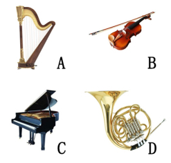

- **A**. A
- **B**. B　✅
- **C**. C
- **D**. D

**答案**：B

**官方解析**

本题考查音乐常识。美式乐队席位排列法是国际上较为常见的一种乐队席位排列法，在演奏浪漫派以及近、现代的交响乐作品时优越性较大。美式乐队席位排列法如下图所示，因此题中★的位置为第一小提琴所在的位置，而题中A为竖琴，B为小提琴，C为钢琴，D为圆号（法国号）。

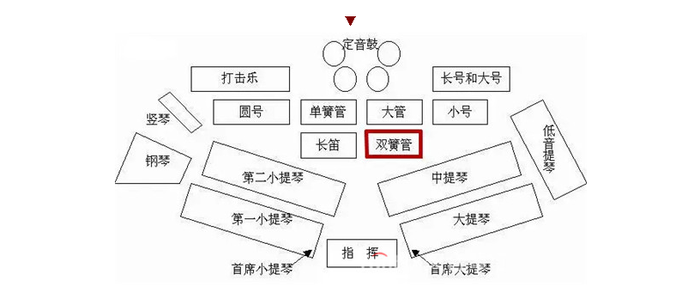

故正确答案为B。

---

### 第 17 题　qid 2144485 · 人文常识

关于现代军事，下列说法错误的是：

- **A**. 中国海军第一艘可搭载固定翼飞机的航空母舰是“辽宁舰”
- **B**. 爱国者导弹是由美国研制的全天候多用途中程防空导弹系统
- **C**. 歼-10战斗机是我国自主研制的单座单发第二代战斗机　✅
- **D**. 生化武器因其伤害的无差别性和永久性被联合国列为禁用武器

**答案**：C

**官方解析**

本题考查现代军事的科技常识。
A项正确，辽宁号航空母舰，简称“辽宁舰”，是中国人民解放军海军第一艘可以搭载固定翼飞机的航空母舰。其前身是前苏联海军的库兹涅佐夫元帅级航空母舰次舰瓦良格号，改装后于2012年9月25日交付予中国人民解放军海军。
B项正确，爱国者导弹是美国雷神公司制造的全天候多用途中程防空导弹系统，主要用于对付现代装备的高性能飞机，并能在电子干扰环境下击毁近程导弹，拦截战术弹道导弹和潜射巡航导弹。
C项错误，歼-10战斗机是中国航空工业集团有限公司自主研制的第三代战斗机，是多功能、超音速、全天候空中优势战斗机，而非题干中表述的第二代。
D项正确，生化武器是指以细菌、病毒、毒素等使人、动物、植物致病或死亡的物质材料制成的武器。由于其伤害的无差别性和永久性，联合国大会于1992年一致通过了《禁止化学武器公约》，所有缔约国将禁止使用、生产、购买、储存和转移各类化学武器。
本题为选非题，故正确答案为C。

---

### 第 18 题　qid 2144487 · 人文常识

小兰购买某公司股票获得500元的投资收益，其收益主要来源于：

- **A**. 股息和银行存款利息
- **B**. 股票的票面金额和银行贷款利息
- **C**. 股息和股票的金额
- **D**. 股利分配和股价上涨带来的差价　✅

**答案**：D

**官方解析**

本题考查经济常识中股票的相关知识。
股票投资收入包括两部分，一部分是股息收入或者红利收入，也就是股票持有人作为股东享有的，从股份公司取得的利润分配收入。它来源于企业利润。公司有盈利才能分配股息或者红利。另外一部分收入来源于股票价格上升带来的差价，股票的价格会受到公司经营状况、供求关系、银行利率、大众心理等多种因素的影响。
 A项错误，股息是股票投资人定期从股份公司取得的一定收益，是股票投资收益的来源之一，但股票投资收益与银行存款利息无直接关系。
 B项错误，股票的票面金额有账面浮动并且完成差价交易才形成收益，仅票面金额本身并不是股票投资收益的来源，且股票投资收益与银行贷款利息无直接关系。
 C项错误，股息收入是股票投资收益的来源之一，股票的金额有账面浮动并且完成买卖才形成收益，仅是股票的金额本身并不是股票投资收益的来源。
 D项正确，股利分配和股价上涨带来的差价二者构成了购买股票后带来的投资收益。
 故正确答案为D。

---

### 第 19 题　qid 2144491 · 人文常识

下列关于奥运会的说法正确的是：

- **A**. 现代五项赛事中包括射击和游泳比赛　✅
- **B**. 所有的田径类赛事均在体育场内进行
- **C**. 击剑比赛项目按参赛者体重进行分级
- **D**. 足球项目参赛队员年龄均限制在23岁以下

**答案**：A

**官方解析**

本题考查奥运会的相关知识。
 A项正确，现代五项是由“现代奥林匹克之父”法国人顾拜旦先生发起创立的项目，现代五项是一种包含射击、击剑、游泳、马术和越野跑的多项目运动。
 B项错误，田径比赛是径赛、田赛和全能比赛的统称，由田赛、径赛、公路跑、竞走和越野跑组成。以高度和距离长度计算成绩的跳跃、投掷项目叫“田赛”；以时间计算成绩的竞走和跑的项目叫“径赛”。故不是所有的田径赛事都在体育场内进行。
 C项错误，击剑比赛分花剑、重剑、佩剑，个人赛和团体赛等类别，并不按参赛者体重进行分级。按参赛者体重进行分级的有举重、拳击等赛事。
 D项错误，1908年，在英国伦敦奥运会上足球成为正式比赛项目。1988年国际足联规定，奥运会足球运动员年龄限制在23岁以下，每队允许有3名超龄球员。1996年夏季奥林匹克运动会加入女子足球项目，由于当时女子足球运动发展仍未成熟，因此国际足联没有对女子足球作出限制。
 故正确答案为A。

---

### 第 20 题　qid 2144496 · 人文常识

下列关于世界著名建筑的说法正确的是：

- **A**. 法国的凡尔赛宫是以地名命名的　✅
- **B**. 印度的泰姬陵是著名的佛教建筑
- **C**. 巴黎圣母院兴建于法国大革命时期
- **D**. 比萨斜塔是意大利著名的天文研究院

**答案**：A

**官方解析**

本题考查世界著名建筑的有关知识。
 A项正确，凡尔赛宫位于法国巴黎西南郊外伊夫林省省会凡尔赛镇，是巴黎著名的宫殿之一，也是世界五大宫殿（北京故宫、法国凡尔赛宫、英国白金汉宫、美国白宫、俄罗斯克里姆林宫）之一。凡尔赛宫是以地名命名的。
 B项错误，泰姬陵是印度知名度最高的古迹之一，有“印度明珠”的美誉，被评选为“世界新七大奇迹”。是一座白色大理石建成的巨大陵墓，是伊斯兰教建筑中的代表作，而不是佛教建筑。
 C项错误，巴黎圣母院大教堂约建造于1163年到1250年间，属哥特式建筑形式。法国大革命爆发于1789年7月14日，故时间错误。
 D项错误，比萨斜塔是意大利比萨城大教堂的独立式钟楼，与大教堂和洗礼堂交相呼应，并非天文研究院。
 故正确答案为A。

---

## 言语理解与表达

### 第 1 题　qid 2144490 · 逻辑填空

科学家采用了一个笨办法，准备好一大片森林等兔子来撞。他们在巨大的探测器里装上大量反应物质，等待过路的暗物质粒子        撞上其中某个原子核。当然，为了尽可能排除其他粒子撞上原子核而产生的干扰，科学家往往把这样的暗物质探测器深埋在地下，让厚厚的岩层把不会隐身的其他粒子尽可能        在外面。
依次填入划横线部分最恰当的一项是：

- **A**. 碰巧  屏蔽　✅
- **B**. 突然  隔绝
- **C**. 随机  阻挡
- **D**. 偶然  封闭

**答案**：A

**官方解析**

第一空，文段将“暗物质粒子”撞“原子核”比喻成“兔子”撞“大片森林中的树”，故所填词语需体现“不确定”的意思，A项“碰巧”、D项“偶然”均符合文意，保留。B项“突然”指表示发生得很急促，事先没有准备，与“等待”语义矛盾，排除；C项“随机”指不设任何条件，随意性，填入文段随机撞上表示结果是确定的撞上的，只不过撞上的不知道哪棵树，但是文段兔子撞大树不是一定的事情，故与文意相悖，排除。    
第二空，根据文意，为了排除干扰，科学家将暗物质探测器埋在地下，让厚厚的岩层挡住不会隐身的其他粒子，A项“屏蔽”是指遮蔽、阻挡的意思，语义合适，当选；D项“封闭”指严密和彻底地封口，常与表达内部空间的词搭配，如“封闭在里面”，与“外面”搭配不当，排除。
故正确答案为A。
【文段出处】《回顾“悟空”太空寻“妖”记 | 中国首颗暗物质探测卫星运行一周年》

---

### 第 2 题　qid 2144494 · 逻辑填空

不少人有这样的阅读经历：偶一日拿起一本书来，竟然一读就                ，超然物外，沉浸书中，数小时流逝而不觉。而那一度浮躁的心气竟然也        下来，有一种难得的静谧，更仿佛有一种沁人心脾的馨香在缭绕。这便是阅读的力量。
依次填入划横线部分最恰当的一项是：

- **A**. 欲罢不能  沉静　✅
- **B**. 手不释卷  沉稳
- **C**. 乐此不疲  安宁
- **D**. 爱不释手  安定

**答案**：A

**官方解析**

第一空，根据“拿起一本书来，竟然一读就······”，所填词语形容人们“正在”阅读时的状态，且对应“超然物外，沉浸书中，数小时流逝而不觉”，体现阅读时忘我、不能自拔的状态。A项“欲罢不能”形容正在做某事，想要停止却不能停止下来，B项“手不释卷”意思是书本不离手，形容勤奋好学或看书入迷，D项“爱不释手”指喜爱得舍不得放手，三项均可形容沉浸阅读中的状态，语义合适，保留。C项“乐此不疲”指因酷爱干某事而不感觉厌烦，形容对某事特别爱好而沉浸其中，与文段语境“阅读的一次经历”不符，程度过重，排除。
第二空，所填词语与“心气”搭配，且与“浮躁”语义相反，与“静谧”语义相近，A项“沉静”常形容人的性格、心情、神色等安静、平静、镇静，不慌张，符合文意，当选。B项“沉稳”特指人的性格深沉而稳重，无法形容“心气”，排除；D项“安定”指生活、形势、社会秩序等平静正常，与“心气”无法搭配，排除。
故正确答案为A。
【文段出处】《阅读是一种定力》

---

### 第 3 题　qid 2144498 · 逻辑填空

19世纪末，中国维新派代表人物严复将经济学家亚当·斯密的著作译为《原富》，献给光绪皇帝，但并没有引起足够重视。可以说，与市场经济                是近代中国经济落后的重要原因。
填入划横线部分最恰当的一项是：

- **A**. 若即若离
- **B**. 分道扬镳
- **C**. 南辕北辙
- **D**. 失之交臂　✅

**答案**：D

**官方解析**

根据“严复将······《原富》，献给光绪皇帝，但并没有引起足够重视”可知，清政府没有重视市场经济学著作《原富》，即失去深入了解“市场经济”的机会，是近代中国经济落后的重要原因，故横线处所填词语应体现错失市场经济良机的遗憾。D项“失之交臂”指擦肩而过，形容当面错过，文段“献给光绪皇帝，但没有引起足够重视”契合“擦肩而过、当面错过”的遗憾，当选。
A项“若即若离”指好像接近，又好像不接近，形容对事物保持一定距离，文段并非表达近代中国与市场经济保持距离，而是错过发展市场经济的机会，故排除；B项“分道扬镳”比喻目标不同，各走各的路或各干各的事，主体通常为同一类对象，无法用来形容“近代中国”和“市场经济”的关系，排除；C项“南辕北辙”比喻行动与目的正好相反，根据文意，近代中国并未以“市场经济”为目的，故与文意不符，排除。
故正确答案为D。
【文段出处】《中国经济学的时代使命》

---

### 第 4 题　qid 2144502 · 逻辑填空

有人说，“安逸的日子，有时是一种腐蚀剂”。这话不无道理。远离了战火硝烟，有些人就会逐渐淡忘为国捐躯的                ；过惯了衣食无忧的生活，有些人就会                、精神空虚。少数人曲解历史、恶搞先烈的行为，应引起全社会的警觉。
依次填入划横线部分最恰当的一项是：

- **A**. 刚正不阿  趾高气扬
- **B**. 大义凛然  忘乎所以　✅
- **C**. 永垂不朽  得意洋洋
- **D**. 视死如归  不思进取

**答案**：B

**官方解析**

第一空，根据“远离了战火硝烟，有些人就会逐渐淡忘为国捐躯的······”可知，横线处体现的是为国捐躯、不怕牺牲的精神，B项“大义凛然”指由于胸怀正义而神态庄严，令人敬畏，能够体现不怕牺牲的精神，符合文意，保留；D项“视死如归”形容不怕牺牲生命，符合文意，保留。A项“刚正不阿”指刚强正直不逢迎，侧重强调“正直”，不符合文意，排除；C项“永垂不朽”指光辉的事迹和伟大的精神永远流传，不会磨灭，侧重强调人死之后，后人对他们的纪念缅怀，不符合文意，排除。
第二空，根据“少数人曲解历史、恶搞先烈的行为”可知，横线处应体现有些人衣食无忧之后，做出了一些不好的行为，扭曲历史，B项“忘乎所以”指由于过度兴奋或骄傲自满而忘记了言行应该把握的分寸，符合文意，当选。D项“不思进取”形容不想努力上进，无所作为，与文段强调的扭曲历史的行为不符，排除。
故正确答案为B。
【文段出处】《抹黑英雄的做法不得人心》

---

### 第 5 题　qid 2144507 · 逻辑填空

面对共享单车炙手可热的投资风口，投资者、商家                ，大肆在各大城市投放共享单车，不少城市都已                ，居民生活都受到影响。
依次填入划横线部分最恰当的一项是：

- **A**. 一哄而上  捉襟见肘
- **B**. 跃跃欲试  束手无策
- **C**. 蜂拥而至  不堪重负　✅
- **D**. 争先恐后  应接不暇

**答案**：C

**官方解析**

第一空，根据“共享单车炙手可热”，“大肆在各大城市投放共享单车”可知，投资者和商家纷纷采取行动涌入共享单车领域，A项“一哄而上”强调一下子都行动起来，C项“蜂拥而至”形容很多人乱哄哄地朝一个地方聚拢，D项“争先恐后”形容争着向前，唯恐落后，三项均符合文意。而B项“跃跃欲试”强调的是想去试一试，只是一个想法而已，与后文“大肆在各大城市投放”的语境不符，排除。
第二空，根据文段“大肆在各大城市投放共享单车”，“居民生活都受到影响”可知，由于投放的共享单车太多，导致城市无法承受，感情色彩消极，C项“不堪重负”强调受不了繁重的负荷，无法承受，符合文意，当选。A项“捉襟见肘”比喻顾此失彼，穷于应付，强调的是“不足”、“不够”，与文段表意相悖，排除；D项“应接不暇”原形容景物繁多，来不及观赏，后多形容来人或事情太多，应付不过来，无法体现文段的消极感情色彩，排除。
故正确答案为C。
【文段出处】《共享之墓：从6家共享单车企业倒闭，看共享经济该何去何从？》

---

### 第 6 题　qid 2144514 · 逻辑填空

在候鸟的眼中，中国的东北是湖沼成群、草水茫茫的绝佳驿站。每年春季，鹤、鹳、天鹅等候鸟纷纷飞向安静凉爽的地球北端求偶育雏。漫漫长路之中，它们会                地从富饶的东北湿地经过，有的吃饱睡足之后继续北上，有的则干脆在这里筑巢安家，等待秋天的到来。
填入划横线部分最恰当的一项是：

- **A**. 千里迢迢
- **B**. 拖家带口
- **C**. 不约而同　✅
- **D**. 隔三差五

**答案**：C

**官方解析**

根据“中国的东北是湖沼成群、草水茫茫的绝佳驿站”、“候鸟纷纷飞向安静凉爽的地球北端求偶育雏”可知，在候鸟们看来，中国东北是他们的绝佳驿站，因此他们会“纷纷飞向”地球北端，所以横线处体现候鸟们并没有事先经过商量，而都会采取共同的行动，C项“不约而同”指事先没有约定而互相一致，符合文意，当选。
A项“千里迢迢”形容路途非常遥远，置于文段与后文“经过”搭配不当，正确表述应为“千里迢迢从远方赶来”而非“千里迢迢从东北湿地经过”，排除；B项“拖家带口”指带着一家老小，受家属拖累，根据“候鸟纷纷飞向安静凉爽的地球北端求偶育雏”可知，迁徙前并无“家属”，排除；D项“隔三差五”比喻时常发生，根据“每年春季”可知，一年仅此一次，排除。
故正确答案为C。
【文段出处】《东北湿地：候鸟加油站》

---

### 第 7 题　qid 2144521 · 逻辑填空

一个人得病最深，莫过于病入膏肓而自以为没病。比如古代的蔡桓公，神医扁鹊几次提醒“不治将恐深”，他先不屑，后不理，再不悦，可当身体毛病        时再想医治，已经                。与其说蔡桓公死于病症，不如说死于讳疾忌医，实乃可叹可悲！
填入划横线部分最恰当的一项是：

- **A**. 出现  无计可施
- **B**. 发作  无从下手
- **C**. 暴露  于事无补
- **D**. 显露  无力回天　✅

**答案**：D

**官方解析**

第一空，搭配“身体毛病”，且根据前文“不治将恐深”可知，横线处表达身体毛病已十分明显、十分严重之意，D项“显露”指明显表露，语义恰当，B项“发作”指起作用，语义尚可，均保留。A项“出现”指产生，文段并非强调身体毛病刚刚产生，而是已经程度加深，十分明显，排除；C项“暴露”指露在外边，无所遮蔽，与“身体毛病”搭配不当，排除。
第二空，根据后文蔡桓公之死可知，横线处表达疾病已经十分严重，无法挽救，D项“无力回天”比喻局势或病情严重，已无法挽救，语义恰当，当选。B项“无从下手”指某件事没有任何门径或找不到头绪，没法着手去办，无法体现结果的严重性，排除。
故正确答案为D。
【文段出处】《匿病者不得良医》

---

### 第 8 题　qid 2144489 · 逻辑填空

“唯意志论”者固然                ，只追求利益的人生同样苍白无力，“喻于利”不是开启幸福的万能之钥，“喻于义”才能推开梦想的必然之门。构筑精神的高地，        理想的底色，才有灵魂的原野郁郁葱葱，文明的河流碧波荡漾。
填入划横线部分最恰当的一项是：

- **A**. 举步维艰  留存　✅
- **B**. 踌躇满志  保留
- **C**. 进退维谷  铺陈
- **D**. 瞻前顾后  增补

**答案**：A

**官方解析**

第一空，根据“只追求利益的人生同样苍白无力”可知，横线处与“苍白无力”意思接近，“苍白无力”意为贫弱无力，置于此处表达只追求利益的人生没有意义，不可能幸福，故横线处应体现出“唯意志论”者也是艰难、无力的。
A项“举步维艰”形容处境或行动十分艰难，语义恰当。B项“踌躇满志”形容对自己取得的成就非常得意，与文意不符，排除；C项“进退维谷”虽可形容处境艰难，但更侧重于“陷于两难”的境地，相对于“举步维艰”来说，后者与“苍白无力”的对应更恰当，排除；D项“瞻前顾后”形容顾虑太多，犹豫不决，文段并非强调“唯意志论”者自身有顾虑，而是客观处境比较艰难，排除。
第二空，代入“留存”验证，“留存理想的底色”搭配合适，且语义恰当，当选。
故正确答案为A。
【文段出处】《有利益考量，也要有理想情怀》

---

### 第 9 题　qid 2144495 · 逻辑填空

互联网时代最奇妙的地方就是人人可以参与，人人可以发声。虽然存在明显的“羊群效应”，但并不是随便哪个“大V”就能        而去。想当领头羊的很多，但能最后带走羊群的不多，或许这才是网络领域里热闹不断，各路观点                的道理所在。
依次填入划横线部分最恰当的一项是：

- **A**. 裹挟  层出不穷　✅
- **B**. 引导  参差错落
- **C**. 挟持  此起彼伏
- **D**. 诱导  良莠不齐

**答案**：A

**官方解析**

本题可从第二空入手，根据文段“想当领头羊的很多”“热闹不断”可知，横线处表达各路观点接连不断地出现，A项“层出不穷”指接连不断地出现，没有穷尽，符合文意。B项“参差错落”指各种不同的事物错综复杂地交织在一起，C项“此起彼伏”指这里起来，那里下去，形容接连不断，两者均与“观点”搭配不当，排除B、C两项；D项“良莠不齐”指好的、坏的都有，混杂在一起，文段并非强调好坏都有，而是各种观点接连不断地出现，排除。
第一空，代入“裹挟”验证，“裹挟”指把人卷进去，迫使其采取某种态度，填入文段表达不是随便一个“大V”发表的观点都可以让大众跟从，语义恰当，当选。
故正确答案为A。
【文段出处】《“中年危机”不要“预言自动实现”》

---

### 第 10 题　qid 2144500 · 逻辑填空

鲁迅活着的时候，一般的操觚之徒是不敢与之对垒的。梁实秋算是一般之上的，故而有幸与之走上几个回合，结果弄得                ，到1964年写《关于鲁迅》时还有些忐忑不安。直至梁去世，他对先他去世的鲁迅的评价，始终保持在当日论战时的态度，并无                的言辞。从这一点来说，梁不失为一位君子。
依次填入划横线部分最恰当的一项是：

- **A**. 不欢而散  落井下石
- **B**. 如坐针毡  剑拔弩张
- **C**. 心有余悸  变本加厉　✅
- **D**. 落荒而逃  大而无当

**答案**：C

**官方解析**

第一空，横线处表示梁实秋与鲁迅对垒的结果，根据后文“到1964年······还有些忐忑不安”可知，横线处应该表达梁实秋在对垒中失败了。B项“如坐针毡”形容心神不定，坐立不安，描述的是一种心理状态，可与后文“忐忑不安”对应；C项“心有余悸”指危险的事情虽然过去了，回想起来还感到害怕，因为失败而心有余悸符合逻辑，两项均符合文意，保留。根据后文“始终保持在当日论战时的态度”可知，说明梁实秋是有态度，不卑不亢的，D项“落荒而逃”形容吃了败仗慌张逃跑，“而逃”语义过重，不太恰当(也可从第二空排除) ；A项“不欢而散”指的是很不愉快地分手，并无失败之意，且文段亦没有体现梁实秋与鲁迅的对垒是不愉快的，排除。
第二空，根据“始终保持在当日论战时的态度”“从这一点来说，梁不失为一位君子”可知，横线处应该表示梁的言辞除了当时的评价，再没有其他过分的、不当的评价了。C项“变本加厉”指情况变得比本来更加严重，符合文意，当选。B项“剑拔弩张”形容书法笔力遒劲，也比喻对方摆开了阵势，形势紧张，一触即发，与文段“评价鲁迅先生”的语义不符；D项“大而无当”表示大得不切合实际、不合用，与文意无关，排除。
故正确答案为C。
【文段出处】《从梁实秋、苏雪林攻讦鲁迅的一条“罪证”谈起》

---

### 第 11 题　qid 2144536 · 逻辑填空

传播技术是把双刃剑。如果说真实信息的传递早已能做到                ，不实信息特别是谣言的扩散也                地便利。从这个意义出发，我们只有用权威消息战胜小道消息，谣言才会无处藏身，真实才能充盈每个人的生活空间。
依次填入划横线部分最恰当的一项是：

- **A**. 无孔不入  出人意料
- **B**. 畅通无阻  左右逢源
- **C**. 无所不在  始料未及
- **D**. 无远弗届  前所未有　✅

**答案**：D

**官方解析**

第一空，用来形容“真实信息”，且根据“谣言的扩散也便利”可知，横线处表示真实的信息传播便利，B项“畅通无阻”指流畅通达，没有阻碍，C项“无所不在”指到处都有，到处都存在，D项“无远弗届”指不管多远的地方都能到达，三项均符合文意，保留。A项“无孔不入”比喻做坏事时不放过任何一个机会，为贬义词，无法形容真实信息的传递，排除。
第二空，横线处搭配“便利”，且对应前文的“真实信息的传递早已······”，说明谣言的扩散也是非常广泛的。D项“前所未有”指从来没有发生过的，填入横线中表示谣言的扩散也极为便利和广泛，符合文意，当选。B项“左右逢源”比喻做事得心应手，非常顺利，主语一般为人，不能用来形容“谣言”，排除；C项“始料未及”指没有想到的，意料之外的，与文意不符，排除。
故正确答案为D。
【文段出处】《“悬疑新闻”当休矣》

---

### 第 12 题　qid 2144544 · 逻辑填空

任何一个政府都存在科层制，在日常工作中遵循科层制的若干规律，属于政府运转的常态。但是，科层制作为一种组织内部的关系准则，如果扩大到外部，就与政府治理现代化的初衷                。一个县长可以对下属下达权威性指令，但无权对一个普通市民的个人生活                。
依次填入划横线部分最恰当的一项是：

- **A**. 背道而驰  指手画脚　✅
- **B**. 大相径庭  颐指气使
- **C**. 格格不入  说三道四
- **D**. 相去甚远  横加指责

**答案**：A

**官方解析**

第一空，根据“科层制作为一种组织内部的关系准则，如果扩大到外部，就与政府治理现代化的初衷······”可知，科层制只是作为内部的关系准则，对于外部并不适用，故如果扩大到外部，这种做法就会与其服务于内部的初衷相背离。A项“背道而驰”比喻方向和目的完全相反，符合文意，保留。B项“大相径庭”比喻相差很远，大不相同，D项“相去甚远”指互相之间存在很大差异和距离，两项均侧重说明“差距大”而非“完全背离”，排除。C项“格格不入”形容彼此不协调，不相容，亦无法体现“背离”之意，排除。
第二空，代入验证，A项“指手画脚”形容轻率地指点，批评，用在此处表示“县长”无权对“普通市民”的生活进行干扰，符合文意，当选。
故正确答案为A。

---

### 第 13 题　qid 2144551 · 逻辑填空

明末地理学家徐弘祖经34年旅行，写有天台山、雁荡山、黄山、庐山等名山游记17篇和《浙游日记》《江右游日记》等著作，除部分        外，遗有60余万字游记        ，去世后由他人整理成《徐霞客游记》。此书是以日记体为主的中国地理名著，对地理、水文、地质、植物等现象，均作        记录。
依次填入划横线部分最恰当的一项是：

- **A**. 散落  素材  审慎
- **B**. 流失  文稿  周密
- **C**. 散佚  资料  详细　✅
- **D**. 缺失  著述  完备

**答案**：C

**官方解析**

从第二空入手，对应后文“由他人整理成《徐霞客游记》”，说明前面遗留下来的只是一些游记的材料，D项“著述”指著作和编撰的成品，排除。
第三空，搭配“记录”，对应“地理、水文、地质、植物等现象”，表示记录得全面细致，C项“详细”搭配恰当，符合语境，保留。A项“审慎”表示周密而谨慎，B项“周密”表示周到缜密、严密无缝，这二者常搭配“思考、考虑”，用在此处搭配不当，排除。
第一空，代入验证，C项“散佚”表示散失，符合文意，当选。
故正确答案为C。
【文段出处】《游太华山记》

---

### 第 14 题　qid 2144554 · 逻辑填空

没有什么是                的。生活就像自然，有阳春，也有金秋；有酷夏，也有寒冬。走运和倒霉都不可能持续很久。对于        情况，如果没有充分的思想准备，那么厄运就会像大海的波涛一样，在你生活的海岸上忽起忽落拍打不停。
依次填入划横线部分最恰当的一项是：

- **A**. 一成不变  突发　✅
- **B**. 循规蹈矩  特殊
- **C**. 按部就班  意外
- **D**. 千篇一律  临时

**答案**：A

**官方解析**

第一空，对应后文“有阳春，也有金秋；有酷夏，也有寒冬”和“走运和倒霉都不可能持续很久”，表示生活是多变的，不是一直不改变。A项“一成不变”形容一点变化都没有，D项“千篇一律”泛指事物只有一种形式，毫无变化，均符合文意，保留。B项“循规蹈矩”指遵守规矩、准则，也指拘守旧准则，不敢稍作变动，强调的是守规矩，与文意不符，排除；C项“按部就班”指按照一定的步骤、顺序进行，也指缺乏创新精神，强调的是按步骤顺序做事，文段并非强调顺序，与文意不符，排除。
第二空，对应后文“没有充分的思想准备”，体现事情的突然性、出乎意料，A项“突发”表示突然发生，不可预见，符合语境，当选。D项“临时”表示临到事情发生的时候，体现不出突然性，与文意不符，排除。
故正确答案为A。
【文段出处】《永恒的变化》

---

### 第 15 题　qid 2144566 · 逻辑填空

面对时下大数据时代奔涌的多元、多源、异构的海量数据，无论是被美誉为“孕育了现代科学”的统计科学，还是应大科学之运而生、正如日中天的数据科学，也都只能                。今日之大数据，明日之大信息，扭转乾坤者，还属革新后的统计科学与数据科学。
填入划横线部分最恰当的一项是：

- **A**. 望其项背
- **B**. 望洋兴叹　✅
- **C**. 可见一斑
- **D**. 浅尝辄止

**答案**：B

**官方解析**

文段首先强调时下的大数据具有多元、多源、异构的特点，面对这样的海量数据，统计科学和数据科学在处理大数据时感到不能胜任，横线处强调因力量不足而感到不能完成之意，B项“望洋兴叹”比喻要做一件事情因力量不够而感到无可奈何，符合语境，当选；A项“望其项背”表示能够赶得上、比得上，与文段意思相反，并且文段也没有强调统计科学和数据科学要与大数据相比之意，排除；C项“可见一斑”比喻见到事物的一小部分也能推知事物的整体，D项“浅尝辄止”表示略微尝试一下就停下来，指不深入钻研，均与文意不符，排除。
故正确答案为B。
【文段出处】《大科学开启大数据、大发现新时代》

---

### 第 16 题　qid 2144546 · 逻辑填空

任何时候，内容推送不能少了“总编辑”，再好的传播渠道也要有“看门人”，即使在技术为王的时代，也不能完全让算法        内容。这一方面需要更完善的法律法规、更理性健康的舆论空间，为互联网算法时代的信息传播                ，但更少不了作为内容提供者的智能平台，肩负起应该承担的社会责任，扬长避短，让技术和算法真正造福这个时代。
依次填入画横线部分最恰当的一项是：

- **A**. 干预  添砖加瓦
- **B**. 决定  保驾护航　✅
- **C**. 影响  遮风挡雨
- **D**. 代替  披荆斩棘

**答案**：B

**官方解析**

第一空，根据“内容推送不能少了‘总编辑’”“再好的传播渠道也要有‘看门人’”以及“完全”可知，横线处表示不能让算法起主导和决定作用，B项“决定”、D项“代替”均符合文意。A项“干预”指干涉、过问别人的事，C项“影响”指起作用，两者均程度过轻，与文段无法对应，排除。
第二空，横线处表示“完善的法律法规”“理性健康的舆论空间”保护信息传播，对应B项“保驾护航”泛指保护，当选。D项“披荆斩棘”比喻在前进道路上清除障碍，克服困难，通常搭配人或团队，与“法律法规”“舆论空间”搭配不当，排除。
故正确答案为B。
【文段出处】《人民网评：不能让算法决定内容》

---

### 第 17 题　qid 2144556 · 逻辑填空

在偶像级人物的背后，往往有追逐经济利益的资本力量的        ，它们利用舆论制造全民的娱乐狂欢，以此牟利。因此，对于追星现象，我们也要保持一分清醒，在狂热追星之前，看一些不同角度不同观点的文章，多一些思考和冷静，就不会        。一旦看清偶像背后的真相，就不会轻易陷入狂热与沉迷。
依次填入划横线部分最恰当的一项是：

- **A**. 操纵  迷失
- **B**. 操控  盲从　✅
- **C**. 挟制  冲动
- **D**. 辖制  跟风

**答案**：B

**官方解析**

第一空，横线处搭配“资本力量”，且根据“利用舆论制造全民的娱乐狂欢”可知，横线处表示“资本力量”对偶像级人物及舆论起到支配、摆布的作用，A项“操纵”指把持、支配；B项“操控”形容掌握运用或驾驭得心应手，均符合文意，保留。C项“挟制”指依仗权势或抓住对方缺点强使顺从，D项“辖制”指管束，两者均强调管理、使顺从，两者通常搭配人或组织，与“资本”搭配不当，排除。
第二空，根据“多一些思考和冷静”及“不会轻易陷入狂热与沉迷”可知，横线处表示没有思考，一味狂热和沉迷，B项“盲从”比喻自己没有主见，没有原则，随着别人说话做事，符合文意，当选。A项“迷失”指迷惑弄错、分辨不清，强调的是找不到方向，而不是跟随别人，与文意不符，排除。
故正确答案为B。
【文段出处】《别太羡慕偶像 想要的生活自己去争取》

---

### 第 18 题　qid 2144558 · 语句表达

①从一个个人，到一个组织、一个国家、一个民族
②要想去沉疴、启新机，唯有永葆进取之姿、奋斗之态
③唐代开元盛世，玄宗丧失进取心，骄傲怠惰、沉溺享乐，终致“安史之乱”
④清朝康乾盛世，朝野洋洋得意于文治武功，奢靡腐化、放松吏治，转而走向嘉道中衰
⑤生存和发展最大的威胁，往往不是突如其来的重大灾难与变故
⑥而恰恰是那些壮大时、强盛时不易察觉、缓慢积累起来的倦怠与松懈
将以上6个句子重新排列，语序正确的是：

- **A**. ③④⑤⑥①②　✅
- **B**. ②⑤①③④⑥
- **C**. ②①⑤⑥③④
- **D**. ③④①⑤②⑥

**答案**：A

**官方解析**

首先对比选项，确定首句。②针对问题提出解决问题的对策，即“永葆进取之姿、奋斗之态”；③指出玄宗丧失进取心导致“安史之乱”，即提出问题，根据逻辑顺序，先提出问题然后提出对策，故③更适合做首句，排除B、C两项。接下来寻找捆绑，⑤出现“不是”，⑥出现“而恰恰是”，前后语义相反，根据关联词捆绑，⑤⑥相连，排除D项。
验证A项，文段为提出问题+解决问题的结构，逻辑通顺，当选。
故正确答案为A。
【文段出处】《中年况味是奋斗》

---

### 第 19 题　qid 2144560 · 语句表达

①腮腺激素能增加肌肉、血管、结缔组织、骨骼、软骨和牙齿的活力。
②唾液中就含有这样极具魅力的物质——腮腺激素。
③尤其能强化血管的弹性，提高结缔组织的生命力。
④这种激素是由腮腺分泌的，许多学者认为它是“返老还童”的激素。
⑤永葆青春、返老还童几乎是每个人梦寐以求的事情。
⑥所以，唾液在美颜、护肤方面亦有用武之地。
将以上6个句子重新排列，语序正确的是：

- **A**. ②①③⑥④⑤
- **B**. ②①③④⑤⑥
- **C**. ②③①⑥⑤④
- **D**. ⑤②④①③⑥　✅

**答案**：D

**官方解析**

对比选项判断首句，②中含指代词“这样”，②之前应该有“这样”所指代的内容，故②不适合做首句。⑤说明“每个人梦寐以求的事情”，适合引出下文的话题，适合做首句，排除A、B、C三项。
验证D项，⑤中“永葆青春、返老还童”与②中“腮腺激素”的“魅力”对应得当，④中“这种激素”指②中“腮腺激素”，①和③进一步说明“腮腺激素”的作用，⑥通过结论词“所以”总结前文，得出结论，D项逻辑通顺，当选。
故正确答案为D。
【出处】《唾液的神奇新角色》

---

### 第 20 题　qid 2144561 · 语句表达

①在生活的河流里，有碧波荡漾也有逆浪翻卷，有水缓沙白的平川，也有礁石林立的急弯险滩
②因此，我们不但要学会在顺境中生活、工作
③更要学会在逆境中奋斗、拼搏，在痛苦的时候，要笑着流泪
④生命是舟，注定要在生活的河流里破浪航行
⑤放舟平湖，一帆风顺，固然是天下人之心愿
⑥可是，人生俗世间，又岂能事事如意时时顺风
将以上6个句子重新排列，语序正确的是：

- **A**. ①②③④⑤⑥
- **B**. ④①⑤⑥②③　✅
- **C**. ⑤④①⑥②③
- **D**. ①⑤⑥④②③

**答案**：B

**官方解析**

观察选项，首句不好确定，但是⑤句出现“固然”，根据关联词⑤⑥捆绑，排除C项。对比A、B、D三项，发现区别点在于①与④的关系，分析语义发现，①④均是围绕“生活的河流”这一话题展开论述，应该捆绑，且①是对④的解释说明，故④在①前面，对应B项。
验证B项，逻辑通顺，当选。
故正确答案为B。
【文段出处】《勇敢的宣言》

---

### 第 21 题　qid 2144563 · 片段阅读

古时，驾车有“五驭”，《礼记》中有“入国不驰，入里必式”等要求，说的是古人的行车之德。今天，高速公路四通八达，私家车司空见惯，国人正加速驶入汽车社会，让观念和素养追上时代的车轮，显得日益迫切。
这段文字是一篇文章的结尾，文章最可能讲的是：

- **A**. 行车中的不文明行为　✅
- **B**. 中国古代的行车礼仪
- **C**. 交通规则的演变过程
- **D**. 汽车社会的基本特征

**答案**：A

**官方解析**

文段作为文章的结尾，是对整篇文章内容的总结。文段通过古今对比提出对策，即在当今的汽车社会，要让国人的观念和素养追上时代的车轮。因为前文内容重点阐述的应该是“国人的观念和素养”还没有追上时代的车轮，即阐述的应该是行车中的不道德行为，整篇文章为“提出问题解决问题”的结构，对应A项。

B项：“中国古代”非文段的重点，排除。

C、D两项：均与“行车之德”无关。偏离文段的中心，排除。

故正确答案为A。

【文段出处】《别让心灵驶入“路怒”的歧途》

---

### 第 22 题　qid 2144530 · 片段阅读

陶行知先生曾经告诫，“你的教鞭下有瓦特，你的冷眼里有牛顿，你的讥笑里有爱迪生”。一个冷漠的眼神、一句刻薄的话语、一次不公平的对待，可能会影响孩子的一生。如果没有立德树人的仁心、没有诲人不倦的耐心、没有有教无类的公心,那么这样的教育是没有温度的。正如一些教育界人士的疾呼，许多教师不缺知识，不缺方法，缺的是爱心，缺的是责任心。今天的教育，比以往任何时候都需要回到人本身、关注人的成长。
作者认为当前教育中存在的主要问题是：

- **A**. 没有以人为本　✅
- **B**. 没有因材施教
- **C**. 方法简单粗暴
- **D**. 在公平方面有欠缺

**答案**：A

**官方解析**

文段开篇引用陶行知先生的名言强调“没有仁心耐心公心的教育是没有温度的”，随后通过教育界人士的呼吁指出现存的问题是许多教师缺乏爱心缺乏责任心，最后进一步提出对策要回到人本身、关注人的成长。根据文段最后的对策可知，当前教育中存在的主要问题是没有关注人本身，对应A项。
B项“因材施教”指针对学习的人的志趣、能力等具体情况进行不同的教育，强调针对性，文段没有提及，排除；
C项“方法简单粗暴”表述错误，文段明确说了“不缺方法”，说明现存的问题不是方法，排除；
D项“公平”无中生有，文段没有提及，排除。
故正确答案为A。
【文段出处】《立德树人成就最美》

---

### 第 23 题　qid 2144533 · 片段阅读

我国是世界上最早而又最广泛利用鱼类的国家之一。殷墟出土的甲骨文中就有“鱼”形文字，在青铜铭文中有更多的“鱼”形文字。先秦时期的《诗经》是我国人民识别、记载物种最早的一部古籍，书中记载了鲂等20多种鱼类。从南朝梁代陶弘景的《神农本草经》到清末吴仪洛的《本草从新》，众多的“本草”更为详尽地记载了鱼类的形态、生态、分布、食用和药用等方面的知识。
这段文字主要介绍：

- **A**. 记载鱼的古代文献
- **B**. 我国鱼文化的历史　✅
- **C**. 古人利用鱼的方式
- **D**. “鱼”字的演变过程

**答案**：B

**官方解析**

文段开篇指出我国是世界上最早而又最广泛利用鱼类的国家之一，随后从殷、先秦、南朝、清末等不同时期具体展开论述，详细介绍鱼在我国的历史，所以文段重在强调鱼在我国的历史悠久，对应B项。
A项“古代文献”非重点，通过古代文献重在介绍鱼在我国的历史，文献本身非重点，排除；
C项“利用鱼的方式”无中生有，文段没有提及，排除；
D项“‘鱼’字的演变”属于解释说明的内容，非重点，且表述片面，排除。
故正确答案为B。
【文段出处】《中国的鱼文化》

---

### 第 24 题　qid 2144510 · 片段阅读

员工家庭福利政策的长期缺失，虽然给企业带来了成本降低、产量提高等显而易见的优势，但对员工而言，抛弃年幼的孩子和年迈的父母，显然不是合理的职业规划。一些经济学家认为，家庭福利政策的匮乏实际上反映了美国经济中企业和员工之间权利不平衡的状态。经济产出流入公司利润的份额在飙升，而员工的薪酬却停滞不前，这必然会导致美国陷入人才流失的困境。

这段文字意在：

- **A**. 揭示个人职业规划和现状之间的矛盾
- **B**. 指出美国企业和员工权利不对等的问题
- **C**. 揭示美国人才流失的深层次原因
- **D**. 强调美国家庭福利政策缺失的不利影响　✅

**答案**：D

**官方解析**

文段开篇指出员工家庭福利政策缺失给企业带来短期优势，接着通过转折关联词“但”强调家庭福利政策缺失对员工职业规划的不合理性，随后借经济学家观点，揭示其反映的美国企业与员工权利不平衡状态，最后说明家庭福利政策缺失带来的不平衡会导致美国陷入人才流失困境。故文段围绕美国“家庭福利政策缺失”的话题展开论述，指出其带来的不良后果，对应D项。
A项，“个人职业规划和现状之间的矛盾”文段并未提及，无中生有，且缺少核心话题“美国”及“家庭福利政策缺失”，偏离文段核心，排除；
B项，缺少核心话题“家庭福利政策缺失”，偏离文段核心，排除；
C项，“人才流失”并非确定已经发生，与尾句“必然会导致美国陷入人才流失”时态不契合，且核心话题“家庭福利政策缺失”，偏离文段核心，排除。
故正确答案为D。

---

### 第 25 题　qid 2144515 · 语句表达

古籍借阅的保护与利用能够求取最大公约数，即如何能够满足所有人的权利，又能够使得古籍本身不会受到影响和破坏。显然，二者不是截然对立、非此即彼的。尤其在现代信息技术如此成熟的语境下，                               。比如，对历史古籍进行影印，制作复制本；或者对历史古籍进行扫描，形成电子版本。这些足以让古籍分身有术，古籍妥存与向所有人开放不再冲突。
填入划横线部分最恰当的一项是：

- **A**. 古籍借阅的保护和利用需要开拓思路
- **B**. 古籍本身可以不再是知识传播唯一的载体　✅
- **C**. 普通民众对古籍阅读的需求在日益增长
- **D**. 引导读者利用电子资源或许是更好的办法

**答案**：B

**官方解析**

横线在文段中间，需结合上下文综合考虑。文段首句指出，“古籍借阅的保护与利用如何做到既可以满足个人需求又不会损坏古籍”这一问题，后又进一步指出“借阅古籍”和“保护古籍”并不矛盾，横线处是对前文“并不矛盾”的进一步阐述，且根据后文“这些足以让古籍分身有术······不再冲突”可知，古籍在现代信息技术下，可以通过其他方式“分身有术”供人们阅读，故横线应含有核心话题“古籍”，且承上启下引出后文“分身有术”，对应B项。
A项，“需要开拓思路”表述不明确，未体现出“分身”之意，故排除。
C项，“需求在日益增长”并非后文讨论的主要内容，与后文衔接不当，故排除。
D项，“电子资源”对应“比如”后面的例子，表述片面，例子中还包括“影印”和“复制”，故排除。
故正确答案为B。
【文段出处】《古籍借阅与保护可求取“最大公约数”》

---

### 第 26 题　qid 2144520 · 片段阅读

任何国家的文化都具有民族性和世界性，但在发展过程中，强调的重点可能不一样，带来的后果也不同：过多强调文化的民族性，可能使民族文化游离于世界文化之外；过多强调文化的世界性，又可能使民族文化丧失民族特色。就文化发展的实际情况看，每个国家的文化要想在世界舞台上确立自己的地位，必须突出文化的民族性。丧失民族特性的文化，不可能有多大的影响。但是，并非民族性的任何坚守都会导致世界性。一种文化只有反映时代脉搏、体现时代精神、回应时代呼声，才有其活力和生命力，才会产生世界性的影响。
这段文字意在说明：

- **A**. 越是民族的，越是世界的
- **B**. 如何理解文化的民族性和世界性的关系　✅
- **C**. 什么样的文化才能具有世界性
- **D**. 不能用文化的世界性取代民族性

**答案**：B

**官方解析**

文段首句指出“任何国家的文化都具有民族性和世界性”，并且通过冒号“：”后的句子进一步解释了民族性与世界性的关系。随后指出一个国家的文化想要有地位不能离开“民族性”，接着通过“但”表明，“并非民族性的任何坚守都会导致世界性”以及一种文化具备世界性的条件，故文段重在阐述“民族性”与“世界性”的关系，对应B项。
A项，根据后文“并非民族性的任何坚守都会导致世界性”可知，“越是民族的，越是世界的”表述错误，排除；
C项，仅对应文段尾句内容，未提及“民族性”这一话题，偏离文段中心，故排除；
D项，侧重表明“民族性”的必不可少，而文段重在论述“世界性”与“民族性”两者之间的关系，故与文段中心不符，排除。
故正确答案为B。
【文段出处】《增强文化发展的时代意识》

---

### 第 27 题　qid 2144524 · 片段阅读

当遇到我们熟悉的事物，大脑会在“登记处”搜索，当发现匹配的模板，大脑便不再费心纠结于眼前这个事物的细节，而是直接向下级知觉系统通报“这个是人脸，下一题”，这就是“自上而下”的加工。而当面对新的事物时，大脑无法对照既有的模板进行识别，便不得不仔细加工眼前的事物，再将细节组合，从而构成对新事物的知觉。这就是“自下而上”的加工，过程更加费时费力。最后，大脑会将新事物存储到“登记处”，以便下次可以进行省时省力的“自上而下”加工。
这段文字主要说明：

- **A**. 大脑根据既有模板来分析新事物
- **B**. 大脑有两种截然不同的信息加工方式　✅
- **C**. 大脑更倾向于“自上而下”加工信息
- **D**. 对事物的熟悉程度影响着人们的视觉感知

**答案**：B

**官方解析**

文段首先阐述了面对“熟悉”事物时，大脑会采用“自上而下”的加工方式，后又指出，面对“新鲜”事物时，大脑会采用“自下而上”的加工方式，并且在尾句点明大脑会将新事物存储到“登记处”，以便下次可以进行省时省力的“自上而下”加工。故整个文段为并列结构，主要介绍了大脑加工信息的两种方式，对应B项。
A项，根据文段“当面对新的事物时，大脑无法对照既有的模板进行识别”可知，表述错误，排除；
C项，“自上而下”对应首句的加工方式，表述片面，排除；
D项，文段重点强调的是“大脑的加工方式”，而非“对视觉感知的影响”，偏离文段中心，故排除。
故正确答案为B。
【文段出处】《大脑：凹进去的脸？不存在的》

---

### 第 28 题　qid 2144548 · 片段阅读

在齐桓公、管仲那个时代，“侠”就是守信诺，你对我好，只要你开口，我就帮你做到。后来，《游侠列传》里的汉代侠士朱家、郭解等，则在“侠”的定义上又多了一层含义，就是把财富分给贫苦百姓。而现代社会，一些武侠小说和影视剧的流行，创造了模糊的社会背景，神化了一些武术技巧，反倒让我们远离了“侠”。其实在现实生活中，只要能够路见不平，拔刀相助，就是“侠”。
这段文字意在强调：

- **A**. 在不同的时代，人们对“侠”的认识也不尽相同
- **B**. 只要符合“侠”的含义，当今社会中的人也是“侠”　✅
- **C**. 武侠小说、影视剧的流行扭曲了“侠”的形象
- **D**. 今天的“侠”比古代的“侠”更具有英雄气概

**答案**：B

**官方解析**

文段首先阐述了“在齐桓公、管仲那个时代”以及“汉代”人们对“侠”的认识，随后指出现代社会，“一些武侠小说和影视剧的流行”使我们远离了“侠”，尾句通过“其实”引出作者的观点，即现实生活中的人只要符合一定的标准也可以成为“侠”，故文段重在说明“侠”离我们其实并不远，现代社会中的人也可以成为“侠”，B项符合文段中心意思。
A项，对应文段前两句，在文中的作用是引出现代社会“侠”的含义，其本身非文段重点，排除；
C项，为转折前的内容，作者意在通过该现象，引出“侠”距离我们并不遥远的观点，非重点，排除；
D项，文段没有将今天和古代的“侠”进行对比，无中生有，排除。
故正确答案为B。
【文段出处】《“侠”离我们其实并不远》

---

### 第 29 题　qid 2144532 · 片段阅读

古代先哲对爱因斯坦等有颠覆性创新的科学家具体如何产生影响？表面上看，这些古人对物理学和整个科学领域的认知天真而充满错误，对科学几乎什么都不懂。但是，他们问了很多根本性问题，并进行了严肃讨论。如果当代科学家想摆脱常规思维的束缚，这些古代先哲将会是灵感的源泉：在追寻知识最前沿时，他们颠覆性同时又充满孩子气的问题，将会指引人们进入新疆域。
这段文字意在说明：

- **A**. 古代先哲对科学本质的认识至今仍具有启迪性　✅
- **B**. 当代科学研究是在前人成就基础上的大胆探索
- **C**. 科学要在扬弃古代先哲思想的基础上继续前进
- **D**. 古代哲学思想为科学的创新性研究提供了助力

**答案**：A

**官方解析**

文段开篇提出问题，即古代先哲对爱因斯坦等科学家如何产生影响，接着指出表面上看这些先哲对科学几乎什么都不懂，后文通过转折关联词“但是”指出古代先哲对科学的根本性的问题进行了严肃讨论，后文进行具体的解释说明，故文段重在强调古代先哲对于科学根本性问题的讨论对后世具有启发，对应A项。
B项，未出现文段主题词“古代先哲”，且文段没有体现出当代科学研究是在“前人成就”之上进行探索，无中生有，排除；
C项，“扬弃”指发扬积极因素、抛弃消极因素，文段中没有体现出要“抛弃消极因素”，排除；
D项，表述不明确，并未说明古代先哲是如何影响的，而文段明确提到古代先哲对于科学本质问题的讨论影响了后世，排除。
故正确答案为A。
【文段出处】《先哲们的时间观》

---

### 第 30 题　qid 2144535 · 片段阅读

社会学家费孝通曾以“差序格局”来描述中国传统社会的伦理结构，认为此结构中最大的毛病是“私”。但中国传统社会也确有梁漱溟所说的“伦理本位，互以对方为重”的优点。中国传统的“差序格局”之所以有陷于“私”的弊病，并非儒家所倡“仁”的本义，而是由于存在“分殊之蔽”的历史局限或认识局限所造成的。在现代社会，把孝悌与博爱、个人与社会、情感与理性、道德与法治有机结合起来，需要对儒家的仁爱精神作出创造性诠释和创新性发展。
这段文字的主旨是：

- **A**. 传统社会“差序格局”的伦理结构忽略了“仁”的本义
- **B**. “分殊之蔽”的局限性导致中国传统伦理“私”的弊病
- **C**. 传统社会的伦理结构融汇了“私”和“仁”的精神内核
- **D**. 儒家仁爱精神应融合现代性价值元素方能历久弥新　✅

**答案**：D

**官方解析**

文段首先通过费孝通及梁漱溟的观点指出，中国传统社会伦理结构存在“私”的弊病但也存在优点，随后通过分析表明，“私”并非儒家所倡“仁”的本义，而是由于存在历史局限或认识局限所造成的。接着指出，在现代社会，要克服“私”的弊病，需要将儒家仁爱精神进行创造性的诠释和发展。故文段重在指出当代社会如何传承儒家的仁爱精神，D项符合文段中心，当选。
A项，为文段中问题的表述，非重点，排除；
B项，为中国传统伦理存在“私”的弊病的原因，非重点，文段重在通过对问题的分析给出对策，即现代应如何继承儒家仁爱精神，排除；
C项，根据文段中“并非儒家所倡‘仁’的本义”可知，表述错误，传统社会的伦理结构并不是“仁”的本义，排除。
故正确答案为D。
【文段出处】《儒家仁爱精神历久弥新》

---

### 第 31 题　qid 2144538 · 片段阅读

慈善是一种基于人性光辉的选择。这种人性光辉，总是由内而外、由近及远地普照。《孝经》说，“不爱其亲，而爱他人者，谓之悖德”；西方谚语也讲，“慈善始于家庭”。生活可以有“诗和远方”，慈善却不该有“灯下黑”。从身边的人开始理解慈善，从能做的事开始践行慈善，把慈心善行落实到日常生活当中，使之成为公民的一种爱心表达、一种社会责任、一种生活方式，这才是慈善的意义所在。慈善作为一个人良知良能的体现，其最可贵的价值，不仅在于做了某件大事，更在于它充盈于身边的一件件小事。
这段文字意在强调：

- **A**. 慈善应该从身边的小事做起　✅
- **B**. 慈善是一种文明的生活方式
- **C**. 中西方的慈善理念基本一致
- **D**. 慈善在中外经典中经常被提及

**答案**：A

**官方解析**

文段开篇指出，慈善应该从内心，从近处出发，接着引用《孝经》、西方谚语进行详细阐述，随后通过“······才”的必要条件句式强调了，“从身边的人开始理解慈善······把慈心善行落实到日常生活当中······这才是慈善的意义所在”，即慈善应落实在身边、日常生活中，尾句通过“最可贵”、“更”这两个程度词再次强调了慈善的价值在于从身边的小事做起。因此，文段重在强调慈善应从身边，从生活中的小事出发，对应A项。
B项，偏离中心，未能体现“慈善应从身边的小事做起”之意，且“生活方式”对应“使之成为公民的一种爱心表达、一种社会责任、一种生活方式，这才是慈善的意义所在”，表述片面，排除；
C项，“中西方的慈善理念”是引用的解释说明部分，非重点，排除；
D项，“中外经典”非重点，排除。
故正确答案为A。
【文段出处】《从身边的事开始践行慈善》

---

### 第 32 题　qid 2144512 · 片段阅读

蚯蚓在生态系统中扮演着多种角色，既是“消费者”，也是“创造者”。它通过取食、消化、排泄（蚯蚓粪）、分泌（黏液）和掘穴等活动对土壤的物质循环和能量传递做出贡献，可以对多个决定土壤肥力的过程产生重要影响，被称为“生态系统工程师”，也被认为是地球上的“第一劳动者”。它在土壤中的一切活动都是对土壤环境的“改造”，它的生命活动在土壤物质生物小循环中必不可少。
这段文字接下来最有可能讲的是：

- **A**. 生态系统的循环过程
- **B**. 影响土壤肥力的因素
- **C**. 蚯蚓对土壤的改造　✅
- **D**. 蚯蚓的生活习性

**答案**：C

**官方解析**

根据提问方式可知，本题为接语选择题，应在阅读全文基础上，重点关注文段最后谈论的核心话题。文段开篇提出蚯蚓在生态系统中的作用，接着强调了蚯蚓对土壤的重要影响，最后指出蚯蚓的活动是对土壤的“改造”，蚯蚓对土壤必不可少，故文段最后围绕“蚯蚓”和“土壤”展开论述，因此接下来应继续论述蚯蚓对土壤的具体改造情况，对应C项。
A项，“生态系统”范围扩大，尾句重在论述“蚯蚓”对“土壤”的作用，排除；
B项，未出现“蚯蚓”这一话题，且“土壤肥力”为前文论述过的内容，排除；
D项，未提及“土壤”，文段围绕蚯蚓对土壤的作用展开论述，并非单纯介绍蚯蚓的生活习性，排除。
故正确答案为C。
【文段出处】《土壤中的“生态系统工程师”——蚯蚓》

---

### 第 33 题　qid 2144519 · 片段阅读

《虚拟社区》用很多比喻说明，我们人类可能活在与线下世界完全不同的一个线上世界。在谈及网络的社交属性时，我们经常有这样的疑惑，到底线上交往会不会影响线下的交往，如果太多地出现在线上，会不会在线下就变得跟大家隔绝。在这里特别要提到的是，我反对数字二元论。我们现在有的东西是原子和比特的混合，它们共同增强了我们的现实感。尤其是当我们来到移动互联时代，使用众多应用程序的时候，我们会模糊线上线下的界限。
这段文字意在强调：

- **A**. 线上与线下是两个不同的世界
- **B**. 线上交往和线下交往的争论没有意义　✅
- **C**. 线上交往过多会造成人们彼此隔绝
- **D**. 线上世界和线下世界的关联愈发紧密

**答案**：B

**官方解析**

文段开篇介绍《虚拟社区》提出了我们人类可能活在线上世界，接着指出在“网络的社交属性”方面，人们有所疑虑，即线上交往会不会对线下交往造成不良影响。对这个问题，作者明确表态“我反对数字二元论”，作者的态度即为文段中心，其后，进行了解释说明，即线上和线下的界线已模糊，无论是线上交往还是线下交往都是人们的交往方式，没必要进行区分。故文段为分总分结构，重点强调不需要区分线上交往和线下交往，对应B项。
A项，“两个不同的世界”与作者反对数字二元论的观点相悖，排除；
C项，“造成人们彼此隔绝”，属于人们在探讨“线上线下交往”时的担忧，并非客观事实，排除；
D项，“关联愈发紧密”对应“我们会模糊线上线下的界限”属于解释说明的部分，并非文段重点，且文段重点论述的核心话题是“线上交往”和“线下交往”，并非谈论“线上世界”“线下世界”，排除。
故正确答案为B。
【文段出处】《要时刻审视互联网的隐喻》

---

### 第 34 题　qid 2144522 · 片段阅读

以英国为例，据英国全国志愿组织理事会统计，受财政紧缩政策影响，2012年度政府对慈善组织的资助减少了13亿英镑，较前一年下降。为此，英国的慈善组织不得不以更加“企业化”的管理模式来应对资金困局。在开源方面，主要是拓宽筹资渠道，比如开展房屋租赁、培训课程、慈善商店等慈善性质的交易活动；在节流方面，主要举措是加强组织内部管理。因此，虽然欧洲经济大环境不好，但调查数据称，英国2011～2012年度的慈善组织经营性收入仍然有213亿英镑。

这段文字意在说明：

- **A**. 慈善组织应当减少对政府的依赖
- **B**. 慈善组织应不断改善自身管理模式　✅
- **C**. 开源和节流对慈善组织管理缺一不可
- **D**. 经济形势对慈善组织的发展影响较大

**答案**：B

**官方解析**

文段首先说明政府对慈善组织的资助大幅下降，表明慈善组织面临的问题。接着指出慈善组织应对的对策，即改变管理模式，用更加企业化的管理模式应对，并从开源与节流两个角度进行详细解释说明。最后文段通过“因此”引出结果，说明改变管理模式后，英国慈善组织收入没有受到大环境影响。故文段重在强调，慈善组织应改变管理模式来应对不好的经济大环境，对应B项。
A项，“减少对政府的依赖”表述不明确，文段已表明对策为改变管理模式，排除；
C项，“开源和节流”，为解释说明部分的内容，非文段论述重点，且“缺一不可”表述无中生有，排除；
D项，“影响较大”表述错误，文段意为改变模式后，慈善组织没有受到经济大环境影响，排除。
故正确答案为B。

---

### 第 35 题　qid 2144526 · 片段阅读

既然密封试卷对“高考”如此之公平，范仲淹、苏颂等人又为什么反对呢？他们的观点如出一辙，那就是“高考”试卷密封只看试卷优劣，不看平时德才，这与如今一些人的观点何等相似。但是，正像包拯反驳范仲淹说的那样：一个人的实际德行很难核实，何况考官未必都能以公心取人，他们“或缘其雅素，或牵于爱憎，或迫于势要，或通于贿赂”，很容易做出不公的事情，要想维护“至公”的“高考”手段，“高考”试卷密封，依然势在必行。
通过这段文字，作者想要表达的意思是：

- **A**. “高考”试卷密封制度有不可避免的缺陷
- **B**. 人才的选拔要注重对德才的考察
- **C**. 科举考官往往难以做到公平公正
- **D**. 相对而言“高考”试卷密封是较合理的制度　✅

**答案**：D

**官方解析**

文段首先指出，范仲淹、苏颂等人反对高考的密封试卷，并解释反对的原因为密封试卷没有关注考生平时的德才。接着通过“但是”转折后强调人的德行很难核实、考官对人德行的评判也可能不公，即表明反对密封试卷的理由是不充分的。最后文段指出，密封试卷对维护高考的公平性是势在必行的。故文段重在探讨密封试卷是否公平合理，并最终得出了肯定的答案，对应D项。
A项，感情倾向与文段不符，文段重在肯定“高考”试卷密封的公平性，排除；
B项，未提及文段主题词“高考试卷密封”，偏离文段中心，排除；
C项，“科举考官难以做到公平公正”为问题表述，文段已表明对策，即要想达到“至公”，“密封试卷”是有必要的，故非文段论述重点，排除。
故正确答案为D。
【文段出处】《古代“高考”试卷密封不易》

---

## 数量关系

### 第 1 题　qid 2144586 · 数学运算

4 7 10 16 34 106 （    ）

- **A**. 466　✅
- **B**. 428
- **C**. 396
- **D**. 374

**答案**：A

**官方解析**

数列无明显特征，优先考虑作差。作差后得到新数列：3，3，6，18，72，（    ）。新数列存在明显倍数关系，所以作商得：1，2，3，4，（    ），下一个商值应为5，即新数列的最后一项应该为，故原数列最后一项为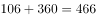。

故正确答案为A。

---

### 第 2 题　qid 2144587 · 数学运算

2 3 10 26 72 （    ）

- **A**. 124
- **B**. 170
- **C**. 196　✅
- **D**. 218

**答案**：C

**官方解析**

数列无明显特征，作差无规律，考虑递推数列。观察前三项2，3，10······发现，即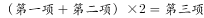，验证其他连续的三个数均符合，所以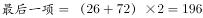。

故正确答案为C。

---

### 第 3 题　qid 2144594 · 数学运算

          （  ）

- **A**. 
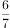

- **B**. 
1
　✅
- **C**. 

- **D**. 
2

**答案**：B

**官方解析**

分数数列，分母呈递减趋势，优先反约分，将数列分母转化为单调递减。原数列可转化为：， ， ， ， ，（），发现分母是公差为-2的等差数列，分子是公差为1的等差数列，所以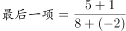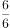1。

故正确答案为B。

---

### 第 4 题　qid 2144609 · 数学运算

10 12 13 22 25 35 （    ）

- **A**. 60
- **B**. 50
- **C**. 47　✅
- **D**. 37

**答案**：C

**官方解析**

数列无明显特征，作差无规律，考虑递推数列。观察前四项10，12，13，22······发现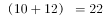，即，验证其他连续的四个数均符合，所以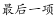。

故正确答案为C。

---

### 第 5 题　qid 2144610 · 数学运算

5 7 4 9 25 （  ）

- **A**. 49
- **B**. 121
- **C**. 189
- **D**. 256　✅

**答案**：D

**官方解析**

数列无明显特征，优先考虑作差。作差后得新数列2，-3，5，16，（    ），无明显规律。考虑递推，观察新数列与原数列之间的关系，发现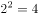，即新数列的平方＝原数列的下一项，即在原数列中，验证其他连续三项均符合，所以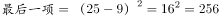。

故正确答案为D。

---

### 第 6 题　qid 2144531 · 数学运算

某班共有8名战士，现在从中挑出4人平均分成两个战斗小组分别参加射击和格斗考核，问共有多少种不同的方案？

- **A**. 210
- **B**. 420　✅
- **C**. 630
- **D**. 840

**答案**：B

**官方解析**

方法一：从8个人里选出4人平均分两组进行射击与格斗考核，即射击考核2人，格斗考核2人。可以先从8人里选2人进行射击考核，方案数为；再从剩下的6人中选2人进行格斗考核，方案数为。由于是分步讨论，所以总方法数为。

方法二：从8人里选出4人的方案数为，再从选出的4人中选出2人参加射击考核的方案数为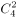，剩下的2人参加格斗考核。由于是分步讨论，所以总方法数为。

故正确答案为B。

---

### 第 7 题　qid 2144534 · 数学运算

甲、乙和丙是同一公司的同事，甲工资为8000元/月，乙工资为7200元/月，丙工资比3人工资的平均值高400元/月。问丙的工资为多少元/月？

- **A**. 7800
- **B**. 8000
- **C**. 8200　✅
- **D**. 8400

**答案**：C

**官方解析**

设本题丙的工资为元，则三人的平均工资为元，根据工资总数一定可得方程：，解得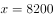元。

故正确答案为C。

---

### 第 8 题　qid 2144537 · 数学运算

某商品按定价出售，每个可获得60元的利润。按定价打八折出售10个所获得的利润，与按定价每个减价30元出售15个所获得的利润相同。则该商品的定价为多少元？

- **A**. 75　✅
- **B**. 80
- **C**. 85
- **D**. 90

**答案**：A

**官方解析**

根据题意，设商品定价为元，则成本为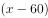元。按定价打8折销售10个所获得的利润为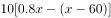元；按定价每个减30元售15个所获得的利润为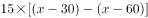元，根据利润相等可列方程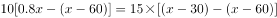，解得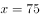元。

故正确答案为A。

---

### 第 9 题　qid 2144541 · 数学运算

某工厂员工周一到周五每天工作8小时，周六工作5小时，周日休息。小王某年6月下旬到该工厂上班，某天下班后算得已到该工厂上班500小时。如当年7月1日是星期六，问小王到该工厂上班的日期是：

- **A**. 6月21日
- **B**. 6月22日
- **C**. 6月23日
- **D**. 6月24日　✅

**答案**：D

**官方解析**

周一至周五工作8小时，周六工作5小时，则每周工作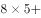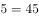小时。又知总工作时长为500小时，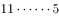，故小王工作了11周余5小时，而5小时即为周六一天的工作时间，所以推出上班第一天为周六（同理最后一天也为周六，只不过我们要求小王到该工厂上班的日期即第一天上班的时间，所以考虑第一天而不考虑最后一天）。由于7月1日为周六，所以6月下旬的周六为24号，故上班日期为6月24日。

故正确答案为D。

---

### 第 10 题　qid 2144529 · 数学运算

某电商网站推出免息分期购物活动，购买某件商品的消费者第一个月只用支付总金额的一半加10元，第二个月支付剩余金额的一半加20元，第三个月支付剩余金额的一半加30元，第四个月付清剩余未支付的10元。问这件商品的价格为多少元？

- **A**. 400
- **B**. 410
- **C**. 420　✅
- **D**. 460

**答案**：C

**官方解析**

方法一：

逐一代入选项进行验证，A项400元最简单，则先代入A选项。第一月支付金额为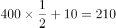元，剩余190元；第二月支付金额为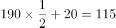元，剩余75元；第三月支付金额为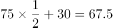元，剩余7.5元，剩余的钱与第四月支付金额不符，故排除。

观察剩下的三个选项，选择中间数420元代入验证，若结果偏小选择更大的460元，若结果偏大选择更小的410元。

代入C选项，第一月支付金额为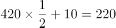元，剩余200元；第二月支付金额为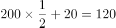元，剩余80元；第三月支付金额为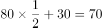元，剩余10元，故第四月支付10元，与题意相符。

故正确答案为C。

方法二：本题从后往前推，第四月支付10元，即第三月支付结束后剩余10元；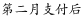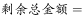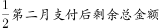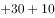，所以第二月支付后剩余总金额为80元；同理，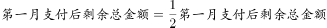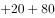，所以第一月支付后剩余总金额为200元；同理，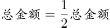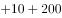，总金额为420元。

故正确答案为C。

---

### 第 11 题　qid 2144492 · 数学运算

甲、乙、丙、丁四人开展羽毛球比赛，首轮每人需和另外3人各比1场，获胜2场及以上者进入下一轮，否则淘汰。甲胜乙、丙、丁的概率分别为、、，甲首轮遭淘汰的概率是（    ）。

- **A**. 

- **B**. 

　✅
- **C**. 

- **D**. 

**答案**：B

**官方解析**

方法一：正面考虑。甲首轮遭淘汰的情况为：首轮甲分别和乙、丙、丁3人比赛全输或者只胜1场。

若甲全输，则概率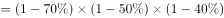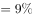；

若甲只胜1场，且所胜场次为甲乙比赛，则概率为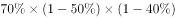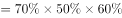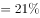；

若甲只胜1场，且所胜场次为甲丙比赛，则概率为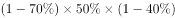；

若甲只胜1场，且所胜场次为甲丁比赛，则概率为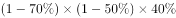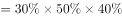。

因此，甲首轮遭淘汰的概率为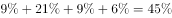。

方法二：反面考虑。甲首轮不遭淘汰的情况为：首轮甲分别和乙、丙、丁3人比赛全胜或者只输1场。

若甲全胜，则概率为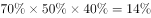；

若甲只输1场，且所输场次为甲乙比赛，则概率为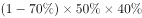；

若甲只输1场，且所输场次为甲丙比赛，则概率为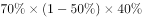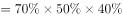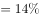；

若甲只输1场，且所输场次为甲丁比赛，则概率为。

因此，甲首轮遭淘汰的概率为。

故正确答案为B。

---

### 第 12 题　qid 2144493 · 数学运算

某测验包含10道选择题，评分标准为答对得3分，答错扣1分，不答得0分，且分数可以为负数。如所有参加测验的人得分都不相同，问最多有多少名测验对象？

- **A**. 38　✅
- **B**. 39
- **C**. 40
- **D**. 41

**答案**：A

**官方解析**

根据题意设答对道，答错道，则不答的为道。因“如所有参加测验的人得分都不相同”，则有多少种得分即有多少名测验对象。又“评分标准为答对得3分，答错扣1分，不答得0分”，则得分等于，因“且分数可以为负数”，则最低分为答错10道即分，最高分为答对10道即分，分至30分一共41种得分，接下来我们分析这41种得分是否均可以得到。

当、时，得30分；

因一共10道题，不存在、与、这两种情况，因此得不到29分和28分；

当、时，得分；

当、时，得分；

因一共10道题，不存在、这种情况，因此得不到25分；

当、时，得分。

到此时我们会发现得不到29、28、25分，则最多可以得到种分数，结合选项发现，B、C、D三项一定错误，没有比38再小的数，因此只有A项符合。

故正确答案为A。

备注：本题采用枚举法来做，但是并不需要枚举出所有情况，只需要根据选项得到正确答案即可，在枚举时一定要注意一共有10道选择题这个范围。

---

### 第 13 题　qid 2144497 · 数学运算

汽车销售店本周共卖出36辆小汽车，其中燃油动力汽车销量比混合动力汽车销量的2倍少3辆，比纯电动汽车销量的3倍多1辆。每辆混合动力汽车和纯电动汽车分别可以获得政府补贴3万元和9万元，问该销售店本周卖出的混合动力汽车和纯电动汽车总共可以获得多少万元政府补贴？

- **A**. 72
- **B**. 75
- **C**. 81
- **D**. 87　✅

**答案**：D

**官方解析**

设该销售店本周卖出混合动力汽车辆，则卖出燃油动力汽车辆，卖出纯电动汽车辆。根据“燃油动力汽车销量比纯电动汽车销量的3倍多1辆”可得，，解得。即该销售店本周卖出混合动力汽车11辆，纯电动汽车辆，两种车共可以获得政府补贴万元。

故正确答案为D。

---

### 第 14 题　qid 2144506 · 数学运算

某基层机关有甲和乙两个办公室，共有10名员工，其中甲办公室人数为乙办公室人数的1.5倍。现从这10名员工中随机抽出2人借调到上级机关，问借调的人来自同一办公室的概率为：

- **A**. 

- **B**. 

- **C**. 

- **D**. 

　✅

**答案**：D

**官方解析**

借调的人来自同一办公室的概率。根据题意，设乙办公室人，则甲办公室人，得，解得，所以甲办公室人数为6，乙办公室人数为4。从10人中随机抽出的2人来自同一办公室的情况有两种：都来自甲办公室即，或都来自乙办公室即，共有种。从10人中随机抽出2人的总情况有种，所以借调的人来自同一办公室的概率。

故正确答案为D。

---

### 第 15 题　qid 2144509 · 数学运算

已知今年小明父母的年龄之和为76岁，小明和他弟弟的年龄之和为18岁。三年后，母亲的年龄是小明的三倍，父亲的年龄是小明弟弟的四倍。问小明今年几岁？

- **A**. 11　✅
- **B**. 12
- **C**. 13
- **D**. 14

**答案**：A

**官方解析**

方法一：设三年后小明年龄为岁，弟弟为岁，则此时母亲年龄为，父亲年龄为。根据题意：今年四人的年龄关系为，解得，则今年小明的年龄为岁。

方法二：设小明、小明的弟弟、小明的父亲和母亲今年的年龄分别为，，和，根据题意可得，今年四人的年龄关系为，三年后四人的年龄关系为，得，，代入得，，解得。得，。

故正确答案为A。

---

### 第 16 题　qid 2144584 · 数学运算

某次比赛报名参赛者有213人，但实际参赛人数不足200。主办方安排车辆时，每5人坐一辆车，最后多2人；安排就餐时，每8人坐一桌，最后多7人；分组比赛时，每7人一组，最后多6人。问未参赛人数占报名人数的比重在以下哪个范围内？

- **A**. 
低于

- **B**. 
之间
　✅
- **C**. 
之间

- **D**. 
高于

**答案**：B

**官方解析**

由题干条件“每5人坐一辆车，最后多2人”“每8人坐一桌，最后多7人”“每7人一组，最后多6人”，设共有a辆车、b张桌子、c组比赛，则，

设实际参赛人数为（）人（56为7、8的最小公倍数，为两种情况共同的差），由，得，只有当时，满足“每5人坐一辆车，最后多2人”，故实际参赛人数为167人。未参赛人数为人，所以未参赛人数所占比重为，B项满足。

故正确答案为B。

---

### 第 17 题　qid 2144589 · 数学运算

超市采购小米、糯米和红豆的价格分别为5元/千克、6元/千克和7元/千克。若将小米、糯米和红豆按7:6:5的比例混在一起做成杂粮粥原料出售，问定价为多少时，销售的毛利润额在采购金额的到之间？

- **A**. 6.6元/千克
- **B**. 7元/千克
- **C**. 7.4元/千克　✅
- **D**. 8元/千克

**答案**：C

**官方解析**

根据题干条件，赋值小米、糯米、红豆混成杂粮粥的分配量分别为7、6、5，根据，可得下表：

故配成的杂粮粥的总重量，总成本。

设定价为元/千克，因要求“毛利润额在采购金额的与之间”，则可得：

，化简后约为：，C项满足。

故正确答案为C。

---

### 第 18 题　qid 2144580 · 数学运算

某水利部门以月份为横轴、降水量为纵轴绘制散点图，统计分析当年当地的降水情况，发现1～4月份的降水量散点恰好是一个平行四边形的四个顶点。已知1～4月份的降水总量为200毫米，1、2月份的降水量相差10毫米，2、3月份的降水量相差40毫米。问4月份的降水量最高可能为：

- **A**. 50毫米
- **B**. 60毫米
- **C**. 70毫米
- **D**. 80毫米　✅

**答案**：D

**官方解析**

方法一：设1～4月份的降水量分别为a、b、c、d，这四个点恰好是平行四边形的四个顶点，则a与d、b与c恰好是两组相对顶点。因为平行四边形相对顶点的纵坐标和相等，即。已知1～4月份降水总量为200，所以。要想4月份降水量最高，则1月份降水量尽可能低。1月份与2月份相差10毫米，则2月份降水量也要尽可能低。又已知2、3月份降水量相差40，则有，解得，因此a最低为，。所以4月份降水量最高为80毫米。

方法二：根据条件，1、2月份的降水量相差10毫米，因平行四边形对边平行且相等，则3、4月份也应相差10毫米，同时2、3月份的降水量相差40毫米。 

设1～4月份的降水量分别为a、b、c、d。要想4月份降水量最高，则1月份降水量尽可能低，2月份降水量也要尽可能低。可列方程得：

，，，。

因求最高为多少，从最大开始代入。

当时，解得，，。，满足要求。

故正确答案为D。 

---

### 第 19 题　qid 2144581 · 数学运算

机械厂加工某器件，需依次进行3道工序，工作量的比依次是3:2:4。甲完成1个工件后又完成了第2个工件的前两道工序，正好用时1小时。已知甲和乙的加工效率比是7:9，问乙完成1个工件需要多长时间？

- **A**. 30分钟　✅
- **B**. 36分钟
- **C**. 42分10秒
- **D**. 46分40秒

**答案**：A

**官方解析**

由题意可知，3道工序的工作量之比为3:2:4，赋值3道工序的工作量分别为3、2、4。由条件“甲完成1个工件后又完成了第2个工件的前两道工序”，则。因刚好用时1小时，则。已知，则乙的效率应为。，则。

故正确答案为A。

---

### 第 20 题　qid 2144582 · 数学运算

甲、乙各自驾驶汽车匀速相向行驶，且同时进入双向公路隧道的两端，30秒后两车相遇。甲车继续行驶20秒到达隧道出口时，乙车距离出口还有200米。问隧道的长度为多少米？

- **A**. 450
- **B**. 500
- **C**. 600　✅
- **D**. 800

**答案**：C

**官方解析**

设隧道的两端分别为AB两点，两车在C点相遇。由B点到C点，乙车用了30秒，同时由C点到B点，甲车用了20秒。路程相同，速度与时间成反比，则。设，，则。相遇后乙走了20秒，此时共走了，距离出口还剩余，距出口200米，即，米。全程米。

故正确答案为C。

---

### 第 21 题　qid 2144503 · 数学运算

某水库每天的上游来水量是10万立方米。5月1日水库向周边供水7万立方米，在5月15日午夜降雨之前，每日的供水量都比上一日多2万立方米。问该水库5月1日零时的库存至少要为多少万立方米，才能保证在降雨之前对周边充足的水供应？

- **A**. 143
- **B**. 150
- **C**. 165　✅
- **D**. 185

**答案**：C

**官方解析**

先计算5月1日零时-15日午夜的供水量，每日的供水量是公差为2的等差数列，5月1日的供水量为，则前15日供水总量为：万立方米。每天上游来水量是10万立方米，15日共来水万立方米，则该水库5月1日零时的库存至少万立方米，才能保证在降雨之前对周边充足的水供应。

故正确答案为C。

---

### 第 22 题　qid 2144505 · 数学运算

某蛋糕店接到300个蛋糕的订单。已知老板一天能做30个蛋糕，店员小红一天只能做10个。蛋糕制作过程中，老板有一个周末外出，小红请了8天假，两人在外时间不重叠。问制作这批蛋糕一共花了多少天？

- **A**. 11　✅
- **B**. 12
- **C**. 13
- **D**. 14

**答案**：A

**官方解析**

设制作这批蛋糕时间为天，蛋糕制作过程中，老板有一个周末外出，小红请了8天假，则老板做了天，小红做了天，由题意可得，，解得。故制作这批蛋糕一共花了11天。

故正确答案为A。

---

### 第 23 题　qid 2144508 · 数学运算

小王购买甲、乙两种特价商品。甲商品打八折后每件52元，乙商品打八五折后每件34元，小王购买这些商品总共比打折前节省了83元。问他购买这两种特价商品总共支出了多少元？

- **A**. 544
- **B**. 445
- **C**. 427
- **D**. 362　✅

**答案**：D

**官方解析**

根据甲商品打八折后每件52元，可计算出甲的售价为元；根据乙商品打八五折后每件34元，可计算出乙的售价为元。甲商品一件节省元，乙商品一件节省元。设购买甲商品件，乙商品件，由于小王购买这些商品比打折前节省了83元，可得，该式为不定方程，结合奇偶特性，可得，，即甲、乙两种商品分别买了5件、3件。购买这两种特价商品总支出为：元。

故正确答案为D。

---

### 第 24 题　qid 2144513 · 数学运算

某停车场按以下办法收取停车费：

小张整点将车辆驶入该停车场，并于整点驶出，停车费为50元，问他停车的时长有多少种不同的可能性？

- **A**. 5
- **B**. 6　✅
- **C**. 7
- **D**. 8

**答案**：B

**官方解析**

选项数字不大，可采用枚举法。

根据上表中的总收费，可以详细枚举出停车的时间段。

注：10:00-12:00整点都不能作为起点，因为12:00-17:00是5小时，总费用是25元。同理14:00、16:00、20:00-22:00、00:00-3:00整点也不能作为起点。

根据上表的时间段，他停车的时长有5小时、6小时、7小时、9小时、10小时和13小时共6种时长。

故正确答案为B。

---

### 第 25 题　qid 2144517 · 数学运算

某次百分制考试共有30名考生参加，每人的成绩均为正整数，所有考生平均成绩为80分，且所有考生成绩均不相同。问成绩低于60分的考生最多有多少人？

- **A**. 7
- **B**. 8　✅
- **C**. 9
- **D**. 10

**答案**：B

**官方解析**

题目要求低于60分的人数最多，平均成绩80分，，就需要低于60分的分数尽可能高，即从59分往下数。

问最多，从D项代入，10人成绩分别是59分-50分的整数分，，，而20人总分最高即81-100分的，不满足百分制考试，排除；

同理代入C项，9人成绩分别是59-51分的整数分，，，而21人总分最高即80-100分的，不满足百分制考试，排除；

代入B项，8人成绩分别是59-52的整数分，，，而22人总分最高即79-100的，满足百分制考试，当选。

故正确答案为B。

---

## 判断推理

### 第 1 题　qid 2144516 · 图形推理

把下面的六个图形分为两类，使每一类图形都有各自的共同特征或规律，分类正确的一项是：

- **A**. ①④⑤，②③⑥
- **B**. ①④⑥，②③⑤
- **C**. ①②④，③⑤⑥　✅
- **D**. ①⑤⑥，②③④

**答案**：C

**官方解析**

本题为分组分类题目。题干每幅图形中均有黑点，考虑功能元素的标记作用。观察发现，图①②④中黑点的位置在两个图形相交的外部，图③⑤⑥中黑点的位置在两个图形相交的内部，因此图①②④为一组，图③⑤⑥为一组。
故正确答案为C。

---

### 第 2 题　qid 2144523 · 图形推理

把下面的六个图形分为两类，使每一类图形都有各自的共同特征或规律，分类正确的一项是：

- **A**. ①②③，④⑤⑥　✅
- **B**. ①③④，②⑤⑥
- **C**. ①②⑤，③④⑥
- **D**. ①④⑤，②③⑥

**答案**：A

**官方解析**

元素组成不同，且无属性规律，考虑数量规律。观察发现，图②是由很多相交圆组成，且图⑤和图⑥是明显的“田”字变形图，因此考虑笔画数。①②③均为一笔画图形，④⑤⑥均为两笔画图形。
故正确答案为A。

---

### 第 3 题　qid 2144525 · 图形推理

把下面的六个图形分为两类，使每一类图形都有各自的共同特征或规律，分类正确的一项是：

- **A**. ①③④，②⑤⑥
- **B**. ①⑤⑥，②③④
- **C**. ①④⑤，②③⑥
- **D**. ①③⑤，②④⑥　✅

**答案**：D

**官方解析**

元素组成不同，优先考虑属性规律。观察发现①③⑤图形中既包含直线又包含曲线，而②④⑥图形都是全直线图形，故图①③⑤为一组，图②④⑥为一组。
故正确答案为D。

---

### 第 4 题　qid 2144527 · 图形推理

左边给定的是纸盒外表面的展开图，右边哪一项能由它折叠而成？

- **A**. A　✅
- **B**. B
- **C**. C
- **D**. D

**答案**：A

**官方解析**

本题为空间重构题目。


A项：由面a、b、c组成，与题干一致，当选；

B项：由面d、e、f组成，题干面f中箭头右侧挨着面b，而该选项面f的箭头右侧挨着面d，与题干不一致，排除；

C项：由面a、d、e组成，题干面e的三角形右侧（图中标红线处）挨着面b，而该选项面e的三角形右侧（即蓝线处）挨着面a，与题干不一致，排除；


D项：由面d、e和f组成，题干中面f的箭头右侧挨着面b，而该选项面f的箭头右侧挨着面d，与题干不一致，排除。


故正确答案为A。


---

### 第 5 题　qid 2144543 · 图形推理

左边给定的是纸盒外表面的展开图，右边哪一项能由它折叠而成？

- **A**. A
- **B**. B　✅
- **C**. C
- **D**. D

**答案**：B

**官方解析**

本题为四面体的空间重构题目。四个选项均有含一条直线的面，且该面有唯一点（如下图中绿色点所示），故以这点为起点开始顺时针画边。如下图所示。



A项：边1对应的是黑色面，而题干边1对应的是灰色面，与题干不一致，排除；


B项：选项与题干一致，当选；


C项：边3对应的是白色面，而题干边2对应的是白色面，与题干不一致，排除；


D项：边3对应的是灰色面，而题干边1对应的是灰色面，与题干不一致，排除。


故正确答案为B。


---

### 第 6 题　qid 2144549 · 图形推理

请从所给的四个选项中，选择最合适的一个填入问号处，使之呈现一定的规律性。

- **A**. A
- **B**. B　✅
- **C**. C
- **D**. D

**答案**：B

**官方解析**

整体观察图形发现规律不明显，对比图一和图二发现，图1顺时针旋转且增加一条线变成图2，同理，题干图形均是后一幅图在前一幅图的基础上顺时针旋转且每次增加一条线，因此？处图形应在前一个图形基础上顺时针旋转且增加一条线，只有B项满足。

故正确答案为B。

---

### 第 7 题　qid 2144553 · 图形推理

下边四个图形中，只有一个是由上边的四个图形拼合而成的，请把它找出来。

- **A**. A
- **B**. B　✅
- **C**. C
- **D**. D

**答案**：B

**官方解析**

本题为平面拼合，可以采用平行等长的方法进行拼合，如下图所示：


故正确答案为B。

---

### 第 8 题　qid 2144555 · 图形推理

请从所给的四个选项中，选择最合适的一个填入问号处，使之呈现一定的规律性。

- **A**. A
- **B**. B
- **C**. C
- **D**. D　✅

**答案**：D

**官方解析**

元素组成相同，优先考虑位置规律。九宫格横着看没有明显规律，考虑竖着看。

第一列中，图1整体旋转得到图2，图2整体上下翻转得到图3；经验证，第三列满足此规律；第二列应用此规律，将图1整体旋转或图3整体进行上下翻转均可，只有D项满足。

故正确答案为D。

---

### 第 9 题　qid 2144528 · 图形推理

请从所给的四个选项中，选择最合适的一个填入问号处，使之呈现一定的规律性。

- **A**. A
- **B**. B
- **C**. C　✅
- **D**. D

**答案**：C

**官方解析**

元素组成不同，属性没有明显规律，考虑数量规律。题干每幅图均由直线和曲线组成，交点和面明显，观察九宫格每幅图交点数并没有规律，考虑面数量。第一行每幅图面数量分别为0、1、2个，第二行每幅图面数量分别为2、3、4个，均构成等差数列；第三行每幅图面数量分别为4、5个，问号处图形的面数量应为6个。A项5个，B项0个，C项6个，D项3个，只有C项符合。
故正确答案为C。

---

### 第 10 题　qid 2144539 · 图形推理

请从所给的四个选项中，选择最合适的一个填入问号处，使之呈现一定的规律性。

- **A**. A　✅
- **B**. B
- **C**. C
- **D**. D

**答案**：A

**官方解析**

元素组成不同，优先考虑属性规律。题干图形对称性明显，九宫格第一行图形对称轴都为0条、第二行图形对称轴都为1条、第三行前两幅图形对称轴都为2条，因此？处也应填入对称轴为2条的图形，只有A项符合。
故正确答案为A。

---

### 第 11 题　qid 2144583 · 定义判断

缔约过失责任是指在合同订立过程中，一方因违背其依据诚实信用原则所产生的义务，而致另一方的信赖利益受损，应承担损害赔偿责任；另一方因信赖合同的成立和有效，但由于合同不成立或无效而蒙受不利益，此种不利益即为信赖利益的损失。
根据上述定义，下列各项中甲方无需承担缔约过失责任的是：

- **A**. 甲乙双方磋商共同兴建制药厂，甲方以技术出资，并提出乙方需培训相关人员后，方能与乙方签约。乙方出资100万元培训了相关人员后，甲方发现乙方制药技术存在问题，中止了与乙方的合作　✅
- **B**. 甲方声称有一批优质紫檀木欲出售给乙方，乙方立即与丙方签订了一份紫檀木家具供货协议，并向丙方支付了保证金。结果乙方在与甲方签约前发现甲方欲出售的紫檀木是假冒的
- **C**. 甲方欲以50万元的价格将自己的房子卖给乙方，要求乙方在10天内以现金购买。乙方为筹集房款，将新买的汽车以极低的价格卖掉，第9天去购房时，甲方已将房子卖与丙方并已办理了过户手续
- **D**. 甲方为报复乙方，声称欲以高价购买乙方的一批水果。乙方本有意将水果卖给丙方，遂中止了与丙方的协商。结果甲方在签约前反悔，致使乙方的水果未能及时卖出而腐烂

**答案**：A

**官方解析**

第一步：找出定义关键词。
“合同订立过程中”、“一方因违背其依据诚实信用原则所产生的义务，而致另一方的信赖利益受损”、“另一方因信赖合同的成立和有效，但由于合同不成立或无效而蒙受不利益” 。
第二步：逐一分析选项。
A项：因为“甲方发现乙方制药技术存在问题”解除了合同，没有体现违背诚实信用原则，且也没有体现出“因信赖合同的成立和有效，但由于合同不成立或无效而蒙受不利益”，不符合定义，当选；
B项：“甲方欲出售的紫檀木是假冒的”，属于定义中的“一方因违背其依据诚实信用原则所产生的义务”，符合定义，排除；
C项：甲方欲以50万元将自己的房子卖给乙方，要求乙方在10天内现金购买，乙方信任了甲方的话，为了买房子，将新买的汽车以极低的价格卖掉，第9天去购房时，甲方已将房子卖与丙方，乙方产生的损失即是“另一方因信赖合同的成立和有效，但由于合同不成立或无效而蒙受不利益”，符合定义，排除；
D项：甲方为了报复乙方，声称欲以高价购买乙方的一批水果，结果甲方在签约前反悔，导致乙造成了损失，符合定义中的“一方因违背其依据诚实信用原则所产生的义务”，符合定义，排除。
本题为选非题，故正确答案为A。

---

### 第 12 题　qid 2144585 · 定义判断

当人们对一事物持某种态度时，不管该事物是有形的还是无形的，都被称为态度标的物。
根据上述定义，下列对态度标的物理解不正确的是：

- **A**. 小李对刚买的一件首饰不满意。小李的态度标的物是首饰
- **B**. 老刘说，这酒真不好喝。老刘的态度标的物是酒
- **C**. 小王对导游的服务不满。小王的态度标的物是导游　✅
- **D**. 老张厌恶儿子的“啃老”行为。老张的态度标的物是“啃老”行为

**答案**：C

**官方解析**

第一步：找出定义关键词。
“对一事物持某种态度时”、“不管该事物是有形的还是无形的” 。
第二步：逐一分析选项。
A项：小李对刚买的一件首饰持不满意的态度，所以小李的态度标的物是首饰，符合定义，排除；
B项：老刘感觉酒不好喝，对酒持不满意的态度，所以老刘的态度标的物是酒，符合定义，排除；
C项：小王对导游的服务持不满意的态度，小王的态度标的物是导游的服务，而不是导游，不符合定义，当选；
D项：老张厌恶儿子的“啃老”行为，对“啃老”行为持不满的态度，老张的态度标的物是“啃老”行为，符合定义，排除。
本题为选非题，故正确答案为C。

---

### 第 13 题　qid 2144588 · 定义判断

近因效应是指新出现的具有对立意义的刺激能够把人们心目中已有的印象反转为对立的印象。
根据上述定义，下列情形符合近因效应的是：

- **A**. 自从老王到养老院做志愿者后，同事们就对他刮目相看
- **B**. 小林的学习成绩不太好，但是羽毛球水平很高，同学们很羡慕他
- **C**. 一家口碑良好的企业偷税漏税的丑闻被曝光后，公众指责其为“无良企业”　✅
- **D**. 医疗事故发生后，医院诚恳地向患者家属道歉并减免了医药费，家属表示愿意谅解

**答案**：C

**官方解析**

第一步：找出定义关键词。
“新出现的具有对立意义的刺激”、“把人们心目中已有的印象反转为对立的印象”。
第二步：逐一分析选项。
A项：老王到养老院做志愿者后同事们对他刮目相看，没有出现具有对立意义的刺激，同事心目中的印象发生变化，而非反转为对立的印象，不符合定义，排除； 
B项：小林学习成绩不太好，但是羽毛球水平很高，没有出现新的刺激，同学们很羡慕小林，印象也没有发生变化，不符合定义，排除；
C项：企业偷税漏税的丑闻被曝光，属于新出现的具有对立意义的刺激，人们对企业的印象从“口碑良好”转变成“无良企业”，属于把人们心目中已有的印象反转为对立的印象，符合定义，当选；
D项：医疗事故发生后，家属谅解了医院，表明家属心目中对医院原有的印象没有反转为对立的印象，不符合定义，排除。
故正确答案为C。

---

### 第 14 题　qid 2144573 · 定义判断

胖尾效应是指统计学意义上的极端情况一反常态地经常出现的现象。
根据上述定义，下列现象属于胖尾效应的是：

- **A**. 幸福小区的福利彩票投注站接连5期都出了一等奖　✅
- **B**. 今年J省高考的文理科状元都是女生，大家不禁感慨现在男生真的考不过女生了
- **C**. 受厄尔尼诺现象影响，我国南方多地都出现了百年一遇的大暴雨
- **D**. 本届乒乓球比赛中，上届冠军老王发挥失常，居然首轮就被淘汰出局，让人大跌眼镜

**答案**：A

**官方解析**

第一步：找出定义关键词。
“统计学意义上的极端情况一反常态地经常出现的现象” 。
第二步：逐一分析选项。
A项：福利彩票中一等奖是低概率的随机事件，属于极端情况，幸福小区彩票投注站接连5期出了一等奖，属于统计学意义上的极端情况一反常态地经常出现的现象，符合定义，当选； 
B项：J省高考的文理科状元都是女生，不属于极端情况，不符合定义，排除；
C项：南方地区出现百年一遇的大暴雨，属于极端情况，但并没有一反常态地经常出现，不符合定义，排除；
D项：上届冠军老王发挥失常，不属于极端情况，不符合定义，排除。
故正确答案为A。

---

### 第 15 题　qid 2144575 · 定义判断

布雷斯悖论现象是指在一个交通网络上增加一条路段不仅没有减少交通延滞，反而使整个交通网络上所有出行者的出行时间都增加的现象。
根据上述定义，下列属于布雷斯悖论现象的是：

- **A**. H市在拆除了一条6车道高速路，修建成一个方圆8千米的公园后，很多道路专家惊讶地发现，城市环境改善了，交通状况也没有恶化
- **B**. 为缓解交通拥堵，G市将市内主干道相连的几条单行线改为双向通行，结果交通事故明显增多，堵车情况进一步恶化
- **C**. N市在城区主干道下方又修建了一条地下隧道，由于入口处和出口处交通汇集，隧道建成后交通反较之前更为拥堵　✅
- **D**. W市新建了两条贯通城市东-西、南-北的双向4车道柏油马路后，市内交通不再像以前那么拥堵了

**答案**：C

**官方解析**

第一步：找出定义关键词。
“一个交通网络上增加一条路段”、“没有减少交通延滞”、“整个交通网络上所有出行者的出行时间都增加”。
第二步：逐一分析选项。
A项：H市拆除了一条高速路，修建一座公园，没有增加一条路段，不符合定义，排除； 
B项：G市将市内主干道相连的几条单行线改为双向通行，没有增加一条路段，不符合定义，排除；
C项：N市修建了一条地下隧道，属于增加一条路段，隧道建成后交通反较之前更为拥堵，属于没有减少交通延滞，反而使所有出行者的出行时间都增加，符合定义，当选；
D项：W市新建了两条4车道柏油马路后，市内交通不再像以前那么拥堵了，减少了交通延滞，不符合定义，排除。
故正确答案为C。

---

### 第 16 题　qid 2144578 · 定义判断

过度合理化效应是指给人们报酬让他们做自己喜欢的事会让他们将其行为归因于报酬，这样就会削弱他们的自我知觉——因为兴趣而去做。
根据上述定义，下列情形属于过度合理化效应的是：

- **A**. 小李抢救落水儿童，被见义勇为基金会奖励1万元
- **B**. 某收视率低的电视节目以大奖吸引观众，冲着大奖而来的观众越来越多
- **C**. 随着公司效益的提高，员工因奖金没有相应提高而多有怨言
- **D**. 妈妈为鼓励爱画画的小明，画一幅画奖励他10元钱，小明画得更多却有些潦草了　✅

**答案**：D

**官方解析**

第一步：找出定义关键词。
“给报酬”、“做自己喜欢做的事”、“削弱自我知觉”。
第二步：逐一分析选项。
A项：小李抢救落水儿童后被奖励1万元，属于事后的奖励，而非事先给的报酬让他去做，不符合定义，排除； 
B项：该节目收视率低说明爱看的人少，观众是冲着大奖观看电视节目，而非自己原本喜欢看这个电视节目，不符合定义，排除；
C项：员工因奖金没有相应提高而多有怨言，不符合给报酬做自己喜欢的事情，不符合定义，排除；
D项：小明原本就爱画画，妈妈每幅画给小明10元作为报酬，但最后原本爱画画的小明画的更多却潦草了，说明之后小明画更多的画作是为了多拿钱，削弱了小明本身对画画的兴趣，符合定义，当选。
故正确答案为D。

---

### 第 17 题　qid 2144557 · 定义判断

防御中的攻势行动是指在有利的时机和态势下，防御部队采取的进攻性行动。
根据上述定义，下列军事行动不属于防御中的攻势行动的是：

- **A**. 对突入阵地之敌实施冲击，消灭突入之敌，改善或恢复防御态势
- **B**. 防御的军队对小股进攻之敌实施主动攻击，击退敌人的进攻
- **C**. 直接抗击敌人冲击的分队，对冲击受挫滞留于阵地前沿之敌实施主动攻击，以出击消灭敌人，稳定防御态势
- **D**. 被包围的部队组织精干小分队，跳出包围圈，插到敌人侧后袭扰敌人，钳制围攻之敌　✅

**答案**：D

**官方解析**

第一步：找出定义关键词。
“在有利的时机和态势下”、“防御部队”、“采取进攻性行动”。
第二步：逐一分析选项。
A项：对突入阵地之敌冲击，并且能够消灭敌人，是在有利的时机和态势下进攻，改善或恢复防御态势，也体现了是防御部队的进攻，符合定义，排除； 
B项：敌军是小股进攻，说明是在有利的时机和态势下，且防御军队进行了主动的进攻性行动，符合定义，排除；
C项：敌人已经遭受冲击受挫，属于有利的时机和态势，并且是为了稳定防御态势主动攻击，符合定义，排除；
D项：部队处于被包围的情况，不符合有利的时机和态势，同时，该部队组织及其组织的精干小分队是否为防御部队也不明确，不符合定义，当选。
本题为选非题，故正确答案为D。

---

### 第 18 题　qid 2144559 · 定义判断

鸟笼效应是一个心理学概念，它是指人们会在偶然获得一件原本不需要的物品的基础上，继续添加更多与之相关而自己不需要的东西。
根据上述定义，下列符合鸟笼效应的是：

- **A**. 雯雯在网上购物，为了参与“满减”活动比预期多买了好几件商品
- **B**. 刘阿姨去超市买菜，发现清洁用品正好在打折，忍不住买了一堆
- **C**. 丽丽买裙子送了条毛衣链，她觉得没有毛衣可以搭配，又买了件毛衣，但却从没穿过　✅
- **D**. 小玲的男朋友送了她一束花，她很开心，还专门去买了个漂亮的花瓶

**答案**：C

**官方解析**

第一步：找出定义关键词。
“偶然获得”、“不需要的物品”、“继续添加与之相关而不需要的东西”。
第二步：逐一分析选项。
A项：雯雯为了参与活动多买了好几件商品，不符合题干所说的偶然获得一个不需要的物品然后继续添置不需要的东西，不符合定义，排除； 
B项：刘阿姨发现清洁商品打折买了一堆，不符合题干所说的偶然获得一个不需要的物品然后继续添置不需要的东西，不符合定义，排除；
C项：丽丽买裙子送了条毛衣链，说明毛衣链是偶然所得，然后因为这个毛衣链丽丽又买了件毛衣却从没穿过，说明在偶然所得后又继续添置了不需要的东西，符合定义，当选；
D项：小玲的男朋友送了一束花，她很开心，并专门买了漂亮花瓶，说明花和花瓶并不是她不喜欢不需要的东西，不符合定义，排除。
故正确答案为C。

---

### 第 19 题　qid 2144562 · 定义判断

完全归纳推理又称完全归纳法，是以某类中每一对象(或子类)都具有或不具有某一属性为前提，推出该类对象全部具有或不具有该属性为结论的归纳推理。
根据上述定义，下列属于完全归纳推理的是：

- **A**. 美国居民的祖先都是从国外迁徙来的。早期的居民是美洲印第安人，他们是几千年前从亚洲迁徙来的。后来的居民是欧洲人，他们是在250年至350年前作为殖民地开拓者来到这里的　✅
- **B**. 在很早的时候，中国就发明了指南针、造纸术、活字印刷术和火药，所以，中国是世界文明发展最早的国家之一
- **C**. 凡有所学，皆成性格。读书使人充实，讨论使人机智，笔记使人准确，读史使人明智，读诗使人灵秀，数学使人周密，物理使人深刻，伦理使人庄重
- **D**. 世界各国人民历来就相互进行科技的引进和交流。西方国家引进了中国古代的“四大发明”；日本的明治维新，主要是引进了欧洲的技术；今天许多国家种植的玉米、马铃薯，都是美洲印第安人培育出来的

**答案**：A

**官方解析**

第一步：找出定义关键词。
“以某类中每一对象(或子类)都具有或不具有某一属性为前提”、“推出该类对象全部具有或不具有该属性为结论”。
第二步：逐一分析选项。
A项：全部情况的结论为美国居民的祖先都是从国外迁徙来的，其前提包括了美国早期的居民和后来的居民是从国外迁徙来的，早期居民和后来居民构成了美国居民中的所有子类，符合定义，当选； 
B项：前提是很早的时候中国就有了四大发明，结论是中国是世界文明发展最早的国家之一，而中国并不能构成世界所有国家的所有子类，其他国家的发明时间未知，不符合定义，排除；
C项：全部情况的结论为凡有所学，皆成性格，其前提包括了读书、讨论、笔记、读史等能够使人形成不同的性格，而读书、讨论、笔记、读史并不是凡有所学的全部对象，不符合定义，排除；
D项：全部情况的结论为世界各国人民互相引进，其前提包括了西方国家引进“四大发明”、日本明治维新引进欧洲技术、许多国家引进印第安人培育的玉米等例子，而后者并不是互相引进的全部对象，不符合定义，排除。
故正确答案为A。

---

### 第 20 题　qid 2144564 · 定义判断

体验式教学是指通过创造实际的情境和机会，呈现或再现、还原教学内容，使学生在亲历的过程中理解并建构知识、发展能力、产生情感、生成意义的教学观和教学形式。
根据上述定义，下列不属于体验式教学的是：

- **A**. 在详细讲解了相关的知识要领和操作程序后，教练坐到了副驾驶的位置，换小李坐上驾驶位，开车上路
- **B**. 教授《股票原理》课程的赵教授要求每位学生以3000元本金开设一个股票账户，学期结束时以交易的次数和账户余额评定成绩
- **C**. 某大学策划了“重走长征路，祖国在我心”爱国主义教育活动，分批组织学生重走当年红军长征时爬过的雪山、走过的草地
- **D**. 为了帮助学生摆脱“哑巴式英语”的困境，王老师用心搜集了大量原汁原味反映英国人日常生活交际的视频供学生观摩　✅

**答案**：D

**官方解析**

第一步：找出定义关键词。
“通过创造实际的情境和机会”、“呈现或再现、还原教学内容”、“使学生在亲历的过程中理解并建构知识、发展能力、产生情感、生成意义”。
第二步：逐一分析选项。
A项：让小李坐上驾驶位是创造实际的情境和机会的做法，可以使小李在亲历的过程中理解教练讲解的内容，符合定义，排除； 
B项：要求学生开设股票账户，让学生真实地进行交易是创造实际的情境和机会的做法，可以使学生在亲历的过程中对《股票原理》课程内容进行理解，符合定义，排除；
C项：组织学生重走当年红军长征的雪山和草地，通过创造实际的情境再现当年红军长征的艰辛，使学生产生爱国主义情怀，符合定义，排除；
D项：为学生提供反映英国人日常生活交际的视频观摩，而观看视频并没有创造实际的情境和机会让学生亲历，不符合定义，当选。
本题为选非题，故正确答案为D。

---

### 第 21 题　qid 2144565 · 类比推理

潮涨：潮落

- **A**. 出生：死亡
- **B**. 白天：黑夜
- **C**. 开灯：关灯
- **D**. 起飞：降落　✅

**答案**：D

**官方解析**

第一步：判断题干词语间的逻辑关系。
潮涨和潮落是海水的两种状态，涨潮时，海水上涨；退潮时，海水悄然退去。除此之外还有不涨不落的情况，因此题干词语是反对关系，且是一种升降周期变化。
第二步：判断选项词语间的逻辑关系。
A项：出生和死亡是人生开始和结束的两个状态，二者是反对关系，但并非一种周期变化，与题干逻辑关系不一致，排除；
B项：白天和黑夜是一天中的两个时间段，二者是矛盾关系，与题干逻辑关系不一致，排除；
C项：开灯和关灯是灯的不同状态，二者是矛盾关系，与题干逻辑关系不一致，排除；
D项：起飞和降落是飞机的两种状态，升空时，飞机起飞；落地时，飞机降落。除此之外还有停在机场待飞的情况，二者也是反对关系，且是一种升降周期变化，与题干逻辑关系一致，当选。
故正确答案为D。

---

### 第 22 题　qid 2144567 · 类比推理

旗开得胜：马到成功

- **A**. 拨乱反正：沉冤昭雪
- **B**. 牛高马大：虎穴得子
- **C**. 水到渠成：瓜熟蒂落　✅
- **D**. 缘木求鱼：鹰击长空

**答案**：C

**官方解析**

第一步：判断题干词语间的逻辑关系。
旗开得胜比喻事情刚一开始，就取得好成绩，马到成功形容事情顺利，刚开始就取得成功，二者是近义关系。
第二步：判断选项词语间的逻辑关系。
A项：拨乱反正是指消除混乱局面，恢复正常秩序，沉冤昭雪是指沉积很久的冤情得到洗刷，二者并非近义关系，与题干逻辑关系不一致，排除；
B项：牛高马大比喻人长得高大强壮，虎穴得子比喻诗文贴切中肯，且深得其要旨，二者并非近义关系，与题干逻辑关系不一致，排除；
C项：水到渠成比喻有条件之后，事情自然会成功，即功到自然成，瓜熟蒂落指时机一旦成熟，事情自然成功，二者是近义关系，与题干逻辑关系一致，当选；
D项：缘木求鱼比喻方向或办法不对头，不可能达到目的，鹰击长空比喻有雄心壮志的人在广阔的领域中施展自己的才能，二者并非近义关系，与题干逻辑关系不一致，排除。
故正确答案为C。

---

### 第 23 题　qid 2144568 · 类比推理

语言：思想

- **A**. 行为：品格　✅
- **B**. 头部：大脑
- **C**. 粉笔：黑板
- **D**. 纸张：知识

**答案**：A

**官方解析**

第一步：判断题干词语间的逻辑关系。
通过语言可以反映一个人的思想，二者是对应关系。
第二步：判断选项词语间的逻辑关系。
A项：通过行为可以反映一个人的品格，与题干逻辑关系一致，当选；
B项：大脑是头部的一部分，二者是组成关系，与题干逻辑关系不一致，排除；
C项：粉笔可以在黑板上写字，二者是配套使用的关系，与题干逻辑关系不一致，排除；
D项：知识可以印刷在纸张上进行传播，纸张可以作为知识的载体，但纸张不能直接反映知识，反映知识的应该是印在纸张上的文字，与题干逻辑关系不一致，排除。
故正确答案为A。

---

### 第 24 题　qid 2144569 · 类比推理

出口：进口：贸易顺差

- **A**. 征税：纳税：财政收入
- **B**. 买进：卖出：盈利
- **C**. 支出：收入：赤字　✅
- **D**. 还债：借债：债务

**答案**：C

**官方解析**

第一步：判断题干词语间的逻辑关系。
出口大于进口会产生贸易顺差。
第二步：判断选项词语间的逻辑关系。
A项：征税是国家征收税务，纳税是纳税人缴纳税务，只要国家征税了，纳税人纳税了就会产生财政收入，跟二者大小没有关系，与题干逻辑关系不一致，排除；
B项：卖出大于买进会产生盈利，而买进大于卖出产生的是亏损，买进与卖出的顺序与题干顺序相反，与题干逻辑关系不一致，排除；
C项：支出大于收入会产生赤字，与题干逻辑关系一致，当选；
D项：只要借债了就会产生债务关系，借债大于还债会说明还有债没还清，依然存在债务关系，但是还债与借债的顺序与题干顺序相反，与题干逻辑关系不一致，排除。
故正确答案为C。

---

### 第 25 题　qid 2144540 · 类比推理

陆军：空军：作战

- **A**. 播种机：收割机：农业
- **B**. 汽车：轮船：运输　✅
- **C**. 超市：商场：促销
- **D**. 法院：政府：司法

**答案**：B

**官方解析**

第一步：判断题干词语间的逻辑关系。
陆军和空军是两种不同的兵种，二者是并列关系，且陆军和空军都可以用来作战，二者与作战属于功能对应关系。
第二步：判断选项词语间的逻辑关系。
A项：播种机和收割机是两种不同的农作工具，二者是并列关系，但农业不是它们的功能，与题干逻辑关系不一致，排除；
B项：汽车和轮船是两种不同的交通工具，二者是并列关系，且汽车和轮船都可以用来运输，二者与运输属于功能对应关系，与题干逻辑关系一致，当选；
C项：超市和商场是两种不同的购物场所，二者是并列关系，但促销并不是超市和商场的功能，超市和商场是促销的场所，属于场所的对应关系，与题干逻辑关系不一致，排除；
D项：法院和政府是两个不同的单位，二者是并列关系，但司法不是它们的功能，与题干逻辑关系不一致，排除。
故正确答案为B。

---

### 第 26 题　qid 2144542 · 类比推理

大小：轻重：物体

- **A**. 快慢：缓急：时间
- **B**. 真伪：多少：数据　✅
- **C**. 古今：春秋：历史
- **D**. 是非：对错：答案

**答案**：B

**官方解析**

第一步：判断题干词语间的逻辑关系。
大小是指物体的尺寸不同，物体有大小之分，轻重是指物体重量的不同，物体有轻重之分，大小和轻重是用来描述物体的两个角度，二者与物体构成对应关系。
第二步：判断选项词语间的逻辑关系。
A项：快慢形容的是速度大小程度不同，缓急形容的是事情紧要程度不同，二者不是用来描述时间的，与时间不是对应关系，与题干逻辑关系不一致，排除；
B项：真伪即真实的和虚假的，数据有真伪之分，多少是指数量的大小，数据有多少之分，真伪和多少是描述数据的两个角度，二者与数据构成对应关系，与题干逻辑关系一致，当选；
C项：古今是指古代和现代，可以对应历史，但春秋指的是一年当中的两个季节，也可以指历史上的春秋时代，但不能说历史有春秋之分，春秋不能用来描述历史，与题干逻辑关系不一致，排除；
D项：答案有对错之分，但是非是指事情的对与错，无法用来描述答案，与答案不构成对应关系，与题干逻辑关系不一致，排除。
故正确答案为B。

---

### 第 27 题　qid 2144545 · 类比推理

正数：零：负数

- **A**. 中国：日本：美国
- **B**. 干部：群众：党员
- **C**. 熊市：股市：牛市
- **D**. 左边：中间：右边　✅

**答案**：D

**官方解析**

第一步：判断题干词语间的逻辑关系。
大于零的实数是正数，小于零的实数是负数，从正负角度，实数只分为正数、零、负数，没有其他分类，三者是并列关系。
第二步：判断选项词语间的逻辑关系。
A项：中国、日本、美国是三个国家，世界上除了此三个国家还有其他国家，与题干逻辑关系不一致，排除；
B项：干部、群众、党员都是身份，干部和党员之间是交叉关系，党员和群众之间是反对关系，与题干逻辑关系不一致，排除；
C项：股市包含熊市和牛市，与题干逻辑关系不一致，排除；
D项：从左右角度，方位只分为左边、中间、右边，没有其他分类，与题干逻辑关系一致，当选。
故正确答案为D。

---

### 第 28 题　qid 2144547 · 类比推理

基础设施：机场：公路

- **A**. 英特网：内网：外网
- **B**. 国家机关：行政机关：司法机关　✅
- **C**. 儿童片：动画片：卡通片
- **D**. 体育：武术：咏春拳

**答案**：B

**官方解析**

第一步：判断题干词语间的逻辑关系。
机场和公路都是基础设施，二者与基础设施是种属关系，且机场和公路是并列关系中的反对关系。
第二步：判断选项词语间的逻辑关系。
A项：内网和外网都是英特网，但内网和外网是并列关系中的矛盾关系，与题干逻辑关系不一致，排除；
B项：行政机关主要指各级人民政府及其职能部门，司法机关主要指各级人民法院和检察院，二者都是国家机关，与国家机关是种属关系，且行政机关和司法机关是并列关系中的反对关系，与题干逻辑关系一致，当选；
C项：儿童片与动画片是交叉关系，与题干逻辑关系不一致，排除；
D项：咏春拳是一种中国传统武术，二者是种属关系，与题干逻辑关系不一致，排除。
故正确答案为B。

---

### 第 29 题　qid 2144550 · 类比推理

大漠 对于（  ）相当于 草原 对于（  ）

- **A**. 黄沙：蒙古包
- **B**. 干旱：牧场
- **C**. 骆驼：羊　✅
- **D**. 绿洲：雪山

**答案**：C

**官方解析**

逐一代入选项。
A项：黄沙是大漠的组成部分，二者为组成关系，蒙古包建在草原上，二者为对应关系，前后逻辑关系不一致，排除；
B项：干旱是大漠的属性，二者为属性对应，牧场建在草原上，二者为地点对应关系，前后逻辑关系不一致，排除；
C项：骆驼在大漠里生活，二者为主体和地点的对应关系，羊在草原上生活，二者为主体和地点的对应关系，前后逻辑关系一致，当选；
D项：大漠中可能存在绿洲，二者为组成关系，雪山和草原是两种不同的自然景观，二者为并列关系，前后逻辑关系不一致，排除。
故正确答案为C。

---

### 第 30 题　qid 2144552 · 类比推理

（  ）对于 绿化 相当于（  ）对于 丰收

- **A**. 种树；施肥　✅
- **B**. 美化；稻谷
- **C**. 灌溉；收割
- **D**. 园林；乡村

**答案**：A

**官方解析**

逐一代入选项。
A项：种树是为了达到绿化的目的，二者为对应关系，施肥是为了达到丰收的目的，二者为对应关系，前后逻辑关系一致，当选；
B项：绿化是美化的一种，稻谷产量高对应丰收，二者是对应关系，前后逻辑关系不一致，排除；
C项：绿化的过程中是需要灌溉的，丰收之后才需要收割，前后逻辑关系不一致，排除；
D项：园林有植被绿化，二者为对应关系，乡村和丰收没有必然的逻辑关系，前后逻辑关系不一致，排除。
故正确答案为A。

---

### 第 31 题　qid 2144570 · 逻辑判断

某电视综艺节目播出后，节目导演声称该节目达到了当前同类节目的最高水准，因为该节目收视率比同类节目高。

以下哪项如果为真，最能削弱上述论证？

- **A**. 参与该节目的嘉宾对节目评价不一
- **B**. 观众本身就非常喜欢看电视综艺节目
- **C**. 该导演的微博有几十万条批评此节目的评论
- **D**. 节目的水准和收视率并无必然关联　✅

**答案**：D

**官方解析**

第一步：找出论点和论据。

论点：节目达到了当前同类节目的最高水准。

论据：该节目收视率比同类节目高。

第二步：逐一分析选项。

A项：嘉宾的评价与节目的水准无必然联系，无法削弱，排除；

B项：只是表明观众喜欢看电视综艺节目，但并未说明观众是否对于该节目的喜欢程度超过同类型的其他节目，而且观众是否喜欢这个节目和节目的水准无必然的联系，无法削弱，排除；

C项：微博评论与节目的水准无必然联系，无法削弱，排除； 

D项：表明节目的水准和收视率无必然关联，那就说明由论据推不出论点，削弱论证，当选。

故正确答案为D。

---

### 第 32 题　qid 2144572 · 逻辑判断

中国是世界上吸烟人数最多的国家，约的人口吸烟，此外，中国还有7.4亿非吸烟者遭受二手烟危害，控烟迫在眉睫。然而，一方面吸烟者个人在肉体和精神上对烟草存在依赖；另一方面国家税收也部分依赖于烟草产业。如果一下子消灭烟草，不仅吸烟者会有戒断症状，就连国家和各级地方的经济状况也都会出现“戒断症状”。所以，控烟在我国只能是一个渐进的过程。

以下哪项如果为真，不能支持上述论断？

- **A**. 
我国每年死于吸烟相关疾病的人数超过因艾滋病、结核、疟疾所导致的死亡人数之和
　✅
- **B**. 
对吸烟者如果没有慢慢引导和鼓励戒烟的过程，吸烟者戒烟后有极高概率再次吸烟

- **C**. 
从1982年到2012年，我国烟草行业利税占全国财政收入的比重为

- **D**. 
当前实行全面禁烟执行难度大、成本高，难以达到预期的政策效果

**答案**：A

**官方解析**

第一步：找出论点和论据。
论点：控烟在我国只能是一个渐进的过程。
论据：一方面吸烟者个人在肉体和精神上对烟草存在依赖；另一方面国家税收也部分依赖于烟草产业。如果一下子消灭烟草，不仅吸烟者会有戒断症状，就连国家和各级地方的经济状况也都会出现“戒断症状”。
第二步：逐一分析选项。
A项：死于吸烟相关疾病的人数多，只是在论述吸烟带来的危害，与论点论据无关，无法加强，当选；
B项：如果没有慢慢的引导，吸烟者戒烟后再次吸烟的概率很高，那就说明戒烟是需要慢慢引导的过程，进而说明控烟应该是一个渐进的过程，补充论据进行加强，排除；
C项：说明烟草税收占比大，即“国家税收也部分依赖于烟草产业”，重复论据进行加强，排除；
D项：全面禁烟难度大、成本高，难以达到效果，说明控烟只能是一个渐进的过程，补充论据进行加强，排除。
本题为选非题，故正确答案为A。

---

### 第 33 题　qid 2144571 · 逻辑判断

所有市民都迫切希望加强城市绿化，但是需要市民们为一个绿化方案付费时，总有一些人认为即使他们不出钱也能享受到绿化的好处，所以他们拒绝承担费用。
以下哪项如果为真，是上述论证所需的前提？

- **A**. 这些人喜欢占小便宜
- **B**. 这些人认为绿化应该由政府出资
- **C**. 为绿化方案出钱具有强制性
- **D**. 这些人认为总有人会付费　✅

**答案**：D

**官方解析**

第一步：找出论点和论据。
论点：他们拒绝承担费用。
论据：总有一些人认为即使他们不出钱也能享受到绿化的好处。
第二步：逐一分析选项。
A项：这些人喜欢占小便宜，因此拒绝承担绿化费用，补充论据加强，保留；
B项：这些人认为绿化应该由政府出资，因此拒绝承担绿化费用，补充论据加强，保留；
C项：为绿化方案出钱具有强制性，那这些人就无法拒绝承担费用，不能加强，排除； 
D项：这些人认为总有人会付费，因此拒绝承担绿化费用，补充论据加强，保留。
比较A、B、D项，D项为论点成立的必要条件，因为如果所有人都不付费，那这些人就不能拒绝承担费用了。而A、B项均不是论点成立的必要条件，即使这些人不喜欢占小便宜，也可以拒绝承担绿化费用；同理，即使绿化不由政府出资，由其他市民买单，这些人也能不出钱就享受绿化的好处。前提假设的题目正确选项只有两种，一个是搭桥，一个是必要条件。
故正确答案为D。

---

### 第 34 题　qid 2144602 · 逻辑判断

航天器经过大气层返回地球时，会与大气层摩擦导致温度急剧升高。为使航天器克服“热障”安全返回地球，国外某研究机构在回收微小卫星EGG上做了新的技术尝试。EGG在下降过程中张开由二氧化碳充气扩张而成的半球形隔热减速伞，之后其受到的大气阻力显著增加，开始缓慢进入大气层并顺利落向地球。
上述技术尝试基于的前提是：

- **A**. 航天器表层材料需具备耐受超高温的性能
- **B**. 研究航天器耐热材料的成本比减速伞成本要高
- **C**. 航天器落入大气层时过热是下降过程的常见难题
- **D**. 航天器以较慢速度进入地球可减少摩擦导致的发热　✅

**答案**：D

**官方解析**

第一步：找出论点和论据。
论点：减速伞技术可以克服航天器“热障”，使其安全返回地球。
论据：EGG在下降过程中张开由二氧化碳充气扩张而成的半球形隔热减速伞，之后其受到的大气阻力显著增加，开始缓慢进入大气层并顺利落向地球。
第二步：逐一分析选项。
A项：指出航天器表层材料需具备耐受超高温的性能，与题干中的技术尝试无关，属于无关项，排除；
B项：指出耐热材料与减速伞的成本差异，但论点讨论的是减速伞技术可以克服航天器“热障”问题，二者讨论的话题不一致，属于无关选项，排除；
C项：指出航天器过热是下降过程中的难题，但论点讨论的是减速伞技术可以克服航天器“热障”问题，二者讨论的话题不一致，属于无关选项，排除； 
D项：指出航天器以慢速进入地球会减少摩擦生热情况，而减速伞技术可以使航天器降低下降速度，也就是可以起到保护作用，即在慢速与减热之间进行搭桥，当选。
故正确答案为D。

---

### 第 35 题　qid 2144605 · 逻辑判断

有专家指出，判断名优白酒的真伪有简单的办法：价格低得离谱的名优白酒肯定都是假的，凡是打着某一名优白酒旗号在外公开销售的定制酒都是假的。而消费者如果从正规渠道购买，就能买到真的好酒，这些渠道一是正规超市或大卖场；二是名优白酒品牌授权的旗舰店；三是名优白酒企业的官网电商。
以下哪项如果为真，最能质疑专家的观点？

- **A**. 有些大卖场对进场商品的把关并不严格，销售假冒伪劣商品的情况时有发生　✅
- **B**. 现今网络诈骗案件屡屡发生，假冒名优白酒企业官网销售的白酒肯定是假的
- **C**. 某电视促销节目主持人声称，他们销售的名优白酒虽然只有市价的一半，但绝对不是假酒
- **D**. 某名优白酒企业生产的定制酒只用于企业内部接待，但它是真的

**答案**：A

**官方解析**

第一步：找出论点和论据。
论点：判断名优白酒的真伪有简单的办法：价格低得离谱的名优白酒肯定是假的，凡是打着某一名优白酒旗号在外公开销售的定制酒都是假的。在正规渠道购买的就能买到真的好酒。
论据：无。
第二步：逐一分析选项。
A项：指出有些大卖场对进场商品把关不严格，会出现假冒伪劣商品，那就是在正规渠道购买的名优白酒，也会出现假酒的情况，否定论点，当选；
B项：指出假冒名优白酒企业官网销售的白酒是假酒，但没办法证明专家说的三种判断白酒真假的方法是不对的，不能削弱，排除；
C项：某电视促销节目主持人声称，价格低于市价一半的名优白酒绝对不是假酒，只是主持人说是真酒，但是并不能保证这种酒的真假，属于不明确选项，排除； 
D项：指出某名优白酒企业生产的定制酒只用于企业内部接待，但它是真的，表明这种酒并没有在外公开销售，说明打着该企业旗号在外公开销售的定制酒都是假的，有加强的力度，排除。
故正确答案为A。

---

### 第 36 题　qid 2144608 · 逻辑判断

图灵测试是图灵于1950年提出的一个著名试验，用于测试某机器是否能表现出与人相同或无法区分的智能。一个人（代号C）使用测试对象都能理解的语言去询问两个他无法看见的对象任意一串问题，对象分别为机器（代号A）和正常思维的人（代号B）。如果经过若干询问以后，C不能分辨A与B的实质区别，则此机器A通过图灵测试。
以下哪项如果为真，不能质疑图灵测试的有效性？

- **A**. 两个人面对同一台机器，测试结果可能不同；即便是同一个人面对同一台机器，两次测试的结果也会不同
- **B**. 即便图灵测试告诉了我们结果，我们还是会用一套人类的标准判断一个机器是否具备智能　✅
- **C**. 通过测试的机器并不能感知或者掌握人类的隐藏情绪，比如反语、双关、讽刺和谎言
- **D**. 人类的智能要素可以分解为洞察力、逻辑推理能力等方面，而通过测试的机器只具备基于正确逻辑和策略做判断的能力

**答案**：B

**官方解析**

第一步：找出论点和论据。
论点：图灵测试能够测试某机器是否能表现出与人相同或无法区分的智能。
论据：如果经过若干询问以后，C不能分辨A与B的实质区别，则此机器A通过图灵测试。
第二步：逐一分析选项。
A项：说明对于机器的测试是不可信的，可以削弱，排除；
B项：该项说的是得到结果后，我们还是会用一套人类的标准去判断一个机器是否具备智能，那图灵测试的结果是否有效，不确定，所以该项不能削弱，当选；
C项：该项说明图灵测试不能感知或者掌握人类的隐藏情绪，说明结果可能不靠谱，可以削弱，排除； 
D项：该项说明人类智能要素由多方面能力组成，而图灵测试的机器只具备基于正确逻辑和策略做判断的能力，说明根据结果不能判断机器是否能表现出与人相同或无法区分的智能，可以削弱，排除。
本题为选非题，故正确答案为B。

---

### 第 37 题　qid 2144574 · 逻辑判断

数百年来，人类一直想要对深海生物有更深的认识。各地流传的神话故事中，几乎都会讲到深海巨怪。希腊、挪威等国的许多有关人类探索海域的神话中，随处可见海蛇、大乌贼、巨鲨的存在。由此可见，在深海中，确实有不为人知的海底巨型生物。
以下哪项如果为真，最能加强上述论证？

- **A**. 深海是传说中动物的最佳住所
- **B**. 神话有很多是虚构的，并不可信
- **C**. 深海相机确实拍摄到了生活在深海中的生物
- **D**. 不同地域神话中的相似内容往往是现实的真实反映　✅

**答案**：D

**官方解析**

第一步：找出论点和论据。
论点：在深海中，确实有不为人知的海底巨型生物。
论据：希腊、挪威等国的许多有关人类探索海域的神话中，随处可见海蛇、大乌贼、巨鲨的存在。
第二步：逐一分析选项。
A项：深海是传说中动物的最佳住所，“传说中”并不能说明在深海中是否真的有这些动物，不能加强，排除；
B项：神话有很多是虚构的，并不可信，说明不能由论据中的神话传说推出论点中的真实情况，可以削弱，无法加强，排除；
C项：深海相机确实拍摄到了生活在深海中的生物，这些生物是否是“不为人知的海底巨型生物”不确定，不能加强，排除； 
D项：不同地域神话中的相似内容往往是现实的真实反映，也就是说由希腊、挪威等国的神话中都有海蛇、大乌贼、巨鲨，可以推出现实深海中很可能有这些不为人知的海底巨型生物，将论点和论据进行了搭桥，可以加强，当选。
故正确答案为D。

---

### 第 38 题　qid 2144576 · 逻辑判断

由于近期世界范围内各种传染病疫情多发，我国必须在今后五年的时间里增加的财政投入用于疫苗研制和卫生防疫工作，否则就无法有效应对大面积疫情出现的情况。事实上，从目前我国医疗科研现状来看，如果能增加的财政投入，那么我国疫苗研制就能达到世界先进水平。

由此可以推出：

- **A**. 
未来五年内如果不能增加的财政投入用于疫苗研制和卫生防疫工作，我国就无法有效应对大面积疫情的出现
　✅
- **B**. 
未来五年内疫苗研制如果达到世界先进水平，我国就不会爆发大面积疫情

- **C**. 
如果世界各国不爆发传染病疫情，我国就不需要增加医疗投入以应对大面积疫情

- **D**. 
未来五年内如果增加的财政投入，可有效改善我国的医疗科研水平

**答案**：A

**官方解析**

第一步：翻译题干。

①有效应对大面积疫情出现的情况→今后五年的时间里增加的财政投入用于疫苗研制和卫生防疫工作

②增加的财政投入→我国疫苗研制就能达到世界先进水平

第二步：逐一分析选项。

A项翻译：- 未来五年内增加的财政投入用于疫苗研制和卫生防疫工作→ - 我国有效应对大面积疫情的出现，否定了翻译①的箭头后，推出否定翻译①的箭头前，可以推出，当选；

B项翻译：未来五年内疫苗研制达到世界先进水平 → - 我国爆发大面积疫情，题干说的是能不能有效应对大面积疫情出现的情况，没有涉及是否会爆发大面积疫情，无关项，排除；

C项翻译：-世界各国爆发传染病疫情 → - 我国需要增加医疗投入以应对大面积疫情，世界各国爆发传染病疫情与我国是否需要增加医疗投入以应对大面积疫情，是因果关系，不存在推出关系，排除； 

D项翻译：未来五年内增加的财政投入 → 可有效改善我国的医疗科研水平，题干没有涉及有效改善我国的医疗科研水平，无关项，排除。

故正确答案为A。

---

### 第 39 题　qid 2144577 · 逻辑判断

如果不学习电吉他，阿健就当不了乐队主唱；如果他想玩乐器，他会选择学习电吉他；如果他不玩乐器，他就当主唱。
由此可以推出，阿健将：

- **A**. 当主唱
- **B**. 学习电吉他　✅
- **C**. 不学习电吉他
- **D**. 不当主唱

**答案**：B

**官方解析**

第一步：翻译题干。

①电吉他主唱；

②乐器电吉他；

③乐器主唱。

将①逆否可得“主唱电吉他”，结合③可递推出：④乐器主唱电吉他。

第二步：根据题干条件进行推理。

结合②和④，根据二难推理“如果AB，AB，那么B一定为真”，可推出“电吉他”一定为真，即阿健一定学习电吉他，对应B项。

故正确答案为B。

---

### 第 40 题　qid 2144579 · 逻辑判断

某公司招聘时有张三、李四、王五、赵六、钱七5人入围。从学历看，有2人为硕士、3人为博士；从性别看，有3人为男性、2人为女性。已知，张三、王五性别相同，而赵六、钱七性别不同；李四与钱七的学历相同，但王五和赵六的学历不同。最后，只有一位女硕士应聘成功。
由此可以推出，应聘成功者为：

- **A**. 张三
- **B**. 李四
- **C**. 王五
- **D**. 赵六　✅

**答案**：D

**官方解析**

第一步：分析题干。
①2人硕士、3人博士
②3人男性、2人女性
③张三、王五性别相同，赵六、钱七性别不同
④李四、钱七学历相同，王五、赵六学历不同
⑤女硕士应聘成功
第二步：根据题干条件分析选项。
根据③，张三、王五性别相同，赵六、钱七性别不同，那么赵六和钱七中必定有一人与张三、王五性别相同，根据②可知，3人男性，那么张三和王五一定是男性，根据⑤，成功者为女性，那么张三王五一定不是成功者，排除A、C两项；
根据④，李四、钱七学历相同，王五、赵六学历不同，那么王五和赵六中必定有一人与李四、钱七学历相同，根据①可知，3人博士，那么李四和钱七一定是博士，根据⑤，成功者为硕士，那么李四和钱七一定不是成功者，排除B项。
故正确答案为D。

---

## 资料分析

### 材料 1

        2015年7月，京津冀区域13个城市空气质量超标天数平均占当月总天数的，平均达标天数比上年同期下降6个百分点。与全国74个城市相比，京津冀区域平均重度污染天数占比高4.4个百分点。而与上年同期相比，74个城市平均达标天数占比也由下降到。

        与上年同期相比，2015年7月京津冀区域13个城市平均PM2.5和PM10浓度分别上升和，长三角区域25个城市平均PM2.5和PM10浓度分别上升和。

#### 第 1 题　qid 2144591 · 平均数

2015年7月，京津冀区域平均重度污染天数比全国74个城市约多多少天？

- **A**. 0.8
- **B**. 1.4　✅
- **C**. 2.0
- **D**. 2.5

**答案**：B

**官方解析**

问题求“京津冀区域平均重度污染天数比······多多少天”，根据常识可知7月总天数为31天，定位文字材料第1段：“与全国74个城市相比，京津冀区域平均重度污染天数占比高4.4个百分点”，即已知总体量和部分比重的差值，求部分量的差值。可得，2015年7月，京津冀区域平均重度污染天数比全国74个城市约多天。

故正确答案为B。

---

#### 第 2 题　qid 2144596 · 比重

2014年7月，京津冀区域13个城市空气质量超标天数占当月总天数的比重约比全国74个城市高多少个百分点？

- **A**. 51.4
- **B**. 37.9
- **C**. 31.9　✅
- **D**. 19.5

**答案**：C

**官方解析**

根据材料已知时间为2015年7月，求“2014年7月······比重比······高几个百分点”，可知本题为基期比重问题。定位文字材料第1段：“2015年7月，京津冀区域13个城市空气质量超标天数平均占当月总天数的，平均达标天数比上年同期下降6个百分点”，可得，2015年7月，京津冀区域13个城市空气质量超标天数比上年同期上升6个百分点，故2014年7月，京津冀区域13个城市空气质量超标天数；定位文字材料第1段：“而与上年同期相比，74个城市平均达标天数占比也由下降到”，可得，2014年7月，74个城市空气质量超标天数，故2014年7月，京津冀区域13个城市空气质量超标天数占当月总天数的比重约比全国74个城市高，即高31.9个百分点。

故正确答案为C。

---

#### 第 3 题　qid 2144601 · 平均数

环保部门定下了5年后京津冀区域13个城市实现7月空气质量超标天数平均占当月总天数以下的目标。如京津冀区域13个城市中，有5个城市大力投入改善本市空气质量。问平均每个城市至少需要将空气质量超标天数减少多少天，才能在另外8个城市空气质量超标天数与2015年7月相同的情况下，实现这一目标？

- **A**. 6　✅
- **B**. 5
- **C**. 4
- **D**. 3

**答案**：A

**官方解析**

题干中出现比重，时间是2015年7月，可知本题为现期比重问题。根据题干：要5年后京津冀区域13个城市实现7月空气质量超标天数平均占当月总天数以下的目标，又根据文字材料第一段可知：“2015年7月，京津冀区域13个城市空气质量超标天数平均占当月总天数的”，则5年后京津冀区域13个城市7月一共需要减少的超标天数为，由题干“如京津冀区域13个城市中，有5个城市大力投入改善本市空气质量，另外8个城市空气质量超标天数与2015年7月相同”，即13个城市7月一共需要减少的超标天数与5个城市总的减少超标天数相同，即个城市平均每个城市减少的超标天数，则5个城市平均每个城市减少的超标天数天。

故正确答案为A。

---

#### 第 4 题　qid 2144604 · 增长

环保部门计划开展两个空气污染物防治项目，每个项目均可以实现特定污染物浓度增速减半的效果。以下哪种立项方式能够最有效地延缓空气质量的恶化？（假设PM2.5和PM10在各地的浓度相同，且在空气质量评估中拥有相同的权重。）

- **A**. 在京津冀区域开展针对PM2.5和PM10污染物的防治
- **B**. 在长三角区域开展针对PM2.5和PM10污染物的防治
- **C**. 在京津冀和长三角区域开展针对PM10污染物的防治
- **D**. 在京津冀和长三角区域开展针对PM2.5污染物的防治　✅

**答案**：D

**官方解析**

由题干可知：每个项目均可以实现特定污染物浓度增速减半的效果。为了“最有效地延缓空气质量的恶化”，则需要综合考虑减少量的大小，，因“各地PM2.5和PM10（初始状态）浓度相同，且在空气质量评估中拥有相同的权重”，则现有浓度各地是相同的，只需要比较“”大小即可，定位文字材料第二段，可知长三角区域25个城市平均PM2.5浓度增速为，长三角区域其城市数量最多且PM2.5的增速最大，则其减少量是最大的，排除A、C两项。结合B、D两项，只需要比较长三角区域PM10污染物的减少量和京津冀区域PM2.5污染物的减少量大小即可，依然是只需比较“”，长三角区域PM10相应数值为“”，京津冀区域PM2.5相应数值为“”，前者小于后者，排除B项。

故正确答案为D。

---

#### 第 5 题　qid 2144607 · 综合

关于2015年7月空气质量状况，能够从上述资料中推出的是：

- **A**. 全国74个城市当月平均达标天数超过25天
- **B**. 京津冀区域13个城市当月平均重度污染天数一定少于11天　✅
- **C**. 如保持当月同比增速，2017年7月京津冀区域PM2.5浓度将超过2015年7月的两倍
- **D**. 长三角区域25个城市当月PM2.5浓度同比增量高于PM10浓度同比增量

**答案**：B

**官方解析**

A项：定位文字材料第一段，“而与上年同期相比，74个城市平均达标天数占比也由下降到”，则2015年7月达标天数有，错误；

B项：定位文字材料第一段，74个城市平均达标天数占比为，则不达标占比为，意味着74个城市重度污染天数占比一定小于。则京津冀区域平均重度污染天数占比一定小于，则当月重度污染天数小于天，正确；

C项：定位文字材料第二段，2015年7月京津冀区域PM2.5浓度同比上升，则2017年7月与2015年7月相比，间隔增速为，，错误；

D项：定位文字材料第二段，“长三角区域25个城市平均PM2.5和PM10浓度分别上升和”，但材料中没有PM2.5和PM10浓度当月或者去年同期具体数值，无法计算，错误。

故正确答案为B。

---

### 材料 2

2016年该市本级完成财政一般预算支出49.86亿元，比上年增支16.79亿元，增长。

#### 第 6 题　qid 2144590 · 综合

表1中“？”处的数字应为：

- **A**. 7　✅
- **B**. 7.5
- **C**. 8.5
- **D**. 9

**答案**：A

**官方解析**

定位表1，可知，则亿元。

故正确答案为A。

---

#### 第 7 题　qid 2144592 · 增长

2016年该市上划中央收入同比约增长了：

- **A**. 

- **B**. 

- **C**. 

　✅
- **D**. 

**答案**：C

**官方解析**

由题意“2016年该市上划中央收入同比约增长了”且选项为百分数，判定此题为一般增长率问题，增长率公式为。定位表1，可知2016年该市上划中央收入金额为47.57亿元，同比增收为16.02亿元，则。

故正确答案为C。

---

#### 第 8 题　qid 2144595 · 比重

2016年该市本级主要预算支出项目中，占总预算支出比重较上年有所提高的项目个数有：

- **A**. 7个
- **B**. 6个
- **C**. 5个
- **D**. 4个　✅

**答案**：D

**官方解析**

由题意“2016年······比重较上年有所提高的项目个数有几个”，判定此题为两期比重问题。若，则现期比重上升。定位文字材料可知，2016年该市本级完成财政一般预算支出49.86亿元，比上年增支16.79亿元，增长（这个地方一定要注意，材料中提到总的预算支出的只有这个位置，表1为收入并非支出，因此可以判定题干中的“总预算支出”只有可能是“财政一般预算支出”，否则本题将无法求解），即。定位表2可知部分增长率大于整体增长率（）的项目有教育（）、科学技术（）、节能环保（）、资源勘探电力信息等事务（），共4个。

故正确答案为D。

---

#### 第 9 题　qid 2144597 · 增长

2016年该市教育支出同比增量约是医疗卫生的多少倍？

- **A**. 4
- **B**. 7　✅
- **C**. 10
- **D**. 14

**答案**：B

**官方解析**

根据“2016年······是······的多少倍”，判定本题是现期倍数问题。定位表2，教育支出6.03亿元，同比增速为；医疗卫生支出2.28亿元，同比增速为。根据增长量公式，所求，略小于8，B项最接近。 

故正确答案为B。

---

#### 第 10 题　qid 2144599 · 综合

关于该市2016年财政收支状况，能够从上述资料中推出的是：

- **A**. 财政总收入金额比预算总收入低1亿多元
- **B**. 基金收入预算额超过40亿元
- **C**. 节能环保支出同比增长了5亿多元　✅
- **D**. 支出增速最低的项目是科学技术

**答案**：C

**官方解析**

A项：，定位表1，财政总收入金额是109.16亿元，预算完成率是。根据公式，亿元，亿元，因此财政总收入金额比预算总收入低不足1亿元，A项错误；

B项：定位表1，基金收入金额是35.33亿元，预算完成率是。，首位商3，因此没有超过40亿元，B项错误；

C项：定位表2，节能环保支出6.68亿元，同比增速为。亿元，C项正确；

D项：定位表2最后一列，科学技术项目支出增速是，而一般公共服务()、公共安全()、教育()等项目支出增速都小于科学技术项目，D项错误。

故正确答案为C。

---

### 材料 3

        2015年末，全国网民人数为68826万人，互联网普及率（网民人数占总人口数的比重）为。

        2015年新增网民中，低龄（19岁以下）、学生群体占比分别为、。2015年新增网民中，的人使用手机上网，占比较2014年末提升了7.4个百分点；的人使用台式电脑上网，较2014年有所下降。

#### 第 11 题　qid 2144593 · 综合

截至2007年末，我国约有多少亿非网民？

- **A**. 10.1
- **B**. 10.6
- **C**. 11.0　✅
- **D**. 11.9

**答案**：C

**官方解析**

根据题干所求“2007年非网民人数…”，定位柱形图“截止2007年我国网民数为21000万人，互联网普及率为”，故判定本题为现期比重问题。根据现期比重公式：，因此2007年末我国，故2007年末我国非网民人数约为。

故正确答案为C。

---

#### 第 12 题　qid 2144598 · 增长

将以下年份按年末网民人数同比增量从多到少排序，正确的是：

- **A**. 

- **B**. 

- **C**. 

- **D**. 

　✅

**答案**：D

**官方解析**

由题目要求将同比增量进行排序，可判定本题为增长量比较问题。根据公式，定位柱形图可得：

2006年网民人数；

2007年网民人数；

2008年网民人数；

2009年网民人数。

因此按增长量大小排序为：。

故正确答案为D。

---

#### 第 13 题　qid 2144600 · 综合

2006-2015年，年末互联网普及率比前一年提升超过5个百分点的年份有几个？

- **A**. 4　✅
- **B**. 5
- **C**. 6
- **D**. 7

**答案**：A

**官方解析**

定位图表，年末互联网普及率比前一年提升超过5个百分点的有：

2007年：；

2008年：；

2009年：；

2010年：。

满足条件的年份共4个。

故正确答案为A。

---

#### 第 14 题　qid 2144603 · 综合

2015年新增网民中，年龄在19岁以上的网民约有多少万人？

- **A**. 2130　✅
- **B**. 2030
- **C**. 1930
- **D**. 1830

**答案**：A

**官方解析**

根据题干所求“2015年新增…19岁以上的网民人数”，结合文字材料第二段给出“2015年新增网民中，19岁以下的占比为”，可判断本题为现期比重问题。定位柱形图，可知2015年新增网民人数。定位文字材料第二段，可知2015年新增网民中低龄（19岁以下）占比，因此19岁以上的占比为。根据比重公式：，因此2015年新增网民中19岁以上的人数为，与A项最为接近。

故正确答案为A。

---

#### 第 15 题　qid 2144606 · 综合

能够从上述资料中推出的是：

- **A**. 
2015年末我国网民人数比2005年末翻了三番

- **B**. 
“十二五”（2011～2015年）期间中国新增2亿多网民
　✅
- **C**. 
2014年新增网民中，的人使用手机上网

- **D**. 
2014年新增网民中，不到1000万人使用台式电脑上网

**答案**：B

**官方解析**

A项：定位柱形图，2005年末全国网民数为11100万人，2015年末全国网民数为68826万人，，不到3番，错误；

B项：定位柱形图，2010年末全国网民数为45730万人，2015年末全国网民数为68826万人，则“十二五”（2011~2015年）共增长，新增2亿多人，正确；

C项：定位文字材料第二段“2015年新增网民中，的人使用手机上网，占比较2014年末提升了7.4个百分点”可知，2014年新增网民中使用手机上网的人数占比为，错误；

D项：定位文字材料第二段“的人使用台式电脑上网，较2014年有所下降”可知，2014年使用台式电脑上网的人数占比应大于。由柱形图可知2014年新增网民数。其中，错误。

故正确答案为B。

---

### 材料 4

        2016年末，全国内河航道通航里程12.71万公里。等级航道6.64万公里，其中三级及以上航道1.21万公里，占总里程的，比上年提高0.4个百分点。各等级内河航道通航里程分别为：一级航道1342公里，二级航道3681公里，三级航道7054公里，四级航道10862公里，五级航道7485公里，六级航道18150公里，七级航道17835公里。等外航道6.07万公里。各水系内河航道通航里程分别为：长江水系64883公里，珠江水系16450公里，黄河水系3533公里，黑龙江水系8211公里，京杭运河1438公里，闽江水系1973公里，淮河水系17507公里。

2016年末，全国港口拥有生产用码头泊位30388个，比上年减少871个。其中，沿海港口生产用码头泊位5887个，减少12个；内河港口生产用码头泊位24501个，减少859个。全国港口拥有万吨级及以上泊位2317个，比上年增加96个。其中，沿海港口万吨级及以上泊位1894个，增加87个；内河港口万吨级及以上泊位423个，增加9个。全国万吨级及以上泊位中，专业化泊位1223个，比上年增加50个；通用散货泊位506个，增加33个；通用件杂货泊位381个，增加10个。

#### 第 16 题　qid 2144614 · 增长

2012-2015年，全国内河航道通航里程增长幅度最大的是：

- **A**. 2012年
- **B**. 2013年　✅
- **C**. 2014年
- **D**. 2015年

**答案**：B

**官方解析**

由题干“增长幅度最大的是”，可判定本题为增长率比较问题。定位统计图，根据公式代入数据，则有：

；

；

；

。

故比较可知2013年全国内河航道通航里程增长幅度最大。

故正确答案为B。

---

#### 第 17 题　qid 2144615 · 综合

2015年末，全国三级及以上航道通航里程约为：

- **A**. 0.98万公里
- **B**. 1.04万公里
- **C**. 1.16万公里　✅
- **D**. 1.26万公里

**答案**：C

**官方解析**

由题干“2015年末，……”及材料“2016年末，……”可判定本题为基期问题。结合文字材料第一段“三级及以上航道1.21万公里，占总里程的，比上年提高0.4个百分点”可以计算出2015年三级及以上航道占总里程的比重为。定位统计图，2015年总里程为12.70万公里。则万公里。

故正确答案为C。

---

#### 第 18 题　qid 2144616 · 综合

2016年末，长江水系内河航道通航里程约占各水系内河航道通航总里程的：

- **A**. 

　✅
- **B**. 

- **C**. 

- **D**. 

**答案**：A

**官方解析**

根据题干“2016年末，…占…”且选项为百分数，可判定本题为现期比重问题。长江水系内河航道通航里程为部分量，各水系内河航道通航总里程为总量，根据公式，结合文字材料第一段所给数据代入，则，首位商5，仅A项符合。

故正确答案为A。

---

#### 第 19 题　qid 2144617 · 增长

2016年，下列哪种泊位数量同比增长最快？

- **A**. 全国港口万吨级及以上泊位
- **B**. 沿海港口万吨级及以上泊位
- **C**. 全国港口10万吨级及以上泊位
- **D**. 内河港口10万吨级及以上泊位　✅

**答案**：D

**官方解析**

由题干“同比增长最快”，可判定本题为增长率比较问题。定位表格材料，根据公式代入数据，则有：

A.全国港口万吨级及以上泊位；

B.沿海港口万吨级及以上泊位；

C.全国港口10万吨级及以上泊位；

D.内河港口10万吨级及以上泊位。

故比较可知，A、B、C项所求明显小于，D项所求等于，D项符合，即内河港口10万吨级及以上泊位数同比增长最快。

故正确答案为D。

---

#### 第 20 题　qid 2144618 · 综合

根据资料，下列表述不正确的是：

- **A**. 2015年末，全国沿海港口生产用码头泊位数量不足全国港口生产用码头泊位总量的二成
- **B**. 2016年末，全国内河航道通航里程中，等级航道占比超过一半
- **C**. 2016年末，全国万吨级及以上泊位中，专业化泊位超过一半
- **D**. 2015年末，全国港口3万吨级及以上泊位不足1400个　✅

**答案**：D

**官方解析**

A项：定位文字材料第二段，“2016年末，全国港口拥有生产用码头泊位30388个，比上年减少871个。其中，沿海港口生产用码头泊位5887个，减少12个”，故2015年末，全国沿海港口生产用码头泊位数量占全国港口生产用码头泊位数量比重为，不足二成，正确；

B项：定位文字材料第一段，“2016年末，全国内河航道通航里程12.71万公里。等级航道6.64万公里”，则等级航道占比为，超过一半，正确； 

C项：定位文字材料第二段，“2016年末，全国港口拥有万吨级及以上泊位2317个……全国万吨级及以上泊位中，专业化泊位1223个”，则专业化泊位占比为，超过一半，正确；

D项：定位表格材料，可知2016年末全国港口万吨级以上泊位数量为2317个，比上年末增加96个，1～3万吨级泊位814个，比上年末增加21个。所以2015年末，全国港口3万吨级及以上泊位为个，超过1400个，错误。

本题为选非题，故正确答案为D。

---
