# 2018年辽宁省公务员录用考试《行测》题（网友回忆版）

> 省考 · 2018 年 · 6 个模块 · 共 120 题

- [政治理论](#%E6%94%BF%E6%B2%BB%E7%90%86%E8%AE%BA) · 2 题
- [常识判断](#%E5%B8%B8%E8%AF%86%E5%88%A4%E6%96%AD) · 18 题
- [言语理解与表达](#%E8%A8%80%E8%AF%AD%E7%90%86%E8%A7%A3%E4%B8%8E%E8%A1%A8%E8%BE%BE) · 40 题
- [数量关系](#%E6%95%B0%E9%87%8F%E5%85%B3%E7%B3%BB) · 10 题
- [判断推理](#%E5%88%A4%E6%96%AD%E6%8E%A8%E7%90%86) · 30 题
- [资料分析](#%E8%B5%84%E6%96%99%E5%88%86%E6%9E%90) · 20 题

---

## 政治理论

### 第 1 题　qid 2307740 · 新思想

“中国经济是一片大海，而不是一个小池塘”“经历了无数次狂风骤雨，大海依旧在那儿！经历了5000多年的艰难困苦，中国依旧在这儿！面向未来，中国将永远在这儿！”在                    开幕式上，习近平主席以大海为喻纵论中国经济，豪迈宣示了中国经济前景光明的信心，彰显了保持中国经济长期健康稳定发展的底气和定力，传递出中国将始终是世界经济增长稳定动力源的信念。
填入画横线部分正确的一项是：

- **A**. 中国国际科技博览会
- **B**. 首届中国国际经济交流会议
- **C**. 首届中国国际进口博览会　✅
- **D**. 首届中国国际出口博览会

**答案**：C

**官方解析**

本题考查政治常识。
2018年11月5日，首届中国国际进口博览会在国家会展中心（上海）开幕，国家主席习近平出席开幕式并发表主旨演讲。习近平指出，中国是世界第二大经济体，有13亿多人口的大市场，有960多万平方公里的国土，中国经济是一片大海，而不是一个小池塘。大海有风平浪静之时，也有风狂雨骤之时。没有风狂雨骤，那就不是大海了。狂风骤雨可以掀翻小池塘，但不能掀翻大海。经历了无数次狂风骤雨，大海依旧在那儿！经历了5000多年的艰难困苦，中国依旧在这儿！面向未来，中国将永远在这儿！
故正确答案为C。

---

### 第 2 题　qid 2307748 · 新思想

在庆祝改革开放40周年之际，中共中央总书记、国家主席、中央军委主席习近平2018年11月13日前往国家博物馆，参观“                    大型展览”。他强调，改革开放40年来，在中国共产党坚强领导下，中国人民艰苦奋斗、顽强拼搏，用双手书写了国家和民族发展的壮丽史诗。
填入画横线部分正确的一项是：

- **A**. 伟大的变革　✅
- **B**. 伟大的中国
- **C**. 浩荡改革之路
- **D**. 开放新时代

**答案**：A

**官方解析**

本题考查政治常识。
在庆祝改革开放40周年之际，中共中央总书记、国家主席、中央军委主席习近平2018年11月13日前往国家博物馆，参观“伟大的变革——庆祝改革开放40周年大型展览”。他强调，改革开放40年来，在中国共产党坚强领导下，中国人民艰苦奋斗、顽强拼搏，用双手书写了国家和民族发展的壮丽史诗，中华大地发生了感天动地的伟大变革。
故正确答案为A。

---

## 常识判断

### 第 1 题　qid 2307745 · 人文常识

2018年9月，国务院办公厅下发了《关于加强政府网站域名管理的通知》，要求各级政府网站域名今后统一成以        为后缀的英文域名和以“.政务”为后缀的中文域名，不得再使用其他后缀的域名。
填入画横线部分正确的一项是：

- **A**. “.gov.cn”　✅
- **B**. “.gov.com”
- **C**. “.gover.cn”
- **D**. “.gover.com”

**答案**：A

**官方解析**

本题考查政治常识。
《国务院办公厅关于加强政府网站域名管理的通知》（国办函〔2018〕55号）规定：“政府网站应使用以‘.gov.cn’为后缀的英文域名和‘.政务’为后缀的中文域名，不得使用其他后缀的域名。不承担行政职能的事业单位原则上不得使用以‘.gov.cn’为后缀的英文域名。”
故正确答案为A。

---

### 第 2 题　qid 2307751 · 法律常识

下列对行政行为类型的判断正确的是：

- **A**. 公安机关将违法行为人涉案的财物予以收缴的行为属于行政强制　✅
- **B**. 某区公安分局为邓某办理护照的行为属于行政确认
- **C**. 房产管理部门颁发不动产登记证的行为属于行政许可
- **D**. 药品监督管理部门对假冒药品进行查封的行为属于行政处罚

**答案**：A

**官方解析**

本题考查法律常识。
A项正确，行政强制包括行政强制措施和强制执行。其中行政强制措施，是指行政机关在行政管理过程中，为制止违法行为、防止证据损毁、避免危害发生、控制危险扩大等情形，依法对公民的人身自由实施暂时性限制，或者对公民、法人或者其他组织的财物实施暂时性控制的行为。根据《公安机关办理行政案件程序规定》第一百八十七条第一款规定：“对于依法扣押、扣留、查封、抽样取证、追缴、收缴的财物以及由公安机关负责保管的先行登记保存的财物，公安机关应当妥善保管，不得使用、挪用、调换或者损毁。造成损失的，应当承担赔偿责任。”根据《公安机关办理行政案件程序规定》，收缴和追缴在性质上属于涉案财物处置措施，如果核实后发现该涉案财物属于被侵害人或者第三人的合法财物，是需要退还的。本质上看，收缴和追缴是公安机关办案时，为制止违法行为、防止证据损毁、避免危害发生、控制危险扩大，依法对财物实行的暂时性控制，因此属于行政强制措施。
B项错误，某区公安分局为邓某办理护照的行为，是行政机关根据公民、法人或者其他组织的申请，经依法审查，准予其从事特定活动的行为，是一种较为典型的行政许可。
C项错误，我国的登记种类很多，概括起来是两类：一类是确认登记，主要包括产权登记、抵押登记、结婚登记、收养登记、个人身份登记、特定事实登记等，不属于行政许可。这类登记属于事后程序，是保护和确认登记人的权利，而不是重新赋予其权利。在这类登记中，行政机关行使的不是行政管理权，而是以第三人的身份出现，起证实和确认作用。另一类是设立、开业登记。设立法人登记的实质是取得民事权利能力，取得行为能力。因此设立、开业登记都是行政许可。（来源：中国人大网—行政许可法释义）由此，房产管理部门颁发不动产登记证的行为属于确认登记。
D项错误，根据《行政处罚法》第九条规定：“行政处罚的种类：（一）警告、通报批评；（二）罚款、没收违法所得、没收非法财物；（三）暂扣许可证件、降低资质等级、吊销许可证件；（四）限制开展生产经营活动、责令停产停业、责令关闭、限制从业；（五）行政拘留；（六）法律、行政法规规定的其他行政处罚。”查封属于一种行政强制措施，而非行政处罚。
故正确答案为A。

---

### 第 3 题　qid 2307753 · 经济常识

下列有关经济学常识的说法正确的是：

- **A**. 价格调节机制是价格机制的核心内容
- **B**. 减少政府支出和增加税收属于紧缩性财政政策　✅
- **C**. 国民收入统计中包括失业保险金
- **D**. 世界经济的三大支柱性组织是国际货币基金组织、世界银行、亚投行

**答案**：B

**官方解析**

本题考查经济常识。
A项错误，价格机制是指在商品市场上，商品价格变动与供求变动之间相互影响、相互制约的关系。价格机制包括价格形成机制和价格调节机制，其中价格形成机制是核心内容。
B项正确，紧缩性财政政策是指通过增税或削减财政支出，或二者并用，以抑制社会总需求的膨胀，或径直减少社会总需求。减少政府财政支出或增加税收属于紧缩型财政政策。
C项错误，国民收入是物质生产部门劳动者在一定时期内（如一年）新创造的价值总和。国民收入统计对国民经济活动水平的计量。失业保险是是社会保险的主要项目之一，是国家为了保障失业人员失业期间的基本生活，促进其再就业的一项社会保障。失业保险金属于收入再分配，不属于新创造的价值，因而不计算在国民收入统计中。
D项错误，世界经济的三大支柱性组织是国际货币基金组织、世界银行以及世界贸易组织。亚投行是亚洲基础设施投资银行的简称，是一个政府间性质的亚洲区域多边开发机构，重点支持基础设施建设，成立宗旨是促进亚洲区域建设的互联互通和经济一体化的进程，加强中国及其他亚洲国家和地区的合作。
故正确答案为B。

---

### 第 4 题　qid 2307754 · 科技常识

我国将在大气污染防治重点区域全面启动                    ，这项计划主要利用卫星遥感技术筛选出不同区域内PM2.5年均浓度较高的热点网格，作为重点监管单元，网格内PM2.5升高或变化时，监管人员可快速准确定位，从而实现对重点区域的热点网格监管全覆盖。
填入画横线部分正确的一项是：

- **A**. “蓝天保卫计划”
- **B**. “千里眼计划”　✅
- **C**. “大雁计划”
- **D**. “万眼监管计划”

**答案**：B

**官方解析**

本题考查时事政治。
A项错误，2018年6月13日召开的国务院常务会议部署实施蓝天保卫战三年行动计划，持续改善空气质量，顺应群众期盼和高质量发展要求。该项计划目的为了加快改善环境空气质量，打赢“蓝天保卫战”。
B项正确，生态环境部在2018年8月26日宣布启动“千里眼计划”，逐步将京津冀及周边“2+26”城市、汾渭平原11城市、长三角41城市纳入范围，实现对大气污染防治三大重点区域的热点网格监管全覆盖，提高环境监管效能。这项计划主要利用卫星遥感技术筛选出不同区域内PM2.5年均浓度较高的热点网格，作为重点监管单元，网格内PM2.5升高或变化时，监管人员可快速准确定位，从而实现对重点区域的热点网格监管全覆盖。
C、D两项错误，我国在环境保护方面，并没有通过“大雁计划”、“万眼监管计划”。
故正确答案为B。

---

### 第 5 题　qid 2307756 · 地理国情

中国科学家      和法国科学家安娜·德尚、于克·德戴2018年4月13日在瑞典首都斯德哥尔摩获得舍贝里奖。
填入画横线部分正确的一项是：

- **A**. 朱艳
- **B**. 卢艳丽
- **C**. 陶晓明
- **D**. 陈竺　✅

**答案**：D

**官方解析**

本题考查政治常识。
2018年4月13日下午，中国科学家陈竺和法国科学家安娜·德尚、于克·德戴在瑞典首都斯德哥尔摩获颁2018年舍贝里奖，表彰三位科学家“阐明急性早幼粒细胞白血病的分子机理并开创革命性疗法”。
故正确答案为D。

---

### 第 6 题　qid 2307758 · 人文常识

“蓬生麻中，不扶而直；白沙在涅，与之俱黑”反映了      对人发展的影响。
填入画横线部分最恰当的一项是：

- **A**. 环境　✅
- **B**. 教育
- **C**. 遗传
- **D**. 主观努力

**答案**：A

**官方解析**

本题考查人文常识。
“蓬生麻中，不扶而直；白沙在涅，与之俱黑”意思为：蓬草生长在麻地里，不用扶持，也能直挺。白沙混进了黑土里，便和黑土一样黑了。比喻生活在好的环境里，得到健康成长；生活在不好的环境里，不利于成长。近朱者赤，近墨者黑。反映了环境对人发展的影响。
故正确答案为A。

---

### 第 7 题　qid 2307760 · 人文常识

在实际生活情境中，创设或改变某些条件，以引起被试者某些心理活动进行研究的方法是：

- **A**. 观察法
- **B**. 实验室实验法
- **C**. 自然实验法　✅
- **D**. 调查法

**答案**：C

**官方解析**

本题考查科技常识。
A项错误，观察法是在自然情景中对人的行为进行有目的、有计划的系统观察并记录，然后对所作记录进行分析，以期发现心理活动变化和发展规律的方法。
B项错误，实验室实验法是指在试验条件严格控制下，借助专门的试验设备，引起和记录被试者的心理现象。
C项正确，自然实验法也叫现场实验法，是指在实际生活情境中，由实验者创设或改变某些条件，以引起被试者某些心理活动进行研究的方法。
D项错误，调查法是指就某一问题要求被调查者回答自己想法或做法，以此来分析、推测群体的态度和心理特征的研究方法。
故正确答案为C。

---

### 第 8 题　qid 2307762 · 人文常识

下列关于消防常识的表述，不正确的是：

- **A**. 煤气泄漏充满室内时，应首先打开门窗通风
- **B**. 当汽车因燃油泄漏着火时，应立即用水浇灭　✅
- **C**. 电器因短路着火时，可用干粉灭火器扑灭
- **D**. 当炒菜不慎着火时，可以用湿布覆盖扑灭

**答案**：B

**官方解析**

本题考查科技常识。
A项正确，当煤气泄漏充满室内时，应立即打开窗户进行通风换气，离开室内，以防中毒。
B项错误，因为汽油密度小于水，会漂浮在水面上，当汽车因燃油泄漏着火时，如果用水浇，火会在水面上流动，扩大火势。
C项正确，电器因短路着火时，可用干粉灭火器扑灭，干粉可以隔绝外界空气（氧气），不会形成导电介质，不会引起短路造成新火情。
D项正确，当炒菜不慎着火时，可以用湿布覆盖，使燃烧的油火接触不到空气，逐渐因缺氧而熄灭，切忌用水扑灭。
本题为选非题，故正确答案为B。

---

### 第 9 题　qid 2307763 · 人文常识

下列选项中，叙述错误的是：

- **A**. 用手或其他物品轻敲瓷器，通过声音就能判断瓷器的好坏，因为有裂缝的碗、盆发出声音的音色远比正常的瓷器差
- **B**. 通过监测次声波可以知道地震、台风的信息，因为次声波是频率低于20赫兹的声音，人类无法听到
- **C**. 除大型客车外，绝大多数汽车的前窗都是倾斜的，避免因平面镜成像而造成事故
- **D**. 对胃肠有明显刺激的药物，最好饭前服用，服药后能充分吸收，可使药物保持有效浓度，迅速发挥药效　✅

**答案**：D

**官方解析**

本题考查科技常识。
A项正确，判断瓷器好坏，可以通过用手或其他物品轻敲瓷器的音色来辨别：如果声音清脆响亮，则说明瓷胎细致密实，无裂损；如果声音沉闷喑哑，则说明瓷胎有裂损、内伤，瓷化不完全。此外，实际生活中还会通过辨别音调、观察瓷器形态来辨别。
B项正确，一些自然灾害如地震、火山喷发、台风等都伴有次声波的产生，次声波是频率低于20赫兹的声音，人类无法听到，次声波在传播过程中减速很小，能传播的很远，所以通过监测次声波能获取某些自然灾害的信息。 
C项正确，汽车的前窗相当于一块平面镜，除了透光外，还能反光，车内的人或一些物品就会呈现在前窗上，呈现一个等大的虚像，给司机造成错觉，不易分清车内和车外的人或东西，容易造成交通事故。如果前窗是倾斜的，车内的人或物的像就会呈现在车的正上方，而路上的行人是不可能出现在上方的空中的，这样就将车内乘客的像与路上行人分离开来，司机就不会出现错觉，避免因平面镜成像而造成事故。而大型客车都比较高，在地面上行走的人的像不会出现在前窗上，所以司机容易区分车内、车外的人或事物。因此除大型客车外，绝大多数汽车的前窗都是倾斜的。
D项错误，对胃肠有明显刺激的药物，对胃肠黏膜有刺激性，会直接或间接地损伤胃肠黏膜，服后易产生恶心、呕吐、嗳酸等反应，这类药物最好饭后服用，药物被食物稀释，可减少对胃肠道的刺激。
本题为选非题，故正确答案为D。

---

### 第 10 题　qid 2307765 · 人文常识

下列自然灾害与其可能的成因搭配不正确的是：

- **A**. 地震—地壳运动
- **B**. 海啸—海底滑坡
- **C**. 台风—反气旋　✅
- **D**. 山洪—暴雨

**答案**：C

**官方解析**

本题考查地理国情。
A项正确，地震是地壳快速释放能量过程中造成的振动，期间会产生地震波的一种自然现象。因此地壳运动能引起地震。
B项正确，海啸就是由海底地震、火山爆发、海底滑坡或气象变化产生的破坏性海浪。因此海底滑坡能够引起海啸。
C项错误，台风是生成于热带或副热带洋面上的强烈的气旋。那里温度高，大量的海水被蒸发到了空中，形成一个低气压中心。随着气压的变化和地球自身的运动，流入的空气也旋转起来，形成一个逆时针旋转的空气漩涡，这就是热带气旋。只要气温不下降，这个热带气旋就会越来越强大，最后形成了台风。而在反气旋控制下，大多天气晴朗。
D项正确，山洪是指山区溪沟中发生的暴涨洪水。一般分为暴雨山洪、融雪山洪、冰川山洪等，连续特大暴雨极易引起山洪发生。
本题为选非题，故正确答案为C。

---

### 第 11 题　qid 2307767 · 人文常识

红军长征中，最突出反映毛泽东军事思想和指挥才能的战役是：

- **A**. 四渡赤水　✅
- **B**. 抢渡大渡河
- **C**. 百团大战
- **D**. 直罗镇战役

**答案**：A

**官方解析**

本题考查毛中特。
A项正确，四渡赤水之战是遵义会议确立毛泽东在党中央和红军的领导地位后，他指挥的第一个战役行动，在毛泽东的军事生涯中具有重要地位。四渡赤水发生在1935年初，作战区域主要在贵州、四川、云南3省交界的赤水河一带。在三个多月时间里，毛泽东指挥中央红军，按照机动灵活的战略战术，在赤水河两岸穿梭往来，纵横驰骋于40万敌军丛中，在运动中创造战机。红军历经大小40余次战斗，成功摆脱了国民党军的围追堵截，创造了以弱胜强的奇迹，也从根本上扭转了长征以来的被动局面。
B项错误，抢渡大渡河是指1935年5月中国工农红军在四川省越西县安顺场渡过大渡河的战斗。红一团第一营营长孙继先率“十七勇士”，以一条木船强行从安顺场渡河，为红军沿大渡河两岸夹河北上夺占泸定桥创造了有利条件，并没有最突出的反映毛泽东同志的思想和指挥才能。
C项错误，百团大战是抗日战争时期，八路军在华北敌后发动的一次大规模进攻和反“扫荡”的战役，由于参战兵力达105个团 ，故称“百团大战”。百团大战是抗日战争相持阶段八路军在华北地区发动的一次规模最大、持续时间最长的战役。百团大战的主要指挥官是彭德怀和左权。
D项错误，直罗镇战役是指1935年11月，土地革命战争时期，中国工农红军第一方面军在陕西省鄜县直罗镇地区对国民党军的进攻战役。直罗镇战役的主要指挥官是彭德怀和牛元峰。
故正确答案为A。

---

### 第 12 题　qid 2307769 · 人文常识

现在我们常用“阳春白雪”和“下里巴人”指代高雅和通俗的文艺作品，这两个成语最初指的是：

- **A**. 散文
- **B**. 诗歌
- **C**. 昆曲
- **D**. 乐曲　✅

**答案**：D

**官方解析**

本题考查人文常识。
阳春白雪是古曲名，在战国时代成为楚国的艺术性较高，难度较大的歌曲。现在比喻高深的文艺作品。《下里巴人》原指古代春秋战国时期楚国的乡土歌曲，今用于比喻通俗的文艺作品。所以这两个成语最初都是来源于乐曲。
故正确答案为D。

---

### 第 13 题　qid 2307771 · 人文常识

我国的京剧脸谱色彩含义丰富，红色一般表示忠勇侠义，白色一般表示阴险奸诈，那么黑色一般表示：

- **A**. 舍己为人
- **B**. 不徇私情
- **C**. 忠耿正直　✅
- **D**. 大义灭亲

**答案**：C

**官方解析**

本题考查人文常识。
京剧脸谱色彩十分讲究，看来五颜六色的脸谱品来却巨细有因，决非仅仅为了好看。不同含义的色彩绘制在不同图案轮廓里，人物就被性格化了。
脸谱的一般色彩含义为：黑色表现勇猛智慧，忠耿正直的人物形象，例如张飞等；红色表现忠勇侠义的人物性格，多为正面角色，例如关羽等；白色代表阴险狡诈人物形象，例如曹操等；蓝色表现刚强粗暴的人物性格，例如窦尔敦等。
故正确答案为C。

---

### 第 14 题　qid 2307779 · 人文常识

人们常说：“无事不登三宝殿”。“三宝”是指：

- **A**. 纸、砚、笔
- **B**. 书、棋、琴
- **C**. 佛、法、僧　✅
- **D**. 金、银、玉

**答案**：C

**官方解析**

本题考查人文常识。
A项错误，纸、笔、砚、墨四种文具属于文房四宝。
B项错误，琴、棋、书、画是我国传统的艺术形式，通常用来泛指各种文艺特长。
C项正确，“无事不登三宝殿”，比喻没有事不会登门造访，只要登门，必是有事相求。“三宝”是佛教名词，是指佛、法、僧三宝。佛泛指一切诸佛，法指佛所说的教义，僧指继承和宣扬教义的僧众。
D项错误，金、银、玉都是比较贵重的材料，常用来制成各种首饰。
故正确答案为C。

---

### 第 15 题　qid 2307782 · 人文常识

“江山社稷”中的“稷”在古代是指：

- **A**. 土地之神
- **B**. 黎民百姓
- **C**. 祈求丰收
- **D**. 五谷之神　✅

**答案**：D

**官方解析**

本题考查人文常识。
“江山社稷”通常用来代指国家，其中“社”指土地之神，“稷”指五谷之神。由于古时的君主为了祈求国事太平，五谷丰登，每年都要到郊外祭祀土地和五谷神，即祭社稷，后来“社稷”也常被用来借指国家。
故正确答案为D。

---

### 第 16 题　qid 2307784 · 人文常识

下面诗词名句与作者对应正确的一项是：

- **A**. 寂寞嫦娥舒广袖，万里长空且为忠魂舞——辛弃疾
- **B**. 谁道人生无再少？门前流水尚能西——苏轼　✅
- **C**. 故国神游，多情应笑我，早生华发——李白
- **D**. 无边落木萧萧下，不尽长江滚滚来——张若虚

**答案**：B

**官方解析**

本题考查人文常识。
A项错误，诗句出自毛泽东的《蝶恋花·答李淑一》：“我失骄杨君失柳，杨柳轻扬直上重霄九。问讯吴刚何所有，吴刚捧出桂花酒。寂寞嫦娥舒广袖，万里长空且为忠魂舞。忽报人间曾伏虎，泪飞顿作倾盆雨。”
B项正确，诗句出自北宋苏轼的《浣溪沙·游蕲水清泉寺》：“山下兰芽短浸溪，松间沙路净无泥。潇潇暮雨子规啼。谁道人生无再少？门前流水尚能西！休将白发唱黄鸡。”
C项错误，诗句出自北宋苏轼的《念奴娇·赤壁怀古》：“大江东去，浪淘尽，千古风流人物。故垒西边，人道是，三国周郎赤壁。乱石穿空，惊涛拍岸，卷起千堆雪。江山如画，一时多少豪杰。遥想公瑾当年，小乔初嫁了，雄姿英发。羽扇纶巾，谈笑间，樯橹灰飞烟灭。故国神游，多情应笑我，早生华发。人生如梦，一尊还酹江月。”
D项错误，诗句出自唐代杜甫的《登高》：“风急天高猿啸哀，渚清沙白鸟飞回。无边落木萧萧下，不尽长江滚滚来。万里悲秋常作客，百年多病独登台。艰难苦恨繁霜鬓，潦倒新停浊酒杯。”张若虚为初唐诗人，其代表作为《春江花月夜》。
故正确答案为B。

---

### 第 17 题　qid 2307786 · 地理国情

辽宁省落实“五大区域发展战略”三年攻坚计划，提出要共同建设东北创新中心、区域金融中心、东北人才中心、______，努力把沈阳经济区打造成为新型工业化示范区和具有较强竞争力、影响力的城市群，为辽宁老工业基地全面振兴提供有力支撑。

- **A**. 东北航空中心
- **B**. 东北文化中心
- **C**. 东北亚物流中心　✅
- **D**. 东北信息中心

**答案**：C

**官方解析**

本题考查政治常识。
五大区域建设发展三年计划对辽宁省未来发展增添了新动能，辽宁省按照各区域承载的功能，统筹推进，协调发展。五大区域建设发展三年计划（2018-2020年）出台，更加明确了：围绕沿海经济带建设，辽宁积极参与“一带一路”建设，加快辽满欧、辽蒙欧、辽海欧3条综合交通运输大通道建设。积极吸引外商投资，加强“苏辽”“沪连”对口合作，共建一批不同类型的合作园区。沈阳经济区全力打造以沈阳为龙头的东北创新中心、区域金融中心、东北人才中心和东北亚物流中心。
故正确答案为C。

---

### 第 18 题　qid 2307789 · 地理国情

辽宁自贸区包括      三个片区。

- **A**. 沈阳片区  大连片区  锦州片区
- **B**. 沈阳片区  锦州片区  丹东片区
- **C**. 沈阳片区  大连片区  营口片区　✅
- **D**. 大连片区  葫芦岛片区  营口片区

**答案**：C

**官方解析**

本题考查政治常识。
中国（辽宁）自由贸易试验区，简称辽宁自由贸易区或辽宁自贸区，是中国政府设立在辽宁的区域性自由贸易园区，于2017年4月1日正式挂牌。辽宁省自贸区由分布在沈阳、大连和营口三个城市中的规划区域组成，三个片区中，大连片区范围最大。
故正确答案为C。

---

## 言语理解与表达

### 第 1 题　qid 2307793 · 逻辑填空

，      。自力更生是中华民族自立于世界民族之林的奋斗基点，自主创新是我们攀登世界科技高峰的必由之路。
依次填入画横线部分最恰当的一项是：

- **A**. 百舸争流  勇立潮头
- **B**. 锲而不舍  金石可镂
- **C**. 树高叶茂  系于根深　✅
- **D**. 天道酬勤  春华秋实

**答案**：C

**官方解析**

根据“自力更生是中华民族自立于世界民族之林的奋斗基点，自主创新是我们攀登世界科技高峰的必由之路”可知，后文强调“自力更生、自主创新”是国家和民族强大的根本和基础，C项“树高叶茂，系于根深”，强调国家和民族的强大是源于其自身的深厚根基，与后文对应恰当，当选。
A项“百舸争流，勇立潮头”强调奋勇前进，有进取精神；B项“锲而不舍，金石可镂”强调坚持不懈的精神；D项“天道酬勤，春华秋实”强调勤奋的人会得到更多的回报，多一份耕耘多一份收获，三项均不强调根基深厚，与后文对应不当，排除。
故正确答案为C。
【文段出处】《习近平语录-习近平总书记在中国科学院第十九次院士大会、中国工程院第十四次院士大会上的讲话》

---

### 第 2 题　qid 2307794 · 逻辑填空

从嫦娥奔月到万户飞天，从“天眼”      到载人航天，      浩瀚宇宙，是中华儿女不懈追求的伟大梦想。
依次填入画横线部分最恰当的一项是：

- **A**. 搜索  探究
- **B**. 探讨  追索
- **C**. 摸索  探寻
- **D**. 探秘  探索　✅

**答案**：D

**官方解析**

第一空，搭配“天眼”，“天眼”是一种用来寻找更多太空秘密的科技发明。A项“搜索”指仔细查找，D项“探秘”指探索秘密或奥秘，均可与“天眼”搭配，且符合寻找外太空秘密的语境，保留。B项“探讨”指研究讨论，C项“摸索”指试探着（行进），寻找经验方法，这两项一般主语为人，均与“天眼”搭配不当，排除。
第二空，搭配“浩瀚宇宙”，D项“探索”表示探寻追索，多方寻求答案，与“浩瀚宇宙”搭配恰当，当选。A项“探究”表示探索并深入研究，通常搭配问题、奥秘等，一般不与“宇宙”搭配，排除。
故正确答案为D。
【文段出处】《人类首次！嫦娥四号成功落月传回世界首张月背近照》

---

### 第 3 题　qid 2307797 · 逻辑填空

越是面对复杂多变的外部形势和      挑战，越要有保持主动扩大开放的勇气和定力。经济全球化是      的时代潮流，只有坚持对外开放的基本国策，坚持打开国门搞建设，才能拓展新一轮更高水平的对外开放。
依次填入画横线部分最恰当的一项是：

- **A**. 严峻  不可逆转　✅
- **B**. 严酷  无可挽回
- **C**. 严重  不可改变
- **D**. 严苛  无法逆转

**答案**：A

**官方解析**

第一空，搭配“挑战”，“严峻挑战”为常用固定搭配，即可锁定A项。B项“严酷”指残酷、残忍，多形容天气、环境、人的性格等，C项“严重”指程度深，影响大，多搭配事情、情况等，D项“严苛”多指人严厉苛刻，均与“挑战”搭配不当，排除。
第二空，代入验证，搭配“时代潮流”，A项“不可逆转”与“时代潮流”搭配恰当，当选。
故正确答案为A。
【文段出处】《以更高水平开放推动改革全面深化 》

---

### 第 4 题　qid 2307800 · 逻辑填空

不要因为我们曾经跌倒，就自叹自怜      ，到头来只会使充满希望的生命之花凋谢枯萎；不要因为昔日光彩耀目，就      不能自拔，到头来只会使我们如火的激情悄然熄灭。
依次填入画横线部分最恰当的一项是：

- **A**. 不思进取  志得意满
- **B**. 妄自菲薄  固步自封
- **C**. 裹足不前  沾沾自喜　✅
- **D**. 瞻前顾后  趾高气扬

**答案**：C

**官方解析**

第一空，对应“曾经跌倒”，说明不要因为跌倒就不继续前进。A项“不思进取”指不想努力上进，无所作为，强调主观上的不想努力，而非因为跌倒而不继续前进，排除。B项“妄自菲薄”指自暴自弃，过分看轻自己，不能表示不继续前进，排除。C项“裹足不前”形容有所顾虑而不敢前进，与文意对应准确，形容因跌倒而不继续前进，保留。D项“瞻前顾后”形容做事谨慎，考虑周密或顾虑太多，犹豫不决，文段强调的是不继续前进，既不强调做事谨慎也不表示犹豫不决，排除。
第二空，代入验证，“昔日光彩耀目”对应“沾沾自喜”，说明自以为不错而十分得意，符合文意，C项当选。
故正确答案为C。
【文段出处】《启程》

---

### 第 5 题　qid 2307801 · 逻辑填空

她      盲人和正常人一样也能做很多事情，这正是她只身来到拉萨旅游的原因，她喜欢这座      在历史和信仰中的圣城，尽管看不见，她也能感受到这里绵延的雪山、清冽的空气、闪耀着金光的寺庙和那些      向大昭寺缓缓前行的信徒。
依次填入画横线部分最恰当的一项是：

- **A**. 相信  沉醉  顶礼膜拜
- **B**. 自信  沉溺  诚心诚意
- **C**. 坚信  沉浸  三步一叩　✅
- **D**. 确信  沉迷  毕恭毕敬

**答案**：C

**官方解析**

本题可从第二空入手，根据“她喜欢这座······在历史和信仰中的圣城”可知，横线处适用感情色彩积极的词语。A项“沉醉”比喻为美好的事物所陶醉，C项“沉浸”比喻完全处于某种境界或思想活动中，全神贯注于某种事物，感情色彩积极，符合语境，保留。B项“沉溺”表示深深陷入某种生活行为、习惯或意识活动的不良境地，D项“沉迷”指深深地迷惑或迷恋某事物，多用于对一件不好的事情上瘾，感情色彩均偏消极，与文段感情色彩不符，排除。
第一空，根据后文“在历史和信仰中的圣城，尽管看不见，她也能感受到······缓缓前行的信徒”可知，横线处所填词语需体现出信念的坚定性。C项“坚信”指坚决相信，符合文意，保留。A项“相信”指不怀疑，与“坚信”相比，程度较轻，排除。
第三空，代入验证，C项“三步一叩”表示对某些事物的虔诚和敬畏，多用于形容朝圣者，符合文意，当选。
故正确答案为C。
【文段出处】《百度百科-萨布利亚·坦贝肯-西藏盲童的向导和天使》

---

### 第 6 题　qid 2307804 · 逻辑填空

香溪河上的宝坪村是王昭君的故乡，这个看着并不起眼的      却孕育了一代绝色佳人。是清澈如玉的香溪河水的      ，才使得昭君有了倾国倾城之貌和      的心灵。      没有香溪河水，中国历史上会不会少去胡汉和亲这一页呢？
依次填入画横线部分最恰当的一项是：

- **A**. 村庄  滋养  秀色可餐  即使
- **B**. 乡村  润泽  兰质蕙心  然而
- **C**. 村落  滋润  冰清玉洁  假如　✅
- **D**. 乡井  滋补  秀外慧中  尽管

**答案**：C

**官方解析**

第一空，“这个”指代前文的“宝坪村”，A项“村庄”、B项“乡村”、C项“村落”均可以搭配，保留。D项“乡井”指家乡，而并非指客观意义上的村庄，与文意不符，排除。
第二空，搭配“香溪河水”，A项“滋养”指供给养分，B项“润泽”指滋润，使不干枯，C项“滋润”指增加水分，使不干涸，置于此处均符合文意，保留。
第三空，横线处所填词语形容“心灵”，C项“冰清玉洁”指像冰那样清澈，像玉那样洁白，符合文意，保留。A项“秀色可餐”指女子姿色美丽，不能形容心灵，与文意不符，排除；B项“兰质蕙心”形容女子美丽而聪明，不能形容心灵，排除。
第四空，代入验证，尾句为假设，C项“假如”表假设关系，符合文意，当选。
故正确答案为C。
【文段出处】《千年不涸香溪情》

---

### 第 7 题　qid 2307807 · 逻辑填空

人民是历史的创造者，人民是真正的英雄。      的中华民族发展史是中国人民书写的！      的中华文明是中国人民创造的！      的中华民族精神是中国人民培育的！中华民族迎来了从站起来、富起来到强起来的伟大飞跃是中国人民奋斗出来的！
依次填入画横线部分最恰当的一项是：

- **A**. 波澜壮阔  博大精深  历久弥新　✅
- **B**. 汹涌澎湃  经天纬地  意气风发
- **C**. 气势磅礴  博学多才  容光焕发
- **D**. 浩浩荡荡  学富五车  英姿飒爽

**答案**：A

**官方解析**

本题可从第二空入手，横线处所填成语用以形容“中华文明”，A项“博大精深”指思想、学说等广博高深，语义合适，且与“文明”搭配得当，保留。B项“经天纬地”比喻规划宏伟的事业，指治理国家，C项“博学多才”指学识广博，有多方面的才能，D项“学富五车”形容读书多，学问大，主语均多为“人”，无法形容“中华文明”，排除。
第一空，代入验证，A项“波澜壮阔”比喻声势雄壮浩大，用以形容“中华民族发展史”，语义得当，保留。
第三空，代入验证，A项“历久弥新”指经历长久的时间而更加鲜活，更加有活力，更显价值，用以形容“中华民族精神”语义合适，搭配得当，当选。
故正确答案为A。
【文段出处】《人民是历史的创造者 人民是真正的英雄》

---

### 第 8 题　qid 2307809 · 逻辑填空

思维改变行为，观念      命运，四十年改革开放的历程，就是不断解放思想的过程，新时代改革的全面深化仍然需要更为      的思想解放。这是因为，相比于不断发展的实践，理论本身总有相对的滞后性，特别是某些传统的思想观念与不合时宜的思维方式      ，仍可能作为一种无意识与潜意识支配着人们的头脑。
依次填入画横线部分最恰当的一项是：

- **A**. 左右  深沉  司空见惯
- **B**. 造就  深刻  积重难返
- **C**. 决定  深入  根深蒂固　✅
- **D**. 抉择  深邃  坚不可摧

**答案**：C

**官方解析**

第一空，根据“思维改变行为”，横线处所填词语与“改变”对应，体现“观念”对改变“命运”具有的巨大作用，A项“左右”、B项“造就”、C项“决定”置于此处语义均可，保留；D项“抉择”即为挑选，体现不出“改变”之意，且一般表述为“命运的抉择”，无法与“命运”搭配，排除。
第二空，横线处所填词语形容“思想解放”这一动词，B项“深刻”、C项“深入”语义均可，保留；A项“深沉”指程度深且不外露，与“解放”相悖，无法搭配，排除。
第三空，横线处形容“不合时宜的思维方式”，且对应下文“仍可能作为一种无意识与潜意识支配着人们的头脑”，表达长期存在，不易改变之意，C项“根深蒂固”比喻基础深厚，不易动摇，语义合适，当选；B项“积重难返”指长期形成的不良的风俗、习惯、问题不易改变，与“思维方式”搭配不当，排除。
故正确答案为C。
【文段出处】《正确之路强国之路富民之路》

---

### 第 9 题　qid 2307812 · 逻辑填空

新一代人工智能正在全球范围内蓬勃      ，为经济社会发展注入了新动能，正在      改变人们的生产生活方式。把握好这一发展机遇，处理好人工智能在法律、安全、就业、道德伦理和政府治理等方面提出的新课题，需要各国深化合作、共同探讨。中国愿在人工智能领域与各国共推发展、共护安全、共享成果。
依次填入画横线部分最恰当的一项是：

- **A**. 兴起  深刻　✅
- **B**. 开展  深邃
- **C**. 开启  全面
- **D**. 发展  深入

**答案**：A

**官方解析**

第一空，横线处所填词语与“新一代人工智能”这一事物搭配，A项“兴起”、D项“发展”语义均可，保留。B项“开展”指从小向大发展，主语应为某项活动或动词，与“新一代人工智能”这一名词无法搭配，排除；C项“开启”指打开或从某一点开始，与前文的“正在”对应不当，排除。
第二空，横线处所填词语用以形容人工智能对人的生产生活改变的程度，根据下文“人工智能在法律、安全、就业、道德伦理和政府治理等方面出现的新课题，需要各国深化合作、共同讨论”，A项“深刻”指程度很深，语义合适，当选。D项“深入”无法形容程度，与“改变”搭配不当，常搭配“深入研究、深入调查”等，排除。
故正确答案为A。
【文段出处】《习近平：共享数字经济发展机遇 共同推动人工智能造福人类》

---

### 第 10 题　qid 2307813 · 逻辑填空

以“      引领时代，      点亮生活”为主题的2018年全国科普日活动在全国范围内开启。全国科研院所、科技馆、企事业单位开展了形式多样的基层科普联合行动、科普教育基地联合行动、校园科普联合行动和网上科普日系列活动等形式多样的活动。
依次填入画横线部分最恰当的一项是：

- **A**. 改革  行动
- **B**. 法律  规则
- **C**. 创新  智慧　✅
- **D**. 创造  知识

**答案**：C

**官方解析**

分析文意，由“科普日活动”可知，活动主题应围绕科学、科普开展，A项“改革、行动”、B项“法律、规则”均与科学无关，不符合文意，排除；根据句式可知，该主题为并列短句，横线处词语构成对应，C项“创新”指抛开旧的，创造新的，“智慧”指辨析判断、发明创造的能力，构成对应关系，当选；D项“创造”与“知识”难以构成对应，排除。
故正确答案为C。
【文段出处】《2018年全国科普日活动启动》

---

### 第 11 题　qid 2307768 · 逻辑填空

经过一年多的探索，我国自然资源统一      登记试点取得积极进展。      2018年10月，12个省份、32个试点区域共划定自然资源登记单元1191个，此项登记总面积186727平方公里，并对国家公园、湿地、水流、矿产等资源进行了进一步登记试点。
依次填入画横线部分最恰当的一项是：

- **A**. 物权  截止
- **B**. 确权  截至　✅
- **C**. 保护  至此
- **D**. 确认  截自

**答案**：B

**官方解析**

本题可从第二空入手，横线处搭配后边的时间，表示时间停止到2018年10月之意。B项“截至”表示停止于某个时间，后常接具体时间，表示时间停止到某时，搭配恰当，保留。A项“截止”表示到某个时间停止，强调“停止”，后面不能接时间词语作宾语，排除；C项“至此”意为到此为止，如“事已至此”，后面不能搭配时间，排除；D项“截自”是指从某处截取，与时间搭配不当，排除；
第一空，代入验证，B项“确权”是依照法律、政策的规定，经过申报、权属调查、地籍勘丈、审核批准、登记注册、发放证书等登记规定程序，确认所有权、使用权的隶属关系和他项权利，用于此处表示对自然资源进行所有权，使用权等的确认，符合文意，当选。
故正确答案为B。
【文段出处】《我国自然资源统一确权登记试点取得积极进展》

---

### 第 12 题　qid 2307777 · 逻辑填空

“不要只贪念生活的      ，应该有面对暴风雨的勇气。”获得诺贝尔奖后，屠呦呦告诉记者，这句中学老师的鼓励，一直铭记于心。岩石以隆起为奋斗，所以成就山峰的巍峨；江河以奔流为奋斗，所以成就海洋的博大。人生因奋斗而精彩，所以成就生命的辉煌。正是因为有理想、有担当，敢为人先、攻坚克难，青春的风采才能刻在      的星空。
依次填入画横线部分最恰当的一项是：

- **A**. 安逸  希望
- **B**. 安愉  梦幻
- **C**. 安宁  理想
- **D**. 宁静  梦想　✅

**答案**：D

**官方解析**

第一空，横线处词语与“生活”搭配，且与后文“暴风雨”对应，故横线处词语应体现出生活平静安稳之意。A项“安逸”指安闲舒适，C项“安宁”指心情、环境、气氛安定平静，D项“宁静”指平静，均符合文意，保留。B项“安愉”为安静愉快，文中并未体现出愉快之意，排除。
第二空，横线所在语句与前文“人生因奋斗而精彩，所以成就生命的辉煌”对应，故横线处所填词语应与“辉煌”对应，程度较重。D项“梦想”指美好的愿望或者是个人的奢望，一般指不容易实现的较高愿望，程度较重，符合文意，当选。A项“希望”指心里想着达到某种目的或出现某种情况，C项“理想”是根据事理预想未来，在一定的条件下可以实现的想法，两者程度均没有“梦想”程度重，排除。
故正确答案为D。
【文段出处】《“少年无向易中轻”》

---

### 第 13 题　qid 2307778 · 逻辑填空

40年改革开放创造了        的中国，中国愿意与世界共享“经济发展红利”和“思想理念红利”。中国不“输入”外国模式，也不“输出”中国模式，而是通过深化自身实践探索人类社会发展规律，                为世界和平安宁、共同发展、文化交流作贡献。
依次填入画横线部分最恰当的一项是：

- **A**. 奇迹  一如既往　✅
- **B**. 神奇  一成不变
- **C**. 奇特  一往无前
- **D**. 独特  坚定不移

**答案**：A

**官方解析**

第一空，搭配“改革开放”及“中国”，且根据横线后“经济发展红利”和“思想理念红利”可知，改革开放使中国得到了较快发展，取得了较大成就，故横线处应体现出中国取得巨大成就之意。A项“奇迹”意为不同寻常的事情，不平凡的事，可以体现出中国取得了不平凡的成绩，符合文意，保留；B项“神奇”意为很奇妙、奇特，体现不出中国取得较大成就之意，排除；C项“奇特”表示不寻常的，非常罕见的，令人惊奇的行为，D项“独特”指特有的，特别的，独一无二、与众不同的，均无法体现出中国取得较大成就之意，排除。
第二空，代入验证，A项“一如既往”指态度没有变化，完全像从前一样，用于此处表示中国将像以前一样为世界和平安宁等做出贡献，符合文意，当选。
故正确答案为A。
【文段出处】《开辟人类更加繁荣安宁的美好未来》

---

### 第 14 题　qid 2307781 · 逻辑填空

作为一条合作通道的“一带一路”，它将充分依靠中国与有关国家的双多边机制，开展行之有效的区域合作，它的历史作用远远超出经济交流的      。今天，“一带一路”所经地带又重新成为      的所在。
依次填入画横线部分最恰当的一项是：

- **A**. 界限  举世瞩目
- **B**. 界限  举足轻重
- **C**. 范畴  举足轻重
- **D**. 范畴  举世瞩目　✅

**答案**：D

**官方解析**

第一空，横线处搭配“经济交流”这一词，对比“界限”和“范畴”，A、B两项“界限”指不同事物的分界，而文段只有“经济交流”一个主体，不符合语境，均排除；C、D两项“范畴”指范围、领域、类型，可搭配抽象事物，与“经济交流”搭配得当，均保留。
第二空，“一带一路”给所经地带带来发展机遇，C项“举足轻重”比喻所处的地位比较重要，与文意不符，排除；D项“举世瞩目”指的是全世界的人都注视着，形容影响很大，符合“一带一路”在今天的影响，当选。
故正确答案为D。

---

### 第 15 题　qid 2307785 · 逻辑填空

近年来每逢传统节日、西方节日，抑或是“双11、双12”等人造节日，都成为互联网商家炒作的卖点，成为那些足不出户的年轻网民“买买买”的“狂欢盛宴”。交易额的放量增长带来了快递业的繁荣发展。然而快递数激增、过度包装、违规包装造成的污染及危害愈发      ；假货、仿冒品、残次品      ，随之而来是一些消费者维权困难，因此加强网购平台监管责任迫在眉睫。
依次填入画横线部分最恰当的一项是：

- **A**. 有目共睹  层出不穷
- **B**. 引人关注  鱼目混珠　✅
- **C**. 引人注目  鱼龙混杂
- **D**. 备受瞩目  以假乱真

**答案**：B

**官方解析**

第一空，根据文意可知，横线处表示快递数激增、过度包装等造成的污染和危害越来越引起大家的注意。B项“引人关注”表示引起人们的注意，符合文意，保留；A项“有目共睹”指凡是有眼睛的人都能看见，形容事实极其明显，与“愈发”搭配不当，排除；C项“引人注目”形容人或事物很具特色，引起人们的注意，为积极语义，而“污染、危害”为消极内容，排除；D项“备受瞩目”指受到关注，成为关注的焦点，常用于积极语境，与文段感情色彩不符，排除。
第二空，代入验证，B项“鱼目混珠”表示拿鱼眼睛冒充珍珠，比喻用假的冒充真的，用于此处表示假冒伪劣产品被当成真的、好的产品销售给消费者，对应后文“消费者维权困难”，符合文意，当选。
故正确答案为B。
【文段出处】《人民新观察之二：网购遇假货 如何取证维权？》

---

### 第 16 题　qid 2307788 · 逻辑填空

清代郑板桥有句传世名言“难得糊涂”，这句名言指的是一种境界和处世哲学。聪明莫过“不聪明”，它既是一种      ，难得糊涂的处世哲学，更是做人做事做官的一种清醒和自觉。这种“不聪明”是心中有数和      的“不聪明”，这种“不聪明”实乃最大的聪明。
依次填入画横线部分最恰当的一项是：

- **A**. 大智若愚  心中有戒　✅
- **B**. 虚怀若谷  无欲无求
- **C**. 大道至简  心中自律
- **D**. 中庸无为  简单自律

**答案**：A

**官方解析**

第一空，横线所填成语要来形容“聪明莫过‘不聪明’”是一种什么样的处世哲学，且和“难得糊涂”构成并列，体现出糊涂的意思，A项“大智若愚”指极有智慧的人不露锋芒，表面看上去好像很愚钝，符合文意，保留；B项“虚怀若谷”形容十分谦虚，能容纳别人的意见，C项“大道至简”指大道理（指基本原理、方法和规律）是极其简单的，简单到一句话就能说明白，D项“中庸无为”指不偏不倚，折中调和的处世态度，均无法体现出糊涂的意思，排除。
第二空，代入验证，横线前面说到“不聪明”是做人做事做官的清醒和自觉，后面提到“不聪明是心中有数”和“心中有戒”的不聪明，体现出做人做事做官的态度，A项“心中有戒”填入文段恰当，当选。
故正确答案为A。
【文段出处】《聪明莫过“不聪明”》

---

### 第 17 题　qid 2307791 · 逻辑填空

任正非引领华为走向成功，主要不是归功于华为的技术和实业，而是在于它的制度，在于他能把      的高技术人才聚集于一个组织平台上的分配制度。中国改革开放以来，高科技企业的利润分享已经成为一种新的制度安排，但是唯有任正非把这个利润分享制度做到了极致，让几乎每个职工在企业中真实地感受到是为自己打工。任正非这个制度创新无论怎样评价都不会过分，它的创新程度和先进程度令我国的国有企业      。
依次填入画横线部分最恰当的一项是：

- **A**. 成千上万  望尘莫及　✅
- **B**. 数以千万  不可逾越
- **C**. 千千万万  望洋兴叹
- **D**. 不计其数  顾此失彼

**答案**：A

**官方解析**

第一空，横线处填入成语与“高技术人才”搭配，体现出高技术人才数量非常多的意思，选项中四个词语均有数量多的意思，符合文意，均保留。
第二空，强调华为把“利润分享制度”做到了极致，让每个员工感受到为自己打工，体现出华为的“制度创新程度和先进程度”是我国的国有企业比不上的，横线填的成语要体现出“比不上”的意思，A项“望尘莫及”指比不上，符合文意，当选；B项“不可逾越”指不能超过或不可能越过，与“令”搭配不当，排除；C项“望洋兴叹”指做事力量不够或没有条件，而感到无能为力，侧重“事情办不到而感叹无可奈何”，文段并未体现出“无可奈何”之意，排除；D项“顾此失彼”指不能全面照顾，体现不出比不上的意思，排除。
故正确答案为A。
【文段出处】《现代社会的担当更显可贵》

---

### 第 18 题　qid 2307796 · 逻辑填空

近年来，各地高考、中考加分收紧，并公开加分考生，接受社会的监督，这显然是一种积极的态度，令人欣慰。这表明，一方面，以往那种      式的做法，已经越来越不适应时代和社会的要求，公开、透明、规范      。
依次填入画横线部分最恰当的一项是：

- **A**. 黑箱操作  大势所趋
- **B**. 暗箱操作  势在必行　✅
- **C**. 私下操作  势成骑虎
- **D**. 假公济私  不可阻挡

**答案**：B

**官方解析**

第一空，横线处所填成语要体现出以往的做法，根据横线前“加分收紧”“公开加分”“接受社会的监督”可知，以往的做法是不公开、不透明的，A项“黑箱操作”、B项“暗箱操作”、C项“私下操作”都能体现出不公开、不透明的意思，符合文意，保留。D项“假公济私”指的是假借公事的名义，取得私人的利益，没有体现出做事情不公开、不透明的意思，排除。
第二空，前文指出以往的做法不符合时代和社会的要求了，公开、透明、规范是符合现在时代的要求，现在要落实公开、透明、规范，即横线处所填成语要体现出落实、行动的意思，B项“势在必行”指必须采取行动，符合文意，当选。A项“大势所趋”指整个局势发展的趋向，体现不出落实的意思，排除；C项“势成骑虎”指事情中途遇到困难，但迫于形势，想停止也停止不了，文段中没有体现困难意思，排除。
故正确答案为B。
【文段出处】《堵住加分漏洞是教育公平第一步》

---

### 第 19 题　qid 2307799 · 逻辑填空

今天心情不好，我独自走在街头，      的街灯无法吸引我，街边小贩的叫卖我无动于衷，可是令人      的是，我的朋友们拿着蛋糕，来为我庆祝生日，更让我欣喜若狂的是，我的爸妈竟然和他们在一起。
依次填入画横线部分最恰当的一项是：

- **A**. 熠熠生辉  料想不到
- **B**. 流光溢彩  出乎意料
- **C**. 五彩斑斓  始料不及　✅
- **D**. 绚丽多彩  难以想象

**答案**：C

**官方解析**

第一空，搭配“街灯”，横线处所填成语要体现街灯的特点，城市街灯就是五颜六色。对比选项，A“熠熠生辉”强调光彩闪耀，不是强调色彩多，排除。B项“流光溢彩”形容光芒耀眼，色彩明亮，“流”“溢”均侧重流动性，街灯无流动性特征，排除。C、D两项都可以搭配街灯，保留。
第二空，根据后文可知，想要强调的是我没有想到朋友们和父母会给我庆生，要体现“没有想到、没有料到”的意思，对应C项“始料不及”。D项“难以想象”，侧重强调想象不到、理解不了，程度过重，排除。
故正确答案为C。

---

### 第 20 题　qid 2307803 · 语句表达

宽容是一种博大的情怀，它能包容人世间的喜怒哀乐。宽容也是一种境界，它能使人生跃上新的台阶。      ，有了这样的度量，还有什么东西容不下呢？
填入画横线部分最恰当的一项是：

- **A**. 宰相肚里能撑船
- **B**. 海纳百川，有容乃大　✅
- **C**. 生当作人杰，死亦为鬼雄
- **D**. 腹中天地宽，常有渡人船

**答案**：B

**官方解析**

横线处所填句子与文中“有了这样的度量，还有什么东西容不下”对应，强调了“宽容”，可以容下任何东西。B项“海纳百川，有容乃大”指大海的宽广可以容纳众多河流，强调的是包容一切，与文中“什么东西容不下”对应恰当，当选。
A项，“宰相肚里能撑船”形容一个人宽宏大量，侧重于原谅别人，排除； 
C项，“生当作人杰、死亦为鬼雄” 指活着就要当人中的俊杰，死了也要做鬼中的英雄，与“宽容”无关，排除；
D项，“腹中天地宽，常有渡人船” 强调有宽大的肚量胸怀，与“宰相肚里能撑船”语义相近，均侧重于原谅别人，排除。
故正确答案为B。
【文段出处】《宽容的好处》

---

### 第 21 题　qid 2307806 · 逻辑填空

白日里浑然一片的泉鸣，此刻却能分出许多层次：那柔曼如提琴者，      ；那厚重如贝斯轰响者，      ；那雄浑如钢管齐鸣者，      ；那清脆如弹拨者，      。
①是草丛中淌过的小溪
②定是激流直下陡壁，飞瀑落入深潭
③是石缝间漏下的滴泉
④应是万道细流汇于空谷
根据文意，依次填入文中的语句准确的是：

- **A**. ①②③④
- **B**. ①③④②
- **C**. ③①②④
- **D**. ①②④③　✅

**答案**：D

**官方解析**

选项中4个句子描述的景物特点，分别与文中4种乐器的特点对应。可从第二空入手，强调“厚重”“轰响”，应体现出泉水流下的力度大，对应第②句的“激流”“飞瀑”，而①③句中的“小溪”“滴泉”相对比较柔和，排除B、C两项；第三空“齐鸣”强调了多个声音混合，对应第④句“万道细流汇于空谷”，排除A项；D项代入验证，第四空“弹拨”强调声音的不连续，对应第③句“滴泉”，当选。
故正确答案为D。

---

### 第 22 题　qid 2307808 · 片段阅读

孔子的许多教诲，寓意都很深刻，诸如“己所不欲，勿施于人；发愤忘食，乐以忘忧，不知老之将至；见贤思齐焉，见不贤而内自省也；生而知之者，上也；学而知之者，次也；困而学之，又其次也；困而不学，民斯为下矣”等等，都不失为人之道。然而孔子这些优秀的思想历来都是统治者规范国家的政治制度、法律规范和伦理道德的强有力工具。
这段文字意在说明：

- **A**. 孔子优秀思想为统治者所利用　✅
- **B**. 孔子优秀思想为统治者所倡导
- **C**. 统治者对孔子优秀思想的继承
- **D**. 统治者对孔子优秀思想的赞美

**答案**：A

**官方解析**

文段开篇指出孔子的许多教诲寓意深刻，且都不失为人之道，“然而”表示转折，强调孔子这些优秀的思想却沦为了统治者统治国家强有力的工具，没有发挥孔子思想的积极影响，被统治者所利用，因此文段意在说明“孔子优秀思想为统治者所利用”，对应A项。
B项，“倡导”文段中没有提到，文段仅强调孔子的思想沦为了统治者的工具，排除。
C项，“继承”表述错误，根据文段可知，统治者并没有发挥出孔子优秀思想的积极影响，而仅仅把孔子的思想当作工具来统治国家，排除。
D项，“赞美”文段没有体现出来，无中生有，排除。
故正确答案为A。

---

### 第 23 题　qid 2307810 · 片段阅读

为了提高市场占有率，长租公寓企业在资本助力下抢占房源，对推高房租起了推波助澜的作用。另外，“资本公寓”也带来金融风险，一些长租公寓企业为了获得资本杠杆来争夺房源，引导甚至骗取租户进行租房分期贷款，这类金融产品不仅没有稳定产权担保，杠杆率也极高，存在较大风险。在资本的裹挟下，一旦长租公寓企业在租赁市场上形成垄断地位，房租上涨将更加难以约束。
这段文字意在强调：

- **A**. 长租企业的问题会影响房屋租赁市场健康发展　✅
- **B**. 我国目前的房屋租赁市场发展还很不规范
- **C**. 相关部门需要出台政策约束房租过快上涨
- **D**. 无序竞争的长租市场会带来金融风险

**答案**：A

**官方解析**

文段开篇先讲述长租公寓企业的一个问题：抢占房源会推高房租。接下来通过“另外”表并列，指出“资本公寓”也会带来金融风险，后文进行了解释说明。文段最后再次强调，在资本的裹挟下，一旦长租公寓企业形成垄断地位，房租上涨将更加难以约束。因此文段意在强调长租企业的问题会影响房屋租赁市场健康发展，对应A项。
B项，偏离主题，没有提及“长租公寓”，排除；
C项，“相关部门”无中生有，且没有提及文段主题词“长租公寓”，排除；
D项，“带来金融风险”仅仅是长租市场带来的问题之一，表述片面，排除。
故正确答案为A。
【文段出处】《重视资本公寓对青年人口的挤出效应促进市场健康发展》

---

### 第 24 题　qid 2307814 · 片段阅读

在一些地方，夜间经常能看到美丽的极光，这种奇异又神秘的极光一直吸引着我们。产生极光的原因是来自大气外的高能粒子（电子和质子）撞击高层大气中的原子。现在所知，作为太阳风的一部分荷电粒子在到达地球附近时，被地球磁场俘获，它们与氧和氮的原子碰撞，击走电子，使之成为激发态的离子，这些离子发射不同波长的辐射，产生红、绿或蓝等色的极光。极光的形成与太阳活动息息相关。每逢太阳活动积极的年份，可以看到更为壮观的极光景象。当夜晚来临，红、蓝、绿相间的光线布满夜空中，场面极为壮观。
最适合做这段文字标题的是：

- **A**. 大部分地区还是看不到极光
- **B**. 极光的形成与太阳活动相关
- **C**. 极光场面极为壮观
- **D**. 极光是怎么形成的　✅

**答案**：D

**官方解析**

文段开篇引出“极光”，随后讲述极光产生的原因“是来自大气外的高能粒子（电子和质子）撞击高层大气中的原子导致的”，后文进行具体的解释说明，文段中提到“极光的形成与太阳活动息息相关”，也是在进一步论证极光形成的原因，因为“来自大气外的高能粒子”就是“太阳风的一部分荷电粒子”，因此文段主要讲述了极光的形成过程，所以D项“极光是怎么形成的”最适合作为文段标题。
A项，无中生有，文段并没有提到，排除。
B项，表述不全面，“极光的形成与太阳活动相关”仅仅是文段后半部分的内容，没有提到前文所讲述的极光具体的形成过程，排除。
C项，“极光场面极为壮观”不是文段所强调的重点，排除。
故正确答案为D。
【文段出处】《美丽神奇的极光》

---

### 第 25 题　qid 2307816 · 片段阅读

什么是经典？或是经久不衰的万世之作，或是经过筛选出来的“最有价值的书”，抑或是难以忘怀的一段话，还可以是一个角色、一场戏、一张照片。由于每个人的看法不一样，生活背景不一样，所处环境不一样，文化水平不一样，因此对经典会产生一些质疑，但这些质疑并不会抹杀经典的意义及价值。
对这段话的理解最恰当的一项是：

- **A**. 经典是多种多样的
- **B**. 对经典的一些质疑时有发生
- **C**. 人们对经典的正确理解与认识　✅
- **D**. 经典是最有价值的

**答案**：C

**官方解析**

文段首句提出问题“什么是经典”，后文通过“书、角色、戏、照片”等各个角度，说明经典在不同角度下所呈现的不同内容和含义，然后通过“但”转折，说明对不同内容的经典虽然理解不同、看法不同，但是经典的意义和价值不能被抹杀，即虽然有质疑，但人们也要理解经典的价值，C项，“正确的理解与认识”是指认识到经典的价值，当选。
A项，经典“多种多样”对应转折前的内容，排除；
B项，对经典产生质疑是转折前的内容，排除；
D项，表述过于绝对，“最有价值”无从体现，排除。
故正确答案为C。

---

### 第 26 题　qid 2307772 · 片段阅读

《兰亭序》为我国三大行书书法作品之一，系中华十大传世名帖之一。《兰亭序》表现了王羲之书法艺术的最高境界。作者的气度、襟怀、情愫，在这件作品中得到了充分表现。古人称王羲之的行草如“清风出袖，明月入怀”，堪称绝妙。
上文对王羲之撰写的《兰亭序》的评价是：

- **A**. 《兰亭序》表现了书法艺术的最高境界
- **B**. 《兰亭序》在中国流传甚广，口碑相传
- **C**. 《兰亭序》如“清风出袖，明月入怀”，堪称绝妙
- **D**. 《兰亭序》被视为中国历史上最重要的书法作品之一　✅

**答案**：D

**官方解析**

文段首句提出观点“《兰亭序》为我国三大行书书法作品之一，系中华十大传世名帖之一”，后文通过作品所表现出的艺术价值、展现出的作者境界两个方面解释《兰亭序》成为传世名帖的原因，文段最后一句通过古人的评价，进一步说明《兰亭序》所蕴含的极高的艺术价值，因此《兰亭序》被视为中国历史上最重要的书法作品之一，D项符合文意，当选。
A项，文段表述的“是王羲之书法艺术的最高境界”，并不是“书法艺术的最高境界”，范围扩大，且为解释分析内容，非重点，排除；
B项，无中生有，文段没有描写《兰亭序》的流传程度，排除；
C项，偷换概念，古人评价的是“古人称王羲之的行草”为“清风出袖，明月入怀”，并不是指《兰亭序》，且为解释分析内容，非重点，排除。
故正确答案为D。
【文段出处】《兰亭序—百度百科》

---

### 第 27 题　qid 2307773 · 片段阅读

自从杨利伟驾“神五”，圆了中国人千年飞天梦；费俊龙、聂海胜乘“神六”，逡巡天宇五日五夜；翟志刚、刘伯明和景海鹏驾“神七”，迈出了太空行走的第一步；作为无人机的“神八”完成了空间交会对接技术；景海鹏、刘旺、刘洋驾“神九”遨游太空13天，与天宫一号目标飞行器圆满完成首次手动交会对接；聂海胜、张晓光、王亚平驾“神十”开展空间科学实验和技术试验……“神舟系列”一次更比一次彰显着中国龙的腾飞力量。
这段文字意在说明：

- **A**. 从“神五”到“神十”，六次飞天，六创辉煌
- **B**. 杨利伟、翟志刚、景海鹏、陈冬等是新时代的中国英雄
- **C**. 中国航天事业发展前景广阔
- **D**. 中国航天科技飞速发展，成果辉煌　✅

**答案**：D

**官方解析**

文段通过列举“神五”—“神十”系列飞船所取得进步和成就，表述了神舟系列所取得的发展和成就，文段最后一句总结前文，“一次更比一次”体现出我国航天事业的发展迅速，“中国龙的腾飞力量”比喻我国航天事业取得的一系列成就，对应D项，当选。
A项，“六创辉煌”只体现出了取得的成果辉煌，没有体现出航天事业发展迅速，概括不全，排除；
B项，根据尾句结论，杨利伟等航天员在结论前，并非文段强调的核心，不符合文意，排除；
C项，“发展前景”无中生有，排除。
故正确答案为D。

---

### 第 28 题　qid 2307775 · 片段阅读

人民代表大会开会期间，某人大代表在分组讨论中对李克强总理表示，“作为人民代表，我要把医疗保障的困境讲给李总理听。但我讲的只供您参考，不是要求您。”李克强总理立即赞扬说：“你是人民代表，你有权利要求我为人民谋福祉。”
对李克强总理的话理解正确的是：

- **A**. 人大代表是国家权力的直接行使者，政府工作要受到人大的监督　✅
- **B**. 人大代表是全体公民的代表，公民在法律面前一律平等
- **C**. 人大代表是全体公民的直接代表，具有决定权和任免权
- **D**. 政府工作要受到人大的监督，而人大代表不必接受政府的监督

**答案**：A

**官方解析**

根据“你是人民代表，你有权利要求我为人民谋福祉。”中“你是人民代表”可知，人大代表是代替人民行使权力的人，而在我国，国家的一切权力属于人民，所以人民代表是国家权力的直接行使者；又根据“你有权利要求我为人民谋福祉”说明人民代表有监督政府工作的权力，故A项表述正确，当选。
B项“公民在法律面前一律平等”与李克强总理的话语无关，李克强总理主要强调人大代表对政府工作的监督，不符合文意，排除。
C项“人大代表具有决定权和任免权”表述有误，且不符合李克强总理话语的含义，排除。
D项“人大代表不必接受政府的监督”，文中李克强总理的话语中并未体现，无中生有，排除。
故正确答案为A。

---

### 第 29 题　qid 2307776 · 片段阅读

世人皆知，中华民族是一个富有智慧的民族，中国孩子智商高，在各类知识性考试中往往是出类拔萃的，但中国孩子的思考力和创造力较弱。著名创造教育先驱陶行知先生曾指出：“处处是创造之地，天天是创造之时，人人是创造之人。”从小培养孩子的创造力，对孩子未来的发展极为重要。
这段话表达的主要意思是：

- **A**. 中国在孩子的智商方面教育很成功，效果很明显
- **B**. 创造教育先驱陶行知先生对创造力的解读
- **C**. 中国应重视孩子在思考力、创造力方面的教育和培养　✅
- **D**. 中国非常重视孩子智力开发，考试成绩出类拔萃

**答案**：C

**官方解析**

文段开篇论述中国孩子智商高，在考试中出类拔萃，接着通过“但”提出问题“中国孩子的思考力和创造力较弱”，然后列举陶行知先生的话语来论证说明创造的重要性，故中国应重视孩子创造力的培养，对应C项。
A项“智商方面教育很成功”、D项“重视孩子智力开发，考试成绩出类拔萃”均对应“但”转折之前的内容，非重点，均排除。
B项，举例部分，非重点，排除。
故正确答案为C。
【文段出处】《教孩子，思维比知识更重要》

---

### 第 30 题　qid 2307780 · 片段阅读

个人所得税改革是财税制度改革的组成部分，从2018年10月1日至2018年12月31日，纳税人以每月工资、薪级及其他收入减去5000元后，剩余的收入再按比例计算纳税金额。但由于我国个人所得税只占总税收的7%左右，仅仅通过个人所得税改革来实现较为合理的财富调节目标，并非易事。从这个角度说，个人所得税起征点提高，只是完善收入分配制度的第一步。
这段文字意在说明：

- **A**. 收入分配制度的完善任重而道远　✅
- **B**. 个人所得税改革是财税制度改革的关键
- **C**. 实现合理的财富调节目标并非易事
- **D**. 个人所得税需要进一步提高

**答案**：A

**官方解析**

文段首先论述了个人所得税改革是财税改革的组成部分，并且介绍了新的个税改革政策，接着通过转折词“但”，提出个人所得税在税收中的占比小，仅通过个人所得税的改革难以实现合理的财富调节目标，最后尾句通过“从这个角度说”总结全文，强调个人所得税改革只是完善收入分配制度的第一步，故文段重点为尾句，强调完善收入分配制度还有很长的路要走，A项“任重而道远”符合文意，当选。
B项，“关键”文段未提及，无中生有，排除；
C项，“并非易事”对应尾句结论“从这个角度说”之前的内容，非重点，排除；
D项，“个人所得税需要进一步提高”文段未提及，无中生有，排除。
故正确答案为A。

---

### 第 31 题　qid 2307783 · 片段阅读

一场雨，一泓凉意，落叶画出的涟漪似心中的承诺，不能平复只有漂泊；那一次相遇，一个传说，远去的是岁月蹉跎，仍记得你说过，有爱，世界不再冷漠。
对上面这段话中“涟漪”的意思解释不恰当的一项是：

- **A**. 风行水上留下的波纹　✅
- **B**. 内心深处的触动
- **C**. 抑制不住的联翩浮想
- **D**. 引起强烈的共鸣

**答案**：A

**官方解析**

提问方式，对“涟漪”的意思解释不恰当的，属于词句理解题，“不恰当”说明是选非题。定位原文“涟漪似心中的承诺”，那么对“涟漪”的理解要根据文中意思给出，既然是“心中的承诺”，后文还有“不能平复”“漂泊”“有爱，世界不再冷漠”可知，这里的“涟漪”就不是表面意思，在水面上看到的“涟漪”，而是和人的内心有关，与内心的波澜、波动相关。B项“内心深处的触动”、C项“联翩浮想”、D项“共鸣”均与内心的波动有关，符合文意，排除。A项“风行水上留下的波纹”是“涟漪”字面意思的理解，仅指外在水面上的波澜，与内心的波动无关，故不符合文段中想要表达“涟漪”的意思，当选。
本题为选非题，故正确答案为A。

---

### 第 32 题　qid 2307787 · 片段阅读

举行祭孟大典，就是要进一步发掘和丰富孟子博大精深的思想内涵，使之不断完善与创新，以“徒善不足以为政，徒法不足以自行”的标准完善公共治理。
文中“徒善不足以为政，徒法不足以自行”的寓意是：

- **A**. 治理国家必须把行善政与行法令结合起来　✅
- **B**. 只有善德不足以处理国家的政务，只有法令不足以自己发生效力
- **C**. 中华民族传统文化的精髓所在
- **D**. 强调“善”与“法”相结合的重要性

**答案**：A

**官方解析**

“徒善不足以为政，徒法不足以自行”指的是只有善德不足以处理国家的政务，只有法令不能使之自己发生效力。文段论述以该标准来完善公共治理，即提出对策。故其深层寓意应为治理国家必须把行善政与行法令结合起来，对应A项。
B项，仅为句子的表面意思，排除；
C项，“中华民族传统文化的精髓”无中生有，排除；
D项，文段并未论述其重要性，且没有突出“公共治理”这一话题，排除。
故正确答案为A。

---

### 第 33 题　qid 2307790 · 片段阅读

正像达尔文发现有机界的发展规律一样，马克思发现了人类历史的发展规律，即历来为纷繁芜杂的意识形态所掩盖着的一个简单事实：人们首先必须吃、喝、住、穿，然后才能从事政治、科学、艺术、宗教等等，所以，直接的物质生活资料的生产、一个民族或一个时代一定的经济发展阶段，便构成基础，人们的国家制度、法的观点、艺术以至宗教观念，就是从这个基础上发展起来的，因而，也必须由这个基础来解释，而不是像过去那样做得相反。
这段文字的主旨是：

- **A**. 达尔文发现有机界的发展规律及其意义
- **B**. 马克思发现了人类历史发展规律
- **C**. 直接的物质生活资料的生产是基础
- **D**. 经济基础决定上层建筑　✅

**答案**：D

**官方解析**

文段开篇通过达尔文的发现引出话题，即“马克思发现了人类历史发展的规律”，后文对该规律展开阐述，具体为“经济发展构成了基础，‘人们的国家制度，法的观点，艺术以至宗教观念’等上层的意识才能从这个基础上发展起来”，故马克思发现的人类历史发展规律可概括为“经济基础决定上层建筑”，对应D项。
A项，仅出现在文段开头，起到话题引入的作用，非重点，排除；
B项，“马克思发现了人类历史发展规律”即D项所表述的“经济基础决定上层建筑”，故表述不明确，排除；
C项，只提到了“基础”，仅为发展规律中的一部分，表述不全面，排除。
故正确答案为D。
【文段出处】《舞蹈在中华文明中的文化建构》

---

### 第 34 题　qid 2307792 · 片段阅读

通过参与国际分工，参与资本与技术的引进和输出，摆脱封闭的自我调整，在国际产业结构的转换中实现产业结构的调整。这与世界经济一体化的发展趋势是密不可分的，通过商品和劳务的交流，通过利用外资和引进技术，可以对我国产业结构起补调作用，实现对原有企业的技术改造，提高劳动生产率。同时填补国内的一些空白产业，促进产业结构的调整和升级。在这里，关键是如何瞄准国际产业结构的动向，盯住国际产业结构变动的重心，顺利实现产业结构的调整。
这段话主要支持了这样一种论点，即：

- **A**. 实现我国产业结构调整必须跟紧国际产业结构的发展变化　✅
- **B**. 通过参与国际分工，在国际产业结构的转换中实现我国产业结构的调整
- **C**. 通过商品和劳务的交流，促进产业结构的调整和升级
- **D**. 世界经济一体化的发展趋势促使中国产业结构进行调整

**答案**：A

**官方解析**

文段开篇从两个方面论述了世界经济一体化背景下，国际产业结构变化对我国产业结构调整的影响，一是通过参与国际分工等，可以“实现对原有企业的技术改造，提高劳动生产率”；二是“可以填补国内的一些空白产业，促进我国产业结构的调整和升级”。尾句通过“关键是”强调盯准国际产业结构变化对我国产业结构调整的重要性，故文段重点论述我国的产业结构调整应跟随着国际产业结构的变化而变化，对应A项，当选。
B项“在国际产业结构的转换中实现我国产业结构的调整”、C项“促进产业结构的调整和升级”分别对应“同时”前后的内容，表述片面，均排除；
D项，“世界经济一体化的发展趋势”为背景，非文段重点，且文段论述的为我国的产业结构调整与国际产业结构间的关系，排除。
故正确答案为A。

---

### 第 35 题　qid 2307795 · 片段阅读

转基因作物同普通植物的区别只是多了能使它产生额外特征的基因。早在1983年，生物学家就已经知道怎样通过生物工程技术将外来基因移植到某种植物的脱氧核糖核酸中去，以便使它产生靠杂交方式根本无法获得的某种新的特性：抗除莠剂的特性、抗植物病毒的特性、抗某种害虫的特性等。用以移植的基因可来自任何生命体：细菌、病毒、昆虫等。
根据文意，对“转基因作物”理解正确的一项是：

- **A**. 因环境影响脱氧核糖核酸的变化而产生额外特性的作物
- **B**. 能够产生抗莠剂、抗植物病毒等额外基因的作物
- **C**. 一种利用移植其他生命体基因而形成的新的杂交作物
- **D**. 移植了其他生命体基因从而产生额外特性的作物　✅

**答案**：D

**官方解析**

由材料“转基因作物……只是多了能使它产生额外特性的基因”和“用以移植的基因可来自任何生命体”可判断，D项对“转基因作物”概念的理解正确，当选。
A项“环境影响”表述错误，材料提到脱氧核糖核酸的变化是“通过生物工程技术”移植基因造成的，排除；
B项“抗莠剂”表述错误，文段表述为“抗除莠剂”，排除；
C项“杂交作物”表述错误，材料提到转基因作物的某种新特性是“靠杂交方式根本无法获得的”，可判断转基因作物不是杂交作物，排除。
故正确答案为D。

---

### 第 36 题　qid 2307798 · 片段阅读

所谓信息加工的观点就是将人脑与计算机进行类比，将人脑看作类似于计算机的信息加工系统。但是这种类比只是机能性质的，也就是在行为水平上的类比，而不管作为其物质构成的生物细胞和电子元件的区别。换句话说，这种类比只涉及软件而不涉及硬件。
这段话中“硬件”指代的是：

- **A**. 机能性质
- **B**. 行为水平
- **C**. 物质构成
- **D**. 生物细胞和电子元件　✅

**答案**：D

**官方解析**

“硬件”出现在文段尾句，由最后一句中的“换句话说”可知，前一句是对尾句的详细解释。分析句义，“不涉及硬件”对应前文的“不管作为其物质构成的生物细胞和电子元件的区别”，故“硬件”指“生物细胞和电子元件”，对应D项。
A项“机能性质”和B项的“行为水平”对应后文的“软件”，排除。
C项“物质构成”对应“生物细胞和电子元件”的修饰语，排除。
故本题正确答案为D。

---

### 第 37 题　qid 2307802 · 片段阅读

建筑虽然起源于防寒、祛暑、荫蔽、安全等实用的生活要求，但在建筑史上，人类对解决生活实用而付出的合作劳动却远远不如对非实用方面付出的多。宫殿、庙宇、祭坛、陵墓、教堂、纪念碑、园林等，这些全部或基本上服务于精神生活的建筑，其成就远远超过了住宅、作坊、堡垒等服务于物质生活的建筑。建筑形式、建筑风格的演变，往往是一代社会物质生活和精神生活最敏感的见证，在西方，人们形象地称建筑是“石头写成的历史”。
人们形象地称建筑是“石头写成的历史”，其原因是：

- **A**. 建筑凝聚着人类物质生产的巨大劳动，是人类自觉改造客观世界的直接结果
- **B**. 建筑是一代社会物质生活和精神生活的见证　✅
- **C**. 建筑是一个重要的审美对象，而对其具体关注会获得更多的美学感受
- **D**. 建筑服务于精神生活，也服务于物质生活，两者都包含了历史的审美因素

**答案**：B

**官方解析**

“石头写成的历史”出现在文段最后一句，需要结合前文内容进行理解。文段首先介绍了建筑起源于物质生活要求，但随后表明建筑服务于精神生活的情况更多。最后表明，建筑无论是哪一方面，都是“一代社会物质生活和精神生活最敏感的见证”，对应B项，当选。
A项，未提及“社会物质生活”和“精神生活”，偏离文段中心，排除；
C项，未提及“社会物质生活”和“精神生活”，且“审美”“美学感受”无中生有，排除；
D项，“审美因素”无中生有，排除。
故正确答案为B。

---

### 第 38 题　qid 2307805 · 片段阅读

细胞外壁缺损在医学上称为缺壁型或L型菌。以青霉素治疗金黄色葡萄球菌为例，在剂量充足、作用时间充分时，葡萄球菌因其细胞壁合成严重受阻，终致不能繁殖而死亡；若抗生素剂量不足或疗程太短，葡萄球菌中有部分耐力强者，以细胞壁缺损形式保存下来，这种细胞称为金黄色葡萄球菌L型。这些“体无完肤”的病菌依然可以繁衍后代，而且迟早还会修复成原先的病菌。
对文中“体无完肤”的含义，理解正确的是：

- **A**. 病菌表皮受损
- **B**. 病菌胞壁受损　✅
- **C**. 病菌失去表皮
- **D**. 病菌失去胞壁

**答案**：B

**官方解析**

“这些体无完肤的病菌”指代上文的金黄色葡萄球菌L型，即以胞壁缺损形式保存下来的金黄色葡萄球菌，故“体无完肤”指的是病菌胞壁缺损，对应选项为B。
A项“病菌表皮受损”偷换概念，原文表述是“胞壁”而非“表皮”，排除；
C项“病菌失去表皮”偷换概念，是“胞壁”而非“表皮”，且“失去”程度过重，原文表述为“缺损”，排除；
D项“病菌失去胞壁”程度过重，原文表述为“缺损”，排除。
故正确答案为B。

---

### 第 39 题　qid 2307811 · 语句表达

①终究发展是一个长远的事业，而环境恶化的治理是刻不容缓的工作。
②生存环境，给人类社会提出了严重警告：再也不能以牺牲环境为代价而谋发展。
③厚厚的指灰，似在解释着沙尘暴的逼人气势到底有多凶猛。
④更不能先污染，再治理，治理污染——污染治理，反复无穷。孰轻孰重，谁人不知啊？
⑤窗台上落满尘埃，手指在上面轻轻一划，如同艺术家作沙画一般，清晰非常。
将以上5个句子重新排列，语序正确的是：

- **A**. ②④⑤①③
- **B**. ⑤③②①④　✅
- **C**. ③④⑤①②
- **D**. ⑤②③①④

**答案**：B

**官方解析**

观察选项，判断首句。②句表明生存环境给人类提出了警告。③句表明指灰可显示沙尘暴的凶猛，⑤句说明用手指在窗台的尘埃上划过。按照事理逻辑，应先用手指划过尘埃再有指灰，故⑤句应在③句之前，且⑤③两句捆绑，排除A、C、D项，锁定正确答案为B。
验证B项，⑤③提出问题，即沙尘暴很严重，②①④讨论怎么解决沙尘暴带来的问题，其中②句提到“再也不能以牺牲环境为代价”，④句“更不能”表示递进，④句应在②句后，语序正确，验证正确。
故正确答案为B。
【文段出处】《迷城》

---

### 第 40 题　qid 2307815 · 语句表达

①青春还没有开始就已老去，这个世道的青春怕是被各类添加剂催了熟。
②可是，青春该在何时离去？
③五月因着百年前的喧嚣，成了青春的月份。
④梦想与幻想、欲望与奢望、生存与快乐，成为无法绕过的命题，费着你可怜的神经，消磨你的时光，这个青春有点难挨。
⑤青春来得悄然有序，怀疑这个世界，但不怀疑那个心目中最帅、最美的男孩或女孩的时候，青春就嚣张得可以了。
将以上5个句子重新排列，语序正确的是：

- **A**. ⑤③②④①
- **B**. ②④⑤①③
- **C**. ③①②⑤④
- **D**. ③⑤②①④　✅

**答案**：D

**官方解析**

对比选项，判断首句。②句开头转折关联词“可是”，不适合放在首句，排除B项；③句引出青春的话题，⑤句表明青春来时的状况，应先引出青春的话题，再具体阐述青春的来和离去，故③句更适合作为首句，排除A项。
继续观察句子，②句中出现转折词“可是”，故②句前后表意应相反，②句前应说明青春来时的状态，即⑤句，故⑤②捆绑且⑤在②前，对应选项为D。
故正确答案为D。
【文段出处】《青春，在你可以安静下来的时候走掉了》

---

## 数量关系

### 第 1 题　qid 2307701 · 数学运算

一张纸上画了5排共30个格子，每排格子数相同。小王将1个红色和1个绿色棋子随机放入任意一个格子（2个棋子不在同一格子），则2个棋子在同一排的概率

- **A**. 
不高于

- **B**. 
高于但低于
　✅
- **C**. 
正好为

- **D**. 
高于

**答案**：B

**官方解析**

方法一：从30个格子中随机选两个格子放入红色和绿色棋子，总的情况数为。要让它们恰好放在同一排，应先从5排中选一排，再从这一排中有顺序地选2个格子，符合条件的情况数为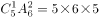。则满足情况的概率为，在到之间。

方法二：要2个棋子在同一排，可以看做要选两个格子在同一排。而第一个选择的格子，任意选取都可以，所以概率为1。第二个选择的格子，需要跟第一个格子在同一排，一排有个格子，被第一个选择占去1个，还剩5个选择，而全部选择可能性还有种，所以第二个格子满足条件的概率为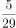。故两个棋子在同一排的概率，在到之间。

故正确答案为B。

---

### 第 2 题　qid 2307703 · 数学运算

某工程50人进行施工。如连续施工20天，每天工作10小时，正好按期完成。但施工过程中遭遇原料短缺，有5天时间无法施工。工期还剩8天时，工程队增派15人并加班施工。若工程队想按期完成，则平均每天需工作（  ）小时。

- **A**. 12.5　✅
- **B**. 11
- **C**. 13.5
- **D**. 11.5

**答案**：A

**官方解析**

赋值每人每小时的效率为1。因遭遇原料短缺，5天无法施工，则只能施工天。题目所求还剩8天时，此时实际施工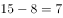天，则剩余工程总量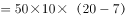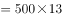。在增派15人情况下，若想按期完成，设每天需要工作小时，可得：，解得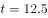，即平均每天需工作12.5小时。

故正确答案为A。

---

### 第 3 题　qid 2307705 · 数学运算

春风街道办事处为丰富老年人文化生活，准备举办老年才艺秀活动。活动项目共有书法、绘画、歌曲演唱、太极拳四项。参加者报名项数不限，每种报名方式最多可报4人。经统计，共有3人同时报名参加书法和绘画项目。据此，参加老年才艺秀活动最多报名（  ）人。

- **A**. 68
- **B**. 73
- **C**. 45
- **D**. 47　✅

**答案**：D

**官方解析**

四项活动，可选择一种、两种、三种或者全部报名，不同的报名方式共有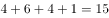种，要想“老年才艺秀活动”报名人数尽量多，则每种报名方式报名人数尽量多，即4人报名，则最多共有人。而同时报名参加书法和绘画项目的情况为（书法、绘画）、（书法、绘画、歌曲演唱）、（书法、绘画、太极拳）、（书法、绘画、歌唱演唱、太极拳），4种报名方式最多可报名人，实际报名3人。则此时报名人数最多为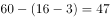人。

故正确答案为D。

---

### 第 4 题　qid 2307706 · 数学运算

现有60枚1元硬币，若把它们在平面上紧密排列成正三角形，要使剩下的硬币尽可能少，则三角形的最大边长是（  ）。

- **A**. 11
- **B**. 10　✅
- **C**. 8
- **D**. 6

**答案**：B

**官方解析**

设组成的紧密排列的正三角形每边有枚硬币，则排列出来的三角形共有枚硬币。

当三角形边长为11，则三角形硬币总数为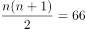枚，超过60枚，排除；

当三角形边长为10，则三角形硬币总数为枚，剩余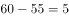枚；

当三角形边长为8，则三角形硬币总数为枚，剩余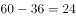枚；

当三角形边长为6，则三角形硬币总数为枚，剩余枚。

当边长为10的时候，剩下的硬币最少。

故正确答案为B。

---

### 第 5 题　qid 2307707 · 数学运算

某班在筹备联欢会时发现很多同学都会唱歌和乐器演奏，但有部分同学这2种才艺都不会。具体有4种情况：只会唱歌、只会乐器演奏、唱歌和乐器演奏都会、唱歌和乐器演奏都不会。现知会唱歌的有22人，会乐器演奏的有15人，两种都会的人数是两种都不会的5倍。这个班至多有（  ）人。

- **A**. 27
- **B**. 30
- **C**. 33　✅
- **D**. 36

**答案**：C

**官方解析**

由题意可知此题为两集合容斥问题。根据两集合容斥公式，设两种都不会的人数为，则两种都会的人数为，代入公式可得，化简得总数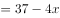。当时，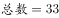，此时班里的人数最多。

故本题正确答案为C。

---

### 第 6 题　qid 2307710 · 数学运算

某超市在春节前购进一批食品礼盒，加价后全部卖出，用收入的一半又购进一批，加价后全部卖出又盈利3000元，则第一次购进的食品礼盒全部卖出后盈利（  ）元。

- **A**. 2000
- **B**. 3000
- **C**. 4000　✅
- **D**. 7000

**答案**：C

**官方解析**

设第一次食品礼盒全部卖出后收入元。根据题意有：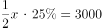，解得元，则第一次购进的食品礼盒全部卖出后的盈利为：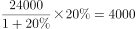元。

故本题正确答案为C。

---

### 第 7 题　qid 2307719 · 数学运算

现有装有相等重量纯水的红白蓝三个桶和装有不知浓度与重量的酒精溶液的黑桶。将红桶中水全部倒入黑桶，此时酒精浓度变为；再将白桶的水全部倒入黑桶，此时酒精浓度变为；再将蓝桶的水全部倒入黑桶，此时酒精浓度变为：

- **A**. 

- **B**. 

　✅
- **C**. 

- **D**. 

**答案**：B

**官方解析**

设红白蓝桶重量为，黑桶重量为。根据混合前后溶质的总质量不变，可列式：，化简得：。蓝桶水加入后，根据，可列式：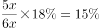。

故正确答案为B。

---

### 第 8 题　qid 2307721 · 数学运算

上午8点甲、乙二人同时从A地出发前往B地，甲骑电动车，乙步行。40分钟后甲到达B地，此时乙距离两地的中点处还需走10分钟，于是乙停下来等待甲返回接他。若甲立刻原速返回，当甲到达乙处接上乙立刻前往B地，速度保持不变。则甲、乙到达B地时甲共骑行（  ）分钟。

- **A**. 88　✅
- **B**. 44
- **C**. 80
- **D**. 94

**答案**：A

**官方解析**

如图，设A到B路程为，由“此时乙距离两地中点处还需走10分钟”可知，乙走一半路程需要分钟；故而40分钟时，乙走的路程为：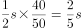；则 “甲从A到B，再返回接乙到B”这全过程一共走了，根据题干可知甲行驶s用时为40分钟，则题干所求为：分钟。

故正确答案为A。

---

### 第 9 题　qid 2307725 · 数学运算

公司的门卫岗与消防岗均采用轮班制，门卫岗每隔两天值一天班，消防岗每4天值一天班，节假日无休息。小张是门卫，小王是消防员，则小张和小王在2019年中一个自然月里同时上班最多有（  ）天。

- **A**. 8
- **B**. 4
- **C**. 3　✅
- **D**. 2

**答案**：C

**官方解析**

门卫岗周期为3天，消防岗周期为4天，二者同时上班的周期为天，自然月最长31天，如果二者在自然月1号同时上班，则本月13日、25日他们同时上班，即一个自然月里同时上班最多有3天。

故正确答案为C。

---

### 第 10 题　qid 2307733 · 数学运算

如图，已知一个四边形中边AD长为3cm，边BC长7cm；∠DAB＝135°，∠ABC=∠ADC=90°那么这个四边形的面积是（  ）。

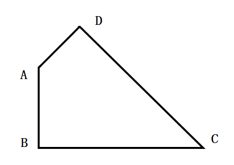

- **A**. 
49/4

- **B**. 
21

- **C**. 

- **D**. 
20
　✅

**答案**：D

**官方解析**

如图，作BA与CD延长线交于E点。由于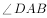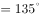，则，由于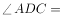，则，从而为等腰直角三角形，进一步可知为等腰直角三角形，则所求四边形面积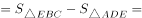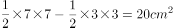。

故正确答案为D。

---

## 判断推理

### 第 1 题　qid 2307699 · 图形推理

从所给的四个选项中，选择最合适的一个填入问号处，使之呈现一定的规律性：

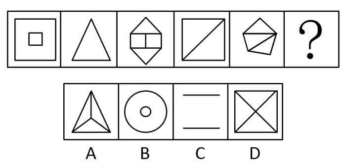

- **A**. A
- **B**. B
- **C**. C　✅
- **D**. D

**答案**：C

**官方解析**

解析一：元素组成不同，且无明显属性规律，考虑数量规律。观察发现，题干图形封闭区域较多，考虑数面，面数量分别为2、1、4、2、3、？，无规律。继续观察发现，题干每幅图均存在外框，且外框边数分别为4、3、6、4、5、？，那么题干每幅图形的外框边数与面数量的差值均为2，只有C项符合。 
故正确答案为C。
解析二：元素组成不同，且无明显属性规律，优先考虑数量规律。观察题干图形发现封闭区域较多，优先数面。但题干图形面数量分别为2、1、4、2、3，无规律。再观察图形发现，题干有些图形有形状相同的面，故考虑数面的种类。图1（大小正方形各算一种）、3、5中均包含2种面，图2、4均包含1种面，因此问号处应选有1种面的图形。A、B项均有2种面，排除；C项没有面，排除；D项是1种面，当选。
故正确答案为D。
注：本题有两种思路，但第二种思路面的种类不太严谨，因此粉笔倾向于按照解析一将正确答案给到C。

---

### 第 2 题　qid 2307700 · 图形推理

从所给的四个选项中，选择最合适的一个填入问号处，使之呈现一定的规律性：

- **A**. A
- **B**. B
- **C**. C
- **D**. D　✅

**答案**：D

**官方解析**

元素组成不同，且无明显属性规律，优先考虑数量规律。观察发现，题干每幅图形都包含直角，因此问号处应选包含直角的图形，只有D项包含直角。
故正确答案为D。

---

### 第 3 题　qid 2307704 · 图形推理

从所给的四个选项中，选择最合适的一个填入问号处，使之呈现一定的规律性：

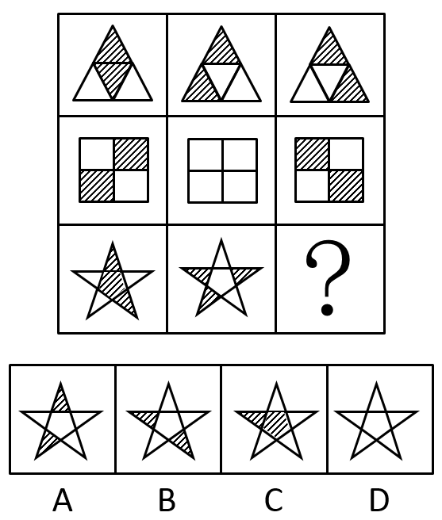

- **A**. A
- **B**. B
- **C**. C
- **D**. D　✅

**答案**：D

**官方解析**

元素组成相似，优先考虑样式规律。观察发现第二行图中黑块数量不同，考虑黑白运算。根据第一行的图形可得：黑+黑=黑，白+白=黑，黑+白=白，白+黑=白；第二行验证此规律成立；第三行运用规律可得？处应为D项。
故正确答案为D。

---

### 第 4 题　qid 2307708 · 图形推理

左边给定的是正方体的外表面展开图，右边哪一项能由它折叠而成？

- **A**. A
- **B**. B　✅
- **C**. C
- **D**. D

**答案**：B

**官方解析**

将原展开图标记序号如下图，逐一进行分析。

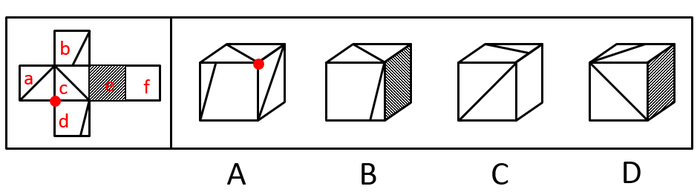

A项：选项由面a、c、d组成，展开图中面a、c、d的公共点（如图圆点）没有引出线条，选项中三个面的公共点（如图圆点）引出一条线，选项与题干不一致，排除；

B项：选项由面c、d、e组成，选项与题干一致，当选；

C项：右侧面为面f，面c与面f为相对面，因此前面为面a，选项由面a、b、f组成。展开图中面b中直角三角形的短边挨着面c，而选项中面b中直角三角形的短边挨着面f，选项与题干不一致，排除；

D项：右侧面为面e，面e与面a为相对面，因此前面为面c，选项由面b、c、e组成。展开图中面b的直角三角形的短边挨着面c，而选项中面b的直角三角形的短边没有挨着面c，选项与题干不一致，排除。

故正确答案为B。

---

### 第 5 题　qid 2307711 · 图形推理

把下面的六个图形分为两类，使每一类图形都有各自的共同特征或规律，分类正确的一项是：

- **A**. ①③⑥  ②④⑤
- **B**. ①②⑤  ③④⑥
- **C**. ①④⑤  ②③⑥　✅
- **D**. ①④⑥  ②③⑤

**答案**：C

**官方解析**

本题为分组分类题目。元素组成不同，优先考虑属性规律。观察发现，图⑤中的S为典型的中心对称特征图，考虑对称性。题干图①④⑤均为中心对称图形，图②③⑥均仅为轴对称图形，即①④⑤一组，②③⑥一组。
故正确答案为C。

---

### 第 6 题　qid 2307712 · 图形推理

从所给的四个选项中，选择最合适的一个填入问号处，使之呈现一定的规律性：

- **A**. A　✅
- **B**. B
- **C**. C
- **D**. D

**答案**：A

**官方解析**

元素组成不同，且无明显属性规律，优先考虑数量规律。观察发现，第三幅图形为“田”字变形图，考虑笔画数。题干图形的笔画数依次为2、1、2、1、2，因此问号处图形的笔画数应为1。四个选项的笔画数分别为1、1、2、1，排除C项；再观察题干图形发现均为直线图形，因此排除B、D两项。
故正确答案为A。

---

### 第 7 题　qid 2307713 · 定义判断

异株克生是指植物产生的次生代谢产物在植物生长过程中，通过信息抑制其他植物的生长、发育并加以排除的现象。
根据上述定义，下列不属于异株克生的是：

- **A**. 黑核桃的叶子含有胡桃醌，可抑制其他植物的生长
- **B**. 农民喷洒除草剂，结果把周围的稻苗也给杀死了　✅
- **C**. 苹果和梨能从果实、枝叶中游离出气态乙烯，造成周围植物枯萎、提早落叶
- **D**. 松树根分泌的一种激素可抑制桦树的生长

**答案**：B

**官方解析**

第一步：找出定义关键词。
“植物产生的次生代谢产物”、“通过信息抑制其他植物的生长、发育并加以排除”。
第二步：逐一分析选项。
A项：黑核桃叶子中的胡桃醌是植物产生的次生代谢产物，可抑制其他植物生长，符合定义，排除； 
B项：农民喷洒的除草剂，不是“植物产生的次生代谢产物”，不符合定义，当选；
C项：苹果和梨游离出的气态乙烯，是植物产生的次生代谢产物，造成周围植物枯萎，符合定义，排除；
D项：松树根分泌的激素是植物产生的次生代谢产物，可抑制桦树的生长，符合定义，排除。
本题为选非题，故正确答案为B。

---

### 第 8 题　qid 2307714 · 定义判断

根据行为人是否进行意思表示，可以将民法上的行为分为表意行为和非表意行为。表意行为，是指行为人通过意思表示进行的行为；非表意行为是指当事人无须意思表示而实施的行为，主要包括事实行为、违法行为。事实行为是指行为人主观上并没有产生民事法律关系的意思，而是依照法律的规定引起民事法律关系后果的行为。
根据上述定义，下列属于事实行为的是：

- **A**. 张三和李四签订房屋租赁合同
- **B**. 李大爷感觉自己时日无多，立下遗嘱
- **C**. 王教授撰写了一篇论文，获得该论文的著作权　✅
- **D**. 赵老板把自己的财产赠与伺候自己多年的保姆

**答案**：C

**官方解析**

第一步：找出定义关键词。
表意行为：“通过意思表示”；
非表意行为：“无须意思表示”；
事实行为：“主观上没有产生民事法律关系的意思”、“引起民事法律关系后果”。
第二步：逐一分析选项。
A项：张三和李四签订租赁合同，主观上有产生民事法律关系的意思，不符合“主观上没有产生民事法律关系的意思”，不符合定义，排除； 
B项：李大爷感觉自己时日无多，立下遗嘱，主观上有产生民事法律关系的意思，不符合“主观上没有产生民事法律关系的意思”，不符合定义，排除；
C项：王教授撰写论文，主观上没有产生民事法律关系的意思，而是依照法律的规定，获得该论文的著作权，引起了民事法律关系后果，符合定义，当选；
D项：赵老板把财产赠与保姆，主观上有产生民事法律关系的意思，不符合“主观上没有产生民事法律关系的意思”，不符合定义，排除。
故正确答案为C。

---

### 第 9 题　qid 2307716 · 定义判断

身体意象失调，又称负面身体自我，是个体对身体的消极认知、消极情感体验和相应的行为调控，它包含对体重、体形和食物等信息的刻板化、情绪化和过分强调的评价。
根据上述定义，下列不属于身体意象失调的是：

- **A**. 张贵每天出门前都在镜子前感叹半天为什么就不长肉呢
- **B**. 侯震觉得自己身材健壮，在健身房里特别爱展示自己的胸肌　✅
- **C**. 李静因为自己太胖，节食了一段时间之后被诊断出厌食症
- **D**. 赵敏整日担心自己身体发福会被丈夫抛弃

**答案**：B

**官方解析**

第一步：找出定义关键词。
“个体对身体的消极认知、情感体验、行为”、“对体重、体形和食物等信息的刻板化、情绪化、过分强调的评价”。
第二步：逐一分析选项。
A项：张贵感叹不长肉是对身体的消极体验，符合“个体对身体的消极认知、情感体验、行为”，符合定义，排除；
B项：侯震身材强壮、爱展示自己的胸肌，不符合“个体对身体的消极认知、情感体验、行为”，不符合定义，当选；
C项：李静因为太胖节食，节食是对身体的消极行为，符合“个体对身体的消极认知、情感体验、行为”，符合定义，排除；
D项：赵敏担心身体发福被丈夫抛弃，担心是一种负面情绪，符合“个体对身体的消极认知、情感体验、行为”，符合定义，排除。
本题为选非题，故正确答案为B。

---

### 第 10 题　qid 2307717 · 定义判断

鸟笼效应是指人们偶然获得一件原本不需要的物品之后，会在此基础上继续添加更多与之相关而自己不需要的东西。
根据上述定义，下列符合鸟笼效应的是：

- **A**. 李玟为了参加某电商平台满199减100的活动买了好些用不上的东西
- **B**. 张磊送了刘阿姨一条大鱼，为了收拾鱼，刘阿姨又买了一把刮鱼鳞的工具
- **C**. 单位开年会时，小丽抽中了一部手机，当天她就在网上选购了一款手机壳
- **D**. 邻居送了小咪一个鱼缸，为此她去买了几条鱼放进去，虽然她并不喜欢养鱼　✅

**答案**：D

**官方解析**

第一步：找出定义关键词。
“偶然获得不需要的物品”、“添加更多与之相关而不需要的东西”。
第二步：逐一分析选项。
A项：李玟参加满199减100的活动是主观意愿，不符合“偶然获得不需要的物品”，不符合定义，排除；
B项：刘阿姨收到了张磊送的鱼，没有提及鱼是否为刘阿姨不需要的物品，不符合“偶然获得不需要的物品”，不符合定义，排除；
C项：小丽在年会抽中一部手机，没有提及手机是否为小丽不需要的物品，不符合“偶然获得不需要的物品”，不符合定义，排除；
D项：小咪不喜欢养鱼，所以小咪收到邻居送的鱼缸，符合“偶然获得不需要的物品”，为了鱼缸购买鱼，符合“添加更多与之相关而不需要的东西”，符合定义，当选。
故正确答案为D。

---

### 第 11 题　qid 2307718 · 定义判断

非任意自白排除规则是指在刑事诉讼中，只有基于被追诉人自由意志而作出的自白（即承认有罪的供述），才具有证据能力；违背当事人意愿或违反法定程序而强制作出的供述不是自白，而是逼供。
根据上述定义，下列符合非任意自白排除规则的是：

- **A**. 犯罪嫌疑人史密斯始终不承认自己有罪，警察于是对其轮番讯问
- **B**. 警察以罗伯特家人的安全威胁其承认自己策划了恐怖袭击　✅
- **C**. 特梅尔在法庭上一直保持沉默，公诉方需要提供更多证据证明其有罪
- **D**. 某国检察机关与布朗达成协议，布朗承认指控换得减轻处罚

**答案**：B

**官方解析**

第一步：找出定义关键词。

大前提：“刑事诉讼”

第一种情况：“自由意志而作出的自白”、“接受此证据”。

第二种情况：“违背当事人意愿或违反法定程序而强制作出的供述”、“排除此证据”。

题干定义给了两种情况，选项满足其中一种情况，即符合定义。

第二步：逐一分析选项。

A项：“警察轮番讯问”可能会违背当事人的意愿，可能符合定义第二种情况，保留；

B项：“以家人的安全威胁其承认策划了恐怖袭击”一定是违反法定程序而强制作出的供述，一定符合第二种情况，保留；

C项：“在法庭上一直保持沉默”即根本没有开口，也就不存在是否是在自由意志下的供述，不符合定义两种情况，排除；

D项：“达成协议，承认指控换得减轻处罚”，但是并不明确达成协议的过程是威逼利诱还是平等协商，可能符合定义第一种情况，保留。

综上所述，B项是一定满足第二种情况，A项是可能满足第二种情况，D项是可能满足第一种情况，对比择优选择B项。

故正确答案为B。

注：本题是争议题，粉笔经过多次教研，并且查阅相关论文资料（如下图），发现“非任意自白排除规则”原文中强调的就是“非自白的供述”、“排除”，即本题的B项，争议在我们的备考阶段了解即可，可不作为重点学习题目。

---

### 第 12 题　qid 2307720 · 定义判断

初级群体指的是具有亲密的人际关系和浓厚的感情色彩的社会群体；次级群体指的是以达到实际的特殊目标为目的，通过明确的规章制度结成正规关系的社会群体。
根据上述定义，下列不涉及初级群体的是：

- **A**. 王丽颖今天过生日，公司的员工们给她买来了生日蛋糕　✅
- **B**. 张爷爷今年一百岁，为了给其祝寿晚辈们成立了一个组委会
- **C**. 李奶奶生病住院了，村里的邻居们都来医院看望她
- **D**. 赵小刚和自己的初中同学们天天在微信群里聊天

**答案**：A

**官方解析**

第一步：找出定义关键词。
初级群体：“具有亲密的人际关系和浓厚的感情色彩的社会群体”；
次级群体：“达到实际的特殊目标为目的”、“通过明确的规章制度结成正规关系的社会群体”。
第二步：逐一分析选项。
A项：公司的员工们给她（王丽颖）买来了生日蛋糕，“公司员工”是同事关系，属于次级群体，不符合定义，保留； 
B项：为了给张爷爷祝寿，晚辈们成立了组委会，“晚辈们”是张爷爷的亲人，符合“具有亲密的人际关系和浓厚的感情色彩的社会群体”，符合定义，排除； 
C项：李奶奶生病住院了，村里的邻居们都来医院看望她。“村里的邻居”是邻里关系，符合“具有亲密的人际关系和浓厚的感情色彩的社会群体”，符合定义，排除； 
D项：“赵小刚和自己的初中同学天天在微信群里聊天”，“初中同学”是同学关系，属于次级群体，不符合定义，保留。
对比A、D两项，公司的员工们给王丽颖过生日，说明此时王丽颖和公司的员工仍在同一家公司，为同事关系，但D项赵小刚和自己的初中同学们在微信群聊天，不明确此时赵小刚是否仍和初中同学在同一所学校，故A项更为明确是次级群体，一定不涉及初级群体，择优选择A项。
本题为选非题，故正确答案为A。

---

### 第 13 题　qid 2307722 · 定义判断

激情群体是指一种临时性的、高效率的，往往为某项富有挑战性的工作而临时组建的工作群体。
根据上述定义，下列属于激情群体的是：

- **A**. 某登山俱乐部组织会员进行登山训练
- **B**. 汶川地震后，某地成立一个慈善基金会，为帮助灾区发起募捐活动
- **C**. 为尽快完成进口生产线的调试工作，某汽车公司召集了公司内数名专家组成项目组　✅
- **D**. 数十名自行车爱好者组成骑车团队，相约在某个周末郊游

**答案**：C

**官方解析**

第一步：找出定义关键词。
“临时性、高效率性”、“为某项富有挑战性的工作而临时组建的工作群体”。
第二步：逐一分析选项。
A项：登山俱乐部是会员们基于爱好组建的俱乐部群体，不符合“为某项富有挑战性的工作而临时组建的工作群体”，不符合定义，排除；
B项：慈善基金会发起灾区募捐活动，虽然是临时组建的工作群体，但是为灾区募捐并不符合“某项富有挑战性的工作”，不符合定义，排除；
C项：召集数名专家组成项目组，符合“临时性、高效率性”，这些专家需要尽快完成进口生产线的调试工作，符合“为某项富有挑战性的工作而临时组建的工作群体”，符合定义，当选；
D项：自行车爱好者组成的骑车团队是基于爱好组建的群体，且郊游不符合“为某项富有挑战性的工作而临时组建的工作群体”，不符合定义，排除。
故正确答案为C。

---

### 第 14 题　qid 2307723 · 定义判断

注意分为内源性注意和外源性注意，内源性注意是指个体根据自己的目标或意图来分配注意、支配行为，是主动注意；外源性注意是指个体外部信息引起的个体注意，是被动注意。
根据上述定义，下列属于外源性注意的是：

- **A**. 为了让学生提高学习积极性，刘老师特别关注有关教学方法的书籍
- **B**. 王静为自驾游而看了大量的旅游攻略
- **C**. 刘玲因喜欢同事买的衣服去了解该服装品牌
- **D**. 这件衣服鲜艳的色彩一下吸引了陈晓的目光　✅

**答案**：D

**官方解析**

第一步：找出定义关键词。
内源性注意：“个体根据自己的目标或意图来分配注意、支配行为”、“主动注意”；
外源性注意：“个体外部信息引起的个体注意”、“被动注意”。
第二步：逐一分析选项。
A项：为了提高学生学习的积极性，刘老师主动关注有关教学方法的书籍，提高学生积极性是刘老师自己的目标，符合“个体根据自己的目标或意图来分配注意，支配行为” “主动注意”，属于内源性注意，排除；
B项：为自驾游而看了大量的旅游攻略，自驾游是王静自己的目标，符合“个体根据自己的目标或意图来分配注意，支配行为” “主动注意”，属于内源性注意，排除；
C项：刘玲因为喜欢主动去了解同事所买衣服的服装品牌，是其主动的注意，符合“个体根据自己的目标或意图来分配注意，支配行为”“主动注意”，属于内源性注意，排除；
D项：陈晓被衣服鲜艳的色彩所吸引，符合“个体外部信息引起的个体注意” “被动注意”，属于外源性注意，当选。
故正确答案为D。

---

### 第 15 题　qid 2307726 · 类比推理

争分夺秒：翻山越岭

- **A**. 深入浅出：前俯后仰
- **B**. 翻云覆雨：想方设法　✅
- **C**. 心服口服：甜言蜜语
- **D**. 以牙还牙：生气勃勃

**答案**：B

**官方解析**

第一步：判断题干词语间逻辑关系。
争分夺秒中，争分和夺秒都是动宾关系，“争”和“夺”是近义关系；翻山越岭中，翻山和越岭都是动宾关系，“翻”和“越”是近义关系。
第二步：判断选项词语间逻辑关系。
A项：深入和浅出均不是动宾关系，并且“深”和“浅”是反义关系，不是近义关系，与题干逻辑关系不一致，排除；
B项：翻云和覆雨都是动宾关系，“翻”和“覆”是近义关系；想方和设法都是动宾关系，“想”和“设”是近义关系，与题干逻辑关系一致，当选；
C项：心服和口服都是主谓关系，并且“心”和“口”是并列关系，不是近义关系，与题干逻辑关系不一致，排除；
D项：以牙和还牙都是动宾关系，但“以”和“还”不是近义关系，与题干逻辑关系不一致，排除。
故正确答案为B。

---

### 第 16 题　qid 2307732 · 类比推理

山东：河北

- **A**. 四川：重庆
- **B**. 辽宁：云南
- **C**. 天津：上海
- **D**. 山西：陕西　✅

**答案**：D

**官方解析**

第一步：判断题干词语间逻辑关系。
山东和河北都是省份，二者是并列关系，且山东和河北地理位置相邻。
第二步：判断选项词语间逻辑关系。
A项：四川是一个省份，重庆是一个直辖市，二者不是并列关系，与题干逻辑关系不一致，排除；
B项：辽宁和云南都是省份，二者是并列关系，但辽宁和云南地理位置不相邻，与题干逻辑关系不一致，排除；
C项：天津和上海都是直辖市，二者是并列关系，但天津和上海地理位置不相邻，与题干逻辑关系不一致，排除；
D项：山西和陕西都是省份，二者是并列关系，且山西和陕西地理位置相邻，与题干逻辑关系一致，当选。
故正确答案为D。

---

### 第 17 题　qid 2307736 · 类比推理

讷言敏行：《论语》

- **A**. 草木皆兵：《三国演义》
- **B**. 运筹帷幄：《左传》
- **C**. 食言而肥：《史记》
- **D**. 饮鸩止渴：《后汉书》　✅

**答案**：D

**官方解析**

第一步：判断题干词语间逻辑关系。
讷言敏行出自《论语》，二者是对应关系。
第二步：判断选项词语间逻辑关系。
A项：草木皆兵出自《晋书·苻坚载记》，不是《三国演义》，与题干逻辑关系不一致，排除；
B项：运筹帷幄出自《史记·高祖本纪》，不是《左传》，与题干逻辑关系不一致，排除；
C项：食言而肥出自《左传·哀公二十五年》，不是《史记》，与题干逻辑关系不一致，排除；
D项：饮鸩止渴出自《后汉书·霍谞传》，二者是对应关系，与题干逻辑关系一致，当选。
故正确答案为D。

---

### 第 18 题　qid 2307739 · 类比推理

小篆：隶书

- **A**. 评剧：二人转
- **B**. 拉丁文：英语　✅
- **C**. 诗歌：寓言
- **D**. 唐诗：汉乐府

**答案**：B

**官方解析**

第一步：判断题干词语间逻辑关系。
小篆和隶书都是一种字体，二者是并列关系，且隶书是由小篆简化发展而来的。
第二步：判断选项词语间逻辑关系。
A项：评剧是五大戏剧之一，二人转是中国东北地区民间戏曲，二者是并列关系，但二人转不是由评剧发展而来的，与题干逻辑关系不一致，排除；
B项：拉丁文和英语都是一种语言，二者是并列关系，且英语是由拉丁文发展而来的，与题干逻辑关系一致，当选；
C项：有的诗歌是寓言，有的诗歌不是寓言，有的寓言是诗歌，有的寓言不是诗歌，二者是交叉关系，与题干逻辑关系不一致，排除；
D项：汉乐府是专门管理乐舞教学的机构，唐诗是唐朝诗歌的通称，二者不是并列关系，与题干逻辑关系不一致，排除。
故正确答案为B。

---

### 第 19 题　qid 2307741 · 类比推理

表达：露骨：含蓄

- **A**. 意见：接纳：反对
- **B**. 道歉：虚伪：真诚　✅
- **C**. 成绩：及格：不及格
- **D**. 梦想：实现：追求

**答案**：B

**官方解析**

第一步：判断题干词语间逻辑关系。
表达可以是露骨的，也可以是含蓄的，后两词都可以用来形容表达，且露骨和含蓄为反义关系。
第二步：判断选项词语间逻辑关系。
A项：接纳意见，反对意见，后两词与意见为动宾关系，与题干逻辑关系不一致，排除；
B项：道歉可以是虚伪的，也可以是真诚的，后两词都可以用来形容道歉，且虚伪和真诚为反义关系，与题干逻辑关系一致，当选；
C项：及格和不及格不是用来形容成绩的，二者是成绩的一种描述角度，与题干逻辑关系不一致，排除；
D项：实现梦想，追求梦想，后两词与梦想为动宾关系，与题干逻辑关系不一致，排除。
故正确答案为B。

---

### 第 20 题　qid 2307746 · 类比推理

伛偻 对于（  ）相当于（  ）对于 国家

- **A**. 老翁：祖国
- **B**. 老朽：国度
- **C**. 老人：社稷　✅
- **D**. 黄发：家园

**答案**：C

**官方解析**

逐一代入选项。
A项：伛偻代指老人，老翁是老年男子，二者是种属关系，祖国是自己的国家，二者是对应关系，前后逻辑关系不一致，排除；
B项：伛偻代指老人，老朽是老年人的自称，二者无明显逻辑关系，国度指政治地理意义上的国家，二者为全同关系，前后逻辑关系不一致，排除；
C项：伛偻代指老人，社稷代指国家，且前者为后者的古称，前后逻辑关系一致，当选；
D项：伛偻和黄发都指老人，二者为全同关系，家园指家庭或家乡，家园与国家不是全同关系，前后逻辑关系不一致，排除。
故正确答案为C。

---

### 第 21 题　qid 2307747 · 类比推理

肖邦：柴可夫斯基

- **A**. 苏步青：刘微
- **B**. 齐白石：卢梭
- **C**. 霍金：哥德巴赫
- **D**. 柳公权：吴道子　✅

**答案**：D

**官方解析**

第一步：判断题干词语间逻辑关系。
肖邦是19世纪的作曲家，柴可夫斯基是19世纪的作曲家，二者均为艺术领域，且生活的年代一致。
第二步：判断选项词语间逻辑关系。
A项：苏步青是现代著名的数学家，但刘微并不是，魏晋时期有个数学家叫刘徽，与题干逻辑关系不一致，排除；
B项：齐白石是近现代中国绘画大师，卢梭是18世纪伟大的启蒙思想家，二者领域不同，生活年代也不一致，与题干逻辑关系不一致，排除；
C项：霍金是现代伟大的数学家、物理学家，哥德巴赫是17-18世纪著名的数学家，二者均为数学领域，但生活的年代不一致，与题干逻辑关系不一致，排除；
D项：柳公权是唐朝著名的书法家，吴道子是唐代著名的画家，均为艺术领域，且生活的年代一致，与题干逻辑关系一致，当选。
故正确答案为D。

---

### 第 22 题　qid 2307750 · 类比推理

（    ）对于 五音 相当于（    ）对于 七情

- **A**. 角律：情思
- **B**. 宫商：思悲　✅
- **C**. 五声：六欲
- **D**. 四书：六律

**答案**：B

**官方解析**

逐一代入选项。
A项：角律是五音的组成部分，二者是组成关系，情思指情谊、情感，不是七情的组成部分，前后逻辑关系不一致，排除；
B项：宫和商为并列关系，都是五音的组成部分，思和悲为并列关系，都是七情的组成部分，二者为组成关系，前后逻辑关系一致，当选；
C项：五声又称五音，二者为全同关系，六欲和七情为并列关系，前后逻辑关系不一致，排除；
D项：四书和五音没有明显的逻辑关系，六律和七情没有明显的逻辑关系，前后逻辑关系不一致，排除。
故正确答案为B。

---

### 第 23 题　qid 2307752 · 逻辑判断

某校招聘专任教师时有张强、李颖、王丹、赵雷、钱萍5名博士应聘。3人毕业于美国高校，2人毕业于英国高校；2人发表过SSCI论文，3人没有发表过SSCI论文。已知，张强和王丹毕业院校所在国家相同，而赵雷和钱萍毕业院校所在国家不同；李颖和钱萍发表论文的情况相同，但王丹和赵雷发表论文的情况不同。最终，英国高校培养的一位发表过SSCI论文的博士被录取。
由此可以推出：

- **A**. 张强没发过SSCI论文
- **B**. 李颖发表过SSCI论文
- **C**. 王丹毕业于英国院校
- **D**. 赵雷毕业于英国院校　✅

**答案**：D

**官方解析**

第一步：分析题干。
① 张强和王丹毕业院校所在国家相同；
② 赵雷和钱萍毕业院校所在国家不同；
③ 李颖和钱萍发表论文情况相同；
④ 王丹和赵雷发表论文情况不同。
第二步：进行推理。
根据条件②赵雷和钱萍毕业院校所在国家不同，可知两人中必有一个人与条件①中张强和王丹毕业院校相同，根据题干可知，3人毕业于美国高校，2人毕业于英国高校，因此张强和王丹肯定毕业于美国高校，排除C项；
根据条件④王丹和赵雷发表论文情况不同，可知两人中必有一个人与条件③中李颖和钱萍发表论文情况相同，根据题干可知，3人没有发表过SSCI论文，2人发表过SSCI论文，因此李颖和钱萍没有发表过SSCI论文，张强发表过SSCI论文，排除A项和B项。
故正确答案为D。

---

### 第 24 题　qid 2307755 · 逻辑判断

某专家指出因驾驶人视线偏离或分心产生的注意力不集中等分心驾驶行为是引发我国交通事故的常见且重要的原因。以下哪项如果为真，最能支持上述专家的观点？

- **A**. 开车时接电话，会使其反应时间延迟3倍
- **B**. 研究显示，欧盟国家67%的车祸是由分心驾驶导致的
- **C**. 开车时交谈发生车祸的概率是正常驾驶的19倍
- **D**. 有统计显示，在我国交通事故的致因中酒驾占1/3，分心驾驶占1/2　✅

**答案**：D

**官方解析**

第一步：找出论点和论据。
论点：因驾驶人视线偏离或分心产生的注意力不集中等分心驾驶行为是引发我国交通事故的常见且重要的原因。
论据：无。
第二步：逐一分析选项。
A项：强调开车时接电话会使反应时间延迟3倍，但是并没有提到反应时间延迟3倍就会引发交通事故，属于无关选项，排除；
B项：论述的是欧盟国家车祸的原因，与我国交通事故的原因无关，属于无关选项，排除；
C项：只是强调开车时交谈发生车祸的概率大，但并不能说明注意力不集中等分心驾驶是引发我国交通事故的重要原因，属于无关选项，排除； 
D项：通过统计数据直接指出，在我国交通事故的致因中分心驾驶占1/2，说明分心驾驶是引发我国交通事故的常见且重要的原因，当选。
故正确答案为D。

---

### 第 25 题　qid 2307757 · 逻辑判断

董事会：我们不应该再在甲项目上浪费资金了。实际上，此项目开始后，公司的市场占有率下降了。所以该项目是失败的。
董事会的论述是基于下列哪项假设？

- **A**. 在甲项目上的投入连续数年增加
- **B**. 公司市场占有率低于甲项目开始的时候
- **C**. 如果没有甲项目，公司的市场占有率不会比现在更低　✅
- **D**. 如果甲项目可以更有效地运作，公司的市场占有率会提高

**答案**：C

**官方解析**

第一步：找出论点和论据。
论点：我们不应该再在甲项目上浪费资金了。
论据：公司的市场占有率下降了，该项目是失败的。
第二步：逐一分析选项。
A项：甲项目的投入连续数年增加，只是甲项目资金的需求大，体现不出项目占有率或失败，不是论证成立的假设，排除；
B项：公司市场占有率低于甲项目开始的时候，但不能确定这就是甲项目所导致的，也有可能是其他项目所致，不是论证成立的假设，排除；
C项：如果没有甲项目，市场占有率不会这样低，可以推出是甲项目导致的市场占有率低，所以我们不应该再在甲项目上浪费资金了，是论证成立的假设，可以加强，当选；
D项：甲项目高效运作，公司的市场占有率就会提高，但不能说明甲项目现在的市场占有率是下降的，不是论证成立的假设，排除。
故正确答案为C。

---

### 第 26 题　qid 2307759 · 逻辑判断

罐子里有水果糖和奶糖两种，幼儿园老师把双手伸进罐子里，然后双手握拳各拿出一块糖。然后老师说了四句话：
①右手肯定不是水果糖。
②或者左手是水果糖，或者右手是水果糖。
③如果左手是水果糖，则右手就不是水果糖。
④左手、右手都是水果糖。
假设老师说的四句话中有三句是真的一句是假的，则下列选项正确的是：

- **A**. 左手水果糖，右手奶糖　✅
- **B**. 左手水果糖，右手水果糖
- **C**. 左手奶糖，右手奶糖
- **D**. 左手奶糖，右手水果糖

**答案**：A

**官方解析**

第一步：找矛盾。
题干中的四句话有三句是真一句是假，条件③如果左手是水果糖，则右手就不是水果糖，和条件④“左手、右手都是水果糖”是矛盾关系，必有一真必有一假，那么①②一定是真。
第二步：看其余。
根据①为真，右手不是水果糖，排除BD项；根据②为真，右手不是水果糖，“否一推一”可知左手是水果糖，只有A项符合。
故正确答案为A。

---

### 第 27 题　qid 2307761 · 逻辑判断

只有通过创造力测试的才能加入创新协会。所有加入创新协会的都会被授予创新人才称号。有的高校教师是创新协会会员。101中学的老师都没有通过创造力测试。
如果上述断定为真，可以推出下列哪项？
Ⅰ.有的高校教师被授予创新人才称号
Ⅱ.有的高校教师通过创造力测试
Ⅲ.101中学的教师中有人被授予创新人才称号

- **A**. 仅Ⅰ
- **B**. 仅Ⅱ和Ⅲ
- **C**. 仅Ⅰ和Ⅱ　✅
- **D**. 仅Ⅰ和Ⅲ

**答案**：C

**官方解析**

第一步：翻译题干。
①加入创新协会→通过创造力测试
②加入创新协会→被授予创新人才称号
③有的高校教师→创新协会会员
④101中学的老师→-通过创造力测试
第二步：逐一分析选项。
I项：根据条件②③，有的高校教师→创新协会会员→被授予创新人才称号，可以推出有的高校教师→被授予创新人才称号，可以推出；
II项：根据条件①③，有的高校教师→创新协会会员→通过创造力测试，可以推出有的高校教师→通过创造力测试，可以推出；
III项：将①逆否得到⑤：-通过创造力测试→-加入创新协会，根据条件④⑤，101中学的老师→-通过创造力测试→-加入创新协会，-加入创新协会是对②的否前，得不到确定性结论，无法推出。
因此，只有I和II可以推出。
故正确答案为C。

---

### 第 28 题　qid 2307764 · 逻辑判断

有人说：凡是考上大学的都是好好学习的学生，张三没有考上大学，所以，张三不是好好学习的学生。
以下哪一个推理明显说明上述论证不成立？

- **A**. 所有有成就者都要穿衣吃饭，我现在没有成就，所以，我不必穿衣吃饭　✅
- **B**. 商品都有使用价值，土地有使用价值，所以土地是商品
- **C**. 所有被评为优秀的公务员都有驻村工作经历，小张被评为优秀公务员，所以小张有驻村工作经历
- **D**. 偷窃是违法行为，违法行为就要被法律严惩，所以偷窃行为应该受到法律严惩

**答案**：A

**官方解析**

第一步：翻译题干。

题干的推理结构：ab，ca，所以cb。

想要说明题干论证不成立，需要选择一个与其具有相同逻辑错误的选项。

第二步：逐一分析选项。

A项：推理结构为：ab，ca，所以cb，与题干逻辑错误一致，可以说明论证不成立，当选；

B项：推理结构为：ab，cb，所以ca，与题干推理不同，无法说明论证不成立，排除；

C项：推理结构为：ab，ca，所以cb，与题干推理不同，无法说明论证不成立，排除；

D项：推理结构为：ab，bc，所以ac，与题干推理不同，无法说明论证不成立，排除。

故正确答案为A。

---

### 第 29 题　qid 2307766 · 逻辑判断

传统理论认为，人类祖先由于气候变化，树木减少，被迫离开树栖环境，选择在地面上直立行走。一项最新研究则认为，早期人类直立行走源自现今非洲东部和南部崎岖山脉地区，该地形是上新世时期火山喷发和构造板块移动形成的。人类的祖先被岩石地形和峡谷所吸引，这里可提供很好的庇护栖息地，同时有机会诱捕猎物；这种环境要求早期人类具备直立行走和攀登的能力，因此人类祖先最终逐渐进化为两足直立行走。
根据上文，可以推出的是：

- **A**. 树栖环境的破坏，迫使人们走进山地峡谷
- **B**. 人类祖先选择直立行走是为了更好适应地形环境　✅
- **C**. 地质条件的变化改变了人类早期祖先的行走方式
- **D**. 峡谷地区提供了更为丰富的食物资源

**答案**：B

**官方解析**

本题为日常结论题，根据题干信息逐一分析选项。
A项：根据第一句话可知，树栖环境的破坏，迫使人类祖先离开树栖环境，选择在地面上直立行走，并未涉及人们走进山地峡谷是由于树栖环境的破坏，无中生有，排除；
B项：根据最后一句话可知，人类祖先最终进化为两足直立行走，是因为岩石地形和峡谷地形要求早期人类具备直立行走和攀登的能力，所以人类祖先直立行走是为了适应岩石地形和峡谷地形，可以推出，当选；
C项：根据最后一句话可知，人类祖先直立行走是因为岩石地形和峡谷地形要求早期人类具备直立行走和攀登的能力，因此直立行走的原因是环境要求，而非地质条件的变化，无中生有，排除；
D项：题干指出岩石地形和峡谷地形可为人类祖先提供很好的庇护栖息地，同时有机会诱捕猎物，但是峡谷地形是否提供了更为丰富的食物资源，无从得知，无中生有，排除。
故正确答案为B。

---

### 第 30 题　qid 2307770 · 逻辑判断

一个充电宝品牌越大、容量越大，给手机充电次数越多。12,000毫安的某大品牌充电宝容量大于8000毫安的某小品牌充电宝容量。所以，12,000毫安某大品牌的充电宝比8000毫安某小品牌的充电宝给同一手机充电次数多。
下列与上述推理最为类似的是：

- **A**. 一个人越喜欢锻炼身体，他的身体越健康。小王比小张爱跑步，所以，小王身体比小张健康
- **B**. 钻石体积越大，它的总价越高。甲的钻石比乙的钻石体积大，因此，甲的钻石比乙的钻石贵
- **C**. 今年跳远冠军的成绩比前年跳远冠军的成绩好。张华是今年的跳远冠军，因此，他今年的跳远成绩比他前年的好
- **D**. 产品质量越高并且广告投入越多，产品需求就越大。甲公司产品质量和投入的广告费比乙公司的好且多，因此，甲公司产品的需求量比乙公司的需求量大　✅

**答案**：D

**官方解析**

第一步：分析题干推理形式。
充电宝品牌（A）越大且容量（B）越大→充电次数（C）越多；通过两个充电宝举例说明，充电宝品牌A1＞A2，且容量B1＞B2，所以充电次数C1&gt;C2。
第二步：逐一分析选项。
A项：越喜欢锻炼身体（A）→身体越健康（B）；小王比小张爱跑步，但锻炼身体的方式有多种，仅看跑步这一项，不能对比出谁更喜欢锻炼身体，与题干推理形式不同，排除；
B项：钻石体积（A）越大→它的总价（C）越高；通过两个钻石举例说明，钻石体积A1＞A2，所以，钻石价格C1＞C2，与题干推理形式不同，排除；
C项：今年跳远冠军的成绩→比前年跳远冠军的成绩好；该项始终讨论的是张华今年与前年的情况对比，但是张华是否是前年的跳远冠军不知道，与题干推理形式不同，排除；
D项：产品质量（A）越高且广告投入（B）越多→产品需求（C）越大；通过两个公司的产品举例说明，产品质量A1＞A2，且投入的广告费B1＞B2，所以需求量C1＞C2，与题干推理形式相同，当选。
故正确答案为D。

---

## 资料分析

### 材料 1

        2018年1-7月份，社会消费品零售总额210752亿元，同比增长。其中，限额以上单位消费品零售额81125亿元，同比增长。

        按经营单位所在地分，7月份，城镇消费品零售额26388亿元，同比增长；乡村消费品零售额4345亿元。1-7月份，城镇消费品零售额180480亿元，同比增长；乡村消费品零售额30272亿元，同比增长。

        按消费类型分，7月份，餐饮收入3343亿元，同比增长；商品零售27391亿元，同比增长。1-7月份，餐饮收入22800亿元，同比增长；商品零售187951亿元，同比增长。

        2018年1-7月份，全国网上零售额47863亿元，同比增长。其中，实物商品网上零售额36461亿元，同比增长，占社会消费品零售总额的比重为；在实物商品网上零售额中，吃、穿和用类商品分别同比增长、和。

#### 第 1 题　qid 2307729 · 综合

2017年1-7月，社会消费品零售总额约为（    ）亿元。

- **A**. 28200
- **B**. 193000　✅
- **C**. 201000
- **D**. 243000

**答案**：B

**官方解析**

由题干“2017年1-7月······约为······亿元”，结合材料已知时间为2018年1-7月，可判定本题为基期计算问题。定位文字材料第一段可得：“2018年1-7月份，社会消费品零售总额210752亿元，同比增长”，故2017年1-7月，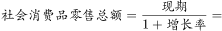，与B项最接近。

故正确答案为B。

---

#### 第 2 题　qid 2307731 · 比重

2017年1-7月，限额以上单位消费品零售额占社会消费品零售总额比重约为：

- **A**. 

- **B**. 

- **C**. 

- **D**. 

　✅

**答案**：D

**官方解析**

由题干“2017年1-7月······占······比重约为”，结合材料已知时间为2018年1-7月，可判定本题为基期比重问题。定位文字材料第一段可得：“2018年1-7月份，社会消费品零售总额210752亿元，同比增长。其中，限额以上单位消费品零售额81125亿元，同比增长”，故2017年1-7月，限额以上单位消费品零售额占社会消费品零售总额比重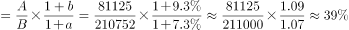。与D项最接近。

故正确答案为D。

---

#### 第 3 题　qid 2307735 · 增长

2018年1-6月，商品零售同比增长约为：

- **A**. 

- **B**. 

- **C**. 

　✅
- **D**. 

**答案**：C

**官方解析**

由题干“2018年1-6月，商品零售同比增长约为”，选项是百分数，结合材料已知2018年7月份商品零售增长率，1-7月份商品零售增长率，可判断本题为混合增长率问题。定位文字材料第三段可得：“7月份，商品零售27391亿元，同比增长。1-7月份，商品零售187951亿元，同比增长”，根据混合增长率大小居中，排除A、B两项。根据线段法，混合前后的增长率之差与基期量成反比，计算时用现期量代替基期量，即，故2018年1-6月，商品零售同比增长。

故正确答案为C。

---

#### 第 4 题　qid 2307737 · 增长

2018年1-7月份，实物商品网上零售额同比增长约（    ）亿元。

- **A**. 8128　✅
- **B**. 7256
- **C**. 9133
- **D**. 8977

**答案**：A

**官方解析**

由题干“2018年1-7月份······同比增长约······亿元”，结合材料已知时间为2018年1-7月，可判定本题为增长量计算问题。定位文字材料第四段可得：“2018年1-7月份，实物商品网上零售额36461亿元，同比增长”，故2018年1-7月份，实物商品网上零售额同比增长量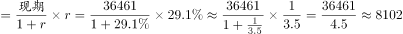亿元。与A项最接近。

故正确答案为A。

---

#### 第 5 题　qid 2307744 · 综合

根据上述资料下列说法正确的是：

- **A**. 
2018年1-7月份，在实物商品网上零售额中，吃、穿和用类商品的比重与上一年同期相比均有所上升
　✅
- **B**. 
2018年7月份乡村消费品零售额增幅约为

- **C**. 
2018年1-7月份城镇消费品零售额同比增长约14292亿元

- **D**. 
2018年1-7月份，吃、穿和用类商品销售额占社会消费品零售总额的比重同比没有变化

**答案**：A

**官方解析**

A项：定位文字材料第四段可得：在实物商品网上零售额中，吃类商品同比增长率，穿类商品同比增长率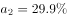，用类商品同比增长率，实物商品网上零售额同比增长率，根据两期比重比较结论，当时比重上升，即比重高于上年水平，故2018年1-7月份，在实物商品网上零售额中，吃、穿和用类商品的比重与上一年同期相比均有所上升，正确；

B项：定位文字材料第二、三段可得，按经营单位所在地分，2018年7月份，城镇消费品零售额同比增长8.6%；按消费类型分，2018年7月份，餐饮收入同比增长9.4%，商品零售同比增长8.7%。社会消费品零售总额=城镇消费品零售额+乡村消费品零售额=餐饮收入+商品零售，根据混合增长率口诀“混合居中”可得：（9.4%）＞＞（8.7%）；＞＞（8.6%）。则可知，即2018年7月份乡村消费品零售额增幅大于8.6%，不可能为7.9%，错误；

C项：定位文字材料第二段可得：“2018年1-7月份，城镇消费品零售额180480亿元，同比增长”，故2018年1-7月份城镇消费品零售额同比增长量，错误；

D项：定位文字材料第四段可得：在实物商品网上零售额中，吃类商品同比增长率，穿类商品同比增长率，用类商品同比增长率。定位材料第一段可得：社会消费品零售总额同比增长率，根据两期比重比较结论，当时比重上升，即比重高于上年水平，故2018年1-7月份，吃、穿和用类商品销售额占社会消费品零售总额的比重同比上升，错误。

故正确答案为A。

---

### 材料 2

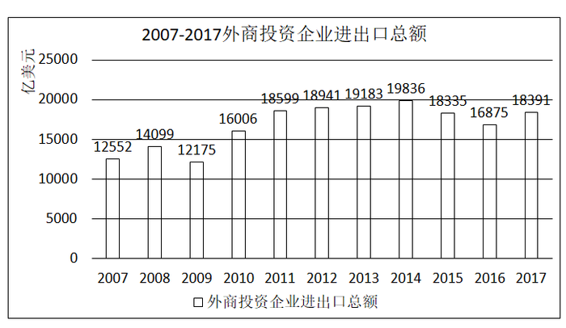

#### 第 6 题　qid 2307727 · 综合

“十二五”时期，我国外商投资企业进出口总额约为（    ）万亿美元。

- **A**. 7.34
- **B**. 7.98
- **C**. 9.26
- **D**. 9.49　✅

**答案**：D

**官方解析**

定位统计图可知2011-2015年各年我国外商投资企业进出口总额，可知“十二五”时期，我国外商投资企业进出口总额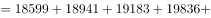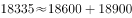，与D选项最接近。

故正确答案为D。

---

#### 第 7 题　qid 2307728 · 增长

下列年份中，外商投资企业进出口总额同比增速最快的是：

- **A**. 2008
- **B**. 2010　✅
- **C**. 2011
- **D**. 2017

**答案**：B

**官方解析**

由题干“······同比增速最快的是········”，可判定本题为一般增长率比较问题。代入公式：，可知：

A项：2008年增长率

B项：2010年增长率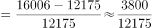

C项：2011年增长率

D项：2017年增长率=

B选项的分子最大，分母最小，故增长率最大。

故正确答案为B。

---

#### 第 8 题　qid 2307734 · 增长

2015年外商投资企业进出口总额同比约：

- **A**. 
下降
　✅
- **B**. 
下降

- **C**. 
增长

- **D**. 
增长

**答案**：A

**官方解析**

由题干“2015年······同比约······”，结合选项为下降/增长百分数，可判定本题为一般增长率计算问题。定位2014年至2015年的全国外商投资企业进出口总额，代入公式：，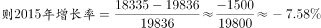，与A项最接近。

故正确答案为A。

---

#### 第 9 题　qid 2307738 · 增长

2009年-2017年全国外商投资企业进出口总额及同比增速均高于上年的年度有（    ）个。

- **A**. 3　✅
- **B**. 4
- **C**. 5
- **D**. 6

**答案**：A

**官方解析**

由题干“······同比增速高于上年的年度······”，可判定本题为一般增长率比较问题。定位2009年至2017年的外商投资企业进出口总额，2009年至2017年全国外商投资企业进出口总额高于上年的年度有2010年、2011年、2012年、2013年、2014年、2017年，将以上年度数据代入公式：

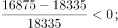

比较上述数据，则2009年至2017年全国外商投资企业进出口总额及同比增速均高于上年的年度有2010年、2014年、2017年，共3个年度。

故正确答案为A。

---

#### 第 10 题　qid 2307743 · 综合

能够从上述资料中推出的是：

- **A**. 2010-2011年我国外商投资企业进出口总额超过3.5万亿美元
- **B**. 2011-2014年我国外商投资企业进出口总额年均超过1.9万亿美元　✅
- **C**. 2014年全国外商投资企业进出口总额比2006年翻了一番
- **D**. 图中外商投资企业进出口总额同比下降的年份超过总年数的1/3

**答案**：B

**官方解析**

A项：定位统计图2010年和2011年，则外商投资企业进出口总额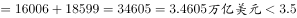万亿美元，错误；

B项：结合106题，2011年至2014年外商投资企业进出口总额，则2011年至2014年外商投资企业进出口年均总额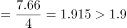万亿美元，正确；

C项：材料中未见2006年数据，错误；

D项：材料中总年数2007年至2017年，材料无2006年数据，所以同比的年份共10年，其中外商投资企业进出口总额同比下降的年份有2009年、2015年、2016年共三年，占总年数比重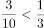，错误。

故正确答案为B。

---

### 材料 3

#### 第 11 题　qid 2307696 · 综合

如果Nipoocar公司4月1日同意以英镑标注的铣床订单价格，在9月1日付款，那么9月1日付款与4月1日付款费用上大约：

- **A**. 多付4242455日元
- **B**. 多付4546015日元
- **C**. 少付4242455日元
- **D**. 少付4546015日元　✅

**答案**：D

**官方解析**

根据题干“······9月1日付款与4月1日付款费用······”，可判断本题为基期比较问题。定位材料表格，Nipoocar公司4月铣床订单数量为15，单价为20245英镑；4月1日1英镑=193.98日元，9月1日1英镑=179.01日元。则9月1日付款日元，4月1日付款日元，对比可知4月1日付款金额高，排除A、B两项。具体数据为：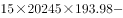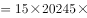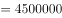日元，与D项最为接近。

故正确答案为D。

---

#### 第 12 题　qid 2307697 · 增长

如AK制造公司钻床订单数环比增长率为，若保持此环比增长率不变，AK公司钻床订单达到500件的时间应在：

- **A**. 2018年7月　✅
- **B**. 2018年9月
- **C**. 2018年11月
- **D**. 2019年1月

**答案**：A

**官方解析**

根据题干“······达到500件的时间······”，可判断本题为现期追赶问题。定位表格可知AK制造公司2018年4月钻床的订单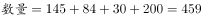件。设个月后AK公司钻床订单数超过500，可得，即为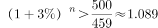，代入A项，，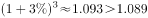，即在2018年7月即可达到。

故正确答案为A。

---

#### 第 13 题　qid 2307698 · 增长

2018年9月1日磨床的价格比订单价下降了，则下列说法正确的是：

- **A**. Reassair公司使用欧元12月31日按订单价支付比9月1日按现价支付更经济　✅
- **B**. Reassair公司使用欧元9月1日按现价支付比12月31日按订单价支付更经济
- **C**. Reassair公司使用日元9月1日按现价支付额比12月31日按订单价支付额高
- **D**. Reassair公司使用美元12月31日按订单价支付比9月1日按现价支付更经济

**答案**：A

**官方解析**

由2018年9月1日磨床的价格比订单价格下降可得，9月1日的价格为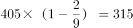英镑。

A项：定位表格，Reassair公司12月31日使用欧元按订单价为欧元，9月1日现价支付为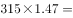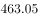欧元，则在12月31日按订单价更加经济，正确；

B项：与A项相反，错误；

C项：定位表格，Reassair公司9月1日使用日元按现价单价为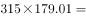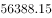日元，12月31日按订单价支付单价为日元，则9月1日按现价支付额比12月31日按订单价支付额低，错误；

D项：定位表格，Reassair公司12月31日使用美元按照订单价支付单价为美元，9月1日按现价单价为美元，则在9月1日按现价支付更加经济，错误。

故正确答案为A。

---

#### 第 14 题　qid 2307702 · 综合

Boeing公司钻床订单价占该公司总订单价约为：

- **A**. 

- **B**. 

　✅
- **C**. 

- **D**. 

**答案**：B

**官方解析**

根据题干“······占该公司总订单······”，可判断本题为现期比重问题。定位表格，Boeing公司钻床订单数量为84个，单价为287英镑，磨床订单数量为574，单价为405英镑。则代入比重公式：。

故正确答案为B。

---

#### 第 15 题　qid 2307709 · 综合

AK制造公司铣床的利润为售价的，磨床的利润为售价的，则关于上述所有磨床和铣床订单按英镑计价的利润额阐述正确的有（    ）个。

①磨床的利润额比铣床高了约左右

②铣床的利润额比磨床低了近

③铣床的利润额大约8万元

④磨床的单位成本比铣床的低

- **A**. 1
- **B**. 2
- **C**. 3　✅
- **D**. 4

**答案**：C

**官方解析**

由题意可得：单件铣床利润为英镑，成本为英镑；单件磨床的利润为英镑，成本为英镑；铣床订单数量为件；磨床订单数量为件。

①磨床利润额比铣床高，约，正确；

②由①结论可设铣床利润额为10份，则磨床利润额为份，铣床利润额比磨床低，近，正确；

③铣床利润额为英镑，而非80000元，错误；

④铣床单位成本为英镑，磨床单位成本为英镑，磨床单位成本低，正确。

正确的有3个。

故正确答案为C。

---

### 材料 4

        国家统计局公布的全国粮食生产数据显示，2018年全国粮食播种面积175555万亩，比2017年下降。全国粮食单位面积产量375公斤/亩，比2017年增长。谷物单位面积产量408公斤/亩，比2017年增长。粮食总产量6579亿公斤，比2017年下降；其中谷物（包括稻谷，小麦，玉米、大麦、高粱、荞麦、燕麦等）总产量6102亿公斤，比2017年下降。全年粮食产量虽有所下降，但减幅不大，仍处于高位水平，属于丰收年景。

#### 第 16 题　qid 2307724 · 增长

2015-2017年三年，全国粮食总产量平均增长率约为：

- **A**. 

- **B**. 

- **C**. 

　✅
- **D**. 

**答案**：C

**官方解析**

由题干“2015-2017年三年，全国粮食总产量平均增长率约为”，结合选项为百分数，可判定本题为年均增长率计算问题。定位柱状图可得，2014年全国粮食总产量为6396亿公斤，2017年为6616亿公斤。代入年均增长率计算公式，（为年份差,由于题目说的三年，因此），。代入选项验证，，，，，与C项最接近。

故正确答案为C。

---

#### 第 17 题　qid 2307730 · 比重

2018年全国谷物总产量占全国粮食总产量的比重，较上一年约：

- **A**. 
增长

- **B**. 
减少
　✅
- **C**. 
增长

- **D**. 
减少

**答案**：B

**官方解析**

由题干“2018年······占······的比重，较上一年约”，结合选项为增长/减少+百分数，可判定本题为两期比重比较问题。定位文字材料及柱状图可得，“2018年全国粮食总产量为6579亿公斤，2017年为6616亿公斤。2018年谷物总产量6102亿公斤，比2017年下降（）。2018年粮食总产量为6579亿公斤，比2017年下降（）”。根据两期比重比较公式可知，，比重下降，且两期比重差，只有B项符合。

故正确答案为B。

---

#### 第 18 题　qid 2307742 · 比重

2018年夏粮的播种面积和总产量分别占全国粮食播种面积和总产量的比重约为：

- **A**. 
和

- **B**. 
和

- **C**. 
和

- **D**. 
和
　✅

**答案**：D

**官方解析**

由题干“2018年······分别占······的比重约为”，可判定本题为现期比重计算问题。定位表格可得，2018年全国粮食总播种面积175555万亩，总产量6579亿公斤，夏粮播种面积40055万亩，总产量1388亿公斤，则2018年夏粮的播种面积占全国的比重为，总产量占全国比重为，与D项最接近。

故正确答案为D。

---

#### 第 19 题　qid 2307749 · 增长

若2018年稻谷的总产量同比增长，那么稻谷的总产量拉动谷物总产量增长了：

- **A**. 

- **B**. 

- **C**. 

　✅
- **D**. 

**答案**：C

**官方解析**

由题干“若2018年稻谷的总产量同比增长，稻谷的总产量拉动谷物总产量增长了”，结合选项为百分数，可判定本题为拉动增长率计算问题。定位文字材料及表格可知，2018年谷物总产量6102亿公斤，比2017年下降，稻谷总产量2121亿公斤，则2018年稻谷同比增长量=亿公斤，2017年谷物总产量为亿公斤，根据拉动增长率=。

故正确答案为C。

---

#### 第 20 题　qid 2307774 · 增长

2014年粮食播种面积同比增长了，2018的粮食播种面积比2013年

- **A**. 
增加了约1653亩

- **B**. 
增加了约2260万亩

- **C**. 
下降了约

- **D**. 
增长了约
　✅

**答案**：D

**官方解析**

由题干“2018的粮食播种面积比2013年”，结合选项为增加多少亩，及增长+百分数，可判定本题为增长率及增长量计算问题。定位柱状图可得，2014年粮食播种面积为176183万亩，2018年为175555万亩。则2013年粮食播种面积为万亩，万亩，增长率为。即2018年粮食播种面积比2013年增长了，增加了1633万亩，只有D项最符合。

故正确答案为D。

---
