# 2018年重庆市公务员录用考试《行测》题（下半年）

> 省考 · 2018 年 · 5 个模块 · 共 120 题

- [常识判断](#%E5%B8%B8%E8%AF%86%E5%88%A4%E6%96%AD) · 19 题
- [言语理解与表达](#%E8%A8%80%E8%AF%AD%E7%90%86%E8%A7%A3%E4%B8%8E%E8%A1%A8%E8%BE%BE) · 37 题
- [数量关系](#%E6%95%B0%E9%87%8F%E5%85%B3%E7%B3%BB) · 10 题
- [判断推理](#%E5%88%A4%E6%96%AD%E6%8E%A8%E7%90%86) · 34 题
- [资料分析](#%E8%B5%84%E6%96%99%E5%88%86%E6%9E%90) · 20 题

---

## 常识判断

### 第 1 题　qid 2401958 · 地理国情

在海洋上，人们常能看到因冰川断裂而形成的浮冰，下列对这类浮冰的盐度理解正确的是（    ）。

- **A**. 不含盐分　✅
- **B**. 盐度和周围海水一样
- **C**. 比周围海水盐度更高
- **D**. 比周围海水盐度略低

**答案**：A

**官方解析**

本题考查地理国情。
冰川是水的一种存在形式，是雪经过一系列变化转变而来的。要形成冰川首先要有一定数量的固态降水，其中包括雪、雾、雹等。极地或高山地区地表上多年存在并具有沿地面运动状态的天然冰体。冰川多年积雪，经过压实、重新结晶、再冻结等成冰作用而形成的。它具有一定的形态和层次，并有可塑性，在重力和压力下，产生塑性流动和块状滑动，是地表重要的淡水资源。由于冰川是淡水资源的一种，故冰川断裂而形成的浮冰不含盐分。
故正确答案为A。

---

### 第 2 题　qid 2401959 · 人文常识

2018年6月14日至7月15日，第21届男足世界杯在俄罗斯举行，在此期间，下列情形最不可能出现的是（    ）。

- **A**. 意大利地中海沿岸出现炎热少雨的天气
- **B**. 悉尼正值冬季，最高气温仅12摄氏度
- **C**. 中国观众在北京时间22：00观看于俄罗斯某地当地时间17：00开始的节目
- **D**. 我国南极泰山站的工作人员在极昼中踢球娱乐　✅

**答案**：D

**官方解析**

本题考查地理国情。2018年6月中旬至7月中旬，北半球处于夏季，南半球处于冬季。

A项正确，地中海气候，是由西风带与副热带高气压带交替控制形成的，是亚热带、温带的一种气候类型。其分布于南北纬的大陆西岸，包括地中海沿岸、黑海沿岸、美国加利福尼亚州、澳大利亚西南部伯斯和南部阿德莱德一带、南非西南部，以及智利中部等地区，因地中海沿岸地区最典型而得名。地中海气候的特点是：夏季炎热干燥、冬季温和多雨。意大利大部分地区属地中海型气候。因此六七月份意大利地中海沿岸可能出现炎热少雨的天气。

B项正确，悉尼属于亚热带季风性湿润气候，气候宜人，风景秀丽，夏不酷热，平均气温，冬无严寒，平均气温。悉尼处于南半球，因此7月份为悉尼的冬季，可能会出现最高气温仅12摄氏度的情况。

C项正确，区时是一种按全球统一的时区系统计量的时间。人为规定，在日界线西侧的东十二区在任何时刻，总是比日界线东侧的西十二区早24小时，这样东、西十二区，虽为一个时区钟点相同，但日期总是相差一天，即东十二区任何时候都比西十二区要早一天。中国位于东八区，俄罗斯首都莫斯科位于东三区。由于东面时区较相邻西面时区早过1小时，而北京（东八区）与莫斯科（东三区）相差5个时区，所以北京时间比俄罗斯当地时间早5小时。因此中国观众可以在北京时间22：00观看于俄罗斯某地当地时间17：00开始的节目。

D项错误，极昼又称永昼或午夜太阳，是在地球的极圈范围内，一日之内，太阳都在地平线以上的现象，即昼长等于24小时。由地球公转和黄赤交角而形成。太阳直射点在哪个半球的回归线，哪一半球的极圈内就会出现极昼现象。6月14日至7月15日，太阳直射点在北回归线附近（6月22日前后直射北回归线），在此期间北极圈内会出现极昼，而南极圈则出现极夜。南极圈在极夜状态下，由于缺少光亮，因此无法进行足球运动。故我国南极泰山站的工作人员在极昼中踢球娱乐的说法错误。

本题为选非题，故正确答案为D。

---

### 第 3 题　qid 2401960 · 人文常识

日常生活中，人们通常把鱼出现上浮并翻肚子的现象称为“翻塘”，该情形极易导致鱼死亡，那么，若无污染、沼气等影响，在一天中，鱼儿最容易因缺氧而“翻塘”的时间是（    ）。

- **A**. 早晨　✅
- **B**. 上午
- **C**. 下午
- **D**. 晚上

**答案**：A

**官方解析**

本题考查科技常识。
影响水体溶氧最主要的几个因素中，首先是温度，水温升高，水体的细菌、藻类、鱼类和其它水生动物活动加强，水中的溶氧就会降低；水温越高，水中溶氧的饱和度就越低。一天之中，池塘中的溶氧也是动态变化的。白天光照强，通过光合作用产生较多的氧气溶解于水中，中、上层水的溶解氧在自然状态下开始上升，在中午过后逐渐达到最高值，溶解氧甚至能达到过饱和状态。到了夜晚，由于没有了光合作用，而池塘内对氧气的消耗量并没有明显减少，使得水体的溶解氧含量逐渐减少，一天之中黎明和清晨的温度最低，所以一天中，早晨池塘中的氧最少。因此早晨最容易出现鱼儿最容易因缺氧而“翻塘”。
故正确答案为A。

---

### 第 4 题　qid 2401961 · 科技常识

血液透析后，发生的最主要变化是（    ）。

- **A**. 蛋白质增加
- **B**. 二氧化碳减少
- **C**. 含氧废物减少　✅
- **D**. 氧气增加

**答案**：C

**官方解析**

本题考查科技常识。
血液透析（HD）是急慢性肾功能衰竭患者肾脏替代治疗方式之一。它通过将体内血液引流至体外，经一个由无数根空心纤维组成的透析器中，血液与含机体浓度相似的电解质溶液（透析液）在一根根空心纤维内外，通过弥散、超滤、吸附和对流原理进行物质交换，清除体内的代谢废物，维持电解质和酸碱平衡，同时清除体内过多的水分，并将经过净化的血液回输。血液透析液中的一些小分子的溶质及水分即通过空心纤维上的小孔进行交换，交换的最终结果是血液中的尿毒症毒素及一些电解质、多余的水分进入透析液中被清除，透析液中一些碳酸氢根及电解质进入血液中。从而达到清除毒素、水分、维持酸碱平衡及内环境稳定的目的。因此血液透析后，含氧废物将大大减少。
故正确答案为C。

---

### 第 5 题　qid 2401962 · 科技常识

关于“嫦娥三号”探测器在月球表面降落时没有使用降落伞的原因，下列表述正确的是（    ）。

- **A**. “嫦娥三号”质量太大，无法制作与其质量匹配的降落伞
- **B**. 月球表面附近并没有大气，使用降落伞也起不到减速作用　✅
- **C**. 在降落后，降落伞极可能将探测器的视线遮住，从而引发重大安全事故
- **D**. 探测器在距离月球较远时已开始减速，期间的时间足够探测器将速度降为0

**答案**：B

**官方解析**

本题考查科技常识。
A项错误，降落伞可以根据物体不同质量制作成相应大小，因此可以制作与其质量匹配的降落伞。
B项正确，月球表面是真空状态，没有大气，降落伞是利用空气阻力原理，展开后可增大迎风面积产生气动力作用，使与其相连的物体减速。月球没有大气，故降落伞无法使用。
C项错误，航空器降落伞采用一套非常精密的控制系统控制开伞的时间以及步骤，探测器的视线即使被遮住也不会影响降落过程。
D项错误，月球表面无大气，因此，嫦娥三号无法利用气动减速的方法着陆，只能靠自身推进系统减小约1.7公里每秒的速度，在此过程中探测器还要进行姿态的精确调整，不断减速以便在预定区域安全着陆。为了保证着陆过程可控，研制团队经过反复论证，提出“变推力推进系统”的设计方案，研制出推力可调的7500N变推力发动机，经过多次点火试车和相关试验验证，破解着陆减速的难题。选项说明的是探测器减速的方法，而非不使用降落伞的原因。
故正确答案为B。

---

### 第 6 题　qid 2401963 · 人文常识

两个完全一样的陶瓷杯中分别装有半杯沸腾的热茶和半杯冷牛奶，如果将它们混合在一起做一杯温度尽可能低的奶茶，下列方法效果最好的是（    ）。

- **A**. 在热茶冷却2分钟后，将牛奶倒入其中
- **B**. 将冷牛奶倒入热茶后，再冷却2分钟
- **C**. 在热茶冷却2分钟后，将其倒入牛奶中　✅
- **D**. 将热茶倒入冷牛奶后，再冷却2分钟

**答案**：C

**官方解析**

本题考查科技常识。
自然冷却一般不会是匀速降温，温度高时降温快，接近环境温度时，降温慢。故采用先冷却热茶的方法，排除B、D两项，由于在热茶倒入冷牛奶的过程中会不断向外界散热，而冷牛奶温度低于环境温度，故不会散热，所以在热茶冷却2分钟后，将其倒入牛奶中，可取得最低温度的奶茶。
故正确答案为C。

---

### 第 7 题　qid 2401964 · 地理国情

公元548-552年，长江流域中重要的政治文化中心建康城经历了一场战乱，几乎成为一片废墟，而整个南方社会都受到空前破坏，这场战乱就是著名的（    ）。

- **A**. 董卓之乱
- **B**. 八王之乱
- **C**. 侯景之乱　✅
- **D**. 安史之乱

**答案**：C

**官方解析**

本题考查人文常识。
A项错误，董卓之乱，指东汉中平六年（189年）至初平三年（192年）董卓入朝后实行的专权暴政。中平六年，董卓奉诏率兵进入洛阳，废汉少帝，立陈留王刘协为帝，自为相国，独揽朝政。次年关东诸侯推袁绍为盟主，讨伐董卓，卓败，挟持汉献帝刘协西走长安，并驱使洛阳数百万人口西迁长安。行前，董卓士卒大肆烧掠，洛阳周围二百里内尽成瓦砾。初平三年，董卓被王允、吕布所杀。这次祸乱，给黄河中游、下游地区造成了深重灾难。
B项错误，八王之乱是发生于中国西晋时期的一场皇族为争夺中央政权而引发的内乱，因皇后贾南风干政弄权所引发。这次动乱始于永平元年（291年），八王在长安、洛阳及黄河两岸混战16年，至光熙元年（306年）结束，造成了极大破坏，北方地区广被战火，历史名城洛阳、长安被夷为丘墟。
C项正确，侯景之乱，又称太清之难，是指中国南北朝时期南朝梁将领侯景发动的武装叛乱事件。侯景之乱后，江南地区的社会经济遭到毁灭性的破坏，加剧了南弱北强的形势。符合题意。
D项错误，安史之乱是中国唐代玄宗末年至代宗初年由唐朝将领安禄山与史思明背叛唐朝后发动的战争，是同唐朝争夺统治权的内战，为唐由盛而衰的转折点。这场内战使得唐朝人口大量丧失，国力锐减。因为发起反唐叛乱的指挥官以安禄山与史思明二人为主，因此事件被冠以安史之名。又由于其爆发于唐玄宗天宝年间，也称天宝之乱。
故正确答案为C。

---

### 第 8 题　qid 2401965 · 人文常识

下列选项中，不是生命体共同特征的是（    ）。

- **A**. 新陈代谢
- **B**. 光合作用　✅
- **C**. 生长和繁殖
- **D**. 遗传和变异

**答案**：B

**官方解析**

本题考查科技常识。
A项正确，新陈代谢是生物体内全部有序化学变化的总称，其中的化学变化一般都是在酶的催化作用下进行的。一切生物都能进行新陈代谢，故属于生命体共同特征。
B项错误，光合作用，通常是指绿色植物或部分藻类吸收光能，把二氧化碳和水合成富能有机物，同时释放氧气的过程。而除了绿色植物或部分藻类外，其他生物并不能进行光合作用，故不属于生命体共同特征。
C项正确，一切生物都可以进行生长和繁殖，故属于生命体共同特征。
D项正确，遗传就是子代在这个连续系统中重复亲代的特性和特征（性状）的现象，其实质则是由于亲代所产生的配子，带给子代按亲代性状进行发育的遗传物质──基因。相同的基因规定着生物体发育相同的性状，于是表现为遗传，体现了生物界的稳定性。但这种稳定性是相对的，因为基因在世代延绵的长期发展过程中，难免会在此时或彼时发生结构的改变。结构改变了的基因使生物体发育不同于改变前的性状，于是出现了变异（可遗传变异）。一切生物都可以进行遗传和变异，故属于生命体共同特征。
本题为选非题，故正确答案为B。

---

### 第 9 题　qid 2401966 · 人文常识

下列选项中，没有错别字的是（    ）。

- **A**. 泊来品
- **B**. 亲睐
- **C**. 断章取义　✅
- **D**. 先发治人

**答案**：C

**官方解析**

本题考查人文常识。
A项错误，舶来品指通过航船从国外进口来的物品。A项中泊来品中“泊”不对。
B项错误，是青睐而不是亲睐。青指眼，指人高兴的时候正视对方，眼球居中。用正眼相看，指喜爱或重视。
C项正确，断章取义是一个汉语成语，指不顾全篇文章或谈话的内容，孤立地取其中的一段或一句的意思，指引用与原意不符。没有错别字。
D项错误，先发制人指先动手的处于主动地位，可以控制对方。选项中“治”为错别字。
故正确答案为C。

---

### 第 10 题　qid 2401967 · 科技常识

下列不属于“中国制造2025”五大工程的是（    ）。

- **A**. 制造业创新中心建设工程
- **B**. 航天技术制造工程　✅
- **C**. 工业强基工程
- **D**. 绿色制造工程

**答案**：B

**官方解析**

本题考查政治常识。
《中国制造2025》是中国政府实施制造强国战略的第一个十年行动纲领。规划明确的九大任务、十大领域、五大工程和八大政策，其中五大工程包括制造业创新中心（工业技术研究基地）建设工程、智能制造工程、工业强基工程、绿色制造工程、高端装备创新工程。因此，A、C、D三项正确，B项错误。
本题为选非题，故正确答案为B。

---

### 第 11 题　qid 2401968 · 人文常识

下列选项中，不属于决胜全面建成小康社会“三大攻坚战”的是：

- **A**. 防范化解重大风险
- **B**. 精准脱贫
- **C**. 污染防治
- **D**. 抑制房价　✅

**答案**：D

**官方解析**

本题考查政治常识。
党的十九大报告指出，要坚决打好防范化解重大风险、精准脱贫、污染防治的攻坚战，使全面建成小康社会得到人民认可、经得起历史检验。故ABC项正确，D项错误。
本题为选非题，故正确答案为D。

---

### 第 12 题　qid 2401969 · 人文常识

下列各省份及其对应的广告宣传语中，最不恰当的是：

- **A**. 广东：看漓江碧水，听春天故事　✅
- **B**. 海南：享南国椰风，望江东新区
- **C**. 山西：魅力山西，晋善晋美
- **D**. 河南：华夏之源，天下之中

**答案**：A

**官方解析**

本题考查地理国情。
A项错误，“听春天故事”是指听《春天的故事》这首歌，这首歌是为了纪念改革开放与深圳特区的开创而创作的，因此符合广东的定位。但是漓江属珠江流域西江水系，位于广西壮族自治区东北部，不在广东，因此不恰当。
B项正确，海南省位于我国最南端，自然资源丰富，物种多样，其中椰子树是海南岛典型的树种。江东新区是海南省海口市的一个市辖区，到2035年，将建设成为全面深化改革试验区的创新区，为全球未来城市建设树立“江东样板”。
C项正确，“晋善晋美”是山西旅游主题宣传口号，用简洁的文字浓缩了山西旅游的整体印象，用直白的语言告诉公众，山西是人善景美、适宜旅游观光的好地方，同时寓意山西旅游产业蓬勃向上，追求尽善尽美。
D项正确，河南历史文化悠久，是世界华人宗祖之根、华夏历史文明之源；文化灿烂，人杰地灵，名人辈出，是中国姓氏的重要发源地。河南地区孕育了裴李岗文化、龙山文化，建立了中国第一个奴隶制国家-夏朝。以后，商代的首都西亳和殷均在河南境内。在安阳殷墟发现的甲骨文，是世界上最早的文字，也是世界上最早的历史文献。河南区位优越，位居天地之中，素有“九州腹地，十省通衢”之称，因此“华夏之源，天下之中”的宣传语是恰当的。
本题为选非题，故正确答案为A。

---

### 第 13 题　qid 2401970 · 人文常识

下列选项释义错误的是（    ）。

- **A**. 霆——暴雷
- **B**. 霏——雨、雪、烟、云等很繁盛的样子
- **C**. 霭——狂风大作的样子　✅
- **D**. 霁——雨（雪）停止后天气很快转晴

**答案**：C

**官方解析**

本题考查人文常识。
A项正确，“霆”做动词时释义为震动；做名词时释义为暴雷、霹雳（雷霆）。
B项正确，“霏”释义为飘扬，烟霏云敛；雨、雪、烟、云很繁盛的样子。
C项错误，“霭”释义为云气，即云雾密集的样子。
D项正确，“霁”指雨雪停止，天空放晴。
本题为选非题，故正确答案为C。

---

### 第 14 题　qid 2401971 · 人文常识

下列情形中，用词最为准确恰当的是：

- **A**. 新闻——现将本地A、B公司强强联合，携手上市的新闻通知给大家
- **B**. 复函——来函已经收悉，现回复如下　✅
- **C**. 感谢信——师恩难忘，无以为报，还望关爱
- **D**. 广告——周末优惠大酬宾，欢迎届时光临

**答案**：B

**官方解析**

本题考查公文写作与处理。
A项错误，公司携手上市应该属于新闻中的消息，用“通知”不合适，改为“报道”，是新闻中较为常用的词语。
B项正确，函属于平行文，收到函之后，需要复函给发文单位，因此用“来函已经收悉，现回复如下”是比较恰当的。
C项错误，感谢信一般是学生毕业时写给老师，毕业以后一般很少有交集，这时用“还望关爱”不妥，应用“还望保重”表达对老师的祝福。
D项错误，“光临”是称宾客来访的敬词，而商家广告针对的是顾客，用“光顾”更加合适。
故正确答案为B。

---

### 第 15 题　qid 2401972 · 人文常识

王羲之在《兰亭集序》里说：“永和九年，岁在癸丑，暮春之初，会于会稽山阴之兰亭”，其中，“暮春之初”是指农历：

- **A**. 二月中旬
- **B**. 二月下旬
- **C**. 三月上旬　✅
- **D**. 三月中旬

**答案**：C

**官方解析**

本题考查人文常识。
对季节的划分一般为：农历一、二、三月为春季，四、五、六月为夏季，七、八、九月为秋季，十、十一、十二月为冬季。而每个季节又可划分为初、仲、暮，分别代表每个季节的第一、二、三个月。如初冬表示十月，仲夏表示五月，暮春表示三月。本题的“暮春之初”是三月的开始，因此是三月上旬。
故正确答案为C。

---

### 第 16 题　qid 2401973 · 人文常识

某市教育局计划就相关事宜行文征求市人力资源和社会保障局意见建议，其所行公文的文种应该是：

- **A**. 通知
- **B**. 请示
- **C**. 函　✅
- **D**. 议案

**答案**：C

**官方解析**

本题考查公文写作与处理。
《党政机关公文处理工作条例》的第八条对公文种类及用法进行了规定。
A项错误，通知适用于发布、传达要求下级机关执行和有关单位周知或者执行的事项，批转、转发公文。通知属于下行文，教育局与人社局不是上下级的关系，因此通知不适用。
B项错误，请示适用于向上级机关请求指示、批准。教育局与人社局不是上下级的关系，因此请示不适用。
C项正确，函适用于不相隶属机关之间商洽工作、询问和答复问题、请求批准和答复审批事项。教育局与人社局是不相隶属的机关，教育局计划向人社局征求意见，行文符合函的用法。
D项错误，议案适用于各级人民政府按照法律程序向同级人民代表大会或者人民代表大会常务委员会提请审议事项，不适用于题目的要求。
故正确答案为C。

---

### 第 17 题　qid 2401974 · 人文常识

①某运动服装广告里，一位运动员身披五星红旗，站在领奖台上；②某白酒广告出现未成年人说“请勿贪杯”后饮酒的情形；③某感冒药广告提到该药品对感冒的治愈高达百分之九十；④某牛奶广告出现描述自己产品是“冠军选择，最佳品质”的广告词。①~④中，违反了我国广告法规定的有（    ）。

- **A**. ①②
- **B**. ③④
- **C**. ②③④
- **D**. ①②③④　✅

**答案**：D

**官方解析**

本题考查法律常识。
①错误，根据《中华人民共和国广告法》第九条规定：“广告不得有下列情形：（一）使用或者变相使用中华人民共和国的国旗、国歌、国徽，军旗、军歌、军徽······”①的广告使用了国旗，属于违反广告法规定的行为。
②错误，根据《中华人民共和国广告法》第十条规定：“广告不得损害未成年人和残疾人的身心健康。”本法第二十三条规定：“酒类广告不得含有下列内容：······（二）出现饮酒的动作······”②的广告中出现未成年人饮酒的动作，损害了未成年人的身体健康，属于违反广告法规定的行为。
③错误，根据《中华人民共和国广告法》第十六条第一款规定：“医疗、药品、医疗器械广告不得含有下列内容：······（二）说明治愈率或者有效率。”③的广告说明了药品的治愈率，属于违反广告法规定的行为。
④错误，根据《中华人民共和国广告法》第九条规定：“广告不得有下列情形：······（三）使用‘国家级’、‘最高级’、‘最佳’等用语。”④的广告使用了“最佳”，属于违反广告法规定的行为。
因此①②③④都违反了广告法。
本题为选非题，故正确答案为D。

---

### 第 18 题　qid 2401975 · 人文常识

下列关于足球的常识，表述错误的是（    ）。

- **A**. 一般认为，现代足球始于英国
- **B**. 比赛中，球队不可使用换人补足因被罚红牌而产生的缺员
- **C**. 曼联、拜仁、皇家马德里以及尤文图斯分别是英格兰、德国、西班牙及意大利著名的足球俱乐部
- **D**. 2014年的巴西男足世界杯，是南美洲国家首次举办男足世界杯比赛　✅

**答案**：D

**官方解析**

本题考查人文常识。
A项正确，现代足球起源于英国。12世纪初，英国开始有了足球赛。1848年，足球运动的第一个文字形式的规则《剑桥规则》诞生。1862年，在英国诺丁汉郡成立了世界上第一个足球俱乐部。
B项正确，一般来说，如果红牌罚下一名队员，是不可以使用换人补足缺员的，球队可以在下一场补员，但是这名被罚下的队员下一场也不可以参赛。
C项正确，曼联指曼彻斯特联足球俱乐部，位于英国英格兰西北区曼彻斯特郡曼彻斯特市，是英格兰足球史上最为成功的俱乐部之一，也是欧洲乃至世界最具有影响力最成功的球队之一；拜仁指拜仁慕尼黑足球俱乐部，是一家设于慕尼黑的德国体育俱乐部，为德国最成功的足球俱乐部；皇家马德里指皇家马德里足球俱乐部，是一家位于西班牙首都马德里的足球俱乐部，拥有众多世界球星，曾被国际足球联合会（FIFA）评为20世纪最伟大的球队；尤文图斯指尤文图斯足球俱乐部，是一家位于意大利的足球俱乐部，是意大利国内历史最为悠久的俱乐部之一，在欧洲足坛具有举足轻重的地位，是欧洲乃至世界上最为成功球会之一。
D项错误，2014年巴西男足世界杯是继1950年巴西世界杯之后世界杯第二次在巴西举行，也是继1978年阿根廷世界杯之后男足世界杯第五次在南美洲举行。
本题为选非题，故正确答案为D。

---

### 第 19 题　qid 2401976 · 法律常识

下列各类收入（收益）中，无需缴纳个人所得税的是（    ）。

- **A**. 居民个人购买国债所获得相应利息　✅
- **B**. 文章作者去世后财产继承人取得的遗作稿酬
- **C**. 个体工商户销售服装所取得的收入
- **D**. 受雇从事公益性医疗服务所取得的报酬

**答案**：A

**官方解析**

本题考查法律常识。
根据《个人所得税法》第二条第一款规定：“下列各项个人所得，应当缴纳个人所得税：（一）工资、薪金所得；（二）劳务报酬所得；（三）稿酬所得；（四）特许权使用费所得；（五）经营所得；（六）利息、股息、红利所得；（七）财产租赁所得；（八）财产转让所得；（九）偶然所得。”
A项正确，根据《个人所得税法》第四条第一款规定：“下列各项个人所得，免征个人所得税：······（二）国债和国家发行的金融债券利息。”居民个人购买国债所获得相应利息属于此列，不需要缴纳个人所得税。
B项错误，文章作者去世后财产继承人取得的遗作稿酬属于稿酬所得，需要缴纳个人所得税。
C项错误，个体工商户销售服装所取得的收入属于经营所得，需要缴纳个人所得税。
D项错误，受雇从事公益性医疗服务所取得的报酬属于工资、薪金所得，需要缴纳个人所得税。
故正确答案为A。

---

## 言语理解与表达

### 第 1 题　qid 2401977 · 逻辑填空

，是我们与生俱来的情怀，对自然，对人文，我们敬畏，我们景仰。江河从哪里流来，你我从哪里来，我们文明的源头在哪里，我们怎么可以不闻不问不查考。如果将人类起源后300万年的全史压缩成一天，那文明史也就差不多只有2分多钟，而文明起源也就是这2分多钟前面的20秒罢了，            。
依次填入画横线部分最恰当的一项是：

- **A**. 忆苦思甜 白云苍狗
- **B**. 慎终追远 倏忽一瞬　✅
- **C**. 居安思危 白驹过隙
- **D**. 刨根问底 沧海一粟

**答案**：B

**官方解析**

本题可从第二空入手，根据“文明起源也就是这2分多钟前面的20秒罢了”可知，该空表示时间很短的意思，B项“倏忽一瞬”指很快地，忽而间，C项“白驹过隙”比喻时间过得快，光阴易逝，均可形容时间短，符合文意，保留。A项“白云苍狗”比喻世事变幻无常，D项“沧海一粟”比喻非常渺小，微不足道，均无法形容时间快，与文意无关，排除。
第一空，C项“居安思危”指要提高警惕，防止祸患，文段未提及“安”和“危”，排除。B项“慎终追远”指慎重地办理父母丧事，虔诚地祭祀远代祖先。也指谨慎从事，追念前贤，可对应后文“江河从哪里流来，你我从哪里来，我们文明的源头在哪里，我们怎么可以不闻不问不查考”，符合文意，当选。
故正确答案为B。
【文段出处】《一把手铲让古今没有距离》

---

### 第 2 题　qid 2401978 · 逻辑填空

聆听蛙鸣，最好是在乡村夏夜有月亮的夜晚，如果有一片荷塘就再好不过了。月上中天，        在夜色中的蛙们也该出场了。刚开始，先是一声、两声，零零星星、稀稀疏疏的，且时断时续、如丝如缕、缥缈轻盈——这大概只是个别蛙在领唱，或者只是吹响呼朋引伴的集合号，用不着大腔大调，其他蛙们便心领神会，            。
依次填入画横线部分最恰当的一项是：

- **A**. 蛰伏 客似云来
- **B**. 隐匿 车水马龙
- **C**. 潜伏 纷至沓来　✅
- **D**. 隐居 一呼百应

**答案**：C

**官方解析**

第一空，搭配“夜色中的蛙们”，A项“蛰伏”指潜伏，隐蔽，B项“隐匿”指隐藏，躲起来，C项“潜伏”指隐藏，埋伏，均可形容“蛙们”隐藏在夜色中的意思，且搭配恰当，保留。D项“隐居”指退居乡里或乡野，深居不肯出仕，与“夜色中的蛙们”搭配不当，排除。
第二空，分析文意可知，横线处表示其他“蛙们”也跟着一起蛙鸣，C项“纷至沓来”形容纷纷到来，连续不断地到来，符合文意，当选。A项“客似云来”意思是来客多得如聚集的云层，形容客人多，与“蛙们”搭配不当，排除；B项“车水马龙”形容热闹繁华的景象，文段强调的蛙声不断，不符合文意，排除。
故正确答案为C。
【文段出处】《夏夜蛙鸣》

---

### 第 3 题　qid 2401979 · 逻辑填空

古建筑其实是了解中国文化的窗口，比如文庙，        着儒家文化在城市的投影；比如宗祠，        着一个个家族繁衍生息的历程。不同的建筑，体现了不同的社会功能，对应着中国传统文化里的科举、道德、宗族、同乡、信仰等等。
依次填入画横线部分最恰当的一项是：

- **A**. 代表 见证　✅
- **B**. 浓缩 记载
- **C**. 传承 镌刻
- **D**. 代言 铭记

**答案**：A

**官方解析**

第一空，搭配“投影”，且根据“古建筑其实是了解中国文化的窗口”可知，“文庙”中就体现着“儒家文化在城市的投影”，A项“代表”，B项“浓缩”，均可以表达文庙中承载着儒家文化的意思，搭配恰当，符合文意，保留。C项“传承”泛指对某某学问、技艺、教义等，在师徒间的传授和继承的过程，与“投影”搭配不当，排除；D项“代言”最初是指代天子草拟诏命，现泛指明星在某方面或某种产品作为代表进行发言，与文意无关，排除。
第二空，搭配“宗祠”，A项“见证”指见证人或可作证据的物品，形容宗祠见证了一代一代人的历程，搭配恰当，符合文意，当选。B项“记载”指把事情写下来，宗祠作为古建筑，无法与“记载”搭配使用，排除。
故正确答案为A。
【文段出处】《老照片里的“影子之城”》

---

### 第 4 题　qid 2401980 · 逻辑填空

《红楼梦》的“三重世界”，是相互依存、相互渗透、不可分割的关系。从贾宝玉的视角看，“诗意的世界”是生活光鲜亮丽的表象，它的光彩，掩盖了鲜血淋漓、残酷冷峻的“现实的世界”。“哲学的世界”则高高在上，以超越的姿态        着日常生活。对“现实的世界”的描绘相对隐晦，不如《金瓶梅》那么露骨，而这方面也正是索隐派和考据派的红学家们最感兴趣的地方，积累下来的研究成果十分丰富，也极为庞杂，有待        。
依次填入画横线部分最恰当的一项是：

- **A**. 睥睨 厘清
- **B**. 眺望 整合
- **C**. 审视 清理　✅
- **D**. 批判 扬弃

**答案**：C

**官方解析**

第一空，根据“高高在上，以超越的姿态”可知，该空表示要求高的意思，C项“审视”指仔细地看，反复分析，符合文意，保留。A项“睥睨”指眼睛斜着看，表示傲视或厌恶，偏贬义，与文段中性的感情色彩不符，排除；B项“眺望”指从高处往远处看，仅指看的角度，未体现要求严格的意思，排除；D项“批判”指对错误的思想或言行批驳否定，也表示评论、评断，与“日常生活”搭配不当，排除。
第二空，代入验证，C项“清理”指彻底整理或处理，可对应前文“积累下来的研究成果十分丰富，也极为庞杂”，符合文意，当选。
故正确答案为C。
【文段出处】《&lt;红楼梦&gt;的三重世界》

---

### 第 5 题　qid 2401981 · 逻辑填空

从旧中国百姓自发闯关东、走西口，到新中国成立后的支边垦荒、三线建设，中国人从来不缺少            的苦干斗志，从来不缺少            的开拓精神。但改革开放释放出的创业激情和创造伟力，可谓前所未有，恢弘壮阔。建省之初的海南封闭落后、百业待兴，许多地方连红绿灯都没有。靠着各族群众、各方"闯海人"的拼搏付出，海南如同在一张白纸上绘就了改革开放南海之滨的壮美图画。改革唤醒了梦想，梦想扎根大地，改革与梦想如影随形、互相成就，正是改革开放40年来神州巨变的生动缩影。
依次填入画横线部分最恰当的一项是：

- **A**. 乘风破浪 披荆斩棘
- **B**. 勇往直前 胼手胝足
- **C**. 筚路蓝缕 白手起家　✅
- **D**. 起早贪黑 激流勇进

**答案**：C

**官方解析**

第一空，应体现出“苦干”与“斗志”。A项“乘风破浪”比喻志向远大，不畏艰险，勇往直前，B项“勇往直前”意思是勇敢地一直无畏地前进，C项“筚路蓝缕”指驾着简陋的柴车，穿着破烂的衣服去开辟山林道路，形容创业的艰苦，三者都可以体现出“苦干”与“斗志”，均符合文意，保留。D项“起早贪黑”意思是起得早，睡得晚，形容辛勤劳动，无法体现出“斗志”，排除。
第二空，形容“开拓精神”，C项“白手起家”是指没有任何经济实力支持，靠着双手进行创业，最后获得成功的果实，符合文意，当选。A项“披荆斩棘”比喻在前进道路上清除障碍，克服困难，B项“胼手胝足”形容劳动十分辛勤，均没有开拓、开辟之意，排除。
故正确答案为C。
【文段出处】《让我们都来做“闯海人”》

---

### 第 6 题　qid 2401982 · 逻辑填空

在我们几千年的传统文化中，父母都有望子成龙、望女成凤的情结。家长们希望孩子在学业和事业上            ，这是人之常情，也是一个家庭、一个民族不断前进的动力之一。只是在望子成龙的道路上，许多父母陷入了误区，一是望之过高，望之过急，二是望子不望己。望之过高，望之过急，就是对孩子的期望值过高，            ，产生的后果一是            ，二是给子女造成过大的心理压力。
依次填入画横线部分最恰当的一项是：

- **A**. 一枝独秀 利欲熏心 好高骛远
- **B**. 出类拔萃 急功近利 揠苗助长　✅
- **C**. 出人头地 唯利是图 欲速不达
- **D**. 鹤立鸡群 急于求成 适得其反

**答案**：B

**官方解析**

本题可从第二空入手，“望之过高，望之过急”体现出了父母对孩子期望高，对孩子成才的急切心情，故空缺处应体现出“急切”。B项“急功近利”意思是急于求成，贪图眼前的成效和利益，D项“急于求成”形容急着要取得成功，都可以体现出“急切”，符合文意，保留。A项“利欲熏心”意思是贪财图利的欲望迷住了心窍，C项“唯利是图”指只贪图利益，不顾及其他，均侧重体现对“利益”的追求，没有体现出“急切”，排除。
第三空，根据文意，产生的后果有两个，且为并列关系。B项“揠苗助长”比喻不管事物的发展规律，强求速成，反而把事情弄糟，对应前文的“望之过高，望之过急”，符合文意，保留。D项“适得其反”意思是恰恰得到与预期相反的结果，“给子女造成过大的心理压力”也属于“适得其反”，二者不为并列关系，排除。
第一空，代入验证，B项“出类拔萃”形容超出同类，符合文意，当选。
故正确答案为B。
【文段出处】《“儿子开面包店同样自豪”》

---

### 第 7 题　qid 2401983 · 逻辑填空

在万灵古镇的濑溪河畔，烟雨朦胧，气息        ，宁静且有着避世的烟火，深厚的历史文化在这里交融，古寨、古桥和灵动的河水融汇成一幅水墨画卷，能够让人徘徊在桥水之间，        于烟雨小道。
依次填入画横线部分最恰当的一项是：

- **A**. 氤氲 徜徉　✅
- **B**. 旖旎 踌躇
- **C**. 绮丽 盘桓
- **D**. 叆叇 留连

**答案**：A

**官方解析**

第一空，横线处搭配“气息”，且与“烟雨朦胧”意思相近，体现出一种朦胧美。A项“氤氲”形容烟或云气浓郁，符合文段所述的意境，保留。B项“旖旎”多用来描写景物柔美、婀娜多姿的样子，C项“绮丽”形容华美艳丽，均与文段描绘的朦胧意境不符，排除；D项“叆叇”指的是云彩很厚的样子，形容浓云蔽日，与“气息”搭配不当，排除。
第二空，代入验证，A项“徜徉”指陶醉于某事物当中，与前文的“徘徊”形成对应，符合文意，当选。
故正确答案为A。
【文段出处】《流淌在时光里的烟火》

---

### 第 8 题　qid 2401984 · 逻辑填空

试问，谁不愿意追求更加完美的人生？然而，一个人的成长与成功，离不开一定的主客观条件来        。虽然很多时候我们无法改变所处的环境，但只要学会遇事            ，常问问自己最缺的东西是什么，矢志补齐最薄弱的那块短板，就能不断提升自己的综合素养，让自我保持协调发展的态势，从而更趋近心中的“完美”。
依次填入画横线部分最恰当的一项是：

- **A**. 加持 见贤思齐
- **B**. 帮衬 扪心自问
- **C**. 托举 反求诸己　✅
- **D**. 烘托 痛定思痛

**答案**：C

**官方解析**

本题可从第二空入手，“常问问自己最缺的东西是什么，矢志补齐最薄弱的那块短板”是对空缺处的解释说明。C项“反求诸己”意思是遇到挫折时切莫责怪他人，而应先反过来从自己身上找出问题的症结，并努力加以改正，B项“扪心自问”表示自我反省，均符合文意，保留。A项“见贤思齐”意思是见到德才兼备的人就要向他（她）看齐，文段没有体现出要向德才兼备的人看齐，排除；D项“痛定思痛”指悲痛的心情平定之后，回想当时的痛苦，一般用于已经犯错或者发生灾难之后，而文段并没有体现出已经犯错或发生灾难，排除。
第一空，C项“托举”原意指向上举起重物，置于文中指可以促进“成长与成功”，符合文意，当选。B项“帮衬”指帮助、资助，主语一般是人，与“主客观条件”搭配不当，排除。
故正确答案为C。
【文段出处】《常问自己“最缺什么”（人民论坛）》

---

### 第 9 题　qid 2401985 · 逻辑填空

“管”，不是要“管死”，而是要根据不同业态的发展规律来管理。比如，社区集中的地方建菜市场非常必要。如果管理不善，菜市场确实会带来一定的环境、交通等问题，________地“一关了之”当然省事，但与便民________。实际上，加强日常卫生管理，建好停车位等配套设施，借鉴使用超市解决卫生、交通等问题的招数，菜市场带来的问题也能较好解决。
依次填入画横线部分最恰当的一项是：

- **A**. 因噎废食    背道而驰　✅
- **B**. 釜底抽薪    相去甚远
- **C**. 剜肉补疮    天差地别
- **D**. 因小失大    大相径庭

**答案**：A

**官方解析**

第一空，横线处所填词语对应“一关了之”，根据文意，要“管”而不是“管死”可知，单纯“一关了之”当然省事，但也带来了更大的不便。A项“因噎废食”比喻因小而废大或怕做错事而索性不干；C项“剜肉补疮”比喻只顾眼前，用有害的方法来救急；D项“因小失大”形容为了小的利益而造成大的损失，三项均符合文意，保留。B项“釜底抽薪”比喻从根本上解决问题，而转折之后强调带来了问题，与文意不符，排除。
第二空，根据文意“建菜市场非常必要”可知，“一关了之”实际上会与便民的初衷相背离，A项“背道而驰”比喻背离正确的道路，符合文意，当选。C项“天差地别”强调差别大；D项“大相径庭”比喻相差很远，大不相同，两项均侧重“不同”，而文段强调的是背离初衷，排除。
故正确答案为A。
【文段出处】《让菜摊和超市“各美其美”》

---

### 第 10 题　qid 2401986 · 逻辑填空

吟诗作对不分职业，对美的欣赏更没有_________，诗词不应是少数学界精英的________，更不是博物馆里的展品，只有每个普通人都拥有一颗诗心，活出一份诗意，才能让地气激活文气，让文气凝聚人气。
依次填入画横线部分最恰当的一项是：

- **A**. 畛域    专利　✅
- **B**. 界限    特权
- **C**. 边界    禁脔
- **D**. 禁区    权柄

**答案**：A

**官方解析**

第一空，根据文意，吟诗作对“不分职业”，即任何人都可以做，故后半句与之意思相近，指任何人都可以欣赏美。A项“畛域”指界限，范围；B项“界限”指不同事物的分界；C项“边界”有界线之意，三者均符合文意，保留。D项“禁区”指“未经许可不允许进入”的特殊地区或者区域，文意并非对美的欣赏没有“特殊的区域”，排除。
第二空，结合前文可知，空缺处意在指出诗词不是只有少数精英才能欣赏、创作的。A项“专利”指专有的权利和利益，符合文意，当选。B项“特权”又称自由权，意味着主体可以针对某一客体采取其想采取的行为，主语应该是一种权力，“诗词”并不能体现出权力，排除。C项“禁脔”比喻某种珍美的、仅独自享有、不容别人染指的东西，侧重主观上不容许他人染指，而文段并非“少数学界精英”不允许他人染指诗词，排除。
故正确答案为A。
【文段出处】《活出自己的诗意人生》

---

### 第 11 题　qid 2401988 · 逻辑填空

医学界的“自体实验”的传统可谓芳泽绵长而________。1767年，汉特为研究性病而自我接种梅毒；1885年，克力勇将“秘鲁疣”患者的脓血注入自己皮下而感染了“奥罗亚热”，以生命的代价证明了这是同一种疾病的两种不同形态······1921年······1954年······2001年······各种感人、新奇甚至疯狂的记载几乎_________。
依次填入画横线部分最恰当的一项是：

- **A**. 前仆后继    如数家珍
- **B**. 薪火相传    罄竹难书
- **C**. 源远流长    多如牛毛
- **D**. 相沿不辍    俯拾即是　✅

**答案**：D

**官方解析**

第一空，根据后文，通过举例指出在不同时代，各种“自体实验”的记载都存在，故空缺处意在指出“自体实验”的传统一直都是存在的。B项“薪火相传”比喻学问和技艺代代相传；D项“相沿不辍”指一直延续，没有中断，两项均符合文意，保留。A项“前仆后继”指前面的倒下了，后面的紧跟上去，形容斗争得英勇壮烈，主语是人而不能是“传统”，排除；C项“源远流长”比喻历史悠久，根底深厚，文段侧重强调“一直都在”而非“历史悠久”，排除。
第二空，根据前文的例子可以看出，“自体实验”的记载很多，D项“俯拾即是”指低下头来随便捡一捡就到处都是，形容十分多，又十分容易得到，符合文意，当选。B项“罄竹难书”形容罪恶多的数都数不完，与“记载”搭配不当，排除。
故正确答案为D。

---

### 第 12 题　qid 2401989 · 逻辑填空

云南地形复杂，海拔高差悬殊，特别是横断山区，地势海拔垂直分布明显，是世界高等植物区系最丰富的区域。这里的立体气候和独特的树种，孕育了丰富多样的野生食用菌。野生食用菌之所以成为云南这块多彩土地上的一支________，与云南多姿多态的气候和自然环境________。
依次填入画横线部分最恰当的一项是：

- **A**. 瑰宝    紧密相连
- **B**. 奇葩    密不可分　✅
- **C**. 珍品    休戚与共
- **D**. 孤本    息息相关

**答案**：B

**官方解析**

本题可从第二空入手，空缺处有关系密切之意。B项“密不可分”和D项“息息相关”均形容关系非常密切，符合文意，保留；A项“紧密相连”，“连”侧重外在的连接，而非内在关联，排除；C项“休戚与共”形容关系紧密，利害相同，文段没有体现出“利害”相同，排除。
第一空，横线处形容“野生食用菌”。B项“奇葩”指美好出众的事物，符合文意，当选；D项“孤本”指某书刊仅有一份在世间流传的版本，亦指仅存的一份未刊手稿或原物已亡佚，仅存的一份拓本，不能用于形容“野生食用菌”，排除。
故正确答案为B。
【文段出处】《菌子云南的乡野味道》

---

### 第 13 题　qid 2401990 · 逻辑填空

不少减肥的人会遇到这样的尴尬时刻——本来接到朋友聚会的邀请是让人开心的事，可细一想却又不免挣扎：与朋友一起吃饭会让人________，这会让减肥________。去还是不去，这是一个问题。
依次填入画横线部分最恰当的一项是：

- **A**. 大快朵颐    事倍功半
- **B**. 大饱口福    危在旦夕
- **C**. 食前方丈    功败垂成
- **D**. 胃口大开    功亏一篑　✅

**答案**：D

**官方解析**

第一空，根据文意可知空缺处指吃得多。A项“大快朵颐”形容大饱口福、痛快淋漓地大吃一通、非常快活的享受美食，符合文意，保留；D项“胃口大开”形容胃口好，吃的多，符合文意，保留；B项“大饱口福”指吃够了很好的东西，侧重吃的“好”，而非吃的“多”，排除；C项“食前方丈”形容吃的阔气，阔气并不一定吃的多，排除。
第二空，根据文意可知空缺处指因与朋友聚餐导致减肥受到影响，没有成功。D项“功亏一篑”比喻做事情只差最后一点却没能完成，结果枉费工夫，符合文意，当选；A项“事倍功半”形容做事的方法费力大，收效小，文段侧重减肥失败，而非收效小，排除。
故正确答案为D。
【文段出处】《不负宾朋不负餐》

---

### 第 14 题　qid 2401992 · 逻辑填空

“国家兴则麋鹿兴”，研究专家指出，麋鹿是我国独有的特殊物种，传奇色彩浓厚，它们曾在中国自由自在生活，在清末乱世中________，新中国成立后幸运回归，它的经历体现了中华民族复兴与中国生态保护工作________、互促共荣的特点。
依次填入画横线部分最恰当的一项是：

- **A**. 流离    相辅相成　✅
- **B**. 消亡    荣辱与共
- **C**. 消逝    风雨同舟
- **D**. 流浪    血脉相连

**答案**：A

**官方解析**

本题可从第二空入手，横线处所填词语与“互促共荣”意思相近，指两件事互相促进。A项“相辅相成”指两件事物互相配合，互相补充，缺一不可，符合文意，保留；B项“荣辱与共”指光荣与耻辱共同分享与承担，文段介绍麋鹿在新中国成立后幸运回归，没有体现出“耻辱”，排除；C项“风雨同舟”比喻共同经历患难，文段没有体现出“中华民族复兴与中国生态保护工作”共同患难，排除；D项“血脉相连”比喻关系非常密切，不可分离，侧重不能分离，而非互相促进，排除。锁定A项。
第一空代入验证，A项“流离”指离散、流落，符合文意，当选。
故正确答案为A。
【文段出处】《洞庭深处的“麋鹿奶爸”》

---

### 第 15 题　qid 2401993 · 逻辑填空

人们在讨论和自己不同的口语时经常会带有偏见。________的话，这类偏见的形成可以回溯到人们_______的婴儿期。研究表明，几个月的婴儿就能分辨不同音调的语音和方言，婴儿会对说母语的人显得亲近。
依次填入画横线部分最恰当的一项是：

- **A**. 原始原种    呱呱坠地
- **B**. 追根溯源    咿呀学语　✅
- **C**. 刨根问底    懵懵懂懂
- **D**. 顺藤摸瓜    一无所知

**答案**：B

**官方解析**

本题可从第二空入手，根据后文可知，横线后的“婴儿期”指的是婴儿能够“分辨不同音调的语音和方言”的时期，B项“咿呀学语”是形容小儿学说话时口中发出的声音，往往用于形容小孩子刚开始学说话的时期，符合文意，保留。A项“呱呱坠地”形容婴儿出生或事物问世；C项“懵懵懂懂”指对事物的认知模糊，没有认识到本质，只是粗浅了解，不明事理；D项“一无所知”意思是什么也不知道，三项均无法体现出婴儿能够“分辨不同音调的语音和方言”，不符合文意，排除。
第一空代入验证，B项“追根溯源”指追溯事物发生的根源，与后文“回溯婴儿时期”对应得当，符合文意，当选。
故正确答案为B。

---

### 第 16 题　qid 2401995 · 逻辑填空

研究也显示，对外的控制一开始确实能增强幸福感，但越过一个临界点后，反而会开始降低幸福感。外部控制狂更容易倾向于做出            的高风险决策，他们身边往往只剩下少数顺从者，因此在做错决定时也得不到逆耳忠言。
填入画横线部分最恰当的一项是：

- **A**. 孤注一掷　✅
- **B**. 歇斯底里
- **C**. 困兽犹斗
- **D**. 背水一战

**答案**：A

**官方解析**

横线处形容“高风险决策”。A项“孤注一掷”比喻在危急时用尽所有力量作最后一次冒险，可体现“高风险”的含义，当选。
B项“歇斯底里”形容人情绪激动、举止失常；C项“困兽犹斗”比喻在绝境中还要挣扎抵抗；D项“背水一战”比喻与敌人决一死战，均不能形容“高风险决策”，排除。
故正确答案为A。
【文段出处】《控制狂也能有好人生》

---

### 第 17 题　qid 2401996 · 逻辑填空

青蛙在发育时，其胚胎直接浸泡于水中，更容易受到致畸物的影响，因而更脆弱。对于人类来说，________其胚胎在发育时，受到多重保护；________，通过激素致青蛙畸形的途径，也可以影响到人。________，蟾蜍和青蛙均被列入国家保护的有益或者有重要经济、科学价值的野生动物名录。
依次填入画横线部分最恰当的一项是：

- **A**. 即使    可是    所以
- **B**. 尽管    但是    因此　✅
- **C**. 哪怕    然而    那么
- **D**. 纵然    不过    因而

**答案**：B

**官方解析**

第一空，横线后表示人类胚胎发育受到多重保护，这为客观事实。A项“即使”、C项“哪怕”、D项“纵然”均表示假设让步关系，与文意不符，且从关联词固定搭配的角度来看，正确的搭配应为“即使······也”、“哪怕······也”、“纵然······也”，故基本锁定B项。
第二空，横线前为受到保护，横线后表示也可以影响人类，因此横线处应填入转折关联词。B项“但是”符合文意。
第三空，横线前论述了青蛙发育的特点和对人类的影响，横线后论述了青蛙被纳入野生动物名录，前后为因果关系，B项“因此”符合文意，当选。
故正确答案为B。
【文段出处】《正在远离的蛙鸣》

---

### 第 18 题　qid 2401998 · 逻辑填空

在他的这幅作品中，圆形的构图将山之棱角、水之波漾、墙之粉黛汇于画面，把人的记忆拉回到苏州博物馆的经典场景。画面中显而易见的姑苏元素，是苏州版画家对姑苏风物的最佳        ，怡情悦性，浸透了苏州风物和情调、沐浴着苏州人文和哲思的版画仍在发展中        。
依次填入画横线的部分最恰当的一项是：

- **A**. 馈赠    演变
- **B**. 回报    进化
- **C**. 反馈    进阶
- **D**. 回馈    演进　✅

**答案**：D

**官方解析**

第一空，横线处形容“姑苏元素”，表示画中的姑苏元素是画家对姑苏风物的报答。B项“回报”、D项“回馈”均符合文意，保留。A项“馈赠”表示赠送东西，姑苏元素并非是画家赠送给姑苏风物的东西，排除；C项“反馈”表示信息传递、返回，与“元素”搭配不当，排除。
第二空，横线处形容版画的发展。D项“演进”表示演变发展，符合文意，当选。B项“进化”表示事物由简单到复杂、由低级到高级而逐渐变化，一般用来形容生物，与“版画”搭配不当，且文段并未提及版画由低级到高级的过程，排除。
故正确答案为D。
【文段出处】《桃坞镌印： 续写版画传奇》

---

### 第 19 题　qid 2402004 · 逻辑填空

多年来，相比于城市的迅猛发展，广大农村地区尤其是中西部农村的发展相对缓慢，以至于很多农村年轻人要进城寻找工作，但融入城市            。这些问题，对于我这样的年轻记者来说，以前只是            地听专家们            ，并未有过切身体会和深入思考。而通过新春走基层，记者开始有意识地，带着问题去了解农村、观察社会，一点点寻找问题的答案。
依次填入画横线部分最恰当的一项是：

- **A**. 难上加难 浮光掠影 侃侃而谈　✅
- **B**. 千难万险 走马观花 老生常谈
- **C**. 困难重重 蜻蜓点水 纸上谈兵
- **D**. 举步维艰 囫囵吞枣 谈笑风生

**答案**：A

**官方解析**

第一空，根据后文指代词“这些问题”可知，横线处意在强调年轻人融入城市的问题较多。A项“难上加难”指十分困难，C项“困难重重”指一个困难接着一个困难，D项“举步维艰”指行走困难，行动不方便，三项均符合文意，保留。B项“千难万险”形容困难和危险极多，但是文段仅强调年轻人融入城市问题较多，没有体现出危险，与文意不符，排除。
第二空，文段“只是······并未······”表转折，转折后为深入思考，转折前应表示表面的、浅显的、不深刻的。A项“浮光掠影”比喻对事物观察不细致，印象不深，C项“蜻蜓点水”比喻做事肤浅不深入，均符合文意，保留。D项“囫囵吞枣”指在学习上食而不化，不加分析，与“听”搭配不当，排除。
第三空，横线处形容专家们发表意见。A项“侃侃而谈”形容理直气壮、从容不迫地说话，符合文意，当选。C项“纸上谈兵”比喻空谈理论，不能解决实际问题，为贬义词，文段不含贬义色彩，排除。
故正确答案为A。
【文段出处】《人民日报新春走基层 双脚丈量时代笔墨记录变迁》

---

### 第 20 题　qid 2402005 · 片段阅读

我国水资源短缺，50多个沿海城市有40多个严重缺水，海岛、苦咸内陆地区也急需淡水资源。解决水资源不足难题，要节流也要开源，海水淡化就是一个开源的好途径。我国是海洋大国，海洋中“蕴藏”着丰富的淡水，向大海要水喝，是我们的现实选择之一。更何况，淡化海水不淹地、不移民、不争水、不受气候变化影响，具有独特的优势。我国海水淡化技术研究始自上世纪60年代，经过多年努力，虽已具备一定产业基础，但仍存在一些瓶颈，包括海水淡化成本高、工程化应用还不够、一些地方水资源利用观念有待转变等。
这段文字意在说明：

- **A**. 海水淡化是我国解决水资源短缺的必要途径
- **B**. 我国海水淡化技术及水资源观念等亟待改进　✅
- **C**. 结合我国国情，海水淡化优势颇多
- **D**. 我国海水淡化技术发展困难重重

**答案**：B

**官方解析**

文段开篇介绍了我国水资源短缺，急需淡水资源的现状，接着提出海水淡化这一解决对策，然后论述了我国进行海水淡化的优势，尾句通过转折词“但”引导出目前实施海水淡化仍然存在一些难题。文段提出了目前面临的问题，那么想要实施海水淡化，就要解决这些难题，对应B项。
A项对应“海水淡化……好途径”，C项对应“我国是海洋大国……独特的优势”均为转折之前的非重点，排除。
D项“困难重重”为问题表述，文段提出问题是为了解决问题，且对比B项，B项“海水淡化技术及水资源观念”表述更明确，更能与文段尾句提及的具体问题构成对应，D项排除。
故正确答案为B。
【文段出处】《别让淡化海水堵在瓶颈》

---

### 第 21 题　qid 2402007 · 片段阅读

港口，作为承载长江经济带发展的重要载体，如何使其有效发挥功能，这是一个重要课题。不少城市兴建港口，力求依托航运之变带动城市之兴。于是，当我们打开长江的流域图，数十个港口星罗棋布，显得有些过于密集。发展的意愿无可厚非，但是“比肩接踵”的港口如何做到航运整体效率最大化？如何协调好水、路、港、岸、产、城等多方面关系？这些问题关系到长江经济带的发展质量。这时，协同建设与资源整合，显得尤为重要。
这段文字意在说明：

- **A**. 港口建设应该考虑的是整个区域的协同发展，而不是单个城市的规划
- **B**. 长江流域的港口建设过于密集，使用效率不高
- **C**. 长江流域港口应进行资源整合和协同建设　✅
- **D**. 港口对长江经济带的发展意义重大

**答案**：C

**官方解析**

文段首句引出“港口”这一话题，接着论述了不少城市期望通过港口带动城市发展，导致了长江流域港口过于密集的问题。后文转折词“但是”之后论述了航运整体效率、协调多方面关系影响长江经济带发展质量，尾句“这时”指代上文情况，程度词“尤为重要”引出对策，强调要协同建设与资源整合。文段中对策是重点，对应C项。
A项仅提及“协同发展”，未提及“资源整合”，表述片面，排除；
B项为问题表述，文段明确提出了对策，应优选对策，且“使用效率不高”无中生有，排除；
D项“意义重大”对应“关系到······发展质量”，为转折之后的内容，文段尾句针对转折后的内容提出了对策，对策是重点，排除。
故正确答案为C。
【文段出处】《怎样下好港口“一盘棋”》

---

### 第 22 题　qid 2402008 · 片段阅读

现在，工业化养殖的鸡鸭价格如白菜，而特定品种的“走地鸡”“放养鸭”，则可能贵几倍。同种禽畜的肉的价格差异首先来自于稀缺程度，其次是风味口感，跟营养价值没有什么关系。肉的“好吃”包括风味和口感。风味来源于风味物质的积累，跟动物的种类、饲养以及生长期密切相关。口感则源于肌肉纤维，尤其是其中的胶原蛋白和弹性蛋白的量。不同的动物种类和品种，或者相同种类但不同的生长方式，可能导致风味和口感有很大的差别。风味口感是食物“品质”的重要组成部分，为了更好的风味和口感而付出高价，那是“贵得其所”，无可厚非。
下列选项中，对这段文字理解错误的是：

- **A**. 稀缺、好吃的鸡鸭肉的价高是有理有据的
- **B**. 同种类禽畜的肉，其价格差异不应与营养价值相关　✅
- **C**. “走地鸡”“放养鸭”风味口感更佳
- **D**. 工业化养殖鸡鸭成本低廉

**答案**：B

**官方解析**

A项，根据文段“为了更好的风味······无可厚非”即可推出，选项符合文意，排除；
B项，“不应与营养价值相关”为对策表述，文段“价格差异······跟营养价值没有什么关系”为客观陈述，选项不符合文意，当选；
C项，根据文段“‘走地鸡’‘放养鸭’，则可能贵几倍”，“为了更好的风味和口感而付出高价”即可推出，选项符合文意，排除；
D项，根据文段“工业化养殖的鸡鸭价格如白菜”即可推出，选项符合文意，排除。
本题为选非题，故正确答案为B。
【文段出处】《鸡鸭鱼肉，哪种更健康？》

---

### 第 23 题　qid 2402010 · 语句表达

①可如果大家的关注中心是了无价值的东西，连鸡汤鸡肋都不如，那就太不划算了
②你要是提供了好的产品和服务，我们成为流量也是一种等价交换
③这是一个眼球经济盛行的时代，注意力是可以变现的资源
④往小里说，浪费大家的时间和精力；往大里说，不利于社会不良情绪的疏导，甚至会撕裂社会情绪，不可不察
⑤我们参与无谓的话题，不经意间可能就汇聚成为人家的流量
将上述5个句子重新排列，语序正确的是：

- **A**. ⑤①④③②
- **B**. ③②⑤①④
- **C**. ⑤③①④②
- **D**. ③⑤②①④　✅

**答案**：D

**官方解析**

观察选项，对比首句，首句为③或⑤。③“这是······时代”为背景表述，⑤引出“无谓的话题”，不能判断哪个更适合作首句。浏览文段，仅有②⑤提及“流量”，②论述了成为流量的意义，⑤论述了可能成为流量，按照逻辑顺序，应先成为流量，才会产生意义，故⑤②构成特殊信息捆绑，⑤②捆绑，对应D项。
故正确答案为D。
【文段出处】《学会漠视无谓的话题》

---

### 第 24 题　qid 2402012 · 片段阅读

其实，忽视传统“地中海式”饮食后的地中海地区和我国生活水平提高后的饮食变化是大致相同的，即多油、多盐、多糖，因为它们能最完美地赋予食物色、香、味、形，能最大限度地满足人们的口腹之欲，能让人们尽享味蕾的愉悦。但这种享受也不可避免地给身心健康带来伤害。当我们欣喜于GDP的增长时，我们却漠视了另一个“增长”：我们用了10年的时间完成了西方人30年的体重增长；我们用了50多年的时间完成了西方国家近200年才完成的疾病谱转变，即慢性非传染性疾病取代传染性疾病成为主要死亡原因。
下列选项中，对这段文字理解正确的是：

- **A**. 多油、多盐、多糖的食物往往能带给人们味觉上的满足　✅
- **B**. “地中海式”的饮食会不可避免地给身心健康带来伤害
- **C**. 现阶段我国因饮食偏好造成的健康问题比西方国家更为严重
- **D**. 我国饮食变化的主要原因是生活水平提高

**答案**：A

**官方解析**

A项：根据文段“多油、多盐、多糖……能让人们尽享味蕾的愉悦”即可推出，选项符合文意，当选；
B项：“‘地中海式’的饮食”范围扩大，文段为“忽视传统‘地中海式’饮食”，选项不符合文意，排除；
C项：“比西方国家更为严重”文段未提及，文段仅论述了增长速度快，未进行严重程度的对比，选项不符合文意，排除；
D项：“我国饮食变化的主要原因”文段未提及，选项不符合文意，排除。
故正确答案为A。
【文段出处】《“地中海”式饮食凭什么广受推崇？》

---

### 第 25 题　qid 2402013 · 片段阅读

有人说，教育是慢的艺术。的确，无论是学习，还是成长，都是逐渐拔节的过程。一味把过重的压力放到孩子肩膀上，要求孩子以百米冲刺的速度跑长跑，往往只是揠苗助长。这就好比我们用小杯子接水，水龙头开得太大，只会让水溅落满地；把水放小一点，水流慢一点，反而能更快接满。现在，一些教育机构在幼儿班就开设“奥数班”并施行小学教育，有些学生在小学阶段就被要求修读中学课程，这样“抢跑”“速成”式的教育，违背孩子的成长规律，可能潜藏着诸多伤害。
本段文字主要强调的是：

- **A**. 要防止揠苗助长式教育
- **B**. 教育要遵循成长规律　✅
- **C**. “抢跑”式教育危害巨大
- **D**. 我们的教育方式需要转变

**答案**：B

**官方解析**

文段开篇指出“教育是慢的艺术”，然后强调给孩子过重压力是揠苗助长。接着以“接水”为例，论证前文观点。尾句再次通过“抢跑”教育的例子，表示这样的教育危害很大，再次强调教育不能操之过急的观点。故文段提出问题，选项应给出相应对策，即教育不能着急、不能揠苗助长，对应B项。
A项出现否定词“防止”，对比B项表述不明确，排除；
C项“危害巨大”为问题表述，文段明确提出了针对这一问题，需要慢、不能揠苗助长的观点，排除；
D项“需要转变”表述不明确，而文段明确提出了教育要慢、不能揠苗助长的观点，排除。
故正确答案为B。
【文段出处】《别把童年的空间填得太满》

---

### 第 26 题　qid 2402015 · 片段阅读

“节分端午自谁言，万古传闻为屈原。”端午节民俗起源说法众多，但屈原无疑是端午节最醒目的文化符号。每逢端午，人们仿佛总是能穿越时空，遇见这位行吟泽畔的大文豪。“亦余心之所善兮，虽九死其犹未悔”的爱国情怀，“长太息以掩涕兮，哀民生之多艰”的民本情怀，“路漫漫其修远兮，吾将上下而求索”的执着刚毅，“诚既勇兮又以武，终刚强兮不可凌”的高尚品格……这些精神如同黄钟大吕，穿越时间仍然在现代人心中激起巨大回响。文化是端午节的灵魂，在这一天，正可以重温时间的厚重、文化的韵味，筑牢民族精神与家国情怀。
从这段文字我们可以看出，作者的意图是：

- **A**. 提醒我们要牢记屈原精神
- **B**. 告诉我们端午节民俗起源
- **C**. 提醒我们要阅读屈原作品
- **D**. 告诉我们端午节文化内涵　✅

**答案**：D

**官方解析**

文段首句通过转折词“但”强调了屈原是端午节最醒目的文化符号，后文援引屈原的词句，论述了端午节时，人们体会到的屈原精神。尾句“文化是端午节的灵魂”总结前文，屈原是最醒目的文化符号，屈原精神是文化的一部分，在端午节这天，人们可以重温的文化内涵即“时间的厚重、文化的韵味，筑牢民族精神与家国情怀”。文段为分-总结构，尾句论述的文化内涵为重点，对应D项。
A项“屈原精神”为文化内涵的一部分，表述不全面，且为分述句部分，非重点，排除；
B项对应首句的“民俗起源”和C项“屈原作品”均为分述句部分，非重点，排除。
故正确答案为D。
【文段出处】（人民日报人民时评）《在端午品味文化的芳香》

---

### 第 27 题　qid 2402017 · 片段阅读

恒星演化主要是因它们的组成（元素的丰度）在生命历程中发生改变，一般首先是氢燃烧（主序星），然后是氦燃烧（红巨星），并逐渐燃烧更重的元素。随着低质量恒星的老化，它们的外层通常会脱落，形成“恒星风”。在这一生命后期，低质量恒星将通过“恒星风”慢慢地弹出它们的大气层，形成行星状星云。而当恒星从红巨星向白矮星过渡时，它的温度会升高，并开始使周围恒星风中的物质发生电离。这使得较靠近恒星的气态物质高度电离，而较远的外层气体则较少电离。
这段文字主要介绍了：

- **A**. 恒星演化的规律
- **B**. “恒星风”的形成
- **C**. 行星状星云的形成
- **D**. 恒星演化的过程　✅

**答案**：D

**官方解析**

文段开篇阐述恒星演化的第一步是燃烧，接着阐述随着低质量恒星的老化会形成“恒星风”，最后阐述在后期会形成行星状星云以及周围物质的电离情况。故整篇文段为分-分结构，阐述恒星演化的不同时间段，即恒星演化的过程，对应D项。
A项，“规律”为无中生有，文段未提及，排除；
B项“恒星风”仅对应“随着低质量恒星的老化，它们的外层通常会脱落，形成‘恒星风’”，C项“行星状星云”仅对应“在这一生命后期，低质量恒星将通过‘恒星风’慢慢地弹出它们的大气层，形成行星状星云”，两项均表述片面，未能概括全文，排除。
故正确答案为D。
【文段出处】《电离结构“反向”的行星状星云被发现》

---

### 第 28 题　qid 2402018 · 片段阅读

忠言逆耳利于行，本质上，欢迎舆论监督，就是听取诤言，用敞开的心态来呼应善治诉求。既然旨在助推善治，那么鼓励舆论监督就不宜画地为牢，重要的是监督对准的问题存不存在、严不严重，而非舆论监督声音的出处。在移动互联网时代，舆论场早已呈现出“跨地域”的特征。在此情况下，“头上的虱子只能自己抓”已经不合适，发现问题、弥补漏洞、更正错误，不必只盯着本地媒体，还可从舆情中窥探民声。而对舆论监督的“端口”设限更是不合时宜，不妨鼓励更多媒体形成监督层面的“无影灯效应”，避免有限监督渠道因近视效应而带来的“视觉盲区”。
通过这段文字，我们可以看出，作者主要是呼吁：

- **A**. 健全舆论监督的体系
- **B**. 大力鼓励舆论监督　✅
- **C**. 认识舆论监督的变化
- **D**. 正确对待舆论监督

**答案**：B

**官方解析**

文段开篇阐述鼓励舆论监督“不宜画地为牢”，应重点关注存在的问题，且舆论场已呈现“跨地域”特征，即对舆论监督有扩大的要求。后文进一步指出，“头上的虱子只能自己抓”已经不合适，即舆论监督无法单纯靠自身，因此对舆论监督的“端口”不应设限，此外还应鼓励媒体监督，避免限制监督渠道。综合概括，作者主要是呼吁当前不应过于限制舆论监督的渠道，而应鼓励各类媒体多多参与，对应B项。
A项，文段未提及舆论监督的体系，选项为无中生有，排除；
C项，“变化”对应“在移动互联网时代，舆论场早已呈现出‘跨地域’的特征”，但该句并非文段重点内容，文段重在强调在此情况下的应对方式，即鼓励舆论监督，排除；
D项，“正确对待”表述不明确，排除。
故正确答案为B。
【文段出处】《欢迎媒体当“啄木鸟”承接了善治期许》

---

### 第 29 题　qid 2402019 · 语句表达

不可否认，如今的青年，有成长的烦恼，有工作的焦虑，有现实的压力，面临着一张新的人生答卷。人的一生只有一次青春，如何度过才能给将来的自己留下充实无悔的回忆？青春之路有千万条，________________？“只有承担过的青春才会更加厚重。”这是一个再朴素不过，但绝不失深刻的道理。与其埋头抱怨，不如奋起改变；与其庸庸碌碌，不如策马向前。这不正是青春该有的样子吗？
填入画横线部分最恰当的一项是：

- **A**. 哪一条方可到达青春的诗和远方
- **B**. 哪一条最配得上青春的烂漫模样
- **C**. 哪一条能把青春的池塘变成海洋
- **D**. 哪一条才能让青春绽放夺目光芒　✅

**答案**：D

**官方解析**

横线处之后是问号，横线后的内容是对横线处内容的回答，应重点关注。横线后的内容重点强调青春应该努力奋斗，实现人生的价值，对应D项“绽放夺目光芒”。
A项：“诗和远方”强调的是一种理想化的生活，不能体现“厚重、奋起改变、策马向前”，排除；
B项：“最配得上青春的烂漫模样”无中生有，文段并未阐述青春的模样是烂漫的，且“成长的烦恼、工作的焦虑、现实的压力”也说明青春并不烂漫，排除；
C项：文段只是强调青春需要奋斗、需要策马向前，强调的是努力的重要性，并未提及一定要拥有“海洋”，排除。
故正确答案为D。
【文段出处】《奋斗是青春最高的礼赞》

---

### 第 30 题　qid 2402020 · 片段阅读

代餐食品对减肥是否有效？专家认为，市面上大多数代餐食品都以膳食纤维为主要成分，不易消化，让人有饱腹感，但这往往是以放弃其他营养为代价的。代餐只是一个辅助手段，最主要的还是结合运动改善饮食方式。目前对于代餐食品的监管尚处于空白，需要出台具体的生产标准，同时加大执法力度，确保代餐食品里没有非法添加，规定代餐食品的营养元素具体应达到多少。
下列选项中，对这段文字理解正确的是：

- **A**. 代餐饮食配合运动，才能保证人体健康
- **B**. 对代餐食品的监管还需量化标准　✅
- **C**. 以代餐食品替代主食并不能达到瘦身效果
- **D**. 以代餐食品完全替代其他饮食会导致营养不均衡

**答案**：B

**官方解析**

A项：根据“最主要的还是结合运动改善饮食方式”可知，选项“只有······才······”偷换逻辑关系，排除；
B项：根据“目前对于代餐食品的监管······应达到多少”可知，选项表述正确，当选；
C项：“并不能达到瘦身效果”属于无中生有，文段并未提及，排除；
D项：“完全替代”属于无中生有，文段只是阐述“这往往是以放弃其他营养为代价”，排除。
故正确答案为B。
【文段出处】《国际大牌？月瘦20斤？——代餐食品乱象调查》

---

### 第 31 题　qid 2402021 · 片段阅读

研究表明，近六成的人在购物时会寻找带有“纯天然”标识的食品。但“纯天然食品”概念很模糊，食品相关标准中均没有明确的定义。我们认为的“纯天然食品”往往过于完美，既要自然生长、健康无污染，还不能使用任何农药、化肥、添加剂。如果以这个标准来定义，那在工业社会迅速发展的今天是找不到真正的“纯天然食品”的，所以商家宣传的“纯天然食品”只是指自然条件下生长、未经人工干预或经过轻微处理，换句话说就是“土生土长”的食品，如野菜、野味。
对上述文字概括最恰当的是：

- **A**. 在工业社会迅速发展的今天，是找不到“纯天然食品”的
- **B**. “纯天然食品”概念很模糊，食品相关标准中均没有明确的定义　✅
- **C**. “纯天然食品”是自然条件下生长、未经人工干预或经过轻微处理的食品
- **D**. “纯天然食品”要自然、无污染，还不能使用任何农药、化肥、添加剂

**答案**：B

**官方解析**

文段开篇介绍近六成的人购物时会选择“纯天然”标识食品，随后通过“但”转折，强调“纯天然食品”概念模糊，食品相关标准中没有明确的定义。紧接着后文从“我们认为的‘纯天然食品’”以及“商家宣传‘纯天然食品’”两个不同的角度来论证前文的观点，故文段是转折词引出观点，重点强调“纯天然食品”概念模糊，没有明确的定义，对应B项。
A项，缺少前提“以这个标准来定义”，从我们认为的“纯天然食品”角度来看，“纯天然食品”找不到，且找不到真正的“纯天然食品”为解释说明内容，非重点，排除；
C项，“自然条件下生长、未经人工干预或经过轻微处理的食品”是商家宣传的“纯天然食品”，并不是真正的“纯天然食品”，表述不明确，且属于解释说明部分，非重点，排除；
D项，表述内容属于我们认为的“纯天然食品”，属于解释说明部分，非重点，并且根据文意可知这种完美的“纯天然食品”并不存在，与文意相悖，排除。
故正确答案为B。
【文段出处】《纯天然食品更健康？知道真相的我眼泪掉下来》

---

### 第 32 题　qid 2402022 · 语句表达

①地球上高寒地区沿地表运动的巨大冰体，是第四纪以来一定地形条件下气候变化的产物
②中国是世界上山地冰川最发育的国家
③大气降水（雪）沉积在高寒地带，先由雪花圆化成粒雪，再由粒雪变质成冰
④在新疆、西藏、青海、甘肃、四川和云南西部，共分布发育了4万余条冰川，总面积约为5.94万平方千米
⑤冰川又称冰河
⑥在地球引力作用下，冰川冰以极其缓慢的速度向下游流动
⑦冰川主要分布在地球的南北两极，但在包括赤道附近在内的地球上各大高山、极高山和极高海拔的高原上都有各类冰川分布发育
将以上7个句子重新排列，语序正确的是：

- **A**. ⑤①③⑥⑦②④　✅
- **B**. ⑤⑦③⑥①②④
- **C**. ②④①③⑤⑥⑦
- **D**. ⑤⑦②④①③⑥

**答案**：A

**官方解析**

判断首句，对应②⑤两句，②句论述中国的冰川发育情况，⑤句提出冰川这一话题，逻辑上应先介绍冰川，再介绍冰川在具体国家的情况，故⑤句在②句前，排除C项。
观察其余选项，⑤句后接①句还是⑦句，⑤句提出冰川这一话题，①句讲述冰川的定义，⑦句讲述冰川的分布，应先阐述定义，再论述其具体的分布情况，故⑤①两句捆绑，锁定A项。
故正确答案为A。
【文段出处】《走近二层山冰川世界》

---

### 第 33 题　qid 2402023 · 片段阅读

促黄体生成素是自青春期开始由脑垂体分泌的一种激素。它的“本职工作”是参与调控生殖系统的成熟，但在某项研究中，科研人员发现促黄体生成素的另一项功能——调节青春期小鼠造血干细胞数量，保持造血干细胞的稳定。研究证明，骨髓造血干细胞感应促黄体生成素的能力在青春期呈指数性增长。研究人员进一步发现，能够感应促黄体生成素的“受体蛋白”直接表达于造血干细胞表面。一旦造血干细胞失去对促黄体生成素的“感应”，它们会在青春期不断扩增，最终导致骨髓过度造血和白细胞增多症，随之而来的是白血病进程的加速。
下列选项中，对这段文字理解正确的是：

- **A**. 促黄体生成素会导致白细胞增多
- **B**. 促黄体生成素会导致骨髓过度造血
- **C**. 促黄体生成素能加快白血病进程
- **D**. 促黄体生成素能保持造血干细胞的稳定　✅

**答案**：D

**官方解析**

A、B两项：根据“一旦造血干细胞失去对······增多症”可知，应是造血干细胞不断扩增会导致白细胞增多和骨髓过度造血，选项表述错误，排除；
C项：根据尾句“一旦造血干细胞······随之而来的是白血病进程的加速”可知，应是造血干细胞失去对促黄体生成素的“感应”之后会不断扩增，从而加速白血病进程，选项表述错误，排除；
D项：根据“调节青春期小鼠造血干细胞数量，保持造血干细胞的稳定”可知，选项表述正确，当选。
故正确答案为D。
【文段出处】《当造血干细胞遭遇“青春期”》

---

### 第 34 题　qid 2402024 · 片段阅读

介子是研究粒子与反粒子不对称的良好对象，因为介子是由一个夸克和一个反夸克组成的——可算作是物质和反物质的混合系统。此外介子不稳定，会在很短的时间内衰变，其中的一个夸克会转变成新的夸克。原子核发生放射性衰变时，有三个夸克组成的中子也会经历类似的过程。为了描述这种衰变过程，物理学家借助了所谓的费曼图。这种图标最初是为了更简洁直观地表示计算规则而发明的。不同夸克的相互转化是基本作用力弱相互作用的标志性效果。在这一过程中，通过带正电或负电、负责传递弱相互作用的W玻色子，带有2/3正电荷的上夸克、粲夸克和顶夸克可以转变为带有1/3负电荷的下夸克、奇异夸克和底夸克，反之亦然。
下列选项中，最合适做这段文字标题的是：

- **A**. 介子的作用
- **B**. 分子的衰变
- **C**. 中子的衰变
- **D**. 夸克的相互转化　✅

**答案**：D

**官方解析**

文段开篇介绍介子是研究粒子与反粒子不对称的良好对象，随后指出介子中的夸克会进行转化这一话题，并且表示这种转化也会存在于中子，并不是介子独有。接着利用“这种衰变过程”指代前文夸克转变一事，介绍了物理学家借助费曼图对其进行描述，并详细解释了转化过程，所以整篇文段为前文引出“夸克转化”的话题，后文进行详细解释的分总分文段，主要围绕的核心话题为夸克的转化，对应D项。
A项“介子的作用”对应首句，为引出话题的作用，非重点，且文段后文表明，除了介子之外，中子也存在转化现象，选项表述片面，排除；
B项“分子的衰变”、C项“中子的衰变”均无中生有，文段只提及了介子的衰变和原子核放射性衰变，排除。
故正确答案为D。

---

### 第 35 题　qid 2402025 · 片段阅读

根据历史上的记录我们可以看出，袋狼是很难进行人工饲养的动物。从1850年到1931年，美国和欧洲的多家动物园共饲养过224只袋狼，一些袋狼在运输过程中就死去了，还有很多袋狼无法适应动物园里的生活，不愿进食，没过多久就病饿而死。并且，所有被圈养的袋狼都没有留下任何后代。尽管现在的动物园和动物保护机构的饲养条件已得到了极大改善，人工繁殖的技术也愈加纯熟，但这也不能保证袋狼能生活得很好。
根据文字，下列说法正确的是：

- **A**. 袋狼没有人工饲养成功的历史记录
- **B**. 人工饲养的袋狼无法繁殖后代
- **C**. 人工饲养的袋狼生存艰难　✅
- **D**. 袋狼无法进行人工饲养

**答案**：C

**官方解析**

A项：根据“1850年到1931年······就病饿而死”可知，文段并未说明所有人工饲养的袋狼都死去了，选项表述错误，排除；
B项：根据“所有被圈养的袋狼都没有留下任何后代”可知，文段只是说明没有留下后代，而非无法繁殖，选项偷换概念，排除；
C项：根据“尽管现在的动物园和······生活得很好”可知，选项表述正确，当选；
D项：根据“袋狼是很难进行人工饲养的动物”可知，很难并不代表无法，选项表述程度过重，排除。
故正确答案为C。

---

### 第 36 题　qid 2402026 · 片段阅读

除了创制艳丽的极光之外，太阳风与地球磁场的相互作用还可能严重损害地球上的重要设施设备。1859年发生的“卡灵顿事件”是有记载的最大一次太阳风暴，当时的极光在全球2/3地区上空均可见，全球电报网络瘫痪，指南针乱转。今天，同等规模的太阳风暴仍有可能严重影响卫星导航、通信服务和供电网络，而现代社会的运转显然离不开这些设备。然而，哪怕是现在最先进的设备——美国宇航局的“先进集成探索者号”飞行器，也只能提前30—60分钟预警即将发生的强太阳风暴。
从这段文字我们可以推出，作者的态度是：

- **A**. 对强太阳风暴的损害相当恐惧
- **B**. 对强太阳风暴的损害非常担忧　✅
- **C**. 对强太阳风暴的预警很有信心
- **D**. 对强太阳风暴的预警十分失望

**答案**：B

**官方解析**

前文论述太阳风暴可能对地球造成的极大的损害，接着通过“然而”表示转折，转折之后是重点，强调世界最先进的设备只能提前30—60分钟预警即将发生的强太阳风暴，“只能”说明预警的时间十分短暂，来不及提前做好预防措施，故作者的态度是对强太阳风暴的损害非常担忧，对应B项，当选。
A项：“恐惧”意为惊慌害怕，惶惶不安，文段论述的是“可能严重损害”，说明是可能发生，选项表述的程度过重，排除；
C项：“很有信心”和文段“然而”之后的意思显然相悖，排除；
D项：“失望”指感到没有希望、失去信心，作者对于世界最先进的设备不至于感到没有希望、失去信心，而且该设备还是能够预警的，排除。
故正确答案为B。
【文段出处】《太阳任务》

---

### 第 37 题　qid 2402027 · 语句表达

①为应对这一问题，深海生物的对策是增加细胞膜中不饱和脂肪的比例，这些脂肪在低温下呈液态，能够保持细胞膜的流动性
②我们可以用吹气球作类比，在空气中吹气球很容易，但如果你在游泳池底部试着吹气球，就会发现这要困难得多，因为气体分子都被压缩了
③低温和高压对动物的身体会产生特别的影响，在这种环境下，生物细胞膜中的脂质会变为固态，细胞膜失去了流动性就无法行使正常生理功能
④蛋白质在生物体内承担了多种生理功能，为了发挥其作用，蛋白质分子必须能够自由地改变它们的大小和形状，但这在高压之下是很困难的
⑤压力还会对蛋白质造成严重的影响
将以上5个句子重新排列，语序正确的是：

- **A**. ④③①⑤②
- **B**. ③⑤②④①
- **C**. ③①⑤④②　✅
- **D**. ④⑤③①②

**答案**：C

**官方解析**

本题考查语句排序，从选项入手，观察确定首句。
③句介绍生物细胞膜中的脂质会变为固态的情况，④句论证蛋白质在高压下很难发挥作用，③句与④句不好判断。另外根据①句出现“这一问题”，提出的对策是能够保持细胞膜的流动性，③句出现的问题为细胞膜失去流动性，和①句对应，根据指代词捆绑，③句在①句前，排除B项。
接着⑤句论述压力会对蛋白质产生影响，④句具体论述蛋白质在高压下很难发挥作用，故⑤句在④句前，排除A、D两项，锁定C项。
故正确答案为C。
【文段出处】《探秘马里亚纳深海生物》

---

## 数量关系

### 第 1 题　qid 2402028 · 数学运算

若某单位从5位优秀毕业生甲、乙、丙、丁、戊中录用三人，这五人被录用的机会均等，则甲乙中至少一人被录用的概率为：

- **A**. 

- **B**. 

- **C**. 

- **D**. 

　✅

**答案**：D

**官方解析**

方法一：从5位优秀毕业生中录用3人，总情况数为种。

满足的条件为“甲乙中至少一人被录用”，分类讨论：

①甲被录用，乙未被录用，在丙丁戊中选2人录用，情况数为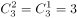种；

②乙被录用，甲未被录用，在丙丁戊中选2人录用，情况数为种；

③甲乙都被录用，在丙丁戊中选1人录用，情况数为种。

因此满足条件的情况数种。

所以本题概率。

方法二：从5位优秀毕业生中录用3人，总情况数为种。

“甲乙中至少一人被录用”的反面情况为“甲乙中没有人被录用”，即丙丁戊三人被录用，情况只有1种，所以本题概率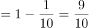。

故正确答案为D。

---

### 第 2 题　qid 2402029 · 数学运算

甲、乙两队进行一场排球比赛，根据以往经验，单局比赛甲队胜乙队的概率均为0.6，本场比赛采用五局三胜制，即先胜三局的队获胜，且比赛到此结束。如果各局比赛相互间没有影响，现已知前两局双方战成平手，则甲队获得这场比赛胜利的概率为：

- **A**. 

- **B**. 

- **C**. 
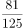
　✅
- **D**. 

**答案**：C

**官方解析**

前两局甲乙两队战成平手，即分别各胜一局，若甲队获得比赛胜利，则需要在后三局比赛中胜两局，分类如下表:

分类相加，甲队获得比赛胜利的概率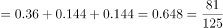。

故正确答案为C。

---

### 第 3 题　qid 2402030 · 数学运算

李强与张龙创办了一家微型企业，企业股份归两人所有，且两人所占股份比为。后来，王伟也决定加盟，他花28000元从李强和张龙那取得了的股份。若此时，张龙的股份为王伟的，那么李强从王伟那获得了多少元的股金？

- **A**. 12600
- **B**. 16800
- **C**. 18600
- **D**. 22400　✅

**答案**：D

**官方解析**

设企业的总股份为，根据题干信息可得：

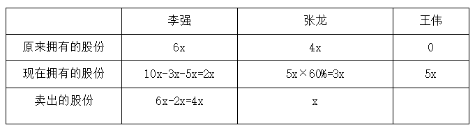

由“他花28000元从李强和张龙那取得了50%的股份”可得：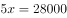，解得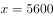。

则李强获得股金（卖出的股份）为元。

故正确答案为D。

---

### 第 4 题　qid 2402031 · 数学运算

某跑步团的3位队员A、B、C在一环形湿地公园晨跑，三人同时从同一地点出发，A、B按逆时针奔跑，C按顺时针方向奔跑。A、B两人晨跑速度之比为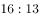，且他俩的速度（以米/分计）均为整数并能被5整除，其中B的速度小于70米/分，C在出发20分钟后与A相遇，2分钟之后又遇到了B。那么，这个湿地公园周长为：

- **A**. 3300米　✅
- **B**. 3360米
- **C**. 3500米
- **D**. 3900米

**答案**：A

**官方解析**

由题干信息可得，是13的倍数，也是5的倍数，则为65的倍数，而且由于为整数且小于70米/分，所以米/分。由，得。根据相遇公式：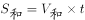，可得：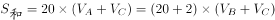，代入数据得：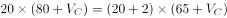，解得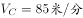。湿地公园周长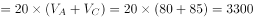米。

故正确答案为A。

---

### 第 5 题　qid 2402032 · 数学运算

某企业的员工参加了一项需缴纳170元培训费的培训。同时，该企业允许非内部员工参加培训，但其不能享受员工优惠价。参训的非内部员工，如果是男生需交350元；如果是女生需交300元。结果，共有50人参加培训，整个培训收到的费用总额为10000元。由此可知，有多少个不是内部员工的女生参加了培训？

- **A**. 4
- **B**. 5
- **C**. 6　✅
- **D**. 7

**答案**：C

**官方解析**

设企业的员工的人数为，非内部员工男生的人数为, 非内部员工女生的人数为。根据人数和费用总额列方程：,消得：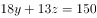，与150均为3的倍数，所以为3的倍数，即非内部员工女生的人数为3的倍数，观察选项，只有C项符合要求。

故正确答案为C。

---

### 第 6 题　qid 2402033 · 数学运算

某季度初期，某贸易公司库存相同数量的T恤、牛仔裤和衬衣。该季度结束时，T恤、牛仔裤、衬衣三种产品的销售比例是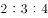，其中牛仔裤还有库存480件，T恤库存数量恰好为衬衣库存数量的2倍，则该季度该贸易公司共销售出多少件衬衣？

- **A**. 160
- **B**. 320
- **C**. 640　✅
- **D**. 960

**答案**：C

**官方解析**

根据已知条件三种产品的销售比例是，设T恤、牛仔裤、衬衣三种产品的销售量为、、；又“T恤库存数量恰好为衬衣库存数量的2倍”，设衬衣库存数量为，则T恤库存数量为。可列表如下：

由“三种产品原库存相同”可得，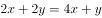，整理得。再根据牛仔裤原库存=衬衣原库存，得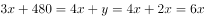，整理得，解得。则该季度该贸易公司共销售出衬衣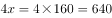件。

故正确答案为C。

---

### 第 7 题　qid 2402034 · 数学运算

如下图所示，一张边长8厘米的正方形纸片先进行对折，再沿着两边的中点连线剪掉一个角后，则剩下部分展开面积是多少平方厘米？ 

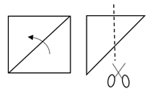

- **A**. 16
- **B**. 32
- **C**. 36
- **D**. 48　✅

**答案**：D

**官方解析**

根据题意，沿着两边的中点连线剪掉一个角后，则剪掉的角展开后是一个边长为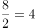的正方形。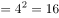平方厘米。则平方厘米。

故正确答案为D。

---

### 第 8 题　qid 2402035 · 数学运算

 某超市采购了一批水果，第一天销售出1箱，此后每一天比前一天多销售1箱，若干天后，超市剩余水果不够该天销售时，则该天起每天销售2箱，由此可知，该仓库库存水果箱数与天数对应关系曲线最可能是： 

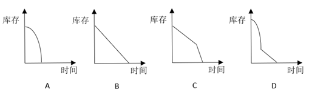

- **A**. A
- **B**. B
- **C**. C
- **D**. D　✅

**答案**：D

**官方解析**

根据“此后每一天比前一天多销售1箱”可以确定是等差数列。设按照等差数列销售了天，总销售量就可以用等差数列求和公式表示，其中，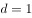，，即总销售量。那么，此为二次函数，其中原有量是常数，且的系数为负，这样库存量开始时为一个开口向下的抛物线，排除B、C项。

若干天后，超市剩余水果不够该天销售时，则该天起每天销售2箱，设这样销售了天，销售量为箱，此时，此为一次函数，是常数，这是一条直线。

综上，符合的图像是D项。

故正确答案为D。

---

### 第 9 题　qid 2402036 · 数学运算

如下图所示，一个小正方体的表面积为64平方厘米，则几何物体甲垒放成几何物体乙后，物体甲与物体乙表面积之比为： 

- **A**. 

- **B**. 

- **C**. 

- **D**. 

　✅

**答案**：D

**官方解析**

由于物体甲和乙都是由小正方体拼成，每个小面是相同的，要计算物体甲和乙的表面积之比，只需计算甲和乙表面的小面数量之比。物体甲的小面数量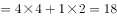个，物体乙的小面数量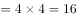个，则物体甲与物体乙表面积之比为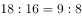。

故正确答案为D。

---

### 第 10 题　qid 2402037 · 数学运算

一群有若干人的寻宝团队，在一小岛上发现一处宝藏，经商议按如下规则分配宝藏：首先，第1人分得1百万和剩余部分的；其次，第2人分得2百万和剩余部分的；接下去第3人分得3百万和剩余部分的，依次类推，最后剩余的部分全给了最后一个人。结果每人都得到了同样价值的宝藏。那么，该寻宝团队共有多少人？

- **A**. 5　✅
- **B**. 6
- **C**. 7
- **D**. 8

**答案**：A

**官方解析**

设该处宝藏共有百万，由“第1人分得1百万和剩余部分的”得，第1个人分得的数量百万元；由“第2人分得2百万和剩余部分的”得，第2个人分得的数量百万元。根据“每人都得到了同样价值的宝藏”得，，两边同乘以6得，，整理得，解得。每人分得的宝藏百万。那么，该寻宝团队共有人。

故正确答案为A。

---

## 判断推理

### 第 1 题　qid 2402398 · 图形推理

从所给的四个选项中，选择最合适的一个填入问号处，使之呈现一定的规律性：

- **A**. A　✅
- **B**. B
- **C**. C
- **D**. D

**答案**：A

**官方解析**

图形元素组成不同，但无明显属性规律，优先考虑数量规律。观察发现题干图形封闭面明显，考虑数面，九宫格第一行的面数量依次为0、1、3，第二行的面数量依次为1、2、1，前两行的面数量加和均为4个，故第三行的三幅图面数量之和应为4个，第三行前两幅图面数量为2、0，则应选择一个面数量为2的选项，只有A项满足。
故正确答案为A。

---

### 第 2 题　qid 2402399 · 图形推理

从所给的四个选项中，选择最合适的一个填入问号处，使之呈现一定的规律性：

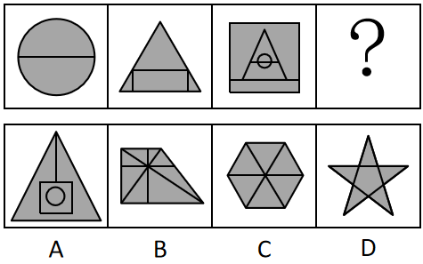

- **A**. A
- **B**. B　✅
- **C**. C
- **D**. D

**答案**：B

**官方解析**

图形元素组成不同，优先考虑属性规律，但无唯一答案，考虑数量规律。观察发现题干图形封闭面明显，考虑数面。题干每幅图形面数量依次为2、4、6，面数量呈递增规律且每次递增2，则？处应选择一个面数量为8的选项，只有B项满足。
故正确答案为B。

---

### 第 3 题　qid 2402401 · 图形推理

从所给的四个选项中，选择最合适的一个填入问号处，使之呈现一定的规律性：

- **A**. A
- **B**. B
- **C**. C
- **D**. D　✅

**答案**：D

**官方解析**

图形元素组成不同，优先考虑属性规律。观察发现题干图形均为开放图形，故？处选择一个开放图形的选项，只有D项满足。
故正确答案为D。

---

### 第 4 题　qid 2402402 · 图形推理

将下面八个图形元素分为两类，使每一类都有自己的特性和规律、则分类正确的是：

- **A**. ①②③⑦⑧，④⑤⑥
- **B**. ①③⑦⑧，②④⑤⑥　✅
- **C**. ①②⑦，③④⑤⑥⑧
- **D**. ①②⑧，③④⑤⑥⑦

**答案**：B

**官方解析**

图形元素组成不同，优先考虑属性规律。观察题干图形发现，图②④⑤⑥为全曲线图形，图①③⑦⑧为全直线图形，故①③⑦⑧分为一组，②④⑤⑥分为一组。
故正确答案为B。

---

### 第 5 题　qid 2402405 · 类比推理

下面四个选项中，与题干黑色区域面积相等的是：

- **A**. A　✅
- **B**. B
- **C**. C
- **D**. D

**答案**：A

**官方解析**

观察题干黑色区域发现黑色区域相加为一个正方形的面积，故应选择一个黑色区域面积相加为一个正方形的面积的选项，只有A项满足。
故正确答案为A。

---

### 第 6 题　qid 2402406 · 图形推理

从所给的四个选项中，选择最合适的一个填入问号处，使之呈现一定的规律性：

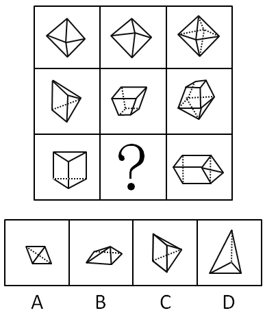

- **A**. A　✅
- **B**. B
- **C**. C
- **D**. D

**答案**：A

**官方解析**

九宫格优先横行看。观察发现，第一行中，图1和图2拼合得到图3；经验证，第二行也满足此规律；第三行应用此规律，图3是由三棱柱和三棱锥拼合而成，故问号处应选择一个三棱锥的图形，A项符合，当选；B、C两项是四棱锥，排除；D项三棱锥的高与图3不符，排除。

故正确答案为A。

如图所示：

 （第三行图1横躺过来，再将A项旋转在右侧进行拼合，即可得到图3）

---

### 第 7 题　qid 2402407 · 图形推理

从所给的四个选项中，选择最合适的一个填入问号处，使之呈现一定的规律性：

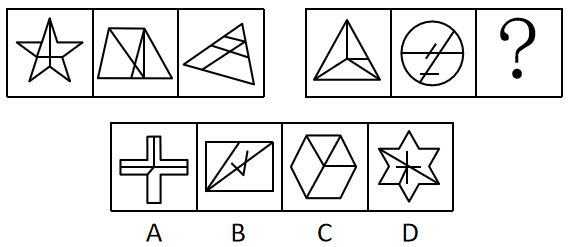

- **A**. A
- **B**. B　✅
- **C**. C
- **D**. D

**答案**：B

**官方解析**

元素组成不同，且无明显属性规律，考虑数量规律。题干图形均出现明显“白色窟窿”，优先考虑数面。第一组图的面数量均为5，第二组图的面数量依次为：4、4、？，故？处应该选择一个面数量为4的图形，排除D项。继续观察发现，第一组图内部的直线数均为3，第二组图内部的直线数依次为：4、4、？，故？处应该选择一个内部的直线数为4的图形，只有B项符合。
故正确答案为B。

---

### 第 8 题　qid 2402408 · 图形推理

从所给四个选项中，选择最合适的一个填入问号处，使之呈现一定的规律性：

- **A**. A
- **B**. B
- **C**. C　✅
- **D**. D

**答案**：C

**官方解析**

元素组成相似，优先考虑样式规律。外部轮廓相同，内部有黑有白，且黑白的个数不同，考虑黑白运算。第一组的运算公式为：、、；第二组应用规律，三角形左下角，排除A、B两项；三角形上方，排除D项。且观察小球的个数，第一组图小球之和为4，第二组图应用规律时，答案也对应C项。

故正确答案为C。

---

### 第 9 题　qid 2402409 · 定义判断

不道德行为是指打破了日常行为规范的行为。按照行为动机，可分为无意不道德行为和故意不道德行为，前者指在没有意识到行为的不道德属性时做出的不道德行为；后者指个体明知道行为违背了道德规范，但仍采取的不道德行为。
根据上述定义，下列属于故意不道德行为的是：

- **A**. 小刘收受男方彩礼后，男方悔婚，小刘根据当地风俗不退还男方彩礼
- **B**. 某企业为了增加品牌的热度，多次曝光企业的内幕，吸引了社会关注
- **C**. 某明星善于通过资助慈善事业获得免费的社会宣传效应
- **D**. 某公司明知合同条款对乙方不公平，仍假装承诺将履行合同　✅

**答案**：D

**官方解析**

第一步：找出定义关键词。
不道德行为：“打破了日常行为规范的行为”；
无意不道德行为：“没有意识到行为的不道德属性时做出的不道德行为”；
故意不道德行为：“明知道行为违背了道德规范，但仍采取的不道德行为”。
第二步：逐一分析选项。
A项：小刘根据当地风俗不退还男方彩礼，小刘并没有做出不道德行为，不符合定义，排除； 
B项：某企业为了增加品牌的热度，多次曝光自己的内幕，曝光自己的内幕不属于不道德行为，不符合定义，排除； 
C项：某明星善于通过资助慈善事业获得免费的社会宣传效应，明星资助慈善并非不道德行为，不符合定义，排除； 
D项：某公司明知合同条款对乙方不公平，仍假装承诺将履行合同，符合“明知道行为违背了道德规范，但仍采取的不道德行为”，符合定义，当选。
故正确答案为D。

---

### 第 10 题　qid 2402416 · 定义判断

信息文化是人们借助信息、信息资源、信息技术，从事信息活动所形成的文化形态，它是信息社会特有的文化形态，是信息社会中人们的生活样式。信息文化包括信息社会的物质文化、精神文化和制度文化。
根据上述定义，下列属于信息文化现象的是：

- **A**. 扶贫办将扶贫干部拉入“扶贫微信群”，通过微信布置工作任务　✅
- **B**. 莱布尼茨关于发明“人工语言”代替“自然语言”的思想，最终在20世纪中叶得以实现
- **C**. 二战时期，交战国均聘请数学家、逻辑学家破译敌对方的军事电报代码
- **D**. 人工智能与仿生学成为当今大学的热门专业，吸引了众多学生报考

**答案**：A

**官方解析**

第一步：找出定义关键词。
 “人们借助信息、信息资源、信息技术，从事信息活动”、“是信息社会特有的文化形态，是信息社会中人们的生活样式”。
第二步：逐一分析选项。
A项：扶贫办将扶贫干部拉入“扶贫微信群”，通过微信布置工作任务，符合“人们借助信息、信息资源、信息技术，从事信息活动”，也符合“是信息社会特有的文化形态，是信息社会中人们的生活样式”，符合定义，当选； 
B项：莱布尼茨实现用“人工语言”代替“自然语言”的思想，不明确发明“人工语言”时是否利用信息技术，不符合“人们借助信息、信息资源、信息技术，从事信息活动”，不符合定义，排除；
C项：二战时聘请数学家、逻辑学家破译敌对方的军事电报代码，不明确破译代码时是否利用信息技术，不符合“人们借助信息、信息资源、信息技术，从事信息活动”，不符合定义，排除；
D项：人工智能与仿生学吸引学生报考，不符合“人们借助信息、信息资源、信息技术，从事信息活动”，不符合定义，排除。
故正确答案为A。

---

### 第 11 题　qid 2402417 · 定义判断

罪恶关联是指通过指出某个被社会妖魔化的个人或群体也认同某观点，以此诋毁该观点。罪恶关联是一种非形式逻辑谬误，经常被有意或者无意地应用到论证场合。
根据上述定义，下列属于罪恶关联的是：

- **A**. 小明成绩很差，他这道题的解题思路肯定不正确
- **B**. 这企业的毛绒玩具可能是用“黑心棉”做的，买他们的产品就等于支持他们的违法行为，你最好不要买给孩子
- **C**. 这种人才测评方法是德国纳粹军人发明的，所以我们不应该用这种不人道的方法评价别人　✅
- **D**. 这演员演戏只会瞪眼耍帅对口型，现在居然被评为“年度最佳男主角”，这里面肯定有黑幕

**答案**：C

**官方解析**

第一步：找出定义关键词。
关键词：“指出某个被社会妖魔化的个人或群体也认同某观点”、“诋毁该观点”。
第二步：逐一分析选项。
A项：小明成绩很差，所以他这道题的解题思路肯定不正确，不符合“指出某个被社会妖魔化的个人或群体也认同某观点”，不符合定义，排除；
B项：买“黑心棉”做的毛绒玩具就等于支持他们的违法行为，不符合“指出某个被社会妖魔化的个人或群体也认同某观点”，不符合定义，排除；
C项：这种人才测评方法是德国纳粹军人发明的，符合“指出某个被社会妖魔化的个人或群体也认同某观点”，所以我们不应该用这种不人道的方法评价别人符合“诋毁该观点”，符合定义，当选；
D项：只会瞪眼耍帅对口型的演员居然被评为“年度最佳男主角”，不符合“指出某个被社会妖魔化的个人或群体也认同某观点”，不符合定义，排除。
故正确答案为C。

---

### 第 12 题　qid 2402418 · 定义判断

怀旧疗法是指通过回顾过去的事件、情感及想法，帮助老年痴呆患者增加幸福感、提高生活质量及对现有环境的舒适感知能力。
根据上述定义，下列选项中，最有可能使用了怀旧疗法的是：

- **A**. 张阿姨自从老伴儿去世后，情绪很低落，女儿将她送回老家疗养一段时间后，她心态变好了
- **B**. 文教授退休后身体状况时好时坏，但搬回大学后，马上就精神了
- **C**. 70岁的老张最近有些健忘，但他自己一拿起老照片就能讲起这些照片背后的故事
- **D**. 退休后的老张很孤独，一出门就找不到家，家人听取医生建议给他播放革命老歌舒缓情绪，一段时间后情况有所改善　✅

**答案**：D

**官方解析**

第一步：找出定义关键词。
关键词：“回顾过去的事件、情感及想法”、“帮助老年痴呆患者”、“增加幸福感、提高生活质量及对现有环境的舒适感知能力”。
第二步：逐一分析选项。
A项：张阿姨自从老伴儿去世后，情绪很低落，张阿姨并不是老年痴呆患者，不符合“帮助老年痴呆患者”，不符合定义，排除；
B项：文教授退休后身体状况时好时坏，并未提及文教授患有老年痴呆，不符合“帮助老年痴呆患者”，不符合定义，排除；
C项：老张最近有些健忘，但并未提及老张健忘就是老年痴呆，不符合“帮助老年痴呆患者”，不符合定义，排除；
D项：退休后的老张一出门就找不到家，可能是老年痴呆患者，听取医生建议给他播放革命老歌舒缓情绪，符合“通过回顾过去事件、情感及想法，增加幸福感、提高生活质量及对现有环境的舒适感知能力”，符合定义，当选。
故正确答案为D。

---

### 第 13 题　qid 2402420 · 定义判断

虚拟财产是一种能为人所支配的具有财产价值的权利，它是以电磁数据为形式存在于网络空间。虚拟财产具有虚拟性、价值性和可转让性特征。
根据上述定义，下列属于虚拟财产的是：

- **A**. 司机老王的上世纪八十年代经典歌曲的磁带
- **B**. 设计师用电脑软件创作的，保存在光盘中的设计作品
- **C**. 经扫描并存储在移动硬盘的电子版家庭旧照片
- **D**. 小明从爸爸那里获得的6位数QQ号　✅

**答案**：D

**官方解析**

第一步：找出定义关键词。
关键词：“能为人所支配的具有财产价值的权利”、“以电磁数据为形式存在于网络空间”、“具有虚拟性、价值性和可转让性”。
第二步：逐一分析选项。
A项：经典歌曲的磁带，不符合“具有虚拟性”，不符合定义，排除；
B项：保存在光盘中的设计作品，符合“能为人所支配的具有财产价值的权利”，但它并不是“以电磁数据为形式存在于网络空间”，不符合定义，排除；
C项：家庭旧照片，不符合“能为人所支配的具有财产价值的权利”，不符合定义，排除；
D项：6位数QQ号符合“能为人所支配的具有财产价值的权利”，同时也符合“以电磁数据为形式存在于网络空间”、“具有虚拟性、价值性和可转让性”，符合定义，当选。
故正确答案为D。

---

### 第 14 题　qid 2402421 · 定义判断

学术图书是指内容涉及某学科或某专业领域，具有一定创新性，对专业学习、研究具有价值的图书，通常在书中有文献注释或参考文献，书后有索引，学术专著是指对某一学科或领域或某一专题进行较为集中、系统、全面、深入论述，对特定问题有独到见解，且大多“自成体系”的单著或二三人合著的学术著作。
根据上述定义，下列属于学术专著的是：

- **A**. 某学术委员会编辑的学科词条工具书
- **B**. 某届学术会议的参会人员提交的学术论文
- **C**. 张教授作为学科带头人，总结多年教学经验，组织学科老师编写了全国第一本面向本专业研究生的高质量教材
- **D**. 小王的优秀博士生毕业论文　✅

**答案**：D

**官方解析**

第一步：找出定义关键词。

学术图书：“创新性”、“对专业学习、研究具有价值的图书”；

学术专著：“集中、系统、全面、深入论述”、“对特定问题有独到见解”。

第二步：逐一分析选项。

A项：学科词条工具书，只是对词进行解释的工具书，不符合“对特定问题有独到见解”，不符合定义，排除；

B项：参会人员提交的学术论文，不符合“集中、系统、全面、深入论述”，不符合定义，排除；

C项：张教授组织学科老师编写的的高质量教材，符合“对专业学习、研究具有价值的图书”，属于学术图书，而非学术专著，排除；

注：如下图所示，通过查询相关文献，C项的高质量教材不是学术专著。

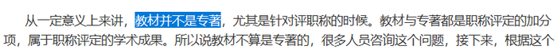

D项：优秀博士生毕业论文，符合“集中、系统、全面、深入论述”、“对特定问题有独到见解”，符合定义，当选。

注：如下图所示，通过查询相关文献，D项的优秀博士生毕业论文是可以作为学术专著出版的。

故正确答案为D。

---

### 第 15 题　qid 2402423 · 定义判断

校园欺凌是指在幼儿园、中小学及其合理辐射区域内发生的教师或者学生针对学生的持续性的心理性或者物理性攻击行为，这些行为会使受害者感受到精神上的痛苦。
根据上述定义，下列不属于校园欺凌的是：

- **A**. 某高中体育委员经常假借“不认真锻炼”之名体罚同学
- **B**. 中学拉拉队成员小华每天都被队员们嘲笑“皮肤黑”“饭量大”
- **C**. 小学生小强与同桌因一时口角而打架，他担心第二天还会发生冲突，怎么也不愿意去学校　✅
- **D**. 半年以来，儿童小龙在放学的路上经常被几个高年级的学生拦着索要零花钱，他非常害怕，但又不敢告诉老师和家长

**答案**：C

**官方解析**

第一步：找出定义关键词。
“在幼儿园、中小学及其合理辐射区域内”、“教师或者学生针对学生的持续性的心理性或者物理性攻击行为”、“会使受害者感受到精神上的痛苦”。
第二步：逐一分析选项。
A项：“经常”符合“持续性的”，“体罚同学”符合“物理性攻击行为”、“会使受害者感受到精神上的痛苦”，符合定义，排除；
B项：“每天”符合“持续性的”，“嘲笑‘皮肤黑’‘饭量大’”符合“心理性攻击行为”、“会使受害者感受到精神上的痛苦”，符合定义，排除；
C项：“一时口角”说明不是经常性的，不符合“持续性的”，不符合定义，当选；
D项：“半年以来”符合“持续性的”，“拦着索要零花钱，他非常害怕”符合“心理性或者物理性攻击行为”、“会使受害者感受到精神上的痛苦”，符合定义，排除。
本题为选非题，故正确答案为C。

---

### 第 16 题　qid 2402424 · 类比推理

（    ）  对于  机械  相当于  粽子  对于  （    ）

- **A**. 金属 粽叶
- **B**. 铁 月饼
- **C**. 滑轮 食品　✅
- **D**. 电脑 端午

**答案**：C

**官方解析**

逐一代入选项。
A项：有的机械是金属制成的，金属是机械的或然原材料，二者是对应关系，粽叶是粽子的组成部分，前后逻辑关系不一致，排除；
B项：有的机械是铁制成的，铁是机械的或然原材料，二者是对应关系，粽子和月饼是并列关系，前后逻辑关系不一致，排除；
C项：滑轮是机械，二者是种属关系。粽子是食品，二者也是种属关系，前后逻辑关系一致，当选；
D项：电脑和机械无必然关系，端午有吃粽子的习俗，二者是对应关系，前后逻辑关系不一致，排除。
故正确答案为C。

---

### 第 17 题　qid 2402425 · 类比推理

（    ）  对于  阻塞  相当于  音乐  对于  （    ）

- **A**. 交通 激昂　✅
- **B**. 拥堵 舒缓
- **C**. 血管 娱乐
- **D**. 畅通 轻柔

**答案**：A

**官方解析**

逐一代入选项。
A项：阻塞的交通，激昂的音乐，后一个词都可以用来修饰前一个词，前后逻辑关系一致，当选；
B项：拥堵和阻塞是近义关系，舒缓的音乐，二者不是近义关系，前后逻辑关系不一致，排除；
C项：阻塞的血管，音乐是一种娱乐形式，前后逻辑关系不一致，排除；
D项：畅通和阻塞是反义关系，轻柔的音乐，前后逻辑关系不一致，排除。
故正确答案为A。

---

### 第 18 题　qid 2402426 · 类比推理

（    ）  对于  销售  相当于  稻谷  对于  （    ）

- **A**. 采购 小麦　✅
- **B**. 生产 大米
- **C**. 收益 粮食
- **D**. 企业 稻田

**答案**：A

**官方解析**

逐一代入选项。
A项：采购和销售是不同的营销环节，二者是并列关系，稻谷和小麦是不同的作物，二者是并列关系，前后逻辑关系一致，当选；
B项：生产和销售是不同的营销环节，二者是并列关系，稻谷去壳后就是大米，稻谷和大米是组成关系，前后逻辑关系不一致，排除；
C项：销售可能带来收益，二者是或然因果关系，稻谷是粮食，二者是种属关系，前后逻辑关系不一致，排除；
D项：销售是企业的行为，二者是行为的对应关系，稻谷种在稻田里，二者是地点的对应关系，前后逻辑关系不一致，排除。
故正确答案为A。

---

### 第 19 题　qid 2402427 · 类比推理

马：马车：交通

- **A**. 牛：犁：耕地　✅
- **B**. 鸽子：书信：通讯
- **C**. 蚕：蚕丝：衣服
- **D**. 茶叶：茶水：饮料

**答案**：A

**官方解析**

第一步：判断题干词语间逻辑关系。
“马”拉动“马车”，二者是动力来源的对应关系；“马车”是一种“交通”工具，二者是工具的对应关系。
第二步：判断选项词语间逻辑关系。
A项：“牛”拉动“犁”，二者是动力来源的对应关系；“犁”是一种“耕地”工具，二者是工具的对应关系，与题干逻辑关系一致，当选；
B项：“鸽子”是传递“书信”的工具，二者是工具的对应关系；“书信”是一种“通讯”方式，二者是种属关系，与题干逻辑关系不一致，排除；
C项：“蚕丝”是“蚕”的分泌物，二者是分泌物的对应关系；“蚕丝”是制作“衣服”的原材料，二者是原材料的对应关系，与题干逻辑关系不一致，排除；
D项：“茶叶”是制作“茶水”的原材料，二者是原材料的对应关系；“茶水”是一种“饮料”，二者是种属关系，与题干逻辑关系不一致，排除。
故正确答案为A。

---

### 第 20 题　qid 2402428 · 类比推理

咸：淡

- **A**. 香：臭　✅
- **B**. 痛：痒
- **C**. 麻：辣
- **D**. 肥：瘦

**答案**：A

**官方解析**

第一步：判断题干词语间逻辑关系。
咸与淡意思相反，二者是反义词，且均是一种感官感受。
第二步：判断选项词语间逻辑关系。
A项：香与臭意思相反，二者是反义词，且均是一种感官感受，与题干逻辑关系一致，当选；
B项：痛与痒均是一种感官感受，但二者不是反义词，与题干逻辑关系不一致，排除；
C项：麻与辣均是一种感官感受，但二者不是反义词，与题干逻辑关系不一致，排除；
D项：肥与瘦意思相反，二者是反义词，但不是感官感受，与题干逻辑关系不一致，排除。
故正确答案为A。

---

### 第 21 题　qid 2402429 · 类比推理

语言∶交流

- **A**. 微笑∶表达
- **B**. 歌唱∶开心
- **C**. 文字∶记录　✅
- **D**. 觅食∶充饥

**答案**：C

**官方解析**

第一步：判断题干词语间逻辑关系。
语言可以用来交流，交流是语言的功能，二者是功能对应关系。
第二步：判断选项词语间逻辑关系。
A项：表达不是微笑的功能（且表达什么没说清楚），与题干逻辑关系不一致，排除；
B项：歌唱可以使人开心，开心是歌唱的结果，二者是因果关系，与题干逻辑关系不一致，排除；
C项：文字可以用来记录，记录是文字的功能，二者是功能对应关系，与题干逻辑关系一致，当选；
D项：觅食的目的是充饥，二者是目的对应关系，与题干逻辑关系不一致，排除。
故正确答案为C。

---

### 第 22 题　qid 2402430 · 类比推理

犬∶导盲犬∶缉毒犬

- **A**. 猫∶杂交猫∶纯种猫
- **B**. 书∶漫画∶报纸
- **C**. 兔∶宠物兔∶肉兔　✅
- **D**. 菜∶蔬菜∶菌类

**答案**：C

**官方解析**

第一步：判断题干词语间逻辑关系。
导盲犬与缉毒犬是并列关系中的反对关系，二者都是犬，与第一个词均是种属关系。
第二步：判断选项词语间逻辑关系。
A项：杂交猫与纯种猫均是猫，但二者是并列关系中的矛盾关系，与题干逻辑关系不一致，排除；
B项：漫画是一种艺术形式，报纸是以刊载新闻和时事评论为主的定期向公众发行的印刷出版物或电子类出版物，二者无明显逻辑关系，与题干逻辑关系不一致，排除；
C项：宠物兔与肉兔是并列关系中的反对关系，二者均是兔，与第一个词均是种属关系，与题干逻辑关系一致，当选；
D项：有的蔬菜是菌类，有的蔬菜不是菌类，有的菌类是蔬菜，有的菌类不是蔬菜，二者是交叉关系，与题干逻辑关系不一致，排除。
故正确答案为C。

---

### 第 23 题　qid 2402431 · 类比推理

飞翔∶走路

- **A**. 相信∶偏信
- **B**. 阅读∶识字
- **C**. 默写∶背诵　✅
- **D**. 学习∶旁听

**答案**：C

**官方解析**

第一步：判断题干词语间逻辑关系。
飞翔与走路是不同的移动方式，二者是并列关系。
第二步：判断选项词语间逻辑关系。
A项：偏信也是一种相信，二者是种属关系，与题干逻辑关系不一致，排除；
B项：阅读必须要识字，识字是阅读的必要条件，与题干逻辑关系不一致，排除；
C项：默写与背诵是不同的学习方式，二者是并列关系，与题干逻辑关系一致，当选；
D项：旁听是为了学习，二者是方式目的的对应关系，与题干逻辑关系不一致，排除。
故正确答案为C。

---

### 第 24 题　qid 2402433 · 类比推理

天生丽质：倾国倾城

- **A**. 技惊四座：蟾宫折桂
- **B**. 标新立异：独树一帜　✅
- **C**. 杯弓蛇影：草木皆兵
- **D**. 绝无仅有：天下无双

**答案**：B

**官方解析**

第一步：判断题干词语间逻辑关系。
天生丽质形容天生的美丽资质；倾国倾城形容妇女容貌极美，二者为近义关系，且“倾国倾城”形容美丽的程度比“天生丽质”更深。
第二步：判断选项词语间逻辑关系。
A项：技惊四座形容一个人的技艺精湛高超，把全场人都震惊了。蟾宫折桂比喻考试高中，二者无明显逻辑关系，与题干逻辑关系不一致，排除；
B项：标新立异比喻独创新意，理论和别人不一样；独树一帜比喻与众不同，自成一家，二者为近义关系，且“独树一帜”形容与众不同的程度比“标新立异”更深，与题干逻辑关系一致，当选；
C项：杯弓蛇影比喻疑神疑鬼，妄自惊慌，草木皆兵形容人在惊慌时疑神疑鬼，二者为近义关系，但二者之间不存在程度比较，与题干逻辑关系不一致，排除；
D项：绝无仅有指只有一个，再没有别的，形容非常稀有，也用来形容人或物非常珍贵。天下无双指天下找不出第二个，形容出类拔萃，独一无二，二者为近义关系，但二者之间不存在程度比较，与题干逻辑关系不一致，排除。
故正确答案为B。

---

### 第 25 题　qid 2402434 · 逻辑判断

新世纪以来，中国社会的急速发展在创造经济高峰之时，也造成一批传统文化的丢失或者濒临消亡，为了保护传统文化，维护文化的多样性，非物质文化遗产保护理论应运而生，处境日益艰难的手工艺被拉入“非遗”的视野中作为非遗的重点保护对象，手工艺开始重现生机。“非遗”之所以对手工艺采取保护措施并非因为其实用性，而是其审美性及其所蕴含的文化内涵。
以下各项如果为真，最能质疑上述观点的是：

- **A**. 手工艺不仅价格低廉还饱含着创作者的个人生命气息
- **B**. 手工艺的实用价值被取代并非历史必然或不可逆转
- **C**. 培育后工业社会中手工艺的审美鉴赏人群是当务之急
- **D**. 我国当前手工艺的审美价值尚未得到深入有效的挖掘　✅

**答案**：D

**官方解析**

第一步：找出论点和论据。
论点：“非遗”之所以对手工艺采取保护措施并非因为其实用性，而是其审美性及其所蕴含的文化内涵。
论据：无。
本题只有论点，无明显论据。论点说的是因为手工艺具有审美性和蕴含文化内涵，并不是因为其实用性，所以“非遗”对手工艺采取保护措施。要想削弱，可以指出不是因为手工艺具有审美性和蕴含文化内涵而采取保护措施。
第二步：逐一分析选项。
A项：说的是手工艺包含创作者的个人生命气息，与题干论点说的为什么要保护手工艺没有任何关系，属于无关项，不能削弱，排除；
B项：手工艺的实用价值被取代，与为什么要保护手工艺没有关系，属于无关项，不能削弱，排除；
C项：培养手工艺的审美鉴赏人群与为什么要保护手工艺没有关系，属于无关项，不能削弱，排除；
D项：手工艺的审美价值并没有得到有效挖掘，说明不能仅仅因为手工艺具有审美价值而采取保护措施，直接否定了题干的论点，当选。
故正确答案为D。

---

### 第 26 题　qid 2402435 · 逻辑判断

高薪挖角是人才市场竞争的常见套路，公办教育领域受此浸染也非一日，比如高校人才“孔雀东南飞”现象，多年来屡屡引爆争议，针对高校人才竞争失序问题，教育部最近发出通知，表示不鼓励东部高校从中西部、东北引进人才。舆论场关于高校人才流动的争议，暴露出当下教育界一种不容忽视的倾向，即习惯用纯粹的市场思维看待教育问题，而这种价值坐标的错位必然导致种种乱象，并诱发思想上的混乱。
以下各项如果为真，最能支持上述观点的是：

- **A**. 一些高校为学科评估、争取博士点等不惜血本招揽人才
- **B**. 教育离不开市场，但是真正的教育并不是市场上的商品　✅
- **C**. 市场经济条件下，以市场思维衡量教育行为，有利有弊
- **D**. 一些学校违规补课的现象屡禁不止，甚至还受到部分家长的欢迎

**答案**：B

**官方解析**

第一步：找出论点和论据。
论点：习惯用纯粹的市场思维看待教育问题，而这种价值坐标的错位必然导致种种乱象，并诱发思想上的混乱。
论据：无
本题只有论点，无明显论据，前文的人才“孔雀东南飞”现象以及教育部发出通知都是背景内容。因此，想要加强，可优先考虑补充论据的方式。
第二步：逐一分析选项。
A项：一些高校为学科评估、争取博士点等不惜血本招揽人才，说明部分高校是以市场思维在招揽教育资源，不惜血本体现出了乱象，举例子，可以加强，保留；
B项：真正的教育并不是市场上的商品，也就是说解释了为什么不能用市场思维来看教育，当下市场和教育的思维确实错位，补充了题干的论据，可以加强，保留；
C项：以市场思维衡量教育行为，有利有弊，弊是什么不明确，也没有说市场和教育是否错位，不能加强，排除；
D项：违规补课受到家长的欢迎，与市场和教育是否错位无关，不能加强，排除。
比较A、B两项，A项是举例子补充论据加强，B项是解释补充论据加强，其中解释的力度强于举例子的力度，因此，本题正确答案为B项。
故正确答案为B。

---

### 第 27 题　qid 2402436 · 逻辑判断

听古典音乐有助于提高儿童智商，这一发现被形象地称作“莫扎特效应”。心理学家弗朗西斯·罗彻对36位大学生做了一个实验，他让其中18位学生在做一些空间推理题之前听10分钟莫扎特的D小调奏鸣曲。结果，在将一张纸叠几次剪开后会是什么形状的测试中，这18人有明显进步。
以下各项如果为真，最不能削弱上述观点的是：

- **A**. 听古典音乐的效果有1.5个智商点的提高，但仅限于折纸实验
- **B**. 听了莫扎特音乐的学生学习能力本身就比其他学生更强
- **C**. 听反向莫扎特音乐（把莫扎特音乐的音符以相反序列排列）对人有负效应，即其行为认知能力减退
- **D**. 演奏乐器时的触觉反应刺激了大脑中的皮层，使得人的脑功能达到最优化状态　✅

**答案**：D

**官方解析**

第一步：找出论点和论据。
论点：听古典音乐有助于提高儿童智商。
论据：他让其中18位学生在做一些空间推理题之前听10分钟莫扎特的D小调奏鸣曲。在将一张纸叠几次剪开后会是什么形状的测试中，这18人有明显进步。
题干通过一个实验得出结论，要想削弱，可以考虑从实验前初始条件是否一致、实验中有无其他因素影响，以及实验后的结果能否持续下去这三个角度进行削弱。
第二步：逐一分析选项。
A项：听古典音乐的效果仅限于折纸实验，说明实验的结果有局限性，削弱了题干的结论，排除；
B项：听莫扎特音乐的学生本身就比其他学生的学习能力强，说明实验前初始条件就不一致，能够削弱，排除；
C项：说明听反向莫扎特音乐无助于提高智商，反而会使得人的认知能力减退，反向莫扎特音乐是否属于古典音乐尚不确定，属于不明确选项，题目要求找的是“最不能削弱的选项”，保留；
D项：演奏乐器时的触觉反应与听莫扎特音乐是两个完全不同的事情，其次使得人的脑功能达到最优状态也不一定是对于智商的提高，属于无关项，不能削弱，保留。
比较C、D两项，C项中的反向莫扎特音乐有可能部分属于古典音乐，对智商有负面作用，可以削弱。D项并未提及听音乐这个主题，对智商的影响也不明确，优选D项。
本题为选非题，故正确答案为D。

---

### 第 28 题　qid 2402437 · 逻辑判断

美国医学专家研究发现，胰岛素既能控制血糖水平，又能调节大脑细胞功能，它可帮助脑细胞突触更好地连接沟通，形成更强的记忆。吃糖过量会导致大脑中胰岛素水平下降，记忆和学习等认知能力随之削弱。因此，专家提醒，总吃甜食会损害大脑记忆和学习能力。
以下各项如果为真，最能支持上述专家的研究结论的是：

- **A**. 研究表明，饥饿状态下吃糖是最能迅速恢复体力和脑力的，而且，吃甜食有助于改善心情
- **B**. 人脑完成认知和记忆等功能所消耗的最主要物质就是葡萄糖，人脑一天要消耗120克葡萄糖
- **C**. 糖分大大减少了大脑中“脑源性神经营养因子”（BDNF）的含量，导致记忆力容量缩小，学习能力被破坏　✅
- **D**. 大量吃糖会使体内环境转变成中性或者弱酸性，体内自由基过多，这样就会加速人脑的细胞老化，且易助长白发

**答案**：C

**官方解析**

第一步：找出论点和论据。
论点：总吃甜食会损害大脑记忆和学习能力。
论据：吃糖过量会导致大脑中胰岛素水平下降，记忆和学习等认知能力随之削弱。
题干论点和论据都在讨论吃糖和记忆、学习能力之间的关系，话题一致，可优先考虑补充论据的方式进行加强。
第二步：逐一分析选项。
A项：讨论的是饥饿状态下吃糖能够恢复体力和脑力，与论点所说的“大脑记忆和学习能力”不是同一个话题，属于无关选项，不能支持，排除；
B项：只是说人脑完成认知和记忆等功能会消耗葡萄糖，与吃甜食会不会损害记忆和学习能力没有任何关系，属于无关选项，不能支持，排除；
C项：指出糖会使得记忆力容量缩小、学习能力被破坏，解释了为什么吃糖能够损害大脑记忆和学习能力，属于补充论据的选项，能够支持，当选；
D项：讨论的是吃糖会加速人脑细胞老化和助长白发，与“损害记忆和学习能力”没有任何关系，属于无关选项，不能支持，排除。
故正确答案为C。

---

### 第 29 题　qid 2402438 · 逻辑判断

“逻辑是不可战胜的，因为反对逻辑也必须使用逻辑。”
若要使上面的陈述成立，还必须以以下哪一项为前提？

- **A**. 反对逻辑的人，不一定会使用逻辑
- **B**. 凡是使用逻辑的人，一定不会反对逻辑
- **C**. 除非反对逻辑也必须使用逻辑，否则逻辑是可以战胜的
- **D**. 如果反对逻辑也必须使用逻辑，那么逻辑是不可战胜的　✅

**答案**：D

**官方解析**

第一步：找出论点和论据。
论点：逻辑不可战胜。
论据：反对逻辑也必须使用逻辑。
第二步：逐一分析选项。
A项：指出反对逻辑的人不一定会使用逻辑，削弱论据，排除；
B项：指出使用逻辑的人不反对逻辑，与论点和论据无必然联系，无法加强，排除；
C项：选项可翻译为：逻辑不可战胜→反对逻辑也必须使用逻辑，建立了论点和论据之间的关系，但是论点推出论据，搭桥方向相反，不是论述成立的前提，排除；
D项：选项可翻译为：反对逻辑也必须使用逻辑→逻辑不可战胜，建立了论点和论据之间的关系，是论据推出论点，搭桥项，是论述成立的前提，当选。
故正确答案为D。

---

### 第 30 题　qid 2402439 · 逻辑判断

吸烟有害健康。香烟燃烧时能产生数千种化学物质，其中包括尼古丁、焦油等致癌物。为了缓解烟民们的烟瘾并兼顾他们的身体健康，人们研制了加长过滤嘴的所谓“安全香烟”。但有关医学专家认为，“安全香烟”并不安全。
下列各项如果为真，最能支持上述有关医学专家看法的是：

- **A**. 加长过滤嘴可以有效地降低香烟燃烧过程中产生的尼古丁含量
- **B**. 据统计，加长过滤并不能缓解大部分烟民的烟瘾
- **C**. 加长的过滤嘴会导致香烟燃烧不完全，使一氧化碳含量大幅升高　✅
- **D**. 烟瘾很大的烟民吸加长过滤嘴香烟时可能把烟雾吸入肺部深处

**答案**：C

**官方解析**

第一步：找出论点和论据。
论点：“安全香烟”并不安全。
论据：无 
本题只有论点没有论据，要想加强考虑补充论据。
第二步：逐一分析选项。
A项：加长过滤嘴可以降低产生尼古丁的含量，降低尼古丁的含量有益于烟民们的健康，说明“安全香烟”很安全，削弱了专家的看法，无法加强，排除；
B项：只讨论了“安全香烟”是否能够缓解烟民的烟瘾，没有讨论它是否安全，话题不一致，无法加强，排除；
C项：加长的过滤嘴会导致一氧化碳含量大幅升高，说明加长过滤嘴确实会对人体造成伤害，从而证明了“安全香烟”其实并不安全，补充了题干的论据，可以加强，保留；
D项：“安全香烟”可能把烟雾吸入肺部深处，说明它可能会损坏烟民们的健康，可以加强，保留。
对比C和D，C项“大幅升高”说明对人体的危害更大，而D项说的是“可能”，因此C的加强力度比D强。
故正确答案为C。

---

### 第 31 题　qid 2402440 · 逻辑判断

临床发现，父母双方都有高原反应的人比父母双方都没有高原反应的人，会有高原反应的概率要高4倍多，据此，有医生推测：高原反应很可能是先天性遗传。
下列各项如果为真，最能支持医生的推测的是：

- **A**. 父母双方都有高原反应的人，无论如何锻炼和预防，到高原地区后几乎都会出现高原反应　✅
- **B**. 据统计，父母亲中只有一人有高原反应的人出现高原反应的概率略高于父母双方都没有高原反应的人，远低于父母双方都有高原反应的人
- **C**. 父母双方都有高原反应的人，到高原适应一段时间后，高原反应减弱速度远低于父母双方都没有高原反应的人
- **D**. 父母双方都有高原反应的人，到高原地区即使没有高原反应，也依旧存在食欲减退、困倦疲怠等问题

**答案**：A

**官方解析**

第一步：找出论点和论据。

论点：高原反应很可能是先天性遗传。

论据：临床发现，父母双方都有高原反应的人比父母双方都没有高原反应的人，会有高原反应的概率要高4倍多。 

论点讨论的是高原反应很可能是先天性遗传，论据讨论的是父母双方都有高原反应的人会出现高原反应的概率更高。论点和论据都是说高原反应很可能是先天性遗传，话题一致，要想加强优先考虑补充论据。

第二步：逐一分析选项。

A项：讨论的是父母双方都有高原反应的人几乎都会出现高原反应，表明了高原反应很可能是先天性遗传，可以支持，保留；

B项：讨论的是父母双方都有高原反应、父母亲中只有一人有高原反应和父母双方没有高原反应的孩子出现高原反应的概率是由高到低的，肯定了论据的真实性，可以支持，保留；

C项：讨论的是父母双方都有高原反应的人和父母双方都没有高原反应的人，到高原适应一段时间后，高原反应减弱速度的快慢，与论点讨论的话题不一致，无法支持，排除；

D项：讨论的是父母双方都有高原反应的人到了高原地区之后出现的不良反应，与论点讨论的话题不一致，无法支持，排除。

比较A、B两项，A项表明父母双方都出现高原反应的孩子几乎都会出现高原反应，即高原反应很可能是先天性遗传，而B项只是说父母双方都出现高原反应的孩子出现高原反应的概率高，但是出现高原反应概率高，不一定说明高原反应是先天性遗传，所以A项的加强力度更强。

故正确答案为A。

---

### 第 32 题　qid 2402441 · 逻辑判断

喻洪，覃彬，曾智，一个是马拉松运动员，一个是跳水运动员，一个是举重运动员。跳水运动员比曾智年龄小，覃彬和跳水运动员不同龄，喻洪的年龄比举重运动员大。
根据上述已知条件，可以推出：

- **A**. 覃彬是马拉松运动员，曾智是跳水运动员，喻洪是举重运动员
- **B**. 覃彬是跳水运动员，曾智是举重运动员，喻洪是马拉松运动员
- **C**. 覃彬是举重运动员，曾智是马拉松运动员，喻洪是跳水运动员　✅
- **D**. 覃彬是跳水运动员，曾智是马拉松运动员，喻洪是举重运动员

**答案**：C

**官方解析**

第一步：分析题干。
（1）跳水运动员比曾智年龄小；
（2）覃彬和跳水运动员不同龄；
（3）喻洪的年龄比举重运动员大。
第二步：逐一分析选项。
由条件（1）可知曾智不是跳水运动员，排除A项；
由条件（2）可知覃彬不是跳水运动员，排除B、D项。
故正确答案为C 。

---

### 第 33 题　qid 2402442 · 逻辑判断

在各种食物中，含钙量占第一位的是芝麻酱，而人们熟知的牛奶仅是芝麻酱的十一分之一。某芝麻酱商家的促销广告宣称，芝麻酱的补钙效果比牛奶更好。
下列各项如果为真，最能反驳上述促销广告的是：

- **A**. “含钙量高”与“补钙效果好”是两个完全不同的概念　✅
- **B**. 牛奶含钙量并非最高，其所含的钙却是人体易于吸收的优质钙
- **C**. 芝麻酱等植物源氨基酸比例与人体差异大，其利用率远低于动物蛋白
- **D**. 许多植物性食物的含钙量都高于牛奶，但其中的草酸则会影响人体对钙的吸收

**答案**：A

**官方解析**

第一步：找出论点和论据。
论点：芝麻酱的补钙效果比牛奶更好。
论据：在各种食物中，含钙量占第一位的是芝麻酱，而人们熟知的牛奶的含钙量仅是芝麻酱的十一分之一。 
论点讨论的是芝麻酱和牛奶谁的补钙效果更好的问题，论据讨论的是芝麻酱比牛奶的含钙量高。论点讨论的是“补钙效果的问题”，论据讨论的是“含钙量高低的问题”，论点和论据话题不一致，削弱优先考虑拆桥。
第二步：逐一分析选项。
A项：切断论点“补钙效果好”和论据“含钙量高”之间的联系，拆桥项，当选；
B项：只表明牛奶含的钙易于人体吸收，但是没有说明芝麻酱含的钙是否易于被人体吸收的情况，无法削弱，排除；
C项：表明芝麻酱的利用率低于动物蛋白，但是没有说明芝麻酱和牛奶谁的补钙效果更好，无法削弱，排除；
D项：表明许多植物性食物的含钙量都高于牛奶，但是没有说明芝麻酱和牛奶谁的补钙效果更好，无法削弱，排除。
故正确答案为A。

---

### 第 34 题　qid 2402443 · 逻辑判断

如果甲和乙都没有考上研究生，那么丙就考上研究生。
要得出甲考上研究生的结论，还需基于以下哪一前提为真？

- **A**. 丙考上研究生
- **B**. 丙没有考上研究生
- **C**. 乙和丙都没有考上研究生　✅
- **D**. 乙和丙没有都考上研究生

**答案**：C

**官方解析**

第一步，翻译题干。

甲且乙没有考上研究生丙考上研究生。

第二步:逐一分析选项。

A项：丙考上研究生是题干的结论，仅根据丙考上研究生，无法反推出甲的情况，排除；

B项：如果丙没有考上研究生，可知甲或乙考上研究生。这是或然性的，也不能完全判断甲的情况，排除；

C项：如果丙没有考上研究生，可知甲或乙考上研究生。如果再补充乙没有考上研究生，可知甲必定考上研究生,当选；

D项：这里有两种情况，一是丙没上但乙考上，结合上述分析，甲可能考上也有可能没考上，无法判定甲考上与否；二是丙考上但乙没上，这样无法判断甲考上与否，排除。

故正确答案为C。

---

## 资料分析

### 材料 1

        2017年，我国发明专利申请量为138.2万件，同比增长。共授权发明专利42.0万件，同比增长。其中，国内发明专利授权32.7万件，同比增长。在国内发明专利授权中，职务发明为30.4万件，占；非职务发明为2.3万件，占。

        截至2017年底，我国国内（不含港澳台）发明专利拥有量共计135.6万件，每万人口发明专利拥有量达到9.8件。我国每万人口发明专利拥有量排名前十位的省（区、市）依次为：北京（94.5件）、上海（41.5件）、江苏（22.5件）、浙江（19.7件）、广东（19.0件）、天津（18.3件）、陕西（8.9件）、福建（8.0件）、安徽（7.7件）和辽宁（7.6件）。

        2017年，我国在“一带一路”沿线国家（不含中国）专利申请公开量为5608件，同比增长。其中，在印度专利申请公开量为2724件，在俄罗斯专利申请公开量为1354件，专利申请初具规模。2017年，“一带一路”沿线国家在华申请专利4319件，同比增长；在华申请专利的“一带一路”沿线国家数达到41个，较2016年增加4个。

        2017年，全国专利行政执法办案总量6.7万件，同比增长。其中，专利纠纷办案2.8万件（包括专利侵权纠纷办案2.7万件），同比增长；查处假冒专利案件3.9万件，同比增长。

#### 第 1 题　qid 2402470 · 综合

2017年底，每万人口发明专利拥有量排名第二位的省（区、市）比全国每万人口发明专利拥有量高约多少倍？

- **A**. 2
- **B**. 3　✅
- **C**. 4
- **D**. 5

**答案**：B

**官方解析**

根据“2017年底，······比······高约多少倍”，可判定本题为一般增长率问题。定位材料第二段可知，截至2017年底，我国每万人口发明专利拥有量达到9.8件。我国每万人口发明专利拥有量排名第二位的省（区、市）为上海（41.5件）。代入公式，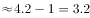倍，与B项最接近。

故正确答案为B。

---

#### 第 2 题　qid 2402471 · 比重

2016年，国内发明专利授权占我国授权发明专利的比例为：

- **A**. 

- **B**. 

- **C**. 

- **D**. 

　✅

**答案**：D

**官方解析**

根据“2016年，······占······的比例”，结合材料时间为2017年，可判定本题为基期比重问题。定位材料第一段可知， 2017年，我国共授权发明专利42.0万件，同比增长。其中，国内发明专利授权32.7万件，同比增长。代入公式，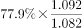，只有D项符合。

故正确答案为D。

---

#### 第 3 题　qid 2402474 · 增长

若以2017年的速度增长，到2019年，我国“一带一路”沿线国家（不含中国）专利申请公开量将达到多少件？

- **A**. 6505
- **B**. 6823
- **C**. 7028
- **D**. 7546　✅

**答案**：D

**官方解析**

根据“若以2017年的速度增长，到2019年，······将达到多少件”，可判定本题为现期计算问题。定位材料第三段可知，2017年，我国在“一带一路”沿线国家（不含中国）专利申请公开量为5608件，同比增长。根据公式，，则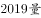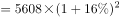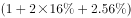，与D项最接近。

故正确答案为D。

---

#### 第 4 题　qid 2402476 · 综合

2017年，全国专利纠纷案件数和查处假冒专利案件两者的增量比为：

- **A**. 0.55∶1
- **B**. 0.59∶1
- **C**. 0.69∶1　✅
- **D**. 0.72∶1

**答案**：C

**官方解析**

根据“2017年，······和······比为”，可判定本题为比值计算问题。定位材料最后一段可知，2017年，专利纠纷办案2.8万件，同比增长；查处假冒专利案件3.9万件，同比增长。根据，可得全国专利纠纷案件数增量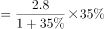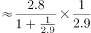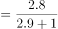万件；查处假冒专利案件增量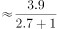万件；则二者比值。

故正确答案为C。

---

#### 第 5 题　qid 2402478 · 综合

下列选项中，不能从给定资料中得出的是：

- **A**. 
2017年，我国每万人口发明专利拥有量与北京的平均水平相差悬殊

- **B**. 
2017年，我国在印度专利申请公开量是在俄罗斯的两倍以上

- **C**. 
2016年，在我国（不含港澳台）申请专利的国家数为37个
　✅
- **D**. 
2016年，全国专利纠纷办案占专利行政执法办案总量超过

**答案**：C

**官方解析**

A项：定位材料第二段，截至2017年底，我国每万人口发明专利拥有量达到9.8件，北京为94.5件，9.8与94.5有近10倍的差距，可以理解为相差悬殊，正确；

B项：定位材料第三段，2017年，我国在印度专利申请公开量为2724件，在俄罗斯专利申请公开量为1354件。倍数，即在两倍以上，正确；

C项：材料只给出在华申请专利的“一带一路”沿线国家数，未给出在我国（不含港澳台）申请专利的国家总数，无法计算，错误；

D项：定位材料最后一段，2017年，全国专利行政执法办案总量6.7万件，同比增长。其中，专利纠纷办案2.8万件，同比增长。代入基期比重公式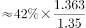，正确。

本题为选非题，故正确答案为C。

---

### 材料 2

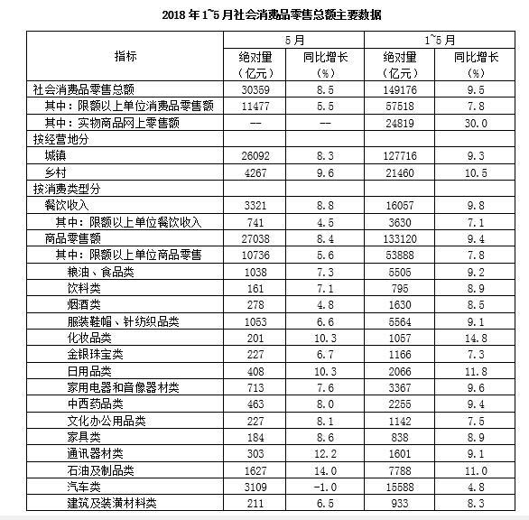

#### 第 6 题　qid 2402481 · 增长

2018年1—5月，粮油、食品类商品零售额同比增加多少亿元？

- **A**. 70
- **B**. 70.6
- **C**. 463.8　✅
- **D**. 465

**答案**：C

**官方解析**

根据“2018年1—5月，······同比增加多少亿元”，可判定本题为增长量计算问题。定位表格， 粮油食品类1-5月份的绝对量为5505亿元，同比增长。代入公式，增长量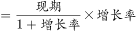亿元。

故正确答案为C。

备注：由于本题A项与B项、Ｃ项与Ｄ项之间差距过小，故只能采用精算法计算。

---

#### 第 7 题　qid 2402482 · 增长

2018年5月，下列四类零售商品，高于商品零售额同比增幅的是：

- **A**. 烟酒类
- **B**. 服装鞋帽、针纺织品类
- **C**. 文化办公用品类
- **D**. 家具类　✅

**答案**：D

**官方解析**

同比增幅即同比增长率，根据“高于······同比增幅的是”，可判定本题为直接找数。定位表格第三列，2018年5月，商品零售额同比增长，烟酒类同比增长；服装鞋帽、针纺织品类同比增长；文化办公用品类同比增长；家具类同比增长，则高于商品零售额同比增幅的是家具类。

故正确答案为D。

---

#### 第 8 题　qid 2402483 · 综合

2017年5月，城镇消费品零售额比乡村消费品零售额多约多少倍？

- **A**. 3
- **B**. 4
- **C**. 5　✅
- **D**. 6

**答案**：C

**官方解析**

根据“2017年5月，······比······多约多少倍”，可判定本题为基期倍数问题。定位表格，2018年5月城镇消费品零售额为26092亿元，同比增长，乡村消费品零售额为4267亿元，同比增长。先代入公式：基期倍数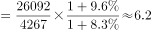倍；再代入公式：多几倍倍，与C项最接近。

故正确答案为C。

---

#### 第 9 题　qid 2402484 · 综合

2018年1—5月，非限额以上单位餐饮月均收入为多少亿元？

- **A**. 741
- **B**. 1076
- **C**. 2485　✅
- **D**. 2580

**答案**：C

**官方解析**

根据“2018年1—5月······月均收入为多少亿元”，可判定本题为现期平均数问题。定位表格，2018年1-5月餐饮收入为16057亿元，限额以上单位餐饮收入为3630亿元。代入公式:平均数亿元，与C项最接近。

故正确答案为C。

---

#### 第 10 题　qid 2402485 · 综合

根据上述给定资料，下列关于2018年相关信息表述错误的是：

- **A**. 
5月，限额以上单位消费品零售额占社会消费品零售总额的三成以上

- **B**. 
5月，汽车类商品的零售额同比下降约31亿元

- **C**. 
1—5月，实物商品网上零售额占社会消费品零售额的比重低于
　✅
- **D**. 
1—5月，所有商品零售类别中化妆品类增速最高

**答案**：C

**官方解析**

A项：定位表格，2018年5月限额以上单位消费品零售额为11477亿元，社会消费品零售总额为30359亿元，代入公式，比重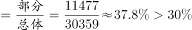，正确；

B项：定位表格，2018年5月汽车类商品的零售额为3109亿元，同比增长，代入公式，增长量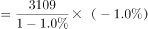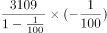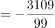亿元，正确；

C项：定位表格，2018年1-5月实物商品网上零售额24819亿元，社会消费品零售总额为149176亿元，代入公式，比重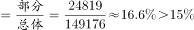，错误；

D项：定位表格，2018年1-5月化妆品类同比增长，在所有商品零售类别中增速是最高的，正确。

本题为选非题，故正确答案为C。

---

### 材料 3

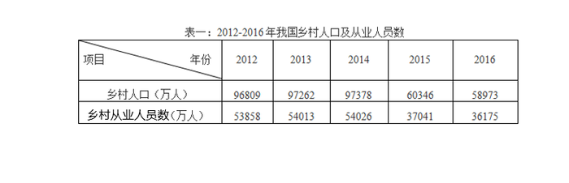

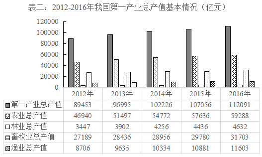

#### 第 11 题　qid 2402487 · 增长

在2013—2016年，我国乡村人口增幅最大的年份是：

- **A**. 2013年　✅
- **B**. 2014年
- **C**. 2015年
- **D**. 2016年

**答案**：A

**官方解析**

根据题干“······增幅最大的年份是”，可判定本题为增长率的比较问题。定位表一，可知2012年至2016年，我国乡村人口数量分别为96809、97262、97378、60346、58973万人，2015年和2016年我国乡村人口数量减少，即增长率为负，排除C、D两项。2013年其增长率为，2014年其增长率为，明显2013年的增长率分子大且分母小，故2013年我国乡村人口增幅最大。

故正确答案为A。

---

#### 第 12 题　qid 2402488 · 综合

我国乡村从业人员数的拐点在：

- **A**. 2013年
- **B**. 2014年　✅
- **C**. 2015年
- **D**. 2016年

**答案**：B

**官方解析**

拐点在数学上指改变曲线向上或向下方向的点，直观地说，即曲线的凹凸分界点，也就是突然由增长变为下降或由下降变为增长的点。定位表一，可知2012年至2016年，我国乡村就业人员数分别为53858、54013、54026、37041、36175万人，可知2012-2014年我国乡村从业人员数持续增长，2015年为下降，即拐点为2014年。(备注：本题较易误选C项2015年，拐点是即将要突变的点，而非变化之后的点。)
故正确答案为B。

---

#### 第 13 题　qid 2402490 · 增长

下列选项中，2016年总产值增速最快的是：

- **A**. 农业总产值
- **B**. 林业总产值
- **C**. 畜牧业总产值
- **D**. 渔业总产值　✅

**答案**：D

**官方解析**

根据题干“······增速最快的是”，可判定本题为增长率的比较问题。2015年农业、林业、畜牧业、渔业总产值分别为57636、4436、29780、10881亿元，2016年农业、林业、畜牧业、渔业总产值分别为59288、4632、31703、11603亿元，则2016年农业、林业、畜牧业、渔业总产值增速分别为、、、，故2016年总产值增速最快的是渔业总产值。

故正确答案为D。

---

#### 第 14 题　qid 2402491 · 比重

2013年，各行业总产值占第一产业总产值的比重按从大到小的顺序依次为：

- **A**. 农业总产值，渔业总产值，林业总产值，畜牧业总产值
- **B**. 农业总产值，畜牧业总产值，林业总产值，渔业总产值
- **C**. 农业总产值，畜牧业总产值，渔业总产值，林业总产值　✅
- **D**. 畜牧业总产值，农业总产值，林业总产值，渔业总产值

**答案**：C

**官方解析**

根据题干“······比重按从大到小的顺序依次为”，可判定本题为现期比重。，又比较的均是2013年占第一产业总产值的比重，所以只需要比较2013年各部分量的大小即可。定位表二，可知2013年农业、林业、畜牧业、渔业总产值分别为51497、3902、28436、9635亿元，由大到小的排序为。

故正确答案为C。

---

#### 第 15 题　qid 2402494 · 增长

2013年至2016年我国乡村从业人员人均第一产业总产值增长率的变化趋势为：

- **A**. 

　✅
- **B**. 

- **C**. 

- **D**. 

**答案**：A

**官方解析**

根据题干“2013年至2016年······人均第一产业总产值增长率的变化趋势为”，可判定本题为平均数的增长率。定位表一，2012年至2016年我国乡村从业人员数分别为：53858、54013、54026、37041、36175万人，定位表二，2012年至2016年的第一产业总产值分别为：89453、96995、102226、107056、112091亿元。

方法一：则2012年我国乡村从业人员人均第一产业总产值为万元/人；2013年为万元/人；2014年为万元/人；2015年为万元/人；2016年为万元/人。根据，则2013年我国乡村从业人员人均第一产业总产值增长率；2014年为；2015年为；2016年为。明显最大的为2015年，观察选项，增长率最大为2015年的只有A项。

方法二：观察表一和表二可知，我国乡村从业人员数从2014年的54026万人突然下降到2015年的37041万人，而我国第一产业总产值从2014年的102226亿元反而上升到2015年的107056亿元，而2016年无论是乡村从业人员数还是第一产业总产值相对于2015年都没有较大变化，2013年与2014年也是与此类似，故2015年我国乡村从业人员人均第一产业总产值增长率应该是2013年至2016年中最大的，满足其最大的只有A项。

故正确答案为A。

---

### 材料 4

        2018年1-5月，我国软件和信息技术服务业完成软件业务收入23328亿元。1-5月，全行业实现利润总额2822亿元，同比增长，增速同比回落0.9个百分点。

        从分地区运行情况来看，2018年1-5月，中部地区完成软件业务收入976亿元，增长，增速同比提高3.3个百分点；其中河南、安徽、湖北软件业务收入增速持续高于全国平均水平。西部地区完成软件业务收入2645亿元，增长，增速同比回落4个百分点，近年来西部地区首次出现增速低于全国平均水平的情况。东部地区完成软件业务收入18747亿元，同比增长，增速同比提高1.2个百分点；总量居前5名的广东、江苏、北京、浙江、山东完成软件业务收入累计占全国比重为，其中北京和浙江增速分别高出全国平均增速5.3、6.1个百分点。东北地区完成软件业务收入960亿元，同比增长，增速同比提高2.8个百分点，高于1-4月1.7个百分点。

#### 第 16 题　qid 2402497 · 增长

2017年1-5月，我国软件和信息技术服务业务全行业利润总额的增速为：

- **A**. 

- **B**. 

　✅
- **C**. 

- **D**. 

**答案**：B

**官方解析**

根据题干“2017年1-5月······增速为······”，可判定本题为增长率问题。定位文字材料第一段可知，2018年1-5月，我国软件和信息技术服务业完成软件业务收入全行业实现利润总额同比增长，增速同比回落0.9个百分点。因此，2017年1-5月，我国软件和信息技术服务业全行业利润总额的增速为。

故正确答案为B。

---

#### 第 17 题　qid 2402498 · 增长

根据给定资料，下列关于西部地区软件业务收入增速说法，一定错误的是：

- **A**. 2013年高于全国平均水平
- **B**. 2016年低于全国平均水平　✅
- **C**. 2017年高于全国平均水平
- **D**. 2018年低于全国平均水平

**答案**：B

**官方解析**

定位文字材料第二段：2018年1-5月，西部地区完成软件业务收入2645亿元，增长，增速同比回落4个百分点，近年来西部地区首次出现增速低于全国平均水平的情况。2018年1-5月西部地区首次出现增速低于全国平均水平的情况，则2018年1-5月以前，西部地区完成软件业务收入增速必定大于等于全国平均水平，因此B选项，2016年低于全国平均水平说法错误。（备注：A项严格意义上是不一定正确的，因为近年来不确定具体是近几年，但是B项是一定错误的，而题干要求选择“一定错误的是”，只能为B选项。）

本题为选非题，故正确答案为B。

---

#### 第 18 题　qid 2402499 · 比重

2018年1-5月，四川和陕西的软件业务收入总量占全国软件业务收入的比重范围为：

- **A**. 
-

- **B**. 
-
　✅
- **C**. 
-

- **D**. 
-

**答案**：B

**官方解析**

根据题干“2018年1-5月，······占······的比重范围为”，结合材料时间也为2018年1-5月，可判定本题为现期比重问题。定位文字材料第一段可知，2018年1-5月，我国软件和信息技术服务业完成软件业务收入23328亿元；定位表格材料可知，2018年1-5月，四川和陕西的软件业务收入总量分别为1114亿元和779亿元。根据公式，比重，因此所求比重，在-之间。

故正确答案为B。

---

#### 第 19 题　qid 2402500 · 增长

2018年1—5月，全国软件业务收入平均增速为：

- **A**. 

- **B**. 

　✅
- **C**. 

- **D**. 

**答案**：B

**官方解析**

根据题干“2018年1-5月，全国软件业务收入平均增速为”，判定本题为一般增长率问题。结合文字和表格材料，给出了2018年1-5月，北京完成软件业务收入同比增长，高出全国平均增速5.3个百分点，则题目所求为。

故正确答案为B。

---

#### 第 20 题　qid 2402501 · 综合

关于2018年1-5月我国软件业务情况的描述，下列错误的是：

- **A**. 全行业利润保持两位数增长，并且增幅稳定上升　✅
- **B**. 软件业务收入居全国前10位的西部省份，其软件业务收入占到了西部地区该业务收入的七成以上
- **C**. 中部地区软件业务收入增势最为突出
- **D**. 东部地区软件业务收入增速与全国平均水平基本持平

**答案**：A

**官方解析**

A项，定位文字材料第一段，2018年1-5月，我国软件和信息技术服务业全行业实现利润总额2822亿元，同比增长，增速同比回落0.9个百分点。增幅低于去年，并没有稳定上升，错误；

B项，定位表格材料，2018年1-5月软件业务收入居全国前10位的西部省份为四川和陕西，其软件业务收入分别为1114亿元和779亿元；定位文字材料第二段，2018年1-5月西部地区完成软件业务收入2645亿元。根据，因此所求比重，大于七成，正确；

C项，定位折线图，中部地区软件业务收入的增长率为，在四个地区中排名第一，即增势最为突出，正确；

D项，定位折线图，2018年1-5月东部地区软件业务收入的增速为。并且结合119题可知全国平均水平为，两者比较接近、基本持平，正确。

本题为选非题，故正确答案为A。

---
