# 2018年黑龙江省公务员考试（乡镇）题（网友回忆版）

> 省考 · 2018 年 · 6 个模块 · 共 120 题

- [政治理论](#%E6%94%BF%E6%B2%BB%E7%90%86%E8%AE%BA) · 2 题
- [常识判断](#%E5%B8%B8%E8%AF%86%E5%88%A4%E6%96%AD) · 18 题
- [言语理解与表达](#%E8%A8%80%E8%AF%AD%E7%90%86%E8%A7%A3%E4%B8%8E%E8%A1%A8%E8%BE%BE) · 30 题
- [数量关系](#%E6%95%B0%E9%87%8F%E5%85%B3%E7%B3%BB) · 15 题
- [判断推理](#%E5%88%A4%E6%96%AD%E6%8E%A8%E7%90%86) · 35 题
- [资料分析](#%E8%B5%84%E6%96%99%E5%88%86%E6%9E%90) · 20 题

---

## 政治理论

### 第 1 题　qid 2188557 · 新思想

习近平总书记在党的十九大报告中明确要求：“打造共建共治共享的社会治理格局。”下列不属于社会治理措施的是：

- **A**. 加强平安中国建设
- **B**. 加强社区治理体系建设
- **C**. 加强国家安全体系建设　✅
- **D**. 加强预防和化解社会矛盾机制建设

**答案**：C

**官方解析**

本题考查政治常识。
A项正确，党的十九大报告指出：“建设平安中国，加强和创新社会治理，维护社会和谐稳定，确保国家长治久安、人民安居乐业。”加强平安中国建设属于社会治理的措施。
B项正确，党的十九大报告指出：“加强社区治理体系建设，推动社会治理重心向基层下移，发挥社会组织作用，实现政府治理和社会调节、居民自治良性互动。”加强社区治理体系建设属于社会治理的措施。
C项错误，党的十九大报告指出：“健全国家安全体系，加强国家安全法治保障，提高防范和抵御安全风险能力。”加强国家安全体系建设属于维护国家安全的措施，而不是社会治理的措施。
D项正确，党的十九大报告指出：“加强预防和化解社会矛盾机制建设，正确处理人民内部矛盾。”加强预防和化解社会矛盾机制建设，来维护社会的安定团结，属于社会治理的措施。
本题为选非题，故正确答案为C。

---

### 第 2 题　qid 2188392 · 时事政治

中国共产党第十九届中央委员会第二次全体会议于2018年1月18日至19日在北京召开，会议的主要议程是：

- **A**. 研究制定国民经济发展计划
- **B**. 研究全面从严治党的重大问题
- **C**. 讨论修改宪法部分内容的建议　✅
- **D**. 研究党和政府机构改革的重大问题

**答案**：C

**官方解析**

本题考查时政常识，主要考查党的第十九届中央委员会第二次全体会议的内容。
A项错误，中国共产党第十八届中央委员会第五次全体会议，于2015年10月26日至29日在北京举行。审议通过了《中共中央关于制定国民经济和社会发展第十三个五年规划的建议》。因此，研究制定国民经济发展计划是党十八届中央委员会第五次全体会议的主要议程。
B项错误，中国共产党第十八届中央委员会第六次全体会议，于2016年10月24日至27日在北京举行。审议通过了《关于新形势下党内政治生活的若干准则》和《中国共产党党内监督条例》，审议通过了《关于召开党的第十九次全国代表大会的决议》。因此，研究全面从严治党的重大问题是党十八届中央委员会第六次全体会议的主要议程。
C项正确，中国共产党第十九届中央委员会第二次全体会议，于2018年1月18日至19日在北京举行。全会审议通过了《中共中央关于修改宪法部分内容的建议》，张德江就《建议（草案）》向全会作了说明。因此，会议的主要议程是讨论修改宪法部分内容的建议。
D项错误，中国共产党第十九届中央委员会第三次全体会议，于2018年2月26日至28日在北京举行。审议通过了《中共中央关于深化党和国家机构改革的决定》和《深化党和国家机构改革方案》。因此，研究党和政府机构改革的重大问题是党的十九届中央委员会第三次全体会议的主要议程。
故正确答案为C。

---

## 常识判断

### 第 1 题　qid 2187710 · 人文常识

下列文学作品没有使用方言的是：

- **A**. 《海上花列传》(韩邦庆)
- **B**. 《凤凰涅槃》(郭沫若)　✅
- **C**. 《秦腔》（贾平凹）
- **D**. 《白鹿原》(陈忠实)

**答案**：B

**官方解析**

本题考查文学常识。
A项正确，《海上花列传》是清末著名小说，主要讲述了清末中国上海十里洋场中的妓院生活，涉及当时的官场、商界及与之有联系的社会的各个层面。它是最著名的吴语小说，也是中国第一部方言小说。
B项错误，《凤凰涅槃》是一首现代白话诗歌，诗歌以凤凰的传说为素材，通过凤凰集木自焚，从烈焰中重生的故事，表达了彻底埋葬旧社会、争取祖国自由解放的思想，在现代诗歌史上具有重要历史地位的诗篇。《凤凰涅槃》运用的现代白话文，不涉及方言的应用。
C项正确，《秦腔》是贾平凹的著名长篇小说。《秦腔》中用了大量的修辞手法，融合比喻、拟人、对偶、象征等手法，活灵活现地展现了农村生活，这些修辞手法结合方言化的语言要素，形成了极具地域色彩的语言风格。
D项正确，《白鹿原》是陈忠实创作的长篇小说。小说中，作者不仅从表层的遣词造句的角度精心选择方言语汇，运用方言语气词以及高密度的排比句和长句来营造方言氛围、创造方言腔调，而且从深层的角度运用方言思维进行布局谋篇。
本题为选非题，故正确答案为B。

---

### 第 2 题　qid 2187662 · 人文常识

下列四个节气所表示的含义错误的是：

- **A**. 处暑：炎热夏季即将到来　✅
- **B**. 惊蛰：天气回暖，春雷始鸣
- **C**. 冬至：冬季最寒冷的日子开始
- **D**. 小满：夏熟作物籽粒开始灌浆饱满但未成熟

**答案**：A

**官方解析**

本题考查自然常识，主要考查二十四节气的相关知识点。
A项错误，处暑，即为“出暑”，是炎热离开的意思，是气候变凉的象征。
B项正确，惊蛰，古称“启蛰”，标志着仲春时节的开始，此前，动物入冬藏伏土中，不饮不食，称为“蛰”；到了“惊蛰节”，天上的春雷惊醒蛰居的动物，称为“惊”。故惊蛰时，蛰虫惊醒，天气转暖，渐有春雷，中国大部分地区进入春耕季节。而“惊蛰”前后，之所以偶有雷声，是大地湿度渐高而促使近地面热气上升或北上的湿热空气势力较强与活动频繁所致，从而产生“惊蛰雷鸣”现象。
C项正确，从“冬至”开始，北半球逐渐进入了最寒冷的日子，称作“数九寒天”。
D项正确，小满是二十四节气之一，夏季的第二个节气。其含义是夏熟作物的籽粒开始灌浆饱满，但还未成熟，只是小满，还未大满。
本题为选非题，故正确答案为A。

---

### 第 3 题　qid 2188569 · 人文常识

宗教对文学艺术的创作影响深远，下列未受宗教影响的作品是：

- **A**. 米开朗基罗的《大卫》
- **B**. 柴可夫斯基的《天鹅湖》　✅
- **C**. 大仲马的《基督山伯爵》
- **D**. 达·芬奇的《最后的晚餐》

**答案**：B

**官方解析**

本题考查人文常识。
A项正确，《大卫》，是文艺复兴雕塑巨匠米开朗基罗的代表作。关于大卫的记载大部分出自犹太教的宗教经典《塔纳赫》，说明作品受犹太教的影响。
B项错误，《天鹅湖》，是俄国作曲家柴可夫斯基的作品，是古典芭蕾舞剧的典范。其内容取材于民间传说，并未体现宗教内容或受到宗教影响。
C项正确，法国作家大仲马的《基督山伯爵》从表面上来看似乎仅仅是一部讲述报恩复仇的故事，但在其背后，也隐含有浓郁的宗教情结，特别是在表面的复仇故事下表达了基督教的爱，从主人公复仇时行为思想的变化，体现出了其爱的精神从旧约精神到新约精神的转变。整个《基督山伯爵》呈现出的“蒙难——神恩——拯救——永生”结构采用的正是与耶稣受难的故事相似的结构模式。
D项正确，《最后的晚餐》，是意大利艺术家列奥纳多·达·芬奇所创作，以《圣经》中耶稣跟12个门徒共进最后一次晚餐为题材。说明作品深受基督教影响。
本题为选非题，故正确答案为B。

---

### 第 4 题　qid 2187717 · 人文常识

下列哪一成语的典故不是来自真实历史事件：

- **A**. 暗度陈仓
- **B**. 草木皆兵
- **C**. 逼上梁山　✅
- **D**. 乐不思蜀

**答案**：C

**官方解析**

本题主要考查中国历史的相关知识。
A项正确，暗度陈仓，来自真实历史故事，出自《史记·高祖本纪》：“去辄烧绝栈道，以备诸侯盗兵袭之，亦示项羽无东意。······八月，汉王用韩信之计，从故道还，袭雍王章邯。邯迎击汉陈仓，雍兵败，还走······”，指刘邦出兵攻项羽时，韩信故意明修栈道，迷惑对方，暗中绕道奔袭陈仓，取得胜利。
B项正确，草木皆兵，来自真实历史故事，出自《晋书·苻坚载记》：“坚与苻融登城而望王师，见部阵齐整，将士精锐；又北望八公山上草木皆类人形，顾谓融曰：‘此亦勍（劲）敌也，何谓少乎？’怃然有惧色。”记载的是东晋淝水之战。
C项错误，逼上梁山，不是来自真实历史故事，而是来自虚构的小说，出自《水浒传》，讲述了八十万禁军教头林冲被太尉高俅陷害，刺配沧州，途中又险被杀害，终于走投无路，只好去投奔梁山的故事。 
D项正确，乐不思蜀，来自真实历史故事，出自 《三国志·蜀书·后主传》：“王问禅曰：‘颇思蜀否？’禅曰：‘此间乐，不思蜀。’”
本题为选非题，故正确答案为C。

---

### 第 5 题　qid 2189167 · 人文常识

下列名句与所体现的哲学原理对应错误的是:

- **A**. 士别三日，当刮目相看——事物是发展变化的
- **B**. 流水不腐，户枢不蠹——运动是物质的根本属性
- **C**. 唇齿相依，唇亡齿寒——事物是普遍联系的
- **D**. 不识庐山真面目，只缘身在此山中——真理是具体且多元的　✅

**答案**：D

**官方解析**

本题主要考查哲学常识。
A项正确，“士别三日，当刮目相看”指分别一段时间，别人已有进步，当另眼相看。说明在分别的时间内，人发生了可喜的变化，体现了事物是不断发展前进的。
B项正确，“流水不腐，户枢不蠹”指常流的水不发臭，常转的门轴不遭虫蛀；比喻经常运动，生命力才能持久，才有旺盛的活力。说明物质只有在运动中才能存在，运动是物质的存在方式和根本属性。
C项正确，“唇齿相依，唇亡齿寒”比喻双方关系极为密切，休戚相关，体现了事物之间相互连结、相互依赖、相互影响的关系，表明事物是普遍联系的。
D项错误，“不识庐山真面目，只缘身在此山中”意为处于庐山之中不能认识庐山真实的面目，是因为看得不全面，克服主观片面性才能获得对事物的正确认识，体现的是整体观这一哲学原理。真理是多元的本身表述错误，且选项并未体现。马克思主义的真理论认为，真理的客观来源只有一个，即物质世界。凡与客观对象相符合一致的认识就是真理，否则就不是真理，因此真理不能是多元的。
本题为选非题，故正确答案为D。

---

### 第 6 题　qid 2187715 · 人文常识

下列教育家与其名言对应不正确的是：

- **A**. 孔子：“性相近也，习相远也”
- **B**. 孟子：“尽信书，则不如无书”
- **C**. 墨子：“道之所存，师之所存”　✅
- **D**. 荀子：“骐骥一跃，不能十步；驽马十驾，功在不舍”

**答案**：C

**官方解析**

本题考查文学常识，主要考查诸子百家。
A项正确，“性相近也，习相远也”出自《论语·阳货》：“子曰：性相近也，习相远也”，意思是人的先性（先天素质）差距不大，而后天习染（教育、环境影响等造成人的发展）却有很大差异。
B项正确，“尽信书，则不如无书”出自《孟子》的《尽心下》。“尽信书，则不如无书。”这是孟子关于读书方法的论述，目的在于告诉读者要善于独立思考问题。
C项错误，“道之所存，师之所存”出自韩愈的《师说》。意思是道理存在的地方，就是老师存在的地方。
D项正确，“骐骥一跃，不能十步；驽马十驾，功在不舍”出自荀子的《劝学》。意思是骏马一跨跃，也不足十步远；劣马拉车走十天，也能到达，劣马的成功来源于走个不停，坚持不放弃。
本题为选非题，故正确答案为C。

---

### 第 7 题　qid 2188576 · 科技常识

下列生活常识中，表述错误的是：

- **A**. 药物大多饭后服用，是为了减少对胃肠道的刺激
- **B**. 大米久泡，会使无机盐和可溶性维生素溶于水而损失
- **C**. 经常用冷水刷牙，容易导致牙龈出血、牙髓痉挛等疾病
- **D**. 发烧时喝茶能辅助降温，因为茶叶所含的茶碱能降低人体温度　✅

**答案**：D

**官方解析**

本题考查科技常识。
A项正确，药物饭后服用，是因为有些药对胃有刺激性。在饭后服用，胃里的食物可以将药物隔离，使药性缓慢释放，可减少药物对胃肠道的刺激，有利于药物吸收和利用。
B项正确，由于大米中含有一些溶于水的维生素和无机盐，而且很大一部分在大米的外层，如果久泡，米粒中的无机盐和可溶性维生素会有一部分溶于水中而损失。
C项正确，人的牙齿相对来说最适应约35-36.5摄氏度的温度，如果经常用冷水刺激牙齿将导致牙龈出血、牙髓痉挛或其他牙病的发生。
D项错误，茶叶中含有茶碱，茶碱有兴奋中枢神经、加强血液循环及加速心跳的作用，相对地也会使血压升高。发烧时如果喝茶，由于茶碱的作用，会使体温更快上升，并可影响和降低药物的作用，从而加重病情，因此，发烧时不宜喝茶。
本题为选非题，故正确答案为D。

---

### 第 8 题　qid 2188578 · 科技常识

下列关于航天员的太空生活说法不正确的是：

- **A**. 太空食品与我们日常食品并无显著差异　✅
- **B**. 航天员在舱内睡眠可采取直立、倒挂等姿势
- **C**. 航天员在太空舱内可以直接用语言进行交流
- **D**. 航天员在舱内工作时可以穿比较舒适的工作服

**答案**：A

**官方解析**

本题考查科技理论与成就的相关知识。
A项错误，太空食品是指经特殊工艺加工而成，专门在太空环境下食用的食物。它包括在太空执行任务和返回着陆等待救援期间供航天员食用的食品和饮水。由于空间环境的不同和航天员生活工作的特点，对太空食品提出了许多特殊要求，如体积小、质量轻、营养丰富、方便进食等。因此，太空食品与日常食品存在显著差异。
B项正确，在太空舱内微重力条件下，航天员睡觉不受姿势的限制，可以躺着睡、坐着睡、站着睡，甚至倒立着睡。
C项正确，声音的传播需要介质，太空舱内是有空气介质的。因此，宇航员在太空舱内可以直接交流。但在太空舱外作业时，他们之间通话必须借助通信设备进行交流。
D项正确，舱内工作服是航天员在飞船入轨后正常飞行时脱去舱内航天服后穿的服装。比如有连身式或分身式长袖服，连身式舱内工作服款式与连身式内衣基本相同，领口为立领，腰部有松紧。因此，航天员在舱内工作时可以穿比较舒适的工作服。
本题为选非题，故正确答案为A。

---

### 第 9 题　qid 2188574 · 人文常识

下列可能出现次生盐碱化的地区是:

- **A**. 水土流失严重地区
- **B**. 地下水位很高的湿润区
- **C**. 蒸发量较大的旱作漫灌区　✅
- **D**. 大量抽取地下水致地面下沉的地区

**答案**：C

**官方解析**

本题考查地理知识。
次生盐碱化指由于不合理的耕作灌溉而引起的土壤盐渍化过程，主要发生在蒸发作用强烈的干旱或半干旱地区，因受人为不合理措施的影响，使地下水抬升，在当地蒸发量大于降水量的条件下，使土壤表层盐分浓度进一步增大，引起土壤盐碱化。
A项错误，水土流失严重的地区，土壤表层的盐分会随着水土流失排放出去，发生次生盐碱化的可能性低。
B项错误，地下水位很高的湿润区，土壤中可溶性盐类随水向表层移动并积累下来，但湿润区降水量大，土壤中的盐分容易被雨水稀释而不易析出，土壤不易发生次生盐碱化。
C项正确，蒸发量较大的旱作漫灌区，由于漫灌会使地下水位上升，地下水位上升会把地下的盐分带到地面来，并且干旱地区，蒸发作用强烈，会使盐分留在地表，出现次生盐碱化的可能性大。
D项错误，大量抽取地下水致地面下沉的地区，地下水位会降低，发生次生盐碱化的可能性低。
故正确答案为C。

---

### 第 10 题　qid 2188564 · 经济常识

对于债务关系主体，如果实际通货膨胀率高于预期的水平，则下列说法正确的是：

- **A**. 债务人和债权人都受损
- **B**. 债务人和债权人都受益
- **C**. 债权人受损，债务人受益　✅
- **D**. 债务人受损，债权人受益

**答案**：C

**官方解析**

本题考查经济常识，主要涉及通货膨胀率的相关内容。
“债务人”，与“债权人”相对，是指根据法律或合同、契约的规定，在借债关系中对债权人负有偿还义务的人。
在债务关系履行过程中，如果实际通货膨胀率高于预期的水平，则会出现物价进一步上涨，货币贬值的现象。但此时债务人需承担的还款债务并没有随着实际通货膨胀率的比例增加，故债务人受益。而随着通货膨胀率的提高，纸币贬值，债权人的实际利益将会受损。故当实际通货膨胀率高于预期水平时，债务人受益，而债权人受损。
故正确答案为C。

---

### 第 11 题　qid 2187757 · 科技常识

“21世纪金属”具有较高的强度、良好的抗氧化性和优异的耐腐蚀性，对人体无毒且无不良反应，被称为“亲生物金属”，可作为人造骨材料。下列关于“21世纪金属”的说法正确的是：

- **A**. “21世纪金属”是指钛和钛合金　✅
- **B**. “21世纪金属”只运用于航空航天领域
- **C**. “21世纪金属”是一种新型石墨烯材料
- **D**. “21世纪金属”是21世纪发现的一种金属元素

**答案**：A

**官方解析**

本题考查的是科技常识的相关知识。
A项正确，钛和钛合金具有很多优良的性能，如熔点高、密度小、可塑性好、易于加工，尤其是钛合金与人体器官具有很好的“生物相容性”。钛和钛合金被认为是21世纪重要的金属材料。
B项错误，钛和钛合金的用途很广，在航空航天、海洋工程、生物医疗、生活用品等领域都有广泛的应用，并不是只用于航空航天领域。
C项错误，石墨烯是一种由碳原子组成的二维碳纳米材料，具有导电电热性佳、重量轻、强度大、韧性好、透光率高等特点。但它并不是“21世纪金属”。
D项错误，“21世纪金属”指钛和钛合金，钛元素大约是在18世纪被发现，而不是21世纪。
故正确答案为A。

---

### 第 12 题　qid 2188558 · 人文常识

下列情形不可能发生在中国宋代的是：

- **A**. 农户张三用铁犁耕地
- **B**. 士兵李四用火药攻城
- **C**. 商人王五用交子订货
- **D**. 厨师赵六用番茄制酱　✅

**答案**：D

**官方解析**

本题考查人文常识。
A项正确，我国铁器的使用一直可以上溯到西周晚期，春秋时期，铁制农具开始出现，战国时期铁农具的使用范围进一步扩大，且在春秋战国时期，人们开始使用牛犁并逐渐推广，宋朝在春秋战国以后，因此A项描述的情形可以发生。
B项正确，火药是中国四大发明之一，唐朝末年，火药已被用于军事，北宋在东京设立专门机构，制造火药和火器。南宋时发明了管型火器“突火枪”，因此B项描述的情形可以发生。
C项正确，交子，是发行于北宋初年的货币，是我国最早由政府正式发行的纸币，也被认为是世界上最早使用的纸币，因此C项描述的情形可以发生。
D项错误，番茄原产南美洲，在明代时期传入我国。因此，番茄制酱不可能出现在我国宋代。
本题为选非题，故正确答案为D。

---

### 第 13 题　qid 2189166 · 人文常识

2014年，万某开了一家网店，专门销售各类知名品牌的鞋服等商品，后经相关品牌的权利人发现并鉴定万某销售的商品均系仿冒其注册商标的产品。在上述案例中，相关知名品牌的权利人不可以：

- **A**. 要求工商部门对万某的行为进行查处
- **B**. 没收万某销售的侵权商品　✅
- **C**. 向法院起诉主张赔偿
- **D**. 与万某进行协商解决

**答案**：B

**官方解析**

本题主要考查法律常识。根据《反不正当竞争法》第六条规定：“经营者不得实施下列混淆行为，引人误认为是他人商品或者与他人存在特定联系：（一）擅自使用与他人有一定影响的商品名称、包装、装潢等相同或者近似的标识；（二）擅自使用他人有一定影响的企业名称（包括简称、字号等）、社会组织名称（包括简称等）、姓名（包括笔名、艺名、译名等）；（三）擅自使用他人有一定影响的域名主体部分、网站名称、网页等；（四）其他足以引人误认为是他人商品或者与他人存在特定联系的混淆行为。”本题中，该网店仿冒他人注册商标产品的行为，构成混淆行为。
A项正确，相关知名品牌权利人作为受害者，有权要求工商部门对万某的行为进行查处，防止万某继续实施侵害其合法权益。
B项错误，《反不正当竞争法》第十八条：“经营者违反本法第六条规定实施混淆行为的，由监督检查部门责令停止违法行为，没收违法商品。”本案中，相关知名品牌的权利人无权没收万某销售的侵权商品，应当由监督检查部门没收违法商品。
C项正确，《反不正当竞争法》第十七条第二款规定：“经营者的合法权益受到不正当竞争行为损害的，可以向人民法院提起诉讼。”
D项正确，相关知名品牌的权利人与万某属于民商事纠纷，可以进行协商以解决纠纷。
本题为选非题，故正确答案为B。

---

### 第 14 题　qid 2187702 · 法律常识

下列情形中保险公司须承担给付或赔偿保险金的是：

- **A**. 定期寿险合同到期时，被保险人仍生存
- **B**. 在终身寿险中，受益人故意造成被保险人死亡　✅
- **C**. 在意外伤害保险有效期间，被保险人突发心脏病死亡
- **D**. 在投保重大疾病保险时，投保人故意隐瞒其有先天性疾病

**答案**：B

**官方解析**

本题主要考查法律常识。
A项错误，定期寿险是指在保险合同约定的期间内，如果被保险人死亡，则保险公司按照约定的保险金额给付保险金；若保险期限届满被保险人健在，则保险合同自然终止，保险公司不再承担保险责任，并且不退回保险费。因此，定期寿险合同到期，被保险人仍然生存，保险公司不用给付或赔偿保险金。
B项正确，终身寿险是指终身提供死亡保障的保险。根据《保险法》第四十三条第二款规定：“受益人故意造成被保险人死亡、伤残、疾病的，或者故意杀害被保险人未遂的，该受益人丧失受益权。”根据《保险法》第四十二条第一款规定：“被保险人死亡后，有下列情形之一的，保险金作为被保险人的遗产，由保险人依照《中华人民共和国继承法》（注：《继承法》现已是《民法典》继承编）的规定履行给付保险金的义务：(一)没有指定受益人，或者受益人指定不明无法确定的；(二)受益人先于被保险人死亡，没有其他受益人的；(三)受益人依法丧失受益权或者放弃受益权，没有其他受益人的。”因此当受益人故意造成被保险人死亡时，受益人丧失受益权，但是保险公司仍然要给付保险金。
C项错误，人身意外伤害险是指当被保险人在保险期限内遭受意外伤害，并以此为直接原因造成死亡或残废时，保险公司按照保险合同的约定向保险人或受益人支付一定数量保险金的一种保险。意外伤害指的是外来的、突发的、非本意的和非疾病的伤害。因此，被保险人突发心脏病死亡，不属于意外伤害，保险公司不用给付或赔偿保险金。
D项错误，重大疾病保险是指当被保险人患保单指定的重大疾病确诊后，保险人按合同约定定额支付保险金的保险。根据《保险法》第十六条第四款规定：“投保人故意不履行如实告知义务的，保险人对于合同解除前发生的保险事故，不承担赔偿或者给付保险金的责任，并不退还保险费。”因此，投保人故意隐瞒先天性疾病的，保险公司不用给付或赔偿保险金。
故正确答案为B。
【注】由于《继承法》已生效，《保险法》未做新修订，故还是引用了《保险法》中的原法条内容。

---

### 第 15 题　qid 2188559 · 法律常识

刘某偷得同事一张信用卡和身份证，向女朋友黄某谎称路上捡到的，刘某、黄某根据身份证号码试出信用卡密码，持卡消费5000元，关于刘某和黄某的行为，下列哪一说法正确？

- **A**. 刘某和黄某均构成盗窃罪
- **B**. 刘某和黄某均构成信用卡诈骗罪
- **C**. 刘某构成盗窃罪，黄某构成信用卡诈骗罪　✅
- **D**. 刘某构成信用卡诈骗罪，黄某不构成犯罪

**答案**：C

**官方解析**

本题考查法律常识。
《刑法》第一百九十六条规定：“有下列情形之一，进行信用卡诈骗活动，数额较大的，处五年以下有期徒刑或者拘役，并处二万元以上二十万元以下罚金；数额巨大或者有其他严重情节的，处五年以上十年以下有期徒刑，并处五万元以上五十万元以下罚金；数额特别巨大或者有其他特别严重情节的，处十年以上有期徒刑或者无期徒刑，并处五万元以上五十万元以下罚金或者没收财产：（一）使用伪造的信用卡，或者使用以虚假的身份证明骗领的信用卡的；（二）使用作废的信用卡的；（三）冒用他人信用卡的；（四）恶意透支的。前款所称恶意透支，是指持卡人以非法占有为目的，超过规定限额或者规定期限透支，并且经发卡银行催收后仍不归还的行为。盗窃信用卡并使用的，依照本法第二百六十四条的规定定罪处罚。”此外，《刑法》第二百六十四条是关于盗窃罪的规定。
本题中，刘某是盗窃信用卡并使用，构成盗窃罪。黄某并不知信用卡是刘某偷的，但知晓使用的是他人的信用卡，属于上述法条中“冒用他人信用卡”的情形，其行为构成信用卡诈骗罪。因此，A、B、D三项不符合题意，排除。
故正确答案为C。

---

### 第 16 题　qid 2188579 · 科技常识

关于物理现象，下列说法错误的是：

- **A**. 将充满空气的气球放气时，气球内的温度比外界高　✅
- **B**. 用易拉罐给收音机做一个密封壳，可以屏蔽无线电波
- **C**. 用沾过洗洁精的抹布擦拭汽车玻璃，可以避免车窗产生水雾
- **D**. 充满空气的黑色密封塑料袋在太阳底下暴晒，塑料袋会慢慢上升

**答案**：A

**官方解析**

本题考查物理常识。
A项错误，放气时，气球内部压强降低，气球内的气体会对外做功，气体内能转变为气球动能，使气体内能减少，同时又来不及从外界吸热，只能通过降低温度（减少内能）来实现对外做功。
B项正确，无线电波是一种电场和磁场的波动，所以又叫电磁波。如果想屏蔽电磁波应该使用磁性材料，即只要使金属变成网罩在物体上就可以有效的屏蔽电磁波，题干指出是密封的金属壳，所以可以屏蔽无线电波。
C项正确，车窗起雾的原因是车内外存在温差，而当车内温度高于车外温度时，就会形成雾气。洗洁精中含有的活性成分，能在玻璃表面形成一层膜，隔绝玻璃和水，可有效防止水蒸气在玻璃上凝结。
D项正确，黑色可以吸收光线中所有的波段，不反射任何可见光，所以对热辐射的吸收能力强，导致塑料袋温度升高，空气受热膨胀，密度变小，所以会上升。
本题为选非题，故正确答案为A。

---

### 第 17 题　qid 2187719 · 经济常识

下列事件按时间先后顺序排列正确的是：
①中国女排获得里约奥运会女排比赛冠军
②中国（上海）自由贸易实验区正式设立
③第九届金砖国家领导人会晤在厦门举行
④我国举行纪念中国人民抗日战争暨世界反法西斯战争胜利70周年阅兵式

- **A**. ②③①④
- **B**. ④①②③
- **C**. ②④①③　✅
- **D**. ②①③④

**答案**：C

**官方解析**

本题考查毛中特。

②2013年8月22日，国务院正式批准设立中国（上海）自由贸易试验区。

④2015年9月3日，是中国第二个法定的“中国人民抗日战争胜利纪念日”，也是中国人民抗日战争暨世界反法西斯战争胜利70周年。

①北京时间2016年8月21日，在里约奥运会女排决赛中，中国队战胜塞尔维亚队获得金牌。

③2017年9月3日至5日，金砖国家领导人第九次会晤在福建厦门举行，主题是：“深化金砖伙伴关系，开辟更加光明未来。”金砖合作已经步入第二个“黄金十年”。

故按照时间先后顺序排序为②④①③。

故正确答案为C。

---

### 第 18 题　qid 2188563 · 人文常识

下列诗句所描写的我国名山大川，按照从北到南的顺序，排列正确的是：
①会当凌绝顶，一览众山小
②坚冰连夏处，太白接青天
③横看成岭侧成峰，远近高低各不同
④罗浮山下四时春，卢橘杨梅次第新

- **A**. ③④②①
- **B**. ①②③④　✅
- **C**. ②①④③
- **D**. ④①②③

**答案**：B

**官方解析**

本题考查人文常识。
①“会当凌绝顶，一览众山小”，出自唐代诗人杜甫的《望岳》。“岳”指的是东岳泰山，泰山位于山东省中部，隶属于泰安市，为“五岳之首”。其地理纬度大约为北纬36°。
②“坚冰连夏处，太白接青天”，出自唐代诗人贾岛的《送僧归太白山》。太白山，秦岭山脉最高峰，位于陕西省宝鸡市。其地理纬度大约为33°57′。
③“横看成岭侧成峰，远近高低各不同”，出自宋代诗人苏轼的《题西林壁》。该诗句的意思是从正面、侧面看庐山山岭连绵起伏、山峰耸立，从远处、近处、高处、低处看庐山，庐山呈现各种不同的样子。庐山位于江西省九江市庐山市境内，其地理纬度大约为北纬29°。
④“罗浮山下四时春，卢橘杨梅次第新”，出自宋代诗人苏轼的《食荔枝》。其中，罗浮山位于广东省惠州市，毗邻惠州西湖。其地理纬度大约为北纬20°。
因此，按照从北到南的顺序排列正确的是①②③④。
故正确答案为B。

---

## 言语理解与表达

### 第 1 题　qid 2188594 · 逻辑填空

山有山的雄峻，水有水的柔婉，云有云的缥缈，而表现出的美丽各不相同。如果每个人都成为一道                的风景，生活就是绚丽多姿的世界。
填入画横线部分最恰当的一项是：

- **A**. 熠熠生辉
- **B**. 引人入胜
- **C**. 与众不同　✅
- **D**. 美轮美奂

**答案**：C

**官方解析**

横线处填入成语与“风景”搭配，根据“美丽各不相同”、“生活就是绚丽多姿的世界”可知，横线处需表示每个人都是跟别人不一样、独一无二的风景。C项“与众不同”意为与其他人不一样，符合文意，当选。
A项“熠熠生辉”形容光彩闪耀的样子；B项“引人入胜”多指风景和艺术作品特别吸引人，两项均无法体现跟别人不一样，与文段无法照应，排除；D项“美轮美奂”形容新屋高大美观，也形容装饰、布置等美好漂亮，与“风景”搭配不当，排除。
故正确答案为C。
【文段出处】《让自己成为一道风景》

---

### 第 2 题　qid 2188595 · 逻辑填空

圆明园废墟是北京城最有历史感的文化遗迹之一，如果把它完全铲平，造一座崭新的圆明园，该是多么                。大清王朝不见了，熊熊火光不见了，民族的郁忿不见了，历史的感悟不见了，抹去了昨夜的故事，收拾来的只是今日的游戏。
填入画横线部分最恰当的一项是：

- **A**. 天马行空
- **B**. 得不偿失　✅
- **C**. 耸人听闻
- **D**. 不可思议

**答案**：B

**官方解析**

根据文段“大清王朝不见了，熊熊火光不见了，民族的郁忿不见了，历史的感悟不见了······收拾来的只是今日的游戏”可知，为了建造一座崭新的圆明园，而抹去了历史遗迹，是因小失大的行为，B项“得不偿失”指所得的利益抵偿不了所受的损失，符合文意，当选。
A项“天马行空”比喻诗文气势豪放，也比喻人浮躁不踏实，无法形容重建圆明园的行为，排除；C项“耸人听闻”指夸大或捏造事实，使人听了感到惊异或震动，文段意在指出重建圆明园的行为会产生不良的后果，而非夸大事实使人震惊，排除；D项“不可思议”指无法想象，难以理解，与后文无法照应，排除。
故正确答案为B。
【文段出处】《废墟》

---

### 第 3 题　qid 2188429 · 逻辑填空

古代中国数秘术与古希腊数秘术的区别在于，前者侧重解象，后者侧重数术。中国的数秘术后来发展成了更具方法论意义的宇宙形而上学，与算术渐行渐远，                。
填入画横线部分最恰当的一项是：

- **A**. 南辕北辙
- **B**. 分道扬镳　✅
- **C**. 缘木求鱼
- **D**. 背道而驰

**答案**：B

**官方解析**

横线处所填词语与“渐行渐远”构成并列，体现了中国的数秘术与算术逐渐分开，越走越远，各走各的，B项“分道扬镳”比喻目标不同，各走各的路或各干各的事，符合文意，当选。
A项，“南辕北辙”比喻行动和目的相反，通常主语指的是一个对象，而文段的主语是“数秘术”和“算术”，排除；C项，“缘木求鱼”比喻方向或办法不对头，不可能达到目的，与“渐行渐远”语义无关，无法构成并列，排除；D项，“背道而驰”比喻背离正确的道路，通常用在消极的对象身上，而“中国的数秘术”并非消极的对象，排除。
故正确答案为B。
【文段出处】《希腊数学作为自由学术的典范》

---

### 第 4 题　qid 2188434 · 逻辑填空

在人类的脑海中，“科学”除了创造丰富的物质财富以外，往往扮演了“真实”与“客观”的化身，如果这一切被        ，后果不堪设想。那么，我们需要        的是，在刚刚过去的那个世纪里，是谁扣动了科学危机的扳机？
依次填入划横线部分最恰当的一项是：

- **A**. 颠覆  厘清　✅
- **B**. 推倒  分清
- **C**. 颠仆  辨清
- **D**. 推翻  厘正

**答案**：A

**官方解析**

第一空，根据“后果不堪设想”可知，横线处强调“科学”作为“真实”与“客观”的化身这件事不能被推翻。A项“颠覆”、B项“推倒”、D项“推翻”均符合文意，保留；C项“颠仆”指跌倒、跌落，与“推翻”无关，排除。
第二空，根据“是谁扣动了科学危机的扳机”可知，横线处表达需要“弄清楚”扣动扳机的人是谁之意，A项“厘清”指整理清楚，符合文意，当选；B项“分清”指分辨清楚，搭配的对象应是“多个对象”，而文中并未提及多个对象，搭配不当，排除；D项“厘正”指改正、订正，与文意无关，排除。
故正确答案为A。
【文段出处】《科学也有成长的烦恼》

---

### 第 5 题　qid 2188461 · 逻辑填空

欧盟委员会发布消息称，回顾全球“金融危机”以来的        ，欧盟采取得当的        ，有效地控制住了危机的蔓延与发展，从而在最近几年取得了经济持续增长的佳绩。
依次填入画横线部分最恰当的一项是：

- **A**. 历史  办法
- **B**. 历程  措施　✅
- **C**. 经历  手段
- **D**. 经过  举措

**答案**：B

**官方解析**

第一空，横线处所填词语搭配“金融危机”，且由“有效控制危机”、“取得佳绩”可知，欧盟应是回顾在“金融危机”过程中人们的做法。B项“历程”指经历过的事情，符合文意；A项“历史”指过去的事实，不符合文意，排除；C项“经历”指自身或他人见过、做过或遭遇过的事，多搭配“人”，与“金融危机”搭配不当；D项“经过”与“金融危机”搭配不当，且“经历”“经过”与文段语体风格不符，均排除。
第二空，代入验证，由“有效地控制了危机，取得了佳绩”可知，欧盟采取了有效的方法。B项“措施”指针对问题的解决办法，符合文意，当选。
故正确答案为B。
【文段出处】《欧盟称 应对“金融危机”措施得当经济持续复苏》

---

### 第 6 题　qid 2188597 · 逻辑填空

虽然大学校园环境的文化濡染作用是在潜移默化中逐步实现的，但为了保证校园环境有效地发挥作用，有必要对某些非言语信息有意识地进行        ，让其主动争取学生的关注。不过，尽量不要让环境带有过于强制的色彩，以免使人产生        心理。
依次填入划线部分最恰当的一项是：

- **A**. 引导  厌倦
- **B**. 整合  抵触
- **C**. 强化  排斥　✅
- **D**. 改造  逆反

**答案**：C

**官方解析**

第一空，横线处搭配“非言语信息”，且根据“让其主动争取学生的关注”可知，横线处需体现为了保证校园环境发挥作用，需要让某些非言语信息更加凸显，让其存在更加引人注目，C项“强化”符合文意，保留。A项“引导”指通过用某种手段或方法去带动某事物的发展，D项“改造”指改变、打造，两项均与“非言语信息”搭配不当，排除；B项“整合”指通过整顿、协调重新组合，文段没有体现出重新组合之意，排除。
第二空，代入验证，与前文“不要让环境带有过于强制的色彩”对应，以免产生排斥心理，符合文意，当选。
故正确答案为C。
【文段出处】《非言语信息在大学校园环境设计中的作用研究》

---

### 第 7 题　qid 2187778 · 逻辑填空

家风是具有鲜明特征的家庭文化，良好家风是一个家庭最宝贵的精神财富，也是每个家庭成员形成正确世界观、人生观、价值观的       。家庭是人生的第一所学校，良好家风是人生幸福生活的“第一组密码”。“积善之家，必有余庆；积不善之家，必有余殃。”只有守住和       好温暖的家庭，才能有人生的成功。
依次填入划横线部分最恰当的一项是：

- **A**. 基点  庇护
- **B**. 基准  保护
- **C**. 基础  爱护
- **D**. 基石  呵护　✅

**答案**：D

**官方解析**

第一空，根据文意可知，横线处需体现出良好家风是家庭成员形成世界观、人生观、价值观的基本条件，A项“基点”可指事物发展的根本、基础，C项“基础”意为事物发展的根本或起点，D项“基石”比喻基础或中坚力量，均能体现“基本”之意，保留。B项“基准”指标准，“家风”并不是形成三观的标准，而是三观的“基本”，故“家风”与“基准”搭配不当，排除。
第二空，横线处搭配“家庭”，A项“庇护”意为袒护、包庇，感情色彩偏消极，和“家庭”搭配不当，排除；对比C、D两项，“爱护”常用作爱护公物、爱护花草，一般不与“家庭”搭配，而“呵护”常搭配朋友、家人、家庭，并且“爱护”指爱惜并保护，“呵护”指对某人、某物很在意，用心照顾、保护，“呵护”更能体现对“家庭”精心照顾的态度，D项更符合语境，当选。
故正确答案为D。
【文段出处】《做培育良好家风的表率》

---

### 第 8 题　qid 2187682 · 逻辑填空

中国传统菜肴对于烹调方法极为讲究，而且长期以来，由于物产和风俗的差异，各地的饮食习惯和品味爱好               ，              的烹调技术经过历代人民的创造，形成了丰富多彩的地方菜系。
依次填入划横线部分最恰当的一项是：

- **A**. 迥然不同  源远流长　✅
- **B**. 天差地别  积厚流光
- **C**. 殊途同归  连绵不断
- **D**. 如出一辙  博大精深

**答案**：A

**官方解析**

第一空，由“物产和风俗的差异”可知，横线处词语表示各地饮食习惯和品味爱好不一样，A项“迥然不同”形容相差得远，很明显不一样，B项“天差地别” 形容两种或多种事物之间的差距很大，均能够体现出“差异性”，符合文意，保留；而C项“殊途同归”比喻采取不同的方法而得到相同的结果，D项“如出一辙”比喻两件事情非常相似，均不能体现出差异性，排除C、D两项。
第二空，横线处词语形容烹调技术，由“历代人民”可知，烹调技术历史悠久，A项“源远流长”比喻历史悠久，与“历代人民”形成对应，当选；B项“积厚流光”是指积累的功业越深厚，则流传给后人的恩德越广，与“烹调技术”搭配不当，排除。
故正确答案为A。
【文段出处】《我对中国饮食文化的感悟》

---

### 第 9 题　qid 2195747 · 逻辑填空

有人将互联网比作一片信息森林，其中既有予人甘甜、使人果腹的山泉瓜果，也有惑人眼球、乱人心智的奇花毒草，更有善于      、专欺弱者的寄生虫。后两者即便只有万分之一的存活率，对正处在身心发育、人格养成关键时期的青少年来说，都是巨大的      。
依次填入划横线部分最准确的是（  ）

- **A**. 躲避  隐患
- **B**. 伪装  挑战
- **C**. 掩饰  危害
- **D**. 隐藏  威胁　✅

**答案**：D

**官方解析**

第一空，横线处所填词语与“专欺弱者”共同修饰“寄生虫”，运用比喻的修辞手法指出互联网可能会带来的消极影响，D项“隐藏”指隐蔽躲藏，不让别人发现，可表达互联网中的一些危害不易被发现之意，符合文意，保留；A项“躲避”指离开与己不利的事物，文段重在强调互联网中的“寄生虫”有着不易让人发现的特点，而非“躲避不利的事物”，与文意不符，排除；B项“伪装”指以欺骗别人产生假象的装扮，寄生虫并不是伪装在身体内，搭配不当，排除；C项“掩饰”指设法遮盖真实情况，与文意无关，排除。
第二空，横线处所填词语表示互联网中的“奇花毒草”和“寄生虫”会对青少年产生消极影响，D项“威胁”指使遭遇危险，符合文意，当选。B项“挑战”指激使对方出战，与文意无关，且感情色彩不符，排除。
故正确答案为D。
【文段出处】《为青少年建好网络安全闸》

---

### 第 10 题　qid 2195751 · 逻辑填空

历史上许多学问大家都以文风清新、文字通达著称。然而当下学界，文风      问题突出。拗口难懂的学术文章不仅使普通大众      ，甚至令同行学者“不忍卒读”。
依次填入划横线部分最准确的是（  ）

- **A**. 生硬  深恶痛绝
- **B**. 艰深  退避三舍
- **C**. 粗鄙  望而生畏
- **D**. 晦涩  敬而远之　✅

**答案**：D

**官方解析**

第一空，根据后文“拗口难懂的学术文章”可知，横线处所填词语表达不顺口、难懂、不好理解之意。B项“艰深”指高深而难以理解，D项“晦涩”指文辞等隐晦，不流畅，不易懂，两项均符合文意，保留。A项“生硬”指态度和方式上不柔和、不温顺、不自然，C项“粗鄙”指粗俗鄙陋，两项均与后文“拗口难懂”无法对应，排除。
第二空，根据“甚至令同行学者‘不忍卒读’”可知，横线处所填词语与“不忍卒读”对应。此处“不忍卒读”加双引号，表示同行学者都读不下去，故横线处词语表达对于拗口难懂的学术文章，普通大众“不愿意读”之意。D项“敬而远之”意为尊敬却有所顾虑不愿接近，置于此处符合大众对于拗口难懂的学术文章的态度，当选。B项“退避三舍”比喻退让和回避，避免冲突，与文意不符，排除。
故正确答案为D。
【文段出处】《学术文章应忌晦涩文风》

---

### 第 11 题　qid 2188652 · 逻辑填空

改革开放以来，我国文艺创作迎来了新的春天，产生了大量                的优秀作品。同时，也不能否认，在文艺创作方面也存在着有数量缺质量、有“高原”缺“高峰”的现象，存在着抄袭模仿、                的问题。精品之所以“精”，就在于其思想精深、艺术精湛、制作精良。文艺工作者要                ，随着时代生活创新，以自己的艺术个性进行创新。
依次填入划线部分最恰当的一项是：

- **A**. 脍炙人口  千篇一律  志存高远　✅
- **B**. 家喻户晓  泥沙俱下  标新立异
- **C**. 良莠不齐  照猫画虎  精耕细作
- **D**. 喜闻乐见  因循守旧  与时俱进

**答案**：A

**官方解析**

第一空，横线处所填成语与“优秀作品”搭配，A项“脍炙人口”指好的诗文受到人们的称赞和传诵；B项“家喻户晓”指家家户户都知道，均与“优秀作品”搭配得当，且符合文意。C项“良莠不齐”指好的坏的都有，混杂在一起，与“优秀作品”难以对应，排除；D项“喜闻乐见”指喜欢听，乐意看，形容很受欢迎，正确用法应为“让人喜闻乐见、令人喜闻乐见”，或之前有“群众、百姓等”作主语，此处用法错误，排除。
第二空，由顿号可知，横线处所填成语与“抄袭模仿”构成并列关系，语意相近，A项“千篇一律”指办事按一个格式，非常机械，与“抄袭模仿”含义相近，符合文意；B项“泥沙俱下”指好坏不同的人或事物混杂在一起，与“抄袭模仿”无关，难以构成对应，排除。
第三空，代入验证，A项“志存高远”指追求远大的理想、事业上的抱负，对应后文“以自己的艺术个性进行创新”，表意得当，当选。

故正确答案为A。
【文段出处】《习近平：文艺创作有“高原”缺“高峰”》

---

### 第 12 题　qid 2188649 · 逻辑填空

我们是有着五千年文明传承的东方大国，儒家的“仁义礼智信”思想        于民族精髓之中，社会主义核心价值观正是在        传统思想精华的基础上应运而生。当下，改革释放出的红利推动中国经济的迅猛发展，与此同时，物欲膨胀带来的拜金主义、享乐主义、个人主义等一系列负面影响也        着文明底线。
依次填入划线部分最恰当的一项是：

- **A**. 扎根  吸收  触碰
- **B**. 孕育  继承  挑战
- **C**. 深植  汲取  冲击　✅
- **D**. 蕴藏  提炼  腐蚀

**答案**：C

**官方解析**

本题从第二空入手，搭配“精华”，B项“继承”泛指把前人的作风、文化、知识等接受过来，多搭配传统、遗产等前人留下的东西，与“精华”搭配不当，排除。其他几项均可与之搭配，保留。
第三空，搭配“底线”，表达物欲膨胀的一系列负面影响对于文明底线的不良影响，C项“冲击”比喻干扰或打击，符合文意，保留。A项“触碰”指接触、触摸，程度过轻，无法与“一系列负面影响”构成对应，排除；D项“腐蚀”指腐烂、侵蚀，和“底线”搭配不当，排除。
第一空，代入验证，“思想深植于民族精髓之中”，符合文意，C项当选。
故正确答案为C。
【文段出处】《推动全民自觉践行社会主义核心价值观》

---

### 第 13 题　qid 2188459 · 逻辑填空

当下，“网红食品”让一些美食爱好者                。然而，朋友圈里的美食宣传往往真假莫辨。“网红食品”利用朋友圈熟人关系、口碑传播的社交特性推销产品，甚至        营销公众号为其背书。
依次填入划横线部分最恰当的一项是：

- **A**. 接踵而来  鼓动
- **B**. 蜂拥而至  发起
- **C**. 亦步亦趋  策动
- **D**. 趋之若鹜  发动　✅

**答案**：D

**官方解析**

第一空，分析文意可知，表达“网红食品”受到了美食爱好者的追捧。D项“趋之若鹜”比喻许多人争着去追逐某些事物，与文意相符。A项“接踵而来”指人们前脚跟着后脚，接连不断地来，形容来者很多，络绎不绝；B项“蜂拥而至”指很多人乱哄哄地朝一个地方聚拢，两项均不包含“追捧”之意，与文意不符，排除。C项“亦步亦趋”比喻由于缺乏主张，或为了讨好，事事模仿或追随别人，文段并无“模仿”之意，排除。
第二空，代入验证，“甚至”表示递进关系，横线处所填词语与前文语义相近，但程度更重，“发动”指行动起来，“发动公众号”体现“网红食品”传播更为广泛，符合文意，当选。
故正确答案为D。
【文段出处】《让“网红食品”红得健康》

---

### 第 14 题　qid 2187681 · 逻辑填空

万众创新，需要不拘一格的包容，让各种类型的人才脱颖而出；需要自由宽松的环境，让各种新奇的探索互相____；需要体制变革的____，让全社会每一个细胞的生命活力充分____。
依次填入划横线部分最恰当的一项是：

- **A**. 砥砺  激励  释放　✅
- **B**. 磨砺  激发  施展
- **C**. 竞争  鼓励  发展
- **D**. 磨合  鼓动  绽放

**答案**：A

**官方解析**

本题可从第二空入手，搭配“体制变革”，根据文意可知，横线处表达体制变革对全社会展现创新活力的积极作用，A项“激励”、B项“激发”、C项“鼓励”均符合文意，保留。D项“鼓动”指用言语或行为激励他人使有所行动，与“体制变革”搭配不当，且感情色彩偏消极，与语境不符，排除。
第三空，搭配“活力”，表达让全社会的生命活力充分表达出来之意，A项“释放”符合文意，且“释放活力”为常见搭配，符合文意，保留。B项“施展”指运用，通常与才华、抱负搭配，与“活力”搭配不当，排除；C项“发展”通常搭配经济、生产，与“活力”搭配不当，排除。
第一空，代入验证，A项“砥砺”指磨练、勉励之意，符合文意，当选。
故正确答案为A。
【文段出处】《创新的根基在文化》

---

### 第 15 题　qid 2188463 · 逻辑填空

这部著作把对历史文化追索的触角更深入地探触到历史时空的幽微之处，更敏锐地        虽然缥缈却血脉相连的文化传承，让远逝的鸿影显现出朦胧的真相，使冰冷荒漠的历史有了人性的        。他将华夏祖先的图腾放置在人类文明进步的历史大背景中予以        ，在历史与现实之间辗转反侧、抒发见解，带给我们新的思考。
依次填入划横线部分最恰当的一项是：

- **A**. 感知  温度  观照　✅
- **B**. 揭示  弱点  洞察
- **C**. 探究  纠葛  揣度
- **D**. 体悟  温暖  臆想

**答案**：A

**官方解析**

本题可从第二空入手，根据文段“让远逝的鸿影显现出朦胧的真相”可知，横线处所填词语和“冰冷”意思相反，A项“温度”和D项“温暖”两者均符合题干，保留；B项“弱点”指不足之处，C项“纠葛”指纠缠不清的事情，两者均与温度无关，与文意不符，排除。
第三空，横线处所填词语与“图腾”搭配，强调通过图腾带给人们新的思考，A项“观照”指仔细观察，审视，用在此处符合语境。D项“臆想”指主观想象，文段强调通过图腾引发思考而非主观臆想，排除。
第一空代入验证，A项“感知”与“敏锐”搭配恰当，符合语境，当选。
故正确答案为A。
【文段出处】《面对华夏祖先的图腾》

---

### 第 16 题　qid 2188634 · 片段阅读

“微时代”的媒介技术革新与融合，改变和重塑着人们的审美感知方式，传统艺术审美活动的固有流程与秩序几乎被颠覆。艺术的鉴赏只需通过手指在智能手机上的简单点击或滑动即可实现，艺术接受的场所不再局限于美术馆、博物馆、剧院或影院等传统艺术空间，而是扩大至移动网络信号覆盖的所有区域；艺术创造不再为少数精英们独占，数字媒介技术带来的专业门槛和诸种成本的降低，使越来越多的人实现了由单纯的艺术接受者向艺术创作者的身份转变。
这段文字意在说明：

- **A**. 数字技术条件下艺术鉴赏有哪些实现途径
- **B**. “微时代”艺术审美的大众化程度愈来愈高
- **C**. 智能手机已成为人们艺术创造和欣赏的重要媒介
- **D**. “微时代”的媒介技术对审美活动产生颠覆性影响　✅

**答案**：D

**官方解析**

文段开篇指出“微时代”的媒介技术对艺术审美活动具有颠覆性作用，接着并列举了两方面的例子，具体解释说明媒介技术对艺术审美活动的颠覆性作用，故文段为总分结构，重点强调“微时代”的媒介技术对艺术审美活动有颠覆性影响，对应D项。
A项“艺术鉴赏”、C项“智能手机”为分述句的内容，非重点，且表述片面，排除；
B项，缺少主题词“媒介技术”，偏离文段中心，且“大众化”对应文段分述句的内容，非重点，排除。
故正确答案为D。
【文段出处】《微时代语境下的全民艺术审美》

---

### 第 17 题　qid 2188637 · 语句表达

科学就是不断接近真理的过程，所有理解这一点的人都明白：在发展过程中,不断更新知识才是科学进步的正道。然而，                           ：吸烟就从曾被医生推崇转变为被认为危害健康；吃肉曾被认为是有益的，后来又被说成是有害的，后来又变成有益的，现在又变成一个个人观点问题；女性应该接受乳房X光检查的年龄也提高了；地球曾被认为是宇宙的中心，后来又被发现不过是宇宙边缘的一颗行星。至于我自己，现在已经不知道喝红酒对健康究竟是有益还是有害了。
填入画横线部分最恰当的一项是：

- **A**. 这个过程有时会令人困惑和不安　✅
- **B**. 不同知识的“有效期”是不同的
- **C**. 自然科学的前沿理论淘汰起来比社会科学更快
- **D**. 人们总是固执地认为头脑中的某些知识是正确的

**答案**：A

**官方解析**

横线出现在文段中间，需结合前后文内容进行分析。前文首先介绍更新知识是好事，紧接着话锋一转，出现转折关联词“然而”，可知前后语义相反，故横线处应体现“更新知识”也会带来一定的消极的影响，由横线后的冒号可知，后文是对横线处内容的进一步解释说明，分析文意可知，后文通过“吸烟、吃肉、女性接受乳房X光检查年龄、地球是否为宇宙中心、喝红酒的利弊”等例子具体介绍人们在更新知识的过程中，由于接受的知识不断产生变化而感到疑惑和不知所措，对应A项，“这个过程”指代前文中“更新知识”的过程，且“令人困惑和不安”能够体现出在更新知识的过程中人们的心态，当选。
 B项“有效期不同”、C项“自然科学的前沿理论淘汰起来比社会科学更快”在文段中均没有体现，无中生有，排除；D项“认为某些知识是正确的”与后文“究竟是有益还是有害了”表述相悖，后文体现的是不确定带来的困惑，排除。
 故正确答案为A。
【文段出处】《真理也衰败》

---

### 第 18 题　qid 2188642 · 片段阅读

在传统的学校中，每个教室孤立且封闭，教师们不会花什么时间来观察同事的教学方法，或者向别人学习。然而，教育研究证实，当教师们相互协作时，学生们的表现也相应提高。经济学家通过统计方法和大型数据库分析发现：当教师有机会与同事长期合作、互相交流教学经验时，学生们在测试中得分较高。在一项针对美国教师的调查中，超过90%的受访人反映，同事之间的交流有助于提高自己的教学效果。
这段文字意在说明：

- **A**. 大数据研究对教育的启示
- **B**. 教师之间交流合作的意义　✅
- **C**. 教学方法对学生表现的影响
- **D**. 传统学校中教师受到的限制

**答案**：B

**官方解析**

文段首先介绍“传统学校，较为封闭，教师们不会彼此学习”。接下来由“然而”转折引出文段重点，转折之后依次引用“教育研究的观点”“经济学家的观点”以及“调查结论”阐明教师相互交流、协作可“提升学生表现”“使学生获得较高分数”以及“有助于提高教学效果”三方面的好处。故文段意在说明“教师之间交流合作的意义”对应B项。
A项，“大数据研究”偏离文段核心话题，文段重在强调“教师交流”的作用，且仅为引出核心话题的方式之一，排除；
C项，“教学方法”偏离文段核心话题，文段重在强调“教师交流”的作用，排除；
D项，“传统学校中教师”为转折前的表述，非重点，排除。
故正确答案为B。

---

### 第 19 题　qid 2188643 · 片段阅读

西方语言的书写形式是字母文字，这种文字既不表形，也不表意，而仅仅表音。这种纯粹记录语言的字母文字频繁地刺激人们的大脑，逐渐形成了西方人长于语言思维的特点。而汉语书写符号是方块汉字，它不仅表音，还能表形、表意。这种音、形、意互相联系的文字，使中国人长于形象思维。
对这段文字的主旨概括最准确的是：

- **A**. 中西方文字的书写形式各有优势
- **B**. 语言和思维有着密不可分的关系
- **C**. 中西方的思维模式有着本质的不同
- **D**. 不同书写形式的文字对思维有不同影响　✅

**答案**：D

**官方解析**

文段开篇介绍，西方语言的书写形式，仅仅表音，随后通过指代词“这种”指代“西方语言的书写形式”，强调西方语言的书写形式形成了西方人长于语言思维的特点。后文介绍汉语书写符号能表音，还能表形、表意，指代词“这种”指代前文“汉语书写符号”，强调汉语书写符号，使中国人长于形象思维。文段为并列结构，强调书写形式对思维产生影响，故“书写形式”和“思维”为文段主题词，对应D项。
A、C两项，均未同时提及“书写形式”和“思维”两个主题词，排除；
B项，文段强调的是书写形式对思维的影响，“语言”主题词错误，排除。
故正确答案为D。
【文段出处】《文字·思维·文化——中西文化差异溯源》

---

### 第 20 题　qid 2188640 · 片段阅读

在亚利桑那大学的一项研究中，研究人员将参与者对自己习惯的看法跟他们丢弃垃圾所提供的记录进行了对比，结果发现：人们常常声称自己省吃俭用，但实际并非如此；人们常常吃垃圾食品，但自己并不承认。在牛羊肉的消费上，富裕家庭报告的消费量比实际消费量少，或许为了显示他们的饮食健康；而贫困家庭所报告的消费量比实际的多，也许为满足他们多吃的愿望。
这段文字意在说明：

- **A**. 垃圾记录比本人陈述更能真实反映行为习惯　✅
- **B**. 人们往往无法正确评估自己丢弃垃圾的行为
- **C**. 经济状况可能对人们的消费主张产生一定影响
- **D**. 消费观念会在一定程度上影响人们的饮食习惯

**答案**：A

**官方解析**

文段首先引出一项关于“参与者对自己习惯的看法跟他们丢弃垃圾之间联系”的研究。接着从“节俭家庭”“喜食垃圾食品的人”“富裕家庭”和“贫困家庭”不同群体出发，论述了他们对自己习惯的看法与从“垃圾”记录上反映的真实行为存在较大差异，故文段重在强调垃圾记录比人们的习惯看法更真实，对应A项。
B项，文段重点强调的不是“人们对丢弃垃圾的评估”，而是垃圾记录会更真实地反映自身行为，故偏离中心，排除。
C项，强调“消费影响”、D项强调“饮食习惯”均对应“结果发现”之后的内容，表述片面且非重点，排除。
故正确答案为A。
【文段出处】《垃圾与人类行为》

---

### 第 21 题　qid 2187673 · 片段阅读

2017年某调查报告显示，超过8成居民家庭认为阅读是孩子认识世界、获取知识的重要途径，超过6成认为阅读对于孩子养成爱学习习惯、养成健康性格具有重要意义。在实际生活中，超过3成的受访居民家庭未成年子女能够做到每天阅读，超6成孩子每次阅读时间在半小时至1小时之间。但只有3成受访家长经常陪子女阅读，近6成家庭是让孩子自己阅读。有意思的是，虽然父母们自己已经被手机、电脑、电视占据了太多时间，却有的家长希望借助阅读挤压孩子玩电子产品、看电视的时间。

下列选项最适合做文字标题的是：

- **A**. “中国家长高度认同阅读对于子女成长的价值”
- **B**. “放下手机，才能陪孩子阅读”　✅
- **C**. “你看手机，孩子看书？”
- **D**. “阅读，不只关于书本”

**答案**：B

**官方解析**

文段通过2017年调查报告指出，大多数受访居民家庭都认为阅读对于孩子具有重要意义，随后指出在实际生活中，孩子能够做到自己阅读，紧接着通过转折关联词“但”强调，父母陪伴孩子阅读的少，基本都是孩子自己阅读，随后进一步分析原因，指出父母自己被电子设备占据很多时间，却希望孩子可以借助阅读挤压玩电子产品的时间，故文段意在强调家长应该放下手机陪伴孩子多阅读，对应B项。
A项，“中国家长高度认同阅读对于子女成长的价值”对应文段首句，非重点，排除；
C项表述不明确，相比较B项没有明确指出家长要陪伴孩子读书，排除；
D项，“阅读，不只关于书本”强调的是阅读的内容和方式广泛，并非文段强调的重点，且没有提到“孩子”这一主题词，排除。
故正确答案为B。
【文段出处】《你看手机孩子看书 我国真实的家庭亲子阅读状况如何？》

---

### 第 22 题　qid 2188639 · 片段阅读

为了适应21世纪知识更新的变化，世界各地的大学图书馆都在重塑自身：一方面忙着为老师开发课程提供技术支撑，另一方面忙着为师生采购图书、获取学术期刊的访问权。但是，对于那些不离开书桌便能在线浏览科学文献的学者而言，图书馆的这些变化并不明显。对于许多人来说，图书馆似乎不能满足他们的需求，开始变成历史的纪念。
这段文字意在强调：

- **A**. 大学图书馆在21世纪发生的新变化
- **B**. 数字化趋势给图书馆造成的生存困境
- **C**. 大学图书馆在服务职能方面做出的调整
- **D**. 大学图书馆的改进与学者需求之间的错位　✅

**答案**：D

**官方解析**

文段开篇首先指出世界各地的大学图书馆为了适应21世纪的知识更新重塑自身，接着通过冒号具体解释说明其做出的两方面的改进，随后通过转折关联词“但是”，重点强调对于学者而言，这些改进并不能满足他们的需求，对应D项。
A、C两项属于转折前内容，非重点，排除；B项“给图书馆造成的生存困境”文段没有提及，无中生有，排除。
故正确答案为D。
【文段出处】《图书馆的自我重塑》

---

### 第 23 题　qid 2187683 · 片段阅读

虽然说经营性养老机构的定价是放开的，政府不能够干预，但是，从保障购买者权益、稳定养老床位价格、规范市场秩序等角度来说，有关方面需要高度警惕这种销售床位的经营模式带来的种种问题。比方说，床位可以炒卖，既有可能背离了养老机构床位的属性——把养老服务变成一种投资形式，还有可能把养老机构床位的价格哄抬高，造成老人们买不起也住不起。另外，床位售价被炒高后很有可能会出现闲置浪费。总之，如果不加以规范，有可能重蹈中国楼市的炒房覆辙。
这段文字意在强调：

- **A**. 养老机构炒卖床位将带来各种问题
- **B**. 政府应当关注养老机构的床位定价
- **C**. 政府应当规范养老机构的经营模式　✅
- **D**. 养老机构炒卖床位可能是变相炒房

**答案**：C

**官方解析**

文段开篇引出“经营性养老机构定价放开”的话题，随后通过转折词“但是”强调政府“需要高度警惕销售床位的经营模式带来的种种问题”，而后通过例子具体阐述前文问题，文段尾句通过结论词“总之”对前文举例进行总结，通过反面提出对策，即需要规范养老机构销售床位的经营模式。故文段重在强调政府需要对养老机构的经营模式加以规范，对应C项。
A项，“炒卖床位将带来各种问题”为问题表述，非重点，排除；
B项，“床位定价”对应举例内容，非重点，且文段主题词为“养老机构的经营模式”偏离核心话题，排除；
D项，“养老机构炒卖床位可能是变相炒房”对应尾句反面论证的不良后果，非重点，排除。
故正确答案为C。
【文段出处】《养老床位不能重蹈炒房覆辙》

---

### 第 24 题　qid 2188520 · 片段阅读

没有18世纪的蒸汽机和纺织机，也就没有工业革命；没有19世纪的电气技术和汽车，没有20世纪的半导体、集成电路以及生物制药、互联网，也就没有今天众多的新产业和极大丰富的产品。但是，21世纪的智能化手机能和蒸汽机、汽车相比吗？今天的很多技术虽然改变了生活方式，但没有带来新的动力和产业的巨变；许多高科技公司虽然抢眼风光，但对经济的实际影响并不像社会关注的那么大。我们面对的不单单是金融危机，其实也是一场产业危机和创新性危机。
这段文字表达了作者：

- **A**. 对产业发展缺乏革命性创新的批评　✅
- **B**. 对缺乏提振经济的重大创新的忧虑
- **C**. 对新技术革命不如传统技术的遗憾
- **D**. 对创新性危机引发金融危机的警惕

**答案**：A

**官方解析**

文段开篇通过并列结构指出18世纪的蒸汽机和纺织机带来工业革命，19、20世纪的汽车、半导体等成果促成了新产业的产生，即科技发展带来了产业的变革，随后通过转折词“但是”提出问题，后通过并列结构给出答案，强调如今的技术没有带来新的动力和产业的巨变，最后基于前文得出结论，即“目前面对的是产业危机和创新性危机”。由此可知，作者对于当今技术带来的产业发展持否定态度，认为其没有发生巨变，缺乏创新，对应A项。
B项“经济”表述不准确，文段强调的是“产业危机”，排除；C项“新技术革命不如传统技术”对应结论前内容，非重点，排除；D项“创新性危机引发金融危机”无中生有，文段并无此类因果关系，排除。
故正确答案为A。
【文段出处】《徐康宁：苹果、谷歌算不上革命性的创新》

---

### 第 25 题　qid 2188451 · 语句表达

①这不仅表明了工业社会对于文化生产的接管、改造和重新规划，而且，技术的意义开始占据前所未有的份额
②电影的诞生是技术介入艺术的里程碑事件
③技术始终是文化生产的组成部分
④尽管如此，技术从未扮演艺术的主角
⑤庄子、杜甫、苏东坡，《窦娥冤》《红楼梦》，这些经典令人敬重的原因是深刻的思想和洞察力，而不是由于书写于竹简，上演于舞台，或者印刷在书本里
⑥从青铜铸鼎、笔墨纸砚到瓦舍勾栏的兴盛、印刷时代的降临，艺术符号的制作及其传播从来没有离开技术的支持
将上述6个句子重新排列，语序正确的是：

- **A**. ③⑤④⑥②①
- **B**. ⑥⑤④②①③
- **C**. ③⑥④⑤②①　✅
- **D**. ⑥④⑤③②①

**答案**：C

**官方解析**

分析选项，判断首句，③句介绍技术始终是文化生产的组成部分，引出技术话题且⑥句中出现的“青铜铸鼎、笔墨纸砚到瓦舍勾栏的兴盛、印刷时代的降临，艺术符号的制作及其传播”都是文化生产中的代表，具体介绍技术对文化的重要性，对比可发现，⑥句是对③句进行的解释说明，③句更适合做首句，并且应③⑥两句捆绑，排除A、B和D三项。验证全文，文段开头论述技术对文化生产的重要性，之后由“尽管如此”表转折，强调技术虽然重要，但却从未扮演过艺术的主角，并进行解释说明，最后通过电影的诞生强调技术虽不是主角，但其作用却越来越凸显，符合文段的逻辑顺序。
故正确答案为C。
【文段出处】《技术主义的迷思》

---

### 第 26 题　qid 2188452 · 片段阅读

当前我国城市建设面临经济发展与产业结构调整、环境保护、社会治理模式、民生保障等多方面矛盾，建设智慧城市是大势所趋。我国在智慧城市的很多应用方面已经走在了世界前列，像网约车、共享单车等。但也存在一些问题，如顶层设计不足、缺乏体系性规划与创新等。另外，智慧城市建设有许多方面没有考虑到与市民切身相关的问题，市民的感知度并不明显。如何把城市建设和市民利益结合起来，注意群众需求，是推进智慧城市建设、解决智慧城市落地问题的关键。
这段文字意在强调：

- **A**. 我国智慧城市建设已走在世界前列
- **B**. 智慧城市建设面临许多综合性问题
- **C**. 建设智慧城市可以解决城市建设诸多矛盾
- **D**. 建设智慧城市要接地气与群众需求相联系　✅

**答案**：D

**官方解析**

文段开篇论述当下城市建设面临很多矛盾，智慧城市建设是大势所趋，引入“智慧城市建设”这一话题，后文出现转折词“但”引出智慧城市面临的问题，接着分析问题“考虑到群众的需要才是智慧城市建设的关键”，所以智慧城市的建设要考虑注重群众需求，对应选项，D项为同义替换，当选。
A项，为转折前的内容，非重点，排除；
B项，为智慧城市建设面临的问题，非重点，排除；
C项，对应开头“城市建设面临多方面矛盾，建设智慧城市是大势所趋”，故为转折前的内容，非重点，排除。
故正确答案为D。
【文段出处】《接地气 治城市病 才能让智慧城市更有智慧》

---

### 第 27 题　qid 2188632 · 片段阅读

在所有文学形式中，传奇是最接近如愿以偿的梦幻的。正是由于这一原因，从社会的角度看，传奇起到一种奇妙又矛盾的作用。在每个时代，社会的统治阶级或知识界的权威阶层总是用某种传奇的形式来表现自己的愿望，而通常以战争为题材的小说更容易唤起大众读者的阅读兴趣。
这段文字意在说明：

- **A**. 传奇故事能满足人们虚幻的愿望
- **B**. 英雄传奇故事是特定时代的产物
- **C**. 统治阶级和知识精英都喜欢塑造英雄传奇
- **D**. 传奇故事深受读者与主流意识形态的欢迎　✅

**答案**：D

**官方解析**

本题为中心理解题，文段开篇引出传奇文学话题以及传奇的特点；后文指出统治阶级用传奇形式表现愿望，且由此创作的战争小说也深受读者欢迎，可知文段重点强调传奇文学带给人们的影响，且D项中“读者”对应文段“大众”，“主流意识”对应文段“统治阶级或知识界权威”，表意准确对应全面，当选。
A项，介绍传奇故事的作用，为后文的社会影响的铺垫，非文段重点，排除。
B项，“特定时代”表述错误，文段说的是“在每个时代”，排除。
C项，“统治阶级和知识精英”只体现了传奇文学作用的一部分，未提及对大众的影响，表述片面，且“英雄传奇”文段中并无论述，排除。
故正确答案为D。
【文段出处】《&lt;占有&gt;的体裁交错现象及其对现实的隐喻化再现》

---

### 第 28 题　qid 2188518 · 片段阅读

民国初年的文学革命，其实也就是一场类似库恩所说科学革命的例子。革命者认为旧有典范已经死亡僵化了，于是进行革命。革命之后，新典范出现，整个文学和文学研究遂导向一套新的信念，研讨的问题和答案的标准也改变了：采用西方的思考方式、观念系统、术语、概念来讨论中国文学。碰到这个新“典范”所无法丈量的地方，便诟病中国文学及文学评论定义不精确、系统不明晰、结构不严谨、思想不深刻等等。
这段文字意在说明：

- **A**. 西方文学批评理论对民国初年的文学革命产生了深刻影响
- **B**. 民国初年的文学革命与库恩所说的科学革命有相通之处
- **C**. 民国初年的文学革命用新典范评判中国文学不尽合理　✅
- **D**. 民国初年的中国文学作品带有革命性的特点

**答案**：C

**官方解析**

文段开篇引出民国初年文学革命，接着分析旧典范死亡新典范出现，当新典范无法丈量时，就诟病中国文学存在问题，可知所谓新典范是无法适用于整个中国文学的，因此以新典范的标准批评中国文学是不合理的，对应C项。
A项，偏离文段核心话题，文段重点强调西方文学批评理论的不合理之处，排除。
B项，为文段背景内容，非重点，排除。
D项，文段并未具体阐述有哪些“革命性”的特点，无中生有，排除。
故正确答案为C。
【文段出处】《中国传统文化十五讲》

---

### 第 29 题　qid 2188522 · 片段阅读

作为一种购物方式，“秒杀”带来全新体验，却也留下了复杂况味。转瞬之间，有惊喜也有失望，有欢乐也有忧愁。心理学家说，“秒杀”也是一次心理测验，淡然处之者自得其乐，而那些渴望“一击即中”、希望“马上就有”、总想“付出少收益大”的，则容易陷入纠结的泥沼。看来，“秒杀”可以有，但“秒杀心态”值得商榷。
下列否定“秒杀心态”的诗句是：

- **A**. 白发无凭吾老矣，青春不再汝知乎
- **B**. 人生得意须尽欢，莫使金樽空对月
- **C**. 大鹏一日同风起，扶摇直上九万里
- **D**. 千淘万漉虽辛苦，吹尽狂沙始到金　✅

**答案**：D

**官方解析**

首先定位原文，“秒杀心态”出现在文段结尾，需结合前文内容进行理解，根据“那些渴望‘一击即中’、希望‘马上就有’、总想‘付出少收益大’”可知，“秒杀心态”即指急功近利的心态。故对于“秒杀心态”的否定即指要长久的坚持和付出，D项“千淘万漉虽辛苦，吹尽黄沙始到金”是指历尽辛苦之后，价值会被发现，体现了长期的付出，符合题意，当选。
A项“白发无凭吾老矣，青春不再汝知乎”比喻珍惜时间，奋发图强；B项“人生得意须尽欢，莫使金樽空对月”是指人活在世上就要尽情的享受欢乐；C项“大鹏一日同风起，扶摇直上九万里”是指人的志向伟大，三项均与否定“秒杀心态”无关，均可排除。
故正确答案为D。
【文段出处】《“秒杀心态”赢不了未来》

---

### 第 30 题　qid 2188635 · 片段阅读

语言是人类社会特有的产物，在个人、社会和国家三个层次上发挥着不同的功能。对个人而言，语言是思维工具；对社会而言，语言是交际工具。在全球化和信息化的今天，语言不仅仅是交际的工具，更是创造经济价值和社会效益的宝贵资源。语言能够带来各种红利。例如，在英国，与语言相关的产业所带来的收益超过了石油和船运收益；在瑞士，语言对国民经济的贡献度达到百分之十；欧盟的语言产业已是少数增速最快的产业之一。因此，如何抓住新的发展机遇，提高语言资源开发利用能力和水平，大力发展语言经济，意义重大。
适合做这段文字关键词的是：

- **A**. 语言资源、语言经济、语言产业　✅
- **B**. 交际工具、经济价值、社会效益
- **C**. 语言红利、语言产业、国民经济
- **D**. 语言、交际工具、社会效益

**答案**：A

**官方解析**

文段首先阐述了语言在不同层次发挥着不同的功能，接下来通过程度词“更”强调了语言是宝贵资源，随后列举了英国、瑞士以及欧盟在语言产业方面获取的收益，最后通过“因此”对上文进行总结，强调要抓住“语言产业”这一新的发展机遇，提高语言资源的开发利用水平，大力发展语言经济。这段文字的关键词应该位于文段的中心句中，A项“语言资源”“语言经济”“语言产业”均是中心句强调的内容，因此A项当选。
B项，三个词语均没有提及文段的核心话题“语言”，排除。
C项，“国民经济”对应文段举例的内容，非文段的重点，排除。
D项，“交际工具”是程度词“更”前面的内容，非文段的重点，排除。
故正确答案为A。

---

## 数量关系

### 第 1 题　qid 2188497 · 数学运算

一条笔直的林荫道两旁种植着梧桐树，同侧道路每两棵梧桐树间距50米。林某每天早上七点半穿过林荫道步行去上班，工作地点恰好在林荫道尽头。经测试，他每分钟步行70步，每步大约50厘米，每天早上八点准时到达工作地点。那么，这条林荫道两旁栽种的梧桐树共有：

- **A**. 44棵　✅
- **B**. 42棵
- **C**. 22棵
- **D**. 21棵

**答案**：A

**官方解析**

由“每分钟步行70步，每步大约50厘米”可得，每分钟可步行厘米，即35米/分钟。由“林某每天早上七点半出发，八点准时到达工作地点”可得，林某步行时间30分钟。由此可以计算出林某步行的路程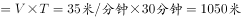。根据每两棵梧桐树间距50米，代入线形植树公式棵数，并考虑两旁种树的棵数应乘以2，故这条林荫道两旁栽种的梧桐树共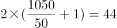棵。

故正确答案为A。

---

### 第 2 题　qid 2188545 · 数学运算

A、B两地间有三种类型列车运行，其中高速铁路动车组列车每天6车次，普通动车组列车每天5车次，快速旅客列车每天4车次。甲、乙两人要同一天从A地出发前往B地。假设他们买票前没有互通信息，而且火车票票源充足，问他们买到同一趟列车车票的概率有多大？

- **A**. 
小于
　✅
- **B**. 
到之间

- **C**. 
到之间

- **D**. 
到之间

**答案**：A

**官方解析**

方法一：，由题意从A到B的买到的车票种类数种，则。甲乙都买同一趟列车共有15种情况，因此他们买到同一趟列车车票的概率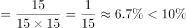。

方法二：从A到B共有6+5+4=15种选择，其中任意一人从A到B有15种选择，另外一人与该人买到同一趟列车车票，即只有一种情况，因此满足条件的概率为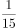。

故正确答案为A。

---

### 第 3 题　qid 2187811 · 数学运算

装修工人小郑用相同的长方形瓷砖装饰正方形墙面，每10块瓷砖组成一个如下图所示的图案。小郑用这个图案恰好铺满该墙面，那么，他最少用了多少块瓷砖？

- **A**. 250
- **B**. 300　✅
- **C**. 400
- **D**. 450

**答案**：B

**官方解析**

设长方形瓷砖宽为厘米，由图示可得：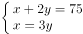 ，解得：，。

由图所示，图案的长为厘米。要用长为90厘米、宽为75厘米的长方形图案拼成正方形墙面，若要使用的瓷砖最少，则正方形的边长应该为90和75的最小公倍数450厘米。那么长需要5个，宽需要6个，这样共需要个该图案，每个图案10块瓷砖，则他最少用了块瓷砖。

故正确答案为B。

---

### 第 4 题　qid 2188551 · 数学运算

某超市下午3点开始对其新上架的洗发液进行半价促销，并规定之后每次整点时，洗发液的价格都会上调其原价的，直至恢复原价。张大妈4点15分在超市抢购了2瓶，6点半又去超市买了2瓶。张大妈两次购买洗发液共花费48元，问与原价相比共节省了多少元？

- **A**. 12
- **B**. 24
- **C**. 32　✅
- **D**. 48

**答案**：C

**官方解析**

根据题意，设洗发液原价为100a元，则有：

张大妈两次抢购的总价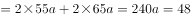，解得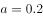；原价购买4瓶的总价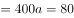元，则与原价相比共节省了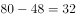元。

故正确答案为C。

---

### 第 5 题　qid 2188556 · 数学运算

从A地到B地为上坡路。自行车选手从A地出发按A-B-A-B的路线行进，全程平均速度为从B地出发，按B-A-B-A的路线行进的全程平均速度的，如自行车选手在上坡路与下坡路上分别以固定速度匀速骑行，问他上坡的速度是下坡速度的：

- **A**. 

　✅
- **B**. 

- **C**. 

- **D**. 

**答案**：A

**官方解析**

假设上坡所用时间为x，下坡所用时间为y，从A地出发按A-B-A-B的路线行进所用时间为，从B地出发按B-A-B-A的路线行进所用时间为。总路程相同，速度与时间成反比，已知前者全程平均速度是后者的，则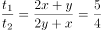，则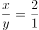。由于上坡和下坡路程相同，速度和时间成反比，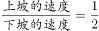。

故正确答案为A。

---

### 第 6 题　qid 2189321 · 数学运算

如下图所示，五个圆相连，现在用三种不同颜色分别给每个圆涂色，要求相连接的两个圆不能涂同种颜色，共有不同的涂色方法：

- **A**. 36种　✅
- **B**. 72种
- **C**. 144种
- **D**. 32种

**答案**：A

**官方解析**

从P点开始逐个涂色，P点有3种颜色可选，则T点有2种颜色可选，根据S点和Q点的颜色是否相同分为两种情况：

第一种情况，S点和Q点的颜色相同，SQ的颜色选择情况有2种，R点也有2种颜色可选，情况数为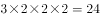；

第二种情况，S点和Q点的颜色不同，SQ的颜色选择情况有种，R点只有1种颜色可选，情况数为。

则总情况数为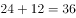。

故正确答案为A。

---

### 第 7 题　qid 2195776 · 数学运算

某公司技术人员占员工总数的8/9，年底公司共有7人获得优秀员工奖励，其中获奖的技术人员占公司员工总数的1/6，问获奖的非技术人员占非技术人员总数的（  ）

- **A**. 1/2
- **B**. 1/4　✅
- **C**. 1/6
- **D**. 1/9

**答案**：B

**官方解析**

根据题意，，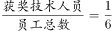，则员工总数应是9和6的公倍数，即可能为18人、36人……

若总人数为18人，获奖技术人员数为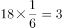人，获奖非技术人员数为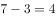人，而非技术人员总数为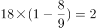人，低于获奖非技术人员数，矛盾。

若总人数为36人，获奖技术人员数为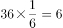人，获奖非技术人员数为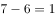人，非技术人员数为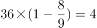人，此时获奖的非技术人员占非技术人员总数的，B选项满足。

故正确答案为B。

---

### 第 8 题　qid 2188555 · 数学运算

若干名天使投资人对某个需求资金120万的创业项目表达出投资意向，并计划每人以相同的金额投资该项目。但实际投资时有2人退出，剩下的每人需要多投资10万元才能满足该项目的资金需求，问实际投资这一项目的有多少人？

- **A**. 3
- **B**. 4　✅
- **C**. 6
- **D**. 8

**答案**：B

**官方解析**

设实际投资这一项目的有x人，则计划投资的有人，根据题意可得，，解得（分式方程求解过程计算量大，建议结合选项代入）。

故正确答案为B。

---

### 第 9 题　qid 2187755 · 数学运算

一直升机在海上救援行动中搜索到遇险者方位后通知快艇，快艇立即朝遇险者直线驶去。此时，直升机距离海平面的垂直高度200米，从机上看，遇险者在正南方向，俯角（朝下看时视线与水平面的夹角）为，快艇在正东方向，俯角为。若忽略当时风向、潮流等其它因素，且假定遇险者位置不变，则快艇以60千米/小时的速度匀速前进需要多长时间才能到达遇险者的位置？

- **A**. 21秒
- **B**. 22秒
- **C**. 23秒
- **D**. 24秒　✅

**答案**：D

**官方解析**

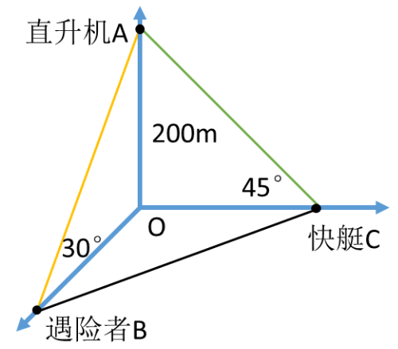

因为直升机距离海平面的垂直高度200米，在机上看遇险者俯角为，所以直升机和遇险者的水平距离为米；同理，直升机和快艇的水平距离为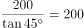米。如图所示，直升机在O点正上方200米A点处，遇险者在正南方向的B点，快艇在正东方向的C点，其中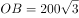米，米，所以米。快艇的速度为60千米/小时=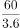米/秒，所以快艇匀速前进到达遇险者的位置所需要的时间是秒。

故正确答案为D。

---

### 第 10 题　qid 2187777 · 数学运算

联欢会上，有24人吃冰激凌、30人吃蛋糕、38人吃水果，其中既吃冰激凌又吃蛋糕的有12人，既吃冰激凌又吃水果的有16人，既吃蛋糕又吃水果的有18人，三样都吃的则有6人。假设所有人都吃了东西，那么只吃一样东西的人数是多少？

- **A**. 12
- **B**. 18　✅
- **C**. 24
- **D**. 32

**答案**：B

**官方解析**

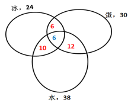

如图所示，共有24人吃冰激凌，其中有12人吃了蛋糕，16人吃了水果，既吃了蛋糕又吃了水果的有6人，则只吃了冰激凌的人数为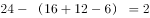人；同理，只吃了蛋糕的人数为人；只吃了水果的人数为人，则只吃一样东西的人数为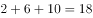人。

故正确答案为B。

---

### 第 11 题　qid 2187721 · 数学运算

某社团组织周末自驾游，集合后发现小王和小李未到。由于每辆小车限坐5人，按照现有车辆恰有1人坐不上车。为难之际，小王和小李分别开车赶到，于是所有人都坐上车，且每辆车人数均相同。那么，参加本次自驾游的小车数为：

- **A**. 9
- **B**. 8
- **C**. 7　✅
- **D**. 6

**答案**：C

**官方解析**

方法一：设参加本次自驾游的小车总数（包含小王和小李的车）为辆，根据题意可得，包含小王和小李在内的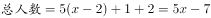人。因为小王和小李开车赶到后每辆车人数均相同，所以总人数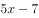能被整除，是的倍数，所以7应是的倍数，只有C项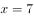满足条件。

方法二：代入排除法。

代入A选项，若参加本次自驾游的小车数为9辆，则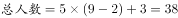人，平均每辆车可坐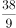人，不是整数，错误；

代入B选项，若参加本次自驾游的小车数为8辆，则人，平均每辆车可坐人，不是整数，错误；

代入C选项，若参加本次自驾游的小车数为7辆，则人，平均每辆车可坐人，符合条件，正确；

代入D选项，若参加本次自驾游的小车数为6辆，则人，平均每辆车可坐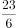人，不是整数，错误。

故正确答案为C。

---

### 第 12 题　qid 2188498 · 数学运算

甲、乙、丙三个网站定期更新，甲网站每隔48小时，乙网站每隔72小时，丙网站每隔96小时更新一次内容。问在一个星期内至多有几天，三个网站中至少有一个更新内容？

- **A**. 4天
- **B**. 5天
- **C**. 6天
- **D**. 7天　✅

**答案**：D

**官方解析**

由题意可知，甲每天更新一次，乙每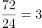天更新一次，丙每天更新一次，要想有更新的天数尽可能多，则三个网站在一周的更新天数应尽可能多，且尽量不重复。安排甲从周一开始更新，则甲在周一、周三、周五、周日均更新一次，此时乙在周一、周四、周日更新，丙分别在周二与周六更新，情况最优，一周内每天均有网站更新。

注：每隔48小时就是每48小时，不需要额外加1小时。

故正确答案为D。

---

### 第 13 题　qid 2188447 · 数学运算

甲、乙、丙三所学校的学生被安排在周一至周五参观某革命纪念馆。纪念馆每天最多只能安排一所学校，其中甲学校连续参观两天，其余学校均只参观一天，那么共有多少种安排方法？

- **A**. 12种
- **B**. 24种　✅
- **C**. 36种
- **D**. 60种

**答案**：B

**官方解析**

由于甲学校连续参观两天，故先安排甲，甲参加的时间可能为“周一和周二、周二和周三、周三和周四、周四和周五”共4种情况。甲安排好后，工作日还差3天未安排，故在其中选择2天安排乙和丙，情况数为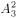种。故总的情况数种。

故正确答案为B。

---

### 第 14 题　qid 2188571 · 数学运算

10个相同的盒子中分别装有1～10个球，任意两个盒子中的球数都不相同。小李分三次每次取出若干个盒子，每次取出的盒子中的球数之和都是上一次的3倍，且最后剩下1个盒子。问剩下的盒子中有多少个球？

- **A**. 9
- **B**. 6
- **C**. 5
- **D**. 3　✅

**答案**：D

**官方解析**

由题意可得，共有小球个数为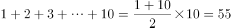个，假设第一次取出小球个数为x，剩下盒子中球数为y，则第二次与第三次取出小球个数分别为3x，9x，前三次取出小球总个数为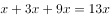，则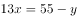，是13的倍数，只有D项满足。

故正确答案为D。

---

### 第 15 题　qid 2187825 · 数学运算

小庄要制作一个工业模具。他在一个边长4厘米的正方体上表面正中心位置向下挖掉一个直径2厘米、高2厘米的圆柱体，接着再向下挖掉一个直径1厘米、高1厘米的小圆柱体（如右图所示）。那么，该模具的表面积约为多少平方厘米？

- **A**. 82.8
- **B**. 108.6
- **C**. 111.7　✅
- **D**. 114.8

**答案**：C

**官方解析**

边长4厘米的正方体的表面积为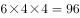平方厘米。中心位置一个直径2厘米、高2厘米的圆柱体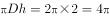平方厘米，一个直径1厘米、高1厘米的小圆柱体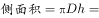平方厘米。那么，该模具的表面积约为平方厘米。

注：挖掉的大小圆柱体底面的面积，可以叠加还原成最上层的表面，故不需要单独计算圆柱体底面积，只需要计算侧面积即可。

故正确答案为C。

---

## 判断推理

### 第 1 题　qid 2189463 · 图形推理

从所给的四个选项中，选出最合适的一个填入问号处，使之呈现一定的规律性：

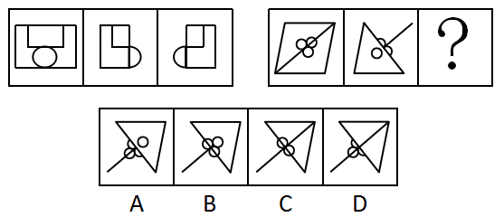

- **A**. A　✅
- **B**. B
- **C**. C
- **D**. D

**答案**：A

**官方解析**

元素组成相似，优先考虑样式规律。第一组图中，图一和图二去同求异得到图三，第二组图也应该满足此规律，只有A项符合。
故正确答案为A。

---

### 第 2 题　qid 2188596 · 图形推理

从所给四个选项中，选出最合适的一个填入问号处，使之呈现一定规律性：

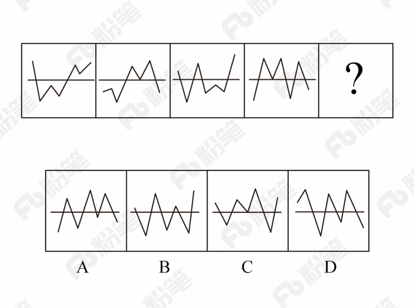

- **A**. A
- **B**. B　✅
- **C**. C
- **D**. D

**答案**：B

**官方解析**

元素组成不同，且无明显属性规律，优先考虑数量规律。观察题干发现，折线与直线相交，形成明显的“窟窿”，优先考虑数面。题干图形面数量依次为：1、2、3、4，故？处为5个面，C、D项为4个面，排除。对比A、B项，发现A项折线开口朝下，B项折线开口朝上，而题干图形折线开口朝向依次为：上、下、上、下，故？处开口朝上，B项当选。
故正确答案为B。

---

### 第 3 题　qid 2188604 · 图形推理

从所给四个选项中，选出最合适的一个填入问号处，使之呈现一定规律性：

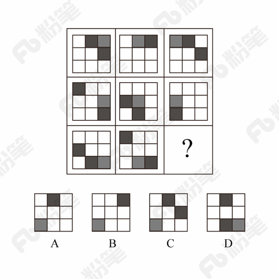

- **A**. A
- **B**. B
- **C**. C　✅
- **D**. D

**答案**：C

**官方解析**

元素组成相同，优先考虑位置规律。九宫格优先横行看，第一行黑块1在最外圈沿着顺时针的方向移动，黑块2在最外圈沿着逆时针的方向移动，灰块依次从右向左平移一格。第二行验证发现符合此规律。则？处黑块1应出现在第一行第二列，黑块2应出现在第二行第三列，灰块应出现在第三行第一列，只有C项符合。

故正确答案为C。

---

### 第 4 题　qid 2187802 · 图形推理

从所给的四个选项中，选择最合适的一个填入问号处，使之呈现一定的规律性：

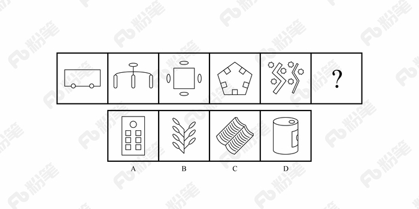

- **A**. A
- **B**. B　✅
- **C**. C
- **D**. D

**答案**：B

**官方解析**

元素组成不同，无明显属性规律，考虑数量规律。观察发现，题干图形均有面，考虑数面，数量依次为3、4、5、6、8，没有规律，再观察发现每个图形中均有形状相同的面，且数量依次为2、3、4、5、6，？，问号处图形应该含有7个形状相同的面。A项6个，B项7个，C项2个，D项没有形状相同的面，只有B项符合。
故正确答案为B。

---

### 第 5 题　qid 2188609 · 图形推理

左图给定的是正方体纸盒的外表面，下面哪一项能由它折叠而成？

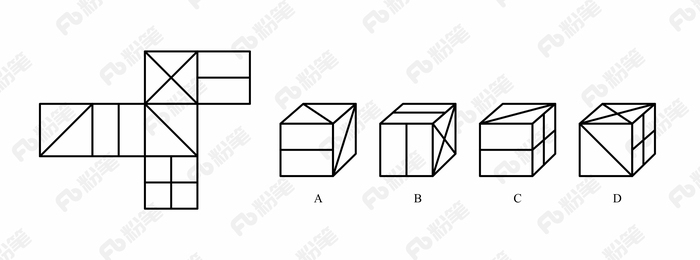

- **A**. A
- **B**. B
- **C**. C　✅
- **D**. D

**答案**：C

**官方解析**

本题考查六面体的空间重构。将题干展开图中的面依次标号，如下图：

A项：选项中的三个面分别是面a、面b（或面e）、面c，面a和面c中间相隔一个面，二者是相对面，相对面不能同时出现，排除；

B项：选项中的三个面分别是面b、面e、面d，面b和面e是“Z”字形的两端，二者是相对面，相对面不能同时出现，排除；

C项：与题干展开图一致，当选；

D项：选项中三个面分别是面a（或面c）、面d、面f，面d和面f中间相隔一个面，二者是相对面，相对面不能同时出现，排除。

故正确答案为C。

---

### 第 6 题　qid 2188476 · 定义判断

前摄抑制是指先学习的材料对识记和回忆后学习的材料所产生的干扰作用；倒摄抑制是指后学习的材料对识记和回忆先学习的材料所产生的干扰作用。
根据上述定义，下列选项只包含倒摄抑制的是：

- **A**. 背课文时发现中间段落往往是最难记住的
- **B**. 一天中，人们一般在早晨和夜晚的记忆效果最佳
- **C**. 学习英文字母后，之前学的拼音字母会读错　✅
- **D**. 头部受伤后，回忆不起来之前发生的事情

**答案**：C

**官方解析**

第一步：找出定义关键词。
前摄抑制：“先学习的材料对识记和回忆后学习的材料所产生的干扰作用”；
倒摄抑制：“后学习的材料对识记和回忆先学习的材料所产生的干扰作用”。
第二步：逐一分析选项。
A项：背课文中间段落最难记住，说明前面段落和后面段落都对中间段落产生了影响，即“先学习的材料”和“后学习的材料”分别对“对回忆后学习的材料产生了干扰作用”和“对回忆先学习的材料产生了干扰作用”，因此选项中既包含了前摄抑制，又包含了倒摄抑制，排除；
B项：早晨和夜晚的记忆效果最佳，只是说记忆效果的好坏，并不涉及学习材料，不包含倒摄抑制，排除；
C项：之前的拼音字母会读错，说明后学的英文字母对先学的拼音字母产生了影响，即“后学习的材料对识记和回忆先学习的材料所产生的干扰作用”，选项中只包含倒摄抑制，当选；
D项：由于头部受伤而导致回忆不起来之前的事情，没有提到“先、后学习的材料对识记和回忆后、先学习的材料所产生的干扰作用”，因此选项中既没有包含前摄抑制，也没有包含倒摄抑制，排除。
故正确答案为C。

---

### 第 7 题　qid 2188615 · 定义判断

间接正犯又称为间接实行犯，是指利用他人为道具而实施犯罪的实行行为，利用者通过支配被利用者的工具行为实现自己的犯罪意图。利用者与被利用者不构成共同犯罪。它包括以下两种情况：一是利用无刑事责任能力人犯罪；二是利用他人过失或不知情的行为犯罪。
根据上述定义，下列甲的行为属于间接正犯的是：

- **A**. 甲挑唆乙和丙的关系，致使乙一怒之下将丙打成重伤。甲、乙、丙均为完全刑事责任能力人
- **B**. 甲教唆精神病人乙用刀砍伤与其素有仇怨的丙。甲、丙为完全刑事责任能力人，乙为无刑事责任能力人　✅
- **C**. 甲派员工乙殴打一直欠钱不还的丙，并允诺给其好处，乙随后将丙打伤。甲、乙、丙均为完全刑事责任能力人
- **D**. 甲让自己尚未成年的孩子乙诬告丙，未想到乙捏造的事实正是丙客观存在的事实。甲、丙为完全刑事责任能力人，乙为无刑事责任能力人

**答案**：B

**官方解析**

第一步：找出定义关键词。
“利用他人为道具而实施犯罪的实行行为”、“利用者与被利用者不构成共同犯罪”、“两种情况：一是利用无刑事责任能力人犯罪；二是利用他人过失或不知情的行为犯罪”。
第二步：逐一分析选项。
A项：甲挑唆乙和丙的关系，致使乙将丙打伤，但甲、乙、丙均是完全刑事责任能力人，且乙知情，不符合“两种情况：一是利用无刑事责任能力人犯罪；二是利用他人过失或不知情的行为犯罪”中的任何一种，不符合定义，排除；
B项：甲教唆乙将丙砍伤，符合“利用他人为道具而实施犯罪的实行行为”,被利用的乙是无刑事责任能力人，符合“利用无刑事责任能力人犯罪”的情况，符合定义，当选；
C项：甲派乙殴打丙，乙是被利用者，但甲、乙、丙均是完全刑事责任能力人，且乙知情，不符合“两种情况：一是利用无刑事责任能力人犯罪；二是利用他人过失或不知情的行为犯罪”中的任何一种，不符合定义，排除；
D项：甲让自己的孩子乙诬告丙，乙虽然是无刑事责任能力人，但乙捏造的事实正是丙客观存在的，并非诬告，因此不符合“利用无刑事责任能力人犯罪”，不符合定义，排除。
故正确答案为B。

---

### 第 8 题　qid 2188626 · 定义判断

趋同进化是遗传学中的一个概念，指的是不同的物种在进化过程中，由于适应相似的环境而呈现出表型上的相似性。而趋异进化则相反，它是指同一物种在进化过程中，由于适应不同的环境而呈现出表型差异的现象。
根据上述定义，下列属于趋异进化的是：

- **A**. 澳洲的袋食蚁兽与亚洲的穿山甲相比较，具有相似的生活方式和适于捕食白蚁的相似生理结构
- **B**. 鲸、海豚等和鱼类的亲缘关系很远，前者是哺乳类，后者是鱼类，但由于都在水域中生活，体形都很相似
- **C**. 欧亚大陆温带地区生活的鼹鼠、非洲南部的金毛鼹在分类上相距甚远，但它们的生存环境和生活方式相似，形态也相似
- **D**. 更新世时期，冰川将一群棕熊从主群中分了出来，在北极环境下发展成与环境颜色一致、善于捕猎的白色北极熊。北极熊食肉，而其他棕熊以植物为主要食物　✅

**答案**：D

**官方解析**

第一步：找出定义关键词。
趋同进化：“不同的物种在进化过程中”、“由于适应相似的环境而呈现出表型上的相似性”；
趋异进化：“同一物种在进化过程中”、“由于适应不同的环境而呈现出表型差异的现象”。
第二步：逐一分析选项。
A项：袋食蚁兽和穿山甲是不同的物种，符合“不同的物种在进化过程中”，具有相似的生活方式和适于捕食白蚁的相似生理结构，符合“由于适应相似的环境而呈现出表型上的相似性”，符合“趋同进化”定义，不符合“趋异进化”定义，排除；
B项：鲸、海豚等和鱼类亲缘关系很远，符合“不同的物种在进化过程中”，因为生活在水中而体形相似，符合“由于适应相似的环境而呈现出表型上的相似性”， 符合“趋同进化”定义，不符合“趋异进化”定义，排除；
C项：鼹鼠和金毛鼹分类相距甚远符合“不同的物种在进化过程中”，生存环境和生活方式相似，形态也相似符合“由于适应相似的环境而呈现出表型上的相似性”， 符合“趋同进化”定义，不符合“趋异进化”定义，排除；
D项：白色北极熊是从棕熊中分出来的，符合“同一物种在进化过程中”，北极熊在北极环境中发展成与环境颜色一致、善于捕猎的食肉白色北极熊，而其他棕熊以植物为主要食物，符合“由于适应不同的环境而呈现出表型差异的现象”，符合“趋异进化”定义，当选。
故正确答案为D。

---

### 第 9 题　qid 2195809 · 逻辑判断

自己人效应是指在人际交往中，如果双方关系良好，一方就更容易接受另一方的思想观念立场，甚至会对对方提出的难为情的要求也不太容易拒绝，这一现象被称为自己人效应。
以下哪项没体现该效应？

- **A**. 某将军和士兵同甘共苦，并且非常关心自己的士兵，士兵也觉得将军没有架子，乐于听从
- **B**. 王老师发现中学生小明早恋，他与小明进行了谈话，谈及自己在年轻时类似的经历，小明觉得亲切可信，于是乐于听从
- **C**. 小李是一名优秀的运动员，在一次比赛中，发挥失常很沮丧，队友纷纷对其进行劝慰，他表示自己不在意，其实他的内心一直很低落　✅
- **D**. 某作家在演讲时介绍了自己与听众相似的经历，使听众形成了“认同感”，演讲很受欢迎，他的观点很快被听众接受

**答案**：C

**官方解析**

第一步：找出定义关键词。
“人际交往中”、“双方关系良好”、“一方更容易接受另一方的思想观念立场”、“对对方提出的难为情的要求不太容易拒绝”。
第二步：逐一分析选项。
A项：将军与士兵同甘共苦，并且关心士兵，士兵也觉得将军没有架子，符合“人际交往中”、“双方关系良好”，士兵乐于听从将军的话，符合“一方更容易接受另一方的思想观念立场”，符合定义，排除； 
B项：老师和小明的交往中，小明觉得老师亲切可信，符合“人际交往中”、“双方关系良好”，小明乐于听从老师的话，符合“一方更容易接受另一方的思想观念立场”，符合定义，排除；
C项：小李和队友的交往中，队友纷纷对小李进行安慰，符合“人际交往中”、“双方关系良好”，但是他的内心还是很低落，说明没有真正接受其他队友的开导，不符合“一方更容易接受另一方的思想观念立场”，不符合定义，当选；
D项：作家和听众的交往中，使得听众形成了认同感，符合“人际交往中”、“双方关系良好”，听众很快的接受了作家的观点，符合“一方更容易接受另一方的思想观念立场”，符合定义，排除。
本题为选非题，故正确答案为C。

---

### 第 10 题　qid 2195815 · 逻辑判断

热胀冷缩物体在一般状态下，受热后会膨胀，在受冷情况下会缩小，大多物质都有这种特征。
以下哪项没有体现热胀冷缩？

- **A**. 在熔化的铅字合金中加入液态锑合金后将其模板在后期模板进行冷却和凝固，合金体积增加增大，使铅字的每个细小笔划都能清晰可见　✅
- **B**. 电工在夏天架电线时，不会把电线绷紧而使其有略微的下垂，防止冬天电线绷紧断裂
- **C**. 玻璃瓶罐头的盖子很难拧开，而热一下后就很容易了
- **D**. 温度计，随着温度的升高，读数升高

**答案**：A

**官方解析**

第一步：找出定义关键词。
“受热后会膨胀”、“受冷后会缩小”。
第二步：逐一分析选项。
A项：液态合金在后期模板进行冷却和凝固，然后体积增加增大，即在受冷的情况下体积增大，与“受热后会膨胀”矛盾，不符合定义，当选；
B项：夏天天气热，电线受热会膨胀，而到了冬天，气温降低，电线遇冷会缩小而变得紧绷，所以在夏天架电线时不会把电线绷紧而是让其略微下垂，这样可以在冬天电线冷缩的时候也不会因为紧绷而断裂，体现了“受冷后会收缩”，符合定义，排除；
C项：玻璃瓶罐头的盖子难拧开，热一下之后，盖子会膨胀，所以会很容易拧开，体现了“受热后会膨胀”，符合定义，排除；
D项：温度计下面是水银球，温度升高，水银受热后体积膨胀就会变大，所以水银柱就会升高，对应的读数也会升高，体现了“受热后会膨胀”，符合定义，排除。
本题为选非题，故正确答案为A。

---

### 第 11 题　qid 2188477 · 定义判断

不征税收入是指专门从事特定目的，从性质和根源上不属于营利性活动带来的经济利益，不负有纳税义务并且不作为应纳税所得额组成部分的收入，比如财政拨款、行政事业性收费等；免税收入是纳税人应税收入的重要组成部分，只是国家为了实现某些经济和社会目标，在特定时期或对特定项目取得的经济利益给予的税收优惠照顾，而在一定时期又有可能恢复征税的收入。
根据上述定义，下列说法错误的是：

- **A**. 为鼓励高新技术企业自主创新，政府规定，在近两年内对这类企业研发产品的销售收入暂不收税，因此企业在研发产品上的销售收入属于免税收入
- **B**. 某农产品企业获得了当地政府对农业加工产品的专项财政补贴，该补贴属于不征税收入
- **C**. 国家规定，企业技术转让所得年净收入在30万元以下的，暂免征收所得税，因此这部分所得属于免税收入
- **D**. 为鼓励纳税人积极购买国债，国家规定国债所得利息收入暂不计入应纳税所得额，不征收企业所得税，因此国债利息收入属于不征税收入　✅

**答案**：D

**官方解析**

第一步：找出定义关键词。
不征税收入：“专门从事特定目的”、“从性质和根源上不属于营利性活动带来的经济利益” 、“不负有纳税义务并且不作为应纳税所得额组成部分的收入”。
免税收入：“国家为了实现某些经济和社会目标”、“在特定时期或对特定项目取得的经济利益给予的税收优惠照顾”、“而在一定时期又有可能恢复征税的收入”。
第二步：逐一分析选项。
A项：为鼓励高新技术企业自主创新，符合“国家为了实现某些经济和社会目标”，在近两年内对这类企业研发产品的销售收入暂不收税，符合“在特定时期或对特定项目取得的经济利益给予的税收优惠照顾”，符合“免税收入”定义，排除； 
B项：某农产品企业，符合“专门从事特定目的”，获得了当地政府专项财政补贴，符合“从性质和根源上不属于营利性活动带来的经济利益”，符合“不征税收入”定义，排除；
C项：企业技术转让所得年净收入暂免征收所得税，符合“在特定时期或对特定项目取得的经济利益给予的税收优惠照顾”和“而在一定时期又有可能恢复征税的收入”，符合“免税收入”定义，排除；
D项：为鼓励纳税人积极购买国债，符合“国家为了实现某些经济和社会目标”，规定国债所得利息收入暂不计入应纳税所得额，符合“在特定时期或对特定项目取得的经济利益给予的税收优惠照顾”和“而在一定时期又有可能恢复征税的收入”，符合“免税收入”定义，不符合“不征税收入”定义，错误，当选。
本题为选非题，故正确答案为D。

---

### 第 12 题　qid 2188620 · 定义判断

信息腐败指的是手中掌握有公共权力的人，借用自身的权力获得某些特殊信息，然后由自己或其代理人利用这些垄断信息从事某些牟利活动的一种违法乱纪行为。
根据上述定义，下列涉及信息腐败的是：

- **A**. 市政府某局干部为了个人升迁，贿赂有关人员，多次修改个人档案信息
- **B**. 某法学院教授为了将其负责的研究生班办成品牌，私自使用秘密窃取的某资格考试试卷对该班学生进行辅导
- **C**. 省科技厅王处长离职后到某公司就职，他将自己研究的某项技术加以创新，为该公司开发出极具市场竞争力的新产品
- **D**. 副区长龙某将工程招标报名情况、投标企业业绩要求、中标方式等秘密信息泄露给某投标企业，并收受该企业50余万元　✅

**答案**：D

**官方解析**

第一步：找出定义关键词。
“手中掌握有公权力的人”、“借用自身权利获得某些特殊信息，从事某些牟利活动”。
第二步：逐一分析选项。
A项：市政府某局干部贿赂有关人员改档案信息，并没有获得特殊信息，不符合“借用自身权力获得某些特殊信息，从事某些牟利活动”，不符合定义，排除； 
B项：某法学院教授是用窃取的试卷辅导学生，不符合“借用自身权力获得某些特殊信息，从事某些牟利活动”，不符合定义，排除；
C项：省科技厅王处长离职后将自己的技术创新，并没有利用权力获得信息，不符合“借用自身权力获得某些特殊信息，从事某些牟利活动”，不符合定义，排除；
D项：副区长将工程投标秘密信息泄露给投标企业，并获得50万余元，符合“借用自身权力获得某些特殊信息，从事某些牟利活动”，符合定义，当选。
故正确答案为D。

---

### 第 13 题　qid 2187858 · 定义判断

刺激泛化是指条件作用的形成使有机体习得了对某一刺激做出特定反应的行为，因此也就可能对类似的刺激做出同样的行为反应。刺激分化是通过选择性强化和消退使有机体学会对条件刺激和与条件刺激相类似的刺激做出不同的行为反应。
根据上述定义，下列说法不正确的是：

- **A**. “一朝被蛇咬，十年怕井绳”属于刺激泛化
- **B**. “横看成岭侧成峰，远近高低各不同”属于刺激分化　✅
- **C**. 为突出品牌，厂家对包装进行独特设计，力图使顾客产生刺激分化
- **D**. 某品牌牙膏创成名牌后，生产商将其生产的化妆品也以同品牌命名，利用的是顾客的刺激泛化

**答案**：B

**官方解析**

第一步：找出定义关键词。
刺激泛化：“条件作用的形成使有机体习得了对某一刺激做出特定反应的行为”、“对类似的刺激做出同样的行为反应”
刺激分化：“通过选择性强化和消退”、“对相类似的刺激做出不同的行为反应”
第二步：逐一分析选项。
A项：被蛇咬后怕井绳是对类似的刺激做出同样的行为反应，符合“刺激泛化”定义，排除；
B项：“横看成岭侧成峰，远近高低各不同”是对同一事物从不同角度的观看所产生的视觉差异，不涉及刺激反应，不符合“刺激分化”定义，当选；
C项：厂家对包装进行独特设计的目的是为了和其他品牌进行区分，想让顾客看到该厂的产品后，做出和看到其他厂商相同产品时不同的反应，符合“通过选择性强化和消退”、“对相类似的刺激做出不同的行为反应”，符合“刺激分化”定义，排除；
D项：生产商将化妆品也以同品牌命名，想让顾客看到同品牌化妆品后也产生名牌的认知，符合“想让消费者对类似的刺激做出同样的行为反应”，符合“刺激泛化”定义，排除。
本题为选非题，故正确答案为B。

---

### 第 14 题　qid 2188601 · 定义判断

经济文盲指的是被很多经济学名词弄得满头大汗不知其意的人们，他们的典型特色是容易盲从，专家说啥信啥，缺乏独立思考，即使专家说错了他们也会继续相信。
根据上述定义，下列涉及经济文盲的是：

- **A**. 某“专家”在其出版的书中宣扬“绿豆治百病大法”，引发市场绿豆涨价
- **B**. 一天电视节目里某娱乐明星说低钠盐好处多，第二天一些超市的低钠盐被一抢而空
- **C**. 为了通过某资格考试，小王死记硬背了“边际效益”等很多经济学名词，但是他并没有发现复习资料中其实有很多错误
- **D**. 小王被《重金属攻略》一书中的“浮动盈亏”等概念弄糊涂了，但是看到书中宣传的重金属盈利前景，还是迅速参与了交易　✅

**答案**：D

**官方解析**

第一步：找出定义关键词。
“被经济学名词弄得满头大汗”、“容易盲从”、“专家说啥信啥”、“缺乏独立思考，盲目跟从”。
第二步：逐一分析选项。
A项：绿豆治百病大法是一种民间食疗方法，不是经济学名词，不符合定义，排除；
B项：低钠盐好处多是指低钠盐对人体的好处，不是经济学名词，不符合定义，排除；
C项：“边际效益”是经济学名词，小王是为了通过考试而死记硬背这些经济学名词，而不是盲目跟从专家说法，不符合定义，排除；
D项：《重金属攻略》一书中的“浮动盈亏”是经济学名词，小王被“浮动盈亏”等概念弄糊涂了，符合“被经济学名词弄得满头大汗”。看到书中宣传的重金属的盈利前景就马上参与交易，符合“缺乏独立思考，盲目跟从”，符合定义，当选。
故正确答案为D。

---

### 第 15 题　qid 2189472 · 定义判断

表见代理是指行为人虽无代理权，但由于被代理人的行为，造成了足以使善意第三人相信其有代理权的表象，而与善意第三人进行的，由被代理人承担法律后果的代理行为。
根据上述定义，下列案例中不存在表见代理的是：

- **A**. 汤某系某车队司机，多次代单位赊购汽油，月底由单位支付油费。后汤某调换到行政岗位，却仍以单位名义给自己的车加油，加油站并不知情，遂继续为汤某提供服务，结果在向汤某单位收取油费时被拒绝
- **B**. 某商场业务员郑某多次到甲公司采购空调设备，一次郑某去甲公司时见其生产的暖风机小巧实用，于是以商场名义购买了一批暖风机，商场知道后，认为郑某是自作主张，他们有权拒绝支付货款
- **C**. 陆某是某市一套房屋产权人，去年5月，陆某儿子拿着他的印章、身份证和房屋产权证原件委托房产中介出售房屋，中介联系促成徐某与陆某儿子签了房屋买卖合同并办理了过户手续，但当徐某要求入住时，陆某称他不知情，要求撤销买卖合同
- **D**. 张媛的弟弟张力在某基金会储蓄部当副主任，张媛口头委托张力代其在基金会先后办理了八笔存款，共计30万，张力每次存款时在存款人栏、经办人栏都填写张媛的名字，后又擅自以张媛名义从基金会取出了13万存款　✅

**答案**：D

**官方解析**

第一步：找出定义关键词。
“行为人无代理权”、“被代理人的行为，造成了足以使善意第三人相信其有代理权的表象” 、“由被代理人承担法律后果的代理行为”。
第二步：逐一分析选项。
A项：汤某调换到行政岗位之后，不能代表单位，符合“行为人无代理权”，加油站并不知情，符合“被代理人的行为，造成了足以使善意第三人相信其有代理权的表象”，符合定义，排除； 
B项：郑某只能代表商场采购空调，买暖风机不是商场的采购要求，不能代表商场，符合“行为人无代理权”，甲公司是“善意第三人”，符合定义，排除； 
C项：陆某儿子不是房屋产权人，不能代表陆某，符合“行为人无代理权”，徐某与陆某儿子签了合同，符合“被代理人的行为，造成了足以使善意第三人相信其有代理权的表象”，符合定义，排除； 
D项：张媛口头委托了张力，说明张力有代理权，不符合“行为人无代理权”，张力擅自取出存款，这个行为是个人行为，没有涉及到“善意第三人”，不符合定义，当选。
本题为选非题，故正确答案为D。

---

### 第 16 题　qid 2188607 · 类比推理

高血压：传染病

- **A**. 蝙蝠：哺乳动物
- **B**. 黄梅戏：京剧
- **C**. 鲫鱼：两栖动物　✅
- **D**. 计算机：电脑硬件

**答案**：C

**官方解析**

第一步：判断题干词语间逻辑关系。
高血压不是一种传染病，且高血压是一种疾病，传染病是一类疾病。
第二步：判断选项词语间逻辑关系。
A项：蝙蝠是一种哺乳动物，二者为种属关系，与题干逻辑关系不一致，排除；
B项：黄梅戏和京剧为并列关系，与题干逻辑关系不一致，排除；
C项：鲫鱼不是两栖动物，且鲫鱼是一种动物，两栖动物是一类动物，与题干逻辑关系一致，当选；
D项：电脑硬件是计算机的组成部分，二者为组成关系，与题干逻辑关系不一致，排除。
故正确答案为C。

---

### 第 17 题　qid 2188412 · 类比推理

西子湖：曹娥江

- **A**. 美人蕉：老婆饼
- **B**. 东坡肉：五柳鱼　✅
- **C**. 女儿红：祖母绿
- **D**. 狮子头：凤凰胆

**答案**：B

**官方解析**

第一步：判断题干词语间逻辑关系。
西子湖即杭州西湖，之所以叫西子湖，是得名于我国四大美女之一的西施。曹娥江，中国东海独流入海河流钱塘江的最大支流，因东汉少女曹娥入江救父而得名。二者都是水域，是并列关系。
第二步：判断选项词语间逻辑关系。
A项：美人蕉是一种植物，老婆饼是一种糕点，二者不是并列关系，与题干逻辑关系不一致，排除；
B项：“东坡肉”是眉山和江南地区的特色传统名菜，相传为北宋词人苏东坡所创制；“五柳鱼”是一道四川名菜，得名于“五柳先生”陶渊明，二者都是菜肴，是并列关系，且均得名于某一人物，与题干逻辑关系一致，当选；
C项：女儿红是糯米酒，祖母绿是绿宝石的一种，二者不是并列关系，与题干逻辑关系不一致，排除；
D项：狮子头是一道菜肴，凤凰胆是一种天然玉石珠，二者不是并列关系，与题干逻辑关系不一致，排除。
故正确答案为B。

---

### 第 18 题　qid 2187709 · 类比推理

风霜雨雪：雾里看花

- **A**. 春夏秋冬：踏雪寻梅
- **B**. 金木火土：水中望月　✅
- **C**. 桃李杏橘：青梅煮酒
- **D**. 梅兰竹菊：茜窗画眉

**答案**：B

**官方解析**

第一步：判断题干词语间逻辑关系。
风霜雨雪为四字并列的成语，雾里看花是场景和行为的对应关系，且雾与风霜雨雪是并列关系。
第二步：判断选项词语间逻辑关系。
A项：春夏秋冬为四字并列关系的成语，踏雪和寻梅是两个行为的并列关系，与题干逻辑关系不一致，排除；
B项：金木火土为四字并列的成语，水中望月是场景和行为的对应关系，且水与金木火土是并列关系，与题干逻辑关系一致，当选；
C项：桃李杏橘为四字并列的成语，但是青梅不是场景，与题干逻辑关系不一致，排除；
D项：梅兰竹菊为四字并列的成语，茜窗画眉是场景和行为的对应关系，但茜窗画眉中不包含与梅兰竹菊并列的字，与题干逻辑关系不一致，排除。
故正确答案为B。

---

### 第 19 题　qid 2188622 · 类比推理

常规问题：非常规问题：问题

- **A**. 期中考试：期末考试：考试
- **B**. 顶层设计：基层落实：管理
- **C**. 豪华装修：简单装修：装修
- **D**. 转基因油：非转基因油：油　✅

**答案**：D

**官方解析**

第一步：判断题干词语间逻辑关系。
常规问题与非常规问题都是问题的一种，前两词与第三词为种属关系，且前两词为并列关系中的矛盾关系。
第二步：判断选项词语间逻辑关系。
A项：期中考试与期末考试都是考试的一种，前两词与第三词为种属关系，但前两词为并列关系中的反对关系，考试除此之外还有周考和月考等，与题干逻辑关系不一致，排除； 
B项：顶层设计与基层落实都是管理的方式，前两词与第三词为种属关系，但前两词是并列关系中的反对关系，与题干逻辑关系不一致，排除；
C项：豪华装修与简单装修都是装修的一种，前两词与第三词为种属关系，但前两词是并列关系中的反对关系，除此之外还可以有中等装修等，与题干逻辑关系不一致，排除；
D项：转基因油与非转基因油都是油的一种，前两词与第三词为种属关系，且前两词为并列关系中的矛盾关系，与题干逻辑关系一致，当选。
故正确答案为D。

---

### 第 20 题　qid 2188619 · 类比推理

扣子：西装：裤子

- **A**. 鼠标：电脑：键盘
- **B**. 学生：青年：艺术家
- **C**. 窗帘：窗户：房子
- **D**. 方向盘：轿车：商务车　✅

**答案**：D

**官方解析**

第一步：判断题干词语间逻辑关系。
扣子是西装和裤子的一部分，第一个词和后两个词是组成关系；有的西装是裤子，有的西装不是裤子，后两者为交叉关系。
第二步：判断选项词语间逻辑关系。
A项：鼠标与电脑配套使用，二者为对应关系，与题干逻辑关系不一致，排除；
B项：有的学生是青年，有的学生不是青年，二者为交叉关系，与题干逻辑关系不一致，排除；
C项：窗帘挂在窗户上，二者为对应关系，与题干逻辑关系不一致，排除；
D项：方向盘是轿车和商务车的一部分，第一个词和后两个词是组成关系；有的轿车是商务车，有的轿车不是商务车，二者为交叉关系，与题干逻辑关系一致，当选。
故正确答案为D。

---

### 第 21 题　qid 2187714 · 类比推理

春秋：寒暑：一年

- **A**. 妇孺：老幼：生命
- **B**. 荏苒：蹉跎：岁月
- **C**. 东西：南北：方向　✅
- **D**. 冷热：干湿：温度

**答案**：C

**官方解析**

第一步：判断题干词语间逻辑关系。
春秋和寒暑都用来泛指一年，为比喻象征关系。
第二步：判断选项词语间逻辑关系。
A项：妇孺和老幼都有生命，为对应关系，与题干逻辑关系不一致，排除；
B项：荏苒指岁月易逝，蹉跎指岁月白白过去，与题干逻辑关系不一致，排除；
C项：东西和南北都可以用来泛指方向，与题干逻辑关系一致，当选；
D项：冷热用来形容温度的高低，干湿和温度无必然关系，与题干逻辑关系不一致，排除。
故正确答案为C。

---

### 第 22 题　qid 2187703 · 类比推理

团扇：羽毛扇：舞蹈扇

- **A**. 宣纸：餐巾纸：铜版纸
- **B**. 圈椅：实木椅：办公椅　✅
- **C**. 排球：羽毛球：乒乓球
- **D**. 墨镜：老花镜：显微镜

**答案**：B

**官方解析**

第一步：判断题干词语间逻辑关系。
团扇为圆形或近似圆形，团扇以其形状命名，羽毛扇以其原材料命名，舞蹈扇以其功能命名，三者为交叉关系。
第二步：判断选项词语间逻辑关系。
A项：宣纸产自古代宣州，以其产地命名，餐巾纸以其功能命名，铜版纸以用途命名，与题干逻辑关系不一致，排除；
B项：圈椅以其形状命名，实木椅以其原材料命名，办公椅以其功能命名，三者为交叉关系，与题干逻辑关系一致，当选；
C项：排球以队列的分布命名，羽毛球以其原材料命名，乒乓球以其声音命名，与题干逻辑关系不一致，排除；
D项：墨镜以其颜色命名，老花镜和显微镜都以其功能命名，与题干逻辑关系不一致，排除。
故正确答案为B。

---

### 第 23 题　qid 2188598 · 类比推理

石油 对于（  ）相当于 廉洁 对于 （  ）

- **A**. 煤炭  贪腐
- **B**. 能源  品德　✅
- **C**. 矿产  政府
- **D**. 原油  简朴

**答案**：B

**官方解析**

逐一代入选项。
A项：石油和煤炭是并列关系，廉洁和贪腐是反义关系，前后逻辑关系不一致，排除；
B项：石油是一种能源，廉洁是一种品德，二者均为种属关系，前后逻辑关系一致，当选；
C项：石油是一种矿产，廉洁是政府的属性，前后逻辑关系不一致，排除；
D项：未经加工处理的石油称为原油，廉洁和简朴无明显逻辑关系，前后逻辑关系不一致，排除。
故正确答案为B。

---

### 第 24 题　qid 2188602 · 类比推理

（  ）对于 风景 相当于 美丽 对于（  ）

- **A**. 秀丽  动人
- **B**. 画卷  人生
- **C**. 怡人  心灵　✅
- **D**. 如画  如花

**答案**：C

**官方解析**

第一步：逐一代入选项。
A项：秀丽的风景，二者为偏正结构，美丽和动人为近义关系，前后逻辑关系不一致，排除；
B项：画卷里可能有风景，二者为或然组成关系，美丽的人生，二者为偏正结构，前后逻辑关系不一致，排除；
C项：怡人的风景，美丽的心灵，二者均为偏正结构，前后逻辑关系一致，当选；
D项：风景如画，美丽如花，但后两词顺序与前两词相反，前后逻辑关系不一致，排除。
故正确答案为C。

---

### 第 25 题　qid 2188413 · 类比推理

纺车 之于 （    ） 相当于 （    ） 之于 联合收割机

- **A**. 手摇；蒸汽机
- **B**. 织布；传动带
- **C**. 3D织布机；曲辕犁　✅
- **D**. 自动打线车；发动机

**答案**：C

**官方解析**

逐一代入选项。
A项：手摇纺车，手摇与纺车构成偏正结构；蒸汽机和联合收割机是并列关系，前后逻辑关系不一致，排除；
B项：纺车是生产线或纱的设备，与织布无必然的逻辑关系；传动带是联合收割机的组成部分，二者是组成关系，前后逻辑关系不一致，排除；
C项：纺车是生产线或纱的设备，3D织布机是织布的设备，二者是并列关系，且纺车为古代发明，3D织布机为现代发明；曲辕犁和联合收割机都可以用于农田耕作，二者是并列关系，且曲辕犁为古代发明，联合收割机为现代发明，前后逻辑关系一致，当选；
D项：纺车是生产线或纱的设备，自动打线车是采用纺坠来捻丝的设备，二者是并列关系；发动机是联合收割机的一部分，二者是组成关系，前后逻辑关系不一致，排除。
故正确答案为C。

---

### 第 26 题　qid 2188603 · 逻辑判断

心理学家研究发现，一般情况下学生的注意力随着老师讲课时间的变化而变化。讲课开始时，学生的注意力逐步增强，中间有一段时间保持在较为理想的状态，随后学生的注意力开始分散。
以下哪项如果为真，最能削弱上述结论？

- **A**. 老师经过适当安排能够获得足够注意力　✅
- **B**. 总有个别学生能够全程保持注意力集中
- **C**. 兴趣是影响注意力能否集中的关键因素
- **D**. 人能完全集中注意力的时间只有七秒钟

**答案**：A

**官方解析**

第一步：找出论点和论据。
论点：一般情况下学生的注意力随着老师讲课时间的变化而变化。
论据：讲课开始时，学生的注意力逐步增强，中间有一段时间保持在较为理想的状态，随后学生的注意力开始分散。
第二步：逐一分析选项。
A项：老师能够获得足够注意力，说明学生的注意力不会随着老师讲课时间的变化而变化，否定了论点，当选；
B项：论点说的是一般情况，因此选项中个别学生的情况是无法削弱的，排除；
C项：论点说的是学生的注意力随着老师讲课时间的变化而变化，该项说的是兴趣是影响注意力能否集中的关键因素，兴趣是关键因素也不代表时间不会影响注意力，无法削弱，排除；
D项：论点说的是学生的注意力随着老师讲课时间的变化而变化，该项说的是人能完全集中注意力的时间短，不能说明注意力是否会随着时间变化而变化，无法削弱，排除。
故正确答案为A。

---

### 第 27 题　qid 2195817 · 逻辑判断

茶树性喜潮湿，需要多量而均匀的雨水，湿度太低或降雨量少于1500毫米都不适合茶树的生长。仙人球喜阳，只有足够的光照下，才能发育良好，否则，会使条形圆球儿长成桶形，强刺球儿的刺也会萎缩，整个球没有光泽，在某地的大部分地区茶树和仙人球至少有一种长得好。
如果上述判断为真，则下列哪一项为假？

- **A**. 此地大部分属于热带海洋性气候
- **B**. 此地大部分地区靠近赤道
- **C**. 此地的一半地区，常年缺水日照短　✅
- **D**. 该地所有的茶树无法存活

**答案**：C

**官方解析**

第一步：翻译题干。

①茶树好 潮湿 且 多量而均匀的雨水。

②仙人球好 足够光照。

已知：茶树和仙人球至少有一种长得好。

第二步：分析选项。

A项：此地属于热带海洋性气候，热带海洋性气候的特点是全年降水量皆多，“降水多”是对题干条件①的肯后，肯后推不出确定性结论，与题干没有冲突，不是一定为假，排除；

B项：靠近赤道一般降水量多且光照足，“降水量多”是对题干条件①的肯后，肯后推不出确定性结论，“光照足”是对题干条件②的肯后，肯后推不出确定性结论，与题干没有冲突，不是一定为假，排除；

C项：已知该地缺水日照短，“缺水”是对题干条件①的否后，否后必否前，即“茶树长得不好”，“日照短”是对题干条件②的否后，否后必否前，即“仙人球长得不好”，与题干“茶树和仙人球至少有一种长得好”矛盾，所以C项一定为假，当选；

D项：已知茶树无法存活，仙人球是否能存活不明确，与题干没有冲突，不是一定为假，排除。

故正确答案为C。

---

### 第 28 题　qid 2188608 · 逻辑判断

婴儿的幼年特征可以唤起成年人的慈爱和养育之心，许多动物的外形和行为具有人类婴儿的特征。因此，人们容易被这样的动物所吸引，将它们养成宠物。
以下哪项如果为真，最能支持上述结论？

- **A**. 很多空巢老人喜欢饲养宠物
- **B**. 体态庞大且凶猛的动物很少成为宠物　✅
- **C**. 有的家庭在生育儿女后就不会再养宠物
- **D**. 父母喜欢养宠物的，子女也喜欢养宠物

**答案**：B

**官方解析**

第一步：找出论点和论据。
论点：人们容易被这样的动物所吸引，将它们养成宠物。
论据：婴儿的幼年特征可以唤起成年人的慈爱和养育之心，许多动物的外形和行为具有人类婴儿的特征。
第二步：逐一分析选项。
A项：该项说的是很多空巢老人喜欢饲养宠物，但宠物的外形和行为是否具有人类婴儿特征不明确，无法加强，排除；
B项：该项说的是体态庞大且凶猛的动物很少成为宠物，说明人们更喜欢养体态较小且无害的动物，具有婴儿的特征，补充论据，当选；
C项：论点说的是人们容易被外形和行为具有人类婴儿特征的动物所吸引，将它们养成宠物，该项说的是有的家庭在生育儿女后就不会再养宠物，话题不一致，无法加强，排除；
D项：论点说的是人们容易被外形和行为具有人类婴儿特征的动物所吸引，将它们养成宠物，该项说的是父母喜欢养宠物的，子女也喜欢养宠物，话题不一致，无法加强，排除。
故正确答案为B。

---

### 第 29 题　qid 2195821 · 逻辑判断

一战后三十年，营养科学家普遍共识是缺失性营养不良，主要是由食品中蛋白质缺乏造成的。提高食品中蛋白质含量曾是联合国粮农机构的重要事务，但近年来，科学家研究认为：食品中的蛋白质缺乏是营养科学家的错误认识。
以下哪项如果为真，不能支持科学家观点？

- **A**. 有些贫困地区的营养不良是由食物缺乏而成的，而不是由食物中蛋白质含量
- **B**. 近年来，科学家培育蛋白质食物取得可喜成果，小麦蛋白质含量显著增加　✅
- **C**. 山药和木薯这样的低蛋白质农作物也能满足人类蛋白质的基本需求
- **D**. 世界科学家对人类蛋白质需求的研究过于依赖动物研究，而对动物研究会夸大人类对蛋白质的需求

**答案**：B

**官方解析**

第一步：找出论点和论据。
论点：食品中的蛋白质缺乏是营养科学家的错误认识。
论据：无。
第二步：逐一分析选项。
A项：该项说明有些贫困地区的营养不良不是由食物中蛋白质的含量造成的，说明营养学家的认识是错误的，可以加强，排除；
B项：该项说明“近年来”科学家培育蛋白质食物取得可喜成果，但论点讨论的是“一战后三十年”食品中蛋白质是否缺乏，话题不一致，无法加强，当选；
C项：该项说明山药和木薯这样的低蛋白质农作物也能满足人类蛋白质的基本需求，说明食品中的蛋白质并不缺乏，即营养学家的认识是错误的，可以加强，排除；
D项：该项说明人类蛋白质需求的研究过于依赖动物研究，而动物研究会夸大人类对蛋白质的需求，说明人类对蛋白质的需求并不像营养学家认为的那么多，食品中的蛋白质并不缺乏，即营养学家的认识是错误的，可以加强，排除。
本题为选非题，故正确答案为B。

---

### 第 30 题　qid 2188606 · 逻辑判断

在大量的信息中容易迷失是人性的弱点。那些不管是有用的还是没用的，全都想要收集到的完美主义者，是不能很好地分析信息的。克服这一点的关键就是，养成明确的“目标意识”，尽可能瞄准自己想要的信息收集。为了防止主观臆断和先入为主，必须把信息的收集和判断这两个工作分开，如果信息的数量庞大，就要进行两次乃至多次的检验。
由此可以推出：

- **A**. 不能很好地分析信息的人都是完美主义者
- **B**. 养成明确的“目标意识”，才不容易在大量的信息中迷失　✅
- **C**. 把信息的收集和判断这两个工作分开，就能够防止主观臆断
- **D**. 如果信息的数量不大，就不需要进行两次乃至多次的检验

**答案**：B

**官方解析**

第一步：翻译题干。

①全都想要收集到的完美主义者不能很好地分析信息；

②不容易在大量的信息中迷失养成明确的“目标意识”；

③防止主观臆断和先入为主把信息的收集和判断这两个工作分开；

④信息的数量庞大两次乃至多次的检验。

第二步：逐一分析选项。

A项：翻译为不能很好地分析信息的人完美主义者，是对①的肯后，但肯后无法得到确定结论，排除；

B项：翻译为不容易在大量的信息中迷失养成明确的“目标意识”，是对②的肯前，肯前必肯后，当选；

C项：翻译为把信息的收集和判断这两个工作分开能够防止主观臆断，是对③的肯后，但肯后无法得到确定结论，排除；

D项：翻译为信息的数量不大两次乃至多次的检验，是对④的否前，但否前无法得到确定结论，排除。

故正确答案为B。

---

### 第 31 题　qid 2188482 · 逻辑判断

母亲年龄是唐氏综合征筛查所考虑的风险因素之一。一般认为，母亲年龄越大，宝宝出现遗传异常的风险就越高。当卵子里有一条多余的21号染色体时，胎儿就会出现唐氏综合征。随着女性年龄的增长，出现此类异常的风险也随之升高。最近，一些专家开始对这种筛查方法提出质疑，认为遗传异常并不仅仅只是女方年龄的问题。
以下哪项如果为真，最能支持上述专家质疑？

- **A**. 精子的21号染色体也可能粘连多余的遗传物质，父亲的年龄越大，制造精子过程出错的概率就越高　✅
- **B**. 造成宝宝精神健康问题的重点似乎并不在于母亲的“绝对年龄”，而在于父亲与母亲的“相对年龄”
- **C**. 子宫基本不会随着年龄增长发生变化，只要激素水平充足，年老妇女的子宫也能够正常养育胎儿
- **D**. 现代人因为环境以及生活习惯影响，容易产生基因突变，即便是健康夫妇也有生育“唐氏儿”的风险

**答案**：A

**官方解析**

第一步：找出论点和论据。
论点：遗传异常并不仅仅只是女方年龄的问题。
论据：无。
第二步：逐一分析选项。
A项：精子的21号染色体也可能粘连多余的遗传物质，父亲的年龄越大，制造精子过程出错的概率就越高，说明胎儿出现唐氏综合征不只是母亲的年龄问题，还有父亲的年龄问题，补充论据，可以加强，当选；
B项：论点说的是遗传异常问题，该项说的是宝宝精神健康问题，话题不一致，无法加强，排除；
C项：题干论点说的是遗传异常是否与女性年龄有关，该项是在讨论年老妇女能否正常养育胎儿，遗传异常和正常养育胎儿不是一回事，话题不一致，无法加强，排除；
D项：环境以及生活习惯容易产生基因突变，使得健康夫妇也有生育“唐氏儿”的风险，并没有提到健康夫妇年龄的大小，不能确定女方年龄是否对遗传异常造成影响，无法加强，排除。
故正确答案为A。

---

### 第 32 题　qid 2188416 · 逻辑判断

我们身体的生物钟系统会受到许多因素的影响，其中之一就是光照。研究表明，光照可以有效地欺骗大脑进入“白昼模式”，哪怕当时人的眼睛是闭着的也没关系。研究人员发现可以用光照疗法来帮助我们调整时差，包括持续光照和不同间隔的闪光，而每10秒一次持续仅2毫秒的闪光最有效。研究还发现，在睡眠时经历过“闪光处理”的人出现困意的周期会延后两个小时。
以下哪项如果是真，最能支持上述观点？

- **A**. 每次闪光间隙的黑暗都有助于让眼睛重启，从而恢复眼睛对光照的敏感
- **B**. 大部分睡眠时经历“闪光处理”的人的睡眠质量都不会受到闪光的影响
- **C**. 去时区早两小时的城市，启程日日出前两小时经光照疗法的人无时差感　✅
- **D**. 依靠自身来调节时差耗时良久，大概平均每天只能倒过一个小时的时差

**答案**：C

**官方解析**

第一步：找出论点和论据。
论点：我们身体的生物钟系统会受到许多因素的影响，其中之一就是光照。 
论据：研究表明，光照可以有效地欺骗大脑进入“白昼模式”，哪怕当时人的眼睛是闭着的也没关系。研究人员发现可以用光照疗法来帮助我们调整时差，包括持续光照和不同间隔的闪光，而每10秒一次持续仅2毫秒的闪光最有效。研究还发现，在睡眠时经历过“闪光处理”的人出现困意的周期会延后两个小时。
第二步：逐一分析选项。
A项：论点讨论的是光照是否可以影响生物钟系统，该项讨论的是眼睛对光照是否敏感，话题不一致，无法加强，排除；
B项：论据讨论的是闪光处理是否可以延后人出现困意的周期，即让人睡得晚，该项讨论的是“闪光处理”是否会影响睡眠质量，即让人睡不好，话题不一致，无法加强，排除；
C项：该项举例说明去时区早两小时的城市，光照疗法确实可以帮助人调整时差，补充论据加强，当选；
D项：论点讨论的是光照是否可以影响生物钟系统，该项讨论的是自身调节时差需要大量时间，话题不一致，无关选项，无法加强，排除。
故正确答案为C。

---

### 第 33 题　qid 2188623 · 逻辑判断

一个人如果是智者，那么他一定是一位谦虚的人；而一个人只有认识到自己的不足，他才会谦虚。但是，如果一个人听不进别人的意见，那么他就不会认识到自己的不足。
由此可以推出：

- **A**. 一个人如果认识到自己的不足，他就是一位智者
- **B**. 一个人如果听不进别人的意见，他就不是一位智者　✅
- **C**. 一个人如果听得进别人的意见，他就会认识到自己的不足
- **D**. 一个人如果认识不到自己的不足，他一定听不进别人的意见

**答案**：B

**官方解析**

第一步：翻译题干。
①智者→谦虚
②谦虚→ 认识到自己的不足
③听不进别人的意见 →－认识到自己的不足
将①②以及③的逆否递推出：④智者→谦虚→ 认识到自己的不足→－ 听不进别人的意见
第二步：逐一分析选项。
A项：翻译为认识到自己的不足 →智者，是对④的肯后，但肯后得不到确定性的结论，排除；
B项：翻译为听不进别人的意见→－智者，是对④的否后，否后必否前，当选；
C项：翻译为听得进别人的意见→ 认识到自己的不足，是对③的否前，但否前得不到确定性的结论，排除；
D项：翻译为-认识到自己的不足 →听不进别人的意见，是对③的肯后，但肯后得不到确定性的结论，排除。
故正确答案为B。

---

### 第 34 题　qid 2188627 · 逻辑判断

高校食堂某窗口前有张明、李伟、王刚、赵曼、钱强5人在排队买菜。每人只买一份菜。已知：
(1)要买红烧肉的人排在张明后面；
(2)李伟紧排在要买芹菜炒香干的人前面；
(3)王刚虽然排在队伍的第2位，但他还不知道要买什么；
(4)赵曼一向吃素，今天她来得有点晚，排在了队伍的最后。
由此可以推出：

- **A**. 李伟排在队伍的正中间位置
- **B**. 钱强排在队伍的正中间位置
- **C**. 李伟不可能排在队伍的最前面　✅
- **D**. 张明不可能排在队伍的最前面

**答案**：C

**官方解析**

由条件（2）李伟紧排在要买芹菜炒香干的人前面，可知：紧排在李伟后面的人知道自己要买什么；结合条件（3）王刚虽然排在队伍的第2位，但他还不知道要买什么，可知：李伟不可能排在王刚的前面，即李伟不可能排在队伍的最前面，对应C项。
故正确答案为C。

---

### 第 35 题　qid 2195825 · 类比推理

某证券公司对该公司登记的各类股民的持股喜好进行统计调查，发现大部分五年以上的股龄的股民更注重公司业绩，都持有小盘绩优股，而所有的30-35岁青年股民都倾向于看中公司名气，都持有大盘蓝筹股，而且所有持有小盘绩优股的股民没持有大盘蓝筹股。
如果以上为真，那么下面哪项一定为真？
（1）有些30-35岁青年股民其股龄都在五年以上
（2）有些股龄五年以上的股民没持有大盘蓝筹股
（3）30-35岁青年股民没有持有小盘绩优股

- **A**. （1）（2）（3）
- **B**. 只有（1）（2）
- **C**. 只有（2）（3）　✅
- **D**. 只有（2）

**答案**：C

**官方解析**

第一步：翻译题干。 （1）有的五年以上的股民小盘绩优股； （2）30-35岁青年股民大盘蓝筹股； （3）小盘绩优股大盘蓝筹股

将（2）逆否后和（1）（3）串联，可以推出： （4）有的五年以上的股民小盘绩优股大盘蓝筹股30-35岁青年股民。 第二步：逐一分析选项。 （1）翻译为：有的30-35岁青年股民五年以上的股民，换位后可得：有的五年以上的股民30-35岁青年股民，根据题干（4）可知“有的五年以上的股民30-35岁青年股民”，而“有的A不是B”推不出“有的A是B”，排除； （2）翻译为：有的五年以上的股民大盘蓝筹股，是对（4）的肯前，肯前必肯后，可以推出； （3）翻译为：30-35岁青年股民小盘绩优股，是对（4）的否后，否后必否前，可以推出。 故正确答案为C。

---

## 资料分析

### 材料 1

根据以下资料，回答以下问题。

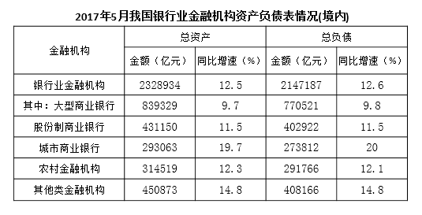

注：

1.农村金融机构包括农村商业银行、农村合作银行、农村信用社和新型农村金融机构。

2.其他类金融机构包括政策性银行及国家开发银行、民营银行、外资银行、非银行金融机构、资产管理公司和邮政储蓄银行。

3.净资产额等于总资产额减去总负债额。

#### 第 1 题　qid 2187784 · 比重

2017年5月，股份制商业银行总资产占银行业金融机构的比重与上年相比约：

- **A**. 增加了2个百分点
- **B**. 减少了2个百分点
- **C**. 增加了0.2个百分点
- **D**. 减少了0.2个百分点　✅

**答案**：D

**官方解析**

根据题干“……比重与上年相比约”，结合选项为百分点，判定为两期比重问题。定位统计表，可得：2017年5月股份制商业银行总资产亿元，增长率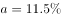，银行业金融机构总资产亿元，增长率。根据两期比重差公式：，，因此比重下降，排除A、C，代入公式，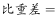，D项最为接近。

故正确答案为D。

---

#### 第 2 题　qid 2188503 · 综合

2016年5月，银行业金融机构总资产金额约为：

- **A**. 227万亿元
- **B**. 217万亿元
- **C**. 207万亿元　✅
- **D**. 197万亿元

**答案**：C

**官方解析**

根据题干“2016年5月，银行业金融机构总资产金额约为”，结合材料时间是2017年5月，可判定本题为基期计算问题。定位统计表可得：2017年5月银行业金融机构总资产为，同比增速为。根据公式，基期万亿元，与C项最接近。

故正确答案为C。

---

#### 第 3 题　qid 2187812 · 综合

2017年5月我国股份制商业银行净资产额约是城市商业银行净资产额的多少倍？

- **A**. 0.5
- **B**. 0.8
- **C**. 1.5　✅
- **D**. 1.8

**答案**：C

**官方解析**

根据题干“2017年5月，······是······的多少倍”，材料已知时间为2017年5月，可判定本题为现期倍数问题。定位统计表可得：2017年5月股份制商业银行的总资产金额为431150亿元，总负债额为402922亿元；城市商业银行的总资产金额为293063亿元，总负债额为273812亿元。根据，可得亿元，亿元，故2017年5月股份制商业银行的净资产额约是城市商业银行的净资产额的倍，C选项最为接近。

故正确答案为C。

---

#### 第 4 题　qid 2187805 · 增长

在2017年5月我国银行业金融机构资产负债表中，下列哪一项的总资产同比增长额最高？

- **A**. 大型商业银行　✅
- **B**. 股份制商业银行
- **C**. 城市商业银行
- **D**. 农村金融机构

**答案**：A

**官方解析**

根据题干“……总资产同比增长额最高”，判定为增长量比较问题。定位统计表，可得：2017年5月大型商业银行总资产为839329亿元，同比增速为；股份制商业银行总资产为431150亿元，同比增速为；城市商业银行总资产为293063亿元，同比增速为；农村金融机构总资产为314519亿元，同比增速为。根据公式，，四个选项的增长量分别为：

A项：；B项：；C项：；D项：。

比较发现，四个选项中，A项分母最小，且分子最大，所以A项最大，即2017年5月大型商业银行总资产同比增长额最高。

故正确答案为A。

---

#### 第 5 题　qid 2188508 · 综合

关于2017年5月我国银行业金融机构资产负债表，下列说法正确的是：

- **A**. 
股份制商业银行总资产额占银行业金融机构总资产额的以上
　✅
- **B**. 
城市商业银行的总资产同比增长额高于其他类金融机构

- **C**. 
城市商业银行净资产额同比增速为

- **D**. 
大型商业银行净资产额为万亿元

**答案**：A

**官方解析**

定位统计表可得：

A项：股份制商业银行总资产额为431150亿元，银行业金融机构总资产额为2328934亿元，则股份制商业银行总资产额占银行业金融机构总资产额的比重为，正确；

B项：城市商业银行总资产为293063亿元，增长率为，增长额亿元。其他类金融机构总资产为450873亿元，增长率为，增长额亿元。，错误；

C项：，则。城市商业银行总资产额约为29.3万亿元，增长率为；总负债额约为27.4万亿元，增长率为。城市商业银行净资产额约为万亿元。根据混合增长率原理“增长率的距离与量成反比”。量之比为，则距离之比，得，错误；

D项：，大型商业银行总资产额为839329亿元，总负债额为770521亿元，总资产额大于总负债额，故净资产额为正，而非负值，错误。

故正确答案为A。

---

### 材料 2

二、根据以下资料，回答106～110题。

        截至2011年末，全国城乡就业人数达到76420万人，比2002年末增加3140万人，其中，城镇就业人数35914万人，增加10755万人；乡村就业人数40506万人，减少7615万人，农民工数量不断扩大，2011年末达到25278万人。

        2011年，城镇居民人均可支配收入21810元元（疑为：多字），比2002年增长1.8倍，扣除价格因素年均实际增长；农村居民人均纯收入6977元，比2002年增长1.8倍，扣除价格因素年均实际增长。2002～2011年，城乡居民收入年均增速超过1979～2011年的年均增速，是历史上增长最快的时期之一。其中，2010年、2011年农村居民人均纯收入增速连续两年快于城镇。

        2011年末（疑为：缺少“年末”），城乡居民家庭恩格尔系数分别为和，分别比2002年降低了1.4和5.8个百分点，主要耐用消费品拥有量大幅增长；2011年末，城镇居民家庭平均每百户拥有家用汽车18.6辆，比2002年末增加17.7辆；拥有移动电话205.3部，增长2.3倍；拥有家用电脑81.9台，增长3.0倍。农村居民家庭平均每百户拥有电冰箱61.5台，增长3.1倍；空调机2.6台，增长8.9倍；拥有移动电话179.7部，增长12.1倍。2011年末，全国电话普及率达到94.9部/百人，比2002年末增长1.8倍。

#### 第 6 题　qid 2195843 · 比重

2002年末城镇就业人数占全国城乡就业人数的比重约是：

- **A**. 

- **B**. 

- **C**. 

　✅
- **D**. 

**答案**：C

**官方解析**

根据题干“2002年末······占······比重约是”，结合材料时间“2011年末”，判定本题为基期比重计算问题。定位文字材料第一段可得“截至2011年末，全国城乡就业人数达到76420万人，比2002年末增加3140万人，其中，城镇就业人数35914万人，增加10755万人”，则2002年末全国城乡就业人数为万人，2002年末城镇就业人数为人。根据公式：，则2002年末城镇就业人数占全国城乡就业人数的比重。

故正确答案为C。

---

#### 第 7 题　qid 2195847 · 增长

与2002年末相比，2011年末以下各项家庭主要耐用消费品拥有量增速最快的是：（    ）

- **A**. 农村居民空调机
- **B**. 农村居民移动电话
- **C**. 城镇居民家用电脑
- **D**. 城镇居民家用汽车　✅

**答案**：D

**官方解析**

由题干“······增速最快”，可判定此题为一般增长率问题。定位文字材料第三段可知“2011年末，城镇居民家庭平均每百户拥有家用汽车18.6辆，比2002年末增加17.7辆；…拥有家用电脑81.9台，增长3.0倍。农村居民家庭平均每百户拥有…空调机2.6台，增长8.9倍；拥有移动电话179.7部，增长12.1倍”。故四个选项与2002年末相比，2011年增速分别为：

A项，农村居民空调机增长8.9倍，即增速为；

B项，农村居民移动电话增长12.1倍，即增速为；

C项，城镇居民家用电脑增长3.0倍，即增速为；

D项，城镇居民家用汽车增速。

所以增速最快的是城镇居民家用汽车。

故正确答案为D。

---

#### 第 8 题　qid 2195849 · 综合

2002年末全国电话普及率约为：（    ）

- **A**. 52.7部/百人
- **B**. 50.1部/百人
- **C**. 33.9部/百人　✅
- **D**. 13.7部/百人

**答案**：C

**官方解析**

由题干“2002年末全国电话普及率约为”，结合材料时间“2011年末”，可判定本题为基期计算问题。定位文字材料第三段可知“2011年末，全国电话普及率达到94.9部/百人，比2002年末增长1.8倍”。增长1.8倍，即增长率为1.8。根据公式，，2002年末全国电话普及率部/百人。

故正确答案为C。

---

#### 第 9 题　qid 2195854 · 综合

以下指标能够从材料中推出的是：（    ）

- **A**. 2002年农村居民户均纯收入
- **B**. 2002年城乡居民家庭恩格尔系数差　✅
- **C**. 2002年乡村就业人数同比增速
- **D**. 2002年全国农民工数量

**答案**：B

**官方解析**

A项：文字材料第二段只给出了2011年农村居民人均纯收入，及其相对于2002年的增长率，“人均”不等于“户均”，故无法求得2002年农村居民户均纯收入，错误。

B项：文字材料第三段给出了“2011年末城乡居民家庭恩格尔系数分别为和，分别比2002年降低了1.4和5.8个百分点”，故2002年城乡居民家庭恩格尔系数差为，能够推出，正确。

C项：文字材料第一段只给出了2011年末乡村就业人数，及其相对于2002年末的增长量，并没有2001年末相关数据，无法推出2002年乡村就业人数同比增速，错误。

D项：文字材料第一段只给出“2011年末…农民工数量不断扩大”，并没有给出具体数值，无法推出2002年全国农民工数量，错误。

故正确答案为B。

---

#### 第 10 题　qid 2195856 · 综合

根据上述材料，下列说法正确的是：（    ）

- **A**. 2002年全国农村居民平均每百户拥有冰箱的数量在19～20台之间
- **B**. 2002年末平均每百户城镇居民拥有移动电话数量超过农村居民的3倍　✅
- **C**. 2011年全国农村居民人均纯收入比2002年实际增长1.8倍
- **D**. 2010年农村居民人均纯收入增速高于2011年

**答案**：B

**官方解析**

A项：定位文字材料第三段可知，2011年末农村居民家庭平均每百户拥有电冰箱61.5台，相比2002年末增长3.1倍，即增长率为3.1。根据， 2002年全国农村居民平均每百户拥有冰箱的数量台，而非19～20台，错误。

B项：定位文字材料第三段可知，2011年末，城镇居民家庭平均每百户拥有移动电话205.3部，比2002年末增长2.3倍；农村居民家庭平均每百户拥有移动电话179.7部，增长12.1倍。根据，2002年末城镇、农村居民家庭平均每百户拥有移动电话数量分别为、，，正确。

C项：定位文字材料第二段可知，2011年，农村居民人均纯收入比2002年增长1.8倍，扣除价格因素年均实际增长，而非比2002年实际增长1.8倍，错误。

D项：文字材料第二段只给出了2011年农村居民人均纯收入相对于2002年的增速，以及扣除价格因素年均实际增速，并没有给出2010年和2011年农村居民人均纯收入同比增速相关数据，无法推出，错误。

故正确答案为B。

---

### 材料 3

        2015年末，我国规模以上高技术制造业共有企业26894家，比2010年增加1077家；占规模以上制造业企业数的比重为，比2010年提高1.3个百分点。2015年末，我国高技术制造业从业人员1293.7万人，比2010年增长；占全部制造业从业人员的比重为，比2010年提高2.9个百分点。

        2015年我国高技术制造业实现主营业务收入116048.9亿元，比2010年增长；占全部制造业企业的比重为，比2010年提高0.8个百分点。2015年我国高技术制造业实现利润总额7233.7亿元，比2010年增长，增幅比其他制造业平均水平高出11.5个百分点；高技术制造业利润总额占全部制造业的比重为，比2010年提高0.5个百分点。

        2015年我国规模以上高技术制造业投入研发经费2034.3亿元，比2010年增长，增幅比其他制造业平均水平高8.7个百分点。2015年我国高技术制造业申请发明专利7.4万件，比2010年增长；实现新产品销售收入3.1万亿元，比2010年增长。

#### 第 11 题　qid 2188573 · 综合

2010年，我国高技术制造业实现新产品销售收入约多少万亿元？

- **A**. 1.4　✅
- **B**. 1.5
- **C**. 1.6
- **D**. 1.7

**答案**：A

**官方解析**

根据题干“2010年······万亿元”，结合材料时间为2015年，可判定本题为基期计算问题。定位文字第三段材料：“实现新产品销售收入3.1万亿元，比2010年增长。”故2010年，我国高技术制造业实现新产品销售收入万亿元，与A项最为接近。

故正确答案为A。

---

#### 第 12 题　qid 2188575 · 增长

与2010年相比，2015年下列高技术制造业的指标中哪项增长最快？

- **A**. 利润总额
- **B**. 新产品销售收入
- **C**. 主营业务收入
- **D**. 申请发明专利数　✅

**答案**：D

**官方解析**

定位第二段、第三段材料可知：2015年我国高技术制造业实现利润总额比2010年增长、新产品销售收入比2010年增长、主营业务收入比2010年增长、申请发明专利比2010年增长。所以增长最快的是申请专利发明数。

故正确答案为D。

---

#### 第 13 题　qid 2188568 · 增长

2015年，我国高技术制造业主营业务收入比2010年增加约多少万亿元？

- **A**. 5
- **B**. 6　✅
- **C**. 7
- **D**. 8

**答案**：B

**官方解析**

根据题干“······增加······万亿元”，可判定本题为增长量计算问题。定位文字第二段材料可知：“2015年我国高技术制造业实现主营业务收入116048.9亿元，比2010年增长。”与2010年相比，2015年我国高技术制造业主营业务收入的增长量，与B项最为接近。

故正确答案为B。

---

#### 第 14 题　qid 2188572 · 综合

2010年，我国制造业实现利润总额约多少万亿元？

- **A**. 1.3
- **B**. 1.7
- **C**. 2.2　✅
- **D**. 2.8

**答案**：C

**官方解析**

根据题干“2010年······万亿元”，结合材料时间为2015年，可判定本题为基期计算问题。定位文字第二段材料：“2015年我国高技术制造业实现利润总额7233.7亿元，比2010年增长”，则2010年我国高技术制造业实现利润总额亿元；“高技术制造业利润总额占全部制造业的比重为，比2010年提高0.5个百分点”，则2010年高技术制造业利润总额占全部制造业的比重为；故2010年我国制造业实现利润总额万亿元。

故正确答案为C。

---

#### 第 15 题　qid 2188577 · 综合

根据上述资料，下列说法错误的是：

- **A**. 2010年，我国高技术制造业申请发明专利达3万件　✅
- **B**. 2010年末，高技术制造业从业人员占全部制造业从业人员的比重为12.2%
- **C**. 2015年末，我国规模以上制造企业数是规模以上高技术制造业企业数的10倍以上
- **D**. 2015年，我国规模以上高技术制造业投入的研发经费比2010年增加了1000亿元以上

**答案**：A

**官方解析**

A项：定位材料第三段：2015年我国高技术制造业申请发明专利7.4万件，比2010年增长。故2010年高技术制造业申请发明专利数万件，错误；

B项：定位材料第一段：2015年末，我国高技术制造业从业人员占全部制造业从业人员的比重为，比2010年提高2.9个百分点。故2010年末高技术制造业从业人员占全部制造业从业人员的比重为，正确；

C项：定位材料第一段：2015年末，我国规模以上高技术制造业共有企业26894家，占规模以上制造业企业数的比重为。则，故，即我国规模以上制造业企业数是规模以上高技术制造业企业数的10倍以上，正确；

D项：定位材料第三段：2015年我国规模以上高技术制造业投入研发经费2034.3亿元，比2010年增长。，即增加了1000亿元以上，正确。

本题为选非题，故正确答案为A。

---

### 材料 4

#### 第 16 题　qid 2188580 · 平均数

2013～2015年，试验发展经费支出年平均增加：

- **A**. 不到800亿元
- **B**. 800多亿元
- **C**. 900多亿元　✅
- **D**. 1000亿元以上

**答案**：C

**官方解析**

根据题干“2013～2015年······年平均增加”，结合选项带单位，可判定本题为年均增长量问题。定位表格材料可知，2013年的试验发展为10022.5亿元，2015年试验发展为11925.1亿元。故2013～2015年试验发展经费支出年平均增加量=亿元，C项符合。

故正确答案为C。

---

#### 第 17 题　qid 2188583 · 增长

2013～2015年间，企业研究与试验发展经费支出同比增量大于1000亿元的年份有几个？

- **A**. 0
- **B**. 1　✅
- **C**. 2
- **D**. 3

**答案**：B

**官方解析**

根据题干“2013～2015年间……同比增量”，可判定本题为增长量计算问题。定位表格材料倒数第三行，由增长量=现期-基期可得，2013年增长量=9075.8-7842.2=1233.6亿元，2014年增长量=10060.6-9075.8=984.8亿元，2015年增长量=10881.3-10060.6=820.7亿元。综上，2013～2015年企业研究与试验发展经费支出同比增量大于1000亿元的年份仅有2013年1个。
故正确答案为B。

---

#### 第 18 题　qid 2188582 · 综合

2015年，我国研究与试验发展经费投入强度（研究与试验发展经费支出与国内生产总值之比）约为：

- **A**. 

- **B**. 

　✅
- **C**. 

- **D**. 

**答案**：B

**官方解析**

根据题干“2015年······（······与······之比）”，结合材料给出2015年的数值，可判定本题为比值计算问题。定位表格材料可知，2015年国内生产总值为689052.0亿元，研究与试验发展经费支出为14169.9亿元。故投入强度=。

故正确答案为B。

---

#### 第 19 题　qid 2188584 · 比重

2012～2015年，基础研究经费支出占全国研究与试验发展经费支出比重最大的年份是：

- **A**. 2012年
- **B**. 2013年
- **C**. 2014年
- **D**. 2015年　✅

**答案**：D

**官方解析**

根据题干“2012～2015年，······占······比重”,可判定本题为现期比重问题。定位表格材料可得：各年份比重，故2012年；2013年；2014年；2015年，因此2015年基础研究经费支出占全国研究与试验发展经费支出比重最大。

故正确答案为D。

---

#### 第 20 题　qid 2188585 · 综合

根据资料，下列选项错误的是：

- **A**. 2012～2015年，基础研究经费支出年均不到600亿元
- **B**. 2013～2015年，应用研究经费支出年增量逐年增大
- **C**. 2015年，企业的研究与试验发展经费支出比政府属研究机构高5倍多　✅
- **D**. 2012～2015年，我国高校的研究与试验发展经费支出呈逐年递增趋势

**答案**：C

**官方解析**

A项：定位表格材料可得：2012～2015年，基础研究经费年均支出亿元，不到600亿元，正确；

B项：定位表格材料可得：各年份应用研究经费支出年增量分别为 2013年增量亿元；2014年增量亿元；2015年增量亿元，因此2013～2015年应用研究经费支出年增量逐年增大，正确；

C项：定位表格材料可得：2015年企业的研究与试验发展经费为10881.3亿元；政府属研究机构为2136.5亿元；故所求倍数为倍，选项描述为企业的研究与试验发展经费比政府属研究机构高5倍多，即前者是后者的6倍多，与结果不符，错误；

D项：定位表格材料最后一行可得：2012～2015年，我国高校的研究与试验发展经费支出是逐年增加的，正确。

本题为选非题，故正确答案为C。

---
