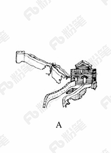
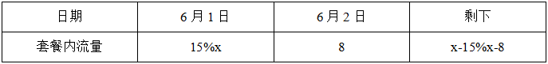
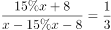
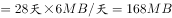
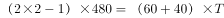

# 2018年黑龙江省公务员考试（公检法）题（网友回忆版）

> 省考 · 2018 年 · 6 个模块 · 共 125 题

- [政治理论](#%E6%94%BF%E6%B2%BB%E7%90%86%E8%AE%BA) · 2 题
- [常识判断](#%E5%B8%B8%E8%AF%86%E5%88%A4%E6%96%AD) · 18 题
- [言语理解与表达](#%E8%A8%80%E8%AF%AD%E7%90%86%E8%A7%A3%E4%B8%8E%E8%A1%A8%E8%BE%BE) · 35 题
- [数量关系](#%E6%95%B0%E9%87%8F%E5%85%B3%E7%B3%BB) · 15 题
- [判断推理](#%E5%88%A4%E6%96%AD%E6%8E%A8%E7%90%86) · 35 题
- [资料分析](#%E8%B5%84%E6%96%99%E5%88%86%E6%9E%90) · 20 题

---

## 政治理论

### 第 1 题　qid 2188557 · 新思想

习近平总书记在党的十九大报告中明确要求：“打造共建共治共享的社会治理格局。”下列不属于社会治理措施的是：

- **A**. 加强平安中国建设
- **B**. 加强社区治理体系建设
- **C**. 加强国家安全体系建设　✅
- **D**. 加强预防和化解社会矛盾机制建设

**答案**：C

**官方解析**

本题考查政治常识。
A项正确，党的十九大报告指出：“建设平安中国，加强和创新社会治理，维护社会和谐稳定，确保国家长治久安、人民安居乐业。”加强平安中国建设属于社会治理的措施。
B项正确，党的十九大报告指出：“加强社区治理体系建设，推动社会治理重心向基层下移，发挥社会组织作用，实现政府治理和社会调节、居民自治良性互动。”加强社区治理体系建设属于社会治理的措施。
C项错误，党的十九大报告指出：“健全国家安全体系，加强国家安全法治保障，提高防范和抵御安全风险能力。”加强国家安全体系建设属于维护国家安全的措施，而不是社会治理的措施。
D项正确，党的十九大报告指出：“加强预防和化解社会矛盾机制建设，正确处理人民内部矛盾。”加强预防和化解社会矛盾机制建设，来维护社会的安定团结，属于社会治理的措施。
本题为选非题，故正确答案为C。

---

### 第 2 题　qid 2188392 · 时事政治

中国共产党第十九届中央委员会第二次全体会议于2018年1月18日至19日在北京召开，会议的主要议程是：

- **A**. 研究制定国民经济发展计划
- **B**. 研究全面从严治党的重大问题
- **C**. 讨论修改宪法部分内容的建议　✅
- **D**. 研究党和政府机构改革的重大问题

**答案**：C

**官方解析**

本题考查时政常识，主要考查党的第十九届中央委员会第二次全体会议的内容。
A项错误，中国共产党第十八届中央委员会第五次全体会议，于2015年10月26日至29日在北京举行。审议通过了《中共中央关于制定国民经济和社会发展第十三个五年规划的建议》。因此，研究制定国民经济发展计划是党十八届中央委员会第五次全体会议的主要议程。
B项错误，中国共产党第十八届中央委员会第六次全体会议，于2016年10月24日至27日在北京举行。审议通过了《关于新形势下党内政治生活的若干准则》和《中国共产党党内监督条例》，审议通过了《关于召开党的第十九次全国代表大会的决议》。因此，研究全面从严治党的重大问题是党十八届中央委员会第六次全体会议的主要议程。
C项正确，中国共产党第十九届中央委员会第二次全体会议，于2018年1月18日至19日在北京举行。全会审议通过了《中共中央关于修改宪法部分内容的建议》，张德江就《建议（草案）》向全会作了说明。因此，会议的主要议程是讨论修改宪法部分内容的建议。
D项错误，中国共产党第十九届中央委员会第三次全体会议，于2018年2月26日至28日在北京举行。审议通过了《中共中央关于深化党和国家机构改革的决定》和《深化党和国家机构改革方案》。因此，研究党和政府机构改革的重大问题是党的十九届中央委员会第三次全体会议的主要议程。
故正确答案为C。

---

## 常识判断

### 第 1 题　qid 2187719 · 经济常识

下列事件按时间先后顺序排列正确的是：
①中国女排获得里约奥运会女排比赛冠军
②中国（上海）自由贸易实验区正式设立
③第九届金砖国家领导人会晤在厦门举行
④我国举行纪念中国人民抗日战争暨世界反法西斯战争胜利70周年阅兵式

- **A**. ②③①④
- **B**. ④①②③
- **C**. ②④①③　✅
- **D**. ②①③④

**答案**：C

**官方解析**

本题考查毛中特。

②2013年8月22日，国务院正式批准设立中国（上海）自由贸易试验区。

④2015年9月3日，是中国第二个法定的“中国人民抗日战争胜利纪念日”，也是中国人民抗日战争暨世界反法西斯战争胜利70周年。

①北京时间2016年8月21日，在里约奥运会女排决赛中，中国队战胜塞尔维亚队获得金牌。

③2017年9月3日至5日，金砖国家领导人第九次会晤在福建厦门举行，主题是：“深化金砖伙伴关系，开辟更加光明未来。”金砖合作已经步入第二个“黄金十年”。

故按照时间先后顺序排序为②④①③。

故正确答案为C。

---

### 第 2 题　qid 2187710 · 人文常识

下列文学作品没有使用方言的是：

- **A**. 《海上花列传》(韩邦庆)
- **B**. 《凤凰涅槃》(郭沫若)　✅
- **C**. 《秦腔》（贾平凹）
- **D**. 《白鹿原》(陈忠实)

**答案**：B

**官方解析**

本题考查文学常识。
A项正确，《海上花列传》是清末著名小说，主要讲述了清末中国上海十里洋场中的妓院生活，涉及当时的官场、商界及与之有联系的社会的各个层面。它是最著名的吴语小说，也是中国第一部方言小说。
B项错误，《凤凰涅槃》是一首现代白话诗歌，诗歌以凤凰的传说为素材，通过凤凰集木自焚，从烈焰中重生的故事，表达了彻底埋葬旧社会、争取祖国自由解放的思想，在现代诗歌史上具有重要历史地位的诗篇。《凤凰涅槃》运用的现代白话文，不涉及方言的应用。
C项正确，《秦腔》是贾平凹的著名长篇小说。《秦腔》中用了大量的修辞手法，融合比喻、拟人、对偶、象征等手法，活灵活现地展现了农村生活，这些修辞手法结合方言化的语言要素，形成了极具地域色彩的语言风格。
D项正确，《白鹿原》是陈忠实创作的长篇小说。小说中，作者不仅从表层的遣词造句的角度精心选择方言语汇，运用方言语气词以及高密度的排比句和长句来营造方言氛围、创造方言腔调，而且从深层的角度运用方言思维进行布局谋篇。
本题为选非题，故正确答案为B。

---

### 第 3 题　qid 2188569 · 人文常识

宗教对文学艺术的创作影响深远，下列未受宗教影响的作品是：

- **A**. 米开朗基罗的《大卫》
- **B**. 柴可夫斯基的《天鹅湖》　✅
- **C**. 大仲马的《基督山伯爵》
- **D**. 达·芬奇的《最后的晚餐》

**答案**：B

**官方解析**

本题考查人文常识。
A项正确，《大卫》，是文艺复兴雕塑巨匠米开朗基罗的代表作。关于大卫的记载大部分出自犹太教的宗教经典《塔纳赫》，说明作品受犹太教的影响。
B项错误，《天鹅湖》，是俄国作曲家柴可夫斯基的作品，是古典芭蕾舞剧的典范。其内容取材于民间传说，并未体现宗教内容或受到宗教影响。
C项正确，法国作家大仲马的《基督山伯爵》从表面上来看似乎仅仅是一部讲述报恩复仇的故事，但在其背后，也隐含有浓郁的宗教情结，特别是在表面的复仇故事下表达了基督教的爱，从主人公复仇时行为思想的变化，体现出了其爱的精神从旧约精神到新约精神的转变。整个《基督山伯爵》呈现出的“蒙难——神恩——拯救——永生”结构采用的正是与耶稣受难的故事相似的结构模式。
D项正确，《最后的晚餐》，是意大利艺术家列奥纳多·达·芬奇所创作，以《圣经》中耶稣跟12个门徒共进最后一次晚餐为题材。说明作品深受基督教影响。
本题为选非题，故正确答案为B。

---

### 第 4 题　qid 2188565 · 经济常识

关于税收，下列说法错误的是：

- **A**. 涉及税收的制度只能由法律来规定
- **B**. 履行纳税义务是公民享有其他权利的前提条件　✅
- **C**. 企业在缴纳增值税时应当扣除企业的经营成本
- **D**. 小王抽奖获得的10万元奖金应当缴纳个人所得税

**答案**：B

**官方解析**

本题考查法律常识。
A项正确，《立法法》第八条规定：“下列事项只能制定法律：······（六）税种的设立、税率的确定和税收征收管理等税收基本制度；······”
B项错误，《宪法》第五十六条规定：“中华人民共和国公民有依照法律纳税的义务。”依法纳税是公民应该履行的一项基本义务。纳税义务的履行，实际上也为纳税人带来相应的权利。纳税者有权享受政府提供的各种公共和服务设施，如医疗、教育、社会安全、法律保障、交通等，并有权要求政府积极改善这些条件并提供优质服务。从某种意义上说，纳税义务的履行是纳税者享有权利的基础与条件。但这并不表示纳税是公民享有其他权利的前提，比如选举权、人身自由权等。
C项正确，从计税原理上说，增值税是对商品生产、流通、劳务服务中多个环节的新增价值或商品的附加值征收的一种流转税。企业的经营成本也是商品的成本，不属于新增价值，所以在缴税时应该扣除。
D项正确，《个人所得税法》第二条第一款规定：“下列各项个人所得，应当缴纳个人所得税：······（九）偶然所得。”《中华人民共和国个人所得税法实施条例》第六条规定：“个人所得税法规定的各项个人所得的范围：······（九）偶然所得，是指个人得奖、中奖、中彩以及其他偶然性质的所得。······”小王抽奖获得的10万元奖金，应当缴纳个人所得税。
本题为选非题，故正确答案为B。

---

### 第 5 题　qid 2189166 · 人文常识

2014年，万某开了一家网店，专门销售各类知名品牌的鞋服等商品，后经相关品牌的权利人发现并鉴定万某销售的商品均系仿冒其注册商标的产品。在上述案例中，相关知名品牌的权利人不可以：

- **A**. 要求工商部门对万某的行为进行查处
- **B**. 没收万某销售的侵权商品　✅
- **C**. 向法院起诉主张赔偿
- **D**. 与万某进行协商解决

**答案**：B

**官方解析**

本题主要考查法律常识。根据《反不正当竞争法》第六条规定：“经营者不得实施下列混淆行为，引人误认为是他人商品或者与他人存在特定联系：（一）擅自使用与他人有一定影响的商品名称、包装、装潢等相同或者近似的标识；（二）擅自使用他人有一定影响的企业名称（包括简称、字号等）、社会组织名称（包括简称等）、姓名（包括笔名、艺名、译名等）；（三）擅自使用他人有一定影响的域名主体部分、网站名称、网页等；（四）其他足以引人误认为是他人商品或者与他人存在特定联系的混淆行为。”本题中，该网店仿冒他人注册商标产品的行为，构成混淆行为。
A项正确，相关知名品牌权利人作为受害者，有权要求工商部门对万某的行为进行查处，防止万某继续实施侵害其合法权益。
B项错误，《反不正当竞争法》第十八条：“经营者违反本法第六条规定实施混淆行为的，由监督检查部门责令停止违法行为，没收违法商品。”本案中，相关知名品牌的权利人无权没收万某销售的侵权商品，应当由监督检查部门没收违法商品。
C项正确，《反不正当竞争法》第十七条第二款规定：“经营者的合法权益受到不正当竞争行为损害的，可以向人民法院提起诉讼。”
D项正确，相关知名品牌的权利人与万某属于民商事纠纷，可以进行协商以解决纠纷。
本题为选非题，故正确答案为B。

---

### 第 6 题　qid 2188564 · 经济常识

对于债务关系主体，如果实际通货膨胀率高于预期的水平，则下列说法正确的是：

- **A**. 债务人和债权人都受损
- **B**. 债务人和债权人都受益
- **C**. 债权人受损，债务人受益　✅
- **D**. 债务人受损，债权人受益

**答案**：C

**官方解析**

本题考查经济常识，主要涉及通货膨胀率的相关内容。
“债务人”，与“债权人”相对，是指根据法律或合同、契约的规定，在借债关系中对债权人负有偿还义务的人。
在债务关系履行过程中，如果实际通货膨胀率高于预期的水平，则会出现物价进一步上涨，货币贬值的现象。但此时债务人需承担的还款债务并没有随着实际通货膨胀率的比例增加，故债务人受益。而随着通货膨胀率的提高，纸币贬值，债权人的实际利益将会受损。故当实际通货膨胀率高于预期水平时，债务人受益，而债权人受损。
故正确答案为C。

---

### 第 7 题　qid 2189167 · 人文常识

下列名句与所体现的哲学原理对应错误的是:

- **A**. 士别三日，当刮目相看——事物是发展变化的
- **B**. 流水不腐，户枢不蠹——运动是物质的根本属性
- **C**. 唇齿相依，唇亡齿寒——事物是普遍联系的
- **D**. 不识庐山真面目，只缘身在此山中——真理是具体且多元的　✅

**答案**：D

**官方解析**

本题主要考查哲学常识。
A项正确，“士别三日，当刮目相看”指分别一段时间，别人已有进步，当另眼相看。说明在分别的时间内，人发生了可喜的变化，体现了事物是不断发展前进的。
B项正确，“流水不腐，户枢不蠹”指常流的水不发臭，常转的门轴不遭虫蛀；比喻经常运动，生命力才能持久，才有旺盛的活力。说明物质只有在运动中才能存在，运动是物质的存在方式和根本属性。
C项正确，“唇齿相依，唇亡齿寒”比喻双方关系极为密切，休戚相关，体现了事物之间相互连结、相互依赖、相互影响的关系，表明事物是普遍联系的。
D项错误，“不识庐山真面目，只缘身在此山中”意为处于庐山之中不能认识庐山真实的面目，是因为看得不全面，克服主观片面性才能获得对事物的正确认识，体现的是整体观这一哲学原理。真理是多元的本身表述错误，且选项并未体现。马克思主义的真理论认为，真理的客观来源只有一个，即物质世界。凡与客观对象相符合一致的认识就是真理，否则就不是真理，因此真理不能是多元的。
本题为选非题，故正确答案为D。

---

### 第 8 题　qid 2188576 · 科技常识

下列生活常识中，表述错误的是：

- **A**. 药物大多饭后服用，是为了减少对胃肠道的刺激
- **B**. 大米久泡，会使无机盐和可溶性维生素溶于水而损失
- **C**. 经常用冷水刷牙，容易导致牙龈出血、牙髓痉挛等疾病
- **D**. 发烧时喝茶能辅助降温，因为茶叶所含的茶碱能降低人体温度　✅

**答案**：D

**官方解析**

本题考查科技常识。
A项正确，药物饭后服用，是因为有些药对胃有刺激性。在饭后服用，胃里的食物可以将药物隔离，使药性缓慢释放，可减少药物对胃肠道的刺激，有利于药物吸收和利用。
B项正确，由于大米中含有一些溶于水的维生素和无机盐，而且很大一部分在大米的外层，如果久泡，米粒中的无机盐和可溶性维生素会有一部分溶于水中而损失。
C项正确，人的牙齿相对来说最适应约35-36.5摄氏度的温度，如果经常用冷水刺激牙齿将导致牙龈出血、牙髓痉挛或其他牙病的发生。
D项错误，茶叶中含有茶碱，茶碱有兴奋中枢神经、加强血液循环及加速心跳的作用，相对地也会使血压升高。发烧时如果喝茶，由于茶碱的作用，会使体温更快上升，并可影响和降低药物的作用，从而加重病情，因此，发烧时不宜喝茶。
本题为选非题，故正确答案为D。

---

### 第 9 题　qid 2187660 · 科技常识

某患者深夜因剧烈的关节疼痛而惊醒，触摸其手足多个关节，发现有黄白色结晶体隆起。造成这种症状的代谢改变最有可能是：

- **A**. 糖的无氧分解增强，生成过多乳酸
- **B**. 嘌呤核苷酸分解增强，生成过多尿酸　✅
- **C**. 肝中脂肪酸氧化增强，生成大量酮体
- **D**. 氨基酸脱氨基作用增强，生成大量尿素

**答案**：B

**官方解析**

本题考查生物常识。

痛风是由单钠尿酸盐（MSU）沉积所致的晶体相关性关节病，与嘌呤代谢紊乱和尿酸排泄减少所致的高尿酸血症直接相关，特指急性特征性关节炎和慢性痛风石疾病，主要包括急性发作性关节炎、痛风石形成、痛风石性慢性关节炎、尿酸盐肾病和尿酸性尿路结石，重者可出现关节残疾和肾功能不全。

痛风最重要的生化基础是高尿酸血症。尿酸是人体内嘌呤代谢的最终产物。正常成人每日约产生尿酸750mg，其中为内源性，为外源性尿酸，这些尿酸进入尿酸代谢池（约为1200mg），每日代谢池中的尿酸约进行代谢，其中1/3约200mg经肠道分解代谢，2/3约400mg经肾脏排泄，从而可维持体内尿酸水平的稳定，其中任何环节出现问题均可导致高尿酸血症。故造成这种症状的代谢改变最有可能是嘌呤核苷酸分解增强，生成过多尿酸，即B项正确，A、C、D三项错误。

故正确答案为B。

---

### 第 10 题　qid 2188397 · 人文常识

“人有悲欢离合，月有阴晴圆缺”，圆缺就是指“月相变化”，即地球上看到月球被太阳照亮部分的称呼。右图所示“上弦月”大致的农历日期是：

- **A**. 初一、初二
- **B**. 初七、初八　✅
- **C**. 十五、十六
- **D**. 廿二、廿三

**答案**：B

**官方解析**

本题考查自然常识，主要涉及月相变化的相关知识。
A项错误，农历初一的月相是新月，月球位于太阳和地球之间。地球上的人们正好看到月球背离太阳的面，因而在地球上看不见月亮。
B项正确，图中所示的上弦月，大约出现在农历每月初七、初八，月球绕地球继续向东运行，月地连线与日地连线成90度，我们在地球上正好看到月球是西半边亮，呈半圆形，因此叫上弦月。
C项错误，农历十五、十六时出现的月相是满月，月球运行到地球的外侧，即太阳、月球位于地球的两侧。由于白道面与黄道有一夹角，通常情况下，地球不能遮挡住日光，月球亮面全部对着地球。
D项错误，农历廿二、廿三时出现的月相是下弦月，太阳、地球和月球之间的相对位置再次变成直角，月球在日地连线的西边90度，我们在地球上看到月球东半边亮，呈半圆形，称为下弦月。
故正确答案为B。

---

### 第 11 题　qid 2187754 · 科技常识

下列选项不属于航空航天中货运飞船主要任务的是：

- **A**. 货运飞船发射升空完成后，会与空间站自动或人工交会对接
- **B**. 货运飞船进行空间站实验和技术试验，将获取的研究数据回传　✅
- **C**. 货运飞船为空间站补加推进剂以及空气，带来饮水、食物等补给物资
- **D**. 货运飞船可充当空间站的“垃圾桶”，将站内废弃物品搬运至货运飞船

**答案**：B

**官方解析**

本题考查的是科技常识的相关知识。
货运飞船是一种专门运送货物到达太空一次性使用的航天器，主要任务是向空间站定期补给食品、货物、燃料和仪器设备等。它是国际空间站补给物资的重要运输工具，也是空间站的地面后勤保障系统。
A项正确，货运飞船发射升空后，可以与空间站自动或人工交会对接，从而输送空间站需要的补给物资。
B项错误，空间站实验和技术试验，将获取的研究数据回传这是空间站的任务，而不是货运飞船的任务。
C项正确，货运飞船可以为空间实验室以及空间站提供推进剂、空气、航天员的饮水、食物以及用于维修空间站的更换设备等补给物资。
D项正确，空间站丢弃的废弃物和生活垃圾等也可以搬运至货运飞船，随货运飞船进入大气层烧毁。
本题为选非题，故正确答案为B。

---

### 第 12 题　qid 2188480 · 科技常识

下列现象的物理解释错误的是：

- **A**. 高压锅烹煮食物——升高水的沸点
- **B**. 露珠呈球状——液体表面张力
- **C**. 铁轨铺在枕木上——减少压强
- **D**. 大银幕观影——光的漫折射　✅

**答案**：D

**官方解析**

本题考查科技常识。
A项正确，水的沸点受压强影响，压强越高，沸点越高。高压锅烹煮食物增大了锅内的气压，提高了水的沸点，要煮的食物温度升高，从而使食物熟透。
B项正确，物质由分子组成，分子之间有间隙，由于分子在不停地做无规则运动，分子间存在相互作用的引力和斥力。在液体表面，分子间的作用力表现为相互吸引，由此表现为液体的表面张力。表面张力促使露珠以最小的表面积的状态存在，而体积相等的物体中，只有球体的表面积最小，所以露珠总是呈球状的。
C项正确，把铁轨铺在枕木上，是为了在压力一定的情况下，增大铁轨与地面的接触面积，从而减小火车对地面的压强。
D项错误，漫反射是指投射在粗糙表面上的光向各个方向反射的现象。电影院里人能在不同的座位上看到银幕上的画面，是因为屏幕上的光源在银幕上形成了漫反射，而不是光的漫折射。
本题为选非题，故正确答案为D。

---

### 第 13 题　qid 2188558 · 人文常识

下列情形不可能发生在中国宋代的是：

- **A**. 农户张三用铁犁耕地
- **B**. 士兵李四用火药攻城
- **C**. 商人王五用交子订货
- **D**. 厨师赵六用番茄制酱　✅

**答案**：D

**官方解析**

本题考查人文常识。
A项正确，我国铁器的使用一直可以上溯到西周晚期，春秋时期，铁制农具开始出现，战国时期铁农具的使用范围进一步扩大，且在春秋战国时期，人们开始使用牛犁并逐渐推广，宋朝在春秋战国以后，因此A项描述的情形可以发生。
B项正确，火药是中国四大发明之一，唐朝末年，火药已被用于军事，北宋在东京设立专门机构，制造火药和火器。南宋时发明了管型火器“突火枪”，因此B项描述的情形可以发生。
C项正确，交子，是发行于北宋初年的货币，是我国最早由政府正式发行的纸币，也被认为是世界上最早使用的纸币，因此C项描述的情形可以发生。
D项错误，番茄原产南美洲，在明代时期传入我国。因此，番茄制酱不可能出现在我国宋代。
本题为选非题，故正确答案为D。

---

### 第 14 题　qid 2188562 · 人文常识

下列行为构成盗窃罪的是：

- **A**. 张某无意间将李某埋藏在屋外树下的十万元现金挖出，并占为己有，拒不交出
- **B**. 胡某在任邮政局营业员期间，盗取储户的存折密码，然后冒充储户在取款单上签名，提取现金40余万元
- **C**. 张某在给客户维修网络过程中获知该客户的网游账号和密码，后张某和其朋友利用该账号和密码在网吧玩网游，共消费3000余元　✅
- **D**. 赵某意欲窃走丁某的手提包，在其刚拿到手提包准备离开时被丁某发现，丁某当即抓住手提包，但因力气较小，最终手提包还是被赵某夺走

**答案**：C

**官方解析**

本题考查法律常识。
根据《刑法》第二百六十四条规定，盗窃罪是指以非法占有为目的，盗窃公私财物数额较大，或者多次盗窃、入户盗窃、携带凶器盗窃、扒窃的行为。
A项错误，根据《刑法》第二百七十条规定，侵占罪，是指将代为保管的他人财物非法占为己有，数额较大，拒不退还的，或者将他人的遗忘物或者埋藏物非法占为己有，数额较大，拒不交出的行为。该项中的张某将他人的埋藏物非法占为己有，拒不交出，构成侵占罪。
B项错误，根据《刑法》第三百八十二条第一款规定：“国家工作人员利用职务上的便利，侵吞、窃取、骗取或者以其他手段非法占有公共财物的，是贪污罪。”该项中的胡某作为国家工作人员，利用职务上的便利，私自取走（窃取）储户帐户中的钱款，构成贪污罪。此外，储户的存款同时系邮政局管理的财产，其工作人员取走储户的存款具有公共财产的属性。
C项正确，该项中，张某与其朋友以非法占有为目的，非法消费（相当于窃取）客户网游账号里的钱，数额较大（3000余元），构成盗窃罪。
D项错误，该项中的赵某盗窃丁某手提包时（尚未实际取得）被发现，丁某当即抓住手提包，赵某为了非法取得手提包，直接夺取，构成抢夺罪，而不是盗窃罪。
故正确答案为C。

---

### 第 15 题　qid 2187702 · 法律常识

下列情形中保险公司须承担给付或赔偿保险金的是：

- **A**. 定期寿险合同到期时，被保险人仍生存
- **B**. 在终身寿险中，受益人故意造成被保险人死亡　✅
- **C**. 在意外伤害保险有效期间，被保险人突发心脏病死亡
- **D**. 在投保重大疾病保险时，投保人故意隐瞒其有先天性疾病

**答案**：B

**官方解析**

本题主要考查法律常识。
A项错误，定期寿险是指在保险合同约定的期间内，如果被保险人死亡，则保险公司按照约定的保险金额给付保险金；若保险期限届满被保险人健在，则保险合同自然终止，保险公司不再承担保险责任，并且不退回保险费。因此，定期寿险合同到期，被保险人仍然生存，保险公司不用给付或赔偿保险金。
B项正确，终身寿险是指终身提供死亡保障的保险。根据《保险法》第四十三条第二款规定：“受益人故意造成被保险人死亡、伤残、疾病的，或者故意杀害被保险人未遂的，该受益人丧失受益权。”根据《保险法》第四十二条第一款规定：“被保险人死亡后，有下列情形之一的，保险金作为被保险人的遗产，由保险人依照《中华人民共和国继承法》（注：《继承法》现已是《民法典》继承编）的规定履行给付保险金的义务：(一)没有指定受益人，或者受益人指定不明无法确定的；(二)受益人先于被保险人死亡，没有其他受益人的；(三)受益人依法丧失受益权或者放弃受益权，没有其他受益人的。”因此当受益人故意造成被保险人死亡时，受益人丧失受益权，但是保险公司仍然要给付保险金。
C项错误，人身意外伤害险是指当被保险人在保险期限内遭受意外伤害，并以此为直接原因造成死亡或残废时，保险公司按照保险合同的约定向保险人或受益人支付一定数量保险金的一种保险。意外伤害指的是外来的、突发的、非本意的和非疾病的伤害。因此，被保险人突发心脏病死亡，不属于意外伤害，保险公司不用给付或赔偿保险金。
D项错误，重大疾病保险是指当被保险人患保单指定的重大疾病确诊后，保险人按合同约定定额支付保险金的保险。根据《保险法》第十六条第四款规定：“投保人故意不履行如实告知义务的，保险人对于合同解除前发生的保险事故，不承担赔偿或者给付保险金的责任，并不退还保险费。”因此，投保人故意隐瞒先天性疾病的，保险公司不用给付或赔偿保险金。
故正确答案为B。
【注】由于《继承法》已生效，《保险法》未做新修订，故还是引用了《保险法》中的原法条内容。

---

### 第 16 题　qid 2187718 · 人文常识

下列我国古代绘画理论名句所表达的美学理念与其他三项不同的是：

- **A**. 到处云山是吾师
- **B**. 搜尽奇峰打草稿
- **C**. 论画以形似，见与儿童邻　✅
- **D**. 吾师心，心师目，目师华山

**答案**：C

**官方解析**

本题主要考查文化常识的相关知识。
A项“到处云山是吾师”是元代赵孟頫提出的，表达的美学理念是重视向自然美学习。
B项“搜尽奇峰打草稿”是清代石涛提出的，表达的美学理念是重视向自然学习，注意感同身受和提炼构思相结合。
C项“论画以形似，见与儿童邻”是苏轼的两句论画名言。诗句意为：衡量画的好坏，只以形似作为评判优劣的标准，就如同儿童的见解一样幼稚。画要画出神，诗要有言外之味。古代艺术论将这种思想表述为:“含不尽之意见于言外”“象外之象”“味外之味”“意外之韵”等等。
D项“吾师心，心师目，目师华山”是明代王履提出的，表达的美学理念是向自然学习，师法自然，发挥主观能动性。
C项与其他三项不同。
本题为选非题，故正确答案为C。

---

### 第 17 题　qid 2188570 · 人文常识

以下著名建筑中，所处地点的地球纬线最长的是：

- **A**. 

- **B**. 

- **C**. 

　✅
- **D**. 

**答案**：C

**官方解析**

本题考查地理知识。纬线是地球表面某点随地球自转所形成的轨迹。所有的纬线都相互平行，并与经线垂直，纬线指示东西方向。纬线形状为圈。纬线圈的大小不等，赤道为最大的纬线圈，从赤道向两极纬线圈逐渐缩小，到南、北两极缩小为点。即纬度越小，纬线越长。
A项显示的建筑是长城，我们现在看到的长城基本是明长城，大约处在北纬36°~46°之间。
B项显示的建筑是自由女神像，位于美国纽约海港内自由岛的哈德逊河口附近，处在北纬40°41′。
C项显示的建筑是斯芬克斯石狮人面像，屹立于胡夫金字塔东侧，处在北纬29°58′。
D项显示的建筑是比萨斜塔，位于意大利托斯卡纳省比萨城北面的奇迹广场上，处在北纬43°43′。
四座建筑中，石狮人面像的纬度最小，所以纬线最长。
故正确答案为C。

---

### 第 18 题　qid 2189169 · 人文常识

关于中国古代书画艺术作品，下列说法不正确的是:

- **A**. 《洛神赋图》是吴道子根据曹植名篇《洛神赋》创作而成　✅
- **B**. 《步辇图》与松赞干布迎娶文成公主的史实有关
- **C**. 《快雪时晴帖》曾被乾隆皇帝收藏于三希堂
- **D**. 《清明上河图》描绘了北宋京城汴梁的繁华景象

**答案**：A

**官方解析**

本题考查文学常识。
A项错误，《洛神赋图》是东晋顾恺之的画作，它是由多个故事情节组成的类似连环画而又融会贯通的长卷。全卷分为三个部分，曲折细致而又层次分明地描绘着曹植与洛神真挚纯洁的爱情故事。
B项正确，《步辇图》是唐朝画家阎立本的名作之一。其内容反映的是吐蕃王松赞干布迎娶文成公主入藏的事，是汉藏兄弟民族友好情谊的历史见证。
C项正确，《快雪时晴帖》是东晋王羲之的书法作品，现收藏于台北故宫博物院。1746年（清乾隆十一年），乾隆遂将此帖与王献之的《中秋帖》、王珣的《伯远帖》收藏于他的书房“三希堂”，并且视《快雪时晴帖》为“三希”之首。
D项正确，《清明上河图》是中国十大传世名画之一。是北宋画家张择端仅见的存世精品。作品以长卷形式，采用散点透视构图法，生动记录了中国十二世纪北宋都城东京（又称汴京）的城市面貌和当时社会各阶层人民的生活状况，是北宋时期都城汴京当年繁荣的见证。
本题为选非题，故正确答案为A。

---

## 言语理解与表达

### 材料 1

①切割成相同大小隔间的写字楼，吃住挤在6平方米的年轻人，月收入过万但需苦练720小时的工作流程——这就是网红工厂的生态。通过新老主播连麦、互刷礼物、买热门等推广手段，经纪公司“制造”出了千千万万个同质化的赚钱机器。但这种枯燥辛苦的生活并没有阻挡更多人涌入这一行业的热情。调查显示，2017年“粉丝”规模在10万人以上的中国网红人数较2016年增长了，超过一半的“95后”向往的新兴职业就是网红或主播。

②十几年前，人们用明星制造和造星工厂来形容庞大的明星产业链。现在，当媒介不仅仅局限于电影电视这一大小银幕，互联网孵化的网红工厂应运而生。舆论对“工厂”这个词汇的使用，看似不经意，实际上内含着对文化趋势的敏锐认识和隐性忧虑。

③对于现代商业所带来的拜物教和文化景观，法兰克福学派的批判哲学家们最早使用了“文化工业”这一词汇。文化工业的出现，使得文化产品按“标准化”“一律化”模式大批量制造，最终带来了“伪个性化”的盛行。它将统一行为方式和审美方式强加于人，使商业文化中的人变成了“单面人”。

④网红的产生和迅速地批量复制，就是一个制造稳定套路的过程。而且这个过程并不是单一的，还和其他行业联系在一起，形成了一个“套路丛”。以下信息可以提供一些参考：中国整形美容手术以每年超过的速度增长，整形美容已成为继房地产、汽车销售、旅游之后的第四大服务行业；与此同时，“修图软件”“自拍神器”“美颜相机”等自拍APP商机不断、热钱涌入，近年自带美颜和滤镜功能的手机相继上市。“颜值经济”已经结构化，互相论证着彼此的合理性。

⑤“颜值经济”带来的最直接结果是，“美”已经被符号化。美容院的批量改造和网红主播的展示，对当下的审美观念产生了巨大影响：“美”等于削尖了的下巴、满溢玻尿酸的苹果肌、美瞳巨眼、从上而下45度角的镜头呈像。这两三年以来，很多网络论坛和公众号都掀起了对八九十年代明星的怀旧风，反向说明了网红潮所带来的审美压抑。

⑥更深层的影响还在于，这个过程带来一种双向规训，不仅是对“粉丝”的规训，也是对网红主播自身的规训。这就是，人人展示个性，但同质化的展示成为了最大的共性；人人设计“人设”，而这种将人单向化、纯粹化的设计成为了最庸常的套路；貌似提供了最坦然直接交流的直播，但实际上却“披挂”了层层伪饰。哲学学者指出的“伪个性化”，正由网红工业集中呈现出来。

⑦在文化里，任何的“单一”和“模式”都值得警惕。因为人的潜能一旦被统一规定到一种既定的文化形式中，就会造成对人的丰富本质的否定。如果在社会的文化生活中，除了一种套路外已经没有其他选择，那就已经到了该去审视这种文化的时候了。

#### 第 1 题　qid 2188512 · 片段阅读

下面这段文字最适合放在文中的哪个位置？
通俗点说就是，文化生活全是套路，所谓个性，不过是选择这个套路还是那个套路。

- **A**. ④和⑤中间
- **B**. ③和④中间　✅
- **C**. ②和③中间
- **D**. ①和②中间

**答案**：B

**官方解析**

根据“文化生活全是套路”可知，前文应阐述文化生活方面存在的问题，且后文应围绕“套路”展开论述，③之后介绍了网红工厂出现的问题，即“带来了‘伪个性化’的盛行，使商业文化中的人变成了‘单面人’”，即是在阐述文化生活方面的问题，④之后阐述了网红的产生过程就是一个套路的过程，即是围绕“套路”这一话题展开论述，故这段文字应放在③和④中间，对应B项。
A、C、D三项的位置不能与这段文字形成对应，均排除。
故正确答案为B。
【文段出处】《网红经济中的文化景观》

---

#### 第 2 题　qid 2189362 · 片段阅读

若将制造推广网红与生产销售产品类比，下列对应正确的是：

- **A**. 网络论坛——生产线
- **B**. 网红——消费者
- **C**. 直播平台——商场　✅
- **D**. 粉丝——商品

**答案**：C

**官方解析**

第一步：判断题干词语间逻辑关系。
制造推广网红与生产销售产品均是动宾关系，二者存在共性，逻辑关系一致。
第二步：判断选项词语间逻辑关系。
A项：网络论坛是推广网红的平台，而生产线指从原料进入生产现场开始，经过加工、运送、装配、检验等一系列生产活动所构成的路线。由生产线的定义可知其是生产过程中所经过的路线，而非生产销售产品的平台，二者无必然关系，排除；
B项：网红是制造产生的事物，而消费者是产品的购买者、使用者，并非是生产产生的事物，二者无必然关系，排除；
C项：直播平台是推广网红的一个平台，商场是销售产品的一个平台，均是平台，当选；
D项：网红与粉丝是人物对应关系，而产品与商品是包含关系，排除。
故正确答案为C。

---

#### 第 3 题　qid 2188515 · 片段阅读

这篇文章意在：

- **A**. 批判网红潮所呈现的套路化的文化生活　✅
- **B**. 反思由“颜值经济”产生的明星产业链
- **C**. 揭露网红工业对人们审美的压抑
- **D**. 描述现代商业所带来的审美异化

**答案**：A

**官方解析**

文段首段指出“网红工厂”兴起这一现象，第二段阐述这一现象会引发“文化隐忧”的问题，第三、四、五、六段进一步阐述指出“网红经济”带来的危害，最后一段提出对策，指出任何的“单一”和“模式”都值得警惕，尾句强调“如果社会文化生活除了一种套路外已经没有其他选择，就到了该审视这种文化的时候了”，体现作者对“网红工厂”这种套路的文化生活持批判态度，对应A项。 
B项“颜值经济”、C项“审美压抑”均对应第五段的表述，非重点，且没有提到文段的核心话题“套路化的文化生活”，排除；
D项“描述”为客观陈述，与作者的态度不符，作者对于套路化的网红潮持批判的态度，排除。
故正确答案为A。
【文段出处】《网红经济中的文化景观》

---

#### 第 4 题　qid 2188517 · 片段阅读

下列最适合做本文标题的是：

- **A**. 720小时：网红是怎样炼成的
- **B**. “文化工业”的前世今生
- **C**. “单面人”：网红时代的文化景观　✅
- **D**. 网红的商业化之路

**答案**：C

**官方解析**

文段首先介绍了网红工厂的生态，接着指出舆论对于“工厂”这一词汇的使用内含着对文化趋势的认识和忧虑，后文指出文化工业的影响，即其出现使商业文化中的人变成了“单面人”，接着对其进行详细的解释，最后强调文化里任何的“单一”都值得警惕，故文段围绕文化中的“单面人”这一话题展开，对应C项。
A项“720小时”为话题引入部分，并非文段重点，排除；
B项“文化工业”偏离文章核心话题，且“前世今生”为“单面人”的产生原因，非重点，排除；
D项“网红的商业化之路”非重点，文段重在说明网红背后所反映的问题，排除。
故正确答案为C。
【文段出处】《网红经济中的文化景观》

---

#### 第 5 题　qid 2187773 · 逻辑填空

艺术人类学的田野调查，是将调查事项作为一个整体，从形式到内涵，由表及里，                ，考察其艺术语境、渊源、内涵、象征、法则及其实际发挥的社会功能，同时更关注艺术事项的主体，并从中发现他们独特的艺术审美和文化价值。
填入划横线部分最恰当的一项是：

- **A**. 由浅到深
- **B**. 深入浅出　✅
- **C**. 条分缕析
- **D**. 逐层论证

**答案**：B

**官方解析**

此题难度较大，建议使用排除法。文段开篇介绍艺术人类学的田野调查将调查事项作为一个整体，接着详细介绍了田野调查的三个步骤、阶段，即从形式到内涵，由表及里，故横线处所填内容为田野调查的第三个阶段，且根据前文“形式、内涵”和“表、里”，横线处成语也要包含两个方面。而C项“条分缕析”形容分析得有条理，很细致，D项“逐层论证”指一步一步分析论证，两项均不包含两个层面，与文意不符，排除。对比A、B两项，A项“由浅到深” 指从浅入深，逐步深入，与前文提到的田野调查的第二个阶段“由表及里”语义重复，不能构成调查的第三步骤，排除；B项“深入浅出”指讲话或文章的内容深刻，语言文字却浅显易懂或内容、道理很深刻，但表达得浅显通俗，符合文意，当选。
故正确答案为B。
【文段出处】《“非遗”保护与艺术人类学的作为》

---

#### 第 6 题　qid 2189225 · 逻辑填空

要做出正确的经济预测，并不容易。某些眼光独到的经济学家可以凭先见之明赢尽掌声；反之，如果先前做出的大胆假设落空，往往会变成                的笑话。
填入画横线部分最恰当的一项是：

- **A**. 荒腔走板　✅
- **B**. 颜面尽失
- **C**. 人尽皆知
- **D**. 哗众取宠

**答案**：A

**官方解析**

根据“反之”可知，前后文构成反义并列关系，横线处所填词语与前文语义相反。根据“某些眼光独到的经济学家可以凭先见之明赢尽掌声”可知，横线处表达如果不具备先见之明，假设落空，就会变成离谱的笑话。A项“荒腔走板”指说话离题或举动超出适当尺度，符合文意，当选。
B项“颜面尽失”指面子丧失干净，D项“哗众取宠”是以浮夸的言行迎合群众，骗取群众的信赖和支持，两项均与“笑话”搭配不当，排除；C项“人尽皆知”指全部人都知道，程度过重且与文段缺少照应，排除。
故正确答案为A。
【文段出处】《港媒回顾著名专家学者“错估”的经济走向》

---

#### 第 7 题　qid 2188429 · 逻辑填空

古代中国数秘术与古希腊数秘术的区别在于，前者侧重解象，后者侧重数术。中国的数秘术后来发展成了更具方法论意义的宇宙形而上学，与算术渐行渐远，                。
填入画横线部分最恰当的一项是：

- **A**. 南辕北辙
- **B**. 分道扬镳　✅
- **C**. 缘木求鱼
- **D**. 背道而驰

**答案**：B

**官方解析**

横线处所填词语与“渐行渐远”构成并列，体现了中国的数秘术与算术逐渐分开，越走越远，各走各的，B项“分道扬镳”比喻目标不同，各走各的路或各干各的事，符合文意，当选。
A项，“南辕北辙”比喻行动和目的相反，通常主语指的是一个对象，而文段的主语是“数秘术”和“算术”，排除；C项，“缘木求鱼”比喻方向或办法不对头，不可能达到目的，与“渐行渐远”语义无关，无法构成并列，排除；D项，“背道而驰”比喻背离正确的道路，通常用在消极的对象身上，而“中国的数秘术”并非消极的对象，排除。
故正确答案为B。
【文段出处】《希腊数学作为自由学术的典范》

---

#### 第 8 题　qid 2188458 · 逻辑填空

国家主席习近平在G20汉堡峰会上对全球经济治理的建议极具针对性。加强宏观政策        ，有助于促进各方        ，避免沟通不畅或是以邻为壑，进而打造开放共赢的合作模式。
依次填入划横线部分最恰当的一项是：

- **A**. 协调  互动
- **B**. 调控  互通
- **C**. 沟通  联动　✅
- **D**. 交流  联通

**答案**：C

**官方解析**

第一空，由“对全球经济治理的建议”可知，文段并非强调我国本身的治理方式，而是与其他国家进行政策上的互通有无，A项“协调”、C项“沟通”、D项“交流”均符合文意，保留；B项，宏观“调控”指国家对国民经济进行的调节与控制，强调国家内部的管理方式，与文段语境不符，排除。
第二空，由“避免沟通不畅或是以邻为壑”“打造开放共赢的合作模式”可知，世界各国之间不仅存在沟通与联系，彼此之间更是相互配合的一种联合行动或方式，对应C项，“联动”指联合行动，即各国在保持沟通的基础上，共同合作，符合文意，当选。A项“互动”指社会上个人与个人之间，群体与群体之间等的相互作用的过程，一般搭配小范围的个体或群体，与“国家”搭配不当，排除；D项“联通”同“连通”指互相连接，有联系往来，侧重沟通，不能与“合作模式”构成对应，排除。
故正确答案为C。
【文段出处】《全球经济治理新方案——学习习近平总书记关于当前国际经济形势重要讲话系列述评之三》

---

#### 第 9 题　qid 2188516 · 逻辑填空

跟其他射电望远镜一样，中国大射电望远镜最主要的两大科学目标是        宇宙中的中性氢和观测脉冲星，前者是研究宇宙大尺度物理学，以        宇宙起源和演化，后者是研究极端状态下的物质结构与物理规律。
依次填入画横线部分最恰当的一项是：

- **A**. 巡访  探寻
- **B**. 巡视  探索　✅
- **C**. 巡查  探讨
- **D**. 巡弋  探究

**答案**：B

**官方解析**

第一空，横线处搭配“中性氢和观测脉冲星”，且通过“和”与“观测”构成并列关系，故横线处应体现出“看”的含义。B项“巡视”指巡行视察，侧重于“视”，C项“巡查”指一边走一边查看，均符合文意，且与“中性氢”搭配合适，保留。A项“巡访”侧重于“访问”，D项“巡弋”指在水域巡逻，均与文段意思不符，不能体现出“看”的意思，排除。
第二空，根据文意可知，横线处应表示研究宇宙大尺度物理学可以帮助人去寻找宇宙起源和演化。B项“探索”指探寻求索，搭配恰当，当选。C项“探讨”一般指人相互讨论，与文段语境信息不符，排除。
故正确答案为B。

---

#### 第 10 题　qid 2188439 · 逻辑填空

土豆放置在潮湿环境中容易发芽，土豆发芽后会产生一种毒素叫做龙葵碱，龙葵碱对胃肠道黏膜有较强的刺激性，会产生        效果，对中枢神经有麻痹作用，中毒的主要症状为胃痛加剧，恶心、呕吐，呼吸困难、急促，伴随全身虚弱        ，严重者可导致死亡。
依次填入划横线部分最恰当的一项是：

- **A**. 消蚀  无力
- **B**. 销蚀  衰微
- **C**. 侵蚀  乏力
- **D**. 腐蚀  衰竭　✅

**答案**：D

**官方解析**

先从第二空入手，文段体现的是中毒的症状，并且严重者会死亡。D项“衰竭”指由于疾病严重而生理机能极度减弱，与后文“导致死亡”形成递进关系，符合文意，保留。A项“无力”、C项“乏力”指的是没劲，无力，填入文段程度太轻，与中毒症状不匹配，均排除；B项“衰微”一般搭配国运衰微、民族衰微，与“身体”搭配不当，排除。
第一空，代人验证。D项“腐蚀”指在周围介质（酸、碱、盐、溶剂等）作用下产生损耗与破坏的过程，填入文段语义恰当，当选。
故正确答案为D。
【文段出处】《百姓质疑：辐照后的食品还能继续食用吗?》

---

#### 第 11 题　qid 2187676 · 逻辑填空

泥石流的         依赖于三个危险因素：沉积物中的粘土、大量的水快速涌入以及山区的地势差异。发生泥石流时，地上的各种大小石头和泥，小到直径只有零点几微米的粘土，大到数十厘米乃至更大的巨型漂砾，都有可能         在泥石流中“泥沙俱下”。
依次填入划横线部分最恰当的一项是：

- **A**. 诱发  裹挟　✅
- **B**. 成因  汇集
- **C**. 出现  夹杂
- **D**. 引发  聚集

**答案**：A

**官方解析**

第一空，根据文意可知，横线处表达泥石流的产生形成依赖三个因素，A项“诱发”、C项“出现”、D项“引发”均符合文意，保留；B项“成因”指原因，与后文“因素”语义重复，排除。
第二空，横线表达石头和泥等卷入泥石流中，而且石头和泥本身是静止的，受到了泥石流的冲击才被动的跟随泥石流移动，所以第二空应体现“被动”的意思。C项“夹杂”指掺杂，D项“聚集”指集合、凑在一起，均无“被动”之意，排除；A项“裹挟”指人或物被迫卷入其中，符合文意，当选。
故正确答案为A。
【文段出处】《别忘了还有泥石流》

---

#### 第 12 题　qid 2188432 · 逻辑填空

崇尚和平、和睦、和谐的理念，深深根植于中华民族绵延五千余载的        文明。中国人民从苦难中走过来，深知和平的珍贵、发展的        ，怕的就是动荡，求的就是稳定，盼的就是天下太平。
依次填入划横线部分最恰当的一项是：

- **A**. 古老  意义
- **B**. 悠久  价值　✅
- **C**. 辉煌  重要
- **D**. 灿烂  方向

**答案**：B

**官方解析**

第一空，横线处搭配“文明”，且根据“绵延五千余载”可知，横线处需表达文明持续的时间很长之意。B项“悠久”意思是长久，符合文意，保留。A项“古老”意思为陈旧的，久远的，与“新”相对，通常用来形容源头古老，而“绵延五千余载”强调的是过程很长，排除。C项“辉煌”和D项“灿烂”均与时间长久无关，排除。
第二空，代入验证，“、”连接前后表示并列，横线处所填词语对应“珍贵”，B项“价值”与“珍贵”对应得当，且“发展的价值”搭配恰当，当选。
故正确答案为B。
【文段出处】《人民日报评：贡献中国智慧　促进和平发展》

---

#### 第 13 题　qid 2188511 · 逻辑填空

细胞表面的磷脂酰丝氨酸是促进HIV与细胞融合的重要辅因子，是HIV入侵细胞过程中的“        ”目标，若这一目标不存在了，则会影响HIV的入侵。因此，        外源性磷脂酰丝氨酸，或抑制TMEM16F蛋白，就会抑制病毒蛋白的介导融合，从而阻止HIV对细胞的感染。
依次填入画横线部分最恰当的一项是：

- **A**. 捆绑  阻隔
- **B**. 锁定  阻拦
- **C**. 绑定  阻止
- **D**. 绑架  阻断　✅

**答案**：D

**官方解析**

第一空，根据文段“细胞表面的磷脂酰丝氨酸是促进HIV与细胞融合的重要辅因子”、“若这一目标不存在了，则会影响HIV的入侵”可知，横线处所填词语表达HIV在入侵细胞过程中需要和磷脂酰丝氨酸绑在一起，否则无法入侵的含义，A项“捆绑”、C项“绑定”、D项“绑架”均符合文意。B项“锁定”指使固定不动，体现不出“绑”的意思，排除。
第二空，搭配“外源性磷脂酰丝氨酸”，A项“阻隔”、D项“阻断”能体现出隔在外面的意思，C项“阻止”体现停下来的意思，但是停在什么地方不清楚，并且文段后面出现“阻止HIV细胞的感染”语义上略显重复，排除。
对比A、D两项，第一空出现双引号，体现形象化的表达，A项“捆绑”仅仅体现绑在一起，D项“绑架”更能形象的体现磷脂酰丝氨酸对HIV入侵的作用性，填入文段更合适，择优选择D项。
故正确答案为D。
【文段出处】《HIV通过“绑架”细胞表面分子入侵细胞》

---

#### 第 14 题　qid 2189231 · 逻辑填空

文化研究日益成为一个渗透各学科的“            ”，几乎任何学科都可以搭上文化研究的快车，加上文化研究的课题常常与现实问题紧密相关，当今世界新问题                ，新课题发展不断，导致文化研究发展的庞大与不可节制。虽然文化研究如今依然风头强劲，其研究本身臃肿不堪已是事实，急需瘦身。
依次填入画横线部分最恰当的一项是：

- **A**. 万金油  接二连三
- **B**. 万花筒  此起彼伏
- **C**. 巨无霸  层出不穷　✅
- **D**. 杂货铺  日新月异

**答案**：C

**官方解析**

本题可从第二空入手，“当今世界新问题······新课题······”为句式一致表示的并列，故横线处所填词语与“发展不断”语义相近，表达新问题不断出现、不断涌现之意。
C项“层出不穷”指接连不断地出现，没有穷尽，符合文意，保留。A项“接二连三”形容连续不断，虽然语义符合，但用法不当，通常表述为“新问题接二连三地出现”，排除；B项“此起彼伏”形容这里起来，那里下去，通常说“声音此起彼伏”“掌声此起彼伏”，与“新问题”搭配不当，排除；D项“日新月异”指发展或进步迅速，不断出现新事物、新气象，感情色彩积极，与“新问题”搭配不当，排除。
第一空，代入验证，C项“巨无霸”形容巨大，置于此处有“巨头”之意，用以形容文化研究的重要性，与后文“几乎任何学科都可以搭上文化研究的快车”对应得当，当选。
故正确答案为C。
【文段出处】《文化研究的亚洲经验与范式构建》

---

#### 第 15 题　qid 2189236 · 逻辑填空

世界上很多国家和地区的传统手艺，比如制作某种手工艺品的        ，某种食品的配方和制作方式等，多由家族一代代传承，每一代或多或少都有所改进，日臻完善，成为整个家族赖以                的根本，这种产品遂逐渐成为当地响当当的文化符号。
依次填入画横线部分最恰当的一项是：

- **A**. 秘技  薪火相传
- **B**. 诀窍  安身立命　✅
- **C**. 秘诀  安居乐业
- **D**. 窍门  兴旺发达

**答案**：B

**官方解析**

本题可从第二空入手，根据文意可知，经过完善的传统手工艺是整个家族赖以生存、赖以存在的根本。B项“安身立命”意为生活有着落，精神有所寄托，借以形容寝食安定，衣食无忧，符合文意，保留。A项“薪火相传”用来比喻学问和技艺代代相传，根据“成为”可知，前后为因果关系，所填词语表示“一代代传承”产生的结果，“薪火相传”与“一代代传承”语义一致，构不成因果关系，不合逻辑，排除；根据后文“逐渐成为响当当的文化符号”可知，前文表示生存活下去，C项“安居乐业”指安定愉快地生活和劳动，文段未体现愉快之意，排除；D项“兴旺发达”指事物或事业充分发展、欣欣向荣的景象，用在此处程度过重，排除。
第一空，代入验证，横线处所填词语与“配方和制作方式”对应，“诀窍”指秘诀窍门，符合文意，B项当选。
故正确答案为B。
【文段出处】《中国人还能吃多久祖宗饭》

---

#### 第 16 题　qid 2188600 · 逻辑填空

在全球化的视野下，每个城市都与世界上其他地区发生着直接或间接的联系，这就使得中国城市的发展不能                ，隔绝与其他地区的联系。现代城市的发展越来越趋向于多元化，每个城市都        自己的特征，形成特色鲜明的城市单体，这意味着城市之间的互补性增强，城市之间除竞争以外更多的是合作关系。
依次填入划线部分最恰当的一项是：

- **A**. 闭门造车  强调
- **B**. 画地为牢  突出
- **C**. 停滞不前  依赖
- **D**. 固步自封  立足　✅

**答案**：D

**官方解析**

第一空，根据文段“每个城市都与世界上其他地区发生着直接或间接的联系”、“隔绝与其他地区的联系”可知，横线处强调中国的发展不能将自己限定在一个范围内，要与外面联系。A项“闭门造车”指关起门来造车，比喻只凭主观办事，不与外界交流，不管客观实际；B项“画地为牢”表示只允许在指定的范围内活动；D项“固步自封”表示限制在一定范围内，守着老一套，不求进步，三项语意均可，保留。C项“停滞不前”指不继续前进，停留不动，与文意无关，排除。
第二空，横线处搭配“特征”，根据“形成特色鲜明的城市单体”可知，横线处要表达能凭借、基于此特征使自身得到长足发展之意，D项“立足”指凭借某事或某物站稳、安身立命，与文意相符，当选。A项“强调”、B项“突出”更多侧重于言语上的强调，形式上的突出，不一定能达到“形成特色鲜明的城市单体”的目的，故“立足”更符合文意。
故正确答案为D。
【文段出处】《浅析城市规划的设计理念》

---

#### 第 17 题　qid 2188647 · 逻辑填空

市场放缓，有实力的车企调整对策，使得自主品牌车企在乘用车市场的表现呈现出两极分化的态势：趋于成熟的自主品牌车企                ，越走越好；也有一些企业走到了生死存亡的关头，已到                的地步。
依次填入划线部分最恰当的一项是：

- **A**. 势如破竹  如履薄冰　✅
- **B**. 所向披靡  进退维谷
- **C**. 如日中天  如临深渊
- **D**. 激流勇进  骑虎难下

**答案**：A

**官方解析**

第一空，根据横线后的“越走越好”可知，横线处应填入表示“成熟的自主品牌车企正不断向前发展”之意的词语，A项“势如破竹”形势像劈竹子一样，劈开上端之后，底下的都随着刀刃分开了，形容节节胜利，毫无阻碍；B项“所向披靡”比喻力量所达到的地方，一切障碍全被扫除；D项“激流勇进”比喻不畏险阻,奋勇向前，均符合文意，保留。C项“如日中天”比喻事物正发展到十分兴盛的阶段，横线处仅表示向前发展，并没有体现发展到十分兴盛之意，故填入文段程度过重，排除。
第二空，根据“也有一些企业走到了生死存亡的关头”可知，横线处词语应表示这些企业现在特别小心谨慎，A项“如履薄冰”指像走在薄冰上一样，比喻行事极为谨慎，存有戒心，符合文意，当选。B项“进退维谷”、D项“骑虎难下”均强调陷于进退两难的境地，文段并非强调这些企业处于两难境地，而是强调其行事小心谨慎，故与文意不符，排除B、D两项。
故正确答案为A。

---

#### 第 18 题　qid 2188652 · 逻辑填空

改革开放以来，我国文艺创作迎来了新的春天，产生了大量                的优秀作品。同时，也不能否认，在文艺创作方面也存在着有数量缺质量、有“高原”缺“高峰”的现象，存在着抄袭模仿、                的问题。精品之所以“精”，就在于其思想精深、艺术精湛、制作精良。文艺工作者要                ，随着时代生活创新，以自己的艺术个性进行创新。
依次填入划线部分最恰当的一项是：

- **A**. 脍炙人口  千篇一律  志存高远　✅
- **B**. 家喻户晓  泥沙俱下  标新立异
- **C**. 良莠不齐  照猫画虎  精耕细作
- **D**. 喜闻乐见  因循守旧  与时俱进

**答案**：A

**官方解析**

第一空，横线处所填成语与“优秀作品”搭配，A项“脍炙人口”指好的诗文受到人们的称赞和传诵；B项“家喻户晓”指家家户户都知道，均与“优秀作品”搭配得当，且符合文意。C项“良莠不齐”指好的坏的都有，混杂在一起，与“优秀作品”难以对应，排除；D项“喜闻乐见”指喜欢听，乐意看，形容很受欢迎，正确用法应为“让人喜闻乐见、令人喜闻乐见”，或之前有“群众、百姓等”作主语，此处用法错误，排除。
第二空，由顿号可知，横线处所填成语与“抄袭模仿”构成并列关系，语意相近，A项“千篇一律”指办事按一个格式，非常机械，与“抄袭模仿”含义相近，符合文意；B项“泥沙俱下”指好坏不同的人或事物混杂在一起，与“抄袭模仿”无关，难以构成对应，排除。
第三空，代入验证，A项“志存高远”指追求远大的理想、事业上的抱负，对应后文“以自己的艺术个性进行创新”，表意得当，当选。

故正确答案为A。
【文段出处】《习近平：文艺创作有“高原”缺“高峰”》

---

#### 第 19 题　qid 2188649 · 逻辑填空

我们是有着五千年文明传承的东方大国，儒家的“仁义礼智信”思想        于民族精髓之中，社会主义核心价值观正是在        传统思想精华的基础上应运而生。当下，改革释放出的红利推动中国经济的迅猛发展，与此同时，物欲膨胀带来的拜金主义、享乐主义、个人主义等一系列负面影响也        着文明底线。
依次填入划线部分最恰当的一项是：

- **A**. 扎根  吸收  触碰
- **B**. 孕育  继承  挑战
- **C**. 深植  汲取  冲击　✅
- **D**. 蕴藏  提炼  腐蚀

**答案**：C

**官方解析**

本题从第二空入手，搭配“精华”，B项“继承”泛指把前人的作风、文化、知识等接受过来，多搭配传统、遗产等前人留下的东西，与“精华”搭配不当，排除。其他几项均可与之搭配，保留。
第三空，搭配“底线”，表达物欲膨胀的一系列负面影响对于文明底线的不良影响，C项“冲击”比喻干扰或打击，符合文意，保留。A项“触碰”指接触、触摸，程度过轻，无法与“一系列负面影响”构成对应，排除；D项“腐蚀”指腐烂、侵蚀，和“底线”搭配不当，排除。
第一空，代入验证，“思想深植于民族精髓之中”，符合文意，C项当选。
故正确答案为C。
【文段出处】《推动全民自觉践行社会主义核心价值观》

---

#### 第 20 题　qid 2188463 · 逻辑填空

这部著作把对历史文化追索的触角更深入地探触到历史时空的幽微之处，更敏锐地        虽然缥缈却血脉相连的文化传承，让远逝的鸿影显现出朦胧的真相，使冰冷荒漠的历史有了人性的        。他将华夏祖先的图腾放置在人类文明进步的历史大背景中予以        ，在历史与现实之间辗转反侧、抒发见解，带给我们新的思考。
依次填入划横线部分最恰当的一项是：

- **A**. 感知  温度  观照　✅
- **B**. 揭示  弱点  洞察
- **C**. 探究  纠葛  揣度
- **D**. 体悟  温暖  臆想

**答案**：A

**官方解析**

本题可从第二空入手，根据文段“让远逝的鸿影显现出朦胧的真相”可知，横线处所填词语和“冰冷”意思相反，A项“温度”和D项“温暖”两者均符合题干，保留；B项“弱点”指不足之处，C项“纠葛”指纠缠不清的事情，两者均与温度无关，与文意不符，排除。
第三空，横线处所填词语与“图腾”搭配，强调通过图腾带给人们新的思考，A项“观照”指仔细观察，审视，用在此处符合语境。D项“臆想”指主观想象，文段强调通过图腾引发思考而非主观臆想，排除。
第一空代入验证，A项“感知”与“敏锐”搭配恰当，符合语境，当选。
故正确答案为A。
【文段出处】《面对华夏祖先的图腾》

---

#### 第 21 题　qid 2188462 · 逻辑填空

总的来讲，“社会”在处理与国家的关系过程中强调其自主性的成长与释放，并        了各种形式的自我保护运动。而且，“社会”也在改变其生存与发展策略，它不仅仅满足在国家为其        的范围内行动，而且还通过与国家的主动接触与互动，        与政府的相关性，并以协作或合作的方式参与社会问题的解决。
依次填入划横线部分最恰当的一项是：

- **A**. 展开  规定  保持　✅
- **B**. 拓展  制定  保护
- **C**. 开展  划定  维持
- **D**. 发展  制订  保障

**答案**：A

**官方解析**

本题可从第二空入手，横线处搭配“范围”，A项“规定”指对某一事物做出关于方式、方法或数量、质量的决定；C项“划定”指固定或确定界限，两项均与“范围”搭配恰当。B项“制定”和D项“制订”常搭配法律、方案、计划等，均不与“范围”搭配，排除。
第三空，搭配“政府的相关性”，A项“保持”指维持某种状态使不消失或减弱；C项“维持”指维系使继续存在。对比可知，“与政府的相关性”为一种状态，与“保持”搭配合适。而“维持”通常搭配生命、关系等，且倾向于较为被动勉强的维持，而文段中强调“通过与国家的主动接触与互动”，与“维持”的整体语态不符，排除C项。
第一空，代入验证，横线处搭配“自我保护运动”，A项“展开”指张开，铺开，伸展或大规模地进行，置于此处可体现运动的形式之多，搭配恰当，当选。
故正确答案为A。
【文段出处】《郁建兴等：从社会管控到社会治理——当代中国国家与社会关系的新进展》

---

#### 第 22 题　qid 2187691 · 语句表达

小时候熟记的古诗文，长大后也很难忘记，即使长时间不用，但只要一提起，与之相关的记忆便会不由自主地流露出来。这种扎根在脑海深处的诗词印象，是浸透在血液之中的古文积淀，这就是“童子功”的厉害之处。因此，我们要从小诵读古诗文，让中华传统文化内化于心。古人云，“                                ”。想要练就古诗文的“童子功”，必须要多读多记，才会烂熟于心、出口成章。若是腹内草莽，必然不可能口吐莲花。诗词大会舞台上，选手们精彩表现的背后，又何尝不是他们从小的阅读背诵和长年的储存积累。
填入划横线部分最恰当的一项是：

- **A**. 读书破万卷，下笔如有神
- **B**. 书犹药也，善读之可以医愚
- **C**. 问渠那得清如许？为有源头活水来
- **D**. 熟读唐诗三百首，不会作诗也会吟　✅

**答案**：D

**官方解析**

文段开篇提到小时候熟记的古诗文，长大后也很难忘记，随后通过结论词“因此”强调我们应从小诵读古诗文，横线后“必须要多读多记，才会烂熟于心、出口成章”、“诗词大会舞台上······常年的储存积累”，强调的是多读古诗文才能做到口才好，论述的是古诗文和口才的关系，故横线处所填内容应和横线前后的内容相对应，既体现“要多读古诗”的，也要体现读古诗文和口才的关系，对应选项，D项“熟读唐诗三百首，不会作诗也会吟”，符合文意，当选。
A项，“读书破万卷，下笔如有神”强调的是读书对于写作的重要性，没有提到读古诗文和口才的关系，并且原文强调的是读“古诗文”，“读书”扩大范围，排除；
B项，“书犹药也，善读之可以医愚”比喻读书可以解决愚昧的问题，重在强调读书的积极效果，与口才无关，而且文段仅强调应“多读古诗”，而不是读古诗的效果，同时“书”和“古诗文”相比扩大了范围，排除；
C项，“问渠那得清如许？为有源头活水来”比喻知识是不断更新和发展的，从而不断积累，只有在人生的学习中不断地学习、运用和探索，才能使自己永葆先进和活力，就像水源头一样，强调的是不断学习的重要性，与文段强调的“诵读古诗”无关，且没有体现读古诗文与口才的关系，排除。
故正确答案为D。
【文段出处】《练就古诗文的“童子功”》

---

#### 第 23 题　qid 2188449 · 片段阅读

简单地说，综述主要是面向圈内人的，有时甚至主要是给业内同行看的，所以完全用纯专业的语言来叙述。但元科普著作就不一样，它的目标是本领域以外的人群，为此就需要由最了解这一行的人将知识的由来和背景，乃至科研的甘苦和心得，都梳理清楚，娓娓道来，这就是非亲历者所不能为的缘故。
这段文字意在说明：

- **A**. 综述与元科普的联系
- **B**. 综述与元科普的内涵
- **C**. 综述与元科普的共性
- **D**. 综述与元科普的区别　✅

**答案**：D

**官方解析**

文段首先介绍了综述面向圈内人甚至是业内同行，所以用纯专业语言来叙述。之后指出元科普面向圈外人，所以要将知识的由来和背景乃至科研的甘苦和心得都一一呈现。故文段主要讲述了综述和元科普因面向的人群不同，所以使用的语言和叙述的内容都不同，故文段重点阐述综述和元科普的区别，对应D项。
A项“联系”、B项“内涵”、C项“共性”文段均未提及，无中生有，排除。
故正确答案为D。
【文段出处】文汇《期待我国的“元科普”力作》

---

#### 第 24 题　qid 2188452 · 片段阅读

当前我国城市建设面临经济发展与产业结构调整、环境保护、社会治理模式、民生保障等多方面矛盾，建设智慧城市是大势所趋。我国在智慧城市的很多应用方面已经走在了世界前列，像网约车、共享单车等。但也存在一些问题，如顶层设计不足、缺乏体系性规划与创新等。另外，智慧城市建设有许多方面没有考虑到与市民切身相关的问题，市民的感知度并不明显。如何把城市建设和市民利益结合起来，注意群众需求，是推进智慧城市建设、解决智慧城市落地问题的关键。
这段文字意在强调：

- **A**. 我国智慧城市建设已走在世界前列
- **B**. 智慧城市建设面临许多综合性问题
- **C**. 建设智慧城市可以解决城市建设诸多矛盾
- **D**. 建设智慧城市要接地气与群众需求相联系　✅

**答案**：D

**官方解析**

文段开篇论述当下城市建设面临很多矛盾，智慧城市建设是大势所趋，引入“智慧城市建设”这一话题，后文出现转折词“但”引出智慧城市面临的问题，接着分析问题“考虑到群众的需要才是智慧城市建设的关键”，所以智慧城市的建设要考虑注重群众需求，对应选项，D项为同义替换，当选。
A项，为转折前的内容，非重点，排除；
B项，为智慧城市建设面临的问题，非重点，排除；
C项，对应开头“城市建设面临多方面矛盾，建设智慧城市是大势所趋”，故为转折前的内容，非重点，排除。
故正确答案为D。
【文段出处】《接地气 治城市病 才能让智慧城市更有智慧》

---

#### 第 25 题　qid 2188640 · 片段阅读

在亚利桑那大学的一项研究中，研究人员将参与者对自己习惯的看法跟他们丢弃垃圾所提供的记录进行了对比，结果发现：人们常常声称自己省吃俭用，但实际并非如此；人们常常吃垃圾食品，但自己并不承认。在牛羊肉的消费上，富裕家庭报告的消费量比实际消费量少，或许为了显示他们的饮食健康；而贫困家庭所报告的消费量比实际的多，也许为满足他们多吃的愿望。
这段文字意在说明：

- **A**. 垃圾记录比本人陈述更能真实反映行为习惯　✅
- **B**. 人们往往无法正确评估自己丢弃垃圾的行为
- **C**. 经济状况可能对人们的消费主张产生一定影响
- **D**. 消费观念会在一定程度上影响人们的饮食习惯

**答案**：A

**官方解析**

文段首先引出一项关于“参与者对自己习惯的看法跟他们丢弃垃圾之间联系”的研究。接着从“节俭家庭”“喜食垃圾食品的人”“富裕家庭”和“贫困家庭”不同群体出发，论述了他们对自己习惯的看法与从“垃圾”记录上反映的真实行为存在较大差异，故文段重在强调垃圾记录比人们的习惯看法更真实，对应A项。
B项，文段重点强调的不是“人们对丢弃垃圾的评估”，而是垃圾记录会更真实地反映自身行为，故偏离中心，排除。
C项，强调“消费影响”、D项强调“饮食习惯”均对应“结果发现”之后的内容，表述片面且非重点，排除。
故正确答案为A。
【文段出处】《垃圾与人类行为》

---

#### 第 26 题　qid 2188634 · 片段阅读

“微时代”的媒介技术革新与融合，改变和重塑着人们的审美感知方式，传统艺术审美活动的固有流程与秩序几乎被颠覆。艺术的鉴赏只需通过手指在智能手机上的简单点击或滑动即可实现，艺术接受的场所不再局限于美术馆、博物馆、剧院或影院等传统艺术空间，而是扩大至移动网络信号覆盖的所有区域；艺术创造不再为少数精英们独占，数字媒介技术带来的专业门槛和诸种成本的降低，使越来越多的人实现了由单纯的艺术接受者向艺术创作者的身份转变。
这段文字意在说明：

- **A**. 数字技术条件下艺术鉴赏有哪些实现途径
- **B**. “微时代”艺术审美的大众化程度愈来愈高
- **C**. 智能手机已成为人们艺术创造和欣赏的重要媒介
- **D**. “微时代”的媒介技术对审美活动产生颠覆性影响　✅

**答案**：D

**官方解析**

文段开篇指出“微时代”的媒介技术对艺术审美活动具有颠覆性作用，接着并列举了两方面的例子，具体解释说明媒介技术对艺术审美活动的颠覆性作用，故文段为总分结构，重点强调“微时代”的媒介技术对艺术审美活动有颠覆性影响，对应D项。
A项“艺术鉴赏”、C项“智能手机”为分述句的内容，非重点，且表述片面，排除；
B项，缺少主题词“媒介技术”，偏离文段中心，且“大众化”对应文段分述句的内容，非重点，排除。
故正确答案为D。
【文段出处】《微时代语境下的全民艺术审美》

---

#### 第 27 题　qid 2187672 · 片段阅读

全社会要形成抵制网络不良信息的“防火墙”。网络文化产品直接面向社会公众，经营者是否违法经营，受众最先知道、最有发言权。对网络文化产业进行监管要依靠群众、发动群众。应健全群众举报体系，构建严密的社会监督网络，使网络文化产业发展中的违法行为无藏身之地；引导和教育广大网民增强鉴别能力，面对形形色色的网络文化产品保持清醒头脑，不受骗上当，不误入歧途；帮助网民提高自身道德修养，从思想上打造铜墙铁壁，自觉抵制通过网络传播的不良信息。
这段文字意在强调：

- **A**. 对网络文化产业进行监管要构建监督网络
- **B**. 对网络文化产业进行监管要依靠群众力量　✅
- **C**. 网络文化产业经营者要自觉抵制不良信息
- **D**. 网络文化产业经营者要主动接受群众监管

**答案**：B

**官方解析**

文段开篇引出“抵制网络不良信息”这一话题，并指出“受众对网络文化产品最有发言权”，之后通过“要”提出核心对策即“对网络文化产业进行监管要依靠群众、发动群众”。后文通过分号体现并列，围绕如何“依靠群众、发动群众”阐述了“健全群众举报体系”“引导和教育广大网民增强鉴别能力”“帮助网民提高自身道德修养”三方面具体内容。故文段重点强调“对网络文化产业进行监管要依靠群众力量”，对应B项。
A项“构建监督网络”未体现“群众”这一核心对策，排除；
C、D项的主体均为“网络文化产业经营者”，偏离文段“如何对网络文化产业进行监管”这一核心话题，排除。
故正确答案为B。
【文段出处】《网络文化产业要自觉传递正能量》

---

#### 第 28 题　qid 2188522 · 片段阅读

作为一种购物方式，“秒杀”带来全新体验，却也留下了复杂况味。转瞬之间，有惊喜也有失望，有欢乐也有忧愁。心理学家说，“秒杀”也是一次心理测验，淡然处之者自得其乐，而那些渴望“一击即中”、希望“马上就有”、总想“付出少收益大”的，则容易陷入纠结的泥沼。看来，“秒杀”可以有，但“秒杀心态”值得商榷。
下列否定“秒杀心态”的诗句是：

- **A**. 白发无凭吾老矣，青春不再汝知乎
- **B**. 人生得意须尽欢，莫使金樽空对月
- **C**. 大鹏一日同风起，扶摇直上九万里
- **D**. 千淘万漉虽辛苦，吹尽狂沙始到金　✅

**答案**：D

**官方解析**

首先定位原文，“秒杀心态”出现在文段结尾，需结合前文内容进行理解，根据“那些渴望‘一击即中’、希望‘马上就有’、总想‘付出少收益大’”可知，“秒杀心态”即指急功近利的心态。故对于“秒杀心态”的否定即指要长久的坚持和付出，D项“千淘万漉虽辛苦，吹尽黄沙始到金”是指历尽辛苦之后，价值会被发现，体现了长期的付出，符合题意，当选。
A项“白发无凭吾老矣，青春不再汝知乎”比喻珍惜时间，奋发图强；B项“人生得意须尽欢，莫使金樽空对月”是指人活在世上就要尽情的享受欢乐；C项“大鹏一日同风起，扶摇直上九万里”是指人的志向伟大，三项均与否定“秒杀心态”无关，均可排除。
故正确答案为D。
【文段出处】《“秒杀心态”赢不了未来》

---

#### 第 29 题　qid 2188639 · 片段阅读

为了适应21世纪知识更新的变化，世界各地的大学图书馆都在重塑自身：一方面忙着为老师开发课程提供技术支撑，另一方面忙着为师生采购图书、获取学术期刊的访问权。但是，对于那些不离开书桌便能在线浏览科学文献的学者而言，图书馆的这些变化并不明显。对于许多人来说，图书馆似乎不能满足他们的需求，开始变成历史的纪念。
这段文字意在强调：

- **A**. 大学图书馆在21世纪发生的新变化
- **B**. 数字化趋势给图书馆造成的生存困境
- **C**. 大学图书馆在服务职能方面做出的调整
- **D**. 大学图书馆的改进与学者需求之间的错位　✅

**答案**：D

**官方解析**

文段开篇首先指出世界各地的大学图书馆为了适应21世纪的知识更新重塑自身，接着通过冒号具体解释说明其做出的两方面的改进，随后通过转折关联词“但是”，重点强调对于学者而言，这些改进并不能满足他们的需求，对应D项。
A、C两项属于转折前内容，非重点，排除；B项“给图书馆造成的生存困境”文段没有提及，无中生有，排除。
故正确答案为D。
【文段出处】《图书馆的自我重塑》

---

#### 第 30 题　qid 2187673 · 片段阅读

2017年某调查报告显示，超过8成居民家庭认为阅读是孩子认识世界、获取知识的重要途径，超过6成认为阅读对于孩子养成爱学习习惯、养成健康性格具有重要意义。在实际生活中，超过3成的受访居民家庭未成年子女能够做到每天阅读，超6成孩子每次阅读时间在半小时至1小时之间。但只有3成受访家长经常陪子女阅读，近6成家庭是让孩子自己阅读。有意思的是，虽然父母们自己已经被手机、电脑、电视占据了太多时间，却有的家长希望借助阅读挤压孩子玩电子产品、看电视的时间。

下列选项最适合做文字标题的是：

- **A**. “中国家长高度认同阅读对于子女成长的价值”
- **B**. “放下手机，才能陪孩子阅读”　✅
- **C**. “你看手机，孩子看书？”
- **D**. “阅读，不只关于书本”

**答案**：B

**官方解析**

文段通过2017年调查报告指出，大多数受访居民家庭都认为阅读对于孩子具有重要意义，随后指出在实际生活中，孩子能够做到自己阅读，紧接着通过转折关联词“但”强调，父母陪伴孩子阅读的少，基本都是孩子自己阅读，随后进一步分析原因，指出父母自己被电子设备占据很多时间，却希望孩子可以借助阅读挤压玩电子产品的时间，故文段意在强调家长应该放下手机陪伴孩子多阅读，对应B项。
A项，“中国家长高度认同阅读对于子女成长的价值”对应文段首句，非重点，排除；
C项表述不明确，相比较B项没有明确指出家长要陪伴孩子读书，排除；
D项，“阅读，不只关于书本”强调的是阅读的内容和方式广泛，并非文段强调的重点，且没有提到“孩子”这一主题词，排除。
故正确答案为B。
【文段出处】《你看手机孩子看书 我国真实的家庭亲子阅读状况如何？》

---

#### 第 31 题　qid 2188635 · 片段阅读

语言是人类社会特有的产物，在个人、社会和国家三个层次上发挥着不同的功能。对个人而言，语言是思维工具；对社会而言，语言是交际工具。在全球化和信息化的今天，语言不仅仅是交际的工具，更是创造经济价值和社会效益的宝贵资源。语言能够带来各种红利。例如，在英国，与语言相关的产业所带来的收益超过了石油和船运收益；在瑞士，语言对国民经济的贡献度达到百分之十；欧盟的语言产业已是少数增速最快的产业之一。因此，如何抓住新的发展机遇，提高语言资源开发利用能力和水平，大力发展语言经济，意义重大。
适合做这段文字关键词的是：

- **A**. 语言资源、语言经济、语言产业　✅
- **B**. 交际工具、经济价值、社会效益
- **C**. 语言红利、语言产业、国民经济
- **D**. 语言、交际工具、社会效益

**答案**：A

**官方解析**

文段首先阐述了语言在不同层次发挥着不同的功能，接下来通过程度词“更”强调了语言是宝贵资源，随后列举了英国、瑞士以及欧盟在语言产业方面获取的收益，最后通过“因此”对上文进行总结，强调要抓住“语言产业”这一新的发展机遇，提高语言资源的开发利用水平，大力发展语言经济。这段文字的关键词应该位于文段的中心句中，A项“语言资源”“语言经济”“语言产业”均是中心句强调的内容，因此A项当选。
B项，三个词语均没有提及文段的核心话题“语言”，排除。
C项，“国民经济”对应文段举例的内容，非文段的重点，排除。
D项，“交际工具”是程度词“更”前面的内容，非文段的重点，排除。
故正确答案为A。

---

#### 第 32 题　qid 2187759 · 片段阅读

近年来，高空坠物事件屡有发生，受到社会广泛关注。不可否认，法律层面的规定，避免了高空坠物发生后出现索赔难的情形，确保了被侵权人的合法权益得到切实保护。然而，侵权责任法律的规定，明显具有滞后性，也就是说只有发生侵害行为后，法律才会介入。那么，当侵权行为发生后，伤害或死亡悲剧已经发生，根本无法实现亡羊补牢的效果。因此，如何强化法律的前置性功能，让法律成为高空坠物的安全防护网，是解决问题的关键所在。
下列说法与这段文字的主旨无关的是：

- **A**. 强化立法源头设计，有效避免高空坠物
- **B**. 高空坠物侵权法律责任规定还不够完善
- **C**. 有关高空坠物的法律存在明显的滞后性
- **D**. 筑牢安全防护网，让法律成为“事前诸葛”　✅

**答案**：D

**官方解析**

文段首先介绍了高空坠物事件受到广泛关注这一背景，接着肯定了现行的法律规定在事后救济方面的积极作用，之后通过“然而”进行转折，指出侵权责任的法律规定明显有滞后性，即法律仅在损害发生后介入，无法预防悲剧的发生。尾句指出应强化法律的前置性功能，使其在高空坠物事件中起到事前防范和安全防护的作用。故文段重点围绕高空坠物的立法展开，D项偏离文段核心话题“高空坠物”，与主旨无关，当选。
A、B、C三项：均是围绕高空坠物的立法展开的，与文段主旨契合，排除。
本题为选非题，故正确答案为D。
【文段出处】《杜绝高空坠物应堵住法律漏洞》

---

#### 第 33 题　qid 2188520 · 片段阅读

没有18世纪的蒸汽机和纺织机，也就没有工业革命；没有19世纪的电气技术和汽车，没有20世纪的半导体、集成电路以及生物制药、互联网，也就没有今天众多的新产业和极大丰富的产品。但是，21世纪的智能化手机能和蒸汽机、汽车相比吗？今天的很多技术虽然改变了生活方式，但没有带来新的动力和产业的巨变；许多高科技公司虽然抢眼风光，但对经济的实际影响并不像社会关注的那么大。我们面对的不单单是金融危机，其实也是一场产业危机和创新性危机。
这段文字表达了作者：

- **A**. 对产业发展缺乏革命性创新的批评　✅
- **B**. 对缺乏提振经济的重大创新的忧虑
- **C**. 对新技术革命不如传统技术的遗憾
- **D**. 对创新性危机引发金融危机的警惕

**答案**：A

**官方解析**

文段开篇通过并列结构指出18世纪的蒸汽机和纺织机带来工业革命，19、20世纪的汽车、半导体等成果促成了新产业的产生，即科技发展带来了产业的变革，随后通过转折词“但是”提出问题，后通过并列结构给出答案，强调如今的技术没有带来新的动力和产业的巨变，最后基于前文得出结论，即“目前面对的是产业危机和创新性危机”。由此可知，作者对于当今技术带来的产业发展持否定态度，认为其没有发生巨变，缺乏创新，对应A项。
B项“经济”表述不准确，文段强调的是“产业危机”，排除；C项“新技术革命不如传统技术”对应结论前内容，非重点，排除；D项“创新性危机引发金融危机”无中生有，文段并无此类因果关系，排除。
故正确答案为A。
【文段出处】《徐康宁：苹果、谷歌算不上革命性的创新》

---

#### 第 34 题　qid 2188519 · 片段阅读

安全数据显示，2017年上半年，PC端总计拦截病毒10亿次，病毒总体数量环比2016年下半年增长；相较于2016年第二季度的病毒拦截量增长。2017年上半年手机病毒感染用户数为1.09亿，同比减少，与2015年和2016年上半年相比均有所下降。但2017年上半年手机安全软件有效查杀的病毒次数却达到6.93亿次，同比增长，比2016年上半年多了1倍多。此外，二维码扫描成为2017年上半年主流病毒的渠道来源，占比高达20.8%

从这段文字我们可以推出：

- **A**. 2017年上半年，PC端病毒情况比移动端更严峻
- **B**. 2017年上半年，手机病毒的传播渠道日益多样
- **C**. 2017年上半年，手机中毒主要来自二维码扫描　✅
- **D**. 2017年上半年，移动端的病毒情况较上年改善

**答案**：C

**官方解析**

A项，根据文段“PC端总计拦截病毒10亿次”、“手机安全软件有效查杀的病毒次数却达到6.93亿次”可知，文段只是列举了拦截病毒数量的数据，但文段并未对二者“病毒情况”进行比较，故“PC端病毒情况比移动端更严峻”无法得出，排除。
B项，“手机病毒的传播渠道日益多样”文段并未提及，属于无中生有，排除。
C项，根据文段“二维码扫描成为2017年上半年主流病毒的渠道来源”可知，表述正确，当选。
D项，根据文段“但2017年上半年手机安全软件有效查杀的病毒次数却达到6.93亿次”可知，文段仅强调有效查杀的病毒增多，但并未提到病毒情况是否改善，故表述错误，排除。
故正确答案为C。
【文段出处】《手机中毒主要来自二维码》

---

#### 第 35 题　qid 2188451 · 语句表达

①这不仅表明了工业社会对于文化生产的接管、改造和重新规划，而且，技术的意义开始占据前所未有的份额
②电影的诞生是技术介入艺术的里程碑事件
③技术始终是文化生产的组成部分
④尽管如此，技术从未扮演艺术的主角
⑤庄子、杜甫、苏东坡，《窦娥冤》《红楼梦》，这些经典令人敬重的原因是深刻的思想和洞察力，而不是由于书写于竹简，上演于舞台，或者印刷在书本里
⑥从青铜铸鼎、笔墨纸砚到瓦舍勾栏的兴盛、印刷时代的降临，艺术符号的制作及其传播从来没有离开技术的支持
将上述6个句子重新排列，语序正确的是：

- **A**. ③⑤④⑥②①
- **B**. ⑥⑤④②①③
- **C**. ③⑥④⑤②①　✅
- **D**. ⑥④⑤③②①

**答案**：C

**官方解析**

分析选项，判断首句，③句介绍技术始终是文化生产的组成部分，引出技术话题且⑥句中出现的“青铜铸鼎、笔墨纸砚到瓦舍勾栏的兴盛、印刷时代的降临，艺术符号的制作及其传播”都是文化生产中的代表，具体介绍技术对文化的重要性，对比可发现，⑥句是对③句进行的解释说明，③句更适合做首句，并且应③⑥两句捆绑，排除A、B和D三项。验证全文，文段开头论述技术对文化生产的重要性，之后由“尽管如此”表转折，强调技术虽然重要，但却从未扮演过艺术的主角，并进行解释说明，最后通过电影的诞生强调技术虽不是主角，但其作用却越来越凸显，符合文段的逻辑顺序。
故正确答案为C。
【文段出处】《技术主义的迷思》

---

## 数量关系

### 第 1 题　qid 2188497 · 数学运算

一条笔直的林荫道两旁种植着梧桐树，同侧道路每两棵梧桐树间距50米。林某每天早上七点半穿过林荫道步行去上班，工作地点恰好在林荫道尽头。经测试，他每分钟步行70步，每步大约50厘米，每天早上八点准时到达工作地点。那么，这条林荫道两旁栽种的梧桐树共有：

- **A**. 44棵　✅
- **B**. 42棵
- **C**. 22棵
- **D**. 21棵

**答案**：A

**官方解析**

由“每分钟步行70步，每步大约50厘米”可得，每分钟可步行厘米，即35米/分钟。由“林某每天早上七点半出发，八点准时到达工作地点”可得，林某步行时间30分钟。由此可以计算出林某步行的路程。根据每两棵梧桐树间距50米，代入线形植树公式棵数，并考虑两旁种树的棵数应乘以2，故这条林荫道两旁栽种的梧桐树共棵。

故正确答案为A。

---

### 第 2 题　qid 2188552 · 数学运算

6月1日当天，小张用去其当月手机上网套餐流量的，2日用去8MB，这时用去的流量和套餐内剩下的流量之比为1:3。如小张从3日开始每天使用6MB流量，问小张6月使用的套餐外手机流量为多少MB？

- **A**. 80
- **B**. 96
- **C**. 108　✅
- **D**. 128

**答案**：C

**官方解析**

根据题意，设当月上网套餐流量为x MB，则该月流量如下表：

由“这时用去的流量和套餐内剩下的流量之比为1:3”可得，解得。那么，剩下套餐内流量。又“小张从3日开始每天使用6MB流量”，可计算出6月3日-30日共需流量，因此，小张6月使用的套餐外手机流量为。

故正确答案为C。

---

### 第 3 题　qid 2188550 · 数学运算

甲乙两车早上分别同时从A、B两地出发驶向对方所在城市，在分别到达对方城市并各自花费1小时卸货后，立刻出发以原速返回出发地。甲车的速度为60千米/小时，乙车的速度为40千米/小时，两地之间相距480千米。问两车第二次相遇距离两车早上出发经过了多少个小时？

- **A**. 13.4
- **B**. 14.4
- **C**. 15.4　✅
- **D**. 16.4

**答案**：C

**官方解析**

第二次相遇存在两种可能，即在端点处或中间某一位置。根据题意，甲从A地到B地需要小时，卸货花费1小时，回到A地再花费8小时，共用时小时；同理，乙从B地到A地需要小时，卸货花费1小时，共用时小时，，则两车第二次相遇一定在A、B两地之间（非端点）。结合两端出发多次相遇公式：，第二次相遇时：，解得；由于两车在中间各自花费1小时卸货，则两车第二次相遇距离两车早上出发经过了小时。

故正确答案为C。

---

### 第 4 题　qid 2188556 · 数学运算

从A地到B地为上坡路。自行车选手从A地出发按A-B-A-B的路线行进，全程平均速度为从B地出发，按B-A-B-A的路线行进的全程平均速度的，如自行车选手在上坡路与下坡路上分别以固定速度匀速骑行，问他上坡的速度是下坡速度的：

- **A**. 

　✅
- **B**. 

- **C**. 

- **D**. 

**答案**：A

**官方解析**

假设上坡所用时间为x，下坡所用时间为y，从A地出发按A-B-A-B的路线行进所用时间为，从B地出发按B-A-B-A的路线行进所用时间为。总路程相同，速度与时间成反比，已知前者全程平均速度是后者的，则，则。由于上坡和下坡路程相同，速度和时间成反比，。

故正确答案为A。

---

### 第 5 题　qid 2188555 · 数学运算

若干名天使投资人对某个需求资金120万的创业项目表达出投资意向，并计划每人以相同的金额投资该项目。但实际投资时有2人退出，剩下的每人需要多投资10万元才能满足该项目的资金需求，问实际投资这一项目的有多少人？

- **A**. 3
- **B**. 4　✅
- **C**. 6
- **D**. 8

**答案**：B

**官方解析**

设实际投资这一项目的有x人，则计划投资的有人，根据题意可得，，解得（分式方程求解过程计算量大，建议结合选项代入）。

故正确答案为B。

---

### 第 6 题　qid 2189321 · 数学运算

如下图所示，五个圆相连，现在用三种不同颜色分别给每个圆涂色，要求相连接的两个圆不能涂同种颜色，共有不同的涂色方法：

- **A**. 36种　✅
- **B**. 72种
- **C**. 144种
- **D**. 32种

**答案**：A

**官方解析**

从P点开始逐个涂色，P点有3种颜色可选，则T点有2种颜色可选，根据S点和Q点的颜色是否相同分为两种情况：

第一种情况，S点和Q点的颜色相同，SQ的颜色选择情况有2种，R点也有2种颜色可选，情况数为；

第二种情况，S点和Q点的颜色不同，SQ的颜色选择情况有种，R点只有1种颜色可选，情况数为。

则总情况数为。

故正确答案为A。

---

### 第 7 题　qid 2187772 · 数学运算

某试验室通过测评Ⅰ和Ⅱ来核定产品的等级：两项测评都不合格的为次品，仅一项测评合格的为中品，两项测评都合格的为优品。某批产品只有测评Ⅰ合格的产品数是优品数的2倍，测评Ⅰ合格和测评Ⅱ合格的产品数之比为。若该批产品次品率为，则该批产品的优品率为：

- **A**. 

- **B**. 

- **C**. 

　✅
- **D**. 

**答案**：C

**官方解析**

假设这批产品的优品数为，则只有测评Ⅰ合格的产品数为，测评Ⅰ合格的全部产品数为，测评Ⅱ合格的产品数为。根据两集合容斥原理公式：，则这批产品非次品数量为，在总数中占比为，则产品总数为，则优品率为。

故正确答案为C。

---

### 第 8 题　qid 2188447 · 数学运算

甲、乙、丙三所学校的学生被安排在周一至周五参观某革命纪念馆。纪念馆每天最多只能安排一所学校，其中甲学校连续参观两天，其余学校均只参观一天，那么共有多少种安排方法？

- **A**. 12种
- **B**. 24种　✅
- **C**. 36种
- **D**. 60种

**答案**：B

**官方解析**

由于甲学校连续参观两天，故先安排甲，甲参加的时间可能为“周一和周二、周二和周三、周三和周四、周四和周五”共4种情况。甲安排好后，工作日还差3天未安排，故在其中选择2天安排乙和丙，情况数为种。故总的情况数种。

故正确答案为B。

---

### 第 9 题　qid 2187724 · 数学运算

某苗木公司准备出售一批苗木，如果每株以4元出售，可卖出20万株，若苗木单价每提高0.4元，就会少卖10000株。问在最佳定价的情况下，该公司最大收入是多少万元？

- **A**. 60
- **B**. 80
- **C**. 90　✅
- **D**. 100

**答案**：C

**官方解析**

假设在原价基础上提价次，则共提高元，少卖了株，即万株。根据题意可得方程，收入，令，解得，，当时，取得最大值万元。

故正确答案为C。

---

### 第 10 题　qid 2187755 · 数学运算

一直升机在海上救援行动中搜索到遇险者方位后通知快艇，快艇立即朝遇险者直线驶去。此时，直升机距离海平面的垂直高度200米，从机上看，遇险者在正南方向，俯角（朝下看时视线与水平面的夹角）为，快艇在正东方向，俯角为。若忽略当时风向、潮流等其它因素，且假定遇险者位置不变，则快艇以60千米/小时的速度匀速前进需要多长时间才能到达遇险者的位置？

- **A**. 21秒
- **B**. 22秒
- **C**. 23秒
- **D**. 24秒　✅

**答案**：D

**官方解析**

因为直升机距离海平面的垂直高度200米，在机上看遇险者俯角为，所以直升机和遇险者的水平距离为米；同理，直升机和快艇的水平距离为米。如图所示，直升机在O点正上方200米A点处，遇险者在正南方向的B点，快艇在正东方向的C点，其中米，米，所以米。快艇的速度为60千米/小时=米/秒，所以快艇匀速前进到达遇险者的位置所需要的时间是秒。

故正确答案为D。

---

### 第 11 题　qid 2188500 · 数学运算

加油站营业时间为每日1时到午夜12时，且在每日停业的1小时中进货1万升92号汽油。某月1日开始营业时有92号汽油库存4万升，当日销售92号汽油1万升，但由于周边车流量增加，每日92号汽油销量都比上一日增加1000升。问该加油站如不增加每日的进货量，92号汽油将在哪一日售罄？

- **A**. 11日
- **B**. 10日
- **C**. 9日　✅
- **D**. 8日

**答案**：C

**官方解析**

由“每日停业的1小时中进货1万升，某月1日开始营业时有92号汽油库存4万升”，开始营业是1时，说明4万升已经包含了当日进货的1万升，故1日0时库存为3万升。又“某月1日，当日销售1万升”可得，在不增加车流量的情况下，每日新进货和当日销售额持平，故原库存3万升不会被消耗掉。

考虑在增加车流量的情况下，“比上一日增加1000升”，每日新增销量构成一个首项为0，公差为0.1万升的等差数列。设天内新增销量之和超过3万升，由等差数列求和公式，代入数据可得，化简得。结合选项枚举代入：

当时，，不满足题意；

当时，，满足题意，即汽油将在9日售罄。

故正确答案为C。

---

### 第 12 题　qid 2187825 · 数学运算

小庄要制作一个工业模具。他在一个边长4厘米的正方体上表面正中心位置向下挖掉一个直径2厘米、高2厘米的圆柱体，接着再向下挖掉一个直径1厘米、高1厘米的小圆柱体（如右图所示）。那么，该模具的表面积约为多少平方厘米？

- **A**. 82.8
- **B**. 108.6
- **C**. 111.7　✅
- **D**. 114.8

**答案**：C

**官方解析**

边长4厘米的正方体的表面积为平方厘米。中心位置一个直径2厘米、高2厘米的圆柱体平方厘米，一个直径1厘米、高1厘米的小圆柱体平方厘米。那么，该模具的表面积约为平方厘米。

注：挖掉的大小圆柱体底面的面积，可以叠加还原成最上层的表面，故不需要单独计算圆柱体底面积，只需要计算侧面积即可。

故正确答案为C。

---

### 第 13 题　qid 2188571 · 数学运算

10个相同的盒子中分别装有1～10个球，任意两个盒子中的球数都不相同。小李分三次每次取出若干个盒子，每次取出的盒子中的球数之和都是上一次的3倍，且最后剩下1个盒子。问剩下的盒子中有多少个球？

- **A**. 9
- **B**. 6
- **C**. 5
- **D**. 3　✅

**答案**：D

**官方解析**

由题意可得，共有小球个数为个，假设第一次取出小球个数为x，剩下盒子中球数为y，则第二次与第三次取出小球个数分别为3x，9x，前三次取出小球总个数为，则，是13的倍数，只有D项满足。

故正确答案为D。

---

### 第 14 题　qid 2187774 · 数学运算

某水渠长100米，截面为等腰梯形，其中渠面宽2米，渠底宽1米，渠深2米。因突降暴雨，水深由1米涨至1.8米。则水渠水量增加了：

- **A**. 112立方米
- **B**. 136立方米　✅
- **C**. 272立方米
- **D**. 324立方米

**答案**：B

**官方解析**

根据题意可得下图，增加的水量断面为梯形EFGM。已知水渠截面为等腰梯形，则米，米；，则，即，米，则米；米，则米。梯形EFGM截面积为平方米。又根据水渠长100米，则水渠水量增加了立方米。

故正确答案为B。

---

### 第 15 题　qid 2187796 · 数学运算

一个班级组织跑步比赛，共设100米、200米、400米三个项目。班级有50人，报名参加100米比赛的有27人，参加200米比赛的有25人，参加400米比赛的有21人。如果每人最多只能报名参加2项比赛，那么该班最多有多少人未报名参赛？

- **A**. 11
- **B**. 12
- **C**. 13　✅
- **D**. 14

**答案**：C

**官方解析**

由“每人最多只能报名参加2项比赛”可得，报名三项的人数为0。设参加两项的人数为，未报名参赛的人为，根据三集合非标准公式可得：，化简得。

要让未报名参赛的人最多，则让尽量多。考虑让参加两项的人尽量多，则每人尽量参与两项，此时最多为人，向下取整为36人，即最多为36，故最多为人。

故正确答案为C。

---

## 判断推理

### 第 1 题　qid 2189463 · 图形推理

从所给的四个选项中，选出最合适的一个填入问号处，使之呈现一定的规律性：

- **A**. A　✅
- **B**. B
- **C**. C
- **D**. D

**答案**：A

**官方解析**

元素组成相似，优先考虑样式规律。第一组图中，图一和图二去同求异得到图三，第二组图也应该满足此规律，只有A项符合。
故正确答案为A。

---

### 第 2 题　qid 2188596 · 图形推理

从所给四个选项中，选出最合适的一个填入问号处，使之呈现一定规律性：

- **A**. A
- **B**. B　✅
- **C**. C
- **D**. D

**答案**：B

**官方解析**

元素组成不同，且无明显属性规律，优先考虑数量规律。观察题干发现，折线与直线相交，形成明显的“窟窿”，优先考虑数面。题干图形面数量依次为：1、2、3、4，故？处为5个面，C、D项为4个面，排除。对比A、B项，发现A项折线开口朝下，B项折线开口朝上，而题干图形折线开口朝向依次为：上、下、上、下，故？处开口朝上，B项当选。
故正确答案为B。

---

### 第 3 题　qid 2188604 · 图形推理

从所给四个选项中，选出最合适的一个填入问号处，使之呈现一定规律性：

- **A**. A
- **B**. B
- **C**. C　✅
- **D**. D

**答案**：C

**官方解析**

元素组成相同，优先考虑位置规律。九宫格优先横行看，第一行黑块1在最外圈沿着顺时针的方向移动，黑块2在最外圈沿着逆时针的方向移动，灰块依次从右向左平移一格。第二行验证发现符合此规律。则？处黑块1应出现在第一行第二列，黑块2应出现在第二行第三列，灰块应出现在第三行第一列，只有C项符合。

故正确答案为C。

---

### 第 4 题　qid 2187790 · 图形推理

从所给的四个选项中，选择最合适的一个填入问号处，使之呈现一定的规律性：

- **A**. A　✅
- **B**. B
- **C**. C
- **D**. D

**答案**：A

**官方解析**

元素组成不同，无明显属性规律，考虑数量规律。观察发现，图一出现端点较多，B项为日字变形图，都是笔画数特征图，考虑笔画数。题干都是两笔画图形，？处也应该是两笔画图形。A项两笔画，B项一笔画，C项三笔画，D项三笔画，只有A项符合。
故正确答案为A。

---

### 第 5 题　qid 2188409 · 图形推理

下列哪个选项中的图形能够折叠成完整封闭的立体几何结构：

- **A**. A
- **B**. B　✅
- **C**. C
- **D**. D

**答案**：B

**官方解析**

本题考查空间重构。
A项：不能由展开图拼合而成，若想拼合，底面（即最后一行的面）须为正方形，排除；
B项：可以由展开图拼合而成，拼合成的图形为七棱柱，当选；
C项：不能由展开图拼合而成，还需要一个矩形面才能拼合成六棱柱，排除；
D项：不能由展开图拼合而成，还需要一个矩形面才能拼合成六面体，排除。
故正确答案为B。

---

### 第 6 题　qid 2188417 · 定义判断

地震震级是通过仪器给出地震大小的一种量度，是划分震源放出能量大小的等级，地震所释放的能量越大，地震震级也越大，每一次地震只有一个震级。地震烈度表示地震对地表及工程建筑物影响的强弱程度，是在没有仪器记录的情况下，凭地震时人们的感觉或地震发生后器物反应的程度、工程建筑物的破坏程度、地表的变化状况而定的一种宏观尺度。
根据上述定义，下列说法正确的是：

- **A**. 地震震级越大，地震烈度相应越强
- **B**. 一次地震只有一个震级，一个烈度
- **C**. 距震源越近，震级越大，烈度越强
- **D**. 地表破坏越严重说明地震烈度越强　✅

**答案**：D

**官方解析**

第一步：找出定义关键词。
地震震级：“通过仪器给出地震大小的一种量度，是划分地震源放出能量大小的等级”、“地震所释放的能量越大，地震震级也越大，每一次地震只有一个震级”；
地震烈度：“表示地震对地表及工程建筑物影响的强弱程度”、“是在没有仪器记录的情况下，凭地震时人们的感觉或地震发生后器物反应的程度、工程建筑物的破坏程度、地表的变化状况而定的一种宏观尺度”。
第二步：逐一分析选项。
A项：题干定义只是分别说了地震震级和地震烈度是什么，两者的关系并没有提及，不符合定义，排除；
B项：一次地震只有一个震级符合“每一次地震只有一个震级”，但只有一个烈度，题干定义并没有提及，不符合定义，排除；
C项：题干定义只是分别说了地震震级和地震烈度是什么，并没有提及震级和烈度与震源远近的关系，不符合定义，排除；
D项：地表破坏越严重说明地震烈度越强，符合 “地震烈度是在没有仪器记录的情况下，凭地震时人们的感觉或地震发生后器物反应的程度、工程建筑物的破坏程度、地表的变化状况而定的一种宏观尺度”，符合地震烈度定义，当选。
故正确答案为D。

---

### 第 7 题　qid 2187831 · 定义判断

在决断之前，每个事物的价值在决策者心中大致相近，则难于决断其优劣；但在作出选择之后，决策者对这些事物的态度评价就发生了改变。这种现象叫作决断后效应。
根据上述定义，下列现象属于决断后效应的是：

- **A**. 某职员对自己的去留一筹莫展，一番考量之后他认为留下来要面对许多复杂关系，不如重新开创新天地
- **B**. 某女士对各有优劣的两个品牌手机难以抉择，最后她从经济角度考虑选择其中一款，可到货后发现这款有色差
- **C**. 某老师对选A还是B去参加比赛犹豫不决，班长建议选B。事后，老师认为选B完全正确，因为B最终夺得冠军
- **D**. 某学生填报志愿时对报甲大学还是乙大学犹豫不决，最后他听从老师建议选择了甲大学，从此觉得甲大学优于乙大学　✅

**答案**：D

**官方解析**

第一步：找出定义关键词。
“决断之前”、“每个事物的价值在决策者心中大致相近”、“作出选择之后”、“决策者对这些事物的态度评价就发生了改变”。
第二步：逐一分析选项。
A项：对自己的去留一筹莫展，符合“决断之前”、“每个事物的价值在决策者心中大致相近”，但考量之后他认为留下来要面对复杂关系，这只是他的认知，并没有进行决断，不符合“作出选择之后”，更不符合“决策者对这些事物的态度评价就发生了改变”，不符合定义，排除；
B项：对两个品牌手机难以抉择，符合“决断之前”、“每个事物的价值在决策者心中大致相近”，最后选择了其中一款，发现有色差，只是描述情况，并没体现“决策者对这些事物的态度评价就发生了改变”，不符合定义，排除；
C项：老师对A与B的选择犹豫不决，符合“决断之前”、“每个事物的价值在决策者心中大致相近”，但赛后认为选B是正确的，是因为他夺冠了的结果证明选择正确，并没体现因为做出决策而对A、B重新评价，不符合“作出选择之后”、“决策者对这些事物的态度评价就发生了改变”，不符合定义，排除；
D项：对甲乙两所大学犹豫不决，符合“决断之前”、“每个事物的价值在决策者心中大致相近”，选择了甲大学之后，觉得甲大学优于乙大学，符合“作出选择之后”、“决策者对这些事物的态度评价就发生了改变”，符合定义，当选。
故正确答案为D。

---

### 第 8 题　qid 2187806 · 定义判断

在企业活动中，库存有多种类型。装运库存是指在价值链末端工厂的库房里，那些已经准备好可以随时出货的产品。在途库存又称中转库存，指尚未到达目的地，正处于运输状态或等待运输状态而储备在运输工具中的库存。
根据上述定义，下列选项属于在途库存的是：

- **A**. 小张给自己网购了一件毛衣，下单两天后查知该毛衣已到某中转站
- **B**. 某高速服务区内一辆大货车满载着A超市从B地采购的各类毛巾　✅
- **C**. 某皮鞋厂的卡车里，堆满了该厂用于制造新款皮鞋的牛皮
- **D**. 某公司在城南的自有库房中存放着给城北门店销售的玩具

**答案**：B

**官方解析**

第一步：找出定义关键词。
装运库存：“在价值链末端工厂的库房”、“已经准备好可以随时出货的产品”；
在途库存：“尚未达到目的地”、“正处在运输状态或等待运输状态而储存在运输工具中的库存”。
第二步：逐一分析选项。
A项：小张网购的毛衣已到某中转站，不符合“在价值链末端工厂的库房”，也不符合“正处在运输状态或等待运输状态而储存在运输工具中的库存”，不符合任何一个定义，排除； 
B项：高速公路服务区大货车内的毛巾，符合“尚未达到目的地”且“正处在运输状态或等待运输状态而储存在运输工具中的库存”，符合“在途库存”定义，当选；
C项：皮鞋厂卡车里的牛皮是皮鞋厂的原材料，而不是产品，不符合“在价值链末端工厂的库房里”,且“某皮鞋厂的卡车里”并未指明是“正处于运输状态或等待运输状态”还是“已经到达目的地”，不符合“尚未到达目的地”，不符合任何一个定义，排除；
D项：某公司城南的自有仓库中存放的玩具，符合“在价值链末端工厂的库房”，也符合“已经准备好可以随时出货的产品”，符合“装运库存”定义，不符合“在途库存”定义，排除。
故正确答案为B。

---

### 第 9 题　qid 2188605 · 定义判断

拟态环境指由大众传播活动形成的信息环境，它不是客观环境的镜子式再现，而是大众传播媒介通过对新闻和信息的选择、加工和报道，重新加以结构化以后向人们所提示的环境。
根据上述定义，下列不涉及拟态环境的是：

- **A**. 小刘在某报看到一篇文章宣传某农产品的多种养生功能，他对此深信不疑
- **B**. 受某产品广告语“新一代的选择”的影响，年轻人非常认同且热衷于购买这一产品
- **C**. 小李在公司内网论坛上看到大家都说同事张某专业功底深厚，经观察他发现确实如此　✅
- **D**. 某微信公众号发布一则消息，称2016年1月1日起乘车不系安全带将罚200元，交警部门对此出面辟谣

**答案**：C

**官方解析**

第一步：找出定义关键词。
“由大众传播活动形成的信息环境”、“不是客观环境的镜子式再现”、“大众传播媒介通过对新闻和信息的选择、加工和报道”、“重新加以结构化”。
第二步：逐一分析选项。
A项：报纸是大众传播媒介，通过报纸对某农产品的多种养生功能进行报道，是将农产品的多种养生功能这些信息进行整合，重新加以结构化向人们展示，符合定义，排除； 
B项：广告是大众传播媒介，该产品的广告语“新一代的选择”是对该产品的加工报道，符合“大众传播媒介对信息进行选择、加工和报道”，符合定义，排除；
C项：公司内网论坛不是大众传播媒介，且“经观察他发现确实如此”说明张某专业功底深厚这个信息是客观存在的，不符合“不是客观环境的镜子式再现”，不符合定义，当选；
D项：微信公众号是大众传播媒介，通过公众号发布消息体现了“对信息进行报道”，交警部门出面辟谣说明此消息不是真的，说明公众号发布的消息与客观事实不符，符合“不是客观环境的镜子式再现”，符合定义，排除。
本题为选非题，故正确答案为C。

---

### 第 10 题　qid 2187852 · 定义判断

情感广告是诉诸于消费者的情绪或情感反应，传达商品带给他们的附加值或情绪满足的一种广告策略。这种情绪在消费者心目中的价值可能远远超出商品本身，从而使消费者形成积极的品牌态度。
根据上述定义，下列广告语不属于情感广告的是：

- **A**. 某品牌饮料广告语：“××可乐，中国人自己的可乐！”
- **B**. 某品牌啤酒进入东南亚市场的广告语：“好不好，家乡水。”
- **C**. 某品牌纸尿裤广告语：“宝宝天天好心情，妈妈一定更美丽。”
- **D**. 某品牌润肤露广告语：“为了肌肤柔美润舒，请使用××润肤露。”　✅

**答案**：D

**官方解析**

第一步：找出定义关键词。
“诉诸于消费者的情绪或情感反应”、“传达商品带给他们的附加值或情绪满足的一种广告策略”、“使消费者形成积极的品牌态度”。
第二步：逐一分析选项。
A项：“中国人自己的可乐”，会使消费者产生爱国的情绪满足，符合“传达商品带给他们的情绪满足”，符合定义，排除； 
B项：“好不好，家乡水”，会使消费者产生怀念家乡，以家乡为自豪的情绪满足，符合“传达商品带给他们的情绪满足”，符合定义，排除；
C项：“宝宝天天好心情”，会使消费者产生孩子很舒适的情绪满足，符合“传达商品带给他们的情绪满足”，符合定义，排除；
D项：“为了肌肤柔美润舒”，没有体现出商品的附加值或者情绪满足，不符合定义，当选。
本题为选非题，故正确答案为D。

---

### 第 11 题　qid 2188620 · 定义判断

信息腐败指的是手中掌握有公共权力的人，借用自身的权力获得某些特殊信息，然后由自己或其代理人利用这些垄断信息从事某些牟利活动的一种违法乱纪行为。
根据上述定义，下列涉及信息腐败的是：

- **A**. 市政府某局干部为了个人升迁，贿赂有关人员，多次修改个人档案信息
- **B**. 某法学院教授为了将其负责的研究生班办成品牌，私自使用秘密窃取的某资格考试试卷对该班学生进行辅导
- **C**. 省科技厅王处长离职后到某公司就职，他将自己研究的某项技术加以创新，为该公司开发出极具市场竞争力的新产品
- **D**. 副区长龙某将工程招标报名情况、投标企业业绩要求、中标方式等秘密信息泄露给某投标企业，并收受该企业50余万元　✅

**答案**：D

**官方解析**

第一步：找出定义关键词。
“手中掌握有公权力的人”、“借用自身权利获得某些特殊信息，从事某些牟利活动”。
第二步：逐一分析选项。
A项：市政府某局干部贿赂有关人员改档案信息，并没有获得特殊信息，不符合“借用自身权力获得某些特殊信息，从事某些牟利活动”，不符合定义，排除； 
B项：某法学院教授是用窃取的试卷辅导学生，不符合“借用自身权力获得某些特殊信息，从事某些牟利活动”，不符合定义，排除；
C项：省科技厅王处长离职后将自己的技术创新，并没有利用权力获得信息，不符合“借用自身权力获得某些特殊信息，从事某些牟利活动”，不符合定义，排除；
D项：副区长将工程投标秘密信息泄露给投标企业，并获得50万余元，符合“借用自身权力获得某些特殊信息，从事某些牟利活动”，符合定义，当选。
故正确答案为D。

---

### 第 12 题　qid 2189468 · 逻辑判断

广告法第二十五条规定：“招商等有投资回报预期的商品或者服务广告，应当对可能存在的风险以及风险责任承担有合理提示或者警示，并不得含有下列内容：
（一）对未来效果、收益或者与其相关的情况作出保证性承诺，明示或者暗示保本、无风险或者保收益等，国家另有规定的除外；
（二）利用学术机构、行业协会、专业人士、受益者的名义或者形象作推荐、证明。”
下列广告语违反该法条的是：

- **A**. 
投资有风险，通胀亦可怕，XX运通预期年化率

- **B**. 
存款哪家强？首选XX农商银行东山支行

- **C**. 
投资XX，债权优质，风控严格，五重保障，让你安享财富生活
　✅
- **D**. 
XX理财公司——中国互联网金融协会理事单位

**答案**：C

**官方解析**

第一步：找出定义关键词。
“招商等有投资回报预期的商品或者服务广告”、“对可能存在的风险以及风险责任承担有合理提示或者警示”。
违反定义的情况有如下两种：
①“对未来效果、收益或者与其相关的情况作出保证性承诺，明示或者暗示保本、无风险或者保收益等”；
②“利用学术机构、行业协会、专业人士、受益者的名义或者形象作推荐、证明”。
第二步：逐一分析选项。
A项：投资有风险，通胀亦可怕，符合“对可能存在的风险以及风险责任承担有合理提示或者警示”，未体现两种违反情况，排除；
B项：存款哪家强？首选XX农商银行东山支行，是对企业做广告，不是对商品或服务做广告，不符合“招商等有投资回报预期的商品或者服务广告”，不符合定义，排除；
C项：投资XX，债权优质，风控严格，五重保障，让你安享财富生活，强调该债权无风险保收益，符合违反定义的情况①，当选；
D项：XX理财公司——中国互联网金融协会理事单位，仅强调该公司的性质，是对公司做广告，不是对商品或服务做广告，不符合“招商等有投资回报预期的商品或者服务广告”，不符合定义，排除。
故正确答案为C。

---

### 第 13 题　qid 2188615 · 定义判断

间接正犯又称为间接实行犯，是指利用他人为道具而实施犯罪的实行行为，利用者通过支配被利用者的工具行为实现自己的犯罪意图。利用者与被利用者不构成共同犯罪。它包括以下两种情况：一是利用无刑事责任能力人犯罪；二是利用他人过失或不知情的行为犯罪。
根据上述定义，下列甲的行为属于间接正犯的是：

- **A**. 甲挑唆乙和丙的关系，致使乙一怒之下将丙打成重伤。甲、乙、丙均为完全刑事责任能力人
- **B**. 甲教唆精神病人乙用刀砍伤与其素有仇怨的丙。甲、丙为完全刑事责任能力人，乙为无刑事责任能力人　✅
- **C**. 甲派员工乙殴打一直欠钱不还的丙，并允诺给其好处，乙随后将丙打伤。甲、乙、丙均为完全刑事责任能力人
- **D**. 甲让自己尚未成年的孩子乙诬告丙，未想到乙捏造的事实正是丙客观存在的事实。甲、丙为完全刑事责任能力人，乙为无刑事责任能力人

**答案**：B

**官方解析**

第一步：找出定义关键词。
“利用他人为道具而实施犯罪的实行行为”、“利用者与被利用者不构成共同犯罪”、“两种情况：一是利用无刑事责任能力人犯罪；二是利用他人过失或不知情的行为犯罪”。
第二步：逐一分析选项。
A项：甲挑唆乙和丙的关系，致使乙将丙打伤，但甲、乙、丙均是完全刑事责任能力人，且乙知情，不符合“两种情况：一是利用无刑事责任能力人犯罪；二是利用他人过失或不知情的行为犯罪”中的任何一种，不符合定义，排除；
B项：甲教唆乙将丙砍伤，符合“利用他人为道具而实施犯罪的实行行为”,被利用的乙是无刑事责任能力人，符合“利用无刑事责任能力人犯罪”的情况，符合定义，当选；
C项：甲派乙殴打丙，乙是被利用者，但甲、乙、丙均是完全刑事责任能力人，且乙知情，不符合“两种情况：一是利用无刑事责任能力人犯罪；二是利用他人过失或不知情的行为犯罪”中的任何一种，不符合定义，排除；
D项：甲让自己的孩子乙诬告丙，乙虽然是无刑事责任能力人，但乙捏造的事实正是丙客观存在的，并非诬告，因此不符合“利用无刑事责任能力人犯罪”，不符合定义，排除。
故正确答案为B。

---

### 第 14 题　qid 2188477 · 定义判断

不征税收入是指专门从事特定目的，从性质和根源上不属于营利性活动带来的经济利益，不负有纳税义务并且不作为应纳税所得额组成部分的收入，比如财政拨款、行政事业性收费等；免税收入是纳税人应税收入的重要组成部分，只是国家为了实现某些经济和社会目标，在特定时期或对特定项目取得的经济利益给予的税收优惠照顾，而在一定时期又有可能恢复征税的收入。
根据上述定义，下列说法错误的是：

- **A**. 为鼓励高新技术企业自主创新，政府规定，在近两年内对这类企业研发产品的销售收入暂不收税，因此企业在研发产品上的销售收入属于免税收入
- **B**. 某农产品企业获得了当地政府对农业加工产品的专项财政补贴，该补贴属于不征税收入
- **C**. 国家规定，企业技术转让所得年净收入在30万元以下的，暂免征收所得税，因此这部分所得属于免税收入
- **D**. 为鼓励纳税人积极购买国债，国家规定国债所得利息收入暂不计入应纳税所得额，不征收企业所得税，因此国债利息收入属于不征税收入　✅

**答案**：D

**官方解析**

第一步：找出定义关键词。
不征税收入：“专门从事特定目的”、“从性质和根源上不属于营利性活动带来的经济利益” 、“不负有纳税义务并且不作为应纳税所得额组成部分的收入”。
免税收入：“国家为了实现某些经济和社会目标”、“在特定时期或对特定项目取得的经济利益给予的税收优惠照顾”、“而在一定时期又有可能恢复征税的收入”。
第二步：逐一分析选项。
A项：为鼓励高新技术企业自主创新，符合“国家为了实现某些经济和社会目标”，在近两年内对这类企业研发产品的销售收入暂不收税，符合“在特定时期或对特定项目取得的经济利益给予的税收优惠照顾”，符合“免税收入”定义，排除； 
B项：某农产品企业，符合“专门从事特定目的”，获得了当地政府专项财政补贴，符合“从性质和根源上不属于营利性活动带来的经济利益”，符合“不征税收入”定义，排除；
C项：企业技术转让所得年净收入暂免征收所得税，符合“在特定时期或对特定项目取得的经济利益给予的税收优惠照顾”和“而在一定时期又有可能恢复征税的收入”，符合“免税收入”定义，排除；
D项：为鼓励纳税人积极购买国债，符合“国家为了实现某些经济和社会目标”，规定国债所得利息收入暂不计入应纳税所得额，符合“在特定时期或对特定项目取得的经济利益给予的税收优惠照顾”和“而在一定时期又有可能恢复征税的收入”，符合“免税收入”定义，不符合“不征税收入”定义，错误，当选。
本题为选非题，故正确答案为D。

---

### 第 15 题　qid 2189472 · 定义判断

表见代理是指行为人虽无代理权，但由于被代理人的行为，造成了足以使善意第三人相信其有代理权的表象，而与善意第三人进行的，由被代理人承担法律后果的代理行为。
根据上述定义，下列案例中不存在表见代理的是：

- **A**. 汤某系某车队司机，多次代单位赊购汽油，月底由单位支付油费。后汤某调换到行政岗位，却仍以单位名义给自己的车加油，加油站并不知情，遂继续为汤某提供服务，结果在向汤某单位收取油费时被拒绝
- **B**. 某商场业务员郑某多次到甲公司采购空调设备，一次郑某去甲公司时见其生产的暖风机小巧实用，于是以商场名义购买了一批暖风机，商场知道后，认为郑某是自作主张，他们有权拒绝支付货款
- **C**. 陆某是某市一套房屋产权人，去年5月，陆某儿子拿着他的印章、身份证和房屋产权证原件委托房产中介出售房屋，中介联系促成徐某与陆某儿子签了房屋买卖合同并办理了过户手续，但当徐某要求入住时，陆某称他不知情，要求撤销买卖合同
- **D**. 张媛的弟弟张力在某基金会储蓄部当副主任，张媛口头委托张力代其在基金会先后办理了八笔存款，共计30万，张力每次存款时在存款人栏、经办人栏都填写张媛的名字，后又擅自以张媛名义从基金会取出了13万存款　✅

**答案**：D

**官方解析**

第一步：找出定义关键词。
“行为人无代理权”、“被代理人的行为，造成了足以使善意第三人相信其有代理权的表象” 、“由被代理人承担法律后果的代理行为”。
第二步：逐一分析选项。
A项：汤某调换到行政岗位之后，不能代表单位，符合“行为人无代理权”，加油站并不知情，符合“被代理人的行为，造成了足以使善意第三人相信其有代理权的表象”，符合定义，排除； 
B项：郑某只能代表商场采购空调，买暖风机不是商场的采购要求，不能代表商场，符合“行为人无代理权”，甲公司是“善意第三人”，符合定义，排除； 
C项：陆某儿子不是房屋产权人，不能代表陆某，符合“行为人无代理权”，徐某与陆某儿子签了合同，符合“被代理人的行为，造成了足以使善意第三人相信其有代理权的表象”，符合定义，排除； 
D项：张媛口头委托了张力，说明张力有代理权，不符合“行为人无代理权”，张力擅自取出存款，这个行为是个人行为，没有涉及到“善意第三人”，不符合定义，当选。
本题为选非题，故正确答案为D。

---

### 第 16 题　qid 2188411 · 类比推理

仪态万方：美丽多姿

- **A**. 风度翩翩：富富有余
- **B**. 腰缠万贯：富甲一方　✅
- **C**. 其貌不扬：荣华富贵
- **D**. 仪表堂堂：身无长物

**答案**：B

**官方解析**

第一步：判断题干词语间逻辑关系。
仪态万方形容容貌、姿态各方面都很美；美丽多姿也是指姿态美丽，二者是近义关系。
第二步：判断选项词语间逻辑关系。
A项：风度翩翩指仪态万方，气质不凡；富富有余指物品等十分充裕，除满足需要外，还有富余，二者不是近义关系，与题干逻辑关系不一致，排除；
B项：腰缠万贯指人极其富有；富甲一方指拥有的财物在某地方上居第一位，比喻十分富有，二者是近义关系，与题干逻辑关系一致，当选；
C项：其貌不扬指长得不漂亮，相貌普通；荣华富贵比喻兴盛或显达，形容有钱有势，二者不是近义关系，与题干逻辑关系不一致，排除；
D项：仪表堂堂形容人外表端正、举止大方、姿态威严；身无长物指除自身外再没有多余的东西，形容贫穷，二者不是近义关系，与题干逻辑关系不一致，排除。
故正确答案为B。

---

### 第 17 题　qid 2188412 · 类比推理

西子湖：曹娥江

- **A**. 美人蕉：老婆饼
- **B**. 东坡肉：五柳鱼　✅
- **C**. 女儿红：祖母绿
- **D**. 狮子头：凤凰胆

**答案**：B

**官方解析**

第一步：判断题干词语间逻辑关系。
西子湖即杭州西湖，之所以叫西子湖，是得名于我国四大美女之一的西施。曹娥江，中国东海独流入海河流钱塘江的最大支流，因东汉少女曹娥入江救父而得名。二者都是水域，是并列关系。
第二步：判断选项词语间逻辑关系。
A项：美人蕉是一种植物，老婆饼是一种糕点，二者不是并列关系，与题干逻辑关系不一致，排除；
B项：“东坡肉”是眉山和江南地区的特色传统名菜，相传为北宋词人苏东坡所创制；“五柳鱼”是一道四川名菜，得名于“五柳先生”陶渊明，二者都是菜肴，是并列关系，且均得名于某一人物，与题干逻辑关系一致，当选；
C项：女儿红是糯米酒，祖母绿是绿宝石的一种，二者不是并列关系，与题干逻辑关系不一致，排除；
D项：狮子头是一道菜肴，凤凰胆是一种天然玉石珠，二者不是并列关系，与题干逻辑关系不一致，排除。
故正确答案为B。

---

### 第 18 题　qid 2187709 · 类比推理

风霜雨雪：雾里看花

- **A**. 春夏秋冬：踏雪寻梅
- **B**. 金木火土：水中望月　✅
- **C**. 桃李杏橘：青梅煮酒
- **D**. 梅兰竹菊：茜窗画眉

**答案**：B

**官方解析**

第一步：判断题干词语间逻辑关系。
风霜雨雪为四字并列的成语，雾里看花是场景和行为的对应关系，且雾与风霜雨雪是并列关系。
第二步：判断选项词语间逻辑关系。
A项：春夏秋冬为四字并列关系的成语，踏雪和寻梅是两个行为的并列关系，与题干逻辑关系不一致，排除；
B项：金木火土为四字并列的成语，水中望月是场景和行为的对应关系，且水与金木火土是并列关系，与题干逻辑关系一致，当选；
C项：桃李杏橘为四字并列的成语，但是青梅不是场景，与题干逻辑关系不一致，排除；
D项：梅兰竹菊为四字并列的成语，茜窗画眉是场景和行为的对应关系，但茜窗画眉中不包含与梅兰竹菊并列的字，与题干逻辑关系不一致，排除。
故正确答案为B。

---

### 第 19 题　qid 2188622 · 类比推理

常规问题：非常规问题：问题

- **A**. 期中考试：期末考试：考试
- **B**. 顶层设计：基层落实：管理
- **C**. 豪华装修：简单装修：装修
- **D**. 转基因油：非转基因油：油　✅

**答案**：D

**官方解析**

第一步：判断题干词语间逻辑关系。
常规问题与非常规问题都是问题的一种，前两词与第三词为种属关系，且前两词为并列关系中的矛盾关系。
第二步：判断选项词语间逻辑关系。
A项：期中考试与期末考试都是考试的一种，前两词与第三词为种属关系，但前两词为并列关系中的反对关系，考试除此之外还有周考和月考等，与题干逻辑关系不一致，排除； 
B项：顶层设计与基层落实都是管理的方式，前两词与第三词为种属关系，但前两词是并列关系中的反对关系，与题干逻辑关系不一致，排除；
C项：豪华装修与简单装修都是装修的一种，前两词与第三词为种属关系，但前两词是并列关系中的反对关系，除此之外还可以有中等装修等，与题干逻辑关系不一致，排除；
D项：转基因油与非转基因油都是油的一种，前两词与第三词为种属关系，且前两词为并列关系中的矛盾关系，与题干逻辑关系一致，当选。
故正确答案为D。

---

### 第 20 题　qid 2187713 · 类比推理

演员：公园：演出

- **A**. 谣言：微信：查处
- **B**. 股民：股市：投资　✅
- **C**. 士兵：战争：升迁
- **D**. 信息：卫星：定位

**答案**：B

**官方解析**

第一步：判断题干词语间逻辑关系。
演员在公园演出，为人、场所和行为的对应关系，且演出是演员主动发出的动作。
第二步：判断选项词语间逻辑关系。
A项：谣言在微信被查处，不是人、场所和行为的对应关系，且谣言与查处为被动关系，与题干逻辑关系不一致，排除；
B项：股民在股市投资，为人、场所和行为的对应关系，且投资是股民主动发出的动作，与题干逻辑关系一致，当选；
C项：士兵参加战争可能被升迁，但是战争不是场所，且士兵与升迁为被动关系，与题干逻辑关系不一致，排除；
D项：卫星是传播信息的方式，信息可以用于定位，与题干逻辑关系不一致，排除。
故正确答案为B。

---

### 第 21 题　qid 2187711 · 类比推理

骡子：耕畜：犁地

- **A**. 基因：生命：遗传
- **B**. 衙役：衙门：当差
- **C**. 鸬鹚：水鸟：捕鱼　✅
- **D**. 恒星：宇宙：发光

**答案**：C

**官方解析**

第一步：判断题干词语间逻辑关系。
骡子是一种耕畜，二者为包容关系中的种属关系，骡子能犁地，二者为功能的对应关系。
第二步：判断选项词语间逻辑关系。
A项：基因储存孕育生命的信息，二者为对应关系，“基因”是具有“遗传”效应的DNA片段，二者为对应关系，与题干逻辑关系不一致，排除；
B项：衙役指在衙门中当差的人，二者为对应关系，当差是衙役的工作内容，二者为对应关系，与题干逻辑关系不一致，排除；
C项：鸬鹚是一种水鸟，二者为包容关系中的种属关系，鸬鹚能捕鱼，二者为功能的对应关系，与题干逻辑关系一致，当选；
D项：恒星是宇宙的组成部分，二者为包容关系中的组成关系，恒星会发光，二者为属性的对应关系，与题干逻辑关系不一致，排除。
故正确答案为C。

---

### 第 22 题　qid 2187703 · 类比推理

团扇：羽毛扇：舞蹈扇

- **A**. 宣纸：餐巾纸：铜版纸
- **B**. 圈椅：实木椅：办公椅　✅
- **C**. 排球：羽毛球：乒乓球
- **D**. 墨镜：老花镜：显微镜

**答案**：B

**官方解析**

第一步：判断题干词语间逻辑关系。
团扇为圆形或近似圆形，团扇以其形状命名，羽毛扇以其原材料命名，舞蹈扇以其功能命名，三者为交叉关系。
第二步：判断选项词语间逻辑关系。
A项：宣纸产自古代宣州，以其产地命名，餐巾纸以其功能命名，铜版纸以用途命名，与题干逻辑关系不一致，排除；
B项：圈椅以其形状命名，实木椅以其原材料命名，办公椅以其功能命名，三者为交叉关系，与题干逻辑关系一致，当选；
C项：排球以队列的分布命名，羽毛球以其原材料命名，乒乓球以其声音命名，与题干逻辑关系不一致，排除；
D项：墨镜以其颜色命名，老花镜和显微镜都以其功能命名，与题干逻辑关系不一致，排除。
故正确答案为B。

---

### 第 23 题　qid 2187706 · 类比推理

火药：鞭炮：二踢脚

- **A**. 乌铁：刀具：三棱刀
- **B**. 红砖：建筑：四合院
- **C**. 清水：白酒：五粮液　✅
- **D**. 杉木：乐器：六弦琴

**答案**：C

**官方解析**

第一步：判断题干词语间逻辑关系。
火药是制作鞭炮所必需的材料，前两者为必然对应关系；二踢脚是鞭炮的一种，后两者为种属关系。
第二步：判断选项词语间逻辑关系。
A项：乌铁可以作为制作刀具的材料，但不是制作刀具必需的材料，刀具还可以是高速钢、硬质合金、金属陶瓷等，与题干逻辑关系不一致，排除；
B项：红砖可以作为建筑的材料，但不是建筑必需的材料，建筑的材料还可以是灰砂砖等，与题干逻辑关系不一致，排除；
C项：清水是制作白酒所必需的材料，前两者为必然对应关系；五粮液是白酒的一种，后两者为种属关系，与题干逻辑关系一致，当选；
D项：杉木可以用来制作乐器，但不是制作乐器必需的材料，乐器的材料还可以是金属等，与题干逻辑关系不一致，排除。
故正确答案为C。

---

### 第 24 题　qid 2187708 · 类比推理

钟表 之于 （    ） 相当于 （    ） 之于 排字工

- **A**. 时间；印刷工
- **B**. 刻度；线装书
- **C**. 更夫；打印机　✅
- **D**. 油纸；修理工

**答案**：C

**官方解析**

逐一代入选项。
A项：钟表是一种计时的装置，用来提示时间，二者为对应关系；印刷工和排字工是两种职业，二者为并列关系，前后逻辑关系不一致，排除；
B项：钟表有刻度，二者为对应关系；排字工与线装书没有明显的逻辑关系，前后逻辑关系不一致，排除；
C项：更夫是古代每天夜里敲竹梆子或锣在夜间报时的一个职业，更夫与现代的钟表均有提示时间的功能，二者为并列关系；排字工指古代按照原稿把铅字植入排字盘中的一个职业，排字工与现代的打印机具有相同的功能，二者为并列关系，前后逻辑关系一致，当选；
D项：钟表与油纸没有明显逻辑关系；修理工和排字工是两种职业，二者为并列关系，前后逻辑关系不一致，排除。
故正确答案为C。

---

### 第 25 题　qid 2187712 · 类比推理

（  ）之于 风油精 相当于 碳酸 之于（  ）

- **A**. 薄荷脑；可乐　✅
- **B**. 清凉；陈醋
- **C**. 叶绿素；花露水
- **D**. 液体；二氧化碳

**答案**：A

**官方解析**

逐一代入选项。
A项：薄荷脑是风油精的成分，二者是成分对应关系；碳酸是可乐的成分，二者是成分对应关系，前后逻辑关系一致，当选；
B项：风油精具有清凉的作用，二者是功能对应关系；陈醋与碳酸之间没有明显的逻辑关系，前后逻辑关系不一致，排除；
C项：风油精含有叶绿素，二者是成分对应关系，花露水和碳酸之间没有明显逻辑关系，前后逻辑关系不一致，排除；
D项：风油精是一种液体，二者是种属关系；二氧化碳与水反应可以生成碳酸，二者是对应关系，前后逻辑关系不一致，排除。
故正确答案为A。

---

### 第 26 题　qid 2187781 · 逻辑判断

我国在西南地区进行的页岩气勘探获得重大成果，估算天然气资源量达千亿立方米，这是我国首次在四川盆地以外的南方复杂构造区取得页岩气勘探的重大突破。有专家称该地有望成为新的工业气田，可以满足上千万居民的生活和工农业发展的用气需求，促进经济发展。
该专家观点成立的假设前提是：

- **A**. 南方复杂的地质构造有利于天然气生成
- **B**. 凡是勘探到的天然气都能顺利开采出来　✅
- **C**. 我国目前天然气产量无法满足实际需求
- **D**. 天然气作为清洁能源是促进经济发展的重要动力

**答案**：B

**官方解析**

第一步：找出论点和论据。
论点：该地有望成为新的工业气田，可以满足上千万居民的生活和工农业发展的用气需求，促进经济发展。
论据：西南地区进行的页岩气勘探获重大成果，估算天然气资源量达千亿立方米。
第二步：逐一分析选项。
A项：南方复杂的地质构造有利于天然气生成，论点讨论的是该地是否有望成为新的工业气田，而非天然气生成与地质构造的关系，话题不一致，无法加强，排除；
B项：论据中估算该地资源量达千亿立方米，勘探到的天然气都能顺利开采出来，这是一个必要条件，满足这一条件才能有望满足上千万居民的生活和工农业发展的用气需求，是论点成立的前提，可以加强，当选；
C项：我国目前天然气产量无法满足需求，与该地是否能成为新的工业气田无关，无法加强，排除； 
D项：天然气的好处与该地是否能成为新的工业气田无关，无法加强，排除。 
故正确答案为B。

---

### 第 27 题　qid 2188616 · 逻辑判断

近日，有动物实验研究发现，在正常饮食中加入一定剂量的苦瓜水提取物，可降低Ⅱ型糖尿病小鼠的高血糖。这是由于苦瓜中含有一种类似胰岛素的物质，能够降低血糖。有人据此认为，Ⅱ型糖尿病患者多吃苦瓜有助于降低血糖水平。
以下哪项如果为真，最能质疑上述论证？

- **A**. 苦瓜含糖量低，对血糖的影响小
- **B**. 日常食用的苦瓜中，苦瓜水提取物含量极少　✅
- **C**. 苦瓜水提取物可能会导致血清总蛋白轻微降低
- **D**. 苦瓜水提取物对Ⅰ型糖尿病小鼠的血糖无显著影响

**答案**：B

**官方解析**

第一步：找出论点和论据。
论点：Ⅱ型糖尿病患者多吃苦瓜有助于降低血糖水平。
论据：近日，有动物实验研究发现，在正常饮食中加入一定剂量的苦瓜水提取物，可降低Ⅱ型糖尿病小鼠的高血糖，这是由于苦瓜中含有一种类似胰岛素的物质，能够降低血糖。
第二步：逐一分析选项。
A项：论点讨论的是多吃苦瓜有助于降低血糖水平，该项讨论的是苦瓜含糖量低对血糖的影响小，但是否能够降低血糖不明确，属于不明确项，无法削弱，排除；
B项：论点讨论的是多吃苦瓜有助于降低血糖水平，原因是苦瓜水提取物中类似胰岛素的物质能够降低血糖，该项说日常食用的苦瓜中苦瓜提取物含量极少，即不能通过日常食用苦瓜取得降低血糖的效果，断开了论点和论据之间的联系，属于拆桥项，可以削弱，当选；
C项：题干讨论的是苦瓜水中的类似胰岛素的物质是否有助于降低血糖，该项讨论的是苦瓜水是否会导致血清总蛋白降低，话题不一致，无关项，无法削弱，排除；
D项：题干是通过用Ⅱ型糖尿病小鼠做实验，得出苦瓜是否有助于Ⅱ型糖尿病患者降低血糖的结论，该项讨论的是苦瓜水提取物是否对Ⅰ型糖尿病小鼠有影响，主体不一致，无关项，无法削弱，排除。
故正确答案为B。

---

### 第 28 题　qid 2188621 · 逻辑判断

近年来，一种儿童天赋基因检测在家长圈里流行起来。提供这种检测的公司声称，他们通过唾液获取儿童的基因，就能分析出儿童具有哪些“特长”，如音乐天赋、数学天赋、交际能力、长跑能力、抗压能力等，不少家长纷纷花高价为孩子做了这种检测，他们认为通过这种检测，可以有的放矢地去开发儿童的天赋和潜能，不再需要通过尝试过多的兴趣班来挖掘儿童的特长。
以下哪项如果为真，最能削弱上述家长的观点？

- **A**. 有些教师也可以根据自身的经验有的放矢地开发儿童的天赋和潜能
- **B**. 相比于儿童天赋基因检测，肥胖基因、癌症基因检测具有更强的科学依据
- **C**. 天赋是多基因共同调控的结果，目前很难准确地界定哪些基因对哪些天赋有影响　✅
- **D**. 有的商家按全基因组检测收费，但只做单一或者某几个基因的检测，家长们很难区分出来

**答案**：C

**官方解析**

第一步：找出论点和论据。
论点：通过这种检测，可以有的放矢地去开发儿童的天赋和潜能，不再需要通过尝试过多的兴趣班来挖掘儿童的特长。
论据：通过唾液获取儿童的基因，就能分析出儿童具有哪些“特长”，如音乐天赋、数学天赋、交际能力、长跑能力、抗压能力等。
第二步：逐一分析选项。
A项：题干讨论的是能否通过检测基因开发儿童的天赋和潜能，该项讨论的是有些教师可以根据经验开发儿童的天赋和潜能，话题不一致，无关选项，无法削弱，排除；
B项：题干讨论的是能否通过检测基因开发儿童的天赋和潜能，该项讨论的是肥胖基因、癌症基因比儿童天赋基因检测更具科学依据，但儿童基因检测是否有科学依据不清楚，属于不明确项，无法削弱，排除；
C项：论据讨论的是能通过检测基因分析出儿童的具有哪些天赋，该项说的是很难界定哪些基因对天赋有影响，削弱论据，当选；
D项：题干讨论的是能否通过检测基因开发儿童的天赋和潜能，该项讨论的是家长难以区分商家是否做了全组检测，话题不一致，无关选项，无法削弱，排除。
故正确答案为C。

---

### 第 29 题　qid 2188606 · 逻辑判断

在大量的信息中容易迷失是人性的弱点。那些不管是有用的还是没用的，全都想要收集到的完美主义者，是不能很好地分析信息的。克服这一点的关键就是，养成明确的“目标意识”，尽可能瞄准自己想要的信息收集。为了防止主观臆断和先入为主，必须把信息的收集和判断这两个工作分开，如果信息的数量庞大，就要进行两次乃至多次的检验。
由此可以推出：

- **A**. 不能很好地分析信息的人都是完美主义者
- **B**. 养成明确的“目标意识”，才不容易在大量的信息中迷失　✅
- **C**. 把信息的收集和判断这两个工作分开，就能够防止主观臆断
- **D**. 如果信息的数量不大，就不需要进行两次乃至多次的检验

**答案**：B

**官方解析**

第一步：翻译题干。

①全都想要收集到的完美主义者不能很好地分析信息；

②不容易在大量的信息中迷失养成明确的“目标意识”；

③防止主观臆断和先入为主把信息的收集和判断这两个工作分开；

④信息的数量庞大两次乃至多次的检验。

第二步：逐一分析选项。

A项：翻译为不能很好地分析信息的人完美主义者，是对①的肯后，但肯后无法得到确定结论，排除；

B项：翻译为不容易在大量的信息中迷失养成明确的“目标意识”，是对②的肯前，肯前必肯后，当选；

C项：翻译为把信息的收集和判断这两个工作分开能够防止主观臆断，是对③的肯后，但肯后无法得到确定结论，排除；

D项：翻译为信息的数量不大两次乃至多次的检验，是对④的否前，但否前无法得到确定结论，排除。

故正确答案为B。

---

### 第 30 题　qid 2188418 · 逻辑判断

月球潮汐力与地球上的地震、海啸、火山爆发等自然灾害存在明显相关性的说法是可疑的，因为每年自然灾害很多，而“超级月亮”每14个月才一次，即便考虑月球经过近地点，每个月也只有一次。部分学者会找出一些和“超级月亮”出现时间相隔不远的灾害来论证，这显然缺乏证据支撑。也忽略了大量事例，比如月球在远地点前后发生的灾害。基于大量关于地震和月球关系数据的研究表明，地震发生频率和月球经过近地点没有统计上的相关性，因此说月球潮汐力会引发地震显然缺乏可靠证据。
由此可以推出：

- **A**. 月球潮汐力与月球在远地点前后发生的地震具有相关性
- **B**. 月球潮汐力与月球经过近地点发生的地震具有因果关系
- **C**. 月球潮汐力与地震之间的关系需要在时间和空间上综合分析　✅
- **D**. 地震触发机制有多种因素，但月球潮汐力的作用效果较明显

**答案**：C

**官方解析**

日常结论题，根据题干信息逐一分析选项。
A项：题干中指出“部分学者会找出一些和‘超级月亮’出现时间相隔不远的灾害来论证”，这显然缺乏证据支撑。也忽略了大量事例，比如“月球在远地点前后发生的灾害”，说明月球潮汐力与月球在远地点发生地震之间没有必然关系，无法推出，排除；
B项：题干中指出“地震发生频率和月球经过近地点没有统计上的相关性”，而选项中说二者是因果关系，无法推出，排除；
C项：题干中指出“‘超级月亮’每14个月才一次”，“地震发生频率和月球经过近地点没有统计上的相关性”，分别从时间和空间的角度说明月球潮汐力与地震等灾害之间没有相关性，那么要想证明月球潮汐力与地震之间的关系也需要在时间和空间上综合分析，可以推出，当选；
D项：题干中指出“月球潮汐力会引发地震显然缺乏可靠证据，”而选项中说明月球潮汐力是地震的触发机制效果较明显,与题干意思相反，无法推出，排除。
故正确答案为C。

---

### 第 31 题　qid 2187791 · 逻辑判断

如果央行允许人民币继续贬值，那么市场对于人民币贬值的预期就容易强化。如果市场形成较强的人民币贬值预期，大量的资金就会流出我国。资金流出我国，不仅会强化这种人民币的贬值预期，导致更多的资金流出我国，而且可能会导致我国资产价格全面下跌，继而可能引爆金融市场的区域性风险及系统性风险。这些都是我们不愿意看到且不允许出现的情况。
由此可以推出：

- **A**. 货币持续贬值会导致资产全面下跌
- **B**. 资金流失严重会出现货币贬值预期
- **C**. 央行不会允许人民币继续贬值　✅
- **D**. 我国将重点着手干预资金外流

**答案**：C

**官方解析**

日常结论题，根据题干信息逐一分析选项。
A项：题干只是表述货币持续贬值“可能”会导致资产价格全面下跌，而该项说“会”导致，说的过于绝对，无法推出，排除；
B项：题干表述的是较强的人民币贬值预期会出现资金大量流失，该项是资金流失严重会出现货币贬值预期，属于逻辑错误，无法推出，排除；
C项：题干最后一句表明我们不允许出现这种情况，“这种情况”指代的是前文“如果央行允许人民币继续贬值”这种情况，该项属于最后一句的同义替换，可以推出，当选；
D项：我国是否将采取措施干预资金外流，题干没有提及，无中生有，排除。
故正确答案为C。

---

### 第 32 题　qid 2189465 · 逻辑判断

某地发生一起爆炸案，经侦查得到以下线索：
（1）如果甲不是爆炸案的元凶，那么乙就是爆炸案的元凶；
（2）甲和乙都不是爆炸案的元凶；
（3）乙和丙是爆炸案的元凶。
经进一步侦查，发现前述三条线索只有一条是假的。由此一定可以推出：

- **A**. 乙不是爆炸案的元凶
- **B**. 甲不是爆炸案的元凶
- **C**. 丙是爆炸案的元凶　✅
- **D**. 甲是爆炸案的元凶

**答案**：C

**官方解析**

题干三条线索可表示为：

（1）甲元凶乙元凶；

（2）甲元凶 且 乙元凶；

（3）乙元凶 且 丙元凶。

线索（1）和线索（2）为矛盾关系，必有一真一假。根据“三条线索只有一条是假的”可知线索（3）为真，即乙和丙一定是爆炸案的元凶，而甲是否是爆炸案的元凶不确定。

故正确答案为C。

---

### 第 33 题　qid 2189482 · 类比推理

某大厦的10层、11层、12层、13层有4个公司，每个公司各占其中一层，它们是销售公司、软件公司、培训公司和服装公司。有如下判断：
（1）13层没有销售公司和培训公司。
（2）软件公司与培训公司在单数层。
（3）软件公司的楼层在销售公司和培训公司之间。
（4）销售公司是所有楼层里面最高的且服装公司是最低的。
已知上述判断只有两个是正确的，且培训公司在软件公司上层，则销售公司在：

- **A**. 10层　✅
- **B**. 11层
- **C**. 12层
- **D**. 13层

**答案**：A

**官方解析**

题干条件如下:
① 13层没有销售公司和培训公司
② 软件公司与培训公司在单数层
③ 软件公司在销售公司和培训公司之间
④ 销售公司在最高，服装公司在最低
由于上述条件两真两假，所以采用假设法。
根据题干确定信息⑤培训公司在软件公司上层，则如果条件①和②为真，则只能培训公司在13层，软件公司在11层，与条件①矛盾，因此条件①和②不能同时为真。
假设条件①为真，则条件②和④均为假，此时条件③必须为真，在此情况下再结合确定信息⑤，可以推出：服装公司在13层、培训公司在12层、软件公司在11层、销售公司在10层，符合题干条件，且对应A项。
假设条件①为假，且②也为假，则③④必为真，那么可推出销售公司在13层，服装公司在10层，软件公司在12层，培训公司在11层。这与题干确定信息⑤矛盾，因此条件①和②也不能同时为假。
假设条件①为假，则条件②为真，再结合确定信息⑤，可以推出：培训公司在13层、软件公司在11层。而此时最高层是培训公司，所以条件④一定为假，则条件③必须为真，所以销售公司只能在第10层，即：培训公司在13层、服装公司在12层、软件公司在11层、销售公司在10层，符合题干条件，且对应A项。
综上，不管哪种情况，销售公司都在10层，即A项。
故正确答案为A。

---

### 第 34 题　qid 2188623 · 逻辑判断

一个人如果是智者，那么他一定是一位谦虚的人；而一个人只有认识到自己的不足，他才会谦虚。但是，如果一个人听不进别人的意见，那么他就不会认识到自己的不足。
由此可以推出：

- **A**. 一个人如果认识到自己的不足，他就是一位智者
- **B**. 一个人如果听不进别人的意见，他就不是一位智者　✅
- **C**. 一个人如果听得进别人的意见，他就会认识到自己的不足
- **D**. 一个人如果认识不到自己的不足，他一定听不进别人的意见

**答案**：B

**官方解析**

第一步：翻译题干。
①智者→谦虚
②谦虚→ 认识到自己的不足
③听不进别人的意见 →－认识到自己的不足
将①②以及③的逆否递推出：④智者→谦虚→ 认识到自己的不足→－ 听不进别人的意见
第二步：逐一分析选项。
A项：翻译为认识到自己的不足 →智者，是对④的肯后，但肯后得不到确定性的结论，排除；
B项：翻译为听不进别人的意见→－智者，是对④的否后，否后必否前，当选；
C项：翻译为听得进别人的意见→ 认识到自己的不足，是对③的否前，但否前得不到确定性的结论，排除；
D项：翻译为-认识到自己的不足 →听不进别人的意见，是对③的肯后，但肯后得不到确定性的结论，排除。
故正确答案为B。

---

### 第 35 题　qid 2188482 · 逻辑判断

母亲年龄是唐氏综合征筛查所考虑的风险因素之一。一般认为，母亲年龄越大，宝宝出现遗传异常的风险就越高。当卵子里有一条多余的21号染色体时，胎儿就会出现唐氏综合征。随着女性年龄的增长，出现此类异常的风险也随之升高。最近，一些专家开始对这种筛查方法提出质疑，认为遗传异常并不仅仅只是女方年龄的问题。
以下哪项如果为真，最能支持上述专家质疑？

- **A**. 精子的21号染色体也可能粘连多余的遗传物质，父亲的年龄越大，制造精子过程出错的概率就越高　✅
- **B**. 造成宝宝精神健康问题的重点似乎并不在于母亲的“绝对年龄”，而在于父亲与母亲的“相对年龄”
- **C**. 子宫基本不会随着年龄增长发生变化，只要激素水平充足，年老妇女的子宫也能够正常养育胎儿
- **D**. 现代人因为环境以及生活习惯影响，容易产生基因突变，即便是健康夫妇也有生育“唐氏儿”的风险

**答案**：A

**官方解析**

第一步：找出论点和论据。
论点：遗传异常并不仅仅只是女方年龄的问题。
论据：无。
第二步：逐一分析选项。
A项：精子的21号染色体也可能粘连多余的遗传物质，父亲的年龄越大，制造精子过程出错的概率就越高，说明胎儿出现唐氏综合征不只是母亲的年龄问题，还有父亲的年龄问题，补充论据，可以加强，当选；
B项：论点说的是遗传异常问题，该项说的是宝宝精神健康问题，话题不一致，无法加强，排除；
C项：题干论点说的是遗传异常是否与女性年龄有关，该项是在讨论年老妇女能否正常养育胎儿，遗传异常和正常养育胎儿不是一回事，话题不一致，无法加强，排除；
D项：环境以及生活习惯容易产生基因突变，使得健康夫妇也有生育“唐氏儿”的风险，并没有提到健康夫妇年龄的大小，不能确定女方年龄是否对遗传异常造成影响，无法加强，排除。
故正确答案为A。

---

## 资料分析

### 材料 1

        2015年末，我国规模以上高技术制造业共有企业26894家，比2010年增加1077家；占规模以上制造业企业数的比重为，比2010年提高1.3个百分点。2015年末，我国高技术制造业从业人员1293.7万人，比2010年增长；占全部制造业从业人员的比重为，比2010年提高2.9个百分点。

        2015年我国高技术制造业实现主营业务收入116048.9亿元，比2010年增长；占全部制造业企业的比重为，比2010年提高0.8个百分点。2015年我国高技术制造业实现利润总额7233.7亿元，比2010年增长，增幅比其他制造业平均水平高出11.5个百分点；高技术制造业利润总额占全部制造业的比重为，比2010年提高0.5个百分点。

        2015年我国规模以上高技术制造业投入研发经费2034.3亿元，比2010年增长，增幅比其他制造业平均水平高8.7个百分点。2015年我国高技术制造业申请发明专利7.4万件，比2010年增长；实现新产品销售收入3.1万亿元，比2010年增长。

#### 第 1 题　qid 2188573 · 综合

2010年，我国高技术制造业实现新产品销售收入约多少万亿元？

- **A**. 1.4　✅
- **B**. 1.5
- **C**. 1.6
- **D**. 1.7

**答案**：A

**官方解析**

根据题干“2010年······万亿元”，结合材料时间为2015年，可判定本题为基期计算问题。定位文字第三段材料：“实现新产品销售收入3.1万亿元，比2010年增长。”故2010年，我国高技术制造业实现新产品销售收入万亿元，与A项最为接近。

故正确答案为A。

---

#### 第 2 题　qid 2188575 · 增长

与2010年相比，2015年下列高技术制造业的指标中哪项增长最快？

- **A**. 利润总额
- **B**. 新产品销售收入
- **C**. 主营业务收入
- **D**. 申请发明专利数　✅

**答案**：D

**官方解析**

定位第二段、第三段材料可知：2015年我国高技术制造业实现利润总额比2010年增长、新产品销售收入比2010年增长、主营业务收入比2010年增长、申请发明专利比2010年增长。所以增长最快的是申请专利发明数。

故正确答案为D。

---

#### 第 3 题　qid 2188568 · 增长

2015年，我国高技术制造业主营业务收入比2010年增加约多少万亿元？

- **A**. 5
- **B**. 6　✅
- **C**. 7
- **D**. 8

**答案**：B

**官方解析**

根据题干“······增加······万亿元”，可判定本题为增长量计算问题。定位文字第二段材料可知：“2015年我国高技术制造业实现主营业务收入116048.9亿元，比2010年增长。”与2010年相比，2015年我国高技术制造业主营业务收入的增长量，与B项最为接近。

故正确答案为B。

---

#### 第 4 题　qid 2188572 · 综合

2010年，我国制造业实现利润总额约多少万亿元？

- **A**. 1.3
- **B**. 1.7
- **C**. 2.2　✅
- **D**. 2.8

**答案**：C

**官方解析**

根据题干“2010年······万亿元”，结合材料时间为2015年，可判定本题为基期计算问题。定位文字第二段材料：“2015年我国高技术制造业实现利润总额7233.7亿元，比2010年增长”，则2010年我国高技术制造业实现利润总额亿元；“高技术制造业利润总额占全部制造业的比重为，比2010年提高0.5个百分点”，则2010年高技术制造业利润总额占全部制造业的比重为；故2010年我国制造业实现利润总额万亿元。

故正确答案为C。

---

#### 第 5 题　qid 2188577 · 综合

根据上述资料，下列说法错误的是：

- **A**. 2010年，我国高技术制造业申请发明专利达3万件　✅
- **B**. 2010年末，高技术制造业从业人员占全部制造业从业人员的比重为12.2%
- **C**. 2015年末，我国规模以上制造企业数是规模以上高技术制造业企业数的10倍以上
- **D**. 2015年，我国规模以上高技术制造业投入的研发经费比2010年增加了1000亿元以上

**答案**：A

**官方解析**

A项：定位材料第三段：2015年我国高技术制造业申请发明专利7.4万件，比2010年增长。故2010年高技术制造业申请发明专利数万件，错误；

B项：定位材料第一段：2015年末，我国高技术制造业从业人员占全部制造业从业人员的比重为，比2010年提高2.9个百分点。故2010年末高技术制造业从业人员占全部制造业从业人员的比重为，正确；

C项：定位材料第一段：2015年末，我国规模以上高技术制造业共有企业26894家，占规模以上制造业企业数的比重为。则，故，即我国规模以上制造业企业数是规模以上高技术制造业企业数的10倍以上，正确；

D项：定位材料第三段：2015年我国规模以上高技术制造业投入研发经费2034.3亿元，比2010年增长。，即增加了1000亿元以上，正确。

本题为选非题，故正确答案为A。

---

### 材料 2

        2017年上半年，全国居民人均可支配收入12932元，比上年同期名义增长，其中，城镇居民人均可支配收入18332元，增长（以下如无特别说明，均为同比名义增长）；农村居民人均可支配收入6562元，增长。

        按收入来源分，2017年上半年，全国居民人均工资性收入7435元，增长，占全国居民人均可支配收入的比重为；人均经营净收入2117元，增长，占全国居民人均可支配收入的比重为；人均财产净收入1056元，增长，占全国居民人均可支配收入的比重为；人均转移净收入2324元，增长，占全国居民人均可支配收入的比重为。

#### 第 6 题　qid 2188713 · 平均数

2016年上半年，城镇居民人均可支配收入约为多少万元？

- **A**. 1.4
- **B**. 1.7　✅
- **C**. 2.1
- **D**. 2.3

**答案**：B

**官方解析**

由题干“2016年上半年······约为多少万元”，结合材料所给时间为2017年，判定此题为基期计算问题。定位文字材料第一段“2017年上半年······城镇居民人均可支配收入18332元，增长”，代入基期计算公式，万元。

故正确答案为B。

---

#### 第 7 题　qid 2188466 · 平均数

2016年上半年，全国居民人均工资性收入占全国居民人均可支配收入的比重约为：

- **A**. 

- **B**. 

　✅
- **C**. 

- **D**. 

**答案**：B

**官方解析**

由题干“2016年上半年······占······的比重约为”，而材料数据时间为2017年，判定此题为基期比重问题。定位文字材料第一段“2017年上半年，全国居民人均可支配收入12932元，比上年同期名义增长”，定位文字材料第二段“2017年上半年，全国居民人均工资性收入7435元，增长，占全国居民人均可支配收入的比重为”，代入基期比重公式，略大于。

故正确答案为B。

---

#### 第 8 题　qid 2188727 · 平均数

2017年上半年，人均财产净收入比上年约增加多少元？

- **A**. 92　✅
- **B**. 102
- **C**. 112
- **D**. 122

**答案**：A

**官方解析**

由题干“2017年上半年······比上年约增加多少元”，判定此题为增长量计算问题。定位文字材料第二段“人均财产净收入1056元，增长”。代入公式，。

故正确答案为A。

---

#### 第 9 题　qid 2188732 · 综合

2017年上半年，全国居民消费支出主要数据按消费类别分。下列哪一个经济指标值最大？

- **A**. 居住水平占全国居民人均消费支出水平的比重
- **B**. 食品烟酒水平占全国居民人均消费支出水平的比重　✅
- **C**. 交通通信水平占全国居民人均消费支出水平的比重
- **D**. 医疗保健水平占全国居民人均消费支出水平的比重

**答案**：B

**官方解析**

根据题干“2017年上半年…经济指标值最大”，且材料时间为2017年上半年，可判定本题为现期比重问题。定位表格材料可得：全国居民人均消费支出水平8834元、居住水平1919元、食品烟酒水平2678元、交通通信水平1211元、医疗保健水平718元。根据公式：比重=，可知当整体量相同时，部分量越大，则比重越大，故选项所求指标最大的是食品烟酒水平占全国居民人均消费支出水平的比重。

故正确答案为B。

---

#### 第 10 题　qid 2188470 · 综合

关于2017年上半年全国居民收入和消费支出主要数据情况，下列说法正确的是：

- **A**. 生活用品及服务消费支出水平不足交通通信消费支出水平的二分之一　✅
- **B**. 城镇居民人均可支配收入超过农村居民人均可支配收入的3倍
- **C**. 人均财产净收入同比增长率低于人均经营净收入同比增长率
- **D**. 居住消费支出同比增长率高于医疗保健消费支出同比增长率

**答案**：A

**官方解析**

A项：定位表格，可知生活用品及服务消费支出为535元，交通通讯消费支出为1211元。，正确；

B项：定位文字材料第一段，可知城镇居民人均可支配收入为18332元，农村居民人均可支配收入为6562元。，错误；

C项：定位文字材料第二段，可知人均财产净收入同比增长率＞人均经营净收入同比增长率，错误；

D项：定位表格，可知居住消费支出同比增长率＜医疗保健消费支出同比增长率，错误。

故正确答案为A。

---

### 材料 3

#### 第 11 题　qid 2188580 · 平均数

2013～2015年，试验发展经费支出年平均增加：

- **A**. 不到800亿元
- **B**. 800多亿元
- **C**. 900多亿元　✅
- **D**. 1000亿元以上

**答案**：C

**官方解析**

根据题干“2013～2015年······年平均增加”，结合选项带单位，可判定本题为年均增长量问题。定位表格材料可知，2013年的试验发展为10022.5亿元，2015年试验发展为11925.1亿元。故2013～2015年试验发展经费支出年平均增加量=亿元，C项符合。

故正确答案为C。

---

#### 第 12 题　qid 2188583 · 增长

2013～2015年间，企业研究与试验发展经费支出同比增量大于1000亿元的年份有几个？

- **A**. 0
- **B**. 1　✅
- **C**. 2
- **D**. 3

**答案**：B

**官方解析**

根据题干“2013～2015年间……同比增量”，可判定本题为增长量计算问题。定位表格材料倒数第三行，由增长量=现期-基期可得，2013年增长量=9075.8-7842.2=1233.6亿元，2014年增长量=10060.6-9075.8=984.8亿元，2015年增长量=10881.3-10060.6=820.7亿元。综上，2013～2015年企业研究与试验发展经费支出同比增量大于1000亿元的年份仅有2013年1个。
故正确答案为B。

---

#### 第 13 题　qid 2188582 · 综合

2015年，我国研究与试验发展经费投入强度（研究与试验发展经费支出与国内生产总值之比）约为：

- **A**. 

- **B**. 

　✅
- **C**. 

- **D**. 

**答案**：B

**官方解析**

根据题干“2015年······（······与······之比）”，结合材料给出2015年的数值，可判定本题为比值计算问题。定位表格材料可知，2015年国内生产总值为689052.0亿元，研究与试验发展经费支出为14169.9亿元。故投入强度=。

故正确答案为B。

---

#### 第 14 题　qid 2188584 · 比重

2012～2015年，基础研究经费支出占全国研究与试验发展经费支出比重最大的年份是：

- **A**. 2012年
- **B**. 2013年
- **C**. 2014年
- **D**. 2015年　✅

**答案**：D

**官方解析**

根据题干“2012～2015年，······占······比重”,可判定本题为现期比重问题。定位表格材料可得：各年份比重，故2012年；2013年；2014年；2015年，因此2015年基础研究经费支出占全国研究与试验发展经费支出比重最大。

故正确答案为D。

---

#### 第 15 题　qid 2188585 · 综合

根据资料，下列选项错误的是：

- **A**. 2012～2015年，基础研究经费支出年均不到600亿元
- **B**. 2013～2015年，应用研究经费支出年增量逐年增大
- **C**. 2015年，企业的研究与试验发展经费支出比政府属研究机构高5倍多　✅
- **D**. 2012～2015年，我国高校的研究与试验发展经费支出呈逐年递增趋势

**答案**：C

**官方解析**

A项：定位表格材料可得：2012～2015年，基础研究经费年均支出亿元，不到600亿元，正确；

B项：定位表格材料可得：各年份应用研究经费支出年增量分别为 2013年增量亿元；2014年增量亿元；2015年增量亿元，因此2013～2015年应用研究经费支出年增量逐年增大，正确；

C项：定位表格材料可得：2015年企业的研究与试验发展经费为10881.3亿元；政府属研究机构为2136.5亿元；故所求倍数为倍，选项描述为企业的研究与试验发展经费比政府属研究机构高5倍多，即前者是后者的6倍多，与结果不符，错误；

D项：定位表格材料最后一行可得：2012～2015年，我国高校的研究与试验发展经费支出是逐年增加的，正确。

本题为选非题，故正确答案为C。

---

### 材料 4

        2016年，我国全年完成邮电业务收入总量43344亿元，比上年增长。其中，邮政业务收入7397亿元，增长；电信业务收入35947亿元，增长。邮政业全年完成邮政函件业务36.2亿件，包裹业务0.3亿件，快递业务量312.8亿件；快递业务收入3974亿元。电信业全年新增移动电话交换机容量7318万户，达到218384万户。2016年末全国电话用户总数152856万户（电话包括固定电话和移动电话两种），其中移动电话用户132193万户。移动电话普及率上升至96.2部/百人。固定互联网宽带接入用户29721万户，比上年增加3774万户，其中固定互联网光纤宽带接入用户22766万户，比上年增加7941万户；移动宽带用户94075万户，增加23464万户。移动互联网接入流量93.6亿G，比上年增长。互联网上网人数7.31亿人，增加4299万人，其中手机上网人数6.95亿人，增加7550万人。互联网普及率达到，其中农村地区互联网普及率达到。软件和信息技术服务业完成软件业务收入48511亿元，比上年增长。 

#### 第 16 题　qid 2187787 · 比重

2016年我国快递业务收入占邮电业务收入总量的比重为：

- **A**. 

- **B**. 

　✅
- **C**. 

- **D**. 

**答案**：B

**官方解析**

由题干“2016年······占······的比重为”，结合材料时间为2016年，判定此题为现期比重问题。定位文字材料可知，2016年，我国全年完成邮电业务收入总量43344亿元，快递业务收入3974亿元。根据比重公式可得，比重，B项最为接近。

故正确答案为B。

---

#### 第 17 题　qid 2187792 · 增长

2013～2016年期间，我国移动宽带用户数同比增长最快的年份是：

- **A**. 2013年　✅
- **B**. 2014年
- **C**. 2015年
- **D**. 2016年

**答案**：A

**官方解析**

由题干“2013～2016年…同比增长最快的年份是”，判定此题为一般增长率问题。定位统计图可知，2012年我国移动宽带用户数为23280万户，2013年为40161万户，2014年为58254万户，2015年为70611万户，2016年为94075万户。根据增长率公式，增长率，可得2013～2016年我国移动宽带用户数同比增长率分别为：

2013：；2014：；2015：；2016：。因此2013～2016年我国移动宽带用户数同比增长最快的年份为2013年。

故正确答案为A。

---

#### 第 18 题　qid 2188730 · 平均数

2012～2016年期间，我国固定互联网宽带接入用户的平均数是：

- **A**. 18425万户
- **B**. 22425万户　✅
- **C**. 25425万户
- **D**. 27425万户

**答案**：B

**官方解析**

根据题干“……平均数是”，结合题干时间均在材料中给出，可判定本题为现期平均数问题。根据表格可得，2012~2016年我国固定互联网宽带接入用户数分别为17518、18891、20048、25947、29721万户。故2012～2016年我国固定宽带接入用户数的平均数，B项最接近。

故正确答案为B。

---

#### 第 19 题　qid 2187797 · 综合

2015年我国电信业务收入比邮政业务收入多：

- **A**. 14235亿元
- **B**. 16235亿元
- **C**. 18235亿元　✅
- **D**. 20235亿元

**答案**：C

**官方解析**

由题干“2015年…比…多”，结合材料时间为2016年，判定此题为基期和差问题。定位文字材料可知，“2016年…我国电信业务收入35947亿元，增长”，“2016年…邮政业务收入7397亿元，增长”。根据基期计算公式，基期，可得2015年我国电信业务收入比邮政业务收入多：，因此所求略小于18539，只有C项最为接近。

故正确答案为C。

---

#### 第 20 题　qid 2187804 · 综合

关于我国邮电业务情况的说明，下列说法正确的是：

- **A**. 2015年末，我国固定互联网光纤宽带接入用户与移动宽带用户的差额低于50000户
- **B**. 2016年固定互联网宽带接入用户同比增长率高于移动宽带用户增长率
- **C**. 2016年末，我国使用固定电话的总人数比移动电话的多
- **D**. 2016年我国城市地区互联网普及率已超过一半　✅

**答案**：D

**官方解析**

A项：定位文字材料和图表，2016年固定互联网光纤宽带接入用户22766万户，比上年增加7941万户；2015年移动宽带用户70611万户。根据基期量，则2015年固定互联网光纤宽带接入用户，，错误；

B项：定位文字材料和图表，2016年固定互联网宽带接入用户比上年增加3774万户，2015年固定互联网宽带接入用户数为25947万户；2016年移动宽带用户比上年增加23464万户，2015年移动宽带用户70611万户。根据增长率，则2016年我国固定互联网宽带接入用户同比增长率，移动宽带用户增长率，，错误；

C项：定位文字材料，2016年末全国电话用户总数152856万户（电话包括固定电话和移动电话两种），其中移动电话用户132193万户。固定电话用户，故2016年末我国使用固定电话的总人数比移动电话的少，错误；

D项：定位文字材料，互联网普及率达到，其中农村地区互联网普及率达到。农村地区互联网普及率和城市地区互联网普及率混合为互联网普及率，根据“混合居中”，可得农村地区互联网普及率（）互联网普及率（）城市地区互联网普及率，故城市地区互联网普及率超过一半，正确。

故正确答案为D。

---
