# 2018深圳市公务员录用考试《行测》题（网友回忆版）

> 省考 · 2018 年 · 6 个模块 · 共 98 题

- [政治理论](#%E6%94%BF%E6%B2%BB%E7%90%86%E8%AE%BA) · 2 题
- [常识判断](#%E5%B8%B8%E8%AF%86%E5%88%A4%E6%96%AD) · 18 题
- [言语理解与表达](#%E8%A8%80%E8%AF%AD%E7%90%86%E8%A7%A3%E4%B8%8E%E8%A1%A8%E8%BE%BE) · 30 题
- [数量关系](#%E6%95%B0%E9%87%8F%E5%85%B3%E7%B3%BB) · 13 题
- [判断推理](#%E5%88%A4%E6%96%AD%E6%8E%A8%E7%90%86) · 20 题
- [资料分析](#%E8%B5%84%E6%96%99%E5%88%86%E6%9E%90) · 15 题

---

## 政治理论

### 第 1 题　qid 2166132 · 新思想

习近平总书记在十九大报告中指出，建设现代化经济体系，必须把发展经济的着力点放在（  ）上，把提高供给体系质量作为主攻方向，显著增强我国经济质量优势。

- **A**. 实体经济　✅
- **B**. 科技创新
- **C**. 现代金融
- **D**. 基础研究

**答案**：A

**官方解析**

本题考查时政，主要考查十九大报告相关内容。十九大报告中提出：建设现代化经济体系，必须把发展经济的着力点放在实体经济上，把提高供给体系质量作为主攻方向，显著增强我国经济质量优势。因此，A项正确，BCD说法错误。
故正确答案为A。

---

### 第 2 题　qid 2166144 · 新思想

根据《中国共产党纪律处分条例》，下列说法正确的是（  ）。

- **A**. 留党察看处分，分为留党察看一年、留党察看二年　✅
- **B**. 党员受到开除党籍处分，不得重新入党
- **C**. 党员受到严重警告处分，五年内不得在党内提升职务和向党外组织推荐担任党外职务
- **D**. 对于应当受到撤销党内职务处分，但是本人没有担任党内职务的，应当给予其留党察看处分

**答案**：A

**官方解析**

A项正确，根据《中国共产党纪律处分条例》第十二条规定，留党察看处分，分为留党察看一年、留党察看二年。对于受到留党察看处分一年的党员，期满后仍不符合恢复党员权利条件的，应当延长一年留党察看期限。留党察看期限最长不得超过二年。
B项错误，根据《中国共产党纪律处分条例》第十三条规定，党员受到开除党籍处分，五年内不得重新入党。而不是一直无法重新入党。
C项错误，根据《中国共产党纪律处分条例》第十条规定，党员受到警告处分一年内、受到严重警告处分一年半内，不得在党内提升职务和向党外组织推荐担任高于其原任职务的党外职务。
D项错误，根据《中国共产党纪律处分条例》第十一条规定，对于应当受到撤销党内职务处分，但是本人没有担任党内职务的，应当给予其严重警告处分。同时，在党外组织担任职务的，应当建议党外组织撤销其党外职务。而不是处以留党察看处分。
故正确答案为A。

---

## 常识判断

### 第 1 题　qid 2166128 · 人文常识

2018年2月，第23届冬季奥林匹克运动会在韩国平昌郡举行。该届冬奥会上，获得奖牌数最多的国家为（  ）。

- **A**. 韩国
- **B**. 挪威　✅
- **C**. 奥地利
- **D**. 加拿大

**答案**：B

**官方解析**

本题主要考查时政。第23届冬季奥林匹克运动会，简称“平昌冬奥会”，于2018年2月9日-25日在韩国平昌郡举行。在该届冬奥会上，挪威以14块金牌、14块银牌、11块铜牌，共39枚奖牌，位居奖牌榜首位，德国共夺取31枚奖牌，位居第二，加拿大排名第三。
故正确答案为B。

---

### 第 2 题　qid 2166129 · 人文常识

海绵城市，是指在适应环境变化和应对雨水带来的自然灾害等方面具有良好的“弹性”的城市。深圳是国家海绵城市建设试点城市，计划到（  ）年，城市建成区以上的面积达到海绵城市要求。

- **A**. 2018
- **B**. 2020
- **C**. 2025
- **D**. 2030　✅

**答案**：D

**官方解析**

本题主要考查海绵城市的建设。《深圳市推进海绵城市建设工作实施方案》指出：到2020年，深圳市建成区以上的面积将达到海绵城市要求；到2030年，深圳市建成区以上的面积达到海绵城市要求，届时深圳将成为国际一流的海绵城市。

故正确答案为D。

---

### 第 3 题　qid 2166130 · 人文常识

下列观点体现了朴素唯物主义思想的是（  ）。

- **A**. 凡是存在的都是合理的
- **B**. 天地合气，万物自生　✅
- **C**. 没有调查就没有发言权
- **D**. 祸兮福之所倚，福兮祸之所伏

**答案**：B

**官方解析**

本题主要考查哲学有关问题。朴素唯物主义是用某种或几种具体物质形态来解释世界本原的哲学学说，其否认世界是神创造的，试图找到具有无限多样性的自然现象的统一。
A项错误，黑格尔认为，宇宙的本原是绝对精神。它自在地具备着一切，然后外化出自然界、人类社会、精神科学，最后在更高的层次上回归自身。简单地说，凡是绝对精神外化出的存在的事物，都是合理地存在的，就是存在即合理。主张世界的本原是“绝对精神”，这是客观唯心主义的观点。
B项正确，“天地合气，万物自生”出自东汉唯物主义思想家王充，其认为万物是由于物质性的“气”自然运动而生成的，天和地都是无意志的自然物质实体，宇宙万物的运动变化和事物的生成是自然无为的结果，属于朴素唯物主义思想。
C项错误，“没有调查就没有发言权”是毛主席提出的著名论断。调查研究是从实际出发的中心一环，既是“从物到感觉和思想”的唯物主义认识路线的具体体现，也是发挥人的主观能动性把握客观规律的具体途径，属于辩证唯物主义。
D项错误，“祸兮福之所倚，福兮祸之所伏”指福与祸相互依存、相互转化。祸使人悲伤，福使人快乐，但祸可能使人吸取教训而产生福，福可能使人乐极生悲而产生祸，两者是对立统一的矛盾关系，属于辩证唯物主义。
故正确答案为B。

---

### 第 4 题　qid 2166131 · 人文常识

公务员辞去公职，应当向任免机关提出书面申请。任免机关应当自接到申请之日起（  ）日内予以审批，其中对领导成员辞去公职的申请，应当自接到申请之日起（  ）日内予以审批。

- **A**. 十，二十
- **B**. 十，三十
- **C**. 三十，六十
- **D**. 三十，九十　✅

**答案**：D

**官方解析**

本题主要考查公务员法。《中华人民共和国公务员法》第八十五条规定：“公务员辞去公职，应当向任免机关提出书面申请。任免机关应当自接到申请之日起三十日内予以审批，其中对领导成员辞去公职的申请，应当自接到申请之日起九十日内予以审批。”
故正确答案为D。

---

### 第 5 题　qid 2166133 · 人文常识

2017年11月14日，中央文明办公布了第五届全国文明城市名单，深圳榜上有名。这是深圳第（  ）次荣膺全国文明城市称号。

- **A**. 二
- **B**. 三
- **C**. 四
- **D**. 五　✅

**答案**：D

**官方解析**

本题考查时政，主要考查深圳市所获城市荣誉。2017年11月14日，中央文明办公布了第五届全国文明城市名单，深圳榜上有名，第五次荣膺全国文明城市称号。多年来，深圳持之以恒地推动文明城市建设，已连续五次荣获全国文明城市这一国内城市综合评比中的最高荣誉，彰显了深圳经济特区在经济、政治、文化、社会、生态建设中的协调发展，彰显了深圳青春之城的新气象、新风尚、新变化、新活力。
故正确答案为D。

---

### 第 6 题　qid 2166134 · 法律常识

关于我国宪法宣誓制度，下列说法错误的是（  ）。

- **A**. 宣誓仪式应当采取集体宣誓的形式　✅
- **B**. 宣誓仪式应当奏唱中华人民共和国国歌
- **C**. 人民法院、人民检察院任命的国家工作人员，在就职时应当公开进行宪法宣誓
- **D**. 全国人民代表大会选举产生的人员，在依照法定程序产生后，进行宪法宣誓

**答案**：A

**官方解析**

本题主要考查宪法宣誓制度相关内容。
A项错误，《全国人民代表大会常务委员会关于实行宪法宣誓制度的决定》第八条规定：“宣誓仪式根据情况，可以采取单独宣誓或者集体宣誓的形式。”
B项正确，《全国人民代表大会常务委员会关于实行宪法宣誓制度的决定》第八条规定：“宣誓场所应当庄重、严肃，悬挂中华人民共和国国旗或者国徽。宣誓仪式应当奏唱中华人民共和国国歌。”
C项正确，《全国人民代表大会常务委员会关于实行宪法宣誓制度的决定》第一条规定：“各级人民代表大会及县级以上各级人民代表大会常务委员会选举或者决定任命的国家工作人员，以及各级人民政府、监察委员会、人民法院、人民检察院任命的国家工作人员，在就职时应当公开进行宪法宣誓。”
D项正确，《全国人民代表大会常务委员会关于实行宪法宣誓制度的决定》第三条规定：“全国人民代表大会选举或者决定任命的中华人民共和国主席、副主席，全国人民代表大会常务委员会委员长、副委员长、秘书长、委员，国务院总理、副总理、国务委员、各部部长、各委员会主任、中国人民银行行长、审计长、秘书长，中华人民共和国中央军事委员会主席、副主席、委员，国家监察委员会主任，最高人民法院院长，最高人民检察院检察长，以及全国人民代表大会专门委员会主任委员、副主任委员、委员等，在依照法定程序产生后，进行宪法宣誓。宣誓仪式由全国人民代表大会会议主席团组织。”
本题为选非题，故正确答案为A。

---

### 第 7 题　qid 2166135 · 人文常识

巡视是党内监督的重要方式，下列关于巡视工作的说法错误的是（  ）。

- **A**. 党的中央和省、自治区、直辖市委员会实行巡视制度，建立专职巡视机构
- **B**. 巡视工作坚持中央统一领导、分级负责
- **C**. 巡视组依靠被巡视党组织开展工作，履行执纪审查的职责，但不得干预被巡视地区（单位）的正常工作　✅
- **D**. 派出巡视组的党组织及其组织部门应当把巡视结果作为干部考核评价、选拔任用的重要依据

**答案**：C

**官方解析**

本题考查巡视工作条例相关内容。
A项正确，《中国共产党巡视工作条例》第二条第一款规定：“党的中央和省、自治区、直辖市委员会实行巡视制度，建立专职巡视机构，在一届任期内对所管理的地方、部门、企事业单位党组织全面巡视。”
B项正确，《中国共产党巡视工作条例》第四条规定：“巡视工作坚持中央统一领导、分级负责；坚持实事求是、依法依规；坚持群众路线、发扬民主。”
C项错误，《中国共产党巡视工作条例》第十八条规定：“巡视组依靠被巡视党组织开展工作，不干预被巡视地区(单位)的正常工作，不履行执纪审查的职责。” 
D项正确，《中国共产党巡视工作条例》第三十条规定：“派出巡视组的党组织及其组织部门应当把巡视结果作为干部考核评价、选拔任用的重要依据。”
本题为选非题，故正确答案为C。

---

### 第 8 题　qid 2166136 · 人文常识

既可用作上文，又可用作下文，也可用作平行文的党政机关公文文种是（  ）。

- **A**. 通知
- **B**. 通告
- **C**. 报告
- **D**. 意见　✅

**答案**：D

**官方解析**

本题考查公文常识。按公文的行文方向划分，可将公文分为上行文、下行文和平行文。上行文是指下级机关或业务部门向所属上级领导机关或业务主管部门的一种行文；下行文是指上级领导机关对下级机关发文；平行文是指同级机关或者不相隶属的，没有领导与指导关系的机关、部门、单位之间的一种行文。
A项错误，通知适用于发布、传达要求下级机关执行和有关单位周知或者执行的事项，批转、转发公文。通知可以作下行文，可以作平行文。
B项错误，通告适用于在一定范围内公布应当遵守或者周知的事项。通告一般为下行文。
C项错误，报告适用于向上级机关汇报工作、反映情况，回复上级机关的询问。报告是上行文。
D项正确，意见适用于对重要问题提出见解和处理办法。意见可以作上行文，可以作下行文，也可以作平行文。
故正确答案为D。

---

### 第 9 题　qid 2166137 · 人文常识

下列中国古代诗句中，所描写情境的季节与其他三项不一致的是（  ）。

- **A**. 乱花渐欲迷人眼，浅草才能没马蹄
- **B**. 碧玉妆成一树高，万条垂下绿丝绦
- **C**. 天街小雨润如酥，草色遥看近却无
- **D**. 小荷才露尖尖角，早有蜻蜓立上头　✅

**答案**：D

**官方解析**

本题考查文学常识。
A项“乱花渐欲迷人眼，浅草才能没马蹄”出自唐代诗人白居易的《钱塘湖春行》，意思是观岸边野花，渐使游人为之着迷；路上浅浅绿草，刚刚能把马蹄遮盖。本句描写的是早春植物变化的景象，描述的季节是春季。
B项“碧玉妆成一树高，万条垂下绿丝绦”出自唐代诗人贺知章的《咏柳》，意思是高高的柳树长满了翠绿的新叶，轻柔的柳枝垂下来，就像万条轻轻飘动的绿色丝带。本句描写的是早春的垂柳，描述的季节是春季。
C项“天街小雨润如酥，草色遥看近却无”出自唐代诗人韩愈的《早春呈水部张十八员外（其一）》，意思是长安街上丝雨纷纷，它像酥油般细密而滋润，远望草色依稀连成一片，近看时却显得稀疏零星。本句描写的是初春的小雨及小草沾雨后的景色，描述的季节是春季。
D项“小荷才露尖尖角，早有蜻蜓立上头”出自南宋诗人杨万里的《小池》，意思是娇嫩的小荷叶刚从水面露出尖尖的角，早有一只小蜻蜓立在它的上头。本句描写的是初夏的景色，描述的季节是夏季。
A、B、C三项描述的是春季，D项描述的是夏季。
本题为选非题，故正确答案为D。

---

### 第 10 题　qid 2166138 · 人文常识

下列内容不属于我国全面深化改革总目标的是（  ）。

- **A**. 完善和发展中国特色社会主义制度
- **B**. 建设社会主义法治体系　✅
- **C**. 推进国家治理体系现代化
- **D**. 推进国家治理能力现代化

**答案**：B

**官方解析**

中国共产党第十八届中央委员会第三次全体会议通过的《中共中央关于全面深化改革若干重大问题的决定》明确提出：“全面深化改革的总目标是完善和发展中国特色社会主义制度，推进国家治理体系和治理能力现代化。”因此，A、C、D三项正确，B项错误。
本题为选非题，故正确答案为B。

---

### 第 11 题　qid 2166139 · 人文常识

下列说法不符合党政机关公文规范的是（    ）。

- **A**. 紧急公文限三日内办结　✅
- **B**. 公文加盖签发人签名章时，签名章一般用红色
- **C**. 上级政府部门与下一级政府可以联合行文
- **D**. 除页码外，公文各组成要素一般分为版头、主体、版记三部分

**答案**：A

**官方解析**

本题考查公文相关知识。
A项错误，《党政机关公文处理工作条例》第二十四条第四款规定：紧急公文应当明确办理时限。承办部门对交办的公文应当及时办理，有明确办理时限要求的应当在规定时限内办理完毕。由此可见，紧急公文办结时间并未明确规定。
B项正确，《党政机关公文格式》GB-T 9704-2012第7.3.5.3条规定：签名章一般用红色。
C项正确，《党政机关公文处理工作条例》第十七条规定，同级党政机关、党政机关与其他同级机关必要时可以联合行文。属于党委、政府各自职权范围内的工作，不得联合行文。可知，同级政府与政府之间，部门与部门之间，上级政府部门与下一级政府之间可以联合行文，因为上级政府部门与下一级政府同级。
D项正确，《党政机关公文格式》GB-T 9704-2012第7.1条关于“公文格式各要素的划分”中规定：本标准将版心内的公文格式各要素划分为版头、主体、版记三部分。公文首页红色分隔线以上的部分称为版头；公文首页红色分隔线（不含）以下、公文末页首条分隔线（不含）以上的部分称为主体；公文末页首条分隔线以下、末条分隔线以上的部分称为版记。页码位于版心外。 
本题为选非题，故正确答案为A。

---

### 第 12 题　qid 2166140 · 人文常识

深化机构和行政体制改革，应赋予省级及以下政府更多自主权，对职能相近的党政机关可探索合并设立或合署办公。关于合署办公，下列说法错误的是（  ）。

- **A**. 合署办公须在同一处所办公
- **B**. 合署单位可分别配备行政领导班子
- **C**. 合署办公应以机构整合、合并为目的　✅
- **D**. 合署单位的人员、资源可在上级统一指挥调度下，视工作需要灵活运用

**答案**：C

**官方解析**

本题考查合署办公的相关知识。
合署办公是中国党政机构一种编制组织形式。两个具有不同编制、职责的党政机构由于工作对象、工作性质相近或其它原因而在同一地点办公，两个机构的人员、资源可在上级统一指挥调度下视工作需要而灵活运用。
A项正确，合署办公的两个党政机构，由于工作对象、工作性质相近或其它原因，须在同一地点办公。
B项正确，合署办公机构指由两个或两个以上的机构组成的联合机构。“合署”不是合并，合署单位可分别配备行政领导班子（也可兼职），分别刻制印章和挂牌子。
C项错误，2017年10月18日，习近平在十九大强调应赋予省级及以下政府更多自主权，在省市县对职能相近的党政机关探索合并设立或合署办公，因此合署办公的目的是为赋予党政机构更多自主权，而非机构整合、合并。
D项正确，合署办公单位的工作对象、工作性质相近，因此其人员和资源可在上级统一指挥调度下视工作需要而灵活运用。
本题为选非题，故正确答案为C。

---

### 第 13 题　qid 2166141 · 法律常识

下列情形不构成民法所称“不当得利”的是（  ）。

- **A**. 李某借用王某的单反相机，借用期间私自将相机出租给刘某，收取租金300元
- **B**. 张某在便利店买东西，收银员因疏忽大意错将50元当成10元找零给张某，张某收钱后即刻离开
- **C**. 纪某为使其子能够通过某高校自主招生考试，找到严某“打招呼”，严某因此收取纪某8000元打点费　✅
- **D**. 赵某请周某辅导其复习考试，并约定如及格将赠予周某价值500元的化妆品，考后赵某认为肯定能及格，提前将化妆品送给了周某，但成绩公布后赵某并未及格

**答案**：C

**官方解析**

本题考查法律常识。
《中华人民共和国民法典》第一百二十二条规定：因他人没有法律根据，取得不当利益，受损失的人有权请求其返还不当利益。不当得利的成立要件有四：一方取得财产利益；一方受有损失；取得利益与所受损失间有因果关系；没有法律上的根据。注意，因不法原因而给付的情况不属于不当得利。
A项正确，李某借用王某的单反相机，并未取得相机的所有权，其将相机出租给刘某并收取租金的行为，同时满足上述四个成立要件，构成不当得利。
B项正确，张某多收取的40元找零，使便利店遭受损失，满足上述四个成立要件，构成不当得利。
C项错误，纪某给严某打点好处费的行为，属于因不法原因而给付的情况。这种情况不属于不当得利。
D项正确，赵某与周某约定，当考试及格这一条件成立之后，赵某才应当赠与周某化妆品。但是最终赵某并未及格，此时周某收受赵某的化妆品，并没有合法的依据，使得赵某受到了损失。同时满足上述四个成立要件，构成不当得利。
本题为选非题，故正确答案为C。

---

### 第 14 题　qid 2166142 · 人文常识

寓言，通常篇幅短小，语言精练，用比喻性的故事寄托意味深长的道理，给人以启示。下列寓言故事与《农夫与蛇》表达同样道理的是（  ）。

- **A**. 《东郭先生》　✅
- **B**. 《南郭先生》
- **C**. 《杯弓蛇影》
- **D**. 《渔夫和金鱼》

**答案**：A

**官方解析**

《农夫与蛇》出自《伊索寓言》，这个故事告诉我们，做人一定要分清善恶，只能把援助之手伸向善良的人，对恶人千万不能心慈手软。
A项正确，《东郭先生》中的“东郭先生”专指那些不辨是非而滥施同情心的人。这个故事告诉我们，在人与人的关系中，也存在“东郭先生”式的问题，一个人应该真心实意爱人民，但丝毫不应该怜惜狼一样的恶人。
B项错误，《南郭先生》中的“南郭先生”指滥竽充数的人，比喻无才而占据其位的人。这个故事告诉我们，做人要实事求是，要有真才实学。
C项错误，《杯弓蛇影》中的“杯弓蛇影”意思是将映在酒杯里的弓影误认为蛇，比喻因疑神疑鬼而引起恐惧。这个故事告诉我们，在生活中无论遇到什么问题，都要问一个为什么，都要通过调查研究去努力弄清事情的真相，求得正确解决的方法。
D项错误，《渔夫和金鱼》的故事告诉我们，追求好的生活处境并没有错，但关键是要懂得适度，过度贪婪的结果必定是一无所获。
故正确答案为A。

---

### 第 15 题　qid 2166143 · 人文常识

国务院要求，在政府管理方式和规范市场执法中，全面推行“双随机、一公开”的监管模式。这一模式为各级政府推动简政放权、放管结合和优化服务提供了新思路，其中，“双随机”是指（  ）。

- **A**. 随机确定检查频次，随机抽取检查对象
- **B**. 随机抽取检查对象，随机选派执法检查人员　✅
- **C**. 随机抽取检查对象，随机选派民意代表
- **D**. 随机确定检查时间，随机确定检查频次

**答案**：B

**官方解析**

国务院办公厅于2015年8月发布的《国务院办公厅关于推广随机抽查规范事中事后监管的通知》中要求在全国全面推行“双随机、一公开”的监管模式。其中“双随机”是指要建立随机抽取检查对象、随机选派执法检查人员的“双随机”抽查机制，严格限制监管部门自由裁量权。“一公开”是指要将抽查情况及查处结果及时向社会公开。
故正确答案为B。

---

### 第 16 题　qid 2166145 · 科技常识

2017年4月，我国首艘货运飞船（  ）在文昌航天发射场成功发射，标志着我国即将开启空间站时代。

- **A**. 嫦娥一号
- **B**. 天宫一号
- **C**. 天舟一号　✅
- **D**. 丝路一号

**答案**：C

**官方解析**

本题考查科技常识。
A项错误，“嫦娥一号”是我国首颗绕月人造卫星，于2007年10月24日在西昌卫星发射中心升空。
B项错误，“天宫一号”是我国第一个目标飞行器，于2011年9月29日在酒泉卫星发射中心发射。
C项正确，“天舟一号”是我国第一艘面向空间站建造和运营任务全新研制的货运飞船，于2017年4月20日在海南文昌航天发射场发射成功。其成功发射，是我国载人航天工程“三步走”发展战略第二步的收官之作，标志着我国即将开启空间站时代。
D项错误，“丝路一号”不是货运飞船，而是科学试验卫星，随天舟一号货运飞船升空。其主要任务是为西部地区及丝路沿线国家提供便捷稳定的增强导航和遥感影像服务，不是为宇宙空间探测。
故正确答案为C。

---

### 第 17 题　qid 2166146 · 科技常识

甲醛是一种无色、有强烈刺激性气味的气体，在室内达到一定浓度会危害人体健康。下列花卉植物中，除（  ）外，均可有效吸收甲醛，净化居室空气。

- **A**. 吊兰
- **B**. 芦荟
- **C**. 常春藤
- **D**. 山茶花　✅

**答案**：D

**官方解析**

本题不严谨，选项中四种植物均有吸收甲醛作用，在此情况下，应选择吸收甲醛能力最弱者为本题答案。

根据相关研究文献，甲醛环境下15小时内，4种植物吸收甲醛能力分别为（以每平方米叶片吸收甲醛质量计算）：常春藤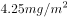，吊兰为，芦荟为。另有以山茶花等8种植物为对象，对比吸收甲醛能力，15H内吸收能力排名为：吊兰＞芦荟＞绿萝＞······＞山茶花＞······。综合两个研究结果可知，山茶花吸收能力为最小。

本题为选非题，故正确答案为D。

---

### 第 18 题　qid 2166147 · 人文常识

在股份制公司，大股东凭借所占的多数股权影响公司决策，维护自己的利益，而众多的中小股东则可以通过由律师、学者等非投资人担任的（  ）在董事会维护自己的利益。

- **A**. 机构监管人
- **B**. 独立董事　✅
- **C**. 监事
- **D**. 职业经理人

**答案**：B

**官方解析**

本题考查法律常识。
B项正确，A、C、D三项错误，根据证监会《上市公司独立董事规则》第五条规定：“独立董事对上市公司及全体股东负有诚信与勤勉义务，并应当按照相关法律法规、本规则和公司章程的要求，认真履行职责，维护公司整体利益，尤其要关注中小股东的合法权益不受损害。”
故正确答案为B。

---

## 言语理解与表达

### 第 1 题　qid 2166183 · 语句表达

依次填入下列句子横线处的词语，最恰当的一组是：
社会秩序的好坏，在词汇上也会留下独特的        。据有关研究，文革期间的社论每213个字便有一个“斗”字        ，大批火药味十足的词语使用频率极高，汉语中传统的辩证法思想和中庸观念被抛到了九霄云外，可谓              ，混乱不堪。

- **A**. 足迹、呈现、声名狼藉
- **B**. 印迹、出现、斯文扫地　✅
- **C**. 足迹、出现、声名狼藉
- **D**. 印迹、呈现、斯文扫地

**答案**：B

**官方解析**

第一空，A、C项的“足迹”指的是脚留下的印子，B、D项的“印迹”指痕迹，踪迹。横线处需要与“社会秩序的好坏”搭配，选择“印迹”，置于文段表达社会秩序的好坏在词汇上也有相应的体现或痕迹，语义合适，当选。排除A、C项。
第二空，对比“呈现”与“出现”。“呈现”指显露出来，强调从“隐”到“显”的过程，“出现”指不仅指“显露出现”，也有“产生出来”之意，即含有从“无”到“有”的过程，“文革期间社论中的‘斗’字”一定是经过创作产生出来的，是一种从“无”到“有”的过程，故“出现”更契合文意，排除D项。
验证第三空，根据“传统的辩证法思想和中庸观念被抛到了九霄云外”，即“传统文化不受尊重”所填词语评价这一现象或行为，“斯文扫地”指文化或文人不受尊重，B项符合文意。
故正确答案为B。
【文段出处】《论语言词汇与社会文化的关系》

---

### 第 2 题　qid 2166184 · 逻辑填空

美国有不少著名的礼貌程序，多少年来        至今，在太多社会礼节已被简化甚至荼毒的今天，这一类礼貌有幸成为仅存的硕果。

- **A**. 沿用
- **B**. 延绵
- **C**. 延续
- **D**. 沿袭　✅

**答案**：D

**官方解析**

所填词语与“礼貌程序”搭配，表达“礼貌程序”从过去到今天仍被作为社会礼节所遵守。
B项“延绵”指形态上的连贯、不间断，如“山脉延绵”，根据“多少年来······至今”，文段侧重强调时间上的不间断，故搭配不当，排除；
C项“延续”指事件或动作上的持续、继续，与“程序”搭配不当，排除；

对比A、D两项，“沿用”指继续使用，多用于中性的语境中；而“沿袭”侧重承袭，按照前人、古代、过去的制度、法令等办事，多用于偏褒义的语境中，排除A项。
故正确答案为D。
【文段出处】《带着感激之心生活》

---

### 第 3 题　qid 2166185 · 语句表达

依次填入下列各句横线处的词语，最恰当的一组是：
（1）江苏区域一直有“苏南”“苏北”之分，其中“苏南”在改革开放初期就已成为中国经济最活跃的区域之一，而“苏北”则                。
（2）作家对批评家的批评意见，需具备一种超越性的情怀，不仅能够发现其中可以借鉴的                ，而且善于在其上触类旁通，生发出更多的创作灵感。
（3）在出访英国的两天行程里，她以8个不同的造型在不同场合亮相，不论是外交礼仪还是衣着谈吐，都表现得                。

- **A**. 相形见绌、真知灼见、无懈可击　✅
- **B**. 略逊一筹、金玉良言、天衣无缝
- **C**. 相形见绌、金玉良言、无懈可击
- **D**. 略逊一筹、真知灼见、天衣无缝

**答案**：A

**官方解析**

【解析】第一空，文段主要比较了“苏南”和“苏北”在经济方面的差异，根据“一直有······之分”可知，以及“‘苏南’······成为中国经济最活跃的区域”，可知“苏南”与“苏北”在经济方面的差异并不小，所填词语形容“苏北”的经济，故“略逊一筹”指比较起来，稍微差一点，程度过轻，排除B、D两项。“相形见绌”指和同类的事物相比较，显出不足，程度适中，A、C两项符合文意；
第二空，文段主要表达作家要借鉴批评家的意见来生发创作灵感，所填词语形容“批评家的批评意见”，“真知灼见”指正确而深刻的认识和高明的见解，语义合适，A项可选。“金玉良言”比喻非常宝贵的劝告或教诲，“劝告或教诲”与“批评意见”对应不当，排除C项；
第三空，根据文意，所填词语用来评价她在外交礼仪和衣着谈吐方面表现得非常“好”，没有任何漏洞或不妥， A项“无懈可击”，形容没有弱点，十分严密，找不到一点漏洞和破绽，语义合适，可选。
故正确答案为A。
【文段出处】（1）无
（2）《批评与创作当相互砥砺》
（3）《奥巴马启动“夫人外交” 米歇尔访华“软调节”》

---

### 第 4 题　qid 2166186 · 逻辑填空

依次填入下列横线处的词语，最恰当的一组是：
锦鲤俗称日本鲤鱼，是很多养鱼爱好者最爱的观赏鱼。日本鲤鱼的神奇之处在于，        你在小鱼缸里饲养它，它        长到两三寸长；        你把它放入大鱼缸或小池塘中，它        长至六寸到一尺长；        把它放进大湖中，让它不受限制地充分成长，有朝一日它        会长达三尺。

- **A**. 如果、只会、如果、就能、如果、可能　✅
- **B**. 只有、才会、只要、就会、只要、必定
- **C**. 如果、只会、只要、就会、只要、必定
- **D**. 只有、才会、如果、就能、如果、可能

**答案**：A

**官方解析**

根据文段两个分号可知，文段属于并列关系,并列结构通常句式相同，又根据语境 “小鱼缸”“大鱼缸或小池塘”“大湖”分别为假设的外界环境变化，故三个分句均需填入假设关系的关联词，即“如果······”，对应A项。
“只有······才”与“只要······就”均属于条件关系的关联词，与文意不符，B、C、D三项均可排除。
故正确答案为A。

---

### 第 5 题　qid 2166187 · 语句表达

依次填入下列各句横线处的词语，最恰当的一组是：
（1）德国总理昨天在德法首脑        中，试图弥合法国与美国在关贸总协定谈判方面的分歧，但没有取得进展。
（2）走上政商关系极端的商人与腐败官员们，通过政策资源的货币化完成了权力        和利益输送，实现了“特权的获取”。

- **A**. 会晤、勾兑　✅
- **B**. 会见、勾兑
- **C**. 会晤、挤兑
- **D**. 会见、挤兑

**答案**：A

**官方解析**

第一空，“会晤”指国家领导人之间的见面，“会见”一般指身份高低不同的人见面，或是主人与客人之间的见面。根据横线前“德法首脑”可判断出是国家领导人之间的见面，排除B、D两项。
第二空，“权力勾兑”是固定搭配，锁定A项；“挤兑”指去银行兑现或者指排挤、倾轧，与“权力”搭配不当，排除C项。
故正确答案为A。

---

### 第 6 题　qid 2166188 · 语句表达

依次填入下列各句横线处的词语，最恰当的一组是：
（1）一代科学巨匠竺可桢        “求是精神”，指引浙大的思想航标。
（2）经历了近5年的艰苦实践，他认为，学校改革至今还没有达到预期效果，最核心的“去行政化”                。

- **A**. 秉承、进退维谷
- **B**. 继承、举步维艰
- **C**. 秉承、举步维艰　✅
- **D**. 继承、进退维谷

**答案**：C

**官方解析**

第一空，搭配“求是精神”，“秉承”指接受并坚持某种精神、宗旨或理念，多用于抽象的思想、原则等，强调主观上的信奉与践行，与“求是精神”搭配恰当；“继承”通常指承接前人留下的具体事物，如事业、传统、遗产等，隐含代际传递之意，而文段并未涉及前人，因此A、C保留，B、D排除。
第二空，根据“学校改革至今还没有达到预期效果”可知，横线处需体现“去行政化”做得不好或者做起来很困难。C项“举步维艰”指每向前一步都很难，符合文意，当选。A项“进退维谷”指无论是进还是退都处于困境中，文段并未提及“退”，与文意不符，排除。
故正确答案为C。
【文段出处】《教育改革梦想者》

---

### 第 7 题　qid 2166189 · 语句表达

依次填入下列各句横线处的词语，最恰当的一组是：
（1）杨绛先生是中国现当代文学史上一位                的学者兼作家。
（2）这位得奖青年果然相貌堂堂，在同伴中                ，十分引人注目。
（3）而在那海一样的人民当中，到处都有                的劳动英雄，这些英雄本身就是人民当中开出的鲜艳花朵。

- **A**. 出类拔萃、卓尔不群、鹤立鸡群
- **B**. 鹤立鸡群、出类拔萃、卓尔不群
- **C**. 卓尔不群、鹤立鸡群、出类拔萃　✅
- **D**. 卓尔不群、出类拔萃、鹤立鸡群

**答案**：C

**官方解析**

本题可从第二空入手，根据文意可知，横线处表达得奖青年的相貌在同伴中非常引人注目之意，C项“鹤立鸡群”指人的才能或仪表在一群人中显得很突出，符合文意，保留。而A、B、D三项的词语只能形容才能的突出，不符合文意，排除。
第一空，代入验证，C项“卓尔不群”指才德超出寻常，与众不同，填入文段表达杨绛先生是一位十分优秀的学者，符合文意，保留。
第三空，代入验证，C项“出类拔萃”形容人的品德才能出众，填入文段形容劳动英雄语义恰当，当选。
故正确答案为C。

---

### 第 8 题　qid 2166190 · 语句表达

依次填入下列各句横线处的词语，最恰当的一组是：
（1）现在果园开始        ，老村长觉得要做的事情依然很多，“种果树看似简单，其实不简单”。
（2）在遇难宇航员的追悼会上，当罗明杰最后说“他们永远活在我们心中，我们微笑着等待他们回来”时，表情一直轻松的他忍不住流下了眼泪，会场一片        。

- **A**. 盈利、唏嘘　✅
- **B**. 营利、叹息
- **C**. 营利、唏嘘
- **D**. 盈利、叹息

**答案**：A

**官方解析**

第一空，根据“要做的事情依然很多”可知，横线处表达果园开始有收益之意，“盈利”获得利润，语义恰当。“营利”指谋求利润，无法体现已经获得利润之意，故排除B、C两项。
第二空，根据文意可知，在追悼会上人们留下了眼泪，A项“唏嘘”指哭泣后不自主地急促呼吸，符合文段语境，当选。D项“叹息”指叹气，无法对应文段“流下了眼泪”的语境，排除。
故正确答案为A。

---

### 第 9 题　qid 2166191 · 语句表达

依次填入下列句子横线处的词语，最恰当的一组是：
当企业逐步完成原始积累后，企业家都开始思考更深层次的问题，越来越多的企业家不再        自己的信仰，其中就有人开始从名利场走向教堂，这种心灵        将如何改变企业的发展，现在尚不明朗。

- **A**. 忌讳、皈依
- **B**. 避讳、回归
- **C**. 忌讳、回归
- **D**. 避讳、皈依　✅

**答案**：D

**官方解析**

第一空，和“信仰”搭配。“忌讳”意为因风俗习惯或畏惧权势而对某些不吉利的语言或举动有所顾忌。“避讳”指回避。信仰不是不吉利的，所以“忌讳”用在此处不恰当，这里想表达的是企业家不再回避自己的信仰，排除A、C两项。
第二空，指代词“这”对应“其中就有人开始从名利场走向教堂”，说明企业家的心灵找到了依托，“皈依”原指佛教的入教仪式，后多指虔诚信奉佛教或参加其他宗教组织，谓身心归乡、依托。所以“心灵皈依”填入合适，D项当选。“回归”指重新回来，侧重于过去已经存在，现在重新回来。文段中“开始思考······开始从名利场走向教堂”说明这些企业家曾经并没有心灵的依托，所以填“回归”不合适，排除B项。
故正确答案为D。

---

### 第 10 题　qid 2166192 · 语句表达

依次填入下列各句横线处的词语，最恰当的一组是：
（1）尽管遭受路遥女儿的坚决反对和清华大学美学教授的再三        ，但“路遥文学奖”的奖项发起人并没有半点退意。
（2）在电影宣传的发布会上，导演对负面声音的不淡定程度令人                。
（3）邵逸夫几乎将教育慈善当成事业来        ，且四处        着他的慈善领域。

- **A**. 质疑、张口结舌、经营、拓宽
- **B**. 置疑、张口结舌、运营、扩张
- **C**. 质疑、瞠目结舌、经营、拓宽　✅
- **D**. 置疑、瞠目结舌、运营、扩张

**答案**：C

**官方解析**

第一空，“质疑”意思是提出疑问。“置疑”表示怀疑，多用于否定句式，如“不可置疑”“不容置疑”。文段表达的是美学教授对此奖项存有疑问，故“质疑”合适，排除B、D两项。
第二空，“张口结舌”指张着嘴说不出话来，形容理屈词穷，或因紧张害怕而发愣。“瞠目结舌”指瞪着眼睛说不出话来，形容窘困或惊呆的样子。这句话表达导演对负面声音不淡定的程度让人很吃惊，因此填入“瞠目结舌”合适，排除A项。
后两空代入验证，“经营事业”“拓宽领域”均为常用搭配，语义恰当，C项当选。
故本题答案为C。
【文段出处】《“路遥文学奖”争议中如常进行 公布首批上榜作品》

---

### 第 11 题　qid 2166193 · 语句表达

下列各项中，没有语病的一项是：

- **A**. 据多家媒体报道，我国发射的第一艘试验飞船在完成了空间飞行试验后，于北京时间3时41分在内蒙古中部地区安全着陆。　✅
- **B**. 这位著名建筑大师在国际学术界被公认为现代派建筑的代表人物，他所有建造在亚洲的作品既充满现代气息，又带着一种神秘的东方情调。
- **C**. “垂直管理”如今是一个很热门的改革思路，最近爆出的邱晓华案，对这个问题敲响了警钟。
- **D**. 台湾地震发生后，中国红十字会总会迅速组成了几支赴台医疗队，准备携带先进的医疗器材、药品和大陆人民的热情奔赴台湾灾区。

**答案**：A

**官方解析**

A项，没有语病，当选；
B项，语序不当，应改为“他在亚洲建造的所有作品”，排除；
C项，“对这个问题敲响了警钟”搭配不当，正确表述为“最近爆出的邱晓华案，给人们敲响了警钟”，排除；
D项，“携带”和“大陆人民的热情”搭配不当，排除。
故正确答案为A。

---

### 第 12 题　qid 2166194 · 片段阅读

下列各项中，有语病的一项是：

- **A**. 
现藏于俄罗斯艾尔米塔什博物馆的中国年画《四美人图》经考证乃是金代山西平阳（今临汾）雕印的精品。

- **B**. 
因为上色技术有限的缘故且年代久远，老年画的线条尤其是边框处的线条几乎不可能很匀称。
　✅
- **C**. 
老年画是一块新兴的投资领域，每年价格涨幅达到以上。

- **D**. 
中国年画题材丰富、色彩鲜明、雅俗共赏，千百年来，已成为中国人精神文化生活中不可缺少的组成部分。

**答案**：B

**官方解析**

B项“因为······的缘故”，句式杂糅，可改为“因为上色技术有限且年代久远”，当选；
A、C、D三项均不存在语病，排除。
故正确答案为B。

---

### 第 13 题　qid 2166195 · 语句表达

下列各项中，没有语病的一项是：

- **A**. 面对四起的叛军，他不再考虑女牧神会不会饶恕他，而是无情地镇压，使无辜百姓生灵涂炭，为了维护其反动统治，他原形毕露，判若两人。
- **B**. 经过血液筛查核酸检测技术，乙肝、丙肝和艾滋病病毒的检测“窗口期”分别由原来的50天、72天和22天缩短到25天、59天和11天，血液安全更有保障。　✅
- **C**. 关于水资源，除农村集体组织所有的水塘、水库中的水属于集体所有制外，凡是我国领域内的一切水资源均属国家所有。
- **D**. 以惩治街头帮派而著称的美国“超级警察”布拉顿认为，光靠逮捕不能防止类似骚乱不再发生，应当以社区为基础，把帮派文化消灭在萌芽状态。

**答案**：B

**官方解析**

A项，“生灵涂炭”形容人民处于极端困苦的境地，与前面的“无辜百姓”重复，属于成分赘余，可将“无辜百姓”删掉，排除；
B项，没有语病，当选；
C项，“凡是”和“一切”重复，属于成分赘余，排除；
D项，“光靠逮捕不能防止类似骚乱不再发生”为三重否定，意思为“光靠逮捕可以让类似的骚乱不再发生”，与后面的“应当以社区为基础，把帮派文化消灭在萌芽状态”表意矛盾，排除。
故正确答案为B。

---

### 第 14 题　qid 2166196 · 片段阅读

下列各项中，没有歧义的一项是：

- **A**. 研究员到这里工作才一个月，好多人还不认识。
- **B**. 演出期间，不少人遗憾地在剧场门口等着退票。　✅
- **C**. 他走了一个多钟头了。
- **D**. 我看见他高兴得跳了起来。

**答案**：B

**官方解析**

A项，“好多人还不认识”可以理解为“研究员不认识其他人”，也可以理解为“其他人不认识研究员”，存在歧义，排除；
B项，没有歧义，当选；
C项，“走”可以理解为走路，也可理解为离开，还可以理解为去世，“他走了一个多钟头了”存在歧义，排除；
D项，“高兴得跳了起来”的主语不能确定是“我”还是“他”，存在歧义，排除。
故正确答案为B。

---

### 第 15 题　qid 2166197 · 语句表达

对下列句子进行语病分析，正确的一项是（    ）：
（1）记者发现，参加中国精品茶博会的专家和消费者中流行一种生态龙井茶，对这种从磐安山区走出的新龙井赞不绝口。
（2）该市在西部大开发的战略规划中能否抓住机会，迅速发展，关键在于能否加速培养各行各业技术人才的技术水平。

- **A**. 第一句成分赘余，第二句句式杂糅。
- **B**. 第一句成分残缺，第二句搭配不当。　✅
- **C**. 第一句成分残缺，第二句句式杂糅。
- **D**. 第一句成分赘余，第二句搭配不当。

**答案**：B

**官方解析**

（1）“对这种从磐安山区走出的新龙井赞不绝口”前缺少主语“人们”，故成分残缺。
（2）“培养”与“技术水平”搭配不当，应改为“提升各行各业技术人才的技术水平”。
故正确答案为B。

---

### 第 16 题　qid 2166198 · 片段阅读

下列各项中，有语病的一项是：

- **A**. 现在，只要打开微信、微博，各种“引人遐想”的标题和图片随即充斥手机屏幕。
- **B**. 我们敢想敢做，又都有一双聪明能干的手，有什么造不出来？　✅
- **C**. 网络公益，如同一股暖流，正在全国各地涌动。
- **D**. 这个梦想不仅是我的梦想，也是中国的梦想，更是世界的梦想。

**答案**：B

**官方解析**

B项，搭配不当，“聪明”不能修饰“手”，“聪明能干”通常搭配人，存在语病。其他选项均表述无误。
故正确答案为B。

---

### 第 17 题　qid 2166199 · 片段阅读

下列各项中，有语病的一项是：

- **A**. 一些地区忽视有限的环境容量，追求粗放式经济发展，引起了严重的环境问题频发，环境质量陡降。　✅
- **B**. 钱学森的“系统科学观”总能被应用到不同领域而推出新的理论。
- **C**. 随着全社会文化自信的日益增强，中国观众更希望在电视荧屏找到文化根脉与精神的时代表达。
- **D**. 面对错综复杂的国际环境和艰巨繁重的国内改革发展稳定任务，我们党团结带领全国各族人民顽强拼搏、开拓创新、奋力开创了党和国家事业发展新局面。

**答案**：A

**官方解析**

A项，“引起了严重的环境问题频发”为句式杂糅，可以改为“引起了严重的环境问题”或者“严重的环境问题频发”。
B、C、D三项均没有语病。
故正确答案为A。

---

### 第 18 题　qid 2166200 · 语句表达

下列各项中，没有语病的一项是：

- **A**. 在强调素质教育的今天，任何脱离学生实际去追求应试效应都是不恰当的。
- **B**. 想象在文学作品中的应用非常广泛，不论是虚构性的作品，还是现实性的文章，都离不开想象。　✅
- **C**. 其实，胡适先生英文文章也写了不少，连同这一百几十件信札，都应该收集成书，供中外学者阅读之便。
- **D**. 某连锁炸鸡店在被曝光使用过期变质鸡肉原料后，上海食品监管部门通过明察暗访，终于查明这些过期劣质肉类原料来自上海FX食品公司。

**答案**：B

**官方解析**

A项，成分残缺，可改为“任何脱离学生实际去追求应试效应的行为都是不恰当的”，排除。
C项，“供中外学者阅读之便”句式杂糅，可改为“供中外学者阅读”或“以便中外学者阅读”，排除。
D项，“某连锁炸鸡店在被曝光使用过期变质鸡肉原料后”语序不当，可改为“在某连锁炸鸡店被曝光使用过期变质鸡肉原料后”，排除。
本题为选非题，故正确答案为B。

---

### 第 19 题　qid 2166201 · 语句表达

把下面几个句子组成语意连贯的一段文字，排序正确的一项是：
（1）徐悲鸿的父亲达章公是一位正直不阿的画家。
（2）他不慕功名，不求闻达，曾刻了许多图章，以明心志。
（3）如“半耕半读半渔樵”“读书声里是吾家”“闲来写幅丹青卖，不用人间造孽钱”“儿女心肠、英雄肝胆”······
（4）他对艺术的热爱和追求以及做人的高尚品德使徐悲鸿受到很深的影响，并使徐悲鸿走上了绘画之路。
（5）他精诗文、书法、篆刻，尤擅绘画，在山水、人物、花鸟上均有很深的造诣。

- **A**. 5-2-3-4-1
- **B**. 1-2-3-5-4
- **C**. 1-5-2-3-4　✅
- **D**. 1-5-4-2-3

**答案**：C

**官方解析**

首先观察选项确定首句，（5）出现人称代词“他”，前面应有人物介绍，故不适合放在首句，排除A项。
（1）引出徐悲鸿父亲达章公是位画家，适合作为首句。对比（2）（5）两句，（5）是对达章公画家身份的详细解释，适合与（1）衔接；但（2）指出他雕刻图章以明心志，与上文“画家”这一身份衔接不够紧密，故排除B项。
对比C、D两项，区别在于（4）的位置。（4）指出，达章公对艺术的热爱以及做人的高尚品德对徐悲鸿影响很大，故前文应阐述艺术追求和高尚品德两个方面，即（2）（3）应在（4）之前，锁定C项。
故正确答案为C。
【文段出处】《徐悲鸿小传》

---

### 第 20 题　qid 2166202 · 语句表达

把下面几个句子组成语意连贯的一段文字，排序正确的一项是：
①虽然明明觉得自己的体格与精力比二十九岁时全然没有什么差异。
②又仿佛在日历上撕过了立秋的一页以后，虽然太阳的炎威依然没有减却，然而大地的节候已从今移交于秋了。
③我的年岁自从冠用了“三十”二字，至今已两年了。
④不解达观的我，从这两个字上受到了不少的暗示与影响。
⑤但“三十”这一个观念笼在头上，犹之张了一顶阳伞，使我的全身蒙了一个暗淡色的阴影。

- **A**. ③④①⑤②　✅
- **B**. ③①⑤②④
- **C**. ③④⑤①②
- **D**. ①⑤③④②

**答案**：A

**官方解析**

对比选项，确定首句。①句将现在与二十九岁的自己作对比，并指出现在与二十九岁的自己没什么差异，③句介绍了“我”现在的年岁，对比可知，应先介绍现在的情况，再将现在的自己与二十九岁做对比，③句更适合做首句，D项排除，A、B、C三项保留。
继续观察选项，寻找其他线索。④句出现指代词“这两个字”，结合选项，④句前分别为②、③两句，②句通过比喻的方式，介绍了在日历上撕过立秋一页后，大地的节气就向秋天转移了，③句介绍了“我”现在的年岁，③句中“三十”可与④句“这两个字”构成指代词捆绑，B项排除，A、C两项保留。
对比A、C两项，判断①句位置。①句将现在与二十九岁的自己作对比，并指出现在与二十九岁的自己没什么差异，⑤句通过转折词“但”介绍了三十这个观念让“我”蒙了一层阴影，⑤句可与①句构成转折关系，⑤句应在①句后，C项排除，A项当选。
故正确答案为A。
【文段出处】《秋》

---

### 第 21 题　qid 2166203 · 片段阅读

时间永是流驶，街市依旧太平，有限的几个生命，在中国是不算什么的，至多，不过供无恶意的闲人以饭后的谈资，或者给有恶意的闲人作流言的种子。至于此外的深的意义，我总是觉得很寥寥，因为这实在不过是徒手的请愿。人类的血战前行的历史，正如煤的形成，当时用大量的木材，结果却只是一小块，但请愿是不在其中的，更何况是徒手。
这段文字的主要内容是（  ）。

- **A**. 有限的几个生命在中国不算什么
- **B**. 徒手的请愿并没有多大的意义　✅
- **C**. 人类血战前行的历史有如煤的形成
- **D**. 闲人把请愿当作饭后的谈资或流言的种子

**答案**：B

**官方解析**

文段开篇指出“有限的几个生命，在中国是不算什么的”，而后通过“我总是觉得”总结前文，指出有限的几个生命是徒手的请愿，没有深的意义，尾句首先通过煤的形成举例说明人类血战前行的历史结果收获很小，最后通过程度词“更”强调徒手请愿更是如此，故文段重在强调徒手请愿并无太大意义，对应B项。
A项、D项均属于结论之前的非重点，且偏离“徒手请愿”这一核心话题，排除；C项属于举例论证，非重点，排除。
故正确答案为B。
【文段出处】《记念刘和珍君》

---

### 第 22 题　qid 2166204 · 片段阅读

“正确答案只有一个”这种思维模式，在我们头脑中已不知不觉地根深蒂固。事实上，若是某种数学问题的话，说正确答案只有一个是对的。麻烦的是，生活中大部分事物并不像某种数学问题那样。生活中解决问题的方法并非只有一个，而是多种多样。如果你认为正确答案只有一个的话，当你找到某个答案以后，就会满足于现状。但由于情况的变化，原来行之有效的方法，到了现在往往不灵了。因此，不满足于一个答案，不放弃探求，这一点非常重要。
从上述文段中不能推出的是（  ）。

- **A**. “正确答案只有一个”这种思维模式在很多人脑海中形成了定势
- **B**. 生活中解决问题的方法是多种多样的，而且在不断地变化着
- **C**. 在数学问题上，“正确答案只有一个”是对的，但在生活中却不是这样
- **D**. “正确答案只有一个”这种思维模式会让人停下探索的脚步　✅

**答案**：D

**官方解析**

A项，根据文段“‘正确答案只有一个’这种思维模式，在我们头脑中已不知不觉地根深蒂固”可知，该项表述正确，排除；
B项，根据文段“生活中解决问题的方法并非只有一个，而是多种多样”及“但由于情况的变化，原来行之有效的方法，到了现在往往不灵了”可知，该项表述正确，排除；
C项，根据文段“事实上，若是某种数学问题的话，说正确答案只有一个是对的······生活中解决问题的方法并非只有一个，而是多种多样”可知，该项表述正确，排除；
D项，根据文段“如果你认为正确答案只有一个的话，当你找到某个答案以后，就会满足于现状”可知，满足于现状有两个条件，即“认为方法只有一个”及“找到某个答案”，D项缺少第二个条件，故表述有误，当选。
本题为选非题，故正确答案为D。
【文段出处】《事物的正确答案不止一个》

---

### 第 23 题　qid 2166205 · 片段阅读

杨振宁还是化学实验员的时候，工作开展并不顺利。他的朋友开玩笑说：“凡是有杨振宁的地方，就会有爆炸。”后来经过多番的思考和比较，杨振宁决定从化学领域转入物理领域，并由此展现自己的风采，最终于1957年与李政道联手摘取了该年的诺贝尔物理学奖。
对杨振宁朋友的玩笑，理解正确的是（  ）。

- **A**. “爆炸”是比喻的说法，指杨振宁做化学实验时被同事围得水泄不通
- **B**. “爆炸”是夸张的说法，指杨振宁化学实验操作失误严重　✅
- **C**. “爆炸”是比喻的说法，指杨振宁的化学实验成果多成为爆炸性新闻
- **D**. “爆炸”是夸张的说法，指杨振宁开展的化学实验项目极具危险性

**答案**：B

**官方解析**

文段开篇介绍杨振宁做化学实验员时工作并不顺利，而后从化学领域转到物理领域才取得巨大成就，故朋友开玩笑所说 “凡是有杨振宁的地方，就会有爆炸”，是指杨振宁在不擅长的化学领域经常出现过失，“爆炸”是一种夸张的说法，并非指有很大危险，对应B项。
A项，“做化学实验时被同事围得水泄不通”说明杨振宁受人关注，与文段所述杨振宁在化学领域并不擅长矛盾，排除；
C项，“化学实验成果多成为爆炸性新闻”说明化学实验成果重大，与文段所述杨振宁在化学领域并不擅长矛盾，排除；
D项，“极具危险性”与文意不符，且选项中“夸张的说法”与“极具危险性”前后矛盾，排除。
故正确答案为B。
【文段出处】《学会舍弃》

---

### 第 24 题　qid 2166206 · 片段阅读

地域歧视产生的前提是地域差异，即不同区域间因种种原因存在着差异，既有发展程度的差异，也有价值观念和习惯方面的差异，具体表现在生活方式、生产方式、思想意识、风格习惯等方面。在这些差异中，以物质为主的方面有一定的客观标准，但以精神和观念为主的方面更多的是主观标准。例如中原的儒家从先秦时就强调“华夷之辨”，歧视边远地区的少数民族。当时少数民族的发展水平的确落后于华夏诸族，但华夏人在精神上的优越感却只是一种虚妄的自信，并没有得到少数民族的认同。
下列说法与原文意思不相符的是（  ）。

- **A**. 地域歧视产生的前提既有一定的客观标准，也有一定的主观标准
- **B**. 中原的儒家从先秦时就歧视边远地区的少数民族
- **C**. 不同区域间在生活方式、生产方式、思想意识、风格习惯等各方面都有不同程度的差异
- **D**. 虽然先秦时少数民族不认同其发展水平落后于华夏诸族，但中原的儒家却通过强调“华夷之辨”获得精神上的优越感　✅

**答案**：D

**官方解析**

A项，由文段中“地域歧视产生的前提是地域差异”“在这些差异中，以物质为主的方面有一定的客观标准，但以精神和观念为主的方面更多的是主观标准”可知，该项表述正确，排除；
B项，由文段中“例如中原的儒家从先秦时就强调‘华夷之辨’，歧视边远地区的少数民族”可知，该项表述正确，排除；
C项，由文段中“即不同区域间因种种原因存在着差异······具体表现在生活方式、生产方式、思想意识、风格习惯等方面”可知，该项表述正确，排除；
D项，由文段中“当时少数民族的发展水平的确落后于华夏诸族，但华夏人在精神上的优越感却只是一种虚幻的自信，并没有得到少数民族的认同”可知，少数民族不认同的为华夏人精神上的优越感，并非不认可发展水平的落后，故该项表述错误，当选。
本题为选非题，故正确答案为D。
【文段出处】《地域歧视？在中国自古有之！》

---

### 第 25 题　qid 2166207 · 语句表达

宋锦的制作工艺较为复杂，以经线和纬线同时显花为主要特征，织造上一般采用“三枚斜纹组织”，两经三纬，经线用底经和面经，底经为有色熟丝，作地纹；面经用本色生丝，作纬线的结接经。染色需用纯天然的染料，先将丝根据花纹图案的需要染好颜色才能进入织造工序。染料挑选极为严格，大多是草木染料，也有小部分矿物染料，全部采用手工染色而成。
关于宋锦的说法不正确的是（  ）。

- **A**. 宋锦经线和纬线同时显花，织造时底经所用熟丝全部采用手工染色
- **B**. 染色是织造宋锦的重要工序，只有把丝根据花纹图案的需要染好颜色才能进行织造
- **C**. 染色需用纯天然的染料，染料挑选极为严格，主要是以大量草木染料和少量矿物染料混合而成　✅
- **D**. 宋锦的制作工艺一般采用“三枚斜纹组织”，用有色熟丝作地纹，以本色生丝作纬线的结接经

**答案**：C

**官方解析**

A项，由文段中“宋锦以经线和纬线同时显花为主要特征”“底经为有色熟丝”“全部采用手工染色而成”可知，该项表述正确，排除；
B项，由文段中“先将丝根据花纹图案的需要染好颜色才能进入织造工序”可知，该项表述正确，排除；
C项，由文段中“染料挑选极为严格，大多是草木染料，也有小部分矿物染料”可知，文中并未说明染料是二者的混合物，无中生有，故该项表述有误，当选；
D项，由文段中“织造上一般采用‘三枚斜纹组织’，底经为有色熟丝，作地纹；面经用本色生丝，作纬线的结接经”可知，该项表述正确，排除。
本题为选非题，故正确答案为C。
【文段出处】《孙迎庆＜寻根＞》

---

### 第 26 题　qid 2166208 · 语句表达

我们现在把研究文字的起源、发展、性质、体系，文字的形音义的关系等学问称为文字学。古代则把有关文字研究的学问叫“小学”，古代的字书都统属于“小学”的范围。东汉班固的《汉书·艺文志》把幼童识字用的字书和解释字义的书附在经学《六艺略》之后，统称为“小学”。从东汉到隋唐五代，“小学”的内容更加丰富，包括了讨论字形、音韵一类的书籍。及至唐代编纂《旧唐书·经籍志》，把《尔雅》等书归入“小学”。从此，“小学”的基本内容得以确定下来。宋代时，开始有人把“小学”称作“文字之学”，把文字之学的内容分为三类：体制（字形）、训诂（字义）、音韵（字音）。到了清代，《四库全书总目提要》把语言文字类的书籍分为训诂、字书、韵书三类。
对上述文段理解错误的是（    ）。

- **A**. 古代把文字、训诂、音韵之类的著作统归于“小学”类
- **B**. 古代“小学”的内容随着时代的发展逐渐丰富，从东汉到隋唐五代时期，“小学”的内容最为丰富　✅
- **C**. 自东汉至唐宋，“小学”都意指有关文字研究的学问
- **D**. 现代的“文字学”与古代的“小学”，其研究内容有很多共同之处

**答案**：B

**官方解析**

文段主要介绍古代“小学”包含内容的变化过程，B项“最”表述绝对化，优先验证，原文为“更加丰富”而非“最为丰富”，且由“及至唐代编纂《旧唐书·经籍志》，把《尔雅》等书归入‘小学’”可知，从东汉到隋唐五代，“小学”的内容并非最为丰富，表述有误，当选。
A项，由“宋代时，把文字之学的内容分为三类：体制（字形）、训诂（字义）、音韵（字音）”可知，表述正确，排除；
C项，由“古代则把有关文字研究的学问叫‘小学’”以及后文“从东汉至唐朝”的论述可知，表述正确，排除；
D项，由首句“我们现在把研究文字的起源、发展、性质、体系，文字的形音义的关系等学问称为文字学。古代则把有关文字研究的学问叫‘小学’，古代的字书都统属于‘小学’的范围”可知，表述正确，排除。
本题为选非题，故正确答案为B。
【文段出处】《中国字典词典史话》

---

### 第 27 题　qid 2166209 · 片段阅读

地震可按照震源深度分为浅源地震、中源地震和深源地震。震源深度在60公里范围内的地震，叫做浅源地震。浅源地震的发震频率高，占地震总数的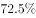，所释放的地震能占总释放能量的。其中，震源深度在30公里以内的占多数，是地震灾害的主要制造者，对人类影响最大。

下列说法与原文意思不相符的是（    ）。

- **A**. 
按照震源深度不同，地震分为浅源地震、中源地震和深源地震

- **B**. 
震源深度不超过60公里的地震称为浅源地震

- **C**. 
地震总数的是震源深度在30公里以内的浅源地震
　✅
- **D**. 
所有地震释放的能量有来自浅源地震

**答案**：C

**官方解析**

文段首先介绍了地震的分类，接着围绕浅源地震阐述其发生频率、释放能量以及对人类产生的影响。A项，由首句“地震可按照震源深度分为浅源地震、中源地震和深源地震”可知，表述正确，排除；B项对应文段“震源深度在60公里范围内的地震，叫做浅源地震”，表述正确，排除；C项，由文段可知“浅源地震的发震频率高，占地震总数的”，而浅源地震的震源深度在60公里范围内，而非“30公里”，表述有误，当选；D项，由“浅源地震的发震频率高······所释放的地震能占总释放能量的”可知，表述正确，排除。

本题为选非题，故正确答案为C。

【文段出处】《浅源地震》

---

### 第 28 题　qid 2166210 · 片段阅读

一个人如果没有脊梁，就站立不起来；如果没有信仰信念，精神世界就会坍塌。对马克思主义的信仰，对共产主义和社会主义的信念，对党和人民的忠诚，是我们共产党人的立身之本。理想信念坚定，骨头就硬；理想信念丧失，就会得“软骨病”。纵观那些犯错误的党员干部，无论政治上的跑偏、还是生活上的走邪，归根到底都是“总开关”上出了问题。党员干部只有在立根固本上下足了功夫，坚定信仰、信念和忠诚，才会有强大的免疫力和抵抗力。
对上述文段理解错误的是（    ）。

- **A**. 信仰信念是一种精神支柱，只有坚定，才会有强大的免疫力和抵抗力
- **B**. 共产党人的信仰信念就是共产党人的脊梁
- **C**. 因为头脑出了问题，有些党员干部就犯了错误　✅
- **D**. “总开关”的比喻，形象地阐述了坚定信仰信念对党员干部的重要性

**答案**：C

**官方解析**

文段主要介绍了信念和信仰对于党员干部的重要性，A项，由尾句“党员干部只有在立根固本上下足了功夫，坚定信仰、信念和忠诚，才会有强大的免疫力和抵抗力”可知，表述正确，排除；
B项，由首句“一个人如果没有脊梁，就站立不起来；如果没有信仰信念，精神世界就会坍塌。对马克思主义的信仰，对共产主义和社会主义的信念，对党和人民的忠诚，是我们共产党人的立身之本”可知，表述正确，排除；
C项，“头脑”表述错误，文段论述的是如果“总开关”出了问题，即“信念和信仰”出了问题，不符合文意，当选；
D项，由文段“纵观那些犯错误的党员干部，无论政治上的跑偏、还是生活上的走邪，归根到底都是‘总开关’上出了问题”，可知，强调信念信仰对于党员干部的重要性，表述正确，排除。
本题为选非题，故正确答案为C。
【文段出处】《立根固本，挺起精神脊梁》

---

### 第 29 题　qid 2166212 · 语句表达

最近，我国自主研发的第一辆具有自主知识产权的磁浮列车成功通过了室外实地运行联合试验。列车采用的是常导电磁吸引力控制悬浮原理，运行中列车悬浮，时速。由于磁浮列车是在路轨上悬浮行驶，没有轨轮的机械磨损，因此列车运行平稳而安静。据了解，与时速可达500公里左右的高速磁浮列车相比，这种中低速磁浮列车制造成本低，适合城市内部和市郊卫星城之间的快速运输。

我国自主研发的磁浮列车的优点不包括（    ）。

- **A**. 采用常导电磁吸引力控制悬浮原理　✅
- **B**. 运行平稳安静
- **C**. 制造成本低
- **D**. 适合短途快速运输

**答案**：A

**官方解析**

这是一道细节判断题，需要对细节进行查找。
A项，根据文意可知，“采用常导电磁吸引力控制悬浮原理”仅仅是列车采用的原理，真正的优点应是这种原理产生的作用效果，即“悬浮行使，没有磨损，运行平稳安静”，故表述错误，当选；
B项，根据“没有轨轮的机械磨损，因此列车运行平稳而安静”可知为磁浮列车的优点，表述正确，排除；
C项，根据“这种中低速磁浮列车制造成本低”可知为优点，表述正确，排除；
D项，根据“适合城市内部和市郊卫星城之间的快速运输”可知“适合短途快速运输”表述正确，排除。
本题为选非题，故正确答案为A。
【文段出处】《我国首辆自主知识产权磁悬浮列车运行试验成功》

---

### 第 30 题　qid 2166213 · 片段阅读

一个真正的读者应具备基本的判断力和鉴赏力，能够辨识一本书的优劣，本能地拒斥劣书、倾心好书。这种能力部分来自阅读的经验，但更多地源自一个人灵魂的品质。当然，灵魂的品质是可以不断提高的，读好书也是提高的途径，二者之间有一种良性循环的关系。重要的是一开始就给自己确立一个标准，每读一本书，一定要在精神上有所收获，能够开启你的心智。只要坚持这个标准，灵魂的品质和对书的判断力就自然会同步得到提高。一旦你的灵魂足够丰富和深刻，你就会发现，你已经上升到了一种高度，不再能容忍那些贫乏和浅薄的书了。
下列说法与原文意思不相符的是（    ）。

- **A**. 灵魂的品质和对书的判断力的提高依赖于给自己确立一个标准，每读一本书，一定要在精神上有所收获，能够开启心智　✅
- **B**. 文中划线处的“这种能力”指代的是“基本的判断力和鉴赏力”
- **C**. 读好书可以提高灵魂的品质，当提升到一定高度时，则会本能地拒斥劣书而倾心好书
- **D**. 一个人阅读的经验和灵魂的品质对于培养读书基本的判断力和鉴赏力很重要

**答案**：A

**官方解析**

A项，根据“重要的是一开始就给自己确立一个标准，每读一本书，一定要在精神上有所收获，能够开启你的心智。只要坚持这个标准，灵魂的品质和对书的判断力就自然会同步得到提高。”可知，文段只是说坚持这个标准可以提升灵魂的品质和对书的判断力，并未提及灵魂的品质和对书的判断力的提高“依赖于给自己确立一个标准”，“依赖于”程度过重，文段没有体现，表述错误，当选；
B项，“这种能力”指代上文阐述的能力，根据“一个真正的读者应具备基本的判断力和鉴赏力，能够辨识一本书的优劣，本能地拒斥劣书、倾心好书”可知，表述正确，排除；
C项，根据“灵魂的品质是可以不断提高的，读好书也是提高的途径”可知，“读好书可以提高灵魂的品质”表述正确，又根据“你已经上升到了一种高度，不再能容忍那些贫乏和浅薄的书了”可知，表述正确，排除；
D项，根据“一个真正的读者应具备基本的判断力和鉴赏力，这种能力部分来自阅读的经验，但更多地源自一个人灵魂的品质”可知，表述正确，排除。
本题为选非题，故正确答案为A。
【文段出处】《语文试题》

---

## 数量关系

### 第 1 题　qid 2166169 · 数学运算

-1，-4，5，-22，59，（    ）

- **A**. -184　✅
- **B**. 302
- **C**. -243
- **D**. 140

**答案**：A

**官方解析**

数列无明显特征，优先考虑作差。后一项减前一项，得到的新数列为-3、9、-27、81，是公比为-3的等比数列，则新数列的下一项为，故所求项减去59所得的差为-243，所求项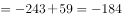。

故正确答案为A。

---

### 第 2 题　qid 2166171 · 数学运算

20.15，29.34，40.35，53.58，（  ）

- **A**. 64.59
- **B**. 65.70
- **C**. 68.63　✅
- **D**. 68.73

**答案**：C

**官方解析**

数列为小数数列，考虑机械划分。将数列中每一个数字的整数部分与小数部分划分后，得到两组新的数列。其中，整数部分组成的新数列为20、29、40、53，观察该数列，用后一项减前一项得9、11、13，得到公差为2的等差数列，则下一项为，故原数列所求项的整数部分为，排除A、B两项；小数部分单独看没有规律，考虑整体看，用整数部分减小数部分，得到周期数列5，-5，5，-5，故下一项为5，只有C项符合。

故正确答案为C。

---

### 第 3 题　qid 2166172 · 数学运算

， ， 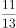， 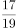，（    ）

- **A**. 
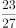

- **B**. 
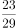
　✅
- **C**. 
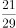

- **D**. 
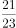

**答案**：B

**官方解析**

观察数列，全为分数，故该数列为分数数列。分子和分母有递增趋势，先考虑分子、分母分开看，但分开看没有明显规律；再考虑分子、分母合起来看，于是形成的新数列为2，3，5，7，11，13，17，19，是质数数列且每两项一组，奇数项为分子，偶数项为分母，故新数列的后两项分别为23，29，所求项为。

故正确答案为B。

---

### 第 4 题　qid 2166173 · 数学运算

某轮船发生漏水事故，漏洞处不断地匀速进水，船员发现险情后立即开启抽水机向外抽水。已知每台抽水机每分钟抽水20立方米，若同时使用2台抽水机15分钟能把水抽完，若同时使用3台抽水机9分钟能把水抽完。当抽水机开始向外抽水时，该轮船已进水（  ）立方米。

- **A**. 360
- **B**. 450　✅
- **C**. 540
- **D**. 600

**答案**：B

**官方解析**

牛吃草问题，套用公式：原有草量时间（牛的数量牛的吃草速度草长的速度）。本题中，抽水机相当于“牛”，进水相当于“草”，抽水前已进水量相当于“原有草量”。设进水的速度为，则有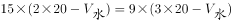，解得，故当抽水机开始向外抽水时，该轮船已进水立方米。

故正确答案为B。

---

### 第 5 题　qid 2166174 · 数学运算

清晨，爷爷、爸爸和小磊在同一条笔直跑道上朝同一方向匀速晨跑，某一时刻，爷爷在前，爸爸在中，小磊在后，且三人之间的间距正好相等。跑了12分钟后小磊追上了爸爸，又跑了6分钟后小磊追上了爷爷，则再过（  ）分钟，爸爸可追上爷爷。

- **A**. 12
- **B**. 15
- **C**. 18　✅
- **D**. 36

**答案**：C

**官方解析**

假设小磊的速度为，爸爸的速度为，爷爷的速度为，三人之间的间距为S。追及问题，套用公式，。

跑了12分钟后小磊追上了爸爸 ，则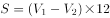，即······①；

又跑了6分钟后小磊追上了爷爷，即从一开始追到追上爷爷，共用时18分钟，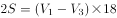，即······②。

题目所求为爸爸追上爷爷的时间，即；由可得，则分钟；所以爸爸从一开始到追上爷爷所需的时间为36分钟，但此时已经过去了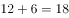分钟，所以再过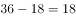分钟时爸爸可以追上爷爷。

故正确答案为C。

---

### 第 6 题　qid 2166175 · 数学运算

某新款手机上市时单价是2598元，销售一段时间后，厂家采取降价促销策略，手机单价直降300元，于是每月销量提升为原来的2倍，每月利润提升为原来的1.5倍，则该款手机的成本价是（  ）元。

- **A**. 1698
- **B**. 1598
- **C**. 1498
- **D**. 1398　✅

**答案**：D

**官方解析**

假设原来手机每月销售量为1台，并设该款手机的成本价是x元，则原来每月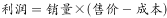；促销后，手机每月销售量为2台，售价元，则促销后每月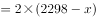。“促销后，每月利润提升为原来的1.5倍”，故，解得元。

故正确答案为D。

---

### 第 7 题　qid 2166176 · 数学运算

“梦想号”和“启航号”两列火车在两条平行轨道上匀速相向而行，“梦想号”的车长为270米，“启航号”的车长为360米。若“梦想号”的乘客从车窗看见“启航号”驶过的时间是8秒，则“启航号”的乘客从车窗看见“梦想号”驶过的时间是（  ）秒。

- **A**. 10
- **B**. 8
- **C**. 6　✅
- **D**. 4

**答案**：C

**官方解析**

相遇问题，套用公式，。若“梦想号”的乘客从车窗看见“启航号”驶过，看到的车身长度即为相遇的路程；则，；若“启航号”的乘客从车窗看见“梦想号”驶过，则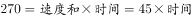，故“启航号”的乘客从车窗看见“梦想号”驶过的时间是秒。

故正确答案为C。

---

### 第 8 题　qid 2166177 · 数学运算

阳光下，电线杆的影子投射在地面以及与地面成45度角的土坡上。其中，电线杆投影在土坡上的部分长米，投影在地面上的部分长12米，而此时同一位置站立的人在地面的影子长度恰好与身高相同，则电线杆的高度为（  ）米。

- **A**. 12
- **B**. 14　✅
- **C**. 15
- **D**. 16

**答案**：B

**官方解析**

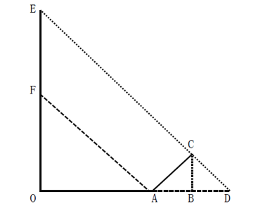

如图所示，根据题意可得，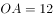米，米。因“此时同一位置站立的人在地面的影子长度恰好与身高相同”，故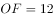米；因“电线杆的影子投射在地面以及与地面成45度角的土坡上”，米，则在等腰三角形ACD中，米，而在等腰三角形EOD中，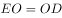且，则有米，故电线杆的高度为米。

故正确答案为B。

---

### 第 9 题　qid 2166178 · 数学运算

某校师生为元旦晚会排练合唱表演，要求合唱团在台阶上排列成不少于3排的前多后少的梯形队阵，且各排的人数须是连续的自然数，以使后一排的合唱团成员均站在前一排两名合唱团成员之间的空隙处。若合唱团共100人，则满足上述要求的排列方案有（  ）种。

- **A**. 1
- **B**. 2　✅
- **C**. 3
- **D**. 4

**答案**：B

**官方解析**

设合唱团一共n排，则由于各排人数是连续的自然数，则从前到后构成公差为-1的等差数列，则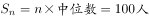。分情况讨论：

若n为奇数，由于乘积100是偶数，则中位数只能为偶数；

若n为偶数，则中位数为最中间两排人数的平均数，由于相邻两排人数相差1，故中位数应为小数部分为0.5的小数。

100的约数中，只有1、5、25为奇数，由于n不少于3，故时，中位数为20，满足题意；时，中位数为4，会出现后排人数为负数的情况，排除。

若n为偶数，只有时，中位数为12.5，满足题意。

所以满足上述要求的排列方案有2种，。

故正确答案为B。

---

### 第 10 题　qid 2166179 · 数学运算

甲、乙、丙三名质检员对一批依次编号为的电脑进行质量检测。每个人均从随机序号开始，按顺序往后检测，如检测到编号为100的电脑，则该质检员的检测工作结束。某一时刻，甲检测了76台电脑，乙检测了61台电脑，丙检测了54台电脑，则甲、乙、丙三人均检测过的电脑至少有（  ）台。

- **A**. 12
- **B**. 15　✅
- **C**. 16
- **D**. 18

**答案**：B

**官方解析**

本题并非多集合反向构造，这是因为题干中要求“按顺序往后检测”，而并非任意检测。题干所求为“甲、乙、丙三人均检测过的电脑至少”，直接考虑三人均检测过的至少即最少比较难考虑，先考虑任意两人检测过的电脑最少，这里我们先去分析甲、乙，要使甲、乙两人都检测过的电脑最少，如下图所示，甲、乙检测的电脑应尽可能少的重合，甲从1号开始检测一直至76号，而乙相当于从100号倒数至40号（注意40号至100号为61台，并非39号至100号），这样便可以保证甲、乙两人都检测过的电脑最少。再去考虑丙，如果丙从1号开始检测一直至54号，则甲、乙、丙均检测过的电脑编号为40至54，一共15台；如果从100号倒数至47号，则甲、乙、丙均检测过的电脑编号为47至76，一共30台，显然前者更少即甲、乙、丙三人均检测过的电脑至少有15台。

故正确答案为B。

---

### 第 11 题　qid 2166180 · 数学运算

桌子上放有2018枚硬币，小芳、小强两人轮流取走其中一些。当小芳取硬币时，只能取2枚或4枚；当小强取硬币时，只能取1枚或3枚，取走最后一枚硬币的人即为获胜者，假设两人均使用最佳策略，则（  ）能获胜。

- **A**. 先取者
- **B**. 后取者
- **C**. 小芳
- **D**. 小强　✅

**答案**：D

**官方解析**

由题意可知，，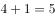，即小芳和小强分别取一次存在一个加和定值为5，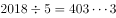。分类讨论如下：

若小芳先取，无论小芳取2枚还是4枚，小强总能与小芳凑成每次加和为5的情况，最后剩余3。此时小芳再取，只能取2，小强取最后一个获胜；

若小强先取，按照最佳策略，小强先取3枚，剩余2015枚，随后无论小芳取2枚还是4枚，小强都与小芳凑成每次加和为5的情况，最后剩余5枚时，也是小芳取完小强再取，小强获胜。

故小强一定获得最终胜利。

故正确答案为D。

---

### 第 12 题　qid 2166181 · 数学运算

某公园内原有一个深2.5m、长宽均为5m的观赏鱼池，现需将鱼池四壁及底面铺满厚5cm、长宽均为10cm的砖，则至少需使用（  ）块砖。

- **A**. 7500
- **B**. 7401
- **C**. 7351　✅
- **D**. 7301

**答案**：C

**官方解析**

题干要求使用的砖尽可能少，则在铺的时候尽可能使用砖面积最大的一面，砖最大面的面积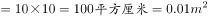。

①先铺鱼池的左立面与右立面，分别需要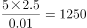块，两侧共需块；

②再铺鱼池的前立面与后立面，分别需要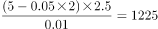块，两侧共需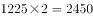块；

③最后铺底面，需要块。

故总共需要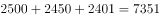块，满足条件“将鱼池四壁及底面铺满”。

故正确答案为C。

---

### 第 13 题　qid 2166182 · 数学运算

甲、乙、丙三市位于一条直线公路上，甲、乙两市相距120公里，丙市位于甲、乙之间，距离甲市30公里。小李驱车匀速沿公路从甲市前往乙市，小李出发15分钟后，小赵驱车从甲市出发，以80公里/小时的速度匀速沿公路前往乙市，半小时后，小赵发现有物品遗落在丙市，遂原路返回丙市取回物品后继续前往乙市，且在到达乙市前与小李只相遇一次。假设小赵到达丙市后即刻取回遗落物品，所耽误的时间忽略不计，则小李的速度不可能为（  ）公里/小时。

- **A**. 32
- **B**. 46　✅
- **C**. 56
- **D**. 58

**答案**：B

**官方解析**

设小李速度为v，小赵出发半小时时，已经走了公里，返回丙市需再走公里。

若小赵发现有物品遗落在丙市前，并未与小李相遇。说明小赵在出发半小时时，并未追上小李，即小李走了的路程大于小赵走的40公里，则有，公里/小时；此时由于要在到达乙市之前与小李相遇一次，故小赵到达乙市前，一定超过小李，小赵从甲到达乙市时，共花费时间小时，此时小李已从甲出发小时，尚未到达乙市，则有，公里/小时。选项C、D在公里/小时60公里/小时范围内，排除。

若小赵发现有物品遗落在丙市前，就已经与小李相遇。由于在到达乙市前与小李只相遇一次，则只有可能是小李在到达丙市前被小赵超越（否则小赵返回丙市时，会与小李再次相遇）。小赵到达丙市时，花费时间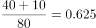小时，此时小李已从甲出发小时，尚未到达丙市，则有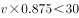，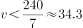公里/小时。选项A在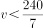公里/小时范围内，排除。

故正确答案为B。

---

## 判断推理

### 第 1 题　qid 2166148 · 图形推理

从所给四个选项中，选择最合适的一个填入问号处，使之呈现一定的规律性：

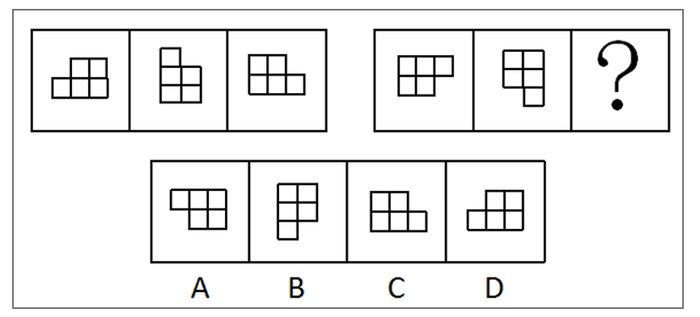

- **A**. A　✅
- **B**. B
- **C**. C
- **D**. D

**答案**：A

**官方解析**

元素组成相同，考虑位置规律。第一行图，第一个图形顺时针旋转得到第二个图形，第二个图形顺时针旋转后再上下翻转得到第三个图形。第二行图按照此规律，将第二个图形先顺时针旋转后再上下翻转。

故正确答案为A。

---

### 第 2 题　qid 2166149 · 图形推理

从所给四个选项中，选择最合适的一个填入问号处，使之呈现一定的规律性：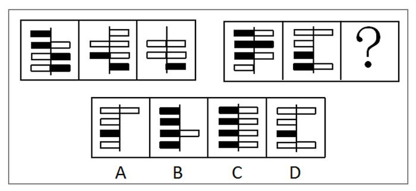

- **A**. A　✅
- **B**. B
- **C**. C
- **D**. D

**答案**：A

**官方解析**

元素组成相似，考虑样式规律。题干中出现黑白块，考虑黑白运算。第一行图的规律为：，，，，，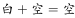，。第二行图按照此规律进行运算，只有A选项符合规律。

故正确答案为A。

---

### 第 3 题　qid 2166150 · 图形推理

从所给四个选项中，选择最合适的一个填入问号处，使之呈现一定的规律性：

- **A**. A
- **B**. B
- **C**. C　✅
- **D**. D

**答案**：C

**官方解析**

元素组成不同，考虑属性与数量规律。属性无规律，图形均为汉字组成，面数量较多，考虑数面。第一组图中：面数量分别为1、2、3。第二组图中：面数量分别为4、5、?，?处应该为6，只有C选项面的个数是6。
故正确答案为C。

---

### 第 4 题　qid 2166151 · 图形推理

从所给四个选项中，选择最合适的一个填入问号处，使之呈现一定的规律性：

- **A**. A
- **B**. B
- **C**. C
- **D**. D　✅

**答案**：D

**官方解析**

元素组成相似，考虑样式规律。第一组图中每幅图均有一个长方体，长方体上分别有一个圆锥、两个圆锥、一个圆柱，把图形分成上下两个部分来看，上半部分的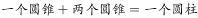，下半部分长方体数量不变，所以规律是：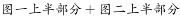，，下半部分的长方体数量不变。第二组图按照此规律进行相加，？处上半部分为4个圆锥，而。

故正确答案为D。

---

### 第 5 题　qid 2166152 · 图形推理

从所给四个选项中，选择最合适的一个填入问号处，使之呈现一定的规律性：

- **A**. A　✅
- **B**. B
- **C**. C
- **D**. D

**答案**：A

**官方解析**

元素组成不同，考虑属性规律。第一组图中每幅图均为曲线图，第二组图图一图二也为曲线图，所以？处应该为曲线图。
故正确答案为A。

---

### 第 6 题　qid 2166153 · 类比推理

（1）达到一定速度，向后拉驾驶杆
（2）收起起落架
（3）飞行员进行起飞检查
（4）请求飞行
（5）启动引擎开始滑行

- **A**. 4-3-2-5-1
- **B**. 3-4-1-2-5
- **C**. 3-4-5-1-2　✅
- **D**. 4-3-1-2-5

**答案**：C

**官方解析**

第一步：先确定逻辑关系最为明显的事件顺序。
观察题干，五个事件主要围绕“飞机起飞”的过程。逻辑关系的先后顺序比较明显的是事件（3）和事件（4），只有先“飞行员进行起飞检查”，才能“请求飞行”，因此事件（3）排在事件（4）前面，且事件（3）和事件（4）相邻，同时容易判断事件（3）应该排在最前面，排除A、D两项。
第二步：逐一对照选项并判断正确答案。
根据第一步得到的结果可以判断只有B、C两项符合，通过分析事件（1）、（2）、（5）可知，先“启动引擎开始滑行”，再“达到一定速度，向后拉驾驶杆”，最后“收起起落架”。排序为：（5）-（1）-（2），从而排除B项。
故正确答案为C。

---

### 第 7 题　qid 2166154 · 类比推理

（1）内阁制
（2）军机处
（3）中外朝制
（4）三省六部制
（5）三公九卿制

- **A**. （5）-（4）-（3）-（2）-（1）
- **B**. （5）-（3）-（4）-（1）-（2）　✅
- **C**. （4）-（3）-（5）-（2）-（1）
- **D**. （4）-（5）-（3）-（1）-（2）

**答案**：B

**官方解析**

第一步：先确定逻辑关系最为明显的事件顺序。
观察题干，五个事件主要围绕“国家管理制度发展”的过程。“内阁制”在明朝设立，“军机处”在清朝设立，“中外朝制”在汉朝设立，“三省六部制”在隋朝设立，“三公九卿制”在秦朝设立。根据历史朝代判断先后顺序应该是秦朝、汉朝、隋朝、明朝、清朝，即：（5）-（3）-（4）-（1）-（2）。
第二步：逐一对照选项并判断正确答案。
根据上述判断，只有B选项符合题意。
故正确答案为B。

---

### 第 8 题　qid 2166155 · 类比推理

（1）浮出水面
（2）呼救求援
（3）循序上升
（4）落入水中
（5）保持镇定

- **A**. 4-5-1-2-3
- **B**. 4-5-3-1-2　✅
- **C**. 4-2-5-3-1
- **D**. 4-3-1-5-2

**答案**：B

**官方解析**

第一步：先确定逻辑关系最为明显的事件顺序。
观察题干，五个事件主要围绕“落水到呼救”的过程。逻辑关系的先后顺序比较明显的是事件（4）和事件（5），只有先“落入水中”，然后尽快“保持镇定”，因此事件（4）排在事件（5）前面，且事件（5）和事件（4）相邻，同时容易判断事件（4）应该排在最前面，排除C、D两项。
第二步：逐一对照选项并判断正确答案。
根据第一步得到的结果可以判断只有A、B两项符合，通过分析事件（1）、（2）、（3）可知，先“循序上升”，再“浮出水面”后才能“呼救求援”。排序为：（3）-（1）-（2），从而排除A项。
故正确答案为B。

---

### 第 9 题　qid 2166156 · 类比推理

（1）猜灯谜
（2）插茱萸
（3）赛龙舟
（4）扫墓
（5）赏月

- **A**. 1-4-3-5-2　✅
- **B**. 4-3-2-5-1
- **C**. 1-4-3-2-5
- **D**. 4-2-3-5-1

**答案**：A

**官方解析**

第一步：先确定逻辑关系最为明显的逻辑顺序。
观察题干，五个事件均为“传统节日习俗”，可根据节日的时间先后进行排序。
（1）“猜灯谜”是元宵节的习俗，时间为农历正月十五，（2）“插茱萸”是重阳节的习俗，时间为农历九月初九，（3）“赛龙舟”是端午节的习俗，时间为农历五月初五，（4）“扫墓”是清明节的习俗，在每年的四月，（5）“赏月”是中秋节的习俗，时间为农历八月十五。故五个事件的顺序应为（1）—（4）—（3）—（5）—（2）。
第二步：逐一对照选项并判断正确答案。
根据第一步得到的结果可以判断只有A项符合。
故正确答案为A。

---

### 第 10 题　qid 2166157 · 类比推理

（1）第三方担保平台兴起
（2）交易双方互不信任
（3）居民资金托管到网络担保平台
（4）无现金社会渐成雏形
（5）移动支付技术发展

- **A**. （1）-（3）-（2）-（4）-（5）
- **B**. （1）-（3）-（5）-（4）-（2）
- **C**. （2）-（5）-（1）-（3）-（4）
- **D**. （2）-（1）-（5）-（3）-（4）　✅

**答案**：D

**官方解析**

第一步：先确定逻辑关系最为明显的事件顺序。
观察题干，五个事件主要围绕“移动交易担保平台”的发展过程。逻辑先后顺序比较明显的是事件（1）和事件（2），先有了“交易双方互不信任”才会导致“第三方担保平台兴起”。因此事件（2）排在事件（1）前面，排除A、B项。
第二步：逐一对照选项并判断正确答案。
根据第一步得到的结果可以判断只有C、D项符合，通过分析事件（3）和（5）得知，只有先“移动支付技术发展”，才会导致“居民资金托管到网络担保平台”。因此（3）和（5）相邻，且事件（5）排在事件（3）前面，排除C项。
故正确答案为D。

---

### 第 11 题　qid 2166158 · 类比推理

每个世纪都有哲学家和艺术家提出“美”和“丑”的定义，但是至今也没有一个完全一致的定义。假设定义“丑是美的反面”为真，那么（  ）。

- **A**. 任何事物都有美丑两面
- **B**. 没有美也就没有丑　✅
- **C**. 不美不丑是存在的
- **D**. 美和丑是无法辨别的

**答案**：B

**官方解析**

日常推理题，根据题干信息逐一分析选项。
A项：丑是美的反面可以理解成丑和美是矛盾关系，因此一个事物是不可能同时存在美丑两个状态，无法推出，排除；
B项：丑是美的反面，两者之间是对立存在的，即缺少任何一个，另一个都无法存在，因此可以推出没有美也就没有丑，当选；
C项：丑是美的反面可以理解成丑和美是矛盾关系，因此两者之间不存在其他的状态，不美不丑是不存在的，排除；
D项：题干中并没有提出如何辨别美丑的方法，无中生有，排除。
故正确答案为B。

---

### 第 12 题　qid 2166159 · 逻辑判断

某公司拟实现一项“office-home，but one day”计划，即全体员工都不需要到办公室工作，他们可以任意选择想要完成工作的地点，比如家里、游乐场······但是，每个月必须有一天同事们要齐聚办公室进行面对面的交流。
下列解释最能说明面对面交流存在的必要性的是（  ）。

- **A**. 面对面交流可以帮助员工评估工作进程
- **B**. 面对面交流可以获取到一些关键的非语言交流的信息　✅
- **C**. 如果不在办公室进行面对面交流，办公室就失去了存在的价值
- **D**. 长期独立办公，不与其他同事交流，会削弱员工的团队精神

**答案**：B

**官方解析**

第一步：找出论点和论据。
论点：每个月必须有一天同事们要齐聚办公室进行面对面的交流。
论据：无明显论据。
第二步：逐一分析选项。
A项：说明面对面交流可以帮助员工评估工作进程，提出了一个新的论据来支持论点，保留；
B项：说明面对面交流可以获取一些非语言交流的信息，提出了一个新的论据来支持论点，保留；
C项：不在办公室面对面交流就会失去办公室的作用，强调的是办公室存在的必要性，与面对面交流无关，排除；
D项：提出长期独立办公，不与同事交流会削弱员工的团队精神，但是交流并非特指面对面交流，因此属于无关选项，排除。
比较A、B两项，B项指出面对面交流可以获取关键的信息，加强的力度比A项大，故正确答案为B。

---

### 第 13 题　qid 2166160 · 逻辑判断

当人们将一般规则应用于它所不适用的特殊事例时，就会产生“偶性的谬误”。
下列各项中，没有产生“偶性的谬误”的是（  ）。

- **A**. 公民依法享有言论自由。所以老赵不该因为他上周发表颠覆政府的言论而被追诉
- **B**. 借用他人物品应及时归还。你昨天从老钱家借了菜刀，前面那闹事的醉汉就是老钱，既然遇到他了，你现在赶紧把菜刀还给他
- **C**. 生命在于运动。小孙正值长身体的时候，不能总是待在家里学习，该出去跑跑步锻炼锻炼　✅
- **D**. 你是在礼仪之乡长大的，深知诚实坦率是美德，现在就把你们公司的机密告诉我吧

**答案**：C

**官方解析**

第一步：找出定义关键词。
“一般规则”、“应用到不适用的特殊事例”
第二步：逐一分析选项。
A项：老赵发表的颠覆政府的言论不属于言论自由的范围，属于特殊事例，因此不适用“公民依法享有言论自由”的规则，能够产生“偶性的谬误”，符合定义，排除； 
B项：闹事醉汉老钱处于非正常状态，属于特殊事例，因此不适用“借用他人物品应及时归还”的规则，能够产生“偶性的谬误”，符合定义，排除；
C项：对于正值长身体的小孙来说，跑步不是特殊事例，因此“生命在于运动”的规则适用于小孙，不能够产生“偶性的谬误”，不符合定义，当选；
D项：泄漏公司机密是违法行为，属于特殊事例，因此不适用“诚实坦率是美德”的规则，能够产生“偶性的谬误”，符合定义，排除。
本题为选非题，故正确答案为C。

---

### 第 14 题　qid 2166161 · 逻辑判断

甲国国民S开了一家糖果店。某日，S决定将牛轧糖、奶糖单价分别提高2.9元和1.8元；当天，乙国空军一架F-222战机坠毁。一个月后，S又将奶糖单价翻番；当天14时，丙国一架客机起飞不久后遇难。两个月后，S就糖果价格问题发表声明，称价格未调整到位，并将牛轧糖单价提高1.2元；当日，丁国某航空公司的一架客机在该国西北部附近坠毁。可见，S以糖果价格为武器，专门打击境外航天器。
下列选项如果为真，最能支持上述结论的是（  ）。

- **A**. 飞机制造时，内部程序设定为主动接收S的糖果定价信息，遇到特定价格就坠毁　✅
- **B**. 坠毁的不仅有外国飞机，也有本国飞机；不仅有军用战机，也有民用客机
- **C**. S和某跨国恐怖组织关系密切，调整糖果价格前已得知恐怖袭击的详细计划
- **D**. S在销售给境外飞行员的糖果中植入炸弹，咬破后立即发生爆炸

**答案**：A

**官方解析**

第一步：找出论点和论据。
论点：S以糖果价格为武器，专门打击境外航天器。
论据：S决定将牛轧糖、奶糖单价分别提高2.9元和1.8元；当天，乙国空军一架F-222战机坠毁。一个月后，S又将奶糖单价翻番；当天14时，丙国一架客机起飞不久后遇难。两个月后，S将牛轧糖单价提高1.2元；当日，丁国某航空公司的一架客机在该国西北部附近坠毁。
论点和论据都在讨论“糖果价格改变”和“境外航天器坠毁”之间的关系，话题一致，加强优先考虑补充论据。
第二步：逐一分析选项。
A项：飞机内部程序能够接收S的糖果定价信息，遇到特定价格就坠毁，解释了为什么糖果价格改变，境外航天器就会坠毁，补充论据加强论点，当选；
B项：坠毁的也有本国飞机，说明不是专门打击境外航天器，削弱了论点，排除；
C项：S与恐怖组织关系密切且知道恐怖袭击出的详细计划，无法说明糖果价格和飞机坠毁之间的关系，不能支持论点，排除； 
D项：S销售的糖果中有炸弹与糖果的价格无关，因此不是将价格作为武器，削弱了论点，排除。
故正确答案为A。

---

### 第 15 题　qid 2166162 · 逻辑判断

过去五十年，某地人均生活水平都在贫困线以下，因此可以预计，接下来几年里，该地人均生活水平仍会很低。
下列选项如果为真，最能削弱上述结论的是（  ）。

- **A**. 国家近十年来一直对该地给予扶贫优惠政策，保障和改善百姓生活
- **B**. 该地的行政领导班子面临换届，大批富有成功脱贫经验的官员即将上任　✅
- **C**. 某地质专家推测该地地底藏有大量石油
- **D**. 据传闻，该地将要被规划为首都的卫星城市

**答案**：B

**官方解析**

第一步：找出论点和论据。
论点：接下来几年里，该地人均生活水平仍会很低。
论据：过去五十年，某地人均生活水平都在贫困线以下。
本题的论点是对未来的一种预测，并且是通过过去的情况来预测未来，这种预测未来的题目没办法通过直接否定论点（接下来几年里，该地人均生活水平不会很低）的方式来削弱，既然题干是通过过去证明未来，我们可以通过拆桥的方式来削弱，即：过去和未来不一样，过去不代表未来。
第二步：逐一分析选项。
A项：近十年来的国家都给予该地扶贫优惠政策，说的还是过去的情况，在过去十年给了扶贫优惠政策情况之下人均生活水平依然在贫困线以下，说明这个优惠政策目前为止是无效的，那到底未来会不会有效果，能不能实际起到改善人均生活水平的作用更是非常不确定的，无法削弱，排除；
B项：该地的行政领导班子面临换届，大批富有成功脱贫经验的官员即将上任，本选项特意强调了“领导班子面临换届”，“大批”、“富有成功脱贫经验”的官员即将上任，是通过举了领导班子换届的例子来证明未来有变化了，未来和过去不一样，过去不能代表未来了，间接拆了论点和论据之间的桥，可以削弱，当选；
C项：只是地质专家的推测，并不是事实，因此属于不确定选项，排除； 
D项：传闻的消息也是不确定的，因此属于不确定选项，排除。
故正确答案为B。

---

### 第 16 题　qid 2166163 · 类比推理

某班级有甲、乙、丙三位同学参加奥数竞赛，获一、二、三等奖的各有一人。班主任猜测：甲肯定是一等奖，乙肯定不是一等奖，丙肯定不是三等奖。事实上，班主任只猜中了一个。
据此，可推知获得二等奖的是（  ）。

- **A**. 甲同学
- **B**. 乙同学
- **C**. 丙同学　✅
- **D**. 无法判断

**答案**：C

**官方解析**

第一步，分析题干条件。
① 甲：一等奖；
② 乙：不是一等奖；
③ 丙：不是三等奖。
假设班主任猜中了条件①，则条件②和③都是错的，那么此时甲乙都获得了一等奖，与题干所给条件不符，假设错误；
假设班主任猜中了条件②，则甲不是一等奖，丙是三等奖，那么此时就没有人是一等奖，与题干所给条件不符，假设错误；
条件①和②都是错的，由于“班主任只猜中了一个”，所以条件③一定是对的，即丙不是三等奖。此时甲一定不是一等奖，乙是一等奖，那么甲是三等奖，丙是二等奖。
故正确答案为C。

---

### 第 17 题　qid 2166164 · 定义判断

“供给侧结构性改革”是指从供给侧入手，针对结构性问题而推进的改革。“供给侧”包含两个基本方面：一是生产要素投入，如劳动投入、资本投入、土地等资源投入、企业家才能投入、政府管理投入；二是全要素生产率提高，由制度变革、结构优化、要素升级决定。“结构性问题”主要包括产业结构问题、消费结构问题、区域结构问题、要素投入结构问题、排放结构问题、增长动力结构问题、收入分配结构问题等。
根据上文，下列不属于供给侧结构性改革范畴的是（  ）。

- **A**. 某平台把“碎片化”的闲置私家车统合，用于共享
- **B**. 某点心店通过升级面点技术把点心做得更精致、更好吃
- **C**. 某公司坚持自主创新，开发出自有专利的高科技智能终端产品
- **D**. 某酒厂斥巨资投放广告，拿下某热门综艺节目冠名权　✅

**答案**：D

**官方解析**

第一步：找到关键词
“一是生产要素投入，如劳动投入、资本投入、土地等资源投入、企业家才能投入、政府管理投入”、“二是全要素生产率提高，由制度变革、结构优化、要素升级决定”、“‘结构性问题’主要包括产业结构问题、消费结构问题、区域结构问题、要素投入结构问题、排放结构问题、增长动力结构问题、收入分配结构问题等”
第二步：逐一分析选项
A项：“某平台将闲置私家车统合，用于共享”是针对私家车存在碎片化闲置的结构性问题而进行的消费结构改革，属于供给侧结构性改革的范畴，符合定义，排除；
B项：点心店通过升级面点技术，使做出来的点心更精致、更好吃，是生产要素方面的投入，属于供给侧结构性改革的范畴，符合定义，排除；
C项：公司通过自主创新，开发出拥有自有专利的高科技智能终端产品，是在生产要素方面的投入，解决了公司的增长动力结构问题，属于供给侧结构性改革的范畴，符合定义，排除；
D项：“酒厂斥巨资投放广告，拿下某热门综艺节目冠名权”其目的是为了产品的宣传，并没有体现出酒厂在产品供给方面进行改革，不属于供给侧结构性改革的范畴，不符合定义，当选。
本题为选非题，故正确答案为D。

---

### 第 18 题　qid 2166165 · 类比推理

某动物园的动物情况如下：①如果马的数量增加或者狮子怀孕，那么大象死亡或者兔子的数量不增加；②如果牛得病或者狼的数量减少，那么兔子的数量增加并且马的数量增加；③如果大象死亡或者山羊的数量增加，那么牛没得病或者马的数量不增加。
根据上述条件，可以确定的是（  ）。

- **A**. 狼的数量减少
- **B**. 狮子怀孕
- **C**. 山羊的数量增加
- **D**. 牛没得病　✅

**答案**：D

**官方解析**

第一步：翻译题干。

① 马的数量增加 或者 狮子怀孕大象死亡 或者 兔子数量不增加

② 牛得病 或者 狼的数量减少兔子数量增加 且 马的数量增加

③ 大象死亡 或者 山羊的数量增加牛没得病 或者 马的数量不增加

由①可得出：④ 马的数量增加大象死亡 或者 兔子数量不增加；

根据否一推一可得出：⑤ 马的数量增加 且 兔子数量增加大象死亡 ；

由②可知：⑥ 牛得病 牛得病或者 狼的数量减少兔子数量增加 且 马的数量增加

综合⑤⑥可以得出：⑦ 牛得病大象死亡

综合③⑦可以得出：⑧ 牛得病牛没得病 或者 马的数量不增加

由⑥可知：⑨ 牛得病马的数量增加

综合⑧⑨可以得出：牛得病牛没得病 ，所以牛没得病一定成立。

故正确答案为D。

---

### 第 19 题　qid 2166166 · 类比推理

东山、西山、南山、北山四支足球队举行友谊赛，每两支队间均赛且只赛一场，最后按总进球数排列的名次为：东山&gt;西山&gt;南山&gt;北山。各场比赛中，东山队以4：1战胜了西山队，北山队战胜了南山队，另外四场是平局。
各球队中，失球数最少的是（  ）。

- **A**. 东山队
- **B**. 西山队
- **C**. 南山队
- **D**. 北山队　✅

**答案**：D

**官方解析**

分析题干条件。

①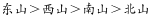；

②；

③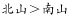；

④；

⑤；

⑥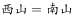；

⑦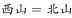。

假设：；；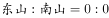；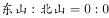；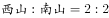；，则各球队的进球数依次为：东山4、西山3、南山2、北山1，符合题干要求。此时各球队的失球数依次为：东山1、西山6、南山3、北山0。因此，失球数最少为北山队。

故正确答案为D。

---

### 第 20 题　qid 2166167 · 类比推理

甲、乙、丙三个贪官在狱中同住一室，谈及自己所犯的罪，个个都悔不当初。三人经过一番推心置腹，对各自所犯罪行都心知肚明。
甲说：“如果我贪污，那么乙也贪污；如果我走私，那么丙也走私。”
乙说：“如果我泄密，那么丙也泄密；如果我贪污，那么甲也贪污。”
丙说：“如果我泄密，那么甲也泄密；如果乙走私，那我可不走私。”
监狱长说：“贪污、泄密、走私三种罪行，每种都至少被其中一人所犯；有两人所犯罪行完全相同；有一人仅犯一种罪。”
如果上述言论均为真，下列选项肯定为假的是（  ）。

- **A**. 甲至少犯贪污罪
- **B**. 乙没有走私
- **C**. 丙没有泄密　✅
- **D**. 甲与丙罪行相同

**答案**：C

**官方解析**

第一步：翻译题干。

① 甲贪乙贪；甲走私丙走私

② 乙泄密丙泄密；乙贪污甲贪污

③ 丙泄密甲泄密；乙走私-丙走私

④ 每种罪行都至少被其中一人所犯，有两人所犯罪行完全相同。

将条件综合可得：

甲贪乙贪甲贪、甲走私丙走私-乙走私、乙泄密丙泄密甲泄密。

第二步：逐一分析选项。

A项：甲若不犯贪污罪，那么乙一定没贪污，可知丙贪污，又根据“甲走私丙走私-乙走私”，则甲乙、甲丙、乙丙不可能有两个人所犯罪行相同，不符合题干条件④，可知甲至少犯了贪污罪，排除；

B项：乙没有走私，由A选项可知甲、乙贪污，则当甲、丙犯了贪污、走私、泄密，乙仅犯了贪污罪时，可以满足题干条件，排除；

C项：由A选项可知甲、乙一定都犯了贪污罪，则甲乙、甲丙不可能犯罪完全相同。由选项C丙没有泄密，可知乙也没有泄密那甲一定犯了泄密罪，则乙丙既不可能犯同一罪行，也不可能只犯一个罪行，故该选项一定为假，当选；

D项：由“乙泄密丙泄密甲泄密”可知，甲丙所犯罪行可以相同，排除。

故正确答案C。

---

## 资料分析

### 材料 1

        从银行结售汇数据看，2014年，银行累计结汇116422亿元人民币（等值18958亿美元），剔除汇率因素影响（下同），较上年增长，累计售汇108707亿元人民币（等值17702亿美元），增长，累计结售汇顺差7715亿元人民币（等值1256亿美元），下降。其中，银行代客累计结汇113339亿元人民币，累计售汇103742亿元人民币，累计结售汇顺差9597亿元人民币；银行自身累计结汇3084亿元人民币，累计售汇4965亿元人民币，累计结售汇逆差1882亿元人民币。一季度银行结售汇顺差1592亿美元，二季度降至290亿美元，三季度转为逆差160亿美元，四季度扩大为466亿美元。同期，银行代客累计远期结汇签约18442亿元人民币，累计远期售汇签约15015亿元人民币，累计远期净结汇3427亿元人民币，较上年下降。

        从银行代客涉外收付款数据看，2014年，银行代客累计涉外收入203855亿元人民币（等值33201亿美元），较上年增长，累计对外付款201375亿元人民币（等值32797亿美元），增长，累计涉外收付款顺差2480亿元人民币（等值404亿美元），下降。一、二季度累计涉外收付款顺差分别为455亿和407亿美元，三、四季度转为逆差200亿和258亿美元。衡量企业和个人结汇意愿的银行代客结汇占涉外外汇收入的比重（即结汇率）总体下降，由一季度的降至二、三季度的，四季度略有回升至，全年平均为，结汇率比上年回落了1个百分点；衡量购汇动机的银行代客售汇占涉外外汇支付的比重（即售汇率）逐季上升，由一季度的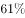升至四季度的，全年为，售汇率比上年上升了6个百分点。

注：上述资料统计时，不同币种间价格换算采用当年平均汇率。

#### 第 1 题　qid 2166218 · 综合

2013年，银行累计结售汇顺差（    ）。

- **A**. 5042亿元人民币
- **B**. 16415亿元人民币　✅
- **C**. 2370亿美元
- **D**. 2560亿美元

**答案**：B

**官方解析**

由题意“2013年，银行累计结售汇顺差”，且材料时间是2014年，判定此题为基期计算问题。定位文字材料第一段，“2014年，······累计结售汇顺差7715亿元人民币（等值1256亿美元），下降。”可知2013年银行累计结售汇顺差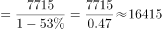亿元人民币。

故正确答案为B。

---

#### 第 2 题　qid 2166219 · 平均数

2014年，100美元的年平均价约为（    ）元人民币。

- **A**. 664
- **B**. 683
- **C**. 614　✅
- **D**. 无法计算

**答案**：C

**官方解析**

由题干“······的年平均价为······”，可判定本题为现期平均数问题。定位文字材料第一段，“2014年，银行累计结汇116422亿元人民币（等值18958亿美元）”，可知100美元的年平均价元人民币，与C项最接近。

故正确答案为C。

---

#### 第 3 题　qid 2166220 · 增长

剔除汇率因素影响，下列项目2014年同比涨跌幅度最大的是（    ）。

- **A**. 银行代客累计涉外收入
- **B**. 银行代客累计对外付款　✅
- **C**. 银行累计结售汇顺差
- **D**. 银行代客累计远期结售汇签约顺差

**答案**：B

**官方解析**

定位文字材料第一段与第二段可得：2014年银行代客累计涉外收入较上年增长；累计对外付款增长；累计结售汇顺差下降；银行代客累计远期净结汇(即签约顺差)较上年下降。同比涨跌幅度最大即同比增长率最大，因，则2014年同比涨跌幅度最大的是银行代客累计对外付款。

故正确答案为B。

---

#### 第 4 题　qid 2166221 · 综合

2013年，银行代客结汇率比售汇率（    ）。

- **A**. 低3个百分点
- **B**. 高2个百分点
- **C**. 高7个百分点
- **D**. 高9个百分点　✅

**答案**：D

**官方解析**

定位文字材料第二段，“衡量企业和个人结汇意愿的银行代客结汇占涉外外汇收入的比重（即结汇率）总体下降，······全年平均为，结汇率比上年回落了1个百分点；衡量购汇动机的银行代客售汇占涉外外汇支付的比重（即售汇率）逐季上升，······全年为，售汇率比上年上升了6个百分点。”可知，，，即2013年银行代客结汇率比售汇率高9个百分点。

故正确答案为D。

---

#### 第 5 题　qid 2166222 · 综合

根据上文，下列说法正确的是（    ）。

- **A**. 2014年一季度银行结售汇顺差比全年银行结售汇顺差的1.2倍还多　✅
- **B**. 2014年银行代客累计涉外收入增长额大于银行代客累计对外付款增长额
- **C**. 2014年二季度银行结售汇逆差为290亿美元
- **D**. 2014年涉外外汇收入超过21万亿元人民币

**答案**：A

**官方解析**

A项：定位文字材料第一段，“2014年······累计结售汇顺差7715亿元人民币（等值1256亿美元）······一季度银行结售汇顺差1592亿美元”，，正确；

B项：定位文字材料第二段，2014年，银行代客累计涉外收入203855亿元人民币（等值33201亿美元），较上年增长，约同比增长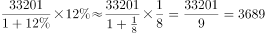亿美元；累计对外付款201375亿元人民币（等值32797亿美元），增长，约同比增长亿美元。收入小于付款，错误；

C项：定位文字材料第一段，“2014年，一季度银行结售汇顺差1592亿美元，二季度降至290亿美元”，即2014年二季度银行结售汇顺差为290亿美元，错误；

D项：定位文字材料，“2014年，银行代客累计结汇113339亿元人民币…衡量企业和个人结汇意愿的银行代客结汇占涉外外汇收入的比重（即结汇率）总体下降，······全年平均为”，则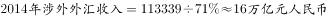，错误。

故正确答案为A。

---

### 材料 2

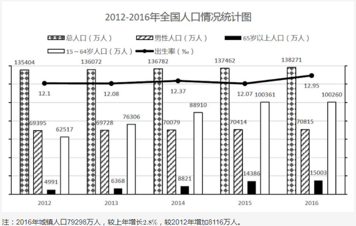

#### 第 6 题　qid 2166223 · 增长

2016年全国女性人口较2012年增长（  ）。

- **A**. 

- **B**. 

- **C**. 

- **D**. 

　✅

**答案**：D

**官方解析**

由题干“2016年全国女性人口较2012年增长······”，可判定此题为一般增长率计算问题。定位统计图中2016年和2012年的柱形图，已知2016年总人口138271万人，男性人口70815万人，则；已知2012年总人口135404万人，男性人口69395万人，则万人；根据增长率公式可得2016年全国女性人口较2012年增长率。

故正确答案为D。

---

#### 第 7 题　qid 2166224 · 综合

2012-2016年，全国乡村人口年均减少约（  ）万人。

- **A**. 1050
- **B**. 1312　✅
- **C**. 1445
- **D**. 1501

**答案**：B

**官方解析**

由题干“2012-2016年，全国乡村人口年均减少约······”，可判定此题为年均增长量计算问题。定位统计图2016年和2012年总人口，可得2016年总人口较2012年增加万人；定位统计图下面的注可得2016年城镇人口较2012年增加8116万人，则2012-2016年，全国乡村人口年均减少万人。

故正确答案为B。

---

#### 第 8 题　qid 2166225 · 比重

下列年份中，人口占总人口比重最高的是（  ）年。

- **A**. 2013
- **B**. 2014
- **C**. 2015　✅
- **D**. 2016

**答案**：C

**官方解析**

由题干“15-64岁人口占总人口比重最高的是······年”，可判定此题为现期比重比较问题。定位统计图中15-64岁人口和总人口相关柱形图，根据现期比重公式可得，2013年15-64岁人口占总人口比重；2014年15-64岁人口占总人口比重；2015年15-64岁人口占总人口比重；2016年15-64岁人口占总人口比重。故15-64岁人口占总人口比重最高的是2015年。

故正确答案为C。

---

#### 第 9 题　qid 2166226 · 增长

若2011年人口出生率是，那么2011-2016年人口出生率年均增速约为（  ）。

- **A**. 

- **B**. 

- **C**. 

　✅
- **D**. 

**答案**：C

**官方解析**

由题干“2011-2016年人口出生率年均增速约为······”，可判定此题为年均增长率问题。定位统计图,2016年人口出生率。根据年均增速公式，可计算出。

故正确答案为C。

---

#### 第 10 题　qid 2166227 · 综合

根据上图，下列说法正确的是（  ）。

- **A**. 
2012-2016年，65岁以上人口逐年增加，而人口逐年减少

- **B**. 
2016年总人口较2012年增长

- **C**. 
2012-2016年，城镇人口中男性人口始终高于女性人口

- **D**. 
2013-2016年，男性人口和女性人口年增长量最大的年份均为2016年
　✅

**答案**：D

**官方解析**

A项：定位统计图中65岁以上人口和15-64岁人口相关柱形图，可得65岁以上人口逐年增加，而15-64岁人口在2012年-2015年是逐年增加，在2016年是下降，错误；

B项：定位统计图中2016年和2012年，可得2016年总人口较2012年增长，错误；

C项：统计图中只提供历年总人数和男性人数，并没有提供城镇人口中男性和女性人口数情况，故无法判断，错误；

D项：定位统计图，2013年男性人口增长量万人，女性人口增长量万人；2014年男性人口增长量万人，女性人口增长量万人；2015年男性人口增长量万人，女性人口增长量万人；2016年男性人口增长量万人；女性人口增长量万人，男性人口和女性人口年增长量最大的年份均为2016年，正确。

故正确答案为D。

---

### 材料 3

#### 第 11 题　qid 2166228 · 增长

下列季度中，装饰装修产值季度累计值同比增幅最大的是（  ）。

- **A**. 2016年四季度
- **B**. 2017年二季度　✅
- **C**. 2017年三季度
- **D**. 2017年四季度

**答案**：B

**官方解析**

由题干“…同比增幅最大的是······”，可判定此题为一般增长率比较问题。定位统计表中第三行装饰装修产值，2016年四季度累计11295亿元、2015年四季度累计10508亿元，2017年二季度累计4793亿元、2016年二季度累计4446亿元，2017年三季度累计7623亿元、2016年三季度累计7153亿元，2017年四季度累计12017亿元、2016年四季度累计11295亿元。根据公式：，可得：

2016年四季度累计同比增幅；

2017年二季度累计同比增幅；

2017年三季度累计同比增幅；

2017年四季度累计同比增幅。比较可得，2017年二季度增幅最大。

故正确答案为B。

---

#### 第 12 题　qid 2166229 · 综合

下列季度中，当季建筑工程产值最高的是（  ）。

- **A**. 2016年三季度
- **B**. 2016年四季度
- **C**. 2017年三季度
- **D**. 2017年四季度　✅

**答案**：D

**官方解析**

定位统计表中第五行建筑工程产值，2016年四季度累计值171864亿元、三季度累计值111924亿元、二季度累计值68701亿元，2017年四季度累计值189161亿元、三季度累计值123540亿元、二季度累计值76122亿元。故2016年三季度当季建筑工程产值亿元；2016年四季度当季建筑工程产值亿元；2017年三季度当季建筑工程产值亿元；2017年四季度当季建筑工程产值亿元。比较可得，2017年四季度当季建筑工程产值最高。

故正确答案为D。

---

#### 第 13 题　qid 2166230 · 增长

若建筑业总产值继续保持2015-2017年间的增速，则2019年建筑业总产值约为（  ）亿元。

- **A**. 243377
- **B**. 253248　✅
- **C**. 219966
- **D**. 236488

**答案**：B

**官方解析**

由题干“…保持2015-2017年间的增速…则2019年建筑业总产值约为······”，可判定此题为现期计算问题。定位统计表中第二行，2015年建筑业总产值（即四季度累计值）180757亿元，2017年建筑业总产值（即四季度累计值）213954亿元。若保持2015-2017年间的增速，则，亿元，与B项最接近。

故正确答案为B。

---

#### 第 14 题　qid 2166231 · 综合

2017年，按总产值计算的建筑业劳动生产率为（  ）。

- **A**. 无法计算
- **B**. 323705元/人
- **C**. 336229元/人
- **D**. 347441元/人　✅

**答案**：D

**官方解析**

由题干“2017年，按总产值计算的建筑业劳动生产率为”，可判定此题为现期平均数问题。定位统计表第二行，2017年建筑业总产值为213954亿元，定位统计表倒数第三行，2017年生产经营活动平均人数为6158万人。万元/人，与D项347441元/人最接近。

故正确答案为D。

---

#### 第 15 题　qid 2166232 · 综合

根据上表，下列说法错误的是（  ）。

- **A**. 2015-2017年，平均每个建筑业企业单位每年的总产值都超过2亿元
- **B**. 2016年，建筑工程产值占建筑业总产值的八成以上
- **C**. 2017年上半年，建筑业生产经营活动人员人均房屋建筑施工面积约216平方米
- **D**. 2015-2017年，建筑业生产经营活动人员人均竣工产值最大的是2017年　✅

**答案**：D

**官方解析**

A项：定位统计表第二行和倒数第四行，2015年建筑业总产值180757亿元，建筑业企业单位数80911个，2015年平均每个建筑业企业单位亿元；2016年建筑业总产值193567亿元，建筑业企业单位数83017个，2016年平均每个建筑业企业单位亿元；2017年建筑业总产值213954亿元，建筑业企业单位数88059个，2017年平均每个建筑业企业单位亿元。2015-2017年均超过2亿元，正确；

B项：定位统计表第二行和第五行，2016年建筑业总产值为193567亿元；2016年建筑工程产值为171864亿元。可计算出2016年，建筑工程产值占建筑业总，八成以上，正确；

C项：定位统计表倒数第二行和第三行，2017年二季度累计值，房屋建筑施工面积为969740万平方米；生产经营活动平均人数为4484万人。可计算出2017年上半年，建筑业生产经营活动人员人均房屋建筑施工平方米，正确；

D项：定位统计表倒数第五行和倒数第三行，2015-2017年建筑业竣工产值分别为110116亿元、112893亿元、116792亿元；2015-2017年生产经营活动平均人数分别为5584万人、5757万人、6158万人。可计算出2015年，建筑业生产经营活动人员人均竣工产值；2016年，建筑业生产经营活动人员人均竣工产值；2017年，建筑业生产经营活动人员人均竣工产值。比较可知，最大的是2015年，错误。

本题为选非题，故正确答案为D。

---
