# 江西省2018年市县两级法院、检察院统一考录公务员笔试《行测》题（网友回忆版）

> 省考 · 2018 年 · 6 个模块 · 共 120 题

- [政治理论](#%E6%94%BF%E6%B2%BB%E7%90%86%E8%AE%BA) · 1 题
- [常识判断](#%E5%B8%B8%E8%AF%86%E5%88%A4%E6%96%AD) · 19 题
- [言语理解与表达](#%E8%A8%80%E8%AF%AD%E7%90%86%E8%A7%A3%E4%B8%8E%E8%A1%A8%E8%BE%BE) · 40 题
- [数量关系](#%E6%95%B0%E9%87%8F%E5%85%B3%E7%B3%BB) · 10 题
- [判断推理](#%E5%88%A4%E6%96%AD%E6%8E%A8%E7%90%86) · 35 题
- [资料分析](#%E8%B5%84%E6%96%99%E5%88%86%E6%9E%90) · 15 题

---

## 政治理论

### 第 1 题　qid 2256345 · 新思想

2018年7月21日至29日，国家主席习近平出席金砖国家领导人第十次会晤，并访问了塞内加尔、卢旺达、毛里求斯和      。

- **A**. 南非　✅
- **B**. 赞比亚
- **C**. 埃及
- **D**. 埃塞俄比亚

**答案**：A

**官方解析**

本题考查政治常识。2018年7月21日至29日，应南非共和国总统拉马福萨邀请，国家主席习近平出席在南非约翰内斯堡举行的金砖国家领导人第十次会晤，并访问了塞内加尔、卢旺达、毛里求斯和南非。因此，BCD项不符合题意。
故正确答案为A。

---

## 常识判断

### 第 1 题　qid 2256343 · 人文常识

地球日，也叫环境保护日，定为每年的（    ）。

- **A**. 6月22日
- **B**. 5月22日
- **C**. 4月22日　✅
- **D**. 7月22日

**答案**：C

**官方解析**

本题考查地理国情。世界地球日，即每年的4月22日，是一个专为世界环境保护而设立的节日，它由美国盖洛德·尼尔森和丹尼斯·海斯于1970年发起，旨在提高民众对于现有环境问题的意识，并动员民众参与到环保运动中，通过绿色低碳生活，改善地球的整体环境。2018年4月22日是第49个世界地球日，今年的主题是“终结塑料污染”，意在呼吁建立广泛的国际合作，减少一次性塑料制品，加强塑料回收处理方面的法律法规。因此，ABD项不符合题意。
故正确答案为C。

---

### 第 2 题　qid 2256348 · 人文常识

下列选项中，不是莎士比亚所著的是（    ）。

- **A**. 《哈姆雷特》
- **B**. 《李尔王》
- **C**. 《堂·吉诃德》　✅
- **D**. 《威尼斯商人》

**答案**：C

**官方解析**

本题考查人文常识。莎士比亚，是文艺复兴时代伟大的英国戏剧家和诗人，其代表作有《罗密欧与朱丽叶》、《哈姆雷特》、《李尔王》、《麦克白》、《奥赛罗》《威尼斯商人》等。
ABD项正确，均是莎士比亚的著作。
C项错误，《堂·吉诃德》是西班牙作家塞万提斯的长篇小说，而非莎士比亚著作。
本题为选非题，故正确答案为C。

---

### 第 3 题　qid 2256350 · 人文常识

下列书法家中，“草圣”指的是（    ）。

- **A**. 张旭　✅
- **B**. 王羲之
- **C**. 米芾
- **D**. 董其昌

**答案**：A

**官方解析**

本题考查人文常识。
A项正确，张旭，唐朝时期书法家，尤以草书著称，与李白诗歌，裴旻剑舞，称为“三绝”，与贺知章、张若虚、包融号称“吴中四士”，性好酒，每醉后呼号狂走，索笔挥洒，时称“张颠”，被后世尊称为“草圣”。
B项错误，王羲之，东晋时期著名书法家，有“书圣”之称，其《兰亭集序》被称为“天下第一行书”。
C项错误，米芾，北宋书法家、画家、书画理论家，与苏轼、黄庭坚、蔡襄合称“宋四家”。其书画自成一家，创立了“米点山水”，其个性怪异，举止颠狂，人称“米颠”。
D项错误，董其昌，明朝后期大臣，著名书画家，为“华亭画派”杰出代表。
故正确答案为A。

---

### 第 4 题　qid 2256352 · 科技常识

从化学组成来看，现在太阳质量大约四分之三是（    ）。

- **A**. 氢　✅
- **B**. 氧
- **C**. 碳
- **D**. 氖

**答案**：A

**官方解析**

本题主要考查科技常识。

从化学组成来看，现在太阳质量的大约四分之三是氢，剩下的几乎都是氦，而氧、碳、氖、铁和其他的重元素质量少于，采用核聚变的方式向太空释放光和热。

故正确答案为A。

---

### 第 5 题　qid 2256353 · 人文常识

三省六部制是中国古代封建社会一套组织严密的中央官制。三省不包括：

- **A**. 中书省
- **B**. 门下省
- **C**. 尚书省
- **D**. 礼乐省　✅

**答案**：D

**官方解析**

本题主要考查人文历史。
三省六部制是中国古代封建社会一套组织严密的中央官制。它初创于隋朝，完善于唐朝。三省指中书省、门下省、尚书省，六部指尚书省下属的吏部、户部、礼部、兵部、刑部、工部。每部各辖四司，共为二十四司。
因此A、B、C三项正确。D项错误，没有礼乐省。
本题为选非题，故正确答案为D。

---

### 第 6 题　qid 2256354 · 人文常识

决定于发音体在一定时间内振动次数多少的是（    ）。

- **A**. 音长
- **B**. 音高　✅
- **C**. 音色
- **D**. 音强

**答案**：B

**官方解析**

本题考查科技常识。
A项错误，音长是指声音的长短，它决定于发音体振动时间的久暂，发音体振动持续久，声音就长，反之则短。
B项正确，音高指声音的高低，它取决于发音体振动的频率，也就是发音体在一定时间内振动次数的多少。振动的快则音高就高，反之则音高就低。
C项错误，音色是指声音的感觉特性，不同的物体振动都有不同的特点。不同的发声体由于其材料、结构不同，则发出的声音的音色也不同，例如钢琴和小提琴和人的声音不一样，每一个人的声音也会不一样。
D项错误，音强是指声音的强弱，它取决于发音体振动的幅度大小。幅度越大则声音越强，反之则越弱。声音的强弱由发音时用力大小所决定，用力大，则振幅大，音强就强，用力小，则振幅小，音强就弱。
故正确答案为B。

---

### 第 7 题　qid 2256356 · 人文常识

关于封建社会，下列说法错误的是（    ）。

- **A**. 以封建主占有土地、剥削农民（或农奴）剩余劳动为基础的社会制度
- **B**. 在封建制度下，封建地主阶级拥有最大部分的土地
- **C**. 在封建社会，自然经济占主要地位
- **D**. 在封建制度下，农民没有人身自由，也没有自己的生产工具　✅

**答案**：D

**官方解析**

本题考查人文常识。
A项正确，封建制度是以封建地主阶级占有土地剥削农民(或农奴)剩余劳动为基础的社会制度。其基本剥削形式是封建地租，农民(或农奴)耕种封建地主的土地，绝大部分产品作为地租被封建地主剥夺。
B项正确，在封建制度下，封建地主阶级拥有最大部分的土地。农民（或农奴）完全没有土地或者只有很少的土地。
C项正确，在封建社会，自然经济占主要地位。封建社会形成的自然经济是以土地为基础，农业与手工业结合，以家庭为生产单位，具有自我封闭性、独立性，以满足自身需要为主的经济结构组织。
D项错误，与奴隶制比较，封建体制中农民有一定程度的人身自由，有自己的生产工具，收成好坏同本身利益有一定的关系，因而对生产有一定的兴趣，促进了生产力的发展。
本题为选非题，故正确答案为D。

---

### 第 8 题　qid 2256358 · 人文常识

关于墨家，下列说法错误的是（    ）。

- **A**. 战国时的重要学派，创始人为墨子
- **B**. 墨家在初期主张“兼爱”“非攻”“尚贤”“明鬼”等
- **C**. 唐宋以后，统治者崇儒抑墨，墨学渐趋衰微　✅
- **D**. 战国末期，墨子后学克服了墨子学说中宗教迷信成分，对逻辑学、几何学等都有一定的研究和贡献

**答案**：C

**官方解析**

本题考查人文常识。
A项正确，墨家产生于战国时期，创始人为墨翟，即墨子，在当时影响极大，有“非儒即墨”之称。
B项正确，墨子创立了墨家学说，他的思想代表了平民的利益，主张“兼爱”“非攻”“尚贤” “天志”“明鬼”“非命”“非乐”“节葬”“节用”。
C项错误，西汉时期汉武帝“罢黜百家，独尊儒术”，墨家不断遭到打压，并逐渐失去了存身的现实基础，墨家思想在中国逐渐灭绝。
D项正确，墨家在初期，以墨子本人所主张的兼爱、非攻、尚贤、尚同等为中心，与儒家展开一系列政治学术思想的斗争。战国末期，墨子后学克服了墨子学说中宗教迷信成分，对认识论、逻辑学以至自然科学中的几何学、力学、光学等，都有一定研究和贡献。
本题为选非题，故正确答案为C。

---

### 第 9 题　qid 2256360 · 人文常识

关于暖锋，下列说法错误的是：

- **A**. 即使暖空气异常活跃，也产生不了对流天气　✅
- **B**. 暖气团向冷气团区移动时两者的分界面
- **C**. 暖空气常沿暖锋滑升于冷空气之上，使其中水汽凝结，产生云雨
- **D**. 暖锋临近一地时，常伴有大范围的连续性雨或雪

**答案**：A

**官方解析**

本题考查地理国情。暖锋是指暖气团主动向冷气团移动的锋。
A项错误，对流天气是空气垂直运动而导致出的天气现象，暖空气较轻，很容易上升，形成对流天气，故选项说法过于绝对。
B项正确，暖锋是暖气团向冷气团区移动时两者的分界面。
C项正确，暖空气较冷空气轻，常沿冷气团徐徐爬升，由于气温不断降低，水汽冷却凝结，产生云雨。
D项正确，暖锋比冷锋移动速度慢，降水多发生在锋前，过境时常会伴有连续性降水。
本题为选非题，故正确答案为A。

---

### 第 10 题　qid 2256396 · 人文常识

关于剩余价值，下列说法错误的是（    ）。

- **A**. 雇佣工人剩余劳动所创造并被资本家有偿占有的价值　✅
- **B**. 榨取剩余价值是资本主义生产的目的
- **C**. 剩余价值是资本主义社会各剥削阶级集团剥削收入的总源泉
- **D**. 剩余价值表现为利润、地租、利息等形式

**答案**：A

**官方解析**

本题考查经济常识。马克思认为，剩余价值是工人创造的，被资本家无偿占有的超过劳动力价值的那部分价值，体现一种剥削关系。
A项错误，剩余价值是雇佣工人的剩余劳动所创造并被资本家无偿占有的价值，该项中的“有偿”表述错误。
B项正确，榨取剩余价值是资本主义生产的目的，它体现了资本家与雇佣工人之间剥削与被剥削的关系。
C项正确，剩余价值是资本主义社会各剥削阶级集团剥削收入的总源泉，它的来源是雇佣劳动者的剩余劳动。
D项正确，在资本主义制度下，利润是剩余价值的转化形式，所以剩余价值可以表现为利润。而利息的源泉也是雇佣工人所创造的剩余价值，利息的实质是剩余价值的一种特殊的转化形式，是利润的一部分。地租是土地所有者凭借土地所有权获得的一种剥削收入，地租来源于农业工人生产的剩余价值。所以剩余价值可以表现为利润、地租、利息等形式。
本题为选非题，故正确答案为A。

---

### 第 11 题　qid 2256399 · 地理国情

关于赣江，下列说法错误的是（    ）。

- **A**. 江西省最大河流
- **B**. 东源贡水出武夷山，西源章水出大庾岭，在赣州汇合后称赣江
- **C**. 赣江主流在星子县蛟塘东入鄱阳湖
- **D**. 下游多礁石险滩，中、上游宽阔多沙洲　✅

**答案**：D

**官方解析**

本题考查地理国情。
A项正确，赣江是长江主要支流之一，位于长江中下游南岸，自南向北纵贯江西全省，是江西省最大河流。
B项正确，赣江东源出自赣州市石城县的武夷山黄竹岭，称绵水，流经瑞金，在会昌县与湘水（江西）汇合，称贡水，流经于都、赣县、章贡区，为赣江正源；西源章水发源于大庾岭。赣江在赣州市城西纳章水后始称赣江。
C项正确，赣江主流在星子县蛟塘东入鄱阳湖，赣江通过鄱阳湖与长江相连。
D项错误，赣江在赣州以上为上游，山地纵横，支流众多；赣州至新干为中游，其中赣州至万安段多峡谷和险滩急流，万安水电站建成后，险滩多已消失；新干至吴城为下游，长208公里，江阔多沙洲，两岸筑有江堤。
本题为选非题，故正确答案为D。

---

### 第 12 题　qid 2256403 · 人文常识

“走”字的原始义是（     ）。

- **A**. 跳
- **B**. 跑　✅
- **C**. 步行
- **D**. 下蹲

**答案**：B

**官方解析**

本题考查人文常识。
走的金文字形上部像甩臂的人形，下部像足。走的本义指跑、奔跑，引申为趋向、奔跑，后指步行。走又由脚步的移动引申为移动、离开、改变、走漏等含义。B项符合题意，A、C、D三项错误。（出自：《新华大字典》第三版）
故正确答案为B。

---

### 第 13 题　qid 2256405 · 人文常识

关于国民生产总值，下列说法错误的是：

- **A**. 英语缩写为GNP（Gross National Product）
- **B**. 一个国家（或地区）所有常住机构单位在一定时期内收入初次分配的最终结果
- **C**. 是收入概念，所以也叫“国民总收入”
- **D**. 从分配角度计算，等于所有常住机构单位分配的原始收入之和　✅

**答案**：D

**官方解析**

本题考查经济常识。
A项正确，国民生产总值的英文全称是Gross National Product，缩写为GNP。
B项正确，国民生产总值是一个国家（或地区）所有常住单位在一定时期（通常为一年）内收入初次分配的最终结果。
C项正确，国民生产总值是个收入概念，而不是一个生产概念，故1993年联合国将国民生产总值（GNP）改称为“国民总收入”，英文为Gross National Income，缩写为GNI。
D项错误，从分配角度来说， 国民生产总值为各种生产要素（资本、土地、劳动）所创造的增加价值总额。等于所有常住单位的初次分配收入之和。而非原始收入之和。（原始收入是该部门营业盈余加各种初次分配收入加减应收应付财产收入之后的余额。）
本题为选非题，故正确答案为D。

---

### 第 14 题　qid 2256407 · 人文常识

2018年6月19日，十三届全国人大常委会第三次会议在京举行，会议初次审议了个人所得税修正案草案，拟将综合所得基本减除费用标准提高到每月（    ）。

- **A**. 4000元
- **B**. 5000元　✅
- **C**. 6000元
- **D**. 8000元

**答案**：B

**官方解析**

本题考查政治常识。
2018年6月19日，十三届全国人大常委会第三次会议在京举行，会议初次审议了《个人所得税修正案（草案）》，拟将综合所得基本减除费用标准提高到每月5000元。
注：《全国人民代表大会常务委员会关于修改＜中华人民共和国个人所得税法＞的决定》已由中华人民共和国第十三届全国人民代表大会常务委员会第五次会议于2018年8月31日通过，自2019年1月1日起实施。根据财政部、国家税务总局发布的《关于2018年第四季度个人所得税减除费用和税率适用问题的通知》，2018年10月1日至12月31日期间，纳税人实际取得的工资、薪金所得，减除费用统一按照5000元/月执行，并执行新的税率表。
故正确答案为B。

---

### 第 15 题　qid 2256409 · 法律常识

甲有一古董，因出国委托乙保管，乙因资金周转需要将古董卖给不知情的丙，丙又赠与女友丁，丁拿到古董5天后被戊偷走，戊后又遗失于街头，为庚拾得。根据《民法典》的规定，对该古董享有所有权的是（    ）。

- **A**. 甲
- **B**. 丙
- **C**. 丁　✅
- **D**. 庚

**答案**：C

**官方解析**

本题考查法律常识。本题涉及的法律关系分析如下：
（1）根据我国《中华人民共和国民法典》第三百一十一条：“无处分权人将不动产或者动产转让给受让人的，所有权人有权追回；除法律另有规定外，符合下列情形的，受让人取得该不动产或者动产的所有权：（一）受让人受让该不动产或者动产时是善意的；（二）以合理的价格转让；（三）转让的不动产或者动产依照法律规定应当登记的已经登记，不需要登记的已经交付给受让人。”由此可知，丙在不知情的情况下从无权处分人乙处购得古董，属于善意取得，此时，丙依法取得了对古董的所有权。
（2）然后丙将古董赠与女友丁，此时丁基于赠与关系取得该古董的所有权。
（3）戊盗窃古董的行为属于违法行为，不能获得所有权。
（4）根据《中华人民共和国民法典》第三百一十四条：“拾得遗失物，应当返还权利人。”庚拾得遗失物的行为也无法取得古董的所有权。故丁仍享有对古董的所有权。
故正确答案为C。

---

### 第 16 题　qid 2256410 · 法律常识

关于法的规范作用，下列说法正确的是（    ）。

- **A**. 甲依据诉讼法规定主动申请回避，体现了法的评价作用
- **B**. 法院判决乙的行为构成故意伤害罪，体现了法的教育作用
- **C**. 丙参加法律知识培训后开始重视企业的劳动者权益保护，体现了法的指引作用
- **D**. 丁因闯红灯被罚款200元，体现了法的强制作用　✅

**答案**：D

**官方解析**

本题考查法律常识。
A项错误，法的评价作用是指法律作为人们对他人行为的评价标准所起的作用，其作用对象是他人的行为。甲依据诉讼法规定主动申请回避，作用对象是本人的行为，体现了法律对甲本人的指引作用。
B项错误，本项中对乙的判决，是对乙的行为做出评价，体现了法的评价作用。
C项不严谨，法的指引作用是指法律对个体（即自己）行为的指引作用，即指引作用的对象是每个人本人的行为。题干中表述不清晰，丙参加法律知识培训后“开始重视企业的劳动者权益保护”，如果是重视自己的权益保护，则体现指引作用；如果是重视其它劳动者（即一般人）的权益保护，则体现的是教育作用。  
D项正确，法的强制作用是指法可以通过制裁违法犯罪行为来强制人们遵守法律。强制作用的对象是违法者的行为。丁闯红灯是违法行为，罚款200元是对其行为的制裁、惩罚，所以体现了法的强制作用。
C不严谨，D正确无争议，单选题择优。
故正确答案为D。

---

### 第 17 题　qid 2256411 · 法律常识

关于数罪并罚，下列选项错误的是（    ）。

- **A**. 甲在判决宣告以前犯强奸罪、盗窃罪与故意伤害罪，分别被判处13年、8年、15年有期徒刑。法院数罪并罚决定执行22年有期徒刑
- **B**. 乙犯抢劫罪、盗窃罪分别被判处13年、6年有期徒刑，数罪并罚决定执行18年有期徒刑。在执行5年后，发现乙在判决宣告前还犯有贩卖毒品罪，应当判处15年有期徒刑。法院数罪并罚决定应当执行19年有期徒刑，乙实际还应当执行刑期14年
- **C**. 丙犯抢劫罪、诈骗罪分别被判处13年、8年有期徒刑，数罪并罚决定执行18年有期徒刑。在执行5年后，丙又犯越狱罪，被判处15年有期徒刑。法院数罪并罚决定应当执行16年有期徒刑，丙总共应执行刑期21年
- **D**. 丁在判决宣告前犯有三罪，被分别判处罚金3万元、7万元和没收全部财产。法院无需执行罚金10万元，只要没收全部财产即可　✅

**答案**：D

**官方解析**

注：本题无正确选项，掌握相关知识点即可。
本题考查法律常识。
A项正确，《刑法》第六十九条第一款规定：“判决宣告以前一人犯数罪的，除判处死刑和无期徒刑的以外，应当在总和刑期以下、数刑中最高刑期以上，酌情决定执行的刑期，但是管制最高不能超过三年，拘役最高不能超过一年，有期徒刑总和刑期不满三十五年的，最高不能超过二十年，总和刑期在三十五年以上的，最高不能超过二十五年。”甲的数刑中最高刑期为15年，故甲的最低刑期为15年；甲的总和刑期为36年，可知甲的最高刑期为25年。故本题甲被判决22年有期徒刑，符合《刑法》规定。
B项正确，《刑法》第七十条规定：“判决宣告以后，刑罚执行完毕以前，发现被判刑的犯罪分子在判决宣告以前还有其他罪没有判决的，应当对新发现的罪作出判决，把前后两个判决所判处的刑罚，依照本法第六十九条的规定，决定执行的刑罚。已经执行的刑期，应当计算在新判决决定的刑期以内。”第一步，按照“先并后减”的方法，将前后两个判决所判处的刑罚（18年与15年），依照本法第六十九条的规定，实行数罪并罚。第二步，由于18加15的总和小于35年，因此对乙数罪并罚不得超过20年，由此可见，法院决定执行19年有期徒刑的做法正确。第三步，已经执行的刑期，应当计算在新判决决定的刑期内，乙已经执行了5年，因此19减去5，乙需要实际执行14年。
C项正确，《刑法》第七十一条规定：“判决宣告以后，刑罚执行完毕以前，被判刑的犯罪分子又犯罪的，应当对新犯的罪作出判决，把前罪没有执行的刑罚和后罪所判处的刑罚，依照本法第六十九条的规定，决定执行的刑罚。”第一步，按照“先减后并”的方法，先将第一个判决的刑期（18年）减去已经执行的刑期（5年），即剩余刑期13年；第二步，再将这13年刑期与第二个判决的15年刑期，实行数罪并罚，由于13加15年总和小于35年，对丙数罪并罚最高是20年，因此法院判决16年有期徒刑做法正确。第三步，犯新罪的情况下，已经执行的刑期，不计算在新判决决定的刑期之内。因此，丙已经服刑5年，又被判决16年有期徒刑，总共执行21年。
D项正确，根据《刑法》第六十九条第三款规定：“数罪中有判处附加刑的，附加刑仍须执行，其中附加刑种类相同的，合并执行，种类不同的，分别执行。”《最高人民法院关于适用财产刑若干问题的规定》第三条第二款规定，一人犯数罪依法同时并处罚金和没收财产的，应当合并执行；但并处没收全部财产的，只执行没收财产刑。原则上，罚金和没收财产分属两类附加刑，应分别执行。但是如果并处罚金和没收全部财产的，只执行没收财产。

---

### 第 18 题　qid 2256413 · 法律常识

关于《刑事诉讼法》中规定的辩护律师的权利和义务，说法错误的是（    ）。

- **A**. 辩护律师在侦查期间可以为犯罪嫌疑人提供法律帮助：代理申诉、控告；申请变更强制措施；向侦查机关了解犯罪嫌疑人涉嫌的罪名和案件有关情况，提出意见
- **B**. 辩护律师可以同在押的犯罪嫌疑人、被告人会见和通信；辩护律师持律师执业证书、律师事务所证明和委托书或者法律援助公函要求会见在押的犯罪嫌疑人、被告人的，看守所应当及时安排会见，至迟不得超过二十四小时　✅
- **C**. 辩护律师自人民检察院对案件审查起诉之日起，可以查阅、摘抄、复制本案的案卷材料。辩护律师经人民检察院或者人民法院许可，并且经被害人或者其近亲属、被害人提供的证人同意，可以向他们收集与本案有关的材料
- **D**. 辩护律师在执业活动中知悉委托人或者其他人，准备或者正在实施危害国家安全、公共安全以及严重危害他人人身安全的犯罪的，应当及时告知司法机关

**答案**：B

**官方解析**

本题考查法律常识。我国新《刑事诉讼法》已于2018年10月26日生效。
A项正确，根据《刑事诉讼法》第三十八条规定：“辩护律师在侦查期间可以为犯罪嫌疑人提供法律帮助；代理申诉、控告；申请变更强制措施；向侦查机关了解犯罪嫌疑人涉嫌的罪名和案件有关情况，提出意见。” 
B项错误，《刑事诉讼法》第三十九条第一、二款规定：“辩护律师可以同在押的犯罪嫌疑人、被告人会见和通信。其他辩护人经人民法院、人民检察院许可，也可以同在押的犯罪嫌疑人、被告人会见和通信。辩护律师持律师执业证书、律师事务所证明和委托书或者法律援助公函要求会见在押的犯罪嫌疑人、被告人的，看守所应当及时安排会见，至迟不得超过四十八小时。”故选项中“不超过二十四小时”表述有误。
C项正确，根据《刑事诉讼法》第四十条规定：“辩护律师自人民检察院对案件审查起诉之日起，可以查阅、摘抄、复制本案的案卷材料。其他辩护人经人民法院、人民检察院许可，也可以查阅、摘抄、复制上述材料。”第四十三条第二款规定：“辩护律师经人民检察院或者人民法院许可，并且经被害人或者其近亲属、被害人提供的证人同意，可以向他们收集与本案有关的材料。” 
D项正确，根据《刑事诉讼法》第四十八条规定：“辩护律师对在执业活动中知悉的委托人的有关情况和信息，有权予以保密。但是，辩护律师在执业活动中知悉委托人或者其他人，准备或者正在实施危害国家安全、公共安全以及严重危害他人人身安全的犯罪的，应当及时告知司法机关。” 
本题为选非题，故正确答案为B。

---

### 第 19 题　qid 2256414 · 法律常识

关于权利人申请行政复议，下列说法错误的是（    ）。

- **A**. 甲殴打乙，甲被公安局罚款1000元。乙作为受害人认为公安局的处罚决定过轻而不服，可以申请行政复议
- **B**. 规划局许可建设商贸大厦，该大厦周边平房的居民认为该行政许可侵害了其采光、通风等相邻权，有权申请行政复议
- **C**. 张某和李某同时申请开办一个幼儿园，区政府许可张某的申请而拒绝李某，李某认为自己的公平竞争权遭到侵犯，有权申请行政复议
- **D**. 某股份制企业股东吴某认为物价局的定价行为侵犯了企业的自主经营权，有权申请行政复议　✅

**答案**：D

**官方解析**

本题考查法律常识。行政复议是指公民、法人或者其他组织不服行政主体作出的行政行为，认为行政主体的行政行为侵犯了其合法权益，依法向法定的行政复议机关提出复议申请，行政复议机关依法对该行政行为进行合法性、适当性审查，并作出行政复议决定的行政行为。
A项正确，根据《行政复议法》第十一条第一项规定：“有下列情形之一的，公民、法人或者其他组织可以依照本法申请行政复议：（一）对行政机关作出的行政处罚决定不服；”当事人乙对罚款不服，申请行政复议，符合法律规定。
B、C两项正确，根据《行政复议法》第十一条第十五项规定：“有下列情形之一的，公民、法人或者其他组织可以依照本法申请行政复议：······（十五）认为行政机关的其他行政行为侵犯其合法权益。”公民认为行政机关的行为侵犯相邻权和公平竞争权，有权申请行政复议。 
D项错误，根据《行政复议法实施条例》第七条规定：“股份制企业的股东大会、股东代表大会、董事会认为行政机关作出的具体行政行为侵犯企业合法权益的，可以以企业的名义申请行政复议。”因此，有权提起复议的主体是股东大会、股东代表大会和董事会，股东个人无权申请行政复议。
本题为选非题，故正确答案为D。

---

## 言语理解与表达

### 第 1 题　qid 2256317 · 片段阅读

熬，是一种坚持，一种历练，一种毅力。饱经风霜，饱览沧桑，饱通世事，阅历中有      ，挣扎中有      。
填入划线部分最恰当的一项是：

- **A**. 品味  领悟
- **B**. 品味  感悟　✅
- **C**. 品位  感悟
- **D**. 品位  领悟

**答案**：B

**官方解析**

第一空，表达人在经历风霜世事后，在阅历中有更深的感受、体会。 “品味”意为仔细体会、玩味，符合文意，保留A、B两项。“品位”指官吏的品级，也指人或事物的品质水平、档次格调，不符合文意，排除C、D两项。
第二空，表达在人挣扎中有所体会，体现出在奋斗中、拼搏中的感受、理解。B项“感悟”可指人们对各种经历所产生的感想与体悟，符合文意，当选。A项“领悟”指领会理解，不一定是亲身经历的，看书也可以，但文段表达的是通过亲身经历而有所体会，不符合文意，排除。
故正确答案为B。
【文段出处】光明网-《熬的境界》

---

### 第 2 题　qid 2256318 · 片段阅读

梦想为现实提供精神动力，现实则为梦想构筑前进的阶梯。我们既有“扶摇直上九万里”的      ，也有“不积跬步，无以至千里”的      。寻梦的旅程不可能一蹴而就、步履轻松。
填入划线部分最恰当的一项是：

- **A**. 登高望远  脚踏实地　✅
- **B**. 登高望远  韬光养晦
- **C**. 谋篇布局  脚踏实地
- **D**. 谋篇布局  韬光养晦

**答案**：A

**官方解析**

第一空，对应“扶摇直上九万里”可知，横线表达出地位上升很快，看待事物更加高瞻远瞩。“登高望远”意为登上高处，看得更远，也比喻思想境界高，目光远大，符合文意。“谋篇布局”指对做一件事进行规划安排所想出的计谋，与“高”无关，排除CD。
第二空，对应“不积跬步，无以至千里”可知，横线表达在寻梦的旅程中要扎实的做好积累工作才会成功。A项“脚踏实地”比喻做事踏实认真，符合文意。B项“韬光养晦”意为收敛隐藏自己的才智，不使外露，与文意不符，排除。
故正确答案为A。
【文段出处】共产党员网-《把握机遇，脚踏实地》

---

### 第 3 题　qid 2256319 · 片段阅读

“打磨”是一种追求、一种品质、一种习惯。就年轻干部而言，“打磨”的过程，      的是崇高追求的思想境界，      的是不忘初心的政治定力，      的是精益求精的工匠精神。经不起“打磨”的人生，便会黯然失色。
填入划线部分最恰当的一项是：

- **A**. 检查  衡量  传承
- **B**. 检视  考量  培植　✅
- **C**. 检视  衡量  发扬
- **D**. 检查  考量  培养

**答案**：B

**官方解析**

第一空，横线搭配“崇高追求的思想境界”，“检视”指检验查看，如“检视人生”，可以保留。“检查”多指查找问题和缺陷，为了发现问题而用心查看，与“崇高追求的思想境界”搭配不当，排除A、D项。
第二空，B项“考量”指考虑思量，与搭配“政治定力”恰当。A项“衡量”指比较评定，或考虑斟酌，一般与“标准、指标”进行搭配，与“政治定力”搭配不当，排除C项。
验证第三空，“培植”指培养、扶植，培植工匠精神符合文意。
故正确答案为B。
【文段出处】人民网-《人民日报悦读：年轻干部须经得起“打磨”》

---

### 第 4 题　qid 2256320 · 逻辑填空

现实生活中，许多人面对严苛的鞭策，只一味地感到        ，继而意志        ，慢慢地变得        ；另外一些人，在鞭打中意识到自己的价值，将鞭策化为动力，扬蹄奋进，勇敢地登上人生的顶峰。
依次填入画横线部分最恰当的一项是：

- **A**. 委屈  消沉  平庸　✅
- **B**. 沮丧  低落  颓废
- **C**. 沮丧  瓦解  颓废
- **D**. 委屈  崩溃  平庸

**答案**：A

**官方解析**

本题可从第二空入手。搭配“意志”，且由文段可知，横线处表达面对现实严苛的鞭策，人们会受到打击，进而萎靡不振，缺乏动力。A项“消沉”指情绪低落，符合文意，且“意志消沉”是常见搭配，保留。B项“低落”常用于形容士气或情绪等不饱满、不旺盛，多形容人的情绪，与“意志”搭配不当，排除；C项“瓦解”、D项“崩溃”填入文段，表达意志完全丧失，对生活完全失去信心和动力，那么就不会“慢慢地变得平庸或颓废”，而是直接或很快变得平庸或颓废，故程度过重，排除C、D两项。
通过第二空锁定正确答案为A项，代入验证第一空和第三空。
第一空，“委屈”指受到不应该有的指责或待遇，心里难过，与“面对严苛的鞭策”对应，体现面对外界严厉苛责感到时运不济，内心憋闷，符合文意。
第三空，意志消沉后进而变得平庸，泯然众人，逻辑通顺，且与“登上人生的顶峰的杰出人才”形成呼应，符合文意。
故正确答案为A。
【文段出处】光明日报-《当一匹被鞭打的马》

---

### 第 5 题　qid 2256321 · 逻辑填空

用脚步      马拉松赛道，用心灵      城市发展脉动，这是城市马拉松赛吸纳诸多跑者投身其中的初始动力。
依次填入画横线部分最恰当的一项是：

- **A**. 测量  感触
- **B**. 测量  感悟
- **C**. 丈量  感悟　✅
- **D**. 丈量  感触

**答案**：C

**官方解析**

第一空，搭配“脚步”，横线处体现用脚步量出赛道长度的含义，A、B两项“测量”指用数据做出精确的量化描述，很明显用脚步不会做出精确的结果，排除。C、D两项“丈量”与脚步搭配恰当，保留。
第二空，搭配“心灵”，D项“感触”指跟外界事物接触而引起的思想感情，文段搭配的是“心灵”，搭配不当，排除。C项“感悟”指人们对特定事物或经历所产生的感想与体悟，与“心灵”搭配恰当，当选。
故正确答案为C。
【文段出处】《在奔跑中见证城市发展》

---

### 第 6 题　qid 2256323 · 逻辑填空

耐心是一种修养，需要修炼养成。耐心不够，或因心里想法太多、欲望太强，或因沉不住气、性子太急。少一点功利，多一份      ；少一点焦虑，多一份      ；少一点杂念，多一份纯净；少一点      ，多一份宁静。
依次填入画横线部分最恰当的一项是：

- **A**. 实在  冷静  嘈杂
- **B**. 淡泊  淡定  喧嚣　✅
- **C**. 实在  淡定  嘈杂
- **D**. 淡泊  冷静  喧嚣

**答案**：B

**官方解析**

尾句通过四组“少一点”和“多一份”相同句式构成反义并列，前后语义相反。第一空，对应“功利”，即追求功名利禄，横线处与“功利”语义相反，B、D两项“淡泊”侧重于强调恬淡寡欲，对应恰当，保留。A、C两项“实在”侧重强调真实，不虚假，与“功利”构不成反义对应，排除。
第二空，对应“焦虑”，即心情焦急忧虑，横线处与“焦虑”语义相反，B项“淡定”侧重形容内在心态平静、镇定，对应恰当，保留。D项“冷静”即做事沉着而不感情用事，与“焦虑”构不成反义对应，排除。
第三空，代入验证，B项“喧嚣”即声音大而嘈杂、吵闹，与“宁静”构成反义并列，对应恰当，当选。
故正确答案为B。
【文段出处】《耐心成就人生之美》

---

### 第 7 题　qid 2256325 · 逻辑填空

如何把国庆节过出味道？借照片与影片      历史，借诗词与歌舞抒写当下，借规划图与设计展      未来，相关文化活动都有着家与国的永恒命题。
依次填入画横线部分最恰当的一项是：

- **A**. 回溯  遥望　✅
- **B**. 回溯  憧憬
- **C**. 回顾  憧憬
- **D**. 回顾  遥望

**答案**：A

**官方解析**

第一空，搭配“历史”，A、B项“回溯”指向上推导，追求根源的含义，这里体现出利用照片与影片追寻历史足迹、起源，且“回溯历史”是常见的固定搭配，保留。而C、D项“回顾”指回想过去，思考过去发生的事件，显然“回溯”语义更丰富，排除C、D项。
第二空，对应“规划图与设计展”，说明对未来的展望是有根据的，B项“憧憬”指对未来生活的期待与想象，体现不出“有根据”的含义，排除；A项“遥望”指向远处看，填入文段可表达借助对未来的规划和设计来展望未来的含义，当选。
故正确答案为A。
【文段出处】《让节日的文化味更浓》

---

### 第 8 题　qid 2256327 · 逻辑填空

①不论对寒冷、暑热、长途行军、通宵不眠以及其他战争中的艰难困苦，他都能      。
②在读者未读原著的情况下请他们先看太多的有关评论，恐贻      之讥。
依次填入画横线部分最恰当的一项是：

- **A**. 随遇而安  舍本逐末
- **B**. 安之若素  舍本逐末
- **C**. 随遇而安  本末倒置
- **D**. 安之若素  本末倒置　✅

**答案**：D

**官方解析**

第一空，根据文段，横线处要体现出对各种艰难困苦都能淡然面对的含义，B、D两项“安之若素”表示对反常现象或不顺利的情况视若平常，毫不在意，符合文意，保留。A、C两项“随遇而安”指能顺应环境，在任何境遇中都能满足，面对艰难困苦不能用“满足”来形容，排除。
第二空，根据“在读者未读原著的情况下请他们先看太多的有关评论”可知，很多读者不读原著只看评论，主次不分，所以横线处要体现出把主次的位置颠倒的含义，D项“本末倒置”比喻把主次、轻重的位置弄颠倒了，符合文意，当选。B项“舍本逐末”比喻做事不抓住主要的问题，而只顾细枝末节，文中并未强调读者只顾追求细节，排除。
故正确答案为D。
【文段出处】《斯巴达克斯》《喧哗与骚动》

---

### 第 9 题　qid 2256329 · 逻辑填空

面对改革重任，要的是上下一条心、全国一盘棋的大胸襟、大担当。在中央的决策部署、群众的切身利益和国家的长远发展面前，瞻前顾后、      只能贻误改革时机，表里不一、      更会阻碍发展大计。
依次填入画横线部分最恰当的一项是：

- **A**. 故步自封  两面三刀
- **B**. 抱残守缺  阳奉阴违　✅
- **C**. 抱残守缺  两面三刀
- **D**. 故步自封  阳奉阴违

**答案**：B

**官方解析**

第一空，顿号表示并列关系，横线处所填成语应与“瞻前顾后”语义相近。“瞻前顾后”形容顾虑太多，犹豫不决；“抱残守缺”形容思想保守，不求改进，二者均指思想层面出现问题，符合文意，保留B、C两项；“故步自封”比喻安于现状，不求进步，体现不出顾虑多，与文意不符，故排除A、D两项。
第二空，顿号表示并列关系，横线处所填成语要与“表里不一”语义相近。“表里不一”指表面与内在不一样；B项“阳奉阴违”指玩弄两面派手法，表面上遵从，暗地里违背，体现了表面与内在不一样，可与“表里不一”构成并列，符合文意，当选；C项“两面三刀”比喻在两方面搬弄是非，未涉及表里两方面，排除。
故正确答案为B。
【文段出处】《面对改革切莫叶公好龙》

---

### 第 10 题　qid 2256330 · 逻辑填空

①经典作品也脱离不了它所处的时代背景，反映其时代的文化特征，其中难免有时代的局限性。但      ，这些作品的文学价值和思想价值及其对一代代文人墨客的影响丝毫没有减弱。
②他知道他永远不会再去玛丽温泉，也不会再去卡尔温泉，永远不会再在那些无忧无虑的人们游玩嬉戏的场所      了。
依次填入画横线部分最恰当的一项是：

- **A**. 瑕瑜互见  流连忘返
- **B**. 瑕不掩瑜  恋恋不舍
- **C**. 瑕瑜互见  恋恋不舍
- **D**. 瑕不掩瑜  流连忘返　✅

**答案**：D

**官方解析**

第一空，“但”表示转折关系，前后语义相反，转折前强调“经典作品有时代的局限性”，即经典作品有缺点，故转折之后应该论述经典作品有优点。“瑕瑜互见”比喻优点、缺点都有，无法与前文构成转折，排除A、C两项。“瑕不掩瑜”比喻缺点掩盖不了优点，侧重强调有优点，与文意相符，保留B、D两项。
第二空，横线处所填成语搭配“场所”，D项“流连忘返”意思是玩乐时留恋不愿离开，搭配恰当，当选。B项“恋恋不舍”，强调不舍，置于此处与“场所”搭配不当，排除。
故正确答案为D。
【文段出处】句①出自某编委会荐语，句②出自《玛丽温泉的哀歌》

---

### 第 11 题　qid 2256333 · 逻辑填空

时间不能倒流，但生活可以同样精彩，不一定是儿时的无知，却可以有当时的      ；不一定是此时的四平八稳，却可以像小时候那样      ；不一定要抓住过往牢牢不放，却可以珍惜当下创造不凡。
依次填入画横线部分最恰当的一项是：

- **A**. 天真  天马行空
- **B**. 无邪  颠沛流离
- **C**. 无邪  天马行空　✅
- **D**. 天真  颠沛流离

**答案**：C

**官方解析**

第一空，横线处所填词语与“无知”构成对应，共同修饰“儿时”的特点，“无邪”指没有邪恶的想法，用来形容天真、思想纯正、活泼、可爱、善良的年少的人，符合文意，保留B、C两项；“天真”指单纯、朴实、直率的性格，同时，也可以解释为不复杂，没有深度的思维方式，并不单指儿童，不符合文意，故排除A、D两项。
第二空，横线处所填成语搭配“小时候”，C项“天马行空”比喻思想行为无拘无束，搭配得当，当选；B项“颠沛流离”形容生活穷困，到处流浪，文段未提及小时候生活穷困，与文意不符，排除。
故正确答案为C。
【文段出处】《人生路上，别失童心》

---

### 第 12 题　qid 2256335 · 片段阅读

①一座座大城市风雨飘摇，鸡犬不宁。人们啼饥号寒，      爆发瘟疫，各地盗贼四起。
②闻先生对于诗的贡献真太多了！创作《死水》，研究唐诗      《诗经》《楚辞》，一直追求到神话，又批评新诗，抄选新诗。
填入划线部分最恰当的一项是：

- **A**. 继而  以致
- **B**. 既而  以致
- **C**. 继而  以至　✅
- **D**. 既而  以至

**答案**：C

**官方解析**

第一空，根据文意可知，“人们啼饥号寒”之后，瘟疫爆发了，“继而”表示发生的两件事情紧紧相连，符合文意，A、C两项保留；“既而”即“一会儿”，强调表示发生的两件事情相隔不久，与文意不符，故排除B、D两项。
第二空， C项“以至”表示在程度上的延伸，强调其研究范围不仅包括唐诗还涉及《诗经》《楚辞》，符合文意，当选；A项“以致”即“导致”，强调因果关系，与文意不符，排除。
故正确答案为C。
【文段出处】《闻一多诗歌艺术论》

---

### 第 13 题　qid 2256337 · 逻辑填空

老字号，传承历史，      文化，      代代乡愁。然而，随着消费观念的迭代，固守“一招鲜，吃遍天”“酒香不怕巷子深”，很容易遭到新生代的      ，而一味求新求异，又会让老顾客迷失方向。
依次填入画横线部分最恰当的一项是：

- **A**. 积淀  寄托  冷遇
- **B**. 积淀  承载  忽略　✅
- **C**. 沉淀  寄寓  忽视
- **D**. 沉淀  承续  冷落

**答案**：B

**官方解析**

第一空，横线处所填词语搭配“文化”，根据前文“传承历史”可知，这里的文化有一个时间积累的过程，因此用“积淀”更为合适，它指长期积累沉淀，多用于思想、文化和经验，而“沉淀”多指溶液中难溶解的固体物质从溶液中析出，也可比喻凝聚、积累，置于此处搭配不当，排除C、D两项。
第二空，横线处所填词语搭配“乡愁”，且主语为“老字号”，“承载”即承受装载或担当，与“乡愁”搭配得当，而寄托的主语一般为人，而非物，搭配乡愁应加一个“着”，即“寄托着”乡愁更为恰当，此处用法不当，排除A项。
第三空，代入B项验证，“遭到忽略”为常见搭配，用以形容新生代对老字号的态度，符合文意，当选。
故正确答案为B。

---

### 第 14 题　qid 2256371 · 逻辑填空

①他的样子让人感到他希望那种饮料会致他于死地，他是在用死      他应该履行一种比死更难过的责任。
②他们分别的时候，露西心里总是存有几分疑虑，只有同他再交谈半个小时才能      。
依次填入画横线部分最恰当的一项是：

- **A**. 推脱  消释　✅
- **B**. 推脱  消逝
- **C**. 推托  消释
- **D**. 推托  消逝

**答案**：A

**官方解析**

①句中，横线处所填词语搭配“责任”，“推脱责任”为常见搭配，指推卸责任，使与己无关，符合文意；而“推托”的意思是借故拒绝，即不直接加以拒绝而是婉言拒绝，不能与“责任”搭配，故排除C、D两项。
②句中，横线处所填词语搭配前文的“疑虑”，“消释”是指消除、处理和解除，一般搭配“疑虑、误会、痛苦”，因此和前文搭配得当，当选；而“消逝”侧重于过程，指逐渐减少，慢慢逝去，如岁月消逝，声音消逝，不能搭配“疑虑”，因此排除B项。
故正确答案为A。
【文段出处】《基督山伯爵》、《理智与情感》

---

### 第 15 题　qid 2256375 · 逻辑填空

一些不顾现实情况的      取悦他人，看似长袖善舞，实则急功近利。这些矫揉与      长此以往，侵蚀的是一个民族的独立人格。
依次填入画横线部分最恰当的一项是：

- **A**. 特意  粉饰
- **B**. 刻意  掩饰
- **C**. 特意  掩饰
- **D**. 刻意  粉饰　✅

**答案**：D

**官方解析**

第一空，横线处搭配“取悦他人”，根据前文“不顾现实情况”可知，横线处应填入消极感情色彩的词语，“刻意”指故意，用上全部心思达到目的，通常有贬义，符合文意；而“特意”是指专门为某件事特地去行动，为中性词，比如特意去探望，感情色彩与文意不符，故排除A、C两项；
第二空，横线处所填词语与“矫揉”构成并列关系，“矫揉”原指改变曲直，现多和“造作”连用，比喻故意做作，虚假不自然，通常有贬义，且后文提到“侵蚀人格”，因此横线处应填入贬义色彩词语；“粉饰”指刻意掩盖或美化事物的缺点和纰漏，用歪理学说来掩饰真相，为贬义，感情色彩与文段相符，当选；而“掩饰”指设法掩盖，没有明显的感情倾向，与文段不符，因此排除B项。
故正确答案为D。
【文段出处】半月谈《“人设”如此华丽，你如此懂得配合》

---

### 第 16 题　qid 2256378 · 语句表达

如果怀念过去的书信形式，最好的做法是重新拾起情怀，即在写电子邮件或者使用其他即时通讯工具的时候，      ，拒绝被新媒体时代轻快、浮躁的交流形式所侵袭。
填入画横线部分最恰当的一项是：

- **A**. 尽量让表达多点诗意
- **B**. 能够勇敢地说“不”
- **C**. 能够多一点郑重感　✅
- **D**. 尽量让交际慢下来

**答案**：C

**官方解析**

横线设置在文段中间，需要注意横线与上下文的联系，根据前文“最好的做法是”和“即”可知，横线处应当填入某种做法；再根据后文“拒绝被新媒体时代轻快、浮躁的交流形式所侵袭”可知，横线处所填语句应与“轻快、浮躁”构成反义对应，C项“能够多一点郑重感”，其中的“郑重感”，即指庄严庄重，严肃认真，符合文意，当选。
A项“诗意”文中并未提及，无中生有，且和后文“轻快、浮躁”难以构成反义对应，排除；
B项“勇敢说不”与文意相悖，文中横线做法是建立在“电子邮件”和“即时通讯工具”基础上的，是给出建议让我们如何正确对待和使用现在的通讯方式，而不是让我们去拒绝它们，排除；
D项“尽量让交际慢下来”与文段语义无关，交际是指交流信息的过程，既然文段已经选择了“电子邮件”等现代通讯方式，那相对之前的书信而言肯定是快的，与文意不符，排除。
故正确答案为C。

---

### 第 17 题　qid 2256381 · 片段阅读

留守儿童的父母、留守监护人固然是关键，但也不能忽视政府、学校以及社会组织的作用。政府机关应当建立必要的教育和监督机制，督促父母或留守监护人认真对待孩子的心理问题；学校可以对留守儿童做好专门登记，定期对留守儿童进行心理疏导和询问；社会组织则应协助政府机关、留守儿童父母或监护人做好相应工作。
这段文字意在强调：

- **A**. 从根本上解决留守儿童的问题，需要全社会的共同关注和参与　✅
- **B**. 留守儿童的出现是经济发展、社会转型的阶段性产物
- **C**. 相关部门应加强对留守儿童父母的教育和监督
- **D**. 解决留守儿童问题的根本在于父母的陪伴

**答案**：A

**官方解析**

开篇通过一个转折词“但”指出重点，关于留守儿童问题，不能忽视政府、学校和社会组织的作用。随后通过两个分号连接的并列结构，从政府机关、学校和社会组织三方面详细阐述了具体做法，对前文观点进行了解释说明。故文段重在强调“关于留守儿童问题，需要政府、学校和社会组织的作用”，对应A项。

B项，“是经济发展、社会转型的阶段性产物”文段未提及，无中生有，排除。
C项，“相关部门”对应文段“政府部门”，表述片面，排除。
D项，“父母的陪伴”对应文段转折前内容，非重点，排除。
故正确答案为A。
【文段出处】《分离之痛不能“留守”儿童一生》

---

### 第 18 题　qid 2256383 · 语句表达

①“新国货崛起”这个逐渐升温的词汇印证了“中国制造”向“中国质造”的转变。
②最近几年，这种观念发生了很大变化，在科技创新上，中国品牌在不少领域已具有领先优势，如高铁、网络通信等高技术领域和移动支付、共享单车等全新业态。
③十几年前，提到国产品牌，人们往往想到“价廉质差”，甚至山寨横行，即便“Made in China”风靡全球，很多人仍然迷信外国货。
④而在质量提升上，“新国货”的成就也有目共睹。
⑤据统计，我国产品质量国家监督抽查合格率已连续四年保持在90%以上，更多人对“新国货”信心满满。
将以上5个句子重新排列，语序正确的是：

- **A**. ①③②④⑤　✅
- **B**. ②④③⑤①
- **C**. ③②⑤①④
- **D**. ⑤④②①③

**答案**：A

**官方解析**

第一步，对比选项确定首句，①句阐述“新国货崛起”的转变，③句介绍了十几年前，人们对国产品牌的印象，⑤句介绍了我国产品质量国家监督抽查合格率较高，均适合作首句。而②句出现了指代词“这种观念”，根据非首句特征可知，指代词指代不明确的情况不适合作为首句，排除B项。
第二步，根据②句中指代词“这种观念”可知，②句前应讲到一种观念，③句中“提到国产品牌，人们往往想到······”即为中国人的一种观念，故③②两句可以构成捆绑；而④句指出“新国货”的成就，并非一种观念，④②两句无法构成组合，排除D项。
第三步，对比A、C两项，确定④⑤两句的顺序，④句说国货的质量在提升，⑤句通过统计数据详细说明了国货质量连续提升，可知⑤句是对④句的具体解释说明，所以④句应在⑤前句，排除C项。
故正确答案为A。
【文段出处】《“新国货”靠品质赢得青年》

---

### 第 19 题　qid 2256385 · 片段阅读

人车争道是影响我国城市交通安全的顽疾之一。“斑马线之争”不仅让市民出行心惊胆战，造成交通拥堵事故频发，还严重影响了公共交通文明和城市形象。据公安部交管局统计，近三年来，全国共在斑马线发生机动车与行人的交通事故1.4万起，造成3898人死亡。
这段文字主要阐述的是：

- **A**. 交通出行与每个人生活息息相关
- **B**. 倡导礼让斑马线需要长期坚持　✅
- **C**. 斑马线文明是城市文明的缩影
- **D**. 机动车驾驶员法律意识、文明意识淡薄

**答案**：B

**官方解析**

文段开篇提出问题，人车争道是影响我国城市交通安全的顽疾之一，说明解决人车争道问题难。后文接着阐述了“斑马线之争”带来了多重消极影响，并且尾句通过数据再次阐述“斑马线之争”带来的危害，对前面问题进行具体解释。故整个文段的结构为“提出问题+分析问题”，正确答案需要针对问题提对策，即应该解决斑马线争道问题，B项，“倡导礼让斑马线”即为解决人车争道的具体对策，当选。
A项，“交通出行与每个人生活息息相关”无中生有，文段未提及，排除。
C项，“斑马线文明是城市文明的缩影”无中生有，并且非对策表述，排除。
D项，“机动车驾驶员法律意识、文明意识淡薄”无中生有，并且为问题表述，文段重点为解决问题的对策，排除。
故正确答案为B。
【文段出处】《“让”就一个字，还要说多少次？》

---

### 第 20 题　qid 2256387 · 片段阅读

除了传承历史的人文价值、观察时代的窗口价值，语言在今天还具有极强的经济价值。很多人或许想不到，语言中潜藏着巨大的经济宝库。随着语言文字事业的不断前行，我国提供语言文字类产品及相关研究咨询、技术研发、工具应用等专业化服务的现代服务业迅猛发展。传统的翻译业只是其中一种，人工智能如何“说话”、大数据如何检索，都离不开语言服务。
这段文字意在强调：

- **A**. 语言是人类最重要的交际工具
- **B**. 当下社会，语言的经济价值巨大　✅
- **C**. 语言是历史文化的重要载体之一
- **D**. 语言能为众多行业的推进提供必要支撑

**答案**：B

**官方解析**

开篇通过一个程度词“极强”，强调了语言在今天经济价值巨大。随后详细介绍了语言的经济价值体现在“文字类产品及相关研究咨询、技术研发、工具应用等”多个方面，对前文进行了解释说明。尾句通过论述“人工智能和大数据等都离不开语言服务”加强论证上文观点。故文段为总分结构，重在强调“在今天，语言有巨大的经济价值”，对应B项。
A项，“交际工具”只是解释说明的一部分，表述片面，排除。
C项，“历史文化的重要载体之一”无中生有，排除。
D项，对应文段后文解释说明的内容，非重点，排除。
故正确答案为B。
【文段出处】读懂时代，从读懂语言开始

---

### 第 21 题　qid 2256389 · 片段阅读

移风易俗殊为不易，更无法一蹴而就、一劳永逸。近年来，一些地方纷纷发文限制天价彩礼，但效果不彰。事实证明，单靠一纸禁令，难以改变传统心理或激活当事人的道德自觉。因此，除了善于激发深蕴于乡土熟人社会中的道德力量，还应因地制宜、因时制宜，在创新中做好教育引导、实践养成、制度保障。
这段文字意在强调：

- **A**. 应采取有效措施限制天价彩礼　✅
- **B**. 移风易俗的困境
- **C**. 倡导年轻人树立正确的婚姻观和价值观
- **D**. 激活“零彩礼”背后的乡风文明

**答案**：A

**官方解析**

文段开篇指出移风易俗，即改变风俗不容易，之后引出文段话题“天价彩礼”，说明限制天价彩礼单靠一纸禁令难以有成效，属于提出问题。尾句通过“因此”总结全文，通过对策引导词 “应”指出解决“天价彩礼”的对策，即“因地制宜、因时制宜的做好教育引导、实践养成、制度保障等工作”。故文段重点强调解决天价彩礼的对策，而对策为多方面，需要进行全面概括，A项，“有效措施”即为对策的全面概括，当选。
B项，“困境”为结论之前的内容，问题表述，非重点，排除；
C项，“树立正确的婚姻观和价值观”，该对策无中生有，排除；
D项，“零彩礼”表述错误，文段解决的问题是彩礼“天价”问题，并非“零彩礼”，程度过重，并且“乡风文明”无中生有，排除。
故正确答案为A。
【文段出处】王石川《激活“零彩礼”背后的乡风文明》人民时评

---

### 第 22 题　qid 2256394 · 片段阅读

网络热词的生命力，不在于会不会吸引眼球、是不是引人发笑，而在于有没有创造出社会价值、能不能经历时间的沉淀。从“任性”一词写进政府工作报告，剑指权力使用乱象；到“APEC蓝”来之不易，成为环保重要目标；再到“工匠精神”热度不减，一系列利好举措出台······这些经久不衰的流行语之所以能够深入人心，在于兼具了有效、有用、有趣的属性，既反映时代又推动时代的改变。
这段文字意在强调：

- **A**. 网络热词丰富了汉语的表达方式
- **B**. 网络热词的生命力极为旺盛
- **C**. 要让网络热词成为正能量的载体　✅
- **D**. 网络热词是社会发展态势的晴雨表

**答案**：C

**官方解析**

文段开篇引出话题“网络热词”，通过“不在于······而在于”指出网络热词的生命力与创造社会价值、经历时间沉淀有关。下文通过“任性”“APEC蓝”“工匠精神”举例说明，这些经久不衰的流行语之所以能够深入人心，是因为他们既反映时代又推动时代的改变，即能够创造社会价值，论证首句的观点。故文段为总分结构，重点强调网络热词要想具有生命力，热词本身要传递社会价值、蕴含积极的意义，C项，“正能量的载体”，即体现创造社会价值、发挥正面作用，当选。
A项，“丰富汉语表达方式”无中生有，排除。
B项，“生命力极为旺盛”表述错误，文段重点强调的是生命力旺盛的关键在于网络热词要能带来正能量，排除。
D项，“晴雨表”只能对应尾句的“反映时代”，属于例子当中的内容，非重点，并且片面表述，不能体现“推动时代改变”，排除。
故正确答案为C。
【文段出处】《有些网络热词用贴负面标签的方式传递焦虑》人民日报

---

### 第 23 题　qid 2256397 · 片段阅读

信息技术本身是中立的，关键在于怎么使用。进而言之，必须善用治理手段与规则加以规范。为什么个人信息泄露屡禁不止？各种非法渠道死而复生？关键原因仍在于全方位立体式的互联网隐私及个人信息安全治理体系的缺位。这是一项长期而艰巨的任务，需要通过立法逐步完善，渐进式地加以解决。而在此之前，需要充分运用法治思维和手段，用足用好现有的法律资源，守护个人信息安全。
这段文字意在强调：

- **A**. 要以法治守护隐私安全　✅
- **B**. 个人信息安全状况堪忧
- **C**. 个人信息安全治理难
- **D**. 信息技术发展的利与弊

**答案**：A

**官方解析**

文段开篇指出用好信息技术的关键在于使用治理的手段进行规范。而后，文段提出两个问题并解释原因，个人信息泄露屡禁不止是因为个人信息安全治理体系的缺位。下文通过“需要”提出对策，要完善立法去解决隐私泄露问题，尾句通过指代词“此”指代上文对策，进行总结，强调在完善立法解决问题之前，要用法治思维和手段守护个人信息安全。故整个文段重点在最后一句，强调用法治守护信息安全，对应A项。
B项“安全状况堪忧”、 C项“安全治理难”均为问题表述，文段重点为对策，通过法治，保障个人信息安全，排除。
D项，“利”即信息技术发展带来的好处，无中生有，排除。
故正确答案为A。
【文段出处】《信息技术是中立的 关键在于怎么用》人民日报

---

### 第 24 题　qid 2256400 · 片段阅读

近年来，随着中国日益走近世界舞台中央，不少国家掀起了“汉语热”，汉语拼音成为了解中国的先修课。在最新版的《牛津英语词典》中，“Jiaozi”（饺子）“Renminbi”（人民币）赫然在列，拼音化的汉语词汇逐渐被世界接受。当汉语拼音从“中国标准”变为讲述中国故事的“国际标准”，这把“语言钥匙”也就成了世界的“文化桥梁”。
这段文字意在说明：

- **A**. “汉语热”方兴未艾
- **B**. 汉语拼音有益于中国文化的国际传播　✅
- **C**. 汉语拼音比汉字更受其他国家的欢迎
- **D**. 中国在国际上的影响力日益增大

**答案**：B

**官方解析**

文段开篇通过“近年来”，指出“汉语热”这一现状，之后通过举例说明拼音化的汉语词汇被世界接受，尾句“这把语言钥匙”指代前文汉语拼音，并且进行总结，重点强调汉语拼音成了世界的“文化桥梁”。 故整个文段为分总结构，重点在尾句，强调汉语拼音对连接世界起到“桥梁”的作用。 B项，“有益于中国文化的国际传播”即体现“桥梁”的作用，当选。
A项，为首句现状部分，非重点，排除；
C项，文段并未对比“汉语拼音”和“汉字”的受欢迎程度，无关对比，排除；
D项，没有提到文段的核心话题“汉语拼音”，排除。
故正确答案为B。
【文段出处】石羚《汉语拼音，一甲子与时偕行》人民日报

---

### 第 25 题　qid 2256402 · 片段阅读

必须承认，某一领域的重大发明和发现，绝大多数是由本领域的行家完成的。但是，精通自己专业的内行，有时好比攀上一棵大树，左右纵横的枝枝叶叶，常常挡住了自己前进的视线。而外行的好处在于，他站在“树”下或远处，反而能看清主干和树枝的成长趋势，从而可能有惊喜之见。
这段文字意在强调：

- **A**. 大多数领域的发展是由“外行”推动的
- **B**. 隔行如隔山
- **C**. 坚持一切从实际出发，敢于创新
- **D**. 重视“外行”的智慧　✅

**答案**：D

**官方解析**

文段开篇指出某一领域的重大发明和发现，多数是由本领域的行家完成的，之后通过转折词“但是”强调内行常常挡住了前进的视线。尾句强调外行的好处是可能有惊喜之见，文段重点强调外行可能会给我们惊喜之见，故需要重视外行的智慧，对应D项。
A项，与文段首句“绝大多数是由本领域的行家完成的”意思相悖，排除；
B项，文段重点强调的是“外行的好处”，故与文意表述相悖，排除；
C项，“从实际出发，敢于创新”无中生有，文段重点强调的是外行会给我们惊喜之见，排除。
故正确答案为D。
【文段出处】宋汝余《重视“外行”的智慧》人民日报

---

### 第 26 题　qid 2256404 · 片段阅读

当下，各类自媒体都讲究细分化、个性化，但很多自媒体的内容，看上去热闹丰富，实际上却营养匮乏，甚至误读连篇起、谣言满天飞。从营销软文到洗稿生意，从恶意炒作到传播谣言，对于一些自媒体，点击量成为信息的唯一考量。在一次次反转又辟谣的新闻热点里，在一个个荒诞又流传甚广的段子里，一些自媒体公号将真相当成骰子一样掷来掷去，挑动整个社会的情绪。
这段文字意在说明：

- **A**. 自媒体将点击量作为唯一标准
- **B**. 自媒体的内容本质上乏味无价值
- **C**. 自媒体时代，谣言止于智者
- **D**. 自媒体经营者普遍缺乏行业自律精神　✅

**答案**：D

**官方解析**

文段开篇指出很多自媒体的内容营养匮乏，错误连篇，将点击量作为信息的唯一考量，接下来通过“一些自媒体”举例论证。整个文段都在围绕很多自媒体存在的问题展开，说明自媒体经营者普遍缺乏行业自律精神，对应D项。
A、B两项，文段论述的是“很多自媒体”，“自媒体”表述过于绝对，排除；
C项，“谣言止于智者”是针对大众而言，文段围绕自媒体展开，对策无中生有，排除。
故正确答案为D。
【文段出处】《点击量绝不是唯一标准》

---

### 第 27 题　qid 2256415 · 片段阅读

圆梦顶尖名校、欧洲文化探秘、国际学生领导力峰会······各色名目赚足了家长的眼球。随着人们收入水平的提高、教育理念的改变以及出国政策的优化，海外游学热的出现可谓应时当令。游与学，本身就包含了寓教于乐的期望。在不少家长心中，与其把假期改造成为“第三学期”，不如用游学让孩子得一闲暇、放松身心，独自体验国外教育、了解风土人情也有助于开拓视野、锻炼能力，其出发点是好的。
作为一篇文章的引言，作者接下来最有可能介绍的是：

- **A**. 游学的价值
- **B**. 游学的市场状况　✅
- **C**. 游学的内容
- **D**. 游学的历史发展

**答案**：B

**官方解析**

本题为接语选择题，应通读全文，重点关注文段最后讨论的核心话题。文段开篇列举游学名目，引出“海外游学热”的话题，接着指出海外游学热出现是应时当令的，最后阐述家长对游学“寓教于乐”的期望及让孩子开拓视野、锻炼能力的出发点是好的。文段最后的核心话题是“游学的出发点”，接下来可能会讨论到实际中的运用。且由“出发点是好的”可推知，其言外之意是“游学”在实际运用中可能有不好之处，对应B项。
A项，“价值”属于前文论述过的内容，排除；
C项，“游学的内容”，对应文段首句“圆梦顶尖名校、欧洲文化探秘、国际学生领导力峰会”，属于已经论述过的内容，排除；
D项，文段尾句和前文并没有提到游学在历史上的发展情况，“游学的历史发展”无中生有，排除。
故本题答案为B。
【文段出处】《游而不学、名不符实成了不少游学项目的通病》

---

### 第 28 题　qid 2256417 · 片段阅读

“天价片酬”的恶果已充分显现。由于少数知名演员的片酬占据了总预算的大头，在其他众多的生产制作环节中，所需经费都受到了严重挤压。在“无米之炊”的窘境下，剧本粗制滥造、服装舞美因陋就简、“五毛”特效横行，成为众多国产影视作品的通病。其结果，就是少数知名演员独享“天价片酬”，国产影视作品则付出了整体质量滑坡的代价。
这段文字意在说明：

- **A**. “天价片酬”扭曲了一些演员的价值观和财富观
- **B**. 国产影视行业发展态势堪忧
- **C**. 国内有一部分知名演员缺失职业道德
- **D**. “天价片酬”导致国产影视作品质量下滑　✅

**答案**：D

**官方解析**

文段开篇指出“天价片酬”带来了不好的结果，接着通过“由于”进行解释，知名演员片酬占据预算大头，使经费受到挤压，剧本粗制滥造、“五毛”特效等成为国产影视作品的通病。最后通过“其结果”，对前文进行总结，得出结论，中心句在尾句，强调国产影视作品付出了整体质量滑坡的代价，对应D项。
A项，“价值观和财富观”在文段中并没有体现，属于无中生有，排除；
B项，文段重点讨论的是“天价片酬”，该项没有提及，排除；
C项，“演员缺失职业道德”文段并未体现，属于无中生有，其次该项没有提到文段的主题词“天价片酬”，排除。
故正确答案为D。
【文段出处】《演员“天价片酬”再引争议，业内联合声明能否遏制住？》

---

### 第 29 题　qid 2256419 · 片段阅读

老人们承担“责任重、风险高”的带娃压力，本质是生育成本过高导致的结果，有一定的必然性。它与不少家庭不敢生二孩，其实是同一问题的一体两面。加快优化生育成本的社会分担机制，解除更多家庭在养育孩子上的后顾之忧，才是“解放”老人，缓解社会生育焦虑的要诀。
这段文字意在强调：

- **A**. 国家和社会应承担更多的生育成本　✅
- **B**. “二孩时代”的老人不堪重负，亟需“解放”
- **C**. 生育成本过高导致“二孩”政策效用不大
- **D**. 育儿观念的代际隔阂日益突显，代际矛盾日益突出

**答案**：A

**官方解析**

文段开篇交代问题，即现在老人带娃有压力的原因是生育成本过高，很多家庭不敢生二孩是这一问题的另一方面。尾句通过“······才······”的结构，提出了解决问题的对策，强调要让社会去分担生育成本，对应A项。
B项，“亟需‘解放’”，如何“解放”表述不明确，排除；
C项，“效用不大”属于问题表述，非重点，排除；
D项，“育儿观念代际隔阂”无中生有，且“矛盾日益突出”属于问题表述，非重点，排除。
故正确答案为A。
【文段出处】《腰酸背痛，还落了一身埋怨 二孩时代老人被“捆”谁来分担生育成本》

---

### 第 30 题　qid 2256420 · 片段阅读

激活实体书店，不只是进行资金输血就能轻松实现。更重要的是，书店是否满足了读者需求、让人在购书过程中享受到愉悦？能否让读者把逛书店当做一种生活方式？现实中，有的书店营业空间逼仄，分类杂乱，店面混乱，缺少必要的导购，也不举办任何让读者参与的活动。有的“新型书店”顶着书店的牌子，主业则是售卖食品、文具、咖啡等商品，几乎没有可供挑选的新书。还有不少书店，陈列的书籍缺乏精品，无法满足读者的需求。
这段文字意在强调：

- **A**. 实体书店激活难度大
- **B**. “新型书店”名不符实，无法满足读者需要
- **C**. 实体书店要找准定位，明确自己的比较优势和市场价值　✅
- **D**. 时代在改变，人们的读书方式、阅读习惯也在发生改变

**答案**：C

**官方解析**

文段开篇引出“激活实体书店”这一话题，接着通过程度词和两个反问句，强调书店需要满足读者需求、让人感到愉悦，让读者把逛书店当成生活方式，即给实体书店以准确定位。接着通过“现实中”介绍了现在的情况，“有的书店……有的‘新型书店’……还有不少书店”，它们都没有准确的定位，无法满足读者的需求，是对前文的反面举例论证，整个文段为“分-总-分”的结构，重点强调要让实体书店有准确的定位，对应C项“实体书店要找准定位，明确自己的比较优势和市场价值”。 
A项，“实体书店激活难度大”，文段并未提及难度是大还是小，无中生有，排除；
B项，“新型书店”属于举例论证部分的内容，非重点，排除；
D项，“读书方式、阅读习惯”在文段中没有提及，属于无中生有，排除。
故正确答案为C。
【文段出处】《重新激活实体书店，阅读不可能只依靠网络满足》

---

### 第 31 题　qid 2256421 · 片段阅读

信息技术革命方兴未艾，个人信息具有很高的商业价值。从数字经济规模跃居全球第二，到手机支付、共享经济、“互联网+”等新业态、新模式引领世界潮流，当下中国，数字经济正成为驱动高质量发展、引领经济社会革新的加速器。互联网大范围、深层次地拓展了发展空间，也带来了隐私保护的风险挑战。信息技术推动社会变革与信息安全风险不断加剧的矛盾这一世界性课题，日益摆在我们而前。
这段文字意在说明：

- **A**. 个人信息的商业价值
- **B**. 数字经济发展的态势
- **C**. 数字经济发展的困境
- **D**. 信息技术与信息安全的矛盾　✅

**答案**：D

**官方解析**

文段一开始介绍个人信息有价值，数字经济发展引领了社会革新，接下来通过一个“也”表并列，介绍了互联网拓展发展空间，同时也带来问题。尾句对前文进行总结，强调了信息技术既推动了社会变革，又带来了安全风险，对应D项。
A项仅对应首句，表述片面，排除；
B项仅提及“数字经济”自身的发展，并未提及其对社会变革和信息安全的影响，排除；
C项“困境”对应并列的一方面，表述片面，排除。
故正确答案为D。
【文段出处】《个人信息，利用好更需保护好》

---

### 第 32 题　qid 2256424 · 片段阅读

据统计，2016年我国纸及纸板生产量达10855万吨，人均年消费量75千克，其中很大部分用于包装；每天塑料袋的使用量高达30亿个，全年超过680万吨；而金属包装材料中，仅易拉罐一项，每年至少消耗100亿只。环保部年报显示，全国246个大、中城市生活垃圾在2016年达到18069.5万吨，其中为包装废弃物。

这段文字意在强调：

- **A**. 治理由包装废弃物引发的环境问题刻不容缓　✅
- **B**. 对包装问题的治理必须全面覆盖，人人参与，点滴做起
- **C**. 唯有让绿色理念深入人心，才能推动中国包装业真正实现由大到强
- **D**. 企业往往以增加包装附加值作为追求目标，忽视了企业应承担的社会责任

**答案**：A

**官方解析**

文段一开始通过两个分号形成并列，介绍我国纸板、塑料袋和金属包装消耗量很大。接着通过数据表明我国包装废弃物在生活垃圾中占比高。进而强调现今包装废弃物太多这一问题，需要我们去解决，对应A项。
B项“全面覆盖，人人参与，点滴做起”、C项的“绿色理念”和“由大到强”、D项“增加包装附加值”，文段均未提及，无中生有，排除。
故正确答案为A。
【文段出处】《包装行业需要“绿色治理”》

---

### 第 33 题　qid 2256425 · 片段阅读

近些年我国在名胜古迹保护方面取得了很大的发展，其管理、利用水平不断提高，但也要清醒看到，我国拥有的自然遗产、文化遗产规模庞大，相关法律的实施应当跟上社会发展的步伐。特别是在根除一些长期形成的游客陋习方面，仅仅停留在谴责不文明行为的层面还远远不够，必须在执行中明确划出法律红线，让公众逐渐树立起“损坏名胜违法”的认识，才能倒逼其敬畏法律，敬畏文化。
这段文字意在强调：

- **A**. 保护名胜古迹的必要性
- **B**. 对游客的不文明行为要划出法律红线　✅
- **C**. 我国在名胜古迹保护方面取得了实质性的进展
- **D**. 我国在名胜古迹保护方面面临不少的困难

**答案**：B

**官方解析**

文段首句介绍名胜古迹保护方面有所进步，随后通过转折关联词“但”说明我国自然遗产、文化遗产规模庞大，提出相关法律的实施应当跟上社会发展的步伐，尾句通过程度词“特别是”强调在根除游客陋习方面，必须在执行中明确划出法律红线，故文段重点在程度词所强调的尾句，对应B项。
A项，“保护名胜古迹”为非重点，文段重在强调对于游客陋习应该明确划出法律红线，排除；
C项，对应首句，为程度词之前的非重点，排除；
D项， “面临不少困难”为问题表述，而文段重在强调对策，非重点，排除。
故正确答案为B。
【文段出处】《对不文明行为划出法律红线》

---

### 第 34 题　qid 2256427 · 片段阅读

13日13时许，成都航空一架ARJ21飞机平稳降落在江西省上饶市三清山机场。成都至上饶航线的开通，标志着ARJ21国产飞机正式执飞首条国内支线航线，对国产飞机的商业应用具有重要意义。
最适合做这段文字报道标题的是：

- **A**. ARJ21首飞国内支线航线　✅
- **B**. 成都至上饶航线正式开通
- **C**. 国产飞机发展势态良好
- **D**. ARJ21飞机助力三清山

**答案**：A

**官方解析**

文段开篇介绍成都航空一架ARJ21飞机降落，紧接着指出ARJ21飞机降落所带来的意义。文段围绕ARJ21飞机这一核心话题展开，标题应与文段核心话题保持一致，对应A项。
B项“成都至上饶航线”、C项“国产飞机”，偏离核心话题ARJ21，排除；
D项“助力三清山”非重点，排除。
故正确答案为A。
【文段出处】《ARJ21飞机开通首条支线航线》

---

### 第 35 题　qid 2256428 · 语句表达

①这些剧院不乏豪华气派的外观、不缺顶级的设备和宽敞的剧场，单就硬件而言，一些甚至已经堪比国际一流大剧院。
②从一线大城市到二三线城市直到一些县城，都建起了自己的剧院。
③近年来，剧院在全国各地拔地而起。据不完全统计，国内剧院总数已经超过2000家。
④多形式少内容、有空间少利用、高配置低效能……国内剧院建设还处于粗放阶段。
⑤有人说，要想了解一座城市的文明和灵魂，就去看看它的剧院。随着我国城市发展步伐加快，剧院的建设也进入加速度。
⑥但是，与华丽的“硬件”相比，剧院在演出剧目、演出场次、观众人数等“软件”上，却远远没有那么漂亮。
将以上6个句子重新排列，语序正确的是：

- **A**. ③②①⑥④⑤
- **B**. ⑤③②①⑥④　✅
- **C**. ⑤⑥②③①④
- **D**. ③⑥②①④⑤

**答案**：B

**官方解析**

对比选项，确定首句，⑤句引出观点，说明剧院对了解城市的重要，紧接着指出剧院的建设进入加速度，③句指出近年来剧院的具体发展情况，是对“剧院的建设也进入加速度”的具体解释说明，故⑤句应在③句之前，排除A、D两项。
对比B、C两项，C项⑤句后为⑥句，根据⑥句中转折关联词“但是”可知，转折后论述与“硬件”相比，剧院“软件”不漂亮，故⑥句转折前应论述剧院的“硬件”很华丽，而⑤句没有此意，构不成关联词捆绑，排除C项。而B项⑥句前为①句，句中指出“就硬件而言，一些甚至已经堪比国际一流大剧院”，可与⑥句形成转折关系，当选。
故正确答案为B。
【文段出处】《剧院应是城市的精神城堡》

---

### 第 36 题　qid 2256429 · 片段阅读

学术水平的提升与学术期刊的发展本应“同频共振”，但与我国科研成果呈现“井喷”的态势不同，我国本土科技学术期刊多年来发展缓慢，“散、乱、杂”局面难改。《科学通报》《中国科学》等曾经响当当的名字，如今也难以充分吸引优秀科学家的注意力。
这段文字主要阐述的是：

- **A**. 本土期刊的尴尬处境　✅
- **B**. 我国科学研究水平明显提升
- **C**. 学术水平与学术期刊理应同进退
- **D**. 本土优秀科学家不支持本土期刊的发展

**答案**：A

**官方解析**

文段首先论述学术水平的提升应与学术期刊的发展步调一致，随后以转折关联词“但”，强调我国本土科技学术期刊发展缓慢，最后以“《科学通报》《中国科学》”举例对其进行论证。故文段重点强调我国本土科技学术期刊发展缓慢，对应A项。
B项“科学研究水平明显提升”、C项“学术水平与学术期刊理应同进退”均对应文段转折前内容，非重点，排除；
D项“优秀科学家”对应文段举例论证部分，非重点，且文段强调本土期刊难以吸引优秀科学家，而非“优秀科学家不支持本土期刊的发展”，表述错误，排除。
故正确答案为A。
【文段出处】《中国学术期刊“国际话语权”之困：“好期刊”为何难收好论文？》

---

### 第 37 题　qid 2256431 · 片段阅读

场景直播引发了不少争议，甚至有网友称，“无所不播”的场景直播正在成为社会“公害”。然而，不可否认的是，作为一种新事物，场景直播如果运用恰当，也可以发挥积极的作用。因此，如何对其加以管理和引导是需要思考的问题。
这段文字意在强调：

- **A**. 场景直播“无所不播”惹人忧
- **B**. 场景直播可以发挥正面效应
- **C**. 场景直播日益兴起，发展迅速
- **D**. 场景直播亟需规范和监管　✅

**答案**：D

**官方解析**

文段首先介绍场景直播引发争议甚至成为社会“公害”，随后通过转折关联词“但”提出场景直播如果运用恰当也可以发挥积极作用，最后以“因此”引导尾句，总结前文得出结论，强调需要对场景直播进行管理和引导。故文段重在强调需要对场景直播进行管理和引导，对应D项。
A项“无所不播”惹人忧、B项“发挥正面效应”均对应结论前内容，非重点，排除；
C项，“发展迅速”对应“无所不播”，结论前非重点，排除。
故正确答案为D。
【文段出处】《场景直播：“无所不播”惹人忧》

---

### 第 38 题　qid 2256432 · 片段阅读

在全球娱乐产业爆发增长的背景下，国产网剧想要得以进益，其工业制作水平还必须在“一虚一实”两个方面予以重视：“实”的方面就是需要有好剧本，好的剧本自然会有好的语言和情节；“虚”的方面就是在影视剧传达的价值观上，尽量融入世界主流体系。
这段文字意在说明：

- **A**. 随着全球化发展，影视剧成为民族文化的展示窗
- **B**. 国产网剧将接受多元文化视角的检验
- **C**. 全球娱乐产业发展态势良好
- **D**. 国产网剧需要重视“虚实”两面　✅

**答案**：D

**官方解析**

文段开篇引出背景，紧接着通过对策引导词“必须”提出观点，国产网剧的工业制作水平必须在“一虚一实”两个方面予以重视，随后通过冒号对前文进行解释说明，故文段重点强调国产网剧需要重视“虚实”两面，对应D项。
A项“影视剧成为民族文化的展示窗”、B项“将接受多元文化视角的检验”无中生有，文段均未提及，排除；
C项，“全球娱乐产业发展态势良好”对应文段背景内容，非重点，排除。
故正确答案为D。
【文段出处】《国产网剧走出“鄙视链”最底端》

---

### 第 39 题　qid 2256434 · 片段阅读

传统文化的传承与发扬是个老话题，但也时常遭遇新困境。一方面，由于传承手段缺乏创新，传统文化并未真正“活在当下”；另一方面，如何处理好深与浅、博与专的平衡问题，仍待探索。专家指出，在新的历史时期，亟需创新表达方式、传播方式，增强互动性、时代感，让更多人乐于接受传统文化，领略其魅力。
这段文字意在强调：

- **A**. 换个方式拥抱传统文化　✅
- **B**. 传统文化的新困境
- **C**. 传统文化的新价值
- **D**. 重新燃起对传统文化的敬畏

**答案**：A

**官方解析**

文段首先介绍传统文化的传承时常遭遇新困境，并通过“一方面”“另一方面”对“困境”进行具体解释，最后通过“亟需”引出对策，指出亟需创新传统文化的表达方式等，让更多的人接受传统文化，文段为提出问题+解决问题结构，重点在尾句的对策，重点强调需要创新表达及传播方式，让人接受传统文化，同义替换，对应A项，“换个方式”对应创新表达及传播方式，“拥抱”对应让人接受传统文化。
B项，“新困境”对应文段提出问题部分，非重点，排除；
C项“新价值”、D项“重新燃起对传统文化的敬畏”无中生有，文段均未提及，排除。
故正确答案为A。

---

### 第 40 题　qid 2256435 · 片段阅读

在巨大的市场驱动下，国内外移动支付公司和硬件厂商、传统金融机构纷纷将目光瞄准中国市场。2016年2月，苹果公司联手中国银联正式在中国市场推出苹果支付，完成了银行卡关联等设置。华为、小米、三星等国内外硬件厂商也先后与银联合作推出手机支付功能。
这段文字意在强调：

- **A**. 移动支付时代已经来临
- **B**. 移动支付市场争夺激烈　✅
- **C**. 国外硬件厂商瞄准中国市场
- **D**. 移动支付刺激消费的效果明显

**答案**：B

**官方解析**

文段开篇指出在市场驱动下，国内外移动支付公司和硬件厂商、传统金融机构纷纷将目光瞄准中国市场，随后通过“苹果”“华为、小米、三星”等举例论证首句的观点。故文段重在强调移动支付公司和硬件厂商、传统金融机构纷纷将目光瞄准中国市场，即移动支付公司等均开始抢占中国市场，对应B项。
A项，“已经来临”并非文段重点，若选择A项，文段应该围绕目前生活中广泛使用移动支付展开论述，反推可知，选项并非文段重点，排除；
C项，“国外硬件厂商”表述片面，排除；
D项，“移动支付刺激消费”无中生有，文段并未提及，排除。
故正确答案为B。

---

## 数量关系

### 第 1 题　qid 2256391 · 数学运算

要求厨师从7种主料中挑选出2种、从10种配料中挑选出3种来烹饪一道菜肴，烹饪的方式共有6种，那么该厨师最多可以做出多少道不一样的菜肴？

- **A**. 10290
- **B**. 18470
- **C**. 19826
- **D**. 15120　✅

**答案**：D

**官方解析**

选材顺序不影响结果，故使用组合。7种主料中挑选出2种不同组合为种，10种配料中挑选出3种不同组合为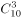种，烹饪方式有6种。分步相乘，因此可以做不同菜肴数量为：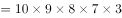，结果为9的倍数，并且尾数为0，选项中仅有D项符合。

故正确答案为D。

---

### 第 2 题　qid 2256395 · 数学运算

甲、乙、丙三人工作的效率比为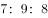，现将A、B两项工作量相同的工程交给这三个人，甲负责A工程，乙负责B工程，丙作为机动参与A工程若干天后转而参与B工程，两项工程同时开工，耗时8天同时结束，问丙在A工程中参与施工多少天？

- **A**. 3
- **B**. 4
- **C**. 5　✅
- **D**. 6

**答案**：C

**官方解析**

方法一：设甲乙丙每天工作效率分别为7、9、8，丙在A工程中参与施工。根据A、B两项工程工作量相等，可列方程得：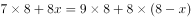，化简得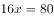，解得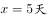。

方法二：甲工作效率比乙低，A、B两项工程工作量相同，并且同时完成，那么为了协助甲加快工期，丙参与A工程的天数必然大于B工程天数，即参与A工程大于4天，排除A、B项。代入C项得，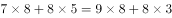。等式成立，符合题意。

故正确答案为C。

---

### 第 3 题　qid 2256401 · 数学运算

甲乙两地之间高速公路设有4个服务区，从甲地驾车以90千米时速行驶并在每个服务区休息10分钟需要4小时20分钟到达乙地。若从乙地驾车以时速120千米并在每个服务区休息5分钟，到达甲地需要的时间是多少？

- **A**. 2小时45分钟
- **B**. 3小时5分钟　✅
- **C**. 3小时25分钟
- **D**. 4小时20分钟

**答案**：B

**官方解析**

根据公式，路程=速度×时间可知，当路程一定时，速度与时间成反比。来回甲乙两地路程相等，因此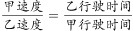，设乙实际行驶时间为,代入数据得：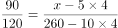，解得，即3小时5分钟。

故正确答案为B。

---

### 第 4 题　qid 2256406 · 数学运算

一个矩形的周长为100，它的面积可能是多少？

- **A**. 600　✅
- **B**. 650
- **C**. 700
- **D**. 750

**答案**：A

**官方解析**

方法一：设矩形长为，因为周长为100，则宽为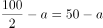。因此矩形面积为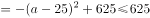。仅有A项符合。

方法二：矩形周长固定，它的面积最小可以无限接近于0，最大会有一个具体的数字。本题为选择题只有唯一解，若通过最大值求解，必然只有A项可为答案。若B、C、D项符合，则A项也符合，因此仅有A项符合。

故正确答案为A。

---

### 第 5 题　qid 2256408 · 数学运算

由1，3，5，7，9五个数字组成的没有重复数字的五位数有120个，将它们从小到大排列起来，第50个数是多少？

- **A**. 51739
- **B**. 53197
- **C**. 53179
- **D**. 51397　✅

**答案**：D

**官方解析**

从小到大排列，当首位为1时，共有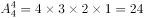个五位数，当首位为3时，同样有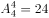个五位数，因此第50个数就是首位为5时从小到大的第二个数即51397。

故正确答案为D。

---

### 第 6 题　qid 2256412 · 数学运算

某高校今年共招收新生6060人，比去年增长，其中本科新生比去年减少，研究生新生比去年增加。那么，该高校今年本科新生有多少人？

- **A**. 4200
- **B**. 4120
- **C**. 3900
- **D**. 3800　✅

**答案**：D

**官方解析**

方法一：本科新生比去年减少，可知今年本科生人数是去年的，即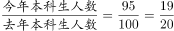，因此今年本科新生人数为19的倍数，只有D项符合。 

方法二：今年招收6060人，比去年增长，则去年总人数人，根据线段法，本科生和研究生新生增长率的距离之比为，增长率的距离和基期成反比，则去年本科生和研究生人数之比为2：1，那么去年本科的招生人数为人，今年本科新生为人。

故正确答案为D。

---

### 第 7 题　qid 2256416 · 数学运算

从一瓶浓度为的酒精溶液中倒出，加满纯净水，再倒出，又加满纯净水，此时酒精溶液的浓度是多少？

- **A**. 

- **B**. 

　✅
- **C**. 

- **D**. 

**答案**：B

**官方解析**

由题目可知，每次稀释后溶液总量不变，相当于每次减少溶质的，留下的溶质为，这样操作两次，则最后浓度变为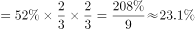。

故正确答案为B。

---

### 第 8 题　qid 2256418 · 数学运算

用6位数字表示日期，如170226表示的是2017年2月26日。如果用这种方法表示2019年的日期，则全年中六个数字都不相同的日期有多少天？

- **A**. 12
- **B**. 24
- **C**. 30　✅
- **D**. 36

**答案**：C

**官方解析**

根据题目的条件,需要求出有多少个符合要求的日期，要表示2019年的日期，先安排月份，再安排具体日期。假设2019年AB月CD日，可以写成“19ABCD”，月份中不能有1和9，排除1月、9月、10月、11月、12月。AB可能02～08，所以A一定为0，写成“190BCD”。分情况讨论：

（1）若B为2，2019年为平年，2月只有28为天，CD不可能为01～28，所以B不能为2；

（2）若B为3，3月有31天，CD只能为24、25、26、27、28，共5种情况；若B为4，4月有30天，CD只能为23、25、26、27、28，共5种情况；同理，若B为5，6，7，8时，不论当月是31天还是30天，一个月都是只有5天满足，3～8月共有6个月，一共有天。

故正确答案为C。

---

### 第 9 题　qid 2256422 · 数学运算

一个布袋中装有大小相同的3个白球、4个红球和2个黑球，每次从袋中摸出一球不再放回。问恰好在第3次取得黑球的概率是多少？

- **A**. 

　✅
- **B**. 

- **C**. 

- **D**. 
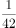

**答案**：A

**官方解析**

概率=满足要求的情况数/总的情况数。总情况数：从布袋中依次取出3个球，有种；恰好第3次取得黑球的情况可分类讨论：（1）前两次无黑球，第3次取黑球，情况数为种；（2）前两次有一次取黑球，第3次取黑球，情况数为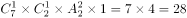种。则满足要求的情况数为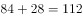种。概率=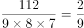。

故正确答案是A。

---

### 第 10 题　qid 2256423 · 数学运算

社区组织自驾游。如果7辆车上每车3人，其余的每4人一车，那么会有6人无车可乘；如果5辆车上每车4人，其余的每5人一车，则会有2辆空车。问一共有多少辆车？

- **A**. 10
- **B**. 12
- **C**. 13
- **D**. 14　✅

**答案**：D

**官方解析**

设有辆车，共有人，根据题意列式：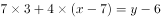①；②，解得，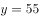。

故正确答案为D。

---

## 判断推理

### 第 1 题　qid 2256355 · 图形推理

从所给的4个选项中，选择最适合的一个填入问号处，使之呈现一定的规律性：

- **A**. A
- **B**. B　✅
- **C**. C
- **D**. D

**答案**：B

**官方解析**

本题为九宫格题目。

元素组成相同，考虑位置规律。九宫格优先横着看，第一行，图1到图2，顺时针旋转，图2到图3，顺时针旋转，第二行验证规律，符合规律。第三行应用规律，图2旋转到“？”处，只有B项符合。

故正确答案为B。

---

### 第 2 题　qid 2256359 · 图形推理

从所给4个选项中，选择最适合的一个填入问号处，使之呈现一定的规律性：

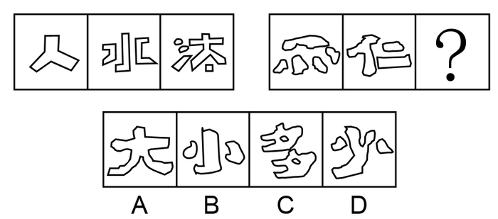

- **A**. A　✅
- **B**. B
- **C**. C
- **D**. D

**答案**：A

**官方解析**

元素组成不同，无明显属性规律，考虑数量规律。题干图形出现了很多“窟窿”，考虑数面。观察第一组图发现面数量分别是1、3、5，呈依次递增2的规律；第二组图应用类似的规律，前两个图的面数量是5、3，所以“？”选有1个面的图形，只有A项符合。
故正确答案为A。

---

### 第 3 题　qid 2256361 · 图形推理

从所给4个选项中，选择最适合的一个填入问号处，使之呈现一定的规律性：

- **A**. A
- **B**. B
- **C**. C　✅
- **D**. D

**答案**：C

**官方解析**

元素组成相似，考虑样式规律。九宫格优先横行看，第一行，图1和图2相加，保留不同的部分，相同部分标记为黑色，第二行应用规律，图1和图2相加，保留最上面一行左右两端不同的三角形且把最下方相同三角形标记为黑色后，只有C符合。
故正确答案为C。

---

### 第 4 题　qid 2256363 · 图形推理

从所给4个选项中，选择最适合的一个填入问号处，使之呈现一定的规律性：

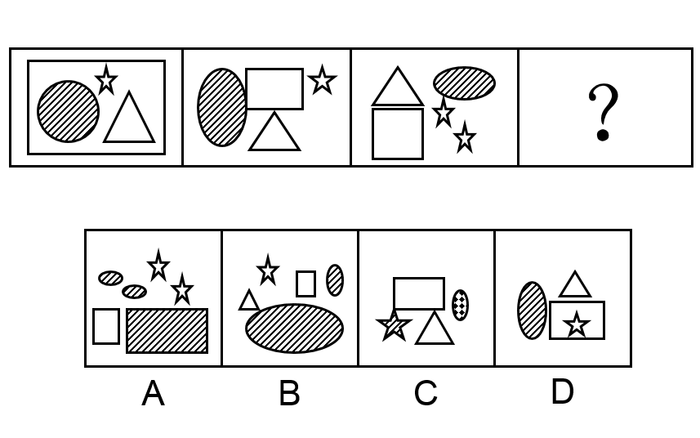

- **A**. A
- **B**. B
- **C**. C
- **D**. D　✅

**答案**：D

**官方解析**

元素组成相似，相同元素重复出现，考虑遍历。观察图形，题干每幅图均有一个阴影图形出现，故？处也要找一个有阴影面的图形，只有D符合。
故正确答案为D。

---

### 第 5 题　qid 2256365 · 图形推理

从所给4个选项中，选择最适合的一个填入问号处，使之呈现一定的规律性：

- **A**. A　✅
- **B**. B
- **C**. C
- **D**. D

**答案**：A

**官方解析**

元素组成不同，无明显属性规律，考虑数量规律。观察发现，题干图形中窟窿比较多，考虑数面。第一行面数量都是7，第二行前两个图形面数量都是3，故？处找一个3个面的图形，只有A项符合。
故正确答案为A。

---

### 第 6 题　qid 2256340 · 定义判断

“CIS”是英文Corporate Identity System的缩写，意即“企业形象识别系统”，又有人称为企业形象设计系统。它将企业经营活动以及运作此经营活动的企业经营理念或经营哲学等企业文化，运用视觉沟通技术，以视觉化、规范化、系统化的形式，通过传播媒介传达给企业的相关者，包括企业员工、社会大众、政府机关等团体和个人，以塑造良好的企业形象，使他们对企业产生一致的认同和价值感，以赢取社会大众及消费群的肯定，从而达成产品销售的目的，为企业带来更好的经营绩效。
根据上述定义，下列对“CIS”理解错误的是：

- **A**. 企业形象识别系统是为树立企业形象服务的，是企业形象塑造的唯一途径和手段，目的在于推销产品　✅
- **B**. 企业形象识别系统主要由企业理念识别系统、企业行为识别系统和企业视觉识别系统三部分内容组成
- **C**. 企业的各种行为只有在企业理念的指导下规范统一，并有特色，才能被公众识别、认知、接受认可
- **D**. 企业信息只有符合公众的心理倾向、价值观念及其需要，才能被公众认同并接受

**答案**：A

**官方解析**

第一步：找出定义关键词。
“将企业经营活动以及运作此经营活动的企业经营理念或经营哲学等企业文化”、“运用视觉沟通技术”、“通过传播媒介传达给企业的相关者”、“以赢取社会大众及消费群的肯定”。
第二步：逐一分析选项。
A项：企业形象识别系统应是企业形象塑造的一种途径和手段，根据上述定义无法得出是否是唯一途径，该项理解错误，当选；
B项：“将企业经营活动以及运作此经营活动的企业经营理念或经营哲学等企业文化”是企业理念识别系统，“通过传播媒介传达给企业的相关者”是企业行为识别系统，“运用视觉沟通技术”是企业视觉识别系统，该项理解正确，排除；
C项：在企业理念的指导下规范统一，并有特色是大众识别、认知、接受认可的前提条件，是 “以赢取社会大众及消费群的肯定”而做出的行为，该项理解正确，排除；
D项：企业信息只有符合公众的心理倾向、价值观念及其需要，是被公众认同并接受的前提条件，是 “以赢取社会大众及消费群的肯定”而做出的行为，该项理解正确，排除。
本题为选非题，故正确答案为A。

---

### 第 7 题　qid 2256341 · 定义判断

绿色贸易壁垒是指为保护生态环境而直接或间接采取的限制甚至禁止贸易的措施。绿色贸易壁垒通常是进出口国为保护本国生态环境和公众健康而设置的各种保护措施、法规和标准等，也是对进出口贸易产生影响的一种技术性贸易壁垒。它是国际贸易中的一种以保护有限资源、环境和人类健康为名，通过蓄意制定一系列苛刻的、高于国际公认或绝大多数国家不能接受的环保标准，限制或禁止外国商品的进口，从而达到贸易保护目的而设置的贸易壁垒。
根据上述定义，下列对绿色贸易壁垒理解错误的是：

- **A**. 绿色贸易壁垒是以保护世界资源、环境和人类健康为名，行贸易限制和制裁措施之实，具有名义上的合理性
- **B**. 绿色贸易壁垒措施以一系列国际国内公开立法作为依据和基础，具有形式上的合法性
- **C**. 绿色贸易壁垒在具体实施和操作时，很容易被某些发达国家用来对来自于世界各国的产品随心所欲地加以刁难和抵制，保护措施具有不确定性和可塑性　✅
- **D**. 绿色贸易壁垒的各种检验标准不仅极为严格，而且繁琐复杂，使出口国难以应付和适应，保护方式具有极强的隐蔽性

**答案**：C

**官方解析**

第一步：找出定义关键词。
“是进出口国为保护本国生态环境和公众健康而设置的各种保护措施、法规和标准等”、“是国际贸易中的一种以保护有限资源、环境和人类健康为名”、“蓄意制定一系列苛刻的、高于国际公认或绝大多数国家不能接受的环保标准”、“限制或禁止外国商品的进口”。
第二步：逐一分析选项。
A项：以保护世界资源、环境和人类健康为名，符合“是国际贸易中的一种以保护有限资源、环境和人类健康为名”，行贸易限制和制裁措施之实，符合“限制或禁止外国商品的进口”，该项理解正确，排除；
B项：以一系列国际国内公开立法作为依据和基础，符合“是进出口国为保护本国生态环境和公众健康而设置的各种保护措施、法规和标准等”,且该立法是“以是国际贸易中的一种以保护有限资源、环境和人类健康为名”，所以具有形式上的合法性，该项理解正确，排除；
C项：绿色贸易壁垒很容易被某些发达国家用来对来自世界各国的产品进行刁难和抵制，根据题干定义可知绿色贸易壁垒是绝大多数的国家无法接受的环保标准，所以无法得出是用来对世界各国的刁难，该项理解错误，当选；
D项：绿色贸易壁垒的各种检验标准不仅极为严格，而且繁琐复杂，符合“蓄意制定一系列苛刻的、高于国际公认或绝大多数国家不能接受的环保标准”，该项理解正确，排除。
本题为选非题，故正确答案为C。

---

### 第 8 题　qid 2256344 · 定义判断

附带民事诉讼是指公安司法机关在解决被告人刑事责任的同时，附带解决由遭受物质损失的被害人或者人民检察院提起的，由于犯罪嫌疑人、被告人的犯罪行为所引起的物质损失的赔偿而进行的诉讼。国家机关工作人员在行使职权时，侵犯他人人身、财产权利构成犯罪，被害人或者其法定代理人、近亲属提起附带民事诉讼的，人民法院不予受理，但应当告知其可以依法申请国家赔偿。
根据上述定义，下列法院可以受理被害人提起的附带民事诉讼的是：

- **A**. 抢劫案，要求被告人赔偿被抢走并变卖的金项链
- **B**. 寻衅滋事案，要求被告人赔偿所造成的物质损失　✅
- **C**. 虐待被监管人案，要求被告人赔偿因体罚虐待致身体损害所产生的医疗费
- **D**. 故意伤害案，要求被告人赔偿因硫酸毁容所造成的精神损失

**答案**：B

**官方解析**

第一步：找出定义关键词。
“被告人刑事责任”、“附带解决遭受物质损失的被害人或者人民检察院提起”、“由于犯罪嫌疑人、被告人的犯罪行为所引起的物质损失的赔偿”、“国家工作人员行使职权时侵犯他人人身、财产权利”、“被害人或法定代理人、近亲属提起附带民事诉讼的，人民法院不予受理”。
第二步：逐一分析选项。
A项：抢劫案，符合“刑事责任”，要求被告人赔偿被抢走变卖的金项链，不符合“附带解决遭受物质损失的被害人或者人民检察院提起诉讼”，抢走的金项链本来就是抢劫案本身的物质损失，不属于附带的损失，不符合定义，排除；
B项：寻衅滋事案，符合“刑事责任”，要求被告人赔偿所造成的物质损失，符合“由于犯罪嫌疑人、被告人的犯罪行为所引起的物质损失的赔偿”，符合定义，当选；
C项：虐待被监管人案，符合“刑事责任”，但这是国家工作人员在行使职权时，侵犯他人人身的情况，符合“人民法院不予受理”的条件，不符合定义，排除；
D项：故意伤害案，符合“刑事责任”，但要求赔偿的是精神损失，不符合“物质损失的赔偿”，不符合定义，排除。
故正确答案为B。

---

### 第 9 题　qid 2256347 · 定义判断

证明责任是指当事人对自己提出的诉讼请求所依据的事实或者反驳对方诉讼请求所依据的事实，应当提供证据加以证明，但法律另有规定的除外。在作出判决前，当事人未能提供证据或者证据不足以证明其事实主张的，由负有举证证明责任的当事人承担不利的后果。
根据上述定义，下列对证明责任理解错误的是：

- **A**. 只有在待证事实处于真伪不明情况下，证明责任的后果才会出现
- **B**. 对案件中的同一事实，只有一方当事人负有证明责任
- **C**. 当事人对其主张的某一事实没有提供证据证明，必将承担败诉的后果　✅
- **D**. 证明责任的结果责任不会在原、被告间相互转移

**答案**：C

**官方解析**

第一步：找出定义关键词。
“当事人对自己提出的诉讼请求或反驳对方诉讼请求所依据的事实”、“提供证据证明”、“作出判决前当事人未能提供证据或证据不足”、“负有举证证明责任的当事人承担不利后果”。
第二步：逐一分析选项。
A项：待证事实处于真伪不明情况下，符合“当事人未能提供证据或者证据不足”，此时会出现证明责任的后果，符合“负有举证证明责任的当事人承担不利后果”，该项理解正确，排除；
B项：对于案件中的同一事实，最后承担不利后果的“只有负有举证证明责任的当事人”，而不是双方，所以只有一方当事人负有证明责任，该项理解正确，排除；
C项：当事人对其主张的某一事实没有提供证据证明，符合“当事人未能提供证据或证据不足”，必将承担败诉后果，不符合“负有举证证明责任的当事人承担不利后果”，不利后果并非意味着一定会败诉，该项理解不正确，当选；
D项：根据“负有举证证明责任的当事人承担不利后果”可以得出，证明责任的结果责任不会在原、被告间相互转移，该项理解正确，排除。
本题为选非题，故正确答案为C。

---

### 第 10 题　qid 2256357 · 定义判断

受贿罪是指国家工作人员利用职务上的便利，索取他人财物，或者非法收受他人财物，为他人谋取利益的行为。
根据上述定义，下列说法正确的是：

- **A**. 甲系教育局局长，2015年赵某为解决女儿就近上学问题，多次找到甲，希望甲帮帮忙。甲考虑到赵某的实际情况，便违规给他批了条子，但未向赵某提出任何不法要求。2018年甲退休后欲自己开办公司，就向赵某提出：3年前自己帮助了赵，希望赵给2万元作为甲自己公司的启动资金。赵推脱不过，只好给钱。甲应当构成受贿罪
- **B**. 乙(女)因涉嫌诈骗而被公安机关收审，龚某负责审理这个案子。乙想龚某帮助她，即以身相许，尔后龚某便利用自己的职权设法使乙逃避了法律制裁。龚某不构成受贿罪　✅
- **C**. 丙为了在一项市政工程投标中中标而给某副市长李某5万元钱，希望其在评标时多多关照。李某收过钱，点了点头。但事后，丙的投标未获通过。李某虽然收受他人财物，但由于没有为他人谋取利益，所以不构成受贿罪
- **D**. 丁的妻子在乡村小学教书，丁试图通过关系将其妻调往县城，就请县公安局长胡某给教育局长黄某打招呼，果然事成。事后，丁给胡某2万元钱，胡将其中1万元给黄某，剩余部分自己收下。本案中，黄某构成受贿罪，胡某构成介绍贿赂罪，丁构成行贿罪

**答案**：B

**官方解析**

第一步：找出定义关键词。
“国家工作人员利用职务上的便利”、“索取他人财物或非法收受他人财物，为他人谋取利益”。
第二步：逐一分析选项。
A项：甲违规给赵某批了条子，但未向赵某提出任何不法要求，不符合“索取他人财物或非法收受他人财物”，且甲收受赵某钱财是退休后开办自己的公司,不符合“国家工作人员利用职务上的便利”，所以不构成受贿罪，该项说法不正确，排除；
B项：龚某利用自己的职权使乙逃避了法律制裁，乙以身相许，人不是财物，不符合“索取他人财物或非法收受他人财物，为他人谋取利益”，所以不构成受贿罪，该项说法正确，当选；
C项：副市长李某收受了丙的5万元钱，符合“国家工作人员利用职务上的便利”，“索取他人财物或非法收受他人财物，为他人谋取利益”，虽然丙投标没有通过，但是李某已经收受了贿赂，所以构成受贿罪，该项说法不正确，排除；
D项：黄某收钱把丁某妻子调往县城，符合“国家工作人员利用职务上的便利”，也符合“索取他人财物或非法收受他人财物，为他人谋取利益”，所以黄某构成受贿罪，但胡某构成斡旋受贿罪，并非介绍受贿罪，该项说法不正确，排除。
故正确答案为B。

---

### 第 11 题　qid 2256362 · 定义判断

委任性规则是指没有明确规定行为规则的内容，只是规定了某种概括性的指示，授权或委托某一机关或某一机构加以具体规定的法律规则。
根据上述定义，下列属于委任性规则的是：

- **A**. 我国《医疗事故处理条例》第62条规定：“军队医疗机构的医疗事故处理办法，由中国人民解放军卫生主管部门会同国务院卫生行政部门依据本条例制定。”　✅
- **B**. 我国《产品质量法》第69条规定：“以暴力、威胁方法阻碍产品质量监督部门或者工商行政管理部门的工作人员依法执行职务的，依法追究刑事责任；拒绝、阻碍未使用暴力、威胁方法的，由公安机关依照治安管理处罚条例的规定处罚。”
- **C**. 我国《国家赔偿法》第38条规定：“人民法院在民事诉讼、行政诉讼过程中，违法采取对妨害诉讼的强制措施、保全措施或者对判决、裁定及其他生效法律文书执行错误，造成损害的，赔偿请求人要求赔偿的程序，适用本法刑事赔偿程序的规定。”
- **D**. 我国《合同法》第175条规定：“当事人约定易货交易，转移标的物的所有权的，参照买卖合同的有关规定。”

**答案**：A

**官方解析**

第一步：找出定义关键词。
“没有明确规定行为规则的内容，只是规定了某种概括性的指示”、“授权或委托某一机关或某一机构加以具体规定”。
第二步：逐一分析选项。
A项：军队医疗机构的医疗事故处理办法，由中国人民解放军卫生主管部门会同国务院卫生行政部门依据本条例制定，符合“没有明确规定行为规则的内容，只是规定了某种概括性的指示”，也符合“授权或委托某一机关或某一机构加以具体规定”，符合定义，当选；
B项：“依法”追究刑事责任，由公安机关依照“治安管理处罚条例”的规定处罚，说明是有明确规定的，不符合“没有明确规定行为规则的内容，只是规定了某种概括性的指示”，不符合定义，排除；
C项：适用“本法”刑事赔偿程序的规定，说明是有明确规定的，不符合“没有明确规定行为规则的内容，只是规定了某种概括性的指示”，不符合定义，排除；
D项：参照买卖合同的“有关规定”，说明是有明确规定的，不符合“没有明确规定行为规则的内容，只是规定了某种概括性的指示”，不符合定义，排除。
故正确答案为A。

---

### 第 12 题　qid 2256364 · 定义判断

政府监管是市场经济条件下政府为实现某些公共政策目标，对微观经济主体进行的规范与制约，主要通过对特定产业和微观经济活动主体的进入、退出、资质、价格及涉及国民健康、生命安全、可持续发展等行为进行监督、管理来实现。
根据上述定义，下列属于政府监管范围的是：

- **A**. 甲农民根据对市场的预测确定饲养猪的规模
- **B**. 乙工厂生产的某种饮料可能含有超标的有害物质　✅
- **C**. 丙企业根据市场行情的变化及时调整产品价格
- **D**. 丁劳动者将政府发放的失业救济金用于购买股票

**答案**：B

**官方解析**

第一步：找出定义关键词。
“政府为实现某些公共政策目标对微观经济主体进行的规范与制约”、“通过对特定产业和微观经济活动主体的进入、退出、资质、价格及涉及国民健康、生命安全、可持续发展等行为”、“进行监督、管理来实现”。
第二步：逐一分析选项。
A项：甲农民根据对市场的预测确定饲养猪的规模，此行为并不涉及“国民健康、生命安全、可持续发展等行为”，并不需要政府对其行为进行规范与制约，不符合定义，排除；
B项：乙工厂生产的某种饮料可能含有超标的有害物质，会威胁人民群众的人身健康，涉及“国民健康、生命安全”，需要政府对其进行规范与制约，符合定义，当选；
C项：丙企业根据市场行情的变化及时调整产品价格，只是企业自身的行为，不涉及“国民健康、生命安全、可持续发展等行为”，并不需要政府对其行为进行规范与制约，不符合定义，排除；
D项：丁劳动者将政府发放的失业救济金用于购买股票，只是个人的选择，不涉及“国民健康、生命安全、可持续发展等行为”，不需要政府对其行为进行规范与制约，不符合定义，排除。
故正确答案为B。

---

### 第 13 题　qid 2256366 · 定义判断

社会保障制度是指在政府的管理之下，以国家为主体，依据一定的法律和规定，通过国民收入的再分配，以社会保障基金为依托，对公民在暂时或者永久性失去劳动能力以及由于各种原因生活发生困难时给予物质帮助，用以保障居民的最基本的生活需要的社会安全制度。
根据上述定义，下列属于社会保障制度的是：

- **A**. 残疾人甲某在民政局的帮助下申请了优惠贷款，开办了自己的工厂，为许多下岗职工提供了再就业的机会
- **B**. 乙市领导在地震发生后探望了灾区人民，并指示有关部门为他们送去了食品、衣物及彩电等物资，希望他们能渡过难关
- **C**. 女职工丙某被单位解聘，失业期间领取了失业救济金　✅
- **D**. “希望工程”资助的偏远山区小学生免费午餐项目

**答案**：C

**官方解析**

第一步：找出定义关键词。
“以国家为主体”、“以社会保障基金为依托”、“对公民在暂时或者永久性失去劳动能力以及由于各种原因生活发生困难时给予物质帮助”、“保障居民的最基本的生活需要”。
第二步：逐一分析选项。
A项：残疾人甲某在民政局的帮助下申请了优惠贷款，这个贷款属不属于“社会保障基金”不明确，且甲某开办工厂为下岗职工提供再就业机会，不符合“以国家为主体”，不符合定义，排除；
B项：乙市领导指示有关部门为受灾群众送物资，确实可以为灾区群众提供帮助，但是这些救灾物资并未说明是否“以社会保障基金为依托”，不符合定义，排除；
C项：女职工丙某被单位解聘，符合“公民在暂时或者永久性失去劳动能力”，失业期间领取了失业救济金，符合“以国家为主体”、“以社会保障基金为依托”及“生活发生困难时给予物质帮助”，符合定义，当选；
D项：“希望工程”资助的偏远山区小学生免费午餐项目，未说明“以国家为主体”，且所用资金是否“以社会保障基金为依托”也不明确，不符合定义，排除。
故正确答案为C。

---

### 第 14 题　qid 2256368 · 定义判断

货币政策也就是金融政策，是指中国人民银行为实现其特定的经济目标而采用的各种控制和调节货币供应量和信用量的方针、政策和措施的总称。货币政策的实质是国家对货币的供应根据不同时期的经济发展情况而采取“紧”“松”或“适度”等不同的政策趋向。
根据上述定义，下列说法错误的是：

- **A**. 货币政策调节的对象是货币供应量，即全社会总的购买力，具体表现形式为流通中的现金和个人、企事业单位在银行的存款
- **B**. 货币政策包括信贷政策、利率政策和外汇政策
- **C**. 中央银行应根据不同的情况选择具体的货币政策目标
- **D**. 如果经济中出现例如投资增长过快、信贷增长过快、国际国内经济失衡、通货膨胀等要么属于货币领域的问题，要么跟货币有直接或者间接关系的问题，那么就应该采取宽松的货币政策以促进经济的良性运行　✅

**答案**：D

**官方解析**

第一步：找出定义关键词。
“中国人民银行为实现目标而采用的各种控制和调节货币供应量和信用量的方针、政策和措施的总称”、“实质是国家对货币的供应根据不同时期的经济发展情况二采区不同的政策趋向”。
第二步：逐一分析选项。
A项：根据定义第一句可知，货币政策是控制和调节货币供应量和信用量的方针、政策和措施的总称，故货币政策调节的对象为货币供应量，符合定义，排除；
B项：涉及相关专业知识，货币政策包括信贷政策、利率政策和外汇政策三大部分，符合定义，排除；
C项：根据第二句可知，国家对货币的供应根据不同时期的经济发展情况而采取不同的政策趋向，所以中央银行会根据不同的情况来选择不同的货币政策目标，符合定义，排除；
D项：投资增长过快、信贷增长过快、国际国内经济失衡、通货膨胀，说明市场经济过热，应采用货币紧缩的政策促进良性运行，而非宽松的货币政策，不符合定义，当选。
本题为选非题，故正确答案为D。
备注：本题定义已知信息过少，无法推出更多信息，部分选项需结合相关专业知识进行判断。

---

### 第 15 题　qid 2256370 · 定义判断

居民纳税人是指在中国境内有住所或者无住所而在境内居住满一年的个人。在居住期间内临时离境的，即在一个纳税年度中一次离境不超过30日或多次离境累计不超过90日的，不扣减日数，连续计算。
根据上述定义，下列案例说法正确的是：
詹姆斯是英国人，2016年3月12日来华工作，2017年3月15日回国，2017年4月2日返回中国，2017年11月15日至2017年11月30日期间，因工作需要去了美国，2017年12月1日返回中国，后于2018年10月20日离华回国，则该纳税人：

- **A**. 2016年度为我国居民纳税人，2017年度为我国非居民纳税人
- **B**. 2016年度为我国非居民纳税人，2017年度为我国居民纳税人　✅
- **C**. 2016年度和2017年度均为我国非居民纳税人
- **D**. 2016年度和2017年度均为我国居民纳税人

**答案**：B

**官方解析**

第一步：找出定义关键词。
“中国境内有住所或者无住所而在境内居住满一年的个人”、“在一个纳税年度中一次离境不超过30日或多次离境累计不超过90日的，不扣减日数，连续计算”。
第二步：分析案例。
詹姆斯是英国人，他在中国境内没有住所，我国的纳税年度为1月1日-12月31日。
2016年，他3月12日来华工作，未在中国境内居住满一年，故2016年度为我国非居民纳税人；
2017年，3月15日离开中国，4月2日返回中国，共离开18天，11月15日至11月30日去了美国，12月1号回到中国，共离开16天，多次离境累计未超过90天，故2017年度为我国居民纳税人；
2018年，10月20日离华回国，未在中国境内住满一年，故2018年为我国非居民纳税人。
故正确答案为B。

---

### 第 16 题　qid 2256373 · 类比推理

《法律与道德》：美：庞德

- **A**. 《论法的精神》：法：孟德斯鸠　✅
- **B**. 《社会契约论》：英：卢梭
- **C**. 《君主论》：英：约翰·洛克
- **D**. 《政府论》：意大利：尼克罗·马基亚维利

**答案**：A

**官方解析**

第一步：判断题干词语间逻辑关系。
《法律与道德》是庞德的著作，庞德是美国人，题干是著作、国籍、作者的对应关系。
第二步：判断选项词语间逻辑关系。
A项：《论法的精神》是法国孟德斯鸠的著作，与题干逻辑关系一致，当选；
B项：《社会契约论》是卢梭的著作，但是卢梭是法国人，不是英国人，与题干逻辑关系不一致，排除；
C项：《君主论》是意大利尼可罗·马基亚维利创作的著作，与约翰·洛克无关，与题干逻辑关系不一致，排除；
D项：《政府论》是英国约翰·洛克的著作，与尼克罗·马基亚维利无关，与题干逻辑关系不一致，排除。
故正确答案为A。

---

### 第 17 题　qid 2256377 · 类比推理

招摇撞骗：违法犯罪：锒铛入狱

- **A**. 班门弄斧：东施效颦：贻笑大方
- **B**. 强买强卖：欺人太甚：众叛亲离
- **C**. 兢兢业业：厚积薄发：一鸣惊人
- **D**. 见死不救：违背道德：良心谴责　✅

**答案**：D

**官方解析**

第一步：判断题干词语间逻辑关系。
招摇撞骗是一种违法犯罪行为，前两个词是种属关系，违法犯罪会导致锒铛入狱，二者是因果关系。
第二步：判断选项词语间逻辑关系。
A项：班门弄斧比喻在行家面前卖弄本领，常用于自谦，东施效颦比喻模仿别人，不但模仿不好，反而出丑。二者不是种属关系，与题干逻辑关系不一致，排除；
B项：强买强卖是一种违法犯罪的行为，欺人太甚比喻做事太过火，让人无法忍受，二者不是种属关系，与题干逻辑关系不一致，排除；
C项：兢兢业业形容做事小心谨慎，认真踏实，厚积薄发形容只有准备充分才能办好事情，二者不是种属关系，与题干逻辑关系不一致，排除；
D项：见死不救是一种违背道德的行为，二者是种属关系，违背道德会导致良心谴责，二者是因果关系，与题干逻辑关系一致，当选。
故正确答案为D。

---

### 第 18 题　qid 2256379 · 类比推理

制度 对于 （    ） 相当于 （    ） 对于 实施

- **A**. 建设  执行
- **B**. 章程  管理
- **C**. 完善  政策　✅
- **D**. 欠缺  延缓

**答案**：C

**官方解析**

逐一代入选项。
A项：制度与建设，二者没有明显关系，执行和实施，二者也没有明显关系，前后逻辑关系不一致，排除；
B项：章程，泛指各种制度，二者是种属关系，实施管理，二者是动宾关系，前后逻辑关系不一致，排除；
C项：完善制度，二者是动宾关系，实施政策，二者是动宾关系，前后逻辑关系一致，当选；
D项：欠缺制度，二者为动宾关系，延缓实施，二者为动宾关系，但顺序颠倒，前后逻辑关系不一致，排除。
故正确答案为C。

---

### 第 19 题　qid 2256334 · 类比推理

历史：明智

- **A**. 国家：政策
- **B**. 小说：诗歌
- **C**. 制度：学问
- **D**. 法律：约束　✅

**答案**：D

**官方解析**

第一步：判断题干词语间逻辑关系。
历史可以明智，二者是功能对应关系。
第二步：判断选项词语间逻辑关系。
A项：国家可以制定政策，二者不是功能对应关系，与题干逻辑关系不一致，排除；
B项：小说和诗歌是两种不同的文体，二者是并列关系，与题干逻辑关系不一致，排除；
C项：制度一般指要求大家共同遵守的办事规程或行动准则，学问一般指知识，二者没有明显的逻辑关系，与题干逻辑关系不一致，排除；
D项：法律可以约束，二者是功能对应关系，与题干逻辑关系一致，当选。
故正确答案为D。

---

### 第 20 题　qid 2256338 · 类比推理

背水一战：《史记·淮阴侯列传》

- **A**. 乐此不疲：《汉书》
- **B**. 揭竿而起：《过秦论》　✅
- **C**. 朝秦暮楚：《论语》
- **D**. 阳春白雪：《离骚》

**答案**：B

**官方解析**

第一步：判断题干词语间逻辑关系。
背水一战为历史典故，出自《史记·淮阴侯列传》，是典故和出处的对应关系。
第二步：判断选项词语间逻辑关系。
A项：乐此不疲为历史典故，出自《后汉书》而不是《汉书》，与题干逻辑关系不一致，排除；
B项：揭竿而起为历史典故，出自《过秦论》，是典故和出处的对应关系，与题干逻辑关系一致，当选；
C项：朝秦暮楚为历史典故，出自《鸡肋集·北渚亭赋》而不是《论语》，与题干逻辑关系不一致，排除；
D项：阳春白雪原指战国时代楚国的一种较高级的歌曲，后用来比喻高深的不通俗的文学艺术，不是历史典故，《离骚》也不是其出处，与题干逻辑关系不一致，排除。
故正确答案为B。

---

### 第 21 题　qid 2256342 · 类比推理

（    ） 对于 司汤达 相当于 《高老头》 对于 （    ）

- **A**. 《红与黑》；巴尔扎克　✅
- **B**. 《雾都孤儿》；雨果
- **C**. 《傲慢与偏见》；狄更斯
- **D**. 《战争与和平》；奥斯丁

**答案**：A

**官方解析**

逐一代入选项。
A项：《红与黑》的作者为司汤达，《高老头》的作者为巴尔扎克，二者为作品与作者的对应关系，前后逻辑关系一致，当选；
B项：《雾都孤儿》的作者为查尔斯·狄更斯，《高老头》的作者为巴尔扎克，前后逻辑关系不一致，排除；
C项：《傲慢与偏见》的作者为简·奥斯汀，《高老头》的作者为巴尔扎克，前后逻辑关系不一致，排除；
D项：《战争与和平》的作者是列夫·托尔斯泰，《高老头》的作者为巴尔扎克，前后逻辑关系不一致，排除。
故正确答案为A。

---

### 第 22 题　qid 2256346 · 逻辑判断

祸兮福之所倚，福兮祸之所伏：老子

- **A**. 官无常贵，民无终贱：庄子
- **B**. 彼窃钩者诛，窃国者为诸侯：韩非子
- **C**. 劳心者治人，劳力者治于人：孟子　✅
- **D**. 刑过不避大臣，赏善不遗匹夫：墨子

**答案**：C

**官方解析**

第一步：判断题干词语间逻辑关系。
“祸兮福之所倚，福兮祸之所伏”出自于老子所著的《老子》，二者为对应关系。
第二步：判断选项词语间逻辑关系。
A项：“官无常贵，民无终贱”出自于墨子弟子所著的《墨子》，与庄子无明显逻辑关系，与题干逻辑关系不一致，排除；
B项：“彼窃钩者诛，窃国者为诸侯”出自于庄子及后人所著的《庄子》，与韩非子无明显逻辑关系，与题干逻辑关系不一致，排除；
C项：“劳心者治人，劳力者治于人”出自于孟子及其弟子所著的《孟子》，二者为对应关系，与题干逻辑关系一致，当选；
D项：“刑过不避大臣，赏善不遗匹夫”出自于韩非子后人所著的《韩非子》，与墨子无明显逻辑关系，与题干逻辑关系不一致，排除。
故正确答案为C。

---

### 第 23 题　qid 2256349 · 类比推理

快：速度：慢

- **A**. 强：飓风：弱
- **B**. 手动：汽车：自动
- **C**. 远：距离：近　✅
- **D**. 好：吸烟：坏

**答案**：C

**官方解析**

第一步：判断题干词语间逻辑关系。
快和慢都可以形容速度，且快和慢是反义关系。
第二步：判断选项词语间逻辑关系。
A项：强和弱都可以形容飓风，且强和弱是反义关系，与题干逻辑关系一致，保留；
B项：手动和自动都可以形容汽车，但手动和自动不是反义关系，与题干逻辑关系不一致，排除；
C项：远和近都可以形容距离，且远和近是反义关系，与题干逻辑关系一致，保留；
D项：虽然好和坏是反义关系，但通常吸烟只被认为是“坏”的，与题干逻辑关系不一致，排除。
对比A、C两项，速度是一个物理量，其快慢可以直接用数值的大小来衡量，A项中飓风是一种自然现象，其强弱只能通过风速、气压、风力这些物理量的数值大小来衡量，而C项中距离的远近也可以直接用数值的大小来衡量，因此C项与题干逻辑关系更一致。
故正确答案为C。

---

### 第 24 题　qid 2256351 · 类比推理

山东：青岛

- **A**. 湖南：长沙
- **B**. 浙江：宁波　✅
- **C**. 辽宁：沈阳
- **D**. 江西：萍乡

**答案**：B

**官方解析**

第一步：判断题干词语间逻辑关系。
青岛隶属于山东省，但不是山东省的省会，并且青岛是山东省副省级市。
第二步：判断选项词语间逻辑关系。
A项：长沙隶属于湖南省，但是湖南省的省会，与题干逻辑关系不一致，排除；
B项：宁波隶属于浙江省，但不是浙江省的省会，并且宁波是浙江省副省级市，与题干逻辑关系一致，当选；
C项：沈阳隶属于辽宁省，但是辽宁省的省会，与题干逻辑关系不一致，排除；
D项：萍乡隶属于江西省，但不是江西省的省会，并且萍乡是江西省地级市，与题干逻辑关系不一致，排除。
故正确答案为B。

---

### 第 25 题　qid 2256367 · 类比推理

月季：玫瑰：蔷薇

- **A**. 牛郎：织女：天狼　✅
- **B**. 日月：星辰：宇宙
- **C**. 江河：湖泊：海洋
- **D**. 瓜子：核桃：大豆

**答案**：A

**官方解析**

第一步：判断题干词语间逻辑关系。
月季、玫瑰和蔷薇是蔷薇科的三种花，三者是并列关系。
第二步：判断选项词语间逻辑关系。
A项：牛郎、织女、天狼是恒星的三种，三者是并列关系，与题干逻辑关系一致，当选；
B项：日月和星辰是宇宙的组成部分，三者不是并列关系，与题干逻辑关系不一致，排除；
C项：江河、湖泊、海洋，三者是并列关系，但江与河、海与洋也分别是并列关系，与题干逻辑关系不一致，排除；
D项：核桃和大豆是具体的植物，但瓜子是指将瓜的种子炒熟了的食品，不是具体的植物，三者不是并列关系，与题干逻辑关系不一致，排除。
故正确答案为A。

---

### 第 26 题　qid 2256369 · 逻辑判断

孟子曰：“离娄之明，公输子之巧，不以规矩，不能成方圆；师旷之聪，不以六律，不能正五音；尧舜之道，不以仁政，不能平治天下。今有仁心仁闻而民不被其泽，不可法于后世者，不行先王之道也。故曰，徒善不足以为政，徒法不能以自行。”
下列选项与“不以规矩，不能成方圆”的逻辑推论不符的是：

- **A**. 只有遵循合理的道德行为规范，社会才能正常运转
- **B**. 若遵循合理的道德行为规范，社会则能正常运转　✅
- **C**. 除非遵循合理的道德行为规范，否则社会不能正常运转
- **D**. 凡是能够正常运转的社会，它都应该是遵循合理的道德行为规范的

**答案**：B

**官方解析**

第一步：翻译题干。

成方圆规矩。

第二步：逐一分析选项。

A项：翻译为正常运转遵循合理的道德行为规范。正常运转的含义与成方圆相近，遵循合理的道德规范的含义与规矩相近，所以A项和题干逻辑推论相符，排除；

B项：翻译为遵循合理的道德行为规范正常运转。遵循合理的道德规范的含义与规矩相近，正常运转的含义与成方圆相近，所以B项和题干逻辑推论不相符，当选；

C项：翻译为正常运转遵循合理的道德行为规范。正常运转的含义与成方圆相近，遵循合理的道德规范的含义与规矩相近，所以C项和题干逻辑推论相符，排除；

D项：翻译为正常运转遵循合理的道德行为规范。正常运转的含义与成方圆相近，遵循合理的道德规范的含义与规矩相近，所以D项和题干逻辑推论相符，排除。

本题为选非题，故正确答案为B。

---

### 第 27 题　qid 2256376 · 类比推理

某公共政策研究院主持召开的研讨会议题包括“民主政治与贤能政治”“发展中国家的政治秩序”“发达国家的市场与政府”“发展中国家的市场与政府”“技术进步与社会变迁”“中国的法治与秩序”“圆桌讨论：经验与教训”等7个内容。
议程规定：
（1）每天讨论的内容数量不超过3个
（2）“发展中国家的市场与政府”必须安排在第二天讨论
（3）“民主政治与贤能政治”“技术进步与社会变迁”必须安排在同一天
（4）“发展中国家的市场与政府”的讨论安排在“发展中国家的政治秩序”之后，但是在“发达国家的市场与政府”之前
（5）“发达国家的市场与政府”的讨论安排在“民主政治与贤能政治”之前，但是在“中国的法治与秩序”之后
若第二天讨论一个内容，则一定在第一天讨论的是：

- **A**. 民主政治与贤能政治
- **B**. 发展中国家的政治秩序　✅
- **C**. 发达国家的市场与政府
- **D**. 发展中国家的市场与政府

**答案**：B

**官方解析**

根据题干信息进行推理。
根据提问中的条件，第二天讨论一个内容，结合条件（2），“发展中国家的市场与政府”必须安排在第二天讨论，可以得出第二天讨论的只有“发展中国家的市场与政府”；根据条件（4），“发展中国家的市场与政府”的讨论安排在“发展中国家的政治秩序”之后，得出“发展中国家的政治秩序”在安排在第二天的“发展中国家的市场与政府”之前，所以它只能安排在第一天。
故正确答案为B。

---

### 第 28 题　qid 2256322 · 逻辑判断

法律格言说“不知自己之权利，即不知法律”。由此可以推知：

- **A**. 不知道法律的人不享有权利
- **B**. 任何人只要知道自己的权利，就等于知道整个法律体系
- **C**. 权利人所拥有的权利，既是事实问题也是法律问题　✅
- **D**. 权利构成法律上所规定的一切内容，在此意义上，权利即法律，法律亦权利

**答案**：C

**官方解析**

日常结论题，根据题干信息逐一分析选项。
A项：题干中没有提到是否享有权利，无中生有，排除；
B项：题干中讨论的是法律，选项中讨论的是法律体系，偷换概念，排除；
C项：题干中强调不知道自己的权利就是不知道法律，说明权利是被法律所规定的，法律中说明了人们实际可以干什么，所以权利人所拥有的权利成为了一个事实问题，可以推出，当选；
D项：选项中强调权利构成法律上所规定的一切内容，表述过于绝对，且题干没有提到权利就是法律，无法推出，排除。
故正确答案为C。

---

### 第 29 题　qid 2256324 · 类比推理

一天晚上，某餐厅经理被人杀死了，警察对四名嫌疑犯进行了审讯。四个人都只讲了四句话，并且都有一句是假话。
甲说：“我从来就没有去过那家餐厅；我没有杀人；我对这个案件一无所知；星期六我和丁一起在电影院度过。”
乙说：“我没有杀人；我在案发那天与丁闹翻了；我不认识甲；甲是无罪的。”
丙说：“乙是罪犯；丁和甲那天根本没有去过电影院；我是无辜的；是甲和乙一起杀了餐厅经理。”
丁说：“我没有杀人；案发那天我和甲在电影院；我以前从未见过丙；丙说甲和乙杀人的这句话是谎言。”
请问，杀人凶手是：

- **A**. 甲
- **B**. 乙　✅
- **C**. 丙
- **D**. 丁

**答案**：B

**官方解析**

分析题干信息。
根据选项信息可知，杀人凶手仅有一人，即凶手只是甲、乙、丙、丁四人其中之一。分析题干信息可知，丙其中一句说“甲和乙一起杀了餐厅经理”，与凶手只是一个人相违背，说明丙这句话说错了，结合题干信息，四个人都讲了四句话，并且有一句是假话，丙该句为假，说明丙其他的话均为真话，则丙所说的乙是罪犯为真。
故正确答案为B。

---

### 第 30 题　qid 2256326 · 类比推理

有一盗窃案件，据侦查系二人作案。并初步认定甲乙丙丁戊五人是嫌疑犯。而且查知以下情况：（1）甲、丁二人中至少有一人是罪犯；（2）如果丁是罪犯，戊一定是罪犯；（3）只有在丙参与时，乙才能作案；（4）如果乙不是罪犯，那么甲也不是罪犯；（5）丙没有作案时间。
请问，罪犯是：

- **A**. 乙和丙
- **B**. 丁和戊　✅
- **C**. 甲和乙
- **D**. 甲和戊

**答案**：B

**官方解析**

第一步：分析题干。

（1）甲 或 丁；

（2）丁戊；

（3）乙丙；

（4）乙甲；

（5）丙。

第二步：根据题干信息进行推理。

从确定信息入手，根据（5）丙没有作案时间，得出丙不是罪犯；根据（3）的逆否，得出乙不是罪犯；根据（4），得出甲不是罪犯；根据（1），或关系否一推一，得出丁是罪犯；根据（2），得出戊也是罪犯。

故正确答案为B。

---

### 第 31 题　qid 2256328 · 逻辑判断

《中华人民共和国刑法修正案（八）》和修改后的《中华人民共和国道路交通安全法》将醉酒后驾驶机动车的行为以“危险驾驶罪”入刑，可判处六个月以下拘役。那么，醉驾入刑的实施情况到底如何？据有关统计发现，2011年5月1日至2016年10月1日，S区检察院共起诉1103宗1105人醉驾案件。醉驾的状况得到一定程度的遏制。尽管后果很严重，但仍有少数驾驶员抱着“少喝一点没关系”、“应该不会被查”的侥幸心理铤而走险。这说明，醉驾入刑的查处力度不够，不足以对所有驾驶员产生震慑力。以下哪项如果为真，最能削弱上述论证？

- **A**. 醉驾入刑实施后，S区上路行驶的机动车数量有了大的增长
- **B**. 严格实施醉驾入刑，将不可避免地提高S区交警执法成本
- **C**. 醉驾入刑实施后，对违法者的惩罚力度有所增大
- **D**. 醉驾入刑实施后，S区每天都有交警上路严查酒驾　✅

**答案**：D

**官方解析**

第一步：找出论点和论据。
论点：醉驾入刑的查处力度不够，不足以对所有驾驶员产生震慑力。
论据：尽管后果很严重，但仍有少数驾驶员抱着“少喝一点没关系”、“应该不会被查”的侥幸心理铤而走险。
第二步：逐一分析选项。
A项：该项说的是醉驾入刑实施后，机动车数量增加了，与论点讨论的醉驾入刑的查处力度无关，无法削弱，排除；
B项：该项说的是实施醉驾入刑提高了执法成本，查处力度如何没有提及，无关项，排除；
C项：该项说的是查到之后的惩罚力度增加了，而论点讨论的是查处力度，也就是检查的力度是否有加强，话题不一致，无法削弱，排除； 
D项：醉驾入刑实施后，S区每天都有交警上路严查酒驾，说明我们的查处力度是增加了，足够检查出酒驾的司机，直接削弱论点，当选。
故正确答案为D。

---

### 第 32 题　qid 2256331 · 逻辑判断

通过调查得知，并非所有的影视明星都有偷税、逃税行为。如果上述调查的结论是真实的，则以下哪项一定为真？

- **A**. 所有的影视明星都没有偷税、逃税行为
- **B**. 多数影视明星都有偷税、逃税行为
- **C**. 并非有的影视明星有偷税、逃税行为
- **D**. 有的影视明星确实没有偷税、逃税行为　✅

**答案**：D

**官方解析**

第一步：翻译题干。

并非所有的影视明星都有偷税、逃税行为，等价于：有的影视明星没有偷税、漏税行为。翻译为：有的影视明星偷税、漏税行为。

第二步：逐一分析选项。

A项：翻译为影视明星偷税、漏税行为，根据“有的影视明星”不能推出“所有影视明星”的结论，排除；

B项：翻译为多数影视明星偷税、漏税行为，根据“有的影视明星”不能推出“多数影视明星”的结论，排除；

C项：该项等价于：影视明星偷税、漏税行为，根据“有的影视明星”不能推出“所有影视明星”的结论，排除；

D项：翻译为有的影视明星偷税、漏税行为，跟题干表述相同，当选。

故正确答案为D。

---

### 第 33 题　qid 2256332 · 逻辑判断

某市的公务员招考是公正的，则以下两个条件必须满足：第一，有健全的公开透明的招考规则；第二，能力差异是允许的，但必须同时确保考生符合录用资格和每个考生事实上都有公平竞争的机会。
根据题干的条件，最能够得出的结论是：

- **A**. 某市有健全的公开透明的招考规则，同时又在确保考生符合录用资格的条件下，允许能力差异的存在，并且绝大多数考生事实上都有公平竞争的机会。因此，某市招考公务员是公正的
- **B**. 某市有健全的公开透明的招考规则，但这是以能力差异为代价的。因此，某市招考公务员是不公正的
- **C**. 某市招考公务员允许能力差异，但所有人都由此获益，并且每个考生都事实上都有公平竞争的权利。因此，某市招考公务员是公正的
- **D**. 某市公务员招考虽然不存在能力差异，但这是以招考规则不健全不公开不透明为代价的。因此，某市招考公务员是不公正的　✅

**答案**：D

**官方解析**

第一步：翻译题干。

公务员招考公正健全的公开透明的招考规则且允许能力差异、考生符合录用规则有公平竞争的机会

第二步：逐一分析选项。

A项：翻译为健全的公开透明的招考规则且允许能力差异、考生符合录用规则、绝大多数的考生有公平竞争机会公正，题干没有关于“绝大多数考生的表述”，无法推出，排除；

B项：翻译为有能力差异 且健全的公开透明的招考规则公正，没有提到考生符合录用规则有公平竞争的机会，而且即使肯定考生符合录用规则有公平竞争的机会，也是对题干的肯后，肯后推不出确定性的结论，排除；

C项：所有人都由此获益在题干中未提及，无中生有，排除；

D项：翻译为能力差异、健全的公开透明的招考规则公正，是对题干的否后，否后必否前，当选。

故正确答案为D。

---

### 第 34 题　qid 2256336 · 类比推理

小张、小王、小李、小刘、小陈是某学校学生会候选成员，其中小张、小王、小李对此次竞选的结果预测如下：
小张：如果小陈没有当选，则我也不会当选
小王：我和小刘、小陈三人要么都当选，要么都不当选
小李：如果我当选，则小王也当选
竞选结果出来后，发现三个人的预测都是错误的，则最终有（  ）个人当选。

- **A**. 1
- **B**. 2
- **C**. 3　✅
- **D**. 4

**答案**：C

**官方解析**

第一步：翻译题干。

① 张：陈张

② 王：要么王、刘、陈都当选，要么王、刘、陈都不当选

③ 李：李王

第二步：逐一分析选项。

结合题干最后一句，三个人的预测都是错误的，即张、王、李三人观点的矛盾命题是正确的，即：

①（陈-张），即张 且 -陈；

②王、刘、陈 不是都当选，也不是都不当选；

③（李王），即李 且 王。

由①和③可知，张、李当选，陈、王不当选，再根据②“王、刘、陈 不是都当选，也不是都不当选”可知刘当选。即张、李、刘三人当选。

故正确答案为C。

---

### 第 35 题　qid 2256339 · 逻辑判断

阿里巴巴董事局主席马云认为，“互联网不是一种技术，是一种思想。如果你把互联网当思想看，你自然而然会把你的组织、产品、文化都带进去，你要彻底重新思考你的公司。今天很多人都说网上营销好，但是营销好了，麻烦也就开始了，你整个组织、人才、思考、战略都要进行调整。你以为是你的胃口太好，但换一只胃，你的肝也出问题，脾也出问题，因为所有内部的体系是连在一起的。这世界没有传统的企业，只有传统的思想。”
以下哪项为真，最能支持马云的观点？

- **A**. 只要掌握了互联网技术，就不会成为传统企业
- **B**. 互联网企业发展不需要技术，只需要思想
- **C**. 互联网企业相对传统企业来说更难管理
- **D**. 互联网企业需要具备互联网思维，才有可能摆脱束缚，发展壮大　✅

**答案**：D

**官方解析**

第一步：找出论点和论据。
论点：互联网不是一种技术，是一种思想。
论据：如果你把互联网当思想看，你自然而然会把你的组织、产品、文化都带进去，你要彻底重新思考你的公司。所有内部的体系是连在一起的。
第二步：逐一分析选项。
A项：论点讨论的是互联网不是一种技术，该项讲述的是要掌握互联网技术，互联网是技术，削弱论点，无法加强，排除；
B项：该项讨论的是互联网企业发展只需要思想，但并没有说明互联网是否是一种思想，无法加强，排除；
C项：该项讨论的是互联网企业和传统企业的管理难度之间的比较，论点谈论的是互联网是一种思想，话题不一致，无法加强，排除； 
D项：该项讲述的是互联网企业想要发展，需要具备互联网思维，这说明互联网思维很重要，具有该思维的企业才可以发展，补充论据，可以加强，当选。
故正确答案为D。

---

## 资料分析

### 材料 1

一、根据以下资料，回答106-110题。

        9月份，全国一般公共预算收入12963亿元，同比增长。其中，中央一般公共预算收入5919亿元，同比增长；地方一般公共预算本级收入7044亿元，同比增长。全国一般公共预算收入中的税收收入10269亿元，同比增长；非税收入2694亿元，同比下降。

        1-9月累计，全国一般公共预算收入145831亿元，同比增长。其中，中央一般公共预算收入69582亿元，同比增长；地方一般公共预算本级收入76249亿元，同比增长。全国一般公共预算收入中的税收收入127486亿元，同比增长；非税收入18345亿元，同比下降。

        9月份，全国一般公共预算支出22616亿元，同比增长，其中，中央一般公共预算本级支出2533亿元，同比增长；地方一般公共预算支出20083亿元，同比增长。

        1-9月累计，全国一般公共预算支出163289亿元，同比增长，为年初预算的，比序时进度快2.8个百分点。其中，中央一般公共预算本级支出22959亿元，同比增长；地方一般公共预算支出140330亿元，同比增长。

#### 第 1 题　qid 2256372 · 综合

1-9月累计，契税占土地和房地产相关税收约为（    ）。

- **A**. 

- **B**. 

- **C**. 

　✅
- **D**. 

**答案**：C

**官方解析**

由题干“1-9月累计，······占······约为”，结合选项为百分数，可判定本题为现期比重问题。定位材料表格一可得：契税收入金额为4517亿元，土地和房地产相关税收金额为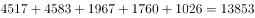亿元，故比重为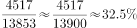，C项最接近。

故正确答案为C。

---

#### 第 2 题　qid 2256380 · 综合

1-9月累计，教育支出占全国一般公共预算支出约为（    ）。

- **A**. 

　✅
- **B**. 

- **C**. 

- **D**. 

**答案**：A

**官方解析**

由题干“1-9月累计，······占······约为”，结合选项为百分数，可判定本题为现期比重问题。定位材料表格二可得：教育支出金额为23760亿元，定位文字材料第四段可得：全国一般公共预算支出163289亿元，故比重为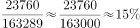，A项最接近。

故正确答案为A。

---

#### 第 3 题　qid 2256382 · 增长

1-9月主要收入项目中，同比增长率最大的是（    ）。

- **A**. 耕地占用税
- **B**. 个人所得税
- **C**. 国内增值税
- **D**. 资源税　✅

**答案**：D

**官方解析**

定位材料表格一可得：耕地占用税增长率为，个人所得税增长率为，国内增值税增长率为，资源税增长率为，故增长率最大的为资源税。

故正确答案为D。

---

#### 第 4 题　qid 2256386 · 综合

9月份，全国一般公共预算支出比收入多（    ）。

- **A**. 17458亿元
- **B**. 9653亿元　✅
- **C**. 5919亿元
- **D**. 2646亿元

**答案**：B

**官方解析**

定位文字材料第一段可得：9月份，全国一般公共预算收入为12963亿元。定位文字材料第三段可得：9月份，全国一般公共预算支出为22616亿元。故9月份，全国一般公共预算支出比收入多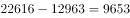亿元。

故正确答案为B。

---

#### 第 5 题　qid 2256390 · 综合

以下说法中，错误的是（    ）。

- **A**. 
1-9月累计，“国内增值税”与“企业所得税”之和超过全国一般公共预算收入的一半

- **B**. 
1-9月累计，“教育”与“社会保障和就业”两项支出之和超过全国一般公共预算支出的四分之一

- **C**. 
1-9月累计，税收收入约占全国一般公共预算收入的

- **D**. 
1-9月累计，烟叶税收入约占全国一般公共预算收入的
　✅

**答案**：D

**官方解析**

A项，定位材料表格一可得：1-9月累计，国内增值税为47356亿元，企业所得税为30754亿元。定位文字材料第二段可得：1-9月，全国一般公共预算收入为145831亿元。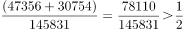，正确；

B项，定位材料表格二可得：1-9月累计，教育支出为23760亿元，社会保障和就业支出为21792亿元。定位文字材料第四段可得：1-9月，全国一般公共预算支出为163289亿元。，正确；

C项，定位文字材料第二段可得：1-9月累计，税收收入为127486亿元，全国一般公共预算收入为145831亿元。故占比为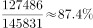，正确；

D项，材料中只给出车船税、船舶吨税、烟叶税等其他各项税收收入合计值，并未单独给出烟叶税的相关数值，故无法得知，错误。

本题为选非题，故正确答案为D。

---

### 材料 2

        2018年前三季度，全国居民人均消费支出14281元，比上年同期名义增长，扣除价格因素，实际增长。其中，城镇居民人均消费支出19014元，增长，扣除价格因素，实际增长；农村居民人均消费支出8538元，增长，扣除价格因素，实际增长。

#### 第 6 题　qid 2256374 · 平均数

2018年前三季度，农村居民人均消费支出是全国居民人均消费支出的（  ）。

- **A**. 
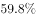
　✅
- **B**. 
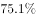

- **C**. 
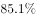

- **D**. 

**答案**：A

**官方解析**

根据题干“2018年前三季度，农村······是全国的······”，结合选项为百分号、材料中给出2018年前三季度数据，可判定本题为现期比重问题。定位文字材料可得：2018年前三季度，全国居民人均消费支出14281元，农村居民人均消费支出8538元。故与A项最接近。

故正确答案为A。

---

#### 第 7 题　qid 2256384 · 平均数

2018年前三季度，全国居民人均消费支出中所占比例最大的是（  ）。

- **A**. 居住
- **B**. 医疗保健
- **C**. 食品烟酒　✅
- **D**. 教育文化娱乐

**答案**：C

**官方解析**

根据题干“2018年前三季度，······所占比例最大的”，结合材料中给出2018年前三季度数据，可判定本题为现期比重比较问题。根据，当整体相同时，只需比较部分的大小即可。定位饼状图可得：居住、医疗保健、食品烟酒、教育文化娱乐的人均消费支出分别为3269元、1275元、4063元、1556元。故所占比重最大的是食品烟酒。

故正确答案为C。

---

#### 第 8 题　qid 2256388 · 平均数

2018年前三季度，全国居民人均消费支出中居住消费所占的比例约为（    ）。

- **A**. 

- **B**. 

　✅
- **C**. 

- **D**. 

**答案**：B

**官方解析**

根据题干“2018年前三季度······全国居民人均消费支出中······所占的比例”，结合材料中给出2018年前三季度数据，可判定本题为现期比重问题。定位文字材料可得：2018年前三季度，全国居民人均消费支出14281元。定位饼状图可得，居住消费支出为3269元。根据，故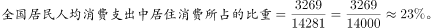与B项最接近。

故正确答案为B。

---

#### 第 9 题　qid 2256392 · 平均数

2017年前三季度，全国居民人均消费支出（  ）。

- **A**. 13162元　✅
- **B**. 13067元
- **C**. 13434元
- **D**. 13381元

**答案**：A

**官方解析**

根据题干“2017年前三季度，全国居民人均消费支出”，结合材料时间为2018年前三季度，可判定本题为基期计算问题。定位文字材料可得：2018年前三季度，全国居民人均消费支出14281元，比上年同期名义增长。根据，故2017年前三季度，。

故正确答案为A。

---

#### 第 10 题　qid 2256398 · 增长

2018年前三季度，消费价格指数（CPI）增长了（  ）

- **A**. 

- **B**. 

- **C**. 

- **D**. 

　✅

**答案**：D

**官方解析**

根据题干“2018年前三季度，消费价格指数（CPI）增长了”，结合选项为百分数，可知本题为一般增长率计算问题。定位文字材料可得“2018年前三季度，全国居民人均消费支出14281元，比上年同期名义增长，扣除价格因素，实际增长”，根据公式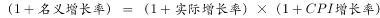，可知：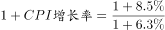，可知，与D项最接近。

故正确答案为D。

注：名义增长率、实际增长率和CPI增长率三者之间的实际计算公式为：，但也可以用“”进行表述，由于三个增长率数值都比较小，用两个公式计算出来的结果很接近，因此在本题中也可以用“”，则CPI增长率为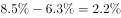。

---

### 材料 3

        2018年9月份，规模以上工业增加值同比实际增长（以下增加值增速均为扣除价格因素的实际增长率），比8月份回落0.3个百分点。从环比看，9月份，规模以上工业增加值比上月增长。1-9月份，规模以上工业增加值同比增长，增速较1-8月份回落0.1个百分点。

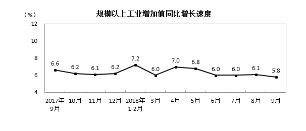

        分三大门类看，9月份，采矿业增加值同比增长，增速较8月份加快0.2个百分点；制造业增长，回落0.4个百分点；电力、热力、燃气及水生产和供应业增长，加快1.1个百分点。

        分经济类型看，9月份，国有控股企业增加值同比增长；集体企业增长，股份制企业增长，外商及港澳台商投资企业增长3.2%。

        分行业看，9月份，41个大类行业中有38个行业增加值保持同比增长。其中，农副食品加工业增长，纺织业增长，化学原料和化学制品制造业增长，非金属矿物制品业增长，黑色金属冶炼和压延加工业增长，有色金属冶炼和压延加工业增长，通用设备制造业增长，专用设备制造业增长，汽车制造业增长，铁路、船舶、航空航天和其他运输设备制造业增长，电气机械和器材制造业增长，计算机、通信和其他电子设备制造业增长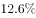，电力、热力生产和供应业增长。

        分地区看，9月份，东部地区增加值同比增长，中部地区增长，西部地区增长，东北地区增长。

        分产品看，9月份，596种产品中有324种产品同比增长。其中，钢材9675万吨，同比增长；水泥20781万吨，增长；十种有色金属456万吨，增长；乙烯161万吨，增长；汽车242.6万辆，下降；轿车102.8万辆，下降；发电量5483亿千瓦时，增长；原油加工量5134万吨，增长。

        9月份，工业企业产品销售率为，比上年同月下降0.4个百分点。工业企业实现出口交货值11839亿元，同比增长。

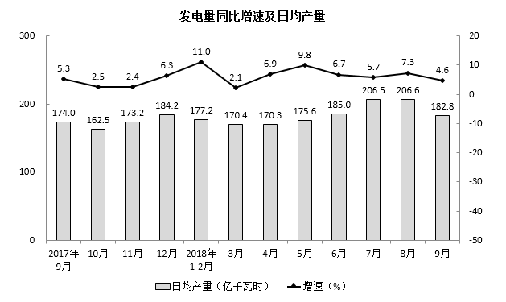

#### 第 11 题　qid 2256426 · 综合

2017年9月至2018年9月，发电量最多的月份是（    ）。

- **A**. 2017年12月
- **B**. 2018年1月
- **C**. 2018年7月
- **D**. 2018年8月　✅

**答案**：D

**官方解析**

定位第三个图形材料可知，对于发电量而言，2018年8月日均产量最高，且8月有31天，故2018年8月是发电量最多的月份。
故正确答案为D。

---

#### 第 12 题　qid 2256430 · 增长

2018年9月水泥产量比2017年同期增加约（    ）。

- **A**. 990万吨　✅
- **B**. 1039万吨
- **C**. 864万吨
- **D**. 948万吨

**答案**：A

**官方解析**

根据题干“2018年9月水泥产量比2017年同期增加······”，结合选项带单位，可判断此题为增长量计算问题。定位文字材料第六段，“9月份······水泥20781万吨，增长”，可得，A项当选。

故正确答案为A。

---

#### 第 13 题　qid 2256433 · 综合

2017年9月至2018年9月，轿车产量超过百万辆的月份有几个？

- **A**. 7个　✅
- **B**. 6个
- **C**. 5个
- **D**. 3个

**答案**：A

**官方解析**

根据题干“2017年9月至2018年9月，轿车产量超过百万辆的月份有几个”，定位第一个柱状图，材料数据为轿车各月份的日均产量，可判断本题为现期平均数问题。

解法1：各月轿车产量如下：

2017年9月，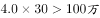；2017年10月，；2017年11月，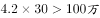；2017年12月，；2018年1月，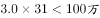；2018年2月，；2018年3月，；2018年4月，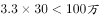；2018年5月，；2018年6月，；2018年7月，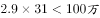；2018年8月，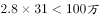；2018年9月，。

可知，产量超过百万的月份有7个。

解法2：要满足每月产量超过百万，对于31天的月份而言，需日均产量超过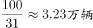，结合材料，可知2017年10月和12月，2018年3月和5月，共4个月份满足；同理，对于30天的月份而言，需日均产量超过，结合材料数据，可知2017年9月和11月，2018年9月，共3个月份满足；2018年2月有28天，日均产量需超过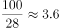万辆，不满足。因此只有个月份满足。

故正确答案为A。

---

#### 第 14 题　qid 2256436 · 增长

9月份，下列经济类型按照增加值同比增长率由高到低排列正确的是（  ）

- **A**. 国有控股企业——集体企业——股份制企业——外商港澳台投资企业
- **B**. 股份制企业——集体企业——国有控股企业——外商港澳台投资企业
- **C**. 股份制企业——国有控股企业——外商港澳台投资企业——集体企业　✅
- **D**. 集体企业——外商港澳台投资企业——国有控股企业——股份制企业

**答案**：C

**官方解析**

定位文字材料第三段，“分经济类型看，9月份，国有控股企业增加值同比增长；集体企业增长，股份制企业增长，外商及港澳台商投资企业增长”，可知经济类型按照增加值同比增长率由高到低排列为股份制企业——国有控股企业——外商港澳台投资企业——集体企业。

故正确答案为C。

---

#### 第 15 题　qid 2256437 · 综合

以下说法中，错误的是（    ）。

- **A**. 
2018年8月，规模以上工业增加值同比实际增长

- **B**. 
2017年9月工业企业产品销售率为

- **C**. 
2017年9月至2018年9月规模以上工业增加值月同比增长速度都超过
　✅
- **D**. 
2018年9月轿车产量超过了8月轿车产量

**答案**：C

**官方解析**

A项：定位文字材料第一段，“2018年9月份，规模以上工业增加值同比实际增长，比8月份回落0.3个百分点”，可得2018年8月，规模以上工业增加值同比实际增长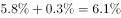，正确；

B项：定位文字材料最后一段，“（2018年）9月份，工业企业产品销售率为，比上年同月下降0.4个百分点”，可得2017年9月工业企业产品销售率为，正确；

C项：定位第一个图形材料，可知2018年3月、6月、7月和9月规模以上工业增加值月同比增长速度分别为、、和，均未超过，错误；

D项：定位第二个图形材料，可得2018年9月轿车产量为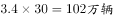，8月轿车产量为，前者大于后者，正确。

本题为选非题，故正确答案为C。 

---
