# 2019年上海市公务员录用考试《行测》题（A类）（网友回忆版）

> 省考 · 2019 年 · 6 个模块 · 共 130 题

- [政治理论](#%E6%94%BF%E6%B2%BB%E7%90%86%E8%AE%BA) · 6 题
- [常识判断](#%E5%B8%B8%E8%AF%86%E5%88%A4%E6%96%AD) · 34 题
- [言语理解与表达](#%E8%A8%80%E8%AF%AD%E7%90%86%E8%A7%A3%E4%B8%8E%E8%A1%A8%E8%BE%BE) · 25 题
- [数量关系](#%E6%95%B0%E9%87%8F%E5%85%B3%E7%B3%BB) · 28 题
- [判断推理](#%E5%88%A4%E6%96%AD%E6%8E%A8%E7%90%86) · 35 题
- [资料分析](#%E8%B5%84%E6%96%99%E5%88%86%E6%9E%90) · 2 题

---

## 政治理论

### 材料 1

        从2018年11月5日到10日，中国国际进口博览会在上海召开。这是中国第一次举办国际进口博览会，吸引了172个国家、地区和国际组织参会，来自五大洲的3600多家企业参展。首届进博会交易采购成果丰硕，按一年计，累计意向成交578.3亿美元。

        开幕式上，国家主席习近平发表了主旨演讲。“中国经济是一片大海，而不是一个小池塘”“经历了无数次狂风骤雨，大海依旧在那儿！经历了5000多年的艰难困苦，中国依旧在这儿！面向未来，中国将永远在这儿！”主席的“大海论”形象地表现了中国和中国经济的坚韧不拔，也描绘了中华民族海纳百川的开阔胸怀。习近平主席表示：“中国的改革开放不会停步，中国对外开放的大门会越开越大。”

        亲自谋划，亲自提出、亲自部署、亲自设计、亲自推动，习近平主席为中国国际进口博览会倾注的精力，让外界看到了中国主动向世界开放市场、同各国分享中国机遇的满满诚意。在随后双边活动和多边会见中，各国领导人、嘉宾盛赞中国的开放。越南总理称赞：“这体现了合作共赢的理念，大力推动世界经济增长。”多米尼加总统认为，进口博览会是一场重要的国际贸易盛会，“本届进口博览会对我们来说是一次绝佳的契机，让我们可以了解中国市场需要的产品和服务。”国际货币基金组织总裁以“桥”为喻，评价中国正在打造通往繁荣之桥、通往未来之桥。

#### 第 1 题　qid 2295612 · 新思想

“中国经济是一片大海，而不是一个小池塘”。习近平主席以大海为喻纵论中国经济，      。

- **A**. 豪迈宣示了中国经济前景光明的信心　✅
- **B**. 预见了中国经济“一花独放”的潜力和前景
- **C**. 彰显了保持中国经济长期健康稳定发展的底气和定力　✅
- **D**. 传递出中国将始终是世界经济增长稳定动力源的信念　✅

**答案**：ACD

**官方解析**

本题考查政治常识。

A项正确，习近平总书记的“大海论”形象地表现了中国和中国经济的坚韧不拔。狂风骤雨可以掀翻小池塘，但不能掀翻大海。中国经济行稳致远有着坚实的基础，宣示了中国人民对中国经济前景光明的信心。

B项错误，“一花独放不是春，百花齐放春满园。”包容普惠、互利共赢才是越走越宽的人间正道。各国应该超越差异和分歧，发挥各自优势，推动包容发展，携手应对全人类共同面临的风险和挑战，推动经济全球化朝着更加开放、包容、普惠、平衡、共赢的方向发展，让各国人民共享经济全球化和世界经济增长成果。题干中“一花独放”的说法不符合时代发展的要求。

C项正确，习近平总书记的“大海论”形象地表现了中国和中国经济的坚韧不拔，彰显了保持中国经济长期健康稳定发展的底气和定力。

D项正确，中国对外开放既发展了自己，也惠及世界，连续多年对世界经济增长贡献率超过，成为世界经济增长的主要稳定器和动力源。

本题为不定项选择题，故正确答案为ACD。

---

#### 第 2 题　qid 2295613 · 新思想

一座城市有一座城市的品格。上海背靠长江水，面向太平洋，长期领中国开放风气之先。习近平主席在主旨演讲中指出，为了更好发挥上海等地区在对外开放中的重要作用，决定      。

- **A**. 增设中国上海自由贸易试验区的新片区　✅
- **B**. 在上海证券交易所设立科创板并试点注册制　✅
- **C**. 打造上海品牌优势和厚植上海人才优势
- **D**. 将支持长江三角洲区域一体化发展并上升为国家战略　✅

**答案**：ABD

**官方解析**

本题考查时事政治。
习近平主席在首届中国国际进口博览会开幕式主旨演讲中指出：“为了更好发挥上海等地区在对外开放中的重要作用，我们决定，一是将增设中国上海自由贸易试验区的新片区，鼓励和支持上海在推进投资和贸易自由化便利化方面大胆创新探索，为全国积累更多可复制可推广经验。二是将在上海证券交易所设立科创板并试点注册制，支持上海国际金融中心和科技创新中心建设，不断完善资本市场基础制度。三是将支持长江三角洲区域一体化发展并上升为国家战略，着力落实新发展理念，构建现代化经济体系，推进更高起点的深化改革和更高层次的对外开放，同‘一带一路’建设、京津冀协同发展、长江经济带发展、粤港澳大湾区建设相互配合，完善中国改革开放空间布局。”　
故正确答案为ABD。

---

#### 第 3 题　qid 2295616 · 新思想

习近平主席为中国国际进口博览会倾注的精力，让外界看到了中国主动向世界开放市场、同各国分享中国机遇的满满诚意。习近平主席在主旨演讲中提出，中国将多方面加大力度进一步扩大开放，包括      。

- **A**. 激发进口潜力　✅
- **B**. 持续放宽市场准入　✅
- **C**. 大力引进关键核心技术
- **D**. 打造对外开放新高地　✅

**答案**：ABD

**官方解析**

本题考查时事政治。
习近平主席在首届中国国际进口博览会开幕式主旨演讲中指出：为进一步扩大开放，中国将在以下几方面加大推进力度。第一，激发进口潜力。第二，持续放宽市场准入。第三，营造国际一流营商环境。第四，打造对外开放新高地。第五，推动多边和双边合作深入发展。　
故正确答案为ABD。

---

#### 第 4 题　qid 2295591 · 新思想

2018年我国对现行宪法作部分修改，是以习近平同志为核心的党中央从新时代坚持和发展中国特色社会主义全局和战略高度作出的重大决策，是推进全面依法治国、推进      的重大举措。

- **A**. 全面建成小康社会
- **B**. 全面深化改革
- **C**. 国家治理体系和治理能力现代化　✅
- **D**. 社会主义法律体系的发展和完善

**答案**：C

**官方解析**

本题考查政治常识。
2018年3月11日，十三届全国人大一次会议第三次全体会议经过投票表决，高票通过《中华人民共和国宪法修正案》。对我国现行宪法作部分修改，是以习近平同志为核心的党中央从新时代坚持和发展中国特色社会主义全局和战略高度作出的重大决策，是推进全面依法治国、推进国家治理体系和治理能力现代化的重大举措，是大势所趋、事业所需、党心民心所向，必将为新时代坚持和发展中国特色社会主义、实现“两个一百年”奋斗目标和中华民族伟大复兴的中国梦提供有力宪法保障。
故正确答案为C。

---

#### 第 5 题　qid 2295400 · 新思想

2018年5月28日，中国科学院第十九次院士大会、中国工程院第十四次院士大会在人民大会堂隆重开幕。习近平出席会议并发表重要讲话强调，中国要强盛、要复兴，就一定要大力发展科学技术，努力成为世界主要               。

- **A**. 科学中心和制造高地
- **B**. 技术中心和制造高地
- **C**. 技术中心和创新高地
- **D**. 科学中心和创新高地　✅

**答案**：D

**官方解析**

本题考查政治常识。
2018年5月28日，中国科学院第十九次院士大会、中国工程院第十四次院士大会在人民大会堂隆重开幕。习近平出席会议并发表重要讲话强调，中国要强盛、要复兴，就一定要大力发展科学技术，努力成为世界主要科学中心和创新高地。形势逼人，挑战逼人，使命逼人。我国广大科技工作者要把握大势、抢占先机，直面问题、迎难而上，瞄准世界科技前沿，引领科技发展方向，肩负起历史赋予的重任，勇做新时代科技创新的排头兵，努力建设世界科技强国。
故正确答案为D。

---

#### 第 6 题　qid 2295408 · 新思想

习近平总书记在全国生态环境保护大会上发表重要讲话，指出            是构建高质量现代化经济体系的必然要求，是解决污染问题的根本之策。

- **A**. 绿色消费
- **B**. 能源革命
- **C**. 绿色发展　✅
- **D**. 自然修复

**答案**：C

**官方解析**

本题考查政治常识。
2018年5月18日至19日，全国生态环境保护大会在北京召开。习近平总书记在大会上发表重要讲话，他指出：“要全面推动绿色发展。绿色发展是构建高质量现代化经济体系的必然要求，是解决污染问题的根本之策。”
故正确答案为C。

---

## 常识判断

### 材料 1

        从2018年11月5日到10日，中国国际进口博览会在上海召开。这是中国第一次举办国际进口博览会，吸引了172个国家、地区和国际组织参会，来自五大洲的3600多家企业参展。首届进博会交易采购成果丰硕，按一年计，累计意向成交578.3亿美元。

        开幕式上，国家主席习近平发表了主旨演讲。“中国经济是一片大海，而不是一个小池塘”“经历了无数次狂风骤雨，大海依旧在那儿！经历了5000多年的艰难困苦，中国依旧在这儿！面向未来，中国将永远在这儿！”主席的“大海论”形象地表现了中国和中国经济的坚韧不拔，也描绘了中华民族海纳百川的开阔胸怀。习近平主席表示：“中国的改革开放不会停步，中国对外开放的大门会越开越大。”

        亲自谋划，亲自提出、亲自部署、亲自设计、亲自推动，习近平主席为中国国际进口博览会倾注的精力，让外界看到了中国主动向世界开放市场、同各国分享中国机遇的满满诚意。在随后双边活动和多边会见中，各国领导人、嘉宾盛赞中国的开放。越南总理称赞：“这体现了合作共赢的理念，大力推动世界经济增长。”多米尼加总统认为，进口博览会是一场重要的国际贸易盛会，“本届进口博览会对我们来说是一次绝佳的契机，让我们可以了解中国市场需要的产品和服务。”国际货币基金组织总裁以“桥”为喻，评价中国正在打造通往繁荣之桥、通往未来之桥。

#### 第 1 题　qid 2295611 · 人文常识

开放已经成为当代中国的鲜明标识。“中国的改革开放不会停步，中国对外开放的大门会越开越大。”这是因为      。

- **A**. 过去40年中国经济发展是在开放条件下取得的　✅
- **B**. 未来中国经济实现高质量发展必须在更加开放的条件下进行　✅
- **C**. 中国不断扩大对外开放，不仅发展了自己，也造福了世界　✅
- **D**. 当今世界任何国家都不可能做到独立自主、自力更生

**答案**：ABC

**官方解析**

本题考查政治常识。

A、B两项正确，2018年4月10日，习近平总书记在博鳌亚洲论坛2018年年会开幕式上指出：“实践证明，过去40年中国经济发展是在开放条件下取得的，未来中国经济实现高质量发展也必须在更加开放条件下进行。这是中国基于发展需要作出的战略抉择，同时也是在以实际行动推动经济全球化造福世界各国人民。

C项正确，中国对外开放既发展了自己，也惠及世界，连续多年对世界经济增长贡献率超过，成为世界经济增长的主要稳定器和动力源。

D项错误，独立自主，自力更生，指一个国家或一个政权不受制于别的国家和政权而自主地存在。独立自主不是闭关自守，自力更生不是盲目排外。只有在独立自主的基础上，才有可能在世界交往与国际竞争中保持独立性。当今时代，中国的发展离不开世界，世界的发展同样也离不开中国。坚持独立自主与参与经济全球化相结合是我们党对改革开放实践经验的科学总结。

本题为不定项选择题，故正确答案为ABC。

---

### 材料 2

        2018年3月，中共中央印发了《深化党和国家机构改革方案》。在深化党中央机构改革方面，方案做了如下安排：

        为加强党对反腐败工作的集中统一领导，实现党内监督和国家机关监督、党的纪律检查和国家监察有机统一，实现对所有行使公权力的公职人员监察全覆盖，将监察部、国家预防腐败局的职责，最高人民检察院查处贪污贿赂、失职渎职以及预防职务犯罪等反腐败相关职责整合，组建国家监察委员会，同中央纪律检查委员会合署办公，履行纪检、监察两项职责。实行一套工作机构、两个机关名称。

        为加强党中央对法治中国建设的集中统一领导，健全党领导全面依法治国的制度和工作机制，更好落实全面依法治国基本方略，组建中央全面依法治国委员会，负责全面依法治国的顶层设计、总体布局、统筹协调、整体推进、督促落实，作为党中央决策议事协调机构。

        中央全面深化改革领导小组、中央网络安全和信息化领导小组、中央财经领导小组、中央外事工作领导小组改为委员会，负责相关领域重大工作的顶层设计、总体布局、统筹协调、整体推进、督促落实。

        为全面加强党对干部培训工作的集中统一领导，统筹谋划干部培训工作，统筹部署重大理论研究，统筹指导全国各级党校（行政学院）工作，将中央党校和国家行政学院的职责整合，组建新的中央党校（国家行政学院），实行一个机构两块牌子，作为党中央直属事业单位。

        为更好落实党管干部原则，加强党对公务员队伍的集中统一领导，更好统筹干部管理，建立健全统一规范高效的公务员管理体制，将国家公务员局并入中央组织部。中央组织部对外保留国家公务员局牌子。

        为加强党对民族工作的集中统一领导，将民族工作放在统战工作大局下统一部署、统筹协调、形成合力，更好贯彻落实党的民族工作方针，更好协调处理民族工作中的重大事项，将国家民族事务委员会归口中央统战部领导。国家民族事务委员会仍作为国务院组成部门。

        为维护国家网络空间安全和利益，将国家计算机网络与信息安全管理中心由工业和信息化部管理调整为由中央网络安全和信息化委员会办公室管理。

        为加强党对政法工作和社会治安综合治理等工作的统筹协调，加快社会治安防控体系建设，不再设立中央社会治安综合治理委员会及其办公室，有关职责交由中央政法委员会承担。为加强党对政法工作的集中统一领导，更好统筹协调政法机关资源力量，强化维稳工作的系统性，推进平安中国建设，不再设立中央维护稳定工作领导小组及其办公室，有关职责交由中央政法委员会承担。为更好统筹协调执政安全和社会稳定工作，建立健全党委和政府领导、部门分工负责、社会协同参与的防范治理邪教工作机制，发挥政法部门职能作用，提高组织、协调、执行能力，形成工作合力和常态化工作机制，将防范和处理邪教工作职责交由中央政法委员会、公安部承担。

#### 第 2 题　qid 2295619 · 人文常识

深化党中央机构改革的目的在于      。

- **A**. 加强党的全面领导　✅
- **B**. 推进职责相近的政府机关合并设立或合署办公　✅
- **C**. 优化党的组织机构　✅
- **D**. 完善全国人大专门委员会设置，更好发挥职能作用

**答案**：ABC

**官方解析**

本题考查政治常识。
A、B、C三项正确。2018年3月，中共中央印发了《深化党和国家机构改革方案》。在《方案》中明确提到：“一、深化党中央机构改革。中国共产党领导是中国特色社会主义最本质的特征。党政军民学，东西南北中，党是领导一切的。深化党中央机构改革，要着眼于健全加强党的全面领导的制度，优化党的组织机构，建立健全党对重大工作的领导体制机制，更好发挥党的职能部门作用，推进职责相近的党政机关合并设立或合署办公，优化部门职责，提高党把方向、谋大局、定政策、促改革的能力和定力，确保党的领导全覆盖，确保党的领导更加坚强有力。”
D项错误。在《深化党和国家机构改革方案》中提到：“二、深化全国人大机构改革。人民代表大会制度是坚持党的领导、人民当家作主、依法治国有机统一的根本政治制度安排。要适应新时代我国社会主要矛盾变化，完善全国人大专门委员会设置，更好发挥职能作用。”故 “完善全国人大专门委员会设置，更好发挥职能作用” 是深化全国人大机构改革的目的，而非深化党中央机构改革的目的。全国人大是最高国家权力机关，而非党的机关。
故正确答案为ABC。

---

#### 第 3 题　qid 2295622 · 人文常识

从材料可知，以下说法不符合《深化党和国家机构改革方案》内容的是            。

- **A**. 国家监察委员会和中央党校同属于国家行政机关　✅
- **B**. 人力资源和社会保障部下设国家公务员局　✅
- **C**. 国家民族事务委员会归口中央统战部领导，属于党中央的组成机构　✅
- **D**. 中央全面依法治国委员会是国务院决策议事协调机构　✅

**答案**：ABCD

**官方解析**

本题考查政治常识。
A项错误，根据《监察法》第七条规定：“中华人民共和国国家监察委员会是最高监察机关。”故国家监察委员会是最高国家监察机关，而非国家行政机关。材料中指出“组建新的中央党校(国家行政学院)，实行一个机构两块牌子，作为党中央直属事业单位。”由此可见中央党校也不属于国家行政机关，而是党中央直属事业单位。
B项错误，材料中指出“将国家公务员局并入中央组织部。中央组织部对外保留国家公务员局牌子。”故国家公务员局不属于人力资源和社会保障部下设的机构。
C项错误，材料中指出“将国家民族事务委员会归口中央统战部领导。国家民族事务委员会仍作为国务院组成部门。”故国家民族事务委员会是国务院的组成部门，不属于党中央的组成机构。
D项错误，材料中指出“组建中央全面依法治国委员会，负责全面依法治国的顶层设计、总体布局、统筹协调、整体推进、督促落实，作为党中央决策议事协调机构。”故中央全面依法治国委员会是党中央的决策议事协调机构，而非国务院的决策议事协调机构。
本题为选非题，故正确答案为ABCD。

---

#### 第 4 题　qid 2295623 · 人文常识

材料所述“中央全面深化改革领导小组、中央网络安全和信息化领导小组、中央财经领导小组、中央外事工作领导小组改为委员会”，其中，领导小组与委员会的差异主要体现在            。

- **A**. 领导小组权威性较高，委员会权威性较低
- **B**. 领导小组实行集中制，委员会实行民主制
- **C**. 委员会的行政层级高于领导小组
- **D**. 委员会较之领导小组的制度化、常态化、稳定化更加突显　✅

**答案**：D

**官方解析**

本题考查政治常识。
A项错误，无论是领导小组还是委员会，都是党的协调办事机构，都具有权威性。
B项错误，民主集中制是党的根本组织原则，因此，题干所述的领导小组和委员会都实行民主集中制。
C项错误，题干所述的“委员会的行政层级高于领导小组”这句话并无相关政策、制度规定等依据。
D项正确，领导小组属于一种“阶段性”的工作机制；委员会则一般是成建制的固定机构，是为完成一定的任务而设立的专门组织，职能更加全面、机构更加规范，运行更加稳定，组织更加健全。因此，委员会较之领导小组的制度化、常态化、稳定化特征更加突显。
故正确答案为D。

---

#### 第 5 题　qid 2295626 · 法律常识

从材料可知，机构改革调整后中央政法委员会的职责包括            。

- **A**. 对涉嫌职务违法和职务犯罪的行为进行调查并作出政务处分决定
- **B**. 统筹协调政法机关等部门处理影响社会稳定的重大事项，协调应对和处置重大突发事件　✅
- **C**. 协调指导各相关部门做好反邪教工作，分析研判有关情况信息并向党中央提出政策建议　✅
- **D**. 汇总掌握社会治安综合治理动态，协调处置重大突发事件　✅

**答案**：BCD

**官方解析**

本题考查政治常识。
A项错误，对涉嫌职务违法和职务犯罪的行为进行调查并作出政务处分决定，属于国家监察委员会的职责。
B项正确，从材料最后一段可得知，统筹协调政法机关等部门处理影响社会稳定的重大事项，协调应对和处置重大突发事件，属于中央政法委员会职责。
C项正确，从材料可得知，协调指导各相关部门做好反邪教工作，分析研判有关情况信息并向党中央提出政策建议，属于中央政法委员会职责。
D项正确，从材料最后一段可得知，汇总掌握社会治安综合治理动态，协调处置重大突发事件，属于中央政法委员会职责。
故正确答案为BCD。

---

### 材料 3

        2013年11月14日，业主胡某作为个体工商户，以A馄饨店为名取得餐饮服务许可证，有效期限为2013年11月14日至2016年11月13日。A馄饨店位于D市H区。2016年10月20日，A馄饨店向H区市场监管局申请延续餐饮服务经营许可。H区市场监管局于同日受理，当日进行了许可证延续现场核查，经核实确认A馄饨店经营许可条件与原发证条件无本质变化。期间，因A馄饨店周边居民申请听证，H区市场监管局于2016年10月31日向A馄饨店和相关居民发出行政许可听证通知书，并于同年11月10日举行听证，居民代表及A馄饨店经营者胡某参加了听证。听证居民称A馄饨店影响居民正常生活，要求其改变业态。听证过程中H区市场监管局并未告知A馄饨店拟处决定、相关证据和依据。听证后，H区市场监管局认为许可事实情况发生重大变化，于2016年11月11日作出驳回许可证延期申请的决定，文书中未指明具体适用的法律条款。A馄饨店不服，于2017年1月5日向D市市场监管局提出行政复议申请。D市市场监管局于同年3月31日作出行政复议维持决定。A馄饨店不服，向人民法院提起行政诉讼，诉请撒销H区市场监管局所作驳回决定及D市市场监管局所作行政复议决定。

#### 第 6 题　qid 2295482 · 法律常识

根据材料，A馄饨店对D市市场监管局的维持的复议决定不服，提起行政诉讼，应当           。

- **A**. 向H区人民法院提起行政诉讼，也可以向D市市场监管局所在地人民法院提起诉讼　✅
- **B**. 以H区市场监管局为被告
- **C**. 以H区市场监管局和D市市场监管局为被告　✅
- **D**. 对H区市场监管局做出驳回决定的行政行为是否违法负有举证责任

**答案**：AC

**官方解析**

本题考查法律常识。
A项正确，根据《行政诉讼法》第十八条第一款规定：“行政案件由最初作出行政行为的行政机关所在地人民法院管辖。经复议的案件，也可以由复议机关所在地人民法院管辖。”本题中，H区市场监管局为最初作出行政行为的行政机关，其所在地人民法院为H区人民法院；D市市场监管局为复议机关。因此A馄饨店既可以向H区人民法院起诉，也可以向D市市场监管局所在地人民法院起诉。
B项错误、C项正确，根据《行政诉讼法》第二十六条第二款规定：“经复议的案件，复议机关决定维持原行政行为的，作出原行政行为的行政机关和复议机关是共同被告；复议机关改变原行政行为的，复议机关是被告。”可知，本题中D市市场监管局维持原行政行为，应以作出原行政行为的行政机关（H区市场监管局）和复议机关（D市市场监管局）为共同被告。
D项错误，根据《行政诉讼法》第三十四条第一款规定：“被告对作出的行政行为负有举证责任，应当提供作出该行政行为的证据和所依据的规范性文件。”本题中，应由被告（H区市场监管局和D市市场监管局）对做出驳回决定的行政行为举证。
故正确答案为AC。

---

#### 第 7 题　qid 2295484 · 法律常识

下列关于本案听证程序的说法，正确的是           。

- **A**. 听证应由审查该行政许可申请的工作人员以外的人员主持　✅
- **B**. 胡某和居民均不需承担听证费用　✅
- **C**. 听证可以不公开举行
- **D**. H区市场监管局作出许可决定时，应当参考听证笔录

**答案**：AB

**官方解析**

本题考查行政法。
A项正确，C项错误，根据《行政许可法》第四十八条规定：“听证按照下列程序进行：······（二）听证应当公开举行；（三）行政机关应当指定审查该行政许可申请的工作人员以外的人员为听证主持人······”可知A项正确，C项错误。
B项正确，根据《行政许可法》第四十七条第二款规定：“申请人、利害关系人不承担行政机关组织听证的费用。”居民属于申请人，胡某属于利害关系人，均不需承担听证费用。
D项错误，根据《行政许可法》第四十八条第二款规定：“行政机关应当根据听证笔录，作出行政许可决定。”选项中“参考”表述有误。
故正确答案为AB。

---

#### 第 8 题　qid 2295485 · 法律常识

针对H区市场监管局驳回行政许可延期申请的决定文书中未指明具体适用的法律条款这一情形，人民法院          。

- **A**. 应当判决该决定违法　✅
- **B**. 应当判决重新作出决定
- **C**. 应当判决撤销该决定
- **D**. 可以依法改判

**答案**：A

**官方解析**

本题考查法律常识。
根据《行政许可法》第三十八条规定：“行政机关依法作出不予行政许可的书面决定的，应当说明理由，并告知申请人享有依法申请行政复议或者提起行政诉讼的权利。”H区市场监管局未在文书中指明具体适用的法律条款，违反了《行政许可法》。因《行政诉讼法》第七十四条规定：“行政行为有下列情形之一的，人民法院判决确认违法，但不撤销行政行为：（一）行政行为依法应当撤销，但撤销会给国家利益、社会公共利益造成重大损害的；（二）行政行为程序轻微违法，但对原告权利不产生实际影响的。”故针对H区市场监管局在文书中未指明具体适用的法律条款这一情形，属于行政行为程序轻微违法，但对原告权利不产生实际影响，故人民法院应当判决确认违法，但不撤销行政行为。
故正确答案为A。
（说明——本案例为上海真实案例，是上海市高级法院发布的行政审判年度十大典型案例（2017）之一，法院最终判决题目中的《驳回行政许可延期申请的决定》违法）

---

### 材料 4

        2016年12月，针对群众和企业到政府办事“跑断腿”“磨破嘴”的现实问题，Z省委经济工作会议首次倡导提出，以“最多跑一次”的理念和目标优化服务，积极推进要素配置市场化改革。

        2017年2月，Z省政府主要领导担任推进“最多跑一次”深化“四张清单一张网”改革协调小组组长。随即，省政府出台《加快推进“最多跑一次”改革实施方案》，明确思路、时间表和任务书。“四张清单一张网”即“行政权力清单”“责任清单”“企业项目投资负面清单”“政府部门专项资金管理清单”及“政务服务网”。

        “最多跑一次”即企业和群众到政府部门办事，在申请材料齐全、符合法定受理条件的情况下，从受理申请到作出办理决定、形成办理结果的全过程一次上门或零上门。Z省的这项改革首先围绕省市县行政服务中心这个群众与企业找政府办事的主要场所展开，具体操作上分为“一窗受理”和“集成服务”两部分。“一窗受理”即在行政服务中心分领域设置若干综合窗口，群众办事无需再到多部门或多窗口分头跑，只需将材料提交到一个综合窗口，由行政服务中心进行全流程协调，按责转办。“集成服务”则指各部门协同作战，开展并联审批、模拟审批、容缺预审、全程代办等。

        在最早开展试点的该省Q市，自2016年9月起，原来去7个部门、跑10趟，至少需要5天才能办好的公积金业务，只要材料齐全可在一个窗口，一次办结；过去需要跑6个部门、办理4种证件，至少需要6个工作日才能申请设立开办企业的流程，精简至只需到市场监管局填写申请表，向一个窗口提交一套资料，即可当天办结。

        政府服务民众友好型前台界面的提升，依靠的是后台政府内部流程优化、信息共享、力量整合的强大支撑。“一窗”的背后是“一网”。Z省基于政务服务网推进流程再造，积极扩大政务电子化、互联网化应用，2017年以来已连续出台《Z省公共数据和电子政务管理办法》《省级公共数据共享清单》，从法律层面规定电子证明文件与纸质文件具有同等效力。截至2017年三季度，全省各级各部门为公民办理相关社会事务开具的各类证明事项已从135项减少到97项，需要群众和企业提供的证明事项从860项减少到359项。省市县可网上申请办理事项的开通率，分别达到、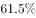和。

#### 第 9 题　qid 2295629 · 人文常识

Z省“最多跑一次”改革实践所体现的核心价值目标在于            。

- **A**. 简政放权
- **B**. 一窗受理
- **C**. 强化行政审批
- **D**. 节约行政成本　✅

**答案**：D

**官方解析**

本题考查政治常识。
A项错误，“最多跑一次”是政府“简政放权”的具体举措之一。
B项错误，根据材料，“一窗受理”属于“最多跑一次”改革实践的具体操作。
C项错误，根据材料，过去需要跑多个部门、办理多种证件、需要好几个工作日才能走完的流程，现在当天即可办结，主要体现的是政府行政效率的提高，没有与“强化行政审批”相关的内容。
D项正确，行政成本是否有效降低是衡量“最多跑一次”改革成败的重要标准。旧模式下的行政服务体系，多个办理窗口相距较远、部门之间沟通不畅等问题极大地提高了行政成本，而且造成了行政部门的人员浪费。在财政蛋糕规模既定的约束下，行政成本增加了，投入公共产品和公共服务的支出就会相应减少，进而导致企业和群众获得感和满意度的下降。因此需要将严格控制和有效降低行政成本纳入“最多跑一次”改革的工作计划和目标任务。
故正确答案为D。

---

#### 第 10 题　qid 2295631 · 人文常识

Z省出台“四张清单一张网”，主要基于            。

- **A**. 规范政府权力　✅
- **B**. 激发市场活力　✅
- **C**. 领导干部问责
- **D**. 打造阳光政府　✅

**答案**：ABD

**官方解析**

本题考查管理常识。
A项正确，“四张清单一张网”规范了办事流程，将相关职能部门的审批手续集中办理，并且精简了不必要的行政审批，使政府权力更加规范的运行。
B项正确，“四张清单一张网”能够提升效能、优化服务，有效杜绝了“跑断腿、磨破嘴”的繁琐办事程序，实现政务办事“最多跑一次”，降低了企业的市场运行成本，可以有效激发市场活力，为企业发展营造更优的生态环境。
C项错误，领导干部问责是反腐倡廉制度建设、完善领导干部行为规范的重要举措。“四张清单一张网”与领导干部问责无关。
D项正确，“阳光政府”主要是指政务公开，政府部门对所有的行政程序和办事流程进行公开，让行政过程中的每一个环节都经得起“阳光的暴晒”，确保老百姓获得知情权。“四张清单”（“行政权力清单”“责任清单”“企业项目投资负面清单”“政府部门专项资金管理清单”）就是属于政务公开的内容，有助于打造“阳光政府”。
故正确答案为ABD。

---

#### 第 11 题　qid 2295632 · 人文常识

以下关于“行政权力清单”的说法，正确的是            。

- **A**. 对政府部门必须承担哪些责任、必须做哪些事情进行明确，每个部门的职责边界进行规范
- **B**. 政府规定哪些经济领域不开放，除了清单上的禁区，其他行业、领域和经济活动都许可
- **C**. 把各级政府及其所属工作部门掌握的公共权力进行全面统计梳理，并公之于众，主动接受社会监督　✅
- **D**. 把专项基金的主管部门、专项名称和预算金额等进行详细列举

**答案**：C

**官方解析**

本题考查管理常识。
A项错误，A项表述说的是“责任清单”的概念，在责任清单中，明确了政府部门必须承担哪些责任、必须做哪些事情，每个部门的“职责边界”被明确。
B项错误，政府规定哪些经济领域不开放，除了清单上的禁区，其他行业、领域和经济活动都许可属于“负面清单管理模式”，不属于“行政权力清单”，故说法错误。
C项正确，“行政权力清单”的工作目标是将地方各级政府工作部门行使的各项行政职权及其依据、行使主体、运行流程、对应的责任等，以清单形式明确列示出来，向社会公布，接受社会监督。把各级政府及其所属工作部门掌握的公共权力进行全面统计梳理，并公之于众，主动接受社会监督，是“行政权力清单”的内容。
D项错误，把专项基金的主管部门、专项名称和预算金额等进行详细列举属于“财政专项资金清单管理”，不属于“行政权力清单”，故说法错误。
故正确答案为C。

---

#### 第 12 题　qid 2295633 · 人文常识

Z省“最多跑一次”改革实践的经验包括            。

- **A**. 全面整合和优化审批流程，推动政府服务标准化、法治化　✅
- **B**. 通过理顺部门职责关系，增强部门利益和部门责任
- **C**. 积极扩大政务电子化、互联网化应用，优化政府服务供给　✅
- **D**. 通过政府自身改革，带来公众、企业、政府的共赢局面　✅

**答案**：ACD

**官方解析**

本题考查政治常识。
A项正确，“最多跑一次”通过全面整合和优化审批流程，推动政务服务标准化、法治化，强化了群众参与、群众评价、群众监督，推动了政务公开，使权力运行变得更加规范有序、公平透明。
B项错误，“最多跑一次”进一步引发政府组织结构变革，理顺部门职责关系，对深化机构改革提供有益的基层探索。“最多跑一次”革除与审批发证相关联的寻租权力和不当利益，因此“增强部门利益”说法错误。
C项正确，“一窗”的背后是“一网”，Z省积极扩大政务电子化、互联网化应用，引发政府治理的技术变革，使互联网、大数据与政务服务紧密结合起来，加快迈向“数据政府”、“智慧政府”。
D项正确，“最多跑一次”体现了政府谋划实施一批群众最期盼、发展最急需的重大改革举措，努力在加强最优制度供给、营造最佳营商环境、释放最大改革红利上“更进一步、更快一步”，实现公众、企业、政府的共赢局面。
故正确答案为ACD。

---

#### 第 13 题　qid 2295406 · 人文常识

针对卖了房子，却迟迟不肯迁出户口的人，2018年5月起实施的新版《上海市常住户口管理规定》明确规定，房屋交易后原有户口人员拒不迁出的，现权利人或者承租人提出申请后，公安机关应当通知原有户口人员迁出，对拒不迁出或者无法通知的，可直接将其户口迁入                。

- **A**. 街道办事处
- **B**. 社区公共户　✅
- **C**. 居民公共户
- **D**. 临近派出所

**答案**：B

**官方解析**

本题考查政治常识。
根据新版《上海市常住户口管理规定》第三十二条规定：“房屋所有权或者公有居住房屋承租权因交易已发生转移，现权利人或者承租人申请将房屋内原有户口迁出的，房屋所在地公安派出所应当通知原有户口人员迁出，对拒不迁出或者无法通知的，可以直接将其户口迁至社区公共户。”故针对卖了房子，却迟迟不肯迁出户口的人，可以直接将其户口迁至社区公共户。
故正确答案为B。

---

#### 第 14 题　qid 2295593 · 人文常识

经党中央批准、国务院批复，自2018年起我国将每年农历秋分设立为“      ”。这是第一个在国家层面为农民设立的节日。设立这一节日将进一步强化“三农”工作在党和国家工作中的重中之重地位，营造重农强农的浓厚氛围，凝聚爱农支农的强大力量，推动乡村振兴战略实施，促进农业农村加快发展。

- **A**. 中国农民丰收节　✅
- **B**. 中国三农节
- **C**. 中国农业收获节
- **D**. 中国农民节

**答案**：A

**官方解析**

本题考查政治常识。
经党中央批准、国务院批复，自2018年起，将每年农历秋分设立为“中国农民丰收节”，是第一个在国家层面为农民设立的节日。这一节日的设立更加凸显了“三农”工作在党和国家工作中的重中之重地位，也是顺应了新时代的新要求、新期待。在当前我国处于脱贫攻坚的关键时期、实施乡村振兴战略的开局之年，为广大农民设立节日更能够带动农民的生产积极性，营造重农强农的浓厚氛围，促进农业农村加快发展。同时，设立此节日有利于弘扬我国的优秀文化传统，中国农民丰收节像是一个鲜明的文化符号，并赋予新的时代内涵。
故正确答案为A。

---

#### 第 15 题　qid 2295402 · 人文常识

2018年5月4日，纪念马克思诞辰200周年大会在北京人民大会堂隆重举行。马克思给我们留下的最有价值、最具影响力的精神财富，就是以他名字命名的科学理论——马克思主义。下列关于马克思和马克思主义的表述正确的是               。

- **A**. 马克思领导创建了世界上第一个无产阶级政党——国际工人协会
- **B**. 《共产党宣言》是马克思主义最厚重、最丰富的著作，被誉为“工人阶级的圣经”
- **C**. 马克思主义主要由哲学、政治经济学、科学社会主义三大组成部分构成　✅
- **D**. 革命性是马克思主义最鲜明的品格

**答案**：C

**官方解析**

本题考查政治常识。
A项错误，马克思领导创建了世界上第一个无产阶级政党——共产主义者同盟。
B项错误，1867年问世的《资本论》是马克思主义最厚重、最丰富的著作，被誉为“工人阶级的圣经”。
C项正确，马克思主义指的是马克思和恩格斯所创立的无产阶级思想体系，包括马克思主义哲学、政治经济学和科学社会主义三个组成部分。马克思和恩格斯参加了当时的革命实践，总结了欧洲工人运动的经验，同时又批判地吸收了德国古典的哲学、英国的古典政治经济学和法国的空想社会主义学说，创立了马克思主义。
D项错误，人民性是马克思主义最鲜明的品格。
故正确答案为C。

---

#### 第 16 题　qid 2295425 · 法律常识

2018年3月11日，十三届全国人大一次会议高票表决通过了《中华人民共和国宪法修正案》。根据此次宪法修正案，宪法第三章“国家机构”中增设“监察委员会”。国家监察委员会对            负责。

- **A**. 国家主席
- **B**. 中共中央委员会和中共中央纪律检查委员会
- **C**. 最高人民检察院
- **D**. 全国人民代表大会和全国人民代表大会常务委员会　✅

**答案**：D

**官方解析**

本题考查法律常识。
根据《宪法》第一百二十六条规定：“国家监察委员会对全国人民代表大会和全国人民代表大会常务委员会负责。地方各级监察委员会对产生它的国家权力机关和上一级监察委员会负责。”
故正确答案为D。

---

#### 第 17 题　qid 2295594 · 人文常识

2018年8月31日，第十三届全国人民代表大会常务委员会第五次会议通过了《全国人民代表大会常务委员会关于修改&lt;中华人民共和国个人所得税法&gt;的决定》，下列关于该《决定》的表述错误的是      。

- **A**. 居民个人的综合所得以家庭为征税单位　✅
- **B**. 居民个人的综合所得的起征点为年收入六万元
- **C**. 决定自2019年1月1日起施行
- **D**. 纳税人的工资、薪金所得自2018年10月1日开始实施新税率

**答案**：A

**官方解析**

本题考查法律常识。
A项错误，该《决定》并未提到居民个人的综合所得以家庭为征税单位。
B项正确，该《决定》将《中华人民共和国个人所得税法》的第六条修改为：“应纳税所得额的计算：（一）居民个人的综合所得，以每一纳税年度的收入额减除费用六万元以及专项扣除、专项附加扣除和依法确定的其他扣除后的余额，为应纳税所得额。”
C项正确，《全国人民代表大会常务委员会关于修改&lt;中华人民共和国个人所得税法&gt;的决定》自2019年1月1日起施行。
D项正确，《全国人民代表大会常务委员会关于修改&lt;中华人民共和国个人所得税法&gt;的决定》规定：自2018年10月1日至2018年12月31日，纳税人的工资、薪金所得，先行以每月收入额减除费用五千元以及专项扣除和依法确定的其他扣除后的余额为应纳税所得额，依照本决定第十六条的个人所得税税率表一（综合所得适用）按月换算后计算缴纳税款，并不再扣除附加减除费用。
本题为选非题，故正确答案为A。

---

#### 第 18 题　qid 2295427 · 法律常识

下列选项中，行政机关处于行政法律关系中并具有行政主体地位的是             。

- **A**. 某市市长代表该市人民政府向市人民代表大会作政府工作报告
- **B**. 某市教委发布《关于2018年本市义务教育阶段学校招生入学工作的实施意见》　✅
- **C**. 某市民政局辞退公务员王某，因其在年度考核中连续两年被确定为不称职
- **D**. 某市政府新建办公楼妨碍相邻居民住宅采光，被要求给予经济赔偿

**答案**：B

**官方解析**

本题考查法律常识。行政法律关系是指受行政法律规范调控的因行政活动而形成或产生的各种权利义务关系。在行政法律关系中，有两方主体，一方行政主体，一方是行政相对人，其中行政主体是行政管理法律关系的一方当事人，是指能以自己名义行使国家行政职权，作出影响行政相对人权利义务的行政行为，并能对外承担行政法律责任。
A项错误，市长代表市政府向人民代表大会作政府工作报告是属于履行政府工作职责，不处于行政法律关系中，不具有行政主体地位。
B项正确，某市教委作为行政主体，其发布的《关于2018年本市义务教育阶段学校招生入学工作的实施意见》是以自己名义行使国家行政职权，且该实施意见的发布会影响行政相对人的权利和义务。
C项错误，某市民政局辞退公务员王某属于行政机关自己内部事务。
D项错误，行政机关在进行民事活动时，即为民事主体，此时的行政机关与对方的法律地位是平等的，它们的法律关系受民事法律规范的调整。某市政府新建办公楼妨碍相邻居民住宅采光，被要求给予经济赔偿，这是相邻关系的内容，此时某市政府处于民事法律关系中，并不具有行政主体地位。
故正确答案为B。

---

#### 第 19 题　qid 2295432 · 法律常识

下列规范性法律文件，属于行政法规的是             。

- **A**. 国务院颁布的《国有土地上房屋征收与补偿条例》　✅
- **B**. 公安部颁布的《机动车驾驶证申领和使用规定》
- **C**. 上海市人民政府颁布的《上海市社会保障卡管理办法》
- **D**. 江苏省人大常委会颁布的《江苏省农村集体资产管理条例》

**答案**：A

**官方解析**

本题考查法律常识。
A项正确，《立法法》第六十五条第一款规定：“国务院根据宪法和法律，制定行政法规。”所以只有国务院可以制定行政法规。
B项错误，《立法法》第八十条第一款规定：“国务院各部、委员会、中国人民银行、审计署和具有行政管理职能的直属机构，可以根据法律和国务院的行政法规、决定、命令，在本部门的权限范围内，制定规章。”故公安部制定的《机动车驾驶证申领和使用规定》属于部门规章。
C项错误，《立法法》第八十二条第一款规定：“省、自治区、直辖市和设区的市、自治州的人民政府，可以根据法律、行政法规和本省、自治区、直辖市的地方性法规，制定规章。”故上海市人民政府颁布的《上海市社会保障卡管理办法》属于地方政府规章。
D项错误，《立法法》第七十二条第一款规定：“省、自治区、直辖市的人民代表大会及其常务委员会根据本行政区域的具体情况和实际需要，在不同宪法、法律、行政法规相抵触的前提下，可以制定地方性法规。”故江苏省人大常委会颁布的《江苏省农村集体资产管理条例》属于地方性法规。
故正确答案为A。

---

#### 第 20 题　qid 2295597 · 法律常识

公共政策执行手段是指政策执行机构及其执行者为完成一定的政治任务，达到一定的政策目标而采取的各种手段。其中，具有非政治性和间接性特点的是      。

- **A**. 行政手段
- **B**. 法律手段
- **C**. 经济手段　✅
- **D**. 教育手段

**答案**：C

**官方解析**

本题考查管理常识。
A项错误，行政手段是指依靠行政组织的权威，采用命令、指示、规定及规章制度等方式，按照行政系统、行政层次和行政区划来实施政策的方法。它具有权威性、强制性、直接性、无偿性和时效性的特点。
B项错误，法律手段是指通过法律、法令、法规、司法、仲裁工作，特别是通过行政立法和司法的方式来调整政策执行活动中各种关系的方法。它具有权威性、强制性、稳定性、规范性的特点。
C项正确，经济手段是指根据客观经济规律和物质利益原则，利用各种经济杠杆，调节政策执行过程中的各种不同经济利益之间的关系，以促进政策顺利实施的方法。它具有间接性、非政治性、有偿性、关联性的特点。
D项错误，教育手段属于思想引导手段。是一种以人为中心的人本主义管理方法，它通过运用各种方法做人的思想工作，引导政策执行者和政策对象自觉自愿地去贯彻执行政策，而不从事与政策相违背的活动。它具有引导性、人本性的特点。
故正确答案为C。

---

#### 第 21 题　qid 2295598 · 人文常识

国家预算调整是指经过批准的各级预算，在执行中因情况变化需要增加支出或减少收入,使总支出超过总收入或使原举借债务的数额增加的部分改变。县级以上地方各级政府预算的调整方案必须经过      的审查和批准。

- **A**. 本级人民代表大会
- **B**. 本级人民代表大会常务委员会　✅
- **C**. 本级人民政府
- **D**. 本级人民政协

**答案**：B

**官方解析**

本题考查法律常识。
根据《中华人民共和国预算法》第六十九条规定：“中央预算的调整方案应当提请全国人民代表大会常务委员会审查和批准。县级以上地方各级预算的调整方案应当提请本级人民代表大会常务委员会审查和批准；乡、民族乡、镇预算的调整方案应当提请本级人民代表大会审查和批准。未经批准，不得调整预算。”
故正确答案为B。

---

#### 第 22 题　qid 2295435 · 人文常识

统筹党政群机构改革不是简单地党政分开或党政合一，而是要在改革和完善党的领导方式与执政方式上下功夫，其基本原则不包括                。

- **A**. 坚持党的领导、人民当家作主和依法治国有机统一
- **B**. 以理顺部门职责为核心，将党委和政府部门在职能上进行合并　✅
- **C**. 形成由党领导决策、人大立法和监督、政府管理和执行的格局体系
- **D**. 优化整合党委部门内设机构设置，提高编制运行效能

**答案**：B

**官方解析**

本题考查政治常识。
统筹党政群机构改革不是简单地党政分开或党政合一，而是要在改革和完善党的领导方式与执政方式上下功夫，其基本原则是坚持党的领导、人民当家作主和依法治国有机统一，以理顺部门职责关系为核心，将党委和政府部门在职能上进行合理的分工，形成由党委领导和决策、人大立法和监督、政府管理和执行的格局体系。一是党委部门的设置要有利于发挥党委“总揽全局、协调各方”的作用，减少对行政事务的直接管理和执行。同时，要科学界定党委和政府部门职责边界，避免职能交叉、机构重叠，降低行政效能；二是严格落实《中国共产党工作机关条例》规定，按照办公厅、职能部门、办事机构和派出机关的不同特点，分别确定党委部门职能职责，规范机构设置、完善运行机制，构建科学完备的党委部门组织架构体系；三是按照“精简、统一、效能”原则，优化整合党委部门内设机构设置，实行“大处室制”，提高编制使用效能。
“将党委和政府部门在职能上进行合并”说法错误，应为“将党委和政府部门在职能上进行合理的分工”。
本题为选非题，故正确答案为B。

---

#### 第 23 题　qid 2295437 · 法律常识

公共行政监督的对象是国家公共行政机关及其公务员，其范围不包括             。

- **A**. 协调有关国家机关之间的公共行政执法活动
- **B**. 撤销违法或不当的公共行政行为
- **C**. 研究解决公共行政法律规范存在的问题
- **D**. 监督检查非本行政区域国家公共行政机关及公务员的恪尽职守情况　✅

**答案**：D

**官方解析**

本题考查管理学。
公共行政监督是指对国家公共行政机关及其工作人员的行为所进行的监察和督导。其范围主要包括：
1.协调有关国家机关之间的公共行政执法活动；
2.撤销违法或不当的公共行政行为；
3.研究解决公共行政法律规范自身存在的问题；
4.监督检查本行政区域内国家公共行政机关及公务员清正廉洁、遵纪守法、恪尽职守的情况，并依法作出相应的处理决定。
本题为选非题，故正确答案为D。

---

#### 第 24 题　qid 2295600 · 人文常识

下列选项中,与我国长期提倡的“从群众中来，到群众中去”的群众路线工作方法相似的是      。

- **A**. 强制性行政方法
- **B**. 参与管理方法　✅
- **C**. 诱导性行政方法
- **D**. 行政责任方法

**答案**：B

**官方解析**

本题考查管理学常识。
“从群众中来，到群众中去”是中国共产党的群众路线的领导方法和工作方法。习近平总书记强调，我们党工作的重要方法论：“好的方针政策都应该来自人民、顺应人民的意愿、符合人民的所思所想。党的领导工作的正确方法就是将群众意见集中起来形成正确的决策，又到群众中宣传解释，将决策化为群众的行动，并在群众实践中检验这些决策是否正确。做好党的一切工作，必须走群众路线。我们说发扬群众集思广益，绝不是喊喊口号走走过场，而是要诚心诚意、实打实做。如果不充分发扬民主，党的领导机关就会脱离群众，党的上级组织就会脱离下级组织。”
A项错误，强制性行政方法指依靠行政组织的权威，运用命令、指示等强制性的手段，对下属施加直接影响的管理方法。因此，强制性行政方法与“从群众中来，到群众中去”群众路线工作方法无关。
B项正确，参与管理方法是通过由下级行政主体或行政客体参加管理和决策来提高人们的积极性和管理效率的一种行政管理方法。参与管理方法也可被视作一种特定的激励手段，它是政府部门长期提倡的治道变革管理方法民主化的具体体现。因此，参与管理方法与“从群众中来，到群众中去”群众路线工作方法相符合。
C项错误，诱导性行政方法是一种以人为中心的人本主义管理方法，它通过利用非强制手段使机关工作人员和广大群众自觉自愿地去从事政府所鼓励的工作或活动。其特点是通过政府和管理者的循循善诱及谆谆教导，使人们自觉地、主动地、积极地去行动。因此，参与管理方法与“从群众中来，到群众中去”群众路线工作方法无关。
D项错误，行政责任方法是用行政体制中职权划分的机制将组织中的目标与人事中的职位有机结合起来，从而使行政工作中的职责权利诸要素统一起来。这与我们长期提倡“从群众中来，到群众中去”的思想和工作路线不一致。
故正确答案为B。

---

#### 第 25 题　qid 2295447 · 科技常识

芯片是半导体元件产品的统称，又称为微电路、集成电路等，它是一个国家科技发展水平最真实也最前沿的体现。关于我国芯片技术现状，下列说法正确的是              。

- **A**. 只要持续加大研发投入，我国就能在短时间内掌握芯片的核心技术
- **B**. 目前我国的光芯片已全部实现国产，仅部分电芯片依赖进口
- **C**. 光刻机是生产大规模集成电路的核心设备，近年来我国在该领域取得一些技术突破，但仍未掌握制造高端光刻机的核心技术　✅
- **D**. 我国现已掌握芯片的核心技术，只是目前仅限于军用，只要做好该项技术的军转民，我国民用芯片技术就能达到世界领先水平

**答案**：C

**官方解析**

本题考查科技常识。
A项错误，持续加大研发投入，不一定就能在短时间内掌握芯片的核心技术。要想掌握核心技术，除了需加大基础研发的投入之外，还有重视人才、增强专利意识等因素。
B项错误，目前我国的光芯片整体水平与国际标杆企业还有较大差距，尤其是高端芯片能力比美、日发达国家落后 1-2 代以上。低速的光芯片和电芯片已实现国产,但高速的仍全部依赖进口。
C项正确，光刻机是生产大规模集成电路的核心设备，制造和维护需要高度的光学和电子工业基础，世界上只有少数厂家掌握，我国在该领域虽取得一些技术突破，但仍未掌握制造高端光刻机的核心技术。
D项错误，我国现在的芯片技术仍落后于国际先进水平，且在军用、民用领域均有涉及。
故正确答案为C。

---

#### 第 26 题　qid 2295450 · 人文常识

在地球上某个特定地点，根据太阳的具体位置所确定的时刻，称为地方时。地球上每条经线均有自己的地方时。已知东经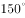是8月2日23时，则东经的地方时是<u>              </u>。

- **A**. 8月2日20时
- **B**. 8月2日17时　✅
- **C**. 8月3日2时
- **D**. 8月3日5时

**答案**：B

**官方解析**

本题考查自然常识。1884年国际经度会议决定，全世界按统一标准划分时区、实行分区计时。每隔经度为一个时区，全球共划分成24个时区。以本初子午线即经线为中央经线的时区为中时区或零时区，往东、往西各划分成十二个时区。所以东经位于东十区，东经位于东四区。两地相差6个时区。

根据区时计算公式：要计算的区时=已知地的区时±时区差。若所求地在已知地东面，则用“+”，反之，若所求地在已知地西面，则用“—”。东经位于东四区，位于已知地东十区的西面，按照公式，东经区时为，因未越过日界线，故日期不变，即8月2日17时，B项正确。

故正确答案为B。

---

#### 第 27 题　qid 2295603 · 人文常识

耳塞海绵套一般是指套在耳塞上的用海绵做成的套子。关于耳塞海绵套的作用，下列表述不符合实际情况的是      。

- **A**. 方便固定耳塞在耳朵中的位置
- **B**. 可以保护耳塞的清洁
- **C**. 起到削弱低音，提升高音的作用　✅
- **D**. 有缓冲作用，可提高长时间配戴的舒适性

**答案**：C

**官方解析**

本题考查科技常识。
A项正确，每个人的外耳形状不一样，海绵一方面可以增大摩擦力，另一方面使耳塞体积变大，从而使耳塞塞住不掉下来，方便固定耳塞在耳朵中的位置。
B项正确，海绵可以阻止一些外部灰尘进入耳塞；同时，在佩戴耳塞时，海绵还能防止耳朵内部的污垢颗粒（也就是平时所说的“耳屎”）、汗水等进入耳塞内部，从而保证耳塞的清洁。
C项错误，加装了海绵套的耳塞，在佩戴时能够更好的封闭耳道，从而保留了更多的低音，同时海绵的多孔材料有很强的声音吸附性，吸收了不少的高频频率，使得声音平衡感走向下端，并且因为阻尼作用，改变了振膜震动的特性，也使声音的中低频厚度陡然增加，产生更低的下潜，整体的听感也更好。所以海绵套是吸收高音，保留更多低音。
D项正确，因为耳塞都是塑料做的，长时间佩戴会很不舒服，海绵耳塞套起到了缓冲作用，而且使人们佩戴时不易出汗，从而长时间佩戴也不会觉得不舒服。
本题为选非题，故正确答案为C。

---

#### 第 28 题　qid 2295453 · 人文常识

增强现实技术（AR）是一种实时地计算摄影机影像的位置及角度并加上相应图像的技术，这种技术的目标是在屏幕上把虚拟世界套在现实世界并进行互动。下列关于增强现实系统特点的描述，错误的是             。

- **A**. 用虚拟的实物取代真实的世界　✅
- **B**. 是真实世界和虚拟世界的信息集成
- **C**. 具有实时交互性
- **D**. 在三维尺度空间中增添定位虚拟物体

**答案**：A

**官方解析**

本题考查科技常识。
增强现实技术是一种将虚拟信息与真实世界巧妙融合的技术，广泛运用了多媒体、三维建模、实时跟踪及注册、智能交互、传感等多种技术手段，将计算机生成的文字、图像、三维模型、音乐、视频等虚拟信息模拟仿真后，应用到真实世界中，两种信息互为补充，从而实现对真实世界的“增强”。AR手段具有以下特点：真实世界和虚拟的信息集成；具有实时交互性；是在三维尺度空间中增添定位虚拟物体。但虚拟现实并不能用虚拟的实物取代真实的世界。
本题为选非题，故正确答案为A。

---

#### 第 29 题　qid 2295605 · 人文常识

“人有悲欢离合，月有阴睛圆缺”，这里的圆缺就是指“月相变化”，即在地球上所看到的月球被日光照亮部分的不同形状。以下关于月相的描述中，错误的是      。

- **A**. 上弦月一般出现在农历初七、初八，下弦月出现在农历二十二、二十三左右
- **B**. 月相和海洋的潮汐有关系，在满月的时候会引起大潮
- **C**. 阴历是按月亮的月相周期来安排的历法
- **D**. 朔日为农历初一，这一天月球被太阳照亮的那一半正好对着地球　✅

**答案**：D

**官方解析**

本题考查科技常识。
A项正确，上弦月，大约出现在农历每月初七、初八，月球绕地球继续向东运行，月地连线与日地连线成90度，我们在地球上正好看到月球是西半边亮，呈半圆形，因此叫上弦月。下弦月大约出现在农历每月二十二、二十三，此时太阳、地球和月球之间的相对位置再次变成直角，月球在日地连线的西边90度，我们在地球上看到月球东半边亮，呈半圆形，因此叫下弦月。
B项正确，潮汐是指海洋水面受到月球和太阳引力的作用而产生的周期性上升、下降运动的现象。月球对地球海水有吸引力,地球表面各点离月球的远近不同,正对月球的地方受引力大,海水向外膨胀；而背对月球的地方海水受引力小,离心力变大,海水在离心力作用下,向背对月球的地方膨胀，也会出现涨潮，故一天有两次涨潮。尽管太阳的质量很大,但由于它比月球离地球更远,所以产生的引潮力只有月球的五分之二左右。因此潮汐的形成,月球起主导作用。朔、望（满）月时，月、日、地在一直线，日、月引力叠加，形成大潮；上、下弦月时，月、日、地三者间呈直角关系,引潮力减小,形成小潮。
C项正确，阴历是根据月相变化周期(朔望月)制定的一种历法。即从上次的朔日或望日到下次的朔日或望日相隔的时间为一个月,故称“朔望月”,其时间为29天12时44分3秒。为了计算方便,定大月为30天,小月为29天,12个月为一年,一年共有354天。
D项错误，朔日为农历初一，此时月相称为新月，月球运行到地球和太阳之间，和太阳几乎同时出没，这一天月球被太阳照亮的那一半正好背对地球，在地球上几乎看不到月亮。
本题为选非题，故正确答案为D。

---

#### 第 30 题　qid 2295454 · 人文常识

天宝三年（744年），杜甫在洛阳见到了李白，时李白43岁，杜甫32岁。下面是模拟的二人对话：
杜甫：“昔日无由得见贤兄，今日一见，幸甚！”
李白：“子美兄此言差矣。听闻尊府前些日修饬一番，自当是华彩焕然，不知能否一临？”
杜甫：“兄长过谦了。如能驾临，寒舍自是蓬荜生辉！”
以上对话中，用语不当的一项是              。

- **A**. 贤兄
- **B**. 子美兄　✅
- **C**. 尊府
- **D**. 寒舍

**答案**：B

**官方解析**

本题考查人文常识。
A项正确，“贤兄”是对兄长的敬称。
B项错误，杜甫、字子美，杜甫比李白年纪小，故李白不应称杜甫为“子美兄”，应称“子美”或“贤弟”。
C项正确，“尊府”既是对他人父亲的敬称，也是对他人之家的敬称。
D项正确，“寒舍”是指谦辞,对人称自己的家。
本题为选非题，故正确答案为B。

---

#### 第 31 题　qid 2295457 · 人文常识

下列选项中，表述不正确的一项是             。

- **A**. 古代把骨器加工叫“切”，象牙加工叫“磋”。后人把“切磋”一词用作相互研讨、共同提高
- **B**. 韩愈有首诗名为《左迁至蓝关示侄孙湘》，“左迁”的意思是贬官降职
- **C**. 成语“大相径庭”中的“径”指小路，“庭”指院子
- **D**. “安能摧眉折腰事权贵，使我不得开心颜”，其中“颜”原指颜色，特指脸色发白　✅

**答案**：D

**官方解析**

本题考查人文常识。
A项正确，古代把骨头加工成器物叫“切”，把象牙加工成器物叫“磋”。“切磋”比喻互相商量研究，学习别人的长处，纠正自己的缺点。
B项正确，左迁，指的是官员贬职、降职。古人以右为尊，左为卑，故将贬官称为左迁。
C项正确，“大相径庭”中，径指的是门外小路；庭指的是院落；径庭指的是悬殊。“大相径庭”比喻相差很远，大不相同。
D项错误，“安能摧眉折腰事权贵，使我不得开心颜”的意思是怎么能低着眉头，弯着腰去侍奉权贵，这样做绝不能使我开心欢笑。用以形容不屑于卑躬屈膝，不媚权贵的高贵品行。“不得开心颜”指不高兴，其中“颜”指的是脸面，面容，而非颜色，脸色发白。
本题为选非题，故正确答案为D。

---

#### 第 32 题　qid 2295458 · 人文常识

“草长莺飞二月天，拂堤杨柳醉春烟。儿童散学归来早，忙趁东风放纸鸢。”诗中的纸鸢即风筝，下面关于风筝的说法有错的是            。

- **A**. 风筝起源于中国
- **B**. 纸风筝出现于春秋时期　✅
- **C**. 古时风筝曾被用于军事通讯
- **D**. 风筝制作技艺已被列入国家级非物质文化遗产名录

**答案**：B

**官方解析**

本题考查人文常识。
A项正确，风筝起源于中国，是一种古代劳动人民发明的通信工具。
B项错误，最早的风筝是木制成，故名“木鸢”。直至东汉期间，蔡伦改进造纸术后，坊间才开始以纸做风筝，称为“纸鸢”。
C项正确，最初风筝常被利用为军事工具，用于三角测量信号、天空风向测查和通讯的手段。
D项正确，2006年，山东省潍坊市风筝制作技艺经国务院批准列入第一批国家级非物质文化遗产名录。
本题为选非题，故正确答案为B。

---

#### 第 33 题　qid 2295606 · 人文常识

作为现代化国际大都市，上海也拥有众多风光旖旎的江南古典园林，下面对应正确的一项是      。

- **A**. 松江——醉白池、方塔园　✅
- **B**. 嘉定——曲水园、古猗园
- **C**. 青浦——大观园、汇龙潭
- **D**. 黄浦——豫园、秋霞圃

**答案**：A

**官方解析**

本题考查地理国情。
A项正确，醉白池位于上海松江区，园内楼堂亭榭，曲径通幽，是上海千年历史文脉的延续；方塔园位于上海松江区，是一座以观赏历史文物为主体的园林。
B项错误，曲水园位于上海市青浦区，初建于清乾隆十年，当时是城隍庙的灵苑，又称“一文园”；古漪园位于上海市嘉定区，最早建于明代嘉靖年间，以绿竹猗猗、静曲水幽、建筑典雅、楹联诗词以及花石小路等特色闻名。
C项错误，大观园位于上海青浦区，是根据中国清代名著《红楼梦》的描写设计而成的大型仿古园林；汇龙潭位于上海嘉定区，因其支流五条蜿蜒入潭，状似五龙戏珠之势，故名曰“汇龙潭”。
D项错误，豫园位于上海黄浦区，始建于明代；秋霞圃位于上海嘉定区，其建筑风格具有“小中见大”、曲折有致的特点。
故正确答案为A。

---

#### 第 34 题　qid 2295607 · 科技常识

华南地区位于中国最南部，植物生长茂盛，种类繁多，有热带雨林、季雨林和南亚热带季风常绿阔叶林等地带性植被。下列诗句中描述的是华南气候特征的是      。

- **A**. 君问归期未有期，巴山夜雨涨秋池。
- **B**. 早穿皮袄午穿纱，围着火炉吃西瓜。
- **C**. 罗浮山下四时春，卢橘杨梅次第新。　✅
- **D**. 黄梅时节家家雨，青草池塘处处蛙。

**答案**：C

**官方解析**

本题考查地理国情。
A项错误，“君问归期未有期，巴山夜雨涨秋池”，是诗人李商隐留滞巴蜀（今四川省）时寄怀长安亲友之作。四川省属于亚热带季风区，不是华南气候特征。
B项错误，“早穿皮袄午穿纱，围着火炉吃西瓜”，描述的是昼夜温差大，早晚气候寒冷，中午天气炎热，是对我国大西北沙漠地区温带大陆性气候特点的形象化写照，不是华南气候特征。
C项正确，“罗浮山下四时春，卢橘杨梅次第新”，是诗人苏轼在北宋绍圣三年作于惠州（今广东省）的诗句，描写了对岭南风物的热爱之情。岭南属于华南地区，故该诗句描述的是华南气候特征。
D项错误，“黄梅时节家家雨，青草池塘处处蛙”，“黄梅时节家家雨”指的是在每年6、7月份的东南季风带来的太平洋暖湿气流，经过中国长江中下游地区等地出现的持续天阴有雨的气候现象，由于正是江南梅子的成熟期，故称其为“梅雨”，江南属于亚热带季风气候，不是华南气候特征。
故正确答案是C。

---

## 言语理解与表达

### 材料 1

        过去100年来，人类寿命的延长，完全是因为对传染性疾病的控制——通过公共卫生、疫苗接种和抗菌治疗，由此人们才有余裕死于癌症、心脏病、中风。

        科学家认为，一种疾病爆发的严重程度和四个因子有关：致命性、是否容易传染、感染多久出现症状、是否有疫苗和有效的治疗手段。即使疾病只符合其中的一部分特征，也能在人群中肆虐。如果它们满足大多数特征或者全部因素，我们需要非常加以小心。

        很多业内人士认为，最有可能进化成符合这四个条件的病原体是流感。人类流感病毒很容易在人际间传播，至少在症状出现一天前就开始传染，人类需要6～12个月来制造新的疫苗，但幸运的是它们没有很强的致命性。

        为什么呢？

        关于病菌的传染性与毒性之间的制衡，美国进化生物学家保罗•埃瓦尔德有一个著名的假说，如果一个寄主必须四处走动才能扩散病菌，这种病菌不可能变得太凶猛。从病菌的角度来看，病菌不得不从一个宿主迁移到另一个宿主，并且它们通常不得不依赖于相对健康的宿主把它们迁移到另一个宿主上。比如流感病毒就必须保持寄主的合理健康，至少他们得能四处走动、与人握手，冲着人家的脸打喷嚏。所以流感病毒一般是比较温和的，除非寄主本身的身体有问题，比如怀孕、心脏病或者免疫系统太弱。

        当然，还有另一种例外——如果在一个人群拥挤的场合，一个病到毫无行动能力的人也能轻易地把病菌传到新的寄主身上，病菌毒性的刹车就会失灵。自然选择会倾向于选择那些更具有侵略性、更能造成破坏的病菌。它们的毒性也会愈演愈烈，直至毒株可以不费吹灰之力地杀死寄主而不必受到任何惩罚——新的寄主就近在咫尺。

        埃瓦尔德认为，1918年大流感就是在“一战”西方前线战事的特定条件下进化出它的致命毒性的。1918年春天，第一波流感在美国爆发时还是相对温和的。不久，病菌随军队船只传播到欧洲，在“一战”的战壕、医院、前线火车、卡车上（在这些地方，伤员和病患一起运送，没有移动能力的人身上的病菌一次次感染健康的人，整个系统就是一个巨大的病毒传递服务)迅速升温至致命的毒性。病毒的毒性达到什么程度呢？按照当时的记录，早上生病，晚上就已经奄奄一息。一般流感病毒的致死率是千分之一，1918年大流感则是1/40。不久，病毒离开西方前线，在全球各地爆炸，造成全球5000万人口死亡。

        他认为，那场大流感的爆发和演变，不是几种动物流感病毒的随机组合，而是遵循了一种可预测的物竞天择的进化原则。人们一般以为进化是一个时间跨度很长的事情，需要百万年的时光。但事实上，进化也可以发生得很快——尤其对微生物而言，比如在几个星期之内发展出抗药性。因为它们分裂得很快，能快速产生变异，与不同成员交换基因信息。每一次迭代中，最能适应传播的病菌会得到传播。所以，自然选择会推动这种病菌进化出更有效的传播手段，从而更适应人类寄主。

        从这个角度来说，流行病是一种社会现象。一种人类流行病之所以存在，是因为社会条件允许它们进化。是我们，而不是自然，创造了环境，允许这些致命病菌的进化和攻击。

        比如，正是在亚洲分布广泛的养鸡场，数百万的鸡挤在“疾病工厂”的状况下，甲型H5N1流感获得了强烈的毒性，成了复杂而高效的杀鸡机器。

        “一战”前线作为一种人类“疾病工厂”大概很难再在历史上重现，但这些巨型工业化饲养场作为致命病菌的天然孵化器（在那种拥挤的状况下，最无害的细菌也能迅速进化出剧烈的毒性），仍然是现代社会巨大的威胁。事实上，很多病毒学家呼吁必须找到一种新的饲养动物的方法，而不是如此拥挤地放置于巨大的工业化农场。

#### 第 1 题　qid 2295668 · 片段阅读

1991年，秘鲁爆发霍乱，两个月内病菌传播至邻国智利和厄瓜多尔。霍乱有三种传播方式：人与人之间的接触传播、从人到食物（被污染）再到人、通过污染的水源进行传播。其中第三种传播方式，病菌不依赖于健康的宿主进行传播。三个国家中，智利有良好的水源供应，厄瓜多尔是整个南美洲水源保护最差的地方，而秘鲁的水源供应保护水平处于两者之间。
根据文意我们可以推断，1991年霍乱中病菌毒性进化最强的国家可能是      。

- **A**. 秘鲁
- **B**. 厄瓜多尔　✅
- **C**. 智利
- **D**. 三国并无差异

**答案**：B

**官方解析**

根据“病菌不依赖于健康的宿主进行传播”可知，水源污染得越严重病毒可能进化得越强，而三国之中智利有良好水源供应，厄瓜多尔是整个南美洲水源保护最差的地方，秘鲁水源供应保护介于二者之间，由此推断病菌进化最强的国家可能是厄瓜多尔。
故正确答案为B。
【文段出处】《我们如何驯服病菌》

---

#### 第 2 题　qid 2295669 · 片段阅读

对文中出现的“疾病工厂”一词，正确的理解应该是      。

- **A**. 指卫生条件恶劣的血汗工厂
- **B**. 指人口密集容易传染疾病的场所
- **C**. 指牲畜过于密集的养殖工厂
- **D**. 指允许病菌繁殖、传播并滋生出高度毒性的环境　✅

**答案**：D

**官方解析**

“疾病工厂”一词出现在篇章后两段。根据后两段中“甲型H5N1流感获得了强烈的毒性”“作为致命病菌的天然孵化器”可知，此处指允许病菌繁殖、传播，使得病菌变得高毒性的环境，对应D项。
A项“血汗工厂”、C项“养殖工厂”均未指出与病菌间的关系，排除；
B项“人口密集”表述错误，篇章后两段的例子中提及的是“养殖场”“一战前线”等能够孵化致命病菌的“工业化饲养场所”，排除。
故正确答案为D。
【文段出处】《我们如何驯服病菌》

---

#### 第 3 题　qid 2295673 · 片段阅读

根据文意，作者说“流行病是一种社会现象”的主要依据是      。

- **A**. 流行病的存在是因为人类创造了允许病菌进化的社会条件　✅
- **B**. 流行病的存在是人类发动战争的后遗症
- **C**. 流行病的存在是因为人类活动对自然生态的污染和破坏
- **D**. 流行病的存在是因为人类聚居的生存方式

**答案**：A

**官方解析**

“流行病是一种社会现象”出现在篇章第九段第一句。后文通过“之所以……是因为”句式进行解释说明，强调人类流行病源于社会条件允许其进化，后面又补充说明是我们创造了允许致命病菌进化和攻击的环境，故而可知，流行病成为一种社会现象是因为我们创造了允许病菌进化的社会条件，对应A项。
B项“战争后遗症”表述片面，文中所述的1918年的大流感病毒是在“一战”西方前线战事的特定条件下进化的，排除；
C、D两项文中并没有提到，无中生有，排除。
故正确答案为A。
【文段出处】《我们如何驯服病菌？》

---

#### 第 4 题　qid 2295675 · 片段阅读

根据文意，下列选项中，      不是控制传染病的有效方式。

- **A**. 改善公共卫生
- **B**. 接种有效疫苗
- **C**. 控制人口数量　✅
- **D**. 革新工业饲养方式

**答案**：C

**官方解析**

根据第一段“通过公共卫生、疫苗接种和抗菌治疗”可知，A项“改善公共卫生”、B项“接种有效疫苗”均为控制传染病的有效方式，排除。
根据篇章最后一段“很多病毒学家呼吁······一种新的饲养动物的方法”可知，D项“革新工业饲养方式”为控制传染病的有效方式，排除。
C项“控制人口数量”文段未提及，不是控制传染病的有效方式，当选。
故正确答案为C。

---

### 材料 2

板印书籍，唐人尚未盛为之。自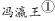始印五经，已后典籍皆为板本。中，有布衣毕昇，又为活板。其法：用胶泥刻字，薄如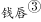，每字为一印，火烧令坚。先设一铁板，其上以松脂、蜡纸灰之类之。欲印，则以一铁置铁板上，乃密布字印，满铁范为一板，持就火炀之，药稍镕，则以一平板按其面，则字平如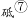。若止印三二本，未为简易；若印数十百千本，则极为神速。常作二铁板，一板印刷，一板已自布字，此印者才毕，则第二板已具，更互用之，瞬息可就。每一字皆有数印，如“之”“也”等字，每字有二十余印，以备一板内有重复者。不用，则以纸贴之，每韵为一贴，木格贮之。有奇字素无备者，旋刻之，以草火烧，瞬息可成。不以木为之者，文理有疏密，沾水则高下不平，兼与药相粘，不可取；不若土，用讫再火令药镕，以手拂之，其印自落，殊不沾污。昇死，其印为余群从所得，至今保藏。

①冯瀛王：冯道（882～954年），五代时瀛州景城（今河北沧州西北）人，后唐、后晋时历任宰相，后汉时任太师，后周时又任太师、中书令，死后追封为瀛王。

②庆历：宋仁宗赵祯年号。

③钱唇：铜钱的边。

④和：混合。

⑤冒：覆盖。

⑥范：模子。

⑦砥：细的磨刀石。

⑧燔（fán）：烧。

#### 第 5 题　qid 2295412 · 片段阅读

下列说法中不符合文意的一项是              。

- **A**. 活板印刷操作非常简易　✅
- **B**. 宋代以前，我国还有其他印刷术
- **C**. 活板印刷的发明者是一个普通的平民
- **D**. 毕昇所制的字印在他死后仍保藏得很好

**答案**：A

**官方解析**

A项，文段中“其法，用胶泥刻字，薄如钱唇，每字为一印，火烧令坚。先设一铁板，其上以松脂、腊和纸灰之类冒之，欲印则以一铁范置铁板上，乃密布字印。满铁范为一板，持就火炀之，药稍镕，则以一平板按其面，则字平如砥 ”均是介绍活板印刷的操作流程，且强调了“若止印三二本，未为简易”，如果只印刷两三本，不能算是简易，故“非常简易”无从体现，表述不合文意，当选；
B项，根据文段“板印书籍，唐人尚未盛为之”和“庆历中，有布衣毕昇又为活板”可知，唐代就有雕版印刷书籍，只是没有大规模做，“庆历”即宋仁宗时期，毕昇又发明了活板，故宋代以前是有其他印刷术存在的，符合文意，排除；
C项，根据文段“庆历中，有布衣毕昇又为活板”可知，“布衣”即为普通百姓，表述正确，排除；
D项，根据文段尾句“昇死，其印为予群从所得，至今保藏”，毕昇死后的字印为沈括的堂兄弟及子侄们所得，到现在还保藏得很好，表述正确，排除。
本题为选非题，故正确答案为A。
【文段出处】《梦溪笔谈》

---

#### 第 6 题　qid 2295413 · 片段阅读

下列关于活板印刷的说法中，正确的一项是                。

- **A**. 活板印刷术在唐代使用得很少，从五代开始才用于印刷经文典籍
- **B**. 活板印刷是用一个铁制的模具作为底板，里面可以根据需要嵌入木刻的字印
- **C**. 字印平常不用的时候，就贴上纸，按照音序收纳在木格中
- **D**. 铁模具和字印之间要敷一层松脂、蜡、纸灰等混合制成的药剂，利用火烧令药剂熔化，可控制字印的黏合与脱落　✅

**答案**：D

**官方解析**

根据提问可知本题为细节判断题。
A项，对应文段“板印书籍，唐人尚未盛为之。五代时始印五经”可知，该句论述的主体为雕版印刷术，而非活版印刷术，偷换概念，排除；
B项，对应文段“欲印，则以一铁范置铁板上，乃密布字印，满铁范为一板”“火烧令坚先设一铁板，其上以松脂、蜡和纸灰之类冒之”可知，活版印刷用铁制的模具作为底板，但是活字模不是木制而是胶制的，该项表述错误，排除；
C项，对应文段“不用，则以纸帖之，每韵为一帖，木格贮之”可知，字印的储存是按照韵部分类，而非按照音序，排除；
D项，对应文段“火烧令坚先设一铁板，其上以松脂、蜡和纸灰之类冒之”“不若燔土，用讫再火令药熔，以手拂之，其印自落”可知，活字印刷术是先设置一块铁板，它的上面用松脂、蜡混合着纸灰这一类东西覆盖好，不用的时候，用火烤让药物熔化，之后字印即可掉落，故该项表述正确，当选。
故正确答案为D。
【文段出处】《板印书籍》

---

#### 第 7 题　qid 2295417 · 片段阅读

关于以下四个句子中的助词“者”的用法，下列说法正确的一项是              。
①此印者才毕，则第二板已具。
②每字有二十余印，以备一板内有重复者。
③有奇字素无备者，旋刻之。
④不以木为之者，文理有疏密。

- **A**. ①和②中的用法不同
- **B**. ①和③中的用法相同
- **C**. ②和④中的用法不同
- **D**. 四个“者”的用法各不相同　✅

**答案**：D

**官方解析**

①句的意思为这块印刷才完，第二块板已准备好了，“者”置于“此印”之后表示停顿。
②句的意思为每个字都有二十多个字印模，用来准备同一版内有重复的字，“者”相当于“······的字”。
③句的意思为遇到平时没有准备的生僻字，随即刻制，“者”是后置定语的标志。
④句的意思为不用木料制作字模的原因，是因为木料的纹理有疏密，“者”的意思是“······的（原因）”，用在因果复句的前一分句句末，把结果或现象提示出来，后一分句申述原因或理由。
四句话的用法各不相同，故正确答案为D。
【文段出处】《活板》

---

#### 第 8 题　qid 2295420 · 片段阅读

本文想要表达的主题是              。

- **A**. 活板印刷是中国的四大发明之一
- **B**. 活板印刷推动了文化的传播和文明的进程
- **C**. 活板印刷与雕版印刷的工艺差异
- **D**. 活板印刷的操作方法及其高效的原因　✅

**答案**：D

**官方解析**

根据篇章可知，篇章首先介绍雕版印刷出现的时间，引出印刷的话题。接着文段详细对庆历年间毕昇发明的活字版印刷展开说明，介绍了活字印刷用字模和铁板进行印刷的方法，并说明字模采用胶泥烧制，制作效率非常高，而且能够同时用两块铁板进行印刷，印制大量书籍非常快。故篇章意在强调活字印刷的方式和其高效的原因，对应选项为D。
A项，“四大文明”文段没有相关表述，无中生有，排除；
B项，“推动文化的传播和文明的进程”表述无中生有，排除；
C项，文段未介绍雕版印刷的工艺，故“活板印刷与雕版印刷的工艺差异”表述无中生有，排除。
故正确答案为D。
【文段出处】《梦溪笔谈》

---

#### 第 9 题　qid 2295265 · 逻辑填空

鸦片战争之前，清廷年度财政盈余超过500万两，到鸦片战争后的1847年，财政        为380万两，到甲午战争前的1893年，这一数字达到760万两。这些数据说明，在两次鸦片战争都失败同时又面临日本的威胁的情况下，清廷不仅不把未来的收入透支来加速发展国力，反倒一心放在“        ”上，只想往国库多存钱。

- **A**. 结余  节流　✅
- **B**. 节余  截流
- **C**. 节余  节流
- **D**. 结余  截流

**答案**：A

**官方解析**

第一空，由文段可知，此处应该填入一个名词。根据“鸦片战争之前，清廷年度财政盈余超过500万两，到鸦片战争后的1847年，财政······为380万两”可知，鸦片战争后清廷的财政由超过500万两减少到380万两。A、D两项“结余”作名词时指结算后余下的钱、物，符合文意，保留。B、C两项“节余”作名词时指因节约而剩下的钱或东西，此处并无节约之意，不符合文意，排除。
第二空，由“清廷不仅不把未来的收入透支来加速发展国力”“只想往国库多存钱”可知，清廷在面临危机时，不仅没有通过透支未来的收入来发展国力，反而严格控制财政支出，只想往国库多存点钱，即节约用钱。A项“节流”指节省开支，符合文意，当选。D项“截流”指在水道中截断水流，以提高水位或改变水流的方向，与文意不符，排除。
故正确答案为A。
【文段出处】《中国近二十几年持续增长的启示（上）》

---

#### 第 10 题　qid 2295650 · 片段阅读

逻辑作为人类探求知识、追求理性的工具，其研究范围是极其广泛的。      是以推理有效性为核心研究内容的逻辑，其形态也是丰富多彩的，      有演绎的逻辑，还有各种非演绎的逻辑，如归纳逻辑、类比逻辑等，      围绕推理研究，逻辑还研究与推理有关的概念、判断、论证以及基本的逻辑规律和逻辑方法等等。

- **A**. 不但  而且  甚至
- **B**. 即使  不仅  并且　✅
- **C**. 如果  那么  也是
- **D**. 既然  所以  然而

**答案**：B

**官方解析**

本题考查关联词搭配。
第一空，横线处所填关联词搭配后文的“也”，B项“即使”和D项“既然”均可和“也”形成关联词的固定搭配结构。A项，“不但”搭配“而且”；C项“如果”搭配“那么”，均无法和“也”形成搭配，排除。
第二空，横线处所填关联词搭配后文的“还”，B项“不仅”和后文“还”搭配恰当，D项“所以”和“还”无法搭配，排除。锁定正确答案B。
第三空代入验证，“不仅有……还有……并且”表并列，符合文意，且搭配合适。
故正确答案为B。
【文段出处】《中国逻辑的特质》

---

#### 第 11 题　qid 2295270 · 逻辑填空

当年刘邦入咸阳，“缓刑弛禁，以慰其望”，采取的是“有所不为”。后刘备入蜀，诸葛亮则“威之以法”“限之以爵”，采取的是“有所为”。“为”与“不为”                ，都深得人心，实现大治，原因就在于                ：秦朝苛政，百姓苦不堪言，不为而治，顺应人民的意愿；而蜀中刘璋长期暗弱，豪强专权自恣，必须严刑峻法。
依次填入画横线部分最恰当的一项是：

- **A**. 异曲同工  度德量力
- **B**. 殊途同归  审时度势　✅
- **C**. 背道而驰  实事求是
- **D**. 见仁见智  量力而行

**答案**：B

**官方解析**

第一空，根据文意可知，“为”与“不为”是刘邦与刘备采取的两种不同做法，且根据“深得人心、实现大治”可知，这两种做法都是好的，为积极感情色彩。A项“异曲同工”比喻一件事情的做法不同而都巧妙地达到目的，B项“殊途同归”比喻采取不同的方法而得到相同的结果，均符合文意，保留；C项“背道而驰”强调行动与正确的方向和原则相反，为消极感情色彩，与文段不符，排除；D项“见仁见智”指对同一个问题，不同的人从不同的立场或角度有不同的看法，侧重强调对事物的看法不同，而文段重在指出两人的做法不一样，且为中性词，与文意不符，排除。
第二空，冒号表解释说明，故“秦朝苛政······严刑峻法”是对横线处的解释说明，强调根据不同的情况而采取了不同的治理方法，B项“审时度势”指观察分析时势，估计情况的变化，侧重于对时势的估量，符合文意，当选；A项“度德量力”指衡量自己的德行是否能够服人，估计自己的能力是否能够胜任，横线处强调的是刘邦对时势的分析，而非对自身的分析，与文意不符，排除。
故正确答案为B。
【文段出处】《“为”与“不为”的辩证法》

---

#### 第 12 题　qid 2295275 · 逻辑填空

打动我们的，除了信中流淌的那些        而充满情怀的表达，还有写信这种方式。说它        ，是因它在社交媒介如此发达、信息传播如此迅捷的时代显得格外传统。说它        ，是因它需要坐下来细细体味、静静琢磨，一个字一个字地推敲，走进人的心灵深处去对话交流。

- **A**. 真实  老旧  死板
- **B**. 真诚  老旧  死板
- **C**. 真实  古老  笨拙
- **D**. 真诚  古老  笨拙　✅

**答案**：D

**官方解析**

第一空，分析文意可知，横线后“而”即“而且”，表并列，横线处应与“充满情怀”语义相近。“充满情怀”表示充满某种感情，是一种感情的表达。“真实”表示跟客观事实相符合，“真诚”表示真实诚恳，“真诚”比“真实”多了“诚恳”的含义，更能体现出情感的表达，更符合文意，故排除A、C两项。
第二空，“是因它在······格外传统”对横线处进行原因解释，根据后文可知在信息时代，写信是很传统的方式。从文段“充满情怀”“细细体味”“走近人的心灵深处”等表述可知，作者对写信持积极态度。B项“老旧”表示陈旧、过时的，含贬义，与文段感情色彩不符，排除；D项“古老”表示经历了久远年代的，可体现“格外传统”的含义，符合文意，当选。
第三空，代入验证，D项“笨拙”表示不伶俐，填入文段表示信不能非常便捷、非常直接地传递信息，需要人们细细体味、琢磨，与文段对应恰当，当选。
故正确答案为D。
【文段出处】《媒体评几封信刷屏朋友圈：不能失去写信这种笨拙而温柔的能力》

---

#### 第 13 题　qid 2295652 · 逻辑填空

①中晚唐时期藩镇割据，人们在动荡的社会中对现实不满，把兴仁除害的期盼      那些锄强扶弱、伸张正义的侠客身上。
②这届领导班子成员年轻有为，会想能干，村民们      厚望，盼着自己选出的领头人能带领大家脱贫致富，尽快结束多年来吃粮靠国家、用钱靠贷款的窘迫历史。
③进入新世纪的这一年，我不断审视自己，从头认识生活，重新估量生活每天      了我什么。

- **A**. 寄于，寄予，赋予
- **B**. 寄于，寄予，给予　✅
- **C**. 寄予，寄于，给予
- **D**. 寄予，寄于，赋予

**答案**：B

**官方解析**

第一空和第二空，“寄于”指“寄托在······”，“于”后面可加地点、人物等，比如“相思寄于人海”，“家庭的希望寄于孩子身上”；“寄予”指寄托，给予关怀、同情，比如“寄予厚望”、“寄予同情”。①句搭配“侠客”，②句搭配“厚望”，故锁定A、B两项。
第三空，“赋予”指给予，交给，寄托，通常搭配重大任务、使命等，表意相对积极；“给予”指使别人得到，是中性词。而生活给我们的可能是挫折、痛苦，也可能是开心、快乐，故填入中性词“给予”更加合适，锁定B项。
故正确答案为B。

---

#### 第 14 题　qid 2295654 · 语句表达

将下面5个句子重新排列，语序正确的是      。
①当幼虫将要羽化时，会在黄昏及夜间钻出地表，爬到树上然后抓紧树皮，开始蜕皮羽化。
②因此，夜晚便成了蝉活动最频繁的时间段。
③成功的蜕变对蝉儿来说非常重要，一旦蝉在蜕变的过程中受到骚扰，翅膀就不能正常地发育生长，会导致它一生都不能飞起来。
④为了避免在蜕变的时候受到干扰，蝉喜欢在夜晚爬上树枝进行蜕变。
⑤夜幕降临，人们准备入睡的时候，蝉儿们开始忙碌起来了。

- **A**. ①②④③⑤
- **B**. ⑤①④③②　✅
- **C**. ④②⑤③①
- **D**. ③①④②⑤

**答案**：B

**官方解析**

对比选项，确定首句，分别为①、③、④、⑤四句。①句论述幼虫将要羽化时的状态，③句论述蝉蜕变过程中不能受到干扰，④句论述蝉为避免受到干扰，选择夜间进行蜕变，⑤句引出蝉在夜晚开始忙碌的话题。按照逻辑顺序，应先引出蝉开始活动的话题，再介绍蝉忙碌的具体过程，故⑤句应在①、③、④句之前，排除A、C、D三项，B项保留。
验证B项，⑤句引出蝉在夜间活动的话题，①句论述幼虫在夜间开始羽化，④③两句介绍幼虫在羽化的过程中不能受干扰，②句引出结论“因此蝉在夜间活动”，符合逻辑顺序。
故正确答案为B。
【文段出处】《还在嫌弃蝉的聒噪？其实它的一生很传奇》

---

#### 第 15 题　qid 2295281 · 语句表达

下列句子中，有语病的是                          。

- **A**. 中国农业对外开放的大门不会关上，如果中美贸易摩擦不断升级，美国的竞争对手将占据美国在中国失去的市场份额。
- **B**. 新疆地广人稀，面积166万平方公里，是中国陆地面积最大的省级行政区。
- **C**. 八十挂零的耄耋老翁，还能在网球场上跑动，还能跳起拦网，这多少还是能引起很多人的好奇和点赞的！　✅
- **D**. 有一晚风大雨大，早上出门只见地下厚厚一层落叶被晨光照得一片金黄，抬头看树上的叶子也是一片金黄，宛如一幅巨大的立体油画。

**答案**：C

**官方解析**

C项中“八十挂零的耄耋老翁”语义重复，“耄耋”指八九十岁，与“八十挂零”存在语义重复，故为病句，当选。其余三项均没有语病，排除。
本题为选非题，故正确答案为C。

---

#### 第 16 题　qid 2295655 · 片段阅读

下列说法中，含义和其他几项不一致的是      。

- **A**. 了解世界最好的方法就是尽可能多地从各种不同的角度去看待它。　✅
- **B**. 知识是宝库，但开启这个宝库的钥匙是实践。
- **C**. 实践，是个伟大揭发者，它暴露一切欺人和自欺欺人。
- **D**. 科学的真理不应该在古代圣人的蒙着灰尘的书上去找，而应该在实验中和以实验为基础的理论中去找。

**答案**：A

**官方解析**

A项，“从各种不同的角度去看待它”强调观察事物的角度要全面，B项“开启这个宝库的钥匙是实践”、C项“实践······暴露一切欺人和自欺欺人”、D项“而应该在实验中和以实验为基础的理论中去找”均强调的是“实践”的重要性，故A项含义和其他三项不一致，当选。
故正确答案为A。

---

#### 第 17 题　qid 2295299 · 语句表达

下面这段话中，没有语病的句子是      。
①情绪智力理论认为，情绪智力对人成功的决定作用主要表现在，能自我安慰、摆脱焦虑、灰暗或不安，很快走出生命的低潮、重新出发。②人能否对自己的情绪加以有效控制，有一个重要前提，就是要对情绪有一个清醒的自我意识，也就是说要能够敏锐地领悟到自己的情绪反应。③一个人情绪水平的高低，主要表现为对自己的消极情绪进行有效管理。④人控制自己情绪的水平决定了他发挥自己智力能力的效度。

- **A**. ①②
- **B**. ①④　✅
- **C**. ②③
- **D**. ③④

**答案**：B

**官方解析**

②句存在一面对两面的错误，“能否”表示两个方面，“要对情绪有一个清醒的自我意识”仅对应“能”这一个方面；③句存在一面对两面的错误，“高低”表示两个方面，“对自己的消极情绪进行有效管理”仅对应“高”这一个方面。故②③两句均有语病，没有语病的是①④两句。
故正确答案为B。
【文段出处】《情绪智力及其培养》

---

#### 第 18 题　qid 2295294 · 语句表达

下列句子中划线词语含义与其他三句不同的是      。

- **A**. 
这社会，人际关系越来越复杂，<u>谁知道</u>自己哪天要求到谁呢？

- **B**. 
有人说水儿去南方打工了，也有人说她出国了，<u>谁知道</u>呢？总之，我心里真的对她很怀念。

- **C**. 
“那么，<u>谁知道</u>我是干什么的？”他笑着问，然后一屁股坐在前排中间的一个课桌上，自嘲地说：“一个政客，是不是？”
　✅
- **D**. 
他已经一个月不见踪影了，对此司空见惯的老婆说：“<u>谁知道</u>又跑哪儿疯去了？我才不想管呢！”

**答案**：C

**官方解析**

A、B、D三项中的“谁知道”在句中的意思是“我不知道”；而C项中的“谁知道”表示询问，意思是“哪一个人知道”，与其它三项语义不同，当选。
本题为选非题，故正确答案为C。

---

#### 第 19 题　qid 2295303 · 片段阅读

乾隆帝曾颁布谕旨，专论书生气：
朕阅督抚参奏属员及题请改教本章，每有“书生不能胜任”及“书气未除”等语。夫读书所以致用，凡修己治人之道，事君居官之理，备载于书······人不知书，则······生心害政，有不可救药者。若州县官果足以当“书生”二字······行宽和惠爱之政，任一邑，则一邑受其福；莅一郡，则一郡蒙其休。朕惟恐人不足当书生之称，安得以书生相戒乎！朕自幼读书宫中，讲诵二十年，未尝少辍，实一书生也。王大臣为朕所倚任，朝夕左右者亦皆书生也。若指属员之迂谬疏庸者为书生，以相诟病，则未知此，正伊不知书所致，而书岂任其咎哉！
这一段谕旨，乾隆帝意在           。

- **A**. 说明读书明理对行政、处事的意义
- **B**. 说明不读书的危害
- **C**. 指出以“书生气”相诟病者，正在其不知书　✅
- **D**. 希望官员能知书爱民

**答案**：C

**官方解析**

文段首句指出乾隆帝所写内容讨论的话题为“书生气”，紧接着具体说明乾隆帝在批阅奏章时，总会出现以书生气相诟病的言论，乾隆帝针对此言论分别阐述了读书明理对于处事行政的意义，以及不读书的害处，并说明若州县官为“书生”所能起到的积极意义。后文乾隆帝从自身出发，强调讥讽书生迂腐、嘲笑书呆子气的观念是因为其不知书，文段围绕“书生气”这一话题展开，意在说明“书生气”并非坏事，以“书生气”相诟病的人，正因为他们不懂读书，对应C项。
A、B两项，均偏离文段论述核心话题“书生气”，且所涉及内容为解释说明，意在引出以“书生气”相诟病的人不知书的观点，非重点，排除；
D项，“希望官员能知书爱民”无中生有，文段并未提及，且偏离文段核心话题“书生气”，排除。
故正确答案为C。
【文段出处】《新刊 | 卜键：朕亦一书生——从乾隆帝登基之初的一份上谕谈起》

---

#### 第 20 题　qid 2295658 · 片段阅读

建于1756年的智珠寺，在中轴线上分布着三座建筑，旁边还有一些零散建筑。寺院在历史上经历过火烧和烟熏，这些痕迹在修复中都被完整保留。郭黛姮说：“文物不仅是具体的房子，还是历史信息的载体，包括它曾经受到过的破坏和灾难。本着这样的原则来认识文化遗产，你就不会把它涂得面目一新。”
这一文段意在说明      。

- **A**. 文物承载着丰富的历史信息
- **B**. 智珠寺建筑的修复
- **C**. 火烧和烟熏的痕迹要完整保留
- **D**. 要真实地保护文化遗产的原貌　✅

**答案**：D

**官方解析**

文段首先通过“智珠寺”引出寺院的历史痕迹被完整保留这一现状，侧重强调历史文物的痕迹在修复中要完整保留。接着通过郭黛姮的话进一步强调文物是历史信息的载体，记录的历史信息也是文物的一部分，所以在这个原则下，文物的修复便不会被涂得面目一新，即要保持文化遗产的原貌，对应D项。
A项，文物承载的历史信息是要保持文物原貌的原因，非文段重点，排除；
B项，“智珠寺建筑的修复”是文段引出话题部分内容，非文段重点，排除；
C项，是文段现状表述，非重点，排除。 
故正确答案为D。
【文段出处】《郭黛姮:在原址重建仿古建筑不是保护文化遗产》

---

#### 第 21 题　qid 2295314 · 语句表达

近年来，新崛起的中西部城市武汉、郑州、成都、西安等都加入到“新一线”城市的争夺中。在信息鸿沟被逐渐“抹平”，高铁也拉近了城市间距离时，“准一线”和“二线”城市看到了“换道超车”的机会，而人才是其间的关键。从武汉2017年初提出“百万人才留汉计划”，到成都发布“人才新政12条”等，都足见揽人心切。眼下中国城市间发展的差距越拉越大，人才在中国经济版图上的分布呈现出马太效应，一旦错失这拨儿人才，未来10年很难再有翻盘的机会。而中国经济经历了40余年高速发展，如今到达了一个拐点——人口红利正在消失，老龄化问题严重，同时，新的历史时期因有大批接受过高等教育的人才而逐渐形成“新的人口红利”，故中国经济已在向高质量发展转变，粗放式的发展已难以为继。这样，人才与创新就成为经济发展的重要驱动力。“抢人才大战”实质是中国经济转型升级的紧迫性和内驱力所致。因此，                。
填入文中横线处最恰当的一项是                。

- **A**. 这将重新塑造中国未来的经济版图
- **B**. 人才是城市未来发展的引擎　✅
- **C**. 要抓紧实施人才计划
- **D**. 人力资本比物质资源更加重要

**答案**：B

**官方解析**

横线在结尾，且由结论引导词“因此”可判断，横线为全文的总结概括。文段开篇通过“近年来”引出背景，介绍城市的快速发展，紧接着说明在城市发展中如果想弯道超车，人才是其间的关键，之后以“武汉”“成都”为例说明城市均注重人才的招揽。后文首先引出问题，介绍中国城市发展差距越拉越大，人才分布并不均匀，而目前人口红利正在消失，老龄化问题较严重，最后提出对策，即人才成为城市经济发展的驱动力，故文段重在说明人才对城市发展的重要性，对应B项。
A项，文段围绕“人才”与“城市”之间的话题展开，选项偏离文段话题，排除；
C项，“要实施人才计划”与文段所述内容相悖，文中已说明“武汉”“成都”等地已经实施人才计划，排除；
D项，“比物质资源更加重要”无中生有，文段并未就两者进行比较，排除。
故正确答案为B。
【文段出处】《“抢”人才重塑中国经济版图 二线城市成最大获益者》

---

#### 第 22 题　qid 2295660 · 片段阅读

不辞辛苦培训、不惜人力陪读、不惜成本择校……教育的焦虑为何愈演愈烈？利用家长从众、攀比的心理，培训机构的“洗脑”阵地已经前移到了手机里。在“某小学入学群”，刚开始大家交流孩子和家长信息，相谈甚欢。随着人数增多，广告出现了——暑期游学团、游泳训练班、理财平台等等，而最多的还是各种培训班的推荐，散播报名紧张等信息，制造焦虑气氛。相比各种培训、竞赛、考证给家长带来的焦虑，不少人宁愿恢复“一考（即小升初考试）定成败”。采访发现，城市的商业中心正在变身“超级学校”，每到周末、假期，就有背着书包的中小学生频繁进出。
如对这一文段进行内容概括，最合适的一项是      。

- **A**. 家长的教育焦虑
- **B**. 教育的焦虑为何愈演愈烈
- **C**. 学生和家长不得不参加各种教育培训
- **D**. 培训机构助推了家长的教育焦虑　✅

**答案**：D

**官方解析**

文段开篇强调“教育的焦虑为何愈演愈烈”，随后进行详细说明，指出培训机构的各种广告和培训信息助推了家长的教育焦虑，使得不少人宁愿恢复“一考定成败”。文段最后通过举例说明，强调家长在这种教育焦虑之下，都让孩子们上培训班，使城市的商业中心变身为“超级学校”，即强调培训机构助推了家长的教育焦虑，对应D项。
A、B两项，均缺少文段的核心话题“培训机构”，排除； 
C项，文段仅仅讲述学生参加各种教育培训，却没有讲述家长要参加教育培训，“学生和家长不得不参加各种教育培训”无中生有，排除。
故正确答案为D。

---

#### 第 23 题　qid 2295661 · 片段阅读

为了抵抗气候变化带来的环境失控，我们需要在本世纪中叶到来之前解决碳排放的问题，这意味着必须早日放弃肮脏的化石燃料。核裂变技术昂贵且饱受争议，核聚变技术则仍是一个遥远的梦想，可再生能源在过去10年内实现了跨越式的发展，但尚且无法满足人类所有的电力需求。到2050年，我们真的可以完全利用风能、太阳能等清洁能源发电吗？
以下说法不符合文意的是      。

- **A**. 风能、太阳能是可再生能源
- **B**. 碳排放是造成气候变化的主要原因
- **C**. 化石燃料不是清洁能源
- **D**. 核技术是人类的终极梦想　✅

**答案**：D

**官方解析**

A项，由文段中“我们真的可以完全利用风能、太阳能等清洁能源发电吗”可知，风能、太阳能是可再生资源，符合文意，排除；
B项，由文段首句“为了抵抗气候变化带来的环境失控，我们需要在本世纪中叶到来之前解决碳排放的问题”可知，碳排放问题是造成气候变化的主要原因，符合文意，排除；
C项，由文段“要解决碳排放的问题必须早日放弃肮脏的化石燃料”可知，化石燃料不是清洁能源，符合文意，排除；
D项，对应文段“核裂变技术昂贵且饱受争议，核聚变技术则仍是一个遥远的梦想”，遥远的梦想不等于终极梦想，表述错误。
本题为选非题，故正确答案为D。

---

#### 第 24 题　qid 2295318 · 片段阅读

世界第一大烟草公司曾经在1999年的时候拿出7500万美元做公益，但事后却花了1亿美元宣传这件事。对于公司来说，这笔公益捐款就是变相的广告而已。也许有人会说，人家毕竟捐出了真金白银，宣传一下怎么了？问题在于，以广告为目的的慈善要的是出名，捐款的实际效益是没人关心的。事实证明这样的捐赠往往适得其反，给社会带来伤害。
上文第三句“也许有人会说，人家毕竟捐出了真金白银，宣传一下怎么了？”在文中起到的主要作用是                      。

- **A**. 造成转折，反驳前文的观点
- **B**. 提出假设，引出全新的问题
- **C**. 主动让步，在提出反方观点后再进行解释和反驳　✅
- **D**. 层层递进，帮助强化前文观点

**答案**：C

**官方解析**

文段开篇介绍世界第一大烟草公司拿出7500万美元做公益，却花了1亿美元宣传的事件，紧接着指出这笔捐款就是变相广告，随后引出他人观点，即人家毕竟捐出了真金白银，似乎宣传一下理所当然，最后指出这个观点的错误，说明这样的捐款会适得其反，带来伤害。文中引用他人观点的作用在于首先通过他人的话说明药草公司的做法在部分人看来，是理所当然的，而后再对其进行反驳，对应C项。
A项，“反驳前文的观点”与文意相悖，作者并非要反驳前文的观点，而是陈述部分人的想法，进而对这些观点进行反驳，最后的意图依然为认为药草公司的行为不妥，排除；
B项，“引出全新的问题”无中生有，文段一直在围绕烟草公司的做法是否得当展开，并未引出其他的问题，排除；
D项，“层层递进，帮助强化前文观点”表述错误，就语意来看，引用的他人观点是与前文相反的，故并非层层递进，且作者先引用部分人的狭隘观点，后文再对其进行反驳，并非应用这句话强化前文观点，排除。
故正确答案为C。
【文段出处】《富人的药方》

---

#### 第 25 题　qid 2295663 · 片段阅读

我们都有过不由自主的时刻，就好像有一种我们所无法控制的力量，违背我们的意志，支配我们做下平时不会做的事，说出平时不会说的话。人越年轻，不由自主的时候就有可能越多，而会使我们陷入不由自主境地的导火索，往往都是由过往事件引发的情绪。它们的逻辑关系是：过往某个重大生活事件发生后，人们在意识层面可能会遗忘这个事件本身，但是这个事件引发的情绪却会被永远铭记，在日后的成长过程中，如果我们遭遇某个类似事件时，以往事件中产生的情绪就会在瞬间以迅雷不及掩耳之势爆发，直至把我们淹没。
上文中的“它们”指的是      。

- **A**. 不由自主的时刻、我们无法控制的力量、意志
- **B**. 过往事件、情绪、不由自主行为的发生　✅
- **C**. 重大生活事件、情绪
- **D**. 年轻人、不由自主的时刻、情绪

**答案**：B

**官方解析**

文段中“：”表解释说明，后文解释了“它们”之间的逻辑关系，“它们”即后文的主体。阅读后文可知，当某个重大生活事件发生后，事件本身可能被遗忘，但是引发的情绪会永远被铭记，由此导致不由自主行为的发生，故后文重点强调的是过往的事件、情绪以及不由自主行为的发生，对应B项。
A项，“不由自主的时刻、我们所无法控制的力量、意志”未提及“过往的事件”；
C项，未提及“不由自主行为的发生”，排除；
D项，未提及“过往的事件”，排除。
故正确答案为B。
【文段出处】《当情绪不由自主时 你要控制的是自己行为反应》

---

## 数量关系

### 材料 1

        截至2015年底，N市汽车拥有量为197.93万辆，比2014年增长，增速较2014年回落了7.7个百分点。扣除报废等因素，全市年净增汽车25.73万辆。

        截至2015年底，N市私家汽车拥有量为172.07万辆。私家汽车中有166.85万辆为小微型载客汽车，其中126.50万辆为轿车。全市共有进口载客汽车11.81万辆，一年净增加进口载客汽车1.90万辆，增长，增速高于全市载客汽车增速3.3个百分点。

        2015年底，在N市821.61万常住人口中，持有汽车驾驶执照的人员（简称汽车驾驶人）达275.82万人。全市全年新增汽车驾驶人30.58万人，新增汽车驾驶人人数比2014年高出1.47万人。

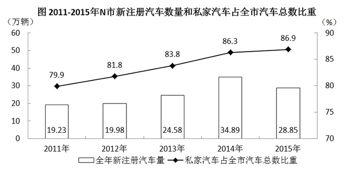

#### 第 1 题　qid 2295353 · 数学运算

如按2015年汽车净增量计算，N市汽车数量将在      年底突破400万辆。

- **A**. 2023　✅
- **B**. 2024
- **C**. 2025
- **D**. 2026

**答案**：A

**官方解析**

由题干“按2015年······净增量计算，······将在<u>      </u>年底突破400万辆”，材料给出了2015年底的汽车数量，可判定本题为基期与现期的现期追赶问题。定位文字材料第一段“截至2015年底，N市汽车拥有量为197.93万辆，比2014年增长，增速较2014年回落了7.7个百分点。扣除报废等因素，全市年净增汽车25.73万辆”，假设过N年将突破400万辆，根据“”，可得，解得，则过8年突破400万辆，即在。

故正确答案为A。

---

#### 第 2 题　qid 2295354 · 数学运算

“十二五”（2011-2015年）期间，N市新注册汽车总数量为      。

- **A**. 不到120万辆
- **B**. 120多万辆　✅
- **C**. 130多万辆
- **D**. 140多万辆

**答案**：B

**官方解析**

定位统计图，可得“十二五”期间，N市新注册汽车总数量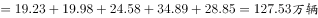。

故正确答案为B。

---

#### 第 3 题　qid 2295356 · 数学运算

2014-2015年，N市总计新增汽车驾驶人约      万人。

- **A**. 58.22
- **B**. 59.69　✅
- **C**. 61.16
- **D**. 62.63

**答案**：B

**官方解析**

定位文字材料第三段“2015年底······全市全年新增汽车驾驶人30.58万人，新增汽车驾驶人人数比2014年高出1.47万人”，可得2014年新增汽车驾驶人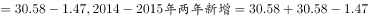，选项精确度与材料数据精确度一致且尾数不同，利用尾数法即可，尾数为9。

故正确答案为B。

---

#### 第 4 题　qid 2295358 · 数学运算

2012-2015年，N市全年新注册汽车数量排名第3的年份，私家汽车占全市汽车总数比重比上年提升了      个百分点。

- **A**. 0.6
- **B**. 1.9
- **C**. 2.0　✅
- **D**. 2.7

**答案**：C

**官方解析**

定位统计图，可得N市全年新注册汽车数量排名第3的年份为2013年，其私家汽车占全市汽车总数比重为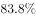，2012年比重为，，则提升了2.0个百分点。

故正确答案为C。

---

#### 第 5 题　qid 2295361 · 数学运算

下列选项中，不能从上述资料中推出的是      。

- **A**. 
2015年N市新注册汽车比年净增汽车多3万多辆

- **B**. 
2014年底N市汽车数量比2013年底增加了以上

- **C**. 
2015年底N市拥有的汽车中，私家汽车占八成多

- **D**. 
2015年底N市每百名常住人口拥有私家汽车30多辆
　✅

**答案**：D

**官方解析**

A项：定位文字材料第一段“截至2015年底，N市汽车拥有量为197.93万辆······扣除报废等因素，全市年净增汽车25.73万辆”和统计图，可知2015年N市新注册汽车数量为28.85万辆，全市年净增汽车25.73万辆，则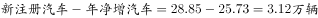，即2015年N市新注册汽车比年净增汽车多3万多辆，正确；

B选项：定位文字材料第一段“截至2015年底，N市汽车拥有量为197.93万辆，比2014年增长，增速较2014年回落了7.7个百分点”，可知2014年底N市汽车数量同比增长率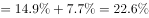，正确；

C选项：定位统计图，可知2015年底私家汽车占比为，即八成多，正确；

D选项：定位文字材料第二段“截至2015年底，N市私家汽车拥有量为172.07万辆。私家汽车中有166.85万辆为小微型载客汽车，其中126.50万辆为轿车······”和第三段“2015年底，在N市821.61万常住人口中，持有汽车驾驶执照的人员(简称汽车驾驶人)达275.82万人······”，可知2015年底N市每百名常住人口拥有私家汽车数量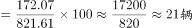，错误。

本题为选非题，故正确答案为D。

---

### 材料 2

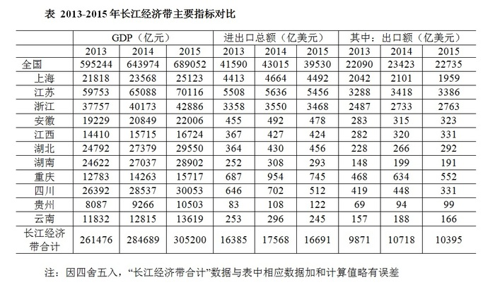

#### 第 6 题　qid 2295574 · 数学运算

2015年西南地区（云南、贵州、四川、重庆）四省市GDP之和约占长江经济带GDP的      。

- **A**. 

- **B**. 

　✅
- **C**. 

- **D**. 

**答案**：B

**官方解析**

根据题干“2015年······占······的”，结合选项为百分数，且材料中给出2015年部分和总体，可判断本题为现期比重问题。定位表格可知，2015年西南地区（云南、贵州、四川、重庆）四省市GDP之和为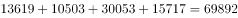亿元，2015年长江经济带GDP为305200亿元，，所以，2015年西南地区（云南、贵州、四川、重庆）四省市GDP之和约占长江经济带GDP的比重为。

故正确答案为B。

---

#### 第 7 题　qid 2295575 · 数学运算

2015年长江经济带有      个省市的进出口总额高于上年水平。

- **A**. 2　✅
- **B**. 3
- **C**. 4
- **D**. 5

**答案**：A

**官方解析**

根据题干“2015年长江经济带······进出口总额高于上年水平”并结合表格中出现了2014年和2015年进出口总额的数据可知本题为直接找数问题。易知2015年长江经济带相关省市的进出口总额高于上年水平有湖北和贵州这两个省市，其余均为低于。
故正确答案为A。

---

#### 第 8 题　qid 2295577 · 数学运算

2013-2015年长江经济带累计进出口总额最高的省市，其在2013-2015年间的累计贸易顺逆差状况为      。

- **A**. 逆差不到1000亿美元
- **B**. 逆差超过1000亿美元
- **C**. 顺差不到1000亿美元
- **D**. 顺差超过1000亿美元　✅

**答案**：D

**官方解析**

2013-2015年长江经济带累计进出口总额最高的省市为江苏省，共计为亿美元，出口额共计为亿美元，所以亿美元，亿美元，即顺差超过1000亿美元。

故正确答案为D。

---

#### 第 9 题　qid 2295584 · 数学运算

关于2013-2015年长江经济带各省市GDP和进出口贸易状况，能够从上述资料中推出的是      。

- **A**. 
2015年GDP同比增速超过的省市有3个

- **B**. 
2013-2015年，累计进出口总额超过1万亿美元的省市有3个
　✅
- **C**. 
2014年贵州进口总额高于上年水平

- **D**. 
2015年长江经济带进出口总额占全国比重低于2013年水平

**答案**：B

**官方解析**

A.根据选项表述可知增速,即需要找出的相关省市即可，进而比较容易判断，依据表格：满足条件的省市仅有重庆（）、贵州（）两个省市，而非3个，错误；

B.由表格可知，2013-2015年，累计进出口总额超过1万亿美元的省市有上海（）、江苏（）、浙江（），共3个省市，正确；

C.由表格可知，2014年、2013年贵州进出口总额分别为108、83亿美元，2014年、2013年贵州出口额分别为94、69亿美元，因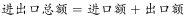，所以2014年、2013年贵州进口额应分别为亿美元、亿美元，即2014年贵州进口总额等于上年水平，而非高于，错误；

D.由表格可知，2015年长江经济带进出口总额占全国比重为，2013年长江经济带进出口总额占全国比重为，前者分子大、分母小，所以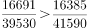，即2015年长江经济带进出口总额占全国比重高于2013年水平，而非低于，错误。

故正确答案为B。

---

### 材料 3

        2017年1月17日国家能源局公布《能源发展“十三五”规划》《天然气“十三五”规划》，首次明确“发挥市场配置资源的决定性作用”，到2020年天然气综合保供能力应达到3600亿立方米以上，天然气消费占一次能源消费比例达到-。

        2017年，我国天然气消费总量2373亿立方米，同比增长；全年天然气进口量920亿立方米，同比增长。

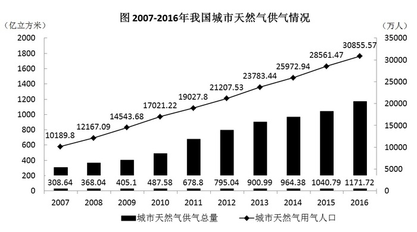

#### 第 10 题　qid 2295387 · 数学运算

我国2016年天然气消费总量约为      亿立方米。

- **A**. 1172
- **B**. 2058　✅
- **C**. 2373
- **D**. 30856

**答案**：B

**官方解析**

由题干“我国2016年天然气消费总量约为······亿立方米”，结合材料时间为2017年，判定本题为基期计算问题。定位文字材料第二段可得“2017年，我国天然气消费总量2373亿立方米，同比增长”，根据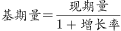，可得我国，此式小于2373且首位商2，只有B项符合。

故正确答案为B。

---

#### 第 11 题　qid 2295391 · 数学运算

2010-2015年，我国城市天然气供气总量年均约增长      亿立方米。

- **A**. 68
- **B**. 92
- **C**. 111　✅
- **D**. 191

**答案**：C

**官方解析**

由题干“2010-2015年···年均约增长···亿立方米。”判断本题为年均增长量问题。定位图表可得2010年我国城市天然气供气总量487.58亿立方米，2015年国城市天然气供气总量尾1040.79亿立方米，由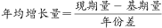可得，2010-2015年，。

故正确答案为C。

---

#### 第 12 题　qid 2295397 · 数学运算

2016年我国城市天然气用气人口中，平均每人每月使用天然气约      立方米。

- **A**. 32　✅
- **B**. 65
- **C**. 167
- **D**. 380

**答案**：A

**官方解析**

由题干“2016年······平均每人每月使用天然······”，可判断题型为平均数问题。定位图表可得2016年城市天然气供应总量为1171.72亿立方米，城市天然气用气人口为30855.57万人。故2016年我国城市天然气用气人口中，平均每人每月使用天然气为。

故正确答案为A。

---

#### 第 13 题　qid 2295403 · 数学运算

下列选项中，与资料不符的是      。

- **A**. 
2016年我国城市天然气供气总量比2015年增长以上

- **B**. 
从2007年到2016年，我国城市天然气用气人口逐渐增长

- **C**. 
2016年我国城市天然气用气人数是2007年的3倍多

- **D**. 
2007-2011年，我国城市天然气供气总量超过2500亿立方米
　✅

**答案**：D

**官方解析**

A项：定位图表可得2016年我国天然气供气总量为1171.72亿立方米，2015年我国天然气总量为1040.79亿立方米，故2016年我国城市天然气供气总量比2015年增长，正确；

B项：由图表可知从2007年到2016年，我国城市天然气用气人口逐渐增长，正确；

C项：由图表可知2016年天然气用气人数是30855.57万人，2007年我国城市天然气用气人数是10189.8万人，故2016年我国城市天然气用气人数是2007年的 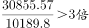，正确；

D项：由图表可2007-2011年，我国城市天然气供气总量为，错误。

本题为选非题，故正确答案为D。

---

#### 第 14 题　qid 2295554 · 数学运算

1，，3，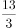，5，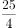，7，<u>      </u>

- **A**. 
8

- **B**. 

- **C**. 

- **D**. 
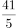
　✅

**答案**：D

**官方解析**

方法一：数列较长，考虑多重数列。优先考虑交叉找规律：奇数项1,3,5,7，是公差为2的等差数列；偶数项，，，为分数数列，分母为公差为1的等差数列，则所求项分母是5。分子5，13，25无明显规律，考虑代入排除：代入四项的分子：40、33、37、41，发现只有代入D项存在规律：分子作差为8、12、16，是公差为4的等差数列。

故正确答案为D。

方法二：数列较长，考虑多重数列。两两分组：（1，），（3，），（5，），（7，<u>       </u>）将每组中分母统一：（，），（，），（，），则分母为公差为1的等差数列，故所求项分母为5, 即最后一组为（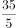，）；分子作差得：3,4,5，则下一项为6，，    即。

故正确答案为D。

---

#### 第 15 题　qid 2295310 · 数学运算

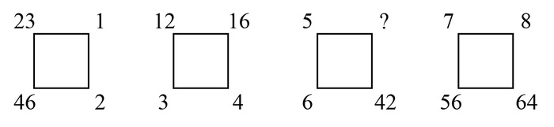

- **A**. 49
- **B**. 45
- **C**. 35　✅
- **D**. 28

**答案**：C

**官方解析**

题干出现图形，通过观察，相邻数字存在倍数关系，考虑除法。横向观察，可以得到：；；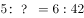；，那么，推出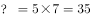。

故正确答案为C。

---

#### 第 16 题　qid 2295557 · 数学运算

- **A**. 24
- **B**. 26
- **C**. 28
- **D**. 30　✅

**答案**：D

**官方解析**

题干出现图形，且图形存在中心，优先考虑凑中心。中心数字，，故规律为：。则。

故正确答案为D。

---

#### 第 17 题　qid 2295304 · 数学运算

数列：981，（5），（4），109；896，（      ），（4），128

- **A**. 2
- **B**. 3　✅
- **C**. 4
- **D**. 5

**答案**：B

**官方解析**

题干中有分号，将数列分为两组，优先考虑多重数列。观察每组四个数字之间关系，发现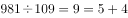，即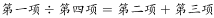。将第二组数字代入此规律：，则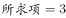。

故正确答案为B。

---

#### 第 18 题　qid 2295307 · 数学运算

- **A**. 9　✅
- **B**. 24
- **C**. 35
- **D**. 48

**答案**：A

**官方解析**

题干出现图形，观察数字之间的规律。图一中：，，；图二中：，，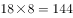；图三中：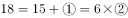，则，，。（注：为方便表述，设图三中18右边的两个数依次为①和②）

故正确答案为A。

---

#### 第 19 题　qid 2295559 · 数学运算

为了缩短就医时间，小张打算在医院网站登录挂号，再以平均40公里/小时的速度驱车前往看病，四家医院到小张家的距离和目前排队人数如下：

为了尽早就医，小张应该选择<u>      </u>医院。（不考虑小张去医院期间新增病人数）

- **A**. 甲
- **B**. 乙
- **C**. 丙　✅
- **D**. 丁

**答案**：C

**官方解析**

小张就医的时间是小张到医院的时间与排队总时间中较长的那个时间，所以就医时间列表如下：

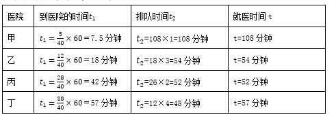

根据就医时间可知，应选择最小的丙医院。

故正确答案为C。

---

#### 第 20 题　qid 2295322 · 数学运算

一群蚂蚁将食物从A处运往B处，如果它们的速度每分钟增加1米，可提前15分钟到达，如果它们的速度每分钟再增加2米，则又可提前15分钟到达，那么A处到B处之间的路程是      米。

- **A**. 120
- **B**. 180　✅
- **C**. 240
- **D**. 270

**答案**：B

**官方解析**

设原速度为V，计划达到时间为t，总路程为；“速度每分钟增加1米，可提前15分钟到达”可得；“它们的速度每分钟再增加2米，则又可提前15分钟到达”即速度每分钟增加3米，一共可提前30分钟到达，可得，联立①②③解方程可得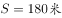。

故正确答案为B。

---

#### 第 21 题　qid 2295560 · 数学运算

踢毽子有内踢、直踢、外踢、膝击、叉踢、背踢、倒勾和踹毽八种基本动作。在一次踢毽子比赛中规定：前五种基本动作每次记1分；后三种基本动作由于难度较高，每次记3分。方华在1分钟内完成了35个基本动作，总分为69分。那么方华完成了      个3分动作。

- **A**. 16
- **B**. 17　✅
- **C**. 18
- **D**. 19

**答案**：B

**官方解析**

设完成1分动作个，完成3分动作个。根据总共完成35个动作，共得69分可列方程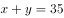，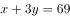，解得，，所以完成17个3分动作，选择B选项。

故正确答案为B。

---

#### 第 22 题　qid 2295561 · 数学运算

一碗芝麻粉，第一次吃了半碗，然后用水加满搅匀；第二次喝了碗，用水加满搅匀；第三次喝了碗，用水加满搅匀；最后一次全吃完。则最后一次吃下的芝麻糊中芝麻粉含量是<u>      </u>。

- **A**. 

- **B**. 

- **C**. 

- **D**. 

　✅

**答案**：D

**官方解析**

设一碗芝麻粉的质量为1，第一次吃了半碗，芝麻粉剩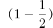；水加满搅匀后，第二次又喝了，芝麻粉剩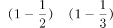；再次水加满搅匀后，第三次又喝了，芝麻粉剩，此时加满水搅匀后芝麻糊中芝麻的含量为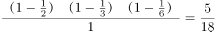，所以最后一次吃下的芝麻糊中芝麻含量是。

故正确答案为D。

---

#### 第 23 题　qid 2295333 · 数学运算

用一辆小型箱式货车运送荔枝干，该货车货箱长4.2米、宽1.9米、高1.8米。600克装荔枝干的外包装长20厘米，宽和高都是14厘米。那么一次最多可以运送约      吨荔枝干。

- **A**. 2.1　✅
- **B**. 2.0
- **C**. 1.9
- **D**. 1.8

**答案**：A

**官方解析**

提问“最多可以运送约多少吨荔枝干”，应使车厢尽可能少留空隙，荔枝干的外包装有20厘米和14厘米两种边长，观察车箱的尺寸可以发现，4.2米能整除20厘米和14厘米都不留缝隙，1.9米无法整除20厘米和14厘米、都会留下缝隙，1.8米只能整除20厘米。

因此想最多运送荔枝干，应用1.8米的方向摆放荔枝干外包装20厘米的方向，可以摆放；4.2米方向摆放14厘米可摆放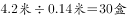；1.9米方向摆放14厘米可摆放，最多13盒。

因此车箱里最多可运送，共计。

故正确答案为A。

---

#### 第 24 题　qid 2295317 · 数学运算

某酒店14名员工需要2个小时清理完所有房间，如果要将这个时间缩短1刻钟，那么需增加      名员工（假设每位员工的工作效率相同）。

- **A**. 1
- **B**. 2　✅
- **C**. 3
- **D**. 4

**答案**：B

**官方解析**

方法一：假设每名员工每分钟的效率为1，则14名员工2小时（即120分钟）的工作量为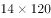，若缩短一刻钟（15分钟），则实际总效率为，所以需要增加2人即可。

方法二：设每名员工每分钟的效率为1，缩短时间后需要n人清理。本题由于工作总量相同，则工作效率与时间成反比，即，解得，所以需要增加2人即可。

故正确答案为B。

---

#### 第 25 题　qid 2295564 · 数学运算

如图，由四个全等的小长方形拼成一个大正方形，每个长方形的面积都是1，且长与宽之比大于等于2，则这个大正方形的面积至少为<u>      </u>。

- **A**. 3
- **B**. 4.5　✅
- **C**. 5
- **D**. 5.5

**答案**：B

**官方解析**

。要让大正方形面积尽可能小，则小正方形面积应尽可能小，，要想小正方形的边长尽可能短，则小长方形长与宽之比需尽可能小，即等于2。

设长方形短边为，则长边为，根据长方形面积公式可得，解得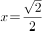，长边为。因此小正方形面积为，。

故正确答案为B。

---

#### 第 26 题　qid 2295338 · 数学运算

小李第一次买了A、B、C三种饮料各若干瓶，共花去了75元；之后他再次买了这三种饮料若干瓶，共花去了134元。两次购买的每种饮料数量之和相同，那么若三种饮料各买1瓶最多需花费      元。（假设饮料价格都是整数元）

- **A**. 11
- **B**. 15
- **C**. 19　✅
- **D**. 23

**答案**：C

**官方解析**

假设三种饮料各买1瓶共需要a元，两次购买的每种饮料数量之和为n，则两次购买饮料的费用总和为，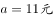或19元，因此三种饮料各买1瓶最多需要19元。

故正确答案为C。

---

#### 第 27 题　qid 2295565 · 数学运算

汪先生乘飞机需托运69千克行李，应付行李超重费735元，后在候机室内巧遇2位没有托运行李的好友，他们也乘同一个航班，于是汪先生就将行李作为三人共有，因而只需付135元行李超重费，那么每位乘客可免费托运行李      千克。

- **A**. 20　✅
- **B**. 18
- **C**. 16
- **D**. 15

**答案**：A

**官方解析**

方法一：设每位乘客可免费托运行李重量千克，每千克行李费用为元。根据题意可知，每位乘客可免费托运行李的费用为元，因此有，即300可被整除，由此排除BC选项。代入A选项，千克，则每千克行李超重的单价元。剩余的行李重量千克，需要再付超重费元，满足题干全部条件（若代入D选项，可得每千克行李的单价。剩余的行李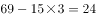千克，因需要再付超重费元，与题干矛盾）。

方法二：设每位乘客可免费托运行李a千克，则超重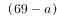千克行李超重费为735元，超重千克行李超重费为135元，由每千克超重费用相同可列式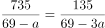，解得。 

故正确答案为A。

---

#### 第 28 题　qid 2295567 · 数学运算

某游戏击中一次加1分，如果连续击中，从第二次击中开始是前一次得分的2倍。小明在游戏中共得到了74分，那么他最多连续击中      次。

- **A**. 4
- **B**. 5
- **C**. 6　✅
- **D**. 7

**答案**：C

**官方解析**

设连续击中次，则得分分别为1、2、4、8、16……，由题意可知连续击中总得分小于等于74分。题目问最多多少次，从较大选项代入，若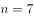，则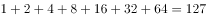分，大于74分，不满足题意；若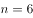，则分，小于74分，满足题意。

故正确答案为C。

---

## 判断推理

### 第 1 题　qid 2295446 · 逻辑判断

民用客机机舱的紧急出口气囊是一条连接地面的斜面，为安全考虑设计者要计算乘客着地时的速度和动能。乘客的质量各有不同，假设所有乘客与气囊的动摩擦因数相同，那么下面说法正确的是              。

- **A**. 质量越大下滑速度越大，动能也越大
- **B**. 质量越大下滑速度越大，但动能不一定大
- **C**. 下滑速度、动能与质量大小无关，速度和动能都一样大
- **D**. 下滑速度与质量大小无关所以一样大，但质量大的人动能较大　✅

**答案**：D

**官方解析**

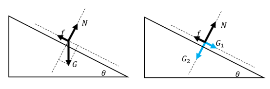

做受力分析，气囊上的人受到竖直向下的重力，将重力沿着斜面方向和垂直于斜面方向分解，沿着斜面方向的分力，垂直于斜面方向的分力，因此给斜面的压力为，所以斜面能提供的动摩擦力为。下滑时，斜面方向甲受到沿斜面向下的和沿斜面方向向上的，斜面方向合力，所以加速度。

由于所有乘客与气囊的动摩擦因数相同，所以加速度与质量无关，所有乘客下滑加速度相同，下滑速度相同。由此排除A、B两项。

由于，所以质量大的人动能较大。

故正确答案为D。

---

### 第 2 题　qid 2295442 · 逻辑判断

一名摄影师要从侧面拍摄一辆以行驶的汽车，成像不模糊的前提是底片上汽车的像移动的尺寸不大于0.1mm，已知底片上汽车长为2cm，实际汽车车身长3m，那么曝光时间至多为<u>        </u>秒。

- **A**. 

　✅
- **B**. 

- **C**. 

- **D**. 

**答案**：A

**官方解析**

汽车速度。汽车的实际长度与成像之间的比例；则底片上汽车的像移动的尺寸不大于0.1mm，所对应的距离。

故曝光的时间=。

故正确答案为A。

---

### 第 3 题　qid 2295480 · 逻辑判断

如图所示为铁路的输电线悬挂在钢缆上的方式。钢缆的A端固定在电杆上，B端通过滑轮组连接在电杆C上。配重D是n个混凝土圆盘，每个盘的质量是m。根据以上信息判断下列说法正确的是<u>          </u>。

- **A**. 
B处使用滑轮组是为了保证输电线的高度变化时钢缆始终保持张紧状态
　✅
- **B**. 
B处使用滑轮组是为了省力

- **C**. 
不考虑钢缆和滑轮质量，钢缆在B端受的拉力

- **D**. 
不考虑钢缆和滑轮质量，钢缆在B端受的拉力

**答案**：A

**官方解析**

因每个混凝土圆盘的质量为，则配重D的重力。结合题干图形可知，滑轮B为动滑轮，与之相连的绳子段数是3。作用在钢缆自由端的拉力为配重D的重力。根据滑轮组省力公式可得，。故作用在B端钢缆的拉力。由此排除C、D两项。在B处使用滑轮组可以保证输电线在高度变化时，钢缆始终受到拉伸的作用力，故而保持张紧状态，A项满足。

故正确答案为A。

---

### 第 4 题　qid 2295497 · 类比推理

某同学将轻质不可伸长的晾衣绳两端分别固定在竖直杆M、N上的a、b两点，将衣架挂在绳上晾晒衣物，衣架挂钩可视为光滑。晾晒一件短袖T恤时，衣架静止于如图位置。当晾晒一件厚滑雪衫时，该同学担心晾衣绳可能会断，为防止绳断，他应该      。

- **A**. 将绳的右端固定点b略向上移
- **B**. 将绳的右端固定点b略向下移
- **C**. 换一根略短的晾衣绳
- **D**. 换一根略长的晾衣绳　✅

**答案**：D

**官方解析**

如图所示，左右两个绳子关于竖直方向是对称的，与竖直方向夹角是相等的。设绳子的总长度为，两杆之间的距离为，则。当绳子右端上移或者下移时，与均不变，则角度不变，左右两个绳子的合力与衣服的重力等大反向，因角度不变，所以绳子的拉力不变，A项与B项错误；

当换一根略短的晾衣绳，减小，因不变，则角度变小，左右两个绳子拉力的合力与衣服的重力等大反向，，，则绳子的拉力增大，绳子更容易断，C项错误；

当换一根略长的晾衣绳，变大，因不变，则角度变大，则绳子的拉力减小，可防止绳断，D项正确。

故正确答案为D。

---

### 第 5 题　qid 2295488 · 类比推理

在某种核反应堆中，是靠熔化的钠来传递核燃烧产生的热量的。抽动液态钠的“泵”的传动部分不允许和钠接触，因此常使用一种称为“电磁泵”的机械。如图所示为这种泵的结构，N、S为磁铁的两极，C为在磁场中的耐热导管，熔融的钠从其中流过，v为钠的流动方向，要使钠液加速，加在导管中钠液的电流方向应为<u>           </u>。

- **A**. 由上流向下
- **B**. 由下流向上　✅
- **C**. 逆着v的方向
- **D**. 顺着v的方向

**答案**：B

**官方解析**

结合题干图形，钠的流动方向向内，要使钠液加速，需安培力向内，磁场方向由N至S向右。根据左手定则，电流方向应由下向上，B项满足。
故正确答案为B。

---

### 第 6 题　qid 2295491 · 逻辑判断

物理学家做了一个有趣的实验：在双缝干涉实验中，在光屏处放上照相底片，若减弱光流的强度，使光子只能一个一个地通过狭缝。实验表明，如果曝光时间不太长，底片上只能出现一些不规则的点；如果曝光时间足够长，底片上就会出现规则的干涉条纹。对这个实验结果的认识不正确的是           。

- **A**. 单个光子的运动没有确定的轨道
- **B**. 只有大量光子的行为才表现出波动性　✅
- **C**. 干涉条纹中明亮的部分是光子到达机会较多的地方
- **D**. 曝光时间不长时，光的能量小，底片上的条纹看不清楚，故出现不规则的点

**答案**：B

**官方解析**

光波是概率波，光子在空间传播时，没有经典意义的轨道，无法预测它在空间的确定位置，但光子在空间各点出现的概率，可以用波动规律来描述。单个光子的落点无法预测，所以曝光时间不太长，底片上只能出现一些不规则的点，但是到达亮条纹区域的概率会大于到达暗条纹区域的概率。如果曝光时间足够长，底片上就会出现规则的干涉条纹。
A项：单个光子在空间中的位置是不确定的，而且光子在空间运动轨迹也是不确定的，正确；
B项：波动性是光子固有的性质，与光子数量无关，错误；
C项：光子到达亮条纹的概率会大于到达暗条纹的概率，因而曝光时间足够长，光子到达的多的区域表现为亮条纹，而光子到达的少的区域表现为暗条纹，正确；
D项：曝光时间不太长时，底片上出现的光点密集度太低，明暗区分不明显，故出现不规则的点，正确。
本题为选非题，故正确答案为B。

---

### 第 7 题　qid 2295495 · 逻辑判断

如图所示，把碗放在大锅内的水中蒸食物，假设碗中的汤和水的沸点一样都是100℃，且碗中的汤吸收的热量全部来自于周围的水，则下列关于水和汤沸腾的说法正确的是<u>          </u>。

- **A**. 水和汤同时沸腾
- **B**. 水会沸腾，汤不会沸腾　✅
- **C**. 水先沸腾，汤后沸腾
- **D**. 汤先沸腾，水后沸腾

**答案**：B

**官方解析**

液体沸腾需要达到沸点且继续吸热。开始汤和水都会吸热升温，但当水达到沸点100℃时，继续吸热，沸腾起来，但温度不再升高；此时碗中的汤也会达到沸点100℃，但由于碗中的汤与大锅中水的温度相同，不能继续吸热，因而碗中的汤不会沸腾。
故正确答案为B。

---

### 第 8 题　qid 2295514 · 逻辑判断

如图是常见的剪式千斤顶，当摇动把手时，螺纹轴就能迫使千斤顶的两臂靠拢，从而将物体顶起。若千斤顶两臂间的初始夹角为，物体重量保持不变，则下列关于两臂受到的压力大小说法正确的是<u>      </u>。

- **A**. 
两臂受到的压力随夹角的减小而减小，且一定小于物体的重力
　✅
- **B**. 
两臂受到的压力随夹角的减小先减小后增大，且在时压力最小

- **C**. 
两臂受到的压力随夹角的减小而增大，但不可能大于物体的重力

- **D**. 
两臂受到的压力随夹角的减小先增大后减小，最大值不会超过物体的重力

**答案**：A

**官方解析**

物体压在千斤顶上，物体对千斤顶的压力F大小与物体重力大小相等。将物体对千斤顶的压力F分解沿两臂的两个分力、。受力分析如图所示，根据对称性可知，两臂受到的压力大小相等，即。由得：。当夹角为时，。分析可知，不变，当逐渐减小时，逐渐增大，逐渐减小；当减少到时最小为。因此随着夹角减少，两臂受到的压力也减少，且一定小于物体的重力，A项正确。

故正确答案为A。

---

### 第 9 题　qid 2295506 · 类比推理

考古学中用同位素测年法测量古生物的年代，每隔一定的时间质量减少为原来的一半。如果以表示的质量，表示时间，的初始质量为，那么的质量随时间的变化规律是下面的<u>      </u>图。

- **A**. A
- **B**. B　✅
- **C**. C
- **D**. D

**答案**：B

**官方解析**

若每隔时间衰减为原来的一半，则衰减规律满足 。随着的增长，越来越小，且变化越来越慢，结合选项，B项较为符合。

故正确答案为B。

---

### 第 10 题　qid 2295510 · 逻辑判断

已知电磁波遇到平滑的金属表面会像光遇到平面镜一样发生反射，反射过程中也遵循光的反射定律。如图所示，三块相互垂直的正方形薄金属平板可以组成最基本的角反射器。下面关于角反射器的特点和用途，说法不符合实际的是<u>                </u>。

- **A**. 角反射器会把电磁波沿着入射方向平行的直线反射回去
- **B**. 角反射器可用来精确地测距
- **C**. 角反射器会把电磁波沿各个不同方向反射回去　✅
- **D**. 救生艇悬挂角反射器是为让雷达能够尽快发现救生艇

**答案**：C

**官方解析**

由于角反射器的特点，无论电磁波从哪个角度射向角反射器，反射波最终都会沿与入射方向平行的直线返回，并不会沿各个不同方向反射回去。角反射器主要应用在测距、警示、军事、船舶遇险救生等领域。
本题为选非题，故正确答案为C。

---

### 第 11 题　qid 2295512 · 类比推理

半潜船是专门从事运输大型海上石油钻井平台、大型舰船、潜艇等超长超重而又无法分割吊运的超大型设备的船舶。其工作流程分列如下：①将货物移到装货甲板上；②开启压载水舱的通海阀门，注入适量水；③启动大型空压机往压载水舱注入适量空气；④船舶实现上浮；⑤将货物运走。则下面排序正确的是      。

- **A**. ①②③④⑤
- **B**. ②①③④⑤　✅
- **C**. ②④①③⑤
- **D**. ③①②④⑤

**答案**：B

**官方解析**

半潜船也称半潜式母船，它通过本身压载水的调整，把装货甲板潜入水中，以便将所要承运的货物浮入半潜船的装货甲板上，将货物运到指定位置。因此工作流程如下：需要先开启压载水舱的阀门，注入海水使装货甲板潜入水中。随后将货物拖拽到已经潜入水下的装货甲板上方。然后将压载水舱注入空气，半潜船身压载水舱的压载水排出船体，使船体上浮，最后将货物运走。
故正确答案为B。

---

### 第 12 题　qid 2295525 · 图形推理

下列选项中，符合所给图形的变化规律的是<u>      </u>。

- **A**. A
- **B**. B
- **C**. C
- **D**. D　✅

**答案**：D

**官方解析**

每一幅图形均由直线、黑圆和白圆组成，考虑三种元素之间的关系，在第一组图形中每一条线上均有2个黑圆，一个白圆，且两个黑圆之间均有一个白圆，第二组应符合此规律，前两幅图形中均有两个黑圆与一个白圆连接，且两个黑圆中间没有白圆间隔，观察选项只有D项符合要求。
故正确答案为D。

---

### 第 13 题　qid 2295516 · 图形推理

下列选项中，符合所给图形的变化规律的是<u>      </u>。

- **A**. A
- **B**. B
- **C**. C
- **D**. D　✅

**答案**：D

**官方解析**

元素组成相似，优先考虑样式规律。图形轮廓相同，里面颜色不同，考虑黑白运算，观察第一组图形，可知：，，，，故第一组图的规律为前两图形只有白色部分相加在图3是白色，而其他颜色相加在图3中是黑色，第二组图形应用规律，图1和图2相同位置的白色部分在“？”处保持白色，其他地方均变为黑色，只有D项符合。

故正确答案为D。

---

### 第 14 题　qid 2295543 · 图形推理

下列选项中，能组合成一个立方体方块的是<u>      </u>。

- **A**. 1、2、3
- **B**. 2、3、4
- **C**. 1、3、4　✅
- **D**. 2、3、5

**答案**：C

**官方解析**

题干要求组成立方体方块，故小方块总数应该是27块。图1是9块，图2是7块，图3是12块，图4是6块，图5是8块，排除A、B两项；剩余C、D两项，都有图3，立方体每层有9块，图3已满足一层是9块，另一层有3块，故另外两图应满足某一层相加有6块。图2和图5均无法满足某一层相加有6块，而图1上层与图4下层相加为6块，即图1、3、4可组合成立方体方块（如下图所示）。

故正确答案为C。

---

### 第 15 题　qid 2295520 · 图形推理

下列选项中，符合所给图形的变化规律的是<u>      </u>。

- **A**. A
- **B**. B
- **C**. C　✅
- **D**. D

**答案**：C

**官方解析**

观察题干图形，每幅图形均为九宫格，且存在黑色区域。观察发现，第一组图中，每幅图形中的黑色区域均占3个格子；第二组图中，前两幅图黑色区域均占6个格子，故？处图形黑色区域应占6个格子，只有C项符合。
故正确答案为C。

---

### 第 16 题　qid 2295523 · 图形推理

下列选项中，符合所给图形的变化规律的是<u>      </u>。

- **A**. A
- **B**. B
- **C**. C　✅
- **D**. D

**答案**：C

**官方解析**

元素组成相似，优先考虑样式规律。九宫格优先横向看，发现第一行图形中第二个图形由第一个图形左右翻转后，叠加到第一个图形左边所得，第三个图形由第一个图形旋转180°后，叠加到第一个图形右边所得。验证第二行图形，符合此规律。因此，第三行图形应用此规律，？处的图形应由第一个图形旋转180°后，叠加到第一个图形右边，只有C项满足要求。
故正确答案为C。

---

### 第 17 题　qid 2295526 · 图形推理

下列选项中，符合所给图形的变化规律的是（    ）。

- **A**. A
- **B**. B　✅
- **C**. C
- **D**. D

**答案**：B

**官方解析**

元素组成相同，优先考虑位置规律，题干图形可分内外圈，首先观察外圈图形，黑块1依次顺时针移动一步，则？处应移动到左侧的位置，排除D项。继续观察发现，黑块2依次顺时针移动一步，则？处应移动到右侧的位置，排除C项。进一步观察发现，黑块3依次逆时针移动两步，则？处应移动到正上方右侧的位置，只有B项符合。

故正确答案为B。

---

### 第 18 题　qid 2295529 · 图形推理

右边选项中，不能由展开图折叠而成的是（  ）。

- **A**. A
- **B**. B
- **C**. C　✅
- **D**. D

**答案**：C

**官方解析**

本题为四面体的空间重构题目，将展开图标上序号如下图，逐一进行分析。

A项：选项与题干一致，排除；

B项：选项与题干一致，排除；

C项：选项中的左侧面是面d，对面d画边如上图所示，题干中边1所对的面为面b，且没有挨着面b里面的白圆，而选项中边1紧挨着白圆，选项与题干不一致，当选；

D项：选项与题干一致，排除。

本题为选非题，故正确答案为C。

---

### 第 19 题　qid 2295530 · 图形推理

把下列图形分成两类，分类正确的是（  ）。

- **A**. ①②⑤；③④⑥
- **B**. ①②⑥；③④⑤
- **C**. ①③⑤；②④⑥
- **D**. ①③⑥；②④⑤　✅

**答案**：D

**官方解析**

本题为分组分类题目。观察题干图形，每根线段的两端均连接了小元素，观察发现，图①③⑥中线段的两端连接的是不同的小元素，图②④⑤中线段的两端连接的是相同的小元素。故①③⑥一组，②④⑤一组。
故正确答案为D。

---

### 第 20 题　qid 2295572 · 图形推理

下列选项中，符合所给图形的变化规律的是<u>      </u>。

- **A**. A
- **B**. B
- **C**. C
- **D**. D　✅

**答案**：D

**官方解析**

观察发现，第一组图中，将所有位置的小黑三角形拼在一起，可以得到一个完整的黑色正方形；第二组图应用规律，故？处应左下角区域有一个小黑三角形，只有D项符合。
故正确答案为D。

---

### 第 21 题　qid 2295532 · 图形推理

下列选项中，与所给图形规律相同的是（  ）。

 

- **A**. A
- **B**. B
- **C**. C　✅
- **D**. D

**答案**：C

**官方解析**

黑块数量不一致，元素组成相似，优先考虑样式规律，但黑白运算无规律。继续观察发现，题干中所有黑块全部都能一笔画成，只有C项符合。
故正确答案为C。

---

### 第 22 题　qid 2295534 · 图形推理

下列选项中，符合所给图形的变化规律的是（）。

- **A**. A
- **B**. B
- **C**. C　✅
- **D**. D

**答案**：C

**官方解析**

元素组成相似，优先考虑样式规律。观察发现，每个图形均可分为上、下两部分。第一横行中，上面部分出现菱形、圆形和米字形，下面部分出现朝右箭头、朝左箭头和双箭头；经验证，第二横行满足此规律；故第三横行应用此规律，？处应上面部分为菱形、下面部分为朝左箭头，只有C项符合。
故正确选项为C。

---

### 第 23 题　qid 2295537 · 图形推理

下列选项中，符合所给图形的变化规律的是（    ）。

- **A**. A
- **B**. B
- **C**. C
- **D**. D　✅

**答案**：D

**官方解析**

元素组成不同，优先考虑属性规律。图形整体比较规整，优先考虑对称性。第一横行，图形均为轴对称图形，且对称轴数量依次为1、2、3；经验证，第二横行满足此规律；第三横行，前两个图形的对称轴数量依次为1、2，故？处应填入有3条对称轴的轴对称图形，只有D项符合。
故正确选项为D。

---

### 第 24 题　qid 2295539 · 逻辑判断

实现伟大梦想从来都不是在风平浪静、一马平川中顺利进行的，必然是在应对挑战、化解风险中艰难奋进的。只有增强忧患意识，深刻认识到发展起来以后的问题并不比不发展的时候少，进入深水区的改革并不比改革初期的开创更容易，才能在遇见一系列复杂的矛盾和难题时沉着应对，确保伟大梦想顺利实现。
如果上述论断为真，那么下列      项也一定为真。

- **A**. 只要应对挑战，就能确保伟大梦想顺利实现
- **B**. 发展起来以后的问题比不发展的时候多很多，进入深水区的改革比改革初期难很多
- **C**. 只有在风平浪静中，才有增强忧患意识的必要
- **D**. 如果不能增强忧患意识，那么就无法在遇见一系列复杂矛盾和难题时沉着应对　✅

**答案**：D

**官方解析**

第一步：翻译题干。

①实现伟大梦想应对挑战、化解风险中艰难奋进

②沉着应对、伟大梦想顺利实现增强忧患意识

第二步：逐一分析选项。

A项：翻译为应对挑战伟大梦想顺利实现，是对①的肯后，肯后无必然性结论，排除；

B项：根据题干第二句话可知，发展起来以后的问题并不比不发展的时候少，但“不比······少”不代表“比······多很多”，进入深水区的改革并不比改革初期的开创更容易，但“比······更容易”也不代表“比······难很多”，无法推出，排除；

C项：翻译为增强忧患意识风平浪静，是对②的肯后，肯后无必然性结论，排除；

D项：翻译为增强忧患意识沉着应对，是对②的否后，否后必否前，可以得出“沉着应对”，当选。

故正确答案为D。

---

### 第 25 题　qid 2295276 · 逻辑判断

对所有的静脉血标本进行检测，没有发现阳性HIV抗体。
如果上述断定为假，则下列      项一定为真。

- **A**. 要发现阳性HIV抗体，必须对所有静脉血标本进行检测
- **B**. 对所有静脉血标本进行检测，未必能发现阳性HIV抗体
- **C**. 部分静脉血标本尚未进行检测，或者已经发现了阳性HIV抗体　✅
- **D**. 部分静脉血标本尚未进行检测，但是已经发现了阳性HIV抗体

**答案**：C

**官方解析**

第一步：分析题干条件。

对所有静脉血标本检测 且 发现现阳性HIV抗体。

已知题干为假，那么其矛盾命题：（对所有静脉血标本检测 且 发现了阳性HIV抗体）一定为真，即：有的静脉血标本没有检测 或 发现了阳性HIV抗体。

第二步：逐一分析选项。

A项：翻译为发现阳性HIV抗体所有静脉血标本检测，是对题干矛盾命题“或”关系的肯定，无法得出确定性结论，排除；

B项：翻译为对所有静脉血标本检测未必发现阳性HIV抗体，是对题干矛盾命题“或”关系的否定，根据“否一推一”可知，一定发现了阳性HIV抗体，与题干不一致，排除；

C项：翻译为有的静脉血标本没有检测 或 发现了阳性HIV抗体，与题干的矛盾命题一致，一定为真，当选；

D项：翻译为有的静脉血标本没有检测 且 发现了阳性HIV抗体，题干矛盾命题为“或”关系而不是“且”关系，排除。

故正确答案为C。

---

### 第 26 题　qid 2295280 · 逻辑判断

当今社会，二维码支付方式在餐饮门店、超市、便利店等线下小额支付场景中得到了广泛的应用。但在条码生成机制和传输过程中仍存在风险隐患，也引发了不少涉及支付安全风险的案件。
下列      项能够对题干中的结论起到解释的作用。

- **A**. 静态条码容易被篡改或变造，容易携带木马或病毒　✅
- **B**. 线下扫码支付为用户带来了便捷的消费体验
- **C**. 商家利用线下扫码支付可以帮助自身提高经营收益
- **D**. 采用先进的令牌技术进行变异处理后，可以保护真实卡号信息

**答案**：A

**官方解析**

第一步：找出题干结论。
 “在条码生成机制和传输过程中仍存在风险隐患，引发了不少涉及支付安全风险的案件。”
第二步：逐一分析选项。
A项：该项解释了二维码支付隐患是由于静态条码容易被篡改或变造，容易携带木马或病毒，可以解释题干结论，当选；
B项：该项讨论的是线下扫码支付为用户带来了便捷的消费体验，题干讨论的是二维码支付会带来安全隐患，讨论话题不一致，不能解释题干结论，排除；
C项：该项讨论的是商家利用线下扫码支付可以帮助自身提高经营收益，题干讨论的是二维码支付会带来安全隐患，讨论话题不一致，不能解释题干结论，排除；
D项：该项讨论的是提高移动支付安全性的方法，不能解释为什么存在风险隐患，不能解释题干结论，排除。
故正确答案为A。

---

### 第 27 题　qid 2295540 · 逻辑判断

木星是气态巨行星，也是太阳系中最大的行星，质量是太阳系中其他七大行星质量总和的2.5倍。观测发现，围绕木星的70多颗卫星大部分由水冰构成。因此，木星的大气层里应含有相当数量的水。
下列      项如果为真，最能支持以上论述。

- **A**. 经过若干亿年之后，卫星可能慢慢地跌落到行星上
- **B**. 星际空间的水，很多是以气态形式存在的
- **C**. 天王星也是气态巨行星，已经证实它含有大量水冰
- **D**. 卫星和它所环绕的行星是在同一时期由相同的气体和灰尘所形成的　✅

**答案**：D

**官方解析**

第一步：找出论点和论据。
论点：木星的大气层里应含有相当数量的水。
论据：围绕木星的70多颗卫星大部分由水冰构成。
论点讨论的是“木星”和“水”的关系，论据讨论的是“木星的卫星”和“水”的关系，论点论据话题不一致，加强优先考虑搭桥，即建立“木星”和“卫星”之间的联系。
第二步：逐一分析选项。
A项：该项说的经过若干亿年之后，题干没有提及时间，不明确卫星现在是否跌落到行星上，是不明确项，无法加强，排除；
B项：该项说的是星际空间水的存在形式，而论点说的是木星的大气层里应含有相当数量的水，话题不一致，无法加强，排除；
C项：该项说的是天王星被证实有大量水冰，而论点说的是木星的大气层里应含有相当数量的水，主体不一致，无法加强，排除；
D项：该项说的是卫星和它所环绕的行星是在同一时期由相同的气体和灰尘所形成的，根据题干木星的70多颗卫星大部分由水冰构成，可以得出木星也应由水冰构成，在“卫星”和“行星”的组成成分之间建立联系，为搭桥项，可以加强，当选。
故正确答案为D。

---

### 第 28 题　qid 2295290 · 逻辑判断

研究人员研究了来自110万人的DNA，得出了一个评分系统。利用该系统可以通过检测某人的DNA来大致预测某人的受教育程度。结果发现，那些基因得分最低的人只有的机会从大学毕业；相比之下，那些基因得分在前五分之一的人，有的机会从大学毕业。这是有史以来最大规模的人类认知遗传学研究。有些人据此以为，人类的基因与学历之间有极大联系。

下列<u>      </u>项如果为真，最能质疑这些人的观点。

- **A**. 
在110万被研究者中，抽样显示，只有不到的人是大学毕业的

- **B**. 
在大学毕业的被研究者中，其父母之一是大学毕业的超过

- **C**. 
在110万被研究者中，有超过的人是大学毕业的
　✅
- **D**. 
基因得分最居中的人，也有的机会从大学毕业

**答案**：C

**官方解析**

第一步：找出论点和论据。

论点：人类的基因与学历之间有极大联系。

论据：基因得分最低的人只有的机会从大学毕业；基因得分在前五分之一的人，有的机会从大学毕业。

第二步：逐一分析选项。

A项：110万被研究者中只有不到的人是大学毕业的，此时前五分之一确实高于平均水平，得分最低的确实低于平均水平，补充论据支持题干论点，可以加强，排除；

B项：被研究者们的父母与该研究无关，属于无关选项，不能削弱，排除；

C项：110万被研究者中有超过的人是大学毕业的，说明所选的研究样本中，绝大部分人都有高学历，否定了题干论点基因得分在前五分之一的人，有的机会从大学毕业，削弱了题干观点，可以削弱，当选；

D项：基因得分最居中的人也有的机会从大学毕业的，此时前五分之一确实高于居中水平，得分最低的确实低于居中水平，说明基因与学历有关系，补充论据支持题干论点，可以加强，排除。

故正确答案为C。

---

### 第 29 题　qid 2295297 · 类比推理

G镇A小区内老王家出现了不少飞蛾，除非小区里业主家出现了飞蛾，否则小区不能向居委会申请除蛾的药剂。G镇B小区可以向居委会申请除蛾的药剂。
如果上述断定为真，则下列      项不能断定真假。
ⅠA小区有的业主家中没有发现飞蛾。
ⅡA小区可以申请除蛾的药剂。
ⅢB小区的业主家均出现了飞蛾。

- **A**. 只有Ⅰ
- **B**. 只有Ⅱ
- **C**. 只有Ⅰ和Ⅲ
- **D**. Ⅰ、Ⅱ和Ⅲ　✅

**答案**：D

**官方解析**

第一步：分析题干。

①G镇A小区内老王家出现了不少飞蛾；

②小区能向居委会申请除蛾的药剂小区里业主家出现了飞蛾；

③G镇B小区可以向居委会申请除蛾的药剂；

第二步：逐一分析选项。

Ⅰ：已知A小区内老王家出现了不少飞蛾，只能说明A小区有的业主家中发现飞蛾，不能推出ⅠA小区有的业主家中没有发现飞蛾，即Ⅰ项无法判断真假；

Ⅱ：已知A小区内老王家出现了不少飞蛾，为②的肯后不能推出确定性结论，即Ⅱ项无法判断真假；

Ⅲ：G镇B小区可以向居委会申请除蛾的药剂，根据②可以推出B小区里业主家出现了飞蛾。但不能推出B小区的业务家均出现了飞蛾，即Ⅲ项无法判断真假。

综上所述Ⅰ、Ⅱ、Ⅲ均无法判断真假。

本题为选非题，故正确答案为D。

---

### 第 30 题　qid 2295544 · 逻辑判断

日益严重的抗生素抗药性使得人们将来可能死于今天很容易治愈的疾病。有研究称，蚂蚁可能成为新型抗生素的来源。
上述结论的成立需要补充下列      项作为前提。

- **A**. 侵袭蚂蚁的病原体没有对蚂蚁产生的抗菌素形成抗药性　✅
- **B**. 蚂蚁使用身上特殊腺体分泌的化学成分包裹自己来抵御病菌
- **C**. 不同蚂蚁所产生的化学物质，其杀菌效力各不相同
- **D**. 有些真菌可以释放化学成分劫持蚂蚁的神经中枢而杀死蚂蚁

**答案**：A

**官方解析**

第一步：找出论点和论据。
论点：蚂蚁可能成为新型抗生素的来源。
论据：日益严重的抗生素抗药性使得人们将来可能死于今天很容易治愈的疾病。
第二步：逐一分析选项。
A项：侵袭蚂蚁的病原体没有对蚂蚁产生的抗菌素形成抗药性，说明如果蚂蚁成为新型抗生素的来源，就不会形成抗生素的抗药性，在论点和论据之间建立联系，是搭桥项，可以加强，当选；
B项：蚂蚁使用身上特殊腺体分泌的化学成分包裹自己来抵御病菌，与论点讨论的蚂蚁能否成为新型抗生素的来源无关，是无关项，排除；
C项：不同蚂蚁产生化学物质的杀菌效力各不相同，杀菌效力与论点讨论的蚂蚁能否成为新型抗生素的来源无关，是无关项，排除；
D项：有些真菌可以劫持蚂蚁的神经中枢而杀死蚂蚁，与论点讨论的蚂蚁能否成为新型抗生素的来源无关，是无关项，排除。
故正确答案为A。

---

### 第 31 题　qid 2295285 · 逻辑判断

工厂对技术工人的学历情况进行了调查，发现过去五年间新进厂的技术工人学历层次有大幅度提高。因此，工厂技术工人的素质整体有较大提升。
如果上述情况属实，下列      项无法对结论起到支持。

- **A**. 过去五年间的新进厂的技术工人现在仍在工厂上班
- **B**. 素质高的技术工人生产的产品较少出现不合格的情况　✅
- **C**. 学历越高的人，素质也越高
- **D**. 学历高的人会带动其他同事提高素质

**答案**：B

**官方解析**

第一步：找出论点和论据。
论点：工厂技术工人的素质整体有较大提升。
论据：过去五年间新进厂的技术工人学历层次有大幅度提高。
本题的论点是说工厂技术工人的素质有提高，而论据说的是近5年间新进厂技术工人的学历有提高，论点关键词是“技术工人的素质”，论据关键词是“技术工人的学历”，论点与论据话题不一致，因此这道题既可以考查加强论点与论据之间的关系，又可以考查补充新的论据。
第二步：逐一分析选项。
A项：题干论据表明过去五年新进厂的技术工人学历有大幅提高，而选项又补充了现在这些新技术工人仍然在工厂上班，这就补充了新论据，说明现在工厂技术工人的学历仍然是高的，可以加强论据，排除；
B项：技术工人素质高使得产品较少出现不合格的情况，与题干论点现有工人素质是否提升无关，属于无关选项，无法加强，当选；
C项：选项将论据中的“技术工人的学历高”与论点中的“技术工人的素质高”建立联系，属于搭桥，可以加强，排除； 
D项：选项可以说明随着近5年间学历高的技术工人来到工厂，他们会带动身边其他同事整体素质会提升，进而使得整个工厂技术工人的素质提高，在论据与论点之间建立联系，属于搭桥，可以加强，排除。
本题为选非题，故正确答案为B。

---

### 第 32 题　qid 2295282 · 逻辑判断

爱因斯坦对人类最大的贡献就是相对论的提出，它是人类研究宇宙强有力的工具。爱因斯坦通过相对论进行过宇宙质量的计算，结果发现宇宙的质量总和竟然为零。爱因斯坦认为，宇宙在大爆炸后产生的物质有正反两种形式，反物质和正物质完全相反，而且正、反物质质量相等。但科学家在宇宙中只发现了很小量的反物质，那大部分的反物质去哪里了？如果它们不存在于宇宙中，爱因斯坦通过相对论的计算也不会发现宇宙质量总和为零。但是宇宙的质量为零，这说明反物质应该还是存在于宇宙当中。
下列      项是以上论述所假设的前提。

- **A**. 只存在一个宇宙
- **B**. 爱因斯坦通过相对论的计算是正确的　✅
- **C**. 人类如果不能利用反物质的巨大能量，就不能进行星际探索
- **D**. 科学家在实验室中发现了反物质，而且现在也可以在实验室制造一部分反物质

**答案**：B

**官方解析**

第一步：找出论点和论据。
论点：大部分的反物质应该还是存在于宇宙当中。
论据：爱因斯坦通过相对论进行过宇宙质量的计算，结果发现宇宙的质量总和竟然为零。爱因斯坦认为，宇宙在大爆炸后产生的物质有正反两种形式，反物质和正物质完全相反，而且正、反物质质量相等。但科学家在宇宙中只发现了很小量的反物质。
第二步：逐一分析选项。
A项：该项说的是宇宙的数量，与论点说的大部分的反物质是否存在于宇宙中无关，是无关项，排除；
B项：只有爱因斯坦相对论的计算是正确的，才能通过宇宙的质量总和为零，得知反物质应大量存在，是结论成立的必要条件，当选；
C项：该项说的是反物质能力的作用与应用，与论点说的大部分的反物质是否存在于宇宙中无关，是无关项，排除；
D项：科学家可以在实验室发现、制造出反物质，说明反物质是存在的，但无法证明宇宙中是否存在大部分的反物质，无法加强，排除。
故正确答案为B。

---

### 第 33 题　qid 2295546 · 逻辑判断

一直以来，大气中二氧化碳的作用存在正反两面：其浓度的升高一方面能促进陆地生态系统光合产物积累，增加土壤碳储量，形成土壤的固碳效应，这是正面作用；另一方面，它又会增加陆地生态系统甲烷和氧化亚氮等温室气体排放，加剧温室效应，这是负面作用。因此，二氧化碳在大气中还是负面作用居多。
下列      项能够对题干中的结论起到解释的作用。

- **A**. 二氧化碳形成的土壤固碳效应比温室效应更重要
- **B**. 二氧化碳是植物光合作用的必备原料，其含量增多对植物有好处
- **C**. 二氧化碳浓度增加是好是坏关键看人类如何加以利用
- **D**. 根据观测数据，二氧化碳产生的温室效应抵消并超过了固碳效应　✅

**答案**：D

**官方解析**

第一步：找出论点和论据。
论点：二氧化碳在大气中还是负面作用居多。
论据：其（二氧化碳）浓度的升高一方面能促进陆地生态系统光合产物积累，增加土壤碳储量，形成土壤的固碳效应，这是正面作用；它（二氧化碳）会增加陆地生态系统甲烷和氧化亚氮等温室气体排放，加剧温室效应，这是负面作用。
第二步：逐一分析选项。
A项：说明二氧化碳形成的土壤的固碳效应比温室效应更重要，说明了二氧化碳的正面效应比负面效应多，无法解释，排除；
B项：二氧化碳是植物光合作用的必备原料，提出了二氧化碳的一方面好处，但与负面作用相比较谁更多仍不清楚，无法解释，排除；
C项：二氧化碳是好是坏关键看人类如何加以利用，而其正面作用与负面作用相比较谁更多仍不清楚，无法解释，排除；
D项：二氧化碳产生的温室效应抵消并超过了固碳效应，说明了二氧化碳所产生的负面作用抵消并且超过了其所带来的正面效应，可以解释，当选。
故正确答案为D。

---

### 第 34 题　qid 2295548 · 类比推理

在国家社科基金重大项目招标中，甲、乙、丙、丁、戊、己等六所高校参与了投标。根据相关规则，最终只能有一所高校中标。关于究竟哪所高校是中标者，公布结果前参与投票的三位评审专家谈了各自的看法：
（1）中标的高校不是甲就是乙；
（2）中标的高校不是丙；
（3）戊和己两所高校均未中标。
对照后来公布的中标结果，发现上述三位专家中只有一人的看法是正确的。
根据以上信息，可以确定下列      项中的三所高校均未中标。

- **A**. 甲、戊、己
- **B**. 丙、戊、己
- **C**. 甲、乙、丁　✅
- **D**. 甲、丙、丁

**答案**：C

**官方解析**

本题为真假推理题，分析题干条件。
甲、乙、丙、丁、戊、己只有一所高校中标
（1）要么甲，要么乙；
（2）-丙；
（3）-戊 且 -己。
以上无明显矛盾的关系，分别假设进行分析。
假设（1）为真，那就说明甲乙之间一定有一人中标，那么丙就一定不能中标，也就是（2）一定为真，所以（1）一定为假，并且甲、乙都不能中标。那就说明真话一定在（2）、（3）之间，所以分为两种情况：
假设（2）为真，则丙未中标，（3）为假，则戊和己至少有1个中标，此时可知甲、乙、丙、丁都未中标；
假设（3）为真，则戊和己都没有中标，（2）为假，则丙中标，此时可知甲、乙、丁、戊、己都未中标。
根据上述两种情况，可以推出甲、乙、丁这三者一定不可能中标
故正确答案为C。

---

### 第 35 题　qid 2295550 · 类比推理

近期女子乒乓球世界排名前7名（没有并列）在甲、乙、丙、丁、戊、己和庚（这不是排名顺序）7人中产生。已知：
（1）甲排名第4；
（2）乙和丙的排名在甲之前；
（3）丁的排名在乙之前；
（4）排名第6的是一名外国选手；
（5）在排名中，每一名外国选手的前一名都是中国选手；
（6）戊是一名外国选手。
如果己和丙排名之间隔着两人，则可以得出下列      项。

- **A**. 己排名第7
- **B**. 庚排名第5
- **C**. 乙和庚排名之间隔着两人
- **D**. 乙和庚排名之间隔着三人　✅

**答案**：D

**官方解析**

本题为排列组合题目。

第一步：分析题干。

根据条件（1）（2）（3）可知，前四名的排列顺序从前到后为丁乙丙甲或丁丙乙甲。又因为己和丙之间隔两人。故七人排列可能为以下两种情况。

第一种情况：

根据条件（4）可知，排名第六为外国选手， 根据条件（5）可知，外国选手前必为中国选手，所以排名第5的是中国选手，并且排名第7的也不是外国选手，根据条件（6）可知，戊是一名外国选手，所以戊排名第6，此时与丙隔着两个人的是戊，与己和丙排名之间隔着两人不符。故此种情况不正确。

第二种情况：

根据条件（4）可知，排名第六为外国选手， 根据条件（5）可知，外国选手前必为中国选手，所以排名第5的是中国选手，并且排名第7的也不是外国选手，根据条件（6）可知，戊是一名外国选手，所以第6是戊，第7是庚。则七人排名如下：

第二步：逐一分析选项。

A项：己排名第5，选项错误，排除；

B项：庚排名第7，选项错误，排除；

C项：乙和庚之间间隔三人，选项错误，排除，；

D项：乙和庚之间间隔三人，选项正确，当选。

故正确答案为D。

---

## 资料分析

### 材料 1

#### 第 1 题　qid 2295581 · 增长

将长江经济带中部地区省份（安徽、江西、湖北、湖南）按2015年出口额同比增速从低到高排序，以下正确的是      。

- **A**. 湖北、江西、安徽、湖南
- **B**. 湖南、江西、湖北、安徽
- **C**. 湖南、安徽、江西、湖北　✅
- **D**. 安徽、湖南、湖北、江西

**答案**：C

**官方解析**

根据题干“将长江经济带中部地区省份（安徽、江西、湖北、湖南）按2015年出口额同比增速从低到高排序”可知本题为一般增长率问题。安徽、江西、湖北、湖南四省2015年出口额同比增速分别为：

安徽：；

江西：；

湖北：;

湖南：为负值。

所以将它们按照同比增速从低到高排序应为：湖南、安徽、江西、湖北。

故正确答案为C。

---

### 材料 2

        2017年1月17日国家能源局公布《能源发展“十三五”规划》《天然气“十三五”规划》，首次明确“发挥市场配置资源的决定性作用”，到2020年天然气综合保供能力应达到3600亿立方米以上，天然气消费占一次能源消费比例达到-。

        2017年，我国天然气消费总量2373亿立方米，同比增长；全年天然气进口量920亿立方米，同比增长。

#### 第 2 题　qid 2295393 · 增长

假设2020年全国天然气消费总量达到3600亿立方米，且2017-2020年天然气进口量同比增速相同，则2020年天然气进口量将达到消费总量的      。

- **A**. 不到两成
- **B**. 三成多
- **C**. 五成多　✅
- **D**. 八成以上

**答案**：C

**官方解析**

由题干“······2020年天然气进口量将达到消费总量的多少成”可判断本题为现期比重问题。定位文字材料第二段“2017年···全年天然气进口量920亿立方米，同比增长”，且2017-2020年天然气进口量同比增速相同，根据可得，则，故2020年天然气进口量将达到消费总量的比重为，为五成多。

故正确答案为C。

---
