# 2019年上海市公务员录用考试《行测》题（B类）（网友回忆版）

> 省考 · 2019 年 · 6 个模块 · 共 130 题

- [政治理论](#%E6%94%BF%E6%B2%BB%E7%90%86%E8%AE%BA) · 3 题
- [常识判断](#%E5%B8%B8%E8%AF%86%E5%88%A4%E6%96%AD) · 37 题
- [言语理解与表达](#%E8%A8%80%E8%AF%AD%E7%90%86%E8%A7%A3%E4%B8%8E%E8%A1%A8%E8%BE%BE) · 25 题
- [数量关系](#%E6%95%B0%E9%87%8F%E5%85%B3%E7%B3%BB) · 28 题
- [判断推理](#%E5%88%A4%E6%96%AD%E6%8E%A8%E7%90%86) · 35 题
- [资料分析](#%E8%B5%84%E6%96%99%E5%88%86%E6%9E%90) · 2 题

---

## 政治理论

### 第 1 题　qid 2295396 · 时事政治

2018年11月5日，首届中国国际进口博览会在上海开幕。国家主席习近平出席开幕式并发表主旨演讲指出，为了更好发挥上海等地区在对外开放中的重要作用，将支持                    并上升为国家战略，着力落实新发展理念，构建现代化经济体系。

- **A**. 环上海城市群协调发展
- **B**. 江浙沪区域一体化发展
- **C**. 长江经济带协调发展
- **D**. 长江三角洲区域一体化发展　✅

**答案**：D

**官方解析**

本题考查政治常识。
2018年11月5日，首届中国国际进口博览会在上海开幕。国家主席习近平出席开幕式并发表题为《共建创新包容的开放型世界经济》的主旨演讲。演讲中指出：“为了更好发挥上海等地区在对外开放中的重要作用，我们决定，一是将增设中国上海自由贸易试验区的新片区，鼓励和支持上海在推进投资和贸易自由化便利化方面大胆创新探索，为全国积累更多可复制可推广经验。二是将在上海证券交易所设立科创板并试点注册制，支持上海国际金融中心和科技创新中心建设，不断完善资本市场基础制度。三是将支持长江三角洲区域一体化发展并上升为国家战略，着力落实新发展理念，构建现代化经济体系，推进更高起点的深化改革和更高层次的对外开放，同‘一带一路’建设、京津冀协同发展、长江经济带发展、粤港澳大湾区建设相互配合，完善中国改革开放空间布局。”
故正确答案为D。

---

### 第 2 题　qid 2295400 · 新思想

2018年5月28日，中国科学院第十九次院士大会、中国工程院第十四次院士大会在人民大会堂隆重开幕。习近平出席会议并发表重要讲话强调，中国要强盛、要复兴，就一定要大力发展科学技术，努力成为世界主要               。

- **A**. 科学中心和制造高地
- **B**. 技术中心和制造高地
- **C**. 技术中心和创新高地
- **D**. 科学中心和创新高地　✅

**答案**：D

**官方解析**

本题考查政治常识。
2018年5月28日，中国科学院第十九次院士大会、中国工程院第十四次院士大会在人民大会堂隆重开幕。习近平出席会议并发表重要讲话强调，中国要强盛、要复兴，就一定要大力发展科学技术，努力成为世界主要科学中心和创新高地。形势逼人，挑战逼人，使命逼人。我国广大科技工作者要把握大势、抢占先机，直面问题、迎难而上，瞄准世界科技前沿，引领科技发展方向，肩负起历史赋予的重任，勇做新时代科技创新的排头兵，努力建设世界科技强国。
故正确答案为D。

---

### 第 3 题　qid 2295408 · 新思想

习近平总书记在全国生态环境保护大会上发表重要讲话，指出            是构建高质量现代化经济体系的必然要求，是解决污染问题的根本之策。

- **A**. 绿色消费
- **B**. 能源革命
- **C**. 绿色发展　✅
- **D**. 自然修复

**答案**：C

**官方解析**

本题考查政治常识。
2018年5月18日至19日，全国生态环境保护大会在北京召开。习近平总书记在大会上发表重要讲话，他指出：“要全面推动绿色发展。绿色发展是构建高质量现代化经济体系的必然要求，是解决污染问题的根本之策。”
故正确答案为C。

---

## 常识判断

### 材料 1

        材料一：2018年3月17日，十三届全国人大一次会议表决通过了关于国务院机构改革方案的决定，批准了国务院机构改革方案。

        从1982年到2018年，国务院机构一共集中进行过8次改革，分别是1982年、1988年、1993年、1998年、2003年、2008年、2013年、2018年。就这8次改革而言，每一次都顺应了当时的需要，解决了一些突出问题，取得了积极成效。比如，1982年的改革，精简了各级领导班子，加快了干部队伍年轻化；1988年的改革，重点是围绕经济改革转变政府职能，淡化经济管理部门的微观管理职能；1993年的改革，以政企分开为中心，目的是构建社会主义市场经济基本框架等等。每次改革的任务都不同，重点不一样，形式也有所差别，都是根据当时的形势作出的适当调整。

        但形势永远是在发展变化的，机构改革是一个过程，不会一蹴而就，更不会一劳永逸。分分合合，甚至个别“反复”，都是根据实际需要作出的选择，是为了更好地适应形势发展，把我国社会主义制度优越性更充分地发挥出来。

        材料二：2018年3月13日上午，十三届全国人大一次会议听取了国务院机构改革方案的说明，方案对国务院组成部门和其他机构进行了较大幅度的调整。改革后，除国务院办公厅外，国务院设置组成部门26个。

        “法与时转则治，治与世宜则有功。”从减少8个正部级机构，到减少7个副部级机构，再到调整相关机构，国务院此次改革，涉及范围至广、调整范围至深，的确显现大手笔，释放出大魄力，让人耳目一新，被誉为“堪称改革开放40年来历次机构改革中最有远见和魄力的方案”，绝非虚夸之谈。

        “物不因不生，不革不成。”说到机构改革，不能不提为何要改——我们既关注怎么改，也须关注为什么改。关于改革的一大背景，十九届三中全会给出判断：当前，面对新时代新任务提出的新要求，党和国家机构设置和职能配置同统筹推进“五位一体”总体布局、协调推进“四个全面”战略布局的要求还不完全适应，同实现国家治理体系和治理能力现代化的要求还不完全适应。

#### 第 1 题　qid 2295465 · 人文常识

国务院机构改革既要考虑解决当前最突出问题，也要考虑顺应形势发展需要。在这轮机构改革中，            等一批新机构亮相，体现了我国经济社会发展的新要求。

- **A**. 自然资源部　✅
- **B**. 生态环境部　✅
- **C**. 应急管理部　✅
- **D**. 退役军人事务部　✅

**答案**：ABCD

**官方解析**

本题考查政治常识。
A项正确，根据《深化党和国家机构改革方案》文件第二十四条指出：“组建自然资源部。主要职责是，对自然资源开发利用和保护进行监管，建立空间规划体系并监督实施，履行全民所有各类自然资源资产所有者职责，统一调查和确权登记，建立自然资源有偿使用制度，负责测绘和地质勘查行业管理等。不再保留国土资源部、国家海洋局、国家测绘地理信息局。”
B项正确，根据《深化党和国家机构改革方案》文件第二十五条指出：“组建生态环境部。主要职责是，拟订并组织实施生态环境政策、规划和标准，统一负责生态环境监测和执法工作，监督管理污染防治、核与辐射安全，组织开展中央环境保护督察等。不再保留环境保护部。”
C项正确，根据《深化党和国家机构改革方案》文件第三十条指出：“组建应急管理部。主要职责是，组织编制国家应急总体预案和规划，指导各地区各部门应对突发事件工作，推动应急预案体系建设和预案演练。建立灾情报告系统并统一发布灾情，统筹应急力量建设和物资储备并在救灾时统一调度，组织灾害救助体系建设，指导安全生产类、自然灾害类应急救援，承担国家应对特别重大灾害指挥部工作。指导火灾、水旱灾害、地质灾害等防治。负责安全生产综合监督管理和工矿商贸行业安全生产监督管理等。公安消防部队、武警森林部队转制后，与安全生产等应急救援队伍一并作为综合性常备应急骨干力量，由应急管理部管理，实行专门管理和政策保障，采取符合其自身特点的职务职级序列和管理办法，提高职业荣誉感，保持有生力量和战斗力。应急管理部要处理好防灾和救灾的关系，明确与相关部门和地方各自职责分工，建立协调配合机制。中国地震局、国家煤矿安全监察局由应急管理部管理。不再保留国家安全生产监督管理总局。”
D项正确，根据《深化党和国家机构改革方案》文件第二十九条指出：“组建退役军人事务部。主要职责是，拟订退役军人思想政治、管理保障等工作政策法规并组织实施，褒扬彰显退役军人为党、国家和人民牺牲奉献的精神风范和价值导向，负责军队转业干部、复员干部、退休干部、退役士兵的移交安置工作和自主择业退役军人服务管理、待遇保障工作，组织开展退役军人教育培训、优待抚恤等，指导全国拥军优属工作，负责烈士及退役军人荣誉奖励、军人公墓维护以及纪念活动等。”
故正确答案为ABCD。

---

#### 第 2 题　qid 2295466 · 人文常识

“国务院此次改革，涉及范围至广、调整范围至深”，也体现于原有机构组成按照优化机构设置和职能配置、理顺职责关系进行重新整合。比如，组建国家市场监督管理总局，不再保留            。

- **A**. 国家工商行政管理总局　✅
- **B**. 国家质量监督检验检疫总局　✅
- **C**. 国家食品药品监督管理总局　✅
- **D**. 国务院食品安全委员会

**答案**：ABC

**官方解析**

本题考查政治常识。
根据《深化党和国家机构改革方案》文件第三十四条指出：“组建国家市场监督管理总局。组建国家药品监督管理局，由国家市场监督管理总局管理，主要职责是负责药品、化妆品、医疗器械的注册并实施监督管理。将国家质量监督检验检疫总局的出入境检验检疫管理职责和队伍划入海关总署。保留国务院食品安全委员会、国务院反垄断委员会，具体工作由国家市场监督管理总局承担。国家认证认可监督管理委员会、国家标准化管理委员会职责划入国家市场监督管理总局，对外保留牌子。不再保留国家工商行政管理总局、国家质量监督检验检疫总局、国家食品药品监督管理总局。”
故正确答案为ABC。

---

#### 第 3 题　qid 2295468 · 人文常识

材料一提到，“机构改革是一个过程，不会一蹴而就，更不会一劳永逸。分分合合，甚至个别‘反复’”。这体现的辩证法规律是            。

- **A**. 对立统一规律
- **B**. 质量互变规律
- **C**. 普遍联系规律
- **D**. 否定之否定规律　✅

**答案**：D

**官方解析**

本题考查政治常识。
A项错误，对立统一规律，亦称矛盾规律，是关于对立面的统一和斗争的规律。它揭示任何事物内部以及事物之间都包含着矛盾，推动着事物的运动、变化和发展。题干材料未体现对立统一规律。
B项错误，质量互变规律揭示了一切事物、现象发展过程中量变和质变的内在联系及其相互转化。量变是事物数量的增减和次序的变动，质变是事物性质的根本变化。量变是质变的必要准备，质变是量变的必然结果；量变和质变是相互渗透、相互依存、相互贯通。题干材料未体现质量互变规律。
C项错误，普遍联系规律是指事物的联系具有普遍性，它包括任何事物内部的各个部分、要素是相互联系的，任何事物都与周围的其他事物相互联系着，整个世界是一个相互联系的统一整体。题干材料未体现普遍联系规律。
D项正确，否定之否定规律揭示了事物发展的前进性与曲折性的统一，表明了事物的发展不是直线式前进而是螺旋式上升的。从题干中的“不会一蹴而就”“不是一劳永逸”“个别‘反复’”，体现了机构改革是的曲折性，但总体上是前进的、上升的。体现了事物发展的前进性与曲折性的统一。
故正确答案为D。

---

#### 第 4 题　qid 2295470 · 人文常识

根据材料二，两个“不完全适应”的存在，是机构改革的重要因素。这其中体现的历史唯物主义基本原理是            。

- **A**. 国家是阶级统治的工具
- **B**. 社会发展总趋势是前进的上升的
- **C**. 上层建筑必须适应经济基础的要求　✅
- **D**. 社会意识对社会存在有反作用

**答案**：C

**官方解析**

本题考查政治常识。历史唯物主义，亦称唯物史观，是马克思主义哲学中关于人类社会发展一般规律的理论。主要有社会存在和社会意识的辩证关系原理，两大基本规律的矛盾运动原理（生产力与生产关系、经济基础与上层建筑），社会历史发展的总趋势原理，人民群众是历史的创造者原理等。
A项错误，国家的本质是阶级统治的工具，统治阶级建立一整套法律、制度、执行机构等实现对被统治阶级的统治。两个“不完全适应”并未体现这一原理。
B项错误，人类社会历史发展总趋势是前进的、上升的，而发展的过程是曲折的。两个“不完全适应”并未体现这一原理。
C项正确，经济基础决定上层建筑，上层建筑对经济基础具有反作用。当上层建筑适合经济基础状况时，就会促进经济基础的巩固和完善；反之，就会阻碍经济基础的发展和变革。它要求上层建筑一定要适用经济基础。材料中“面对新时代新任务提出的新要求”体现了经济基础，而两个“不完全适应”是国家上层建筑还不适用经济基础的部分。因此，两个“不完全适应”的存在，是机构改革的重要因素，即体现了上层建筑必须适应经济基础的要求。
D项错误，社会存在决定社会意识，社会意识具有相对独立性，对社会存在具有能动的反作用。先进的、科学的社会意识对社会存在产生促进作用，而落后的、不科学的社会意识对社会存在的发展起着阻碍作用。因此两个“不完全适应”并未体现这一原理。
故正确答案为C。

---

### 材料 2

        材料一：中国共产党上海市第十一届委员会第四次全体会议2018年6月27日在世博中心举行。全会全面贯彻党的十九大和十九届二中、三中全会精神，以习近平新时代中国特色社会主义思想为指导，按照“当好全国改革开放排头兵、创新发展先行者”的要求，坚持新发展理念，面向全球、面向未来，着力构筑新时代上海发展的战略优势，全面增强城市核心功能，在推动长三角地区更高质量一体化发展中发挥龙头带动作用，努力实现高质量发展、创造高品质生活，不断增强城市吸引力、创造力和竞争力，更好地代表国家参与国际合作与竞争，加快建设卓越的全球城市和具有世界影响力的社会主义现代化国际大都市。全会审议并通过《中共上海市委关于面向全球面向未来提升上海城市能级和核心竞争力的意见》。

        全会指出，进入新时代，以习近平同志为核心的党中央对上海工作提出了一系列新要求，对上海发展赋予了新的历史使命，对上海未来寄予了更高的期望。推动中央赋予上海的战略定位和战略任务落地落实，必须提升城市能级和核心竞争力，这是实现新时代上海发展战略目标的集中体现、核心任务和必由之路。

        材料二：2017年，上海成为中国第一个GDP破3万亿元的城市。站在这个历史高位上，放眼世界，上海距离世界城市版图中心渐近，展望未来，上海如何在激烈的城市竞争中赢得战略主动，立于不败之地？

        在此关键节点，《中共上海市委关于面向全球面向未来提升上海城市能级和核心竞争力的意见》的通过提出了一个新命题——提升城市能级和核心竞争力，并将其作为实现新时代上海发展战略目标的集中体现、核心任务和必由之路。“这个《意见》准确把握时代脉搏，具有前瞻性、战略性。”市委委员认为，提升城市能级和核心竞争力，是世界城市发展的普遍规律，是上海承担起新时代新使命的必然要求，是上海应对城市激烈竞争的迫切需要。

#### 第 5 题　qid 2295473 · 人文常识

提升城市能级和核心竞争力，是世界城市发展的普遍规律。城市的持久繁荣，在于能级和核心竞争力的不断提升。提升上海城市能级和核心竞争力，要            。

- **A**. 坚持对标顶级、创造一流　✅
- **B**. 坚持需求导向、问题导向　✅
- **C**. 坚持软硬并重、同步提升　✅
- **D**. 坚持深化改革、扩大开放　✅

**答案**：ABCD

**官方解析**

本题考查政治常识。
《中共上海市委关于面向全球面向未来提升上海城市能级和核心竞争力的意见》指出：“坚持对标顶级、创造一流。以更高站位、更宽视野，全方位对标顶级全球城市，在全球城市体系中找准定位，充分发挥自身比较优势，全面融入全球分工合作，不断提高城市国际化水平，占据全球城市体系的核心节点。坚持需求导向、问题导向。着眼国家战略定位要求、世界经济格局变化、全球城市分工调整，立足国家最迫切需要、上海最有优势的领域，突出重点，抓住关键，聚焦发力，集中资源力量实现重大突破，赢得战略主动。坚持软硬并重、同步提升。坚定不移地推进创新驱动发展，既持续增强经济、科技、产业等硬实力，也注重提升文化、环境、品牌等软实力，推动软实力、硬实力同步提升、相互融合、相互促进，构筑具有全球竞争力的综合优势。坚持深化改革、扩大开放。始终用改革开放的思路和办法破除制约城市能级和核心竞争力提升的瓶颈难题，深化供给侧结构性改革，着力增强高水平制度供给能力，促进各类要素资源高效流动、高效配置、高效增值，在深度融入经济全球化中服务带动全国改革开放，全面提升上海在全球城市体系中的影响力和竞争力。”因此，ABCD项均符合题意。
故正确答案为ABCD。

---

#### 第 6 题　qid 2295475 · 人文常识

到2035年，要把上海基本建成与我国综合国力和国际地位相匹配的卓越全球城市，令人向往的            ，具有世界影响力的社会主义现代化国际大都市，具有全球影响力世界级城市群的核心引领城市。

- **A**. 创新之城　✅
- **B**. 人文之城　✅
- **C**. 休闲之城
- **D**. 生态之城　✅

**答案**：ABD

**官方解析**

本题考查政治常识。
中国共产党上海市第十一届委员会第四次全体会议于2018年6月27日在世博中心举行。全会审议并通过《中共上海市委关于面向全球面向未来提升上海城市能级和核心竞争力的意见》。《意见》指出，到2035年，把上海基本建成与我国综合国力和国际地位相匹配的卓越全球城市，令人向往的创新之城、人文之城、生态之城，具有世界影响力的社会主义现代化国际大都市，具有全球影响力世界级城市群的核心引领城市。
故正确答案为ABD。

---

#### 第 7 题　qid 2295476 · 经济常识

提升上海城市能级和核心竞争力，必须围绕增强城市核心功能，聚焦关键重点领域，在国际            的核心功能建设上取得新突破，在制度创新、对外开放、品牌建设、创新创业、全球网络、发展平台、人才集聚、品质生活等关键领域打造新高地。

- **A**. 经济、金融、服务、航运、文化创意中心
- **B**. 经济、金融、贸易、航运、科技创新中心　✅
- **C**. 商业、金融、贸易、物流、文化创意中心
- **D**. 商业、金融、服务、航运、科技创新中心

**答案**：B

**官方解析**

本题考查政治常识。
2018年6月27日，中国共产党上海市第十一届委员会第四次全体会议在世博中心举行。全会指出，要对照主攻方向和重点任务，围绕城市核心功能，聚焦关键重点领域，推进国际经济中心综合实力、国际金融中心资源配置功能、国际贸易中心枢纽功能、国际航运中心高端服务能力和国际科技创新中心策源能力取得新突破，在制度创新、对外开放、品牌建设、创新创业、全球网络、发展平台、人才集聚、品质生活等关键领域打造新高地。
故正确答案为B。

---

#### 第 8 题　qid 2295478 · 经济常识

城市能级和核心竞争力是相辅相成的，核心竞争力是能级提升的关键支撑，能级提升是核心竞争力的集中体现和结果呈现。提升城市能级和核心竞争力，           是基础支撑。

- **A**. 追求更高质量的GDP　✅
- **B**. 提高经济密度　✅
- **C**. 提升配置全球资源能力
- **D**. 打造全球网络枢纽

**答案**：AB

**官方解析**

本题考查政治常识。
中国共产党上海市第十一届委员会第四次全体会议指出，城市能级和核心竞争力是综合性的，要强化综合集成，形成整体优势。提升城市能级和核心竞争力，追求更高质量的GDP、提高经济密度是基础支撑，提升配置全球资源能力是关键所在，增强创新策源能力是不竭动力，打造全球网络枢纽是通道载体，增强国际规则、国际标准制定的话语权是重要体现。
故正确答案为AB。

---

### 材料 3

        2013年11月14日，业主胡某作为个体工商户，以A馄饨店为名取得餐饮服务许可证，有效期限为2013年11月14日至2016年11月13日。A馄饨店位于D市H区。2016年10月20日，A馄饨店向H区市场监管局申请延续餐饮服务经营许可。H区市场监管局于同日受理，当日进行了许可证延续现场核查，经核实确认A馄饨店经营许可条件与原发证条件无本质变化。期间，因A馄饨店周边居民申请听证，H区市场监管局于2016年10月31日向A馄饨店和相关居民发出行政许可听证通知书，并于同年11月10日举行听证，居民代表及A馄饨店经营者胡某参加了听证。听证居民称A馄饨店影响居民正常生活，要求其改变业态。听证过程中H区市场监管局并未告知A馄饨店拟处决定、相关证据和依据。听证后，H区市场监管局认为许可事实情况发生重大变化，于2016年11月11日作出驳回许可证延期申请的决定，文书中未指明具体适用的法律条款。A馄饨店不服，于2017年1月5日向D市市场监管局提出行政复议申请。D市市场监管局于同年3月31日作出行政复议维持决定。A馄饨店不服，向人民法院提起行政诉讼，诉请撒销H区市场监管局所作驳回决定及D市市场监管局所作行政复议决定。

#### 第 9 题　qid 2295482 · 法律常识

根据材料，A馄饨店对D市市场监管局的维持的复议决定不服，提起行政诉讼，应当           。

- **A**. 向H区人民法院提起行政诉讼，也可以向D市市场监管局所在地人民法院提起诉讼　✅
- **B**. 以H区市场监管局为被告
- **C**. 以H区市场监管局和D市市场监管局为被告　✅
- **D**. 对H区市场监管局做出驳回决定的行政行为是否违法负有举证责任

**答案**：AC

**官方解析**

本题考查法律常识。
A项正确，根据《行政诉讼法》第十八条第一款规定：“行政案件由最初作出行政行为的行政机关所在地人民法院管辖。经复议的案件，也可以由复议机关所在地人民法院管辖。”本题中，H区市场监管局为最初作出行政行为的行政机关，其所在地人民法院为H区人民法院；D市市场监管局为复议机关。因此A馄饨店既可以向H区人民法院起诉，也可以向D市市场监管局所在地人民法院起诉。
B项错误、C项正确，根据《行政诉讼法》第二十六条第二款规定：“经复议的案件，复议机关决定维持原行政行为的，作出原行政行为的行政机关和复议机关是共同被告；复议机关改变原行政行为的，复议机关是被告。”可知，本题中D市市场监管局维持原行政行为，应以作出原行政行为的行政机关（H区市场监管局）和复议机关（D市市场监管局）为共同被告。
D项错误，根据《行政诉讼法》第三十四条第一款规定：“被告对作出的行政行为负有举证责任，应当提供作出该行政行为的证据和所依据的规范性文件。”本题中，应由被告（H区市场监管局和D市市场监管局）对做出驳回决定的行政行为举证。
故正确答案为AC。

---

#### 第 10 题　qid 2295484 · 法律常识

下列关于本案听证程序的说法，正确的是           。

- **A**. 听证应由审查该行政许可申请的工作人员以外的人员主持　✅
- **B**. 胡某和居民均不需承担听证费用　✅
- **C**. 听证可以不公开举行
- **D**. H区市场监管局作出许可决定时，应当参考听证笔录

**答案**：AB

**官方解析**

本题考查行政法。
A项正确，C项错误，根据《行政许可法》第四十八条规定：“听证按照下列程序进行：······（二）听证应当公开举行；（三）行政机关应当指定审查该行政许可申请的工作人员以外的人员为听证主持人······”可知A项正确，C项错误。
B项正确，根据《行政许可法》第四十七条第二款规定：“申请人、利害关系人不承担行政机关组织听证的费用。”居民属于申请人，胡某属于利害关系人，均不需承担听证费用。
D项错误，根据《行政许可法》第四十八条第二款规定：“行政机关应当根据听证笔录，作出行政许可决定。”选项中“参考”表述有误。
故正确答案为AB。

---

#### 第 11 题　qid 2295485 · 法律常识

针对H区市场监管局驳回行政许可延期申请的决定文书中未指明具体适用的法律条款这一情形，人民法院          。

- **A**. 应当判决该决定违法　✅
- **B**. 应当判决重新作出决定
- **C**. 应当判决撤销该决定
- **D**. 可以依法改判

**答案**：A

**官方解析**

本题考查法律常识。
根据《行政许可法》第三十八条规定：“行政机关依法作出不予行政许可的书面决定的，应当说明理由，并告知申请人享有依法申请行政复议或者提起行政诉讼的权利。”H区市场监管局未在文书中指明具体适用的法律条款，违反了《行政许可法》。因《行政诉讼法》第七十四条规定：“行政行为有下列情形之一的，人民法院判决确认违法，但不撤销行政行为：（一）行政行为依法应当撤销，但撤销会给国家利益、社会公共利益造成重大损害的；（二）行政行为程序轻微违法，但对原告权利不产生实际影响的。”故针对H区市场监管局在文书中未指明具体适用的法律条款这一情形，属于行政行为程序轻微违法，但对原告权利不产生实际影响，故人民法院应当判决确认违法，但不撤销行政行为。
故正确答案为A。
（说明——本案例为上海真实案例，是上海市高级法院发布的行政审判年度十大典型案例（2017）之一，法院最终判决题目中的《驳回行政许可延期申请的决定》违法）

---

### 材料 4

        2018年3月上海市政府召开行政审批制度改革工作会议。2018年上海将围绕营造稳定公平透明、可预期的营商环境，持续推进“放管服”“证照分离”等改革，重点聚焦效率、监管和服务“三个优化”。同时，认真落实国务院批复的《上海市进一步推进“证照分离”改革试点工作方案》提出的改革举措。

        “证照分离”主要是指除涉及国家安全、公共安全、生态安全和公众健康等重大公共利益外，把营业执照与能分离的许可类证相分离，并根据地方实际采取其他管理办法，实现持照即可经营。其原则之一，是对市场竞争机制能够有效调节，行业组织或中介机构能够有效实现行业自律管理的事项，取消行政审批，实行行业自律管理，允许企业直接开展相关经营活动。2015年12月22日，国务院正式批复同意在上海浦东新区开展“证照分离”改革试点，涉及116个行政许可事项，其中10项行政许可事项取消审批，6项审批改备案，26项实行告知承诺，41项提高审批的透明度和可预期性，33项加强市场准入管理。

        2017年9月，《国务院关于在更大范围推进“证照分离”改革试点工作的意见》指出，开展“证照分离”改革试点，是落实党中央、国务院重大决策部署，释放企业创新创业活动，推进营商环境法治化、国际化、便利化的重要举措。2017年9月6日的国务院常务会议决定，将2015年上海浦东新区率先开展“证照分离”改革试点、清理116项行政许可事项的做法在更大范围内进行推广，继续探索破解企业面临的“办照容易办证难”“准入不准营”等突出问题，打通“最后一公里”，待成熟以后将在全国推开。2018年10月，国务院正式印发了《关于在全国推开“证照分离”改革的通知》，“证照分离”向全国推广。

        近三年来随着商事制度改革不断深入，注册资本登记制度、简化住所登记、多证合一、先照后证、企业注册全程电子化、企业名称管理制度改革、年检改年报、“双随机、一公开”（即在监管过程中随机抽取检查对象，随机选派执法检查人员，抽查情况及查处结果及时向社会公开)、建立市场主体信息公示制度、建设运行国家企业信用信息公示系统“全国一张网”等多项改革措施，夯实了经济发展的微观基础，激发了大众创业万众创新热情，有力促进了营商环境优化。目前，全国平均每天新增企业从改革前的0.69万户上升到1.64万户，开办企业便利度的国际排名大幅上升。

#### 第 12 题　qid 2295487 · 人文常识

2017年9月，《国务院关于在更大范围推进“证照分离”改革试点工作的意见》指出，“证照分离”改革是简政放权、放管结合、优化服务改革的集中体现，进一步深化推进改革试点的重点是           。

- **A**. 清理规范各类许可　✅
- **B**. 大力推进行政审批
- **C**. 加快推进信息共享　✅
- **D**. 切实加强事中事后监管　✅

**答案**：ACD

**官方解析**

本题考查政治常识。
2017年9月，《国务院关于在更大范围推进“证照分离”改革试点工作的意见》指出，“证照分离”改革是简政放权、放管结合、优化服务改革的集中体现，进一步深化推进改革试点的重点是：
（一）清理规范各类许可。除涉及国家安全、公共安全、生态安全和公众健康等重大公共利益外，能分离的许可类的“证”都分离出去，根据地方实际分别采用适当管理方式。
（二）切实加强事中事后监管。对于取消审批或审批改为备案、实行告知承诺制等事项，要逐项研究细化自律准则和标准，强化日常监管，做到放开准入和严格监管相结合，确保无缝衔接、不留死角。坚持“谁审批谁监管、谁主管谁监管”原则，探索完善监管措施。
（三）加快推进信息共享。针对行政审批中申报材料重复提交、重复审查、重复证明等问题，加快推进公民、企事业单位和社会组织基本信息共享。
（四）统筹推进“证照分离”和“多证合一”改革。按照能整合的尽量整合、能简化的尽量简化、该减掉的坚决减掉的原则，全面梳理、分类处理各类涉企证照事项。将“证照分离”改革后属于信息采集、记载公示和管理备查类的各种证照进一步整合到营业执照上，实行“多证合一、一照一码”。 
A项正确，材料中清理116项行政许可事项等正体现了清理规范各类许可。
B项错误，“大力推进行政审批”并不是进一步深化推进改革试点的重点。
C项正确，建立市场主体信息公示制度、建设运行国家企业信用信息公示系统“全国一张网”等多项改革措施体现了推进信息共享，故是改革的重点。
D项正确，在监管过程中随机抽取检查对象，随机选派执法检查人员，抽查情况及查处结果及时向社会公开等措施均体现了监管机制，符合切实加强事中事后监管。
（答案来源于中华人民共和国中央人民政府网站：http://www.gov.cn/zhengce/content/2017-09/28/content_5228228.htm）
故正确答案为ACD。

---

#### 第 13 题　qid 2295489 · 人文常识

从材料可以看出，“证照分离”改革试点是党中央、国务院交给上海的重大改革试点任务，深化“证照分离”改革，其意义在于                 。

- **A**. 着眼于处理好政府与市场的关系，解决实际问题，进一步提高企业获得感　✅
- **B**. 消除痛点，把解决“办证难”、把严格准入作为主要目的和衡量工作成效的主要标准
- **C**. 聚焦重点，抓住牵一发动全身的重点领域和关键环节，率先突破，以点带面
- **D**. 聚焦与经济发展关联度较高、企业关注度较高的事项

**答案**：A

**官方解析**

本题考查政治常识。
题干问的是深化“证照分离”改革的意义，需要从材料中找出体现深化“证照分离”改革的利好之处。
A项正确，材料第三段指出，开展“证照分离”改革试点，是落实党中央、国务院重大决策部署，释放企业创新创业活动，推进营商环境法治化、国际化、便利化的重要举措。材料第二段指出，“证照分离”，其原则之一，是对市场竞争机制能够有效调节，行业组织或中介机构能够有效实现行业自律管理的事项，取消行政审批，实行行业自律管理，允许企业直接开展相关经营活动。由材料可知，深化“证照分离”改革，正是进一步处理好政府与市场的关系，激发市场主体创新创业活力的表现，可以解决企业“办照容易办证难”“准入不准营”等突出问题。因此深化“证照分离”改革，其意义在于着眼于处理好政府与市场的关系，解决实际问题，进一步提高企业获得感。
B项错误，企业面临的是“办照容易办证难”“准入不准营”问题。通过“证照分离”改革，节省企业经营成本。因此，把解决“办证难”、把严格准入作为主要目的和衡量工作成效的主要标准说法错误，应该是“消除痛点，把解决‘办证难’、消除‘准入不准营’作为主要目的和衡量工作成效的主要标准”。
C项错误，要聚焦重点，抓住牵一发动全身的重点领域和关键环节，率先突破，以点带面。这句话强调的是深化“证照分离”改革的“具体举措”而不是“意义”，“意义”需要体现出带来的具体好处。
D项错误，要聚焦与经济发展关联度较高、企业关注度较高的事项，这句话强调的也是深化“证照分离”改革的“具体举措”而不是“意义”，“意义”需要体现出带来的具体好处。而要聚焦与经济发展关联度较高、企业关注度较高的事项，则需要更多采用取消、备案和告知承诺方式，加大改革突破力度，这是具体的举措。
故正确答案为A。
（答案来源于上海市政府网站：http://news.sina.com.cn/c/2017-09-08/doc-ifykuftz5331107.shtml）

---

#### 第 14 题　qid 2295493 · 人文常识

2018年10月，国务院正式印发的《关于在全国推开“证照分离”改革的通知》明确，从2018年11月10日起，在全国范围内对第一批106项涉企行政审批事项，分别按照             、优化准入服务等方式，实施“证照分离”改革。

- **A**. 直接取消审批　✅
- **B**. 审批改为备案　✅
- **C**. 实行告知承诺　✅
- **D**. 强化市场监管

**答案**：ABC

**官方解析**

本题考查政治常识。2018年10月，国务院公开发布《关于在全国推开“证照分离”改革的通知》，要求从2018年11月10日起，在全国范围内对第一批106项涉企行政审批事项，分别按照直接取消审批、审批改为备案、实行告知承诺、优化准入服务等四种方式实施“证照分离”改革。
故正确答案为ABC。

---

#### 第 15 题　qid 2295494 · 人文常识

材料中提到的“双随机、一公开”体现了政府监管方式的改革探索，目标是探索构建             互为支撑的监管格局，全面提升开放条件下的公共治理能力，切实提高事中事后监管的针对性、有效性，使市场和社会既充满活力又规范有序。

- **A**. 市场主体自律　✅
- **B**. 行业自治　✅
- **C**. 社会监督　✅
- **D**. 政府监管　✅

**答案**：ABCD

**官方解析**

本题考查政治常识。2016年8月，上海市人民政府办公厅印发《进一步深化中国(上海)自由贸易试验区和浦东新区事中事后监管体系建设总体方案》的通知。《方案》明确，监管体系总体目标是围绕营造法治化、国际化、便利化的营商环境和公平、统一、高效的市场环境，使市场在资源配置中起决定性作用和更好发挥政府作用，构建市场主体自律、业界自治、社会监督、政府监管互为支撑的监管格局，全面提升开放条件下的公共治理能力，使市场和社会既充满活力又规范有序。
故正确答案为ABCD。

---

#### 第 16 题　qid 2295398 · 人文常识

中共中央、国务院印发的《乡村振兴战略规划（2018-2022年）》强调指出，乡村振兴，              是重点。实施乡村振兴战略是建设现代化经济体系的重要基础。农业是国民经济的基础，农村经济是现代化经济体系的重要组成部分。

- **A**. 产业兴旺　✅
- **B**. 乡风文明
- **C**. 治理有效
- **D**. 生态宜居

**答案**：A

**官方解析**

本题考查政治常识。
中共中央、国务院印发了《乡村振兴战略规划（2018－2022年）》，强调指出：“实施乡村振兴战略是建设现代化经济体系的重要基础。农业是国民经济的基础，农村经济是现代化经济体系的重要组成部分。乡村振兴，产业兴旺是重点。实施乡村振兴战略，深化农业供给侧结构性改革，构建现代农业产业体系、生产体系、经营体系，实现农村一二三产业深度融合发展，有利于推动农业从增产导向转向提质导向，增强我国农业创新力和竞争力，为建设现代化经济体系奠定坚实基础。”
故正确答案为A。

---

#### 第 17 题　qid 2295402 · 人文常识

2018年5月4日，纪念马克思诞辰200周年大会在北京人民大会堂隆重举行。马克思给我们留下的最有价值、最具影响力的精神财富，就是以他名字命名的科学理论——马克思主义。下列关于马克思和马克思主义的表述正确的是               。

- **A**. 马克思领导创建了世界上第一个无产阶级政党——国际工人协会
- **B**. 《共产党宣言》是马克思主义最厚重、最丰富的著作，被誉为“工人阶级的圣经”
- **C**. 马克思主义主要由哲学、政治经济学、科学社会主义三大组成部分构成　✅
- **D**. 革命性是马克思主义最鲜明的品格

**答案**：C

**官方解析**

本题考查政治常识。
A项错误，马克思领导创建了世界上第一个无产阶级政党——共产主义者同盟。
B项错误，1867年问世的《资本论》是马克思主义最厚重、最丰富的著作，被誉为“工人阶级的圣经”。
C项正确，马克思主义指的是马克思和恩格斯所创立的无产阶级思想体系，包括马克思主义哲学、政治经济学和科学社会主义三个组成部分。马克思和恩格斯参加了当时的革命实践，总结了欧洲工人运动的经验，同时又批判地吸收了德国古典的哲学、英国的古典政治经济学和法国的空想社会主义学说，创立了马克思主义。
D项错误，人民性是马克思主义最鲜明的品格。
故正确答案为C。

---

#### 第 18 题　qid 2295406 · 人文常识

针对卖了房子，却迟迟不肯迁出户口的人，2018年5月起实施的新版《上海市常住户口管理规定》明确规定，房屋交易后原有户口人员拒不迁出的，现权利人或者承租人提出申请后，公安机关应当通知原有户口人员迁出，对拒不迁出或者无法通知的，可直接将其户口迁入                。

- **A**. 街道办事处
- **B**. 社区公共户　✅
- **C**. 居民公共户
- **D**. 临近派出所

**答案**：B

**官方解析**

本题考查政治常识。
根据新版《上海市常住户口管理规定》第三十二条规定：“房屋所有权或者公有居住房屋承租权因交易已发生转移，现权利人或者承租人申请将房屋内原有户口迁出的，房屋所在地公安派出所应当通知原有户口人员迁出，对拒不迁出或者无法通知的，可以直接将其户口迁至社区公共户。”故针对卖了房子，却迟迟不肯迁出户口的人，可以直接将其户口迁至社区公共户。
故正确答案为B。

---

#### 第 19 题　qid 2295423 · 人文常识

2018年8月31日，十三届全国人大常委会第五次会议闭幕。个税法修改是本次常委会会议上最受关注的话题之一。仅以<u>             </u>提高到每月5000元这一项因素来测算，修法后个人所得税的纳税人占城镇就业人员的比例将由现在的降至。

- **A**. 基本减除费用标准　✅
- **B**. 公积金标准
- **C**. 社会保障基金标准
- **D**. 工资标准

**答案**：A

**官方解析**

本题考查政治常识。

2018年8月31日，十三届全国人大常委会第五次会议闭幕。个税法修改是本次常委会会议上最受关注的话题之一。仅以基本减除费用标准提高到每月5000元这一项因素来测算，修法后个人所得税的纳税人占城镇就业人员的比例将由现在的降至。5000元的基本减除费用标准是统筹考虑了城镇居民人均基本消费支出、每个就业者平均负担的人数、居民消费价格指数等因素后综合确定的。根据国家统计局抽样调查数据测算，2017年我国城镇就业者人均负担的消费支出约为每月3900元，按照近三年城镇居民消费支出年均增长率推算，2018年人均负担的消费支出约为每月4200元。基本减除费用标准确定为每月5000元，不仅覆盖了人均消费支出，而且体现了一定的前瞻性。

故正确答案为A。

---

#### 第 20 题　qid 2295425 · 法律常识

2018年3月11日，十三届全国人大一次会议高票表决通过了《中华人民共和国宪法修正案》。根据此次宪法修正案，宪法第三章“国家机构”中增设“监察委员会”。国家监察委员会对            负责。

- **A**. 国家主席
- **B**. 中共中央委员会和中共中央纪律检查委员会
- **C**. 最高人民检察院
- **D**. 全国人民代表大会和全国人民代表大会常务委员会　✅

**答案**：D

**官方解析**

本题考查法律常识。
根据《宪法》第一百二十六条规定：“国家监察委员会对全国人民代表大会和全国人民代表大会常务委员会负责。地方各级监察委员会对产生它的国家权力机关和上一级监察委员会负责。”
故正确答案为D。

---

#### 第 21 题　qid 2295427 · 法律常识

下列选项中，行政机关处于行政法律关系中并具有行政主体地位的是             。

- **A**. 某市市长代表该市人民政府向市人民代表大会作政府工作报告
- **B**. 某市教委发布《关于2018年本市义务教育阶段学校招生入学工作的实施意见》　✅
- **C**. 某市民政局辞退公务员王某，因其在年度考核中连续两年被确定为不称职
- **D**. 某市政府新建办公楼妨碍相邻居民住宅采光，被要求给予经济赔偿

**答案**：B

**官方解析**

本题考查法律常识。行政法律关系是指受行政法律规范调控的因行政活动而形成或产生的各种权利义务关系。在行政法律关系中，有两方主体，一方行政主体，一方是行政相对人，其中行政主体是行政管理法律关系的一方当事人，是指能以自己名义行使国家行政职权，作出影响行政相对人权利义务的行政行为，并能对外承担行政法律责任。
A项错误，市长代表市政府向人民代表大会作政府工作报告是属于履行政府工作职责，不处于行政法律关系中，不具有行政主体地位。
B项正确，某市教委作为行政主体，其发布的《关于2018年本市义务教育阶段学校招生入学工作的实施意见》是以自己名义行使国家行政职权，且该实施意见的发布会影响行政相对人的权利和义务。
C项错误，某市民政局辞退公务员王某属于行政机关自己内部事务。
D项错误，行政机关在进行民事活动时，即为民事主体，此时的行政机关与对方的法律地位是平等的，它们的法律关系受民事法律规范的调整。某市政府新建办公楼妨碍相邻居民住宅采光，被要求给予经济赔偿，这是相邻关系的内容，此时某市政府处于民事法律关系中，并不具有行政主体地位。
故正确答案为B。

---

#### 第 22 题　qid 2295430 · 经济常识

公共行政预算是由国家行政机关按法定程序编制和提出，由             评议、审批的国家年度财政收支计划。

- **A**. 检察机关
- **B**. 立法机关　✅
- **C**. 审判机关
- **D**. 司法机关

**答案**：B

**官方解析**

本题考查管理常识。
公共行政预算是由国家行政机关按法定程序编制和提出，由立法机关评议和审批的国家年度财政收支计划。行政预算由国家预算和地方预算两部分组成。
故正确答案为B。

---

#### 第 23 题　qid 2295432 · 法律常识

下列规范性法律文件，属于行政法规的是             。

- **A**. 国务院颁布的《国有土地上房屋征收与补偿条例》　✅
- **B**. 公安部颁布的《机动车驾驶证申领和使用规定》
- **C**. 上海市人民政府颁布的《上海市社会保障卡管理办法》
- **D**. 江苏省人大常委会颁布的《江苏省农村集体资产管理条例》

**答案**：A

**官方解析**

本题考查法律常识。
A项正确，《立法法》第六十五条第一款规定：“国务院根据宪法和法律，制定行政法规。”所以只有国务院可以制定行政法规。
B项错误，《立法法》第八十条第一款规定：“国务院各部、委员会、中国人民银行、审计署和具有行政管理职能的直属机构，可以根据法律和国务院的行政法规、决定、命令，在本部门的权限范围内，制定规章。”故公安部制定的《机动车驾驶证申领和使用规定》属于部门规章。
C项错误，《立法法》第八十二条第一款规定：“省、自治区、直辖市和设区的市、自治州的人民政府，可以根据法律、行政法规和本省、自治区、直辖市的地方性法规，制定规章。”故上海市人民政府颁布的《上海市社会保障卡管理办法》属于地方政府规章。
D项错误，《立法法》第七十二条第一款规定：“省、自治区、直辖市的人民代表大会及其常务委员会根据本行政区域的具体情况和实际需要，在不同宪法、法律、行政法规相抵触的前提下，可以制定地方性法规。”故江苏省人大常委会颁布的《江苏省农村集体资产管理条例》属于地方性法规。
故正确答案为A。

---

#### 第 24 题　qid 2295435 · 人文常识

统筹党政群机构改革不是简单地党政分开或党政合一，而是要在改革和完善党的领导方式与执政方式上下功夫，其基本原则不包括                。

- **A**. 坚持党的领导、人民当家作主和依法治国有机统一
- **B**. 以理顺部门职责为核心，将党委和政府部门在职能上进行合并　✅
- **C**. 形成由党领导决策、人大立法和监督、政府管理和执行的格局体系
- **D**. 优化整合党委部门内设机构设置，提高编制运行效能

**答案**：B

**官方解析**

本题考查政治常识。
统筹党政群机构改革不是简单地党政分开或党政合一，而是要在改革和完善党的领导方式与执政方式上下功夫，其基本原则是坚持党的领导、人民当家作主和依法治国有机统一，以理顺部门职责关系为核心，将党委和政府部门在职能上进行合理的分工，形成由党委领导和决策、人大立法和监督、政府管理和执行的格局体系。一是党委部门的设置要有利于发挥党委“总揽全局、协调各方”的作用，减少对行政事务的直接管理和执行。同时，要科学界定党委和政府部门职责边界，避免职能交叉、机构重叠，降低行政效能；二是严格落实《中国共产党工作机关条例》规定，按照办公厅、职能部门、办事机构和派出机关的不同特点，分别确定党委部门职能职责，规范机构设置、完善运行机制，构建科学完备的党委部门组织架构体系；三是按照“精简、统一、效能”原则，优化整合党委部门内设机构设置，实行“大处室制”，提高编制使用效能。
“将党委和政府部门在职能上进行合并”说法错误，应为“将党委和政府部门在职能上进行合理的分工”。
本题为选非题，故正确答案为B。

---

#### 第 25 题　qid 2295437 · 法律常识

公共行政监督的对象是国家公共行政机关及其公务员，其范围不包括             。

- **A**. 协调有关国家机关之间的公共行政执法活动
- **B**. 撤销违法或不当的公共行政行为
- **C**. 研究解决公共行政法律规范存在的问题
- **D**. 监督检查非本行政区域国家公共行政机关及公务员的恪尽职守情况　✅

**答案**：D

**官方解析**

本题考查管理学。
公共行政监督是指对国家公共行政机关及其工作人员的行为所进行的监察和督导。其范围主要包括：
1.协调有关国家机关之间的公共行政执法活动；
2.撤销违法或不当的公共行政行为；
3.研究解决公共行政法律规范自身存在的问题；
4.监督检查本行政区域内国家公共行政机关及公务员清正廉洁、遵纪守法、恪尽职守的情况，并依法作出相应的处理决定。
本题为选非题，故正确答案为D。

---

#### 第 26 题　qid 2295439 · 法律常识

公共政策合法化是指法定主体为使政策方案获得合法地位而依照法定权限和程序所实施的一系列审查、通过、批准、签署和颁布政策的行为过程。关于公共政策合法化，下列表述有误的是              。

- **A**. 政策合法化是有目的的活动
- **B**. 政策合法化是各法定主体依照法定权限所实施的活动
- **C**. 政策合法化是主体依照法定程序所实施的一系列行为过程
- **D**. 有合法化过程的政策主要是中央政策和法律　✅

**答案**：D

**官方解析**

本题考查管理学。
公共政策合法化的具体内涵和外延是：
1. 所有的政策包括中央政策和地方政策，法律和其他形式的政策，都有合法化的过程；
2. 政策的合法化是有目的的活动；
3. 政策合法化是法定主体依照法定权限所实施的活动，不具有法定的公共政策制定权利或超越法定权限，都不能使政策合法化；
4. 政策合法化是主体依照法定程序所实施的一系列行为过程。
本题为选非题，故正确答案是D。

---

#### 第 27 题　qid 2295445 · 人文常识

公共政策执行是落实政策目标的核心环节。我国公共政策执行具有独特的结构，下列不属于该结构特点的是           。

- **A**. 形成了以党为主导、高位推动的政策执行体制
- **B**. 公共政策执行网络具有横向上的条状特征和纵向上的块状特征　✅
- **C**. 政策往往有多元目标构成的目标群
- **D**. 政策执行结果与政策制定初衷常常有偏差

**答案**：B

**官方解析**

本题考查管理学。
中国公共政策执行有独特的结构。主要表现在：
1.在“以党领政”的政治生态下，形成了以党为主导、高位推动的政策执行体制；
2.在央地二分的府际关系和组织网络下，公共政策的执行网络具有横向上的块块特征和纵向上的条条特征，导致政策目标具有多属性和纵向上的层级性特点。多属性指中央制定的目标偏向笼统和原则层面，而地方细化后的目标指向可操作、可实现的本土层面；层级性指政策执行需要多职能部门的协同配合，因此政策往往有多元目标构成的目标群；
3.在复杂的政策执行结构下，政策执行结果与政策制定的初衷常常不相吻合而有偏差。
本题为选非题，故正确答案是B。

---

#### 第 28 题　qid 2295447 · 科技常识

芯片是半导体元件产品的统称，又称为微电路、集成电路等，它是一个国家科技发展水平最真实也最前沿的体现。关于我国芯片技术现状，下列说法正确的是              。

- **A**. 只要持续加大研发投入，我国就能在短时间内掌握芯片的核心技术
- **B**. 目前我国的光芯片已全部实现国产，仅部分电芯片依赖进口
- **C**. 光刻机是生产大规模集成电路的核心设备，近年来我国在该领域取得一些技术突破，但仍未掌握制造高端光刻机的核心技术　✅
- **D**. 我国现已掌握芯片的核心技术，只是目前仅限于军用，只要做好该项技术的军转民，我国民用芯片技术就能达到世界领先水平

**答案**：C

**官方解析**

本题考查科技常识。
A项错误，持续加大研发投入，不一定就能在短时间内掌握芯片的核心技术。要想掌握核心技术，除了需加大基础研发的投入之外，还有重视人才、增强专利意识等因素。
B项错误，目前我国的光芯片整体水平与国际标杆企业还有较大差距，尤其是高端芯片能力比美、日发达国家落后 1-2 代以上。低速的光芯片和电芯片已实现国产,但高速的仍全部依赖进口。
C项正确，光刻机是生产大规模集成电路的核心设备，制造和维护需要高度的光学和电子工业基础，世界上只有少数厂家掌握，我国在该领域虽取得一些技术突破，但仍未掌握制造高端光刻机的核心技术。
D项错误，我国现在的芯片技术仍落后于国际先进水平，且在军用、民用领域均有涉及。
故正确答案为C。

---

#### 第 29 题　qid 2295448 · 人文常识

指南针是人们野外出行时用于辨别方向的主要工具之一。如果把指南针放在南极极点，下列表述正确的是             。

- **A**. 水平放置，指向地下
- **B**. 垂直放置，飘忽不定
- **C**. 水平放置，稳定指向北极　✅
- **D**. 垂直放置，指向地下

**答案**：C

**官方解析**

本题考查科技常识。把指南针放在世界任何地方，它都会指向南极磁点（南极磁点是地球磁轴与地球表面相交的两点，随着磁轴的移动，磁点也是变化的），而不是南极地理中心（南极极点）。
A项错误，把指南针放在南极极点，水平放置，则指向北极，并非指向地下。若在南极磁点把指南针垂直放置，才会指向地下。
B项错误，“垂直放置，飘忽不定”这种情况不会出现，在南极磁点，指南针会出现“水平放置，飘忽不定”。
C项正确，把指南针水平放置在南极极点上，指针指向南极磁点，也就是指向北极。
D项错误，“垂直放置，指向地下”出现的条件是把指南针垂直放置在南极磁点上，并非南极极点。
故正确答案为C。

---

#### 第 30 题　qid 2295450 · 人文常识

在地球上某个特定地点，根据太阳的具体位置所确定的时刻，称为地方时。地球上每条经线均有自己的地方时。已知东经是8月2日23时，则东经的地方时是<u>              </u>。

- **A**. 8月2日20时
- **B**. 8月2日17时　✅
- **C**. 8月3日2时
- **D**. 8月3日5时

**答案**：B

**官方解析**

本题考查自然常识。1884年国际经度会议决定，全世界按统一标准划分时区、实行分区计时。每隔经度为一个时区，全球共划分成24个时区。以本初子午线即经线为中央经线的时区为中时区或零时区，往东、往西各划分成十二个时区。所以东经位于东十区，东经位于东四区。两地相差6个时区。

根据区时计算公式：要计算的区时=已知地的区时±时区差。若所求地在已知地东面，则用“+”，反之，若所求地在已知地西面，则用“—”。东经位于东四区，位于已知地东十区的西面，按照公式，东经区时为，因未越过日界线，故日期不变，即8月2日17时，B项正确。

故正确答案为B。

---

#### 第 31 题　qid 2295451 · 人文常识

离岸流是自海岸经波浪区向海中流动的一股狭窄而强劲的水流，它流向海洋，并与海滩垂直，持续时间不长。这种水流常可将游泳者带离岸边，所以又称为回卷流。下列关于应对离岸流的方法，错误的是             。

- **A**. 遇到离岸流强劲时，不要尝试逆流游回岸边
- **B**. 遇到离岸流，应顺着离岸流的水流方向，朝着与沙滩平行的方向游离，脱离离岸流后，再转向游回岸边
- **C**. 若观测到海里有狭窄而浑浊的条状水流，应避开该水流
- **D**. 离岸流主要发生在雷电、大风、暴雨等恶劣天气前夕，晴朗无风的天气不会发生离岸流　✅

**答案**：D

**官方解析**

本题考查生活常识。离岸流，学名裂流，是一股射束似的狭窄而强劲的水流，它以垂直或接近垂直于海岸的方向向外海流去。
A项正确，遇到离岸流强劲时，不要尝试逆流游回岸边，若试图逆流而上想靠岸，只会越陷越深。
B项正确，如果不慎被卷入离岸流中，或者感觉到小腿部有含泥沙的水流冲击，务必保持冷静节省体力，努力沿着平行于海岸的方向朝一侧游出，脱离离岸流后，再转向游回岸边。
C项正确，离岸流会有显著的涡动，流头边缘会出现泡沫带和海水浑浊现象，故若观测到海里有狭窄而浑浊的条状水流，应避开该水流。
D项错误，离岸流在任何天气条件下都可能发生，它会出现在多种类型的海滩上。
本题为选非题，故正确答案为D。

---

#### 第 32 题　qid 2295453 · 人文常识

增强现实技术（AR）是一种实时地计算摄影机影像的位置及角度并加上相应图像的技术，这种技术的目标是在屏幕上把虚拟世界套在现实世界并进行互动。下列关于增强现实系统特点的描述，错误的是             。

- **A**. 用虚拟的实物取代真实的世界　✅
- **B**. 是真实世界和虚拟世界的信息集成
- **C**. 具有实时交互性
- **D**. 在三维尺度空间中增添定位虚拟物体

**答案**：A

**官方解析**

本题考查科技常识。
增强现实技术是一种将虚拟信息与真实世界巧妙融合的技术，广泛运用了多媒体、三维建模、实时跟踪及注册、智能交互、传感等多种技术手段，将计算机生成的文字、图像、三维模型、音乐、视频等虚拟信息模拟仿真后，应用到真实世界中，两种信息互为补充，从而实现对真实世界的“增强”。AR手段具有以下特点：真实世界和虚拟的信息集成；具有实时交互性；是在三维尺度空间中增添定位虚拟物体。但虚拟现实并不能用虚拟的实物取代真实的世界。
本题为选非题，故正确答案为A。

---

#### 第 33 题　qid 2295454 · 人文常识

天宝三年（744年），杜甫在洛阳见到了李白，时李白43岁，杜甫32岁。下面是模拟的二人对话：
杜甫：“昔日无由得见贤兄，今日一见，幸甚！”
李白：“子美兄此言差矣。听闻尊府前些日修饬一番，自当是华彩焕然，不知能否一临？”
杜甫：“兄长过谦了。如能驾临，寒舍自是蓬荜生辉！”
以上对话中，用语不当的一项是              。

- **A**. 贤兄
- **B**. 子美兄　✅
- **C**. 尊府
- **D**. 寒舍

**答案**：B

**官方解析**

本题考查人文常识。
A项正确，“贤兄”是对兄长的敬称。
B项错误，杜甫、字子美，杜甫比李白年纪小，故李白不应称杜甫为“子美兄”，应称“子美”或“贤弟”。
C项正确，“尊府”既是对他人父亲的敬称，也是对他人之家的敬称。
D项正确，“寒舍”是指谦辞,对人称自己的家。
本题为选非题，故正确答案为B。

---

#### 第 34 题　qid 2295455 · 人文常识

下列成语与名人的对应，错误的是            。

- **A**. 墨守成规——墨翟
- **B**. 江郎才尽——江淹
- **C**. 班门弄斧——鲁班
- **D**. 伯乐相马——孙武　✅

**答案**：D

**官方解析**

本题考查人文常识。
A项正确，墨守：战国时墨翟善于守城；成规：现成的或久已通行的规则、方法。墨守成规指思想保守，守着老规矩不肯改变。故墨守成规对应的名人即墨翟。
B项正确，江郎：指南朝江淹。江郎才尽原指江淹少有文名，晚年诗文无佳句。后常比喻才情减退。故江郎才尽对应的名人即江淹。
C项正确，班：鲁班，战国时代鲁国人，是个巧匠，民间历来把他奉为木匠的始祖。班门弄斧指的是在鲁班门前舞弄斧子。比喻在行家面前卖弄本领，不自量力。故班门弄斧对应的名人即鲁班。
D项错误，伯乐：相传为秦穆公时的人，姓孙名阳，善相马。伯乐相马指的是善于发现、推荐、培养和使用人才。这一成语对应的名人是孙阳，而非孙武。
本题为选非题，故正确答案为D。

---

#### 第 35 题　qid 2295457 · 人文常识

下列选项中，表述不正确的一项是             。

- **A**. 古代把骨器加工叫“切”，象牙加工叫“磋”。后人把“切磋”一词用作相互研讨、共同提高
- **B**. 韩愈有首诗名为《左迁至蓝关示侄孙湘》，“左迁”的意思是贬官降职
- **C**. 成语“大相径庭”中的“径”指小路，“庭”指院子
- **D**. “安能摧眉折腰事权贵，使我不得开心颜”，其中“颜”原指颜色，特指脸色发白　✅

**答案**：D

**官方解析**

本题考查人文常识。
A项正确，古代把骨头加工成器物叫“切”，把象牙加工成器物叫“磋”。“切磋”比喻互相商量研究，学习别人的长处，纠正自己的缺点。
B项正确，左迁，指的是官员贬职、降职。古人以右为尊，左为卑，故将贬官称为左迁。
C项正确，“大相径庭”中，径指的是门外小路；庭指的是院落；径庭指的是悬殊。“大相径庭”比喻相差很远，大不相同。
D项错误，“安能摧眉折腰事权贵，使我不得开心颜”的意思是怎么能低着眉头，弯着腰去侍奉权贵，这样做绝不能使我开心欢笑。用以形容不屑于卑躬屈膝，不媚权贵的高贵品行。“不得开心颜”指不高兴，其中“颜”指的是脸面，面容，而非颜色，脸色发白。
本题为选非题，故正确答案为D。

---

#### 第 36 题　qid 2295458 · 人文常识

“草长莺飞二月天，拂堤杨柳醉春烟。儿童散学归来早，忙趁东风放纸鸢。”诗中的纸鸢即风筝，下面关于风筝的说法有错的是            。

- **A**. 风筝起源于中国
- **B**. 纸风筝出现于春秋时期　✅
- **C**. 古时风筝曾被用于军事通讯
- **D**. 风筝制作技艺已被列入国家级非物质文化遗产名录

**答案**：B

**官方解析**

本题考查人文常识。
A项正确，风筝起源于中国，是一种古代劳动人民发明的通信工具。
B项错误，最早的风筝是木制成，故名“木鸢”。直至东汉期间，蔡伦改进造纸术后，坊间才开始以纸做风筝，称为“纸鸢”。
C项正确，最初风筝常被利用为军事工具，用于三角测量信号、天空风向测查和通讯的手段。
D项正确，2006年，山东省潍坊市风筝制作技艺经国务院批准列入第一批国家级非物质文化遗产名录。
本题为选非题，故正确答案为B。

---

#### 第 37 题　qid 2295459 · 人文常识

一首诗词一座城。诗词是中华文化的浓缩，每一寸河山，都饱含文人骚客的诗情画意和浓烈情感。下面诗句与其对应的城市有误的是            。

- **A**. 晓看红湿处，花重锦官城。——成都
- **B**. 烟笼寒水月笼沙，夜泊秦淮近酒家。——南京
- **C**. 渭城朝雨浥轻尘，客舍青青柳色新。——洛阳　✅
- **D**. 寒雨连江夜入吴，平明送客楚山孤。——镇江

**答案**：C

**官方解析**

本题考查人文常识。
A项正确，“晓看红湿处，花重锦官城”出自唐朝诗人杜甫的《春夜喜雨》。杜甫在经过一段时间的流离转徙的生活后，终因陕西旱灾而来到四川成都定居，开始了在蜀中的一段较为安定的生活。作此诗时，他已在成都草堂定居。他亲自耕作，种菜养花，与农民交往，对春雨之情很深，因而写下了这首描写春夜降雨、润泽万物的美景诗作。成都又称蓉城、锦城、芙蓉城、锦官城、天府之城。
B项正确，“烟笼寒水月笼沙，夜泊秦淮近酒家。”出自唐朝诗人杜牧的《泊秦淮》。此诗是诗人夜泊秦淮时触景感怀之作。此诗前半段写秦淮夜景，后半段抒发感慨，借陈后主（陈叔宝）因追求荒淫享乐终至亡国的历史，讽刺那些不从中汲取教训而醉生梦死的晚唐统治者，表现了作者对国家命运的无比关怀和深切忧虑的情怀。秦淮河，源于上游句容、溧水二河，在南京江宁区汇合，自西向东，流经南京城区，汇合于长江。
C项错误，“渭城朝雨浥轻尘，客舍青青柳色新。”出自唐朝诗人王维的《送元二使安西》，这是王维送朋友去西北边疆时作的诗。安西，是唐中央政府为统辖西域地区而设的安西都护府的简称，治所在龟兹城（今新疆库车）。这位姓元的友人是奉朝廷的使命前往安西的，唐代从长安出发往西去，多在渭城送别。渭城即秦都咸阳故城，在长安西北，渭水北岸。
D项正确，“寒雨连江夜入吴，平明送客楚山孤。”出自唐代诗人王昌龄的《芙蓉楼送辛渐》。作此诗时王昌龄官为江宁丞。辛渐是王昌龄的朋友，这次拟由润州渡江，取道扬州，北上洛阳。王昌龄可能陪他从江宁到润州，然后在此分手。此诗原题共两首，第二首说到头天晚上诗人在芙蓉楼为辛渐饯行，这一首写的是第二天早晨在江边离别的情景。芙蓉楼的原址在今江苏省镇江市西北。
本题为选非题，故正确答案为C。

---

## 言语理解与表达

### 材料 1

        与自然主义相对峙的是理想主义。在理想派看，自然并不全美，美与丑相对，有比较后有美丑，美自身也有高下等差，艺术对于自然，应该披沙拣金，取长弃短。理想主义比自然主义较胜一筹，因为它虽不否认艺术模仿自然，却以为这种模仿并不是呆板的抄袭，须经过一番理想化。理想化有两种意义。一种是指凭着想象和情感，将自然事物重新加以组织、整理和融会贯通使所得的艺术作品自成一种完整的有机体，其中部分与全体有普遍的必然的关联。因此，艺术作品虽自然（Natural）而却又不是生糙的自然（Nature），它表现出艺术家的理想性格和创造力。就这个意义说，理想主义是对的，凡是艺术都带几分理想性，因为都带有几分创造性和表现性。这种见解发源于亚里斯多德。他在《诗学》里说诗比历史更是“哲学的”（意思是说更真），因为历史只记载已然的个别的事物，诗则须表现必然的普遍的真理，前者是模仿殊相，后者是模仿共相。用近代语言来翻译，他的意思是说历史只记载自然界繁复错乱的现象，诗和艺术则更进一层把自然现象后面的原理，用具体的形式表现出来。

        后人误解亚里斯多德所说的“共相”（Universals），以为“共相”就是“类型”（Type），于是理想主义的另一种意义就起来了，所谓“理想”（Idea）就是“类型”，类型就是最富于代表性的事物，“代表性”就是全类事物的共同性。依这一说，艺术所应该模仿的不是自然中任何事物而是类型。比如说画马，不能只着眼某一匹马，须把一切马的特征画出，使人看到所画的马便觉得一切的马都恰是这样。同理，艺术所表现的人物，都不应只能适合于某一时某一地，要使人随时随地都觉得它近情近理。如果“天下老鸦一般黑”，你画老鸦就一定把它画成黑的；纵然你偶然遇到白的或灰的老鸦，也千万不要理会它，因为那不是“类型”。这种理想主义在各种艺术的古典时代最流行。比如希腊造型艺术表现人物大半都经过两重理想化。第一，它选择模型，就着重本来已合理想的人物，男子通常都是力士，女子通常都是美人。第二，在表现本来已合理想的形体时，希腊艺术家又加上一重理想化，把普遍的精要的提出，个别的琐细的丢开。他们的女神和力士大半都有一个共同的模样（即类型）。个性是古典艺术所不甚重视的。文艺复兴时代意大利画家受希腊影响甚深，所以他们所表现的男子也大半魁梧奇伟，女子也大半明媚窈窕。十七世纪以后，在希腊时代出于艺术家本能的，在假古典派作家便变成一种很鲜明的主义。在诗的方面如布瓦洛（Boileau）和蒲柏（Pope），在画的方面如雷诺阿（Reynolds）和安格尔（Ingres），在雕刻方面为温克尔曼（Winckelmann），都主张艺术忽略个性而侧重类型。

        理想派的艺术在以往占过很久的势力，不过从浪漫主义和写实主义代兴以后，它就逐渐消沉了。近代艺术所着重的不是类型而是个性。在近代学者看来，类型是科学和哲学对于具体事物加以抽象化的结果，实际上并不存在。艺术的使命在创造具体的形象，具体的形象都要有很明显的个性。一个模样可以套上一切人物时，就不能很精妥地适用于任何个别人物。许多人物的共同性，在古典派认为精要，在近代人看，则不免粗浅、平凡、陈腐。鼻子是直的，眼睛是横的，这是古典派所谓“类型”。但是画家图容肖像，如果只把直鼻横眼一件平凡的事实表现出来，就不免千篇一律。画家的能事不在能把鼻子画得直，眼睛画得横，而在能表现每个直鼻子横眼睛所以异于其他直鼻子横眼睛的。莎士比亚的夏洛克（Shylock），莫里哀的阿尔巴贡（Harpagon），巴尔扎克的葛朗台（Grandet），以及吴敬梓的严贡生都是守财奴，却各有各的本色特性，所以都很新鲜生动。如果艺术只模仿类型，则从莎士比亚创造夏洛克之后，一切文学家可以搁笔，不用再写守财奴了。

        粗浅、平凡和陈腐都是艺术所切忌的。诗人维尼（Alfred de Vigny）在《牧羊人的屋》里说：爱好你所永世不能见到两回的。象征派诗人魏尔兰（Verlaine）也说：不要颜色！只要毫厘之差的阴影！

        这些劝告在近代人心里已留下很深的印痕。在文艺趣味方面，人类心灵喜欢到精深微妙的境界去探险，从前人的“类型”和普遍性已经不能引人入胜了。

#### 第 1 题　qid 2295342 · 片段阅读

根据本文可以推知，下列选项中符合作者对“自然主义”阐释的一项是                    。

- **A**. 自然主义认为艺术应当忠实地模仿自然　✅
- **B**. 自然主义认为自然都是美的，但美有高下之分
- **C**. 自然主义侧重表现，而非再现
- **D**. 自然主义表现个性，而非共性

**答案**：A

**官方解析**

首先根据文段“与自然主义相对峙的是理想主义”可知，“理想主义”和“自然主义”观点大不相同，甚至相反。
A项，根据文段“理想主义比自然主义较胜一筹，因为它虽不否认艺术模仿自然，却以为这种模仿并不是呆板的抄袭”可知，自然主义认为艺术应当模仿自然，并且是呆板的抄袭，即是忠实的模仿，正确，当选。
B项，根据文段“在理想派看，自然并不全美，美与丑相对，有比较后有美丑，美自身也有高下等差”，所以“美有高下之分”是“理想主义”的观点，不可能是对“自然主义”的阐释，错误，排除。
C项，文段并没有提到“自然主义侧重表现，而非再现”，无中生有，排除。
D项，根据文段“类型就是最富于代表性的事物，‘代表性’就是全类事物的共同性”，“近代艺术所着重的不是类型而是个性”可知，“表现个性，而非共性”是“近代艺术”的特点，而不是“自然主义”的特点，排除。
故正确答案为A。

---

#### 第 2 题　qid 2295346 · 片段阅读

根据文意，下面关于“共相”和“类型”的说法，不恰当的一项是                    。

- **A**. 共相是自然现象背后的原理，类型是富于代表性的事物
- **B**. 类型和个性相对，类型是对具体事物的抽象
- **C**. 共相和殊相相对，共相是必然的和普遍的
- **D**. 古典艺术不重视类型，而重视共相　✅

**答案**：D

**官方解析**

D项，根据文章第二段“个性是古典艺术所不甚重视的”可知，古典艺术并不是不重视类型，并且在各种艺术的古典时代，后人误解了亚里士多德所说的“共相”，以为“共相”就是“类型”，而这恰恰是古典艺术所重视的，表述错误，当选。
A项，前半句，根据文章第一段“这种见解发源于亚里斯多德”可知，亚里士多德对“共相”的理解为“诗则须表现必然的普遍的真理······诗和艺术则更进一层把自然现象后面的原理，用具体的形式表现出来”，即共相表现了自然现象背后的原理；后半句，根据文章第二段“类型就是最富于代表性的事物，‘代表性’就是全类事物的共同性”可知，表述正确，排除；
B项，根据文章第三段“类型是科学和哲学对于具体事物加以抽象化的结果，实际上并不存在”可知，表述正确，排除；
C项，根据文章第一段“因为历史只记载已然的个别的事物，诗则须表现必然的普遍的真理，前者是模仿殊相，后者是模仿共相”可知，“共相和殊相”是普遍与个别上相对，表述正确，排除。
本题为选非题，故正确答案为D。
【文段出处】《论朱光潜对约翰·罗斯金美学观的批评》

---

#### 第 3 题　qid 2295349 · 片段阅读

下面关于理想主义的说法，不符合文意的一项是                  。

- **A**. 理想主义和自然主义是完全相悖的　✅
- **B**. 理想主义可以指在艺术创作中将主观的想象与情感融入外部现实
- **C**. 理想主义可以指在艺术创作中不表现具体的事物而表现类型
- **D**. 理想主义的艺术因为不重视个性和细节，在近代人看来粗浅、陈腐

**答案**：A

**官方解析**

A项，根据文章第一段“理想主义比自然主义较胜一筹，因为它虽不否认艺术模仿自然，却以为这种模仿并不是呆板的抄袭，须经过一番理想化”可知，理想主义和自然主义并非完全相悖， 表述过于绝对，当选。
B项，根据文章第一段“理想化有两种意义。一种是指凭着想象和情感，将自然事物重新加以组织、整理和融会贯通使所得的艺术作品自成一种完整的有机体”可知，理想主义可以指在艺术创作中将主观的想象与情感融入外部现实，表述正确，排除；
C项，根据文章第二段“于是理想主义的另一种意义就起来了，所谓‘理想’（Idea）就是‘类型’，类型就是最富于代表性的事物，‘代表性’就是全类事物的共同性。依这一说，艺术所应该模仿的不是自然中任何事物而是类型”可知，理想主义的艺术注重表现“类型”，表述正确，排除；
D项，根据文章第三段“一个模样可以套上一切人物时，就不能很精妥地适用于任何个别人物。许多人物的共同性，在古典派认为精要，在近代人看，则不免粗浅、平凡、陈腐”可知，理想主义的艺术在近代人看来粗浅、平凡、陈腐，表述正确，排除。
本题为选非题，故正确答案为A。
【文段出处】《论朱光潜对约翰·罗斯金美学观的批评》

---

#### 第 4 题　qid 2295350 · 片段阅读

下列名人言谈中，符合近代以来艺术主张的一项是               。

- **A**. “我从来没有看见过一座希腊女神的雕像，有一个血色鲜丽的英国姑娘的一半美。”　✅
- **B**. “小说的精神是复杂性。每部小说都在告诉读者：事情要比你想象的复杂。”
- **C**. “你须去临摹，像一个傻子去临摹，像一个恭顺的奴隶去临摹你眼睛所看见的。”
- **D**. “一部小说犹如一面在大街上走的镜子。”

**答案**：A

**官方解析**

首先定位文段，找到关于近代艺术主张的内容，文中第三段开始介绍近代艺术，“近代艺术所着重的不是类型而是个性”“一个模样可以套上一切人物时，就不能很精妥地适用于任何个别人物。许多人物的共同性，在古典派认为精要，在近代人看，则不免粗浅、平凡、陈腐”，即近代艺术强调的是个性，对应选项，只有A项体现了个性化，通过模式化的雕像和个体鲜活的英国姑娘对比，突出了个性美，当选。
B项，“每部小说都在告诉读者：事情要比你想象的复杂”强调的是小说的复杂性，与个性化无关，且“每部小说”体现的是共性，排除；
C项，“像一个恭顺的奴隶去临摹你眼睛所看见的”强调的是临摹的忠实性，无法体现个性，排除；
D项，“一部小说犹如一面在大街上走的镜子”形容这部小说的内容真实，具体地反映了社会的现象和场景，无法体现个性，排除。
故正确答案为A。
【文段出处】《论朱光潜对约翰·罗斯金美学观的批评》

---

### 材料 2

板印书籍，唐人尚未盛为之。自始印五经，已后典籍皆为板本。中，有布衣毕昇，又为活板。其法：用胶泥刻字，薄如，每字为一印，火烧令坚。先设一铁板，其上以松脂、蜡纸灰之类之。欲印，则以一铁置铁板上，乃密布字印，满铁范为一板，持就火炀之，药稍镕，则以一平板按其面，则字平如。若止印三二本，未为简易；若印数十百千本，则极为神速。常作二铁板，一板印刷，一板已自布字，此印者才毕，则第二板已具，更互用之，瞬息可就。每一字皆有数印，如“之”“也”等字，每字有二十余印，以备一板内有重复者。不用，则以纸贴之，每韵为一贴，木格贮之。有奇字素无备者，旋刻之，以草火烧，瞬息可成。不以木为之者，文理有疏密，沾水则高下不平，兼与药相粘，不可取；不若土，用讫再火令药镕，以手拂之，其印自落，殊不沾污。昇死，其印为余群从所得，至今保藏。

①冯瀛王：冯道（882～954年），五代时瀛州景城（今河北沧州西北）人，后唐、后晋时历任宰相，后汉时任太师，后周时又任太师、中书令，死后追封为瀛王。

②庆历：宋仁宗赵祯年号。

③钱唇：铜钱的边。

④和：混合。

⑤冒：覆盖。

⑥范：模子。

⑦砥：细的磨刀石。

⑧燔（fán）：烧。

#### 第 5 题　qid 2295412 · 片段阅读

下列说法中不符合文意的一项是              。

- **A**. 活板印刷操作非常简易　✅
- **B**. 宋代以前，我国还有其他印刷术
- **C**. 活板印刷的发明者是一个普通的平民
- **D**. 毕昇所制的字印在他死后仍保藏得很好

**答案**：A

**官方解析**

A项，文段中“其法，用胶泥刻字，薄如钱唇，每字为一印，火烧令坚。先设一铁板，其上以松脂、腊和纸灰之类冒之，欲印则以一铁范置铁板上，乃密布字印。满铁范为一板，持就火炀之，药稍镕，则以一平板按其面，则字平如砥 ”均是介绍活板印刷的操作流程，且强调了“若止印三二本，未为简易”，如果只印刷两三本，不能算是简易，故“非常简易”无从体现，表述不合文意，当选；
B项，根据文段“板印书籍，唐人尚未盛为之”和“庆历中，有布衣毕昇又为活板”可知，唐代就有雕版印刷书籍，只是没有大规模做，“庆历”即宋仁宗时期，毕昇又发明了活板，故宋代以前是有其他印刷术存在的，符合文意，排除；
C项，根据文段“庆历中，有布衣毕昇又为活板”可知，“布衣”即为普通百姓，表述正确，排除；
D项，根据文段尾句“昇死，其印为予群从所得，至今保藏”，毕昇死后的字印为沈括的堂兄弟及子侄们所得，到现在还保藏得很好，表述正确，排除。
本题为选非题，故正确答案为A。
【文段出处】《梦溪笔谈》

---

#### 第 6 题　qid 2295413 · 片段阅读

下列关于活板印刷的说法中，正确的一项是                。

- **A**. 活板印刷术在唐代使用得很少，从五代开始才用于印刷经文典籍
- **B**. 活板印刷是用一个铁制的模具作为底板，里面可以根据需要嵌入木刻的字印
- **C**. 字印平常不用的时候，就贴上纸，按照音序收纳在木格中
- **D**. 铁模具和字印之间要敷一层松脂、蜡、纸灰等混合制成的药剂，利用火烧令药剂熔化，可控制字印的黏合与脱落　✅

**答案**：D

**官方解析**

根据提问可知本题为细节判断题。
A项，对应文段“板印书籍，唐人尚未盛为之。五代时始印五经”可知，该句论述的主体为雕版印刷术，而非活版印刷术，偷换概念，排除；
B项，对应文段“欲印，则以一铁范置铁板上，乃密布字印，满铁范为一板”“火烧令坚先设一铁板，其上以松脂、蜡和纸灰之类冒之”可知，活版印刷用铁制的模具作为底板，但是活字模不是木制而是胶制的，该项表述错误，排除；
C项，对应文段“不用，则以纸帖之，每韵为一帖，木格贮之”可知，字印的储存是按照韵部分类，而非按照音序，排除；
D项，对应文段“火烧令坚先设一铁板，其上以松脂、蜡和纸灰之类冒之”“不若燔土，用讫再火令药熔，以手拂之，其印自落”可知，活字印刷术是先设置一块铁板，它的上面用松脂、蜡混合着纸灰这一类东西覆盖好，不用的时候，用火烤让药物熔化，之后字印即可掉落，故该项表述正确，当选。
故正确答案为D。
【文段出处】《板印书籍》

---

#### 第 7 题　qid 2295417 · 片段阅读

关于以下四个句子中的助词“者”的用法，下列说法正确的一项是              。
①此印者才毕，则第二板已具。
②每字有二十余印，以备一板内有重复者。
③有奇字素无备者，旋刻之。
④不以木为之者，文理有疏密。

- **A**. ①和②中的用法不同
- **B**. ①和③中的用法相同
- **C**. ②和④中的用法不同
- **D**. 四个“者”的用法各不相同　✅

**答案**：D

**官方解析**

①句的意思为这块印刷才完，第二块板已准备好了，“者”置于“此印”之后表示停顿。
②句的意思为每个字都有二十多个字印模，用来准备同一版内有重复的字，“者”相当于“······的字”。
③句的意思为遇到平时没有准备的生僻字，随即刻制，“者”是后置定语的标志。
④句的意思为不用木料制作字模的原因，是因为木料的纹理有疏密，“者”的意思是“······的（原因）”，用在因果复句的前一分句句末，把结果或现象提示出来，后一分句申述原因或理由。
四句话的用法各不相同，故正确答案为D。
【文段出处】《活板》

---

#### 第 8 题　qid 2295420 · 片段阅读

本文想要表达的主题是              。

- **A**. 活板印刷是中国的四大发明之一
- **B**. 活板印刷推动了文化的传播和文明的进程
- **C**. 活板印刷与雕版印刷的工艺差异
- **D**. 活板印刷的操作方法及其高效的原因　✅

**答案**：D

**官方解析**

根据篇章可知，篇章首先介绍雕版印刷出现的时间，引出印刷的话题。接着文段详细对庆历年间毕昇发明的活字版印刷展开说明，介绍了活字印刷用字模和铁板进行印刷的方法，并说明字模采用胶泥烧制，制作效率非常高，而且能够同时用两块铁板进行印刷，印制大量书籍非常快。故篇章意在强调活字印刷的方式和其高效的原因，对应选项为D。
A项，“四大文明”文段没有相关表述，无中生有，排除；
B项，“推动文化的传播和文明的进程”表述无中生有，排除；
C项，文段未介绍雕版印刷的工艺，故“活板印刷与雕版印刷的工艺差异”表述无中生有，排除。
故正确答案为D。
【文段出处】《梦溪笔谈》

---

#### 第 9 题　qid 2295265 · 逻辑填空

鸦片战争之前，清廷年度财政盈余超过500万两，到鸦片战争后的1847年，财政        为380万两，到甲午战争前的1893年，这一数字达到760万两。这些数据说明，在两次鸦片战争都失败同时又面临日本的威胁的情况下，清廷不仅不把未来的收入透支来加速发展国力，反倒一心放在“        ”上，只想往国库多存钱。

- **A**. 结余  节流　✅
- **B**. 节余  截流
- **C**. 节余  节流
- **D**. 结余  截流

**答案**：A

**官方解析**

第一空，由文段可知，此处应该填入一个名词。根据“鸦片战争之前，清廷年度财政盈余超过500万两，到鸦片战争后的1847年，财政······为380万两”可知，鸦片战争后清廷的财政由超过500万两减少到380万两。A、D两项“结余”作名词时指结算后余下的钱、物，符合文意，保留。B、C两项“节余”作名词时指因节约而剩下的钱或东西，此处并无节约之意，不符合文意，排除。
第二空，由“清廷不仅不把未来的收入透支来加速发展国力”“只想往国库多存钱”可知，清廷在面临危机时，不仅没有通过透支未来的收入来发展国力，反而严格控制财政支出，只想往国库多存点钱，即节约用钱。A项“节流”指节省开支，符合文意，当选。D项“截流”指在水道中截断水流，以提高水位或改变水流的方向，与文意不符，排除。
故正确答案为A。
【文段出处】《中国近二十几年持续增长的启示（上）》

---

#### 第 10 题　qid 2295267 · 片段阅读

地看，春节节日内涵是在漫长时间浸润中形成的。作为传统农耕文明的        ，“年”的最初含义指的是农业的时间标尺，一年就是谷物的一个生长周期。汉武帝时期制定《太初历》，将以十月为岁首改为以孟春为岁首，正月初一过春节的习俗由此逐渐形成。在长达两千年的时间里，春节文化形成了以祭奠祖先、除旧布新、迎禧接福、祈求丰年为主要内容的礼俗和规制。所谓的“年味”，其实就蕴藏在这些过年的        感中。

- **A**. 历史  结晶  仪式　✅
- **B**. 简要  产物  神圣
- **C**. 客观  标识  喜悦
- **D**. 通俗  记载  礼仪

**答案**：A

**官方解析**

本题可从第二空入手。由文意可知，春节是传统农耕文明的产物或特征，A项，“结晶”比喻珍贵的成果；B项，“产物”指在某种条件下产生的事物或结果；C项，“标识”指标志，均符合文意；D项，“记载”指把事情写下来，不符合文意，排除。
第三空，横线前的“这些”指代前文的“祭奠祖先、除旧布新、迎禧接福、祈求丰年为主要内容的礼俗和规制”，A项的“仪式”指典礼秩序形式，符合文意，保留；B项，“神圣”形容崇高、尊贵，庄严而不可亵渎，在文段中并未体现，且“神圣”置于此处，语义过重，排除；C项，“喜悦”指高兴，愉快，与前文无法形成对应，排除。
第一空，代入验证，“历史”与后文“漫长时间”构成对应，符合文意，当选。
故正确答案为A。
【文段出处】《审视“年味”里的文化命题》

---

#### 第 11 题　qid 2295270 · 逻辑填空

当年刘邦入咸阳，“缓刑弛禁，以慰其望”，采取的是“有所不为”。后刘备入蜀，诸葛亮则“威之以法”“限之以爵”，采取的是“有所为”。“为”与“不为”                ，都深得人心，实现大治，原因就在于                ：秦朝苛政，百姓苦不堪言，不为而治，顺应人民的意愿；而蜀中刘璋长期暗弱，豪强专权自恣，必须严刑峻法。
依次填入画横线部分最恰当的一项是：

- **A**. 异曲同工  度德量力
- **B**. 殊途同归  审时度势　✅
- **C**. 背道而驰  实事求是
- **D**. 见仁见智  量力而行

**答案**：B

**官方解析**

第一空，根据文意可知，“为”与“不为”是刘邦与刘备采取的两种不同做法，且根据“深得人心、实现大治”可知，这两种做法都是好的，为积极感情色彩。A项“异曲同工”比喻一件事情的做法不同而都巧妙地达到目的，B项“殊途同归”比喻采取不同的方法而得到相同的结果，均符合文意，保留；C项“背道而驰”强调行动与正确的方向和原则相反，为消极感情色彩，与文段不符，排除；D项“见仁见智”指对同一个问题，不同的人从不同的立场或角度有不同的看法，侧重强调对事物的看法不同，而文段重在指出两人的做法不一样，且为中性词，与文意不符，排除。
第二空，冒号表解释说明，故“秦朝苛政······严刑峻法”是对横线处的解释说明，强调根据不同的情况而采取了不同的治理方法，B项“审时度势”指观察分析时势，估计情况的变化，侧重于对时势的估量，符合文意，当选；A项“度德量力”指衡量自己的德行是否能够服人，估计自己的能力是否能够胜任，横线处强调的是刘邦对时势的分析，而非对自身的分析，与文意不符，排除。
故正确答案为B。
【文段出处】《“为”与“不为”的辩证法》

---

#### 第 12 题　qid 2295271 · 逻辑填空

专业研究要讲全面，系统掌握某一门专业或某方面的知识，不能“碎片化”，但对非专业读者、非专门教育、学术普及来说，又        “碎片化”？实际上，面对人类已经积累的浩瀚的知识海洋，每个人能够汲取的无非是一滴一勺，对自己专业以外的知识只能是若干碎片。只要保证这是真正的碎片，而不是垃圾，        明白这只是一个整体中的极小部分        不能代表整体，就能做到                ，闪光的碎片同样能体现整体的精妙。

- **A**. 怎能  而且  并且  勤能补拙
- **B**. 何妨  并且  因而  开卷有益　✅
- **C**. 可以  尚且  因此  积微成著
- **D**. 不妨  不仅  而且  铢积寸累

**答案**：B

**官方解析**

第一空，“但”表转折，故横线前后语义相反，转折前强调“不能碎片化”，则转折后应强调可以碎片化。B项“何妨”表示反问，用反问的语气表示不妨，符合文意，保留；A项“怎能”填入横线处表示不能碎片化，和转折前的意思相同，不符合文意，排除；C项“可以”填入文段，加上问号之后，带有否定的意味，表示不能碎片化，与文意不符，排除；D项“不妨”语义尚可，但无须加问号，排除。
第二、三、四空，代入验证，“明白这只是一个整体中的极小部分因而不能代表整体”表述正确，且“开卷有益”表示读书必有所得，对应“闪光的碎片同样能体现整体的精妙”，B项当选。
故正确答案为B。
【文段出处】《学术普及，何妨“碎片化”？》

---

#### 第 13 题　qid 2295275 · 逻辑填空

打动我们的，除了信中流淌的那些        而充满情怀的表达，还有写信这种方式。说它        ，是因它在社交媒介如此发达、信息传播如此迅捷的时代显得格外传统。说它        ，是因它需要坐下来细细体味、静静琢磨，一个字一个字地推敲，走进人的心灵深处去对话交流。

- **A**. 真实  老旧  死板
- **B**. 真诚  老旧  死板
- **C**. 真实  古老  笨拙
- **D**. 真诚  古老  笨拙　✅

**答案**：D

**官方解析**

第一空，分析文意可知，横线后“而”即“而且”，表并列，横线处应与“充满情怀”语义相近。“充满情怀”表示充满某种感情，是一种感情的表达。“真实”表示跟客观事实相符合，“真诚”表示真实诚恳，“真诚”比“真实”多了“诚恳”的含义，更能体现出情感的表达，更符合文意，故排除A、C两项。
第二空，“是因它在······格外传统”对横线处进行原因解释，根据后文可知在信息时代，写信是很传统的方式。从文段“充满情怀”“细细体味”“走近人的心灵深处”等表述可知，作者对写信持积极态度。B项“老旧”表示陈旧、过时的，含贬义，与文段感情色彩不符，排除；D项“古老”表示经历了久远年代的，可体现“格外传统”的含义，符合文意，当选。
第三空，代入验证，D项“笨拙”表示不伶俐，填入文段表示信不能非常便捷、非常直接地传递信息，需要人们细细体味、琢磨，与文段对应恰当，当选。
故正确答案为D。
【文段出处】《媒体评几封信刷屏朋友圈：不能失去写信这种笨拙而温柔的能力》

---

#### 第 14 题　qid 2295278 · 片段阅读

下列说法中，含义和其他几项不一致的是                          。

- **A**. 世界是运动的，这是一个完完全全的事实，世界的一切形式都是暂时的。
- **B**. 就像没有无物质的运动一样，也没有无运动的物质。
- **C**. 绝对静止是一个抽象概念，根本不存在于自然中，而运动则是一种与长度、宽度和高度同样实在的性质。
- **D**. 既然自然是一个巨大的整体，在它之外什么也不能存在，那么自然只能从它本身得到运动。　✅

**答案**：D

**官方解析**

A项“世界是运动的······世界的一切形式都是暂时的”、B项“没有无运动的物质”、C项“绝对静止······根本不存在于自然中”均表示运动是绝对的。D项“自然只能从它本身得到运动”否认了自然之外的运动，指出“运动”来源于自然界，强调“运动”的来源，与其他三项含义不同，当选。
本题为选非题，故正确答案为D。

---

#### 第 15 题　qid 2295281 · 语句表达

下列句子中，有语病的是                          。

- **A**. 中国农业对外开放的大门不会关上，如果中美贸易摩擦不断升级，美国的竞争对手将占据美国在中国失去的市场份额。
- **B**. 新疆地广人稀，面积166万平方公里，是中国陆地面积最大的省级行政区。
- **C**. 八十挂零的耄耋老翁，还能在网球场上跑动，还能跳起拦网，这多少还是能引起很多人的好奇和点赞的！　✅
- **D**. 有一晚风大雨大，早上出门只见地下厚厚一层落叶被晨光照得一片金黄，抬头看树上的叶子也是一片金黄，宛如一幅巨大的立体油画。

**答案**：C

**官方解析**

C项中“八十挂零的耄耋老翁”语义重复，“耄耋”指八九十岁，与“八十挂零”存在语义重复，故为病句，当选。其余三项均没有语病，排除。
本题为选非题，故正确答案为C。

---

#### 第 16 题　qid 2295288 · 语句表达

下列排序中，正确的一项是               。
①由于赵佶的大力扶持，画院成就斐然、硕果累累。
②除了自身酷爱书画之外，赵佶对画院的发展也是不遗余力。
③中国绘画史上的绝顶之作——张择端的《清明上河图》、王希孟的《千里江山图》都创作于这一时期。
④说赵佶是画院的“名誉院长”，一点也不过分。
⑤一方面提高画家的地位，另一方面大力加强画院的建设，创办“画学”，为画院培养了大量后备人才。

- **A**. ②⑤①③④　✅
- **B**. ③④②⑤①
- **C**. ②⑤③①④
- **D**. ②④⑤①③

**答案**：A

**官方解析**

对比选项，确定首句。②句指出赵佶对画院的发展不遗余力，③句中出现指代词“这一时期”，指代不明确，不适合作为首句，排除B项。
继续寻找其他线索，②句后面所接句子分别为④句和⑤句，②句提出赵佶大力发展画院，⑤句从两个方面具体介绍赵佶为发展画院所做的努力，是对②句的具体解释说明，④句提到赵佶是画院的“名誉院长”，相较而言，②⑤两句衔接更为紧密，排除D项。
对比A、C两项，区别在于①③顺序。①句指出画院在扶持下成就斐然、硕果累累，③句列举《清明上河图》《千里江山图》等绝顶之作，是对①句的举例论证，按照行文逻辑顺序，应先总述成就，再举例说明，故①句在③句之前，排除C项。
故正确答案为A。
【文段出处】《繁华如梦：两宋时期的国家画院》

---

#### 第 17 题　qid 2295294 · 语句表达

下列句子中划线词语含义与其他三句不同的是      。

- **A**. 
这社会，人际关系越来越复杂，<u>谁知道</u>自己哪天要求到谁呢？

- **B**. 
有人说水儿去南方打工了，也有人说她出国了，<u>谁知道</u>呢？总之，我心里真的对她很怀念。

- **C**. 
“那么，<u>谁知道</u>我是干什么的？”他笑着问，然后一屁股坐在前排中间的一个课桌上，自嘲地说：“一个政客，是不是？”
　✅
- **D**. 
他已经一个月不见踪影了，对此司空见惯的老婆说：“<u>谁知道</u>又跑哪儿疯去了？我才不想管呢！”

**答案**：C

**官方解析**

A、B、D三项中的“谁知道”在句中的意思是“我不知道”；而C项中的“谁知道”表示询问，意思是“哪一个人知道”，与其它三项语义不同，当选。
本题为选非题，故正确答案为C。

---

#### 第 18 题　qid 2295299 · 语句表达

下面这段话中，没有语病的句子是      。
①情绪智力理论认为，情绪智力对人成功的决定作用主要表现在，能自我安慰、摆脱焦虑、灰暗或不安，很快走出生命的低潮、重新出发。②人能否对自己的情绪加以有效控制，有一个重要前提，就是要对情绪有一个清醒的自我意识，也就是说要能够敏锐地领悟到自己的情绪反应。③一个人情绪水平的高低，主要表现为对自己的消极情绪进行有效管理。④人控制自己情绪的水平决定了他发挥自己智力能力的效度。

- **A**. ①②
- **B**. ①④　✅
- **C**. ②③
- **D**. ③④

**答案**：B

**官方解析**

②句存在一面对两面的错误，“能否”表示两个方面，“要对情绪有一个清醒的自我意识”仅对应“能”这一个方面；③句存在一面对两面的错误，“高低”表示两个方面，“对自己的消极情绪进行有效管理”仅对应“高”这一个方面。故②③两句均有语病，没有语病的是①④两句。
故正确答案为B。
【文段出处】《情绪智力及其培养》

---

#### 第 19 题　qid 2295303 · 片段阅读

乾隆帝曾颁布谕旨，专论书生气：
朕阅督抚参奏属员及题请改教本章，每有“书生不能胜任”及“书气未除”等语。夫读书所以致用，凡修己治人之道，事君居官之理，备载于书······人不知书，则······生心害政，有不可救药者。若州县官果足以当“书生”二字······行宽和惠爱之政，任一邑，则一邑受其福；莅一郡，则一郡蒙其休。朕惟恐人不足当书生之称，安得以书生相戒乎！朕自幼读书宫中，讲诵二十年，未尝少辍，实一书生也。王大臣为朕所倚任，朝夕左右者亦皆书生也。若指属员之迂谬疏庸者为书生，以相诟病，则未知此，正伊不知书所致，而书岂任其咎哉！
这一段谕旨，乾隆帝意在           。

- **A**. 说明读书明理对行政、处事的意义
- **B**. 说明不读书的危害
- **C**. 指出以“书生气”相诟病者，正在其不知书　✅
- **D**. 希望官员能知书爱民

**答案**：C

**官方解析**

文段首句指出乾隆帝所写内容讨论的话题为“书生气”，紧接着具体说明乾隆帝在批阅奏章时，总会出现以书生气相诟病的言论，乾隆帝针对此言论分别阐述了读书明理对于处事行政的意义，以及不读书的害处，并说明若州县官为“书生”所能起到的积极意义。后文乾隆帝从自身出发，强调讥讽书生迂腐、嘲笑书呆子气的观念是因为其不知书，文段围绕“书生气”这一话题展开，意在说明“书生气”并非坏事，以“书生气”相诟病的人，正因为他们不懂读书，对应C项。
A、B两项，均偏离文段论述核心话题“书生气”，且所涉及内容为解释说明，意在引出以“书生气”相诟病的人不知书的观点，非重点，排除；
D项，“希望官员能知书爱民”无中生有，文段并未提及，且偏离文段核心话题“书生气”，排除。
故正确答案为C。
【文段出处】《新刊 | 卜键：朕亦一书生——从乾隆帝登基之初的一份上谕谈起》

---

#### 第 20 题　qid 2295308 · 片段阅读

当读到基因与行为之间的关系时，很多人相信基因的决定性力量——是你的DNA告诉你身体里的每个细胞做什么事情。但事实上，基因从来不单独起作用，而是必须在与环境的互动中才能起到作用。没有任何一种物种像人类这样处于多样化的环境中，这也说明了没有一种物种能像人类这样跳出基因决定论的限制。所以，智商并没有限制我们能力的极限，相反，它是我们的起点。只不过有些人的起点确实比其他人更高而已。
关于基因与人的能力，以下说法不恰当的是        。

- **A**. 基因无法单独决定一个人的行为
- **B**. 基因无法单独决定一个人的能力
- **C**. 基因无法单独决定一个人的极限
- **D**. 基因无法单独决定一个人的起点　✅

**答案**：D

**官方解析**

A项，根据“当读到基因与行为之间的关系时······但事实上，基因从来不单独起作用，而是必须在与环境的互动中才能起到作用”可知，基因无法单独决定一个人的行为，表述正确，排除；
B项，根据“所以，智商并没有限制我们能力的极限，相反，它是我们的起点”中的因果关系可知，智商即基因的一种体现，智商不能限制我们能力的极限，故基因也无法单独决定一个人能力的大小，表述正确，排除；
C项，根据“所以，智商并没有限制我们能力的极限，相反，它是我们的起点”可知，基因无法单独决定一个人的极限，表述正确，排除；
D项，根据“所以，智商并没有限制我们能力的极限，相反，它是我们的起点。只不过有些人的起点确实比其他人更高而已”可知，基因是我们的起点，是与生俱来的，故基因是可以单独决定一个人的起点的，表述错误，当选。
本题为选非题，故正确答案为D。
【文段出处】《超常儿童之谜》

---

#### 第 21 题　qid 2295314 · 语句表达

近年来，新崛起的中西部城市武汉、郑州、成都、西安等都加入到“新一线”城市的争夺中。在信息鸿沟被逐渐“抹平”，高铁也拉近了城市间距离时，“准一线”和“二线”城市看到了“换道超车”的机会，而人才是其间的关键。从武汉2017年初提出“百万人才留汉计划”，到成都发布“人才新政12条”等，都足见揽人心切。眼下中国城市间发展的差距越拉越大，人才在中国经济版图上的分布呈现出马太效应，一旦错失这拨儿人才，未来10年很难再有翻盘的机会。而中国经济经历了40余年高速发展，如今到达了一个拐点——人口红利正在消失，老龄化问题严重，同时，新的历史时期因有大批接受过高等教育的人才而逐渐形成“新的人口红利”，故中国经济已在向高质量发展转变，粗放式的发展已难以为继。这样，人才与创新就成为经济发展的重要驱动力。“抢人才大战”实质是中国经济转型升级的紧迫性和内驱力所致。因此，                。
填入文中横线处最恰当的一项是                。

- **A**. 这将重新塑造中国未来的经济版图
- **B**. 人才是城市未来发展的引擎　✅
- **C**. 要抓紧实施人才计划
- **D**. 人力资本比物质资源更加重要

**答案**：B

**官方解析**

横线在结尾，且由结论引导词“因此”可判断，横线为全文的总结概括。文段开篇通过“近年来”引出背景，介绍城市的快速发展，紧接着说明在城市发展中如果想弯道超车，人才是其间的关键，之后以“武汉”“成都”为例说明城市均注重人才的招揽。后文首先引出问题，介绍中国城市发展差距越拉越大，人才分布并不均匀，而目前人口红利正在消失，老龄化问题较严重，最后提出对策，即人才成为城市经济发展的驱动力，故文段重在说明人才对城市发展的重要性，对应B项。
A项，文段围绕“人才”与“城市”之间的话题展开，选项偏离文段话题，排除；
C项，“要实施人才计划”与文段所述内容相悖，文中已说明“武汉”“成都”等地已经实施人才计划，排除；
D项，“比物质资源更加重要”无中生有，文段并未就两者进行比较，排除。
故正确答案为B。
【文段出处】《“抢”人才重塑中国经济版图 二线城市成最大获益者》

---

#### 第 22 题　qid 2295318 · 片段阅读

世界第一大烟草公司曾经在1999年的时候拿出7500万美元做公益，但事后却花了1亿美元宣传这件事。对于公司来说，这笔公益捐款就是变相的广告而已。也许有人会说，人家毕竟捐出了真金白银，宣传一下怎么了？问题在于，以广告为目的的慈善要的是出名，捐款的实际效益是没人关心的。事实证明这样的捐赠往往适得其反，给社会带来伤害。
上文第三句“也许有人会说，人家毕竟捐出了真金白银，宣传一下怎么了？”在文中起到的主要作用是                      。

- **A**. 造成转折，反驳前文的观点
- **B**. 提出假设，引出全新的问题
- **C**. 主动让步，在提出反方观点后再进行解释和反驳　✅
- **D**. 层层递进，帮助强化前文观点

**答案**：C

**官方解析**

文段开篇介绍世界第一大烟草公司拿出7500万美元做公益，却花了1亿美元宣传的事件，紧接着指出这笔捐款就是变相广告，随后引出他人观点，即人家毕竟捐出了真金白银，似乎宣传一下理所当然，最后指出这个观点的错误，说明这样的捐款会适得其反，带来伤害。文中引用他人观点的作用在于首先通过他人的话说明药草公司的做法在部分人看来，是理所当然的，而后再对其进行反驳，对应C项。
A项，“反驳前文的观点”与文意相悖，作者并非要反驳前文的观点，而是陈述部分人的想法，进而对这些观点进行反驳，最后的意图依然为认为药草公司的行为不妥，排除；
B项，“引出全新的问题”无中生有，文段一直在围绕烟草公司的做法是否得当展开，并未引出其他的问题，排除；
D项，“层层递进，帮助强化前文观点”表述错误，就语意来看，引用的他人观点是与前文相反的，故并非层层递进，且作者先引用部分人的狭隘观点，后文再对其进行反驳，并非应用这句话强化前文观点，排除。
故正确答案为C。
【文段出处】《富人的药方》

---

#### 第 23 题　qid 2295323 · 片段阅读

对我来说，只有这样的人才是真正的哲学家——他能同世界上所有的人和睦相处；他爱那些不赞同他的思维方式的人。应该以高尚的热情指出人类理智的谬误，但不应带有仇恨。要告诉人，他错了，并且说明他为什么错了；但不要刺伤他的心，不要叫他是疯子。
这段话主要揭示的哲学家品格有：

- **A**. 睿智、友善和宽容　✅
- **B**. 敏锐、深刻和睿智
- **C**. 热情、坚守和友善
- **D**. 深刻、含蓄和思辨

**答案**：A

**官方解析**

由“他能同世界上所有的人和睦相处”可知哲学家应是友善的；由“他爱那些不赞同他的思维方式的人”可知哲学家应是宽容的；由“应该以高尚的热情指出人类理智的谬误，但不应带有仇恨”可知哲学家应是睿智的，故哲学家应该具备的品质是友善、宽容、睿智，对应A项。
B项，“敏锐”指反应灵敏，头脑灵活，目光尖锐；“深刻”指达到事情或问题的本质，文段均没有提及，排除。
C项，文段虽提及哲学家的“热情”，但“坚守”指坚决守卫，文段并未提及，排除。
D项，“思辨”指思考辨析的思考方式，虽然能对应“他爱那些不赞同他思维方式的人”，但“含蓄”指表达的委婉，耐人寻味，文段并未提及，排除。
故正确答案为A。
【文段出处】《尼采文集》

---

#### 第 24 题　qid 2295327 · 片段阅读

各人的生命中都有一段历史，观察他以往的行动的性质，便可以近似于猜测地预断他此后的变化，那变化的萌芽虽然尚未显露，却已经潜伏在它的胚胎之中。
这段话的意思可以概括为                    。

- **A**. 观其言、察其行，方识其人
- **B**. 见微以知萌，见端以知末　✅
- **C**. 未来不迎，当时不杂，过往不恋
- **D**. 成事不说，遂事不谏，既往不咎

**答案**：B

**官方解析**

文段首先指出可根据各人的历史，猜测地预断他此后的变化，接着以“虽然······却”进一步对此观点进行了论证。B项“见微以知萌，见端以知末”指从细微的征兆中察觉事物的萌芽，从初始的端倪推知最终的结果，与文意相符，当选。
A项“观其言、察其行，方识其人”侧重于通过言行全面认识一个人，落脚点在“识人”，与文意不符，排除；
C项“将来不迎，当下不杂，过往不念”强调不执着于过去与未来、专注当下的处世态度，与文意无关，排除；
D项“成事不说，遂事不谏，既往不咎”指对既定事实保持务实态度（成事不说），对无法改变结果的决策停止规劝（遂事不谏），对过往错误采取宽容立场（既往不咎），与文意无关，排除。
故正确答案为B。
【文段出处】《忏悔录》

---

#### 第 25 题　qid 2295330 · 片段阅读

2009年，斯德哥尔摩皇家技术学院认为狗最初被驯化是在距今1.6万年前的中国南方地区。2016年，中国科学院昆明动物研究所认为狗是在约3.3万年前开始在东亚的南部地区逐渐被人类所驯化的，并在距今1.5万年后向中东、非洲和欧洲等地迁徙扩散。中国动物考古学家袁博士认为：中国最早的狗骨骼化石出土于河北徐水南庄头遗址，时间为距今1万年前，其主要证据是骨骼形态和测量数据与狼差异明显，而与狗相似。
上面所述三项研究达成的共识是                       。

- **A**. 中国南方地区是狗的起源中心
- **B**. 东亚是狗的驯化起源中心之一　✅
- **C**. 追溯狗的起源应立足于考古学证据
- **D**. 中国境内狗的起源时间晚于中东等地

**答案**：B

**官方解析**

文段的第一项研究指出“狗最初被驯化是在距今1.6万年前的中国南方地区”。而中国属于东亚的一部分，因此可以得知“东亚是狗最初被驯化的地方”。第二项研究指出“狗是在约3.3万年前开始在东亚的南部地区逐渐被人类所驯化的”，因此可以得知“东亚是狗开始驯化的地方”。第三项研究指出“中国最早的狗骨骼化石出土于河北徐水南庄头遗址”，所以也可以得知“东亚是狗最早的驯化地方”，综合三项研究，提取共性即“东亚是狗的驯化起源中心”，对应B项。
A项，只针对第一项研究并非共性且缺少核心词“驯化”，排除。
C项，只针对第一项研究且“应立足于考古学证据”无中生有，排除。
D项，根据文段“狗最初被驯化是在距今1.6万年前的中国南方地区”和“并在距今1.5万年后向中东、非洲和欧洲等地迁徙扩散”可知，中国境内狗的起源时间早于中东等地，表述错误，排除。
故正确答案为B。
【文段出处】《从“效犬马之劳”谈起 》

---

## 数量关系

### 材料 1

        截至2015年底，N市汽车拥有量为197.93万辆，比2014年增长，增速较2014年回落了7.7个百分点。扣除报废等因素，全市年净增汽车25.73万辆。

        截至2015年底，N市私家汽车拥有量为172.07万辆。私家汽车中有166.85万辆为小微型载客汽车，其中126.50万辆为轿车。全市共有进口载客汽车11.81万辆，一年净增加进口载客汽车1.90万辆，增长，增速高于全市载客汽车增速3.3个百分点。

        2015年底，在N市821.61万常住人口中，持有汽车驾驶执照的人员（简称汽车驾驶人）达275.82万人。全市全年新增汽车驾驶人30.58万人，新增汽车驾驶人人数比2014年高出1.47万人。

#### 第 1 题　qid 2295353 · 数学运算

如按2015年汽车净增量计算，N市汽车数量将在      年底突破400万辆。

- **A**. 2023　✅
- **B**. 2024
- **C**. 2025
- **D**. 2026

**答案**：A

**官方解析**

由题干“按2015年······净增量计算，······将在<u>      </u>年底突破400万辆”，材料给出了2015年底的汽车数量，可判定本题为基期与现期的现期追赶问题。定位文字材料第一段“截至2015年底，N市汽车拥有量为197.93万辆，比2014年增长，增速较2014年回落了7.7个百分点。扣除报废等因素，全市年净增汽车25.73万辆”，假设过N年将突破400万辆，根据“”，可得，解得，则过8年突破400万辆，即在。

故正确答案为A。

---

#### 第 2 题　qid 2295354 · 数学运算

“十二五”（2011-2015年）期间，N市新注册汽车总数量为      。

- **A**. 不到120万辆
- **B**. 120多万辆　✅
- **C**. 130多万辆
- **D**. 140多万辆

**答案**：B

**官方解析**

定位统计图，可得“十二五”期间，N市新注册汽车总数量。

故正确答案为B。

---

#### 第 3 题　qid 2295356 · 数学运算

2014-2015年，N市总计新增汽车驾驶人约      万人。

- **A**. 58.22
- **B**. 59.69　✅
- **C**. 61.16
- **D**. 62.63

**答案**：B

**官方解析**

定位文字材料第三段“2015年底······全市全年新增汽车驾驶人30.58万人，新增汽车驾驶人人数比2014年高出1.47万人”，可得2014年新增汽车驾驶人，选项精确度与材料数据精确度一致且尾数不同，利用尾数法即可，尾数为9。

故正确答案为B。

---

#### 第 4 题　qid 2295358 · 数学运算

2012-2015年，N市全年新注册汽车数量排名第3的年份，私家汽车占全市汽车总数比重比上年提升了      个百分点。

- **A**. 0.6
- **B**. 1.9
- **C**. 2.0　✅
- **D**. 2.7

**答案**：C

**官方解析**

定位统计图，可得N市全年新注册汽车数量排名第3的年份为2013年，其私家汽车占全市汽车总数比重为，2012年比重为，，则提升了2.0个百分点。

故正确答案为C。

---

#### 第 5 题　qid 2295361 · 数学运算

下列选项中，不能从上述资料中推出的是      。

- **A**. 
2015年N市新注册汽车比年净增汽车多3万多辆

- **B**. 
2014年底N市汽车数量比2013年底增加了以上

- **C**. 
2015年底N市拥有的汽车中，私家汽车占八成多

- **D**. 
2015年底N市每百名常住人口拥有私家汽车30多辆
　✅

**答案**：D

**官方解析**

A项：定位文字材料第一段“截至2015年底，N市汽车拥有量为197.93万辆······扣除报废等因素，全市年净增汽车25.73万辆”和统计图，可知2015年N市新注册汽车数量为28.85万辆，全市年净增汽车25.73万辆，则，即2015年N市新注册汽车比年净增汽车多3万多辆，正确；

B选项：定位文字材料第一段“截至2015年底，N市汽车拥有量为197.93万辆，比2014年增长，增速较2014年回落了7.7个百分点”，可知2014年底N市汽车数量同比增长率，正确；

C选项：定位统计图，可知2015年底私家汽车占比为，即八成多，正确；

D选项：定位文字材料第二段“截至2015年底，N市私家汽车拥有量为172.07万辆。私家汽车中有166.85万辆为小微型载客汽车，其中126.50万辆为轿车······”和第三段“2015年底，在N市821.61万常住人口中，持有汽车驾驶执照的人员(简称汽车驾驶人)达275.82万人······”，可知2015年底N市每百名常住人口拥有私家汽车数量，错误。

本题为选非题，故正确答案为D。

---

### 材料 2

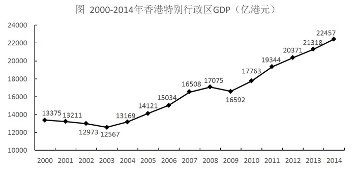

#### 第 6 题　qid 2295363 · 数学运算

2007-2014年，香港特别行政区GDP增量有      年超过1000亿港元。

- **A**. 5　✅
- **B**. 4
- **C**. 3
- **D**. 2

**答案**：A

**官方解析**

根据题干“2007-2014年，······增量有<u>      </u>年超过1000亿港元”，可判定本题为增长量比较问题。定位折线图可知： 

香港特别行政区2007年的GDP增量、2008年的GDP增量、2009年的GDP增量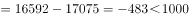、2010年的GDP增量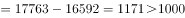、2011年的GDP增量、2012年的GDP增量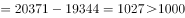、2013年的GDP增量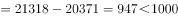、2014年的GDP增量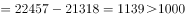。因此可知，香港特别行政区2007、2010、2011、2012、2014这5年的GDP增量超过1000亿港元。

故正确答案为A。

---

#### 第 7 题　qid 2295365 · 数学运算

2014年香港特别行政区四大服务业增加值占该特区GDP的比重约为      。

- **A**. 

- **B**. 

　✅
- **C**. 

- **D**. 

**答案**：B

**官方解析**

根据题干“2014年······占······的比重约为<u>      </u>”，结合材料中给出2014年部分和总体的量，可知本题为现期比重问题。定位表格可知，2014年香港特别行政区四大服务业增加值为；定位折线图可知，2014年香港特别行政区GDP为22457亿港元，所以占比为，与B项最接近。

故正确答案为B。

---

#### 第 8 题　qid 2295368 · 数学运算

2014年香港特别行政区四大服务业中增加值增速最低的行业，增加值增速比当年香港特别行政区GDP增速约      。

- **A**. 低0.3个百分点
- **B**. 低2.3个百分点　✅
- **C**. 高0.4个百分点
- **D**. 高0.8个百分点

**答案**：B

**官方解析**

根据题干“2014年香港特别行政区四大服务业中增加值增速最低的行业，增加值增速比当年香港特别行政区GDP增速约<u>      </u>”，结合选项可知，本题为增长率计算问题。定位表格可知，2014年香港特别行政区四大服务业中增加值增速分别为：

；

；

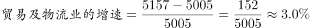；

。

所以，2014年香港特别行政区四大服务业中增加值增速最低的行业为贸易及物流业，其增速约为。

定位折线图可知，当年香港特别行政区GDP的增速为。因此可知，，即2014年香港特别行政区贸易及物流业增加值的增速比当年香港特别行政区GDP的增速低了2.3个百分点。

故正确答案为B。

---

#### 第 9 题　qid 2295372 · 数学运算

关于香港特别行政区GDP和四大服务业发展状况，能够从上述资料中推出的是      。

- **A**. 2001-2008年，香港GDP有4年增速为负值
- **B**. 与2008年相比，2014年专业服务及其他工商业支援服务业从业人员增速在四大服务业中排第二
- **C**. 2000-2014年，旅游业的从业人数翻了1番，增加值翻了2番
- **D**. 香港GDP首次超过2万亿港元的年份，旅游业增加值同比增量为四大服务行业中最低　✅

**答案**：D

**官方解析**

A.定位折线图，通过观察可知，在2001-2008年之间，2001、2002、2003这三年的增速为负值，并非4年，错误；

B.定位表格可知，与2008年相比，2014年四大服务业专从业人员增速分别为：

；

；

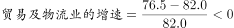；

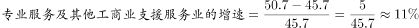。因此可知，专业服务及其他工商业业支援服务业从业人员增速在四大服务业中排第三，错误；

C.定位表格可知，2014年旅游业的从业人数为27.2万人，2000年旅游业的从业人数11.5万人，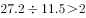，满足翻了1番；2014年旅游业的增加值为1125亿港元，2000年旅游业的增加值为310亿港元，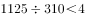，不满足翻了2番，错误；

D.定位折线图，香港GDP首次超过2万亿港元的年份为2012年，定位表格可知，2012年旅游业增加值同比增量为，同年，金融服务业的同比增量为、贸易及物流业的同比增量为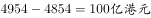、专业服务及其他工商业支援服务业的同比增量为，所以2012年旅游业增加值同比增量为四大服务行业中最低，正确。

故正确答案为D。

---

### 材料 3

        2017年1月17日国家能源局公布《能源发展“十三五”规划》《天然气“十三五”规划》，首次明确“发挥市场配置资源的决定性作用”，到2020年天然气综合保供能力应达到3600亿立方米以上，天然气消费占一次能源消费比例达到-。

        2017年，我国天然气消费总量2373亿立方米，同比增长；全年天然气进口量920亿立方米，同比增长。

#### 第 10 题　qid 2295387 · 数学运算

我国2016年天然气消费总量约为      亿立方米。

- **A**. 1172
- **B**. 2058　✅
- **C**. 2373
- **D**. 30856

**答案**：B

**官方解析**

由题干“我国2016年天然气消费总量约为······亿立方米”，结合材料时间为2017年，判定本题为基期计算问题。定位文字材料第二段可得“2017年，我国天然气消费总量2373亿立方米，同比增长”，根据，可得我国，此式小于2373且首位商2，只有B项符合。

故正确答案为B。

---

#### 第 11 题　qid 2295391 · 数学运算

2010-2015年，我国城市天然气供气总量年均约增长      亿立方米。

- **A**. 68
- **B**. 92
- **C**. 111　✅
- **D**. 191

**答案**：C

**官方解析**

由题干“2010-2015年···年均约增长···亿立方米。”判断本题为年均增长量问题。定位图表可得2010年我国城市天然气供气总量487.58亿立方米，2015年国城市天然气供气总量尾1040.79亿立方米，由可得，2010-2015年，。

故正确答案为C。

---

#### 第 12 题　qid 2295397 · 数学运算

2016年我国城市天然气用气人口中，平均每人每月使用天然气约      立方米。

- **A**. 32　✅
- **B**. 65
- **C**. 167
- **D**. 380

**答案**：A

**官方解析**

由题干“2016年······平均每人每月使用天然······”，可判断题型为平均数问题。定位图表可得2016年城市天然气供应总量为1171.72亿立方米，城市天然气用气人口为30855.57万人。故2016年我国城市天然气用气人口中，平均每人每月使用天然气为。

故正确答案为A。

---

#### 第 13 题　qid 2295403 · 数学运算

下列选项中，与资料不符的是      。

- **A**. 
2016年我国城市天然气供气总量比2015年增长以上

- **B**. 
从2007年到2016年，我国城市天然气用气人口逐渐增长

- **C**. 
2016年我国城市天然气用气人数是2007年的3倍多

- **D**. 
2007-2011年，我国城市天然气供气总量超过2500亿立方米
　✅

**答案**：D

**官方解析**

A项：定位图表可得2016年我国天然气供气总量为1171.72亿立方米，2015年我国天然气总量为1040.79亿立方米，故2016年我国城市天然气供气总量比2015年增长，正确；

B项：由图表可知从2007年到2016年，我国城市天然气用气人口逐渐增长，正确；

C项：由图表可知2016年天然气用气人数是30855.57万人，2007年我国城市天然气用气人数是10189.8万人，故2016年我国城市天然气用气人数是2007年的 ，正确；

D项：由图表可2007-2011年，我国城市天然气供气总量为，错误。

本题为选非题，故正确答案为D。

---

#### 第 14 题　qid 2295301 · 数学运算

数列：3，1，4，8；15，12，3，30；7，11，9，

- **A**. 5
- **B**. 9
- **C**. 13
- **D**. 27　✅

**答案**：D

**官方解析**

题干中有分号，数列可按分号提示分为三组，优先考虑多重数列。观察每组四个数字之间关系，每一组的最大数都在最后，考虑凑大数。发现有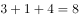；；即前三项之和等于第四项，故，则。

故正确答案为D。

---

#### 第 15 题　qid 2295302 · 数学运算

- **A**. 144
- **B**. 169　✅
- **C**. 196
- **D**. 289

**答案**：B

**官方解析**

题干为图形数阵，按照有中心凑中心的原则，优先考虑凑中心。中心数字，而；，而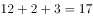；即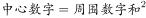，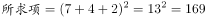。

故正确答案为B。

---

#### 第 16 题　qid 2295304 · 数学运算

数列：981，（5），（4），109；896，（      ），（4），128

- **A**. 2
- **B**. 3　✅
- **C**. 4
- **D**. 5

**答案**：B

**官方解析**

题干中有分号，将数列分为两组，优先考虑多重数列。观察每组四个数字之间关系，发现，即。将第二组数字代入此规律：，则。

故正确答案为B。

---

#### 第 17 题　qid 2295307 · 数学运算

- **A**. 9　✅
- **B**. 24
- **C**. 35
- **D**. 48

**答案**：A

**官方解析**

题干出现图形，观察数字之间的规律。图一中：，，；图二中：，，；图三中：，则，，。（注：为方便表述，设图三中18右边的两个数依次为①和②）

故正确答案为A。

---

#### 第 18 题　qid 2295310 · 数学运算

- **A**. 49
- **B**. 45
- **C**. 35　✅
- **D**. 28

**答案**：C

**官方解析**

题干出现图形，通过观察，相邻数字存在倍数关系，考虑除法。横向观察，可以得到：；；；，那么，推出。

故正确答案为C。

---

#### 第 19 题　qid 2295313 · 数学运算

有一瓶浓度为的盐水500克，每次加入34克浓度为的盐水，则至少加<u>      </u>次该盐水，使这瓶盐水的浓度超过。

- **A**. 6
- **B**. 7
- **C**. 8　✅
- **D**. 9

**答案**：C

**官方解析**

假设至少加入n次浓度为的盐水，则一共加入34n克盐水。根据溶液混合前后溶质的质量不变，可列方程，解得，说明加入7.4次盐水能让混合后盐水浓度为，则至少需要加8次才能让混合后浓度超过。 

故正确答案为C。

---

#### 第 20 题　qid 2295317 · 数学运算

某酒店14名员工需要2个小时清理完所有房间，如果要将这个时间缩短1刻钟，那么需增加      名员工（假设每位员工的工作效率相同）。

- **A**. 1
- **B**. 2　✅
- **C**. 3
- **D**. 4

**答案**：B

**官方解析**

方法一：假设每名员工每分钟的效率为1，则14名员工2小时（即120分钟）的工作量为，若缩短一刻钟（15分钟），则实际总效率为，所以需要增加2人即可。

方法二：设每名员工每分钟的效率为1，缩短时间后需要n人清理。本题由于工作总量相同，则工作效率与时间成反比，即，解得，所以需要增加2人即可。

故正确答案为B。

---

#### 第 21 题　qid 2295319 · 数学运算

甲、乙两人在400米环形跑道上从同一起点反向匀速慢跑，甲的速度为5米/秒，乙的速度为3米/秒，则甲、乙两人经过      再次在起跑点相遇。

- **A**. 4分10秒
- **B**. 5分50秒
- **C**. 6分40秒　✅
- **D**. 7分30秒

**答案**：C

**官方解析**

若两人再次在起跑点相遇，那么每人都重新回到起点，即每人都跑了整数圈，假设此时甲跑了n圈，则，解得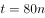，所以在起点再次相遇的时间t为80的倍数，代入选项验证即可。A项4分10秒即250秒，不是80的倍数，排除；B项5分50秒即350秒,不是80的倍数，排除； C项6分40秒即400秒，是80的倍数，当选；D项7分30秒即450秒，不是80的倍数，排除。

故正确答案为C。

---

#### 第 22 题　qid 2295322 · 数学运算

一群蚂蚁将食物从A处运往B处，如果它们的速度每分钟增加1米，可提前15分钟到达，如果它们的速度每分钟再增加2米，则又可提前15分钟到达，那么A处到B处之间的路程是      米。

- **A**. 120
- **B**. 180　✅
- **C**. 240
- **D**. 270

**答案**：B

**官方解析**

设原速度为V，计划达到时间为t，总路程为；“速度每分钟增加1米，可提前15分钟到达”可得；“它们的速度每分钟再增加2米，则又可提前15分钟到达”即速度每分钟增加3米，一共可提前30分钟到达，可得，联立①②③解方程可得。

故正确答案为B。

---

#### 第 23 题　qid 2295332 · 数学运算

某广告牌上需安装特殊的艺术字模型，大字价格是小字价格的2倍，而大字字数是小字字数的三分之一。若总费用不变，而将所有字都改为小字，那么可以制作的小字数量是原来所有字数量的      。

- **A**. 

- **B**. 

- **C**. 

　✅
- **D**. 

**答案**：C

**官方解析**

设小字的价格为1，数量为3x；大字的价格为2，数量为x，所以；若费用不变，全改为小字，则可以制作小字的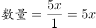，而原来所有字数量为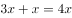，所以所求为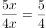。

故正确答案为C。

---

#### 第 24 题　qid 2295333 · 数学运算

用一辆小型箱式货车运送荔枝干，该货车货箱长4.2米、宽1.9米、高1.8米。600克装荔枝干的外包装长20厘米，宽和高都是14厘米。那么一次最多可以运送约      吨荔枝干。

- **A**. 2.1　✅
- **B**. 2.0
- **C**. 1.9
- **D**. 1.8

**答案**：A

**官方解析**

提问“最多可以运送约多少吨荔枝干”，应使车厢尽可能少留空隙，荔枝干的外包装有20厘米和14厘米两种边长，观察车箱的尺寸可以发现，4.2米能整除20厘米和14厘米都不留缝隙，1.9米无法整除20厘米和14厘米、都会留下缝隙，1.8米只能整除20厘米。

因此想最多运送荔枝干，应用1.8米的方向摆放荔枝干外包装20厘米的方向，可以摆放；4.2米方向摆放14厘米可摆放；1.9米方向摆放14厘米可摆放，最多13盒。

因此车箱里最多可运送，共计。

故正确答案为A。

---

#### 第 25 题　qid 2295334 · 数学运算

赵、钱、孙三人共带1000元钱外出游玩，赵、钱两人平均花了220元，钱、孙平均花了230元，赵、孙平均花了290元，回来后三人想把剩下的钱平分，结果怎样也分不开，赵出了一个主意，三人谁花钱最少就把剩下的钱给谁。则花钱最少的是      ，他分到了      元。

- **A**. 钱，240
- **B**. 赵，260
- **C**. 孙，260
- **D**. 钱，260　✅

**答案**：D

**官方解析**

根据题意可知①，②，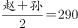③，由①②可推出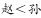，②③可推出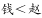，因此花钱最少的人是“钱”，排除B、C两项。三人共花费：，因此剩余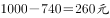。 

故正确答案为D。

---

#### 第 26 题　qid 2295336 · 数学运算

如图，由四个全等的直角三角形拼成一个大正方形，每个三角形的面积都是1，且两直角边之比大于等于2，则这个大正方形的面积至少是<u>      </u>。

- **A**. 4
- **B**. 5　✅
- **C**. 6
- **D**. 7

**答案**：B

**官方解析**

。要让大正方形面积尽可能小，则小正方形面积应尽可能小。观察图形可知：，要想小正方形的边长尽可能小，则长短直角边的差值应尽量小，即两直角边之比尽可能小，此时该比值等于2。

设三角形短直角边为x，则长直角边为2x，根据三角形面积公式可得，解得，则，因此小正方形面积为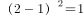，大正方形的面积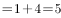。

故正确答案为B。

---

#### 第 27 题　qid 2295338 · 数学运算

小李第一次买了A、B、C三种饮料各若干瓶，共花去了75元；之后他再次买了这三种饮料若干瓶，共花去了134元。两次购买的每种饮料数量之和相同，那么若三种饮料各买1瓶最多需花费      元。（假设饮料价格都是整数元）

- **A**. 11
- **B**. 15
- **C**. 19　✅
- **D**. 23

**答案**：C

**官方解析**

假设三种饮料各买1瓶共需要a元，两次购买的每种饮料数量之和为n，则两次购买饮料的费用总和为，或19元，因此三种饮料各买1瓶最多需要19元。

故正确答案为C。

---

#### 第 28 题　qid 2295344 · 数学运算

射击用的靶子是由若干个同心圆组成，最中心的圆代表10环，而10环外圈的一个圆环代表9环。在随机射击时，若要使得击中10环和9环的概率相同，那么10环外圈半径与9环外圈半径的比值为      。

- **A**. 
1

- **B**. 

- **C**. 

- **D**. 
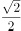
　✅

**答案**：D

**官方解析**

在随机射击时，若要使得击中10环和9环的概率相同，应使10环和9环部分的面积相同。设10环半径为1，9环半径为x，由面积相等可列公式：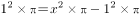，解得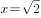。10环外圈半径与9环外圈半径的比值为。

故正确答案为D。

---

## 判断推理

### 第 1 题　qid 2295442 · 逻辑判断

一名摄影师要从侧面拍摄一辆以行驶的汽车，成像不模糊的前提是底片上汽车的像移动的尺寸不大于0.1mm，已知底片上汽车长为2cm，实际汽车车身长3m，那么曝光时间至多为<u>        </u>秒。

- **A**. 

　✅
- **B**. 

- **C**. 

- **D**. 

**答案**：A

**官方解析**

汽车速度。汽车的实际长度与成像之间的比例；则底片上汽车的像移动的尺寸不大于0.1mm，所对应的距离。

故曝光的时间=。

故正确答案为A。

---

### 第 2 题　qid 2295446 · 逻辑判断

民用客机机舱的紧急出口气囊是一条连接地面的斜面，为安全考虑设计者要计算乘客着地时的速度和动能。乘客的质量各有不同，假设所有乘客与气囊的动摩擦因数相同，那么下面说法正确的是              。

- **A**. 质量越大下滑速度越大，动能也越大
- **B**. 质量越大下滑速度越大，但动能不一定大
- **C**. 下滑速度、动能与质量大小无关，速度和动能都一样大
- **D**. 下滑速度与质量大小无关所以一样大，但质量大的人动能较大　✅

**答案**：D

**官方解析**

做受力分析，气囊上的人受到竖直向下的重力，将重力沿着斜面方向和垂直于斜面方向分解，沿着斜面方向的分力，垂直于斜面方向的分力，因此给斜面的压力为，所以斜面能提供的动摩擦力为。下滑时，斜面方向甲受到沿斜面向下的和沿斜面方向向上的，斜面方向合力，所以加速度。

由于所有乘客与气囊的动摩擦因数相同，所以加速度与质量无关，所有乘客下滑加速度相同，下滑速度相同。由此排除A、B两项。

由于，所以质量大的人动能较大。

故正确答案为D。

---

### 第 3 题　qid 2295480 · 逻辑判断

如图所示为铁路的输电线悬挂在钢缆上的方式。钢缆的A端固定在电杆上，B端通过滑轮组连接在电杆C上。配重D是n个混凝土圆盘，每个盘的质量是m。根据以上信息判断下列说法正确的是<u>          </u>。

- **A**. 
B处使用滑轮组是为了保证输电线的高度变化时钢缆始终保持张紧状态
　✅
- **B**. 
B处使用滑轮组是为了省力

- **C**. 
不考虑钢缆和滑轮质量，钢缆在B端受的拉力

- **D**. 
不考虑钢缆和滑轮质量，钢缆在B端受的拉力

**答案**：A

**官方解析**

因每个混凝土圆盘的质量为，则配重D的重力。结合题干图形可知，滑轮B为动滑轮，与之相连的绳子段数是3。作用在钢缆自由端的拉力为配重D的重力。根据滑轮组省力公式可得，。故作用在B端钢缆的拉力。由此排除C、D两项。在B处使用滑轮组可以保证输电线在高度变化时，钢缆始终受到拉伸的作用力，故而保持张紧状态，A项满足。

故正确答案为A。

---

### 第 4 题　qid 2295488 · 类比推理

在某种核反应堆中，是靠熔化的钠来传递核燃烧产生的热量的。抽动液态钠的“泵”的传动部分不允许和钠接触，因此常使用一种称为“电磁泵”的机械。如图所示为这种泵的结构，N、S为磁铁的两极，C为在磁场中的耐热导管，熔融的钠从其中流过，v为钠的流动方向，要使钠液加速，加在导管中钠液的电流方向应为<u>           </u>。

- **A**. 由上流向下
- **B**. 由下流向上　✅
- **C**. 逆着v的方向
- **D**. 顺着v的方向

**答案**：B

**官方解析**

结合题干图形，钠的流动方向向内，要使钠液加速，需安培力向内，磁场方向由N至S向右。根据左手定则，电流方向应由下向上，B项满足。
故正确答案为B。

---

### 第 5 题　qid 2295491 · 逻辑判断

物理学家做了一个有趣的实验：在双缝干涉实验中，在光屏处放上照相底片，若减弱光流的强度，使光子只能一个一个地通过狭缝。实验表明，如果曝光时间不太长，底片上只能出现一些不规则的点；如果曝光时间足够长，底片上就会出现规则的干涉条纹。对这个实验结果的认识不正确的是           。

- **A**. 单个光子的运动没有确定的轨道
- **B**. 只有大量光子的行为才表现出波动性　✅
- **C**. 干涉条纹中明亮的部分是光子到达机会较多的地方
- **D**. 曝光时间不长时，光的能量小，底片上的条纹看不清楚，故出现不规则的点

**答案**：B

**官方解析**

光波是概率波，光子在空间传播时，没有经典意义的轨道，无法预测它在空间的确定位置，但光子在空间各点出现的概率，可以用波动规律来描述。单个光子的落点无法预测，所以曝光时间不太长，底片上只能出现一些不规则的点，但是到达亮条纹区域的概率会大于到达暗条纹区域的概率。如果曝光时间足够长，底片上就会出现规则的干涉条纹。
A项：单个光子在空间中的位置是不确定的，而且光子在空间运动轨迹也是不确定的，正确；
B项：波动性是光子固有的性质，与光子数量无关，错误；
C项：光子到达亮条纹的概率会大于到达暗条纹的概率，因而曝光时间足够长，光子到达的多的区域表现为亮条纹，而光子到达的少的区域表现为暗条纹，正确；
D项：曝光时间不太长时，底片上出现的光点密集度太低，明暗区分不明显，故出现不规则的点，正确。
本题为选非题，故正确答案为B。

---

### 第 6 题　qid 2295495 · 逻辑判断

如图所示，把碗放在大锅内的水中蒸食物，假设碗中的汤和水的沸点一样都是100℃，且碗中的汤吸收的热量全部来自于周围的水，则下列关于水和汤沸腾的说法正确的是<u>          </u>。

- **A**. 水和汤同时沸腾
- **B**. 水会沸腾，汤不会沸腾　✅
- **C**. 水先沸腾，汤后沸腾
- **D**. 汤先沸腾，水后沸腾

**答案**：B

**官方解析**

液体沸腾需要达到沸点且继续吸热。开始汤和水都会吸热升温，但当水达到沸点100℃时，继续吸热，沸腾起来，但温度不再升高；此时碗中的汤也会达到沸点100℃，但由于碗中的汤与大锅中水的温度相同，不能继续吸热，因而碗中的汤不会沸腾。
故正确答案为B。

---

### 第 7 题　qid 2295497 · 类比推理

某同学将轻质不可伸长的晾衣绳两端分别固定在竖直杆M、N上的a、b两点，将衣架挂在绳上晾晒衣物，衣架挂钩可视为光滑。晾晒一件短袖T恤时，衣架静止于如图位置。当晾晒一件厚滑雪衫时，该同学担心晾衣绳可能会断，为防止绳断，他应该      。

- **A**. 将绳的右端固定点b略向上移
- **B**. 将绳的右端固定点b略向下移
- **C**. 换一根略短的晾衣绳
- **D**. 换一根略长的晾衣绳　✅

**答案**：D

**官方解析**

如图所示，左右两个绳子关于竖直方向是对称的，与竖直方向夹角是相等的。设绳子的总长度为，两杆之间的距离为，则。当绳子右端上移或者下移时，与均不变，则角度不变，左右两个绳子的合力与衣服的重力等大反向，因角度不变，所以绳子的拉力不变，A项与B项错误；

当换一根略短的晾衣绳，减小，因不变，则角度变小，左右两个绳子拉力的合力与衣服的重力等大反向，，，则绳子的拉力增大，绳子更容易断，C项错误；

当换一根略长的晾衣绳，变大，因不变，则角度变大，则绳子的拉力减小，可防止绳断，D项正确。

故正确答案为D。

---

### 第 8 题　qid 2295506 · 类比推理

考古学中用同位素测年法测量古生物的年代，每隔一定的时间质量减少为原来的一半。如果以表示的质量，表示时间，的初始质量为，那么的质量随时间的变化规律是下面的<u>      </u>图。

- **A**. A
- **B**. B　✅
- **C**. C
- **D**. D

**答案**：B

**官方解析**

若每隔时间衰减为原来的一半，则衰减规律满足 。随着的增长，越来越小，且变化越来越慢，结合选项，B项较为符合。

故正确答案为B。

---

### 第 9 题　qid 2295510 · 逻辑判断

已知电磁波遇到平滑的金属表面会像光遇到平面镜一样发生反射，反射过程中也遵循光的反射定律。如图所示，三块相互垂直的正方形薄金属平板可以组成最基本的角反射器。下面关于角反射器的特点和用途，说法不符合实际的是<u>                </u>。

- **A**. 角反射器会把电磁波沿着入射方向平行的直线反射回去
- **B**. 角反射器可用来精确地测距
- **C**. 角反射器会把电磁波沿各个不同方向反射回去　✅
- **D**. 救生艇悬挂角反射器是为让雷达能够尽快发现救生艇

**答案**：C

**官方解析**

由于角反射器的特点，无论电磁波从哪个角度射向角反射器，反射波最终都会沿与入射方向平行的直线返回，并不会沿各个不同方向反射回去。角反射器主要应用在测距、警示、军事、船舶遇险救生等领域。
本题为选非题，故正确答案为C。

---

### 第 10 题　qid 2295512 · 类比推理

半潜船是专门从事运输大型海上石油钻井平台、大型舰船、潜艇等超长超重而又无法分割吊运的超大型设备的船舶。其工作流程分列如下：①将货物移到装货甲板上；②开启压载水舱的通海阀门，注入适量水；③启动大型空压机往压载水舱注入适量空气；④船舶实现上浮；⑤将货物运走。则下面排序正确的是      。

- **A**. ①②③④⑤
- **B**. ②①③④⑤　✅
- **C**. ②④①③⑤
- **D**. ③①②④⑤

**答案**：B

**官方解析**

半潜船也称半潜式母船，它通过本身压载水的调整，把装货甲板潜入水中，以便将所要承运的货物浮入半潜船的装货甲板上，将货物运到指定位置。因此工作流程如下：需要先开启压载水舱的阀门，注入海水使装货甲板潜入水中。随后将货物拖拽到已经潜入水下的装货甲板上方。然后将压载水舱注入空气，半潜船身压载水舱的压载水排出船体，使船体上浮，最后将货物运走。
故正确答案为B。

---

### 第 11 题　qid 2295514 · 逻辑判断

如图是常见的剪式千斤顶，当摇动把手时，螺纹轴就能迫使千斤顶的两臂靠拢，从而将物体顶起。若千斤顶两臂间的初始夹角为，物体重量保持不变，则下列关于两臂受到的压力大小说法正确的是<u>      </u>。

- **A**. 
两臂受到的压力随夹角的减小而减小，且一定小于物体的重力
　✅
- **B**. 
两臂受到的压力随夹角的减小先减小后增大，且在时压力最小

- **C**. 
两臂受到的压力随夹角的减小而增大，但不可能大于物体的重力

- **D**. 
两臂受到的压力随夹角的减小先增大后减小，最大值不会超过物体的重力

**答案**：A

**官方解析**

物体压在千斤顶上，物体对千斤顶的压力F大小与物体重力大小相等。将物体对千斤顶的压力F分解沿两臂的两个分力、。受力分析如图所示，根据对称性可知，两臂受到的压力大小相等，即。由得：。当夹角为时，。分析可知，不变，当逐渐减小时，逐渐增大，逐渐减小；当减少到时最小为。因此随着夹角减少，两臂受到的压力也减少，且一定小于物体的重力，A项正确。

故正确答案为A。

---

### 第 12 题　qid 2295516 · 图形推理

下列选项中，符合所给图形的变化规律的是<u>      </u>。

- **A**. A
- **B**. B
- **C**. C
- **D**. D　✅

**答案**：D

**官方解析**

元素组成相似，优先考虑样式规律。图形轮廓相同，里面颜色不同，考虑黑白运算，观察第一组图形，可知：，，，，故第一组图的规律为前两图形只有白色部分相加在图3是白色，而其他颜色相加在图3中是黑色，第二组图形应用规律，图1和图2相同位置的白色部分在“？”处保持白色，其他地方均变为黑色，只有D项符合。

故正确答案为D。

---

### 第 13 题　qid 2295519 · 图形推理

把下列图形分成两类，分类正确的是<u>      </u>。

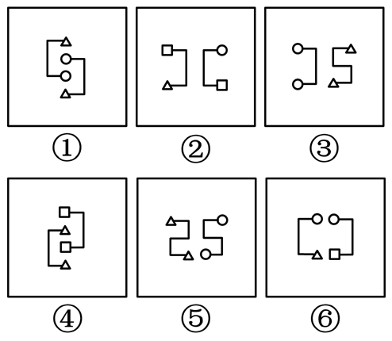

- **A**. ①②④；③⑤⑥
- **B**. ①③⑤；②④⑥
- **C**. ①②⑥；③④⑤　✅
- **D**. ①②③；④⑤⑥

**答案**：C

**官方解析**

本题为分组分类题目。观察题干图形，每根线段的两端均连接了小元素，观察发现，图①②⑥中线段的两端连接了不同的小元素，图③④⑤中线段的两端连接的是相同的小元素。故①②⑥一组，③④⑤一组。
故正确答案为C。

---

### 第 14 题　qid 2295520 · 图形推理

下列选项中，符合所给图形的变化规律的是<u>      </u>。

- **A**. A
- **B**. B
- **C**. C　✅
- **D**. D

**答案**：C

**官方解析**

观察题干图形，每幅图形均为九宫格，且存在黑色区域。观察发现，第一组图中，每幅图形中的黑色区域均占3个格子；第二组图中，前两幅图黑色区域均占6个格子，故？处图形黑色区域应占6个格子，只有C项符合。
故正确答案为C。

---

### 第 15 题　qid 2295523 · 图形推理

下列选项中，符合所给图形的变化规律的是<u>      </u>。

- **A**. A
- **B**. B
- **C**. C　✅
- **D**. D

**答案**：C

**官方解析**

元素组成相似，优先考虑样式规律。九宫格优先横向看，发现第一行图形中第二个图形由第一个图形左右翻转后，叠加到第一个图形左边所得，第三个图形由第一个图形旋转180°后，叠加到第一个图形右边所得。验证第二行图形，符合此规律。因此，第三行图形应用此规律，？处的图形应由第一个图形旋转180°后，叠加到第一个图形右边，只有C项满足要求。
故正确答案为C。

---

### 第 16 题　qid 2295525 · 图形推理

下列选项中，符合所给图形的变化规律的是<u>      </u>。

- **A**. A
- **B**. B
- **C**. C
- **D**. D　✅

**答案**：D

**官方解析**

每一幅图形均由直线、黑圆和白圆组成，考虑三种元素之间的关系，在第一组图形中每一条线上均有2个黑圆，一个白圆，且两个黑圆之间均有一个白圆，第二组应符合此规律，前两幅图形中均有两个黑圆与一个白圆连接，且两个黑圆中间没有白圆间隔，观察选项只有D项符合要求。
故正确答案为D。

---

### 第 17 题　qid 2295528 · 图形推理

下列选项中，符合所给图形的变化规律的是<u>      </u>。

- **A**. A
- **B**. B
- **C**. C　✅
- **D**. D

**答案**：C

**官方解析**

元素组成相同，优先考虑位置规律。观察发现黑圆均在内圈移动，白圆均在外圈移动，考虑内外圈分开看，首先观察内圈，发现黑圆每次逆时针移动1格，因此？处图形中内圈左下角应为空白格，排除B、D选项。继续观察外圈，发现白圆每次顺时针移动3格，因此？处外圈左上角应有一个白圆，排除A选项。
故正确答案为C。

---

### 第 18 题　qid 2295531 · 图形推理

下列选项中，与所给图形规律相同的是<u>      </u>。

- **A**. A　✅
- **B**. B
- **C**. C
- **D**. D

**答案**：A

**官方解析**

黑块数量不一致，元素组成相似，优先考虑样式规律，但黑白运算无规律。继续观察发现，题干中白色方块全部都连在一起，即白色方块均为一部分。A项白色方块为一部分，B项为三部分，C项为三部分，D项为两部分，只有A项符合。
故正确答案为A。

---

### 第 19 题　qid 2295533 · 图形推理

下列选项中，符合所给图形的变化规律的是<u>      </u>。

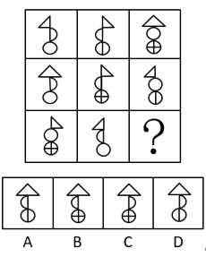

- **A**. A
- **B**. B
- **C**. C
- **D**. D　✅

**答案**：D

**官方解析**

元素组成相似，优先考虑样式规律。观察发现，每个图形均可分为上、中、下三部分。第一横行中，上面部分出现左边三角形、右边三角形、大三角形，中间部分出现朝左半圆、朝右半圆、整圆，下面部分出现空白圆、内含一条竖线、两条竖线的圆；经验证，第二横行满足此规律；故第三横行应用此规律，？处应上面部分应为大三角形、中间部分为朝右半圆、下面部分为一条竖线的圆，只有D项符合。
故正确答案为D。

---

### 第 20 题　qid 2295535 · 图形推理

下列选项中，符合所给图形的变化规律的是<u>      </u>。

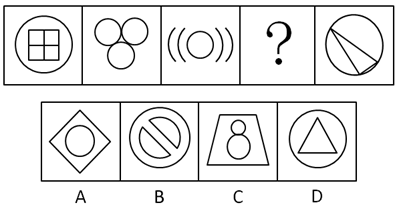

- **A**. A
- **B**. B
- **C**. C　✅
- **D**. D

**答案**：C

**官方解析**

解法一：元素组成不同，优先考虑属性规律。图形整体比较规整，优先考虑对称性。观察可知，题干图形对称轴的数量依次为4、3、2、？、0，故问号处应填入有1条对称轴的轴对称图形，只有C项符合。
故正确答案为C。
解法二：观察发现题干图形出现了单一曲线和圆，考虑数曲线。题干曲线数量分别是1、3、5、？、1。故根据数字对称的规律，问号处应选择有3条曲线的图形，只有B项符合。
故正确答案为B。
注：本题有两种解法，出题不严谨，但粉笔倾向于解法一。因为数字对称的规律近几年公考题目中几乎没有出现，说明不是命题人想考查的方向，而对称轴的数量却呈现了依次递减的规律，这比数字对称的规律更加严谨、更加符合最新的出题趋势。

---

### 第 21 题　qid 2295543 · 图形推理

下列选项中，能组合成一个立方体方块的是<u>      </u>。

- **A**. 1、2、3
- **B**. 2、3、4
- **C**. 1、3、4　✅
- **D**. 2、3、5

**答案**：C

**官方解析**

题干要求组成立方体方块，故小方块总数应该是27块。图1是9块，图2是7块，图3是12块，图4是6块，图5是8块，排除A、B两项；剩余C、D两项，都有图3，立方体每层有9块，图3已满足一层是9块，另一层有3块，故另外两图应满足某一层相加有6块。图2和图5均无法满足某一层相加有6块，而图1上层与图4下层相加为6块，即图1、3、4可组合成立方体方块（如下图所示）。

故正确答案为C。

---

### 第 22 题　qid 2295570 · 图形推理

右边选项中，不能由展开图折叠而成的是<u>      </u>。

- **A**. A
- **B**. B
- **C**. C
- **D**. D　✅

**答案**：D

**官方解析**

将题干展开图标号如下图：

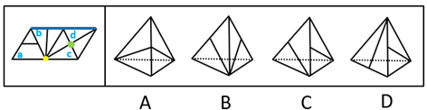

A项：由面c和面d组成，选项与题干一致，排除；

B项：由面b和面c组成，选项与题干一致，排除；

C项：由面b和面d组成，选项与题干一致，排除；

D项：如上图，题干中面b和面c中竖线交于黄色公共点，选项和题干不一致，故该项不是面b和面c；题干中面c和面d中竖线交于绿色公共点，选项和题干不一致，故该项不是面c和面d；所以该项只能是面b和面d。由于四面体中，构成直线的是同一条边，所以题干中标蓝色的为同一条边。又因为题干面b中竖线交于蓝色公共边，而选项中右侧面有竖线交于公共边，所以选项右侧面为面b，而左侧面为面d。

对面d进行画边，如上图所示，题干中边3对应的是面b，选项中边1对应的是面b，选项与题干不一致，当选。

本题为选非题，故正确答案为D。

---

### 第 23 题　qid 2295572 · 图形推理

下列选项中，符合所给图形的变化规律的是<u>      </u>。

- **A**. A
- **B**. B
- **C**. C
- **D**. D　✅

**答案**：D

**官方解析**

观察发现，第一组图中，将所有位置的小黑三角形拼在一起，可以得到一个完整的黑色正方形；第二组图应用规律，故？处应左下角区域有一个小黑三角形，只有D项符合。
故正确答案为D。

---

### 第 24 题　qid 2295274 · 逻辑判断

小王和小李现在是经济系二年级的学生。在根据一年级的课程总成绩来评定奖学金时，已知他们两人的经济学原理成绩相同，而英语、高等数学等其他六门课的成绩则互有高低。最终小王获得了奖学金。
下列      项如果为真，能够判断出小王的总成绩比小李的要高。

- **A**. 小王的最高分比小李的最高分要高
- **B**. 小王的最低分是高等数学，而小李的最低分是英语
- **C**. 小王的最低分比小李的平均成绩要高　✅
- **D**. 小王的最低分比小李的最低分要高出许多

**答案**：C

**官方解析**

第一步：找出论点和论据。
论点：小王的总成绩比小李的要高。
论据：根据一年级的课程总成绩来评定奖学金时，已知他们两人的经济学原理成绩相同，而英语、高等数学等其他六门课的成绩则互有高低。
第二步：逐一分析选项。
A项：该项只是对最高分进行了比较，而最高分不能决定六门课总成绩，排除；
B项：该项只是对最低分进行了说明，而最低分不能决定六门课总成绩，排除；
C项：小王的最低分比小李的平均分高，那么小王的平均分一定比小李的高，即小王的总成绩更高，可以得出结论，当选；
D项：该项只是对最低分进行了比较，而最低分不能决定六门课总成绩，排除。
故正确答案为C。

---

### 第 25 题　qid 2295276 · 逻辑判断

对所有的静脉血标本进行检测，没有发现阳性HIV抗体。
如果上述断定为假，则下列      项一定为真。

- **A**. 要发现阳性HIV抗体，必须对所有静脉血标本进行检测
- **B**. 对所有静脉血标本进行检测，未必能发现阳性HIV抗体
- **C**. 部分静脉血标本尚未进行检测，或者已经发现了阳性HIV抗体　✅
- **D**. 部分静脉血标本尚未进行检测，但是已经发现了阳性HIV抗体

**答案**：C

**官方解析**

第一步：分析题干条件。

对所有静脉血标本检测 且 发现现阳性HIV抗体。

已知题干为假，那么其矛盾命题：（对所有静脉血标本检测 且 发现了阳性HIV抗体）一定为真，即：有的静脉血标本没有检测 或 发现了阳性HIV抗体。

第二步：逐一分析选项。

A项：翻译为发现阳性HIV抗体所有静脉血标本检测，是对题干矛盾命题“或”关系的肯定，无法得出确定性结论，排除；

B项：翻译为对所有静脉血标本检测未必发现阳性HIV抗体，是对题干矛盾命题“或”关系的否定，根据“否一推一”可知，一定发现了阳性HIV抗体，与题干不一致，排除；

C项：翻译为有的静脉血标本没有检测 或 发现了阳性HIV抗体，与题干的矛盾命题一致，一定为真，当选；

D项：翻译为有的静脉血标本没有检测 且 发现了阳性HIV抗体，题干矛盾命题为“或”关系而不是“且”关系，排除。

故正确答案为C。

---

### 第 26 题　qid 2295277 · 逻辑判断

研究人员通过对某国500名儿童进行跟踪研究发现，人类大脑成长最快的时期是在出生后三个月内，大脑的尺寸可以达到成人的一半以上。
下列      项的答案最能评价上述结论的正确性。

- **A**. 500名儿童中有没有人的大脑是在出生三个月后才快速生长的？
- **B**. 有没有对其他国家的儿童进行跟踪研究？　✅
- **C**. 儿童的大脑功能和成人是不是一样？
- **D**. 男童和女童的大脑成长速度是否一样？

**答案**：B

**官方解析**

第一步：找出论点和论据。
论点：人类大脑成长最快的时期是在出生后三个月内，大脑的尺寸可以达到成人的一半以上。
论据：研究人员对某国500名儿童进行跟踪研究。
第二步：逐一分析选项。
A项：如果仅有个别儿童的大脑是在出生三个月后才快速生长的，不会对实验的结论造成影响，因此不能评价上述结论的正确性，排除；
B项：该项说明仅对一个国家儿童进行了研究不具有代表性，也应对其他国家儿童进行研究才能确保结论的正确性，因此可以对题干的结论做出评价，当选；  
C项：该项讨论的是儿童和成人的大脑功能，与题干讨论的大脑成长速度无关，是无关项，因此不能评价上述结论的正确性，排除；
D项：该项讨论的是男童和女童的大脑成长速度是否一样，与题干讨论的人类大脑成长最快的时期无关，是无关项，因此不能评价上述结论的正确性，排除。
故正确答案为B。

---

### 第 27 题　qid 2295280 · 逻辑判断

当今社会，二维码支付方式在餐饮门店、超市、便利店等线下小额支付场景中得到了广泛的应用。但在条码生成机制和传输过程中仍存在风险隐患，也引发了不少涉及支付安全风险的案件。
下列      项能够对题干中的结论起到解释的作用。

- **A**. 静态条码容易被篡改或变造，容易携带木马或病毒　✅
- **B**. 线下扫码支付为用户带来了便捷的消费体验
- **C**. 商家利用线下扫码支付可以帮助自身提高经营收益
- **D**. 采用先进的令牌技术进行变异处理后，可以保护真实卡号信息

**答案**：A

**官方解析**

第一步：找出题干结论。
 “在条码生成机制和传输过程中仍存在风险隐患，引发了不少涉及支付安全风险的案件。”
第二步：逐一分析选项。
A项：该项解释了二维码支付隐患是由于静态条码容易被篡改或变造，容易携带木马或病毒，可以解释题干结论，当选；
B项：该项讨论的是线下扫码支付为用户带来了便捷的消费体验，题干讨论的是二维码支付会带来安全隐患，讨论话题不一致，不能解释题干结论，排除；
C项：该项讨论的是商家利用线下扫码支付可以帮助自身提高经营收益，题干讨论的是二维码支付会带来安全隐患，讨论话题不一致，不能解释题干结论，排除；
D项：该项讨论的是提高移动支付安全性的方法，不能解释为什么存在风险隐患，不能解释题干结论，排除。
故正确答案为A。

---

### 第 28 题　qid 2295282 · 逻辑判断

爱因斯坦对人类最大的贡献就是相对论的提出，它是人类研究宇宙强有力的工具。爱因斯坦通过相对论进行过宇宙质量的计算，结果发现宇宙的质量总和竟然为零。爱因斯坦认为，宇宙在大爆炸后产生的物质有正反两种形式，反物质和正物质完全相反，而且正、反物质质量相等。但科学家在宇宙中只发现了很小量的反物质，那大部分的反物质去哪里了？如果它们不存在于宇宙中，爱因斯坦通过相对论的计算也不会发现宇宙质量总和为零。但是宇宙的质量为零，这说明反物质应该还是存在于宇宙当中。
下列      项是以上论述所假设的前提。

- **A**. 只存在一个宇宙
- **B**. 爱因斯坦通过相对论的计算是正确的　✅
- **C**. 人类如果不能利用反物质的巨大能量，就不能进行星际探索
- **D**. 科学家在实验室中发现了反物质，而且现在也可以在实验室制造一部分反物质

**答案**：B

**官方解析**

第一步：找出论点和论据。
论点：大部分的反物质应该还是存在于宇宙当中。
论据：爱因斯坦通过相对论进行过宇宙质量的计算，结果发现宇宙的质量总和竟然为零。爱因斯坦认为，宇宙在大爆炸后产生的物质有正反两种形式，反物质和正物质完全相反，而且正、反物质质量相等。但科学家在宇宙中只发现了很小量的反物质。
第二步：逐一分析选项。
A项：该项说的是宇宙的数量，与论点说的大部分的反物质是否存在于宇宙中无关，是无关项，排除；
B项：只有爱因斯坦相对论的计算是正确的，才能通过宇宙的质量总和为零，得知反物质应大量存在，是结论成立的必要条件，当选；
C项：该项说的是反物质能力的作用与应用，与论点说的大部分的反物质是否存在于宇宙中无关，是无关项，排除；
D项：科学家可以在实验室发现、制造出反物质，说明反物质是存在的，但无法证明宇宙中是否存在大部分的反物质，无法加强，排除。
故正确答案为B。

---

### 第 29 题　qid 2295284 · 逻辑判断

人们向火星发射了诸多探测器，以期探寻火星是否存在生命。在探测区域发现火星表面是含大量硫酸盐的酸性土壤，这预示着火星上存在火山活动。另外探测数据表明火星土样还显示出高氯酸盐的迹象，高氯酸盐是一种可担当火星微生物的能量源的化合物；同时在火星表面还发现一个奇怪迹象——还原铁，该迹象表明火星表面曾存在生命。
下列      项如果为真，最能质疑以上论述。

- **A**. 在地球上，还原铁一般是通过微生物形成的
- **B**. 火山爆发喷发出硫，硫燃烧生成二氧化硫，二氧化硫遇水形成亚硫酸，亚硫酸氧化成硫酸，硫酸和金属反应，生成硫酸盐
- **C**. 探索发现，在火星表面不存在液态水
- **D**. 行星上的铁和撞击它的彗星所携带的有机碳发生化学反应可产生还原铁　✅

**答案**：D

**官方解析**

第一步：找出论点和论据。
论点：火星表面曾存在生命。
论据：探测器发现火星表面是含大量硫酸盐的酸性土壤，火星土样还显示出高氯酸盐的迹象，而高氯酸盐是一种可担当火星微生物的能量源的化合物，同时在火星表面还发现了还原铁。
论点讨论的是“火星”和“生命”的关系，论据讨论的是“火星”和“硫酸盐”、“高氯酸盐”、“还原铁”的关系，论点论据话题不一致，削弱优先考虑拆桥，即拆断“硫酸盐”、“高氯酸盐”、“还原铁”和“生命”之间的联系。
第二步：逐一分析选项。
A项：选项指出地球上的还原铁和生命有关系，而题干是通过还原铁证明火星上有生命，无法削弱，排除；
B项：火山爆发喷发出硫，通过一系列反应生成硫酸盐，说明硫酸盐确实与火山活动之间有联系，是加强项，无法削弱，排除；
C项：火星表面不存在液态水，题干未提及液态水，是无关项，无法削弱，排除；
D项：行星上的铁和撞击它的彗星所携带的有机碳发生化学反应可产生还原铁，说明还原铁的出现与存在生命之间不一定存在必然联系，是拆桥项，可以削弱，当选。
故正确答案为D。

---

### 第 30 题　qid 2295285 · 逻辑判断

工厂对技术工人的学历情况进行了调查，发现过去五年间新进厂的技术工人学历层次有大幅度提高。因此，工厂技术工人的素质整体有较大提升。
如果上述情况属实，下列      项无法对结论起到支持。

- **A**. 过去五年间的新进厂的技术工人现在仍在工厂上班
- **B**. 素质高的技术工人生产的产品较少出现不合格的情况　✅
- **C**. 学历越高的人，素质也越高
- **D**. 学历高的人会带动其他同事提高素质

**答案**：B

**官方解析**

第一步：找出论点和论据。
论点：工厂技术工人的素质整体有较大提升。
论据：过去五年间新进厂的技术工人学历层次有大幅度提高。
本题的论点是说工厂技术工人的素质有提高，而论据说的是近5年间新进厂技术工人的学历有提高，论点关键词是“技术工人的素质”，论据关键词是“技术工人的学历”，论点与论据话题不一致，因此这道题既可以考查加强论点与论据之间的关系，又可以考查补充新的论据。
第二步：逐一分析选项。
A项：题干论据表明过去五年新进厂的技术工人学历有大幅提高，而选项又补充了现在这些新技术工人仍然在工厂上班，这就补充了新论据，说明现在工厂技术工人的学历仍然是高的，可以加强论据，排除；
B项：技术工人素质高使得产品较少出现不合格的情况，与题干论点现有工人素质是否提升无关，属于无关选项，无法加强，当选；
C项：选项将论据中的“技术工人的学历高”与论点中的“技术工人的素质高”建立联系，属于搭桥，可以加强，排除； 
D项：选项可以说明随着近5年间学历高的技术工人来到工厂，他们会带动身边其他同事整体素质会提升，进而使得整个工厂技术工人的素质提高，在论据与论点之间建立联系，属于搭桥，可以加强，排除。
本题为选非题，故正确答案为B。

---

### 第 31 题　qid 2295290 · 逻辑判断

研究人员研究了来自110万人的DNA，得出了一个评分系统。利用该系统可以通过检测某人的DNA来大致预测某人的受教育程度。结果发现，那些基因得分最低的人只有的机会从大学毕业；相比之下，那些基因得分在前五分之一的人，有的机会从大学毕业。这是有史以来最大规模的人类认知遗传学研究。有些人据此以为，人类的基因与学历之间有极大联系。

下列<u>      </u>项如果为真，最能质疑这些人的观点。

- **A**. 
在110万被研究者中，抽样显示，只有不到的人是大学毕业的

- **B**. 
在大学毕业的被研究者中，其父母之一是大学毕业的超过

- **C**. 
在110万被研究者中，有超过的人是大学毕业的
　✅
- **D**. 
基因得分最居中的人，也有的机会从大学毕业

**答案**：C

**官方解析**

第一步：找出论点和论据。

论点：人类的基因与学历之间有极大联系。

论据：基因得分最低的人只有的机会从大学毕业；基因得分在前五分之一的人，有的机会从大学毕业。

第二步：逐一分析选项。

A项：110万被研究者中只有不到的人是大学毕业的，此时前五分之一确实高于平均水平，得分最低的确实低于平均水平，补充论据支持题干论点，可以加强，排除；

B项：被研究者们的父母与该研究无关，属于无关选项，不能削弱，排除；

C项：110万被研究者中有超过的人是大学毕业的，说明所选的研究样本中，绝大部分人都有高学历，否定了题干论点基因得分在前五分之一的人，有的机会从大学毕业，削弱了题干观点，可以削弱，当选；

D项：基因得分最居中的人也有的机会从大学毕业的，此时前五分之一确实高于居中水平，得分最低的确实低于居中水平，说明基因与学历有关系，补充论据支持题干论点，可以加强，排除。

故正确答案为C。

---

### 第 32 题　qid 2295291 · 类比推理

某科技企业新选举出7名工会委员，有1位是沈阳人，2位是北方人，1位是广州人，2位是体育爱好者，3位是党委委员。
假如上述介绍涉及了该企业工会的所有委员，那么下列关于该企业工会委员的判断都与题干不矛盾，除了      项。

- **A**. 2位体育爱好者都是党委委员　✅
- **B**. 党委委员不都是南方人
- **C**. 体育爱好者都是南方人
- **D**. 沈阳人是体育爱好者

**答案**：A

**官方解析**

第一步：分析题干。
共有7名工会委员，有1位是沈阳人，2位是北方人，1位是广州人，2位是体育爱好者，3位是党委委员，且上述介绍涉及了该企业工会的所有委员。其中，沈阳人属于北方人二者为种属关系，“故2位是北方人，1位是广州人，2位是体育爱好者，3位是党委委员”包含了该企业工会的所有委员，以此条件验证各个选项。
第二步：根据题干条件分析选项。
A项：如果2位体育爱好者都是党委委员，二者为种属关系，则“2位是北方人，1位是广州人，3位是党委委员”包含了该企业工会的所有委员，但此时委员人数最多为6人，与题干矛盾，当选；
B项：如果党委委员不都是南方人，说明3位党委委员中至少有1人不是南方人，则“2位是北方人，1位是广州人，2位是体育爱好者，2位是党委委员或1位是党委委员者”包含了该企业工会的所有委员，最多可以是7人，与题干没有矛盾，排除；
C项：如果体育爱好者都是南方人，则“2位是北方人，1位是广州人，2位是体育爱好者，3位是党委委员”包含了该企业工会的所有委员，最多可以是8人，与题干没有矛盾，排除；
D项：如果沈阳人是体育爱好者，则“2位是北方人，1位是广州人，2位是体育爱好者，3位是党委委员”包含了该企业工会的所有委员，其中沈阳人即是北方人又是体育爱好者，最多可以是7人，与题干没有矛盾，排除。
本题为选非题，故正确答案为A。

---

### 第 33 题　qid 2295293 · 类比推理

在某次国际会议上，每国有1-2名代表参会，参会代表没有多重国籍的人。其中，甲、乙、丙和丁四人分别来自英国、德国和美国3个国家。已知：
（1）甲、乙至少有1人来自英国；
（2）乙、丙至少有1人来自德国。
如果甲、丙、丁至少有2人来自英美两国，则下列      项是不可能的。

- **A**. 甲来自德国　✅
- **B**. 乙来自德国
- **C**. 丙来自英国
- **D**. 丁来自英国

**答案**：A

**官方解析**

第一步：分析题干。
根据题干信息已知，甲、乙、丙和丁四人分别来自英国、德国和美国3个国家，且没有多重国籍。
①甲、乙至少有1人来自英国；
②乙、丙至少有1人来自德国。
③甲、丙、丁至少有2人来自英美两国。
第二步：逐一分析选项。 
A项：假如甲来自德国，根据①②那么乙来自英国，丙来自德国。那么题干甲、丙、丁至少有2人来自英美两国不成立，所以甲不可能来自德国，当选；
B项：假如乙来自德国，根据①那么甲来自英国，丙丁的国籍不确定，题干甲、丙、丁至少有2人来自英美两国可能成立，排除；
C项：假设丙来自英国，根据①②那么乙来自德国，甲来自英国。丁来自美国，题干甲、丙、丁至少有2人来自英美两国可能成立，排除；
D项：假设丁来自英国，根据③可知甲、丙至少一人来自美国，与条件①②不矛盾，排除。
本题为选非题，故正确答案为A。

---

### 第 34 题　qid 2295297 · 类比推理

G镇A小区内老王家出现了不少飞蛾，除非小区里业主家出现了飞蛾，否则小区不能向居委会申请除蛾的药剂。G镇B小区可以向居委会申请除蛾的药剂。
如果上述断定为真，则下列      项不能断定真假。
ⅠA小区有的业主家中没有发现飞蛾。
ⅡA小区可以申请除蛾的药剂。
ⅢB小区的业主家均出现了飞蛾。

- **A**. 只有Ⅰ
- **B**. 只有Ⅱ
- **C**. 只有Ⅰ和Ⅲ
- **D**. Ⅰ、Ⅱ和Ⅲ　✅

**答案**：D

**官方解析**

第一步：分析题干。

①G镇A小区内老王家出现了不少飞蛾；

②小区能向居委会申请除蛾的药剂小区里业主家出现了飞蛾；

③G镇B小区可以向居委会申请除蛾的药剂；

第二步：逐一分析选项。

Ⅰ：已知A小区内老王家出现了不少飞蛾，只能说明A小区有的业主家中发现飞蛾，不能推出ⅠA小区有的业主家中没有发现飞蛾，即Ⅰ项无法判断真假；

Ⅱ：已知A小区内老王家出现了不少飞蛾，为②的肯后不能推出确定性结论，即Ⅱ项无法判断真假；

Ⅲ：G镇B小区可以向居委会申请除蛾的药剂，根据②可以推出B小区里业主家出现了飞蛾。但不能推出B小区的业务家均出现了飞蛾，即Ⅲ项无法判断真假。

综上所述Ⅰ、Ⅱ、Ⅲ均无法判断真假。

本题为选非题，故正确答案为D。

---

### 第 35 题　qid 2295298 · 类比推理

青少年高校科学营旨在充分利用重点大学的科技教育资源，激发青少年对科学的兴趣，培养青少年的科学精神、创新意识和实践能力。班主任鼓励甲、乙、丙、丁四位同学报名参加暑假举行的科学营。几天后班主任向这四位同学询问录取的情况，他们的回答如下：
甲：乙被科学营录取了。
乙：丙被科学营录取了。
丙：甲或者乙被科学营录取了。
丁：乙或丙被科学营录取了。
经过班主任调查，发现只有一位同学的回答与事实相符。
根据以上陈述，下列      项为假。

- **A**. 丙说的是真话
- **B**. 乙没有被科学营录取
- **C**. 被科学营录取的不是甲　✅
- **D**. 丁说的是假话

**答案**：C

**官方解析**

本题为真假推理题。
第一步：分析题干。
甲：乙被录取。
乙：丙被录取。
丙：甲或乙被录取。
丁：乙或丙被录取。
四人的陈述没有明显的矛盾关系。分析发现，若甲陈述为真，则丙和丁都为真；若乙陈述为真，则丁也为真。但四人中只有一人回答与事实相符，则甲和乙陈述为假，即乙和丙都没有被录取。乙且丙均没有被录取，故丁陈述也为假，因有一人陈述为真，故陈述为真者是丙，即甲或乙被录取，而乙没有被录取，则可知甲一定被录取。
第二步：逐一分析选项。
A项：根据分析可知，丙陈述为真，选项正确，排除；
B项：根据分析可知，乙没有被录取，选项正确，排除；
C项：根据分析可知，甲一定被录取，选项错误，当选；
D项：根据分析可知，丁陈述为假，选项正确，排除。
本题为选非题，故正确答案为C。

---

## 资料分析

### 材料 1

#### 第 1 题　qid 2295367 · 综合

与2008年相比，2009年香港特别行政区四大服务业从业人数      。

- **A**. 增加了0.5万人
- **B**. 增加了3.5万人
- **C**. 减少了0.5万人
- **D**. 减少了3.5万人　✅

**答案**：D

**官方解析**

根据题干“与2008年相比，2009年······”，结合选项“增加······万人”、“减少······万人”，可知本题为增长量计算问题。定位表格可知，2008年香港特别行政区四大服务业从业人数为，2009年香港特别行政区四大服务业从业人数为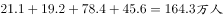。，即2009年比2008年减少了3.5万人。

故正确答案为D。

---

### 材料 2

        2017年1月17日国家能源局公布《能源发展“十三五”规划》《天然气“十三五”规划》，首次明确“发挥市场配置资源的决定性作用”，到2020年天然气综合保供能力应达到3600亿立方米以上，天然气消费占一次能源消费比例达到-。

        2017年，我国天然气消费总量2373亿立方米，同比增长；全年天然气进口量920亿立方米，同比增长。

#### 第 2 题　qid 2295393 · 增长

假设2020年全国天然气消费总量达到3600亿立方米，且2017-2020年天然气进口量同比增速相同，则2020年天然气进口量将达到消费总量的      。

- **A**. 不到两成
- **B**. 三成多
- **C**. 五成多　✅
- **D**. 八成以上

**答案**：C

**官方解析**

由题干“······2020年天然气进口量将达到消费总量的多少成”可判断本题为现期比重问题。定位文字材料第二段“2017年···全年天然气进口量920亿立方米，同比增长”，且2017-2020年天然气进口量同比增速相同，根据可得，则，故2020年天然气进口量将达到消费总量的比重为，为五成多。

故正确答案为C。

---
