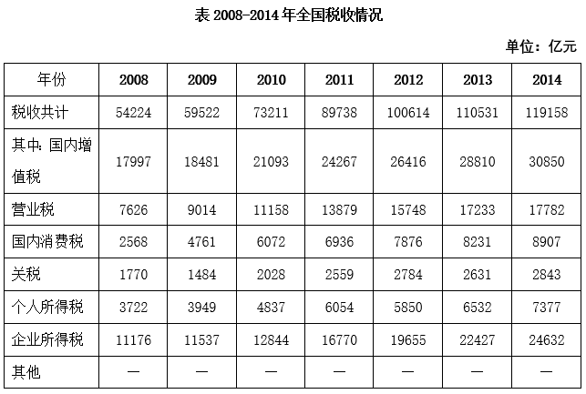
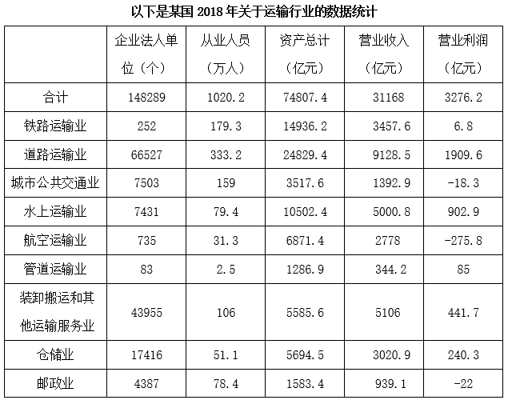
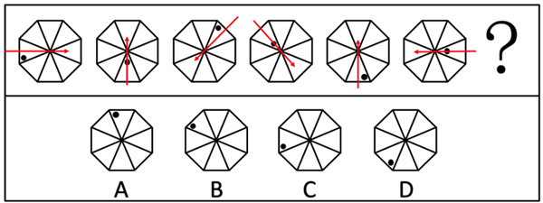
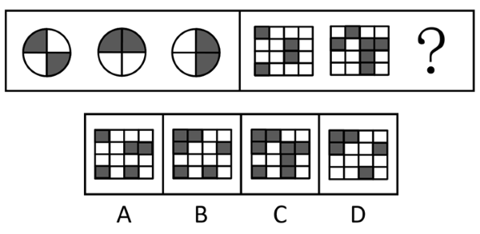
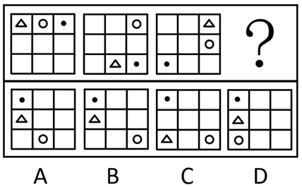
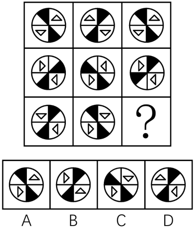
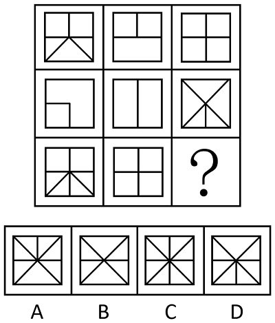
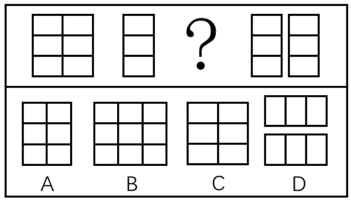
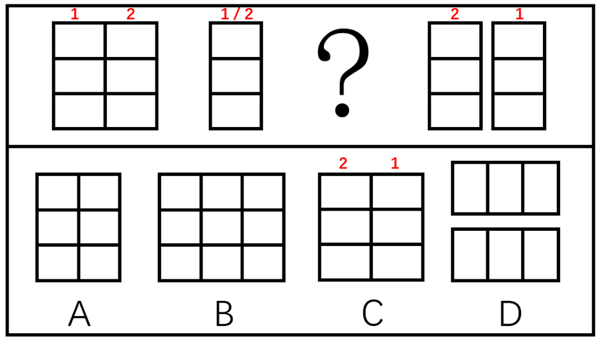
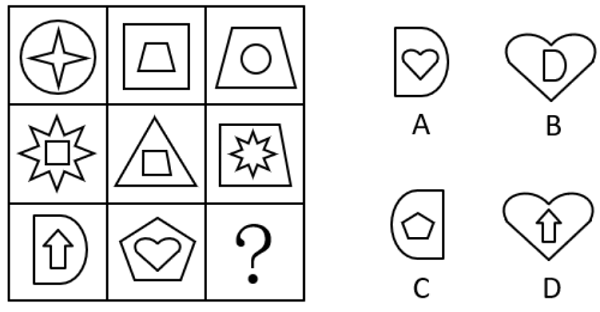

# 2019年上海市行政执法类考试《行测》试题（网友回忆版）

> 省考 · 2019 年 · 6 个模块 · 共 99 题

- [政治理论](#%E6%94%BF%E6%B2%BB%E7%90%86%E8%AE%BA) · 6 题
- [常识判断](#%E5%B8%B8%E8%AF%86%E5%88%A4%E6%96%AD) · 29 题
- [言语理解与表达](#%E8%A8%80%E8%AF%AD%E7%90%86%E8%A7%A3%E4%B8%8E%E8%A1%A8%E8%BE%BE) · 20 题
- [数量关系](#%E6%95%B0%E9%87%8F%E5%85%B3%E7%B3%BB) · 16 题
- [判断推理](#%E5%88%A4%E6%96%AD%E6%8E%A8%E7%90%86) · 24 题
- [资料分析](#%E8%B5%84%E6%96%99%E5%88%86%E6%9E%90) · 4 题

---

## 政治理论

### 材料 1

        1978年5月，一篇名为《实践是检验真理的唯一标准》的文章，在《光明日报》一版刊发。它掀起了席卷中国的真理标准大讨论，成为那支撬动改革开放的哲学杠杆。短短六千字，激荡四十年。1978年12月，中国共产党第十一届中央委员会第三次全体会议召开。会议高度评价了关于实践是检验真理的唯一标准的讨论，重新确立“解放思想、实事求是”的思想路线，作出了改革开放这一“决定当代中国命运的关键抉择”。从1978年再次出发的中国，开始缔造“中国奇迹”。

        2018年12月18日，庆祝改革开放40周年大会在北京人民大会堂隆重举行。中共中央总书记、国家主席、中央军委主席习近平在大会上发表重要讲话。

        习近平强调，40年的实践充分证明，党的十一届三中全会以来我们党团结带领全国各族人民开辟的中国特色社会主义道路、理论、制度、文化是完全正确的，形成的党的基本理论、基本路线、基本方略是完全正确的。改革开放是党和人民大踏步赶上时代的重要法宝，是坚持和发展中国特色社会主义的必由之路，是决定当代中国命运的关键一招，也是决定实现“两个一百年”奋斗目标、实现中华民族伟大复兴的关键一招。

        2019年3月4日，习近平在参加全国政协十三届二次会议时指出，我们隆重庆祝改革开放40周年，这是一个伟大的历史时期，在中国几千年的历史上，改革开放40年、中华人民共和国成立70年，这都是伟大的。总结改革开放伟大成就、宝贵经验，坚定不移全面深化改革开放，全党全国各族人民推进改革开放的决心信心更加坚定。

#### 第 1 题　qid 5680053 · 新思想

改革开放四十年来，全体人民同心协力、共同奋斗，生活变得越来越美好。中国共产党人的初心和使命没有改变。下列对“变”与“不变”之间的关系理解最完整的是        。

- **A**. 改革开放四十年来的成果是全体人民共同努力的结果，人们的物质和精神生活变得越来越美好
- **B**. 在中国共产党“不变初心”的坚持下，才使得中国人民生活的方方面面发生了翻天覆地的变化　✅
- **C**. 中国共产党始终坚持人民立场，坚持人民主体地位，着力解决人民最关心的利益问题的初心没有改变
- **D**. 中国共产党始终把实现好、维护好、发展好最广大人民的根本利益作为一切工作的出发点和落脚点

**答案**：B

**官方解析**

本题考查政治常识。
十九大报告中，习近平总书记开宗明义，强调了共产党人的初心和使命——“为中国人民谋幸福，为中华民族谋复兴”。
A项错误，只强调了改革开放后的成果，包括物质和精神生活变得越来越好，即“变”，而没有阐述中国共产党人“不变”的初心和使命。
B项正确，前半句强调了中国共产党“不变初心”的坚持，即“不变”，后半句强调了人民生活方方面面发生了翻天覆地的变化，即“变”。
C、D两项错误，只强调了中国共产党人“不变”的初心和使命，并对如何做到不忘初心使命进行阐述，没有强调人民生活水平的“变”。
故正确答案为B。

---

#### 第 2 题　qid 5680054 · 新思想

习近平在讲话中指出，五四运动以来我国发生的三大历史性事件，是近代以来实现中华民族伟大复兴的三大里程碑。这三大历史事件是        。

- **A**. 建立中国共产党　✅
- **B**. 抗日战争胜利
- **C**. 成立中华人民共和国　✅
- **D**. 推进改革开放和中国特色社会主义事业　✅

**答案**：ACD

**官方解析**

本题考查政治常识。
A、C、D三项正确，B项错误，2018年12月18日，习近平总书记在庆祝改革开放40周年大会上发表讲话。习近平总书记指出：“建立中国共产党、成立中华人民共和国、推进改革开放和中国特色社会主义事业，是五四运动以来我国发生的三大历史性事件，是近代以来实现中华民族伟大复兴的三大里程碑。”
故正确答案为ACD。

---

#### 第 3 题　qid 5680055 · 新思想

习近平强调，改革开放40年的实践启示我们，        是中国特色社会主义最本质的特征，是中国特色社会主义制度的最大优势。

- **A**. 改革开放
- **B**. 中国共产党领导　✅
- **C**. 人民代表大会制度
- **D**. 坚持和发展了马克思主义

**答案**：B

**官方解析**

本题考查政治常识。
B项正确，A、C、D三项错误，2018年12月18日，习近平总书记出席庆祝改革开放40周年大会并发表讲话，指出：“第一，必须坚持党对一切工作的领导，不断加强和改善党的领导。改革开放40年的实践启示我们：中国共产党领导是中国特色社会主义最本质的特征，是中国特色社会主义制度的最大优势。党政军民学，东西南北中，党是领导一切的。正是因为始终坚持党的集中统一领导，我们才能实现伟大历史转折、开启改革开放新时期和中华民族伟大复兴新征程，才能成功应对一系列重大风险挑战、克服无数艰难险阻，才能有力应变局、平风波、战洪水、防非典、抗地震、化危机，才能既不走封闭僵化的老路也不走改旗易帜的邪路，而是坚定不移走中国特色社会主义道路······”
故正确答案为B。

---

#### 第 4 题　qid 5680058 · 时事政治

之所以能够做出“党的十一届三中全会以来我们党团结带领全国各族人民开辟的中国特色社会主义道路、理论、制度、文化是完全正确的，形成的党的基本理论、基本路线、基本方略是完全正确的”的判断，是基于        。

- **A**. 人民群众是社会实践的主体
- **B**. 四十年的认识不断深化发展
- **C**. 四十年的实践所取得的成就　✅
- **D**. 党坚持和发展了马克思主义

**答案**：C

**官方解析**

本题考查政治常识。
C项正确，A、B、D三项错误，2018年12月18日，习近平总书记出席庆祝改革开放40周年大会并发表讲话，指出：“40年的实践充分证明，党的十一届三中全会以来我们党团结带领全国各族人民开辟的中国特色社会主义道路、理论、制度、文化是完全正确的，形成的党的基本理论、基本路线、基本方略是完全正确的。40年的实践充分证明，中国发展为广大发展中国家走向现代化提供了成功经验、展现了光明前景，是促进世界和平与发展的强大力量，是中华民族对人类文明进步作出的重大贡献。40年的实践充分证明，改革开放是党和人民大踏步赶上时代的重要法宝，是坚持和发展中国特色社会主义的必由之路，是决定当代中国命运的关键一招，也是决定实现‘两个一百年’奋斗目标、实现中华民族伟大复兴的关键一招。”
故正确答案为C。

---

#### 第 5 题　qid 5679961 · 新思想

习近平总书记指出，“人民政协以宪法、政协章程和相关政策为依据，以中国共产党领导的多党合作和政治协商制度为保障，集协商、监督、参与、合作于一体，是        的重要渠道”，是“适合中国国情、具有鲜明中国特色的制度安排”。

- **A**. 社会主义民主合作
- **B**. 社会主义政治参与
- **C**. 社会主义依法治国
- **D**. 社会主义协商民主　✅

**答案**：D

**官方解析**

本题考查政治常识。
A、B、C三项错误，D项正确，习近平总书记在庆祝中国人民政治协商会议成立65周年大会上发表讲话，指出：“第三，坚持发挥人民政协在发展协商民主中的重要作用。人民政协以宪法、政协章程和相关政策为依据，以中国共产党领导的多党合作和政治协商制度为保障，集协商、监督、参与、合作于一体，是社会主义协商民主的重要渠道。”
故正确答案为D。

---

#### 第 6 题　qid 5679942 · 时事政治

2019年4月27日，中国国家主席习近平主持的第二届“一带一路”国际合作高峰论坛在北京雁栖湖国际会议中心举行圆桌峰会。峰会围绕共建“‘一带一路’、        ”的主题，就推进互联互通、加强政策对接以及推动绿色和可持续发展等议题深入交换意见，达成广泛共识，并通过了联合公报。

- **A**. 共创互利双赢
- **B**. 共谋经济合作
- **C**. 开创美好未来　✅
- **D**. 提升区域整合

**答案**：C

**官方解析**

本题考查政治常识。
C项正确，A、B、D三项错误，2019年4月27日，第二届“一带一路”国际合作高峰论坛在北京雁栖湖国际会议中心举行圆桌峰会，国家主席习近平主持会议，并发表题为《齐心开创共建“一带一路”美好未来》的主旨演讲。共40个国家和国际组织的领导人出席圆桌峰会，围绕“共建‘一带一路’、开创美好未来”的主题，就推进互联互通、加强政策对接以及推动绿色和可持续发展等议题深入交换意见，达成广泛共识，并通过了联合公报。
故正确答案为C。

---

## 常识判断

### 材料 1

        1978年5月，一篇名为《实践是检验真理的唯一标准》的文章，在《光明日报》一版刊发。它掀起了席卷中国的真理标准大讨论，成为那支撬动改革开放的哲学杠杆。短短六千字，激荡四十年。1978年12月，中国共产党第十一届中央委员会第三次全体会议召开。会议高度评价了关于实践是检验真理的唯一标准的讨论，重新确立“解放思想、实事求是”的思想路线，作出了改革开放这一“决定当代中国命运的关键抉择”。从1978年再次出发的中国，开始缔造“中国奇迹”。

        2018年12月18日，庆祝改革开放40周年大会在北京人民大会堂隆重举行。中共中央总书记、国家主席、中央军委主席习近平在大会上发表重要讲话。

        习近平强调，40年的实践充分证明，党的十一届三中全会以来我们党团结带领全国各族人民开辟的中国特色社会主义道路、理论、制度、文化是完全正确的，形成的党的基本理论、基本路线、基本方略是完全正确的。改革开放是党和人民大踏步赶上时代的重要法宝，是坚持和发展中国特色社会主义的必由之路，是决定当代中国命运的关键一招，也是决定实现“两个一百年”奋斗目标、实现中华民族伟大复兴的关键一招。

        2019年3月4日，习近平在参加全国政协十三届二次会议时指出，我们隆重庆祝改革开放40周年，这是一个伟大的历史时期，在中国几千年的历史上，改革开放40年、中华人民共和国成立70年，这都是伟大的。总结改革开放伟大成就、宝贵经验，坚定不移全面深化改革开放，全党全国各族人民推进改革开放的决心信心更加坚定。

#### 第 1 题　qid 5680060 · 人文常识

庆祝改革开放40周年大会上表彰了为改革开放作出杰出贡献的100名人员，他们用自己的实际行动践行着社会主义核心价值观。下列属于社会主义核心价值观公民层面内容的有        。

- **A**. 爱国　✅
- **B**. 敬业　✅
- **C**. 和谐
- **D**. 友善　✅

**答案**：ABD

**官方解析**

本题考查政治常识。
A、B、D三项正确，C项错误，党的十八大提出，倡导富强、民主、文明、和谐，倡导自由、平等、公正、法治，倡导爱国、敬业、诚信、友善，积极培育和践行社会主义核心价值观。其中，富强、民主、文明、和谐是国家层面的价值目标，自由、平等、公正、法治是社会层面的价值取向，爱国、敬业、诚信、友善是公民个人层面的价值准则，这24个字是社会主义核心价值观的基本内容。
故正确答案为ABD。

---

#### 第 2 题　qid 5679950 · 人文常识

国务院办公厅印发的《关于全面推行行政执法公示制度执法全过程记录制度重大执法决定法制审核制度的指导意见》强调，要按照        的原则，及时通过政府网站及政务新媒体、办事大厅公示栏、服务窗口等平台向社会公开行政执法基本信息、结果信息。

- **A**. “谁执法谁公示”　✅
- **B**. “聚焦行政执法源头”
- **C**. “全面提高执法效能”
- **D**. “未经法制审核不得决定”

**答案**：A

**官方解析**

本题考查政治常识。
A项正确，B、C、D三项错误，《关于全面推行行政执法公示制度执法全过程记录制度重大执法决定法制审核制度的指导意见》中“二、全面推行行政执法公示制度”部分指出：“行政执法公示是保障行政相对人和社会公众知情权、参与权、表达权、监督权的重要措施。行政执法机关要按照‘谁执法谁公示’的原则，明确公示内容的采集、传递、审核、发布职责，规范信息公示内容的标准、格式。建立统一的执法信息公示平台，及时通过政府网站及政务新媒体、办事大厅公示栏、服务窗口等平台向社会公开行政执法基本信息、结果信息。涉及国家秘密、商业秘密、个人隐私等不宜公开的信息，依法确需公开的，要作适当处理后公开。发现公开的行政执法信息不准确的，要及时予以更正。”
故正确答案为A。

---

#### 第 3 题　qid 5679951 · 人文常识

2019年6月开始的“不忘初心、牢记使命”主题教育，总要求是“守初心、担使命，找差距、抓落实”。守初心，就是要牢记        ，以坚定的理想信念坚守初心，牢记人民对美好生活的向往就是我们的奋斗目标。

- **A**. 实事求是思想路线
- **B**. 密切联系人民群众的优良作风
- **C**. 马克思主义指导思想
- **D**. 全心全意为人民服务的根本宗旨　✅

**答案**：D

**官方解析**

本题考查政治常识。
A、B、C三项错误，D项正确，2019年5月31日，“不忘初心、牢记使命”主题教育工作会议在北京召开，习近平总书记出席会议并发表重要讲话，指出：“守初心，就是要牢记全心全意为人民服务的根本宗旨，以坚定的理想信念坚守初心，牢记人民对美好生活的向往就是我们的奋斗目标；以真挚的人民情怀滋养初心，时刻不忘我们党来自人民、根植人民，人民群众的支持和拥护是我们胜利前进的不竭力量源泉；以牢固的公仆意识践行初心，永远铭记人民是共产党人的衣食父母，共产党人是人民的勤务员，永远不能脱离群众、轻视群众、漠视群众疾苦。”
故正确答案为D。

---

#### 第 4 题　qid 5679946 · 法律常识

全面依法治国具有基础性、保障性作用，在统筹推进伟大斗争、伟大工程、伟大事业、伟大梦想，全面建设社会主义现代化国家的新征程上，要加强党对全面依法治国的集中统一领导，更好发挥法治        的保障作用。

- **A**. 固根本、稳民心、促发展
- **B**. 固根本、稳预期、利长远　✅
- **C**. 保平安、稳预期、促发展
- **D**. 保平安、稳民心、利长远

**答案**：B

**官方解析**

本题考查政治常识。
B项正确，A、C、D三项错误，2018年8月24日，习近平总书记主持召开中央全面依法治国委员会第一次会议并发表重要讲话。他强调，全面依法治国具有基础性、保障性作用，在统筹推进伟大斗争、伟大工程、伟大事业、伟大梦想，全面建设社会主义现代化国家的新征程上，要加强党对全面依法治国的集中统一领导，坚持以全面依法治国新理念新思想新战略为指导，坚定不移走中国特色社会主义法治道路，更好发挥法治固根本、稳预期、利长远的保障作用。
故正确答案为B。

---

#### 第 5 题　qid 5679975 · 法律常识

自2019年5月15日起，修订后的《中华人民共和国政府信息公开条例》正式施行。条例所称政府信息，是指        在履行行政管理职能过程中制作或者获取的，以一定形式记录、保存的信息。

- **A**. 政府部门
- **B**. 行政机关　✅
- **C**. 公权部门
- **D**. 党政机关

**答案**：B

**官方解析**

本题考查法律常识。
A、C、D三项错误，B项正确，根据《中华人民共和国政府信息公开条例》第二条规定：“本条例所称政府信息，是指行政机关在履行行政管理职能过程中制作或者获取的，以一定形式记录、保存的信息。”
故正确答案为B。

---

#### 第 6 题　qid 5679996 · 人文常识

《中共中央关于加强党的政治建设的意见》指出，党的力量来自组织。        是党组织的根本属性，政治功能是党组织的基本功能，要认真贯彻落实新时代党的组织路线，不断强化各级各类党组织的根本属性和基本功能。

- **A**. 人民中心
- **B**. 工人阶级领导
- **C**. 政治属性　✅
- **D**. 实现共产主义

**答案**：C

**官方解析**

本题考查政治常识。
C项正确，A、B、D三项错误，把党的政治建设摆在首位，充分发挥党的政治建设的统领作用，从根本意义上说是由无产阶级政党的政治属性决定的。无产阶级政党必须始终如一地坚持党的政治属性，旗帜鲜明地加强党的政治建设。《中共中央关于加强党的政治建设的意见》中指出：“政治属性是党组织的根本属性，政治功能是党组织的基本功能，要认真贯彻落实新时代党的组织路线，不断强化各级各类党组织的政治属性和政治功能。”
故正确答案为C。

---

#### 第 7 题　qid 5679972 · 法律常识

杨某驾驶机动车与钱某发生碰撞，钱某受伤，交警部门拟定杨某负事故全责。钱某要求交警部门责令杨某赔偿其损失，交警部门表示这超出其法定权限，并建议钱某通过民事诉讼向杨某索赔。对交警部门的这一行为，钱某        。

- **A**. 可以先申请行政复议，对复议结果不服时可以提起行政诉讼
- **B**. 可以先提起行政诉讼，对诉讼结果不服时可以申请行政复议
- **C**. 先申请行政复议，对复议结果不服时可以提起行政诉讼，也可以直接提起行政诉讼
- **D**. 既不能申请行政复议，也不能提起行政诉讼　✅

**答案**：D

**官方解析**

本题考查法律常识。
A、C、D三项错误，D项正确，根据《中华人民共和国行政复议法》第十二条第四项规定：“下列事项不属于行政复议范围：（四）行政机关对民事纠纷作出的调解。”本题中，交警部门表示这超出其法定权限，并建议钱某通过民事诉讼向杨某索赔的行为，属于行政调解行为。行政机关针对民事纠纷所做出的调解行为，当事人不服时，既不能申请行政复议，也不能提起行政诉讼，但可以依法申请仲裁或者向人民法院提起民事诉讼。
故正确答案为D。

---

#### 第 8 题　qid 5679956 · 法律常识

《行政许可法》规定，行政许可依法由地方人民政府两个以上部门分别实施的，本级人民政府可以确定一个部门受理行政许可申请并转告有关部门分别提出意见后统一办理，或者组织有关部门联合办理、集中办理。该规定主要体现了我国行政许可制度的        。

- **A**. 便民原则　✅
- **B**. 信赖保护原则
- **C**. 监督原则
- **D**. 公平、公正、公开原则

**答案**：A

**官方解析**

本题考查法律常识。
《行政许可法》确立了行政许可必须遵循的六项原则，即合法原则，公开、公平、公正原则，便民原则，救济原则，信赖保护原则以及监督原则。
A项正确，便民原则，就是行政机关在实施行政许可过程中，应当减少环节、降低成本，提高办事效率，提供优质服务。行政许可依法由地方人民政府两个以上部门分别实施的，本级人民政府可以确定一个部门受理行政许可申请并转告有关部门分别提出意见后统一办理，或者组织有关部门联合办理、集中办理。该规定主要体现了我国行政许可制度的便民原则。
B项错误，信赖保护原则，就是公民、法人或者其他组织依法取得的行政许可受法律保护，行政机关不得擅自改变已经生效的行政许可，除非行政许可所依据的法律、法规、规章修改或者废止，或者准予行政许可所依据的客观情况发生重大变化，为了公共利益的需要，确需依法变更或者撤回已经生效的行政许可。但是，由此给公民、法人或者其他组织造成财产损失的，行政机关应当依法给予补偿。因此，不符合题意。
C项错误，监督原则，是指行政机关应当依法加强对行政机关实施行政许可和从事行政许可事项活动的监督。因此，不符合题意。
D项错误，公开、公平、公正原则，就是有关行政许可的规定应当公布，未经公布的，不得作为实施行政许可的依据；行政许可的实施和结果，除涉及国家秘密、商业秘密或者个人隐私的外，应当公开；对符合法定条件、标准的申请人，要一视同仁，不得歧视。因此，不符合题意。
故正确答案为A。

---

#### 第 9 题　qid 5679971 · 人文常识

黄某家庭成员人均收入低于当地最低生活保障标准，经黄某申请，县民政部门批准黄某的家庭获得最低生活保障。县民政部门的该批准行为属于        。

- **A**. 授益性行政行为　✅
- **B**. 抽象行政行为
- **C**. 行政事实行为
- **D**. 依职权行政行为

**答案**：A

**官方解析**

本题考查法律常识。
A项正确，授益性行政行为，是指授予行政相对人以一定权利或利益，或者免除其义务的行为。因此，县民政部门批准黄某的家庭获得最低生活保障的行为属于授益性行政行为。
B项错误，行政行为以其对象是否特定为标准，分为抽象行政行为和具体行政行为。抽象行政行为是行政主体针对不特定行政管理对象实施的行政行为，如行政规范性文件包括行政立法、决定、命令等；具体行政行为是指行政主体针对特定行政管理对象实施的行为，如具体行政处罚决定、行政强制执行等。因此，县民政部门批准黄某的家庭获得最低生活保障的行为不属于抽象行政行为。
C项错误，行政事实行为是指行政主体基于职权实施的不能产生、变更或者消灭行政法律关系的行为。县民政部门的批准行为能够产生行政法律关系。因此，县民政部门批准黄某的家庭获得最低生活保障的行为不属于行政事实行为。
D项错误，依职权行政行为是指行政主体根据其职权而无需行政相对人申请就能主动实施的行政行为，也称主动行政行为和积极行政行为。依申请行政行为是指行政主体只有在行政相对人申请的条件下方能作出，没有相对人的申请，行政主体便不能主动作出行政行为。因此，县民政部门批准黄某的家庭获得最低生活保障的行为属于依申请行政行为。
故正确答案为A。

---

#### 第 10 题　qid 5679965 · 法律常识

下列关于行政诉讼中的举证责任的说法，错误的是        。

- **A**. 原告可以提供证明行政行为违法的证据
- **B**. 原告不能证明行政行为违法的，免除被告的举证责任　✅
- **C**. 被告对行政行为的合法性承担举证责任
- **D**. 被告应提供作出被诉行政行为的证据和所依据的规范性文件

**答案**：B

**官方解析**

本题考查法律常识。
A项正确，B项错误，根据《中华人民共和国行政诉讼法》第三十七条规定：“原告可以提供证明行政行为违法的证据。原告提供的证据不成立的，不免除被告的举证责任。”
C、D两项正确，根据《中华人民共和国行政诉讼法》第三十四条第一款规定：“被告对作出的行政行为负有举证责任，应当提供作出该行政行为的证据和所依据的规范性文件。”
本题为选非题，故正确答案为B。

---

#### 第 11 题　qid 5679984 · 法律常识

录用担任一级主任科员以下及其他相当职级层次的公务员，采取公开考试、严格考察、平等竞争、择优录取的办法。民族自治地方依照前款规定录用公务员时，依照法律和有关规定        。

- **A**. 只能录取少数民族报考者
- **B**. 优先录取少数民族报考者
- **C**. 对少数民族和汉族报考者应一视同仁
- **D**. 对少数民族报考者予以适当照顾　✅

**答案**：D

**官方解析**

本题考查法律常识。
A、B、C三项错误，D项正确，根据《中华人民共和国公务员法》第二十三条规定：“录用担任一级主任科员以下及其他相当职级层次的公务员，采取公开考试、严格考察、平等竞争、择优录取的办法。民族自治地方依照前款规定录用公务员时，依照法律和有关规定对少数民族报考者予以适当照顾。”
故正确答案为D。

---

#### 第 12 题　qid 5179103 · 法律常识

某市市场监督管理局扣押了甲公司经销的涉嫌假冒乙公司注册商标的商品，封存在该市人民政府查封、扣押财物专用仓库中。该行政强制案件中的行政主体是：

- **A**. 该市市场监督管理局和该市人民政府
- **B**. 甲公司
- **C**. 该市人民政府
- **D**. 该市市场监督管理局　✅

**答案**：D

**官方解析**

本题考查法律常识。
根据《行政强制法》第二条第二款规定：“行政强制措施，是指行政机关在行政管理过程中，为制止违法行为、防止证据损毁、避免危害发生、控制危险扩大等情形，依法对公民的人身自由实施暂时性限制，或者对公民、法人或者其他组织的财物实施暂时性控制的行为。”某市市场监督管理局扣押了甲公司经销的涉嫌假冒乙公司注册商标的商品属于行政强制措施，所以该行政强制案件中的行政主体是该市市场监督管理局。
故正确答案为D。

---

#### 第 13 题　qid 5679974 · 法律常识

人民主权原则是我国宪法的一项基本原则，下列选项中，        最能体现该原则。

- **A**. 公安机关、法院、检察院在侦办刑事案件中相互配合、相互制约、分工负责
- **B**. 中华人民共和国的国家机构实行民主集中制的原则
- **C**. 人民行使国家权力的机关是全国人民代表大会和地方各级人民代表大会　✅
- **D**. 中华人民共和国实行依法治国，建设社会主义法治国家

**答案**：C

**官方解析**

本题考查法律常识。
我国宪法的基本原则为党的领导原则、人民主权原则、尊重和保障人权原则、民主集中制原则、权力监督和制约原则、法治原则。
A项错误，权力监督和制约原则是指国家权力的各部分之间相互监督、彼此牵制，以保障公民权利的原则。它既包括公民权利对国家权力的制约，也包括国家权力对国家权力的制约。“公安机关、法院、检察院在侦办刑事案件中相互配合、相互制约、分工负责”体现了这一原则。
B项错误，我国宪法规定，中华人民共和国的国家机构实行民主集中制原则。国家权力统一由全国人民代表大会和地方各级人民代表大会行使，全国人民代表大会和地方各级人民代表大会由民主选举产生，对人民负责，受人民监督。广大人民的共同意志通过民主形式集中起来，并通过法定程序上升为国家意志。国家行政机关、审判机关、检察机关都由人民代表大会产生，对它负责，受它监督。
C项正确，主权是指国家的最高权力。人民主权是指国家中绝大多数人拥有国家的最高权力。人民当家作主是社会主义民主政治的本质和核心。中国宪法体现了人民主权原则，强调国家的一切权力属于人民。通过确认人民代表大会制度的政体，为人民当家作主提供了组织保障，属于人民主权原则的体现。
D项错误，法治就是按照法律治理国家、管理社会、规范行为，是对人治的否定。中国宪法明确规定实行依法治国，建设社会主义法治国家，体现了法治原则。
故正确答案为C。

---

#### 第 14 题　qid 5679994 · 法律常识

行政执行，特指行政执行主体为了落实和实施国家意志和国家目标，依法贯彻法律、法规、公共政策等诸多活动的总称。下列关于行政执行的特点，表述不正确的是        。

- **A**. 行政执行的主体包括企业　✅
- **B**. 行政执行是目的性和手段多样性的统一
- **C**. 行政执行具有直接现实性
- **D**. 行政执行具有相对独立性

**答案**：A

**官方解析**

本题考查管理常识。
A项错误，行政执行是国家行政机关及其公务人员依据宪法、法律、法规、规章，充分调动政府资源，通过一定运作机制，逐级贯彻国家权力机关和上级的政策、决策，推行国家政务和执行行政决定，以落实公共事务管理和公共服务诸任务的全部活动过程。因此，行政执行的主体是国家行政机关及其公务人员，不包括企业。当然，有时候非行政管理机构的社会团体和个人也可能参与行政执行，但那往往是在行政管理机构授权的情况下或得到行政管理机构允许的情况下才是允许的。
B项正确，行政执行是目的性和手段多样性的统一。行政执行的目的在于贯彻和落实业已形成的国家意志、国家目标、法律、法规和公共政策。它不同于一些目标不明确的、不能事先预见的活动。且其目的性很明显，没有确定的目标就谈不上行政执行的启动。但是行政执行达到目标的手段却是多样的，这导致了行政执行的多样性。
C项正确，行政执行具有直接现实性。公共政策、法律和国家意志都是一种精神性的、抽象的存在，需要通过行政执行将这些精神性的、抽象的存在变为现实。这就需要行政执行具有直接性和现实性的特点。这一特点表现为行政执行活动过程当中需要行政主体针对正在形成或业已形成的公共问题调用资源，基于效率、可行、公正等价值的考虑，根据时势采用恰当的方式改变社会现实使得公共问题得到解决。
D项正确，行政执行具有相对独立性。这是由行政机关、行政权力的性质和执行的特点决定的。行政执行组织活动和行政执行过程保持相对独立性，可以保证执行过程免受不必要的干扰保证国家意志的贯彻实施。
本题为选非题，故正确答案为A。

---

#### 第 15 题　qid 5680151 · 法律常识

行政执行方式是行政执行中所偏重的理念、价值以及所采用的工具和手段的总称。下列不属于行政执行方式的是        。

- **A**. 法律方式
- **B**. 检察方式　✅
- **C**. 市场方式
- **D**. 伦理方式

**答案**：B

**官方解析**

本题考查管理常识。
A、C、D三项正确，B项错误，行政执行方式是指行政执行中所偏重的理念、价值以及所采用的工具和手段的总称。行政执行方式的不同反映了行政执行活动的价值和工具的差异。执行同样的任务可以采用不同的方式，这些方式会因为遵循价值的不同，而形成不同的操作手段和工具。在行政执行的过程中，执行方式通常有管理方式、政治方式、法律方式、市场方式和伦理方式。
本题为选非题，故正确答案为B。

---

#### 第 16 题　qid 5679998 · 人文常识

在我国公务员考核实践中，不同机关类型、不同职位要求、不同层次职务的公务员考核的具体内容和指标各有侧重、各具特色。如对领导干部的绩效考核内容将        放在首位。

- **A**. 思想政治　✅
- **B**. 工作能力
- **C**. 工作实绩
- **D**. 工作作风

**答案**：A

**官方解析**

本题考查政治常识。
A项正确，B、C、D三项错误，2019年4月，中共中央办公厅印发了《党政领导干部考核工作条例》，其中第一章第三条指出：“考核工作以马克思列宁主义、毛泽东思想、邓小平理论、‘三个代表’重要思想、科学发展观、习近平新时代中国特色社会主义思想为指导，贯彻落实新时代党的建设总要求和新时代党的组织路线，坚持把政治标准放在首位，着眼于实现‘两个一百年’奋斗目标，突出考核贯彻党中央重大决策部署，统筹推进‘五位一体’总体布局和协调推进‘四个全面’战略布局、贯彻落实新发展理念的实际成效，坚持严管和厚爱结合、激励和约束并重，奖勤罚懒、奖优罚劣，调动各级党政领导班子和领导干部积极性、主动性、创造性，树立讲担当、重担当、改革创新、干事创业的鲜明导向。”
故正确答案为A。

---

#### 第 17 题　qid 5680004 · 人文常识

组织中的业务单位和协作部门应明确划分，这体现了组织结构设计原则中的        。

- **A**. 灵活性原则
- **B**. 分权原则
- **C**. 边界原则　✅
- **D**. 对等原则

**答案**：C

**官方解析**

本题考查管理常识。
A项错误，灵活性原则是指组织结构设计应该具有一定的灵活性，以便适应不断变化的外部环境和内部需求。题干中没有体现。
B项错误，分权原则是指企业的组织体制，既要有必要的权力集中，又要进行适当的分散，两者不可偏废。合理分权有利于基层根据实际情况迅速而正确地做出决策，也有利于上层领导摆脱日常事务，集中精力抓重大问题。题干中没有体现。
C项正确，组织边界是指在组织管理实践中，为了高效率地实现预期目标，管理主体有意识或无意识地按照分工及职能制的原则设置的组织内部各部门和层级之间的范围以及组织自身与其他组织之间的特定限域。边界原则指按照职能分工合理划分组织中的业务单位和协作部门，有利于提高管理工作的质量与效率。
D项错误，对等原则是指责权对等原则，责任是岗位必须履行的义务，权力是岗位规定应该行使的权力。在任何工作中，责任与权力必须大致相等，否则就无法完成工作。题干中没有体现。
故正确答案为C。

---

#### 第 18 题　qid 5679997 · 人文常识

人事行政是加强人才开发和提高行政管理效率的关键因素。我国人事行政的基本原则不包括        。

- **A**. 党管干部原则
- **B**. 德才兼备原则
- **C**. 适才适用原则
- **D**. 政治中立原则　✅

**答案**：D

**官方解析**

本题考查管理常识。
人事行政是指国家人事行政机关通过一系列法律、法规、制度和措施，对行政管理活动中的行政人员与行政事务之间的关系以及行政人员之间的相互关系所实施的一整套管理活动或管理行为，它包括对国家行政人员的录用、考核、培训、交流、奖惩、纪律、工资、福利、退休等方面的规划和管理。
A项正确，党的领导是中国特色社会主义最本质的特征和最大优势。坚持党管干部原则，是党的领导在干部人事工作中的重要体现，是坚持和加强党的全面领导、巩固党的执政地位、履行党的执政使命的根本保证。
B项正确，德才兼备要求行政人员既有德又有才。“德”指行政人员的思想政治素质，主要是能坚持党的基本路线，能努力实践“三个代表”思想，具有坚定的政治立场和信念，具有高尚的道德情操、正派的思想作风和旺盛的革命精神等。“才”指行政人员的知识水平和业务能力，要求行政人员掌握较为丰富的现代科学文化知识，具有真才实学和开拓精神，具有胜任本职工作的业务知识和实际能力，并在实践中不断学习、不断提高。只有坚持德才兼备标准才能切实保证行政人员素质的优化，才能有效提高行政工作质量和行政效率。
C项正确，适才适用就是根据每个人的专长和能力、志向和条件，安排相应的职位，各随其志、各得其所、各尽其才、各献其功。实行这一原则就是要扬长避短、量才使用，把每个行政人员放到最适合发挥其优势的岗位上。
D项错误，政治中立是指西方国家规定文官在国家政治活动中保持“中立”立场，即文官不参与政治活动，相对各政党、利益集团居“公正”“超然”地位，不介入政争漩涡。这是保证文官摆脱党派、种族、宗教等方面的纷争，使文官客观、公正、独立地为国家服务的制度。我国人事行政的基本原则中并没有这一项。
本题为选非题，故正确答案为D。

---

#### 第 19 题　qid 5680002 · 人文常识

行政执行是公共组织的基本活动，公共政策通过行政执行活动予以贯彻。行政执行要解决的是正在形成或己经形成的公共问题，体现其        的特点。

- **A**. 目的性
- **B**. 务实性　✅
- **C**. 强制性
- **D**. 服务性

**答案**：B

**官方解析**

本题考查管理常识。
行政执行就是具有行政权的行政机关和社会组织，贯彻、落实决策机关发出的决策指令，以实现决策目标的活动和过程。
A项错误，行政执行具有目的性，是目的非常明确的行政管理活动。它以决策标准为导向，以实现决策目标为目的。行政执行的一切活动都必须服从达成行政目标这个目的。但是本题没有强调行政执行要达到一个什么样的目标。
B项正确，行政执行具有务实性，是处理具体的社会公共事务的活动。不仅实施具体的政策，而且还有实实在在的措施，有确定的管理对象。行政执行的这种务实性要求执行机关必须实事求是，在坚持决策目标和决策标准的前提下，结合实际，权变灵活，从实际出发，具体情况具体分析，不要主观教条。行政执行要解决的是正在形成或已经形成的公共问题，体现的正是其务实性的特点。
C项错误，行政执行具有强制性，它以政府的强制力为后盾。各种法律、法规和政策的执行，不是公共愿不愿意执行，而是必须执行的问题，不执行就会受到制裁。
D项错误，行政执行具有服务性，其不是以赢利为目的的，而是为社会提供某种公共物品，也就是提供某种服务。
故正确答案为B。

---

#### 第 20 题　qid 5680007 · 法律常识

国家行政机关及其公务员在国家安全受到威胁，社会公共利益受到危害的紧急状态出现或将要发生的情况下，临时采取特别行政命令、特殊强制措施的行为，指的是行政执行的        。

- **A**. 行政手段
- **B**. 经济手段
- **C**. 思想教育手段
- **D**. 法律手段　✅

**答案**：D

**官方解析**

本题考查管理常识。
行政执行的基本方法可归纳为：行政手段、经济手段、法律手段和思想教育手段。
A项错误，行政手段又称行政指令性手段，是指依靠行政组织的权威，凭借行政权力，按照从上而下的行政隶属关系，向下级层层发布指令，以控制和左右被管理者，影响管理对象的措施和方法。
B项错误，经济手段是行政机关根据客观经济规律和物质利益原则，运用经济杠杆来调节不同经济利益之间的关系，以保证行政执行顺利实施的方法。经济手段是以经济杠杆为工具，以物质利益为核心的管理，行政机关通过向被管理者定期或不定期地发出经济信息，使被管理者接受并据此调整自己的行为。
C项错误，思想教育手段是通过开展思想教育工作，来引导被管理者按其预定目标努力，完成行政任务的方法。它的本质是运用非强制性的手段，诱导行政主体和被管理者自觉自愿地去贯彻执行行政决策，以充分调动人的积极性，发挥人的潜能。
D项正确，法律手段指国家行政机关在行政管理领域内，依照法定职权和程序，制定法规、规章等，将行政决策的目标法律化，推动行政决策目标实现，以达到有效管理的目的。法律手段的主要方式有：行政决定、行政检查、行政强制执行和行政处置等。其中行政处置，是指国家行政机关及其公务员在国家安全受到威胁，社会公共利益受到危害的紧急状态出现或将要发生的情况下，临时采取特别行政命令、特殊强制措施的行为。
故正确答案为D。

---

#### 第 21 题　qid 5680024 · 人文常识

有机磷农药可用于防治蔬菜病、虫、草害。部分农业生产者为提高蔬菜产值，增加了有机磷农药的使用量，导致蔬菜中残留了较多农药。去除蔬菜中有机磷农药最好的方法是        。

- **A**. 高温烫洗
- **B**. 清水浸泡
- **C**. 太阳照射
- **D**. 碱水冲洗　✅

**答案**：D

**官方解析**

本题考查科技常识。
A、B、C三项错误，D项正确，有机磷农药，是指含磷元素的有机化合物农药。主要用于防治植物病、虫、草害。多为油状液体，有大蒜味，除敌百虫和敌敌畏之外，大多是有蒜臭味。一般不溶于水，易溶于有机溶剂如苯、丙酮、乙醚、三氯甲烷及油类，对光、热、氧均较稳定，遇碱易分解破坏。因此可以通过碱水冲洗去除蔬菜中的有机磷农药。
故正确答案为D。

---

#### 第 22 题　qid 5680009 · 人文常识

彩虹是气象中的一种光学现象，一般在雨过天晴或清晨雨露过后出现，以下对彩虹形成原理描述正确的是        。

- **A**. 光的反射与折射　✅
- **B**. 光的衍射
- **C**. 光的直线传播
- **D**. 光的波粒二象性

**答案**：A

**官方解析**

本题考查科技常识。
A项正确，彩虹是气象中的一种光学现象，当太阳光照射到半空中的水滴，光线被折射及反射。阳光进入水滴，先折射一次，然后在水滴的背面反射，最后离开水滴时再折射一次，共经过一次反射、两次折射。因为不同频率的光的折射率有所不同，在光的折射过程中红橙黄绿蓝靛紫等色光的折射角度不相同，就形成了彩虹。
B项错误，光在传播过程中，遇到障碍物或小孔时，光将偏离直线传播的路径而绕到障碍物后面传播的现象，叫光的衍射。
C项错误，光在同种均匀介质中沿直线传播，通常简称光的直线传播。
D项错误，光的波粒二象性指光既具有波动特性，又具有粒子特性。科学家发现光既能像波一样向前传播，有时又表现出粒子的特征。
故正确答案为A。

---

#### 第 23 题　qid 5680027 · 科技常识

垃圾填埋是目前我国最主要的生活垃圾处置方式，而垃圾渗滤液则成为填理过程的主要污染源。下列对垃圾渗滤液说法不正确的是        。

- **A**. 垃圾渗滤液包含的有害物质会改变土壤的成分，使土壤的肥力下降
- **B**. 垃圾渗滤液在雨水的作用下，会造成地表水及地下水的严重污染
- **C**. 垃圾渗滤液的处理工艺相对单一，以化学法为主　✅
- **D**. 垃圾渗滤液是一种成分复杂的高浓度有机废水

**答案**：C

**官方解析**

本题考查科技常识。
垃圾渗滤液是垃圾在堆放和填埋过程中由于发酵、雨水冲刷和地表水、地下水浸泡而渗滤出来的污水。
A、B两项正确，垃圾渗滤液包含的重金属等有害物质会改变土壤的成分及结构，使土壤的肥力和水分下降，其中有毒物质会通过食物链影响人体健康。此外，在雨水的作用下，其会造成地表水及地下水的严重污染，影响水生生物的生存和水资源的利用。
C项错误，D项正确，垃圾渗滤液是一种成分复杂的高浓度有机废水，其性质取决于垃圾成分、垃圾的粒径、压实程度、现场的气候、水文条件和填埋时间等因素，现有的渗滤液处理方法多种多样。处理技术包括生物处理法和物理化学法，生物法包括曝气氧化池、生物转盘和滴滤池等；物理化学法主要有活性炭吸附、化学沉淀、离子交换、膜渗析等。
本题为选非题，故正确答案为C。

---

#### 第 24 题　qid 5680014 · 科技常识

火星属于类地行星，表面重力约为地球的，以二氧化碳为主的大气稀薄，气候寒冷，沙尘悬浮于大气中，常有尘暴发生。根据以上信息进行判断，降落在火星表面的探测器需要很大降落伞的主要原因是<u>        </u>。

- **A**. 火星表面重力小
- **B**. 火星表面空气稀薄　✅
- **C**. 火星表面寒冷
- **D**. 火星上有尘暴

**答案**：B

**官方解析**

本题考查科技常识。
A、C、D三项错误，B项正确，降落伞是利用空气阻力原理，依靠相对于空气运动充气展开的可展式气动力减速器。火星上的大气比较稀薄，因此产生的空气阻力相对地球较小，因此需要很大的降落伞才能提供所需的阻力，达到平稳着落的效果。其他选项与降落伞的降落原理无关。
故正确答案为B。

---

#### 第 25 题　qid 5680017 · 科技常识

电磁感应是指闭合电路的一部分导体在磁场中做切割磁感线运动，导体中就会产生电流的现象。电磁感应现象在电工、电子技术、电气化、自动化等方面得到了广泛应用。以下科技应用中，不属于电磁感应应用的是        。

- **A**. 动圈式话筒
- **B**. 磁带录音机
- **C**. 变压器
- **D**. 投影仪　✅

**答案**：D

**官方解析**

本题考查科技常识。
A项正确，动圈式话筒是利用电磁感应现象制成的，当声波使金属膜片振动时，连接在膜片上的线圈（即音圈）随着一起振动，音圈在永久磁铁的磁场里振动，其中就产生感应电流，感应电流的大小和方向都变化，变化的振幅和频率由声波决定，这个信号电流经扩音器放大后传给扬声器，从扬声器中就发出放大的声音。 
B项正确，磁带录音机主要由机内话筒、磁带、录放磁头、放大电路、扬声器、传动机构等部分组成。录音时，声音使话筒中产生随声音而变化的感应电流——音频电流，音频电流经放大电路放大后，进入录音磁头的线圈中，在磁头的缝隙处产生随音频电流变化的磁场。磁带紧贴着磁头缝隙移动，磁带上的磁粉层被磁化，在磁带上就记录下声音的磁信号。放音是录音的逆过程。
C项正确，变压器是利用电磁感应的原理来改变交流电压的装置，主要构件是初级线圈、次级线圈和铁心（磁芯）。在电器设备和无线电路中，常用作升降电压、匹配阻抗、安全隔离等。在发电机中，不管是线圈运动通过磁场或磁场运动通过固定线圈，均能在线圈中感应电势。 
D项错误，投影仪，又称投影机，是一种可以将图像或视频投射到幕布上的设备。投影仪的基本原理是凸透镜成像，即当物体到凸透镜的距离小于2倍焦距、大于1倍焦距时，成像效果为倒立、放大的实像。 
本题为选非题，故正确答案为D。

---

#### 第 26 题　qid 5680018 · 地理国情

歌词“你向东海奔去，惊涛是你的气概。你用甘甜的乳汁，哺育各族儿女；你用健美的臂膀，挽起高山大海”赞美的是        。

- **A**. 泰山
- **B**. 长江　✅
- **C**. 黄河
- **D**. 森林

**答案**：B

**官方解析**

本题考查人文常识。
B项正确，A、C、D三项错误，题干中歌词出自《长江之歌》。《长江之歌》是由胡宏伟作词，王世光作曲，季小琴演唱的歌曲，是纪录片《话说长江》的主题曲，该曲创作于1984年。
长江，是中国第一大河，发源于青海省西南部、青藏高原上的唐古拉山脉主峰各拉丹冬雪山，曲折东流，干流先后流经青海、四川、西藏、云南、重庆、湖北、湖南、江西、安徽、江苏、上海共11个省、自治区和直辖市，最后注入东海。
故正确答案为B。

---

#### 第 27 题　qid 5680026 · 人文常识

如今，足球运动在全世界范围内都大受欢迎。世界杯、欧洲杯、美洲杯等比赛，吸引全世界无数球迷的目光。足球运动起源于中国的“蹴鞠”，据史料记载，中国的“蹴鞠”产生于战国之际，在        时期就开始兴盛了。

- **A**. 汉代　✅
- **B**. 南北朝
- **C**. 宋代
- **D**. 元代

**答案**：A

**官方解析**

本题考查人文常识。
A项正确，B、C、D三项错误，《史记·苏秦列传》中描述：“临菑甚富而实，其民无不吹竽鼓瑟，弹琴击筑，斗鸡走狗，六博蹋鞠者。”这表明蹴鞠在春秋战国时期兴起。但蹴鞠真正意义上开始发展的时期是在汉代，当时它的场地主要分为两种：一种是在场地的周围设有围墙，并且左右两边的墙上都有专门挖掘出来的呈半月形的鞠室。另一种是周围没有围墙，比赛场地是随意的在四周划地为界，并且在两边各挖六个小土坑作为鞠室来进行比赛。汉时蹴鞠的这两种比赛场地从侧面反应了从事蹴鞠运动的人的身份高低，第一种比赛场地多用于宫廷中，而第二种比赛场地则多用于平民之中，身份高贵的人用四周有围墙的豪华的比赛场地，平民却只能随便画一个场地。
故正确答案为A。

---

#### 第 28 题　qid 5680057 · 人文常识

“海纳百川、追求卓越、开明睿智、大气谦和”是上海的城市精神。最早提出“海纳百川，有容乃大”的是        。

- **A**. 蔡元培
- **B**. 左宗棠
- **C**. 林则徐　✅
- **D**. 梁启超

**答案**：C

**官方解析**

本题考查人文常识。
A项错误，蔡元培，字鹤卿，汉族，浙江绍兴山阴县（今绍兴县）人，原籍浙江诸暨，革命家、教育家、政治家。他早年参加反清朝帝制的斗争，民国初年主持制定了中国近代高等教育的第一个法令——《大学令》，热心鼓励和扶持中国新文化运动的发展。1916年至1927年任北京大学校长，革新北大，开“学术”与“自由”之风。毛泽东主席高度评价他是“学界泰斗，人世楷模”。
B项错误，左宗棠，字季高，湖南湘阴左家塅（今湘阴县金龙乡）人，是清末湘军首领之一，经历了湘军平定太平天国运动、洋务运动和收复新疆维护中国统一等重要历史事件，还造就了一批优秀的中国近代工业技术人才和杰出的海军将士。与曾国藩、张之洞、李鸿章并称为“晚清中兴四大名臣”，自作勉联“身无半文，心忧天下；读破万卷，神交古人。”
C项正确，林则徐，字元抚，福建侯官县人，中国清代后期政治家、文学家、思想家，民族英雄。林则徐一生遍历地方，治绩卓著。虽在两广抗击西方入侵，但对于西方的文化、科技和贸易持开放态度，主张学其优而用之。由他主持编译的《四洲志》及魏源编撰的《海国图志》，对晚清的洋务运动乃至日本的明治维新都具有启发作用。“海纳百川，有容乃大”出自民族英雄林则徐的自勉联：“海纳百川，有容乃大；壁立千仞，无欲则刚。”
D项错误，梁启超，字卓如，号任公，又号饮冰室主人。他是中国近代史上伟大的思想家和作家，是影响中国历史进程的人物之一。从师于康有为，是资产阶级改良派的宣传家。维新变法前，与康有为一起联合各省举人发动“公车上书”运动，此后先后领导北京和上海的强学会，又与黄遵宪一起办《时务报》，任长沙时务学堂的主讲，并著《变法通议》为变法做宣传。
故正确答案为C。

---

#### 第 29 题　qid 5680050 · 人文常识

古人诗词多有写梅花的句子，下面选项中不属于描写梅花的一句是        。

- **A**. 疏影横斜水清浅，暗香浮动月黄昏。（宋·林逋）
- **B**. 零落成泥碾作尘，只有香如故。（宋·陆游）
- **C**. 遥知不是雪，为有暗香来。（宋·王安石）
- **D**. 暗暗淡淡紫，融融冶冶黄。（唐·李商隐）　✅

**答案**：D

**官方解析**

本题考查人文常识。
A项正确，该诗句出自宋代林逋的《山园小梅·其一》，意思是稀疏的影儿，横斜在清浅的水中，清幽的芬芳浮动在黄昏的月光之下。林逋是宋代著名隐士，喜梅与鹤，自谓以梅为妻鹤为子，一生写了不少咏梅诗篇，此诗便是其中著名的一首。
B项正确，该诗句出自宋代陆游的《卜算子·咏梅》，意思是即使花片飘落被碾作尘泥，也依然有永久的芬芳留在人间。此词以梅花自况，咏梅的凄苦以泄胸中抑郁，感叹人生的失意坎坷；赞梅的精神又表达了青春无悔的信念以及对自己爱国情操及高洁人格的自许。
C项正确，该诗句出自宋代王安石的《梅花》，意思是远远的就知道洁白的梅花不是雪，因为有梅花的幽香传来。此句写梅花的幽香，以梅拟人，凌寒独开，喻典品格高贵，暗香沁人，象征其才华横溢。
D项错误，该诗句出自唐代李商隐的《菊花》，意思是暗暗淡淡的紫色，美好艳冶的黄色。此句描摹菊花色调淡雅，丰韵翩翩。故此句描写的是菊花。
本题为选非题，故正确答案为D。

---

## 言语理解与表达

### 材料 1

阅读下面的文章，回答18-20题。

        近日，一则“直系亲属之间不能相互献血”的微博在网上热传，许多网友表示惊讶且不解。就此问题，记者釆访了市中心血站的专家，他们说，有血缘关系的直系亲属之间相互献血输血，可能引起一种致命的并发症，虽发病率不高，但死亡率高达90%以上，几乎无法挽救。所以，不提倡有血缘关系的亲属之间相互献血、输血。

        “直系亲属之间不能相互献血！被电视剧坑了！”有市民直感叹，在电视剧里，发生意外时，亲人相互输血屡见不鲜，没有想到这是不科学的，真是颠覆以往的“常识”。

        据了解，输血的过程，本质上属于移植的一种，既然是移植，必然会伴随着一系列可能发生的免疫反应，输血相关性移植物抗宿主病就是其中的免疫反应之一，同时也是最严重的输血并发症之一。主要发生在输血后1周左右，表现为献血者的淋巴细胞攻击受血者的器官组织，导致全血细胞减少、肝功能受损严重、恶心、腹泻和皮肤黏膜出现大面积皮疹或大泡。

        通常这种疾病发病率为0.1%-1%，血缘关系越近，发病率越高，尤其是一级亲属，即父母与子女间，发病率要高10-20倍。现在没有有效治疗方法，死亡率高达90%。

        移植物抗宿主病为什么更易发生在亲属间输血时呢？市中心血站专家打了个通俗的比方，输血就等于是用血者身体里来了许多“外来客”，非亲属之间的免疫淋巴细胞容易被识别、排斥。而亲人间的“外来客”由于面目相似，加之受血者免疫能力低下，不容易识别，而这些“外来客”趁机“鸠占鹊巢”，在受血者身体里分裂、增殖，然后向受血者的骨髓等器官发动攻击。专家表示，移植物抗宿主病发生在非亲属用血者身上的概率非常小。可以用“罕见”来形容，但是如果是近亲输血，发生概率会翻几倍。

#### 第 1 题　qid 5665313 · 片段阅读

直系亲属间不能互相献血输血的主要原因是        。

- **A**. 引发致命并发症的概率很高
- **B**. 引发的某种并发症致死率很高　✅
- **C**. 亲人间的淋巴细胞差异过大
- **D**. 献血者的淋巴细胞会攻击受血者的器官组织

**答案**：B

**官方解析**

A项，根据文章第一段“有血缘关系的直系亲属之间相互献血输血，可能引起一种致命的并发症，虽发病率不高，但死亡率高达90%以上，几乎无法挽救”与第四段“通常这种疾病发病率为0.1%-1%”可知，“概率很高”与文意相悖，排除；
B项，根据文章第一段“虽发病率不高，但死亡率高达90%以上，几乎无法挽救”与“所以，不提倡有血缘关系的亲属之间相互献血、输血”可知，选项表述与文意相符，是直系亲属间不能互相献血输血的主要原因，当选；
C项，根据文章第五段“输血就等于是用血者身体里来了许多‘外来客’，非亲属之间的免疫淋巴细胞容易被识别、排斥”与“而亲人间的‘外来客’由于面目相似”可知，亲人间的淋巴细胞是相似的，选项表述与文意相悖，排除；
D项，根据文章第三段“主要发生在输血后1周左右，表现为献血者的淋巴细胞攻击受血者的器官组织······”可知，该项内容为直系亲属间互相输血后会引发的相关反应，并非是不能互相献血输血的主要原因，排除。
故正确答案为B。

---

#### 第 2 题　qid 5665315 · 片段阅读

上文第二段中“常识”加引号的作用是        。

- **A**. 否定　✅
- **B**. 强调
- **C**. 引用
- **D**. 特定称谓

**答案**：A

**官方解析**

A项，“常识”指社会对同一事物普遍存在的日常共识，前文指出人们已经普遍认可了“亲人相互输血”，属于日常共识，但却是“不科学的”，故此处对“常识”加引号，表示否定，当选。
B项，引号可用于着重论述的对象，起着突出和强调的作用，此句旨在通过引号表示“常识”是不科学的，存在否定或讽刺的意味，而非单纯强调“常识”，排除；
C项，引号可用于行文中的引用，一般是直接引用他人的话、格言、诗句等，“常识”不属于引用内容，排除；
D项，引号可用于具有特殊含义的词语，表示特定的称谓，一般采用借代的修辞手法，用人物或事物的具有代表性的局部特征，去代替整个人物或事物，起着突出和强调的作用，“常识”并非特定的称谓，排除。
故正确答案为A。

---

#### 第 3 题　qid 5665319 · 片段阅读

根据上文，下面说法错误的是        。

- **A**. 非亲友之间输血就不会带来免疫反应　✅
- **B**. 非亲属用血导致移植物抗宿主病的概率较低
- **C**. 输血相关性移植物抗宿主病有一定的潜伏期
- **D**. 血缘关系越近，相互之间输血的风险就越高

**答案**：A

**官方解析**

A项，根据第三段“据了解，输血的过程，本质上属于移植的一种，既然是移植，必然会伴随着一系列可能发生的免疫反应”可知，“非亲友之间输血就不会带来免疫反应”与原文相悖且表述绝对，当选；
B项，根据第五段“移植物抗宿主病发生在非亲属用血者身上的概率非常小”可知，表述正确，排除；
C项，根据第三段“输血的过程······输血相关性移植物抗宿主病就是其中的免疫反应之一，同时也是最严重的输血并发症之一。主要发生在输血后1周左右”可知，表述正确，排除；
D项，根据第四段“通常这种疾病发病率为0.1%-1%，血缘关系越近，发病率越高”可知，表述正确，排除。
本题为选非题，故正确答案为A。

---

#### 第 4 题　qid 5665225 · 逻辑填空

那个            的年代，孕育了老一辈革命者救国救民的理想和追求。

- **A**. 风狂雨骤
- **B**. 风雨交加
- **C**. 风雨雷电
- **D**. 风雨如晦　✅

**答案**：D

**官方解析**

搭配“年代”，D项“风雨如晦”意思是风雨交加，白天如同黑夜一样昏暗，后用来形容局势动荡或社会黑暗，与“年代”搭配恰当且符合文意，当选。
A项“风狂雨骤”形容风大雨急，天气恶劣，B项“风雨交加”形容天气十分恶劣，有时也比喻几种灾难一起袭来，C项“风雨雷电”泛指各类天气现象，均与“年代”搭配不当，排除。
故正确答案为D。
【文段出处】《总书记谈老一辈革命家的理想信念》

---

#### 第 5 题　qid 5665220 · 逻辑填空

现在，一些政府部门对事前审批还很        ，对事中事后监督却又很        。

- **A**. 依赖 或然
- **B**. 迷恋 或然
- **C**. 迷恋 迷茫　✅
- **D**. 依赖 迷茫

**答案**：C

**官方解析**

本题可从第二空入手，横线处所填词语形容一些政府部门对事中事后监督的态度，C、D两项“迷茫”指迷惑茫然、模糊不清，符合文意，均保留。A、B两项“或然”指或许可能，表达一种可能性，无法形容对事中事后监督的态度，均排除。
第一空，形容一些政府部门对事前审批的态度，C项“迷恋”指对某一事物过度爱好而难以舍弃，置于此处可体现一些政府部门对事前审批的过度爱好，符合文意，当选。D项“依赖”指依靠某种人或事物而不能自立或自给，政府部门并非脱离了事前审批而不能自立，不符合文意，排除。
故正确答案为C。
【文段出处】《破除“审批迷恋”，监管不能“迷茫”》

---

#### 第 6 题　qid 5665223 · 逻辑填空

药品过期就意味着失效，人一旦服用后，轻则        病情，重则        中毒。

- **A**. 延误 导致　✅
- **B**. 贻误 至于
- **C**. 耽搁 甚至
- **D**. 延宕 致使

**答案**：A

**官方解析**

第一空，搭配“病情”，且根据“药品过期就意味着失效”可知，横线处应体现耽误病情之意。A项“延误”意为迟延耽误，B项“贻误”意为错误遗留下去，使受到坏的影响或耽误，C项“耽搁”意为拖延，耽误，均与文意相符且与“病情”搭配恰当，保留。D项“延宕”意为拖延，一般搭配“工程”“方案”“危机”“冲突”等，与“病情”搭配不当，排除。
第二空，根据文意可知，横线处应体现“服用过期药品”与“中毒”之间的因果关系。A项“导致”意为引起、造成，与文意相符，当选。B项“至于”表示达到某种程度，C项“甚至”表示更大范围内或更大程度上，均未体现二者之间的因果关系，与文意不符，排除。
故正确答案为A。
【文段出处】《过期药危害超过废电池》

---

#### 第 7 题　qid 5665264 · 逻辑填空

一个人要在学习上有所成效，        要有一定的客观条件，        ，起决定作用的还是个人的勤勉努力。

- **A**. 虽然 只是
- **B**. 即使 只是
- **C**. 要么 要么
- **D**. 固然 但是　✅

**答案**：D

**官方解析**

根据“要有一定的客观条件”“起决定作用的还是个人的勤勉努力”可知，文段重点所要强调的是后者的决定性作用，故前后文之间为转折关系，方可强调后者。D项“固然······但是”表转折关系，当选。
A项，“虽然”常与“但”“但是”等连用，与“只是”搭配不当，排除；
B项，“即使”常与“也”连用，与“只是”搭配不当，排除；
C项，“要么······要么”为选择关系关联词，无侧重，排除。
故正确答案为D。
【文段出处】《谈勤奋》

---

#### 第 8 题　qid 5665226 · 逻辑填空

作风问题，作之于细，累之成风，唯有        思想防线、        制度基础、        监督机制，才能使作风建设规范化、常态化、长效化。

- **A**. 树立 夯实 完善
- **B**. 筑牢 坚固 加强
- **C**. 树立 坚固 加强
- **D**. 筑牢 夯实 完善　✅

**答案**：D

**官方解析**

第一空，搭配“防线”，B、D两项“筑牢”表示使之坚固，与“防线”搭配恰当，保留。A、C两项“树立”指建立，多搭配“榜样”“典型”等，与“防线”搭配不当，排除。
第二空，搭配“基础”，D项“夯实”指加固，“夯实基础”为常见搭配，保留。B项“坚固”指牢固、结实，与“基础”搭配不当，排除。
第三空，代入验证，搭配“机制”，D项“完善”指使趋于完美，“完善机制”为常见搭配，当选。
故正确答案为D。
【文段出处】《新华社评论员：作风建设要抓常抓细抓长》

---

#### 第 9 题　qid 5665236 · 语句表达

下列句子中没有语病的一句是        。

- **A**. 检验一项改革措施的合理性，关键是看它能否促进生产力的发展。
- **B**. 一个人能否成才，要看他有没有信心和毅力。　✅
- **C**. 汽车本身质量的好坏，也是保证行车安全的一个重要条件。
- **D**. 如何防备展览会及珠宝店的贵重物品免遭盗窃，是西方国家深感头痛的事。

**答案**：B

**官方解析**

A项，“合理性”对应“能否促进生产力的发展”，存在一面对两面的错误，可改为“检验一项改革措施是否合理，关键是看它能否促进生产力的发展”，排除；
B项，表述恰当，没有语病，当选；
C项，“质量的好坏”对应“保证行车安全”，存在一面对两面的错误，可改为“汽车本身的质量，也是保证行车安全的一个重要条件”，排除；
D项，“防备······免遭盗窃······”存在肯否矛盾，可改为“如何防备展览会及珠宝店的贵重物品遭到盗窃······”，或“如何使展览会及珠宝店的贵重物品免遭盗窃······”，排除。
故正确答案为B。

---

#### 第 10 题　qid 5665228 · 片段阅读

下列句子有语法错误的一句是        。

- **A**. 只有换位思考，才能理解老人的思维。
- **B**. 中秋佳节到来之际，越来越多的手工月饼“重出江湖”。
- **C**. 与春节、元宵、端午等中国传统节日一样，中秋节也能引发诗人情怀。
- **D**. 铁路总公司是央属国企，是人民的铁路。　✅

**答案**：D

**官方解析**

D项，“总公司”与“铁路”主宾搭配不当，存在语法错误，当选。
A、B、C三项，均表述恰当，排除。
故正确答案为D。

---

#### 第 11 题　qid 5665240 · 片段阅读

下列句子表达上有问题的是        。

- **A**. 在动物中，最原始的眼睛是原生动物中的绿眼虫，它的整个身体就是一个细胞，眼睛只不过是一个环状的红色。　✅
- **B**. 火星是地球的近邻，它与地球有许多相同的特征，它们都有卫星，南北两极都有白色的冰冠，只不过火星的冰冠是由干冰组成的。
- **C**. 旗鱼不但能攻击大型鲸，而且还会袭击船只，被人们视为“海洋中的无情杀手”。
- **D**. 油棕，它的故乡在非洲西部的热带雨林中，它的形态很像椰子，因此又名“油椰子”。

**答案**：A

**官方解析**

A项，句子主干搭配不当，“最原始的眼睛”不能是“绿眼虫”，存在语病，当选；
B、C、D三项，均不存在语病，排除。
故正确答案为A。

---

#### 第 12 题　qid 5665247 · 语句表达

下列句子中，成语使用恰当的一句是        。

- **A**. 张某和李某勇斗持刀歹徒的事迹经媒体报道后，被传得满城风雨、沸沸扬扬。
- **B**. 每次到公园晨练后，王大爷都会将游客丢弃的垃圾信手拈来，分类处理以后扔到不同的垃圾箱。
- **C**. “生命的价值在于厚度而不在于长度，在于奉献而不在于索取。”这句话的涵义真是力透纸背。
- **D**. 由于河南陉山山体三面被挖成绝壁，位于该山上的郑国良相子产墓危若累卵。　✅

**答案**：D

**官方解析**

A项“满城风雨”形容事情传遍各处，到处都在议论着（多指坏事），此处形容的是张某和李某勇斗持刀歹徒的事迹，属于感情色彩使用错误，故成语使用不恰当，排除；
B项“信手拈来”形容词汇或材料丰富，不假思索，就能写出文章来，此处侧重强调王大爷随手将垃圾拾起，故成语使用不恰当，排除；
C项“力透纸背”形容书法刚劲有力，笔锋简直要透到纸张背面，也常用来形容诗文等作品运力巧妙，内涵深刻，此处形容的是这句话的涵义，并非诗文等作品，故成语使用不恰当，排除；
D项“危若累卵”比喻形势非常危险，如同堆起来的蛋，随时都有塌下打碎的可能，置于此处可体现出郑国良相子产墓的危险形势，符合文意，故成语使用恰当，当选。
故正确答案为D。

---

#### 第 13 题　qid 5665239 · 片段阅读

下列句子有歧义的是        。

- **A**. 作为营养师的母亲，我选择多食用黑色食品。　✅
- **B**. 众所周知，电商发展到现阶段，一线城市的市场已基本饱和。
- **C**. 这些福利机构都尽可能让失去父母的孩子以家庭方式生活。
- **D**. 党风廉政建设，党委不抓谁抓？

**答案**：A

**官方解析**

A项，第一个分句中提到的母亲，可能自己本身就是营养师，也可能她的孩子才是营养师，故表述存在歧义，当选。
B、C、D三项表述均无歧义，排除。
故正确答案为A。

---

#### 第 14 题　qid 5665253 · 逻辑填空

革命前辈董必武曾写过这样一首诗：“逆水行舟用力撑，一篙松劲退千寻；古云此日足可惜，吾辈更应惜秒阴。”
这首诗中“寻”的确切解释应该是        。

- **A**. 寻找
- **B**. 长度单位　✅
- **C**. 麻烦
- **D**. 寻常

**答案**：B

**官方解析**

董必武同志这首诗的意思是“逆着水流的方向行船，要用力撑篙。稍微一松劲，就会后退很远的距离。古人说‘今天的时间十分值得爱惜’，我们更应该珍惜光阴，不要虚度时光。”这是董老自己的经验，也是对后辈的告诫。此处，“寻”为古代长度单位，对应B项。
故正确答案为B。

---

#### 第 15 题　qid 5665255 · 片段阅读

寒食节在夏历冬至后一百零五日，清明节前一二日。是日初为节时，禁烟火，只吃冷食，在后世的发展中逐渐增加了祭扫、踏青、斗鸡等风俗。寒食节前后绵延两千余年，曾被称为民间第一大祭日。后来因为寒食和清明离得较近，所以人们把寒食和清明合在一起只过清明节。
关于寒食节，下列说法正确的是        。

- **A**. 清明节由寒食节发展而来
- **B**. 寒食节得名和饮食风俗有关　✅
- **C**. 寒食节和清明节是同一个节日
- **D**. 寒食节一直不如清明节重要

**答案**：B

**官方解析**

A项，文段并未提及清明节的由来，“清明节由寒食节发展而来”无中生有，排除；
B项，根据文段“是日初为节时，禁烟火，只吃冷食，在后世的发展中逐渐增加了祭扫、踏青、斗鸡等风俗”可知，寒食节最早的习俗为禁烟火、只吃冷食，“寒食节得名和饮食风俗有关”与文意相符，当选；
C项，根据文段“寒食节在夏历冬至后一百零五日，清明节前一二日”可知，寒食节与清明节并非同一个节日，与文意相悖，排除；
D项，文段并未将“寒食节”与“清明节”的重要性进行对比，“寒食节一直不如清明节重要”为无关对比，排除。
故正确答案为B。

---

#### 第 16 题　qid 5665294 · 片段阅读

“人非圣贤，孰能无过”。将功赎罪、功过相抵，在传统观念中乃天经地义。对有错之人，要考虑其功劳，也要掂量其苦劳，不能“翻脸不认人”；或者允许戴罪立功，允许知耻后勇，不能“一竿子打死”。然而，因私犯公，有负黎民，就如南朝史学家裴松之所言：“一为不善，众美皆亡”，公罪难赎，永无抬头之日。
这段短文中，作者要表述的基本观点是        。

- **A**. 人非圣资，孰能无过
- **B**. 功过相抵、将功赎罪乃天经地义
- **C**. 允许知耻后勇，允许戴罪立功
- **D**. 公罪难赎，“一为不善、众美皆亡”　✅

**答案**：D

**官方解析**

文段开篇表示一般人不是圣人和贤人，谁能不犯错，将功抵过在传统观念中是天经地义的，随后进行具体介绍。接下来通过转折词“然而”强调因为私事而犯公罪会辜负人民，难以被原谅，并通过“裴松之所言”进行举例说明。故文段重点为转折之后的内容，即犯公罪难以被原谅，对应D项。
A项“人非圣资，孰能无过”、B项“功过相抵、将功赎罪乃天经地义”、C项“允许知耻后勇，允许戴罪立功”均为转折之前的内容，非重点，排除。
故正确答案为D。
【文段出处】《人民论坛：“一为不善，众美皆亡”》

---

#### 第 17 题　qid 5665257 · 片段阅读

飞碟是哪里来的呢？西方有人认为飞碟是天外来客。美国一个专家小组曾对12000起飞碟案例作了调査，发现绝大多数是误会。有的是人造卫星重返大气后焚烧的碎片；有的是飞机和气球；有的是云块、球状闪电和海市蜃楼一类的大气现象；有的是鸟群或昆虫，例如蝴蝶群；有的是流星；有的是雷达假目标；更有一些是有人故意编造和恶作剧。因此，尽管飞碟是天外来客的说法非常令人激动，但这种说法的真凭实据至今一个也没有找到。
这段话主要表达的意思是        。

- **A**. 飞碟是哪里来的
- **B**. 飞碟的成因
- **C**. 美国的专家小组对12000多起飞碟案例作了调査
- **D**. 飞碟是“天外来客”的说法无真凭实据　✅

**答案**：D

**官方解析**

文段首先提出问题，飞碟是哪里来的，并给出回答说西方有人认为飞碟是天外来客，接着文段论述了美国专家小组对飞碟案例的调查，并一一列举说明这些飞碟案例大多数是误会。最后文段尾句通过“因此”引导结论，即飞碟是天外来客的说法至今没有真凭实据。故文段为分总结构，强调了飞碟是天外来客的说法没有真凭实据，对应D项。
A项，“飞碟是哪里来的”对应首句，非重点，排除；
B项，“飞碟的成因”文段没有提及，无中生有，排除；
C项，“美国专家小组的调查”对应文段结论之前的内容，非重点，排除。
故正确答案为D。
【文段出处】《地球上的飞碟来自哪里（飞碟的最早来源）》

---

#### 第 18 题　qid 5665268 · 片段阅读

随着全球网络通信的日益发达，网络空间势必将成为未来战争的主战场。网络战力排在全球前列的以色列方不久前表示：“网战能力正在主导当前的战争科技革命。网战科技或将是人类战争科技史上最重要的一环。”对于一些大国来说，拓展网战能力甚至比壮大海空军更为重要。
下面句子中，正确阐述这段短文意思的一句是        。

- **A**. 网络空间将是未来战争的主战场　✅
- **B**. 网战能力决定一切
- **C**. 网络战主要针对大国而言
- **D**. 网军将代替海空军

**答案**：A

**官方解析**

文段开篇指出随着全球网络通信的日益发达，网络空间将成为未来战争的主战场。接着通过以色列方的观点以及一些大国的例子，进一步论证网战科技将成为人类战争科技史上的重要一环，故文段为总分结构，重在强调网络空间将是未来战争的主战场，对应A项。
B项，“决定一切”表述过于绝对，排除；
C项，“网络战主要针对大国”表述错误，且“大国”对应文段解释说明部分的内容，非重点，排除；
D项，“代替海空军”表述过于绝对，文段仅说明“拓展网战能力比壮大海空军更为重要”，且“海空军”对应文段解释说明部分的内容，非重点，排除。
故正确答案为A。

---

#### 第 19 题　qid 5665267 · 片段阅读

我们要走向世界级，现在我们缺思想家和战略家，只停留在将军层面。如果我们都只会英勇善战，思想错了，方向错了，我们越厉害就越有问题。
这段话对“将军”的理解是        。

- **A**. 将军必须有战略眼光
- **B**. 将军不可能百战百胜
- **C**. 将军只会英勇作战　✅
- **D**. 将军越厉害祸害越大

**答案**：C

**官方解析**

“将军”位于文段中间，需结合前后文内容分析。文段首先指出我们在走向世界级的路上缺少思想家和战略家，只停留在将军层面。接着后文通过反面的角度指出停留在将军层面只会英勇善战，会导致思想和方向出错，越厉害就越有问题，故“将军”指的是只英勇善战而无思想和方向，对应C项。
A项，文段强调只停留在将军层面是存在问题的，并非强调将军要具备“战略眼光”，表述错误，排除；
B项，“百战百胜”文段并未提及，无中生有，排除；
D项，文段论述在思想、方向出错的情况下，“将军”越英勇善战越会有问题，故“越厉害祸害越大”缺少前提，表述错误，排除。
故正确答案为C。
【文段出处】《任正非：学习“蓝血十杰” 华为管理“从语文走向数学”》

---

#### 第 20 题　qid 5665323 · 片段阅读

使用电脑的人都知道，你安装使用的软件越多，电脑运行的速度就越慢，还会有大量的垃圾文件、错误信息不断产生，若不及时清理掉，不仅仅影响电脑的速度，还会造成死机或者整个系统的瘫痪。所以，你就必须定期地删除多余的软件，这样才能保证电脑的正常运转。
人的身心又何尝不是这样？你要想有所作为，想在生活中健康有力地向前走，就不能背负太多无用的东西，要学会清理和放弃。
上面短文中的第一段和第二段的内在逻辑关系应该是        。

- **A**. 承接关系
- **B**. 对比关系
- **C**. 类比关系　✅
- **D**. 递进关系

**答案**：C

**官方解析**

本题考查把握文章段落关系的能力。
第一段通过说明安装使用的软件越多越会影响电脑运行速度这一事例，得出必须定期删除多余软件，才能保证电脑正常运转的结论。第二段通过“人的身心又何尝不是这样”可知，两段说明的道理是一致的，即要想有所作为，想在生活中健康有力地向前走，就要学会清理和放弃。故短文通过第一段使用电脑的例子，类比人生之路，对应C项。
A项，“顺承关系”指按时间、空间或逻辑事理上的顺序说出连续动作或相关的情况，分句之间有先后相承的关系，与文段逻辑不符，排除；
B项，“对比关系”指把两个相反、相对的事物或同一事物相反、相对的两个方面放在一起，用比较的方法加以描述或说明，与文段逻辑不符，排除；
D项，“递进关系”指复句中后一分句须以前一分句为基点、并在程度或范围上比前一分句有更进一层的语义关系，与文段逻辑不符，排除。
故正确答案为C。
【文段出处】《去繁就简的人生》

---

## 数量关系

### 材料 1

#### 第 1 题　qid 5666003 · 数学运算

能够从上述资料中推出的是        。

- **A**. 2009年所有项目税收额都高于上年水平
- **B**. 2013年全国税收总额比5年前翻了一番　✅
- **C**. 2008-2014年，国内增值税年平均增速快于营业税
- **D**. 2009-2014年间，国内消费税增速最慢的是2012年

**答案**：B

**官方解析**

A项：定位表格可得：2009年关税为1484亿元，2008年为1770亿元，可知并非所有项目税收额都高于上年水平，错误；

B项：定位表格可得：2013年全国税收总额为110531亿元，2008年为54224亿元。，可知2013年全国税收总额比5年前翻了一番，正确；

C项：定位表格可得：2008年国内增值税、营业税分别为17997亿元、7626亿元，2014年分别为30850亿元、17782亿元。根据年均增长率公式：（n为年份差），年份差相同时，比较即可。国内增值税：，营业税：，可知2008-2014年，国内增值税年平均增速慢于营业税，错误；

D项：定位表格可得：2011-2013年国内消费税分别为6936亿元、7876亿元、8231亿元。根据公式：增长率，2012年国内消费税同比增速为，2013年为，2013年同比增速慢于2012年，可知2009-2014年间，国内消费税增速最慢的并非2012年，错误。

故正确答案为B。

---

### 材料 2

#### 第 2 题　qid 5666012 · 数学运算

在下列运输行业中平均每个法人单位的从业人员数最多的是        。

- **A**. 铁路运输业　✅
- **B**. 道路运输业
- **C**. 城市公共交通业
- **D**. 装卸搬运和其他运输服务业

**答案**：A

**官方解析**

根据题干“······平均每个······最多的是”，可判定本题为现期平均数问题。定位表格材料可知各个运输行业的企业法人单位数与从业人员数。根据公式：平均每个法人单位的从业人员数，选项平均数如下所示：

铁路运输业，万人；

道路运输业，万人；

城市公共交通业，万人；

装卸搬运和其他运输服务业，万人。

比较可知，平均每个法人单位的从业人员数最多的是铁路运输业。

故正确答案为A。

---

#### 第 3 题　qid 5666016 · 数学运算

平均每名仓储业从业人员在2018年创造的营业收入约是邮政业的        倍。

- **A**. 3
- **B**. 5　✅
- **C**. 7
- **D**. 10

**答案**：B

**官方解析**

根据题干“······2018年······约是······倍”，可判定本题为现期倍数问题。定位表格可得：2018年，仓储业从业人员51.1万人，营业收入3020.9亿元；邮政业从业人员78.4万人，营业收入939.1亿元。根据公式：平均每名从业人员创造的营业收入，则题干所求倍数为，与B项最接近。

故正确答案为B。

---

#### 第 4 题　qid 5666017 · 数学运算

2018年营业利润率（）超过10%的行业有<u>        </u>个。

- **A**. 1
- **B**. 2
- **C**. 3　✅
- **D**. 4

**答案**：C

**官方解析**

根据题干“2018年营业利润率（）超过10%的······”，可判定本题为现期比重问题。定位材料表格可知2018年各个运输行业的营业利润与营业收入。要求营业利润率，即营业利润＞营业收入×0.1。观察表格，符合的有：道路运输业（1909.6亿元＞9128.5亿元×0.1）、水上运输业（902.9亿元＞5000.8亿元×0.1）、管道运输业（85亿元＞344.2亿元×0.1），共3个行业。

故正确答案为C。

---

#### 第 5 题　qid 12118360 · 数学运算

理论上，资产规模越大，营业收入就应该越高。财务管理常常用“资产周转率”指标来反映企业的资产运营能力，其具体公式为“资产周转率”，资产周转率的数值越大，反映了资产运营效率越高。按照这一概念，可以认为细分行业中资产周转率最高的是<u>        </u>。

- **A**. 铁路运输业
- **B**. 道路运输业
- **C**. 城市公共交通业
- **D**. 装卸搬运和其他运输服务业　✅

**答案**：D

**官方解析**

根据题干“······资产周转率······细分行业中资产周转率最高的是”，可判定本题为现期比重问题。定位统计表可得：2018年某国铁路运输业、道路运输业、城市公共交通业、装卸搬运和其他运输服务业的总资产分别为14936.2亿元、24829.4亿元、3517.6亿元、5585.6亿元，营业收入分别为3457.6亿元、9128.5亿元、1392.9亿元、5106亿元。根据公式：资产周转率，可得：铁路运输业资产周转率，道路运输业资产周转率，城市公共交通业资产周转率，装卸搬运和其他运输服务业资产周转率，故细分行业中资产周转率最高的是装卸搬运和其他运输服务业。

故正确答案为D。

---

#### 第 6 题　qid 16540106 · 数学运算

关于2018年运输行业及各细分子行业营业状况，以下说法正确的是        。

- **A**. 道路运输业平均每名从业人员创造的利润是最高的
- **B**. 航空运输业的资产规模超过运输行业总体的一成
- **C**. 道路运输业贡献了整个行业不到一半的利润
- **D**. 平均每个装卸搬运和其他运输服务业企业利润额为100多万元　✅

**答案**：D

**官方解析**

A项：定位统计表可得2018年运输行业各细分子行业从业人员数量和营业利润。则2018年道路运输业平均每名从业人员创造的利润万元，2018年水上运输业平均每名从业人员创造的利润万元，因此道路运输业平均每名从业人员创造的利润并非最高的，错误；

B项：定位统计表可得，2018年运输行业资产总计74807.4亿元，航空运输业资产为6871.4亿元。，即不到一成，错误；

C项：定位统计表可得，2018年运输行业营业利润为3276.2亿元，道路运输业营业利润为1909.6亿元。，即2018年道路运输业贡献的利润超过了整个行业的一半，错误；

D项：定位统计表可得，2018年装卸搬运和其他运输服务业企业法人单位数为43955个，营业利润为441.7亿元。则2018年平均每个装卸搬运和其他运输服务业企业利润额万元，正确。

故正确答案为D。

---

#### 第 7 题　qid 5666266 · 数学运算

甲乙丙丁四人合资开旅游公司，甲购进了3辆大巴，乙购进了5辆，丙购进了6辆。这些车每辆车的价格相同，所花资金由四人均担。于是按协议丁拿出了210万元，则乙应该收回        万元。

- **A**. 80
- **B**. 90　✅
- **C**. 100
- **D**. 110

**答案**：B

**官方解析**

根据题意，甲乙丙丁四人共购进大巴3+5+6=14辆，所花资金由四人均担且按协议丁拿出了210万元，则每辆大巴的价格为万元，乙购进了5辆大巴花费5×60=300万元，按协议乙也应拿出210万元，则乙应该收回300-210=90万元。

故正确答案为B。

---

#### 第 8 题　qid 5666268 · 数学运算

一艘客轮从A港出发到C港，途中到B港有的旅客离船，又有45人上船，这时船上旅客人数相当于从A港开出时的，则A港上船时有旅客<u>        </u>人。

- **A**. 140
- **B**. 160
- **C**. 189　✅
- **D**. 200

**答案**：C

**官方解析**

方法一：根据题意，该客轮从B港开出后的人数相当于从A港开出时的，即，则A港上船时旅客人数为21的整数倍，结合选项观察，只有C项满足。

方法二：设A港上船时旅客的人数为21x人，到B港有的旅客离船且又有45人上船，从B港开出后旅客的人数为人，相当于从A港开出时的，即，解得x=9，则A港上船时旅客的人数为21×9=189人。

故正确答案为C。

---

#### 第 9 题　qid 5666271 · 数学运算

学校组织五子棋比赛，贏一局小组计分为3分，平一局小组计分为1分，输一局小组计分为0分。如果一个小组下了14局五子棋，积分是19分，那么这个小组可能平了        局。

- **A**. 2
- **B**. 6
- **C**. 8
- **D**. 10　✅

**答案**：D

**官方解析**

设该小组赢了x局，平了y局，输了z局，根据题意可得方程组：x+y+z=14······①，3x+y=19······②，3×①-②可得2y+3z=23，因2y为偶数，23为奇数，则3z为奇数，因3为奇数，故z为奇数。
当z=1，解得y=10；当z=3，解得y=7；当z=5，解得y=4；当z=7，解得y=1；当z=9，解得y&lt;0，不符合题意。故该小组可能平了10局、7局、4局或1局，只有D项符合。
故正确答案为D。

---

#### 第 10 题　qid 5666273 · 数学运算

甲乙两城市之间的某次列车，除起点和终点外，还要停靠4个站，且各站点间距离都不相同，根据路程远近应准备        种不同的车票。

- **A**. 15　✅
- **B**. 18
- **C**. 24
- **D**. 30

**答案**：A

**官方解析**

根据题意，甲乙两城市之间包含起点和终点共有4+2=6个站点，因任意两个站点间距离都不相同，则根据路程远近，应准备的车票种类有种。

故正确答案为A。

---

#### 第 11 题　qid 5666276 · 数学运算

某货运司机原计划驾车从A地前往B地，每小时行驶60千米，6个小时可以到达B地。如果他临时改变计划，需要提前1个小时到达B地，那么车速需要提高        。

- **A**. 10%
- **B**. 20%　✅
- **C**. 15%
- **D**. 35%

**答案**：B

**官方解析**

方法一：根据题意，A、B两地之间距离为60×6=360千米，因临时改变计划，需要提前1个小时到达B地，改变计划后花费的时间为6-1=5小时，速度为千米/小时，车速需要提高。

方法二：根据题意，改变计划后，从A地到B地花费的时间为6-1=5小时。因路程不变，速度与时间成反比，改变计划前后花费的时间之比为6：5，则速度之比为5：6，车速需要提高。

故正确答案为B。

---

#### 第 12 题　qid 5665964 · 数学运算

把1根粗细均匀的铁棍锯成5段需用时10分钟，则锯成50段需用时        分钟。

- **A**. 98
- **B**. 100
- **C**. 102
- **D**. 122.5　✅

**答案**：D

**官方解析**

锯成5段需要5-1=4个切口，锯1个切口需要分钟；锯成50段需要50-1=49个切口，所需时间为49×2.5=122.5分钟。

故正确答案为D。

---

#### 第 13 题　qid 5665970 · 数学运算

市教委组织初三学生体育达标测试，学生甲通过1000米跑的概率是，如果每个学生可以有连续两次参加达标测试的机会，最终以最好的成绩进行登记，则甲至少有一次通过1000米的概率是<u>        </u>。

- **A**. 

- **B**. 

- **C**. 

　✅
- **D**. 

**答案**：C

**官方解析**

根据题意，甲至少有一次通过1000米的情况为：①两次达标测试均通过，概率为；②两次达标测试中仅有一次通过，概率为。分类用加法，故甲至少有一次通过1000米的概率是。

故正确答案为C。

---

#### 第 14 题　qid 5665974 · 数学运算

一根绳子，把它围成一个长度是宽度的两倍的长方形时，面积是32平方厘米，如果把它围成一个等边三角形，面积是        平方厘米。

- **A**. 

- **B**. 

- **C**. 

- **D**. 

　✅

**答案**：D

**官方解析**

设长方形宽为x厘米，则长为2x厘米。根据长方形面积=长×宽，可列方程：，解得x=4或-4。宽度为正数，则长方形宽为4厘米，长为2×4=8厘米。长方形周长=2×（8+4）=24厘米，即绳子长为24厘米，则围成的等边三角形的边长为厘米。根据等边三角形边长与高之比为，可得高为厘米，则该等边三角形面积平方厘米。

故正确答案为D。

---

#### 第 15 题　qid 5665975 · 数学运算

某企业举办晚会共有6个大型节目，其中含有4个不同的相声表演和2个不同的歌舞表演，编排节目表时要求首尾必须是歌舞表演，则共有        种不同的编排方式。

- **A**. 48　✅
- **B**. 40
- **C**. 36
- **D**. 32

**答案**：A

**官方解析**

根据题意，首尾必须是歌舞表演，有种编排方式；4个不同的相声表演只能编排在2个不同的歌舞表演中间，有种编排方式。分步用乘法，故共有2×24=48种编排方式。

故正确答案为A。

---

#### 第 16 题　qid 5665977 · 数学运算

甲乙两人共同制作一批零件，甲2天可做1个，乙5天可做4个，先由甲单独做，然后再由乙接着做（此时甲休息），这样145天后共做了89个，甲比乙多做        天。

- **A**. 20
- **B**. 25
- **C**. 30
- **D**. 35　✅

**答案**：D

**官方解析**

设甲做了x天，则乙做了（145-x）天。根据题意可列方程：，解得x=90，即甲做了90天，乙做了145-90=55天，甲比乙多做90-55=35天。

故正确答案为D。

---

## 判断推理

### 第 1 题　qid 5665406 · 定义判断

无罪推定，是指任何人在未经依法判决有罪之前，应视其无罪。此外无罪推定还包括：被告人不负有证明自己无罪的义务，被告人提供证明有利于自己的证据的行为是行使辩护权的行为，不能因为被告人没有或不能证明自己无罪而认定被告人有罪。
根据上述定义，下列不涉及无罪推定的是        。

- **A**. 某犯罪嫌疑人无法提供不在场证明，因此司法机关采取了“疑罪从轻”的做法　✅
- **B**. 只有被告人供述，没有其他证据的，不能认定被告人有罪和处以刑罚
- **C**. 错放一千个坏人，也不能冤枉一个好人
- **D**. 未经人民法院判决，对任何人都不得确定有罪

**答案**：A

**官方解析**

第一步：找出定义关键词。
“任何人在未经依法判决有罪之前，应视其无罪”、“不能因为被告人没有或不能证明自己无罪而认定被告人有罪”。
第二步：逐一分析选项。
A项：犯罪嫌疑人无法提供不在场证明，司法机关采取了“疑罪从轻”的做法，其中“疑罪从轻”是指当证据不足以证明被告人构成犯罪时，给被告人定一个轻罪或者从轻处罚，即司法机关认为犯罪嫌疑人无法证明自己无罪从而给其定一个轻罪或者从轻处罚，不符合“不能因为被告人没有或不能证明自己无罪而认定被告人有罪”，不符合定义，当选；
B项：只有被告人供述，没有其他证据的，不能认定被告人有罪和处以刑罚，符合“任何人在未经依法判决有罪之前，应视其无罪”，符合定义，排除；
C项：错放一千个坏人，也不能冤枉一个好人，说明在不能判定是否有罪的情况下，应该认定被告人“无罪”，符合“任何人在未经依法判决有罪之前，应视其无罪”，符合定义，排除；
D项：未经人民法院判决，对任何人都不得确定有罪，符合“任何人在未经依法判决有罪之前，应视其无罪”，符合定义，排除。
本题为选非题，故正确答案为A。

---

### 第 2 题　qid 5665408 · 定义判断

德尔菲法即釆用匿名发表意见的方式，团队成员之间不发生横向联系，只通过反复地填写问卷。调查人员集结问卷填写人的共识及搜集各方意见。使预测意见趋于集中，最后做出预测结论。
根据上述定义，下列属于德尔菲法的是        。

- **A**. 公司中层管理人员在决定某重要事务前开了个碰头会
- **B**. 团队成员就产品命名开展了一次头脑风暴
- **C**. 政府就某一项目的立项召开了专家论证会
- **D**. 调查人员通过电子邮件与不同的专家单独联系，反复征询后汇总专家意见　✅

**答案**：D

**官方解析**

第一步：找出定义关键词。
“团队成员之间不发生横向联系，只通过反复地填写问卷”、“调查人员集结问卷填写人的共识及搜集各方意见”。
第二步：逐一分析选项。
A项：公司中层管理人员在决定某重要事务前开了个碰头会，说明在碰头会中公司中层管理人员彼此之间会发生横向联系，不符合“团队成员之间不发生横向联系，只通过反复地填写问卷”，不符合定义，排除；
B项：团队成员就产品命名开展了一次头脑风暴，说明团队成员之间会发生横向联系，不符合“团队成员之间不发生横向联系，只通过反复地填写问卷”，不符合定义，排除；
C项：政府就某一项目的立项召开了专家论证会，说明专家之间在论证会上会发生横向联系，不符合“团队成员之间不发生横向联系，只通过反复地填写问卷”，不符合定义，排除；
D项：调查人员通过电子邮件与不同的专家单独联系，符合“团队成员之间不发生横向联系，只通过反复地填写问卷”，反复征询后汇总专家意见，符合“调查人员集结问卷填写人的共识及搜集各方意见”，符合定义，当选。
故正确答案为D。

---

### 第 3 题　qid 5665409 · 定义判断

转移性支出是指政府无偿向居民和企业、事业以及其他单位供给财政资金。
根据上述定义，下列不属于转移性支出的是        。

- **A**. 国防费　✅
- **B**. 上市公司财政补贴
- **C**. 养老保险
- **D**. 下岗职工生活补贴

**答案**：A

**官方解析**

第一步：找出定义关键词。 
“政府无偿向居民和企业、事业以及其他单位供给财政资金”。
第二步：逐一分析选项。
A项：国防费是国家用于国防建设和战争的专项经费，属于政府用于购买为执行财政职能所需要的商品和劳务的购买性支出，不符合“政府无偿向居民和企业、事业以及其他单位供给财政资金”，不符合定义，当选； 
B项：上市公司属于“企业”，财政补贴属于“政府无偿向企业供给财政资金”，符合定义，排除；
C项：养老保险是国家以社会保险为手段来保障老年人的基本生活需求，为其提供稳定可靠的生活来源，符合“政府无偿向居民供给财政资金”，符合定义，排除；
D项：下岗职工属于“居民”，生活补贴属于“政府无偿向居民供给财政资金”，符合定义，排除。
本题为选非题，故正确答案为A。

---

### 第 4 题　qid 5665411 · 定义判断

互补产品是指选择的产品不是与现有经营产品形成竞争，而是存在着某种消费依存关系。
根据上述定义，下列不属于互补产品的是        。

- **A**. 微软公司将OFFICE系列、IE浏览器挂在WINDOWS操作系统上捆绑销售
- **B**. 吉列公司将剃须刀以接近成本价的价格出售，但替换刀片的价格较高
- **C**. 可乐的包装最开始是玻璃瓶，后来被铝罐代替，后来又出现塑料包装　✅
- **D**. 国际汽柴油价格不断下跌，汽车销量却在不断提升

**答案**：C

**官方解析**

第一步：找出定义关键词。
“不是与现有经营产品形成竞争，而是存在着某种消费依存关系”。
第二步：逐一分析选项。
A项：该项中OFFICE系列、IE浏览器与WINDOWS操作系统没有竞争关系，并且是依附于操作系统进行售卖，符合“不是与现有经营产品形成竞争，而是存在着某种消费依存关系”，符合定义，排除；
B项：该项中替换刀片与现有的产品剃须刀没有竞争关系，反而要依附于剃须刀进行售卖，符合“不是与现有经营产品形成竞争，而是存在着某种消费依存关系”，符合定义，排除；
C项：该项中可乐的包装不断更新，包装是可乐的一部分，不是两个产品，不符合“不是与现有经营产品形成竞争，而是存在着某种消费依存关系”，不符合定义，当选；
D项：该项中汽车和柴油之间没有竞争关系，汽车是依靠柴油来启动的，符合“不是与现有经营产品形成竞争，而是存在着某种消费依存关系”，符合定义，排除。
本题为选非题，故正确答案为C。

---

### 第 5 题　qid 5665414 · 定义判断

单质视野是指集中了大量同样成分的视觉环境。
根据上述定义，下列不属于单质视野的是        。

- **A**. 小强到郊外度假，欣赏到小桥、流水和湿地　✅
- **B**. 建筑工人老王用格式一样的地砖铺设人行道
- **C**. 建筑设计师小东在大厦的墙面上设计了全部相同的窗户
- **D**. 某乡镇进行户外广告整治，将所有商店门面牌改为同样花色的某品牌白酒广告

**答案**：A

**官方解析**

第一步：找出定义关键词。
“集中了大量同样成分的视觉环境”。
第二步：逐一分析选项。
A项：小桥、流水和湿地是不同的景色，不符合“集中了大量同样成分的视觉环境”，不符合定义，当选；
B项：格式一样的地砖属于同样的成分，符合“集中了大量同样成分的视觉环境”，符合定义，排除；
C项：全部相同的窗户属于同样的成分，符合“集中了大量同样成分的视觉环境”，符合定义，排除；
D项：同样花色的广告属于同样的成分，符合“集中了大量同样成分的视觉环境”，符合定义，排除。
本题为选非题，故正确答案为A。

---

### 第 6 题　qid 19889494 · 图形推理

从所给的四个选项中，选择最合适的一个填入问号处，使之呈现一定的规律性：

- **A**. A
- **B**. B
- **C**. C
- **D**. D　✅

**答案**：D

**官方解析**

元素组成不同，且无明显属性规律，考虑数量规律。题干图形每行都存在相同外框，且框的内外都存在数量不等的相同小元素，观察发现，相同小元素的数量存在规律，即每行中内部小元素的数量差=外部小元素的数量，第一行中，图1和图3内部黑点的数量差（4-3）=图2外部黑点的数量；第二行中，图2和图3内部横线的数量差（6-4）=图1外部横线的数量；为满足此规律，第三行“？”处图形内部小椭圆的数量应为3，只有D项满足。
故正确答案为D。

---

### 第 7 题　qid 5665416 · 图形推理

从所给的四个选项中，选择最合适的一个填入问号处，使之呈现一定的规律性：

- **A**. A
- **B**. B　✅
- **C**. C
- **D**. D

**答案**：B

**官方解析**

图形元素组成相同，优先考虑位置规律。观察发现，题干图形中的小黑点逆时针依次平移2格、3格、2格、3格、2格，故从图六到？处图形小黑点应继续逆时针平移3格；同时，小黑点在格子内的位置（以箭头方向为三角形的正上方）依次为右下角、上方、右下角、上方、右下角、上方，故？处图形的小黑点应在格子内的右下角，只有B项符合。

故正确答案为B。

---

### 第 8 题　qid 19889501 · 图形推理

从所给的四个选项中，选择最合适的一个填入问号处，使之呈现一定的规律性：

- **A**. A
- **B**. B
- **C**. C
- **D**. D　✅

**答案**：D

**官方解析**

元素组成相似，优先考虑样式规律。题干图形轮廓和分割区域相同，且有三种颜色（单独看数量不存在规律），考虑黑白运算。根据第一组图形发现运算规则：灰+灰=黑，白+灰=黑，灰+黑=白，白+白=灰，黑+黑=白，白+黑=灰。第二组图形应用上述规律（如下图所示），根据“白+白=灰”得出①应为灰色，排除A、C两项；比较B、D两项发现，仅②颜色不同，该位置运算为“灰+白”，第一组无此运算规律，但第二组③的运算为“灰+白”，且B、D两项此处均为黑色，故运算规则为“灰+白=黑”，②应为黑色，只有D项满足。

故正确答案为D。

---

### 第 9 题　qid 19889502 · 图形推理

从所给的四个选项中，选择最合适的一个填入问号处，使之呈现一定的规律性：

- **A**. A
- **B**. B　✅
- **C**. C
- **D**. D

**答案**：B

**官方解析**

元素组成相似，且图形轮廓和分割区域相同，但颜色不同，优先考虑黑白运算。根据第一组图形可得到运算规律：黑+黑=白，白+黑=黑，白+白=白，黑+白=黑，第二组前两个图形按照此规律运算得到B项。
故正确答案为B。

---

### 第 10 题　qid 19889508 · 图形推理

从所给的四个选项中，选择最合适的一个填入问号处，使之呈现一定的规律性：

- **A**. A
- **B**. B　✅
- **C**. C
- **D**. D

**答案**：B

**官方解析**

元素组成相同，优先考虑位置规律。观察发现，三角形沿外圈每次逆时针平移3步，圆形沿外圈每次顺时针平移1步，黑点沿外圈每次顺时针平移2步，只有B项满足全部规律。
故正确答案为B。

---

### 第 11 题　qid 19889509 · 图形推理

从所给的四个选项中，选择最合适的一个填入问号处，使之呈现一定的规律性：

- **A**. A
- **B**. B　✅
- **C**. C
- **D**. D

**答案**：B

**官方解析**

元素组成相同，优先考虑位置规律。九宫格优先横向看，第一行图1左右翻转得到图2，图2上下翻转得到图3，经验证第二行三个图形满足此规律，第三行应用规律，图2上下翻转得到B项。
故正确答案为B。

---

### 第 12 题　qid 19889499 · 图形推理

从所给的四个选项中，选择最合适的一个填入问号处，使之呈现一定的规律性：

- **A**. A
- **B**. B
- **C**. C　✅
- **D**. D

**答案**：C

**官方解析**

元素组成相似，优先考虑样式规律。九宫格横向看无规律，考虑纵向看。观察发现，第一列图1与图2叠加后得到图3，经验证第二列三个图形满足此规律，第三列应用规律，前两个图形叠加得到C项。
故正确答案为C。

---

### 第 13 题　qid 5665415 · 图形推理

符合所给图形规律的是<u>        </u>。

- **A**. A
- **B**. B
- **C**. C　✅
- **D**. D

**答案**：C

**官方解析**

解法一：元素组成基本相同，优先考虑位置规律。观察发现，题干每幅图形都可以看成由两列长方形组成，图1为两列长方形相交于边，左边长方形列向右平移，右边长方形列向左平移，左右两列长方形重合后变为图2，继续平移，左右两列长方形位置互换后相交于边变为图3，再继续平移，左右两列长方形分开后相离变为图4，具体规律如下图所示，只有C项符合。

解法二：题干每幅图形均由多个封闭面组成，优先考虑数面，面数量没有规律，考虑面的细化。观察发现，题干图形所有面的形状都相同，且均为横向的长方形，只有C项符合。

故正确答案为C。

---

### 第 14 题　qid 5665417 · 图形推理

符合所给图形规律的是<u>        </u>。

- **A**. A
- **B**. B　✅
- **C**. C
- **D**. D

**答案**：B

**官方解析**

元素组成相似，且相同元素重复出现，优先考虑样式规律中的遍历。九宫格优先看横行，观察发现，第一行图形中，图1的外部图形出现在图3内部，图2的内部图形出现在图3外部；经验证，第二行符合此规律；第三行应用此规律，只有B项符合。
故正确答案为B。

---

### 第 15 题　qid 5665419 · 逻辑判断

经过调查核实，公租房受理中心确定了如下事实：
（1）如果张三和李四都申请了公租房，则陈六没有申请；
（2）陈六申请了公租房，而且王五的陈述合乎事实；
（3）王五的陈述：张三没有申请公租房。
由上述事实可以推出下列        项。

- **A**. 李四和陈六都申请了公租房
- **B**. 李四没有申请公租房，张三申请了
- **C**. 陈六和王五都申请了公租房　✅
- **D**. 李四申请了公租房，张三没有申请

**答案**：C

**官方解析**

第一步：翻译题干。

（1）张三申请公租房 且 李四申请公租房陈六申请公租房；

（2）陈六申请公租房 且 王五的陈述合乎事实；

（3）王五的陈述：张三申请公租房。

第二步：根据题干条件进行推理。

根据条件（2）（3）可得“陈六申请公租房”“张三申请公租房”，排除B项；“陈六申请公租房”是对条件（1）的否后，否后必否前，可得“张三申请公租房” 或 “李四申请公租房”，已知“张三申请公租房”为真，则“李四申请公租房”可能为真，也可能为假，若A项为真，则D项也为真，反之亦成立，因此排除A、D两项。

故正确答案为C。

注：该题不太常规，需结合选项用排除法才可解题，掌握相关的翻译规则即可。

---

### 第 16 题　qid 5665420 · 逻辑判断

王薇、赵菲、王瑶3个人是好朋友。王薇的姐妹都不是教师，而赵菲获得硕士学位的好朋友都当了教师。
根据以上信息，可以得出下列        项。

- **A**. 王薇、王瑶不是姐妹
- **B**. 王薇没有获得硕士学位
- **C**. 王薇获得了硕士学位，而王瑶没有获得硕士学位
- **D**. 若王瑶和王薇是姐妹，则王瑶没有获得硕士学位　✅

**答案**：D

**官方解析**

第一步：翻译题干。

（1）王薇、赵菲、王瑶是好朋友；

（2）王薇的姐妹不是教师；

（3）赵菲的好朋友 且 获得硕士学位是教师。

第二步：逐一分析选项。

A项：王薇、王瑶不是姐妹。题干并未提及王瑶和教师之间的关系，因此无法根据条件（2）得到该项，无法推出，排除；

B项：王薇没有获得硕士学位。题干并未提及王薇和教师之间的关系，因此无法根据条件（3）得到该项，无法推出，排除；

C项：王薇获得了硕士学位，而王瑶没有获得硕士学位。题干并未提及王薇、王瑶和教师之间的关系，因此无法根据条件（3）得到该项，无法推出，排除；

D项：若王瑶和王薇是姐妹，根据条件（2）可得王瑶不是教师，是对条件（3）的否后，否后必否前，可得“王瑶是赵菲的好朋友” 或 “王瑶获得硕士学位”，根据条件（1），否一推一，可得“王瑶获得硕士学位”，可以推出，当选。

故正确答案为D。

---

### 第 17 题　qid 5665421 · 逻辑判断

乳糖是一种二糖，其分子由葡萄糖和半乳糖组成，在体内不能直接被吸收，需要在乳糖酶的作用下分解才能被吸收。因此，幼猫在摄入乳糖后，未被消化的乳糖直接进入大肠，刺激大肠蠕动加快，会导致腹鸣、腹泻等乳糖不耐症。
要使上述结论能够成立，需要下列        项作为前提。

- **A**. 幼猫体内通常都缺乏乳糖酶　✅
- **B**. 幼猫的身体结构与成年猫没什么不同
- **C**. 乳糖不耐症通常都出现在人类身上
- **D**. 乳糖对幼猫的成长发育来说十分重要

**答案**：A

**官方解析**

第一步：找出论点和论据。
论点：幼猫在摄入乳糖后，未被消化的乳糖直接进入大肠，刺激大肠蠕动加快，会导致腹鸣、腹泻等乳糖不耐症。
论据：乳糖在体内不能直接被吸收，需要在乳糖酶的作用下分解才能被吸收。
本题论点讨论的是幼猫摄入乳糖后会导致腹鸣、腹泻等乳糖不耐症，即幼猫无法分解、吸收乳糖，论据讨论的是乳糖需要在乳糖酶的作用下才能被分解、吸收，论点和论据话题不一致，加强优先考虑搭桥，在“幼猫”与“乳糖酶”之间建立联系即可。
第二步：逐一分析选项。
A项：指出幼猫体内往往缺乏乳糖酶，而乳糖酶是分解、吸收乳糖的关键，在“幼猫”与“乳糖酶”之间建立了联系，为搭桥项，可以加强，当选；
B项：指出幼猫与成年猫的身体结构相同，讨论的是幼猫的身体结构，而论点讨论的是幼猫能否分解、吸收乳糖，二者讨论的话题不一致，为无关项，无法加强，排除；
C项：指出乳糖不耐症通常都出现在人类身上，讨论的主体是人类，而题干讨论的主体是幼猫，二者讨论的主体不一致，为无关项，无法加强，排除；
D项：指出乳糖对幼猫的成长发育来说十分重要，讨论的是乳糖对幼猫的重要性，而论点讨论的是幼猫能否分解、吸收乳糖，二者讨论的话题不一致，为无关项，无法加强，排除。
故正确答案为A。

---

### 第 18 题　qid 5665423 · 逻辑判断

一项针对25-32岁的10万年轻人生活状况的调查发现，61%的年轻人有休息日熬夜的习惯，并且这部分人在熬夜之后的第二天上午几乎都在睡懒觉。统计还发现，在休息日熬夜的这部分年轻人中，有32%的年轻人拥有自己的住房。研究人员为此建议，为早日拥有自己的安乐窝，年轻人应该尽早改变休息日熬夜的习惯。
下列        如果为真，最能质疑研究人员的观点。

- **A**. 休息日熬夜的年轻人大部分是在打游戏，沉溺游戏使他们工作缺乏热情
- **B**. 在休息日喜欢集体聚会的年轻人拥有自己住房的比例还不到20%
- **C**. 25-32岁的年轻人薪酬普遍较低，他们中能够拥有自己住房的不足三分之一　✅
- **D**. 有些年轻人虽然拥有住房，但是高额的还贷压力使得他们根本没有时间睡懒觉

**答案**：C

**官方解析**

第一步：找出论点和论据。
论点：为早日拥有自己的安乐窝，年轻人应该尽早改变休息日熬夜的习惯。
论据：一项针对25-32岁的10万年轻人生活状况的调查发现，61%的年轻人有休息日熬夜的习惯，并且这部分人在熬夜之后的第二天上午几乎都在睡懒觉。统计还发现，在休息日熬夜的这部分年轻人中，有32%的年轻人拥有自己的住房。
本题论点论据话题一致，均在讨论休息日熬夜的年轻人与是否拥有住房之间的关系，削弱优先考虑削弱论点。
第二步：逐一分析选项。
A项：该项说的是休息日熬夜的年轻人大部分都因沉溺游戏而工作缺乏热情，而论点讨论的是休息日熬夜的年轻人是否拥有自己的住房，二者讨论的话题不一致，无法削弱，排除；
B项：该项说的是在休息日喜欢集体聚会的年轻人大多数没有自己的住房，讨论的主体是休息日喜欢集体聚会的年轻人，而论点讨论的主体是休息日喜欢熬夜的年轻人，二者讨论的主体不一致，无法削弱，排除；
C项：该项指出25-32岁的年轻人多数没有自己住房的原因，除了“喜欢休息日熬夜”外，还存在“薪酬普遍较低”这个原因，可能是因为收入偏低导致的没有自己的住房，他因削弱，可以削弱，当选；
D项：该项说的是有些拥有住房的年轻人因房贷压力而没有时间睡懒觉，讨论的是有房的年轻人是否喜欢睡懒觉，而论点讨论的是休息日熬夜的年轻人是否拥有自己的住房，二者讨论的话题不一致，无法削弱，排除。
故正确答案为C。

---

### 第 19 题　qid 5665426 · 逻辑判断

目前医学研究已取得了很大的进展，我们对于人体的功能也比以往有了更多的了解，然而观察人体内部仍然存在挑战。我们通过扫描、着色和显微镜等方式观察人体，但是这些方法只能够为我们提供有限的信息，而且也会给细胞带来损害或者改变，让研究人员和医生无法获得原始信息。
下列        项如果属实，最能加强题干中的结论。

- **A**. 人类是无法了解自己的身体内部发生的状况的
- **B**. 射线断层扫描技术会损伤人体内的健康细胞　✅
- **C**. 与早期医学相比，现代医学对人体内部的了解已有了很大的提高
- **D**. 只要使用正确的方法，着色剂对人体细胞不会产生任何影响或改变

**答案**：B

**官方解析**

第一步：找出论点和论据。
论点：观察人体内部仍然存在挑战。
论据：我们通过扫描、着色和显微镜等方式观察人体，但是这些方法只能够为我们提供有限的信息，而且也会给细胞带来损害或者改变，让研究人员和医生无法获得原始信息。
本题论点和论据讨论的都是观察人体内部仍然存在挑战，二者话题一致，加强优先考虑补充论据。
第二步：逐一分析选项。
A项：该项指出人类无法了解自己的身体内部发生的状况，但不明确借用现代医学方式是否可以观察人体内部，也不明确观察人体内部是否存在挑战，不明确项，无法加强，排除；
B项：该项指出射线断层扫描技术会损伤人体内的健康细胞，说明观察人体内部的方式确实会损害细胞，仍存在挑战，补充论据，可以加强，当选；
C项：该项指出现代医学比早期医学对人体内部的了解已有了很大提高，但不明确是否仍存在挑战，不明确项，无法加强，排除；
D项：该项指出正确使用着色剂不会对人体细胞产生任何影响或改变，削弱了论据，无法加强，排除。
故正确答案为B。

---

### 第 20 题　qid 5665435 · 逻辑判断

有研究称，暴露在高强度手机类辐射条件下，雄性老鼠在心脏附近出现肿瘤，因此，手机辐射可能导致人类患上癌症。
下列        项如果为真，不能削弱上述结论。

- **A**. 人类使用手机受到的辐射时间远低于实验中老鼠受到的辐射时间
- **B**. 手机辐射与对人体构成伤害的x光等电离射线不同，属于非电离辐射　✅
- **C**. 人类使用手机受到的辐射强度低于对老鼠实验时采用的手机辐射强度
- **D**. 暴露在高强度手机类辐射下的雌性老鼠和幼鼠没有出现肿瘤

**答案**：B

**官方解析**

第一步：找出论点和论据。
论点：手机辐射可能导致人类患上癌症。
论据：暴露在高强度手机类辐射条件下，雄性老鼠在心脏附近出现肿瘤。
本题论点说的是手机辐射可能导致人类患上癌症，论据说的是高强度手机类辐射导致雄性老鼠出现肿瘤。本题为选非题，排除削弱项即可。
第二步：逐一分析选项。
A项：该项指出人类使用手机受到的辐射时间远低于实验中老鼠受到的辐射时间，说明不能根据论据中实验老鼠的情况来推论论点中人类的情况，可以削弱，排除；
B项：该项指出手机辐射与对人体构成伤害的x光等电离射线不同，属于非电离辐射，但不明确非电离辐射是否会导致人类患上癌症，不明确项，无法削弱，当选；
C项：该项指出人类使用手机受到的辐射强度低于对老鼠实验时采用的手机辐射强度，说明不能根据论据中实验老鼠的情况来推论论点中人类的情况，可以削弱，排除；
D项：该项指出暴露在高强度手机类辐射下的雌性老鼠和幼鼠没有出现肿瘤，补充了反面论据，说明实验不全面，可以削弱，排除。
本题为选非题，故正确答案为B。

---

### 第 21 题　qid 5665439 · 类比推理

在某次国际会议上，每国有1-2名代表参会，参会代表没有多重国籍的人。其中，甲、乙、丙和丁4人分别来自英国、德国和美国3个国家。
已知：（1）甲、乙至少有1人来自英国；（2）乙、丙至少有1人来自德国。
如果甲、丙、丁至少有2人来自美国，则可以得出下列        项。

- **A**. 甲来自英国
- **B**. 乙来自英国
- **C**. 丙来自美国
- **D**. 丁来自美国　✅

**答案**：D

**官方解析**

第一步：分析题干条件。
（1）甲 或 乙来自英国；
（2）乙 或 丙来自德国；
（3）甲、丙、丁至少有2人来自美国。
第二步：根据题干条件进行推理。
题干条件均为不确定信息，考虑采用假设法。
根据题干条件每国有1-2名代表参会，参会代表没有多重国籍的人和条件（3）可知，乙不来自美国，则乙来自英国或德国，有如下两种假设：
假设一：乙来自英国，根据条件（2）可知，丙来自德国，结合条件（3）可知，甲和丁都来自美国；
假设一：乙来自德国，根据条件（1）可知，甲来自英国，结合条件（3）可知，丙和丁都来自美国。
综合上述两种情况，可以推出丁一定来自美国，对应D项。
故正确答案为D。

---

### 第 22 题　qid 5665442 · 逻辑判断

这两年某电梯生产企业积极引入机器人技术，并升级生产工艺，使得电梯生产的效率大大提高。也就是说：工人人数减少，但是电梯生产数量增加。
下列        项为真，一定能支持以上结论。
I和2016年相比，2018年该电梯企业的年利润增加了1.5倍，工人增加了15%
II和2016年相比，2018年该电梯企业的年产量增加了1.5倍，工人增加了120人
III和2016年相比，2018年该电梯企业的年产量增加了1.5倍，工人增加了15%

- **A**. 只有I
- **B**. 只有I、III
- **C**. 只有III　✅
- **D**. 只有II、III

**答案**：C

**官方解析**

第一步：找出论点和论据。
论点：工人人数减少，但是电梯生产数量增加。
论据：这两年某电梯生产企业积极引入机器人技术，并升级生产工艺，使得电梯生产的效率大大提高。
本题论点论据讨论的均是机器代替人工，从而使电梯生产数量增加，话题一致，加强优先考虑补充论据，即解释工人减少但电梯生产数量增加的原因或者举例加强。
第二步：逐一分析题干条件。
I：说明该电梯企业的年利润增加1.5倍，但不明确该利润是否是电梯生产数量增加带来的，不明确项，无法加强，排除；
II：说明该电梯的年产量增加了1.5倍，即增加了150％，而工人增加了120人，不明确原有工人有多少人，不知道工人的增加比例，无法判断是否由更少的人创造更大的产值，不明确项，无法加强，排除；
III：说明该电梯的年产量增加了1.5倍，即增加了150％，而工人增加了15％，工人的增加比例远小于电梯年产量的增加比例，即用更少的人创造了更大的价值，补充论据，当选。
综上，只有III可以加强。
故正确答案为C。

---

### 第 23 题　qid 5665444 · 类比推理

办公室拟将甲、乙、丙、丁4项工作分配给张、黄、李、赵四人去完成。每项工作只能由一人完成，每人也只能完成其中的一项工作。
已知：（1）如果张或者李完成甲工作，那么赵完成乙或者丁工作；（2）如果黄完成甲或者丙工作，那么李完成丁工作。
如果赵完成丙工作，那么可以得出下列        项。

- **A**. 李完成乙工作
- **B**. 李完成甲工作
- **C**. 张完成丁工作
- **D**. 张完成乙工作　✅

**答案**：D

**官方解析**

第一步：分析题干条件。

（1）张 或 李完成甲工作赵完成乙 或 丁工作；

（2）黄完成甲 或 丙工作李完成丁工作；

（3）赵完成丙工作；

（4）每项工作只能由一人完成，每人也只能完成其中的一项工作。

第二步：根据题干条件进行推理。

根据条件（3）、（4）可知，赵完成丙工作，说明赵既不完成乙工作，也不完成丁工作，即是对条件（1）的否后，根据“否后必否前”可知，张 且 李都不完成甲工作，又因为赵完成丙工作，所以黄完成甲工作；黄完成甲工作是对条件（2）的肯前，根据“肯前必肯后”可知，李完成丁工作，再结合条件（4）可知，张完成乙工作。

故正确答案为D。

---

### 第 24 题　qid 5665446 · 类比推理

为了确保安全生产，某公司实行了夜间生产值班制度。在一次检查中，检查人员发现小赵、小钱、小孙、小李四人中有一人在值班时提前离岗。第二天，公司领导询问究竟是谁提前离岗时，这四人分别作了如下陈述：
小赵：提前离岗的是小孙。
小钱：我家当晚有事，虽然家人打电话叫我早点回去，但是我并没有提前离岗。
小孙：我没有提前离岗，我是最后一个离开值班室的。
小李：我不清楚什么时间离开值班室算提前离岗，如果小钱没有提前离岗的话，那就是我提前离岗了。
如果他们四人中只有一个人说了谎，则下列        项为真。

- **A**. 小赵提前离岗
- **B**. 小钱提前离岗
- **C**. 小孙提前离岗
- **D**. 小李提前离岗　✅

**答案**：D

**官方解析**

第一步：找关系。

（1）小赵：小孙；

（2）小钱：小钱；

（3）小孙：小孙；

（4）小李：小钱小李。

根据题干条件可知，条件（1）和（3）互为矛盾命题，必有一真一假。

第二步：看其余。

因为四人中只有一个人说了谎，故条件（2）（4）一定为真。条件（2）为真，所以小钱没有提前离岗，条件（4）为真，根据“肯前必肯后”可知，提前离岗的人是小李。

故正确答案为D。

---

## 资料分析

### 材料 1

#### 第 1 题　qid 5665989 · 增长

2009-2014年间，国内增值税同比增量超过2000亿元的年份有        个。

- **A**. 2
- **B**. 3
- **C**. 4
- **D**. 5　✅

**答案**：D

**官方解析**

根据题干“2009-2014年间······同比增量超过2000亿元的年份······”，可判定本题为增长量计算问题。定位表格材料可得：2008-2014年，国内增值税分别为17997亿元、18481亿元、21093亿元、24267亿元、26416亿元、28810亿元、30850亿元。根据公式：增长量=现期量-基期量，则2009-2014年国内增值税同比增量分别为18481-17997=484亿元、21093-18481=2612亿元、24267-21093=3174亿元、26416-24267=2149亿元、28810-26416=2394亿元、30850-28810=2040亿元，超过2000亿元的为2010-2014年，共5个年份。
故正确答案为D。

---

#### 第 2 题　qid 5665991 · 增长

2010年各项税收中，同比增速最快的项目是        。

- **A**. 营业税
- **B**. 国内消费税
- **C**. 关税　✅
- **D**. 个人所得税

**答案**：C

**官方解析**

根据题干“2010年······同比增速最快的项目是”，可判定本题为一般增长率问题。定位表格可得：2010年全国营业税、国内消费税、关税、个人所得税分别为11158亿元、6072亿元、2028亿元、4837亿元，2009年分别为9014亿元、4761亿元、1484亿元、3949亿元。根据公式：增长率=，则2010年营业税同比增速为；国内消费税同比增速为；关税同比增速为；个人所得税同比增速为。比较可知，2010年选项各项税收中同比增速最快的项目是关税。

故正确答案为C。

---

#### 第 3 题　qid 5665993 · 增长

表中个人所得税同比下降的年份中，国内增值税增长了        。

- **A**. 1000多亿元
- **B**. 2000多亿元　✅
- **C**. 3000多亿元
- **D**. 4000多亿元

**答案**：B

**官方解析**

根据题干“······国内增值税增长了”，结合选项有具体单位，可判定本题为增长量计算问题。定位表格材料可得：表中个人所得税同比下降的年份为2012年，2012年国内增值税为26416亿元，2011年国内增值税为24267亿元。根据公式：增长量=现期量-基期量，则2012年国内增值税同比增量为26416-24267=2149亿元，在B项范围内。
故正确答案为B。

---

#### 第 4 题　qid 12118354 · 增长

2009-2014年，企业所得税同比增量变化最符合以下        个折线图（图中纵轴单位为亿元）。

- **A**. 

　✅
- **B**. 

- **C**. 

- **D**. 
暂缺

**答案**：A

**官方解析**

根据题干“2009-2014年······同比增量变化最符合······”，可判定本题为增长量比较问题。定位统计表可得2008-2014年各年企业所得税。根据公式：增长量=现期量-基期量，可得2009-2014年企业所得税同比增量分别为：
2009年，11537-11176=361亿元；
2010年，12844-11537=1307亿元；
2011年，16770-12844=3926亿元；
2012年，19655-16770=2885亿元；
2013年，22427-19655=2772亿元；
2014年，24632-22427=2205亿元。
综上可知，2009-2014年企业所得税同比增量呈先上升后下降的趋势，且2009年同比增量最低，2011年同比增量最高，与A项变化趋势一致。
故正确答案为A。

---
