# 2019年北京市公务员录用考试《行测》题（网友回忆版）

> 省考 · 2019 年 · 6 个模块 · 共 135 题

- [政治理论](#%E6%94%BF%E6%B2%BB%E7%90%86%E8%AE%BA) · 2 题
- [常识判断](#%E5%B8%B8%E8%AF%86%E5%88%A4%E6%96%AD) · 33 题
- [言语理解与表达](#%E8%A8%80%E8%AF%AD%E7%90%86%E8%A7%A3%E4%B8%8E%E8%A1%A8%E8%BE%BE) · 35 题
- [数量关系](#%E6%95%B0%E9%87%8F%E5%85%B3%E7%B3%BB) · 15 题
- [判断推理](#%E5%88%A4%E6%96%AD%E6%8E%A8%E7%90%86) · 30 题
- [资料分析](#%E8%B5%84%E6%96%99%E5%88%86%E6%9E%90) · 20 题

---

## 政治理论

### 第 1 题　qid 2274476 · 新思想

根据新时代中国特色社会主义发展的“两个阶段”战略安排，从二〇二〇年到二〇三五年，我国将在      的基础上，再奋斗十五年，      。

- **A**. 解决人民温饱问题  人民生活总体上达到小康水平
- **B**. 全面建成小康社会  基本实现社会主义现代化　✅
- **C**. 人民生活总体上达到小康水平  全面建成小康社会
- **D**. 基本实现社会主义现代化  把我国建成富强民主文明和谐美丽的社会主义现代化强国

**答案**：B

**官方解析**

本题考查政治常识。
党的十九大报告中指出：“综合分析国际国内形势和我国发展条件，从二〇二〇年到本世纪中叶可以分两个阶段来安排。第一个阶段，从二〇二〇年到二〇三五年，在全面建成小康社会的基础上，再奋斗十五年，基本实现社会主义现代化。”
故正确答案为B。

---

### 第 2 题　qid 2274548 · 马克思主义

关于社会主义经济建设，习近平总书记指出“我们治国理政得有一种杂技技能，就像表演转盘子一样，一次转十几、二十个盘子，哪个转得差不多了就赶紧加力，哪个都不能趴下来。改革发展稳定各方面头绪那么多，都要照看好，不要抓了一头忘了另一头”“党是总揽全局、协调各方的，经济工作是中心工作，党的领导当然要在中心工作中得到充分体现，抓住了中心工作这个牛鼻子，其他工作就可以更好展开”。习近平总书记上述讲话内容体现的哲学原理有

- **A**. 事物的个性寓于共性之中
- **B**. 两点论和重点论的统一　✅
- **C**. 主要矛盾和次要矛盾的辩证关系　✅
- **D**. 外因通过内因起作用

**答案**：BC

**官方解析**

本题考查政治常识。
A项错误，矛盾普遍性与矛盾特殊性是辩证统一的关系。矛盾的普遍性即矛盾的共性,矛盾的特殊性即矛盾的个性。两者的关系是矛盾的普遍性寓于特殊性之中并通过特殊性表现出来，即事物的共性寓于个性之中。因此选项表述错误，并且文本并未体现此哲学原理。
B项正确，两点论是指既要看到主要矛盾又要看到次要矛盾，既要看到矛盾的主要方面，又要看到矛盾的次要方面。重点论是指在主要矛盾与次要矛盾和矛盾的主要方面与次要方面中，要坚持抓住主要矛盾和矛盾的主要方面。讲话内容体现了“总揽全局、协调各方”的两点论和“中心工作、牛鼻子”的重点论的统一。
C项正确，主要矛盾和次要矛盾的辩证关系指主要矛盾和次要矛盾相互依赖、相互影响，并在一定条件下相互转化。要求我们要着重把握主要矛盾，抓重点、抓中心、抓关键，又不忽视次要矛盾的解决，统筹兼顾。讲话中提出既要做好“中心工作”、抓“牛鼻子”，又要“总揽全局、协调各方”体现了此哲学原理。
D项错误，内因是事物的内部矛盾，外因是事物的外部矛盾，内因是事物发展变化的根据，它规定了事物发展的基本趋势和方向，外因是事物发展变化的不可缺少的条件，外因必须通过内因才能起作用。此原理要求我们在观察事物、分析问题时，既要看到内因，又要看到外因，坚持内外因相结合的观点。但是讲话内容并未体现此哲学原理。
故正确答案为BC。

---

## 常识判断

### 第 1 题　qid 2274484 · 人文常识

2018年9月3日至4日，中非合作论坛北京峰会隆重召开。下列关于中非合作论坛北京峰会的说法中，不正确的是：

- **A**. 本次峰会开创了中非全面战略合作新局面
- **B**. 本次峰会发表了《关于构建更加紧密的中非命运共同体的北京宣言》
- **C**. “十大合作计划”是本次峰会务实合作的最大亮点　✅
- **D**. 非洲成员国全部参会，本次峰会是中非友好大家庭的大聚会

**答案**：C

**官方解析**

本题考查政治常识。
A项正确，中非合作论坛北京峰会提出共筑更加紧密的中非命运共同体，为中非全面战略合作伙伴关系发展开创了新机遇、开拓了新领域、开启了新愿景。
B项正确，中非合作论坛北京峰会通过了《关于构建更加紧密的中非命运共同体的北京宣言》和《中非合作论坛—北京行动计划（2019—2021年）》，为中非关系发展指明了方向。
C项错误，“八大行动”是本次峰会务实合作的最大亮点。习近平主席在峰会开幕式上发表主旨讲话，提出未来3年和今后一段时间将重点实施产业促进、设施联通、贸易便利、绿色发展、能力建设、健康卫生、人文交流、和平安全“八大行动”，承接并发展了2015年中非合作论坛约翰内斯堡峰会上所提出的“十大合作计划”，将有力推动非洲在工业化和现代化进程、基础设施建设、贸易和投资便利化、能力建设、减贫惠民等各领域的进步，为中非共同发展描绘了更加美好的未来。
D项正确，在9月3日举行的开幕式上，习近平主席、论坛共同主席国南非总统拉马福萨以及其他53个论坛非洲成员方全部出席，汇聚一堂，共话友谊，共商合作，这是中非友好大家庭的大聚会，非方成员全部出席了这次北京峰会。
本题为选非题，故正确答案为C。

---

### 第 2 题　qid 2274501 · 法律常识

下列关于2018年3月新颁布的《中华人民共和国监察法》的表述中，正确的是：
①监察机关既是行政机关又是司法机关
②国家监察体制改革的根本目的是加强党对反腐败工作的统一领导
③各级监察委员会是党内监督专责机关
④实现对所有行使公权力的公职人员监察全覆盖

- **A**. ①②
- **B**. ②④　✅
- **C**. ①③
- **D**. ③④

**答案**：B

**官方解析**

本题考查法律常识。
①错误，《宪法》第一百二十三条规定：中华人民共和国各级监察委员会是国家的监察机关。因此，监察机关既不是行政机关，也不是司法机关。
②正确，《监察法》第一条规定：“为了深化国家监察体制改革，加强对所有行使公权力的公职人员的监督，实现国家监察全面覆盖，深入开展反腐败工作，推进国家治理体系和治理能力现代化，根据宪法，制定本法。” 中国特色社会主义最本质的特征是中国共产党领导，任何改革都必须有利于坚持和加强党的领导，完善和发展中国特色社会主义制度。国家监察体制改革是事关全局的重大政治体制改革，根本目的在于加强党对反腐败工作的统一领导。
③错误、④正确，《监察法》第三条规定：“各级监察委员会是行使国家监察职能的专责机关，依照本法对所有行使公权力的公职人员（以下称公职人员）进行监察，调查职务违法和职务犯罪，开展廉政建设和反腐败工作，维护宪法和法律的尊严。”因此，各级监察委员会对所有行使公权力的公职人员实现监察全覆盖，是行使国家监察职能的专责机关，而不是党内监督专责机关。
故正确答案为B。

---

### 第 3 题　qid 2274503 · 地理国情

2018年10月23日，港珠澳大桥开通仪式在广东省珠海市举行。下列有关港珠澳大桥的说法中，错误的是：

- **A**. 由桥梁和一条海底沉管隧道两部分组成　✅
- **B**. 是“一国两制”框架下粤港澳三地首次合作共建的超大型跨海交通工程
- **C**. 是我国桥梁建设史上技术最为复杂、建设标准最高的“超级工程”
- **D**. 拥有世界最长海底沉管隧道，是世界上总体跨度最长的跨海大桥

**答案**：A

**官方解析**

本题考查政治常识。
A项错误，该大桥是集桥梁、人工岛、海底隧道三部分于一体的超大型跨海通道。
B项正确，港珠澳大桥跨越伶仃洋，东接香港，西接珠海和澳门，是“一国两制”框架下粤港澳三地首次合作建设的大型跨海交通工程。
C项正确，港珠澳大桥是继三峡工程、青藏铁路之后，我国又一重大基础设施项目，也是中国桥梁建设史上技术最为复杂、环保要求最高、建设标准最高的“超级工程”。
D项正确，港珠澳大桥拥有世界上最长的海底沉管隧道，总长5664米，是世界上总体跨度最长的跨海大桥，全长55公里。
本题为选非题，故正确答案为A。

---

### 第 4 题　qid 2274508 · 人文常识

荀子说，“天行有常，不为尧存，不为桀亡”“天不为人之恶寒也辍冬，地不为人之恶辽远也辍广”。这些话体现的哲学原理有：
①规律通过人的意识发挥作用
②自然规律具有客观性
③社会规律不具有客观性
④事物的发展是有规律的

- **A**. ①④
- **B**. ②③
- **C**. ①③
- **D**. ②④　✅

**答案**：D

**官方解析**

本题考查政治常识。“天行有常，不为尧存，不为桀亡”意为：大自然的运行有一定的规律，它既不因为尧这样的圣人而存在，也不因为桀这样的暴君而消失。“天不为人之恶寒也辍冬，地不为人之恶辽远也辍广”意为：上天不会因为那些厌恶寒冷的人就停止冬天的到来，大地也不会因为那些厌恶辽远的人就改变它的宽广。
①错误，规律具有客观性，即规律是事物内部所固有的、本质的、稳定的联系，它的存在和作用不以人的意识为转移。规律也无需通过人的意识来发挥作用，如四季变换、昼夜更替。
②正确，自然规律是指不经人为干预，客观事物自身运动、变化和发展的内在必然联系，也叫做自然法则。自然规律具有客观性。大自然不因为人的圣明或残暴而存在或灭亡，也不因为人的厌恶和喜好而发生改变，体现了自然规律具有客观性。
③错误，所谓社会规律就是指社会发展的必然方向和推动社会向前发展进步的动力。社会规律同样具有客观性，不以人的意识而转移。
④正确，规律是事物之间的内在的必然联系，决定着事物发展的必然趋向。 规律是客观的，不以人的意识为转移。“天行有常”和四个“不为”体现出事物的发展是有规律的。
故正确答案为D。

---

### 第 5 题　qid 2274510 · 人文常识

2018年是马克思诞辰200周年。恩格斯曾在《在马克思墓前的讲话》中提到，马克思有两大理论贡献。这两大理论贡献是：

- **A**. 劳动价值论和科学社会主义
- **B**. 唯物史观和空想社会主义
- **C**. 剩余价值学说和劳动价值论
- **D**. 唯物史观和剩余价值学说　✅

**答案**：D

**官方解析**

本题主要考查人文常识。
1883年3月17日，伟大的革命导师马克思的遗体被安葬在英国伦敦郊区海格特公墓。在葬礼上，恩格斯发表了《在马克思墓前的讲话》的演说，他用凝练的语言提出了马克思一生的两个理论贡献：唯物史观和剩余价值理论。第一个是唯物史观，恩格斯说：“正像达尔文发现有机界的发展规律一样，马克思发现了人类历史的发展规律，即历来为繁茂芜杂的意识形态所掩盖着的一个简单事实：人们首先必须吃、喝、住、穿，然后才能从事政治、科学、艺术、宗教等等。”另一个是剩余价值学说，马克思发现了现代资本主义生产方式和它所产生的资产阶级社会的特殊的运动规律，即剩余价值规律。剩余价值的发现，揭示了资本主义剥削的秘密，揭示了资本主义生产方式的本质。
故正确答案为D。

---

### 第 6 题　qid 2274514 · 科技常识

张阿姨喜爱小动物，经常买猫粮投喂小区的流浪猫。一日，该小区五岁的小强玩耍中被流浪猫抓伤，小强父母要求张阿姨给予赔偿。下列说法中最为合理合法的是：

- **A**. 张阿姨是流浪猫的管护责任人，应负全部责任
- **B**. 张阿姨是流浪猫的实际管护责任人，应负有主要责任；小强的父母没能尽到监护责任，应负次要责任　✅
- **C**. 张阿姨不是流浪猫的管护责任人，但应负次要责任；小强的父母没能尽到监护责任，应负主要责任
- **D**. 张阿姨不是流浪猫的管护责任人，不应负任何责任；小强的父母没能尽到监护责任，应负全部责任

**答案**：B

**官方解析**

本题考查法律常识。
《民法典》第一千二百四十五条规定：“饲养的动物造成他人损害的，动物饲养人或者管理人应当承担侵权责任；但是，能够证明损害是因被侵权人故意或者重大过失造成的，可以不承担或者减轻责任。”张阿姨虽然不是流浪猫的所有权人，但其经常喂养流浪猫的行为形成了事实上的“饲养”和“管理”，故张阿姨是流浪猫的实际管护责任人。因张阿姨的饲养行为，导致流浪猫经常来该小区，张阿姨又没对动物采取任何约束控制措施，把小区当成自己的“爱心饲养场”，最终造成社区居民人身安全处于危险之中，导致流浪猫将小强抓伤，张阿姨应当承担主要侵权责任。小强的父母放任5岁的小强独自玩耍，没有尽到监护责任，导致小强被抓伤，故小强的父母也应承担相应责任。因此，对于小强被抓伤这件事，张阿姨应承担主要责任，小强的父母承担次要责任。
故正确答案为B。

---

### 第 7 题　qid 2274518 · 法律常识

根据民法规定，违反合同后需要承担的违约责任不包括：

- **A**. 继续履行
- **B**. 采取补救措施
- **C**. 缴纳罚金　✅
- **D**. 赔偿损失

**答案**：C

**官方解析**

本题考查法律常识。
A、B、D三项正确，《中华人民共和国民法典》第五百七十七条规定：“当事人一方不履行合同义务或者履行合同义务不符合约定的，应当承担继续履行、采取补救措施或者赔偿损失等违约责任。”
C项错误，《刑法》第三十四条第一款规定：“附加刑的种类如下：（一）罚金；（二）剥夺政治权利；（三）没收财产。”因此，罚金是刑罚附加刑中的一种，不是违约责任承担方式。
本题为选非题，故正确答案为C。

---

### 第 8 题　qid 2274547 · 人文常识

公务员王某准备辞去公职，下列说法中错误的是：

- **A**. 王某辞去公职后，不再具有公务员身份
- **B**. 王某辞去公职的申请，应交由任免机关审批
- **C**. 王某辞去公职后，可以自由选择企业或社会组织任职　✅
- **D**. 王某离职前，应当办理公务交接手续

**答案**：C

**官方解析**

本题考查法律常识。
A项正确，根据《公务员法》第二条第一款规定：“本法所称公务员，是指依法履行公职、纳入国家行政编制、由国家财政负担工资福利的工作人员。”所以王某辞去公职后，不再具有公务员身份。
B项正确，根据《公务员法》第八十五条规定：“公务员辞去公职，应当向任免机关提出书面申请。任免机关应当自接到申请之日起三十日内予以审批，其中对领导成员辞去公职的申请，应当自接到申请之日起九十日内予以审批。”
C项错误，根据《公务员法》第一百零七条第一款规定：“公务员辞去公职或者退休的，原系领导成员、县处级以上领导职务的公务员在离职三年内，其他公务员在离职两年内，不得到与原工作业务直接相关的企业或者其他营利性组织任职，不得从事与原工作业务直接相关的营利性活动。”由此可知，王某辞去公职后的任职是受到限制的，并非可以自由选择。
D项正确，根据《公务员法》第九十一条规定：“公务员辞职或者被辞退，离职前应当办理公务交接手续，必要时按照规定接受审计。”
本题为选非题，故正确答案为C。

---

### 第 9 题　qid 2274552 · 人文常识

下列关于我国地方国家机关的说法中，正确的是：

- **A**. 县人民政府对县人民代表大会负责并报告工作　✅
- **B**. 县政协是县人民政府的组成部门
- **C**. 县级人民政府可以制定地方行政规章
- **D**. 县民政局是县人民政府的直属机构

**答案**：A

**官方解析**

本题考查法律常识。
A项正确，根据《宪法》第一百一十条第一款规定：“地方各级人民政府对本级人民代表大会负责并报告工作。县级以上的地方各级人民政府在本级人民代表大会闭会期间，对本级人民代表大会常务委员会负责并报告工作。”县人民政府的本级人民代表大会即为县人民代表大会，选项说法正确。
B项错误，《中国人民政治协商会议章程》总纲规定：“中国人民政治协商会议是中国人民爱国统一战线的组织，是中国共产党领导的多党合作和政治协商的重要机构，是我国政治生活中发扬社会主义民主的重要形式，是国家治理体系的重要组成部分，是具有中国特色的制度安排。”因此，它不属于县人民政府的组成部门。
C项错误，《立法法》第八十二条第一款规定：“省、自治区、直辖市和设区的市、自治州的人民政府，可以根据法律、行政法规和本省、自治区、直辖市的地方性法规，制定规章。”可知，县级人民政府无权制定地方行政规章。
D项错误，县民政局应属于县人民政府的组成部门，而非直属机构。
故正确答案为A。

---

### 第 10 题　qid 2274558 · 人文常识

下列关于政府智库的说法中，错误的是：

- **A**. 其主要的作用在于“谋”
- **B**. 其人员可以是行政体制以外的人
- **C**. 其应遵循行政决策的保密要求
- **D**. 主要体现的是决策的民主性　✅

**答案**：D

**官方解析**

本题主要考查政治常识。
A项正确，政府智库，是汇聚高级人才、能为政府机构提供咨询服务的组织或团体。党的十八届三中全会以来，中央多次提出要加强各级智库建设，《关于加强中国特色新型智库建设的意见》明确提出：“各级党委和政府要充分认识中国特色新型智库的地位和作用，把智库建设作为推进科学执政、依法执政、增强政府公信力的重要内容，列入重要议事日程。”可见，政府智库的作用主要在于为执政提供咨询，即主要在于“谋”。
B项正确，《关于加强中国特色新型智库建设的意见》明确提出：“加强智库人才队伍建设。各级党委和政府要把人才队伍作为智库建设重点，实施中国特色新型智库高端人才培养规划。推动党政机关与智库之间人才有序流动，推荐智库专家到党政部门挂职任职。”可见，政府智库的人员可以是党政机关之外的专家，即行政体制之外的智库专家。
C项正确，《关于加强中国特色新型智库建设的意见》明确提出：“健全政府信息公开保密审查制度，确保不泄露国家秘密。”“加强智库专家职业精神、职业道德建设，引导其自觉践行社会主义核心价值观，增强社会责任感和诚信意识，牢固树立国家安全意识、信息安全意识、保密纪律意识，积极主动为党和政府决策贡献聪明才智。”可见，政府智库应当在党和政府决策中要遵循保密要求。
D项错误，政府智库是为决策提供信息咨询，但不参与决策，不可能体现决策民主性。《关于加强中国特色新型智库建设的意见》明确提出：“中国特色新型智库是党和政府科学民主依法决策的重要支撑。决策咨询制度是我国社会主义民主政治建设的重要内容。当前，全面建成小康社会进入决定性阶段，破解改革发展稳定难题和应对全球性问题的复杂性艰巨性前所未有，迫切需要健全中国特色决策支撑体系，大力加强智库建设，以科学咨询支撑科学决策，以科学决策引领科学发展。”可见，政府智库主要体现的是决策的科学性而非民主性。
本题为选非题，故正确答案为D。

---

### 第 11 题　qid 2274563 · 人文常识

关于古文运动，下列描述中错误的是：

- **A**. 韩愈、柳宗元是代表人物
- **B**. 古文是相对于骈文而言的
- **C**. 目的是恢复儒家道统
- **D**. 自唐代中期至元代末期　✅

**答案**：D

**官方解析**

本题考查人文常识。
A项正确，古文运动的代表人物包括：唐代的韩愈、柳宗元，宋代的欧阳修、王安石、曾巩、苏洵、苏轼、苏辙等人。
B项正确，“古文”是相对于骈文而言的，这一概念由韩愈最先提出。他把六朝以来讲求声律及辞藻、排偶的骈文视为俗下文字，认为自己的散文继承了两汉文章的传统，所以称“古文”。
C项正确，韩愈提倡古文，目的在于恢复古代的儒学道统，将改革文风与复兴儒学变为相辅相成的运动。在提倡古文时，进一步强调要以文明道。
D项错误，古文运动是指唐代中期至宋朝以提倡古文、反对骈文为特点的文体改革运动。
本题为选非题，故正确答案为D。

---

### 第 12 题　qid 2274569 · 人文常识

长征时期，中央红军通过        ，突出重围摆脱了数十万敌军的围追堵截。

- **A**. 湘江之战
- **B**. 四渡赤水
- **C**. 巧渡金沙江　✅
- **D**. 飞夺泸定桥

**答案**：C

**官方解析**

本题考查毛中特。 
A项错误，湘江战役（1934年11月27日至12月1日），是中央红军长征途中，在广西北部湘江地区突破国民党军第4道封锁线的战役，此战是中央红军突围以来最壮烈、最关键的一仗，我军与优势之敌苦战，终于撕开了敌重兵设防的封锁线，粉碎了蒋介石围歼红军于湘江以东的企图。
B项错误，四渡赤水（1935年1月19日至1935年3月22日），是中央红军长征中，在贵州、四川、云南3省交界的赤水河流域同国民党军进行的运动战战役。此战役中，中央红军采取高度机动的运动战方针，积极寻找战机，有效地调动和歼灭敌人，彻底粉碎了蒋介石等反动派企图围歼红军于川黔滇边境的狂妄计划，红军取得了战略转移中具有决定意义的胜利。
C项正确，巧渡金沙江（1935年5月3日至9日），是中央红军主力利用7条木船，在7天7夜的时间里，全部渡过金沙江，从此摆脱了数十万敌军的围追堵截的军事奇迹，取得了战略转移中具有决定意义的胜利。
D项错误，泸定桥位于四川省泸定县大渡河上。飞夺泸定桥（1935年5月29日），是中国工农红军长征中的一场战役，此战打破了蒋介石妄图把红军变成第二个石达开的反革命迷梦，是红军长征中具有战略意义的重大胜利之一。这次胜利体现了红军无限忠于人民革命事业的大无畏精神。
故正确答案为C。

---

### 第 13 题　qid 2274571 · 人文常识

下列历史人物与相关成语典故，对应正确的是：

- **A**. 魏征——兼听则明　✅
- **B**. 项羽——一字千金
- **C**. 曹操——问鼎中原
- **D**. 赵高——纸上谈兵

**答案**：A

**官方解析**

本题考查人文常识。
A项正确，兼听则明，最早出自《荀子·君道》：“兼听齐明，则天下归之。”唐时，魏征用以回答唐太宗的询问：《资治通鉴》：“上（唐太宗）问魏徵曰：‘人主何为而明，何为而暗？’对曰：‘兼听则明，偏信则暗。’”所以对应人物为魏征无误。
B项错误，“一字千金”出自《史记·吕不韦列传》，对应历史人物是吕不韦。意思是这改动一个字赏赐千金，形容文字价值极高，文辞精彩奇妙；也指书法作品的珍贵。与项羽有关的典故有“四面楚歌”、“霸王别姬”、“破釜沉舟”等。
C项错误，“问鼎中原”出自《左传》，对应的历史人物是楚庄王。春秋时楚庄王北伐，并向周天子的使者询问九鼎的重量,大有夺取周朝天下之势。与曹操有关的典故包括“望梅止渴”、“挟天子以令诸侯”、“老骥伏枥”等。
D项错误，“纸上谈兵”出自《史记·廉颇蔺相如列传》，对应的历史人物是赵括，在长平之战中，赵括只按兵书办，不知道变通，结果被秦军大败。与赵高有关的典故有“指鹿为马”等。
故正确答案为A。

---

### 第 14 题　qid 2274574 · 人文常识

下列选项中，与“君子坦荡荡，小人长戚戚”同属一个思想体系的是：

- **A**. 缘起性空
- **B**. 吾善养吾浩然之气　✅
- **C**. 大音希声
- **D**. 功虽疏必赏，过虽近必诛

**答案**：B

**官方解析**

本题考查人文常识。
“君子坦荡荡，小人长戚戚”出自《论语·述而》，意思是君子心胸开阔，神定气安。小人则是斤斤计较，患得患失。这句话属于儒家思想。
A项错误，“缘起性空”是佛教用语。所谓“缘起”，就是说世间的一切都是因缘和合的产物，都是因果循环所致，世上没有常住不变的事物，没有永久独立存在的东西。所谓“性空”，就是说，世上所有因缘和合而产生的事物，其本性都是虚无，是空。属于佛教思想。
B项正确，“吾善养吾浩然之气”，指的是我善于培养我拥有的浩然之气。其出自《孟子》，作者是战国时期的孟子。孟子认为这种气，极端浩大有力量，应该用坦荡的胸怀去培养它、滋养它，而不加以伤害。属于儒家思想。
C项错误，“大音希声”出自《道德经》，“大方无隅，大器晚成。大音希声，大象无形。”这是由老子提出的中国古代文学理论中的一种美学观念，意在推崇自然的而非人为的美。意为“越好的音乐越悠远潜低，越好的形象越飘渺宏远。”属于道家思想。
D项错误，“功虽疏必赏，过虽近必诛”出自《韩非子·主道》。意思是确实有功劳的话，即使是和自己关系疏远、身份低贱的人也一定要奖励；确实有过错，即使是自己亲近、宠爱的人也一定要惩罚。属于法家思想。
故正确答案为B。

---

### 第 15 题　qid 2274581 · 人文常识

“自秦始置丞相，不旋踵而亡······虽有贤相，然其间所用者多有小人，专权乱政。今我朝罢丞相，设五府六部、都察院、通政司、大理寺等衙门，分理天下庶务······”这些话出自

- **A**. 李世民
- **B**. 赵匡胤
- **C**. 朱元璋　✅
- **D**. 康熙

**答案**：C

**官方解析**

本题考查人文常识。
该句出自《明太祖实录》，大体意思指：自秦朝开始设置丞相一职，不久就亡国了。汉、唐、宋跟随秦朝的制度，设立了宰相一职，虽然也有贤能的宰相，但其中所设立的宰相大多不利于朝廷，借着宰相的权力干扰朝政。到了明朝，不再设立宰相一职，而是设立了“五府六部”、“都察院”、“通政司”、“大理寺”等部门，将权力分给各个部门的官员，彼此相互抗衡，没有人敢借权力压制朝政，所有事情都是朝廷说了算，所以朝政才稳当。表明明太祖朱元璋认为相权过大会威胁皇权，因此废除丞相制度，权分六部，直属皇帝，皇帝的权力空前提高。该句出自明太祖朱元璋。
故正确答案为C。

---

### 第 16 题　qid 2274583 · 人文常识

下列选项中，同时具备下述特征的人物是
①印度民族解放运动领导人
②非暴力抵抗主义创始人
③律师

- **A**. 甘地　✅
- **B**. 曼德拉
- **C**. 泰戈尔
- **D**. 尼赫鲁

**答案**：A

**官方解析**

本题考查人文常识。
A项正确，甘地（1869年10月2日—1948年1月30日），印度民族解放运动的领导人。甘地19岁时远赴英国学习法律，取得了伦敦大学学院的法学学位，并获得律师资格，学成归国后，在孟买从事过律师业。1893年，甘地来到英国统治下的南非，在这块充满种族歧视的土地上领导南非印度人争取权利。1915年，甘地回到印度，很快成为国大党的实际领袖，使"非暴力不合作"成为国大党的指导思想，开始为印度的独立而奔波。1948年1月30日，甘地遭到印度教顽固教徒刺杀。甘地是印度国父，也是提倡非暴力抵抗的现代政治学说——甘地主义的创始人。他的“非暴力”的哲学思想，影响了全世界的民族主义者和争取能以和平变革的国际运动。符合题干所给的人物特征。
B项错误，曼德拉（1918年7月18日—2013年12月5日），出生于南非特兰斯凯，先后获南非大学文学士和威特沃特斯兰德大学律师资格。曾任南非国大青年联盟全国书记、主席。于1994年至1999年间任南非总统，是首位黑人总统，被尊称为“南非国父”。但是不符合题干所给的人物特征。
C项错误，泰戈尔（1861年—1941年），印度诗人、文学家、社会活动家、哲学家和印度民族主义者。代表作有《吉檀迦利》、《飞鸟集》、《戈拉》等。但是不符合题干所给的人物特征。
D项错误，尼赫鲁（1889年11月14日—1964年5月26日），印度开国总理，也是印度在位时间最长的总理，他是印度独立运动的参与人，主张印度要从大英帝国独立，同时是不结盟运动的创始人。但是不符合题干所给的人物特征。
故正确答案为A。

---

### 第 17 题　qid 2274586 · 法律常识

2018年1月，中国人民银行发布了《关于进一步完善人民币跨境业务政策促进贸易投资便利化的通知》（以下简称《通知》）。《通知》提出，凡依法可以使用外汇结算的跨境交易，企业都可以使用人民币结算。央行进一步支持企业跨境人民币的使用，将促进跨境人民币业务的发展，推动人民币国际化。我国支持企业使用人民币跨境结算，有助于
①企业规避汇率风险
②减轻企业兑汇成本
③增加我国的外汇储备
④严控资本流入，促进资本外流

- **A**. ①②③　✅
- **B**. ①②④
- **C**. ①③④
- **D**. ②③④

**答案**：A

**官方解析**

本题考查经济常识。
《通知》的实施将有利于进一步提高贸易投资便利化水平，有利于提升金融机构服务实体经济、服务“一带一路”建设的能力，有利于我国推进更深层次更高水平的对外开放。
①②正确，直接使用人民币进行跨境交易结算，省去兑汇环节，简化交易流程，有助于企业规避汇率风险，降低兑汇成本。
③正确，支持企业使用人民币跨境结算，我国企业进口时可使用人民币代替外汇结算，无需再到金融机构兑换外币，因此会减少购汇，使得我国的外汇储备增加。
④错误，人民币跨境结算便于境外投资者以人民币进行直接投资，使得资本流入便利化，符合对外开放的要求，并不严控资本流入。
因此，①②③正确。
故正确答案为A。

---

### 第 18 题　qid 2274587 · 人文常识

下列关于中国古代著名科技文献的说法中，错误的是：

- **A**. 《授时历》——元代郭守敬等天文学家修订的历法
- **B**. 《营造法式》——我国古代最完整的建筑技术书籍
- **C**. 《伤寒杂病论》——药王孙思邈确立了中医临床基本原则　✅
- **D**. 《天工开物》——世界上第一部关于农业和手工业生产的综合性著作

**答案**：C

**官方解析**

本题考查科技常识。
A项正确，《授时历》是元代颁行的历法，由元代天文学家郭守敬等人在科学观测的基础上，参考历代历法修订而成，是我国古代优秀的历法。
B项正确，《营造法式》是宋代李诫在两浙工匠喻皓《木经》的基础上编成的，是北宋官方颁布的一部建筑设计、施工的规范书。《营造法式》是我国古代最完整的建筑技术书籍，标志着我国古代建筑已经发展到了较高阶段。
C项错误，《伤寒杂病论》是由东汉张仲景撰写的一部医学专著。从辨症、立法、拟方、用药等各个环节，建立了完整的医疗原则。所以此书并不是药王孙思邈所著，孙思邈的代表作是《千金方》。
D项正确，《天工开物》是世界上第一部关于农业和手工业生产的综合性著作，是我国古代一部综合性的科学著作，作者是明朝的宋应星。外国学者称它为“中国17世纪的工艺百科全书”。
本题为选非题，故正确答案为C。

---

### 第 19 题　qid 2274588 · 科技常识

药店出售的某复合维生素成分表中标识：“每片含铁60mg”，其中“铁”指的是

- **A**. 原子
- **B**. 离子
- **C**. 元素　✅
- **D**. 单质

**答案**：C

**官方解析**

本题考查科技常识。铁元素是人体所需的微量元素之一，在人体中参与血蛋白、细胞色素及各种酶的合成等。根据《保健食品管理办法》第二十一条规定：“保健食品标签和说明书必须符合国家有关标准和要求，并标明下列内容：······（四）功效成分的名称及含量。因在现有技术条件下，不能明确功效成分的，则须标明与保健功能有关的原料名称；······”题干中所标示的就是功效成分铁元素的含量。
A项错误，原子是化学变化中的最小微粒。题干中所指的是铁元素而不是铁原子。
B项错误，离子是原子或原子团由于得失电子而形成的带电微粒。离子存在于离子化合物和电解质溶液中，题干中所指是铁元素而不是铁离子。
C项正确，元素是化学元素的简称，是具有相同核电荷数的一类原子的总称。食品、药品中铁、钙、锌等微量元素不是以单质、分子、原子等形式存在，而是以无机盐、有机盐两种化合物形式存在的。故食品、保健品、药品标识中的“含铁（钙、锌等）量”是指所含的元素量。故题干标示的含铁60mg，指的是含有铁元素60mg。
D项错误，单质是由同种元素组成的纯净物。题干中所指是铁元素而不是铁单质。
故正确答案为C。

---

### 第 20 题　qid 2274525 · 地理国情

长江是我国第一大江，沿长江发展形成了许多城市。以下城市中，不在长江边的是：

- **A**. 宜昌
- **B**. 南京
- **C**. 九江
- **D**. 长沙　✅

**答案**：D

**官方解析**

本题考查地理国情。

由下图可知，宜昌、南京、九江分别位于长江边，而长沙位于湖南省东部偏北，长江南部，并非位于长江边。

本题为选非题，故正确答案为D。

---

### 第 21 题　qid 2274527 · 人文常识

地球可视为一个大磁体，地磁场是指地球内部存在的天然磁性现象。下列现象或应用与地磁场无关的是：

- **A**. 北宋时期发明的指南针
- **B**. 鸽子识归巢，候鸟辨迁途
- **C**. 使用核磁共振断层成像装置诊断疾病　✅
- **D**. 极光大多出现在地理南北极附近上空

**答案**：C

**官方解析**

本题考查地理国情。地磁场是指地球内部存在的天然磁性现象。地球可视为一个磁偶极，其中一极位于地理北极附近，另一极位于地理南极附近。
A项正确，指南针是中国古代四大发明之一。早在战国时期，人们已发现磁铁在地球磁场中的南北指极性能，因而利用天然磁石制成司南。北宋时，人们发明了指南鱼及指南针，并应用于航海。指南针即于12世纪末、13世纪初由海路传入阿拉伯，再由阿拉伯传入欧洲。
B项正确，鸽子、候鸟等动物能够“识归巢”、“辨迁途”，在旅行中测定精确的位置，主要是通过地球磁场、太阳及其他星体的位置来辨别方向。
C项错误，核磁共振断层成像是断层成像的一种，它是通过对人体施加某种特定频率的射频脉冲，使人体中的氢原子核受到激发而发生磁共振现象，并重建出人体信息，从而诊断疾病。其与地磁场无关。
D项正确，极光是南北极地区特有的一种大气发光现象。极光与地球高空大气和地磁场的大规模相互作用有关，也与太阳喷发出来的高速带电粒子流有关。
本题为选非题，故正确答案为C。

---

### 第 22 题　qid 2274529 · 人文常识

作为热带海洋和大气共同作用的产物，拉尼娜现象指的是：

- **A**. 赤道太平洋东部和中部海面温度持续异常偏冷　✅
- **B**. 赤道太平洋东部和中部海面温度持续异常偏热
- **C**. 赤道太平洋西部和中部海面温度持续异常偏冷
- **D**. 赤道太平洋西部和中部海面温度持续异常偏热

**答案**：A

**官方解析**

本题考查地理国情。
拉尼娜现象是赤道太平洋东部和中部海面温度持续异常偏冷的现象。拉尼娜（西班牙语原意“圣女”）是厄尔尼诺现象的反相，也称为“反厄尔尼诺现象”或“冷事件”。是热带海洋与大气共同作用的产物。东南信风将表面被太阳晒热的海水吹向太平洋西部，致使西部比东部海平面增高将近60厘米，东部底层海水上翻，致使太平洋东部和中部海水变冷。
故正确答案为A。

---

### 第 23 题　qid 2274530 · 科技常识

2018年11月19日，我国在西昌卫星发射中心用长征三号乙运载火箭（及远征一号上面级），以“一箭双星”方式成功发射北斗三号系列第18、19颗组网卫星，标志着我国北斗三号基本系统星座部署圆满完成。下列有关说法中，错误的是

- **A**. 北斗三号工程目前正按照最简系统、基本系统、全球系统三步实施组网
- **B**. 北斗三号基本系统正式开通运行后，将向“一带一路”国家和地区提供基本导航服务
- **C**. 北斗三号卫星导航系统是我国自主建设、独立运行的重要空间基础设施
- **D**. 北斗三号基本系统正式开通运行前，北斗一号已实现区域组网，完成向亚太地区提供服务　✅

**答案**：D

**官方解析**

本题考查科技常识。
A项正确，北斗三号工程于2009年正式启动建设后，目前正按照最简系统、基本系统、全球系统三步实施组网。后续将于2020年底前建成由30多颗北斗导航卫星组成的全球系统，具备全球服务能力。
B项正确，北斗三号基本系统将于2018年底正式开通运行，向“一带一路”国家和地区提供基本导航服务，迈出从区域走向全球的“关键一步”。
C项正确，作为我国改革开放40年来取得的重要科技成就之一，北斗卫星导航系统是我国自主建设、独立运行的重要空间基础设施，能提供全天候的精准时空信息服务。
D项错误，北斗三号基本系统正式开通运行前，2000年，北斗一号让中国导航实现从无到有，独创定位机制。2012年，北斗二号实现区域组网，完成向亚太地区提供服务。
本题为选非题，故正确答案为D。

---

### 第 24 题　qid 2274531 · 地理国情

2018年男排世锦赛，国际排联第一次专门为中国观众安排了适合中国球迷观看的比赛时间。在不同时区国家举办国际赛事，通常会让想熬夜观赛的体育迷们很纠结。下列有关时区的说法中，正确的是

- **A**. 由于世界各国与地区的纬度不同，地方时也有所不同，因此会划分为不同的时区
- **B**. 出国旅行的人，凡是往东走，每过一个时区，就要把表拨慢一小时
- **C**. 1884年召开的国际子午线会议上，规定将全球划分为12个时区
- **D**. 我国采用首都北京所在的东八区的区时　✅

**答案**：D

**官方解析**

本题考查地理国情。
A项错误，地球不停的自西向东自转，会导致地球上同一纬度地区地方时不同。即就是由于世界各国与地区的经度不同，地方时有所不同，因此会划分为不同的时区。
B项错误，全球24个时区，相邻时区相差1小时。由于地球自西向东自转，中时区向东，每增加1时区，时间增加1小时；向西则相反。所以往东走，每过一个时区，应把表拨快一小时。
C项错误，为了克服时间上的混乱，1884年在华盛顿召开的国际经度会议上，规定将全球划分为24个时区（东、西各12个时区）。并规定英国（格林尼治天文台旧址）为中时区（零时区）。所以全球根据经度共划分了24个时区。
D项正确，我国虽然横跨东五区至东九区5个时区，但采用的是首都北京所在的东八区的区时作为全国统一的使用时间。
故正确答案为D。

---

### 第 25 题　qid 2274534 · 人文常识

1978年12月，党的十一届三中全会召开，拉开了我国改革开放的大幕。40年来，北京始终走在改革开放的最前沿，坚定不移地推动体制改革和对外开放，经济社会发展成绩斐然，人民生活实现了由温饱向小康的历史性转变。以下能够展现改革开放40年来北京发展变化的有

- **A**. 实现了工业主导向服务业主导的转变　✅
- **B**. 经济发展方式实现了由资本密集型向劳动密集型的转变
- **C**. 中关村已经从当初的“电子一条街”发展成为国家自主创新示范区　✅
- **D**. 朝阳区将传统工业区的老旧厂房转型升级改造为文创产业特色园区　✅

**答案**：ACD

**官方解析**

本题考查政治常识。2018年10月底-11月初，北京市统计局发布了改革开放40年北京经济社会发展成就系列报告。

A项正确，根据系列报告之一《革故鼎新全面开放 大国首都大有作为——改革开放40年北京经济社会发展成就》，北京市经济发展实现了工业主导向服务业主导的转变。上世纪90年代中期，全市第三产业比重超过第二产业，“三二一”的产业结构基本确立。2017年，三次产业的比例为0.4:19.0：80.6。与1978年相比，第三产业比重提高56.7个百分点，服务业在经济发展中发挥主要带动作用。

B项错误，根据系列报告之一《革故鼎新全面开放 大国首都大有作为——改革开放40年北京经济社会发展成就》产业内部结构呈现“高精尖”发展趋势。工业实现了由劳动密集型向资本技术密集型的转变，2017年汽车、电子、医药等高端制造业总产值占规模以上工业的比重达到。

C项正确，根据系列报告之十六《改革开放快速发展 综合实力显著增强——改革开放40年北京市开发区发展回顾》，中关村国家自主创新示范区起源于二十世纪八十年代初的“中关村电子一条街”。2012年10月，国务院批复同意调整中关村国家自主创新示范区空间规模和布局，成为中关村发展新的重大里程碑。

D项正确，近20年来，北京市朝阳区通过文化创意方式改造利用老旧厂房，实现工业文明与现代城市文化的创新性融合，已经成为国内老旧厂房保护利用的先行区域，成果显著，最典型的代表即798艺术区，已成为全国各地老旧厂房改造典范。

故正确答案为ACD。

---

### 第 26 题　qid 2274544 · 科技常识

2018年7月北京市政府发布北京市生态保护红线，全市生态保护红线面积4290平方公里，占市域总面积的；按照主导生态功能，全市生态保护红线分为多种类型，包括

- **A**. 水源涵养类型　✅
- **B**. 水土保持类型　✅
- **C**. 生物多样性维护类型　✅
- **D**. 重要河流湿地　✅

**答案**：ABCD

**官方解析**

本题考查政治常识。
根据2018年7月6日北京市政府印发的《北京市生态保护红线》，按照主导生态功能，北京市生态保护红线分为4种类型： 
①水源涵养类型，主要分布在北部军都山一带，即密云水库、怀柔水库和官厅水库的上游地区；
②水土保持类型，主要分布在西部西山一带；
③生物多样性维护类型，主要分布在西部的百花山、东灵山，西北部的松山、玉渡山、海坨山，北部的喇叭沟门等区域；
④重要河流湿地，即五条一级河道(永定河、潮白河、北运河、大清河、蓟运河)及“三库一渠”(密云水库、怀柔水库、官厅水库、京密引水渠)等重要河湖湿地。
故正确答案为ABCD。

---

### 第 27 题　qid 2274551 · 人文常识

下列属于我国选举制度基本原则的有

- **A**. 选举的普遍性原则　✅
- **B**. 选举权平等原则　✅
- **C**. 无记名投票原则　✅
- **D**. 直接选举与间接选举并用原则　✅

**答案**：ABCD

**官方解析**

本题考查法律常识。
A项正确，《选举法》第三条规定：“中华人民共和国年满十八周岁的公民，不分民族、种族、性别、职业、家庭出身、宗教信仰、教育程度、财产状况和居住期限，都有选举权和被选举权。依照法律被剥夺政治权利的人没有选举权和被选举权。”凡符合规定的，都享有选举权，体现普遍性原则。
B项正确，平等原则包含形式平等和实质平等。形式平等指每个选民只能在一个地方有一个投票权，不承认也不允许任何选民因民族、职业、财产状况、家庭出身、居住情况的不同而在选举中享有特权，不得歧视和非法限制任何选民对选举权的行使。实质平等是指实行城乡同票同权原则，每一代表所代表的城乡人口数相同，以及保证各地、各民族、各方面都有适当数量代表。
C项正确，《选举法》第三十九条规定：“全国和地方各级人民代表大会代表的选举，一律采用无记名投票的方法。选举时应当设有秘密写票处。”本条体现了无记名投票原则。
D项正确，《选举法》第二条规定：“全国人民代表大会的代表，省、自治区、直辖市、设区的市、自治州的人民代表大会的代表，由下一级人民代表大会选举。不设区的市、市辖区、县、自治县、乡、民族乡、镇的人民代表大会的代表，由选民直接选举。”可知，我国实行直接选举与间接选举并用原则。
故正确答案为ABCD。

---

### 第 28 题　qid 2274553 · 法律常识

根据《中华人民共和国国家勋章和国家荣誉称号法》，下列说法中正确的有

- **A**. 国家勋章和国家荣誉称号为国家最高荣誉　✅
- **B**. 全国人大常委会决定授予国家勋章和国家荣誉称号　✅
- **C**. 国家勋章和国家荣誉称号为其获得者终身享有，但依照该法规定被撤销的除外　✅
- **D**. 国家荣誉称号的名称冠以“人民”，也可以使用其他名称　✅

**答案**：ABCD

**官方解析**

本题考查法律常识。
A项正确，根据《中华人民共和国国家勋章和国家荣誉称号法》第二条第一款规定，国家勋章和国家荣誉称号为国家最高荣誉。
B项正确，《中华人民共和国国家勋章和国家荣誉称号法》第六条规定，全国人民代表大会常务委员会决定授予国家勋章和国家荣誉称号。
C项正确，《中华人民共和国国家勋章和国家荣誉称号法》第十三条规定，国家勋章和国家荣誉称号为其获得者终身享有，但依照本法规定被撤销的除外。
D项正确，《中华人民共和国国家勋章和国家荣誉称号法》第四条第二款规定，国家荣誉称号的名称冠以“人民”，也可以使用其他名称。国家荣誉称号的具体名称由全国人民代表大会常务委员会在决定授予时确定。
故正确答案为ABCD。

---

### 第 29 题　qid 2274556 · 人文常识

西山永定河文化带是北京“三条文化带”之一。下列选项中，位于西山永定河文化带的有

- **A**. 圆明园远瀛观遗址　✅
- **B**. 潭柘寺　✅
- **C**. 周口店北京猿人遗址　✅
- **D**. 红螺寺

**答案**：ABC

**官方解析**

本题考查地理国情。

2017年9月29日，《北京城市总体规划(2016年-2035年》发布，其中指出推进三条文化带——大运河文化带、长城文化带、西山永定河文化带的整体保护利用。

ABC项正确，西山永定河文化带，西山北以南口附近的关沟为界，南抵房山拒马河谷，西至市界，东临北京小平原，几乎占据了北京市总面积的。西山永定河文化带蕴含了非常丰富的文化历史资源，比如以万寿山、香山、玉泉山及颐和园、静宜园、静明园、畅春园和圆明园“三山五园”为代表的皇家文化；以大觉寺、卧佛寺、潭柘寺等为代表的寺庙文化；以琉璃河西周燕都遗址、周口店龙骨山猿人遗址为代表的考古文化；以妙峰山为代表的传统民俗文化；还有以金陵等为代表的陵墓文化。圆明园远瀛观遗址、潭柘寺、周口店北京猿人遗址都位于西山永定河文化带。

D项错误，长城文化带东起平谷，西至门头沟，途经六个区，将从西到东打造八达岭—居庸关段、九眼楼—慕田峪段、古北口—司马台段、红石门段四个组团。红螺寺位于北京市怀柔区红螺山南麓，为更好地实现长城文化带整体保护，北京市怀柔区专门制定了长城保护利用规划，并重点从长城修缮保护利用、长城文化挖掘梳理、长城沿线文物及非物质文化遗产保护利用、长城生态保护与建设等几个方面进行规划。其中包括红螺寺景区的建设。

故正确答案为ABC。

---

### 第 30 题　qid 2274559 · 法律常识

下列关于我国审计机关的说法中，正确的有

- **A**. 县级以上的地方各级人民政府设立审计机关　✅
- **B**. 审计机关实行省级以下垂直管理
- **C**. 地方各级审计机关依照法律规定独立行使审计监督权　✅
- **D**. 审计机关对本级人民政府和上一级审计机关负责　✅

**答案**：ACD

**官方解析**

本题考查法律常识。
ACD项正确，《宪法》第一百零八条规定：“县级以上的地方各级人民政府设立审计机关。地方各级审计机关依照法律规定独立行使审计监督权，对本级人民政府和上一级审计机关负责。” 
B项错误，垂直管理是指中央政府或上级政府部门、单位与其派出机构或分支机构是垂直领导关系，其机构设置、人员编制、财务、物资供应等均由上级政府部门直接管理，地方政府对设立在本行政区域内的这些机构、单位没有直接管理关系。而宪法规定，审计机关需要对本级人民政府和上一级审计机关负责。因此审计机关实行省级以下垂直领导的说法错误。
故正确答案为ACD。

---

### 第 31 题　qid 2274582 · 人文常识

如果你在19世纪70年代的洋务学堂中任教，不可能给学生讲授的内容有

- **A**. 新文化运动有何影响　✅
- **B**. 青霉素的主要功能　✅
- **C**. 蒸汽机车是如何产生动力的
- **D**. 枪械武器的操作与应用

**答案**：AB

**官方解析**

本题考查人文常识
A项错误，新文化运动是由胡适、陈独秀、鲁迅、李大钊等人发起的一次“反传统、反孔教、反文言”的思想文化革新、文学革命运动。其开始的标志是1915年陈独秀创办《青年杂志》（后改为《新青年》）。因此，19世纪70年代时新文化运动还未发生，不可能成为向学生讲授的内容。
B项错误，1928年英国细菌学家弗莱明首先发现了世界上第一种抗生素——青霉素。因此，在19世纪70年代的洋务学堂中任教不可能讲授青霉素的主要功能。
C项正确，1814年，英国人乔治·斯蒂芬森发明了第一台蒸汽机车。因此，在19世纪70年代的洋务学堂中任教可以讲授蒸汽机车是如何产生动力的。
D项正确，中国南宋时期即已创制出的竹制和纸制管形火器，是火枪雏形。中国元朝铁骑西征之时, 把火药以及火器带到了欧洲, 欧洲人在仿制的基础上不断革新完善, 逐渐发展出了更为先进的火枪。16世纪时, 火枪已经较为完善, 成为了战场上较具统治力的武器。在16、17世纪的欧洲逐渐形成了线式战术,士兵们排成横队轮流齐射,这种集群轮流射击的应用方式能够充分发挥火枪的威力。火枪应用方式的改变促使军队编制体制、军事训练和军事文化等发生了深刻的变化,为现代军队的形成奠定了基础。因此，在19世纪70年代的洋务学堂中任教可以讲授枪械武器的操作与应用。
本题为选非题，故正确答案为AB。

---

### 第 32 题　qid 2274584 · 地理国情

下列关于欧洲的基本事实的表述中，正确的有

- **A**. 欧洲北临北冰洋，西临大西洋　✅
- **B**. 英吉利海峡位于英国和法国之间　✅
- **C**. 欧洲最长的河流是多瑙河
- **D**. 斯堪的纳维亚半岛是欧洲最大的半岛　✅

**答案**：ABD

**官方解析**

本题主要考查地理国情。
A项正确，欧洲位于东半球的西北部，北临北冰洋，西临大西洋，南濒地中海和黑海，往东以乌拉尔山脉、乌拉尔河与亚洲为界。
B项正确，英吉利海峡，又名拉芒什海峡。它分隔了英国与欧洲大陆法国，并连接大西洋与北海。海峡长560公里，宽240公里，最狭窄处又称多佛尔海峡，仅宽34公里。英国的多佛尔与法国的加来隔海峡相望。
C项错误，欧洲最长的河流是位于俄罗斯的西南部的伏尔加河，它也是世界最长的内流河，注入里海。多瑙河是欧洲第二长河，在欧洲河流中长度仅次于伏尔加河，它发源于德国西南部，自西向东流经奥地利、斯洛伐克等九个国家，是世界上干流流经国家最多的河流，最后注入黑海。
D项正确，斯堪的纳维亚半岛位于欧洲西北角，其濒临波罗的海、挪威海及北欧巴伦支海，与俄罗斯和芬兰北部接壤。 整个半岛面积约75万平方千米，是欧洲最大的半岛。
故正确答案为ABD。

---

### 第 33 题　qid 2274585 · 人文常识

北京市的南水北调来水，主要有“喝、存、补”三个用途。其中，“存”是为提高北京市水资源战略储备，增加一些水库的蓄水量。这些水库包括

- **A**. 十三陵水库　✅
- **B**. 怀柔水库　✅
- **C**. 官厅水库
- **D**. 密云水库　✅

**答案**：ABD

**官方解析**

本题考查地理国情。北京市的南水北调来水主要有“喝、存、补”三个用途：“喝”是被输入自来水厂作为饮用水；“存”是增加<b>十三陵水库、怀柔水库、密云水库</b>等主要水库的蓄水量，提高北京市水资源战略储备；“补”就是补充地下水资源。

根据《北京市水务局（也是北京市南水北调办公室）2017工作总结和2018工作计划》“四是’存’，力争多存蓄水资源。第一，完成南水北调入密云水库调蓄工程建设并具备通水条件，推动相关配套工程建设，争取密云、怀柔、十三陵、桃峪口等沿渠水库多‘存’水，提升我市水资源战略储备能力。”当中“存”不包括官厅水库。

且根据《北京市南水北调配套工程规划》（如下图所示），官厅水库没有北调水输水渠，非“沿渠水库”，所以不可能用于存北调而来的水。

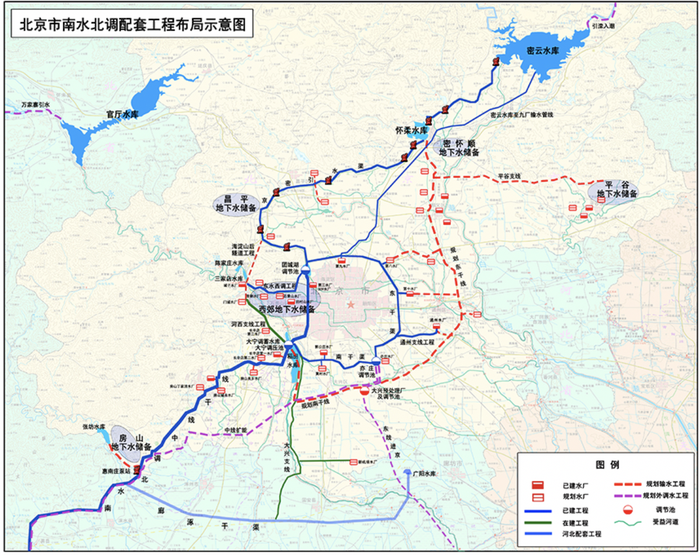

故正确答案为ABD。

---

## 言语理解与表达

### 材料 1

<b>以下是略有删节的公文部分内容，阅读之后回答41-45题</b>

        强化重点领域集中整治。坚持专项整治与日常监管相结合，以关系生命健康、财产安全和环境保护的商品以及知识产权领域的突出问题为重点，定期组织开展专项整治，严厉打击侵权假冒违法犯罪行为。完善以随机抽查为重点的日常监督检查制度，强化对互联网、农村市场和城乡结合部等侵权假冒高发多发领域和地区的监管，坚持线上线下治理相结合，深挖违法犯罪活动的组织者、策划者、实施者，清理生产源头，铲除销售网络，维护公平竞争的市场秩序。

        加强部门间执法协作。执法监管部门、行业主管部门等要充分发挥各自优势，加强打击侵权假冒执法协作，促进执法监管和行业管理等信息共享，在执法检查、检验检测、鉴定认定等方面互相提供支持。执法监管部门发现违法行为涉及其他部门职责的，要及时通报相关部门采取措施，对于重大案件线索，必要时要共同研究案情，开展联合执法。加强对基层综合执法部门的指导，（甲）监管职责，（乙）权力清单，（丙）监管漏洞，确保综合执法机构权威高效、运转协调，提高执法效能。

        推进区域间执法协调联动。针对侵权假冒行为<u>            </u>的特点，加强区域间执法协作，探索建立跨区域联席会议、线索通报、证据移转、案件协查、联合办案以及检验鉴定结果互认等制度，完善线索发现、源头追溯、属地查处机制，推动执法程序和标准统一化，加强交界区域基层执法协作，消除监管空白地带，对侵权假冒商品的生产、流通、销售形成全链条打击。结合实施国家区域发展战略，在京津冀、长江经济带、泛珠三角区域等深入开展打击侵权假冒区域合作，总结经验，适时向全国推广。

        健全行政执法与刑事司法衔接机制。建立健全行政执法部门与司法机关信息共享，案情通报、案件移送制度，完善案件移送标准和程序，坚决克服有案不移、有案难移、以罚代刑现象。完善行政执法部门与司法机关间有关案件咨询、督查督办等工作机制，规范行政执法证据的固定和移送，实现行政执法与刑事司法无缝衔接。完善涉嫌犯罪案件移送中有关涉案物品处置制度，探索建立涉案物品保管“公物仓”和有毒有害物品统一销毁处理制度。建成中央、省、市、县四级联网的行政执法与刑事司法衔接信息共享系统，提高衔接工作效率和规范化水平。

#### 第 1 题　qid 2274532 · 片段阅读

依据第1段所提出的要求，相关部门应该

- **A**. 建立完善生产经营主体诚信档案和“黑名单”制度
- **B**. 依法取缔无证照生产经营的“黑作坊”“黑窝点”　✅
- **C**. 推进供给侧结构性改革和发展“互联网+”
- **D**. 积极运用传统媒体和新兴媒体宣传先进典型

**答案**：B

**官方解析**

文段首先指出强化重点领域集中整治，然后进一步指出要“坚持专项整治与日常监管相结合”，接着分别从“定期组织开展专项整治”、“完善以随机抽查为重点的日常监督检查制度”两个方面具体阐述。故文段意在强调“要对重点领域集中整治”。B项“取缔黑作坊、黑窝点”属于“整治”的内容，当选。
A项强调 “建立制度”、C项强调 “推进改革”和“发展互联网+”、D项强调 “宣传先进典型”，三项均不属于“整治”的内容，排除。
故正确答案为B。
【文段出处】《国务院关于新形势下加强打击侵犯知识产权和制售假冒伪劣商品工作的意见》

---

#### 第 2 题　qid 2274535 · 逻辑填空

依次填入第2段中甲、乙、丙三处，最恰当的一组词语是

- **A**. 厘清  明确  堵塞　✅
- **B**. 细化  共享  填补
- **C**. 转变  完善  发现
- **D**. 承担  开列  弱化

**答案**：A

**官方解析**

甲处，搭配“监管职责”。A项“厘清”指整理清楚，用于此处可说明使“监管职责”更加清楚；B项“细化”指使更具体、更细致，用于此处可形容使职责更具体，均保留。C项“转变”强调的是改变、变化，文段没有体现要改变，排除。D项“承担”指敢于担当的责任与义务，填入语义合适，保留。
乙处，搭配“权力清单”，根据前文“监管职责”更加清楚可知，此处强调执法部门要根据自身职责明确权力 ，A项“明确”符合文意且搭配恰当，保留。B项“共享”强调了分享、共同拥有，无法和“权力”搭配，故与文意不符，排除。
丙处， A项“堵塞”指阻塞，使不通，与“漏洞”为常见固定搭配，可选。D项“弱化”是变弱的意思，和“漏洞”不能搭配，排除。
故正确答案为A。
【文段出处】《国务院关于新形势下加强打击侵犯知识产权和制售假冒伪劣商品工作的意见》

---

#### 第 3 题　qid 2274537 · 片段阅读

填入第3段中画线处，最恰当的是

- **A**. 跨部门、流程化
- **B**. 跨行业、专业化
- **C**. 跨区域、链条化　✅
- **D**. 跨领域、国际化

**答案**：C

**官方解析**

根据空后“加强区域间执法协作，探索建立跨区域联席会议···”可知，此处强调了侵权假冒行为发生在不同的区域的特点，对应C项“跨区域”。A项“跨部门”、B项“跨行业”、D项“跨领域”均与“发生在不同区域”无关，排除。
验证C项，“链条化”与文中“对侵权假冒商品的生产、流通、销售形成全链条打击”对应恰当，当选。
故正确答案为C。
【文段出处】《国务院关于新形势下加强打击侵犯知识产权和制售假冒伪劣商品工作的意见》

---

#### 第 4 题　qid 2274539 · 片段阅读

最适合概括这部分公文内容的主标题是

- **A**. 构建多方参与的共治格局
- **B**. 推进跨部门跨区域综合治理　✅
- **C**. 提高市场监管和预警防范能力
- **D**. 推动完善法规标准和司法保护体系

**答案**：B

**官方解析**

文章分别从强化重点领域集中整治、加强部门间执法协作、推进区域间执法协调联动、健全行政执法与刑事司法衔接机制四方面来论述解决商品和知识领域的侵权假冒突出问题的方法，可知强调部门间、区域间要统筹协调，综合治理，对应B项。
A项，仅强调多方参与，但没有涉及“跨区域”的治理措施，故表述不明确，排除；C项，“提高市场监管和预警能力”、D项，“法规标准和司法保护体系”只概括一方面的治理措施，均无法体现“跨部门”治理，故表述片面，排除C、D两项。
故正确答案为B。
【文段出处】《关于新形势下加强打击侵犯知识产权和制售假冒伪劣商品工作的意见》

---

#### 第 5 题　qid 2274543 · 逻辑填空

本公文的文种最可能是

- **A**. 公告
- **B**. 请示
- **C**. 函
- **D**. 意见　✅

**答案**：D

**官方解析**

此公文针对“商品和知识领域的侵权假冒问题”，从强化重点领域集中整治、加强部门间执法协作、推进区域间执法协调联动、健全行政执法与刑事司法衔接机制四方面给出了处理办法和指导性建议，D项，“意见”是上级领导机关对下级机关部署工作，指导下级机关工作活动的原则、步骤和发放的一种问题，适用于对重要问题提出见解和处理办法，符合本公文的文种，当选。A项，“公告”是政府、团体对重大事件当众正式公布或公开宣告，此公文没有公布重大事项让人们知悉，排除；B项，“请示”属于上行文，是下级向上级请求指示、批准的公文，此公文是上级在统筹工作给出指导性建议，排除；C项，“函”是不相隶属机关之间商洽工作、询问和答复问题，请求批准和答复审批事项时所用的公文，此公文是上级给出的指导性意见，属同一隶属机关，排除。
故正确答案为D。
【文段出处】《关于新形势下加强打击侵犯知识产权和制售假冒伪劣商品工作的意见》

---

### 材料 2

<b>阅读以下文字，完成46——50题</b>

        在当今知识社会，学科门类越来越细化，各种专业术语层出不穷，各种学说流派、各种观点五花八门。社会知识总量的快速膨胀，带来了学科间的认知障碍，很难再出现通晓各门学问的宗师大家了。但学者以学问立身，并不主要看其涉猎学科领域、通晓概念术语的多少，而是看其是否具有稳定的价值系统，立言立行是否具有一以贯之的标准。

        学者作为一个社会的文化传承者和文明守望者，未必一定要绝顶聪明，重要的是有着对真实知识的执着心，有着推己及人的学识修养，有着稳定的价值体系和价值标准，因而可以超然物外，成为社会评判是非曲直、真伪善恶的一把直尺。而这恰恰是精于利益算计、价值标准游移不定的“聪明人”做不来的。

        是否保持价值标准的一致性，不仅是学理的要求，也是学品的要求。学者“外察诸物，反求诸己”，没有内心的澄明，反思自我的悟性不够，将会影响到对外部世界的审视能力，学业修为是很难登堂入室的，所谓“ <u>                             </u>”。另一方面，即便学富五车，如果没有稳定的价值立场，所掌握的知识只能是浮萍飞絮，这样的人很容易趋炎附势，物化为权力和金钱的附庸。

        学品如人品，评判学品高低，辨别人品优劣，是要听其言而观其行的，要从知与行是否具有一致性上，判断其价值系统的稳定性。知行能够统一，知识的修为和道德的完善就能够相得益彰；知行如果相悖，言行表里不一，秉持多重价值标准，势必造成道德取向的分裂。所以，有没有道德品行的自觉自律，对知识的态度是大不一样的。当学业失去了道德内化的意义，成为单纯牟利的知识工具时，离自欺欺人也就不远了。辨别学者的理论观点只有一个办法，就是看其能否保持价值标准的一致性，能够言行一致的就是真学，不能言行一致的就是伪学。

#### 第 6 题　qid 2274557 · 片段阅读

作者认为当今难以出现宗师大家的原因不包括

- **A**. 学科划分细化
- **B**. 学说流派多样
- **C**. 知识总量膨胀
- **D**. 学者人浮于事　✅

**答案**：D

**官方解析**

当今难以出现宗师大家的原因对应第一段。A项“学科划分细化”，对应文段“门类越来越细化”，表述正确，排除；B项“学说流派多样”，对应文段“各种学说流派、各种观点五花八门”，表述正确，排除；C项“知识总量膨胀”，对应文段“社会知识总量的快速膨胀，带来了学科间的认知障碍”，表述正确，排除。D项“人浮于事”在文段中并未提及，无中生有，当选。
本题为选非题，故正确答案为D。
【文段出处】《中央党校教授告诉你什么是真正的学者、学问与学品》

---

#### 第 7 题　qid 2274561 · 逻辑填空

填入第3段画横线处最恰当的一句是

- **A**. 学而不思则罔，思而不学则殆
- **B**. 德之不修，虽学有道，其行不远　✅
- **C**. 非淡泊无以明志，非宁静无以致远
- **D**. 博学之，审问之，慎思之，明辨之，笃行之

**答案**：B

**官方解析**

横线处于文段中间，由“所谓”可知横线处语句与前文形成对应关系。第3段首先提出保持价值标准的一致性是学理和学品的要求，接着提到学者内心修为不够、没有反思自己的悟性，会影响学业修为的提高，即是强调德行对学业能力的影响，故横线应该体现出德行的重要性，对应B项，意为德行修为不够，即便是有学问也不能长久提升，符合文意。A项强调学习与思考的相互关系，与前文无关，排除；C项是指一个人须恬淡寡欲方有明确的志向，须寂寞清静才能达到深远的境界，文中没有提到“清心寡欲”和“宁静寂寞”，排除；D项是关于治学的名言，没有提到德行的重要性，排除。
故正确答案为B。
【文段出处】《中央党校教授告诉你什么是真正的学者、学问与学品》

---

#### 第 8 题　qid 2274564 · 片段阅读

作者眼中的“聪明人”具有下列哪一特征？

- **A**. 学得快也忘得快
- **B**. 价值标准不统一　✅
- **C**. 对学业的理解空泛肤浅
- **D**. 经常在学术上追新求异

**答案**：B

**官方解析**

由第二段“这恰恰是精于利益算计、价值标准游移不定的‘聪明人’做不来的”可知，文中的“聪明人”对价值标准存在变化不统一的情况，对应B项。A项“学得快也忘得快”、C项“对学业的理解空泛肤浅”、D项“在学术上追新求异”均为无中生有，不是文段所强调的聪明人，排除。
故正确答案为B。
【文段出处】《中央党校教授告诉你什么是真正的学者、学问与学品》

---

#### 第 9 题　qid 2274566 · 片段阅读

作者最不可能赞同下列哪一说法？

- **A**. 学者要做到能说真话必须说真话
- **B**. 知识分子是一个国家的良心
- **C**. 学者需通晓各门学问才能传道授业解惑　✅
- **D**. 学者治学需要知行合一

**答案**：C

**官方解析**

由最后一段“辨别学者的理论观点只有一个办法，就是看其能否保持价值标准的一致性，能够言行一致的就是真学，不能言行一致的就是伪学”可知，作者认为学者要说话行动标准统一，对真实知识执着说真话，A项与作者观点一致，排除；
由第二段“学者作为一个社会的文化传承者和文明守望者”、第四段“学品如人品”可知，作者认为学者对国家社会尤为重要，而学者的德行、知行合一直接影响了一个国家的文化文明发展，故B项与作者观点相符，排除；
由第一段“学者以学问立身，并不主要看其涉猎学科领域、通晓概念术语的多少，而是看其是否具有稳定的价值系统，立言立行是否具有一以贯之的标准”可知，作者认为，学者重要的是价值标准统一，而非是涉猎多少学科领域通晓多少学问，C项表述错误，当选；
由第四段“辨别学者的理论观点只有一个办法，就是看其能否保持价值标准的一致性，能够言行一致的就是真学，不能言行一致的就是伪学”可知，学者治学要知行合一，D项与作者观点相符，排除。
本题为选非题，故正确答案为C。
【文段出处】《中央党校教授告诉你什么是真正的学者、学问与学品》

---

#### 第 10 题　qid 2274567 · 片段阅读

最适合作为本文标题的是

- **A**. 学者、学问与学品　✅
- **B**. 学者、学问与学识
- **C**. 学问、学识与学品
- **D**. 学者、学问与学业

**答案**：A

**官方解析**

文章开篇指出很难再出现通晓各门学问的宗师大家，然后以转折关联词“但”强调学者以学问立身，重点不在于懂得多少知识，而是其立言立行是否具有一以贯之的标准，引出“学者”、“学问”这两个话题，之后第二段介绍了学者所应具备的特点，第三段论述稳定的价值标准对学品的重要性，第四段进一步论述学品，强调学品对于学者的重要性，故整个文段讨论的就是学者、学问与学品之间的关系，对应A项。
B项，未涉及“学品”，偏离文段中心，排除；
C项，缺少主体“学者”，排除；
D项，“学业”仅为第三段中涉及的内容，非重点，且没有提及“学品”，排除。
故正确答案为A。
【文段出处】《中央党校教授告诉你什么是真正的学者、学问与学品》

---

### 材料 3

<b>阅读以下文字，完成51-55题</b>

        记忆是一项原理复杂又十分个性化的生理活动。①记忆的形成机制尚没有确切的结论，如何衡量记忆的效果也是众说纷纭，更不要说对何时的记忆更高效进行判定和解析了。②无论我们记忆的是一篇文章还是一段旋律，都离不开相关神经元的活动。区别只在于有哪些神经元参与，有多少神经元参与，以及神经活动的频率高低等。当足够多的电活动使神经元开始形成稳定联系后，相关的记忆便得到巩固。③在这个过程中，神经元的活力、体内激素水平的高低，都会影响记忆的形成。④

        虽然人体是复杂的系统，但总会存在一个相对合适的状态。这个状态合适的时间，便是记忆相对高效的时间。而身体状态随着时间呈现出周期性调整，这是生物体存在节律性的一种表现。2017年，诺贝尔生理学或医学奖被授予三位研究“生物节律的分子机制”的科学家。人类用上百年的时间证明：生物体的状态随着时间的进展，受到内源性的调节。这种24小时的生物节律，完全是因为在生物体内有若干蛋白呈现周期性的相互作用。

        记忆是一种生理功能，它的形成和巩固，需要相应结构的配合。功能依附在结构之上，结构越合适，功能便越强大。但是，究竟什么影响着记忆力呢？这完全因人而异，比如，充足的睡眠、愉快的心情、强烈的刺激，甚至是之前的学习基础，都可能是重要的因素。另外，人体内存在着一种自主性的生物钟。外部环境的改变，并不会对这套机制产生决定性的影响。但是，这套自主性的生物钟，只是影响记忆的众多因素之一。我们并不能一刀切地宣布，什么时间是记忆最好的时候。从研究的角度来说，想要知道自主性生物钟对记忆的影响，需要先把其他所有因素都排除掉。被试者必须完全均一，不能有个性化的情感，不能有个性化的认知，也不能有个性化的饮食。这显然很难做到。

        对记忆的研究，应该立足于改善我们的学习状态，大多数人完全没有必要知道生物钟究竟影响了多少记忆。每个人所处的环境不同，测试结果可能和当地的气候有关，也可能和我们吃的东西有关······我们只要花一些时间，在不同的时间段做同样的学习，过一段时间比较效果，用这种方法摸索出适合自己记忆的方法。

#### 第 11 题　qid 2274575 · 片段阅读

本文可用于反驳以下哪项观点？

- **A**. 早晨记忆力最好　✅
- **B**. 幼儿阶段是一生中记忆最强的
- **C**. 人们遗忘的速度是先快后慢
- **D**. 重复有助于强化记忆

**答案**：A

**官方解析**

文段开篇指出记忆的形成机制尚没有确切的结论，如何衡量记忆的效果也是众说纷纭，更不要说对何时的记忆更高效进行判定和解析了，然后指出记忆与神经元活动有关，第二段第三段指出影响记忆的多种因素，充足的睡眠、愉快的心情、生物钟等等，并进一步指出我们并不能一刀切地宣布，什么时间是记忆最好的时候，最后一段补充说明，故作者认为是无法判断何时的记忆力最好，而A项和作者的观点恰恰相反，当选。
B项“幼儿阶段是一生中记忆最强的”，虽然和文段所涉及的记忆有关，但文段并不强调人生当中的哪个阶段，排除；C项“遗忘速度的快慢”，D项“重复有助于强化记忆”在文章中均未涉及到，无中生有，排除。
故正确答案为A。
【文段出处】《早晨记忆力最好？原来我们被骗了这么多年》

---

#### 第 12 题　qid 2274577 · 片段阅读

“笼统地说，记忆的形成和神经元之间特定的电活动有关。”这句话最适合填入文中第1段哪个位置？

- **A**. ①
- **B**. ②　✅
- **C**. ③
- **D**. ④

**答案**：B

**官方解析**

题干句子由“笼统地说”对前文进行了总结，并介绍记忆的形成与神经元活动有关，分析第一段，②处之前论述记忆的形成机制不清楚，②处之后论述记忆离不开神经元的活动，将题干填在此处，“笼统地说”即为对前文形成机制不清楚的简单概括，并由此引出后文的话题“记忆与神经元间的活动有关”，衔接恰当，对应B项。
A项，①处前后句子均未提到“记忆与神经元活动的关系”，话题不一致，排除；
C项，③处“这一过程”即指代前文的过程，与题干衔接不恰当，排除；
D项，前文对记忆与神经元活动间的关系给了很具体的阐述，故题干中的“笼统地说”衔接在此处不恰当，排除。
故正确答案为B。
【文段出处】《早晨记忆力最好？原来我们被骗了这么多年》

---

#### 第 13 题　qid 2274578 · 片段阅读

下列哪项可以作为支持第2段观点的例证？

- **A**. 盘旋在支架上的牵牛花的藤在旋转时，一律按逆时针方向盘旋而上，如果人为地将其缠成左旋，它生出新藤后仍不改右旋特性
- **B**. 奥地利生物学家孟德尔发现，把一种开紫花的豌豆种和一种开白花的豌豆种结合在一起，第一次结出来的豌豆开紫花，第二次紫白相间，第三次全白
- **C**. 18世纪法国科学家德梅朗发现，含羞草叶片在恒定的黑暗环境下仍表现出24小时的波动性变化　✅
- **D**. 山东济宁府北宋土层中出土的莲子“沉睡千年”后在浙江杭州复活，生出了嫩绿茎叶

**答案**：C

**官方解析**

根据文章第2段，开头指出人体存在相对合适的状态，接着对其进行进一步解释，然后通过指代词“这”对前文总结强调生物体存在节律性。接着列举科学家的例子进行解释说明，强调“生物体的状态随着时间的进展，受到内源性的调节”，最后通过指代词“这”对前文进行总结，强调生物体存在周期性的24小时的生物节律。对应C项，含羞草片在黑暗环境下的仍24小时波动性变化符合观点中24小时的生物节律的特征。其中，“在恒定的黑暗环境下仍表现”，即不管黑暗还是光明均会发生变化，对应“随时间的进展，受到内源性的调节”，“24小时波动性变化”对应“24小时的生物节律”，可以作为观点的例证。
 A项，牵牛花藤的右旋特性没有体现出“24小时的生物节律”，不符合文段观点，排除；
B项，豌豆开花体现出的是生物体的状态随着杂交导致的内源性变化而变化，并且没有体现出24小时的周期性调节，排除；
D项，古莲子萌发，并未体现出“24小时的生物节律”，排除。
故正确答案为C项。
【文段出处】《早晨记忆力最好?原来我们被骗了这么多年》

---

#### 第 14 题　qid 2274579 · 片段阅读

下列说法符合文意的是

- **A**. 记忆相对高效的时段并不存在
- **B**. 每个人都有适合自己的记忆方法　✅
- **C**. 衡量记忆的效果有公认的标准
- **D**. 自主性生物钟对记忆影响的研究可行性很高

**答案**：B

**官方解析**

根据文章第4段“我们只要花一些时间，在不同的时间段做同样的学习，过一段时间比较效果，用这种方法摸索出适合自己记忆的方法”可知，适合自己的记忆方法可以通过自己的摸索来得出，B项符合文意，当选。
A项，“记忆相对高效的时段并不存在”表述错误，根据文章第2段“虽然人体是复杂的系统，但总会存在一个相对合适的状态。这个状态合适的时间，便是记忆相对高效的时间”，只是说明相对高效的时间难以确定，并非该时段不存在，表述过于绝对，排除；
C项，根据文章第1段“如何衡量记忆的效果也是众说纷纭”可知，衡量记忆的效果没有标准，与文意相悖，排除；
D项，根据文章第3段“想要知道自主性生物钟对记忆的影响，需要先把其他所有因素都排除掉······这显然很难做到”可知，“可行性很高”与文意相悖，排除。
故正确答案为B项。
【文段出处】《早晨记忆力最好?原来我们被骗了这么多年》

---

#### 第 15 题　qid 2274580 · 片段阅读

文中提到可能影响记忆力的因素有
①激素水平  ②性别  ③认知风格  ④遗传基因  ⑤饮食习惯

- **A**. ①③⑤　✅
- **B**. ①②③
- **C**. ③④⑤
- **D**. ②③④

**答案**：A

**官方解析**

根据文章第1段“体内激素水平的高低，都会影响记忆的形成”可知，“激素水平”是可能影响记忆力的因素；根据文章第3段“需要先把其他所有因素都排除掉······不能有个性化的情感，不能有个性化的认知，也不能有个性化的饮食”可知，“认知风格、饮食习惯”是可能影响记忆力的因素。①③⑤在文章中有提及，对应A项。②④两项文段没有提及。
故正确答案为A项。
【文段出处】《早晨记忆力最好?原来我们被骗了这么多年》

---

### 材料 4

阅读以下文字，完成56-60题

由我国自主设计建造的第一艘科考破冰船已经正式开工。新船能在1.5米厚冰、0.2米厚雪的环境中以2～3节航速连续破冰行驶，还具备全回转电力推进功能和冲撞破冰能力，能满足全球无限航区的航行需求。相比“雪龙”号，新船破冰能力有望提升三到四个级别。双向破冰，即船艏和船尾均可破冰，是新船的最大亮点。新船的船尾推进器装有两个大型吊舱，能原地360度自由转动，形成很强的冰层切削力。船体可转动180度，让船尾朝前，使尾部螺旋桨在海面下削冰并形成抽吸作用，直到把20多米厚的冰脊掏空。新船驾驶室为360度视野设计，这种机动性和灵活性使船更能适应极地环境。同时，新船的抗寒性也大幅提高，更重视低温环境下作业的防护。不仅有室外作业和脱险通道的防滑和加热处理、影响视线的窗户和室外摄像头的除冰防雨水功能，还有管道加热、机舱通风、保温处理和冷凝水排放等设计。新船绿色环保，采用了燃用轻质柴油的全电力推进系统，也满足国际上对氮氧化物排放的最高限值要求。 

①之所以要建造新船，是因为现有的极地破冰船难以满足快速增长的科考需求。我国目前是一船多站的运营模式，每个航次“雪龙”号除了承担极地科学考察的任务外，还需承担给各科学考察站运送人员、补给等重要任务。②南北极夏季短暂，一艘船却要同时兼顾南、北极多项任务，海洋科考时间被大量压缩和挤占。新船的出现，将改变我国极地科考的作业模式。首先体现在延长科考作业的时间窗口。目前国际上绝大多数基于考察船的极地科考工作是在极地的11月到下一年的3月之间进行，新船拥有更强的破冰能力和抗寒能力，可以更早进入极地，更晚离开。另一方面，新船将配备国际先进的海洋环境和地球物理调查装备，还将实现国际先进的极地海洋科学综合调查手段。新船进行了模块化设计，能根据不同的航次需求重新配置科学任务。以海洋水体环境调查为例，海洋科学研究中的重大发现几乎都是从长期观测中获得的，但劳动强度高、取样点少，而且容易受自然环境变化影响。新船配备的相关系统，不需要专门的工作时间来安排和投放工作，而是自动完成海表面的、随时随地的多要素连续自动测定，实现原位测量、实时显示和自动记录处理。

③新船预计2019年建成，将与“雪龙”号组成极地科考破冰船队。将通过专业定位和分工，使新船和“雪龙”号<u>      </u>。“雪龙”号将充分发挥其强大的后勤补给能力，以后勤保障支撑为主，而新船将发挥其独特的综合极区海洋调查能力，以极区海洋科考调查作业为主。④未来，国家还要建设破冰能力更强的破冰船，最好能全年航行在冰区里，从而实现更多的应急救援和极地管理功能。

#### 第 16 题　qid 2274590 · 片段阅读

新一代极地科考破冰船最突出的创新之处是：

- **A**. 驾驶室采用了360度视野设计
- **B**. 采用了全电力推进系统
- **C**. 提升了低温环境下的作业防护能力
- **D**. 可以实现双向破冰　✅

**答案**：D

**官方解析**

根据第一段 “双向破冰，即船艏和船尾均可破冰，是新船的最大亮点”可知，“最大亮点”对应“最突出的创新之处”，故D项正确。
A、B、C三项均为新一代极地科考破冰船的特点，但都不是“最突出”的特点，排除。
故正确答案为D。

---

#### 第 17 题　qid 2274591 · 片段阅读

文中第2段举海洋水体环境调查的例子是为了说明新一代极地科考破冰船

- **A**. 缩短了海表面科学观测的时间和周期
- **B**. 调查装备和手段均达世界先进水平　✅
- **C**. 使科考作业的周期大大延长
- **D**. 改变了极地海洋科学研究的调查方式

**答案**：B

**官方解析**

文段先概括介绍建造新船的原因，并指出新船的出现“将改变我国极地科考的作业模式”。随后通过两方面详细介绍，一方面是“延长科考作业的时间窗口”，另一方面是“新船将配备国际先进的海洋环境和地球物理调查装备，还将实现国际先进的极地海洋科学综合调查手段”。随后举了“海洋水体环境调查”的例子，在例子中，突出了“新船配备的相关系统”的重要作用，故举例的目的是为了体现出新船的装备以及调查手段的先进性，B项当选。
A项，“缩短观测时间和周期”属于无中生有，排除；C项，为第一方面的内容，而例子对应的是“另一方面”的内容，排除；D项，文段为“将改变我国极地科考的作业模式”为将来时态，选项“改变了”为过去时，与文段不符，且是前文所述的内容，与例子无直接关系，排除。
故正确答案为B。
【文段出处】《我国自主建造第一艘极地科考破冰船开工》

---

#### 第 18 题　qid 2274592 · 片段阅读

填入文中最后一段画线处最恰当的一项是

- **A**. 功能互补、优势倍增　✅
- **B**. 相辅相成、锦上添花
- **C**. 各具优势、分工协作
- **D**. 互为表里、相得益彰

**答案**：A

**官方解析**

横线位置居中，结合前后文。开头引出新船将与“雪龙”号组成极地科考破冰船队这一背景，接着横线前出现结论引导词“使”，故前文“将通过专业定位和分工”为其原因，再根据后文所述，“雪龙”号将充分发挥其强大的后勤补给能力，以后勤保障支撑为主，而新船将发挥其独特的综合极区海洋调查能力，以极区海洋科考调查作业为主。可见二者进行了明确的分工，发扬了各自的优势，A项“功能互补，优势倍增”体现出了二者在功能上互相补充，分工合作，从而使各自的优势更加明显，当选。
B项，强调两者相互配合，好上加好，并未体现分工明确，排除；C项，“各具优势”是二者本身就具有的，而非“通过专业定位和分工”使二者各具优势，不能构成因果关系，排除；D项，“互为表里”指互相之间是表与里的关系，文段中“雪龙”号与新船是相互配合，并非“互为表里”，排除。
故正确答案为A。
【文段出处】《我国自主建造第一艘极地科考破冰船开工》

---

#### 第 19 题　qid 2274593 · 片段阅读

“新船的出现，并不意味着‘雪龙’号要退出历史舞台。”填入文中哪处最为合适？

- **A**. ①
- **B**. ②
- **C**. ③　✅
- **D**. ④

**答案**：C

**官方解析**

这是一道变型的语句填空题，需保证题干中的语句与上下文话题一致，衔接得当。“新船的出现，并不意味着‘雪龙’号要退出历史舞台。”围绕“新船”与“雪龙”号展开，强调“雪龙号”并未因新船的出现而被淘汰，还是能发挥作用的。③处，前文指出“雪龙号”无法满足需求以及“新船”可以改变现有困局；后文介绍新船和“雪龙”号组成破冰船队，“雪龙”号发挥强大的后勤补给能力，即“雪龙号”未被淘汰，仍有用武之地。题干中的句子可与上下文衔接，故答案锁定C项。
A项，①处分析建造新船的原因，B项，②处从两个方面分析新船的作用，均与“雪龙号”仍可以发挥作用无关，无法衔接，排除A、B项；
D项，④处强调“破冰能力更强的破冰船”，话题不一致，排除D项。
故正确答案为C。
【文段出处】《“雪龙”的兄弟“牛”在哪》

---

#### 第 20 题　qid 2274594 · 片段阅读

最适合作为本文标题的是

- **A**. 我国自主建造的第一艘极地科考破冰船“牛”在哪？　✅
- **B**. 新一代极地科考破冰船能赶超科考船舶国际水平吗？
- **C**. 最强组合：“雪龙”号与新一代极地科考破冰船
- **D**. 新一代极地科考破冰船将满足快速增长的科考需求

**答案**：A

**官方解析**

第一段介绍第一艘科考破冰船，即“新船”的亮点和功用；第二段介绍建设“新船”的原因，即“新船”能够满足快速增长的科考需要，其科考调查设备和手段均为国际领先；第三段介绍“新船”还可与“雪龙号”配合进行极地科考。可见整个文段都是围绕“新船”来论述，强调了“新船”的优势，对应A项。
B项，文段没有将新一代冰船对比国际水平，故无中生有，排除；
C项，“最强组合”对应第三段“新船预计2019年建成，将与‘雪龙’号组成极地科考破冰船队”，无法概括全文，排除；
D项，对应第二段“要建造新船，是因为现有的极地破冰船难以满足快速增长的科考需求”，这只是新船建造原因的一方面，故表述片面，排除。
故正确答案为A。
【文段出处】《“雪龙”的兄弟“牛”在哪》

---

### 材料 5

阅读以下文字，完成61——65题

        淮扬菜与鲁菜、川菜、粤菜并称为中国四大菜系。淮扬菜，始于春秋，兴于隋唐，盛于明清，素有“东南第一佳味，天下之至美”的美誉。淮扬菜系是淮安、扬州、镇江三地风味菜的总称；“淮”即淮菜，以淮安为代表，“扬”即扬菜，以扬州、镇江一带为代表。明清以后，淮菜和扬菜开始相互渗透、逐渐融合，并糅合南北风味于一炉，从而形成了统一的菜系。 

        古运河把海、黄、淮、江、钱五大水系贯通，立时将扬州提拔到全国烹任人才、技艺、原料交流枢纽位置，北方的豆、麦、杂粮、油料南下，南方的粮、茶、果、盐、水产北上，统统会师在扬城。而隋炀帝三幸江都，将长安、洛阳中原美食，随龙舟带进扬城隋宫，进而外传民间食肆。

        扬州，因地处海上丝绸之路北上赴京的咽喉重地，至唐代，发展为东南经济中心。“万商落日船交尾，一市春风酒并垆”，扬州饮食市场被刺激得火爆了，厨艺精湛了。李白诗云：“玉瓶沽美酒，衔杯大道间。”这一切因素，使淮扬菜发展到一个新高峰。

        宋庆历八年春，一代文学巨匠欧阳修给扬州美食界带来福音。这位醉翁常携宾客举行平山堂饮宴，文章太守，挥毫万字，樽中看取美食文。此后，苏轼又至扬州，与四学士飞雪堆盘烩鱼腹，明珠论斗煮鸡头，开创了给淮扬菜系注入文学新鲜血液的先河。淮扬菜典雅俏丽的文人风格由此而起，其后经年不衰。

        公元1125年，宋徽宗在金人入侵之际，仓惶南逃进了扬州城，“小市春灯煮百羊”，要吃要喝；时隔一年，徽钦被掳，高宗携社稷皇室四万人也逃进扬州城，“行在”玉烩金齑不空口，也要吃要喝！扬州城虽遭掠，但饮食业在亡国背景下得到畸形推动也是事实。

        元明清时期，尤其是清康熙、乾隆盛世，淮扬菜进入了第二高潮。朱元璋对淮扬菜情有独钟，命扬厨专司内膳；从扬州起家的明成祖朱棣夺权登基以后，迁鼎北京，随宫北上的扬籍厨师多有其人，这是淮扬菜系进京扎根的正式记录。据《食在宫廷》介绍，清帝喜吃的菜有100多款，其中淮扬风味菜如红烧狮子头、清炒虾仁等达60多款。典型的例证，就是《红楼梦》作者曹雪芹的祖父曹寅在扬州任巡盐御史，每年都要贡献南味给清圣祖康熙，所谓“水落鱼虾常满市，湖多莲芡不论钱”。常年进贡不懈的是笋，因为康熙喜吃春笋，每次南下必食，曹寅多次进贡扬州燕来笋以博皇上“朕心大慰”。

        中华人民共和国成立后，许多标志性事件的宴会都是淮扬菜唱主角：1949年开国大典首次盛宴、1999年50周年大庆宴会等，都是以淮扬菜为主。

        后人评价淮扬菜，常用“贵”字。这应当与两淮盐商与河务官员豪甲天下的饮食消费有关，这也是淮扬菜得以壮大的一大保障。徐谦芳《扬州风土记略》说：“扬州土著，多以盐务为生，习于浮华，精于肴馔，故扬州筵席各地驰名，而点心制法极精，汤包油糕尤擅名一时。”

#### 第 21 题　qid 2274595 · 逻辑填空

“万商落日船交尾，一市春风酒并垆”这句诗主要是为了说明当时的扬州

- **A**. 经济繁荣　✅
- **B**. 人文荟萃
- **C**. 园林奢华
- **D**. 人口繁盛

**答案**：A

**官方解析**

首先定位到第三段，文段先介绍扬州作为“海上丝绸之路北上赴京的咽喉重地”，到唐代成为东南经济中心，后引用诗句“万商落日船交尾，一市春风酒并垆”，扬州饮食市场被刺激。故根据上下文可知，这句话想要说明当时扬州酒家食肆兴盛，经济繁荣，对应A项。
B项，“人文荟萃”强调人才优秀、C项，“园林奢华”强调当地建筑华美，文中并未提及，排除；
D项，“人口繁盛”侧重于强调人口多，但文段强调扬州经济繁荣，而不仅仅是人多，排除。
故正确答案为A。
【文段出处】《扬州导游欢迎词范文》

---

#### 第 22 题　qid 2274596 · 逻辑填空

举欧阳修和苏轼的例子主要是为了彰显淮扬菜

- **A**. 历史悠久
- **B**. 非市井家宴
- **C**. 有文化内涵　✅
- **D**. 能调众口，南北皆宜

**答案**：C

**官方解析**

首先定位原文，“欧阳修”与“苏轼”的例子出现在第四自然段。文段先指出，文章太守欧阳修“给扬州美食界带来福音”，随后指出苏轼“开创了给淮扬菜注入文学新鲜血液的先河”。尾句进一步总结上文，强调了“淮扬菜典雅俏丽的文人风格由此而起”。故“欧阳修”与“苏轼”的例子是为了凸显淮扬菜中融入了“文学”的气息，锁定C项。
A项，“历史悠久”对应“其后经年不衰”，而欧阳修和苏轼的例子是为了彰显菜肴“文化”，与历史悠久无关，排除；
B项，第四段并未强调淮扬菜不是“市井家宴”，寻常人无法食用，故无中生有，排除；
D项，“能调众口，南北皆宜”体现出淮扬菜普适性很强，在第四段文段中也未体现，排除。

故正确答案为C。
【文段出处】《扬州导游欢迎词范文》

---

#### 第 23 题　qid 2274597 · 片段阅读

根据本文，使淮扬菜立足于北京的关键人物是

- **A**. 隋炀帝
- **B**. 宋徽宗
- **C**. 清圣祖
- **D**. 明成祖　✅

**答案**：D

**官方解析**

首先定位原文，根据文段第六自然段中“从扬州起家的明成祖朱棣夺权登基以后，迁鼎北京”“这是淮扬菜系进京扎根的正式记录”可知，对“使淮扬菜立足于北京的关键人物是”明成祖朱棣，对应D项。
A项，根据第二自然段“隋炀帝三幸江都，将长安、洛阳中原美食，随龙舟带进扬城隋宫”可知，隋炀帝将中原美食带入“扬城隋宫”，与北京无关，排除；
B项，根据第五自然段可知“宋徽宗在金人入侵之际，仓惶南逃进了扬州城”，与北京无关，排除；
C项，根据第六自然段可知，清圣祖康熙也喜爱淮扬菜，推动了淮扬菜的发展。但让淮扬菜“立足于”北京，即最先引入淮扬菜进北京的不是康熙，排除。
故正确答案为D。
【文段出处】《扬州导游欢迎词范文》

---

#### 第 24 题　qid 2274598 · 片段阅读

根据本文，下列关于淮扬菜的说法正确的是

- **A**. 淮扬菜系形成于唐宋时期
- **B**. 来源于淮安、扬州两地风味菜
- **C**. 淮盐业与淮扬菜发展密不可分
- **D**. 北宋战乱亦使淮扬菜得到发展　✅

**答案**：D

**官方解析**

A项，根据第一自然段“淮扬菜，始于春秋，兴于隋唐，盛于明清”可知，淮扬菜并非形成于唐宋时期，排除；
B项，根据第一自然段“淮扬菜系是淮安、扬州、镇江三地风味菜的总称”可知，“淮扬菜来源于淮安、扬州两地风味菜”表述错误，排除；
C项，根据第八自然段“淮扬菜得以壮大的大保障”是“盐商及官员的饮食消费”可知，淮扬菜的发展与“盐商和官员”，这类“人”的饮食消费习惯有关，而非“淮盐业”这一行业，排除。
D项，根据第五自然段“公元1125年，宋徽宗遭到金人入侵”且“扬州城虽遭掠，但饮食业在亡国背景下得到畸形推动也是事实”可知，北宋战乱亦使淮扬菜得到发展，故D项表述正确。
故正确答案为D。
【文段出处】《扬州导游欢迎词范文》

---

#### 第 25 题　qid 2274599 · 片段阅读

本文主要介绍了淮扬菜的

- **A**. 皇室渊源
- **B**. 发展历史　✅
- **C**. 主要特色
- **D**. 代表菜品

**答案**：B

**官方解析**

文章首段引出话题“淮扬菜”，并指出“始于春秋、兴于隋唐。盛于明清”。第二、三段论述淮扬菜兴于隋唐时期，第四、五段论述淮扬菜推动于宋、金时期，第六段论述淮扬菜盛于明清，第七段论述现代淮扬菜情况，故文章以时间脉络展开，分别论述了不同时期淮扬菜的发展情况，对其进行全面概括，对应B项。A项“皇室渊源”和D项“代表菜品”只在文章第六自然段“元明清时期”出现，表述片面，排除；C项，“主要特色”只对应文章第一段的“融合南北风味与一炉”和最后一段的“贵”，表述片面，排除。
故正确答案为B。

---

### 材料 6

阅读以下文字，完成66-70题

        日常工作中，如果一件事发展得太过顺利，我们总会隐隐觉得有哪里不对，这样的直觉是有道理的。澳大利亚和法国的研究者们最近在某学术期刊上发表了一篇文章，说明了为什么当所有的证据都指向同一个结果时，它反而可能有问题。他们将此称之为“一致性悖论”。

        研究者以证人指认犯人为例研究了一致性悖论，发现在辨认嫌疑人过程中，系统偏差可能来自多种心理偏差，如警方给证人展示照片的方式、证人自身的个人偏见等。而研究者发现，哪怕是细小的偏差都会对最终的整体结果产生极大影响。具体来讲，即使在的辨认过程中施加偏差，如暗示某人是犯人，最终当3个以上的证人意见一致时，他们的意见就不再可靠。有趣的是，如果<u>      </u>，那么其他证人正确的概率反而会大大增加。

        为什么会这样？可以用数学中的贝叶斯分析来说明。以扔硬币为例：如果我们有一枚硬币，扔到正面的概率为，而非普通硬币的，只要扔的次数足够多，就会发现正面向上多于反面向上的次数，进而发现这个硬币是有问题的。换句话说，当我们看到投掷结果中正面向上的次数显著多于反面向上时，就会意识到出问题的是硬币，而非概率定理。同样，根据概率定理，很多证人同时得到一致结论的可能性极低，所以更有可能的是系统出了差错。

        在警方组织的嫌疑人指认中，指认同一个人有罪的证人数目越多，这个人真正有罪的概率就越大。然而，这只适用于没有任何系统偏差存在的理想情况。实际情况中，当指认同一个人为犯人的证人数目增加到一个值以后，该嫌疑人真正有罪的概率反而会下降，最终与随机指认毫无差别，且系统偏差越大，概率下降得越早。比方说，如果你让证人完成一项较为容易的任务，比如从一堆香蕉中找出一个苹果，所有人都几乎不会出错，多人结论一致的情况就可能出现，而指认犯人要比在一堆香蕉中找到苹果复杂得多。模拟显示，如果<u>      </u>，他们认错人的概率会高达，在这种情况下，许多证人同时指认一个人为犯人的概率就相当低了；但如果<u>      </u>，他们认错人的概率会大大降低，多个证人结论一致的情况出现的可能性也会提高。

        在法律领域之外，一致性悖论还有很多用武之地，一个重要的应用就是加密技术。数据加密通常通过确认一个很大的数字是否为质数来进行，这个判断过程的错误率要达到非常低才行：低于2的负128次方才可以接受。在这一过程中，可能出现的系统差错就是计算机故障。大多数人都不会想到宇宙射线会导致电脑将一个合数误认为质数，毕竟这件事发生的概率只有10的负13次方——但要注意，这个概率要大于我们所要求的误差（2的负128次方），所以这类误差主导了整个过程的安全性。正因于此，加密协议所宣称的安全程度越高，实际的过程就越容易受计算机故障影响。

        一致性悖论虽然听起来违背直觉，但研究者解释，一旦我们了解了足够的信息，就能理解它了。

#### 第 26 题　qid 2274600 · 逻辑填空

文中有3处画线部分，将以下3句依次填入，顺序正确的是
①每个证人都曾经被犯人劫持为人质
②证人中有一个人与其他人的意见不合
③证人们都只在犯人逃走时匆匆瞥了一眼

- **A**. ①②③
- **B**. ②③①　✅
- **C**. ③①②
- **D**. ②①③

**答案**：B

**官方解析**

第一空，横线后面的结果是“其他证人正确的概率会大大增加”，与前文“他们的意见就不再可靠”是完全相反的，说明横线处表达的意思，应该跟前文“当3个以上的证人意见一致”相反，只有②“证人中有一个人与其他人的意见不和”表述正确，并且②句“有一个证人……”和后文“其他证人……”构成逻辑上的对应，排除A、C两项；第二空所在段落在论述模拟显示什么样的情况会认错人，即让证人完成不容易的任务时，认错的概率会比较高。根据客观实际情况，当“证人们都只在犯人逃走时匆匆瞥了一眼”时，由于时间短印象不深刻才可能出现认错人概率高的情况，答案锁定B项。第三空，代入验证①句，当“每个证人都曾经被犯人劫持为人质”时，由于印象深刻认错人概率自然就低，符合逻辑。
故正确答案为B。
【文段出处】《毫无疑问，反而令人怀疑》

---

#### 第 27 题　qid 2274601 · 片段阅读

如果要论证在指证嫌疑人的过程中不存在一致性悖论，则需要补充下列哪一组证明？
①所有证人都保持客观公正的态度
②所有证人都在犯罪现场看到了嫌疑人
③该名嫌疑犯在犯罪发生时的确在场
④该名嫌疑犯曾经犯过同样的罪行
⑤所有照片都体现出了嫌疑犯独有的外貌特征
⑥警察以同样方式对所有证人展示照片

- **A**. ①②⑥　✅
- **B**. ①④⑤
- **C**. ②③⑤
- **D**. ③④⑥

**答案**：A

**官方解析**

根据文章内容，论述有关一致性悖论的相关内容定位第一段和第二段，第一段指出“所有的证据都指向同一个结果时，它反而可能有问题。他们将此称之为‘一致性悖论’”。第二段提到“哪怕是细小的偏差都会对最终的整体结果产生极大影响”，所以如果想“在指证嫌疑人过程中不存在一致性悖论”，需要补充的证明就是不存在偏差。根据第二段内容，偏差包括“如警方给证人展示照片的方式、证人自身的个人偏见”，即偏差的主体与警方和证人有关。选项中，相关的只有①②⑥，③④⑤均不属于出现偏差的条件，排除。
故正确答案为A。

---

#### 第 28 题　qid 2274602 · 片段阅读

第5段中“正因于此”的“此”，指的是

- **A**. 加密技术判断过程的错误率并不可能达到2的负128次方
- **B**. 除宇宙射线外，还有其他因素会引起计算机的系统误差
- **C**. 上述加密技术的判断过程是在目前使用最为广泛的方法
- **D**. 出现计算机故障的概率高于加密技术判断过程的错误率　✅

**答案**：D

**官方解析**

定位“正因于此”所在位置，出现在第⑤段尾句，结合前文内容进行理解。该段首句交代，一致性悖论可以应用于加密技术，后文开始解释原因，即加密技术的错误率低于2的负128次方才可进行数据加密，但在加密技术判断过程中可能出现计算机故障，发生故障的概率为10的负13次方，计算机故障概率大于我们所要求的误差。而尾句“正因如此”中的“此”，指代的就是前文论述的原因，即计算机出现故障的概率高于加密过程中出错的概率。对应D项。
A项“不可能”文段并没有论述，无中生有且表述过于绝对，排除；
B项，文段只提到“宇宙射线”，“其他因素”并未提及，无中生有，排除；
C项，“目前使用最为广泛的方法”文段并未论述，无中生有，排除。
故正确答案为D。
【文段出处】《毫无疑问，反而令人怀疑》

---

#### 第 29 题　qid 2274603 · 片段阅读

根据本文，下列哪种情况中可能存在一致性悖论？

- **A**. 检测站对某公司生产的所有新车及使用5年以上的旧车分别进行了尾气检测，检测结果为该公司生产的新车均达到尾气排放标准　✅
- **B**. 低空跳伞世界级选手辛普森有2000次高空跳伞和1400次低空跳伞的经历，但是，他的第1401次低空跳伞，因降落伞未打开而以失败告终
- **C**. 两个城市的两位彩民凭借机选票分享一等奖两注，这两张在同一分钟购买的彩票，不仅中大奖那注号码一致，没中奖的两注机选号码也完全一致
- **D**. 在欧洲殖民者发现澳大利亚的黑天鹅之前，欧洲人曾经认为天鹅都是白色的，后来欧洲人登陆澳大利亚后，一上岸竟发现有黑色的天鹅

**答案**：A

**官方解析**

根据文章首段可知，“一致性悖论”指的是所有的证据指向统一的结果，它反而可能有问题，分析选项，A项“检测结果为该公司生产的新车均达到尾气排放标准”，说明所有证据都指向统一的结果，即“所有新车均合格”，符合“一致性悖论”的表现形式，并且原因可能是检测系统出现偏差。故A项可能存在“一致性悖论”，当选。
B项，选手有多次跳伞经历，但在第1401次跳伞出现了失败，只是说明一个客观事实，但是没有根据这一事实得出任何结果，故不符合“一致性悖论”的要求，排除。
C项，首先话题是“彩票”，该事件存在偶然性，并且，该事件的结果包含“中大奖”和“未中奖”，证据并非指向统一结果，排除。
D项，根据“在欧洲殖民者发现澳大利亚的黑天鹅之前，欧洲人曾经认为天鹅都是白色的”可知欧洲人过去只见过白天鹅，他们认为天鹅就是白色的合情合理，“后来欧洲人登陆澳大利亚后，一上岸竟发现有黑色的天鹅”说明天鹅的颜色有黑白两种结果，不符合“一致性悖论”的条件，即所有的证据指向统一的结果，排除。
故正确答案为A。
【文段出处】《毫无疑问，反而令人怀疑》

---

#### 第 30 题　qid 2274604 · 片段阅读

根据本文，一致性悖论产生的根本原因在于：

- **A**. 过程复杂
- **B**. 系统偏差　✅
- **C**. 主观因素影响
- **D**. 评价标准不唯一

**答案**：B

**官方解析**

由文段②③段可知，②段指出“哪怕是细小的偏差都会对最终的整体结果产生极大影响。”③段在首句提出“为什么会这样”，即分析原因，以“贝叶斯分析”为例进行说明，尾句“很多证人同时得到一致结论的可能性极低，所以更有可能的是系统出了差错”，通过程度词“更有可能”得出结论“系统出现了差错”，所以一致性悖论产生的根本原因在于其系统是否存在偏差，对应B项。
A项“过程复杂”和D项“评价标准”无中生有，文段并未论述，排除；
C项，“主观因素”是系统偏差里的一个方面，只是在指认犯罪嫌疑人的时候，系统偏差可能来自“主观因素”，但并非根本原因，排除。
故正确答案为B。
【文段出处】《毫无疑问，反而令人怀疑》

---

#### 第 31 题　qid 2274512 · 片段阅读

互联网对于解决优质医疗服务供给匮乏，医生资源总量不足、分布不均，医生间能力差别大等问题有着重要意义。一方面，互联网医疗平台为医生提供了手机应用软件，让他们利用碎片时间和业余时间向患者提供服务；另一方面，互联网医疗平台还建立了患者付费机制，让医生们的付出获得了合理回报，激发医生动力，使他们愿意把私人时间贡献给社会。
关于互联网医疗平台的优势，这段文字没有提到

- **A**. 合理分配医生资源
- **B**. 有效减少医患冲突　✅
- **C**. 医生获得相应回报
- **D**. 有效利用医生时间

**答案**：B

**官方解析**

根据提问方式可知，本题为细节判断题中的选非题。
A项，“合理分配医生资源”对应文段首句互联网对于“医生资源总量不足、分布不均，医生间能力差别大等问题有着重要意义”，表述正确；
B项，“有效减少医患冲突”在文段中并未提及，缺少对应，无中生有；
C项，“医生获得相应回报”对应文段“另一方面······”的内容，表述正确；
D项，“有效利用医生时间”对应文段“一方面······”的内容，表述正确。
本题为选非题，故正确答案为B。
【文段出处】《互联网赋能基层医疗》

---

#### 第 32 题　qid 2274516 · 片段阅读

战国宋玉《对楚王问》，很早就点出“阳春白雪”与“下里巴人”之间的差别，然而在我们的文化传统里，并不认为“阳春白雪”有资格鄙薄“下里巴人”。精英文化与平民文化并不对抗，白居易作诗追求通俗浅白，“每作诗，令老妪解之”，只有老太婆能听懂的才是好诗；柳永用俚词俗语，“凡有井水饮处，皆能歌柳词”；更遑论勾栏瓦肆里的宋元戏曲与明清小说······而这些流传甚广的传说都烙印进了我们的文化心灵，影响了我们的文化意识。
这段文字最能支持以下哪一论题？

- **A**. 古代文化审美之现代启示
- **B**. “阳春白雪”与“下里巴人”之对立
- **C**. 精英阶层对平民文化的影响
- **D**. 中国古代文学艺术的平民传统　✅

**答案**：D

**官方解析**

文段开篇提出两个概念“阳春白雪”和“下里巴人”，之后通过转折关联词“然而”强调在我们的文化传统中，精英文化与平民文化并不对立，后文通过“白居易、柳永、宋元戏曲与明清小说”的例子论证这一观点，即我国古代文学艺术包含了平民文化，对应D项。
A项“古代文化审美”文段未提及，且“启示”无中生有，排除；
B项“对立”与文段相悖，文段重在强调二者并不对立，排除；
C项“精英阶层对平民文化的影响”无中生有，排除。
故正确答案为D。
【文段出处】《文化消费主义时代，精英和平民都是资本的囚徒》

---

#### 第 33 题　qid 2274519 · 片段阅读

作为生物体结构和功能的基本单位，细胞是动态的，处于不断运动之中。细胞中制造的大量蛋白质、激素、神经递质等“货物”需要在各种细胞器之间运转，有的甚至要运送到细胞外去。细胞如何组织它的“物流”，是个复杂的生物学基本问题。囊泡运输被称为细胞的“物流系统”，由于大分子物质及颗粒性物质不能直接穿过细胞膜，于是囊泡以出芽的方式，从一种细胞器中产生、断离后又与另一种细胞器膜融合。这样一来，囊泡就成了装载货物的“集装箱”。
这段文字主要介绍了

- **A**. 囊泡运输的原理　✅
- **B**. 细胞运转的机制
- **C**. 细胞在生物体中的作用
- **D**. 细胞间的物质交换过程

**答案**：A

**官方解析**

文段开篇指出细胞中制造的“货物”需要在细胞器之间运转，接着提出“细胞如何组织它的‘物流’”这一生物学基本问题，并对细胞利用囊泡运输的过程进行详细介绍，文末通过“这样一来”总结前文，强调囊泡是装载货物的“集装箱”，故文段主要介绍“囊泡运输的原理”，对应A项。
B项“细胞运转的机制”表述不明确，文段主要讲述通过囊泡运输的原理，排除；
C项，对应文段开头内容，非重点，排除；
D项，“细胞间的物质交换过程”偏离文段核心话题，文段重在阐述细胞内部及细胞与外部环境之间的运输机制，而非细胞彼此之间的交换，排除。
故正确答案为A。
【文段出处】《探索细胞“物流系统”的生理学家》

---

#### 第 34 题　qid 2274522 · 片段阅读

教育上有一个传统，就是在课程设计中把科学与文学、历史对立起来。这种对立是容易从历史上来解释的。在实验科学以前，文学、语言和哲学已经在所有高等学校占领了牢固的地位。实验科学自然必须奋力前进。没有一个筑有堡垒的和坚固的势力集团会轻易放弃它可能占有的垄断地位。但是，无论哪一方面，都认为语言和文学全部是人文主义性质的，而科学则纯粹属于自然界的。这是一个错误的观念。
接下来最可能要讲的是：

- **A**. 文学、历史在高等学校的传统地位
- **B**. 实验科学是如何迅猛发展起来的
- **C**. 人文学科的垄断地位是如何被打破的
- **D**. 将科学与人文对立为什么是不应该的　✅

**答案**：D

**官方解析**

根据提问方式可知，本题为接语选择题，应在通读全文的基础上，重点关注文段最后论述的核心话题。文段开篇介绍教育上的传统是把科学与文学、历史对立起来，随后对这种传统进行分析，指出这种传统有一定的必然性，接下来通过“但是”转折提出作者观点，认为语言和文学是人文主义性质而科学是自然界的是错误的，即把科学与文学、历史对立起来是错误的，故文段接下来应对继续围绕这一观点进行展开论述，对应D项。
A项，“传统地位”前文已经论述，且与文段最后论述的话题不一致，排除；
B项，“实验科学”“迅猛发展”，C项“人文学科的垄断地位”均与文段最后论述的核心话题不一致，排除。
故正确答案为D。

---

#### 第 35 题　qid 2274524 · 片段阅读

一般来说，残破的物体总是不美的。但偏偏有那么些古建筑、雕塑乃至日用品的残体被认为是美的，这又该如何解释呢？可能因为，这些具有审美价值的残体，原本具有重要价值，或者由于可观的规模，或者由于重要的实用功能，如宏伟的宫殿、陵寝、庙宇、城墙、古桥、古塔等，包含着前人非凡的智慧和巨大的辛劳，不管是毁于兵燹或天灾，都会引起人们的痛惜，抚残体以思整体。联合国教科文组织的“世界遗产”项目中，就有一大批这样的古建筑，诸如中国的长城、希腊的巴特农神庙、柬埔寨的吴哥窟等等。
这段文字主要说明了

- **A**. 如何欣赏古建筑
- **B**. “废墟”何以是美的　✅
- **C**. 何为建筑的残缺之美
- **D**. “世界遗产”的评选标准

**答案**：B

**官方解析**

文段开篇指出一种观点“有些古建筑、雕塑乃至日用品的残体被认为是美的”，后文进行了具体的解释说明，介绍这些残体可能拥有的规模、实用功能、人类的智慧和巨大的辛劳即使在毁坏后依然让人觉得美丽，故文段主要说明了一些残体为什么是美的，文段的残体即是“废墟”，可以理解为“具有历史文化信息的、具有文化价值的遗存”，对应B项。
A项，文段主要讲的不是古建筑本身，而是古建筑、雕塑乃至日用品的残体，偷换概念，排除；
C项，对应“但偏偏有那么些古建筑、雕塑乃至日用品的残体被认为是美的”，文段重点强调这些残缺之物为什么是美的，此项非重点，排除；
D项，文段重点讲述“世界遗产”中有一大批这种的古建筑，但无法得出“世界遗产”的评选标准是什么，无中生有，且“世界遗产”范围太大，排除。
故正确答案为B。 
【文段出处】《保护废墟，欣赏废墟之美》

---

## 数量关系

### 第 1 题　qid 2274469 · 数学运算

王先生购买的医疗保险报销规定为：当年花费1300元（含）以内的部分全部自付，超出1300元部分自付，其余部分由保险支付。王先生在2018年第一次到医院看病时，自己支付了960元，第二次看病自付了520元，则王先生第二次看病时医院共收费

- **A**. 1800元
- **B**. 1960元
- **C**. 2140元　✅
- **D**. 2600元

**答案**：C

**官方解析**

根据题意可知第一次看病付960元没有超过1300元，需要全部自付。可知第二次全付的剩余额度为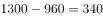元。超出1300元部分自付，第二次超过1300元的部分支付了元，所以超过1300元的部分的总额为元。第二次共收费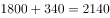元。

故正确答案为C。

---

### 第 2 题　qid 2274470 · 数学运算

池中原有一定量的水，如果用一台抽水机向池内灌水，6小时可灌至半满；如用3台抽水机灌水，8小时可灌满。如将池中水排空，用4台抽水机灌水几小时能灌满？

- **A**. 6
- **B**. 7
- **C**. 8
- **D**. 9　✅

**答案**：D

**官方解析**

设每台抽水机每小时灌水量为1，且池中原有水量为。根据题意可得：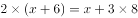，解得。则水池灌满的总水量为。如将池中水排空，4台抽水机需要小时才能灌满。

故正确答案为D。

---

### 第 3 题　qid 2274471 · 数学运算

2018年父亲年龄是女儿年龄的6倍，是母亲年龄的1.2倍。已知女儿出生当年（按0岁计算）母亲24岁，则哪一年父母年龄之和是女儿的4倍？

- **A**. 2036
- **B**. 2039　✅
- **C**. 2042
- **D**. 2045

**答案**：B

**官方解析**

根据题意，设2018年女儿的年龄为，则女儿、父亲、母亲2018年和年之后的年龄情况如下：

由“女儿出生当年（按0岁计算）母亲24岁”，结合年龄差不变，可知女儿岁时与母亲差24岁，即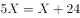，解得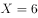。若年之后父母年龄之和是女儿的4倍，则有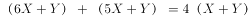，把代入，解得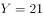。2018年的21年之后，是年。

故正确答案为B。

---

### 第 4 题　qid 2274472 · 数学运算

某供货商为X个超市配送一批促销品。如果每个超市分5箱，则有1个超市分不到促销品，另1个超市只能分2箱。如果促销品数量增加，则正好够每个超市分7箱。则在原始基础上至少增加多少箱促销品，才够每个超市分9箱？

- **A**. 84
- **B**. 94
- **C**. 104　✅
- **D**. 114

**答案**：C

**官方解析**

由题意知超市个数为，设原始促销品箱数为，根据题意可得方程组：

联立①②求解可得，。则若要每个超市分9箱促销品，需要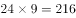箱。在原始基础上至少增加箱。

故正确答案为C。

---

### 第 5 题　qid 2274473 · 数学运算

录入员小张和小李需要合作完成一项录入任务，这项任务小李一人需要8小时，小张一人需要10小时。两人在共同工作了3个小时后，小李因故回了趟家，期间小张一直在工作，小李返回后两个人又用了1个小时就完成了任务。在完成这项任务的过程中，小张比小李多工作了几个小时？

- **A**. 1　✅
- **B**. 1.5
- **C**. 2
- **D**. 2.5

**答案**：A

**官方解析**

根据题意，小张比小李多工作的时间即为小李中途回家往返所用时间，设工程总量为40（8和10的最小公倍数），则小李效率为，小张效率为，设小李中途回家花费小时，可得，解得。

故正确答案为A。

---

### 第 6 题　qid 2274474 · 数学运算

某单位原拥有高级职称的职工占职工总数的。现又有1名职工评上了高级职称，并调入2名具有高级职称的职工，拥有高级职称的人数占总人数比重上升了7.5个百分点。该单位要想在不调入更多人的前提下，使得拥有高级职称的员工占比超过，则至少还需要有多少人评上高级职称？

- **A**. 4
- **B**. 5　✅
- **C**. 6
- **D**. 7

**答案**：B

**官方解析**

设该单位原有职工总数为，则原拥有高级职称的职工数为，根据题意可得：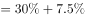，解得，此时拥有高级职称的职工数为人，总职工数为人。在不调入更多人的前提下即总职工数不增加的前提下，要想拥有高级职称的员工占比超过，即超过人，至少为17人，则题目所求为人。

故正确答案为B。

---

### 第 7 题　qid 2274475 · 数学运算

小王和小张分别于早上8：00和8：30从甲地出发，匀速骑摩托车前往乙地。10：00小王到达两地的中点丙地，此时小张距丙地尚有5千米。11：00时小张追上小王。则甲、乙两地相距多少千米？

- **A**. 50
- **B**. 75
- **C**. 90
- **D**. 100　✅

**答案**：D

**官方解析**

根据题意，11：00时小张追上小王，两人起点相同，因此路程相同。根据公式：，当路程一定时，速度与时间成反比。小张8：30出发，骑行时间为2.5小时，小王8：00出发，骑行时间为3小时。则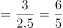。设，。

计算a的数值可以有两种方法：

方法一：10：00时，小王到达丙地，小张距离丙地还有5千米，即小张骑行1.5小时的路程比小王骑行2小时少5千米，因此，解得千米/小时。

方法二：10：00时，小王到达丙地，小张距离丙地还有5千米，11：00时，小张追上小王。即1小时小张比小王多骑行5千米。，即千米/小时。

小王骑行2小时，走了甲乙两地距离的一半，因此甲乙两地相距：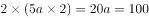千米。

故正确答案为D。

---

### 第 8 题　qid 2274477 · 数学运算

右图中ABCD为边长10米的正方形路线，E为AD中点，F为与B相距3米的BC上一点，从E点到F点有小路EGHF，小路的每一段都与AB垂直或平行，且GH相距2米。甲经EABF从E点匀速运动到F点用时9秒，则其以相同速度经EGHF从E点匀速运动到F点用时多少秒？

- **A**. 12
- **B**. 10
- **C**. 9
- **D**. 8　✅

**答案**：D

**官方解析**

根据题意可知，正方形边长为10米，E为边AD的中点，因此AE=ED=5 米。甲经EABF从E点匀速运动到F点用时9秒，经过路程=EA+AB+BF=5+10+3=18米，则甲行进速度米/秒。

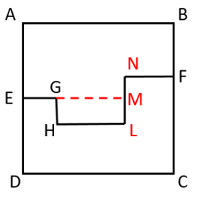

如图所示，延长EG交NL于点M，因为小路的每一段都与AB垂直或者平行，所以EG+HL+NF=AB=10米，GH=LM=2米,MN=AE-BF=5-3=2米。则甲以相同速度经EGHF从E点匀速运动到F点，所走路程=（EG+HL+NF）+GH+LM+MN=10+2+2+2=16米，所用时间秒。

故正确答案为D。

---

### 第 9 题　qid 2274479 · 数学运算

某工厂有甲、乙、丙3条生产线，每小时均生产整数件产品。其中甲生产线的效率是乙生产线的3倍，且每小时比丙生产线多生产9件产品。已知3条生产线每小时生产的产品之和不到100件且为质数，则乙生产线每小时最多可能生产多少件产品？

- **A**. 14　✅
- **B**. 12
- **C**. 11
- **D**. 8

**答案**：A

**官方解析**

题干告知甲、乙效率关系以及甲、丙效率关系，且问乙生产线每小时最多可能生产多少件产品，考虑从大到小进行代入验证。

代入A项：若乙生产线每小时生产14件，则甲生产线每小时生产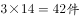，丙生产线每小时生产，三条生产线每小时生产，89不到100且为质数，满足题意。

单选题代入排除时，确认某项正确则无需验证剩余选项。

故正确答案为A。

---

### 第 10 题　qid 2274481 · 数学运算

某学校有一笔信息化预算，用这笔预算正好可以购买16部台式电脑，或者台式电脑、笔记本电脑和投影机各4台。已知2台笔记本电脑的价格等于1部台式电脑和1部投影机的价格之和，则用这笔预算购买笔记本电脑和投影机且必须全部花完，最多可以买几台投影机？

- **A**. 5
- **B**. 8　✅
- **C**. 10
- **D**. 13

**答案**：B

**官方解析**

设台式电脑价格元，笔记本电脑价格元，投影机元。则有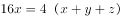，，联立方程可得：，。赋值为3，则，。则。现计划用这笔预算购买笔记本电脑和投影机且必须全部花完，设购买了笔记本电脑台，投影机台，则有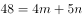。根据奇偶性原则，应为不大于的偶数。当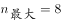时，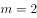，符合题意。即最多可以购买8台投影机。

故正确答案为B。

---

### 第 11 题　qid 2274482 · 数学运算

某企业有甲和乙两个研发部门。其中甲部门有的员工有海外留学经历，乙部门有的员工有海外留学经历。已知甲部门员工比乙部门多20人，则两个研发部门最少可能有多少人没有海外留学经历？

- **A**. 132
- **B**. 146　✅
- **C**. 160
- **D**. 174

**答案**：B

**官方解析**

根据“······最少可能有多少人······”可知，甲乙两部门员工数应尽可能的少。甲部门海外留学员工人数，乙部门，则甲、乙两部门总人数应分别是20、25的倍数。有：

当乙部门人数为25人时，，不是20的倍数，排除；

当乙部门人数为50人时，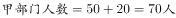，不是20的倍数，排除；

当乙部门人数为75人时，，不是20的倍数，排除；

当乙部门人数为100人时，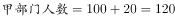人，是20的倍数，满足。

则甲部门120人，其中海外留学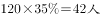，乙部门100人，其中海外留学，两个研发部门最少有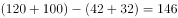人没有海外留学经历。

故正确答案为B。

---

### 第 12 题　qid 2274487 · 数学运算

有一个六面体如右图所示，六个面上分别写着1、2、3、4、5、6六个数字，其顶面为A，四个侧面分别为B、C、D、E，底面为F。A、B和C上的数字之和为，A、D、E上的数字之和为。已知，则A面和F面的数字之和为

- **A**. 9
- **B**. 8
- **C**. 7　✅
- **D**. 6

**答案**：C

**官方解析**

根据题意，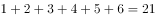，，两式相减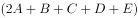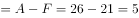，6个数字中两数相减为5的只有符合要求。故A面为6，F面为1，A面和F面数字之和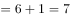。

故正确答案为C。

---

### 第 13 题　qid 2274488 · 数学运算

机关运动会上，来自3个单位的参赛者正好站成、到共9个方阵，且每个方阵的人都来自同一个单位。已知来自甲单位的人组成了1个方阵，来自乙单位的人组成了6个方阵，且乙单位的参赛者正好是丙单位的2倍。则乙单位有多少名参赛者？

- **A**. 108
- **B**. 136　✅
- **C**. 166
- **D**. 184

**答案**：B

**官方解析**

根据题意，每个方阵人数分别为：1、4、9、16、25、36、49、64、81，丙单位参赛者组成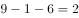个方阵。乙单位的参赛者正好是丙单位的2倍，代入选项，逐一验证：

A项，若乙单位参赛者108人，则丙为54人，验证可知任何两个方阵的人数和都不是54，排除；

B项，若乙单位136人，则丙为68人，，故64人和4人这两个方阵属于丙，甲方阵人数为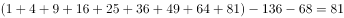，满足条件，当选；

C项，若乙单位166人，则丙为83人，验证可知任何两个方阵的人数和都不是83，排除；

D项，若乙单位184人，则丙为92人，验证可知任何两个方阵的人数和都不是92，排除。

故正确答案为B。

---

### 第 14 题　qid 2274489 · 数学运算

某次知识竞赛的决赛有3人参加，共有12道题。规则为每题由1人以抢答方式答题，其余2人不作答。每道题正确得8分，错误扣10分。如所有人均回答了问题，且得分均为正数，则3人得分之和的最小值：

- **A**. 低于10分
- **B**. 在10～15分之间
- **C**. 在16～20分之间
- **D**. 高于20分　✅

**答案**：D

**官方解析**

根据条件，每答对1题得8分，答错1题扣10分，由于每人都答过题，因此要想每人得分为正数，则每人答对的题目数量一定大于答错的数量，即每个人答对的题目数比答错的至少多1道。三个人答对的总数比答错的总数至少多3道，由于一共12题，要求得分之和最少，只可能为答对8题，答错4题。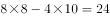分。

故正确答案为D。

---

### 第 15 题　qid 2274490 · 数学运算

早上7点之前，某小区门口停有100辆共享单车。7点开始，每20秒就有一辆共享单车被骑走。共享单车企业雇佣三轮车从附近的地铁站将无人使用的车辆拉到小区门口，7点拉来第一趟，往后每15分钟拉一趟，每趟拉来30辆共享单车。则下列哪个时间段会出现小区门口没有共享单车的情况？（不存在共享单车损坏和被骑来小区门口的情况）

- **A**. 8点21分至25分
- **B**. 8点36分至40分
- **C**. 8点41分至45分　✅
- **D**. 8点46分至50分

**答案**：C

**官方解析**

根据题意，7点时，小区门口共辆共享单车，每15分钟骑走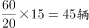，拉来30辆，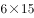分钟后即8点30分，剩余，需要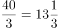分钟全部骑走，此时下一趟车（8点45分）还未拉来，故小区门口没有共享单车的情况出现在8点41分至45分时间段内。

故正确答案为C。

---

## 判断推理

### 第 1 题　qid 2274540 · 图形推理

此题包含两套图形和可供选择的4个图形。这两套图形具有某种相似性，也存在某种差异。要求你从四个选项中选择最适合取代问号的一个。正确的答案应不仅使两套图形表现出最大的相似性，而且使第二套图形也表现出自己的特征。

- **A**. A
- **B**. B　✅
- **C**. C
- **D**. D

**答案**：B

**官方解析**

元素组成不同，优先考虑属性规律。第一组图中均为轴对称图形，对称轴的数量分别为1、2、4；第二组图前两个图也均为轴对称图形，对称轴的数量分别为1、2，因此？处应选4条对称轴的图形。A项为中心对称图形无对称轴，排除；B项4条对称轴，当选；C项2条对称轴，排除；D项不是对称图形，排除。
故正确答案为B。

---

### 第 2 题　qid 2274542 · 图形推理

此题包含两套图形和可供选择的4个图形。这两套图形具有某种相似性，也存在某种差异。要求你从四个选项中选择最适合取代问号的一个。正确的答案应不仅使两套图形表现出最大的相似性，而且使第二套图形也表现出自己的特征。

- **A**. A
- **B**. B
- **C**. C
- **D**. D　✅

**答案**：D

**官方解析**

元素组成不同，无明显属性规律，考虑数量规律。观察发现，题干图形被分割成多个封闭区域，考虑面数量。第一组图形中的面数量都是4，且都是三角形的面；第二组图形中面数量都是5，且都是四边形的面，因此？处应选5个四边形面的图形。A项3个四边形的面，2个三角形的面，排除；B项4个四边形的面，1个三角形的面，排除；C项5个三角形的面，排除；D项5个四边形的面，当选。
故正确答案为D。

---

### 第 3 题　qid 2274546 · 图形推理

请从四个选项中选出最恰当的一项填在问号处，使图形呈现一定的规律性：

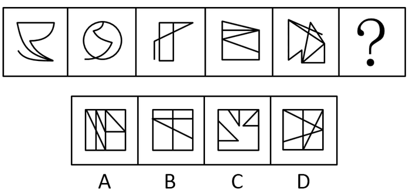

- **A**. A　✅
- **B**. B
- **C**. C
- **D**. D

**答案**：A

**官方解析**

元素组成不同，无明显属性规律，考虑数量规律。观察可知，图1、图2、图3、图5均出现端点，考虑笔画数，题干每个图形都有2个奇点，都是一笔画图形，则？处应选一笔画图形。A项有2个奇点，一笔画，当选；B项有4个奇点，两笔画，排除；C项有6个奇点，三笔画，排除；D项有4个奇点，两笔画，排除。
故正确答案为A。

---

### 第 4 题　qid 2274549 · 图形推理

请从四个选项中选出最恰当的一项填在问号处，使图形呈现一定的规律性： 

- **A**. A　✅
- **B**. B
- **C**. C
- **D**. D

**答案**：A

**官方解析**

元素组成不同，无明显属性规律，考虑数量规律，题干都有3条直线，但选项也都有3条直线，选不出唯一答案，并且没有其他数量规律。继续观察发现，题干和选项均有3条直线，并且其中均至少有1条横线和1条竖线，考虑位置规律。如下图所示，图1的横线（a）依次向下移动1格，则？处应该移动到竖线的位置2，排除C、D项。图1的竖线（b）依次向右移动1格，则？处应该移动到横线的位置4，只有A项符合。

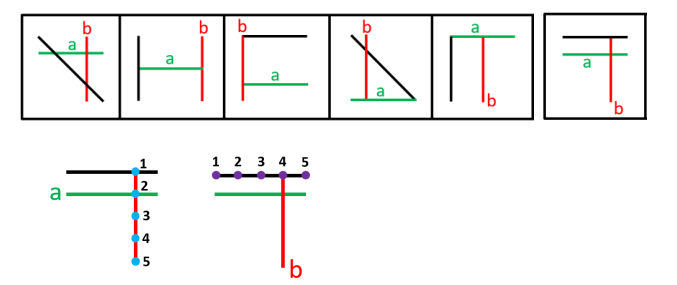

故正确答案为A。

---

### 第 5 题　qid 2274550 · 图形推理

请从四个选项中选出最恰当的一项填在问号处，使图形呈现一定的规律性：

- **A**. A
- **B**. B
- **C**. C
- **D**. D　✅

**答案**：D

**官方解析**

元素组成不同，属性无规律，考虑数量规律。图形均由直线组成，但直线数量没有规律。继续观察图形发现，图形中的起始线和结束线为平行关系，且两条线的走向是相反的（如下图所示），B、C两项的起始线和结束线不平行，排除；A项起始线和结束线的走向一致，排除；D项起始线和结束线的走向相反，当选。

故正确答案为D。

---

### 第 6 题　qid 2274554 · 逻辑判断

在所有小说中，与《傲慢与偏见》比起来，小波更爱读《教父》，而他最爱读的小说是《福尔摩斯探案全集》，最不爱读的是《罪与罚》。与《傲慢与偏见》相比，小波更不爱读《飘》。
以下除哪项外，均可由上述陈述推出？

- **A**. 比起《堂吉诃德》，小波更爱读《福尔摩斯探案全集》
- **B**. 比起《飘》，小波更不爱读《罪与罚》
- **C**. 比起《飘》，小波更爱读《教父》
- **D**. 比起《傲慢与偏见》，小波更爱读《茶花女》　✅

**答案**：D

**官方解析**

第一步：分析题干条件。
根据题干将小波读的书按照从爱读到不爱读的顺序排列如下：
①《教父》＞《傲慢与偏见》
②最爱读《福尔摩斯探案全集》，最不爱读《罪与罚》
③《傲慢与偏见》＞《飘》。
将①、②与③合并为④：《福尔摩斯探案全集》＞《教父》＞《傲慢与偏见》＞《飘》＞《罪与罚》
第二步：逐一分析选项。
A项：选项中《福尔摩斯探案全集》＞《堂吉诃德》，由条件②可知，《福尔摩斯探案全集》是小波最爱读的小说，可以推出，排除；
B项：选项中《飘》＞《罪与罚》，由条件②可知，《罪与罚》是小波最不爱读的小说，可以推出，排除；
C项：选项中《教父》＞《飘》，与条件④一致，可以推出，排除；
D项：选项中《茶花女》＞《傲慢与偏见》，题干没有提及《茶花女》，根据题干已知条件，推不出该选项成立，无法推出，当选。
本题为选非题，故正确答案为D。

---

### 第 7 题　qid 2274555 · 逻辑判断

有研究人员指出：“有些职业，比如像写作、音乐创作、设计、策划、广告文案等，其从业人员的创意灵感往往出现在深夜。”
以下哪项如果为真，不能对该研究人员的观点提供支持？

- **A**. 
历史上那些最具创意头脑的人，有很多是“夜猫子”。比如，席勒、福楼拜、普鲁斯特等人几乎一辈子都在深夜工作

- **B**. 
夜深人静时，忙碌紧张了一天的人们放松下来，大脑更能天马行空地发挥想象力，于是创意喷涌而出

- **C**. 
有研究者记录了150多位大作家和大艺术家的生活作息，其中按正常时间作息的占了大多数，只有26位是“夜猫子”
　✅
- **D**. 
音乐家对灵感的依赖非常强烈，一项针对美国音乐行业从业者的调查显示，“夜猫子”的比例达到以上

**答案**：C

**官方解析**

第一步：找出论点和论据。

论点：有些职业，比如像写作、音乐创作、设计、策划、广告文案等，其从业人员的创意灵感往往出现在深夜。

论据：无。

第二步：逐一分析选项。

A项：历史上那些最具创意头脑的人，很多都是夜猫子，在深夜工作，通过“最具创意头脑的人”举例支持了“创意灵感往往出现在深夜”，补充论据，可以加强，排除；

B项：夜深人静时，忙碌紧张的人们能够放松下来，大脑更能天马行空的发挥想象力，创意喷涌而出，解释了创意灵感往往出现在深夜的原因，补充论据，可以加强，排除；

C项：150多位大作家和大艺术家的生活作息中，正常作息的占了大多数，只有26位是“夜猫子”，可见创意灵感并非往往出现在深夜，无法加强，当选； 

D项：音乐行业从业者夜猫子的比例达到以上，通过举例支持了“创意灵感往往出现在深夜”，补充论据，可以加强，排除。

本题为选非题，故正确答案为C。

---

### 第 8 题　qid 2274560 · 逻辑判断

青海湖的湟鱼是一种珍稀鱼类，但自上世纪50年代，人们开始大量捕捞湟鱼，导致湟鱼资源量由最初的32万吨，按平均每年0.4万吨的速度减少，至2013年，湟鱼资源量仅为6.8万吨。某专家认为，照此速度，青海湖的湟鱼再过十几年就会灭绝。
以下哪项如果为真，最能反驳该专家的观点？

- **A**. 《中国物种红色名录》已将湟鱼列为濒危物种，并采取多项措施进行了有效保护　✅
- **B**. 虽然一次性盗捕湟鱼50公斤以上就会构成犯罪，但盗捕者仍在增加
- **C**. 一条两斤左右的湟鱼能卖到上百元，这使很多捕鱼者把捕鱼目标瞄向湟鱼
- **D**. 刚刚过去的一年，青海湖的湟鱼减少量为0.3万吨

**答案**：A

**官方解析**

第一步：找出论点和论据。
论点：按平均每年0.4万吨的速度减少，青海湖的湟鱼再过十几年就会灭绝。
论据：自上世纪50年代，人们开始大量捕捞湟鱼，导致湟鱼资源量由最初的32万吨，按平均每年0.4万吨的速度减少，至2013年，湟鱼资源量仅为6.8万吨。
第二步：逐一分析选项。
A项：既然已经对湟鱼这种濒危物种采取了有效保护，那么湟鱼就不会灭绝，削弱了论点，可以削弱，当选；
B项：指出盗捕者仍在增加，说明更多的人参与盗捕，补充了论据，无法削弱，排除；
C项：指出很多捕鱼者把目标瞄向湟鱼，解释了湟鱼减少的原因，补充了论据，不能削弱，排除； 
D项：只论述了刚刚过去的一年湟鱼减少量比预计少，但无法证明之后湟鱼是否会灭绝，不明确选项，不能削弱，排除。
故正确答案为A。

---

### 第 9 题　qid 2274562 · 逻辑判断

蝙蝠体内携带大量的病毒，会给人类和其他动物造成致命危险，但蝙蝠自身仿佛不受这些病毒的影响，为什么呢？科学家认为这或许与蝙蝠是唯一一种能够飞行的哺乳动物有关。蝙蝠在上亿年适应飞行的进化过程中，它们的很多系统发生了变化，包括防御和免疫系统。一般来说，人类和其他动物机体的免疫反应有助于身体抵御病毒，但对某种病毒的过度免疫反应又有可能引发严重疾病，而蝙蝠的免疫系统恰恰能在与病毒共生的过程中达到一种平衡。
以下推论中，正确的一项是

- **A**. 蝙蝠是一种最为古老的哺乳动物的物种，迄今有上亿年的进化历史
- **B**. 蝙蝠机体的免疫系统会抵御病毒侵袭，又不会引发过度强烈的免疫反应　✅
- **C**. 蝙蝠作为一种古老的生物，已经进化出可以防御各种病毒的超级基因
- **D**. 蝙蝠可以飞行是其能大规模广泛传播致命病毒的最重要的原因

**答案**：B

**官方解析**

日常结论题，根据题干信息逐一分析选项。
A项：根据题干第三句话可知，蝙蝠存在了上亿年，但题干没有说蝙蝠是最为古老的哺乳动物的物种，无中生有，无法推出，排除；
B项：根据最后一句话可知，人类和其他动物机体对某种病毒的过度免疫反应有可能引发严重疾病，但蝙蝠的免疫系统能在与病毒共生的过程中达到一种平衡，也就说明蝙蝠的免疫系统既能抵御病毒，又不会引发过度强烈的免疫反应，可以推出，当选；
C项：题干中并没有提到蝙蝠已经进化出可以防御各种病毒的超级基因，无中生有，无法推出，排除；
D项：题干只提到蝙蝠体内携带大量的病毒，会给人类和其他动物造成致命危险，但没有提到蝙蝠传播病毒的最重要的方式原因，无中生有，无法推出，排除。
故正确答案为B。

---

### 第 10 题　qid 2274565 · 逻辑判断

开车是一项有风险的交通行为，驾驶员行车时的心理、生理和行为特性对驾驶安全影响很大，往往决定着潜在事故是否可能发生。研究认为，女驾驶员对复杂交通环境的辨别能力低，且在应激环境下反应不如男性积极，对突发事件不能应付。此外，男女驾驶员还有显著的身体条件方面的差异，视野、体力、空间能力等方面，男女间的平均差距都相当明显。由此，有人提出，相比男司机，女司机确实更有“马路杀手”的一面，即更容易造成严重的交通事故。
以下各项如果为真，哪项不能驳斥上述观点？

- **A**. 女司机造成重大事故的几率远低于男司机，女司机肇事事故中死亡人数约为男司机的1/50
- **B**. 相比男司机，女司机拥有更为良好的驾驶习惯，也更加注重不要超速，有利于行车安全
- **C**. 领取驾驶证的女司机数量虽多，但真正开车的人并不多，以北京为例，男女司机的比例为7：3　✅
- **D**. 平均来说，同样里程的驾驶，男司机负全责的交通事故的发生率要远高于女司机

**答案**：C

**官方解析**

第一步：找出论点和论据。
论点：相比男司机，女司机更容易造成严重的交通事故。
论据：女驾驶员对复杂交通环境的辨别能力低，且在应激环境下反应不如男性积极，对突发事件不能应付。此外，男女驾驶员还有显著的身体条件方面的差异，视野、体力、空间能力等方面，男女间的平均差距都相当明显。
本题为削弱选非题，排除可以削弱的选项，选择剩下的选项即可。
第二步：逐一分析选项。
A项：说明女司机造成重大事故的几率和肇事事故死亡人数远低于男司机，则不容易造成严重的交通事故，可以削弱，排除；
B项：说明女司机有更好的驾驶习惯，有利于行车安全，则不容易造成严重的交通事故，可以削弱，排除；
C项：题干讨论女司机更易造成严重的交通事故，该项讨论开车的女司机数量少，话题不一致，不能削弱，当选；
D项：说明男司机负全责的交通事故发生率更高，则男司机更易造成交通事故，可以削弱，排除。
本题为选非题，故正确答案为C。

---

### 第 11 题　qid 2274568 · 逻辑判断

75年前一头驯鹿因感染炭疽死亡后尸体保存在北极圈附近的冻土中，不久前附近的一名男童因感染炭疽死亡。有科学家推测，全球变暖使得北极圈的“永久冻土”开始融化，炭疽杆菌因此卷土重来。同时，一些“古老病毒”比如天花和黑死病的病原体也可能埋藏在这些永久冻土中。科学家正为此极度担忧。
以下陈述如果为真，哪项最有助于为科学家解忧？

- **A**. 永久冻土是细菌长期保持活力的最理想场所，时间也许可以长达一百万年
- **B**. 人类与细菌和病毒一直并存，如黑死病和天花，人类已进化出对抗它们的基因　✅
- **C**. 全球变暖让北半球国家变得更温暖，诸如疟疾等热带疾病开始发生于北半球
- **D**. 如果病原体长时间没有接触到人类，那么我们的免疫系统对它不会有所防备

**答案**：B

**官方解析**

第一步：找出论点和论据。
论点：全球变暖使得北极圈的“永久冻土”开始融化，炭疽杆菌因此卷土重来。同时，一些“古老病毒”比如天花和黑死病的病原体也可能埋藏在这些永久冻土中。
论据：75年前一头驯鹿因感染炭疽死亡后尸体保存在北极圈附近的冻土中，不久前附近的一名男童因感染炭疽死亡。
第二步：逐一分析选项。
A项：题干讨论的是埋藏在冻土中的病菌是否会卷土重来，该项讨论的是细菌保持活力的时长，话题不一致，无关选项，排除；
B项：说明人类有了对抗黑死病和天花的基因，即使病毒卷土重来，也不需要担忧，削弱了题干论点，当选；
C项：题干讨论的是埋藏在冻土中的病菌是否会卷土重来，该项讨论的是北半球开始发生热带疾病，话题不一致，无关选项，排除；
D项：说明人类的免疫系统对长时间没有接触到的病原体不会有所防备，即这些病毒卷土重来可能会对人类造成伤害，具有一定的加强作用，不能削弱，排除。
故正确答案为B。

---

### 第 12 题　qid 2274570 · 逻辑判断

马兰：因为赵老师的课讲得特别好，学生都很喜欢他，所以他有资格参加学校十佳教师评选。
李溪：因为赵老师曾上课迟到造成教学事故，他不是合格的教师。所以，他没有资格参加学校十佳教师评选。
李溪的论证使用了以下哪项作为前提？
Ⅰ.有些课讲得好的老师发生过教学事故
Ⅱ.凡有过教学事故的教师都不是合格教师
Ⅲ.只有合格教师才有参评学校十佳教师的资格

- **A**. 仅Ⅰ
- **B**. 仅Ⅱ
- **C**. 仅Ⅲ
- **D**. Ⅱ和Ⅲ　✅

**答案**：D

**官方解析**

第一步：找出论点和论据。
论点：赵老师没有资格参加学校十佳教师评选。
论据：因为赵老师曾上课迟到造成教学事故，他不是合格的教师。
第二步：逐一分析选项。
I：在李溪的论证中并没有提到课讲得好这一话题，因此不是李溪论证成立的前提，无关选项，错误；
II：指出有教学事故的老师都不是合格教师，是论据成立的前提，即也是李溪论证成立的前提，正确；
III：说明不合格的老师就没有资格参加学校十佳教师的评选，建立了题干论点和论据之间的联系，是李溪论证成立的前提，正确。
故正确答案为D。

---

### 第 13 题　qid 2274572 · 逻辑判断

蛋黄含有较多的胆固醇，有的人害怕胆固醇高，不敢吃蛋黄。近期一篇涉及50万中国人、随访时长近9年的研究报告提出，每天吃鸡蛋的人比起那些基本不吃鸡蛋的人，心血管事件风险降低，心血管事件死亡风险降低，尤其是出血性中风风险降低了，相应的死亡风险则降低了。考虑到脑中风是我国居民第一大死因，研究者提出，每天吃一个鸡蛋有利于心血管健康。

以下各项如果为真，哪项最能支持研究者的观点？

- **A**. 
来自日本的一项涉及4万人的追踪研究中，每天吃鸡蛋的人比起不吃鸡蛋的人，全因死亡率低了

- **B**. 
鸡蛋的营养十分丰富，钙、磷、铁、维生素A、维生素B的含量都比较高

- **C**. 
食物摄入胆固醇并不等于血胆固醇水平，且鸡蛋中含有的卵磷脂能有效阻止胆固醇和脂肪在血管壁上的沉积
　✅
- **D**. 
每天吃鸡蛋的人，教育水平和家庭收入都更高，饮食更加健康，生活更自律，更有可能补充维生素

**答案**：C

**官方解析**

第一步：找出论点和论据。

论点：每天吃一个鸡蛋有利于心血管健康。

论据：每天吃鸡蛋的人比起那些基本不吃鸡蛋的人，心血管事件风险降低，心血管事件死亡风险降低，尤其是出血性中风风险降低了，相应的死亡风险则降低了。

论点和论据均在讨论“每天吃鸡蛋有利于心血管健康”，话题一致，加强优先考虑补充论据，即解释原因和举例加强。

第二步：逐一分析选项。

A项：在日本的研究中说明，吃鸡蛋可以有效降低全因死亡率，但无法确定是否降低了心血管事件的死亡率，不能加强，排除；

B项：指出鸡蛋中营养丰富，但未提及是否有利于心血管健康，属于无关项，不能加强，排除；

C项：指出鸡蛋中含有的卵磷脂能有效阻止胆固醇和脂肪在血管壁上沉积，解释了为什么吃鸡蛋有利于心血管健康，解释原因，可以加强，当选；

D项：说明每天吃鸡蛋的人教育水平和家庭收入更高，饮食更健康，生活更自律，更有可能补充维生素，即可能存在其他原因导致心血管事件死亡率降低，属于他因削弱，不能加强，排除。

故正确答案为C。

---

### 第 14 题　qid 2274573 · 逻辑判断

某次足球比赛前，甲、乙、丙、丁四位运动员猜测他们的上场情况。
甲：我们四人都不会上场；
乙：我们中有人会上场；
丙：乙和丁至少有一人上场；
丁：我会上场。
四人中有两人猜测为真两人猜测为假，则以下哪项断定成立？

- **A**. 猜测为真的是乙和丙　✅
- **B**. 猜测为真的是甲和丁
- **C**. 猜测为真的是甲和丙
- **D**. 猜测为真的是乙和丁

**答案**：A

**官方解析**

本题属于真假推理题。
第一步：找出题干矛盾命题。
甲：我们四人都不会上场；
乙：我们中有人会上场；
丙：乙或丁；
丁：丁。
甲说“我们四人都不会上场”和乙说“我们中有人会上场”是矛盾关系，则必有一真必有一假。已知四人中有两人猜测为真两人猜测为假，说明丙和丁的猜测也必然是一真一假。
第二步：看其余。
假设丁的猜测为真，则丁会上场，而“丁”为“乙或丁”的其中一项，此时丙的猜测也一定为真，那么丙、丁的猜测均为真，与题干要求的一真一假矛盾，故丁的猜测一定为假，即丁不会上场，则丙的猜测为真，说明乙或丁会上场，既然丁不会上场，那么上场的为乙，也就是说四个人中有人会上场，则乙的猜测为真，甲的猜测为假，即猜测为真的是乙和丙。
故正确答案为A。

---

### 第 15 题　qid 2274576 · 逻辑判断

秋冬时节感冒多发，预防感冒的小技巧很受关注。网上一直流传：放置一颗洋葱在房间里，可以预防感冒，因为洋葱挥发出的含硫化合物有抑菌抗癌的作用，可净化室内空气。因此，在室内放几个切去两端的洋葱，就可以有效预防感冒。
以下各项如果为真，哪项最能驳斥以上观点？

- **A**. 
洋葱所含硫化物对肠道的细菌有一定抑制作用，但需要每天口服一定的量

- **B**. 
人类所患感冒中的感冒是由病毒引起的，洋葱对病毒是没有抑制作用的
　✅
- **C**. 
实验证明，室内放置洋葱1小时后，室内细菌总数没有显著减少

- **D**. 
现有研究尚未发现食物可以有效吸附病菌和病毒

**答案**：B

**官方解析**

第一步：找出论点和论据。

论点：在室内放几个切去两端的洋葱，就可以有效预防感冒。

论据：洋葱挥发出的含硫化合物有抑菌抗癌的作用，可净化室内空气。

论据论据均在讨论“洋葱可以预防感冒”，话题一致，削弱优先考虑削弱论点。

第二步：逐一分析选项。   

A项：论点说的是洋葱可以有效预防感冒，该项说的是洋葱可以抑制肠道的细菌，抑制肠道的细菌与能否预防感冒无关，话题不一致，无法削弱，排除；

B项：论点说的是洋葱可以有效预防感冒，该项说的是的感冒是由病毒引起的，洋葱对病毒没有抑制作用，说明洋葱无法预防感冒，直接削弱了题干论点，当选；

C项：该项说的是室内细菌总数没有显著减少，即细菌总数减少的不明显，但细菌数量还是有减少的，具有一定的加强作用，无法削弱，排除；

D项：该项说的是现有研究尚未发现食物可以有效吸附病菌和病毒，但事实上食物到底能否有效吸附病菌并未说明，属于不明确项，排除。

故正确答案为B。

---

### 第 16 题　qid 2274491 · 逻辑判断

近视的原因是什么？某国的研究者跟踪了500多名8-9岁视力正常的儿童，五年后发现，唯一和患近视相关的环境因素是儿童在户外的时间。而且，孩子的近视确实和在户外的时长有关，无论孩子们在户外是在锻炼、野餐，还是只是在海滩上读书。由此研究者认为，导致近视更重要的原因可能是眼睛是否处在明亮光线下，光照可以保护眼睛。
以下各项如果为真，哪项最能支持以上观点？

- **A**. 
那些在户外待得更久的孩子并没有减少看书本、看屏幕或进行近距离学习的时间，有些孩子在户外看书和电子屏的时间非常长
　✅
- **B**. 
与在一般室内光照环境下生长的鸡相比，处于与户外光照相当的高光照水平下的鸡，实验诱发的近视发生减缓约，恒河猴中也发现了类似效应

- **C**. 
视网膜按照昼夜节律产生多巴胺，使得眼球可以从夜间视觉切换到白昼视觉。白天室内昏暗的光照下，视网膜的周期会被扰乱，影响到眼球发育

- **D**. 
某学校要求孩子们每天共80分钟的课间时间全到户外去，不许留在室内。一年后，的孩子被诊断为近视，而附近一所学校同龄孩子的近视率是

**答案**：A

**官方解析**

第一步：找出论点和论据。

论点：导致近视更重要的原因可能是眼睛是否处在明亮光线下，光照可以保护眼睛。

论据：某国的研究者跟踪了500多名8-9岁视力正常的儿童，五年后发现，唯一和患近视相关的环境因素是儿童在户外的时间。而且，孩子的近视确实和在户外的时长有关，无论孩子们在户外是在锻炼、野餐，还是只是在海滩上读书。

第二步：逐一分析选项。

A项：该项强调待在户外的孩子看书和看电子屏的时间比较长，排除了其他干扰因素的影响，为论点成立的必要条件，保留；

B项：高光照水平下的鸡和恒河猴的近视发生率减缓了，这两类动物的例子说明光照确实可以保护这两类动物的眼睛，但整个题干讨论的都是人的近视，动物的结论可能适用于人类，类比加强，但加强力度比较弱，保留；

C项：该项讨论的是白天视网膜对眼球的影响，但是该影响是否能导致近视不明确，属于不明确项，无法加强，排除； 

D项：指出某学校每天去户外80分钟的孩子一年之后被诊断为近视，而附近的学校同龄孩子近视率是，但是附近的学校孩子是否每天去户外活动不明确，为不明确项，无法加强，排除。

比较A、B两项，A项补充必要条件的力度大于B项的类比加强，所以排除B项。

故正确答案为A。

---

### 第 17 题　qid 2274492 · 类比推理

若在一墓穴中发掘出墓主的印章和墓志铭，就能确定该墓穴是墓主的真墓。在西高穴大墓中，没有发掘出曹操的印章和墓志铭。故西高穴大墓不是真的曹操墓。
以下哪项的论证方式与题干最为类似？

- **A**. 若在墓穴中发现刻有“魏武王”之类字样的随葬品，就能说明那个墓穴是曹操的。在西高穴大墓中发现了刻有“魏武王常用格虎大戟”的石碑等随葬品。故该墓是曹操墓
- **B**. 十八岁的人还没有面对过社会上的问题，而任何没有面对过这些问题的人不能够进行投票。所以，十八岁的人不能够进行投票
- **C**. 只有持有深水合格证，才能进入深水池。高亮没有深水合格证，所以，他不能进入深水池
- **D**. 如果我有翅膀，我就能飞翔。我没有翅膀，所以，我不能飞翔　✅

**答案**：D

**官方解析**

第一步：分析题干。

题干翻译为：“发掘出墓主的印章和墓志铭是墓主的真墓”，则“曹操的印章和墓志铭真的曹操墓”，可知题干的论证方式为否前推出否后。

第二步：逐一分析选项。

A项翻译为：“发现刻有‘魏武王’之类字样的随葬品墓穴是曹操的”，则“发现了刻有‘魏武王常用格虎大戟’的石碑等随葬品是曹操墓”，该项的论证方式为肯前推出肯后，与题干论证方式不一致，排除；

B项翻译为：“十八岁的人没有面对过社会上的问题，没有面对过这些问题的人不能够进行投票”，则“十八岁的人不能够进行投票”，与题干论证方式不一致，排除；

C项翻译为：“进入深水池持有深水合格证”，则“持有深水合格证进入深水池”，该项的论证方式为否后推出否前，与题干论证方式不一致，排除； 

D项翻译为：“有翅膀能飞翔”，则“翅膀飞翔”，该项的论证方式为否前推出否后，与题干论证方式一致，当选。

故正确答案为D。

---

### 第 18 题　qid 2274493 · 图形推理

宣称植物有意识、有感情的人，通常会引用美国人巴克斯特的实验。巴克斯特将一台测谎仪连在一盆植物的叶子上。这台测谎仪的设计原理是人在撒谎时，由于紧张，皮肤会出汗，导致皮肤电阻降低，通过测定皮肤电阻的变化可辨别人的情绪，进而判断人是否在撒谎。巴克斯特报告说，实验中当主试想到“我要烧掉那片叶子”时，测谎仪反应剧烈，指针猛然摆到了仪表的顶端并显示出连续的激烈波动，测谎仪绘制出类似于人在极度恐惧时会出现的图形。巴克斯特由此宣称：植物是有感情的。
以下哪项如果为真，最能驳斥以上观点？

- **A**. 即使是巴克斯特也不能稳定地重复该实验，而巴克斯特对实验成功与失败的解释难以令人信服
- **B**. 具有中枢神经系统的生物才有意识、有感情，植物没有任何神经系统　✅
- **C**. 巴克斯特所记录的测谎器曲线，可能是其他因素引起的，包括静电作用、房间里的机械振动、湿度的变化等
- **D**. 巴克斯特的实验设计不够科学，没有对照组，也不符合客观、双盲等科学实验的必要条件

**答案**：B

**官方解析**

第一步：找出论点和论据。
论点：植物是有感情的。
论据：巴克斯特报告说，实验中当主试想到“我要烧掉那片叶子”时，测谎仪反应剧烈，指针猛然摆到了仪表的顶端并显示出连续的激烈波动，测谎仪绘制出类似于人在极度恐惧时会出现的图形。
第二步：逐一分析选项。
A项：该项指出巴克斯特不能稳定地重复该实验，并且对实验的解释难以令人信服，说明该项实验做的不科学，否定论据，可以削弱，保留；
B项：该项指出具有中枢神经系统的生物才有意识，有感情，而植物没有任何神经系统，说明植物不具有意识，不具有感情，否定论点，可以削弱，保留；
C项：该项说的是测谎仪曲线可能是由其他的因素引起的，说明该项实验存在其他因素影响实验结果，导致实验数据记录可能不准确，否定论据，可以削弱，保留； 
D项：该项说的是巴克斯特的实验设计不够科学，不符合科学实验的必要条件，说明该项实验做的不科学，否定论据，可以削弱，保留。
比较A、B、C、D四个选项，因为削弱论点的力度大于削弱论据，所以B项削弱力度最强，排除A、C、D三项。
故正确答案为B。

---

### 第 19 题　qid 2274496 · 逻辑判断

细胞因为发生了基因突变，出现不受控制地增殖分化，最终发展成为恶性肿瘤。在癌细胞表面存在着许多由突变基因编码的异常蛋白，按理说，这些异常蛋白应该被机体免疫系统及时识别，并引发免疫反应将癌细胞一举清除。然而，由于肿瘤细胞发展迅速、极善伪装，而且不断突变，面对凶猛机智的肿瘤细胞，原本强大的免疫细胞也显得有些“力不从心”，甚至还会对一些肿瘤细胞“视而不见”。在肿瘤微环境中形成的免疫抑制，更是让免疫系统陷入“瘫痪”。
根据上述信息，下列研究除哪项外，可能有助于研发有效的抗肿瘤药物？

- **A**. 研究人员对每位患者的肿瘤细胞和健康细胞的DNA进行测序，以鉴定出肿瘤特异性突变，并确定相关的异常蛋白
- **B**. 科学家利用免疫疗法，试图改造对肿瘤细胞“不上心”的免疫T细胞，使其重返战场
- **C**. 科学家将恶性肿瘤患者和健康人的生活方式、个性特征进行对照研究，找出诱发肿瘤发病的风险因素　✅
- **D**. 科学家利用小鼠进行试验，将提取的肿瘤异常蛋白作为疫苗注射入小鼠体内，激发并增强其免疫反应

**答案**：C

**官方解析**

第一步：找出论点和论据。
论点：进行相关研究从而有助于研发有效的抗肿瘤药物。
论据：由于肿瘤细胞发展迅速、极善伪装，而且不断突变，面对凶猛机智的肿瘤细胞，原本强大的免疫细胞也显得有些“力不从心”，甚至还会对一些肿瘤细胞“视而不见”。在肿瘤微环境中形成的免疫抑制，更是让免疫系统陷入“瘫痪”。
第二步：逐一分析选项。
A项：该项说的是研究人员通过对每一位患者的肿瘤细胞和健康细胞的DNA测序，来鉴定出肿瘤特异突变并确定相关的异常蛋白，这种做法能够确定出异常蛋白，对研发有效的抗肿瘤药物是有帮助的，可以加强，排除；
B项：该项说的是科学家利用免疫疗法去改造对肿瘤细胞“不上心”的免疫T细胞，这种做法能够让T细胞重新发挥作用，识别肿瘤细胞，所以该项研究有助于研发抗肿瘤药物，可以加强，排除；
C项：该项说的将恶性肿瘤患者和健康人进行对照，找出发病的原因，而论点探讨的是怎么做能够帮助研发出抗肿瘤的药物，二者话题不一致，不能加强，当选；
D项：该项说的是科学家通过小鼠做实验，注射提取的肿瘤异常蛋白，激发并增强其免疫反应，这种做法是通过实验的形式来研究如何激发并增强免疫反应，故该项研究有助于研发有效的抗肿瘤药物，可以加强，排除。
本题为选非题，故正确答案为C。

---

### 第 20 题　qid 2274500 · 逻辑判断

某学院今年继续执行出国资助计划，拟从刘老师、张老师、王老师、马老师、牛老师、周老师6位教师中选派几位出国访学。由于受到资助经费、学院学科发展需要、课程安排、各人访学地和访学时间等诸多因素限制，选拔时要符合如下条件：
（1）刘老师是学院的后备学科带头人，此次必须得派出去。
（2）如果选刘老师，那么周老师也要选，但不能选张老师。
（3）只有牛老师选不上，王老师和马老师中才至少有1人能选上。
（4）如果不选王老师，那么也不选周老师。
若以上陈述为真，下面哪项一定为真?

- **A**. 牛老师没选上，周老师选上了　✅
- **B**. 刘老师选上了，马老师没选上
- **C**. 王老师和马老师都选上了
- **D**. 王老师和牛老师都没选上

**答案**：A

**官方解析**

第一步：分析题干。

（1）一定刘；

（2）刘周且张；

（3）王或马牛；

（4）王周。

第二步：根据题干条件分析选项。

由（1）（2）可知，刘老师一定入选，周老师也一定入选，张老师没有入选；再根据（4）可知，王老师一定入选；再根据（3）可知，牛老师一定没入选。

即：刘老师、周老师、王老师一定入选，张老师、牛老师一定没入选，马老师未知。

故正确答案为A。

---

### 第 21 题　qid 2274502 · 定义判断

绿色消费，也称可持续消费，是指一种以适度节制消费，避免或减少对环境的破坏，崇尚自然和保护生态等为特征的新型消费行为和过程。
根据上述定义，以下不属于绿色消费的是：

- **A**. 尽量购买简装物品，减少包装浪费
- **B**. 抵制一次性筷子，保护木材资源
- **C**. 吃原生态珍稀野味，减少加工成本　✅
- **D**. 购买低耗能的电器，减少用电开支

**答案**：C

**官方解析**

第一步：找出定义关键词。
“一种以适度节制消费，避免或减少对环境的破坏”、“崇尚自然和保护生态等为特征的新型消费行为和过程”。
第二步：逐一分析选项。
A项：购买简装物品，减少包装浪费，符合“避免或减少对环境的破坏”，符合定义，排除；
B项：抵制一次性筷子，保护木材资源，符合“避免或减少对环境的破坏”，符合定义，排除；
C项：吃原生态珍稀野味，不符合“崇尚自然和保护生态”，不符合定义，当选；
D项：购买低耗能的电器，减少用电开支，可以降低对资源的消耗，符合“避免或减少对环境的破坏”，符合定义，排除。
本题为选非题，故正确答案为C。

---

### 第 22 题　qid 2274504 · 定义判断

求医行为，是指人们在感到躯体不适或产生病感时寻求医疗帮助的行为。根据求医的决定是由谁做出的，可以分为主动求医、被动求医和强制求医。主动求医是指当个体产生不适感或病感时，自觉做出决定。被动求医指的是由病人的家属或他人做出求医的决定，病人配合就医。强制求医是指本人不愿求医，但因疾病对本人或社会人群健康构成危害而强行要求其就医。
根据上述定义，以下属于被动求医的是：

- **A**. 老张的体检报告显示他有轻度脂肪肝，建议可进一步检查和治疗，老张拿到报告后很紧张，赶紧到医院去挂号
- **B**. 小张牙疼好几天了，一直没有去医院治疗，直到牙疼引发面部肿胀，连张口吃饭都困难了，才不得不去牙科诊治
- **C**. 刘阿姨最近无缘由地开始说自己没有用了，干脆死了更好，她不愿去医院看病，她的丈夫和儿女苦劝无果，只好硬带她去医院就诊
- **D**. 中学生小梅放学回家，跟妈妈说今天拉肚子，上了五次厕所，除此之外没有别的不舒服，用不用去医院？妈妈决定带她去医院挂号　✅

**答案**：D

**官方解析**

第一步：找出定义关键词。
主动求医：“当个体产生不适感或病感时，自觉做出决定”。
被动求医：“由病人的家属或他人做出求医的决定，病人配合就医”。
强制求医：“本人不愿求医，但因疾病对本人或社会人群健康构成危害而强行要求其就医”。
第二步：逐一分析选项。
A项：老张在体检报告中发现自己患有轻度脂肪肝后，赶紧到医院去挂号，说明老张是自己主动做出的就医决定，符合“主动求医”定义，不符合“被动求医”定义，排除；
B项：小张由于牙疼导致面部肿胀无法正常进食，最后去牙科诊治，说明小张是自己做出的就医决定，符合“主动求医”定义，不符合“被动求医”定义，排除；
C项：刘阿姨的丈夫和女儿苦劝刘阿姨无果后，硬带着她去医院就诊，说明刘阿姨本人是不愿就医的，是家属强行要求她就医，符合“强制求医”定义，不符合“被动求医”定义，排除；
D项：中学生小梅在告诉妈妈自己拉肚子后，妈妈决定带她去医院，说明小梅就医的决定是由她的家属做出的，符合“被动求医”定义，当选。
故正确答案为D。

---

### 第 23 题　qid 2274505 · 定义判断

同侪，指与自己在年龄、地位、兴趣等方面相近的平辈。同侪压力，指的是同侪取得的成就所带给自己的心理压力。
根据上述定义，以下事例中属于同侪压力的是：

- **A**. 小明在考试时看到前面的一位同学夹带小抄，想报告给老师又担心被这个同学报复，只好装作没看见
- **B**. 张远有几个大学同学跟他在同一家医院工作，他们都晋升了副高职称，可自己还是主治医师，很是焦急　✅
- **C**. 息影多年的影视明星吴某，看到影视圈里新秀云集，不免慨叹当年自己叱咤影坛的日子已一去不复返
- **D**. 王力二十年前移民他国，现在看到国内经济形势一片大好，当年的不少熟人都已飞黄腾达，羡慕不已

**答案**：B

**官方解析**

第一步：找出定义关键词。
同侪：“年龄、地位、兴趣等方面相近”、“平辈”；
同侪压力：“同侪取得的成就”、“带给自己的心理压力”。
第二步：逐一分析选项。
A项：小明的同学，符合“同侪”定义，但是同学夹带小抄的行为，不符合“同侪取得的成就”，不符合“同侪压力”定义，排除；
B项：张远的大学同学，符合“同侪”定义，看到他们晋升副高职称，符合“同侪取得的成就”，自己很焦急符合“带给自己的心理压力”，符合“同侪压力”定义，当选；
C项：息影多年的吴某和影视圈新秀在年龄、地位上不相同，不符合“同侪”定义，所以更不符合“同侪压力”定义，排除；
D项：王力的熟人不确定是否与王力是“平辈”，而且王力羡慕不已，没有体现是否“带给自己心理压力”，没有B项明确，排除。
故正确答案为B。

---

### 第 24 题　qid 2274506 · 定义判断

狭义的同行评议，指作者投稿以后，由刊物主编或纳稿编辑邀请具有专业知识或造诣的学者，评议论文的学术和文字质量，提出意见和作出判定，主编按评议的结果决定是否适合在本刊发表。
根据上述定义，以下属于狭义的同行评议的是：

- **A**. 张教授在学术杂志上发表了一篇研究论文，不久后很多同领域的学者发来意见，对该研究的质量提出质疑
- **B**. 研究生小李提交毕业论文后，学术委员会邀请国内相关专业的教授对该论文的学术水平进行评估
- **C**. 李医生提出一个新的手术思路，某期刊编辑将他的投稿论文发给多位外科专家，专家们认为很有创新性　✅
- **D**. 张先生将自我保健心得撰文投稿到某心理健康杂志，编辑认为该文不属于心理领域，不宜在本刊发表

**答案**：C

**官方解析**

第一步：找出定义关键词。
“作者投稿后”、“由刊物主编或纳稿编辑”、“邀请具有专业知识或造诣的学者评议论文的学术和文字质量，提出意见和作出判定”、“主编按评议的结果决定是否适合在本刊发表”。
第二步：逐一分析选项。
A项：张教授在学术杂志上发表了一篇论文，说明文章已经在杂志上发表，不符合“作者投稿后”，不符合定义，排除；
B项：研究生小李提交毕业论文，不符合“作者投稿”，学术委员会不是“刊物主编或纳稿编辑”，不符合定义，排除；
C项：李医生将投稿论文发给某期刊，符合“作者投稿后”，某期刊编辑将他的投稿论文发给多位外科专家，符合“邀请具有专业知识或造诣的学者”，专家们认为很有创新性，符合“评议论文的学术和文字质量，提出意见和作出判定”，符合定义，当选；
D项：张先生投稿，符合“作者投稿后”，但是是编辑认为该文不属于心理领域不宜发表，并没有体现出“编辑邀请具有专业知识或造诣的学者评议论文的学术和文字质量，提出意见和作出判定”，不符合定义，排除。
故正确答案为C。

---

### 第 25 题　qid 2274507 · 定义判断

侵犯行为简称侵犯，有时也可以称之为攻击行为，它是指个体违反了社会主流规范的、有动机的、伤害他人的行为。
根据上述定义，以下属于侵犯行为的是：

- **A**. 加州某大学一名博士生闯入办公室，用枪击伤自己的导师　✅
- **B**. 某中学语文教师批评没有按时完成暑假作业的学生
- **C**. 在一场冰球比赛中，甲方队员在抢球过程中不小心撞伤乙方队员
- **D**. 在经过李某同意的情况下，王某将李某病中照片发到微信朋友圈

**答案**：A

**官方解析**

第一步：找出定义关键词。
“违反社会主流规范”、“有动机”、“伤害他人”。
第二步：逐一分析选项。
A项：博士生闯入办公室，用枪击伤自己的导师，符合“违反社会主流规范”、“伤害他人”，符合定义，当选；
B项：中学语文教师批评没有按时完成暑假作业的学生，不符合“违反社会主流规范”，不符合“有动机、伤害他人”，不符合定义，排除；
C项：甲方队员在抢球过程中是不小心撞上乙方队员，不符合“有动机的伤害他人”，不符合定义，排除；
D项：王某在经过李某同意的情况下，将李某病中照片发到微信朋友圈，不符合“违反社会主流规范”，不符合“有动机、伤害他人”，不符合定义，排除。
故正确答案为A。

---

### 第 26 题　qid 2274509 · 定义判断

职业锚指当一个人不得不做出选择时，无论如何都不会放弃的职业中的那种至关重要的东西或价值观。技术职能型职业锚是指个体的整个职业发展，都围绕着他所擅长的一套特别的技术能力或特定的职业工作而发展。
根据上述定义，以下哪项符合技术职能型职业锚？

- **A**. 小李获得计算机专业硕士学位后就职于一家游戏软件公司，做了一名软件工程师，因经常加班身体透支严重，索性辞职开了一家花店
- **B**. 王大夫是一名神经外科专家，因其专业技能精湛，在业内享有较高声誉，被推选为院长，全职负责全院的行政管理工作
- **C**. 小丽是一名专职演员，在多部电影中都有不错表现，但随着年龄增长遭遇事业瓶颈，遂决定息影，赴国外学习工商管理
- **D**. 小张在厨师学校毕业之后，先是受雇于一家小型餐厅，开始时不受重用，后来潜心钻研新菜品大获赞誉，被猎头挖至五星级酒店，担任餐厅主厨　✅

**答案**：D

**官方解析**

第一步：找出定义关键词。
职业锚：“无论如何都不会放弃的职业中的东西或价值观”；
技术智能型职业锚：“围绕所擅长的一套特别的技术能力或特定的职业工作发展”。
第二步：逐一分析选项。
A项：小李是计算机专业硕士，做软件工程师后，因加班体力透支辞职后开了花店，放弃了软件行业，不是围绕他所擅长的计算机专业能力而发展，不符合“技术职能型职业锚”定义，排除；
B项：王大夫的神经外科专业技能精湛，后来全职负责全院的行政管理工作，不是围绕他所擅长的神经外科发展，不符合“技术职能型职业锚”定义，排除；
C项：小丽是专职演员，但随着年龄增长遭遇瓶颈，赴国外学习工商管理，放弃了演艺事业，不是围绕她所擅长的表演而发展，不符合“技术职能型职业锚”定义，排除；
D项：小张毕业于厨师学校，开始时不受重用，后来潜心学习新菜品被挖至五星级酒店担任主厨，一直围绕着厨师行业发展，符合关键词“围绕所擅长的职业工作发展”，符合“技术职能型职业锚”定义，当选。
故正确答案为D。

---

### 第 27 题　qid 2274511 · 定义判断

木桶原理，是指一个由若干木板构成的木桶，其容量取决于最短的那块木板。反木桶原理是指木桶最长的一根木板决定了其特色与优势。与木桶原理求稳固的思想不同，反木桶原理提倡特色突显。
根据上述定义，以下属于反木桶原理的是：

- **A**. 大学一年级的时候，小菲就明确提出要报考研究生。在她的带动下，同宿舍其他女生都对自己有了明确的目标要求，大学毕业时，六个女生都保研成功
- **B**. 在同事眼中，小微很普通，既没有突出业绩，也不曾主持大型项目，但老板对她赏识有加，因为小微总是能够在团队成员出现工作纰漏时及时发现问题、解决问题，避免了很多严重后果　✅
- **C**. 小勤创办了一家壁纸企业，他在提高产品设计水平和科技含量的同时，加强品牌宣传和推广，最终打造出一线品牌
- **D**. 小王村是一个偏远的山村，山清水秀，吸引了开发商来此投资，建立了设施完善的度假村，但游客数量一直不够理想

**答案**：B

**官方解析**

第一步：找出定义关键词。
木桶原理：“木桶的容量取决于最短的那块木板”；
反木桶原理：“木桶最长的一根木板决定了其特色与优势”、“提倡特色凸显”。
第二步：逐一分析选项。
A项：小菲明确要报考研究生，且在她的带动下同宿舍六个女生保研成功，并没有体现小菲有哪些特色和优势，不符合“反木桶原理”定义，排除； 
B项：小微在同事眼中很普通，但老板对她赏识有加，因为她总能及时发现问题、解决问题，体现了小微的特色和优势，即能够在关键时刻发现问题并解决问题，符合“木桶最长的一根木板决定了其特色与优势”和“提倡特色凸显”，符合“反木桶原理”定义，当选；
C项：小勤创办壁纸企业，加强品牌推广最终打造一线品牌，并没有体现小勤或他打造的品牌有哪些特色和优势，不符合“反木桶原理”定义，排除；
D项：小王村山清水秀吸引开发商来此投资，但游客数量一直不够理想，并没有体现小王村有哪些特色和优势，不符合“反木桶原理”定义，排除。
故正确答案为B。

---

### 第 28 题　qid 2274513 · 定义判断

纯粹接触效应也被称之为只看效应，是指个体接触一个刺激的次数越频繁，对该刺激就越喜欢的现象。纯粹接触效应是影响个体和社会偏好的一种非常简单但却是非常重要的方式。
根据上述定义，以下符合纯粹接触效应的是：

- **A**. 小秦喜欢穿颜色鲜艳的衣服，张教授上课时常能注意到她。硕士研究生面试时，在条件类似的几个学生中，张教授最终选择了小秦　✅
- **B**. 小柯想给妈妈买一份营养品，面对琳琅满目的营养品，他选择了在电视上看到的那个以品质安全著称的品牌
- **C**. 小芳经人介绍认识了高大帅气的小李，一见钟情，随着两人交往逐渐深入，小芳对小李越来越喜欢
- **D**. 小霞看到自己喜欢的明星穿着某品牌的衣服，作为“铁杆粉丝”，她对这个品牌也越来越喜欢

**答案**：A

**官方解析**

第一步：找出定义关键词。
 “个体接触一个刺激的次数越频繁，对该刺激就越喜欢的现象”。 
第二步：逐一分析选项。
A项：小秦喜欢穿颜色鲜艳的衣服，张教授上课时常能够注意到她，体现了张教授经常接触衣服颜色的刺激；硕士研究生面试时，在条件类似的几个学生中，张教授最终选择了小秦，体现了接触刺激越频繁也就越喜欢，符合“个体接触一个刺激的次数越频繁，对该刺激就越喜欢的现象”，符合定义，当选； 
B项：小柯选择了在电视上看到的那个以品质安全著称的品牌，小柯选择该品牌是由于其广告语，没有体现小柯多次接受刺激，不符合“个体接触一个刺激的次数越频繁，对该刺激就越喜欢的现象”，不符合定义，排除；
C项：小芳对小李越来越喜欢的原因是两人交往逐渐深入，而不是接触刺激的次数频繁，不符合“个体接触一个刺激的次数越频繁，对该刺激就越喜欢的现象”，不符合定义，排除；
D项：小霞喜欢某品牌衣服的原因是看到自己喜欢的明星穿着某品牌的衣服，而不是接触刺激的次数频繁，不符合“个体接触一个刺激的次数越频繁，对该刺激就越喜欢的现象”，不符合定义，排除。
故正确答案为A。

---

### 第 29 题　qid 2274515 · 定义判断

非职务发明是指发明人利用自己的时间、资金、设备等物质条件或技术条件完成的发明创造。非职务发明的专利申请权归发明人或设计人。
根据上述定义，以下属于非职务发明的是：

- **A**. 时装设计师海燕在读到“道由白云尽，春与青溪长”时受到启发，设计了清溪系列的春装，该春装成为公司的明星产品
- **B**. 老张是一名植物学家，农科院退休之后，归隐田间，摸索出大棚种植灵芝的先进技术　✅
- **C**. 建筑师小王是一名考古发烧友，假日里相约好友考古时，竟无意间发现明代古城墙遗址
- **D**. 化学家马克对研究野生菌类充满兴趣，闲暇之余在深山发现了名贵菌株，并将其命名为马克菇

**答案**：B

**官方解析**

第一步：找出定义关键词。
“发明人利用自己的时间、资金、设备等物质条件或技术条件完成的发明创造”、“专利申请权归发明人或设计人”。
第二步：逐一分析选项。
A项：“该春装成为公司的明星产品”说明时装设计师海燕是为公司服务，设计产品是海燕的工作，所以海燕不是利用“自己的时间、资金、设备等物质条件或技术完成的设计”，不符合定义，排除；
B项：“农科院退休后”说明老张是利用自己的时间、资金、设备等物质条件或技术条件，“摸索出大棚种植灵芝的先进技术”是发明创造，符合定义，当选；
C项：“明代古城墙遗址”不是小王的发明创造，只是他与好友一起发现的，不符合定义，排除；
D项：“马克在深山发现了名贵菌株”，名贵菌株是自然界本就存在的，并不是马克发明创造的，不符合定义，排除。
故正确答案为B。

---

### 第 30 题　qid 2274517 · 定义判断

在群体中，“搭便车”指的是个体在没有做任何事情的情况下，还从群体其他成员那里获益的现象。吸管效应指的是当个体发现群体有些成员享受“搭便车”的时候，个体就会减少努力的现象，即个体宁愿降低努力程度，同时承受回报降低的后果，也不愿意成为“吸管”被别人“搭便车”。
根据上述定义，以下属于吸管效应的是：

- **A**. 小张爱干净，经常主动打扫宿舍卫生。不久后，他发现其他室友都不再打扫宿舍卫生。此后，即使觉得宿舍卫生状况令他不舒服，他也不再打扫了　✅
- **B**. 小刘所在公司以团队方式完成任务，完成任务后全体团队成员都会受到同等的奖励。小刘觉得即使再努力也不会得到更多奖励，所以工作不那么努力
- **C**. 团队比赛规则规定，团体最后一名的成绩就是团体的成绩，小方发现自己所在团队中有一名成员完成任务很慢，觉得自己的团队肯定赢不了，于是不再全力以赴
- **D**. 小江是学生会宣传部成员，学生会组织全校学术论坛时，宣传部负责海报和画册设计，小江并不积极，他知道最后这些成果都会署名“学生会”，没有个人署名

**答案**：A

**官方解析**

第一步：找出定义关键词。
搭便车：“个体没有做任何事情的情况下，还从群体其他成员那里获益的现象”；
吸管效应：“发现有成员搭便车，便减少努力的现象”、“个体宁愿降低努力程度，同时承受回报降低的后果，也不愿意成为‘吸管’被别人‘搭便车’”。
第二步：逐一分析选项。
A项：“小张经常主动打扫宿舍卫生，其他室友都不打扫”说明其他室友没有做任何事情，还从小张那里享受干净卫生的好处，其他室友是在“搭便车”；“即使觉得宿舍卫生状况令他不舒服，他也不再打扫了”说明小张发现其他室友在“搭便车”，宁愿降低努力程度也不愿意成为“吸管”被别人“搭便车”，符合“吸管效应”定义，当选；
B项：“小刘觉得即使再努力也不会得到更多奖励，所以工作不那么努力”说明小刘降低了努力程度，但是选项中并未体现团队里存在个体没有做任何事情的情况，未体现“搭便车”的个体，不符合“吸管效应”定义，排除；
C项：“有一名成员完成任务很慢”是因为该成员能力有限，并不是没有做任何事情的个体，所以该成员不是在“搭便车”，所以小方“不再全力以赴”并不是因为发现群体有些成员享受“搭便车”，不符合“吸管效应”定义，排除；
D项：“小江并不积极”是因为海报和画册上都会署名“学生会”，不会出现个人署名，并不是因为发现群体有些成员享受“搭便车”，不符合“吸管效应”定义，排除。
故正确答案为A。

---

## 资料分析

### 材料 1

<b>根据下列统计资料回答问题</b>

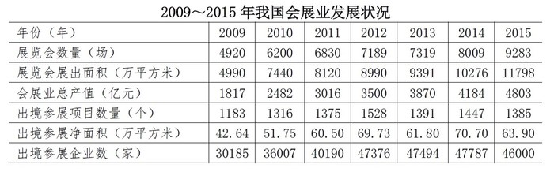

#### 第 1 题　qid 2274520 · 综合

“十二五”（2011～2015年）期间，我国总共举办了约多少万场展览会？

- **A**. 3.2
- **B**. 3.9　✅
- **C**. 4.5
- **D**. 5.0

**答案**：B

**官方解析**

定位材料，可知2011年举办展览会6830场，2012年举办展览会7189场，2013年举办展览会7319场，2014年举办展览会8009场，2015年举办展览会9283场，故“十二五”（2011-2015年）期间，，约3.9万场。

故正确答案为B。

---

#### 第 2 题　qid 2274521 · 平均数

2009～2015年间，有几个年份平均每个出境参展项目的参展净面积超过400平方米？

- **A**. 3
- **B**. 4
- **C**. 5　✅
- **D**. 6

**答案**：C

**官方解析**

由题干“2009-2015年间，有几个年份平均每个······”，结合材料已知时间为2009-2015年，可判定本题为现期平均数问题。定位材料，将单位“万平方米”化为“平方米”，可得：

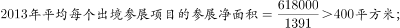

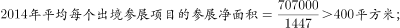

故正确答案为C。

---

#### 第 3 题　qid 2274523 · 增长

2010～2015年间，我国展览会展出面积同比增速最快的一年，展览会展出面积较上年约增加了

- **A**. 
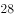

- **B**. 

- **C**. 

- **D**. 
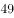
　✅

**答案**：D

**官方解析**

由题干“2010-2015年间，……展览会展出面积较上年约增加了”，结合材料已知时间为2009-2015，结合选项为百分数，可判定本题为一般增长率问题。定位材料可得：

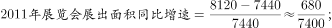

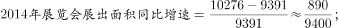

，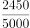分子最大，分母最小，可得2010-2015年间，我国展览会展出面积同比增速最快的为2010年，故2010-2015年间，我国展览会展出面积同比增速最快的一年，，即为D选项。

实际上如果大家看出，已经是四个选项中最大的D选项，后面几年的同比增速就不需要列出了。

故正确答案为D。

---

#### 第 4 题　qid 2274526 · 增长

以下哪项的折线图可以准确表现2011～2014年间，我国会展业总产值同比增量的变化情况（单位：亿元）？

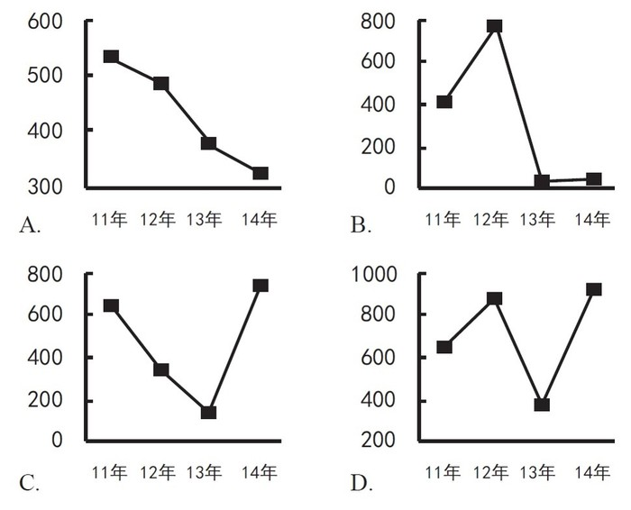

- **A**. A　✅
- **B**. B
- **C**. C
- **D**. D

**答案**：A

**官方解析**

由题干“……我国会展业总产值同比增量的变化情况”，可判定本题为增长量计算问题。定位材料可得，

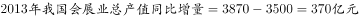；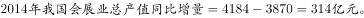

即2011-2014年间，我国会展业总产值同比增量逐年下降，只有A项的折线图可以准确表现。

故正确答案为A。

---

#### 第 5 题　qid 2274528 · 综合

能够从上述资料中推出的是

- **A**. 
2010年我国出境参展企业数较上年增加了两成多

- **B**. 
2009～2015年间，我国出境参展企业和出境参展项目数量最多的年份相同

- **C**. 
2011年平均每场展览会展出面积比上年扩大了以上

- **D**. 
2013～2015年，我国平均每天举办的展览会数量超过20场
　✅

**答案**：D

**官方解析**

A项：定位材料可得，2010年我国出境参展企业数较上年增加了，不到两成，错误；

B项：定位统计表可得，2009-2015年间，我国出境参展企业数量最多的年份为2014年，出境参展项目数量最多的年份为2012年，故2009-2015年间，我国出境参展企业和出境参展项目数量最多的年份不同，错误；

C项：定位统计表可得，，，故2011年平均每场展览会展出面积比上年降低了，错误；

D项：定位材料可得，2013年举办展览会7319场，2014年举办展览会8009场，2015年举办展览会9283场，故2013-2015年，，正确。

故正确答案为D。

---

### 材料 2

<b>根据下列统计资料回答问题</b>

        2016年全国餐饮收入35799亿元，同比增长，餐饮收入占社会消费品零售总额的比重为。2016年全社会餐饮业经营单位为365.5万个，同比下降；从业人数为1846.0万人，同比增长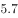。

#### 第 6 题　qid 2274533 · 综合

2016年社会消费品零售总额约为多少万亿元？

- **A**. 27
- **B**. 33　✅
- **C**. 39
- **D**. 45

**答案**：B

**官方解析**

由题干“2016年社会消费品零售总额约为多少万亿元”，结合材料给出2016年全国餐饮收入及其占社会消费品零售总额的比重，可判定本题为给定部分与比重求整体的现期比重问题。定位文字材料可得，2016年全国餐饮收入35799亿元，占社会消费品零售总额的比重为。，则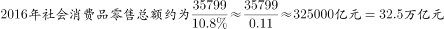，与B项最接近。

故正确答案为B。

---

#### 第 7 题　qid 2274536 · 平均数

2016年全社会餐饮业平均每个经营单位的从业人数比上年约

- **A**. 
减少了

- **B**. 
减少了

- **C**. 
增加了

- **D**. 
增加了
　✅

**答案**：D

**官方解析**

由题干“2016年全社会餐饮业平均每个经营单位的从业人数比上年约”，结合选项为百分数，可判定本题为平均数的增长率计算问题。定位文字材料可得，2016年全社会餐饮业经营单位为365.5万个，同比下降（b）；从业人数为1846.0万人，同比增长（a）。代入平均数增长率计算公式可得，，即增加了。

故正确答案为D。

---

#### 第 8 题　qid 2274538 · 增长

2011～2016年间，全国餐饮收入同比增量超过3000亿元的年份有几个？

- **A**. 2　✅
- **B**. 3
- **C**. 4
- **D**. 5

**答案**：A

**官方解析**

定位柱状图可得各年份全国餐饮收入，代入计算即可。

2011年：；

2012年：；

2013年：；

2014年：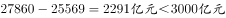；

2015年：；

2016年：。

同比增量超过3000亿元的年份有2015、2016年，共计两年。

故正确答案为A。

---

#### 第 9 题　qid 2274541 · 平均数

2016年全国餐饮收入约相当于“十二五”（2011～2015年）期间年平均值的多少倍？

- **A**. 1.2
- **B**. 1.4　✅
- **C**. 1.6
- **D**. 1.8

**答案**：B

**官方解析**

由题干“2016年全国餐饮收入约相当于‘十二五’(2011～2015年)期间年平均值的多少倍”，可判定本题为现期倍数计算问题。定位柱状图可得， 2016年全国餐饮收入35799亿元，2011-2015年分别为20635、23448、25569、27860、32310亿元。“十二五”期间全国餐饮收入年平均值为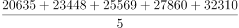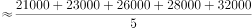，所求倍数。

故正确答案为B。

---

#### 第 10 题　qid 2274545 · 综合

能够从上述资料中推出的是

- **A**. 
2016年平均每个餐饮业经营单位创造的餐饮收入超过100万元

- **B**. 
2016年餐饮业经营单位从业人员同比增长了200万人以上

- **C**. 
2016年全国餐饮收入比2010年翻了一番以上
　✅
- **D**. 
2013年全国餐饮收入同比增速超过

**答案**：C

**官方解析**

A项：定位文字材料可得，2016年全国餐饮收入35799亿元，全社会餐饮业经营单位为365.5万个，则，错误；

B项：定位文字材料可得，2016年全社会餐饮从业人数为1846.0万人，同比增长5.7%。，错误；

C项：定位柱状图可得，2016年全国餐饮收入为35799亿元，2010年为17648亿元。，可知2016年全国餐饮收入比2010年翻了一番以上，正确； 

D项：定位柱状图可得，2013年全国餐饮收入25569亿元，2012年为23448亿元，增长率，错误。

故正确答案为C。 

---

### 材料 3

<b>根据下列统计资料回答问题</b>

        2014年某区限额以上第三产业单位共674家，实际收入1059.1亿元，同比增长；实现利润总额13.5亿元，同比增长；从业人员达到58631人，同比下降。

#### 第 11 题　qid 2274478 · 平均数

2014年该区限额以上第三产业单位平均每名从业人员创造的利润比上年约

- **A**. 
下降了

- **B**. 
下降了

- **C**. 
上升了

- **D**. 
上升了
　✅

**答案**：D

**官方解析**

由题干“2014年······平均每名从业人员创造的利润比上年约”，结合选项下降了/上升了，判定本题为平均数的增长率问题。定位文字材料可知，2014年该区限额以上第三产业单位实现利润总额13.5亿元，同比增长(a)，从业人员达到58631人，同比下降(b)。根据，题目所求为：。

故正确答案为D。

---

#### 第 12 题　qid 2274480 · 平均数

如2013年该区限额以上金融业单位数量与2014年一样，则该区2013年平均每家限额以上金融业单位实现收入约多少亿元？

- **A**. 0.16　✅
- **B**. 0.24
- **C**. 0.39
- **D**. 0.65

**答案**：A

**官方解析**

由题干“2013年平均每家限额以上金融业单位实现收入······”，结合材料所给时间为2014年，判定本题为基期平均数问题。定位表格材料，结合题干可知，2013年该区限额以上金融业单位数量也为22家，2014年实现收入5.2亿元，同比增速。根据，题目所求为：亿元，与A项最接近。

故正确答案为A。

---

#### 第 13 题　qid 2274483 · 综合

表中所列各类限额以上第三产业单位中，按单位数从多到少排列，排在前三位的三个门类单位数之和约占到该区限额以上第三产业单位总数的

- **A**. 

- **B**. 

- **C**. 

　✅
- **D**. 

**答案**：C

**官方解析**

由题干“······排在前三位······单位数之和约占到······总数的”，判定本题为现期比重问题。定位表格材料可知，按单位数从多到少排列，排在前三位的为：批发和零售业291个，教育69个，租赁和商务服务业63个，限额以上第三产业单位总数674个。根据，题目所求为：。

故正确答案为C。

---

#### 第 14 题　qid 2274485 · 增长

表中所列各类限额以上第三产业单位中，2014年收入与2013年收入相比呈正增长，且2014年下半年收入同比增速高于上半年的有几类？

- **A**. 5
- **B**. 6　✅
- **C**. 7
- **D**. 8

**答案**：B

**官方解析**

由题干“······2014年下半年收入同比增速高于上半年······”，结合表格材料已知全年及上半年增长率，判定本题为混合增长率问题。根据“混合增长率，大小居中”、“全年=上半年+下半年”及“2014年下半年收入同比增速高于上半年”，可得所求需满足，下半年增速＞全年增速＞上半年增速。根据“2014年收入与2013年收入相比呈正增长”，需找出2014年全年增长率为正的单位；定位表格材料可知，同时满足以上两条件的有：金融业（），水利、环境和公共设施管理业（），居民服务、修理和其他服务业（），教育（），卫生和社会工作（），文化、体育和娱乐业（），共计6个。

故正确答案为B。

---

#### 第 15 题　qid 2274486 · 综合

关于2014年该区限额以上第三产业单位，能够从上述资料中推出的是

- **A**. 2014年该区限额以上第三产业单位整体利润率（利润/收入）较上年有所下降
- **B**. 平均每家住宿和餐饮业单位收入不到1000万元　✅
- **C**. 2014年收入降幅最大的门类平均每家单位收入超亿元
- **D**. 卫生和社会工作类平均每家单位的收入为各门类中最高

**答案**：B

**官方解析**

A项：定位文字材料可知，2014年该区限额以上第三产业单位实际收入1059.1亿元，同比增长；实现利润总额13.5亿元，同比增长；根据两期比重判定法则：利润增长率（）＞收入增长率（），利润率较上年有所上升，错误；

B项：定位表格材料可知，住宿和餐饮业单位50家，收入4.9亿元，平均每家住宿和餐饮业单位收入=，正确；

C项：定位表格材料可知，2014年降幅最大的门类为房地产业，单位数为35家，收入31.6亿元，平均每家单位收入=亿元，错误。

D项：定位表格材料可知，卫生和社会工作类26家收入38.6亿元，平均每家单位的收入为亿元批发和零售业平均每家收入=亿元，错误。

故正确答案为B。

---

### 材料 4

<b>根据下列统计资料回答问题</b>

        2017年上半年，B市全市第三产业实现增加值10198.2亿元，按可比价计算，同比增长。

上半年，信息传输、软件和信息技术服务业实现增加值1319.5亿元，同比增长；累计完成电信业务量361.1亿元，同比增长；科学研究和技术服务业实现增加值1211.8亿元，同比增长，比一季度增幅扩大1.4个百分点。

        上半年，旅客周转量同比增长；货物周转量由上年的下降转为增长，其中铁路同比增长，民航同比增长。上半年，快递业务量累计达到9.9亿件，同比增长；交通运输、仓储和邮政业实现增加值554.2亿元，同比增长，增幅比上年同期扩大7.8个百分点。

        上半年，批发和零售业实现增加值1190.6亿元，同比增长，增幅比上年同期扩大7.1个百分点。第二季度，全市实现电子商务交易额8324.5亿元，同比增长。

        上半年，B市规模以上文化创意产业法人单位、战略性新兴产业法人单位、高技术服务业法人单位分别实现收入6902.7亿元、3870.0亿元和6924.9亿元，同比分别增长、和。

        上半年，服务业扩大开放六大重点领域的规模以上非公有制经济单位实现收入7864.6亿元，同比增长，快于六大重点领域整体增速8.0个百分点，占六大重点领域整体收入的比重为，比上年同期提高1.1个百分点。

#### 第 16 题　qid 2274494 · 综合

2016年上半年，B市累计完成电信业务量约为多少亿元？

- **A**. 180
- **B**. 220
- **C**. 260　✅
- **D**. 300

**答案**：C

**官方解析**

由题干“2016年上半年······约为多少亿元”，结合材料时间为2017年上半年，判定本题为基期计算问题。定位文字材料第二段可得“2017年上半年，B市累计完成电信业务量361.1亿元，同比增长”。代入公式：，可得：2016年上半年，B市累计完成电信业务量亿元。

故正确答案为C。

---

#### 第 17 题　qid 2274495 · 增长

2017年上半年，B市信息传输、软件和信息技术服务业实现增加值同比增速比第三产业实现增加值同比增速

- **A**. 低2.1个百分点
- **B**. 高2.1个百分点　✅
- **C**. 低31.6个百分点
- **D**. 高31.6个百分点

**答案**：B

**官方解析**

定位文字材料第二段可得“2017年上半年，信息传输、软件和信息技术服务业实现增加值同比增长”；定位材料第一段可得“2017年上半年，B市第三产业实现增加值同比增长”。则个百分点，即高2.1个百分点。

故正确答案为B。

---

#### 第 18 题　qid 2274497 · 增长

2017年第二季度，B市科学研究和技术服务业实现增加值的同比增速的范围是

- **A**. 
小于

- **B**. 
等于

- **C**. 
大于且小于等于

- **D**. 
大于
　✅

**答案**：D

**官方解析**

由题干“2017年第二季度，B市······同比增速的范围是”，定位文字材料第二段可得“2017年上半年，科学研究和技术服务业实现增加值······同比增长，比一季度增幅扩大1.4个百分点”，即2017年一季度增速为。由于“”，故上半年增速为第一季度和第二季度增速的混合增速，判定本题为混合增长率问题。根据结论“混合增长率，大小居中”，可得。即2017年第二季度同比增速的范围是大于。

故正确答案为D。

---

#### 第 19 题　qid 2274498 · 增长

2017年上半年，B市规模以上文化创意产业法人单位实现收入同比增量约是战略性新兴产业法人单位的多少倍？

- **A**. 0.7
- **B**. 1.3　✅
- **C**. 1.8
- **D**. 2.6

**答案**：B

**官方解析**

由题干“2017年上半年，······约是······的多少倍”，判定本题为现期倍数计算问题。定位文字材料第五段可得2017年上半年，B市规模以上文化创意产业法人单位实现收入6902.7亿元，同比增长；战略性新兴产业法人单位3870.0亿元，同比增长。代入公式：，可得：2017年上半年，B市规模以上文化创意产业法人单位实现收入同比增量是战略性新兴产业法人单位的倍，与B项最接近。

故正确答案为B。

---

#### 第 20 题　qid 2274499 · 综合

关于B市第三产业情况，下列说法中正确的是：

- **A**. 2016年上半年批发和零售业实现增加值同比增量不到10亿元　✅
- **B**. 2017年上半年服务业扩大开放六大重点领域整体收入少于2万亿元
- **C**. 2016年第二季度，全市实现电子商务交易额高于8000亿元
- **D**. 2015年上半年该市货物周转量低于2016年上半年

**答案**：A

**官方解析**

A项：定位文字材料第四段“上半年，批发和零售业实现增加值1190.6亿元，同比增长，增幅比上年同期扩大7.1个百分点”,可知2016年上半年批发和零售业实现增加值=亿元，2016年上半年批发和零售业实现增加值同比增长率；故所求2016年增长量亿元10亿元，正确；

B项：定位文字材料最后一段“上半年，服务业扩大开放六大重点领域的规模以上非公有制经济单位实现收入7864.6亿元······占六大重点领域整体收入的比重为”，代入公式，可得：2017年上半年服务业扩大开放六大重点领域整体收入，错误；

C项：根据文字材料第四段“第二季度，全市实现电子商务交易额8324.5亿元，同比增长”，代入公式，可得2016年第二季度全市实现电子商务交易额亿元8000亿元，错误；

D项：根据文字材料第三段“货物周转量由上年的下降转为增长”，可知2016年上半年货物周转量增长率，即负增长，故2015年上半年该市货物周转量高于2016年上半年，错误。

故正确答案为A。

---
