# 2019年四川省公务员录用考试《行测》题（下半年）（网友回忆版）

> 省考 · 2019 年 · 6 个模块 · 共 100 题

- [政治理论](#%E6%94%BF%E6%B2%BB%E7%90%86%E8%AE%BA) · 1 题
- [常识判断](#%E5%B8%B8%E8%AF%86%E5%88%A4%E6%96%AD) · 14 题
- [言语理解与表达](#%E8%A8%80%E8%AF%AD%E7%90%86%E8%A7%A3%E4%B8%8E%E8%A1%A8%E8%BE%BE) · 30 题
- [数量关系](#%E6%95%B0%E9%87%8F%E5%85%B3%E7%B3%BB) · 10 题
- [判断推理](#%E5%88%A4%E6%96%AD%E6%8E%A8%E7%90%86) · 30 题
- [资料分析](#%E8%B5%84%E6%96%99%E5%88%86%E6%9E%90) · 15 题

---

## 政治理论

### 第 1 题　qid 2444679 · 新思想

下列有关国家治理的说法，与中国共产党第十九届中央委员会第四次全体会议精神相符的有：
①我国国家治理一切工作和活动都依照中国特色社会主义制度展开
②我国国家治理体系和治理能力是中国特色社会主义制度及执行能力的集中体现
③到二〇三〇年，各方面制度更加完善，基本实现国家治理体系和治理能力现代化
④到新中国成立一百年时，全面实现国家治理体系和治理能力现代化，使中国特色社会主义制度更加巩固、优越性充分展现
⑤坚持党的集中统一领导，坚持党的科学理论，保持政治稳定，确保国家始终沿着社会主义方向前进是我国国家制度和国家治理体系具有的显著优势之一

- **A**. ①②④
- **B**. ②③④⑤
- **C**. ①②④⑤　✅
- **D**. ①②③④⑤

**答案**：C

**官方解析**

本题考查政治。
①②正确，中国共产党第十九届中央委员会第四次全体会议提出：中国特色社会主义制度是党和人民在长期实践探索中形成的科学制度体系，我国国家治理一切工作和活动都依照中国特色社会主义制度展开，我国国家治理体系和治理能力是中国特色社会主义制度及其执行能力的集中体现。
③错误、④正确，全会提出，坚持和完善中国特色社会主义制度、推进国家治理体系和治理能力现代化的总体目标是，到我们党成立一百年时，在各方面制度更加成熟更加定型上取得明显成效；到二〇三五年，各方面制度更加完善，基本实现国家治理体系和治理能力现代化；到新中国成立一百年时，全面实现国家治理体系和治理能力现代化，使中国特色社会主义制度更加巩固、优越性充分展现。
⑤正确，全会强调，我国国家制度和国家治理体系具有多方面的显著优势，主要是：坚持党的集中统一领导，坚持党的科学理论，保持政治稳定，确保国家始终沿着社会主义方向前进的显著优势……坚持独立自主和对外开放相统一，积极参与全球治理，为构建人类命运共同体不断作出贡献的显著优势。这些显著优势，是我们坚定中国特色社会主义道路自信、理论自信、制度自信、文化自信的基本依据。因此，①②④⑤与全会精神相符。
故正确答案为C。

---

## 常识判断

### 第 1 题　qid 2444681 · 人文常识

近日，中共中央、国务院印发了《新时代公民道德建设实施纲要》，并发出通知，要求各地区各部门结合实际认真贯彻落实。下列说法，与《新时代公民道德建设实施纲要》总体要求不相符的是：

- **A**. 坚持马克思主义道德观、社会主义道德观，倡导共产主义道德，以为人民服务为核心，以集体主义为原则，以爱祖国、爱人民、爱劳动、爱科学、爱社会主义为基本要求，始终保持公民道德建设的社会主义方向
- **B**. 坚持以社会主义核心价值观为引领，将国家、社会、个人层面的价值要求贯穿到道德建设各方面，以主流价值建构道德规范、强化道德认同、指引道德实践，引导人们明大德、守公德、严私德
- **C**. 坚持发挥社会主义法治的促进和保障作用，以法治承载道德理念、鲜明道德导向、弘扬美德义行，把社会主义道德要求体现到立法、执法、司法、守法之中，以道德的力量引导人们向上向善　✅
- **D**. 坚持积极倡导与有效治理并举，遵循道德建设规律，把先进性要求与广泛性要求结合起来，坚持重在建设、立破并举，发挥榜样示范引领作用，加大突出问题整治力度，树立新风正气、祛除歪风邪气

**答案**：C

**官方解析**

本题考查毛中特。
A项正确，《新时代公民道德建设实施纲要》总体要求指出：坚持马克思主义道德观、社会主义道德观，倡导共产主义道德，以为人民服务为核心，以集体主义为原则，以爱祖国、爱人民、爱劳动、爱科学、爱社会主义为基本要求，始终保持公民道德建设的社会主义方向。
B项正确，《新时代公民道德建设实施纲要》总体要求指出：坚持以社会主义核心价值观为引领，将国家、社会、个人层面的价值要求贯穿到道德建设各方面，以主流价值建构道德规范、强化道德认同、指引道德实践，引导人们明大德、守公德、严私德。
C项错误，《新时代公民道德建设实施纲要》总体要求指出：坚持发挥社会主义法治的促进和保障作用，以法治承载道德理念、鲜明道德导向、弘扬美德义行，把社会主义道德要求体现到立法、执法、司法、守法之中，以法治的力量引导人们向上向善。
D项正确，《新时代公民道德建设实施纲要》总体要求指出：坚持积极倡导与有效治理并举，遵循道德建设规律，把先进性要求与广泛性要求结合起来，坚持重在建设、立破并举，发挥榜样示范引领作用，加大突出问题整治力度，树立新风正气、祛除歪风邪气。
本题为选非题，故正确答案为C。

---

### 第 2 题　qid 2444683 · 人文常识

关于脱贫攻坚，下列说法错误的是：

- **A**. 精准脱贫与防范化解重大风险、污染防治是决胜全面建成小康社会的三大攻坚战
- **B**. 发展产业是实现脱贫的根本之策，要因地制宜，把培育产业作为推动脱贫攻坚的根本出路
- **C**. 脱贫攻坚的目标任务是实现贫困地区农民人均可支配收入增长幅度和基本公共服务主要领域指标均接近全国平均水平　✅
- **D**. 稳定实现贫困人口“两不愁三保障”，即不愁吃不愁穿，义务教育、基本医疗、住房安全有保障是脱贫攻坚的标准之一

**答案**：C

**官方解析**

本题考查政治。
A项正确，十九大报告中指出：要坚决打好防范化解重大风险、精准脱贫、污染防治的攻坚战，使全面建成小康社会得到人民认可、经得起历史检验。
B项正确，2016年习近平总书记在宁夏考察脱贫攻坚工作时强调：发展产业是实现脱贫的根本之策。要因地制宜，把培育产业作为推动脱贫攻坚的根本出路。
C项错误，根据《中国农村扶贫开发纲要（2011-2020）》，“十三五”期间脱贫攻坚的目标任务是：到2020年稳定实现农村贫困人口不愁吃、不愁穿，农村贫困人口义务教育、基本医疗、住房安全有保障；同时实现贫困地区农民人均可支配收入增长幅度高于全国平均水平、基本公共服务主要领域指标接近全国平均水平。
D项正确，“两不愁三保障”，即不愁吃不愁穿，义务教育、基本医疗、住房安全有保障。2019年，习近平总书记在解决“两不愁三保障”突出问题座谈会上的讲话中指出：到2020年稳定实现农村贫困人口不愁吃、不愁穿，义务教育、基本医疗、住房安全有保障，是贫困人口脱贫的基本要求和核心指标，直接关系攻坚战质量。总的看，“两不愁”基本解决了，“三保障”还存在不少薄弱环节。
本题为选非题，故正确答案为C。

---

### 第 3 题　qid 2444685 · 法律常识

2018年3月11日，第十三届全国人民代表大会第一次会议审议通过了《中华人民共和国宪法修正案》。关于这次修宪，下列说法正确的是：

- **A**. 将“健全社会主义法制”写入了《宪法》序言
- **B**. 将坚持“五项原则”修改为坚持“和平发展道路”
- **C**. 增加了“中国共产党领导是中国特色社会主义最本质的特征”　✅
- **D**. 删除了“国家工作人员就职时应当依照法律规定公开进行宪法宣誓”

**答案**：C

**官方解析**

本题考查法律常识。
A项错误，2018年第五次宪法修改,将“健全社会主义法制”修改为“健全社会主义法治”。从“健全社会主义法制”到“健全社会主义法治”，是我们党依法治国理念和方式的新飞跃。
B项错误，此次修宪在坚持“五项原则”后新加了坚持“和平发展道路”的内容，序言第十二段修改后的内容为：“中国坚持独立自主的对外政策，坚持互相尊重主权和领土完整、互不侵犯、互不干涉内政、平等互利、和平共处的五项原则，坚持和平发展道路，坚持互利共赢开放战略，发展同各国的外交关系和经济、文化交流，推动构建人类命运共同体。”
C项正确，《宪法修正案》在总纲第一条中增加规定：“中国共产党领导是中国特色社会主义最本质的特征”，充分体现了中国共产党领导的根本性、全面性和时代性，具有重大的政治意义和法治意义。
D项错误，此次修宪是将宪法宣誓制度确立下来而不是删除。实行宪法宣誓制度是党的十八届四中全会提出的重要举措，目的是为了教育和激励国家工作人员忠于宪法，维护宪法，尊崇宪法，维护宪法权威。这次宪法修改把宪法宣誓制度确定下来，会对宪法的贯彻实施，弘扬宪法精神，增强宪法意识，增强宪法自信，起到非常重要的作用。
故正确答案为C。

---

### 第 4 题　qid 2444687 · 法律常识

下列民族自治地方自治机关的行为，不符合现有的民族政策和相关法律法规的是：

- **A**. 结合本地实际，制定实行计划生育的办法
- **B**. 经国务院批准，可以开辟对外贸易口岸
- **C**. 决定本地方各级各类学校的教学内容和招生办法
- **D**. 在民族乡设立人民政府作为民族自治地方的自治机关　✅

**答案**：D

**官方解析**

本题考查法律常识。
A项正确，《民族区域自治法》第四十四条规定：“民族自治地方实行计划生育和优生优育，提高各民族人口素质。民族自治地方的自治机关根据法律规定，结合本地方的实际情况，制定实行计划生育的办法。”
B项正确，《中华人民共和国民族区域自治法》第三十一条第一款规定：“民族自治地方依照国家规定，可以开展对外经济贸易活动，经国务院批准，可以开辟对外贸易口岸。”
C项正确，《中华人民共和国民族区域自治法》第三十六条规定：“民族自治地方的自治机关根据国家的教育方针，依照法律规定，决定本地方的教育规划，各级各类学校的设置、学制、办学形式、教学内容、教学用语和招生办法。”
D项错误，《中华人民共和国民族区域自治法》第十五条第一款规定：“民族自治地方的自治机关是自治区、自治州、自治县的人民代表大会和人民政府。”民族乡不属于自治机关。
本题为选非题，故正确答案为D。

---

### 第 5 题　qid 2444690 · 法律常识

关于劳动法对女职工的保护，下列说法错误的是：

- **A**. 用人单位可因女职工怀孕降低其工资　✅
- **B**. 用人单位不得因女职工哺乳解除劳动合同
- **C**. 用人单位不得安排女职工从事矿山井下作业
- **D**. 怀孕女职工在劳动时间内的产前检查也计入劳动时间

**答案**：A

**官方解析**

本题考查法律常识。《女职工劳动保护特别规定》是为减少和解决女职工在劳动中因生理特点造成的特殊困难，保护女职工健康制定。规定由中华人民共和国国务院于2012年4月28日发布，2012年4月28日起施行。
A项错误，B项正确。《女职工劳动保护特别规定》第五条规定：“用人单位不得因女职工怀孕、生育、哺乳而降低其工资、予以辞退、与其解除劳动或者聘用合同。”
C项正确，《女职工劳动保护特别规定》附录中列举的女职工禁忌从事的劳动范围：（一）矿山井下作业；（二）体力劳动强度分级标准中规定的第四级体力劳动强度的作业；（三）每小时负重6次以上、每次负重超过20公斤的作业，或者间断负重、每次负重超过25公斤的作业。因此用人单位不得安排女职工从事矿山井下作业。
D项正确，《女职工劳动保护特别规定》第六条规定：“女职工在孕期不能适应原劳动的，用人单位应根据医疗机构的证明，予以减轻劳动量或者安排其他能够适应的劳动。对怀孕7个月以上的女职工，用人单位不得延长劳动时间或者安排夜班劳动，并应当在劳动时间内安排一定的休息时间。怀孕女职工在劳动时间内进行产前检查，所需时间计入劳动时间。”
本题为选非题，故正确答案为A。

---

### 第 6 题　qid 2444693 · 地理国情

关于我国平原，下列说法错误的是：

- **A**. 江汉平原是我国粮食商品率最高的商品粮生产基地　✅
- **B**. 东北平原以肥沃的黑土著称，是我国面积最大的平原
- **C**. 河套平原是河流泥沙在低洼处不断沉积形成的冲积平原
- **D**. 成都平原有为该地农业发展做出巨大贡献的著名水利工程

**答案**：A

**官方解析**

本题考查地理国情。
A项错误，粮食商品率是出售的粮食（商品粮）数量与粮食总产量之比，一般用百分数表示。东北地区是我国最大的、比较稳定的商品粮基地。江汉平原是被称之为“鱼米之乡”的长江中下游的组成部分，但并非是粮食商品率最高的地区。
B项正确，东北平原以肥沃的黑土著称，是中国最大的平原，位于中国东北部，由三江平原、松嫩平原、辽河平原组成，地跨黑龙江、吉林、辽宁和内蒙古四个省区，总面积约35万平方千米。
C项正确，河套平原位于中国内蒙古自治区和宁夏回族自治区境内，是在黄河及其支流的冲积下，河流泥沙在低洼处不断沉积，在黄河沿岸形成的冲积平原，位于几字形的黄河湾。
D项正确，都江堰位于四川省成都市都江堰市城西，坐落在成都平原西部的岷江上，是以无坝引水为特征的宏大水利工程，至今仍然为成都平原——西南地区重要的商品粮基地发挥着作用。
本题为选非题，故正确答案为A。

---

### 第 7 题　qid 2444697 · 人文常识

下列与艺术有关的说法，错误的是：

- **A**. 马踏飞燕是中国汉代的青铜艺术品
- **B**. 琢、磨是古代玉石加工的技术手段
- **C**. 达•芬奇创作了西斯廷教堂的壁画《创世纪》　✅
- **D**. 人民英雄纪念碑上有“五卅运动”为主题的浮雕

**答案**：C

**官方解析**

本题考查人文常识。
A项正确，东汉铜奔马，别称马踏飞燕、铜奔马等，是东汉时期的青铜雕塑作品，其既是我国古代雕塑艺术的代表，也是汉代青铜铸造业的成果展示。
B项正确，琢、磨是古代玉石加工的技术手段，指雕刻和磨制玉石。
C项错误，西斯廷教堂的壁画《创世纪》的创作者是米开朗基罗。1506年，教皇儒略二世(又称朱理二世)为了纪念叔父西克斯图斯四世，命米开朗基罗为西斯廷教堂重新绘制穹顶壁画，米开朗基罗独自一人于1508年开始设计创作此壁画，并命名为《创世纪》，壁画于1512年最终完成。西斯廷教堂正因拥有了米开朗基罗最有代表性的两大巨制壁画《创世纪》和《最后的审判》而闻名于天下。
D项正确，人民英雄纪念碑，是中华人民共和国政府为纪念中国近现代史上的革命烈士而修建的纪念碑。纪念碑共有10幅汉白玉浮雕，东面为“虎门销烟”“金田起义”，南为“武昌起义”“五四运动”“五卅运动”，西为“南昌起义”“抗日游击战争”，北是正面，为“胜利渡长江”，在它的两旁，有两幅主题为“支援前线”和“欢迎人民解放军”的浮雕。
本题为选非题，故正确答案为C。

---

### 第 8 题　qid 2444701 · 地理国情

关于古城，下列说法错误的是：

- **A**. 丽江古城位于洱海盆地　✅
- **B**. 阆中古城是古代巴蜀的军事重地
- **C**. 徽州古城具有“城套城”的建筑风格
- **D**. 平遥古城的民居建筑呈现左右对称的特点

**答案**：A

**官方解析**

本题考查地理国情。
A项错误，洱海盆地是一个断陷型的山间小盆地，其范围内有大理古城、崇圣寺三塔、蝴蝶泉等风景名胜。丽江古城位于云南省丽江市古城区，坐落在丽江坝中部，距离洱海160多公里，不在洱海盆地范围内。
B项正确，阆中古城地处四川盆地东北部，位于嘉陵江中游，秦巴山南麓。山围四面，水绕三方。东靠巴中市、仪陇县，南连南部县，西邻剑阁县，北接苍溪县。2000多年来，一直是巴蜀要冲，军事重镇。
C项正确，徽州古城，又名歙县古城，古称新安郡。始建于秦朝，自唐代以来，一直是徽郡、州、府治所在地，故县治与府治同在一座城内，形成了城套城的独特风格。
D项正确，平遥古城位于山西省晋中市平遥县。古城较为完好地保留着明清时期县城的基本风貌，民居建筑布局严谨，轴线明确，左右对称、主次分明、轮廓起伏，外观封闭，大院深深。
本题为选非题，故正确答案为A。

---

### 第 9 题　qid 2444705 · 人文常识

以下经典电影反映了我国不同少数民族的文化和生活，下列对应错误的是：

- **A**. 《刘三姐》——壮族
- **B**. 《阿诗玛》——彝族
- **C**. 《五朵金花》——白族
- **D**. 《冰山上的来客》——满族　✅

**答案**：D

**官方解析**

本题考查人文常识。
A项正确，《刘三姐》是长春电影制片厂于1961年摄制的故事片，根据广西壮族民间传说改编，影片主要讲述了刘三姐用山歌反抗财主莫怀仁的故事，主人公刘三姐是壮族民间传说的人物，聪慧机敏，歌声优美动人，有“歌仙”之誉。
B项正确，电影《阿诗玛》上映于1964年，是中国电影史上第一部彩色宽银幕立体声音乐歌舞片。电影根据云南省石林彝族自治县地方传统民间文学《阿诗玛》改编，讲述了阿诗玛不屈不挠地同强权势力作斗争的故事，揭示了光明终将代替黑暗、善美终将代替丑恶、自由终将代替压迫与禁锢的人类理想，反映了彝族撒尼人“断得弯不得”的民族性格和民族精神。
C项正确，《五朵金花》是长春电影制片厂1959年制作的音乐爱情电影，该片讲述了白族青年阿鹏与副社长金花在大理三月街一见钟情，次年阿鹏走遍苍山洱海寻找金花，经过一次次误会之后，有情人终成眷属的爱情故事。《五朵金花》是一部反映白族人民生活场景的影片。
D项错误，《冰山上的来客》于1963年由长春电影制片厂制作发行，影片从真假古兰丹姆与战士阿米尔的爱情悬念出发，讲述了新疆边防战士和杨排长一起与特务假古兰丹姆斗智斗勇，最终胜利的阿米尔和真古兰丹姆也得以重逢的故事。与影片相关的少数民族是塔吉克族，不是满族。
本题为选非题，故正确答案为D。

---

### 第 10 题　qid 2444710 · 人文常识

关于国际足联世界杯，下列说法正确的是：

- **A**. 奖杯名字是“德劳内杯”
- **B**. 巴西是夺冠次数最多的国家　✅
- **C**. 职业足球俱乐部有参赛权利
- **D**. 每届共有36支球队进入决赛圈

**答案**：B

**官方解析**

本题考查文化常识。
A项错误，“德劳内杯”是欧洲杯（欧洲足球锦标赛）的奖杯名称，是为了纪念欧足联首任秘书长法国人亨利·德劳内而命名的。上面用法文雕刻着“欧洲国家杯足球锦标赛”字样和“亨利·德劳内杯”的小一号字。
B项正确，巴西队是世界杯历史上夺冠次数最多的球队，一共5次夺冠，意大利队、德国队（含联邦德国）4次夺冠，乌拉圭队、阿根廷队、法国队2次夺冠，英格兰队、西班牙队各获得1次冠军。
备注：结合2023当下时事，截止2023年，巴西队是世界杯历史上夺冠次数最多的球队，一共5次夺冠，意大利队、德国队（含联邦德国）4次夺冠，阿根廷队3次夺冠，乌拉圭队、法国队2次夺冠，英格兰队、西班牙队各获得1次冠军。
C项错误，国际足联世界杯（FIFA World Cup）简称“世界杯”，是由全世界国家级别球队参与，象征足球界最高荣誉、并具有最大知名度和影响力的足球赛事，全球电视转播观众超过35亿。职业足球俱乐部没有参赛权利。
D项错误，每届世界杯决赛阶段的名额是32个，决赛阶段主办国可以直接获得决赛阶段名额，除主办国外，其他名额由国际足联根据各个预选赛赛区的足球水平进行分配，不同的预选赛赛区会有不同数量的决赛阶段名额。
故正确答案为B。

---

### 第 11 题　qid 2444711 · 科技常识

下列与狂犬疫苗有关的说法，正确的是：

- **A**. 被犬咬伤后共需接种2次疫苗
- **B**. 被仓鼠咬伤也需要注射狂犬疫苗　✅
- **C**. 注射疫苗后又被狗咬伤无需再次注射
- **D**. 被接种过狂犬疫苗的犬咬伤的人无需注射狂犬疫苗

**答案**：B

**官方解析**

本题考查科技常识。
A项错误，狂犬疫苗注射可分为两种 ：一为暴露后（咬伤、抓伤后)预防，二为暴露前（无咬伤、抓伤）预防。狂犬疫苗暴露前的接种程序为0、7、21天各接种一次；暴露后接种程序为0、3、7、14、28天各接种一次。被犬咬伤后共需接种2次疫苗表述错误。
B项正确，根据我国疾控中心研究表示，我国90%以上的人狂犬病由狗引起的，而啮齿类（老鼠、仓鼠）、兔形目（兔子）极少感染，目前还没有引起人类狂犬病的证据。但是极少感染表面也是可能会感染狂犬病毒的，所以如果被仓鼠咬伤而又不能确定该动物是否为健康无毒动物时，应及时到医院处理伤口，尽快到卫生防疫部门注射狂犬疫苗。因此被仓鼠咬伤也需要注射狂犬疫苗。
C、D项错误，一般情况下，狂犬疫苗有其有效期，有效抗体维持时间较短。注射疫苗后如果第二次被狗咬伤，距离第一次全程注射狂犬疫苗结束时的时长不超过半年，则不需要再次注射；如果两次被咬的时长超过半年但不到一年，则一般需要接种2针加强针；如果时长超过一年但不到三年，则一般需要接种3针加强针；如果超过3年，则通常需要再次全程接种。
故正确答案为B。

---

### 第 12 题　qid 2444713 · 人文常识

中药药材的药性有寒凉和温热之分，下列中药属于热性药的是：

- **A**. 鹿茸　✅
- **B**. 黄连
- **C**. 连翘
- **D**. 柴胡

**答案**：A

**官方解析**

本题考查科技常识。
A项正确，根据《中国药典》：鹿茸为鹿科动物梅花鹿或马鹿的雄鹿未骨化密生茸毛的幼角，性味甘、咸，温，属于热性药。功能主治为壮肾阳，益精血，强筋骨，调冲任，托疮毒等。
B项错误，根据《中国药典》：黄连为毛茛科植物黄连、三角叶黄连或云连的干燥根茎，性味苦，寒，属于寒性药。功能主治为清热燥湿，泻火解毒等。
C项错误，根据《中国药典》：连翘为木犀科植物连翘的干燥果实，性味苦，微寒，属于寒性药。功能主治为清热解毒，消肿散结等。
D项错误，根据《中国药典》：柴胡为伞形科植物柴胡或狭叶柴胡的干燥根，性味苦，微寒，属于寒性药。功能主治为和解表里，疏肝，升阳等。
故正确答案为A。

---

### 第 13 题　qid 2444716 · 科技常识

下列选项能够描述图中物理现象的是：

- **A**. 离朱之明，察箴末于百步之外，不能见渊中之鱼
- **B**. 阳隧是以火珠向日下，以艾于下承之，便得火也
- **C**. 鉴，鉴若近，则所鉴大，景（影）亦大；其远，所鉴小，景亦小
- **D**. 若鸢飞空中，其影随鸢而移；或中间为窗隙所束，则影与鸢遂相违，鸢东则影西，鸢西则影东　✅

**答案**：D

**官方解析**

本题考查科技常识。图中反映的物理现象是小孔成像，这种现象说明了光沿直线传播的性质。用一个带有小孔的板遮挡在墙体与物之间，墙体上就会形成物的倒影，我们把这样的现象叫小孔成像，前后移动中间的板，墙体上像的大小也会随之发生变化。
A项错误，选项说的是离朱是古代眼睛看得最清楚的人，他能在百步以外看清鸟兽在秋天新长出的细毛，但不能看见渊底之鱼。这是因为渊中水深，水对光的吸收，加之水中杂质微粒对光的散射作用，致使明眼人不能看见渊底之鱼。体现的是微粒对光的散射作用。
B项错误，选项描述的是阳燧取火。阳燧是古代取火用的凹面铜镜，当某些易燃物(如艾绒)放在阳燧的焦点处，被阳燧聚焦的阳光所照会形成高温，易燃物就会被点燃。体现的是凹面镜有聚集光线的作用。
C项错误，“鉴，鉴者近，则所鉴大，景亦大；其远，所鉴小，景亦小”说的是物体靠近镜面，所成影亦大；物体距镜面远，那么所照物也小。对应的物理现象是镜面成像，体现了光的反射定律，与小孔成像无关。
D项正确，选项描述的是小孔成像现象。若鹞鹰在空中飞翔，它的影子随鹞鹰而移动；如果鹞鹰和影子中间被窗户孔隙所约束，影子与鹞鹰就向相反方向移动，鹞鹰向东飞则影子向西移，鹞鹰向西飞则影子向东移。前段鹞鹰的影子，是光沿直线传播形成的；后段所说的“影子”实际是鹞鹰经小孔所成的像，即小孔成像，体现了光沿直线传播的性质。
故正确答案为D。

---

### 第 14 题　qid 2444720 · 人文常识

关于日用品，下列说法错误的是：

- **A**. 甘油是化妆品中常用的一种保湿剂
- **B**. 涂料中的铅挥发后可通过呼吸道危害人体健康
- **C**. 加酶型洗衣粉可分解衣物上的汗渍、奶渍和血污
- **D**. 空气清新剂能净化空气，但不能杀灭空气中的细菌　✅

**答案**：D

**官方解析**

本题考查科技常识。
A项正确，甘油是丙三醇的俗名，是无色，具有甜味的黏稠液体。无水甘油有强烈的吸水性，可与水无限混溶。因此在化妆品中，甘油是应用比较早的保湿剂，但是不能用纯的甘油来做保湿剂，一般都是与水以一定比例混合添加，才能起到保湿作用。
B项正确，在制造涂料时，需要添加各种助剂、溶剂来保证涂料的功能，在这个过程中，往往会引入对人体有害的铅等重金属。涂料中的铅挥发出来，可通过皮肤、消化道、呼吸道等进入人体，导致血液、免疫、神经、生殖等系统毒性，危害人体健康。
C项正确，含酶洗衣粉，其中的酶制剂主要有碱性蛋白酶和碱性脂肪酶。前者用于分解蛋白质类污物，如汗渍、血渍、奶渍等。后者则主要作用于脂肪酸及其酯类污物，也就是我们通常所指的油污类。
D项错误，目前市场上销售的空气清新剂一般是以散发香味来掩盖异味，这种香味会在气味上给人一种清新的感觉，但实际上并没有起到净化空气和杀菌的作用。因此，空气清新剂既不能净化空气，也不能杀灭空气中的细菌。
本题为选非题，故正确答案为D。

---

## 言语理解与表达

### 第 1 题　qid 2444707 · 逻辑填空

康藏高寒地区海拔通常在三四千米以上，当地藏民有喝酥油茶的习惯，但该地茶叶极度稀缺；而在内地，民间生活和战争所需的大量骡马，同样            。因此，具有互补性的“茶马互市”应运而生。
填入画横线部分最恰当的一项是：

- **A**. 缺一不可
- **B**. 供不应求　✅
- **C**. 千金难买
- **D**. 难能可贵

**答案**：B

**官方解析**

横线前的“同样”表并列，所填词语与前文“极度稀缺”对应，表示内地的骡马很少，不能满足民间生活和战争所需。B项“供不应求”指供应不能满足需求，形容某种事物的需求量很大，但供应不足，符合语境，且由此才有了后文“互补性的‘茶马互市’应运而生”，当选。A项“缺一不可”指少一样也不可以，强调的是重要性、必需性，此处并非强调骡马不能缺少，排除。C项“千金难买”形容某物的珍贵，不能用金钱买到，此处也不是强调骡马的珍贵程度，排除。D项“难能可贵”指难以做到的事情居然做到了，值得珍视，文段并非“民间生活和战争需要大量的骡马”是一件很难做到却做到了的事，排除。
故正确答案为B。
【文段出处】《走出历史 又见花开（古道春秋）》

---

### 第 2 题　qid 2444717 · 逻辑填空

经济学中“搭便车”的概念，大致是指，有人未支付成本却获得了由他人支付成本所带来的收益，或者支付较少成本，获得了与自己支付成本不对称的更多收益，从而导致市场失灵。这种“搭便车”的现象可简单地理解为“            ”。
填入画横线部分最恰当的一项是：

- **A**. 坐享其成　✅
- **B**. 坐收渔利
- **C**. 守株待兔
- **D**. 以一奉百

**答案**：A

**官方解析**

由横线前的“这种……”可知，此处是对前文的总结，所填词语是用来概括前文“搭便车”这种行为的，即“未支付成本却获得了由他人支付成本所带来的收益，或者支付较少成本，获得了与自己支付成本不对称的更多收益”。A项“坐享其成”指自己不出力而享受别人取得的成果，能与前文“未支付成本却获得了……”呼应，而“支付较少成本……”也能“简单地理解”为“坐享”，当选。B项“坐收渔利”比喻利用别人的矛盾而从中获利，文段并无“别人的矛盾”的语境，排除。C项“守株待兔”比喻不主动地努力，而存万一的侥幸心理，希望得到意外的收获，文段并无“不主动努力”“侥幸心理”的语境，排除。D项“以一奉百”指用一个人生产的物品供养一百个人，形容生产的人少，消费的人多，与语境无关，排除。
故正确答案为A。
【文段出处】《搭便车是个假问题》

---

### 第 3 题　qid 2444723 · 逻辑填空

香樟树就像那些正直而沉静的老实人，它们看似        ，内里却极为优雅，无论世道怎样杂乱，自身如何被        被忽视，也没有放弃底线，只管静默生存，兀自风华，清冷而优美，沉静却光明。
依次填入画横线部分最恰当的一项是：

- **A**. 迟钝  排挤
- **B**. 平庸  埋没　✅
- **C**. 木讷  压抑
- **D**. 沉闷  误解

**答案**：B

**官方解析**

先看第二空，“被……被……”并列，所填词语与“忽视”意思相近，“忽视”指忽略、无视。B项“埋没”指使显露不出来，不能发挥作用，与“忽视”意思相近，并列恰当，当选。A项“排挤”指利用势力或手段使不利于自己的人失去地位或利益；D项“误解”指错误地理解；两者均不能与“忽视”对应，程度过重，排除。C项“压抑”本身可以和“被”搭配使用，但“被压抑”通常作为定语来修饰宾语，如被压抑的情绪，被压抑的消费需求等，故置于此处属于用法错误，排除。
验证第一空，横线后的“却”表转折，所填词语与“优雅”意思相反。B项“平庸”指普通、寻常而不突出，碌碌无为，可以与“优雅”构成反义，当选。
故正确答案为B。
【文段出处】《物候志 斯世有香樟》

---

### 第 4 题　qid 2444732 · 逻辑填空

中国人在室内焚香，始自战国时代，此时期也开始出现铜制香炉。秦、汉之后，随着制香、用香日益普及，各种式样的炉具            ，其材质涵盖陶器、瓷器、铜器、鎏金银器、掐丝珐琅、竹木器及玉石等。这些不同材质、工艺的香炉，除了用于宗教祭仪，也成为文人墨客案头            的赏玩之物。
依次填入画横线部分最恰当的一项是：

- **A**. 眼花缭乱  稀松平常
- **B**. 独具匠心  信手拈来
- **C**. 应运而生  不可或缺　✅
- **D**. 与日俱增  不可多得

**答案**：C

**官方解析**

第一空，由文意可知，横线处所填成语对应前文“开始出现”。C项“应运而生”原指顺应天命而降生，后泛指随着某种形势而产生，符合文意，保留。D项“与日俱增”指随着时间的推移而不断增长，符合文意，保留。A项“眼花缭乱”指眼睛看见复杂纷繁的东西而感到迷乱，常搭配“令人”，搭配不当，排除。B项“独具匠心”指具有与众不同的巧妙的构思，通常用于创作过程，与文意不符，排除。
第二空，横线处表示香炉常出现在文人墨客案头，C项“不可或缺”指不能有一点点缺失，符合文意，当选。D项“不可多得”形容非常稀少，很难得到（多指人才或稀有物品），与文段语意相悖，排除。
故正确答案为C。
【文段出处】《从传世图画与出土文物认识传统香文化》

---

### 第 5 题　qid 2444734 · 逻辑填空

接纳人工智能是今天社会发展、经济增长、人类演化的        ，更是人们生活的需求。其实，很多人每天离不开的智能手机就是低端人工智能的应用。更应当看到的现实是，人工智能的发展极具            ，未来谁在人工智能的研发和应用中落后，谁就会被淘汰。
依次填入画横线部分最恰当的一项是：

- **A**. 趋势  替代性
- **B**. 必然  竞争性　✅
- **C**. 方向  优越性
- **D**. 途径  倾向性

**答案**：B

**官方解析**

本题可从第二空入手，根据后文“未来谁在人工智能的研发和应用中落后，谁就会被淘汰”可知，人工智能竞争激烈，对应B项“竞争性”。A项“替代性”强调可被取代，文段未体现，排除；C项“优越性”指占优越的特性，与文意不符，排除；D项“倾向性”泛指对于某方面的爱憎、褒贬倾向，与文意不符，排除。
第一空验证，B项“必然”指客观事物联系和发展的合乎规律的、确定不移的趋势，放入文段可体现接纳人工智能对于当前社会的意义和重要性，符合文意。
故正确答案为B。
【文段出处】《全面迎接和努力掌控人工智能》

---

### 第 6 题　qid 2444747 · 逻辑填空

信息爆炸式增长并不代表科学素养会提高，相反，人们在信息海洋中披沙拣金、澄清谬误的        在增加。此外，科学传播的通俗程度不够。这些情况的存在，        着未来应做好科学普及与传播工作，进而提升公众科学素养，需要建立一套以人民为中心，政府推动、全社会参与的工作机制。
依次填入画横线部分最恰当的一项是：

- **A**. 成本  提醒　✅
- **B**. 风险  警示
- **C**. 困难  表明
- **D**. 障碍  标志

**答案**：A

**官方解析**

第一空，由“爆炸式增长”可知，人们在信息海洋中披沙拣金、澄清谬误的时间或工作量会增加。A项“成本”可表示时间上的成本，符合文意，保留。C项“困难”代表有难度，符合文意，保留。B项“风险”程度太重，文中没体现出危险，排除。D项“障碍”做名词时，指阻挡前进的东西，文段并未体现此意，排除。
第二空，由前文“成本或困难在增加”“通俗程度不够”可知，“这些情况”指的是一些不好的情况。A项“提醒”指从旁指点，促使注意，有对策的含义，C项“表明”指表示清楚，且“表明”后一般不与“着”搭配，故A项“提醒”更符合文意，当选。
故正确答案为A。
【文段出处】《学会“像科学家一样思考”》

---

### 第 7 题　qid 2444749 · 逻辑填空

我们喜欢向他人分享目标，好像寻求某种认可和鼓励，然而分享会给人一种        的满足感，将空谈错认为        。记下你的目标，制定可行的计划，才更可能成功。
依次填入画横线部分最恰当的一项是：

- **A**. 想象  目的
- **B**. 即时  结果
- **C**. 暂时  事实
- **D**. 虚假  实践　✅

**答案**：D

**官方解析**

第一空，“然而”表转折，横线前后语义相反，且根据“错认为”可知，横线处应是形容满足感不是真实的，A项“想象”是一种特殊的思维形式；D项“虚假”指假的、不真实的，均符合文意，保留。B项“即时”表示立即、当下，其反义应是缓慢、逐渐；C项“暂时”即临时、短暂，反义词应是永远、长久，均不能构成转折前后语义相反，排除。
第二空，“错认为”表示横线处应与“空谈”语义相反，D项“实践”即去做，对应后文“制定可行的计划”，符合文意，当选。A项“目的”指的是奋斗的目标，和“空谈”无法构成反义，排除。
故正确答案为D。
【文段出处】《不要告诉他人自己的目标，成功的可能性更高！》

---

### 第 8 题　qid 2444752 · 逻辑填空

儒家贤能政治从人性本善出发，试图以人格“修齐”的方式实现道德政治，但往往因人性的善变而            ；而民主政治以人性本恶为立论前提，特别强调权力来源的正当性、权力行使过程的外部制约性，将法度、制度嵌于个人道德与合理的政治之间，这就使得政治运行及其结果成为一件可以        的事情。
依次填入画横线部分最恰当的一项是：

- **A**. 功败垂成  监督
- **B**. 力所不及  把控
- **C**. 不可端倪  预判　✅
- **D**. 难以名状  干预

**答案**：C

**官方解析**

第一空，“但”表转折，横线前后语义相反，故横线处应表示由于人性的善变无法通过人格“修齐”的方式实现道德政治，B项“力所不及”指凭自己的力量不能做到；C项“不可端倪”意思是找不着头绪，形容变化莫测，均符合文意，保留。A项“功败垂成”指事情接近成功的时候却遭到了失败，文段未提及差一点就成功了，排除；D项“难以名状”指无法用语言形容，与文意无关，排除。
第二空，“而”表转折，其道德政治的理想因为人性的善变而无法推测、预知，故转折后应形容民主政治介于个人道德和合理的政治之间，是能够推测、预知的，对应C项“预判”，即预先判定。B项“把控”指把握、控制，“政治运行及其结果”不能够完全把握、控制，选项程度过重，排除。
故正确答案为C。
【文段出处】《个体与社群孰先孰后》

---

### 第 9 题　qid 2444756 · 逻辑填空

网络文学经过20年的快速发展，已收获丰富的作品、巨大的经济效益和来自各方的关注。但在爆发式增长的同时，有关其价值及合理性的质疑也            。综观网络文学整体，虽然不乏            的佳作，但与庞大基数相比，精品数量依旧偏少。
依次填入画横线部分最恰当的一项是：

- **A**. 接踵而至  琳琅满目
- **B**. 甚嚣尘上  雅俗共赏
- **C**. 如影随形  耳目一新
- **D**. 不绝于耳  风靡一时　✅

**答案**：D

**官方解析**

第一空，根据文意可知，横线处形容社会对网络文学的质疑也持续不断，A项“接踵而至”形容人接连而来或事情持续发生，C项“如影随形”比喻两个事物关系密切或两个人关系密切不能分离，D项“不绝于耳”意思是声音在耳边鸣响不断，均符合文意，保留。B项“甚嚣尘上”指消息到处流传，比喻某种言论十分嚣张，而文段并非表达“质疑”十分嚣张，通过“也”可知，爆发式增长的同时也带来了“质疑”，B项与文意不符，排除。
第二空，搭配“佳作”，A项“琳琅满目”意思为满眼都是珍贵的东西，形容美好的事物很多，常用来搭配商品，和“佳作”搭配不当，排除。C项“耳目一新”指听到的、看到的跟以前完全不同，使人感到新鲜，使用时正确表述应为“令人耳目一新或让人耳目一新”，放在此处用法不当，排除。D项“风靡一时”，形容一个事物在一个时期非常盛行，符合文意，当选。
故正确答案为D。
【文段出处】《网络文学：作品数量庞大 趋向经典创造经典》

---

### 第 10 题　qid 2444764 · 逻辑填空

最早对莫高窟进行保护的前辈们，大都是从事绘画、雕塑方面的艺术家，而非文物保护专家。面对破败凋敝的石窟、岌岌可危的壁画，他们意识到保护文物是            的任务。当时国内还没有形成        的保护理念，而常书鸿等艺术家们从一开始就确立了原状保护的原则，这与西方的文物保护理念            ，之后的修缮工作都是在这一原则的指导下进行的。
依次填入画横线部分最恰当的一项是：

- **A**. 迫在眉睫  明晰  别无二致　✅
- **B**. 刻不容缓  先进  殊途同归
- **C**. 举足轻重  系统  如出一辙
- **D**. 首当其冲  成熟  不谋而合

**答案**：A

**官方解析**

第一空，用来形容保护文物的任务，根据前文可知，莫高窟的文物已危在旦夕，故需要马上开展保护，应体现保护工作的急迫性。A项“迫在眉睫”指事情十分紧急，已到眼前；B项“刻不容缓”指形势紧迫，一刻也不允许拖延，均符合文意。C项“举足轻重”指处于重要地位，一举一动都足以影响全局，文段未体现保护文物对全局的影响，且无法体现出保护文物的紧迫性，排除；D项“首当其冲”指最先受到攻击或遇到灾难，与文意无关，排除。
第二空，搭配“保护理念”，A项“明晰”指明确、不模糊，一目了然；B项“先进”指超前的、高级的，均搭配合适。
第三空，搭配“文物保护理念”，A项“别无二致”指区分不出两者的差别，搭配合适。B项“殊途同归”指采取不同的方法而得到相同的结果，理念是一种观点、概念，而非具体方法，故搭配不当，排除。
故正确答案为A。
【文段出处】《敦煌研究院研究员苏伯民：希望国家设文物保护独立学科》

---

### 第 11 题　qid 2444766 · 片段阅读

“简”是一种艺术风格，也是唐宋以来我国艺术（尤其是传统绘画）的一大审美追求。某位当代著名画家在谈到中西绘画艺术异同时曾说：“西洋画是加法，中国画是减法。”这与中西方民族文化的思维方式、思想积淀的差异有着很深的联系。“减法”之喻，颇为巧妙地点出了传统中国画在意象经营和意境创构上追求“简”的审美个性。在古代艺术家看来，“画以简贵为尚”。究其渊源，这种以“简”为贵的思想，在构成我国传统文化之骨干的禅、道、儒三家学说里已昭然可见。
文章接下来最可能讲的是：

- **A**. 唐宋时期绘画的主要艺术风格
- **B**. 中国传统绘画在意境创构上的特点
- **C**. 中西方绘画艺术风格和审美追求的差异
- **D**. 传统文化对中国艺术尚“简”精神的影响　✅

**答案**：D

**官方解析**

文段首先介绍“简”的定义，引出“简”这种艺术风格的话题，接着文段介绍了中西绘画艺术的异同，说明传统中国画在意境上倾向于追求“减法”，即追求“简”的审美个性。最后文段尾句介绍以“简”为贵的思想渊源，在我国传统文化骨干的三家学说里已经昭然可见，故下文应详细阐述“以简为贵”的思想与我国传统文化之间的关系，对应D项。
A项“唐宋时期绘画”、B项“中国传统绘画”均与文段尾句核心话题不一致，排除。
C项，为前文已经论述过的内容，故不会在下文中继续阐述，排除。
故正确答案为D。
【文段出处】《中国古代美学的尚“简”精神》

---

### 第 12 题　qid 2444769 · 片段阅读

国内创意产业园、主题乐园热衷于引进海外项目，或是复制国外的文化形象，看似是文化上的兼容并包，实则反映了民族文化自信的匮乏。各地对民族文化形象及其产品转换缺乏兴趣，是个值得深思的问题。表面上看，原因在于商家对于经济效益的追求，他们试图以异域文化形象刺激大众。实质上，商家的选择基于这样一个令人尴尬的事实：中国传统文化形象尚未找到同时获得大众和市场认可的表达形式。
这段文字意在强调：

- **A**. 传统文化是国内文化产业繁荣发展的基础
- **B**. 中国传统文化形象的价值亟待挖掘和开发　✅
- **C**. 国内主题乐园中的中西文化冲突一触即发
- **D**. 国内创意产业园的建设普遍缺乏文化自信

**答案**：B

**官方解析**

文段首先指出我国创意产业园、主题乐园热衷引进国外项目和文化形象，反映了我们缺乏文化自信的问题，接着指出缺乏对文化形象和产品转换的兴趣是值得深思的问题，后文分析了问题产生的原因，即实质上是我国的传统文化形象还没有找到可以被大众和市场认可的方式。故文段意在强调需要对中国传统文化形象进行挖掘，对应B项。
A项，文段未提及传统文化与国内文化产业繁荣发展间的关系，无中生有，排除；
C项，“中西文化冲突”无中生有，文段未提及，排除；
D项，属于问题类表述，非文段重点，且文段强调的重点为我国传统文化形象面临的困境，而非国内创意产业园的建设问题，排除。
故正确答案为B。
【文段出处】《山寨版创意园缺的是文化自信》

---

### 第 13 题　qid 2444772 · 片段阅读

尽管书籍史已日渐成为历史研究中为人关注的焦点，然而，若想通过现存的史料回答一些基本问题，仍然会有“更隔蓬山一万重”的无从入手之感，这种无奈感来自现存材料的特质。比如，在讨论清代江南书店针对普通读者的售书情况时，无论是各类清代遗留的刊本、抄本、精校本，还是清代文人和收藏家编写的各类书目，都是经过筛选的二道材料——它们或许能展示出清代出版业在某些领域所达到的极致，抑或能展现某些文人学者的个人偏好，但却不能说明当时一般的出版状态，更不用说从中窥探当时思想学术变动的走势。
这段文字意在说明：

- **A**. 原始史料缺失制约清代书籍史研究
- **B**. 历史研究者应始终保持客观的立场
- **C**. 一手资料在书籍史研究中有重要价值　✅
- **D**. 书籍史研究需对史料进行充分地挖掘

**答案**：C

**官方解析**

文段开篇以转折词“然而”引出当下书籍史研究中存在的问题，即现存材料很难回答一些基本问题。随后以“比如”具体解释说明现存材料往往都是二道材料，这些二道材料因其又一次经过筛选等等，就很难反映出真实状况，也造成了书籍史研究的无奈感。从后文解释说明当中我们可以得知，现存材料的无奈感源自“二手”这一特质，因此整个文段说明了一手资料的重要性，对应C项。
A项，“清代书籍史研究”为文段中举例说明的部分，非重点，排除；
B项，“客观的立场”文中无从体现，排除；
D项，“对史料进行充分地挖掘”并不能体现出对“一手资料”的重视，对二手资料再挖掘，也很难得到真实的信息，因此该对策很难解决文段中的问题，针对性不强，排除。
故正确答案为C。
【文段出处】《人已走，茶未凉——善本藏家之外的清代书籍和思想世界》

---

### 第 14 题　qid 2444773 · 片段阅读

产学研合作一直是我国科技体制改革的核心议题之一。政府在涉及国家安全等重大技术领域内推动产学研合作责无旁贷，然而，在很多情况下产学研合作完全可以由社会力量组织完成。科技类社会组织既不属于层级制管理下的政府，又不是追逐利润的企业，这使得它能够专注于反映创新主体的诉求，形成区域创新体系内信息反馈的节点和网络，可以填补产学研资源供给方和需求方间的信息鸿沟，以一种更加灵活有效的方式协调各方利益，促进合作达成。因此，除了把产学研合作的动力留给市场之外，“留给社会”也是解决产学研合作动力问题的一种方式。
这段文字意在说明：

- **A**. 产学研合作动力不足源于社会力量参与度不够
- **B**. 应鼓励科技类社会组织参与到产学研合作中来
- **C**. 如何在科技体制改革的核心议题上获得新的突破
- **D**. 应发挥社会组织在解决产学研合作动力中的作用　✅

**答案**：D

**官方解析**

文段开篇提出“产学研”合作这一话题，接着通过转折关联词“然而”指出，很多情况下产学研合作完全可以由社会力量组织来完成，后文进行了详细的解释，论证社会组织在推动产学研合作上的优势，尾句通过“因此”总结前文，再次强调应发挥社会组织在推动产学研方面的作用，D项为文段核心内容的同义替换。
A项，“产学研合作动力不足”为问题的表述，而文段已经给了解决问题的对策，故非重点，排除；
B项，“科技类社会组织”为举例论证部分的内容，非重点，排除；
C项，“如何”表述不明确，并未直接指出应发挥社会力量的作用，故偏离文段中心，排除。
故正确答案为D。
【文段出处】《科技类社会组织在区域创新体系中的作用》

---

### 第 15 题　qid 2444775 · 片段阅读

城市的发展离不开对土地的利用，但土地开发不等于一切推倒重来。一座城市拥有历史传统与文化底蕴，才能称得上名城。与其在历史文物消失之后重建或新修，不如对现有文物加以保护利用。在城市建设过程中，应充分考虑对历史文物的保护。对那些未列入保护名录的文物，也要充分认识到它们的现实价值与历史价值。在系统设计和规划中，可以将这些文物融入规划建设体系，使之成为有教育意义的人文景观。
这段文字意在说明：

- **A**. 应将历史文物保护纳入城市规划建设体系中　✅
- **B**. 城市的系统设计和规划应着眼于大局和长远
- **C**. 应充分挖掘未列入保护名录的文物的历史价值
- **D**. 文物保护与土地利用之间的矛盾亟需妥善解决

**答案**：A

**官方解析**

文段开篇指出城市土地开发不等于一切推倒重来，并说明历史文化底蕴对城市的重要性，通过“与其......不如......”强调应保护利用现有文物，之后给出对策：在城市建设中，要充分考虑对历史文物的保护，要了解历史文物的价值，并将其纳入到城市规划建设体系中，即应该在城市规划建设中保护历史文物，对应A项。
B项，未提及主题词“历史文物”，排除；
C项，仅指出挖掘其价值，未提及要对其保护，非重点，且偏离主题词“城市建设”，排除；
D项，“文物保护与土地利用之间的矛盾”无中生有，排除。
故正确答案为A。
【文段出处】《文物保护不能“按图索骥”》

---

### 第 16 题　qid 2444680 · 片段阅读

研究表明，语言不仅仅是人们用以交际的工具，也不仅仅是相关文化的载体，还是人类社会的认同源泉和认知机制，是文化的生命。语言一旦失落，文化即无法继续生存和发展。一如语言，不同文化之间的相互接触，促使不同文化共同发展繁荣，它们之间相互改造相安共存。所以，多元文化格局是人类社会持续发展所依赖的良性文化生态。语言不断灭亡，文化生态便不断遭受破坏。诚如一位学者所言：如果有一天生活在地球上的人们只说一种语言的话，那么，这个世界就走到了尽头。
这段文字意在强调：

- **A**. 人类社会的形成与发展依赖于语言的产生
- **B**. 语言生态状况对文化生态状况有重要影响
- **C**. 语言多样化对社会持续发展具有重要意义　✅
- **D**. 语言的民族性依赖于世界文化的多元格局

**答案**：C

**官方解析**

文段先通过“不仅仅是……也不仅仅是……还是”论述了语言的重要性，并通过反面论证突出语言对于文化的重要意义。接下来指出不同文化之间的“相互碰撞”促进文化繁荣，接着通过“所以”引导结论：多元文化格局是人类社会持续发展的基础，而语言灭亡就意味着多元文化生态的破坏。即语言多样性直接影响到社会持续发展，尾句通过学者的话来论证语言多样性对于世界持续发展至关重要。故文段意在强调语言多样化对于社会持续发展的重要意义，对应C项。
A项，“人类社会的形成”无中生有，且“依赖于”表述过于绝对，排除；
B项，偏离文段核心话题“语言多样化”，且文段重在论述语言多样化对于社会持续发展的重要意义，而非单纯讨论语言对文化的影响，排除；
D项，“民族性”无中生有，排除。
故正确答案为C。
【文段出处】《语言失落与文化生存》

---

### 第 17 题　qid 2444682 · 片段阅读

现在很多人形成了一种习惯，要找什么问题、线索、资料，不假思索就去打开搜索引擎。可是网上的信息往往真假参半，怎么能不加考辨就当作研究的依据呢？再说，这种只有结果、没有过程的行为，并不助于思考力的提升，反而可能形成“偷懒”的惯性。人们理解某种事物，往往需要逐步去了解和熟悉，这过程可能有许多感性的认知，是重要的积累。如果过多依赖网上的结论，容易形成碎片式、拼贴式思维。
这段文字意在说明：

- **A**. 碎片化思维不利于人们感性认知的形成
- **B**. 人们应增强对互联网海量信息的辨识能力
- **C**. 过于依赖互联网会阻碍人思考的深度和广度　✅
- **D**. 互联网深刻改变了人们理解事物的方式和途径

**答案**：C

**官方解析**

文段先指出人们越来越习惯通过上网搜索的方式查找资料、解决问题，随后从两方面指出上网搜索存在的弊端，包括信息真假参半，以及可能形成“偷懒”的惯性。接下来进一步分析，指出理解和思考的过程很重要，而人们如果过多依赖网上的结论，忽略过程，就容易形成碎片式、拼贴式思维。故文段意在论述过于依赖互联网的不良影响。C项影响思考的“深度和广度”可对应“碎片式、拼贴式思维”，即思维不够深入不够系统，符合文意。
A项，文段重点在于讨论过度依赖网络的弊端，而非“碎片化思维”的弊端，偏离核心话题，排除；
B项，增强信息辨识能力仅对应了过度依赖上网搜索的其中一个弊端，表述片面，排除；
D项，“改变”表述不明确，且文段探讨的是“过于依赖互联网”的影响，偏离核心话题，排除。
故正确答案为C。
【文段出处】《温儒敏：信息时代的读书生活》

---

### 第 18 题　qid 2444684 · 片段阅读

企业、媒体等出于利益考量，传递出一些物质主义的消费理念，使部分人过分追求消费水平的提升，忽视了对自身债务负担及环境资源保护的重视，这类现象应当引起关注。一方面，我们处于经济转型期，国家呼吁刺激消费拉动内需，人们随着生活水平的提高也有消费升级的需求；但另一方面，传统文化推崇节俭节约，反对物欲横流。事实上，国家鼓励消费并不是鼓励浪费，也是希望在改善人民物质生活水平与环境资源可持续利用之间实现平衡，引导居民把握收入水平与消费水平之间的平衡。
这段文字针对的主要问题是：

- **A**. 过度消费对环境的破坏
- **B**. 消费者的盲目消费倾向　✅
- **C**. 商家对消费理念的误导
- **D**. 传统的节俭观念被淡忘

**答案**：B

**官方解析**

文段开篇提出问题，指出部分企业媒体等诱导人们过分追求消费水平的提升，从而忽视了自身的债务负担及环境资源保护问题。接下来通过“一方面……另一方面”进一步分析，指出我们仍需要推崇节俭节约，文段最后通过转折词再一次强调国家鼓励消费并非鼓励浪费，人们仍然需要把握收入水平与消费水平的平衡。故文段针对的问题是过度追求消费水平的提升的问题，对应B项。
A项，文段没有明确指出“破坏环境”，排除；
C项，“消费理念的误导”表述不明确，并没有指明是哪方面的误导，排除；
D项，文段针对的问题并非仅仅是传统节俭观念被淡忘，还有不健康的消费理念所带来的环境资源保护问题，表述片面，排除。
故正确答案为B。
【文段出处】《鼓励消费不能成为鼓励浪费》

---

### 第 19 题　qid 2444686 · 片段阅读

在许多“80后”的童年、少年记忆中，漫画还是一摞摞的杂志和成套的画册，从电脑、手机上看网络漫画，已是成年后的事情了。但这却是“90后”“00后”们漫画阅读的起始阶段。随着数字网络技术的发展，“互联网+漫画”改变和颠覆了原来的产业格局。网络的优势吸引了大量漫画作者通过网络平台展示自己的作品。从电脑端的漫画网站、博客、论坛，到移动端的微博、微信，许多漫画作者以网络为载体，吸引了众多粉丝，创造出许多知名漫画形象。
这段文字主要介绍：

- **A**. 互联网对漫画传播方式的影响　✅
- **B**. 不同年代接触漫画的不同途径
- **C**. 网络对漫画作者与读者的吸引力
- **D**. 数字技术对读者阅读习惯的改变

**答案**：A

**官方解析**

文段开篇介绍，“80后”童年和少年记忆中的漫画是杂志或者画册，“但”表转折，转折之后强调“90后”、“00后”阅读漫画是从手机或电脑上开始的，即互联网改变了漫画的传播方式。后文通过“创作者”的角度进行详细论述，漫画创作者通过互联网进行漫画的创作、吸引粉丝，进一步对前文的观点进行论证。故文段重点为转折之后的内容，强调互联网对于漫画传播方式的影响，对应选项，A项符合文意，当选。
B项，缺少“互联网”这一主题词，并且“不同途径”文段应为并列结构，而文段重点为转折之后的内容，反推与文段不符，排除；
C项“对读者的吸引力”无中生有，文段重点强调的是漫画载体的改变，与文意不符，排除；
D项“阅读习惯”概念扩大，文段只强调了漫画，与文意不符，排除。
故正确答案为A。
【文段出处】《互联网漫画井喷 优质内容仍稀缺》

---

### 第 20 题　qid 2444689 · 片段阅读

哲学思维是一种高度抽象化和理性化的思维。哲学思维的这种特点并不表明哲学与生活无关，也不表明它所讨论的只能是一些纯粹思辨的、冷冰冰的问题。其实，哲学的抽象性主要是指论证方式，而非哲学问题。哲学中的问题来自生活和科学，都是确实且普遍存在的。当这些问题上升为哲学问题时，就抽象化了，因为哲学是以普遍性的概念和范畴形式来表述和论证这些问题的。如存在和意识的相互关系、必然性和偶然性的问题等，这些问题在没有上升为哲学问题前，都以具体问题的形式出现。可以说，所有哲学问题在生活和科学中都有类似的特点。
这段文字主要说明：

- **A**. 哲学思维的思辨性特点
- **B**. 哲学与现实生活的关系
- **C**. 哲学研究问题的普遍性　✅
- **D**. 哲学论证方式的抽象性

**答案**：C

**官方解析**

文段开篇介绍哲学的特点，说明哲学不是与生活无关的，不是只讨论一些纯粹思辨的问题的。随后通过转折词“其实”指出，哲学问题并非是抽象性的，哲学的问题是来自生活和科学的，是普遍存在的。后文详细介绍哲学问题是普遍性的原因。尾句“可以说”总结前文，说明所有的哲学问题在生活和科学中都具有类似特点，即反映出普遍性特点，对应C项，当选。
A项，“思辨性”为开篇否定的观点，与文意不符，排除；
B项，“与现实生活的关系”表述不明确，没有强调哲学的普遍性，且“现实生活”表述片面，文段最后还指出与“科学”也具有类似特点，排除；
D项，“论证方式的抽象性”不是文段重点，文段重点为哲学研究内容，而不是研究方式，与文意不符，排除。
故正确答案为C。
【文段出处】《时代需要可信又可爱的哲学》

---

### 第 21 题　qid 2444692 · 片段阅读

土地流转有助于调动农民务农投入的积极性，提高农业综合生产能力，促进农业增效和农民增收。近年来，我国农村土地承包经营权流转明显加快。但我们似乎忽略了一个问题，那就是劳动生产率和土地产出率并非完全正相关。规模经营主体或大户的劳动生产率相对较高是事实，但他们在耕种大面积土地时，很难像小户一样实现精耕细作，很可能出现土地产出率降低和经营亏损。因此，土地流转规模就不该是越大越好，而是要有个度。如果任由土地大面积流转，经营规模是变得可观了，单产却没像预期那样增加，这种流转还有什么意义呢？
这段文字意在说明：

- **A**. 土地的流转规模应保证粮食单产不断增长
- **B**. 对土地流转的规模效应目前存在认识误区
- **C**. 土地流转应引导形成合理的土地经营规模　✅
- **D**. 土地流转面积速度过快规模过大弊大于利

**答案**：C

**官方解析**

文段开篇引出“土地流转”这一话题，随后通过“近年来”介绍我国土地流转现状。接下来通过转折词“但”指出存在的问题，耕种大面积土地时，很可能出现土地产出率降低和经营亏损等情况。下文通过“因此”对前文进行总结并提出对策，说明土地流转不是规模越大越好，应有个度。尾句为反面论证，进一步强调经营规模应该有度，对应C项，当选。
A项，“保证粮食单产不断增长”是土地流转要达到的效果，不是文段重点，文段重点为对策，即土地流转规模应有度，与文意不符，排除；
B项，“存在认识误区”为问题表述，非重点，文段重点在于“因此”之后解决问题的对策，排除；
D项，文段并未进行“利”、“弊”的对比，且该项为问题表述，非重点，排除。
故正确答案为C。
【文段出处】《规模不等于产量》

---

### 第 22 题　qid 2444700 · 语句表达

文化产业是当今世界经济增长的重要动力，是一个国家文化竞争力的重要基础。当前，推动文化产业发展，需要突出“融合”这个关键词。从供给侧看，            ，与多个产业存在天然的耦合关系，具有与其他产业融合发展的良好基础和广阔空间。通过突破产业边界、重组产业要素而融合形成的文化产业新业态，往往具有更高的附加值、具备更强的市场竞争力。
填入文中画横线部分最恰当的一句是：

- **A**. 文化产业融合的节奏快、势头猛
- **B**. 文化产业是一个渗透性、关联性很强的产业　✅
- **C**. 文化产业是文化、经济、技术等相互融合的产物
- **D**. 文化产业在世界产业融合发展潮流中扮演了先锋角色

**答案**：B

**官方解析**

本题为语句填空题，横线在中间，需要结合上下文，上文指出文化产业的重要作用，并论述当前推动文化产业发展要突出“融合”这一关键词，横线后指出文化产业与多个产业有天然的耦合关系，具有与其他产业融合的广阔前景，故横线处应表达文化产业本身具有易于融合的优势，对应B项。
A项，“节奏快，势头猛”文段未提及，无中生有，排除；
C项，文段未提及文化产业是其他领域融合的产物，无中生有，排除；
D项，“扮演了先锋角色”无中生有，排除。
故正确答案为B。
【文段出处】《文化产业发展应注重融合（新知新觉）》

---

### 第 23 题　qid 2444715 · 语句表达

。正如游戏要求团队协作，真正让一款游戏成为广受追捧且健康向上的产品，也需要协同的力量。如果开发团队只考虑市场效益，对游戏内容和形式放任自流，纵使在短时间内能取得佳绩，也会因过度消费用户而败下阵来。如果政府部门只在一些节点上把一把、管一管，纵使出台了一些政策文件，也不过是形式大于效力。如果家长对孩子不管不问或一封到底，纵使气急败坏也无济于事，与其关上游戏的门还不如打开疏导陪伴的窗。
填入文中画横线部分最恰当的一句是：

- **A**. 国产游戏行业的有序发展需要多方的共同努力
- **B**. 游戏监管不该只堵不疏而应树立“大监管”理念
- **C**. 各方力量紧密合作才能让游戏成为生活的有益补充
- **D**. 游戏监管需制作方、政府部门、家长三方形成合力　✅

**答案**：D

**官方解析**

本题为语句填空题，横线出现在文段开头，需要对文段进行总体概括。横线后面指出让游戏广受追捧且健康向上需要协同的力量，后面用“如果”进行假设，从开发团队、政府部门、家长三个角度介绍了三方均要采取措施形成合力，故横线处应介绍游戏监管离不开制作方、政府部门、家长三方的努力，对应D项。
A项,“国产游戏行业”表述不准确，文段只是提到游戏没有提及国产与否，且“多方的共同努力”表述不明确，文段明确指出是游戏制作方、政府、和家长三方配合，排除；
B项，“大监管”理念无中生有，排除；
C项，“游戏成为生活的有益补充”无中生有，文段只是提到“游戏成为广受追捧且健康向上的产品”，且“紧密各方力量合作”表述不明确，排除。 
故正确答案为D。
【文段出处】《&lt;王者荣耀&gt; 加强“社交游戏”监管刻不容缓》

---

### 第 24 题　qid 2444718 · 片段阅读

截至2016年底，中国高铁运营里程突破2.2万公里，是世界上高铁运输网络最健全、最完善、运输规模最大的国家。这五年，中国“四纵四横”高铁主骨架基本建成，中西部高铁从无到有，实现了中国高铁由“线”到“网”的飞跃，极大地缩短了区域之间的时空距离，让诸多以“小时计”的“交通圈”从梦想照进现实。高效联通的高铁网络犹如一座座外引内联的天桥，发挥出强大的“虹吸效应”，成为双城生活的“融合剂”、结构优化的“助推器”，带动了高铁沿线人员流动、资源开发、经济发展，成为名符其实的国民经济大动脉。
下列哪项最适合做这段文字的标题？

- **A**. 中国高铁进入规模化运营新时代
- **B**. 高铁沿线省市经济正在快速崛起
- **C**. 高铁：拉动经济社会发展的新动力　✅
- **D**. 高铁：提升百姓荣誉感的“中国创造”

**答案**：C

**官方解析**

文段首先指出，中国高铁运营里程突破2.2万公里，运输网络最健全、最完善、运输规模最大。接着具体介绍五年中中国高铁实现从线到网的飞跃，使区域间的时空距离缩小，使以“小时计”的梦想实现。在此基础上，尾句总结强调，高效联通的高铁网能发挥“虹吸效应”，带动了沿线人员流动、资源开发、经济发展，是国民经济发展的大动脉。文段是分总结构，重点强调高铁是名符其实的国民经济的大动脉，对应C项。
A项，进入“运营新时代”为前文结论前描述，非重点，排除；
B项，“高铁沿线省市的经济”，范围缩小，排除；
D项，“提升百姓荣誉感的‘中国创造’”，文段并未提及，无中生有，排除。
故正确答案为C。
【文段出处】《最是砥砺奋进时 致力复兴谱华章》

---

### 第 25 题　qid 2444722 · 片段阅读

通过文献解读以往的历史，对于现代人，早已是司空见惯的做法。然而这样往往带有很大的偏颇。文字材料可能具有欺骗性。看似真实的记载，可能已经掺杂进了个人或族群的看法，导致这些史料在很大程度上失真。自古以来，人类在表达自己的忧虑与渴望时，使用的载体不仅仅是文字，也包括物品。因此，若想不偏不倚地讲述整个人类的故事，必须充分发挥文物的力量。
最适合做这段文字标题的是：

- **A**. 探寻文物背后的故事
- **B**. 文物怎样才能“活起来”
- **C**. 警惕“不可靠”的文字记录
- **D**. 文物：客观的历史记录者　✅

**答案**：D

**官方解析**

文段首先提到通过文献解读历史是一种常见做法。接着通过“然而”指出通过文献解读历史会存在偏颇，并具体解释了原因。后文接着提出“物品”也是一种人类表达自己的载体，最后通过“因此”总结强调了文物可以不偏不倚地讲述人类故事。故文段的重点是强调文物可以不偏不倚地讲述整个人类的故事，D项“客观”对应不偏不倚，“历史记录者”对应讲述整个人类的故事，当选。
A项，“文物背后的故事”未提及中心句中的核心内容“不偏不倚”，排除；
B项，“文物怎样‘活起来’”，文段未提及，无中生有，排除；
C项，“文字记录”为结论词之前内容，非文段重点，排除。
故正确答案为D。
【文段出处】《100件大英文物拼贴出世界简史》

---

### 第 26 题　qid 2444726 · 片段阅读

伴随着消费市场的风云变幻，曾经被电商冲击得落花流水的实体商家大有“重整河山再出发”的意思。时至今日，网络开店的成本早已没有绝对优势，与之相伴的却是获取流量的难度越来越大。因为消费的欲望需要不断被刺激，而人们对电商的便捷、便宜、丰富已经司空见惯。在近年全新的经营理念中，实体店并不单纯局限于一个买卖空间，而是体验与关系的集合。毕竟人不可能永远活在虚拟世界，依靠浏览美好的图片抚慰心灵，线下细致入微的感觉和带来的愉悦是电商无法满足和替代的。
这段文字接下来最可能讲的是：

- **A**. 体现全新理念的实体商业案例　✅
- **B**. 不同消费渠道的统计数据变化
- **C**. 消费市场不断分化的发展趋势
- **D**. 线下购物不可替代的理论依据

**答案**：A

**官方解析**

根据提问方式可知，本题为接语选择题，应在阅读全文基础上，重点关注文段最后谈论的核心话题。文段首先指出实体商家要重新崛起，随后指出网络开店面临发展困境，然后通过“因为”进行原因解释，最后指出线下比电商更具优势，依托前文可知，“线下”指代的是“实体店”，故文段最后核心话题为“实体店”，对应A项。
B、C两项“统计数据”、“消费市场不断分化”与文段最后核心话题不一致，排除；
D项“线下购物不可替代的理论依据”对应文段“毕竟人不可能永远活在虚拟世界，依靠浏览美好的图片抚慰心灵”，为文段已经论述过的内容，故下文不可能再论述，排除。
故正确答案为A。
【文段出处】《电商的“双十一”，去实体店如何》

---

### 第 27 题　qid 2444730 · 语句表达

①1999年科索沃战争中，北约和南联盟在网络空间展开攻防战，标志着军事实践向虚拟空间更进一步
②从世界最近几次局部战争的实践不难看出，自然空间在军事实践中起到基础性作用，而虚拟空间的先导性则越来越强
③电磁和互联网技术的军事应用，使得虚拟空间出现了电磁战、网络战、信息战等战争新形态
④1904年，日俄双方在战争中使用无线电进行联络、侦听和干扰，这是人类军事实践第一次进入电磁虚拟空间
⑤因此，当代军事战略理论更加重视虚拟空间的研究，以及其与自然空间相互关系的研究
⑥军事实践不再单纯依托山河湖泊等自然空间，特别是进入21世纪以来，虚拟化进程愈加明显
将以上6个句子重新排列，语序正确的是：

- **A**. ②④①⑤⑥③
- **B**. ①④③⑥⑤②
- **C**. ⑥②①③⑤④
- **D**. ④①⑥③②⑤　✅

**答案**：D

**官方解析**

首先观察选项，①句中提及年份“1999年”，④句中提及年份“1904年”，二者均为20世纪，⑥句中提到“进入21世纪”，根据时间顺序可知，三句话的正确顺序为④①⑥，排除B、C项。对比尾句，③句对虚拟空间出现的战争新形态进行了介绍，⑤句通过结论词“因此”引出结论并提出对策，即指出当代军事战略理论应更加重视虚拟空间以及其与自然空间相互关系的研究。⑤句更适合做尾句，排除A项。
故正确答案为D。
【文段出处】《军事战略空间演化进程》

---

### 第 28 题　qid 2444733 · 语句表达

①随着中国发展进入新时代，我们不应再以高速公路的运营里程长短等数量指标为标杆，而应更注重高速公路的管理服务水平、运营效率和智能化程度等质量指标
②可以预见，如果实现这一目标，并善用由此产生的海量汽车与公路流量大数据，必将产生巨大的新产业机遇与发展动能
③取消高速公路省界收费站，不仅需要“大破”，还需要“大立”
④放眼世界，高速公路无人化、智能化是发展趋势
⑤让高速公路人工收费转变为无人收费的便利化措施，成为中国汽车物联网和下一代智能高速公路走入应用场景的突破口
⑥应以取消省际收费站为突破口，加快ETC乃至汽车智能感应系统普及化，加快对所有已建高速公路和新建高速公路的信息化和智能化升级
将以上6个句子重新排列，语序正确的是：

- **A**. ④①③②⑤⑥
- **B**. ③④①⑥⑤②　✅
- **C**. ①⑥③④②⑤
- **D**. ⑤⑥③②①④

**答案**：B

**官方解析**

首句不易判断，寻找其他解题线索。观察发现，②句提到“这一目标”，且②句指出“产生海量大数据和新产业机遇”，根据指代关系可知前面应该是跟智能化有关的目标，③句介绍“取消收费站”，与“智能化”无关，与②句衔接不当，故排除A、D项；④句介绍了“智能化是发展趋势”，也并非目标，排除C项；而⑤句“让高速公路人工收费转变……突破口”是智能高速公路有关的目标，衔接恰当，锁定答案为B项。
验证B项，先指出取消高速公路省界收费站需要大破大立，后文介绍该做法的原因，并指出具体的措施，尾句进行总结，指出实现智能化公路目标的意义，符合逻辑，当选。
故正确答案为B。
【文段出处】《撤除“拦路虎” 释放新动能》

---

### 第 29 题　qid 2444736 · 片段阅读

对于传统文化，我们过去经历过一个否定的过程，将其置于流行文化的反面，但从来没有“无根”的流行文化。所谓流行文化，也不过是在对现代流行元素和传统文化的结合与扬弃基础之上所形成的，特别是在传播技术日新月异的今天，传统文化与流行文化的界限，已经越来越模糊。需要厘清的一点是，传统文化在今天所遭遇的压力，并不是文化本身的危机，而主要是传播形式上的困境。立足这一点，创新传统文化的传播形式，将之与流行文化元素和新技术相嫁接，就成为当下发展、弘扬和传播传统文化的一个重要突破口。
这段文字意在说明：

- **A**. 流行文化要植根于传统文化
- **B**. 传统文化需要创新传播模式　✅
- **C**. 传统文化与流行文化相辅相成
- **D**. 新技术模糊了传统与流行的界限

**答案**：B

**官方解析**

文段首先指出流行文化并非“无根”，流行文化是流行元素与传统文化的结合，两种文化界限模糊，之后提出问题，即传统文化遭遇的压力是传播形式上的困境，尾句通过“这一点”总结前文并提出对策，即创新传统文化的传播形式是当下发展传统文化的突破口，对应B项。
A、C两项 “流行文化”与“传统文化”的关系，D项“界限模糊”，均为结论之前的内容，非文段重点，故排除。
故正确答案为B。
【文段出处】《传统文化需要创新传播模式》

---

### 第 30 题　qid 2444742 · 片段阅读

科学精神之所以能在欧洲率先确立起来，得益于科学精神的扩散与传播在两个方面所取得的显著成就。首先，在社会生活层面，科学精神助推了欧洲工业革命的发生，由此带来整个社会生活福祉的提升，以显性方式证明了科学精神具有的强大生产性功能；其次，在观念层面，科学精神所暗含的批判性特质加快了以现代性为主旨的新思想范式出场的步伐，在真理面前没有人具有豁免权迅速成为一种共识，为此整个社会呈现出进步与文明的勃勃生机。
这段文字主要介绍的是：

- **A**. 欧洲工业革命的精神根源
- **B**. 生产关系变革的哲学原理
- **C**. 科学精神先天的批判性特质
- **D**. 科学精神在欧洲确立的原因　✅

**答案**：D

**官方解析**

文段开篇提出“科学精神在欧洲确立”的原因在于“科学精神的扩散与传播”，后文通过“首先”和“其次”引导的并列结构，分别从“社会生活”及“观念”两个层面对观点进行佐证，故文段为总分结构，重在强调科学精神在欧洲确立的原因，对应D项。
A、B两项，没有提及“科学精神”这一关键词，偏离文段核心话题，排除；
C项，“批判性特质”是“其次”部分的内容，对应解释说明部分且表述片面，排除。
故正确答案为D。
【文段出处】《理性、实证、批判：科学精神的蜕变与沿革》

---

## 数量关系

### 第 1 题　qid 2444678 · 数学运算

某单位乒乓球、羽毛球、篮球三个兴趣小组共有72人参加。已知同时参加3个小组的人数为0，只参加羽毛球小组的人数是只参加乒乓球小组人数的4倍，只参加篮球小组的有11人，同时参加两个小组的人数与只参加1个小组的人数相同，参加乒乓球小组但未参加篮球小组的人中有一半参加羽毛球小组。问参加包括篮球在内的两个小组的有：

- **A**. 32人
- **B**. 31人　✅
- **C**. 25人
- **D**. 24人

**答案**：B

**官方解析**

由题意可知，不存在同时参加三个小组的人，且只参加一个小组的人数与参加两个小组的人数相同，故只参加一个小组参加两个小组，则二者均为36人。设只参加乒乓球小组的人数为x，则只参加羽毛球小组的人数为4x，，解得人，人。参加乒乓球但未参加篮球小组的人数，即为只参加乒乓球的人数参加乒乓球羽毛球两个小组的人数，其中一半参加了羽毛球小组，则参加乒乓球羽毛球两个小组的人数也为5人。参加包括篮球在内的两个小组人数为参加两个小组的人数参加乒乓球羽毛球两个小组的人数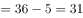人。

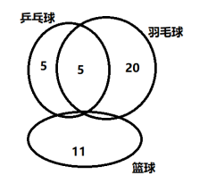

故正确答案为B。

---

### 第 2 题　qid 2444714 · 数学运算

某知识竞赛共50道单项选择题，小李和小王从中各自随机选择48道题作答。问他们未选的两道题相同的概率是：

- **A**. 

　✅
- **B**. 
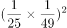

- **C**. 

- **D**. 

**答案**：A

**官方解析**

50题中选择48题作答，2道未答的情况数为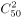，则小李、小王选择的情况数为。两人未选的两道题相同，此时情况数为，则满足题意的概率为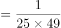。

故正确答案为A。

---

### 第 3 题　qid 2444721 · 数学运算

如图，沙漏计时器由上下两个大小相同、相互连通且底面互相平行的圆锥组成，下面的圆锥内装有细沙。计时开始时，将沙漏倒置，已知上面圆锥中细沙全部流下恰好需要1小时，则细沙高度下降一半所需的时间是：

- **A**. 30分钟
- **B**. 45分钟
- **C**. 47.5分钟
- **D**. 52.5分钟　✅

**答案**：D

**官方解析**

细沙高度下降一半时，此时剩余细沙部分的圆锥与整个圆锥的高度之比为1：2，两个圆锥为相似图形，因此，两个圆锥的底面半径之比也为1：2，则底面积之比为1：4。根据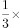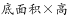，可得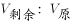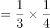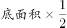。可知已经下降的细沙占所有细沙的比例为，下降需用时分钟。

故正确答案为D。

---

### 第 4 题　qid 2444724 · 数学运算

甲地有一批100吨的装修材料需运到乙地，大卡车载重量为13吨，小货车载重量为5吨，大卡车一次运费为1000元，小货车一次运费为500元。如要求所有货物正好装满整数车，则运费最低为多少元？

- **A**. 8500　✅
- **B**. 9000
- **C**. 9500
- **D**. 10000

**答案**：A

**官方解析**

首先比较两种车运输单位重量材料所需要的运费，大卡车：元/吨，小货车：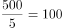元/吨，故用大卡车运输更划算，即在满载货物的前提下多使用大卡车。

设大卡车x辆，小货车y辆。则有：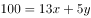， x、y全部取整。

因5y尾数为0或5，则13x的尾数也应为0或5，则x取0或5，因为要多使用大卡车，故x取最大值为5，此时，最少需要元运费。

故正确答案为A。

---

### 第 5 题　qid 2444727 · 数学运算

AB两点间有一条直线跑道，甲从A点出发，乙从B点出发，两人同时开始匀速在两点之间往返跑步。第一次迎面相遇时离A点1000米，第三次迎面相遇时离B点200米，此时甲到达B点2次，乙到达A点1次，问AB两点间跑道的长度是多少米？

- **A**. 1400
- **B**. 1500
- **C**. 1600　✅
- **D**. 1700

**答案**：C

**官方解析**

设AB两地路程为S。甲从A点出发，乙从B点出发，两人第一次相遇时，甲走了1000米；等到第三次相遇时，相遇点离B点200米，甲到达B点2次，即甲走了米。根据直线两端多次相遇的公式，相遇N次两人一起走了，则第一次迎面相遇两人一起走了S，第三次迎面相遇两人一起走了5S，两次总路程之比为1：5。由于速度均保持不变，因此对甲来说，两次相遇走过的路程之比也为1：5，有：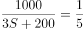，解得米。

故正确答案为C。

---

### 第 6 题　qid 2444728 · 数学运算

某商场做促销活动，一次性购物不超过500元的打九折优惠；超过500元的，其中500元打九折优惠，超过500元部分打八折优惠。小张购买的商品需付款490元，小李购买的商品比原价优惠了120元。如两人一起结账，比分别结账可节省多少元钱？

- **A**. 10
- **B**. 20
- **C**. 30
- **D**. 50　✅

**答案**：D

**官方解析**

若一次性购物500元，则打九折优惠需要元，小张付款490元，即说明购买的商品超过500元。同理，小李购买的商品总价格也超过了500元。当两人一起结账时，小李的商品价格继续比原价优惠了120元，没有变化，而小张的商品超过500元的部分继续打8折，没有变化，但低于500的部分，之前打9折，现在打8折，可以节省元。

故正确答案为D。

---

### 第 7 题　qid 2444729 · 数学运算

一本杂志不超过200页，其中最后一页为广告，往前隔页为连续2页广告，再往前隔页为连续3页广告，以此类推，最后往前隔1页为连续页广告。问这本杂志最多有多少页广告？

- **A**. 91
- **B**. 96
- **C**. 105　✅
- **D**. 120

**答案**：C

**官方解析**

根据题意，从最后一页的广告开始往前查看的话，广告页和非广告页的页数分布如下图：

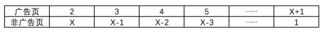

则这本杂志除最后一页外，共有广告页，即页；共有非广告页页，即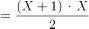页，则这本杂志共有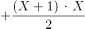页。因杂志页数为整数，且，因此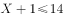，的最大值为13，此时这本杂志的广告页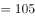页。

故正确答案为C。

拓展：等差数列的求和公式为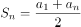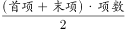。

---

### 第 8 题　qid 2444731 · 数学运算

某场科技论坛有5G、人工智能、区块链、大数据和云计算5个主题，每个主题有2位发言嘉宾。如果要求每个主题的嘉宾发言次序必须相邻，问共有多少种不同的发言次序？

- **A**. 120
- **B**. 240
- **C**. 1200
- **D**. 3840　✅

**答案**：D

**官方解析**

根据题意，要求每个主题的嘉宾发言次序必须相邻，可先对每个主题发言的嘉宾顺序进行排列，再对5个主题的发言顺序进行排列，则总共的发言顺序有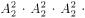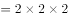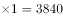种。

故正确答案为D。

---

### 第 9 题　qid 2444737 · 数学运算

小王的汽车每年基础保险费用为4500元，由于购车后从未出险理赔，目前按基础保险费用的收取保费。近日小王停车时撞到其他车辆，自行修理两辆车需元，如果由保险公司全额赔付，则未来3年内保费折扣分别变更为基础保险费用的、和。问在超过多少元时，出险理赔比自行修理更划算？

- **A**. 1350
- **B**. 1800
- **C**. 3375　✅
- **D**. 3825

**答案**：C

**官方解析**

根据题意，当小王选择自行修理时，未来三年的基础保险费用及修车费用共为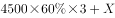；当小王选择出险理赔时，未来三年的基础保险费用为。则当时，出险理赔更划算，此时，则当超过3375元时，出险理赔比自行修理更划算。

故正确答案为C。

---

### 第 10 题　qid 2444740 · 数学运算

将一块边长为1米的正方体石材挖空制成下图所示的工艺品，其每个棱的宽度都是0.1米。将该工艺品的整个表面进行磨光处理，每平方厘米的磨光费用为1元，问磨光总费用在以下哪个范围内？

- **A**. 不到3万元
- **B**. 3～3.5万元之间
- **C**. 3.5～4万元之间
- **D**. 4万元以上　✅

**答案**：D

**官方解析**

根据题意，要求总费用需计算该工艺品的表面积，该工艺品共有6个面，每个面外框的表面积为：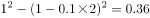平方米；每个面内框的表面积为：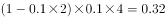平方米。则这个工艺品的表面积为平方米平方厘米，磨光总费用为元，为4万元以上。

故正确答案为D。

---

## 判断推理

### 第 1 题　qid 2444696 · 图形推理

从所给四个选项中，选择最合适的一个填入问号处，使之呈现一定规律性：

- **A**. A
- **B**. B
- **C**. C
- **D**. D　✅

**答案**：D

**官方解析**

元素组成基本相同，优先考虑位置规律，如下图所示，四个黑点连成的直线依次逆时针旋转，且内部两个黑点在内圈依次逆时针平移一格，两个黑点连成的直线在外圈依次顺时针平移一格，只有D项符合。

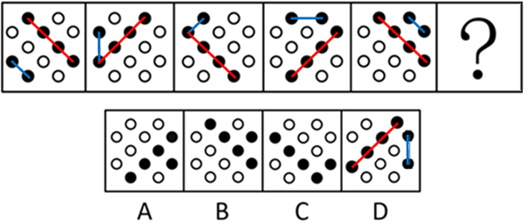

故正确答案为D。

---

### 第 2 题　qid 2444702 · 图形推理

从所给四个选项中，选择最合适的一个填入问号处，使之呈现一定规律性：

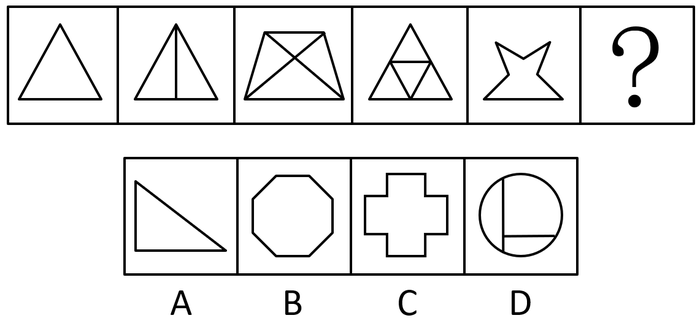

- **A**. A
- **B**. B　✅
- **C**. C
- **D**. D

**答案**：B

**官方解析**

元素组成不同，且无明显属性规律，考虑数量规律。观察发现，题干均为多边形，优先考虑数线，但无规律。此外图形线条交叉明显，考虑数交点。题干图形点数量分别为3、4、5、6、7，故？处应该选择一个交点数为8的图形，只有B项符合。
故正确答案为B。

---

### 第 3 题　qid 2444709 · 图形推理

从所给四个选项中，选择最合适的一个填入问号处，使之呈现一定规律性：

- **A**. A　✅
- **B**. B
- **C**. C
- **D**. D

**答案**：A

**官方解析**

元素组成不同，且每幅图均为两个封闭图形相交，考虑图形间关系。观察发现，题干图形均是相交于面，考虑相交面的形状。题干所有图形相交面的形状均为五边形，故？处也应选择一个相交面的形状是五边形的图形，只有A项符合。
故正确答案为A。

---

### 第 4 题　qid 2444712 · 图形推理

从所给四个选项中，选择最合适的一个填入问号处，使之呈现一定规律性：

- **A**. A
- **B**. B
- **C**. C
- **D**. D　✅

**答案**：D

**官方解析**

元素组成不同，且无明显属性规律，考虑数量规律。观察发现，题干出现多个小元素，优先考虑元素的种类和个数。题干元素的个数无明显规律，考虑元素的种类。第一行均为1种元素，第二行均为2种元素，第三行前两幅图均为3种元素，故？处也应选择一个有3种小元素的，只有D项符合。
故正确答案为D。

---

### 第 5 题　qid 2444719 · 图形推理

下边给定的是正方体的外表面展开图，下面哪一项不能由它折叠而成？

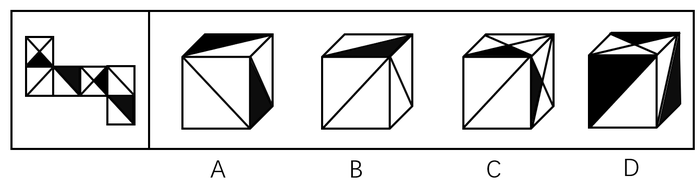

- **A**. A
- **B**. B
- **C**. C　✅
- **D**. D

**答案**：C

**官方解析**

将原展开图标上序号如下图，逐一选项进行分析。

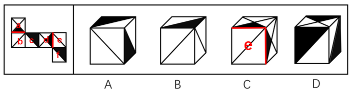

A项：因为面c和面e是相对面，所以选项出现的是面c、面f和面b，选项与展开图一致，排除；

B项：因为面e和面c是相对面，所以选项出现的是面e、面b和面f，选项与展开图一致，排除；

C项：因为面d和面b是相对面，所以选项出现的是面d、面a和面e，如上图所示，在展开图中只有面d中的小黑三角脚踩斜线面e，面a中的小黑三角脚踩的是斜线面b，而选项中面a和面d中的小黑三角都脚踩斜线面e，选项与展开图不一致，当选；

D项：因为面f和面a是相对面，所以选项出现的是面f、面c和面d，选项与展开图一致，排除。

本题为选非题，故正确答案为C。

---

### 第 6 题　qid 2444725 · 图形推理

左图给定的是由4个相同正方体组合成的立体图形，将其从任一面剖开，下面哪一项不可能是该立体图形的截面？

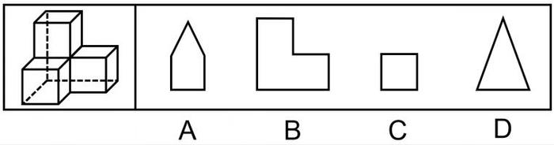

- **A**. A　✅
- **B**. B
- **C**. C
- **D**. D

**答案**：A

**官方解析**

本题考查截面图，如下图所示，B、C、D三项均可截出，只有A项无法截出。

 

本题为选非题，故正确答案为A。

---

### 第 7 题　qid 2444739 · 图形推理

把下面的六个图形分为两类，使每一类图形都有各自的共同特征或规律，分类正确的一项是：

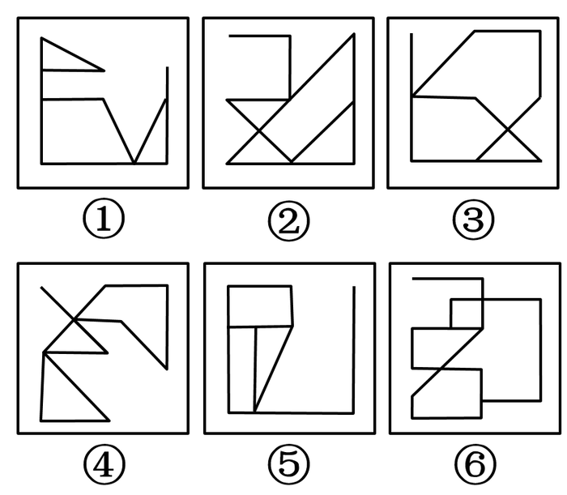

- **A**. ①③④，②⑤⑥
- **B**. ①③⑤，②④⑥
- **C**. ①②⑥，③④⑤
- **D**. ①⑤⑥，②③④　✅

**答案**：D

**官方解析**

本题为分组分类题目。元素组成不同，且无明显属性规律，考虑数量规律。题干图形均出现明显端点，考虑笔画数，图①⑤⑥的奇点数都是4，为2笔画图形；图②③④的奇点数都是2，为1笔画图形，即①⑤⑥一组，②③④一组。
故正确答案为D。

---

### 第 8 题　qid 2444746 · 图形推理

把下面的六个图形分为两类，使每一类图形都有各自的共同特征或规律，分类正确的一项是：

- **A**. ①②③，④⑤⑥
- **B**. ①③⑤，②④⑥　✅
- **C**. ①⑤⑥，②③④
- **D**. ①④⑥，②③⑤

**答案**：B

**官方解析**

本题为分组分类题目。元素组成不同，且无明显属性规律，考虑数量规律。题干图形均由直线构成，考虑数直线，但整体数直线没有规律，考虑线的细化考法，即线的方向，图①③⑤有1组平行线，图②④⑥有3组平行线，即①③⑤一组，②④⑥一组。
故正确答案为B。

---

### 第 9 题　qid 2444750 · 图形推理

把下面的六个图形分为两类，使每一类图形都有各自的共同特征或规律，分类正确的一项是：

- **A**. ①③④，②⑤⑥
- **B**. ①③⑤，②④⑥
- **C**. ①②⑥，③④⑤
- **D**. ①④⑥，②③⑤　✅

**答案**：D

**官方解析**

本题为分组分类题目。元素组成不同，优先考虑属性规律。观察发现，图①④⑥黑球区域为轴对称图形，图②③⑤白球区域为轴对称图形，即①④⑥一组，②③⑤一组。

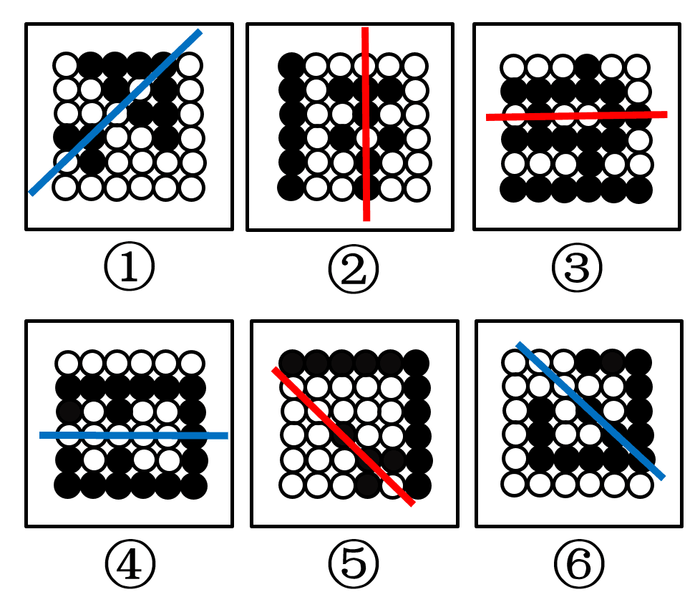

故正确答案为D。

---

### 第 10 题　qid 2444753 · 图形推理

下图是立体图形，下列哪个选项可以折叠成该立体图形？

- **A**. A　✅
- **B**. B
- **C**. C
- **D**. D

**答案**：A

**官方解析**

本题考查空间重构，可通过对比选项，结合排除法确定答案。为了方便理解，作图如下：

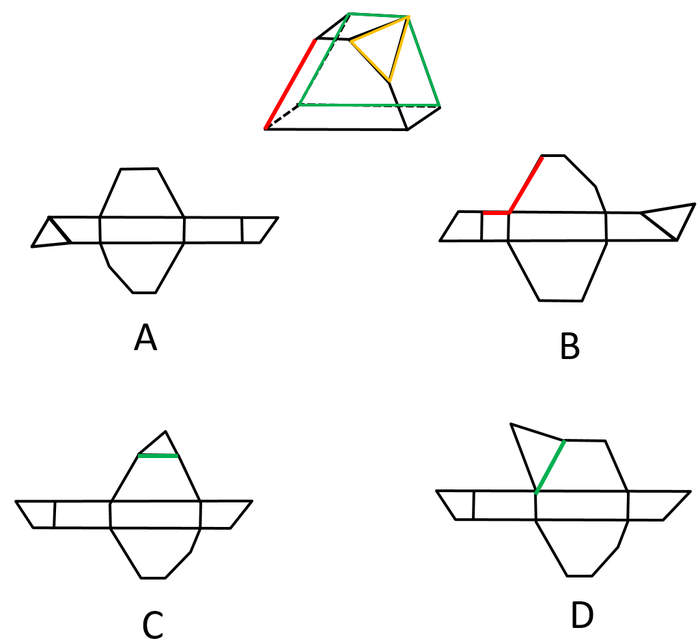

题干中的红边，在B项中对应标红的两条边，但二者长度不相等，排除B项；题干中的绿色梯形和黄色三角形没有公共边，而C、D两项中二者均存在公共边（绿线），排除。

故正确答案为A。

---

### 第 11 题　qid 2444758 · 定义判断

防御机制是心灵对内外压力和情绪冲突做出无意识和自动化反应的方式。它们限制了一个人对焦虑、抑郁或嫉妒等负面情绪的觉察，以解决内在的情绪冲突。替代是一种防御机制，是个体把无法对某人或物发泄的精力转移到另一个人或物上的过程。
根据上述定义，下列属于替代的是：

- **A**. 王先生早上没时间吃饭，于是中午把早午饭一起吃了
- **B**. 小张在单位受了老板的气，回家后把怒气转嫁到了孩子身上　✅
- **C**. 小冰想吃冰激凌，但妈妈不让吃凉的，小冰只好买了很多糖果
- **D**. 小周很喜欢一位男同事，却经常跟别的同事讨论该男同事的缺点

**答案**：B

**官方解析**

第一步：找出定义关键词。
“个体”、“把无法对某人或物发泄的精力转移到另一个人或物上的过程”。
第二步：逐一分析选项。
A项：王先生中午把早午饭一起吃了，没有涉及到发泄，不符合“把无法对某人或物发泄的精力转移到另一个人或物上的过程”，不符合定义，排除； 
B项：小张在单位受了老板的气，回家后把怒气转嫁到了孩子身上，符合“个体”、“把无法对某人或物发泄的精力转移到另一个人或物上的过程”，符合定义，当选；
C项：小冰没法吃冰激凌，只好买了很多糖果，没有涉及到发泄，不符合“把无法对某人或物发泄的精力转移到另一个人或物上的过程”，不符合定义，排除；
D项：小周经常跟别的同事讨论自己喜欢的男同事的缺点，没有涉及发泄，不符合“把无法对某人或物发泄的精力转移到另一个人或物上的过程”，不符合定义，排除。
故正确答案为B。

---

### 第 12 题　qid 2444761 · 定义判断

环境教育是以人类与环境的关系为核心，以解决环境问题和实现可持续发展为目的，以提高人们的环境意识和有效参与能力、普及环境保护知识与技能、培养环境保护人才为任务，以教育为手段而展开的一种社会实践活动。
根据上述定义，下列教学内容最符合环境教育的是：

- **A**. 倡导遵守保护环境的行为规范　✅
- **B**. 讲授与环境有关的自然科学知识
- **C**. 讲授改造自然环境的理论与方法
- **D**. 提倡从环境中获取满足人类需求的资源

**答案**：A

**官方解析**

第一步：找出定义关键词。
“以人类与环境的关系为核心”、“以解决环境问题和实现可持续发展为目的”。 
第二步：逐一分析选项。
A项：倡导遵守保护环境的行为规范，最终的目的是为了保护环境，符合“以人类与环境的关系为核心”、“以解决环境问题和实现可持续发展为目的”，符合定义，当选； 
B项：讲授与环境有关的自然科学知识，不符合“以人类与环境的关系为核心”，不符合定义，排除；
C项：讲授改造自然环境的理论与方法，不符合“以解决环境问题和实现可持续发展为目的”，不符合定义，排除；
D项：提倡从环境中获取满足人类需求的资源，没有体现是否要保护环境，是否应可持续获取，不符合“以解决环境问题和实现可持续发展为目的”，不符合定义，排除。
故正确答案为A。

---

### 第 13 题　qid 2444774 · 定义判断

幸存者偏差谬误是统计学中的一种谬误，它是指我们忽略了那些已经不可能向我们显示的数据，而仅仅根据能够向我们展现出的数据，从而得出某种错误结论的谬误。
根据上述定义，下列不属于幸存者偏差谬误的是：

- **A**. 记者在高铁上调查乘客买票的情况后认为，买到车票非常容易
- **B**. 小张看到大多数人给予某部电影好评，因此决定去看这部电影　✅
- **C**. 许多商业传奇的缔造者都是辍学后创业的，小李读了他们的传记，决定退学创业
- **D**. 老王在朋友圈询问哪种钙片补钙效果好，老刘推荐了A钙片，于是他决定服用该种钙片

**答案**：B

**官方解析**

第一步：找出定义关键词。
“忽略了那些已经不可能向我们显示的数据”、“仅仅根据能够向我们展现出的数据，从而得出某种错误结论”。
第二步：逐一分析选项。
A项：记者在高铁上调查乘客的买票情况，高铁上的乘客都是有票的，符合“忽略了那些已经不可能向我们显示的数据”、“仅仅根据能够向我们展现出的数据，从而得出某种错误结论”，符合定义，排除； 
B项：小张看到大多数人给予某部电影好评决定去看，就是根据大数据整体评估后做出的决定，不符合“忽略了那些已经不可能向我们显示的数据”、“仅仅根据能够向我们展现出的数据，从而得出某种错误结论”，不符合定义，当选；
C项：小李读了辍学者创业成功的传记后决定退学创业，这本书本来就只记录那些成功的案例，没有讲述失败者的，符合“忽略了那些已经不可能向我们显示的数据”、“仅仅根据能够向我们展现出的数据，从而得出某种错误结论”，符合定义，排除；
D项：老王问的是哪种好，只看了老刘说A好，看不到那些说A不好的，符合“忽略了那些已经不可能向我们显示的数据”、“仅仅根据能够向我们展现出的数据，从而得出某种错误结论”，符合定义，排除。
本题为选非题，故正确答案为B。

---

### 第 14 题　qid 2444776 · 定义判断

顺从是指在他人的直接请求下按照他人要求做的倾向，即接受他人请求，使他人请求得到满足的行为。它是一种人与人之间发生相互影响的基本方式。
根据上述定义，下列属于顺从的是：

- **A**. 非典爆发期间，人们争相购买板蓝根
- **B**. 小军从军期间按照组织的安排去了西藏工作
- **C**. 女友说想吃火锅，晓强带她去了最近的一家火锅店　✅
- **D**. 为了让妈妈安心上班，小菁主动提出要照顾生病的奶奶

**答案**：C

**官方解析**

第一步：找出定义关键词。
“接受他人请求”。
第二步：逐一分析选项。
A项：非典爆发期间，人们争相购买板蓝根，不符合“接受他人请求”，不符合定义，排除； 
B项：小军从军期间按照组织的安排去了西藏工作，这是组织的命令，不符合“接受他人请求”，不符合定义，排除；
C项：女友说想吃火锅，晓强带她去了火锅店，符合“接受他人请求”，符合定义，当选；
D项：小菁主动提出照顾生病的奶奶，不符合“接受他人请求”，不符合定义，排除。
故正确答案为C。

---

### 第 15 题　qid 2444777 · 定义判断

知觉的选择性是指人在知觉过程中把知觉对象从背景中区分出来加以优先清晰地反映的特性。其中被清晰知觉到的客体叫对象，未被清晰知觉到的客体叫背景。
根据上述定义，下列体现知觉的选择性的是：

- **A**. 人们经常把画得不完整的三角形看成是完整的三角形
- **B**. 在山下看，觉得城市很大；爬上山顶之后再看，觉得城市很小
- **C**. 外国留学生经常把“拆除”写成“折陈”，把“银行”看成“很行”
- **D**. 樵夫和猎人看同一张森林照片，樵夫看到很多树木，猎人则看到林间的猎物　✅

**答案**：D

**官方解析**

第一步：找出定义关键词。
“在知觉过程中”、 “把知觉对象从背景中区分出来加以优先清晰地反映”。
第二步：逐一分析选项。
A项：把画得不完整的三角形看成完整的三角形，未体现“把知觉对象从背景中区分出来加以优先清晰地反映”，不符合定义，排除；
B项：在山下看时城市很大，在山顶看时城市很小是由于观察距离的影响，而不是“把知觉对象从背景中区分出来加以优先清晰地反映”，不符合定义，排除；
C项：把拆除写成折陈，把银行看成很行是由于看错了字，而不是“把知觉对象从背景中区分出来加以优先清晰地反映”，不符合定义，排除；
D项：樵夫看的是很多树木，猎人看的是林间猎物是由于两个人的关注点不同，所以将自己优先关注到的事物提取出来，符合“把知觉对象从背景中区分出来加以优先清晰地反映”，符合定义，当选；
故正确答案为D。

---

### 第 16 题　qid 2444735 · 类比推理

云梯：攻城

- **A**. 水稻：栽培
- **B**. 商品：生产
- **C**. 油灯：照明　✅
- **D**. 驿站：传信

**答案**：C

**官方解析**

第一步：判断题干词语间逻辑关系。
云梯可以用来攻城，二者是功能对应。
第二步：判断选项词语间逻辑关系。
A项：栽培水稻，二者是动宾短语，与题干逻辑关系不一致，排除；
B项：生产商品，二者是动宾短语，与题干逻辑关系不一致，排除；
C项：油灯可以用来照明，二者是功能对应，与题干逻辑关系一致，当选；
D项：驿站是古代供传递军事情报的官员途中食宿、换马的场所，所以功能不是传信，与题干逻辑关系不一致，排除。
故正确答案为C。

---

### 第 17 题　qid 2444738 · 类比推理

飞行员：飞机

- **A**. 教师：教室　✅
- **B**. 海军：大海
- **C**. 妻子：家庭
- **D**. 皇帝：皇宫

**答案**：A

**官方解析**

第一步：判断题干词语间逻辑关系。
飞机是飞行员工作的场所，二者是工作场所的对应。
第二步：判断选项词语间逻辑关系。
A项：教室是教师工作的场所，二者是工作场所的对应，与题干逻辑关系一致，当选；
B项：海军在大海里作战，二者是工作场所的对应，但是大海包含的范围太广，而题干是一个具体的工作场所，与题干逻辑关系不一致，排除；
C项：妻子在家庭里生活，二者是生活地点的对应，与题干逻辑关系不一致，排除；
D项：皇帝住在皇宫里，二者是生活地点的对应，与题干逻辑关系不一致，排除。
故正确答案为A。

---

### 第 18 题　qid 2444741 · 类比推理

红颜：娥眉：女性

- **A**. 襁褓：垂髫：幼儿
- **B**. 花甲：耄耋：老人　✅
- **C**. 四海：八荒：天下
- **D**. 婵娟：玉盘：月亮

**答案**：B

**官方解析**

第一步：判断题干词语间逻辑关系。
红颜和娥眉都可以指代女性，前两个词与第三个词构成比喻象征义。
第二步：判断选项词语间逻辑关系。
A项：襁褓可以借指未满周岁的婴儿，垂髫可以借指儿童，两者均不指幼儿，与题干逻辑关系不一致，排除；
B项：花甲和耄耋均借指老人，前两个词与第三个词构成比喻象征义，与题干逻辑关系一致，保留；
C项：四海和八荒均可以借指天下，前两个词与第三个词构成比喻象征义，与题干逻辑关系一致，保留；
D项：婵娟和玉盘均借指月亮，前两个词与第三个词构成比喻象征义，与题干逻辑关系一致，保留；
对比B项、C项和D项，题干和B项均说的是人，所以B项和题干逻辑关系更为一致。
故正确答案为B。

---

### 第 19 题　qid 2444744 · 类比推理

页面设置：页边距：文字方向

- **A**. 插入图片：公式：页码
- **B**. 字体设置：宋体：黑体
- **C**. 邮件发送：附件：正文　✅
- **D**. 保存文档：硬盘：手机

**答案**：C

**官方解析**

第一步：判断题干词语间逻辑关系。
页边距、文字方向是页面设置所包括的两个具体内容，后两者为并列关系，与页面设置为包容关系。
第二步：判断选项词语间逻辑关系。
A项：插入图片与公式、页码无明显关系，公式、页码也可以是插入的内容，二者为并列关系，与题干逻辑关系不一致，排除；
B项：宋体与黑体是字体设置时可以选择的两种字体，后二者为并列关系，但与字体设置为对应关系，并非包容关系，与题干逻辑关系不一致，排除；
C项：附件与正文是邮件发送所包括的两个具体内容，后两者为并列关系，与邮件发送为包容关系，与题干逻辑关系一致，当选；
D项：硬盘与手机（闪存）是保存文档的两个设备，后两者为并列关系，与保存文档为对应关系，并非包容关系，与题干逻辑关系不一致，排除。
故正确答案为C。

---

### 第 20 题　qid 2444745 · 类比推理

（  ）对于 大厦 相当于 琵琶 对于（  ）

- **A**. 城堡；电吉他　✅
- **B**. 高楼；舞台
- **C**. 工人；制琴师
- **D**. 房间；琴弦

**答案**：A

**官方解析**

逐一代入选项。
A项：城堡与大厦是两种建筑，二者为并列关系中的反对关系，且城堡出现在大厦之前，城堡是古代建筑，大厦是现代建筑；琵琶与电吉他是两种乐器，二者为并列关系中的反对关系，且琵琶出现在电吉他之前，琵琶是古代乐器，电吉他是现代乐器，前后逻辑关系一致，当选；
B项：大厦是一种高楼，二者为包容关系中的种属关系；在舞台上弹奏琵琶，二者为地点对应关系，前后逻辑关系不一致，排除；
C项：工人建造大厦，制琴师制造琵琶，均为制作者与成品的对应关系，但词语顺序不同，前后逻辑关系不一致，排除；
D项：房间是大厦的组成部分，琴弦是琵琶的组成部分，二者均为包容关系中的组成关系，但词语顺序不同，前后逻辑关系不一致，排除。
故正确答案为A。

---

### 第 21 题　qid 2444748 · 逻辑判断

某单位办公室共有12名工作人员。其中，有3名干部是博士，但并非所有的博士都是管理学专业毕业的，而所有女性工作人员都是管理学专业毕业的。由此可以推出：

- **A**. 有些女性不是干部
- **B**. 有些博士不是女性　✅
- **C**. 有些女性不是博士
- **D**. 有些干部不是管理学专业毕业的

**答案**：B

**官方解析**

第一步：翻译题干。

①有的干部博士；

②有的博士管理学专业毕业；

③女性管理学专业毕业；

将③逆否和②可以递推出：④有的博士管理学专业毕业女性。

第二步：逐一分析选项。

A项：翻译为有的女性干部，根据③，可以推出有的女性是管理学专业毕业，但①②中包含“有的”，无法进行逆否，因此，该项无法推出，排除；

B项：翻译为有的博士女性，根据④可以推出，当选；

C项：翻译为有的女性博士，根据④可以推出“有的博士女性”，利用置换只能推出“有的女性博士”，推不出“有的女性博士”，排除；

D项：翻译为有的干部管理学专业毕业，①②中包含“有的”，不满足递推规则，无法推出，排除。

故正确答案为B。

---

### 第 22 题　qid 2444751 · 逻辑判断

胎儿大脑发育需要一种重要的营养物质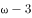脂肪酸即二十二碳六烯酸（DHA)。有人建议，孕妇在孕期服用富含DHA的鱼油补充剂有利于胎儿的大脑发育。临床试验中，两组孕妇每日服用含有800毫克DHA的补充剂或安慰剂。两组孩子在18个月大时，其平均的认知、语言及运动评分之间没有差别。此后，研究人员对这些孩子在4岁时的表现进行了跟踪评估，大多数（)家庭参与了该研究。研究人员发现，对认知、从事复杂思维处理、语言及执行功能（如记忆、推理、解决问题）的检测结果在两组间没有显著差异。研究者认为，母亲妊娠期补充DHA不能使孩子更聪明。

以下哪项如果为真，最能驳斥研究者观点？

- **A**. 胎儿的DHA来自母亲的饮食，但母亲需要摄入的DHA的确切数量目前难以确定
- **B**. DHA补充剂可能降低早产的风险，也可能降低那些有家族过敏史的孩子患过敏的风险
- **C**. 7岁才是能够预测智力的最早年龄，4岁时各种因素对发育的影响尚未充分表现，不能可靠评估　✅
- **D**. 研究证明，孩子出生后补充DHA有益于认知能力发展，该国婴儿出生后常规服用富含DHA的补充剂

**答案**：C

**官方解析**

第一步：找出论点和论据。

论点：母亲妊娠期补充DHA不能使孩子更聪明。

论据：临床试验中，两组孕妇每日服用含有800毫克DHA的补充剂或安慰剂。两组孩子在18个月大时，其平均的认知、语言及运动评分之间没有差别。此后，研究人员对这些孩子在4岁时的表现进行了跟踪评估，大多数（）家庭参与了该研究。研究人员发现，对认知、从事复杂思维处理、语言及执行功能（如记忆、推理、解决问题）的检测结果在两组间没有显著差异。

本题通过对比试验的结果，两组孩子在18个月大以及4岁时，平均的认知、语言、运动评分以及认知、从事复杂思维处理、语言及执行功能（如记忆、推理、解决问题）的检测结果没有明显差异，作为论据得出论点母亲妊娠期补充DHA不能使孩子更聪明，两者话题不一致，削弱优先考虑拆桥，即证明18个月大以及4岁这些能力不能代表孩子是否聪明。

第二步：逐一分析选项。

A项：指出母亲需要摄入的DHA数量难以确定，没有涉及摄入DHA后对胎儿的影响，无法削弱，排除；

B项：指出DHA补充剂可能可以降低早产以及有家族过敏史的孩子患过敏的风险，没有涉及对孩子智力的影响，属于无关项，排除；

C项：指出7岁是预测智力的最早年龄，论据中对4岁孩子各种能力的评估无法证明孩子是否聪明，削弱了论据与论点之间的关系，拆桥，削弱论证，当选；

D项：说的是孩子出生后补充DHA有益于认知能力发展，而论点说的是母亲妊娠期补充DHA不能使孩子更聪明，二者话题不一致，属于无关项，排除。

故正确答案为C。

---

### 第 23 题　qid 2444754 · 图形推理

考古学家通过对消失已久的鹦鹉嘴龙进行体色重建，发现其腹部颜色为浅色而背部颜色较深。这是一种保护色，作用是通过在身体上形成阴影，让动物自身在其他动物眼中失去立体效果，因此也被称为反荫蔽体色，这在现代动物中也较为常见。据此分析，考古学家推测鹦鹉嘴龙最有可能居住在森林里。
要得到上述结论，最需要补充的前提条件是：

- **A**. 生活在森林中的动物其体色模式大多为反荫蔽体色　✅
- **B**. 恐龙包含许多种类，其中大部分都生活在森林和草原中
- **C**. 在一发现恐龙化石的地区，考古推测该区域曾有大片的森林
- **D**. 鹦鹉嘴龙是一种小型恐龙，这种体色对于逃避天敌有天然的伪装作用

**答案**：A

**官方解析**

第一步：找出论点和论据。
论点：鹦鹉嘴龙最有可能居住在森林里。
论据：考古学家通过对消失已久的鹦鹉嘴龙进行体色重建，发现其腹部颜色为浅色而背部颜色较深。这是一种保护色，作用是通过在身体上形成阴影，让动物自身在其他动物眼中失去立体效果，因此也被称为反荫蔽体色，这在现代动物中也较为常见。
论点讨论的是鹦鹉嘴龙生活在森林里，论据讨论的是鹦鹉嘴龙有反荫蔽体色，论点和论据话题不一致，要想加强，优先考虑搭桥，即建立森林和反荫蔽体色之间的关系。
第二步：逐一分析选项。
A项：该项指出生活在森林中的动物其体色模式大多为反荫蔽体色，那么鹦鹉嘴龙有反荫蔽体色，就很有可能生活在森林里，建立了论点和论据之间的联系，为搭桥项，当选；
B项：该项指出恐龙大多数生活在森林和草原中，无法得知鹦鹉嘴龙是生活在森林还是草原，无法加强，排除；
C项：该项指出考古推测发现的恐龙区域曾有大片森林，与鹦鹉嘴龙是否生活在森林无关，无法加强，排除； 
D项：该项强调鹦鹉嘴龙体色的作用，与鹦鹉嘴龙是否生活在森林无关，无法加强，排除。 
故正确答案为A。

---

### 第 24 题　qid 2444755 · 逻辑判断

某研究小组在1984年挑选了10万名身体健康的志愿者，在2010年的反馈调查中，超过2.6万名志愿者已经离世。研究小组发现，经常食用诸如麦片、糙米、玉米和藜麦等粗粮的志愿者生病和死亡比例比不食用者低，尤其是患血管疾病的比例更低。研究人员认为，食用粗粮有助于身体健康。
以下哪项如果为真，不能支持研究人员的结论？

- **A**. 粗粮是运动员和减肥人士的最佳早餐
- **B**. 粗粮是世界上很多国家老百姓的主食　✅
- **C**. 在很多医学典籍里，有食用粗粮治病的记载
- **D**. 经常食用粗粮有助于降低罹患肥胖症的风险

**答案**：B

**官方解析**

第一步：找出论点和论据。
论点：食用粗粮有助于健康。
论据：经常食用诸如麦片、糙米、玉米和藜麦等粗粮的志愿者生病和死亡比例比不食用者低，尤其是患血管疾病的比例更低。
论点和论据讨论的均是粗粮有助于身体健康，话题一致，要想加强，可以考虑补充论据，即说明粗粮对身体健康有益的原因，或者举例说明粗粮有助于身体健康。
第二步：逐一分析选项。
A项：该项指出粗粮是运动员和减肥人士的最佳早餐，运动员和减肥人士相对来说吃的比较健康，举例说明粗粮有助于身体健康，可以加强，排除；
B项：该项指出粗粮是世界上很多国家老百姓的主食，与粗粮是否有助于身体健康无关，无法加强，当选；
C项：该项指出医学典籍中有食用粗粮治病的记载，举例说明粗粮有助于身体健康，可以加强，排除； 
D项：该项强调经常食用粗粮有助于降低罹患肥胖病的风险，说明粗粮确实对人体健康有益，可以加强，排除。 
本题为选非题，故正确答案为B。

---

### 第 25 题　qid 2444757 · 类比推理

老鼠在猫的左边，狗在老鼠右边，老鼠正上方有只黄鹂，狗的正上方有只喜鹊，下列位置关系正确的是：

- **A**. 狗的左边是猫
- **B**. 狗的右边是猫
- **C**. 黄鹂的右边是喜鹊　✅
- **D**. 黄鹂的左边是喜鹊

**答案**：C

**官方解析**

第一步：分析题干条件。

根据题干条件，老鼠提及的最多，从最大信息入手，老鼠在猫的左边，那么猫就在老鼠的右边，根据第二个条件，狗也在老鼠的右边，那么猫和狗的位置有以下两种情况，如下图所示。

情况一：

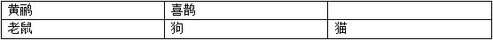

情况二：

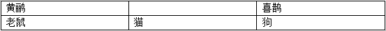

第二步：逐一分析选项。

A项：如上图所示，情况一中，狗的右边是猫，该项错误，排除；

B项：如上图所示，情况二中，狗的左边是猫，该项错误，排除；

C项：如上图所示，两种情况均满足黄鹂的右边是喜鹊，该项正确，当选；

D项：如上图所示，两种情况均满足黄鹂的右边是喜鹊，该项错误，排除。 

故正确答案为C。

---

### 第 26 题　qid 2444760 · 逻辑判断

3月20日，某网约车公司对北京三环内非京牌车辆停止派单，9天后，该公司又在客户端上给司机发出了一则通知，宣布从4月1日起将在全北京范围内停止向非京牌车辆派单。这说明从4月1日起，北京市民将再次面临“叫车难”的问题。
以下哪项最能削弱上述预测？

- **A**. 停止向非京牌车辆派单能在一定程度上缓解交通拥堵
- **B**. 在北京运营的网约车中，外地牌照车辆大约占一半以上
- **C**. 该网约车公司表示，将会采取多种措施提升北京市民叫车的效率　✅
- **D**. 很多“京人京牌”并且符合细则规定的网约车司机对未来充满了期待

**答案**：C

**官方解析**

第一步：找出论点和论据。
论点：从4月1日起，北京市民将再次面临“叫车难”的问题。
论据：3月20日，某网约车公司对北京三环内非京牌车辆停止派单，9天后，该公司又在客户端上给司机发出了一则通知，宣布从4月1日起将在全北京范围内停止向非京牌车辆派单。
论点和论据讨论的都是网约车公司停止向非京牌车辆派单导致市民“叫车难”的问题，话题一致，要想削弱，可以直接否定论点，即网约车公司停止向非京牌车辆派单不会导致市民“叫车难”的问题。
第二步：逐一分析选项。
A项：该项指出停止向非京牌车辆派单能在一定程度上缓解交通拥堵，与是否会造成居民“叫车难”的问题无关，无法削弱，排除；
B项：该项指出在北京运营的网约车中，外地牌照车辆大约占一半以上，那么该公司停止向非京牌车辆派单，可能一定程度上会造成市民“叫车难”的问题，具有一定的加强作用，无法削弱，排除；
C项：该项指出该网约车公司将会采取多种措施提升北京市民叫车的效率，那么停止向非京牌车辆派单就不会造成市民“叫车难”的问题，直接否定论点，可以削弱，当选； 
D项：该项指出很多“京人京牌”并且符合细则规定的网约车司机对未来充满了期待，与市民是否会面临“叫车难”的问题无关，无法削弱，排除。 
故正确答案为C。

---

### 第 27 题　qid 2444762 · 逻辑判断

有一种观点认为，人体缺水是导致感冒的原因。反对者则认为，并非是缺水，受凉才是导致感冒的根本原因。
以下哪项如果为真，最能削弱反对者的观点？

- **A**. 人体缺水之后，更容易受凉　✅
- **B**. 感冒往往伴随着发烧，而发烧通常会导致缺水、怕冷
- **C**. 即使没有受凉，人体缺水之后也会出现很多类似感冒的症状
- **D**. 受凉之后，更容易导致人体缺水、抵抗力下降，从而引发感冒

**答案**：A

**官方解析**

第一步：找出论点和论据。
论点：并非是缺水，受凉才是导致感冒的根本原因。
论据：无。
本题只有论点，考虑削弱论点，即是缺水导致感冒而不是受凉。
第二步：逐一分析选项。
A项：论点说的是导致感冒的根本原因是受凉不是缺水，该项说的是缺水导致受凉进而导致感冒，因此导致感冒的根本原因还是缺水，直接削弱论点，当选；
B项：说的是发烧导致缺水、怕冷，而发烧是伴随着感冒产生的，并不能说发烧就是感冒，所以感冒与缺水之间的关系不明确，无法削弱，排除；
C项：缺水之后会出现类似感冒的症状，类似感冒的症状与感冒并没有必然的关系，无关项，无法削弱，排除；
D项：受凉之后，导致缺水、感冒，说明是受凉是感冒的根本原因，加强项，无法削弱，排除。
故正确答案为A。

---

### 第 28 题　qid 2444765 · 逻辑判断

如果专利技术的宣传推广有足够的资金支持，那么专利技术的拥有者将更加关注其专利技术的宣传推广工作。专利技术宣传推广得越充分，其转化为专利产品、创造价值的可能性也就越大，整个社会的创新能力也将得到进一步提高。因此，如果国家增加专利技术宣传推广的补贴，那么将有力增强整个社会的创新能力。
以下哪项如果为真，最能支持上述论述？

- **A**. 有些专利技术转换为产品后所带来的收益尚不足以支付其宣传推广费用
- **B**. 专利技术拥有者越关注宣传推广，其专利技术的宣传推广就可以做得越充分　✅
- **C**. 如果国家不增加专利技术宣传推广的补贴，那么将不能增强整个社会的创新能力
- **D**. 如果专利技术拥有者不关注宣传推广工作，那么其专利技术就很难转化为专利产品

**答案**：B

**官方解析**

第一步：找出论点和论据。
论点：如果国家增加专利技术宣传推广的补贴，那么将有力增强整个社会的创新能力。
论据：如果专利技术的宣传推广有足够的资金支持，那么专利技术的拥有者将更加关注其专利技术的宣传推广工作。专利技术宣传推广得越充分，其转化为专利产品、创造价值的可能性也就越大，整个社会的创新能力也将得到进一步提高。
论点和论据中均出现了“如果…那么”此类逻辑关联词，可优先把它们翻译出来，帮助解题。论据“宣传推广足够资金→关注宣传推广；宣传推广充分→创新能力提高”，论点“宣传推广足够资金→创新能力提高”，论据的结构是“1→2；3→4”，要得到论点“1→4”，只需补充“2→3”即可，即建立“关注宣传推广”和“宣传推广充分”之间的关系。
第二步：逐一分析选项。
A项：论点讨论的是如果国家增加专利技术宣传推广的补贴，能不能增强创新能力，选项说有些专利技术转换为产品后所带来的收益不足以支付宣传推广费用，不能加强，排除；
B项：关注宣传推广→宣传推广充分，建立了“关注宣传推广”和“宣传推广充分”之间的关系，补充论据，可以加强，当选；
C项：论点是“宣传推广足够资金→创新能力提高”，选项是“—宣传推广足够资金→—创新能力提高”，论点讨论的是满足了“宣传推广足够资金”这个条件，创新能力能不能提高，选项说的是没满足“宣传推广足够资金”这个条件，创新能力怎么样，无关项，排除；
D项：—关注宣传推广→专利技术就很难转化为专利产品，未涉及“关注宣传推广”和“宣传推广充分”之间的关系，无关项，排除。
故正确答案为B。
注：这道题有很多小伙伴错选了C，觉得C是“无因无果”，所以能加强，但是要注意了，题干的论点不是因果关系，而是条件关系，所以当论点和论据涉及条件关系的时候，优先把它翻译出来，建立关系即可；当论点和论据涉及因果关系的时候，再考虑“无因无果”这种加强方式。

---

### 第 29 题　qid 2444767 · 逻辑判断

甲、乙、丙都准备开始锻炼身体，他们可以选择徒步、跳绳和打乒乓球三种方式。已知：
（1）甲不喜欢徒步，如果有乙结伴，他就选择打乒乓球；
（2）乙不在意方式，如果跳绳比徒步效果好，他就选择跳绳；
（3）丙不在意距离，除非预报室外有雾霾，否则选择徒步；
（4）乙、丙两家是邻居，如果休息时间一致，他们将结伴徒步。
如果要满足上述要求，则下列说法正确的是：

- **A**. 如果甲和丙跳绳，则室外有雾霾
- **B**. 如果三人都徒步，则徒步要比跳绳效果好
- **C**. 如果三人都不徒步，则乙和丙的休息时间一定不一致　✅
- **D**. 如果乙没有选择徒步和跳绳，则他肯定选择和甲一起打乒乓球

**答案**：C

**官方解析**

第一步：分析题干信息。

（1）甲不喜欢徒步，甲乙结伴甲乒乓球；

（2）乙三种方式都可，跳绳比徒步效果好→乙跳绳；

（3）丙不在意距离，丙徒步室外有雾霾；

（4）乙、丙休息时间一致乙、丙结伴徒步。

第二步：逐一分析选项。

A项：甲丙选择跳绳，题干中并未提到关于甲丙跳绳的信息，无法推出，排除； 

B项：三人都徒步，说明甲乙丙均徒步，但题干未提到一人只能参加一项运动，因此乙有没有跳绳，跳绳和徒步谁的效果好，均无法推出，排除；

C项：三人都不徒步，说明乙丙没有结伴徒步，乙丙没有结伴徒步是对（4）的否后，否后必否前，可知乙、丙休息时间不一致，能够推出，当选；

D项：乙没有选择徒步和跳绳，那么乙选择乒乓球，但是否和甲结伴推不出来，无法推出，排除。

故正确答案为C。

---

### 第 30 题　qid 2444770 · 逻辑判断

一项研究认为，发达国家近20年来治疗甲状腺肿瘤的病例增多主要是因为过度诊疗。研究人员认为，随着新型成像技术的出现，越来越微小的甲状腺肿瘤被检测出来。大部分过度治疗的方式是完全切除甲状腺，它通常还和其他一些有害处理手段相结合，比如完全切除脖子上的淋巴结或者实施放射疗法。而实际上这些肿瘤大部分是微型乳头状瘤，只需要密切监视，不必立即采取干预性治疗手段。
以下哪项如果为真，最能支持上述结论？

- **A**. 过度使用放射疗法会损害人体的免疫系统
- **B**. 在发达国家，乳腺肿瘤也存在过度治疗的问题
- **C**. 完全切除甲状腺并非是治疗所有甲状腺疾病的最佳方式
- **D**. 在不存在过度诊疗的国家，甲状腺肿瘤的发病率及病死率并没有明显增高　✅

**答案**：D

**官方解析**

第一步：找出论点和论据。
论点：发达国家近20年来治疗甲状腺肿瘤的病例增多主要是因为过度诊疗。
论据：随着新型成像技术的出现，越来越微小的甲状腺肿瘤被检测出来。大部分过度治疗的方式是完全切除甲状腺，它通常还和其他一些有害处理手段相结合，比如完全切除脖子上的淋巴结成者实施放射疗法。而实际上这些肿瘤大部分是微型乳头状瘤，只需要密切监视，不必立即采取干预性治疗手段。
本题论点讨论发达国家近20年来治疗甲状腺肿瘤的病例增多主要是因为过度诊疗。论据讨论为什么过度治疗导致甲状腺肿瘤的病例增多，话题一致，考虑补充论据进行加强。
第二步：逐一分析选项。
A项：过度使用放射疗法会损害人体的免疫系统，题干的治疗方式中并未提到过度使用放射疗法，因此甲状腺肿瘤过度诊疗是否会影响人体的免疫系统未知，无关项，排除；
B项：乳腺肿瘤也存在过度治疗的问题，与甲状腺肿瘤的治疗方式无关，无关项，排除；
C项：说的是完全切除甲状腺并非是治疗所有甲状腺疾病的最佳方式，与论点讨论的是甲状腺肿瘤病例增多的原因无关，属于无关项，排除；
D项：在不存在过度诊疗的国家，甲状腺肿瘤的发病率及病死率并没有明显增高，说明甲状腺肿瘤的发病率增多是因为过度诊疗，因此大部分肿瘤不需要过度诊疗，补充论据，当选。
故正确答案为D。

---

## 资料分析

### 材料 1

        2016年4月，保监会机关及各保监局共接收各类涉及保险消费者权益的有效投诉总量为2989件，同比上升，环比上升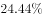。其中，接收保险公司投诉2980件，其他非保险公司投诉9件。接收保险公司投诉中，涉及保险公司合同纠纷类投诉2721件；涉嫌保险公司违法违规类投诉259件。

        所接收的2980件保险公司投诉中，财产险公司的投诉为1510件。其中，投诉量位居前10的财产险公司的投诉总和占投诉所有公司投诉总量的。人身险公司的投诉为1470件。其中，投诉量位居前10的人身险公司的投诉量总和占所有公司投诉总量的。另外，人身险涉及保险合同纠纷的投诉有1281件，其中销售纠纷481件，理赔纠纷357件，保全纠纷237件。

#### 第 1 题　qid 2444691 · 增长

2016年4月，保监会机关及各保监局接收各类涉及保险消费者权益的有效投诉总件数较上月增加的数量最接近以下哪个数字？

- **A**. 384
- **B**. 451
- **C**. 587　✅
- **D**. 756

**答案**：C

**官方解析**

根据题干“2016年4月···增加···数量”，可判定本题为增长量计算问题。定位文字材料第一段可知，2016年4月，保监会机关及各保监局共接收各类涉及保险消费者权益的有效投诉总量为2989件，环比上升。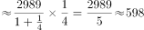。与C项最接近。

故正确答案为C。

---

#### 第 2 题　qid 2444695 · 综合

2016年4月，涉及财产险公司违法违规类的投诉为多少件？

- **A**. 70　✅
- **B**. 119
- **C**. 189
- **D**. 259

**答案**：A

**官方解析**

定位文字材料第一段可知，接收保险公司投诉2980件，其中涉及保险公司合同纠纷类投诉2721件，涉嫌保险公司违法违规类投诉259件。即接收保险公司的投诉合同纠纷类违法违规类。

定位文字材料第二段可知，接收的2980件保险公司投诉又可分为财产险公司投诉（1510件）和人身险公司的投诉（1470件）。人身险公司的投诉中，合同纠纷的投诉有1281件，则人身险公司投诉中的违法违规类投诉为件。则涉及财产险公司违法违规类的投诉为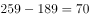件。

列表梳理如下：

故正确答案为A。

---

#### 第 3 题　qid 2444698 · 综合

2016年4月，针对投诉量位居前10的财产险公司的投诉共有多少件？

- **A**. 1188　✅
- **B**. 1255
- **C**. 1281
- **D**. 1510

**答案**：A

**官方解析**

题干所求为2016年4月对投诉量位居前10的财产险公司的投诉件数，且材料给了其占财产险公司投诉总量的比重，可判定本题为现期比重问题。定位文字材料第二段可知，2016年4月，财产险公司投诉为1510件。其中，投诉量位居前10的财产险公司的投诉总和占投诉所有公司投诉总量的。根据公式：，则所求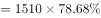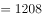件。只有A项满足。

故正确答案为A。

---

#### 第 4 题　qid 2444704 · 综合

2016年4月，人身险涉及保险合同的理赔纠纷投诉量和保全纠纷投诉量之和约占当月保监会机关及各保监局接收所有有效投诉总量的：

- **A**. 一成
- **B**. 两成　✅
- **C**. 三成
- **D**. 四成

**答案**：B

**官方解析**

根据题干“2016年4月···占···”结合选项“···成”，判定本题为现期比重问题。定位文字材料第一段可知，2016年4月，保监会机关及各保监局共接收各类涉及保险消费者权益的有效投诉总量为2989件，定位文字材料第二段可知，人身险涉及保险合同的理赔纠纷投诉量和保全纠纷投诉量分别为357件和237件。代入公式：，即约占两成。

故正确答案为B。

---

#### 第 5 题　qid 2444706 · 综合

关于2016年4月保监会机关及各保监局接受的各类涉及保险消费者权益的有效投诉情况，能够从上述资料中推出的是：

- **A**. 投诉总量较上年同月增加1000件以上
- **B**. 针对财产险公司的投诉占总有效投诉的比重不到一半
- **C**. 涉及保险公司合同纠纷类投诉占总有效投诉的比重不到九成
- **D**. 人身险合同投诉中，销售纠纷投诉量超过保全纠纷投诉量的2倍　✅

**答案**：D

**官方解析**

A项：定位文字材料第一段可知，2016年4月，保监会机关及各保监局共接收各类涉及保险消费者权益的有效投诉总量为2989件，同比上升。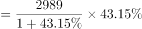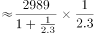件，并非为1000件以上，错误；

B项：定位文字材料第一段可知，2016年4月，保监会机关及各保监局共接收各类涉及保险消费者权益的有效投诉总量为2989件，定位文字材料第二段可知，财产险公司投诉为1510件。故后者占前者的比重，并非不到一半，错误；

C项：定位文字材料第一段可知，2016年4月，保监会机关及各保监局共接收各类涉及保险消费者权益的有效投诉总量为2989件，其中涉及保险公司合同纠纷类投诉2721件。故后者占前者的比重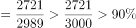，即超过九成，错误；

D项：定位文字材料第二段可知，2016年4月，人身险合同投诉中，销售纠纷481件，保全纠纷237件。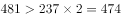，即销售纠纷投诉量超过保全纠纷投诉量的2倍，正确。

故正确答案为D。

---

### 材料 2

        2016年末，全国23027万农户中，的农户拥有自己的住房。其中，拥有1处住房的20030万户，占；拥有2处住房的2677万户，占；拥有3处及以上住房的196万户，占；拥有商品房的1997万户，占。

 

#### 第 6 题　qid 2444688 · 比重

将全国不同地区按照拥有2处及以上住房的农户占该地区农户总数比重从高到低的次序排列，以下正确的是：

- **A**. 东部、西部、中部、东北
- **B**. 东部、中部、西部、东北　✅
- **C**. 中部、东部、东北、西部
- **D**. 中部、东北、东部、西部

**答案**：B

**官方解析**

定位表格材料可知，拥有2处及以上住房的农户占该地区农户总数的比重为拥有2处住房和拥有3处及以上住房的比重之和，东部为；中部为；西部为；东北为。由上述数字可以推出，东部＞中部＞西部＞东北，B项符合。

故正确答案为B。

---

#### 第 7 题　qid 2444694 · 综合

2016年末，全国约有多少亿户农户居住在钢筋混凝土和砖混结构房屋中？

- **A**. 1.6　✅
- **B**. 1.7
- **C**. 1.8
- **D**. 1.9

**答案**：A

**官方解析**

根据题干“2016年末···约有多少亿农户居住在钢筋混凝土和砖混结构房屋”，结合材料时间为2016年末，表格材料给的数据为比重可判定本题为现期比重问题。定位文字材料第一段，“2016年末，全国23027万农户”，结合表格材料数据农户居住钢筋混凝土的比重为，砖混为。根据，则所求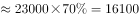万户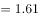亿户，与A项最接近。

故正确答案为A。

---

#### 第 8 题　qid 2444699 · 综合

2016年末，中部地区农户数约是东北地区的多少倍？

- **A**. 4.3
- **B**. 4.8
- **C**. 5.3　✅
- **D**. 5.8

**答案**：C

**官方解析**

根据题干“2016年末······是······多少倍”，结合材料时间为2016年末，可判定本题为现期倍数问题。定位图形材料，根据拥有商品房户数及其占所有农户的比重可得，农户数，则中部地区农户数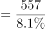，东北地区农户数，则倍数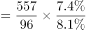，与C项最接近。

故正确答案为C。

---

#### 第 9 题　qid 2444703 · 比重

2016年末，拥有商品房的农户数量第二多的地区，居住在砖（石）木结构住房中的农户占该地区所有农户的比重在全国4个地区中排第几？

- **A**. 1
- **B**. 2　✅
- **C**. 3
- **D**. 4

**答案**：B

**官方解析**

定位图形材料，拥有商品房的农户数量第二多的是西部地区，再定位表格材料砖（石）木所在行，西部地区农户占该地区所有农户的比重为，仅次于东北地区的，则排名第2。

故正确答案为B。

---

#### 第 10 题　qid 2444708 · 综合

根据2016年末全国农户住房情况，能够从上述资料可以推出：

- **A**. 西部地区农户数量少于中部地区
- **B**. 中部地区平均每70个农户中，就有1个以上拥有3处及以上住房
- **C**. 东北地区仅拥有1处砖混结构住房的农户占当地农户总数4成以上　✅
- **D**. 砖混住房和钢筋混凝土住房分别占该地区所有住房比重最高的地区是同一个

**答案**：C

**官方解析**

A项：西部地区农户数量，中部地区农户数量，前者分子大于后者，分母小于后者，则前者数据大，即西部地区农户数量高于中部地区，错误；

B项：平均每70个农户中，就有1个以上拥有3处及以上住房，即拥有3处及以上住房的农户占总数的比重大于；表格中中部地区对应数据为，错误；

C项：东北地区仅拥有1处住房的农户比重为，砖混结构住房的农户比重为，根据容斥原理:，；，则所求比重至少为，是4成以上，正确；

D项：定位表格材料，砖混住房占该地区所有住房比重最高的地区为中部地区，钢筋混凝土住房比重最高的为东部地区，不是同一地区，错误。

故正确答案为C。

---

### 材料 3

        2017年全年，我国乘用车产量为2483.1万辆，同比增长，销量为2474.4万辆，同比增长。

#### 第 11 题　qid 2444743 · 综合

2017年3月我国多功能乘用车(MPV)的产量

- **A**. 不到15万辆
- **B**. 在15～18万辆之间
- **C**. 在18～23万辆之间　✅
- **D**. 多于23万辆

**答案**：C

**官方解析**

由题干“2017年3月多功能乘用车（MPV）的产量”，结合材料时间2018年1-2月，可判定本题为基期和差问题。定位表格材料，2018年1-2月多功能乘用车（MPV）的产量为29.3万辆，同比增长；2017年一季度多功能乘用车（MPV）的产量为55.5万辆。根据公式：。2017年1-2月，多功能乘用车（MPV）的产量为万辆，则题目所求为万辆，C项符合。

故正确答案为C。

---

#### 第 12 题　qid 2444759 · 增长

已知2018年3月我国乘用车产量为212万辆，则2018年一季度我国乘用车产量比上年同期

- **A**. 
上升了不到

- **B**. 
上升了以上

- **C**. 
下降了不到 
　✅
- **D**. 
下降了以上

**答案**：C

**官方解析**

由题干“2018年乘用车比上年同期”，选项为上升（下降）百分数，可判定本题为一般增长率计算问题。定位题干和表格材料中数据可得，2018年一季度乘用车产量为万辆，2017年一季度乘用车产量为610.7万辆。根据公式：。题目所求为，即下降了不到，C项符合。

故正确答案为C。

---

#### 第 13 题　qid 2444763 · 综合

2016年第一季度我国运动型多用途乘用车(SUV)销量是多功能乘用车(MPV)销量的多少倍?

- **A**. 1.8
- **B**. 2.9　✅
- **C**. 4.2
- **D**. 6.5

**答案**：B

**官方解析**

由题干“2016年第一季度，···是···多少倍”，结合材料所给时间为2017年一季度，可判定本题为基期倍数问题。定位表格材料，2017年一季度运动型多用途乘用车(SUV)销量为238.6万辆（A），同比增长（a）；多功能乘用车(MPV)销量为55.3万辆（B），同比增长（b）。根据基期倍数公式：。则题目所求为倍，B项较为接近。

故正确答案为B。

---

#### 第 14 题　qid 2444768 · 比重

以下饼图中，能准确反映2018年1～2月我国四种类型乘用车产量占总产量比重的是

- **A**. A　✅
- **B**. B
- **C**. C
- **D**. D

**答案**：A

**官方解析**

由题干“能准确反映2018年1-2月我国···占···比重的是”，结合材料时间为2018年1-2月，可判定本题为现期比重问题。定位表格材料可得，2018年1-2月，乘用车产量为377.0万辆，轿车产量为174.9万辆，，占比略小于，其扇形图应略小于圆的一半，排除B项和C项。又已知多功能乘用车（MPV）产量为29.3万辆，交叉型乘用车产量为5.4万辆，，故多功能乘用车（MPV）的扇形面积应超过交叉型乘用车的5倍，排除D项。

故正确答案为A。

注：公考中饼图默认的顺序为从12点钟方向，依次顺时针排列。本题从12点钟方向依次顺时针排列的分别为：轿车、多功能乘用车（MPV）、运动型多用途乘用车（SUV）、交叉型乘用车。

---

#### 第 15 题　qid 2444771 · 综合

关于2017年一季度我国乘用车产销量，能够从上述资料中推出的是：

- **A**. 轿车销量增加了2万多辆　✅
- **B**. 该季度产量高于全年各季度平均水平
- **C**. 四种类型乘用车中，产量高于销量的类型正好占一半
- **D**. 运动型多用途乘用车(SUV)产量增加了不到50万辆

**答案**：A

**官方解析**

A项：定位表格材料，2017年一季度，轿车销量为284.0万辆，同比增长。根据公式：，则其销量增加了万辆，正确；

B项：定位文字材料和表格，2017年一季度，乘用车产量为610.7万辆，全年各季度平均水平为万辆，一季度产量并未高于全年各季度平均水平，错误；

C项：定位表格材料，产量高于销量的有：轿车、多功能乘用车（MPV）、运动型多用途乘用车（SUV），共3种类型，则占比为，并非正好占一半，错误；

D项：定位表格材料，2017年一季度，运动型多用途乘用车(SUV)产量为249.5万辆，同比增长。根据公式：，则其产量增加了万辆，并非不到，错误。

故正确答案为A。

---
