# 2019年广东省公务员录用考试《行测》题（乡镇卷）（网友回忆版）

> 省考 · 2019 年 · 6 个模块 · 共 100 题

- [政治理论](#%E6%94%BF%E6%B2%BB%E7%90%86%E8%AE%BA) · 4 题
- [常识判断](#%E5%B8%B8%E8%AF%86%E5%88%A4%E6%96%AD) · 31 题
- [言语理解与表达](#%E8%A8%80%E8%AF%AD%E7%90%86%E8%A7%A3%E4%B8%8E%E8%A1%A8%E8%BE%BE) · 10 题
- [数量关系](#%E6%95%B0%E9%87%8F%E5%85%B3%E7%B3%BB) · 15 题
- [判断推理](#%E5%88%A4%E6%96%AD%E6%8E%A8%E7%90%86) · 20 题
- [资料分析](#%E8%B5%84%E6%96%99%E5%88%86%E6%9E%90) · 20 题

---

## 政治理论

### 第 1 题　qid 2374804 · 新思想

习近平总书记在庆祝改革开放40周年大会上的重要讲话指出：（    ）是五四运动以来我国发生的三大历史性事件，是近代以来实现中华民族伟大复兴的三大里程碑。
①建立中国共产党
②成立中华人民共和国
③全面建成小康社会
④推进改革开放和中国特色社会主义事业

- **A**. ①②③
- **B**. ①②④　✅
- **C**. ①③④
- **D**. ②④

**答案**：B

**官方解析**

本题考查政治常识。
习近平总书记在庆祝改革开放40周年大会上的重要讲话指出：“建立中国共产党、成立中华人民共和国、推进改革开放和中国特色社会主义事业，是五四运动以来我国发生的三大历史性事件，是近代以来实现中华民族伟大复兴的三大里程碑。”据此可知，①②④符合题意。
故正确答案为B。

---

### 第 2 题　qid 2374673 · 新思想

2019年3月，习近平总书记对欧洲三国进行了国事访问，推动共建“一带一路”在亚欧大陆开辟新的空间。这三国分别是（    ）。

- **A**. 以色列  乌克兰  英国
- **B**. 墨西哥  奥地利  瑞典
- **C**. 意大利  摩纳哥  法国　✅
- **D**. 新西兰  葡萄牙  德国

**答案**：C

**官方解析**

本题考查政治常识。
2019年3月21日至26日，国家主席习近平应邀对意大利、摩纳哥、法国进行国事访问。此次欧洲之行是中国国家最高领导人2019年首次出访，对中意、中摩、中法关系发展具有重要历史意义，为中欧全面战略伙伴关系注入了新的动力。
故正确答案为C。

---

### 第 3 题　qid 2374806 · 新思想

2018年10月，习近平总书记在广东考察时提出“要加快形成区域协调发展新格局”，把粤东、粤西的（    ）作为重要发展极，打造现代化沿海经济带。

- **A**. 珠海、肇庆
- **B**. 深圳、清远
- **C**. 广州、韶关
- **D**. 汕头、湛江　✅

**答案**：D

**官方解析**

本题考查政治常识。
2018年10月，习近平总书记在广东考察时提出：要加快形成区域协调发展新格局，做优做强珠三角核心区，加快珠海、汕头两个经济特区发展，把汕头、湛江作为重要发展极，打造现代化沿海经济带。
故正确答案为D。

---

### 第 4 题　qid 2374688 · 新思想

习近平总书记提出“绿水青山就是金山银山”的发展理念。以下最能体现这一理念的是（    ）。

- **A**. 精准扶贫
- **B**. 共建“一带一路”
- **C**. 实行“河长制”　✅
- **D**. 加强知识产权保护

**答案**：C

**官方解析**

本题考查政治常识。
十九大报告中提出：“坚持人与自然和谐共生。建设生态文明是中华民族永续发展的千年大计。必须树立和践行绿水青山就是金山银山的理念，坚持节约资源和保护环境的基本国策，像对待生命一样对待生态环境，统筹山水林田湖草系统治理，实行最严格的生态环境保护制度，形成绿色发展方式和生活方式，坚定走生产发展、生活富裕、生态良好的文明发展道路。”
A项错误，精准扶贫是粗放扶贫的对称，指针对不同贫困区域环境、不同贫困农户状况，运用科学有效程序对扶贫对象实施精确识别、精确帮扶、精确管理的治贫方式。
B项错误，“一带一路”是“丝绸之路经济带”和“21世纪海上丝绸之路”的简称。旨在借用古代丝绸之路的历史符号，高举和平发展的旗帜，积极发展与沿线国家的经济合作伙伴关系，共同打造政治互信、经济融合、文化包容的利益共同体、命运共同体和责任共同体。
C项正确，实行“河长制”指建立健全以党政领导负责制为核心的责任体系，负责组织领导相应河湖的管理和保护工作。全面推行河长制是落实绿色发展理念、推进生态文明建设的内在要求。此举体现了“绿水青山就是金山银山”的发展理念。
D项错误，知识产权保护与我国经济发展动能转换、结构优化相辅相成，发挥着重要驱动作用。加强知识产权保护已成为完善产权保护制度最重要的内容，也是提高中国经济竞争力最大的激励。
故正确答案为C。

---

## 常识判断

### 第 1 题　qid 2374794 · 科技常识

风能是一种清洁的可再生能源，很早就被人们所利用。下列关于利用风能发电的说法不正确的是（    ）。

- **A**. 风力发电场可以建在海上
- **B**. 风力发电是将风的动能转换为电能
- **C**. 风力发电的能量最终来源于太阳能
- **D**. 风力发电的过程中不会有能量的损失　✅

**答案**：D

**官方解析**

A项：由于海上没有山丘和建筑物的遮挡，海水对风的摩擦阻力也明显小于陆地对风的摩擦阻力，所以海上风力更大，海上可以建造风力发电厂，正确；
B项：风力发电的原理是风吹动桨转动，桨叶的转动带动发电机发电，故风力发电是将风的动能转化为电能，正确；
C项：太阳照射地面，地表温度不同，地表温度高的地区空气受热上升，产生气压差，周围气压较高的空气在气压作用下向低气压地区运动，产生了风，所以太阳能是风能的根本来源，正确；
D项：在风力发电过程中，桨叶运转、发电机工作，因为摩擦和散热都会伴随有热量的散失，所以不可能没有能量损失，错误。
本题为选非题，故正确答案为D。

---

### 第 2 题　qid 2374795 · 科技常识

人在短时间内从低海拔处上升至高海拔处时，环境气压变化大，但鼓膜内的气压不变，鼓膜会感觉不适。这时，可通过做咀嚼运动或大口呼吸缓解，其原理是（    ）。

- **A**. 通过转移人的注意力，减少不适感
- **B**. 吸入更多的氧气，使机体的新陈代谢加快
- **C**. 疏通咽鼓管，使外耳道与鼓室之间的气压平衡　✅
- **D**. 提高鼓膜的震动频率，缓解不适症状

**答案**：C

**官方解析**

海拔越高、气压越低，在短时间内突然从低海拔上升至高海拔处，外界气压突然减小，而鼓膜内的气压不变，因此容易造成不适。做咀嚼运动或大口呼吸，可以使连通咽部和鼓膜内鼓室的咽鼓管打开，保持鼓膜内的气压与鼓膜外的气压平衡，解除不适。
故正确答案为C。

---

### 第 3 题　qid 2374796 · 科技常识

下图是具有起钉功能的锤子，要使锤子起钉时更省力，最科学的做法是（    ）。

- **A**. 适当延长把手BC的长度　✅
- **B**. 适当延长起钉部位OA的长度
- **C**. 增加锤子的重量
- **D**. 增加把手的重量

**答案**：A

**官方解析**

根据杠杆原理，动力动力臂阻力阻力臂，若要使锤子起钉时更省力，则需要增大动力臂或者减小阻力臂。如图，支点为O，增大BC的长度或者减小OA的长度，可使动力臂增加或者阻力臂减少，而增加锤子和把手的重量，并不能省力。

故正确答案为A。

---

### 第 4 题　qid 2374797 · 科技常识

将瘪了的乒乓球放在热水里一段时间后，乒乓球便会恢复原来的圆形状态。其原理是（    ）。

- **A**. 乒乓球内部气体溢出，内部气体减少
- **B**. 乒乓球受热后球壁变软，恢复原来形状
- **C**. 乒乓球内部气体受热膨胀，挤压乒乓球内壁　✅
- **D**. 水蒸气流入乒乓球内部，乒乓球内部压强增大

**答案**：C

**官方解析**

瘪了的乒乓球放到热水中时，乒乓球内部气体温度升高，热胀冷缩，气体受热体积膨胀，挤压乒乓球内壁，乒乓球就会重新鼓起来。
故正确答案为C。

---

### 第 5 题　qid 2374798 · 科技常识

如图所示，货车停在某处卸货时货物从倾斜的货箱滑下。那么，下列关于货车车轮所受的摩擦力说法正确的是（    ）。

- **A**. 货车车轮与地面之间没有摩擦力
- **B**. 货车车轮所受摩擦力的方向水平向右　✅
- **C**. 货车车轮所受摩擦力的方向水平向左
- **D**. 货车车轮与地面之间的摩擦力大小和方向都不确定

**答案**：B

**官方解析**

货物自己下滑，一定是重力的分力大于摩擦力，故加速下滑。

设物体沿斜面向下的加速度为，斜面倾角为，货物质量为，受力分析如下图所示。

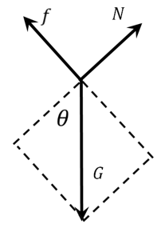

此时，， 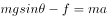；

根据力的作用是相互的，货车的受力分析如下图所示。

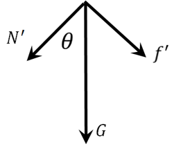

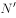水平方向的力为方向向左的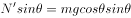，水平方向的力为方向向右的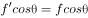，货车水平方向上受到和的合力为，方向水平向左。

若保持货车静止不动，需受到地面方向向右的摩擦力。

故正确答案为B。

---

### 第 6 题　qid 2374663 · 科技常识

如图所示，将一只充了气的密封小气球放在针筒壁内，封闭针筒孔后向外抽拉针筒推杆，忽略摩擦力的影响，则在这一过程中（    ）。

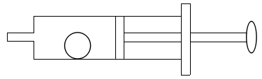

- **A**. 小气球体积会变大　✅
- **B**. 针筒内的压强保持不变
- **C**. 小气球受到的合力为零
- **D**. 针筒内的气体温度会升高

**答案**：A

**官方解析**

对于封闭针筒向外拉推杆的过程中，针筒封闭气体体积增大，压强变小，B项错误；小气球外部气体压强减小，小气球在内部气体压强作用下膨胀，故小气球体积变大，A项正确；由于气球膨胀，导致气球重心上升，将气球看成一个质点，气球并非静止不动，而是由静止变为向上运动，因此受到合力不为零，C项错误；在向外拉推杆的过程中，针筒内气体对外做功，消耗气体内能，相对抽拉针筒推杆前，针筒内气体温度不会升高，D项错误。
故正确答案为A。

---

### 第 7 题　qid 2374669 · 科技常识

物质的用途与性质密切相关。下列说法正确的是（    ）。

- **A**. 木炭能作为炼钢的原料，是利用了木炭的可燃性
- **B**. 钨常用作灯丝，是因为钨在高温下化学性质稳定
- **C**. 活性炭可以去除水中杂质，是因为其具有很强的吸附能力　✅
- **D**. 铝制品的表面可以不做防锈处理，是因为铝的金属活动性不强

**答案**：C

**官方解析**

A项错误，木炭能作为炼钢的原料，使用的是木炭的还原性，而非可燃性。在高温下，木炭作为还原剂，与矿石（主要为金属氧化物）中的氧结合，生成二氧化碳，而使金属被还原。
B项错误，钨常用作灯丝，是因为钨丝的熔点高，不容易因过热而熔化，而非钨在高温下化学性质稳定。
C项正确，活性炭具有吸附性，能吸附水中的杂质，可用活性炭净水。
D项错误，铝的金属活动性强，化学性质活泼，因此能在空气中和氧气反应生成氧化铝，在金属表面形成致密的保护膜，防止生锈，因而不需要防锈。
故正确答案为C。

---

### 第 8 题　qid 2374664 · 科技常识

办公室里的四盏灯型号相同，电路如下图所示。如果逐一打开这四盏灯，在电源的输出电压不变的情况下，下列说法正确的是（    ）。

- **A**. 打开的灯越多，通过各灯的电流变得越大
- **B**. 打开的灯越多，各灯两端的电压变得越小
- **C**. 打开的灯越多，通过电源的电流变得越大　✅
- **D**. 打开的灯越多，各灯变得越暗

**答案**：C

**官方解析**

由于灯泡均与电源并联，所以所有灯泡两端的电压均为电源输出电压，保持不变，B项错误；由于四盏灯型号相同，电阻相等，根据欧姆定律，所以流经每个灯泡支路的电流不变，A项错误；由于干路电流等于各支路电流之和，所以打开的灯越多，干路电流越大，即通过电源的电流变得越大，C项正确；而根据功率公式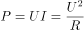，可知灯泡功率不变，即亮度不变，D项错误。

故正确答案为C。

---

### 第 9 题　qid 2374676 · 科技常识

冬天气温很低的时候往玻璃杯里倒开水，杯壁较厚的玻璃杯更容易发生炸裂，这是因为（    ）。

- **A**. 内壁和外壁受热不均　✅
- **B**. 开水遇到玻璃后温度迅速降低
- **C**. 空气对杯壁的压力超过杯壁的承受范围
- **D**. 倒水时水的冲击力将玻璃杯击破

**答案**：A

**官方解析**

杯子内倒入开水后，厚玻璃杯内壁温度迅速升高，受热膨胀，而外壁温度变化慢，膨胀程度小。内外壁受热膨胀不均匀，内外壁膨胀程度不同，导致玻璃杯发生炸裂。
故正确答案为A。

---

### 第 10 题　qid 2374674 · 科技常识

如图所示，甲、乙两个大小相同的实心金属球放置在光滑水平面上，甲球以水平向右的速度碰撞静止的乙球。已知甲球质量大于乙球，则有关碰撞后的情形，下列说法正确的是（    ）。

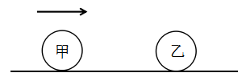

- **A**. 甲球可能静止
- **B**. 乙球可能静止
- **C**. 甲球可能向左运动
- **D**. 甲球一定向右运动　✅

**答案**：D

**官方解析**

根据碰撞过程动量守恒可得：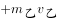——①

根据动能守恒可得：——②

连立①②，分别消去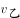 、，可得：

——③

——④

由④可得，，方向与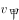方向相同，水平向右运动，故B项错误；

因为，由③可得，所以的方向与方向相同，水平向右运动，故A项、C项错误，D项正确。

故正确答案为D。

---

### 第 11 题　qid 2374799 · 科技常识

细胞膜能够防止细胞外物质自由进入细胞，保证细胞内环境的相对稳定。这是因为（    ）。

- **A**. 细胞膜具有流动性
- **B**. 细胞膜具有选择透过性　✅
- **C**. 细胞膜主要由氨基酸构成
- **D**. 细胞膜具有维持细胞形状的功能

**答案**：B

**官方解析**

细胞膜主要由脂质（主要为磷脂）、蛋白质和糖类等物质组成；其中以蛋白质和脂质为主。细胞膜的主要功能有：1、将细胞与外界环境分开；2、控制物质进出细胞；3、进行细胞间的物质交流。流动性为细胞膜的结构特点，选择透过性为细胞膜的功能特性。
A项：细胞膜的流动性是结构特点，不能够防止细胞外物质自由进入细胞，错误；
B项：细胞膜具有选择透过性，可以控制物质进出细胞，防止细胞外物质自由进入细胞，保证细胞内环境的相对稳定，正确；
C项：细胞膜主要由脂质（主要为磷脂）、蛋白质和糖类等物质组成，氨基酸是蛋白质分解之后的产物，错误；
D项：细胞膜主要是保护和控制物质进出的作用，可以起到维持细胞形状的结构是细胞壁，错误。
故正确答案为B。

---

### 第 12 题　qid 2374668 · 科技常识

人们在乘坐小船时，应尽量坐下，站立会降低小船的稳定性，其根本原因是（    ）。

- **A**. 人和船的整体重量增加
- **B**. 人和船的整体重心变高　✅
- **C**. 船的行驶速度增加
- **D**. 水流波动幅度变大

**答案**：B

**官方解析**

当人坐下时，人和船整体重心更低，当倾斜相同的角度时，重心低的物体，其重心偏移不易超出它的底部的支撑范围，因而不易倾倒，所以重心越低越稳定；而人站立时，刚好相反。而无论人站立、坐下，整体重量都不变，也不会引起速度变化，更不影响水面波动幅度。
故正确答案为B。

---

### 第 13 题　qid 2374682 · 科技常识

“后驱”是指发动机的动力通过传动轴传递给后轮，从而推动车辆前进的一种驱动形式。当后驱车在水平公路上匀速前进时，下列说法正确的是（    ）。

- **A**. 前轮和后轮受到的摩擦力均向前
- **B**. 前轮和后轮受到的摩擦力均向后
- **C**. 前轮受到的摩擦力向前，后轮受到的摩擦力向后
- **D**. 前轮受到的摩擦力向后，后轮受到的摩擦力向前　✅

**答案**：D

**官方解析**

车辆前进时，后轮是驱动轮，主动转动，对地面的力是向后的，所以受到的反作用力即摩擦力是向前的；但是对前轮来说，被动转动，受到来自地面向后的摩擦力。
故正确答案为D。

---

### 第 14 题　qid 2374672 · 科技常识

如图所示，将所点燃的一高一矮两只蜡烛放入圆筒，圆筒顶端不封闭，并从圆筒侧壁缓慢注入二氧化碳气体。则最可能发生的情况是（    ）。

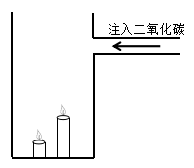

- **A**. 高蜡烛先熄灭
- **B**. 矮蜡烛先熄灭　✅
- **C**. 两只蜡烛的火苗没有变化
- **D**. 两只蜡烛的火苗都变矮并逐渐熄灭

**答案**：B

**官方解析**

二氧化碳本身不燃烧，也不支持燃烧，密度比空气大。如图，从上方注入二氧化碳，由于二氧化碳密度比空气大，因此下沉。又因为二氧化碳不支持燃烧，下沉的二氧化碳，自下而上逐渐排出容器内的空气，包裹火焰、隔绝氧气，使蜡烛熄灭。因此，逐渐注入二氧化碳，矮蜡烛先熄灭，高蜡烛后熄灭。
故正确答案为B。

---

### 第 15 题　qid 2374679 · 科技常识

为了整治超速，交警采用了一套系统。在某一路段，系统会自动记录车辆进入和离开的时间，从而判断该车辆是否超速。这种方法是计算车辆的（    ）。

- **A**. 平均速率　✅
- **B**. 瞬时速率
- **C**. 加速度
- **D**. 位移

**答案**：A

**官方解析**

平均速率是指物体运动的路程和通过这段路程所用时间的比。题干中“某一路段”是指路程，“进入和离开所用的时间”是通过这段路程所用的时间，二者的比值就是该车辆在这段时间的平均速率，可用该速率来估测车辆是否超速。
故正确答案为A。

---

### 第 16 题　qid 2374675 · 人文常识

2019年3月12日，十三届全国人大二次会议举行第三次全体会议，听取审议最高人民法院工作报告和最高人民检察院工作报告。这体现了人民代表大会的（    ）。

- **A**. 立法权
- **B**. 决定权
- **C**. 任免权
- **D**. 监督权　✅

**答案**：D

**官方解析**

本题考查法律常识。
全国人大有权监督由它产生的其他国家机关的工作，这些国家机关主要包括全国人大常委会、国务院、国家监察委员会、最高人民法院、最高人民检察院等，它们都要向全国人大负责，并报告工作。具体来说，全国人大听取并通过全国人大常委会的工作报告；听取最高人民法院、最高人民检察院的工作报告；改变或者撤销全国人民代表大会常务委员会不适当的决定等。
故正确答案为D。

---

### 第 17 题　qid 2374680 · 人文常识

人才是实施乡村振兴战略的关键因素。以下举措不属于推动乡村人才振兴的是（    ）。

- **A**. 大力支持乡村休闲旅游　✅
- **B**. 实施新乡贤返乡工程
- **C**. 扩大“三支一扶”计划人员招募规模
- **D**. 完善农村劳动力技能培训补贴机制

**答案**：A

**官方解析**

本题考查政治常识。
A项错误，大力支持乡村休闲旅游，属于发展农村产业经济，并未体现出吸引、培育人才等方面的举措。
B项正确，实施新乡贤返乡工程，属于吸引人才的举措，把更多从农村走出来的精英群体引回乡村创新创业。
C项正确，扩大“三支一扶”计划人员招募规模，属于吸纳高校毕业生到基层工作的举措，大学生村官计划是向农村提供人才支撑的重要途径，能为建设高素质专业化“三农”工作干部队伍提供源头活水。
D项正确，完善农村劳动力技能培训补贴机制，属于提升农村劳动力技能的举措，通过培训提高、吸引发展、培育储备，加快构建一支有文化、懂技术、善经营、会管理的新型职业农民队伍。
本题为选非题，故正确答案为A。

---

### 第 18 题　qid 2374691 · 人文常识

近几年，我国政府出台了一系列减税降费的举措。减税降费有利于（    ）。
①减轻企业负担、稳定就业
②优化经济和收入分配结构
③畅通小微企业融资渠道

- **A**. ①②　✅
- **B**. ①③
- **C**. ②③
- **D**. ①②③

**答案**：A

**官方解析**

本题考查经济常识。
2019年3月21日，李克强总理考察财政部、税务总局并主持召开座谈会指出，要坚持以习近平新时代中国特色社会主义思想为指导，贯彻党中央、国务院决策部署，把大规模减税降费作为重大改革举措和宏观调控“当头炮”。这既利当前又利长远，不仅减轻企业负担、稳定就业，而且优化经济和收入分配结构，培育税源、促进财政可持续。要把减税加快落实到位，以企业活力更大释放保持经济运行在合理区间，推动高质量发展。因此①②正确。
故正确答案为A。

---

### 第 19 题　qid 2374805 · 人文常识

2018年8月，国家提出衡量贫困人口是否脱贫的标准是“两不愁、三保障”，其中“两不愁”是指不愁吃、不愁穿。以下不属于“三保障”的是（    ）。

- **A**. 基本医疗
- **B**. 义务教育
- **C**. 住房安全
- **D**. 环境优美　✅

**答案**：D

**官方解析**

2015年中共中央、国务院制定的《关于打赢脱贫攻坚战的决定》是当前脱贫攻坚工作的总遵循。《决定》明确提出：到2020年，要稳定实现农村贫困人口不愁吃、不愁穿，义务教育、基本医疗、住房安全有保障，实现贫困地区农民人均可支配收入增长幅度高于全国平均水平，基本公共服务主要领域指标接近全国平均水平。《“十三五”脱贫攻坚规划》指出：现行标准下农村建档立卡贫困人口实现脱贫。贫困户有稳定收入来源，人均可支配收入稳定超过国家扶贫标准，实现“两不愁、三保障”。据此可知，A、B、C三项属于“三保障”，D项不属于。
本题为选非题，故正确答案为D。

---

### 第 20 题　qid 2374670 · 人文常识

粤港澳大湾区包括香港特别行政区、澳门特别行政区和珠三角九市，是我国经济活力最强的区域之一，在国家发展大局中具有重要战略地位。以下关于粤港澳大湾区发展基础的说法，错误的是（    ）。

- **A**. 经济实力雄厚
- **B**. 创新要素集聚
- **C**. 内部发展差距小　✅
- **D**. 国际化水平领先

**答案**：C

**官方解析**

本题考查政治常识。2019年2月18日，中共中央、国务院印发了《粤港澳大湾区发展规划纲要》，《纲要》第一节指出，粤港澳大湾区发展基础为：区位优势明显、经济实力雄厚、创新要素集聚、国际化水平领先、合作基础良好。
A项正确，粤港澳大湾区经济实力雄厚。经济发展水平全国领先，产业体系完备，集群优势明显，经济互补性强，香港、澳门服务业高度发达，珠三角九市已初步形成以战略性新兴产业为先导、先进制造业和现代服务业为主体的产业结构，2017年大湾区经济总量约10万亿元。
B项正确，粤港澳大湾区创新要素集聚。创新驱动发展战略深入实施，广东全面创新改革试验稳步推进，国家自主创新示范区加快建设。粤港澳三地科技研发、转化能力突出，拥有一批在全国乃至全球具有重要影响力的高校、科研院所、高新技术企业和国家大科学工程，创新要素吸引力强，具备建设国际科技创新中心的良好基础。
C项错误，内部发展差距小并非粤港澳大湾区的发展基础。
D项正确，粤港澳大湾区国际化水平领先。香港作为国际金融、航运、贸易中心和国际航空枢纽，拥有高度国际化、法治化的营商环境以及遍布全球的商业网络，是全球最自由经济体之一。澳门作为世界旅游休闲中心和中国与葡语国家商贸合作服务平台的作用不断强化，多元文化交流的功能日益彰显。珠三角九市是内地外向度最高的经济区域和对外开放的重要窗口，在全国加快构建开放型经济新体制中具有重要地位和作用。
本题为选非题，故正确答案为C。

---

### 第 21 题　qid 2374692 · 人文常识

只要把握住历史发展大势，抓住历史变革时机，奋发有为，锐意进取，人类社会就能更好前进。这句话体现的哲学原理是（    ）。

- **A**. 物质和意识的辩证关系
- **B**. 规律是可以认识和利用的　✅
- **C**. 事物发展是前进性和曲折性的统一
- **D**. 实践是检验认识正确与否的唯一标准

**答案**：B

**官方解析**

本题考查马克思主义哲学。
A项错误，辩证唯物主义认为，世界的本原是物质的，物质决定意识，意识是物质的反映，意识对物质又具有能动作用。题干并未体现这一原理。
B项正确，规律是可以认识和利用的。人们可以认识和把握规律，并根据规律发生作用的条件和形式，利用规律，改造客观世界，造福人类。题干中强调只要抓住历史发展大势，抓住历史变革时机，锐意进取，人类社会就能更好前进，体现了认识和利用规律的原理。
C项错误，事物发展的总趋势是前进的，而发展的道路则是迂回曲折的。任何事物的发展都是前进性与曲折性的统一。前途是光明的，道路是曲折的，在前进中有曲折，在曲折中向前进，是一切新事物发展的途径。选项本身表述无误，但题干未体现这一原理。
D项错误，实践是检验认识正确与否的唯一标准，选项本身表述无误，但题干未体现这一原理。
故正确答案为B。

---

### 第 22 题　qid 2374808 · 人文常识

扶贫先扶智，治贫先治愚。以下扶贫举措中不属于“扶智”的是（    ）。

- **A**. 在贫困村建设图书室
- **B**. 开展农业实用技能培训
- **C**. 组织大学生到贫困地区支教
- **D**. 向贫困户发放现代化农业机具　✅

**答案**：D

**官方解析**

本题考查政治常识。
A项正确，摆脱贫困首要并不是摆脱物质的贫困，而是摆脱意识和思路的贫困。贫困村建设图书室，有利于丰富贫困地区文化活动，武装贫困群众思想，振奋贫困地区和贫困群众精神风貌。
B项正确，脱贫攻坚，群众动力是基础。必须坚持依靠人民群众，激发贫困群众内生动力。培养贫困群众发展生产和务工经商技能，组织、引导、支持贫困群众用自己的辛勤劳动实现脱贫致富，用人民群众的内生动力支撑脱贫攻坚。
C项正确，扶贫先扶智，重点是要推进教育精准脱贫，把下一代的教育工作做好。大学生到贫困地区支教，帮助贫困人口子女接受良好教育，可以提升文化水平及思想道德素质，有利于阻断贫困代际传递，让每一个孩子都对自己有信心、对未来有希望。
D项错误，治贫先治愚。贫穷并不可怕，怕的是智力不足、头脑空空，怕的是知识匮乏、精神委顿。对贫困地区来说，现代化农业机具终究只是外力，“扶智”才是内力，外力帮扶固然重要，但如果自身不努力、不作为，即使外力帮扶再大，也难以有效发挥作用。
本题为选非题，故正确答案为D。

---

### 第 23 题　qid 2374809 · 人文常识

自2018年起，我国将每年农历（    ）定为“中国农民丰收节”，作为亿万农民庆祝丰收、享受丰收的节日。

- **A**. 立春
- **B**. 芒种
- **C**. 秋分　✅
- **D**. 冬至

**答案**：C

**官方解析**

本题考查政治常识。
2018年6月7日，经党中央批准、国务院批复，自2018年起，将每年农历秋分设立为“中国农民丰收节”。这是第一个在国家层面专门为农民设立的节日。
故正确答案为C。

---

### 第 24 题　qid 2374817 · 人文常识

消除贫困、改善民生、逐步实现（    ），是社会主义的本质要求，是我们党的重要使命。

- **A**. 共同富裕　✅
- **B**. 同步富裕
- **C**. 同时富裕
- **D**. 全体富裕

**答案**：A

**官方解析**

本题考查政治常识。
习近平同志曾多次在扶贫工作会议中指出，消除贫困、改善民生、逐步实现共同富裕，是社会主义的本质要求，是我们党的重要使命。
中国人多地广，共同富裕不是同时富裕，也不是同步富裕，而是一部分人一部分地区先富起来，先富的帮助后富的，逐步实现共同富裕。因此B、C、D三项错误。
故正确答案为A。

---

### 第 25 题　qid 2374726 · 地理国情

广东属于岭南地区，具有深厚的岭南文化。以下诗句中描写岭南风物的是（    ）。

- **A**. 此地空余黄鹤楼
- **B**. 罗浮山下四时春　✅
- **C**. 风吹草低见牛羊
- **D**. 不识庐山真面目

**答案**：B

**官方解析**

本题考查地理国情。
岭南，所谓 “岭南”，一般指南岭（又称 “五岭”）山脉以南， 包括今天广东 、广西 、海南、香港、澳门等地在内的广大地区 。
A项错误，“昔人已乘黄鹤去，此地空余黄鹤楼”出自唐朝诗人崔颢的《黄鹤楼》。黄鹤楼，位于湖北省武汉市，紧依长江，自古就享有“天下江山第一楼”的赞誉。因此该诗描写的不属于岭南风物。
B项正确，“罗浮山下四时春，卢橘杨梅次第新。日啖荔枝三百颗，不辞长作岭南人。”出自宋代苏轼的《惠州一绝》。罗浮山，位于广东省，是岭南四大名山之一。因此该诗描写的属于岭南风物。
C项错误，“敕勒川，阴山下。天似穹庐，笼盖四野。天苍苍，野茫茫。风吹草低见牛羊。”出自《敕勒歌》，是南北朝时代敕勒族的一首民歌，描绘了北方草原壮丽富饶的风光。因此该诗描写的不属于岭南风物。
D项错误，“不识庐山真面目，只缘身在此山中”出自宋代苏轼《题西林壁》。该诗作描绘的是庐山景色。庐山位于江西省九江市，因此该诗描写的不属于岭南风物。
故正确答案为B。

---

### 第 26 题　qid 2374826 · 地理国情

港珠澳大桥跨越（    ），东接香港，西接广东珠海和澳门，总长约55公里，是粤港澳三地首次合作共建的超大型跨海交通工程。

- **A**. 渤海
- **B**. 东海
- **C**. 北部湾
- **D**. 伶仃洋　✅

**答案**：D

**官方解析**

本题主要考查政治常识。
港珠澳大桥于2009年12月15日动工建设，2018年10月24日上午9时开通运营，是中国境内一座连接香港、珠海和澳门的桥隧工程，位于中国广东省伶仃洋区域内，为珠江三角洲地区环线高速公路南环段。港珠澳大桥东起香港国际机场附近的香港口岸人工岛，向西横跨南海伶仃洋后连接珠海和澳门人工岛，止于珠海洪湾立交。港珠澳大桥跨越的是伶仃洋，因此D项正确，ABC项错误。
故正确答案为D。

---

### 第 27 题　qid 2374699 · 科技常识

“山上多植物，胜似修水库，有雨它能吞，无雨它能吐”。这一谚语形象地说明了森林具有（    ）的功能。

- **A**. 净化空气
- **B**. 过滤尘埃
- **C**. 减小噪音
- **D**. 涵养水源　✅

**答案**：D

**官方解析**

本题考查地理国情。
“山上多植物，胜似修水库，有雨它能吞，无雨它能吐”这句谚语形象地说明了山上如果有多种植物，在雨水多的时候它能储水。在下雨时节，森林可以通过林冠和地面的残枝落叶等截住雨滴，减轻雨滴对地面的冲击，增加雨水渗入土地的速度和土壤涵养水分的能力；又由于森林中植物蒸腾作用巨大，不断向大气中散失水蒸气，此时森林地区空气湿度大，降水多，体现了无雨它能“吐”。
ABC项错误，净化空气、过滤尘埃、减小噪音都是森林的功能，但是与题意不符。
D项正确，涵养水源功能是森林所具有的重要功能之一，题中正体现了森林的这一功能。
故正确答案为D。

---

### 第 28 题　qid 2374687 · 人文常识

全面建成小康社会，最艰巨最繁重的任务在（    ），特别是在贫困地区。

- **A**. 城市
- **B**. 城镇
- **C**. 社区
- **D**. 农村　✅

**答案**：D

**官方解析**

本题考查政治常识。
习近平总书记在河北省阜平县考察扶贫开发工作时的讲话中强调：“全面建成小康社会，最艰巨最繁重的任务在农村，特别是在贫困地区。没有农村的小康，特别是没有贫困地区的小康，就没有全面建成小康社会。”
故正确答案为D。

---

### 第 29 题　qid 2374834 · 人文常识

俗话说：正月十五闹元宵。“闹”元宵的习俗包括张灯、观灯、舞龙、舞狮等。以下诗句与元宵节有关的是（    ）。

- **A**. 火树银花合　✅
- **B**. 千里共婵娟
- **C**. 遍插茱萸少一人
- **D**. 爆竹声中一岁除

**答案**：A

**官方解析**

本题考查人文常识。
A项正确，“火树银花合”出自唐代苏味道的《正月十五夜》，这首诗描写了洛阳城里元宵之夜的景色。
B项错误，“婵娟”指嫦娥，也就是代指明月，“但愿人长久，千里共婵娟”出自苏轼的《水调歌头》，“千里共婵娟”与中秋节相关。
C项错误，“遍插茱萸少一人”出自王维的《九月九日忆山东兄弟》，与重阳节相关。
D项错误，“爆竹声中一岁除”出自王安石的《元日》，“元日”是农历正月初一。
故正确答案为A。

---

### 第 30 题　qid 2374839 · 科技常识

2018年12月，中国发射的（    ）成为人类第一个着陆月球背面的探测器。

- **A**. 神舟七号
- **B**. 长征三号
- **C**. 嫦娥四号　✅
- **D**. 天宫一号

**答案**：C

**官方解析**

本题考查科技常识。
A项错误，神舟七号载人航天飞船是于2008年9月25日21点10分从中国酒泉卫星发射中心载人航天发射场发射升空的中国第三个载人航天飞船。
B项错误，长征三号是以“长征二号丙”为原型加氢氧第三级组成的三级运载火箭。
C项正确，嫦娥四号探测器于2018年12月8日2时23分发射升空飞向月球，2019年1月3日嫦娥四号成功着陆在了月球背面东经177.6度、南纬45.5度附近的预选着陆区，月球背面真正意义上第一次成功留下了人类探测器的身影。
D项错误，天宫一号是中国第一个目标飞行器和空间实验室，于2011年9月29日21时16分在酒泉卫星发射中心发射。
故正确答案为C。

---

### 第 31 题　qid 2374694 · 人文常识

地球内部具有巨大的热量，并通过不同途径由内向外散发地热能。以下现象与地热能有关的是（    ）。

- **A**. 台风生成
- **B**. 火山喷发　✅
- **C**. 山洪暴发
- **D**. 岩石风化

**答案**：B

**官方解析**

本题考查自然常识。
A项错误，台风发源于热带海面，那里温度高，大量的海水被蒸发到了空中，形成一个低气压中心。随着气压的变化和地球自身的运动，流入的空气也旋转起来，形成一个逆时针旋转的空气漩涡，这就是热带气旋。只要气温不下降，这个热带气旋就会越来越强大，最后形成了台风，台风属于大气的运动，与地热能无关。
B项正确，火山喷发是一种奇特的地质现象，是岩浆等喷出物在短时间内从火山口向地表的释放，是地壳运动的一种表现形式，也是地球内部热能在地表的一种最强烈的显示。
C项错误，一般山洪泥石流形成于中高山区，这里相对高差大，河谷坡度陡峻，且大都表层为植皮覆盖有较厚的土体，土体下面为中深断裂及其派生级断裂切割的破碎岩石层，加之短历时雷暴雨，降水量巨大，就会引发山洪，因此山洪主要是由短时降雨引发的，与地热能无关。
D项错误，岩石风化是指岩石在太阳辐射、大气、水和生物作用下出现破碎、疏松及矿物成分次生变化的现象。温度变化是引起岩石物理风化作用的最主要因素。由于温度的变化产生温差，温差可促使岩石膨胀和收缩交替地进行，久之则引起岩石破裂。岩石风化与地热能无关。
故正确答案为B。

---

## 言语理解与表达

### 第 1 题　qid 2374685 · 逻辑填空

多元的发展机会和自由的成长空间，是时代给予每个追梦人的馈赠；（    ）每个追梦人在前进道路上迈出的每一步，（    ）都在推动时代的进步。

- **A**. 而  也　✅
- **B**. 但  却
- **C**. 如果  就
- **D**. 只有  才

**答案**：A

**官方解析**

文段通过“；”表并列，体现出时代和追梦人两者之间的联系，时代给追梦人馈赠，追梦人推动时代进步。A项“而”和“也”均可表示并列，符合文意，当选。
B项“但”和“却”均表转折；C项“如果······就”表假设；D项“只有······才”表示必要条件关系，三项均与文意不符，排除。
故正确答案为A。

---

### 第 2 题　qid 2374800 · 逻辑填空

只要我们迈出的步伐足够坚实，前进的意志足够（    ），奋斗路上的困难终将被克服，前进路上的沟壑终将被跨越。

- **A**. 强硬
- **B**. 奋勇
- **C**. 坚定　✅
- **D**. 坚硬

**答案**：C

**官方解析**

括号处搭配“意志”。C项“坚定”指意志坚强，不动摇，“意志坚定”为常见搭配，体现出意志不动摇之意，且和后文“奋斗路上的困难终将被克服，前进路上的沟壑终将被跨越”形成对应，当选。
A项，“强硬”指强有力的，倔强的，不作任何让步的，通常搭配为“态度强硬”；B项，“奋勇”指鼓起勇气；D项，“坚硬”侧重指硬度大，三项均与“意志”搭配不当，排除。
故正确答案为C。 
【文段出处】《半月谈评论：2019，让脚步更有力量》

---

### 第 3 题　qid 2374707 · 逻辑填空

近年来，各地纷纷大刀阔斧地开展（    ），向不担当不作为亮剑。

- **A**. 整理
- **B**. 整治　✅
- **C**. 修理
- **D**. 梳理

**答案**：B

**官方解析**

所填词语与“开展”搭配，分析文意可知，文段强调开展一些整顿、治理的工作来解决不担当不作为的问题。
A项“整理”指使有条理有秩序，文段并非强调要使得“不担当不作为”这样一些情况变得有条理，而是侧重要解决这样一些不好的问题，不符合文意，故排除A项。
B项“整治”含义为整顿、治理，填入文段当中与语境相符，当选。
C项“修理”指对已损坏的东西给予加工，以便恢复原来的形状或作用，多搭配具体实物，如“修理工具”、“修理门窗”等，而文段当中需要解决的是“不担当不作为”等一些问题，故置于此处搭配不当，排除C项。
D项“梳理”比喻对事物进行整理，与文段强调的解决“不担当不作为”的问题无关，不符合文意，故排除D项。
故正确答案为B。
【文段出处】《半月谈评论：惩治不担当不作为，不宜当成“万金油”》

---

### 第 4 题　qid 2374710 · 逻辑填空

在落实乡村振兴战略的过程中，一定要科学规划，（    ），才能最终实现目标，任何希望（    ）的想法都是不切实际的。

- **A**. 循序渐进  一蹴而就　✅
- **B**. 寻根究底  一鼓作气
- **C**. 蔚然成风  一劳永逸
- **D**. 未雨绸缪  一马当先

**答案**：A

**官方解析**

第一空，和“科学规划”构成同义并列表达，“科学规划”有规划、准备、渐进的意思，A项“循序渐进”指按照一定的步骤逐渐深入或提高（指学习或工作）；D项“未雨绸缪”比喻事先做好准备，两者都能体现深入事物、提前准备的意思，且和后文“最终实现目标”构成对应，符合文意，均保留；B项“寻根究底”指追究根底，泛指弄清一件事的来龙去脉，文段没有说要探求来源，不符合文意，排除；C项“蔚然成风”形容一件事情逐渐发展、盛行，形成一种风气（多指好的），文段没有说形成了一种风气，不符合文意，排除。
第二空，结合文意体现振兴战略在慢慢规划中希望慢慢实现，希望马上能实现的想法是不切实际的。A项“一蹴而就”比喻事情轻而易举，很容易成功，体现马上实现，符合文意，当选。D项“一马当先”形容领先，也比喻工作走在群众前面，积极带头，文段没有说积极带头，且无对比的语境，不符合文意，排除。
故正确答案为A。
【出处】《乡村振兴不可急于求成，不能机械教条》

---

### 第 5 题　qid 2374700 · 逻辑填空

持续深入的人才发展体制机制改革，为（    ）、（    ）、（    ）、（    ）打牢了坚实基础，有力推进了新时代中国特色社会主义伟大事业不断夺取新的伟大胜利。

- **A**. 引才  聚才  用才  育才
- **B**. 聚才  用才  育才  引才
- **C**. 用才  育才  引才  聚才
- **D**. 育才  引才  聚才  用才　✅

**答案**：D

**官方解析**

本题可从第四空入手。所填的四个词语通过顿号表并列，且根据“持续深入的人才发展体制机制改革”可知，所填词语体现语义上的顺承关系，“育才”即培育新的人才，“引才”即引入人才，“聚才”即汇聚人才，这三种做法最终要达到的结果是“用才”，即把人才用好，所以第四空填入“用才”最契合文意，锁定D项。A项“育才”、B项“引才”、C项“聚才”都不是最终要达到的结果，排除A、B、C三项。
故正确答案为D。
【文段出处】光明日报《爱才敬才成就人尽其才》

---

### 第 6 题　qid 2374801 · 片段阅读

回顾40年，改革开放旗帜之所以始终高高飘扬，关键得益于基层求新求变的强大意愿以及敢闯敢试的探索精神。改革再扬帆，也必须尊重基层干部群众在改革进程中的主体性作用。
对这段文字理解准确的是（    ）。

- **A**. 实践是改革开放最关键的一环
- **B**. 基层的探索精神完全决定于改革的效果
- **C**. 改革必须发挥基层干部群众的主观能动性　✅
- **D**. 改革开放促使基层创新求变

**答案**：C

**官方解析**

根据文段“改革再扬帆，也必须尊重基层干部群众在改革进程中的主体性作用”可知，C项表述正确，当选；
A项，“实践是改革开放最关键的一环”，文段并未提及，无中生有，排除；
B项，因果倒置，文段说的是改革的效果“得益于基层求新求变的强大意愿以及敢闯敢试的探索精神”，且“完全决定于”表述过于绝对，文段说的是“得益于”；同时，“基层的探索精神”表述片面，文段通过“以及”并列表述还包含有“强大意愿”，故表述不准确，排除；
D项，逻辑错误，“促使”无中生有，文段意在强调“改革开放旗帜之所以始终高高飘扬，关键得益于基层求新求变的强大意愿”，故表述不准确，排除。
故正确答案为C。
【出处】《改革开放再出发，基层跑起来》

---

### 第 7 题　qid 2374802 · 片段阅读

尽管从农业社会走向现代社会，是经济社会发展的必然，但这样不是促使农业农村的“消亡”。做好“三农”工作，建设好农村，发展好农业，使广大农民获得感、幸福感、安全感不断提升，依然是社会主义建设的主要内容。
这段文字主要说明了（    ）。

- **A**. 我国目前仍然处于农业社会
- **B**. “三农”工作的重要性　✅
- **C**. 农业农村会随着经济社会的发展“消亡”
- **D**. 广大农民的获得感、幸福感、安全感有待提升

**答案**：B

**官方解析**

文段开篇交待背景“从农业社会走向现代社会，是经济社会发展的必然”，紧接着通过转折词“但”引出文段的重点，强调“做好‘三农’工作，依然是社会主义建设的重要内容”，故整个文段重点强调做好“三农”工作的重要性，对应B项。
A项，“农业社会”为文段转折之前交待背景的内容，非重点，排除；
C项，“农业农村会随着经济社会的发展‘消亡’”与文意相悖，文段说的是“不是促使农业农村的‘消亡’”，排除； 
D项，“广大农民的获得感、幸福感、安全感”的提升是做好“三农”工作之后带来的效果，非重点，排除。
故正确答案为B。
【文段出处】《半月谈评论：强化优先意识，做好“三农”工作》

---

### 第 8 题　qid 2374671 · 片段阅读

扶贫干部自掏腰包到基层扶贫，是真扶贫、扶真贫的体现。但若一味宣扬扶贫干部自掏腰包扶贫，不仅会加重扶贫干部的经济负担，还会在一定程度上让贫困群众产生依赖心理。
对这段文字理解准确的是（    ）。

- **A**. 一味宣扬扶贫干部自掏腰包扶贫具有一定的副作用　✅
- **B**. 应该大力提倡扶贫干部自掏腰包支持贫困户
- **C**. 当前存在大量扶贫干部自掏腰包扶贫的情况
- **D**. 扶贫干部自掏腰包扶贫是不得已而为之的

**答案**：A

**官方解析**

根据提问方式可知，本题为细节判断题。
A项，根据文段“一味宣扬扶贫干部自掏腰包扶贫，不仅会加重······负担······还会······”可知，一味宣扬扶贫干部自掏腰包扶贫会带来一些危害，表述正确，当选；
B项的“大力提倡”与文意相悖，文段表述为一味提倡有危害，排除；
C、D两项的“存在大量······情况”“不得已而为之”均在文段中没有体现，无中生有，排除。
故正确答案为A。
【文段出处】《干部为扶贫自掏腰包，该不该提倡》

---

### 第 9 题　qid 2374803 · 片段阅读

完善村民自治，应推动乡村治理重心下移，尽可能把资源、服务、管理下放到基层，培育打造服务性、公益性、互助性农村社会组织，开展农村社会工作和志愿服务，发挥新乡贤作用。
对这段文字理解准确的是（    ）。

- **A**. 完善村民自治需要大量引进志愿者
- **B**. 完善村民自治需要让乡贤发挥主要作用
- **C**. 完善村民自治需要把所有资源下放到基层
- **D**. 完善村民自治需要发展农村社会组织　✅

**答案**：D

**官方解析**

文段开篇指出完善村民自治，应推动乡村治理重心下移，把管理等下放到基层，即政府要简政放权，由“政府管理”转变为“社会治理”，之后论述要培育农村社会组织，开展社会工作和志愿服务，发挥新乡贤作用。
由“培育打造服务性、公益性、互助性农村社会组织”可知，D项正确。
A项，“大量引进志愿者”偷换概念，文段表述为通过农村社会组织“开展志愿服务”，排除；
B项，“乡贤发挥主要作用”文段未提及，无中生有，排除；
C项，“把所有资源下放到基层”，表述过于绝对，文段为“尽可能把资源下放到基层”，排除。
故正确答案为D。
【文段出处】《中共中央、国务院关于实施乡村振兴战略的意见》

---

### 第 10 题　qid 2374714 · 片段阅读

推动媒体融合发展，事关推进国家治理体系和治理能力现代化。在全媒体时代，媒体不仅是信息的提供者和传播者，而且在国家治理中也发挥着重要作用。因此，媒体融合不仅仅是一个传播命题，还是一个治理命题。
这段文字的主旨是（    ）。

- **A**. 国家治理现代化需要促进媒体融合　✅
- **B**. 媒体融合发展有利于促进信息传播
- **C**. 媒体融合发展是信息技术发展的需要
- **D**. 媒体在国家治理中应承担主要责任

**答案**：A

**官方解析**

文段开篇点明推动媒体融合发展对于国家治理很重要，引出“媒体融合”这一话题，后文分析媒体对信息提供传播和国家治理有重要作用，尾句通过“因此”总结，媒体融合不仅是传播命题还是治理命题。“不仅仅······还是······”，更多强调是媒体融合是个治理命题。首尾呼应，故文段重点强调“媒体融合”对于国家治理很重要，对应A项。
B项，信息传播对应的是“因此”之前的内容，非重点，排除；
C项，“信息技术发展”无中生有，文段并未提及，排除；
D项，文段话题为“媒体融合”而非“媒体”，偷换概念，排除。
故正确答案为A。
【出处】《人民日报:推动媒体融合发展 事关国家治理能力现代化》

---

## 数量关系

### 第 1 题　qid 2374845 · 数学运算

4  7  10  13  （    ）

- **A**. 15
- **B**. 16　✅
- **C**. 17
- **D**. 18

**答案**：B

**官方解析**

观察数列，此数列是公差为3的等差数列，所求项为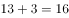。

故正确答案为B。

---

### 第 2 题　qid 2374847 · 数学运算

5  9  17  33  （    ）

- **A**. 35
- **B**. 45
- **C**. 65　✅
- **D**. 85

**答案**：C

**官方解析**

数列起伏较小，首先考虑作差。作差后得到新数列：4、8、16、（ ），是公比为2的等比数列，故括号内应为32。题干所求项为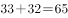。

故正确答案为C。

---

### 第 3 题　qid 2374848 · 数学运算

5  15  45  135  （    ）

- **A**. 185
- **B**. 225
- **C**. 355
- **D**. 405　✅

**答案**：D

**官方解析**

观察数列，此数列是公比为3的等比数列，所求项为。

故正确答案为D。

---

### 第 4 题　qid 2374849 · 数学运算

64  32  16  8  （    ）

- **A**. 4　✅
- **B**. 5
- **C**. 6
- **D**. 7

**答案**：A

**官方解析**

观察数列，此数列是公比为的等比数列，所求项为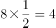。

故正确答案为A。

---

### 第 5 题　qid 2374850 · 数学运算

        （    ）

- **A**. 

　✅
- **B**. 

- **C**. 

- **D**. 
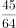

**答案**：A

**官方解析**

观察数列特征，此数列为分数数列。分别观察分子分母的规律，分子为1、3、5、7，是公差为2的等差数列，下一项为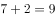；分母为2、4、8、16，是公比为2的等比数列，下一项为。题干所求项为。

故正确答案为A。

---

### 第 6 题　qid 2374851 · 数学运算

乡镇干部小李今天有3项不同的工作要完成，则他今天完成工作的顺序共有（    ）种。

- **A**. 3
- **B**. 4
- **C**. 5
- **D**. 6　✅

**答案**：D

**官方解析**

3项不同的工作进行全排列，则他今天完成工作的顺序有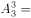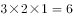种。

故正确答案为D。

---

### 第 7 题　qid 2374704 · 数学运算

某机构计划在一块边长为18米的正方形空地开展活动，需要在空地四边每隔2米插上一面彩旗，若该空地的四个角都需要插上彩旗，那么一共需要（    ）面彩旗。

- **A**. 32
- **B**. 36　✅
- **C**. 44
- **D**. 48

**答案**：B

**官方解析**

根据植树问题环形植树公式：。那么一共需要36面彩旗。

故正确答案为B。

注：正方形是一个闭合的图形，可看成环形。

---

### 第 8 题　qid 2374838 · 数学运算

在一次知识竞赛中，甲、乙两单位平均分为85分，甲单位得分比乙单位高10分，则乙单位得分为（    ）分。

- **A**. 88
- **B**. 85
- **C**. 80　✅
- **D**. 75

**答案**：C

**官方解析**

假设乙单位得分为，甲单位得分为，则总分为，解得分。

故正确答案为C。

---

### 第 9 题　qid 2374840 · 数学运算

某文印室有30袋A4纸和20袋B3纸。由于工作需要，该文印室每天都会用掉6袋A4纸和2袋B3纸，则三天后文印室的B3纸比A4纸多（    ）袋。

- **A**. 1
- **B**. 2　✅
- **C**. 3
- **D**. 4

**答案**：B

**官方解析**

根据题意，三天后，B3纸还剩下袋，A4纸还剩下袋，题目所求为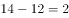袋。

故正确答案为B。

---

### 第 10 题　qid 2374841 · 数学运算

某单位男女干部人数相等，男干部中有基层工作经历，女干部中有基层工作经历。则在该单位全体干部中，有基层工作经历的占（    ）。

- **A**. 

　✅
- **B**. 

- **C**. 

- **D**. 

**答案**：A

**官方解析**

假设该单位男女干部人数均为10人，则有基层工作经历的男干部人数为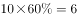人，有基层工作经历的女干部人数为人，则在单位全体干部中，有基层工作经历的占。

故正确答案为A。

---

### 第 11 题　qid 2374842 · 数学运算

某商场为了提高销量，以七五折销售笔记本电脑，打折后销售3600元。则该笔记本原价为每台（    ）元。

- **A**. 4200
- **B**. 4500
- **C**. 4800　✅
- **D**. 5100

**答案**：C

**官方解析**

根据题意，笔记本原价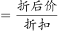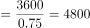元。

故正确答案为C。

---

### 第 12 题　qid 2374734 · 数学运算

某办公室有大、中、小三种型号的文件袋共200个，已知大号文件袋数量是中号文件袋的2倍，小号文件袋的数量为50个，那么大号文件袋有（    ）个。

- **A**. 50
- **B**. 60
- **C**. 80
- **D**. 100　✅

**答案**：D

**官方解析**

设中号文件袋数量为，则大号文件袋数量为。根据题意有：，解得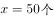，则大号文件袋数量为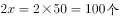。

故正确答案为D。

---

### 第 13 题　qid 2374712 · 数学运算

甲乙两人绕着周长为600米的环形跑道跑步，他们从相同的起点同时同向起跑。已知甲的速度为每秒4米，乙的速度为每秒3米，则当甲第一次回到起点时，乙距离起点还有（    ）米。

- **A**. 100
- **B**. 150　✅
- **C**. 200
- **D**. 250

**答案**：B

**官方解析**

根据题意，环形跑道600米，甲的速度为每秒4米，可得当甲第一次回到起点的时间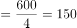秒。乙的速度为每秒3米，乙在150秒时跑的路程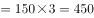米。因此乙距离起点还有米。

故正确答案为B。

---

### 第 14 题　qid 2374844 · 数学运算

小王距离单位1.2公里，每天步行上班。速度为每分钟100米，则他上班需要花（    ）分钟。

- **A**. 12　✅
- **B**. 15
- **C**. 18
- **D**. 20

**答案**：A

**官方解析**

小王距离单位1.2公里即1200米，故他上班需要花的时间分钟。

故正确答案为A。

---

### 第 15 题　qid 2374846 · 数学运算

甲施工队每天能完成某项工程的，乙施工队施工效率是甲施工队的两倍，则甲、乙两队同时施工（    ）天就能完成该工程。

- **A**. 2
- **B**. 3　✅
- **C**. 4
- **D**. 5

**答案**：B

**官方解析**

赋值工作总量为9，则甲队施工效率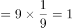，乙队施工效率为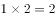。甲乙两队同时施工，完成该工程需要的时间天。

故正确答案为B。

---

## 判断推理

### 第 1 题　qid 2374814 · 图形推理

下列选项中最符合所给图形规律的是（    ）。

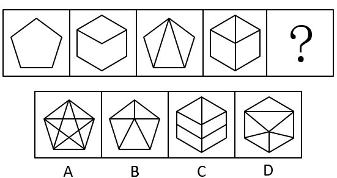

- **A**. A
- **B**. B　✅
- **C**. C
- **D**. D

**答案**：B

**官方解析**

元素组成不同，且无明显属性规律，考虑数量规律。观察图形发现，图2到图4图形均被分割为多个封闭空间，考虑面数量。题干图形的面数量分别为：1、2、3、4、？，则？处应为5个面的图形。A项11个面，排除；B项5个面，当选；C项6个面，排除；D项6个面，排除。
故正确答案为B。

---

### 第 2 题　qid 2374816 · 图形推理

下列选项中最符合所给图形规律的是（    ）。

- **A**. A
- **B**. B　✅
- **C**. C
- **D**. D

**答案**：B

**官方解析**

元素组成相同，优先考虑位置规律。观察题干图形，图一图三元素相同，图二图四元素相同，考虑图形间的位置规律。从图一到图三，图形逆时针旋转了，从图二到图四，图形逆时针旋转了，所以图五应该是图三逆时针旋转所得，只有B项符合。

故正确答案为B。

---

### 第 3 题　qid 2374819 · 图形推理

下列选项中最符合所给图形规律的是（    ）。

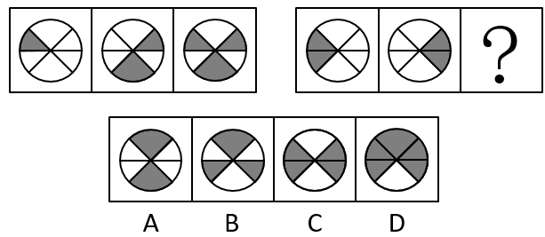

- **A**. A
- **B**. B
- **C**. C　✅
- **D**. D

**答案**：C

**官方解析**

解析一：元素组成相似，优先考虑样式规律。观察发现，第一组图中，图1和图2的阴影部分叠加，得到图3。第二组图遵循此规律，？处应该由图1和图2的阴影部分叠加而得，只有C项符合。

故正确答案为C。

解析二：元素组成相似，优先考虑样式规律。观察发现，题干图形由黑块和白块组成，且黑块数量不同，考虑黑白运算。根据第一组图可知，，，。将规律应用到第二组图，则？处上下的扇形应为，左右两侧扇形为和，只有C项符合。

故正确答案为C。

---

### 第 4 题　qid 2374822 · 图形推理

如图所示，这三个小图形可以组成的图形是（    ）。

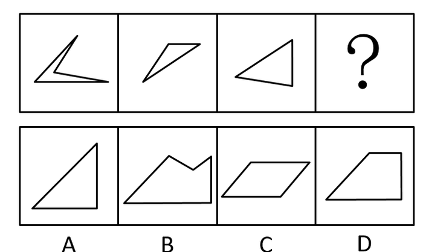

- **A**. A
- **B**. B
- **C**. C
- **D**. D　✅

**答案**：D

**官方解析**

本题考查平面拼合，可采用平行且等长相消的方式解题。消去平行且等长的线段后进行组合即可得到轮廓图，即为D项。平行且等长相消的方式如下图所示：

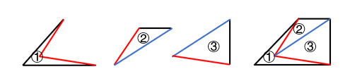

故正确答案为D。

---

### 第 5 题　qid 2374746 · 图形推理

如图所示，四个相同的等腰直角三角形，不可能组成的图形是（    ）。

- **A**. 长方形
- **B**. 三角形
- **C**. 直角梯形　✅
- **D**. 平行四边形

**答案**：C

**官方解析**

本题考查图形拼合。通过将题干中四个相同的等腰直角三角形进行任意拼合，组成选项图形。

A项：可以组成，如图所示。

B项：可以组成，如图所示。

C项：不可以组成。

D项：可以组成，如图所示。

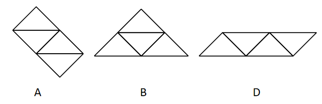

本题为选非题，故正确答案为C。

---

### 第 6 题　qid 2374827 · 图形推理

如图所示是从两个不同角度观察到的同一个正四面体的外表面，将该四面体展开，可能得到的图形是（    ）。

- **A**. A
- **B**. B
- **C**. C
- **D**. D　✅

**答案**：D

**官方解析**

本题为空间重构类，逐一分析选项：

A项：题干中数字3的背部紧邻公共边（如上图红线所示），而选项中数字3的底部紧邻公共边，选项与题干不一致，排除； 

B项：题干中数字3的背部紧邻公共边（如上图红线所示），而选项中数字3的底部紧邻公共边，选项与题干不一致，排除；

C项：题干中数字2的底部紧邻公共边（如上图蓝线所示），而选项中数字2的背部紧邻公共边，选项与题干不一致，排除；

D项：选项与题干一致，当选。

故正确答案为D。

---

### 第 7 题　qid 2374750 · 图形推理

下列选项，与所给立体图形不同的是（    ）。

- **A**. A
- **B**. B　✅
- **C**. C
- **D**. D

**答案**：B

**官方解析**

本题考查立体图形在空间中的旋转。

A项：题干图形逆时针旋转即可得到，与题干立体图形相同，排除；

B项：如上图所示，当题干图形旋转到直角处位置朝外的时候，多出来的小方块应该在下方，与题干立体图形不同，当选；

C项：题干图形逆时针旋转即可得到，与题干立体图形相同，排除；

D项：题干图形水平向后旋转，再顺时针旋转即可得到，与题干立体图形相同，排除。

本题为选非题，故正确答案为B。

---

### 第 8 题　qid 2374752 · 图形推理

下列选项中，不可能是所给立方体展开图的是（    ）。

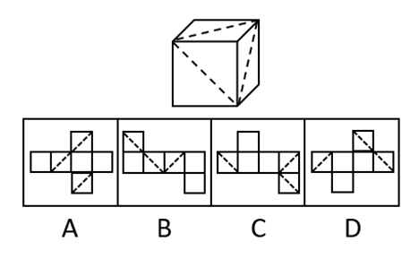

- **A**. A　✅
- **B**. B
- **C**. C
- **D**. D

**答案**：A

**官方解析**

本题为空间重构题。

在立体图形中，三条虚线面两两相邻，没有构成相对面。而A项中，存在一组虚线面是相对面（如下图所示），不可能同时出现在立体图形中。

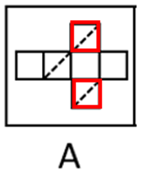

本题为选非题，故正确答案为A。

---

### 第 9 题　qid 2374748 · 图形推理

一个正方形旋转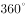后，其旋转轨迹不可能形成的图形是（    ）。

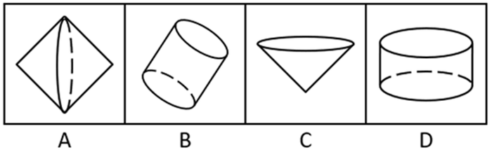

- **A**. A
- **B**. B
- **C**. C　✅
- **D**. D

**答案**：C

**官方解析**

逐一分析选项。

A项：沿正方形的对角线旋转可得到选项（如上图），排除；

B项：沿正方形的轴对称线旋转可得到选项（如上图），排除；

C项：选项无法由正方形旋转而成，当选；

D项：沿正方形的某一边旋转可得到选项（如上图），排除。

本题为选非题，故正确答案为C。

---

### 第 10 题　qid 2374815 · 类比推理

如图所示，所给物体的俯视图不可能是（    ）。

- **A**. A
- **B**. B　✅
- **C**. C
- **D**. D

**答案**：B

**官方解析**

给定物体可看作由从前往后4排小正方体组成，且右上角最后一排从侧面看到已有小正方体存在，所以在俯视图上，右上角不可能缺了一个小正方形，如下图所示。

本题为选非题，故正确答案为B。

---

### 第 11 题　qid 2374818 · 类比推理

民风：淳朴

- **A**. 阳光：灿烂　✅
- **B**. 书本：文化
- **C**. 树木：开花
- **D**. 喜悦：笑容

**答案**：A

**官方解析**

第一步：判断题干词语间逻辑关系。
“淳朴”的“民风”，“淳朴”用来形容“民风”，且“淳朴”是形容词，二者之间是偏正关系。
第二步：判断选项词语间逻辑关系。
A项：“灿烂”的“阳光”，“灿烂”用来形容“阳光”，且“灿烂”是形容词，二者之间是偏正关系，与题干逻辑关系一致，当选；
B项：通过“书本”可以获得“文化”，二者属于对应关系，与题干逻辑关系不一致，排除；
C项：“开花”是“树木”的一种或然形式，且“开花”是动宾短语，与题干逻辑关系不一致，排除；
D项：“喜悦”时会露出“笑容”，二者属于对应关系，与题干逻辑关系不一致，排除。
故正确答案为A。

---

### 第 12 题　qid 2374820 · 类比推理

纺织：布匹

- **A**. 矿石：金属
- **B**. 努力：收获
- **C**. 工作：奉献
- **D**. 耕种：粮食　✅

**答案**：D

**官方解析**

第一步：判断题干词语间逻辑关系。
“纺织”是动作，“布匹”是成品，通过“纺织”得到“布匹”，二者是动作和成品的对应关系，且“布匹”是实物。
第二步：判断选项词语间逻辑关系。
A项：“矿石”是指可从中提取有用组分或其本身具有某种可被利用的性能的矿物集合体，可分为金属矿物、非金属矿物。“矿石”和“金属”二者是交叉关系，与题干逻辑关系不一致，排除；
B项：通过“努力”获得“收获”，但“收获”是抽象名词，与题干逻辑关系不一致，排除；
C项：“工作”中需要“奉献”精神，二者不是动作和成品的对应关系，与题干逻辑关系不一致，排除；
D项：“耕种”是动作，“粮食”是成品，通过“耕种”得到“粮食”，二者是动作和成品的对应关系，且“粮食”是实物，与题干逻辑关系一致，当选。
故正确答案为D。

---

### 第 13 题　qid 2374824 · 类比推理

水稻：植物

- **A**. 木耳：银耳
- **B**. 香蕉：水果　✅
- **C**. 动物：田鼠
- **D**. 米饭：面条

**答案**：B

**官方解析**

第一步，判断题干词语间逻辑关系。
题干中“水稻”是一种“植物”，二者是种属关系。
第二步，判断选项词语间逻辑关系。
A项：“木耳”和“银耳”都是一种真菌，二者是并列关系，与题干逻辑关系不一致，排除；
B项：“香蕉”是一种“水果”，二者是种属关系，与题干逻辑关系一致，当选；
C项：“田鼠”是一种“动物”，但是顺序反了，与题干逻辑关系不一致，排除；
D项：“米饭”和“面条”是两种不同的食物，二者是并列关系，与题干逻辑关系不一致，排除。
故正确答案为B。

---

### 第 14 题　qid 2374829 · 类比推理

丰富：贫乏

- **A**. 体贴：粗犷
- **B**. 精致：丑恶
- **C**. 拘束：随意　✅
- **D**. 振奋：高兴

**答案**：C

**官方解析**

第一步，判断题干词语间逻辑关系。
“丰富”指种类多或数量大，“贫乏”指缺少，二者为反义关系。
第二步，判断选项词语间逻辑关系。
A项：“体贴”指细心忖度别人的心情和处境，给予关切、照顾，“粗犷”指粗鲁豪放，二者无语义关系，与题干逻辑关系不一致，排除；
B项：“精致”指精巧细致，“丑恶”指丑陋恶劣，二者无语义关系，与题干逻辑关系不一致，排除；
C项：“拘束”指过分约束，“随意”指任凭自己的意思，不约束，二者为反义关系，与题干逻辑关系一致，当选；
D项：“振奋”指精神振作奋发，“高兴”指心情好，二者无语义关系，与题干逻辑关系不一致，排除。
故正确答案为C。

---

### 第 15 题　qid 2374832 · 类比推理

贫困：扶贫：脱贫

- **A**. 垃圾：清扫：整洁
- **B**. 拥堵：交警：畅通
- **C**. 噪音：抑制：平静
- **D**. 羸弱：锻炼：健壮　✅

**答案**：D

**官方解析**

第一步：判断题干词语间逻辑关系。
“贫困”需要“扶贫”，达到“脱贫”的目的，题干为状态、方式、目的的对应关系。
第二步：判断选项词语间逻辑关系。
A项：“垃圾”是名词，不是一种状态，题干逻辑关系不一致，排除；
B项：“拥堵”需要的是“疏通”，“交警”不是方式，与题干逻辑关系不一致，排除；
C项：“噪音”需要“抑制”，但目的应该是“安静”，不是“平静”，与题干逻辑关系不一致，排除；
D项：“羸弱”是一种状态，“羸弱”需要通过“锻炼”变“健壮”，与题干逻辑关系一致，当选。
故正确答案为D。

---

### 第 16 题　qid 2374736 · 逻辑判断

一座城市要想发展好会展产业，就需要“筑巢引凤”——先具备软硬件基础，再吸引会展活动。拥有完备的会展设施和理想的交通条件，只是说明一座城市具备了发展会展产业的硬件基础，要想吸引足够数量的高质量会展活动，还需要提高公共服务水平、构建良好的营商环境，从而加强软实力的建设。
如果上述表述为真，则以下情况中不可能发生的是（    ）。

- **A**. 甲市具备了发展会展产业的硬件基础，却发展不好会展产业
- **B**. 乙市大力提升公共服务水平，吸引了足够数量的高质量会展活动
- **C**. 丙市的会展产业非常发达，但市政设施老化的问题日渐突出
- **D**. 丁市会展设施完备、交通条件理想，但未具备发展会展产业的硬件基础　✅

**答案**：D

**官方解析**

日常结论题，根据题干信息逐一分析选项。
A项：据题干第一句话可知，发展会展产业需要软硬件基础，而甲市只具备硬件基础，软件基础不明确，所以是有可能发展不好会展产业的，排除；
B项：据题干第二句话可知，要想吸引足够数量的高质量会展活动，需要提高公共服务水平、构建良好的营商环境，乙市已经提高公共服务水平了，构建良好的营商环境不明确，所以有可能可以吸引足够数量的高质量会展活动，排除；
C项：据题干第一句话可知，要想发展好会展产业，就需要具备软硬件基础，丙市会展产业非常发达，说明具备软硬件基础，但市政设施如何题干没有提及，即不明确，是有可能发生的，排除；
D项：据题干第二句话可知，拥有完备的会展设施和理想的交通条件，就说明这座城市具备了发展会展产业的硬件基础，丁市会展设施完备、交通条件理想，是具备了发展会展产业的硬件基础的，因此不可能发生，当选。
本题为选非题，故正确答案为D。

---

### 第 17 题　qid 2374753 · 逻辑判断

G市经济发达、教育资源丰富，许多在G市就读的大学生毕业后都选择留在G市工作生活。但在今年，G市周边的几个城市都出台了一系列针对大学生落户的优惠政策，许多G市大学生因此选择将户口迁往周边城市。由此可以预测，今年留在G市的大学生将会更容易找到工作。
以下最能反驳上述论证的是（    ）。

- **A**. G市周边的几个城市中，大学生同样不容易找到心仪的工作
- **B**. 与去年相比，今年G市的几个大型工厂招收工人数量有所减少
- **C**. 绝大多数将户口迁往周边城市的G市大学生仍然选择在G市工作　✅
- **D**. 有调查指出，过去几年在G市的大学生并没有面临很大的就业压力

**答案**：C

**官方解析**

第一步：找出论点和论据。
论点：今年留在G市大学生将会更容易找到工作。
论据：在今年，G市周边的几个城市都出台了一系列针对大学生落户的优惠政策，许多G市大学生因此选择将户口迁往周边城市。
本题的论点讨论的是找工作的难易程度，而论据讨论的是出台政策使得大学生迁户口，两者讨论的话题不一致，优先考虑通过拆桥削弱，说明大学生迁户口与找工作的难易程度没关系。
第二步：逐一分析选项。
A项：题干讨论的是G市的就业情况，而该选项讨论的是其他周边几个城市，话题不一致，无法削弱，排除；
B项：与去年相比，今年G市的几个大型工厂招收工人数量有所减少，但大学生原本会不会去这几个大型工厂当工人并不明确，无法削弱，排除；
C项：绝大多数将户口迁往周边城市的G市大学生仍然选择留在G市工作，说明即使大学生将户口迁离G市，但是绝大多数人都选择在G市工作，找工作的人并不会减少，说明论据的迁户口和论点的找工作容易度没有关系，拆断了论点和论据的联系，可以削弱，当选；
D项：过去几年在G市的大学生没有面临很大的就业压力，该选项讨论的是过去几年的事情，而题干论点讨论的是今年的就业会不会更容易，话题不一致，无法削弱，排除。
故正确答案为C。

---

### 第 18 题　qid 2374741 · 逻辑判断

在发达国家的产业结构中，服务业占了很高的比重。根据他们的经验，提高服务业占比就可以促进就业。但是，服务业具有较高的进入壁垒，这也是我国服务业发展相对滞后的一个重要原因。因此，我国可以通过打破服务业的行业壁垒进一步促进就业。
以下最可能是上述论证潜在假设的是（    ）。

- **A**. 服务业促进就业的规律适用于我国　✅
- **B**. 我国创造就业的能力弱于发达国家
- **C**. 发达国家的服务业也存在行业壁垒
- **D**. 其他行业对促进就业没有显著作用

**答案**：A

**官方解析**

第一步：找出论点和论据。
论点：我国可以通过打破服务业的行业壁垒进一步促进就业。
论据：在发达国家的产业结构中，服务业占了很高的比重。根据他们的经验，提高服务业占比就可以促进就业。但是，服务业具有较高的进入壁垒，这也是我国服务业发展相对滞后的一个重要原因。
本题的问法为“假设”，论点是我国可以打破服务业壁垒来促进就业，论据是提高服务业占比就可以促进就业，而服务业壁垒影响到服务业发展。二者话题一致，考虑必要条件，即服务业促进就业是可行的。
第二步：逐一分析选项。
A项：说明在我国服务业是可以促进就业的，那么打破服务业壁垒促进服务业发展就可以进一步促进就业，是论证成立的假设，当选；
B项：论点说的是服务业和就业之间的关系，该项说的是创造就业能力和发达国家之间的对比，话题不一致，不是论证成立的假设，排除；
C项：论点说的是我国服务业和就业之间的关系，该项说的是发达国家的服务业存在行业壁垒，话题不一致，不是论证成立的假设，排除；
D项：论点说的是服务业和就业之间的关系，该项说的是其他行业和促进就业之间的关系，主体不一致，不是论证成立的假设，排除。
故正确答案为A。

---

### 第 19 题　qid 2374757 · 定义判断

近年来随着大型野生动物园的兴起，有人提出，传统城市动物园已经没有存在的必要性。但传统城市动物园具有票价低、交通便利等优点，中小学组织参观十分方便，因而具有很强的教育功能，所以传统城市动物园不可或缺。
以下不属于上述论证缺陷的是（    ）。

- **A**. 忽视了野生动物园和传统城市动物园具有并存的可能性　✅
- **B**. 默认了具有很强教育功能的传统城市动物园就应该保留
- **C**. 忽视了票价低、交通便利不等同于方便中小学组织参观
- **D**. 默认了方便中小学组织参观的动物园都具有很强的教育功能

**答案**：A

**官方解析**

第一步：找出论点和论据。
论点：传统城市动物园不可或缺。
论据：传统城市动物园具有票价低、交通便利等优点，中小学组织参观十分方便，因而具有很强的教育功能。
本题的问法较为新颖，其实论证缺陷就是题干中的漏洞，而该题问的是“不属于上述论证缺陷的是”，即排除能够指出题干中存在漏洞的选项即可。
第二步：逐一分析选项。
A项：该项讨论的是“野生动物园和传统城市动物园能否并存”，而论点讨论的是“传统城市动物园是否不可或缺”，话题不一致，无法指出论证缺陷，当选；
B项：默认了论据“教育功能”与论点“传统城市动物园不可或缺”之间的关系，指出论点论据具有联系，通过搭桥指出论证缺陷，排除；
C项：忽视了“票价低、交通便利不等同于方便中小学组织参观”，也就是票价低、交通便利不一定方便参观，并非不可或缺，拆断论点论据联系，通过拆桥指出论证缺陷，排除；
D项：默认了“方便中小学组织参观的动物园都具有很强的教育功能”，指出论点论据具有联系，通过搭桥指出论证缺陷，排除。
本题为选非题，故正确答案为A。

---

### 第 20 题　qid 2374745 · 逻辑判断

历史经验告诉我们，世界经济危机往往伴随着巨大的世界变革：1857年世界经济危机后的电气革命，推动人类社会从蒸汽时代进入电气时代；1929年世界经济危机引发了第二次世界大战，客观上推动了科学技术的发展。由此可知，是经济危机造成了巨大的世界变革。
以下和该论证过程的逻辑最为类似的是（    ）。

- **A**. 不正确的坐姿会加重颈部负担，因而是腰酸背痛的主要诱因
- **B**. 海底地震是海啸的主要成因，因为海啸发生前往往能观测到海底地震　✅
- **C**. 宇航员的预期寿命明显高于一般人，因此太空旅行中的辐射暴露并不会危害人体
- **D**. 许多体弱多病的人都不喜欢吃蔬菜，所以想保持身体健康就必须从蔬菜中摄入足量的膳食纤维

**答案**：B

**官方解析**

第一步：分析题干逻辑关系。
题干是在说发生世界经济危机之后，会发生巨大的世界变革，得出的结论是经济危机造成了巨大的世界变革。
即A、B先后发生，则先发生的A为因，后发生的B为果(认为先后顺序代表因果关系)。
第二步：逐一分析选项。
A项：指出不正确的坐姿加重颈部负担，而结论是腰酸背痛的主要诱因，出现了不正确坐姿、加重颈部负担和腰酸背痛3件事，与题干中逻辑关系不一致，排除；
B项：先观测到海底地震，再发生海啸，得出结论海底地震是海啸的主要成因，符合A、B先后发生，则先发生的A为因，后发生的B为果，与题干中逻辑关系一致，当选；
C项：宇航员的预期寿命明显高于一般人，因此太空旅行中的辐射暴露并不会伤害人体，完全没有指明具有先后发生的两件事，与题干中逻辑关系不一致，排除；
D项：许多体弱多病的人都不喜欢吃蔬菜，看不出体弱多病和不喜欢吃蔬菜的先后顺序，与题干中逻辑关系不一致，排除。
故正确答案为B。

---

## 资料分析

### 材料 1

        过去5年，我国统筹开展交通扶贫和“四好农村路工作”，农村基础设施更加完善，服务乡村振兴成效显著。

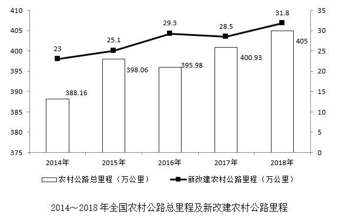

#### 第 1 题　qid 2374823 · 综合

2014~2018年，全国新改建农村公路里程共计（    ）万公里。

- **A**. 77.5
- **B**. 97.4
- **C**. 117.2
- **D**. 137.7　✅

**答案**：D

**官方解析**

时间段是2014～2018年，主体是全国新改建农村公路里程，定位折线图，各个年份的数据加和，为万公里。或者观察选项，选项数据与材料数据精度相同，求具体数值，选项尾数不同，可以用尾数法，，对应D项。

故正确答案为D。

---

#### 第 2 题　qid 2374833 · 增长

2015~2018年，全国新改建农村公路里程较上年增加最多的一年是（    ）。

- **A**. 2015
- **B**. 2016　✅
- **C**. 2017
- **D**. 2018

**答案**：B

**官方解析**

根据问题“······增加最多的一年”，可判定本题为增长量比较问题。

A项2015年：万公里；B项2016年：万公里；C项2017年为下降，直接排除；D项2018年：万公里。明显B项2016年的增长量最大。

故正确答案为B。

---

#### 第 3 题　qid 2374835 · 增长

与2014年相比，2018年我国农村公路总里程增加了（    ）万公里。

- **A**. 9.83
- **B**. 12.87
- **C**. 16.84　✅
- **D**. 22.59

**答案**：C

**官方解析**

根据问题“······增加了（    ）万公里”，可判定本题为增长量计算问题。主体为我国农村公路总里程，定位柱状图，可得：2014年我国农村公路总里程为388.16万公里，2018年我国农村公路总里程为405万公里，增加了万公里。

故正确答案为C。

---

#### 第 4 题　qid 2374836 · 比重

2018年，全国通硬化路面的乡镇占全国乡镇比例与2014年相比（    ）个百分点。

- **A**. 增加1.56　✅
- **B**. 增加0.25
- **C**. 减少1.56
- **D**. 减少0.25

**答案**：A

**官方解析**

主体为全国通硬化路面的乡镇占全国乡镇比例，定位表格，可得：2014年全国通硬化路面的乡镇占全国乡镇比例为，2018年全国通硬化路面的乡镇占全国乡镇比例为，增加了个百分点。

故正确答案为A。

---

#### 第 5 题　qid 2374837 · 综合

下列说法正确的是：

- **A**. 2014~2018年，我国新改建农村公路里程逐年增加
- **B**. 2014~2018年，我国农村公路总里程逐年增加
- **C**. 2014~2018年，通硬化路面的乡镇占全国乡镇的比例逐年提高　✅
- **D**. 2014~2018年，通公路的建制村占全国建制村的比例逐年提高

**答案**：C

**官方解析**

A项：定位折线图，可得：2016年我国新改建农村公路里程为29.3万公里，2017年我国新改建农村公路里程为28.5万公里，里程数减少，不满足“逐年增加”，错误；

B项：定位柱状图，可得：2015年我国农村公路总里程为398.06万公里，2016年我国农村公路总里程为395.98万公里，里程数减少，不满足“逐年增加”，错误；

C项：定位表格，可发现2014～2018年，通硬化路面的乡镇占全国乡镇的比例逐年提高，正确；

D项：定位表格，可得：2017年通公路的建制村占全国建制村的比例为，2018年通公路的建制村占全国建制村的比例为，比例降低，不满足“逐年提高”，错误。

故正确答案为C。

---

### 材料 2

        党的十八大以来，脱贫工作取得巨大成效，全国农村贫困人口大幅减少。截至2018年末，全国农村贫困人口从2012年末的9899万人减少至1660万人；农村贫困发生率从2012年的下降至，累计下降8.5个百分点。

        2018年，贫困地区农村居民人均可支配收入10371元，扣除价格因素，实际增长，实际增速高出全国农村居民人均可支配收入实际增速1.7个百分点，圆满完成增长幅度高于全国增速的年度目标任务。

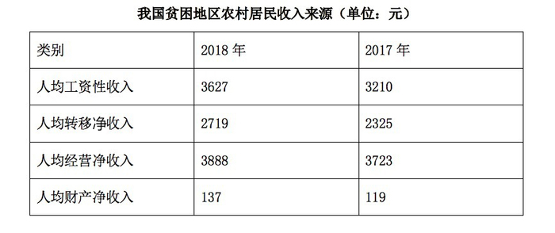

#### 第 6 题　qid 2374697 · 综合

从2012年末到2018年末，全国农村贫困人口数减少了（    ）万人。

- **A**. 6239
- **B**. 7239
- **C**. 8239　✅
- **D**. 9230

**答案**：C

**官方解析**

根据题意“······减少了（    ）万人”，可判定本题为增长量计算问题。定位文字材料第一段或柱形图，可得2012年末为9899万人，2018年末为1660万人， 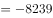，减少了8239万人。

故正确答案为C。

---

#### 第 7 题　qid 2374705 · 增长

2013—2018年，全国农村贫困发生率较上年下降最多的是（    ）年。

- **A**. 2013　✅
- **B**. 2015
- **C**. 2017
- **D**. 2018

**答案**：A

**官方解析**

本题所求“······全国农村贫困发生率较上年下降最多······”，定位折线图，A项2013年：，即下降1.7个百分点；B项2015年： ，即下降1.5个百分点；C项2017年： ，即下降1.4个百分点；D项2018年：，即下降1.4个百分点。则下降最多的为A项2013年。

故正确答案为A。

---

#### 第 8 题　qid 2374713 · 平均数

2018年，我国贫困地区农村居民人均工资性收入约占人均可支配收入的（    ）。

- **A**. 

- **B**. 

- **C**. 

- **D**. 

　✅

**答案**：D

**官方解析**

根据问题“······占······”，结合时间为2018年，判定本题为现期比重问题。定位表格，可得：2018年我国贫困地区农村居民人均工资性收入为3627元；定位文字第二段，可得：2018年我国贫困地区农村居民人均可支配收入10371元，则所占比重。

故正确答案为D。

---

#### 第 9 题　qid 2374716 · 综合

2018年，我国贫困地区农村居民收入来源中，最高的是（     ）。

- **A**. 人均工资性收入
- **B**. 人均转移净收入
- **C**. 人均经营净收入　✅
- **D**. 人均财产净收入

**答案**：C

**官方解析**

题目所求“2018年我国贫困地区农村居民收入来源最高的”，定位表格，观察数据可得，人均经营净收入3888元最高。
故正确答案为C。

---

#### 第 10 题　qid 2374723 · 综合

下列说法不正确的是（    ）。

- **A**. 
2012—2018年，全国农村贫困人口逐年递减

- **B**. 
2018年，全国农村居民人均可支配收入实际增速为

- **C**. 
2018年，贫困地区农村居民各来源的人均收入较上年均有提高

- **D**. 
2017年，贫困地区农村居民人均经营净收入比转移净收入高近1000元
　✅

**答案**：D

**官方解析**

A项：定位柱形图，2012～2018年，全国农村贫困人口逐年递减（根据柱子高度，逐渐降低），说法正确，排除；

B项：定位文字材料，“2018年······人均可支配收入实际增长，高出全国农村居民人均可支配收入实际增速1.7个百分点”，那么2018年全国农村居民人均可支配收入实际增速为，说法正确，排除；

C项：定位表格，比较2018年和2017年的收入来源，发现各个来源的收入均有所提高，说法正确，排除；

D项：定位表格，可得：2017年，贫困地区农村居民人均经营净收入为3723元，转移净收入为2325元，元，即多1398元，所以“近1000元”说法错误，当选。

本题为选非题，故正确答案为D。

---

### 材料 3

        近年来，B省营商环境不断优化，市场活力不断增强，新登记市场主体都保持较快增长势头。2018年，全省新登记市场主体229.74万户，日均新登记市场主体6294户，同比增长。

        全省产业结构也进一步调整优化，新登记市场主体主要集中在第三产业。2018年，全省三大产业新登记市场主体分别为第一产业2.02万户，第二产业24.01万户，第三产业203.71万户。截止2018年12月末，全省三大产业的实有各类市场主体户数分别为9.83万户，157.38万户，978.92万户。

        2018年，全省新登记企业最集中的三个行业分别是批发和零售业、租赁和商务服务业、制造业，新登记企业数分别为36.14万户、15.19万户、9.25万户，分别同比增长、增长、下降。

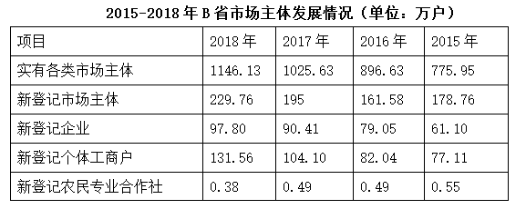

#### 第 11 题　qid 2374807 · 增长

2015-2018年，B省实有各类市场主体数增长了约（    ）万户。

- **A**. 170
- **B**. 270
- **C**. 370　✅
- **D**. 470

**答案**：C

**官方解析**

根据题干“······增长了······万户”，可判定本题为增长量计算问题。定位表格材料可知，2018年实有各类市场主体为1146.13万户，2015年为775.95万户，则增长量万户。

故正确答案为C。

---

#### 第 12 题　qid 2374810 · 综合

2018年，B省第三产业新登记市场主体约占全省实有各类市场主体的（    ）。

- **A**. 

- **B**. 

　✅
- **C**. 

- **D**. 

**答案**：B

**官方解析**

根据题干“2018年······占······”，结合选项为百分数，可判定本题为现期比重问题。定位文字材料第二段可知，2018年第三产业新登记市场主体数为203.71万户，定位表格材料可知，2018年实有各类市场主体为1146.13万户，则比重，与B项最接近。

故正确答案为B。

---

#### 第 13 题　qid 2374811 · 综合

2015-2018年，B省新登记个体工商户最多的是（    ）年。

- **A**. 2015
- **B**. 2016
- **C**. 2017
- **D**. 2018　✅

**答案**：D

**官方解析**

定位表格材料，可知B省各年新登记个体工商户数分别是：2018年131.56万户，2017年104.10万户，2016年82.04万户，2015年77.11万户，则2018年最多。
故正确答案为D。

---

#### 第 14 题　qid 2374812 · 增长

2018年，B省租赁和商务服务业新登记企业数较上年增加约（    ）万户。

- **A**. 2.8　✅
- **B**. 3.8
- **C**. 4.8
- **D**. 5.8

**答案**：A

**官方解析**

根据题干“······较上年增加······万户”，可判定本题为增长量计算问题。定位文字材料第三段可知，2018年租赁和商务服务业新登记企业数为15.19万户，同比增长。代入增长量计算公式：增长量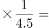万户。

故正确答案为A。

---

#### 第 15 题　qid 2374813 · 综合

下列说法正确的是（    ）。

- **A**. 2015-2018年，B省新登记农民专业合作社数量逐年增加
- **B**. 2015-2018年，B省新登记个体工商户均多于新登记企业数　✅
- **C**. 2017年，B省日均新登记市场主体少于4000户
- **D**. 2018年，B省第三产业新登记市场主体数量是第二产业的10倍

**答案**：B

**官方解析**

A项：定位表格数据，2015-2018年新登记农民专业合作社数量分别为0.55、0.49、0.49、0.38，并非逐年增加，错误；

B项：定位表格数据，比较2015-2018年，每年登记个体工商户数量和新登记企业数，2015年，，2016年，，2017年，，2018年，，因此新登记个体工商户均多于新登记企业数，正确；

C项：定位表格数据，2017年新登记市场主体数量为195万户，则日均为：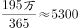，大于4000户，错误；

D项：定位文字材料第二段“2018年，全省三大产业新登记市场主体分别为第一产业2.02万户，第二产业24.01万户，第三产业203.71万户”，则倍数关系应为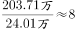，错误。

故正确答案为B。

---

### 材料 4

        近年来，A省大力发展绿色无公害农业。2017年，A省农药使用总量5.80万吨，与2016年相比减少；单位耕地面积农药使用量为1.47千克/亩。

        全省新增申报无公害农产品产地认定221个，产品362个，新增绿色食品33个，认证有机食品60个。全省“三品一标”总数达2570个，其中：无公害农产品1710个，绿色食品745个，有机农产品87个，农产品地理标志28个，无公害农产品种植面积总计达1050万亩，生产总量970多万吨。

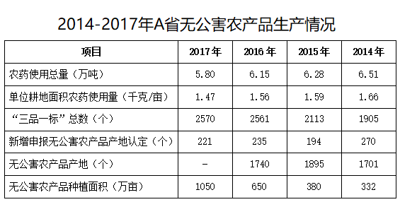

 

#### 第 16 题　qid 2374821 · 增长

2017年，A省“三品一标”总数较上年增加了（    ）个。

- **A**. 8
- **B**. 9　✅
- **C**. 10
- **D**. 11

**答案**：B

**官方解析**

定位表格可知，2017年A省“三品一标”总数为2570个，2016年为2561个。，则2017年A省“三品一标”总数较上年增加了9个。

故正确答案为B。

---

#### 第 17 题　qid 2374825 · 综合

2017年，A省农药使用总量比2016年减少了（    ）万吨。

- **A**. 0.25
- **B**. 0.3
- **C**. 0.35　✅
- **D**. 0.4

**答案**：C

**官方解析**

定位表格可知，2017年A省农药使用总量为5.80万吨，2016年为6.15万吨。，即2017年A省农药使用总量比2016年减少了0.35万吨。

故正确答案为C。

---

#### 第 18 题　qid 2374828 · 综合

2017年，A省单位耕地面积农药使用量比2015年约（    ）。

- **A**. 
增加

- **B**. 
下降
　✅
- **C**. 
增加

- **D**. 
下降

**答案**：B

**官方解析**

由题干“2017年A省单位耕地面积农药使用量比2015年约”，结合选项为，可判定本题为增长率计算问题。定位表格可知，2017年A省单位耕地面积农药使用量为1.47千克/亩，2015年为1.59千克/亩。，则2017年A省单位耕地面积农药使用量比2015年约下降。

故正确答案为B。

---

#### 第 19 题　qid 2374830 · 平均数

2014-2017年，A省平均每年新增申报无公害农产品产地认定（    ）个。

- **A**. 184
- **B**. 202
- **C**. 221
- **D**. 230　✅

**答案**：D

**官方解析**

由题干“2014-2017年A省平均每年新增申报无公害农产品产地认定多少个”，可判定本题为平均数计算问题。定位表格可知，2014-2017年A省新增申报无公害农产品产地认定分别为：270、194、235、221个，则平均每年为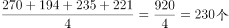。

故正确答案为D。

---

#### 第 20 题　qid 2374831 · 综合

下列说法不正确的是（    ）。

- **A**. 2016年，A省有绿色食品712个
- **B**. 2017年，A省无公害农产品种植面积是2014年的3倍多
- **C**. 2014-2017年，A省单位耕地面积农药使用量逐年下降
- **D**. 2017年，A省无公害农产品平均亩产超1吨　✅

**答案**：D

**官方解析**

A项：定位文字材料第二段可知，“（2017年）新增绿色食品33个，全省‘三品一标’总数达2570个，其中：······，绿色食品745个”。，则2016年A省有绿色食品712个，正确；

B项：定位表格可知，2017年A省无公害农产品种植面积1050万亩，2014年为332万亩。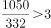，正确；

C项：定位表格可知，2014-2017年，A省单位耕地面积农药使用量（千克/亩）分别为1.66、1.59、1.56、1.47。使用量逐年下降，正确；

D项：定位文字材料第二段可知，“（2017年）无公害农产品种植面积总计达1050万亩，生产总量970多万吨”。则2017年，A省无公害农产品平均亩产为，错误。

本题为选非题，故正确答案为D。

---
