# 2019年广东省公务员录用考试《行测》题（县级卷）（网友回忆版）

> 省考 · 2019 年 · 6 个模块 · 共 100 题

- [政治理论](#%E6%94%BF%E6%B2%BB%E7%90%86%E8%AE%BA) · 2 题
- [常识判断](#%E5%B8%B8%E8%AF%86%E5%88%A4%E6%96%AD) · 23 题
- [言语理解与表达](#%E8%A8%80%E8%AF%AD%E7%90%86%E8%A7%A3%E4%B8%8E%E8%A1%A8%E8%BE%BE) · 15 题
- [数量关系](#%E6%95%B0%E9%87%8F%E5%85%B3%E7%B3%BB) · 15 题
- [判断推理](#%E5%88%A4%E6%96%AD%E6%8E%A8%E7%90%86) · 30 题
- [资料分析](#%E8%B5%84%E6%96%99%E5%88%86%E6%9E%90) · 15 题

---

## 政治理论

### 第 1 题　qid 2374688 · 新思想

习近平总书记提出“绿水青山就是金山银山”的发展理念。以下最能体现这一理念的是（    ）。

- **A**. 精准扶贫
- **B**. 共建“一带一路”
- **C**. 实行“河长制”　✅
- **D**. 加强知识产权保护

**答案**：C

**官方解析**

本题考查政治常识。
十九大报告中提出：“坚持人与自然和谐共生。建设生态文明是中华民族永续发展的千年大计。必须树立和践行绿水青山就是金山银山的理念，坚持节约资源和保护环境的基本国策，像对待生命一样对待生态环境，统筹山水林田湖草系统治理，实行最严格的生态环境保护制度，形成绿色发展方式和生活方式，坚定走生产发展、生活富裕、生态良好的文明发展道路。”
A项错误，精准扶贫是粗放扶贫的对称，指针对不同贫困区域环境、不同贫困农户状况，运用科学有效程序对扶贫对象实施精确识别、精确帮扶、精确管理的治贫方式。
B项错误，“一带一路”是“丝绸之路经济带”和“21世纪海上丝绸之路”的简称。旨在借用古代丝绸之路的历史符号，高举和平发展的旗帜，积极发展与沿线国家的经济合作伙伴关系，共同打造政治互信、经济融合、文化包容的利益共同体、命运共同体和责任共同体。
C项正确，实行“河长制”指建立健全以党政领导负责制为核心的责任体系，负责组织领导相应河湖的管理和保护工作。全面推行河长制是落实绿色发展理念、推进生态文明建设的内在要求。此举体现了“绿水青山就是金山银山”的发展理念。
D项错误，知识产权保护与我国经济发展动能转换、结构优化相辅相成，发挥着重要驱动作用。加强知识产权保护已成为完善产权保护制度最重要的内容，也是提高中国经济竞争力最大的激励。
故正确答案为C。

---

### 第 2 题　qid 2374673 · 新思想

2019年3月，习近平总书记对欧洲三国进行了国事访问，推动共建“一带一路”在亚欧大陆开辟新的空间。这三国分别是（    ）。

- **A**. 以色列  乌克兰  英国
- **B**. 墨西哥  奥地利  瑞典
- **C**. 意大利  摩纳哥  法国　✅
- **D**. 新西兰  葡萄牙  德国

**答案**：C

**官方解析**

本题考查政治常识。
2019年3月21日至26日，国家主席习近平应邀对意大利、摩纳哥、法国进行国事访问。此次欧洲之行是中国国家最高领导人2019年首次出访，对中意、中摩、中法关系发展具有重要历史意义，为中欧全面战略伙伴关系注入了新的动力。
故正确答案为C。

---

## 常识判断

### 第 1 题　qid 2374663 · 科技常识

如图所示，将一只充了气的密封小气球放在针筒壁内，封闭针筒孔后向外抽拉针筒推杆，忽略摩擦力的影响，则在这一过程中（    ）。

- **A**. 小气球体积会变大　✅
- **B**. 针筒内的压强保持不变
- **C**. 小气球受到的合力为零
- **D**. 针筒内的气体温度会升高

**答案**：A

**官方解析**

对于封闭针筒向外拉推杆的过程中，针筒封闭气体体积增大，压强变小，B项错误；小气球外部气体压强减小，小气球在内部气体压强作用下膨胀，故小气球体积变大，A项正确；由于气球膨胀，导致气球重心上升，将气球看成一个质点，气球并非静止不动，而是由静止变为向上运动，因此受到合力不为零，C项错误；在向外拉推杆的过程中，针筒内气体对外做功，消耗气体内能，相对抽拉针筒推杆前，针筒内气体温度不会升高，D项错误。
故正确答案为A。

---

### 第 2 题　qid 2374664 · 科技常识

办公室里的四盏灯型号相同，电路如下图所示。如果逐一打开这四盏灯，在电源的输出电压不变的情况下，下列说法正确的是（    ）。

- **A**. 打开的灯越多，通过各灯的电流变得越大
- **B**. 打开的灯越多，各灯两端的电压变得越小
- **C**. 打开的灯越多，通过电源的电流变得越大　✅
- **D**. 打开的灯越多，各灯变得越暗

**答案**：C

**官方解析**

由于灯泡均与电源并联，所以所有灯泡两端的电压均为电源输出电压，保持不变，B项错误；由于四盏灯型号相同，电阻相等，根据欧姆定律，所以流经每个灯泡支路的电流不变，A项错误；由于干路电流等于各支路电流之和，所以打开的灯越多，干路电流越大，即通过电源的电流变得越大，C项正确；而根据功率公式，可知灯泡功率不变，即亮度不变，D项错误。

故正确答案为C。

---

### 第 3 题　qid 2374666 · 科技常识

日常生活中的一些简单器械都应用了杠杆原理，根据使用杠杆时的用力情况，杠杆可以分为省力杠杆、费力杠杆和等臂杠杆。拾取垃圾使用的钳子（图1）和修剪树枝用的剪刀（图2），这两者的杠杆类型（    ）。

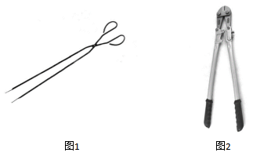

- **A**. 一样，都是省力杠杆
- **B**. 一样，都是费力杠杆
- **C**. 不一样，前者是费力杠杆，后者是省力杠杆　✅
- **D**. 不一样，前者是省力杠杆，后者是费力杠杆

**答案**：C

**官方解析**

根据杠杆原理，动力动力臂阻力阻力臂。

对于图1，支点距离握把较近，因而动力臂小于阻力臂，故使用时动力大于阻力，为费力杠杆；对于图2，支点距离握把较远，因而动力臂大于阻力臂，故使用时动力小于阻力，为省力杠杆。

故正确答案为C。

---

### 第 4 题　qid 2374668 · 科技常识

人们在乘坐小船时，应尽量坐下，站立会降低小船的稳定性，其根本原因是（    ）。

- **A**. 人和船的整体重量增加
- **B**. 人和船的整体重心变高　✅
- **C**. 船的行驶速度增加
- **D**. 水流波动幅度变大

**答案**：B

**官方解析**

当人坐下时，人和船整体重心更低，当倾斜相同的角度时，重心低的物体，其重心偏移不易超出它的底部的支撑范围，因而不易倾倒，所以重心越低越稳定；而人站立时，刚好相反。而无论人站立、坐下，整体重量都不变，也不会引起速度变化，更不影响水面波动幅度。
故正确答案为B。

---

### 第 5 题　qid 2374669 · 科技常识

物质的用途与性质密切相关。下列说法正确的是（    ）。

- **A**. 木炭能作为炼钢的原料，是利用了木炭的可燃性
- **B**. 钨常用作灯丝，是因为钨在高温下化学性质稳定
- **C**. 活性炭可以去除水中杂质，是因为其具有很强的吸附能力　✅
- **D**. 铝制品的表面可以不做防锈处理，是因为铝的金属活动性不强

**答案**：C

**官方解析**

A项错误，木炭能作为炼钢的原料，使用的是木炭的还原性，而非可燃性。在高温下，木炭作为还原剂，与矿石（主要为金属氧化物）中的氧结合，生成二氧化碳，而使金属被还原。
B项错误，钨常用作灯丝，是因为钨丝的熔点高，不容易因过热而熔化，而非钨在高温下化学性质稳定。
C项正确，活性炭具有吸附性，能吸附水中的杂质，可用活性炭净水。
D项错误，铝的金属活动性强，化学性质活泼，因此能在空气中和氧气反应生成氧化铝，在金属表面形成致密的保护膜，防止生锈，因而不需要防锈。
故正确答案为C。

---

### 第 6 题　qid 2374672 · 科技常识

如图所示，将所点燃的一高一矮两只蜡烛放入圆筒，圆筒顶端不封闭，并从圆筒侧壁缓慢注入二氧化碳气体。则最可能发生的情况是（    ）。

- **A**. 高蜡烛先熄灭
- **B**. 矮蜡烛先熄灭　✅
- **C**. 两只蜡烛的火苗没有变化
- **D**. 两只蜡烛的火苗都变矮并逐渐熄灭

**答案**：B

**官方解析**

二氧化碳本身不燃烧，也不支持燃烧，密度比空气大。如图，从上方注入二氧化碳，由于二氧化碳密度比空气大，因此下沉。又因为二氧化碳不支持燃烧，下沉的二氧化碳，自下而上逐渐排出容器内的空气，包裹火焰、隔绝氧气，使蜡烛熄灭。因此，逐渐注入二氧化碳，矮蜡烛先熄灭，高蜡烛后熄灭。
故正确答案为B。

---

### 第 7 题　qid 2374674 · 科技常识

如图所示，甲、乙两个大小相同的实心金属球放置在光滑水平面上，甲球以水平向右的速度碰撞静止的乙球。已知甲球质量大于乙球，则有关碰撞后的情形，下列说法正确的是（    ）。

- **A**. 甲球可能静止
- **B**. 乙球可能静止
- **C**. 甲球可能向左运动
- **D**. 甲球一定向右运动　✅

**答案**：D

**官方解析**

根据碰撞过程动量守恒可得：——①

根据动能守恒可得：——②

连立①②，分别消去 、，可得：

——③

——④

由④可得，，方向与方向相同，水平向右运动，故B项错误；

因为，由③可得，所以的方向与方向相同，水平向右运动，故A项、C项错误，D项正确。

故正确答案为D。

---

### 第 8 题　qid 2374676 · 科技常识

冬天气温很低的时候往玻璃杯里倒开水，杯壁较厚的玻璃杯更容易发生炸裂，这是因为（    ）。

- **A**. 内壁和外壁受热不均　✅
- **B**. 开水遇到玻璃后温度迅速降低
- **C**. 空气对杯壁的压力超过杯壁的承受范围
- **D**. 倒水时水的冲击力将玻璃杯击破

**答案**：A

**官方解析**

杯子内倒入开水后，厚玻璃杯内壁温度迅速升高，受热膨胀，而外壁温度变化慢，膨胀程度小。内外壁受热膨胀不均匀，内外壁膨胀程度不同，导致玻璃杯发生炸裂。
故正确答案为A。

---

### 第 9 题　qid 2374679 · 科技常识

为了整治超速，交警采用了一套系统。在某一路段，系统会自动记录车辆进入和离开的时间，从而判断该车辆是否超速。这种方法是计算车辆的（    ）。

- **A**. 平均速率　✅
- **B**. 瞬时速率
- **C**. 加速度
- **D**. 位移

**答案**：A

**官方解析**

平均速率是指物体运动的路程和通过这段路程所用时间的比。题干中“某一路段”是指路程，“进入和离开所用的时间”是通过这段路程所用的时间，二者的比值就是该车辆在这段时间的平均速率，可用该速率来估测车辆是否超速。
故正确答案为A。

---

### 第 10 题　qid 2374682 · 科技常识

“后驱”是指发动机的动力通过传动轴传递给后轮，从而推动车辆前进的一种驱动形式。当后驱车在水平公路上匀速前进时，下列说法正确的是（    ）。

- **A**. 前轮和后轮受到的摩擦力均向前
- **B**. 前轮和后轮受到的摩擦力均向后
- **C**. 前轮受到的摩擦力向前，后轮受到的摩擦力向后
- **D**. 前轮受到的摩擦力向后，后轮受到的摩擦力向前　✅

**答案**：D

**官方解析**

车辆前进时，后轮是驱动轮，主动转动，对地面的力是向后的，所以受到的反作用力即摩擦力是向前的；但是对前轮来说，被动转动，受到来自地面向后的摩擦力。
故正确答案为D。

---

### 第 11 题　qid 2374691 · 人文常识

近几年，我国政府出台了一系列减税降费的举措。减税降费有利于（    ）。
①减轻企业负担、稳定就业
②优化经济和收入分配结构
③畅通小微企业融资渠道

- **A**. ①②　✅
- **B**. ①③
- **C**. ②③
- **D**. ①②③

**答案**：A

**官方解析**

本题考查经济常识。
2019年3月21日，李克强总理考察财政部、税务总局并主持召开座谈会指出，要坚持以习近平新时代中国特色社会主义思想为指导，贯彻党中央、国务院决策部署，把大规模减税降费作为重大改革举措和宏观调控“当头炮”。这既利当前又利长远，不仅减轻企业负担、稳定就业，而且优化经济和收入分配结构，培育税源、促进财政可持续。要把减税加快落实到位，以企业活力更大释放保持经济运行在合理区间，推动高质量发展。因此①②正确。
故正确答案为A。

---

### 第 12 题　qid 2374670 · 人文常识

粤港澳大湾区包括香港特别行政区、澳门特别行政区和珠三角九市，是我国经济活力最强的区域之一，在国家发展大局中具有重要战略地位。以下关于粤港澳大湾区发展基础的说法，错误的是（    ）。

- **A**. 经济实力雄厚
- **B**. 创新要素集聚
- **C**. 内部发展差距小　✅
- **D**. 国际化水平领先

**答案**：C

**官方解析**

本题考查政治常识。2019年2月18日，中共中央、国务院印发了《粤港澳大湾区发展规划纲要》，《纲要》第一节指出，粤港澳大湾区发展基础为：区位优势明显、经济实力雄厚、创新要素集聚、国际化水平领先、合作基础良好。
A项正确，粤港澳大湾区经济实力雄厚。经济发展水平全国领先，产业体系完备，集群优势明显，经济互补性强，香港、澳门服务业高度发达，珠三角九市已初步形成以战略性新兴产业为先导、先进制造业和现代服务业为主体的产业结构，2017年大湾区经济总量约10万亿元。
B项正确，粤港澳大湾区创新要素集聚。创新驱动发展战略深入实施，广东全面创新改革试验稳步推进，国家自主创新示范区加快建设。粤港澳三地科技研发、转化能力突出，拥有一批在全国乃至全球具有重要影响力的高校、科研院所、高新技术企业和国家大科学工程，创新要素吸引力强，具备建设国际科技创新中心的良好基础。
C项错误，内部发展差距小并非粤港澳大湾区的发展基础。
D项正确，粤港澳大湾区国际化水平领先。香港作为国际金融、航运、贸易中心和国际航空枢纽，拥有高度国际化、法治化的营商环境以及遍布全球的商业网络，是全球最自由经济体之一。澳门作为世界旅游休闲中心和中国与葡语国家商贸合作服务平台的作用不断强化，多元文化交流的功能日益彰显。珠三角九市是内地外向度最高的经济区域和对外开放的重要窗口，在全国加快构建开放型经济新体制中具有重要地位和作用。
本题为选非题，故正确答案为C。

---

### 第 13 题　qid 2374675 · 人文常识

2019年3月12日，十三届全国人大二次会议举行第三次全体会议，听取审议最高人民法院工作报告和最高人民检察院工作报告。这体现了人民代表大会的（    ）。

- **A**. 立法权
- **B**. 决定权
- **C**. 任免权
- **D**. 监督权　✅

**答案**：D

**官方解析**

本题考查法律常识。
全国人大有权监督由它产生的其他国家机关的工作，这些国家机关主要包括全国人大常委会、国务院、国家监察委员会、最高人民法院、最高人民检察院等，它们都要向全国人大负责，并报告工作。具体来说，全国人大听取并通过全国人大常委会的工作报告；听取最高人民法院、最高人民检察院的工作报告；改变或者撤销全国人民代表大会常务委员会不适当的决定等。
故正确答案为D。

---

### 第 14 题　qid 2374680 · 人文常识

人才是实施乡村振兴战略的关键因素。以下举措不属于推动乡村人才振兴的是（    ）。

- **A**. 大力支持乡村休闲旅游　✅
- **B**. 实施新乡贤返乡工程
- **C**. 扩大“三支一扶”计划人员招募规模
- **D**. 完善农村劳动力技能培训补贴机制

**答案**：A

**官方解析**

本题考查政治常识。
A项错误，大力支持乡村休闲旅游，属于发展农村产业经济，并未体现出吸引、培育人才等方面的举措。
B项正确，实施新乡贤返乡工程，属于吸引人才的举措，把更多从农村走出来的精英群体引回乡村创新创业。
C项正确，扩大“三支一扶”计划人员招募规模，属于吸纳高校毕业生到基层工作的举措，大学生村官计划是向农村提供人才支撑的重要途径，能为建设高素质专业化“三农”工作干部队伍提供源头活水。
D项正确，完善农村劳动力技能培训补贴机制，属于提升农村劳动力技能的举措，通过培训提高、吸引发展、培育储备，加快构建一支有文化、懂技术、善经营、会管理的新型职业农民队伍。
本题为选非题，故正确答案为A。

---

### 第 15 题　qid 2374683 · 法律常识

宏观调控是国家综合运用各种手段对国民经济进行的一种调节控制。国家宏观调控分为经济手段、法律手段和行政手段。下列选项中，不属于经济手段的是（    ）。

- **A**. 央行上调存款准备金率
- **B**. 全国各地发布最低工资标准
- **C**. 政府下令关停整改严重污染企业　✅
- **D**. 国家实施个人所得税专项附加扣除

**答案**：C

**官方解析**

本题考查经济常识。
A、B、D三项正确，经济手段，是指政府在自觉依据和运用价值规律的基础上借助于经济杠杆的调节作用，对国民经济进行宏观调控。经济杠杆是对社会经济活动进行宏观调控的价值形式和价值工具，主要包括税收、信贷、工资等。经济手段中的政策包括税收政策、信贷政策、利率政策、汇率政策、产品赊销政策、价格政策等。央行上调存款准备金率属于经济手段中的利率政策，全国各地发布最低工资标准属于经济杠杆中的工资，个人所得税专项附加扣除属于税收政策。
C项错误，行政手段，是指依靠行政机构，采取强制性的命令、指示、规定等行政方式来调节经济活动，以达到宏观调控目标的一种手段。行政手段是短期的非常规的手段，不可滥用，必须在尊重客观经济规律的基础上，从实际出发加以运用。政府下令关停整改严重污染企业属于行政手段，而非经济手段。
本题为选非题，故正确答案为C。
【知识拓展】法律手段，是指政府依靠法制力量，通过经济立法和司法，运用经济法规来调节经济关系和经济活动，以达到宏观调控目标的一种手段。通过法律手段可以有效地保护公有财产、个人财产，维护各种所有制经济、各个经济组织和社会成员个人的合法权益；调整各种经济组织之间横向和纵向的关系，保证经济运行的正常秩序。

---

### 第 16 题　qid 2374687 · 人文常识

全面建成小康社会，最艰巨最繁重的任务在（    ），特别是在贫困地区。

- **A**. 城市
- **B**. 城镇
- **C**. 社区
- **D**. 农村　✅

**答案**：D

**官方解析**

本题考查政治常识。
习近平总书记在河北省阜平县考察扶贫开发工作时的讲话中强调：“全面建成小康社会，最艰巨最繁重的任务在农村，特别是在贫困地区。没有农村的小康，特别是没有贫困地区的小康，就没有全面建成小康社会。”
故正确答案为D。

---

### 第 17 题　qid 2374690 · 法律常识

行政机关在法律的授权范围内，将一般性的原则或者条款适用于个案时，需要作出一种最适当的法律效果选择。这属于行政法的（    ）。

- **A**. 行政效力推定原则
- **B**. 行政裁量合理原则　✅
- **C**. 行政职权法定原则
- **D**. 行政程序正当原则

**答案**：B

**官方解析**

本题考查法律常识。
A项错误，行政效力推定原则是指行政主体作出的行政行为，即使存在瑕疵也应当推定行政行为合法有效，所有的组织和个人都必须给予尊重，相关的组织和个人必须履行行政行为所设定的义务。
B项正确，行政裁量合理原则是指行政机关在法律授权的范围内，根据具体情况将一般性原则或者条款适用于个案的一种最适当的选择。这一原则的法理意义在于通过行政程序规范行政裁量权，达成行政权的有效率地行使。
C项错误，行政职权法定原则是指行政机关所行使的职权必须有法律规定，任何机关不得超越法律的授权。其特点包括：行政机关的创设具有法律依据，行政机关的权力来源于法律授权，行政机关在权限范围内行使权力符合法律的规定。
D项错误，行政程序正当原则是指行政机关作出影响行政相对人权益的行政行为，必须遵遁正当法律程序，包括事先告知相对人，向相对人说明行为的根据、理由，听取相对人的陈述、申辩，事后为相对人提供相应的救济途径等。
故正确答案为B。

---

### 第 18 题　qid 2374692 · 人文常识

只要把握住历史发展大势，抓住历史变革时机，奋发有为，锐意进取，人类社会就能更好前进。这句话体现的哲学原理是（    ）。

- **A**. 物质和意识的辩证关系
- **B**. 规律是可以认识和利用的　✅
- **C**. 事物发展是前进性和曲折性的统一
- **D**. 实践是检验认识正确与否的唯一标准

**答案**：B

**官方解析**

本题考查马克思主义哲学。
A项错误，辩证唯物主义认为，世界的本原是物质的，物质决定意识，意识是物质的反映，意识对物质又具有能动作用。题干并未体现这一原理。
B项正确，规律是可以认识和利用的。人们可以认识和把握规律，并根据规律发生作用的条件和形式，利用规律，改造客观世界，造福人类。题干中强调只要抓住历史发展大势，抓住历史变革时机，锐意进取，人类社会就能更好前进，体现了认识和利用规律的原理。
C项错误，事物发展的总趋势是前进的，而发展的道路则是迂回曲折的。任何事物的发展都是前进性与曲折性的统一。前途是光明的，道路是曲折的，在前进中有曲折，在曲折中向前进，是一切新事物发展的途径。选项本身表述无误，但题干未体现这一原理。
D项错误，实践是检验认识正确与否的唯一标准，选项本身表述无误，但题干未体现这一原理。
故正确答案为B。

---

### 第 19 题　qid 2374694 · 人文常识

地球内部具有巨大的热量，并通过不同途径由内向外散发地热能。以下现象与地热能有关的是（    ）。

- **A**. 台风生成
- **B**. 火山喷发　✅
- **C**. 山洪暴发
- **D**. 岩石风化

**答案**：B

**官方解析**

本题考查自然常识。
A项错误，台风发源于热带海面，那里温度高，大量的海水被蒸发到了空中，形成一个低气压中心。随着气压的变化和地球自身的运动，流入的空气也旋转起来，形成一个逆时针旋转的空气漩涡，这就是热带气旋。只要气温不下降，这个热带气旋就会越来越强大，最后形成了台风，台风属于大气的运动，与地热能无关。
B项正确，火山喷发是一种奇特的地质现象，是岩浆等喷出物在短时间内从火山口向地表的释放，是地壳运动的一种表现形式，也是地球内部热能在地表的一种最强烈的显示。
C项错误，一般山洪泥石流形成于中高山区，这里相对高差大，河谷坡度陡峻，且大都表层为植皮覆盖有较厚的土体，土体下面为中深断裂及其派生级断裂切割的破碎岩石层，加之短历时雷暴雨，降水量巨大，就会引发山洪，因此山洪主要是由短时降雨引发的，与地热能无关。
D项错误，岩石风化是指岩石在太阳辐射、大气、水和生物作用下出现破碎、疏松及矿物成分次生变化的现象。温度变化是引起岩石物理风化作用的最主要因素。由于温度的变化产生温差，温差可促使岩石膨胀和收缩交替地进行，久之则引起岩石破裂。岩石风化与地热能无关。
故正确答案为B。

---

### 第 20 题　qid 2374698 · 科技常识

赤潮是指在特定的环境条件下，海水中某些浮游生物爆发性增殖，引起水体变色的一种生态现象。下列关于赤潮的说法中，正确的是（    ）。

- **A**. 海水富营养化是赤潮爆发的基础　✅
- **B**. 赤潮爆发与人类活动关系不大
- **C**. 多数赤潮对环境没有危害
- **D**. 所有的赤潮都是红色的

**答案**：A

**官方解析**

本题考查地理国情。
A项正确，海水富营养化是赤潮生物快速繁殖的物质基础和首要条件，大量工农业废水、生活污水和养殖废水排入海洋，海水中氮、磷、硅等营养盐，水温、盐度、微量金属元素以及维生素类等含量大大增加，导致近海、河口、港湾富营养化程度日趋严重，赤潮频发。
B项错误，大量工农业废水和生活污水排入海洋，其中相当一部分未经处理就直接排入海洋，导致近海、港湾富营养化程度日趋严重；由于沿海开发程度的增高和海水养殖业的扩大，也带来了海洋生态环境和养殖业自身污染问题；海运业的发展导致外来有害赤潮种类的引入；全球气候的变化也导致了赤潮的频繁发生。因此赤潮爆发与人类活动有较大关系。
C项错误，赤潮破坏海洋生态平衡，当赤潮发生时由于赤潮生物的异常爆发性增殖，这种平衡遭受到严重干扰和破坏。赤潮破坏海洋渔业和水产资源，赤潮生物的异常爆发性增殖，导致了海域生态平衡被打破，进而破坏海洋渔业和水产资源。赤潮还危害人类健康，有些赤潮生物还能分泌一些可以在贝类体内积累的毒素，统称贝毒，其含量往往有可能超过食用时人体可接受的水平。这些贝类如果不慎被食用，就会引起人体中毒，严重时可导致死亡。
D项错误，赤潮是一个历史沿用名，它并不一定都是红色的，比如，绿藻赤潮是绿色的，硅藻赤潮一般为棕黄色，裸甲藻赤潮则多为红褐色······它的颜色由引发赤潮的生物种类和数量来决定。
故正确答案为A。

---

### 第 21 题　qid 2374699 · 科技常识

“山上多植物，胜似修水库，有雨它能吞，无雨它能吐”。这一谚语形象地说明了森林具有（    ）的功能。

- **A**. 净化空气
- **B**. 过滤尘埃
- **C**. 减小噪音
- **D**. 涵养水源　✅

**答案**：D

**官方解析**

本题考查地理国情。
“山上多植物，胜似修水库，有雨它能吞，无雨它能吐”这句谚语形象地说明了山上如果有多种植物，在雨水多的时候它能储水。在下雨时节，森林可以通过林冠和地面的残枝落叶等截住雨滴，减轻雨滴对地面的冲击，增加雨水渗入土地的速度和土壤涵养水分的能力；又由于森林中植物蒸腾作用巨大，不断向大气中散失水蒸气，此时森林地区空气湿度大，降水多，体现了无雨它能“吐”。
ABC项错误，净化空气、过滤尘埃、减小噪音都是森林的功能，但是与题意不符。
D项正确，涵养水源功能是森林所具有的重要功能之一，题中正体现了森林的这一功能。
故正确答案为D。

---

### 第 22 题　qid 2374718 · 科技常识

用水银体温计依次给甲、乙、丙三人测量体温时，一直没有甩体温计。已知测量甲的体温时读数为，乙、丙的实际体温分别为和，那么在测量乙、丙的体温时，体温计的读数分别是（    ）。

- **A**. 
和

- **B**. 
和

- **C**. 
和
　✅
- **D**. 
和

**答案**：C

**官方解析**

本题考查科技常识。

水银体温计是用水银作为填充液制成的玻璃棒温度计。其原理是在测人体体温时，水银受热体积膨胀，水银可由缩口部上升到管柱某位置，当与体温达到热平衡时，水银柱恒定，显示当前人体体温；当体温计离开人体后，外界气温较低，水银遇冷体积收缩，就在狭窄的缩口部断开，使已升入管内的部分水银退不回来，仍保持水银柱在与人体接触时所达到的高度。因此每次使用前，都要拿着体温计把水银甩下去。

甲测量完体温后，体温计显示的是甲的体温，后在没有甩下的情况下，先后测量了乙、丙的体温。由于乙的实际体温，低于甲的体温，水银膨胀的程度不会超过甲测量时的程度，因此温度计只能显示之前甲的体温。由于丙的实际体温，高于甲的体温，水银膨胀的程度超过甲测量时的程度，因此温度计可以显示丙的体温。

故正确答案为C。

---

### 第 23 题　qid 2374726 · 地理国情

广东属于岭南地区，具有深厚的岭南文化。以下诗句中描写岭南风物的是（    ）。

- **A**. 此地空余黄鹤楼
- **B**. 罗浮山下四时春　✅
- **C**. 风吹草低见牛羊
- **D**. 不识庐山真面目

**答案**：B

**官方解析**

本题考查地理国情。
岭南，所谓 “岭南”，一般指南岭（又称 “五岭”）山脉以南， 包括今天广东 、广西 、海南、香港、澳门等地在内的广大地区 。
A项错误，“昔人已乘黄鹤去，此地空余黄鹤楼”出自唐朝诗人崔颢的《黄鹤楼》。黄鹤楼，位于湖北省武汉市，紧依长江，自古就享有“天下江山第一楼”的赞誉。因此该诗描写的不属于岭南风物。
B项正确，“罗浮山下四时春，卢橘杨梅次第新。日啖荔枝三百颗，不辞长作岭南人。”出自宋代苏轼的《惠州一绝》。罗浮山，位于广东省，是岭南四大名山之一。因此该诗描写的属于岭南风物。
C项错误，“敕勒川，阴山下。天似穹庐，笼盖四野。天苍苍，野茫茫。风吹草低见牛羊。”出自《敕勒歌》，是南北朝时代敕勒族的一首民歌，描绘了北方草原壮丽富饶的风光。因此该诗描写的不属于岭南风物。
D项错误，“不识庐山真面目，只缘身在此山中”出自宋代苏轼《题西林壁》。该诗作描绘的是庐山景色。庐山位于江西省九江市，因此该诗描写的不属于岭南风物。
故正确答案为B。

---

## 言语理解与表达

### 第 1 题　qid 2374678 · 逻辑填空

提升市民的幸福感、获得感是城市治理精细化的根本目的。如果把城市治理比作绣花，那么，以人民为中心的原则就是那条在千头万绪中（    ）城市治理方方面面的线。

- **A**. 疏通
- **B**. 贯彻
- **C**. 联合
- **D**. 串联　✅

**答案**：D

**官方解析**

文段中把“以人民为中心的原则”比作“线”，故括号处所填词语应该体现出“线”能起到的作用，D项“串联”，指一个一个地联系，相继连接起来，能对应文段中“线”的作用，也体现出“以人民为中心的原则”把“城市治理方方面面”都能够联系起来，符合文意，当选。
A项“疏通”指清除阻塞或调解双方的争执，消除隔阂，B项“贯彻”指彻底实现或体现（方针、政策、精神、方法等），两者均体现不出“线”起到的作用，排除；C项“联合”，指结合在一起，从语义上来说可以体现出把“城市治理方方面面”都联系在一起，但亦无法对应文段中“线”所起到的作用，排除。
故正确答案为D。
【文段出处】《把精细化作为城市治理提质升级重要抓手》

---

### 第 2 题　qid 2374685 · 逻辑填空

多元的发展机会和自由的成长空间，是时代给予每个追梦人的馈赠；（    ）每个追梦人在前进道路上迈出的每一步，（    ）都在推动时代的进步。

- **A**. 而  也　✅
- **B**. 但  却
- **C**. 如果  就
- **D**. 只有  才

**答案**：A

**官方解析**

文段通过“；”表并列，体现出时代和追梦人两者之间的联系，时代给追梦人馈赠，追梦人推动时代进步。A项“而”和“也”均可表示并列，符合文意，当选。
B项“但”和“却”均表转折；C项“如果······就”表假设；D项“只有······才”表示必要条件关系，三项均与文意不符，排除。
故正确答案为A。

---

### 第 3 题　qid 2374689 · 逻辑填空

新的一年，我们将迎来新的历史坐标和奋斗起点，也必将面临一定的挑战。但只要我们迈出的步伐足够（    ），前进的意志足够（    ），奋斗路上的困难终将被克服，前进路上的沟壑终将被跨越。

- **A**. 坚实  坚定　✅
- **B**. 坚固  坚强
- **C**. 牢靠  强大
- **D**. 牢固  奋勇

**答案**：A

**官方解析**

第一空，括号处所填词语搭配“步伐”，根据文意要体现出我们走的每一步都是脚踏实地的，A项“坚实”指坚固扎实，可以搭配“步伐”，而且能体现出我们的步伐是扎扎实实、非常稳固的，符合文意，保留。B项“坚固”指事物不容易破坏，很牢固；C项“牢靠”指事物牢固、结实或办事稳妥可靠；D项“牢固”指事物坚固、结实，三项均与“步伐”搭配不当，排除。
第二空，代入验证，“前进的意志足够坚定”，“意志坚定”是固定搭配，语义恰当，当选。
故正确答案为A。
【文段出处】《半月谈评论：2019，让脚步更有力量》

---

### 第 4 题　qid 2374693 · 逻辑填空

从广州南沙到深圳前海、珠海横琴，从香港科技大学（广州）校区合作项目建设，到推进深港青年创新创业、加速粤澳合作中医药科技产业园建设，聚力打造深度合作发展平台的探索（    ）。

- **A**. 如履平地
- **B**. 如箭在弦
- **C**. 如愿以偿
- **D**. 如火如荼　✅

**答案**：D

**官方解析**

根据文段前文列举了一系列的合作项目，说明合作发展的态势非常好，故所填成语应表示合作平台的探索是非常兴盛热烈的，D项“如火如荼”形容旺盛、热烈或激烈，与文段语境相符，为正确答案。
A项“如履平地”强调像走在平地上一样，比喻从事某项活动或某些事情十分轻易顺利，文段并未体现打造合作平台这件事本身是轻松容易的，排除；B项“如箭在弦”强调事情已经到了不得不做或话已经到了不得不说的时候，与文意不符，排除；C项“如愿以偿”比喻像所希望的那样得到满足，指愿望实现，文段并未提及愿望，与文段无从对应，排除。
故正确答案为D。
【文段出处】新华网《着眼发展大局，共享时代荣光——以习近平同志为核心的党中央关心粤港澳大湾区建设纪实》

---

### 第 5 题　qid 2374695 · 逻辑填空

中国特色社会主义进入新时代，文艺创作、学术创新拥有无比（    ）的空间。而高质量的文化（    ），是满足人民美好生活向往的重要组成部分，也是时代发展所需。

- **A**. 浩瀚  需求
- **B**. 悠长  创作
- **C**. 广阔  供给　✅
- **D**. 宽敞  库存

**答案**：C

**官方解析**

第一空，所填词语搭配“空间”，且形容“文艺创作”、“学术创新”，A项“浩瀚”、C项“广阔”用在此处均可。B项“悠长”仅表示长度，与“空间”搭配不当，排除；D项“宽敞”搭配具体的实物，与“文艺创作”、“学术创新”等抽象的概念搭配不当，排除。
第二空，括号后“是满足人民美好生活向往的重要组成部分”是对括号处词语进行解释，说明人民有需求，要提供给人民高质量的文化作品，C项“供给”符合语境。A项“需求”与语境不符，括号处不是表达有需求可以满足人民，而是要提供给人民高质量的作品，排除。
故正确答案为C。
【文段出处】《以高质量文化供给，汇聚向上向善的力量》

---

### 第 6 题　qid 2374700 · 逻辑填空

持续深入的人才发展体制机制改革，为（    ）、（    ）、（    ）、（    ）打牢了坚实基础，有力推进了新时代中国特色社会主义伟大事业不断夺取新的伟大胜利。

- **A**. 引才  聚才  用才  育才
- **B**. 聚才  用才  育才  引才
- **C**. 用才  育才  引才  聚才
- **D**. 育才  引才  聚才  用才　✅

**答案**：D

**官方解析**

本题可从第四空入手。所填的四个词语通过顿号表并列，且根据“持续深入的人才发展体制机制改革”可知，所填词语体现语义上的顺承关系，“育才”即培育新的人才，“引才”即引入人才，“聚才”即汇聚人才，这三种做法最终要达到的结果是“用才”，即把人才用好，所以第四空填入“用才”最契合文意，锁定D项。A项“育才”、B项“引才”、C项“聚才”都不是最终要达到的结果，排除A、B、C三项。
故正确答案为D。
【文段出处】光明日报《爱才敬才成就人尽其才》

---

### 第 7 题　qid 2374701 · 逻辑填空

构建人类命运共同体，需要世界各国人民努力建设一个远离（  ）、普遍安全的世界；一个远离（  ）、共同繁荣的世界；一个远离封闭、开放包容的世界。

- **A**. 战乱  争端
- **B**. 战乱  贫困　✅
- **C**. 纷扰  争端
- **D**. 纷扰  贫困

**答案**：B

**官方解析**

文段中通过两个分号表示并列关系，句子结构一致，由第三个分句中的“封闭”和“开放”可知，前两空所填词语应当分别与“安全”、“繁荣”语义相反。
第一空，“战乱”指由战争引起的动荡状态、战争中引起的祸乱，在战争中生命财产安全是受到威胁的，确实是一种不安全的状态，填入文段中与“安全”构成相反的语义，符合文意；“纷扰”形容的是混乱的状态，表示遇到了很多理不清楚头绪的事情，与“安全”无关，故排除C、D两项。
第二空，所填词语应与“繁荣”构成相反的语义，B项“贫困”符合文意，当选；A项“争端”应对应前一分句中的“安全”，而与“繁荣”的语义无关，不符合文意，排除。
故正确答案为B。
【文段出处】《构建人类命运共同体的世界意义》

---

### 第 8 题　qid 2374703 · 逻辑填空

新时代广东发展需要抓住粤港澳大湾区建设的历史（    ），同时必须（    ）供求结构、经济增长内生动力、生产要素高效便捷流动、生态环境等面临的发展难题。

- **A**. 机遇  破除
- **B**. 机会  破除
- **C**. 机遇  破解　✅
- **D**. 机会  破解

**答案**：C

**官方解析**

第一空，横线处所填词语与“历史”搭配，“机遇”指时机，“历史机遇”为惯用搭配，保留A、C两项。“机会”指做某件事恰好的时候，常见搭配为“千载难逢的机会”“改过自新的机会”，与“历史”搭配不当，排除B、D两项。
第二空，横线处所填词语与“难题”搭配，C项“破解”指解开、解决，“破解难题”为惯用搭配，且符合文意，当选。A项“破除”指除去（原来被人尊重或信仰的事物），置于此处与“难题”搭配不当，排除。
故正确答案为C。
【文段出处】《着眼发展大局，共享时代荣光——以习近平同志为核心的党中央关心粤港澳大湾区建设纪实》

---

### 第 9 题　qid 2374707 · 逻辑填空

近年来，各地纷纷大刀阔斧地开展（    ），向不担当不作为亮剑。

- **A**. 整理
- **B**. 整治　✅
- **C**. 修理
- **D**. 梳理

**答案**：B

**官方解析**

所填词语与“开展”搭配，分析文意可知，文段强调开展一些整顿、治理的工作来解决不担当不作为的问题。
A项“整理”指使有条理有秩序，文段并非强调要使得“不担当不作为”这样一些情况变得有条理，而是侧重要解决这样一些不好的问题，不符合文意，故排除A项。
B项“整治”含义为整顿、治理，填入文段当中与语境相符，当选。
C项“修理”指对已损坏的东西给予加工，以便恢复原来的形状或作用，多搭配具体实物，如“修理工具”、“修理门窗”等，而文段当中需要解决的是“不担当不作为”等一些问题，故置于此处搭配不当，排除C项。
D项“梳理”比喻对事物进行整理，与文段强调的解决“不担当不作为”的问题无关，不符合文意，故排除D项。
故正确答案为B。
【文段出处】《半月谈评论：惩治不担当不作为，不宜当成“万金油”》

---

### 第 10 题　qid 2374710 · 逻辑填空

在落实乡村振兴战略的过程中，一定要科学规划，（    ），才能最终实现目标，任何希望（    ）的想法都是不切实际的。

- **A**. 循序渐进  一蹴而就　✅
- **B**. 寻根究底  一鼓作气
- **C**. 蔚然成风  一劳永逸
- **D**. 未雨绸缪  一马当先

**答案**：A

**官方解析**

第一空，和“科学规划”构成同义并列表达，“科学规划”有规划、准备、渐进的意思，A项“循序渐进”指按照一定的步骤逐渐深入或提高（指学习或工作）；D项“未雨绸缪”比喻事先做好准备，两者都能体现深入事物、提前准备的意思，且和后文“最终实现目标”构成对应，符合文意，均保留；B项“寻根究底”指追究根底，泛指弄清一件事的来龙去脉，文段没有说要探求来源，不符合文意，排除；C项“蔚然成风”形容一件事情逐渐发展、盛行，形成一种风气（多指好的），文段没有说形成了一种风气，不符合文意，排除。
第二空，结合文意体现振兴战略在慢慢规划中希望慢慢实现，希望马上能实现的想法是不切实际的。A项“一蹴而就”比喻事情轻而易举，很容易成功，体现马上实现，符合文意，当选。D项“一马当先”形容领先，也比喻工作走在群众前面，积极带头，文段没有说积极带头，且无对比的语境，不符合文意，排除。
故正确答案为A。
【出处】《乡村振兴不可急于求成，不能机械教条》

---

### 第 11 题　qid 2374714 · 片段阅读

推动媒体融合发展，事关推进国家治理体系和治理能力现代化。在全媒体时代，媒体不仅是信息的提供者和传播者，而且在国家治理中也发挥着重要作用。因此，媒体融合不仅仅是一个传播命题，还是一个治理命题。
这段文字的主旨是（    ）。

- **A**. 国家治理现代化需要促进媒体融合　✅
- **B**. 媒体融合发展有利于促进信息传播
- **C**. 媒体融合发展是信息技术发展的需要
- **D**. 媒体在国家治理中应承担主要责任

**答案**：A

**官方解析**

文段开篇点明推动媒体融合发展对于国家治理很重要，引出“媒体融合”这一话题，后文分析媒体对信息提供传播和国家治理有重要作用，尾句通过“因此”总结，媒体融合不仅是传播命题还是治理命题。“不仅仅······还是······”，更多强调是媒体融合是个治理命题。首尾呼应，故文段重点强调“媒体融合”对于国家治理很重要，对应A项。
B项，信息传播对应的是“因此”之前的内容，非重点，排除；
C项，“信息技术发展”无中生有，文段并未提及，排除；
D项，文段话题为“媒体融合”而非“媒体”，偷换概念，排除。
故正确答案为A。
【出处】《人民日报:推动媒体融合发展 事关国家治理能力现代化》

---

### 第 12 题　qid 2374724 · 语句表达

人贵有恒。事实证明，但凡成就一番事业的人，无不是有恒心、有毅力的强者。他们聚焦主要目标，一以贯之，久久为功，在坚持中集聚力量、成就作为。“当代愚公”李保国三十五年如一日扎根太行山区，用科技为荒山带来苍翠，用产业为乡亲拔除“穷根”。古人说得好：“锲而舍之，朽木不折；锲而不舍，金石可镂。”_______________，一个人将在平凡中书写不凡。
下列句子填入横线处，最恰当的是（    ）。

- **A**. 改造自我、成就自我，崇德向善、勇毅前行
- **B**. 葆有坚持不懈的精神，蓄积水滴石穿的韧劲　✅
- **C**. 向上向善，将良好的品行、好的习惯贯穿始终
- **D**. 以坚定的决心和意志不断纯洁党性、修身律己

**答案**：B

**官方解析**

横线出现在文段结尾，起到总结前文的作用。前文由“人贵有恒”总领全文，强调持之以恒，之后具体展开论述，指出恒心可以成就事业，坚持可以聚焦力量，紧接着通过李保国“三十五年如一日”，以及“锲而不舍”的名句，依然在论证坚持的重要意义。故文段前文强调的重点为坚持，对应B项。
A项，“改造自我”强调改变，文段强调“坚持”，与文意不符，排除；
C项，“良好的品行”概念扩大，文段仅强调“坚持”，排除；
D项，“修身律己”强调提高自己的修养，严格约束管理自己，文段强调“坚持”，与前文核心话题不一致，排除。
故正确答案为B。
【文段出处】人民网《“作之不止”，方有不凡》

---

### 第 13 题　qid 2374665 · 片段阅读

国务院及地方政府机构改革顺利实施。重点领域改革迈出新的步伐，市场准入负面清单制度全面实行，简政放权、放管结合、优化服务改革力度加大，营商环境国际排名大幅上升。对外开放全方位扩大，共建“一带一路”取得重要进展。首届中国国际进口博览会成功举办，海南自贸试验区启动建设。货物进出口总额超过30万亿元，实际使用外资1383亿美元、稳居发展中国家首位。
对这段文字概括最准确的一项是（    ）。

- **A**. 中国经济运行保持在合理区间
- **B**. 中国经济结构不断优化
- **C**. 中国发展新动能快速增长
- **D**. 中国改革开放取得新突破　✅

**答案**：D

**官方解析**

文段首句指出政府机构改革顺利实施，接下来论述重点领域改革也迈出新的步伐，之后说对外开放全方位扩大，并通过“首届中国国际进口博览会”等事例和数据具体展开论证。故文段为并列结构，分别从“政府机构”、“重点领域”和“对外开放”等多个角度来论述中国改革开放取得的新成就，对应D项。
A项“经济运行保持在合理区间”、B项“经济结构不断优化”以及C项“发展新动能快速增长”文段均未提及，无中生有，排除。
故正确答案为D。
【文段出处】《2019年政府工作报告》

---

### 第 14 题　qid 2374667 · 片段阅读

智慧城市是指应用新一代信息技术，进行精细化、动态化管理的城市形态。智慧城市概念已提出10年，但是当前大多数智慧城市都还停留在信息系统建设的阶段，无法向信息的整合利用阶段迈进。这一问题的根源在于大量“数据孤岛”的存在。虽然各个企业、单位都有自己的信息系统，但建设水平参差不齐、没有统一的建设标准，使得各系统间的数据难以共享，信息很难处理应用。
这段文字主要讲了（    ）。

- **A**. 建设智慧城市的必要性
- **B**. 智慧城市发展缓慢的原因　✅
- **C**. 各企业、单位应积极打破“数据孤岛”
- **D**. 如何破除智慧城市建设中的“数据孤岛”问题

**答案**：B

**官方解析**

文段首先介绍了“智慧城市”的定义，接着通过“但是”指出目前智慧城市还停留在信息系统建设的阶段，无法向前迈进，并分析其根源在于“大量‘数据孤岛’的存在”，最后一句通过各个企业、单位的现状对前一句的根源进行解释说明。故文段围绕智慧城市建设没有向前迈进的根源展开论述，同义替换，对应B项。
A项，“必要性”无中生有，排除；
C项，虽为对策项，但论述主体为“各企业、单位”，对应解释说明中的内容，非重点，且该项未提及文段核心话题“智慧城市”，排除；
D项，“如何”表述不明确，且文段并未说明破除智慧城市建设中的“数据孤岛”问题的具体做法，排除。
故正确答案为B。

---

### 第 15 题　qid 2374671 · 片段阅读

扶贫干部自掏腰包到基层扶贫，是真扶贫、扶真贫的体现。但若一味宣扬扶贫干部自掏腰包扶贫，不仅会加重扶贫干部的经济负担，还会在一定程度上让贫困群众产生依赖心理。
对这段文字理解准确的是（    ）。

- **A**. 一味宣扬扶贫干部自掏腰包扶贫具有一定的副作用　✅
- **B**. 应该大力提倡扶贫干部自掏腰包支持贫困户
- **C**. 当前存在大量扶贫干部自掏腰包扶贫的情况
- **D**. 扶贫干部自掏腰包扶贫是不得已而为之的

**答案**：A

**官方解析**

根据提问方式可知，本题为细节判断题。
A项，根据文段“一味宣扬扶贫干部自掏腰包扶贫，不仅会加重······负担······还会······”可知，一味宣扬扶贫干部自掏腰包扶贫会带来一些危害，表述正确，当选；
B项的“大力提倡”与文意相悖，文段表述为一味提倡有危害，排除；
C、D两项的“存在大量······情况”“不得已而为之”均在文段中没有体现，无中生有，排除。
故正确答案为A。
【文段出处】《干部为扶贫自掏腰包，该不该提倡》

---

## 数量关系

### 第 1 题　qid 2374677 · 数学运算

120  60  20  5  （    ）

- **A**. 1　✅
- **B**. 2
- **C**. 3
- **D**. 4

**答案**：A

**官方解析**

数列前后两项之间存在明显的倍数关系，前项除以后项得到新数列：2、3、4、（ ），是自然数数列，则新数列括号内应为5，故题干所求项为。

故正确答案为A。

---

### 第 2 题　qid 2374681 · 数学运算

2  9  11  20  31  （    ）

- **A**. 39
- **B**. 43
- **C**. 47
- **D**. 51　✅

**答案**：D

**官方解析**

数列无明显特征，观察相邻项关系有：、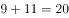、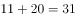，即。故题干所求项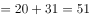。

故正确答案为D。

---

### 第 3 题　qid 2374684 · 数学运算

24  32  41  51  62  （    ）

- **A**. 72
- **B**. 74　✅
- **C**. 76
- **D**. 78

**答案**：B

**官方解析**

数列无明显特征，优先考虑作差。作差后得到新数列：8、9、10、11、（ ），是自然数数列，则新数列下一项为12，故题干所求项为。

故正确答案为B。

---

### 第 4 题　qid 2374686 · 数学运算

1  1  2  6  24  （    ）

- **A**. 86
- **B**. 112
- **C**. 120　✅
- **D**. 144

**答案**：C

**官方解析**

数列前后两项之间存在明显的倍数关系，后项除以前项得到新数列：1、2、3、4、（ ），是自然数数列，则新数列括号内应为5，题干所求项应为。

故正确答案为C。

---

### 第 5 题　qid 2374702 · 数学运算

        （    ）

- **A**. 
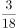
　✅
- **B**. 
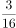

- **C**. 
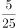

- **D**. 

**答案**：A

**官方解析**

数列均为分数，且多数不是最简分数，考虑对数列进行约分，原数列可转化为：、、、、（ ），分子均为1，分母是连续的自然数，则题干数列括号内分数应等于，只有A项满足。

故正确答案为A。

---

### 第 6 题　qid 2374704 · 数学运算

某机构计划在一块边长为18米的正方形空地开展活动，需要在空地四边每隔2米插上一面彩旗，若该空地的四个角都需要插上彩旗，那么一共需要（    ）面彩旗。

- **A**. 32
- **B**. 36　✅
- **C**. 44
- **D**. 48

**答案**：B

**官方解析**

根据植树问题环形植树公式：。那么一共需要36面彩旗。

故正确答案为B。

注：正方形是一个闭合的图形，可看成环形。

---

### 第 7 题　qid 2374709 · 数学运算

办公室有一些黑色和红色的签字笔，最近由于工作需要，每周都会用掉6支黑色签字笔和3支红色签字笔。3周后整理剩余物资时发现，剩下的红色签字笔的数量是黑色签字笔的2倍。则办公室原有签字笔至少（    ）支。

- **A**. 27
- **B**. 28
- **C**. 29
- **D**. 30　✅

**答案**：D

**官方解析**

根据“每周都会用掉6支黑色签字笔和3支红色签字笔”，即每周用掉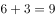支，又“3周后整理剩余物资”，3周用掉支。“剩下的红色签字笔的数量是黑色签字笔的2倍”，设剩下的黑色签字笔为支，则红色签字笔为支，则原有签字笔数量，最小等于1，则原有签字笔数量至少，D项符合。

故正确答案为D。

---

### 第 8 题　qid 2374712 · 数学运算

甲乙两人绕着周长为600米的环形跑道跑步，他们从相同的起点同时同向起跑。已知甲的速度为每秒4米，乙的速度为每秒3米，则当甲第一次回到起点时，乙距离起点还有（    ）米。

- **A**. 100
- **B**. 150　✅
- **C**. 200
- **D**. 250

**答案**：B

**官方解析**

根据题意，环形跑道600米，甲的速度为每秒4米，可得当甲第一次回到起点的时间秒。乙的速度为每秒3米，乙在150秒时跑的路程米。因此乙距离起点还有米。

故正确答案为B。

---

### 第 9 题　qid 2374715 · 数学运算

甲、乙、丙三人加工一种零件，三人每小时一共可以加工70个零件。如果甲乙两人每小时加工的零件数之比为2:3，乙丙两人每小时加工的零件数之比为4:5，则丙每小时比甲多加工（    ）个零件。

- **A**. 8
- **B**. 10
- **C**. 14　✅
- **D**. 16

**答案**：C

**官方解析**

根据“甲乙两人每小时加工的零件数之比为2:3，乙丙两人每小时加工的零件数之比为4:5”，则甲乙丙每小时加工零件数之比为8:12:15，设甲、乙、丙三人每小时加工零件数分别为、、。再根据“三人每小时一共可以加工70个零件”得到，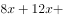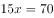，解得。则丙每小时比甲多加工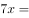个零件。

故正确答案为C。

---

### 第 10 题　qid 2374731 · 数学运算

某企业销售洗碗机，第一季度平均每个月销售800台，上半年平均每个月销售850台。如果4月份和6月份的销售总量是5月份的2倍，那么该企业5月份的洗碗机销售量为（    ）台。

- **A**. 800
- **B**. 900　✅
- **C**. 1000
- **D**. 1100

**答案**：B

**官方解析**

根据“第一季度平均每个月销售800台”，可得；根据“上半年平均每个月销售850台”，可得。那么，。

又“4月份和6月份的销售总量是5月份的2倍”，设5月份销量为1份，则4月和6月销量之和为2份，那么该企业5月份的洗碗机销售量为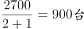。

故正确答案为B。

---

### 第 11 题　qid 2374733 · 数学运算

某物业公司规定，小区大门每2天清洁一次，消防设施每3天检查一次，绿化植物每5天养护一次，如果上述3项工作刚好都在本周四完成了，那么下一次3项工作刚好同一天完成是在（    ）。

- **A**. 星期一
- **B**. 星期二
- **C**. 星期六　✅
- **D**. 星期日

**答案**：C

**官方解析**

根据题意可知，3项工作完成的周期分别为2天、3天、5天， 2、3、5的最小公倍数为30，则下一次3项工作刚好同一天完成是在30天后。每周有7天，，星期四往后推2天为星期六。

故正确答案为C。

---

### 第 12 题　qid 2374734 · 数学运算

某办公室有大、中、小三种型号的文件袋共200个，已知大号文件袋数量是中号文件袋的2倍，小号文件袋的数量为50个，那么大号文件袋有（    ）个。

- **A**. 50
- **B**. 60
- **C**. 80
- **D**. 100　✅

**答案**：D

**官方解析**

设中号文件袋数量为，则大号文件袋数量为。根据题意有：，解得，则大号文件袋数量为。

故正确答案为D。

---

### 第 13 题　qid 2374735 · 数学运算

某工厂采购了铜和铁各30吨。假如工厂在生产过程中，每天需要消耗2吨铜和3吨铁，则在（    ）天后，剩余铜的质量将是铁的4倍。

- **A**. 6
- **B**. 7
- **C**. 8
- **D**. 9　✅

**答案**：D

**官方解析**

设x天后，剩余铜的质量将是铁的4倍。根据题意有：，解得。

故正确答案为D。

---

### 第 14 题　qid 2374737 · 数学运算

小李今天上午有a、b、c、d这4项工作要完成，下午有e、f、g这3项工作要完成，每半天内各项工作的顺序可以随意调整，则他今天有（    ）种完成工作的顺序。

- **A**. 30
- **B**. 60
- **C**. 72
- **D**. 144　✅

**答案**：D

**官方解析**

小李上午的工作顺序共有，下午的工作顺序共有，则他今天完成工作的顺序共有。

故正确答案为D。

---

### 第 15 题　qid 2374739 · 数学运算

某小区规划建设一块边长为10米的正方形绿地。如图所示，以绿地的2个顶点为圆心，边长为半径分别作扇形，把绿地划分为不同的区域。小区现准备在图中阴影部分种植杜鹃，则杜鹃种植面积为（    ）平方米。

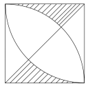

- **A**. 
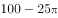
　✅
- **B**. 
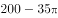

- **C**. 
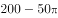

- **D**. 

**答案**：A

**官方解析**

做一下割补平移，原图阴影部分面积与下图相同。则。

故正确答案为A。

---

## 判断推理

### 第 1 题　qid 2374742 · 图形推理

下列选项中最符合所给图形规律的是（    ）。

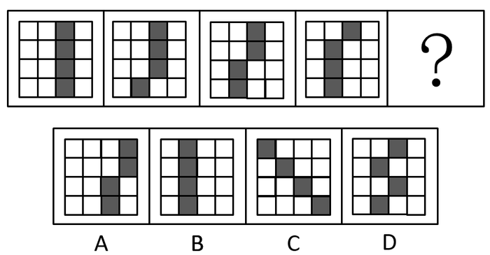

- **A**. A
- **B**. B　✅
- **C**. C
- **D**. D

**答案**：B

**官方解析**

元素组成相同，优先考虑位置规律。观察图形发现，图1到图2第四行的小黑块向左平移一格，图2到图3第三行的小黑块向左平移一格，图3到图4第二行的小黑块向左平移一格，因此，图4到？，应为第一行的小黑块向左平移一格，只有B项符合。
故正确答案为B。

---

### 第 2 题　qid 2374743 · 图形推理

下列选项中最符合所给图形规律的是（    ）。

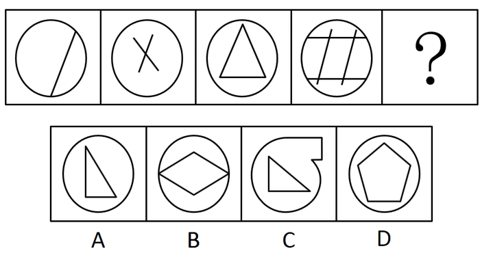

- **A**. A
- **B**. B
- **C**. C
- **D**. D　✅

**答案**：D

**官方解析**

元素组成不同，且无明显属性规律，考虑数量规律。观察图形发现，题干外圈均为圆，内圈出现多条直线，考虑数线。题干图形内部的直线数量为：1、2、3、4、？，因此？处图形内部应有5条直线。只有D项符合。
故正确答案为D。

---

### 第 3 题　qid 2374744 · 图形推理

下列选项中最符合所给图形规律的是（    ）。

- **A**. A　✅
- **B**. B
- **C**. C
- **D**. D

**答案**：A

**官方解析**

元素组成不同，优先考虑属性规律。观察题干图形，每幅图均是轴对称图形，且都能够竖轴对称，所以？处图形也应该是竖轴对称图形，只有A项符合。
故正确答案为A。

---

### 第 4 题　qid 2374746 · 图形推理

如图所示，四个相同的等腰直角三角形，不可能组成的图形是（    ）。

- **A**. 长方形
- **B**. 三角形
- **C**. 直角梯形　✅
- **D**. 平行四边形

**答案**：C

**官方解析**

本题考查图形拼合。通过将题干中四个相同的等腰直角三角形进行任意拼合，组成选项图形。

A项：可以组成，如图所示。

B项：可以组成，如图所示。

C项：不可以组成。

D项：可以组成，如图所示。

本题为选非题，故正确答案为C。

---

### 第 5 题　qid 2374749 · 图形推理

如图所示，下列物体均由纯黑色和纯白色的小立方体组成。则物体①与物体②中，（    ）由5块物体③堆积而成。

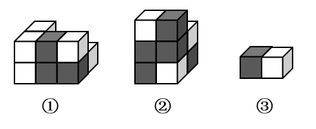

- **A**. 只有物体①可能
- **B**. 只有物体②可能
- **C**. 物体①与②均可能　✅
- **D**. 物体①与②均不可能

**答案**：C

**官方解析**

题干的物体③由1个黑块和1个白块组成。

分析物体①，前侧的6个小方块，可以由3个物体③组成，即左侧为横着的2个物体③，右侧为1个竖着的物体③；后侧可以看到左上角1个白块和右下角1个白块，则可能是1个竖着的物体③和1个横着的物体③，所以物体①可以由物体③堆积而成，如下图所示。

分析物体②，最上面是1个横着放的物体③，中层是2个黑块朝外的物体③，最下层是1个黑块朝外和1个黑块朝内的物体③，所以物体②可以由物体③堆积而成。

即物体①和②均有可能。

故正确答案为C。

---

### 第 6 题　qid 2374750 · 图形推理

下列选项，与所给立体图形不同的是（    ）。

- **A**. A
- **B**. B　✅
- **C**. C
- **D**. D

**答案**：B

**官方解析**

本题考查立体图形在空间中的旋转。

A项：题干图形逆时针旋转即可得到，与题干立体图形相同，排除；

B项：如上图所示，当题干图形旋转到直角处位置朝外的时候，多出来的小方块应该在下方，与题干立体图形不同，当选；

C项：题干图形逆时针旋转即可得到，与题干立体图形相同，排除；

D项：题干图形水平向后旋转，再顺时针旋转即可得到，与题干立体图形相同，排除。

本题为选非题，故正确答案为B。

---

### 第 7 题　qid 2374747 · 图形推理

如图所示是从两个不同角度观察到的同一个正四面体的外表面，将该四面体展开，可能得到的图形是（    ）。

- **A**. A
- **B**. B
- **C**. C
- **D**. D　✅

**答案**：D

**官方解析**

本题为空间重构类，逐一分析选项。

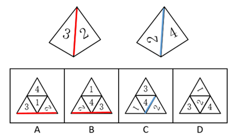

A项：题干中数字3的背部紧邻公共边（如上图红线所示），而选项中数字3的底部紧邻公共边，选项与题干不一致，排除； 

B项：题干中数字3的背部紧邻公共边（如上图红线所示），而选项中数字3的底部紧邻公共边，选项与题干不一致，排除；

C项：题干中数字2的底部紧邻公共边（如上图蓝线所示），而选项中数字2的上部紧邻公共边，选项与题干不一致，排除；

D项：选项与题干一致，当选。

故正确答案为D。

---

### 第 8 题　qid 2374748 · 图形推理

一个正方形旋转后，其旋转轨迹不可能形成的图形是（    ）。

- **A**. A
- **B**. B
- **C**. C　✅
- **D**. D

**答案**：C

**官方解析**

逐一分析选项。

A项：沿正方形的对角线旋转可得到选项（如上图），排除；

B项：沿正方形的轴对称线旋转可得到选项（如上图），排除；

C项：选项无法由正方形旋转而成，当选；

D项：沿正方形的某一边旋转可得到选项（如上图），排除。

本题为选非题，故正确答案为C。

---

### 第 9 题　qid 2374751 · 图形推理

将一个空心圆柱体斜切，得到下图所示物体。不可能是这一物体截面的是（    ）。

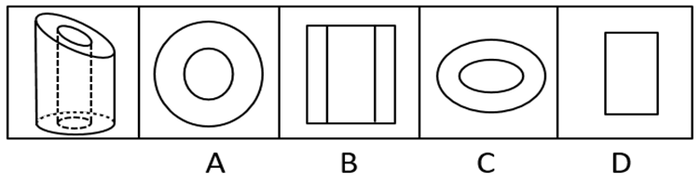

- **A**. A
- **B**. B　✅
- **C**. C
- **D**. D

**答案**：B

**官方解析**

本题考查截面图，逐一分析选项。

如下图所示，A、C、D项均可截出。

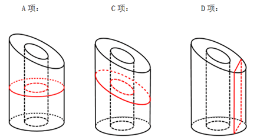

由于是空心圆柱，要截成三个矩形组成的面，必须经过中间的空心，截完之后中间不可能出现横实线（如下图所示），所以B项不能截成。

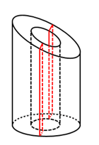

本题为选非题，故正确答案为B。

---

### 第 10 题　qid 2374752 · 图形推理

下列选项中，不可能是所给立方体展开图的是（    ）。

- **A**. A　✅
- **B**. B
- **C**. C
- **D**. D

**答案**：A

**官方解析**

本题为空间重构题。

在立体图形中，三条虚线面两两相邻，没有构成相对面。而A项中，存在一组虚线面是相对面（如下图所示），不可能同时出现在立体图形中。

本题为选非题，故正确答案为A。

---

### 第 11 题　qid 2374719 · 类比推理

电脑：主板（    ）

- **A**. 台历：挂历
- **B**. 水果：苹果
- **C**. 胶片：相机
- **D**. 房屋：地基　✅

**答案**：D

**官方解析**

第一步：判断题干词语间逻辑关系。
主板是电脑的组成部分，二者是包容关系中的组成关系。
第二步：判断选项词语间逻辑关系。
A项：台历和挂历都可以用来查询公历、农历、节日、节气等信息，二者是并列关系，与题干逻辑关系不一致，排除；
B项：苹果是水果的一种，二者是种属关系，与题干逻辑关系不一致，排除；
C项：对于传统相机而言，胶片需要与相机一起使用才能照相，二者是配套使用的关系，与题干逻辑关系不一致，排除；
D项：地基指承受上部结构荷载影响的土体，对保证建筑物的坚固耐久具有非常重要的作用，是房屋的组成部分，二者是包容关系中的组成关系，与题干逻辑关系一致，当选。
故正确答案为D。

---

### 第 12 题　qid 2374720 · 类比推理

打扫：整洁（    ）

- **A**. 复习：考试
- **B**. 降价：实惠　✅
- **C**. 绿化：环保
- **D**. 实践：真理

**答案**：B

**官方解析**

第一步：判断题干词语间逻辑关系。
因为打扫，所以（房间）整洁，二者是因果对应关系。
第二步：判断选项词语间逻辑关系。
A项：先复习，后考试，二者是时间先后顺序对应关系，与题干逻辑关系不一致，排除；
B项：因为降价，所以（商品）实惠，二者是因果对应关系，与题干逻辑关系一致，当选；
C项：绿化是一种环保，二者是种属关系，与题干逻辑关系不一致，排除；
D项：实践是检验真理的唯一标准，也可以说实践是为了检验真理，二者是对应关系，与题干逻辑关系不一致，排除。
故正确答案为B。
注：本题在广东的考情中优先看成因果对应关系，整洁是对状态的表述，也是一种结果。如果理解成方式目的的对应关系，目的应该是变得整洁，据此没有唯一答案。

---

### 第 13 题　qid 2374725 · 类比推理

丰富：贫乏（    ）

- **A**. 体贴：粗犷
- **B**. 精美：丑恶
- **C**. 拘束：随意　✅
- **D**. 振奋：冷静

**答案**：C

**官方解析**

第一步：判断题干词语间逻辑关系。
丰富意思是种类多，数量大，充裕，涉及面广，贫乏意思是缺少、不充裕、不丰富，二者是反义关系。
第二步：判断选项词语间逻辑关系。
A项：体贴指细心体会、关怀、体谅，能够设身处地为他人着想，使对方感到舒适满意。粗犷有两层意思，一种指粗鲁强横，一种指粗率豪放。二者不是反义关系，与题干逻辑关系不一致，排除；
B项：精美形容精致而美好，也有特别用心的意思。丑恶指丑秽邪恶。二者不是反义关系，与题干逻辑关系不一致，排除；
C项：拘束，指感到约束，不自在，由于拘谨而显得不自然，随意指任凭自己的意愿，随心所欲的，二者是反义关系，与题干逻辑关系一致，当选；
D项：振奋，是指振作精神，奋发努力。冷静指人少而静，不热闹或是人沉着而不感情用事。二者不是反义关系，与题干逻辑关系不一致，排除。
故正确答案为C。

---

### 第 14 题　qid 2374728 · 类比推理

投递：收件（    ）

- **A**. 逛街：娱乐
- **B**. 购买：赠送
- **C**. 借阅：整理
- **D**. 授课：学习　✅

**答案**：D

**官方解析**

第一步：判断题干词语间逻辑关系。
邮递员投递，收件人收件，这两个动作发出的主体不一致，且投递和收件是两个相对动作。
第二步：判断选项词语间逻辑关系。
A项：逛街是娱乐的一种方式，二者是种属关系，与题干逻辑关系不一致，排除；
B项：购买与赠送可以是同一主体，且二者不是两个相对动作，与题干逻辑关系不一致，排除；
C项：借阅和整理可以是同一主体，且二者不是两个相对动作，与题干逻辑关系不一致，排除；
D项：老师授课，学生学习，授课与学习不是同一主体，且授课和学习也是两个相对动作，与题干逻辑关系一致，当选。
故正确答案为D。

---

### 第 15 题　qid 2374730 · 类比推理

画作：风景（    ）

- **A**. 著作：英雄　✅
- **B**. 歌剧：电影
- **C**. 抒发：情感
- **D**. 蓝图：设计

**答案**：A

**官方解析**

第一步：判断题干词语间逻辑关系。
画作描绘的对象是风景，二者是对应关系，且画作与风景均为名词。
第二步：判断选项词语间逻辑关系。
A项：著作描写的对象是英雄，二者是对应关系，且著作与英雄均为名词，与题干逻辑关系一致，当选；
B项：歌剧和电影是两种不同的艺术形式，二者是并列关系，与题干逻辑关系不一致，排除；
C项：抒发情感构成动宾短语，且抒发为动词，与题干逻辑关系不一致，排除；
D项：设计蓝图构成动宾短语，且设计为动词，与题干逻辑关系不一致，排除。
故正确答案为A。

---

### 第 16 题　qid 2374736 · 逻辑判断

一座城市要想发展好会展产业，就需要“筑巢引凤”——先具备软硬件基础，再吸引会展活动。拥有完备的会展设施和理想的交通条件，只是说明一座城市具备了发展会展产业的硬件基础，要想吸引足够数量的高质量会展活动，还需要提高公共服务水平、构建良好的营商环境，从而加强软实力的建设。
如果上述表述为真，则以下情况中不可能发生的是（    ）。

- **A**. 甲市具备了发展会展产业的硬件基础，却发展不好会展产业
- **B**. 乙市大力提升公共服务水平，吸引了足够数量的高质量会展活动
- **C**. 丙市的会展产业非常发达，但市政设施老化的问题日渐突出
- **D**. 丁市会展设施完备、交通条件理想，但未具备发展会展产业的硬件基础　✅

**答案**：D

**官方解析**

日常结论题，根据题干信息逐一分析选项。
A项：据题干第一句话可知，发展会展产业需要软硬件基础，而甲市只具备硬件基础，软件基础不明确，所以是有可能发展不好会展产业的，排除；
B项：据题干第二句话可知，要想吸引足够数量的高质量会展活动，需要提高公共服务水平、构建良好的营商环境，乙市已经提高公共服务水平了，构建良好的营商环境不明确，所以有可能可以吸引足够数量的高质量会展活动，排除；
C项：据题干第一句话可知，要想发展好会展产业，就需要具备软硬件基础，丙市会展产业非常发达，说明具备软硬件基础，但市政设施如何题干没有提及，即不明确，是有可能发生的，排除；
D项：据题干第二句话可知，拥有完备的会展设施和理想的交通条件，就说明这座城市具备了发展会展产业的硬件基础，丁市会展设施完备、交通条件理想，是具备了发展会展产业的硬件基础的，因此不可能发生，当选。
本题为选非题，故正确答案为D。

---

### 第 17 题　qid 2374738 · 逻辑判断

芯片产业是全球分工合作的产业，其分布的领域非常广，不同领域面对的问题和挑战也大不相同，没有一个国家能够拥有完完整整的自主可控芯片产业链。但一国想要获得芯片产业的话语权，至少应该掌握产业链条上某些环节的关键技术，这样才能避免受制于人。
根据上述表述，下列判断一定正确的是（    ）。

- **A**. 一个国家只要有了芯片产业话语权，该国就可能拥有完整的芯片产业链
- **B**. 一个国家如果没有芯片产业的关键技术，则该国的芯片产业将受制于人　✅
- **C**. 一个国家的芯片产业要想不受制于人，就必须拥有完整的芯片产业链
- **D**. 一个国家如果掌握了芯片产业的关键技术，那么该国一定具有芯片产业的话语权

**答案**：B

**官方解析**

第一步：翻译题干。

①话语权关键技术

②避免受制于人关键技术

第二步：逐一分析选项。

A项：话语权与产业链的关系题干中未提及，无法推出，排除；

B项：翻译为关键技术受制于人，是对②的否后，否后必否前，可以推出，当选；

C项：受制于人与产业链的关系题干中未提及，无法推出，排除；

D项：翻译为关键技术话语权，是对①的肯后，但肯后得不到确定性的结论，排除。

故正确答案为B。

---

### 第 18 题　qid 2374741 · 逻辑判断

在发达国家的产业结构中，服务业占了很高的比重。根据他们的经验，提高服务业占比就可以促进就业。但是，服务业具有较高的进入壁垒，这也是我国服务业发展相对滞后的一个重要原因。因此，我国可以通过打破服务业的行业壁垒进一步促进就业。
以下最可能是上述论证潜在假设的是（    ）。

- **A**. 服务业促进就业的规律适用于我国　✅
- **B**. 我国创造就业的能力弱于发达国家
- **C**. 发达国家的服务业也存在行业壁垒
- **D**. 其他行业对促进就业没有显著作用

**答案**：A

**官方解析**

第一步：找出论点和论据。
论点：我国可以通过打破服务业的行业壁垒进一步促进就业。
论据：在发达国家的产业结构中，服务业占了很高的比重。根据他们的经验，提高服务业占比就可以促进就业。但是，服务业具有较高的进入壁垒，这也是我国服务业发展相对滞后的一个重要原因。
本题的问法为“假设”，论点是我国可以打破服务业壁垒来促进就业，论据是提高服务业占比就可以促进就业，而服务业壁垒影响到服务业发展。二者话题一致，考虑必要条件，即服务业促进就业是可行的。
第二步：逐一分析选项。
A项：说明在我国服务业是可以促进就业的，那么打破服务业壁垒促进服务业发展就可以进一步促进就业，是论证成立的假设，当选；
B项：论点说的是服务业和就业之间的关系，该项说的是创造就业能力和发达国家之间的对比，话题不一致，不是论证成立的假设，排除；
C项：论点说的是我国服务业和就业之间的关系，该项说的是发达国家的服务业存在行业壁垒，话题不一致，不是论证成立的假设，排除；
D项：论点说的是服务业和就业之间的关系，该项说的是其他行业和促进就业之间的关系，主体不一致，不是论证成立的假设，排除。
故正确答案为A。

---

### 第 19 题　qid 2374717 · 类比推理

某办公室有教育学硕士、教育学学士、哲学硕士、哲学学士各一人。四人中，甲不是教育学硕士也不是哲学学士；甲和丙学习的是同一门学科；乙只获得了学士学位；丁不学哲学。
如果上述表述为真，则以下说法正确的是（    ）。

- **A**. 甲是教育学学士
- **B**. 乙是哲学学士
- **C**. 丙是哲学学士　✅
- **D**. 丁是教育学学士

**答案**：C

**官方解析**

本题信息较多，考虑列表法。根据题干可知，甲不是教育学硕士也不是哲学学士，乙只获得了学士学位，丁不学哲学，可得表格信息如下所示。

再根据甲与丙是同一门学科，如果丙是教育学学士，那么甲必须是教育学硕士，与题干条件“甲不是教育学硕士”矛盾，由此可知丙一定不能为教育学学士，同理，丙也不能为哲学硕士。

由以上表格可知，甲只能为哲学硕士，那么丙为哲学学士，则丁为教育学硕士，乙为教育学学士，如下表所示。

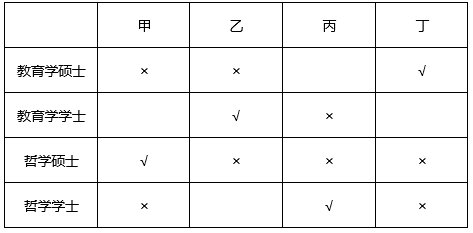

故正确答案为C。

---

### 第 20 题　qid 2374745 · 逻辑判断

历史经验告诉我们，世界经济危机往往伴随着巨大的世界变革：1857年世界经济危机后的电气革命，推动人类社会从蒸汽时代进入电气时代；1929年世界经济危机引发了第二次世界大战，客观上推动了科学技术的发展。由此可知，是经济危机造成了巨大的世界变革。
以下和该论证过程的逻辑最为类似的是（    ）。

- **A**. 不正确的坐姿会加重颈部负担，因而是腰酸背痛的主要诱因
- **B**. 海底地震是海啸的主要成因，因为海啸发生前往往能观测到海底地震　✅
- **C**. 宇航员的预期寿命明显高于一般人，因此太空旅行中的辐射暴露并不会危害人体
- **D**. 许多体弱多病的人都不喜欢吃蔬菜，所以想保持身体健康就必须从蔬菜中摄入足量的膳食纤维

**答案**：B

**官方解析**

第一步：分析题干逻辑关系。
题干是在说发生世界经济危机之后，会发生巨大的世界变革，得出的结论是经济危机造成了巨大的世界变革。
即A、B先后发生，则先发生的A为因，后发生的B为果(认为先后顺序代表因果关系)。
第二步：逐一分析选项。
A项：指出不正确的坐姿加重颈部负担，而结论是腰酸背痛的主要诱因，出现了不正确坐姿、加重颈部负担和腰酸背痛3件事，与题干中逻辑关系不一致，排除；
B项：先观测到海底地震，再发生海啸，得出结论海底地震是海啸的主要成因，符合A、B先后发生，则先发生的A为因，后发生的B为果，与题干中逻辑关系一致，当选；
C项：宇航员的预期寿命明显高于一般人，因此太空旅行中的辐射暴露并不会伤害人体，完全没有指明具有先后发生的两件事，与题干中逻辑关系不一致，排除；
D项：许多体弱多病的人都不喜欢吃蔬菜，看不出体弱多病和不喜欢吃蔬菜的先后顺序，与题干中逻辑关系不一致，排除。
故正确答案为B。

---

### 第 21 题　qid 2374753 · 逻辑判断

G市经济发达、教育资源丰富，许多在G市就读的大学生毕业后都选择留在G市工作生活。但在今年，G市周边的几个城市都出台了一系列针对大学生落户的优惠政策，许多G市大学生因此选择将户口迁往周边城市。由此可以预测，今年留在G市的大学生将会更容易找到工作。
以下最能反驳上述论证的是（    ）。

- **A**. G市周边的几个城市中，大学生同样不容易找到心仪的工作
- **B**. 与去年相比，今年G市的几个大型工厂招收工人数量有所减少
- **C**. 绝大多数将户口迁往周边城市的G市大学生仍然选择在G市工作　✅
- **D**. 有调查指出，过去几年在G市的大学生并没有面临很大的就业压力

**答案**：C

**官方解析**

第一步：找出论点和论据。
论点：今年留在G市大学生将会更容易找到工作。
论据：在今年，G市周边的几个城市都出台了一系列针对大学生落户的优惠政策，许多G市大学生因此选择将户口迁往周边城市。
本题的论点讨论的是找工作的难易程度，而论据讨论的是出台政策使得大学生迁户口，两者讨论的话题不一致，优先考虑通过拆桥削弱，说明大学生迁户口与找工作的难易程度没关系。
第二步：逐一分析选项。
A项：题干讨论的是G市的就业情况，而该选项讨论的是其他周边几个城市，话题不一致，无法削弱，排除；
B项：与去年相比，今年G市的几个大型工厂招收工人数量有所减少，但大学生原本会不会去这几个大型工厂当工人并不明确，无法削弱，排除；
C项：绝大多数将户口迁往周边城市的G市大学生仍然选择留在G市工作，说明即使大学生将户口迁离G市，但是绝大多数人都选择在G市工作，找工作的人并不会减少，说明论据的迁户口和论点的找工作容易度没有关系，拆断了论点和论据的联系，可以削弱，当选；
D项：过去几年在G市的大学生没有面临很大的就业压力，该选项讨论的是过去几年的事情，而题干论点讨论的是今年的就业会不会更容易，话题不一致，无法削弱，排除。
故正确答案为C。

---

### 第 22 题　qid 2374754 · 逻辑判断

有研究表明，向他人倾诉自己的烦恼是缓解压力的有效方式，但是在现实生活中，有四成以上的人不会向他人倾诉自己的烦恼，而这一部分人常感觉自己的工作与生活压力更大。因此，一个人越经常向他人倾诉自己的烦恼，在工作与生活中感受到的压力越小。
以下选项最能指出上述论证缺陷的是（    ）。

- **A**. 默认了对于个体而言，缓解压力的行为是必要的
- **B**. 忽视了每个人对压力的承受能力具有显著差异
- **C**. 默认了提高行为的频率有助于加强行为的效果　✅
- **D**. 忽视了向他人倾诉烦恼可能会造成隐私泄露等问题

**答案**：C

**官方解析**

第一步：找出论点和论据。
论点：一个人越经常向他人倾诉自己的烦恼，在工作与生活中感到的压力就越小。
论据：在现实生活中，有四成以上的人不会向他人倾诉自己的烦恼，而这一部分人常感觉自己的工作与生活压力更大。
本题的论据是对一个现象的总结，这个现象是不会向他人倾诉烦恼的人常感觉自己的工作与生活压力更大，而该题干的论点是越经常向他人倾诉自己的烦恼，在工作与生活中感到的压力就越小，论点论据话题不一致，中间差了一步论据与论点的联系，找出说明联系的选项就能指出论证缺陷。
第二步：逐一分析选项。
A项：缓解压力的行为是否必要，与该题目的论点论据均无关系，题干讨论的是倾诉与压力的关系，而与缓解压力是否必要无关，话题不一致，无法指出论证缺陷，排除；
B项：忽视了每个人对压力的承受能力具有显著差异，但倾诉烦恼对压力感受的影响并未说明，话题不一致，无法指出论证缺陷，排除；
C项：论据中只说明了不倾诉的压力大，倾诉的压力感受更小，但并未涉及论点讨论的越倾诉之后的结果，没有说明提高频率的结果，即默认了C选项所说的提高频率有助于加强行为的效果，可以指出论证缺陷，当选；
D项：“倾诉烦恼可能造成隐私泄露”与该题目的论点论据均无关系，题干讨论的是倾诉与压力的关系，而与隐私泄露无关，话题不一致，无法指出论证缺陷，排除。
故正确答案为C。

---

### 第 23 题　qid 2374755 · 逻辑判断

近几年，“痕迹管理”在基层工作中被广泛应用。其优势在于通过保留下来的文字、图片等工作资料，有效还原服务群众的工作情况，供日后查证。某地基层单位为了强化“痕迹管理”，极大增加了工作资料在考核分值中的比重。显然，这样的做法会使当地基层干部将大量精力耗费在保留工作痕迹上。
以下最可能是上述论证潜在假设的是（    ）。

- **A**. 基层干部对于考核分值十分重视　✅
- **B**. 有些基层干部对群众缺少服务意识
- **C**. “痕迹管理”要求保留所有工作痕迹
- **D**. 绝大多数基层干部缺少“留痕”条件

**答案**：A

**官方解析**

第一步：找出论点和论据。
论点：这样的做法（增加工作资料在考核分值中的比重）会使当地基层干部将大量精力耗费在保留工作痕迹上。
论据：无。
提问为“假设”，且不存在论据，优先考虑必要条件。
第二步：逐一分析选项。
A项：指出基层干部对于考核分值十分重视，如果基层干部对于考核分值不重视，那么增加工作资料在考核分值中的比重并不会使得基层干部耗费大量精力来保留工作痕迹，因此是论点成立的必要条件，当选；
B项：基层干部对群众缺少服务意识和论点中基层干部将大量精力耗费在保留工作痕迹上无关，属于无关项，并不是论点成立的必要条件，排除；
C项：保留所有工作痕迹是在说“痕迹管理”的要求，说明这一做法的复杂性，但无法说明基层干部是否会将大量精力耗费在保留工作痕迹上，并不是论点成立的必要条件，排除；
D项：绝大多数基层干部缺少“留痕”条件，那么可能不会耗费精力在保留工作痕迹上，有一定的削弱力度，并不是论点成立的必要条件，排除。
故正确答案为A。

---

### 第 24 题　qid 2374756 · 逻辑判断

某研究机构对3个品牌的老年代步车进行安全性碰撞实验。实验表明，这3个品牌的代步车都无法在发生交通事故时保护驾驶人。该机构因此认为：老年代步车十分危险，政府应该禁止代步车上路，引导老年人驾驶普通汽车。
以下选项最无法支持上述论断的是（    ）。

- **A**. 代步车的价格一般低于普通汽车　✅
- **B**. 这3个品牌的代步车市场占有率极高
- **C**. 使用代步车的老人普遍拥有汽车驾驶资格
- **D**. 安全性是决定代步车能否上路行驶的首要因素

**答案**：A

**官方解析**

第一步：找出论点和论据。
论点：老年代步车十分危险，政府应该禁止代步车上路，引导老年人驾驶普通汽车。
论据：某研究机构对3个品牌的老年代步车进行安全性碰撞实验。实验表明，这3个品牌的代步车都无法在发生交通事故时保护驾驶人。
本题论据为一个对3个品牌的老年代步车的实验结果，论点是老年代步车十分危险以及政府应该如何去做，论据论点话题不一致，那么加强方式可以用搭桥，另外，也可以围绕论点中“引导老年人驾驶普通汽车”这个话题进行补充论据加强，还可以对于题干实验的有效性进行说明。
第二步：逐一分析选项。
A项：代步车的价格在论据论点均未提及，属于无关选项，无法加强，当选；
B项：说明实验中选取的品牌具有代表性，可以得到论点中老年代步车十分危险的普遍性结论，搭桥进行加强，可以加强，排除；
C项：若使用代步车的老人普遍没有汽车驾驶资格，说明这些老年人无法驾驶汽车，也就不能得出政府应该引导老年人驾驶普通汽车，为使论点成立的必要条件，可以加强，排除； 
D项：指出安全性和代步车能否上路行驶之间有必然联系，即可以得到代步车安全性不好，应该禁止上路行驶，在论点和论据之间搭桥，可以加强，排除。
本题为选非题，故正确答案为A。

---

### 第 25 题　qid 2374757 · 定义判断

近年来随着大型野生动物园的兴起，有人提出，传统城市动物园已经没有存在的必要性。但传统城市动物园具有票价低、交通便利等优点，中小学组织参观十分方便，因而具有很强的教育功能，所以传统城市动物园不可或缺。
以下不属于上述论证缺陷的是（    ）。

- **A**. 忽视了野生动物园和传统城市动物园具有并存的可能性　✅
- **B**. 默认了具有很强教育功能的传统城市动物园就应该保留
- **C**. 忽视了票价低、交通便利不等同于方便中小学组织参观
- **D**. 默认了方便中小学组织参观的动物园都具有很强的教育功能

**答案**：A

**官方解析**

第一步：找出论点和论据。
论点：传统城市动物园不可或缺。
论据：传统城市动物园具有票价低、交通便利等优点，中小学组织参观十分方便，因而具有很强的教育功能。
本题的问法较为新颖，其实论证缺陷就是题干中的漏洞，而该题问的是“不属于上述论证缺陷的是”，即排除能够指出题干中存在漏洞的选项即可。
第二步：逐一分析选项。
A项：该项讨论的是“野生动物园和传统城市动物园能否并存”，而论点讨论的是“传统城市动物园是否不可或缺”，话题不一致，无法指出论证缺陷，当选；
B项：默认了论据“教育功能”与论点“传统城市动物园不可或缺”之间的关系，指出论点论据具有联系，通过搭桥指出论证缺陷，排除；
C项：忽视了“票价低、交通便利不等同于方便中小学组织参观”，也就是票价低、交通便利不一定方便参观，并非不可或缺，拆断论点论据联系，通过拆桥指出论证缺陷，排除；
D项：默认了“方便中小学组织参观的动物园都具有很强的教育功能”，指出论点论据具有联系，通过搭桥指出论证缺陷，排除。
本题为选非题，故正确答案为A。

---

### 第 26 题　qid 2374758 · 逻辑判断

研究表明，糖尿病是一种由多病因引起的以慢性高血糖为特征的代谢性疾病，是多种因素共同作用的结果，有家族聚集现象。家族史是提示可能患糖尿病风险的重要依据，因此，了解家族史，有助于更好地预防糖尿病。
要得出上述结论，必须补充的前提是（    ）。

- **A**. 家族聚集现象体现在家族史中
- **B**. 了解患糖尿病风险有助于预防糖尿病　✅
- **C**. 绝大多数人有途径了解自己的家族史
- **D**. 不健康的生活方式也是影响糖尿病发病的因素

**答案**：B

**官方解析**

第一步：找出论点和论据。
论点：了解家族史，有助于更好地预防糖尿病。
论据：家族史是提示可能患糖尿病风险的重要依据。
提问为“前提”优先考虑搭桥，其次必要条件，题干论点为了解家族史可以预防糖尿病，论据为家族史可能为患糖尿病风险的重要依据，论点论据不同的部分为“预防糖尿病”和“患糖尿病风险”，可以在二者之间搭桥，搭桥方向应该为论据“患糖尿病风险”搭向论点“预防糖尿病”，那么选项当中得体现二者之间的关系。
第二步：逐一分析选项。
A项：该项指出家族聚集现象体现在家族史中，但是了解家族史之后是否能更好的预防糖尿病，不得而知，无法加强，排除；
B项：指出了解糖尿病风险有助于预防糖尿病，即在论点和论据之间搭桥，加强论证，当选；
C项：论点讨论的是了解家族史可以预防糖尿病，该项讨论的是人们有途径了解到家族史，但是未提到了解之后能否预防糖尿病，无法加强，排除；
D项：该项讨论的是还存在其他的因素影响糖尿病发病，但是了解家族史能否预防糖尿病不得而知，无关选项，无法加强，排除。
故正确答案为B。

---

### 第 27 题　qid 2374759 · 逻辑判断

过分密集的城市布局不仅容易使城市产生热岛效应，也不符合生态美学的要求。因此，城市建设应该尽可能拉开布局，合理地间隔各城市组团，使城市看起来舒缓有序，不拥挤、不杂乱。
以下和该论述过程的逻辑最为类似的是（    ）。

- **A**. 只有有趣的故事和通俗的理论相结合，才能吸引人，让人真正理解其中的内涵，爱上科学。所以，从日常生活中的小事入手，科普也可以很有趣
- **B**. 中小学课业负担太重，是影响中小学生快乐健康成长的大问题。所以，要将课业减负进行到底，扫除线上培训等减负盲区　✅
- **C**. 天文学的起源与文明的起源大致处于同一时期。因此，追寻天文学的起源也就意味着我们可以在某种程度上把握文明诞生和发展的脉络
- **D**. 律师队伍事关群众对法治的需求，也与一个地方的竞争力直接相关。所以，完善的法律服务是营商环境的重要内容，也是衡量城市吸引力的重要标尺

**答案**：B

**官方解析**

第一步：分析题干逻辑关系。
题干逻辑：给出一个负面的现象，说明负面现象会产生的影响，由此得出应该改变负面现象的结论。
第二步：逐一分析选项的逻辑。
A项：“只有有趣的故事和通俗的理论相结合，才能吸引人”，并没有提到负面现象及其影响，与题干逻辑不同，排除；
B项：“中小学课业负担太重”为负面现象，“影响中小学生快乐健康成长”为该负面现象的影响，所以“要将课业减负进行到底，扫除线上培训等减负盲区”为应该改变此负面现象，与题干逻辑相同，当选；
C项：“天文学的起源与文明的起源大致处于同一时期”，并没有提到负面现象及其影响，与题干逻辑不同，排除；
D项：“律师队伍事关群众对法治的需求，也与一个地方的竞争力直接相”，并没有提到负面现象及其影响，与题干逻辑不同，排除。
故正确答案为B。

---

### 第 28 题　qid 2374760 · 逻辑判断

某地区自上世纪70年代开始，引入栽种欧美黑杨，用于造纸。这些欧美黑杨适应当地气候环境，生长速度快，种植面积迅速扩大。然而近年来，当地生态环境问题日趋严重。因此有人认为，可以通过砍掉这些欧美黑杨来修复该地区生态环境。
以下选项最能指出上述论述缺陷的是（    ）。

- **A**. 假设了有其他的作物可以替代欧美黑杨的经济价值
- **B**. 忽视了该地区引入栽种的其他外来植物也会影响生态环境
- **C**. 假设了该地区引入的欧美黑杨栽种面积远超当地树种面积
- **D**. 默认了欧美黑杨种植面积扩大和生态环境问题间存在因果关系　✅

**答案**：D

**官方解析**

第一步：找出论点和论据。
论点：通过砍掉这些欧美黑杨来修复该地区生态环境。
论据：欧美黑杨适应当地气候环境，生长速度快，种植面积迅速扩大。然而近年来，当地生态环境问题日趋严重。
本题论点说的是希望通过“砍掉欧美黑杨”达到“恢复生态环境”的目的，论据说的是“欧美黑杨”适应力强、生长速度快、种植面积扩大，同时当地“生态环境问题严重”，要想指出题干的论证缺陷，可以说欧美黑杨与环境的破坏存在因果关系，也可以说除了欧美黑杨，还有其他原因导致生态环境被破坏。
第二步：逐一分析选项。
A项：该项说的是其他的作物可以替代欧美黑杨的经济价值，经济价值与题干讨论内容无关，无法指出论证缺陷，排除；
B项：该项说的是引入栽种的其他外来植物也会影响生态环境，他因削弱，虽然也指出了一种论证缺陷，但是力度最弱，排除；
C项：该项说的是引入的欧美黑杨栽种面积远超当地树种面积，面积大于当地树种面积，不能说明对环境问题的影响，无法指出论证缺陷，排除；
D项：该项说的是默认了欧美黑杨种植面积扩大和生态环境问题间存在因果关系，指出了欧美黑杨种植面积扩大与生态环境问题之间的关系，能够指出论证缺陷，力度比他因削弱要强，当选。
故正确答案为D。

---

### 第 29 题　qid 2374761 · 逻辑判断

随着生活节奏的加快，很多人都会用时间管理软件来规划自己的时间，以提升工作效率。这一做法是可行的。因为大脑的“提醒功能”不够准确，很少能在正确的时间做出正确的提醒，而外部提醒可以让人更好地掌握时间。
以下选项中最能削弱上述论断的是（    ）。

- **A**. 时间管理软件会让人压力增大，影响工作效率　✅
- **B**. 时间管理软件质量参差不齐，人们难以辨别优劣
- **C**. 时间管理软件会使人们的生活节奏进一步加快
- **D**. 时间管理软件难以适用所有工作、生活事项

**答案**：A

**官方解析**

第一步：找出论点和论据。
论点：很多人用时间管理软件来规划自己的时间，以提升工作效率，是可行的。
论据：大脑“提醒时间”不够准确，很少能正确的时间做出正确的提醒，外部提醒可以更好的掌握时间。
本题的论点是在陈述人们使用时间管理软件可以提升工作效率，论据是在陈述时间管理软件提高工作效率的原因。论点和论据话题一致，优先考虑削弱论点，就直接反着说，使用时间管理软件不能提高工作效率。
第二步：逐一分析选项。
A项：时间管理软件会让人压力增大，影响工作效率，说明时间管理软件并不能提高人的工作效率，削弱论点，当选；
B项：时间管理软件质量参差不齐，难以辨别优劣，说明人们不能辨别时间管理软件的质量，没有提及是否影响工作效率的提高，论点论据话题不一致，无法削弱，排除；
C项：时间管理软件使生活节奏加快，没有提及是否影响工作效率的提高，论点论据话题不一致，无法削弱，排除；
D项：时间管理软件难以适用所有工作、生活事项，说的是时间管理软件的适用范围，没有提及是否影响工作效率的提高，论点论据话题不一致，无法削弱，排除。
故正确答案为A。

---

### 第 30 题　qid 2374762 · 逻辑判断

文学作品的电子书会给作品带来很高的关注度，这种关注度能够拉动纸质书的销售。因此，所有想要提高纸质版文学作品销售量的出版社都会为文学作品发行电子书。
以下和该论证过程的逻辑最为类似的是（    ）。

- **A**. 家庭教育可以培养孩子的见识、性格、技能，从而确保孩子的天赋得到发展。所以，家长对家庭教育的重视，是确保孩子天赋得到发展的充分条件
- **B**. 是否掌握作品命脉是作家是否拥有自己语言体系的判断标准。这是因为，一个作家拥有了自己的语言体系，就掌握了作品的命脉，就能成为优秀的作家
- **C**. 家风与民风交相辉映，民风与国风休戚相关。在现代社会，好的家风必然能影响好的社会风气的形成。唯有良好的家风能孕育一个文明向上的社会
- **D**. 要传承好传统文化，就必须构建传统文化传承体系。因为一旦构建好这一体系，就可以系统性地取其精华、去其糟粕，从而确保传统文化的传承发展　✅

**答案**：D

**官方解析**

第一步：翻译题干。

文学作品电子书高关注度拉动纸质书销售，因此，拉动纸质书销售发行文学作品电子书（即，因此）。

第二步：逐一分析选项。

A项：翻译为家庭教育孩子的见识、性格、技能天赋发展，因此，家庭教育天赋发展，（即，因此），与题干逻辑关系不一致，排除；

B项：翻译为作家拥有语言体系掌握作品命脉，作家拥有语言体系优秀作家（即，），所以，作家拥有语言体系掌握作品命脉，（即，，因此），与题干逻辑关系不一致，排除；

C项：翻译为好的家风好的社会风气形成，文明向上的社会好的家风（即，），与题干逻辑关系不一致，排除；

D项：翻译为构建传承体系取精华去糟粕传承传统文化，传承传统文化构建传承体系（即，），与题干逻辑关系一致，当选。

故正确答案为D。

---

## 资料分析

### 材料 1

        近年来，A省新登记市场主体保持较快增长势头。全省实有各类市场主体从2015年的775.95万户增长到2018年的1146.13万户。2018年，全省新登记市场主体229.74万户，日均新登记市场主体6294户，同比增长。

        2018年，全省新登记企业最集中的三个行业分别是批发和零售业、租赁和商务服务业、制造业，新登记企业数分别为36.14万户、15.19万户、9.25万户，分别同比增长、增长、下降。

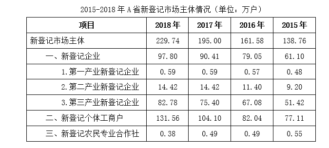

#### 第 1 题　qid 2374706 · 增长

2015—2018年，A省实有各类市场主体数增长了约（    ）万户。

- **A**. 170.2
- **B**. 270.2
- **C**. 370.2　✅
- **D**. 470.2

**答案**：C

**官方解析**

由题干“2015-2018年，······增长了约多少万户”，判定本题为增长量计算问题。定位文字材料第一段可得：“全省实有各类市场主体从2015年的775.95万户增长到2018年的1146.13万户”，故2015-2018年，A省实有各类市场主体数增长量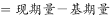万户，与C项最为接近。

故正确答案为C。

---

#### 第 2 题　qid 2374708 · 增长

2018年，A省新登记市场主体中，数量较上年增幅最大的是（    ）。

- **A**. 第一产业新登记企业
- **B**. 第二产业新登记企业
- **C**. 第三产业新登记企业
- **D**. 新登记个体工商户　✅

**答案**：D

**官方解析**

由题干“2018年，······增幅最大的是”，判定本题为一般增长率问题。定位表格材料可得，2018年A省新登记市场主体中第一、第二产业新登记企业数，与2017年相比没发生改变，则增幅均为0；第三产业新登记企业数量的增幅；新登记个体工商户数量的增幅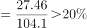，故2018年，A省新登记市场主体中，数量较上年增幅最大的是新登记个体工商户。

故正确答案为D。

---

#### 第 3 题　qid 2374711 · 增长

2015—2018年，A省新登记市场主体数年均增长约（    ）万户。

- **A**. 15.1
- **B**. 23.2
- **C**. 30.3　✅
- **D**. 36.4

**答案**：C

**官方解析**

由题干“2015-2018年，······年均增长约多少万户”，判定本题为年均增长量问题。定位表格材料可得： 2018年新登记市场主体为229.74万户；2015年新登记市场主体为138.76万户。故2015-2018年，A省新登记市场主体数年均增长量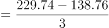万户。

故正确答案为C。

---

#### 第 4 题　qid 2374722 · 增长

2018年，租赁和商务服务业新登记企业数较上年增加约（    ）万户。

- **A**. 2.8　✅
- **B**. 3.8
- **C**. 4.8
- **D**. 5.8

**答案**：A

**官方解析**

由题干“2018年，······增加约多少万户”，判定本题为增长量计算问题。定位文字材料第二段可得：2018年租赁和商务服务业新登记企业数为15.19万户，同比增长；故2018年租赁和商务服务业新登记企业数较上年增加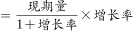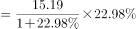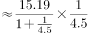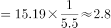万户。

故正确答案为A。

---

#### 第 5 题　qid 2374729 · 综合

根据材料，以下说法不正确的是（    ）。

- **A**. 
2015—2018年，A省新登记企业数增长超

- **B**. 
2017年，A省日均新登记市场主体少于4000户
　✅
- **C**. 
2017年，A省新登记企业最集中的行业是批发和零售业

- **D**. 
2015年，A省新登记农民专业合作社多于第一产业新登记企业

**答案**：B

**官方解析**

A项：定位表格材料可得： 2018年A省新登记企业数为97.8万户，2015年A省新登记企业数为61.1万户；故2015—2018年A省新登记企业数增长率，正确；

B项：定位文字材料第一段可得：“2018年，A省日均新登记市场主体6294户，同比增长”，故2017年，A省日均新登记市场主体数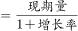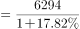户，并非少于4000户，错误；

C项：定位文字材料第二段可得：“2018年，全省新登记企业最集中的三个行业分别是批发和零售业、租赁和商务服务业、制造业，新登记企业数分别为36.14万户、15.19万户、9.25万户，分别同比增长、增长、下降”，故2017年批发和零售业新登记企业数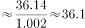万户，租赁和商务服务业新登记企业数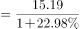万户，制造业新登记企业数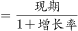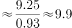万户，根据表格材料2017年新登记企业数90.41万户，则其他所有行业新登记企业数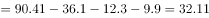万户，显然2017年，A省批发和零售业新登记企业数最多，即2017年，A省新登记企业最集中的行业是批发和零售业，正确；

D项：定位表格可得：2015年A省新登记农民专业合作社数为0.55万户，第一产业新登记企业数为0.48万户；故2015年A省新登记农民专业合作社多于第一产业新登记企业，正确。

本题为选非题，故正确答案为B。

---

### 材料 2

        党的十八大以来，脱贫工作取得巨大成效，全国农村贫困人口大幅减少。截至2018年末，全国农村贫困人口从2012年末的9899万人减少至1660万人；农村贫困发生率从2012年的下降至，累计下降8.5个百分点。

        2018年，贫困地区农村居民人均可支配收入10371元，扣除价格因素，实际增长，实际增速高出全国农村居民人均可支配收入实际增速1.7个百分点，圆满完成增长幅度高于全国增速的年度目标任务。

#### 第 6 题　qid 2374697 · 综合

从2012年末到2018年末，全国农村贫困人口数减少了（    ）万人。

- **A**. 6239
- **B**. 7239
- **C**. 8239　✅
- **D**. 9230

**答案**：C

**官方解析**

根据题意“······减少了（    ）万人”，可判定本题为增长量计算问题。定位文字材料第一段或柱形图，可得2012年末为9899万人，2018年末为1660万人， ，减少了8239万人。

故正确答案为C。

---

#### 第 7 题　qid 2374705 · 增长

2013—2018年，全国农村贫困发生率较上年下降最多的是（    ）年。

- **A**. 2013　✅
- **B**. 2015
- **C**. 2017
- **D**. 2018

**答案**：A

**官方解析**

本题所求“······全国农村贫困发生率较上年下降最多······”，定位折线图，A项2013年：，即下降1.7个百分点；B项2015年： ，即下降1.5个百分点；C项2017年： ，即下降1.4个百分点；D项2018年：，即下降1.4个百分点。则下降最多的为A项2013年。

故正确答案为A。

---

#### 第 8 题　qid 2374713 · 平均数

2018年，我国贫困地区农村居民人均工资性收入约占人均可支配收入的（    ）。

- **A**. 

- **B**. 

- **C**. 

- **D**. 

　✅

**答案**：D

**官方解析**

根据问题“······占······”，结合时间为2018年，判定本题为现期比重问题。定位表格，可得：2018年我国贫困地区农村居民人均工资性收入为3627元；定位文字第二段，可得：2018年我国贫困地区农村居民人均可支配收入10371元，则所占比重。

故正确答案为D。

---

#### 第 9 题　qid 2374716 · 综合

2018年，我国贫困地区农村居民收入来源中，最高的是（     ）。

- **A**. 人均工资性收入
- **B**. 人均转移净收入
- **C**. 人均经营净收入　✅
- **D**. 人均财产净收入

**答案**：C

**官方解析**

题目所求“2018年我国贫困地区农村居民收入来源最高的”，定位表格，观察数据可得，人均经营净收入3888元最高。
故正确答案为C。

---

#### 第 10 题　qid 2374723 · 综合

下列说法不正确的是（    ）。

- **A**. 
2012—2018年，全国农村贫困人口逐年递减

- **B**. 
2018年，全国农村居民人均可支配收入实际增速为

- **C**. 
2018年，贫困地区农村居民各来源的人均收入较上年均有提高

- **D**. 
2017年，贫困地区农村居民人均经营净收入比转移净收入高近1000元
　✅

**答案**：D

**官方解析**

A项：定位柱形图，2012～2018年，全国农村贫困人口逐年递减（根据柱子高度，逐渐降低），说法正确，排除；

B项：定位文字材料，“2018年······人均可支配收入实际增长，高出全国农村居民人均可支配收入实际增速1.7个百分点”，那么2018年全国农村居民人均可支配收入实际增速为，说法正确，排除；

C项：定位表格，比较2018年和2017年的收入来源，发现各个来源的收入均有所提高，说法正确，排除；

D项：定位表格，可得：2017年，贫困地区农村居民人均经营净收入为3723元，转移净收入为2325元，元，即多1398元，所以“近1000元”说法错误，当选。

本题为选非题，故正确答案为D。

---

### 材料 3

        2018年，我国全社会用电量68449亿千瓦时，同比增长，增幅同比提高1.9个百分点。具体来看，第一产业用电量728亿千瓦时，同比增长；第二产业用电量47235亿千瓦时，同比增长；第三产业用电量10801亿千瓦时，同比增长；城乡居民生活用电量9685亿千瓦时，同比增长。

        2018年，我国可再生能源发电量达1.87万亿千瓦时，同比增长约1700亿千瓦时；可再生能源发电量占全年发电总量比重为，同比上升0.2个百分点。

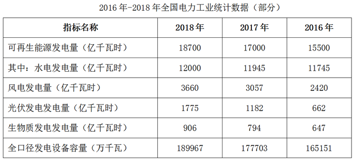

#### 第 11 题　qid 2374696 · 增长

2018年，我国全社会用电量较2016年增加了约（    ）。

- **A**. 

- **B**. 

　✅
- **C**. 

- **D**. 

**答案**：B

**官方解析**

由题干“2018年我国全社会用电量较2016年增加了约”，结合选项为百分数，可判定本题为间隔增长率计算问题。定位文字材料第一段，“2018年我国全社会用电量68449亿千瓦时，同比增长，增幅同比提高1.9个百分点”，可知，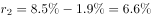。代入间隔增长率计算公式：，则2018年我国全社会用电量较2016年增加了。

故正确答案为B。

---

#### 第 12 题　qid 2374721 · 综合

2017年，我国三大产业及城乡居民生活用电量大小排序正确的是（    ）。

- **A**. 
第二产业用电第三产业用电城乡居民生活用电第一产业用电
　✅
- **B**. 
第三产业用电城乡居民生活用电第一产业用电第二产业用电

- **C**. 
第二产业用电城乡居民生活用电第三产业用电第一产业用电

- **D**. 
第一产业用电第二产业用电第三产业用电城乡居民生活用电

**答案**：A

**官方解析**

由题干“2017年···大小排序正确的是”，结合材料时间为2018年，可判定本题为基期比较问题。定位文字材料第一段可得，“2018年第一产业用电量728亿千瓦时，同比增长；第二产业用电量47235亿千瓦时，同比增长；第三产业用电量10801亿千瓦时，同比增长；城乡居民生活用电量9685亿千瓦时，同比增长”。根据，则2017年三大产业及城乡居民生活用电量分别为：

第一产业：亿千瓦时；

第二产业：亿千瓦时；

第三产业：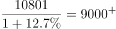亿千瓦时；

城乡居民生活：亿千瓦时。

则大小排序为：第二产业用电第三产业用电城乡居民生活用电第一产业用电，与A项一致。

故正确答案为A。

---

#### 第 13 题　qid 2374727 · 综合

2018年，我国发电总量约为（    ）万亿千瓦时。

- **A**. 1.87
- **B**. 3.70
- **C**. 5.84
- **D**. 7.00　✅

**答案**：D

**官方解析**

由题干“2018年我国发电总量约为多少万亿千瓦时”，结合材料给出2018年可再生能源发电量及其占全年发电总量比重，可判定本题为现期比重问题。定位文字材料第二段，“2018年我国可再生能源发电量达1.87万亿千瓦时，占全年发电总量比重为”，根据，2018年我国发电总量万亿千瓦时，与D项最接近。

故正确答案为D。

---

#### 第 14 题　qid 2374732 · 增长

2017年，下列可再生能源发电量同比增幅最大的是（    ）。

- **A**. 水电
- **B**. 风电
- **C**. 光伏发电　✅
- **D**. 生物质发电

**答案**：C

**官方解析**

由题干“2017年···同比增幅最大的是”，可判定本题为增长率比较问题。定位表格可知2016年、2017年各项可再生资源发电量，根据，2017年各项增长率分别为：

水电：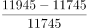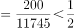；

风电：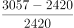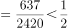；

光伏发电：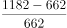；

生物质发电：。

则同比增幅最大的是光伏发电。

故正确答案为C。

---

#### 第 15 题　qid 2374740 · 综合

根据以上材料，下列说法不正确的是（    ）。

- **A**. 
2018年，我国第二产业用电量是第三产业用电量的4倍多

- **B**. 
2017年和2018年，我国风电发电量同比增幅均超过
　✅
- **C**. 
2017年，我国可再生能源发电量占全年发电总量的

- **D**. 
2018年，我国全口径发电设备容量较2016年增加约2.48亿千瓦

**答案**：B

**官方解析**

A项：定位文字材料第一段可知，“（2018年）第二产业用电量47235亿千瓦时，第三产业用电量10801亿千瓦时”。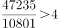，正确；

B项：定位表格可知，2016年我国风电发电量为2420亿千瓦时，2017年为3057亿千瓦时，2018年为3660亿千瓦时。2017年同比增速为，2018年同比增速为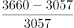，错误；

C项：定位文字材料第二段可知，“（2018年）可再生能源发电量占全年发电总量比重为，同比上升0.2个百分点”。则2017年，我国可再生能源发电量占全年发电总量的比重为，正确；

D项：定位表格可知，2018年我国全口径发电设备容量为189967万千瓦，2016年为165151万千瓦。万千瓦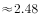亿千瓦，正确。

本题为选非题，故正确答案为B。

---
