# 2019年新疆生产建设兵团面向社会招录公务员考试《行测》题（网友回忆版）

> 省考 · 2019 年 · 5 个模块 · 共 114 题

- [常识判断](#%E5%B8%B8%E8%AF%86%E5%88%A4%E6%96%AD) · 20 题
- [言语理解与表达](#%E8%A8%80%E8%AF%AD%E7%90%86%E8%A7%A3%E4%B8%8E%E8%A1%A8%E8%BE%BE) · 30 题
- [数量关系](#%E6%95%B0%E9%87%8F%E5%85%B3%E7%B3%BB) · 10 题
- [判断推理](#%E5%88%A4%E6%96%AD%E6%8E%A8%E7%90%86) · 34 题
- [资料分析](#%E8%B5%84%E6%96%99%E5%88%86%E6%9E%90) · 20 题

---

## 常识判断

### 第 1 题　qid 2434210 · 人文常识

下列属于平安中国建设举措的是（    ）。

- **A**. 中国海军在亚丁湾护航
- **B**. 开展区域医疗中心建设试点
- **C**. 推广依靠群众就地化解矛盾的“枫桥经验”　✅
- **D**. 划定并严守生态保护红线，维护国家生态安全

**答案**：C

**官方解析**

本题考查政治，党的十九大报告指出：“建设平安中国，加强和创新社会治理，维护社会和谐稳定，确保国家长治久安，人民安居乐业。”因此加强平安中国建设属于社会治理的措施。
A选项错误，中国海军在亚丁湾护航，是从2008年底开始的一项军事行动。
B选项错误，开展区域医疗中心建设试点推动了优质医疗资源集团化发展，更好地满足了群众医疗服务需求，属于医疗建设。
C选项正确，推广依靠群众就地化解矛盾的“枫桥经验”属于平安中国建设举措。
D选项错误，划定并严守生态保护红线，维护国家生态安全，属于生态文明建设。
故正确答案为C。

---

### 第 2 题　qid 2434221 · 人文常识

下列不属于党的十八大以来全面深化改革举措的是（    ）。

- **A**. 《推进三网融合的总体方案》　✅
- **B**. 《中国足球改革发展总体方案》
- **C**. 《国家科技伦理委员会组建方案》
- **D**. 《长城、大运河、长征国家文化公园建设方案》

**答案**：A

**官方解析**

本题考查政治，党的十八大于2012年11月在北京人民大会堂举行。
A选项错误，2010年1月，国务院颁布《推进三网融合的总体方案》。
B选项正确，2015年2月27日，在中央全面深化改革领导小组第十次会议上，审议通过了《中国足球改革发展总体方案》。
C选项正确，2019年7月24日，中央全面深化改革委员会第九次会议审议通过了《国家科技伦理委员会组建方案》。
D选项正确，2019年7月24日，中央全面深化改革委员会第九次会议审议通过了《长城、大运河、长征国家文化公园建设方案》。
本题为选非题，故正确答案为A。

---

### 第 3 题　qid 2434225 · 法律常识

下列属于法治社会建设内容的是（    ）。

- **A**. 人民法院巡回法庭在农村事发地公开审理民事纠纷案件
- **B**. 村民、社区居民依法选举村民委员会、社区居民委员会成员　✅
- **C**. 把公众参与、专家论证、风险评估等作为重大决策的必经程序
- **D**. 凡是不涉及国家秘密、商业秘密和个人隐私的政府信息都要向社会公开

**答案**：B

**官方解析**

本题考查法律。当前，法治建设在整体上取得了巨大进步。习近平总书记强调，全面推进依法治国，要坚持依法治国、依法执政、依法行政共同推进，坚持法治国家、法治政府、法治社会一体建设。这指明了法治社会建设在全面推进依法治国中的重要地位和作用，丰富和发展了马克思主义法学思想和中国特色社会主义法治理论。法治社会一般具有以下基本特征：全社会对法治普遍信仰；宪法和法律得到有效实施和普遍遵从；社会依法规范运行；公平正义得到切实维护和实现；权利救济及时充分。
A项错误，利用人民法院巡回法庭在农村公开审理案件属于依法治国的内容。这能够使很多复杂案件在地方得到处理，让审判重心下移到基层，给法官更加充分的时间调查案件，有利于做出公正的判决。巡回法庭是对依法治国理念的践行之举。
B项正确，保证基层依法选举，属于社区基层群众的民主自治，是法治社会建设的重要内容，依靠法律来规范社会行为，协调社会关系，努力将各项社会治理活动纳入法治轨道。
C项错误，公众参与、专家论证、风险评估等作为重大决策的必经程序属于法治政府建设的内容。法治政府建设要全面推进依法行政，不断提高政府公信力和执行力，为保障经济又好又快发展和社会和谐稳定发挥更大的作用。
D项错误，凡是不涉及国家秘密、商业秘密和个人隐私的政府信息都要向社会公开属于政府信息公开的内容，也是依法行政的重要组成部分，行政机关是实施法律法规的重要主体，要带头严格执法，维护公共利益、人民权益和社会秩序。
故正确答案为B。

---

### 第 4 题　qid 2434231 · 法律常识

根据我国宪法，下列说法错误的是（    ）。

- **A**. 中国特色社会主义最本质的特征是中国共产党的领导
- **B**. 县级以上地方人民代表大会常务委员会的成员不能担任国家行政机关的职务
- **C**. 监察委员会依照法律规定独立行使监察权，不受行政机关、个人的干涉
- **D**. 县级以上地方各级人民政府可依法管理本行政区域内的监察工作　✅

**答案**：D

**官方解析**

本题考查法律。
A项正确，根据《宪法》第一条第二款规定：“社会主义制度是中华人民共和国的根本制度。中国共产党领导是中国特色社会主义最本质的特征。禁止任何组织或者个人破坏社会主义制度。”
B项正确，根据《宪法》第一百零三条第三款规定：“县级以上的地方各级人民代表大会常务委员会的组成人员不得担任国家行政机关、监察机关、审判机关和检察机关的职务。”
C项正确，根据《宪法》第一百二十七条第一款规定：“监察委员会依照法律规定独立行使监察权，不受行政机关、社会团体和个人的干涉。”
D 项错误，根据《宪法》第一百二十六条规定：“国家监察委员会对全国人民代表大会和全国人民代表大会常务委员会负责。地方各级监察委员会对产生它的国家权力机关和上一级监察委员会负责。”因此，监察委员会对产生它的国家权力机关和上一级监察委员会负责。
本题为选非题，故正确答案为D。

---

### 第 5 题　qid 2434235 · 法律常识

下列不属于我国《监察法》所列明的监察机关职责的是（    ）。

- **A**. 调查犯罪
- **B**. 追究刑责　✅
- **C**. 处置移送
- **D**. 监督教育

**答案**：B

**官方解析**

本题考查法律常识。《中华人民共和国监察法》第十一条规定，监察委员会依照本法和有关法律规定履行监督、调查、处置职责：（一）对公职人员开展廉政教育，对其依法履职、秉公用权、廉洁从政从业以及道德操守情况进行监督检查；（二）对涉嫌贪污贿赂、滥用职权、玩忽职守、权力寻租、利益输送、徇私舞弊以及浪费国家资财等职务违法和职务犯罪进行调查；（三）对违法的公职人员依法作出政务处分决定；对履行职责不力、失职失责的领导人员进行问责；对涉嫌职务犯罪的，将调查结果移送人民检察院依法审查、提起公诉；向监察对象所在单位提出监察建议。
A项正确，调查犯罪属于监察机关的职责。
B项错误，追究刑事责任，只能由国家专门机关依照刑事法律的规定，按法定程序来进行。监察机关不追究刑事责任。
C项正确，处置移送属于监察机关的职责。
D项正确，监督教育属于监察机关的职责。
本题为选非题，故正确答案为B。

---

### 第 6 题　qid 2434240 · 法律常识

下列做法符合我国《劳动法》规定的是（    ）。

- **A**. 12岁的小博在电脑方面天赋异禀，被一家IT公司破格录用
- **B**. 小丹和公司签订劳动合同，合同中约定试用期为一年
- **C**. 由于订单量激增，公司要求员工近两个月每周只能休息一天　✅
- **D**. 小林不能胜任单位安排的工作，单位直接解除了与小林的劳动合同

**答案**：C

**官方解析**

本题考查法律常识。
A项错误，《劳动法》第十五条规定，禁止用人单位招用未满十六周岁的未成年人。 文艺、体育和特种工艺单位招用未满十六周岁的未成年人，必须遵守国家有关规定，并保障其接受义务教育的权利。
B项错误，《劳动法》第二十一条规定，劳动合同可以约定试用期。试用期最长不得超过六个月。
C项正确，《劳动法》第三十八条规定，用人单位应当保证劳动者每周至少休息一日。
D项错误，《劳动法》第二十六条规定，有下列情形之一的，用人单位可以解除劳动合同，但是应当提前三十日以书面形式通知劳动者本人：（二）劳动者不能胜任工作，经过培训或者调整工作岗位，仍不能胜任工作的。小林不能胜任单位安排的工作，单位应该培训或者调整小林工作岗位，而不能直接解除劳动合同。
故正确答案为C。

---

### 第 7 题　qid 2434242 · 法律常识

关于犯罪主体，下列说法正确的是（    ）。

- **A**. 15岁的小李绑架了一个“富二代”，小李应对其绑架行为承担刑事责任
- **B**. 17岁的小涛不务正业，从事黑社会活动，对其罪行，可从轻或减轻处罚
- **C**. 14岁的小峰醉酒后开其父的车不小心撞死一路人，小峰无需承担刑事责任　✅
- **D**. 76岁的老罗因赌博缺钱，趁邻居家没人时，入户盗窃，对其罪行，应当从轻或者减轻处罚

**答案**：C

**官方解析**

本题考查法律常识。
《中华人民共和国刑法》第十七条第二款规定：“已满十四周岁不满十六周岁的人，犯故意杀人、故意伤害致人重伤或死亡、强奸、抢劫、贩卖毒品、放火、爆炸、投放危险物质罪的，应当负刑事责任。”
A项错误，绑架罪不在限制刑事责任能力人应负刑事责任的八种行为之内，小李为限制刑事责任能力人，不需要承担刑事责任。
B项错误，《中华人民共和国刑法》第十七条第四款规定：“对依照前三款规定追究刑事责任的不满十八周岁的人，应当从轻或者减轻处罚。”选项中可以从轻或者减轻的说法错误。
C项正确，14周岁的人对交通肇事罪无需承担刑事责任。
D项错误，《中华人民共和国刑法》第十七条第四款规定“已满七十五周岁的人故意犯罪的，可以从轻或者减轻处罚；过失犯罪的，应当从轻或者减轻处罚。”老罗已满七十五周岁，是故意犯罪，可以从轻或者减轻处罚，所以“应当从轻或者减轻处罚”表述错误。
故正确答案为C。

---

### 第 8 题　qid 2434247 · 法律常识

甲经朋友介绍，与乙开发商签订商品房认购书一份，认购乙开发商开发的某小区某栋某单元某室商品房一套，以该套房屋开盘价的结算。此时乙开发商在该小区开发的商品房尚未取得房屋预售许可证。开盘后，乙开发商将该套房屋售予他人。甲得知后将乙开发商告上法庭。

关于本案，下列说法正确的是（    ）。

- **A**. 商品房认购书不具有法律效力，法院应驳回甲的起诉
- **B**. 乙开发商违反预约合同应承担赔偿责任，法庭应判决乙开发商赔偿甲的机会损失　✅
- **C**. 开发商在未取得房屋预售许可证前与购房人签订的房屋认购书无效，法院应判决甲败诉
- **D**. 开发商在未取得房屋预售许可证前与购房人签订的房屋认购书有效，法院应判决甲取得认购商品房所有权

**答案**：B

**官方解析**

本题考查法律常识。
A、C两项错误，B项正确，《民法典》第四百九十五条规定：“当事人约定在将来一定期限内订立合同的认购书、订购书、预订书等，构成预约合同。当事人一方不履行预约合同约定的订立合同义务的，对方可以请求其承担预约合同的违约责任。”甲与乙签订的认购书是预约合同，该认购书有法律效力，乙违反该认购书的约定将房屋售与他人，应承担违约责任，赔偿甲的损失。
D项错误，《民法典》第二百零九条规定：“不动产物权的设立、变更、转让和消灭，经依法登记，发生效力；未经登记，不发生效力，但是法律另有规定的除外。依法属于国家所有的自然资源，所有权可以不登记。”商品房属于不动产，但该商品房并未登记在甲名下，甲不会取得该商品房的所有权。
故正确答案为B。

---

### 第 9 题　qid 2434251 · 科技常识

关于生活中的化学知识，下列说法错误的是（    ）。

- **A**. 飓风能引起海水燃烧
- **B**. 少量水浇到燃烧的煤上火会更旺
- **C**. 二氧化碳可以作制冷剂
- **D**. 凡士林可从石油中直接获取　✅

**答案**：D

**官方解析**

本题考查科技常识。
A项正确，水在通电条件下或者高温下才分解，一阵飓风过后，产生巨大的能量使水分解生成氢气和氧气，引起氢气燃烧。
B项正确，水在高温条件下与碳发生化学反应产生氢气和一氧化碳，这两种气体可以燃烧，所以会更旺。
C项正确，固态二氧化碳俗称干冰，升华时可吸收大量热，因而用作制冷剂，如人工降雨，也常在舞美中用于制造烟雾。
D项错误，凡士林是一种烷系烃或饱和烃类半液态的混合物，也叫矿脂，由石油分馏后制得。其状态在常温时介于固体及液体之间，因不同用途而有棕、黄、白三种颜色。天然凡士林取自烷属烃重油等石油残油浓缩物；人造凡士林则取自用纯地蜡或石蜡、石蜡脂使矿物油稠化的混合物。因此，凡士林不能从石油中直接获取。
本题为选非题，故正确答案为D。

---

### 第 10 题　qid 2434255 · 地理国情

关于地理分界线，下列说法正确的是（    ）。

- **A**. 季风区与非季风区界线穿过太行山
- **B**. 四川盆地和汉水谷地界线穿过巫山
- **C**. 400毫米等降水量线穿过祁连山
- **D**. 湿润区与半湿润区界线穿过秦岭　✅

**答案**：D

**官方解析**

本题考查地理国情。
A项错误，我国季风区与非季风区的分界线是大兴安岭—阴山—贺兰山—巴颜喀拉山—冈底斯山。
B项错误，四川盆地和汉水谷地界线为大巴山脉。
C项错误，400mm等降水线也是季风区与非季风区的分界线，不穿过祁连山。
D项正确，秦岭—淮河是湿润区与半湿润区的分界线。
故正确答案为D。

---

### 第 11 题　qid 2434258 · 人文常识

下列关于十大名曲的说法，正确的是（    ）。

- **A**. 《高山流水》是一首琵琶曲
- **B**. 《夕阳箫鼓》相传为蔡文姬所做
- **C**. 《春江花月夜》是根据同名唐诗改编而来的
- **D**. 《十面埋伏》演绎了楚汉战争垓下决战的情景　✅

**答案**：D

**官方解析**

本题考查人文常识。
A项错误，《高山流水》是中国古琴曲，属于中国十大古曲之一。传说先秦的琴师俞伯牙一次在荒山野地弹琴，樵夫钟子期竟能领会这是描绘“峨峨兮若泰山”和“洋洋兮若江河”。伯牙惊道：“善哉，子之心而与吾心同。”钟子期死后，伯牙痛失知音，摔琴绝弦，终生不弹，故有高山流水之曲。“高山流水”比喻知己或知音，也比喻乐曲高妙。
B项错误，《夕阳箫鼓》是一首琵琶曲，作者佚名。这是一首抒情写意的文曲，旋律雅致优美，左手多用推、拉、揉、吟等演奏技法，描绘出一幅清丽的山水画卷。
C项错误，《春江花月夜》改编自《夕阳箫鼓》，是一首著名的琵琶曲，写的是浔阳（今江西九江）江上月夜，歌颂祖国山河之壮美，表现人民热爱祖国之情，意境深远，乐音悠长。
D项正确，《十面埋伏》是一首历史题材的大型琵琶曲，描写公元前202年楚汉战争垓下决战的情景。汉军用十面埋伏的阵法击败楚军，项羽自刎于乌江，刘邦取得胜利。
故正确答案为D。

---

### 第 12 题　qid 2434259 · 人文常识

下列体育领域与专业术语对应错误的是（  ）。

- **A**. 足球——交叉进攻　✅
- **B**. 篮球——错位防守
- **C**. 排球——短平快球
- **D**. 乒乓球——左右半区

**答案**：A

**官方解析**

本题考查人文常识。
A项错误，交叉进攻是排球运动战术之一，是快球掩护下运用的进攻战术。是指两名队员跑动时交叉跑动，起到互相掩护的作用，造成局部区域以多打少的局面。
B项正确，错位防守是篮球战术之一，是指防守人站位在自己所防守的进攻人身侧，阻挠对方接球。
C项正确，短平快是排球运动快球的一种。一般指二传手正面传出速度快、弧度平的球的同时，扣球手在距其2米左右处跳起，挥臂截击二传手平拉过来的球。
D项正确，乒乓球双打时，球台中间有一条白线将球台划分为左右半区。
本题为选非题，故正确答案为A。

---

### 第 13 题　qid 2434261 · 人文常识

下列谚语及其解释对应正确的是（    ）。

- **A**. 下雪不冷，化雪冷——凝华放热，液化吸热
- **B**. 雷雨发庄稼——放电环境下会生成氮肥　✅
- **C**. 真金不怕火炼——金具有硬度大的性质
- **D**. 酒香不怕巷子深——分子之间存在斥力

**答案**：B

**官方解析**

本题考查科技常识。
A项错误，下雪是水蒸气的凝华过程，凝华放热，人感觉不冷；而化雪是熔化过程，熔化吸热，导致环境温度降低，人感觉冷。选项中“液化”表述有误。
B项正确，放电环境下，空气中的氮气与氧气反应生成一氧化氮，一氧化氮又与氧气反应生成二氧化氮。二氧化氮易溶于水生成硝酸随雨水落到土壤中，同土壤中矿物相互作用，生成易被农作物吸收的硝酸盐。硝酸盐属于氮肥，因而有“雷雨发庄稼”的说法。
C项错误，“真金不怕火炼”是指金的熔点高于一般炉火火焰的温度，与硬度无关。
D项错误，“酒香不怕巷子深”是因为酒香味分子在不停地运动到空气中，所以很远的地方都能闻到酒香，体现了分子的无规则运动。
故正确答案为B。

---

### 第 14 题　qid 2434264 · 人文常识

下列关于我国古代天文学成就的说法错误的是（    ）。

- **A**. 《太初历》精度与公历相当　✅
- **B**. 唐代僧一行制作了金属黄道游仪
- **C**. 《天文》记录了上百颗恒星的赤道坐标位置
- **D**. 《汉书·五行志》记录了太阳黑子活动

**答案**：A

**官方解析**

本题考查科技常识。
A项错误，《太初历》是我国历史上第一部比较完整的历法。汉武帝太初元年(公元前104年)由落下闳、邓平等人根据天象实测和长期天文记录而编撰的新历法。由于太初历的回归年和朔望月的数值偏大，使用时间一长，积累误差就很大了。元朝郭守敬编订的《授时历》精度与现行公历相当。
B项正确，黄道游仪是用来观测日月星辰的位置和运行变化的一种仪器。唐开元九年(721)，先由机械制造家梁令瓒用木料做成黄道游仪模型，后在僧一行主持下，于开元十一年铸成铜器。
C项正确，《天文》作者是战国时期的天文学家石申。该书原书虽已失传，但在唐朝的天文学著作中对其内容有所保留，后人据此辑成《石氏星表》。《石氏星表》是世界上现存最古老的星表，保留了一百多颗恒星的赤道坐标数据。
D项正确，太阳黑子是太阳光球层上出现的暗黑斑点，是太阳活动的基本标志。在《汉书·五行志》里记载有“汉成帝河平元年(公元前28年) 三月乙未，日出黄，有黑气，大如钱，居日中央”。不但说明黑子出现的日期，而且说明了黑子的形状、大小和位置。这是公元前28年5月10日的太阳黑子记录，是世界上公认最早的、正确的太阳黑子记录。
本题为选非题，故正确答案为A。

---

### 第 15 题　qid 2434266 · 科技常识

下列有关医学的说法错误的是（    ）。

- **A**. 春天是急性心梗的高发期
- **B**. 诺如病毒具有明显的季节性
- **C**. 原发性高血压高于继发性高血压发病率
- **D**. 血友病、哮喘和乙型肝炎均是遗传疾病　✅

**答案**：D

**官方解析**

本题考查科技常识。

A项正确，急性心肌梗死是冠状动脉急性、持续性缺血缺氧所引起的心肌坏死。常见的诱因有：过劳、激动、暴饮暴食、寒冷刺激、便秘、吸烟、大量饮酒等。突然的寒冷刺激也可能诱发急性心肌梗死，因此，冬春寒冷季节是急性心肌梗死发病较高的原因之一。

B项正确，诺如病毒，又称诺瓦克病毒，是人类杯状病毒科中诺如病毒属的一种病毒。是一组形态相似、抗原性略有不同的病毒颗粒。诺如病毒具有明显的季节性，人们常把它称为“冬季呕吐病”。根据2013年发表的系统综述，全球约的病例和约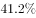的发生在冬季（北半球是12月-次年2月，南半球是6-8月），约的病例和约的出现在凉爽的季节（北半球是10月-次年3月，南半球是4-9月）。

C项正确，基于目前的医学发展水平和检查手段，能够发现导致血压升高的确切病因，称之为继发性高血压；反之，不能发现导致血压升高的确切病因，则称为原发性高血压。高血压人群中多数为原发性高血压，但明确诊断原发性高血压，需首先除外继发性高血压。目前认为，继发性高血压占高血压人群的-，但随着医学发展水平和检查手段的不断进展，继发性高血压的比例将不断增加，原发性高血压的比例会不断下降。

D项错误，1.血友病为一组遗传性凝血功能障碍的出血性疾病，其共同的特征是活性凝血活酶生成障碍，凝血时间延长，终身具有轻微创伤后出血倾向，重症患者没有明显外伤也可发生“自发性”出血。2.哮喘是一种具有复杂性状的，具有多基因遗传倾向的疾病。其特征为：①外显不全，②遗传异质化，③多基因遗传，④协同作用。3.乙型病毒性肝炎是由乙型肝炎病毒引起的以肝脏病变为主的一种传染病。乙型肝炎病毒最主要通过血液传播，最重要的传播方式是母婴垂直传播和医源性感染，不具有遗传性。

本题为选非题，故正确答案为D。

---

### 第 16 题　qid 2434268 · 人文常识

下列关于古代生活场景的描述，符合历史发展的是（    ）。

- **A**. 秦朝的王某一家以种植玉米为生
- **B**. 元代的李某喜欢吃红薯和土豆
- **C**. 汉代的张某使用曲辕犁进行春耕
- **D**. 清朝的陈某喜欢用辣椒来做菜　✅

**答案**：D

**官方解析**

本题考查人文常识。
A项错误，玉米在中国是从明朝开始种植的，大约到了16世纪中期，玉米传到了我国，开始在中国进行种植。最早记载见于明朝嘉靖三十四年成书的《巩县志》，称其为“玉麦”，其后嘉靖三十九年《平凉府志》称作“番麦”和“西天麦”。“玉米”之名最早见于徐光启的《农政全书》。故秦朝时还没有玉米，王某一家不能以种植玉米为生。
B项错误，红薯最早传进中国约在明朝后期的万历年间。土豆原产于南美洲，于明代末期传入我国。故元代还没有红薯和土豆。
C项错误，一种轻便的短曲辕犁，又称江东犁。它最早出现于唐代后期的江东地区，它的出现是古代中国耕作农具成熟的标志。故汉代时还没有出现曲辕犁，张某不能使用曲辕犁进行春耕。
D项正确，公认的中国最早关于辣椒的记载是明代高濂撰《遵生八笺》（1591年），有：“番椒丛生，白花，果俨似秃笔头，味辣色红，甚可观”的描述。据此记载，通常认为辣椒是明朝末年传入中国。故清朝的陈某可以用辣椒来做菜。
故正确答案为D。

---

### 第 17 题　qid 2434269 · 人文常识

下列哪种情形最可能发生在诗句“绿槐高柳咽新蝉”描写的季节？（    ）

- **A**. 华北地区开始播种水稻
- **B**. 黄河的刘家峡到包头段出现凌汛
- **C**. 中山站上方出现极光现象　✅
- **D**. 陕西富平地区开始制作柿饼

**答案**：C

**官方解析**

本题考查地理国情。“绿槐高柳咽新蝉”出自宋代苏轼的《阮郎归·初夏》，营造出一种清丽欢快的情调，描写的是初夏时节的闺阁生活。
A项错误，华北地区种植的水稻是单季稻，一季水稻播种时间为清明前，四月底五月初移栽。不符合题干中描述的季节。
B项错误，凌汛是黄河常见的一种自然现象。由于黄河所处纬度较高，下游河道冬季结冰封河，而春初解冻开河后冰水齐下，冰凌壅塞，水位上涨，形成凌汛洪水，此时期为黄河凌汛期。不符合题干中描述的季节。
C项正确，极光是发生在地球高磁纬地区的一种大规模放电现象。由于中山站特殊的地理位置，一天穿越两次极光带，是世界上进行极光观测的最佳场所之一。一般来说，观测极光通常都是在每年夏至前后的夜晚。
D项错误，富平柿饼，陕西省富平县特产，中国国家地理标志产品。富平柿饼以当地生产的传统名优柿子品种“富平尖柿”为原料，10月中下旬手工采摘后经过清洗削皮、日晒压捏、捏晒整形、定型捂霜等多道工序精细制作而成。
故正确答案为C。

---

### 第 18 题　qid 2434271 · 人文常识

下列关于桥梁的说法错误的是（    ）。

- **A**. 港珠澳大桥是目前世界最长的跨海大桥
- **B**. 拱桥的材料多以石料为主，孔数多为奇数
- **C**. 钢架桥是一种适于修建特大跨度桥梁的桥型　✅
- **D**. 梁桥平直且易于建造，常应用于中、小跨度桥梁

**答案**：C

**官方解析**

本题考查科技常识。
A项正确，港珠澳大桥是连接香港、珠海、澳门的超大型跨海通道，全长55公里，主体工程“海中桥隧”长35.578公里，2009年12月15日开工。2016年9月27日，港珠澳大桥主体桥梁正式贯通，是世界最长的跨海大桥。
B项正确，拱桥指在竖直平面内以拱作为结构主要承重构件的桥梁。由于我国是一个多山的国家，石料资源丰富，因此拱桥以石料为主。孔数上有单孔与多孔，多孔以奇数为多，偶数较少。
C项错误，钢架桥是梁和柱整体结合的桥梁结构。在竖向移动荷载作用下，梁部主要受弯，柱脚处有水平推力，受力状态介于梁式桥和拱桥之间，一般用于跨径不大的城市桥或公路高架桥和立交桥，同时在要跨越深水、深谷、大河急流的大跨桥梁中也会被应用。缆索承重桥适用于建造跨度非常大的桥梁，而非钢架桥。
D项正确，梁桥是我国最普通、最常见的一种桥，古时叫作平桥，它的外形平直，比较容易建造，且价格低、修建容易，历史悠久，形式优美，常应用于中、小跨度桥梁。
本题为选非题，故正确答案为C。

---

### 第 19 题　qid 2434273 · 法律常识

甲将某小区房屋出租给乙，乙在阳台上放置盆栽植物若干。一日大风将阳台上花盆吹落，砸中楼下经过的丙。根据相关法律，该赔偿责任应由谁承担？（    ）

- **A**. 甲
- **B**. 乙　✅
- **C**. 甲和乙
- **D**. 乙和小区物业

**答案**：B

**官方解析**

本题考查法律常识。
根据《中华人民共和国民法典》第一千二百五十三条规定，建筑物、构筑物或者其他设施及其搁置物、悬挂物发生脱落、坠落造成他人损害，所有人、管理人或者使用人不能证明自己没有过错的，应当承担侵权责任。所有人、管理人或者使用人赔偿后，有其他责任人的，有权向其他责任人追偿。本题中的使用人乙的搁置物（盆栽植物）坠落造成丙的损害，应当承担赔偿责任。
故正确答案为B。

---

### 第 20 题　qid 2434276 · 人文常识

“白头翁坐常山独活千年，红娘子上重楼连翘百步”最可能是哪儿的对联？（    ）

- **A**. 药店　✅
- **B**. 戏院
- **C**. 饭店
- **D**. 书店

**答案**：A

**官方解析**

本题考查人文常识。
本副对联是行业联中的药店联，利用中草药名做对联是一种很感兴趣的文学活动，它能体现出对联的巧妙性和趣味性，尤其是一些拟人化的药名（白头翁、红娘子）更富有想象力。本副对联上联包含三味中药：白头翁、常山、独活；下联包含三味中药：红娘子、重楼、连翘。
故正确答案为A。

---

## 言语理解与表达

### 第 1 题　qid 2434284 · 逻辑填空

习近平同志指出，让收藏在禁宫里的文物、陈列在广阔大地上的遗产、书写在古籍里的文字都活起来。        是让非物质文化遗产活起来的有效方式，能够让其价值和魅力深入人心，凝聚全社会保护传承非物质文化遗产的共识和力量。
填入画横线部分最恰当的一项是（    ）。

- **A**. 保护
- **B**. 创新
- **C**. 传播　✅
- **D**. 开发

**答案**：C

**官方解析**

对应后文“让非物质文化遗产活起来”、“能够让其价值和魅力深入人心”，故空缺处应该体现宣传，让别人知道的含义，C项“传播”符合题意，当选。
A项“保护”仅能起到维持现状的目的，不能让非物质文化遗产的价值深入人心，排除；B项“创新”指有一定革新，文段没有体现“新”的含义，排除；D项“开发”指通过研究或努力，开拓、发现、利用新的资源或新的领域，如开发油田等，文中非物质文化遗产不属于新东西，排除。
故正确答案为C。
【文段出处】《非遗传播要有温度有质感》

---

### 第 2 题　qid 2434286 · 逻辑填空

中国天文学传统极为深厚，成就极为可观，足以和希腊天文学相媲美，特别值得将二者进行比较。事实上，许多人正是通过强调我们有发达的天文学来强调中国古代也有科学，甚至            。
填入画横线部分最恰当的一项是（    ）。

- **A**. 独当一面
- **B**. 遥遥领先　✅
- **C**. 自成一家
- **D**. 登峰造极

**答案**：B

**官方解析**

文中出现“甚至”，提示上下文是递进关系，空缺处词语较之前文程度更重，前文提及“中国古代也有科学”，那横线处应体现出不仅有科学，而且中国科学比其他国家更发达的含义，B项“遥遥领先”指绝对的领先优势，符合文意，当选。
A项“独当一面”指单独承当一方面的工作或使命，多用于形容人，不能搭配科学，排除；C项“自成一家”指在某种学问或技术上有独到的见解或独特的做法，能自成体系，无法体现中国科学更发达，不能与前文形成递进关系，排除；D项“登峰造极”比喻学问、技能等达到最高的境界或成就，程度过重，排除。
故正确答案为B。
【文段出处】《吴国盛 | 科学与礼学：希腊与中国的天文学》

---

### 第 3 题　qid 2434288 · 逻辑填空

特殊的地域特色让新疆的生物区系既古老又独特，形成了世界上较为丰富的种质与基因资源。而地理与气候环境又让新疆的植物具备了多样性的        逆境的结构与机能，        了多样的功能性机能，如抗病虫、抗旱、抗寒、抗盐碱等。
依次填入画横线部分最恰当的一项是（    ）。

- **A**. 适应  携带　✅
- **B**. 克服  遗传
- **C**. 扭转  保留
- **D**. 突破  增加

**答案**：A

**官方解析**

第一空，搭配“逆境”，并且根据“新疆的生物区系既古老又独特”、“较为丰富的种质与基因资源”以及“植物具备了多样性”可知，新疆的植物可以在逆境中生存，Ａ项“适应”体现出新疆植物在逆境中可以生存下去的意思，符合文意，当选；Ｂ项“克服”多搭配困难、缺点、毛病等，不搭配逆境，排除；C项“扭转”指掉转的意思，文段并未体现这个意思，并且扭转多搭配时局等，搭配不当，排除；D项，“突破”多搭配“防线”、“难关”等，搭配不当，排除。
第二空代入验证，“携带”了多样的功能性机能，表达出新疆植物具有多样性的机能，填入文段合适。
故正确答案为Ａ。

---

### 第 4 题　qid 2434219 · 逻辑填空

随着隐身、高超声速、无人等技术的发展及在空天领域的应用，空天兵器正在发生            的变化。当前和未来一段时期，构成空天威胁的兵器主要包括巡航导弹、空基打击平台、弹道导弹、天基攻击武器等。显然，空天领域已经成为战争制胜的新高地和大国战略博弈的新        。
依次填入画横线部分最恰当的一项是（    ）。

- **A**. 空前绝后  方向
- **B**. 翻天覆地  焦点　✅
- **C**. 不可思议  趋势
- **D**. 难能可贵  目标

**答案**：B

**官方解析**

第一空，搭配“变化”，根据“隐身”、“高超声速”、“无人机”等技术的应用，以及“当前和未来一段时间，构成空天威胁的兵器主要包括”、“空天领域成为新的······”可知，文段强调空天兵器发生很大的变化，横线要填入一个表达变化大的词语。B项“翻天覆地”形容变化巨大而彻底，符合文意，保留。A项“空前绝后”指从前没有过，以后也不会有，文段没有体现以后不会有的意思，排除；C项“不可思议”形容对事物或言论很难想象，无法理解，文段并未表达无法想象的意思，排除；D项“难能可贵”指难以做到的事情居然做到了，值得珍视，文段没有体现出难的意思，排除。
第二空代入验证，成为新的焦点，表达出空天领域大国新的争夺点，符合文意。
故正确答案为B。
【文段出处】《空天兵器：大国战略博弈的新焦点》

---

### 第 5 题　qid 2434226 · 逻辑填空

1964年，约翰·贝尔提出了一种可以区分量子力学与局域实在论孰对孰错的测试方法，即贝尔不等式。随后的几十年，大量的实验都证实了量子力学关于贝尔不等式的        ，但是这些实验或多或少地存在一些        ，导致人们依然无法对这一争论进行最终判定。
依次填入画横线部分最恰当的一项是（    ）。

- **A**. 预言  漏洞　✅
- **B**. 定论  瑕疵
- **C**. 判断  偏颇
- **D**. 假设  错误

**答案**：A

**官方解析**

第一空，B项“定论”指确定的原则、论断。由后文“导致人们依然无法对这一争论进行最终判定”可知，贝尔不等式不是一种已经确定无误的“定论”，排除B项；A项“预言”、C项“判断”、D项“假设”均符合文意，保留。
第二空，分析可知，所填词语搭配需“实验”。C项“偏颇” 指偏向某一方面，有失公允，一般搭配“人”，不能说“实验存在偏颇”，排除C项。由后文“导致人们依然无法对这一争论进行最终判定”可知，人们还不能对贝尔不等式进行最终判定，A项“漏洞”符合文意，当选；D项“错误”的程度较重排除。
故正确答案为A。
【文段出处】《我国科学家检验量子非定域性》

---

### 第 6 题　qid 2434233 · 逻辑填空

时下人民安居乐业，百姓在满足物质生活的同时，也更加追求精神上的享受。如何将中华优秀传统文化以            的方式推向大众，使人们能真正感受到中华上下五千年文化的厚重与美好，提升人们的文化认同与文化自信，成为当下            的课题。
依次填入画横线部分最恰当的一项是（    ）。

- **A**. 如沐春风  重中之重
- **B**. 潜移默化  迫在眉睫
- **C**. 雅俗共赏  众望所归
- **D**. 喜闻乐见  势在必行　✅

**答案**：D

**官方解析**

本题可从第二空入手，所填词语用来修饰“将中华优秀传统文化推向大众”这一课题。D项“势在必行”指从事情发展的趋势看，必须采取行动。文段中“百姓······也更加追求精神上的享受”可以体现“将中华优秀传统文化推向大众”的必要性，“势在必行”符合语境，当选。
A项“重中之重”强调的是重要部分的重要内容，通常表述为“······是重中之重”，与“课题”搭配不当，排除；B项“迫在眉睫”比喻事情十分紧急，已到眼前，文段只是说百姓更加追求精神上的享受，没有体现这一课题非常急迫、亟待解决，排除；C项“众望所归”形容某人威望很高，受到大家敬仰和信赖，一般用于形容“人”，不能用来形容“课题”，排除。
验证第一空，D项“喜闻乐见”指喜欢听、乐意看，形容很受欢迎，符合文意，当选。
故正确答案为D
【文段出处】《博物馆文创“走红”靠的是“走心”》

---

### 第 7 题　qid 2434238 · 逻辑填空

世界上任何一种文化形态，都有其产生的特定时代和生态原因。在中国，传统艺术是传统文化家族中不可分割的组成，        着无与伦比的魅力。艺术与生产生活            ，透过这扇窗户，人们能够审视古代中国的历史进程、社会风貌、日常生活、审美心态和价值追求。
依次填入画横线部分最恰当的一项是（    ）。

- **A**. 彰显  休戚相关　✅
- **B**. 散发  环环相扣
- **C**. 蕴含  水乳交融
- **D**. 展露  浑然一体

**答案**：A

**官方解析**

第一空，横线处所填词语搭配“魅力”，且由“无与伦比”可知，此处所填词语程度较重。C项“蕴含”意思是包含在内，侧重于“内涵”用在此处程度较轻，排除；D项“展露”，与“魅力”搭配不当，一般说“展现魅力”，排除；对比A、B两项，A项“彰显”指鲜明地显示，B项“散发”指分散发出、释放出某种东西，“彰显”程度更重，更能与“无与伦比”构成对应，A项当选。
第二空，代入验证。根据后文“透过这扇窗户,人们能够审视······”可知，横线处所填成语应表达关系密切之意。A项“休戚相关”指彼此间祸福互相关联，符合文意，当选。
故正确答案为A。
【文段出处】《探究艺术的“根源之美”》

---

### 第 8 题　qid 2434241 · 逻辑填空

辞书的“互联网基因”，似乎是            的。对于网络阅读，人们常常有“碎片化”的忧虑，而辞书恰是由众多“碎片化”的条目组成的，并且也是供人们“碎片化”检索使用的。因为有了数字化和互联网，辞书检索变得空前        ：只要把那个字、那个词放入搜索框，轻点一下鼠标，古音、今音，古义、今义，例句乃至翻译，都可以同时呈现在眼前。
依次填入画横线部分最恰当的一项是（    ）。

- **A**. 得天独厚  高效
- **B**. 与生俱来  简便　✅
- **C**. 有目共睹  直观
- **D**. 不容置疑  流畅

**答案**：B

**官方解析**

本题可从第二空入手，“：”后的文字是对横线处所填词语的解释说明，根据后文“只要把那个字、那个词放入搜索框，轻点一下鼠标，古音、今音，古义、今义，例句乃至翻译，都可以同时呈现在眼前”可知，横线处所填词语应表达很方便、效率很高之意。C项“直观”指用感观直接接受或直接观察、D项“流畅”指流利通畅，与文意不符，排除。A项“高效”、B项“简便”符合文意，保留。
第一空，横线处所填成语搭配“基因”。A项“得天独厚”指独具特殊优越的条件，也指所处的环境特别好，一般搭配“条件”“环境”，与“基因”搭配不当，排除，B项“与生俱来”指从一生下来就有，与“基因”搭配恰当，当选。
故正确答案为B。
【文段出处】《激活辞书的“互联网基因”》

---

### 第 9 题　qid 2434249 · 逻辑填空

20世纪中国新史学的一个主流取向就是史料的扩充，虽然这也曾导致出现忽视常见史料的        ，但在注意纠偏的基础上，针对史学界读原始材料不够认真的风气，今日史料扩充仍值得进一步        。
依次填入画横线部分最恰当的一项是（    ）。

- **A**. 倾向  提倡　✅
- **B**. 误区  留心
- **C**. 弊端  关注
- **D**. 陋习  探索

**答案**：A

**官方解析**

第一空，横线处所填词语搭配“导致”，对应前文“主流取向”，故横线处所填词语应表达方向之意。B项“误区”与“导致”搭配不当，一般说“存在误区”，排除。C项“弊端”与“导致”搭配不当，一般说“暴露弊端”“折射弊端”，排除。D项“陋习”指不好的习惯，用在此处语义过重，排除。A项“倾向”符合文意，当选。

第二空，代入验证。根据前文可知，史学界读原始材料不认真，因此史料扩充这种做法仍需坚持和发扬。A项“提倡”符合文意。
故正确答案为A。
【文段出处】《见之于行事：中国近代史研究的可能走向——兼及史料、理论与表述》

---

### 第 10 题　qid 2434253 · 逻辑填空

太阳能是恒星的馈赠，所以多年来，科学家们一直在为最大限度提高太阳能电池的转换效率而            。现在，新技术让每个光子产生的电能都可被太阳能电池吸收，这不仅是为下一代太阳能设备积蓄了更多力量，其所蕴藏的商业价值，以及对缓解能源危机的意义更加重大，这一成果在未来太阳能电池领域将            。
依次填入画横线部分最恰当的一项是（    ）。

- **A**. 苦思冥想  蓄势待发
- **B**. 孜孜不倦  后来居上
- **C**. 殚精竭虑  大有作为　✅
- **D**. 乐此不疲  前途无量

**答案**：C

**官方解析**

第一空，形容科学家们多年来研究提高太阳能电池转换率的问题，A项“苦思冥想”比喻绞尽脑汁、深沉地思索，B“孜孜不倦”指工作或学习勤奋不知疲倦，C项“殚精竭虑”形容用尽精力、费尽心思，三项均可形容长期的科研工作，语义合适。D项“乐此不疲”形容对某事特别爱好而沉浸其中，文段并无“爱好”之意，排除；
第二空，根据前文“不仅是为下一代太阳能设备积蓄了更多力量，其所蕴藏的商业价值，以及对缓解能源危机的意义更加重大”，横线处体现新技术在太阳能领域作用大、发展前景好，C项“大有作为”能够充分发挥才能，做出很大成绩，语义合适。A项“蓄势待发”指随时准备进攻，与文意无关，排除；B项“后来居上”指后来的超过先前的，用以称赞后起之秀超过前辈，文段并无新旧技术的对比，排除。
故正确答案为C。
【文段出处】《新设计让太阳能电池更高效》

---

### 第 11 题　qid 2434257 · 逻辑填空

崔颢的《黄鹤楼》与李白的《登金陵凤凰台》两首诗谁高谁下，历代文人纷争不已，但见仁见智，也很难做出        的判决。李白之所以定要在这首诗上争个高下，也许是因为在他擅长的写作手法上崔颢竟然取得了杰出的成就，使他自己也            吧。
依次填入画横线部分最恰当的一项是（    ）。

- **A**. 绝对  耿耿于怀　✅
- **B**. 正确  望尘莫及
- **C**. 科学  心有不甘
- **D**. 专业  自惭形秽

**答案**：A

**官方解析**

本题从第二空入手，根据前文“因为在他擅长的写作手法上崔颢竟然取得了杰出的成就”，需体现李白感到不愉快、不安心的心理状态，所以才定要争个高低。A项“耿耿于怀”形容令人牵挂或不愉快的事在心里难以排解，符合文意，当选。
B项“望尘莫及”比喻远远落在后面，多用于表示对人钦佩，D项“自惭形秽”意思是因为自己不如别人而感到惭愧，根据文意李白并不认为自己比崔颢差，故与文意相悖，排除；C项“心有不甘”指内心深处不情愿落后于人，文段中“谁高谁下”尚无定论，李白并非“落后”于崔颢，故与文意不符，排除。
第一空代入验证， “很难做出绝对的判决”符合文意，当选。
故正确答案为A。

---

### 第 12 题　qid 2434263 · 逻辑填空

提到越剧，大多数人印象中都是莺莺燕燕、才子佳人，善于讲述缠绵悱恻的故事。越剧成熟期的“女子越剧”        了人们对其柔美的印象。越剧也逐渐成为中国300多个地方剧种中唯一一个声腔、表演完全女性化的剧种。据报载，新中国成立前沪上女班多达36个，而男班则几乎            。
依次填入画横线部分最恰当的一项是（    ）。

- **A**. 加剧  闻所未闻
- **B**. 造就  销声匿迹　✅
- **C**. 深化  所剩无几
- **D**. 重塑  不堪一击

**答案**：B

**官方解析**

第一空，根据文意“女子越剧”使人们产生了对越剧柔美的印象。横线处表达产生之意，B项“造就”即培养使成就，符合文意。A项“加剧”加深严重程度，用于消极语境中，与文段积极色彩不符，排除；C项“深化”使向更深的阶段发展，文段并无加深之意，排除；D项“重塑”指重新塑造，“重新”之意文段无从对应，排除。
代入验证第二空，根据前文“沪上女班多达36个，而男班则几乎······”可知,横线处表达数量少之意,B项“销声匿迹”指消失或隐藏起来不公开露面，符合文意，B项当选。
故正确答案为B
【文段出处】《男女合演60载，为越剧喝彩！》

---

### 第 13 题　qid 2434267 · 逻辑填空

综观20世纪西方绘画史，各种时髦的“主义”            ，而柯尔内留·巴巴作为一名传统油画艺术的捍卫者，却在西方画坛            。他的作品在写实的基础上注重概括和提炼，画面效果深重浑厚，            ，又不失深刻的象征寓意和文化旨归，给观者一种视觉的震撼和心灵的触动。
依次填入画横线部分最恰当的一项是（    ）。

- **A**. 层出不穷  独树一帜  大气磅礴　✅
- **B**. 大行其道  崭露头角  栩栩如生
- **C**. 浮光掠影  独领风骚  精美绝伦
- **D**. 铺天盖地  另辟蹊径  妙趣横生

**答案**：A

**官方解析**

第一空，根据文段并结合选项可知，各种时髦的“主义”非常盛行，因此所填成语应该体现出非常盛行的含义。A项“层出不穷”指接连不断地出现，没有穷尽，B项“大行其道”指新潮事物流行成为一种风尚，D项“铺天盖地”形容来势很猛，声势大，到处都是，三者均能体现出非常盛行的含义，符合题意。C项“浮光掠影”比喻观察不细致或印象很不深刻，和文段意思不相符，排除。
第二空，“而”表示转折，所填成语应该形容巴巴这位传统的画家在西方画坛上，没有随大流、赶时髦，而是有着自己的风格。A项“独树一帜”比喻独特新奇，自成一家，D项“另辟蹊径”指另外开辟一条路，比喻另创一种风格或方法，两者均符合题意。B项“崭露头角”指初显露优异的才能，不符合题意，排除。
第三空，所填成语形容画面效果，逗号表示并列，因此所填成语意思和“深重浑厚”相近，A项“大气磅礴”形容气势浩大，符合题意，当选。D项“妙趣横生”指洋溢着美妙的意趣，侧重于有趣，不符合题意，排除。
故正确答案为A。
【文段出处】《看这位东欧艺术家的作品，感受中国油画发展历程》

---

### 第 14 题　qid 2434270 · 逻辑填空

当前，正值“互联网+”政务服务逐渐        之际，深化“放管服”改革不是多挂一条标语或横幅，而是要把“马上办”“网上办”“一次办”这些        群众期待的好措施认真办好、加快落实。因此，各地在        政务服务信息化建设的同时，应该下大力气提升工作人员的责任心与服务意识，把好事办好，把小事办牢。
依次填入画横线部分最恰当的一项是（    ）。

- **A**. 兴起  满足  监督
- **B**. 升级  注重  聚焦
- **C**. 推行  顺应  强化　✅
- **D**. 普及  迎合  保障

**答案**：C

**官方解析**

本题从第二空入手，第二空，根据文段可知“马上办”“网上办”“一次办”这些好措施符合群众期待。A项“满足”指使满意，C项“顺应”指顺从、适应、不违，两者均符合题意。B项“注重”指重视，和文段意思不相符，排除。D项“迎合”指曲意逢迎，投其所好，带有贬义倾向，不符合题意，排除。
第三空，搭配“政务服务信息化建设”，C项“强化”指增强某种状态、行为的过程，符合题意，当选。A项“监督”基本意思是对现场或某一特定环节﹑过程进行监视﹑督促和管理，使其结果能达到预定的目标，而根据文段可知，政务服务信息化建设已经完成，所以不需要监督，而需要强化，因此不符合题意，排除。
故正确答案为C。
【文段出处】《便民服务不能停留在纸上》

---

### 第 15 题　qid 2434272 · 逻辑填空

自然语言是我们表达思想的首要工具，也是科学知识        所必需的，因为自然语言是大众语言，是交流的工具。要让科学知识得到普及和理解，就必须将抽象的理论        化，让大众接受。
依次填入画横线部分最恰当的一项是（    ）。

- **A**. 创新  具体
- **B**. 传播  通俗　✅
- **C**. 解释  简单
- **D**. 发展  感性

**答案**：B

**官方解析**

从第二空入手，根据文段“让大众接受”可知，应该让抽象的理论变的浅显易懂，B项“通俗”指浅显易懂，适合大众，C项“简单”指难度小，均符合题意。A项“具体”形容说得详细，但是不一定通俗易懂，D项“感性”是属于感觉、知觉等心理活动的，而这并不能让大众更容易接受，均不符合题意，排除。
回到第一空，C项“解释”指分析阐明，“自然语言”不一定是科学知识解释所必须的，科学语言同样能够解释科学知识，而B项“传播”就不一样了，“传播”指的是散布开去，科学知识的传播必须借助“自然语言”，这样大众才能听得懂。
故正确答案为B。
【文段出处】《科学认知需要适应性表征》

---

### 第 16 题　qid 2434275 · 片段阅读

叙事，顾名思义，即叙述事情，以言语或者其他的媒介来再现时间和空间交织下变化的事件。叙事本身一直存在于人类漫长的生活之中，自结绳记事到文字记载，再到文学描绘、戏剧表现、电影演绎、电子媒介发展下的网络叙述等，人类以不同的方式叙述着历史和文化的演进。但叙事学中的“叙事”并不是简单地说了件事，这从叙事学家们对于叙事的定义中即可看出。到目前为止，叙事的定义也并没有被明确界定，不同的叙事学家们对此有不同的看法，主要是围绕叙事是否必须有因果关系的推导而进行论争。
这段文字意在说明（    ）。

- **A**. 叙事学中的“叙事”定义仍然莫衷一是　✅
- **B**. 不同行业对于“叙事”的认识区别很大
- **C**. 叙事记录了人类漫长的生活历史
- **D**. 因果关系推导是叙事学中的关键

**答案**：A

**官方解析**

文段首句引出“叙事”的概念，接着介绍了在人类发展不同阶段中的叙事方式，然后通过转折词“但”将话题引到叙事学中的叙事定义上来，表示目前叙事学中叙事的定义并不明确，不同的叙事学家有不同的看法。文段转折之后是重点，对应A项，“莫衷一是”表示意见有分歧。
B项“不同行业”文段未提及，转折之后强调的是叙事学中的叙事定义不明确，有分歧，排除；
C项对应“叙事本身一直存在于······文化的演进”，为转折之前的非重点内容，排除；
D项“叙事学中的关键”范围扩大，文段转折之后强调的是叙事学中的叙事定义问题，排除。
故正确答案为A。
【文段出处】《艺术跨界，让一切皆有可能》

---

### 第 17 题　qid 2434277 · 片段阅读

现代生物制造已经成为全球性的战略性新兴产业，在化工、材料、医药、食品、农业等诸多重大工业领域得到了广泛的应用。据经合组织预测，到2030年约有的化学品和其他工业产品来自生物制造。欧、美、日等主要发达国家都将绿色生物制造确立为战略发展重点，并分别制定了相应的国家规划。我国正处于建设创新型国家与加快生态文明体制改革的决定性阶段，紧随并引领世界科技前沿，发展新型绿色生物制造技术，支撑传统产业升级变革，关乎资源、环境、健康，符合国家重大战略需求。

这段文字意在说明（    ）。

- **A**. 现代生物制造的应用领域日益广泛
- **B**. 发展现代绿色生物制造乃大势所趋
- **C**. 发展现代生物制造符合我国重大战略需求　✅
- **D**. 我国正处于传统产业升级变革的关键时期

**答案**：C

**官方解析**

文段开篇介绍了现代生物制造在众多领域得到广泛应用的背景，并引用经合组织的预测数据，印证了现代生物制造的广阔发展前景。接着论述了主要发达国家将绿色生物制造纳入国家重点发展规划的国际背景。然后将话题引到“我国”，通过总结前文，表示我国也要发展现代生物制造，这符合国家重大战略需求，对应C项。
A项对应首句，B项“大势所趋”对应“据经合组织预测······相应的国家规划”，均为背景介绍部分，非重点，排除。
D项偏离文段核心，未提及文段关键词“现代生物制造”，排除。
故正确答案为C。
【文段出处】《微生物+人工智能:开启新一代生物制造》

---

### 第 18 题　qid 2434279 · 片段阅读

欣赏中国画，其要在意象、在技法、在韵致、在境界，其法在观物、在游心、在体道、在畅神。须紧扣意象和技法这两大介质，从物我、情景、形神、体道等意象归纳和线条、形态、色彩、构图等技法剖析两途，层层倒逼，以迫近画作的风神和特质。透过画作的物化形态，体悟主导其意象创构和技法表现的思维方式和审美内核，即生命、节律、体势、气韵等主体价值，品味出画作的境界涵养之美。然而，就艺术而论，画作赏鉴或品评优劣，首在是否能令观者产生共鸣、打动其心，是否能使其从中捕捉并直通画家所欲传达的观念、思想、情绪，是否能令观者从中获得启迪与教益，而非“似”与“不似”。
这段文字意在说明（    ）。

- **A**. 意象和技法是欣赏中国画的必备素养
- **B**. 品评中国画需要积累一定的审美心得
- **C**. 欣赏中国画的关键在于能否打动人心
- **D**. 画作的逼真与否不是赏鉴的根本标准　✅

**答案**：D

**官方解析**

文段开篇论述了欣赏中国画要紧扣意象和技法这两个介质，并详细论述了体悟意象和技法的方式。接着通过转词“然而”引出三个并列短句，强调了欣赏画作更重要的是令观者产生共鸣，捕捉画家传递的思想观念，观者从中获得启迪，而非画作是否逼真，对应D项。
A项“意象和技法”对应转折之前的非重点内容，排除。
B项“审美心得”无中生有，文段未提及，排除。
C项“打动人心”对应“是否能······打动其心”，为转折后并列分句的一部分，表述不全面，排除。
故正确答案为D。
【文段出处】《赏画之法——其要在意象、在技法、在韵致、在境界》

---

### 第 19 题　qid 2434281 · 片段阅读

作为新一代信息技术与智能制造深度融合的产物，工业互联网的目的旨在结合软件和大数据分析，重构全球工业，将人、数据及机器各种元素互联起来，大规模提升工业制造的生产力。它通过系统构建网络、平台、安全三大功能体系，打造人、机、物全面互动的新型网络基础设施，形成了智能化发展的新兴业态和应用模式；通过工业数据的全面深度感知、实施传输交换、快速计算处理和高级建模分析，实现了智能控制、运营优化和生产组织方式的变革。
最适合做这段文字标题的是（    ）。

- **A**. 工业互联网应运而生
- **B**. 工业互联网的升级换代
- **C**. 工业互联网：技术与实践
- **D**. 工业互联网将是下一个“风口”　✅

**答案**：D

**官方解析**

文段开篇论述工业互联网的目的，可大规模提升工业制造生产力，之后通过并列结构阐述工业互联网对新兴业态、智能控制和生产组织方式等方面的变革作用，故可知文段重点强调的是工业互联网将对社会各方面产生的深刻影响，对应D项，“风口”指充满竞争和机遇的意思，可体现工业互联网的作用。
A项，文段并非仅仅介绍工业互联网的产生，还强调了其带来的各种效应，排除；
B项，“升级换代”无中生有，排除；
C项，文段并未具体阐述工业互联网的“技术与实践”，无中生有，排除。
故正确答案为D。
【文段出处】《工业互联网将是下一个“风口”》

---

### 第 20 题　qid 2434283 · 片段阅读

水凝胶是由聚合物链接成3D网络组成的生物材料。由于这种网络吸水能力强，而且与活性组织的结构相似，因此可用来将细胞输送到缺陷区域以再生缺损的组织。然而，水凝胶的小孔径限制了移植细胞的存活、扩张和新组织的形成，使其不太适合组织再生。如果将水凝胶插入黏土层，形成具有更多孔结构的黏土增强水凝胶，则可更好地促进组织再生。黏土是一种天然存在的矿物材料，已成为生物材料领域非常流行的医疗产品的理想添加剂。它具有分层结构，且表面带有负电荷，没有任何负面影响。
根据这段文字，下列说法正确的是（    ）。

- **A**. 输送移植细胞是水凝胶的重要功能之一　✅
- **B**. 黏土的插入可以扩大水凝胶的小孔直径
- **C**. 再生组织对于移植细胞的活性要求非常高
- **D**. 黏土增强水凝胶不会限制移植细胞的扩张

**答案**：A

**官方解析**

A项，根据“水凝胶可用于将细胞输送到缺陷区域以再生缺损的组织”可知，该项表述正确；
B项，根据“将水凝胶插入黏土层，形成的具有更多孔结构的黏土增强水凝胶”可知，插入黏土并非扩大了小孔直径，而是增加了孔结构，偷换概念，排除；
C项，根据文段，组织再生与移植细胞的存活、扩张和新组织的形成都有关，且并未提及“再生组织对移植细胞活性要求非常高”，无中生有，排除；
D项，文段仅表述“黏土增强水凝胶可更好地促进组织再生”，并未说明不会限制移植细胞的扩张，故无中生有，排除。
故正确答案为A。
【文段出处】《黏土增强水凝胶可更好促进骨愈合》

---

### 第 21 题　qid 2434285 · 片段阅读

庙会又称“庙市”或“节场”，一般在农历新年、元宵节、二月二龙抬头等节日举行，是国家级非物质文化遗产。庙会历史悠久，可追溯到古代祭祀活动。随着社会发展，庙会逐渐融入商业元素，成为民俗文化加集市贸易的民间娱乐活动。庙会文化的最大特点是大众化，雅俗共赏，既有高雅的艺术演出，又有喜闻乐见的街头技艺表演，内容丰富，参与性强，许多项目便于市民及游客直接参与互动，符合群众的兴趣与需求。庙会文化的另一个特点是吃喝玩乐购物一体化，市民可以在逛庙会中接受传统文化的熏陶与滋养。
这段文字主要介绍了庙会文化的（    ）。

- **A**. 悠久历史
- **B**. 风俗特点　✅
- **C**. 发展传承
- **D**. 时代内涵

**答案**：B

**官方解析**

文段开篇通过介绍庙会的内涵，引出庙会这一话题，之后论述随着社会的发展，庙会成为一种民间娱乐活动，并通过两方面具体阐述其特点，故可知文段重点强调的是庙会文化作为一种民俗活动的特点，对应B项。
A项，对应“庙会历史悠久，可追溯到古代祭祀活动”，非重点，排除；
C项，文段强调庙会的特点，而非发展传承，排除；
D项，文段并未阐述庙会在当下时代的内涵，故无中生有，排除。
故正确答案为B。
【文段出处】《庙会文化是点缀年味的“味精”》

---

### 第 22 题　qid 2434287 · 片段阅读

亚马孙雨林有着“地球之肺”的美称。科学家估算，其每年所吸收的二氧化碳量占人类燃烧化石燃料所释放的二氧化碳总量的四分之一，因而在众多的气候预测模型中，都将亚马孙雨林的碳汇作用视为重要的影响因素。而最新研究认为，这些模型基于亚马孙雨林土壤中存在足够的磷营养供应这一假设，与现实状况并不相符。研究人员指出，亚马孙雨林生态系统已有数百万年的历史，如今，在亚马孙流域，许多地方的磷已经枯竭，这对植物吸收二氧化碳的能力造成很大影响。而过去的气候预测模型研究没有充分考虑到磷贫乏问题，因而其对亚马孙雨林的碳汇作用评估并不准确。
根据这段文字，下列说法正确的是（    ）。

- **A**. 亚马孙雨林主要靠磷来吸收二氧化碳
- **B**. 亚马孙雨林碳汇量并没有预期的那么高　✅
- **C**. 近年来亚马孙雨林的磷贫乏问题越来越严重
- **D**. 现有气候预测模型大都高估了亚马孙雨林的影响力

**答案**：B

**官方解析**

A项，根据“许多地方的磷已经枯竭，这对植物吸收二氧化碳的能力造成很大影响”可知，“磷”会影响植物吸收二氧化碳的能力，但并不意味着“主要靠磷来吸收二氧化碳”，排除；
B项，根据“科学家估算，其每年所吸收的二氧化碳量占人类燃烧化石燃料所释放的二氧化碳总量的四分之一”可知，科学家估算亚马孙雨林的碳汇量很高，但根据最新研究发现“因而其对亚马孙雨林的碳汇作用评估并不准确”可知，亚马孙雨林的碳汇量预期过高，即碳汇量没有那么高，故表述正确，保留；
C项，根据“如今，在亚马孙流域，许多地方的磷已经枯竭”可知，存在磷贫乏问题，但没有指出“越来越严重”，排除；
D项，根据“在众多的气候预测模型中，都将亚马孙雨林的碳汇作用视为重要的影响因素”、“对亚马孙雨林的碳汇作用评估并不准确”可知，气候预测模型高估了“碳汇作用”，而非“亚马孙雨林的影响力”，排除。
故正确答案为B。
【文段出处】《亚马孙雨林碳汇量没有预期的高》

---

### 第 23 题　qid 2434293 · 语句表达

现代医学之父威廉·奥斯勒曾说过，现代医学实践的弊病是：历史洞察的贫乏、科学与人文的断裂以及技术进步与人道主义的疏离。做一名好医生，首先要有过硬的专业技能。但是，医术有时候只是“疗效”的必要条件而非充分条件。技术之外，医生常常要用温情去帮助病人。医学是一门消除人的不安和不适的学问。医学价值的实现，或说疗效的获得，除了医生的努力，还需要患者的配合，双方达成有效沟通。                    。
填入文中画横线部分最恰当的一项是（    ）。

- **A**. 这一切都有赖于人文精神在医学中的灌注和弘扬　✅
- **B**. 现代医学一味向技术发展会带来难以预料的后果
- **C**. 医患关系的处理方法也是现代医学进步的重要方面
- **D**. 医学人道主义必须将科学技术和人文思想融合起来

**答案**：A

**官方解析**

横线出现在结尾，需要对前文内容进行概括总结。文段首先通过引用名言指出现代医学实践存在科学与“历史洞察”“人文”“人道主义”疏离的问题。随后指出医学需要专业技能，接着通过转折词“但”强调医生需要用“温情”去帮助病人。最后指出医学价值的实现，需要医生努力，也需要患者配合，需要双方的有效沟通。故前文重点强调的是人文精神在医学中的重要性，A项“这一切”对前文进行总结，且强调“人文精神”这一核心话题，当选。
B项，“带来难以预料的后果”为问题的表述，文段强调的是对策，和前文衔接不当，排除；C项，“医患关系的处理方法”表述不明确，文段重要强调的是“人文精神”的重要性，排除；D项，文段通过转折重点强调人文精神的重要性，而非强调“科学技术和人文思想”的融合，排除。
故正确答案为A 。
【文段出处】《绘图说病：重建医患信任的有效努力》

---

### 第 24 题　qid 2434296 · 片段阅读

“共享经济”，也称为“分享经济”，本意是指“通过闲置资源的共享并将其与有短期使用需求的用户进行匹配，从而实现社会效益的最大化”，使用者可通过较低的价格享有服务，而资源占有者则可以通过提供闲置资源给他人“共享”而获得收益，是“双赢”格局。智能手机以及移动互联网的普及极大地促进了共享经济的发展，丰富和方便了人们的日常生活。而近年来，我国的共享经济在经营模式上已不限于依托“闲置资源”，而是通过集中采购或生产大量物品——出售其临时使用权——获得回报，主要特点就是“分时租赁”。
对这段文字概括最恰当的一项是（    ）。

- **A**. 我国共享经济在经营模式上有新发展　✅
- **B**. 实现“双赢”是共享经济的终极追求
- **C**. 分时租赁是未来共享经济的主要模式
- **D**. 共享经济本质是实现资源利用最大化

**答案**：A

**官方解析**

文段先介绍了“共享经济”的本意和原本的经营模式，并指出其带来的良好社会价值。尾句通过“而近年来”介绍近期状况，指出共享经济的“经营模式”发生了变化，以“分时租赁”为主要特点。故文段通过时间的对比，重点强调我国共享经济在经营模式方面的变化，对应A项。
B项，“实现‘双赢’”为尾句之前的内容，非重点，且“终极追求”无中生有，排除； C项，文段指出“分时租赁”是“近年来”的特点，而非“未来”的主要模式，偷换时态，排除；D项，对应首句话题引入的内容，非重点，排除。
故正确答案为A 。
【文段出处】《共享经济可持续发展离不开法律制度保障》

---

### 第 25 题　qid 2434298 · 片段阅读

黑洞是爱因斯坦广义相对论预言的一类独特的时空结构。目前已知的黑洞可以分为两大类：第一类质量在几倍到几十倍太阳质量之间，称作恒星级黑洞；另一类质量在几百万到几十亿太阳质量之间，称作超大质量黑洞，位于星系的中心。那么是否存在质量介于两类黑洞之间的中等质量黑洞，即质量位于几百到几十万倍太阳质量之间的黑洞呢？这类黑洞可能作为超大质量黑洞的种子，对于我们理解超大质量黑洞的形成与增长有非常重要的意义。然而，发现中等质量黑洞一直是一个难题，这是因为它们比恒星级黑洞距离我们更远，但质量又比超大质量黑洞小，因此其产生的观测效应非常弱。
根据这段文字，下列说法正确的是（    ）。

- **A**. 广义相对论中并未提及黑洞的相关信息
- **B**. 恒星级黑洞和地球的距离较其他黑洞更远
- **C**. 中等质量黑洞比其他黑洞更难被发现　✅
- **D**. 关于超大质量黑洞的形成过程尚有争议

**答案**：C

**官方解析**

根据“然而，发现中等质量黑洞一直是一个难题，这是因为它们比恒星级黑洞距离我们更远，但质量又比超大质量黑洞小，因此其产生的观测效应非常弱”可知，C项表述正确，当选。
A项，根据“黑洞是爱因斯坦广义相对论预言的一类独特的时空结构”可知，“并未提及”表述错误，排除。
B项，根据“这是因为它们比恒星级黑洞距离我们更远”可知，中等质量黑洞距离我们比恒星级黑洞更远，选项表述错误，排除。
D项，“超大质量黑洞的形成过程”文段未提及，无中生有，排除。
故正确答案为C。
【文段出处】《近邻宇宙星系发现中等质量黑洞候选体》

---

### 第 26 题　qid 2434300 · 语句表达

①缺乏保护主体和保护动力是乡土文化地标面临消亡危机的重要原因
②比如，在一些城中村改造中，没有对古建筑进行评估，也没有采取保护措施，致使一些优秀的古建筑被拆毁
③除了被列为文物保护单位的文化地标能够得到相对有效的保护外，大多数位于农村的文化地标，都没有法律法规明确所有者应该承担保护的义务
④还有些乡土文化地标，如宗祠，由于缺乏保护主体，也遭到了较大破坏
⑤再加上基层财力有限，对很多文化地标的保护也就成为“非紧急的事项”
⑥随着城市化进程的加快，承载着乡愁记忆的乡土文化地标，正面临着被损毁、破坏甚至消失的危机
将以上6个句子重新排列，语序正确的一项是（    ）。

- **A**. ⑥③④①⑤②
- **B**. ①⑥⑤④③②
- **C**. ⑥①③⑤②④　✅
- **D**. ①⑤②⑥③④

**答案**：C

**官方解析**

首先对比选项，确定首句。对比①句与⑥句，①介绍乡土文化地标面临消亡危机的原因，⑥出现“随着”，引出“乡土文化地标”这一话题，为话题引入，⑥更适合做首句，排除B、D两项。
对比A、C两项，确定⑥之后接①句还是③句，⑥指出乡土文化地标面临危机，①指出乡土文化地标面临危机的原因，③具体分析没有得到保护的原因，是对原因的详细解释说明，故③应该在①之后，⑥①相连，锁定C项。
故正确答案为C。
【文段出处】《在乡土文化中探寻乡村振兴的力量》

---

### 第 27 题　qid 2434205 · 语句表达

①此后，历代中央政权都行使着对新疆地区的管辖权
②随着汉唐大一统格局的形成，新疆历史进入了统一多民族国家发展的辉煌时期，古丝绸之路也迎来盛世华章
③唐朝先后设置安西大都护府和北庭大都护府，统辖天山南北
④设官建制、屯垦戍边等政令的实施，促进了西域各地的稳定与发展，保障了丝绸之路的畅通，有力地推进了东西方文化交流的进程
⑤从商贸活动到文化交流，带来了文化融合的多元格局，并汇集为开创新时代的动力，最终形成了以汉唐为核心向四周辐射的中华文化圈
⑥张骞凿空西域，丝绸之路正式开通，而西域都护府的建立，则标志着新疆地区正式成为中国版图的一部分
将以上6个句子重新排列，语序正确的一项是（    ）。

- **A**. ⑥②③①⑤④
- **B**. ⑥④②①③⑤
- **C**. ②⑤③①⑥④
- **D**. ②⑥①③④⑤　✅

**答案**：D

**官方解析**

本题为语句排序题，首先对比选项，确定首句。对比②与⑥，②出现“随着”，为背景介绍，引出“新疆”及“丝绸之路”的话题，⑥具体对“新疆”及“丝绸之路”进行阐述，故②句更适合做首句。排除A、B两项。
对比C、D两项确定尾句，④句论述“政令实施”带来了经济发展并促进了文化交流，⑤句通过“从商贸活动到文化交流”对④句内容进行总结和概括，并通过“最终”引导结论，故⑤句更适合作尾句，排除C项。
故正确答案为D。
【文段出处】《万里同风 新疆文物 见证丝路辉煌》

---

### 第 28 题　qid 2434207 · 片段阅读

在市场经济下，明星书画走向市场是很自然的现象，出现“天价”也很正常，毕竟有需求就有市场。问题的关键是，抱什么样的心态去收藏它。如果想以此来收藏传家、保值增值，那这种投资的风险是显而易见的。毕竟这类书画收藏，虽有一定的社会价值，但原则上不宜久藏，也就难以长久流传。书画收藏是一门复杂的学问，不仅要考虑作者的名气，影响力、技法、意境、学术思想，还要考虑作品的题材、品相、尺幅、存世量等诸多因素，更与收藏者的财力、眼力、魄力息息相关。
这段文字意在说明（    ）。

- **A**. 明星书画不具有收藏价值
- **B**. 书画收藏应综合考虑多种因素　✅
- **C**. 对于艺术品来说有需求就有市场
- **D**. “天价”明星书画的出现无可厚非

**答案**：B

**官方解析**

文段首先指出明星书画出现“天价”属于正常现象，随后指出其中面临的风险与问题，且进行具体阐述，通过转折“但”明确提出原则上不宜久藏，难以长久流传。借助名人字画的收藏，引出下文重点，并且提出对策，书画的收藏需要考虑作者的名气、影响力、学术思想等，还要考虑作品的题材、品相等，更需要考虑收藏者的财力、魄力等。故文段重点在后文对策，强调书画收藏需要考虑多方因素，对应B项，当选。
A项，“明星书画”属于文段的引入部分，非重点，且“不具有收藏价值”表述过于绝对，排除；
C项，“艺术品”主题词错误，文段主题词为“书画收藏”，排除；
D项，“明星书画”属于文段的引入部分，非重点，且“出现无可厚非”，对应文段首句，属于非重点内容，排除。
故正确答案为B。
【文段出处】《名人明星字画到底价值几何值不值得收藏》

---

### 第 29 题　qid 2434211 · 片段阅读

一般而言，美术馆运营主要是通过对艺术品载体的所有权主张法律权利，进而实现对馆藏品的利用。由于美术馆馆藏品的年代属性，也使得美术馆中的大量馆藏品是在《中华人民共和国著作权法》保护期内的作品。在运营实践中，不少美术馆重点关注了馆藏品物质载体所有权的归属，却忽视了在物质载体之上作为作品的艺术品权属问题。如此一来，有必要从美术馆基本工作环节的具体内容出发，细化各环节中的著作权保护问题，为美术馆全面提升知识产权综合保护能力进行法律依据上的梳理，以精准提升美术馆的公共文化服务质量，避免不必要的知识产权风险。
这段文字意在说明（    ）。

- **A**. 美术馆运营必须注重对著作权问题的研究　✅
- **B**. 须进一步细化美术馆运营工作的各项环节
- **C**. 规避知识产权风险是美术馆运营中的重要内容
- **D**. 美术馆运营普遍缺乏对艺术品权属问题的关注

**答案**：A

**官方解析**

文段首先介绍了美术馆的运营特点，接着通过“由于”点明美术馆“忽视了作为作品的艺术品权属问题”的原因，最后，提出对策，即“有必要······细化各环节中的著作权保护问题”。故文段意在强调美术馆不应该“忽视艺术品权属问题”，要注重对著作权保护的研究，对应A项。
B项，没有提及与“著作权”有关的内容，偏离文段重点，排除；
C项，“规避知识产权风险”对应文段尾句中的“避免不必要的知识产权风险”，与“精准提升美术馆的公共文化服务质量”形成并列，均属对策意义效果的阐述，非文段重点且表述片面，故排除；
D项，文段说明的是“不少美术馆”存在问题，选项“普遍缺乏”夸大了概念，且为问题表述，非文段重点，排除。
故正确答案为A。
【文段出处】《谈谈美术馆运营中的知识产权保护》

---

### 第 30 题　qid 2434216 · 片段阅读

太阳能道路是一种较有潜能的工程技术。作为“建筑”材料，太阳能电池板施工和安装更方便，同时具有发电功能。不过，使用太阳能电池的前提条件是日照充足，我国西部的青海、甘肃、西藏、新疆等地区阳光照射充足，加上道路占用率不高，适合建造太阳能电站。但我国山海关以东，东三省地区的冬季日照条件较弱，并不适合使用太阳能电池。太阳能电池达到阈值光强才能工作，低于阈值的结果不仅是转换效率降低，低照度条件下可能根本不会工作。
这段文字主要介绍了太阳能道路的（    ）。

- **A**. 建造条件　✅
- **B**. 技术优势
- **C**. 强大功能
- **D**. 分布区域

**答案**：A

**官方解析**

文段首先提出“太阳能道路”这一概念，接着指出“太阳能电池板”的优势，然后通过“不过”转折，强调太阳能电池的“条件”。接着以“我国西部”和“山海关以东、东三省地区”为例，具体说明建造太阳能道路需要的条件，最后进一步补充说明如果达不到建造条件，太阳能电池无法工作。故文段重在强调太阳能道路的建造条件，对应A项。
B、C两项，均为转折前的内容，非文段重点，排除；
D项，文段中的“我国西部”和“山海关以东、东三省地区”是例证，目的在于证明太阳能道路的建造条件，并不是现实中已经建成的太阳能道路的分布情况，排除。
故正确答案为A。
【文段出处】《太阳能道路让电动汽车边跑边充电》

---

## 数量关系

### 第 1 题　qid 2434228 · 数学运算

某专卖店耳机本季度进价比上季度低了，但店里仍按上季度售价销售，利润提高了。问该店上季度销售该耳机的利润率为多少？（    ）

- **A**. 

- **B**. 

- **C**. 

- **D**. 

　✅

**答案**：D

**官方解析**

赋值上季度的进价为100，则本季度进价为。

方法一：设上季度的利润率为，则本季度利润率为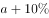。根据，且两个季度售价一样，则有，解得。

方法二：设上季度的利润为，则本季度的利润为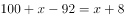。根据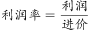，且利润提高了，则有，解得。则上季度利润率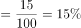。

故正确答案为D。

注：本题中“利润提高”只能理解为利润率提高10个百分点，否则无答案。

---

### 第 2 题　qid 2434232 · 数学运算

某单位有两个对口扶贫地，每月需安排10人到两地参与扶贫工作，要求每个对口扶贫地区至少要有4人参与工作。问共有多少种不相同的分配方案？（    ）

- **A**. 210
- **B**. 252
- **C**. 420
- **D**. 672　✅

**答案**：D

**官方解析**

假设两个扶贫地为甲、乙，根据题意，该单位10人在两地的人数情况可分为3类：

①甲地4人、乙地6人，共有种分配方法； 

②甲地5人、乙地5人，共有种分配方法；

③甲地6人，乙地4人，共有种分配方法。

则题干所求为。

故正确答案为D。

---

### 第 3 题　qid 2434236 · 数学运算

甲、乙两车分别以30公里/小时和40公里/小时的速度同时匀速从A地开往B地，丙车以50公里/小时的速度匀速从B地开往A地。A、B两地距离120公里。问丙车遇到乙车后多久会遇到甲车？（    ）

- **A**. 8分钟
- **B**. 10分钟　✅
- **C**. 12分钟
- **D**. 15分钟

**答案**：B

**官方解析**

根据题意，本题有两个相遇过程，在每个过程中两车从两端同时出发再相遇，则两车所走路程和为A、B两地的距离。根据，可得：丙车和乙车的相遇时间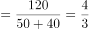小时，丙车与甲车的相遇时间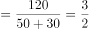小时。则题干所求为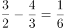小时分钟。

故正确答案为B。

---

### 第 4 题　qid 2434243 · 数学运算

某单位有四个部门共173人，其中销售部比办公室多25人；客服部比销售部少9人；技术部的人数是客服部的两倍。问客服部有多少人？（    ）

- **A**. 22
- **B**. 36　✅
- **C**. 44
- **D**. 51

**答案**：B

**官方解析**

根据题意，设客服部的人数为，则技术部的人数为、销售部为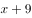、办公室为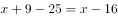。由于四个部门共173人，则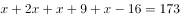，解得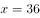，即客服部有36人。

故正确答案为B。

---

### 第 5 题　qid 2434246 · 数学运算

某健身馆准备将一块周长为100米的长方形区域划为瑜伽场地，将一块周长为160米的长方形区域划为游泳场馆。若瑜伽场地和游泳场馆均是满足周长条件下的最大面积。问两块场地面积之差为多少平方米？（    ）

- **A**. 625
- **B**. 845
- **C**. 975　✅
- **D**. 1150

**答案**：C

**官方解析**

设瑜伽场地的长为，则宽为，面积为，当时，面积最大，最大值为625平方米。同理，设游泳场馆的长为米,则宽为，面积为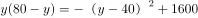，当时，面积最大，最大值为1600平方米。则题干所求为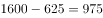平方米。

知识扩展：若长方形的周长一定，则当长和宽相等时，面积最大。

故正确答案为C。

---

### 第 6 题　qid 2434250 · 数学运算

某超市购入800斤桃子，第一天售价为进价的1.8倍，销售额为1620元；第二天售价为进价的1.5倍，销售额为900元；第三天售价为进价的1.2倍，第四天以进价的八折销售，两天销售额均为360元；第四天营业结束后发现还剩50斤未卖出。问该超市购买桃子花了多少钱？（    ）

- **A**. 2240元
- **B**. 2400元　✅
- **C**. 2800元
- **D**. 3040元

**答案**：B

**官方解析**

根据题意，设超市购买桃子的单价为元/斤。则第一天售价为元/斤；第二天为元/斤；第三天为元/斤；第四天为元/斤。根据桃子总质量为800斤，可列方程：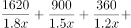，化简得：，解得，则该超市买桃子共花费元。

故正确答案为B。

---

### 第 7 题　qid 2434256 · 数学运算

某机关开展红色教育月活动，三个时间段分别安排了三场讲座。该机关共有139人，有42人报名参加第一场讲座，51人报名参加第二场讲座，88人报名参加第三场讲座，三场讲座都报名的有12人，只报名参加两场讲座的有30人。问没有报名参加其中任何一场讲座的有多少人？（    ）

- **A**. 12　✅
- **B**. 14
- **C**. 24
- **D**. 28

**答案**：A

**官方解析**

设没有报名参加任何一场讲座的有人。根据三集合容斥原理非标准公式：，将数据代入公式得：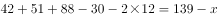，解得，即没有报名参加任何一场讲座的有12人。

故正确答案为A。

---

### 第 8 题　qid 2434260 · 数学运算

某文艺汇演的舞台为一个边长为10m的正六边形，节目“千手观音”中，演员需排成一列正对观众，为保证演出效果，两个演员之间要保持50cm的距离，问该舞台最多能站多少名“千手观音”的演员？（    ）

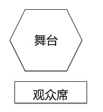

- **A**. 31
- **B**. 35　✅
- **C**. 39
- **D**. 41

**答案**：B

**官方解析**

做辅助线如下图所示，连接AC，过B点做BD垂直于AC，垂足为D。根据题意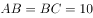，在直角三角形ABD中，，则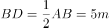，由勾股定理可知，，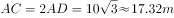（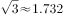），即舞台的列宽约为17.32m。由于演员要排成一列且间隔为，则一列最多可站演员数为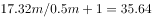，人数为整数，则取整数部分，即为35人。

故正确答案为B。

---

### 第 9 题　qid 2434262 · 数学运算

一批药品需要检测，若第一天由甲检测，第二天由乙检测，按此方式交替完成的天数为整数。若第一天由乙检测，第二天由甲检测，按此轮替，那么在按前者轮流方式完工的天数后，还有56个药品未检测。已知甲、乙工作效率之比为。问甲每天检测多少个药品？（    ）

- **A**. 72
- **B**. 99
- **C**. 112
- **D**. 126　✅

**答案**：D

**官方解析**

根据题干中甲乙效率之比，设甲每天检测药品个，则乙每天检测药品个。由于甲乙交替工作和乙甲交替工作在相同时间内完成的总工作量不同，则甲乙交替工作时所用总天数为奇数，故设甲乙交替工作完工时间为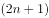天，则甲工作天，乙工作天，工作总量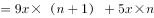。当按照乙甲交替时，乙工作天，甲工作天，工作总量，根据工作总量相等列方程：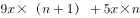，解得，则甲每天检测药品个。

故正确答案为D。

---

### 第 10 题　qid 2434265 · 数学运算

方阵训练时，教官让40名学生站成一行面向自己。教官喊出某个数字后，该数字倍数的同学要向后转。第一次教官喊了数字3，喊完第二次数字后，他发现面向自己的学生还有24名。教官第二次喊的数字是（    ）。

- **A**. 4
- **B**. 5
- **C**. 6
- **D**. 7　✅

**答案**：D

**官方解析**

根据题意，第一次喊3后，  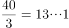，则向后转的同学数为13人，面向教官的学生数为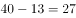人。代入选项：

A项：，  ，即有10人应该向后转，但其中的3人从后面转回来，另外7人向后转，相当于面向教官的人数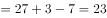人，错误；

B项：，  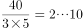，即有8人应该向后转，但其中的2人从后面转回来，另外6人向后转，相当于面向教官的人数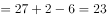人，错误；

C项：，即有6人应该向后转，但这6人都从后面转回来，相当于面向教官的人数人，错误；

D项：， ，即有5人应该向后转，但其中的1人从后面转回来，另外4人向后转，相当于面向教官的人数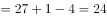人，正确。

故正确答案为D。

---

## 判断推理

### 第 1 题　qid 2434274 · 图形推理

从所给的四个选项中，选择最恰当的一个填入问号处，使之呈现一定的规律性（    ）。

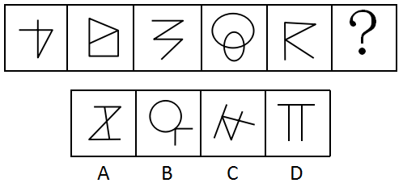

- **A**. A
- **B**. B　✅
- **C**. C
- **D**. D

**答案**：B

**官方解析**

图形元素组成不同，且无明显属性规律，优先考虑数量规律。观察发现第二个图形为“日”字的变形图，第四个图形为“圆相交”图，第一个和第三个图形为明显的一笔画图形，考虑图形的笔画数。题干图形均为一笔画图形，A项为两笔画图形，B项为一笔画图形，C项为两笔画图形，D项为三笔画图形。
故正确答案为B。

---

### 第 2 题　qid 2434278 · 图形推理

从所给的四个选项中，选择最恰当的一个填入问号处，使之呈现一定的规律性（    ）。

- **A**. A
- **B**. B
- **C**. C
- **D**. D　✅

**答案**：D

**官方解析**

元素组成不同，优先考虑属性规律。观察发现，题干图形均为轴对称图形，并且对称轴的数量依次为1、2、1、2、1，则问号处对称轴的数量应为2。A项对称轴数量为4；B项对称轴数量为1；C项对称轴数量为1；D项对称轴数量为2。
故正确答案为D。

---

### 第 3 题　qid 2434282 · 图形推理

从所给的四个选项中，选择最恰当的一个填入问号处，使之呈现一定的规律性（    ）。

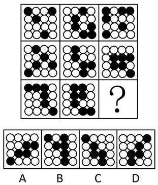

- **A**. A　✅
- **B**. B
- **C**. C
- **D**. D

**答案**：A

**官方解析**

元素组成不同，题干图形中出现黑白块，且黑块数量不同，优先考虑黑白运算。观察发现，题干图形黑白运算的公式为：，，，。九宫格每一横行中，图一与图二进行黑白运算后，逆时针旋转90度得到图三。只有A项符合。

故正确答案为A。

---

### 第 4 题　qid 2434290 · 图形推理

把下面的六个图形分为两类，使每类都有各自的共同特征或规律，分类正确的一项是（    ）。

- **A**. ①②③，④⑤⑥　✅
- **B**. ①③④，②⑤⑥
- **C**. ①②④，③⑤⑥
- **D**. ①④⑥，②③⑤

**答案**：A

**官方解析**

本题为分组分类题目。元素组成不同，无明显属性规律，考虑数量规律。观察发现，题干每个图形均有曲有直，分别数出直线数和曲线数发现，直线数依次为3、2、2、1、1、3，曲线数依次为2、1、1、2、2、4，分开看均无法分为两组，考虑二者做运算。图①②③为一组，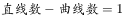，图④⑤⑥为一组，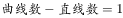，只有A项符合。

故正确答案为A。

---

### 第 5 题　qid 2434292 · 定义判断

生物资产是指有生命的动物和植物。而消耗性生物资产是指为了出售而已经持有的或将来收获为农产品的生物资产。
根据上述定义，下列属于消耗性生物资产的是（    ）。

- **A**. 防风固沙林
- **B**. 大棚里的蔬菜　✅
- **C**. 客厅鱼缸里的金鱼
- **D**. 超市里的牛肉

**答案**：B

**官方解析**

第一步：找出定义关键词。
生物资产：“有生命的动物和植物”；
消耗性生物资产：“为了出售”、“已经持有的或将来收获为农产品的生物资产”。
第二步：逐一分析选项。
A项：防风固沙林是为了防风和固沙，不符合“为了出售”，不符合定义，排除；
B项：大棚里的蔬菜，是有生命的植物，属于生物资产，同时也符合“为了出售而已经持有的或将来收获为农产品”，符合定义，当选；
C项：客厅鱼缸里的金鱼主要是为了观赏，不符合“为了出售”，不符合定义，排除；
D项：超市里的牛肉已经不具有生命，不符合“有生命的动物和植物”，不属于生物资产，也不属于消耗性生物资产，不符合定义，排除。
故正确答案为B。

---

### 第 6 题　qid 2434295 · 定义判断

能力动机是指争取在某些方面有所专长，使得个体能完成高质量工作的驱动力。具有能力动机的员工以发展和运用他们解决问题的能力为荣耀，在工作中面临困难时努力创新。
根据上述定义，下列员工的行为出于能力动机的是（    ）。

- **A**. 甲家庭困难，每个月都超额完成销售任务，获得较多销售提成
- **B**. 乙得到同事称赞后，工作很积极，每天都提前到办公室打水扫地
- **C**. 丙不服输，通过长期攻关解决了车间操作中的技术难题　✅
- **D**. 丁业务能力很强，但因待遇问题工作积极性不高，时常抱怨

**答案**：C

**官方解析**

第一步：找出定义关键词。
“在某些方面有所专长”、“使个体能完成高质量的工作的驱动力”。
第二步：逐一分析选项。
A项：甲超额完成任务的驱动力是家庭困难，并不是“在某些方面有所专长”，不符合定义，排除；
B项：乙工作积极，每天都提前到办公室打水扫地的驱动力是同事们的称赞，并不是“在某些方面有所专长”，不符合定义，排除；
C项：丙通过长期攻关解决了技术难题，符合“在某些方面有所专长”、“使个体能完成高质量的工作的驱动力”，符合定义，当选；
D项：丁业务能力很强，符合“在某些方面有所专长”，但工作积极性不好，时常抱怨，不符合“使个体能完成高质量的工作的驱动力”，不符合定义，排除。
故正确答案为C。

---

### 第 7 题　qid 2434299 · 定义判断

“一面提示”是传播学中的一类概念，指的是对某些存在对立因素的问题进行说服或宣传时，仅向说服的对象提示自己一方的观点或于己有利的判断材料，这种传播方式的优势在于能够对己方观点做集中阐述，论旨明快，简洁易懂，但同时可能会给人一种“咄咄逼人”的印象，使说服对象产生心理抵抗。根据上述定义，下列反映了“一面提示”现象的是（    ）。

- **A**. 小李将不同理财产品的风险和收益都告诉了王先生，并根据其财务情况推荐了几款合适的套餐
- **B**. 小王的导师觉得小王适合学术研究，建议其硕士毕业后继续读博，但若小王想先工作，也会尊重他的选择
- **C**. 小乔第一次登台演讲，为鼓励自己，他不断地告诉自己上台演讲并不难，自己准备得已经很好了，不用担心
- **D**. 小林在推销公司的外语课程时，列举了课程设置与师资配备的巨大优势，并将此与其他公司进行比较　✅

**答案**：D

**官方解析**

第一步：找出定义关键词。
“对某些存在对立因素的问题进行说服或宣传”、“仅向说服的对象提示自己一方的观点或于己有利的判断材料”、“能够对己方观点做集中阐述”、“可能会给人一种‘咄咄逼人’的印象，使说服对象产生心理抵抗”。
第二步：逐一分析选项。
A项：小李不仅将不同理财产品的收益告诉了王先生，也将风险告诉了王先生，不符合“仅向说服的对象提示自己一方的观点或于己有利的判断材料”，不符合定义，排除；
B项：小王的导师是觉得小王适合学术研究才建议其继续读博的，而且小王若想先工作，也会尊重其选择，不符合“仅向说服的对象提示自己一方的观点或于己有利的判断材料”，也不符合“可能会给人一种‘咄咄逼人’的印象，使说服对象产生心理抵抗”，不符合定义，排除；
C项：小乔自己鼓励自己，让自己不要担心演讲，不符合“对某些存在对立因素的问题进行说服或宣传”，不符合定义，排除；
D项：小林做推销时列举了自己公司的课程设置与师资配备的巨大优势，并在这方面与其他公司进行比较，证明小林只提到了自己公司的优势，符合“仅向说服的对象提示自己一方的观点或于己有利的判断材料”，符合定义，当选。
故正确答案为D。

---

### 第 8 题　qid 2434302 · 定义判断

二次售卖理论指的是媒介单位先将媒介产品卖给终端消费者（读者、听众、观众），然后，再将消费者的时间（或注意力）卖给广告商或广告主的过程。简言之，第一次售卖，媒介向受众提供信息，满足受众对信息的需求，消除受信者的随机不确定性，这里售卖的是信息，信息是商品。第二次售卖，将受众的注意力售卖给广告商，受众的注意力是商品。
根据上述定义，下列哪项没有反映二次售卖理论？（    ）

- **A**. 某儿童乐园不仅在全球开设游乐场，经营游乐项目，还售卖自己品牌下的各类衍生品　✅
- **B**. 电视购物播出，企业收到客户订单后会分析客户喜好，并间隔一段时间打电话回访，为客户推介同类产品
- **C**. 某报社先将报纸卖给读者，发行量增大后，再将针对读者的数据分析信息卖给广告商，广告商进行广告的特定投放
- **D**. 某电影上映后票房极佳，在了解观众群体后，其续集上映时植入了针对性的广告，使广告品牌获得了观众的关注

**答案**：A

**官方解析**

第一步：找出定义关键词。
“媒介单位”、“先将产品（信息）卖给终端消费者（读者、听众、观众）”、“再将消费者的时间（或注意力）卖给广告商或广告主”。
第二步：逐一分析选项。
A项：儿童乐园售卖的是游乐项目以及自己品牌的各类衍生品，并没有售卖“受众的注意力”，不符合“再将消费者的时间（或注意力）卖给广告商或广告主”，不符合定义，当选；
B项：电视购物播出，客户下订单，符合“先将产品(信息)卖给终端消费者（读者、听众、观众）”，收到订单后分析客户喜好，并为客户推介同类产品，即将客户的注意力再次卖给做同类产品的广告商，符合“再将消费者的时间（或注意力）卖给广告商或广告主”，符合定义，排除；
C项：报社先将报纸卖给读者，符合“先将产品（信息）卖给终端消费者（读者、听众、观众）”，再将针对读者的数据分析信息卖给广告商，符合“再将消费者的时间（或注意力）卖给广告商或广告主”，符合定义，排除；
D项：电影上映后票房极佳，说明观众看了电影，符合“先将产品（信息）卖给终端消费者（读者、听众、观众）”，了解观众群体后，在其续集上映时植入了针对性的广告，符合“再将消费者的时间（或注意力）卖给广告商或广告主”，符合定义，排除。
本题为选非题，故正确答案为A。

---

### 第 9 题　qid 2434303 · 定义判断

植物的器官可分为营养器官及生殖器官。营养器官通常指植物的根、茎、叶等器官，而生殖器官则为花、果实、种子等。植物的营养生殖是指由植物的营养器官产生出新个体的生殖方式。
根据上述定义，下列不属于营养生殖的是（    ）。

- **A**. 扦插红薯藤种植红薯
- **B**. 在海棠树上嫁接苹果枝
- **C**. 将落花生带壳种到地里　✅
- **D**. 将木兰树的枝条压到土里生根

**答案**：C

**官方解析**

第一步：找出定义关键词。
营养器官：“植物的根、茎、叶等器官”；
生殖器官：“花、果实、种子等”；
植物的营养生殖：“由植物的营养器官产生出新个体的生殖方式”。
第二步：逐一分析选项。
A项：红薯藤是红薯的茎，是植物的营养器官，扦插红薯藤种植红薯，符合“由植物的营养器官产生出新个体”，符合定义，排除；
B项：苹果枝是苹果树的茎，是植物的营养器官，在海棠树上嫁接苹果枝，符合“由植物的营养器官产生出新个体”，符合定义，排除；
C项：带壳的落花生是花生的果实，是植物的生殖器官，并不是植物的营养器官，不符合“由植物的营养器官产生出新个体”，不符合定义，当选；
D项：木兰树的枝条是茎，是植物的营养器官，将木兰树的枝条压到土里生根，符合“由植物的营养器官产生出新个体”，符合定义，排除。
本题为选非题，故正确答案为C。

---

### 第 10 题　qid 2434204 · 定义判断

抗原伪装是指寄生虫体表结合有宿主的抗原，或者被宿主的抗原包被，故而妨碍了宿主免疫系统对其的识别，其中宿主指的是为寄生生物包括寄生虫、病毒等提供生存环境的生物，抗原指的是能引起抗体生成、可诱发免疫反应的物质。
根据上述定义，下列反映了抗原伪装的是（    ）。

- **A**. 感染枯氏锥虫的小鼠血清中会产生抑制抗体反应的物质，因此小鼠很少出现免疫反应
- **B**. 血吸虫卵中的毛蚴分泌可溶性虫卵抗原，被人体免疫细胞吞噬后，形成虫卵肉芽肿
- **C**. A型流感病毒的表面抗原进入人体后会不断变异，从而有效躲避了免疫系统的识别
- **D**. 曼氏血吸虫肺期童虫表面结合了人体的血型抗原和主要组织相容性复合物抗原，因此这种童虫很难被发现　✅

**答案**：D

**官方解析**

第一步：找出定义关键词。
抗原伪装：“寄生虫体表结合有宿主的抗原，或者被宿主的抗原包被”、“妨碍了宿主免疫系统对其的识别”；
宿主：“为寄生生物包括寄生虫、病毒等提供生存环境的生物”；
抗原：“能引起抗体生成、可诱发免疫反应的物质”。
第二步：逐一分析选项。
A项：感染枯氏锥虫的小鼠血清中产生抑制抗体反应的物质，不符合“寄生虫体表结合有宿主的抗原，或者被宿主的抗原包被”，不符合定义，排除； 
B项：血吸虫卵中的毛蚴分泌抗原，被人体免疫细胞吞噬，不符合“寄生虫体表结合有宿主的抗原，或者被宿主的抗原包被”，不符合定义，排除；
C项：A型流感病毒的表面抗原进入人体不断变异，不符合“寄生虫体表结合有宿主的抗原，或者被宿主的抗原包被”，不符合定义，排除；
D项：曼氏血吸虫肺期童虫表面结合人体抗原，符合“寄生虫体表结合有宿主的抗原，或者被宿主的抗原包被”，童虫很难被发现，符合“妨碍了宿主免疫系统对其的识别”，符合定义，当选。
故正确答案为D。

---

### 第 11 题　qid 2434206 · 定义判断

虚假陈述是证券发行市场、交易市场（包括购并市场）及相关领域的有关主体或行为人所披露的与证券发行、交易及相关活动有关的信息存在重大性的虚假、误导、遗漏或不适当披露，致使投资者在不了解事实真相的情况下参与证券投资或交易活动。
根据上述定义，下列没有反映虚假陈述的是（    ）。

- **A**. 上市公司甲通过承诺“可全额退款”的营销方式，以“打新股”“理财”等不实名义进行营销，吸纳散户入股
- **B**. 上市公司乙在公司证券首次公开发行时，使用伪造的财务报表对外公开公司财务状况和经营情况
- **C**. 上市公司丙在上市公告书中将公司资产价值虚增1000万元，使公司股价在短短一年内涨幅高达13倍
- **D**. 上市公司丁在股票上市前，公司经营业绩出现较大幅度下滑，在和证监会书面说明后，暂缓上市　✅

**答案**：D

**官方解析**

第一步：找出定义关键词。
“证券发行市场、交易市场（包括购并市场）及相关领域的有关主体或行为人”、“所披露的与证券发行、交易及相关活动有关的信息存在重大性的虚假、误导、遗漏或不适当披露”、“致使投资者在不了解事实真相的情况下参与证券投资或交易活动”。
第二步：逐一分析选项。
A项：上市公司甲以“打新股”“理财”等不实名义进行营销，符合“所披露的与证券发行、交易及相关活动有关的信息存在重大性的虚假、误导、遗漏或不适当披露”，吸纳散户入股，符合“致使投资者在不了解事实真相的情况下参与证券投资或交易活动”，符合定义，排除； 
B项：上市公司乙使用伪造的财务报表对外公开公司财务状况和经营情况，符合“所披露的与证券发行、交易及相关活动有关的信息存在重大性的虚假、误导、遗漏或不适当披露”，符合定义，排除；
C项：上市公司丙在上市公告书中将公司资产价值虚增1000 万元，符合“所披露的与证券发行、交易及相关活动有关的信息存在重大性的虚假、误导、遗漏或不适当披露”，符合定义，排除；
D项：上市公司丁在股票上市前，经营业绩出现较大幅度下滑，在和证监会书面说明后，暂缓上市，公司并没有上市，发行证券，不存在“证券发行市场、交易市场（包括购并市场）及相关领域的有关主体或行为人”，不符合定义，当选。
故正确答案为D。

---

### 第 12 题　qid 2434208 · 定义判断

社群经济是指互联网时代，一群有共同兴趣、认知、价值观的用户抱成团，发生群蜂效应，在一起互动、交流、协作、感染，对产品品牌本身产生反哺的价值关系，这是一种建立在产品与粉丝群体之间的情感信任和价值反哺，共同作用形成的自运转、自循环的范围经济系统。
根据上述定义，下列不属于社群经济的是（    ）。

- **A**. 某艺术团定期举办粉丝节，吸引大批粉丝到场参加活动
- **B**. 某品牌手机拥有大批忠实消费者，他们把自己定义为热爱生活的“极客”
- **C**. 王某认为某品牌洗发水能有效治疗脱发，于是将其推荐给亲戚朋友　✅
- **D**. 张某开办线上绘画课程，并建立绘画群邀请会员加入交流绘画技巧

**答案**：C

**官方解析**

第一步：找出定义关键词。
“互联网时代”、“一群有共同兴趣、认知、价值观的用户”、“抱成团，发生群蜂效应，在一起互动、交流、协作、感染，对产品品牌本身产生反哺”。
第二步：逐一分析选项。
A项：某艺术团定期举办粉丝节，吸引大批粉丝到场参加活动，符合“一群有共同兴趣、认知、价值观的用户”、也符合“抱成团，发生群蜂效应，在一起互动、交流、协作、感染，对产品品牌本身产生反哺”，符合定义，排除； 
B项：某品牌手机拥有大批忠实消费者，把自己定义为热爱生活的“极客”，符合“一群有共同兴趣、认知、价值观的用户”、也符合“抱成团，发生群蜂效应，在一起互动、交流、协作、感染，对产品品牌本身产生反哺”，符合定义，排除；
C项：王某认为某品牌洗发水有效，只有王某一人，不符合“一群有共同兴趣、认知、价值观的用户”，不符合定义，当选；
D项：张某开办线上绘画课程，并建立绘画群邀请会员加入交流绘画技巧，符合“一群有共同兴趣、认知、价值观的用户”、也符合“抱成团，发生群蜂效应，在一起互动、交流、协作、感染，对产品品牌本身产生反哺”，符合定义，排除。
故正确答案为C。

---

### 第 13 题　qid 2434209 · 定义判断

非公允关联交易是指公司的关联方利用对公司的控制与影响，通过关联交易将公司的利益转移至关联方自己手中或将关联方的利益灌输至公司之中的交易行为，该行为违背了市场公平交易和诚实信用原则。
根据上述定义，下列没有反映非公允关联交易的是（    ）。

- **A**. 上市公司甲利用融资套现，募集资金后又通过内部交易将资金转移至有项目合作的乙公司
- **B**. 某上市公司控股股东通过向公司高价出售原材料等方式将公司资产转移至自己亲属开办的公司
- **C**. 甲、乙是联营企业，甲从事设备维修服务，乙的所有设备均由甲负责维修，乙每年支付设备维修费20万元　✅
- **D**. 甲、乙企业同属一个集团，甲是高税率企业，其通过交易将自身利润转移至低税率企业乙，确保集团整体税赋最低

**答案**：C

**官方解析**

第一步：找出定义关键词。
“公司的关联方利用对公司的控制与影响，通过关联交易将公司的利益转移至关联方自己手中或将关联方的利益灌输至公司之中的交易行为”、“该行为违背了市场公平交易和诚实信用原则”。
第二步：逐一分析选项。
A项：上市公司甲利用融资套现，募集资金后又通过内部交易将资金转移至有项目合作的乙公司，符合“公司的关联方利用对公司的控制与影响，通过关联交易将公司的利益转移至关联方自己手中或将关联方的利益灌输至公司之中的交易行为”，符合定义，排除； 
B项：某上市公司控股股东通过向公司高价出售原材料，将公司资产转移至自己亲属开办的公司，符合“公司的关联方利用对公司的控制与影响，通过关联交易将公司的利益转移至关联方自己手中或将关联方的利益灌输至公司之中的交易行为”，符合定义，排除；
C项：甲、乙是联营企业，甲维修乙的所有设备，乙每年支付设备维修费20万元，属于合理的公平交易，不符合“公司的关联方利用对公司的控制与影响，通过关联交易将公司的利益转移至关联方自己手中或将关联方的利益灌输至公司之中的交易行为”，也不符合“该行为违背了市场公平交易和诚实信用原则”，不符合定义，当选；
D项：甲、乙企业同属一个集团，甲通过交易将自身利润转移至低税率企业乙，符合“公司的关联方利用对公司的控制与影响，通过关联交易将公司的利益转移至关联方自己手中或将关联方的利益灌输至公司之中的交易行为”，也符合“该行为违背了市场公平交易和诚实信用原则”，符合定义，排除。
故正确答案为C。

---

### 第 14 题　qid 2434212 · 定义判断

物质通过进出细胞膜来实现物质交换的方式称为物质跨膜运输，其包括主动运输和被动运输。主动运输是物质在载体的协助下逆着膜两侧的浓度梯度扩散；被动运输是顺着膜两侧浓度梯度扩散，包括自由扩散和协助扩散两类，前者是指物质根据细胞膜两侧的浓度差以及扩散物质的性质、通过简单的扩散作用进入细胞，后者指物质借助载体来实现扩散。
根据上述定义，下列说法错误的是（    ）。

- **A**. 当体内红细胞血氧饱和度较低时，吸氧后，氧气会进入红细胞，这属于自由扩散
- **B**. 细胞内钾离子浓度低，在载体蛋白协助下，钾离子被转运出细胞外，这是主动运输
- **C**. 吃完饭后，人体血液中的葡萄糖显著升高，该葡萄糖通过运输蛋白进入小肠上皮细胞，这是主动运输　✅
- **D**. 氨基酸借助细胞膜上的膜蛋白，从高浓度一侧扩散进入低浓度的细胞内，这属于协助扩散

**答案**：C

**官方解析**

第一步：找出定义关键词。
主动运输：“物质在载体的协助下”、“逆着膜两侧的浓度梯度扩散”；
被动运输：“顺着膜两侧浓度梯度扩散”；
自由扩散：“物质根据细胞膜两侧的浓度差以及扩散物质的性质、通过简单的扩散作用进入细胞”；
协助扩散：“物质借助载体来实现扩散”。
第二步：逐一分析选项。
A项：氧气会进入血氧饱和度较低的红细胞，氧气由高浓度扩散到低浓度，符合“顺着膜两侧浓度梯度扩散”，且不需要载体，符合自由扩散定义，排除；
B项：钾离子由浓度低的细胞内被转运出细胞外，钾离子由低浓度扩散到高浓度，符合“逆着膜两侧的浓度梯度扩散”，且在载体蛋白协助下，符合“物质在载体的协助下”，符合主动运输定义，排除；
C项：吃饭后，葡萄糖浓度显著升高后进入小肠，是从高浓度到低浓度的运输，符合“顺着膜两侧浓度梯度扩散”，葡萄糖需要通过运输蛋白进入小肠上皮细胞，符合“物质借助载体来实现扩散”，符合被动运输的协助扩散定义，不是主动运输，当选；
D项：氨基酸从高浓度一侧扩散进入低浓度的细胞内，符合“顺着膜两侧浓度梯度扩散”，借助细胞膜上的膜蛋白符合“物质借助载体来实现扩散”，符合协助扩散，排除。
本题为选非题，故正确答案为C。

---

### 第 15 题　qid 2434213 · 类比推理

发酵：美酒

- **A**. 生锈：潮湿
- **B**. 山青：水秀
- **C**. 欠债：贫穷
- **D**. 提炼：汽油　✅

**答案**：D

**官方解析**

第一步：判断题干词语间逻辑关系。
通过发酵得到美酒，二者是工艺和成品的对应关系。
第二步：判断选项词语间逻辑关系。
A项：因为潮湿，所以生锈，二者是因果关系，与题干逻辑关系不一致，排除；
B项：山青和水秀是并列关系，与题干逻辑关系不一致，排除；
C项：因为欠债，所以贫穷，二者是因果关系，与题干逻辑关系不一致，排除；
D项：通过提炼得到汽油，二者是工艺和成品的对应关系，与题干逻辑关系一致，当选。
故正确答案为D。

---

### 第 16 题　qid 2434214 · 类比推理

实体经济：虚拟经济

- **A**. 电子货币：金属货币
- **B**. 知识产权：工业产权
- **C**. 企业管理：行政管理
- **D**. 自然资源：社会资源　✅

**答案**：D

**官方解析**

第一步：判断题干词语间逻辑关系。
虚拟经济是相对于实体经济而言的，二者是并列关系中的矛盾关系。
第二步：判断选项词语间逻辑关系。
A项：除电子货币、金属货币外，还有纸币等货币形式，二者是并列关系中的反对关系，与题干逻辑关系不一致，排除；
B项：知识产权包括工业产权和著作权，二者是包容关系中的种属关系，与题干逻辑关系不一致，排除；
C项：除企业管理、行政管理外，还有社会管理、情报管理等类别，二者是并列关系中的反对关系，与题干逻辑关系不一致，排除；
D项：资源分为自然资源和社会资源两大类，二者是并列关系中的矛盾关系，与题干逻辑关系一致，当选。
故正确答案为D。

---

### 第 17 题　qid 2434215 · 类比推理

危在旦夕：间不容发

- **A**. 江河日下：一日千里
- **B**. 冷嘲热讽：指桑骂槐
- **C**. 孤注一掷：铤而走险　✅
- **D**. 行云流水：妙笔生花

**答案**：C

**官方解析**

第一步：判断题干词语间逻辑关系。
危在旦夕指危险就在眼前，间不容发形容与灾难相距极近，情势极其危急，二者是近义关系。
第二步：判断选项词语间逻辑关系。
A项：江河日下比喻情况一天天地坏下去，一日千里比喻事物的进展快与科学技术的发展快，二者不是近义关系，与题干逻辑关系不一致，排除；
B项：冷嘲热讽是指用尖酸刻薄的语言进行讥笑及讽刺，指桑骂槐比喻明指此而暗骂彼，二者不是近义关系，与题干逻辑关系不一致，排除；
C项：孤注一掷比喻在危急时用尽所有力量作最后一次冒险，铤而走险是指无路可走时采取冒险行为，二者是近义关系，与题干逻辑关系一致，当选；
D项：行云流水形容文章自然不受约束，就像漂浮着的云和流动着的水一样，妙笔生花比喻笔法高超的人写出动人的文章，二者不是近义关系，与题干逻辑关系不一致，排除。
故正确答案为C。

---

### 第 18 题　qid 2434217 · 类比推理

镰刀：稻田

- **A**. 试管：医院
- **B**. 钢笔：办公大楼
- **C**. 导弹：军队
- **D**. 塔吊：建筑工地　✅

**答案**：D

**官方解析**

第一步：判断题干词语间逻辑关系。
镰刀是稻田里常见的一种收割工具，二者是常见工具和地点的对应关系。
第二步：判断选项词语间逻辑关系。
A项：试管是化学实验室常用的仪器，而非医院里常见的工具，与题干逻辑关系不一致，排除；
B项：在办公大楼里书写时不一定使用钢笔，也可能是签字笔等，二者不是常见工具和地点的对应关系，与题干逻辑关系不一致，排除；
C项：导弹是军队可能使用的一种武器，二者不是常见工具和地点的对应关系，与题干逻辑关系不一致，排除；
D项：塔吊是建筑工地上常用的一种起重设备，二者是常见工具和地点的对应关系，与题干逻辑关系一致，当选。
故正确答案为D。

---

### 第 19 题　qid 2434218 · 类比推理

常见病：糖尿病：慢性病

- **A**. 飞行器：火箭：滑翔机
- **B**. 地球：金星：银河系
- **C**. 科幻片：影视作品：历史剧
- **D**. 氧化物：二氧化硫：污染物　✅

**答案**：D

**官方解析**

第一步：判断题干词语间逻辑关系。
糖尿病是一种常见病，也是一种慢性病，第二个词和一、三两词均为包容关系中的种属关系。
第二步：判断选项词语间逻辑关系。
A项：火箭和滑翔机均为飞行器，但与题干词语的顺序不同，与题干逻辑关系不一致，排除；
B项：地球和金星均为银河系的组成部分，三者是包容关系中的组成关系，与题干逻辑关系不一致，排除；
C项：科幻片和历史剧均为影视作品，但与题干词语的顺序不同，与题干逻辑关系不一致，排除；
D项：二氧化硫是一种氧化物，也是一种污染物，第二个词和一、三两词均为包容关系中的种属关系，与题干逻辑关系一致，当选。
故正确答案为D。

---

### 第 20 题　qid 2434220 · 类比推理

芦荟：耐旱：胡杨树

- **A**. 钝化液：防锈：机油泵
- **B**. 抗生素：消炎：感冒药
- **C**. 保温壶：保暖：羽绒服　✅
- **D**. 北极光：放电：流星雨

**答案**：C

**官方解析**

第一步：判断题干词语间逻辑关系。
芦荟和胡杨树均是耐旱的植物，具有耐旱的属性，二者是并列关系，且与第二词都构成对应关系。
第二步：判断选项词语间逻辑关系。
A项：钝化液有防锈的功能，但机油泵是将机油提高到一定压力后，强制地压送到发动机各零件的运动表面上，与防锈无关，与题干逻辑关系不一致，排除；
B项：抗生素和感冒药是交叉关系，并非并列关系，与题干逻辑关系不一致，排除；
C项：保温壶和羽绒服为并列关系，且均有保暖的属性，与题干逻辑关系一致，当选；
D项：北极光的本质是放电过程，但流星雨是流星体与地球大气层相摩擦的结果，与题干逻辑关系不一致，排除。
故正确答案为C。

---

### 第 21 题　qid 2434222 · 类比推理

皮肤：器官：调节体温

- **A**. 税票：凭证：分配收入
- **B**. 酒店：场所：接待宾客　✅
- **C**. 引擎：汽车：提供动力
- **D**. 手术：医院：治疗疾病

**答案**：B

**官方解析**

第一步：判断题干词语间逻辑关系。
皮肤是一种器官，二者为种属关系，皮肤可以调节体温，二者是功能对应关系。
第二步：判断选项词语间逻辑关系。
A项：税票是一种凭证，但税票的功能不是分配收入（税收的功能才是分配收入），与题干逻辑关系不一致，排除；
B项：酒店是一种场所，二者是种属关系，酒店可以用来接待宾客，二者是功能对应关系，与题干逻辑关系一致，当选；
C项：引擎是汽车的组成部分，二者是组成关系，与题干逻辑关系不一致，排除；
D项：在医院做手术，二者是场所对应关系，与题干逻辑关系不一致，排除。
故正确答案为B。

---

### 第 22 题　qid 2434223 · 类比推理

龋齿：口腔：疾病

- **A**. 视觉：眼睛：感觉　✅
- **B**. 子弹：手枪：武器
- **C**. 温室效应：大气层：地球
- **D**. 光合作用：叶绿体：植物

**答案**：A

**官方解析**

第一步：判断题干词语间逻辑关系。
龋齿发生在口腔内，二者是对应关系，龋齿是一种疾病，二者是种属关系。
第二步：判断选项词语间逻辑关系。
A项：视觉发生在眼睛内，二者是对应关系，视觉是一种感觉，二者是种属关系，与题干逻辑关系一致，当选；
B项：子弹和手枪是配套的对应关系，手枪是一种武器，与题干逻辑关系不一致，排除；
C项：温室效应发生在大气层内，二者是对应关系，但温室效应不是地球的一种，二者不是种属关系，与题干逻辑关系不一致，排除；
D项：光合作用发生在叶绿体内，二者是对应关系，但光合作用不是植物的一种，二者不是种属关系，与题干逻辑关系不一致，排除。
故正确答案为A。

---

### 第 23 题　qid 2434224 · 类比推理

生产要素：土地：资本

- **A**. 自然现象：彩虹：沙漠
- **B**. 社会福利：社保：工资　✅
- **C**. 油料作物：花生：水稻
- **D**. 市场调查：产品：客户

**答案**：B

**官方解析**

第一步：判断题干词语间逻辑关系。
土地和资本都是生产要素的一种，是种属关系，土地和资本是并列关系。
第二步：判断选项词语间逻辑关系。
A项：彩虹是自然现象，沙漠是地貌，不是自然现象，与题干逻辑关系不一致，排除；
B项：社保是一种社会福利，二者是种属关系，工资里包含的一些补贴是国家政策下的补贴，也算是一种社会福利，二者是种属关系，并且社保与工资都属于工作中享受的待遇，并列关系，和题干逻辑关系一致，保留；
C项：花生是一种油料作物，二者是种属关系，但水稻是粮食作物，并非油料作物，与题干逻辑关系不一致，排除；
D项：产品和客户均为市场调查的对象，三者是对应关系，与题干逻辑关系不一致，排除。
故正确答案为B。

---

### 第 24 题　qid 2434227 · 类比推理

ABO血型 对于（    ）相当于（    ）对于 原子核

- **A**. 输血  中子
- **B**. 抗原  物质
- **C**. 化验  实验
- **D**. 红细胞  同位素　✅

**答案**：D

**官方解析**

逐一代入选项。
A项：输血前需要确认ABO血型，二者是对应关系，中子是原子核的组成部分，二者是组成关系，前后逻辑关系不一致，排除；
B项：ABO血型是根据红细胞表面有无特异性抗原（凝集原）A和B来划分的血液类型，二者是对应关系；原子核是物质的组成部分（物质由原子组成，原子核为原子的核心部分），二者是组成关系，前后逻辑关系不一致，排除；
C项：通过化验可以确认ABO血型，利用原子核可以进行实验，前后逻辑关系不一致，排除；
D项：通过化验红细胞可以确认ABO血型，通过分析原子核可以确认是否为同位素，同位素是原子核内具有相同质子数，不同中子数的原子。二者均为对应关系，前后逻辑关系一致，当选。
故正确答案为D。

---

### 第 25 题　qid 2434229 · 逻辑判断

日常生活中，很多人认为在使用完天然气时应首先关闭燃气，然后再关火。但一些专家指出，燃气灶虽然可以通过按钮调节火焰大小，但燃气管道上面的阀门是控制天然气的，如果没有关火就先关闭阀门，火苗就会钻进管道里面，容易引发安全事故。因此，正确使用天然气的方法应该先关火再关气。
以下哪项如果为真，最能支持专家的结论？（    ）

- **A**. 先关火后关气，燃气管道里有残余天然气，会造成浪费，还会挥发到空气中
- **B**. 只要燃气灶按钮的密封性没有损坏，其关闭后就不会出现燃气泄漏的危险　✅
- **C**. 减少天然气使用安全事故的发生，最好的办法就是尽量减少使用天然气
- **D**. 实践证明，使用天然气的安全事故主要是由通风不当造成的一氧化碳中毒

**答案**：B

**官方解析**

第一步：找出论点和论据。
论点：正确使用天然气的方法应该先关火再关气。
论据：燃气灶虽然可以通过按钮调节火焰大小，但燃气管道上面的阀门是控制天然气的，如果没有关火就先关闭阀门，火苗就会钻进管道里面，容易引发安全事故。
论点和论据话题一致，优先考虑补充论据的方式加强。
第二步：逐一分析选项。
A项：说明先关火再关气会造成浪费和空气污染，说明先关火再关气是不合适的，否定论点，无法加强，排除；
B项：说明只要燃气灶按钮的密封性没有损坏，关闭后就不会出现燃气泄漏的危险，即不用担心天然气的泄露问题，可以先关火后关气，补充论据，可以加强，当选；
C项：说明减少事故发生的最好办法是减少使用天然气，与论点讨论的正确使用天然气的方法无关，话题不一致，无法加强，排除； 
D项：说明造成天然气安全事故的原因主要是通风不当，与论点讨论的正确使用天然气的方法无关，话题不一致，无法加强，排除。
故正确答案为B。

---

### 第 26 题　qid 2434230 · 逻辑判断

埃博拉病毒仅存在于长臂猿的体内，这种病毒对长臂猿无害但对人类却是无药可医。虽然长臂猿不会咬人，但是埃博拉病毒可以通过蚊子传播，蚊子咬了长臂猿再去叮咬人类，人类就会被传染。因此，如果蚊子灭绝，人类就不会感染埃博拉病毒。
以下哪项如果为真，最能质疑上述结论？（    ）

- **A**. 叮咬长臂猿的蚊子和叮咬人类的蚊子不是同一品种
- **B**. 蚊子是繁殖能力和适应能力都非常强的动物，很难被灭绝
- **C**. 长臂猿只生活在赤道附近的热带雨林中，只有极少数的人能接触到
- **D**. 一些人会将长臂猿的皮毛加工成皮毛制品，这些加工后的皮毛制品也能传播该病毒　✅

**答案**：D

**官方解析**

第一步：找出论点和论据。
论点：如果蚊子灭绝，人类就不会感染埃博拉病毒。
论据：虽然长臂猿不会咬人，但是埃博拉病毒可以通过蚊子传播，蚊子咬了长臂猿再去叮咬人类，人类就会被传染。
论点和论据话题一致，优先考虑否定论点的方式削弱。
第二步：逐一分析选项。
A项：说明叮咬长臂猿的蚊子和叮咬人类的蚊子不是同一品种，也就是蚊子咬了长臂猿以后不会再去叮咬人类，削弱论据，保留；
B项：说明蚊子很难灭绝，但是论点讨论的是蚊子灭绝以后人类还会不会感染埃博拉病毒，话题不一致，无法削弱，排除；
C项：说明长臂猿只生活在热带雨林中，极少数的人能接触到，与论点讨论的蚊子灭绝后人类是否还会感染埃博拉病毒无关，话题不一致，无法削弱，排除；
D项：说明长臂猿的皮毛制品也能传染埃博拉病毒，即就算蚊子灭绝，人类还是有被传染埃博拉的可能性，否定论点，保留。
比较A、D两项，否论点的力度强于否定论据，故排除A项。
故正确答案为D。

---

### 第 27 题　qid 2434234 · 逻辑判断

距今3.5亿年前，地球进入了泥盆纪中晚期，古生物学家发现了许多那一时期的植物体化石，由于绝大多数化石只保存了植物体的一部分。因此，他们通常利用植物茎的直径来确定植物体高度。测定的结果表明：有大量的乔本植物其高度至少达到5米，因此他们推测当时可能出现了森林。
要得到上述结论，需要补充的重要前提是（    ）。

- **A**. 在一些特定的植物中，植物茎的直径与植物本身的高度存在相关性
- **B**. 只有高大乔木（高度超过4米）才具备构成森林的基本条件　✅
- **C**. 泥盆纪中晚期，大气中二氧化碳相对浓度的变化几乎呈直线下降
- **D**. 这些化石都是生长中的植物被原位保存下来的，能揭示出植物的分布特征

**答案**：B

**官方解析**

第一步：找出论点和论据。
论点：当时可能出现了森林。
论据：他们通常利用植物茎的直径来确定植物体高度。测定的结果表明：有大量的乔本植物其高度至少达到5米。
论据讨论的是乔木植物的高度，论点讨论的是森林，二者话题不一致，优先考虑搭桥的方式加强。
第二步：逐一分析选项。
A项：说明一些特定植物中植物茎的直径与植物高度存在关系，这些特定植物是不是乔木植物不确定，直径与高度的关系与森林也没有直接关联，不是论证成立的前提，排除；
B项：说明只有高度超过4米的乔木才能够成为森林，在论据和论点之间搭桥，是论证成立的前提，当选；
C项：说明大气中二氧化碳相对浓度的变化，与论点讨论的是否出现了森林无关，不是论证成立的前提，排除；
D项：说明这些化石能揭示出植物的分布特征，与论点讨论的是否出现了森林无关，不是论证成立的前提，排除。
故正确答案为B。

---

### 第 28 题　qid 2434237 · 逻辑判断

近年来，算法通常与大数据结合，通过打分、排序、评级的方式在用户、环境和推荐对象之间建立联系，进行自动化推荐。全球互联网平台纷纷开发智能推荐系统，大多数都是根据用户使用痕迹进行关联推荐。算法越智能，越能使用户被“安排”进所谓“信息茧房”，即陷入为其量身定制的信息之中。久而久之，用户处于信息“自我禁锢”困境，从而失去了解更大范围事物的机会。因此，有专家担忧地指出，算法应用容易导致人们视野日趋偏狭，思想日趋封闭、僵化甚至极化。
以下哪项如果为真，最能直接支持专家的观点？（    ）

- **A**. 电子商务中的商品推荐、社交网络中“你可能认识的好友”等都属于算法具体应用
- **B**. 算法的设计、数据使用等是开发者的主观选择，其主观偏见有可能被嵌入算法系统　✅
- **C**. 大数据背景下，算法技术门槛高，很多时候出现问题难以追责，造成伤害无从补偿
- **D**. 犯罪风险评估算法通过对居民个人数据资料分析，可以用来预测公民的“犯罪指数”

**答案**：B

**官方解析**

第一步：找出论点和论据。
论点：算法应用容易导致人们视野日趋偏狭，思想日趋封闭、僵化甚至极化。
论据：算法越智能，越能使用户被“安排”进所谓“信息茧房”，即陷入为其量身定制的信息之中。久而久之，用户处于信息“自我禁锢”困境，从而失去了解更大范围事物的机会。
论点和论据话题一致，优先考虑补充论据的方式加强。
第二步：逐一分析选项。
A项：选项说的是哪些属于算法具体应用，但没有涉及算法应用的危害，会不会让人们思想封闭，无法加强，排除；
B项：算法的设计等是开发者的主观选择，开发者的主观偏见可能被嵌入算法系统，在解释为什么算法应用容易导致人们思想封闭，补充论据加强，当选；
C项：说明算法技术出了问题难以追责，造成伤害无从补偿，与论点讨论的算法应用会让人们思想封闭无关，无法加强，排除；
D项：说明犯罪风险评估算法可以用来预测公民的“犯罪指数”，论点讨论的算法应用会让人们思想封闭无关，无法加强，排除。
故正确答案为B。

---

### 第 29 题　qid 2434239 · 逻辑判断

当我们在陌生的地方入睡时，往往会度过一个不安的夜晚，起床后也会感到昏沉乏力，这种现象被称为首夜效应。脑部扫描显示：在第一夜，受试者的一侧半脑会像平常一样安然入睡，但另一个半脑却保持较为活跃的状态，有时半球状态还会出现切换，因此研究人员认为：处在新环境时，我们的大脑会在第一个晚上开启监控模式，有一侧大脑半球保持警觉状态，因此人们常常感觉没有睡好。
以下哪项如果为真，最能削弱上述推论？（    ）

- **A**. 
在家中入睡时，人们的大脑也会出现一侧脑半球无活动、一侧脑半球较活跃的情况
　✅
- **B**. 
旅行时如果人们携带自己的枕头或者住宿环境与自己房间类似，就不会出现首夜现象

- **C**. 
深度睡眠时，人的大脑频率处于波，而外宿的首夜，波出现的时间并未明显减少

- **D**. 
两侧脑半球中左半脑更容易察觉声音，入睡后听到响动时，左半球就会出现脑电活动

**答案**：A

**官方解析**

第一步：找出论点和论据。
论点：处在新环境时，我们的大脑会在第一个晚上开启监控模式，有一侧大脑半球保持警觉状态，因此人们常常感觉没有睡好。
论据：脑部扫描显示：在第一夜，受试者的一侧半脑会像平常一样安然入睡，但另一个半脑却保持较为活跃的状态，有时半球状态还会出现切换。
论点和论据话题一致，优先考虑否定论点的方式削弱。
第二步：逐一分析选项。
A项：说明在家入睡时，人们的大脑也会出现一侧脑半球无活动、一侧脑半球较活跃的情况，即人们没有睡好不是因为处在新环境中大脑的这个变化，否定论点，当选；
B项：说明如果人们携带自己的枕头或者住宿环境与自己房间类似，就不会出现首夜现象，体现出的确因为处在新环境导致的睡不好，加强选项，无法削弱，排除；
C项：说明深度睡眠时和外宿的首夜，人的大脑频率波出现的时间并未明显减少，与论点讨论的导致了人们感觉没有睡好的原因无关，无法削弱，排除；
D项：说明两侧脑半球中左半脑更容易察觉声音，但没有说明是否会影响人们的睡眠质量，属于不明确选项，无法削弱，排除。
故正确答案为A。

---

### 第 30 题　qid 2434244 · 逻辑判断

用植物油（主要成分：不饱和脂肪酸）代替动物油（饱和脂肪酸）可以改善心脏健康的说法可追溯到20世纪60年代——那时的研究发现，这种饮食转换可以降低血液胆固醇水平，因此可以降低心脏病发病率，有研究者曾经在文章中建议：如果人们采用植物油烹制的饮食可能更有利于心脏的健康。
以下哪项如果为真，最能削弱上述结论？（    ）

- **A**. 
在长期食用植物油的人群中，男性患心脏病的风险比女性低左右

- **B**. 
植物油包含很多种类，不是每个种类都能明显降低冠心病发生的风险

- **C**. 
血清中低密度胆固醇高，高密度胆固醇低时，心血管疾病发生的几率才会增加
　✅
- **D**. 
配合健康的饮食习惯，基于饱和脂肪酸的饮食也可有效降低心脏病的死亡风险 

**答案**：C

**官方解析**

第一步：找出论点和论据。

论点：如果人们采用植物油烹制的饮食可能更有利于心脏的健康。

论据：用植物油代替动物油可以降低血液胆固醇水平，因此可以降低心脏病发病率。

本题的论点与论据都在说明植物油（不饱和脂肪酸）与心脏健康之间的关系，话题一致，要想削弱首先考虑否定论点，即植物油烹制的饮食不会更有利于心脏的健康。

第二步：逐一分析选项。

A项：说明男性患心脏病的风险比女性低左右，但论点讨论的是植物油是否更有利于心脏健康，与男女无关，话题不一致，无法削弱，排除；

B项：说明植物油种类繁多，有的种类的植物油不能降低冠心病，但无法证明所有植物油都不能降低冠心病，不能削弱，排除；

C项：说明胆固醇分为高、低两种，且低密度胆固醇高、高密度胆固醇低时，才能增加心血管疾病发生几率，即心血管疾病受两种不同胆固醇水平的影响，因此单纯降低血液中的胆固醇水平，无法降低心脏病发病率，可以削弱，当选；

D项：基于饱和脂肪酸的饮食可降低心脏病的死亡风险，但没有提及不饱和脂肪酸（植物油），话题不一致，无法削弱，排除。

故正确答案为C。

---

### 第 31 题　qid 2434245 · 逻辑判断

在空调病日益频发的今天，不少人开始重新关注电风扇。由于风扇吹来的微风让人感到轻松自如，虽然不能冷却空气，但这种微风能促进皮肤热量对流和汗液蒸发，让身体保持凉爽。因此，在许多研究中，人们都认为风扇在炎炎夏日中能起到降温效果，对人体有益无害。
以下哪项如果为真，能够质疑上述观点？（    ）

- **A**. 在不同的研究中，人们对风扇降温作用的认识并不一致
- **B**. 人们进行剧烈运动后，相比空调冷气对机体的刺激，通过风扇进行降温更有益处
- **C**. 如果温度极高，风扇向身体各部位吹热风会促进对流热量的增加，更容易导致中暑　✅
- **D**. 天气潮热时，风扇的降温效果就会显著降低，尽管空气仍在流动，但它已经充满了水分，使得汗水更难蒸发

**答案**：C

**官方解析**

第一步：找出论点和论据。
论点：在许多研究中，人们都认为风扇在炎炎夏日中能起到降温作用，对身体有益无害。
论据：风扇吹来的微风让人感到轻松自如，虽然不能冷却空气，但这种微风能促进皮肤热量对流和汗液蒸发，让身体保持凉爽。
本题的论点与论据都在说风扇可以起到降温作用，对人体有好处，话题一致，要想削弱首先考虑否定论点，即风扇在炎炎夏日中不能起到降温作用，或对身体有害。
第二步：逐一分析选项。
A项：论点说风扇可以起到降温的效果，即可以降低温度，而选项说对降温作用的认识不一致，认识与效果话题不一致，无法削弱，排除；
B项：剧烈运动后通过风扇降温比空调降温更有益处，说明风扇确实可以降温，有加强作用，无法削弱，排除；
C项：如果温度极高，风扇向身体各部位吹热风会促进对流热量的增加，会导致中暑，说明吹风扇对人体有害，削弱论点，保留；
D项：天气潮热时风扇降温效果降低，使汗水更难蒸发，而论据说风扇的微风可以促进汗液蒸发，削弱论据，保留。
对比C、D两项，C项削弱论点，D项削弱论据，削弱论点力度大于削弱论据。
故正确答案为C。

---

### 第 32 题　qid 2434248 · 逻辑判断

研究者对欧洲地理位置临近的4处巨石遗址进行挖掘，发现24名被埋葬者的所处年代都可以追溯到公元前4500年至公元前3000年之间。其中9名男性中（他们跨越了12代人），至少有6人拥有相同的基因变异。这表明他们来自同一个父系祖先，都是近亲。这些研究者由此推论：在这些墓地遗址中埋葬的人，当时可能处在一个父系社会中。
要得到上述结论，需要补充的重要前提是（    ）。

- **A**. 从墓葬品来看，当时的生产力水平有较大提高，生产工具进步很大
- **B**. 整个人类历史上，父系制始终是主流和常态，母系制只是特殊条件下的例外
- **C**. 在这4处遗址外，其他临近的遗址中，被埋葬者之间也有明显的亲缘关系
- **D**. 这些男性被埋葬在这些具有纪念意义的遗址里可能是拥有较高社会地位的标志　✅

**答案**：D

**官方解析**

第一步：找出论点和论据。
论点：在这些墓地遗址中埋葬的人，当时可能处在一个父系社会中。
论据：欧洲地理位置临近的4处巨石遗址中发现被埋葬的人来自同一个父系祖先，都是近亲。
本题论据说4处巨石遗址中发现被埋葬的人来自同一个父系祖先，论点说被埋葬的人，当时可能处在一个父系社会中，由父系祖先相同，推出当时是父系社会，话题不一致，要想加强首先考虑搭桥，即父系祖先相同就代表是父系社会；再者，由4处巨石遗址推出父系社会，话题也不一致，要想加强首先考虑搭桥，即这4处巨石遗址的发现可以代表当时是父系社会。
第二步：逐一分析选项。
A项：当时的生产力水平有较大提高，生产工具进步很大这与论点所讨论的当时是否为父系社会无关，无法加强，排除；
B项：只能说明在整个人类历史上父系社会是主流，多数时候都是父系社会，但这些被埋葬的人当时所处时代是否为父系社会不知道，无法加强，排除；
C项：其他临近的遗址中也有明显的亲缘关系，这与论点所讨论的4处巨石遗址无关，主体不一致，排除；
D项：说明这些男性被埋葬的4处巨石遗址有纪念意义，而这些遗址是拥有较高社会地位的标志，在4处巨石遗址与这些男性有较高社会地位（父系社会）之间建立联系，可以加强，当选。
故正确答案为D。

---

### 第 33 题　qid 2434252 · 逻辑判断

水星两极地区有一些陨石坑，研究发现这些坑内堆积的主要物质是水冰（由水或融水在低温下固结而成的冰），这些水冰能在陨石坑中持续存在，是因为它们被遮挡，避免了被阳光分解。而月球和水星拥有类似的环境，月球也有大量类似水星的阴影陨石坑。因此，研究人员推测月球相似的区域也有水冰存在的可能性。
以下哪项如果为真，不能支持上述推测？（    ）

- **A**. 
探测器在月球表面光谱中发现了水元素的谱线，说明月球表面存在水分子

- **B**. 
月球极地气温低至，永远不会被阳光照射，这种环境利于水冰长期保存

- **C**. 
从阴影陨石坑的直径和深度来看，月球上有一些与水星类似，另一些则不太相似
　✅
- **D**. 
月球不断吸收来自太阳的带电粒子，其与月球大气的氧原子发生反应，极可能产生水

**答案**：C

**官方解析**

第一步：找出论点和论据。

论点：月球相似的区域也有水冰存在的可能性。

论据：水星两极地区有一些陨石坑，坑内堆积的主要物质是水冰，且水冰在陨石坑中持续存在，而月球也有大量类似水星的阴影陨石坑。

第二步：逐一分析选项。

A项：探测器在月球表面发现了水元素的谱线，说明月球表面存在水分子，而有水分子，当其冷却凝固后就可能存在水冰，可以加强，排除；

B项：月球极地气温低至，有利于水冰长期保存，说明月球有水冰存在的可能，可以加强，排除；

C项：说明从陨石坑的直径和深度来看，月球有一些与水星相似，另一些不相似，但并没有提到水冰，到底月球中是否存在水冰不知道，不能加强，当选；

D项：月球吸收了太阳的带电粒子，与月球大气的氧原子发生反应，可能产生水，有了水就可能存在水冰，可以加强，排除。

本题为选非题，故正确答案为C。

---

### 第 34 题　qid 2434254 · 逻辑判断

全球范围内的森林是一个巨大的碳汇，它们通过光合作用和林木生产所吸收的碳多于其通过呼吸和腐烂所释放的碳。与此同时，在森林环境中，树木生长相对较快，蒸发掉大量会形成云的水分，从而使气候冷却。这就意味着森林具有降温作用，还吸收了更多的导致全球变暖的二氧化碳，所以说森林是显而易见的气候“冷却器”。
以下哪项如果为真，没有质疑上述观点？（    ）

- **A**. 近十几年，一些地区不断增加林木植被，扩大森林覆盖率，但当地气候变暖并未改善
- **B**. 高纬度的北方森林会产生萜烯，萜烯形成气溶胶后会阻挡阳光、形成云粒　✅
- **C**. 在山区或干燥地区，森林会降低地球的表面反射率，让地球反射回太空的入射光减少
- **D**. 树木释放的有机化合物中，包含一种名为异戊二烯的化合物，它能够与空气中的氮氧化物发生反应，形成强大的升温作用

**答案**：B

**官方解析**

第一步：找出论点和论据。
论点：森林是显而易见的气候“冷却器”。
论据：森林可以蒸发掉大量会形成云的水分，从而使气候冷却，同时还吸收了更多的导致全球变暖的二氧化碳。
本题论点与论据都在说森林可以使气候冷却，可以降温，话题一致，首先考虑削弱论点。
第二步：逐一分析选项。
A项：一些地区扩大了森林覆盖率，但气候变暖并未改善，说明森林没有降温的作用，可以削弱，排除；
B项：高纬度的北方森林会产生萜烯，萜烯形成气溶胶后会阻挡阳光，而阳光进不来，所以能够起到冷却的作用，可以加强，不能削弱，当选；
C项：在山区或干燥地区森林使地球反射回太空的入射光减少，反射回太空的光减少，说明留在地球的入射光增加，则会使地球升温，可以削弱，排除；
D项：树木释放的有机化合物会与空气中的氮氧化物发生反应，有升温作用，说明森林可以升温，可以削弱，排除。
本题为选非题，故正确答案为B。

---

## 资料分析

### 材料 1

根据以下资料，回答96～100题。

        截至2018年底，全国注册登记的提供住宿的各类民政服务机构共计3.1万个，其中注册登记为事业单位的1.6万个，同比减少；注册登记为民办非企业单位的1.5万个，同比增加。机构内床位408.1万张，同比减少；年末收留抚养人员211.9万人，同比减少。

       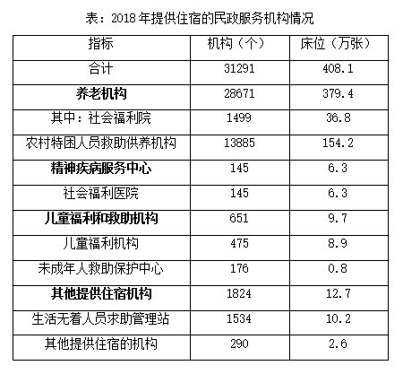

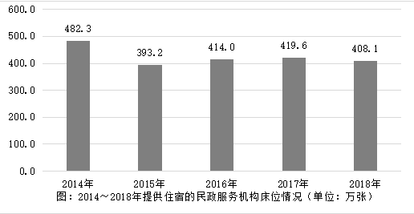

#### 第 1 题　qid 2434309 · 综合

2017年，全国注册登记的提供住宿的各类民政服务机构共计约多少万个？（    ）

- **A**. 2.9
- **B**. 3.1　✅
- **C**. 3.3
- **D**. 3.5

**答案**：B

**官方解析**

根据题干“2017年，全国注册登记······共计约多少万个”，结合材料可得“全国注册登记的提供住宿的各类民政服务机构=注册登记为事业单位的+注册登记为民办非企业单位的”，同时时间为2018年，可判定本题为基期和差问题。

方法一：定位文字材料“截至2018年底，全国注册登记的提供住宿的各类民政服务机构共计3.1万个，其中注册登记为事业单位的1.6万个，同比减少；注册登记为民办非企业单位的1.5万个，同比增加”，则2017年全国注册登记的提供住宿的各类民政服务机构万个。

方法二：根据“增长量”可得，2018年注册登记为事业单位的减少量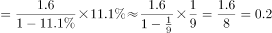万个；注册登记为民办非企业单位的增长量万个。则2018年全国注册登记的提供住宿的各类民政服务机构增长量，即数量与上年持平，B项满足。

故正确答案为B。

---

#### 第 2 题　qid 2434310 · 综合

2017年，全国注册登记的提供住宿的各类民政服务机构收留抚养人员约为多少万人？（    ）

- **A**. 197.3
- **B**. 208.6
- **C**. 228.8　✅
- **D**. 235.7

**答案**：C

**官方解析**

根据题干“2017年，全国······收留抚养人员约为多少万人”，结合材料时间为2018年，可判定本题为基期计算问题。定位文字材料“（2018年）年末收留抚养人员211.9万人，同比减少”，则2017年收留抚养人员总数，与C项接近。

故正确答案为C。

---

#### 第 3 题　qid 2434311 · 增长

提供住宿的民政服务机构的床位数量，2015～2018年4年年增长率的平均值约为（    ）。

- **A**. 
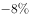

- **B**. 

　✅
- **C**. 

- **D**. 

**答案**：B

**官方解析**

根据题干“2015～2018年4年年增长率的平均值······”，可判定本题为一般增长率问题。定位柱状图可得，2014年-2018年提供住宿的民政服务机构床位数依次为482.3万张、393.2万张、414.0万张、419.6万张、408.1万张。代入公式：，

则2015～2018年4年的增长率依次是：2015年：；2016年：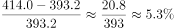；2017年：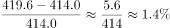；2018年：。则4年年增长率的平均值。

近似为B项。

故正确答案为B。

---

#### 第 4 题　qid 2434317 · 综合

下列哪个饼图能反映2018年提供住宿的民政服务机构的构成情况？（    ）

- **A**. 

　✅
- **B**. 

- **C**. 

- **D**. 

**答案**：A

**官方解析**

根据题干“2018年······民政服务机构的构成情况”，即民政服务机构各部分的占比情况，可判定本题为现期比重问题。定位表格，提供住宿的民政服务机构由养老机构、精神疾病服务机构、儿童福利和救助机构、其他提供住宿机构四个部分构成，其数据之比为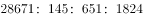。可知第一个数据最大，在总量一定的情况下，占比也最大，排除B选项；第二个数据最小，则占比也最小，排除C、D选项。

故正确答案为A。

---

#### 第 5 题　qid 2434318 · 综合

根据上述资料可以推出的是（    ）。

- **A**. 
2018年提供住宿的养老机构中，平均每个机构的床位数约为132张
　✅
- **B**. 
2018年提供住宿的民政服务机构构成中，机构数量最少的床位数量也最少

- **C**. 
2014～2018年中，提供住宿的民政服务机构床位数量同比增长最快的是2017年

- **D**. 
2018年，儿童福利和救助机构的床位数占提供住宿的民政服务机构床位总数的以上

**答案**：A

**官方解析**

A项：定位表格材料可得，2018年提供住宿的养老机构中，平均每个机构的床位数，正确；

B项：定位表格，2018年提供住宿的民政服务机构的构成中，机构数最少的是社会福利医院，床位数最少的是未成年人救助保护中心，错误；

C项：定位柱状图，提供住宿的民政服务机构床位数2017年增长率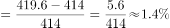，2016年增长率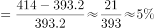，2017年并非最快，错误；

D项：2018年，儿童福利和救助机构的床位数为9.7万张，提供住宿的民政服务机构床位总数为408.1万张，故前者所占比重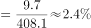，错误。

故正确答案为A。

---

### 材料 2

        2018年，A省公共财政预算收入1180.07亿元，比上年增长。其中，一般公共预算收入103.82亿元，比上年下降。全年A省实际完成地方税收收入104亿元，中央财政返还68.60亿元，增长。A省一般公共预算支出从2012年的603.2亿元增加到2018年的958.41亿元，2018年同比增长。

        2018年末，A省辖区各项存款余额3051.06亿元，同比增长。其中，个人存款1491.89亿元，增长；单位存款1531.38亿元，下降；代理财政性存款25.38亿元，增长17.9倍。A省辖区各项贷款余额2574.10亿元，同比增长。其中，个人贷款311.99亿元，下降；单位贷款2202.74亿元，增长；含票据融资59.38亿元，增长。

        2018年，农行A省分行年末各项本外币存款余额1300.85亿元，同比增长，比上年同期下降7个百分点。其中，个人存款645.62亿元，增长；单位存款653.96亿元，下降；同业存款1.26亿元，下降。年末各项贷款余额662.92亿元，同比增长，比上年同期下降19个百分点。其中，个人贷款103.52亿元，增长；单位贷款484.65亿元，下降；贸易融资57.59亿元，增长；贴现及转贴现净值17.16亿元，增长155.0倍。

#### 第 6 题　qid 2434312 · 综合

2017年，A省一般公共预算收入约占A省公共财政预算收入的（    ）。

- **A**. 

- **B**. 

- **C**. 

　✅
- **D**. 

**答案**：C

**官方解析**

由题干“2017年······约占······”，结合材料时间为2018年，可判定此题为基期比重计算问题。定位文字材料第一段“2018年，A省公共财政预算收入1180.07亿元，比上年增长。其中一般公共预算收入103.82亿元，比上年下降”。根据基期比重公式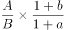，代入数据可得，与C项最接近。

故正确答案为C。

---

#### 第 7 题　qid 2434313 · 增长

2018年，下列A省的4个金融指标中，同比增量最多的是（    ）。

- **A**. 个人存款　✅
- **B**. 代理财政性存款
- **C**. 单位贷款
- **D**. 含票据融资

**答案**：A

**官方解析**

由题干“2018年······同比增量最多的是”，可判定此题为增长量比较问题。定位文字材料第二段“2018年末，A省辖区个人存款1491.89亿元，增长；代理财政性存款25.38亿元，增长17.9倍；单位贷款2202.74亿元，增长；含票据融资59.38亿元，增长”。根据增长量计算公式，代入数据可得：

A项：个人存款增量亿元

B项：代理财政性存款增量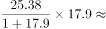亿元；

C项：单位贷款增量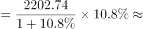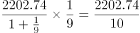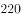亿

D项：含票据融资增量亿元；

增量最大的为A项，故正确答案为A。

---

#### 第 8 题　qid 2434314 · 综合

2017年末，A省辖区各项存贷款余额之差约在哪个范围内？（    ）

- **A**. 440～480亿元
- **B**. 480～520亿元
- **C**. 520～560亿元
- **D**. 560～600亿元　✅

**答案**：D

**官方解析**

由题干“2017年······存贷款之差”，结合材料时间为2018年，可判定此题为基期和差问题。定位文字材料第二段“2018年末，A省辖区各项存款余额3051.06亿元，同比增长，各项贷款余额2574.10亿元，同比增长”。根据基期量公式“”，代入数据可得亿元，在D项范围内。

故正确答案为D。

---

#### 第 9 题　qid 2434315 · 综合

2017年，农行A省单位贷款额是个人贷款额的（    ）。

- **A**. 3～4倍
- **B**. 4～5倍
- **C**. 5～6倍　✅
- **D**. 6～7倍

**答案**：C

**官方解析**

由题干“2017年······是······多少倍”，结合材料时间为2018年，可判定此题为基期倍数计算问题。定位文字材料第三段“2018年，农行A省个人贷款103.52亿元，增长；单位贷款484.65亿元，下降”。根据基期倍数公式，代入数据可得倍，在C项范围内。

故正确答案为C。

---

#### 第 10 题　qid 2434316 · 综合

下列哪个指标不能从上述资料中推出？（    ）

- **A**. 2012年到2018年A省一般公共预算支出的平均增长率
- **B**. 2017年农行A省分行年末各项本外币存款余额的同比增长量
- **C**. 2016年农行A省分行年末各项贷款余额占A省辖区各项贷款余额的比重　✅
- **D**. 2017年A省个人贷款额和农行A省分行个人贷款额的比值

**答案**：C

**官方解析**

A项：定位材料第一段“A省一般公共预算支出从2012年的603.2亿元增加到2018年的958.41亿元”，结合年均增长率公式：，由于现期2018年数据、基期2012年数据以及年份差均已知，故年均增长率可以推出（此处平均增长率即为年均增长率）；

B项：定位材料第三段“2018年，农行A省分行年末各项本外币存款余额1300.85亿元，同比增长，比上年同期下降7个百分点”， 则2017年农行A省分行年末各项本外币存款余额=亿元，又可得2017年农行A省分行年末各项本外币存款余额同比增速，因此其2017年的现期量和同比增速均已知，故其同比增长量可以推出；

C项：定位材料第二段“2018年A省辖区各项贷款余额2574.10亿元，同比增长”，仅能得到2017年A省辖区各项贷款余额的量，缺少同比增速或同比增长量，无法得到其2016年的值，因此2016年的占比无法推出；

D项：定位材料第二三段“2018年末，A省个人贷款311.99亿元，下降；农行A省分行个人贷款103.52亿元，增长”，即2018年两者的现期量和同比增长率均已知，故2017年的比值可以推出。

本题为选非题，故正确答案为C。

---

### 材料 3

        截至2018年底，全国共有社会组织81.7万个，比上年增长，其中社会团体36.6万个，民办非企业单位44.4万个，基金会7034个；吸纳社会各类人员就业980.4万人，比上年增长。

#### 第 11 题　qid 2434304 · 平均数

2018年，每个社会组织平均吸纳社会各类人员就业的数量约为多少人？（    ）

- **A**. 10
- **B**. 11
- **C**. 12　✅
- **D**. 13

**答案**：C

**官方解析**

根据题干“2018年，每个······平均······多少人”，可判定本题为现期平均数问题。定位文字材料“截止2018年底，全国共有社会组织81.7万个······吸纳社会各类人员就业980.4万人······”，则每个社会组织平均吸纳社会各类就业人数个。

故正确答案为C。

---

#### 第 12 题　qid 2434305 · 增长

若按2014～2018年社会团体数量的年均增长速度持续增长，2019年的社会团体数量约为（    ）万个。

- **A**. 36.8
- **B**. 37.9
- **C**. 38.1　✅
- **D**. 40.2

**答案**：C

**官方解析**

根据题干“若按······年均增长速度持续增长······2019年的······数量”，可判定本题为现期计算问题。定位图1，2014社会团体数量为31.0万个，2018年为36.6万个。根据年均增长率计算公式：，则。根据，则2019年社会团体数量万个。

故正确答案为C。

---

#### 第 13 题　qid 2434306 · 增长

能反映2015～2018年民办非企业单位数量增长率的折线图是（    ）。

- **A**. 

- **B**. 

　✅
- **C**. 

- **D**. 

**答案**：B

**官方解析**

根据题干“2015～2018年······增长率”，可判定本题为一般增长率问题。定位图1，民办非企业单位数2015～2018年增长率分别为：2015年增长率；2016年增长率；2017年增长率；2018年增长率。可见大小关系为，结合选项最接近的为B项。

故正确答案为B。

---

#### 第 14 题　qid 2434307 · 综合

2015～2017年，不具有公开募捐资格的基金会和具有公开募捐资格的基金会，数量差值排序从高到低依次是（    ）。

- **A**. 

　✅
- **B**. 

- **C**. 

- **D**. 

**答案**：A

**官方解析**

定位图2， 2015差值个，2016差值个，2017差值个，显然。

故正确答案为A。

---

#### 第 15 题　qid 2434308 · 综合

根据上述资料可以推出的是（    ）。

- **A**. 
2018年，基金会数量约占全国社会组织总数的

- **B**. 
2017年，民办非企业单位数量增量高于社会团体增量
　✅
- **C**. 
2015～2018年，基金会增长率最低的年份，社会团体的增长率也最低

- **D**. 
2014～2018年，不具有公开募捐资格的基金会数量占基金会总量的比重逐年增加

**答案**：B

**官方解析**

A项：定位文字材料“截止2018年底，全国共有社会组织81.7万个······基金会7034个”，则基金会数量约占全国社会组织总数的比重，错误；

B项：定位图1，2017年民办非企业单位数量增量万个，2017年社会团体增量万个，故，正确；

C项：定位图2，基金会数量，则2014～2018年基金会数量分别为：2014年个，2015年个，2016年个，2017年个，2018年个。则2015～2018年基金会增长率分别为：2015年；2016年；2017年；2018年，增长率最低的年份为2018年。定位图1，2018年社会团体的增长率，但2016年社会团体的增长率，显然基金会增长率最低的2018年，社会团体的增长率并非最低，错误；

D项：定位图2，结合C项的计算结果，2017年、2018年不具有公开募捐资格的基金会数量占基金会总量的比重分别为，，可见比重并非逐年增加，错误。

故正确答案为B。

---

### 材料 4

根据以下资料，回答111～115题。

#### 第 16 题　qid 2434289 · 综合

2009～2018年，高中在校生人数超过2400万的年份有（    ）个。

- **A**. 5
- **B**. 6　✅
- **C**. 7
- **D**. 8

**答案**：B

**官方解析**

定位表格材料第二、三列可得：

2009年高中在校生人数万人；

2010年高中在校生人数万人；

2011年高中在校生人数万人；

2012年高中在校生人数万人；

2013年高中在校生人数万人；

2014年高中在校生人数万人；

2015年高中在校生人数万人；

2016年高中在校生人数万人；

2017年高中在校生人数万人；

2018年高中在校生人数万人。

据此，高中在校生人数超过2400万的年份为2009年——2014年，共6年。

故正确答案为B。

---

#### 第 17 题　qid 2434291 · 综合

2018年，高中阶段在校生总人数约为（    ）万人。

- **A**. 3764
- **B**. 3811
- **C**. 3935　✅
- **D**. 4062

**答案**：C

**官方解析**

定位表格材料最后一行可得：2018年，高中阶段在校生总人数万人。与C项最接近。

故正确答案为C。

---

#### 第 18 题　qid 2434294 · 综合

2017年，职业高中在校生人数约占中等职业教育在校生人数的（    ）。

- **A**. 

- **B**. 

- **C**. 

　✅
- **D**. 

**答案**：C

**官方解析**

由题干“2017年，······占······”，可判定本题为现期比重问题。定位表格材料倒数第二行可得：2017年中等专业学校、成人中专、技工学校在校生人数分别为713.0万人、127.2万人、338.2万人，职业高中在校生人数为414.1万人。则2017年职业高中在校生人数约占中等职业教育在校生人数的。

故正确答案为C。

---

#### 第 19 题　qid 2434297 · 增长

下列哪个折线图能够反映2014～2017年成人高中在校生人数增长率的情况？（    ）

- **A**. A
- **B**. B
- **C**. C
- **D**. D　✅

**答案**：D

**官方解析**

由题干“······2014~2017年成人高中······增长率······”，可判定本题为一般增长率计算问题。定位表格材料第三列可得：2013年-2017年成人高中在校生人数分别为11.1万人、14.9万人、6.6万人、4.4万人、3.9万人。根据公式，增长率，可得：

2014年增长率为；

2015年增长率为；

2016年增长率为；

2017年增长率为。

由此可知，最小的是2015年（即第二个点最低），观察四个选项排除A、B两项。对比C、D项，第一个点和第四个点对应2014年的和2017年的，而C项两个点差不多高，与实际数值不符，排除C项。 

故正确答案为D。

---

#### 第 20 题　qid 2434301 · 综合

根据上述资料可以推出的是（    ）。

- **A**. 
2010～2013年，成人中专在校生人数的减少量绝对值逐年增加

- **B**. 
2009年，高中在校生人数占高中阶段在校生总人数一半以上
　✅
- **C**. 
2014～2018年，中等专业学校在校生人数最少的一年，技工学校在校生人数也最少

- **D**. 
2016～2018年，成人中专在校生人数年平均增长率超过

**答案**：B

**官方解析**

A项，定位表格材料第五列，2010年、2011年成人中专在校生人数分别为212.4万人、238.7万人。可以看出2011年的人数2010年的人数，增长量为正，不存在减少量。错误；

B项，定位表格材料第三行，2009年普通高中、成人高中在校生人数分别为2434.3万人、11.5万人；中等专业学校、成人中专、职业高中、技工学校在校生人数分别为840.4万人、161.0万人、778.4万人、414.3万人。根据公式：比重，则2009年，高中在校生人数占高中阶段在校生总人数。正确；

C项，定位表格材料第四列，2014-2018年，中等专业学校在校生人数最少的一年是2018年（699.4万人）。定位表格材料最后一列，2014-2018年，技工学校在校生人数最少的一年是2015年（321.5万人），并非同一年。错误；

D项，定位表格材料第五列，2016-2018年，成人中专在校生人数分别为141.2万人、127.2万人、113.1万人。人数在减少，年平均增长率为负，应小于。错误。

故正确答案为B。

---
