# 2019年江苏省公务员录用考试《行测》题（A类）（网友回忆版）

> 省考 · 2019 年 · 6 个模块 · 共 134 题

- [政治理论](#%E6%94%BF%E6%B2%BB%E7%90%86%E8%AE%BA) · 2 题
- [常识判断](#%E5%B8%B8%E8%AF%86%E5%88%A4%E6%96%AD) · 13 题
- [言语理解与表达](#%E8%A8%80%E8%AF%AD%E7%90%86%E8%A7%A3%E4%B8%8E%E8%A1%A8%E8%BE%BE) · 30 题
- [数量关系](#%E6%95%B0%E9%87%8F%E5%85%B3%E7%B3%BB) · 19 题
- [判断推理](#%E5%88%A4%E6%96%AD%E6%8E%A8%E7%90%86) · 50 题
- [资料分析](#%E8%B5%84%E6%96%99%E5%88%86%E6%9E%90) · 20 题

---

## 政治理论

### 第 1 题　qid 2367770 · 新思想

党的十八大以来，党中央团结带领全党全国各族人民，深刻回答了重大时代课题，形成了习近平新时代中国特色社会主义思想。关于习近平新时代中国特色社会主义思想，下列表述正确的是
①根本立场是以人民为中心，坚持人民主体地位
②核心要义是坚持和发展中国特色社会主义
③精髓是为人民谋幸福、为民族谋复兴、为世界作贡献
④理论特色是体现了理论与实际相结合、战略和战术相一致

- **A**. ①②③
- **B**. ①③④
- **C**. ②③④
- **D**. ①②③④　✅

**答案**：D

**官方解析**

本题考查政治常识。
①正确，习近平新时代中国特色社会主义思想始终强调“以人民为中心”的根本立场。坚持以人民为中心的发展思想，是习近平新时代中国特色社会主义思想的核心价值取向，是对马克思主义人民观的继承和发展，与中国共产党的初心一脉相承。
②正确，坚持和发展中国特色社会主义，是改革开放以来我们党全部理论和实践的鲜明主题，是习近平新时代中国特色社会主义思想的核心要义。
③正确，习近平新时代中国特色社会主义思想的精髓是为人民谋幸福、为民族谋复兴、为世界作贡献，集中反映了当代中国共产党人的人民立场、民族抱负、世界责任。
④正确，《习近平新时代中国特色社会主义思想三十讲》指出：“八个明确”、“十四个坚持”有机融合、有机统一，凝结着我们党坚持和发展中国特色社会主义的经验总结，凝结着以习近平同志为核心的党中央对中国特色社会主义规律认识的深化、拓展、升华，体现了理论与实际相结合、战略与战术相一致、认识论和方法论相统一的理论特色。因此①②③④正确。
故正确答案为D。

---

### 第 2 题　qid 2367956 · 时事政治

2018年12月召开的中央经济工作会议指出，当前我国经济运行稳中有变、变中有忧，宏观政策要强化逆周期调节。下列属于逆周期调节措施的是

- **A**. 财政部决定2019年适度降低地方政府专项债券规模
- **B**. 生态环境部拟在2019年完成2.5万个建制村的环境综合整治任务
- **C**. 发改委2019年要推动1亿非户籍人口在城市落户工作取得明显进展
- **D**. 中国人民银行宣布2019年1月下调金融机构存款准备金率1个百分点　✅

**答案**：D

**官方解析**

本题考查经济常识。逆周期调控就是用宏观政策，包括货币和财政政策，对经济运行当中的系统性风险在一定程度上进行对冲和缓释。在经济扩散增长阶段，经济发展环境日益向好，市场需求旺盛，订单饱和，产能不足，投资意愿强烈，资金周转顺畅，此时的“逆周期调节”往往偏向通过政策工具抑制经济增长过热；相反，在经济收敛增长阶段，经济发展环境不确定性增加，市场需求和订单萎缩，产能过剩，投资意愿低迷，资金周转紧张，此时的“逆周期调节”势必侧重通过政策工具避免经济增长“失速”。
A项错误，2018年12月召开的中央经济工作会议指出，宏观政策要强化逆周期调节，继续实施积极的财政政策和稳健的货币政策，适时预调微调，稳定总需求；积极的财政政策要加力提效，实施更大规模的减税降费，较大幅度增加地方政府专项债券规模。所以，适度提高地方政府专项债券规模才属于逆周期调控。
B、C项错误，逆周期调节主要是指运用财政和货币政策调控经济环境，B、C项措施不属于财政和货币政策。
D项正确，2019年1月4日，央行宣布下调金融机构存款准备金率1个百分点。央行下调法定存款准备金率也就意味着商业银行需要存放在央行的货币减少了，即留在商业银行的货币增加了。那么，市场上流通的货币将会增加，就会起到带动内需，刺激经济增长的作用。而我国现在经济处于一定的下滑阶段，需要通过宏观调控来刺激经济的增长。所以选项属于逆周期调节措施。
故正确答案为D。

---

## 常识判断

### 第 1 题　qid 2367955 · 经济常识

改革开放40多年来，中国人民在富起来、强起来的征程上迈出了决定性的步伐，一些经济指标已处于世界前列。下列指标中我国处于世界首位的是

- **A**. 货物贸易额　✅
- **B**. 商品消费额
- **C**. 外资流入额
- **D**. 黄金储备量

**答案**：A

**官方解析**

本题考查政治常识。
庆祝改革开放40周年大会于2018年12月18日上午10时在人民大会堂举行。中共中央总书记、国家主席、中央军委主席习近平出席大会并发表重要讲话。讲话指出：“现在，我国是世界第二大经济体、制造业第一大国、货物贸易第一大国、商品消费第二大国、外资流入第二大国，我国外汇储备连续多年位居世界第一，中国人民在富起来、强起来的征程上迈出了决定性的步伐！”
故正确答案为A。

---

### 第 2 题　qid 2367773 · 科技常识

2019年1月3日，嫦娥四号探测器在月球背面成功着陆，并与玉兔二号巡视器顺利分离，实现了多个国际首次。对此，下列说法不正确的是

- **A**. 首次进行了月基低频射电天文观测
- **B**. 首次在月球背面软着陆和巡视探测
- **C**. 首次实测了月球表面浅层月壤温度　✅
- **D**. 首次实现地球和月球背面的中继通信

**答案**：C

**官方解析**

本题考查科技常识。

A项正确，2019年1月3日，嫦娥四号探测器登陆月球背面，搭载了由中国科学院空天信息研究院研制的巡视器（“玉兔二号”月球车）测月雷达和着陆器低频射电频谱仪有效载荷。1月4日00时20分，低频射电频仪成功加电开机，设备自检正常；当日8时42分，测月雷达成功加电开机，设备自检正常。我国成为国际上首次实现在月球背面开展低频射电天文观测的国家，填补了对100KHz10MHz低频射电天文方面的科学空白。

B项正确，2018年12月8日凌晨2时23分，我国探月工程再次出发——嫦娥四号成功发射。嫦娥四号最终将降落在月球背面，实现人类首次月球背面软着陆和巡视探测。

C项错误，2019年1月14日，在第一个月夜降临后，嫦娥四号着陆器和玉兔二号探测器陆续进入了休眠状态。 在第一个月夜休眠期间，着陆器上配置的同位素温差电池为月夜温度采集器供电，该采集器于测点位置成功监测第一月夜温度变化情况，月表温度在月夜期间最低达到，这是我国探月工程首次获取月夜温度探测数据。这也是国内首次实测月夜期间浅层月壤温度，并不是国际上首次。

D项正确，2019年1月3日上午10点26分，“嫦娥四号”探测器成功着陆在月球背面东经177.6度、南纬45.5度附近的预选着陆区，并通过“鹊桥”中继星传回了世界第一张近距离拍摄的月背影像图，揭开了古老月背的神秘面纱。这是人类首次月背与地球的中继通信，开启了人类月球探测新篇章。

本题为选非题，故正确答案为C。

---

### 第 3 题　qid 2367777 · 人文常识

今年是中华人民共和国成立70周年。下列对中华人民共和国成立意义的表述，正确的是
①标志着新民主主义社会的结束
②基本完成了民族独立和人民解放的任务
③为实现中华民族的伟大复兴开辟了新纪元
④为中国的进步和发展创造了最重要的前提

- **A**. ①②③
- **B**. ①③④
- **C**. ②③④　✅
- **D**. ①②③④

**答案**：C

**官方解析**

本题考查政治常识。
①错误，1949年10月新中国成立，标志着我国进入到新民主主义社会。到1956年社会主义改造基本完成，标志着新民主主义社会结束。
②③正确，中国共产党领导全国各族人民，推翻了压在人民头上的帝国主义、封建主义和官僚资本主义三座大山，取得新民主主义革命的基本胜利并建立了中华人民共和国，使中国结束了一百多年来被侵略被奴役的屈辱历史，真正成为了独立自主的国家，中国人民从此站起来了，成为国家的主人。所以，新中国的成立，基本完成了民族独立和人民解放的任务，开辟了中国历史的新纪元。
④正确，习近平在庆祝改革开放40周年大会上的讲话上指出：“以毛泽东同志为主要代表的中国共产党人，把马克思列宁主义基本原理同中国革命具体实践结合起来，创立了毛泽东思想，团结带领全党全国各族人民，经过长期浴血奋斗，完成了新民主主义革命，建立了中华人民共和国，确立了社会主义基本制度，成功实现了中国历史上最深刻最伟大的社会变革，为当代中国一切发展进步奠定了根本政治前提和制度基础。”
①错误，②③④正确。
故正确答案为C。

---

### 第 4 题　qid 2367781 · 人文常识

1919年爆发的五四运动，是中国近代史上一个划时代的事件。下列关于五四运动的表述，正确的是

- **A**. 直接导火线是第一次世界大战的爆发
- **B**. 具备了旧民主主义革命的一些基本特点
- **C**. 青年学生在五四运动中发挥了决定性的作用
- **D**. 为中国共产党成立作了思想和干部上的准备　✅

**答案**：D

**官方解析**

本题主要考查人文常识。
第一次世界大战期间，欧洲列强无暇东顾，日本乘机加强对中国的侵略，严重损害了中国的主权，中国人民的反日情绪日渐增长。一战结束后，1919年召开巴黎和会，会上中国外交失败，引发了伟大的五四运动，这就是在1919年5月4日发生在北京的一场以青年学生为主，广大群众、市民、工商人士等阶层共同参与的，通过示威游行、请愿、罢工、暴力对抗政府等多种形式进行的爱国运动，这是中国人民彻底的反对帝国主义、封建主义的爱国运动。
A项错误，五四运动的直接导火线是中国在“巴黎和会”上的外交失败。1919年召开的巴黎和会将战前德国在山东的特权转交给日本，严重损害了中国的利益，消息传到国内引发了五四运动。而第一次世界大战的时间是1914年7月28日—1918年11月11日，五四运动爆发时第一次世界大战已经结束。
B项错误，五四运动是中国新民主主义革命的开端，在此之前的近代以来的资产阶级民主革命为中国的旧民主主义革命。新民主主义革命是无产阶级领导的、人民大众的、反对帝国主义、封建主义、官僚资本主义的革命。它的目标是无产阶级（通过中国共产党）牢牢掌握革命领导权，彻底完成革命的任务，并及时实现由新民主主义向社会主义的过渡。而旧民主主义革命是资产阶级领导的，以建立资产阶级共和国为目的的资产阶级民主革命。所以五四运动并不具有旧民主主义革命的特点。
C项错误，工人阶级在五四运动中发挥了决定性的作用,青年学生发挥了先锋作用。
D项正确，五四运动波及中国思想文化、政治发展方向、社会经济潮流、教育，同时对中国共产党的建立和发展起到了重要的作用。五四运动传播了马克思主义，且当时参与的代表比如瞿秋白、周恩来等人，后期也担任了我党的重要领导人，所以说五四运动为党的成立作了思想和干部上的准备。
故正确答案为D。

---

### 第 5 题　qid 2367958 · 法律常识

下列不属于《中华人民共和国监察法》所规定的监督对象的是

- **A**. 某居民委员会的主任
- **B**. 某国有企业工会的主席
- **C**. 某农民专业合作社的理事长　✅
- **D**. 某省属高校学报的主编

**答案**：C

**官方解析**

本题考查法律常识。《监察法》第十五条规定：“监察机关对下列公职人员和有关人员进行监察：（一）中国共产党机关、人民代表大会及其常务委员会机关、人民政府、监察委员会、人民法院、人民检察院、中国人民政治协商会议各级委员会机关、民主党派机关和工商业联合会机关的公务员，以及参照《中华人民共和国公务员法》管理的人员；（二）法律、法规授权或者受国家机关依法委托管理公共事务的组织中从事公务的人员；（三）国有企业管理人员；（四）公办的教育、科研、文化、医疗卫生、体育等单位中从事管理的人员；（五）基层群众性自治组织中从事管理的人员；（六）其他依法履行公职的人员。”
A项正确，符合上述第（五）项的规定。
B项正确，符合上述第（三）项的规定。
C项错误，《农民专业合作社法》第二条规定：“农民专业合作社是在农村家庭承包经营基础上，同类农产品的生产经营者或者同类农业生产经营服务的提供者、利用者，自愿联合、民主管理的互助性经济组织。” 农民专业合作社的理事长不属于公职人员，不属于《监察法》的监督对象。
D项正确，符合上述第（二）项的规定。
本题为选非题，故正确答案为C。

---

### 第 6 题　qid 2367959 · 人文常识

下列情形中，公民基本权利未受侵犯的是：

- **A**. 小学生王某学习成绩很差，其父直接让他辍学去工厂上班
- **B**. 某保安公司招聘夜班保安，在招聘启事中注明“男性优先”　✅
- **C**. 某公司的封闭车间夏季未装空调，小芳在车间工作时汗如雨下发生晕厥
- **D**. 张先生和李女士结婚时约定，李女士有义务为张先生生育两个孩子

**答案**：B

**官方解析**

本题考查法律常识。
A项错误，《宪法》第四十六条第一款规定：“中华人民共和国公民有受教育的权利和义务。”王某的父亲让王某辍学的行为侵犯了王某的受教育权。
B项正确，《宪法》第四十八条规定：“中华人民共和国妇女在政治的、经济的、文化的、社会的和家庭的生活等各方面享有同男子平等的权利。国家保护妇女的权利和利益，实行男女同工同酬，培养和选拔妇女干部。”该保安公司在招工时虽然限定了“男性优先”，但不是“只限男性”，没有侵犯妇女平等工作的权利。
C项错误，《劳动法》第三条第一款规定：“劳动者享有平等就业和选择职业的权利、取得劳动报酬的权利、休息休假的权利、获得劳动安全卫生保护的权利、接受职业技能培训的权利、享受社会保险和福利的权利、提请劳动争议处理的权利以及法律规定的其他劳动权利。”劳动者向公司要求工作环境符合劳动环境，是劳动者的基本权利。公司在封闭车间不安装空调导致劳动者晕厥侵犯了劳动者的基本权利。
D项错误，我国《妇女权益保障法》第五十一条第一款规定：“妇女有按照国家有关规定生育子女的权利，也有不生育的自由。”妇女生育子女不需要夫妻双方约定，应该尊重女性的生育自由权。故与妻子约定生育两个孩子的做法侵犯了妻子的生育自由权。
故正确答案为B。

---

### 第 7 题　qid 2367960 · 法律常识

张某在某电子商务平台定做了一张沙发，购买了一盏台灯、一台热水器和一台燃气灶。下列情形中，不符合法律规定的是

- **A**. 张某自收到沙发之日起七日内有权退货，且无需说明理由　✅
- **B**. 张某购买的台灯被快递公司丢失，有权要求卖方重新发货
- **C**. 张某因热水器缺陷而受伤，有权向生产者或销售者请求赔偿
- **D**. 张某购买的燃气灶为冒牌货，有权要求平台提供卖方的信息

**答案**：A

**官方解析**

本题考查法律常识。
A项错误，根据《消费者权益保护法》第二十五条第一款规定：“经营者采用网络、电视、电话、邮购等方式销售商品，消费者有权自收到商品之日起七日内退货，且无需说明理由，但下列商品除外：（一）消费者定作的；（二）鲜活易腐的；（三）在线下载或者消费者拆封的音像制品、计算机软件等数字化商品；（四）交付的报纸、期刊。”故定做的沙发不适用“七日无理由退货”。
B项正确，根据《电子商务法》第二十条规定：“电子商务经营者（指通过电子商务平台销售商品或者提供服务的电子商务经营者）应当按照承诺或者与消费者约定的方式、时限向消费者交付商品或者服务，并承担商品运输中的风险和责任。但是，消费者另行选择快递物流服务提供者的除外。”故该项中台灯丢失风险应由卖方承担，故张某有权要求卖方重新发货。
C项正确，根据《消费者权益保护法》第四十条第二款规定：“消费者或者其他受害人因商品缺陷造成人身、财产损害的，可以向销售者要求赔偿，也可以向生产者要求赔偿。属于生产者责任的，销售者赔偿后，有权向生产者追偿。属于销售者责任的，生产者赔偿后，有权向销售者追偿。”
D项正确，根据《消费者权益保护法》第四十四条规定：“消费者通过网络交易平台购买商品或者接受服务，其合法权益受到损害的，可以向销售者或者服务者要求赔偿。网络交易平台提供者不能提供销售者或者服务者的真实名称、地址和有效联系方式的，消费者也可以向网络交易平台提供者要求赔偿。” 张某购买的燃气灶为冒牌货，其合法权益已受到损害，有权要求平台提供卖方的信息。
本题为选非题，故正确答案为A。

---

### 第 8 题　qid 2367803 · 人文常识

楚汉相争在我国历史文化中留下了深深的印迹。下列表述不正确的是

- **A**. 象棋中的“楚河汉界”源自于这段历史
- **B**. 成语“破釜沉舟”源于楚汉相争中的一场战役　✅
- **C**. 琵琶曲《十面埋伏》反映了楚汉垓下决战情形
- **D**. 诗句“生当作人杰，死亦为鬼雄”以此为题材

**答案**：B

**官方解析**

本题考查人文常识。
A项正确，楚河汉界，为象棋棋盘中的分界线，来源于楚汉战争。《史记》中对于刘邦和项羽之战的记载有“鸿沟而西者为汉，鸿沟而东者为楚”，历史就这样使鸿沟成了“楚河汉界”。
B项错误，“破釜沉舟”来源于项羽一战成名的巨鹿之战，公元前207年，项羽的起义军与秦将章邯率领的秦军主力部队在巨鹿（今河北邢台市）展开大战；项羽不畏强敌，引兵渡漳水（由巨鹿东北流向东南的一条河）。渡河后，项羽命令全军：“皆沉船，破釜甑，烧庐舍，持三日粮，以示士卒必死，无一还心。”最终，项羽大获全胜，巨鹿一战，是项羽和秦军的一场战役，不是楚汉相争中的战役。
C项正确，“十面埋伏” 这个典故出自楚汉相争的垓下之战，楚汉相争时期，汉王刘邦麾下韩信率30万大军和彭越的军队会师，把项羽围困在垓下（今安徽省宿州市灵璧县东南），他采取十面埋伏的战术，逼使项羽在乌江自刎，取得决定性的胜利。
D项正确，宋代女词人李清照写的《夏日绝句》：“生当作人杰，死亦为鬼雄。至今思项羽，不肯过江东”，写的正是楚汉相争中项羽乌江自刎的情形。
本题为选非题，故正确答案为B。

---

### 第 9 题　qid 2367805 · 人文常识

对下列诗句所描写活动的解释，正确的是

- **A**. “清风如可托，终共白云飞”描写的是射箭
- **B**. “平明寻白羽，没在石棱中”描写的是捉迷藏
- **C**. “嘈嘈切切错杂弹，大珠小珠落玉盘”描写的是弹琵琶　✅
- **D**. “三五步行遍天下，六七人百万雄兵“描写的是下象棋

**答案**：C

**官方解析**

本题考查人文常识。
A项错误，“清风如可托，终共白云飞”出自北宋诗人寇准的《纸鸢》。全诗歌风筝以咏志，通过写风筝需要外力依托才能飞翔，以物喻人，尽显辩证唯物主义思想。
B项错误，“平明寻白羽，没在石棱中”出自唐代诗人卢纶的《和张仆射塞下曲·其二》，描写了天明寻找（昨晚射出的）白羽箭，发现箭头已深深没入在巨大石块中，突出了将军射箭技艺的高超。
C项正确，“嘈嘈切切错杂弹，大珠小珠落玉盘”出自唐代诗人白居易的《琵琶行》。诗句描写了琵琶声错落有致，疾乱中自有章法，像珍珠掉落玉盘一样清脆动听。
D项错误，“三五步行遍天下，六七人百万雄兵”突出了京剧表演中成队的随从或兵卒在台上表现大场景的演出特点，因此描写的是戏台，而不是下象棋。
故正确答案为C。

---

### 第 10 题　qid 2367809 · 人文常识

对下列词语的解释，不正确的是（    ）。

- **A**. 风树之悲——因父母去世而悲伤
- **B**. 金兰之交——亲如兄弟的友情
- **C**. 期颐之年——八九十岁的年龄　✅
- **D**. 弄璋之喜——生了男孩的喜庆

**答案**：C

**官方解析**

本题考查人文常识。

A项正确，“风树之悲”出自《韩诗外传》卷九，原文是“树欲静而风不止，子欲养而亲不待”。指因父母亡故，不能奉养的悲伤。

B项正确，“金兰之交”最早出自《周易系辞上》“二人同心，其利断金；同心之言，其臭如兰”。原指牢固而融洽的友情，后用做结拜为兄弟姐妹的代称。

C项错误，“期颐之年”出自《礼记曲礼上》中“百年曰期颐”一句，意为百岁老人饮食起居不能自理，一切需期待别人供养或照顾。因此，“期颐之年”指一百岁，而不是八、九十岁。

D项正确，“弄璋”指的是古人把璋给男孩玩，希望他将来有玉一样的品德。因此，“弄璋之喜”旧时常用以祝贺生了男孩的喜庆。

本题为选非题，故正确答案为C。

---

### 第 11 题　qid 2367962 · 人文常识

下列成语与经济学用语对应不恰当的是

- **A**. 凿壁偷光——外部性
- **B**. 郑人买履——机会成本　✅
- **C**. 扬长避短——比较优势
- **D**. 狡兔三窟——投资组合

**答案**：B

**官方解析**

本题主要考查经济常识。
A项正确，外部性，指一个人或一群人的行动和决策使另一个人或一群人受损或受益的情况。其中，正外部性是某个经济行为使他人或社会受益，而受益者无须花费代价，负外部性是某个经济行为使他人或社会受损，而造成负外部性的人却没有为此承担成本。“凿壁偷光”讲的是西汉大文学家匡衡的故事。匡衡勤奋好学，但家中没有蜡烛。邻家有蜡烛，可光亮照不到他家，匡衡就在墙壁上凿了洞引来邻家的光亮，让光亮照在书上读书。从典故的本意来看，“凿壁偷光”体现的是邻居家的光亮使匡衡受益，符合正外部性的原理。
B项错误，机会成本是指当把一定的经济资源用于生产某种产品时，放弃的另一些产品生产上最大的收益。“郑人买履”，主要说的是郑国的人因过于相信“尺度”，造成买不到鞋子的故事。揭示了郑人拘泥于教条心理，依赖数据的习惯。这则寓言讽刺了那些墨守成规的教条主义者，说明因循守旧，不思变通，终将一事无成。因此“郑人买履”与机会成本的对应不恰当。
C项正确，比较优势是指一个生产者以低于另一个生产者的机会成本生产一种物品的行为。比较优势的原理本来是国际贸易学中的重要概念，现在广泛的用在各种竞争合作的比较当中，指有限的时间和精力都用来做自己最擅长的事。扬长避短的意思是发扬长处，回避短处，体现了比较优势的原理。
D项正确，投资组合是由投资人或金融机构所持有的股票、债券、金融衍生产品等组成的集合，目的是分散风险。“狡兔三窟”的意思是狡猾的兔子准备好几个藏身的窝，比喻隐蔽的地方或方法多。兔子准备好几个窝目的也是分散风险，与投资组合的理念是一样的。
本题为选非题，故正确答案为B。

---

### 第 12 题　qid 2367817 · 人文常识

下列关于水资源的说法，不正确的是

- **A**. 地球上水资源的主体是咸水
- **B**. 海洋水与陆地水在不断循环
- **C**. 地球上水体大多以液态存在
- **D**. 地球上淡水主体是江河湖水　✅

**答案**：D

**官方解析**

本题考查地理国情。

A项正确，地球上的水按其存在的领域可分为海洋水（咸水）、陆地水（既有咸水也有淡水）、大气水（淡水），海洋水占全部水体的，因此，地球上水资源的主体是咸水。

B项正确，由于太阳辐射和重力作用，地球上存在水循环。地球表面各种形式的水体是不断地相互转化的，水以气态，液态和固态的形式在陆地、海洋和大气间不断循环的过程就是水循环。

C项正确，地球上水的存在形态有三种：固态、液态、气态。大部分以液态的形态存在；在寒冷的极地和高山上水常常以固态的形态存在；空气中的水主要以气态的形态存在。自然界的水随着温度的改变，状态也会发生变化。

D项错误，冰川水是地球上最宝贵、最丰富的淡水资源，蕴藏了所有淡水资源的。但多处于极端的特殊地理位置，要么在南极、北极，要么在极高山上，所以冰川水具有极高的价值，但开采条件极其艰难。

本题为选非题，故正确答案为D。

---

### 第 13 题　qid 2367820 · 地理国情

下列对有关气候效应的解释，正确的是

- **A**. 阳伞效应是指由于天空中大块乌云的阻挡而削弱太阳短波辐射，使气温降低
- **B**. 热岛效应是指由于城市下垫面特性和人类活动影响，使市区的气温比郊区高　✅
- **C**. 温室效应是指温室气体透过太阳长波辐射，大量吸收地面短波辐射，使气温升高
- **D**. 海洋沙漠化效应是指海洋因受周围陆地沙漠化的影响，失去了对气温的调节功能

**答案**：B

**官方解析**

本题考查地理国情。
A项错误，阳伞效应指由于大气中固、液体粒子对太阳辐射的强烈阻挡作用，而使地表气温降低的现象。大气中的固、液体粒子来源于人为排放和自然过程如火山喷发、森林火灾等。它们能直接吸收和反射太阳辐射能，还能作为凝结核，使天空云量增加，加大反射率，这些都能使地表所获得的太阳辐射能减少。
B项正确，热岛效应指城市气温较四周郊区为高，好像一个温暖的岛屿分布于农村较凉的“海洋”之中。其形成原因主要是：人类活动导致有大量人为热释放；产生污染物质增多，加强了大气保温作用；下垫面吸收的辐射热量，主要用于加热市区空气。
C项错误，温室效应是指由于地球表面空气中的二氧化碳等温室气体浓度增加，而导致地表附近气温的升高的现象。其形成原因是：温室气体可以使太阳短波辐射透过，地表由于吸收短波辐射被加热，提高了温度，再以长波向外辐射，而长波又被温室气体吸收，使气温升高。
D项错误，海洋沙漠化效应是指倾注到海洋中的废油，在海面形成油膜，起到抑制海水蒸发的作用，同时又减少了海面潜热的转移，使海洋失去调节气温的作用，因而海洋上的空气变得愈来愈干燥，故称之为“海洋沙漠化效应”。
故正确答案为B。

---

## 言语理解与表达

### 材料 1

        知识产权广义上是关于无形智力成果的专有权利，是通过排除他人的主张和干预而独占智力成果的开发和使用，进而获得独占权益的制度。基于知识产权的<u>                         </u>属性，财产理论成为知识产权制度的核心理论。具体到知识产权与公共领域的二元关系中，则是一方面强调权利人作为财产权主体控制其权属范围内的一切资源而排除资源自由流动的可能性；另一方面将<u>公共领域作为知识产权潜在的“对手”</u>，主张公共领域的边界和层次的发展压缩了知识产权的权属范围，限制了知识产权作为一项财产权利的功能实现。

        为了避免公共资源的过度使用而造成资源损耗，通过财产制度赋予主体对特定资源的所有权，可以确保资源的使用受到合理规范和控制。同时，财产所有权的确立在减少资源损耗的基础上增加财产使用带来的收益，引导财产主体进一步投入、开发和使用资源本身，形成资源不断增值和收益的良性循环。

        智力成果作为知识产权的客体具有无形属性，在创造、传播和使用过程中不会产生“公有物的悲剧”中资源过度使用的困境。然而智力成果缺少法律制度的规范而允许不受限制的自由使用，造成的不利后果则是权利主体无法就智力成果的价值进行有效的收益，最终导致智力创造活动激励不足而无以为继。巧合的是，财产化智力资源能提供充裕的行为激励而解决这个问题。在经济学理论的背景下，知识产权依托财产理论实现重要的制度功能——鼓励智力创造活动，这又与知识产权制度的根本目的相契合。

        问题在于，财产理论并不能完全解释资源的开发和使用。资源的财产化发展到一定程度反而会阻碍后续开发和使用行为。<u>知识产权领域也有类似的矛盾</u>。在传统的生物制药领域，基于专利申请而不断增加的专利数量不仅没有进一步促进研发创新，反而由于权属复杂分散难以整合而导致后续研发的成本过高，最终阻碍生物制药行业的发展。类似的，版权领域内的演绎行为的权利传统上归属于作品原作者。然而，滑稽戏仿等创作行为本身是对原作品进行丰富和发展的合理手段，通过转化性的创作来体现不同于原作者的目的和意图，能有效丰富社会整体文化艺术作品的数量和质量。实践中各国在版权立法方面将滑稽戏仿规定为版权的例外并允许类似行为的实施。显然，坚持绝对的演绎权利必然压缩演绎作者创作的空间，抑制基于原作品的演绎行为。因此，知识产权制度在理论构建过程中不能依赖财产化思路将智力资源完全专有化，而应该在财产化的过程中兼顾其他策略来实现知识产权的制度目的。

#### 第 1 题　qid 2367891 · 语句表达

填入文中画横线处最恰当的一项是

- **A**. 专有和排他　✅
- **B**. 专属和高端
- **C**. 独有和专业
- **D**. 独创和稀缺

**答案**：A

**官方解析**

横线所在句子在文段中间，起着承上启下的作用，应结合上下文。首句指出“知识产权广义上是······的专有权利，是通过排除他人······独占权益的制度。”强调知识产权的专有和排他的两面性。后文对“知识产权与公共领域的关系”从两方面进行介绍，横线处应体现“知识产权的属性”，结合文段可知应为A项。B、C两项仅提到“专属”“独有”仅属于知识产权的一方面属性，表述片面，排除。D项“独创和稀缺”为无中生有，排除。
故正确答案为A。
【文段出处】《孙阳：论公共领域的功能实现》

---

#### 第 2 题　qid 2367892 · 片段阅读

对文章第一段中“公共领域作为知识产权潜在的‘对手’”理解不正确的是

- **A**. 知识产权理论上就是一种私人财产权
- **B**. 公共领域的活动可能会影响知识产权实现
- **C**. 知识产权作为私人财产不可用于公共领域　✅
- **D**. 权利人不希望被公共领域侵犯其权益

**答案**：C

**官方解析**

A项，根据“财产理论成为知识产权制度的核心理论”及“权利人作为财产权主体控制其权属范围内的一切资源而排除资源自由流动的可能性”可知，表述正确，排除；
B项、D项，根据“主张公共领域的边界和层次的发展压缩了知识产权的权属范围，限制了知识产权作为一项财产权利的功能实现”可知，此处强调权利人主张要明晰“公共领域的边界和层次”来保护其权利，故“公共领域活动”可能会侵犯权利人的权利，B、D选项表述均正确，排除；
C项，文段并未明确指出“不可用于公共领域”，表述过于绝对，表述错误，当选。
本题为选非题，故正确答案为C。

---

#### 第 3 题　qid 2367893 · 片段阅读

作者认为，知识产权不受限制自由使用最终将会导致

- **A**. 智力成果的权利人无法得到相应的收益
- **B**. 智力创造活动由于激励不足而无以为继　✅
- **C**. 无法形成知识产权资源收益的不断增值
- **D**. 知识产权的使用缺乏合理的规范和控制

**答案**：B

**官方解析**

根据篇章第3段“然而智力成果缺少法律制度的规范而允许不受限制的自由使用，造成的不利后果则是权利主体无法就智力成果的价值进行有效的收益，最终导致智力创造活动激励不足而无以为继”可知，最终会导致的结果是智力创造活动激励不足而无以为继，对应选项为B。
A项“无法得到相应的收益”、C项“无法形成资源收益的增值”均为知识产权不受限制自由使用的不利后果，而并非最终会导致的结果，排除；
D项，“缺乏合理的规范和控制”为知识产权不受限制自由使用的原因，而非结果，排除。
故正确答案为B。
【文段出处】《孙阳：论公共领域的功能实现》

---

#### 第 4 题　qid 2367894 · 片段阅读

对文章最后一段中“知识产权领域也有类似的矛盾”解释不恰当的是

- **A**. 专利数量不断增加有时并未促进研发创新
- **B**. 知识产权的财产化导致后续研发成本过高
- **C**. 版权领域内的演绎权利只能归属于原作者　✅
- **D**. 后人从事转化性创作有时也缺乏必要空间

**答案**：C

**官方解析**

“类似的矛盾”指代上文，即资源的财产化发展到一定程度反而会阻碍后续开发和使用行为。且后文详细介绍了这种矛盾的两种情况，一种是由于专利数量不断增加导致研发成本过高，最终阻碍发展，对应A、B两项。一种是由于坚持绝对的演绎权利，压缩了演绎作者创作的空间，抑制基于原作品的演绎行为，对应D项。
C项，根据“类似的，版权领域内的演绎行为的权利传统上归属于作品原作者”以及后文“实践中各国在版权立法方面将滑稽戏仿规定为版权的例外并允许类似行为的实施”可知，各国允许其他作者对原作品通过丰富和发展的合理手段，进行转化性的创作，故表述错误，排除。
本题为选非题，故正确答案为C。
【文段出处】《孙阳：论公共领域的功能实现》

---

#### 第 5 题　qid 2367895 · 片段阅读

这篇文章着重说明的是

- **A**. 知识产权过度保护也将造成危害
- **B**. 知识产权实质上是财产权问题
- **C**. 知识产权与公共领域的相互关系
- **D**. 知识产权保护需注意其两面性　✅

**答案**：D

**官方解析**

篇章首先介绍了知识产权及其核心理论财产理论，并说明了两者间的关系，引出话题。接着文段提出观点，说明为了避免公共资源的过度使用而造成资源损耗，通过财产制度赋予主体对特定资源的所有权，可以确保资源的使用受到合理规范和控制，以此详细说明知识产权的客体智力成果依托财产理论的重要性。最后文段指出问题，财产理论并不能完全适用于知识产权，并通过“因此”给出结论，即知识产权应该在财产化的过程中兼顾其他策略来实现知识产权的制度目的。
故篇章主要论述了知识产权需要财产理论的保护，并说明其不能只依赖财产理论的保护，否则会产生问题。即论述了用财产理论保护知识产权是把双刃剑，对应选项为D。
A项，未提及通过财产理论保护知识产权的好处及必要性，表述片面，排除；
B项，财产理论仅是知识产权的核心理论，且文段表明还需兼顾其他策略，故表述过于绝对，排除；
C项，“相互关系”表述不具体明确，且文段主要论述的是知识产权与财产理论间的关系，排除。
故正确答案为D。
【文段出处】《孙阳：论公共领域的功能实现》

---

#### 第 6 题　qid 2367864 · 片段阅读

财政作为国家治理的基础和重要支柱，对促进科技创新具有重要的支撑、引领、提升与保障作用。具体来看，财政政策可以通过有的放矢的精准化财政投入，为科技创新输入供给端推力；通过有扶有控的差异化税收优惠通道，为科技创新构筑引导性激励；通过导向明确的选择性政府采购渠道，为科技创新设定需求端拉力。
这段文字重点说明的是

- **A**. 财政政策促进科技创新的主要途径　✅
- **B**. 财政政策在科技创新中的提升作用
- **C**. 财政政策对科技创新所产生的影响
- **D**. 财政政策制定要考虑科技创新需要

**答案**：A

**官方解析**

文段开篇指出财政对于科技创新有重要的支撑、引领、提升、保障作用，“具体来看”引出对策，后文通过三个并列的分句详细说明财政如何对科技创新起作用。故文段重在说明财政政策促进科技创新的途径，对应A项，当选。
B项“提升作用”表述片面，文段中说明还有引领、保障、支撑作用，排除。
C项“所产生的影响”表述不明确，“影响”可以是积极的作用也可以是消极的作用，文段中为积极的作用，排除。
D项“要考虑科技创新的需要”无中生有，文段没有提及，排除。
故正确答案为A。
【文段出处】《创新驱动导向下财政政策促进科技创新的路径探索》

---

#### 第 7 题　qid 2367867 · 片段阅读

在整个地图学史上，有效使用地图意味着看懂绘制在平面上的一系列抽象符号，然后将这些符号与当地环境的各种三维特征联系起来，从而成功地确定自己的位置。但这并不是所有普通人都能够做到的，而且不久之前，地图本身也还是一种稀缺的人工制品，有些地图还属于军事上敏感的机密。但是，能够在手机屏幕上看到的地图改变了这一切。
这段文字重在说明

- **A**. 地图学发展经历了漫长的历史过程
- **B**. 地图绘制使用中存在诸多技术难题
- **C**. 智能手机的出现促进了地图学发展　✅
- **D**. 智能手机大大提升了人类生活质量

**答案**：C

**官方解析**

文段开篇介绍在地图学的历史上，有效使用地图对人们的要求极高。“但”表转折，强调不是所有人都能看懂地图，而且地图还是一种稀缺品，不是所有人都能看到地图。尾句“但是”表转折，强调手机上的地图改变了这一情况。故文段重在强调手机上的地图改变了地图原来的情况，使所有人都能看到、看懂地图，对应C项，当选。
A项和B项没有提及文段的重点“手机”，排除；D项没有提及“地图”这一核心话题，且“提升了人类生活质量”无中生有，排除。
故正确答案为C。

---

#### 第 8 题　qid 2367901 · 片段阅读

在日益现代化的时代，数字化全智能工业和目前的大工业是社会发展最仰赖的生产力，手工艺作为人类古老的生产、生活方式也能发挥它的经济辅助作用，但它的文化功能意义将日益凸显。类似于精神乌托邦的不可或缺，手工艺的存在将给现代人提供复归淳朴人性、回望人类童年的机会，传统工艺的振兴也将开启现代生活与文化创造的新境。
这段文字意在强调

- **A**. 手工艺能够对经济发展起到辅助作用
- **B**. 现代社会手工艺生产方式是不可或缺的
- **C**. 文化创造与传统手工艺有着密切的关系
- **D**. 手工艺的存在更在于其文化功能意义　✅

**答案**：D

**官方解析**

文段开篇引出话题，说明在数字化的工业时代，手工艺也能发挥自身的经济作用，“但”表转折，转折之后强调手工艺的文化功能日益凸显。后文介绍了手工艺存在的文化功能有哪些。总结全文，文段的重点在于转折之后，即手工艺的存在更在于它的文化功能，D项符合文意，当选。
A项“对经济发展起到辅助作用”对应转折之前的内容，非重点 ，排除；
B项“手工艺生产方式是不可或缺的”表述不明确，没有强调其“文化功能”，与文段不符，排除；
C项“文化创造”非重点，且表述片面，对应文段“文化功能”的一方面，与文意不符，排除。
故正确答案为D。
【文段出处】《走在复兴传统文化的前列》

---

#### 第 9 题　qid 2367903 · 语句表达

①可以说，手术同意书的签署过程，是一次医疗实践过程中极其重要的医患沟通环节。
②主要的意义在于，要使医生养成对患者高度负责、保护患者健康和生命的工作作风，在临床实践中尽力避免医疗伤害。
③在医学伦理中，知情同意权的本质，体现在尊重原则与不伤害原则。
④患者在充分知悉相关信息之后，有权就自己的疾病如何处置作出理性的决定。
⑤在尊重原则中，除了对患者生命价值的尊重外，更主要的其实是尊重患者的医疗自主权。
⑥而不伤害原则的意思，并不是要求医生在所有的医疗行为中避免一切医源性的伤害，这样的要求在当下不太现实。
将以上6个句子重新排列，语序正确的是

- **A**. ①-③-⑥-②-⑤-④
- **B**. ③-④-⑥-②-①-⑤
- **C**. ①-②-③-⑤-④-⑥
- **D**. ③-⑤-④-⑥-②-①　✅

**答案**：D

**官方解析**

对比选项，判断首句，①“可以说······”、③“在医学伦理中······”均无明显首句特征，不易判断。
继续观察文段，寻找其他解题线索，③“尊重原则与不伤害原则”属于“A和B”结构，应先论述“尊重原则”，再论述“不伤害原则”，⑤提及“尊重原则”，⑥提及“不伤害原则”、②“避免医疗伤害”也为“不伤害原则”，故⑤应在⑥、②之前，锁定D项。
故正确答案为D。
【文段出处】《手术知情同意书要不要签，谁能帮帮我？》

---

#### 第 10 题　qid 2367882 · 片段阅读

生态文明首先是一种世界观，也就是如何看待人与自然和人与人之间的关系。实际上，人与自然的关系和人与人之间的关系是同一事物的相互映衬，同时，人与自然的关系也在一定程度上决定了人与人之间的关系。当人与自然关系紧张，如一定的自然资源和生态环境承载不了已有的人口数量时，就会产生人与人之间关系的对抗。
下列说法与文意不符的是

- **A**. 人与自然的和谐相处事实上有利于协调人与人之间的关系
- **B**. 处理好人与人的关系比处理好人与自然之间的关系更为重要　✅
- **C**. 正确的世界观可以引导我们处理好人与人及人与自然的关系
- **D**. 人与人的关系发生对抗可能和人与自然关系的紧张相关

**答案**：B

**官方解析**

A项，根据“人与自然的关系也在一定程度上决定了······对抗”可知，人与自然的关系决定了人与人的关系，如果人与自然的关系紧张，人与人的关系也就会紧张，那么人与自然和谐相处，也就有利于协调人与人的关系，选项与文意相符，排除。
B项，“比······更为重要”涉及比较，而文段并未将人与人的关系、人与自然的关系进行对比，无关对比，当选。
C项，根据文段首句表明世界观就是如何看待人与自然、人与人的关系，所以正确的世界观可以更好地引导我们处理好这些关系，选项与文意相符，排除。
D项，根据文段尾句可知，人与自然关系紧张是人与人关系发生对抗的原因之一，选项与文意相符，排除。
本题为选非题，故正确答案为B。

---

#### 第 11 题　qid 2367906 · 片段阅读

实施节能目标责任制和考核评价制度，实际上建立了一种科层制的节约能源监管模式，意味着节能工作地方政府负总责制度的确立。其特色是将节能工作与地方政府的人事考核评价制度挂钩，目的是以政府为主导，为推进地方开展节能工作，提供强大的政治动力。而节能减排市场化则是充分赋予节能企业（或者其他单位）自主性，以发挥市场在资源配置中的决定性作用。
这段文字接下来最有可能讨论的是

- **A**. 如何有效实施节能减排市场化　✅
- **B**. 为什么要实施节能减排市场化
- **C**. 如何有效推进节能目标责任制
- **D**. 人事考评如何与节能减排挂钩

**答案**：A

**官方解析**

本题为接语选择题，重点把握文段最后谈论的核心话题。文段开篇介绍实施节能目标责任制和考核评价制度实质、特色及目的，文段尾句“而节能减排市场化则是······”将话题转到“节能减排市场化”上，论述了节能减排市场化的意义、作用。根据话题一致原则，后文应继续围绕“节能减排市场化”展开论述，故排除C、D项。
A、B项均围绕“节能减排市场化”展开论述，但B项“为什么要实施······”对应文段尾句，节能减排市场化有作用就是实施的原因，前文已经论述过的，后文不再赘述，排除B项。
故正确答案为A。
【文段出处】《张忠利：气候变化背景下&lt;节约能源法&gt;面临的挑战及其思考 》

---

#### 第 12 题　qid 2367907 · 片段阅读

当前，乡村间或是城乡间的交流日益增加，因拆迁、移居等因素在新区域形成新的社区群体，乡村正面临“去熟人化”阶段。用一种共通的地域文化将其联系起来，是乡村治理的有效形式。从历史上看，以血缘或是某种被认可的文化组织起来的群体，具有很强的生命力和稳定性。在一定层面上，乡村社会关系、乡村冲突的调适与乡村社会秩序的维系不仅仅靠法制体系，而且还依靠乡村礼俗、村社伦理、村规乡约等非正式制度。
这段文字主要强调

- **A**. 乡村社会秩序的历史渊源与当下处境
- **B**. 当下乡村社会秩序发生变化的主要原因
- **C**. 新的乡村社会秩序维护需要探寻更有效的治理方法　✅
- **D**. 乡村治理实践中非正式制度往往比法律手段更有效

**答案**：C

**官方解析**

文段开篇指出乡村面临“去熟人化”阶段这一背景，接着提到用共通的地域文化将其联系起来是乡村治理的有效形式，后面介绍了历史上用血缘或文化来组织群体，最后提出对策，乡村社会关系等不仅要靠法制体系、还要靠村规乡约等非正式制度。故文段重点强调乡村社会秩序维护需要有效的方法，对应C项，当选。A项对应首句背景引入的内容，并非文段重点，排除；B项“主要原因”无中生有，文中没有提到，排除；D项表述错误，文中没有将非正式制度与法律手段的有效性进行比较，排除。
故正确答案为C。

---

#### 第 13 题　qid 2367908 · 片段阅读

读了大量的唐代诗人传记之后，发现中唐以前的诗人大多狂傲之士，自炫、自夸、自矜、自傲是一种稀松平常的事。杜甫应该是一个温厚谨重的人，但自夸起来一点也不含糊：“甫昔少年日，早充观国宾。读书破万卷，下笔如有神。赋料扬雄敌，诗看子建亲。”李白的“我本楚狂人，凤歌笑孔丘”“仰天大笑出门去，我辈岂是蓬蒿人”“安能摧眉折腰事权贵，使我不得开心颜”，大家耳熟能详。“天子呼来不上船，自称臣是酒中仙”，虽然出自杜甫笔下，却与李白的个性可谓合榫合卯，堪称知音。
根据文意，作者对李杜诗中表现出的狂傲之气

- **A**. 并不意外　✅
- **B**. 十分欣赏
- **C**. 略有微词
- **D**. 有褒有贬

**答案**：A

**官方解析**

文段开篇指出中唐以前诗人大多是狂傲之士，指出他们的自炫、自夸、自矜、自傲是稀松平常的这一观点，后面接着列举杜甫和李白的相关作品作为例子进行解释说明，论证前文的观点，故文段为观点+解释说明的结构，首句“稀松平常”即代表作者的态度，说明作者并不意外，对应A项，当选。B项“十分欣赏”无中生有，文中没有强调作者对他们夸奖称赞，排除；C项“略有微词”指有一点的不满，排除；D项“有褒有贬”指有肯定也有否定，文中没有不满否定之意，排除。
故正确答案为A。
【文段出处】《狂傲背面是卑微》

---

#### 第 14 题　qid 2367877 · 片段阅读

根据新的刑事证据规则，鉴定检材的真实性和同一性已经成为鉴定意见转化为定案根据的前提条件。这显然是我国刑事证据制度发生的重大变化。透过这一变化，我们可以发现司法改革的决策者们已经具有了一种新的理论认识：实物证据鉴真是司法鉴定程序启动的前提和基础；未经鉴真过程，任何专业人士对实物证据所作的“司法鉴定意见”都将是没有法律意义的；实物证据作为一种“送检材料”，在其真实性和同一性存在合理疑问的情况下，鉴定意见将不具有作为定案根据的资格。
这段文字中提取的关键词最恰当的是

- **A**. 刑事证据  实物证据鉴真  定案根据　✅
- **B**. 司法改革  司法鉴定意见  定案根据
- **C**. 鉴定检材  刑事证据制度  司法改革
- **D**. 证据制度  司法鉴定程序  送检材料

**答案**：A

**官方解析**

文段开篇引出新的刑事证据的话题，接着说明我国刑事证据制度的重大变化体现实物证据鉴真的重要性，即实物证据鉴真直接影响实物证据能否成为定案根据。故文段就是强调“刑事证据制度的重大变化即实物证据鉴真直接影响实物证据能否成为定案根据”关键词为“刑事证据、实物证据鉴真、定案根据”，对应A项，当选。
B项、C项“司法改革”对应“司法改革的决策者······”，仅为决策者身份的限定词，非文段核心话题，排除。
D项“证据制度”表述不准确，文段围绕“刑事证据”相关制度、规则展开论述，“司法鉴定程序”对应“是司法鉴定程序的启动的前提和基础”，而该句强调的核心话题是“实物证据鉴真”，排除。
故正确答案为A。

---

#### 第 15 题　qid 2367909 · 片段阅读

在照相技术诞生以前，那些已经损坏消失或因种种原因无法收藏的文物，就是依靠墨拓进入研究者的视域的。而且许多文物需要妥善收藏与精心保护，不能反复触碰，通过墨拓，研究者既可以取得研究所需的材料，又能避免多次接触文物，使文物遭受污染或损坏。现代照相技术十分发达，但是细节上的呈现仍然不如墨拓直观清晰。墨拓可以将石刻、古器物上的文字和图案清晰地显现在纸上，供研究者利用。
这段文字主要说明的是

- **A**. 墨拓在文物保存文献研究方面比照相技术更为优越
- **B**. 研究者利用墨拓研究石刻与古器物已具有悠久历史
- **C**. 墨拓对于研究历史文献与保存文物具有重要的价值　✅
- **D**. 墨拓对于照相技术在文献研究保护方面具有不同价值

**答案**：C

**官方解析**

文段开篇引出话题“墨拓”，并介绍其对于文物收藏和保护的重要作用，之后对比照相技术，强调了墨拓在历史文物的文字和图案等细节呈现上更加清晰，故文段为并列结构，共同强调了墨拓对于文物收藏和文字图案研究的重要意义，对应C项，当选。
A项，仅为文段后半部分的内容，片面，排除；
B项，文段并未论述研究者利用墨拓研究文物的历史，无中生有，排除；
D项，文段重点强调的主体为“墨拓”，照相技术非重点，排除。
故正确答案为C。
【文段出处】《墨拓用上马鬃刷，创新技艺呵护甲骨文这块“心头肉” 》

---

#### 第 16 题　qid 2367910 · 片段阅读

从顶层设计上看，我国工匠精神培育建设需立足于搭建协同保障平台、开展不同主体间的多元对话、建构产教研协同发展机制以及强化职业院校精神培育功能。从协同发展的视角看，我国工匠精神的培养主体亟须根据自身的角色定位与职能属性，强化市场管理制度，培育高品质消费市场，不断完善技术技能人员薪酬体系，构建职业院校、实训中心、企业三站式互动机制。
这段文字意在说明

- **A**. 我国工匠精神培育的主要策略　✅
- **B**. 我国工匠精神培育的顶层设计
- **C**. 必须强化工匠精神培育工作的管理
- **D**. 搭建协同平台是工匠精神培育重心

**答案**：A

**官方解析**

文段开篇“从顶层设计上看”论述了我国工匠精神培育建设的做法，之后“从协同发展的视角看”论述了我国工匠精神培育主体亟需做什么，故文段为并列结构，从两个角度论述了我国工匠精神培育当前应该如何做，对应A项，当选。
B项“顶层设计”和D项“搭建协同平台”，均仅为文段“从顶层设计上看”的内容，表述片面，排除；
C项，“强化管理”为“从协同发展的视角看”的做法，仅为对策的一方面，表述片面，排除。
故正确答案为A。

---

#### 第 17 题　qid 2367911 · 片段阅读

在传统文化的早期阶段，文化呈现出一种综合的形态，这种形态成为孕育中国传统医学和古典文学的共同摇篮。在这两个学科尚未独立分离出来的时候，中国传统医学与古典文学之间存在着明显的杂糅现象。无论是诗歌、民歌、民谣，还是市井小调，都是古代医学重要的传播载体。另一方面，很多医学古籍本身就是有着丰富文学价值的作品。在阅读这些古典医学著作时，往往能够体验到文学中的那份必然和深邃。
下列说法与文意不符的是

- **A**. 医学和文学在传统文化早期阶段并非泾渭分明
- **B**. 阅读经典医学古籍可能获得审美体验
- **C**. 中国传统医学与古典文学植根于共同的文化土壤
- **D**. 研读古典文学作品是研究传统医学的基础　✅

**答案**：D

**官方解析**

A项，根据文段“在这两个学科尚未独立分离出来的时候，中国传统医学与古典文学之间存在着明显的杂糅现象”可知，文学与医学的界限在传统文化早期并不明显，表述正确；
B项，根据文段“很多医学古籍本身就是有着丰富文学价值的作品。在阅读这些古典医学著作时，往往能够体验到文学中的那份必然和深邃”可知，阅读医学古籍可体会到文学所展现的美，表述正确；
C项，根据文段“在传统文化的早期阶段，文化呈现出一种综合的形态，这种形态成为孕育中国传统医学和古典文学的共同摇篮”可知，医学与文学均是基于早期的传统文化，表述正确；
D项，文段并未陈述古典文学作品是研究传统医学的基础，无中生有。
本题为选非题，故正确答案为D。
【文段出处】《中国传统医学与古典文学》

---

#### 第 18 题　qid 2367913 · 片段阅读

国家审计独立性得到充分保障决定了审计法治的实现程度，决定了审计质量水平和审计结果的公正程度，也决定了审计能否在国家治理活动中发挥其“免疫系统”的功能，进而决定审计反腐的使命能否顺利完成。
下列说法与画线部分表述的意义最为相似的是

- **A**. 国家审计独立性得到充分保障与否决定了审计法治的实现可能性
- **B**. 国家充分保障审计独立性与否决定了审计法治的实现程度
- **C**. 国家审计独立性能否得到充分保障决定了审计法治的实现程度　✅
- **D**. 国家能否充分保障审计独立性决定了审计法治的实现可能性

**答案**：C

**官方解析**

定位画横线句子“国家审计独立性得到充分保障决定了审计法治的实现程度”，根据句子可知，画线部分强调“审计独立性得到充分保障”是“审计法治的实现程度”的基础，对应C项，当选。
A项，偷换概念，文段表述的是审计法治的实现程度，不是实现的可能性，排除。
B项，表述错误，“与否”不能决定“实现程度”，“否”的情况下可能无法实现“审计法治”。并且主语错误，文段并没有表述“审计独立性”是国家保障的，排除。
D项，主语错误，文段并没有表述“审计独立性”是国家保障的，排除。
 故正确答案为C。

---

#### 第 19 题　qid 2367914 · 片段阅读

在一项研究中，研究者发现由于关于慢阻肺（慢性阻塞性肺炎）的刻板印象根深蒂固，有可能导致罹患这种疾病的女性患者不能被及时确诊。研究者请192位医生诊断一批中年患者，他们是长期咳嗽以及有吸烟史的男性或女性。在初次检查中，只有的女性患者被诊断为慢阻肺，而男性患者则达到了的诊断率。随后，研究者提供了指向慢阻肺的医学检验报告，这时诊断率的性别差距缩小了，但仍然没有完全消失。

文段中“刻板印象”指的是：

- **A**. 女性患慢阻肺疾病的可能性较小　✅
- **B**. 女性患慢阻肺不容易被诊断
- **C**. 男性由于吸烟史导致患慢阻肺
- **D**. 男性慢阻肺很容易被诊断

**答案**：A

**官方解析**

词句理解题，“刻板印象”出现在文段首句，首句说明刻板印象会导致罹患慢阻肺的女性患者不能被及时确诊，后文又通过列举研究数据论述了刻板印象导致的结果即女性被诊断为慢阻肺的比率明显低于男性，能够导致这种结果的原因为“人们具有女性患慢阻肺疾病的可能性较小”这样的观念，所以“刻板印象”就是指“女性患慢阻肺疾病的可能性较小”，对应A项。
B项“不容易被诊断”为刻板印象导致的结果，而非刻板印象本身，排除。
C、D项，根据文段首句“刻板印象有可能导致······女性患者······”可知，刻板印象的作用主体为女性，男性患病原因、是否容易被诊断，与女性无关，排除。
故正确答案为A。

---

#### 第 20 题　qid 2367887 · 片段阅读

当前，人们往往简单地将“积极老龄化”理解为“老有所为”，但其真正含义远超后者。通常，我国“老有所为”的主体主要是老干部、老专业科技人才、老知识分子等，但他们只是老年人中的一部分。“积极老龄化”是面向全体老年人群体的，不仅老干部、老知识分子要“积极老龄化”，普通老人也要“积极老龄化”。“老有所为”着重强调老年人“参与”的一面，“积极老龄化”还强调“健康”和“保障”以及三者之间的有机统一和结合，参与社会仅是“积极老龄化”的一个方面。
这段文字意在阐明

- **A**. “积极老龄化”比“老有所为”内涵更丰富　✅
- **B**. “老有所为”和“积极老龄化”的主体不同
- **C**. “老有所为”比“积极老龄化”更重视参与
- **D**. “积极老龄化”概念长期被误读的根本原因

**答案**：A

**官方解析**

文段首先引出“积极老龄化”这一话题，接下来通过转折词 “但”强调“积极老龄化”的含义远超“老有所为”，其含义更丰富。后文从两个概念的主体和内容两个方面进行解释说明，“老有所为”的主体只是老年人的一部分，“积极老龄化”面向全体老年人群体； “老有所为”强调老年人“参与”的一面、“积极老龄化”还强调“健康”和“保障”以及三者之间的有机统一和结合。故文段强调的是“积极老龄化”比“老有所为”内涵更丰富，对应A项，当选；B项“主体不同”、C项“重视参与”仅为解释说明中的一个方面，表述片面，且非重点，均排除；D项对应首句转折之前的内容，非重点，且“根本原因”无中生有，排除。
故正确答案为A。
【文段出处】《用科学诠释“积极老龄化”》

---

#### 第 21 题　qid 2367872 · 逻辑填空

古典诗歌热潮兴起不是                的，其中体现了先贤诗人几千年的智慧与情感。结合新的时代条件传承和        中华优秀传统文化，也必将有效提升我们的文化自信，为中华民族伟大复兴创造条件。
依次填入画横线处最恰当的一项是

- **A**. 理所当然  发扬
- **B**. 必然  宣传
- **C**. 自然而然  倡导
- **D**. 偶然  弘扬　✅

**答案**：D

**官方解析**

第一空，根据“古典诗歌中体现了先贤诗人几千年的智慧与情感”可知，它的兴起是长期发展的结果，是一种必然的趋势，D项“偶然”与“不是”搭配，表必然的意思，符合文意，当选。A项“理所当然”指按道理应当这样，B项“必然”指客观事物联系和发展的合乎规律的、确定不移的趋势，与文意相悖，排除；C项“自然而然”指非人力干预而自然如此，“非人力干预”文段未涉及，排除。答案锁定D项。
第二空，代入验证，“弘扬中华优秀传统文化”搭配恰当，符合文意，当选。
故正确答案为D。
【文段出处】《让传统文化浸润时代人心》

---

#### 第 22 题　qid 2367915 · 逻辑填空

青藏高原的特殊生物环境和生物资源，为我国科学家开展原创性的工作提供了                的条件。我们需要建设一支年富力强、野外经验丰富、多民族        的科研团队，寻找高端人才培养的学术援藏新模式，让西藏的生态学研究真正实现可持续发展。
依次填入画横线处最恰当的一项是

- **A**. 无可比拟  结合
- **B**. 独一无二  组合
- **C**. 绝无仅有  整合
- **D**. 得天独厚  融合　✅

**答案**：D

**官方解析**

第一空，根据“青藏高原的特殊生物环境和生物资源”可知，横线处表达青藏高原提供的条件是特殊的，D项“得天独厚”指有特殊优越的条件，符合文段意思。A项“无可比拟”指没有可以相比的；B项“独一无二”指没有相同的，没有可以相比的；C项“绝无仅有”指只有一个，再没有别的，都体现的是没有其他的可以比较，程度过重，文段强调是比较特殊的条件，排除。
第二空，代入验证，多个民族合在一起的科研团队，D项“融合”指的是不同的事物合在一起，符合意思，当选。
故正确答案为D。
【文段出处】《与时间赛跑的人——钟扬教授的两个昼夜》

---

#### 第 23 题　qid 2367876 · 逻辑填空

中国传统文化中的“和而不同”与共享观念，                地成为“人类命运共同体”以及“民心相通”的价值观的注脚。中国向世界提出了“人类共同命运”的全球倡议，包含了对全球“普遍联结”与“价值关联”等发展特征的        概括，是中国特色全球传播的生动表述。
依次填入画横线处最恰当的一项是

- **A**. 恰逢其时  高度
- **B**. 无可替代  简洁
- **C**. 恰如其分  凝练　✅
- **D**. 正当其时  有力

**答案**：C

**官方解析**

第一空，根据文意，该空表示中国的“和而不同”与共享观念，恰好符合对“人类命运共同体”以及“民心相通”价值观的解释，C 项“恰如其分”指办事或说话十分恰当合适，符合文意，当选。A 项“恰逢其时”指恰恰遇到这个时候，D 项“正当其时”指正是时候，文段并未涉及时间，排除；B 项“无可替代”指没有什么能够取代、替换，程度过重，排除。
第二空，代入验证，根据“人类命运共同体”包含了“普遍联结”与“价值关联”等发展特征可知，它是对多种发展特征的非常简洁的概括，C 项“凝练”指紧凑简练，符合文意，当选。
故正确答案为C。
文段出处：《提升“一带一路”背景下中国价值观国际传播力的思考》

---

#### 第 24 题　qid 2367878 · 逻辑填空

地方戏曲是中华文化的重要组成部分，在新时代受到诸多新兴事物的冲击而略显暗淡，甚至濒临消亡。作为新时期的文化工作者，我们        着传承和保护中华传统文化的使命，如何在整个社会大环境中，营造出戏曲文化氛围，不断传承和发展地方戏曲，使其兼具传统韵味和时代气息，赢得更多人的喜爱，是我们需要始终                探索的课题。
依次填入画横线处最恰当的一项是

- **A**. 背负  矢志不渝
- **B**. 承担  孜孜以求
- **C**. 担负  持之以恒
- **D**. 肩负  坚持不懈　✅

**答案**：D

**官方解析**

第一空，横线处与“使命”搭配，B项“承担”指担负、担当，C项“担负”指承当，D项“肩负”指担负，三项均可与“使命”搭配，均保留。A项“背负”指担负，多搭配偏消极或中性词，如“包袱、重任、债务”等，与“使命”搭配不当，排除。
第二空，与“探索”搭配且通过“始终”进行修饰，用来形容对课题的探索自始至终一直进行下去。D项“坚持不懈”指坚持到底，毫不松懈，侧重点在不松懈，形容探索的过程，符合文意，当选。B项“孜孜以求”比喻不知疲倦地探求，本身包含“求”的语境，与后文“探索”语义重复，排除；C项“持之以恒”指长久坚持下去，“恒”与“始终”语义重复，排除。
故正确答案为D。
【文段出处】《论如何实现地方戏曲的传承与保护》（文段有更改）

---

#### 第 25 题　qid 2367917 · 逻辑填空

近年来，自动驾驶成为汽车产业的制高点，各国纷纷加快立法，推动路面测试，加速产业        。国内有关部门和地方应                ，加强对自动驾驶车辆上路测试的全方位监管，让自动驾驶产业        起步的过程更加平稳、安全。
依次填入画横线处最恰当的一项是

- **A**. 孵化  未雨绸缪  摸索　✅
- **B**. 催化  有的放矢  创新
- **C**. 发展  出谋划策  创业
- **D**. 成长  奋起直追  探索

**答案**：A

**官方解析**

第一空，搭配“产业”，根据“自动驾驶成为汽车产业的制高点”“各国纷纷加快立法”可知，横线所填词语要体现出加速产业的前进发展，A项“孵化”、C项“发展”、D项“成长”符合，保留。B项“催化”指的是促使化学反应的速率发生改变，与“产业”搭配不当，排除。
第二空，根据“让自动驾驶······起步的过程更加平稳、安全”可知，横线处表达要提前做好准备的意思，A项“未雨绸缪”指事先做好准备，符合文意，保留。C项“出谋划策”指出主意，定计策，D项“奋起直追”形容振作起来，奋勇赶上，紧紧的追赶上去，均无法体现出提前做好准备保障产业发展更平稳之意，排除。
第三空，代入验证，自动驾驶产业是才开始的一个产业，A项“摸索”符合，当选。
故正确答案为A。

---

#### 第 26 题　qid 2367879 · 逻辑填空

支付工具的多样化组合，提升了我国支付体系运行的质量和效率，满足了公众            支付需求。从未来支付趋势看，现金支付和非现金支付工具相互        、相互补充、共存共生的局面将长期存在。但是对我国这样一个地域广、人口多、发展很不均衡的大国来说，由于核心技术水平的限制，过度依赖非现金支付会大大增加支付体系的脆弱性。因此，必须长期        现金作为国家法定支付方式的地位，切实保障广大人民使用现金的合法权益。
依次填入画横线处最恰当的一项是

- **A**. 区别化  支持  确保
- **B**. 差异化  支撑  确立　✅
- **C**. 个性化  支援  确认
- **D**. 多元化  支应  确证

**答案**：B

**官方解析**

第一空，根据“支付工具的多样化组合”可知，横线处表达满足公众不同的支付需求，选项均符合文意。
第二空，通过顿号与“相互补充”构成并列结构，横线处对应“补充”，表示现金支付与非现金支付长期共存，“相互支持”、“相互支撑”符合文意。C项“支援”指用人力、物力、财力或其他实际行动去支持和援助，D项“支应”指敷衍、应付，均与文意不符。
第三空，与“地位”搭配，B项“确立地位”搭配恰当，当选。A项“确保”指切实保持或保证，搭配不当，用在此处应表述为“必须长期确保现金的首要地位不动摇”，排除。
故正确答案为B。
【文段出处】《中国金融》：现金的价值与生命力

---

#### 第 27 题　qid 2367883 · 逻辑填空

去年冬天，我终于再次回到家乡。踏上这片                的土地，不觉中满眼尽是熟悉的情景。猛地回到现实中，我早已泪眼        。街市的路面依然那样光亮，如同镜面一样，反衬着天空和街道两侧时常变换的店舍，时间似乎并没有在此停留，而是平静地        着正在发生的一切。
依次填入画横线处最恰当的一项是

- **A**. 魂牵梦绕  婆娑  诉说　✅
- **B**. 知根知底  朦胧  讲述
- **C**. 牵肠挂肚  模糊  呈现
- **D**. 日思夜想  迷离  反映

**答案**：A

**官方解析**

第一空，搭配“土地”，根据“再次回到家乡”“满眼熟悉的场景”“早已泪眼”可知，横线所填词语表达对这片土地非常熟悉和思念的意思，A项“魂牵梦绕”、D项“日思夜想”都体现出思念的意思，符合文意。B项“知根知底”指非常了解某个人，横线搭配的是“土地”，搭配不当，排除；C项“牵肠挂肚”指非常挂念，很不放心，文段没有体现不放心的意思，排除；
第二空，要体现出眼泪掉下来的样子，A项“婆娑”指眼泪下滴的样子，并且泪眼婆娑固定搭配，填入文段合适，D项“迷离”指模糊而难以分辨清楚，不符合文意，排除。
第三空，代入验证，“诉说着发生的一切”，A项“诉说”符合语意，当选。
故正确答案为A。
【文段出处】《镜面》

---

#### 第 28 题　qid 2367920 · 逻辑填空

尽管自学术角度观之，在整体设计和具体材料运用等方面，此书并未有太多超越之处，但仍有不少值得中国研究者        的地方。它为我们提供了更多        微观描述与宏观叙述的可能性。就笔者                ，目前做茶的相关研究的人类学学者并不多。
依次填入画横线处最恰当的一项是

- **A**. 审视  连接  学养所囿
- **B**. 重视  穿透  视野之内
- **C**. 借鉴  贯穿  目力所及　✅
- **D**. 追寻  结合  耳闻目睹

**答案**：C

**官方解析**

第一空，前文提到“此书并未有太多超越之处”强调此书没什么可取之处，依据转折词“但”可知，横线词语应体现“有可取之处”之意，且根据后文“它为我们提供······微观描述与宏观叙述的可能性”可知，此处强调“此书”对中国研究者的意义。A项“审视”指仔细地看，B项“重视”指看重，C项“借鉴”指学习，A、B、C三项用于此处均可；D项“追寻 ”指跟踪查寻，未体现“有可取之处”之意，排除；
第二空，修饰“微观描述与宏观叙述”二者关系，B项“穿透”指穿通贯透，“穿透微观描述与宏观叙述”搭配不当，排除；A项“连接”C项“贯穿”用于此处均可表示为连接的意思，均可；
第三空，根据“目前做茶的相关研究的人类学学者并不多”可知，此处强调笔者可以看到的学者不多。C项“目力所及”指眼睛所能够看到的最远的地方，语意恰当，当选；A项“学养所囿”指受学问的局限，文中未强调笔者学问不足，排除。
故正确答案为C。

---

#### 第 29 题　qid 2367888 · 逻辑填空

应当看到，农业调结构是一个动态的过程，不可能一调到位、                。农业也是慢热型产业，培育一个成熟品牌，要三五年、十多年，甚至更长时间，靠政府部门                不行，必须尊重农业发展规律和市场规律，扎扎实实、                、一步一步走。
依次填入画横线处最恰当的一项是

- **A**. 一挥而就  大刀阔斧  锲而不舍
- **B**. 一劳永逸  揠苗助长  持之以恒　✅
- **C**. 一蹴而就  快马加鞭  孜孜矻矻
- **D**. 一步登天  越俎代庖  水滴石穿

**答案**：B

**官方解析**

第一空，“、”引导并列，横线处与“一调到位”构成并列，表达一下子就完成之意；B项“一劳永逸”指辛苦一次，把事情办好，以后就可以不再费力；C项“一蹴而就”指事情轻而易举，一下子就成功，均符合文意。A项“一挥而就”指才思敏捷，一动笔就写成，文段说的是农业而不是写作，排除；D项“一步登天”指一下子达到很高的境界或爬上高位，与文段“农业调结构”的语境不符，排除。

第二空，根据文意可知，横线所填词语体现出没有尊重事物发展规律的意思，B项“揠苗助长”比喻违反事物的发展规律，急于求成，反而坏事，符合文意。C项“快马加鞭”强调快上加快，没有体现不尊重事物规律的意思，排除。
第三空，代入验证，与“扎扎实实”、“一步一步”构成并列，表达农业是一个长期的过程，尊重发展规律，B项“持之以恒”长久地坚持下去，语意符合，当选。
故正确答案为B。
【文段出处】《“菜园子”要跟上“菜篮子”》

---

#### 第 30 题　qid 2367923 · 逻辑填空

在纸本时代，学术传播主要是通过书、报、刊出版发行完成的，三者各有分工，各有渠道，各有        。图书以编辑出版学术著作为主，期刊以编辑发表学术论文为主，报纸以撰写发布学术信息为主，                ，按照相应体制的规章制度或业界的                规则独立地运行，从而形成了编辑校对、装帧设计、出版发行、质量检查等一系列学术传播的基本秩序。
依次填入画横线处最恰当的一项是

- **A**. 读者  各行其是  潜移默化
- **B**. 受众  各司其职  约定俗成　✅
- **C**. 对象  各自为阵  不言而喻
- **D**. 用户  各有千秋  不约而同

**答案**：B

**官方解析**

本题可从第二空入手。根据“图书以编辑出版学术著作为主，期刊以编辑发表学术论文为主，报纸以撰写发布学术信息为主”和“按照相应体制的规章制度······独立地运行”可知，图书、期刊、报纸的发布方式有所不同，且是独立运行的。A项“各行其是”指按照各自认为对的去做，比喻各搞一套；B项“各司其职”指各自负责掌握自己的职责，均符合文意。C项“各自为阵”指按自己的主张办事,不互相配合。比喻不考虑全局,各搞一套，文段未体现三者不考虑全局，不互相配合的语意，故不符合文意，排除；D项“各有千秋”指各有所长、各有优点，文段未体现各有优点，且无法体现三者是独立地运行，不符合文意，排除。
第三空，搭配“规则”，A项“潜移默化”指人的思想、性格在不知不觉中受到感染、影响而发生变化，文中无“发生变化”之意，且一般不与“规则”搭配，排除。B项“约定俗成”指某种事物的名称或社会习惯，经过长期的社会实践而被公认，并为大家遵守和沿用，与“规则”搭配恰当，符合文意。
第一空，B项“受众”指接受三者传播的群体不一样，符合文意。当选。
故正确答案为B。
【文段出处】《学术期刊媒体融合的新模式与新问题研究》

---

## 数量关系

### 第 1 题　qid 2367905 · 数学运算

2.03，113.06，224.12，335.24，446.48，（    ）

- **A**. 556.96
- **B**. 557.72
- **C**. 557.96　✅
- **D**. 558.72

**答案**：C

**官方解析**

数列为小数数列，优先考虑机械划分。将数列中每一个数字的整数部分和小数部分划分，得到两组新的数列。

小数部分：3、6、12、24、48，是公比为2的等比数列，则所求项的小数部分为。

整数部分：2、113、224、335、446，是公差为111的等差数列，则所求项的整数部分为。因此题干所求项为557.96。

故正确答案为C。

---

### 第 2 题　qid 2367912 · 数学运算

，，，，，（    ）

- **A**. 

- **B**. 

　✅
- **C**. 

- **D**. 

**答案**：B

**官方解析**

将题干统一转化为根式：、、、、、（），观察根号内数字规律。，可得16、、4、、（），是公比为的等比数列，则下一项。故题干所求项。

故正确答案为B。

---

### 第 3 题　qid 2367916 · 数学运算

，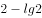，，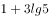，，（    ）

- **A**. 
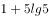
　✅
- **B**. 
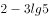

- **C**. 
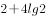

- **D**. 
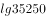

**答案**：A

**官方解析**

根据对数计算公式：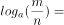，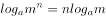；

又lg是以10为底的对数。则原数列中，

第二项：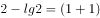，

第五项：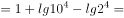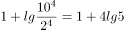；

因此原数列可转换为，，，，，是一个差值为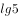的等差数列，所以下一项应该为。

故正确答案为A。

---

### 第 4 题　qid 2367918 · 数学运算

，，，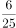，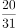，（    ）

- **A**. 

- **B**. 

- **C**. 

　✅
- **D**. 

**答案**：C

**官方解析**

数列中全为分数，判定为分数数列。观察分子分母，增减规律不统一，考虑反约分。将原数列化为：，，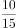，，，后项分母前项分子前项分母，则所求项分母为；后项分子前项分母前项分子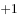，所求项分子为。则所求项为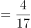。

故正确答案为C。

---

### 第 5 题　qid 2367841 · 数学运算

某银行为一家小微企业提供了年利率分别为、的甲、乙两种贷款，期限均为一年。若两种贷款的合计数额为400万元，企业需付利息总额为25万元，则乙种贷款的数额是

- **A**. 100万元　✅
- **B**. 120万元
- **C**. 130万元
- **D**. 150万元

**答案**：A

**官方解析**

设乙种贷款的数额为万元，则甲种贷款数额为万元。根据题意可列方程：，解得万元，则乙种贷款的数额是100万元。

故正确答案为A。

---

### 第 6 题　qid 2367844 · 数学运算

现有浓度为和的盐水各若干克，将其混合后加入50克水，配制成了浓度为的盐水600克，则原和的盐水质量之比是

- **A**. 6：5
- **B**. 1：1
- **C**. 5：6
- **D**. 4：7　✅

**答案**：D

**官方解析**

第二次混合50克水后，配置盐水共600克，则第一次混合配置得到盐水质量为克，溶质质量为克。设第一次混合配置浓度为的盐水有克，则浓度为盐水克，根据溶质的量不变，可得方程，解得克，则浓度为的盐水质量为200克，浓度为盐水质量为克，浓度为与浓度为的溶液质量之比为。

故正确答案为D。

---

### 第 7 题　qid 2367919 · 数学运算

一群学生分小组在户外活动，如3人一组还多2人，5人一组还多3人，7人一组还多4人，则该群学生的最少人数是

- **A**. 23
- **B**. 53　✅
- **C**. 88
- **D**. 158

**答案**：B

**官方解析**

本题为余数问题，优先用代入排除法。题干所求为这群学生最少有多少人，故从最小选项依次代入。

A项：当学生人数为23时，，并非7的倍数，不满足 “7人一组还多4人”，排除；

B项：当学生人数为53时，，可以被3整除。，可以被5整除。，可以被7整除。满足题干所有条件，当选。

故正确答案为B。

---

### 第 8 题　qid 2367854 · 数学运算

已知一个箱子中装有12件产品，其中有2件次品。若从箱子中随机抽取2件产品进行检验，则恰好抽到1件次品的概率是

- **A**. 

- **B**. 

　✅
- **C**. 

- **D**. 

**答案**：B

**官方解析**

若恰好抽到1件次品，则意味抽到1件合格产品和1件次品，共有种情况。从12件产品抽2件产品检验，共有种情况，故恰好抽到1件次品的概率。

故正确答案为B。

---

### 第 9 题　qid 2367921 · 数学运算

某工厂生产甲和乙两种产品，已知生产1件甲产品可获利1000元，消耗a和b材料分别为2千克、3千克；生产1件乙产品可获利1700元，消耗a和b材料分别为5千克、4千克。若有a和b材料分别为200千克、240千克，则生产甲、乙两种产品能取得的最大利润是

- **A**. 85200元
- **B**. 86278元
- **C**. 85900元　✅
- **D**. 86600元

**答案**：C

**官方解析**

总利润单个利润数量，由题可知，生产1件乙产品的利润远大于甲，若全部生产乙产品，最多可生产件，此时利润为元，并非最大利润；生产一件甲产品的耗材比乙产品少，若全部生产甲产品，最多可生产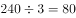件，此时利润为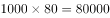元，并非最大利润。因此实际生产过程中，甲、乙两种产品均有生产，应统筹考虑。

设最多可生产甲、乙两种产品各、个，最大利润时生产多即耗材多，假设两种材料全部耗尽，则甲、乙消耗的a与b材料可表示为：···①；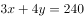···②。联立方程组解得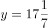，则乙最大只能取到17。将代入①式或②式中，解得最大可取到57。即甲最多可生产57个，乙最多可生产17个。则可获得的最大利润元。 

故正确答案为C。

备注：当甲生产57、乙生产17个时，a材料剩余千克，b材料剩余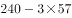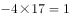千克，材料剩余最少，已经不能再多生产任何产品。

---

### 第 10 题　qid 2367856 · 数学运算

某机关事务处集中采购了一批打印纸，分发给各职能部门。如果按每个部门9包分发，则多6包；如果按每个部门11包分发，则有1个部门只能分到1包。这批打印纸的数量是

- **A**. 87包
- **B**. 78包　✅
- **C**. 69包
- **D**. 67包

**答案**：B

**官方解析**

设职能部门数量为，根据题意，，解方程得，。则这批打印纸的数量是包。

故正确答案为B。

---

### 第 11 题　qid 2367922 · 数学运算

市电视台向150位观众调查前一天晚上甲、乙两个频道的收视情况，其中108人看过甲频道，36人看过乙频道，23人既看过甲频道又看过乙频道，则受调查观众中在前一天晚上两个频道均未看过的人数是

- **A**. 17
- **B**. 22
- **C**. 29　✅
- **D**. 38

**答案**：C

**官方解析**

根据题干可判定本题为两集合容斥问题，根据公式：，则，，故受调查观众中在前一天晚上两个频道均未看过的人数是29人。

故正确答案为C。

---

### 第 12 题　qid 2367859 · 数学运算

一只密码箱的密码是一个三位数，满足：3个数字之和为19，十位上的数比个位上的数大2。若将百位上的数与个位上的数对调，得到一个新密码，且新密码数比原密码数大99，则原密码数是

- **A**. 397
- **B**. 586　✅
- **C**. 675
- **D**. 964

**答案**：B

**官方解析**

根据题干，密码是一个三位数，此题为多位数问题，依次代入选项验证，

A项，，十位9比个位7大2，对调百位和个位得到793，，错误；

B项，，十位8比个位6大2，对调百位和个位得到685，，符合条件，正确；

C项，，错误；

D项，，十位6比个位4大2，对调百位和个位得到469，，错误。

故正确答案为B。

注：考场上不用验证C、D选项。

---

### 第 13 题　qid 2367924 · 数学运算

一油罐车为三家加油站送油，在第一家加油站卸下车中的油料后整个车重为21吨，在第二家加油站卸下余下油料的后车重18吨，在第三家加油站卸下了剩下的油料。该油罐车本身的重量与所送全部油料重量相比

- **A**. 一样重
- **B**. 重1吨
- **C**. 轻1.5吨　✅
- **D**. 重1.5吨

**答案**：C

**官方解析**

根据题意可知，油罐车在第二家加油站卸油后的重量与在第一家加油站卸油后的重量相差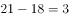吨，这3吨即为在第二家加油站卸掉的余下油的，故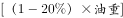。解得，油重吨。在第一家加油站卸油后，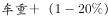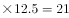，解得车重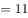吨，吨，故该油罐车本身的重量与所送全部油料重量相比，轻1.5吨。 

故正确答案为C。

---

### 第 14 题　qid 2367842 · 数学运算

某班举行数学测验，试题全部是选择题，共10题，每题1分，得分的部分统计结果如下：

已知，得分至少为3分的，人均分；得分最多为7分的，人均分。这个班级总人数是

- **A**. 

　✅
- **B**. 

- **C**. 

- **D**. 

**答案**：A

**官方解析**

根据题意，所有人的得分得分至少3分的得分之和3分以下的得分之和最多7分的得分之和7分以上的得分之和。设总人数为人，则有，解方程得。

故正确答案为A。

---

### 第 15 题　qid 2367857 · 数学运算

一场大雪过后，某单位需安排员工清理包干区的道路积雪。清理时必须3人一组，其中2人铲雪，1人扫雪。如果安排10人铲雪，3.5小时才能完成。假设每组工作效率相同，若要在100分钟内完成，则需安排的员工人数最少是

- **A**. 21
- **B**. 24
- **C**. 30
- **D**. 33　✅

**答案**：D

**官方解析**

安排10人铲雪，即有组，赋每组工作效率为1，可得总雪量为，若要在100分钟完成，则需要组数组，即至少需要11组，每组3人，则需安排的员工人数最少是。

故正确答案为D。

---

### 第 16 题　qid 2367925 · 数学运算

小李和老张同时在同一点沿同一环形跑道健身锻炼，小李跑步，老张慢走。若同向而行，小李追上老张所需时间是两人相向而行相遇所需时间的倍。假设两人运动均为匀速，且小李跑步是老张慢走速度的倍，则下列能反映与关系的是

- **A**. A
- **B**. B
- **C**. C
- **D**. D　✅

**答案**：D

**官方解析**

方法一：设老张慢走的速度为1，小李跑步的速度为，相向而行相遇时间为，同向而行追上时间为。根据行程问题基本公式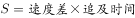，得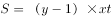，则， D项图示最符合。

备注：（），为反比例函数。当时，其图像为在一、三象限的两条双曲线，形如下图所示：

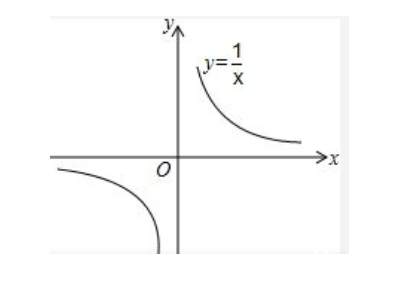

方法二：由于题目中并未给出具体数据，采用赋值法讨论与的关系。设跑道长400米，当小李跑步速度是老张慢跑速度的2倍时,即时，同向而行追上所需时间为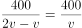，相向而行相遇时间为，；当时，；当时，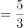；当，…可知，取值越大，的值越小，且变化幅度逐渐平缓，与D项一致。

故正确答案为D。

---

### 第 17 题　qid 2367830 · 数学运算

平行四边形ABCD如右图所示，E为AB上的一点，F、G分别为AC与DE、DB的交点。若，则四边形BEFG与ABCD的面积之比是

- **A**. 2∶7
- **B**. 3∶13
- **C**. 4∶19
- **D**. 5∶24　✅

**答案**：D

**官方解析**

因为G是平行四边形对角线的交点，则 平行四边形ABCD，又因为，所以平行四边形ABCD。因为，所以相似，故，即，且与同高，所以，则平行四边形ABCD。S四边形EFGB平行四边形ABCD平行四边形ABCD平行四边形ABCD。

故正确答案为D。

---

### 第 18 题　qid 2367926 · 数学运算

将一根绳子任意分成三段，则此三段能构成一个三角形的概率是

- **A**. 

　✅
- **B**. 

- **C**. 

- **D**. 

**答案**：A

**官方解析**

设绳长为10，三段分别为、、，可知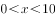，，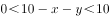，即，，。则取值的区间如下图所示，其表示的图形为（其中AB线段表示）面积为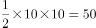。如要构成三角形需满足，，，，即，，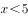，其表示的图形为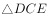，面积为。则能组成三角形的概率为。

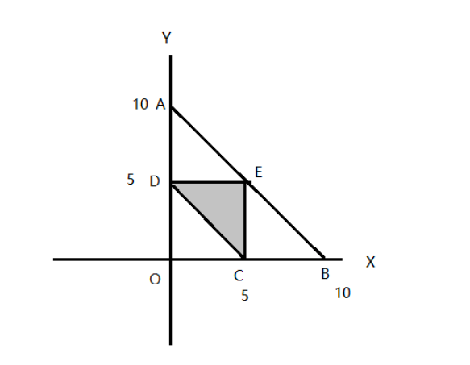

故正确答案为A。

---

### 第 19 题　qid 2367836 · 数学运算

某工程队承担一项工程，由于天气原因，工期将延后10天。为了按期完工，需增加施工人员。若增加4人，工期会延后4天；若增加10人，工期将提前2天。假设每人工作效率相同，为确保按期完工，则工程队最少应增加的施工人员数是

- **A**. 6
- **B**. 7
- **C**. 8　✅
- **D**. 9

**答案**：C

**官方解析**

赋值每人工作效率为1，设原来有个人，计划天完成。根据三种安排方式的工作量不变，则有，解方程得，。假设增加个人可以按时完成则有，解得，故至少增加8人，可以按时完成。

故正确答案为C。

---

## 判断推理

### 材料 1

某市江海区决定对东风路、西河路、南塘路、北海路等4条辖区内道路进行市容出新。为了解群众意见，制定符合民意的出新方案，区政府相关部门的甲、乙、丙、丁4位同志两人一组结伴展开调研。已知，每人各选两条道路，每条道路恰有两人选择：在每条道路的调研中，乙与丙始终没有在一组。另外，还知道：

（1）如果甲选东风路，则丁也选东风路；

（2）如果丙选南塘路，则丁也选南塘路；

（3）甲没有选南塘路。

#### 第 1 题　qid 2367868 · 逻辑判断

根据上述信息，可以得出以下哪项？

- **A**. 甲选西河路和北海路　✅
- **B**. 乙选西河路和南塘路
- **C**. 丙选东风路和西河路
- **D**. 丁选东风路和北海路

**答案**：A

**官方解析**

整理题干信息。

① 每人各选两条道路，每条道路恰有两人选择，乙与丙始终没有在一组；

② 甲东风丁东风； 

③ 丙南塘丁南塘；

④甲南塘。

题干信息不确定，可用假设法。

根据①可知，乙或丙肯定有人会跟甲一组，有两种情况：

（1）假如，乙和甲一组，根据条件②可知，如果甲东风，那么乙和丁也得东风，与题干每条道路恰有两人选择矛盾，所以，甲不选东风，根据条件④可知，甲不选南塘，所以甲只能选西河和北海；

（2）假如，丙和甲一组，根据条件②可知，如果甲东风，那么丙和丁也得东风，与题干每条道路恰有两人选择矛盾，所以，甲不选东风，根据条件④可知，甲不选南塘，所以甲只能选西河和北海。

无论哪种情况，最后甲只能选西河和北海。

故正确答案为A。

---

#### 第 2 题　qid 2367870 · 逻辑判断

如果乙不选东风路，则可以得出以下哪项？

- **A**. 甲或者选东风路或者选南塘路
- **B**. 乙或者选西河路或者选南塘路　✅
- **C**. 丙或者选南塘路或者选北海路
- **D**. 丁或者选西河路或者选北海路

**答案**：B

**官方解析**

第一步：整理题干信息。

① 每人各选两条道路，每条道路恰有两人选择，乙与丙始终没有在一组；

② 甲东风丁东风； 

③ 丙南塘丁南塘；

④ 甲南塘；

⑤ 乙东风。

根据99题结论可知，条件⑥甲选西河路和北海路，不选东风路和南塘路，又条件①乙与丙始终没有在一组，对于东风路和南塘路，甲不选，乙和丙也不能同时选，则丁必然要选东风路和南塘路，又根据条件⑤ 乙东风，可填写表格如下：

第二步：逐一分析选项。

A项：根据分析可知甲选西河路和北海路，不可能选东风路或者选南塘路，不能推出，排除；

B项：根据分析可知乙有三种情况，可以选西河路和北海路/西河路和南塘路/南塘路和北海路，对于三种情况，选项说法选西河路或者选南塘路均成立，可以推出，当选；

C项：根据分析可知丙有三种情况，可以选东风路和西河路/东风路和南塘路/东风路和北海路，对于三种情况，选项说法选南塘路或者选北海路不一定成立，不能推出，排除；

D项：根据分析可知丁选东风路和南塘路，不可能选西河路或者选北海路，不能推出，排除。

故正确答案为B。

---

#### 第 3 题　qid 2367849 · 类比推理

贫困：脱贫：共同富裕

- **A**. 协商：参与：社会治理
- **B**. 输液：治疗：身体康复
- **C**. 干旱：施肥：粮食丰收
- **D**. 污染：治污：绿水青山　✅

**答案**：D

**官方解析**

第一步：判断题干词语间逻辑关系。
贫困是脱贫的必要条件，共同富裕是脱贫的目的。
第二步：判断选项词语间逻辑关系。
A项：协商不是参与的必要条件，社会治理不是参与的目的，与题干逻辑关系不一致，排除；
B项：输液不是治疗的必要条件，身体健康是治疗的目的，前两个词与题干逻辑关系不一致，排除；
C项：干旱是一种气候现象，干旱不是施肥的必要条件，粮食丰收是施肥的目的，前两个词与题干逻辑关系不一致，排除；
D项：污染是治污的必要条件，绿水青山是治污的目的，与题干逻辑关系一致，当选。
故正确答案为D。

---

#### 第 4 题　qid 2367927 · 类比推理

男博士：女教授：教授

- **A**. 政治家：文学家：作家
- **B**. 无理数：正整数：正数　✅
- **C**. 电动车：电冰箱：电器
- **D**. 公路桥：铁路桥：桥梁

**答案**：B

**官方解析**

第一步：判断题干词语间逻辑关系。
有的男博士是教授，有的男博士不是教授，并且有的教授是男博士，有的教授不是男博士，二者为交叉关系。女教授是教授，二者为种属关系。
第二步：判断选项词语间逻辑关系。
A项：政治家和作家是交叉关系，与作家相比，文学家一般范围更大，故文学家不是作家的一种，与题干逻辑关系不一致，排除；
B项：无理数是指无限不循环小数，包括正无理数和负无理数，正数是大于零的数，有的无理数是正数，有的无理数不是正数，并且有的正数是无理数，有的正数不是无理数，二者为交叉关系，正整数是正数，二者为种属关系，与题干逻辑关系一致，当选；
C项：电动车与电器不是交叉关系，电冰箱是电器，二者为种属关系，第一个词和第三个词与题干逻辑关系不一致，排除；
D项：公路桥是桥梁，二者为种属关系，铁路桥是桥梁，二者为种属关系，第一个词与第三个词与题干逻辑关系不一致，排除。
故正确答案为B。

---

#### 第 5 题　qid 2367853 · 类比推理

眼睛：眼镜：隐形眼镜

- **A**. 脚踝：护膝：运动护膝
- **B**. 耳机：耳朵：蓝牙耳机
- **C**. 手掌：手套：纯棉手套　✅
- **D**. 假牙：牙套：烤瓷牙套

**答案**：C

**官方解析**

第一步：判断题干词语间逻辑关系。
眼镜是矫正视力和保护眼睛的，两者是对应关系，隐形眼镜是眼镜的一种，两者是种属关系。
第二步：判断选项词语间逻辑关系。
A项：护膝是保护膝盖的，不是保护脚踝的，运动护膝是护膝的一种，前两者与题干逻辑关系不一致，排除； 
B项：耳朵不是用来保护耳机的，蓝牙耳机也不是耳朵的一种，与题干逻辑关系不一致，排除；
C项：手套是保护手掌的，纯棉手套是手套的一种，与题干逻辑关系一致，当选；
D项：牙套是矫正牙齿的，不是矫正假牙的，烤瓷牙套是牙套的一种，前两词与题干逻辑关系不一致，排除。
故正确答案为C。

---

#### 第 6 题　qid 2367928 · 类比推理

牛奶：奶牛：牛圈

- **A**. 鸡肉：肉鸡：鸡场
- **B**. 虫害：害虫：农田
- **C**. 蛇毒：毒蛇：蛇穴　✅
- **D**. 蜜蜂：蜂蜜：蜂巢

**答案**：C

**官方解析**

第一步：判断题干词语间逻辑关系。
牛奶是奶牛的身体分泌物，二者为对应关系，牛圈是奶牛的生活场所，二者为对应关系。
第二步：判断选项词语间逻辑关系。
A项：鸡肉是肉鸡的身体部分，而不是身体分泌物，鸡场是肉鸡的生活场所，二者为对应关系，前两词与题干逻辑关系不一致，排除；
B项：害虫导致虫害，二者为因果对应关系，农田是害虫的生活场所，二者为对应关系，前两词与题干逻辑关系不一致，排除；
C项：蛇毒是毒蛇的身体分泌物，二者为对应关系，蛇穴是毒蛇的生活场所，二者为对应关系，与题干逻辑关系一致，当选；
D项：蜂蜜是蜜蜂的产出物，但两词顺序与题干相反，与题干逻辑关系不一致，排除。
故正确答案为C。

---

#### 第 7 题　qid 2367929 · 类比推理

记录：记录本

- **A**. 咨询：咨询室
- **B**. 复印：复印件
- **C**. 驾驶：驾驶证
- **D**. 存储：存储盘　✅

**答案**：D

**官方解析**

第一步：判断题干词语间逻辑关系。
记录本的功能是记录，二者为功能对应关系，且记录本是所记录内容的载体。
第二步：判断选项词语间逻辑关系。
A项：咨询室的功能是咨询，但是咨询室是场所，与题干逻辑关系不一致，排除；
B项：复印完成后得到复印件，复印件的功能不是复印，与题干逻辑关系不一致，排除；
C项：驾驶证的功能不是驾驶，是用来证明有驾驶资格的证件，与题干逻辑关系不一致，排除；
D项：存储盘的功能是存储，二者为功能对应关系，且存储盘是所存储内容的载体，与题干逻辑关系一致，当选。
故正确答案为D。

---

#### 第 8 题　qid 2367930 · 类比推理

头：包工头

- **A**. 眉：柳叶眉
- **B**. 肚：将军肚
- **C**. 腰：小蛮腰
- **D**. 手：操盘手　✅

**答案**：D

**官方解析**

第一步：判断题干词语间逻辑关系。
包工头的“头”指的是首领，是“头”的延伸含义。
第二步：判断选项词语间逻辑关系。
A项：柳叶眉的“眉”指的眉毛，是“眉”的本意，与题干逻辑关系不一致，排除；
B项：将军肚的“肚”指的是肚，是“肚”的本意，与题干逻辑关系不一致，排除；
C项：小蛮腰的“腰”指的是腰，是“腰”的本意，与题干逻辑关系不一致，排除；
D项：操盘手的“手”指的是做某种事情或擅长某种技能的人，是“手”的延伸含义，与题干逻辑关系一致，当选；
故正确答案为D。

---

#### 第 9 题　qid 2367931 · 类比推理

茶壶 之于 （    ） 相当于 （    ） 之于 桃花

- **A**. 茶艺——桃红
- **B**. 茶叶——桃仁
- **C**. 壶嘴——桃树　✅
- **D**. 茶馆——桃园

**答案**：C

**官方解析**

逐一代入选项。
A项：茶壶是展示茶艺的工具，二者是工具对应关系，桃花是桃红色的，二者是属性对应关系，前后逻辑关系不一致，排除；
B项：茶壶是用来冲泡茶叶的，二者是工具对应关系，桃仁和桃花是并列关系，前后逻辑关系不一致，排除；
C项：壶嘴是茶壶的组成部分，桃花是桃树的组成部分，都是组成关系，前后逻辑关系一致，当选；
D项：茶馆是使用茶壶的地方，桃园是桃花盛开的地方，但两词的顺序相反，前后逻辑关系不一致，排除；
故正确答案为C。

---

#### 第 10 题　qid 2367778 · 类比推理

燃气 之于（    ）相当于（    ）之于 语言

- **A**. 管道——信息　✅
- **B**. 火源——表演
- **C**. 灶具——文字
- **D**. 沼气——交际

**答案**：A

**官方解析**

逐一代入选项。
A项：管道输送燃气，二者为对应关系；语言传递信息，二者为对应关系，前后逻辑关系一致，当选；
B项：燃气是可燃物，火源是指能点燃可燃物的能量来源，二者为能量来源的对应关系；用语言表演，二者为方式的对应关系，前后逻辑关系不一致，排除；
C项：灶具使用燃气作为燃料，二者为对应关系；语言和文字为并列关系，前后逻辑关系不一致，排除；
D项：沼气是燃气的一种，二者为种属关系；用语言交际，二者为工具对应关系，前后逻辑关系不一致，排除。
故正确答案为A。

---

#### 第 11 题　qid 2367932 · 类比推理

日曰曰日戊戍戍戊白

- **A**. 己巳巳己愕谔愕谔鄂
- **B**. 甲由由甲申喂喂伸神
- **C**. 嚄噢噢嚄哑咔咔哑娅　✅
- **D**. 嗒呾怛嗒嚓察察嚓檫

**答案**：C

**官方解析**

第一步：分析题干汉字间关系。
从相同汉字的位置入手：位置1、4的汉字相同；位置2、3的汉字相同，位置5、8的汉字相同，位置6、7的汉字相同。
第二步：判断选项符号间关系。
A项：位置5、8汉字不相同，与题干不一致，排除；
B项：位置5、8汉字不相同，与题干不一致，排除；
C项：位置1、4的汉字相同；位置2、3的汉字相同，位置5、8的汉字相同，位置6、7的汉字相同，与题干一致，当选；
D项：位置2、3汉字不相同，与题干不一致，排除。
故正确答案为C。

---

#### 第 12 题　qid 2367933 · 逻辑判断

- **A**. 

- **B**. 

　✅
- **C**. 

- **D**. 

**答案**：B

**官方解析**

第一步：分析题干符号间关系。
从相同符号的位置入手：位置1、4的符号相同；位置2、6、8符号相同；位置7、9符号相同。
第二步：判断选项符号关系。
A项：相同位置与题干一致，但位置3、5符号相同，而题干3、5符号不相同，与题干逻辑关系不一致，排除；
B项：位置1、4的符号相同；位置2、6、8符号相同；位置7、9符号相同，与题干逻辑关系一致，当选；
C项：位置5、7、9符号相同，而题干5、7符号不相同，与题干逻辑关系不一致，排除；
D项：位置7、9符号不相同，与题干逻辑关系不一致，排除。
故正确答案为B。

---

#### 第 13 题　qid 2367934 · 图形推理

从四个图中选出唯一的一项，填入问号处，使其呈现一定的规律性:

- **A**. A
- **B**. B
- **C**. C
- **D**. D　✅

**答案**：D

**官方解析**

本题考查图形的实际意义，寻找最大共同点。观察发现，题干图片均为盆景，盆栽整体直立在盆中，且装盆栽的盆的形状是长方形。四个选项中，A项中装盆栽的盆的形状是圆形，B项盆栽不是直立在盆中，C项不是盆栽，只有D项符合题干规律。
故正确答案为D。

---

#### 第 14 题　qid 2367935 · 图形推理

从四个图中选出唯一的一项，填入问号处，使其呈现一定的规律性:

- **A**. A
- **B**. B　✅
- **C**. C
- **D**. D

**答案**：B

**官方解析**

元素组成不同，且无明显属性规律，优先考虑数量规律。观察发现，题干图形封闭面明显，优先考虑数面，但整体数面无规律。再观察发现题干图形的三角形面较多，三角形面数量依次是：1、2、3、4、5、？，问号处应填写一个三角形面数量为6的图形，只有B项符合。
故正确答案为B。

---

#### 第 15 题　qid 2367936 · 图形推理

从四个图中选出唯一的一项，填入问号处，使其呈现一定的规律性:

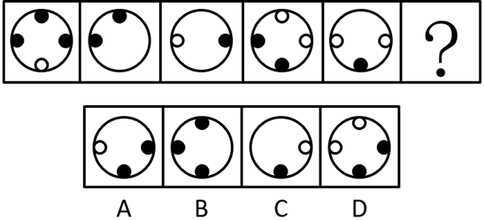

- **A**. A
- **B**. B
- **C**. C
- **D**. D　✅

**答案**：D

**官方解析**

元素组成不同，优先考虑属性规律。观察发现，题干中所有图形都比较规整，均为轴对称图形，且对称轴依次逆时针旋转，如下图：

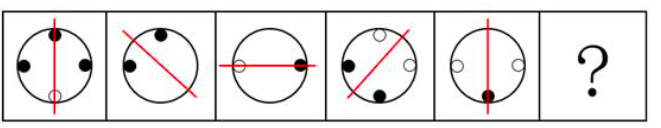

依此规律，只有D项符合。

故正确答案为D。

---

#### 第 16 题　qid 2367937 · 图形推理

从四个图中选出唯一的一项，填入问号处，使其呈现一定的规律性:

- **A**. A
- **B**. B
- **C**. C
- **D**. D　✅

**答案**：D

**官方解析**

本题考查三视图。观察图形发现，题干的每一个立体图形的俯视图均为“L”形，符合此规律的只有D项。
故正确答案为D。

---

#### 第 17 题　qid 2367938 · 图形推理

选项四个图形中，只有一个是由题干的四个图形拼合（只能通过上、下、左、右平移）而成的，请把它找出来。

- **A**. A　✅
- **B**. B
- **C**. C
- **D**. D

**答案**：A

**官方解析**

本题考查平面拼合，可采用平行且等长相消的方式解题。消去平行且等长的线段后进行组合可得到轮廓图，即为A项。平行且等长相消的方式如下图所示：

故正确答案为A。

---

#### 第 18 题　qid 2367939 · 图形推理

选项四个图形中，只有一个是由题干的四个图形拼合（只能通过上、下、左、右平移）而成的，请把它找出来。 

- **A**. A
- **B**. B　✅
- **C**. C
- **D**. D

**答案**：B

**官方解析**

本题考查平面拼合，可采用平行且等长相消的方式解题。消去平行且等长的线段后进行组合可得到轮廓图，即为B项。平行且等长相消的方式如下图所示：

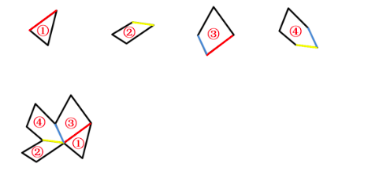

故正确答案为B。

---

#### 第 19 题　qid 2367940 · 图形推理

选项四个图形中，只有一个是由题干的四个图形拼合（只能通过上、下、左、右平移）而成的，请把它找出来。

- **A**. A　✅
- **B**. B
- **C**. C
- **D**. D

**答案**：A

**官方解析**

本题考查平面拼合，可采用平行且等长相消的方式解题。消去平行且等长的线段后进行组合可得到轮廓图，即为A项。平行且等长相消的方式如下图所示：

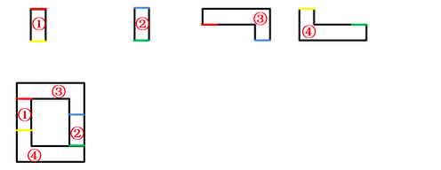

故正确答案为A。

---

#### 第 20 题　qid 2367941 · 图形推理

选项四个图形中，只有一个是由题干的四个图形拼合（只能通过上、下、左、右平移）而成的，请把它找出来。

- **A**. A
- **B**. B
- **C**. C
- **D**. D　✅

**答案**：D

**官方解析**

本题考查平面拼合，从方块最多的图形入手，贴边代入选项。题干的4个图形中，图④的方块最多，将它贴边代入各个选项中，只有D项能够把所有图形都代入进去，拼合方式如下图所示：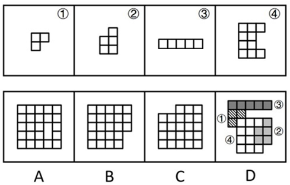

故正确答案为D。

---

#### 第 21 题　qid 2367942 · 图形推理

左边给定的是纸盒外表面的展开图，右边哪一项能由它折叠而成？请把它找出来。

- **A**. A　✅
- **B**. B
- **C**. C
- **D**. D

**答案**：A

**官方解析**

将题干展开图中的面依次标注为面a、b、c、d，如下图：

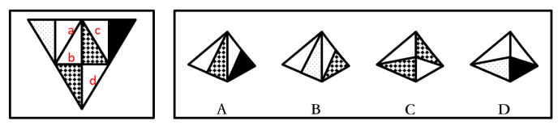

A项：与题干一致，当选；

B项：题干中，面a的阴影三角形和面d的阴影三角形挨着，面a的白色三角形与面b的白色三角形挨着，而选项中面a的阴影三角形与右侧面的白色三角形挨着，因此右侧面既不是面d也不是面b，选项与题干不一致，排除；

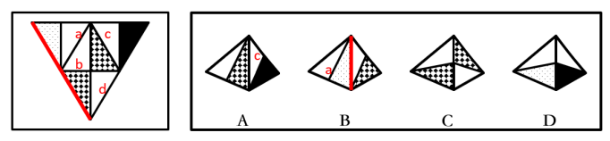

C项：题干中面b和面d都以阴影和白三角形组成顶点为起点，在面中顺时针画边，无论是哪个面第1条边均为阴影三角形的斜边，而选项中以此顶点顺时针画边，无论是哪个面第1条边均为白色三角形的斜边，选项与题干不一致，排除；

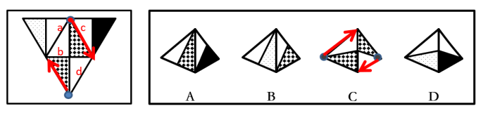

D项：题干中，面a以阴影和白三角形组成顶点为起点顺时针画边，第1条边为阴影三角形的斜边，而选项中以此顶点顺时针画边，第1条边为白色三角形的斜边，选项与题干不一致，排除。

故正确答案为A。

---

#### 第 22 题　qid 2367943 · 图形推理

左边给定的是纸盒外表面的展开图，右边哪一项能由它折叠而成？请把它找出来。

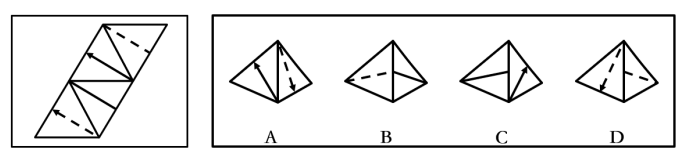

- **A**. A
- **B**. B　✅
- **C**. C
- **D**. D

**答案**：B

**官方解析**

将题干展开图中的面依次标注为面a、b、c、d，如下图：

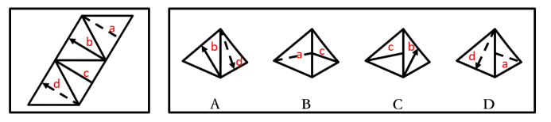

A项：选项由面b和面d构成，题干展开图中面b和面d的箭头指向的边是两个面的公共边，选项中箭头指向的边不是两个面的公共边，选项与题干不一致，排除；

B项：选项由面a和面c构成，与题干一致，当选；

C项：选项由面b和面c构成，题干展开图中面b和面c的公共边与面c内的直线相交于面c的一个顶点，选项中面b和面c的公共边与面c内的直线相交于公共边的中点，选项与题干不一致，排除；

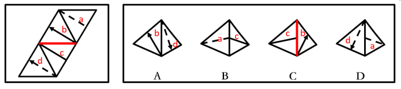

D项：选项由面a和面d构成，题干展开图中面a和面d的公共边与面a内的虚线相交于面a的一个顶点，选项中面a和面d的公共边与面a内的虚线相交于公共边的中点，选项与题干不一致，排除。

故正确答案为B。

---

#### 第 23 题　qid 2367944 · 图形推理

左边给定的是纸盒外表面的展开图，右边哪一项能由它折叠而成？请把它找出来。

- **A**. A
- **B**. B
- **C**. C
- **D**. D　✅

**答案**：D

**官方解析**

将题干展开图中的面依次标号，如下图：

A项：选项由面a、b、e构成，以面e中与小短线有交点的那条边为起点在面e中顺时针画边，题干中第2边对着面d，选项中第2边对着面b，选项与题干不一致，排除；

B项：选项由面b、c、e构成，题干中面b和面c的公共边是小直角三角形的斜边，选项中的公共边是大直角三角形的直角边，选项与题干不一致，排除；

C项：选项由面a、d、e构成，题干中面a和面d的公共边是面a中纯白矩形的短边，而选项中面a和面d的公共边是纯白矩形的长边，选项与题干不一致，排除；

D项：选项与题干一致，当选。

故正确答案为D。

---

#### 第 24 题　qid 2367945 · 图形推理

左边给定的是纸盒外表面的展开图，右边哪一项能由它折叠而成？请把它找出来。

- **A**. A
- **B**. B
- **C**. C
- **D**. D　✅

**答案**：D

**官方解析**

将题干展开图中的面依次标号，如下图：

A项：选项由面b、c、d构成，以面c白色直角为起点在面c中顺时针画边，题干中第4条边对着面b，选项中第4条边对着面d，选项与题干不一致，排除；

B项：选项由面b、e、f构成，题干中面b和面e是相对面，不能同时出现，选项与题干不一致，排除；

C项：选项由面a、b、f构成，以面a和面b的对角线的交点为起点在面a内顺时针画边，题干中顺时针第1条边对着面b，选项中顺时针第4条边对着面b，选项与题干不一致，排除；

D项：选项与题干一致，当选。

故正确答案为D。

---

#### 第 25 题　qid 2367815 · 图形推理

从所给的四个选项中，选择最合适的一个填入问号处，使之呈现一定的规律性。

- **A**. A　✅
- **B**. B
- **C**. C
- **D**. D

**答案**：A

**官方解析**

元素组成不同，优先考虑属性规律。九宫格优先按横行看，第一行图形均由直线构成，第二行图形均由曲线构成，第三行图形均由直线和曲线构成，因此“？”处图形应由直线和曲线构成，只有A项符合。
故正确答案为A。

---

#### 第 26 题　qid 2367946 · 图形推理

从所给的四个选项中，选择最合适的一个填入问号处，使之呈现一定的规律性：

- **A**. A
- **B**. B　✅
- **C**. C
- **D**. D

**答案**：B

**官方解析**

本题考查图形的实际意义，寻找最大共同点。观察发现，题干所有图形都是一根枝干上长满了相同的叶子或花，九宫格优先按横行来看，第一行，花枝朝向依次为左、右、左；第二行，花枝朝向依次是右、左、右，规律均为左右交替出现，第三行前两个图花枝朝向为左、右，因此“？”处花枝朝向应为左，C、D两项花枝朝向不是左（注：C项可能存在争议，有部分同学觉得是朝上，无论是朝右还是朝上，均不是朝左），均排除；A项花枝最上面是3朵花，下面是3片叶子，一根枝干上元素不相同，只有B项满足题干图形特征。
故正确答案为B。

---

#### 第 27 题　qid 2367947 · 图形推理

左图为给定的立体，从任意角度剖开，右边哪一项不可能是它的截面图？

- **A**. A　✅
- **B**. B
- **C**. C
- **D**. D

**答案**：A

**官方解析**

本题考查截面图，逐一分析选项。

如下图所示，B、C、D项均可截出，A项无法截出，因为长方形空心部分上面不应有实线，实际截面图应为凹字型。

故正确答案为A。

---

#### 第 28 题　qid 2367948 · 逻辑判断

信仰、信念、信心，任何时候都至关重要。小到一个人、一个集体，大到一个政党、一个民族、一个国家。只要有信仰、信念、信心，就会愈挫愈奋、愈战愈勇，否则就会不战自败、不打自垮。
根据以上陈述，可以得出以下哪项？

- **A**. 没有信仰、信念、信心，我们就会不战自败、不打自垮　✅
- **B**. 没有信仰、信念、信心，我们就不会愈挫愈奋，愈战愈勇
- **C**. 如果不战自败、不打自垮，就说明我们没有信仰、信念、信心
- **D**. 如果愈挫愈奋、愈战愈勇，我们就不会不战自败、不打自垮

**答案**：A

**官方解析**

第一步：翻译题干。

①信仰、信念、信心愈挫愈奋、愈战愈勇；

②（不战自败、不打自垮）信仰、信念、信心。

将①②串联后可递推出：③（不战自败、不打自垮）信仰、信念、信心愈挫愈奋、愈战愈勇。

第二步：逐一分析选项。

A项：翻译为（信仰、信念、信心）不战自败、不打自垮，属于②的逆否等价，可以推出，当选；

B项：翻译为（信仰、信念、信心）（愈挫愈奋、愈战愈勇），是对条件①箭头前内容的否定，否前得不到确定性的结论，无法推出，排除；

C项：翻译为不战自败、不打自垮（信仰、信念、信心），是对条件②箭头前内容的否定，否前得不到确定性的结论，无法推出，排除；

D项：翻译为愈挫愈奋、愈战愈勇（不战自败、不打自垮），是对条件③箭头后内容的肯定，肯后得不到确定性的结论，无法推出，排除。

故正确答案为A。

---

#### 第 29 题　qid 2367860 · 逻辑判断

智能手机流行的时代，我们每天发送信息，也收到信息。人际之间的电子信息交往已成为当今时代一种独特的交往方式。在面对重要的人或关系时，很多人往往发出信息后就期待被秒回，如果没有被秒回，他们就产生一种怀疑感或被弃感，从而陷入深深的烦恼和焦虑之中。
以下哪项最可能是他们陷入深深烦恼和焦虑所需的假设？

- **A**. 当前技术已能实现智能手机的即时通信，方便快捷，且基本免费　✅
- **B**. 有些聊天软件能在发送者手机中反馈信息接收者是否阅读了信息
- **C**. 有些人工作很忙，总习惯在忙完一天工作后才统一处理相关信息
- **D**. 有些人一天收到的信息太多，容易遗漏某人期待秒回的重要信息

**答案**：A

**官方解析**

第一步：找出论点和论据。

论点：在面对重要的人或关系时，很多人往往发出信息后就期待被秒回，如果没有被秒回，他们就产生一种怀疑感或被遗弃感，从而陷入深深的烦恼和焦虑之中。

论据：无。

本题无论据，只能通过补充论据进行加强。提问方式是假设类，优先考虑补充必要条件，即没有这个选项，论点则无法成立。

第二步：逐一分析选项。

A项：如果智能手机不能即时通信，那么发出的信息就无法被即时接收，发出者就不会期待秒回，因此A项是信息能够被秒回的必要条件，当选；

B项：有些聊天软件能在发送者手机中反馈信息接收者是否阅读了信息，可以解释部分发出者为什么没有被秒回就会产生怀疑感或被弃感，但是力度较弱，且不是论点成立的必要条件，排除；

C项：接收者什么时候阅读信息与发出者没被秒回就会产生烦恼和焦虑无关，排除； 

D项：接收者是否遗漏了重要信息与发出者没被秒回就会产生烦恼和焦虑无关，排除。

故正确答案为A。

附：通过查证原文，本题答案为A项。

---

#### 第 30 题　qid 2367949 · 逻辑判断

某地开展企业结对扶贫创新活动，倡导企业家与贫困家庭互选，要求每户贫困家庭只能选1位企业家，而每位企业家只能在选他的贫困家庭中选择1-2户开展帮扶活动。现有企业家甲、乙、丙3人面对张、王、李、赵4户贫困家庭，已知：
（1）张、王2户至少有1户选择甲；
（2）王、李、赵3户中至少有2户选择乙；
（3）张、李2户中至少有1户选择丙。
事后得知，互选顺利完成，每户贫困家庭均按自己心愿选到了企业家，而每位企业家也按要求选到了贫困家庭。
根据以上信息，可以得出以下哪项？

- **A**. 企业家甲选到了张户
- **B**. 企业家乙选到了赵户　✅
- **C**. 企业家丙选到了李户
- **D**. 企业家甲选到了王户

**答案**：B

**官方解析**

分析题干。
（1）张或王选甲
（2）王、李、赵中至少2户选乙
（3）张或李选丙
由题干“每户贫困家庭只能选1位企业家，每位企业家只能在选他的贫困家庭中选择1-2户开展帮扶活动”可知：甲互选的帮扶家庭数为1，乙互选的帮扶家庭数为2，丙互选的帮扶家庭数为1；再根据条件（1）可知，张或王选甲，说明李和赵不选甲；由条件（2）可知，张不选乙，由条件（3）可知，王和赵不选丙，此时赵即不选甲也不选丙，又已知“每户贫困家庭均按自己心愿选到了企业家”，因此，赵只能选企业家乙，即企业家乙选到了赵户。
故正确答案为B。

---

#### 第 31 题　qid 2367950 · 逻辑判断

当今社会，不少老人为了帮助子女照顾下一代而漂泊异乡成为“老漂族”。在最近一项城市调查中，的受访青年坦言，自己的父母就是老漂族，自己与爱人事业刚刚起步，工作压力较大，根本没有时间照顾孩子和做家务。有专家据此断言，我国城市中的老漂族群体还会进一步扩大。

以下哪项如果为真，最能支持上述专家的观点？

- **A**. 老人在城市养老可拥有比乡村更好的医疗条件
- **B**. 有些老人故土难离事务缠身更愿意生活在家乡
- **C**. 国家二孩政策的实施将会促使更多的孩子出生　✅
- **D**. 二孩政策实施后城市的二孩出生率要低于农村

**答案**：C

**官方解析**

第一步：找出论点和论据。

论点：我国城市中的老漂族群体还会进一步扩大。

论据：的受访青年坦言，自己的父母就是老漂族，自己与爱人事业刚刚起步，工作压力较大，根本没有时间照顾孩子和做家务。

题干论点探讨的是老漂族群体会进一步扩大，可以通过补充论据说明老漂族群体在增加或照顾孩子和做家务的人员短缺等进行加强。

第二步：逐一分析选项。

A项：说的是城市养老医疗条件比乡村更好，与论点说的老漂族群体会进一步扩大无关，话题不一致，无法加强，排除；

B项：说的是老人更愿意生活在家乡，老人的意愿与论点说的老漂族群体会进一步扩大无关，无法加强，排除；

C项：国家二孩政策会促使更多的孩子出生，补充论据说明需要照顾孩子的情况会更多，对老漂族群体扩大进行了加强，可以支持，当选；

D项：二孩出生率农村更高，农村的照顾孩子的需求会更多些，老漂族应该会减少而不是扩大，无法加强，排除。

故正确答案为C。

---

#### 第 32 题　qid 2367861 · 逻辑判断

某区对所辖钟山、长江、梅园、星海4个街道进行抽样调查，并按照人均收入为其排序。有人根据以往经验对4个街道的人均收入排序作出如下预测：
（1）如果钟山街道排第三，那么梅园街道排第一；
（2）如果长江街道既不排第一也不排第二，那么钟山街道排第三；
（3）钟山街道排序与梅园街道相邻，但与长江街道不相邻。
事后得知，上述预测符合调查结果。
根据以上信息，可以得出以下哪项？

- **A**. 钟山街道不排第一就排第四　✅
- **B**. 长江街道不排第二就排第三
- **C**. 梅园街道不排第二就排第四
- **D**. 星海街道不排第一就排第三

**答案**：A

**官方解析**

第一步：分析题干条件。

① 钟山第三梅园第一；

② 长江第一 且 第二钟山第三；

③ 钟山与梅园相邻，与长江不相邻。

第二步：根据题干条件进行推理。

钟山出现次数最多，为最大信息，可作为突破口。根据③可知：钟山与梅园相邻，结合①可知：钟山第三梅园第一，故钟山不能排名第三。钟山第三是对②的否后，否后必否前，故长江排名第一或者第二。

如果长江排第一，根据③可知钟山只能排第四，故梅园排第三，星海排第二，排除B、C、D项，只有A项成立；

如果长江排第二，根据③可知钟山只能排第四，故梅园排第三，星海排第一，A项依然成立。

故正确答案为A。

---

#### 第 33 题　qid 2367951 · 逻辑判断

人饿了会吃东西，一旦摄入碳水化合物、脂肪、蛋白质等能量营养素，就能消除饥饿感，这种缺乏能量营养素的饥饿是显性饥饿；然而，人体健康还需铁、锌等16种矿物元素及维生素A、维生素E等13种维生素，如果缺乏这些微量营养素，则会造成隐性饥饿。显然，显性饥饿只要“吃饱”就能解决，而隐性饥饿只有“吃好”才能应对。
根据以上陈述，可以得出以下哪项？

- **A**. 既要“吃饱”又要“吃好”，如此就能保证人体的健康
- **B**. 消除显性饥饿对人更重要，只有“吃饱”才能“吃好”
- **C**. 隐性饥饿并不同于显性饥饿，“吃不好”不等于“吃不饱”　✅
- **D**. 隐性饥饿对人体健康的危害比显性饥饿更大、更隐蔽

**答案**：C

**官方解析**

日常结论题，根据题干信息逐一分析选项。
A项：根据题干可知，“吃饱”可以解决显性饥饿，“吃好”可以解决隐性饥饿，但题干未提及二者同时成立是否就能保证人体健康，无法推出，排除；
B项：题干中并未比较消除显性饥饿与消除隐性饥饿哪个更重要，无法推出，排除；
C项：根据题干最后一句话可知，显性饥饿只要“吃饱”就能解决，而隐性饥饿只有“吃好”才能应对，说明这两种饥饿是不同的，其解决方式也并不相同，可以推出，当选；
D项：题干中并未比较显性饥饿与隐性饥饿哪个对人体的健康危害更大，无法推出，排除。
故正确答案为C。

---

#### 第 34 题　qid 2367863 · 逻辑判断

某县新一届党政领导班子刚组建完成，一心想为群众做一些实事。面对有限的财力，新一届领导班子明确表示，今年只能完成两件大事。对于众多排进公共政策议程的大事，他们认为：如果建一条乡村公路，则不能建污水处理厂；如果建污水处理厂，则要建排污管道；如果建排污管道，则不能建垃圾处理厂。
按照这届领导班子的想法，以下哪项不可能是他们今年同时要建设的？

- **A**. 乡村公路、排污管道
- **B**. 乡村公路、垃圾处理厂
- **C**. 污水处理厂、排污管道
- **D**. 污水处理厂、垃圾处理厂　✅

**答案**：D

**官方解析**

第一步：翻译题干。

①  建公路建污水处理厂；

②  建污水处理厂建排污管道；

③  建排污管道建垃圾处理厂；

将③和②可以递推出：④ 建污水处理厂建排污管道建垃圾处理厂；

⑤  只能完成两件大事。

第二步：逐一分析选项。

A项：若建公路和排污管道，根据①得到不建污水处理厂，根据③得到不建垃圾处理厂，此时完成两件大事，与题干已知条件不矛盾，可以推出，排除；

B项：若建公路和垃圾处理厂，根据①得到不建污水处理厂，根据④得到不建排污管道以及不建污水处理厂，此时完成两件大事，与题干已知条件不矛盾，可以推出，排除；

C项：若建污水处理厂和排污管道，根据①的否后必否前，得到不建公路，根据④得到不建垃圾处理厂，此时完成两件大事，与题干已知条件不矛盾，可以推出，排除；

D项：根据④可知，建污水处理厂建垃圾处理厂，故不可能同时建污水处理厂和垃圾处理厂，不能推出，当选。

本题为选非题，故正确答案为D。

---

#### 第 35 题　qid 2367896 · 逻辑判断

科幻小说《三体》中提出的“黑暗森林理论”告诉我们，人类千万不能向宇宙透露我们地球的位置，否则就会被外星文明毁灭。但是，早在《三体》出版之前的1974年，人类就向距离地球超过2.2万光年的武仙座星团发送了一段无线电信号，以光速主动向宇宙宣告了自身的存在。这个编号为M13的武仙座星团拥有数十万颗恒星。科学家认为，恒星周围一般会伴有行星，但恒星上不可能存在生命体，行星上却可能有。深信黑暗森林理论的人不禁为人类这一鲁莽举动感到担心，认为人类的美好期望有可能会迎来残酷的现实。
以下哪项如果为真，最能说明这种担心是不必要的？

- **A**. 迄今为止人类并没有发现任何外星生命存在的迹象
- **B**. 类地行星也并不罕见，平均每5颗恒星就拥有1颗
- **C**. 恒星密集分布的武仙座星团内不存在任何行星系统　✅
- **D**. 即使武仙座星团文明收到信号也要在2.2万年以后

**答案**：C

**官方解析**

第一步：找出论点和论据。
论点：人类的美好期望有可能会迎来残酷的现实。
论据：科幻小说《三体》中提出的“黑暗森林理论”告诉我们，人类千万不能向宇宙透露我们地球的位置，否则就会被外星文明毁灭。但是，早在《三体》出版之前的1974年，人类就向距离地球超过2.2万光年的武仙座星团发送了一段无线电信号，以光速主动向宇宙宣告了自身的存在。这个编号为M13的武仙座星团拥有数十万颗恒星。科学家认为，恒星周围一般会伴有行星，但恒星上不可能存在生命体，行星上却可能有。
文段较长而且问法比较特殊，问“说明这种担心是不必要的”可以理解成是削弱题，论点是担心人类未来，论据是这种担心产生的依据，论点是对未来的预测，可优先考虑削弱论据。
第二步：逐一分析选项。
A项：指出迄今为止还没有发现任何外星生命存在的迹象，但是没有发现不代表以后不存在，属于不明确选项，无法削弱，排除；
B项：指出类地行星不罕见，而行星上可能存在生命体，意味着存在其他生命体的可能性增加，人类会因此而担心，具有加强作用，排除；
C项：指出武仙座星团不存在任何行星系统，也就是说不会存在生命体，就不会给人类带来危害，削弱论据，可以削弱，当选； 
D项：指出武仙星团接收到信号的时间会在2.2万年以后，之后是否会给地球上的人类带来危害，不得而知，属于不明确选项，无法削弱，排除。
故正确答案为C。

---

#### 第 36 题　qid 2367802 · 定义判断

公众充权：指在公共政策的制定、执行、评估、监督过程中，公众积极参与，充分表达自己的利益主张，以推动公共政策过程的民主化与科学化。
下列属于公众充权的是

- **A**. 清明节到来前夕，一些社会人士在市文明办支持下创建了文明祭扫网站，号召民众祭扫时不放鞭炮，不烧纸钱，改用虚拟鲜花、电子蜡烛等绿色环保的方式
- **B**. 快递小哥小李当选市人大代表后，在广泛走访充分调研的基础上，提交了一份关于如何保障快递员权益、促进快递行业健康发展的议案
- **C**. 某市将要召开天然气价格调整听证会，有关部门要求辖区各街道、居委会搞好宣传动员工作，按照下达名额推举市民代表，确保公开公平公正
- **D**. 在某县未来五年发展规划制定过程中，县委、县政府通过召开居民座谈会、专家听证会等形式，征求到了许多宝贵的意见　✅

**答案**：D

**官方解析**

第一步：找出定义关键词。
“在公共政策的制定、执行、评估、监督过程中”、“公众积极参与，充分表达自己的利益主张”、“推动公共政策过程的民主化与科学化”。
第二步：逐一分析选项。
A项：创建文明祭扫网站，号召改用绿色环保的方式，不符合“在公共政策的制定、执行、评估、监督过程中”，不符合定义，排除；
B项：提交议案，不符合“在公共政策的制定、执行、评估、监督过程中”，不符合定义，排除；
C项：召开天然气价格调整听证会可以理解为“在公共政策的制定、执行、评估、监督过程中”，但按照下达名额推举市民代表，不符合“公众积极参与，充分表达自己的利益主张”，不符合定义，排除；
D项：在某县未来五年发展规划制定过程中，符合“在公共政策的制定、执行、评估、监督过程中”，通过召开居民座谈会、专家听证会等形式，征求到了许多宝贵的意见，符合“公众积极参与，充分表达自己的利益主张”，符合定义，当选。
故正确答案为D。

---

#### 第 37 题　qid 2367810 · 定义判断

信息扶贫：指政府或社会群体借助信息技术手段来解决因信息闭塞而导致的经济、文化上的贫困问题。
下列属于信息扶贫的是

- **A**. 某物流公司联手互联网巨头在边远山区定向从贫困户中招聘一批快递员，经过专业培训之后上岗，帮他们走上了脱贫致富的道路
- **B**. 某手机生产厂家面向农村市场，推出了一款低成本、易操作、大屏幕、待机时间长的时尚智能手机，村民们纷纷换掉了原来的旧手机
- **C**. 省城某重点中学建立网络课堂，向某贫困县的中学进行远程同步直播，使两地师生共享优质教学资源。几年来，该县考上重点大学的人数明显增多　✅
- **D**. 毕业返乡的小周带着几个同学开了家网店，在网上销售自家种植的红枣，销量逐步上升，日子越来越红火

**答案**：C

**官方解析**

第一步：找出定义关键词。
“政府或社会群体借助信息技术手段”、“解决因信息闭塞而导致的经济、文化上的贫困问题”。
第二步：逐一分析选项。
A项：招聘快递员，经过专业培训之后上岗，未体现“借助信息技术手段”，不符合定义，排除；
B项：某手机生产厂家面向农村市场推出时尚智能手机，未体现“解决贫困问题”，也未体现“借助信息技术手段”，不符合定义，排除；
C项：建立网络课堂，进行远程同步直播，符合“借助信息技术手段”，共享优质教学资源，该县考上重点大学的人数明显增多，符合“解决因信息闭塞而导致的文化上的贫困问题”，符合定义，当选；
D项：开网店可以理解为“信息技术手段”，但未体现“解决因信息闭塞而导致的经济、文化上的贫困问题”，不符合定义，排除。
故正确答案为C。

---

#### 第 38 题　qid 2367963 · 定义判断

“一门式”政务服务：指为了方便群众，将原本需要跑多个政府部门才能办成的事项集中到一个服务中心或简化到一个窗口办结的服务行为。
下列属于“一门式”政务服务的是：

- **A**. 某市建立了一个社会综合治理云平台，将多种渠道发现的社会问题按照标准化流程推送到相应的职能部门，明确责任人并限时解决，避免了部门之间推诿扯皮的情况
- **B**. 某市新近成立了一个残疾人服务站，以前残疾人申请生活补贴需要携带申请表到各级残联审批盖章，现在只需到服务站提出申请，各级审批部门就会即时看到并办妥　✅
- **C**. 市医院为了解决患者就医难的问题，在一楼大厅开设了便民门诊，挑选了一批医术精湛的医生坐诊，患者可以一站式完成挂号、收诊、缴费、取药的全部流程
- **D**. 某市非本地户籍的适龄儿童入学过去需要监护人现场提交户口、住房、工作证明等材料，现在只要通过教育部门专设的网上报名登记系统，就可一键提交全部材料

**答案**：B

**官方解析**

第一步：找出定义关键词。
“为了方便群众”、“将原本需要跑多个政府部门才能办成的事项集中到一个服务中心或简化到一个窗口办结”。
第二步：逐一分析选项。
A项：将多种渠道发现的社会问题按照标准化流程推送到相应的职能部门，未体现“集中到一个服务中心或简化到一个窗口办结”，且未体现“群众原本需要跑多个政府部门才能办成事项”，不符合定义，排除；
B项：以前残疾人申请生活补贴需要携带申请表到各级残联审批盖章，体现了“原本需要跑多个政府部门”，现在只需到服务站提出申请，各级审批部门就会即时看到并办妥，体现了“集中到一个服务中心或简化到一个窗口办结”，且体现了“方便群众”，符合定义，当选；
C项：市医院不属于政府部门，并且市医院为了解决患者就医难的问题，未体现“原本需要跑多个政府部门”，也不属于“政务服务”，不符合定义，排除；
D项：过去需要监护人现场材料，未体现“原本需要跑多个政府部门”，“通过教育部门专设的网报名登记系统一键提交全部材料”是线上报名，未体现“集中到一个服务中心或简化到一个窗口办结”，不符合定义，排除。
故正确答案为B。

---

#### 第 39 题　qid 2367816 · 定义判断

社会性处罚：指存在失信行为的人员所受到的与自身失信行为没有直接关联的来自其他部门的限制和处罚。
下列属于社会性处罚的是

- **A**. 以“站不起来”为理由强占他人座位的高铁“霸座男”，当场受到了乘警的严肃批评，下车后被移送公安机关接受治安处罚。这一事件曝光后，当事人的恶劣行为又遭到了全国网民的一致谴责
- **B**. 由于数据造假，某教授在国际期刊上发表的论文被撤稿。在网民的谴责声中，该教授又被撤销了基于该论文所获得的绩效奖励、省部级科研项目、荣誉称号、社会兼职
- **C**. 春节前夕，恶意拖欠农民工工资的部分包工头，被有关部门和各种媒体曝光，引起社会各界密切关注。根据银行、保险、铁路等部门的规定，这些违规者申请信用卡、购买保险以及动车和高铁票时都将受到限制　✅
- **D**. 长江沿岸的一家化工企业，多次不顾禁令向长江偷偷排污，最近被省有关部门通报批评，吊销了企业生产执照，它的上级主管部门及主要负责人也都受到了严厉的处罚

**答案**：C

**官方解析**

第一步：找出定义关键词。
“存在失信行为的人员”、“所受到的与自身失信行为没有直接关联的来自其他部门的限制和处罚”。
第二步：逐一分析选项。
A项：以“站不起来”为理由强占他人座位的高铁“霸座男”，符合“存在失信行为的人员”，当场受到了乘警的严肃批评，被移送公安机关接受治安处罚，这是与自身失信行为有直接关联的限制和处罚，不符合“所受到的与自身失信行为没有直接关联的来自其他部门的限制和处罚”，不符合定义，排除；
B项：某教授数据造假，符合“存在失信行为的人员”，论文被撤稿，撤销了基于该论文所获得的绩效奖励、省部级科研项目、荣誉称号、社会兼职，均是与自身失信行为有直接关联的处罚，不符合“所受到的与自身失信行为没有直接关联的来自其他部门的限制和处罚”，不符合定义，排除；
C项：恶意拖欠农民工工资的包工头，符合“存在失信行为的人员”，申请信用卡、购买保险以及动车和高铁票时都将受到限制，符合“所受到的与自身失信行为没有直接关联的来自其他部门的限制和处罚”，符合定义，当选；
D项：长江沿岸的一家化工企业，多次不顾禁令向长江偷偷排污，不符合“存在失信行为的人员”，不符合定义，排除。
故正确答案为C。

---

#### 第 40 题　qid 2367834 · 定义判断

友善采购：指因自然灾害或其他无法抗拒的因素而造成产品大量积压时，购买方按照不低于甚至略高于批发价或市场价的方式购买这些产品，以帮助生产者渡过难关的行为。
下列属于友善采购的是：

- **A**. 近期原材料价格上涨，各种电子器件供应紧张，某企业主动加价，从长期供货商那里购入了大批急需的电子器件，保证了企业生产的正常进行
- **B**. 因连日暴雨引发山洪，造成当地瓜农数十亩即将上市的西瓜被淹，对口帮扶城市得知消息后，以市场价收购了该地瓜农的全部西瓜　✅
- **C**. 南方某地水果大获丰收，造成大量积压滞销，采购商得知东北销路很好，从忧心忡忡的果农那里大量购进，转销东北，获利颇丰
- **D**. 某少数民族的传统手工艺虽然已成功申遗，其产品却始终打不开销路，经过民俗专家在媒体上的大力推介，终于走出了大山，市场反响很好

**答案**：B

**官方解析**

第一步：找出定义关键词。
“因自然灾害或其他无法抗拒的因素而造成产品大量积压”、“购买方按照不低于甚至略高于批发价或市场价的方式购买这些产品”、“以帮助生产者渡过难关”。
第二步：逐一分析选项。
A项：该选项中的企业是为了保障生产的正常运行而主动提出加价，没有体现出生产者因自然灾害或其他无法抗拒的因素而造成产品大量积压，也不符合“以帮助生产者渡过难关”，不符合定义，排除；
B项：连日暴雨引发山洪，符合“因自然灾害或其他无法抗拒的因素”，数十亩，符合“造成产品大量积压”，对口帮扶城市以市场价收购了瓜农的全部西瓜，符合“购买方按照不低于甚至略高于批发价或市场价的方式购买这些产品”和“以帮助生产者渡过难关”，符合定义，当选；
C项：南方某地水果大丰收，造成大量积压，“大丰收”不符合“因自然灾害或其他无法抗拒的因素”，且该选项也没有体现出“购买方按照不低于甚至略高于批发价或市场价的方式购买这些产品”，不符合定义，排除；
D项：某少数民族的传统手工艺产品打不开销路，没有体现出“因自然灾害或其他无法抗拒的因素而造成产品大量积压”，不符合定义，排除。
故正确答案为B。

---

#### 第 41 题　qid 2367821 · 定义判断

情感性劳动：指服务业员工在与顾客面对面交往时，将个人情感融入工作过程，对顾客、企业以及服务人员自己产生积极影响的行为。
下列属于情感性劳动的是：

- **A**. 某航空公司空姐站在登机口两旁欢迎乘客，时不时还会微笑着摸摸小孩的头　✅
- **B**. 小刘总是面带微笑、语气亲切热情地接打电话，连续多年被评为最美接线员
- **C**. 某酒店智能客服“小青”善解人意，语音甜美，入住的客人都喜欢和她互动
- **D**. 小秦在信访局工作多年，每次接待来访者，都非常耐心，细致了解具体情况

**答案**：A

**官方解析**

第一步：找出定义关键词。
“服务业员工”、“顾客”、“面对面”、“个人感情”、“对顾客、企业及自己产生积极影响”。
第二步：逐一分析选项。
A项：空姐属于“服务业员工”，站在登机口欢迎属于“面对面”，微笑摸摸小孩的头符合“个人感情”，符合定义，当选；
B项：接打电话不符合“面对面”，不符合定义，排除；
C项：小青是智能客服，不符合“个人情感”，不符合定义，排除；
D项：小秦耐心、细致了解只体现工作负责，未体现“个人感情”，不符合定义，排除。
故正确答案为A。

---

#### 第 42 题　qid 2367818 · 定义判断

隐形植入：指通过周边信息、符号体系等不易察觉的形式，使受众在不知不觉中受到影响的宣传策略。
下列属于隐形植入的是：

- **A**. 在某电视剧中，所有角色均使用同一品牌的手机，并使用这个品牌的经典铃声　✅
- **B**. 城运会到来之前，商家把印有城运会会徽的各类文化创意产品陆续摆上了柜台
- **C**. 在某市博物馆馆标设计征集中，8号方案以浓郁的地域文化元素受到了评委的关注
- **D**. 结婚纪念日快到了，为了提醒粗心又忙碌的丈夫，小李偷偷把他的手机屏保换成了婚纱照

**答案**：A

**官方解析**

第一步：找出定义关键词。
“不易察觉的形式”、“不知不觉受到影响”、“宣传策略”。
第二步：逐一分析选项。
A项：在电视剧中使用同一品牌手机，用该品牌经典铃声符合“不易察觉的形式”，“不知不觉受到影响”，也是“宣传策略”，符合定义，当选；
B项：印有城运会会徽，不符合“不易察觉的形式”，不符合定义，排除；
C项：馆标设计受到评委关注，不属于“宣传策略”，不符合定义，排除；
D项：小李提醒丈夫结婚纪念日，把丈夫手机屏保换成婚纱照，符合“不易察觉的形式”，但不属于“宣传策略”，不符合定义，排除。
故正确答案为A。

---

#### 第 43 题　qid 2367964 · 定义判断

逆城镇化：指由于工作、生活、环境等原因，城市居民主动从城区流向郊区或农村生活的现象。
下列属于逆城镇化的是：

- **A**. 市民李先生在市中心工作生活多年，去年跳槽到郊区一家企业，并在单位附近买了一套房，感觉工作生活十分方便　✅
- **B**. 随着业务量扩大，某物流企业的库房不能满足业务需要，在城里另租场地成本太高，公司在租金较低的农村租用了一处大型库房
- **C**. 近年来，因为城里交通拥堵，压力太大，不少城市白领纷纷到周边乡村度假，享受田园生活的乐趣
- **D**. 由于编制体制调整，林女士的丈夫从大城市换防到千里之外的戈壁滩，为了支持丈夫工作，林女士打算带着儿子到新的驻地附近安家

**答案**：A

**官方解析**

第一步：找出定义关键词。
“由于工作、生活、环境等原因”、“城市居民”、“主动”、“从城区流向郊区或农村生活”。
第二步：逐一分析选项。
A项：市民李先生符合“城市居民”，跳槽到郊区一家企业并在单位附近买房符合“由于工作、生活、环境等原因”、“从城区流向郊区或农村生活”，跳槽是一种个人选择，符合“主动”，符合定义，当选；
B项：某物流企业因业务需要在租金较低的农村租用了一处大型库房是商业行为，不属于生活，不符合“城市居民”，“主动从城区流向郊区或农村生活”，不符合定义，排除；
C项：到周边乡村度假，享受生活乐趣不是去乡村生活，不符合“主动从城区流向郊区或农村生活”，不符合定义，排除；
D项：从大城市换防到千里之外的戈壁滩，林女士打算带着儿子到新的驻地附近安家，符合“由于工作、生活、环境等原因”、“从城区流向郊区或农村生活”，但丈夫是由于编制调整去到戈壁滩，不符合“主动”，不符合定义，排除。
故正确答案为A。

---

#### 第 44 题　qid 2367965 · 定义判断

剧场效应：指由于个体成员追求自身利益最大化，引发其他成员效仿而导致集体秩序失衡，整体利益受损的现象。
下列属于剧场效应的是：

- **A**. 小明参加了一个高价辅导班，小芳的家长知道后，给她报了一个更贵的，他们觉得如果不上，小芳的成绩就可能比不上小明了
- **B**. 电商平台在小长假推出了五花八门的促销方式，其中的个别商家玩起了先提价、后打折的把戏，严重影响了平台的整体信誉
- **C**. 近年来汽车销售大战愈演愈烈，几大厂商最初是在电视台、报纸打广告，后来演变成高价请明星代言，成本投入越来越高，利润却越来越低　✅
- **D**. 考虑到仙霞路上有大型活动，小王选择了平时不大走的春光路上班，没想到由于大家不约而同地走这条路，导致春光路严重堵塞，仙霞路反而畅通无阻

**答案**：C

**官方解析**

第一步：找出定义关键词。
“由于个体成员追求自身利益最大化，引发其他成员效仿”、“导致集体秩序失衡，整体利益受损的现象”。
第二步：逐一分析选项。
A项：小明参加高价辅导班，小芳的家长给小芳报了一个更贵的，没有体现“导致集体秩序失衡，整体利益受损的现象”，不符合定义，排除；
B项：电商平台推出促销方式，个别商家先提价、后打折，未体现出引起其他成员的效仿；结果是严重影响了平台的整体信誉，虽然最终结果是负面的，但是“信誉受损”不等同于“集体秩序失衡，整体利益受损”，不符合定义，排除；
C项：汽车销售大战越演越烈，几大厂家从最初的打广告，演变成高价请明星代言，虽未体现出引起其他成员效仿，但是恶化演变的最终结果是“利润却越来越低”，体现出“导致集体秩序失衡，整体利益受损”，符合定义，当选；
D项：仙霞路上有大型活动，每个人都选择了一条自认为畅通的道路，结果仙霞路反而畅通无阻，每个人不约而同的走这条路，不符合“引发其他成员效仿”，不符合定义，排除。
故正确答案为C。

---

#### 第 45 题　qid 2367838 · 定义判断

差异化竞争：指同一行业的多家企业在短期的激烈竞争中，采用灵活多变的个性化手段，树立良好企业形象，赢得市场的经营方式。
下列属于差异化竞争的是：

- **A**. 春节期间，几大网络短视频平台纷纷推出抢红包活动，你发五亿，他发八亿，竞争到了白热化的程度
- **B**. 在其他房地产开发商纷纷降价促销的状况下，某楼盘提升楼盘品质，引进名校资源，销量遥遥领先于同期其他楼盘　✅
- **C**. 每到逢年过节的时候，市区的几家大型电器商场都会推出赠送小家电、延长保修期等优惠活动，市民们往往等到这时集中采购
- **D**. 在实体书店普遍不景气的大环境下，位于繁华街区的某书店一直保持自身的市场定位，致力于销售高品位的专业图书，成为了当地的文化地标

**答案**：B

**官方解析**

第一步：找出定义关键词。
“同一行业企业”、“短期竞争”、“个性化手段”、“赢得市场”。
第二步：逐一分析选项。
A项：春节期间短视频平台符合“同一行业企业”、“短期竞争”，但是纷纷推出抢红包活动没有体现“个性化手段”，不符合定义，排除；
B项：房地产开发商符合“同一行业企业”，其他房地产开发商降价促销，某楼盘提升楼盘品质，引进名校资源销量高于其他楼盘，符合“个性化手段”、“赢得市场”，符合定义，当选；
C项：几家大型电器商场符合“同一行业企业”，过年期间符合“短期竞争”，赠送小家电、延长保修期等优惠活动没有体现出“个性化手段”，不符合定义，排除；
D项：某书店定位销售高品位的专业图书符合“个性化手段”，实体书店普遍不景气的大环境说明是长期状态且没有体现竞争，不符合“短期竞争”，不符合定义，排除。
故正确答案为B。

---

#### 第 46 题　qid 2367823 · 定义判断

大数据“杀熟”：指商家在提供相同的商品或服务时，根据大数据的甄别结果，对有多次消费记录或消费能力较高的客户，以偏高标准收费的销售策略。
下列属于大数据“杀熟”的是：

- **A**. 小李负责单位的接待工作，经常要预约商务车接送。后来只要他打车，网约平台就直接推送高价的商务车，无奈之下小李只好注册一个新号供自己日常出行
- **B**. 经常在网上预订酒店的老张在预订某酒店的单人间时，价格一直为380元。他的侄子暑假来看望他，也在网上预定了该酒店同样的房间，价格却便宜四分之一　✅
- **C**. 位于市中心金融服务区的某超市由于环境优越，客户购买力强，某品牌饮料在这里售价高达15元，而这种饮料在居民小区便利店只需要10元
- **D**. 某购物网站推出新用户推广活动，每位新注册用户都可免费获赠抵用券，算下来买同样的商品新会员比老会员还要便宜好多，这让老会员们郁闷不已

**答案**：B

**官方解析**

第一步：找出定义关键词。
“相同的产品或服务”、“大数据甄别结果”、“多次消费记录或消费能力较高的顾客”、“偏高标准收费”。
第二步：逐一分析选项。
A项：小李经常预约商务车，符合“多次消费记录或消费能力较高的顾客”，但单位的接送服务和日常的出行服务不属于“相同的产品或服务”，也未体现对相同的产品有偏高的收费，不符合“偏高标准收费”，不符合定义，排除；
B项：老张经常在网上预订酒店符合“多次消费记录或消费能力较高的顾客”，在网上预订符合“大数据”，侄子预订该酒店同样的房间符合“相同的产品或服务”，老张380元，侄子价格便宜了四分之一符合“偏高标准收费”，符合定义，当选；
C项：金融服务区同品牌饮料比居民小区便利店高，符合“相同的产品或服务”、“偏高标准收费”，但不符合“大数据甄别结果”，不符合定义，排除；
D项：新用户买同样商品比老用户便宜符合“相同的产品或服务”，但不属于针对“多次消费记录或消费能力较高的顾客”，是因为为了推广而赠送抵用券所以便宜，不符合定义，排除。
故正确答案为B。

---

#### 第 47 题　qid 2367826 · 定义判断

语码转换：指说话人在同一对话过程中使用多种语言或方言进行交流的现象。
下列不属于语码转换的是：

- **A**. 约翰先生在中国生活多年，与单位同事交谈时总是坚持用汉语，有时实在不知道怎样准确表达自己的意思，也会夹杂三两个英语单词
- **B**. 马经理接待来访客户，用普通话向他们介绍了自己公司的情况。得知客户中有两位陕西老乡后，当即操起陕西话与他们攀谈了几句
- **C**. 在一次国际学术会议上，陈教授用英语作报告时带了一股浓浓的四川口音，参加会议的大多数外国学者几乎都没有听懂他的发言　✅
- **D**. 来到留学生宿舍后，班主任方老师询问了他们的日常生活情况，当他发现一个学生流露出不解的神情时，立刻又用英语解释了一番

**答案**：C

**官方解析**

第一步：找出定义关键词。
“同一对话过程”、“多种语言或方言”。
第二步：逐一分析选项。
A项：约翰和同事交谈坚持用汉语，夹杂两三个英语单词，符合“同一对话过程”，英语和汉语两种语言符合“多种语言或方言”，符合定义，排除；
B项：马经理接待客户符合“同一对话过程”，普通话、陕西话符合“多种语言或方言”，符合定义，排除；
C项：陈教授作报告符合“同一对话过程”，四川口音的英语只有英语一种语言，不符合“多种语言或方言”，不符合定义，当选；
D项：方老师询问学生日常生活符合“同一对话过程”、用英语解释表明之前说的不是英语，符合“多种语言或方言”，符合定义，排除。
本题为选非题，故正确答案为C。

---

#### 第 48 题　qid 2367806 · 定义判断

危机公关：指政府部门、社会团体或企业面对可能造成严重后果的突发事件时，有组织、有计划地采取各种应对措施，避免损害或者降低损害程度，以期获得公众谅解的管理活动。
下列不属于危机公关的是：

- **A**. 某公司生产的多批次药品标注虚假生产日期的消息曝光后，公司领导立即在报纸、电视台向全国公众道歉，宣布召回这些批次的产品，承诺通过合适渠道赔偿受害者，迅速查清并如实公布事件真相，请社会各界人士监督
- **B**. 某地曝出高考答题卡被掉包的传闻后，当地政府部门迅速成立联合调查组，网上公布高考命题、监考、阅卷等环节的操作规范，并及时发布调查进展情况，公众情绪逐渐平复，最终查明这一传闻完全是谣言
- **C**. “某品牌火腿肠使用过期猪肉”的消息在网络上蔓延，公司迅速查实后道歉、召回、赔偿，并制定了详细整改措施，承诺绝不会再出现此类事件，媒体和消费者慢慢平静下来
- **D**. 某商场管理层吸取毗邻商场因电路老化引起火灾、损失惨重的教训，定期组织专业人员加强对线路安全的检查，及时更换老旧电线，并且张贴《规范用电须知》提醒商家，商家都非常配合，防火意识显著增强　✅

**答案**：D

**官方解析**

第一步：找出定义关键词。
“政府部门、社会团体或企业面对可能造成严重后果的突发事件时”、“有组织、有计划地采取各种应对措施，避免损害或者降低损害程度”、“以期获得公众谅解”。
第二步：逐一分析选项。
A项：某公司生产的多批次药品标注虚假生产日期的消息曝光后，符合“企业面对可能造成严重后果的突发事件时”，立即在报纸、电视台道歉，宣布召回产品，承诺赔偿受害者等，符合“有组织、有计划地采取各种应对措施，避免损害或者降低损害程度，以期获得公众谅解”，符合定义，排除；
B项：某地曝出高考答题卡被掉包的传闻后，符合“面对可能造成严重后果的突发事件时”，迅速成立联合调查组，网上公布操作规范，及时发布调查进展情况，查明这一传闻是谣言，符合“有组织、有计划地采取各种应对措施，避免损害或者降低损害程度，以期获得公众谅解”，符合定义，排除；
C项：“某品牌火腿肠使用过期猪肉”的消息在网络上蔓延，符合“面对可能造成严重后果的突发事件时”，迅速查实后道歉、召回、赔偿，并制定整改措施，符合“有组织、有计划地采取各种应对措施，避免损害或者降低损害程度，以期获得公众谅解”，符合定义，排除；
D项：某商场管理层吸取毗邻商场因电路老化引起火灾、损失惨重的教训，未体现“面对可能造成严重后果的突发事件时”，不符合定义，当选。
本题为选非题，故正确答案为D。

---

#### 第 49 题　qid 2367839 · 定义判断

互联网公益：指民间团体或企业通过网络平台，发动社会公众参与的具有门槛低、透明度高、互动性强等特点的公益活动。
下列属于互联网公益的是：

- **A**. 某公司每年拨出专款开展公益活动，在官网上征集白内障患者并向符合特定条件的患者提供全部医疗费用
- **B**. 得知老张遭遇车祸，他的老同学通过班级群、朋友圈很快募集了三万多元捐款全部转交到他家
- **C**. 某爱心服务站每年开学前在自己的主页上公布来自各界的网络捐款账目，并邀请部分捐款人一起把善款送到山区小学　✅
- **D**. 某村委会通过网络平台发起“一帮一”捐资助学活动，帮助本村特困家庭的大学生解决了学费问题

**答案**：C

**官方解析**

第一步：找出定义关键词。
“民间团体或企业”、“通过网络平台”、“公众参与”、“门槛低、透明度高、互动性强公益活动”。
第二步：逐一分析选项。
A项：某公司符合“民间团体或企业”，在官网符合“通过网络平台”，并向符合特定条件的患者提供全部医疗费用，不符合“门槛低、透明度高、互动性强公益活动”，不符合定义，排除；
B项：通过班级群、朋友圈募集捐款符合“通过网络平台”，但其同学是发起人不符合“民间团体或企业”，不符合定义，排除；
C项：爱心服务站符合“民间团体或企业”，网络捐款账目符合“通过网络平台”，邀请部分捐款人一起把善款送到山区小学说明活动互动性强，符合定义，当选；
D项：通过网络平台捐资助学符合“通过网络平台”，但村委会不符合“民间团体或企业”，不符合定义，排除。
故正确答案为C。

---

#### 第 50 题　qid 2367845 · 逻辑判断

N后置编码：指按照下列规则对一个符号串进行处理得到一个新符号串，N表示一个数字。

（1）确认初始符号串中每个符号的顺序位置；

（2）将初始符号串的第一个符号跳过其后面的一个符号放置，得到一个新符号串；

（3）在新符号串中，将初始符号串的第二个符号跳过其后面的两个符号放置，······，依此类推，直到将初始符号串的第N个符号跳过其后面N个符号放置（数到最后一个符号再接着从头数起）。

初始符号串的“4后置编码”是：

- **A**. 

　✅
- **B**. 

- **C**. 

- **D**. 

**答案**：A

**官方解析**

4后置编码

（1）初始符号为1号位车、2号位马、3号位象、4号位士、5号位炮、6号位兵，即 ；

（2）将初始符号中第一号位“车”跳过其后面的的一个符号放置，放在“马”后，得到新符号串1号位马、2号位车、3号位象、4号位士、5号位炮、6号位兵，即  ；

（3）将初始符号中第二号位“马”，在得到的新符号串（2）中跳过其后面的两个符号放置，得到1号位车、2号位象、3号位马、4号位士、5号位炮、6号位兵，即   ；

（4）将初始符号中第三号位“象”，在得到的新符号串（3）中跳过其后面的三个符号放置，得到1号位车、2号位马、3号位士、4号位炮、5号位象、6号位兵，即   ；

（5）将初始符号中第四号位“士”，在得到的新符号串（4）中跳过其后面的四个符号放置，题干提示数到最后一个符号再接着从头数起，得到1号位车、2号位士、3号位马、4号位炮、5号位象、6号位兵，即 。

故正确答案为A。

---

## 资料分析

### 材料 1

        2018年国家统计局组织开展了第二次全国时间利用的随机抽样调查，共调查48580人。结果显示，受访居民在一天的活动中，有酬劳动平均用时4小时24分钟。其中，男性5小时15分钟，女性3小时35分钟；城镇居民3小时59分钟，农村居民5小时1分钟；工作日4小时50分钟，休息日3小时19分钟。受访居民有酬劳动的参与率为，其中城镇居民。受访居民无酬劳动平均用时2小时42分钟。其中，女性3小时48分钟；农村居民2小时39分钟；工作日2小时34分钟。受访居民无酬劳动的参与率为，其中男性。

        无酬劳动包括家务劳动、陪伴照料孩子生活、护送辅导孩子学习、陪伴照料成年家人、购买商品或服务、看病就医和公益活动。受访居民家务劳动平均用时1小时26分钟，参与率为。其中，女性2小时6分钟，参与率。受访居民陪伴照料孩子生活平均用时36分钟，参与率为；护送辅导孩子学习平均用时9分钟，参与率为；陪伴照料成年家人平均用时8分钟，参与率为；看病就医平均用时4分钟，参与率为；公益活动平均用时3分钟，参与率为。

#### 第 1 题　qid 2368023 · 平均数

受访农村居民每日无酬劳动平均用时占其劳动平均用时的比重为

- **A**. 

- **B**. 

　✅
- **C**. 

- **D**. 

**答案**：B

**官方解析**

“居民在一天的活动中，有酬劳动······农村居民5小时1分钟；无酬劳动······农村居民2小时39分钟”，统一单位为分钟，则受访农村居民在一天的活动中，有酬劳动301分钟；无酬劳动159分钟，故受访农村居民每日无酬劳动平均用时占其劳动平均用时的比重。

故正确答案为B。

---

#### 第 2 题　qid 2367767 · 平均数

下列活动的排列中，受访居民每日平均用时依次减少的是

- **A**. 护送辅导孩子学习、购买商品或服务、看病就医
- **B**. 护送辅导孩子学习、看病就医、购买商品或服务
- **C**. 购买商品或服务、护送辅导孩子学习、看病就医　✅
- **D**. 购买商品或服务、看病就医、护送辅导孩子学习

**答案**：C

**官方解析**

由题干“······受访居民每日平均用时依次减少的是”，可判定本题为排序类问题。定位材料第一段可得：“受访居民无酬劳动平均用时2小时42分钟”，定位材料第二段可得：“无酬劳动包括家务劳动、陪伴照料孩子生活、护送辅导孩子学习、陪伴照料成年家人、购买商品或服务、看病就医和公益活动。受访居民家务劳动平均用时1小时26分钟······。受访居民陪伴照料孩子生活平均用时36分钟······；护送辅导孩子学习平均用时9分钟······；陪伴照料成年家人平均用时8分钟······；看病就医平均用时4分钟······；公益活动平均用时3分钟······”，统一时间单位为分钟，则购买商品或服务平均用时，购买商品或服务平均用时分钟，故受访居民每日平均用时依次减少的是购买商品或服务、护送辅导孩子学习、看病就医，C项符合。

故正确答案为C。

---

#### 第 3 题　qid 2367768 · 平均数

参与有酬劳动的受访城镇居民，每日有酬劳动的平均用时为

- **A**. 5小时50分钟
- **B**. 6小时40分钟
- **C**. 7小时30分钟　✅
- **D**. 8小时20分钟

**答案**：C

**官方解析**

由题干“参与有酬劳动的受访城镇居民，每日有酬劳动的平均用时为”，题目所求，判定本题为现期平均数问题。结合材料第一段可得：2018年，受访城镇居民一天的活动中有酬劳动平均用时为3小时59分钟，即；受访的城镇居民有酬劳动的参与率为，即，则题目所求。

故正确答案为C。

---

#### 第 4 题　qid 2368026 · 综合

受访的男性居民约有

- **A**. 2.4万人　✅
- **B**. 2.6万人
- **C**. 2.9万人
- **D**. 3.0万人

**答案**：A

**官方解析**

由题干“受访的男性居民约有”，结合材料给出整体平均时间，及男女平均时间，可判定本题为混合平均数计算问题。定位材料第一段可得，“···共调查48580人。结果显示，受访居民在一天的活动中，有酬劳动平均用时4小时24分钟。其中，男性5小时15分钟，女性3小时35分钟”。根据“混合居中但不中，距离与量成反比”可知，。则男性人数为万人，与A项最为接近。

故正确答案为A。

---

#### 第 5 题　qid 2367772 · 综合

从上述资料中能够推出的是

- **A**. 
受访居民休息日无酬劳动平均用时多于3小时
　✅
- **B**. 
受访女性居民无酬劳动的参与率介于和之间

- **C**. 
受访居民中，有酬劳动和无酬劳动都参与的占比至少为

- **D**. 
受访居民不同类型无酬劳动的平均用时和参与率呈正相关

**答案**：A

**官方解析**

A项：定位材料第一段可得，“受访居民在一天的活动中，有酬劳动平均用时4小时24分钟。其中······工作日4小时50分钟，休息日3小时19分钟。······受访居民无酬劳动平均用时2小时42分钟。其中······工作日2小时34分钟”。根据“混合居中但不中，距离与量成反比”可知。，解得休息日无酬劳动时长为3小时2分钟3小时，正确；

B项：定位材料第一段可得，“受访居民无酬劳动的参与率为，其中男性”。根据“混合居中不正中”可知，受访女性居民无酬劳动参与率大于，错误；

C项：定位材料第一段可得“受访居民有酬劳动的参与率为，······无酬劳动的参与率为”，根据“两集合容斥原理”计算公式可知，。当两者都不参与取最低值0时，都参与的人数也为最低值，为全部人数的，错误；

D项：定位材料第二段可得，“看病就医平均用时4分钟，参与率为；公益活动平均用时3分钟，参与率为”。4分钟3分钟，，可知并非参与时间越长，参与率越高，错误。

故正确答案为A。

---

### 材料 2

        2018年江苏第一、二、三产业增加值分别为4142亿元、41248亿元和47205亿元；城镇常住居民人均可支配收入47200元，增长8.2，农村常住居民人均可支配收入20845元，增长8.8；一般公共预算收入8630亿元，一般公共预算支出11658亿元。

#### 第 6 题　qid 2367761 · 增长

2018年江苏第三产业增加值比第二产业多

- **A**. 
12.6

- **B**. 
14.4
　✅
- **C**. 
15.1

- **D**. 
16.2

**答案**：B

**官方解析**

根据题干“2018年江苏第三产业增加值比第二产业多”，结合选项都是百分数，可判定本题为一般增长率问题。定位文字材料可知，2018年江苏第二、三产业增加值分别为41248亿元和47205亿元。根据公式：r，则题干所求为，与B项最接近。

故正确答案为B。

---

#### 第 7 题　qid 2367762 · 综合

上表所有指标中，2017年苏南与苏北地区指标数值相差不到一倍的有

- **A**. 5项
- **B**. 6项　✅
- **C**. 7项
- **D**. 8项

**答案**：B

**官方解析**

根据题干“……2017年苏南与苏北地区指标数值相差不到一倍的有”，结合表格材料时间为2017年，可判定本题为现期倍数问题。定位表格材料可知2017年苏南与苏北地区部分社会经济发展指标数据。苏南与苏北地区指标数值相差不到一倍，即为两者之间倍数&lt;2倍。则表中苏南与苏北地区各指标倍数分别为：

一般公共预算收入：倍&gt;2倍，排除；

一般公共预算支出：倍&lt;2倍，符合；

乡村从业人员：倍&gt;2倍，排除；

农林牧渔业总产值：倍&gt;2倍，排除；

高速公路：倍&lt;2倍，符合；

私人汽车拥有量：倍&gt;2倍，排除；

社会消费品零售总额：倍&gt;2倍，排除；

出口：&gt;10倍，排除；

进口：&gt;10倍，排除；

旅游外汇收入：&gt;10倍，排除；

城镇常住居民人均可支配收入：倍&lt;2倍，符合；

城镇常住居民人均生活消费支出：倍&lt;2倍，符合；

农村常住居民人均可支配收入：倍&lt;2倍，符合；

农村常住居民人均生活消费支出：倍&lt;2倍，符合。

综上，满足条件的指标有：一般公共预算支出、高速公路、城镇常住居民人均可支配收入、城镇常住居民人均生活消费支出、农村常住居民人均可支配收入、农村常住居民人均生活消费支出，共6项。

故正确答案为B。

---

#### 第 8 题　qid 2367763 · 增长

2018年江苏一般公共预算收入比上年增加

- **A**. 963亿元　✅
- **B**. 988亿元
- **C**. 1963亿元
- **D**. 1971亿元

**答案**：A

**官方解析**

根据题干“2018年······比上年增加”，结合选项带单位，可判定本题为增长量计算问题。定位文字材料可知，2018年江苏一般公共预算收入8630亿元；定位表格材料可知，2017年苏南、苏中、苏北一般公共预算收入分别为4913亿元、1246亿元、1508亿元。则2017年江苏一般公共预算收入为4913+1246+1508=7667亿元。根据公式：增长量=现期量-基期量，则题干所求为8630-7667=963亿元。
故正确答案为A。

---

#### 第 9 题　qid 2367764 · 平均数

2017年苏南、苏中、苏北地区就业人员人均产业增加值最大的是

- **A**. 苏中第三产业
- **B**. 苏南第二产业
- **C**. 苏南第三产业　✅
- **D**. 苏北第二产业

**答案**：C

**官方解析**

根据题干“2017年……人均产业增加值最大的是”，结合材料给出2017年相关数据 ，可判定本题为现期平均数问题。定位图1、图2可知2017年江苏三大区域三次产业就业人数及三次产业增加值。根据公式：就业人员人均产业增加值，则各选项就业人员人均产业增加值分别为：

苏中第三产业，万元；

苏南第二产业，万元；

苏南第三产业，万元；

苏北第二产业，万元。

综上，2017年苏南、苏中、苏北地区就业人员人均产业增加值最大的是苏南第三产业。

故正确答案为C。

---

#### 第 10 题　qid 2367765 · 综合

从上述资料中能够推出的是

- **A**. 2017年苏中地区高速公路的里程不足全省的五分之一
- **B**. 2017年苏北和苏中地区进口额之和不及苏南的八分之一
- **C**. 2018年江苏城镇和农村常住居民人均可支配收入的绝对差距比上年有所缩小
- **D**. 2017年苏中农村常住居民人均生活消费支出与人均可支配收入的比值大于苏南　✅

**答案**：D

**官方解析**

A项：定位表格材料可知，2017年苏南、苏中、苏北高速公路里程分别为1870公里、948公里、1870公里。根据公式：比重，则2017年苏中高速公路里程占全省的比重为，即超过五分之一，错误；

B项：定位表格材料可知，2017年苏南、苏中、苏北进口额分别为1993.0亿美元、175.5亿美元、109.9亿美元。则2017年苏中和苏北进口额之和与苏南的比例为，即大于八分之一，错误；

C项：定位文字材料可知，2018年江苏城镇常住居民人均可支配收入47200元，增长8.2%，农村常住居民人均可支配收入20845元，增长8.8%。则2018年江苏城镇和农村常住居民人均可支配收入的绝对差距为元。根据公式：基期量，则2017年江苏城镇和农村常住居民人均可支配收入的绝对差距为，即2018年江苏城镇和农村常住居民人均可支配收入的绝对差距比上年有所增大，错误；

D项：定位表格材料可知，2017年苏中农村常住居民人均可支配收入与人均生活消费支出分别为20000元、14644元，苏南分别为26759元、18872元。则2017年苏中农村常住居民人均生活消费支出与人均可支配收入的比值为，苏南农村常住居民人均生活消费支出与人均可支配收入的比值为，即2017年苏中农村常住居民人均生活消费支出与人均可支配收入的比值大于苏南，正确。

故正确答案为D。

---

### 材料 3

        2018年全国互联网业务收入9562亿元，比上年增长。其中，广东、上海、北京互联网业务收入分别增长、和。2018年互联网企业信息服务收入8594亿元，比上年增长。其中，电子商务平台收入3667亿元，增长；网络游戏业务收入1948亿元，增长。2018年互联网行业研发投入490亿元，比上年增长。

#### 第 11 题　qid 2368028 · 综合

2017年全国互联网企业电子商务平台收入为

- **A**. 2938亿元
- **B**. 3012亿元
- **C**. 3076亿元
- **D**. 3242亿元　✅

**答案**：D

**官方解析**

由题干“2017年……为多少亿元”，结合材料时间为2018年，判定本题为基期计算问题。定位文字部分可得“2018年……其中，电子商务平台收入3667亿元，增长”。代入公式：，则2017年，全国互联网企业电子商务平台收入=，与D项最接近。

故正确答案为D。

---

#### 第 12 题　qid 2367780 · 比重

2018年全国互联网企业信息服务收入占互联网业务收入的比重为

- **A**. 

- **B**. 

- **C**. 

　✅
- **D**. 

**答案**：C

**官方解析**

由题干“2018年……的比重为”，判定本题为现期比重问题。定位文字部分 “2018年全国互联网业务收入9562亿元，………互联网企业信息服务收入8594亿元”。代入公式：，则所求比重=

故正确答案为C。

---

#### 第 13 题　qid 2367782 · 增长

2013—2018年全国互联网业务收入增加最少的年份是

- **A**. 2013年　✅
- **B**. 2014年
- **C**. 2015年
- **D**. 2016年

**答案**：A

**官方解析**

由提问“增加最少的年份”，判定本题为增长量比较问题。定位柱形图部分，可知2013-2018年每一年全国互联网业务收入及同比增速，因选项只有2013年至2016年，则只需比较这四年即可。

2013年的增长量：代入公式“”，可得：；

2014年的增长量：代入公式“”，可得：；

同理可得， 2015年增长量：；

2016年增长量：；

增长量最小的年份为2013年。

故正确答案为A。

---

#### 第 14 题　qid 2367783 · 增长

若从2019年起每年均按2014—2018年的平均增速增长，则2023年全国互联网业务收入将达到

- **A**. 21620亿元
- **B**. 27565亿元　✅
- **C**. 30147亿元
- **D**. 31829亿元

**答案**：B

**官方解析**

根据题干“······2023年全国互联网业务收入将达到······”，结合材料时间为2018年，判定本题为现期计算问题。定位柱状图可得，2013年与2018年全国互联网业务收入分别为3317亿元、9562亿元。根据题意可知，2019—2023年的平均增速与2014—2018年的相同，故有：，则2023年全国互联网业务收入为：亿元，与B项最接近。

故正确答案为B。

---

#### 第 15 题　qid 2367785 · 综合

从上述资料中能够推出的是

- **A**. 
2014—2018年全国互联网业务收入年平均增量为1067亿元

- **B**. 
2018年广东、上海、北京的互联网业务收入总和比上年增长

- **C**. 
2018年全国互联网行业研发投入与互联网业务收入的比值小于上年
　✅
- **D**. 
2018年全国互联网企业各类信息服务收入年增长最慢的是电子商务平台收入

**答案**：C

**官方解析**

A项：定位柱状图可得，2013年与2018年全国互联网业务收入分别为3317亿元、9562亿元，代入公式：，错误；

B项：定位文字材料可得，2018年广东、上海、北京互联网业务收入分别增长、和，但没有给出各市互联网业务收入数值，无法求出混合增长率，属于无中生有，错误；

C项：定位文字材料可得，2018年互联网行业研发投入与互联网业务收入增长率分别为、，，故比值低于上年，正确；

D项：定位文字材料可得，2018年互联网企业信息服务收入8594亿元，比上年增长。其中，电子商务平台收入3667亿元，增长；网络游戏业务收入1948亿元，增长。，可知材料没有给出互联网企业信息服务的全部类别，故无法判断年增长最慢的是否为电子商务平台收入，错误。

故正确答案为C。

---

### 材料 4

        2018年我国硫酸、烧碱、纯碱和乙烯产量分别为5496万吨、3159万吨、2651万吨和129万吨。2016年一季度至2018年四季度我国硫酸、烧碱、纯碱和乙烯产量见下图。

#### 第 16 题　qid 2367897 · 增长

2018年我国硫酸、烧碱、纯碱和乙烯产量比上年增加最多的是

- **A**. 硫酸
- **B**. 烧碱　✅
- **C**. 纯碱
- **D**. 乙烯

**答案**：B

**官方解析**

根据题干“2018年······增加最多”，判定本题为增长量比较问题。定位文字材料可得2018年，我国硫酸、烧碱、纯碱和乙烯产量情况；定位折线图可得，2017年一季度至四季度，我国硫酸、烧碱、纯碱和乙烯产量情况。根据公式可得，

2018年硫酸增长量为；

2018年烧碱增长量为万吨；

2018年纯碱增长量为万吨；

2018年乙烯增长量为。

则增长最多的是烧碱。

故正确答案为B。

---

#### 第 17 题　qid 2367898 · 综合

2016年一季度至2018年四季度，我国硫酸、烧碱产量最接近的是

- **A**. 2017年一季度
- **B**. 2017年四季度
- **C**. 2018年一季度　✅
- **D**. 2018年三季度

**答案**：C

**官方解析**

定位折线图可得，2016年一季度至2018年四季度，我国硫酸、烧碱产量情况，结合选项：

2017年一季度产量差值为万吨；

2017年四季度产量差值为万吨；

2018年一季度产量差值为万吨；

2018年三季度产量差值为万吨。

比较四个数字，则2018年一季度，我国硫酸、烧碱产量最接近。

故正确答案为C。

---

#### 第 18 题　qid 2367899 · 平均数

2016年二季度至2018年四季度，我国烧碱产量的季平均增量是

- **A**. 12.8万吨
- **B**. 14.1万吨
- **C**. 16.7万吨
- **D**. 18.2万吨　✅

**答案**：D

**官方解析**

根据题干“2016年二季度至2018年四季度······季平均增量”，判定本题为年均增长量问题。定位折线图可得，2016年一季度和2018年四季度，我国烧碱产量分别为677万吨和877万吨。则季平均增量万吨。

故正确答案为D。

---

#### 第 19 题　qid 2367902 · 增长

设2018年四季度我国硫酸、烧碱、纯碱产量的同比增速分别为、、，则下列关系正确的是

- **A**. 

　✅
- **B**. 

- **C**. 

- **D**. 

**答案**：A

**官方解析**

由题干“同比增速”，选项中有，判定本题为一般增长率比较问题。定位折线图可得：2018年四季度和2017年四季度我国硫酸、烧碱、纯碱的产量。代入公式：，则

；

；

。

比较可得。

故正确答案为A。

---

#### 第 20 题　qid 2367904 · 综合

下列判断正确的是

- **A**. 2018年我国乙烯产量增速比上年有所下降　✅
- **B**. 2016年二季度至2018年四季度，我国硫酸和乙烯产量变动方向始终相反
- **C**. 2016年二季度至2018年四季度，我国烧碱和纯碱产量环比正增长的季度个数相同
- **D**. 2016年二季度至2018年四季度，我国纯碱产量环比增速在2017年四季度最小

**答案**：A

**官方解析**

A项：由文字材料可得：我国乙烯产量2018年为129万吨，由折线图可得：2017年万吨，2016年万吨。代入公式：，2018年增速，2017年增速，，即2018年我国乙烯产量增速比上年有所下降，正确； 

B项：由折线图可得：2016年二季度至2016年三季度，硫酸产量由1438万吨降至1420万吨和乙烯产量由42万吨降至41万吨，均下降，变动方向相同，并非始终相反，错误；

C项：由折线图可得：2016年二季度至2018年四季度，我国烧碱产量环比正增长的季度有：2016年二季度、2016年四季度、2017年一季度、2017年三季度、2018年一季度、2018年二季度和2018年四季度，共7个季度；我国纯碱产量环比正增长的季度有：2016年二季度、2016年四季度、2017年二季度、2018年一季度、2018年三季度和2018年四季度，共6个季度，季度个数不同，错误；

D项：由折线图可得：2016年一季度至2018年四季度，我国每个季度的纯碱产量。代入公式：，2017年四季度环比增速；观察各季度数据，发现2017年一季度环比下降较多，优先计算2017年一季度环比增速，，即2017年四季度我国纯碱产量环比增速并非最小，错误。

故正确答案为A。

---
