# 2019年江苏省公务员录用考试《行测》题（B类）（网友回忆版）

> 省考 · 2019 年 · 6 个模块 · 共 134 题

- [政治理论](#%E6%94%BF%E6%B2%BB%E7%90%86%E8%AE%BA) · 1 题
- [常识判断](#%E5%B8%B8%E8%AF%86%E5%88%A4%E6%96%AD) · 14 题
- [言语理解与表达](#%E8%A8%80%E8%AF%AD%E7%90%86%E8%A7%A3%E4%B8%8E%E8%A1%A8%E8%BE%BE) · 30 题
- [数量关系](#%E6%95%B0%E9%87%8F%E5%85%B3%E7%B3%BB) · 19 题
- [判断推理](#%E5%88%A4%E6%96%AD%E6%8E%A8%E7%90%86) · 50 题
- [资料分析](#%E8%B5%84%E6%96%99%E5%88%86%E6%9E%90) · 20 题

---

## 政治理论

### 第 1 题　qid 2367770 · 新思想

党的十八大以来，党中央团结带领全党全国各族人民，深刻回答了重大时代课题，形成了习近平新时代中国特色社会主义思想。关于习近平新时代中国特色社会主义思想，下列表述正确的是
①根本立场是以人民为中心，坚持人民主体地位
②核心要义是坚持和发展中国特色社会主义
③精髓是为人民谋幸福、为民族谋复兴、为世界作贡献
④理论特色是体现了理论与实际相结合、战略和战术相一致

- **A**. ①②③
- **B**. ①③④
- **C**. ②③④
- **D**. ①②③④　✅

**答案**：D

**官方解析**

本题考查政治常识。
①正确，习近平新时代中国特色社会主义思想始终强调“以人民为中心”的根本立场。坚持以人民为中心的发展思想，是习近平新时代中国特色社会主义思想的核心价值取向，是对马克思主义人民观的继承和发展，与中国共产党的初心一脉相承。
②正确，坚持和发展中国特色社会主义，是改革开放以来我们党全部理论和实践的鲜明主题，是习近平新时代中国特色社会主义思想的核心要义。
③正确，习近平新时代中国特色社会主义思想的精髓是为人民谋幸福、为民族谋复兴、为世界作贡献，集中反映了当代中国共产党人的人民立场、民族抱负、世界责任。
④正确，《习近平新时代中国特色社会主义思想三十讲》指出：“八个明确”、“十四个坚持”有机融合、有机统一，凝结着我们党坚持和发展中国特色社会主义的经验总结，凝结着以习近平同志为核心的党中央对中国特色社会主义规律认识的深化、拓展、升华，体现了理论与实际相结合、战略与战术相一致、认识论和方法论相统一的理论特色。因此①②③④正确。
故正确答案为D。

---

## 常识判断

### 第 1 题　qid 2367771 · 经济常识

改革开放40多年来，我国取得了举世瞩目的历史性发展成就。关于我国经济发展成就，下列说法正确的是
①国内生产总值年均实际增长率，远高于同期世界经济年均增长率
②我国成为世界第二大经济体、商品消费第二大国、外资流入第二大国
③主要农产品产量跃居世界前列，建立了全世界最完整的现代工业体系
④我国成为世界制造业第一大国、货物贸易第一大国，外汇储备连续多年位居世界第一

- **A**. ①③④
- **B**. ①②③
- **C**. ②③④
- **D**. ①②③④　✅

**答案**：D

**官方解析**

本题考查政治常识。
庆祝改革开放40周年大会于2018年12月18日上午10时在人民大会堂举行。中共中央总书记、国家主席、中央军委主席习近平出席大会并发表重要讲话。讲话指出：“40年来，我们始终坚持以经济建设为中心，不断解放和发展社会生产力，我国国内生产总值远高于同期世界经济的年均增速。我国主要农产品产量跃居世界前列，建立了全世界最完整的现代工业体系，科技创新和重大工程捷报频传。我国基础设施建设成就显著，信息畅通，公路成网，铁路密布，高坝矗立，西气东输，南水北调，高铁飞驰，巨轮远航，飞机翱翔，天堑变通途。现在，我国是世界第二大经济体、制造业第一大国、货物贸易第一大国、商品消费第二大国、外资流入第二大国，我国外汇储备连续多年位居世界第一，中国人民在富起来、强起来的征程上迈出了决定性的步伐！”（备注：2020年中国吸收外资逆势上涨，超过美国成为全球最大的外资流入国。）
因此，①②③④均正确。
故正确答案为D。

---

### 第 2 题　qid 2367773 · 科技常识

2019年1月3日，嫦娥四号探测器在月球背面成功着陆，并与玉兔二号巡视器顺利分离，实现了多个国际首次。对此，下列说法不正确的是

- **A**. 首次进行了月基低频射电天文观测
- **B**. 首次在月球背面软着陆和巡视探测
- **C**. 首次实测了月球表面浅层月壤温度　✅
- **D**. 首次实现地球和月球背面的中继通信

**答案**：C

**官方解析**

本题考查科技常识。

A项正确，2019年1月3日，嫦娥四号探测器登陆月球背面，搭载了由中国科学院空天信息研究院研制的巡视器（“玉兔二号”月球车）测月雷达和着陆器低频射电频谱仪有效载荷。1月4日00时20分，低频射电频仪成功加电开机，设备自检正常；当日8时42分，测月雷达成功加电开机，设备自检正常。我国成为国际上首次实现在月球背面开展低频射电天文观测的国家，填补了对100KHz10MHz低频射电天文方面的科学空白。

B项正确，2018年12月8日凌晨2时23分，我国探月工程再次出发——嫦娥四号成功发射。嫦娥四号最终将降落在月球背面，实现人类首次月球背面软着陆和巡视探测。

C项错误，2019年1月14日，在第一个月夜降临后，嫦娥四号着陆器和玉兔二号探测器陆续进入了休眠状态。 在第一个月夜休眠期间，着陆器上配置的同位素温差电池为月夜温度采集器供电，该采集器于测点位置成功监测第一月夜温度变化情况，月表温度在月夜期间最低达到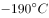，这是我国探月工程首次获取月夜温度探测数据。这也是国内首次实测月夜期间浅层月壤温度，并不是国际上首次。

D项正确，2019年1月3日上午10点26分，“嫦娥四号”探测器成功着陆在月球背面东经177.6度、南纬45.5度附近的预选着陆区，并通过“鹊桥”中继星传回了世界第一张近距离拍摄的月背影像图，揭开了古老月背的神秘面纱。这是人类首次月背与地球的中继通信，开启了人类月球探测新篇章。

本题为选非题，故正确答案为C。

---

### 第 3 题　qid 2367777 · 人文常识

今年是中华人民共和国成立70周年。下列对中华人民共和国成立意义的表述，正确的是
①标志着新民主主义社会的结束
②基本完成了民族独立和人民解放的任务
③为实现中华民族的伟大复兴开辟了新纪元
④为中国的进步和发展创造了最重要的前提

- **A**. ①②③
- **B**. ①③④
- **C**. ②③④　✅
- **D**. ①②③④

**答案**：C

**官方解析**

本题考查政治常识。
①错误，1949年10月新中国成立，标志着我国进入到新民主主义社会。到1956年社会主义改造基本完成，标志着新民主主义社会结束。
②③正确，中国共产党领导全国各族人民，推翻了压在人民头上的帝国主义、封建主义和官僚资本主义三座大山，取得新民主主义革命的基本胜利并建立了中华人民共和国，使中国结束了一百多年来被侵略被奴役的屈辱历史，真正成为了独立自主的国家，中国人民从此站起来了，成为国家的主人。所以，新中国的成立，基本完成了民族独立和人民解放的任务，开辟了中国历史的新纪元。
④正确，习近平在庆祝改革开放40周年大会上的讲话上指出：“以毛泽东同志为主要代表的中国共产党人，把马克思列宁主义基本原理同中国革命具体实践结合起来，创立了毛泽东思想，团结带领全党全国各族人民，经过长期浴血奋斗，完成了新民主主义革命，建立了中华人民共和国，确立了社会主义基本制度，成功实现了中国历史上最深刻最伟大的社会变革，为当代中国一切发展进步奠定了根本政治前提和制度基础。”
①错误，②③④正确。
故正确答案为C。

---

### 第 4 题　qid 2367781 · 人文常识

1919年爆发的五四运动，是中国近代史上一个划时代的事件。下列关于五四运动的表述，正确的是

- **A**. 直接导火线是第一次世界大战的爆发
- **B**. 具备了旧民主主义革命的一些基本特点
- **C**. 青年学生在五四运动中发挥了决定性的作用
- **D**. 为中国共产党成立作了思想和干部上的准备　✅

**答案**：D

**官方解析**

本题主要考查人文常识。
第一次世界大战期间，欧洲列强无暇东顾，日本乘机加强对中国的侵略，严重损害了中国的主权，中国人民的反日情绪日渐增长。一战结束后，1919年召开巴黎和会，会上中国外交失败，引发了伟大的五四运动，这就是在1919年5月4日发生在北京的一场以青年学生为主，广大群众、市民、工商人士等阶层共同参与的，通过示威游行、请愿、罢工、暴力对抗政府等多种形式进行的爱国运动，这是中国人民彻底的反对帝国主义、封建主义的爱国运动。
A项错误，五四运动的直接导火线是中国在“巴黎和会”上的外交失败。1919年召开的巴黎和会将战前德国在山东的特权转交给日本，严重损害了中国的利益，消息传到国内引发了五四运动。而第一次世界大战的时间是1914年7月28日—1918年11月11日，五四运动爆发时第一次世界大战已经结束。
B项错误，五四运动是中国新民主主义革命的开端，在此之前的近代以来的资产阶级民主革命为中国的旧民主主义革命。新民主主义革命是无产阶级领导的、人民大众的、反对帝国主义、封建主义、官僚资本主义的革命。它的目标是无产阶级（通过中国共产党）牢牢掌握革命领导权，彻底完成革命的任务，并及时实现由新民主主义向社会主义的过渡。而旧民主主义革命是资产阶级领导的，以建立资产阶级共和国为目的的资产阶级民主革命。所以五四运动并不具有旧民主主义革命的特点。
C项错误，工人阶级在五四运动中发挥了决定性的作用,青年学生发挥了先锋作用。
D项正确，五四运动波及中国思想文化、政治发展方向、社会经济潮流、教育，同时对中国共产党的建立和发展起到了重要的作用。五四运动传播了马克思主义，且当时参与的代表比如瞿秋白、周恩来等人，后期也担任了我党的重要领导人，所以说五四运动为党的成立作了思想和干部上的准备。
故正确答案为D。

---

### 第 5 题　qid 2367784 · 人文常识

今年是我国全面建成小康社会、实现第一个百年奋斗目标的关键之年。下列对2020年全面建成小康社会目标的理解，不正确的是

- **A**. 科技实力跃升，跻身创新型国家前列　✅
- **B**. 现行标准下农村贫困人口实现脱贫
- **C**. 人民的生活水平和生活质量普遍提高
- **D**. 主要污染物的排放总量大幅度减少

**答案**：A

**官方解析**

本题主要考查政治常识。
“十三五”规划指出，“十三五”时期是全面建成小康社会的决胜阶段。必须认真贯彻党中央战略决策和部署，准确把握国内外发展环境和条件的深刻变化，积极适应把握引领经济发展新常态，全面推进创新发展、协调发展、绿色发展、开放发展、共享发展，确保全面建成小康社会。
A项错误，“十三五”规划指出：创新驱动发展成效显著。创新驱动发展战略深入实施，创业创新蓬勃发展，全要素生产率明显提高。科技与经济深度融合，创新要素配置更加高效，重点领域和关键环节核心技术取得重大突破，自主创新能力全面增强，迈进创新型国家和人才强国行列。因此“跻身创新型国家前列”的说法错误。
B、C两项正确，“十三五”规划指出：人民生活水平和质量普遍提高。就业、教育、文化体育、社保、医疗、住房等公共服务体系更加健全，基本公共服务均等化水平稳步提高。教育现代化取得重要进展，劳动年龄人口受教育年限明显增加。就业比较充分，收入差距缩小，中等收入人口比重上升。我国现行标准下农村贫困人口实现脱贫，贫困县全部摘帽，解决区域性整体贫困。
D项正确，“十三五”规划指出：生态环境质量总体改善。生产方式和生活方式绿色、低碳水平上升。能源资源开发利用效率大幅提高，能源和水资源消耗、建设用地、碳排放总量得到有效控制，主要污染物排放总量大幅减少，主体功能区布局和生态安全屏障基本形成。
本题为选非题，故正确答案为A。

---

### 第 6 题　qid 2367788 · 法律常识

张某驾车时因未张贴“交强险”标识，被交警孔某拦下，当场作出罚款50元的决定。下列关于该行政处罚的说法，正确的是

- **A**. 孔某一人不能当场作出这一处罚决定
- **B**. 张某在处罚决定作出前有权要求听证
- **C**. 孔某须将处罚决定报所属交警大队备案　✅
- **D**. 张某若不服处罚，起诉前应先提请复议

**答案**：C

**官方解析**

A项错误、C项正确：《公安机关办理行政案件程序规定》简易程序部分第三十七条第一款规定：“违法事实确凿，且具有下列情形之一的，人民警察可以当场作出处罚决定，有违禁品的，可以当场收缴：（一）对违反治安管理行为人或者道路交通违法行为人处二百元以下罚款或者警告的；（二）出入境边防检查机关对违反出境入境管理行为人处五百元以下罚款或者警告的；（三）对有其他违法行为的个人处五十元以下罚款或者警告、对单位处一千元以下罚款或者警告的；（四）法律规定可以当场处罚的其他情形。”第三十九条规定：“适用简易程序处罚的，可以由人民警察一人作出行政处罚决定。人民警察当场作出行政处罚决定的，应当于作出决定后的二十四小时内将当场处罚决定书报所属公安机关备案，交通警察应当于作出决定后的二日内报所属公安机关交通管理部门备案。在旅客列车、民航飞机、水上作出行政处罚决定的，应当在返回后的二十四小时内报所属公安机关备案。”交警孔某对张某处以50元的罚款，符合行政处罚简易程序的条件，可以由警察一人作出。孔某应当于作出行政处罚决定后的二日内报其所属的交警大队备案。
B项错误：《公安机关办理行政案件程序规定》第一百二十三条规定：“在作出下列行政处罚决定之前，应当告知违法嫌疑人有要求举行听证的权利：（一）责令停产停业；（二）吊销许可证或者执照；（三）较大数额罚款；（四）法律、法规和规章规定违法嫌疑人可以要求举行听证的其他情形。前款第三项所称‘较大数额罚款’，是指对个人处以二千元以上罚款，对单位处以一万元以上罚款，对违反边防出境入境管理法律、法规和规章的个人处以六千元以上罚款。对依据地方性法规或者地方政府规章作出的罚款处罚，适用听证的罚款数额按照地方规定执行。”并不是所有的行政处罚都可以要求听证，对张某作出的罚款50元的行政处罚决定，张某不能要求听证。
D项正确，根据《行政复议法》第二十三条第一款第一项规定：“有下列情形之一的，申请人应当先向行政复议机关申请行政复议，对行政复议决定不服的，可以再依法向人民法院提起行政诉讼：（一）对当场作出的行政处罚决定不服；”张某若不服行政处罚，应先申请行政复议。（注：因《行政复议法》修改，本题D项目前也是正确答案。）
故正确答案为C。

---

### 第 7 题　qid 2367792 · 人文常识

王某向县规划部门申请旧房改建，获得批准。张某认为王某的改建严重影响了其通行和采光，遂以阻挡消防通道为由向县消防部门举报。消防部门调查后，责令王某停止施工，并限期拆除已建部分。下列关于本案的说法，不正确的是

- **A**. 规划部门有权要求消防部门撤销处罚决定　✅
- **B**. 张某有权向规划部门申请撤销改建许可
- **C**. 消防部门可以请求县政府撤销改建许可
- **D**. 改建许可被撤销前应中止处罚决定的执行

**答案**：A

**官方解析**

本题考查法律常识。
A项错误，可撤销的具体行政行为必须经过法定程序由国家有权机关作出撤销决定，才能否定其法律效力。法定程序是指行政复议、行政诉讼和行政监督程序。行政相对人可以通过复议和诉讼途径，由复议机关和法院撤销该行政行为，行政监督程序中，上级主管部门有权撤销该具体行政行为，机关发现行政行为有可撤销情形的，也能撤销该具体行政行为。因此，本题中，规划局和消防部门属于平级单位，无权要求消防部门撤销处罚决定。
B、C两项正确，《行政许可法》第七条规定：“公民、法人或者其他组织对行政机关实施行政许可，享有陈述权、申辩权；有权依法申请行政复议或者提起行政诉讼；其合法权益因行政机关违法实施行政许可受到损害的，有权依法要求赔偿。”《行政许可法》第六十九条第一款规定：“有下列情形之一的，作出行政许可决定的行政机关或者其上级行政机关，根据利害关系人的请求或者依据职权，可以撤销行政许可：（一）行政机关工作人员滥用职权、玩忽职守作出准予行政许可决定的；（二）超越法定职权作出准予行政许可决定的；（三）违反法定程序作出准予行政许可决定的；（四）对不具备申请资格或者不符合法定条件的申请人准予行政许可的；（五）依法可以撤销行政许可的其他情形。” 张某作为利害关系人，有权向规划部门申请撤销改建许可。消防部门可以请求县规划部门的上级机关（县政府）撤销改建许可。
D项正确，信赖保护原则是行政法的一项重要原则，指的是行政行为作出后，行政相对人基于对行政行为的信赖，而做出的行为是受到保护的，行政机关不得擅自撤销、变更已生效的行政行为。本题中，王某改建房屋是获得了规划部门批准的，改建许可不得随意撤销。如果此时继续进行处罚执行，拆除王某已建房屋，会对王某利益造成重大损害。因此，改建许可被最终撤销前，处罚中止执行。
本题为选非题，故正确答案为A。

---

### 第 8 题　qid 2367798 · 人文常识

某公司董事长孙某当选为区人大代表。下列关于孙某履行代表义务的说法，正确的是

- **A**. 孙某应协助区政府开展招商引资工作
- **B**. 孙某应设立“人大代表工作室”开展调研工作
- **C**. 孙某应定期将公司的经营状况报告区人大常委会
- **D**. 孙某应积极参加对区人民法院执法情况的检查工作　✅

**答案**：D

**官方解析**

本题考查法律常识。
根据《代表法》第四条规定：“代表应当履行下列义务：（一）模范地遵守宪法和法律，保守国家秘密，在自己参加的生产、工作和社会活动中，协助宪法和法律的实施；（二）按时出席本级人民代表大会会议，认真审议各项议案、报告和其他议题，发表意见，做好会议期间的各项工作；（三）积极参加统一组织的视察、专题调研、执法检查等履职活动；（四）加强履职学习和调查研究，不断提高执行代表职务的能力；（五）与原选区选民或者原选举单位和人民群众保持密切联系，听取和反映他们的意见和要求，努力为人民服务；（六）自觉遵守社会公德，廉洁自律，公道正派，勤勉尽责；（七）法律规定的其他义务。”
 A、B、C三项错误，D项正确，孙某应积极参加对区人民法院执法情况的检查工作符合《代表法》第四条第（三）项的规定。
 故正确答案为D。

---

### 第 9 题　qid 2367803 · 人文常识

楚汉相争在我国历史文化中留下了深深的印迹。下列表述不正确的是

- **A**. 象棋中的“楚河汉界”源自于这段历史
- **B**. 成语“破釜沉舟”源于楚汉相争中的一场战役　✅
- **C**. 琵琶曲《十面埋伏》反映了楚汉垓下决战情形
- **D**. 诗句“生当作人杰，死亦为鬼雄”以此为题材

**答案**：B

**官方解析**

本题考查人文常识。
A项正确，楚河汉界，为象棋棋盘中的分界线，来源于楚汉战争。《史记》中对于刘邦和项羽之战的记载有“鸿沟而西者为汉，鸿沟而东者为楚”，历史就这样使鸿沟成了“楚河汉界”。
B项错误，“破釜沉舟”来源于项羽一战成名的巨鹿之战，公元前207年，项羽的起义军与秦将章邯率领的秦军主力部队在巨鹿（今河北邢台市）展开大战；项羽不畏强敌，引兵渡漳水（由巨鹿东北流向东南的一条河）。渡河后，项羽命令全军：“皆沉船，破釜甑，烧庐舍，持三日粮，以示士卒必死，无一还心。”最终，项羽大获全胜，巨鹿一战，是项羽和秦军的一场战役，不是楚汉相争中的战役。
C项正确，“十面埋伏” 这个典故出自楚汉相争的垓下之战，楚汉相争时期，汉王刘邦麾下韩信率30万大军和彭越的军队会师，把项羽围困在垓下（今安徽省宿州市灵璧县东南），他采取十面埋伏的战术，逼使项羽在乌江自刎，取得决定性的胜利。
D项正确，宋代女词人李清照写的《夏日绝句》：“生当作人杰，死亦为鬼雄。至今思项羽，不肯过江东”，写的正是楚汉相争中项羽乌江自刎的情形。
本题为选非题，故正确答案为B。

---

### 第 10 题　qid 2367805 · 人文常识

对下列诗句所描写活动的解释，正确的是

- **A**. “清风如可托，终共白云飞”描写的是射箭
- **B**. “平明寻白羽，没在石棱中”描写的是捉迷藏
- **C**. “嘈嘈切切错杂弹，大珠小珠落玉盘”描写的是弹琵琶　✅
- **D**. “三五步行遍天下，六七人百万雄兵“描写的是下象棋

**答案**：C

**官方解析**

本题考查人文常识。
A项错误，“清风如可托，终共白云飞”出自北宋诗人寇准的《纸鸢》。全诗歌风筝以咏志，通过写风筝需要外力依托才能飞翔，以物喻人，尽显辩证唯物主义思想。
B项错误，“平明寻白羽，没在石棱中”出自唐代诗人卢纶的《和张仆射塞下曲·其二》，描写了天明寻找（昨晚射出的）白羽箭，发现箭头已深深没入在巨大石块中，突出了将军射箭技艺的高超。
C项正确，“嘈嘈切切错杂弹，大珠小珠落玉盘”出自唐代诗人白居易的《琵琶行》。诗句描写了琵琶声错落有致，疾乱中自有章法，像珍珠掉落玉盘一样清脆动听。
D项错误，“三五步行遍天下，六七人百万雄兵”突出了京剧表演中成队的随从或兵卒在台上表现大场景的演出特点，因此描写的是戏台，而不是下象棋。
故正确答案为C。

---

### 第 11 题　qid 2367809 · 人文常识

对下列词语的解释，不正确的是（    ）。

- **A**. 风树之悲——因父母去世而悲伤
- **B**. 金兰之交——亲如兄弟的友情
- **C**. 期颐之年——八九十岁的年龄　✅
- **D**. 弄璋之喜——生了男孩的喜庆

**答案**：C

**官方解析**

本题考查人文常识。

A项正确，“风树之悲”出自《韩诗外传》卷九，原文是“树欲静而风不止，子欲养而亲不待”。指因父母亡故，不能奉养的悲伤。

B项正确，“金兰之交”最早出自《周易系辞上》“二人同心，其利断金；同心之言，其臭如兰”。原指牢固而融洽的友情，后用做结拜为兄弟姐妹的代称。

C项错误，“期颐之年”出自《礼记曲礼上》中“百年曰期颐”一句，意为百岁老人饮食起居不能自理，一切需期待别人供养或照顾。因此，“期颐之年”指一百岁，而不是八、九十岁。

D项正确，“弄璋”指的是古人把璋给男孩玩，希望他将来有玉一样的品德。因此，“弄璋之喜”旧时常用以祝贺生了男孩的喜庆。

本题为选非题，故正确答案为C。

---

### 第 12 题　qid 2367813 · 经济常识

下列不属于我国当前振兴实体经济、促进企业“脱虚向实”措施的是：

- **A**. 提高金融机构的存款准备金比率　✅
- **B**. 设立战略性新兴产业专项发展基金
- **C**. 加大房地产企业土地使用金认缴比例
- **D**. 强化金融机构资产及表外业务的监管

**答案**：A

**官方解析**

本题考查经济常识。

“脱虚向实”即经济脱离虚拟经济的投资，转向实体经济的投资、生产、流通。

A项错误，存款准备金率是指金融机构为保证客户提取存款和资金清算需要而准备的在中央银行的存款比例。提高存款准备金率是应对通货膨胀的措施，其调节经济的基本逻辑为：提高存款准备金率银行用于贷款的货币减少货币供应量减少抑制通货膨胀。银行用于贷款的货币减少，经济实体投资缩小，不利于发展实体经济。

B项正确，设立战略性新兴产业发展基金是为了加快培育形成经济新动能，属于振兴实体经济的措施。

C项正确，认缴比例是投资者出的钱在投资总额中占的比重。加大房地产企业土地使用金认缴比例即要求投资者在开发房地产方面要投入更多的资金，金融、房地产、互联网某种意义上来说都是为实体经济服务的，其发展水平必须与实体经济相称，要把更多的资金和资源配置到实体经济中去。加大房地产企业土地使用金认缴比例提高了房地产投资门槛，可以遏制房地产的过度发展，间接促进实体经济的发展。

D项正确，“表外”指的是金融机构的资产负债表之外的资金。强化金融机构资产及表外业务的监管有助于抑制泡沫和防控金融风险，引导资金脱虚向实，必然要继续防范金融风险，为实体经济创造稳定的流动性环境。

本题为选非题，故正确答案为A。

---

### 第 13 题　qid 2367817 · 人文常识

下列关于水资源的说法，不正确的是

- **A**. 地球上水资源的主体是咸水
- **B**. 海洋水与陆地水在不断循环
- **C**. 地球上水体大多以液态存在
- **D**. 地球上淡水主体是江河湖水　✅

**答案**：D

**官方解析**

本题考查地理国情。

A项正确，地球上的水按其存在的领域可分为海洋水（咸水）、陆地水（既有咸水也有淡水）、大气水（淡水），海洋水占全部水体的，因此，地球上水资源的主体是咸水。

B项正确，由于太阳辐射和重力作用，地球上存在水循环。地球表面各种形式的水体是不断地相互转化的，水以气态，液态和固态的形式在陆地、海洋和大气间不断循环的过程就是水循环。

C项正确，地球上水的存在形态有三种：固态、液态、气态。大部分以液态的形态存在；在寒冷的极地和高山上水常常以固态的形态存在；空气中的水主要以气态的形态存在。自然界的水随着温度的改变，状态也会发生变化。

D项错误，冰川水是地球上最宝贵、最丰富的淡水资源，蕴藏了所有淡水资源的。但多处于极端的特殊地理位置，要么在南极、北极，要么在极高山上，所以冰川水具有极高的价值，但开采条件极其艰难。

本题为选非题，故正确答案为D。

---

### 第 14 题　qid 2367820 · 地理国情

下列对有关气候效应的解释，正确的是

- **A**. 阳伞效应是指由于天空中大块乌云的阻挡而削弱太阳短波辐射，使气温降低
- **B**. 热岛效应是指由于城市下垫面特性和人类活动影响，使市区的气温比郊区高　✅
- **C**. 温室效应是指温室气体透过太阳长波辐射，大量吸收地面短波辐射，使气温升高
- **D**. 海洋沙漠化效应是指海洋因受周围陆地沙漠化的影响，失去了对气温的调节功能

**答案**：B

**官方解析**

本题考查地理国情。
A项错误，阳伞效应指由于大气中固、液体粒子对太阳辐射的强烈阻挡作用，而使地表气温降低的现象。大气中的固、液体粒子来源于人为排放和自然过程如火山喷发、森林火灾等。它们能直接吸收和反射太阳辐射能，还能作为凝结核，使天空云量增加，加大反射率，这些都能使地表所获得的太阳辐射能减少。
B项正确，热岛效应指城市气温较四周郊区为高，好像一个温暖的岛屿分布于农村较凉的“海洋”之中。其形成原因主要是：人类活动导致有大量人为热释放；产生污染物质增多，加强了大气保温作用；下垫面吸收的辐射热量，主要用于加热市区空气。
C项错误，温室效应是指由于地球表面空气中的二氧化碳等温室气体浓度增加，而导致地表附近气温的升高的现象。其形成原因是：温室气体可以使太阳短波辐射透过，地表由于吸收短波辐射被加热，提高了温度，再以长波向外辐射，而长波又被温室气体吸收，使气温升高。
D项错误，海洋沙漠化效应是指倾注到海洋中的废油，在海面形成油膜，起到抑制海水蒸发的作用，同时又减少了海面潜热的转移，使海洋失去调节气温的作用，因而海洋上的空气变得愈来愈干燥，故称之为“海洋沙漠化效应”。
故正确答案为B。

---

## 言语理解与表达

### 材料 1

        知识产权广义上是关于无形智力成果的专有权利，是通过排除他人的主张和干预而独占智力成果的开发和使用，进而获得独占权益的制度。基于知识产权的<u>                         </u>属性，财产理论成为知识产权制度的核心理论。具体到知识产权与公共领域的二元关系中，则是一方面强调权利人作为财产权主体控制其权属范围内的一切资源而排除资源自由流动的可能性；另一方面将<u>公共领域作为知识产权潜在的“对手”</u>，主张公共领域的边界和层次的发展压缩了知识产权的权属范围，限制了知识产权作为一项财产权利的功能实现。

        为了避免公共资源的过度使用而造成资源损耗，通过财产制度赋予主体对特定资源的所有权，可以确保资源的使用受到合理规范和控制。同时，财产所有权的确立在减少资源损耗的基础上增加财产使用带来的收益，引导财产主体进一步投入、开发和使用资源本身，形成资源不断增值和收益的良性循环。

        智力成果作为知识产权的客体具有无形属性，在创造、传播和使用过程中不会产生“公有物的悲剧”中资源过度使用的困境。然而智力成果缺少法律制度的规范而允许不受限制的自由使用，造成的不利后果则是权利主体无法就智力成果的价值进行有效的收益，最终导致智力创造活动激励不足而无以为继。巧合的是，财产化智力资源能提供充裕的行为激励而解决这个问题。在经济学理论的背景下，知识产权依托财产理论实现重要的制度功能——鼓励智力创造活动，这又与知识产权制度的根本目的相契合。

        问题在于，财产理论并不能完全解释资源的开发和使用。资源的财产化发展到一定程度反而会阻碍后续开发和使用行为。<u>知识产权领域也有类似的矛盾</u>。在传统的生物制药领域，基于专利申请而不断增加的专利数量不仅没有进一步促进研发创新，反而由于权属复杂分散难以整合而导致后续研发的成本过高，最终阻碍生物制药行业的发展。类似的，版权领域内的演绎行为的权利传统上归属于作品原作者。然而，滑稽戏仿等创作行为本身是对原作品进行丰富和发展的合理手段，通过转化性的创作来体现不同于原作者的目的和意图，能有效丰富社会整体文化艺术作品的数量和质量。实践中各国在版权立法方面将滑稽戏仿规定为版权的例外并允许类似行为的实施。显然，坚持绝对的演绎权利必然压缩演绎作者创作的空间，抑制基于原作品的演绎行为。因此，知识产权制度在理论构建过程中不能依赖财产化思路将智力资源完全专有化，而应该在财产化的过程中兼顾其他策略来实现知识产权的制度目的。

#### 第 1 题　qid 2367891 · 语句表达

填入文中画横线处最恰当的一项是

- **A**. 专有和排他　✅
- **B**. 专属和高端
- **C**. 独有和专业
- **D**. 独创和稀缺

**答案**：A

**官方解析**

横线所在句子在文段中间，起着承上启下的作用，应结合上下文。首句指出“知识产权广义上是······的专有权利，是通过排除他人······独占权益的制度。”强调知识产权的专有和排他的两面性。后文对“知识产权与公共领域的关系”从两方面进行介绍，横线处应体现“知识产权的属性”，结合文段可知应为A项。B、C两项仅提到“专属”“独有”仅属于知识产权的一方面属性，表述片面，排除。D项“独创和稀缺”为无中生有，排除。
故正确答案为A。
【文段出处】《孙阳：论公共领域的功能实现》

---

#### 第 2 题　qid 2367892 · 片段阅读

对文章第一段中“公共领域作为知识产权潜在的‘对手’”理解不正确的是

- **A**. 知识产权理论上就是一种私人财产权
- **B**. 公共领域的活动可能会影响知识产权实现
- **C**. 知识产权作为私人财产不可用于公共领域　✅
- **D**. 权利人不希望被公共领域侵犯其权益

**答案**：C

**官方解析**

A项，根据“财产理论成为知识产权制度的核心理论”及“权利人作为财产权主体控制其权属范围内的一切资源而排除资源自由流动的可能性”可知，表述正确，排除；
B项、D项，根据“主张公共领域的边界和层次的发展压缩了知识产权的权属范围，限制了知识产权作为一项财产权利的功能实现”可知，此处强调权利人主张要明晰“公共领域的边界和层次”来保护其权利，故“公共领域活动”可能会侵犯权利人的权利，B、D选项表述均正确，排除；
C项，文段并未明确指出“不可用于公共领域”，表述过于绝对，表述错误，当选。
本题为选非题，故正确答案为C。

---

#### 第 3 题　qid 2367893 · 片段阅读

作者认为，知识产权不受限制自由使用最终将会导致

- **A**. 智力成果的权利人无法得到相应的收益
- **B**. 智力创造活动由于激励不足而无以为继　✅
- **C**. 无法形成知识产权资源收益的不断增值
- **D**. 知识产权的使用缺乏合理的规范和控制

**答案**：B

**官方解析**

根据篇章第3段“然而智力成果缺少法律制度的规范而允许不受限制的自由使用，造成的不利后果则是权利主体无法就智力成果的价值进行有效的收益，最终导致智力创造活动激励不足而无以为继”可知，最终会导致的结果是智力创造活动激励不足而无以为继，对应选项为B。
A项“无法得到相应的收益”、C项“无法形成资源收益的增值”均为知识产权不受限制自由使用的不利后果，而并非最终会导致的结果，排除；
D项，“缺乏合理的规范和控制”为知识产权不受限制自由使用的原因，而非结果，排除。
故正确答案为B。
【文段出处】《孙阳：论公共领域的功能实现》

---

#### 第 4 题　qid 2367894 · 片段阅读

对文章最后一段中“知识产权领域也有类似的矛盾”解释不恰当的是

- **A**. 专利数量不断增加有时并未促进研发创新
- **B**. 知识产权的财产化导致后续研发成本过高
- **C**. 版权领域内的演绎权利只能归属于原作者　✅
- **D**. 后人从事转化性创作有时也缺乏必要空间

**答案**：C

**官方解析**

“类似的矛盾”指代上文，即资源的财产化发展到一定程度反而会阻碍后续开发和使用行为。且后文详细介绍了这种矛盾的两种情况，一种是由于专利数量不断增加导致研发成本过高，最终阻碍发展，对应A、B两项。一种是由于坚持绝对的演绎权利，压缩了演绎作者创作的空间，抑制基于原作品的演绎行为，对应D项。
C项，根据“类似的，版权领域内的演绎行为的权利传统上归属于作品原作者”以及后文“实践中各国在版权立法方面将滑稽戏仿规定为版权的例外并允许类似行为的实施”可知，各国允许其他作者对原作品通过丰富和发展的合理手段，进行转化性的创作，故表述错误，排除。
本题为选非题，故正确答案为C。
【文段出处】《孙阳：论公共领域的功能实现》

---

#### 第 5 题　qid 2367895 · 片段阅读

这篇文章着重说明的是

- **A**. 知识产权过度保护也将造成危害
- **B**. 知识产权实质上是财产权问题
- **C**. 知识产权与公共领域的相互关系
- **D**. 知识产权保护需注意其两面性　✅

**答案**：D

**官方解析**

篇章首先介绍了知识产权及其核心理论财产理论，并说明了两者间的关系，引出话题。接着文段提出观点，说明为了避免公共资源的过度使用而造成资源损耗，通过财产制度赋予主体对特定资源的所有权，可以确保资源的使用受到合理规范和控制，以此详细说明知识产权的客体智力成果依托财产理论的重要性。最后文段指出问题，财产理论并不能完全适用于知识产权，并通过“因此”给出结论，即知识产权应该在财产化的过程中兼顾其他策略来实现知识产权的制度目的。
故篇章主要论述了知识产权需要财产理论的保护，并说明其不能只依赖财产理论的保护，否则会产生问题。即论述了用财产理论保护知识产权是把双刃剑，对应选项为D。
A项，未提及通过财产理论保护知识产权的好处及必要性，表述片面，排除；
B项，财产理论仅是知识产权的核心理论，且文段表明还需兼顾其他策略，故表述过于绝对，排除；
C项，“相互关系”表述不具体明确，且文段主要论述的是知识产权与财产理论间的关系，排除。
故正确答案为D。
【文段出处】《孙阳：论公共领域的功能实现》

---

#### 第 6 题　qid 2367864 · 片段阅读

财政作为国家治理的基础和重要支柱，对促进科技创新具有重要的支撑、引领、提升与保障作用。具体来看，财政政策可以通过有的放矢的精准化财政投入，为科技创新输入供给端推力；通过有扶有控的差异化税收优惠通道，为科技创新构筑引导性激励；通过导向明确的选择性政府采购渠道，为科技创新设定需求端拉力。
这段文字重点说明的是

- **A**. 财政政策促进科技创新的主要途径　✅
- **B**. 财政政策在科技创新中的提升作用
- **C**. 财政政策对科技创新所产生的影响
- **D**. 财政政策制定要考虑科技创新需要

**答案**：A

**官方解析**

文段开篇指出财政对于科技创新有重要的支撑、引领、提升、保障作用，“具体来看”引出对策，后文通过三个并列的分句详细说明财政如何对科技创新起作用。故文段重在说明财政政策促进科技创新的途径，对应A项，当选。
B项“提升作用”表述片面，文段中说明还有引领、保障、支撑作用，排除。
C项“所产生的影响”表述不明确，“影响”可以是积极的作用也可以是消极的作用，文段中为积极的作用，排除。
D项“要考虑科技创新的需要”无中生有，文段没有提及，排除。
故正确答案为A。
【文段出处】《创新驱动导向下财政政策促进科技创新的路径探索》

---

#### 第 7 题　qid 2367865 · 片段阅读

语言的发展、维持或衰落从来不是一个纯粹的语言学问题，而是复杂的社会、政治和经济力量相互博弈的结果。当前，学界主要从社会学、政治学以及经济学等视角探讨方言保护问题，而有关方言的法律保护尤其是行政法保护的研究尚不多见。因此，建立和完善我国方言保护的行政法机制，协调普通话与方言的冲突，从而在语言的通用性、规范性与多样性之间寻求均衡保护，具有重要的理论与应用价值。
这段文字之后最有可能讨论的是：

- **A**. 方言保护具有的理论与实践价值
- **B**. 语言规范化和多样化平衡的方法
- **C**. 普通话与方言的冲突并非不可调和
- **D**. 如何通过行政立法对方言进行保护　✅

**答案**：D

**官方解析**

本题为接语选择题，需在通读全文的基础上重点关注文段最后谈论的核心话题。文段开篇指出语言的发展是复杂力量博弈的结果，“当前”指出语言方面存在的问题，即“有关方言的行政法保护研究尚不多见”。尾句“因此”得出结论，说明建立和完善方言保护的行政法机制意义重大。故下文应该围绕“行政法”的建立和完善继续论述，D项与尾句话题一致，当选。
A、B、C三项均没有提及尾句的核心话题“行政法”，与文段无法衔接，排除。
故正确答案为D。
【文段出处】《论汉学方言的行政法保护》

---

#### 第 8 题　qid 2367866 · 片段阅读

以人均收入衡量的发展差距，本身隐含着一个资源禀赋结构上的差异，即发达地区具有相对丰富的资本要素，从而在资本密集型产业上具有比较优势；而相对不发达地区则具有劳动力丰富和生产成本低的比较优势。东中西部地区之间存在的资源禀赋结构差异，无疑可以成为中西部地区经济发展赶超的机遇。
下列说法与文意不符的是：

- **A**. 不同地区资源禀赋的差异有利有弊　✅
- **B**. 发达地区相对来说劳动力比较缺乏
- **C**. 中西部可以利用劳动力丰富的优势
- **D**. 资本密集型产业多集中在东部地区

**答案**：A

**官方解析**

A项，“有利有弊”与文段不符，文段中只提及了资源禀赋的“优势”，没有提及“弊端”，故选项与文段不符，当选。
B项，根据“相对不发达地区则具有劳动力丰富和生产成本低的比较优势”可知，“发达地区相对来说劳动力比较缺乏”符合文意，排除。
C项，根据“相对不发达地区则具有劳动力丰富和生产成本低的比较优势”以及“无疑可以成为中西部地区经济发展赶超的机遇”可知，中西部为经济相对不发达的地区，具有劳动力丰富和生产成本低的比较优势，符合文意，排除。
D项，根据“发达地区具有相对丰富的资本要素，从而在资本密集型产业上具有比较优势”以及“无疑可以成为中西部地区经济发展赶超的机遇”可知，东部为经济相对发达的地区，具有丰富的资本要素，符合文意，排除。
本题为选非题，故正确答案为A。
【文段出处】《中国经济增长如何转向全要素生产率驱动型》

---

#### 第 9 题　qid 2367867 · 片段阅读

在整个地图学史上，有效使用地图意味着看懂绘制在平面上的一系列抽象符号，然后将这些符号与当地环境的各种三维特征联系起来，从而成功地确定自己的位置。但这并不是所有普通人都能够做到的，而且不久之前，地图本身也还是一种稀缺的人工制品，有些地图还属于军事上敏感的机密。但是，能够在手机屏幕上看到的地图改变了这一切。
这段文字重在说明

- **A**. 地图学发展经历了漫长的历史过程
- **B**. 地图绘制使用中存在诸多技术难题
- **C**. 智能手机的出现促进了地图学发展　✅
- **D**. 智能手机大大提升了人类生活质量

**答案**：C

**官方解析**

文段开篇介绍在地图学的历史上，有效使用地图对人们的要求极高。“但”表转折，强调不是所有人都能看懂地图，而且地图还是一种稀缺品，不是所有人都能看到地图。尾句“但是”表转折，强调手机上的地图改变了这一情况。故文段重在强调手机上的地图改变了地图原来的情况，使所有人都能看到、看懂地图，对应C项，当选。
A项和B项没有提及文段的重点“手机”，排除；D项没有提及“地图”这一核心话题，且“提升了人类生活质量”无中生有，排除。
故正确答案为C。

---

#### 第 10 题　qid 2367869 · 片段阅读

城镇化是一个长期的历史过程。在这个过程中，既有人口从农村向城镇迁移的正向城镇化，也不可避免地会出现农民工返乡等逆城镇化现象。通过加快户籍制度改革，促进农业转移人口市民化，可以保证城镇化持续推进；同时，实施乡村振兴战略，不仅可以为农村人才和劳动力创造更广阔的用武之地，也使城镇化的推进更加行稳致远。
下列说法与文意不符的是

- **A**. 推进城镇化不等于只允许人口向城镇迁移
- **B**. 推进城镇化进程中应倡导农民工返乡创业　✅
- **C**. 实施乡村振兴战略与城镇化进程并不矛盾
- **D**. 城镇化过程中户籍制度改革是关键的一步

**答案**：B

**官方解析**

A项，文段“既有人口从农村向城镇迁移的正向城镇化，也不可避免地会出现农民工返乡等逆城镇化现象”中“既······也······”表示并列，故“人口向城镇迁移”只是城镇化的一种情况，故选项“不等于只允许······”表述正确，排除；
B项，“倡导农民返乡创业”文段未提及，无中生有，当选；
C项，由文段“实施乡村振兴战略······也使城镇化的推进更加行稳致远”可知，二者不矛盾，表述正确，排除；
D项，“户籍制度改革是关键的一步”由文段“通过加快户籍制度改革······促进······可以保证······”可知，表述正确，排除。
本题为选非题，故正确答案为B。
【文段出处】《如何让新型城镇化走得更远》

---

#### 第 11 题　qid 2367871 · 片段阅读

传统文学自现代以来一直有纯文学和通俗文学之分。纯文学的读者往往是小众的、精英化的，通俗文学则是供更广大的人群阅读，而作者也是顺应这两个阅读方向形成了相对稳定的群体。网络文学则不同于这两者，能让更多的年轻群体参与阅读。它的多样性让更多的人能够在其间满足自己的需求，因此让原来并非文学读者的一部分大众作为文学阅读的“增量”参与到文学阅读之中，也使得许多不同身份的年轻写作者在这个空间中找到了职业写作的可能性。大量的年轻读者和作者从网络文学的入口进入了文学之中。
这段文字重在说明：

- **A**. 网络文学的出现扩大了文学作品的受众
- **B**. 网络文学比传统文学更能吸引青年人群
- **C**. 网络文学比传统文学更能满足各类人群的需求
- **D**. 网络文学的发展扩大了文学的读者和作者群体　✅

**答案**：D

**官方解析**

文段开篇论述“纯文学”与“通俗文学”受众、作者的情况，接着通过“网络文学则不同于这两者”引出文段的核心话题“网络文学”，然后通过“因此”对上文进行总结，引出结论，其中“也”表示并列，结论为网络文学使得文学读者增加，也使得不同身份的年轻作者加入文学中，尾句“大量······进入了文学之中”对结论进行补充说明，故文段重点为“因此”之后引导的结论，强调网络文学使很多读者和作者加入文学中，D项“扩大了文学的读者和作者群体”概括全面，符合文意，当选。
A项，“扩大······受众”只是网络文学带来的一方面情况，未提及带来作者的增加，表述片面，排除。
B项，“青年群体”只对应“年轻人”，未提及一部分大众加入到文学中，表述片面，排除。
C项，“满足各类人群需求”表述不明确，文段明确提出网络文学利于增加读者和作者，不如D项表述更明确，排除。
故正确答案为D。
【文段出处】《从&lt;悟空传&gt;到&lt;花千骨&gt;文学阅读将走向何方？》

---

#### 第 12 题　qid 2367873 · 片段阅读

动物体型缩小和气候升温之间的联系不止出现在远古时期。随着全球变暖，现生的许多物种体型也在减小。大蟾蜍、蛇、乌龟、蝾螈、林鼠、粪蝇、北极地区的蝴蝶、多种北海鱼和一种绵羊——这些动物的体型都变得越来越小了。这种现象一度让科学家们感到困惑，但是，通过多组实验、野外观测和对化石的研究，答案似乎越来越明显。
下列选项与文意不符的是：

- **A**. 小体型动物个体在气候变暖中具有生存优势
- **B**. 科学家对动物体型变化与气候变暖的相关性早有关注
- **C**. 气候升温导致动物体型缩小在现阶段仅限于理论构想　✅
- **D**. 远古时期已经出现气候升温引发动物体型变化

**答案**：C

**官方解析**

A项，根据文段论述的全球变暖，很多物种体型在缩小，可知在气候变暖中，小体型物种个体具有生存优势，符合文意，排除。
B项，由文段“这种现象一度让科学家们感到困惑”可知，科学家们早已开始关注这一现象，故选项表述正确，排除。
C项，文段论述“通过多组实验、野外观测和对化石的研究，答案似乎越来越明显”，故不仅仅是停留在理论构想阶段，已开始实践研究，选项表述有误，当选。
D项，由文段首句“动物体型缩小和气候升温之间的联系不止出现在远古时期”可知，远古时期已经出现这种现象，选项表述正确，排除。
本题为选非题，故正确答案为C。
【文段出处】《全球气候开始急速变暖，动物却变得越来越小了》

---

#### 第 13 题　qid 2367875 · 片段阅读

人类社会的教育现象，除了教学之外，还存在着无教授的学习，以及未能引发学习的教授等活动。即便是教学，也不仅仅存在于学校里，而是发生在人的社会生活各个领域之中。远在近现代学校产生之前，人类就已经在从事各种各样的教育活动；近现代学校产生之后，人类的教育活动依然在学校以外的社会生活领域中广泛发生着。教育学将自身的研究视野限定在学校时空框架内，实际上是给自己确定了一个错误的学科边界，因而只能将大量的教育现象含糊地当作所谓“广义的教育”而暧昧地排斥于自己的主要研究视域之外。
下列说法与文意不符的是：

- **A**. 教育活动广泛存在于人类生活的各个领域中
- **B**. 无人教授的学习行为也可以归入到教育活动
- **C**. 当前的教育学研究对于学科边界存在误判
- **D**. 近现代学校的出现限制了教育学的研究视野　✅

**答案**：D

**官方解析**

A项，由文段“人类社会的教育现象，除了教学之外，还存在······即便是教学，也不仅仅存在······而是发生在人的社会生活各个领域之中”可知，选项表述正确，排除。
B项，由文段“人类社会的教育现象······还存在着无教授的学习”可知，选项表述正确，排除。
C项，根据文段“教育学将自身的研究视野限定在学校时空框架内，实际上是给自己确定了一个错误的学科边界”可知，选项“教育学······对于学科边界存在误判”表述正确，其中，选项的“误判”对应文段的“错误的”，符合文意，排除。
D项，文段“近现代学校产生之后，人类的教育活动依然在学校以外的社会生活领域中广泛发生着”说明近现代学校产生之后，人类的教育活动未受到限制，故选项“限制······研究视野”表述有误，当选。
本题为选非题，故正确答案为D。
【文段出处】《论教育学的边界》

---

#### 第 14 题　qid 2367877 · 片段阅读

根据新的刑事证据规则，鉴定检材的真实性和同一性已经成为鉴定意见转化为定案根据的前提条件。这显然是我国刑事证据制度发生的重大变化。透过这一变化，我们可以发现司法改革的决策者们已经具有了一种新的理论认识：实物证据鉴真是司法鉴定程序启动的前提和基础；未经鉴真过程，任何专业人士对实物证据所作的“司法鉴定意见”都将是没有法律意义的；实物证据作为一种“送检材料”，在其真实性和同一性存在合理疑问的情况下，鉴定意见将不具有作为定案根据的资格。
这段文字中提取的关键词最恰当的是

- **A**. 刑事证据  实物证据鉴真  定案根据　✅
- **B**. 司法改革  司法鉴定意见  定案根据
- **C**. 鉴定检材  刑事证据制度  司法改革
- **D**. 证据制度  司法鉴定程序  送检材料

**答案**：A

**官方解析**

文段开篇引出新的刑事证据的话题，接着说明我国刑事证据制度的重大变化体现实物证据鉴真的重要性，即实物证据鉴真直接影响实物证据能否成为定案根据。故文段就是强调“刑事证据制度的重大变化即实物证据鉴真直接影响实物证据能否成为定案根据”关键词为“刑事证据、实物证据鉴真、定案根据”，对应A项，当选。
B项、C项“司法改革”对应“司法改革的决策者······”，仅为决策者身份的限定词，非文段核心话题，排除。
D项“证据制度”表述不准确，文段围绕“刑事证据”相关制度、规则展开论述，“司法鉴定程序”对应“是司法鉴定程序的启动的前提和基础”，而该句强调的核心话题是“实物证据鉴真”，排除。
故正确答案为A。

---

#### 第 15 题　qid 2367880 · 片段阅读

在一项研究中，研究者发现由于关于慢阻肺（慢性阻塞性肺炎）的刻板印象根深蒂固，有可能导致罹患这种疾病的女性患者不能被及时确诊。研究者请192位医生诊断一批中年患者，他们是长期咳嗽以及有吸烟史的男性或女性。在初次检查中，只有的女性患者被诊断为慢阻肺，而男性患者则达到了的诊断率。随后，研究者提供了指向慢阻肺的医学检验报告，这时诊断率的性别差距缩小了，但仍然没有完全消失。

文段中“刻板印象”指的是：

- **A**. 女性患慢阻肺疾病的可能性较小　✅
- **B**. 女性患慢阻肺不容易被诊断
- **C**. 男性由于吸烟史导致患慢阻肺
- **D**. 男性患慢阻肺很容易被诊断

**答案**：A

**官方解析**

本题为词句理解题，“刻板印象”出现在文段首句，首句说明刻板印象会导致罹患慢阻肺的女性患者不能被及时确诊，后文又通过列举研究数据论述了刻板印象导致的结果，即女性被诊断为慢阻肺的比率明显低于男性，能够导致这种结果的原因为人们具有“女性患慢阻肺疾病的可能性较小”这样的观念，所以“刻板印象”就是指“女性患慢阻肺疾病的可能性较小”，对应A项。
B项，“不容易被诊断”为刻板印象导致的结果，而非刻板印象本身，排除。
C、D两项，根据文段首句“刻板印象有可能导致······女性患者······”可知，刻板印象的作用主体为女性，男性患病原因、是否容易被诊断，与女性无关，排除。
故正确答案为A。

---

#### 第 16 题　qid 2367882 · 片段阅读

生态文明首先是一种世界观，也就是如何看待人与自然和人与人之间的关系。实际上，人与自然的关系和人与人之间的关系是同一事物的相互映衬，同时，人与自然的关系也在一定程度上决定了人与人之间的关系。当人与自然关系紧张，如一定的自然资源和生态环境承载不了已有的人口数量时，就会产生人与人之间关系的对抗。
下列说法与文意不符的是

- **A**. 人与自然的和谐相处事实上有利于协调人与人之间的关系
- **B**. 处理好人与人的关系比处理好人与自然之间的关系更为重要　✅
- **C**. 正确的世界观可以引导我们处理好人与人及人与自然的关系
- **D**. 人与人的关系发生对抗可能和人与自然关系的紧张相关

**答案**：B

**官方解析**

A项，根据“人与自然的关系也在一定程度上决定了······对抗”可知，人与自然的关系决定了人与人的关系，如果人与自然的关系紧张，人与人的关系也就会紧张，那么人与自然和谐相处，也就有利于协调人与人的关系，选项与文意相符，排除。
B项，“比······更为重要”涉及比较，而文段并未将人与人的关系、人与自然的关系进行对比，无关对比，当选。
C项，根据文段首句表明世界观就是如何看待人与自然、人与人的关系，所以正确的世界观可以更好地引导我们处理好这些关系，选项与文意相符，排除。
D项，根据文段尾句可知，人与自然关系紧张是人与人关系发生对抗的原因之一，选项与文意相符，排除。
本题为选非题，故正确答案为B。

---

#### 第 17 题　qid 2367884 · 语句表达

①农业生产中农用机械、灌溉设施和相关技术上的投入，有很大一部分是所谓的固定成本，它们不随经营规模增加而变化。
②农业生产与工业一样，存在“规模经济效应”，理解这一现象需要用到经济学的固定成本和可变成本的概念。
③因此，每单位土地上的平均成本会随规模增加而减少。
④而事实上，农场规模成为限制这些新技术、新知识广泛采用的一大影响因素。
⑤当前，关于控制农业面源污染的主流做法是研发技术、培训农民、知识“下乡”等知识传递路线。
⑥当农业经营规模较小时，农民在计算相关的成本和收益后，会发现投入固定成本较大的项目是不划算的。
将以上6个句子重新排序，语序正确的是：

- **A**. ⑤-④-②-③-①-⑥
- **B**. ①-⑥-③-②-④-⑤
- **C**. ②-①-③-⑥-⑤-④　✅
- **D**. ⑥-②-①-③-⑤-④

**答案**：C

**官方解析**

观察选项，对比首句。⑤句“当前”论述背景，适合作首句，保留。①句介绍“固定成本”的具体内容，⑥句“投入固定成本”，②句提出“固定成本和可变成本”的概念，故①⑥两句应在②句之后，不适合作首句，排除B、D两项。
观察题干，③句出现结论词“因此”，从该句入手。结合A、C两项，需要判断③句之前接②句还是①句。③句总结了每单位土地上的平均成本和规模的关系，②句提及了规模经济和两个成本概念，①句论述了固定成本和规模的关系，①③两句话题一致，衔接恰当，进行捆绑。
故正确答案为C。
【文段出处】《浙大团队研究发现：耕地减“肥”，适度扩大规模很关键！》

---

#### 第 18 题　qid 2367886 · 片段阅读

按照溶解性能来分，农药可以分为水溶性和脂溶性两种。传统用水浸泡的方法，只能去除果蔬表面的水溶性农药，却不能除去其主要残留物质——脂溶性农药。而且，在浸泡过程中，水溶性农药会溶解在水中并形成具有一定浓度的水溶液，若浸泡时间过久，则很有可能导致水中的农药被果蔬重新吸附，还会造成蔬菜中的许多水溶性营养素如维生素C以及钙、镁、铁、锌等溶解在水中，从而造成其营养成分损失。
以下对文意的概括最恰当的是

- **A**. 水浸泡法清洗果蔬的弊大于利
- **B**. 水浸泡法清洗果蔬如何控制时长
- **C**. 脂溶性农药清洗难度大于水溶性农药
- **D**. 水浸泡法清洗果蔬具有局限性　✅

**答案**：D

**官方解析**

文段开篇提到农药按溶解性分为水溶性和脂溶性两类，接着引出传统用水浸泡的清洗方法，随后通过转折词“却”强调这种方法不能去除主要残留物质脂溶性农药，可知水浸泡的方法效果不好。之后又用“而且”进一步强调，在浸泡过程中可能导致农药重新被果蔬吸附，还会造成营养成分损失。故文段重点水浸泡法清洗果蔬效果不好，有局限性，对应D项，当选；A项“弊大于利”，文段并没有进行利弊的对比，排除；B项“如何控制时长”文段没有体现，表述无中生有，排除；C项“清洗难度”并非文段强调的重点，文段围绕水浸泡方法的效果展开论述，排除。 
故正确答案为D。
【文段出处】《农药残留会致癌？蔬菜浸泡太久可能更脏》

---

#### 第 19 题　qid 2367887 · 片段阅读

当前，人们往往简单地将“积极老龄化”理解为“老有所为”，但其真正含义远超后者。通常，我国“老有所为”的主体主要是老干部、老专业科技人才、老知识分子等，但他们只是老年人中的一部分。“积极老龄化”是面向全体老年人群体的，不仅老干部、老知识分子要“积极老龄化”，普通老人也要“积极老龄化”。“老有所为”着重强调老年人“参与”的一面，“积极老龄化”还强调“健康”和“保障”以及三者之间的有机统一和结合，参与社会仅是“积极老龄化”的一个方面。
这段文字意在阐明

- **A**. “积极老龄化”比“老有所为”内涵更丰富　✅
- **B**. “老有所为”和“积极老龄化”的主体不同
- **C**. “老有所为”比“积极老龄化”更重视参与
- **D**. “积极老龄化”概念长期被误读的根本原因

**答案**：A

**官方解析**

文段首先引出“积极老龄化”这一话题，接下来通过转折词 “但”强调“积极老龄化”的含义远超“老有所为”，其含义更丰富。后文从两个概念的主体和内容两个方面进行解释说明，“老有所为”的主体只是老年人的一部分，“积极老龄化”面向全体老年人群体； “老有所为”强调老年人“参与”的一面、“积极老龄化”还强调“健康”和“保障”以及三者之间的有机统一和结合。故文段强调的是“积极老龄化”比“老有所为”内涵更丰富，对应A项，当选；B项“主体不同”、C项“重视参与”仅为解释说明中的一个方面，表述片面，且非重点，均排除；D项对应首句转折之前的内容，非重点，且“根本原因”无中生有，排除。
故正确答案为A。
【文段出处】《用科学诠释“积极老龄化”》

---

#### 第 20 题　qid 2367890 · 语句表达

沉浸在自然环境的多样性生物中，有助于维持肌肤不可或缺的健康微生物群系和肠道菌群。研究显示，如果儿童在很小的时候没有用足够的时间去亲近大自然，那么随着年龄的增长他们就不会形成适当的免疫功能来保护自我。沐浴在大自然中，可以摄取那些能产生大量健康微生物群系的东西。由于一些城市缺少公园，树木稀少，这种大自然赋予的免疫力不足，                    。
填入画横线处最恰当的是：

- **A**. 微生物群系和肠道菌群减少了
- **B**. 孩子们的免疫功能退化了　✅
- **C**. 大自然中的生物多样性降低了
- **D**. 成年人的健康水平下降了

**答案**：B

**官方解析**

横线出现在文段结尾，要注意与前文的关系。前文通过“研究显示”引出结论，儿童在很小的时候没有用足够的时间去亲近大自然，随着年龄的增长他们就不会形成适当的免疫功能来保护自我。之后的内容是对这一研究结论进行解释说明，横线前指出，大自然赋予的免疫力不足，故孩子们的免疫功能将受到影响，对应B项，当选；A项“微生物群系和肠道菌群”、C项“大自然中的生物多样性”均对应首句的内容，并非研究显示的结论，研究结论重点强调的是亲近大自然与儿童免疫力的关系，均排除；D项“成年人的健康水平”无中生有，前文强调的是“儿童”这一话题，排除。
故正确答案为B。
【文段出处】《大自然的治愈力量：精油、冥想、森林疗法有多科学？》

---

#### 第 21 题　qid 2367872 · 逻辑填空

古典诗歌热潮兴起不是                的，其中体现了先贤诗人几千年的智慧与情感。结合新的时代条件传承和        中华优秀传统文化，也必将有效提升我们的文化自信，为中华民族伟大复兴创造条件。
依次填入画横线处最恰当的一项是

- **A**. 理所当然  发扬
- **B**. 必然  宣传
- **C**. 自然而然  倡导
- **D**. 偶然  弘扬　✅

**答案**：D

**官方解析**

第一空，根据“古典诗歌中体现了先贤诗人几千年的智慧与情感”可知，它的兴起是长期发展的结果，是一种必然的趋势，D项“偶然”与“不是”搭配，表必然的意思，符合文意，当选。A项“理所当然”指按道理应当这样，B项“必然”指客观事物联系和发展的合乎规律的、确定不移的趋势，与文意相悖，排除；C项“自然而然”指非人力干预而自然如此，“非人力干预”文段未涉及，排除。答案锁定D项。
第二空，代入验证，“弘扬中华优秀传统文化”搭配恰当，符合文意，当选。
故正确答案为D。
【文段出处】《让传统文化浸润时代人心》

---

#### 第 22 题　qid 2367874 · 逻辑填空

考古并不是简单地将珍贵文物挖掘出来呈现给世人，而是一门探究历史真相的        科学。考古有一套        的科学理论和方法来指导田野挖掘、文物保护修复和后期研究，每一件出土文物的背后，都有考古人付出的智慧、汗水和辛劳。
依次填入画横线处最恰当的一项是：

- **A**. 严肃 严谨　✅
- **B**. 严谨 严肃
- **C**. 严整 严格
- **D**. 严格 严整

**答案**：A

**官方解析**

第一空，搭配“科学”，且根据“探究历史真相”可知，考古是一门很认真的科学，A项“严肃”指作风、态度等严格、郑重、认真，B项“严谨”形容态度严肃谨慎，做事细致、周全、完善，追求完美，均符合文意，保留。C项“严整”指严肃整齐，纪律严明，多搭配“队伍”，与“科学”搭配不当，排除；D项“严格”指遵守或执行规定、规则十分认真、不偏离原则、不容马虎，一般搭配“规定”“纪律”，与“科学”搭配不当，排除。
第二空，搭配“科学理论和方法”，且根据“考古人付出的智慧、汗水和辛劳”可知，理论和方法是充满智慧的，科学的，A项“严谨”形容态度严肃谨慎，做事细致、周全、完善，追求完美，搭配恰当，当选。B项“严肃”指作风、态度等严格、郑重、认真，与“科学理论和方法”搭配不当，排除。
故正确答案为A。
【文段出处】《考古人的青春和汗水》

---

#### 第 23 题　qid 2367876 · 逻辑填空

中国传统文化中的“和而不同”与共享观念，                地成为“人类命运共同体”以及“民心相通”的价值观的注脚。中国向世界提出了“人类共同命运”的全球倡议，包含了对全球“普遍联结”与“价值关联”等发展特征的        概括，是中国特色全球传播的生动表述。
依次填入画横线处最恰当的一项是

- **A**. 恰逢其时  高度
- **B**. 无可替代  简洁
- **C**. 恰如其分  凝练　✅
- **D**. 正当其时  有力

**答案**：C

**官方解析**

第一空，根据文意，该空表示中国的“和而不同”与共享观念，恰好符合对“人类命运共同体”以及“民心相通”价值观的解释，C 项“恰如其分”指办事或说话十分恰当合适，符合文意，当选。A 项“恰逢其时”指恰恰遇到这个时候，D 项“正当其时”指正是时候，文段并未涉及时间，排除；B 项“无可替代”指没有什么能够取代、替换，程度过重，排除。
第二空，代入验证，根据“人类命运共同体”包含了“普遍联结”与“价值关联”等发展特征可知，它是对多种发展特征的非常简洁的概括，C 项“凝练”指紧凑简练，符合文意，当选。
故正确答案为C。
文段出处：《提升“一带一路”背景下中国价值观国际传播力的思考》

---

#### 第 24 题　qid 2367878 · 逻辑填空

地方戏曲是中华文化的重要组成部分，在新时代受到诸多新兴事物的冲击而略显暗淡，甚至濒临消亡。作为新时期的文化工作者，我们        着传承和保护中华传统文化的使命，如何在整个社会大环境中，营造出戏曲文化氛围，不断传承和发展地方戏曲，使其兼具传统韵味和时代气息，赢得更多人的喜爱，是我们需要始终                探索的课题。
依次填入画横线处最恰当的一项是

- **A**. 背负  矢志不渝
- **B**. 承担  孜孜以求
- **C**. 担负  持之以恒
- **D**. 肩负  坚持不懈　✅

**答案**：D

**官方解析**

第一空，横线处与“使命”搭配，B项“承担”指担负、担当，C项“担负”指承当，D项“肩负”指担负，三项均可与“使命”搭配，均保留。A项“背负”指担负，多搭配偏消极或中性词，如“包袱、重任、债务”等，与“使命”搭配不当，排除。
第二空，与“探索”搭配且通过“始终”进行修饰，用来形容对课题的探索自始至终一直进行下去。D项“坚持不懈”指坚持到底，毫不松懈，侧重点在不松懈，形容探索的过程，符合文意，当选。B项“孜孜以求”比喻不知疲倦地探求，本身包含“求”的语境，与后文“探索”语义重复，排除；C项“持之以恒”指长久坚持下去，“恒”与“始终”语义重复，排除。
故正确答案为D。
【文段出处】《论如何实现地方戏曲的传承与保护》（文段有更改）

---

#### 第 25 题　qid 2367879 · 逻辑填空

支付工具的多样化组合，提升了我国支付体系运行的质量和效率，满足了公众            支付需求。从未来支付趋势看，现金支付和非现金支付工具相互        、相互补充、共存共生的局面将长期存在。但是对我国这样一个地域广、人口多、发展很不均衡的大国来说，由于核心技术水平的限制，过度依赖非现金支付会大大增加支付体系的脆弱性。因此，必须长期        现金作为国家法定支付方式的地位，切实保障广大人民使用现金的合法权益。
依次填入画横线处最恰当的一项是

- **A**. 区别化  支持  确保
- **B**. 差异化  支撑  确立　✅
- **C**. 个性化  支援  确认
- **D**. 多元化  支应  确证

**答案**：B

**官方解析**

第一空，根据“支付工具的多样化组合”可知，横线处表达满足公众不同的支付需求，选项均符合文意。
第二空，通过顿号与“相互补充”构成并列结构，横线处对应“补充”，表示现金支付与非现金支付长期共存，“相互支持”、“相互支撑”符合文意。C项“支援”指用人力、物力、财力或其他实际行动去支持和援助，D项“支应”指敷衍、应付，均与文意不符。
第三空，与“地位”搭配，B项“确立地位”搭配恰当，当选。A项“确保”指切实保持或保证，搭配不当，用在此处应表述为“必须长期确保现金的首要地位不动摇”，排除。
故正确答案为B。
【文段出处】《中国金融》：现金的价值与生命力

---

#### 第 26 题　qid 2367881 · 逻辑填空

随着城镇化以及新一轮产业转移，很多城区的制造企业搬离。在留下的厂房利用问题上，以北京798艺术区为代表的城市更新                ，并成为诸多城市        的对象，各类文化创意产业园区逐渐成为城市更新的重要产品        。
依次填入画横线处最恰当的一项是：

- **A**. 如火如荼 模拟 名片
- **B**. 方兴未艾 沿袭 样式
- **C**. 应运而生 效仿 形态　✅
- **D**. 风起云涌 学习 代表

**答案**：C

**官方解析**

第一空，表达在城镇化和新一轮产业转移这个时期，城市更新产生并发展，B项“方兴未艾”形容新生事物正在发展，一时不会停止，C项“应运而生”指适应时机而产生，均符合文意，保留。A项“如火如荼”形容气势旺盛、热烈，D项“风起云涌”比喻事物迅速发展，声势浩大。根据后文“逐渐成为”可知，文化创意产业园区为代表的城市更新是逐渐发展的，A、D两项均程度过重，排除。
第二空，横线处表达“798艺术区”为代表的文化创意园区成为诸多城市模仿的对象，B项“沿袭”指依照旧传统或原有的规定办理，与文化创意产业园区搭配不当，排除。C项“效仿”指以某件事情为榜样，模仿来做或作为借鉴以便发扬，可以用来形容其他城市模仿“798艺术街区”，符合文意，保留。
第三空，代入验证，文化创意产业园区成为城市更新的产品形态，C项符合文意，当选。
故正确答案为C。
【文段出处】《新文创，激发城市发展新活力》

---

#### 第 27 题　qid 2367883 · 逻辑填空

去年冬天，我终于再次回到家乡。踏上这片                的土地，不觉中满眼尽是熟悉的情景。猛地回到现实中，我早已泪眼        。街市的路面依然那样光亮，如同镜面一样，反衬着天空和街道两侧时常变换的店舍，时间似乎并没有在此停留，而是平静地        着正在发生的一切。
依次填入画横线处最恰当的一项是

- **A**. 魂牵梦绕  婆娑  诉说　✅
- **B**. 知根知底  朦胧  讲述
- **C**. 牵肠挂肚  模糊  呈现
- **D**. 日思夜想  迷离  反映

**答案**：A

**官方解析**

第一空，搭配“土地”，根据“再次回到家乡”“满眼熟悉的场景”“早已泪眼”可知，横线所填词语表达对这片土地非常熟悉和思念的意思，A项“魂牵梦绕”、D项“日思夜想”都体现出思念的意思，符合文意。B项“知根知底”指非常了解某个人，横线搭配的是“土地”，搭配不当，排除；C项“牵肠挂肚”指非常挂念，很不放心，文段没有体现不放心的意思，排除；
第二空，要体现出眼泪掉下来的样子，A项“婆娑”指眼泪下滴的样子，并且泪眼婆娑固定搭配，填入文段合适，D项“迷离”指模糊而难以分辨清楚，不符合文意，排除。
第三空，代入验证，“诉说着发生的一切”，A项“诉说”符合语意，当选。
故正确答案为A。
【文段出处】《镜面》

---

#### 第 28 题　qid 2367885 · 逻辑填空

让国宝开口说话的新颖角度、适应网络传播的“微记录”样式、贴近年轻人的“萌言萌语”、各路高科技齐上阵的视觉奇效，都是        这部文物纪录片成功的要素。但真实记录，才是纪录片的生命，一切的创新和包装都是为“真实”服务的。如果                ，单纯地去追求视觉冲击、画面质感等表现元素而令内容失真，反而是                ，丢掉了纪录片的本位特征。
依次填入画横线处最恰当的一项是

- **A**. 促使  南辕北辙  移花接木
- **B**. 助力  本末倒置  削足适履　✅
- **C**. 推动  喧宾夺主  生搬硬套
- **D**. 成就  因小失大  舍近求远

**答案**：B

**官方解析**

第一空，搭配“成功”，根据文意可知，横线处所填词语要体现出“新颖角度”、“微记录样式”、“高科技的视觉奇效”对纪录片的成功是有作用的，A项“促使”、B项“助力”、C项“推动”均符合文意，保留，D项“成就”与“成功”搭配不当，排除。
第二空，“如果”表示假设，根据横线前“一切的创新和包装都是为‘真实’服务的”和横线后“单纯地去追求视觉冲击、画面质感等表现元素而令内容失真”可知，横线处所填词语需表达把二者颠倒了之意。B项“本末倒置”指把事情的轻重主次弄颠倒了，符合文意，保留；C项“喧宾夺主”比喻客人占了主人的地位或外来的、次要的事物侵占了原有的、主要的事物的地位，符合文意，保留；A项“南辕北辙”比喻行动和目的相反，无法体现重要和不重要颠倒之意，且文段并未涉及行动和目的，排除。
第三空，横线意思体现出为了追求“视觉冲击、画面质感等表现元素”而“丢掉纪录片本位特征”，B项“削足适履”符合文意，且与文段对应准确，当选；C项“生搬硬套”指不顾实际情况机械地搬用别人的方法、经验等，与文段对应不及B项准确，排除。
故正确答案为B。
【文段出处】《有品质有内涵有故事 这才是纪录片正确的打开方式》

---

#### 第 29 题　qid 2367888 · 逻辑填空

应当看到，农业调结构是一个动态的过程，不可能一调到位、                。农业也是慢热型产业，培育一个成熟品牌，要三五年、十多年，甚至更长时间，靠政府部门                不行，必须尊重农业发展规律和市场规律，扎扎实实、                、一步一步走。
依次填入画横线处最恰当的一项是

- **A**. 一挥而就  大刀阔斧  锲而不舍
- **B**. 一劳永逸  揠苗助长  持之以恒　✅
- **C**. 一蹴而就  快马加鞭  孜孜矻矻
- **D**. 一步登天  越俎代庖  水滴石穿

**答案**：B

**官方解析**

第一空，“、”引导并列，横线处与“一调到位”构成并列，表达一下子就完成之意；B项“一劳永逸”指辛苦一次，把事情办好，以后就可以不再费力；C项“一蹴而就”指事情轻而易举，一下子就成功，均符合文意。A项“一挥而就”指才思敏捷，一动笔就写成，文段说的是农业而不是写作，排除；D项“一步登天”指一下子达到很高的境界或爬上高位，与文段“农业调结构”的语境不符，排除。

第二空，根据文意可知，横线所填词语体现出没有尊重事物发展规律的意思，B项“揠苗助长”比喻违反事物的发展规律，急于求成，反而坏事，符合文意。C项“快马加鞭”强调快上加快，没有体现不尊重事物规律的意思，排除。
第三空，代入验证，与“扎扎实实”、“一步一步”构成并列，表达农业是一个长期的过程，尊重发展规律，B项“持之以恒”长久地坚持下去，语意符合，当选。
故正确答案为B。
【文段出处】《“菜园子”要跟上“菜篮子”》

---

#### 第 30 题　qid 2367889 · 逻辑填空

这部古代医学典籍对我来说有点“深”，但我还是                地读了一遍，竟然                。我想中国的医道，其实就是天道、人道，是                的。从医生的医案中，我们照样可以读出中国的哲学和中国人的智慧。
依次填入画横线处最恰当的一项是

- **A**. 全神贯注  喜出望外  浑然天成
- **B**. 目不转睛  无师自通  不分你我
- **C**. 手不释卷  恍然大悟  一以贯之
- **D**. 饶有兴趣  爱不释手  一脉贯通　✅

**答案**：D

**官方解析**

第一空，所填成语修饰“读”，B项“目不转睛”指眼睛注视不动。形容专注，可说“目不转睛”地盯着或看，与“读”搭配不当，排除。A、C、D三项均可保留。
第二空，所填成语形容阅读“深”的医学典籍的感受，既然是“深”，即难读懂的医书，难免会让人不喜欢，且有“竟然”可知，表出乎意料，D项“爱不释手”指喜爱得舍不得放手，用于此处可表示对医学典籍的喜爱，符合文意，保留。A项“喜出望外”形容遇到意外的喜事，心中非常高兴，文中并无“意外”之意，排除；C项“恍然大悟”指对某一事物突然明白、突然醒悟，强调“一下子明白”，文段未体现“一下子、短时间”之意，排除。
第三空，验证D项，根据“医道，其实就是天道、人道”可知，此处“医道”与“天道”、“人道”的相同，“一脉贯通”指事物之间相互关联，犹如一条脉络贯穿下来可以互通，符合文意，当选。
故正确答案为D。
【文段出处】《医案中的哲学与智慧》

---

## 数量关系

### 第 1 题　qid 2367787 · 数学运算

，，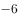，，，（    ）

- **A**. 

- **B**. 
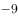

- **C**. 

　✅
- **D**. 

**答案**：C

**官方解析**

题干数列相邻两项之间存在明显的倍数关系，优先考虑作商。，得到新数列：、、0.5、1.5、（），为公差是1的等差数列，则下一项。则所求项。

故正确答案为C。

---

### 第 2 题　qid 2367790 · 数学运算

4.1，9.4，25.9，49.16，121.25，（    ）

- **A**. 169.36　✅
- **B**. 169.49
- **C**. 289.36
- **D**. 289.49

**答案**：A

**官方解析**

题干为小数数列，优先考虑将整数与小数部分分别找规律，原数列可拆分为：

整数部分：4、9、25、49、121、（），所有数字均为平方数，即：、、、、、（），底数为连续质数，则下一项应为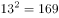；

小数部分：1、4、9、16、25、（），所有数字均为平方数，即：、、、、、（），底数为连续自然数，则下一项应为。

将整数与小数部分组合后可得169.36。

故正确答案为A。

---

### 第 3 题　qid 2367835 · 数学运算

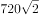，，，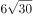，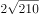，（    ）

- **A**. 

- **B**. 

- **C**. 
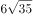

- **D**. 

　✅

**答案**：D

**官方解析**

将题干根式转化为最简形式，可得：、、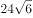、、。整数部分与根号内部分均分别存在明显倍数关系，故拆成整数与根号两部分之后再作商找规律。

整数部分：720、120、24、6、2、（），，得：6、5、4、3，为公差是的等差数列，则下一项为2，故整数部分所求项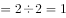；

根号部分：2、2、6、30、210、（），，得：1、3、5、7，为公差是2的等差数列，则下一项为9，故根号内所求项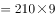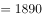。

将整数部分与根号部分组合后可得。

故正确答案为D。

---

### 第 4 题　qid 2367840 · 数学运算

17，8，5，，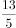，（    ）

- **A**. 

- **B**. 

- **C**. 

　✅
- **D**. 

**答案**：C

**官方解析**

题干数列包含整数与分数，将整数转化为分数，且构造分母逐步递增的趋势可得：、、、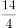、、（）。分子部分为公差是的等差数列，下一项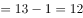；分母部分为公差为1的等差数列，下一项为6。则原数列所求项应为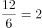。

故正确答案为C。

---

### 第 5 题　qid 2367841 · 数学运算

某银行为一家小微企业提供了年利率分别为、的甲、乙两种贷款，期限均为一年。若两种贷款的合计数额为400万元，企业需付利息总额为25万元，则乙种贷款的数额是

- **A**. 100万元　✅
- **B**. 120万元
- **C**. 130万元
- **D**. 150万元

**答案**：A

**官方解析**

设乙种贷款的数额为万元，则甲种贷款数额为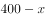万元。根据题意可列方程：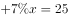，解得万元，则乙种贷款的数额是100万元。

故正确答案为A。

---

### 第 6 题　qid 2367844 · 数学运算

现有浓度为和的盐水各若干克，将其混合后加入50克水，配制成了浓度为的盐水600克，则原和的盐水质量之比是

- **A**. 6：5
- **B**. 1：1
- **C**. 5：6
- **D**. 4：7　✅

**答案**：D

**官方解析**

第二次混合50克水后，配置盐水共600克，则第一次混合配置得到盐水质量为克，溶质质量为克。设第一次混合配置浓度为的盐水有克，则浓度为盐水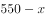克，根据溶质的量不变，可得方程，解得克，则浓度为的盐水质量为200克，浓度为盐水质量为克，浓度为与浓度为的溶液质量之比为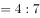。

故正确答案为D。

---

### 第 7 题　qid 2367848 · 数学运算

某地区有甲、乙、丙、丁4个派出所。已知上月甲、乙2个派出所的合计出警次数是95次，乙、丙、丁3个派出所的合计出警次数是140次，乙派出所的出警次数占4个派出所合计出警次数的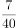，则上月甲派出所的出警次数是

- **A**. 55次
- **B**. 60次　✅
- **C**. 68次
- **D**. 75次

**答案**：B

**官方解析**

假设4个派出所合计出警次数为次，则乙派出所出警次数为次。根据题意可知，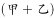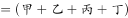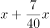，解得，则乙派出所出警次数为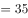次，故甲派出所出警次数为次。

故正确答案为B。

---

### 第 8 题　qid 2367854 · 数学运算

已知一个箱子中装有12件产品，其中有2件次品。若从箱子中随机抽取2件产品进行检验，则恰好抽到1件次品的概率是

- **A**. 
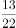

- **B**. 

　✅
- **C**. 

- **D**. 
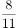

**答案**：B

**官方解析**

若恰好抽到1件次品，则意味抽到1件合格产品和1件次品，共有种情况。从12件产品抽2件产品检验，共有种情况，故恰好抽到1件次品的概率。

故正确答案为B。

---

### 第 9 题　qid 2367855 · 数学运算

甲、乙两人同时从同一地点出发沿同一环形跑道进行健身锻炼，甲跑步，乙走路。若甲追上乙所需时间是两人相向而行相遇所需时间的3倍，则甲、乙的速度之比是

- **A**. 3：1
- **B**. 5：2
- **C**. 2：1　✅
- **D**. 3：2

**答案**：C

**官方解析**

设环形跑道周长为，甲跑步速度为，乙走路速度为。代入追及公式和相遇公式可得，甲追上乙所需时间，两人相向而行相遇所需时间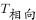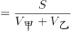。根据题意可知，，化简可得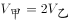，则甲、乙速度之比为2:1。

故正确答案为C。

---

### 第 10 题　qid 2367856 · 数学运算

某机关事务处集中采购了一批打印纸，分发给各职能部门。如果按每个部门9包分发，则多6包；如果按每个部门11包分发，则有1个部门只能分到1包。这批打印纸的数量是

- **A**. 87包
- **B**. 78包　✅
- **C**. 69包
- **D**. 67包

**答案**：B

**官方解析**

设职能部门数量为，根据题意，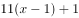，解方程得，。则这批打印纸的数量是包。

故正确答案为B。

---

### 第 11 题　qid 2367857 · 数学运算

一场大雪过后，某单位需安排员工清理包干区的道路积雪。清理时必须3人一组，其中2人铲雪，1人扫雪。如果安排10人铲雪，3.5小时才能完成。假设每组工作效率相同，若要在100分钟内完成，则需安排的员工人数最少是

- **A**. 21
- **B**. 24
- **C**. 30
- **D**. 33　✅

**答案**：D

**官方解析**

安排10人铲雪，即有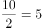组，赋每组工作效率为1，可得总雪量为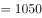，若要在100分钟完成，则需要组数组，即至少需要11组，每组3人，则需安排的员工人数最少是。

故正确答案为D。

---

### 第 12 题　qid 2367859 · 数学运算

一只密码箱的密码是一个三位数，满足：3个数字之和为19，十位上的数比个位上的数大2。若将百位上的数与个位上的数对调，得到一个新密码，且新密码数比原密码数大99，则原密码数是

- **A**. 397
- **B**. 586　✅
- **C**. 675
- **D**. 964

**答案**：B

**官方解析**

根据题干，密码是一个三位数，此题为多位数问题，依次代入选项验证，

A项，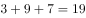，十位9比个位7大2，对调百位和个位得到793，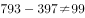，错误；

B项，，十位8比个位6大2，对调百位和个位得到685，，符合条件，正确；

C项，，错误；

D项，，十位6比个位4大2，对调百位和个位得到469，，错误。

故正确答案为B。

注：考场上不用验证C、D选项。

---

### 第 13 题　qid 2367825 · 数学运算

两件快递的重量之比是3：2，去除包装之后的重量之比是9：5。若包装重量都是120克，则两件快递的重量分别是

- **A**. 390克、260克
- **B**. 480克、320克　✅
- **C**. 540克、360克
- **D**. 630克、420克

**答案**：B

**官方解析**

设两件快递重量分别是，，则根据题意，，解得。则两件快递的重量分别是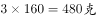，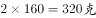。

故正确答案为B。

---

### 第 14 题　qid 2367828 · 数学运算

警校某班学生分两个小组在甲、乙两地间进行野外负重拉练。已知去程两个小组的速度分别是5千米/小时、4千米/小时，返程两个小组的速度都下降了。若两个小组的出发时间相差54分钟，但同时返回到出发点，则甲、乙两地间的距离是：

- **A**. 20千米
- **B**. 16千米
- **C**. 12千米
- **D**. 8千米　✅

**答案**：D

**官方解析**

根据题意，两个小组返程速度为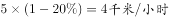 ， 。两个小组的出发时间相差54分钟，但同时返回到出发点，可得两个小组的时间相差54分钟，即小时。

设甲乙两地之间的距离为，根据时间差小时可得方程：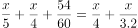，解得。

故正确答案为D。

---

### 第 15 题　qid 2367830 · 数学运算

平行四边形ABCD如右图所示，E为AB上的一点，F、G分别为AC与DE、DB的交点。若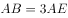，则四边形BEFG与ABCD的面积之比是

- **A**. 2∶7
- **B**. 3∶13
- **C**. 4∶19
- **D**. 5∶24　✅

**答案**：D

**官方解析**

因为G是平行四边形对角线的交点，则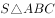 平行四边形ABCD，又因为，所以平行四边形ABCD。因为，所以相似，故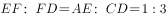，即，且与同高，所以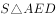，则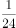平行四边形ABCD。S四边形EFGB平行四边形ABCD平行四边形ABCD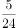平行四边形ABCD。

故正确答案为D。

---

### 第 16 题　qid 2367836 · 数学运算

某工程队承担一项工程，由于天气原因，工期将延后10天。为了按期完工，需增加施工人员。若增加4人，工期会延后4天；若增加10人，工期将提前2天。假设每人工作效率相同，为确保按期完工，则工程队最少应增加的施工人员数是

- **A**. 6
- **B**. 7
- **C**. 8　✅
- **D**. 9

**答案**：C

**官方解析**

赋值每人工作效率为1，设原来有个人，计划天完成。根据三种安排方式的工作量不变，则有，解方程得，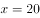。假设增加个人可以按时完成则有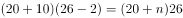，解得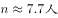，故至少增加8人，可以按时完成。

故正确答案为C。

---

### 第 17 题　qid 2367842 · 数学运算

某班举行数学测验，试题全部是选择题，共10题，每题1分，得分的部分统计结果如下：

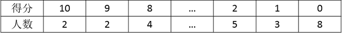

已知，得分至少为3分的，人均分；得分最多为7分的，人均分。这个班级总人数是

- **A**. 
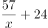
　✅
- **B**. 

- **C**. 

- **D**. 

**答案**：A

**官方解析**

根据题意，所有人的得分得分至少3分的得分之和3分以下的得分之和最多7分的得分之和7分以上的得分之和。设总人数为人，则有，解方程得。

故正确答案为A。

---

### 第 18 题　qid 2367846 · 数学运算

某公司年终联欢，准备了52张编号分别为1至52的奖券用于抽奖。如果编号是2、3的倍数的奖券可分别兑换2份、3份奖品，编号同时是2和3的倍数的奖券只可兑换3份奖品，其他编号的奖券只可兑换1份奖品，则所有奖券可兑换的奖品总数是：

- **A**. 99份
- **B**. 100份
- **C**. 102份
- **D**. 104份　✅

**答案**：D

**官方解析**

52个数字中，3的倍数有，取整为个，共发放奖品份；2的倍数个，剔除2和3的公倍数有，取整为8个（已经发过不重复发放）。则发两份奖品的有个，共发份；剩余个，发份。故一共发份。

故正确答案为D。

---

### 第 19 题　qid 2367847 · 数学运算

某景区门票夏季打7折、冬季打3折，对8岁及以下儿童免门票，缆车20元/人次，游乐设施10元/人次。小朱去年夏季和冬季都带4岁的儿子去该景区1次，每次都陪孩子坐缆车1次、让孩子玩游乐设施1次。若他们两人夏季在该景区的游玩费用比冬季多，则该景区门票的全价是

- **A**. 100元　✅
- **B**. 90元
- **C**. 80元
- **D**. 60元

**答案**：A

**官方解析**

设景区门票全价为，则冬季和夏季的门票分别为和。由于儿子小于8岁不需要买门票，总费用打折后门票费用两人缆车费用一人游乐设施费用。根据夏天游玩费用比冬季多，则有，解得元。

故正确答案为A。

---

## 判断推理

### 材料 1

某市江海区决定对东风路、西河路、南塘路、北海路等4条辖区内道路进行市容出新。为了解群众意见，制定符合民意的出新方案，区政府相关部门的甲、乙、丙、丁4位同志两人一组结伴展开调研。已知，每人各选两条道路，每条道路恰有两人选择：在每条道路的调研中，乙与丙始终没有在一组。另外，还知道：

（1）如果甲选东风路，则丁也选东风路；

（2）如果丙选南塘路，则丁也选南塘路；

（3）甲没有选南塘路。

#### 第 1 题　qid 2367868 · 逻辑判断

根据上述信息，可以得出以下哪项？

- **A**. 甲选西河路和北海路　✅
- **B**. 乙选西河路和南塘路
- **C**. 丙选东风路和西河路
- **D**. 丁选东风路和北海路

**答案**：A

**官方解析**

整理题干信息。

① 每人各选两条道路，每条道路恰有两人选择，乙与丙始终没有在一组；

② 甲东风丁东风； 

③ 丙南塘丁南塘；

④甲南塘。

题干信息不确定，可用假设法。

根据①可知，乙或丙肯定有人会跟甲一组，有两种情况：

（1）假如，乙和甲一组，根据条件②可知，如果甲东风，那么乙和丁也得东风，与题干每条道路恰有两人选择矛盾，所以，甲不选东风，根据条件④可知，甲不选南塘，所以甲只能选西河和北海；

（2）假如，丙和甲一组，根据条件②可知，如果甲东风，那么丙和丁也得东风，与题干每条道路恰有两人选择矛盾，所以，甲不选东风，根据条件④可知，甲不选南塘，所以甲只能选西河和北海。

无论哪种情况，最后甲只能选西河和北海。

故正确答案为A。

---

#### 第 2 题　qid 2367870 · 逻辑判断

如果乙不选东风路，则可以得出以下哪项？

- **A**. 甲或者选东风路或者选南塘路
- **B**. 乙或者选西河路或者选南塘路　✅
- **C**. 丙或者选南塘路或者选北海路
- **D**. 丁或者选西河路或者选北海路

**答案**：B

**官方解析**

第一步：整理题干信息。

① 每人各选两条道路，每条道路恰有两人选择，乙与丙始终没有在一组；

② 甲东风丁东风； 

③ 丙南塘丁南塘；

④ 甲南塘；

⑤ 乙东风。

根据99题结论可知，条件⑥甲选西河路和北海路，不选东风路和南塘路，又条件①乙与丙始终没有在一组，对于东风路和南塘路，甲不选，乙和丙也不能同时选，则丁必然要选东风路和南塘路，又根据条件⑤ 乙东风，可填写表格如下：

第二步：逐一分析选项。

A项：根据分析可知甲选西河路和北海路，不可能选东风路或者选南塘路，不能推出，排除；

B项：根据分析可知乙有三种情况，可以选西河路和北海路/西河路和南塘路/南塘路和北海路，对于三种情况，选项说法选西河路或者选南塘路均成立，可以推出，当选；

C项：根据分析可知丙有三种情况，可以选东风路和西河路/东风路和南塘路/东风路和北海路，对于三种情况，选项说法选南塘路或者选北海路不一定成立，不能推出，排除；

D项：根据分析可知丁选东风路和南塘路，不可能选西河路或者选北海路，不能推出，排除。

故正确答案为B。

---

#### 第 3 题　qid 2367849 · 类比推理

贫困：脱贫：共同富裕

- **A**. 协商：参与：社会治理
- **B**. 输液：治疗：身体康复
- **C**. 干旱：施肥：粮食丰收
- **D**. 污染：治污：绿水青山　✅

**答案**：D

**官方解析**

第一步：判断题干词语间逻辑关系。
贫困是脱贫的必要条件，共同富裕是脱贫的目的。
第二步：判断选项词语间逻辑关系。
A项：协商不是参与的必要条件，社会治理不是参与的目的，与题干逻辑关系不一致，排除；
B项：输液不是治疗的必要条件，身体健康是治疗的目的，前两个词与题干逻辑关系不一致，排除；
C项：干旱是一种气候现象，干旱不是施肥的必要条件，粮食丰收是施肥的目的，前两个词与题干逻辑关系不一致，排除；
D项：污染是治污的必要条件，绿水青山是治污的目的，与题干逻辑关系一致，当选。
故正确答案为D。

---

#### 第 4 题　qid 2367850 · 类比推理

花丛：蜜蜂：采蜜

- **A**. 餐厅：厨师：炒菜　✅
- **B**. 农田：农民：收割
- **C**. 宇宙：恒星：运行
- **D**. 树林：柳树：发芽

**答案**：A

**官方解析**

第一步：判断题干词语间逻辑关系。
蜜蜂在花丛采蜜。采蜜是蜜蜂的工作，花丛是蜜蜂工作的地点，三者是对应关系。
第二步：判断选项词语间逻辑关系。
A项：厨师在餐厅炒菜，炒菜是厨师的工作，餐厅是厨师工作的地点，三者是对应关系，与题干逻辑关系一致，保留；
B项：农民在农田收割，收割是农民的工作，农田是农民工作的地点，三者是对应关系，与题干逻辑关系一致，保留；
C项：恒星在宇宙运行，运行不是恒星的工作，与题干逻辑关系不一致，排除；
D项：柳树在树林发芽，发芽不是柳树的工作，与题干逻辑关系不一致，排除。
比对A、B，题干中的采蜜是个动宾词组，选项A中的炒菜是动宾词组，而选项B中的收割是个动词，因此，A的逻辑关系与题干更为接近。
故正确答案为A。

---

#### 第 5 题　qid 2367851 · 类比推理

路霸：打击：黑恶势力

- **A**. 功课：复习：基础课程
- **B**. 友谊：维护：世界和平
- **C**. 诚信：讲究：社会和谐
- **D**. 铅笔：购买：学习用品　✅

**答案**：D

**官方解析**

第一步：判断题干词语间逻辑关系。
打击路霸，二者是动宾关系，路霸是黑恶势力的一种，二者是种属关系。
第二步：判断选项词语间逻辑关系。
A项：复习功课，二者是动宾关系，基础课程是功课的一种，与题干顺序相反，与题干逻辑关系不一致，排除；
B项：维护友谊，二者是动宾关系，但友谊不是世界和平的一种，与题干逻辑关系不一致，排除；
C项：讲究诚信，二者是动宾关系，但诚信不是社会和谐的一种，与题干逻辑关系不一致，排除；
D项：购买铅笔，二者是动宾关系，铅笔是学习用品的一种，与题干逻辑关系一致，当选。
故正确答案为D。

---

#### 第 6 题　qid 2367852 · 类比推理

理智：情感：悲伤

- **A**. 冷漠：热情：热点
- **B**. 科学：艺术：雕塑　✅
- **C**. 蓝天：白云：云霞
- **D**. 陆地：河流：黄河

**答案**：B

**官方解析**

第一步：判断题干词语间逻辑关系。
理智和情感是并列关系。悲伤是情感的一种，二者是种属关系。
第二步：判断选项词语间逻辑关系。
A项：冷漠和热情是反义关系，热点和热情不是种属关系，与题干逻辑关系不一致，排除；
B项：科学和艺术是并列关系。雕塑是艺术的一种，与题干逻辑关系一致，保留；
C项：蓝天和白云是并列关系，云霞是彩云，与白云是并列关系 ，与题干逻辑关系不一致，排除；
D项：陆地和河流是并列关系，黄河是河流的一种，与题干逻辑关系一致，保留；
比较B、D项，从种属关系细化的角度看，D项中黄河是一个特指，而题干悲伤不是特指，B项的雕塑也不是特指，因此B项相比D项与题干更一致。
故正确答案为B。

---

#### 第 7 题　qid 2367853 · 类比推理

眼睛：眼镜：隐形眼镜

- **A**. 脚踝：护膝：运动护膝
- **B**. 耳机：耳朵：蓝牙耳机
- **C**. 手掌：手套：纯棉手套　✅
- **D**. 假牙：牙套：烤瓷牙套

**答案**：C

**官方解析**

第一步：判断题干词语间逻辑关系。
眼镜是矫正视力和保护眼睛的，两者是对应关系，隐形眼镜是眼镜的一种，两者是种属关系。
第二步：判断选项词语间逻辑关系。
A项：护膝是保护膝盖的，不是保护脚踝的，运动护膝是护膝的一种，前两者与题干逻辑关系不一致，排除； 
B项：耳朵不是用来保护耳机的，蓝牙耳机也不是耳朵的一种，与题干逻辑关系不一致，排除；
C项：手套是保护手掌的，纯棉手套是手套的一种，与题干逻辑关系一致，当选；
D项：牙套是矫正牙齿的，不是矫正假牙的，烤瓷牙套是牙套的一种，前两词与题干逻辑关系不一致，排除。
故正确答案为C。

---

#### 第 8 题　qid 2367824 · 类比推理

高原：藏羚羊

- **A**. 中国：金丝猴
- **B**. 战场：指战员
- **C**. 海洋：大白鲨　✅
- **D**. 大学：研究员

**答案**：C

**官方解析**

第一步：判断题干词语间逻辑关系。
藏羚羊在高原生活，二者为生存环境与物种的对应关系。
第二步：判断选项词语间逻辑关系。
A项：金丝猴在中国生活，但中国是一个国家，范围太广，不是具体的生存环境对应，与题干逻辑关系不一致，排除；
B项：指战员是指挥员和战斗员的统称，战场不是指战员的生存环境，与题干逻辑关系不一致，排除；
C项：大白鲨在海洋生活，二者是生存环境与物种的对应关系，与题干逻辑关系一致，当选；
D项：大学是研究员的工作地点，二者是工作地点的对应关系，不是生存环境，与题干逻辑关系不一致，排除。
故正确答案为C。

---

#### 第 9 题　qid 2367776 · 类比推理

楷体 之于（    ）相当于（    ）之于 水果

- **A**. 字体——苹果　✅
- **B**. 字号——果汁
- **C**. 隶书——食物
- **D**. 书法——鸭梨

**答案**：A

**官方解析**

逐一代入选项。
A项：楷体是字体的一种；苹果是水果的一种，前后均为种属关系，前后逻辑关系一致，当选；
B项：楷体是字体的一种，字号是指字体的大小，二者没有必然的逻辑关系；水果是果汁的原材料，二者为对应关系，前后逻辑关系不一致，排除；
C项：楷体和隶书均是字体，二者为并列关系；水果是食物的一种，二者为种属关系，前后逻辑关系不一致，排除；
D项：书法是艺术作品，楷体是字体，书法可以用到不同的字体，二者是对应关系；鸭梨是水果的一种，二者为种属关系，前后逻辑关系不一致，排除。
故正确答案为A。

---

#### 第 10 题　qid 2367778 · 类比推理

燃气 之于（    ）相当于（    ）之于 语言

- **A**. 管道——信息　✅
- **B**. 火源——表演
- **C**. 灶具——文字
- **D**. 沼气——交际

**答案**：A

**官方解析**

逐一代入选项。
A项：管道输送燃气，二者为对应关系；语言传递信息，二者为对应关系，前后逻辑关系一致，当选；
B项：燃气是可燃物，火源是指能点燃可燃物的能量来源，二者为能量来源的对应关系；用语言表演，二者为方式的对应关系，前后逻辑关系不一致，排除；
C项：灶具使用燃气作为燃料，二者为对应关系；语言和文字为并列关系，前后逻辑关系不一致，排除；
D项：沼气是燃气的一种，二者为种属关系；用语言交际，二者为工具对应关系，前后逻辑关系不一致，排除。
故正确答案为A。

---

#### 第 11 题　qid 2367779 · 类比推理

呜呜呃喔呃喔呕呕欧

- **A**. 汪汪阿吱阿吱嘻嘻喜　✅
- **B**. 嘎嘎喂唯喂唯硙恺铠
- **C**. 哑哑硙哦嚄哦哇哇娃
- **D**. 咔咔啦骂啦骂哒达啦

**答案**：A

**官方解析**

第一步：分析题干符号间关系。
从相同符号的位置入手：位置1、2的符号相同；位置3、5的符号相同；位置4、6的符号相同；位置7、8的符号相同。
第二步：判断选项符号间关系。
A项：位置1、2的符号相同；位置3、5的符号相同；位置4、6的符号相同；位置7、8的符号相同，与题干一致，当选；
B项：位置7、8的符号不相同，与题干不一致，排除；
C项：位置3、5的符号不相同，与题干不一致，排除；
D项：位置7、8的符号不相同，与题干不一致，排除。
故正确答案为A。

---

#### 第 12 题　qid 2367789 · 逻辑判断

- **A**. 

- **B**. 

- **C**. 

　✅
- **D**. 

**答案**：C

**官方解析**

第一步：分析题干符号间关系。
从相同符号的位置入手：位置4、8的符号相同；位置6、7的符号相同。
第二步：判断选项符号间关系。
A项：相同位置与题干一致，但位置3、5的符号相同，与题干不一致，排除；
B项：相同位置与题干一致，但位置2、6、7的符号相同，与题干不一致，排除；
C项：位置4、8的符号相同，位置6、7的符号相同，与题干一致，当选；
D项：位置6、7的符号不相同，与题干不一致，排除。
故正确答案为C。

---

#### 第 13 题　qid 2367791 · 图形推理

从四个图中选出唯一的一项，填入问号处，使其呈现一定的规律性:

 

- **A**. A
- **B**. B
- **C**. C
- **D**. D　✅

**答案**：D

**官方解析**

本题考查图形的实际意义，寻找最大共同点。观察发现，题干每一幅图形，左边的部分均高于右边的部分，只有D项符合。
故正确答案为D。

---

#### 第 14 题　qid 2367794 · 图形推理

从四个图中选出唯一的一项，填入问号处，使其呈现一定的规律性:

- **A**. A
- **B**. B
- **C**. C　✅
- **D**. D

**答案**：C

**官方解析**

元素组成不同，且无明显属性规律，优先考虑数量规律。观察发现，题干图形中的线条较多，并且均为横线和竖线，考虑数横线和竖线。横线数依次为：1、4、2、3、2，竖线数依次为1、4、2、3、2，即横线和竖线的数量相等，排除D项；再观察图形，发现题干图形都是有1个面，排除A、B项，符合此规律的只有C项。
故正确答案为C。

---

#### 第 15 题　qid 2367799 · 图形推理

从四个图中选出唯一的一项，填入问号处，使其呈现一定的规律性:

 

- **A**. A
- **B**. B　✅
- **C**. C
- **D**. D

**答案**：B

**官方解析**

元素组成不同，优先考虑属性规律。观察发现，题干出现了箭头、等腰三角形等特征图，考虑对称性。观察发现，题干每幅图形既是轴对称又是中心对称图形。四个选项中，A项仅为中心对称图形，C、D项仅为轴对称图形，只有B项既是轴对称图形又是中心对称图形。
故正确答案为B。

---

#### 第 16 题　qid 2367801 · 图形推理

从四个图中选出唯一的一项，填入问号处，使其呈现一定的规律性:

- **A**. A
- **B**. B
- **C**. C　✅
- **D**. D

**答案**：C

**官方解析**

题干给出的图形均为四个正方体构成的立体图形，且每幅图的四个正方体均为同样的排列形式，即题干每幅图的立体图形都相同，只是每幅图立体图形的位置发生了旋转。据此规律，只有C项跟题干立体图形是同样的排列形式。
故正确答案为C。

---

#### 第 17 题　qid 2367804 · 图形推理

选项四个图形中，只有一个是由题干的四个图形拼合（只能通过上、下、左、右）而成的，请把它找出来。

- **A**. A
- **B**. B　✅
- **C**. C
- **D**. D

**答案**：B

**官方解析**

本题考查平面拼合，可采用平行且等长相消的方式解题。消去平行且等长的线段后进行组合即可得到轮廓图，即为B项。平行且等长相消的方式如下图所示：  故正确答案为B。

---

#### 第 18 题　qid 2367807 · 图形推理

选项四个图形中，只有一个是由题干的四个图形拼合（只能通过上、下、左、右）而成的，请把它找出来。

 

- **A**. A
- **B**. B　✅
- **C**. C
- **D**. D

**答案**：B

**官方解析**

本题考查平面拼合，可采用平行且等长相消的方式解题。消去平行且等长的线段后进行组合即可得到轮廓图，即为B项。平行且等长相消的方式如下图所示： 故正确答案为B。

---

#### 第 19 题　qid 2367808 · 图形推理

选项四个图形中，只有一个是由题干的四个图形拼合（只能通过上、下、左、右平移）而成的，请把它找出来。

- **A**. A
- **B**. B
- **C**. C
- **D**. D　✅

**答案**：D

**官方解析**

本题考查平面拼合，可采用平行且等长相消的方式解题。消去平行且等长的线段后进行组合即可得到轮廓图，即为D项。平行且等长相消的方式如下图所示：

故正确答案为D。

---

#### 第 20 题　qid 2367811 · 图形推理

选项四个图形中，只有一个是由题干的四个图形拼合（只能通过上、下、左、右）而成的，请把它找出来。

- **A**. A
- **B**. B　✅
- **C**. C
- **D**. D

**答案**：B

**官方解析**

本题考查俄罗斯方块平面拼合。从方块最多的图形入手，贴边代入选项。在题干的4个图形中，图④的方块最多，将它贴边代入各个选项中，只有B项能够把所有图形都代入进去，拼合方式如下图所示。

故正确答案为B。

---

#### 第 21 题　qid 2367812 · 图形推理

左边给定的是纸盒外表面的展开图，右边哪一项能由它折叠而成？请把它找出来。

- **A**. A
- **B**. B　✅
- **C**. C
- **D**. D

**答案**：B

**官方解析**

将题干展开图中的面依次标注为面a、b、c、d，如下图所示：

A项：该项由面a和面c构成，选项面c的右侧是面a，而在展开图中面c的右侧是面d，选项与题干展开图不一致，排除；

B项：由面a和面b构成，与题干展开图一致，当选；

C项：该项由面c和面d构成，选项面c的左侧是面d，而展开图中面c的左侧是面a，选项与题干展开图不一致，排除；

D项：该项由面b和面d构成，选项面d中的短线与面b中的三角形有交点，而展开图中无交点，选项与题干展开图不一致，排除。

故正确答案为B。

---

#### 第 22 题　qid 2367814 · 图形推理

左边给定的是纸盒外表面的展开图，右边哪一项能由它折叠而成？请把它找出来。

- **A**. A　✅
- **B**. B
- **C**. C
- **D**. D

**答案**：A

**官方解析**

将题干展开图中的面依次标注为面a、b、c、d，如下图所示：

A项：与题干一致，当选；

B项：该项由面a和面b组成，在展开图中面b中的直线不垂直于面a和面b的公共边，而选项面b中的直线垂直于面a和面b的公共边，选项与题干不一致，排除；

C项：该项由面a和面d组成，在展开图中面d中的箭头指向的是面b，而选项中面d的箭头指向的是面a，选项与题干不一致，排除；

D项：该项由面a和面c组成，在展开图中面c中的箭头指向面b，而选项中面c中的箭头指向的是面a，选项与题干不一致，排除。

故正确答案为A。

---

#### 第 23 题　qid 2367795 · 图形推理

左边给定的是纸盒外表面的展开图，右边哪一项能由它折叠而成？请把它找出来。

- **A**. A
- **B**. B　✅
- **C**. C
- **D**. D

**答案**：B

**官方解析**

将原展开图标上序号，逐一分析。

A项：该项必然存在面e和面f，由于面f和面b是相对面，故右侧面只能是面d，以面d和面e的公共边为唯一边，对面d进行顺时针画边，如下图所示，选项中边4对应的是面f，而在展开图中边4对应的是面b，故选项与题干不一致，排除；

B项：与题干一致，当选；

C项：该项由面f、面b、面d组成，面f和面b是相对面，在选项中不可能同时存在，排除；

D项：该项必然存在面e和面f，由于面e和面c是相对面，故顶面只能是面a，以面a和面f的公共边为唯一边（如下图所示），对面f进行顺时针画边，选项中边2对应的是面e，而展开图中边2对应的是面c，故选项与展开图不一致，排除。

故正确答案为B。

---

#### 第 24 题　qid 2367800 · 图形推理

左边给定的是纸盒外表面的展开图，右边哪一项能由它折叠而成？请把它找出来。

- **A**. A
- **B**. B　✅
- **C**. C
- **D**. D

**答案**：B

**官方解析**

将原展开图标上序号，逐一分析。

A项：该项出现面a、面e和面c，在展开图中面a和面c的公共边与面a的黑色直角边重合（如下图），而选项中面a和面c的公共边不与面a的黑色直角边重合，选项与题干不一致，排除；

B项：与题干一致，当选；

C项：该项由面c、面b和面f组成，在展开图中面c和面f是相对面，不能同时出现，选项与题干不一致，排除；

D项：该项出现面e、面d、面f，选项中面e与面d公共边与面e中阴影三角形的直角边重合（如下图），而展开图中没有重合，选项与题干不一致，排除。

故正确答案为B。

---

#### 第 25 题　qid 2367815 · 图形推理

从所给的四个选项中，选择最合适的一个填入问号处，使之呈现一定的规律性。

- **A**. A　✅
- **B**. B
- **C**. C
- **D**. D

**答案**：A

**官方解析**

元素组成不同，优先考虑属性规律。九宫格优先按横行看，第一行图形均由直线构成，第二行图形均由曲线构成，第三行图形均由直线和曲线构成，因此“？”处图形应由直线和曲线构成，只有A项符合。
故正确答案为A。

---

#### 第 26 题　qid 2367819 · 图形推理

从所给的四个选项中，选择最合适的一个填入问号处，使之呈现一定的规律性。

- **A**. A
- **B**. B
- **C**. C
- **D**. D　✅

**答案**：D

**官方解析**

本题考查图形的实际意义，寻找最大共同点。观察发现，题干所有图形都是枝干弯曲的一枝花，九宫格优先按横行来看，从第一行到二行，花枝朝向依次为右、左、右，左、右、左，规律为左右交替出现，第三行前两个图花枝朝向为右、左，因此“？”处花枝朝向应为右，A、C项花枝朝向为左，B项花枝干是直的，只有D项满足题干图形特征。
故正确答案为D。

---

#### 第 27 题　qid 2367822 · 图形推理

左图为给定的立体，从任意角度剖开，右边哪一项不可能是它的截面图？

- **A**. A
- **B**. B
- **C**. C
- **D**. D　✅

**答案**：D

**官方解析**

本题考查截面图，逐一分析选项。

如下图所示，A、B、C三项均可截出，D项无法截出，因为竖着切中间的空的，所以D项左右两侧中间是看不到竖线的。

本题为选非题，故正确答案为D。

---

#### 第 28 题　qid 2367831 · 逻辑判断

没有人民支持和参与，任何改革都不可能取得成功。只有充分尊重人民意愿，形成广泛共识，人民才会积极支持改革、踊跃投身改革。要坚持人民主体地位，发挥群众首创精神，紧紧依靠人民推动改革开放。
根据以上陈述，可以得出以下哪项？

- **A**. 只有人民支持和参与，改革才可能取得成功　✅
- **B**. 只有坚持人民主体地位，才能发挥群众首创精神
- **C**. 如果人民踊跃投身改革，则说明形成了广泛共识
- **D**. 如果没有充分尊重人民意愿，人民就不会积极支持改革

**答案**：A

**官方解析**

第一步：翻译题干。

① 改革取得成功人民支持和参与；

② 人民积极支持改革且踊跃投身改革充分尊重人民意愿且形成广泛共识。

第二步：逐一分析选项。

A项：翻译为改革可能取得成功人民支持和参与，肯前必肯后，根据条件①可以推出，当选；

B项：题干中人民主体地位和群众首创精神，无明显推出关系，无法翻译，排除；

C项：翻译为人民踊跃投身改革形成广泛共识，只肯定了条件②前件中的一个条件，无法推出后件，排除；

D项：翻译为没有充分尊重人民意愿不会积极支持改革，可逆否等价为：积极支持改革充分尊重人民意愿，只肯定了条件②前件中的一个条件，无法推出后件，排除。

故正确答案为A。

---

#### 第 29 题　qid 2367843 · 逻辑判断

食品安全已成为现代社会关注的热点问题。今年针对某市的一项社会调查显示，的受访者在吃的方面有安全感，的受访者没有安全感，而去年相应的调查数据分别是和。调查人员由此断言，今年该市公众对食品的安全感有所提高，食品安全的总体状况好于上年。

以下哪项如果为真，最能质疑上述调查结论？

- **A**. 今年有些受访者没有表达自己对食品安全的态度
- **B**. 今年该市政府加大了对食品安全工作的管理力度
- **C**. 该市媒体今年报道了多起假奶粉等食品安全事件
- **D**. 今年的社会调查中增加了不少餐饮经营者的样本　✅

**答案**：D

**官方解析**

第一步:找出论点和论据。

论点:今年该市公众对食品的安全感有所提高，食品安全的总体状况好于去年。

论据:今年的受访者在吃的方面有安全感，的受访者没有安全感，而去年相应的调查数据分别是和。

本题通过对今年和去年受访者对食品有无安全感的数据对比，得出今年该市公众对食品的安全感有所提高，食品安全的总体状况好于上年。论据是一组对比实验，可以通过指出两组对比对象情况不一致进行削弱，即说明今年和去年的受访者存在不同。

第二步:逐一分析选项。

A项：有些受访者没有表达自己的态度，并不能质疑论据中表达态度的受访者数据的真实性，无法削弱，排除；

B项：该市政府加大了食品安全的管理力度，解释了今年食品安全度上升的原因，属加强项，无法削弱，排除；

C项：今年该市媒体报道了多起假奶粉事件，与今年食品安全的总体状况无关，无关项，排除；

D项：今年受访样本中增加了不少餐饮经营者，而餐饮经营者会更加偏向于认定食品是安全的，那么由此得出的数据高于去年显然不能得出食品安全的总体状况，属于拆桥，可以削弱，当选。

故正确答案为D。

---

#### 第 30 题　qid 2367858 · 逻辑判断

并不是所有的老年人都适合参与投资活动，绝大多数的投资品种都要求投资人具有丰富的专业知识，但多数老年人在这方面有所欠缺，以至于只能听任一些骗子的忽悠。相比股市、基金等证券类投资，老年人投资艺术品更容易上当。如果没有足够的鉴别能力，他们就会受骗，被骗了心里还想着遇到了“捡漏”的美事。
根据以上陈述，可以得出以下哪项？

- **A**. 有些老年人专业知识丰富，适合参与投资活动
- **B**. 有些老年人没有足够的鉴别能力，但也会遇到“捡漏”的美事
- **C**. 有些老年人如果不想上当受骗，就要有足够的鉴别能力　✅
- **D**. 老年人不适合参与投资活动，无论是股市、基金还是艺术品投资

**答案**：C

**官方解析**

日常结论题，根据题干信息逐一分析选项。

A项：根据题干第一句话可知，有的老年人不适合参与投资活动，投资需要有丰富的专业知识，多数老年人缺少丰富的专业知识，因此无法推出有些专业知识丰富的老年人适合参与投资活动，排除；

B项：题干中最后一句只是强调被骗了心里还想着“捡漏”的美事，没有提及是否会遇到“捡漏”的美事，无中生有，排除；

C项：翻译为有些老年人受骗有足够的鉴别能力，题干中最后一句话可以翻译为：足够的鉴别能力受骗，可逆否等价为：受骗有足够的鉴别能力，“所有可以推出有的”，故根据题干可以推出，当选；

D项：根据题干第一句话可知，有的老年人不适合参与投资活动，而D选项的说法过于绝对，排除。

故正确答案为C。

---

#### 第 31 题　qid 2367860 · 逻辑判断

智能手机流行的时代，我们每天发送信息，也收到信息。人际之间的电子信息交往已成为当今时代一种独特的交往方式。在面对重要的人或关系时，很多人往往发出信息后就期待被秒回，如果没有被秒回，他们就产生一种怀疑感或被弃感，从而陷入深深的烦恼和焦虑之中。
以下哪项最可能是他们陷入深深烦恼和焦虑所需的假设？

- **A**. 当前技术已能实现智能手机的即时通信，方便快捷，且基本免费　✅
- **B**. 有些聊天软件能在发送者手机中反馈信息接收者是否阅读了信息
- **C**. 有些人工作很忙，总习惯在忙完一天工作后才统一处理相关信息
- **D**. 有些人一天收到的信息太多，容易遗漏某人期待秒回的重要信息

**答案**：A

**官方解析**

第一步：找出论点和论据。

论点：在面对重要的人或关系时，很多人往往发出信息后就期待被秒回，如果没有被秒回，他们就产生一种怀疑感或被遗弃感，从而陷入深深的烦恼和焦虑之中。

论据：无。

本题无论据，只能通过补充论据进行加强。提问方式是假设类，优先考虑补充必要条件，即没有这个选项，论点则无法成立。

第二步：逐一分析选项。

A项：如果智能手机不能即时通信，那么发出的信息就无法被即时接收，发出者就不会期待秒回，因此A项是信息能够被秒回的必要条件，当选；

B项：有些聊天软件能在发送者手机中反馈信息接收者是否阅读了信息，可以解释部分发出者为什么没有被秒回就会产生怀疑感或被弃感，但是力度较弱，且不是论点成立的必要条件，排除；

C项：接收者什么时候阅读信息与发出者没被秒回就会产生烦恼和焦虑无关，排除； 

D项：接收者是否遗漏了重要信息与发出者没被秒回就会产生烦恼和焦虑无关，排除。

故正确答案为A。

附：通过查证原文，本题答案为A项。

---

#### 第 32 题　qid 2367861 · 逻辑判断

某区对所辖钟山、长江、梅园、星海4个街道进行抽样调查，并按照人均收入为其排序。有人根据以往经验对4个街道的人均收入排序作出如下预测：
（1）如果钟山街道排第三，那么梅园街道排第一；
（2）如果长江街道既不排第一也不排第二，那么钟山街道排第三；
（3）钟山街道排序与梅园街道相邻，但与长江街道不相邻。
事后得知，上述预测符合调查结果。
根据以上信息，可以得出以下哪项？

- **A**. 钟山街道不排第一就排第四　✅
- **B**. 长江街道不排第二就排第三
- **C**. 梅园街道不排第二就排第四
- **D**. 星海街道不排第一就排第三

**答案**：A

**官方解析**

第一步：分析题干条件。

① 钟山第三梅园第一；

② 长江第一 且 第二钟山第三；

③ 钟山与梅园相邻，与长江不相邻。

第二步：根据题干条件进行推理。

钟山出现次数最多，为最大信息，可作为突破口。根据③可知：钟山与梅园相邻，结合①可知：钟山第三梅园第一，故钟山不能排名第三。钟山第三是对②的否后，否后必否前，故长江排名第一或者第二。

如果长江排第一，根据③可知钟山只能排第四，故梅园排第三，星海排第二，排除B、C、D项，只有A项成立；

如果长江排第二，根据③可知钟山只能排第四，故梅园排第三，星海排第一，A项依然成立。

故正确答案为A。

---

#### 第 33 题　qid 2368009 · 逻辑判断

我国家长们对儿童阅读越来越重视，大多数家长希望孩子多读书读好书。2018年，某市的家庭有父母陪孩子读书的习惯，亲子阅读的图书量比2017年提高了1.8个百分点，时长也比去年有所增加。但是，2018年该市的儿童人均图书阅读量仅为4.72本，比2017年还下降了0.6个百分点。

以下哪项如果为真，最能解释上述现象？

- **A**. 近年来孩子课业负担较重，对课外阅读很多人是“心有余而时不足”
- **B**. 在亲子阅读中很多孩子习惯“听书”，这种情况2018年未计算在内　✅
- **C**. 大多数80后、90后家长都受过高等教育，比较看重亲子阅读的意义
- **D**. 孩子在手机、电脑上的电子阅读一直未纳入儿童图书阅读的考虑范围

**答案**：B

**官方解析**

第一步：找出题干矛盾。
2018年，某市亲子阅读的图书量比2017年提高了1.8个百分点，时长也比去年有所增加。但2018年该市的儿童人均图书阅读量比2017年还下降了0.6个百分点。
第二步：逐一分析选项。
A项：孩子课业负担较重，对课外阅读很多人是“心有余而时不足”，提及了儿童阅读量不高，但是并没有涉及亲子阅读的影响，不能解释题干矛盾，排除；
B项：在亲子阅读中很多孩子习惯“听书”，这种情况未计算在图书阅读量内，既提及了亲子阅读，又涉及了读书量计算的方式，能够解释为什么2018年亲子阅读量增加而儿童阅读量并没有增加的情况，可以解释题干矛盾，当选；
C项：大多数80后、90后家长比较看重亲子阅读的意义，提及了亲子阅读的图书量可能更多，但并没有涉及儿童的人均读书量为何下降，不能解释题干矛盾，排除；
D项：孩子在手机、电脑上的电子阅读一直未纳入儿童图书阅读的考虑范围，没有涉及亲子阅读的影响，而且选项说的是一直，也就是说2017年和2018年均未考虑在内，不能解释题干矛盾，排除。
故正确答案为B。

---

#### 第 34 题　qid 2367863 · 逻辑判断

某县新一届党政领导班子刚组建完成，一心想为群众做一些实事。面对有限的财力，新一届领导班子明确表示，今年只能完成两件大事。对于众多排进公共政策议程的大事，他们认为：如果建一条乡村公路，则不能建污水处理厂；如果建污水处理厂，则要建排污管道；如果建排污管道，则不能建垃圾处理厂。
按照这届领导班子的想法，以下哪项不可能是他们今年同时要建设的？

- **A**. 乡村公路、排污管道
- **B**. 乡村公路、垃圾处理厂
- **C**. 污水处理厂、排污管道
- **D**. 污水处理厂、垃圾处理厂　✅

**答案**：D

**官方解析**

第一步：翻译题干。

①  建公路建污水处理厂；

②  建污水处理厂建排污管道；

③  建排污管道建垃圾处理厂；

将③和②可以递推出：④ 建污水处理厂建排污管道建垃圾处理厂；

⑤  只能完成两件大事。

第二步：逐一分析选项。

A项：若建公路和排污管道，根据①得到不建污水处理厂，根据③得到不建垃圾处理厂，此时完成两件大事，与题干已知条件不矛盾，可以推出，排除；

B项：若建公路和垃圾处理厂，根据①得到不建污水处理厂，根据④得到不建排污管道以及不建污水处理厂，此时完成两件大事，与题干已知条件不矛盾，可以推出，排除；

C项：若建污水处理厂和排污管道，根据①的否后必否前，得到不建公路，根据④得到不建垃圾处理厂，此时完成两件大事，与题干已知条件不矛盾，可以推出，排除；

D项：根据④可知，建污水处理厂建垃圾处理厂，故不可能同时建污水处理厂和垃圾处理厂，不能推出，当选。

本题为选非题，故正确答案为D。

---

#### 第 35 题　qid 2367896 · 逻辑判断

科幻小说《三体》中提出的“黑暗森林理论”告诉我们，人类千万不能向宇宙透露我们地球的位置，否则就会被外星文明毁灭。但是，早在《三体》出版之前的1974年，人类就向距离地球超过2.2万光年的武仙座星团发送了一段无线电信号，以光速主动向宇宙宣告了自身的存在。这个编号为M13的武仙座星团拥有数十万颗恒星。科学家认为，恒星周围一般会伴有行星，但恒星上不可能存在生命体，行星上却可能有。深信黑暗森林理论的人不禁为人类这一鲁莽举动感到担心，认为人类的美好期望有可能会迎来残酷的现实。
以下哪项如果为真，最能说明这种担心是不必要的？

- **A**. 迄今为止人类并没有发现任何外星生命存在的迹象
- **B**. 类地行星也并不罕见，平均每5颗恒星就拥有1颗
- **C**. 恒星密集分布的武仙座星团内不存在任何行星系统　✅
- **D**. 即使武仙座星团文明收到信号也要在2.2万年以后

**答案**：C

**官方解析**

第一步：找出论点和论据。
论点：人类的美好期望有可能会迎来残酷的现实。
论据：科幻小说《三体》中提出的“黑暗森林理论”告诉我们，人类千万不能向宇宙透露我们地球的位置，否则就会被外星文明毁灭。但是，早在《三体》出版之前的1974年，人类就向距离地球超过2.2万光年的武仙座星团发送了一段无线电信号，以光速主动向宇宙宣告了自身的存在。这个编号为M13的武仙座星团拥有数十万颗恒星。科学家认为，恒星周围一般会伴有行星，但恒星上不可能存在生命体，行星上却可能有。
文段较长而且问法比较特殊，问“说明这种担心是不必要的”可以理解成是削弱题，论点是担心人类未来，论据是这种担心产生的依据，论点是对未来的预测，可优先考虑削弱论据。
第二步：逐一分析选项。
A项：指出迄今为止还没有发现任何外星生命存在的迹象，但是没有发现不代表以后不存在，属于不明确选项，无法削弱，排除；
B项：指出类地行星不罕见，而行星上可能存在生命体，意味着存在其他生命体的可能性增加，人类会因此而担心，具有加强作用，排除；
C项：指出武仙座星团不存在任何行星系统，也就是说不会存在生命体，就不会给人类带来危害，削弱论据，可以削弱，当选； 
D项：指出武仙星团接收到信号的时间会在2.2万年以后，之后是否会给地球上的人类带来危害，不得而知，属于不明确选项，无法削弱，排除。
故正确答案为C。

---

#### 第 36 题　qid 2367802 · 定义判断

公众充权：指在公共政策的制定、执行、评估、监督过程中，公众积极参与，充分表达自己的利益主张，以推动公共政策过程的民主化与科学化。
下列属于公众充权的是

- **A**. 清明节到来前夕，一些社会人士在市文明办支持下创建了文明祭扫网站，号召民众祭扫时不放鞭炮，不烧纸钱，改用虚拟鲜花、电子蜡烛等绿色环保的方式
- **B**. 快递小哥小李当选市人大代表后，在广泛走访充分调研的基础上，提交了一份关于如何保障快递员权益、促进快递行业健康发展的议案
- **C**. 某市将要召开天然气价格调整听证会，有关部门要求辖区各街道、居委会搞好宣传动员工作，按照下达名额推举市民代表，确保公开公平公正
- **D**. 在某县未来五年发展规划制定过程中，县委、县政府通过召开居民座谈会、专家听证会等形式，征求到了许多宝贵的意见　✅

**答案**：D

**官方解析**

第一步：找出定义关键词。
“在公共政策的制定、执行、评估、监督过程中”、“公众积极参与，充分表达自己的利益主张”、“推动公共政策过程的民主化与科学化”。
第二步：逐一分析选项。
A项：创建文明祭扫网站，号召改用绿色环保的方式，不符合“在公共政策的制定、执行、评估、监督过程中”，不符合定义，排除；
B项：提交议案，不符合“在公共政策的制定、执行、评估、监督过程中”，不符合定义，排除；
C项：召开天然气价格调整听证会可以理解为“在公共政策的制定、执行、评估、监督过程中”，但按照下达名额推举市民代表，不符合“公众积极参与，充分表达自己的利益主张”，不符合定义，排除；
D项：在某县未来五年发展规划制定过程中，符合“在公共政策的制定、执行、评估、监督过程中”，通过召开居民座谈会、专家听证会等形式，征求到了许多宝贵的意见，符合“公众积极参与，充分表达自己的利益主张”，符合定义，当选。
故正确答案为D。

---

#### 第 37 题　qid 2367806 · 定义判断

危机公关：指政府部门、社会团体或企业面对可能造成严重后果的突发事件时，有组织、有计划地采取各种应对措施，避免损害或者降低损害程度，以期获得公众谅解的管理活动。
下列不属于危机公关的是：

- **A**. 某公司生产的多批次药品标注虚假生产日期的消息曝光后，公司领导立即在报纸、电视台向全国公众道歉，宣布召回这些批次的产品，承诺通过合适渠道赔偿受害者，迅速查清并如实公布事件真相，请社会各界人士监督
- **B**. 某地曝出高考答题卡被掉包的传闻后，当地政府部门迅速成立联合调查组，网上公布高考命题、监考、阅卷等环节的操作规范，并及时发布调查进展情况，公众情绪逐渐平复，最终查明这一传闻完全是谣言
- **C**. “某品牌火腿肠使用过期猪肉”的消息在网络上蔓延，公司迅速查实后道歉、召回、赔偿，并制定了详细整改措施，承诺绝不会再出现此类事件，媒体和消费者慢慢平静下来
- **D**. 某商场管理层吸取毗邻商场因电路老化引起火灾、损失惨重的教训，定期组织专业人员加强对线路安全的检查，及时更换老旧电线，并且张贴《规范用电须知》提醒商家，商家都非常配合，防火意识显著增强　✅

**答案**：D

**官方解析**

第一步：找出定义关键词。
“政府部门、社会团体或企业面对可能造成严重后果的突发事件时”、“有组织、有计划地采取各种应对措施，避免损害或者降低损害程度”、“以期获得公众谅解”。
第二步：逐一分析选项。
A项：某公司生产的多批次药品标注虚假生产日期的消息曝光后，符合“企业面对可能造成严重后果的突发事件时”，立即在报纸、电视台道歉，宣布召回产品，承诺赔偿受害者等，符合“有组织、有计划地采取各种应对措施，避免损害或者降低损害程度，以期获得公众谅解”，符合定义，排除；
B项：某地曝出高考答题卡被掉包的传闻后，符合“面对可能造成严重后果的突发事件时”，迅速成立联合调查组，网上公布操作规范，及时发布调查进展情况，查明这一传闻是谣言，符合“有组织、有计划地采取各种应对措施，避免损害或者降低损害程度，以期获得公众谅解”，符合定义，排除；
C项：“某品牌火腿肠使用过期猪肉”的消息在网络上蔓延，符合“面对可能造成严重后果的突发事件时”，迅速查实后道歉、召回、赔偿，并制定整改措施，符合“有组织、有计划地采取各种应对措施，避免损害或者降低损害程度，以期获得公众谅解”，符合定义，排除；
D项：某商场管理层吸取毗邻商场因电路老化引起火灾、损失惨重的教训，未体现“面对可能造成严重后果的突发事件时”，不符合定义，当选。
本题为选非题，故正确答案为D。

---

#### 第 38 题　qid 2367810 · 定义判断

信息扶贫：指政府或社会群体借助信息技术手段来解决因信息闭塞而导致的经济、文化上的贫困问题。
下列属于信息扶贫的是

- **A**. 某物流公司联手互联网巨头在边远山区定向从贫困户中招聘一批快递员，经过专业培训之后上岗，帮他们走上了脱贫致富的道路
- **B**. 某手机生产厂家面向农村市场，推出了一款低成本、易操作、大屏幕、待机时间长的时尚智能手机，村民们纷纷换掉了原来的旧手机
- **C**. 省城某重点中学建立网络课堂，向某贫困县的中学进行远程同步直播，使两地师生共享优质教学资源。几年来，该县考上重点大学的人数明显增多　✅
- **D**. 毕业返乡的小周带着几个同学开了家网店，在网上销售自家种植的红枣，销量逐步上升，日子越来越红火

**答案**：C

**官方解析**

第一步：找出定义关键词。
“政府或社会群体借助信息技术手段”、“解决因信息闭塞而导致的经济、文化上的贫困问题”。
第二步：逐一分析选项。
A项：招聘快递员，经过专业培训之后上岗，未体现“借助信息技术手段”，不符合定义，排除；
B项：某手机生产厂家面向农村市场推出时尚智能手机，未体现“解决贫困问题”，也未体现“借助信息技术手段”，不符合定义，排除；
C项：建立网络课堂，进行远程同步直播，符合“借助信息技术手段”，共享优质教学资源，该县考上重点大学的人数明显增多，符合“解决因信息闭塞而导致的文化上的贫困问题”，符合定义，当选；
D项：开网店可以理解为“信息技术手段”，但未体现“解决因信息闭塞而导致的经济、文化上的贫困问题”，不符合定义，排除。
故正确答案为C。

---

#### 第 39 题　qid 2367816 · 定义判断

社会性处罚：指存在失信行为的人员所受到的与自身失信行为没有直接关联的来自其他部门的限制和处罚。
下列属于社会性处罚的是

- **A**. 以“站不起来”为理由强占他人座位的高铁“霸座男”，当场受到了乘警的严肃批评，下车后被移送公安机关接受治安处罚。这一事件曝光后，当事人的恶劣行为又遭到了全国网民的一致谴责
- **B**. 由于数据造假，某教授在国际期刊上发表的论文被撤稿。在网民的谴责声中，该教授又被撤销了基于该论文所获得的绩效奖励、省部级科研项目、荣誉称号、社会兼职
- **C**. 春节前夕，恶意拖欠农民工工资的部分包工头，被有关部门和各种媒体曝光，引起社会各界密切关注。根据银行、保险、铁路等部门的规定，这些违规者申请信用卡、购买保险以及动车和高铁票时都将受到限制　✅
- **D**. 长江沿岸的一家化工企业，多次不顾禁令向长江偷偷排污，最近被省有关部门通报批评，吊销了企业生产执照，它的上级主管部门及主要负责人也都受到了严厉的处罚

**答案**：C

**官方解析**

第一步：找出定义关键词。
“存在失信行为的人员”、“所受到的与自身失信行为没有直接关联的来自其他部门的限制和处罚”。
第二步：逐一分析选项。
A项：以“站不起来”为理由强占他人座位的高铁“霸座男”，符合“存在失信行为的人员”，当场受到了乘警的严肃批评，被移送公安机关接受治安处罚，这是与自身失信行为有直接关联的限制和处罚，不符合“所受到的与自身失信行为没有直接关联的来自其他部门的限制和处罚”，不符合定义，排除；
B项：某教授数据造假，符合“存在失信行为的人员”，论文被撤稿，撤销了基于该论文所获得的绩效奖励、省部级科研项目、荣誉称号、社会兼职，均是与自身失信行为有直接关联的处罚，不符合“所受到的与自身失信行为没有直接关联的来自其他部门的限制和处罚”，不符合定义，排除；
C项：恶意拖欠农民工工资的包工头，符合“存在失信行为的人员”，申请信用卡、购买保险以及动车和高铁票时都将受到限制，符合“所受到的与自身失信行为没有直接关联的来自其他部门的限制和处罚”，符合定义，当选；
D项：长江沿岸的一家化工企业，多次不顾禁令向长江偷偷排污，不符合“存在失信行为的人员”，不符合定义，排除。
故正确答案为C。

---

#### 第 40 题　qid 2367818 · 定义判断

隐形植入：指通过周边信息、符号体系等不易察觉的形式，使受众在不知不觉中受到影响的宣传策略。
下列属于隐形植入的是：

- **A**. 在某电视剧中，所有角色均使用同一品牌的手机，并使用这个品牌的经典铃声　✅
- **B**. 城运会到来之前，商家把印有城运会会徽的各类文化创意产品陆续摆上了柜台
- **C**. 在某市博物馆馆标设计征集中，8号方案以浓郁的地域文化元素受到了评委的关注
- **D**. 结婚纪念日快到了，为了提醒粗心又忙碌的丈夫，小李偷偷把他的手机屏保换成了婚纱照

**答案**：A

**官方解析**

第一步：找出定义关键词。
“不易察觉的形式”、“不知不觉受到影响”、“宣传策略”。
第二步：逐一分析选项。
A项：在电视剧中使用同一品牌手机，用该品牌经典铃声符合“不易察觉的形式”，“不知不觉受到影响”，也是“宣传策略”，符合定义，当选；
B项：印有城运会会徽，不符合“不易察觉的形式”，不符合定义，排除；
C项：馆标设计受到评委关注，不属于“宣传策略”，不符合定义，排除；
D项：小李提醒丈夫结婚纪念日，把丈夫手机屏保换成婚纱照，符合“不易察觉的形式”，但不属于“宣传策略”，不符合定义，排除。
故正确答案为A。

---

#### 第 41 题　qid 2367821 · 定义判断

情感性劳动：指服务业员工在与顾客面对面交往时，将个人情感融入工作过程，对顾客、企业以及服务人员自己产生积极影响的行为。
下列属于情感性劳动的是：

- **A**. 某航空公司空姐站在登机口两旁欢迎乘客，时不时还会微笑着摸摸小孩的头　✅
- **B**. 小刘总是面带微笑、语气亲切热情地接打电话，连续多年被评为最美接线员
- **C**. 某酒店智能客服“小青”善解人意，语音甜美，入住的客人都喜欢和她互动
- **D**. 小秦在信访局工作多年，每次接待来访者，都非常耐心，细致了解具体情况

**答案**：A

**官方解析**

第一步：找出定义关键词。
“服务业员工”、“顾客”、“面对面”、“个人感情”、“对顾客、企业及自己产生积极影响”。
第二步：逐一分析选项。
A项：空姐属于“服务业员工”，站在登机口欢迎属于“面对面”，微笑摸摸小孩的头符合“个人感情”，符合定义，当选；
B项：接打电话不符合“面对面”，不符合定义，排除；
C项：小青是智能客服，不符合“个人情感”，不符合定义，排除；
D项：小秦耐心、细致了解只体现工作负责，未体现“个人感情”，不符合定义，排除。
故正确答案为A。

---

#### 第 42 题　qid 2367823 · 定义判断

大数据“杀熟”：指商家在提供相同的商品或服务时，根据大数据的甄别结果，对有多次消费记录或消费能力较高的客户，以偏高标准收费的销售策略。
下列属于大数据“杀熟”的是：

- **A**. 小李负责单位的接待工作，经常要预约商务车接送。后来只要他打车，网约平台就直接推送高价的商务车，无奈之下小李只好注册一个新号供自己日常出行
- **B**. 经常在网上预订酒店的老张在预订某酒店的单人间时，价格一直为380元。他的侄子暑假来看望他，也在网上预定了该酒店同样的房间，价格却便宜四分之一　✅
- **C**. 位于市中心金融服务区的某超市由于环境优越，客户购买力强，某品牌饮料在这里售价高达15元，而这种饮料在居民小区便利店只需要10元
- **D**. 某购物网站推出新用户推广活动，每位新注册用户都可免费获赠抵用券，算下来买同样的商品新会员比老会员还要便宜好多，这让老会员们郁闷不已

**答案**：B

**官方解析**

第一步：找出定义关键词。
“相同的产品或服务”、“大数据甄别结果”、“多次消费记录或消费能力较高的顾客”、“偏高标准收费”。
第二步：逐一分析选项。
A项：小李经常预约商务车，符合“多次消费记录或消费能力较高的顾客”，但单位的接送服务和日常的出行服务不属于“相同的产品或服务”，也未体现对相同的产品有偏高的收费，不符合“偏高标准收费”，不符合定义，排除；
B项：老张经常在网上预订酒店符合“多次消费记录或消费能力较高的顾客”，在网上预订符合“大数据”，侄子预订该酒店同样的房间符合“相同的产品或服务”，老张380元，侄子价格便宜了四分之一符合“偏高标准收费”，符合定义，当选；
C项：金融服务区同品牌饮料比居民小区便利店高，符合“相同的产品或服务”、“偏高标准收费”，但不符合“大数据甄别结果”，不符合定义，排除；
D项：新用户买同样商品比老用户便宜符合“相同的产品或服务”，但不属于针对“多次消费记录或消费能力较高的顾客”，是因为为了推广而赠送抵用券所以便宜，不符合定义，排除。
故正确答案为B。

---

#### 第 43 题　qid 2367826 · 定义判断

语码转换：指说话人在同一对话过程中使用多种语言或方言进行交流的现象。
下列不属于语码转换的是：

- **A**. 约翰先生在中国生活多年，与单位同事交谈时总是坚持用汉语，有时实在不知道怎样准确表达自己的意思，也会夹杂三两个英语单词
- **B**. 马经理接待来访客户，用普通话向他们介绍了自己公司的情况。得知客户中有两位陕西老乡后，当即操起陕西话与他们攀谈了几句
- **C**. 在一次国际学术会议上，陈教授用英语作报告时带了一股浓浓的四川口音，参加会议的大多数外国学者几乎都没有听懂他的发言　✅
- **D**. 来到留学生宿舍后，班主任方老师询问了他们的日常生活情况，当他发现一个学生流露出不解的神情时，立刻又用英语解释了一番

**答案**：C

**官方解析**

第一步：找出定义关键词。
“同一对话过程”、“多种语言或方言”。
第二步：逐一分析选项。
A项：约翰和同事交谈坚持用汉语，夹杂两三个英语单词，符合“同一对话过程”，英语和汉语两种语言符合“多种语言或方言”，符合定义，排除；
B项：马经理接待客户符合“同一对话过程”，普通话、陕西话符合“多种语言或方言”，符合定义，排除；
C项：陈教授作报告符合“同一对话过程”，四川口音的英语只有英语一种语言，不符合“多种语言或方言”，不符合定义，当选；
D项：方老师询问学生日常生活符合“同一对话过程”、用英语解释表明之前说的不是英语，符合“多种语言或方言”，符合定义，排除。
本题为选非题，故正确答案为C。

---

#### 第 44 题　qid 2367829 · 定义判断

信息焦虑：指人们在过量信息包围下因为难以获取、处理、利用所需信息而产生的厌倦、烦躁、紧张等负面情绪。
下列属于信息焦虑的是

- **A**. 小敏热衷于娱乐八卦，她时刻关注微博更新，看到手机上的未读信息就忍不住想去点击，每天用于浏览信息的时间远远超过她自己的工作时间
- **B**. 在开发商那里登记过购房意向后，闵先生每天都会接到几十个乃至上百个电话和信息，卖房的、装修的、投资的、理财的、贷款的，让他不胜其烦
- **C**. 小谢沉迷于网络游戏，一玩就是一通宵，白天上课总是想着游戏，久而久之产生了严重的厌学情绪，精神状态萎靡不振，身体素质越来越差
- **D**. 小李在外文数据库查资料，每输入一个关键词就跳出几十篇相关论文，因英语欠佳，没法筛选，完全不知道哪些才是自己真正要用的，感觉精神马上就要崩溃了　✅

**答案**：D

**官方解析**

第一步：找出定义关键词。
“人们在过量信息包围下因为难以获取、处理、利用所需信息”、“而产生的厌倦、烦躁、紧张等负面情绪”。
第二步：逐一分析选项。
A项：每天用于浏览信息的时间远远超过她自己的工作时间，该选项没有体现出厌倦、烦躁、紧张等负面情绪，不符合定义，排除； 
B项：在开发商登记过购房意向后，接到几十个乃至上百个电话和信息，而这些信息大部分都是闵先生所不需要的，体现不出闵先生“难以获取、处理、利用所需信息”，不符合定义，排除；
C项：小谢沉迷于游戏，白天上课也总想着游戏，该选项没有体现出“过量的信息”，不符合定义，排除；
D项：小李查询资料，每输入一个关键词就跳出几十篇相关论文，因英语欠佳，没法筛选，不知道哪个是自己要用的，符合“人们在过量信息包围下因为难以获取、处理、利用所需信息”，感觉精神马上就要崩溃了，符合“产生的厌倦、烦躁、紧张等负面情绪”，符合定义，当选。
故正确答案为D。

---

#### 第 45 题　qid 2367833 · 定义判断

不见面审批：指有关部门通过网络渠道接受、审核各种申请材料，并将批复结果及时通知申请人的公务处理方式。
下列不属于不见面审批的是

- **A**. 家住农村的小李在朋友指点下，按照当地社保网站的各项提示填好了个人的信息材料，当天就在村委会拿到了自己的社保证明
- **B**. 小赵向市长信箱发送电子邮件，举报一家企业向河中偷排污水的情况，涉事企业被环保部门责令停产整改，小赵收到了关于处罚结果的邮件回复　✅
- **C**. 小王打算开一家餐饮店，在市工商局网站上提交了全部材料，没想到的是，一周之内就拿到了营业执照
- **D**. 小丁根据工作人员提示，在网上录完了办理房产证的申请材料，第二天登录网站发现，他的材料不完整，需要补充材料重新提交

**答案**：B

**官方解析**

第一步：找出定义关键词。
“有关部门通过网络渠道接受、审核各种申请材料”、“并将批复结果及时通知申请人的公务处理方式”。
第二步：逐一分析选项。
A项：小李在朋友的指点下，按照当地社保网站的各项提示填好了个人信息材料，符合“有关部门通过网络渠道接受、审核各种申请材料”，当天就在村委会拿到了自己的社保证明，符合“并将批复结果及时通知申请人的公务处理方式”，符合定义，排除； 
B项：小赵的举报行为不符合行政申请，小赵收到关于处罚结果的回复也不是“批复结果”，不符合“将批复结果及时通知申请人的公务处理方式”，不符合定义，当选；
C项：小王在市工商局网站上提交了全部材料，符合“有关部门通过网络渠道接受、审核各种申请材料”，一周之内拿到了营业执照，符合“将批复结果及时通知申请人的公务处理方式”，符合定义，排除；
D项：小丁根据工作人员提示，在网上录完了办理房产证的申请材料，符合“有关部门通过网络渠道接受、审核各种申请材料”，第二天登录网站发现需要补充材料重新提交，符合“将批复结果及时通知申请人的公务处理方式”，符合定义，排除。
本题为选非题，故正确答案为B。

---

#### 第 46 题　qid 2367834 · 定义判断

友善采购：指因自然灾害或其他无法抗拒的因素而造成产品大量积压时，购买方按照不低于甚至略高于批发价或市场价的方式购买这些产品，以帮助生产者渡过难关的行为。
下列属于友善采购的是：

- **A**. 近期原材料价格上涨，各种电子器件供应紧张，某企业主动加价，从长期供货商那里购入了大批急需的电子器件，保证了企业生产的正常进行
- **B**. 因连日暴雨引发山洪，造成当地瓜农数十亩即将上市的西瓜被淹，对口帮扶城市得知消息后，以市场价收购了该地瓜农的全部西瓜　✅
- **C**. 南方某地水果大获丰收，造成大量积压滞销，采购商得知东北销路很好，从忧心忡忡的果农那里大量购进，转销东北，获利颇丰
- **D**. 某少数民族的传统手工艺虽然已成功申遗，其产品却始终打不开销路，经过民俗专家在媒体上的大力推介，终于走出了大山，市场反响很好

**答案**：B

**官方解析**

第一步：找出定义关键词。
“因自然灾害或其他无法抗拒的因素而造成产品大量积压”、“购买方按照不低于甚至略高于批发价或市场价的方式购买这些产品”、“以帮助生产者渡过难关”。
第二步：逐一分析选项。
A项：该选项中的企业是为了保障生产的正常运行而主动提出加价，没有体现出生产者因自然灾害或其他无法抗拒的因素而造成产品大量积压，也不符合“以帮助生产者渡过难关”，不符合定义，排除；
B项：连日暴雨引发山洪，符合“因自然灾害或其他无法抗拒的因素”，数十亩，符合“造成产品大量积压”，对口帮扶城市以市场价收购了瓜农的全部西瓜，符合“购买方按照不低于甚至略高于批发价或市场价的方式购买这些产品”和“以帮助生产者渡过难关”，符合定义，当选；
C项：南方某地水果大丰收，造成大量积压，“大丰收”不符合“因自然灾害或其他无法抗拒的因素”，且该选项也没有体现出“购买方按照不低于甚至略高于批发价或市场价的方式购买这些产品”，不符合定义，排除；
D项：某少数民族的传统手工艺产品打不开销路，没有体现出“因自然灾害或其他无法抗拒的因素而造成产品大量积压”，不符合定义，排除。
故正确答案为B。

---

#### 第 47 题　qid 2367837 · 定义判断

粉丝滤镜效应：指年轻人看待自己崇拜的对象时，自动过滤其缺点、过度放大其优点的心理现象。
下列属于粉丝滤镜效应的是

- **A**. 小李爱看战争剧，不管什么影片只要里面有枪有炮有军队，就会想方设法找过来从头到尾看一遍
- **B**. 五岁的小刚很喜欢自己的父亲，在他眼里，父亲就是一个无所不能、顶天立地的超人
- **C**. 某著名艺人在国外吸毒被捕的消息传开后，粉丝们在微博上为他找出了五花八门的理由开脱　✅
- **D**. 某老师在“百家讲坛”举办过多次讲座，他的课堂总是座无虚席，挤满了从各个学院跑来蹭课的学生

**答案**：C

**官方解析**

第一步：找出定义关键词。
“年轻人看待自己崇拜的对象时”、“自动过滤其缺点、过度放大其优点的心理现象”。
第二步：逐一分析选项。
A项：小李爱看战争剧，喜欢找有关于枪、炮、军队的影片来看，该行为未体现出小李的崇拜对象，且没有体现出“自动过滤其缺点、过度放大其优点的心理现象”，不符合定义，排除； 
B项：五岁的小刚，这个年龄属于“幼儿期”，而不属于“年轻人”，不符合“年轻人看待自己崇拜的对象时”，不符合定义，排除；
C项：某著名艺人在国外吸毒被捕，粉丝们为他找出了五花八门的理由开脱，由“粉丝们”可知为其开脱的都是崇拜该明星的人，粉丝们为他找出了五花八门的理由开脱，符合“自动过滤其缺点、过度放大其优点的心理现象”，符合定义，当选；
D项：某老师的课堂座无虚席，挤满了从各个学院跑来蹭课的学生，该选项没有体现“自动过滤其缺点、过度放大其优点的心理现象”，不符合定义，排除。
故正确答案为C。

---

#### 第 48 题　qid 2367838 · 定义判断

差异化竞争：指同一行业的多家企业在短期的激烈竞争中，采用灵活多变的个性化手段，树立良好企业形象，赢得市场的经营方式。
下列属于差异化竞争的是：

- **A**. 春节期间，几大网络短视频平台纷纷推出抢红包活动，你发五亿，他发八亿，竞争到了白热化的程度
- **B**. 在其他房地产开发商纷纷降价促销的状况下，某楼盘提升楼盘品质，引进名校资源，销量遥遥领先于同期其他楼盘　✅
- **C**. 每到逢年过节的时候，市区的几家大型电器商场都会推出赠送小家电、延长保修期等优惠活动，市民们往往等到这时集中采购
- **D**. 在实体书店普遍不景气的大环境下，位于繁华街区的某书店一直保持自身的市场定位，致力于销售高品位的专业图书，成为了当地的文化地标

**答案**：B

**官方解析**

第一步：找出定义关键词。
“同一行业企业”、“短期竞争”、“个性化手段”、“赢得市场”。
第二步：逐一分析选项。
A项：春节期间短视频平台符合“同一行业企业”、“短期竞争”，但是纷纷推出抢红包活动没有体现“个性化手段”，不符合定义，排除；
B项：房地产开发商符合“同一行业企业”，其他房地产开发商降价促销，某楼盘提升楼盘品质，引进名校资源销量高于其他楼盘，符合“个性化手段”、“赢得市场”，符合定义，当选；
C项：几家大型电器商场符合“同一行业企业”，过年期间符合“短期竞争”，赠送小家电、延长保修期等优惠活动没有体现出“个性化手段”，不符合定义，排除；
D项：某书店定位销售高品位的专业图书符合“个性化手段”，实体书店普遍不景气的大环境说明是长期状态且没有体现竞争，不符合“短期竞争”，不符合定义，排除。
故正确答案为B。

---

#### 第 49 题　qid 2367839 · 定义判断

互联网公益：指民间团体或企业通过网络平台，发动社会公众参与的具有门槛低、透明度高、互动性强等特点的公益活动。
下列属于互联网公益的是：

- **A**. 某公司每年拨出专款开展公益活动，在官网上征集白内障患者并向符合特定条件的患者提供全部医疗费用
- **B**. 得知老张遭遇车祸，他的老同学通过班级群、朋友圈很快募集了三万多元捐款全部转交到他家
- **C**. 某爱心服务站每年开学前在自己的主页上公布来自各界的网络捐款账目，并邀请部分捐款人一起把善款送到山区小学　✅
- **D**. 某村委会通过网络平台发起“一帮一”捐资助学活动，帮助本村特困家庭的大学生解决了学费问题

**答案**：C

**官方解析**

第一步：找出定义关键词。
“民间团体或企业”、“通过网络平台”、“公众参与”、“门槛低、透明度高、互动性强公益活动”。
第二步：逐一分析选项。
A项：某公司符合“民间团体或企业”，在官网符合“通过网络平台”，并向符合特定条件的患者提供全部医疗费用，不符合“门槛低、透明度高、互动性强公益活动”，不符合定义，排除；
B项：通过班级群、朋友圈募集捐款符合“通过网络平台”，但其同学是发起人不符合“民间团体或企业”，不符合定义，排除；
C项：爱心服务站符合“民间团体或企业”，网络捐款账目符合“通过网络平台”，邀请部分捐款人一起把善款送到山区小学说明活动互动性强，符合定义，当选；
D项：通过网络平台捐资助学符合“通过网络平台”，但村委会不符合“民间团体或企业”，不符合定义，排除。
故正确答案为C。

---

#### 第 50 题　qid 2367845 · 逻辑判断

N后置编码：指按照下列规则对一个符号串进行处理得到一个新符号串，N表示一个数字。

（1）确认初始符号串中每个符号的顺序位置；

（2）将初始符号串的第一个符号跳过其后面的一个符号放置，得到一个新符号串；

（3）在新符号串中，将初始符号串的第二个符号跳过其后面的两个符号放置，······，依此类推，直到将初始符号串的第N个符号跳过其后面N个符号放置（数到最后一个符号再接着从头数起）。

初始符号串的“4后置编码”是：

- **A**. 

　✅
- **B**. 

- **C**. 

- **D**. 

**答案**：A

**官方解析**

4后置编码

（1）初始符号为1号位车、2号位马、3号位象、4号位士、5号位炮、6号位兵，即 ；

（2）将初始符号中第一号位“车”跳过其后面的的一个符号放置，放在“马”后，得到新符号串1号位马、2号位车、3号位象、4号位士、5号位炮、6号位兵，即  ；

（3）将初始符号中第二号位“马”，在得到的新符号串（2）中跳过其后面的两个符号放置，得到1号位车、2号位象、3号位马、4号位士、5号位炮、6号位兵，即   ；

（4）将初始符号中第三号位“象”，在得到的新符号串（3）中跳过其后面的三个符号放置，得到1号位车、2号位马、3号位士、4号位炮、5号位象、6号位兵，即   ；

（5）将初始符号中第四号位“士”，在得到的新符号串（4）中跳过其后面的四个符号放置，题干提示数到最后一个符号再接着从头数起，得到1号位车、2号位士、3号位马、4号位炮、5号位象、6号位兵，即 。

故正确答案为A。

---

## 资料分析

### 材料 1

        2018年国家统计局组织开展了第二次全国时间利用的随机抽样调查，共调查48580人。结果显示，受访居民在一天的活动中，有酬劳动平均用时4小时24分钟。其中，男性5小时15分钟，女性3小时35分钟；城镇居民3小时59分钟，农村居民5小时1分钟；工作日4小时50分钟，休息日3小时19分钟。受访居民有酬劳动的参与率为，其中城镇居民。受访居民无酬劳动平均用时2小时42分钟。其中，女性3小时48分钟；农村居民2小时39分钟；工作日2小时34分钟。受访居民无酬劳动的参与率为，其中男性。

        无酬劳动包括家务劳动、陪伴照料孩子生活、护送辅导孩子学习、陪伴照料成年家人、购买商品或服务、看病就医和公益活动。受访居民家务劳动平均用时1小时26分钟，参与率为。其中，女性2小时6分钟，参与率。受访居民陪伴照料孩子生活平均用时36分钟，参与率为；护送辅导孩子学习平均用时9分钟，参与率为；陪伴照料成年家人平均用时8分钟，参与率为；看病就医平均用时4分钟，参与率为；公益活动平均用时3分钟，参与率为。

#### 第 1 题　qid 2367766 · 平均数

受访农村居民每日无酬劳动平均用时占其劳动平均用时的比重为

- **A**. 

- **B**. 

　✅
- **C**. 

- **D**. 

**答案**：B

**官方解析**

由题干“······占······的比重为”，结合材料已知时间与题干一致，可判定本题为现期比重问题。定位材料第一段可得：“受访居民在一天的活动中，有酬劳动······农村居民5小时1分钟；无酬劳动······农村居民2小时39分钟”，统一单位为分钟，则受访农村居民在一天的活动中，有酬劳动301分钟；无酬劳动159分钟，故受访农村居民每日无酬劳动平均用时占其劳动平均用时的比重，B项符合。

故正确答案为B。

---

#### 第 2 题　qid 2367767 · 平均数

下列活动的排列中，受访居民每日平均用时依次减少的是

- **A**. 护送辅导孩子学习、购买商品或服务、看病就医
- **B**. 护送辅导孩子学习、看病就医、购买商品或服务
- **C**. 购买商品或服务、护送辅导孩子学习、看病就医　✅
- **D**. 购买商品或服务、看病就医、护送辅导孩子学习

**答案**：C

**官方解析**

由题干“······受访居民每日平均用时依次减少的是”，可判定本题为排序类问题。定位材料第一段可得：“受访居民无酬劳动平均用时2小时42分钟”，定位材料第二段可得：“无酬劳动包括家务劳动、陪伴照料孩子生活、护送辅导孩子学习、陪伴照料成年家人、购买商品或服务、看病就医和公益活动。受访居民家务劳动平均用时1小时26分钟······。受访居民陪伴照料孩子生活平均用时36分钟······；护送辅导孩子学习平均用时9分钟······；陪伴照料成年家人平均用时8分钟······；看病就医平均用时4分钟······；公益活动平均用时3分钟······”，统一时间单位为分钟，则购买商品或服务平均用时，购买商品或服务平均用时分钟，故受访居民每日平均用时依次减少的是购买商品或服务、护送辅导孩子学习、看病就医，C项符合。

故正确答案为C。

---

#### 第 3 题　qid 2367768 · 平均数

参与有酬劳动的受访城镇居民，每日有酬劳动的平均用时为

- **A**. 5小时50分钟
- **B**. 6小时40分钟
- **C**. 7小时30分钟　✅
- **D**. 8小时20分钟

**答案**：C

**官方解析**

由题干“参与有酬劳动的受访城镇居民，每日有酬劳动的平均用时为”，题目所求，判定本题为现期平均数问题。结合材料第一段可得：2018年，受访城镇居民一天的活动中有酬劳动平均用时为3小时59分钟，即；受访的城镇居民有酬劳动的参与率为，即，则题目所求。

故正确答案为C。

---

#### 第 4 题　qid 2367769 · 综合

受访的男性居民约有

- **A**. 2.38万人　✅
- **B**. 2.43万人
- **C**. 2.65万人
- **D**. 2.91万人

**答案**：A

**官方解析**

由题干“受访的男性居民约有”，结合材料给出整体平均时间，及男女平均时间，可判定本题为混合平均数计算问题。定位材料第一段可得，“······共调查48580人。结果显示，受访居民在一天的活动中，有酬劳动平均用时4小时24分钟。其中，男性5小时15分钟，女性3小时35分钟”。根据“混合居中但不中，距离与量成反比”可知，。则男性人数为万人。

故正确答案为A。

---

#### 第 5 题　qid 2367772 · 综合

从上述资料中能够推出的是

- **A**. 
受访居民休息日无酬劳动平均用时多于3小时
　✅
- **B**. 
受访女性居民无酬劳动的参与率介于和之间

- **C**. 
受访居民中，有酬劳动和无酬劳动都参与的占比至少为

- **D**. 
受访居民不同类型无酬劳动的平均用时和参与率呈正相关

**答案**：A

**官方解析**

A项：定位材料第一段可得，“受访居民在一天的活动中，有酬劳动平均用时4小时24分钟。其中······工作日4小时50分钟，休息日3小时19分钟。······受访居民无酬劳动平均用时2小时42分钟。其中······工作日2小时34分钟”。根据“混合居中但不中，距离与量成反比”可知。，解得休息日无酬劳动时长为3小时2分钟3小时，正确；

B项：定位材料第一段可得，“受访居民无酬劳动的参与率为，其中男性”。根据“混合居中不正中”可知，受访女性居民无酬劳动参与率大于，错误；

C项：定位材料第一段可得“受访居民有酬劳动的参与率为，······无酬劳动的参与率为”，根据“两集合容斥原理”计算公式可知，。当两者都不参与取最低值0时，都参与的人数也为最低值，为全部人数的，错误；

D项：定位材料第二段可得，“看病就医平均用时4分钟，参与率为；公益活动平均用时3分钟，参与率为”。4分钟3分钟，，可知并非参与时间越长，参与率越高，错误。

故正确答案为A。

---

### 材料 2

        2018年江苏第一、二、三产业增加值分别为4142亿元、41248亿元和47205亿元；城镇常住居民人均可支配收入47200元，增长8.2，农村常住居民人均可支配收入20845元，增长8.8；一般公共预算收入8630亿元，一般公共预算支出11658亿元。

#### 第 6 题　qid 2367761 · 增长

2018年江苏第三产业增加值比第二产业多

- **A**. 
12.6

- **B**. 
14.4
　✅
- **C**. 
15.1

- **D**. 
16.2

**答案**：B

**官方解析**

根据题干“2018年江苏第三产业增加值比第二产业多”，结合选项都是百分数，可判定本题为一般增长率问题。定位文字材料可知，2018年江苏第二、三产业增加值分别为41248亿元和47205亿元。根据公式：r，则题干所求为，与B项最接近。

故正确答案为B。

---

#### 第 7 题　qid 2367762 · 综合

上表所有指标中，2017年苏南与苏北地区指标数值相差不到一倍的有

- **A**. 5项
- **B**. 6项　✅
- **C**. 7项
- **D**. 8项

**答案**：B

**官方解析**

根据题干“……2017年苏南与苏北地区指标数值相差不到一倍的有”，结合表格材料时间为2017年，可判定本题为现期倍数问题。定位表格材料可知2017年苏南与苏北地区部分社会经济发展指标数据。苏南与苏北地区指标数值相差不到一倍，即为两者之间倍数&lt;2倍。则表中苏南与苏北地区各指标倍数分别为：

一般公共预算收入：倍&gt;2倍，排除；

一般公共预算支出：倍&lt;2倍，符合；

乡村从业人员：倍&gt;2倍，排除；

农林牧渔业总产值：倍&gt;2倍，排除；

高速公路：倍&lt;2倍，符合；

私人汽车拥有量：倍&gt;2倍，排除；

社会消费品零售总额：倍&gt;2倍，排除；

出口：&gt;10倍，排除；

进口：&gt;10倍，排除；

旅游外汇收入：&gt;10倍，排除；

城镇常住居民人均可支配收入：倍&lt;2倍，符合；

城镇常住居民人均生活消费支出：倍&lt;2倍，符合；

农村常住居民人均可支配收入：倍&lt;2倍，符合；

农村常住居民人均生活消费支出：倍&lt;2倍，符合。

综上，满足条件的指标有：一般公共预算支出、高速公路、城镇常住居民人均可支配收入、城镇常住居民人均生活消费支出、农村常住居民人均可支配收入、农村常住居民人均生活消费支出，共6项。

故正确答案为B。

---

#### 第 8 题　qid 2367763 · 增长

2018年江苏一般公共预算收入比上年增加

- **A**. 963亿元　✅
- **B**. 988亿元
- **C**. 1963亿元
- **D**. 1971亿元

**答案**：A

**官方解析**

根据题干“2018年······比上年增加”，结合选项带单位，可判定本题为增长量计算问题。定位文字材料可知，2018年江苏一般公共预算收入8630亿元；定位表格材料可知，2017年苏南、苏中、苏北一般公共预算收入分别为4913亿元、1246亿元、1508亿元。则2017年江苏一般公共预算收入为4913+1246+1508=7667亿元。根据公式：增长量=现期量-基期量，则题干所求为8630-7667=963亿元。
故正确答案为A。

---

#### 第 9 题　qid 2367764 · 平均数

2017年苏南、苏中、苏北地区就业人员人均产业增加值最大的是

- **A**. 苏中第三产业
- **B**. 苏南第二产业
- **C**. 苏南第三产业　✅
- **D**. 苏北第二产业

**答案**：C

**官方解析**

根据题干“2017年……人均产业增加值最大的是”，结合材料给出2017年相关数据 ，可判定本题为现期平均数问题。定位图1、图2可知2017年江苏三大区域三次产业就业人数及三次产业增加值。根据公式：就业人员人均产业增加值，则各选项就业人员人均产业增加值分别为：

苏中第三产业，万元；

苏南第二产业，万元；

苏南第三产业，万元；

苏北第二产业，万元。

综上，2017年苏南、苏中、苏北地区就业人员人均产业增加值最大的是苏南第三产业。

故正确答案为C。

---

#### 第 10 题　qid 2367765 · 综合

从上述资料中能够推出的是

- **A**. 2017年苏中地区高速公路的里程不足全省的五分之一
- **B**. 2017年苏北和苏中地区进口额之和不及苏南的八分之一
- **C**. 2018年江苏城镇和农村常住居民人均可支配收入的绝对差距比上年有所缩小
- **D**. 2017年苏中农村常住居民人均生活消费支出与人均可支配收入的比值大于苏南　✅

**答案**：D

**官方解析**

A项：定位表格材料可知，2017年苏南、苏中、苏北高速公路里程分别为1870公里、948公里、1870公里。根据公式：比重，则2017年苏中高速公路里程占全省的比重为，即超过五分之一，错误；

B项：定位表格材料可知，2017年苏南、苏中、苏北进口额分别为1993.0亿美元、175.5亿美元、109.9亿美元。则2017年苏中和苏北进口额之和与苏南的比例为，即大于八分之一，错误；

C项：定位文字材料可知，2018年江苏城镇常住居民人均可支配收入47200元，增长8.2%，农村常住居民人均可支配收入20845元，增长8.8%。则2018年江苏城镇和农村常住居民人均可支配收入的绝对差距为元。根据公式：基期量，则2017年江苏城镇和农村常住居民人均可支配收入的绝对差距为，即2018年江苏城镇和农村常住居民人均可支配收入的绝对差距比上年有所增大，错误；

D项：定位表格材料可知，2017年苏中农村常住居民人均可支配收入与人均生活消费支出分别为20000元、14644元，苏南分别为26759元、18872元。则2017年苏中农村常住居民人均生活消费支出与人均可支配收入的比值为，苏南农村常住居民人均生活消费支出与人均可支配收入的比值为，即2017年苏中农村常住居民人均生活消费支出与人均可支配收入的比值大于苏南，正确。

故正确答案为D。

---

### 材料 3

        2018年全国互联网业务收入9562亿元，比上年增长。其中，广东、上海、北京互联网业务收入分别增长、和。2018年互联网企业信息服务收入8594亿元，比上年增长。其中，电子商务平台收入3667亿元，增长；网络游戏业务收入1948亿元，增长。2018年互联网行业研发投入490亿元，比上年增长。

#### 第 11 题　qid 2367775 · 综合

2017年全国互联网企业电子商务平台收入为

- **A**. 2938亿元
- **B**. 3012亿元
- **C**. 3113亿元
- **D**. 3242亿元　✅

**答案**：D

**官方解析**

由题干“2017年······为多少亿元”，结合材料时间为2018年，判定本题为基期计算问题。定位文字部分可得“2018年······其中，电子商务平台收入3667亿元，增长”。代入公式：，则2017年，全国互联网企业电子商务平台收入，与D项最接近。

故正确答案为D。

---

#### 第 12 题　qid 2367780 · 比重

2018年全国互联网企业信息服务收入占互联网业务收入的比重为

- **A**. 

- **B**. 

- **C**. 

　✅
- **D**. 

**答案**：C

**官方解析**

由题干“2018年……的比重为”，判定本题为现期比重问题。定位文字部分 “2018年全国互联网业务收入9562亿元，………互联网企业信息服务收入8594亿元”。代入公式：，则所求比重=

故正确答案为C。

---

#### 第 13 题　qid 2367782 · 增长

2013—2018年全国互联网业务收入增加最少的年份是

- **A**. 2013年　✅
- **B**. 2014年
- **C**. 2015年
- **D**. 2016年

**答案**：A

**官方解析**

由提问“增加最少的年份”，判定本题为增长量比较问题。定位柱形图部分，可知2013-2018年每一年全国互联网业务收入及同比增速，因选项只有2013年至2016年，则只需比较这四年即可。

2013年的增长量：代入公式“”，可得：；

2014年的增长量：代入公式“”，可得：；

同理可得， 2015年增长量：；

2016年增长量：；

增长量最小的年份为2013年。

故正确答案为A。

---

#### 第 14 题　qid 2367783 · 增长

若从2019年起每年均按2014—2018年的平均增速增长，则2023年全国互联网业务收入将达到

- **A**. 21620亿元
- **B**. 27565亿元　✅
- **C**. 30147亿元
- **D**. 31829亿元

**答案**：B

**官方解析**

根据题干“······2023年全国互联网业务收入将达到······”，结合材料时间为2018年，判定本题为现期计算问题。定位柱状图可得，2013年与2018年全国互联网业务收入分别为3317亿元、9562亿元。根据题意可知，2019—2023年的平均增速与2014—2018年的相同，故有：，则2023年全国互联网业务收入为：亿元，与B项最接近。

故正确答案为B。

---

#### 第 15 题　qid 2367785 · 综合

从上述资料中能够推出的是

- **A**. 
2014—2018年全国互联网业务收入年平均增量为1067亿元

- **B**. 
2018年广东、上海、北京的互联网业务收入总和比上年增长

- **C**. 
2018年全国互联网行业研发投入与互联网业务收入的比值小于上年
　✅
- **D**. 
2018年全国互联网企业各类信息服务收入年增长最慢的是电子商务平台收入

**答案**：C

**官方解析**

A项：定位柱状图可得，2013年与2018年全国互联网业务收入分别为3317亿元、9562亿元，代入公式：，错误；

B项：定位文字材料可得，2018年广东、上海、北京互联网业务收入分别增长、和，但没有给出各市互联网业务收入数值，无法求出混合增长率，属于无中生有，错误；

C项：定位文字材料可得，2018年互联网行业研发投入与互联网业务收入增长率分别为、，，故比值低于上年，正确；

D项：定位文字材料可得，2018年互联网企业信息服务收入8594亿元，比上年增长。其中，电子商务平台收入3667亿元，增长；网络游戏业务收入1948亿元，增长。，可知材料没有给出互联网企业信息服务的全部类别，故无法判断年增长最慢的是否为电子商务平台收入，错误。

故正确答案为C。

---

### 材料 4

        2017年某市调查总队对全市服务业小微企业的抽样调查显示，2017年全市服务业小微样本企业总资产938.6亿元，销售总收入105.4亿元，销售总费用6.8亿元；人员薪酬19.3亿元，比上年增长；从业人员29028人，与上年持平；营业税金及附加1.1亿元，比上年下降；缴纳增值税2.3亿元，比上年增长。

#### 第 16 题　qid 2367786 · 增长

2017年该市服务业小微样本企业缴纳增值税比上年增加

- **A**. 0.11亿元
- **B**. 0.15亿元
- **C**. 0.24亿元　✅
- **D**. 0.34亿元

**答案**：C

**官方解析**

根据“2017年······比上年增加”，结合选项有具体单位，可判定本题为增长量计算题型。定位材料文字部分，2017年该市服务业小微样本企业缴纳增值税2.3亿元，比上年增长。根据公式：，可得亿元，C项最为接近。

故正确答案为C。

---

#### 第 17 题　qid 2367793 · 平均数

2017年该市服务业小微样本企业从业人员人均薪酬比上年增长

- **A**. 

- **B**. 

　✅
- **C**. 

- **D**. 

**答案**：B

**官方解析**

方法一：根据“2017年······人均薪酬比上年增长”，结合选项为百分数，可判定本题为平均数的增长率题型。定位材料文字部分，2017年该市服务业小微样本企业人员薪酬19.3亿元，比上年增长，即；从业人员29028人，与上年持平，即。根据公式：，可得：。

方法二：根据“2017年······人均薪酬比上年增长”，结合选项为百分数，可判定本题为平均数的增长率题型。定位材料文字部分，2017年该市服务业小微样本企业人员薪酬19.3亿元，比上年增长；从业人员29028人，与上年持平。人均薪酬为，分母不变，分子增长，即2017年该市服务业小微样本企业从业人员人均薪酬比上年增长。

故正确答案为B。

---

#### 第 18 题　qid 2367797 · 增长

2013-2017年该市服务业小微样本企业销售总费用增速最快、最慢的年份分别是

- **A**. 2016年、2015年
- **B**. 2014年、2015年
- **C**. 2016年、2017年
- **D**. 2014年、2017年　✅

**答案**：D

**官方解析**

定位材料统计图，2013-2017年该市服务业小微样本企业销售总费用增速分别为：、、、、，其中增速最快的年份为2014年，增速最慢的年份为2017年。

故正确答案为D。

---

#### 第 19 题　qid 2367827 · 增长

2017年该市服务业小微样本企业销售总收入比2013年增长

- **A**. 

- **B**. 

　✅
- **C**. 

- **D**. 

**答案**：B

**官方解析**

由“2017年……比2013年增长”可判断本题为一般增长率的计算问题。定位图形材料，根据，可知2017年该市服务业小微样本企业。。

故正确答案为B。

---

#### 第 20 题　qid 2367832 · 综合

从上述资料中不能推出的是

- **A**. 2017年该市小微样本企业的销售费用率比上年有所下降
- **B**. 2016年该市小微样本企业营业税金及附加超过1.55亿元
- **C**. 2013-2017年该市小微样本企业销售总收入和销售总费用的变动方向一致　✅
- **D**. 2013-2017年该市小微样本企业销售总收入和总费用增速相差最大的年份是2017年

**答案**：C

**官方解析**

A.根据，定位图形材料，2017年该市小微样本企业的销售总费用比2016年下降，销售总收入比2016年增长，，则2017年的销售费用率比上年有所下降，正确；

B.根据，定位文字材料“2017年······营业税金及附加1.1亿元，比上年下降”， 则2016年该市小微样本企业营业税金及附加，正确；

C. 根据图形材料，2017年该市小微样本企业的销售总费用比2016年下降，销售总收入比2016年增长，一个下降一个增长，变动方向不一致，错误；

D. 2013年该市小微样本企业销售总收入和总费用增速相差个百分点；

2014年该市小微样本企业销售总收入和总费用增速相差个百分点；

2015年该市小微样本企业销售总收入和总费用增速相差个百分点；

2016年该市小微样本企业销售总收入和总费用增速相差个百分点；

2017年该市小微样本企业销售总收入和总费用增速相差个百分点；

2013-2017年该市小微样本企业销售总收入和总费用增速相差最大的年份是2017年，正确。

本题为选非题，故正确答案为C。

---
