# 2019年江苏省公务员录用考试《行测》题（C类）（网友回忆版）

> 省考 · 2019 年 · 6 个模块 · 共 128 题

- [政治理论](#%E6%94%BF%E6%B2%BB%E7%90%86%E8%AE%BA) · 1 题
- [常识判断](#%E5%B8%B8%E8%AF%86%E5%88%A4%E6%96%AD) · 14 题
- [言语理解与表达](#%E8%A8%80%E8%AF%AD%E7%90%86%E8%A7%A3%E4%B8%8E%E8%A1%A8%E8%BE%BE) · 30 题
- [数量关系](#%E6%95%B0%E9%87%8F%E5%85%B3%E7%B3%BB) · 18 题
- [判断推理](#%E5%88%A4%E6%96%AD%E6%8E%A8%E7%90%86) · 45 题
- [资料分析](#%E8%B5%84%E6%96%99%E5%88%86%E6%9E%90) · 20 题

---

## 政治理论

### 第 1 题　qid 2367770 · 新思想

党的十八大以来，党中央团结带领全党全国各族人民，深刻回答了重大时代课题，形成了习近平新时代中国特色社会主义思想。关于习近平新时代中国特色社会主义思想，下列表述正确的是
①根本立场是以人民为中心，坚持人民主体地位
②核心要义是坚持和发展中国特色社会主义
③精髓是为人民谋幸福、为民族谋复兴、为世界作贡献
④理论特色是体现了理论与实际相结合、战略和战术相一致

- **A**. ①②③
- **B**. ①③④
- **C**. ②③④
- **D**. ①②③④　✅

**答案**：D

**官方解析**

本题考查政治常识。
①正确，习近平新时代中国特色社会主义思想始终强调“以人民为中心”的根本立场。坚持以人民为中心的发展思想，是习近平新时代中国特色社会主义思想的核心价值取向，是对马克思主义人民观的继承和发展，与中国共产党的初心一脉相承。
②正确，坚持和发展中国特色社会主义，是改革开放以来我们党全部理论和实践的鲜明主题，是习近平新时代中国特色社会主义思想的核心要义。
③正确，习近平新时代中国特色社会主义思想的精髓是为人民谋幸福、为民族谋复兴、为世界作贡献，集中反映了当代中国共产党人的人民立场、民族抱负、世界责任。
④正确，《习近平新时代中国特色社会主义思想三十讲》指出：“八个明确”、“十四个坚持”有机融合、有机统一，凝结着我们党坚持和发展中国特色社会主义的经验总结，凝结着以习近平同志为核心的党中央对中国特色社会主义规律认识的深化、拓展、升华，体现了理论与实际相结合、战略与战术相一致、认识论和方法论相统一的理论特色。因此①②③④正确。
故正确答案为D。

---

## 常识判断

### 第 1 题　qid 2367955 · 经济常识

改革开放40多年来，中国人民在富起来、强起来的征程上迈出了决定性的步伐，一些经济指标已处于世界前列。下列指标中我国处于世界首位的是

- **A**. 货物贸易额　✅
- **B**. 商品消费额
- **C**. 外资流入额
- **D**. 黄金储备量

**答案**：A

**官方解析**

本题考查政治常识。
庆祝改革开放40周年大会于2018年12月18日上午10时在人民大会堂举行。中共中央总书记、国家主席、中央军委主席习近平出席大会并发表重要讲话。讲话指出：“现在，我国是世界第二大经济体、制造业第一大国、货物贸易第一大国、商品消费第二大国、外资流入第二大国，我国外汇储备连续多年位居世界第一，中国人民在富起来、强起来的征程上迈出了决定性的步伐！”
故正确答案为A。

---

### 第 2 题　qid 2367777 · 人文常识

今年是中华人民共和国成立70周年。下列对中华人民共和国成立意义的表述，正确的是
①标志着新民主主义社会的结束
②基本完成了民族独立和人民解放的任务
③为实现中华民族的伟大复兴开辟了新纪元
④为中国的进步和发展创造了最重要的前提

- **A**. ①②③
- **B**. ①③④
- **C**. ②③④　✅
- **D**. ①②③④

**答案**：C

**官方解析**

本题考查政治常识。
①错误，1949年10月新中国成立，标志着我国进入到新民主主义社会。到1956年社会主义改造基本完成，标志着新民主主义社会结束。
②③正确，中国共产党领导全国各族人民，推翻了压在人民头上的帝国主义、封建主义和官僚资本主义三座大山，取得新民主主义革命的基本胜利并建立了中华人民共和国，使中国结束了一百多年来被侵略被奴役的屈辱历史，真正成为了独立自主的国家，中国人民从此站起来了，成为国家的主人。所以，新中国的成立，基本完成了民族独立和人民解放的任务，开辟了中国历史的新纪元。
④正确，习近平在庆祝改革开放40周年大会上的讲话上指出：“以毛泽东同志为主要代表的中国共产党人，把马克思列宁主义基本原理同中国革命具体实践结合起来，创立了毛泽东思想，团结带领全党全国各族人民，经过长期浴血奋斗，完成了新民主主义革命，建立了中华人民共和国，确立了社会主义基本制度，成功实现了中国历史上最深刻最伟大的社会变革，为当代中国一切发展进步奠定了根本政治前提和制度基础。”
①错误，②③④正确。
故正确答案为C。

---

### 第 3 题　qid 2367781 · 人文常识

1919年爆发的五四运动，是中国近代史上一个划时代的事件。下列关于五四运动的表述，正确的是

- **A**. 直接导火线是第一次世界大战的爆发
- **B**. 具备了旧民主主义革命的一些基本特点
- **C**. 青年学生在五四运动中发挥了决定性的作用
- **D**. 为中国共产党成立作了思想和干部上的准备　✅

**答案**：D

**官方解析**

本题主要考查人文常识。
第一次世界大战期间，欧洲列强无暇东顾，日本乘机加强对中国的侵略，严重损害了中国的主权，中国人民的反日情绪日渐增长。一战结束后，1919年召开巴黎和会，会上中国外交失败，引发了伟大的五四运动，这就是在1919年5月4日发生在北京的一场以青年学生为主，广大群众、市民、工商人士等阶层共同参与的，通过示威游行、请愿、罢工、暴力对抗政府等多种形式进行的爱国运动，这是中国人民彻底的反对帝国主义、封建主义的爱国运动。
A项错误，五四运动的直接导火线是中国在“巴黎和会”上的外交失败。1919年召开的巴黎和会将战前德国在山东的特权转交给日本，严重损害了中国的利益，消息传到国内引发了五四运动。而第一次世界大战的时间是1914年7月28日—1918年11月11日，五四运动爆发时第一次世界大战已经结束。
B项错误，五四运动是中国新民主主义革命的开端，在此之前的近代以来的资产阶级民主革命为中国的旧民主主义革命。新民主主义革命是无产阶级领导的、人民大众的、反对帝国主义、封建主义、官僚资本主义的革命。它的目标是无产阶级（通过中国共产党）牢牢掌握革命领导权，彻底完成革命的任务，并及时实现由新民主主义向社会主义的过渡。而旧民主主义革命是资产阶级领导的，以建立资产阶级共和国为目的的资产阶级民主革命。所以五四运动并不具有旧民主主义革命的特点。
C项错误，工人阶级在五四运动中发挥了决定性的作用,青年学生发挥了先锋作用。
D项正确，五四运动波及中国思想文化、政治发展方向、社会经济潮流、教育，同时对中国共产党的建立和发展起到了重要的作用。五四运动传播了马克思主义，且当时参与的代表比如瞿秋白、周恩来等人，后期也担任了我党的重要领导人，所以说五四运动为党的成立作了思想和干部上的准备。
故正确答案为D。

---

### 第 4 题　qid 2367784 · 人文常识

今年是我国全面建成小康社会、实现第一个百年奋斗目标的关键之年。下列对2020年全面建成小康社会目标的理解，不正确的是

- **A**. 科技实力跃升，跻身创新型国家前列　✅
- **B**. 现行标准下农村贫困人口实现脱贫
- **C**. 人民的生活水平和生活质量普遍提高
- **D**. 主要污染物的排放总量大幅度减少

**答案**：A

**官方解析**

本题主要考查政治常识。
“十三五”规划指出，“十三五”时期是全面建成小康社会的决胜阶段。必须认真贯彻党中央战略决策和部署，准确把握国内外发展环境和条件的深刻变化，积极适应把握引领经济发展新常态，全面推进创新发展、协调发展、绿色发展、开放发展、共享发展，确保全面建成小康社会。
A项错误，“十三五”规划指出：创新驱动发展成效显著。创新驱动发展战略深入实施，创业创新蓬勃发展，全要素生产率明显提高。科技与经济深度融合，创新要素配置更加高效，重点领域和关键环节核心技术取得重大突破，自主创新能力全面增强，迈进创新型国家和人才强国行列。因此“跻身创新型国家前列”的说法错误。
B、C两项正确，“十三五”规划指出：人民生活水平和质量普遍提高。就业、教育、文化体育、社保、医疗、住房等公共服务体系更加健全，基本公共服务均等化水平稳步提高。教育现代化取得重要进展，劳动年龄人口受教育年限明显增加。就业比较充分，收入差距缩小，中等收入人口比重上升。我国现行标准下农村贫困人口实现脱贫，贫困县全部摘帽，解决区域性整体贫困。
D项正确，“十三五”规划指出：生态环境质量总体改善。生产方式和生活方式绿色、低碳水平上升。能源资源开发利用效率大幅提高，能源和水资源消耗、建设用地、碳排放总量得到有效控制，主要污染物排放总量大幅减少，主体功能区布局和生态安全屏障基本形成。
本题为选非题，故正确答案为A。

---

### 第 5 题　qid 2367792 · 人文常识

王某向县规划部门申请旧房改建，获得批准。张某认为王某的改建严重影响了其通行和采光，遂以阻挡消防通道为由向县消防部门举报。消防部门调查后，责令王某停止施工，并限期拆除已建部分。下列关于本案的说法，不正确的是

- **A**. 规划部门有权要求消防部门撤销处罚决定　✅
- **B**. 张某有权向规划部门申请撤销改建许可
- **C**. 消防部门可以请求县政府撤销改建许可
- **D**. 改建许可被撤销前应中止处罚决定的执行

**答案**：A

**官方解析**

本题考查法律常识。
A项错误，可撤销的具体行政行为必须经过法定程序由国家有权机关作出撤销决定，才能否定其法律效力。法定程序是指行政复议、行政诉讼和行政监督程序。行政相对人可以通过复议和诉讼途径，由复议机关和法院撤销该行政行为，行政监督程序中，上级主管部门有权撤销该具体行政行为，机关发现行政行为有可撤销情形的，也能撤销该具体行政行为。因此，本题中，规划局和消防部门属于平级单位，无权要求消防部门撤销处罚决定。
B、C两项正确，《行政许可法》第七条规定：“公民、法人或者其他组织对行政机关实施行政许可，享有陈述权、申辩权；有权依法申请行政复议或者提起行政诉讼；其合法权益因行政机关违法实施行政许可受到损害的，有权依法要求赔偿。”《行政许可法》第六十九条第一款规定：“有下列情形之一的，作出行政许可决定的行政机关或者其上级行政机关，根据利害关系人的请求或者依据职权，可以撤销行政许可：（一）行政机关工作人员滥用职权、玩忽职守作出准予行政许可决定的；（二）超越法定职权作出准予行政许可决定的；（三）违反法定程序作出准予行政许可决定的；（四）对不具备申请资格或者不符合法定条件的申请人准予行政许可的；（五）依法可以撤销行政许可的其他情形。” 张某作为利害关系人，有权向规划部门申请撤销改建许可。消防部门可以请求县规划部门的上级机关（县政府）撤销改建许可。
D项正确，信赖保护原则是行政法的一项重要原则，指的是行政行为作出后，行政相对人基于对行政行为的信赖，而做出的行为是受到保护的，行政机关不得擅自撤销、变更已生效的行政行为。本题中，王某改建房屋是获得了规划部门批准的，改建许可不得随意撤销。如果此时继续进行处罚执行，拆除王某已建房屋，会对王某利益造成重大损害。因此，改建许可被最终撤销前，处罚中止执行。
本题为选非题，故正确答案为A。

---

### 第 6 题　qid 2367966 · 人文常识

某物业服务公司登记了业主苏某的电话号码。下列属于物业公司非法使用苏某电话号码的情形是：

- **A**. 苏某的房屋漏水，物业公司将苏某的电话告知楼下邻居杨某
- **B**. 苏某的房屋需要装修，物业公司将苏某的电话告知某装修公司　✅
- **C**. 苏某的煤气管道未经检测，物业公司将苏某的电话告知市燃气公司
- **D**. 苏某的汽车阻挡了冯某开车出行，物业公司将苏某的电话告知冯某

**答案**：B

**官方解析**

本题考查法律常识。
A项正确，根据《民法典》第二百九十六条规定：“不动产权利人因用水、排水、通行、铺设管线等利用相邻不动产的，应当尽量避免对相邻的不动产权利人造成损害。”本题中，苏某和杨某是楼上楼下的邻居，属于相邻关系范畴，苏某房屋漏水，可能会对杨某造成损失，物业及时将苏某电话告知杨某，便于降低相关损失或者落实责任。
B项错误，《物业管理条例》第五十二条规定：“业主需要装饰装修房屋的，应当事先告知物业服务企业。物业服务企业应当将房屋装饰装修中的禁止行为和注意事项告知业主。”但是房屋装修是业主的个人行为，物业服务企业不得擅自将业主电话号码告知装修公司，《物业管理条例》并未授予物业服务企业该项权利，擅自告知的行为可能会对业主生活造成骚扰。
C项正确，《物业管理条例》第五十一条规定：“供水、供电、供气、供热、通信、有线电视等单位，应当依法承担物业管理区域内相关管线和设施设备维修、养护的责任。”物业将苏某电话告知市燃气公司，便于燃气公司及时联系苏某，尽快完成燃气管道检测、养护工作，以确保燃气使用安全。
D项正确，《物业管理条例》第二条规定：“本条例所称物业管理，是指业主通过选聘物业服务企业，由业主和物业服务企业按照物业服务合同约定，对房屋及配套的设施设备和相关场地进行维修、养护、管理，维护物业管理区域内的环境卫生和相关秩序的活动。”物业公司将苏某电话告知冯某，便于疏导小区交通状况，也是物业履行维护物业管理区域内相关秩序职责的体现。
本题为选非题，故正确答案为B。

---

### 第 7 题　qid 2367967 · 人文常识

村民刘某欲将6亩承包地以每亩每年900元的价格流转。外地种田大户马某、本村村民孙某都有意流转刘某的承包地。下列关于该承包地流转的说法，正确的是

- **A**. 该承包地的流转收益全部归刘某所有　✅
- **B**. 该承包地的流转期限可超过承包期的剩余期限
- **C**. 马某是种田大户有技术优势，对承包地的流转有优先权
- **D**. 刘某流转承包地后，与村农民集体的承包关系自动解除

**答案**：A

**官方解析**

本题考查法律常识。
A项正确，根据《农村土地承包法》第三十九条的规定：“土地经营权流转的价款，应当由当事人双方协商确定。流转的收益归承包方所有，任何组织和个人不得擅自截留、扣缴。”所以，流转的收益归承包方所有，归刘某所有。
B、C项错误，根据《农村土地承包法》第三十八条的规定：“土地经营权流转应当遵循以下原则：… (三)流转期限不得超过承包期的剩余期限;… (五)在同等条件下，本集体经济组织成员享有优先权。”所以，本村村民孙某是比马某享有优先权的。
D项错误，《农村土地承包法》第四十四条规定：“承包方流转土地经营权的，其与发包方的承包关系不变。”所以，刘某与村民集体的承包关系不会改变。
故正确答案为A。

---

### 第 8 题　qid 2367803 · 人文常识

楚汉相争在我国历史文化中留下了深深的印迹。下列表述不正确的是

- **A**. 象棋中的“楚河汉界”源自于这段历史
- **B**. 成语“破釜沉舟”源于楚汉相争中的一场战役　✅
- **C**. 琵琶曲《十面埋伏》反映了楚汉垓下决战情形
- **D**. 诗句“生当作人杰，死亦为鬼雄”以此为题材

**答案**：B

**官方解析**

本题考查人文常识。
A项正确，楚河汉界，为象棋棋盘中的分界线，来源于楚汉战争。《史记》中对于刘邦和项羽之战的记载有“鸿沟而西者为汉，鸿沟而东者为楚”，历史就这样使鸿沟成了“楚河汉界”。
B项错误，“破釜沉舟”来源于项羽一战成名的巨鹿之战，公元前207年，项羽的起义军与秦将章邯率领的秦军主力部队在巨鹿（今河北邢台市）展开大战；项羽不畏强敌，引兵渡漳水（由巨鹿东北流向东南的一条河）。渡河后，项羽命令全军：“皆沉船，破釜甑，烧庐舍，持三日粮，以示士卒必死，无一还心。”最终，项羽大获全胜，巨鹿一战，是项羽和秦军的一场战役，不是楚汉相争中的战役。
C项正确，“十面埋伏” 这个典故出自楚汉相争的垓下之战，楚汉相争时期，汉王刘邦麾下韩信率30万大军和彭越的军队会师，把项羽围困在垓下（今安徽省宿州市灵璧县东南），他采取十面埋伏的战术，逼使项羽在乌江自刎，取得决定性的胜利。
D项正确，宋代女词人李清照写的《夏日绝句》：“生当作人杰，死亦为鬼雄。至今思项羽，不肯过江东”，写的正是楚汉相争中项羽乌江自刎的情形。
本题为选非题，故正确答案为B。

---

### 第 9 题　qid 2367805 · 人文常识

对下列诗句所描写活动的解释，正确的是

- **A**. “清风如可托，终共白云飞”描写的是射箭
- **B**. “平明寻白羽，没在石棱中”描写的是捉迷藏
- **C**. “嘈嘈切切错杂弹，大珠小珠落玉盘”描写的是弹琵琶　✅
- **D**. “三五步行遍天下，六七人百万雄兵“描写的是下象棋

**答案**：C

**官方解析**

本题考查人文常识。
A项错误，“清风如可托，终共白云飞”出自北宋诗人寇准的《纸鸢》。全诗歌风筝以咏志，通过写风筝需要外力依托才能飞翔，以物喻人，尽显辩证唯物主义思想。
B项错误，“平明寻白羽，没在石棱中”出自唐代诗人卢纶的《和张仆射塞下曲·其二》，描写了天明寻找（昨晚射出的）白羽箭，发现箭头已深深没入在巨大石块中，突出了将军射箭技艺的高超。
C项正确，“嘈嘈切切错杂弹，大珠小珠落玉盘”出自唐代诗人白居易的《琵琶行》。诗句描写了琵琶声错落有致，疾乱中自有章法，像珍珠掉落玉盘一样清脆动听。
D项错误，“三五步行遍天下，六七人百万雄兵”突出了京剧表演中成队的随从或兵卒在台上表现大场景的演出特点，因此描写的是戏台，而不是下象棋。
故正确答案为C。

---

### 第 10 题　qid 2367809 · 人文常识

对下列词语的解释，不正确的是（    ）。

- **A**. 风树之悲——因父母去世而悲伤
- **B**. 金兰之交——亲如兄弟的友情
- **C**. 期颐之年——八九十岁的年龄　✅
- **D**. 弄璋之喜——生了男孩的喜庆

**答案**：C

**官方解析**

本题考查人文常识。

A项正确，“风树之悲”出自《韩诗外传》卷九，原文是“树欲静而风不止，子欲养而亲不待”。指因父母亡故，不能奉养的悲伤。

B项正确，“金兰之交”最早出自《周易系辞上》“二人同心，其利断金；同心之言，其臭如兰”。原指牢固而融洽的友情，后用做结拜为兄弟姐妹的代称。

C项错误，“期颐之年”出自《礼记曲礼上》中“百年曰期颐”一句，意为百岁老人饮食起居不能自理，一切需期待别人供养或照顾。因此，“期颐之年”指一百岁，而不是八、九十岁。

D项正确，“弄璋”指的是古人把璋给男孩玩，希望他将来有玉一样的品德。因此，“弄璋之喜”旧时常用以祝贺生了男孩的喜庆。

本题为选非题，故正确答案为C。

---

### 第 11 题　qid 2367962 · 人文常识

下列成语与经济学用语对应不恰当的是

- **A**. 凿壁偷光——外部性
- **B**. 郑人买履——机会成本　✅
- **C**. 扬长避短——比较优势
- **D**. 狡兔三窟——投资组合

**答案**：B

**官方解析**

本题主要考查经济常识。
A项正确，外部性，指一个人或一群人的行动和决策使另一个人或一群人受损或受益的情况。其中，正外部性是某个经济行为使他人或社会受益，而受益者无须花费代价，负外部性是某个经济行为使他人或社会受损，而造成负外部性的人却没有为此承担成本。“凿壁偷光”讲的是西汉大文学家匡衡的故事。匡衡勤奋好学，但家中没有蜡烛。邻家有蜡烛，可光亮照不到他家，匡衡就在墙壁上凿了洞引来邻家的光亮，让光亮照在书上读书。从典故的本意来看，“凿壁偷光”体现的是邻居家的光亮使匡衡受益，符合正外部性的原理。
B项错误，机会成本是指当把一定的经济资源用于生产某种产品时，放弃的另一些产品生产上最大的收益。“郑人买履”，主要说的是郑国的人因过于相信“尺度”，造成买不到鞋子的故事。揭示了郑人拘泥于教条心理，依赖数据的习惯。这则寓言讽刺了那些墨守成规的教条主义者，说明因循守旧，不思变通，终将一事无成。因此“郑人买履”与机会成本的对应不恰当。
C项正确，比较优势是指一个生产者以低于另一个生产者的机会成本生产一种物品的行为。比较优势的原理本来是国际贸易学中的重要概念，现在广泛的用在各种竞争合作的比较当中，指有限的时间和精力都用来做自己最擅长的事。扬长避短的意思是发扬长处，回避短处，体现了比较优势的原理。
D项正确，投资组合是由投资人或金融机构所持有的股票、债券、金融衍生产品等组成的集合，目的是分散风险。“狡兔三窟”的意思是狡猾的兔子准备好几个藏身的窝，比喻隐蔽的地方或方法多。兔子准备好几个窝目的也是分散风险，与投资组合的理念是一样的。
本题为选非题，故正确答案为B。

---

### 第 12 题　qid 2367968 · 科技常识

下列词语隐含化学变化的是

- **A**. 春风化雨
- **B**. 腐草为萤　✅
- **C**. 积沙成塔
- **D**. 滴水成冰

**答案**：B

**官方解析**

本题考查科技常识。
物理变化和化学变化的根本区别在于是否有新物质生成，如果有新物质生成，则属于化学变化；反之，则是物理变化。
A项错误，春风化雨指适宜于草木生长的风雨。春风吹拂，化云为雨，这过程主要是空气中水汽凝结成小水滴，没有新物质生成，属于物理变化。
B项正确，古代有腐草化为萤火虫的说法。萤火虫在夏季多就水草产卵，幼虫入土化蛹，次年春变成虫，古人误以为萤火虫是由腐草本身变化而成。草木腐烂（腐草）会被分解生成养料等其他物质，属于化学变化。
C项错误，积沙成塔意思是把细沙积聚成宝塔，比喻聚少成多，仅指物质量的积累，不涉及化学变化。
D项错误，滴水成冰是指天气十分寒冷，滴下的水马上就冻成了冰，没有新物质生成，属于物理变化。
故正确答案为B。

---

### 第 13 题　qid 2367817 · 人文常识

下列关于水资源的说法，不正确的是

- **A**. 地球上水资源的主体是咸水
- **B**. 海洋水与陆地水在不断循环
- **C**. 地球上水体大多以液态存在
- **D**. 地球上淡水主体是江河湖水　✅

**答案**：D

**官方解析**

本题考查地理国情。

A项正确，地球上的水按其存在的领域可分为海洋水（咸水）、陆地水（既有咸水也有淡水）、大气水（淡水），海洋水占全部水体的，因此，地球上水资源的主体是咸水。

B项正确，由于太阳辐射和重力作用，地球上存在水循环。地球表面各种形式的水体是不断地相互转化的，水以气态，液态和固态的形式在陆地、海洋和大气间不断循环的过程就是水循环。

C项正确，地球上水的存在形态有三种：固态、液态、气态。大部分以液态的形态存在；在寒冷的极地和高山上水常常以固态的形态存在；空气中的水主要以气态的形态存在。自然界的水随着温度的改变，状态也会发生变化。

D项错误，冰川水是地球上最宝贵、最丰富的淡水资源，蕴藏了所有淡水资源的。但多处于极端的特殊地理位置，要么在南极、北极，要么在极高山上，所以冰川水具有极高的价值，但开采条件极其艰难。

本题为选非题，故正确答案为D。

---

### 第 14 题　qid 2367969 · 科技常识

下列关于土壤污染及其治理的说法，不正确的是

- **A**. 土壤污染会影响江河湖海的水质
- **B**. 有些污染物可能永久残留在土壤中
- **C**. 一些植物可有效降低土壤重金属污染
- **D**. 治理土壤污染的主要方式是灌溉清洗　✅

**答案**：D

**官方解析**

本题考查科技常识。
土壤污染是指因人为因素导致某种物质进入陆地表层土壤，引起土壤化学、物理、生物等方面特性的改变，影响土壤功能和有效利用，危害公众健康或者破坏生态环境的现象。
A项正确，由于一些能溶于水的污染物，可从土壤中淋洗到地下水里，使得地下水受到污染；另一些悬浮物及土壤所吸附的污染物，可随地表径流迁移，造成地表水污染。因此，土壤污染会影响到江河湖海的水质。
B项正确，由于土壤中的有些污染物不易分解，因此可能永久残留在土壤中。
C项正确，针对土壤污染物的种类，可以种植有较强吸收力的植物，降低有毒物质的含量，例如羊齿类铁角蕨属的植物能吸收土壤中的重金属。
D项错误，对土壤污染的治理，首先要减少农药使用。同时还要采取防治措施，如通过生物降解净化土壤。此外，还可以通过增施有机肥、改变耕作制度、换土、深翻等手段，治理土壤污染。
本题为选非题，故正确答案为D。

---

## 言语理解与表达

### 材料 1

①一面是城镇化大潮冲击下的村庄，一面是<u>        </u>在工业文明入口处的农民，面对着社会结构转型几乎<u>        </u>整个乡村的现实，人们日益感到“激发农村的活力”同“解决农业人口的出路”一样重要。也正因此，“乡村振兴”的呼声日益高涨。

②乡村的振兴，首先要解决的是经济问题。道理很简单，放下手中“犁和耙”的年轻人，之所以选择从熟悉的乡村走向陌生的城市，也不过是为了过上一种更好的生活。如果留在乡村便能过上这样的日子，也就会有更多的人选择留下。这些年来，乡村旅游便是在这样的大背景下兴盛起来的。浙江安吉的“美丽乡村”、四川成都的“田园城市”等等，都是依托旅游产业带富一方乡土的极好的例子。

③然而，乡村的问题从来都不是个单纯的经济问题。即就当下风生水起的乡村旅游来说，也在发展过程中遇到了新的难题。过度的商业开发就是其中之一。一些地方的乡村虽然被以乡村旅游等形式包装起来，也在一定程度上提升了村民的收入，却因村庄完全被改装成了商品，充满着商业的气息，而全无传统乡村原先的文化与味道。

④尤其是对于那些本就有些资源和名气的乡村，由政府或企业出面圈建起来，村子里的人们悉数迁走，不出几年，沉淀了多少代乡村文化的地方就会变成一个人造的景区，再难见到“乡村”的影子了。如此过度的商业开发，消失的不仅是乡村的底色，更是村庄本身。而这与乡村振兴的初衷显然是南辕北辙的。

⑤乡村生活，本就是一种文化。就像沈从文《湘行散记》中写到的，“河面静静的，木筏上火光小了······。另外一处吊脚楼上，又有了妇人唱小曲的声音，灯光摇摇不定，且有猜拳声音······”最吸引人的，也就是吊脚楼上人们的那种生活。

⑥如今即使走进湘西那有名的“边城”，看到的也大多是人造的景观：作为商业项目之一的对歌，已经完全进入程式化的模式；沱江两岸的吊脚楼上，除了游客便是做生意的主家；再往里走，满街都是为游客专设的店铺，虽然也是古老的房子，出售的也是当地的腊肉、熏肉，却已看不出有多少“镇筸”生活的味道了。转来转去，给人的感觉更像是个换了壳的农贸市场。远不如沿着迂回的山路走进去，偶尔碰到一位背着背篓的老婆婆来得亲切、自然。

⑦乡村，并不纯然是被改造的。乡村振兴，也应该遵循着这样的认知，重在经营，前提却是尊重。首当其冲就是尊重乡村的文化。那些来源于乡村生活，即老百姓柴米油盐、喜怒哀乐里的生活文化，尤其需要关注。

#### 第 1 题　qid 2367994 · 逻辑填空

依次填入第①自然段中画横线处最恰当的一项是

- **A**. 徘徊  席卷　✅
- **B**. 停滞  改变
- **C**. 逗留  影响
- **D**. 盘桓  覆盖

**答案**：A

**官方解析**

第一空，搭配“农民”且根据“在工业文明入口处”可知，横线处表达农民对于“入口”不知如何是好，A项“徘徊”指来回走，犹豫不决，D项“盘桓”指徘徊的意思，均符合文意，保留。B项“停滞”指受到阻碍，不能顺利地进行或发展，文段没有体现阻碍的意思，与文意不符，排除；C项“逗留”指打断旅程，中途停留，与文意不符，排除。
第二空，根据“几乎”“整个乡村”可知，横线处表达“社会结构转型”涉及范围广，A项“席卷”指像卷起席子一样把东西全部卷进去，与前文“城镇化大潮冲击”构成形象表达，符合文意，当选。D项“覆盖”指遮盖，文段不是强调社会结构转型遮盖住乡村，排除。
故正确答案为A。
【文段出处】《再造乡村——重在经营，但前提是尊重》

---

#### 第 2 题　qid 2367995 · 片段阅读

人们发出“乡村振兴”呼声，主要是因为他们意识到

- **A**. “解决农业人口出路”很重要
- **B**. “激发农村的活力”十分重要　✅
- **C**. 很多乡村传统文化在日益消失
- **D**. 乡村对年轻人吸引力越来越小

**答案**：B

**官方解析**

“乡村振兴”呼声出现在①段。根据“也正因此，乡村振兴的呼声日益高涨”可知，前文的“人们日益感到激发农村的活力同解决农业人口的出路一样重要”是呼声出现的原因，且文段将“激发农村的活力”同“解决农业人口的出路”作比较强调其重要性，对应B项。
A项，“解决农业人口出路”是为了与“激发农村的活力”作比较，突出“激发农村的活力”的重要性，非重点，排除；
C项、D项均非程度词“也正因此”前强调的原因，排除。
故正确答案为B。

---

#### 第 3 题　qid 2367997 · 片段阅读

以下概括与作者引用《湘行散记》用意不符的是：

- **A**. 对原汁原味乡村文化的追怀
- **B**. 对乡村生活程式化表演的反感
- **C**. 对泛滥的人造景观的不满
- **D**. 对乡村开展商业活动的鄙夷　✅

**答案**：D

**官方解析**

A项，依据⑦段“乡村，并不纯然是被改造的······首当其冲就是尊重乡村的文化。那些来源于乡村生活，即老百姓柴米油盐、喜怒哀乐里的生活文化，尤其需要关注。”可知，选项表述正确，排除。
B项，依据⑥段“作为商业项目之一的对歌，已经完全进入程式化的模式······给人的感觉更像是个换了壳的农贸市场。远不如沿着迂回的山路走进去，偶尔碰到一位背着背篓的老婆婆来得亲切、自然”可知，选项表述正确，排除。
C项，依据④段“沉淀了多少代乡村文化的地方就会变成一个人造的景区，再难见到“乡村”的影子了······而这与乡村振兴的初衷显然是南辕北辙的”可知，选项表述正确，排除。
D项，依据⑥段“作为商业项目之一的对歌，已经完全进入程式化的模式······给人的感觉更像是个换了壳的农贸市场。远不如沿着迂回的山路走进去，偶尔碰到一位背着背篓的老婆婆来得亲切、自然”可知作者仅想强调“商业活动”不如“偶尔碰到一位背着背篓的老婆婆来得亲切、自然”，而选项“鄙夷”指轻视，鄙薄，文段并无此意，当选。
本题为选非题，故正确答案为D。
【文段出处】《再造乡村——重在经营，但前提是尊重》

---

#### 第 4 题　qid 2367998 · 片段阅读

下列对文章层次划分最恰当的一项是：

- **A**. ①/②/③④/⑤⑥⑦
- **B**. ①②/③④/⑤⑥/⑦
- **C**. ①/②/③④⑤⑥/⑦　✅
- **D**. ①②/③④⑤/⑥⑦

**答案**：C

**官方解析**

篇章第①段介绍背景，引出“乡村振兴”的话题。第②段提出对策，说明乡村振兴首先要解决经济问题，解决经济问题就会有更多人选择留下。接着第③、④、⑤、⑥段分析问题，说明乡村振兴不是个单纯的经济问题，过度的商业开发与乡村振兴的初衷背道，并介绍乡村生活的本质是文化。第⑦段引出正确的对策，即乡村振兴，首先要尊重乡村文化，对应C项。
故正确答案为C。

---

#### 第 5 题　qid 2368000 · 片段阅读

这篇文章的中心论点是：

- **A**. 改善农村生态迫切需要乡村振兴
- **B**. 发展乡村经济应注重保留乡村本色
- **C**. 乡村最富吸引力的是其蕴含的传统文化
- **D**. 乡村振兴需同时关注经济和文化问题　✅

**答案**：D

**官方解析**

篇章首先交代背景，引出乡村振兴的话题，并给出对策，说明乡村振兴要解决经济问题，接着篇章指出只关注经济问题、过度商业开发是会适得其反的，最后篇章给出解决问题的对策，即振兴乡村，还要尊重乡村文化。故篇章意在说明，振兴乡村，需关注乡村经济与文化，对应D项。
A项，对应篇章介绍背景、引出话题部分的内容，而篇章重点在于说明如何进行乡村振兴，排除；
B项，未提及本篇章的核心话题“乡村振兴”，且“保留乡村本色”非篇章论述重点，篇章重点在于强调振兴的前提是要尊重乡村文化和关注乡村经济发展，排除；
C项，未提及本篇章的核心话题“乡村振兴”，排除。
故正确答案为D。
【文段出处】《乡村建设重在经营，但前提是尊重》

---

#### 第 6 题　qid 2367869 · 片段阅读

城镇化是一个长期的历史过程。在这个过程中，既有人口从农村向城镇迁移的正向城镇化，也不可避免地会出现农民工返乡等逆城镇化现象。通过加快户籍制度改革，促进农业转移人口市民化，可以保证城镇化持续推进；同时，实施乡村振兴战略，不仅可以为农村人才和劳动力创造更广阔的用武之地，也使城镇化的推进更加行稳致远。
下列说法与文意不符的是

- **A**. 推进城镇化不等于只允许人口向城镇迁移
- **B**. 推进城镇化进程中应倡导农民工返乡创业　✅
- **C**. 实施乡村振兴战略与城镇化进程并不矛盾
- **D**. 城镇化过程中户籍制度改革是关键的一步

**答案**：B

**官方解析**

A项，文段“既有人口从农村向城镇迁移的正向城镇化，也不可避免地会出现农民工返乡等逆城镇化现象”中“既······也······”表示并列，故“人口向城镇迁移”只是城镇化的一种情况，故选项“不等于只允许······”表述正确，排除；
B项，“倡导农民返乡创业”文段未提及，无中生有，当选；
C项，由文段“实施乡村振兴战略······也使城镇化的推进更加行稳致远”可知，二者不矛盾，表述正确，排除；
D项，“户籍制度改革是关键的一步”由文段“通过加快户籍制度改革······促进······可以保证······”可知，表述正确，排除。
本题为选非题，故正确答案为B。
【文段出处】《如何让新型城镇化走得更远》

---

#### 第 7 题　qid 2367886 · 片段阅读

按照溶解性能来分，农药可以分为水溶性和脂溶性两种。传统用水浸泡的方法，只能去除果蔬表面的水溶性农药，却不能除去其主要残留物质——脂溶性农药。而且，在浸泡过程中，水溶性农药会溶解在水中并形成具有一定浓度的水溶液，若浸泡时间过久，则很有可能导致水中的农药被果蔬重新吸附，还会造成蔬菜中的许多水溶性营养素如维生素C以及钙、镁、铁、锌等溶解在水中，从而造成其营养成分损失。
以下对文意的概括最恰当的是

- **A**. 水浸泡法清洗果蔬的弊大于利
- **B**. 水浸泡法清洗果蔬如何控制时长
- **C**. 脂溶性农药清洗难度大于水溶性农药
- **D**. 水浸泡法清洗果蔬具有局限性　✅

**答案**：D

**官方解析**

文段开篇提到农药按溶解性分为水溶性和脂溶性两类，接着引出传统用水浸泡的清洗方法，随后通过转折词“却”强调这种方法不能去除主要残留物质脂溶性农药，可知水浸泡的方法效果不好。之后又用“而且”进一步强调，在浸泡过程中可能导致农药重新被果蔬吸附，还会造成营养成分损失。故文段重点水浸泡法清洗果蔬效果不好，有局限性，对应D项，当选；A项“弊大于利”，文段并没有进行利弊的对比，排除；B项“如何控制时长”文段没有体现，表述无中生有，排除；C项“清洗难度”并非文段强调的重点，文段围绕水浸泡方法的效果展开论述，排除。 
故正确答案为D。
【文段出处】《农药残留会致癌？蔬菜浸泡太久可能更脏》

---

#### 第 8 题　qid 2367970 · 片段阅读

在知情同意方面，由于绝大部分没有专业知识的受试者对基因治疗的原理无法准确理解，因而很难真正完全知晓其所承担的风险。另一个风险是由于很多基因治疗所针对的是严重的遗传疾病，因而通常需要在病人婴儿或儿童时期治疗，但此时是否做基因治疗的知情同意和选择将取决于其父母或监护人。父母或监护人是否有权为病人选择可能改变其体内部分细胞的基因目前也没有明确的共识。
这段文字意在强调

- **A**. 知情同意在基因治疗中的实现难度　✅
- **B**. 基因治疗中医患关系的特殊性
- **C**. 基因治疗中医疗风险的特殊性
- **D**. 知情同意在基因治疗中的观念分歧

**答案**：A

**官方解析**

文段开篇介绍了在知情同意方面，因为专业知识受限，所以受试者很难真正知晓基因治疗的风险。“另一个风险”表并列，后文介绍了由于需要在病人婴幼儿时期治疗，而这时知情同意和选择权在于父母或者监护人，所以病人知情同意也是很难做到的。总结文段，文段通过两个并列部分，说明病人知情同意实现很有难度，对应选项，A项符合文意，当选。
B项和C项没有提及文段的主题词“知情同意”，与文段不符，排除。
D项“观念分歧”无中生有，文段并没有介绍知情同意在治疗中存在什么样的分歧，而是介绍了知情同意的实现有难度，与文段不符，排除。
故正确答案为A。
【文段出处】《基因治疗时代真的要来临了吗》

---

#### 第 9 题　qid 2367884 · 语句表达

①农业生产中农用机械、灌溉设施和相关技术上的投入，有很大一部分是所谓的固定成本，它们不随经营规模增加而变化。
②农业生产与工业一样，存在“规模经济效应”，理解这一现象需要用到经济学的固定成本和可变成本的概念。
③因此，每单位土地上的平均成本会随规模增加而减少。
④而事实上，农场规模成为限制这些新技术、新知识广泛采用的一大影响因素。
⑤当前，关于控制农业面源污染的主流做法是研发技术、培训农民、知识“下乡”等知识传递路线。
⑥当农业经营规模较小时，农民在计算相关的成本和收益后，会发现投入固定成本较大的项目是不划算的。
将以上6个句子重新排序，语序正确的是：

- **A**. ⑤-④-②-③-①-⑥
- **B**. ①-⑥-③-②-④-⑤
- **C**. ②-①-③-⑥-⑤-④　✅
- **D**. ⑥-②-①-③-⑤-④

**答案**：C

**官方解析**

观察选项，对比首句。⑤句“当前”论述背景，适合作首句，保留。①句介绍“固定成本”的具体内容，⑥句“投入固定成本”，②句提出“固定成本和可变成本”的概念，故①⑥两句应在②句之后，不适合作首句，排除B、D两项。
观察题干，③句出现结论词“因此”，从该句入手。结合A、C两项，需要判断③句之前接②句还是①句。③句总结了每单位土地上的平均成本和规模的关系，②句提及了规模经济和两个成本概念，①句论述了固定成本和规模的关系，①③两句话题一致，衔接恰当，进行捆绑。
故正确答案为C。
【文段出处】《浙大团队研究发现：耕地减“肥”，适度扩大规模很关键！》

---

#### 第 10 题　qid 2367890 · 语句表达

沉浸在自然环境的多样性生物中，有助于维持肌肤不可或缺的健康微生物群系和肠道菌群。研究显示，如果儿童在很小的时候没有用足够的时间去亲近大自然，那么随着年龄的增长他们就不会形成适当的免疫功能来保护自我。沐浴在大自然中，可以摄取那些能产生大量健康微生物群系的东西。由于一些城市缺少公园，树木稀少，这种大自然赋予的免疫力不足，                    。
填入画横线处最恰当的是：

- **A**. 微生物群系和肠道菌群减少了
- **B**. 孩子们的免疫功能退化了　✅
- **C**. 大自然中的生物多样性降低了
- **D**. 成年人的健康水平下降了

**答案**：B

**官方解析**

横线出现在文段结尾，要注意与前文的关系。前文通过“研究显示”引出结论，儿童在很小的时候没有用足够的时间去亲近大自然，随着年龄的增长他们就不会形成适当的免疫功能来保护自我。之后的内容是对这一研究结论进行解释说明，横线前指出，大自然赋予的免疫力不足，故孩子们的免疫功能将受到影响，对应B项，当选；A项“微生物群系和肠道菌群”、C项“大自然中的生物多样性”均对应首句的内容，并非研究显示的结论，研究结论重点强调的是亲近大自然与儿童免疫力的关系，均排除；D项“成年人的健康水平”无中生有，前文强调的是“儿童”这一话题，排除。
故正确答案为B。
【文段出处】《大自然的治愈力量：精油、冥想、森林疗法有多科学？》

---

#### 第 11 题　qid 2367911 · 片段阅读

在传统文化的早期阶段，文化呈现出一种综合的形态，这种形态成为孕育中国传统医学和古典文学的共同摇篮。在这两个学科尚未独立分离出来的时候，中国传统医学与古典文学之间存在着明显的杂糅现象。无论是诗歌、民歌、民谣，还是市井小调，都是古代医学重要的传播载体。另一方面，很多医学古籍本身就是有着丰富文学价值的作品。在阅读这些古典医学著作时，往往能够体验到文学中的那份必然和深邃。
下列说法与文意不符的是

- **A**. 医学和文学在传统文化早期阶段并非泾渭分明
- **B**. 阅读经典医学古籍可能获得审美体验
- **C**. 中国传统医学与古典文学植根于共同的文化土壤
- **D**. 研读古典文学作品是研究传统医学的基础　✅

**答案**：D

**官方解析**

A项，根据文段“在这两个学科尚未独立分离出来的时候，中国传统医学与古典文学之间存在着明显的杂糅现象”可知，文学与医学的界限在传统文化早期并不明显，表述正确；
B项，根据文段“很多医学古籍本身就是有着丰富文学价值的作品。在阅读这些古典医学著作时，往往能够体验到文学中的那份必然和深邃”可知，阅读医学古籍可体会到文学所展现的美，表述正确；
C项，根据文段“在传统文化的早期阶段，文化呈现出一种综合的形态，这种形态成为孕育中国传统医学和古典文学的共同摇篮”可知，医学与文学均是基于早期的传统文化，表述正确；
D项，文段并未陈述古典文学作品是研究传统医学的基础，无中生有。
本题为选非题，故正确答案为D。
【文段出处】《中国传统医学与古典文学》

---

#### 第 12 题　qid 2367887 · 片段阅读

当前，人们往往简单地将“积极老龄化”理解为“老有所为”，但其真正含义远超后者。通常，我国“老有所为”的主体主要是老干部、老专业科技人才、老知识分子等，但他们只是老年人中的一部分。“积极老龄化”是面向全体老年人群体的，不仅老干部、老知识分子要“积极老龄化”，普通老人也要“积极老龄化”。“老有所为”着重强调老年人“参与”的一面，“积极老龄化”还强调“健康”和“保障”以及三者之间的有机统一和结合，参与社会仅是“积极老龄化”的一个方面。
这段文字意在阐明

- **A**. “积极老龄化”比“老有所为”内涵更丰富　✅
- **B**. “老有所为”和“积极老龄化”的主体不同
- **C**. “老有所为”比“积极老龄化”更重视参与
- **D**. “积极老龄化”概念长期被误读的根本原因

**答案**：A

**官方解析**

文段首先引出“积极老龄化”这一话题，接下来通过转折词 “但”强调“积极老龄化”的含义远超“老有所为”，其含义更丰富。后文从两个概念的主体和内容两个方面进行解释说明，“老有所为”的主体只是老年人的一部分，“积极老龄化”面向全体老年人群体； “老有所为”强调老年人“参与”的一面、“积极老龄化”还强调“健康”和“保障”以及三者之间的有机统一和结合。故文段强调的是“积极老龄化”比“老有所为”内涵更丰富，对应A项，当选；B项“主体不同”、C项“重视参与”仅为解释说明中的一个方面，表述片面，且非重点，均排除；D项对应首句转折之前的内容，非重点，且“根本原因”无中生有，排除。
故正确答案为A。
【文段出处】《用科学诠释“积极老龄化”》

---

#### 第 13 题　qid 2367908 · 片段阅读

读了大量的唐代诗人传记之后，发现中唐以前的诗人大多狂傲之士，自炫、自夸、自矜、自傲是一种稀松平常的事。杜甫应该是一个温厚谨重的人，但自夸起来一点也不含糊：“甫昔少年日，早充观国宾。读书破万卷，下笔如有神。赋料扬雄敌，诗看子建亲。”李白的“我本楚狂人，凤歌笑孔丘”“仰天大笑出门去，我辈岂是蓬蒿人”“安能摧眉折腰事权贵，使我不得开心颜”，大家耳熟能详。“天子呼来不上船，自称臣是酒中仙”，虽然出自杜甫笔下，却与李白的个性可谓合榫合卯，堪称知音。
根据文意，作者对李杜诗中表现出的狂傲之气

- **A**. 并不意外　✅
- **B**. 十分欣赏
- **C**. 略有微词
- **D**. 有褒有贬

**答案**：A

**官方解析**

文段开篇指出中唐以前诗人大多是狂傲之士，指出他们的自炫、自夸、自矜、自傲是稀松平常的这一观点，后面接着列举杜甫和李白的相关作品作为例子进行解释说明，论证前文的观点，故文段为观点+解释说明的结构，首句“稀松平常”即代表作者的态度，说明作者并不意外，对应A项，当选。B项“十分欣赏”无中生有，文中没有强调作者对他们夸奖称赞，排除；C项“略有微词”指有一点的不满，排除；D项“有褒有贬”指有肯定也有否定，文中没有不满否定之意，排除。
故正确答案为A。
【文段出处】《狂傲背面是卑微》

---

#### 第 14 题　qid 2367877 · 片段阅读

根据新的刑事证据规则，鉴定检材的真实性和同一性已经成为鉴定意见转化为定案根据的前提条件。这显然是我国刑事证据制度发生的重大变化。透过这一变化，我们可以发现司法改革的决策者们已经具有了一种新的理论认识：实物证据鉴真是司法鉴定程序启动的前提和基础；未经鉴真过程，任何专业人士对实物证据所作的“司法鉴定意见”都将是没有法律意义的；实物证据作为一种“送检材料”，在其真实性和同一性存在合理疑问的情况下，鉴定意见将不具有作为定案根据的资格。
这段文字中提取的关键词最恰当的是

- **A**. 刑事证据  实物证据鉴真  定案根据　✅
- **B**. 司法改革  司法鉴定意见  定案根据
- **C**. 鉴定检材  刑事证据制度  司法改革
- **D**. 证据制度  司法鉴定程序  送检材料

**答案**：A

**官方解析**

文段开篇引出新的刑事证据的话题，接着说明我国刑事证据制度的重大变化体现实物证据鉴真的重要性，即实物证据鉴真直接影响实物证据能否成为定案根据。故文段就是强调“刑事证据制度的重大变化即实物证据鉴真直接影响实物证据能否成为定案根据”关键词为“刑事证据、实物证据鉴真、定案根据”，对应A项，当选。
B项、C项“司法改革”对应“司法改革的决策者······”，仅为决策者身份的限定词，非文段核心话题，排除。
D项“证据制度”表述不准确，文段围绕“刑事证据”相关制度、规则展开论述，“司法鉴定程序”对应“是司法鉴定程序的启动的前提和基础”，而该句强调的核心话题是“实物证据鉴真”，排除。
故正确答案为A。

---

#### 第 15 题　qid 2367873 · 片段阅读

动物体型缩小和气候升温之间的联系不止出现在远古时期。随着全球变暖，现生的许多物种体型也在减小。大蟾蜍、蛇、乌龟、蝾螈、林鼠、粪蝇、北极地区的蝴蝶、多种北海鱼和一种绵羊——这些动物的体型都变得越来越小了。这种现象一度让科学家们感到困惑，但是，通过多组实验、野外观测和对化石的研究，答案似乎越来越明显。
下列选项与文意不符的是：

- **A**. 小体型动物个体在气候变暖中具有生存优势
- **B**. 科学家对动物体型变化与气候变暖的相关性早有关注
- **C**. 气候升温导致动物体型缩小在现阶段仅限于理论构想　✅
- **D**. 远古时期已经出现气候升温引发动物体型变化

**答案**：C

**官方解析**

A项，根据文段论述的全球变暖，很多物种体型在缩小，可知在气候变暖中，小体型物种个体具有生存优势，符合文意，排除。
B项，由文段“这种现象一度让科学家们感到困惑”可知，科学家们早已开始关注这一现象，故选项表述正确，排除。
C项，文段论述“通过多组实验、野外观测和对化石的研究，答案似乎越来越明显”，故不仅仅是停留在理论构想阶段，已开始实践研究，选项表述有误，当选。
D项，由文段首句“动物体型缩小和气候升温之间的联系不止出现在远古时期”可知，远古时期已经出现这种现象，选项表述正确，排除。
本题为选非题，故正确答案为C。
【文段出处】《全球气候开始急速变暖，动物却变得越来越小了》

---

#### 第 16 题　qid 2367882 · 片段阅读

生态文明首先是一种世界观，也就是如何看待人与自然和人与人之间的关系。实际上，人与自然的关系和人与人之间的关系是同一事物的相互映衬，同时，人与自然的关系也在一定程度上决定了人与人之间的关系。当人与自然关系紧张，如一定的自然资源和生态环境承载不了已有的人口数量时，就会产生人与人之间关系的对抗。
下列说法与文意不符的是

- **A**. 人与自然的和谐相处事实上有利于协调人与人之间的关系
- **B**. 处理好人与人的关系比处理好人与自然之间的关系更为重要　✅
- **C**. 正确的世界观可以引导我们处理好人与人及人与自然的关系
- **D**. 人与人的关系发生对抗可能和人与自然关系的紧张相关

**答案**：B

**官方解析**

A项，根据“人与自然的关系也在一定程度上决定了······对抗”可知，人与自然的关系决定了人与人的关系，如果人与自然的关系紧张，人与人的关系也就会紧张，那么人与自然和谐相处，也就有利于协调人与人的关系，选项与文意相符，排除。
B项，“比······更为重要”涉及比较，而文段并未将人与人的关系、人与自然的关系进行对比，无关对比，当选。
C项，根据文段首句表明世界观就是如何看待人与自然、人与人的关系，所以正确的世界观可以更好地引导我们处理好这些关系，选项与文意相符，排除。
D项，根据文段尾句可知，人与自然关系紧张是人与人关系发生对抗的原因之一，选项与文意相符，排除。
本题为选非题，故正确答案为B。

---

#### 第 17 题　qid 2367865 · 片段阅读

语言的发展、维持或衰落从来不是一个纯粹的语言学问题，而是复杂的社会、政治和经济力量相互博弈的结果。当前，学界主要从社会学、政治学以及经济学等视角探讨方言保护问题，而有关方言的法律保护尤其是行政法保护的研究尚不多见。因此，建立和完善我国方言保护的行政法机制，协调普通话与方言的冲突，从而在语言的通用性、规范性与多样性之间寻求均衡保护，具有重要的理论与应用价值。
这段文字之后最有可能讨论的是：

- **A**. 方言保护具有的理论与实践价值
- **B**. 语言规范化和多样化平衡的方法
- **C**. 普通话与方言的冲突并非不可调和
- **D**. 如何通过行政立法对方言进行保护　✅

**答案**：D

**官方解析**

本题为接语选择题，需在通读全文的基础上重点关注文段最后谈论的核心话题。文段开篇指出语言的发展是复杂力量博弈的结果，“当前”指出语言方面存在的问题，即“有关方言的行政法保护研究尚不多见”。尾句“因此”得出结论，说明建立和完善方言保护的行政法机制意义重大。故下文应该围绕“行政法”的建立和完善继续论述，D项与尾句话题一致，当选。
A、B、C三项均没有提及尾句的核心话题“行政法”，与文段无法衔接，排除。
故正确答案为D。
【文段出处】《论汉学方言的行政法保护》

---

#### 第 18 题　qid 2367866 · 片段阅读

以人均收入衡量的发展差距，本身隐含着一个资源禀赋结构上的差异，即发达地区具有相对丰富的资本要素，从而在资本密集型产业上具有比较优势；而相对不发达地区则具有劳动力丰富和生产成本低的比较优势。东中西部地区之间存在的资源禀赋结构差异，无疑可以成为中西部地区经济发展赶超的机遇。
下列说法与文意不符的是：

- **A**. 不同地区资源禀赋的差异有利有弊　✅
- **B**. 发达地区相对来说劳动力比较缺乏
- **C**. 中西部可以利用劳动力丰富的优势
- **D**. 资本密集型产业多集中在东部地区

**答案**：A

**官方解析**

A项，“有利有弊”与文段不符，文段中只提及了资源禀赋的“优势”，没有提及“弊端”，故选项与文段不符，当选。
B项，根据“相对不发达地区则具有劳动力丰富和生产成本低的比较优势”可知，“发达地区相对来说劳动力比较缺乏”符合文意，排除。
C项，根据“相对不发达地区则具有劳动力丰富和生产成本低的比较优势”以及“无疑可以成为中西部地区经济发展赶超的机遇”可知，中西部为经济相对不发达的地区，具有劳动力丰富和生产成本低的比较优势，符合文意，排除。
D项，根据“发达地区具有相对丰富的资本要素，从而在资本密集型产业上具有比较优势”以及“无疑可以成为中西部地区经济发展赶超的机遇”可知，东部为经济相对发达的地区，具有丰富的资本要素，符合文意，排除。
本题为选非题，故正确答案为A。
【文段出处】《中国经济增长如何转向全要素生产率驱动型》

---

#### 第 19 题　qid 2367907 · 片段阅读

当前，乡村间或是城乡间的交流日益增加，因拆迁、移居等因素在新区域形成新的社区群体，乡村正面临“去熟人化”阶段。用一种共通的地域文化将其联系起来，是乡村治理的有效形式。从历史上看，以血缘或是某种被认可的文化组织起来的群体，具有很强的生命力和稳定性。在一定层面上，乡村社会关系、乡村冲突的调适与乡村社会秩序的维系不仅仅靠法制体系，而且还依靠乡村礼俗、村社伦理、村规乡约等非正式制度。
这段文字主要强调

- **A**. 乡村社会秩序的历史渊源与当下处境
- **B**. 当下乡村社会秩序发生变化的主要原因
- **C**. 新的乡村社会秩序维护需要探寻更有效的治理方法　✅
- **D**. 乡村治理实践中非正式制度往往比法律手段更有效

**答案**：C

**官方解析**

文段开篇指出乡村面临“去熟人化”阶段这一背景，接着提到用共通的地域文化将其联系起来是乡村治理的有效形式，后面介绍了历史上用血缘或文化来组织群体，最后提出对策，乡村社会关系等不仅要靠法制体系、还要靠村规乡约等非正式制度。故文段重点强调乡村社会秩序维护需要有效的方法，对应C项，当选。A项对应首句背景引入的内容，并非文段重点，排除；B项“主要原因”无中生有，文中没有提到，排除；D项表述错误，文中没有将非正式制度与法律手段的有效性进行比较，排除。
故正确答案为C。

---

#### 第 20 题　qid 2367913 · 片段阅读

国家审计独立性得到充分保障决定了审计法治的实现程度，决定了审计质量水平和审计结果的公正程度，也决定了审计能否在国家治理活动中发挥其“免疫系统”的功能，进而决定审计反腐的使命能否顺利完成。
下列说法与画线部分表述的意义最为相似的是

- **A**. 国家审计独立性得到充分保障与否决定了审计法治的实现可能性
- **B**. 国家充分保障审计独立性与否决定了审计法治的实现程度
- **C**. 国家审计独立性能否得到充分保障决定了审计法治的实现程度　✅
- **D**. 国家能否充分保障审计独立性决定了审计法治的实现可能性

**答案**：C

**官方解析**

定位画横线句子“国家审计独立性得到充分保障决定了审计法治的实现程度”，根据句子可知，画线部分强调“审计独立性得到充分保障”是“审计法治的实现程度”的基础，对应C项，当选。
A项，偷换概念，文段表述的是审计法治的实现程度，不是实现的可能性，排除。
B项，表述错误，“与否”不能决定“实现程度”，“否”的情况下可能无法实现“审计法治”。并且主语错误，文段并没有表述“审计独立性”是国家保障的，排除。
D项，主语错误，文段并没有表述“审计独立性”是国家保障的，排除。
 故正确答案为C。

---

#### 第 21 题　qid 2367872 · 逻辑填空

古典诗歌热潮兴起不是                的，其中体现了先贤诗人几千年的智慧与情感。结合新的时代条件传承和        中华优秀传统文化，也必将有效提升我们的文化自信，为中华民族伟大复兴创造条件。
依次填入画横线处最恰当的一项是

- **A**. 理所当然  发扬
- **B**. 必然  宣传
- **C**. 自然而然  倡导
- **D**. 偶然  弘扬　✅

**答案**：D

**官方解析**

第一空，根据“古典诗歌中体现了先贤诗人几千年的智慧与情感”可知，它的兴起是长期发展的结果，是一种必然的趋势，D项“偶然”与“不是”搭配，表必然的意思，符合文意，当选。A项“理所当然”指按道理应当这样，B项“必然”指客观事物联系和发展的合乎规律的、确定不移的趋势，与文意相悖，排除；C项“自然而然”指非人力干预而自然如此，“非人力干预”文段未涉及，排除。答案锁定D项。
第二空，代入验证，“弘扬中华优秀传统文化”搭配恰当，符合文意，当选。
故正确答案为D。
【文段出处】《让传统文化浸润时代人心》

---

#### 第 22 题　qid 2367974 · 逻辑填空

善良是洞穿黑暗的阳光，是心与心的亲和与信赖，是爱与爱的共振与        。善良让世界充满仁爱，让岁月溢满温馨。更多的时候，善良是危难时毫不犹豫地向你伸出的一双帮扶的手，是在你                时，向你坦然敞开的一扇门。
依次填入画横线处最恰当的一项是

- **A**. 交融  走投无路　✅
- **B**. 汇合  山穷水尽
- **C**. 集聚  日暮途穷
- **D**. 结晶  束手无策

**答案**：A

**官方解析**

第一空，“是……是……”为相同句式，构成并列，第一句中“信赖”“亲和”均是动词，“信赖”表示相信、依赖，语义程度比“亲和”重。横线前“共振”指两个振动频率相同的物体，当一个发生振动时，引起另一个物体振动，为动词，故横线处也应填入动词，且语义程度比“共振”重。D项“结晶”指珍贵的劳动成果，为名词，置于此处用法不符，排除；B项“汇合”指集聚、会合，C项“集聚”指集合、聚合，应当首先集合，再产生共振，故二者语义程度均不比“共振”重，不符合语境，排除；A项“交融”指融合在一起，为动词，且语义程度比“共振”重，符合文意，保留。
第二空，代入验证，论述当你处于困境时，善良的作用，A项“走投无路”比喻处境极困难，找不到出路，符合文意，且与横线后“一扇门”对应恰当，当选。
故正确答案为A。
【文段出处】《坚守善良》

---

#### 第 23 题　qid 2367915 · 逻辑填空

青藏高原的特殊生物环境和生物资源，为我国科学家开展原创性的工作提供了                的条件。我们需要建设一支年富力强、野外经验丰富、多民族        的科研团队，寻找高端人才培养的学术援藏新模式，让西藏的生态学研究真正实现可持续发展。
依次填入画横线处最恰当的一项是

- **A**. 无可比拟  结合
- **B**. 独一无二  组合
- **C**. 绝无仅有  整合
- **D**. 得天独厚  融合　✅

**答案**：D

**官方解析**

第一空，根据“青藏高原的特殊生物环境和生物资源”可知，横线处表达青藏高原提供的条件是特殊的，D项“得天独厚”指有特殊优越的条件，符合文段意思。A项“无可比拟”指没有可以相比的；B项“独一无二”指没有相同的，没有可以相比的；C项“绝无仅有”指只有一个，再没有别的，都体现的是没有其他的可以比较，程度过重，文段强调是比较特殊的条件，排除。
第二空，代入验证，多个民族合在一起的科研团队，D项“融合”指的是不同的事物合在一起，符合意思，当选。
故正确答案为D。
【文段出处】《与时间赛跑的人——钟扬教授的两个昼夜》

---

#### 第 24 题　qid 2367978 · 逻辑填空

在生物钟的作用下，蓝藻在日出之前即可提前动员光合作用系统，在阳光一出现的时候就可以        能量，比那些纯粹依靠光线启动光合系统的生物领先一步。与之类似，日落之后，蓝藻的光合系统会遵循生物钟的指令而关闭，避免那些夜间无须调动的能量被        浪费。
依次填入画横线处最恰当的一项是

- **A**. 提取  无故
- **B**. 摄取  无谓　✅
- **C**. 吸取  过度
- **D**. 汲取  超额

**答案**：B

**官方解析**

第一空，搭配“能量”，表示光合作用系统吸收能量。A项“提取”表示经过提炼而取得，蓝藻的光合作用系统不能对太阳光的能量进行提炼，排除。B项“摄取”、C项“吸取”、D项“汲取”均表示吸收，符合文意，搭配恰当，保留。
第二空，根据横线前“无须调动的能量”可知，这些能量不应该被浪费，故横线处应体现“不应当”的含义，对应B项“无谓”，表示没有意义。C项“过度”、D项“超额”表示过量，文段无此意，排除。
故正确答案为B。
【文段出处】《了解你的生物钟》

---

#### 第 25 题　qid 2367876 · 逻辑填空

中国传统文化中的“和而不同”与共享观念，                地成为“人类命运共同体”以及“民心相通”的价值观的注脚。中国向世界提出了“人类共同命运”的全球倡议，包含了对全球“普遍联结”与“价值关联”等发展特征的        概括，是中国特色全球传播的生动表述。
依次填入画横线处最恰当的一项是

- **A**. 恰逢其时  高度
- **B**. 无可替代  简洁
- **C**. 恰如其分  凝练　✅
- **D**. 正当其时  有力

**答案**：C

**官方解析**

第一空，根据文意，该空表示中国的“和而不同”与共享观念，恰好符合对“人类命运共同体”以及“民心相通”价值观的解释，C 项“恰如其分”指办事或说话十分恰当合适，符合文意，当选。A 项“恰逢其时”指恰恰遇到这个时候，D 项“正当其时”指正是时候，文段并未涉及时间，排除；B 项“无可替代”指没有什么能够取代、替换，程度过重，排除。
第二空，代入验证，根据“人类命运共同体”包含了“普遍联结”与“价值关联”等发展特征可知，它是对多种发展特征的非常简洁的概括，C 项“凝练”指紧凑简练，符合文意，当选。
故正确答案为C。
文段出处：《提升“一带一路”背景下中国价值观国际传播力的思考》

---

#### 第 26 题　qid 2367879 · 逻辑填空

支付工具的多样化组合，提升了我国支付体系运行的质量和效率，满足了公众            支付需求。从未来支付趋势看，现金支付和非现金支付工具相互        、相互补充、共存共生的局面将长期存在。但是对我国这样一个地域广、人口多、发展很不均衡的大国来说，由于核心技术水平的限制，过度依赖非现金支付会大大增加支付体系的脆弱性。因此，必须长期        现金作为国家法定支付方式的地位，切实保障广大人民使用现金的合法权益。
依次填入画横线处最恰当的一项是

- **A**. 区别化  支持  确保
- **B**. 差异化  支撑  确立　✅
- **C**. 个性化  支援  确认
- **D**. 多元化  支应  确证

**答案**：B

**官方解析**

第一空，根据“支付工具的多样化组合”可知，横线处表达满足公众不同的支付需求，选项均符合文意。
第二空，通过顿号与“相互补充”构成并列结构，横线处对应“补充”，表示现金支付与非现金支付长期共存，“相互支持”、“相互支撑”符合文意。C项“支援”指用人力、物力、财力或其他实际行动去支持和援助，D项“支应”指敷衍、应付，均与文意不符。
第三空，与“地位”搭配，B项“确立地位”搭配恰当，当选。A项“确保”指切实保持或保证，搭配不当，用在此处应表述为“必须长期确保现金的首要地位不动摇”，排除。
故正确答案为B。
【文段出处】《中国金融》：现金的价值与生命力

---

#### 第 27 题　qid 2367981 · 逻辑填空

家庭农场的出现、成长、壮大，一方面顺应了新型城镇化发展和农民进城转变身份的要求，让农民进城居住、生活无                ；另一方面也改变了农业生产关系，重新        农业生产秩序，将留守在农村的老人、妇女从        的农户劳动中解放出来，可以像城镇居民一样，依靠工资和政府提供的公共服务过上“体面”生活。
依次填入画横线处最恰当的一项是

- **A**. 衣食之忧  调整  困顿
- **B**. 生存之虞  治理  芜杂
- **C**. 燃眉之急  整理  沉重
- **D**. 后顾之忧  整合  繁重　✅

**答案**：D

**官方解析**

第一空，由“依靠工资和政府提供的公共服务过上‘体面’生活”可知，农民进城居住生活有所保证，横线处词语表示担心忧虑之意，A项“衣食之忧”指对于衣物食物的担心，B项“生存之虞”指有关于生存方面的忧虑，D项“后顾之忧”形容担心后方或者将来会产生的忧虑，均符合文意，保留。C项“燃眉之急”比喻非常紧迫的情况，不表示内心的担忧，与文意不符，排除。
第二空，横线处词语与“秩序”搭配，A项“调整”、D项“整合”均符合文意，保留。B项“治理”表示统治管理或整修，与“秩序”搭配不当，排除。
第三空，横线处词语与“劳动”搭配，D项“繁重”形容繁多而沉重，符合农户劳动的特点，当选。A项“困顿”指劳累到不能支持或者终日劳碌生计或境遇，艰难窘迫，程度过重，且与“劳动”搭配不当，排除。
故正确答案为D。
【文段出处】《居村农民转变身份的依托》

---

#### 第 28 题　qid 2367878 · 逻辑填空

地方戏曲是中华文化的重要组成部分，在新时代受到诸多新兴事物的冲击而略显暗淡，甚至濒临消亡。作为新时期的文化工作者，我们        着传承和保护中华传统文化的使命，如何在整个社会大环境中，营造出戏曲文化氛围，不断传承和发展地方戏曲，使其兼具传统韵味和时代气息，赢得更多人的喜爱，是我们需要始终                探索的课题。
依次填入画横线处最恰当的一项是

- **A**. 背负  矢志不渝
- **B**. 承担  孜孜以求
- **C**. 担负  持之以恒
- **D**. 肩负  坚持不懈　✅

**答案**：D

**官方解析**

第一空，横线处与“使命”搭配，B项“承担”指担负、担当，C项“担负”指承当，D项“肩负”指担负，三项均可与“使命”搭配，均保留。A项“背负”指担负，多搭配偏消极或中性词，如“包袱、重任、债务”等，与“使命”搭配不当，排除。
第二空，与“探索”搭配且通过“始终”进行修饰，用来形容对课题的探索自始至终一直进行下去。D项“坚持不懈”指坚持到底，毫不松懈，侧重点在不松懈，形容探索的过程，符合文意，当选。B项“孜孜以求”比喻不知疲倦地探求，本身包含“求”的语境，与后文“探索”语义重复，排除；C项“持之以恒”指长久坚持下去，“恒”与“始终”语义重复，排除。
故正确答案为D。
【文段出处】《论如何实现地方戏曲的传承与保护》（文段有更改）

---

#### 第 29 题　qid 2367985 · 逻辑填空

中国是最早筑城的国家之一。数千年来，中国先后修建了至少数千座不同等级的各类城池，        了辉煌的古代城市文化，                、自成系统、独树一帜，是人类文明史中                的组成部分。
依次填入画横线处最恰当的一项是：

- **A**. 制造  生生不息  不可替代
- **B**. 创造  绵延不绝  不可或缺　✅
- **C**. 积累  经久不息  必不可少
- **D**. 积淀  络绎不绝  举足轻重

**答案**：B

**官方解析**

第一空，搭配“城市文化”，B项“创造”指想出新方法、建立新理论、做出新的成绩或东西，C项“积累”指逐渐积聚，D项“积淀”指在长期积累中形成（多用于抽象事物），均搭配恰当，符合文意，保留。A项“制造”指造成某种气氛或局面，与“文化”搭配不当，排除。
第二空，根据“自成系统、独树一帜”可知，横线处也应表示古代城市文化好的特点，B项“绵延不绝”形容连续不断，一直延续，可形容城市文化的旺盛的生命力，符合文意，保留。C项“经久不息”代表着一种动作所受到欢迎程度，多用在鼓掌或欢呼时，D项“络绎不绝”形容行人车马来来往往，接连不断，均无法形容城市文化的特点，排除。
第三空，代入验证，B项“不可或缺”指非常重要，指中国城市文化是人类文明史的重要组成部分，符合文意，当选。
故正确答案为B。
【文段出处】《《中国古城墙》：城市从何而来，到何处去》

---

#### 第 30 题　qid 2367888 · 逻辑填空

应当看到，农业调结构是一个动态的过程，不可能一调到位、                。农业也是慢热型产业，培育一个成熟品牌，要三五年、十多年，甚至更长时间，靠政府部门                不行，必须尊重农业发展规律和市场规律，扎扎实实、                、一步一步走。
依次填入画横线处最恰当的一项是

- **A**. 一挥而就  大刀阔斧  锲而不舍
- **B**. 一劳永逸  揠苗助长  持之以恒　✅
- **C**. 一蹴而就  快马加鞭  孜孜矻矻
- **D**. 一步登天  越俎代庖  水滴石穿

**答案**：B

**官方解析**

第一空，“、”引导并列，横线处与“一调到位”构成并列，表达一下子就完成之意；B项“一劳永逸”指辛苦一次，把事情办好，以后就可以不再费力；C项“一蹴而就”指事情轻而易举，一下子就成功，均符合文意。A项“一挥而就”指才思敏捷，一动笔就写成，文段说的是农业而不是写作，排除；D项“一步登天”指一下子达到很高的境界或爬上高位，与文段“农业调结构”的语境不符，排除。

第二空，根据文意可知，横线所填词语体现出没有尊重事物发展规律的意思，B项“揠苗助长”比喻违反事物的发展规律，急于求成，反而坏事，符合文意。C项“快马加鞭”强调快上加快，没有体现不尊重事物规律的意思，排除。
第三空，代入验证，与“扎扎实实”、“一步一步”构成并列，表达农业是一个长期的过程，尊重发展规律，B项“持之以恒”长久地坚持下去，语意符合，当选。
故正确答案为B。
【文段出处】《“菜园子”要跟上“菜篮子”》

---

## 数量关系

### 第 1 题　qid 2367977 · 数学运算

51.03，52.06，54.12，57.24，61.48，（    ）

- **A**. 65.96
- **B**. 65.72
- **C**. 66.96　✅
- **D**. 66.72

**答案**：C

**官方解析**

根据题目特点，有小数点，故考虑机械划分数列。以小数点为分界线，小数点前是51，52，54，57，61，后项-前项得到1，2，3，4，是一个公差为1的等差数列，下一个数是5，则原数列小数点前就是；小数点后是03，06，12，24，48，是一个公比为2的等比数列，故小数点后的数字为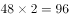。则所求项为66.96。

故正确答案为C。

---

### 第 2 题　qid 2367912 · 数学运算

，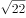，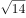，，，（    ）

- **A**. 
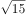

- **B**. 

　✅
- **C**. 
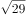

- **D**. 
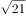

**答案**：B

**官方解析**

将题干统一转化为根式：、、、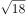、、（），观察根号内数字规律。，可得16、、4、、（），是公比为的等比数列，则下一项。故题干所求项。

故正确答案为B。

---

### 第 3 题　qid 2368001 · 数学运算

，，，，，（    ）

- **A**. 

- **B**. 

- **C**. 

- **D**. 
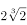
　✅

**答案**：D

**官方解析**

观察数列特点，有根号，都放到根号下，原数列可化为：

256、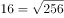、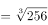、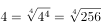、。

根号下（被开方数）都是256，根号外（根指数）为1，2，3，4，5，下一项为6，则所求项为。

故正确答案为D。

---

### 第 4 题　qid 2367859 · 数学运算

一只密码箱的密码是一个三位数，满足：3个数字之和为19，十位上的数比个位上的数大2。若将百位上的数与个位上的数对调，得到一个新密码，且新密码数比原密码数大99，则原密码数是

- **A**. 397
- **B**. 586　✅
- **C**. 675
- **D**. 964

**答案**：B

**官方解析**

根据题干，密码是一个三位数，此题为多位数问题，依次代入选项验证，

A项，，十位9比个位7大2，对调百位和个位得到793，，错误；

B项，，十位8比个位6大2，对调百位和个位得到685，，符合条件，正确；

C项，，错误；

D项，，十位6比个位4大2，对调百位和个位得到469，，错误。

故正确答案为B。

注：考场上不用验证C、D选项。

---

### 第 5 题　qid 2367841 · 数学运算

某银行为一家小微企业提供了年利率分别为、的甲、乙两种贷款，期限均为一年。若两种贷款的合计数额为400万元，企业需付利息总额为25万元，则乙种贷款的数额是

- **A**. 100万元　✅
- **B**. 120万元
- **C**. 130万元
- **D**. 150万元

**答案**：A

**官方解析**

设乙种贷款的数额为万元，则甲种贷款数额为万元。根据题意可列方程：，解得万元，则乙种贷款的数额是100万元。

故正确答案为A。

---

### 第 6 题　qid 2367919 · 数学运算

一群学生分小组在户外活动，如3人一组还多2人，5人一组还多3人，7人一组还多4人，则该群学生的最少人数是

- **A**. 23
- **B**. 53　✅
- **C**. 88
- **D**. 158

**答案**：B

**官方解析**

本题为余数问题，优先用代入排除法。题干所求为这群学生最少有多少人，故从最小选项依次代入。

A项：当学生人数为23时，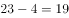，并非7的倍数，不满足 “7人一组还多4人”，排除；

B项：当学生人数为53时，，可以被3整除。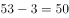，可以被5整除。，可以被7整除。满足题干所有条件，当选。

故正确答案为B。

---

### 第 7 题　qid 2367844 · 数学运算

现有浓度为和的盐水各若干克，将其混合后加入50克水，配制成了浓度为的盐水600克，则原和的盐水质量之比是

- **A**. 6：5
- **B**. 1：1
- **C**. 5：6
- **D**. 4：7　✅

**答案**：D

**官方解析**

第二次混合50克水后，配置盐水共600克，则第一次混合配置得到盐水质量为克，溶质质量为克。设第一次混合配置浓度为的盐水有克，则浓度为盐水克，根据溶质的量不变，可得方程，解得克，则浓度为的盐水质量为200克，浓度为盐水质量为克，浓度为与浓度为的溶液质量之比为。

故正确答案为D。

---

### 第 8 题　qid 2367922 · 数学运算

市电视台向150位观众调查前一天晚上甲、乙两个频道的收视情况，其中108人看过甲频道，36人看过乙频道，23人既看过甲频道又看过乙频道，则受调查观众中在前一天晚上两个频道均未看过的人数是

- **A**. 17
- **B**. 22
- **C**. 29　✅
- **D**. 38

**答案**：C

**官方解析**

根据题干可判定本题为两集合容斥问题，根据公式：，则，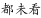，故受调查观众中在前一天晚上两个频道均未看过的人数是29人。

故正确答案为C。

---

### 第 9 题　qid 2368004 · 数学运算

新疆是我国重要的产棉区。2018年新疆棉花种植面积比上年增加411万亩，增长；2018年全国棉花种植面积为5028万亩，比上年增加236万亩，则2017年新疆棉花种植面积与全国的比值所处的区间是：

- **A**. [0.45，0.55]
- **B**. [0.55，0.65]
- **C**. [0.65，0.75]　✅
- **D**. [0.75，0.85]

**答案**：C

**官方解析**

2018年新疆棉花种植面积比上年增加411万亩，增长，由可知，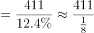万亩。2017年全国棉花种植面积为万亩。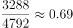，在C项范围之内。

故正确答案为C。

---

### 第 10 题　qid 2368005 · 数学运算

某镇政府有工作人员104人，他们在清明节前去烈士陵园缅怀革命先烈，需全部坐船渡过一条河。已知大船可载客12人，小船可载客5人，大船和小船不论坐满与否，都按满载算。若大船渡一次70元，小船渡一次30元，则他们渡河最节省的方案是：

- **A**. 7只大船和4只小船　✅
- **B**. 2只大船和16只小船
- **C**. 6只大船和2只小船
- **D**. 1只大船和20只小船

**答案**：A

**官方解析**

方法一：代入A项，7只大船和4只小船可坐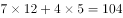人，共需元；代入B项，2只大船和16只小船可坐人，共需元；代入C项，6只大船和2只小船可坐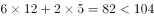人，排除；代入D项，1只大船和20只小船可坐人，共需元。比较可知，最节省的方案为7只大船和4只小船。

方法二：大船渡一次70元，可载客12人，即每人需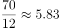元；小船渡一次30元，可载客5人，每人需元。使用大船时单价更低，若想渡河费用尽量少，应该尽量多的使用大船，且尽量使每艘船都坐满不留空位。代入大船数量最多的A项，7只大船和4只小船可坐人，正好坐满每艘船且能载完全部人员，符合题意条件，无需验证其他选项。

故正确答案为A。

---

### 第 11 题　qid 2367854 · 数学运算

已知一个箱子中装有12件产品，其中有2件次品。若从箱子中随机抽取2件产品进行检验，则恰好抽到1件次品的概率是

- **A**. 

- **B**. 

　✅
- **C**. 

- **D**. 

**答案**：B

**官方解析**

若恰好抽到1件次品，则意味抽到1件合格产品和1件次品，共有种情况。从12件产品抽2件产品检验，共有种情况，故恰好抽到1件次品的概率。

故正确答案为B。

---

### 第 12 题　qid 2367836 · 数学运算

某工程队承担一项工程，由于天气原因，工期将延后10天。为了按期完工，需增加施工人员。若增加4人，工期会延后4天；若增加10人，工期将提前2天。假设每人工作效率相同，为确保按期完工，则工程队最少应增加的施工人员数是

- **A**. 6
- **B**. 7
- **C**. 8　✅
- **D**. 9

**答案**：C

**官方解析**

赋值每人工作效率为1，设原来有个人，计划天完成。根据三种安排方式的工作量不变，则有，解方程得，。假设增加个人可以按时完成则有，解得，故至少增加8人，可以按时完成。

故正确答案为C。

---

### 第 13 题　qid 2368006 · 数学运算

某镇政府办公室集中采购一批打印纸，分发给各个职能部门。如果按每个部门4包分发，则多6包；如果按每个部门5包分发，则有1个部门只能分到3包。这批打印纸的数量是：

- **A**. 38包　✅
- **B**. 36包
- **C**. 40包
- **D**. 42包

**答案**：A

**官方解析**

设职能部门数量为x，根据题意，，解方程得，。则这批打印纸的数量是包。

故正确答案为A。

---

### 第 14 题　qid 2367842 · 数学运算

某班举行数学测验，试题全部是选择题，共10题，每题1分，得分的部分统计结果如下：

已知，得分至少为3分的，人均分；得分最多为7分的，人均分。这个班级总人数是

- **A**. 

　✅
- **B**. 

- **C**. 

- **D**. 

**答案**：A

**官方解析**

根据题意，所有人的得分得分至少3分的得分之和3分以下的得分之和最多7分的得分之和7分以上的得分之和。设总人数为人，则有，解方程得。

故正确答案为A。

---

### 第 15 题　qid 2367846 · 数学运算

某公司年终联欢，准备了52张编号分别为1至52的奖券用于抽奖。如果编号是2、3的倍数的奖券可分别兑换2份、3份奖品，编号同时是2和3的倍数的奖券只可兑换3份奖品，其他编号的奖券只可兑换1份奖品，则所有奖券可兑换的奖品总数是：

- **A**. 99份
- **B**. 100份
- **C**. 102份
- **D**. 104份　✅

**答案**：D

**官方解析**

52个数字中，3的倍数有，取整为个，共发放奖品份；2的倍数个，剔除2和3的公倍数有，取整为8个（已经发过不重复发放）。则发两份奖品的有个，共发份；剩余个，发份。故一共发份。

故正确答案为D。

---

### 第 16 题　qid 2367848 · 数学运算

某地区有甲、乙、丙、丁4个派出所。已知上月甲、乙2个派出所的合计出警次数是95次，乙、丙、丁3个派出所的合计出警次数是140次，乙派出所的出警次数占4个派出所合计出警次数的，则上月甲派出所的出警次数是

- **A**. 55次
- **B**. 60次　✅
- **C**. 68次
- **D**. 75次

**答案**：B

**官方解析**

假设4个派出所合计出警次数为次，则乙派出所出警次数为次。根据题意可知，，解得，则乙派出所出警次数为次，故甲派出所出警次数为次。

故正确答案为B。

---

### 第 17 题　qid 2367857 · 数学运算

一场大雪过后，某单位需安排员工清理包干区的道路积雪。清理时必须3人一组，其中2人铲雪，1人扫雪。如果安排10人铲雪，3.5小时才能完成。假设每组工作效率相同，若要在100分钟内完成，则需安排的员工人数最少是

- **A**. 21
- **B**. 24
- **C**. 30
- **D**. 33　✅

**答案**：D

**官方解析**

安排10人铲雪，即有组，赋每组工作效率为1，可得总雪量为，若要在100分钟完成，则需要组数组，即至少需要11组，每组3人，则需安排的员工人数最少是。

故正确答案为D。

---

### 第 18 题　qid 2368007 · 数学运算

某民营企业新建一个四边形的厂区，按对角线将整个厂区分为四个功能区，如图所示。已知生产、仓储和营销三个功能区的面积分别为26亩、18亩和13亩，若保留休闲区的12亩天然小湖泊，则休闲区可利用的陆地面积是：

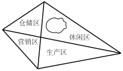

- **A**. 36亩
- **B**. 26亩
- **C**. 24亩　✅
- **D**. 23亩

**答案**：C

**官方解析**

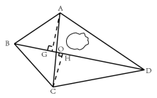

如上图所示。△AOB与△COB有公共边BO，两个三角形面积之比为18:13。三角形底相同，高与面积成正比，则高之比为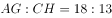。同理△AOD与△COD有公共边OD，高分别为AG和CH，其底相同，因此面积与高成正比，即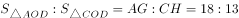。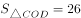，故亩。休闲区湖泊面积为12亩，故休闲区可利用陆地面积为亩。

故正确答案为C。

---

## 判断推理

### 材料 1

某市江海区决定对东风路、西河路、南塘路、北海路等4条辖区内道路进行市容出新。为了解群众意见，制定符合民意的出新方案，区政府相关部门的甲、乙、丙、丁4位同志两人一组结伴展开调研。已知，每人各选两条道路，每条道路恰有两人选择：在每条道路的调研中，乙与丙始终没有在一组。另外，还知道：

（1）如果甲选东风路，则丁也选东风路；

（2）如果丙选南塘路，则丁也选南塘路；

（3）甲没有选南塘路。

#### 第 1 题　qid 2367868 · 逻辑判断

根据上述信息，可以得出以下哪项？

- **A**. 甲选西河路和北海路　✅
- **B**. 乙选西河路和南塘路
- **C**. 丙选东风路和西河路
- **D**. 丁选东风路和北海路

**答案**：A

**官方解析**

整理题干信息。

① 每人各选两条道路，每条道路恰有两人选择，乙与丙始终没有在一组；

② 甲东风丁东风； 

③ 丙南塘丁南塘；

④甲南塘。

题干信息不确定，可用假设法。

根据①可知，乙或丙肯定有人会跟甲一组，有两种情况：

（1）假如，乙和甲一组，根据条件②可知，如果甲东风，那么乙和丁也得东风，与题干每条道路恰有两人选择矛盾，所以，甲不选东风，根据条件④可知，甲不选南塘，所以甲只能选西河和北海；

（2）假如，丙和甲一组，根据条件②可知，如果甲东风，那么丙和丁也得东风，与题干每条道路恰有两人选择矛盾，所以，甲不选东风，根据条件④可知，甲不选南塘，所以甲只能选西河和北海。

无论哪种情况，最后甲只能选西河和北海。

故正确答案为A。

---

#### 第 2 题　qid 2367870 · 逻辑判断

如果乙不选东风路，则可以得出以下哪项？

- **A**. 甲或者选东风路或者选南塘路
- **B**. 乙或者选西河路或者选南塘路　✅
- **C**. 丙或者选南塘路或者选北海路
- **D**. 丁或者选西河路或者选北海路

**答案**：B

**官方解析**

第一步：整理题干信息。

① 每人各选两条道路，每条道路恰有两人选择，乙与丙始终没有在一组；

② 甲东风丁东风； 

③ 丙南塘丁南塘；

④ 甲南塘；

⑤ 乙东风。

根据99题结论可知，条件⑥甲选西河路和北海路，不选东风路和南塘路，又条件①乙与丙始终没有在一组，对于东风路和南塘路，甲不选，乙和丙也不能同时选，则丁必然要选东风路和南塘路，又根据条件⑤ 乙东风，可填写表格如下：

第二步：逐一分析选项。

A项：根据分析可知甲选西河路和北海路，不可能选东风路或者选南塘路，不能推出，排除；

B项：根据分析可知乙有三种情况，可以选西河路和北海路/西河路和南塘路/南塘路和北海路，对于三种情况，选项说法选西河路或者选南塘路均成立，可以推出，当选；

C项：根据分析可知丙有三种情况，可以选东风路和西河路/东风路和南塘路/东风路和北海路，对于三种情况，选项说法选南塘路或者选北海路不一定成立，不能推出，排除；

D项：根据分析可知丁选东风路和南塘路，不可能选西河路或者选北海路，不能推出，排除。

故正确答案为B。

---

#### 第 3 题　qid 2367928 · 类比推理

牛奶：奶牛：牛圈

- **A**. 鸡肉：肉鸡：鸡场
- **B**. 虫害：害虫：农田
- **C**. 蛇毒：毒蛇：蛇穴　✅
- **D**. 蜜蜂：蜂蜜：蜂巢

**答案**：C

**官方解析**

第一步：判断题干词语间逻辑关系。
牛奶是奶牛的身体分泌物，二者为对应关系，牛圈是奶牛的生活场所，二者为对应关系。
第二步：判断选项词语间逻辑关系。
A项：鸡肉是肉鸡的身体部分，而不是身体分泌物，鸡场是肉鸡的生活场所，二者为对应关系，前两词与题干逻辑关系不一致，排除；
B项：害虫导致虫害，二者为因果对应关系，农田是害虫的生活场所，二者为对应关系，前两词与题干逻辑关系不一致，排除；
C项：蛇毒是毒蛇的身体分泌物，二者为对应关系，蛇穴是毒蛇的生活场所，二者为对应关系，与题干逻辑关系一致，当选；
D项：蜂蜜是蜜蜂的产出物，但两词顺序与题干相反，与题干逻辑关系不一致，排除。
故正确答案为C。

---

#### 第 4 题　qid 2368008 · 类比推理

眼睛：眼镜：隐形眼镜

- **A**. 手掌：手套：纯棉手套　✅
- **B**. 耳机：耳朵：蓝牙耳机
- **C**. 脚踝：护膝：运动护膝
- **D**. 牙套：牙齿：烤瓷牙齿

**答案**：A

**官方解析**

第一步：判断题干词语间逻辑关系。
眼镜是矫正视力和保护眼睛的，二者是对应关系，隐形眼镜是眼镜的一种，二者是种属关系。
第二步：判断选项词语间逻辑关系。
A项：手套是保护手掌的，纯棉手套是手套的一种，与题干逻辑关系一致，当选；
B项：耳朵不是用来保护耳机的，蓝牙耳机也不是耳朵的一种，与题干逻辑关系不一致，排除；
C项：护膝是保护膝盖的，不是保护脚踝的，运动护膝是护膝的一种，前两者与题干逻辑关系不一致，排除； 
D项：牙套是矫正或者保护牙齿的，但顺序与题干相反，烤瓷牙齿是牙齿的一种，前两词与题干逻辑关系不一致，排除；
故正确答案为A。

---

#### 第 5 题　qid 2367851 · 类比推理

路霸：打击：黑恶势力

- **A**. 功课：复习：基础课程
- **B**. 友谊：维护：世界和平
- **C**. 诚信：讲究：社会和谐
- **D**. 铅笔：购买：学习用品　✅

**答案**：D

**官方解析**

第一步：判断题干词语间逻辑关系。
打击路霸，二者是动宾关系，路霸是黑恶势力的一种，二者是种属关系。
第二步：判断选项词语间逻辑关系。
A项：复习功课，二者是动宾关系，基础课程是功课的一种，与题干顺序相反，与题干逻辑关系不一致，排除；
B项：维护友谊，二者是动宾关系，但友谊不是世界和平的一种，与题干逻辑关系不一致，排除；
C项：讲究诚信，二者是动宾关系，但诚信不是社会和谐的一种，与题干逻辑关系不一致，排除；
D项：购买铅笔，二者是动宾关系，铅笔是学习用品的一种，与题干逻辑关系一致，当选。
故正确答案为D。

---

#### 第 6 题　qid 2367929 · 类比推理

记录：记录本

- **A**. 咨询：咨询室
- **B**. 复印：复印件
- **C**. 驾驶：驾驶证
- **D**. 存储：存储盘　✅

**答案**：D

**官方解析**

第一步：判断题干词语间逻辑关系。
记录本的功能是记录，二者为功能对应关系，且记录本是所记录内容的载体。
第二步：判断选项词语间逻辑关系。
A项：咨询室的功能是咨询，但是咨询室是场所，与题干逻辑关系不一致，排除；
B项：复印完成后得到复印件，复印件的功能不是复印，与题干逻辑关系不一致，排除；
C项：驾驶证的功能不是驾驶，是用来证明有驾驶资格的证件，与题干逻辑关系不一致，排除；
D项：存储盘的功能是存储，二者为功能对应关系，且存储盘是所存储内容的载体，与题干逻辑关系一致，当选。
故正确答案为D。

---

#### 第 7 题　qid 2367979 · 类比推理

猪肉：猪肉松

- **A**. 红木：红木床　✅
- **B**. 东坡：东坡肉
- **C**. 太师：太师椅
- **D**. 女儿：女儿红

**答案**：A

**官方解析**

第一步：判断题干词语间逻辑关系。
猪肉是制作猪肉松的原材料，二者是对应关系。
第二步：判断选项词语间逻辑关系。
A项：红木是制作红木床的原材料，二者是对应关系，与题干逻辑关系一致，当选；
B项：东坡不是制作东坡肉的原材料，与题干逻辑关系不一致，排除；
C项：太师不是制作太师椅的原材料，与题干逻辑关系不一致，排除；
D项：女儿不是制作女儿红的原材料，与题干逻辑关系不一致，排除。
故正确答案为A。

---

#### 第 8 题　qid 2367824 · 类比推理

高原：藏羚羊

- **A**. 中国：金丝猴
- **B**. 战场：指战员
- **C**. 海洋：大白鲨　✅
- **D**. 大学：研究员

**答案**：C

**官方解析**

第一步：判断题干词语间逻辑关系。
藏羚羊在高原生活，二者为生存环境与物种的对应关系。
第二步：判断选项词语间逻辑关系。
A项：金丝猴在中国生活，但中国是一个国家，范围太广，不是具体的生存环境对应，与题干逻辑关系不一致，排除；
B项：指战员是指挥员和战斗员的统称，战场不是指战员的生存环境，与题干逻辑关系不一致，排除；
C项：大白鲨在海洋生活，二者是生存环境与物种的对应关系，与题干逻辑关系一致，当选；
D项：大学是研究员的工作地点，二者是工作地点的对应关系，不是生存环境，与题干逻辑关系不一致，排除。
故正确答案为C。

---

#### 第 9 题　qid 2367931 · 类比推理

茶壶 之于 （    ） 相当于 （    ） 之于 桃花

- **A**. 茶艺——桃红
- **B**. 茶叶——桃仁
- **C**. 壶嘴——桃树　✅
- **D**. 茶馆——桃园

**答案**：C

**官方解析**

逐一代入选项。
A项：茶壶是展示茶艺的工具，二者是工具对应关系，桃花是桃红色的，二者是属性对应关系，前后逻辑关系不一致，排除；
B项：茶壶是用来冲泡茶叶的，二者是工具对应关系，桃仁和桃花是并列关系，前后逻辑关系不一致，排除；
C项：壶嘴是茶壶的组成部分，桃花是桃树的组成部分，都是组成关系，前后逻辑关系一致，当选；
D项：茶馆是使用茶壶的地方，桃园是桃花盛开的地方，但两词的顺序相反，前后逻辑关系不一致，排除；
故正确答案为C。

---

#### 第 10 题　qid 2367982 · 类比推理

诊断 之于 （    ） 相当于 知错 之于（    ）

- **A**. 仪器——表扬
- **B**. 手术——改错　✅
- **C**. 病人——浪子
- **D**. 医生——学生

**答案**：B

**官方解析**

逐一代入选项。
A项：仪器是诊断的辅助工具，二者为对应关系，知错和表扬没有必然的逻辑关系，前后逻辑关系不一致，排除；
B项：先诊断后手术，二者为先后顺序对应关系，先知错后改错，二者为先后顺序对应关系，前后逻辑关系一致，当选；
C项：诊断病人，二者为动宾关系，浪子知错，二者为主谓宾关系，前后逻辑关系不一致，排除；
D项：医生诊断，二者为主谓结构，学生知错，二者为主谓宾结构，前后逻辑关系不一致，排除。
故正确答案为B。

---

#### 第 11 题　qid 2367932 · 类比推理

日曰曰日戊戍戍戊白

- **A**. 己巳巳己愕谔愕谔鄂
- **B**. 甲由由甲申喂喂伸神
- **C**. 嚄噢噢嚄哑咔咔哑娅　✅
- **D**. 嗒呾怛嗒嚓察察嚓檫

**答案**：C

**官方解析**

第一步：分析题干汉字间关系。
从相同汉字的位置入手：位置1、4的汉字相同；位置2、3的汉字相同，位置5、8的汉字相同，位置6、7的汉字相同。
第二步：判断选项符号间关系。
A项：位置5、8汉字不相同，与题干不一致，排除；
B项：位置5、8汉字不相同，与题干不一致，排除；
C项：位置1、4的汉字相同；位置2、3的汉字相同，位置5、8的汉字相同，位置6、7的汉字相同，与题干一致，当选；
D项：位置2、3汉字不相同，与题干不一致，排除。
故正确答案为C。

---

#### 第 12 题　qid 2367933 · 逻辑判断

- **A**. 
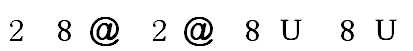

- **B**. 

　✅
- **C**. 

- **D**. 

**答案**：B

**官方解析**

第一步：分析题干符号间关系。
从相同符号的位置入手：位置1、4的符号相同；位置2、6、8符号相同；位置7、9符号相同。
第二步：判断选项符号关系。
A项：相同位置与题干一致，但位置3、5符号相同，而题干3、5符号不相同，与题干逻辑关系不一致，排除；
B项：位置1、4的符号相同；位置2、6、8符号相同；位置7、9符号相同，与题干逻辑关系一致，当选；
C项：位置5、7、9符号相同，而题干5、7符号不相同，与题干逻辑关系不一致，排除；
D项：位置7、9符号不相同，与题干逻辑关系不一致，排除。
故正确答案为B。

---

#### 第 13 题　qid 2367934 · 图形推理

从四个图中选出唯一的一项，填入问号处，使其呈现一定的规律性:

- **A**. A
- **B**. B
- **C**. C
- **D**. D　✅

**答案**：D

**官方解析**

本题考查图形的实际意义，寻找最大共同点。观察发现，题干图片均为盆景，盆栽整体直立在盆中，且装盆栽的盆的形状是长方形。四个选项中，A项中装盆栽的盆的形状是圆形，B项盆栽不是直立在盆中，C项不是盆栽，只有D项符合题干规律。
故正确答案为D。

---

#### 第 14 题　qid 2367983 · 图形推理

从四个图中选出唯一的一项，填入问号处，使其呈现一定的规律性:

- **A**. A
- **B**. B
- **C**. C
- **D**. D　✅

**答案**：D

**官方解析**

元素组成不相同，且属性无规律，考虑数量规律，观察题干图形发现，图4和图5中出现多边形，优先考虑数直线，题干五幅图形的直线数为0、1、2、3、4、？，故问号处选择一个有5条直线的图形，排除A项和C项，再次观察发现，题干中每幅图形外框均为圆形，排除B项。
故正确答案为D。

---

#### 第 15 题　qid 2367799 · 图形推理

从四个图中选出唯一的一项，填入问号处，使其呈现一定的规律性:

 

- **A**. A
- **B**. B　✅
- **C**. C
- **D**. D

**答案**：B

**官方解析**

元素组成不同，优先考虑属性规律。观察发现，题干出现了箭头、等腰三角形等特征图，考虑对称性。观察发现，题干每幅图形既是轴对称又是中心对称图形。四个选项中，A项仅为中心对称图形，C、D项仅为轴对称图形，只有B项既是轴对称图形又是中心对称图形。
故正确答案为B。

---

#### 第 16 题　qid 2367801 · 图形推理

从四个图中选出唯一的一项，填入问号处，使其呈现一定的规律性:

- **A**. A
- **B**. B
- **C**. C　✅
- **D**. D

**答案**：C

**官方解析**

题干给出的图形均为四个正方体构成的立体图形，且每幅图的四个正方体均为同样的排列形式，即题干每幅图的立体图形都相同，只是每幅图立体图形的位置发生了旋转。据此规律，只有C项跟题干立体图形是同样的排列形式。
故正确答案为C。

---

#### 第 17 题　qid 2367984 · 图形推理

选项四个图形中，只有一个是由题干的四个图形拼合（只能通过上、下、左、右平移）而成的，请把它找出来。

- **A**. A　✅
- **B**. B
- **C**. C
- **D**. D

**答案**：A

**官方解析**

本题考查平面拼合，可采用平行且等长相消的方式解题。消去平行且等长的线段后进行组合即可得到轮廓图，即为A项。平行且等长相消的方式如下图所示：

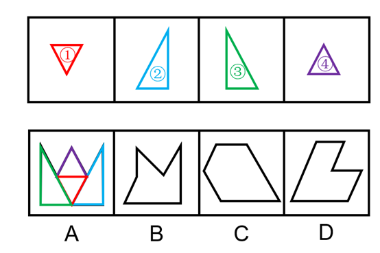

故正确答案为A。

---

#### 第 18 题　qid 2367986 · 图形推理

选项四个图形中，只有一个是由题干的四个图形拼合（只能通过上、下、左、右平移）而成的，请把它找出来。

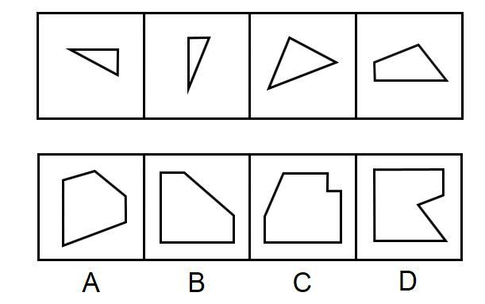

- **A**. A
- **B**. B
- **C**. C
- **D**. D　✅

**答案**：D

**官方解析**

本题考查平面拼合，可采用平行且等长相消的方式解题。消去平行且等长的线段后进行组合即可得到轮廓图，即为D项。平行且等长相消的方式如下图所示：

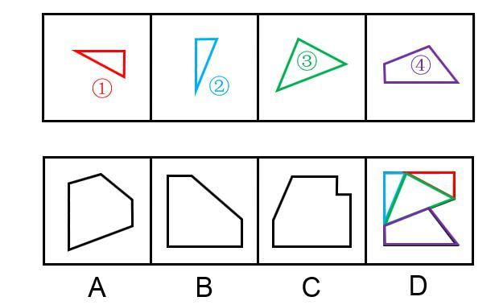

故正确答案为D。

---

#### 第 19 题　qid 2367808 · 图形推理

选项四个图形中，只有一个是由题干的四个图形拼合（只能通过上、下、左、右平移）而成的，请把它找出来。

- **A**. A
- **B**. B
- **C**. C
- **D**. D　✅

**答案**：D

**官方解析**

本题考查平面拼合，可采用平行且等长相消的方式解题。消去平行且等长的线段后进行组合即可得到轮廓图，即为D项。平行且等长相消的方式如下图所示：

故正确答案为D。

---

#### 第 20 题　qid 2367811 · 图形推理

选项四个图形中，只有一个是由题干的四个图形拼合（只能通过上、下、左、右）而成的，请把它找出来。

- **A**. A
- **B**. B　✅
- **C**. C
- **D**. D

**答案**：B

**官方解析**

本题考查俄罗斯方块平面拼合。从方块最多的图形入手，贴边代入选项。在题干的4个图形中，图④的方块最多，将它贴边代入各个选项中，只有B项能够把所有图形都代入进去，拼合方式如下图所示。

故正确答案为B。

---

#### 第 21 题　qid 2367987 · 图形推理

左边给定的是纸盒外表面的展开图，右边哪一项能由它折叠而成？请把它找出来。

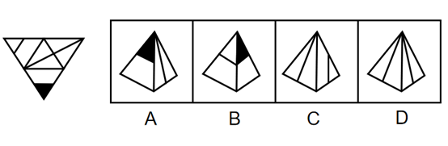

- **A**. A
- **B**. B
- **C**. C　✅
- **D**. D

**答案**：C

**官方解析**

将题干展开图中的面依次标注为面a、b、c、d，如下图：

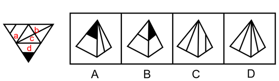

A项：以面d黑尖为起点顺时针画边，题干中第1条边对着的是面a，选项中第1条边对着的不是面a，选项与题干不一致，排除；

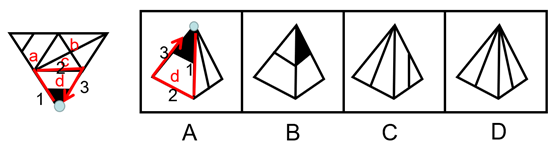

B项：选项由面a、面d构成，以面d黑尖为起点顺时针画边，题干中第1条边对着的是面a，选项中第3条边对着的是面a，选项与题干不一致，排除；

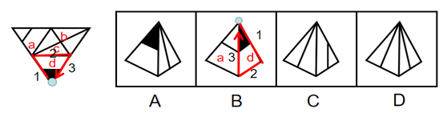

C项：与题干一致，当选；

D项：选项由面b、面c构成，题干中面b、面c内的线段交点在公共边上，选项中面b、面c内的线段交点不在公共边上，选项与题干不一致，排除。

故正确答案为C。

---

#### 第 22 题　qid 2367988 · 图形推理

左边给定的是纸盒外表面的展开图，右边哪一项能由它折叠而成？请把它找出来。

- **A**. A
- **B**. B
- **C**. C
- **D**. D　✅

**答案**：D

**官方解析**

将题干展开图中的面依次标注为面a、b、c、d，如下图：

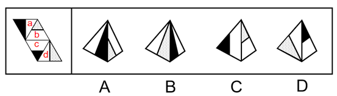

A项：选项由面a、面b构成，题干中面a和面b的公共边是白色直角三角形的斜边，选项中面a和面b的公共边是黑色直角三角形的斜边，选项与题干不一致，排除；

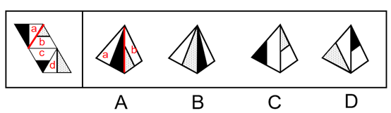

B项：选项由面a、面d构成，题干中面a和面d的公共边是黑色直角三角形短直角边，而选项中，面a和面d的公共边是黑色直角三角形的斜边，选项与题干不一致，排除；

C项：选项由b、面c构成，题干中面b和面c的公共边是面b中白色梯形的下底边，而选项中面b和面c的公共边不是面b中白色梯形的下底边，选项与题干不一致，排除；

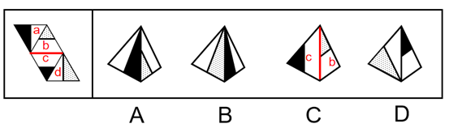

D项：与题干一致，当选。

故正确答案为D。

---

#### 第 23 题　qid 2367989 · 图形推理

左边给定的是纸盒外表面的展开图，右边哪一项能由它折叠而成？请把它找出来。

- **A**. A　✅
- **B**. B
- **C**. C
- **D**. D

**答案**：A

**官方解析**

本题考查六面体的空间重构。将展开图中的各面进行标号，如图1所示：

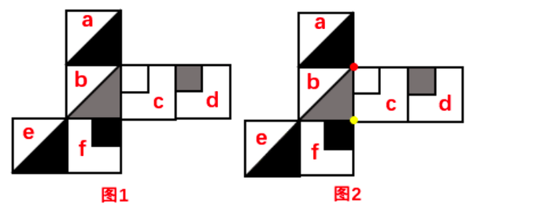

A项：与题干展开图一致，当选；

B项：展开图中，面c中白正方形的红点与面f中黑正方形的黄点不重合（如图2所示），而选项中二者是重合的，选项与题干不一致，排除；

C项：展开图中，面a和面f是相对面，面c和面e是相对面，这两对相对面均不能同时在立体图中出现，但选项的黑三角形面不管是面a还是面e，选项中均有相对面，选项与题干不一致，排除；

D项：展开图中，面b中灰色三角形的直角边挨着f面中的黑正方形，而选项中二者无此关系，选项与题干不一致，排除。

故正确答案为A。

---

#### 第 24 题　qid 2367990 · 图形推理

左边给定的是纸盒外表面的展开图，右边哪一项能由它折叠而成？请把它找出来。

- **A**. A
- **B**. B
- **C**. C　✅
- **D**. D

**答案**：C

**官方解析**

本题考查六面体的空间重构。将平面图中的各面进行标号，如图1所示：

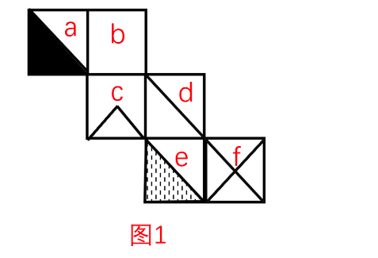

A项：展开图中，面a黑色三角形的黑色直角边挨着面c，而选项中面a黑色三角形的黑色直角边没有挨着面c，选项与题干不一致，排除；

B项：展开图中，面a和面d是相对面，相对面不能同时出现，但选项中两个面是相邻面，选项与题干不一致，排除；

C项：与题干展开图一致，当选；

D项：展开图中，面b和面e是相对面，相对面不能同时出现，而选项中二个面是相邻面，选项与题干不一致，排除。

故正确答案为C。

---

#### 第 25 题　qid 2367991 · 图形推理

从所给的四个选项中，选择最合适的一个填入问号处，使之呈现一定的规律性。

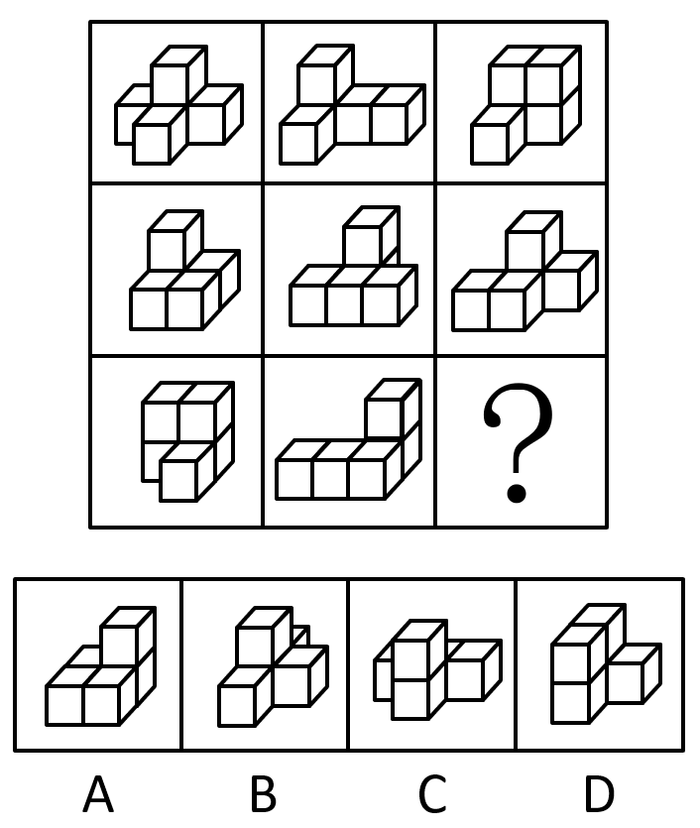

- **A**. A　✅
- **B**. B
- **C**. C
- **D**. D

**答案**：A

**官方解析**

本题考查三视图，九宫格优先按横行找规律。观察发现，第一行立体图形的左视图均相同（呈“L”形），第二行立体图形的左视图均相同（呈“L”形），第三行前两幅立体图形的左视图均相同（呈“L”形），只有A项符合这一规律（C项立体图形的左视图也是L形，但方向与题干不同）。
故正确答案为A。

---

#### 第 26 题　qid 2367946 · 图形推理

从所给的四个选项中，选择最合适的一个填入问号处，使之呈现一定的规律性：

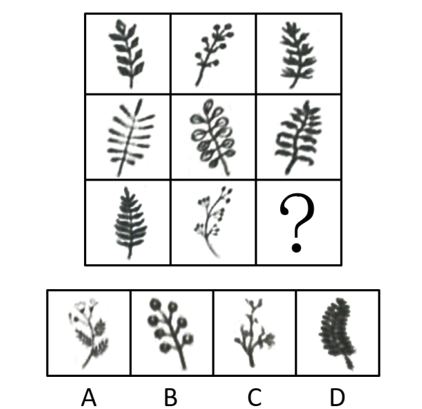

- **A**. A
- **B**. B　✅
- **C**. C
- **D**. D

**答案**：B

**官方解析**

本题考查图形的实际意义，寻找最大共同点。观察发现，题干所有图形都是一根枝干上长满了相同的叶子或花，九宫格优先按横行来看，第一行，花枝朝向依次为左、右、左；第二行，花枝朝向依次是右、左、右，规律均为左右交替出现，第三行前两个图花枝朝向为左、右，因此“？”处花枝朝向应为左，C、D两项花枝朝向不是左（注：C项可能存在争议，有部分同学觉得是朝上，无论是朝右还是朝上，均不是朝左），均排除；A项花枝最上面是3朵花，下面是3片叶子，一根枝干上元素不相同，只有B项满足题干图形特征。
故正确答案为B。

---

#### 第 27 题　qid 2367993 · 图形推理

左图为给定的立体，从任意角度剖开，右边哪一项不可能是它的截面图？

 

- **A**. A
- **B**. B　✅
- **C**. C
- **D**. D

**答案**：B

**官方解析**

本题考查截面图。逐一分析选项。如下图所示，A、C、D项均可截出，如下图所示。B项无法截出，因为三棱柱是空心部分，B项中间矩形的两侧不应该有线。

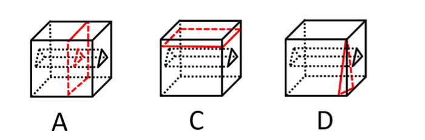

本题为选非题，故正确答案为B。

---

#### 第 28 题　qid 2367996 · 逻辑判断

马克思是顶天立地的伟人，也是有血有肉的常人。他热爱生活，真诚朴实，重情重义。马克思、恩格斯的革命友谊长达40年。正如列宁所说：“古老传说中有各种非常动人的友谊故事”，但马克思、恩格斯的友谊“超过了古人关于人类友谊的一切最动人的传说”。
根据以上陈述，可以得出以下哪项？

- **A**. 有的顶天立地的伟人热爱生活、重情重义　✅
- **B**. 古代各种非常动人的友谊一般都不超过40年
- **C**. 恩格斯同样热爱生活，真诚朴实，重情重义
- **D**. 列宁也是顶天立地的伟人和有血有肉的常人

**答案**：A

**官方解析**

日常结论题，根据题干信息逐一分析选项。
A项：根据题干第一句和第二句可知，马克思是一个顶天立地的伟人，他热爱生活、重情重义，可以得到有的顶天立地的伟人热爱生活、重情重义，可以推出，当选；
B项：题干中只是说明马克思和恩格斯的友谊长达40年，没有提及古代所有非常动人的友谊持续的时间情况，无中生有，排除；
C项：题干中没有提及恩格斯是否热爱生活，真诚朴实，重情重义，无中生有，排除；
D项：题干中没有提及列宁是什么样的人，无中生有，排除。
故正确答案为A。

---

#### 第 29 题　qid 2367951 · 逻辑判断

人饿了会吃东西，一旦摄入碳水化合物、脂肪、蛋白质等能量营养素，就能消除饥饿感，这种缺乏能量营养素的饥饿是显性饥饿；然而，人体健康还需铁、锌等16种矿物元素及维生素A、维生素E等13种维生素，如果缺乏这些微量营养素，则会造成隐性饥饿。显然，显性饥饿只要“吃饱”就能解决，而隐性饥饿只有“吃好”才能应对。
根据以上陈述，可以得出以下哪项？

- **A**. 既要“吃饱”又要“吃好”，如此就能保证人体的健康
- **B**. 消除显性饥饿对人更重要，只有“吃饱”才能“吃好”
- **C**. 隐性饥饿并不同于显性饥饿，“吃不好”不等于“吃不饱”　✅
- **D**. 隐性饥饿对人体健康的危害比显性饥饿更大、更隐蔽

**答案**：C

**官方解析**

日常结论题，根据题干信息逐一分析选项。
A项：根据题干可知，“吃饱”可以解决显性饥饿，“吃好”可以解决隐性饥饿，但题干未提及二者同时成立是否就能保证人体健康，无法推出，排除；
B项：题干中并未比较消除显性饥饿与消除隐性饥饿哪个更重要，无法推出，排除；
C项：根据题干最后一句话可知，显性饥饿只要“吃饱”就能解决，而隐性饥饿只有“吃好”才能应对，说明这两种饥饿是不同的，其解决方式也并不相同，可以推出，当选；
D项：题干中并未比较显性饥饿与隐性饥饿哪个对人体的健康危害更大，无法推出，排除。
故正确答案为C。

---

#### 第 30 题　qid 2367861 · 逻辑判断

某区对所辖钟山、长江、梅园、星海4个街道进行抽样调查，并按照人均收入为其排序。有人根据以往经验对4个街道的人均收入排序作出如下预测：
（1）如果钟山街道排第三，那么梅园街道排第一；
（2）如果长江街道既不排第一也不排第二，那么钟山街道排第三；
（3）钟山街道排序与梅园街道相邻，但与长江街道不相邻。
事后得知，上述预测符合调查结果。
根据以上信息，可以得出以下哪项？

- **A**. 钟山街道不排第一就排第四　✅
- **B**. 长江街道不排第二就排第三
- **C**. 梅园街道不排第二就排第四
- **D**. 星海街道不排第一就排第三

**答案**：A

**官方解析**

第一步：分析题干条件。

① 钟山第三梅园第一；

② 长江第一 且 第二钟山第三；

③ 钟山与梅园相邻，与长江不相邻。

第二步：根据题干条件进行推理。

钟山出现次数最多，为最大信息，可作为突破口。根据③可知：钟山与梅园相邻，结合①可知：钟山第三梅园第一，故钟山不能排名第三。钟山第三是对②的否后，否后必否前，故长江排名第一或者第二。

如果长江排第一，根据③可知钟山只能排第四，故梅园排第三，星海排第二，排除B、C、D项，只有A项成立；

如果长江排第二，根据③可知钟山只能排第四，故梅园排第三，星海排第一，A项依然成立。

故正确答案为A。

---

#### 第 31 题　qid 2367950 · 逻辑判断

当今社会，不少老人为了帮助子女照顾下一代而漂泊异乡成为“老漂族”。在最近一项城市调查中，的受访青年坦言，自己的父母就是老漂族，自己与爱人事业刚刚起步，工作压力较大，根本没有时间照顾孩子和做家务。有专家据此断言，我国城市中的老漂族群体还会进一步扩大。

以下哪项如果为真，最能支持上述专家的观点？

- **A**. 老人在城市养老可拥有比乡村更好的医疗条件
- **B**. 有些老人故土难离事务缠身更愿意生活在家乡
- **C**. 国家二孩政策的实施将会促使更多的孩子出生　✅
- **D**. 二孩政策实施后城市的二孩出生率要低于农村

**答案**：C

**官方解析**

第一步：找出论点和论据。

论点：我国城市中的老漂族群体还会进一步扩大。

论据：的受访青年坦言，自己的父母就是老漂族，自己与爱人事业刚刚起步，工作压力较大，根本没有时间照顾孩子和做家务。

题干论点探讨的是老漂族群体会进一步扩大，可以通过补充论据说明老漂族群体在增加或照顾孩子和做家务的人员短缺等进行加强。

第二步：逐一分析选项。

A项：说的是城市养老医疗条件比乡村更好，与论点说的老漂族群体会进一步扩大无关，话题不一致，无法加强，排除；

B项：说的是老人更愿意生活在家乡，老人的意愿与论点说的老漂族群体会进一步扩大无关，无法加强，排除；

C项：国家二孩政策会促使更多的孩子出生，补充论据说明需要照顾孩子的情况会更多，对老漂族群体扩大进行了加强，可以支持，当选；

D项：二孩出生率农村更高，农村的照顾孩子的需求会更多些，老漂族应该会减少而不是扩大，无法加强，排除。

故正确答案为C。

---

#### 第 32 题　qid 2367999 · 逻辑判断

某机关举行职工秋季田径运动会。已知：所有报名参加短跑比赛的职工都报名参加铅球比赛，所有报名参加跳远比赛的职工都没有报名参加铅球比赛，报名参加跳高比赛的职工也都报名参加了跳远比赛，而没有报名参加跳高比赛的职工也都没有报名参加长跑比赛。
根据以上陈述，可以得出以下哪项？

- **A**. 有的报名参加铅球比赛的职工没有报名参加短跑比赛
- **B**. 有的报名参加跳高比赛的职工没有报名参加长跑比赛
- **C**. 所有报名参加跳远比赛的职工都报名参加长跑比赛
- **D**. 所有报名参加短跑比赛的职工都没有报名参加长跑比赛　✅

**答案**：D

**官方解析**

第一步：翻译题干。
（1）短跑→铅球；
（2）跳远→-铅球；
（3）跳高→跳远；
（4）-跳高→-长跑。
将条件进行串联，可得短跑→铅球→-跳远→-跳高→-长跑。
第二步：逐一分析选项。
A项翻译：有的铅球→-短跑，由条件（1）只能得到“有的铅球→短跑”，根据“有的①是②”不能推出“有的①不是②”，无法推出，排除；
B项翻译：有的跳高→-长跑，由条件（4）只能得到“有的跳高→长跑”，根据“有的①是②”不能推出“有的①不是②”，无法推出，排除；
C项翻译：跳远→长跑，由题干可知-跳远→-跳高→-长跑，跳远是否定条件的前件，得不到确定性的结论，无法推出，排除；
D项翻译：短跑→-长跑，根据上述分析串联，可以得到短跑→铅球→-跳远→-跳高→-长跑，可以推出，当选。
故正确答案为D。

---

#### 第 33 题　qid 2368009 · 逻辑判断

我国家长们对儿童阅读越来越重视，大多数家长希望孩子多读书读好书。2018年，某市的家庭有父母陪孩子读书的习惯，亲子阅读的图书量比2017年提高了1.8个百分点，时长也比去年有所增加。但是，2018年该市的儿童人均图书阅读量仅为4.72本，比2017年还下降了0.6个百分点。

以下哪项如果为真，最能解释上述现象？

- **A**. 近年来孩子课业负担较重，对课外阅读很多人是“心有余而时不足”
- **B**. 在亲子阅读中很多孩子习惯“听书”，这种情况2018年未计算在内　✅
- **C**. 大多数80后、90后家长都受过高等教育，比较看重亲子阅读的意义
- **D**. 孩子在手机、电脑上的电子阅读一直未纳入儿童图书阅读的考虑范围

**答案**：B

**官方解析**

第一步：找出题干矛盾。
2018年，某市亲子阅读的图书量比2017年提高了1.8个百分点，时长也比去年有所增加。但2018年该市的儿童人均图书阅读量比2017年还下降了0.6个百分点。
第二步：逐一分析选项。
A项：孩子课业负担较重，对课外阅读很多人是“心有余而时不足”，提及了儿童阅读量不高，但是并没有涉及亲子阅读的影响，不能解释题干矛盾，排除；
B项：在亲子阅读中很多孩子习惯“听书”，这种情况未计算在图书阅读量内，既提及了亲子阅读，又涉及了读书量计算的方式，能够解释为什么2018年亲子阅读量增加而儿童阅读量并没有增加的情况，可以解释题干矛盾，当选；
C项：大多数80后、90后家长比较看重亲子阅读的意义，提及了亲子阅读的图书量可能更多，但并没有涉及儿童的人均读书量为何下降，不能解释题干矛盾，排除；
D项：孩子在手机、电脑上的电子阅读一直未纳入儿童图书阅读的考虑范围，没有涉及亲子阅读的影响，而且选项说的是一直，也就是说2017年和2018年均未考虑在内，不能解释题干矛盾，排除。
故正确答案为B。

---

#### 第 34 题　qid 2367949 · 逻辑判断

某地开展企业结对扶贫创新活动，倡导企业家与贫困家庭互选，要求每户贫困家庭只能选1位企业家，而每位企业家只能在选他的贫困家庭中选择1-2户开展帮扶活动。现有企业家甲、乙、丙3人面对张、王、李、赵4户贫困家庭，已知：
（1）张、王2户至少有1户选择甲；
（2）王、李、赵3户中至少有2户选择乙；
（3）张、李2户中至少有1户选择丙。
事后得知，互选顺利完成，每户贫困家庭均按自己心愿选到了企业家，而每位企业家也按要求选到了贫困家庭。
根据以上信息，可以得出以下哪项？

- **A**. 企业家甲选到了张户
- **B**. 企业家乙选到了赵户　✅
- **C**. 企业家丙选到了李户
- **D**. 企业家甲选到了王户

**答案**：B

**官方解析**

分析题干。
（1）张或王选甲
（2）王、李、赵中至少2户选乙
（3）张或李选丙
由题干“每户贫困家庭只能选1位企业家，每位企业家只能在选他的贫困家庭中选择1-2户开展帮扶活动”可知：甲互选的帮扶家庭数为1，乙互选的帮扶家庭数为2，丙互选的帮扶家庭数为1；再根据条件（1）可知，张或王选甲，说明李和赵不选甲；由条件（2）可知，张不选乙，由条件（3）可知，王和赵不选丙，此时赵即不选甲也不选丙，又已知“每户贫困家庭均按自己心愿选到了企业家”，因此，赵只能选企业家乙，即企业家乙选到了赵户。
故正确答案为B。

---

#### 第 35 题　qid 2367860 · 逻辑判断

智能手机流行的时代，我们每天发送信息，也收到信息。人际之间的电子信息交往已成为当今时代一种独特的交往方式。在面对重要的人或关系时，很多人往往发出信息后就期待被秒回，如果没有被秒回，他们就产生一种怀疑感或被弃感，从而陷入深深的烦恼和焦虑之中。
以下哪项最可能是他们陷入深深烦恼和焦虑所需的假设？

- **A**. 当前技术已能实现智能手机的即时通信，方便快捷，且基本免费　✅
- **B**. 有些聊天软件能在发送者手机中反馈信息接收者是否阅读了信息
- **C**. 有些人工作很忙，总习惯在忙完一天工作后才统一处理相关信息
- **D**. 有些人一天收到的信息太多，容易遗漏某人期待秒回的重要信息

**答案**：A

**官方解析**

第一步：找出论点和论据。

论点：在面对重要的人或关系时，很多人往往发出信息后就期待被秒回，如果没有被秒回，他们就产生一种怀疑感或被遗弃感，从而陷入深深的烦恼和焦虑之中。

论据：无。

本题无论据，只能通过补充论据进行加强。提问方式是假设类，优先考虑补充必要条件，即没有这个选项，论点则无法成立。

第二步：逐一分析选项。

A项：如果智能手机不能即时通信，那么发出的信息就无法被即时接收，发出者就不会期待秒回，因此A项是信息能够被秒回的必要条件，当选；

B项：有些聊天软件能在发送者手机中反馈信息接收者是否阅读了信息，可以解释部分发出者为什么没有被秒回就会产生怀疑感或被弃感，但是力度较弱，且不是论点成立的必要条件，排除；

C项：接收者什么时候阅读信息与发出者没被秒回就会产生烦恼和焦虑无关，排除； 

D项：接收者是否遗漏了重要信息与发出者没被秒回就会产生烦恼和焦虑无关，排除。

故正确答案为A。

附：通过查证原文，本题答案为A项。

---

#### 第 36 题　qid 2367802 · 定义判断

公众充权：指在公共政策的制定、执行、评估、监督过程中，公众积极参与，充分表达自己的利益主张，以推动公共政策过程的民主化与科学化。
下列属于公众充权的是

- **A**. 清明节到来前夕，一些社会人士在市文明办支持下创建了文明祭扫网站，号召民众祭扫时不放鞭炮，不烧纸钱，改用虚拟鲜花、电子蜡烛等绿色环保的方式
- **B**. 快递小哥小李当选市人大代表后，在广泛走访充分调研的基础上，提交了一份关于如何保障快递员权益、促进快递行业健康发展的议案
- **C**. 某市将要召开天然气价格调整听证会，有关部门要求辖区各街道、居委会搞好宣传动员工作，按照下达名额推举市民代表，确保公开公平公正
- **D**. 在某县未来五年发展规划制定过程中，县委、县政府通过召开居民座谈会、专家听证会等形式，征求到了许多宝贵的意见　✅

**答案**：D

**官方解析**

第一步：找出定义关键词。
“在公共政策的制定、执行、评估、监督过程中”、“公众积极参与，充分表达自己的利益主张”、“推动公共政策过程的民主化与科学化”。
第二步：逐一分析选项。
A项：创建文明祭扫网站，号召改用绿色环保的方式，不符合“在公共政策的制定、执行、评估、监督过程中”，不符合定义，排除；
B项：提交议案，不符合“在公共政策的制定、执行、评估、监督过程中”，不符合定义，排除；
C项：召开天然气价格调整听证会可以理解为“在公共政策的制定、执行、评估、监督过程中”，但按照下达名额推举市民代表，不符合“公众积极参与，充分表达自己的利益主张”，不符合定义，排除；
D项：在某县未来五年发展规划制定过程中，符合“在公共政策的制定、执行、评估、监督过程中”，通过召开居民座谈会、专家听证会等形式，征求到了许多宝贵的意见，符合“公众积极参与，充分表达自己的利益主张”，符合定义，当选。
故正确答案为D。

---

#### 第 37 题　qid 2367816 · 定义判断

社会性处罚：指存在失信行为的人员所受到的与自身失信行为没有直接关联的来自其他部门的限制和处罚。
下列属于社会性处罚的是

- **A**. 以“站不起来”为理由强占他人座位的高铁“霸座男”，当场受到了乘警的严肃批评，下车后被移送公安机关接受治安处罚。这一事件曝光后，当事人的恶劣行为又遭到了全国网民的一致谴责
- **B**. 由于数据造假，某教授在国际期刊上发表的论文被撤稿。在网民的谴责声中，该教授又被撤销了基于该论文所获得的绩效奖励、省部级科研项目、荣誉称号、社会兼职
- **C**. 春节前夕，恶意拖欠农民工工资的部分包工头，被有关部门和各种媒体曝光，引起社会各界密切关注。根据银行、保险、铁路等部门的规定，这些违规者申请信用卡、购买保险以及动车和高铁票时都将受到限制　✅
- **D**. 长江沿岸的一家化工企业，多次不顾禁令向长江偷偷排污，最近被省有关部门通报批评，吊销了企业生产执照，它的上级主管部门及主要负责人也都受到了严厉的处罚

**答案**：C

**官方解析**

第一步：找出定义关键词。
“存在失信行为的人员”、“所受到的与自身失信行为没有直接关联的来自其他部门的限制和处罚”。
第二步：逐一分析选项。
A项：以“站不起来”为理由强占他人座位的高铁“霸座男”，符合“存在失信行为的人员”，当场受到了乘警的严肃批评，被移送公安机关接受治安处罚，这是与自身失信行为有直接关联的限制和处罚，不符合“所受到的与自身失信行为没有直接关联的来自其他部门的限制和处罚”，不符合定义，排除；
B项：某教授数据造假，符合“存在失信行为的人员”，论文被撤稿，撤销了基于该论文所获得的绩效奖励、省部级科研项目、荣誉称号、社会兼职，均是与自身失信行为有直接关联的处罚，不符合“所受到的与自身失信行为没有直接关联的来自其他部门的限制和处罚”，不符合定义，排除；
C项：恶意拖欠农民工工资的包工头，符合“存在失信行为的人员”，申请信用卡、购买保险以及动车和高铁票时都将受到限制，符合“所受到的与自身失信行为没有直接关联的来自其他部门的限制和处罚”，符合定义，当选；
D项：长江沿岸的一家化工企业，多次不顾禁令向长江偷偷排污，不符合“存在失信行为的人员”，不符合定义，排除。
故正确答案为C。

---

#### 第 38 题　qid 2367829 · 定义判断

信息焦虑：指人们在过量信息包围下因为难以获取、处理、利用所需信息而产生的厌倦、烦躁、紧张等负面情绪。
下列属于信息焦虑的是

- **A**. 小敏热衷于娱乐八卦，她时刻关注微博更新，看到手机上的未读信息就忍不住想去点击，每天用于浏览信息的时间远远超过她自己的工作时间
- **B**. 在开发商那里登记过购房意向后，闵先生每天都会接到几十个乃至上百个电话和信息，卖房的、装修的、投资的、理财的、贷款的，让他不胜其烦
- **C**. 小谢沉迷于网络游戏，一玩就是一通宵，白天上课总是想着游戏，久而久之产生了严重的厌学情绪，精神状态萎靡不振，身体素质越来越差
- **D**. 小李在外文数据库查资料，每输入一个关键词就跳出几十篇相关论文，因英语欠佳，没法筛选，完全不知道哪些才是自己真正要用的，感觉精神马上就要崩溃了　✅

**答案**：D

**官方解析**

第一步：找出定义关键词。
“人们在过量信息包围下因为难以获取、处理、利用所需信息”、“而产生的厌倦、烦躁、紧张等负面情绪”。
第二步：逐一分析选项。
A项：每天用于浏览信息的时间远远超过她自己的工作时间，该选项没有体现出厌倦、烦躁、紧张等负面情绪，不符合定义，排除； 
B项：在开发商登记过购房意向后，接到几十个乃至上百个电话和信息，而这些信息大部分都是闵先生所不需要的，体现不出闵先生“难以获取、处理、利用所需信息”，不符合定义，排除；
C项：小谢沉迷于游戏，白天上课也总想着游戏，该选项没有体现出“过量的信息”，不符合定义，排除；
D项：小李查询资料，每输入一个关键词就跳出几十篇相关论文，因英语欠佳，没法筛选，不知道哪个是自己要用的，符合“人们在过量信息包围下因为难以获取、处理、利用所需信息”，感觉精神马上就要崩溃了，符合“产生的厌倦、烦躁、紧张等负面情绪”，符合定义，当选。
故正确答案为D。

---

#### 第 39 题　qid 2367839 · 定义判断

互联网公益：指民间团体或企业通过网络平台，发动社会公众参与的具有门槛低、透明度高、互动性强等特点的公益活动。
下列属于互联网公益的是：

- **A**. 某公司每年拨出专款开展公益活动，在官网上征集白内障患者并向符合特定条件的患者提供全部医疗费用
- **B**. 得知老张遭遇车祸，他的老同学通过班级群、朋友圈很快募集了三万多元捐款全部转交到他家
- **C**. 某爱心服务站每年开学前在自己的主页上公布来自各界的网络捐款账目，并邀请部分捐款人一起把善款送到山区小学　✅
- **D**. 某村委会通过网络平台发起“一帮一”捐资助学活动，帮助本村特困家庭的大学生解决了学费问题

**答案**：C

**官方解析**

第一步：找出定义关键词。
“民间团体或企业”、“通过网络平台”、“公众参与”、“门槛低、透明度高、互动性强公益活动”。
第二步：逐一分析选项。
A项：某公司符合“民间团体或企业”，在官网符合“通过网络平台”，并向符合特定条件的患者提供全部医疗费用，不符合“门槛低、透明度高、互动性强公益活动”，不符合定义，排除；
B项：通过班级群、朋友圈募集捐款符合“通过网络平台”，但其同学是发起人不符合“民间团体或企业”，不符合定义，排除；
C项：爱心服务站符合“民间团体或企业”，网络捐款账目符合“通过网络平台”，邀请部分捐款人一起把善款送到山区小学说明活动互动性强，符合定义，当选；
D项：通过网络平台捐资助学符合“通过网络平台”，但村委会不符合“民间团体或企业”，不符合定义，排除。
故正确答案为C。

---

#### 第 40 题　qid 2367821 · 定义判断

情感性劳动：指服务业员工在与顾客面对面交往时，将个人情感融入工作过程，对顾客、企业以及服务人员自己产生积极影响的行为。
下列属于情感性劳动的是：

- **A**. 某航空公司空姐站在登机口两旁欢迎乘客，时不时还会微笑着摸摸小孩的头　✅
- **B**. 小刘总是面带微笑、语气亲切热情地接打电话，连续多年被评为最美接线员
- **C**. 某酒店智能客服“小青”善解人意，语音甜美，入住的客人都喜欢和她互动
- **D**. 小秦在信访局工作多年，每次接待来访者，都非常耐心，细致了解具体情况

**答案**：A

**官方解析**

第一步：找出定义关键词。
“服务业员工”、“顾客”、“面对面”、“个人感情”、“对顾客、企业及自己产生积极影响”。
第二步：逐一分析选项。
A项：空姐属于“服务业员工”，站在登机口欢迎属于“面对面”，微笑摸摸小孩的头符合“个人感情”，符合定义，当选；
B项：接打电话不符合“面对面”，不符合定义，排除；
C项：小青是智能客服，不符合“个人情感”，不符合定义，排除；
D项：小秦耐心、细致了解只体现工作负责，未体现“个人感情”，不符合定义，排除。
故正确答案为A。

---

#### 第 41 题　qid 2368002 · 定义判断

气候移民：指因为气候或自然环境的恶化，人们在原居住地无法继续生存而大规模迁移的现象。
下列属于气候移民的是：

- **A**. 为了恢复草原生态，保护天然牧场，原来散居的牧民搬迁到了统一规划建成的定居点
- **B**. 每到冬天，为了躲避严寒，一批又一批东北老人成群结队地跑到气候温暖的海南过冬
- **C**. 非洲一些地方长期干旱，农作物常年歉收。当地居民陆陆续续离开家园，四处寻找新的居住地
- **D**. 随着全球气候变暖，海平面逐渐上升，不少岛屿被海水淹没，岛上居民被迫搬迁异地　✅

**答案**：D

**官方解析**

第一步：找出定义关键词。
“因为气候或自然环境恶化”、“原居住地无法生存”、“大规模迁移”。
第二步：逐一分析选项。
A项：散居牧民搬迁到统一定居点是为了恢复草原生态，不符合“因为原居住地无法生存”，不符合定义，排除；
B项：东北老人为了躲避严寒到海南过冬，是从严寒地区转移到温暖地区度过一段时间，不符合“原居住地无法生存”，不符合定义，排除；
C项：干旱是气候现象，歉收是指农作物产量低于一般水平，没有提及“原居住地无法生存”，且“陆陆续续”不符合“大规模”，不符合定义，排除；
D项：气候变暖符合“气候或自然环境恶化”，岛屿被淹没符合“原居住地无法生存”，岛上居民搬迁符合“大规模迁移”，符合定义，当选。
故正确答案为D。

---

#### 第 42 题　qid 2367818 · 定义判断

隐形植入：指通过周边信息、符号体系等不易察觉的形式，使受众在不知不觉中受到影响的宣传策略。
下列属于隐形植入的是：

- **A**. 在某电视剧中，所有角色均使用同一品牌的手机，并使用这个品牌的经典铃声　✅
- **B**. 城运会到来之前，商家把印有城运会会徽的各类文化创意产品陆续摆上了柜台
- **C**. 在某市博物馆馆标设计征集中，8号方案以浓郁的地域文化元素受到了评委的关注
- **D**. 结婚纪念日快到了，为了提醒粗心又忙碌的丈夫，小李偷偷把他的手机屏保换成了婚纱照

**答案**：A

**官方解析**

第一步：找出定义关键词。
“不易察觉的形式”、“不知不觉受到影响”、“宣传策略”。
第二步：逐一分析选项。
A项：在电视剧中使用同一品牌手机，用该品牌经典铃声符合“不易察觉的形式”，“不知不觉受到影响”，也是“宣传策略”，符合定义，当选；
B项：印有城运会会徽，不符合“不易察觉的形式”，不符合定义，排除；
C项：馆标设计受到评委关注，不属于“宣传策略”，不符合定义，排除；
D项：小李提醒丈夫结婚纪念日，把丈夫手机屏保换成婚纱照，符合“不易察觉的形式”，但不属于“宣传策略”，不符合定义，排除。
故正确答案为A。

---

#### 第 43 题　qid 2367826 · 定义判断

语码转换：指说话人在同一对话过程中使用多种语言或方言进行交流的现象。
下列不属于语码转换的是：

- **A**. 约翰先生在中国生活多年，与单位同事交谈时总是坚持用汉语，有时实在不知道怎样准确表达自己的意思，也会夹杂三两个英语单词
- **B**. 马经理接待来访客户，用普通话向他们介绍了自己公司的情况。得知客户中有两位陕西老乡后，当即操起陕西话与他们攀谈了几句
- **C**. 在一次国际学术会议上，陈教授用英语作报告时带了一股浓浓的四川口音，参加会议的大多数外国学者几乎都没有听懂他的发言　✅
- **D**. 来到留学生宿舍后，班主任方老师询问了他们的日常生活情况，当他发现一个学生流露出不解的神情时，立刻又用英语解释了一番

**答案**：C

**官方解析**

第一步：找出定义关键词。
“同一对话过程”、“多种语言或方言”。
第二步：逐一分析选项。
A项：约翰和同事交谈坚持用汉语，夹杂两三个英语单词，符合“同一对话过程”，英语和汉语两种语言符合“多种语言或方言”，符合定义，排除；
B项：马经理接待客户符合“同一对话过程”，普通话、陕西话符合“多种语言或方言”，符合定义，排除；
C项：陈教授作报告符合“同一对话过程”，四川口音的英语只有英语一种语言，不符合“多种语言或方言”，不符合定义，当选；
D项：方老师询问学生日常生活符合“同一对话过程”、用英语解释表明之前说的不是英语，符合“多种语言或方言”，符合定义，排除。
本题为选非题，故正确答案为C。

---

#### 第 44 题　qid 2367992 · 定义判断

口碑营销：指运用有效手段，让消费者在亲朋好友之间对企业的产品、服务或整体形象进行介绍、推荐的营销方式。
下列属于口碑营销的是：

- **A**. 小张是个美妆达人，家里堆满了各色各样的化妆品，还经常在自己的微信朋友圈晒照片，为亲戚朋友推荐自己喜爱的化妆品
- **B**. 为了把某小镇打造成旅游名镇，市旅游局请文化传播公司精心策划了一则创意广告，引发了公众的广泛关注，默默无闻的小镇变得名闻遐迩
- **C**. 李阿姨购买了一款理疗仪后，每天在朋友圈图文并茂地发布自己的使用过程，赢得了几千条点赞后，在理疗仪公司换回了一个保健枕　✅
- **D**. 某商场半月以前就在电视台发布节日促销信息，还雇了许多退休的大爷大妈到各个小区发放促销小广告，节日当天又让员工及家属在商场门口排起了百米长队

**答案**：C

**官方解析**

第一步：找出定义关键词。
“运用有效手段”、“让消费者在亲朋好友之间对企业的产品、服务或整体形象进行介绍、推荐”。
第二步：逐一分析选项。
A项：为亲戚朋友推荐自己喜爱的化妆品，未体现“对企业的产品、服务或整体形象进行介绍、推荐”，不涉及“营销”，不符合定义，排除；
B项：把某小镇打造成旅游名镇，精心策划创意广告，引发公众广泛关注，未体现“让消费者在亲朋好友之间对企业的产品、服务或整体形象进行介绍、推荐”，不符合定义，排除；
C项：每天在朋友圈图文并茂地发布自己的使用过程，符合“让消费者在亲朋好友之间对企业的产品、服务或整体形象进行介绍、推荐”，赢得了几千条点赞后，在理疗仪公司换回了一个保健枕，符合“运用有效手段”，符合定义，当选；
D项：在电视台发布节日促销信息，雇退休的大爷大妈发放促销小广告，未体现“让消费者在亲朋好友之间对企业的产品、服务或整体形象进行介绍、推荐”，不符合定义，排除。
故正确答案为C。

---

#### 第 45 题　qid 2367963 · 定义判断

“一门式”政务服务：指为了方便群众，将原本需要跑多个政府部门才能办成的事项集中到一个服务中心或简化到一个窗口办结的服务行为。
下列属于“一门式”政务服务的是：

- **A**. 某市建立了一个社会综合治理云平台，将多种渠道发现的社会问题按照标准化流程推送到相应的职能部门，明确责任人并限时解决，避免了部门之间推诿扯皮的情况
- **B**. 某市新近成立了一个残疾人服务站，以前残疾人申请生活补贴需要携带申请表到各级残联审批盖章，现在只需到服务站提出申请，各级审批部门就会即时看到并办妥　✅
- **C**. 市医院为了解决患者就医难的问题，在一楼大厅开设了便民门诊，挑选了一批医术精湛的医生坐诊，患者可以一站式完成挂号、收诊、缴费、取药的全部流程
- **D**. 某市非本地户籍的适龄儿童入学过去需要监护人现场提交户口、住房、工作证明等材料，现在只要通过教育部门专设的网上报名登记系统，就可一键提交全部材料

**答案**：B

**官方解析**

第一步：找出定义关键词。
“为了方便群众”、“将原本需要跑多个政府部门才能办成的事项集中到一个服务中心或简化到一个窗口办结”。
第二步：逐一分析选项。
A项：将多种渠道发现的社会问题按照标准化流程推送到相应的职能部门，未体现“集中到一个服务中心或简化到一个窗口办结”，且未体现“群众原本需要跑多个政府部门才能办成事项”，不符合定义，排除；
B项：以前残疾人申请生活补贴需要携带申请表到各级残联审批盖章，体现了“原本需要跑多个政府部门”，现在只需到服务站提出申请，各级审批部门就会即时看到并办妥，体现了“集中到一个服务中心或简化到一个窗口办结”，且体现了“方便群众”，符合定义，当选；
C项：市医院不属于政府部门，并且市医院为了解决患者就医难的问题，未体现“原本需要跑多个政府部门”，也不属于“政务服务”，不符合定义，排除；
D项：过去需要监护人现场材料，未体现“原本需要跑多个政府部门”，“通过教育部门专设的网报名登记系统一键提交全部材料”是线上报名，未体现“集中到一个服务中心或简化到一个窗口办结”，不符合定义，排除。
故正确答案为B。

---

## 资料分析

### 材料 1

        2018年我国硫酸、烧碱、纯碱和乙烯产量分别为5496万吨、3159万吨、2651万吨和129万吨。2016年一季度至2018年四季度我国硫酸、烧碱、纯碱和乙烯产量见下图。

#### 第 1 题　qid 2367897 · 增长

2018年我国硫酸、烧碱、纯碱和乙烯产量比上年增加最多的是

- **A**. 硫酸
- **B**. 烧碱　✅
- **C**. 纯碱
- **D**. 乙烯

**答案**：B

**官方解析**

根据题干“2018年······增加最多”，判定本题为增长量比较问题。定位文字材料可得2018年，我国硫酸、烧碱、纯碱和乙烯产量情况；定位折线图可得，2017年一季度至四季度，我国硫酸、烧碱、纯碱和乙烯产量情况。根据公式可得，

2018年硫酸增长量为；

2018年烧碱增长量为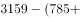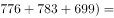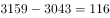万吨；

2018年纯碱增长量为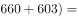万吨；

2018年乙烯增长量为。

则增长最多的是烧碱。

故正确答案为B。

---

#### 第 2 题　qid 2367898 · 综合

2016年一季度至2018年四季度，我国硫酸、烧碱产量最接近的是

- **A**. 2017年一季度
- **B**. 2017年四季度
- **C**. 2018年一季度　✅
- **D**. 2018年三季度

**答案**：C

**官方解析**

定位折线图可得，2016年一季度至2018年四季度，我国硫酸、烧碱产量情况，结合选项：

2017年一季度产量差值为万吨；

2017年四季度产量差值为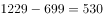万吨；

2018年一季度产量差值为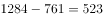万吨；

2018年三季度产量差值为万吨。

比较四个数字，则2018年一季度，我国硫酸、烧碱产量最接近。

故正确答案为C。

---

#### 第 3 题　qid 2367899 · 平均数

2016年二季度至2018年四季度，我国烧碱产量的季平均增量是

- **A**. 12.8万吨
- **B**. 14.1万吨
- **C**. 16.7万吨
- **D**. 18.2万吨　✅

**答案**：D

**官方解析**

根据题干“2016年二季度至2018年四季度······季平均增量”，判定本题为年均增长量问题。定位折线图可得，2016年一季度和2018年四季度，我国烧碱产量分别为677万吨和877万吨。则季平均增量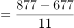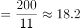万吨。

故正确答案为D。

---

#### 第 4 题　qid 2367902 · 增长

设2018年四季度我国硫酸、烧碱、纯碱产量的同比增速分别为、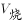、，则下列关系正确的是

- **A**. 

　✅
- **B**. 
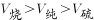

- **C**. 

- **D**. 

**答案**：A

**官方解析**

由题干“同比增速”，选项中有，判定本题为一般增长率比较问题。定位折线图可得：2018年四季度和2017年四季度我国硫酸、烧碱、纯碱的产量。代入公式：，则

；

；

。

比较可得。

故正确答案为A。

---

#### 第 5 题　qid 2367904 · 综合

下列判断正确的是

- **A**. 2018年我国乙烯产量增速比上年有所下降　✅
- **B**. 2016年二季度至2018年四季度，我国硫酸和乙烯产量变动方向始终相反
- **C**. 2016年二季度至2018年四季度，我国烧碱和纯碱产量环比正增长的季度个数相同
- **D**. 2016年二季度至2018年四季度，我国纯碱产量环比增速在2017年四季度最小

**答案**：A

**官方解析**

A项：由文字材料可得：我国乙烯产量2018年为129万吨，由折线图可得：2017年万吨，2016年万吨。代入公式：，2018年增速，2017年增速，，即2018年我国乙烯产量增速比上年有所下降，正确； 

B项：由折线图可得：2016年二季度至2016年三季度，硫酸产量由1438万吨降至1420万吨和乙烯产量由42万吨降至41万吨，均下降，变动方向相同，并非始终相反，错误；

C项：由折线图可得：2016年二季度至2018年四季度，我国烧碱产量环比正增长的季度有：2016年二季度、2016年四季度、2017年一季度、2017年三季度、2018年一季度、2018年二季度和2018年四季度，共7个季度；我国纯碱产量环比正增长的季度有：2016年二季度、2016年四季度、2017年二季度、2018年一季度、2018年三季度和2018年四季度，共6个季度，季度个数不同，错误；

D项：由折线图可得：2016年一季度至2018年四季度，我国每个季度的纯碱产量。代入公式：，2017年四季度环比增速；观察各季度数据，发现2017年一季度环比下降较多，优先计算2017年一季度环比增速，，即2017年四季度我国纯碱产量环比增速并非最小，错误。

故正确答案为A。

---

### 材料 2

        2018年11月中旬，某市统计局对全市2000名18-65周岁的常住居民进行了有关“双11”网购情况的电话调查。调查结果显示，的受访者参与了2018年“双11”的网购，其中的男性和的女性表示“有实际购物需求”是其参与“双11”网购的原因之一。

#### 第 6 题　qid 2367971 · 综合

该市受访者中，参与2018年“双11”网购的与未参与的相差

- **A**. 100人　✅
- **B**. 114人
- **C**. 120人
- **D**. 131人

**答案**：A

**官方解析**

根据“该市受访者中，参与2018年‘双11’网购的与未参与的相差”，且材料中所给数据为比重数据，判断本题为现期比重问题。定位文字材料，对全市2000名常住居民调查，有的受访者参与了2018年“双11”的网购，则未参与的占比为。因此所求差值人。

故正确答案为A。

---

#### 第 7 题　qid 2367972 · 综合

该市恰有551名受访者2018年“双11”网购的商品类别是

- **A**. 服饰类　✅
- **B**. 家电及电子产品
- **C**. 食品饮料
- **D**. 母婴及儿童用品

**答案**：A

**官方解析**

根据“该市恰有551名受访者2018年“双11”网购的商品类别是”，材料中为比重数据，判断本题为现期比重。定位文字材料和第二个图形，对全市2000名常住居民调查，结合上一题，有参与了网购。则受访者中参与网购的有人。551名受访者在其中所占的比重为，定位第二个图形，正好是服饰类（）。

故正确答案为A。

---

#### 第 8 题　qid 2367973 · 综合

该市参与2018年“双11”网购的受访者中，男、女人数的比值最接近

- **A**. 0.47
- **B**. 0.51
- **C**. 0.59
- **D**. 0.65　✅

**答案**：D

**官方解析**

根据“该市参与2018年‘双11’网购的受访者中，男、女人数的比值最接近”，判断本题为比值计算。定位文字材料，有的受访者参与了2018年“双11”的网购，其中的男性和的女性表示“有实际购物需求”是其参与“双11”网购的原因之一。定位图形，有实际购物需求的在受访者总人数中占。，根据线段法，距离与量成反比，可知男性人数：女性人数：：。

故正确答案为D。

---

#### 第 9 题　qid 2367975 · 比重

该市参与2018年“双11”网购的受访者中，选择3种网购原因的占比至多为

- **A**. 

- **B**. 

　✅
- **C**. 

- **D**. 

**答案**：B

**官方解析**

根据“占比至多为······”，可判定本题为现期比重问题。定位统计图1，某市参与2018年“双11”网购的受访者中，各种原因的比例分别为：、、、、、、、，各占比总和为：。设选择一个选项的受访者占比，选择两个选项的受访者占比，选择三个选项的受访者占比（最多同时选择三项）。则······，······，可得：，若要最大，则，。因此选择三种网购原因的占比至多为。

故正确答案为B。

---

#### 第 10 题　qid 2367976 · 综合

从上述资料中能够推出的是

- **A**. 参与“双11”网购的受访者中有人网购食品饮料的支出超过0.4万元
- **B**. “双11”网购日用品的受访者都选择了“有实际购物需求”的网购原因
- **C**. 因优惠力度大而参与“双11”网购的受访者中一定有人网购了护肤美容美发用品　✅
- **D**. “双11”网购支出0.8—1.2万元的受访者人数比网购支出1.6—2.0万元的多2倍

**答案**：C

**官方解析**

A项：根据资料，有参与2018年“双11”网购支出超过0.4万元的受访者占比，也有参与2018年“双11”网购食品饮料的受访者占比，但是无法得出有人网购饮料的支出超过0.4万元，无法推出。

B项：定位统计图1和2，“双11”网购日用品的受访者并不一定都选择了“有实际购物需求”的网购原因，无法推出。

C项：定位统计图1和2，某市参与2018年“双11”网购的受访者中有的人网购原因为优惠力度大，有的人购买了护肤美容美发用品，若所有不因为优惠力度大而网购的人全部购买了护肤美容美发用品，则有，因此必然有因为优惠力度大而网购的受访者购买了护肤美容美发用品，可以推出。

D项：定位统计表，“双11”网购支出0.8-1.2万元的受访者占比为，网购支出1.6-2.0万元的受访者占比为。前者人数比后者人数多倍，但是统计表中显示有的人不确定自己支出为多少，这部分人如果有存在于上述两个区间的话，那么就无法确定前者是否比后者多2倍，无法推出。

故正确答案为C。

---

### 材料 3

        2017年某市调查总队对全市服务业小微企业的抽样调查显示，2017年全市服务业小微样本企业总资产938.6亿元，销售总收入105.4亿元，销售总费用6.8亿元；人员薪酬19.3亿元，比上年增长；从业人员29028人，与上年持平；营业税金及附加1.1亿元，比上年下降；缴纳增值税2.3亿元，比上年增长。

#### 第 11 题　qid 2367786 · 增长

2017年该市服务业小微样本企业缴纳增值税比上年增加

- **A**. 0.11亿元
- **B**. 0.15亿元
- **C**. 0.24亿元　✅
- **D**. 0.34亿元

**答案**：C

**官方解析**

根据“2017年······比上年增加”，结合选项有具体单位，可判定本题为增长量计算题型。定位材料文字部分，2017年该市服务业小微样本企业缴纳增值税2.3亿元，比上年增长。根据公式：，可得亿元，C项最为接近。

故正确答案为C。

---

#### 第 12 题　qid 2367793 · 平均数

2017年该市服务业小微样本企业从业人员人均薪酬比上年增长

- **A**. 

- **B**. 

　✅
- **C**. 

- **D**. 

**答案**：B

**官方解析**

方法一：根据“2017年······人均薪酬比上年增长”，结合选项为百分数，可判定本题为平均数的增长率题型。定位材料文字部分，2017年该市服务业小微样本企业人员薪酬19.3亿元，比上年增长，即；从业人员29028人，与上年持平，即。根据公式：，可得：。

方法二：根据“2017年······人均薪酬比上年增长”，结合选项为百分数，可判定本题为平均数的增长率题型。定位材料文字部分，2017年该市服务业小微样本企业人员薪酬19.3亿元，比上年增长；从业人员29028人，与上年持平。人均薪酬为，分母不变，分子增长，即2017年该市服务业小微样本企业从业人员人均薪酬比上年增长。

故正确答案为B。

---

#### 第 13 题　qid 2367797 · 增长

2013-2017年该市服务业小微样本企业销售总费用增速最快、最慢的年份分别是

- **A**. 2016年、2015年
- **B**. 2014年、2015年
- **C**. 2016年、2017年
- **D**. 2014年、2017年　✅

**答案**：D

**官方解析**

定位材料统计图，2013-2017年该市服务业小微样本企业销售总费用增速分别为：、、、、，其中增速最快的年份为2014年，增速最慢的年份为2017年。

故正确答案为D。

---

#### 第 14 题　qid 2367827 · 增长

2017年该市服务业小微样本企业销售总收入比2013年增长

- **A**. 

- **B**. 

　✅
- **C**. 

- **D**. 

**答案**：B

**官方解析**

由“2017年……比2013年增长”可判断本题为一般增长率的计算问题。定位图形材料，根据，可知2017年该市服务业小微样本企业。。

故正确答案为B。

---

#### 第 15 题　qid 2367832 · 综合

从上述资料中不能推出的是

- **A**. 2017年该市小微样本企业的销售费用率比上年有所下降
- **B**. 2016年该市小微样本企业营业税金及附加超过1.55亿元
- **C**. 2013-2017年该市小微样本企业销售总收入和销售总费用的变动方向一致　✅
- **D**. 2013-2017年该市小微样本企业销售总收入和总费用增速相差最大的年份是2017年

**答案**：C

**官方解析**

A.根据，定位图形材料，2017年该市小微样本企业的销售总费用比2016年下降，销售总收入比2016年增长，，则2017年的销售费用率比上年有所下降，正确；

B.根据，定位文字材料“2017年······营业税金及附加1.1亿元，比上年下降”， 则2016年该市小微样本企业营业税金及附加，正确；

C. 根据图形材料，2017年该市小微样本企业的销售总费用比2016年下降，销售总收入比2016年增长，一个下降一个增长，变动方向不一致，错误；

D. 2013年该市小微样本企业销售总收入和总费用增速相差个百分点；

2014年该市小微样本企业销售总收入和总费用增速相差个百分点；

2015年该市小微样本企业销售总收入和总费用增速相差个百分点；

2016年该市小微样本企业销售总收入和总费用增速相差个百分点；

2017年该市小微样本企业销售总收入和总费用增速相差个百分点；

2013-2017年该市小微样本企业销售总收入和总费用增速相差最大的年份是2017年，正确。

本题为选非题，故正确答案为C。

---

### 材料 4

        2018年江苏第一、二、三产业增加值分别为4142亿元、41248亿元和47205亿元；城镇常住居民人均可支配收入47200元，增长8.2，农村常住居民人均可支配收入20845元，增长8.8；一般公共预算收入8630亿元，一般公共预算支出11658亿元。

#### 第 16 题　qid 2367761 · 增长

2018年江苏第三产业增加值比第二产业多

- **A**. 
12.6

- **B**. 
14.4
　✅
- **C**. 
15.1

- **D**. 
16.2

**答案**：B

**官方解析**

根据题干“2018年江苏第三产业增加值比第二产业多”，结合选项都是百分数，可判定本题为一般增长率问题。定位文字材料可知，2018年江苏第二、三产业增加值分别为41248亿元和47205亿元。根据公式：r，则题干所求为，与B项最接近。

故正确答案为B。

---

#### 第 17 题　qid 2367762 · 综合

上表所有指标中，2017年苏南与苏北地区指标数值相差不到一倍的有

- **A**. 5项
- **B**. 6项　✅
- **C**. 7项
- **D**. 8项

**答案**：B

**官方解析**

根据题干“……2017年苏南与苏北地区指标数值相差不到一倍的有”，结合表格材料时间为2017年，可判定本题为现期倍数问题。定位表格材料可知2017年苏南与苏北地区部分社会经济发展指标数据。苏南与苏北地区指标数值相差不到一倍，即为两者之间倍数&lt;2倍。则表中苏南与苏北地区各指标倍数分别为：

一般公共预算收入：倍&gt;2倍，排除；

一般公共预算支出：倍&lt;2倍，符合；

乡村从业人员：倍&gt;2倍，排除；

农林牧渔业总产值：倍&gt;2倍，排除；

高速公路：倍&lt;2倍，符合；

私人汽车拥有量：倍&gt;2倍，排除；

社会消费品零售总额：倍&gt;2倍，排除；

出口：&gt;10倍，排除；

进口：&gt;10倍，排除；

旅游外汇收入：&gt;10倍，排除；

城镇常住居民人均可支配收入：倍&lt;2倍，符合；

城镇常住居民人均生活消费支出：倍&lt;2倍，符合；

农村常住居民人均可支配收入：倍&lt;2倍，符合；

农村常住居民人均生活消费支出：倍&lt;2倍，符合。

综上，满足条件的指标有：一般公共预算支出、高速公路、城镇常住居民人均可支配收入、城镇常住居民人均生活消费支出、农村常住居民人均可支配收入、农村常住居民人均生活消费支出，共6项。

故正确答案为B。

---

#### 第 18 题　qid 2367763 · 增长

2018年江苏一般公共预算收入比上年增加

- **A**. 963亿元　✅
- **B**. 988亿元
- **C**. 1963亿元
- **D**. 1971亿元

**答案**：A

**官方解析**

根据题干“2018年······比上年增加”，结合选项带单位，可判定本题为增长量计算问题。定位文字材料可知，2018年江苏一般公共预算收入8630亿元；定位表格材料可知，2017年苏南、苏中、苏北一般公共预算收入分别为4913亿元、1246亿元、1508亿元。则2017年江苏一般公共预算收入为4913+1246+1508=7667亿元。根据公式：增长量=现期量-基期量，则题干所求为8630-7667=963亿元。
故正确答案为A。

---

#### 第 19 题　qid 2367764 · 平均数

2017年苏南、苏中、苏北地区就业人员人均产业增加值最大的是

- **A**. 苏中第三产业
- **B**. 苏南第二产业
- **C**. 苏南第三产业　✅
- **D**. 苏北第二产业

**答案**：C

**官方解析**

根据题干“2017年……人均产业增加值最大的是”，结合材料给出2017年相关数据 ，可判定本题为现期平均数问题。定位图1、图2可知2017年江苏三大区域三次产业就业人数及三次产业增加值。根据公式：就业人员人均产业增加值，则各选项就业人员人均产业增加值分别为：

苏中第三产业，万元；

苏南第二产业，万元；

苏南第三产业，万元；

苏北第二产业，万元。

综上，2017年苏南、苏中、苏北地区就业人员人均产业增加值最大的是苏南第三产业。

故正确答案为C。

---

#### 第 20 题　qid 2367765 · 综合

从上述资料中能够推出的是

- **A**. 2017年苏中地区高速公路的里程不足全省的五分之一
- **B**. 2017年苏北和苏中地区进口额之和不及苏南的八分之一
- **C**. 2018年江苏城镇和农村常住居民人均可支配收入的绝对差距比上年有所缩小
- **D**. 2017年苏中农村常住居民人均生活消费支出与人均可支配收入的比值大于苏南　✅

**答案**：D

**官方解析**

A项：定位表格材料可知，2017年苏南、苏中、苏北高速公路里程分别为1870公里、948公里、1870公里。根据公式：比重，则2017年苏中高速公路里程占全省的比重为，即超过五分之一，错误；

B项：定位表格材料可知，2017年苏南、苏中、苏北进口额分别为1993.0亿美元、175.5亿美元、109.9亿美元。则2017年苏中和苏北进口额之和与苏南的比例为，即大于八分之一，错误；

C项：定位文字材料可知，2018年江苏城镇常住居民人均可支配收入47200元，增长8.2%，农村常住居民人均可支配收入20845元，增长8.8%。则2018年江苏城镇和农村常住居民人均可支配收入的绝对差距为元。根据公式：基期量，则2017年江苏城镇和农村常住居民人均可支配收入的绝对差距为，即2018年江苏城镇和农村常住居民人均可支配收入的绝对差距比上年有所增大，错误；

D项：定位表格材料可知，2017年苏中农村常住居民人均可支配收入与人均生活消费支出分别为20000元、14644元，苏南分别为26759元、18872元。则2017年苏中农村常住居民人均生活消费支出与人均可支配收入的比值为，苏南农村常住居民人均生活消费支出与人均可支配收入的比值为，即2017年苏中农村常住居民人均生活消费支出与人均可支配收入的比值大于苏南，正确。

故正确答案为D。

---
