# 2019年江西省法检统一考录公务员笔试《行测》题（网友回忆版）

> 省考 · 2019 年 · 6 个模块 · 共 120 题

- [政治理论](#%E6%94%BF%E6%B2%BB%E7%90%86%E8%AE%BA) · 2 题
- [常识判断](#%E5%B8%B8%E8%AF%86%E5%88%A4%E6%96%AD) · 18 题
- [言语理解与表达](#%E8%A8%80%E8%AF%AD%E7%90%86%E8%A7%A3%E4%B8%8E%E8%A1%A8%E8%BE%BE) · 40 题
- [数量关系](#%E6%95%B0%E9%87%8F%E5%85%B3%E7%B3%BB) · 10 题
- [判断推理](#%E5%88%A4%E6%96%AD%E6%8E%A8%E7%90%86) · 35 题
- [资料分析](#%E8%B5%84%E6%96%99%E5%88%86%E6%9E%90) · 15 题

---

## 政治理论

### 第 1 题　qid 2443959 · 新思想

中国特色社会主义最本质的特征是：

- **A**. 中国共产党的领导　✅
- **B**. 社会主义公有制
- **C**. 人民当家作主
- **D**. 按劳分配

**答案**：A

**官方解析**

本题考查法律常识。《宪法》第一条规定：“中华人民共和国是工人阶级领导的、以工农联盟为基础的人民民主专政的社会主义国家。社会主义制度是中华人民共和国的根本制度。中国共产党领导是中国特色社会主义最本质的特征。禁止任何组织或者个人破坏社会主义制度。”
故正确答案为A。

---

### 第 2 题　qid 2443960 · 新思想

习近平新时代中国特色社会主义思想的核心要义是：

- **A**. 全面从严治党
- **B**. 经济社会高质量发展
- **C**. 坚持和发展中国特色社会主义　✅
- **D**. 实现中华民族伟大复兴

**答案**：C

**官方解析**

本题考查政治常识。
党的十八大以来，以习近平同志为核心的党中央，坚持以马克思列宁主义、毛泽东思想、邓小平理论、“三个代表”重要思想、科学发展观为指导，坚持解放思想、实事求是、与时俱进、求真务实，创立了习近平新时代中国特色社会主义思想。这一重大思想的核心要义，就是坚持和发展中国特色社会主义，具体体现在它从理论和实践结合上系统回答了新时代坚持和发展什么样的中国特色社会主义、怎样坚持和发展中国特色社会主义这个重大时代课题。
故正确答案为C。

---

## 常识判断

### 第 1 题　qid 2443955 · 人文常识

假设赵某每日工资300元，2017年10月1日至7日连续上班且未补休，10月4日为中秋节。那么，这七天赵某可得的工资收入为：

- **A**. 6300元　✅
- **B**. 5100元
- **C**. 4500元
- **D**. 4800元

**答案**：A

**官方解析**

本题考查法律。根据《劳动法》第四十四条的规定：“有下列情形之一的，用人单位应当按照下列标准支付高于劳动者正常工作时间工资的工资报酬：(一)安排劳动者延长时间的，支付不低于工资的百分之一百五十的工资报酬；(二)休息日安排劳动者工作又不能安排补休的，支付不低于工资的百分之二百的工资报酬；(三)法定休假日安排劳动者工作的，支付不低于工资的百分之三百的工资报酬。”《全国年节及纪念日放假办法》第二条规定：“全体公民放假的节日：……（六）中秋节，放假1天(农历中秋当日)；（七）国庆节，放假3天(10月1日、2日、3日）。”所以只有10月1日到3日这三天才是法定节假日，其余的放假时间是周末调休。
赵某2017年10月1日至7日连续上班且未补休，其中10月1日、2日、3日为国庆节法定节假日，又因为10月4日为中秋节，也是法定节假日，加班均按照三倍工资计算。10月5日、6日、7日为公休调假日，加班按照二倍工资计算。因此，这七天赵某工资收入不得低于：300元*4*3+300元*3*2=5400元。
故正确答案为A。

---

### 第 2 题　qid 2443956 · 法律常识

根据《行政许可法》，下列何种情况下，行政机关应当就相对人所受到的损失给予补偿：

- **A**. 某甲以运输货物为主，但由于严重违反交通规则，其驾照被某交通部门吊销，失去生活来源
- **B**. 某乙贿赂工商局负责人取得了开办歌舞厅的营业执照，后被人检举，上级行政机关撤销了该歌舞厅营业执照，乙前期投资无法收回
- **C**. 某丙申请生猪屠宰许可，行政工作人员玩忽职守，未经实地检查其场地条件就批准了其申请，后在行政机关的监督检查过程中，撤销了该许可
- **D**. 某丁依法取得了在江边采砂的许可，后为了防洪筑坝的需要，行政机关撤回了该许可　✅

**答案**：D

**官方解析**

本题考查法律常识。
A项错误，某甲由于严重违反交通规则被吊销驾驶证，属于行政许可依法被撤销、撤回，或者行政许可证件依法被吊销的情形，不需要补偿。
B项错误，根据《行政许可法》第六十九条第二款规定：“被许可人以欺骗、贿赂等不正当手段取得行政许可的，应当予以撤销。”第四款规定：“依照本条第一款的规定撤销行政许可，被许可人的合法权益受到损害的，行政机关应当依法给予赔偿。依照本条第二款的规定撤销行政许可的，被许可人基于行政许可取得的利益不受保护。”故对某乙的损失行政机关不应给予补偿。
C项错误，根据《行政许可法》第六十九条第一款规定：“有下列情形之一的，作出行政许可决定的行政机关或者其上级行政机关，根据利害关系人的请求或者依据职权，可以撤销行政许可：（一）行政机关工作人员滥用职权、玩忽职守作出准予行政许可决定的……”第四款规定：“依照本条第一款的规定撤销行政许可，被许可人的合法权益受到损害的，行政机关应当依法给予赔偿。依照本条第二款的规定撤销行政许可的，被许可人基于行政许可取得的利益不受保护。”因此，某丙的合法权益受到损害的，行政机关应当依法给予赔偿，而不是补偿。
D项正确，根据《行政许可法》第八条规定：“公民、法人或者其他组织依法取得的行政许可受法律保护，行政机关不得擅自改变已经生效的行政许可。行政许可所依据的法律、法规、规章修改或者废止，或者准予行政许可所依据的客观情况发生重大变化的，为了公共利益的需要，行政机关可以依法变更或者撤回已经生效的行政许可。由此给公民、法人或者其他组织造成财产损失的，行政机关应当依法给予补偿。”某丁依法取得了在江边采砂的许可，后为了防洪筑坝的需要，行政机关撤回了该许可，应当给予补偿。
故正确答案为D。

---

### 第 3 题　qid 2443957 · 法律常识

根据刑法的有关规定，下列说法错误的是：

- **A**. 甲系已离职的国家工作人员，请接任处长为缺少资质条件的李某办理了公司登记，收取李某10万元。甲构成犯罪
- **B**. 乙系某国企总经理之妻，乙让其夫借故辞退企业人事主管，而以其好友陆某取而代之，陆某赠乙价值15万元的金表一只。乙构成犯罪
- **C**. 李某为获得一项工程中标而送给主管官员丙2条高档香烟，被丙拒绝。次日，李某再次来到丙家，偷偷将一块价值8万元的金币放在茶几上离开。丙不知情。丙家保姆以为丙知道此事，遂将金币放入丙的柜子。丙不构成犯罪
- **D**. 丁系某国家机关官员之子，利用其父管理之便，请其父下属将不合条件的某企业列入政府采购范围，收受该企业8万元。丁不构成犯罪　✅

**答案**：D

**官方解析**

本题考查法律常识。
A项、B项正确、D项错误，根据《刑法》第三百八十八条之一规定：“国家工作人员的近亲属或者其他与该国家工作人员关系密切的人，通过该国家工作人员职务上的行为，或者利用该国家工作人员职权或者地位形成的便利条件，通过其他国家工作人员职务上的行为，为请托人谋取不正当利益，索取请托人财物或者收受请托人财物，数额较大或者有其他较重情节的，处三年以下有期徒刑或者拘役，并处罚金；数额巨大或者有其他严重情节的，处三年以上七年以下有期徒刑，并处罚金；数额特别巨大或者有其他特别严重情节的，处七年以上有期徒刑，并处罚金或者没收财产。离职的国家工作人员或者其近亲属以及其他与其关系密切的人，利用该离职的国家工作人员原职权或者地位形成的便利条件实施前款行为的，依照前款的规定定罪处罚。”据此，甲、乙、丁均构成利用影响力受贿罪。
C项正确，李某偷偷将一块价值8万元的金币放在茶几上，丙不知情，其本人也是拒绝这种行为的，丙没有犯罪故意，也没有实施犯罪行为， 不构成犯罪。
本题为选非题，故正确答案为D。

---

### 第 4 题　qid 2443958 · 法律常识

张某乘车时丢失金项链一条，李某拾得后交给公安部门。张某未在规定期限内前去认领，公安部门按照有关规定交寄售商店出售。丁某从该商店买得该项链，将项链送给女友杨某做生日礼物。杨某第二天乘公交车时，项链被偷走，小偷下车后即以1000元的价格卖给不知情的胡某。
根据《民法典》的规定，该项链的所有权属于：

- **A**. 张某
- **B**. 丁某
- **C**. 杨某　✅
- **D**. 胡某

**答案**：C

**官方解析**

本题考查法律常识。根据《中华人民共和国民法典》第三百一十八条规定：“遗失物自发布招领公告之日起一年内无人认领的，归国家所有。”本题中，张某在规定期限内未去领取，张某的所有权丧失，丁某从商店内购买该项链，已经取得金项链的所有权，后将其赠与杨某，杨某取得该金项链所有权。后金项链被小偷偷走，出卖给胡某，因盗赃物不适用善意取得，因此，胡某不能取得该金项链的所有权，则金项链仍归杨某所有。
故正确答案为C。

---

### 第 5 题　qid 2443961 · 法律常识

权责一致是社会主义法治的要求，也是行政法的基本原则。
以下哪一做法是权责一致的直接体现：

- **A**. 某国土资源局局长因违规征地受到行政记过处分　✅
- **B**. 某公安派出所对公民乙违反治安管理做出罚款500元的处罚决定
- **C**. 某教育局召开座谈会听取群众对教育改革的意见
- **D**. 某镇政府定期向公众公布本镇公款接待费用情况

**答案**：A

**官方解析**

本题考查法律常识。
A项正确，权责一致原则主要包含两个方面，第一是行政效能原则，指行政机关依法履行经济、社会和文化事务管理职责，要由法律、法规赋予其相应的执法手段，保证政令有效。第二是行政责任原则，行政机关违法或者不当行使职权，应当依法承担法律责任。该局长违法行使职权，受到了行政处分，体现的是权责一致原则。
B项错误，合法行政原则是指行政主体在行使行政权的过程中必须遵守法律,行政主体实施的行政活动必须符合法律的规定，公安派出所对违法行为人作出的处罚是公安机关依法履行治安管理职责的行为，体现的是合法行政原则。
C项错误，程序正当原则中的公众参与原则指的是行政机关作出重要规定或决定，应当听取公民、法人和其他组织的意见。某教育局召开座谈会听取群众意见体现的是公众参与原则。
D项错误，程序正当原则中的行政公开原则指的是除涉及国家秘密和依法受到保护的商业秘密、个人隐私的外，行政机关实施行政活动应当公开，以实现公民的知情权。镇政府定期向公众公开本镇公款接待费用正是政务公开，实现公民知情权的表现。
故正确答案为A。

---

### 第 6 题　qid 2443962 · 科技常识

下列关于基因工程成果的叙述中不正确的是：

- **A**. 环境保护上，主要用于净化污染的环境
- **B**. 医药卫生上，主要用于医疗器械消毒　✅
- **C**. 畜牧养殖业上，主要用于培育体型巨大、品质优良的动物
- **D**. 农业上，主要用于培育稳产、高产和具有抗性的农作物

**答案**：B

**官方解析**

本题考查科技常识。
A项正确，基因工程在环境保护上主要应用于环境监测和环境污染净化。一方面，基因工程做成的DNA探针能够十分灵敏地检测环境中的病毒、细菌等污染；另一方面，利用基因工程培育的指示生物能十分灵敏地反映环境污染的情况，却不易因环境污染而大量死亡，甚至还可以吸收和转化污染物。
B项错误，基因工程在医药卫生上的应用主要是药品的生产、基因诊断与基因治疗。自20世纪80年代初，第一种基因工程药物——重组人胰岛素投放市场以来，利用转基因的工程菌（用基因工程的方法，使外源基因得到高效率表达的菌类细胞株系一般称为 “工程菌”）生产的药物已有60多种。这些药物包括细胞因子、抗体、疫苗、激素等。基因诊断是指用放射性同位素(如32P)、荧光分子等标记的DNA分子做探针，利用DNA分子杂交原理，鉴定被检测样本上的遗传信息，从而达到检测疾病的目的。基因治疗就是把特定的外源基因导入有基因缺陷的细胞中，从而达到治疗疾病的目的。
C项正确，动物基因工程技术可以提高动物的生长速率。由于外源生长激素基因的表达可以使转基因动物生长得更快，因此，科学家们将这类基因导人动物体内，以提高动物的生
长速率。例如，将生长激素基因导人绵羊体内，转基因绵羊的生长速率比一般的绵羊提高30%，体型增大50%。动物基因工程技术的另一个重要作用是改善畜产品的品质。例如，有些人对牛奶中的乳糖不能完全消化或食用后会出现过敏、腹泻、恶心等不适症状，科学家将肠乳糖酶基因导入奶牛基因组，使获得的转基因牛分泌的乳汁，在其他营养成分不受影响的情况下，乳糖的含量大大减低。
D项正确，基因工程在农业上的运用，主要是培育稳产、高产和具有抗性的农作物。例如，从某些生物中分离出具有杀虫活性的基因，将其导入作物中，使其具有抗虫性。用于杀虫的基因主要是Bt毒蛋白基因、蛋白酶抑制剂基因、淀粉酶抑制剂基因、植物凝集素基因等。我国转基因抗虫棉就是转入Bt毒蛋白基因培育出来的，它对棉铃虫具有较强的抗性。
本题为选非题，故正确答案为B。

---

### 第 7 题　qid 2443963 · 科技常识

运送人造地球卫星的火箭开始工作后，火箭做加速运动的原因是：

- **A**. 火箭发动机用力将燃料燃烧产生的气体向后推出，气体的反作用力推动火箭　✅
- **B**. 燃料推动空气，空气的反作用力推动火箭
- **C**. 火箭燃料燃烧发热，加热周围空气，空气膨胀推动火箭
- **D**. 火箭吸入空气，然后向后排出，空气对火箭的反作用力推动火箭

**答案**：A

**官方解析**

本题考查科技常识。
运送人造地球卫星的火箭开始工作后，火箭做加速运动主要是运用了“反冲运动”的原理。根据动量守恒定律，如果一个静止的物体在内力的作用下分裂为两个部分，一部分向某个方向运动，另一部分必然向相反的方向运动，这个现象叫做反冲。反冲运动中，火箭发动机用力将燃料燃烧产生的气体向后推出（喷出），喷出的气体对火箭施加反作用力，即反冲力，反冲力推动火箭上升。
故正确答案为A。

---

### 第 8 题　qid 2443964 · 科技常识

中国三大航天中心是：

- **A**. 酒泉、西昌、兰州
- **B**. 酒泉、西昌、北京
- **C**. 西昌、酒泉、西宁
- **D**. 西昌、酒泉、太原　✅

**答案**：D

**官方解析**

本题考查科技常识。
中国三大航天中心是：酒泉、西昌、太原。
西昌卫星发射中心，又称“西昌卫星城”，是中国卫星发射基地，始建于1970年，1982年交付使用，位于四川省凉山彝族自治州冕宁县。中心主要承担地球同步轨道卫星，通信、广播、气象卫星等试验发射和应用发射任务。
酒泉卫星发射中心组建于1958年10月，是我国创建最早、规模最大的卫星发射中心，也是我国唯一的载人航天发射场，成功发射了第一颗人造地球卫星、第一颗返回式卫星、第一枚远程运载火箭、第一艘载人飞船等，位于甘肃省酒泉市与内蒙古阿拉善盟之间。
太原卫星发射中心始建于1967年，现已经具备多射向、多轨道、远射程、高精度测量和年10次以上高密度发射的能力，是我国集指挥控制、测控通信、综合保障系统于一体的现代化发射场基地，担负太阳同步轨道气象、资源、通信等多种型号的中、低轨道卫星和运载火箭的发射任务，位于山西省岢岚县。
故正确答案是D。

---

### 第 9 题　qid 2443965 · 人文常识

“不忘初心、牢记使命”主题教育的总要求是：

- **A**. 读原著、学原文、悟原理、抓落实
- **B**. 守初心、担使命、找差距、抓落实　✅
- **C**. 守初心、担使命、抓落实、抓整改
- **D**. 守初心、担使命、学榜样、做表率

**答案**：B

**官方解析**

本题考查政治常识。
2019年5月31日，“不忘初心、牢记使命”主题教育工作会议在北京召开。中共中央总书记、国家主席、中央军委主席习近平出席会议并发表重要讲话。习总书记指出：“开展‘不忘初心、牢记使命’主题教育，要牢牢把握守初心、担使命，找差距、抓落实的总要求，牢牢把握深入学习贯彻新时代中国特色社会主义思想、锤炼忠诚干净担当的政治品格、团结带领全国各族人民为实现伟大梦想共同奋斗的根本任务，努力实现理论学习有收获、思想政治受洗礼、干事创业敢担当、为民服务解难题、清正廉洁作表率的具体目标，确保这次主题教育取得扎扎实实的成效。”
故正确答案为B。

---

### 第 10 题　qid 2443966 · 人文常识

2000多年前，一条连结中国王朝和西域，以及中亚、西亚、南亚、北非、欧洲各国之间的通道就此逐渐打开。当年派张骞出使西域的是：

- **A**. 汉高祖
- **B**. 汉武帝　✅
- **C**. 唐太宗
- **D**. 光武帝

**答案**：B

**官方解析**

本题考查人文常识。
2000多年前，汉武帝派遣张骞出使西域，一条连结中国汉王朝和西域，以及中亚、西亚、南亚、北非、欧洲各国之间的通道就此凿通。
西汉初期，匈奴不断控制和追赶西域小国，如大月氏被匈奴从祁连山一带一步一步往西追赶。匈奴在追赶西域小国的同时，还不断向中原发动进攻。汉王朝不堪其扰，决定联合大月氏对匈奴进行夹击。于是，汉武帝任命张骞出使西域。公元前138年，张骞率领随从西出长安，踏上了前往西域的征程，历尽艰难到达大月氏。大月氏西迁已久，安居乐业，不愿再与匈奴打仗，张骞只好返回，最终回到阔别13年之久的长安。张骞把在西域各国的见闻，以及各国想与汉朝往来的愿望，向汉武帝作了报告，使汉朝了解到西域的具体情况。
公元前119年，张骞再次率领300多人的使团，带着万头牛羊，以及金币、丝绸等财物，走访了乌孙等西域很多国家。西域各国认识到汉朝的富足与强大，纷纷派使节来到长安，促进了汉朝与西域之间的相互了解与往来。
故正确答案为B。

---

### 第 11 题　qid 2443967 · 人文常识

抗美援朝战争中用血肉之躯堵住敌人机枪口的英雄是：

- **A**. 邱少云
- **B**. 杨根思
- **C**. 董存瑞
- **D**. 黄继光　✅

**答案**：D

**官方解析**

本题考查毛中特。
A项错误，邱少云，四川铜梁（现重庆市铜梁区）人，中国人民志愿军一级英雄。1952年10月，在朝鲜战争的一次战斗中，邱少云和全排战友奉命于夜间潜伏在距敌60米的山脚，待次日配合大部队发动进攻。后来他被敌人投放的燃烧弹所引起的烈火烧身。为了不暴露部队埋伏的地点，他忍受着剧痛，坚持不动，直到壮烈牺牲，保证了整个战斗的胜利和战友们的安全。
B项错误，杨根思，江苏省泰兴人，中国人民解放军全国战斗英雄和中国人民志愿军特级战斗英雄。1950年11月，在朝鲜战争的一次战斗中，杨根思独自坚守阵地，抱着仅剩的一个5公斤炸药包，拉响导火索，冲向敌群，用生命保住了小高岭阵地，完成了切断敌军退路的任务。
C项错误，董存瑞，河北省怀来县人。1948年5月，在一次战斗中，为完成爆破任务，因身边无处安放炸药包，危急时刻，董存瑞毫不犹豫地用左手托起炸药包，右手拉燃导火索，高喊：“为了新中国，冲啊！”碉堡被炸毁，董存瑞以自己的生命为部队开辟了前进的道路，牺牲时年仅19岁。
D项正确，黄继光，四川省中江县人。在上甘岭战役中，黄继光所在营奉命夺取某高地，当连续攻下敌人数处阵地后，被敌人的一个集团火力点所阻。他挺身而出，以胸膛堵住敌人正在扫射的机枪射孔，保证部队完成了攻克高地的任务，全歼敌人两个营，自己壮烈牺牲。
故正确答案为D。

---

### 第 12 题　qid 2443968 · 人文常识

中国的四大佛教名山是：

- **A**. 嵩山、峨眉山、九华山、普陀山
- **B**. 嵩山、泰山、九华山、普陀山
- **C**. 五台山、峨眉山、九华山、普陀山　✅
- **D**. 五台山、嵩山、乐山、普陀山

**答案**：C

**官方解析**

本题考查地理国情。
中国佛教四大名山分别是山西五台山、浙江普陀山、四川峨眉山、安徽九华山，分别是文殊菩萨、观音菩萨、普贤菩萨、地藏菩萨的道场。
故正确答案为C。

---

### 第 13 题　qid 2443969 · 人文常识

对于“五四运动”以下表述不准确的是：

- **A**. “五四运动”发生在1919年5月4日
- **B**. “五四运动”的口号是“外争主权、内惩国贼”
- **C**. “五四运动”是由《新青年》发起的　✅
- **D**. “五四运动”的主体是北京学生

**答案**：C

**官方解析**

本题考查人文常识。
A项正确，第一次世界大战结束后，英美法日等战胜国召开巴黎和会，对中国的正当要求置若罔闻，将德国在山东的特权全部转让给日本。1919年5月4日，北京3000多名学生汇集在天安门前，发表宣言，揭露帝国主义列强的侵略行径，并举行游行示威，五四运动爆发。
B项正确，五四运动中，学生们提出“外争主权、内惩国贼”“誓死力争，还我青岛”“废除二十一条”“拒绝在合约上签字”等口号，要求严惩亲日派卖国贼曹汝霖、陆宗舆、章宗祥。
C项错误，“五四运动”没有实际的发起人。1919年5月3日晚，北京大学及北京各校学生代表进行集会，《京报》主笔邵飘萍报告巴黎和会上中国外交的失败情况，群情激愤。第二天，五四运动爆发了。
D项正确，“五四运动”的主体是北京学生。1919年5月4日，北京学生汇集在天安门前并举行游行示威。6月3日，北京学生再次走上街头，开展大规模的爱国宣传活动。6月5日，上海工人罢工，商人罢市，工人阶级随之成为五四运动的主力，运动的重心也由北京转移到了上海。
本题为选非题，故正确答案为C。

---

### 第 14 题　qid 2443970 · 人文常识

南面同中国隔海相望的国家有：

- **A**. 马来西亚、文莱、印度尼西亚　✅
- **B**. 文莱、老挝、越南
- **C**. 马来西亚、缅甸、印度尼西亚
- **D**. 越南、文莱、印度尼西亚

**答案**：A

**官方解析**

本题考查地理国情。
我国同14个国家接壤，与6个国家隔海相望。
陆上邻国为：朝鲜、俄罗斯、蒙古、哈萨克斯坦、吉尔吉斯斯坦、塔吉克斯坦、阿富汗、巴基斯坦、印度、尼泊尔、不丹、缅甸、老挝、越南。
隔海相望的国家为：韩国、日本、菲律宾、马来西亚、文莱、印度尼西亚。其中韩国和日本位于我国东面，菲律宾位于我国东南面，马来西亚、文莱、印度尼西亚均在我国南面。
故正确答案为A。

---

### 第 15 题　qid 2443971 · 科技常识

关于非洲猪瘟，以下说法不准确的是：

- **A**. 非洲猪瘟最早发现于南非　✅
- **B**. 目前国际上尚无商业化疫苗可用于防控非洲猪瘟
- **C**. 非洲猪瘟简称ASF
- **D**. 非洲猪瘟2018年传入我国，目前已得到基本控制

**答案**：A

**官方解析**

本题考查科技常识。
A项错误，1921年，非洲猪瘟在非洲肯尼亚首次被报告，追溯性研究发现1907年肯尼亚就出现过非洲猪瘟疫情。肯尼亚位于赤道附近，属非洲东部，故题干中的“南非”表述不准确。
B项正确，目前，国内外尚无针对非洲猪瘟的疫苗和对症药物，切断感染病毒途径，做好生物安全措施是防控的最有效措施。
C项正确，非洲猪瘟（African Swine fever），简称ASF，是由非洲猪瘟病毒（ASFV）感染家猪和各种野猪（如非洲野猪、欧洲野猪等）引起一种传染病。
D项正确，自2018年8月3日我国辽宁省确诊首例非洲猪瘟以来，我国启动最高级别的重大动物疫情应急响应措施，建成疫情监测网络，制定出台了扑杀补偿、金融信贷等扶持政策，在非洲猪瘟防控方面采取了很多切实有效的措施，目前疫情已得到基本控制。
本题为选非题，故正确答案为A。

---

### 第 16 题　qid 2443972 · 经济常识

下列不属于贸易保护主义措施的是：

- **A**. 知识产权措施
- **B**. 通关环节壁垒
- **C**. 进口禁令
- **D**. 为外国商品和服务进口提供优惠补贴　✅

**答案**：D

**官方解析**

本题考查经济常识。
贸易保护主义是指在对外贸易中利用关税和非关税壁垒的理论、政策和措施，限制外国商品和服务进口，保护本国商品免受进口商品的竞争，并为本国商品和服务提供各类优惠补贴以增强其国际竞争力。
A、B、C项正确，贸易保护主义的措施主要包括两大类型，即关税壁垒和非关税壁垒。前者通过征收高额进口关税来达到目的，而后者形式繁多，主要包括通关环节壁垒、进口税费、进口禁令、进口许可、技术性贸易壁垒、知识产权措施等。
D项错误，为外国商品和服务进口提供优惠补贴可以提高国外进口商品的竞争力，不属于贸易保护主义措施。
本题为选非题，故正确答案为D。

---

### 第 17 题　qid 2443973 · 经济常识

当内需严重不足，社会总供给大于社会总需求时，用以下哪个措施可以促使总供给与总需求趋于平衡：

- **A**. 提高利率和缩减财政支出
- **B**. 降低利率和扩大财政支出　✅
- **C**. 增加税收和减少投资需求
- **D**. 提高存款准备金率和取消相关财政补贴

**答案**：B

**官方解析**

本题考查经济常识。
当内需严重不足，社会总供给大于社会总需求时，即发生了通货紧缩，此时需要实行扩张的财政政策和货币政策。扩张的财政政策主要是扩大财政开支，兴建公共工程，增加财政赤字，减免税收，采取补贴政策。扩张的货币政策主要是降低存贷款利率、存款准备金率和再贴现率，公开市场买入有价证券等手段。
A项错误，提高利率（存贷款利率），市场上流通的货币就会减少,因为回流到银行了；缩减财政支出也会减少政府在市场上的投资。提高利率和缩减财政支出都会使市场上流通的货币减少，进一步抑制内需，不能达到供需平衡。
B项正确，降低利率（存贷款利率）和扩大财政支出会使市场上流通的货币增加，促进人们消费，拉动内需，促使总供给与总需求趋于平衡。
C项错误，增加税收和减少投资需求会使市场上流通的货币减少，进一步抑制内需，不能达到供需平衡。
D项错误，存款准备金率是各商业银行缴存中央银行的存款准备金占其自身存款总额的比例。提高存款准备金率时，金融机构可用于贷款的资金减少，社会的贷款总量和货币供应量也相应减少；取消相关财政补贴也相当于政府缩减开支。二者都会使市场上流通的货币减少，会进一步抑制内需，不能达到供需平衡。
故正确答案为B。

---

### 第 18 题　qid 2443974 · 人文常识

我国科学界的“三钱”是指：

- **A**. 钱学森、钱伟长、钱三强　✅
- **B**. 钱学森、钱伟长、钱钟书
- **C**. 钱学森、钱三强、钱玄同
- **D**. 钱伟长、钱三强、钱思进

**答案**：A

**官方解析**

本题考查科技常识
A项正确，科学界“三钱”是指钱学森、钱伟长、钱三强。钱学森，世界著名科学家，空气动力学家，被誉为“中国航天之父”“中国导弹之父”；钱伟长，中国力学家、应用数学家、教育家，被誉为“中国近代力学之父”；钱三强，核物理学家，“两弹一星”元勋，被誉为“中国原子弹之父”。
B项错误，钱钟书，现代作家、文学研究家，主要著作有散文集《写在人生边上》，短篇小说集《人兽鬼》，长篇小说《围城》，论文集《谈艺录》《管锥篇》等。
C项错误，钱玄同，思想家、文学学家、新文化运动的倡导者，著有《文字学音篇》《古韵二十八部音读之假定》等。
D项错误，钱思进，钱三强之子，从事高能粒子物理实验的研究和网格计算技术在高能物理（及其它学科）中的应用的研发。
故正确答案为A。

---

## 言语理解与表达

### 第 1 题　qid 2443915 · 逻辑填空

只是欣赏花容玉颜、海誓山盟，是欣赏者的肤浅。只是欣赏      、拍马溜须，是欣赏者的低劣。平庸者的欣赏只在有字处读书有声中听乐。深刻者的欣赏在于欣赏纹络里      的思想无声处滚动的惊雷。要善于欣赏他人——善于欣赏对手，他才可以襟怀磊落，      。
填入划线部分最恰当的一项是：

- **A**. 百依百顺  携带  知己知彼
- **B**. 俯首贴耳  镌刻  避短扬长　✅
- **C**. 唯命是从  留存  心中有数
- **D**. 人云亦云  雕刻  明察秋毫

**答案**：B

**官方解析**

先看第二空，深刻者所欣赏的思想应当是比较深的，非浅显的，B项“镌刻”和D项“雕刻”均能体现思想之深刻，保留。A项“携带”和C项“留存”排除。
再看第三空，此处的语境是“对手”。B项“避短扬长”指发扬长处，回避短处，符合语境。D项“明察秋毫”指任何细小的事物都能看得很清楚，后多形容人能洞察事理，不适用于“对手”的语境，排除。
验证第一空，顿号表并列，所填词语与“拍马溜须”意思相近，且对应“低劣”。B项“俯首贴耳”形容卑屈驯服的样子，填入恰当。
故正确答案为B。

---

### 第 2 题　qid 2443916 · 片段阅读

其实生活中本没有那么多烦恼，一切只不过是      。只要我们稍微停下脚步，就可以更好地珍惜生命本原的美丽，那时候，你将发现，在人生的幽僻处、      处，都闪耀着光芒。
填入划线部分最恰当的一项是：

- **A**. 自找麻烦  僻静
- **B**. 自怨自艾  细微
- **C**. 庸人自扰  细小　✅
- **D**. 杞人忧天  琐碎

**答案**：C

**官方解析**

第一空，“生活中本没有那么多烦恼”，即烦恼其实是自找的，所填词语应能体现此意。C项“庸人自扰”泛指本来没有问题而自己瞎着急或自找麻烦，符合语境。A项“自找麻烦”指自己给自己找麻烦事；前文的“一切”指的是生活中的烦恼，与“自找麻烦”中的“麻烦”重复，排除。B项“自怨自艾”指悔恨自己的错误，自己改正；D项“杞人忧天”指总是去忧虑那些不切实际的事物；两者均不能体现烦恼是自找的这层意思，排除。
验证第二空，C项“细小”与“幽僻”并列恰当。
故正确答案为C。

---

### 第 3 题　qid 2443917 · 片段阅读

古代的中国人是有他们自己的情趣的。我们可以从漂亮的古书装帧、      的信笺、古老的瓷器、伟大的绘画和一切未受现代影响的古玩中看到这些情趣的      。
填入划线部分最恰当的一项是：

- **A**. 精良  印迹
- **B**. 精美  痕迹　✅
- **C**. 优美  遗留
- **D**. 完备  保留

**答案**：B

**官方解析**

第一空，所填词语搭配“信笺”。A项“精良”一般搭配“武器”“技术”等，C项“优美”一般搭配“舞蹈”“风景”等，两者均不能搭配“信笺”，排除。比较B、D两项，B项“精美”形容精致而美好，D项“完备”强调的是健全、齐全。此处说的是古代中国人的情趣，用“精美”更契合语境，排除D项。
验证第二空，古玩中有古人情趣的“痕迹”，恰当。
故正确答案为B。

---

### 第 4 题　qid 2443918 · 逻辑填空

渺小是通到新英雄主义的一个起点。渺小是自大、狂妄、野心、残害的消毒药，渺小是把人      成人，是叫人看集体重于个人。当一个人为了群众，为了民族和国家，发挥了自己最大可能的力量，他便成为人民的英雄——新的英雄，这种英雄，不是为了自己，而是牺牲了自己，他头顶的光圈，是从人格和鲜血中      出来的。
填入划线部分最恰当的一项是：

- **A**. 还原  放射　✅
- **B**. 当作  照射
- **C**. 复原  照耀
- **D**. 放大  闪耀

**答案**：A

**官方解析**

先看第二空，此处说的是新英雄头顶上的光圈，是从他的人格和鲜血中出来的，所填词语搭配“从……中……出来”。A项“放射”指由一点向四外射出，符合语境。B项“照射”和C项“照耀”一般用法为“照射/照耀在……上”，D项“闪耀”一般用法为“在……中闪耀”，三者均不能搭配“从……中……出来”，排除。
验证第一空，A项“还原”指事物恢复到原来的状况或形状，符合“渺小是……的一个起点”的语境。
故正确答案为A。

---

### 第 5 题　qid 2443919 · 逻辑填空

潮州木雕最大的特色，就在于      后由匠人贴上金箔或涂抹金粉，使成品展现出      的效果，尽显潮汕人功利性与实用性相结合的思维模式。
填入划线部分最恰当的一项是：

- **A**. 精挑细选  活灵活现
- **B**. 精心琢磨  匠心独具
- **C**. 精雕细凿  不同凡响
- **D**. 精雕细刻  金碧辉煌　✅

**答案**：D

**官方解析**

从第二空入手，所填词语表示“贴上金箔或涂抹金粉”后展现出来的效果，D项“金碧辉煌”的“金”恰与“金箔”“金粉”呼应，填入最恰当。A、B、C三项和文段均没有对应，排除。
验证第一空，所填词语表示潮州木雕的制作过程。D项“精雕细刻”形容创作艺术品时的苦心刻画，符合文意，当选。
故正确答案为D。

---

### 第 6 题　qid 2443920 · 逻辑填空

在艺术摄影中，常常看到这样的画面：无边无际的海滩上，一个人俯身在拾些什么；天上漂浮着云彩，远处激溅着浪花……。这样的画面令人走进一个哲理和诗情      的境界。这种情景是很      的。
填入划线部分最恰当的一项是：

- **A**. 情景交融  妙趣横生
- **B**. 水乳交融  引人入胜　✅
- **C**. 美不胜收  为之兴奋
- **D**. 跌宕起伏  令人向往

**答案**：B

**官方解析**

第一空，艺术摄影中常看到的画面既富有哲理又富有诗情，所填词语表示哲理和诗情融合交错的，B项“水乳交融”像水和乳汁那样融合在一起，比喻关系非常融洽或结合得很紧密；符合语境。A项“情景交融”指文艺作品中环境的描写、气氛的渲染跟人物思想感情的抒发结合得很紧密，句中“哲理和诗情”均属于“情”的部分，“景”无法体现，排除。C项“美不胜收”指美好的东西很多，一时看不过来，一般用来形容“景色”等，不能用于形容“哲理和诗情”，排除。D项“跌宕起伏”形容事物多变，不稳定，也比喻音乐音调忽高忽低和故事情节的曲折，与语境不符，排除。
验证第二空，所填词语形容充满哲理和诗情的“这种情景”。B项“引人入胜”指十分吸引人的，使人沉醉的优美的境界，符合语境。
故正确答案为B。

---

### 第 7 题　qid 2443921 · 片段阅读

日复一日，年复一年，杨树默默地孤守着一块养育自己的故土，高昂着不屈的头颅，坚挺着伟岸的身躯，      着沙漠瀚海，狂风恶浪。神情是那么的庄重威严，姿态是那么的动人浪漫，生命是那么的强大旺盛。真令人望而生敬，      。
填入划线部分最恰当的一项是：

- **A**. 雄视  叹为观止　✅
- **B**. 傲视  拍案叫绝
- **C**. 凝视  望而生畏
- **D**. 注视  高山仰止

**答案**：A

**官方解析**

第一空，所填词语对应“神情是那么的庄重威严”，能体现“庄重威严”之感，且与“高昂”“坚挺”并列。A项“雄视”谓称雄、压倒，B项“傲视”骄傲地对待、傲慢地看待，两者填入恰当。C项“凝视”指聚精会神地观看；D项“注视”指注意地看，也指犹重视、关注，两者均与语境不符，排除。
第二空，所填词语与“望而生敬”并列。“望而生敬”指看到了就心生敬意，形容非常崇敬。A项“叹为观止”指赞美看到的事物好到极点；B项“拍案叫绝”拍着桌子叫好，形容非常赞赏。其中A项“叹为观止”的“观”恰与“望而生敬”的“望”都表示视觉上的观看，呼应更恰当，所以排除B项。
故正确答案为A。

---

### 第 8 题　qid 2443922 · 逻辑填空

故园的山水间，每逢农历正月，满山遍野地开出杜鹃花，      了山野，恰似燃烧的霞霭弥漫于林海奇峰，至少有万绿丛中千点红那么多，因此，乡里人都叫它映山红。映山红花树灰黄色而柔软纤薄的外层树皮，犹如层层粘贴的纸屑，似用了粘不牢的树脂，用手轻轻一抚就会      地飞起。束状的红花，每朵都象一个红色的小喇叭，而且是五瓣镶嵌的，几十朵聚在一起更显得      。
填入划线部分最恰当的一项是：

- **A**. 染红  纷纷扬扬  红艳妖娆　✅
- **B**. 开遍  扬扬洒洒  繁花似锦
- **C**. 布满  纷纷扬扬  烂漫遍野
- **D**. 浸红  扬扬洒洒  花团锦簇

**答案**：A

**官方解析**

从第三空入手，横线前的“更”表递进，程度比前文的“红花”程度重，A项“红艳妖娆”恰当。B项“繁花似锦”指许多色彩纷繁的鲜花，就像富丽多彩的锦缎，形容美好的景色和美好的事物；C项“烂漫遍野”指漫山遍野的鲜花；D项“花团锦簇”形容花朵五彩缤纷，十分华丽的景象；三者均强调鲜花数量多，不能与“红花”构成递进，排除。
验证第一空，A项“染红”填入横线处形象生动，体现杜鹃花多、红的特点，恰当。
验证第二空，A项“纷纷扬扬”形容雪、花等多而杂乱地在空中飘舞，符合“犹如层层粘贴的纸屑，似用了粘不牢的树脂，用手轻轻一抚就会飞起”的语境。
故正确答案为A。
【文段出处】《经典散文：艳丽依旧的映山红》

---

### 第 9 题　qid 2443923 · 逻辑填空

我们的音乐生活中，已然发生、正在发生一些足称重大的转变，但绝大多数人      ，不以为意。比如，你已经有多久没有被一首歌深深感动，未再体验那种灵魂直上云天的感受？我们没觉得这有什么，我们已经习惯于      地对待音乐，偶尔地在社交网络随手转发一手歌曲，就像随手转发一桩八卦传闻。
填入划线部分最恰当的一项是：

- **A**. 默不作声  轻而易举
- **B**. 习焉不察  犹豫不决
- **C**. 默然接受  认真严肃
- **D**. 浑然不觉  随随便便　✅

**答案**：D

**官方解析**

本题从第二空入手，分析可知，后文“偶尔地在社交网络随手转发一手歌曲，就像随手转发一桩八卦传闻”是对所填词语的解释说明，其体现的是对待音乐的随意性、满不在乎，D项“随随便便”恰当。A项“轻而易举”形容事情容易做，不费力，省事，强调容易；B项“犹豫不决”强调迟疑，拿不定主意；C项“认真严肃”强调对待事物认真严肃的态度，三者均不符合语境，排除。
验证第一空，D项“浑然不觉”指毫无察觉的样子，能与前文“一些足称重大的转变”构成转折，与“不以为意”并列。
故正确答案为D。

---

### 第 10 题　qid 2443924 · 逻辑填空

金朝建国以前，由于女真人尚未      本民族的文字，使本民族文化和历史的记载几乎      空白。因而与有着深厚文化底蕴的两宋相比，金朝的文化处于非常落后的      。
填入划线部分最恰当的一项是：

- **A**. 创建  完全  劣势
- **B**. 创立  属于  阶段
- **C**. 创制  接近  状态　✅
- **D**. 形成  陷入  境地

**答案**：C

**官方解析**

第一空，句意是金朝在建国前没有本民族的文字，所填词语搭配“文字”。A项“创建”侧重“建”，即建造、建设，一般搭配“国家”“学校”等，B项“创立”侧重“立”，即建立、创立，一般搭配“公司”等，两者均不能搭配“文字”，排除。C项“创制”侧重“制”，即制定，可以搭配“法律”“文字”等，D项“形成”搭配“文字”同样恰当，保留。
第二空，此处说的是由于女真族没有本民族的文字，所以本民族文化和历史的记载几乎是没有的，C项“接近”填入恰当。D项“陷入”指落在不利的境地，不符合语境，排除。
验证第三空，“落后的状态”搭配恰当。
故正确答案为C。

---

### 第 11 题　qid 2443925 · 逻辑填空

无论春夏秋冬，站在田野、花丛、溪边、草坪，看云彩悠悠而来，飘飘而去，洒脱自在，顿时      ，好生羡慕。在大地上赏云如此富有情趣，那么高空中      云朵更会有一番别样风光吧？我憧憬着像雄鹰一样，在万里晴空伴随白云一起飞翔!
填入划线部分最恰当的一项是：

- **A**. 神清气爽  仰视
- **B**. 心旷神怡  俯瞰　✅
- **C**. 神采飞扬  鸟瞰
- **D**. 心情愉悦  远眺

**答案**：B

**官方解析**

本题从第二空入手，根据前文“在大地上赏云”可知，此处表示在“高空中”从上往下欣赏云，B项“俯瞰”指俯视，从高处往下看，C项“鸟瞰”指从高处往下看，填入恰当，保留。A项“仰视”指仰面向上看，或是抬头向上看，D项“远眺”指站在高处往远处望，两者与“高空中”的语境不符，排除。
第一空，B项“心旷神怡”指心情愉快，精神舒畅，强调心情；C项“神采飞扬”指脸上的神态焕发有神，强调脸上的神态。“云彩悠悠而来，飘飘而去，洒脱自在”是让看的人心情愉悦，所以此处用“心旷神怡”更恰当，排除C项。
故正确答案为B。

---

### 第 12 题　qid 2443926 · 逻辑填空

动画产业是一个具有高技术、高投入、高风险特征的创意产业，同时也被认为是21世纪最具      的文化产业之一。我国西部地区由于动画上游产业与下游产业严重脱节，只见投入未见收益，没能形成良好的资金循环。为此，西部动画产业模式要做相应的      ，无论是漫画还是动画，精彩的原创故事内容才是      观众的本质所在。
填入划线部分最恰当的一项是：

- **A**. 市场  推进  创造
- **B**. 潜力  改变  留住
- **C**. 前景  整改  保障
- **D**. 潜能  调整  吸引　✅

**答案**：D

**官方解析**

本题从第三空，由“我国西部地区由于动画上游产业与下游产业严重脱节，只见投入未见收益，没能形成良好的资金循环”可以推知，西部动画的观众是不多的，所以其产业模式转变，注重添加原创故事是为了“吸引”更多的观众，对应D项，而非仅仅“留住”现有的观众，排除B项。“观众”不是“原创故事内容”“创造”出来的，“原创故事内容”也不能“保障”观众，排除A、C两项。
验证第一空，动画产业是21世纪最具“潜能”的文化产业之一，D项“潜能”填入符合语境。
验证第二空，D项“调整”搭配“产业模式”恰当。
故正确答案为D。

---

### 第 13 题　qid 2443927 · 逻辑填空

在有崇高信仰的人的心目中，总有一些东西属于做人的根本，是      不得的。他并不是害怕受到惩罚，而是不肯丧失基本的人格。不论他对人生怎样充满着欲求，他始终明白，一旦人格扫地，他在自己面前竟也失去了做人的自信和尊严，那么，一切欲求的满足都不能      他的人生的彻底失败。
填入划线部分最恰当的一项是：

- **A**. 亵渎  挽救　✅
- **B**. 蔑视  改变
- **C**. 轻视  证明
- **D**. 侵犯  挽回

**答案**：A

**官方解析**

先看第二空，此处说的是一旦人格扫地，即便一切欲求得以满足，他的人生仍是彻底失败的。C项“证明”填入横线处与文意相悖，排除。B项“改变”不能搭配“失败”，置于此处应表述为“改变他彻底失败的人生”，排除。比较A、D，A项“挽救”指从危险或不利中救回来，强调危险或不利的局面正在进行中；D项“挽回”指扭转已成的不利局面，强调不利局面已经形成。此处“他的人生”尚未完结，用“挽救”更恰当。
验证第一空，A项“亵渎”指轻慢、冒犯、不恭敬；与前文“崇高信仰”构成反义，当选。
故正确答案为A。

---

### 第 14 题　qid 2443928 · 逻辑填空

村落作为一种聚落形态和社会单元，它的起源并不是直接伴随人类的起源而产生的，而明显是人类进化和人类文明起源时期的      ，至少其雏形是如此。人类是从灵长类古猿进化而来，属于群居型动物。这是体质上相对弱小的人类，在      自然中的凶猛动物和弱肉强食的自然法则，而得以生存的办法。
填入划线部分最恰当的一项是：

- **A**. 事物  面向
- **B**. 结果  适应
- **C**. 代表  理解
- **D**. 产物  面对　✅

**答案**：D

**官方解析**

第一空，此处探讨村落的起源，由“它的起源并不是……而产生的，而明显是……”可知，所填词语与“产生”相呼应，B项“结果”和D项“产物”恰当，排除A项“事物”和C项“代表”。
第二空，所填词语搭配“凶猛动物”和“自然法则”，D项“面对”恰当。B项 “人类适应凶猛动物”搭配不当，排除。
故正确答案为D。

---

### 第 15 题　qid 2443929 · 逻辑填空

虽说海是鱼的故乡，但在海里，水族们都得奔波觅食，于缝隙间寻求生存的机会，      各种危险的攻击。但砗磲几乎没有这种尘劳，它是一种      的生命，几乎不参与任何争夺、打劫与分赃。它以富有韧劲的足丝，将身子固着在珊瑚礁上，懒得挪动半步。当海水没过全身，直觉周边没有危险临近的时候，才打开石头外壳，吐出身体柔软的部分。其软组织      的津液，具有硫酸一般的分解力，被它吸入的鱼虾，几乎无有生还的可能。
填入划线部分最恰当的一项是：

- **A**. 躲避  坚不可摧  产生
- **B**. 避免  随心所欲  分泌
- **C**. 规避  坐享其成  分泌　✅
- **D**. 逃避  随意漫游  产生

**答案**：C

**官方解析**

本题从第三空入手，用于表示从生物体的某些细胞、组织或器官里产生出某种物质，一般用“分泌”，而不用“产生”，排除A、D两项。
再看第二空，“但”表转折，分析可知，砗磲无须在缝隙间求生存，无须担心遭受攻击，几乎不参与任何争夺、打劫与分赃，只需要通过津液吸入鱼虾就可进食，C项“坐享其成”置于此处取字面意思，表示不需要动弹就可以进食，符合语境。B项“随心所欲”指随着自己的意思，想要干什么就干什么，文段并无砗磲全凭自己的意愿、随意进食的语境，排除。
验证第一空，C项“规避”搭配“攻击”恰当。
故正确答案为C。

---

### 第 16 题　qid 2443930 · 逻辑填空

书画琴棋诗酒花，书画是文人生活      的一项。文人挂画，以营造一个清雅的环境，不仅仅是耳目之娱、社交之法，更多的是志之所向。不只是文人贵族以挂画来彰显身份地位，坊间的茶楼酒肆也多以挂名人字画来装点门面      ，招揽食客。
填入划线部分最恰当的一项是：

- **A**. 不胜枚举  扩大生意
- **B**. 极为重要  提升品味
- **C**. 不可或缺  营造氛围
- **D**. 必不可少  附庸风雅　✅

**答案**：D

**官方解析**

第一空，A项“不胜枚举”指无法一一全举出来，形容数量很多，文段并无文人生活数量多的意思，排除。“书画琴棋诗酒花”体现的是书画是文人生活中的一部分，不能缺少，B项“极为重要”、C项“不可或缺”和D项“必不可少”均能体现不能缺少的意思，保留。
第二空，由“不只是……也……”可知，坊间的茶楼酒肆挂名人字画的目的也是为了显摆，为了装点门面、招揽食客，所填词语与“装点门面”相呼应，表示茶楼酒肆挂名人字画只是表象，并非真的有文化韵味。D项“附庸风雅”指缺乏文化修养的人为了装点门面而结交文人，参加有关文化活动，符合语境。B项“提升品味”和C项“营造氛围”与“装点门面”的语境不符，排除。
故正确答案为D。

---

### 第 17 题　qid 2443931 · 片段阅读

凤凰街道不宽，曾经名人辈出的小巷都是青石板铺就，纵横交错成小巷的血脉，厚重的青石板，似一个个音符在小巷深处      。摩肩接踵的游人也遮挡不住幽深的巷子里透着的那份      。
填入划线部分最恰当的一项是：

- **A**. 深情呼唤  安静
- **B**. 闪动跳跃  深远
- **C**. 浅吟低唱  宁静　✅
- **D**. 摇曳生姿  静谧

**答案**：C

**官方解析**

第一空，所填词语应体现“音符”的特点，A项“深情呼唤”和C项“浅吟低唱”恰当，保留。B项“闪动跳跃”和D项“摇曳生姿”均不是“音符”的特点，排除。
第二空，比较A、C两项，“安静”着重指不喧哗、没有吵闹，C项“宁静”着重于“宁”，安宁，没有搅扰，多形容环境。由“摩肩接踵的游人”可知，此处并非强调没有声音，而是强调环境的安宁，排除A项。
故正确答案为C。

---

### 第 18 题　qid 2443932 · 逻辑填空

那时，思念便是许多平常的往事，一杯饱含乡土的茶，一碗家乡的泡菜，还有许多没有细心      的场景，一幕幕瞬间变得很清晰，仿佛那些已然离走的过去，并没有永远离开，那些已被      拉开空间的人，近在身旁。
填入划线部分最恰当的一项是：

- **A**. 观察  距离　✅
- **B**. 观看  时间
- **C**. 检察  思念
- **D**. 体会  过去

**答案**：A

**官方解析**

本题可从第二空入手，由“一杯饱含乡土的茶，一碗家乡的泡菜”可知，文段说的是对家乡的思念，作者是漂泊在外的游子，由“近在身旁”可知，此处说的是被“距离”拉开空间，A项恰当。B项“时间”、C项“思念”和D项“过去”均不恰当，排除。
验证第一空，“细心观察”搭配恰当，当选。
故正确答案为A。

---

### 第 19 题　qid 2443933 · 逻辑填空

泰山，有着25亿年的沧桑年轮。然而，在历史岁月的枯荣交替中，他依然      、意气风发，没有丝毫的老态。他身上的神秘、宏阔、包容、温和的气质，无时无刻不吸引着我们，激励着我们，      我们力量、信念和勇气，让我们      到充盈、欣喜和宁静。
填入划线部分最恰当的一项是：

- **A**. 生气蓬勃  给予  感受
- **B**. 生机勃勃  赋予  感受　✅
- **C**. 生机盎然  寄予  感觉
- **D**. 生龙活虎  交予  感觉

**答案**：B

**官方解析**

本题可从第三空入手，“感受”侧重“受”，即享受；“感觉”侧重“觉”，即觉察到。此处说的是泰山的气质吸引、激励着我们，让我们享受充盈、欣喜和宁静，所以用“感受”更恰当，排除C、D两项。
再看第二空，比较A、B两项，A项“给予”常表示不含感情色彩的、或双方平等状态下的是对方得到各种帮助、各种物质，也可以是精神上的付出（关心、爱护等）；B项“赋予”一般表示主观的，常用于非物质的形式。此处用于“力量、信念和勇气”，用“赋予”更恰当，排除A项。
验证第一空，分析可知，文段将泰山拟人化，所填词语应能体现人的特点，且由“在历史岁月的枯荣交替中”“没有丝毫的老态”可知，所填词语应能体现泰山“荣”的一面，不衰败、不枯萎。B项“生机勃勃”形容生命力旺盛的样子，符合语境。
故正确答案为B。

---

### 第 20 题　qid 2443934 · 片段阅读

网络文学自建立VIP在线收费制度以来，无数的作者想迎合读者口味，但问题是不知道怎么迎合，即使是最资深的编辑也往往      。原因是，读者并不知道自己喜欢什么。网络媒介的最大优势，就是能把全世界的同好聚集在一个趣缘社区，在这里情感结构相近、情感韵律      的人可以即时互动，于是形成一个能量场。敏感的作者能够      到这种能量，他不必迎合别人，因为他本身就在其中。
填入划线部分最恰当的一项是：

- **A**. 一叶障目  相似  感受
- **B**. 不明就里  相同  接收
- **C**. 瞻前顾后  接近  碰撞
- **D**. 束手无策  合拍  捕捉　✅

**答案**：D

**官方解析**

第一空，横线前的“也”表并列，所填词语与前文“不知道怎么迎合”意思相近。D项“束手无策”泛指对遇到的麻烦没有办法解决，一筹莫展的情况，符合语境。A项“一叶障目”比喻被局部或暂时的现象所迷惑；B项“不明就里”指不知道内幕，不明白其中含义；C项“瞻前顾后”原形容做事谨慎,考虑周密，现也形容顾虑太多,犹豫不决；三者均与“不知道怎么迎合”的语境不符，排除。
验证第二空，顿号表并列，所填词语与“相近”意思相近。D项“合拍”指两人思想相似，相处得很愉快，符合语境。
验证第三空，D项“捕捉”搭配“能量”恰当，且与“敏感的作者”相呼应。
故正确答案为D。

---

### 第 21 题　qid 2443935 · 片段阅读

现行的扶贫制度设计存在缺陷，不少扶贫项目粗放“漫灌”，针对性不强，更多的是在“扶农”而不是“扶贫”。以扶贫搬迁工程为例，居住在边远山区、地质灾害隐患区等地的贫困户，一方水土难养一方人，是扶贫开发最难啃的“硬骨头”，移民搬迁是较好的出路，但是，因为补助资金少，所以，享受扶贫资金补助搬出来的多是经济条件相对较好的农户，贫困的特别是最穷的农户根本搬不起。新村扶贫、产业扶贫、劳务扶贫等项目，受益多的主要还是贫困社区中的中高收入农户，只有较少比例贫困农户从中受益，且受益也相对较少。
该段文字的主旨是：

- **A**. 概括扶贫搬迁工程中出现的问题
- **B**. 概括“扶农”与“扶贫”的关系
- **C**. 论述现行的扶贫制度设计存在缺陷　✅
- **D**. 强调扶贫的重要性

**答案**：C

**官方解析**

文段开篇提出观点，即现行的扶贫制度设计存在缺陷，接着指出其存在的问题，并以扶贫搬迁工程为例进行解释说明，最后又指出其他扶贫项目也存在问题。故文段为“总分”结构，重点强调现行的扶贫制度设计存在缺陷，对应C项。
A项，“扶贫搬迁工程”为举例说明的内容，非文段重点，排除。
B项，文段并未概括“扶农”与“扶贫”的关系，无中生有，排除。
D项，“扶贫的重要性”文段未涉及，无中生有，排除。
故正确答案为C。

---

### 第 22 题　qid 2443936 · 语句表达

一些美好的习俗被发扬光大起来，一些古老的风习被赋予了崭新的内容。现在我们也燃放爆竹。但是谁想到那和“驱傩”之类的迷信有什么牵联呢？现在我们也贴春联，但是有谁想到“岁月逢春花遍地；人民有党劲冲天”“跃马横刀，万众一心驱穷白；飞花点翠，六亿双手绣山河”之类的春联，和古代的用桃木符辟邪有什么可以相提并论之处呢？      。
填入画横线部分最恰当的一项是：

- **A**. 古老的节日在新时代里是充满青春的光辉了　✅
- **B**. 农历过年的各种风习，是我们民族在几千年的历史中形成的
- **C**. 这一切，是和许多的历史故事、民间传说、巧匠绝技和群众的美学观念密切联系起来的
- **D**. 我们现在有些过年风俗，一直可以追溯到两千年前的史迹中去

**答案**：A

**官方解析**

横线出现在文段结尾，一般起到总结前文的作用。文段开篇指出观点，一些美好的习俗被发扬光大起来，一些古老的风习被赋予了崭新的内容，即传统习俗做到了与时俱进，接着以燃放爆竹和贴春联为例进行举例论证。故文段为“总分总”结构，尾句应是对首句的再次强调，A项“古老的节日”对应文段中“古老的风习”，“青春的光辉”对应文段中“崭新的内容”，故A项当选。
B、C、D三项：均无法对应首句中心句，排除。
故正确答案为A。

---

### 第 23 题　qid 2443937 · 片段阅读

增强现实技术（AR），它是一种将真实世界信息和虚拟世界信息“无缝”集成的新技术，是把原本在现实世界的一定时间空间范围内很难体验到的实体信息（视觉、听觉、味觉、触觉等信息）通过电脑等科学技术，模拟仿真后再叠加，将虚拟的信息应用到真实世界，被人类感官所感知，从而达到超越现实的感官体验。真实的环境和虚拟的物体实时地叠加到了同一个画面或空间同时存在。增强现实技术，不仅展现了真实世界的信息，而且将虚拟的信息同时显示出来，两种信息相互补充、叠加。在视觉化的增强现实中，用户利用头盔显示器，把真实世界与电脑图形多重合成在一起，便可以看到真实的世界围绕着它。
关于AR，下列表述正确的一项是：

- **A**. AR技术展现的是真实世界的信息
- **B**. AR技术能达到超越现实的感官体验　✅
- **C**. AR技术是一种诉诸于视觉的技术
- **D**. AR技术能捕捉到现实中不存在的实体信息

**答案**：B

**官方解析**

A项：由“不仅展现了真实世界的信息，而且将虚拟的信息同时显示出来”可知，AR技术展现的不仅仅是真实世界的信息，该项表述错误，排除。
B项：由“将虚拟的信息应用到真实世界，被人类感官所感知，从而达到超越现实的感官体验”可知，该项表述正确，当选。
C项：由“把原本在现实世界的一定时间空间范围内很难体验到的实体信息（视觉、听觉、味觉、触觉等信息）通过电脑等科学技术”可知，AR技术不仅仅是视觉的技术，该项表述错误，排除。
D项：文段未涉及，无中生有，排除。
故正确答案为B。

---

### 第 24 题　qid 2443938 · 片段阅读

众所周知，茶叶要用热水泡。然而，茶博会上云南一家企业在调整工艺后，主打“冷水泡茶”，口感还格外香甜，倍受欢迎。除此之外，数字技术也为茶叶插上了创新的翅膀。如竺顶茶叶就带来了颇具科技范的产品。扫描茶品包装二维码，手机上就出现了“QYBsm9AMv”一串为每一罐茶量身定做的字符。杭州易路茶香科技有限公司研发的自助原叶泡茶机也同样颇具科技感。这台设备可以按照用户需求自由搭配九款原叶茶，使用起来也很方便，只要扫一扫屏幕上的二维码选择即可。随着市场和科技的发展，传统茶饮在升级，茶产业的三产融合也越来越深入。
最适合做这段文字标题的是：

- **A**. 品质好茶受追捧
- **B**. 茶品升级忙创新　✅
- **C**. 好茶还需好包装
- **D**. 质量立茶是根本

**答案**：B

**官方解析**

文段开篇引出大多数人的看法，茶叶要用热水泡，接着通过转折关联词“然而”指出一家企业“冷水泡茶”的做法倍受欢迎，又通过并列关联词“除此之外”指出数字技术也为茶叶插上了创新的翅膀，接下来以竺顶茶叶和杭州易路茶香科技有限公司的创新做法为例进行说明，故文段重在说明茶产业中的创新，对应B项。
A、C、D三项：均未提及主题词“创新”，排除。
故正确答案为B。

---

### 第 25 题　qid 2443939 · 片段阅读

榴梿是怎样一种果子呢？它每个从两磅到一二十磅不等，椭圆形，满身长着极其坚硬的刺，整个就像一个膨胀了的狼牙棒。掰开以后，里面有好几格，各格藏着一至两三枚脂肪丰富、香味四溢的果肉。由于它的味道香甜得太强烈了，起初闻到或者尝到它的人，居然反而感到它有一种猫粪或人粪的气味。有些新到国外的人，甚至会因而呕吐。但是在热带居住久了，就会习惯吃这种果子，并且觉得它芬芳异常。国外华侨有这样一种说法：能够吃惯榴梿的人，就能够长在海外“留连”了，“榴梿”，据说就是因此而得名的。
这段文字意在告诉我们：

- **A**. 榴梿的外形与狼牙棒相似
- **B**. 榴梿的香味很奇特　✅
- **C**. “榴梿”名称的由来
- **D**. 榴梿是一种热带水果

**答案**：B

**官方解析**

文段开篇介绍榴梿的外形和内在特点，接着指出它的味道香甜得太强烈，以至于刚接触它的人认为它很臭，然后通过转折关联词“但是”指出在热带居住久了就会觉得它很香，尾句补充说明“榴梿”名称的由来。故文段重在强调榴梿的香味很奇特，对应B项。
A、C、D三项：均未包含主题词“香味”，排除。
故正确答案为B。
【文段出处】《散文:秦牧·榴梿果漫忆》

---

### 第 26 题　qid 2443940 · 片段阅读

造纸术是中国四大发明之一，也是人类文明史上一项杰出的发明创造。中国是世界上最早养蚕织丝的国家。中国古代劳动人民以上等蚕茧抽丝织绸，剩下的恶茧、病茧等则用漂絮法制取丝绵。漂絮完毕，篾席上会遗留一些残絮。当漂絮的次数多了，篾席上的残絮便积成一层纤维薄片，经晾干之后剥离下来，可用于书写。这种漂絮的副产物数量不多，在古书上称它为赫蹏或方絮。这表明了中国造纸术的起源同丝絮有着渊源关系。
文中的“它”所指的是：

- **A**. 漂絮完毕，篾席上遗留的残絮
- **B**. 漂絮的副产物　✅
- **C**. 篾席上的纤维薄片
- **D**. 篾席上的副产物

**答案**：B

**官方解析**

“它”出现在文段倒数第二句，需要结合所在语句前文内容进行理解。前文讲到“这种漂絮的副产物数量不多”，故“它”指的是漂絮的副产物，对应B项。
A项：“漂絮完毕，篾席上遗留的残絮”不一定是漂絮的副产物，只有当漂絮的次数多了，才会成为漂絮的副产物，排除。
C项：文段讲的是“篾席上的残絮”而非“篾席上的纤维薄片”，排除。
D项：文段并未讲到篾席上的残絮就是篾席上的副产物，排除。
故正确答案为B。

---

### 第 27 题　qid 2443941 · 片段阅读

几乎所有人都讨厌恶补式的学习。高强度、高压的学习不仅会影响学习效果，也不利于健康。而改变学习习惯与调整学习方式确实会行之有效。比如研究表明，体育锻炼有助于提升学习与认知技能——尤其是运动之后再去学习，新鲜空气和周围环境的变化也会促使你产生新的联想，进而解决问题。
这段文字意在说明：

- **A**. 体育锻炼能帮助人们提高学习效率
- **B**. 高强度学习不等于高效学习
- **C**. 先流汗再学习不失为一种高效学习方法
- **D**. 调整学习方式对达到高效学习有效　✅

**答案**：D

**官方解析**

文段开篇指出高强度、高压的学习不仅会影响学习效果，也不利于健康，接着强调改变学习习惯与调整学习方式确实会行之有效，并以体育锻炼为例进行举例论证。故文段重在强调改变学习习惯与调整学习方式可以提升学习效果，对应D项。
A项：“体育锻炼”为举例说明的内容，非文段重点，排除。
B项：“不等于”文段未提及，文段说的是高强度学习会影响学习效果，排除。
C项：“先流汗再学习”文段未提及，无中生有，排除。
故正确答案为D。

---

### 第 28 题　qid 2443942 · 片段阅读

今年是“大白兔”奶糖的60岁生日，以60周年为主题的巡展活动正在陆续开展中。作为一个传统食品品牌，“大白兔”的销售渠道和宣传偏重线下，能够进一步让年轻一代感知“大白兔”品牌的魅力。“大白兔”也意识到了保持年轻化的重要性，并开始做出改变。当前市场竞争激烈，国外糖果品牌纷纷进入中国，加大投入，带来年轻的视觉表现和包装、营销方式，国内民营糖果品牌则层出不穷，作为老字号品牌的“大白兔”必须在传承的前提下作出创新，让品牌年轻化，拥抱年轻消费者。
接下来文章最可能讨论的是：

- **A**. 转型并非易事，作为老字号品牌的“大白兔”寻求年轻化也要找准定位　✅
- **B**. 年轻一代的消费升级和审美升级为“大白兔”的转型升级提供了良机
- **C**. “大白兔”在跨界合作中的比较优势
- **D**. “大白兔”未来的发展前景

**答案**：A

**官方解析**

本题为接语选择题，需通读全文，重点把握文段最后谈论的核心话题。文段开篇引出“大白兔”奶糖的话题，接下来介绍“大白兔”的销售和宣传能够吸引年轻人，“大白兔”认识到保持年轻化的重要性并做出改变，尾句讲到国内和国外糖果品牌都很重视创新，重视年轻化，因此作为老字号的“大白兔”也应重视创新，重视年轻化。故文段最后论述的核心话题是“大白兔”应重视创新和年轻化，根据话题一致的原则，下文应围绕这一话题具体展开论述，对应A项。
B项：文段最后谈论的核心主体是“大白兔”而非“年轻一代的消费升级和审美升级”，排除。
C、D两项：“在跨界合作中的比较优势”“未来的发展前景”与文段最后谈论的话题不一致，排除。
故正确答案为A。

---

### 第 29 题　qid 2443943 · 片段阅读

时光流转，时至今日，人与人之间的地理距离，早已不像“车、马、邮件都慢”的时代那样遥远。在技术的支持下，人们可以在任意的时间和地点感受“天涯共此时”，却难以“竟夕起相思”。但回望铭记在书卷里的山川风物，我们仍能随着时间的脉络，寻回临别时，那些祝福与思念曾经存在过的证据。
这段文字意在说明：

- **A**. “天涯若比邻”也比不上古典诗词中铭记的动人临别深情
- **B**. 如今的信息技术使人们不再被时间、空间相隔
- **C**. 今日地理距离不再是阻隔人们情感交流的因素
- **D**. 人们可以借助古代书卷寻找古人细腻的离别相思之情　✅

**答案**：D

**官方解析**

文段开篇指出人与人之间的地理距离已不像古代那样遥远，人们可以在任意的时间地点感受“天涯共此时”，却难以感受到“相思”，最后通过转折词“但”指出在书卷里的山川风物，我们仍能寻回临别时的那些祝福与思念。故文段尾句是中心句，对应D项。
A项：“比不上”文段未涉及，无中生有，排除。
B、C项：对应“在技术的支持下，人们可以在任意的时间和地点感受‘天涯共此时’”，属于转折之前的内容，均非重点，排除。
故正确答案为D。

---

### 第 30 题　qid 2443944 · 片段阅读

当教育已经从传授知识、发明工具、认识和改造客观世界，拓展到人脑自身如何认知、如何再塑造的新阶段，人工智能对教育的挑战就不单是一个学科、一个专业的问题，而是本世纪全新、全方位、持久过程的挑战。本科生的智能课程体系设置和新形态教材的制定与开发是一项刻不容缓的巨大工程。目前人类还处在从信息时代走向智能时代的过渡区，各大学自主设置专业，为我国智能教育的课程和教材优化创造了百花齐放的勃勃生机，还要共同探索中国智能产业人才的培养体系、试验平台、成果转化方法等。
这段文字意在强调：

- **A**. 人工智能对传统教育有巨大冲击
- **B**. 普及智能教育是时代的呼唤
- **C**. 大学智能教育刻不容缓　✅
- **D**. 人工智能教育体系亟需完善

**答案**：C

**官方解析**

文段开篇指出人工智能对教育的挑战是全新、全方位、持久的挑战，接着指出本科生的智能课程和教材的制定与开发刻不容缓，后指出时代过渡期间，各大学自主设置专业为“智能教育”创造了机会，还可探索其他智能产业人才培养。故文段重在强调，教育在面对对人工智能的挑战时，大学智能课程、教材等的制定刻不容缓，对应C项。
A项：对应首句，属于问题表述，非重点，排除。
B项：“普及智能教育”文段未涉及，文段强调的是“大学智能教育”需立刻开发，排除。
D项：“本科生的智能课程体系设置和新形态教材的制定与开发是一项刻不容缓的巨大工程”可知，“人工智能教育体系”目前尚未完全建立，故“亟需完善”无中生有，排除。
故正确答案为C。

---

### 第 31 题　qid 2443945 · 片段阅读

中国是猕猴桃的原产国，也是猕猴桃属植物分布最多的国家，野生猕猴桃有52种之多，其中有种个大味甜的“优等生”叫做中华猕猴桃。以它为鼻祖，往下栽培的两支在弥猴桃市场也是鼎鼎有名：一支是果肉金黄的“黄心弥猴桃”，一支是果心红色的“红心猕猴桃”。前者是武汉植物园利用湖北的野生猕猴桃资源选育出来的，这也是我国首个自主培育出的猕猴桃品种。然而却生不逢时，在国内市场暂时无人关注，结果被一家意大利种植企业将专利买走，摇身变成“黄金奇异果”，成为高档水果的一员。后者也是国内从野生猕猴桃资源中培育出的，吸取了上一次的教训，红心猕猴桃让原本不含花青素的猕猴桃加了不少红色噱头，饱受市场欢迎。
对上面这段文字，理解正确的是：

- **A**. 不论是“黄心猕猴桃”还是“红心猕猴桃”原产地都是中国　✅
- **B**. 中华猕猴桃是对原产地为中国的猕猴桃的总称
- **C**. 猕猴桃果肉内含有大量花青素
- **D**. 意大利的猕猴桃在国际市场最受欢迎

**答案**：A

**官方解析**

A项，根据文段“中国是猕猴桃的原产国，也是猕猴桃属植物分布最多的国家”可知，选项表述正确，当选；
B项，根据文段“野生猕猴桃有52种之多，其中有种个大味甜的‘优等生’叫做中华猕猴桃”可知，中华猕猴桃只是对某一种野生猕猴桃的称谓，而非中国猕猴桃的总称，选项表述错误，排除；
C项，根据文段“红心猕猴桃让原本不含花青素的猕猴桃加了不少红色噱头”可知，只有红心猕猴桃才有花青素，并非所有猕猴桃果肉内都含有大量花青素，选项表述错误，排除；
D项，“在国际市场最受欢迎”文段未涉及，选项无中生有，排除。
故正确答案为A。

---

### 第 32 题　qid 2443946 · 片段阅读

全球60岁及以上人口以每年3%的速度递增。预计到2050年，除非洲外，所有地区的老年人口都将接近或超过25%。全球老龄化趋势已难逆转。数据显示，人口老龄化与经济发展水平呈正向关系，老龄化程度较深的国家，如日本、芬兰、瑞典等，2017年人均国内生产总值均在3.5万美元以上。人口老龄化与人类发展指数也呈现一定相关性，老龄化严重的国家或地区通常聚集在人类发展指数较高的区间。相对而言，集中于人类发展指数较低区间的国家大多没有步入老龄化社会或老龄化局势尚不严峻。
下面各说法，不符合文意的是：

- **A**. 日本、芬兰、瑞典等国都是老龄化程度较深的国家
- **B**. 人口老龄化与经济发展水平呈现出正向关系
- **C**. 非洲没有人口老龄化的现象　✅
- **D**. 全球老龄化呈现出难以逆转的趋势

**答案**：C

**官方解析**

A项，对应文段“老龄化程度较深的国家，如日本、芬兰、瑞典等”，选项表述正确，排除；
B项，对应文段“数据显示，人口老龄化与经济发展水平呈正向关系”，选项表述正确，排除；
C项，与文段“除非洲外，所有地区的老年人口都将接近或超过25%”对应，文段并未明确指出非洲没有人口老龄化的现象，选项表述错误，当选；
D项，对应文段“全球老龄化趋势已难逆转”，选项表述正确，排除。
本题为选非题，故正确答案为C。

---

### 第 33 题　qid 2443947 · 片段阅读

伴随着市场经济的发展和乡村生产方式、生活方式的转变，乡村道德关系的基础发生了变化。农民的流动性大大加强，大量农民冲破地缘关系的限制，以“离土”或“离乡”的形式从事市场化、职业化的新型生产劳动，乡村社会的差序格局和人伦秩序受到冲击，人际交往的范围、原则都产生了变化。在这一过程中，农民根植于传统农耕生产和生活方式的安土重农、惧怕变革等保守意识逐渐削弱，与市场经济相契合的信用意识、契约意识、责任意识等现代道德观念逐步生成并日渐成长。
这段文字意在强调：

- **A**. 道德观念总是随着社会的发展而变化
- **B**. 农民道德关系的基础发生了巨大的变化
- **C**. 市场经济的发展带来了农民现代道德意识的成长　✅
- **D**. 乡村社会的发展应着重加强乡村道德的建设

**答案**：C

**官方解析**

文段开篇引出话题，即随着市场经济的发展和乡村生产方式、生活方式的转变，乡村道德关系的基础发生了变化。接下来具体阐述这个变化的过程，后文通过指代词“这”总结前文得出结论，强调农民现代道德观念逐步生成并日渐成长，对应C项。对应C项。
A项：未包含主题词“农民”且“总是”表述绝对，排除。
B项：“道德关系的基础”为结论词之前的内容，非重点，排除。
D项：“应着重加强乡村道德的建设”文段未提及，无中生有，排除。
故正确答案为C。
【文段出处】《 改革开放40年来我国乡村社会的道德发展与建设》

---

### 第 34 题　qid 2443948 · 片段阅读

支付系统的全球发展可能会改变国际货币现状。支付系统的发展需要得到全球各国的合作和认同，而打破货币使用的固有局面，则需要靠货币间自发的博弈。这种原生态是一国货币走向国际化的突破口。美元的国际化由美元的全球支付系统支撑和保障，人民币国际化也必须由人民币的全球支付系统支撑才可能得到发展。而目前中国在这方面需要进一步加强，人民币国际化不能指望随着经济贸易发展而自发发展，支付系统是一个很重要的基础条件。支付系统的全球化发展必须要有政府间的协议加以支撑。在跨国交易中，针对各国货币价值、支付、财富的地位，各方都要有相应的约定才能实现，即在法定的保障下实现，而不可能是离岸市场、汇率市场自发的波动就可以解决的。
这段文字意在表明：

- **A**. 国际货币的现状将被支付系统的全球化发展打破
- **B**. 没有国家间法定的约定支付系统的全球化发展不可能实现　✅
- **C**. 人民币国际化的一个重要前提是人民币支付系统的全球化
- **D**. 经济发展的程度对货币国际化有重大影响

**答案**：B

**官方解析**

文段开篇指出支付系统的发展所需要的条件，然后以美元和人民币的国际化为例进行说明，接着引出观点，即支付系统的全球化发展必须要有政府间的协议加以支撑，最后补充说明各方都要有相应的约定才能实现跨国交易。故文段为“分总分”结构，中心句是支付系统的全球化发展必须要有政府间的协议加以支撑，B项是中心句的同义替换，当选。
A项：“国际货币的现状”为开篇话题引入部分的内容，非文段重点，排除。
C项：“人民币”为举例说明的内容，非文段重点，排除。
D项：文段未提及，无中生有，排除。
故正确答案为B。

---

### 第 35 题　qid 2443949 · 片段阅读

现在的市场开始流行这样一句话：“中年人炒股，年轻人炒鞋。”今年以来，“炒鞋”成为见诸媒体的高频词，一些品牌球鞋的限量款被热炒。相关交易平台的数据显示，今年5月，最热卖的几款鞋市场交易价格与发售价格相比，涨幅均在100%以上，个别球鞋甚至高达430%。多位业内人士指出，这些被爆炒的“限量鞋”类似于名包名表，本身既具有一定的使用价值，又因为稀缺性而被赋予“保值增值”功能。“炒鞋”的背后是年轻人对潮流、品质的追求，反映了一种消费趋势，但其本质上是一种投机者通过操纵体量较小的限量版鞋品市场，有意抬高市场价格以获取超额利润的行为。
从这段文字可以看出，作者对“炒鞋”现象的态度是：

- **A**. 认为“炒鞋”现象是适应市场经济发展而出现的一种新鲜事物
- **B**. 认为“炒鞋”反映了年轻人的消费趋势，是一种正常现象
- **C**. 认为“限量鞋”由于稀缺性而自带增值功能，由此催生了“炒鞋”行业
- **D**. 认为“炒鞋”现象本质上是一种投机行为，应该加强对其市场监管　✅

**答案**：D

**官方解析**

文段开篇引出年轻人“炒鞋”的话题，然后通过数据说明现在的“炒鞋”风很盛，接着引出业内人士的观点，指出“炒鞋”风盛行的原因，最后通过转折关联词“但”引出作者观点，即“炒鞋”本质上是一种投机行为，对应D项。
A项：“适应经济发展而出现的一种新鲜事物”文段未提及，无中生有，排除。
B项：“消费趋势”为文段转折前内容非重点，且“正常现象”文段未提及，无中生有，排除。
C项：为业内人士的观点，而非作者的观点，排除。
故正确答案为D。

---

### 第 36 题　qid 2443950 · 语句表达

①世界各国人民由此了解爱琴海文明，绝没有人说他们是装神弄鬼。
②现代奥运会，一个重要的仪式是在雅典由女祭司采集圣火。
③博物馆悉心收藏断砖残瓦，正是要留住它负载的历史。
④这种仪式包括仪式主持者的服饰，在今天的日常生活中已经看不到了，但希腊人将它们保留下来，并通过奥运会向世界展现了古希腊文化。
⑤人类的历史需要记忆。
⑥这对于我们结合时代条件使中华礼仪文化焕发时代光彩，有着启发意义。
将以上6个句子重新排列，语序正确的是：

- **A**. ③①②④⑥⑤
- **B**. ⑤④③⑥②①
- **C**. ③①④⑥⑤②
- **D**. ⑤③②④①⑥　✅

**答案**：D

**官方解析**

对比选项，确定首句。③句讲到博物馆收藏断砖残瓦正是要留住它负载的历史，⑤句讲到人类的历史需要记忆，故⑤句提出观点，③句是对该观点的举例说明，故⑤句适合做首句，排除A、C两项。
对比选项，判断⑤后接③还是④，④中出现指代词“这种仪式”，故上一句话应当出现“仪式”才能和④句构成捆绑，⑤句未出现“仪式”，故⑤④不能构成捆绑，排除B项。
故正确答案为D。

---

### 第 37 题　qid 2443951 · 语句表达

①文化对话的目的不是融为一体，而是进一步发挥各自特长，协调各种不同，达到新的和谐统一。
②所谓文化主体性，就是文化自觉，即生活在一定文化中的人对文化要有自知之明。
③能使物“丰长”的“和”，首先是一种能产生新的理解和认识从而带来新发展的“生性对话”。
④文化上的差别共存并不是静态的、被动的、互不相干的。
⑤这种对话不是各说各话，也不是统一思想，它要求对话者各有其文化主体性。
将以上5个句子重新排列，语序正确的是：

- **A**. ①②③④⑤
- **B**. ③⑤④②①
- **C**. ④③⑤②①　✅
- **D**. ①⑤③②④

**答案**：C

**官方解析**

对比选项，确定首句。①③④三句并无明显的首句特征，从其他角度入手。②句开头提到“所谓文化主体性”，故②句之前应引出“文化主体性”的概念，之后②句进行具体论述，⑤句结尾提到“文化主体性”，其他句子并未提及，故⑤②两句捆绑，锁定C项。
故正确答案为C。

---

### 第 38 题　qid 2443952 · 片段阅读

“直过民族”是指直接从原始社会和奴隶社会直接过渡到社会主义社会的民族。在云南实行“直接过渡”的主要是景颇、傈僳、独龙、怒、佤、布朗、基诺、德昂8个民族，及部分拉祜、苗、瑶、布依、纳西、阿昌、哈尼、彝、傣、白、藏等共20个民族及尚未确定族属的“克木人”共66万人，他们所居区域被划定为“民族直过区”，政府对他们采取了不同于其他地区的特殊政策，使他们跨越若干社会发展阶段，得以与其他兄弟民族一起迈步在社会主义道路上，实现各民族共同繁荣进步。
这段文字主要介绍了：

- **A**. “直过民族”的概念
- **B**. “直过民族”的特点
- **C**. 政府对“直过民族”的特殊政策
- **D**. 云南“直过民族”的基本状况　✅

**答案**：D

**官方解析**

文段开篇指出“直过民族”的概念，接着说明云南“直过民族”具体包括哪些民族，最后指出政府对“直过民族”采取特殊政策，使他们从原始社会直接跨进社会主义社会，实现繁荣进步。故文段讲的是云南“直过民族”的基本状况，对应D项。
A项：“直过民族”的概念对应文段首句的内容，属于话题引入部分，非文段重点，排除。
B项：文段未提及“特点”，无中生有，排除。
C项：文段并未提及特殊政策具体是什么，且未提及核心话题“云南”，排除。
故正确答案为D。

---

### 第 39 题　qid 2443953 · 片段阅读

中国正处在历史上粮食安全形势最好的时期。这个“好”主要表现在三个方面：一是粮食产量高、库存充足；二是市场供应稳、粮食价格稳；三是保障能力强、调控能力强。2004年以来，我国粮食生产实现了“十五连丰”，今年粮食产量有望继续第五年超过1.3万亿斤；我国口粮实现完全自给，谷物自给率一直保持在95%以上，粮食库存充足，保障国家粮食安全的物质基础是坚实的。
这段文字的核心观点是：

- **A**. 我国的粮食安全问题已经解决
- **B**. 我国的粮食生产实现了完全自给自足
- **C**. 我国目前的粮食形势很好　✅
- **D**. 我国目前粮食的保障能力很强

**答案**：C

**官方解析**

文段开篇提出观点，中国正处在历史上粮食安全形势最好的时期。然后指出形势好体现在三个方面，尾句又对“粮食产量高”及“保障能力强”进行具体阐述。故文段为“总分”结构，核心观点是中国正处在历史上粮食安全形势最好的时期，对应C项。
A项：文段只是指出“形势好”，“已经解决”程度过重，排除。
B项：由“我国口粮实现完全自给”对应文段解释说明的部分，非重点，排除。
D项：“保障能力很强”只对应粮食形势好的第三个方面，表述片面，排除。
故正确答案为C。

---

### 第 40 题　qid 2443954 · 片段阅读

世上常有千里马，而人们训练千里马的方法却各有不同。古时方仲永泯然众人，让人扼腕叹息。如今人才少被埋没，但他们在道德和文明方面所暴露出的短板，同样令人震惊。才育对千里马来说是必不可少的部分，然而同时我们也应勿使千里马疏于德育，不要让千里马变成一匹才高恃人、玩世不恭的恶马。
最适合这段文字的标题是：

- **A**. 莫使千里马疏于德育　✅
- **B**. 千里马也需有伯乐
- **C**. 勿使千里马变恶马
- **D**. 千里马也需全方面发展

**答案**：A

**官方解析**

文段开篇指出人们训练千里马的方法各有不同，接着通过“古时”“如今”两个方面指出“人才在道德和文明方面”的教育不够到位，最后尾句通过转折关联词“然而”给出对策，即勿使千里马疏于德育，对应A项。
B项：“伯乐”文段未提及，无中生有，排除。
C项：与A项对比，表述不够明确，排除。
D项：文段重点强调转折之后的“德育”，故偏离文段核心话题，排除。
故正确答案为A。

---

## 数量关系

### 第 1 题　qid 2443975 · 数学运算

王老师一家有5人，父亲、母亲、妻子、女儿和他本人，今年母亲、王老师和女儿年龄之和为135岁，而且他们三人的年龄正好构成等差数列，那么今年王老师多少岁？

- **A**. 42
- **B**. 45　✅
- **C**. 48
- **D**. 50

**答案**：B

**官方解析**

本题考查年龄问题，根据题意，“今年母亲、王老师和女儿年龄之和为135岁，而且他们三人的年龄正好构成等差数列”，结合常识王老师的年龄在母亲和女儿之间，即为等差数列的中项。结合等差数列求和公式，前n项之和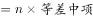，则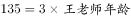，故王老师年龄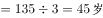。

故正确答案为B。

---

### 第 2 题　qid 2443976 · 数学运算

甲、乙两公司相距2000米，某日上午8：30小明从甲公司出发到乙公司，小华同时从乙公司出发到甲公司。两人到达对方公司后分别用8分钟时间办事，然后原路返回。假设小明的速度为4km/h，小华的速度为5km/h，则两人第二次相遇的时间是几点？

- **A**. 9：18　✅
- **B**. 9：22
- **C**. 9：24
- **D**. 9：28

**答案**：A

**官方解析**

本题考查行程问题中的相遇问题。根据题意“小明的速度为4km/h，小华的速度为5km/h”即小明的速度是米/分钟，小华的速度是米/分钟。题中求二人第二次相遇，若不考虑8分钟办事，则两人所走路程和为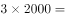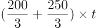，解得两人第二次相遇需要t=40分钟。考虑8分钟办事时间，两人第二次相遇需要，故两人第二次相遇时间为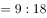。

故正确答案为A。

---

### 第 3 题　qid 2443977 · 数学运算

现有一条柏油马路需要铺设，甲、乙两施工队合作铺设3天可以完成，而乙施工队单独铺设需要5天完成。如果甲、乙合作铺设1天，乙施工队另有任务，剩余任务由甲单独完成需要多少天？

- **A**. 4
- **B**. 5　✅
- **C**. 5.5
- **D**. 6

**答案**：B

**官方解析**

本题属于给完工时间型工程问题。根据“甲、乙两施工队合作铺设3天可以完成，而乙施工队单独铺设需要5天完成”，设工作总量为3和5的公倍数15。可知甲乙效率和为，乙效率为，甲效率为。如果甲、乙合作铺设1天，可完成工作量为：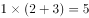，剩余工作量为：，由甲单独完成需要。

故正确答案为B。

---

### 第 4 题　qid 2443978 · 数学运算

设袋中装有标着数字为1，2，…，8等8个签，并规定标有数字1，4，7的为中奖号。甲、乙、丙、丁4人依次从袋中随机抽取一个签，已知丙中奖了，则乙不中奖的概率为多少？

- **A**. 5/8
- **B**. 3/7
- **C**. 3/8
- **D**. 5/7　✅

**答案**：D

**官方解析**

本题考查概率问题，不考虑其他人，丙中奖概率为，设此时乙不中奖概率为x，则丙中奖且乙不中奖的概率为；不考虑其他人，由于乙不中奖概率为，对于丙而言，此时可选签还剩7个，可中奖签还剩3个，中奖概率为，则乙不中奖并且丙中奖概率为，解得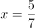。故已知丙中奖了，则乙不中奖的概率为。

故正确答案为D。

---

### 第 5 题　qid 2443979 · 数学运算

某商品的成本比原来增加10%，但是仍保持原售价，致使商品的成本占售价的百分比高达82.5%，那么该商品的利润下降了多少？

- **A**. 20%
- **B**. 25%
- **C**. 30%　✅
- **D**. 35%

**答案**：C

**官方解析**

赋值售价为100，则成本增加10%后成本为82.5，利润为17.5;原成本为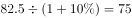，利润为25。故该商品的利润下降了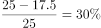。

故正确答案为C。

---

### 第 6 题　qid 2443989 · 数学运算

设矩形ABCD，长与宽分别为6米和4米，分别以AB的中点E和顶点A为圆心，3米和4米为半径画圆弧，如图所示，那么两阴影部分的面积之差是多少平方米？

- **A**. 1.87
- **B**. 2.69　✅
- **C**. 3.49
- **D**. 4.42

**答案**：B

**官方解析**

根据上图，矩形ABCD的面积为，以A点为圆心，4米为半径所画圆弧的面积为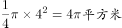，以E点为圆心，3米为半径所画圆弧的面积为。代入两集合容斥原理公式：总数-都不，即-都不，即都不，因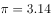，都不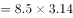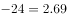平方米，则两阴影部分的面积之差为2.69平方米。

故正确答案为B。

---

### 第 7 题　qid 2443990 · 数学运算

假设某班级共有58人，他们的论文答辩成绩分成优、良、中和不合格四档，其中良的人数是优的3倍少2人，中等的人数是优的2倍，优的人数是不合格的1.5倍，那么这个班论文答辩成绩为良的有多少人？

- **A**. 25　✅
- **B**. 26
- **C**. 27
- **D**. 28

**答案**：A

**官方解析**

根据题意，假设成绩为优的人数为，则成绩为良的人数为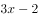，中等的人数为，不合格的人数为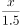，班级共有58人，则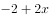，解，成绩为良的有。

故正确答案为A。

---

### 第 8 题　qid 2443992 · 数学运算

某园林处计划购进甲、乙两种树苗共1400棵，已知甲树苗每棵4元，乙树苗每棵3元。根据经验可知，甲、乙两种树苗的成活率分别为97%和90%。为了使这批树苗的成活率至少为94%，且购买成本最小，那么购进甲、乙两种树苗的最小费用是多少元？

- **A**. 4850
- **B**. 4800
- **C**. 5050
- **D**. 5000　✅

**答案**：D

**官方解析**

假设购进甲、乙两种树苗数量分别为x、y棵，，因这批树苗的成活率至少为94%，则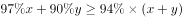，即，。

因甲树苗单价高于乙，在保证成活率至少为94%的前提下，购进甲树苗数量越少，总费用越低。取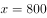，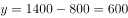，则总费用最少为。

故正确答案为D。

---

### 第 9 题　qid 2443993 · 数学运算

某高校计划招聘81名博士，拟分配到13个不同的院系，假定院系A分得的博士人数比其他院系都多，那么院系A分得的博士人数至少有多少名？

- **A**. 6
- **B**. 7
- **C**. 8　✅
- **D**. 9

**答案**：C

**官方解析**

根据题意，假设院系A分得的博士人数为x，要想x尽可能小，则其他院系分得的人数应尽可能多，最多为。因共有81名博士，则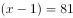，解得，则院系A分得的博士人数至少有8名。

故正确答案为C。

---

### 第 10 题　qid 2443994 · 数学运算

从下列四个选项中选取一项填入括号中，使数列1，3，5，11，21，（  ），85形成一定的规律。

- **A**. 38
- **B**. 40
- **C**. 42
- **D**. 43　✅

**答案**：D

**官方解析**

观察可发现，数列中后一项大约为前一项的2倍，因此考虑前一项2倍之后和后一项的关系。，，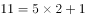，，修正项依次为+1，-1，+1，-1，则题目所求项为，验证可得，，满足。

故正确答案为D。

---

## 判断推理

### 第 1 题　qid 2444013 · 图形推理

以下哪两个图形调换位置之后，使所有的图形能呈现出一定的规律性：

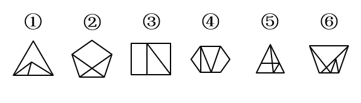

- **A**. ③和④
- **B**. ②和③　✅
- **C**. ③和⑤
- **D**. ②和⑤

**答案**：B

**官方解析**

元素组成不同，属性无明显规律，考虑数量规律。题干图形多边形被分割、窟窿较多，优先考虑面数量，各图面数量依次是3、4、3、4、5、6，无规律；题干图形特征还呈现出线条交叉明显，可以考虑点数量，各图点数量依次是5、6、6、7、7、7，单独看无规律，可考虑面和点数量相加做运算，“面+点”依次是8、10、9、11、12、13，所以只要图2和图3互换位置后，这道题就呈现“面+点”数量为8、9、10、11、12、13的规律，对应B项。
故正确答案为B。

---

### 第 2 题　qid 2444017 · 图形推理

从下列所给的四个选项中，选择最合适的一个填入问号处，使之呈现一定的规律性：

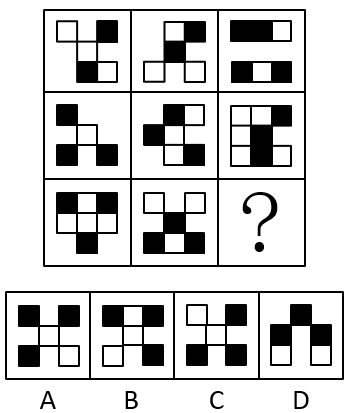

- **A**. A
- **B**. B
- **C**. C
- **D**. D　✅

**答案**：D

**官方解析**

元素组成相似，每幅图轮廓和分隔区域相似，有黑有白，优先考虑黑白运算。九宫格优先横着看，第一行，白+空=空+白=黑、空+空=空、黑+空=白、黑+黑=白、白+白=黑、白+黑=空；第二行，空+白=黑、黑+空=空+黑=白、黑+黑=白、白+白=黑、空+空=空，验证无误；第三行运用此规律，左下角和右下角都是“空+黑=白”，只有D项符合。
故正确答案为D。

---

### 第 3 题　qid 2444032 · 图形推理

从下列所给的四个选项中，选择最合适的一个填入问号处，使之呈现一定的规律性：

- **A**. A
- **B**. B
- **C**. C　✅
- **D**. D

**答案**：C

**官方解析**

元素组成相同，优先考虑位置规律，通过相邻比较发现，图1和图2中的小元素，只有四角星和菱形互换了位置，其他3个小元素位置没变；图2和图3只有黑圆和菱形互换了位置，其他3个小元素位置没变，因此本题的规律为相邻两幅图之间有且只有两个小元素互换了位置，A项5个小元素位置都变了，B项完全没变，C项只有白圆和菱形互换了位置，D项3个小元素变了位置，只有C项符合规律，且经过验证，C项与题干图5只有三角形和菱形互换了位置，满足规律，C项当选。
故正确答案为C。

---

### 第 4 题　qid 2444033 · 图形推理

从下列所给的四个选项中，选择最合适的一个填入问号内，使之呈现一定的规律性：

- **A**. A
- **B**. B
- **C**. C
- **D**. D　✅

**答案**：D

**官方解析**

元素组成不同，且无明显属性规律，考虑数量规律。观察发现，题干出现多个小元素，优先考虑元素的种类和个数。九宫格优先横着看，第一行中，五角星的个数分别为3、7、4，即3+4=7，满足五角星个数图1+图3=图2；第二行中，心形的个数别为2、6、4，即2+4=6；依据此规律，第三行中爆炸形的个数应满足图1+图3=图2（矩形数量无法满足此规律），即1+？=5，故？处应有4个爆炸形，排除A、C两项；再观察其他元素，发现第一行三角形的总数量为7，第二行圆形的总数量为8，依照此规律，第三行矩形的总数量应为9，故？处应有2个矩形，排除B项。
故正确答案为D。
注：本题第一行三角形总数为7，第二行圆形总数为8，从而得出第三行中矩形总数应为9。此规律不够严谨，一般情况2个数字不优先考虑存在等差规律，但本题B、D两项最明显的差别就是矩形数量，且考查元素的图形特征较为明显，在没有其他更优规律的情况下，只能接受每行元素之和存在的等差规律，其他题目尽量不考虑此种规律。

---

### 第 5 题　qid 2444034 · 图形推理

从下列所给的四个选项中，选择最合适的一个填入问号处，使之呈现一定的规律性：

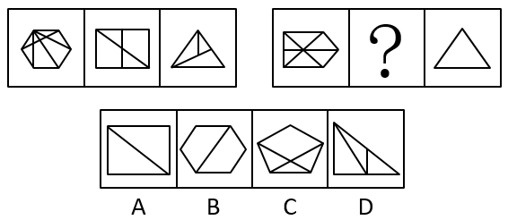

- **A**. A
- **B**. B
- **C**. C
- **D**. D　✅

**答案**：D

**官方解析**

思路一：元素组成不同，属性无明显规律，考虑数量规律。题干图形特征呈现出线条交叉明显，可以考虑点数量，第一组图点数量依次是9、7、5，第二组图点数量依次是7、？、3，应选择交点数为5的图形，只有D项符合。
故正确答案为D。
思路二：元素组成不同，属性无明显规律，考虑数量规律。题干图形分割明显，出现大量窟窿，考虑面数量，第一组图面数量为：8、4、3，无规律。继续观察，题干出现多边形，考虑线数量，第一组图线数量为：10、6、5，发现规律为：图形的线数量减去面数量等于2；第二组图应用此规律，面数量依次是6、？、1，线数量依次是8、？、3，故？处应选择线数量减去面数量等于2的图形，只有D项符合。
故正确答案为D。

---

### 第 6 题　qid 2444035 · 定义判断

保险利益原则是指投保人应当对保险标的具有法律上承认的利益，否则会导致保险合同无效。根据上述定义，下列选项不符合保险利益原则的是:

- **A**. 公民杨某为一株座落在他家屋后的国家一级保护植物购买一份财产险　✅
- **B**. 合伙人张某为另一合伙人龚某购买一份人寿险
- **C**. 甲公司为其经营管理的一颗巨型钟乳石购买一份财产险
- **D**. 雇主李某为其员工赵某购买一份意外伤害险

**答案**：A

**官方解析**

第一步：找出定义关键词。
投保人应当对保险标的具有法律上承认的利益、否则会导致保险合同无效。
第二步：逐一分析选项。
A项：一株座落在他家屋后的国家一级保护植物不属于杨某的所属物品，杨某投保后不具有“对保险标的具有法律上承认的利益”，不符合定义，当选；
B项：合伙人张某为另一合伙人龚某购买一份人寿险符合“投保人应当对保险标的具有法律上承认的利益”，符合定义，排除；
C项：甲公司为其经营管理的一颗巨型钟乳石购买一份财产险符合“投保人应当对保险标的具有法律上承认的利益”，符合定义，排除；
D项：雇主李某为其员工赵某购买一份意外伤害险符合“投保人应当对保险标的具有法律上承认的利益”，符合定义，排除。
本题为选非题，故正确答案为A。

---

### 第 7 题　qid 2444036 · 定义判断

资产是指由企业过去的交易或者事项形成的，为企业拥有或控制的，预期会给企业带来经济利益的资源。
根据上述定义，下列属于资产的是：

- **A**. 已经霉烂变质的产品（无使用价值）
- **B**. 企业的职工
- **C**. 存放在受托加工企业的加工物资　✅
- **D**. 企业急需拟购买的材料

**答案**：C

**官方解析**

第一步：找出定义关键词。
“由企业过去的交易或者事项形成的”、“为企业拥有或控制的”、“预期会给企业带来经济利益的资源”。
第二步：逐一分析选项。
A项：已经霉烂变质的产品（无使用价值）不符合“预期会给企业带来经济利益的资源”，不符合定义，排除；
B项：企业的职工是自愿与企业签订劳动合同的人，其人身不被企业拥有，自由不被企业控制，不符合“为企业拥有或控制的”，不符合定义，排除；
C项：存放在受托加工企业的加工物资依然是该企业所有，只是暂时存放在别处，符合“为企业拥有或控制的”，符合定义，当选；
D项：企业急需拟购买的材料不符合“由企业过去的交易或者事项形成的” ，不符合定义，排除。
故正确答案为C。

---

### 第 8 题　qid 2444037 · 定义判断

流动负债是指企业在未来的一年内要求偿还的现实义务。
根据上述定义，下列不应归类为流动负债的是

- **A**. 企业计划下个月向建设银行借入6个月期的贷款500万元　✅
- **B**. 企业未支付的职工工资
- **C**. 企业未上交的各种税收
- **D**. 企业五年半前借入的一笔6年期贷款1000万元

**答案**：A

**官方解析**

第一步：找出定义关键词。
“企业在未来的一年内要求偿还的现实义务”。
第二步：逐一分析选项。
A项：企业计划下个月向建设银行借入6个月期的贷款500万元，只是计划，是还没有发生的事项，不符合 “企业在未来的一年内要求偿还的现实义务”，不符合定义，当选；
B项：企业未支付的职工工资，是企业应尽的义务，符合“企业在未来的一年内要求偿还的现实义务”，符合定义，排除；
C项：企业未上交的各种税收，税收是国家强制性缴纳的，一般不会等一年再缴纳，符合“企业在未来的一年内要求偿还的现实义务”，排除；
D项：企业五年半前借入的一笔6年期贷款1000万元，贷款期限还剩半年，符合“企业在未来的一年内要求偿还的现实义务”，排除。
本题为选非题，故正确答案为A。

---

### 第 9 题　qid 2444038 · 定义判断

行政决策，是指行政机关和行政领导者在处理政务时，从公共利益和公平公正原则出发，依照法律和有关规定所做出的决定性的行政行为。
根据上述定义，下列选项中不属于行政决策的是：

- **A**. 某市政府为倡导垃圾分类，制定了《垃圾分类实施管理办法》
- **B**. 某省政府为建设高速公路占用农民土地，制定了《土地征收补偿标准》
- **C**. 某省消费者协会为规范顾客自带酒水、餐饮企业收取开瓶费等问题，制定了《餐饮业经营行为规范》　✅
- **D**. 中国政府为继续保持稳定的汇率政策，防止亚洲国家陷入新一轮金融动荡，公开作出人民币不贬值的承诺

**答案**：C

**官方解析**

第一步：找出定义关键词。
“行政机关和行政领导者”、“处理政务时”、“从公共利益和公平公正原则出发”、“依照法律和有关规定”、“所做出的决定性的行政行为”。
第二步：逐一分析选项。
A项：某市政府为倡导垃圾分类，制定了《垃圾分类实施管理办法》符合“行政机关和行政领导者”、“处理政务时”、“从公共利益和公平公正原则出发”、“依照法律和有关规定”、“所做出的决定性的行政行为”，符合定义，排除；
B项：某省政府为建设高速公路占用农民土地，制定了《土地征收补偿标准》符合“行政机关和行政领导者”、“处理政务时”、“从公共利益和公平公正原则出发”、“依照法律和有关规定”、“所做出的决定性的行政行为”，符合定义，排除；
C项：某省消费者协会不符合“行政机关和行政领导者”，不符合定义，当选；
D项：中国政府为继续保持稳定的汇率政策，防止亚洲国家陷入新一轮金融动荡，公开作出人民币不贬值的承诺符合“行政机关和行政领导者”、“处理政务时”、“从公共利益和公平公正原则出发”、“依照法律和有关规定”、“所做出的决定性的行政行为”，符合定义，排除。
本题为选非题，故正确答案为C。

---

### 第 10 题　qid 2444039 · 定义判断

行政强制，是指行政机关为了预防或制止正在发生或可能发生的违法行为、危险状态以及不利后果，或者为了保全证据、确保案件查处工作的顺利进行而对相对人的人身、财产采取强制性措施的一种具体行政行为。
根据上述定义，下列哪项不属于行政强制措施行为：

- **A**. 公安机关对甲某涉案的财物予以收缴的行为
- **B**. 海关对有走私嫌疑的乙某经关长批准扣留24小时的行为
- **C**. 药品监管部门对丙某携带的有证据证明可能危及人体健康的药品进行查封的行为
- **D**. 刑警大队对在公共场所有抢劫嫌疑的丁某监视居住的行为　✅

**答案**：D

**官方解析**

第一步：找出定义关键词。
“行政机关”、“为了预防或制止正在发生或可能发生的违法行为、危险状态以及不利后果”、“或者为了保全证据、确保案件查处工作的顺利进行”、“对相对人的人身、财产采取强制性措施的一种具体行政行为”。
第二步：逐一分析选项。
A项：公安机关对甲某涉案的财物予以收缴的行为，符合“行政机关”、“为了预防或制止正在发生或可能发生的违法行为、危险状态以及不利后果”、“或者为了保全证据、确保案件查处工作的顺利进行”、“对相对人的人身、财产采取强制性措施的一种具体行政行为”，符合定义，排除；
B项：海关对有走私嫌疑的乙某经关长批准扣留24小时的行为，符合“行政机关”、“为了预防或制止正在发生或可能发生的违法行为、危险状态以及不利后果”、“或者为了保全证据、确保案件查处工作的顺利进行”、“对相对人的人身、财产采取强制性措施的一种具体行政行为”，符合定义，排除；
C项：药品监管部门对丙某携带的有证据证明可能危及人体健康的药品进行查封的行为，符合“行政机关”、“为了预防或制止正在发生或可能发生的违法行为、危险状态以及不利后果”、“或者为了保全证据、确保案件查处工作的顺利进行”、“对相对人的人身、财产采取强制性措施的一种具体行政行为”，符合定义，排除；
D项：刑警大队对在公共场所有抢劫嫌疑的丁某监视居住的行为，行政机关只监视丁某居住，并没有采取人身、财产强制性措施，不符合“对相对人的人身、财产采取强制性措施的一种具体行政行为”，不符合定义，当选。
本题为选非题，故正确答案为D。

---

### 第 11 题　qid 2444040 · 定义判断

生物武器是以生物战剂杀伤有生力量和破坏植物生长的各种武器、器材的总称。生物战剂包括立克次体、病毒、毒素、衣原体、真菌等。生物战剂是军事行动中用以杀死人、牲畜和破坏农作物的致命微生物、毒素和其他生物活性物质的统称。生物战剂是构成生物武器杀伤威力的决定因素。致病微生物一旦进入机体（人、牲畜等）便能大量繁殖，导致破坏机体功能、发病甚至死亡。它还能大面积毁坏植物和农作物等。
根据上述定义，以下说法错误的是：

- **A**. 生物武器致命性、传染性极强
- **B**. 为了国家安全，可以进行必要的小范围的生物武器研究　✅
- **C**. 生物武器可以使人畜感染得病，并能危及生命，但不会破坏无生命物体
- **D**. 生物武器是利用致病菌、病毒或毒剂等形成杀伤力

**答案**：B

**官方解析**

第一步：找出定义关键词。
生物武器：“以生物战剂杀伤有生力量和破坏植物生长的各种武器、器材”；
生物战剂：“是军事行动中用以杀死人、牲畜和破坏农作物的致命微生物、毒素和其他生物活性物”、“致病微生物一旦进入机体（人、牲畜等）便能大量繁殖，导致破坏机体功能、发病甚至死亡”、“它还能大面积毁坏植物和农作物等”。
第二步：逐一分析选项。
A项：生物武器致命性、传染性极强，符合“致病微生物一旦进入机体（人、牲畜等）便能大量繁殖，导致破坏机体功能、发病甚至死亡”，说法正确，排除；
B项：为了国家安全，可以进行必要的小范围的生物武器研究，题干中并未提及国家安全，说法错误，当选；
C项：生物武器可以使人畜感染得病，并能危及生命，符合“致病微生物一旦进入机体（人、牲畜等）便能大量繁殖，导致破坏机体功能、发病甚至死亡”且微生物只能作用于生命体，所以也不会破坏无生命物体，说法正确，排除；
D项：生物武器是利用致病菌、病毒或毒剂等形成杀伤力，符合“以生物战剂杀伤有生力量和破坏植物生长的各种武器、器材”, 说法正确，排除。
本题为选非题，故正确答案为B。

---

### 第 12 题　qid 2444041 · 定义判断

生态工程是指人类应用生态学和系统学等学科的基本原理和方法，通过系统设计、调控和技术组装，对已被破坏的生态环境进行修复、重建，对造成环境污染和破坏的传统生产方式进行改善，并提高生态系统的生产力，从而促进人类社会和自然环境的和谐发展。
根据上述定义，以下说法错误的是：

- **A**. 生态工程的目的是遵循自然界物质循环的规律，充分发挥资源的生产潜力，防止环境污染，达到经济效益和生态效益的同步发展
- **B**. 建设生态工程的原因是传统经济模式正在毁坏水、大气、土壤和生物资源，消耗地球赠给我们的自然资本
- **C**. 生态工程是一类少消耗、多效益、可持续的工程体系
- **D**. 生态工程的内容可包括沼气工程、桑基鱼塘、退耕还林还草、长江两岸加固河堤等　✅

**答案**：D

**官方解析**

第一步：找出定义关键词。
 “应用生态学和系统学等学科的基本原理和方法”、“对已被破坏的生态环境进行修复、重建，对造成环境污染和破坏的传统生产方式进行改善”、“提高生态系统的生产力”、“促进人类社会和自然环境的和谐发展”。
第二步：逐一分析选项。
A项：充分发挥资源的生产潜力，防止环境污染，符合“提高生态系统的生产力”，达到经济效益和生态效益的同步发展，符合“促进人类社会和自然环境的和谐发展”，说法正确，排除；
B项：生态工程的目的是 “对已被破坏的生态环境进行修复、重建，对造成环境污染和破坏的传统生产方式进行改善”，说明传统生产方式确实会破坏环境，说法正确，排除；
C项：生态工程的目的是“提高生态系统的生产力，从而促进人类社会和自然环境的和谐发展”，说明其本身对环境有益、效率更高，所以“少消耗、多效益、可持续”的说法正确，排除；
D项：“沼气工程、桑基鱼塘、退耕还林还草”均属于生态工程的内容,但是“长江两岸加固河堤” 只是一项水利工程，不属于生态工程，说法错误，当选。
本题为选非题，故正确答案为D。

---

### 第 13 题　qid 2444042 · 定义判断

简单随机抽样也称纯随机抽样，是指直接从总体的所有单位中按照随机原则抽取样本单位的方式。对于总体中每一个单位，被抽取的机会都是相等的，理论上讲，这种抽样方法是最符合随机原则的。
根据上述定义，下列属于简单随机抽样的是：

- **A**. 从全校300个班级中随机抽取30个班级，抽中的班级所有学生入选样本
- **B**. 在学生食堂门口随机拦截300名学生入选样本
- **C**. 从全校所有学生中按照学生学号随机抽取300名学生入选样本　✅
- **D**. 从全校300个班级中随机抽取30个班级，在抽中的班级再按照随机原则每班级抽取10人入选样本

**答案**：C

**官方解析**

第一步：找出定义关键词。
 “直接从总体的所有单位中按照随机原则抽取样本单位的方式”、“总体中每一个单位，被抽取的机会都是相等的”。
第二步：逐一分析选项。
A项：从全校300个班级中随机抽取30个班级，是以班级这个整体为单位进行抽样，这种把总体分成一个个群，然后以群为单位进行抽样的方式，叫做枯群随机抽样，不符合定义，排除；
B项：在学生食堂门口随机拦截300名学生入选样本，食堂门口只是学校的一个地点，不符合“直接从总体的所有单位中按照随机原则抽取样本单位”，不符合定义，排除；
C项：从全校所有学生中按照学生学号随机抽取300名学生入选样本，符合“直接从总体的所有单位中按照随机原则抽取样本单位”，符合定义，当选；
D项：从全校300个班级中随机抽取30个班级，在抽中的班级再按照随机原则每班级抽取10人入选样本，所以抽取的30个班级学生和未抽取班级学生最终被抽中的概率不同，不符合“总体中每一个单位，被抽取的机会都是相等的”，不符合定义，排除。
故正确答案为C。

---

### 第 14 题　qid 2444043 · 定义判断

常住单位是指在本国经济领土上具有经济利益中心的单位。“经济领土”并不等于通常所说的地理或政治领土，前者在后者的基础上，还要加上一些本国在国外的“领土飞地”，其中主要包括驻外的使领馆、新闻或移民机构、科学考察站等，同时需要减去国外在本国类似的“领土飞地”。任何单位要成为某国的一个常住单位，它还必须在该国的经济领土上具有经济利益中心。一经济单位满足以下三个条件则称该经济单位在本国具有经济利益中心：一是在一国的经济领土范围内具有一定的场所（住房、厂房或其他建筑物）；二是从事一定规模的经济活动（如生产、消费）；三是超过一定时期（一般以一年为标准）。一国经济领土上存在着各种形式的常住单位，包括个人或住户，也包括企业、政府行政及事业单位等法律或社会实体。
根据上述定义，下列属于我国常住单位的是：

- **A**. 一个外国企业在上海建立且从事生产经营活动一年以上的独资子公司　✅
- **B**. 华为技术有限公司2016年在法国成立的研发中心
- **C**. 美国驻我国大使馆
- **D**. 为期两周的到我国旅游的日本游客

**答案**：A

**官方解析**

第一步：找出定义关键词。
  常住单位：“在本国经济领土上具有经济利益中心的单位”；
经济领土：“除了通常所说的地理或政治领土，加上一些本国在国外的‘领土飞地’，其中主要包括驻外的使领馆、新闻或移民机构、科学考察站等，同时需要减去国外在本国类似的领土飞地”；
经济利益中心：“一是在一国的经济领土范围内具有一定的场所（住房、厂房或其他建筑物）”、“二是从事一定规模的经济活动（如生产、消费）”、“三是超过一定时期（一般以一年为标准）”。
第二步：逐一分析选项。
A项：一个外国企业在上海建立且从事生产经营活动一年以上的独资子公司，满足经济利益的三个要求，且上海属于我国的地理领土，符合“在本国经济领土上具有经济利益中心的单位”，符合定义，当选；
B项：华为技术有限公司2016年在法国成立的研发中心，法国不属于我国的地理领土，不符合“在本国经济领土上具有经济利益中心的单位”，不符合定义，排除；
C项：美国驻我国大使馆，属于美国的经济领土，不符合“在本国经济领土上具有经济利益中心的单位”，不符合定义，排除；
D项：为期两周的到我国旅游的日本游客，不符合经济利益的第一和第三个要求，不符合定义，排除。
故正确答案为A。

---

### 第 15 题　qid 2444044 · 定义判断

宏观调控是指国家从经济运行的全局出发，依法运用各种宏观经济手段，对国民经济总体的供求关系进行调节和控制。
根据上述定义，以下不属于宏观调控特征的是：

- **A**. 宏观调控行为具有国家主体性
- **B**. 宏观调控行为具有方式的直接性　✅
- **C**. 宏观调控行为具有目的的宏观性
- **D**. 宏观调控行为具有依据的法定性

**答案**：B

**官方解析**

第一步：找出定义关键词。
 “国家从经济运行的全局出发”、“依法运用各种宏观经济手段”、“对国民经济总体的供求关系进行调节和控制”。
第二步：逐一分析选项。
A项：宏观调控行为具有国家主体性，符合“国家从经济运行的全局出发”符合定义，排除；
B项：宏观调控行为具有方式的直接性，不符合“依法运用各种宏观经济手段”、“对国民经济总体的供求关系进行调节和控制”，不符合定义，当选；
C项：宏观调控行为具有目的的宏观性，符合“对国民经济总体的供求关系进行调节和控制”，符合定义，排除；
D项：宏观调控行为具有依据的法定性，符合“依法运用各种宏观经济手段”，符合定义，排除。
本题为选非题，故正确答案为B。

---

### 第 16 题　qid 2444045 · 类比推理

手机：微信：支付

- **A**. 汽车：驾驶：导航
- **B**. 高铁：运输：快捷
- **C**. 电脑：上网：看电影　✅
- **D**. 卫星：定位：方便

**答案**：C

**官方解析**

第一步：判断题干词语间逻辑关系。
手机可以通过微信来实现支付的功能。手机是工具，微信是条件，支付是功能，三者是对应关系。
第二步：判断选项词语间逻辑关系。
A项：驾驶汽车的时候可以通过导航来进行辅助，与题干逻辑关系不一致，排除；
B项：运输是高铁的功能，快捷是高铁运输的属性或特点，与题干逻辑关系不一致，排除；
C项：电脑可以通过上网来实现看电影的功能。电脑是工具，上网是条件，看电影是功能，三者是对应关系，与题干关系一致，当选；
D项：通过卫星来进行定位，方便是卫星定位的属性，与题干逻辑关系不一致，排除。
故正确答案为C。

---

### 第 17 题　qid 2444046 · 类比推理

海啸：地震

- **A**. 医生：病人
- **B**. 天平：砝码
- **C**. 经济危机：滞涨　✅
- **D**. 警察：骚乱

**答案**：C

**官方解析**

第一步：判断题干词语间逻辑关系。
地震可能引发海啸，二者是或然因果关系。
第二步：判断选项词语间逻辑关系。
A项：医生医治病人，二者并非为或然因果关系，与题干逻辑关系不一致，排除；
B项：砝码是天平测量质量的工具，二者之间是配套使用的关系，与题干逻辑关系不一致，排除；
C项：滞涨（经济停滞，失业及通货膨胀同时持续高涨的经济现象）可能会带来经济危机，与题干逻辑关系一致，当选；
D项：警察可以制止骚乱，与题干逻辑关系不一致，排除；
故正确答案为C。

---

### 第 18 题　qid 2444047 · 类比推理

服装：女装：连衣裙

- **A**. 书籍：中文：外文
- **B**. 药品：中药：三七　✅
- **C**. 文学：小说：戏剧
- **D**. 粮食：黄豆：豆腐

**答案**：B

**官方解析**

第一步：判断题干词语间逻辑关系。
连衣裙是一种女装，女装是一种服装，三者之间是种属关系。
第二步：判断选项词语间逻辑关系。
A项：外文和中文是矛盾关系，与题干逻辑关系不一致，排除；
B项：三七是一种中药，中药是一种药品，三者之间是种属关系，与题干逻辑关系一致，当选；
C项：戏剧可以根据小说改编，二者不是种属关系，与题干逻辑关系不一致，排除；
D项：黄豆是制作豆腐的原材料，二者不是种属关系，与题干逻辑关系不一致，排除。
故正确答案为B。

---

### 第 19 题　qid 2444048 · 类比推理

竞争：激烈

- **A**. 学习：刻苦　✅
- **B**. 努力：奋斗
- **C**. 明确：态度
- **D**. 形势：艰苦

**答案**：A

**官方解析**

第一步：判断题干词语间逻辑关系。
激烈可以形容竞争，竞争是动词。
第二步：判断选项词语间逻辑关系。
A项：刻苦可以形容学习，学习是动词，与题干逻辑关系一致，当选；
B项：努力可以用来形容奋斗，但方向反了，与题干逻辑关系不一致，排除；
C项：明确可以用来形容态度，态度是名词，而且方向也反了，与题干逻辑关系不一致，排除；
D项：艰苦可以形容形势，但形势是名词，与题干逻辑关系不一致，排除；
故正确答案为A。

---

### 第 20 题　qid 2444049 · 类比推理

卧薪尝胆：勾践

- **A**. 破釜沉舟：刘邦
- **B**. 入木三分：王羲之　✅
- **C**. 三顾茅庐：孙权
- **D**. 韦编三绝：吕不韦

**答案**：B

**官方解析**

第一步：判断题干词语间逻辑关系。
卧薪尝胆描述的是越王勾践忍辱负重，发愤图强，最终苦尽甘来。
第二步：判断选项词语间逻辑关系。
A项：破釜沉舟描述的是项羽把饭锅打破，把渡船凿沉不留退路，下决心不顾一切地干到底，而非刘邦，与题干逻辑关系不一致，排除；
B项：入木三分描述的是王羲之在木板上写字，木工刻时，发现字迹透入木板三分(1厘米)深，与题干逻辑关系一致，当选；
C项：三顾茅庐描述的是刘备为请诸葛亮出山而三次拜访诸葛亮，描述的不是孙权，与题干逻辑关系不一致，排除；
D项：韦编三绝描述的是孔子勤读《易经》，致使编联竹简的皮绳多次脱断，描述的不是吕不韦，与题干逻辑关系不一致，排除；
故正确答案为B。

---

### 第 21 题　qid 2444050 · 类比推理

讨论对于      相当于工作对于

- **A**. 过程  气氛
- **B**. 热烈  忙碌　✅
- **C**. 集体  认真
- **D**. 会议  结果

**答案**：B

**官方解析**

逐一代入选项。
A项：讨论的过程，二者可以构成偏正关系，工作与气氛无法搭配，前后逻辑关系不一致，排除；
B项：热烈地讨论，忙碌地工作，前后都构成修饰关系偏正结构，前后逻辑关系一致，当选；
C项：集体讨论，二者构成主谓关系，认真工作，二者构成偏正结构，前后逻辑关系不一致，排除；
D项：讨论是会议中的一个流程，二者为对应关系，工作的结果，二者为偏正结构，前后逻辑关系不一致，排除。
故正确答案为B。

---

### 第 22 题　qid 2444051 · 类比推理

对于粮食相当于煤炭对于

- **A**. 小麦  能源　✅
- **B**. 玉米  天然气
- **C**. 浪费  燃烧
- **D**. 生产  运输

**答案**：A

**官方解析**

逐一代入选项。
A项：小麦是粮食的一种，二者为种属关系，煤炭是能源的一种，二者为种属关系，前后逻辑关系一致，当选；
B项：玉米是粮食的一种，二者为种属关系，煤炭和天然气都是能源，二者为并列关系，前后逻辑关系不一致，排除；
C项：浪费粮食，二者为动宾关系，燃烧煤炭，二者为动宾关系，但是前后顺序相反，前后逻辑关系不一致，排除；
D项：生产粮食，二者为动宾关系，运输煤炭，二者为动宾关系，但是前后顺序相反，前后逻辑关系不一致，排除。
故正确答案为A。

---

### 第 23 题　qid 2444052 · 类比推理

湘江：沅江：资江

- **A**. 庐山：三清山：井冈山　✅
- **B**. 岳阳楼：黄鹤楼：鹳雀楼
- **C**. 龙门石窟：云冈石窟：莫高窟
- **D**. 少林寺：白马寺：灵隐寺

**答案**：A

**官方解析**

第一步：判断题干词语间逻辑关系。
湘江、沅江、资江都是处于湖南省境内，三者为并列关系。
第二步：判断选项词语间逻辑关系。
A项：庐山、三清山、井冈山都处于江西省境内，三者为并列关系，与题干逻辑关系一致，当选；
B项：岳阳楼位于湖南省，黄鹤楼位于湖北省，鹳雀楼位于山西省，三者不在同一省份，与题干逻辑关系不一致，排除；
C项：龙门石窟位于河南省，云冈石窟位于山西省，莫高窟位于甘肃省，三者不在同一省份，与题干逻辑关系不一致，排除；
D项：少林寺和白马寺位于河南省，灵隐寺位于浙江省，三者不在同一省份，与题干逻辑关系不一致，排除。
故正确答案为A。

---

### 第 24 题　qid 2444053 · 类比推理

乱闯红灯：交通违章：行政罚款

- **A**. 打架斗殴：扰乱秩序：毁坏公物
- **B**. 经济过热：通货膨胀：货币贬值
- **C**. 市场经济：市场失灵：国家干预
- **D**. 行政垄断：地方保护：法律规制　✅

**答案**：D

**官方解析**

第一步：判断题干词语间逻辑关系。
乱闯红灯是交通违章，二者构成种属关系，交通违章要受到行政罚款，二者为对应关系。
第二步：判断选项词语间逻辑关系。
A项：打架斗殴会扰乱秩序，二者为因果对应，与题干逻辑关系不一致，排除；
B项：经济过热可能造成通货膨胀，通货膨胀可能造成货币贬值，三者构成因果对应，与题干逻辑关系不一致，排除；
C项：市场经济与市场失灵不构成种属关系，与题干逻辑关系不一致，排除；
D项：行政垄断是地方保护的一种，会受到法律规制，与题干逻辑关系一致，当选。
故正确答案为D。

---

### 第 25 题　qid 2444054 · 类比推理

风力：微风：强风：大风：飓风

- **A**. 年龄：垂髫：不惑：耄耋：期颐　✅
- **B**. 季节：春：夏：秋：冬
- **C**. 气象预警：黄色：蓝色：橙色：红色
- **D**. 京剧：生：旦：净：丑

**答案**：A

**官方解析**

第一步：判断题干词语间逻辑关系。
微风：强风：大风：飓风都是风力的级别，而且由弱到强。
第二步：判断选项词语间逻辑关系。
A项：后四词都是形容年龄，而且年龄越来越大，与题干逻辑关系一致，当选；
B项：后四词都是季节，但是四季不存在由弱变强，与题干逻辑关系不一致，排除；
C项：后四词都是气象预警颜色，但是黄色比蓝色要更强，顺序反了，与题干逻辑关系不一致，排除；
D项：生、旦、净、丑都是京剧中的角色，但是四者不存在程度变化，与题干逻辑关系不一致，排除。
故正确答案为A。

---

### 第 26 题　qid 2444055 · 逻辑判断

马化腾、李彦宏、马云三位企业家对房价和物价做了如下预测：
马化腾：只有房价不上涨，物价才不上涨。
李彦宏：房价和物价至少有一个不上涨。
马云：房价上涨当且仅当物价上涨。
若三人的预测都为真，以下哪项符合他们的预测？

- **A**. 只有房价上涨，物价才不上涨
- **B**. 房价不上涨，物价上涨
- **C**. 房价和物价均上涨
- **D**. 房价和物价均不上涨　✅

**答案**：D

**官方解析**

马化腾：- 物价上涨 → - 房价上涨
李彦宏：- 房价上涨 或 - 物价上涨 
马云：物价上涨 → 房价上涨；房价上涨 → 物价上涨
根据马云的话为真可知，要么房价和物价都上涨，要么房价和物价都不上涨，如果都上涨的话，李彦宏的话为假，所以只能都不上涨。
故正确答案为D。

---

### 第 27 题　qid 2444056 · 逻辑判断

有以下几个条件成立：
（1）如果小王是教师，那么小张不是医生。
（2）或者小李是教师，或者小王是教师。
（3）如果小张不是医生，那么小赵不是运动员。
（4）或者小赵是运动员，或者小周是经理。
以下哪项如果为真，可得出“小李是教师”的结论？

- **A**. 小周不是经理　✅
- **B**. 小王是教师
- **C**. 小赵不是运动员
- **D**. 小张不是医生

**答案**：A

**官方解析**

（1）小王是教师  小张是医生

（2）小李是教师 或 小王是教师

（3）小张是医生 小赵是运动员

（4）小赵是运动员 或 小周是经理

要想得到小李是教师，根据（2）可知小王不是教师，根据（1）可知小张是医生，根据（3）可知小赵是运动员，根据（4）可知小周不是经理。

故正确答案为A。

---

### 第 28 题　qid 2444057 · 逻辑判断

有影迷喜欢姜文导演的所有影片。
如果上述断定为真，则以下哪项不可能为真？

- **A**. 姜文导演的所有影片都有影迷喜欢
- **B**. 有影迷不喜欢姜文导演的所有影片
- **C**. 所有影迷都不喜欢姜文导演的某部影片　✅
- **D**. 有影迷不喜欢姜文导演的某部影片

**答案**：C

**官方解析**

逐一分析选项。
A项：有影迷喜欢姜文导演的所有影片，说明至少有一个人喜欢姜文导演的所有影片，那么姜文导演的所有影片都有影迷喜欢，该项一定为真，排除；
B项：有影迷喜欢姜文导演的所有影片，则可能推出有影迷不喜欢姜文导演的所有影片，该项可能为真，排除；
C项：有影迷喜欢姜文导演的所有影片，说明至少有一个人喜欢姜文导演的所有影片，也就是说肯定有人喜欢姜文导演的某部影片，该项一定为假，不可能为真，当选；
D项：有影迷喜欢姜文导演的所有影片，那么可能推出有影迷不喜欢姜文导演的某部影片，该项可能为真，排除。
本题为选非题，故正确答案为C。

---

### 第 29 题　qid 2444058 · 逻辑判断

法律格言说“紧急时无法律”。由此可以推知：

- **A**. 在紧急状态下是不存在法律的
- **B**. 人们在紧急状态下采取紧急避险行为可以不受法律处罚　✅
- **C**. 有法律，就不会有紧急状态
- **D**. 任何时候，法律都以紧急状态作为产生和发展的根本条件

**答案**：B

**官方解析**

逐一分析选项。
A项：题干的意思是紧急时可以不遵守法律，而不是不存在法律，该项无法推出，排除；
B项：题干的意思是紧急时可以不遵守法律，也就是说紧急状态下采取紧急避险行为可以不受法律处罚，该项可以推出，当选；
C项：题干说的是遵守法律的事，而不是有没有法律，该项无法推出，排除；
D项：题干没有说法律产生的根本条件，该项无法推出，排除。
故正确答案为B。

---

### 第 30 题　qid 2444059 · 逻辑判断

在一次国际会议上，来自英、法、中、德四国的甲、乙、丙、丁四位学者恰好相聚在一组讨论。他们每人除了会说自己本国语言外，还会说其他三国语言中的一种，有一种语言三个人都会说。这四位学者交谈的有关情况如下：
（1）乙不会说英语，当甲与丙交谈时，他却能替他们作翻译；
（2）甲是中国人，丁不会说汉语，但他俩却能毫无困难地交谈；
（3）乙、丙、丁三人找不到一种共同的语言进行交谈；
（4）在四人中，没有一人既能用汉语交谈，又能用法语交谈。
据此，可以推出三个人都会说的那种语言是：

- **A**. 汉语
- **B**. 德语　✅
- **C**. 英语
- **D**. 法语

**答案**：B

**官方解析**

因为有一种语言三个人都会说，所以这三个人是能交流的，根据（3）乙、丙、丁三人找不到一种共同的语言进行交谈，说明有两个会说该种语言，一个不会说，而另一个会说的应该是甲，根据（1）可知甲和丙不能交流，所以会说该种语言的不能有丙，则应该是甲乙丁三人。根据（1）乙不会说英语，排除C；根据（2）丁不会说汉语，排除A；根据（4）没有一个人既能用汉语交谈，又能用法语交谈，说明甲不会说法语，排除D。
故正确答案为B。

---

### 第 31 题　qid 2444060 · 逻辑判断

某专家说：如果，则时间是静止的。

以下哪项和专家所说的同真？

- **A**. 
或者时间是运动的

- **B**. 
如果时间是静止的，则

- **C**. 
或者时间是运动的

- **D**. 
如果时间是运动的，则
　✅

**答案**：D

**官方解析**

第一步：翻译题干。

时间是静止的

第二步：逐一分析选项。

A项：翻译为或者时间是运动的，根据否一推一可知，时间是运动的，属于对题干的肯前推否后，该项无法推出，排除；

B项：翻译为 时间是静止的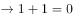，是对题干的肯后，肯后得不出必然结论，该项不能推出，排除；

C项：翻译为 或时间是运动的，根据否一推一可知，时间是运动的，是对题干的否前，否前得不出必然性结论，该项无法推出，排除；

D项：翻译为 时间是运动的，是对题干的否后，否后必否前，可以推出，当选。

故正确答案为D。

---

### 第 32 题　qid 2444061 · 类比推理

科学不是宗教，宗教都主张信仰，所以主张信仰都不科学。
下列选项与题干的逻辑结构相符的是：

- **A**. 广东人不是北京人，北京人都说普通话，所以说普通话的都不是广东人　✅
- **B**. 犯罪行为都是违法行为，违法行为都应受到社会的谴责，所以应受到社会谴责的行为都是犯罪行为
- **C**. 不渴望成功的人都成不了领导，小王渴望成功，所以小王能成为领导
- **D**. 商品都有使用价值，空气有使用价值，所以空气也是商品

**答案**：A

**官方解析**

第一步：翻译题干。

科学（a）→宗教（-b），宗教（b）→主张信仰（c），主张信仰（c）→科学（-a）。

第二步：逐一分析选项。

A项：翻译为: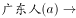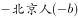，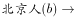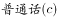，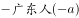，与题干逻辑关系一致，当选；

B项：翻译为:犯罪行为(a)→违法行为(b)，违法行为(b)→受到谴责(c)，受到谴责(c)→犯罪行为(a)，与题干逻辑关系不一致，排除；

C项：翻译为：领导(a)→渴望成功(b)，小王(c)→渴望成功(b)，小王(c)→领导(a)，与题干逻辑关系不一致，排除；

D项：翻译为：商品(a)→使用价值(b)，空气(c)→使用价值(b)，空气(c)→商品(a)，与题干逻辑关系不一致，排除。

故正确答案为A。

---

### 第 33 题　qid 2444062 · 类比推理

张三家丢了一头牛，四位乡邻受到怀疑，经过一番讯问，四人的回答如下：
李甲说：“这事一定是赵丙干的，他一向手脚不干净。”孙乙说：“我没有偷牛。”赵丙说：“我也没有偷牛。”王丁说：“我认为李甲说得对。”后来经过查找，终于找到了盗贼，原来这四位乡邻中只有一个人说了真话，其余三个人都说了假话。请问，谁偷了张三家的牛呢？

- **A**. 李甲
- **B**. 孙乙　✅
- **C**. 赵丙
- **D**. 王丁

**答案**：B

**官方解析**

第一步：找关系。
李甲：赵丙
孙乙：-孙乙
赵丙：-赵丙
王丁：赵丙
根据题干可知，李甲、王丁说的与赵丙矛盾，又因为题干已知只有一人说真话，可知说真话的一定是赵丙。其余三人说假话。
第二步：找关系。
根据孙乙说的是假话，可知是孙乙偷了牛。
故正确答案为B。

---

### 第 34 题　qid 2444063 · 类比推理

某高校举办了一场省级选拔竞赛，有甲、乙、丙、丁四支代表队进入决赛，每支代表队有两名参赛选手，第一名到第八名分别获得10、8、6、5、4、3、2、1分，队伍总分最高者将获得冠军，最后冠军代表学校参赛。比赛的排名情况如下：（1）甲队选手排名是一奇一偶但不相连，乙队选手的排名都是奇数，丙队两名选手的排名相连，丁队选手的排名都是偶数；（2）第一名是甲队选手，第八名是丁队选手：（3）丙队两名选手在乙队两名选手之间，同时也在丁队两名选手之间；（4）各队总分各不相同。
根据以上条件，可以判断各队总分由高到低的排序为：

- **A**. 
甲丙乙丁

- **B**. 
丁甲乙丙

- **C**. 
甲丁乙丙
　✅
- **D**. 
甲乙丁丙

**答案**：C

**官方解析**

根据题干条件，可列表为

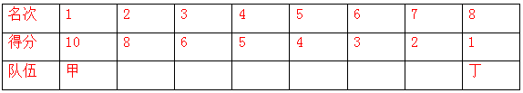

因丙队两名选手排名相连，乙队选手排名均为奇数，且丙队两名选手在乙队两名选手之间，故乙队两名选手的排名不能为3、5或5、7，只能为3、7；

丙队两名选手同时也在丁队两名选手之间，丁队选手排名都是偶数，其中一个为第8名，另一个不能为第6名（若为第6名，则丙队两名选手不能在丁队之间）即丁队可能在2，也可能在4。

假设丁队在4，根据丙队两名选手同时也在丁队两名选手之间，丙队排名相连，可知丙队在5、6，如下表所示：

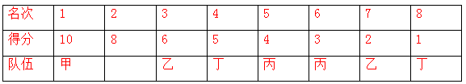

此时甲只能在2，与题干条件（1）甲队选手排名是一奇一偶但不相连矛盾，因此丁队在2。如下表所示：

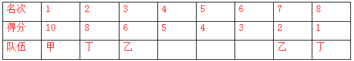

此时丙队排名若为4、5，则甲为6；

此时得分：甲：13，乙：8，丙：9，丁：9，与丙队得分=丁队得分，与题干（4）各队总分各不相同矛盾，因此排名为：丙队排名5、6，则甲队排名第4。

此时甲队得分15分，乙队得分8分，丙队得分7分，丁队得分9分，其排名为：甲＞丁＞乙＞丙。

故正确答案为C。

---

### 第 35 题　qid 2444064 · 逻辑判断

某个饭店里，一桌人边用餐边谈生意。其中，1人是哈尔滨人，2人是北方人，1人是广东人，2个人只做电子设备生意，3个人只做服装生意。假设以上的介绍涉及这餐桌上所有人，那么，这一餐桌上最少可能是几个人？最多可能是几个人？

- **A**. 最少可能是3个人，最多可能是8个人
- **B**. 最少可能是5个人，最多可能是8个人　✅
- **C**. 最少可能是5个人，最多可能是9个人
- **D**. 最少可能是3个人，最多可能是9个人

**答案**：B

**官方解析**

根据题干可知，2人是北方人，其中一人是哈尔滨人，另外还有一人是广东人，由此可知地域上一共涉及3个人。又已知2个人只做电子设备生意，3个人只做服装生意，可知做生意的一共涉及5个人。因为以上介绍涉及桌上所有人，所以如果做生意的5人包含地域上的3人，则最少的人数是5人。最多的人数为：2个北方人+1个广东人+做生意的5人=8人
故正确答案为B。

---

## 资料分析

### 材料 1

        2018年我国全年研究与试验发展（R&amp;D）经费支出19657亿元，比上年增长11.6%，与国内生产总值之比为2.18%，其中基础研究经费1118亿元。全年国家重点研发计划共安排1052个项目，国家科技重大专项共安排563个课题，国家自然科学基金共资助44504个项目。截至年底，正在运行的国家重点实验室501个，累计建设国家工程研究中心132个，国家工程实验室217个，国家企业技术中心1480家。国家科技成果转化引导基金累计设立21支子基金，资金总规模313亿元。全年境内外专利申请432.3万件，比上年增长16.9%；授予专利权244.7万件，增长33.3%；PCT专利申请受理量为5.5万件。截至年底，有效专利838.1万件，其中境内有效发明专利160.2万件，每万人口发明专利拥有量11.15件。全年共签订技术合同41.2万项，技术合同成交金额17697亿元，比上年增长31.8%。

#### 第 1 题　qid 2444065 · 综合

2018年基础研究经费占R&D经费支出的百分比是

- **A**. 4.74%
- **B**. 5.32%
- **C**. 5.69%　✅
- **D**. 6.02%

**答案**：C

**官方解析**

根据“2018年…占…的百分比”判定为现期比重问题。定位文字材料“2018年我国全年研究与试验发展（R&amp;D）经费支出19657亿元…其中基础研究经费1118亿元”。根据比重公式可得：，与C项最接近。

故正确答案为C。

---

#### 第 2 题　qid 2444066 · 综合

2017年专利授予件数占境内外专利申请件数的百分比是

- **A**. 47.4%
- **B**. 49.6%　✅
- **C**. 50.3%
- **D**. 56.6%

**答案**：B

**官方解析**

根据“2017年···占···的百分比”判定为基期比重问题。定位文字材料“全年境内外专利申请432.3万件，比上年增长16.9%；授予专利权244.7万件，增长33.3%”。根据基期比重公式可得可得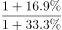。

故正确答案为B。

---

#### 第 3 题　qid 2444067 · 增长

2014-2018年R&D经费支出增速最快的是

- **A**. 2015年
- **B**. 2016年
- **C**. 2017年　✅
- **D**. 2018年

**答案**：C

**官方解析**

根据“增速最快”判定为增长率比较问题。定位表格材料，根据增长率公式可得：

2015年增速=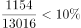

2016年增速=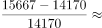

2017年增速=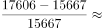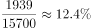

2018年增速=

可见2017年增速最快。

故正确答案为C。

---

#### 第 4 题　qid 2444068 · 增长

2014-2018年R&D经费支出的年均增长率为

- **A**. 10.9%　✅
- **B**. 10.4%
- **C**. 9.9%
- **D**. 8.9%

**答案**：A

**官方解析**

根据“年均增长率为”，结合选项为百分数，判定为年均增长率计算问题。定位表格材料，2018年R&amp;D经费支出19657亿元，2014年R&amp;D经费支出13016亿元。根据年均增长率公式可得：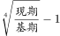，代入数据，有: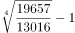。

故正确答案为A。

---

#### 第 5 题　qid 2444069 · 增长

①2015年R&D经费支出同比增长8.9%
②2018年国内生产总值901697亿元
③2018年技术合同成交金额较2017年增加2400.9亿元
上述说法不正确的有

- **A**. 0个
- **B**. 1个　✅
- **C**. 2个
- **D**. 3个

**答案**：B

**官方解析**

①：定位表格材料，2015年R&amp;D经费支出14170亿元，2014年R&amp;D经费支出13016亿元，可得增长率，正确；

②：定位文字材料，“2018年我国全年研究与试验发展（R&amp;D）经费支出19657亿元，比上年增长11.6%，与国内生产总值之比为2.18%”，可得2018年国内生产总值=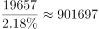亿元，正确；

③：定位文字材料，“技术合同成交金额17697亿元，比上年增长31.8%”，可得增长量=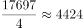亿元，错误。

故正确答案为B。

---

### 材料 2

        2018年C国全年粮食种植面积11704万公顷，比上年减少95万公顷。其中，小麦种植面积2427万公顷，减少24万公顷；稻谷种植面积3019万公顷，减少56万公顷；玉米种植面积4213万公顷，减少27万公顷；棉花种植面积335万公顷，增加16万公顷；油料种植面积1289万公顷，减少33万公顷；糖料种植面积163万公顷，增加9万公顷。

        2018年C国全年粮食产量65789万吨，比上年减少371万吨，减产0.6%。其中，夏粮产量13878万吨，减产2.1%；早稻产量2859万吨，减产4.3%；秋粮产量49052万吨，增产0.1%。全年谷物产量61019万吨，比上年减产0.8%。其中，稻谷产量21213万吨，减产0.3%；小麦产量13143万吨，减产2.2%；玉米产量25733万吨，减产0.7%。

#### 第 6 题　qid 2444070 · 综合

2017年稻谷种植面积占全年粮食种植面积的百分比是

- **A**. 20.3%
- **B**. 25.5%
- **C**. 26.1%　✅
- **D**. 27.2%

**答案**：C

**官方解析**

根据“2017年……占……百分比是”判断本题为基期比重问题。定位文字材料第一段“2018年C国全年粮食种植面积11704万公顷，比上年减少95万公顷。……稻谷种植面积3019万公顷，减少56万公顷；”则2017年粮食种植面积=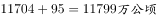，2017年稻谷种植面积=，则2017年稻谷占全年粮食种植面积比重=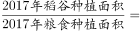 ,即为C项。

故正确答案为C。

---

#### 第 7 题　qid 2444071 · 综合

2018年稻谷产量与小麦产量之差是

- **A**. 7080万吨
- **B**. 8070万吨　✅
- **C**. 8090万吨
- **D**. 8080万吨

**答案**：B

**官方解析**

根据“2018年……之差”判断本题为简单加减计算。定位文字材料第二段“（2018年）稻谷产量21213万吨，减产0.3%；小麦产量13143万吨，减产2.2%；”则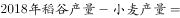万吨,即为B项。

故正确答案为B。

---

#### 第 8 题　qid 2444072 · 综合

2017年夏粮产量与2018年夏粮产量相差

- **A**. 291万吨
- **B**. 296万吨
- **C**. 289万吨
- **D**. 298万吨　✅

**答案**：D

**官方解析**

根据“2017年夏粮产量与2018年夏粮产量相差”判断本题为增长量计算问题。定位文字材料第二段“2018年……夏粮产量13878万吨，减产2.1%；”根据公式，增长量=-297.7万吨，即相差297.7万吨，与D项最接近。

故正确答案为D。

---

#### 第 9 题　qid 2444073 · 综合

2018年玉米产量减产

- **A**. 171万吨
- **B**. 178万吨
- **C**. 181万吨　✅
- **D**. 188万吨

**答案**：C

**官方解析**

根据“2018年……减产”判断本题为增长量计算问题。定位文字材料第二段“（2018年）玉米产量25733万吨，减产0.7%。”则2018年玉米产量减产量=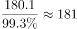万吨。即为C项。

故正确答案为C。

---

#### 第 10 题　qid 2444074 · 增长

①2017年糖料种植面积为154万吨
②2017年秋粮产量49003万吨
③2018年小麦、稻谷和玉米的种植面积之和占该年粮食种植面积的82.5%
④2018年棉花种植面积同比增长5.8%
上述说法正确的有

- **A**. 1个
- **B**. 2个　✅
- **C**. 3个
- **D**. 4个

**答案**：B

**官方解析**

①：定位文字材料第一段“糖料种植面积163万公顷，增加9万公顷”，则2017年糖料种植面积=163-9=154万公顷，而非154万吨，错误；

②：定位文字材料第二段“秋粮产量49052万吨，增产0.1%”，根据基期=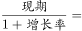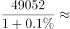万吨，正确；

③：定位文字材料“2018年C国全年粮食种植面积11704万公顷，比上年减少95万公顷。其中，小麦种植面积2427万公顷，减少24万公顷；稻谷种植面积3019万公顷，减少56万公顷；玉米种植面积4213万公顷，减少27万公顷”，则2018年小麦、稻谷、玉米产量之和=万公顷，则其占2018年粮食种植面积的比重=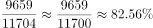，正确。

④定位文字材料第一段“棉花种植面积335万公顷，增加16万公顷”根据增长率=，错误。

故正确答案为B。

---

### 材料 3

        我国脱贫攻坚成效显著。按照每人每年2300元（2010年不变价）的农村贫困标准计算，2018年年末农村贫困人口1660万人，比上年末减少1386万人；贫困发生率1.7%，比上年下降1.4个百分点。全年贫困地区农村居民人均可支配收入10371元，比上年增长10.6%，扣除价格因素，实际增长8.3%。

#### 第 11 题　qid 2444075 · 综合

2014-2018年脱贫人口最多的是

- **A**. 2015年　✅
- **B**. 2016年
- **C**. 2017年
- **D**. 2018年

**答案**：A

**官方解析**

根据题干“脱贫人口最多”，即贫困人口减少量最大，可判定本题为增长量比较问题。定位统计图中柱状图数据可知各年贫困人口数量，可计算得：2015年贫困人口减少量=，，；定位文字材料可知2018年年末农村贫困人口比上年末减少1386万人。故题干所求脱贫人口最多的是2015年。

故正确答案为A。

备注：定位各年份数据在柱状图中，比较柱状图数据差距大小，也可以直接看柱状图的高度差。

---

#### 第 12 题　qid 2444076 · 增长

2014-2018年全国农村贫困人口同比降速位于第二的是      。

- **A**. 2015年
- **B**. 2016年
- **C**. 2017年　✅
- **D**. 2018年

**答案**：C

**官方解析**

根据题干“同比降速位于第二”，可判定本题为增率比较问题。根据116题计算出的数据可知“2015-2018年贫困人口减少量分别为1442万人、1240万人、1289万人、1386万人”，定位统计图中柱状图数据可知各年贫困人口数量，根据公式：降速=，可计算得：2015年贫困人口降速=，，，。故题干所求降速位于第二的是2017年。

故正确答案为C。

---

#### 第 13 题　qid 2444077 · 平均数

2017年贫困地区农村居民人均年可支配收入为

- **A**. 9407元
- **B**. 9377元　✅
- **C**. 9368元
- **D**. 9102元

**答案**：B

**官方解析**

根据题干“2017年……”，结合材料时间为2018年，可判定本题为基期计算问题。定位材料文字部分可得：2018年全年贫困地区农村居民人均可支配收入10371元，比上年增长10.6%。根据公式：。故题干所求2017年贫困地区农村居民人均年可支配收入为9377元。

故正确答案为B。

---

#### 第 14 题　qid 2444078 · 增长

2014-2018年贫困人口年均下降率为

- **A**. 20%
- **B**. 25.5%
- **C**. 30.3%　✅
- **D**. 32.5%

**答案**：C

**官方解析**

根据题干“……年均下降率为”，可判定本题为年均增长率问题。定位柱状图可得2018年贫困人口数量为1660万人，2014年为7017万人。代入年均增长率公式：，。优先代入居中且好算（例如接近整十的数）的数，若下降率为30%，，与0.237接近，说明下降率非常接近30%，C选项30.3%满足。

故正确答案为C。

---

#### 第 15 题　qid 2444079 · 平均数

①2017年脱贫人口最少是1289万人
②2018年农村居民人均可支配收入比2017年增加994元
③2014-2018年贫困人口年均下降量是1330万人
上述说法不正确的有

- **A**. 0个
- **B**. 3个
- **C**. 2个　✅
- **D**. 1个

**答案**：C

**官方解析**

①经过第116题计算可知2017年贫困人口减少量是1289万人，如果在这一年中有一些人变成了贫困人口，那么2016年贫困、在2017年脱贫的人数会比1289万人更多。所以①正确；

②定位材料文字部分可得：2018年全年贫困地区农村居民人均可支配收入10371元。而题干问2018年农村居民人均可支配收入，这个主体不一致，材料中没有相关数据。所以②不正确；

③定位柱状图可得2018年贫困人口数量为1660万人，2014年为7017万人。代入公式：，即年均减少1339.25万人。 所以③不正确。

此题为选非题，故正确答案为C。

---
