# 2019年河北省公务员录用考试《行测》题（县级+乡镇）（网友回忆版）

> 省考 · 2019 年 · 6 个模块 · 共 130 题

- [政治理论](#%E6%94%BF%E6%B2%BB%E7%90%86%E8%AE%BA) · 1 题
- [常识判断](#%E5%B8%B8%E8%AF%86%E5%88%A4%E6%96%AD) · 19 题
- [言语理解与表达](#%E8%A8%80%E8%AF%AD%E7%90%86%E8%A7%A3%E4%B8%8E%E8%A1%A8%E8%BE%BE) · 40 题
- [数量关系](#%E6%95%B0%E9%87%8F%E5%85%B3%E7%B3%BB) · 15 题
- [判断推理](#%E5%88%A4%E6%96%AD%E6%8E%A8%E7%90%86) · 35 题
- [资料分析](#%E8%B5%84%E6%96%99%E5%88%86%E6%9E%90) · 20 题

---

## 政治理论

### 第 1 题　qid 2388178 · 新思想

2019年3月4日，习近平参加全国政协十三届二次会议文化艺术界、社会科学界委员联组会，讲话时引用“大鹏之动非一羽之轻也；骐骥之速，非一足之力也”，强调实现中共十九大描绘的宏伟蓝图，必须紧紧依靠人民。“大鹏之动非一羽之轻也；骐骥之速，非一足之力也”出自：

- **A**. 《道德经》
- **B**. 《孟子》
- **C**. 《潜夫论》　✅
- **D**. 《论语》

**答案**：C

**官方解析**

本题考查人文常识。“大鹏之动非一羽之轻也，骐骥之速，非一足之力也”出自东汉思想家王符的《潜夫论·释难》，意思是大鹏冲天飞翔，不是靠一根羽毛的轻盈；骏马急速奔跑，不是靠一只脚的力量。因此，ABD项不符合题意。
故正确答案为C。

---

## 常识判断

### 第 1 题　qid 2388182 · 人文常识

“四个全面”战略布局，确立了新的历史条件下党和国家各项工作的战略目标和战略举措，是我们党在新形势下治国理政的总方略，是事关党和国家长远发展的总战略。在“四个全面”战略布局中居于引领地位的是：

- **A**. 全面深化改革
- **B**. 全面依法治国
- **C**. 全面从严治党
- **D**. 全面建成小康社会　✅

**答案**：D

**官方解析**

本题考查政治常识。
“四个全面”，即全面建成小康社会、全面深化改革、全面依法治国、全面从严治党。全面建成小康社会是中央的重大战略目标，在“四个全面”战略布局中居于引领地位。
故正确答案为D。
（备注：2020年党的十九届五中全会在北京胜利召开，会议审议通过了《中共中央关于制定国民经济和社会发展第十四个五年规划和二〇三五年远景目标的建议》。明确提出要“协调推进全面建设社会主义现代化国家、全面深化改革、全面依法治国、全面从严治党的战略布局”。）

---

### 第 2 题　qid 2388190 · 地理国情

河北省委九届六次全会提出，要抓好三件大事，打好六场硬仗，实施八项战略。其中的三件大事不包括：

- **A**. 筹办北京冬奥会
- **B**. 全力实施精准脱贫　✅
- **C**. 规划建设雄安新区
- **D**. 推进京津冀协同发展

**答案**：B

**官方解析**

本题考查政治常识。2017年12月24日，中国共产党河北省第九届委员会第六次全体会议在石家庄召开。全会强调，当前和今后一个时期，我省经济社会发展的基本思路是，抓好三件大事、打好六场硬仗、实施八项战略、深化九项改革。三件大事，即推进京津冀协同发展、规划建设雄安新区、筹办北京冬奥会。 六场硬仗，即防范化解重大风险的硬仗、精准脱贫的硬仗、污染防治的硬仗、转型升级的硬仗、补齐民生短板的硬仗、优化营商环境的硬仗。 八项战略，即创新驱动发展战略、科教兴冀战略、人才强冀战略、乡村振兴战略、区域协调发展战略、可持续发展战略、军民融合发展战略、开放带动战略。因此，B项不属于“三件大事”内容。
本题为选非题，故正确答案为B。

---

### 第 3 题　qid 2388196 · 人文常识

下列关于自然现象的解释，正确的一项是：

- **A**. 冬天户外用嘴呼气冒“白气”，是汽化现象
- **B**. 白炽灯泡用久后玻璃泡壁变黑，是凝华现象　✅
- **C**. 利用干冰进行人工增雨，干冰发生的变化属于液化现象
- **D**. 冬天房顶上的积雪虽没有融化，却逐渐减少，是蒸发现象

**答案**：B

**官方解析**

本题考查科技常识。
A项错误，人呼出的气体中含有水蒸气，刚呼出时温度较高（36.5摄氏度），为气态；而冬天温度较低，呼出的水蒸气会大量凝结为小液滴且浓度较高，所以会看见白气，此为液化现象，而不是汽化现象。汽化是指物质从液态变为气态的相变过程。
B项正确，凝华是物质直接从气态变为固态的现象，凝华过程物质要放热。用久的白炽灯泡会从透明变成黑色，是在电灯泡工作时发热，而钨丝受热升华形成的钨蒸气又在灯光泡壁上遇冷凝华成极薄的一层固态钨。
C项错误，液化是物质由气态转变为液态的过程，会对外放热。干冰是由二氧化碳凝华而成的，当它投放到云层中时就会吸热升华。从而使云层迅速降温，让云层中的一些水蒸气和小水滴凝成小冰晶或大的水滴，达到人工降雨的效果。因此，干冰发生的变化属于升华现象，而不是液化现象。
D项错误，蒸发是物质从液态转化为气态的相变过程，而雪融化属于固态转变为液态，因此D项中的现象不是蒸发现象。此处应主要为固态直接变为气态，是升华现象。
故正确答案为B。

---

### 第 4 题　qid 2388198 · 人文常识

中央电视台天气预报栏目说，“今天白天晴间多云，最高温度25摄氏度”。这里的“今天白天”所指时间段是：

- **A**. 6：00到18：00
- **B**. 7：00到19：00
- **C**. 8：00到20：00　✅
- **D**. 9：00到21：00

**答案**：C

**官方解析**

本题考查科技常识。
天气预报用语规定：“今天白天”是指上午 8:00 到晚上 20:00 的 12h；“今天夜间”是指 20:00 到次日早上 8:00 的 12h。
故正确答案为C。

---

### 第 5 题　qid 2388200 · 人文常识

关于京杭大运河，下列说法不正确的是：

- **A**. 2014年入选世界文化遗产名录
- **B**. 世界上里程最长、工程最大的古代运河
- **C**. 沟通海河、黄河、淮河、长江、钱塘江五大水系
- **D**. 途经今浙江、江苏、山东、河北、河南五省及天津、北京两市　✅

**答案**：D

**官方解析**

本题考查地理国情。
A项正确，2002年，大运河被纳入了“南水北调”东线工程。2014年6月22日，第38届世界遗产大会宣布，中国大运河项目成功入选世界文化遗产名录，成为中国第46个世界遗产项目。
B项正确，京杭大运河是世界上里程最长、工程最大的古代运河，也是最古老的运河之一，与长城、坎儿井并称为中国古代的三项伟大工程，是中国古代劳动人民创造的一项伟大工程，是中国文化地位的象征之一。
C项正确，大运河贯通海河、黄河、淮河、长江、钱塘江五大水系，全长约1797公里。运河对中国南北地区之间的经济、文化发展与交流，特别是对沿线地区工农业经济的发展起了巨大作用。
D项错误，大运河南起余杭（今杭州），北到涿郡（今北京），途经今浙江、江苏、山东、河北四省及天津、北京两市，全长约1797公里。运河对中国南北地区之间的经济、文化发展与交流，特别是对沿线地区工农业经济的发展起了巨大作用。因此，运河途经四省，无河南省。
本题为选非题，故正确答案为D。

---

### 第 6 题　qid 2388202 · 人文常识

2019年4月27日，第二届“一带一路”国际合作高峰论坛在北京举行。这次峰会的主题是：

- **A**. 深化合作，共创“一带一路”新发展
- **B**. 推进互联互通，共创经济发展新未来
- **C**. 共建“一带一路”，共创美好未来　✅
- **D**. 携手共进，展望未来，推动“一带一路”新发展

**答案**：C

**官方解析**

本题考查政治常识。
2019年4月25日至27日，第二届“一带一路”国际合作高峰论坛在北京成功举行。本次高峰论坛的主题是：共建“一带一路”、开创美好未来。论坛期间举行了高峰论坛开幕式、领导人圆桌峰会、高级别会议、12场分论坛和1场企业家大会。
选项中没有与峰会主题完全一致的选项，但C项中的“共创”与峰会主题中的“开创”仅一字之差，且两句话意思表达一致，故认定C项正确。
故正确答案为C。

---

### 第 7 题　qid 2388212 · 地理国情

十八大以来，我国实施了多项重大改革。按照时间先后排序，正确的一项是：
①设立上海自贸区
②设立河北雄安新区
③实施全面两孩政策
④实施乡村振兴战略

- **A**. ①④②③
- **B**. ②③①④
- **C**. ②①③④
- **D**. ①③②④　✅

**答案**：D

**官方解析**

本题考查政治常识。
①2013年9月29日中国(上海)自由贸易试验区正式成立；
②2017年4月1日 ，中共中央、国务院决定在河北雄安设立国家级新区；
③2015年12月31日，中共中央、国务院出台《关于实施全面两孩政策 改革完善计划生育服务管理的决定》；
④乡村振兴战略是习近平同志2017年10月18日在党的十九大报告中提出的战略。2018年1月2日，公布了2018年中央一号文件，即《中共中央国务院关于实施乡村振兴战略的意见》。
按时间先后排序为①③②④。
故正确答案为D。

---

### 第 8 题　qid 2388214 · 人文常识

在中国古代社会，“西席”这一称谓指的是：

- **A**. 客人
- **B**. 老师　✅
- **C**. 女婿
- **D**. 医生

**答案**：B

**官方解析**

本题考查人文常识。
A项错误，古人对客人的称谓因人而异。如将很少来家的客人称为“稀客”，时常来家的客人称为“常客”，远道而来的客人称为“远客”，关系疏远的客人称为“外客”，关系亲密的客人称为“亲客”等。
B项正确，“西席”一词出自《称谓录》：“汉明帝尊桓荣以师礼，上幸太常府，令荣坐东面，设几。故师曰西席。”西席是中国古代对老师的敬称。古代以西为尊，主人坐在东面，宾客坐在西席，故有此称。此外，对老师的称谓还有祭酒、博士、夫子、先生等。
C项错误，古代常用乘龙快婿、东床、金龟婿等指代女婿。
D项错误，古人对医生的称谓有大夫、郎中、坐堂医等。
故正确答案为B。

---

### 第 9 题　qid 2388217 · 人文常识

以下情况中，没有违反公务员法中需要任职回避规定情形的是：

- **A**. 小张和他的妻子在同一个厅级机关分别任不同处的处长
- **B**. 老李是某厅级机关处长，其女儿是该处某科室的科员
- **C**. 小刘是某厅级机关财务处科员，其妻小梁是该厅老干部处科员　✅
- **D**. 老周是某厅副厅长，其妻老钱是该厅人事处主任科员

**答案**：C

**官方解析**

本题考查法律常识。
根据我国《公务员法》第七十四条第一款规定：“公务员之间有夫妻关系、直系血亲关系、三代以内旁系血亲关系以及近姻亲关系的，不得在同一机关双方直接隶属于同一领导人员的职位或者有直接上下级领导关系的职位工作，也不得在其中一方担任领导职务的机关从事组织、人事、纪检、监察、审计和财务工作。”
A项错误，小张和他妻子在同一厅级机关，且均为处级干部，二人直接隶属于同一领导，应当任职回避。
B项错误，老李是处长，其女儿是该处某科室的科员，二者存在上下级的关系，应当任职回避。
C项正确，小刘是财务处科员，小梁是老干部处科员，二者隶属于不同处室的领导，不存在上下关系，无需任职回避。
D项错误，老周是副厅长，为领导职务，其妻在该厅人事处任职，从事人事工作，应当任职回避。
故正确答案为C。

---

### 第 10 题　qid 2388177 · 人文常识

某县委办公室主任吴某，吩咐其下属孙某，利用举办会议的机会，通过虚开发票冒领会议经费44860元。孙某自己留下9860元，将其余的35000元交给吴某，吴某据为己有。此事被监察部门发现并移交司法机关，吴某涉嫌的罪名是：

- **A**. 贪污罪　✅
- **B**. 职务侵占罪
- **C**. 受贿罪
- **D**. 私分国有资产罪

**答案**：A

**官方解析**

本题考查法律常识。
A项正确，根据《刑法》第三百八十二条的规定，贪污罪是指国家工作人员和受国家机关、国有公司、企业、事业单位、人民团体委托管理、经营国有财产的人员，利用职务上的便利，侵吞、窃取、骗取或者以其他手段非法占有公共财物的行为。吴某身为国家工作人员，利用职务便利，虚开发票骗取国家财产的行为构成贪污罪。
B项错误， 根据《刑法》第二百七十一条的规定，公司、企业或者其他单位的工作人员，利用职务上的便利，将本单位财物非法占为己有，数额较大的，处三年以下有期徒刑或者拘役，并处罚金；数额巨大的，处三年以上十年以下有期徒刑，并处罚金；数额特别巨大的，处十年以上有期徒刑或者无期徒刑， 并处罚金。职务侵占罪的构成主体是公司企业或者其他单位的人员，而吴某的身份是国家工作人员，不符合职务侵占罪的构成要件。
C项错误，根据《刑法》第三百八十五条的规定，受贿罪是指国家工作人员利用职务上的便利，索取他人财物，或者非法收受他人财物，为他人谋取利益的行为。吴某的行为表现不构成受贿罪。
D项错误，根据《刑法》第三百九十六条的规定，私分国有资产罪是指国家机关、国有公司、企业、事业单位、人民团体，违反国家规定，以单位名义将国有资产集体私分给个人，数额较大的行为。吴某的行为表现不构成私分国有资产罪。
故正确答案为A。

---

### 第 11 题　qid 2388181 · 人文常识

下列名词与内容对应不一致的是：

- **A**. BRICS/金砖国家
- **B**. 马歇尔计划/欧洲复兴方案
- **C**. “一带一路”/丝绸之路经济带和海上丝绸之路
- **D**. 《中美上海联合公报》/中美正式建交　✅

**答案**：D

**官方解析**

本题考查人文常识。
A项正确，2001年，美国高盛公司首次提出BRICS概念，用巴西、俄罗斯、印度、中国四国英文名称首字母组成缩写词。因“BRICS”拼写和发音同英文单词“砖”（bricks）相近，中国媒体和学者将其译为金砖国家。2011年，南非正式加入金砖国家，英文名称定为BRICS。
B项正确，马歇尔计划是第二次世界大战后美国援助欧洲的计划，也称为欧洲复兴计划。1947年6月5日，美国国务卿乔治·马歇尔在哈佛大学发表所谓美国援助欧洲复兴的演说。后来美国政府据以制订的《欧洲复兴方案》，就被称为马歇尔计划。
C项正确，“一带一路”是丝绸之路经济带和21世纪海上丝绸之路的简称。“一带一路”是合作发展的理念和倡议，是依靠中国与有关国家既有的双多边机制，借助既有的、行之有效的区域合作平台，旨在借用古代“丝绸之路”的历史符号，高举和平发展的旗帜，主动地发展与沿线国家的经济合作伙伴关系，共同打造政治互信、经济融合、文化包容的利益共同体、命运共同体和责任共同体。
D项错误，1972年2月21日至28日，美国总统尼克松正式访华。2月28日，中美两国发表了指导两国关系的《中美上海联合公报》，中美交往的大门终于被打开，标志着中美两国20多年的对抗关系结束。中美两国在1978年12月15日签署了《中华人民共和国和美利坚合众国关于建立外交关系的联合公报》 ，即“中美建交公报”。1978年12月16日，中美两国《中美建交公报》发表，美国承认中华人民共和国中央人民政府是中国唯一合法政府。它的发表，标志着中美隔绝状态的结束和关系正常化进程的开始。1979年1月1日《中美建交公报》正式生效，中美正式建交。
本题为选非题，故正确答案为D。

---

### 第 12 题　qid 2388185 · 人文常识

下列说法正确的是：

- **A**. 长白山地属暖温带的湿润地区
- **B**. 我国夏季气温分布的特点是：全国大多数地方普遍高温，南北方气温相差不大　✅
- **C**. 农作物能够生长的时间被称为生长期，生长期一般比当地的无霜期要短十五天左右
- **D**. 河北的天气特点是：春季温暖，常有风沙；夏季炎热，雨量充沛；秋季凉爽，天气晴朗；冬季寒冷，有时下雪

**答案**：B

**官方解析**

本题考查地理国情。

A项错误，在我国，秦岭—淮河线以北，包括塔里木盆地、华北平原和黄土高原，以及辽宁省南部等地区属于暖温带；大兴安岭北段及其两侧地区属于寒温带；在暖温带与寒温带之间，是东西延伸、面积广阔的中温带地区，包括准噶尔盆地、内蒙古高原、东北平原等。我国湿润地区包括东北山地、秦岭—淮河线以南、青藏高原东南部等。长白山位于我国吉林省东南部，属中温带湿润地区。

B项正确，我国夏季气温分布的特点是南北普遍高温，大部分地区7月平均气温在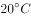以上，南北方气温相差不大。主要是因为夏季太阳直射点在北半球，北方正午太阳高度小，但白昼长；南方地区虽然白昼短，但正午太阳高度较大，所以南北地面获得的热量相差不大。

C项错误，生长期是指一年中植物显著可见的生长期间，也称为生季。无霜期指一年中终霜后至初霜前的一整段时间，在此期间，没有霜的出现。无霜期的长短因地而异，一般纬度、海拔高度愈低，无霜期愈长。农作物的生长期与无霜期有密切关系，无霜期长的地区作物生长期也长，但两者不能等同。对于耐寒性较差的作物，在霜出现时其生长会受到影响，如棉花。但对抗寒作物而言，生长期一般比无霜期长一、二十天，比如冬小麦在终霜前就已经开始生长，玉米授粉后在低温或初霜后仍能继续生长。故“生长期一般比当地的无霜期要短十五天”表述不当。

D项错误，河北地处华北平原，属温带大陆性季风气候，大部分地区四季分明，同时，河北属于我国的半湿润地区，夏季雨量并不充沛，故“夏季炎热，雨量充沛”表述不当。

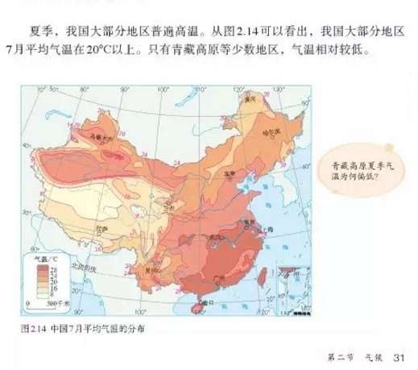

故正确答案为B。

---

### 第 13 题　qid 2388189 · 人文常识

世界上蓄水量最大的淡水湖是：

- **A**. 贝加尔湖　✅
- **B**. 里海
- **C**. 维多利亚湖
- **D**. 苏必利尔湖

**答案**：A

**官方解析**

本题考查地理国情。
A项正确，贝加尔湖是世界上蓄水量最大、最深的淡水湖，总蓄水量23.6万亿立方米，蕴藏着地球全部淡水量的20%。
B项错误，里海位于欧亚两洲交界处，面积约38万平方公里，是世界上最大的咸水湖。
C项错误，维多利亚湖为非洲最大的淡水湖，面积约6.9万平方公里，平均水深40米，是世界第二大淡水湖。
D项错误，苏必利尔湖是北美洲五大湖之一，面积8.2万平方千米,平均水深148米，是世界上面积最大的淡水湖。
故正确答案为A。

---

### 第 14 题　qid 2388195 · 科技常识

电影《流浪地球》反映了人类生存与太阳密不可分。下列现象与太阳辐射无关的是：

- **A**. 火山的喷发　✅
- **B**. 风的形成
- **C**. 煤炭的形成
- **D**. 植物的生长

**答案**：A

**官方解析**

本题考查科技常识。太阳辐射是指太阳以电磁波的形式向外传递能量，是指太阳向宇宙空间发射的电磁波和粒子流。
A项错误，火山喷发，是一种奇特的地质现象，是地壳运动的一种表现形式，也是地球内部热能在地表的一种最强烈的显示。火山爆发属于地球内力作用，太阳辐射属于外力作用，二者没有直接的关系。
B项正确，风就是水平运动的空气，空气产生运动，主要是由于地球上各纬度所接受的太阳辐射强度不同而形成的。
C项正确，煤炭是化石能源，是通过远古的生物吸收太阳辐射的能量之后，将碳元素从大气中分离出来，存储在体内，然后在长时间的埋藏经过复杂的化学反应后形成的固体可燃性矿物。
D项正确，可见光辐射又称光合有效辐射，是太阳辐射光谱中0.40～0.70微米波谱段的辐射，由紫、蓝、青、绿、黄、橙、红等7色光组成，是绿色植物进行光合作用所必须的和有效的太阳辐射能，对植物生长有重要作用和影响。
本题为选非题，故正确答案为A。

---

### 第 15 题　qid 2388197 · 人文常识

一个国家的文化精华，称之为“国粹”。中国的三大国粹是：

- **A**. 国画、京剧和中医　✅
- **B**. 儒学、国画和针灸
- **C**. 瓷器、书法和儒学
- **D**. 茶艺、昆曲和武术

**答案**：A

**官方解析**

本题主要考查人文常识。
中国国粹，是指完全发源于中国，中国固有文化中的精华。其中誉满中外的中国京剧、中国画、中国医学，被世人称为“中国的三大国粹”。
京剧是近代中国戏曲的代表，它的表演艺术趋于虚实结合的表现手法，最大限度地超脱了舞台空间和时间的限制，以达到“以形传神，形神兼备”的艺术境界；中国画简称"国画"，是中国创造的具有悠久历史与鲜明民族特色的绘画。中国画以线条为造型的主要手段，讲究用笔，用墨，使线、墨、色交相辉映，达到“气韵生动”的艺术效果；中医一般指以中国汉族劳动人民创造的传统医学为主的医学。中医理论来源于对医疗经验的总结及中国古代的阴阳五行思想。其内容包括精气学说、阴阳五行学说、气血津液、藏象、经络、体质、病因、发病、病机、治则、养生等。
故正确答案为A。

---

### 第 16 题　qid 2388199 · 人文常识

下列诗词与所描写节令不相符的是：

- **A**. 东风夜放花千树，更吹落，星如雨。宝马雕车香满路，凤萧声动，玉壶光转，一夜鱼龙舞。——元宵节
- **B**. 十轮霜影转庭梧，此夕羁人独向隅。未必素娥无怅恨，玉蟾清冷桂花孤。——七夕节　✅
- **C**. 冷食方多病，开襟一忻然。终令思故郡，烟火满晴川。杏粥犹堪食，榆羹已稍煎。唯恨乖亲燕，坐度此芳年。——寒食节
- **D**. 无云世界秋三五，共看蟾盘上海涯。直到天头天尽处，不曾私照一人家。——中秋节

**答案**：B

**官方解析**

本题考查人文常识。
A项正确，“东风夜放花千树，更吹落，星如雨。宝马雕车香满路，凤萧声动，玉壶光转，一夜鱼龙舞。”出自南宋辛弃疾的《青玉案·元夕》，描写的是元宵节夜晚满城灯火、众人狂欢的景象。
B项错误，“十轮霜影转庭梧，此夕羁人独向隅。未必素娥无怅恨，玉蟾清冷桂花孤。”出自北宋晏殊的《中秋月》，描写的中秋夜晚的景象。其中“素娥”是嫦娥的代称；“玉蟾”是月亮的代称。
C项正确，“冷食方多病，开襟一忻然。终令思故郡，烟火满晴川。杏粥犹堪食，榆羹已稍煎。唯恨乖亲燕，坐度此芳年。”出自唐代韦应物的《清明日忆诸弟》。寒食节为每年清明节前一二日，寒食节禁烟火，只吃冷食。因此，该作品对应的节日为寒食节。
D项正确，“无云世界秋三五，共看蟾盘上海涯。直到天头天尽处，不曾私照一人家。”出自唐代曹松的《中秋对月》，描写的中秋夜晚的景象。
本题为选非题，故正确答案为B。

---

### 第 17 题　qid 2388201 · 人文常识

关于下列体育项目，不正确的说法是：

- **A**. 体操比赛男子有六个单项，女子有五个单项　✅
- **B**. 中国足球“要从娃娃抓起”是邓小平同志首次提出的
- **C**. 乒乓球混双比赛是2020年东京奥运会正式比赛项目
- **D**. 举重、跳水、体操、游泳项目，都是我国运动员在奥运会比赛中的优势项目

**答案**：A

**官方解析**

本题考查人文常识。
A项错误，男子竞技体操项目包括自由体操、鞍马、吊环、跳马、双杠和单杠共六个单项。女子竞技体操项目包括跳马、高低杠、平衡木和自由体操共四个单项。
B项正确，1974年1月4日，邓小平在听取国家体委、中华全国体育总会、中国足球协会负责人汇报工作时，谈到要把学校的体育工作搞好时，指出：“足球不从娃娃搞起，是上不去的。” 他第一次提出“中国足球运动要搞上去，必须从娃娃抓起”的指示，不断激励着无数热爱足球的年轻人，也表达出他对中国足球发展的美好期望。
C项正确，国际奥林匹克官网公布了2020东京奥运会各项目赛程，乒乓球比赛的日期安排已经出炉，混双项目首次单列出现在奥运会乒乓球比赛，也是2020年东京奥运会乒乓球项目首金。
D项正确，奥运会优势项目是指我国在奥运会上多次取得优异成绩、获得金牌、具有项目整体优势，并且在将来的奥运会比赛中处于竞技有利位置的竞技体育项目。我国在奥运会上的传统优势项目有跳水、乒乓球、体操、羽毛球、举重和射击六个项目。2012年伦敦奥运会上，我国在游泳项目上取得5金、2银、3铜的优异成绩，已经成为我国在奥运赛场上新兴的优势项目。
本题为选非题，故正确答案为A。

---

### 第 18 题　qid 2388203 · 法律常识

某局长驾驶私家车与一辆接送孩子的人力三轮车剐蹭，导致三名小学生轻微擦伤，该局长亲自将孩子们送到县医院检查治疗后，又把孩子们送到学校正常上课。事故发生时，某企业职工杨某路过并用手机录制了一段视频，视频中虽未出现该局长的画面，但在视频中插入文字“局长驾车撞上三轮车，五名孩子严重受伤，局长态度嚣张，驾车扬长而去”等严重失实信息。杨某将该视频发到朋友圈后，又被广为转发，造成了不良社会影响。对此事件，下列说法正确的是：

- **A**. 杨某严重扰乱社会公共秩序，由检察机关提起公诉
- **B**. 杨某不遵守社会公德，由所在企业进行处理与教育
- **C**. 杨某违反治安管理处罚法，由公安机关予以相应处罚　✅
- **D**. 杨某的行为属于严重诽谤，由法院受理并判处刑罚

**答案**：C

**官方解析**

本题考查法律。
A项错误，杨某的行为造成不良社会影响，还未达到触犯刑法的程度，不属于公诉范围。
B项错误，杨某行为违反了《治安管理处罚法》，应当受到行政处罚。
C项正确，《治安管理处罚法》第二十五条第一项规定:“散布谣言,谎报险情、疫情、警情或者以其他方法故意扰乱公共秩序的，处五日以上十日以下拘留，可以并处五百元以下罚款。”
D项错误，侮辱、诽谤罪属于告诉才处理的案件，不应由法院直接受理。
故正确答案为C。

---

### 第 19 题　qid 2388209 · 人文常识

我国到了明朝已形成完备的四级科举考试制度，由低到高的排列顺序是：

- **A**. 院试—会试—乡试—殿试
- **B**. 乡试—会试—院试—殿试
- **C**. 乡试—会试—殿试—院试
- **D**. 院试—乡试—会试—殿试　✅

**答案**：D

**官方解析**

本题考查人文常识。
科举制始于隋朝，唐代逐渐完善，到明朝，形成了完备的四级制度，由低到高分为：院试、乡试、会试和殿试。院试，是参加过县试、府试的童生取得生员资格的考试，考中者称秀才。乡试，由各地主持的地方考试，每三年举行一次，因在秋季八月举行，故又称秋闱。会试，在京城统一举行的一次考试，因在春季举行，故又称春闱。殿试，是科举制最高级别的考试，由皇帝亲自主持，以定甲第。
故正确答案为D。

---

## 言语理解与表达

### 材料 1

        据《中国青年报》报道，2018年中国社会科学院“中国大学生追踪调查（PSCUS）”研究结果近日公布。对全国18所高校在校大学生的调查发现，大学生平均每天玩网络游戏的时间约为2小时，22.95的大学生基本每天都玩网络游戏。游戏不只是男生的偏好，47.7的女生表示玩网络游戏，14的女生基本每天都玩。<u>                    </u>，高职院校学生玩游戏者近七成，普通本科高校玩游戏者超五成，双一流高校玩游戏者超六成。

        中国新闻出版研究院近日公布的第十六次全国国民阅读调查数据显示，2018年我国成年国民人均每天手机接触时长为84.87分钟，比2017年增加4.44分钟；2018年人均每天读书时间为19.81分钟，比2017年减少0.57分钟，人均每天读报时长为9.58分钟，比2017年减少2.42分钟，人均每天阅读期刊时长为5.56分钟，比2017年减少1.32分钟；2018年人均纸质图书阅读量为4.67本，与2017年基本持平。

        从以上数据可以看出，我国大学生玩游戏的时间，大致是我国成人阅读时间的6倍。大学生花这么长时间在网络游戏中，已经超出了“适当乐于其中”的范畴，显得颇不正常。提高我国大学生培养质量，需要引导大学生控制上网玩游戏的时间，培养大学生更广泛的兴趣。

        大学生花这么多时间在网游之中，有多方面原因。有的大学生从小就是“宅男”“宅女”，除学习之外，休闲时间就用电子产品打发时间。以前由于学习任务重，玩游戏的时间被家长严格控制，到了大学，学习任务变得相对轻松，加之老师平时管得不严，不少学生就宅在宿舍玩游戏，甚至通宵达旦不能自拔。调查显示，31.97受访大学生有熬夜玩游戏的经历，其中3.52经常熬夜，28.45偶尔熬夜。

        一些大学生进大学之后，缺乏进一步努力学习的动力，感到十分迷茫，这也是玩游戏多、读书少的重要原因。而进大学后变得迷茫，又和基础教育的升学导向有关——升学导向主要以考大学作为学习的终极目标，不少老师和家长还以“进大学之后就轻松了”、“可以好好玩了”、“想玩什么就玩什么”，来激励学生在中学时苦读备考。因此，一些学生考上大学后，也就彻底“放松”下来，有人以前几乎不玩游戏，现在也天天玩游戏，仿佛要把之前的“损失”补回来。

        此外，与以前中小学被老师、家长管着的学习生活不同，大学更强调学生的自主管理和自主规划。然而不少大学生不具备充分的自主管理和自主规划能力，不知道如何自主安排时间，如果周围其他同学大多以打游戏度日，他们也就“随大流”跟着玩游戏了。

        针对大学生花太多时间玩游戏甚至沉迷网游的问题，我国大学也进行了治理，有的治理手段还很严厉，甚至引发了争议。比如，禁止新生配个人电脑，学生宿舍晚上10点断电断网，对大学生采取高中管理方式统一早自习、晚自习，但效果有限。鉴于此，大学首先必须从严教育管理，让大学生平时就不敢松懈。在发达国家大学留学的中国学生，大多感慨读大学特别忙、特别累，这是因为学校要求特别严。其次，要对学生进行生涯规划教育，培养本应该在基础教育阶段就培养的自主管理和自主规划能力，鼓励学生开展社团活动，进行自我教育和自我管理，在大学发展多方面的兴趣。

        我国基础教育需要真正为每个学生的人生发展打好基础，不能灌输给孩子功利的读书观，不能让学生形成“不考试、不升学、派不上晋升用场，就不必读书”的偏见。建立终身学习社会，把读书作为一种生活方式，需要淡化读书的功利价值，让学生真正培养起读书的兴趣与乐趣。

#### 第 1 题　qid 2388286 · 语句表达

填入文中画横线处，最恰当的一项是：

- **A**. 按学校进行分类　✅
- **B**. 大学生的家长们可能无法想到
- **C**. 不同院校学生玩游戏的比例有所差异
- **D**. 不同层次院校学生玩游戏的比例均超过一半

**答案**：A

**官方解析**

横线在中间，结合上下文进行理解。首句指出，近日公布调查的大学生追踪调查情况，故下文均为调查的大学生客观情况的阐述。横线前客观介绍了高校中男女生玩游戏的情况，横线后分别从“高职院校”、“普通本科高校”和“双一流高校”三方面阐述了玩游戏者的占比情况，故横线处应从学校的角度来进行分类，A项符合文意，当选。
B项“大学生的家长们”话题无中生有，排除；
C项“比例有所差异”和D项“比例均超过一半”是在调查数据基础之上的分析结果，而首段仅仅为客观的观察数据的列举和介绍，并非对数据进行分析、寻找差别与共性，排除。
故正确答案为A。
【文段出处】《北京青年报：大学生为何热衷玩游戏》

---

#### 第 2 题　qid 2388287 · 片段阅读

下列表述不符合文意的一项是：

- **A**. 我国超过三成的大学生熬夜玩游戏
- **B**. 我国大学里每天玩游戏的男生比例高于女生
- **C**. 我国大学生玩游戏的时间远远超过成人阅读的时间
- **D**. 2018年我国成人每天接触手机的时间和每天阅读期刊的时间比2017年均有所增长　✅

**答案**：D

**官方解析**

A项，根据第四段“调查显示，31.97受访大学生有熬夜玩游戏的经历”可知，超过三成的大学生熬夜玩游戏，选项表述正确，排除。

B项，根据第一段“22.95的大学生基本每天都玩网络游戏······14的女生基本每天都玩”可知，男生的比例高于女生，选项表述正确，排除。

C项，根据第三段“从以上数据可以看出，我国大学生玩游戏的时间，大致是我国成人阅读时间的6倍”可知，在我国大学生玩游戏的时间远超成人的阅读时间，选项表述正确，排除。

D项，根据第二段“2018年我国成年国民人均每天手机接触时长为84.87分钟，比2017年增加4.44分钟”、“人均每天阅读期刊时长为5.56分钟，比2017年减少1.32分钟”可知，2018年我国成年国民人均每天手机接触时长较2017年有所增长，但2018年人均每天阅读期刊时长较2017年有所减少，选项表述错误，当选。

本题为选非题，故正确答案为D。

【文段出处】《北京青年报：大学生为何热衷玩游戏》

---

#### 第 3 题　qid 2388288 · 片段阅读

为防止大学生玩游戏，作者最可能反对的做法是：

- **A**. 增强社团活动对大学生的吸引力
- **B**. 周一到周五午夜学生宿舍断电断网　✅
- **C**. 加大必修课的作业量和作业难度
- **D**. 引导学生们花更多的时间进行体育锻炼

**答案**：B

**官方解析**

A项，根据第七段“其次，要对学生进行生涯规划教育······鼓励学生开展社团活动······”可知，作者是支持学生参加社团活动的，而“增强社团活动对大学生的吸引力”有助于吸引大学生参加社团，排除。
B项，根据第七段“针对大学生······有的治理手段还很严厉，甚至引发争议。比如······学生宿舍晚上10点断电断网······但效果有限”可知，作者对“学生宿舍断电断网”这一治理手段并不赞同，当选。
C项，根据第七段“鉴于此，大学首先必须从严教育管理，让大学生平时就不敢松懈”可知，作者认为应加强对学生平时的管理，避免松懈，而“加大必修课的作业量和作业难度”可以让学生在平时就不敢松懈，排除。
D项，“引导学生们花更多的时间进行体育锻炼”可以减少学生玩游戏的时间，从而达到防止大学生玩游戏的目的，这与作者的观点并不存在明显的矛盾，排除。
故正确答案为B。
【文段出处】《北京青年报：大学生为何热衷玩游戏》

---

#### 第 4 题　qid 2388289 · 片段阅读

以下哪项不是大学生玩网游的主要原因：

- **A**. 大学生的自主管理能力较差
- **B**. 从小就宅在家里用电子产品打发时间
- **C**. 大学普遍缺乏对学生的生涯规划教育　✅
- **D**. 上高中时玩游戏的时间被家长严格控制

**答案**：C

**官方解析**

根据“大学生花这么多时间在网游之中，有多方面原因”可知，篇章第5、6段，解释了大学生玩网游的主要原因。
A项，根据“不少大学生不具备充分的自主管理和自主规划能力，不知道如何自主安排时间”可知是原因之一，排除；
B项，根据“有的大学生从小就是‘宅男’‘宅女’，除学习之外，休闲时间就用电子产品打发时间”可知是原因之一，排除；
C项，“大学普遍缺乏对学生的生涯规划教育”表述无中生有，故非原因之一，当选；
D项，根据“以前学习任务重，玩游戏的时间被家长严格控制”可知是原因之一，排除。
本题为选非题，故正确答案为C。
【文段出处】《北京青年报：大学生为何热衷玩游戏》

---

#### 第 5 题　qid 2388290 · 片段阅读

最适合做这段文字标题的是：

- **A**. 让读书替代游戏
- **B**. 游戏：大学是否应禁止
- **C**. 大学生为何热衷玩游戏　✅
- **D**. 沉溺于游戏的当代大学生

**答案**：C

**官方解析**

篇章首先通过数据表明，我国当代大学生会花非常多的时间玩游戏，游戏时间已经超出了正常的范畴。接着篇章对大学生玩游戏的原因进行分析，表明大学生是由于习惯打游戏、自制力差、缺乏动力等原因才沉迷网游的。最后篇章对这一问题提出了对策，即学校需要针对学生沉迷游戏的原因，从严教育管理、对学生进行生涯规划教育。故可知，整个篇章均围绕学生沉迷于玩网络游戏展开，意在通过分析原因来解决这一问题，对应选项为C。
A项，“读书”并非篇章给出的对策，故无法作为篇章的标题，排除；
B项，“大学是否应禁止游戏”篇章没有相关表述，篇章仅表明大学生沉迷于游戏，玩游戏的时间过长，应缩短游戏时间，故无法作为篇章的标题，排除；
D项，篇章主要意在通过分析原因解决大学生沉迷游戏的问题，而并非探讨沉迷游戏的大学生本身，故无法作为篇章的标题，排除。
故正确答案为C。
【文段出处】《北京青年报：大学生为何热衷玩游戏》

---

#### 第 6 题　qid 2388247 · 逻辑填空

将一门技术掌握到            绝非易事，但工匠精神的内涵远不限于此。倘若没有发自肺腑的热爱，怎有废寝忘食的付出？没有超今冠古的追求，怎有            的卓越？没有物我两忘的境界，怎有脚踏实地的淡定？工匠精神所深藏的，有格物致知的生命哲学，也有超然达观的人生信念。

- **A**. 出神入化  遥遥领先
- **B**. 炉火纯青  出类拔萃　✅
- **C**. 融会贯通  更胜一筹
- **D**. 尽善尽美  脱颖而出

**答案**：B

**官方解析**

第一空，体现工匠精神的内涵，即对“技术掌握”到很高的程度。A项“出神入化”形容技艺高超达到了绝妙的境界；B项“炉火纯青”比喻功夫达到了纯熟完美的境界；两项语义均可。C项“融会贯通”指将多方面的知识融合贯穿起来，从而得到系统的理解，与“一门技术”对应不当，排除。D项“尽善尽美”指完美到没有任何缺点，可以说“技术尽善尽美”，但与“掌握到”搭配不当，排除。
第二空，对应“超今冠古”，且搭配“卓越”，横线处体现技术水平或成绩超出一般水平。B项“出类拔萃”多指人的品德才能超出同类，语义合适，当选。A项“遥遥领先”指远远地排在最前面（多指成绩），文段未涉及排名，故“最前面”无从对应，排除。
故正确答案为B。
【文段出处】《以工匠精神雕琢时代品质》

---

#### 第 7 题　qid 2388253 · 逻辑填空

每一条河流都是一曲古老的赞歌，唱出了远古文明的        ，从未看过巨浪翻滚的人，难以想象万马奔腾、            的壮丽景象。让我们迈开脚步，打开心扉，投入大自然的怀抱。

- **A**. 辉煌  一泻千里　✅
- **B**. 繁荣  一碧万顷
- **C**. 兴盛  一往无前
- **D**. 光芒  一望无际

**答案**：A

**官方解析**

本题可从第二空入手，根据“、”可知，横线处与“万马奔腾”并列，体现出动态的“壮丽景象”。A项“ 一泻千里”形容水往下直注流下，又快又远，呈现气势奔放流畅之景象，符合文意，且与“巨浪翻滚”呼应，当选。B项“一碧万顷”形容青绿无际，D项“一望无际”意为一眼望不到边，形容非常辽阔，两项多用来形容静态的风景，与“巨浪翻滚”无法对应，排除；C项“一往无前”形容勇猛无畏地前进，无法形容“景象”，排除。
第一空，形容“远古文明”，且与“唱出”搭配。A项“辉煌”搭配恰当且符合文意，当选。
故正确答案为A。
【文段出处】高中语文练习

---

#### 第 8 题　qid 2388255 · 逻辑填空

中国人对春天有着        的感情，春季的节日也格外多，如春节、元宵节、寒食节、清明节等。人们对春天的希望，对人生的        全在这些岁令时节中            地表达出来。

- **A**. 浓郁  遐想  酣畅淋漓
- **B**. 浓厚  追求  一览无余
- **C**. 非凡  寄语  毫无保留
- **D**. 深厚  畅想  淋漓尽致　✅

**答案**：D

**官方解析**

先看第二空，“对春天的希望，对人生的······”为相同句式表示的并列，故横线处所填词语与“希望”语义相近，表示心里想着达到某种目的或出现某种情况。A项“遐想”指悠远地思索或想象，D项“畅想”指对未来毫无拘束地想象，均符合文意。B项“追求”用积极的行动来争取达到某种目的，更侧重于行动，而“希望”侧重于心里想，“追求”不符合文意，排除。C项“寄语”指传话，转告，与文意不符，排除。
第三空，A项“酣畅淋漓”指非常畅快，多指文艺作品中刻画人物形象或抒发感情很充分。D项“淋漓尽致”形容文章或说话表达得非常充分、透彻，或非常痛快。两个词语均有文章、说话充分、畅快的意思，但是“淋漓尽致”比“酣畅淋漓”语义程度更重，根据文中“人们对人生的想象‘全’在这些岁令时节中表达了出来”可知，应该填入一个语义程度较重的词，D项“淋漓尽致”更符合语境，当选。
验证第一空，根据后文“春天的节日也格外多”可知，中国人对春天的感情非常深厚，D项“深厚”均符合文意。
故正确答案为D。
【文段出处】《岁时的寄托》

---

#### 第 9 题　qid 2388263 · 片段阅读

人们所肯定和赞赏的血性，应当属于性格评价和审美取向的范畴。血性是个        而又朴拙的词汇，本身就具有张力和亢奋色彩。因此在理解和使用上应该有所        ，否则就会混淆粗犷与        、豪壮与莽撞、文明与野蛮、人性与兽性。

- **A**. 中性  限制  粗鲁
- **B**. 原始  界定  粗野　✅
- **C**. 古老  区分  粗放
- **D**. 野性  取舍  粗疏

**答案**：B

**官方解析**

本题可从第二空入手，对应后文“否则就会混淆······豪壮与莽撞、野蛮与文明”，可见“血性”一词易混淆，界限不清楚，因此就需要明确划分其界限。B项“界定”、C项“区分”均符合题意。A项“限制”、D项“取舍”与文意不符，排除。
第三空，根据后文“豪壮与莽撞、文明与野蛮”可知前后情感色彩相反，横线处所填词语应体现消极色彩。B项“粗野”意为粗鲁、没礼貌，含消极色彩，符合文意；C项“粗放”指(性情)粗略豪放，为中性词，排除。
第一空代入验证，B项“原始”一词正体现了“血性”这一词汇的“朴拙”，符合文意。
故正确答案为B。
【文段出处】香港文汇报 《奴性、血性及侠气》

---

#### 第 10 题　qid 2388272 · 逻辑填空

成熟的麦穗在阳光下低垂着头，那是在教我们        ；忙碌的蜜蜂在田野里采集花粉，那是在教我们        ；柔弱的水珠在四季轮回中穿透顽石，那是在教我们        。

- **A**. 谦逊  辛劳  坚守
- **B**. 谦让  辛勤  坚持
- **C**. 谦卑  勤奋  执着
- **D**. 谦虚  勤劳  坚韧　✅

**答案**：D

**官方解析**

第一空，根据“成熟的麦穗在阳光下低垂着头”可知，横线处需体现出谦恭的态度。A项“谦逊”、C项“谦卑”、D项“谦虚”语义均可。B项“谦让”侧重礼让、退让，与文意不符，排除。
第三空，通过“柔弱的水珠在四季轮回中穿透顽石”可知，横线处需体现出坚持不懈、坚韧不拔的意志。D项“坚韧”指坚定的毅力，不放弃，符合文意；A项“坚守”指坚定地遵守或保持，与文意不符，排除；C项“执着”指不放弃，不如“坚韧”更能体现水滴石穿的韧性，排除。
第二空代入验证，忙碌的蜜蜂在田野里采集花粉体现的是“勤劳”，符合文意。
故正确答案为D。

---

#### 第 11 题　qid 2388278 · 逻辑填空

真正的诗意，不应只是优雅时光里读书弄茶的闲情逸致，更应是纵使身处        ，依然不忘抬头看那柳梢的月、檐角的星。诗意不能带你渡过所有现实的难关，却能        智慧，        心灵，让平凡的生命，身在井隅，心向璀璨，追寻属于自己的不平凡。

- **A**. 困境  启迪  抚慰　✅
- **B**. 困顿  彰显  慰藉
- **C**. 困惑  启发  抚恤
- **D**. 困难  增益  安抚

**答案**：A

**官方解析**

第一空，搭配“身处”，强调所处的环境。A项“身处困境”为常见搭配，B项“困顿”指生计或境遇艰难窘迫，两项均符合文意。C项“困惑”指感到疑难，D项“困难”指遇到的阻碍，两项均与“身处”搭配不当，排除。
第二空，搭配“智慧”，且通过“却”可知，诗意不能帮你渡过所有难关，但能给你带来智慧。A项“启迪智慧”符合，当选。B项“彰显”侧重“显现，显示”，而横线处侧重强调的是“带来”智慧，与文意不符，排除。
第三空代入验证，横线处搭配“心灵”。A项“抚慰心灵”为常见搭配，当选。
故正确答案为A。

---

#### 第 12 题　qid 2388257 · 逻辑填空

大部分的自然环境，若非人类加工        ，根本不适合人类生存，更谈不上美丽，更多的是荒凉与危险。就像一个看上去            的美人，你不知道她为了保养成这样，        了多少气力呢。

- **A**. 整理  天生丽质  浪费
- **B**. 改造  完美无瑕  花费
- **C**. 整修  素颜天然  耗费　✅
- **D**. 修理  魅力十足  付出

**答案**：C

**官方解析**

第一空，搭配的对象是自然环境，B项“改造”和C项“整修”均可搭配，但A项“整理”常搭配文件、资料，D项“修理”常搭配电器，与自然环境搭配不当，均排除。

第二空，由“看上去······的美人”、“保养成这样”可知，文段把自然环境形象化的比作美人，强调像美人一样保护调养身体，对应C项“素颜天然”，而B项“完美无瑕”指达到最好标准，文段并未强调自然环境的完美，排除。
第三空，代入验证，“耗费气力”，搭配恰当且符合文意。
故正确答案为C。
【文段出处】《自然需雕饰》

---

#### 第 13 题　qid 2388258 · 逻辑填空

全面推进依法治国，必须从我国        出发，突出中国特色、实践特色、时代特色，既不能罔顾国情、超越阶段，也不能因循守旧、            。

- **A**. 国情  冥顽不化
- **B**. 实际  墨守成规　✅
- **C**. 现状  食古不化
- **D**. 现实  茕茕孑立

**答案**：B

**官方解析**

第一空，搭配“从我国······出发”，四项均可。
第二空，与“因循守旧”构成同义并列，故横线处需体现“守着规矩不创新、不改变”之意，对应B项，“墨守成规”指守着老规矩不肯改变，符合文意。A项“冥顽不化”使用范围较窄，形容人非常顽固，不通情达理，侧重于人不讲理，与文意不符，排除；C项“食古不化”指学了古代的文化知识不善于理解和应用，跟吃了东西不能消化一样，D项“茕茕孑立”形容无依无靠，非常孤单，均与文意无关，排除。
故正确答案为B。
【文段出处】《全力推进法治中国建设——关于全面依法治国》

---

#### 第 14 题　qid 2388261 · 逻辑填空

紫荆花的叶子有一种韧性，无论风吹雨打，那叶子从不轻易飘落，在风雪中挺立，有着傲雪斗霜的性格，从来没有在寒冷中退缩，难道我们的学习不该有这种            的精神吗？绿叶虽然没有紫荆花的芬芳，但却            地为花输送养料，吸收阳光雨露，衬托那美丽的花朵，使其更加芬芳，我们做人不该有绿叶这样的奉献精神么？

- **A**. 坚韧不拔  默默无闻　✅
- **B**. 持之以恒  心甘情愿
- **C**. 百折不挠  风雨无阻
- **D**. 坚定不移  尽心竭力

**答案**：A

**官方解析**

第一空，依据前文“紫荆花的叶子有一种韧性”“叶子从不轻易飘落”以及“从来没有在寒冷中退缩”，都在强调紫荆花面对困难挫折不动摇，有韧性。A、C两项符合文意，保留；B项“持之以恒”、D项“坚定不移”侧重强调坚持，与文段所强调的“面对困难挫折不动摇”语义不相符，故排除B、D两项。
第二空，所填词语和后文“绿叶的奉献精神”相对应。A项“默默无闻”是指做事无声无息，无人知晓，做了好事不声张，不图名利，安安心心守本分，做好自己应该做的。该词语能体现出奉献的含义，当选。C项“风雨无阻”指预先约好的事情，一定按期进行，无法体现出“奉献精神”，排除。
故正确答案为A。
【文段出处】《紫荆花的叶子》

---

#### 第 15 题　qid 2388267 · 逻辑填空

花开是常有的事，花开的香气更是            。但是在这个只有我一个人的世界里，我就觉得很不        。有花香慰我寂寥，我甚至有点因花香而        了。

- **A**. 见怪不怪  单纯  迷乱
- **B**. 唾手可得  简单  沉迷
- **C**. 习以为常  平凡  陶醉
- **D**. 司空见惯  寻常  沉醉　✅

**答案**：D

**官方解析**

第一空，依据前文“花开是常有的事”说明花开这件事很寻常，那“花开的香气”这件事结合前文可知也是寻常的，横线处所填词语要体现出“常有、寻常”的语义。A项，“见怪不怪”强调看到奇异的事物，镇定自若，不大惊小怪，与文段所表达的“常有、寻常”不相符，排除；B项“唾手可得”说明动手就可以取得，比喻极容易得到。与文段所强调的“常有、寻常”的语义不相符，排除；C、D两项能体现出“常有、寻常”的语义，故保留。
第二空，横线前出现了转折词“但是”，转折前后语义相反，前文强调“寻常”，故横线处表达“不寻常”的意思，对应到D项。C项“平凡”反义词为伟大，与前文“寻常”表述不相符，排除。
第三空，代入验证，“我甚至有点因花香而沉醉”这一说法表述恰当，符合文意。
故正确答案为D。
【文段出处】《马缨花》

---

#### 第 16 题　qid 2388273 · 逻辑填空

东瓯的泥土与水色与魏晋名士的        清俊之风最是相契。山水诗鼻祖谢灵运留给东瓯的“山水含清晖，清晖能娱人”，正暗合了“缥瓷”的        。

- **A**. 孤傲  风骨
- **B**. 隐逸  气质　✅
- **C**. 脱俗  内涵
- **D**. 飘逸  风格

**答案**：B

**官方解析**

第一空，与“清俊”连用，修饰一种风格，并且应符合“魏晋名士”的身份特点，B“隐逸”指避世隐居，C项“脱俗”均符合“魏晋名士”的特点，保留。A项“孤傲”指性情高傲，D项“飘逸”指洒脱、自然，均不能体现“魏晋名士”的特征，排除。
第二空，文段想表达谢灵运的词句是符合“缥瓷”的特点的，B项“气质”有个性特征，风格之意，符合文意，当选。C项“内涵”多是指内容，文中并未探讨“缥瓷”所包含的内容范畴，排除。
故正确答案为B。
【文段出处】北京晚报 《瓯窑的风度》

---

#### 第 17 题　qid 2388279 · 逻辑填空

所谓书卷气，是一种饱读诗书后形成的        气质。书卷气来自读书，在幽幽书香的熏陶之下，浊俗可以变为清雅，奢华可以变为        ，促狭可以变为开阔，偏激可以变为        。捧起书来吧，你会发现里面的风景美不胜收!

- **A**. 高贵  淡然  谦和
- **B**. 儒雅  低调  平静
- **C**. 高雅  淡泊  平和　✅
- **D**. 文雅  质朴  温顺

**答案**：C

**官方解析**

第一空，横线处词语搭配“饱读诗书”的一种“气质”，文中探讨的是雅俗之间的区别，而非贵贱，排除A项“高贵”，B项“儒雅”、C项“高雅”、D项“文雅”均可，保留。
第二空，由前文“浊俗可以变为清雅”可知，横线处词语与“奢华”意思相反，C项“淡泊”指对于名利冷淡，不看重；D项“质朴”指朴实、不矫情，均体现出不追求奢华，均保留。B项“低调”应与高调对应，排除。
第三空，横线处词语与“偏激”意思相反，“偏激”指（意见、主张等）过火，即行为太过度。D项“温顺”指温和顺从，C项“平和”指（行为或性情）温和，这两个词语有相同的部分，可以体现温和，但温顺体现“顺从”，偏激只能体现做事表现过度，没有反抗之意，故D项“温顺”排除，锁定C项。
故正确答案为C。
【文段出处】《书卷气是最好的气质》

---

#### 第 18 题　qid 2388251 · 逻辑填空

“神舟七号”航天团队            的团结精神，是“嫦娥”成功奔月的强大动力；他们求真务实的工作作风，让“嫦娥”的舞姿        完美；他们“一切为了祖国，一切为了成功”的航天精神，永恒地        在浩瀚无垠的太空。

- **A**. 同舟共济  精准  镌刻　✅
- **B**. 众志成城  近乎  飘荡
- **C**. 休戚与共  典雅  刻画
- **D**. 同心协力  准确  凝聚

**答案**：A

**官方解析**

第一空，横线处形容“团结精神”，A项“同舟共济”比喻团结互助，同心协力，战胜困难，B项“众志成城”比喻大家团结一致，力量无比强大，D项“同心协力”指团结一致，共同努力，三项均可体现“团结”之意，保留；C项“休戚与共”形容关系紧密，利害相同，仅停留在“关系”层面的密切程度，无法体现行动上的“团结”，排除。
第二空，不好确定。
第三空，横线处搭配“航天精神”，且根据“永恒地”，可知程度较重。A项“镌刻”意为雕刻， “······精神镌刻在······”为常见搭配，保留。B项“飘荡”指飘扬、浮动，含有无法固定之意，与“精神”搭配不当，排除；D项“凝聚”指聚集、积聚，一般表述为凝聚相对小范围的空间，与“浩瀚无垠的太空”对应不当，排除。
代入验证第二空，“让‘嫦娥’的舞姿精准完美”，即让奔月行动顺利完成，语义合适，A项当选。
故正确答案为A。
【文段出处】《2007感动中国特别奖——嫦娥一号研发团队》

---

#### 第 19 题　qid 2388254 · 逻辑填空

一湾清清的沱江水穿城而过，一条条砖红的石板街            ，一排排            的吊脚楼屹立在沱江两岸，一道饱经风雨的古城墙守护着淳朴的湘西人民······这些，构成了这座            而美丽动人的古城。

- **A**. 饱经沧桑  错落有致  历经风雨
- **B**. 曲折蜿蜒  饱经沧桑  淳朴厚重
- **C**. 纵横交错  小巧玲珑  饱经沧桑　✅
- **D**. 井然有序  参差错落  古朴厚重

**答案**：C

**官方解析**

第一空，所填词语搭配“石板街”，B项“曲折蜿蜒”指迂回弯曲，多形容“山路”“河流”，石板街是人们聚集的生活化场所，不太可能是迂回曲折，此处和“石板街”搭配不当，排除；D项“井然有序”指整整齐齐，次序分明，条理清楚，多形容“秩序”，与“石板街”搭配不当，排除。
第二空，不易区分。
第三空，搭配“古城”，对比A、C两项，发现文段尾句对前文进行总结概括，尾句中“美丽动人”对应前文“沱江水”“石板街”“吊脚楼”，故横线处对应“一道饱经风雨的古城墙”，A、C两项语义均可，保留。
寻找其他解题线索，发现前文“一湾······一条条······一排排······一道······”为多方面并列，且“沱江水”“吊脚楼”“古城墙”描述各不相同，故构成多方面并列，横线处应从与前后文不同的角度论述，第一空，A项“饱经沧桑”与后文“饱经风雨”语义重复，故排除，C项当选。
故正确答案为C。
【文段出处】《到沈从文笔下的凤凰古城，感受最美小城的慢生活》

---

#### 第 20 题　qid 2388256 · 逻辑填空

一般地说，“智慧”不同于“知识”的最大特点在于“智慧”具有原创性。“知识”要求“广”，“智慧”要求“新”。但两者又非绝对        ：“智慧”必须有“知识”作基础，反之，只死读书，而无己见，无创意，那就容易成为        ，也不算是“智慧”。

- **A**. 对立  学究　✅
- **B**. 等同  桎梏
- **C**. 矛盾  古董
- **D**. 排斥  束缚

**答案**：A

**官方解析**

第一空，根据转折关联词“但”可知，横线部分与前文语义相反，表达两者并非“不一样”的意思，A项“对立”、C项“矛盾”、D项“排斥”均可体现出“不一样”的含义，保留；B项“等同”是指相同，与文意相悖，排除。 
第二空，根据文段中“只死读书，而无己见，无创意”可知，横线部分表达人的死板、迂腐，A项“学究”多指迂腐的读书人，符合文意，当选；C项“古董”比喻陈旧过时的东西或古板迂腐的人，不如“学究”恰当，排除；D项“束缚”指约束限制，与文意不符， 排除。 
故正确答案为A。

---

#### 第 21 题　qid 2388259 · 逻辑填空

在我们赖以生存的绿色星球上，        着几块色彩斑斓的陆地，那是地球上的五大洲，在陆地之间        着辽阔的蓝色水域，那是地球的四大洋。这里有生命存在，生物活跃在多彩的生态系统中，它们        这个星球以绿色的情调和生命的意义。

- **A**. 嵌入  布满  呈献
- **B**. 勾画  覆盖  给予
- **C**. 勾勒  填充  馈赠
- **D**. 镶嵌  充盈  赋予　✅

**答案**：D

**官方解析**

第一空，横线处要体现出陆地和地球之间的关系。陆地并非是画在地球上的，而是真实地根植于地球之上， B项“勾画”，C项“勾勒”均指用线条画出轮廓，排除；A项“嵌入”即紧紧地埋入，D项“镶嵌”即把一物体嵌入另一物体内，均符合文意，保留。
第二空，搭配“水域”，A项“布满”即覆满，充满，D项“充盈”即充满，均符合文意，保留。
第三空，搭配“意义”，D项 “赋予”与“意义”为常见搭配，搭配恰当，当选；A项“呈献”指恭敬地献上、呈给，主语一般是人，如“他把军功章呈献给母校的老师”，此处与“它们”搭配不当，“它们”指代前文中“四大洋里的生命”而非人，故排除A项。
故正确答案为D。

---

#### 第 22 题　qid 2388260 · 逻辑填空

著名教学论专家杨启亮先生的话震撼心灵：“每每看到越来越多的学生不喜欢写字，不喜欢汉语言文学，不喜欢千古传诵的诗词歌赋，        无知于中国传统文化，就像看到黄河断流一样，会        感慨却欲哭无泪，这真是令人        的语文教学的命运······”

- **A**. 茫然  凄然  心急
- **B**. 茫然  凄然  心碎　✅
- **C**. 凄然  茫然  心烦
- **D**. 凄然  茫然  心焦

**答案**：B

**官方解析**

第一空，根据语意，横线处要修饰的对象是“对于中国传统文化无知的学生”，“茫然”侧重于迷茫，指完全不知道的样子，A、B符合文意，保留；“凄然”形容悲伤，文字并未体现学生悲伤之意，排除C、D。
第二空，均为“凄然”，均保留。
第三空，形容“语文教学的命运”，根据“像看到黄河断流一样”、“欲哭无泪”可知，教学论专家在看到学生不喜欢写字，不喜欢汉语言文学时，感觉痛心与无奈，对应B项“心碎”，指悲伤至极，当选；A项“心急”形容心理急躁、着急，文段中并未体现出着急之意，排除。
故正确答案为B。

---

#### 第 23 题　qid 2388265 · 逻辑填空

生命，是来自上天的馈赠。在父母            的期盼中，我们呱呱坠地。因而，生命承载了太多希冀的目光和绵绵情谊。沐浴着老师            般的教诲，我们逐渐成长。在生命的旅途中，尽管会遭逢坎坷或失败，但同时，我们收获更多的却是愉悦与成功。因此，我们应该善待自己的生命，要以自信、乐观、积极的人生态度来珍爱这        的礼物。

- **A**. 望穿秋水  和声细语  贵重
- **B**. 令人神往  润物无声  厚实
- **C**. 望眼欲穿  春风化雨  厚重　✅
- **D**. 百感交集  耳提面命  独特

**答案**：C

**官方解析**

第一空，搭配“期盼”，且根据“生命，是来自上天的馈赠”，可知父母对孩子的出生是非常期盼的。A项“望穿秋水”，形容对远地亲友的殷切盼望，C项“望眼欲穿”，形容盼望殷切，均可，保留；B项“令人神往”，表示使人非常向往，往往搭配景色、地方，D项“百感交集”，形容感触很多，心情复杂，均和“期盼”搭配不当，排除。
第二空，搭配“老师的教诲”，C项“春风化雨”，比喻良好的熏陶和教育，一般用在教育领域，符合语境，保留；A项“和声细语”，仅仅强调平和而细小的声音，与C项相比，与教诲无关，排除。
第三空验证，C项“厚重”指丰富而贵重，“厚重的礼物”，搭配恰当，当选。
故正确答案为C。

---

#### 第 24 题　qid 2388268 · 逻辑填空

每种植物都有自己        的气味。植物和动物也可以利用这些气味进行复杂的        。比如花的香气可以吸引授粉者，果实的香气也可以吸引采摘者，这些都有利于种群的        。

- **A**. 独特  交际  壮大
- **B**. 特有  对话  延续
- **C**. 独到  沟通  发展
- **D**. 特殊  交流  繁衍　✅

**答案**：D

**官方解析**

第一空，搭配“气味”，A项“独特”、B项“特有”、D项“特殊”搭配恰当，保留；C项“独到”通常搭配“见解”，与“气味”搭配不当，排除。
第二空，通过文段“花的香气可以吸引授粉者······吸引采摘者”可知，横线处应体现出植物与授粉者或采摘者之间的建立联系，A项“交际”、D项“交流”都能体现出来，保留；B项“对话”多指两个或更多的人用语言交谈，文段中并没有体现“交谈”，排除。
第三空，搭配“种群”，横线前通过“这些”指代植物所进行的活动，通过对花朵授粉和采摘果实可知，这一系列活动都有利于种群的延续、传承，对应D项“繁衍”，A项“壮大”侧重数量的变化，文段无从对应，排除。
故正确答案为D。
【文段出处】《植物会说话》

---

#### 第 25 题　qid 2388277 · 逻辑填空

法国巴黎圣母院日前发生大火，近百米高的尖塔烧毁坠落，举世震惊。雨果笔下“石头的交响乐”            ，人类文明的瑰宝，差点            。

- **A**. 偃旗息鼓  毁于一旦
- **B**. 前功尽弃  烟消云散
- **C**. 戛然而止  付之一炬　✅
- **D**. 曲终人散  黯然凋零

**答案**：C

**官方解析**

第一空，搭配“石头的交响乐”，通过“尖塔烧毁坠落”可知，横线处应体现“交响乐”停止的意思，A项，“偃旗息鼓”比喻事情终止或声势减弱，C项，“戛然而止”形容声音因为被打断而突然终止，均可对应，保留；B项，“前功尽弃”形容以前经过努力得到的成绩完全白费，不能体现停止，排除；D项“曲终人散”指乐曲终了，听众散去，比喻事情结束，人们各自散去，多指正常结束人们离开，与文段“发生大火”不符，排除。
第二空，通过前文“法国巴黎圣母院日前发生大火”可知，横线处要体现出人类文明的瑰宝用火烧毁，C项，“付之一炬”，指用火烧毁，符合文意，当选。A项，“毁于一旦”多指长期劳动的成果一下子被毁掉，与C项对比无法对应前文所提到的“大火”，排除。
故正确答案为C。
【文段出处】《巴黎大火敲警钟，如何保护中国40余万文物建筑？预防很重要！》

---

#### 第 26 题　qid 2388282 · 片段阅读

“晒”与“炫”之间并没有明确的界限，往往只是一步之遥。如果说有人晒孩子生活中的点点滴滴，比如一个可爱的动作，一句逗人发笑的话，还只是一种对孩子成长的纪念的话，那么晒孩子的成绩单、考试名次、各种竞赛奖状，就成了一种“炫”。为什么“晒娃”能够赢得祝福，而高调“炫娃”却往往让人反感呢？除了高调炫耀自己所拥有的东西会招致厌恶是大家的一种普遍心理之外，“炫娃”还会给朋友圈的亲朋好友带来很多意外的伤害。比如，你的孩子这次期末考试成绩优秀，被评为“三好学生”等等，如果你在朋友圈晒出孩子的成绩和奖状，并且把其视为自己教育的成功，而对于朋友圈里其他人来说，可能他们的孩子考试成绩不佳，也没有得到什么表彰和奖励，你的“晒娃”就会让他们充满了挫败感。
下列表述最符合作者意图的是：

- **A**. 过度“晒娃”弊大于利
- **B**. 在朋友圈里“晒娃”就是“炫”
- **C**. 晒自己的娃，与其他人无关
- **D**. “晒娃”要注意其他人的感受　✅

**答案**：D

**官方解析**

文段开篇介绍“晒娃”和“炫娃”没有明确的范围界定。随后通过问句指出“炫娃”令人反感这一问题，紧接着指出原因，即“会给亲朋好友带来很多意外的伤害”，后文通过“比如”进行举例论证。故文段重点强调从原因出发解决问题，故答案需选择解决问题的对策，D项，“要注意其他人感受”即为对策的表述，当选。
A项，“弊大于利”无中生有，文段未提及，排除；
B项，没有体现出对策，文段强调的是“晒娃”要注意他人感受，排除；
C项，“与其他人无关”与文意相悖，排除。
故正确答案为D。
【文段出处】《朋友圈过度“晒娃”过犹不及 》

---

#### 第 27 题　qid 2388283 · 片段阅读

新媒体快速崛起，并以其快捷方便、信息海量、不受时间地点限制、受众门槛低等优势吸引了大众的眼球。传统媒体不得不重新定位自己的角色，寻求转型之路，但传统媒体的权威性不可替代。因此，二者的融合迫在眉睫。媒体融合不仅可以实现优势互补、取长补短，优化资源配置，还可以使正能量的传播方式多样化，传播效果达到最大化。
这段文字意在说明：

- **A**. 新媒体迅速崛起，传统媒体日渐衰落
- **B**. 媒体融合时代，新闻工作者需要保持个性
- **C**. 传统媒体要增强活力，以更好地适应新形势
- **D**. 媒体融合不仅势在必行，而且具有多重优势　✅

**答案**：D

**官方解析**

文段开篇提出“新媒体”有诸多优势吸引着大众眼球，随后提出“传统媒体”的权威性也是不可替代的，紧接着通过结论词“因此”引出文段重点，即“新媒体与传统媒体的融合迫在眉睫”。尾句进一步论述“媒体融合”的诸多优势。故文段重点强调“媒体融合迫在眉睫”，对应D项。
A项，“传统媒体日渐衰落”无中生有，文段未提及，排除；
B项，“新闻工作者需要保持个性”无中生有，文段未提及，排除；
C项，“传统媒体”对应结论之前，非重点内容，排除。
故正确答案为D。
【文段出处】《媒体融合产生正能量放大效应》

---

#### 第 28 题　qid 2388284 · 片段阅读

考古学家戈登•柴尔德认为，我们应该像重视“工具制造”一样，重视人类“控制用火”的历史。人类漫长历史演进，无处不有“火烧过的痕迹”——火覆灭历史的信息，也产生新的信息。对这一点，木构建筑传统悠远的中国，最有痛切而真实的体会。比如中国重要建筑物上方常有“藻井”构造，其上还多用荷、莲、菱、藻等水生植物纹式作修饰，就足证我国建筑史上对预防火灾与建筑安全之间的联系，认识是相当清醒和科学的。
根据这段文字，我们可以推知：

- **A**. 人类“控制用火”的历史源远流长　✅
- **B**. 中国是被火烧毁木结构建筑最多的国家
- **C**. 从“火烧过的痕迹”中可以考证历史遗存
- **D**. “藻井”上的水生植物纹饰用来护佑木构建筑的安全

**答案**：A

**官方解析**

A项，根据“人类漫长历史演进，无处不有‘火烧过的痕迹’”可知，“控制用火”有很长历史，表述正确，当选。
B项“最多”、C项“考证历史遗存”文段均未提及，均属于无中生有，排除；
D项，根据尾句可知，“‘藻井’上的水生植物纹饰”是一个证据，可证明“我国建筑史上对预防火灾与建筑安全之间的联系”，但并未指出其可以护佑木构建筑的安全，排除。
故正确答案为A。
【文段出处】《巴黎圣母院火灾: 看到巴黎之伤，思考保护之重》

---

#### 第 29 题　qid 2388285 · 片段阅读

我国贫困区域大都处于深山、高原、沙漠等地区，水资源缺乏、土地贫瘠、生态脆弱、灾害频繁。其主要特征：一是土地资源总量少，土地零星破碎、贫瘠，不宜农耕，耕地质量不高，产出量低。二是旱涝灾害并存、水土流失和石漠化严重，风灾、雨雪冰冻、滑坡、泥石流、农业病虫害等时有发生。三是贫困地区大多数处于生态敏感地带，易遭破坏且难于恢复。
这段文字意在说明：

- **A**. 我国贫困地区大都交通条件欠佳
- **B**. 我国贫困地区大都自然条件恶劣　✅
- **C**. 我国贫困地区大都基础设施薄弱
- **D**. 我国贫困地区大都生态环境脆弱

**答案**：B

**官方解析**

文段开篇提出“我国贫困区域大都处于深山、高原、沙漠等地区，水资源贫乏、土地贫瘠、生态脆弱、灾害频繁”强调贫困区域地理位置欠佳，先天条件也就是自然条件差，后文“一、二、三”三个主要特征也是在强调贫困区域自然环境恶劣，对前文进行解释说明，故文段重点强调贫困区域自然条件差，对应B项。
A项，“交通条件”、C项，“基础设施”文段均未提及，无中生有，排除； 
D项，对应首句，表述片面，排除。
故正确答案为B。
【文段出处】《我国贫困地区区域特征及扶贫对策》

---

#### 第 30 题　qid 2388262 · 片段阅读

随着信息技术和人类生产生活交汇融合，互联网快速普及，全球数据呈现爆发增长、海量集聚的特点，对经济发展、社会治理、国家管理、人民生活都产生了重大影响。世界各国都把推进经济数字化作为实现创新发展的重要动能，在前沿技术研发、数据开放共享、隐私安全保护、人才培养等方面做了前瞻性布局。
这段文字旨在说明：

- **A**. 安全问题将成为大数据应用的瓶颈
- **B**. 大数据的政策选择要考虑发展与安全
- **C**. 大数据应用对人们生活的影响利大于弊
- **D**. 世界各国都把经济数字化作为创新发展的动能　✅

**答案**：D

**官方解析**

文段首先通过“随着”介绍背景，指出目前信息技术带来全球数据增长，产生了重大影响，紧接着提出观点，世界各国将数字化作为重要动能，并进行了解释说明，因此文段重点强调各国对经济数字化的重视，对应D项；A项“瓶颈”无中生有，排除；B项“发展与安全”只是经济数字化布局的某些方向，属于解释说明部分，非重点，排除；C项“利大于弊”无中生有，排除。
故正确答案为D。
【文段出处】《政治局第二次集体学习，习近平强调了这件事》

---

#### 第 31 题　qid 2388264 · 片段阅读

翻看中外思想经典，一些宗教文化中不乏“无我”“无私”“奉献”“牺牲”的提法，都有导人向善的美好意图。与此不同，习近平主席讲的“无我”是忘我，是随时牺牲一切为了人民、全心全意为人民服务的宝贵精神，表达了对人民的深厚情怀。从人民性的角度说，共产党人所讲的“无我”是远远高于宗教文化当中“牺牲”意义的，是对“无我”一词的新解、新用。
最适合做这段文字标题的是：

- **A**. “无我”与“忘我”
- **B**. “忘我”的境界
- **C**. “无我”的新诠释　✅
- **D**. 共产党人的情怀

**答案**：C

**官方解析**

文段首先引出宗教中“无我”这一话题，然后通过“与此不同”进行对比，引出习主席对于“无我”的新理解，是“忘我”精神，全心全意为人民服务，最后又站在人民性的角度，讲述了共产党人对“无我”的看法，并通过“远远高于”表明作者的态度，因此文段重点阐述了共产党人对于“无我”的全新阐释，赋予了其新的内涵，对应C项；A、B项中的“忘我”是对“无我”的解释，非文段重点，且未体现共产党对“无我”的“新”理解，偏离文段核心，排除；D项“共产党人的情怀”范围过大，相较于C项表述不明确，排除。
故正确答案为C。
【文段出处】《习近平的“我将无我”诠释了一种新境界》

---

#### 第 32 题　qid 2388269 · 片段阅读

《京津冀协同发展规划纲要》明确指出：北京为全国政治中心、文化中心、国际交往中心和科技创新中心；天津为全国先进制造研发基地、北方国际航运核心区、金融创新运营示范区和改革先行示范区；河北为全国现代商贸物流重要基地、产业转型升级试验区、新型城镇化与城乡统筹示范区、京津冀生态环境支撑区。
《京津冀协同发展规划纲要》的以上内容，意在阐述：

- **A**. 京津冀三地的具体功能定位　✅
- **B**. 京津冀三地产业应沿着不同的方向发展
- **C**. 顶层设计是实现京津冀一体化的重要途径
- **D**. 京津冀一体化的核心是疏解北京的非首都功能

**答案**：A

**官方解析**

文段引用《京津冀协同发展规划纲要》，整个文段以 “；”引导的并列结构分别指出北京、天津与河北三个地方在今后发展中所发挥的作用，即不同地区的具体功能定位情况，对应A项。
B项，“应沿着不同的方向发展”是无关对策，文段内容着重强调不同地区的定位，排除；
C项，“重要途径”无中生有，排除；
D项，“核心”及“非首都功能”均为无中生有，排除。
故正确答案为A。
【文段出处】《京津冀协同发展规划纲要》

---

#### 第 33 题　qid 2388270 · 片段阅读

城市首先是人的聚集，也来自人的聚集；城市的特质从来就是特定城市中人的群落性文化和精神的体现，它们是城市的活力之源，是城市的灵魂与核心。以城市主体人群的文化特质为核心的城市精神，其“现代性”关系着城市现代化的质量。
这段文字意在说明：

- **A**. 城市现代化必须增强城市成员对城市文化的认知和认同
- **B**. 城市现代化最终落实于人的现代化、市民精神的现代化　✅
- **C**. 城市精神以城市文化为基础，表现为一种价值取向，一种城市主流追求
- **D**. 城市建设必须体现依靠人民、尊重人民、造福人民的“以人为本”的态度

**答案**：B

**官方解析**

文段先指出城市来自人的聚集，接着用分号“；”引导并列结构指出对于城市最重要的是体现为人的群落性文化和精神的城市特质。文段尾句对前文进行总结，重点强调以城市主体人群文化特质为核心的城市精神的现代化影响着城市现代化质量，即城市现代化质量的高低最终体现在人群的文化精神上，对应B项。
A项，“增强对城市文化的认知和认同”无中生有，文段强调的是人群体现出的文化精神有重要影响，并没有提及对文化要有认知和认同，排除；
C项，“主流追求”无中生有，排除；
D项，“依靠人民、尊重人民、造福人民”均为无中生有，文段着重强调的是以人群文化特质为核心的城市精神的现代化对城市现代化有影响，排除。
故正确答案为B。 
【文段出处】《人的现代化与首都城市文化的首善精神》

---

#### 第 34 题　qid 2388274 · 片段阅读

中外文学艺术史上的许多个案证明，一位作家、艺术家，只有立足于自己的生命体验，捕捉生命意识，又能以超越性的襟怀，以大生命意识的视野，透视人性，观照人生，体察万物，才能创作出境界最为高超，具有久远而又强劲的生命活力的作品。
这段文字中提及的“大生命意识”是指：

- **A**. 艺术家要加强修养，要有大格局、大智慧
- **B**. 拥有超人类的生命襟怀，向往人与人、人与自然之间的和谐　✅
- **C**. 生命是可贵的、神圣的，人类所有正常的生命本能都应得到尊重
- **D**. 以政治的、道德的、法律的尺度，对笔下人物予以是非好坏的明确判定

**答案**：B

**官方解析**

先定位原文，结合前后句子理解。通过“以大生命意识的视野······具有久远而又强劲的生命活力的作品”可知，此处为 “只有······才”提出的必要条件，引导的对策 “透视人性，观照人生，体察万物”即为对“大生命意识”的解释说明，再结合前文应有“超越性的襟怀”可知，“大生命意识”体现人性与万物之间的关系，超越了人性，对应B项。
A项，仅针对艺术家，表述片面，且“大格局、大智慧”，表述不明确，排除；
C项，仅提及“人类”，文段提及的“大生命意识”体现人性与万物之间的关系，表述片面，排除；
D项，“政治的、道德的、法律的尺度”无中生有，文段未提及，排除。
故正确答案为B。
【文段出处】《生命意识与文艺创作》

---

#### 第 35 题　qid 2388275 · 片段阅读

从新中国成立后各个历史阶段的流行语，我们可以清晰地看到时代的镜像。“抗美援朝，大跃进，大炼钢铁，上山下乡，样板戏”等从政治、经济、文化角度反映新中国成立到“文革”结束的时代特征。“下海，商品经济，摸着石头过河，特区”等词语的出现反映了改革开放初期经济思想的大转变。进入90年代后，“ok！酷，粉丝”等外来词汇的音译或直接使用充分体现了外来文化对本土文化的影响，“郁闷，杯具，给力，蓝瘦香菇”则表达了人们复杂多元的情绪倾向。
这段文字主要说明了：

- **A**. 社会结构调整提供了流行语的发展空间
- **B**. 流行语往往是可变的，流行是短暂的，影响面是广泛的
- **C**. 流行语既是对真善美的追求，也是逃避和猎奇的强烈表现
- **D**. 流行语是时代价值观的表征，反映着社会群体的普遍心态　✅

**答案**：D

**官方解析**

文段开篇引出流行语与时代之间的关系，指出流行语反映时代，随后通过三个并列分句，分别阐述不同时代流行语所反映出的不同时代特征和思想，故文段旨在强调，流行语可以体现时代特征、反映时代思想，对应D项。
A项，“提供了流行语的发展空间”偏离文段重点，文段强调流行语体现时代特点和思想且“社会结构调整”无中生有，排除；
B、C两项，只提到“流行语”，文段强调流行语与时代的关系，缺少主题词“时代”，偏离中心，排除。
故正确答案为D。
【文段出处】《网络语言的发展与社会价值选择的关系研究》

---

#### 第 36 题　qid 2388266 · 片段阅读

这两天，“95后说完晚安在干嘛”的话题登上了微博热搜榜。网友的一致答案是：反正不是睡觉。道晚安以后，很多人只是进入了独自享受的夜生活。正如网友所说：“晚安的意思就是‘我今天打烊了’，只是不对外营业了而已，跟睡不睡觉没关系。”晚安对于年轻人来说，不再是睡前与亲友的告别，他们躲在自己的小世界里不愿进入梦乡。
这段文字意在强调：

- **A**. 年轻人对晚安有不同的理解
- **B**. 年轻人说完晚安后并未睡觉　✅
- **C**. 年轻人喜欢享受宁静的夜晚
- **D**. 年轻人偏向用微博表达意愿

**答案**：B

**官方解析**

文段首句引出话题“95后说完晚安在干嘛”，紧接着给出答案，即95后说完晚安并未睡觉，而是开始独自享受夜生活。后文通过网友的话举例论证前文内容。尾句进行总结，根据“他们躲在自己的小世界里不愿进入梦乡”，说明年轻人说完晚安并没有睡觉，故文段旨在强调年轻人说完晚安后并未睡觉，对应B项。
A项，“不同的理解”表述不明确，文段指出年轻人对晚安的理解不是睡觉，排除；
C项，缺少主题词“睡觉”，文段讨论的是年轻人说 “晚安”和“睡觉”的关系，排除；
D项，“微博”对应首句引出话题，非重点，排除。
故正确答案为B。
【文段出处】人民网《95后说完晚安在干嘛？睡觉是不可能睡觉的》

---

#### 第 37 题　qid 2388271 · 片段阅读

不能说辱骂学生的老师是好老师，但我要告诉大家，在今天的中国校园里，肯为学生着急的老师恐怕不多了。为什么呢？一方面，现有的教育机制并没有给严师提供保障。有句话说，“没有教不好的学生，只有不会教的老师”，这实际上把所有教学管理中的风险都转嫁给了老师，一旦老师严厉管教，学生出了问题，老师不管有理没理，总是遭遇舆论千夫所指。久而久之，很多老师也都感觉到多一事不如少一事。另一方面，今天的学生也真的不好“管”了。对老师有所不满，截屏上网，甚至录音录像的情况新闻里也都曝光过。你觉得严师出高徒是为学生好，学生也许想的是舒舒服服躺成人生赢家。
通过这段文字，作者最想表达的意思是：

- **A**. 舆论环境不利于老师对学生严格管理　✅
- **B**. 学生经常利用舆论表达对老师的不满
- **C**. 现在的学生越来越难以严加管理
- **D**. 当前的舆论导向过度保护学生

**答案**：A

**官方解析**

文段首句通过转折词“但”指出在今天肯为学生着急的老师不多。后文进行详细解释，即一方面“现有的教育机制并没有给严师提供保障”，紧接着详细阐述，学生出了问题，老师经常受到舆论批评；另一方面学生不好管理，经常利用舆论表达对老师的不满。整个文段后文都在加强论证首句的观点，故文段旨在强调当下的舆论环境，使得肯为学生着急的老师不多，即老师们很难对学生严格管理，对应A项。
B、C项，均对应文段“另一方面”的内容，表述片面且为解释说明的内容，非重点，排除；
D项，对应文段“把所有教学管理中的风险都转嫁给了老师”，即“一方面”的内容，表述片面且为解释说明的内容，非重点，排除。
故正确答案为A。
【文段出处】《保护学生是否也该宽容老师？毕竟孔子也说过“犯规”的话》

---

#### 第 38 题　qid 2388276 · 片段阅读

在大家眼中“挣钱多，说话少，疯狂加班”的程序员们，终于发声，通过这场“996.ICU”运动表达了抵制姿态。“996”作为一句玩笑，迅速被互联网企业员工、即将踏入互联网行业的高校人才以及关注该领域的人们“吵”成话题，这本身就表明了问题的严重性和紧迫性。某些互联网企业如还不肯觉醒，及早调整，也许会失去更多宝贵的发展资源与进步良机。
这段文字意在强调:

- **A**. 加班成为程序员们无奈的选择
- **B**. 互联网企业员工开始抵制加班
- **C**. 互联网企业应高度重视加班问题　✅
- **D**. “996”成为当前的热门话题

**答案**：C

**官方解析**

文段先举了程序员的例子，指出“996”已经被互联网企业员工以及相关人士“‘吵’成了话题”，强调问题的严重性与紧迫性。随后从反面提对策指出，互联网企业需要及时“觉醒”，及早调整，否则会失去很多资源与机会。故文段重在指出互联网企业应重视“996”的问题，C项符合文意。
A项“程序员加班”、D项“‘996’成为热门话题”均为例子内容，并非文段重点，排除；
B项“互联网企业员工”并非文段重点，文段重在指出互联网企业应该怎么做，排除。
故正确答案为C。
【文段出处】《从996到ICU,“加班文化”是不是走岔了路口》

---

#### 第 39 题　qid 2388280 · 语句表达

把下列句子组成一段语意连贯的话，排序最恰当的是：
①缺少书籍的滋养，我们的精神世界会是一片荒芜和狼藉
②读书是门槛最低的高贵举动
③我们的文化也会缺乏不断向前发展的动力
④读书不仅仅是为了生存，更是为了充实我们的精神世界，提升我们的生命质量
⑤我想，这是对读书意义的深刻体悟和精辟总结
⑥我们的社会难以传承深邃的智慧、伟大的精神

- **A**. ①⑥③④②⑤
- **B**. ②④⑤①③⑥
- **C**. ②⑤④①⑥③　✅
- **D**. ④⑤②①③⑥

**答案**：C

**官方解析**

对比选项，确定首句，①论述缺少书籍的滋养，会产生的严重后果，②通过“是”给读书下定义，④介绍读书的目的和意义。对比以后，应先给读书下定义后论述读书的作用，②作为首句，排除AD两项。
比较BC两项，①③⑥均在强调缺少书籍滋养所带来的后果，⑥为社会难以传承智慧和精神，③指出文化难以向前发展，按照逻辑顺序，“社会精神的传承”应在“文化向前发展”之前，且③句含有“也”字，符合并列句式的特点，故⑥应排在③之前，排除B项。
故正确答案为C。
【文段出处】《阅读是门槛最低的高贵举动》

---

#### 第 40 题　qid 2388281 · 语句表达

把下列句子组成一段语意连贯的话，排序最恰当的是：
①为解决人类问题贡献了中国智慧和中国方案
②拓展了发展中国家走向现代化的途径
③从人类文明进程看
④给世界上那些既希望加快发展又希望保持自身独立性的国家和民族提供了全新选择
⑤意味着中国特色社会主义道路、理论、制度、文化不断发展
⑥中国特色社会主义进入新时代

- **A**. ③⑥⑤②④①　✅
- **B**. ③⑥①⑤②④
- **C**. ⑥③④②⑤①
- **D**. ⑥③②④⑤①

**答案**：A

**官方解析**

观察选项，确定首句，首句分别是③和⑥，③提到“从人类文明进程看”这一角度，⑥介绍中国特色社会主义进入新时代，应该先从“文明进程”这一角度来看，才能得知中国特色社会主义进入新时代，因此③句应该在⑥句的前面，排除C、D两项。
对比A、B两项，判断③⑥⑤还是③⑥①，⑤句指出“意味中国特色社会主义道路等的发展”，指出进入新时代对我国发展的意义。①句“为解决人类问题贡献智慧和方案”，指出的是进入新时代对全人类的意义。根据逻辑顺序，应先论述对中国的意义，再阐述对全人类的意义，故③⑥⑤恰当，锁定A项。
故正确答案为A。
【文段出处】《为解决人类问题贡献中国智慧中国方案 》

---

## 数量关系

### 第 1 题　qid 2388034 · 数学运算

三个自然数分别是一位数、两位数和三位数，其积为3930，其和最小为多少？

- **A**. 144　✅
- **B**. 146
- **C**. 148
- **D**. 162

**答案**：A

**官方解析**

将3930进行因数分解可得，3930=1×2×3×5×131，组成的一位数、两位数和三位数情况有五种：（2、15、131），（3、10、131），（1、30、131），（1、10、393），（1、15、262）。三者加和最小的情况为。

故正确答案为A。

---

### 第 2 题　qid 2388042 · 数学运算

将300克浓度的酒精与若干浓度的酒精，混合成浓度的酒精，需要浓度的酒精多少克？

- **A**. 225
- **B**. 240
- **C**. 380
- **D**. 400　✅

**答案**：D

**官方解析**

方法一：设需要克浓度60%的酒精，根据混合前后溶质总量不变，可列方程，解得。

方法二： 设需要克浓度的酒精，根据线段法口诀“距离（浓度差）与量（溶液质量）成反比”得，，解得。

故正确答案为D。

---

### 第 3 题　qid 2388044 · 数学运算

甲、乙、丙三人均每隔一定时间去一次健身房锻炼。甲每隔2天去一次，乙每隔4天去一次，丙每7天去一次。4月10日三人相遇，下一次相遇是哪天？

- **A**. 5月28日
- **B**. 6月5日
- **C**. 7月24日　✅
- **D**. 7月25日

**答案**：C

**官方解析**

甲每隔2天去一次，即每3天去一次；乙每隔4天去一次，即每5天去一次；丙每7天去一次。三人周期的最小公倍数为105天，即每过105天三人再相遇一次。4月10日三人相遇，再过105天下一次相遇，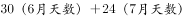，即7月24日三人相遇。

故正确答案为C。

---

### 第 4 题　qid 2388047 · 数学运算

集贸市场销售苹果5元/个和火龙果3元/个，花光61元最多可购买这两种水果共多少个？

- **A**. 13
- **B**. 16
- **C**. 18
- **D**. 19　✅

**答案**：D

**官方解析**

设买个苹果，个火龙果，则由题意可得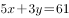。总钱数固定，若想买到水果个数最多，则尽可能多买便宜的水果，即让尽可能大，尽可能小。

当时，不为整数，排除；

当时，，满足。最大值为19。

故正确答案为D。

---

### 第 5 题　qid 2388050 · 数学运算

小贾骑行从起点出发向东骑行3公里后，折向南骑行7公里，又向东骑行5公里后，再向北骑行1公里。现在，小贾距离起点的直线距离是多少公里?

- **A**. 6
- **B**. 8
- **C**. 10　✅
- **D**. 16

**答案**：C

**官方解析**

如图AE为起点与终点之间的直线距离，直角三角形AEF中公里，公里，则根据勾股定理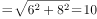公里

故正确答案为C 。

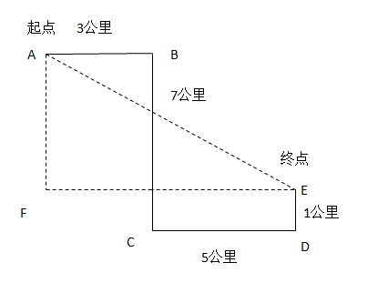

---

### 第 6 题　qid 2388057 · 数学运算

甲、乙两队单独完成某项工程分别需要10天、17天。甲队与乙队按天轮流做这项工程，甲队先做，最后是哪队第几天完工？

- **A**. 甲队第11天
- **B**. 甲队第13天　✅
- **C**. 乙队第12天
- **D**. 乙队第14天

**答案**：B

**官方解析**

根据题意，假设工程总量为17与10的最小公倍数170，则甲队每天干的量为；乙队每天干的量为，每两天完成的量为，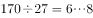，即经过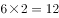天后，剩余工程量为8，由甲去完成。故最后是甲队第13天完工。

故正确答案为B。

---

### 第 7 题　qid 2388058 · 数学运算

某新建高速公路中间隔离带绿化时，顺次种植2株蜀桧、3株刺柏、5株小叶女贞、3株大叶黄杨，按此循环，第2019株树木是什么？

- **A**. 蜀桧
- **B**. 刺柏　✅
- **C**. 小叶女贞
- **D**. 大叶黄杨

**答案**：B

**官方解析**

根据题意，种植的周期数为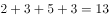，，即经过155个周期后，剩余4株，这4株中前2株为蜀桧，后2株为刺柏，故第2019株树木是刺柏。

故正确答案为B。

---

### 第 8 题　qid 2388060 · 数学运算

某班参加学科竞赛人数40人，其中参加数学竞赛的有22人，参加物理竞赛的有27人，参加化学竞赛的有25人，只参加两科竞赛的有24人，参加三科竞赛的有多少人？

- **A**. 2
- **B**. 3
- **C**. 5　✅
- **D**. 7

**答案**：C

**官方解析**

设参加三科竞赛的人数为，参加学科竞赛人数为40人，则40人当中都不参加的为0人。根据三集合非标准型公式：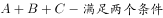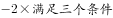，即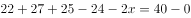，解得，故参加三科竞赛的有5人。

故正确答案为C。

---

### 第 9 题　qid 2388061 · 数学运算

小赵从家出发去单位上班要经过多条街道（如右图），假如他只能向西或向南行走，则他上班有多少种不同的走法？

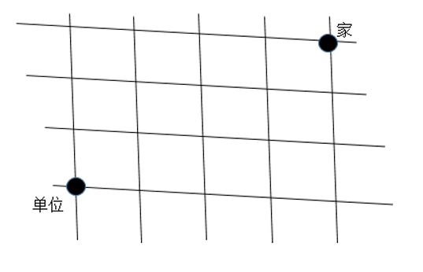

- **A**. 6
- **B**. 24
- **C**. 32
- **D**. 35　✅

**答案**：D

**官方解析**

方法一：小赵从家到单位只能向西或向南（在图中向左或向下走），可依据标1法解题，如图所示：

因此一共有35种方法可选择。

故正确答案为D。

方法二：小赵从家到单位必然要经历7条街道，由于只能向西或向南（在图中向左或向下走），所以向西（向左）需要走4条街道，向南（向下）走3条街道，只要在7条街道中选择3条向南走即可，方法数为。

故正确答案为D。

---

### 第 10 题　qid 2388063 · 数学运算

甲乙二人沿环形跑道从同一地点同时背向开始跑步，35秒后两人相遇。已知甲跑一圈需要60秒，乙跑一圈需要多少秒？

- **A**. 77
- **B**. 84　✅
- **C**. 91
- **D**. 96

**答案**：B

**官方解析**

设甲的速度为，乙的速度为，可得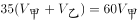，解得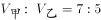，若甲乙分别单独跑一圈，路程相同，时间与速度成反比，即，所以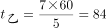秒。

故正确答案为B。

---

### 第 11 题　qid 2388116 · 数学运算

某单位需要搬家，可以使用甲、乙、丙三个搬家公司。单独完成该搬家任务，甲需要3天，乙需要4天，丙需要12天；搬家费用分别为甲1000元/天，乙850元/天，丙350元/天。要求在2天内搬完，最少需要花费多少元？（搬家不足一天按一天计算）

- **A**. 3200　✅
- **B**. 3400
- **C**. 3550
- **D**. 3700

**答案**：A

**官方解析**

根据上表分析可得，甲单独完成任务所花费的钱数最少。赋值搬家的工作总量为12份，则甲平均完成每份工作量的花费也最少，故应尽可能多用甲，其次为乙和丙。

根据题干条件计算，甲、乙、丙每天可完成的工作量应分别为4份、3份、1份。尽可能多用甲，则两天均用共完成8份任务，剩余4份由乙和丙各工作一天刚好完成。故总花费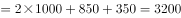元。

故正确答案为A。

---

### 第 12 题　qid 2388117 · 数学运算

某次考试小明全对的概率为，小宁全对的概率为，那么这次考试只有一人全对的概率为多少？

- **A**. 0.24
- **B**. 0.38　✅
- **C**. 0.56
- **D**. 0.94

**答案**：B

**官方解析**

只有一人全对，即要么小明全对，要么小宁全对。可分为两种情况：

（1）小明全对，小宁未全对。其概率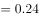；

（2）小宁全对，小明未全对。其概率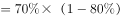；

则只有一人全对的概率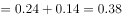。

故正确答案为B。

---

### 第 13 题　qid 2388121 · 数学运算

一个暗箱装有12个编号从1到12的乒乓球，甲、乙、丙三人轮流从暗箱中摸球，每人每次摸一个球且不放回。将所有球摸完后，三人所摸出的球上的编号之和相等，并且甲摸出了1号球和3号球，乙摸出了6号球和11号球。丙摸出的球编号最大为多少？

- **A**. 7
- **B**. 8
- **C**. 9　✅
- **D**. 10

**答案**：C

**官方解析**

球的编号为1-12，根据等差数列求和公式可得，球的编号总和。因“所有球摸完后，三人所摸出的球上的编号之和相等”，则平均每人的编号之和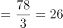。12个球，三人去摸，平均每人摸4个。其中：甲摸出了1号和3号，剩余两球编号之和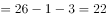，只能为10号和12号；乙摸出了6号和11号，剩余两球编号之和，故乙摸出剩余两球中的最大编号不能为9。

综上，甲必然摸走12号和10号，乙摸出11号且一定摸不出9号，故丙摸出的球编号最大应为9号。

故正确答案为C。

---

### 第 14 题　qid 2388124 · 数学运算

将1000个边长为1cm的小正方体组合成一个实心的大正方体后，将该正方体的5个面涂满色后再全部分开，那么至少有一面涂色的小正方体有多少个？

- **A**. 424　✅
- **B**. 488
- **C**. 512
- **D**. 576

**答案**：A

**官方解析**

由题干将1000个边长为1cm的小正方体组合成一个实心的大正方体，设大正方体的棱长为，根据体积不变列式，可知大正方体的棱长为10。结合题意将大正方体5个面涂色，如下图所示（右侧未涂色，其余面均涂色）：

可知有涂色的正方体分为三种情况：

①顶点正方体（图中黑色部分），位于大正方体顶点位置，每个顶点各对应一个，一共有8个；

②棱正方体（图中黄色部分），位于大正方体棱上，每条棱上8个，12条棱一共有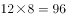个；

③面正方体（图中蓝色部分），位于大正方体每个面的面上，大正方体每个面上有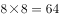个面正方体，五个面涂色一共有个。

则题目所求至少有一面涂色的小正方体共有个。

故正确答案为A。

---

### 第 15 题　qid 2388127 · 数学运算

长、宽、高分别为12cm、4cm、3cm的长方体上，有一个蚂蚁从A出发沿长方体表面爬行到获取食物，其路程最小值是多少cm？

- **A**. 
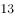

- **B**. 
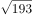
　✅
- **C**. 
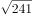

- **D**. 

**答案**：B

**官方解析**

由题干蚂蚁从A出发沿长方体表面爬行到 求 最短，画图可知，在长方体中A和不在同一平面，要求最短距离先要把A和 放在同一平面内，则把面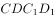翻折，形成面，再连接，根据两点之间直线最短求解。如下图：

是直角三角形的斜边，要让斜边最短，则两直角边的平方和要尽可能小。当，时，两直角边的平方和最小。

则所求最短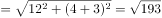。

故正确答案为B。

---

## 判断推理

### 第 1 题　qid 2387991 · 类比推理

下面三个三视图依次与三个几何体相对应，三个几何体的正确对应顺序是：

- **A**. ②①③　✅
- **B**. ②③①
- **C**. ①③②
- **D**. ③①②

**答案**：A

**官方解析**

本题考查三视图；上边的三视图分别是三个图形的主视图、俯视图和左视图。只有几何图①的视图能看到一个“凸”字形面和左右两个小矩形，所以图①对应的是第二个三视图，排除B、C；几何图②立体图上下长得一样，所以他的正视图也应该是上下长得一样，对应的应该是三视图的第一个，排除D；验证A选项，几何图③俯视图应该有一个长矩形和两个竖着的矩形，刚好对应三视图的第三个，验证没问题，A当选。
故正确答案为A。

---

### 第 2 题　qid 2387992 · 图形推理

从所给的四个选项中，选择最合适的一个填入问号处，使之符合已呈现的规律性：

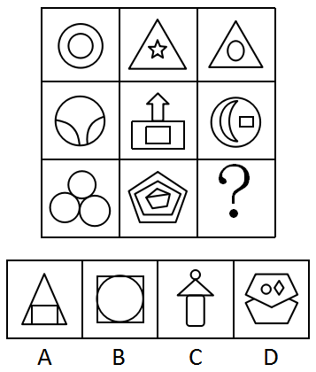

- **A**. A
- **B**. B
- **C**. C
- **D**. D　✅

**答案**：D

**官方解析**

元素组成不同，优先考虑属性规律，观察发现题干出现全直线，全曲线图形，优先考虑曲直性。第一行图中图1为全曲图形，图2全直图形，图3有曲有直；第二行图中图1为全曲图形，图2全直图形，图3有曲有直；第三行图中图1为全曲图形，图2全直图形，故“？”处应该是有曲有直，排除A选项；
再观察图形发现出现明显窟窿以及图形被分割，考虑面数量；第一行图中面数量都是2，第二行图中面数量都是3，第三行图中面数量都是4，所以“？”处面数量应该是4，只有D选项符合。
故正确答案为D。

---

### 第 3 题　qid 2387993 · 图形推理

把下面的图形分为两类，使每一类图形都有各自的共同规律或特征，分类正确的一项是：

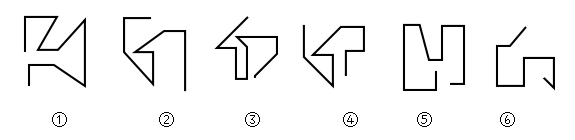

- **A**. ①②④，③⑤⑥
- **B**. ①④⑤，②③⑥
- **C**. ①③④，②⑤⑥　✅
- **D**. ①②⑥，③④⑤

**答案**：C

**官方解析**

元素组成不同，且无明显属性规律，优先考虑数量规律。图形均由直线组成，但直线数量没有规律。继续观察图形发现，图1、图3和图4的起始线和结束线为平行关系，图2、图5和图6的起始线和结束线为垂直关系。因此①③④一组，②⑤⑥一组。
故正确答案为C。

---

### 第 4 题　qid 2387994 · 图形推理

从所给的四个选项中，选择最合适的一个填入问号处，使之符合已呈现的规律性：

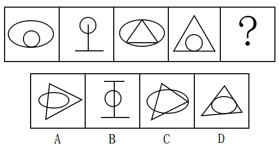

- **A**. A　✅
- **B**. B
- **C**. C
- **D**. D

**答案**：A

**官方解析**

元素组成不同，且无明显属性规律，优先考虑数量规律。选项A、B、C中线线交叉明显，故优先考虑数交点。
观察发现题干中图形交点的数量分别为1、2、3、4，呈递增规律，故？处图形应有5个交点，四个选项交点的数量分别为5、4、7、6。
故正确答案为A。

---

### 第 5 题　qid 2387995 · 图形推理

从所给的四个选项中，选择最合适的一个填入问号处，使之符合已呈现的规律性：

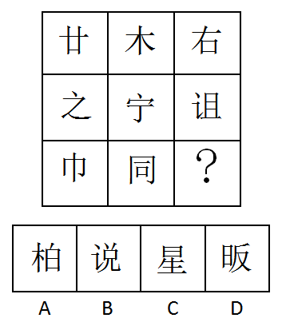

- **A**. 柏　✅
- **B**. 说
- **C**. 星
- **D**. 昄

**答案**：A

**官方解析**

解析一：图形都由汉字组成，且观察发现每行汉字都有相同部分，考虑样式遍历。第一行汉字都有“横”，第二行汉字都有“点”，第三行汉字都有“冂”，但是发现无答案。继续观察，可以在第三行汉字中找共同部分，发现都有“竖”，且需要竖线的长度相等（巾字中间的一竖和同左边的一竖长度相等），因此问号处应填入有相同长度的竖线，答案选A。
故正确答案为A。
解析二：观察图形特征，元素组成不同，且属性无明显规律，考虑数量规律。题干图形有明显窟窿，优先考虑面数量。观察发现，第一行面数量之和为2，第二行面数量之和为3，故第三行面数量之和应为4，所以“？”处应当找一个面数量为3的图形。A项2个面，B项1个面，C项2个面，D项3个面。
故正确答案为D。
注：本题为争议题，两个解析都有不严谨的地方，但是经过粉笔教研，倾向于解析一。因为从图形特征上来说，如第二行汉字都有点，其他行都没有，第三行都有“冂”，其他行都没有，更像是命题人想在汉字有相同部分这里设置考点。对于解析二，有两处不好的地方，一是九宫格每行数字运算出来是等差数列，不严谨，更多考查恒定。二是从近年汉字考面的题目来看，汉字考面一般规律会比较明显和严谨，而本题不明显。因此综合来看，答案都不是很好，对比择优，粉笔倾向选A。

---

### 第 6 题　qid 2387997 · 定义判断

对比效应是指评价一个人或一件事时，受最近接触的其他人或事的影响，导致对这个人或这件事的评价发生偏差，作出不客观的评价。
根据上述定义，下列属于对比效应的是：

- **A**. 受父亲的影响，小潘也认为家庭中就应该“男主外，女主内”
- **B**. 小张和小李同时任科长，小张认为自己靠的是能力，而小李靠的是人际关系
- **C**. 选购化妆品时，小丽因为售货员的形象一般就认为该品牌的化妆品较差，放弃购买
- **D**. 演讲比赛时，小王和小吴先后出场，如果小王表现优秀，裁判给小吴的分数会偏低　✅

**答案**：D

**官方解析**

第一步：找出定义关键词。
“评价一个人或一件事时”、“受最近接触的其他人或事的影响”、“对这个人或这件事的评价发生偏差”、“做出不客观的评价”。
第二步：逐一分析选项。
A项：受父亲的影响，小潘认为家庭中应该“男主外，女主内”，不符合“受最近接触的其他人或事的影响”，也不符合“对这个人或这件事的评价发生偏差”，不符合定义，排除； 
B项：小张和小李同时任科长，小张认为自己靠的是能力，而小李靠的是人际关系，不符合“受最近接触的其他人或事的影响”，也不符合“对这个人或这件事的评价发生偏差”，不符合定义，排除；
C项：选购化妆品不符合“评价一个人或一件事”，不符合定义，排除；
D项：演讲比赛时，裁判评价小王和小吴的表现，符合“评价一个人或一件事”， 小王和小吴先后出场，如果小王表现优秀，裁判给小吴的分数会偏低符合“受最近接触的其他人或事的影响”、“对这个人或这件事的评价发生偏差”、“做出不客观的评价”，符合定义，当选。
故正确答案为D。

---

### 第 7 题　qid 2387998 · 定义判断

网络暴力是一种危害严重、影响恶劣的暴力形式，它是在网络上发表具有伤害性、侮辱性和煽动性的言语、图片、视频的行为。
根据上述定义，下列不属于网络暴力的是：

- **A**. 某影视网站发布大量充满暴力和血腥场景的视频　✅
- **B**. 小刘给身材消瘦的同学小马起绰号“竹竿”，并在班级微信群里用“竹竿”称呼小马
- **C**. 小王追求某女生被拒，便用该女生头像P裸体图片发在微信朋友圈，被同学们转发
- **D**. 小柯因乱丢垃圾与宾馆服务员发生口角的视频被发到网上，网友对小柯进行“人肉搜索”，并将其个人隐私公布于网络

**答案**：A

**官方解析**

第一步：找出定义关键词。
“一种危害严重、影响恶劣的暴力形式”、“在网络上发表具有伤害性、侮辱性和煽动性的言语、图片、视频的行为”。
第二步：逐一分析选项。
A项：影视网站发布大量充满暴力和血腥场景的视频，此类视频可能是影视创作中的画面，也可能是真实存在的犯罪行为，但选项未对此进行明确说明，因此不确定是否符合“在网络上发表具有伤害性、侮辱性和煽动性的言语、图片、视频的行为”，不符合定义，当选； 
B项：小刘给小马起绰号为“竹竿”，这一称呼带有侮辱性、伤害性，并在班级群内称呼小马为“竹竿”，这一做法带有煽动性，符合“在网络上发表具有伤害性、侮辱性和煽动性的言语、图片、视频的行为”，符合定义，排除；
C项：小王用该女生头像P裸体图片发在微信朋友圈，符合“在网络上发表具有伤害性、侮辱性和煽动性的言语、图片、视频的行为”，符合定义，排除；
D项：发生口角的视频被发到网上，网友对小柯进行“人肉搜索”，并将个人隐私公布于网络，符合“在网络上发表具有伤害性、侮辱性和煽动性的言语、图片、视频的行为”，符合定义，排除。
本题为选非题，故正确答案为A。

---

### 第 8 题　qid 2387999 · 定义判断

让渡资产使用权是指资产的所有者将资产的使用权暂时转移给他人，以取得相关收益，但不转移资产所有权的行为。
根据上述定义，下列不属于让渡资产使用权的是：

- **A**. 
某家政公司以每月每平米30元的价格承包某写字楼的保洁
　✅
- **B**. 
某城市商业银行向某公司以的年利率发放2亿元的贷款

- **C**. 
某高校将闲置的办公楼以每年50万元的价格出租给某职业技能培训学校

- **D**. 
某企业以每年五千万的价格利用自主研发的操作系统负责某市的智慧城市建设

**答案**：A

**官方解析**

第一步：找出定义关键词。

“资产的所有者将资产的使用权暂时转移给他人”、“以取得相关收益，但不转移资产所有权的行为”。

第二步：逐一分析选项。

A项：家政公司承包某写字楼的保洁工作，是通过劳务来获得收入，不符合“资产的所有者将资产的使用权暂时转移给他人”，“以取得相关收益，但不转移资产所有权的行为”，不符合定义，当选；

B项：商业银行向某企业发放2亿元贷款，符合“资产的所有者将资产的使用权暂时转移给他人”，收取的年利率，符合“以取得相关收益，但不转移资产所有权的行为”，符合定义，排除；

C项：高校将闲置的办公楼出租给某职业技能学校，符合“资产的所有者将资产的使用权暂时转移给他人”， 每年收取50万的租金，符合“以取得相关收益，但不转移资产所有权的行为”，符合定义，排除；

D项：企业利用自主研发的操作系统负责智慧城市建设，符合“资产的所有者将资产的使用权暂时转移给他人”，每年五千万的价格，符合“以取得相关收益，但不转移资产所有权的行为”，符合定义，排除。

本题为选非题，故正确答案为A。

---

### 第 9 题　qid 2388001 · 定义判断

口红效应是指在经济危机时消费者更愿意购买相对廉价的非必需品。经济不景气时，口红的销量反而会直线上升，这是因为在不景气的情况下，人们仍然会有强烈的消费欲望，而口红作为一种“廉价的非必需之物”，可以对消费者起到一定的“安慰”作用。
根据上述定义，下列符合口红效应的是：

- **A**. 张三现在收入很高，但生活简朴的他还是喜欢购买100元左右的衣服
- **B**. 李四近半年基本没有收入，但他用父母的积蓄购买了一辆35万元的轿车
- **C**. 王五还房贷压力很大，单位食堂饭菜价格较高，他经常到路边摊吃10元的盒饭
- **D**. 赵六最近业绩不好，收入较低，为释放压力，每周六晚上都喝50元1瓶的白酒半斤　✅

**答案**：D

**官方解析**

第一步：找出定义关键词。
“在经济危机时”、“消费者更愿意购买相对廉价的非必需品”。
第二步：逐一分析选项。
A项：张三现在收入很高，不符合“在经济危机时”，不符合定义，排除；
B项：李四近半年基本没有收入，符合“在经济危机时”，他用父母的积蓄购买35万元的轿车，不符合“消费者更愿意购买相对廉价的非必需品”，不符合定义，排除；
C项：王五还房贷压力很大，符合“在经济危机时”，他经常到路边摊吃10元的盒饭是在购买必需品，不符合“消费者更愿意购买相对廉价的非必需品”，不符合定义，排除；
D项：赵六最近业绩不好，收入较低，符合“在经济危机时”，他每周六晚上都喝50元1瓶的白酒半斤，符合“消费者更愿意购买相对廉价的非必需品”，符合定义，当选。
故正确答案为D。

---

### 第 10 题　qid 2388002 · 定义判断

“鱼缸法则”是指成长需要自由的空间，要使人成长的更快，就一定要给他活动的自由，而不是将他拘泥在一个小小的鱼缸中。
根据上述定义，下列符合“鱼缸法则”的是：

- **A**. 为吸引优秀人才，河北省持续实施“英才入冀”计划
- **B**. 国际贸易专业的小邓为拓展知识面，经常旁听汉语言文学的课程
- **C**. 某市委组织部选派一批85后优秀年轻干部担任常务副县长，让他们勇挑重担　✅
- **D**. 小欧本可以留在上海，但父母以需要陪伴为名，让小欧回到县城工作

**答案**：C

**官方解析**

第一步：找出定义关键词。
“成长需要自由的空间”、“使人成长的更快”、“要给他活动的自由”、“不是将他拘泥在一个小小的鱼缸中”。 
第二步：逐一分析选项。
A项：为吸引优秀人才，河北省持续实施“英才入冀”计划，“英才入冀”计划目的是吸引人才，不符合“成长需要自由的空间”、“使人成长的更快”、“要给他活动的自由”，不符合定义，排除； 
B项：小邓为拓展知识面，经常旁听汉语言文学的课程，只说明小邓热爱学习，并没有体现谁给小邓提供更多自由，不符合定义，排除；
C项：某市委组织部选派一批85后优秀年轻干部担任常务副县长，让他们勇挑重担，是给这些年轻的干部更多的工作空间，符合定义，当选；
D项：小欧本可以留在上海，但父母以需要陪伴为名，让小欧回到县城工作，是限制了他的自由，不符合 “要给他活动的自由”，不符合定义，排除。
故正确答案为C。

---

### 第 11 题　qid 2388003 · 定义判断

动物权利论认为动物与人类有平等的权利地位，两者有相同的心理特质——需求、记忆、智力等等。因此，所有动物都与人类一样享有平等的权利，这些权利是不应该被人类剥夺的。
根据上述定义，下列符合动物权利论的是：

- **A**. 老夏经常购买鸡胗喂养小区里的流浪猫
- **B**. 李大娘从来不给自家圈养的猪喂剩饭剩菜
- **C**. 老周认为把鸡关在笼子里大面积集中饲养是不人道的行为　✅
- **D**. 老赵认为杀牛之前应先用高压电将牛瞬间电死，以减轻牛的痛苦

**答案**：C

**官方解析**

第一步：找出定义关键词。
“所有动物都与人类一样享有平等的权利”、“这些权利是不应该被人类剥夺的”。
第二步：逐一分析选项。
A项：老夏经常购买鸡胗喂养小区里的流浪猫，购买鸡胗有虐杀鸡的行为，不符合“所有动物都与人类一样享有平等的权利”，不符合定义，排除； 
B项：李大娘从来不给自家圈养的猪喂剩饭剩菜，并没有体现“所有动物都与人类一样享有平等的权利”，不符合定义，排除；
C项：老周认为把鸡关在笼子里大面积集中饲养是不人道的行为，体现了“所有动物都与人类一样享有平等的权利”，符合定义，当选；
D项：老赵认为杀牛之前应先用高压电将牛瞬间电死，以减轻牛的痛苦，不符合“所有动物都与人类一样享有平等的权利”，不符合定义，排除。
故正确答案为C。

---

### 第 12 题　qid 2388004 · 定义判断

正态分布需求曲线，中间突起的部分是“头”，两边相对平缓的部分叫“尾”，集中在“头”部的是大多数需求，分布在“尾”部的是个性化、小量的需求。长尾效应是指将所有分布在“尾”部的市场累加起来就会形成一个比“头”部市场还大的市场，强调“个性化”和“小利润大市场”，即只赚每个人很少的钱，但要赚很多人的钱。
根据上述定义，下列属于长尾效应的是：

- **A**. 很多人不会挑选礼物，小任创办了一个挑选礼物的网站，根据不同客户的要求挑选相应的礼物，每单收取5元服务费。半年后，每月收益超十万元　✅
- **B**. 年轻人网购潮愈演愈烈，老赵的服装店生意日渐萧条，转行经营生鲜产品超市。半年后，每月利润超过原来服装店
- **C**. 小高2010年开了一家网店，主要销售运动鞋，2017年开始帮朋友销售山区物美价廉的土特产，2018年土特产的销售额超过运动鞋
- **D**. 小翟经营一家美术培训学校，生源充足，半年前应广大家长的要求，新增少儿英语培训，目前英语培训收入超过了美术

**答案**：A

**官方解析**

第一步：找出定义关键词。
“将所有分布在‘尾’部的市场累加起来就会形成一个比‘头’部市场还大的市场，强调‘个性化’和‘小利润大市场’”、“只赚每个人很少的钱，但要赚很多人的钱”。
第二步：逐一分析选项。
A项：小任根据用户需求挑选礼物，每单收取5元服务费。半年后，每月收益超十万元，符合“只赚每个人很少的钱，但要赚很多人的钱”，符合定义，当选；
B项：老赵的服装店生意萧条，转行经营生鲜，每月利润超过原来服装店，不符合“只赚每个人很少的钱，但要赚很多人的钱”，不符合定义，排除；
C项：小高销售运动鞋，帮朋友销售土特产，土特产的销售额超过运动鞋，不符合“只赚每个人很少的钱，但要赚很多人的钱”，不符合定义，排除；
D项：小翟应广大家长的要求，新增少儿英语培训，目前英语培训收入超过了美术，不符合“只赚每个人很少的钱，但要赚很多人的钱”，不符合定义，排除。
故正确答案为A。

---

### 第 13 题　qid 2388010 · 定义判断

角色紧张是指某人因为接受外界提出的不同要求而产生的冲突，导致自己承受巨大的心理压力。
根据上述定义，下列属于角色紧张的是：

- **A**. 五年级学生小芳期末考试成绩很差，她的父母相互指责对方没有尽职尽责，吵得不可开交。第二天冷静下来后，小芳的父母都觉得孩子成绩不好，责任主要在自己
- **B**. 某研究所崔研究员获得了一项汽车核心技术专利，某知名汽车厂商欲高薪聘请，而研究所领导许诺为他建设国家级重点实验室，让他陷入深深的纠结之中　✅
- **C**. 老颜老来得子，对孩子百依百顺，结果孩子长大后骄横跋扈，一事无成，这让老颜懊悔不已
- **D**. 老梁得知监察机关正在对自己所犯错误进行调查，到监察机关投案自首，主动交代所犯错误后，感觉压在胸口的石头终于消失了

**答案**：B

**官方解析**

第一步：找出定义关键词。
“接受外界提出的不同要求而产生的冲突，导致自己承受巨大的心理压力”。
第二步：逐一分析选项。
A项：小芳成绩差，父母相互指责吵架，第二天又觉得责任在自己，不符合“接受外界提出的不同要求而产生的冲突，导致自己承受巨大的心理压力”，不符合定义，排除； 
B项：崔研究员获得专利，某知名汽车厂商的高薪聘请和研究所领导许诺的国家级重点实验室，符合“接受外界提出的不同要求而产生的冲突”、让他陷入深深的纠结之中，符合“自己承受巨大的心理压力”，符合定义，当选； 
C项：老颜老来得子，对孩子百依百顺，孩子长大后骄横跋扈，令老颜懊悔不已，不符合“接受外界提出的不同要求而产生的冲突，导致自己承受巨大的心理压力”，不符合定义，排除；
D项：老梁到监察机关投案自首，主动交代所犯错误后，感觉压在胸口的石头终于消失了，不符合“接受外界提出的不同要求而产生的冲突，导致自己承受巨大的心理压力”，不符合定义，排除。
故正确答案为B。

---

### 第 14 题　qid 2388017 · 定义判断

健康传播是一种将医学研究成果转化为大众的健康知识，并通过大众生活态度和行为方式的改变来降低患病率和死亡率，有效提高一个社区或国家生活质量和健康水准的行为。
根据上述定义，下列不属于健康传播的是：

- **A**. 某高中举办预防春季传染病讲座
- **B**. 某小区进行小儿手足口病防治宣传
- **C**. 某省级电视台播出预防白内障的药品广告
- **D**. 某医院举办心脑血管疾病治疗技术学术会议　✅

**答案**：D

**官方解析**

第一步：找出定义关键词。
“将医学研究成果转化为大众的健康知识”、“通过大众生活态度和行为方式的改变来降低患病率和死亡率”。
第二步：逐一分析选项。
A项：某高中举办预防春季传染病讲座符合“将医学研究成果转化为大众的健康知识”、“通过大众生活态度和行为方式的改变来降低患病率和死亡率”，符合定义，排除； 
B项：某小区进行小儿手足口病防治宣传符合“将医学研究成果转化为大众的健康知识”、“通过大众生活态度和行为方式的改变来降低患病率和死亡率”，符合定义，排除；
C项：某省级电视台播出预防白内障的药品广告符合“将医学研究成果转化为大众的健康知识”、“通过大众生活态度和行为方式的改变来降低患病率和死亡率”，符合定义，排除；
D项：某医院举办治疗技术学术会议不符合“将医学研究成果转化为大众的健康知识”，不符合定义，当选。
本题为选非题，故正确答案为D。

---

### 第 15 题　qid 2388024 · 定义判断

“饥饿营销”是指商品提供者有意调低产量，以期达到调控供求关系、制造供不应求“假象”、维持商品较高售价和利润率的目的。饥饿营销比较适合一些单价较高、不容易形成单个商品重复购买的行业。
根据上述定义，下列属于饥饿营销的是：

- **A**. 某矿泉水公司宣称，由于产品供不应求，每瓶售价从2元提高到3元
- **B**. 某户外用品公司向灾区捐赠了十万顶帐篷，提高了该公司的声誉，帐篷销量大增，供不应求
- **C**. 某厂家推出新款汽车，售价高达百万元，消费者疯狂抢购，但厂家宣称由于配件所限无法扩大生产规模，只能限量销售　✅
- **D**. 近期某品牌进口轮胎滞销，经销商主动减少进口量，调高售价，销售额未出现明显下滑

**答案**：C

**官方解析**

第一步：找出定义关键词。
“商品提供者有意调低产量”、“制造供不应求“假象””、“维持商品较高售价和利润率”、“单价较高、不容易形成单个商品重复购买的行业”。
第二步：逐一分析选项。
A项：矿泉水公司将每瓶矿泉水售价从2元提高到3元，不符合“单价较高、不容易形成单个商品重复购买的行业”，不符合定义，排除； 
B项：某户外用品公司帐篷销量大增，供不应求是因为捐赠善举，不符合“有意调低产量”、“单价较高、不容易形成单个商品重复购买的行业”，不符合定义，排除；
C项：厂家新款汽车的售价高达百万元符合“单价较高、不容易形成单个商品重复购买的行业”，符合定义，当选；
D项：某品牌进口轮胎滞销，不符合“商品提供者有意调低产量”、“制造供不应求“假象””“单价较高、不容易形成单个商品重复购买的行业”，不符合定义，排除。
故正确答案为C。

---

### 第 16 题　qid 2388035 · 类比推理

网上购物：现金

- **A**. 高速铁路：钢铁
- **B**. 网络歌曲：光盘　✅
- **C**. 电子政务：公文
- **D**. 电脑游戏：软件

**答案**：B

**官方解析**

第一步：判断题干词语间逻辑关系。
网上购物不需要现金，网上购物是将现金电子化，即二者是前者可以将后者电子化的对应关系。
第二步：判断选项词语间逻辑关系。
A项：钢铁是高速铁路修建的原材料，与题干逻辑关系不一致，排除；
B项：网络歌曲不需要光盘，网络歌曲是将光盘里面的歌曲电子化，二者是前者可以将后者电子化的对应关系，与题干逻辑关系一致，当选；
C项：电子政务是指国家机关在政务活动中应用电子技术办公的模式，而公文也可以通过电子版本的形式呈现，电子政务可以用到公文写作上，与题干逻辑关系不一致，排除；
D项：软件是电脑游戏的载体，与题干逻辑关系不一致，排除。
故正确答案为B。

---

### 第 17 题　qid 2388041 · 类比推理

打印机：扫描仪：外部设备

- **A**. 鲸鱼：鲨鱼：鱼类
- **B**. 火车：动车：列车
- **C**. 阴天：下雨：天气
- **D**. 茄子：茼蒿：蔬菜　✅

**答案**：D

**官方解析**

第一步：判断题干词语间逻辑关系。
打印机和扫描仪分别是两种办公设备，二者为并列关系；打印机和扫描仪都是一种外部设备，是包容关系中的种属关系。
第二步：判断选项词语间逻辑关系。
A项：鲸鱼和鲨鱼为两种不同的生物，二者为并列关系；鲸鱼是一种哺乳类动物，不属于鱼类，与题干逻辑关系不一致，排除；
B项：动车是一种火车，二者为包容关系中的种属关系，与题干逻辑关系不一致，排除；
C项：阴天的时候可以下雨，也可以不下雨；下雨的时候可以是阴天，也可以是晴天，二者是交叉关系，与题干逻辑关系不一致，排除；
D项：茄子和茼蒿为两种不同的蔬菜，二者为并列关系；茄子和茼蒿均为蔬菜，是包容关系中的种属关系，与题干逻辑关系一致，当选。
故正确答案为D。

---

### 第 18 题　qid 2388043 · 类比推理

法律法规：起草：颁布

- **A**. 新闻稿件：采访：选题
- **B**. 购销合同：签订：履行　✅
- **C**. 自由恋爱：结婚：生子
- **D**. 学历学位：硕士：博士

**答案**：B

**官方解析**

第一步：判断题干词语间逻辑关系。
法律法规的出台需要先起草后颁布，且后两词存在时间先后顺序的对应关系。
第二步：判断选项词语间逻辑关系。
A项：新闻稿件的制作需要先选题后采访，后两词时间顺序反了，与题干逻辑关系不一致，排除；
B项：购销合同的实现需要先签订后履行，且后两词存在时间先后顺序的对应关系，与题干逻辑关系一致，当选；
C项：自由恋爱是指未婚的男女双方当事人不受他人干涉指使和威胁等，从相见到相识，并产生好感，发展到恋爱关系，而自由恋爱的实现与结婚、生子无必然关系，与题干逻辑关系不一致，排除；
D项：学历学位包括硕士、博士，后两词与第一词构成种属关系，与题干逻辑关系不一致，排除。
故正确答案为B。

---

### 第 19 题　qid 2388046 · 类比推理

猎豹：猫科：动物

- **A**. 西裤：裤子：服装　✅
- **B**. 细菌：病毒：微生物
- **C**. 玛瑙：石头：宝石
- **D**. 助教：讲师：副教授

**答案**：A

**官方解析**

第一步：判断题干词语间逻辑关系。
猫科一般指猫科动物，而猎豹是猫科动物的一种，猎豹是动物的一种，且猫科动物是动物的一种，三词之间两两构成种属关系。
第二步：判断选项词语间逻辑关系。
A项：西裤是裤子的一种，西裤是服装的一种，且裤子是服装的一种，三词之间两两构成种属关系，与题干逻辑关系一致，当选；
B项：细菌是由细胞构成的，病毒是由DNA或RNA的一个分子构成的，细菌和病毒是两种不同的有机体，属于不同的微生物，前两词构成并列关系，与第三词构成种属关系，与题干逻辑关系不一致，排除；
C项：玛瑙是石头的一种，玛瑙是宝石的一种，均构成种属关系，但宝石是石头的一种，与题干顺序相反，与题干逻辑关系不一致，排除；
D项：助教、讲师、副教授分别是大学教师的不同职称，三词之间构成并列关系，与题干逻辑关系不一致 ，排除。
故正确答案为A。

---

### 第 20 题　qid 2388049 · 类比推理

发动机：汽车

- **A**. 墨汁：毛笔
- **B**. 月光：天空
- **C**. 帆船：大海
- **D**. 翅膀：蝴蝶　✅

**答案**：D

**官方解析**

第一步：判断题干词语间逻辑关系。
发动机是汽车的组成部分，二者为组成关系。
第二步：判断选项词语间逻辑关系。
A项：墨汁不是毛笔的组成部分，与题干逻辑关系不一致，排除；
B项：月光不是天空的组成部分，与题干逻辑关系不一致，排除；
C项：帆船不是大海的组成部分，与题干逻辑关系不一致，排除；
D项：翅膀是蝴蝶的组成部分，二者为组成关系，与题干逻辑关系一致，当选。
故正确答案为D。

---

### 第 21 题　qid 2388051 · 类比推理

语言：交流

- **A**. 颜料：绘画　✅
- **B**. 衣服：装饰
- **C**. 电视：电影
- **D**. 玫瑰：爱情

**答案**：A

**官方解析**

第一步：判断题干词语间逻辑关系。
语言的功能主要是用来交流的，二者是功能的对应关系。
第二步：判断选项词语间逻辑关系。
A项：颜料的功能主要是用来绘画的，与题干逻辑关系一致，当选；
B项：衣服的功能主要是蔽体、遮羞，次要功能才是装饰，与题干逻辑关系不一致，排除；
C项：电视不是用来电影的，而是看电影，与题干逻辑关系不一致，排除；
D项：玫瑰象征爱情，二者是象征关系，与题干逻辑关系不一致，排除。
故正确答案为A。

---

### 第 22 题　qid 2388053 · 类比推理

如履薄冰：谨慎

- **A**. 集腋成裘：节俭
- **B**. 卧薪尝胆：坚持
- **C**. 一尘不染：干净　✅
- **D**. 经天纬地：高度

**答案**：C

**官方解析**

第一步：判断题干词语间逻辑关系。
如履薄冰是指像走在薄冰上一样，和谨慎是近义关系。
第二步：判断选项词语间逻辑关系。
A项：集腋成裘指狐狸腋下的皮毛虽小，但聚集起来就能制成皮衣，比喻积少成多，和节俭无关，与题干逻辑关系不一致，排除；
B项：卧薪尝胆比喻刻苦自励、发愤图强，和坚持无关，与题干逻辑关系不一致，排除；
C项：一尘不染形容环境非常清洁或物体非常干净，和干净是近义关系，与题干逻辑关系一致，当选；
D项：经天纬地形容有治理天下才能的经世之才，和高度无关，与题干逻辑关系不一致，排除。
故正确答案为C。

---

### 第 23 题　qid 2388055 · 类比推理

鸡蛋：蛋糕

- **A**. 铅芯：铅笔
- **B**. 水泥：水泥路
- **C**. 鞋子：鞋带
- **D**. 榆钱：榆钱饼　✅

**答案**：D

**官方解析**

第一步：判断题干词语间逻辑关系。
鸡蛋是蛋糕的原材料，且蛋糕属于食物范畴。
第二步：判断选项词语间逻辑关系。
A项：铅笔包含铅芯，二者是组成关系，与题干逻辑关系不一致，排除；
B项：水泥是水泥路的原材料，但水泥路不是食物范畴，与题干逻辑关系不一致，排除；
C项：鞋子可能包含鞋带，二者是组成关系，与题干逻辑关系不一致，排除；
D项：榆钱是榆钱饼的原材料，且榆钱饼属于食物范畴， 与题干逻辑关系一致，当选。
故正确答案为D。

---

### 第 24 题　qid 2387996 · 类比推理

（    ）对于 小说 相当于（    ）对于 软件

- **A**. 诗歌  硬件
- **B**. 作家  工程师　✅
- **C**. 创作  应用
- **D**. 素材  计算机

**答案**：B

**官方解析**

逐一代入选项。
A项：诗歌和小说都是一种文学体裁，为并列关系中的反对关系，软件和硬件为并列关系中的矛盾关系，前后逻辑关系不一致，排除；
B项：作家创作小说，工程师编写软件，均为对应关系，前后逻辑关系一致，当选；
C项：创作小说为动宾关系，应用软件可以理解为动宾关系，也可以理解为我们日常手机中使用的软件，应用软件是和系统软件相对应的，是用户可以使用的各种程序设计语言，以及用各种程序设计语言编制的应用程序的集合，此种理解下前后逻辑关系不一致，排除；
D项：写小说需要素材，使用计算机需要软件，均为对应关系，但是词语顺序错误，排除。
故正确答案为B。

---

### 第 25 题　qid 2388000 · 类比推理

清洁工 对于（    ）相当于 医生 对于（    ）

- **A**. 马路  医院
- **B**. 清扫车  手术台
- **C**. 保洁  治病　✅
- **D**. 工作服  听诊器

**答案**：C

**官方解析**

逐一代入选项。
A项：清洁工清扫马路，马路是清洁工清洁的对象，也可以说清洁工可能在马路上工作，为工作场所的对应关系，但医生的工作地点是医院，不能看成工作的对象是医院，前后逻辑关系不一致，排除；
B项：清扫车是清洁工工作使用的一个工具，为人物与工具的对应关系，手术台是医生工作的一个地点，为人物与地点的对应关系，前后逻辑关系不一致，排除；
C项：清洁工的职责是保洁，医生的职责是治病，二者均为功能对应，前后逻辑关系一致，当选；
D项：清洁工工作时穿清洁服，为人物与服装的对应关系，医生工作时使用听诊器，为人物与工具的对应关系，前后逻辑关系不一致，排除。
故正确答案为C。

---

### 第 26 题　qid 2388005 · 逻辑判断

对某市第二中学初中部学生的调查发现，拥有数学学习机人数最多的班也是数学成绩最好的班。因此，利用数学学习机可以提高数学成绩。
以下哪项如果为真，最能加强上述结论？

- **A**. 拥有数学学习机的学生学习数学的积极性和主动性明显提高
- **B**. 拥有数学学习机人数最多的班也是最会利用数学学习机的班
- **C**. 随着数学学习机性能的不断改善，对提高学生数学成绩的作用越来越明显
- **D**. 拥有数学学习机人数最多的班里的同学，更多地利用数学学习机学习数学　✅

**答案**：D

**官方解析**

第一步：找出论点和论据。
论点：利用数学学习机可以提高数学成绩。
论据：拥有数学学习机人数最多的班也是数学成绩最好的班。
本题论点在说利用数学学习机可以提高数学成绩，论据在说拥有数学学习机人数多的班数学成绩好，“拥有”和“使用”不是同一件事，话题不完全一致，若要加强优先考虑搭桥，即拥有的人会使用。
第二步：逐一分析选项。 
A项：论点说的是利用数学学习机可以提高数学成绩，该项说的是拥有数学学习机的学生学习数学的积极性和主动性明显提高，数学成绩是否提高不知道，属于不明确项，无法加强，排除；
B项：论点说的是利用数学学习机可以提高数学成绩，该项说的是拥有数学学习机人数最多的班也是最会利用数学学习机的班，在“拥有”数学学习机与“利用”数学学习机之间建立联系，搭桥项，保留；
C项：该项说的是数学学习机性能的改善，对提高学生数学成绩的作用越来越明显，是补充论据，有一定的加强作用，保留；
D项：该项在“拥有”数学学习机和“利用”数学学习机之间建立关系，即在论点和论据之间进行搭桥，保留。
比较C、D两项，C项是补充论据支持，D项是搭桥，因此D项的加强力度优于C项。
比较B、D两项，B项说的是“班”，而D项说的是“同学”，论点中利用数学学习机来提高数学成绩的是使用数学学习机的人，D项比B项搭桥更有针对性，且B项“最会使用”指会用，而D项“更多地利用”指常用，二者比较，后者更可能是提高成绩的关键，因此D项优于B项。
故正确答案为D。

---

### 第 27 题　qid 2388006 · 逻辑判断

某村庄南北两块小麦地里，南面的地施用了生物复合肥，北面的地则没有。收割完小麦测算后发现，南面的地亩产450公斤，北面的地亩产200公斤。由此可见，施用生物复合肥是南北两块地小麦亩产差异较大的原因。
以下哪项如果为真，最能削弱上述结论？

- **A**. 南北两块小麦地均由老杨管理
- **B**. 南北两块小麦地的土壤质量不同　✅
- **C**. 村南小麦地里施用的生物复合肥已过保质期
- **D**. 村西的小麦地里也施用了该生物复合肥，亩产只有230公斤

**答案**：B

**官方解析**

第一步：找出论点和论据。
论点：施用生物复合肥是南北两块小麦地亩产差异较大的原因。
论据：某村庄南北两块小麦地里，南面的地施用了生物复合肥，北面的地则没有。收割完小麦测算后发现，南面的地亩产450公斤，北面的地亩产200公斤。
本题论点论据话题一致，考虑削弱论点，论点包含因果关系，除了直接削弱论点还有可能考查他因削弱。
第二步：逐一分析选项。
A项：该项说的是南北两块小麦地均由老杨管理，属于在对比试验中控制变量，具有加强作用，无法削弱，排除；
B项：该项说的是南北两块小麦地的土壤质量不同，提出另外一个因素即土壤质量不同，可能是这个因素导致南北两块小麦地亩产差异较大，属于他因削弱，当选；
C项：该项说的是村南小麦地里施用的生物复合肥已过保质期，但是过期不代表一定没有效果，过期后能不能提高产量造成较大差异不知道，属于不明确选项，无法削弱，排除； 
D项：该项说的是村西的小麦地里也施用了该生物复合肥，亩产只有230公斤，题干论点探讨的是南北两块地的亩产差异，话题不一致，无法削弱，排除。
故正确答案为B。

---

### 第 28 题　qid 2388007 · 逻辑判断

只要抢救及时并且方法得当，这头大象就不会死亡，但目前这头大象死亡了。
根据以上论述，下列哪项一定为真？

- **A**. 对这头大象的抢救不及时，但方法得当
- **B**. 对这头大象的抢救很及时，但方法不得当
- **C**. 如果对这头大象的抢救是及时的，那么大象死亡的原因肯定是方法不得当　✅
- **D**. 如果这头大象的死因是抢救不及时，那么方法不得当就不会是大象的死因

**答案**：C

**官方解析**

第一步：翻译题干。

（1）抢救及时且方法得当  大象死亡；

（2）大象死了。

条件（2）是对条件（1）的否后，根据逆否等价可得（抢救及时且方法得当），即抢救及时或方法得当。

第二步：逐一分析选项。

A项：翻译为抢救及时且方法得当，为或关系的三种情况之一，并非一定为真，无法推出，排除；

B项：翻译为抢救及时且方法得当，为或关系的三种情况之一，并非一定为真，无法推出，排除；

C项：翻译为抢救及时方法得当，根据或关系的否一推一，可以推出，当选；

D项：翻译为抢救及时方法得当，是对或关系其中一项的肯定，并非一定为真，无法推出，排除。

故正确答案为C。

---

### 第 29 题　qid 2388008 · 逻辑判断

今年4月18日，某城市日报刊发消息称，目前大部分西红柿使用催熟剂，而过量使用催熟剂会给人体带来较大危害。该消息刊发后，对该城市消费者产生的影响极其有限，几乎没有消费者想改变购买西红柿的习惯。但到了五月中旬，该城市生鲜食品超市的西红柿销量大幅度下降了。
以下哪项如果为真，能最好地解释上述现象？

- **A**. 4月25日，该城市的电视台也播出了这则消息
- **B**. 5月份时，很多消费者选择在家门口的菜摊上购买西红柿
- **C**. 5月份时，大部分生鲜食品超市为树立自身良好形象，不再销售西红柿　✅
- **D**. 该城市周边的菜农们认为这条消息会使西红柿的销量大幅度萎缩，主动降低了产量

**答案**：C

**官方解析**

第一步：找出题干矛盾。
该消息刊发后，几乎没有消费者想改变购买西红柿的习惯。但到了五月中旬，该城市生鲜食品超市的西红柿销量大幅度下降了。
第二步：逐一分析选项。
A项：该项只是介绍了另外的一种宣传方式，且时间在5月之前，无法解释为何“五月中旬，该城市生鲜食品超市的西红柿销量大幅度下降了”，不能解释题干矛盾，排除；
B项：该项表明消费者可以在家门口购买西红柿，可以解释“五月中旬，该城市生鲜食品超市的西红柿销量大幅度下降了”，但是无法解释“该消息刊发后，几乎没有消费者想改变购买西红柿的习惯”，不能解释题干矛盾，排除；
C项：该项表明在5月份里，超市主动不再销售西红柿，可以解释为何消费者消费习惯几乎不变，但是“五月中旬，该城市生鲜食品超市的西红柿销量大幅度下降了”，可以解释题干矛盾，当选；
D项：该项只是说明菜农们降低产量，无法解释为何“五月中旬，该城市生鲜食品超市的西红柿销量大幅度下降了”，不能解释题干矛盾，排除。
故正确答案为C。

---

### 第 30 题　qid 2388009 · 逻辑判断

今年“五一”期间，某品牌服装店进行促销活动，根据顾客身份证上的出生年份打折，如1986年出生的，打86折，1999年及以后出生的统一打99折。该活动由于宣传到位，备货充足，顾客盈门，“五一”假期销售额同比增长。该服装店老板认为此次促销活动非常成功。

以下哪项如果为真，最能反驳该服装店老板的结论？

- **A**. 
1986年到1996年出生的顾客占比超过

- **B**. 
今年“五一”假期全国服装销售额同比增长

- **C**. 
今年“五一”假期比去年多一天，消费者有更多的购物时间

- **D**. 
另一个街区该品牌服装店没有促销活动，“五一”假期销售额也增长了
　✅

**答案**：D

**官方解析**

第一步：找出论点和论据。

论点：此次促销活动非常成功。

论据：该活动由于宣传到位，备货充足，顾客盈门，“五一”假期销售额同比增长。

本题的论点是此次促销活动很成功，论据是“五一”销售额同比增长了，论点论据话题不一致，可以进行拆桥，拆开二者的关系，说明销售额的增长不代表促销活动是成功的。 

第二步：逐一分析选项。

A项：只说明1986-1996这十年出生的顾客所占的比重大，但是和促销活动是否成功没有关系，无法削弱，排除；

B项：今年“五一”假期全国服装销售额同比增长，说的是全国的服装销售状况，而题干讨论的是某家服装店的销售情况，话题不一致，而且也不明确全国高增长服装店有没有做活动，是否成功，无法削弱，排除；

C项：今年五一期间消费者的购物时间比去年多一天，虽然购物时间延长可能会带来销售额的增长，但是增长多少并没有说明，所以不明确此次活动是否成功，无法削弱，排除；

D项：另一个街区该品牌店没有促销活动，但“五一”假期销售额也增长了，说明是否举办促销活动可能对销售额的增长没有影响，因此，销售额增长不代表促销活动是成功有效的，拆开论点论据之间的关系，可以削弱，当选。

故正确答案为D。

---

### 第 31 题　qid 2388020 · 逻辑判断

甲、乙、丙、丁四人的生活水平一共有三种：富裕、小康、贫困。甲和丁的生活水平一样，乙和丙的生活水平不是小康。
根据以上条件，以下哪项不可能为真？

- **A**. 甲是富裕　✅
- **B**. 乙是贫困
- **C**. 乙是富裕
- **D**. 丁是小康

**答案**：A

**官方解析**

第一步：分析题干。
（1）甲、乙、丙、丁四人生活水平一共有三种：富裕、小康、贫困
（2）甲和丁的生活水平一样
（3）乙和丙的生活水平不是小康
第二步：根据题干条件分析选项。
根据（3）可知小康水平只能是甲或丁，根据（2）可知二者生活水平一样，所以二者都是小康水平，因此A项甲是富裕不可能为真。
本题为选非题，故正确答案为A。

---

### 第 32 题　qid 2388023 · 逻辑判断

近三年来，某市文化产业的年利润基本稳定在两亿元左右。据估算，扣除物价上涨因素，未来几年利润总额不会随着新的文化产业场所的出现而扩大。因此，随着电影院数量的增多，KTV的收入会随之减少。
以下哪项如果为真，能对上述论证提出最大质疑？

- **A**. 电影院数量虽然逐渐增长，但其数量仍少于KTV
- **B**. 由于电影院的增多，人们花在电影院和KTV以外文化场所的消费明显减少　✅
- **C**. 大部分KTV为适应新形势，重新进行装潢，树立新形象并提高服务质量
- **D**. 电影院的人均消费高于KTV，而且大部分人认为电影院的环境不太好，缺乏吸引力

**答案**：B

**官方解析**

第一步：找出论点和论据。

论点：随着电影院数量的增多，KTV的收入会随之减少。

论据：据估算，扣除物价上涨因素，未来几年利润总额不会随着新的文化产业场所的出现而扩大。

本题论点论据说的都是文化产业场所的数量和收入的问题，话题一致，因此可优先考虑否定论点，即说明即使电影院数量增多，KTV收入也不会减少。

第二步：逐一分析选项。

A项：该项说的是电影院数量比KTV数量少，论点讨论的是随着电影院数量增多，KTV的收入是否会减少，场所数量和收入之间无必然联系，话题不一致，无法削弱，排除；

B项：论点为电影院数量的增多会导致KTV的收入随之减少，因为利润总额基本不变，要削弱这个论证，只要指出虽然总利润基本不变，KTV收入并不会少即可，该项说明人们用于文化场所的消费明显减少，所以KTV的收入不会减少，可以削弱，当选；

C项：该项说的是KTV树立新形象且提高服务质量，论点讨论的是KTV的收入，服务提高不代表收入一定提高，话题不一致，无法削弱，排除；

D项：该项明确说明大部分人认为电影院环境不太好，缺乏吸引力，因此就不喜欢去，但KTV的收入增多还是减少不确定，无法削弱，排除。

故正确答案为B。

备注：经过粉笔教研发现，本题的出题思路来源于MBA和GCT考试中，如下图所示，MBA和GCT考试题答案给到的是D项，这里应该是一样的答案设置，也就是上题的B项， 2019年河北这道题确实模仿得不够严谨，不严谨的题在我们的备考阶段不作为考试重点，我们简单了解思路即可。

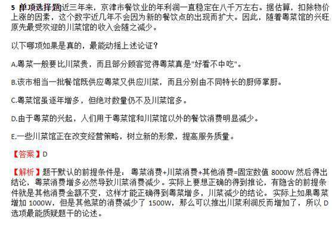

---

### 第 33 题　qid 2388029 · 逻辑判断

如果狗患有行为焦虑症，则狗血液里镁离子的含量要高于正常狗。通过口服一种名叫因菲他命的药物，可以有效清除狗血液里的镁离子。因此，口服因菲他命可以用来治疗狗的行为焦虑症。
上述论证基于以下哪项假设？

- **A**. 正常狗的血液里没有镁离子
- **B**. 口服因菲他命对狗不会产生任何副作用
- **C**. 患行为焦虑症不同阶段的狗需要口服不同剂量的因菲他命
- **D**. 行为焦虑症不会使患病狗的血液里产生比正常狗更多的镁离子　✅

**答案**：D

**官方解析**

第一步：找出论点和论据。
论点：口服因菲他命可以用来治疗狗的行为焦虑症。
论据：如果狗患有行为焦虑症，则狗血液里镁离子的含量要高于正常狗。通过口服一种名叫因菲他命的药物，可以有效清除狗血液里的镁离子。
论点讨论的是口服因菲他命可治疗狗的行为焦虑症，论据说的是口服因菲他命可清除狗血液里的镁离子，而镁离子与焦虑症有关，所以话题一致，结合提问“假设”，考虑必要条件。
第二步：逐一分析选项。
A项：正常狗的血液里是否有镁离子，与口服因菲他命是否可以治疗狗的行为焦虑症无关，不是论证成立的假设，排除；
B项：口服因菲他命是否产生副作用，与口服因菲他命是否能治疗狗的行为焦虑症无关，不是论证成立的假设，排除；
C项：患行为焦虑症不同阶段的狗要口服不同剂量的因菲他命，但是否能够用来治疗狗的行为焦虑症不清楚，不是论证成立的假设，排除；
D项：如果焦虑症导致镁离子增多，那即使减少镁离子也不能治疗焦虑症，该项是论证成立的前提，当选。
故正确答案为D。

---

### 第 34 题　qid 2388031 · 逻辑判断

所有的艺术家都懂音乐，有些懂音乐的写诗歌，你不写诗歌，所以你不是艺术家。
以下哪项的推理结构与上述推理的形式最为类似？

- **A**. 所有的羊都吃草，有些吃草的吃田螺，牛不吃田螺，所以牛不是羊　✅
- **B**. 所有工业设计专业的学生都会画图，有些会画图的爱好书法，小明不会画图，所以小明不是工业设计的学生
- **C**. 所有的教授都承担过国家级课题，有些承担国家级课题的是名教授，老范是普通教授，所以老范没承担过国家级课题
- **D**. 所有的女士都爱美，有些爱美的还喜欢健身，小丽不喜欢健身，所以小丽不是爱美的女士

**答案**：A

**官方解析**

第一步：翻译题干。

题干的逻辑形式为：A→B，有些B→C，D→C，所以D→A。

第二步：逐一分析选项。

A项：A→B，有些B→C，D→C，所以D→A，与题干逻辑形式一致，当选；

B项：A→B，有些B→C，D→B，所以D→A，与题干逻辑形式不一致，排除；

C项：A→B，有些B→C，D→C，所以D→B，与题干逻辑形式不一致，排除；

D项：A→B，有些B→C，D→C，所以D→B，与题干逻辑形式不一致，排除。

故正确答案为A。

---

### 第 35 题　qid 2388037 · 逻辑判断

最近，某市城管局整理档案资料时，发现了马六的两份资料，且两份资料中的马六是同一个人。第一份资料的落款时间是1992年8月28日，是马六占道经营被处罚的记录。第二份资料是马六宣称他已经断断续续占道经营10年的声明，没有落款时间。
根据以上叙述，可以推出的是：

- **A**. 马六因为占道经营经常被处罚
- **B**. 第二份资料的时间早于第一份资料
- **C**. 第二份资料的书写时间早于2005年　✅
- **D**. 马六在1982年9月份左右开始占道经营

**答案**：C

**官方解析**

日常结论题，根据题干信息逐一分析选项。
A项：该项说马六经常因占道经营被处罚，而题干只在第一份资料中提到了一次处罚，故不能体现经常这样的频率，无中生有，排除；
B项：题干中第二份资料没有落款时间，同时也无法得知其具体时间，故无法得知两份资料的时间先后，无法推出，排除；
C项：由第一份资料可知马六最晚在1992年就开始占道经营，又从第二份资料知道他已经占道经营10年时间，那么第二份资料最晚是在2002年写下的，可以得到其书写早于2005年，可以推出，当选；
D项：根据两份资料只能得出马六最晚在1992年开始占道经营，但不能推出具体在哪一年开始占道经营，无法推出，排除。
故正确答案为C。

---

## 资料分析

### 材料 1

2018年末，河北省电话用户总数8865.6万户，其中移动电话用户8195.6万户。

#### 第 1 题　qid 2388027 · 增长

与2015年相比，2018年固定互联网宽带接入用户约增长了：

- **A**. 

　✅
- **B**. 
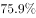

- **C**. 

- **D**. 

**答案**：A

**官方解析**

根据题干“与2015年相比···约增长了”结合选项有，可判定本题为一般增长率的计算问题。定位统计图可知，固定互联网宽带接入用户数：2018年为2159.8万户，2015年为1226.5万户。由，则与2015年相比，2018年固定互联网宽带接入用户增长率。

备注：本题A、B两项差距极小，若分母截三位易错选为B，建议分母截四位或精算。

故正确答案为A。

---

#### 第 2 题　qid 2388030 · 增长

与2017年相比，2018年移动电话用户净增数比固定互联网宽带用户净增数多多少万户？

- **A**. 364.1　✅
- **B**. 486.7
- **C**. 526.8
- **D**. 531.0

**答案**：A

**官方解析**

根据题干“与2017年相比，2018年···多多少万户”可判定本题为增长量的计算问题。定位统计图数据可得：移动电话用户数，2018年为8195.6万户，2017年为7581.8万户，则2018年移动电话用户净增数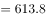万户；固定互联网宽带用户数，2018年为2159.8万户，2017年为1910.1万户，则2018年固定互联网宽带用户净增数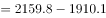万户。则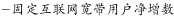万户。

备注：本题考场可列综合算式，根据尾数为1选择A项。

故正确答案为A。

---

#### 第 3 题　qid 2388032 · 增长

2015～2018年固定互联网宽带接入用户增长率超过的年份有多少个？

- **A**. 1
- **B**. 2
- **C**. 3　✅
- **D**. 4

**答案**：C

**官方解析**

根据题干“2015～2018年···增长率超过···”可判定本题为增长率的比较问题。定位统计图，固定互联网宽带接入用户数（万户），2014～2018年分别为：1127.6、1226.5、1612、1910.1、2159.8，根据，可得：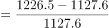，不满足；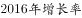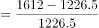，满足；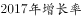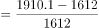，满足；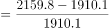，满足；则2015～2018年固定互联网宽带接入用户增长率超过的年份有3个。

故正确答案为C。

---

#### 第 4 题　qid 2388036 · 增长

2015～2018年，移动电话用户增速最快的年份是：

- **A**. 2015年
- **B**. 2016年　✅
- **C**. 2017年
- **D**. 2018年

**答案**：B

**官方解析**

由题干“2015～2018年···增速最快的年份是”，判定本题为一般增长率比较问题。定位柱状图可知2014～2018年移动电话年末用户数据，根据：，可得：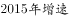，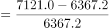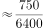，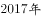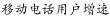，。可见，增速最快的为2016年。

故正确答案为B。

---

#### 第 5 题　qid 2388039 · 综合

能够从上述资料中推出的是：

- **A**. 
2015～2018年移动电话用户年净增数逐年增加

- **B**. 
2015～2018年固定互联网宽带接入用户年净增数逐年增加

- **C**. 
2015～2018年中移动电话用户数量增速超过的年份有两个 

- **D**. 
2015～2018年移动电话用户数量同固定互联网宽带接入用户数量之比逐年降低
　✅

**答案**：D

**官方解析**

A项：定位柱状图可得， 2016年移动电话用户年净增数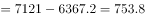万户，2017年移动电话用户年净增数万户，，并非逐年增加，错误；

B项：定位柱状图可得， 2016年固定互联网宽带接入用户年净增数万户，2017年固定互联网宽带接入用户年净增数万户，，并非逐年增加，错误；

C项：根据第114题计算结果，只有2016年移动电话用户数量增速超过，错误；

D项：定位柱状图可得，2015～2018年各年移动电话用户数量及固定互联网宽带接入用户数量，2015～2018年所求比例分别为：2015年，2016年，2017年，2018年，即比例逐年降低，正确。

故正确答案为D。

---

### 材料 2

        2019年1-2月份，全国规模以上工业企业实现利润总额7080.1亿元，同比下降。

        1-2月份，部分行业利润情况如下：专用设备制造业利润总额同比增长，电气机械和器材制造业增长，电力、热力生产和供应业增长，非金属矿物制品业增长，通用设备制造业增长，汽车制造业下降，化学原料和化学制品制造业下降，煤炭开采和洗选业下降，纺织业下降，石油和天然气开采业下降，农副食品加工业下降。

        1-2月份，规模以上工业企业实现营业收入14.8万亿元，同比增长；发生营业成本12.5万亿元，增长。

        2月末，规模以上工业企业资产总计109.7万亿元，同比增长；负债合计62.4万亿元，增长；所有者权益合计47.3万亿元，增长；资产负债率为，同比降低0.2个百分点。

        1-2月份，规模以上工业企业每百元营业收入中的成本为84.21元，同比增加0.52元；每百元营业收入中的费用为9.12元，同比增加0.29元。

        2月末，规模以上工业企业每百元资产实现的营业收入为80.9元，同比减少2.4元；人均营业收入为119.4万元，同比增加7.6万元；产成品存货周转天数为19.3天，同比增加0.4天；应收票据及应收账款平均回收期为57.5天，同比增加4.6天。

#### 第 6 题　qid 2388015 · 综合

2018年1-2月，规模以上工业企业实现利润总额约为多少亿元？

- **A**. 6210.6
- **B**. 7312.8
- **C**. 8232.7　✅
- **D**. 9012.6

**答案**：C

**官方解析**

根据题干“2018年1-2月，规模以上工业企业实现利润总额约为多少亿元”，结合材料时间为2019年1-2月，可判定本题为基期计算问题。定位文字材料第一段：“2019年1-2月份，全国规模以上工业企业实现利润总额7080.1亿元，同比下降”。根据公式：。

故正确答案为C。

---

#### 第 7 题　qid 2388022 · 比重

2019年1-2月规模以上工业企业中，股份制企业实现利润所占份额约为多少？

- **A**. 

- **B**. 

　✅
- **C**. 

- **D**. 

**答案**：B

**官方解析**

根据题干“2019年1-2月规模以上工业企业中，股份制企业实现利润所占份额”，可判定此题为现期比重问题。定位统计表，全国规模以上工业企业实现利润总额为7080.1亿元；股份制企业实现利润总额为4936.9亿元。可知，股份制企业所占利润份额。

故正确答案为B。

---

#### 第 8 题　qid 2388026 · 综合

2019年1-2月，采矿业营业收入利润率约为多少？

- **A**. 

　✅
- **B**. 

- **C**. 

- **D**. 

**答案**：A

**官方解析**

根据题干“2019年1-2月，采矿业营业收入利润率约为多少”，，可判定本题为现期比重问题。定位统计表，采矿业营业收入为6308.4亿元；利润总额为701.5亿元。可知，。

故正确答案为A。

---

#### 第 9 题　qid 2388028 · 增长

2019年1-2月，规模以上工业企业中行业利润总额同比增长幅度从高到低，以下排列正确的是：

- **A**. 非金属矿物制品业  通用设备制造业  纺织业  农副食品加工业
- **B**. 通用设备制造业 农副食品加工业  汽车制造业  煤炭开采和洗选业
- **C**. 专用设备制造业  农副食品加工业  纺织业  非金属矿物制品业
- **D**. 专用设备制造业  非金属矿物制品业  石油和天然气开采业  纺织业　✅

**答案**：D

**官方解析**

根据文字材料第二段，可得：纺织业增长率农副食品加工业增长率，A项错误，排除；汽车制造业增长率煤炭开采和洗选业，B项错误，排除；纺织业增长率非金属矿物制品业增长率，C项错误，排除；专用设备制造业增长率非金属矿物制品业增长率石油和天然气开采业增长率 纺织业增长率，D项正确。

故正确答案为D。

---

#### 第 10 题　qid 2388033 · 综合

能够从以上资料中推出的是：

- **A**. 
2018年2月末，规模以上工业企业资产负债率为

- **B**. 
2019年2月，采矿业利润总额高于电力、热力、燃气及水生产和供应业

- **C**. 
2018年2月末，规模以上工业企业每百元资产实现的营业收入为83.3元
　✅
- **D**. 
2019年1-2月，规模以上工业企业利润总额中国有控股企业所占份额超过

**答案**：C

**官方解析**

A项：定位文字材料第四段，“2月末，规模以上工业企业资产···资产负债率为，同比降低0.2个百分点。”，可知2018年2月末，规模以上工业企业资产负债率为，错误； 

B项：定位表格材料，可知2019年1-2月份，采矿业和电力、热力、燃气及水生产和供应业利润总额，但没有2月份相关数据，故无法推断2019年2月，采矿业利润总额是否高于电力、热力、燃气及水生产和供应业，错误；

C项：定位文字材料第六段，“2月末，规模以上工业企业每百元资产实现的营业收入为80.9元，同比减少2.4元”，可知2018年2月末，规模以上工业企业每百元资产实现的营业收入为，正确；

D项：定位文字材料第一段及表格材料，“2019年1-2月份，全国规模以上工业企业实现利润总额7080.1亿元；国有控股企业利润总额2223.7亿元”，可知2019年1-2月，规模以上工业企业利润总额中国有控股企业所占份额为，小于，错误。

故正确答案为C。

---

### 材料 3

根据以下资料，回答下列问题。

        2019年一季度，社会消费品零售总额97790亿元，同比名义增长（扣除价格因素实际增长，以下除特殊说明外均为名义增长）。其中，3月份社会消费品零售总额31726亿元，同比增长。

        按经营单位所在地分，一季度城镇消费品零售额83402亿元，同比增长；乡村消费品零售额14388亿元，增长。其中，3月份城镇消费品零售额27192亿元，同比增长；乡村消费品零售额4534亿元，增长。

        按消费类型分，一季度餐饮收入10644亿元，同比增长；商品零售87146亿元，增长。其中，3月份餐饮收入3393亿元，同比增长；商品零售28333亿元，增长。

        按零售业态分，一季度限额以上零售业单位中的超市、百货店、专业店零售额同比分别增长、、，专卖店同比下降。

        一季度，全国网上零售额22379亿元，同比增长。其中，实物商品网上零售额17772亿元，增长，占社会消费品零售总额的比重为；在实物商品网上零售额中，吃、穿和用类商品分别增长、和。

#### 第 11 题　qid 2388066 · 综合

按照2018年一季度价格计算2019年一季度社会消费品零售总额约为多少亿元？

- **A**. 85065
- **B**. 96526　✅
- **C**. 99283
- **D**. 114000

**答案**：B

**官方解析**

根据题干所求“按照2018年一季度价格计算2019年一季度社会消费品零售总额约为”，可判定本题为现期计算问题，定位文字资料第一段可得“2019年一季度，社会消费品零售总额97790亿元，同比名义增长（扣除价格因素实际增长，以下除特殊说明外均为名义增长）”，所以2018年社会消费品零售总额为。“按照2018年一季度价格计算”，即扣除2019年的价格因素造成的增长，也就是按照2018年实际的增长率来计算，故2019年社会消费品零售总额为，与B选项最接近。

故正确答案为B。

---

#### 第 12 题　qid 2388067 · 增长

下列月份中，社会消费品零售总额同比增长速度最快的是：

- **A**. 2018年4月　✅
- **B**. 2018年6月
- **C**. 2018年9月
- **D**. 2018年11月

**答案**：A

**官方解析**

根据题干所求“······增长速度最快的是”，可判定本题为增长率比较问题。定位折线图，2018年4月、6月、9月、11月的增长率分别是：、、、，因此增长速度最快的是2018年4月的 。

故正确答案为A。

---

#### 第 13 题　qid 2388068 · 倍数

2019年3月，城镇消费品零售额比乡村消费品零售额多几倍？

- **A**. 3.8
- **B**. 4.8
- **C**. 5.0　✅
- **D**. 6.0

**答案**：C

**官方解析**

根据题干所求“2019年3月···多几倍”，可判定本题为现期倍数问题，定位文字材料第二段， 3月份城镇消费品零售额27192亿元，乡村消费品零售额4534亿元，故城镇消费品零售额比乡村消费品零售额多的倍数为：，答案与C项最接近。

故正确答案为C。

---

#### 第 14 题　qid 2388069 · 综合

2018年1-3月，限额以上单位烟酒类、日用品类、中西药品类及通讯器材类零售总额最高的是：

- **A**. 烟酒类
- **B**. 日用品类
- **C**. 中西药品类　✅
- **D**. 通讯器材类

**答案**：C

**官方解析**

根据题干所求“2018年1-3月···零售总额最高”，结合材料时间为2019年，可判定本题为基期量比较问题。定位表格，根据 ，故限额以上单位烟酒类、日用品类、中西药品类、通讯器材类零售总额分别为： 、 、 、 ；因此最大的为中西药品类。

故正确答案为C。

---

#### 第 15 题　qid 2388070 · 综合

根据以上资料，下列说法不正确的是：

- **A**. 
2019年3月，限额以上单位文化办公用品类零售额同比下降

- **B**. 
2019年一季度，实物商品网上零售额同比增长超过

- **C**. 
2019年1-2月，限额以上单位金银珠宝类零售额同比增加

- **D**. 
2019年一季度，限额以上零售业单位中百货店与专卖店零售额同比增长速度相同
　✅

**答案**：D

**官方解析**

A项：定位表格数据可知，2019年3月，限额以上单位文化办公用品类零售额同比增长率为，同比下降，正确；

B项：定位表格数据可知，实物商品网上零售额同比增长超过了，正确；

C项：定位表格数据可知，2019年1-3月份和3月份限额以上单位金银珠宝类零售额增长率的数据分别是、；，则1-3月份的增长率为1-2月份与3月份混合后的增长率，根据混合增长率口诀“混合居中”，且，可知 ，即，1-2月份的增长率为正即同比增加，正确；

D项：定位第四段文字材料可知，2019年一季度，限额以上零售业单位中百货店与专卖店零售额同比增长分别为、，不相同，错误。

本题为选非题，故正确答案为D。

---

### 材料 4

        2019年1-2月份，全国固定资产投资（不含农户）44849亿元，同比增长，增速比2018年全年提高0.2个百分点。其中，民间固定资产投资26963亿元，同比增长。分产业看，第一产业投资950亿元，同比增长，增速比2018年全年回落9.2个百分点；第二产业投资13864亿元，增长，增速回落0.7个百分点；第三产业投资30035亿元，增长，增速提高1个百分点。

        2019年1-3月份，全国固定资产投资（不含农户）101872亿元，同比增长，增速比去年同期回落1.2个百分点。其中，民间固定资产投资61492亿元，同比增长。

        分产业看，第一产业投资2408亿元，同比增长，增速比1-2月份回落0.7个百分点；第二产业投资33224亿元，增长，增速回落1.3个百分点；第三产业投资66240亿元，增长，增速提高1个百分点。

        第二产业中，工业投资同比增长，增速比1-2月份回落1.4个百分点；其中，采矿业投资增长，增速回落26.6个百分点；制造业投资增长，增速回落1.3个百分点；电力、热力、燃气及水生产和供应业投资增长，1-2月份为下降。

        第三产业中，基础设施投资（不含电力、热力、燃气及水生产和供应业）同比增长，增速比1-2月份提高0.1个百分点。其中，水利管理业投资下降，降幅扩大3.7个百分点；公共设施管理业投资下降，降幅收窄2.3个百分点；道路运输业投资增长，增速回落2.5个百分点；铁路运输业投资增长，增速回落11.5个百分点。

        分地区看，东部地区投资同比增长，增速比1-2月份提高1个百分点；中部地区投资增长，增速提高0.2个百分点；西部地区投资增长，增速提高0.2个百分点；东北地区投资增长，增速回落2.8个百分点。

        分登记注册类型看，内资企业投资同比增长，增速与1-2月份持平；港澳台商投资增长，增速提高2.8个百分点；外商投资增长，增速提高5.3个百分点。

#### 第 16 题　qid 2388237 · 综合

2018年1-2月，全国固定资产投资（不含农户）约为多少万亿元？

- **A**. 2.51
- **B**. 3.87
- **C**. 4.23　✅
- **D**. 4.79

**答案**：C

**官方解析**

根据题干“2018年1-2月···约为多少万亿元”，结合材料时间为2019年，可判定本题为基期计算问题。定位文字材料第一段可得：“2019年1-2月份，全国固定资产投资（不含农户）44849亿元，同比增长。”根据公式：，故2018年1-2月，万亿元，与C项最接近。

故正确答案为C。

---

#### 第 17 题　qid 2388238 · 比重

2019年1-2月，全国固定资产投资（不含农户）中第三产业投资所占比重约为多少？

- **A**. 

　✅
- **B**. 

- **C**. 

- **D**. 

**答案**：A

**官方解析**

根据题干“2019年1-2月···第三产业投资所占比重约为···”，结合材料时间为2019年，可判定本题为现期比重问题。定位文字材料第一段可得：“2019年1-2月份，全国固定资产投资（不含农户）44849亿元···第三产业投资30035亿元···”故。

故正确答案为A。

---

#### 第 18 题　qid 2388239 · 综合

2019年3月民间固定资产投资额约为多少亿元？

- **A**. 19360
- **B**. 34529　✅
- **C**. 36205
- **D**. 57022

**答案**：B

**官方解析**

定位文字材料第一段可得：“2019年1-2月份···其中，民间固定资产投资26963亿元，同比增长···”定位文字材料第二段可得：“2019年1-3月份···其中，民间固定资产投资61492亿元，同比增长。”故2019年3月民间固定资产投资额=2019年1-3月份民间固定资产投资额-2019年1-2月份民间固定资产投资额亿元。

故正确答案为B。

---

#### 第 19 题　qid 2388240 · 增长

2019年1-2月，分地区看，投资同比增速最快的地区是哪个？

- **A**. 东部地区
- **B**. 中部地区　✅
- **C**. 西部地区
- **D**. 东北地区

**答案**：B

**官方解析**

定位文字材料第六段“东部地区投资同比增长，增速比1-2月份提高1个百分点；中部地区投资增长，增速提高0.2个百分点；西部地区投资增长，增速提高0.2个百分点；东北地区投资增长，增速回落2.8个百分点”，可得2019年1—2月，东部地区同比增速为，中部地区同比增速为，西部地区同比增速为，东北地区同比增速为，所以投资同比增速最快的地区是中部地区。

故正确答案为B。

---

#### 第 20 题　qid 2388241 · 综合

根据以上资料，下列说法中不正确的是：

- **A**. 
2018年，第一产业固定资产投资增长

- **B**. 
2019年1-3月，采矿业投资比道路运输业基础设施投资增速快

- **C**. 
2019年1-3月，分产业看，第三产业投资同比增速最快

- **D**. 
2019年1-2月，从登记注册类型看，外商投资同比增速最快
　✅

**答案**：D

**官方解析**

A项：定位文字材料第一段“2019年1-2月份······第一产业投资950亿元，同比增长，增速比2018年全年回落9.2个百分点”，可得2018年全年第一产业固定资产投资增长，正确；

B项：定位文字材料第四段“2019年1—3月采矿业投资增长”，定位文字材料第五段“2019年1-3月道路运输业基础设施投资增长”，比较可知采矿业投资比道路运输业基础设施投资增速快，正确；

C项：定位文字材料第三段“2019年1—3月份，第一产业投资同比增长，第二产业投资增长，第三产业投资66240亿元，增长”，比较可知第三产业投资同比增速最快，正确；

D项：定位文字材料最后一段“2019年1—3月份，分登记注册类型看，内资企业投资同比增长，增速与1-2月份持平；港澳台商投资增长，增速提高2.8个百分点；外商投资增长，增速提高5.3个百分点”，可得2019年1—2月内资企业同比增长，港澳台同比增长，外商同比增长，比较可得内资企业同比增长最快，而非外商投资，错误。

本题为选非题，故正确答案为D。

---
