# 2019年浙江省公务员录用考试《行测》题（B类）（网友回忆版）

> 省考 · 2019 年 · 6 个模块 · 共 130 题

- [政治理论](#%E6%94%BF%E6%B2%BB%E7%90%86%E8%AE%BA) · 2 题
- [常识判断](#%E5%B8%B8%E8%AF%86%E5%88%A4%E6%96%AD) · 18 题
- [言语理解与表达](#%E8%A8%80%E8%AF%AD%E7%90%86%E8%A7%A3%E4%B8%8E%E8%A1%A8%E8%BE%BE) · 35 题
- [数量关系](#%E6%95%B0%E9%87%8F%E5%85%B3%E7%B3%BB) · 25 题
- [判断推理](#%E5%88%A4%E6%96%AD%E6%8E%A8%E7%90%86) · 35 题
- [资料分析](#%E8%B5%84%E6%96%99%E5%88%86%E6%9E%90) · 15 题

---

## 政治理论

### 第 1 题　qid 2387631 · 新思想

2018年12月18日，习近平总书记在庆祝改革开放40周年大会上的讲话中指出了中国共产党作出实行改革开放的历史性决策的“四个基于”，下列不属于“四个基于”内容的是：

- **A**. 基于对党和国家前途命运的深刻把握
- **B**. 基于对人民群众期盼和需要的深刻体悟
- **C**. 基于对现代化经济体系建设的深刻思考　✅
- **D**. 基于对社会主义革命和建设实践的深刻总结

**答案**：C

**官方解析**

本题主要考查政治常识。
2018年12月18日，习近平总书记在庆祝改革开放40周年大会上的讲话指出，我们党作出实行改革开放的历史性决策，是基于对党和国家前途命运的深刻把握，是基于对社会主义革命和建设实践的深刻总结，是基于对时代潮流的深刻洞察，是基于对人民群众期盼和需要的深刻体悟。因此“基于对现代化经济体系建设的深刻思考”不属于“四个基于”的内容。
本题为选非题，故正确答案为C。

---

### 第 2 题　qid 2387632 · 新思想

下列关于习近平新时代中国特色社会主义思想的说法错误的是：

- **A**. 中国特色社会主义最本质的特征是中国共产党领导
- **B**. 全面深化改革总目标是实现社会主义现代化和中华民族伟大复兴　✅
- **C**. 全面推进依法治国总目标是建设中国特色社会主义法治体系、建设社会主义法治国家
- **D**. 新时代我国社会主要矛盾是人民日益增长的美好生活需要和不平衡不充分的发展之间的矛盾

**答案**：B

**官方解析**

本题主要考查政治常识。
A项正确，十三届全国人大一次会议表决通过的宪法修正案第36条，将“中国共产党领导是中国特色社会主义最本质的特征”增写入宪法第一条第二款。“中国特色社会主义最本质的特征是中国共产党领导”，是习近平新时代中国特色社会主义思想的一个重要论断，深刻揭示了中国共产党领导与中国特色社会主义之间内在的统一性。
B项错误，习近平总书记在党的十九大报告中指出，“新时代中国特色社会主义思想，明确坚持和发展中国特色社会主义，总任务是实现社会主义现代化和中华民族伟大复兴”。而全面深化改革的总目标是完善和发展中国特色社会主义制度，推进国家治理体系和治理能力现代化。对应错误。
C项正确，党的十八届四中全会通过的《中共中央关于全面推进依法治国若干重大问题的决定》明确提出全面推进依法治国的总目标，即建设中国特色社会主义法治体系，建设社会主义法治国家。
D项正确，社会主义初级阶段主要矛盾于1981年中国共产党第十一届六中全会指出：在社会主义初级阶段，我国社会的主要矛盾是人民日益增长的物质文化需要同落后的社会生产之间的矛盾。2017年10月18日，习近平同志在十九大报告中强调，中国特色社会主义进入新时代，我国社会主要矛盾已经转化为人民日益增长的美好生活需要和不平衡不充分的发展之间的矛盾。
本题为选非题，故正确答案为B。

---

## 常识判断

### 第 1 题　qid 2387634 · 科技常识

宋朝科学家沈括的《梦溪笔谈》中描述了一种化石燃料，“颇似淳漆，燃之如麻，但烟甚浓，所沾帷幕皆黑”，并预言“此物必大行于世”。关于该化石燃料，下列说法正确的是：

- **A**. 是全球使用量最高的化石燃料　✅
- **B**. 是由有机物和无机物组成的混合物
- **C**. 其主要成分是结构最简单的有机物
- **D**. 在我国化石能源利用中占主导地位

**答案**：A

**官方解析**

本题考查科技常识。
“颇似淳漆，然之如麻（然通燃），但烟甚浓，所沾帷幕皆黑”描述的化石燃料是石油。
A项正确，石油是一种全球使用量最高的化石燃料，耗尽的时间比其他化石燃料长。
B项错误，石油主要是由碳、氢元素组成的多种有机物的混合物 。
C项错误，结构最简单的有机物是甲烷。天然气的主要成分是甲烷。
D项错误，煤炭在我国化石能源利用中占主导地位。
故正确答案为A。

---

### 第 2 题　qid 2387636 · 人文常识

关于天文知识，下列说法错误的是：

- **A**. 天狼星是夜空中最亮的恒星
- **B**. 月球围绕地球自东向西呈顺时针方向旋转　✅
- **C**. 《观沧海》中“星汉灿烂，若出其里”的“星汉”指银河
- **D**. 彗星远离太阳时体积很小，接近太阳时体积变得巨大

**答案**：B

**官方解析**

本题考查地理国情常识。

A项正确，天狼星属大犬座中的一颗一等星，根据巴耶恒星命名法的名称为大犬座星。在中国属于二十八星宿的井宿。天狼星是夜空里最亮的恒星。

B项错误，月球围绕地球自西向东呈逆时针方向旋转。

C项正确，《观沧海》是曹操的作品。“星汉灿烂，若出其里”的意思是：“银河里的灿烂群星，也好像是从大海的怀抱里涌现出来的。”因此，“星汉”指的是银河。

D项正确，彗星没有固定的体积，它在远离太阳时，体积很小；接近太阳时，彗发变得越来越大，彗尾变长，体积变得十分巨大。

本题为选非题，故正确答案为B。

---

### 第 3 题　qid 2387637 · 人文常识

关于电学常识，下列说法错误的是：

- **A**. 两个绝缘体摩擦可能产生静电
- **B**. 不能随意使用铜丝、铁丝代替保险丝
- **C**. 磁悬浮列车利用了电流的磁效应原理
- **D**. 测电笔在正确操作时，检测零线氖管会发光　✅

**答案**：D

**官方解析**

本题考查科技常识。
A项正确，摩擦起电本质是电子的转移。不同绝缘体吸引电子的能力有强弱之分，摩擦时吸引电子能力弱的物质中的电子转移到吸引电子能力强的物质上，由于电子带负电，故后者物质带负电，前者带正电。所以两个绝缘体摩擦可能产生静电。
B项正确，保险丝一般用电阻率较大、熔点较低的铅锑合金制成。铜丝或铁丝的电阻小、熔点高，在电流过大时，产生的热量不容易达到熔点，因此不会熔断，起不到保险的作用。故不能随意用铜丝、铁丝代替保险丝。
C项正确，磁悬浮列车主要由悬浮系统、推进系统和导向系统三大部分组成。磁悬浮列车的运行涉及到三个物理原理：第一个是当靠近金属的磁场改变，金属上的电子会移动，并产生电流。第二个是电流的磁效应，当电流在电线或一块金属中流动时，会产生磁场，通电的线圈就成了一块磁铁。磁浮的第三个原理是磁铁间会彼此作用，同极性相斥，异极性相吸。
D项错误，测电笔是用来判别火线与零线的工具，它由笔尖金属体、电阻、氖管、弹簧和笔尾金属体等组成。使用时，将笔尖接触火线，手接触笔尾的金属体（注意：千万不能用手接触笔尖金属体），氖管便发红光；若笔尖接触的是零线，氖管便不发光。
本题为选非题，故正确答案为D。

---

### 第 4 题　qid 2387647 · 科技常识

半导体在我们的日常生活中有着广泛应用，下列关于半导体的说法正确的是：

- **A**. 麦克斯韦首次发现了半导体现象
- **B**. 所有半导体材料都属于金属化合物
- **C**. 温度升高，半导体的电阻会随之变高
- **D**. LED灯利用半导体将电能转化为光能　✅

**答案**：D

**官方解析**

本题考查科技常识。半导体是指常温下导电性能介于导体和绝缘体之间的物体。
A项错误，法拉第最先发现硫化银的电阻随着温度的变化情况不同于一般金属。一般情况下，金属的电阻随温度升高而增加，但法拉第发现硫化银材料的电阻是随着温度的上升而降低，这是半导体现象的首次发现。麦克斯韦，著名的物理学家，预言了电磁波的存在。
B项错误，半导体材料很多，按化学成分可分为元素半导体和化合物半导体两大类。锗和硅是最常用的元素半导体。
C项错误，一般情况下，金属的电阻随温度升高而增加，但是温度升高，半导体的电阻会随之降低，导电率升高。
D项正确，LED灯即半导体发光二极管，是一种能够将电能转化为可见光的固态的半导体器件，它可以直接把电能转化为光能。
故正确答案为D。

---

### 第 5 题　qid 2387651 · 人文常识

下列关于声音的说法错误的是：

- **A**. 声音是由物体振动产生的声波
- **B**. 声音在水中传播的速度比在空气中要快
- **C**. 用空心砖砌墙降噪是在声源处减弱噪声　✅
- **D**. 接听电话主要靠音色来分辨熟人的声音

**答案**：C

**官方解析**

本题考查科技常识。

A项正确，声音是由物体振动产生的声波，是通过介质（空气或固体、液体）传播并能被人或动物听觉器官所感知的波动现象，它以声波的形式向周围传播。声音的特征用声音的音调、响度、音色来表示。我们能听出在身后叫自己的是谁是根据声音的音色分辨出来的。

B项正确，声音在水（常温）中的传播速度为1500（m/s）。声音在空气中的传播速度为（）:331（m/s）；（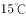）:340（m/s）；（）:346（m/s）。据此可知，声音在水中的传播速度比在空气中要快。

C项错误，用空心砖砌墙是在传播过程中减弱噪声，而非在声源处。在空心砖中有相当一部分声音是曲线传播，这样就使声音的传播路线长短不齐，加上空心砖中还有空气的传播速度，也就是这些速度的不同，会使声音互相之间产生干涉，这种干涉就极大的减弱声音的传播。尤其噪声都是一些尖脉冲，互相干扰更为明显。

D项正确，声音的三个特性是音调、响度和音色。音色是发声体的声音品质，由发声体本身的特征决定，是区别声音的重要标志。接听电话时，很容易分辨出熟人的声音，这主要是根据声音的音色来判断的。

本题为选非题，故正确答案为C。

---

### 第 6 题　qid 2387655 · 科技常识

下列关于生物常识的说法错误的是：

- **A**. 基因工程育种能产生新的基因，改变生物性状　✅
- **B**. 酵母呼吸作用产生的二氧化碳可使馒头膨大松软
- **C**. 向日葵向阳而生是由于光引起其生长素分布不均
- **D**. 加酶洗衣粉能平整织物表面，是因为它有纤维素酶

**答案**：A

**官方解析**

本题考查科技常识。
A项错误，基因工程又叫做基因拼接技术或DNA重组技术。通俗地说，就是按照人们的意愿，把一种生物的某种基因提取出来，加以修饰改造，然后放到另一种生物的细胞里，定性地改造生物的遗传性状。基因工程的原理是基因重组，而不是产生新的基因。
B项正确，面粉里的酵母菌将葡萄糖发酵，酵母菌分解葡萄糖产生丙酮酸，丙酮酸在缺氧和微酸性的条件下，转变成酒精同时产生二氧化碳，二氧化碳遇热膨胀，蒸熟的馒头就会暄软多孔。
C项正确，向日葵的生长素主要在茎尖形成，并向基部运输。生长素的分布受到光的影响：向光的一侧生长素浓度低，背光的一侧浓度高。这样，向光的一侧生长区生长较慢，背光的一侧生长区生长较快，由此茎就产生了向光性弯曲。
D项正确，目前在加酶洗衣粉中使用的共有4种：蛋白酶、脂肪酶、淀粉酶、纤维素酶。纤维素酶的作用对象不是衣物上的污垢，而是织物表面因多次洗涤而在主纤维上出现的微毛和小绒球。用纤维素酶处理后，织物表面的微毛和绒球就被除去，可以平整织物表面，同时有增白效果。另外，纤维素酶将主纤维上的微毛和绒球除去后，使主纤维变得光滑，减少了微纤维之间的纠缠，而使纤维变得柔软。因此添加纤维素酶的洗衣粉具有增白、柔软两个独特功能。
本题为选非题，故正确答案为A。

---

### 第 7 题　qid 2387658 · 科技常识

人体在遇到寒冷时会触发一系列生理机制来应对，下列说法错误的是：

- **A**. 发抖是通过骨骼肌的颤抖形成热量
- **B**. 人体的体温随着温度降低相应降低，减少能量需求　✅
- **C**. 汗毛下的竖毛肌收缩形成“鸡皮疙瘩”，减少热量流失
- **D**. 肾上腺素会加大分泌量，促进新陈代谢，增加热能供应

**答案**：B

**官方解析**

本题考查科技常识。
A项正确，人处于寒冷环境中时，会出现骨骼肌不由自主地颤抖，使得肌肉运动热量增加，以保持体温稳定。
B项错误，人体主要通过调节产热和散热来维持体温的恒定，当外界温度低时，机体产热多，散热减少；当外界温度高时，机体产热少，散热增加，所以正常人的体温是相对恒定的。
C项正确，当外界温度较低时，人体表面汗毛下的竖毛肌收缩，就是起“鸡皮疙瘩”，使得毛孔散热减少，减少热量流失，以保持体温稳定。
D项正确，天气寒冷时，人体激素如肾上腺素、甲状腺激素等分泌增多，促进细胞新陈代谢加强，增加热量的产生，以维持体温稳定。
本题为选非题，故正确答案为B。

---

### 第 8 题　qid 2387661 · 人文常识

关于心肺复苏，下列说法错误的是：

- **A**. 患者晕倒后心跳微弱应立即进行心肺复苏　✅
- **B**. 给溺水者做心肺复苏不需要先使病人吐水
- **C**. 人工呼吸吹气过大时会导致患者胸内压过高
- **D**. 心脏骤停后4分钟内是心肺复苏的黄金抢救时间

**答案**：A

**官方解析**

本题考查科技常识。
A项错误，心肺复苏是当病人停止呼吸和心脏骤停时，用人工呼吸和胸外按压进行抢救的一种技术。患者心跳微弱时，应当及时送至医院检查，若此时做胸外心脏按压可能会加重病情。
B项正确，如果溺水者昏迷无反应，呼吸及脉搏消失，一定要第一时间拨打120，并立即启动心肺复苏至患者呼吸脉搏恢复或急救人员到达。溺水急救不要再控水，这是因为在争分夺秒的急救过程中，肺部进水的危害性不大，更重要的是恢复呼吸。控水法，如倒背、腹部冲击等其实并不能施救溺水者，控水只会拖延复苏，加重误吸，明显增加死亡率。对于溺水后心脏骤停，争分夺秒的心肺复苏是唯一有效的急救方式。
C项正确，在进行人工呼吸若吹气过大时，会引起胸腔内压的过度上升，进而导致血流回流受阻和胸外按压时血流输出的下降。
D项正确，在正常室温下，心脏骤停4分钟后脑细胞就会出现不可逆转的损害。因此，对于心脏骤停的患者，4分钟内进行心肺复苏救活率更高，又称 “黄金4分钟”。
本题为选非题，故正确答案为A。

---

### 第 9 题　qid 2387668 · 科技常识

下列关于生活中常见农产品的说法错误的是：

- **A**. 
西瓜又名夏瓜、寒瓜，含水量一般可达以上

- **B**. 
马铃薯的块茎富含淀粉，可供食用，是一种粮食作物

- **C**. 
香菇是一种常见的食用菌，不属于植物，但属于蔬菜

- **D**. 
胡萝卜属于十字花科萝卜属，在10世纪被引入中国
　✅

**答案**：D

**官方解析**

本题考查科技常识。

A项正确，西瓜又名夏瓜、寒瓜，属一年生蔓生藤本。西瓜的含水量高达以上，是最“富水”的水果之一。西瓜中所含的瓜氨酸、精氨酸成分，能够帮助尿素形成，有利尿的作用，而排尿能够带走体内的一部分热量，故而西瓜有消暑作用。

B项正确，马铃薯俗称土豆，属茄科一年生草本，块茎富含淀粉，可供食用。

C项正确，香菇是一种常见的食用菌，在生物分类中属于真菌，非植物，是一种常见的蔬菜。

D项错误，胡萝卜是伞形科胡萝卜属的一员，一年生或二年生草本。胡萝卜原产于亚洲的西南部，阿富汗为最早演化中心，于公元10世纪从伊朗引入欧洲大陆，约在13世纪从伊朗引入中国，发展成中国生态型。

本题为选非题，故正确答案为D。

---

### 第 10 题　qid 2387669 · 法律常识

按照我国《食品安全法》的规定，下列保健食品的说明书符合要求的是：

- **A**. 某益生菌说明书称可根治便秘
- **B**. 某枇杷糖说明书称可预防咽喉炎
- **C**. 某维生素片说明书称具有较强保健功能　✅
- **D**. 某降糖茶说明书称可替代部分药物使用

**答案**：C

**官方解析**

本题考查法律常识。
《食品安全法》第七十八条规定：“保健食品的标签、说明书不得涉及疾病预防、治疗功能，内容应当真实，与注册或者备案的内容相一致，载明适宜人群、不适宜人群、功效成分或者标志性成分及其含量等，并声明‘本品不能代替药物’。保健食品的功能和成分应当与标签、说明书相一致。”
A项错误，保健食品说明书不得涉及治疗功能，益生菌说明书上称可根治便秘不符合法律规定。
B项错误，保健食品说明书不得涉及疾病预防，枇杷糖说明书上称可预防咽喉炎不符合法律规定。
C项正确，某维生素说明书上称具有较强保健功能是符合法律规定的，可载明。
D项错误，保健食品说明书上必须声明“本品不能代替药物”，降糖茶说明书上载明的该句话违反法律规定。
故正确答案为C。

---

### 第 11 题　qid 2387670 · 法律常识

关于劳动合同，下列说法错误的是：

- **A**. 劳动合同应当以书面形式订立
- **B**. 劳动合同可以约定试用期，试用期最长不得超过1年　✅
- **C**. 劳动者严重违反用人单位的规章制度的，用人单位可以解除劳动合同
- **D**. 裁减人员时，与本单位订立无固定期限劳动合同的人员应当优先留用

**答案**：B

**官方解析**

本题考查法律常识。
A项正确，《劳动合同法》第十条第一款规定：“建立劳动关系，应当订立书面劳动合同。”
B项错误，《劳动合同法》第十九条第一款规定：“劳动合同期限三个月以上不满一年的，试用期不得超过一个月；劳动合同期限一年以上不满三年的，试用期不得超过二个月；三年以上固定期限和无固定期限的劳动合同，试用期不得超过六个月。”故试用期最长不得超过6个月而非1年。
C项正确，《劳动合同法》第三十九条规定：“劳动者有下列情形之一的，用人单位可以解除劳动合同：（一）在试用期间被证明不符合录用条件的；（二）严重违反用人单位的规章制度的；······”
D项正确，《劳动合同法》第四十一条第二款规定：“裁减人员时，应当优先留用下列人员：（一）与本单位订立较长期限的固定期限劳动合同的；（二）与本单位订立无固定期限劳动合同的；（三）家庭无其他就业人员，有需要扶养的老人或者未成年人的。”
本题为选非题，故正确答案为B。

---

### 第 12 题　qid 2387671 · 人文常识

关于社会保险制度，下列说法错误的是：

- **A**. 社会保险基金经相关部门同意后，可用于平衡其他政府预算　✅
- **B**. 外国人在中国境内就业的，参照我国《社会保险法》规定参加社会保险
- **C**. 基本医疗保险基金和基本养老保险基金应分别建账，分账核算，执行国家统一的会计制度
- **D**. 国家建立社会保险制度，是为了保障公民在年老、疾病、工伤、失业、生育等情况下获得物质帮助

**答案**：A

**官方解析**

本题考查法律常识。
A项错误，《社会保险法》第六十四条第二款规定：“社会保险基金专款专用，任何组织和个人不得侵占或者挪用。”
《社会保险法》第六十九条第二款规定：“社会保险基金不得违规投资运营，不得用于平衡其他政府预算，不得用于兴建、改建办公场所和支付人员经费、运行费用、管理费用，或者违反法律、行政法规规定挪作其他用途。”因此，社会保险基金即使经相关部门同意后，也不可用于平衡其他政府预算。
B项正确，《社会保险法》第九十七条规定：“外国人在中国境内就业的，参照本法规定参加社会保险。”
C项正确，《社会保险法》 第六十四条第一款规定：“社会保险基金包括基本养老保险基金、基本医疗保险基金、工伤保险基金、失业保险基金和生育保险基金。除基本医疗保险基金与生育保险基金合并建账及核算外，其他各项社会保险基金按照社会保险险种分别建账，分账核算。”因此，基本医疗保险基金和基本养老保险基金应分别建账，分账核算，执行国家统一的会计制度。
D项正确，《社会保险法》第二条规定：“国家建立基本养老保险、基本医疗保险、工伤保险、失业保险、生育保险等社会保险制度，保障公民在年老、疾病、工伤、失业、生育等情况下依法从国家和社会获得物质帮助的权利。”
本题为选非题，故正确答案为A。

---

### 第 13 题　qid 2387673 · 法律常识

根据我国《刑法》规定，下列行为属于“扒窃”的是：

- **A**. 甲在超市内偷走柜台里价值3000元的手机1部
- **B**. 乙翻窗进入被害人家里偷走抽屉内现金5000元
- **C**. 丙趁人不备偷走公园内自行车1辆，价值2500元
- **D**. 丁在地铁上偷走被害人随身钱包1个，内有现金500元　✅

**答案**：D

**官方解析**

本题考查法律常识。《最高人民法院最高人民检察院关于办理盗窃刑事案件适用法律若干问题的解释》第三条第四款规定：“在公共场所或者公共交通工具上盗窃他人随身携带的财物的，应当认定为‘扒窃’。”
A项错误，该项中甲某盗窃的是超市柜台里的手机，不属于“随身携带”财物，不是“扒窃”。
B项错误，该项中乙某的行为属于“入户盗窃”，而不是“扒窃”。
C项错误，该项中丙某盗窃的自行车不属于“随身携带”财物，不是“扒窃”。
D项正确，该项中丁某在地铁（公共交通工具）盗窃被害人随身钱包，属于盗窃“随身携带”的财物，属于“扒窃”行为。
故正确答案为D。

---

### 第 14 题　qid 2387674 · 人文常识

科举制度是古代中国最重要的人才选拔机制，下列关于科举制度的说法正确的是：

- **A**. 起源于唐太宗时期，成熟于唐玄宗时期
- **B**. 宋朝时科举增设武举，采用糊名法加强考试公平性
- **C**. “三元及第”是指接连在乡试、会试、殿试中都考中第一名　✅
- **D**. 戊戌变法提出废止科举主张，科举制度从此退出历史舞台

**答案**：C

**官方解析**

本题考查人文常识。
A项错误，科举制起源于隋朝，成熟于唐朝。隋文帝时废除了九品中正制，开始用分科考试的方法来选拔官员；隋炀帝时设置进士科，科举制形成。唐朝唐太宗、武则天、唐玄宗是完善科举的关键人物。
B项错误，武举是专为选拔武官而设置的科目，唐武则天设立。科举考试中，为公平起见，把名字给盖起来改卷，称为糊名法。糊名法为唐武则天时首创，起初只是实行于选官的吏部考试中。宋代开始，“糊名”正式用于科举考试，后历朝沿用。
C项正确，科举考试中，乡试的第一名为解元，会试的第一名为会元，殿试的第一名为状元。若一人在乡试、会试、殿试中均为第一，则称“三元及第”。
D项错误，戊戌变法（1898年）只是主张废除八股文 ，改革考试制度，而不是废除科举考试制度，科举制度的废除直至1905年才完成。
故正确答案为C。

---

### 第 15 题　qid 2387675 · 人文常识

下列关于我国传统文化的说法正确的是：

- **A**. 书法作品《多宝塔碑》以隶书写就
- **B**. 古曲《十面埋伏》是用弦乐器弹奏的　✅
- **C**. “五禽戏”的发明人撰写了《伤寒杂病论》
- **D**. 京剧中诸葛亮的角色属于“生旦净丑”中的“净”

**答案**：B

**官方解析**

本题考查人文常识。
A项错误，《多宝塔碑》，是颜真卿的代表作品之一，是楷书书法作品，颜真卿与赵孟頫、柳公权、欧阳询并称为“楷书四大家”。
B项正确，《十面埋伏》是一首历史题材的大型琵琶曲，它是中国十大古曲之一，其演奏为独奏，乐曲激烈，震撼人心，清楚地表现出了当时项羽被大军包围时走投无路的场景。琵琶，是弹拨乐器首座，拨弦类弦鸣乐器。
C项错误，“五禽戏”是中国传统导引养生的一个重要功法，其创编者是华佗，“五禽”分别为虎、鹿、熊、猿、鸟。《伤寒杂病论》是中国传统医学著作之一，作者是张仲景。
D项错误，净角是京剧表演主要行当之一，俗称花脸，以面部化妆运用图案化的脸谱为标志，音色宏亮宽阔，演唱风格粗壮浑厚，动作大开大阖，顿挫鲜明。生角，中国戏曲表演主要行当之一，泛指净、丑之外的男角色；生角按其扮演人物属性、性格特征和表演特点，大致可分为老生、小生、外、末、武生、娃娃生等类；老生主要扮演中年以上性格正直刚毅的正面人物，因多戴髯口，故又称须生，俗称胡子生。京剧中诸葛亮的角色即属于老生。
故正确答案为B。

---

### 第 16 题　qid 2387677 · 人文常识

下列疾病与其部分临床表现对应错误的是：

- **A**. 糖尿病——多饮、多尿、多食、疲乏无力
- **B**. 水俣病——麻木、惊厥、精神迟钝、视力障碍
- **C**. 甲亢症——眩晕、嗜睡、厌食、肌肉无力、记忆力减退　✅
- **D**. 脑中风——呕吐、流涎、意识障碍、一侧肢体感觉异常

**答案**：C

**官方解析**

A项正确，糖尿病是一组以高血糖为特征的代谢性疾病。患者临床表现主要为：（1）多饮、多尿、多食和消瘦。严重高血糖时出现典型的“三多一少”症状，多见于1型糖尿病。（2）疲乏无力，肥胖。多见于2型糖尿病。
B项正确，水俣病是因食入被有机汞污染河水中的鱼、贝类所引起的甲基汞为主的有机汞中毒或是孕妇吃了被有机汞污染的海产品后引起婴儿患先天性水俣病，是有机汞侵入脑神经细胞而引起的一种综合性疾病。主要是表现为神经精神症状：（1）肢体表现：感觉障碍、疼痛、麻木、无力、步行困难、共济失调、偏瘫、震颤等。（2）精神症状：精神迟钝、性格异常、智力迟钝、大发作性癫痫、发笑、意识模糊、惊厥等。（3）其他神经系统障碍：咀嚼吞咽困难、言语不清、耳聋、视力障碍、斜视、畏光等。
C项错误，甲亢症是由多种原因引起的甲状腺激素分泌过多所致的一组常见内分泌疾病。主要临床表现为多食、消瘦、畏热、多汗、心悸、激动等高代谢症候群，神经和血管兴奋增强，以及不同程度的甲状腺肿大和眼突、手颤、胫部血管杂音等为特征，严重的可出现甲亢危相、昏迷甚至危及生命。因此，选项中临床表现说法错误。
D项正确，脑中风是一组以脑部缺血及出血性损伤症状为主要临床表现的疾病。脑中风的症状包括：（1）头痛：无论是脑出血或脑梗死，头痛非常常见，亦是一个重要的脑中风症状和信号。（2）呕吐：一般是伴随头痛一起出现的，也非常常见，其特点是多为喷射状呕吐。如遇有呕吐咖啡色（酱油样或棕黑色）液体，表示病情非常严重。（3）眩晕：眩晕还多伴有呕吐或耳鸣，是脑中风的症状中比较常见的。（4）一侧肢体和面部的感觉异常。（5）口角流涎（流口水）：出现口角斜、流口水或食物从口角流出的现象，要引起足够的重视。（6）突发的视感障碍：表现为看不见左或右的物体或视觉缺损，也可以表现为一过性的眼前发黑或眼前突然飞过一只蚊子的感觉。（7）突发的言语不清和吞咽呛咳症状：表现为病人说话不清，吐词困难，喝水或吞咽时呛咳。（8）意识障碍：表现为神志模糊不清、呼吸不应、打呼噜，严重的可出现深度昏迷。
本题为选非题，故正确答案为C。

---

### 第 17 题　qid 2387679 · 人文常识

世界各地的建筑风格因受时代的政治、社会、经济、建筑材料和建筑技术的制约以及建筑设计思想、观念和艺术素养的影响而有所不同。下列关于建筑风格的说法错误的是：

- **A**. 巴洛克式建筑风格起源于文艺复兴时期
- **B**. 帕特农神庙是古希腊式建筑的典型代表
- **C**. 哥特式建筑风格是以法国为中心发展起来的
- **D**. 洛可可式建筑的特点是气势恢宏、简约大气　✅

**答案**：D

**官方解析**

本题考查人文常识。
A项正确，巴洛克建筑是17—18世纪在意大利文艺复兴建筑基础上发展起来的一种建筑和装饰风格。因此起源于文艺复兴时期。
B项正确，帕特农神庙是希腊全盛时期建筑与雕刻的主要代表，有“希腊国宝”之称，也是人类艺术宝库中一颗璀璨的明珠。
C项正确，哥特式建筑发源于十二世纪的法国，持续至十六世纪，在当代普遍被称作“法国式”，是以法国为中心发展起来的。
D项错误，洛可可式建筑风格，于18世纪20年代产生于法国并流行于欧洲，基本特点是纤弱娇媚、华丽精巧、甜腻温柔、纷繁琐细，而非气势恢宏、简约大气。
本题为选非题，故正确答案为D。

---

### 第 18 题　qid 2387680 · 人文常识

将以下事件按发生时间先后排序，正确的是：
①德军“闪击”波兰
②诺曼底登陆
③萨拉热窝事件
④凡尔登战役
⑤斯大林格勒保卫战
⑥丘吉尔首次出任英国首相

- **A**. ③④①⑥⑤②　✅
- **B**. ③⑥①⑤②④
- **C**. ①⑥③⑤④②
- **D**. ①③⑥②⑤④

**答案**：A

**官方解析**

本题考查人文历史。
①波兰战役，也称为波德战争或德波战争，是第二次世界大战欧洲战区的起点，也是世界战争史中著名的“闪电战”。1939年9月1日，德军联合附庸国斯洛伐克的军队入侵波兰。在世界各国中，统称这一行动为德军“闪击”波兰。
②诺曼底登陆，是第二次世界大战中盟军在欧洲西线战场发起的一场大规模攻势，发生于1944年6月6日6时30分。这次代号“霸王行动”的作战扭转了第二次世界大战的态势，也是目前为止世界上最大的一次海上登陆作战。
③萨拉热窝事件于1914年6月28日在巴尔干半岛的波斯尼亚发生，此日为塞尔维亚之国庆日，奥匈帝国皇储斐迪南大公夫妇被塞尔维亚民族主义者普林西普枪杀。这次事件导致7月28日奥匈帝国向塞尔维亚宣战，成为了第一次世界大战的导火线。
④凡尔登战役是第一次世界大战中破坏性最大，时间最长的战役。战事从1916年2月21日延续到12月19日。伤亡人数仅次于索姆河战役，被称为“凡尔登绞肉机”。
⑤斯大林格勒保卫战是第二次世界大战中苏军为保卫斯大林格勒并消灭德军有生力量而进行的决定性战役，于1942年7月爆发，持续至1943年2月。斯大林格勒战役是苏德战场的转折点，也是二战的转折点。
⑥丘吉尔，英国前首相，政论家，历史学家。1940年至1945年和1951年至1955年两度出任英国首相，被认为是20世纪最重要的政治领袖之一，领导英国人民赢得了第二次世界大战，是“雅尔塔会议三巨头”之一。
所以按时间先后排序为③④①⑥⑤②。
故正确答案为A。

---

## 言语理解与表达

### 第 1 题　qid 2387697 · 逻辑填空

一个现实是，受普通大众欢迎的产品才能走得更远，才能在市场上更长久地立足。很多所谓的高科技产品            ，来也匆匆去也匆匆，忽悠了消费者一把，最后无影无踪。
填入划横线部分最恰当的一项是：

- **A**. 昙花一现　✅
- **B**. 弄虚作假
- **C**. 徒有其表
- **D**. 华而不实

**答案**：A

**官方解析**

根据下文“来也匆匆去也匆匆”、“······最后无影无踪”可知，横线处体现高科技产品出现的时间很短、并不长久。A项“昙花一现”指美好的事物出现的时间很短，符合文意，当选。
B项“弄虚作假”指耍花招儿，欺骗人，C项“徒有其表”指空有其外表，不实在，D项“华而不实”比喻外表好看，内容空虚。三项均无法体现“不长久”之意，且文段并无高科技产品作假、不实在之意，与文意不符，排除。
故正确答案为A。
【文段出处】《实现物美价廉 也应是科技创新的追求》

---

### 第 2 题　qid 2387703 · 逻辑填空

近二十几年来，人类已发现数千颗围绕其他恒星公转的行星，其中绝大多数与地球            。不过，《发现》杂志曾预测，观察大约150个邻近星系，就应该会找到一个类似地球的小型行星。
填入划横线部分最恰当的一项是：

- **A**. 泾渭分明
- **B**. 唇齿相依
- **C**. 息息相关
- **D**. 大相径庭　✅

**答案**：D

**官方解析**

根据“不过”可知，横线处所填词语与下文“就应该会找到一个类似地球的小型行星”语义相反，表达绝大多数行星与地球“不相类似”之意。D项“大相径庭”比喻相差很远，大不相同，符合文意，当选。
A项“泾渭分明”比喻界限清楚，是非、好坏分明，文段强调的是“不同”，而非“界限分明”，排除；B项“唇齿相依”与C项“息息相关”均形容彼此关系非常密切，与文段强调的“不相类似”无关，排除。
故正确答案为D。
【文段出处】《为了证明我们不孤独》

---

### 第 3 题　qid 2387739 · 逻辑填空

教师对学术保持        ，学生才会对教师保持敬重。一些教师一旦跨过某个门槛，达到某个职称、职级后，就逐渐放弃职守，忙于场面上的应酬，自己做“甩手掌柜”和“后台老板”，把学生当做“学术民工”来使唤。这个过程往往导致学生学术理想的        。
依次填入划横线部分最恰当的一项是：

- **A**. 爱慕  丧失
- **B**. 敬畏  幻灭　✅
- **C**. 热忱  绝望
- **D**. 追求  失望

**答案**：B

**官方解析**

第一空，根据“学生才会对教师保持敬重”可知，横线处需表示教师对“学术”积极的态度。B项“敬畏”、C项“热忱”、D项“追求”均符合文意，保留。A项“爱慕”通常指人与人之间的强烈倾慕，搭配对象通常是“人”，与“学术”搭配不当，排除。
第二空，搭配“学术理想”。B项“幻灭”意思是希望、理想等像幻境一样地消失，“理想幻灭”为常用搭配，当选。C项“绝望”、D项“失望”通常表述为“对······绝望/失望”，而不直接说“理想绝望”或“理想失望”，排除。
故正确答案为B。
【出处】《师道尊严不是让学生喊“爸爸”》

---

### 第 4 题　qid 2387748 · 逻辑填空

公众与科学的关系构成反思科学的直接动力，而公众对科学的        又是反思科学的最大阻力，比如一些公众往往认为科学等于正确、科学技术能够解决一切问题。而实际上，科学理论        的不完善以及科学的界限，都足以说明，科学技术是有能力边界的。
依次填入划横线部分最恰当的一项是：

- **A**. 推崇  本质
- **B**. 盲从  客观
- **C**. 误解  内在　✅
- **D**. 依赖  自身

**答案**：C

**官方解析**

第一空，根据“比如一些公众往往认为科学等于正确、科学技术能够解决一切问题。而实际上······科学技术是有能力边界的”可知，横线处需体现出公众对于科学技术的错误认识。C项“误解”指不正确的理解，符合文意，保留。A项“推崇”指尊崇，推重崇敬，感情色彩偏积极，根据“是反思科学的最大阻力”可知，横线处所填词语感情色彩应偏消极，排除；B项“盲从”指不问是非地附和别人，“附和”在文中无从体现，排除；D项“依赖”指依靠某种人或事物而不能自立或自给，无法体现公众对科学的错误理解，排除。
第二空代入验证，C项“内在”指事物本身所固有的属性，“科学理论”本身是不完善的，符合文意，当选。
故正确答案为C。
【出处】《今天让科学做什么？》

---

### 第 5 题　qid 2387684 · 逻辑填空

水电、风电与光伏是当前可再生能源的主要形式。其中水力发电由于发展时间较长，技术相对<u>        </u>，水力发电量占亚洲可再生能源总发电量的左右。但由于选址经济性下降和环境社会问题日渐凸显，未来水电发展或将变得<u>        </u>。

依次填入划横线部分最恰当的一项是：

- **A**. 成熟  缓慢　✅
- **B**. 稳定  无序
- **C**. 可靠  有限
- **D**. 简单  艰难

**答案**：A

**官方解析**

第一空，根据前文“水力发电发展时间较长”以及后文“水力发电量占总比的一半”可知其技术发展的较为理想，A项“成熟”、B项“稳定”以及C项“可靠”均能体现其技术发展态势相对较好，保留；D项“简单”侧重技术处于发展刚起步阶段，与文意相悖，排除。
第二空，通过“但”可知，前后语义相反，前文论述其发展态势好，转折后强调各类问题的出现，所以未来水电发展的脚步将会相较于之前变得较慢，A项“缓慢”强调“速度变慢”符合文意，当选；B项“无序”指没有秩序、混乱，文段并无此意，排除；C项“有限”“有范围的限制”，文段并非强调其受限制，而是侧重其没有之前发展的较好，排除。
故正确答案为A。
【文段出处】亚洲引领全球可再生能源市场

---

### 第 6 题　qid 2387690 · 逻辑填空

随着历史意识的觉醒，人们在创造历史的活动中必然会有意识地记载和传承历史，其中包括为自己的历史活动提供道德伦理和政治等方面的依据，修饰、篡改乃至       不符合自身利益的记录，或者在传承历史过程中进行夸大、渲染甚至        。
依次填入划横线部分最恰当的一项是：

- **A**. 隐瞒  杜撰
- **B**. 湮灭  臆造　✅
- **C**. 祛除  污蔑
- **D**. 肃清  捏造

**答案**：B

**官方解析**

第一空，通过“乃至”可知，填入横线处的词语与前内容“修饰、篡改”形成递进关系，B项“湮灭”指消灭、磨灭，可构成递进关系，保留；A项“隐瞒”指“遮盖真相”，并不能与“篡改”构成递进关系，排除；C项“祛除”指消除、除去，一般指祛除一些不好的东西，使其变好，与文段感情色彩不符，排除；D项“肃清”指整顿，含褒义，与文段感情色彩不符，排除。
第二空，代入验证，通过“甚至”可知，此处再次考查递进关系，即比前文“夸大、渲染”程度更重，B项“臆造”指凭主观臆想编造，符合文意，当选。 
故正确答案为B。
【文段出处】《接近历史真相何以可能？》

---

### 第 7 题　qid 2387691 · 逻辑填空

当资产价格下跌，越来越多的机构和个人开始抛售资产，         资产价格进一步下跌，出现恶性循环，市场流动性        ，最终导致金融体系的崩溃。
依次填入划横线部分最恰当的一项是：

- **A**. 推动  降低
- **B**. 促使  缺乏
- **C**. 导致  枯竭　✅
- **D**. 驱使  消失

**答案**：C

**官方解析**

第一空，根据文段“资产价格进一步下跌，出现恶性循环，······最终导致金融体系的崩溃”可知，横线处强调资产价格下跌带来的不良后果，需填入感情色彩消极的词语，C项“导致”常用于不好的结果，符合文意，保留；A项“推动”、B项“促使”常搭配积极事物，感情色彩积极，与文意不符，排除；D项“驱使”指迫使、推动，属于中性词，没有C项感情色彩合适，排除。
第二空，代入验证，C项“枯竭”指体力、资财用尽，与后文 “最终引发金融体系的崩溃”对应，符合文意，当选。
故正确答案为C。
【文段出处】《胡伟俊：货币、债务和汇率的三大误解》

---

### 第 8 题　qid 2387693 · 逻辑填空

成长力是指一个人持续成长的动机和能量。具有成长力的人不        于过去，而是展望未来，他们既不会因为过去的成绩而沾沾自喜，也不会因为过去的失败而止步不前。一些成长力不足的人会对外在环境过度        ，身处“凤尾”状态，会自我否定，觉得自己什么都做不好；而一旦身处“鸡头”状态，又觉得自己被埋没，瞧不起周围的人。
依次填入划横线部分最恰当的一项是：

- **A**. 沉溺  依赖　✅
- **B**. 后悔  指责
- **C**. 留恋  依附
- **D**. 陶醉  挑剔

**答案**：A

**官方解析**

第一空，需填入具有成长力的人对过去的做法，根据文段“他们既不会因为过去的成绩而沾沾自喜，也不会因为过去的失败而止步不前”可知，横线处应体现他们陷入过去的词语，且要搭配后文“成绩”和“失败”两方面的情况，A项“沉溺”指陷入不良的境地，不能自拔，指一味沉迷于过往成功或沉迷过往失败，都是对人们发展不利的，符合文意，保留；B项“后悔”是指对以前没有做的事情或做错了的事情感到难以释怀，不能对应“因为过去的成绩而沾沾自喜”，排除；C项“留恋”指不舍离开，D项“陶醉”指很满意地沉醉于某种事物，感情色彩积极，两项均无法对应后文“因为过去的失败而止步不前”，对比择优，C、D两项均排除。
第二空，代入验证，通过“身处······又觉得自己被埋没，瞧不起周围的人”可知，文段在强调成长力不足的人会因外在环境不良而自我否定，会因外在环境优秀而骄傲，故A项“依赖”符合文意，当选。
故正确答案为A。
【文段出处】《具有成长力的人不沉溺于过去》

---

### 第 9 题　qid 2387696 · 逻辑填空

随着社会物质生活水平的提高，人们对公共文明、社交礼仪有了更多的自我追求，恰当的外部倡议确实能够与个体心中觉醒的文明意识形成        ，最终实现社会公共文明水平的整体提升。但还是得强调一点，这种倡导边界的拿捏很重要，底线是要有民意        。
依次填入划横线部分最恰当的一项是：

- **A**. 合力  认可
- **B**. 共鸣  支持
- **C**. 呼应  支撑
- **D**. 共振  认同　✅

**答案**：D

**官方解析**

第一空，修饰“外部倡议”和“个体心中觉醒的文明意识”，且结合横线后“最终实现······整体提升”可知，横线处表示二者为一致的关系。D项“共振”指两个振动频率相同的物体，当一个发生振动时，引起另一个物体振动的现象，可引申为思想、意识、言论、精神状态等方面一致，符合文意，保留。B项“共鸣”指由别人的某种情绪引起的相同的情绪，可体现一致的含义，保留。A项“合力”指一起出力，多用来修饰多个客观主体积极主动做出某种行为，“文明意识”为抽象的事物，体现不出主动性，排除。 C项“呼应”指彼此声气相通，互相照应，文段中并未体现出“外部倡议”与“个体心中觉醒的文明意识”相互照应，不符合文意，排除。
第二空，修饰“底线”，底线即最低的限度，D项“认同”指认可赞同，程度较轻，符合文意，B项“支持”是在认同基础之上的帮助支援，程度过重。排除，且D项“民意认同”搭配恰当且更符合文意，当选。
故正确答案为D。
【文段出处】《文明守则要能获得市民发自内心的认同》

---

### 第 10 题　qid 2387700 · 逻辑填空

历代官修史籍，由于受编史指导思想、前代档案和篇幅等限制，不可能完全准确，也不可能            。于是，后世各种史类的“札记”“纠谬”“商榷”等著作            。而历代笔记、诗文中所记作者亲历、亲闻的事实，便是这类“札记”“纠谬”之作的根据。
依次填入划横线部分最恰当的一项是：

- **A**. 事无巨细  汗牛充栋
- **B**. 十全十美  此起彼伏
- **C**. 面面俱到  层出不穷　✅
- **D**. 字斟句酌  不绝如缕

**答案**：C

**官方解析**

第一空，搭配“官修史籍”，且和“完全准确”构成并列，B项“十全十美”形容十分完美，毫无欠缺，C项“面面俱到”指各方面都能照顾到，没有遗漏疏忽，符合文意，保留； A项“事无巨细”形容什么事都管，D项“字斟句酌”指写文章或说话时慎重细致，一字一句地推敲琢磨，二者的主语多为人，搭配“历代官修史籍”不当，均排除。
第二空，结合文意，横线处表示多、不断出现的意思，C项“层出不穷”指接连不断地出现，没有穷尽，符合文意，当选；B项“此起彼伏”表示连续不断地起落，而文段中并未阐述各类著作“不断起落”，不符合文意，排除。
故正确答案为C。
【文段出处】《山西历史文化的文字载体：&lt;山右丛书初编&gt;》

---

### 第 11 题　qid 2387706 · 逻辑填空

历史有改朝换代，权力有交接更替，但夫子庙的繁华却是超越时代的。中国人素有“北有天桥，南有夫子庙”之说，在北京的天桥已然没落的今日，夫子庙却是一年比一年            ，秦淮河畔的盛景较之当年也            。
依次填入划横线部分最恰当的一项是：

- **A**. 渐入佳境  不遑多让
- **B**. 美轮美奂  各有千秋
- **C**. 富丽堂皇  旗鼓相当
- **D**. 光彩夺目  毫不逊色　✅

**答案**：D

**官方解析**

第一空，根据“却”表转折可知，夫子庙的情况与北京没落的天桥相反，即需填入表示夫子庙发展好的词语，A项“渐入佳境”指境况逐渐好转或风景、情趣等逐渐深入而达到美妙的境地，与“一年比一年”语义重复，排除。B项“美轮美奂”指建筑物雄伟壮观、富丽堂皇，C项“富丽堂皇”指建筑物华丽雄伟，也形容场面华丽而盛大，这两个词语都侧重强调是夫子庙的华丽壮观，而文段侧重强调夫子庙发展很好，很有成就，排除。D项“光彩夺目”指色彩的美丽、鲜艳，也用来形容某些艺术作品和艺术形象的极高成就，符合文意，保留。
第二空代入验证，搭配“秦淮河畔的盛景”，根据文意可知，秦淮河畔的盛景与当年一样或更好，D项“毫不逊色”指丝毫不差，符合文意，当选。
故正确答案为D。
【文段出处】《1948年南京夫子庙，小老百姓逛庙会》

---

### 第 12 题　qid 2387709 · 逻辑填空

近年来，各类互联网平台纷纷推出会员产品。客户会员越办越多，各种“套路”也            。比如，不办会员就限速，办了会员依然广告不断······这样的“赢利”模式，短期内似乎能尝到甜头，但长远看来，实则是            。
依次填入划横线部分最恰当的一项是：

- **A**. 接踵而至  饮鸩止渴　✅
- **B**. 屡见不鲜  揠苗助长
- **C**. 应运而生  寅吃卯粮
- **D**. 不胜枚举  掩耳盗铃

**答案**：A

**官方解析**

第一空，搭配“各种‘套路’”，根据“也”表并列和后文解释可知，各种套路是非常多的，A项“接踵而至”指人接连而来或事情持续发生；B项“屡见不鲜”指常常见到，并不新奇；D项“不胜枚举”指无法一一全举出来，形容为数极多，均符合文意，保留；C项“应运而生”多指顺应时机而出现或产生，无法体现套路非常多的含义，且一般产生的产物多是当下环境所需要的、希望出现的，“套路”并非大家希望出现的产物，故与文段感情色彩不符，排除。
第二空，用来形容套路非常多的赢利模式，根据“但”表转折可知，这种模式是只能短期内有效，但不会长久的，A项“饮鸩止渴”指用错误的办法来解决眼前的困难而不顾严重后果，符合眼前的赢利问题解决了，但是无法长久持续下去的文意，符合文意，当选；B项“揠苗助长”指为急于求成，反而坏了事，不符合文段中“短期内能尝到甜头”的语意，故不符合文意，排除；D项“掩耳盗铃”指自己欺骗自己，文段未体现“欺骗自己”的含义，故不符合文意，排除。
故正确答案为A。
【文段出处】《互联网消费套路多多 "会员陷阱"是饮鸩止渴的赢利模式》

---

### 第 13 题　qid 2387734 · 逻辑填空

太空是一个充满未知和挑战的领域，面对人类的雄心，当前的化学火箭早已<u>            </u>。因为化学火箭所携带的燃料要占总重的以上，能量密度较低，工作时间也不长。若要飞向更远的深空和开展星际旅行，必须<u>            </u>，寻找新的“登天之梯”。

依次填入划横线部分最恰当的一项是：

- **A**. 鞭长莫及  未雨绸缪
- **B**. 力不从心  另辟蹊径　✅
- **C**. 无能为力  改弦更张
- **D**. 黔驴技穷  全力以赴

**答案**：B

**官方解析**

本题可从第二空入手。根据后文的解释说明“寻找新的‘登天之梯’”可知，所填词语应体现出要找到新的解决办法之意。B项，“另辟蹊径”比喻另创一种风格或方法，符合文意，保留。A项，“未雨绸缪”比喻事先做好准备工作，D项，“全力以赴”指把全部力量都投入进去，两项均无法体现出新办法之意，故排除A、D两项；C项，“改弦更张”比喻改革制度或变更方法，强调在原来的基础上改变，并未体现用新的办法解决问题，不符合文意，排除。
第一空，代入验证，“力不从心”指心里想做，可是力量够不上，置于文段意为“化学火箭”的力量无法满足当前的需求，符合文意，当选。
故正确答案为B。
【文段出处】《怎样才能让航天器飞得更远？》

---

### 第 14 题　qid 2387743 · 逻辑填空

历史上，小至个人荣辱、大到国家兴亡，优良家风通过            的情感教化、            的严格要求塑造着人们的人生观、价值观，辐射带动着整个国家和社会的价值导向。
依次填入划横线部分最恰当的一项是：

- **A**. 耳濡目染  苦口婆心
- **B**. 和风细雨  朝督暮责
- **C**. 潜移默化  循规蹈矩
- **D**. 循循善诱  耳提面命　✅

**答案**：D

**官方解析**

本题可从第二空入手，所填成语搭配“严格要求”。B项，“朝督暮责”指从早到晚不停地督促检查，形容督促检查非常严格，D项，“耳提面命”形容长辈教导热心恳切，均可与“严格要求”搭配使用，又根据语境“优良家风······严格要求”，“耳提面命”与“优良家风”更对应，均保留；A项，“苦口婆心”比喻善意而又耐心地劝导，通常指劝导，与“要求”搭配不当，排除；C项，“循规蹈矩”指拘守旧准则，不敢稍做变动，强调守旧，无法与“严格要求”搭配使用，排除。
第一空，根据后文“辐射带动着整个国家和社会的价值导向”可知，家风对“国家和社会”有一种引导的作用。D项，“循循善诱”指善于引导别人进行学习，符合文意，当选；B项，“和风细雨”比喻方式和缓，不粗暴，无法体现家风对“国家和社会”有一种引导的作用，排除。
故正确答案为D。
【文段出处】《发掘弘扬优良家风的当代价值》

---

### 第 15 题　qid 2387751 · 逻辑填空

在一件件国宝中触摸文化的宝藏，于一封封家书中感受精神的        ······近年来，历史文化类电视节目走红，让观众看到“历史原来这么有料”。透过影像化        、故事化        ，尘封的记忆被激活，历史的图景在人们心中铺展。
依次填入划横线部分最恰当的一项是：

- **A**. 力量  展览  讲解
- **B**. 源泉  显示  铺陈
- **C**. 传承  展示  讲述　✅
- **D**. 熏陶  呈现  渲染

**答案**：C

**官方解析**

第一空，横线处搭配“感受”。 B项“源泉”比喻事物的根源，不能感受根源，故“源泉”与“感受”搭配不当，排除；A、C、D三项均可搭配“感受”，保留。
第二空，搭配“影像化”，横线处要体现出历史通过电视节目进行影像化表达。C项“展示”、D项“呈现”均可体现电视节目的作用，保留；A项“展览”指公开陈列美术作品、摄影作品的原件或者复制件，无法体现电视节目的作用，排除。
第三空，搭配“故事化”。C项“讲述”搭配“故事化”恰当，且历史内容用故事的形式讲述，语义也符合，当选；D项“渲染”指对事物铺张、夸大，文段没有体现出夸大故事情节的含义，排除。
故正确答案为C。
【文段出处】《让公众感受历史的魅力——从历史中汲取走向未来的智慧》

---

### 第 16 题　qid 2387752 · 逻辑填空

中国文化的博大精深，来源于其内部生成的            ；中国文化的            ，取决于其变迁过程中各种元素、层次、类型在内容和结构上通过碰撞、         、融合而产生的革故鼎新的强大动力。
依次填入划横线部分最恰当的一项是：

- **A**. 绵延不绝  长盛不衰  交流
- **B**. 源远流长  与时俱进  对话
- **C**. 多姿多彩  历久弥新  解构　✅
- **D**. 千姿百态  推陈出新  重构

**答案**：C

**官方解析**

第一空，搭配“中国文化”，且与前文“博大精深”构成对应。体现出“中国文化广博丰富、深奥精微”之意。A项“绵延不绝”，指连续不断，一直延续，B项“源远流长”指历史悠久，C项“多姿多彩”和D项“千姿百态”，即丰富多彩，能体现出中国文化很多很广，均能与前文“博大精深”构成对应，保留。
第二空，根据后文“其变迁过程中的各种元素、层次、类型在内容和结构······产生的革故鼎新的强大动力”，所填词语应与“革故鼎新”形成对应。A项“长盛不衰”指长久兴盛而不衰败，体现不出“新”，排除。B项“与时俱进”侧重于强调不断前进，也体现不出“新”，排除。C项“历久弥新”和D项“推陈出新”均能与“革故鼎新”形成对应，符合文意，保留。
第三空，由“碰撞、         、融合”可知，横线处所填词语与“碰撞””融合”构成三层并列，且并列内容间语义顺承。C项“解构”指对某种事物的结构和内容进行剖析，先碰撞再深入研究，最后融合，符合逻辑，当选。D项“重构”指重新构成，应是融合之后的动作，不符合顺承逻辑，排除。
故正确答案为C。

---

### 第 17 题　qid 2387754 · 逻辑填空

太多的        ，使得孩子缺乏自主；太多的        ，使得孩子难以承受；太多的        ，使得孩子失去动力；太多的        ，使得孩子不知约束。
依次填入划横线部分最恰当的一项是：

- **A**. 关爱  满足  享受  溺爱
- **B**. 干预  期望  责备  迁就　✅
- **C**. 唠叨  攀比  反思  许诺
- **D**. 在意  计划  躲避  表扬

**答案**：B

**官方解析**

第一空，“使得”表明横线前后为因果关系，横线处对应“缺乏自主”，即不能自由的选择行为，对应B项“干预”，即参与本未参与的事情。 A项“关爱”、C项“唠叨”、D项“在意”均和“缺乏自主”无关，无法形成因果关系，排除。
第二、三、四空，代入B项验证，“期望”太多会导致孩子难以承受，“责备”太多会导致孩子失去动力，“迁就”太多会导致孩子不知约束，代入后均可与后文形成对应，当选。
故正确答案为B。
【文段出处】《教育出一个优秀的孩子，就是投资自己的后半生》

---

### 第 18 题　qid 2387755 · 片段阅读

在中国，“素人艺术”还是一个较为新鲜的概念。这个概念由法国艺术家让·杜布菲提出的“原生艺术”概念衍生而来，指那些有精神疾患的人在无外界干扰的条件下完全无意识的创作。这种创作由于纯粹性和高度自治性而获得了人们的关注。后来，这个概念得到了衍生，所涵盖的范围更广，指没有受过系统专业的艺术训练、来自主流艺术界之外的普通人的创作。他们的作品带着“野生”特性，显示出不同的艺术天赋。
这段文字主要介绍了“素人艺术”：

- **A**. 概念的由来与演变　✅
- **B**. 在中西语境中的异同
- **C**. 被社会广泛接受的基础
- **D**. 对创作者艺术素养的要求

**答案**：A

**官方解析**

文段开篇引出“素人艺术”的概念，通过“这个概念由法国艺术家让·杜布菲提出的‘原生艺术’概念衍生而来······这种创作由于纯粹性和高度自治性而获得了人们的关注”介绍“素人艺术”概念的来历。接下来通过“后来······显示出不同的艺术天赋”又介绍了“素人艺术”概念的衍生，故文段为并列结构，需进行全面概括，对应A项。
B项，“中西语境”无中生有，文段未提及，排除；
C项，“社会广泛接受”无中生有，文段未提及，排除；
D项，“创作者艺术素养”无中生有，文段未提及，排除。
故正确答案为A。
【文段出处】《南京率先成立非常艺术推广机构 造不寻常的艺术门槛 》

---

### 第 19 题　qid 2387756 · 片段阅读

在21世纪，新能源必将取得快速发展正逐渐成为人们的共识。然而，从长远来看，解决人类能源需求的清洁技术路线不一定是现在占主导地位的这几种模式，新能源的研发与新型技术的进步仍然需要充分的资金支持。近年来，一些新能源技术路线受成本因素影响而被压制发展。因此，需要政府补贴来支持其初始阶段的发展。
这段文字最可能讨论的是：

- **A**. 是否应探索新能源技术路线
- **B**. 新能源技术路线是否需要调整
- **C**. 现阶段是否应取消新能源补贴　✅
- **D**. 是否应加强对新能源市场的管理

**答案**：C

**官方解析**

文段首先介绍了“新能源必将快速发展”，随后通过关联词“然而”进行转折，强调重点在后面，“需要”引导对策，即“新能源的研发与新型技术进步仍然需要充分的资金支持”，后文对其进一步加强论证。并且尾句通过“因此”总结前文，强调 “新能源需要资金支持”，对应C项。
A、B两项，“新能源技术路线”并非文段强调的重点，排除；
D项，“加强对新能源市场的管理”无中生有，文段未提及，排除。
故正确答案为C。
【文段出处】《尽快转变风电光伏补贴方式》

---

### 第 20 题　qid 2387757 · 语句表达

“草原丝路”的得名显然源于对地貌特征的概括，其主要路径是从中原出发向北至漠北蒙古草原折而西行，再经欧亚草原地带直达欧洲，尽管途中也有非草原景观的荒漠和半荒漠地貌类型，但其主体为欧亚草原地带。欧亚草原东西延伸呈连续带状分布，西起多瑙河下游，向东依次为东欧平原、西西伯利亚平原、哈萨克丘陵、蒙古高原，直至中国东北松辽平原，东西绵延近110个经度，是地球上最宽广的草原带，在地形和地貌上堪称畅通无阻的天然通衢，为东西方交通提供便利。草原丝路主干线分布于北纬40～50度之间的欧亚草原地带，                    。
填入划横线部分最恰当的一项是：

- **A**. 冠以“草原”，可谓名副其实　✅
- **B**. 丝绸是草原丝路的重要输出品
- **C**. “草原丝路”是丝路概念广义化的结果
- **D**. 地貌特征是划分不同“丝绸之路”的主要依据

**答案**：A

**官方解析**

横线出现在文段结尾，对前文概括总结。文段开篇提出“草原丝路的得名”话题，后文论述这条“丝路”主要路径主体为“欧亚草原地带”，“欧亚草原”是“地球上最宽广的草原带”，解释为什么这条“丝路”要命名为“草原丝路”，就是因为主要经过草原，所以才被称为“草原丝路”，故横线处得出结论，对应A项。
B项，“丝绸”文段并未提及，故表述脱离文段核心话题，排除；
C项，“丝路概念广义化”，表述不明确，未体现前文的核心话题“草原”，排除；
D项，文段重点强调核心话题为“草原”，“地貌特征”概念范围扩大，且“不同丝绸之路”文段并未提及，文段只重点论述了“草原丝路”，脱离文段核心话题，排除。
故正确答案为A。
【文段出处】《草原丝绸之路是科学概念》

---

### 第 21 题　qid 2387663 · 语句表达

①经过一系列鉴定，它被确认为是一个全新的物种——西藏披毛犀，距今370万年，是已知最早和最原始的披毛犀
②随着冰期在280万年前开始显现，西藏披毛犀开始离开高原地带，最后来到欧亚大陆形成了泥河湾披毛犀、托洛戈伊披毛犀及晚更新世的最后披毛犀
③经过一周的发掘，古生物学家意外地找到了一只犀牛的完整头骨、下颌骨和颈椎
④最后，这具犀牛头骨在中科院古脊椎所的实验室里被复原了出来
⑤这一发现证实了西藏披毛犀正是其他三种披毛犀的祖先
⑥在札达盆地，中国科学院古脊椎动物与古人类研究所考察队发现了一枚暴露在外的犀牛寰椎，然后是一排犀牛上颊齿列
将以上6个句子重新排列，语序正确的是：

- **A**. ⑥④③①⑤②
- **B**. ⑥③④①②⑤　✅
- **C**. ②⑤⑥④③①
- **D**. ②③⑤⑥①④

**答案**：B

**官方解析**

观察选项，②和⑥充当首句，②论述“西藏披毛犀”的演变，⑥提出发现“犀牛寰椎”，两句话题不一致，均可起到引入话题作用，不好排除，寻找其他线索，发现④句有“这具犀牛头骨”指代词，结合选项①③⑥中只有③出现头骨，故③④捆绑，选择B项。
故正确答案为B。
【文段出处】《西藏披毛犀：给&lt;物种起源&gt;纠错》

---

### 第 22 题　qid 2387664 · 语句表达

①为了更好地利用这些新工具，肿瘤学家必须成为真正的演化生物学家
②现在，每年都会有许多新的针对特定基因突变的抗癌药物上市
③只有这样，才能通过检测每位病人癌组织中的基因突变，制定有效策略，摧毁癌症树的根源和分支
④传统化疗、放疗和免疫疗法相结合的复合疗法也表现出了越来越大的潜力
⑤肿瘤学家不再将一种癌症看作是可以一概而论的疾病，而是认为，每一个病例都有其自身的特点
⑥研究病人个体的基因组，将会对未来的癌症治疗产生巨大影响
将以上6个句子重新排列，语序正确的是：

- **A**. ②④⑤⑥①③　✅
- **B**. ④①⑥③⑤②
- **C**. ⑤④⑥①③②
- **D**. ⑥②③④⑤①

**答案**：A

**官方解析**

对比选项，判断首句，②句指出有新的抗癌药物上市，⑤句表明了肿瘤学家的新观点，⑥句表明了基因组对癌症治疗的影响，先后顺序不好判断。④句复合疗法“也”表现出潜力，不符合首句特征，排除B项。
进一步观察发现，③句中有指代词“只有这样”，因此③句之前一定要提到某些条件且对应“检测每位病人癌组织中的基因突变”，对应选项发现①句“肿瘤学家必须成为真正的演化生物学家”符合条件，与代词对应得当。②句论述新抗癌药物，无法对应后文“检测病人癌组织”，无法构成指代词捆绑，排除D项。
对比A、C尾句可知，③句给出如何摧毁癌症的对策，相较②句新抗癌药物上市的表述更适合放在尾句，排除C项。
故正确答案为A。
【文段出处】《癌症演化树：揭示癌症转移机制》

---

### 第 23 题　qid 2387665 · 片段阅读

可靠的消费者评价体系源于商业社会的消费市场，只有充分竞争、信息全面的市场才有客观多元的评价声音。事实上，完全理想的评价体系并不存在，因为任何市场平台都无法解决口碑传播过程中评价信息的留存问题，评价信息更无法查询。不过，互联网让开放、充足、多元的评价体系建立成为可能。互不相识的买家、卖家，交易过程中的评价基本都是基于自己的真实体验。而大量真实评价的出现，又会反向促使卖家提高商品品质和竞争力。感受到口碑力量的买家，也会更加珍惜自己的评价权利，最终形成大规模、真实开放、可以查询的评价数据。
这段文字意在说明：

- **A**. 开放的市场环境是商业健康发展的前提
- **B**. 互联网有助于建立可靠的消费者评价体系　✅
- **C**. 客观多元的消费评价能促进消费市场的发展
- **D**. 消费者在互联网平台上更容易选购到满意的商品

**答案**：B

**官方解析**

文段首先开篇引出“消费者评价体系”，后通过“事实上”指出完全理想的评价体系并不存在并解释原因，紧接着用第二个转折词“不过”引出观点，提出“互联网让良好的评价体系成为可能”，最后通过卖家与买家双方的角度进行解释说明，因此文段重点在于强调互联网对于良好评价体系的形成起到了重要的作用，对应B项。
A项论述了市场环境与商业发展的关系，没有提到“评价体系”这一主题词，排除；
C项，“客观多元的消费评价”对应文段首句，属于转折前非重点部分，且未指出互联网的重要作用，排除；D项，“消费者在互联网更容易选购到满意的商品”属于无中生有，排除。
故正确答案为B。
【文段出处】《哪里才是产出工匠精神的最佳环境》

---

### 第 24 题　qid 2387666 · 片段阅读

“无现金社会”的现象之所以引人关注，主要是由于近年来移动支付发展迅猛，覆盖了人们的衣食住行，普及到了城镇的角角落落，使一部分人改变了使用现金的习惯。积极推进“无现金社会”建设意义深远：首先，有助于降低金融服务的门槛，更好地促进经济发展；其次，有助于减少和降低现金的使用率和管理成本，降低货币的发行成本，也会加速资金的流转；第三，有助于建立诚信体系，识别、防范和打击与现金交易、行贿受贿等有关的各类违法犯罪行为，有效遏制腐败行为。
这段文字没有提及“无现金社会”：

- **A**. 对金融行业的好处
- **B**. 备受关注的原因
- **C**. 与货币发行的关系
- **D**. 对人际关系的影响　✅

**答案**：D

**官方解析**

A项，根据“首先，有助于降低金融服务的门槛，更好地促进经济发展”可知，文段有提及，排除；
B项，根据“‘无现金社会’的现象之所以引人关注，主要是由于近年来移动支付发展迅猛，覆盖了人们的衣食住行，普及到了城镇的角角落落,使一部分人改变了使用现金的习惯”可知，文段有提及，排除；
C项，根据“其次，有助于减少和降低现金的使用率和管理成本，降低货币的发行成本，也会加速资金的流转”可知，文段有提及，排除；
D项，“人际关系”指人与人在交往中建立和发展起来的关系，文段没有提及无现金社会对人与人之间交际关系的影响，当选。
本题为选非题，故正确答案为D。
【文段出处】《“无现金社会”的纠结：看起来很美 安全稳定性存疑》

---

### 第 25 题　qid 2387667 · 语句表达

以人工智能、3D打印和泛在网等为代表的新技术，正在使人类迎来第四次工业革命。新的技术创新提高了劳动生产率，却会减少劳动力的使用。欧美国家近些年来失业率一直保持在高位，尤其是青年人的失业率很高，已经成为严重的社会问题。与此同时，社会的贫富差距也在不断拉大，很多研究表明，技术进步是加剧这方面问题的一个重要原因。因此，                    是政府必须考虑的问题。
填入划横线部分最恰当的一项是：

- **A**. 如何应对第四次工业革命的冲击
- **B**. 如何促进技术进步、减少劳动力的使用
- **C**. 如何解决高失业率与贫富差距过大的社会问题
- **D**. 如何在加快科技创新的同时增加就业、减少贫富差距　✅

**答案**：D

**官方解析**

横线出现在文段结尾，并根据“因此”可知，所填句子是对前文的总结。前文强调新的技术减少了劳动力的使用，导致失业率高的社会问题，接着通过“与此同时”引导并列关系，说明技术的进步使得社会的贫富差距也在不断拉大。故可知尾句政府必须考虑的问题是在保证技术进步的前提下增加就业与减少贫富差距，对应D项。
A项，“第四次工业革命的冲击”表述不明确，文段强调就业和贫富差距的问题，排除；
B项，“促进技术进步、减少劳动力使用”与文段的问题无关，文段强调的是技术进步带来了劳动力减少使用和贫富差距加大两个问题，排除；
C项，并未提到“技术进步、科技创新”这一层面，文段重点论述的是由于技术的创新与进步带来的种种问题，故文段最后的结论，应体现在保证技术的进步与创新的前提下，去解决相应问题，C项表述不全面，排除。
故正确答案为D。
【文段出处】《政府在创新中的多重责任》

---

### 第 26 题　qid 2387715 · 片段阅读

隋代书法作为南北朝书法向初唐书法变迁的转折点，对初唐书法的发展起到先导和定向的作用。从总体上看，隋代书法逐步放弃了北朝书法那种欹侧之势和大刀阔斧的用笔，吸取了南朝书风的圆润温和特征，形成了独特的“隋楷”样式。虽然它历时短暂，流传作品稀少，但却个性鲜明，成为今天了解楷书风格发展过程的一个重要节点和样本。
对这段文字的大意概括最恰当的是：

- **A**. 楷书是隋代书法最突出的成就类型
- **B**. 初唐书法的发展直接受隋代书法影响
- **C**. 隋代书法在书法历史上具有重要的地位　✅
- **D**. 隋代以后圆润温和成为书法的鲜明特点

**答案**：C

**官方解析**

文段开篇引出隋代书法这一话题，指出对初唐书法的重要作用，接下来具体介绍隋代书法的特点，尾句通过转折强调隋代书法对于了解楷书风格发展的重要性。故该文段为并列结构，旨在强调隋代书法在书法发展中的重要性，对应C项。
A项，“最突出的成就”表述过于绝对，排除；
B项，文段分别介绍了隋代书法对于“初唐书法”和“了解楷书风格”的重要性，而“初唐书法······受隋代书法影响”仅对应文段第一部分内容，表述片面，排除；
D项，“隋代以后书法特点”无中生有，文段并未论述，排除。
故正确答案为C。
【文段出处】《隋代楷书：续魏碑遗韵 开唐楷先河》

---

### 第 27 题　qid 2387720 · 片段阅读

这一切的前提，是旅游目的地的土特产品和旅游纪念品能够满足游客的需求，能够以过硬的品质和服务赢得游客的信任。尽管现在越来越多地方拥有了属于自己的国家标志地理认证产品，可以直接转化为游客购物清单上的旅游纪念品或土特产品，但因为管理等方面的问题，产品质量良莠不齐,甚至假冒伪劣产品横行,这大大压制了游客的购买欲望，也损害了当地旅游市场的形象和信誉。
文中的“这一切”最可能指代的是：

- **A**. 导游获得游客的信任和喜爱
- **B**. 地方旅游管理部门要简政放权，开放市场
- **C**. 售卖旅游纪念品和土特产品的商家能实现盈利
- **D**. 游客愿意花钱买喜欢的旅游纪念品和土特产品　✅

**答案**：D

**官方解析**

分析文段，首句提到了“这一切的前提”， “前提”表示事物的先决条件和因素，所以文段开篇表明“这一切”的先决条件是旅游土特产品、 纪念品需要满足游客的需求，同时也要有过硬的品质让游客信任。故根据话题一致原则，“这” 指代的话题应该与“游客的需求、游客的信任”有关，且根据“前提”反推“这”指代的内容，应该是游客希望在旅游中满足需求，对应D项正确。
A项“导游”、B项“地方旅游管理部门”、C项“商家能实现盈利”无中生有， 并非“这”指代的话题，同时排除。
故正确答案为D。
【文段出处】法制日报《别让假特产毁了真名胜》

---

### 第 28 题　qid 2387723 · 片段阅读

负责榴莲味道基本元素的基因是硫化合物的挥发物，这些基因会在榴莲的成熟期被激活，比如二烯丙基三硫醚等。这些含硫类化合物具有刺鼻的味道,而同样含有这类物质的还有洋葱、大蒜、韭菜等，这就不难理解有相当一部分人无法忍受榴莲之“臭”了。但是在榴莲的果皮和果肉中,还含有丰富的酯类化合物,这些化合物会让榴莲咀嚼起来香香的，有一股多种水果混合的味道。
这段文字意在：

- **A**. 说明榴莲散发出刺鼻味道的化学原理
- **B**. 介绍榴莲中的化学物质及其营养价值
- **C**. 强调榴莲的刺鼻味道对人体是无害的
- **D**. 解释榴莲闻着刺鼻但吃起来香的原因　✅

**答案**：D

**官方解析**

文段首句介绍榴莲味道的基因物质，紧接着阐述这些物质具有刺鼻性气味，即文段前两句详细阐述了榴莲闻着“臭”的原因。接下来通过转折词“但是”指出“含有丰富的酯类化合物，这些化合物会让榴莲咀嚼起来香香的”，即阐述了榴莲吃起来香的原因。故文段旨在强调榴莲之所以闻着“臭”但是吃起来香的原因，对应D项。
A项，“刺鼻味道”对应转折前内容，文段旨在强调榴莲虽然闻着“臭”但吃起来香的原因，偏离文段重点，排除；
B项，“营养价值”无中生有，文段未提及，排除；
C项，“刺鼻味道对人体是无害的”无中生有，文段未提及，排除。
故正确答案为D。
【文段出处】《榴莲基因被破解 俄科学家解释为何它“又臭又香”》

---

### 第 29 题　qid 2387694 · 片段阅读

在古罗马帝国，当古罗马人不再是至高无上的族群，帝国的控制权转移到了由多民族精英组成的群体，伊利里亚人、高卢人和迦太基人继续传承和发扬着古罗马文化；在伊斯兰帝国，当阿拉伯人失去对伊斯兰世界的控制权，埃及人、伊朗人和柏柏尔人继续发扬着穆斯林文化；对欧洲帝国主义而言，当欧洲人失去了对全球的控制权，西方文化对印度人与非洲人的融合、渗透也不言而喻。
这段文字的主要意思是：

- **A**. 帝国的建立者失去主导地位后，他们创立的文化仍会得到传承　✅
- **B**. 帝国的统治精英所传播的文化理念常常具有普遍和包容的特性
- **C**. 文化的多元性使帝国能够在单一的政治框架下纳入不同的种族
- **D**. 帝国对不同族群和人种的统治力主要体现在文化层面的控制上

**答案**：A

**官方解析**

文段先阐述在古罗马，古罗马人失去控制权后，古罗马文化依然继续传承和发扬；在伊斯兰，阿拉伯人失去控制权后，穆斯林文化也依然继承发扬；欧洲人失去对全球的控制权后，西方欧洲文化继续影响着印度人与非洲人。故文段是由分号引导的三个并列文段，分别阐述在不同帝国，当建立人失去控制权后，当地的文化可以继续传承，对应A项。
B项，“统治精英”对应古罗马部分的内容，表述片面，排除；
C项，“文化的多元性”无中生有，“·······使得······”强加因果，排除；
D项，想表达的意思为帝国主要在控制着文化，而文段并未体现帝国控制文化，无中生有，排除。

故正确答案为A。

---

### 第 30 题　qid 2387695 · 语句表达

经济学含有这样一种信念——人类当下的经济生活具有理性的基础。但是，只要我们承认货币是社会权力的物化形式，那么，人与人之间的感性斗争就是不可避免的。      。
填入划横线部分最适当的一项是：

- **A**. 利益是最讲究实际的
- **B**. 交换实际上是支配与被支配的关系
- **C**. 这一重大发现引导哲学走向一场革命
- **D**. 经济学对于理性的信念其实是一种幻想　✅

**答案**：D

**官方解析**

横线出现在文段尾句，横线内容可对上文进行总结，保证与前文话题衔接一致。前文先介绍了“经济学”的一种信念，即经济生活具有理性基础。随后利用转折词“但是”，强调人与人之间的感性斗争不可避免。故前文围绕“经济学信念”这一话题，指出了在经济学中，以理性为基础很难实现，对应D项。
A项，“利益讲究实际”与 “感性斗争”无关，排除；
B项，前文没有论述“交换”的实质，故话题衔接不一致，排除；
C项，文段讨论的是“经济学”，而非“哲学”，话题不一致，排除。
故正确答案为D。
【文段出处】《王德峰：马克思哲学解读当代人类经济生活中的资本逻辑》

---

### 第 31 题　qid 2387711 · 片段阅读

古埃及时期，不论平面作品还是立体作品，人物风格总是神圣不可侵犯，这是因为在雕塑或描绘人物时，创作者运用了标准的几何格子来确定作品的严谨性。而拜占庭时期的艺术创作实践，则采用了另一个独特的测量体系，即“拜占庭同心圆图解法”，三个同心圆形成了一个光环，这是一种数学性的测量体系，用一个固定的张开两脚的圆规，在画面上组装每个人物。这种“构造性”的使用，使得作品具有灵活性和生动性。总之，不论是几何格子的使用，还是拜占庭同心圆图解法，都有数学原理的体现。
这段文字意在说明：

- **A**. 艺术创作与数学有紧密联系　✅
- **B**. 美术与数学的发展历史一样悠久
- **C**. 绘画技法在不同时代有不同的特征
- **D**. 数学的进步促进了绘画技术的发展

**答案**：A

**官方解析**

文段先介绍了古埃及时期，运用“几何格子”来雕塑或描绘人物，随后又介绍了拜占庭时期，采用同心圆图解法进行艺术创作。尾句利用结论词“总之”总结前文，指出前文所述的两种艺术创作方法，都是数学原理的体现。故文段为分总结构，意在指出数学原理在艺术创作中发挥着重要作用，A项“紧密联系”符合文意。
B项，文段没有比较美术与数学的历史，排除；
C项，缺少主题词“数学原理”，排除；
D项，文段没有体现出数学“促进”了绘画技术的发展，排除。
故正确答案为A。
【文段出处】《走进科技馆：绘画艺术中的数学密匙 》

---

### 第 32 题　qid 2387718 · 片段阅读

传统工艺是在民间生活中创造的，无论是趋利避害、迎祥祈福的装饰还是家居日常的物件，传统工艺与日常生活融为一体，无处不在。如今，生活从传统走向现代，生活方式发生了不小的变化，但我们仍然需要传承这样的生活艺术和生活智慧，复兴工艺文化的创造力，创作生活之美。在现代经济全球一体化的背景下，文化更需要民族身份，不能因为生活方式的转变而放弃了文化的基因，丢失了民族的记忆，特别是传统工艺中所蕴含的“匠作精神”更是我们民族文化中宝贵的精神财富。
最适合做这段文字标题的是：

- **A**. “生活之美”永流传
- **B**. “匠作精神”不能丢　✅
- **C**. 传统工艺的传承之路
- **D**. 传统工艺的生活美学

**答案**：B

**官方解析**

文段首先指出传统工艺与日常生活融为一体，接着指出生活方式发生变化的今天，还是需要传承传统工艺和生活智慧。紧接着通过程度词“更”强调文化需要民族身份，后面又通过程度词“特别是”、“更”强调“匠作精神”是民族文化中的瑰宝，不能丢。故文段通过层层递进，强调的是“匠作精神”不能丢，对应到B项。
A项“生活之美”属于程度词之前的内容，非重点，排除；
C项“传承之路”属于程度词之前的内容，非重点，排除；
D项，“生活美学”对应文段中“创作生活之美”，属于程度词之前的内容，非重点，排除。
故正确答案为B。
【文段出处】《潘鲁生：“匠作精神”不能丢》

---

### 第 33 题　qid 2387725 · 片段阅读

研究人员发现，与现生树木相比，古老的枝蕨类植物的茎干结构和生长方式明显不同。现生常见树木中，起到支撑和运输作用的组织维管束往往呈一个单一的整体。它通过不断的次生生长，让树木茎干加粗，并产生年轮。而在泥盆纪的枝蕨类植物中，至少存在数十个互相独立、交织成网状的维管束系统。它们总体呈圆柱形，与其他疏导组织构成立体化的网格系统，在这套维管束构成的网格系统中，每个单一的维管束均可以加粗生长，产生生长轮，同时又通过彼此分裂、增生，不断扩大维管束系统，从而实现植物整体的加粗。
最适合做这段文字标题的是：

- **A**. 揭秘古老植物如何生长　✅
- **B**. 树木的漫长进化过程
- **C**. 教你如何看年轮知树龄
- **D**. 一眼识别枝蕨类植物

**答案**：A

**官方解析**

这是一道标题填入题，需要提取文段中心思想。文段首先提到古老的枝蕨类植物生长方式和茎干结构同现生树木不同，随后介绍现生树木的茎干结构和生长方式，紧接着通过“而”转折，后面具体介绍古老枝蕨类植物的茎干结构和生长方式，对应A项。
B项，“树木进化过程”，范围太大，排除；
C项，“教你如何看年轮知树龄”，文段没有提到，无中生有，排除；
D项，“识别枝蕨类植物”，文段没有提及如何识别，无中生有，排除。
故正确答案为A。
【文段出处】《古生物学家揭秘最古老树木如何生长 》

---

### 第 34 题　qid 2387735 · 片段阅读

在专业越来越细分的今天，每个学者阅读的文献越来越有限，评审者的眼力总会存在盲区。用技术手段检测论文原创性不但必要而且高效，为衡量论文的学术水准提供了有效参考。但是，过于依赖“查重”的弊病也是显而易见的。论文的品质本质上不是由重复率多少决定的，“重复率”与“原创性”也并非简单的对应关系。现有的论文检测系统的原理基本相同，都是将论文切块分解后，与资源库中的内容进行匹配度检测，所谓“重复率”是以文字相同多寡为基础的。但是，在绝大部分论文中，同样数量的文字对学术创新的价值是不同的。
这段文字意在：

- **A**. 分析原创性与学术创新的关系
- **B**. 说明过度依赖论文查重的局限　✅
- **C**. 介绍技术手段检测论文的现状
- **D**. 阐释论文检测系统的科学原理

**答案**：B

**官方解析**

文段首先提出“用技术手段检测论文原创性不但必要而且高效”，肯定技术查重的好处，接下来用“但是”引导转折，提出‘过于依赖“查重”的弊病’，后文通过具体解释说明检测系统的查重原理来体现其弊端，故文段重在说明过度依赖“查重”的弊端局限，对应B项。
A项，“原创性”与“学术创新”的关系是具体解释说明的内容，非重点，排除；
C项，“现状”一词表述不明确，“现状”可以有好有坏，而文段重在强调过分依赖技术会带来弊端，排除；
D项，“科学原理”为具体解释说明“查重”弊端的内容，排除。
故正确答案为B。
【文段出处】《论文查重很必要，但不是万能药》

---

### 第 35 题　qid 2387744 · 片段阅读

区块链是信息分布式存储的记账系统，其最大特色在于能够在没有信任基础的网络环境中不依赖中心平台的信任背书建立信任关系，其实际应用是从作为虚拟货币的比特币开始的。但是，区块链技术的应用又不仅仅限于虚拟货币。目前，在金融监管、数据共享、互联网等领域，在互联网金融、银行、保险、供应链金融、清结算中心等多个场景，区块链技术都有一定程度的应用。如果此时还只将区块链等同于虚拟货币并拿来炒作，不是认识上存在偏颇，就是为了炒作而故意扭曲。
这段文字意在强调：

- **A**. 区块链有助于建立社会信用管理系统
- **B**. 区块链技术在市场中已得到广泛应用
- **C**. 将区块链技术等同于虚拟货币是错误的　✅
- **D**. 区块链技术的潜在价值有待进一步挖掘

**答案**：C

**官方解析**

文段首先引出“区块链”这一话题，介绍了其特色和应用的起源，接下来通过关联词“但是”，表示转折，提出区块链技术的应用场景不只“虚拟货币”，并举例论证了区块链技术在多个领域中的应用，最后通过“此时”指代上文，得出结论，强调将区块链等同于虚拟货币是错误的，对应C项。
A项，“有助于建立社会信用管理系统”为转折前表述，非重点，排除；
B项，对应尾句结论之前的内容，非重点，排除；
D项，“潜在价值”无中生有，排除。
故正确答案为C。
【文段出处】《别让炒作毁了区块链》

---

## 数量关系

### 第 1 题　qid 2387672 · 数学运算

1  -1  2  2  25  -9  （  ）

- **A**. 116
- **B**. 124
- **C**. 134　✅
- **D**. 146

**答案**：C

**官方解析**

观察数列变化趋势不大，作差无规律，考虑作和。相邻两项相加得到新数列0,1,4,27,16，即，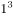，，，，底数是公差为1的等差数列，指数为2,3,2,3的循环数列，故下一项为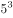。，所以。

故正确答案为C。

---

### 第 2 题　qid 2387676 · 数学运算

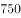        （  ）  

- **A**. 
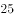

- **B**. 

　✅
- **C**. 
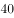

- **D**. 

**答案**：B

**官方解析**

观察数列倍数关系明显，考虑作商数列。前一项除以后一项得到新数列3,2.5,2，是公差为的等差数列，那么后两项应为1.5和1。，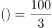，进行验证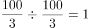，验证成立。

故正确答案为B。

---

### 第 3 题　qid 2387678 · 数学运算

7  12  25  50  91  152  （  ）

- **A**. 237　✅
- **B**. 241
- **C**. 243
- **D**. 255

**答案**：A

**官方解析**

观察数列变化趋势不大，考虑多级数列。后一项减前一项得到新数列5,13,25,41,61，新数列没有明显特征且变化趋势也不大，所以进行第二次作差得到新数列8,12,16,20,是公差为4的等差数列，故下一项为24。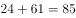，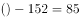，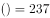。

故正确答案为A。

---

### 第 4 题　qid 2387681 · 数学运算

5  3  2    1  （  ）

- **A**. 

- **B**. 

- **C**. 

　✅
- **D**. 

**答案**：C

**官方解析**

根据第四项和选项均为分数可知本题为分数数列，数列逐渐递减且仅有一个分数，可考虑反向约分，则数列可以改写为：,  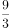，，，，（），分母是公差为1的等差数列，分子是公差为-1的等差数列，则括号内应为。

故正确答案为C。

---

### 第 5 题　qid 2387682 · 数学运算

3  2  10  24  （  ）  184

- **A**. 52
- **B**. 58
- **C**. 64
- **D**. 68　✅

**答案**：D

**官方解析**

数列呈现递增趋势且变化较快，考虑递推数列。观察相邻三个数字之间的关系有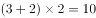，即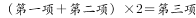，验证后面：，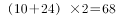，，均符合，因此所求项为68。

故正确答案为D。

---

### 第 6 题　qid 2387685 · 数学运算

- **A**. 4
- **B**. 5
- **C**. 6
- **D**. 7　✅

**答案**：D

**官方解析**

图形数阵，没有出现中心，优先考虑凑对角线关系。

观察发现：

第一个数阵中，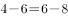；

第二个数阵中，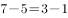；

第三个数阵中，；

即，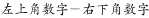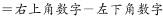；

故第四个数阵中，，。

故正确答案为D。

---

### 第 7 题　qid 2387686 · 数学运算

- **A**. 0
- **B**. 1
- **C**. 2　✅
- **D**. 4

**答案**：C

**官方解析**

图形数阵，没有出现中心，优先考虑凑对角线关系。

观察发现：

第一个数阵中，；

第二个数阵中，；

第三个数阵中，；

即，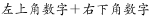；

故第四个数阵中，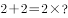，。

故正确答案为C。

---

### 第 8 题　qid 2387687 · 数学运算

- **A**. 6
- **B**. 7　✅
- **C**. 8
- **D**. 9

**答案**：B

**官方解析**

图形数阵，没有出现中心，优先考虑凑对角线关系，对角线无明显规律，再考虑横向找规律。

观察发现：

第一个数阵中，；

第二个数阵中，；

第三个数阵中，；

即，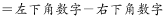；

故第四个数阵中，，。

故正确答案为B。

---

### 第 9 题　qid 2387688 · 数学运算

- **A**. 10
- **B**. 12
- **C**. 14　✅
- **D**. 16

**答案**：C

**官方解析**

图形数阵，有中间数字，优先考虑由周围的数字推出中间的数字。

观察发现：

第一个数阵中，；

第二个数阵中，；

第三个数阵中，；

即，；

故第四个数阵中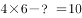，。

故正确答案为C。

---

### 第 10 题　qid 2387689 · 数学运算

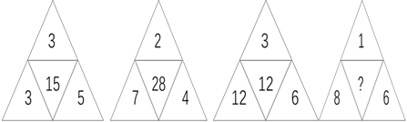

- **A**. 4
- **B**. 12
- **C**. 16
- **D**. 24　✅

**答案**：D

**官方解析**

图形数阵，有中间数字，考虑由周围的数字推出中间的数字。
观察发现：
第一个数阵中，中间数字15，为周边数字3，3，5的最小公倍数；
第二个数阵中，中间数字28，为周边数字2，7，4的最小公倍数；
第三个数阵中，中间数字12，为周边数字3，12，6的最小公倍数，
即，中间的数字为周边数字的最小公倍数。
故第四个数阵中，中间数字？应该为周边数字1，8，6的最小公倍数为24。
故正确答案为D。

---

### 第 11 题　qid 2387692 · 数学运算

甲、乙两个单位人数相同，甲单位的党员占总人数的，乙单位的党员占总人数的。如果乙单位20名党员与甲单位20名群众互换单位，则两个单位党员占比相同。问两个单位共有党员多少人？

- **A**. 256
- **B**. 288
- **C**. 324
- **D**. 360　✅

**答案**：D

**官方解析**

根据题意，假设甲、乙两个单位总人数均为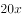，则甲单位党员人数为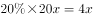；乙单位党员人数为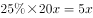，因乙单位20名党员与甲单位20名群众互换单位后，两单位党员占比相同，则，即：，解得人，两个单位共有党员人。

故正确答案为D。

---

### 第 12 题　qid 2387698 · 数学运算

小张去年底获得一笔总额不超过5万的奖金，她将其中的用来储蓄，剩下的用来购买理财产品，一年后这笔奖金增值了。已知储蓄的奖金增值了，问购买理财产品的奖金增值了多少？

- **A**. 

- **B**. 
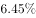

- **C**. 

　✅
- **D**. 

**答案**：C

**官方解析**

方法一：根据题意，假设奖金总额为，则用来储蓄的钱为，购买理财产品的钱为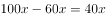。一年后奖金增值，储蓄的奖金增值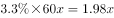，购买理财产品的奖金增值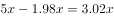，题目所求为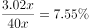。

方法二：

奖金由储蓄和理财产品两部分组成，考虑线段法，如图所示，因用来储蓄的钱占奖金的，所以购买理财产品的钱占奖金的，则储蓄的钱和购买理财产品的钱之比为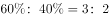，根据线段法“距离与量成反比”，则，则购买理财产品的奖金增值了。

故正确答案为C。

---

### 第 13 题　qid 2387699 · 数学运算

如下图所示，A、B、C、D为一块梯形田地的4个顶点。已知BC比AD长16米，三角形ACD面积比ABC小200平方米。问AD到BC的距离是多少米？

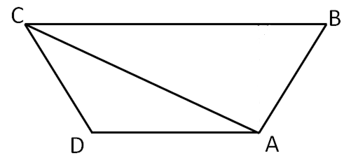

- **A**. 12.5
- **B**. 18.5
- **C**. 20
- **D**. 25　✅

**答案**：D

**官方解析**

假设AD到BC的距离为，则，

，

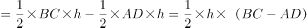

，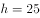米。

故正确答案为D。

---

### 第 14 题　qid 2387701 · 数学运算

A、B点和墙的位置如右图所示。现从A点出发以5米/秒的速度跑向墙，接触到墙后再跑到B点。问最少要多少秒到达B点？

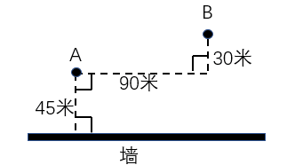

- **A**. 30　✅
- **B**. 34
- **C**. 38
- **D**. 42

**答案**：A

**官方解析**

要用最短时间到达B点，在速度一定的情况下，需从A接触到墙后再跑到B点所走的路程最短。如图，由于A和B在墙的同侧，可考虑做其中一个点关于墙的对称点，该对称点与另一个点的连线即为最短路程。假设做A点的对称点C，最短距离为BC。米，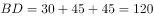米，最短距离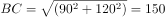米，则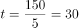秒。

故正确答案为A。

---

### 第 15 题　qid 2387704 · 数学运算

一个山丘的形状如下图所示。甲、乙两人同时从A点出发匀速前往B点，到达B点后立刻返回。甲上坡速度为3米/秒，下坡速度为5米/秒；乙上坡速度为2米/秒，下坡速度为3米/秒。问两人首次相遇时，距A点的路程为多少米？

- **A**. 108
- **B**. 138　✅
- **C**. 150
- **D**. 162

**答案**：B

**官方解析**

结合题意，如图，

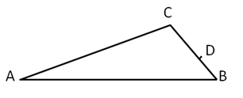

甲从A经C到B用时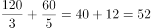秒，返回时BC段用时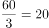秒；而乙速度较小，走完AC段用时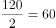秒，由此可知两者在BC段相遇；当乙到达C点时，甲从B返回又走了8秒，到达D点，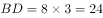米，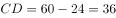米，根据相遇公式，得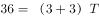，解得：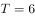秒，则相遇点距离A点的距离为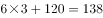米。

故正确答案为B。

---

### 第 16 题　qid 2387633 · 数学运算

将一张正方形纸对折成三角形，接着将三角形对折成小三角形，再将这个小三角形对折成更小的三角形。然后如下图所示，剪去三个等腰直角三角形。问将剩下的纸展开，可能是以下哪个图形？

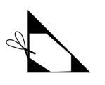

- **A**. 

- **B**. 

- **C**. 

- **D**. 

　✅

**答案**：D

**官方解析**

根据题干所给的图形，白色部分的图形即选项中四周的图形，可排除ABC。ABCD选项中四周图形，如下图所示。

故正确答案为D。

---

### 第 17 题　qid 2387640 · 数学运算

如右图所示，一个正方体木块六个面上分别写着数字，相对面上两个数字的和为20。现在正方体木块的上面是9，正面是13，右面是5。如果先将木块从左向右翻转2018次，再由前向后翻转2019次，这时木块正面数字是：

- **A**. 9
- **B**. 11　✅
- **C**. 13
- **D**. 15

**答案**：B

**官方解析**

根据“相对面上两个数字的和为20”，可知上面9的对面是，正面13的对面是，右面5的对面是。由题意“先将木块从左向右翻转，再由前向后翻转”，可知一个周期翻转的是4个面，则将木块从左向右翻转2018次，，可以等价于第2次从左到右翻转，第1次翻转5为底面，第2次翻转9在底面，上面是11；由前向后翻转2019次，，可以等价于第3次从前向后翻转，即第1次从后向前翻转，上面11从后向前翻转1次即为正面。所以如果先将木块从左向右翻转2018次，再由前向后翻转2019次，这时木块正面数字是11。

故正确答案为B。

---

### 第 18 题　qid 2387643 · 数学运算

一款手机有两个型号，存储容量分别为64G和256G，销售价分别为每台1600元和2000元，其他无区别。已知64G存储器的成本是256G存储器的一半，是单台手机其他成本之和的，而销售一台256G手机的利润比64G手机高150元。问销售64G和256G手机各10万台，利润为多少万元？

- **A**. 3500　✅
- **B**. 5600
- **C**. 6400
- **D**. 7000

**答案**：A

**官方解析**

根据“64G存储器的成本是单台手机其他成本之和的”，设其他成本为5a，则64G存储器成本为a；又“64G存储器的成本是256G存储器的一半”，则256G存储器成本为2a。再根据“销售一台256G手机的利润比64G手机高150元”，所以，解得。可计算出64G手机利润为，256G手机利润。那么销售64G和256G手机各10万台，利润为。

故正确答案为A。

---

### 第 19 题　qid 2387650 · 数学运算

苹果有每盒3个、5个和8个三种不同的包装。如果随机拿4盒，苹果总个数多于20个且为偶数的概率：

- **A**. 
低于

- **B**. 
在之间

- **C**. 
在之间
　✅
- **D**. 
高于

**答案**：C

**官方解析**

从三种不同的包装中随机拿4盒，则总情况数是种。

要满足的条件是“苹果总个数多于20个且为偶数”，分类讨论：

①，只有1种；

②，即从4个位置中选2个出来放8，剩下的两个位置放5，则情况数有种；

③，即从4个位置中选2个出来放8，剩下的两个位置再选一个放5，最后一个位置放3，则情况数有种；

④，即从4个位置中选2个出来放8，剩下的两个位置放3，则情况数有种。

因此，满足条件的情况数种。

所以本题概率。

故正确答案为C。

---

### 第 20 题　qid 2387653 · 数学运算

1、2、3、4、5、6、7、8、9这九个数字各用一次，组成三个能被9整除的三位数，这三个数的和最大是：

- **A**. 2007
- **B**. 2394
- **C**. 2448　✅
- **D**. 2556

**答案**：C

**官方解析**

依据“若一个数能被9整除，则这个数的各个位数之和能被9整除”可知，组成的这三个数的各个位数之和必为9的倍数。因为1到9这九个数字只能各用一次，且1到9的数字之和为45，则三个的数字之和应当分别为9，18和18。题干要求这三个数的和要最大，即每个三位数的百位都尽量取大数。满足数字之和为9的三个数可以是1、2、6或2、3、4或1、3、5，该三位数最大为621；此时，其余两个满足数字之和为18的三位数最大分别是954和873。因此三个数和最大为。

故正确答案为C。

---

### 第 21 题　qid 2387656 · 数学运算

下图前两行分别表示三位数567和648，那么第三行图形表示的数是：

 

- **A**. 647
- **B**. 753　✅
- **C**. 857
- **D**. 947

**答案**：B

**官方解析**

分析前两行图形的中间一列，可以发现，阴影部分刚好构成完整的圆，表示的数字之和。根据阴影部分代表的数字查找规律，每个数字分别代表阴影部分的数字相加。

根据第二行第一幅图可得：右下角数字；

根据第二行第三幅图可得：左下角数字；

根据第三列前两幅图可得：右上角数字；

由于完整的圆数字之和为10，故左上角数字。所以圆中四个数字如图所示：

所求第三行图形表示的数从左到右依次为：，，，合起来即753。

故正确答案为B。

---

### 第 22 题　qid 2387657 · 数学运算

王大妈与李大妈两人分别从小区外围环形道路上A、B两点出发相向而行。走了5分钟两人第一次相遇，接着走了4分钟后，李大妈经过A点继续前行，又过了26分钟两人第二次相遇。问李大妈沿小区外围道路走一圈需要几分钟？

- **A**. 54　✅
- **B**. 59
- **C**. 60
- **D**. 63

**答案**：A

**官方解析**

如图所示，假设两人5分钟后在C点第一次相遇，李大妈接着走了4分钟达到A点，即，则。赋值王大妈的速度为4，李大妈的速度为5。

从C点第一次相遇开始，到第二次相遇，共计用时。环形相遇问题，从同一起点出发，相遇一次即共走一个全程。则环形道路。那么李大妈走完一圈需要的时间。

故正确答案为A。

---

### 第 23 题　qid 2387659 · 数学运算

某研究机构有40名研究人员。上半年发表论文数量最多的人发表了4篇，发表3篇论文的人比发表2篇的多，比发表4篇的少；发表1篇论文的人比发表2篇的少，且所有人都发表了论文。如所有人全年共发表论文205篇，则上半年发表的论文数量至少比下半年多：

- **A**. 9篇　✅
- **B**. 13篇
- **C**. 17篇
- **D**. 21篇

**答案**：A

**官方解析**

方法一：根据问题所求“上半年发表的论文数量至少比下半年多”，则上半年发表的论文数量应尽可能少，那么发表篇数多的人应尽可能少，发表篇数少的人应尽可能多。根据题意可得，设发表4篇的人数至少为人，则发表其它篇数的人数要尽可能多，发表3篇的人数再多也不可能超过发表4篇的人数，即发表3篇的人数最多为人，同理发表2篇的人数最多为人，发表1篇的人数最多为人，因一共有40名研究人员，所以，解得。即发表4篇的人数至少为12人，发表3篇的人数为11人，发表2篇的人数为9人，发表1篇的人数为8人。所以上半年发表的论文数量至少为篇，则下半年至多为篇，即上半年发表的论文数量至少比下半年多篇。

方法二：根据问题所求“上半年发表的论文数量至少比下半年多”，则上半年发表的论文数量应尽可能少，那么发表篇数多的人应尽可能少，发表篇数少的人应尽可能多。梳理条件可得，发表4篇的人数最多，剩余依次为发表3篇、发表2篇、发表1篇的人。故发表4篇的人数最多，应超过人数平均值，至少为11人。发表3篇、2篇、1篇的人数依次至多应为10、9、8人，总计。剩余2人只能平均分到发表4篇与3篇的组中，依此构造发表4篇、3篇、2篇、1篇的人数分别为12、11、9、8人。

则上半年发表的篇数至少应等于，则下半年至多发表。前者比后者至少多。

故正确答案为A。

---

### 第 24 题　qid 2387660 · 数学运算

某公司研发部、市场部和销售部共新招了十几名员工，其中研发部新员工数与市场部和销售部新员工数的总和相同。销售部如果将的新员工调到市场部，则两个部门的新员工数相同。现在要为每名新员工各采购一台电脑，其中研发部的电脑每台不超过1万元，销售部和市场部的电脑每台不超过6千元。问采购这批电脑最多需要多少万元？

- **A**. 14.4
- **B**. 12.8　✅
- **C**. 11.2
- **D**. 9.6

**答案**：B

**官方解析**

题干给出两组等量关系，分别为：

；

；

化简整理可得：

；

；

设市场部新员工数为n，则销售部和研发部分别为3n，4n，三个部门新招总人数为8n（已知共新招十几名员工）。

可知：（n为正整数），所以。

则市场部新员工数为2，则销售部和研发部分别为6，8。

所求采购电脑的费用最多为：。

故正确答案为B。

---

### 第 25 题　qid 2387662 · 数学运算

小刘每连续3天去健身房休息1天，而小张每连续2天去健身房休息3天。今年5月，有11天小张和小刘两人都去了健身房。问以下哪天两人一定都去了健身房？

- **A**. 5月2日
- **B**. 5月4日
- **C**. 5月8日
- **D**. 5月11日　✅

**答案**：D

**官方解析**

题干已知小刘去健身房的周期长度是4天，小张去健身房的周期长度是5天，则可得两人共同出现在健身房的周期长度为20天。又已知5月有11天两人都去了健身房，则符合要求的情况之一，如下图所示：（“1”代表去，“0”代表不去）

这种情况下，5月2日、4日、8日小刘和小张没有同时去健身房，所以不满足题目所求一定都去了健身房，故A、B、C均可以排除。

故正确答案为D。

---

## 判断推理

### 第 1 题　qid 2387635 · 图形推理

从所给的四个选项中，选择最合适的一个填入问号处，使之呈现一定的规律性：

- **A**. A
- **B**. B
- **C**. C　✅
- **D**. D

**答案**：C

**官方解析**

元素组成不同，优先考虑属性规律，题干中图1、图4都出现等腰三角形，是轴对称的特征图，优先考虑轴对称；题干和选项都是轴对称图形，无法排除。观察发现，如下图所示：

图1、图3、图5的对称轴与图形内部线条都不重合，而图2、图4的对称轴都与图形内部的一根线条重合，因此问号处要填入一个对称轴与图形内部线条有重合的选项，只有C选项满足。

故正确答案为C。

注：本题有同学的解题思路是对称轴的数量与面数量一致，选择B项。但是粉笔认为选C项的原因有二：第一，本题题干第五幅图形外框为长方形，其对称轴的数量应为横竖2条，而面数量为4，二者数量并不一致；第二，从近年来的命题规律来看，2019年国考和2018年北京市考都考查了对称轴与图形中线条重合这一知识点，C选项更符合最新的命题趋势。

---

### 第 2 题　qid 2387638 · 图形推理

从所给的四个选项中，选择最合适的一个填入问号处，使之呈现一定的规律性：

- **A**. A
- **B**. B
- **C**. C
- **D**. D　✅

**答案**：D

**官方解析**

元素组成相同，优先考虑位置规律，如下图所示： 

标注“1”的小黑块，沿着最外圈依次逆时针平移1、2、3、4格，所以正确答案处应该移动5格，对应D选项；再验证另外一个标注“2”的小黑块，标注“2”的小黑块。沿着最内圈依次逆时针平移1格，D项当选。

故正确答案为D。

---

### 第 3 题　qid 2387639 · 图形推理

从所给的四个选项中，选择最合适的一个填入问号处，使之呈现一定的规律性：

- **A**. A
- **B**. B　✅
- **C**. C
- **D**. D

**答案**：B

**官方解析**

通过观察题干发现，每个图形都只出现了两种小元素，考虑元素间的换算关系，根据基本换算公式“图1+图3=2*图2”，最后换算的结果为1圆=3三角形，代入题干，将圆全部换算成三角形可知，分别有6、7、8、9、10个三角形，故“？”处图形应有11个三角形。A项换算为14个三角形，排除；B项换算为11个三角形，保留；C项换算为8个三角形，排除；D项换算为12个三角形，排除。
故正确答案为B。

---

### 第 4 题　qid 2387641 · 图形推理

从所给的四个选项中，选择最合适的一个填入问号处，使之呈现一定的规律性：

- **A**. A
- **B**. B
- **C**. C
- **D**. D　✅

**答案**：D

**官方解析**

元素组成不同，且无明显属性规律，优先考虑数量规律。每个图形中都有多个窟窿，故可以考虑数面。题干所有图形面的数量均为3，四个选项面的数量分别为2、2、4、3，只有D项符合规律。
故正确答案为D。

---

### 第 5 题　qid 2387642 · 图形推理

从所给的四个选项中，选择最合适的一个填入问号处，使之呈现一定的规律性：

- **A**. A
- **B**. B
- **C**. C
- **D**. D　✅

**答案**：D

**官方解析**

元素组成不同，无明显属性规律，考虑数量规律。观察发现，图①是五角星，图②出现明显端点，考虑笔画数。题干图形均为一笔画图形，A项为三笔画，B项为三笔画，C项为两笔画，D项为一笔画。
故正确答案为D。

---

### 第 6 题　qid 2387644 · 图形推理

把下面的六个图形分为两类，使每一类都有各自的共同特征或规律，分类正确的一项是：

- **A**. ①②③，④⑤⑥
- **B**. ①②⑤，③④⑥　✅
- **C**. ①②④，③⑤⑥
- **D**. ①③⑥，②④⑤

**答案**：B

**官方解析**

本题为分组分类题目。观察发现，题干图形均由一个小白圆和另一个图形组成，故考虑功能元素。图①②⑤中小白圆均标记直角，图③④⑥中的小白圆均标记锐角。即①②⑤一组，③④⑥一组。
故正确答案为B。

---

### 第 7 题　qid 2387646 · 图形推理

把下面的六个图形分为两类，使每一类都有各自的共同特征或规律，分类正确的一项是：

- **A**. ①③④，②⑤⑥　✅
- **B**. ①③⑥，②④⑤
- **C**. ①②③，④⑤⑥
- **D**. ①④⑤，②③⑥

**答案**：A

**官方解析**

元素组成不同，且无明显属性规律，优先考虑数量规律，图②只有一条曲线，其他图形有曲有直，分别数出直线条数与曲线条数，图①③④中直线条数-曲线条数=1，图②⑤⑥中曲线条数-直线条数=1。则图①③④一组，图②⑤⑥一组。
故正确答案为A。

---

### 第 8 题　qid 2387648 · 图形推理

从所给的四个选项中，选择最合适的一个填入问号处，使之呈现一定的规律性：

- **A**. A
- **B**. B
- **C**. C　✅
- **D**. D

**答案**：C

**官方解析**

元素组成相似，考虑样式规律。观察发现，黑块数量不同，考虑黑白运算。根据第一行图形可知：黑+白=黑，白＋黑=黑，黑＋黑=白，白+白＝白；第二行验证此规律成立；第三行运用规律可得？处应为C项。
故正确答案为C。

---

### 第 9 题　qid 2387649 · 图形推理

下图是给定的立体图形，它的主视图和左视图是：

- **A**. A
- **B**. B
- **C**. C　✅
- **D**. D

**答案**：C

**官方解析**

本题考查三视图。题干当中右侧的“L”型的高度应高于左侧的立方体，且从整个图形的左侧看过去，立方体与“L”型的立体图形的宽度是一样的，对应C选项。
故正确答案为C。

---

### 第 10 题　qid 2387654 · 图形推理

下图是给定的立体图形，下列哪个选项是该立体图形的外表面展开图？

- **A**. A　✅
- **B**. B
- **C**. C
- **D**. D

**答案**：A

**官方解析**

本题为空间重构题。观察选项，主要区别在于左侧的小扇形和右侧的小矩形的位置不同，从这个特殊点入手，回到题干立体图形观察扇形面的两条直角边，分别挨着的是一个矩形面和底面的“L”型，比较B、D两项，如下图所示，

扇形面的两条直角边挨着的面与题干立体图形不符，排除；比较A、C两项，区别是右侧的小矩形，依据右侧小矩形画出相应的公共边，如下图所示，

对应A选项。

故正确答案为A。

---

### 第 11 题　qid 2387813 · 定义判断

自我损耗现象是个人在长期从事某项工作的过程中，出现自我进行意志活动的能力或意愿下降的现象，包括控制环境、控制自我、做出抉择和发起行为等能力或意愿的下降，同时出现职业倦怠、自我消耗但毫无进步的情况。
根据上述定义，下列符合自我损耗现象的是：

- **A**. 李某博士论文一直未完成，不断延期，结果在学校读了八年也没有毕业
- **B**. 陈某在杂志社做副主任已经有二十年了，虽然出版了一些个人作品，但没有获得升职的机会
- **C**. 宋某做销售工作将近十年，虽然他换了四五家公司，但由于业绩一般，收入一直没有什么变化
- **D**. 王某一直在档案馆做管理员，一做就是十五年，他对工作感到麻木，也没有改变现状、获得晋升的欲望　✅

**答案**：D

**官方解析**

第一步：找出定义关键词。
“长期从事某项工作的过程中”、“出现自我进行意志活动的能力或意愿下降的现象”、“控制环境、控制自我、做出抉择和发起行为等能力或意愿的下降”、“出现职业倦怠、自我消耗但毫无进步的情况”。
第二步：逐一分析选项。
A项：李某博士论文一直未完成，不断延期，不符合“长期从事某项工作的过程中”，不符合定义，排除； 
B项：陈某做副主任已经有二十年，出版了一些个人作品，但没有升职机会，并未体现出个人的意愿，不符合“出现自我进行意志活动的能力或意愿下降的现象”，也不符合“同时出现职业倦怠、自我消耗但毫无进步的情况”，不符合定义，排除；
C项：宋某做销售工作将近十年，业绩一般，收入没有什么变化，并未体现出个人的意愿，不符合“出现自我进行意志活动的能力或意愿下降的现象”，也不符合“同时出现职业倦怠、自我消耗但毫无进步的情况”，不符合定义，排除；
D项：王某一直在档案馆做管理员，做了十五年，符合“长期从事某项工作的过程中”，他对工作感到麻木，也没有改变现状、获得晋升的欲望，符合“出现自我进行意志活动的能力或意愿下降的现象”，也符合“同时出现职业倦怠、自我消耗但毫无进步的情况”，符合定义，当选。
故正确答案为D。

---

### 第 12 题　qid 2387769 · 定义判断

社会悖论是指在多人决策的某种场合，每人具有一种至少在某些情形下可得到最优结果并对别人不利的策略，但若所有人均选用这种策略则会导致对所有人都更差的结果。
根据上述定义，下列属于社会悖论的是：

- **A**. 王某等三人都想承包村里的鱼塘以增加经济收入，三人因此争得不可开交
- **B**. 村民认为村里的河流有自净能力，都往河里排放生活污水，但家家如此，河流会被严重污染　✅
- **C**. 谈判前，李某充分考虑对方的需求，并根据他们的需求设计了合约，所以在谈判时，李某始终能把握主动
- **D**. 虽然商户交管理费会有一些经济压力，但是却为整个市场的正规化管理提供了经济保障，有利于整个市场所有个体的发展

**答案**：B

**官方解析**

第一步：找出定义关键词。
“在多人决策的某种场合”、“每人具有一种至少在某些情形下可得到最优结果并对别人不利的策略”、“所有人均选用这种策略则会导致对所有人都更差的结果”。
第二步：逐一分析选项。
A项：王某等三人都想承包鱼塘，争得不可开交，并未造成三人更差的结果，不符合“所有人均选用这种策略则会导致对所有人都更差的结果”，不符合定义，排除； 
B项：村民认为河流有自净能力，都往河里排放生活污水，符合“在多人决策的某种场合”，也符合“每人具有一种至少在某些情形下可得到最优结果并对别人不利的策略”，但家家如此，河流会被严重污染，符合“所有人均选用这种策略则会导致对所有人都更差的结果”，符合定义，当选；
C项：李某充分考虑对方的需求并根据对方的需求设计合约，不符合“每人具有一种至少在某些情形下可得到最优结果并对别人不利的策略”，不符合定义，排除；
D项：商户交管理费会有经济压力，不符合“每人具有一种至少在某些情形下可得到最优结果并对别人不利的策略”，有利于整个市场所有个体的发展，也不符合“所有人均选用这种策略则会导致对所有人都更差的结果”，不符合定义，排除。 
故正确答案为B。

---

### 第 13 题　qid 2387767 · 定义判断

成就动机是个体努力追求自认为重要且有价值的工作，以高标准来要求自己，以取得成功为目标，并尽量使工作达到完美状态的动机。
根据上述定义，下列没有体现出成就动机的是：

- **A**. 小刘是一名厨师，他用心做好每一道菜，希望得到用餐者的一致好评
- **B**. 小李是一名篮球运动员，他反复练习投篮希望可以带领队伍取得胜利
- **C**. 小张是一名企业领导，他常告诫手下员工要自觉、高质量地完成工作　✅
- **D**. 小王是一名高中生，他不断复习曾经做错的试题，希望高考中不会再犯错

**答案**：C

**官方解析**

第一步：找出定义关键词。
“个体努力追求自认为重要且有价值的工作”、“以高标准来要求自己，以取得成功为目标，尽量使工作达到完美状态的动机”。
第二步：逐一分析选项。
A项：厨师小刘为了得到用餐者的好评而用心做菜，符合“以高标准来要求自己，以取得成功为目标，尽量使工作达到完美状态的动机”，符合定义，排除； 
B项：篮球运动员小李为了带领队伍取得胜利而反复练习投篮，符合“以高标准来要求自己，以取得成功为目标，尽量使工作达到完美状态的动机”，符合定义，排除；
C项：领导小张经常告诫手下员工要好好完成工作，是在以高标准来要求他人，并非是要求自己，不符合“以高标准来要求自己，以取得成功为目标，尽量使工作达到完美状态的动机”，不符合定义，当选；
D项：高中生小王为了在高考中不犯错而不断复习做错的试题，符合“以高标准来要求自己，以取得成功为目标，尽量使工作达到完美状态的动机”，符合定义，排除。
本题为选非题，故正确答案为C。

---

### 第 14 题　qid 2387814 · 定义判断

排他成本是人们在想要确保不让他人擅自使用其产权时发生的成本。
根据上述定义，下列属于排他成本的是：

- **A**. 张某为自家庭院安装栅栏所支出的费用　✅
- **B**. 李某为保护自己的名誉权聘请律师而支付的费用
- **C**. 王某在与外商谈判过程中支付的交通和住宿费用
- **D**. 田某就买卖合同争议向人民法院起诉赵某时支付的诉讼费用

**答案**：A

**官方解析**

第一步：找出定义关键词。
“确保不让他人擅自使用其产权时发生的成本”。
第二步：逐一分析选项。
A项：张某为自家院子安装栅栏，是为了不让他人擅自使用自己的院子，符合“确保不让他人擅自使用其产权时发生的成本”，符合定义，当选； 
B项：李某为保护自己的名誉权而支付费用，但名誉权不是产权，不符合“确保不让他人擅自使用其产权时发生的成本”，不符合定义，排除；
C项：王某在谈判过程中支付的费用，没有体现他人擅自使用自己的产权，不符合“确保不让他人擅自使用其产权时发生的成本”，不符合定义，排除；
D项：田某就买卖合同争议向法院起诉赵某时支付的费用，没有体现他人擅自使用自己的产权，不符合“确保不让他人擅自使用其产权时发生的成本”，不符合定义，排除。
故正确答案为A。

---

### 第 15 题　qid 2387815 · 定义判断

个人道德判断能力的发展经历了六个阶段：一是避罚服从取向阶段，为避免惩罚而服从权威或规则；二是相对功利取向阶段，评定行为好坏主要看是否符合自己的利益；三是寻求认可取向阶段，顺从传统要求，谋求大家的赞赏和认可；四是遵守法规取向阶段，服从社会规范，遵守法律权威；五是社会法制取向阶段，看重法律的效力，但认为法律可以应大多数人的要求而改变；六是普遍伦理取向阶段，认为符合公正、平等、尊严等人类最一般原则的行为就是正确的。
根据上述定义，如果一个人认为公司员工都参加了聚餐，所以自己也应该参加聚餐，则他的个人道德判断能力所处的发展阶段是：

- **A**. 避罚服从取向阶段
- **B**. 相对功利取向阶段
- **C**. 寻求认可取向阶段　✅
- **D**. 普遍伦理取向阶段

**答案**：C

**官方解析**

第一步：找出定义关键词。
“避免惩罚而服从权威或规则”、“评定行为好坏主要看是否符合自己的利益”、“顺从传统要求，谋求大家的赞赏和认可”、“服从社会规范，遵守法律权威”、“看重法律的效力，但认为法律可以应大多数人的要求而改变”、“符合公正、平等、尊严等人类最一般原则的行为就是正确的” 
第二步：逐一分析选项。
A项：参加公司员工聚餐，不符合“避免惩罚而服从权威或规则”，不符合定义，排除； 
B项：参加公司员工聚餐，不符合“评定行为好坏主要看是否符合自己的利益”，不符合定义，排除；
C项：参加公司员工聚餐，符合“顺从传统要求，谋求大家的赞赏和认可”，符合定义，当选；
D项：参加公司员工聚餐，不符合“符合公正、平等、尊严等人类最一般原则的行为就是正确的”，不符合定义，排除。
故正确答案为C。

---

### 第 16 题　qid 2387629 · 定义判断

偶例谬误是一种“通则凌驾例外”的谬误，是基于某个通则的存在，而否定例外的存在或正当性。
根据上述定义，下列推理中存在偶例谬误的是：

- **A**. 吃肉会长胖，所以吃素一定会瘦
- **B**. 超速是违法的，所以救护车不应该超速　✅
- **C**. 所有马都可以训练为战马，所以海马也可以作战马
- **D**. 我在香港住了七天，有三天下雨，所以香港大约有一半的时间下雨

**答案**：B

**官方解析**

第一步：找出定义关键词。
“基于某个通则的存在、否定例外的存在或正当性” 
第二步：逐一分析选项。
A项：“吃素会瘦”并不是“吃肉会长胖”的例外，不符合“基于某个通则的存在、否定例外的存在或正当性”，不符合定义，排除； 
B项：“救护车不应该超速”是“超速是违法”的例外，符合“基于某个通则的存在、否定例外的存在或正当性”，符合定义，当选；
C项：“海马也可以作战马”是“所有马都可以训练为战马” 的例外，但是并没有否定“海马也可以作战马”这个例外的存在，不符合“基于某个通则的存在、否定例外的存在或正当性”，不符合定义，排除；
D项：“我在香港住了七天，有三天下雨，所以香港大约有一半的时间下雨”，并不存在某个通则，不符合定义，排除。
故正确答案为B。

---

### 第 17 题　qid 2387645 · 定义判断

社会适应是指个人为与社会环境取得和谐的关系而产生的心理和行为的变化。它是个体与各种社会环境因素连续而不断改变的相互作用过程。
根据上述定义，下列属于社会适应的是：

- **A**. 到海南半年后，小吴已经完全适应了当地湿润的气候
- **B**. 出国不到三个月，小黄就基本掌握了当地语言，能够听说和阅读
- **C**. 内向的小赵转入销售岗后，与人打交道的机会增多，性格变得活泼起来　✅
- **D**. 小周进入大学后，生活、学习甚至语言都不习惯，常常打电话向家人倾诉

**答案**：C

**官方解析**

第一步：找出定义关键词。
“个人为与社会环境取得和谐的关系而产生的心理和行为的变化”。
第二步：逐一分析选项。
A项：小吴到海南半年适应当地的气候，属于生理上产生了变化，而不是心理变化，同时适应气候属于自然环境，不属于社会环境，不符合“个人为与社会环境取得和谐的关系而产生的心理和行为的变化”，不符合定义，排除；
B项：小黄掌握了当地的语言，只是学会了一种沟通技能，并没有体现出心理上的变化，不符合“个人为与社会环境取得和谐的关系而产生的心理和行为的变化”，不符合定义，排除；
C项：小赵转入销售岗后，与人打交道的机会增多，说明行为上发生了变化；性格变得活泼起来，说明心理上发生了变化，符合“个人为与社会环境取得和谐的关系而产生的心理和行为的变化”，符合定义，当选；
D项：小周进入大学后很不习惯，不符合“个人为与社会环境取得和谐的关系而产生的心理和行为的变化”，不符合定义，排除；
故正确答案为C。

---

### 第 18 题　qid 2387760 · 类比推理

曲 ：直

- **A**. 呼 ：吸
- **B**. 动 ：静　✅
- **C**. 进 ：退
- **D**. 黑 ：白

**答案**：B

**官方解析**

第一步：判断题干词语间逻辑关系。
“曲”和“直”属于并列关系中的矛盾关系，曲和直之间存在明显的界限限定。
第二步：判断选项词语间逻辑关系。
A项：呼和吸属于并列关系中的反对关系，除了呼和吸还有屏住呼吸的状态，与题干逻辑关系不一致，排除；
B项：动和静属于并列关系中的矛盾关系，动和静之间存在明显的界限限定，与题干逻辑关系一致，当选；
C项：“进”和“退”属于并列关系中的反对关系，除了进和退还有原地不动，与题干逻辑关系不一致，排除；
D项：“黑”和“白”属于并列关系中的反对关系，除了黑和白还有其他不同的颜色，与题干逻辑关系不一致，排除。
故正确答案为B。

---

### 第 19 题　qid 2387761 · 类比推理

羽绒服 ：暖气

- **A**. 水杯 ：汤锅　✅
- **B**. 书本 ：眼镜
- **C**. 货车 ：观光船
- **D**. 冲浪 ：洗澡

**答案**：A

**官方解析**

第一步：判断题干词语间逻辑关系。
羽绒服和暖气都有保暖的功能，功能相同，且二者为并列关系。
第二步：判断选项词语间逻辑关系。
A项：水杯通常是人们盛装液体的容器，汤锅可以指煲汤用的锅具，二者均有盛装液体的功能，二者为并列关系，与题干逻辑关系一致，当选；
B项：佩戴眼镜方便查阅书本，二者是对应关系，与题干逻辑关系不一致，排除；
C项：货车为承载货物的交通工具，观光船为用作游客观光的交通工具，二者为并列关系，但不具有相同的功能，与题干逻辑关系不一致，排除；
D项：冲浪之后需要洗澡来冲掉海水蒸发后留在皮肤上的盐分，但二者不是功能相同的并列关系，排除。
故正确答案为A。

---

### 第 20 题　qid 2387762 · 类比推理

青蛙：哺乳动物

- **A**. 奇数：自然数
- **B**. 软件：计算机
- **C**. 火星：太阳系
- **D**. 钢琴：铜管乐器　✅

**答案**：D

**官方解析**

第一步：判断题干词语间逻辑关系。
青蛙属于两栖动物，不属于哺乳动物，因此青蛙与哺乳动物为反向种属关系。
第二步：判断选项词语间逻辑关系。
A项：奇数指不能被2整除的数，可以分为正奇数和负奇数，与自然数是交叉关系，与题干逻辑关系不一致，排除；
B项：计算机由硬件系统和软件系统组成，软件是计算机的组成部分，二者为组成关系，与题干逻辑关系不一致，排除；
C项：太阳系有八大行星，分别是水星，金星，地球，火星，木星，土星，天王星，海王星，而火星是太阳系八大行星之一，二者为组成关系，与题干逻辑关系不一致，排除；
D项：铜管乐器是一种将气流吹进吹嘴之后，造成嘴唇振动的乐器，钢琴不属于铜管乐器，钢琴与铜管乐器为反向种属关系，与题干逻辑关系一致，当选。
故正确答案为D。

---

### 第 21 题　qid 2387763 · 类比推理

矿泉水：纯净水

- **A**. 象棋：军棋　✅
- **B**. 泰山：高山
- **C**. 军人：医生
- **D**. 正月：元月

**答案**：A

**官方解析**

第一步：判断题干词语间逻辑关系。
矿泉水是指从地下深处自然涌出的或者是经人工揭露、未受污染的地下矿水，含有一定量的矿物盐、微量元素或二氧化碳气体；纯净水是指不含有杂质或细菌的水，是利用加工方法去除水中的矿物质、有机成分、有害物质及微生物等加工制成的水，二者为并列关系。
第二步：判断选项词语间逻辑关系。
A项：象棋和军棋是两种不同的棋类，二者为并列关系，与题干逻辑关系一致，当选；
B项：高山指高峻的山峰，泰山属于高山，二者为种属关系，与题干逻辑关系不一致，排除；
C项：有的军人是医生，有的军人不是医生，有的医生是军人，有的医生不是军人，军人和医生为交叉关系，与题干逻辑关系不一致，排除；
D项：元月指每年的第一个月份，农历一月，也就是正月，二者为全同关系，与题干逻辑关系不一致，排除。
故正确答案为A。

---

### 第 22 题　qid 2387764 · 类比推理

书信：短信：微信

- **A**. 电灯：电视：电脑
- **B**. 扇子：电风扇：空调　✅
- **C**. 凉菜：热菜：主食
- **D**. 传呼机：电话：手机

**答案**：B

**官方解析**

第一步：判断题干词语间逻辑关系。
书信、短信和微信都是用来传递信息的工具，三者在功能上是并列关系，并且从书信到短信，再到微信，是按照出现时间由先到后的顺序。
第二步：判断选项词语间逻辑关系。
A项：电灯是用来照明的，电视是用来收看的，电脑是用来办公和娱乐的，三者在功能上不存在并列关系，与题干逻辑关系不一致，排除；
B项：扇子、电风扇和空调都是用来纳凉的工具，三者在功能上是并列关系，并且从扇子到电风扇，再到空调，是按照出现时间由先到后的顺序，与题干逻辑关系一致，当选；
C项：凉菜和热菜都是属于菜种，可以用来充饥，主食也可以用来充饥，三者是功能上的并列关系，但不存在时间上的先后顺序，与题干逻辑关系不一致，排除；
D项：传呼机、电话和手机都是用来通讯的工具，但是手机是一种无线电话，二者是种属关系，与题干逻辑关系不一致，排除。
故正确答案为B。

---

### 第 23 题　qid 2387766 · 类比推理

药物：手术：治疗

- **A**. 警察：法律：追捕
- **B**. 汽车：火车：陆地
- **C**. 读书：授课：上学
- **D**. 跑步：游泳：锻炼　✅

**答案**：D

**官方解析**

第一步：判断题干词语间逻辑关系。
药物和手术是两种不同的治疗方式，二者是并列关系。
第二步：判断选项词语间逻辑关系。
A项：警察是追捕的主体，不是方式，法律是用来判决的依据，也不是追捕方式，与题干逻辑关系不一致，排除；
B项：汽车和火车是两种在陆地上用到的出行交通工具，与陆地是对应关系，与题干逻辑关系不一致，排除；
C项：授课不是上学的一种方式，与题干逻辑关系不一致，排除；
D项：跑步和游泳是两种不同的锻炼方式，二者是并列关系，与题干逻辑关系一致，当选。
故正确答案为D。

---

### 第 24 题　qid 2387652 · 类比推理

（    ）对于 一氧化碳 相当于 （    ）对于 海啸

- **A**. 中毒  灾难　✅
- **B**. 二氧化碳  季风
- **C**. 口罩  潜艇
- **D**. 尾气  地震

**答案**：A

**官方解析**

逐一代入选项。
A项：一氧化碳可能导致中毒，二者为因果关系，海啸可能导致灾难，二者为因果关系，前后逻辑关系一致，当选；
B项：二氧化碳和一氧化碳为并列关系，季风和海啸无必然逻辑关系，前后逻辑关系不一致，排除；
C项：口罩和一氧化碳无必然逻辑关系，潜艇和海啸无必然逻辑关系，前后逻辑关系不一致，排除；
D项：汽车尾气中包含一氧化碳，二者是组成关系，地震是引发海啸的原因，二者为因果关系，前后逻辑关系不一致，排除。
故正确答案为A。

---

### 第 25 题　qid 2387683 · 类比推理

白鸽 对于（    ） 相当于 （    ）对于 权力

- **A**. 杜鹃  帝王
- **B**. 橄榄枝  政治
- **C**. 好运  宪法
- **D**. 和平  权杖　✅

**答案**：D

**官方解析**

逐一代入选项。
A项：白鸽和杜鹃都是鸟类，二者是并列关系，帝王拥有权力，二者为对应关系，前后逻辑关系不一致，排除；
B项：白鸽和橄榄枝都象征和平，政治和权力无必然逻辑关系，前后逻辑关系不一致，排除；
C项：白鸽和好运无必然逻辑关系，宪法规定涉及权力，二者为对应关系，前后逻辑关系不一致，排除；
D项：白鸽象征着和平，权杖象征着权力，前后逻辑关系一致，当选。
故正确答案为D。

---

### 第 26 题　qid 2387707 · 逻辑判断

智人的第一波殖民正是整个动物界最大也最快速的一场生态浩劫。其中受创最深的是那些大型动物。在认知革命发生的时候，地球上大约有200属体重超过50公斤的大型陆生哺乳动物。而等到农业革命的时候，只剩下大约100属。换句话说，远在人类还没有发明轮子、文字和铁器之前，智人就已经让全球大约一半的大型兽类魂归西天、就此灭绝。
以下哪项如果为真，不能支持上面的论述？

- **A**. 该时期人类已经掌握了火耕等新技术，狩猎能力大幅提升
- **B**. 认知革命后地球气候出现多次冷却和暖化循环，变化幅度较大　✅
- **C**. 地球上大部分大型动物虽然身形巨大但并不凶猛，易被人类猎杀
- **D**. 考古研究发现只要人类抵达新的土地，那里就会发生大型动物大灭绝

**答案**：B

**官方解析**

第一步：找出论点和论据。

论点：智人的第一波殖民正是整个动物界最大也最快速的一场生态浩劫。其中受创最深的是那些大型动物。

论据：在认知革命发生的时候，地球上大约有200属体重超过50公斤的大型陆生哺乳动物。而等到农业革命的时候，只剩下大约100属。换句话说，远在人类还没有发明轮子、文字和铁器之前，智人就已经让全球大约一半的大型兽类魂归西天、就此灭绝。

本题问的是不能支持的，找到三个能够支持的排除掉，剩下的一个就是正确答案。

第二步：逐一分析选项。

A项：该项说的是该时期人类已经掌握了火耕等新技术，狩猎能力大幅提升，说明已经可以猎杀大型兽类，补充论据加强，排除；

B项：该项说的是认知革命后地球气候出现多次冷却和暖化循环，变化幅度较大，说明气候的变化也可能是导致大型兽类死亡的原因，他因削弱，无法加强，当选；

C项：该项说的是地球上大部分大型动物虽然身形巨大但并不凶猛，易被人类猎杀，说明人类可以猎杀大型兽类，补充论据加强，排除；

D项：该项说的是考古研究发现只要人类抵达新的土地，那里就会发生大型动物大灭绝，说明是人类使大型动物灭绝，补充论据加强，排除。

本题为选非题，故正确答案为B。

注：本题通过查询原文，如下文加粗部分。可见还有少数历史学家将大型动物的灭绝归因的“气候变迁”，此题选项B正好涉及的是气候的变化，显然不能支持题干观点。

《人类简史》第四章的标题叫做“毁天灭地的人类洪水”。开始没仔细看，以为是要说那场圣经里浓墨重彩描写的大洪水，以及有关诺亚方舟的考证。然而，我完全错了。赫拉利想告诉我们的事实是：真正在史前毁灭了无数生命（尤其是大型哺乳动物）的“洪水”，不是洪水，就是我们的祖先智人！毁灭的起点，始于大约45000年前，智人来到澳大利亚大陆，这是人类第一次成功离开亚非大陆生态系统，也是第一次有大型陆生哺乳动物能够从亚非大陆抵达澳大利亚，重要性不亚于登陆月球。当时，澳大利亚生活着许多体型巨大的有袋动物——袋狮、袋熊、双门齿兽······其中的物种如今已灭绝。它们是如何灭绝的呢？被智人干掉了。就是在智人抵达澳大利亚之后的几千年里，当地24种体重在50公斤以上的动物中，有23种都惨遭灭绝，整个澳大利亚的生态系统食物链重新洗牌。

<b>也有不少历史学家极力为我们的祖先开罪，将其归因于气候变迁。但更多的历史证据显示：在全球各个地方，当地的大型动物都在智人抵达之后迅速地灭绝。</b>其中最出名的物种，大约就是曾经足迹遍布北半球的猛犸象。

因此作者得出结论：<b>智人的第一波殖民潮正是整个动物界最大也最快速的一场生态浩劫。“甚至远在人类还没有发明轮子、文字和铁器之前，智人就已经让全球大约一半的大型兽类魂归西天、就此灭绝。”</b>

---

### 第 27 题　qid 2387712 · 逻辑判断

一项最新的研究认为，适度饮酒会使大脑的控制本能放松，激发创意与灵感。研究人员选取70名受试者进行了对比研究，实验组喝下真正的啤酒，对照组则喝了不含酒精的啤酒，两种饮品无法辨别。在测试中，实验组的得分更高。研究结果表明，即使受试者只喝下了一小杯啤酒或葡萄酒，血液酒精浓度仅仅达到，创意也会大大提高。

以下哪项如果为真，最能削弱上述结论？

- **A**. 受试者饮酒后大脑的执行功能会不同程度地降低　✅
- **B**. 无论饮酒量为多少，饮酒均不利于大脑学习新的知识
- **C**. 绝大多数伟大的艺术作品都是作者在滴酒未沾的情况下完成的
- **D**. 当人们专心致志想要解决某一问题时，酒精使人不能思虑周全

**答案**：A

**官方解析**

第一步：找出论点和论据。

论点：适度饮酒会使大脑的控制本能放松，激发创意与灵感。

论据：研究人员选取70名受试者进行了对比研究，实验组喝下真正的啤酒，对照组则喝了不含酒精的啤酒，两种饮品无法辨别。在测试中，实验组的得分更高。即使受试者只喝下了一小杯啤酒或葡萄酒，血液酒精浓度仅仅达到，创意也会大大提高。

本题是实验类论证，而且对比实验常考的削弱方式是看实验结束前几组对象情况存在不一致的地方，但是本题没有这样的选项，本题论点论据话题一致，还可以削弱论点，喝酒不会提高创意。

第二步：逐一分析选项。

A项：该项说的是受试者饮酒后大脑的执行功能会不同程度地降低，执行功能降低会影响大脑的运作，无法提高创意，直接削弱论点，当选；

B项：该项说的是无论饮酒量为多少，饮酒均不利于大脑学习新的知识，学习新知识和提高创意无关，无关选项，排除；

C项：该项说的是绝大多数伟大的艺术作品都是作者在滴酒未沾的情况下完成的，但是不知道喝酒会不会提高创意，无关选项，无法削弱，排除； 

D项：该项说的是当人们专心致志想要解决某一问题时，酒精使人不能思虑周全，思虑是否周全和提高创意无关，无关选项，无法削弱，排除。

故正确答案为A。

注：本题通过查询原文，如下文加粗部分，原文开头表达的就是“适度饮酒会使大脑控制本能放松，可以激发创意和灵感”。接着进行转折，说明饮酒会让“大脑执行力下降，过度饮酒影响创造力”。显然是对题干观点的削弱。

据英国《每日邮报》报道，<b>适度饮酒会使大脑的控制本能放松，激发创意与灵感</b>。曾有研究表明，近半数的伟大作家都曾有恋酒贪杯的历史。<b>然而，饮酒后，大脑的执行功能却有所下降</b>，过度饮酒则会影响创造力。

奥地利科学家研究发现，酒精能释放大脑的潜力，改变人们的思维模式。该研究发表在《意识与认知》期刊上，研究结果表明，即使男性只喝下了不到一品托的啤酒或者一小杯葡萄酒，或者女性只喝了男性的一半那么多，血液酒精浓度仅仅达到，创新能力也会大大提高。

该研究对 70 名受测者进行了对比研究，一些喝下真正的啤酒，另一些则喝了不含酒精的啤酒，两种饮品无法辨别。在单词联想的测试中，饮酒后的测试对象表现更好。

本研究论文的第一作者是奥地利格拉茨大学的马赛厄斯·拜奈代克博，他表示，“酒精似乎与创意密不可分，像海明威这样的伟大作家也是饮客之一。所以，我们才想要开展这样的研究。”我们发现小酌一杯有利于激发某些方面的创造力，但是却不利于开展需要注意力高度集中的工作。所以，伏案写作或会议室中出谋划策时，不妨喝上一杯。

拜奈代克博士表示 ：“有两种理论可以解释这一现象。第一种可能是，当人们专心致志想要解决某一问题时，往往思维受限，只想到一种解决方法。酒精使人不能周全考虑该任务的各个因素，但却能帮助人们换一个角度来解决问题。第二种可能是，酒精会让人分神，但是却敲开了潜意识世界的大门，从而找到其他的解决方法。”

上个月，该研究又有了新的发现 ：复习后饮酒能帮助人们提高记忆力。英国埃克塞特大学表示，饮酒不利于大脑学习新知识，但却有利于大脑将最近学习的信息储存到长期记忆当中。

---

### 第 28 题　qid 2387717 · 逻辑判断

2008年全球金融危机爆发至今，美、日、欧等发达经济体陷入了经济增长乏力的困境，经济增速始终显著低于危机前的水平。长期停滞理论认为，这是由于均衡实际利率持续下滑并已跌入负值区间，央行受零下限约束难以将现实中的实际利率压低至均衡实际利率，所以相对较高的实际利率导致总需求（尤其是投资需求）持续受到抑制。正因如此，即使美、日、欧推行零利率政策，产出缺口始终为负，经济难以实现复苏。按照该理论，有人认为中国经济同样面临着投资需求不足的局面，中国经济也会陷入长期停滞状态。
以下各项如果为真，除哪项外均能反驳上述结论？

- **A**. 中国投资需求不足主要表现为民间投资需求的大幅下滑　✅
- **B**. 中国实际利率的可调整范围更大，因而更容易降至均衡实际利率
- **C**. 即使该停滞理论是成立的，但中国目前的均衡实际利率仍大于零
- **D**. 中国投资增速的大幅下降与该理论强调的投资需求不足性质截然不同

**答案**：A

**官方解析**

第一步：找出论点和论据。
论点： 中国经济同样面临着投资需求不足的局面，中国经济也会陷入长期停滞状态。
论据：长期停滞理论认为，这是由于均衡实际利率持续下滑并已跌入负值区间，央行受零下限约束难以将现实中的实际利率压低至均衡实际利率，所以相对较高的实际利率导致总需求（尤其是投资需求）持续受到抑制。即使美、日、欧推行零利率政策，产出缺口始终为负，经济难以实现复苏。
通过论据中美、日、欧三者的情况，得到中国也会如此的相关结论，论据和论点的话题不一致。由于本题为选非题，削弱的方式为否定论点、拆桥和否定论据均可。
第二步：逐一分析选项。
A项：该项说明中国经济的确面临着投资需求不足的局面，且主要表现为民间投资需求的大幅下滑，属于补充论据进行加强，无法削弱，当选；
B项： 该项说明中国更容易降至均衡实际利率，削弱了“央行受零下限约束难以将现实中的实际利率压低至均衡实际利率”，削弱论据，可以削弱，排除；
C项： 该项说明中国的均衡实际利率仍大于零，削弱了“均衡实际利率持续下滑并已跌入负值区间”，削弱论据，可以削弱，排除；
D项：该项说明长期停滞理论不适用中国的实际情况，所以并不能通过美、日、欧三国的情况就得出中国也是如此，拆桥项，可以削弱，排除。
本题为选非题，故正确答案为A。

---

### 第 29 题　qid 2387727 · 逻辑判断

研究人员发现，在过去的一个半世纪中，出现过几次地球转速放缓时期，这种时期每次会持续5年左右，更为关键的是，地球转速放缓的同时伴随着强震增多。研究人员据此得出结论：地球转速放缓导致强震多发。
以下哪项如果为真，最能质疑上述结论？

- **A**. 在地球转速放缓时期，每年约发生25～30次强震，在其他时期，约为15次
- **B**. 在地球转速放缓时期，发生火山喷发的次数与其他时期相比没有明显变化
- **C**. 地球转速放缓，会使昼夜长短发生变化，昼夜长短变化导致全球强震多发
- **D**. 地核的轻微变化，导致地球的转速放缓，也导致全球范围内的强震多发　✅

**答案**：D

**官方解析**

第一步：找出论点和论据。
论点： 地球转速放缓导致强震多发。
论据：在过去的一个半世纪中，出现过几次地球转速放缓时期，这种时期每次会持续5年左右，更为关键的是，地球转速放缓的同时伴随着强震增多。
论据和论点话题一致，都是在讨论地球转速放缓与地震多发的关系，故优先考虑否定论点，即不是地球转速放缓导致强震多发。
第二步：逐一分析选项。
A项： 该项列举了具体的例子，表明在地球转速放缓时期地震发生次数比以往多，补充论据进行加强，不能削弱，排除；
B项： 该项讨论的是地球转速放缓与火山喷发的关系，与论点讨论的强震无关，不能削弱，排除；
C项： 该项表明地球转速放缓真的是导致全球强震多发的原因，补充论据进行加强，不能削弱，排除；
D项：该项表明导致地震多发的原因是地核的轻微变化，而非地球转速放缓，否定论点，可以削弱，当选。
故正确答案为D。

---

### 第 30 题　qid 2387732 · 逻辑判断

一项研究表明，经常得到表扬等精神鼓励的员工比很少得到表扬的员工的生产效率高，而评价生产效率的客观标准包括承办工件数和工件的复杂程度。这表明：多进行精神鼓励可以提高员工的生产效率。

以下哪项如果为真，最能削弱上述结论？

- **A**. 表扬实际上是生产效率高的员工获得的精神回报　✅
- **B**. 评价生产效率的客观标准还应该包括工件质量的高低
- **C**. 精神鼓励有时会让员工产生盲目的自信心和虚假的成就感
- **D**. 生产效率低的员工每天的工作时间比生产效率高的员工要少

**答案**：A

**官方解析**

第一步：找出论点和论据。

论点：多进行精神鼓励可以提高员工的生产效率。

论据：一项研究表明，经常得到表扬等精神鼓励的员工比很少得到表扬的员工的生产效率高，而评价生产效率的客观标准包括承办工件数和工件的复杂程度。

本题的论点说明精神鼓励可以提高员工的生产效率，二者之间存在因果关系，除常规的削弱方式之外，可能考查因果倒置、他因削弱等削弱方式。

第二步：逐一分析选项。

A项：表扬是生产效率高的员工获得的精神回报，说明是因为员工生产效率高，才会获得表扬，而非获得表扬了所以能提高生产效率，是对题干论点的因果倒置，可以削弱，保留；

B项：评价生产效率的客观标准还应包括工件质量，说明现有的评价标准不完善，对员工生产效率的评价可能不准确，削弱论据，保留；

C项：精神鼓励有时会让员工产生盲目的自信和虚假的成就感，说明精神鼓励可能带来不好的结果，但是题干论点讨论的是精神鼓励是否可以提高生产效率，二者话题不一致，无关选项，排除；

D项：生产效率低的员工工作时间比生产效率高的员工少，讨论的是生产效率和工作时间长短的关系，而题干讨论的是精神鼓励和生产效率之间的关系，二者话题不一致，无关选项，排除。

比较A、B两项，A项因果倒置削弱力度强于B项削弱论据。

故正确答案为A。

---

### 第 31 题　qid 2387738 · 逻辑判断

一些研究者认为，中国传统农业文化与欧美游牧文化、日本海洋文化有着本质不同，深刻影响着人们的生活方式和思想观念，也对国防建设产生了深远影响。数千年的农业经济文化，是一些中国民众国防观念淡薄、尚武精神弱化的根本原因。
以下哪项如果为真，能够削弱上述结论？

- **A**. 一国国防力量是否强大，取决于全体民众尚武精神的强弱
- **B**. 一些民众把“两亩土地一头牛，老婆孩子热炕头”作为生活目标
- **C**. 小农经济观念残留是当代中国民众尚武精神弱化的根本原因
- **D**. 崇尚农业文化的民族勤劳、智慧、节俭、团结、仁义，在国防上表现为固土自守、保家卫国　✅

**答案**：D

**官方解析**

第一步：找出论点和论据。
论点：数千年的农业经济文化，是一些中国民众国防观念淡薄、尚武精神弱化的根本原因。
论据：一些研究者认为，中国传统农业文化与欧美游牧文化、日本海洋文化有着本质不同，深刻影响着人们的生活方式和思想观念，也对国防建设产生了深远影响。
本题论点、论据话题一致，均讨论的是农业经济文化与国防观念、尚武精神之间的关系。优先考虑削论点。
第二步：逐一分析选项。
A项：国防力量是否强大取决于民众尚武精神的强弱，未提及农业经济文化，无法削弱，排除；
B项：一些民众把“两亩土地一头牛，老婆孩子热炕头”作为目标，是农业经济文化的一种体现，说明民众向往安稳平淡的幸福生活，缺乏对于战争、武力的崇尚，尚武精神淡薄，举例支持，无法削弱，排除；
C项：小农经济观念残留是中国民众尚武精神弱化的根本原因，说明农业经济文化确实造成了尚武精神的弱化，举例支持，无法削弱，排除；
D项：农业文化的民族在国防上表现为固土自守、保家卫国，说明拥有农业经济文化的民族也具有保家卫国的国防意识，并非国防观念淡薄，削弱论点，当选。
故正确答案为D。

---

### 第 32 题　qid 2387742 · 逻辑判断

某教育机构对一所高中全体学生的学习习惯和语文成绩进行了调查研究，结果发现：相比于喜欢大量做习题的学生，喜欢大量阅读课外读物的学生语文成绩更好。因此该机构认为，阅读比做习题更能提高学生的语文成绩。
以下哪项如果为真，最能支持该机构的观点？

- **A**. 语文考试对学生的阅读量要求很高　✅
- **B**. 学生之所以做大量习题是因为其语文成绩较差
- **C**. 各项成绩都很优秀的学生才有时间和精力阅读课外读物
- **D**. 其他机构在小学和初中做了同类研究，得出了相反的结论

**答案**：A

**官方解析**

第一步：找出论点和论据。
论点：阅读比做习题更能提高学生的语文成绩。
论据：一项调查结果发现：相比于喜欢大量做习题的学生，喜欢大量阅读课外读物的学生语文成绩更好。
论点论据都在比较阅读和做习题对语文成绩的影响，话题一致，优先考虑补充论据，补充阅读比做习题更能提高学生语文成绩的理由。
第二步：逐一分析选项。
A项：语文考试对学生阅读量要求高，说明阅读量对语文考试成绩提高有帮助，补充论据，可以加强，当选；
B项：学生做大量习题是因为语文成绩差，说明选取的做大量习题的学生本身成绩就差，样本有问题，有削弱作用，无法加强，排除；
C项：该项说明不是因为阅读提高了成绩，而是因为本身成绩好才去读课外读物，有削弱的作用，无法加强，排除；
D项：其他机构对于中小学做相同的研究，但是得出相反的结论，即得出做习题比阅读更能提高学生的语文成绩的结论，有削弱的作用，无法加强，排除。
故正确答案为A。

---

### 第 33 题　qid 2387745 · 逻辑判断

一位德国科学家做了一项研究，他向一组6个月大的婴儿展示尺寸和颜色相同的图片，其中一部分图片内容是花朵或鱼类，另一部分图片内容是蜘蛛或蛇。结果发现，当看到花朵或鱼类的图片时，婴儿无明显反应，而当看到蜘蛛或蛇的图片时，所有婴儿的瞳孔都明显变大。因此，这位科学家认为，人们对危险动物的恐惧是与生俱来的，而非后天学习。
要得到上述结论，需要补充的重要前提是：

- **A**. 每个人表达恐惧的方式都不尽相同
- **B**. 所有婴儿都见到过真实的花朵或鱼类
- **C**. 瞳孔扩大是产生压力或恐惧的标志之一　✅
- **D**. 多数成年人见到蜘蛛或蛇都会产生恐惧

**答案**：C

**官方解析**

第一步：找出论点和论据。
论点：人们对危险动物的恐惧是与生俱来的，而非后天学习。
论据：一项研究结果发现，当看到花朵或鱼类的图片时，婴儿无明显反应，而当看到蜘蛛或蛇的图片时，所有婴儿的瞳孔都明显变大。
论据说的是婴儿看到蜘蛛或蛇的图片时瞳孔变大，论点讨论的是人们对危险动物的恐惧，话题不一致，结合提问方式为前提，优先考虑搭桥，即在瞳孔变大和恐惧之间建立联系。
第二步：逐一分析选项。
A项：该项只是说表达恐惧的方式不同，但瞳孔变大是否能代表恐惧不清楚，无法加强，排除；
B项：该项说的是婴儿是否见到真实的花朵或鱼类，论点讨论的是婴儿对危险动物的恐惧是否与生俱来，话题不一致，无法加强，排除；
C项：该项说明瞳孔扩大可以代表恐惧，在论点论据之间建立联系，搭桥项，当选；
D项：该项说的是成年人见到蜘蛛或蛇会产生恐惧，论点说的是人们对危险动物的恐惧是否与生俱来，话题不一致，无法加强，排除。
故正确答案为C。

---

### 第 34 题　qid 2387747 · 逻辑判断

一位研究员研究100名已故运动员的定妆照，根据照片上的面部表情把这些运动员分成三种类型：“面无表情型”“露齿微笑型”和“开怀大笑型”。研究员发现这100名已故运动员中，“面无表情型”的人平均寿命为72.9岁，“露齿微笑型”的人大约能够活到75岁，而“开怀大笑型”的人平均寿命则达到79.9岁。因此该研究员认为，处世态度会影响人的寿命。
以下哪项如果为真，最能质疑该研究员的观点？

- **A**. 这100名运动员国籍不同，从事的运动项目也不同
- **B**. 定妆照上的表情可以大致反映出一个人的处世态度
- **C**. 运动员采取何种表情拍照是根据摄影师要求而定的　✅
- **D**. “开怀大笑型”的运动员更乐于交际，且情商更高

**答案**：C

**官方解析**

第一步：找出论点和论据。
论点：处世态度会影响人的寿命。
论据：100名已故运动员的定妆照中，“面无表情型”的人平均寿命为72.9岁，“露齿微笑型”的人大约能够活到75岁，而“开怀大笑型”的人平均寿命则达到79.9岁。
本题论据是在说从定妆照来看，笑容越明显的运动员平均寿命越长，从而得到论点处世态度会影响人的寿命。论据说的是定妆照中的表情，而论点说的是处世态度，论据论点话题不一致，优先考虑拆桥的方式进行削弱。
第二步：逐一分析选项。
A项：该项讨论的国籍、运动项目和题干讨论的定妆照表情以及处世态度均无关系，无关选项，无法削弱，排除；
B项：该项说明定妆照的表情和处世态度是有关系的，建立论据论点之间的联系，搭桥选项，无法削弱，排除；
C项：运动员采取何种表情拍照是根据摄影师要求而定的。说明定妆照的表情只是摄影师设计的，不能传递运动员本身的处世态度，切断论据论点之间的联系，拆桥选项，可以削弱，当选；
D项：该项讨论的乐于交际、情商高和题干讨论的定妆照表情以及处世态度均无关系，无关选项，无法削弱，排除。
故正确答案为C。

---

### 第 35 题　qid 2387750 · 逻辑判断

一些研究者认为，亚洲冷战背景下菲律宾完全依赖美国提供的安全保障是其无法拒绝美国要求其出兵越南的深刻原因；而避免直接卷入与自身利益不甚相关且存在严重风险的越战，则是菲律宾选择只派遣少量民用工程兵部队，但始终拒绝派遣战斗部队的深层次动机。
以下哪项如果为真，能够反驳上述说法？

- **A**. 菲律宾向美国提出的出兵条件是美国为其提供安全保障
- **B**. 菲律宾派遣工程兵出兵越南说明其与美国的同盟关系薄弱
- **C**. 菲律宾派遣战斗部队出兵越南可能对自己产生严重的风险
- **D**. 菲律宾不拒绝美国的出兵要求是因为经济严重依赖美国　✅

**答案**：D

**官方解析**

第一步：找出论点和论据。
论点：菲律宾完全依赖美国提供的安全保障是其无法拒绝美国要求其出兵越南的深刻原因；而避免直接卷入与自身利益不甚相关且存在严重风险的越战，则是菲律宾选择只派遣少量民用工程兵部队，但始终拒绝派遣战斗部队的深层次动机。
论据：无。
本题只有论点没有论据，优先考虑否定论点的方式进行削弱。论点有两句话：①菲律宾因完全依赖美国提供的安全保障，所以无法拒绝美国要求其出兵越南；②菲律宾为避免直接卷入越战，只派出民用工程兵部队，拒绝派遣战斗部队。故削弱其中任意一句均可以削弱题干。
第二步：逐一分析选项。
A项：菲律宾提出的出兵条件是美国为其提供安全保障，补充论据加强了论点的第一句话，加强选项，无法削弱，排除；
B项：菲律宾派遣工程兵出兵越南说明其与美国的同盟关系薄弱，与论点第二句话讨论的菲律宾是否为避免直接卷入越战，只派出民用工程兵部队无关，无法削弱，排除；
C项：菲律宾派遣战斗部队出兵越南可能对自己产生严重的风险，补充论据加强了论点的第二句话，加强选项，无法削弱，排除；
D项：菲律宾不拒绝美国的出兵要求是因为经济严重依赖美国，而论点第一句话说的是因为菲律宾完全依赖美国提供安全保障，直接削弱论点，可以削弱，当选。
故正确答案为D。

---

## 资料分析

### 材料 1

根据所给资料，回答下列问题。

#### 第 1 题　qid 2387615 · 增长

2013~2017年间，我国环境污染治理投资年均增长总额在以下哪个范围内？

- **A**. 
不到55亿元

- **B**. 
在55110亿元之间

- **C**. 
在110145亿元之间
　✅
- **D**. 
超过145亿元

**答案**：C

**官方解析**

根据题干“2013~2017年间···年均增长总额···”可判定本题为年均增长量的计算问题。由，其中2017年为现期，2013年为基期，定位表格材料第二行可知：我国环境污染治理投资总额，2013年为9037.2亿元，2017年为9539.0亿元。则2013~2017年间，我国环境污染治理投资年均增长总额，则在110~145亿元之间。

故正确答案为C。

---

#### 第 2 题　qid 2387616 · 增长

2017年，我国城镇环境基础设施建设投资额中，同比增速最高的是：

- **A**. 集中供热　✅
- **B**. 排水
- **C**. 园林绿化
- **D**. 市容环境卫生

**答案**：A

**官方解析**

根据题干“2017年···同比增速最高······”可判定本题为一般增长率的比较问题，根据，定位统计表最后两列可知2017年与2016年数据。

A项集中供热2017年增速；

B项排水2017年增速；

C项园林绿化2017年增速；

D项市容环境卫生2017增速。

综上，2017年集中供热投资额同比增速最高。

故正确答案为A。

---

#### 第 3 题　qid 2387617 · 综合

20132017年，当年完成环保验收项目环保投资最高的年份其城镇环境基础设施建设投资额约是工业污染源治理投资额的多少倍？

- **A**. 5.5　✅
- **B**. 6.1
- **C**. 6.4
- **D**. 6.6

**答案**：A

**官方解析**

根据题干“20132017年，当年完成···是······多少倍”可判定本题为现期倍数问题。定位统计表倒数第二行可知，20132017年完成环保验收项目投资最高的年份是2014年为3113.9亿元。定位表格2014年城镇环境基础设施建设投资额为5463.9亿元，工业污染源治理投资额为997.7亿元，根据倍数计算问题公式。

故正确答案为A。

---

#### 第 4 题　qid 2387618 · 综合

20132017年，我国园林绿化投资额和市容环境卫生投资额之和超过2800亿元的年份有几个？

- **A**. 1
- **B**. 2　✅
- **C**. 3
- **D**. 4

**答案**：B

**官方解析**

定位表格第七、八行数据可知：20132017各年份我国园林绿化投资额和市容环境卫生投资额，判断本题为简单加减计算。计算题目所求各年度二者之和：2013年：；2014年：；2015年：；2016年：；2017年：，只有2014年和2017年两年超过2800亿元。

故正确答案为B。

---

#### 第 5 题　qid 2387619 · 综合

关于20132017年我国环境污染治理投资情况，能够从资料中推出的是：

- **A**. 国内生产总值超过70万亿元的年份有3个
- **B**. 城镇环境基础设施建设投资额呈逐年增长趋势
- **C**. 每年燃气的投资额均高于市容环境卫生的投资额
- **D**. 城镇环境基础设施建设投资额与当年完成环保验收项目环保投资额的比值最高的年份是2017年　✅

**答案**：D

**官方解析**

A项：定位数据表可知2013年2017年各年份环境污染治理投资总额及占国内生产总值的比重，根据比重公式：可得：2013年国内生产总值；2014年国内生产总值；2015年国内生产总值；2016年国内生产总值； 2017年国内生产总值，有2个年份超过70亿元，错误；

B项：定位数据表可知，2014年城镇环境基础设施建设投资额大于2015年，错误； 

C项：定位数据表可知2014年燃气投资额（574.0）市容环境卫生的投资额（592.2），错误；

D项：定位数据表可知2013年2017年各年份城镇环境基础设施建设投资额与当年完成环保验收项目环保投资额，故所求比例：；，，，，最高年份为2017年，正确。

故正确答案为D。

---

### 材料 2

根据所给资料，回答下列问题。

        2017年112月，全国内燃机累计销量5645.38万台，同比增长，累计完成功率266879.47万千瓦，同比增长，其中柴油内燃机功率同比增长。

        从燃料类型来看，柴油机增幅明显高于汽油机，柴油机累计销量556万台，同比增长；汽油机累计销量5089万台。

        从配套市场来看，乘用车用、摩托车用、园林机械用、发电机组用内燃机平稳增长，累计销量分别为2205.40万台、2030.12万台、341.29万台和170.70万台，同比增长分别为、、和；商用车用、农业机械用、工程机械用内燃机增长明显，累计销量分别为398.57万台、381.69万台和73.84万台，同比增长分别为、和；船用内燃机累计销量2.40万台，同比下降；通用机械用内燃机累计销量41.37万台，同比下降。

#### 第 6 题　qid 2387621 · 平均数

2016年，我国销售的内燃机平均功率约为：

- **A**. 35千瓦
- **B**. 45千瓦　✅
- **C**. 55千瓦
- **D**. 65千瓦

**答案**：B

**官方解析**

根据题干“2016年···平均功率约为”，结合材料时间为2017年，可判定本题为基期平均数问题。定位文字材料第一段：“2017年112月，全国内燃机累计销量5645.38万台，同比增长，累计完成功率266879.47万千瓦，同比增长”。根据基期平均数公式：，故2016年，我国销售的内燃机平均功率，与B选项最为接近。

故正确答案为B。

---

#### 第 7 题　qid 2387624 · 增长

2017年，汽油内燃机累计销量同比增速：

- **A**. 
低于

- **B**. 
在之间

- **C**. 
在之间
　✅
- **D**. 
超过

**答案**：C

**官方解析**

根据题干“2017年，汽油内燃机累计销量同比增速”，且材料已知全国内燃机销量和柴油机销量的增长率，可判定此题为混合增长率问题。定位文字材料第一段和第二段，“2017年112月，全国内燃机累计销量5645.38万台，同比增长”，“从燃料类型来看，柴油机增幅明显高于汽油机，柴油机累计销量556万台，同比增长；汽油机累计销量5089万台”。

方法一：根据线段法原理，，所以设汽油内燃机销量的增长率为，则，。

方法二：对于数据敏感的同学也可直接观察得到答案，混合增长率口诀“居中但不中，偏向基期较大的”，一般情况下，现期量可以近似代替基期量进行比较大小，，可以明显看出，汽油内燃机的销量远大于柴油内燃机，所以整体的增长率会特别偏向于汽油内燃机销量的增长率，即小于又很接近，显然只有C选项满足此条件。

故正确答案为C。

---

#### 第 8 题　qid 2387626 · 综合

2017年1～12月，内燃机销量环比下跌的月份有几个？

- **A**. 3
- **B**. 4
- **C**. 5
- **D**. 6　✅

**答案**：D

**官方解析**

根据题干“环比下跌的月份”，可判定本题为一般增长率问题。环比下跌，即，则。定位图形材料，已知1-12月每个月份内燃机销量，则根据柱子比上个月低判断出2-12月中，环比下跌的月份有2月、4月、5月、7月、10月，共5个月份。又2017年1月份环比基期为2016年12月份，2016年12月销量为，所以1月环比下跌，总计有6个月份环比下跌。

故正确答案为D。

---

#### 第 9 题　qid 2387627 · 综合

从配套市场来看，与上年相比，2017年销量变化最大的是：

- **A**. 乘用车用内燃机　✅
- **B**. 商用车用内燃机
- **C**. 摩托车用内燃机
- **D**. 农业机械用内燃机

**答案**：A

**官方解析**

根据“与上年相比，2017年销量变化最大的是”，且材料告诉各种配套市场的现期和增长率，可判断此题为增长量比较问题。定位文字材料第三段，“从配套市场来看，乘用车用、摩托车用···内燃机平稳增长，累计销量分别为2205.40万台、2030.12万台···，同比增长分别为2.99、2.09···；商用车用、农业机械用···内燃机增长明显，累计销量分别为398.57万台、381.69万台···，同比增长分别为13.02、11.41···”，可知乘用车用内燃机增长量为 ，摩托车用内燃机增长量为  ，商用车用内燃机增长量为 ，农业机械用内燃机增长量为。所以乘用车内燃机增长量最大，即销量变化最大，对应选项A。

故正确答案为A。

---

#### 第 10 题　qid 2387628 · 增长

能够从上述资料中推出的是：

①2016年112月柴油内燃机累计完成功率

②2017年第一季度内燃机累计销量的同比增速

③2016年园林机械用内燃机累计销量所占比重

- **A**. 仅②
- **B**. 仅②③　✅
- **C**. 仅①③
- **D**. ①②③

**答案**：B

**官方解析**

①：定位文字材料第一段，“2017年112月，全国内燃机···累计完成功率266879.47万千瓦，同比增长，其中柴油内燃机功率同比增长”，可知仅有柴油内燃机功率的增长率，没有现期值，故不可推出2016年112月柴油内燃机累计完成功率；

②：定位图形材料，可知2017年第一季度内燃机累计销量为，又已知2017年13月内燃机销量的同比增速，则2016年1月内燃机销量为 ，2016年2月内燃机销量为 ，2016年3月内燃机销量为 ，所以2016年第一季度内燃机累计销量为 ，则2017年第一季度内燃机累计销量的同比增速为，故可推出；

③：定位文字材料第一段，“2017年112月，全国内燃机累计销量5645.38万台，同比增长”，可知2016年112月全国内燃机累计销量为 。又根据文字材料第三段，“从配套市场来看，···园林机械用内燃机平稳增长，累计销量分别为···341.29万台，同比增长分别为···”可知2016年园林机械用内燃机累计销量为，所以2016年园林机械用内燃机累计销量所占比重为 ，故可推出。

故能够从上述资料中直接推出的只有②③。 

故正确答案为B。

---

### 材料 3

根据所给资料，回答下列问题。

注：“15Q1”表示2015年1季度数据，其余类推

#### 第 11 题　qid 2387620 · 综合

2017年上半年，在线视频收入：

- **A**. 不到200亿元
- **B**. 在200～300亿元之间
- **C**. 在300～400亿元之间　✅
- **D**. 超过400亿元

**答案**：C

**官方解析**

2017年上半年在线视频收入即为2017年的1季度和2季度在线视频收入之和。定位表格，在线视频收入亿元。因此介于亿元之间。

故正确答案为C。

---

#### 第 12 题　qid 2387622 · 增长

2017年2季度，在线视频移动端广告收入环比增长速度：

- **A**. 
低于

- **B**. 
在之间

- **C**. 
在之间
　✅
- **D**. 
在以上

**答案**：C

**官方解析**

根据题干所求“···环比增长速度”可判定此题为增长率的计算问题，定位折线图，2017年2季度与2017年1季度移动端广告收入占在线视频广告收入的比重分别是：，。 移动端广告收入；在线视频广告收入的数据定位表格，2017年2季度与2017年1季度的分别为

109.24亿元，78.61亿元，根据增长率公式，因此答案的范围介于之间。

故正确答案为C。

---

#### 第 13 题　qid 2387623 · 倍数

2015～2016年，在线视频移动端广告收入是非移动端的2倍以上的季度有几个？

- **A**. 1　✅
- **B**. 2
- **C**. 3
- **D**. 4

**答案**：A

**官方解析**

根据题干“···2倍以上”，判定本题为现期倍数问题，根据移动端广告收入，非移动端广告收入，同一季度在线视频广告收入相同，因此只需判断移动端广告收入比重是否大于即可。定位折线图， 2015年1季度、2015年2季度、2015年3季度、2015年4季度、2016年1季度、2016年2季度、2016年3季度、2016年4季度，移动端广告收入比重分别为：，，，，，，，；非移动端广告收入比重分别为：，，，，，，，；

因此在线视频移动端广告收入是非移动端的2倍以上的季度只有2016年的3季度。

故正确答案为A。

---

#### 第 14 题　qid 2387625 · 增长

下列折线图中，能准确反映2016年各个季度在线视频增值服务收入同比增速变化趋势的是：

- **A**. A
- **B**. B
- **C**. C
- **D**. D　✅

**答案**：D

**官方解析**

根据题干“能准确反映2016年各个季度······同比增速变化趋势”，判定本题为一般增长率问题。定位表格数据可得：2015年1季度、2015年2季度、2015年3季度、2015年4季度在线视频增值服务收入分别为9.23亿元、10.40亿元、14.59亿元、17.28亿元；2016年1季度、2016年2季度、2016年3季度、2016年4季度在线视频增值服务收入分别为20.52亿元、28.97亿元、36.12亿元、35.15亿元。根据，可得2016年第1季度同比增速为，2016年第2季度同比增速为，2016年第3季度同比增速为，2016年第4季度同比增速为，根据计算结果可判定选项D趋势图符合。

故正确答案为D。

---

#### 第 15 题　qid 2387630 · 综合

能够从上述资料中推出的是：

- **A**. 
2016年1季度，4类在线视频业务收入均环比下降

- **B**. 
2016年4季度，非移动端在线视频广告收入环比上升
　✅
- **C**. 
2017年2季度，在线视频其他业务收入同比下降了以上

- **D**. 
2015年下半年，在线视频版权分销业务收入较上半年增加了不到1倍

**答案**：B

**官方解析**

A项：定位表格数据可知，2015年4季度视频增值服务为17.28亿元，2016年1季度视频增值服务为20.52亿元，所以，故环比上升，错误； 

B项：定位折线图可知，2016年3季度移动端广告收入占在线视频广告收入的比重为，2016年4季度移动端广告收入占在线视频广告收入的比重为，则2016年3季度非移动端广告收入占在线视频广告收入的比重为，2016年4季度非移动端广告收入占在线视频广告收入的比重为；定位表格可知2016年3季度在线视频广告收入91.92亿元，2016年4季度在线视频广告收入102.31亿元；根据非移动端在线视频广告收入，所以3季度非移动端广告收入，4季度非移动端广告收入，因此，故环比上升，正确；

C项：定位表格数据可知，2016年2季度在线视频其他业务收入为41.58亿元，2017年2季度在线视频其他业务收入为21.7亿元，根据，可得2017年2季度同比增长率为，因此下降不到，错误；

D项：定位表格数据可知，2015年下半年即2015年3季度和2015年4季度之和，在线视频版权分销业务收入分别为2.47亿元、8.83亿元；2015年上半年即2015年1季度和2015年2季度之和，在线视频版权分销业务收入分别为1.48亿元、2.58亿元，根据，可得2015年下半年环比增长率为，因此增加超过1倍，错误。

故正确答案为B。

---
