# 2019年甘肃省公务员录用考试《行测》题（网友回忆版）

> 省考 · 2019 年 · 6 个模块 · 共 115 题

- [政治理论](#%E6%94%BF%E6%B2%BB%E7%90%86%E8%AE%BA) · 3 题
- [常识判断](#%E5%B8%B8%E8%AF%86%E5%88%A4%E6%96%AD) · 17 题
- [言语理解与表达](#%E8%A8%80%E8%AF%AD%E7%90%86%E8%A7%A3%E4%B8%8E%E8%A1%A8%E8%BE%BE) · 39 题
- [数量关系](#%E6%95%B0%E9%87%8F%E5%85%B3%E7%B3%BB) · 10 题
- [判断推理](#%E5%88%A4%E6%96%AD%E6%8E%A8%E7%90%86) · 31 题
- [资料分析](#%E8%B5%84%E6%96%99%E5%88%86%E6%9E%90) · 15 题

---

## 政治理论

### 第 1 题　qid 2423270 · 新思想

党的十九大报告深刻总结了过去五年所取得的历史性成就，其中提出：“开放型经济新体制逐步健全，对外贸易、对外投资、外汇储备稳居世界前列。”下列属于开放型经济新体制成果的是：

- **A**. 中国稀土出口额占据全世界的一半以上
- **B**. 中国公民出境旅游人数稳居世界第一位
- **C**. 中国是120多个国家和地区的最大贸易伙伴　✅
- **D**. 《财富》世界500强中，中国企业的数量最多

**答案**：C

**官方解析**

本题考查政治常识。党的十八届三中全会对全面深化改革做出系统部署，强调“构建开放型经济新体制”。开放型经济的主要特征是：要素、商品与服务在不同国家之间自由流动，从而实现全球范围内的最优资源配置和最高经济效率。作为开放型经济体的国家必须尽可能充分地参加国际分工，同时在国际分工中发挥出本国经济的比较优势。构建开放型经济新体制，必须建立健全适合开放型经济发展、参与国际分工与竞争的组织机构和法律法规，涵盖组织体制、程序体制、管理体制以及与之配套的法律法规等诸多方面。
A项错误，构建开放型经济新体制要求实施质量效益导向型的外贸政策。该项中，稀土出口属于初级资源类对外贸易，且在开放型经济新体制之前即大量存在，不属于开放型经济新体制成果。
B项错误，中国公民出境旅游人数稳居第一，体现了我国人民财富得到不断积累，出国旅游人员多，并非开放型经济新体制的成果。
C项正确，构建开放型经济新体制要求加快实施自由贸易区战略。现如今中国已成为120多个国家和地区的最大贸易伙伴，这是开放型经济新体制的成果。
D项错误，《财富》世界500强中，中国企业的数量最多，说明我国企业不断壮大，实力雄厚，并未体现开放型经济。
故正确答案为C。

---

### 第 2 题　qid 2423273 · 新思想

2013年秋天，习近平总书记提出共建“一带一路”的倡议。经过夯基垒台、立柱架梁的6年，共建“一带一路”正在向落地生根、持久发展的阶段迈进。下列属于实施共建“一带一路”倡议内容的是：

- **A**. 大力倡导构建人类命运共同体
- **B**. 举办二十国集团领导人杭州峰会
- **C**. 发起创办亚洲基础设施投资银行　✅
- **D**. 推动达成应对气候变化的《巴黎协定》

**答案**：C

**官方解析**

本题考查政治常识。“一带一路”是“丝绸之路经济带”和“21世纪海上丝绸之路”的简称，2013年9月和10月由中国国家主席习近平分别提出建设“新丝绸之路经济带”和“21世纪海上丝绸之路”的合作倡议。
A项错误，2012年11月，中共十八大明确提出：“要倡导人类命运共同体意识，在追求本国利益时兼顾他国合理关切”，人类命运共同体这一全球价值观包含相互依存的国际权力观、共同利益观、可持续发展观和全球治理观。
B项错误，二十国集团领导人杭州峰会于2016年9月4-5日在中国杭州举办的，这也是二十国集团领导人举办的第十一次峰会。G20峰会是一个国际经济合作论坛，属于非正式对话的一种机制，由原八国集团以及其余12个重要经济体组成，我国也是G20的重要成员，它不属于我国主导的“一带一路”倡议的内容。
C项正确，亚洲基础设施投资银行，简称亚投行，是一个政府间性质的亚洲区域多边开发机构，成立宗旨是为了促进亚洲区域的建设互联互通化和经济一体化的进程，并且加强中国及其他亚洲国家和地区的合作，是实施“一带一路”战略后由中国倡议设立的多边金融机构。
D项错误，《巴黎协定》是2015年12月12日在巴黎气候变化大会上通过、2016年4月22日在纽约签署的气候变化协定，该协定为2020年后全球应对气候变化行动作出安排。《巴黎协定》是继1992年《联合国气候变化框架公约》、1997年《京都议定书》之后，人类历史上应对气候变化的第三个里程碑式的国际法律文本，形成2020年后的全球气候治理格局。《巴黎协定》并非是中国实施“一带一路”战略而倡导的内容。
故正确答案为C。

---

### 第 3 题　qid 2423284 · 新思想

习近平总书记指出：“生态文明建设事关中华民族永续发展和‘两个一百年’奋斗目标的实现，保护生态环境就是保护生产力，改善生态环境就是发展生产力。”下列不属于党的十八大以来生态文明建设举措的是：

- **A**. 中共中央国务院印发《关于加快推进生态文明建设的意见》
- **B**. 中央全面深化改革委员会审议通过《天然林保护修复制度方案》
- **C**. 国务院批准实施《青海三江源国家生态保护综合试验区总体方案》　✅
- **D**. 国务院印发《关于支持福建省深入实施生态省战略加快生态文明先行示范区建设的若干意见》

**答案**：C

**官方解析**

本题考查政治。党的十八大于2012年11月8日在北京人民大会堂隆重召开。
A项正确，2015年5月5日，新华社受权播发了中共中央、国务院印发《关于加快推进生态文明建设的意见》，这是继党的十八大和十八届三中、四中全会对生态文明建设作出顶层设计后，中央对生态文明建设的一次全面部署。
B项正确，2019年7月，中共中央办公厅、国务院办公厅印发了《天然林保护修复制度方案》。方案指出，天然林是森林资源的主体和精华，是自然界中群落最稳定、生物多样性最丰富的陆地生态系统。全面保护天然林，对于建设生态文明和美丽中国、实现中华民族永续发展具有重大意义。
C项错误，2011年11月16日，国务院第181次常务会议批准实施《青海三江源国家生态保护综合试验区总体方案》，标志着三江源生态保护和经济社会发展进入了一个新的阶段。
D项正确，2014年3月10日，国务院正式印发《关于支持福建省深入实施生态省战略加快生态文明先行示范区建设的若干意见》，福建省成为党的十八大以来国务院确定的全国第一个生态文明先行示范区。
本题为选非题，故正确答案为C。

---

## 常识判断

### 第 1 题　qid 2423278 · 人文常识

关于我国海洋国土，下列说法错误的是：

- **A**. 北纬36度线经过了我国东海海域　✅
- **B**. 朝鲜和越南既与我国相邻又隔海相望
- **C**. 渤海和黄海全部位于大洋边缘的大陆架上
- **D**. 三沙市下辖西沙群岛、中沙群岛、南沙群岛

**答案**：A

**官方解析**

本题考查地理国情。
A项错误，黄海和东海的分界线是长江口北岸的启东角与韩国济州岛西南角的连线。北纬36度线经过的是我国黄海海域。
B项正确，朝鲜是我国的陆上邻国，又隔渤海和我国相望；越南是我国的陆上邻国，又隔南海与我国隔海相望。
C项正确，渤海是深入我国大陆的近封闭型的一个浅海，仅通过东面的渤海海峡与黄海相沟通，其北、西、南三面均被陆地所包围；黄海是全部位于大陆架上的一个半封闭的浅海。在我国近海四个海区中，渤海和黄海全部位于大洋边缘的大陆架上。
D项正确，三沙市于 2012年7月24日正式揭牌成立，隶属海南省，管辖西沙群岛、中沙群岛、南沙群岛的岛礁及其海域。是我国位置最南、面积最大、陆地面积最小及人口最少的地级市。
本题为选非题，故正确答案为A。

---

### 第 2 题　qid 2423287 · 法律常识

下列关于我国宪法修正的说法错误的是：

- **A**. 宪法宣誓制度在2018年宪法修正案中得到修改　✅
- **B**. 自我国宪法颁布以来，共公布了五次宪法修正案
- **C**. 2018年宪法修正案中首次明确全国人大设立宪法和法律委员会
- **D**. 宪法的修改须由全国人民代表大会全体代表三分之二以上通过

**答案**：A

**官方解析**

本题考查法律常识。
A项错误，根据《中华人民共和国宪法修正案》2018年版第四十条规定：“宪法第二十七条增加一款，作为第三款：‘国家工作人员就职时应当依照法律规定公开进行宪法宣誓。’”宪法宣誓制度是在2018年修正案中设立，而非修改。
B项正确，我国于1988年、1993年、1999年、2004年和2018年五次公布了《中华人民共和国宪法修正案》，对《中华人民共和国宪法》进行修改。
C项正确，根据《中华人民共和国宪法修正案》2018年版第四十四条规定，宪法第七十条第一款中“全国人民代表大会设立民族委员会、法律委员会、财政经济委员会、教育科学文化卫生委员会、外事委员会、华侨委员会和其他需要设立的专门委员会。”修改为：“全国人民代表大会设立民族委员会、宪法和法律委员会、财政经济委员会、教育科学文化卫生委员会、外事委员会、华侨委员会和其他需要设立的专门委员会。”因此，宪法和法律委员会是在2018年宪法修正案中首次明确设立。
D项正确，根据《宪法》第六十四条第一款规定：“宪法的修改，由全国人民代表大会常务委员会或者五分之一以上的全国人民代表大会代表提议，并由全国人民代表大会以全体代表的三分之二以上的多数通过。”
本题为选非题，故正确答案为A。

---

### 第 3 题　qid 2423294 · 人文常识

下列不属于推进农业现代化措施的是：

- **A**. 大规模推进高标准农田建设
- **B**. 实施山水林田湖生态保护和修复工程
- **C**. 将职业农民培育纳入国家教育培训发展规划
- **D**. 突出抓好在城镇就业的农业转移人口落户工作　✅

**答案**：D

**官方解析**

本题考查政治。
A项正确，《中国农业现代化规划（2016-2020)》指出创新是农业现代化的第一动力，必须着力推进供给创新、科技创新和体制机制创新，加快实施藏粮于地、藏粮于技战略和创新驱动发展战略，培育更健康、更可持续的增长动力。增强粮食等重要农产品安全保障能力，大规模推进高标准农田建设。
B项正确，《中国农业现代化规划（2016-2020)》指出绿色是农业现代化的重要标志，必须牢固树立绿水青山就是金山银山的理念，推进农业发展绿色化，补齐生态建设和质量安全短板，实现资源利用高效、生态系统稳定、产地环境良好、产品质量安全。推进资源保护和生态修复，加强林业和湿地资源保护。
C项正确，《中国农业现代化规划（2016-2020)》指出加快构建新型职业农民队伍。加大农村实用人才带头人、现代青年农场主、农村青年创业致富“领头雁”和新型经营主体带头人培训力度，到“十三五”末，实现新型经营主体带头人轮训一遍。将新型职业农民培育纳入国家教育培训发展规划，鼓励农民采取“半农半读”等方式就近地接受职业教育。
D项错误，突出抓好在城镇就业的农业转移人口落户工作是由农村户口转移到城市户口，是民生问题，与农业现代化无关。
本题为选非题，故正确答案为D。

---

### 第 4 题　qid 2423295 · 人文常识

为发展中国家走向现代化贡献中国智慧和中国方案不包括：

- **A**. 以平等互信为基础，坚持走和平发展的道路　✅
- **B**. 以开放促发展，主动参与和推动经济全球化进程
- **C**. 以经济发展为核心，把消除贫困、改善民生放在首位
- **D**. 以执政党建设为统领，为国家发展和民族振兴提供保障

**答案**：A

**官方解析**

本题考查政治。

A项错误，坚持走和平发展的道路是政治道路，与走向现代化贡献中国智慧和方案无关。

B项正确，改革开放以来中国的伟大成就表明，开放发展是正确的战略抉择。当前，在西方保护主义趋势愈加明显之际，中国作为全球化和自由贸易区的坚定捍卫者，通过“一带一路”和自由贸易区等建设，不断推动建设更加开放的世界经济，引领经济全球化向更加包容普惠的方向发展，值得其他国家借鉴。

C项正确，经济腾飞一直以来都被国际社会认为是中国特色社会主义道路最显著的成功标志。改革开放以来，中国就确立了以经济建设为中心的发展战略，切实把推动发展、消除贫困、改善民生放在首位。党的十八大以来，中国深入贯彻以人民为中心的发展思想，提出精准扶贫政策，6000多万贫困人口稳定脱贫，贫困发生率从下降到以下。中国探索出的成功方案为世界提供了发展经济、改善民生的有益借鉴。

D项正确，中国特色社会主义道路之所以具有巨大优势，呈现出“风景这边独好”的强大制度自信，根本在于有中国特色社会主义事业的领导核心。作为中国特色社会主义事业的领导核心，中国共产党以总揽全局、协调各方的战略姿态，切实避免了党派政治掣肘、利益集团内耗的不良影响；作为长期执政党，中国共产党一直重视并以改革创新的精神加强党的建设，使我们党成为始终走在时代前列、人民衷心拥护、勇于自我革命、经得起各种风浪考验、朝气蓬勃的执政党，为实现国家富强和民族振兴提供坚强保障。

本题为选非题，故正确答案为A。

---

### 第 5 题　qid 2423298 · 人文常识

关于我国地貌旅游资源，下列说法错误的是：

- **A**. 重庆老瀛山是典型的丹霞地貌
- **B**. 敦煌魔鬼城属于雅丹地貌群落
- **C**. 桂林的七星岩是典型的岩溶洞穴
- **D**. 华山为著名的石英砂岩峰林地貌　✅

**答案**：D

**官方解析**

本题考查地理国情。
A项正确，老瀛山，位于重庆市綦江区境内。老瀛山是一个独特的山脉，遍布山上的丹霞地貌，赢得了重庆“红色处女地”的美誉。老瀛山面积不大，只有20多平方公里（海拔800米以上的面积），但是它平畴突起，陡峭险峻，其气势磅礴而壮观，古有“山盘四十八面险，云暗三百六旬秋”之说。
B项正确，敦煌魔鬼城是指敦煌雅丹的俗称，位于新疆、甘肃交界处，距玉门关西北80余公里处，是一座典型的雅丹地貌群落。它土质坚硬，呈浅红色，与青色的戈壁滩形成了强烈的对比，在蓝天白云的映衬下格外引人注目，整个雅丹地貌布局有序、造型奇特、是一座罕见的天然雕塑博物馆。
C项正确，七星岩位于广西桂林市，隋唐称栖霞洞，宋代称仙李岩、碧虚岩，位于桂林七星公园内普陀山腹，东西贯通。七星岩是石灰岩发育较完全，保护较完好的地下宫殿。洞内石乳、石笋、石柱、石幔、石花，是典型的喀斯特岩溶洞穴。
D项错误，砂岩峰林峡谷地貌是由石英砂岩所构成的山地形成的，砂岩因地壳大幅度的上升成为丘陵山地，又经漫长的雨河水冲刷，成为砂岩峰林，而被风化侵蚀掉的那部分砂岩变成了泥沙，被流水重新带回大海，形成了许多纵横交织的峡谷。华山古称“西岳”，为中国著名的五岳之一，它是典型的花岗岩峰林地貌。花岗岩峰林地貌主要发育在高差的山区，多由岩株状的花岗岩体组成，花岗岩岩石裸露，岩体内多组断裂和节理发育，受冰川或流水强烈切断和风化侵蚀后形成了雄伟高耸的奇峰深壑。因此，华山是花岗岩峰林地貌，而不是砂岩峰林峡谷地貌。
本题为选非题，故正确答案为D。

---

### 第 6 题　qid 2423299 · 人文常识

关于我国寺庙，下列说法正确的是：

- **A**. 拉卜楞寺属于藏传佛教寺院　✅
- **B**. 洛阳白马寺建于西汉年间
- **C**. 少林寺位于南岳嵩山之上
- **D**. 飞来峰是大昭寺的著名景点

**答案**：A

**官方解析**

本题考查人文常识。
A项正确，拉卜楞寺，位于甘肃省甘南藏族自治州夏河县。拉卜楞寺是藏语“拉章”的变音，意思为活佛大师的府邸。是藏传佛教格鲁派六大寺院之一，被世界誉为“世界藏学府”， 拉卜楞寺保留有全国最好的藏传佛教教学体系。
B项错误，白马寺位于河南省洛阳市老城以东12公里，洛龙区白马寺镇内。创建于东汉永平十一年（公元68年），中国第一古刹，世界著名伽蓝，是佛教传入中国后兴建的第一座官办寺院，有中国佛教的“祖庭”和“释源”之称。
C项错误，少林寺是中国佛教禅宗祖庭和中国功夫的发源地，位于河南省郑州市登封市嵩山五乳峰下，因坐落于嵩山腹地少室山茂密丛林之中，故名“少林寺”。嵩山始称“中岳嵩山”；而南岳是指衡山。
D项错误，飞来峰，又名灵鹫峰，飞来峰山高168米，山体由石灰岩构成。飞来峰面朝灵隐寺的山坡上，遍布五代以来的佛教石窟造像，多达三百四十余尊，为我国江南少见的古代石窟艺术瑰宝。而大昭寺位于拉萨老城区中心，是一座藏传佛教寺院，是藏王松赞干布建造。
故正确答案为A。

---

### 第 7 题　qid 2423301 · 科技常识

关于南北极，下列说法错误的是：

- **A**. 南极长城站可进行卫星多普勒观测
- **B**. 南极拥有地球一半以上的淡水资源
- **C**. 我国自主研发的无人冰站已经成功在北极布放
- **D**. 沿北极圈顺时针依次经过加拿大、格陵兰岛、俄罗斯　✅

**答案**：D

**官方解析**

本题考查科技常识。

A项正确，长城站的科研功能是多样的，不仅可以从事气象观测、固体潮观测，还可以进行卫星多普勒观测、地震观测等多种观测项目。多普勒观测基本原理是利用多普勒频移与信号源和接收机的相对位移关系，通过观测即可获得信号源与接收机的相对位移，进而达到对测站进行定位和导航的目的。

B项正确，南极洲以上的面积常年被冰雪覆盖，占全球冰雪总量的以上，储存了全世界约的可用淡水。

C项正确，中国第9次北极科学考察队成功在北极海域布放海-冰-气无人冰站观测系统并完成信号测试。该系统完全由我国自主研发集成，将在北冰洋中心区域就大气、积雪、海冰、上层海洋等多要素开展长期无人值守在线观测，并为国际北极观测网建设提供核心装备。

D项错误，沿北极圈顺时针方向依次经过加拿大、俄罗斯、格陵兰岛。

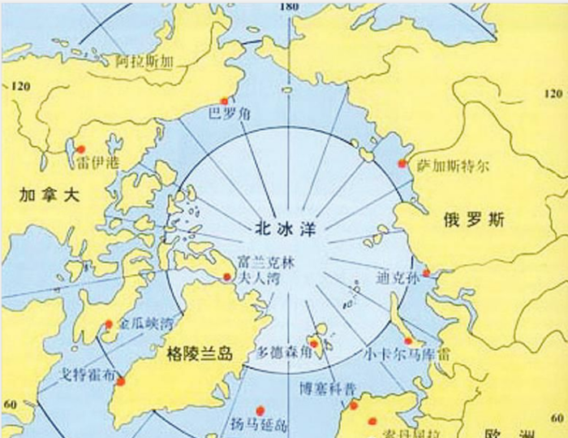

本题为选非题，故正确答案为D。

---

### 第 8 题　qid 2423303 · 地理国情

关于文物遗址，下列说法错误的是：

- **A**. 太阳神鸟金饰出土于新疆楼兰遗址　✅
- **B**. 重庆古城墙是古代山地城池防御建筑的范例
- **C**. 甘肃马家塬遗址分布有大面积齐家类型的文化遗存
- **D**. 高昌故城遗址反映了多民族文化在吐鲁番盆地的交流

**答案**：A

**官方解析**

本题考查历史常识。
A选项错误，太阳神鸟金饰（亦称“四鸟绕日”金饰），是2001年出土于四川省成都市金沙遗址的一张金箔，属商代晚期作品。
B选项正确，城池的兴建起于防御功能，南宋末期的重庆城作为山城防御体系的核心和指挥中心，其城墙筑造蕴含了“道法自然”的营建思想和“山、水、城”合一的规划设计，是古代山地城池防御建筑的杰出代表和范例。
C选项正确，齐家文化遗址，主要分布在甘肃、青海两省境内的黄河、洮河、大夏河、渭河、湟水流域。马家塬遗址位于甘肃省天水市张家川回族自治区木河乡桃园村马家塬，分布有大面积属常山、齐家类型的文化遗存。
D选项正确，高昌故城是吐鲁番盆地中心城镇，历经西汉高昌壁、高昌郡、高昌国、唐代西州和高昌回鹘等时期，时间跨度长达1400年左右，故城的结构分布、城内壁画、塑像展示的文化风貌都体现了多民族文化在吐鲁番盆地的融合。
本题为选非题，故正确答案为A。

---

### 第 9 题　qid 2423290 · 人文常识

某超市为顾客提供免费寄存服务。一日超市顶上商户水管漏水，水淹到低层寄存柜，致王某放在柜中的手机进水损坏。对此，下列说法正确的是：

- **A**. 超市有过失，应当承担全部赔偿责任
- **B**. 漏水属不可抗力，超市不承担赔偿责任
- **C**. 超市系无偿保管且无重大过失，不予赔偿　✅
- **D**. 主要责任在漏水商户，超市承担部分赔偿责任

**答案**：C

**官方解析**

本题考查法律常识。《民法典》第八百九十七条规定：“保管期内，因保管人保管不善造成保管物毁损、灭失的，保管人应当承担赔偿责任。但是，无偿保管人证明自己没有故意或者重大过失的，不承担赔偿责任。”本题中，王某手机进水损坏是因超市顶上商户水管漏水而致，超市无重大过失，且超市系免费提供寄存服务，不承担损害赔偿责任。因此，ABD项不符合题意。
故正确答案为C。

---

### 第 10 题　qid 2423292 · 法律常识

根据我国《立法法》，下列说法正确的是：

- **A**. 设区的市制定的地方性法规须报省政府备案
- **B**. 省人大常委会须对地方性法规的合法性进行审查　✅
- **C**. 设区的市制定的地方性法规，其立法主体为市政府
- **D**. 经省人大常委会授权后，设区的市才能制定地方性法规

**答案**：B

**官方解析**

本题考查法律常识。《立法法》第七十二条第二款规定：“设区的市的人民代表大会及其常务委员会根据本市的具体情况和实际需要，在不同宪法、法律、行政法规和本省、自治区的地方性法规相抵触的前提下，可以对城乡建设与管理、环境保护、历史文化保护等方面的事项制定地方性法规，法律对设区的市制定地方性法规的事项另有规定的，从其规定。设区的市的地方性法规须报省、自治区的人民代表大会常务委员会批准后施行。省、自治区的人民代表大会常务委员会对报请批准的地方性法规，应当对其合法性进行审查，同宪法、法律、行政法规和本省、自治区的地方性法规不抵触的，应当在四个月内予以批准。”
A项错误，设区的市制定的地方性法规无须报省政府备案，须报省、自治区的人民代表大会常务委员会批准后施行。
B项正确，省、自治区的人民代表大会常务委员会对报请批准的地方性法规，应当对其合法性进行审查。
C项错误，设区的市的人民代表大会及其常务委员会是制定地方性法规的主体。因此，该项表述中立法主体为市政府不符合题意。
D项错误，设区的市的人民代表大会及其常务委员会根据本市的具体情况和实际需要制定地方性法规，须报省、自治区的人民代表大会常务委员会批准后施行。因此，制定无需经省人大常委会授权。
故正确答案为B。

---

### 第 11 题　qid 2423279 · 人文常识

下列诗词与所描述的地区对应错误的是：

- **A**. 渭城朝雨浥轻尘，客舍青青柳色新——咸阳
- **B**. 羌笛何须怨杨柳，春风不度玉门关——张掖　✅
- **C**. 钟山风雨起苍黄，百万雄师过大江——南京
- **D**. 玉露凋伤枫树林，巫山巫峡气萧森——重庆

**答案**：B

**官方解析**

本题考查人文常识。
A项正确，出自唐代王维的《送元二使安西》。渭城指咸阳，即秦代咸阳古城，位于陕西省西安市西北方。
B项错误，出自唐代王之涣的《凉州词二首•其一》。玉门关，汉武帝置，因西域输入玉石取道于此而得名。故址在今甘肃敦煌西北小方盘城,是古代通往西域的要道。因此，该诗所描述的地区对应的是敦煌，而不是张掖。
C项正确，出自毛泽东的《七律•人民解放军占领南京》。1949年，中华大地发生了翻天覆地的巨变。人民解放军取得了辽沈、淮海、平津三大战役的胜利。百万雄师以摧枯拉朽之势强渡长江，占领了国民党中央政府所在地南京。
D项正确，出自唐代杜甫的《秋兴八首•其一》。巫山巫峡：即指夔州（今奉节）一带的长江和峡谷，位于今重庆市。
本题为选非题，故正确答案为B。

---

### 第 12 题　qid 2423280 · 人文常识

关于大气污染，下列说法正确的是：

- **A**. 臭氧可吸收紫外线，不属于污染物
- **B**. 口罩中的活性炭只会吸附污染气体
- **C**. 火山喷发所产生的气体会加剧大气的污染　✅
- **D**. 燃放烟花爆竹有污染，但不增加PM2.5值

**答案**：C

**官方解析**

本题考查科技常识。
A项错误，由于分子结构使其可以与某种特定能量的紫外线发生共振，因此臭氧可以吸收紫外线。臭氧是一种环境空气的污染物，在近地面层空气中超过一定含量，会对环境产生影响、对人体健康导致危害。
B项错误，活性炭具有很强的吸附性能，能在它的表面上吸附气体、液体或胶态固体，对于气体、液体，吸附物质的质量可接近于活性炭本身的质量。口罩中的活性炭主要是吸附污染气体的，它还可以吸附一些液体或胶态固体。
C项正确，火山喷发的有毒气体中含有硫磺和氯气，形成酸雨、昏暗的白昼和狂风暴雨，甚至会困扰当地居民长达数月之久，如果被喷到高空中去，它们就会随风散布到很远的地方。这些火山物质会遮住阳光，导致气温下降，农作物减产，严重的将导致物种灭绝，因此，火山喷发产生的气体会加剧大气的污染。
D项错误，鞭炮和烟花的化学成分很复杂，主要是硝酸钾、木炭和硫磺。被引燃后，这些物质便发生一系列复杂的化学反应，产生二氧化碳、一氧化碳、二氧化硫、一氧化氮、二氧化氮等气体以及PM2.5等污染物，同时产生大量光和热而引起鞭炮爆炸。
故正确答案为C。

---

### 第 13 题　qid 2423281 · 人文常识

关于处方药，下列说法错误的是：

- **A**. 不可自行购买和使用
- **B**. 催眠安定药不属于处方药　✅
- **C**. 不良反应发生率较高
- **D**. 须在医生指导下服用药物

**答案**：B

**官方解析**

本题考查科技常识。处方药就是必须凭执业医师或执业助理医师处方才可调配、购买和使用的药品；而非处方药则不需要凭医师处方即可自行判断、购买和使用的药品。
A项正确，根据《处方管理办法》第四条第二款规定：“处方药应当凭医师处方销售、调剂和使用。”处方药不能自行购买和使用。
B项错误，安眠药是精神药品，经营此类药品，必须由县以上卫生行政部门指定，其他任何单位和个人均不得经营。现在到药店购买安眠药，一定要出示医生处方。因此，安眠药属于处方药。
C项正确，处方药一般不良反应发生概率较大，有一定的治疗风险，需要在医生评估过用药风险和健康收益后再决定是否使用。
D项正确，处方药必须凭执业医师开具的处方才可以调配、购买，并且要在医生、护士、药师及其他医疗专业人员的监督和指导下才可使用，处方药不能凭自己判断使用。
本题为选非题，故正确答案为B。

---

### 第 14 题　qid 2423282 · 科技常识

关于生活常识，下列说法错误的是：

- **A**. 胆囊B超、尿常规检查均需空腹进行　✅
- **B**. 装修时使用铜线成本高，但电损耗低
- **C**. 复方甘草片中含有容易使人成瘾的成分
- **D**. 葡萄表面附着的白霜是一种糖醇类物质

**答案**：A

**官方解析**

本题考查科技常识。
A项错误，胆囊属于肝胆系统，检查肝胆系统必须空腹，因为一旦进食后胆汁分泌会导致胆囊充盈，胆管扩张，不能充分客观反应胆道系统是否有问题；尿常规检查不需要空腹，但是要注意外阴清洁，在检查之前最好是冲洗外阴，消毒尿道口，用无菌试管留取中段尿送检。
B项正确，铜线载流量大、电压损失低、电损耗低、价格高。
C项正确，复方甘草片含有阿片粉或罂粟果提取物粉等容易上瘾的成分，一般食用复方甘草片最好是不要超过五天，避免形成药物依赖。
D项正确，葡萄表面的“白霜”是葡萄本身分泌的糖醇类物质，被称为果粉，对人体无害。
本题为选非题，故正确答案为A。

---

### 第 15 题　qid 2423285 · 科技常识

关于生命的起源与进化，下列说法正确的是：

- **A**. 越古老的地层中的生物结构越复杂
- **B**. 原始哺乳类是由某些古代鸟类进化而来
- **C**. 新生代中占优势的陆地植物是裸子植物
- **D**. 澄江生物群为寒武纪生命大爆发提供了证据　✅

**答案**：D

**官方解析**

本题考查科技常识。
A项错误，越古老的地层中的生物结构越简单、越低等，水生生物越多；越晚期的地层中的生物结构越复杂、越高等，陆生生物越多。这说明生物进化的趋势是：从简单到复杂，由低等到高等，从水生到陆生。
B项错误，在地球上最早出现的脊椎动物是古代的鱼类，并逐渐进化为原始的两栖类，古两栖类又进化为爬行类，某些爬行类又进化为古代的鸟类和哺乳类。所以，鸟类和哺乳类都是由古代的爬行类进化而来的。
C项错误，新生代是地球历史上最新的一个地质时代，由于板块的分离或聚合，气候的分化，使得被子植物迅速发展、广泛分布。新生代以被子植物占优势。
D项正确，1984年7月1日，在国际上被誉为“20世纪最惊人的发现之一”的“澄江生物群”，在云南省澄江县首次被发现，这一多门类动物化石群动物类型众多，且十分珍稀地保存了动物软体构造，首次栩栩如生地再现了远古海洋生命的壮丽景观和现生动物的原始特征，以丰富的生物学信息为“寒武纪大爆发”研究提供了直接证据。
故正确答案为D。

---

### 第 16 题　qid 2423286 · 人文常识

关于天文现象，下列说法错误的是：

- **A**. 反气旋过境时，常会带来晴朗、干燥的天气
- **B**. “日中无影”现象常出现在南北回归线之间
- **C**. 火星地表土为一种酸性土壤，因此呈橘红色　✅
- **D**. 大气层中平流层的温度会随高度增加而增高

**答案**：C

**官方解析**

本题考查地理国情。
A项正确，反气旋，又称高压，是水平中心气压比四周高的空气涡旋。反气旋过境时常常多晴朗、干燥天气，如长江流域的伏旱、北方“秋高气爽”的天气等。
B项正确，“日中无影”是指当天上的太阳日光正垂直于地面时，人或者其他物体站在太阳之下是没有影子的现象。在南北回归线之间的地区，一年有两次太阳直射机会，此时正午太阳高度最大为90°，因而会出现“日中无影”现象。
C项错误，火星土壤是指火星岩石受风化后产生的碎屑物质，其中含铁量较地球土壤高，尤以氧化铁的含量最高。火星呈现出橘红色的外表就是因为地表含有大量的氧化铁。
D项正确，自对流层顶至50—55公里的高空为平流层。平流层内水汽和尘埃稀少，基本上无云雨天气，因其是地球大气层里上热下冷的一层，所以温度随着高度的增加而上升。
本题为选非题，故正确答案为C。

---

### 第 17 题　qid 2423288 · 法律常识

下列精神损害赔偿不予支持的是：

- **A**. 甲被人殴打致重伤二级，其提出刑事附带民事诉讼要求精神损害赔偿　✅
- **B**. 乙被错误逮捕，后案件被撤销，乙在申请国家赔偿的同时要求精神损害赔偿
- **C**. 丙父去世后，其仇人散布谣言侮辱其父名誉，丙诉至法院要求精神损害赔偿
- **D**. 丁保留的与其生母唯一一张合影被人恶意损毁，丁诉至法院要求精神损害赔偿

**答案**：A

**官方解析**

A项正确，《最高人民法院关于适用&lt;中华人民共和国刑事诉讼法&gt;的解释》第一百七十五条规定：“被害人因人身权利受到犯罪侵犯或者财物被犯罪分子毁坏而遭受物质损失的，有权在刑事诉讼过程中提起附带民事诉讼；被害人死亡或者丧失行为能力的，其法定代理人、近亲属有权提起附带民事诉讼。因受到犯罪侵犯，提起附带民事诉讼或者单独提起民事诉讼要求赔偿精神损失的，人民法院一般不予受理。”甲提起刑事附带民事诉讼不得要求精神损害赔偿。
B项错误，《国家赔偿法》第十七条规定：“行使侦查、检察、审判职权的机关以及看守所、监狱管理机关及其工作人员在行使职权时有下列侵犯人身权情形之一的，受害人有取得赔偿的权利：······（二）对公民采取逮捕措施后，决定撤销案件、不起诉或者判决宣告无罪终止追究刑事责任的；······”第三十五条规定：“有本法第三条或者第十七条规定情形之一，致人精神损害的，应当在侵权行为影响的范围内，为受害人消除影响，恢复名誉，赔礼道歉；造成严重后果的，应当支付相应的精神损害抚慰金。”乙被错误逮捕可以提出精神损害赔偿金的要求。
C项错误，《最高人民法院关于确定民事侵权精神损害赔偿责任若干问题的解释》第三条规定：“死者的姓名、肖像、名誉、荣誉、隐私、遗体、遗骨等受到侵害，其近亲属向人民法院提起诉讼请求精神损害赔偿的，人民法院应当依法予以支持。”丙提出的精神损害赔偿应予支持。
D项错误，《最高人民法院关于确定民事侵权精神损害赔偿责任若干问题的解释》第一条规定：“因人身权益或者具有人身意义的特定物受到侵害，自然人或者其近亲属向人民法院提起诉讼请求精神损害赔偿的，人民法院应当依法予以受理。”丁与生母唯一的一张合影是具有人身意义的特定物，因此提出的精神损害赔偿应予支持。
故正确答案为A。

---

## 言语理解与表达

### 第 1 题　qid 2423263 · 逻辑填空

学会质疑并养成质疑的习惯，关键就是多读书、读好书，一旦知识积累多了，视野开阔了，就容易对相关知识的学习理解做到      。革命导师列宁曾说过，不懂黑格尔的全部逻辑学就不能完全理解马克思的《资本论》。事实上，许多知识都有着纵横关联，只有打通其关节，一些疑问才能迎刃而解。
填入划横线部分最恰当的一项是：

- **A**. 触类旁通　✅
- **B**. 举一反三
- **C**. 事半功倍
- **D**. 独出己见

**答案**：A

**官方解析**

分析文意可知，横线前面，“就容易对相关知识的学习做到”，横线后面“不懂黑格尔的全部逻辑学就不能完全理解马克思的《资本论》”，“许多知识都有着纵横关联，只有打通其关节，一些疑问才能迎刃而解”都在说明对某一知识的学习能够对其他知识的学习有帮助，对应A项，“触类旁通”比喻掌握了某一事物的规律，就能推知同类事物，符合文意，当选。
B项，“举一反三”指从懂得的一点，类推而知道其它的，从含义上和“触类旁通”是近义词，只不过从文段内容呼应上，文中“只有打通其关节，一些疑问才能迎刃而解”此处“触类旁通”更好；
C项，“事半功倍”指做事得法，因而费力小，收效大；
D项，“独出己见”指的是与别人不同地提出自己的见解和主张，二者含义均和文段不符，文中侧重强调对其他知识的作用，排除。
故正确答案为A。
【文段出处】《质疑，是读书的长跑》

---

### 第 2 题　qid 2423264 · 逻辑填空

1955年我进入南开大学历史学系读书，老师告诉我们治史有“三求”：求真、求新、求用。到现在，我在史学园地已经耕耘60多年，对“三求”有了一些自己的体会，特别是认识到，学术研究不能照搬照抄、跟在别人后面      ，而应在独立思考精神观照下进行研究，这样才有可能实现“三求”。
填入划横线部分最恰当的一项是：

- **A**. 傍人门户
- **B**. 邯郸学步
- **C**. 穿凿附会
- **D**. 亦步亦趋　✅

**答案**：D

**官方解析**

由横线前面出现的顿号可知表达并列关系，横线处所填成语和“照搬照抄”的含义相近，同时，横线后面出现关联词“而”，这里的“而”表达转折关系，转折前后含义相反，转折后重在强调“独立思考精神”，那么横线处含义也要与“独立思考”相反，综合前后对应D项，“亦步亦趋”比喻由于缺乏主张，或为了讨好，事事模仿或追随别人，符合文意，当选。
A项，“傍人门户”比喻依赖别人，不能自立，侧重于依赖性，与文意无关，排除；
B项，“邯郸学步”比喻模仿人不到家，反把原来自己会的东西忘了，文中并没有体现出把原来自己会的东西忘了这一含义，与文意不符，排除；
C项，“穿凿附会”把讲不通的或不相干的道理、事情硬扯在一起进行解释。和文中“一味模仿、不会创新”无关，排除。
故正确答案为D。
【文段出处】《人民日报大家手笔：治史应求真求新求用》

---

### 第 3 题　qid 2423265 · 逻辑填空

为了迎合家长急于求成的心理需求，不少美术类培训机构纷纷带孩子参加各类绘画大赛和少儿绘画考级活动。这必然是      的做法，绘画是人们认识和感受世界，表达个人情绪和看法的一种方式，是培养孩子对现实世界的认知能力。作为家长，不要急于让孩子出成果、获大奖，而应该      孩子用更加丰富的手段认识世界。
依次填入划横线部分最恰当的一项是：

- **A**. 拔苗助长  辅助
- **B**. 缘木求鱼  激励
- **C**. 舍本逐末  引导　✅
- **D**. 得不偿失  启发

**答案**：C

**官方解析**

第一空，根据前文可知，文段意在表达为了迎合家长急于求成的心理需求，一些美术类培训机构采取了不恰当的做法，且根据后文“绘画是培养孩子对现实世界的认知能力”可知，让孩子学习绘画的本意应为培养能力而非考级，故横线处应体现出培训机构的做法违背了让孩子学习绘画的本意。
C项“舍本逐末”比喻做事不注意根本，而只抓细微末节，“本”即对应“培养能力”，“末”即对应“考级”，符合文意，当选；
A项“拔苗助长”比喻违反事物发展的客观规律，急于求成反而坏事，文段虽然可以体现出急于求成之意，但并未体现出让事情变坏之意，故与文意不符，排除；
B项“缘木求鱼”比喻方向不对，不可能达到目的，文段虽然可以体现出方法错误之意，但并未论述达不到目的，并非必然无法出成果获奖，与文意不符，排除；
D项“得不偿失”指所得的利益抵偿不了所受的损失，文中并未体现出损失之意，排除。
第二空代入验证，横线处体现家长对孩子的做法。C项“引导”有指引、带领之意，符合文意，当选。
故正确答案为C。
【文段出处】《艺术只能“培训”吗》

---

### 第 4 题　qid 2423266 · 逻辑填空

德国科学家和科学政策制定者的      意识在德国科技强国之路上扮演了极为重要的角色。当处于落后地位时，虚心向比自己发达的国家学习；而当处于领先地位时，又      ，克服内外压力，精益求精，从不满足，才使得德国的科研体制永葆活力，长盛不衰。
依次填入划横线部分最恰当的一项是：

- **A**. 忧患  未雨绸缪　✅
- **B**. 责任  高瞻远瞩
- **C**. 创新  革故鼎新
- **D**. 风险  如履薄冰

**答案**：A

**官方解析**

第一空，横线处搭配“意识”，且根据 “处于落后的地位时，虚心向比自己发达的国家学习”及“处于领先地位时，克服内外压力，精益求精”可知，文段意在表达德国会考虑到当前及未来可能会遇到的困难、祸患。
A项“忧患”及D项“风险”均与“意识”搭配得当，且能体现出对当前或未来祸患的考虑，保留；B项“责任”、C项“创新”均无法体现出会考虑到当前及未来可能会遇到的困难、祸患之意，与文意不符，故排除B、C两项。
第二空，根据“克服内外压力，精益求精，从不满足”可知，横线处所填词语应体现出德国好上还要求更好，不满足于现状，对未来有不懈的追求之意。
A项，“未雨绸缪”意为天还没有下雨，先修缮房屋、门窗，比喻事先做好准备工作，可以体现出德国不满足现状，对未来有不懈的追求之意，符合文意，当选；D项，“如履薄冰”比喻行事极为谨慎，存有戒心，无法与文段对应，排除。
故正确答案为A。
【文段出处】《持续不间断地推进科研体制创新》

---

### 第 5 题　qid 2423267 · 逻辑填空

很多人都喜欢将自己眼中的世界分门别类，并用固有的认知打上标签。这种“刻板印象”的存在，确实在某种程度上提高了我们的认知      ，但也将我们的思维框定到已有的版图中，周边世界千变万化，而我们却在熟悉的境地里      、停滞不前。
依次填入划横线部分最恰当的一项是：

- **A**. 层次  泥足深陷
- **B**. 水平  闭门造车
- **C**. 效率  固步自封　✅
- **D**. 能力  一意孤行

**答案**：C

**官方解析**

第一空，横线处所填词语和“提高”搭配，四个选项均可填入文段中。
第二空，横线后出现顿号，故横线处所填词语与“停滞不前”构成并列关系，含义相近，“停滞不前”强调停止下来，不继续前进。C项“固步自封”比喻守着老一套，不求进步，体现出“不前进”的含义，符合文意，当选。
A项“泥足深陷”比喻陷入麻烦的境地却无法轻易脱离或陷于某件事已不能自拔，“陷入麻烦”与“不继续前进”侧重点不一致，且该词语程度过重，排除；
B项“闭门造车”强调不考虑客观实际情况，只凭主观想法办事，与“停滞不前”无法构成近义并列，排除；
D项“一意孤行”指不接受别人的劝告，顽固地按照自己的主观想法去做，与“停滞不前”语义相反，排除。
故正确答案为C。
【文段出处】《光明时评：我学计算机的，但真不会修电脑，谢谢》

---

### 第 6 题　qid 2423269 · 逻辑填空

要实现从数据大国向数据强国转变，满足我国经济社会全面数字化转型对高质量海量多源异构数据资源的迫切需求，数据的“盘活”是我们面临的一大难题。所谓“盘活”，关键是要解决数据      、流通、      的问题。“流水不腐，户枢不蠹。”只有不同系统、不同领域的数据实现大范围的流通与融合，才能实现多源数据的融合分析，从而赋予人类观察事物的全方位视角。
依次填入划横线部分最恰当的一项是：

- **A**. 整理  加工
- **B**. 确权  安全
- **C**. 获取  应用
- **D**. 开放  共享　✅

**答案**：D

**官方解析**

依据后文“流水不腐、户枢不蠹”以及“不同领域的数据实现大范围的流通与融合”可知横线上所填词语要体现出流动、流转的含义。
A项“整理”为整理合并的含义，体现不出“流动、流转”的语义，排除；
B项“确权”强调确认某事物的权属，将某物确定为自己的东西，与“流转”含义相反，排除；
C项“获取”含义为获得，取得，与“流转”语义不一致，排除；
D项“开放”强调敞开，也就是允许事物进出，与文意相符，故选该项。
将第二空代入验证，“共享”含义为共同享有，既然一个事物为多方共同享有，说明该事物是能够流转的，符合文意。
故正确答案为D。
【文段出处】《人民日报整版探讨“如何建设智慧社会”》

---

### 第 7 题　qid 2423272 · 逻辑填空

自然资源并非是取之不尽、用之不竭的。现在，大自然被过度开发，因此保护自然迫在眉睫，而保护观念的改变则是      。以前，我们觉得保护动物就要把动物从自然里拿出来，放在一个我们      提供的很好的环境中来保护，但结果      。只有依赖自然环境和生态系统才能真正保护好生物多样性。
依次填入划横线部分最恰当的一项是：

- **A**. 万全之策  精心  适得其反
- **B**. 当务之急  统一  一败涂地
- **C**. 重中之重  单独  事与愿违　✅
- **D**. 大势所趋  专门  南辕北辙

**答案**：C

**官方解析**

第一空，搭配“保护观念”，并根据前文可知，横线体现保护观念的改变对于保护自然很重要。
A项“万全之策”指最完全最好的办法，观念的改变并不能完全解决大自然被过度开发的问题，还需要付诸行动，且表述绝对，所以“万全之策”填入横线处不符合文意，排除A项。B项“当务之急”指当前急切应办的要事，C项“重中之重”强调重要性，D项“大势所趋”指整个局势发展的趋向，均可体现出保护观念改变的重要性，保留。
第三空，根据后文“只有依赖自然环境和生态系统才能真正保护好生物多样性”可知，横线处应体现出结果不理想之意。C项“事与愿违”指事情的发展与愿望相反，符合文意，当选。B项“一败涂地”形容彻底失败，用于此处程度过重，排除；D项“南辕北辙”指行动和目的地完全相反，搭配“行动”和“目的地”，而横线处搭配“结果”，排除。
第二空，代入验证，“单独”提供的很好的环境中来保护，符合文意，当选。
故正确答案为C。
【文段出处】《用大数据推动生物多样性研究》

---

### 第 8 题　qid 2423274 · 逻辑填空

长期以来，如何准确      贫困学生和资助对象，始终是资助工作有效、精准开展的难题。为此，不少高校      。如让学生填写家庭经济收入情况、自述家贫等。这些做法既伤害了学生的自尊心，也无法保障资助工作的      界定。而如今大数据手段的运用，为破解这一难题带来了曙光。
依次填入划横线部分最恰当的一项是：

- **A**. 识别  煞费苦心  科学　✅
- **B**. 判断  推陈出新  真实
- **C**. 分辨  深谋远虑  客观
- **D**. 鉴定  绞尽脑汁  专业

**答案**：A

**官方解析**

本题可从第二空入手，横线后的“如”可知，后文“让学生填写家庭经济收入情况、自述家贫等”是对所填内容的举例说明。
B项“推陈出新”指去掉旧事物的糟粕，取其精华，并使它向新的方向发展。所举例子并无去掉旧的对策，采用新对策之意，排除；
C项“深谋远虑”指计划得很周密，考虑得很长远；后文的例子体现不出此意，排除；
A项“煞费苦心”与D项“绞尽脑汁”均指用尽心思，填入文段符合语境，均保留。
第三空，之前一些高校采取的“让学生填写家庭经济收入情况、自述家贫等”方式与如今采用的“大数据手段”进行对比，强调了之前的方式不恰当，这体现的是之前方式的“不科学性”，而不是“不专业”，排除D项。
验证第一空，“识别”贫困学生和资助对象，搭配恰当。
故正确答案为A。
【文段出处】《“隐形资助”的有形张力》

---

### 第 9 题　qid 2423275 · 逻辑填空

量子保密通信从量子力学不确定性原理和量子态不可克隆定理出发，从      上保证了保密性，即通信双方能够检测到窃听者的存在并采取相应的措施。这是由量子物理的基本原理所      的，因为观察或者测量一个量子系统均会造成量子态的扰动，造成可以检测出的      ，从而可以提醒通信双方泄密。
依次填入划横线部分最恰当的一项是：

- **A**. 根本  推导  错误
- **B**. 基础  体现  异动
- **C**. 源头  保障  结果
- **D**. 理论  保证  反常　✅

**答案**：D

**官方解析**

第一空，根据前文“不确定性原理”与“量子态不可克隆定理”可知，横线处体现“原理、定理”之意，观察选项，D项“理论”最符合文意，其他三项均不能表达此意，排除；答案基本锁定为D项。
第二空，代入验证，横线处所填词语对应前文“保证了保密性”，D项“保证”符合文意。
第三空，代入验证，根据前文“造成……扰动”和后文“提醒通信双方泄密”可知，横线处所填词语应表达和平时情况不同之意，D项“反常”符合文意，当选。
故正确答案为D。
【文段出处】《“墨子号”卫星亮绝技 量子通信概念脉动》

---

### 第 10 题　qid 2423277 · 逻辑填空

进入新世纪以来，新诗与旧体诗有各执一端、      的倾向。一些新诗人强调新诗的自由，自由到谁都看不懂的程度。而有些旧体诗人特别是有些刊物又过分强调格律，不得越雷池一步。他们虽然也同意“求正容变”，但实行起来却只求正、不容变。究其原因，都是正确创作方向的      。
依次填入划横线部分最恰当的一项是：

- **A**. 背道而驰  丧失
- **B**. 格格不入  放弃
- **C**. 分道扬镳  迷失　✅
- **D**. 分崩离析  背离

**答案**：C

**官方解析**

第一空，通过横线前文“、”可知，此处与“各执一端”构成并列的关系，“各执一端”指各自坚持各自的观点或道理，D项“分崩离析”形容国家、集团或组织分裂瓦解，与文段搭配对象“新诗与旧体诗”搭配不当，排除；其他三项均可，均能体现两者之间各走各的之意。
第二空，搭配“方向”，“迷失方向”为惯用搭配，故锁定答案为C项。A项“丧失”指失去，与“方向”搭配不当，且程度过重，排除；B项“放弃”指抛弃，丢掉，可以搭配“财产”等，与“方向”搭配有误。
故正确答案为C。
【文段出处】《新诗与旧体诗都应与时代同行》

---

### 第 11 题　qid 2423293 · 逻辑填空

让机器人听懂人说话，并不容易。机器要能够      识别语音并像人一样通过理解判断作出回应，需要基于大量的“学习”，与人一样根据      进行判断预测。这种“学习”有两种方法：通过在数据中找寻类似事例来提供解决方案，或是通过       许多数据样本的共性来对这件事情做出判断。
依次填入划横线部分最恰当的一项是：

- **A**. 准确  经验  归纳　✅
- **B**. 完整  信息  识别
- **C**. 高效  知识  提炼
- **D**. 自动  思维  总结

**答案**：A

**官方解析**

第一空，根据“让机器人听懂人说话······”可知，文段强调“听懂”，故横线处强调机器能够识别语音，进而听懂人话的过程。A项“准确”指正确，B项“完整”指完好无损，“准确识别”“完整识别”都是能够“听懂”人话所必须的，符合文意；D项“自动”指自己主动，符合机器的特点，保留。C项“高效”指效率高，文段没有强调机器识别语音必须效率高，排除。
第二空，横线处需体现出“像人一样”。A项“经验”指从多次实践中得到的知识或技能，人能够根据经验来进行判断预测，符合文意；B项，根据“信息”作出反应并非人的特点，机器自身也可以根据输入的信息执行指令，作出反应，排除。D项“思维”指人脑借助于语言对客观事物的概括和间接的反应过程，是作出反应的过程，而非依据，故“根据思维”搭配不当，排除。锁定A项。
第三空代入验证，“归纳”指由一系列具体的事实概括出一般原理的思维过程，“归纳共性”搭配得当且符合文意。
故正确答案为A。
【文段出处】《“说话”间，走进“人工智能+”时代 》

---

### 第 12 题　qid 2423302 · 逻辑填空

当前对于中国债务风险的很多分析，往往聚焦于中国的债务存量，较少关注到与债务相对应的资产，这在国际机构的评估中尤为      。事实上，正是由于中国政府拥有大量的存量资产且高于存量债务，才使得在应对债务风险问题上      ，任何脱离资产仅论负债的做法，对于中国债务风险的评估都是      的。
依次填入划横线部分最恰当的一项是：

- **A**. 重要  独当一面  狭隘
- **B**. 突出  随心所欲  错误
- **C**. 常见  游刃有余  片面　✅
- **D**. 关注  驾轻就熟  偏颇

**答案**：C

**官方解析**

第一空，“这”指的是前文所述的现象，B项“突出”指明显，C项“常见”指经常见到，与前文“往往”对应，在文中指这种错误的分析方法特别普遍，符合文意。A项“重要”指具有重大影响或后果的，文段并非要指出这种错误的分析方法很重要，而是强调其普遍，排除；D项“关注”指关心重视，为动词，空缺处应填入形容词，不符合文段语法要求，排除。
第二空，根据文段进行推断，“由于中国政府拥有大量的存量资产且高于存量债务”，所以导致中国在应对债务风险方面具有一定的实力，具备较高的容纳风险的能力。C项“游刃有余”比喻技术熟练，经验丰富，解决问题丝毫不费力。B项“随心所欲”指随着自己的意思，想要干什么就干什么，程度过重，排除。锁定C项。
第三空代入验证，C项“片面”指不全面的，偏向某一局部的，在文中指分析的不够全面，符合文意。
故正确答案为C。
【文段出处】《权威解读国家资产负债表：有什么用？怎么编？》

---

### 第 13 题　qid 2423307 · 逻辑填空

实战化程度再高的对抗演习，和真正的实战都是有      的，只能无限趋近而不能划等号。实战中，作战双方是      的较量和厮杀，不可避免会有流血与伤亡；而在对抗演习中，一般是“不流血”或尽量“少流血”。如此，既要提高演习中的实战性、锤炼出实战能力，同时又要保证参训参演人员的安全，这就需要为演习制定      的对抗行动规则。
依次填入划横线部分最恰当的一项是：

- **A**. 抗衡  真刀实枪  灵活
- **B**. 差距  弱肉强食  明确
- **C**. 区别  枪林弹雨  完善
- **D**. 距离  针锋相对  刚性　✅

**答案**：D

**官方解析**

第一空，与后文“只能无限趋近而不能划等号”对应，强调演习和实战终究不同，B项“差距”表示事物之间相差的程度，C项“区别”指区分、辨别，D项“距离”是指（两物体）在空间或时间上相隔或间隔的长度，在文中均可体现有物体之间有差异，符合文意。A项“抗衡”指对抗、匹敌，文段强调演习与实战存在不同，而非存在对抗，排除。
第二空，用于形容“双方······的较量和厮杀”，D项“针锋相对”意思是针尖对锋芒，比喻双方在策略、论点及行动方式等方面尖锐对立，在文中可以体现战斗的激烈，符合文意。B项“弱肉强食”原指动物中弱者被强者吞食，比喻弱的被强的吞并，侧重强调自然竞争，排除。C项“枪林弹雨”用来形容激烈的战场，与“作战双方”搭配不当，排除。
第三空，形容“对抗行动规则”，且结合前文可知，对演习而言“对抗行动规则”十分重要。D项“刚性”指不能改变或通融的，能够体现出对行动规则的要求，符合文意。
故正确答案为D。
【文段出处】《“刚柔并济”方能把“兵”演活》

---

### 第 14 题　qid 2423310 · 逻辑填空

每一次工业革命都会孕育出新的国际规则，第四次工业革命也不例外。但迄今为止，智能化和自动化等领域的国际规则并不      。在前三次工业革命中，发展中国家未能参与国际规则的制定，仅仅是这些规则的被动接受者。在第四次工业革命中，发展中国家应加强团结合作，积极提出符合自身发展需要的国际规则，既与发达国家开展合作，又      ，维护自身发展利益。
依次填入划横线部分最恰当的一项是：

- **A**. 合理  直抒己见
- **B**. 成熟  独立自主
- **C**. 完备  据理力争　✅
- **D**. 平等  各司其职

**答案**：C

**官方解析**

本题从第二空入手，前文提出问题“在前三次工业革命中，发展中国家未能参与国际规则的制定，仅仅是这些规则的被动接受者”，即发展中国家没有发言权或未能充分维护自身权益，故横线处应针对问题提出对策，C项“据理力争”指依据道理，竭力维护自己方面的权益、观点等，符合文意，当选。
A项“直抒己见”即坦率地发表自己的意见，“发表意见”与“维护权益”无必然关联，排除；
B项“独立自主”多指国家或政党维护主权，不受别人的控制或支配，文段的问题并非主权问题，而是国际规则不利于发展中国家的问题，与语境不符，排除；
D项“各司其职”是指各自负责掌握自己的职责，侧重解决不负责或责任不明确的问题，与不能“维护权益”无关，排除。
代入验证第一空，C项“完备”指健全、齐全，与“国际规则”搭配得当，可选。
故正确答案为C。
【文段出处】《发展中国家合作的新动力》

---

### 第 15 题　qid 2423312 · 逻辑填空

说起中国历代典籍的数量，过去人们常常习惯用“      ”来形容。这既表明中华文脉之绵长、积累之深厚，也显露出我们对传世古籍的数量没有做过精准的统计，只能用一些      的语言来描述。
依次填入划横线部分最恰当的一项是：

- **A**. 学富五车  粗略
- **B**. 浩如烟海  模糊　✅
- **C**. 汗牛充栋  平淡
- **D**. 数不胜数  主观

**答案**：B

**官方解析**

第一空，横线处形容“中国历代典籍的数量”多，B项“浩如烟海”形容文献、资料、书籍等多得无法计算；C项“汗牛充栋”形容藏书很多；D项“数不胜数”指数都数不过来，形容数量极多，很难计算；三项语义均可。A项“学富五车”形容人读书多，学识丰富，无法形容“典籍”，排除。
第二空，根据前文“······我们对传世古籍的数量没有做过精准的统计······”，故只能用一些不精准的语言来描述，横线处表达“不精准”之意，对应B项“模糊”。C项“平淡”、D项“主观”与文意无关，排除。
故正确答案为B。
【文段出处】《摸清古籍家底 保护方能精准》

---

### 第 16 题　qid 2423314 · 逻辑填空

地方戏是流行于一定地区，具有地方特色的戏曲剧种的通称。浓郁的乡土气息是地方戏      的特征。不同地区的地方戏，反映的是不同地区的乡土味，体现的是当地的乡土文化与生活风貌。乡村要振兴，文化应先行。散发着浓郁乡土气息的地方戏，理应当好乡土文化的      ，为乡村振兴注入文化动能。
依次填入划横线部分最恰当的一项是：

- **A**. 与生俱来  表达者　✅
- **B**. 与众不同  先锋队
- **C**. 独一无二  火车头
- **D**. 得天独厚  垫脚石

**答案**：A

**官方解析**

第一空，形容地方戏“乡土气息”的特征，根据下文“不同地区的地方戏，反映的是不同地区的乡土味，体现的是当地乡土文化与生活风貌”可知，地方戏的乡土气息源于当地乡土文化与生活风貌，即天然形成的，具备好的条件。
A项“与生俱来”表示个人的特别、不可替代性，生来如此，符合文意，保留；D项“得天独厚”表示具有特殊优越的条件，多指人的资质或自然环境特别好，符合文意，保留。B项“与众不同”表示与其他人不一样；C项“独一无二”指没有相同的或没有可以相比的，侧重强调唯一性或十分稀少；两项需置于与他者比较的语境中，与文段语境不符，排除。
第二空，A项“表达者”可对应前文“不同地区的地方戏，反映的是不同地区的乡土味，体现的是当地乡土文化与生活风貌”，语义合适，当选。D项“垫脚石”感情色彩偏消极，不符合文意，排除。
故正确答案为A。
【文段出处】《土味不土：地方戏如何当好乡土文化表达者》

---

### 第 17 题　qid 2423316 · 逻辑填空

随着贵金属货币演化成纸币，货币借助于信用发展出了金融产业。金融一旦成为一个产业，就可以与实体经济      ，就有了自己独立的利益，就会      赚取利润。然而，经济过度金融化以及金融业丰厚的利润会带来两方面的      后果：一方面导致资金脱实向虚，另一方面助长投机。
依次填入划横线部分最恰当的一项是：

- **A**. 并驾齐驱  想方设法  消极　✅
- **B**. 相提并论  处心积虑  被动
- **C**. 取长补短  急功近利  严重
- **D**. 相得益彰  不择手段  可怕

**答案**：A

**官方解析**

第一空，根据文段可知，“金融一旦成为一个产业”，那么金融产业和实体经济的力量就不分高下了，也可以放在一起来看待了。
A项“并驾齐驱”比喻彼此的力量或才能不分高下；B项“相提并论”把不同的人或不同的事放在一起谈论或看待，两者均符合题意，保留。
C项“取长补短”指吸取别人的长处，来弥补自己的不足之处，文段并无此意，排除；D项“相得益彰”指两个人或两件事物互相配合，双方的能力和作用更能显示出来，文段并没有体现出两者之间的配合，排除。
第二空，形容金融产业想尽一切办法赚取利润，A项“想方设法”指想种种办法，B项“处心积虑”形容蓄谋已久，两者均符合题意，保留。
第三空，根据文段“一方面导致资金脱实向虚，另一方面助长投机”可知，这是两种不利的结果，A项“消极”指不利的，阻碍发展的，符合题意。B项“被动”指受外力推动而动或受他人的影响或牵制而发生行动，文中并无此意，排除。
故正确答案为A。
【文段出处】《马克思经济学对防范金融风险的启示》

---

### 第 18 题　qid 2423317 · 片段阅读

在高等教育精英化时代，高等教育在一定程度上确实是阶层流动的重要工具。但进入高等教育普及化时代后，这种刚性就业观便应逐渐向弹性就业观转型。高等教育普及化时代的主要宗旨是为各个阶层的人们在人生、事业的各个阶段提供样态更为丰富的高等教育服务，这意味着更多的大学毕业生或者家长应该把接受高等教育看成人生的一种有益的经历，或者把它作为一种丰富自我的储备。接受高等教育后也许会获得一份工作，也许不会；也许会多次更换工作，也许工作后又返回学校再接受教育······如果这个阶段还苛求高校人才培养要和每一个潜在的工作岗位一一对应，高等教育将承受不能承受之重。
这段文字意在说明：

- **A**. 就业观的选择必须要与社会发展相适应
- **B**. 高等教育普及化时代的就业观应该转变　✅
- **C**. 高等教育推动阶层流动的功能正在消失
- **D**. 普及高等教育会带来一定的社会负效应

**答案**：B

**官方解析**

文段开篇指出高等教育的重要性，接下来用转折词“但”强调高等教育普及化时代应逐渐向弹性就业观转型，后文通过论述高等教育普及化时代的宗旨以及高等教育后就业的多元性对这一观点进行了解释说明，尾句通过反面论证进一步证明不能将高等教育培养和就业岗位一一对应。故文段结构为“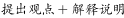”，重点为首句观点，即“高等教育普及化时代的就业观应该转变”，对应B项。

A项，表述不明确，没有指出如何适应，也没有提到文段主题词“高等教育普及化时代”，排除；

C项，无中生有，文段并没有指出“高等教育推动阶层流动的功能正在消失”，排除；

D项，“社会负效应”无中生有，排除。

故正确答案为B。

【文段出处】《高等教育普及化时代的就业观须转型》

---

### 第 19 题　qid 2423319 · 片段阅读

尽管在《史记》之前，已经出现了《尚书》《春秋》《国语》，甚至出现了成熟的编年体史书《左传》，然而后世史家最崇奉的，却不是这些更古老的作品；相反，是《史记》创立的纪传体，成为历代正史的标准体例。《史记》之所以影响如此深远，除了司马迁超凡的史识和文笔之外，其创立的纪传体体例，无疑是最重要的原因之一。正如清儒章学诚所言：“自《隋·经籍志》著录，以纪传为正史，编年为古史，历代依之，遂分正附，莫不甲纪传而乙编年。”之所以如此，是因为这一体例更为全面地包罗了人类历史的诸多侧面，且适应了史学的发展。
这段文字意在说明：

- **A**. 纪传体体例丰富了人类历史的记录角度
- **B**. 史书体例创新必须与史学的发展相适应
- **C**. 《史记》创立的体例是对后世最重要的影响
- **D**. 《史记》的纪传体体例具有重要的史学意义　✅

**答案**：D

**官方解析**

文段首句列举了一些史书，并通过“相反”进行转折，指出《史记》创立的纪传体成为历代正史的标准体例，然后指出《史记》影响之所以深远的最重要的原因之一是其创立的纪传体体例，接着通过引用清儒章学诚的观点进一步论证首句观点，尾句对纪传体体例重要的原因进行分析，指出其更为全面地包罗了人类历史的诸多侧面，且适应了史学的发展。故整个文段均围绕《史记》的纪传体体例展开，文段的主题词是“《史记》的纪传体体例”重点说明这一体例的重要史学意义，对应D项。
A项：缺少主题词“《史记》的纪传体体例”，且“人类历史的记录角度”阐述片面，排除；
B项：缺少主题词“《史记》的纪传体体例”，且“必须与史学的发展相适应”无中生有，文段只是提到《史记》的纪传体体例适应了史学的发展。排除；
C项：“《史记》的体例”范围扩大，文段主要指《史记》的纪传体体例，排除。
故正确答案为D。
【文段出处】《“史记”与纪传体体例的史学意义》

---

### 第 20 题　qid 2423320 · 片段阅读

徜徉在中国国家博物馆，老挝出土的史前铜鼓、公元前3世纪的叙利亚组装画、公元前4世纪的沙特石雕映入眼帘，亚细亚的辉煌文明扑面而来；流连于红墙黄瓦的故宫博物院，来自“一带一路”沿线国家的艺术家们用他们的双手和智慧，将不同的文化以版画形式加以呈现······时代的前行、技术的进步、观念的更新，让博物馆的角色不断发生改变。如今，博物馆已不仅是留存文明记忆、呈现文明魅力的“全息视窗”，更是多元文化的“超级链接”、文明交流的“社交网络”。带着欣赏的目光来到博物馆，就如同走进一个气象万千的文明世界。
最适合做这段文字标题的是：

- **A**. 博物馆里的“一带一路”
- **B**. 在博物馆共赏文明之美　✅
- **C**. 新时代博物馆的角色转变
- **D**. 现代博物馆：多元文化之窗

**答案**：B

**官方解析**

文段首先通过并列分号分别介绍了中国国家博物馆的一些历史文明，和故宫博物馆中“一带一路”沿线国家的各种文化。然后论述博物馆的角色发生了转变，不再是单一的展览，更多的作用是进行文化和文明的交流。文段最后一句总结全文，“带着欣赏的目光来到博物馆，就如同走进一个气象万千的文明世界”说明在博物馆中可欣赏到世界多元文明的美，对应B项。
A项,“一带一路”为开篇并列句式中一个分句论述的内容，表述片面，排除；
C项，通过反推文段可知，如果文段主要论述博物馆的角色转变，前后文应当着重对比转变前后的不同，而文中并无此意，排除；
D项，根据文段“不仅是呈现文明魅力的全息视窗”可知，该项阐述片面，排除。
故正确答案为B。
【文段出处】《辛识平：在博物馆共赏文明之美》

---

### 第 21 题　qid 2423253 · 片段阅读

上世纪50年代以来，人类的需求使得塑料产量呈指数级翻倍。到了今天，即使已经意识到塑料无孔不入，人类依然对其无限依赖。目前，世界范围内每年消耗5000亿个塑料袋，每分钟有100万个塑料瓶的销量······研究显示，人类活动与垃圾排放，让大量塑料涌入海洋，其中体积大的最终会分解为微粒。而人们一度认为无比纯净的海冰中，已有数以万亿计的塑料微粒——每立方米海冰含240个塑料微粒，这一密度约是大太平洋垃圾漂浮带塑料微粒的2000倍。分析认为，北冰洋中部的塑料微粒分布非常复杂，而因海冰消融释放出的塑料微粒，将轻易“攻占”深水区域，被海洋中的滤食性动物吃掉，存留在它们体内，再经过食物链层层传递。
这段文字主要讲的是：

- **A**. 海洋塑料垃圾将带来严重的环境问题　✅
- **B**. 塑料微粒将在整个食物链中不断循环
- **C**. 北冰洋的塑料垃圾数量超过人们的认知
- **D**. 海洋垃圾问题需要引起人们极大的重视

**答案**：A

**官方解析**

文段首先说明人类对塑料产品的依赖性，然后通过分析塑料产品的消耗、排放、等方面，来论述其对海洋和海冰造成的塑料微粒污染问题，最后通过塑料微粒进一步说明海洋塑料垃圾所带来的严重环境问题，对应A项。
B项，缺少主题词“海洋塑料垃圾”，并且将“经过食物链层层传递”偷换为“在整个食物链中不断循环”，与文意不符，排除；
C项，无中生有，文段没有论述“北冰洋”中塑料垃圾的数量，而是论述“海冰”中的塑料微粒超出人们认为“无比纯净”的认知，排除；
D项，扩大概念，文段主要论述的是“海洋塑料微粒”所引起的污染问题，不是“海洋垃圾问题”，排除。
故正确答案为A。
【文段出处】《塑料垃圾充斥着我们的天空与海洋——人民网》

---

### 第 22 题　qid 2423254 · 片段阅读

所有燃烧燃料的飞机都会留下废气和烟尘的痕迹。在高海拔地区，水蒸气经常凝结在烟尘颗粒上，并冻结形成卷云。后者根据温度和湿度的不同，可持续几秒钟到几小时。云既能起到降温作用，也能起到增温作用。它们将一些太阳光反射回太空，但也阻挡了地球表面辐射的一些热量。平均而言，薄的自然卷云和尾迹都有净变暖效应。科学家利用一种大气计算机模型，估算了飞机尾迹在2006年引起多大程度的变暖以及到2050年可能引发的变暖程度。最终结论是，到2050年，飞机尾迹的升温效应将从2006年的每平方米50毫瓦上升到每平方米160毫瓦。
这段文字意在强调：

- **A**. 未来飞机尾迹增暖效应将日益显著　✅
- **B**. 积极应对飞机尾迹增暖效应刻不容缓
- **C**. 自然卷云和飞机尾迹会产生较强的变暖效应
- **D**. 需研发新的替代燃料以减轻飞机尾迹升温效应

**答案**：A

**官方解析**

文段首先介绍燃烧燃料的飞机会留下废气等尾迹，接着介绍在高海拔地区，烟尘颗粒与水蒸气凝结形成卷云，然后由云既能降温也能增温引出薄的自然卷云和尾迹都有净变暖效应的话题。文段最后根据大气计算机模型的估算得出最终结论：到2050年飞机尾迹增暖效应将日益明显，对应A项；B项，文段只强调未来飞机尾迹增暖效应日益明显的现象，并没有说这是一个问题，需要解决，引申过度，排除；C项，文段的主题词是“飞机尾迹”而不是“飞机尾迹和卷云”，卷云是由飞机尾迹和水蒸气结合形成的，文段重点强调飞机尾迹增暖效益日益明显的现象，主题词错误，排除；D项，文段没有提到“研发新的替代燃料”，无中生有，排除。
故正确答案为A。
【文段出处】《德国研究发现：飞机尾迹引起地球变暖效应明显》

---

### 第 23 题　qid 2423255 · 片段阅读

中国是一个古代典籍十分丰富的国家，中华民族自古就是一个爱书、读书的民族。尽管因为各种天灾人祸，历代典籍遗留至今的十不存一，但据不完全统计，我国现存古籍仍有约19万种，其中保存在公共图书馆系统的就有2750万册，可列入善本的约有250万册。在长期的藏书、聚书活动中，古代读书人养成了鉴书、校书的传统，如西汉河间献王刘德从民间征购藏书，必留献书人的正本，且只收先秦古文字写成的旧籍；宋人欧阳修读书，闻人有善本者，必求而改正之。值得一提的是，不同历史时期的人们对书籍的选择形成了近乎相同的标准，即都把目光投向了善本。
根据这段文字，接下来最可能讲的是：

- **A**. 鉴书和校书传统对当代文化的影响
- **B**. 古代文人书籍选择标准的形成过程
- **C**. 善本在当代文化研究与传播中的作用
- **D**. 善本的具体概念及其文化、学术价值　✅

**答案**：D

**官方解析**

文段开篇指出中国典籍丰富，中华民族是爱书、读书的民族，随后指出尽管经历灾祸、典籍散佚，现存古籍仍数量很多。随后介绍古人的鉴书、校书传统，并举例进行解释说明。尾句指出不同历史时期人们对书籍的选择标准近乎相同，这个标准就是“善本”。故文段最后谈论的核心话题为“善本”，D项，“善本的具体概念及其文化、学术价值”，与文段最后谈论的核心话题“善本”相一致，且先介绍“善本”的概念，再介绍其价值，符合逻辑顺序，当选。
A项，“鉴书和校书”是前文提到的内容，下文不会重复阐述，且与文段最后谈论的核心话题“善本”不一致，排除；
B项，“古代文人书籍选择标准的形成过程”没有具体指出文段最后重点强调的“善本”这一标准，与文段最后谈论的核心话题“善本”不一致，排除；
C项，文段没有关于“当代文化研究与传播”的描述，且下文应先介绍什么是善本，再接着介绍善本的作用、价值等，不符合逻辑顺序，排除。
故正确答案为D。
【文段出处】《李明杰：古籍善本在当代中国传播的文化意义》

---

### 第 24 题　qid 2423256 · 片段阅读

大多数人在和朋友一起闲聊、聚会时，都会感到非常放松。但也有一部分人和朋友在一起时会觉得精疲力尽，感到紧张不安，心中不免会产生这样的疑问，我是不是得了社交恐惧症？社交恐惧症，又称社交焦虑障碍，患者极力回避社交场合，当处于社交场合时则会出现脸红、出汗、四肢颤抖，不敢与人对视，更有甚者会出现昏厥。社交恐惧症是一种十分常见的精神疾病，其发生机制不甚清楚，过去一直没有令人满意的治疗方法。
根据这段文字，接下来最可能讲的是：

- **A**. 如何正确应对和规避社交恐惧症的风险
- **B**. 社交恐惧症的危害和对患者生活的影响
- **C**. 当前社交恐惧症在治疗方法上取得的突破　✅
- **D**. 关于社交恐惧症发生机制的几种主流理论

**答案**：C

**官方解析**

根据提问方式可知，本题为接语选择题，应在阅读全文基础上，重点关注文段最后谈论的核心话题。文段首先指出大多数人和朋友在一起会感到放松，随后通过转折词“但”指出一部分人和朋友呆在一起会觉得精疲力尽，感到紧张不安，接着引出“社交恐惧症”这一话题，
阐述了“社交恐惧症”的发病症状，最后指出过去没有治疗 “社交恐惧症”的方法，故文段最后围绕“社交恐惧症”论述，接下来也应围绕这一话题展开论述，且应论述“社交恐惧症”的治疗方法，对应C项。
A、B、D三项均未提及“治疗方法”，与文段衔接不当，均排除。
故正确答案为C。
【文段出处】《脸红、出汗、四肢颤抖  科学家揭示社交恐惧的神经环路机制》

---

### 第 25 题　qid 2423257 · 片段阅读

关于月球的形成和演化有分裂模型、捕获模型、共增生模型和巨碰撞模型四种假设和理论。其中，分裂模型假定早期地球旋转特别快，致使自身转动变得不稳定，从而造成赤道地区的物质被甩入轨道生成月球。捕获模型认为，月球形成于太阳系的另一个地方，最终因近距离遇到地球，经重力捕获从而进入一个受约束而稳定的绕地运行轨道。而共增生模型则认为，在地球增生期间，通过多种机制可能会形成一个环绕地球的星体物质盘，这个星体物质盘在地球整个增生期间都存在，月球由较小的绕日抛射物构成。不过，如今被普遍认可的却是巨碰撞模型。这种理论认为，在太阳系形成早期，地球与其他天体相撞，碰撞抛出的地壳等物质在地球轨道上反复累积增生，从而形成月球。
根据这段文字，下列说法正确的是：

- **A**. 巨碰撞模型目前已得到相关研究的证明
- **B**. 关于月球形成的假说基本都和地球有关　✅
- **C**. 捕获模型成立的前提是地球引力达到极值
- **D**. 共增生模型认为月球属于绕日星体物质盘

**答案**：B

**官方解析**

A项，文段仅说明巨碰撞模型被普遍认可，“已得到相关研究的证明”表述无中生有，排除；
B项，根据文段可知，分裂模型认为月球源于地球旋转；捕获模型认为月球被地球重力捕获；共增生模型认为月球源于地球增生期产生的绕日抛射物；巨碰撞模型认为月球源于地球与其他天体相撞，故可知假说均与地球有关，表述正确，当选；
C项，文段仅说明捕获模型的理论是月球因为近距离被地球重力捕获，“地球引力”达到极值表述无中生有，排除；
D项，文段说明共增生模型认为月球由“绕日抛射物”构成，故“认为月球属于绕日星体物质盘”表述错误，排除。
故正确答案为B。
【文段出处】《月球从何而来？ “嫦娥”正接近答案》

---

### 第 26 题　qid 2423258 · 片段阅读

如果我们把病毒性感染视为一个定时炸弹，在它“爆炸”之前，细菌只有几分钟的时间来拆除这个炸弹。因此，许多细菌都有一种叫做CRISPR的适应性免疫系统，这个系统能够探测到病毒DNA并将其破坏。而Cas9蛋白能在向导RNA的介导下靶向切割病毒DNA。科学家们基于Cas9的这一功能，将其开发为一种基因操作技术，精确删除或插入特定的DNA片段。技术之所以受到众多科学家的热捧，是因为它有一系列优点。它操作简便、成本低、周期大大缩短，已被广泛应用于医学、农学、微生物学等研究领域。

根据这段文字，下列说法正确的是：

- **A**. 
大多数病毒的DNA都含有Cas9蛋白质

- **B**. 
技术主要用来对基因进行操作
　✅
- **C**. 
CRISPR适应性免疫系统是细菌最重要的特性之一

- **D**. 
操作简单、环境要求低是技术的重要优点

**答案**：B

**官方解析**

A项，根据“Cas9蛋白能在向导RNA的介导下靶向切割病毒DNA”可知，Cas9蛋白只是能够割除病毒DNA，而非“大多数病毒的DNA都含有Cas9蛋白质”，故无中生有，排除。

B项，根据“许多细菌都有一种叫做CRISPR的适应性免疫系统，这个系统能够探测到病毒DNA并将其破坏。而Cas9蛋白能在向导RNA的介导下靶向切割病毒DNA。科学家们基于Cas9的这一功能，将其开发为一种基因操作技术”可知，技术是一项主要针对基因即DNA操作的技术，故符合文意，当选。

C项，“细菌最重要的特性”无中生有，排除。

D项，根据尾句可知，文段仅指出“技术操作简便、成本低、周期大大缩短”并未提及“环境要求低”，故无中生有，排除。

故正确答案为B。

【文段出处】《基因编辑如此耳熟，但如有人愿闻其详，您能说出一二吗？》

---

### 第 27 题　qid 2423259 · 片段阅读

温湿度的控制是美术馆展陈、藏品库房环境管理的最重要环节。改革开放前，我国的美术馆很难做到恒温恒湿；改革开放以来，展陈区全场域恒温恒湿的新建美术馆则越来越多。但许多美术馆还是严格局限于画库和固定陈列室，临展厅温湿度的控制措施和设备配置显得相对薄弱。一些美术馆采用封闭式玻璃画框，将作品置于玻璃框内或展墙外加置玻璃空间。这些与展陈功能合一的装置虽然让作品得到一定保护，但也只是防尘、防污和防触摸。虽然有些馆在展墙外加建的玻璃空间确实能够达到和保持标准温湿度，但因空间高度和宽度的限制，大作品和超大作品无法置于其中。
这段文字意在说明：

- **A**. 美术馆温湿度控制尚存在一些问题　✅
- **B**. 我国美术馆普遍缺乏专业展陈设备
- **C**. 标准展陈设备的普及不应局限于部分区域
- **D**. 我国美术馆设备的标准化水平仍有待提高

**答案**：A

**官方解析**

文段开篇指出“温湿度”的控制对于美术馆很重要。接着通过改革前后的对比，说明现在恒温恒湿的新建美术馆变多了，“但”表示转折，说明美术馆的临展厅温湿度的控制依然存在很多不足，故文段重点强调许多美术馆临展厅的温湿度控制还有不足，对应A项。
B、C、D项，均缺少文段主题词“温湿度”，且B项“普遍缺乏专业展陈设备”无中生有，均排除。
故正确答案为A。
【文段出处】《美术馆的功能空间与设备》

---

### 第 28 题　qid 2423260 · 语句表达

①另外，煤矿冒顶事故的发生一般都会有征兆，但人的认知能力有限，有的征兆可以发现，有的却难以发现
②冒顶的类型众多，发生原因也多样，绝大多数是由矿山压力变化的活动所造成
③煤矿冒顶事故是较常见的煤矿事故之一，在煤矿所发生的顶板事故中占据很大比重
④煤矿冒顶，就是在煤矿地下开采中，巷道上部矿岩层塌落下来的现象
⑤在矿山开采过程中，顶板会因压力变化发生不同程度变形，一般先沿顶板节理出现裂隙，并伴有离层现象产生
⑥如果此时防护不当或支护的质量不好，压力持续增大，岩石变形超过极限，就会出现断裂、垮落、片帮或局部冒顶
将以上6个句子重新排列，语序正确的一项是：

- **A**. ③②①⑤④⑥
- **B**. ②③①⑤⑥④
- **C**. ⑤⑥①④③②
- **D**. ④③②⑤⑥①　✅

**答案**：D

**官方解析**

对比首句，②句提到冒顶的类型多和多数发生冒顶的原因，③句介绍了煤矿冒顶事故频发，④句介绍了煤矿冒顶是什么现象，给冒顶下定义，⑤句介绍了开采矿山时会出现顶板受压变形等情况，按照首句原则，应先介绍煤矿冒顶的概念是什么，再具体介绍其发生的次数和冒顶的成因等，故④句适合做首句，锁定D项；
验证D项，文段先介绍煤矿冒顶的定义和发生比重，指出冒顶多因矿山压力变化造成，再详细分析，即压力产生顶板变形、变形极限引发冒顶，又用“另外”表示并列，指出人们难以发现冒顶征兆，符合逻辑，当选。
故正确答案为D。
【文段出处】《神木煤矿冒顶事故中的“冒顶”到底是个啥？》

---

### 第 29 题　qid 2423261 · 片段阅读

气泡模型的思想类似于DGP模型。DGP模型认为，我们这个四维的宇宙镶嵌在一个五维的空间当中，我们所观测到的所有物质都被限制在这个四维宇宙之中。引力在小尺度上是四维的，会比较强；但在距离更远的大尺度上是五维的，引力相应地也就变弱了，这样也可以解释宇宙为什么会加速膨胀。而气泡模型认为，在两个能量不同的五维空间的边界存在一个四维空间，这就像二维圆面的边界是一维圆周，三维球体的边界是二维的球面一样，我们的宇宙就在两个五维空间的边界——四维空间之中。由此可见，我们的宇宙也不容易，“它在夹缝中顽强地活着”。
根据这段文字，下列说法正确的是：

- **A**. 空间维度数量越多引力就会越小　✅
- **B**. DGP模型的思想起源于气泡模型
- **C**. 世界所有物质都存在于一个四维空间里
- **D**. 四维宇宙存在于两个五维空间的边界中

**答案**：A

**官方解析**

A项，由“引力在小尺度上是四维的，会比较强；但在距离更远的大尺度上是五维的，引力相应地也就变弱了”可知，随着空间维度数量增多，引力可以变小，故符合文意，当选；
B项，由“气泡模型的思想类似于DGP模型”可知，两者只是类似，DGP模型起源与气泡模型无关，排除；
C项，由“我们观测到的所有物质都被限制在这个四维宇宙之中”可知，“世界所有物质”范围扩大，排除；
D项，根据文意可知，DGP模型认为四维的宇宙镶嵌在五维空间中；气泡模型认为“我们的宇宙就在两个五维空间的边界——四维空间之中”，即四维宇宙在两个五维空间的边界，故可知DGP模型和气泡模型存在不同看法。“四维宇宙在两个五维空间的边界”只是在气泡模型理论框架下存在的，并非全部情况适用，故缺乏“气泡模型”这一前提限定，排除。
故正确答案为A。
【文段出处】《是谁给了宇宙膨胀一个加速度》

---

### 第 30 题　qid 2423262 · 片段阅读

小说家时常在小说之外抛头露面，这若让主张作者应从作品背后消失的福楼拜来评判，简直是犯了大忌。昆德拉曾对福楼拜深表赞同并加以发挥：小说家一旦自居为公众人物，就会使其作品陷入危险境地。昆德拉的观点，与本雅明所说的“小说诞生于离群索居的个人”可谓殊途同归，均意在强调小说乃是独立观察和思考的产物。不过，也不必过于忧虑。小说家如能秉持真正的专业情怀，即便偶尔抛头露面，也不至于变成通常意义上的公众人物。优秀的小说家自有其智慧与策略，与人群和聚光灯保持必要的距离，使自己得以独立观察和思考。
这段文字意在说明：

- **A**. 小说家是否具有专业情怀非常关键
- **B**. 优秀的小说家一般都是离群索居的
- **C**. 没必要过分担心小说家是否抛头露面　✅
- **D**. 和公众保持距离是小说家的基本修养

**答案**：C

**官方解析**

文段开篇指出“福楼拜”、“昆德拉”、“本雅明”这些人看来，小说家不应该抛头露面。后利用转折关联词“不过”强调，不必过于忧虑小说家是否抛头露面。后文对这一观点进行了详细的解释说明。故文段重点为转折之后，强调“不必过于忧虑小说家是否抛头露面”，对应C项。
A项，“是否具有专业情怀”为解释说明的内容，非重点，排除。
B项，“离群索居”为本雅明的观点，为转折之前的内容，非重点，排除。
D项，“基本修养”无中生有，文段未提及小说家的基本修养是什么，排除。
故正确答案为C。
【文段出处】《‘小说课’的兴起与文学生活的变迁》

---

### 第 31 题　qid 2423268 · 片段阅读

电影修复需要将技术和艺术巧妙结合。老电影具有鲜明的年代特征，比如胶片画面的颗粒度、具有年代感的影片色调等。在解决这类问题时，要充分考虑影片的历史艺术性，不能一味追求修复效果，把影片修复得太新。对影片做降噪处理时，也并非把噪点降到最低就是好的修复效果，而是需要把握好降噪的程度，抑制住令观众感到不适的噪点，保留下影片画面原有的颗粒质感。对影片做调色处理时，要充分尊重老旧影片的色彩特点，通过调色改善画面层次、偏色、变色和褪色等问题，不能对影片在色调上做二次创作而改变老影片的原有风格，需要真实还原老电影的“旧颜”。
最适合做这段文字标题的是：

- **A**. 老电影修复的技与艺
- **B**. 让老电影重焕“旧颜”
- **C**. 电影修复，让经典不褪色　✅
- **D**. 电影修复，没那么简单

**答案**：C

**官方解析**

文段开篇指出电影修复需要将技术和艺术相结合，之后指出老电影具有“鲜明的年代特征”，后文通过“比如”进行举例论证，然后通过“解决这类问题······要······”引出具体对策，即电影修复需要考虑“历史艺术性”，要注意保留其“鲜明的年代特征”。之后通过“降噪处理”及“调色处理”两个方面进行具体论述。故文段所强调的电影修复技术要与“艺术”结合，即电影修复要注重保留老电影“鲜明的年代特征”，保留其质感、面貌，故对应C项。
A项，文段重在论述电影修复的技术要与艺术性相结合，即保留电影原有的质感、面貌，而并非强调电影修复有哪些的具体技术与艺术，偏离文段核心话题，排除。
B项，“旧颜”对应文段“调色处理”部分内容，而根据文段可知，“降噪处理”与“调色处理”为并列的两部分内容，故表述片面，排除。
D项，并未提及，电影修复需要注意艺术感，需要保留电影原有的质感、面貌，故“没那么简单”表述不明确，排除。
故正确答案为C。
【文段出处】《电影修复，让经典不褪色》

---

### 第 32 题　qid 2423271 · 片段阅读

传拓技术在现代，不仅被考古学所利用，成为考古学获取金石文物原始信息的一种重要的技术手段，也是呈现漫漶不清原始图像的一种手段，为现代考古学做出了重要的贡献，而且金石拓本也成为考古学研究的对象。在一个历史的发展过程当中，拓片作为文物的附加价值，作为文物在移动过程中另一种形态的展现，其艺术特质正是那种斑驳的与古代人类文明创造相关联的特别的视觉图像。它与文物不同，又与类如摄影等手段获取的图像不同，是文物图像的另外一种呈现方式。
这段文字意在强调：

- **A**. 金石拓本是考古学重要的研究对象
- **B**. 拓片作为文物具有很高的附加价值
- **C**. 传拓技术在考古学领域得到广泛运用
- **D**. 拓片是一种独特的文物图像呈现形式　✅

**答案**：D

**官方解析**

文段首先引出“传拓技术”的概念，并介绍其在现代考古学方面的作用，接着指出“金石拓本”在考古研究方面的价值，之后说明了“拓片”的特点，并通过程度词“正是”强调拓片的艺术特质是“特别的视觉图像”，最后通过与“文物”“摄影”的对比，再次强调突出重点，即“是文物图像的另外一种呈现方式”，对应D项。
A项，“金石拓本”只对应文段中“金石拓本也成为考古学研究的对象”部分内容，属于具体的一类拓本，故表述片面，排除；
B项，“作为······作为······”句式相同表并列，故文段不仅强调了“拓片作为文物的附加价值”，还强调了“拓片作为文物在移动过程中另一种形态的展现”，故“附加价值”表述片面，排除；
C项，“传拓技术”对应了文段首句内容，属于话题引入部分，非文段重点，排除。
故正确答案为D。
【文段出处】《传拓技艺的技术标准和审美原则》

---

### 第 33 题　qid 2423276 · 语句表达

解读作品是难事。古往今来，文学家、评论家、思想家，甚至革命家都对一部部经典作品有所解读。然而，这种现象更多的存在于“大作家”和“重头作品”上。因为“大”和“重”，文本所要表达的信息就更多，生出的议论也就更多。______？恐怕只有通过阅读文本本身才能有机会体会到。但是，阅读的主体总是千差万别，无论多么专业的评论者，都无法避免站在自身的立场和角度，带着自己对于文学的要求，从自身感兴趣的点出发进行解读。
填入画横线部分最恰当的一项是：

- **A**. 如何才能做到客观公正地解读呢
- **B**. 而作家真正的本意究竟是什么呢　✅
- **C**. 如何从作者的角度来理解这些解读呢
- **D**. 而怎样才能弄明白作家的创作动机呢

**答案**：B

**官方解析**

横线出现在文段中间，需要结合前后文内容进行分析，且横线结尾处为“问号”，故横线处应提出一个问题。前文指出解读作品是难事，很多人物都对经典作品有所解读，转折后强调在解读“大”和“重”的作品上，关于文本想要传达的信息而产生的议论很多。横线后给出对策，并且是对横线处的问题进行回答，即要通过阅读文本本身才能体会到。随后通过转折指出，无法避免的站在自己的角度去解读，前后语义相反，故横线处应体现如何站在作者的角度去体会文本本身的意图，对应B项。
A项，“公正”在文段中并没有提及，排除；
C项， 文段论述的是应站在何种角度解读作品，并非如何理解已有的解读，偏离文段的核心话题，排除；
D项，“创作动机”即趋使作者创作的动机，文段并未提及，无中生有，排除。
故正确答案为B。
【文段出处】《阅读本身是最好的解读》

---

### 第 34 题　qid 2423283 · 片段阅读

很多人觉得，只要孩子听力没问题，掌握母语是一件自然而然的事情。到了学龄阶段，则以为孩子的语言学习和教育交给学校和老师就可以了。事实上，认为学校能解决一切问题恐怕只是家长的一厢情愿，家庭才是孩子语言能力形成的最初场所，也是最重要场所。在博纳德·斯波斯基语言实践、语言管理和语言意识的三维理论框架下，尤其是面对复杂的多语言环境，家长的语言意识显得异常重要。费什曼认为，家庭是母语代际传递、连接、使用和稳定的基础。已有研究显示，传承语或者双语能力的保持更多依赖家庭，而不是学校；而如果没有家庭支持，学校语言政策的效果也难以保证。
这段文字意在强调：

- **A**. 家庭语言教育具有重要意义　✅
- **B**. 母语学习不能“自然而然”
- **C**. 家庭是母语学习的最佳场所
- **D**. 家长支持是语言学习的前提

**答案**：A

**官方解析**

文段开篇论述了一种传统的观点，即很多人认为掌握母语是件自然而然的事，且语言学习只与学校有关，之后紧接着出现“事实上”表转折，强调家庭对孩子语言能力形成的重要性，后文通过博纳德·斯波斯基的理论和费什曼的研究，进一步论证强调了家庭对孩子语言学习的重要性，故文段强调的重点为家庭对孩子语言学习的重要性，对应A项。
B项，未提及家庭对语言学习的作用，表述不明确，排除；
C项，文段重在强调“语言能力”，故“母语”概念缩小，与文意不符，且文段论述的是“最初和最重要场所”，与“最佳场所”概念不一致，排除；
D项，“家长支持”为论证部分的内容，非重点，且未提及“家庭”，排除。
故正确答案为A。
【文段出处】《家庭语言教育不可小视》

---

### 第 35 题　qid 2423289 · 片段阅读

相比于其他脊椎动物，鸟类骨骼系统最大的特点是骨骼愈合程度高，以适应飞行需要。最明显的是，手部的远端腕骨和三个掌骨愈合而成腕掌骨，腰带的髂骨、耻骨和坐骨围绕着髋臼愈合在一起。这些骨骼在爬行类，特别是鸟类的近亲恐龙中很少发生愈合，但亦有例外。由于缺少过渡环节的化石，以及对现生鸟类骨骼愈合过程研究较少，骨骼愈合在鸟类演化历史中是如何发生的尚不清楚。研究人员发现的一件距今约1.2亿年的早白垩世反鸟类化石，保存了完全愈合的腕掌骨和腰带，这是目前已知最早的同时具有愈合的腕掌骨和腰带的鸟类。
根据这段文字，下列说法正确的是：

- **A**. 爬行类动物缺乏骨骼愈合的外在环境
- **B**. 脊椎动物中骨骼愈合程度最高的是鸟类
- **C**. 鸟类骨骼愈合最早的部位是手部远端和腰带
- **D**. 在约1.2亿年前鸟类已开始了骨骼愈合的演化　✅

**答案**：D

**官方解析**

A项，文段未提及“缺乏骨骼愈合的外在环境”，无中生有，排除；
B项，根据“相比于其它脊椎动物，鸟类骨骼系统最大的特点是骨骼愈合程度高”可知，“愈合程度高”是其“最大特点”，无法说明鸟类是脊椎动物中骨骼愈合程度最高的，表述过于绝对，排除；
C项，文段并未提及“鸟类骨骼愈合最早的部位”，无中生有，排除；
D项，根据文段尾句中发现的鸟类化石可知，在1.2亿年前鸟类的骨骼愈合就开始演化了，表述正确。
故正确答案为D。
【文段出处】《鸟类骨骼愈合演化或反映发育可塑性》

---

### 第 36 题　qid 2423380 · 语句表达

①对人类来说，潮滩生态系统非常重要，可以提供关键防护，如防风暴、稳定海岸线和粮食生产，全球数百万人的生计正有赖于此
②在海洋与陆地交接之处，有一块不断演变的生态系统
③潮滩指经常发生潮汐泛滥的沙滩、岩石或泥滩，主要受潮流影响
④科学地评估潮滩生态系统的变化，对于合理开发、加强保护，以及促进该系统的可持续发展，都具有重要意义
⑤但随着人类城市化进程不断加快，人们在对潮滩生态系统需求增加的同时，对这一宝贵资源的破坏也在增强，潮滩消失的趋势愈加严峻
⑥它是海岸带重要的地理单元，也在海洋资源与环境中占有突出地位，它就是潮滩
将以上6个句子重新排列，语序正确的一项是：

- **A**. ②⑥③①⑤④　✅
- **B**. ③①②⑤④⑥
- **C**. ①③②④⑥⑤
- **D**. ④③⑤②⑥①

**答案**：A

**官方解析**

先判断首句，①句论述潮滩生态系统的具体作用，②句指出在海陆交接处，有块不断演变的生态系统，将话题引入，③句为对潮滩下定义，④句指出保护潮滩生态系统的对策，对比后可发现，①句论述的具体作用和④句的对策，不适合作为首句，排除C、D两项。②句话题引入和③句下定义，无法判断。对比A、B两项的尾句，④句为保护潮滩生态系统的对策，⑥句仍是对潮滩的话题引入，对比可知，④句衔接前文的问题，提出解决对策，更适合做尾句，排除B项。
故正确答案为A。
【文段出处】《描述海岸生态系统分布与变化 七十万张卫星图像绘成全球潮滩地图》

---

### 第 37 题　qid 2423381 · 语句表达

任何技术都有其相应的基础理论支撑，要掌握核心技术，必须深刻理解其技术原理，不但知其然还要知其所以然。具体体现在，所用技术在产品全寿命周期内的作用机理、效应和范围，在制造、测试、试验、运行、维护等所有环节和条件下均具有可预测性。也就是说，________________，不受地域或时间的限制。所用技术在一个时间、地点可以生产出产品，可以复制到另外一个时间、地点，生产出完全一样的产品。当然，这是理想情况，实际比想象得要复杂得多。
填入画横线部分最恰当的一项是：

- **A**. 无论复杂与否都具有明确的产品生产流程与标准
- **B**. 只要条件成熟就能够生产出完全符合标准的产品
- **C**. 对核心技术的掌握越到位，产品的成品率就会越高
- **D**. 只要满足确定的条件就能完全复现产品相应的行为　✅

**答案**：D

**官方解析**

横线位于文段中间由“也就是说”引导的观点句中，发挥承上启下的作用。开篇引出“核心技术”这一话题。之后指出所有技术在产品的全周期内所有环节和条件均具有可预测性，即产品所用技术是具有确定性，只要满足一定条件即可以批量生产产品而不受限制。接下来解释说明，所用技术可以将产品复制在不同时间地点进行复制。D项“满足确定的条件就能完全复现产品”与上下文衔接恰当，当选。
A项，“产品生产流程与标准”仅对应前文产品“生产”的方面，而前文强调的是“所有环节”，片面，排除；
B项，侧重强调如何生产出“符合标准”的产品，而文段强调的是由于技术原理的确定性进而实现产品的可复制，故与文段话题不一致，排除；
C项，“核心技术的掌握”程度与“产品的成品率”的关系，文段并未涉及，排除。 
故正确答案为D。
【文段出处】《关键核心技术，我们为什么“如鲠在喉”》

---

### 第 38 题　qid 2423382 · 片段阅读

规模效应在工业经济时代得到了充分的验证，规模越大，均摊在单个产品上的成本就越低。而数字产品的成本结构比较特殊，生产第一份数字产品需要投入很大的研发和创造成本，但第一份产品出来后，复制的成本极低。软件开发就是典型的例子。如杀毒软件，一个部门花了一年的时间才研发完成，这是初始成本，之后用户可以免费自行下载，下载一千万份和下载一万份都不会提高企业的边际成本。也就是说，数字产品具有很高的初始成本和极低的边际成本，数字产品达到一定的销量后，边际成本可以认为是零。这就是数字时代真正的免费。
这段文字意在说明：

- **A**. 数字产品的生产成本比较低
- **B**. 数字产品的成本结构较特殊　✅
- **C**. 数字时代规模效应达到极致
- **D**. 数字时代免费成为颠覆力量

**答案**：B

**官方解析**

文段首先介绍规模越大成本越低的规模效应，随后指出数字产品的成本结构比较特殊，其第一份数字产品成本高，其后的成本均极低，并以软件开发为例进行详细解释说明。最后文段通过“也就是说”总结上文，进一步说明数字产品的成本结构比较特殊，其初始成本很高、边际成本很低。故文段重在说明数字产品的成本结构比较特殊，对应B项。
A项，文段表示数字产品的第一份生产成本很高，故“生产成本比较低”表述错误，排除；
C项，“数字时代”偷换概念，应为“数字产品”，表述错误，排除；
D项，“颠覆力量”无中生有，排除。
故正确答案为B。
【文段出处】《羊毛出在谁身上》

---

### 第 39 题　qid 2423383 · 片段阅读

庙会又称“庙市”或“节场”，是中国民间宗教及岁时风俗，一般在农历新年、元宵节、二月二龙抬头等节日举行，是国家级非物质文化遗产。庙会历史悠久，源泉可追溯到古代祭祀活动，随着社会发展，逐步融入商业元素，成为民俗文化+集市贸易的民间娱乐活动。史料记载，现行的庙会雏形最早出现于唐代。庙会文化的最大特点是大众化，雅俗共赏，既有高雅的艺术演出，又有喜闻乐见的街头技艺表演，内容丰富，参与性强，许多项目便于市民及游客直接参与互动，符合群众的兴趣与需求。庙会文化的另一个特点是吃喝玩乐购物一体化，市民可以在逛庙会的同时接受传统文化的熏陶与滋养。
这段文字主要介绍了庙会文化的：

- **A**. 经济价值
- **B**. 风俗特点　✅
- **C**. 演变过程
- **D**. 时代内涵

**答案**：B

**官方解析**

文段开篇主要讲述庙会的发展和特点，随后开始讲述“庙会文化”，文段提到“庙会文化的最大特点是大众化，雅俗共赏”，之后进行了具体阐述。接着文段又讲述“庙会文化的另一个特点是吃喝玩乐购物一体化”，之后再次进行了具体的阐述，所以文段主要介绍了庙会文化的风俗特点，对应B项。
A项“经济价值”无中生有，排除；
C项“演变过程”无中生有，文段提到了“庙会”的演变过程，但是没有提到“庙会文化”的演变过程，排除；
D项“时代内涵”也无中生有，文段并没有提到，排除。
故正确答案为B。

---

## 数量关系

### 第 1 题　qid 2423384 · 数学运算

某宣传部门为喜迎伟大祖国70华诞，特组织名来自全国各地的党员进行一次红色革命之旅的拓展活动。已知每名参加活动的党员在活动前都互相不认识，且在活动中最少与除自己以外的另1名党员互相认识。问至少能找到多少名党员，他们在活动中新认识的人数相同？

- **A**. 2　✅
- **B**. 3
- **C**. 4
- **D**. 5

**答案**：A

**官方解析**

已知每名参加活动的党员在活动前都互相不认识，且在活动中最少与除自己以外的另1名党员互相认识，求的最小值。问最小考虑从小到大代入，代入A项，当时，2名党员通过参加活动互相认识，各在活动中新认识1人，在活动中新认识的人数相同，符合题意。

故正确答案为A。

---

### 第 2 题　qid 2423385 · 数学运算

某矿业产品公司支付了一批货款，一半用于购进每吨400元的A型石英矿，另一半用于购进每吨600元的B型石英矿，则A、B两种石英矿的平均价格是每吨多少元？

- **A**. 480　✅
- **B**. 490
- **C**. 500
- **D**. 510

**答案**：A

**官方解析**

赋值购买A型石英矿和B型石英矿均为1200元，则总货款为2400元。公司购进A型石英矿的数量为3吨，购进B型石英矿的数量为2吨，则A、B两种石英矿的平均价格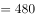元/吨。

故正确答案为A。

---

### 第 3 题　qid 2423386 · 数学运算

有甲乙两个工程队负责某小区主干道维修及墙面粉刷。主干道维修，如果两个工程队合作，30天完成，若乙工程队单独进行，105天完成；粉刷墙面，若两个工程队合作，28天完成，若甲工程队单独做，140天完成。如果两项工作两个工程队共同分工合作，最少需要多少天？

- **A**. 34
- **B**. 35
- **C**. 40　✅
- **D**. 41

**答案**：C

**官方解析**

赋值主干道维修的工程总量为30和105的最小公倍数210，则甲乙合作的效率为，乙的效率为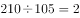，则甲的效率为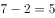；

赋值粉刷墙面的工程总量为28和140的最小公倍数140，则甲乙合作的效率为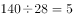，甲的效率为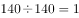，则乙的效率为。

需要两个工程队分工合作以最少的天数完成两项工作，则优先让两个工程队单独完成自己效率较高的工作，即甲优先进行主干道维修，乙优先进行粉刷墙面，先完成的一方去帮助另一方完成剩余的工作。

乙单独完成粉刷墙面的工作需要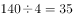天，完成后去与甲共同完成主干道维修的工作，此时甲已完成工作量，剩余的工作量为，由甲、乙共同完成，需要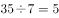天。

因此，两项工作两个工程队共同分工合作，最少需要天。

故正确答案为C。

---

### 第 4 题　qid 2423387 · 数学运算

某单位工会会员60人，现在组织会员报名参加兴趣活动小组，其中报名徒步组的有40人，羽毛球组的有38人，乒乓球组的有31人，这三项活动都报名的有18人，问这个单位工会会员中最多有多少人三个小组都没有报名？

- **A**. 14　✅
- **B**. 15
- **C**. 16
- **D**. 18

**答案**：A

**官方解析**

设三个小组都没有报名为人，报名了两个小组为人，根据三集合非标准型公式：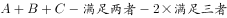，可得：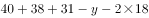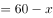，解得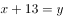。

要让最多，则让最多，即除了三个小组都报名的会员外，其余会员均报名两个小组，则的最大值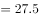，则的最大值为27人，此时最大，人。

故正确答案为A。

---

### 第 5 题　qid 2423388 · 数学运算

甲和乙两个工厂分别生产件某种产品，甲工厂每天比乙工厂多生产20件。甲工厂25天后正好完成自己的生产任务，随后立刻开始帮助乙工厂生产。所有生产任务完成时，甲工厂正好帮乙工厂生产300件产品。问的值为：

- **A**. 1000
- **B**. 1200
- **C**. 1300
- **D**. 1500　✅

**答案**：D

**官方解析**

根据题意可得，任务完成时甲厂生产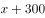件、乙厂生产件，则甲厂比乙厂多生产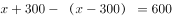件产品，根据公式工作时间可得，完工时间天，则甲厂天生产300件产品，则甲厂工作效率件，则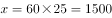件。

故正确答案为D。

---

### 第 6 题　qid 2423389 · 数学运算

甲、乙两个单位分别有60和42名职工，共同成立A、B两个业余活动小组，所有职工每人至少参加1个。乙单位职工中仅参加A组的人数是只参加一个小组人数的，乙单位职工中参加B组的人数与参加A组的人数之比为3：4，参加B组的人中，甲单位职工占5/8。问有多少人仅参加A组？

- **A**. 35
- **B**. 42
- **C**. 46　✅
- **D**. 56

**答案**：C

**官方解析**

方法一：两集合容斥原理，根据题意可得乙单位职工中仅参加A组与仅参加B组人数之比为，设乙单位中仅参加A组有人、仅参加B组的有人，两组均参加的有人，则乙单位职工中参加B组的人数与参加A组的人数之比为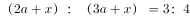，解得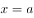，根据题意可得，解得，则乙单位参加B组的有人。则两单位参加B组的共有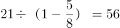人，仅参加A组的有人。

方法二：利用倍数特性代入排除。根据题意“参加B组的人中，甲单位职工占”可得参加B组的人数能被8整除，且参加B组人数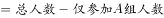。代入A项：，不能被8整除，排除；代入B项：，不能被8整除，排除；代入C项：，能被8整除，满足；代入D项：，不能被8整除，排除。

故正确答案为C。

---

### 第 7 题　qid 2423390 · 数学运算

某网上商城做促销活动，在该商场购物任意商品每满299元即可减免100元。以下哪个图形最能反映购买货物价格(横坐标轴)与实际支付价格(纵坐标轴)之间的关系？

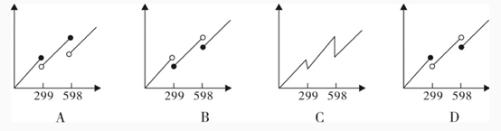

- **A**. 如上图所示
- **B**. 如上图所示　✅
- **C**. 如上图所示
- **D**. 如上图所示

**答案**：B

**官方解析**

根据题意可得，商品每满299元即可减免100元，则当购买货物价格恰好为299元时，实际支付价格为元，只有B项图形满足。

故正确答案为B。

备注：函数图像中实心圆圈代表可以取值，空心圆圈代表不能取值。

---

### 第 8 题　qid 2423337 · 数学运算

球员小王与球队签订工作合同，有1年期、3年期和5年期三种合同可供选择。如果签3年期合同，月薪比5年期合同低1万元，比1年期高5000元，而5年期合同能获得的总薪水是3年期合同的2.5倍。问小王如果签1年期合同，能获得的总薪水为多少万元？

- **A**. 12
- **B**. 18　✅
- **C**. 24
- **D**. 30

**答案**：B

**官方解析**

设3年期合同月薪为万元，则5年期合同月薪为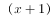万元，1年期合同月薪为万元。由于5年期合同总薪水是3年期的2.5倍，则，解得，则1年期合同月薪为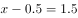万元，故1年期合同总薪水为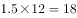万元。

故正确答案为B。

---

### 第 9 题　qid 2423291 · 数学运算

甲从邮局出发去图书馆，乙从图书馆出发去邮局。两人12点同时出发，相向而行。12点40分两人相遇并继续以原速度前行。13点12分甲到达图书馆后立刻返回邮局。假定两人速度不变，甲返回邮局时，乙已到邮局多长时间了？

- **A**. 40分钟
- **B**. 50分钟
- **C**. 54分钟　✅
- **D**. 64分钟

**答案**：C

**官方解析**

设甲的速度为，乙的速度为，邮局和图书馆的距离为。甲乙相遇时各行驶40分钟，甲到达图书馆时行驶72分钟，根据题干，可得方程组：

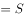 ①

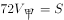 ②

解得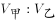，路程相同时，速度与时间成反比，则，分钟，则分钟。

当甲返回邮局时，共行驶分钟，此时乙已经到邮局分钟。

故正确答案为C。

---

### 第 10 题　qid 2423296 · 数学运算

某医院内科，今年门诊人数比上一年增加了，平均每位患者的门诊花费比上一年下降了，若上一年该医院内科门诊收入为3000万元，那么今年的门诊收入大约是多少万元？

- **A**. 2600
- **B**. 2880
- **C**. 3120　✅
- **D**. 3640

**答案**：C

**官方解析**

设该医院去年门诊人数为，平均每位患者的门诊花费为，由题干可得：去年该医院内科门诊收入万元。

根据题意，今年门诊人数为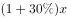，平均每位患者的门诊花费为，则今年该医院内科门诊收入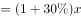万元。

故正确答案为C。

---

## 判断推理

### 第 1 题　qid 2423322 · 图形推理

从所给的四个选项中，选择最合适的一个填入问号处，使之呈现一定的规律性：

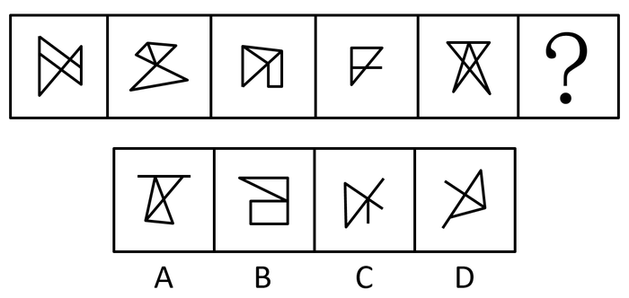

- **A**. A
- **B**. B　✅
- **C**. C
- **D**. D

**答案**：B

**官方解析**

图形元素组成不同，且无明显属性规律，优先考虑数量规律。观察发现，图五出现“五角星”变形图，图四、选项C、D中出现了多端点图形，考虑笔画数。图一有2个奇点，图二有2个奇点，图三有2个奇点，图四有2个奇点，图五有0个奇点，题干中图形均为一笔画图形，所以“？”处应为一笔画图形。A项两笔画，B项一笔画，C项两笔画，D项两笔画。
故正确答案为B。

---

### 第 2 题　qid 2423300 · 图形推理

左边的立体图形是由①、②和③组成的，下列哪项<b>不能</b>填入问号处？

- **A**. A
- **B**. B　✅
- **C**. C
- **D**. D

**答案**：B

**官方解析**

本题考查立体拼合。逐一代入选项进行验证。

A项：图①放在最下面一排左侧的位置，将图②左右翻转，放在上面一排左侧的位置，选项“立”起来，放在图①右下角的位置，可以拼成左边的立体图形，排除；

B项：无法与图①②拼成左边的立体图形，当选；

C项：图①放在最下面一排左侧的位置，将图②顺时针旋转，放在上面一排左侧的位置，选项上下翻转，使得单独的方块在下面，并放在图①右下角的位置，可以拼成左边的立体图形，排除；

D项：图①放在最下面一排左侧的位置，将图②“立”起来，使得单独的方块在下面，并放在图①右下角的位置，选项放在上面一排左侧的位置，可以拼成左边的立体图形，排除。

本题为选非题，故正确答案为B。

---

### 第 3 题　qid 2423304 · 图形推理

从所给的四个选项中，选择最合适的一个填入问号处，使之呈现一定的规律性：

- **A**. A
- **B**. B　✅
- **C**. C
- **D**. D

**答案**：B

**官方解析**

元素组成不同，且无明显属性规律，优先考虑数量规律。观察发现，题干出现较多的多边形以及多边形的组合图形，优先考虑直线数，依次为5、4、5、6、5，无规律。考虑线的细化考法，继续观察发现，题干每幅图均存在平行线，且平行线的数量均为1对，则？处图形也应仅有1对平行线，只有B项符合规律。
故正确答案为B。

---

### 第 4 题　qid 2423309 · 图形推理

从所给的四个选项中，选择最合适的一个填入问号处，使之呈现一定的规律性：

- **A**. A　✅
- **B**. B
- **C**. C
- **D**. D

**答案**：A

**官方解析**

九宫格优先横向看，每一行三幅图中黑球的数量相同，元素组成相同，优先考虑位置规律。每幅图都可看作由内圈4个“格子”和外圈12个“格子”构成，第一行图形中，内圈的小黑球在4个“格子”中每次逆时针移动一格，外圈的小黑球均在12个“格子”中每次顺时针移动一格。验证第二行图形符合此规律，对第三行图形应用此规律，问号处图形内圈的小黑球应在右下角，只有A项符合规律，此时满足外圈的小黑球每次顺时针移动一格。
故正确答案为A。

---

### 第 5 题　qid 2423318 · 图形推理

把下面的六个图形分为两类，使每一类都有各自的共同特征或规律，分类正确的一项是：

- **A**. ①②③，④⑤⑥
- **B**. ①②⑤，③④⑥
- **C**. ①②④，③⑤⑥
- **D**. ①③⑤，②④⑥　✅

**答案**：D

**官方解析**

本题为分组分类题目。元素组成不同，无明显属性规律，考虑数量规律。观察发现，题干中均为内部线条与外框相交构成图形，其中①③⑤所有面都跟外框相连，②④⑥中间都有1个面与外框不相连。即①③⑤一组，②④⑥一组。
故正确答案为D。

---

### 第 6 题　qid 2423328 · 图形推理

把下面的六个图形分为两类，使每一类都有各自的共同特征或规律，分类正确的一项是：

- **A**. ①②③，④⑤⑥
- **B**. ①②⑤，③④⑥
- **C**. ①②⑥，③④⑤
- **D**. ①④⑤，②③⑥　✅

**答案**：D

**官方解析**

本题为分组分类题目。元素组成不同，无明显属性规律，考虑数量规律。观察发现，题干图形均为方块内线条相交构成图。图①内部线条与四个端点相交的个数有2个，图②有3个，图③有3个，图④有2个，图⑤有2个，图⑥有3个。图①④⑤内部线条与四个端点相交的个数有2个，图②③⑥内部线条与四个端点相交的个数有3个。即①④⑤一组，②③⑥一组。
故正确答案为D。

---

### 第 7 题　qid 2423327 · 定义判断

群落的分层现象是指不同的生物种出现于地面以上不同的高度和地面以下不同的深度，从而使整个群落在垂直方向上呈现上下分层分布的现象，这一现象也被称为群落的垂直结构。
根据上述定义，下列没有反映群落分层现象的是：

- **A**. 森林中层栖息着山雀、啄木鸟等鸟类，林冠层则栖息着柳莺、交嘴雀等鸟类
- **B**. 自然保护区中的松柏高低错落，有的树根交错，互相缠绕，形成独特的层次感　✅
- **C**. 海洋中，上层生活着浮游生物，中层生活着不同的鱼类，下层生活着海星等底栖生物
- **D**. 热带雨林中，乔木植物由于高大往往遮住了阳光，其下方生长着耐阴喜湿的草本植物

**答案**：B

**官方解析**

第一步：找出定义关键词。
“不同的生物种出现于地面以上不同的高度和地面以下不同的深度”、“整个群落在垂直方向上呈现上下分层分布的现象”。
第二步：逐一分析选项。
A项：森林中层栖息着山雀、啄木鸟等鸟类，林冠层栖息着柳莺、交嘴等鸟类。符合“不同的生物种出现于地面以上不同的高度”、“整个群落在垂直方向上呈现上下分层分布的现象”，符合定义，排除； 
B项：自然保护区中的松柏高低错落，具有独特的层次感，只出现了松柏一个生物物种。不符合“不同的生物种出现于地面以上不同的高度和地面以下不同的深度”，不符合定义，当选；
C项：海洋中，上层、中层、下层分别生活着浮游生物、鱼类和底栖生物。符合“不同的生物种出现于地面以下不同的深度”、“整个群落在垂直方向上呈现上下分层分布的现象”，符合定义，排除；
D项：热带雨林中，乔木植物的下方生长着草本植物。符合“不同的生物种出现于地面以上不同的高度”、“整个群落在垂直方向上呈现上下分层分布的现象”，符合定义，排除。
本题为选非题，故正确答案为B。

---

### 第 8 题　qid 2423348 · 定义判断

作为人体的生理功能，免疫能识别“自己”和“非己”成分，破坏和排斥进入人体的抗原物质（如病菌等），或自身产生的损伤细胞和肿瘤细胞等，以维持健康。非消除性免疫是免疫的一种类型，指宿主感染寄生虫后不能清除或不能完全清除已经建立了感染的寄生虫，但对同种寄生虫的再感染具有一定程度的抵抗力。
根据上述定义，下列反映了非消除性免疫的是：

- **A**. 热带利什曼原虫引起疖肿，当人体获得免疫力后原虫完全被清除，临床症状消失，不再感染
- **B**. 人体感染疟原虫后，体内疟原虫未被清除，维持低虫血症，但人体对这类感染具有一定的抵抗力　✅
- **C**. 人体被血吸虫感染后出现发热、肝脾肿大症状，使用驱虫药后治愈，再感染时对入侵的童虫有一定的抵抗力
- **D**. 甲流病毒H1N1感染了某些人群后，这些人体内的吞噬类细胞会将病毒吞噬从而治愈，获得免疫力，但他们仍会感染H7N9型甲流

**答案**：B

**官方解析**

第一步：找出定义关键词。
“宿主感染寄生虫后不能清除或不能完全清除已经建立了感染的寄生虫，但对同种寄生虫的再感染具有一定程度的抵抗力”；
第二步：逐一分析选项。
A项：人体获得免疫力后热带利什曼原虫完全被清除。不符合“宿主感染寄生虫后不能清除或不能完全清除已经建立了感染的寄生虫”，不符合定义，排除； 
B项：人体感染疟原虫后，体内疟原虫未被清除，同时人体对这类感染具有一定的抵抗力。符合“宿主感染寄生虫后不能清除或不能完全清除已经建立了感染的寄生虫，但对同种寄生虫的再感染具有一定程度的抵抗力”，符合定义，当选；
C项：使用驱虫药能完全治愈被血吸虫感染后出现的发热、肝脾肿大症状。不符合“宿主感染寄生虫后不能清除或不能完全清除已经建立了感染的寄生虫”，不符合定义，排除；
D项：人体内的吞噬类细胞会将甲流病毒H1N1吞噬，从而治愈，获得免疫力。没有体现出人体感染了寄生虫，不符合“宿主感染寄生虫后不能清除或不能完全清除已经建立了感染的寄生虫”，不符合定义，排除。
故正确答案为B。

---

### 第 9 题　qid 2423324 · 定义判断

岩石在基本上处于固体状态下，受到温度、压力及化学活动性流体的作用，发生矿物成分、化学成分、岩石结构与构造变化的地质作用，称为变质作用。地表的风化作用和其他外生作用（沉积作用等）引起岩石的物理变化，不属于变质作用。
根据上述定义，下列反映了变质作用的是：

- **A**. 沙漠昼夜温差大，岩石在日间受热膨胀，晚间冷却收缩，逐渐形成砂砾
- **B**. 煤在隔绝空气条件下加热到850℃，保持7分钟，其成分会分解成气体和液体
- **C**. 含有盐分的溶液渗入火成岩的裂缝中，当溶液蒸发留下盐晶体，盐晶受热后膨胀令岩石瓦解
- **D**. 宇宙中的巨大陨石高速降至地球表面，冲击岩石发生爆炸形成陨石坑，坑内岩石变化形成各种冲击岩　✅

**答案**：D

**官方解析**

第一步：找出定义关键词。
“岩石受到温度、压力及化学活动性流体的作用”、“发生矿物成分、化学成分、岩石结构与构造变化的地质作用”、“物理变化不属于变质作用”。
第二步：逐一分析选项。
A项：沙漠的岩石热胀冷缩变成砂砾，是物理变化，物理变化不属于变质作用，不符合定义，排除； 
B项：把煤隔绝空气，持续加热一定温度，是人为的过程，不属于地质作用，不符合定义，排除；
C项：火山岩被含盐溶液瓦解，是物理变化，物理变化不属于变质作用，不符合定义，排除；
D项：宇宙中的巨大陨石高速降至地球表面冲击岩石发生爆炸形成陨石坑，符合“岩石受到温度、压力及化学活动性流体的作用”，坑内岩石变化形成各种冲击岩，符合“发生矿物成分、化学成分、岩石结构与构造变化的地质作用”，符合定义，当选。
故正确答案为D。

---

### 第 10 题　qid 2423351 · 定义判断

人们通常把因环境污染和环境破坏而对公众和社会所造成的危害叫做公害。公害病是公害发生的地区性疾病。其特征包括：①由人类活动造成的环境污染所引起；②损害健康的环境污染因素复杂；③其流行一般具有长期陆续发病的特征，还可能累及胎儿，危害后代；④属新病种，有些发病机制还不清楚，缺乏特效疗法。
根据上述定义，下列不属于公害病的是：

- **A**. 人们食用了被镉污染的水稻后罹患骨痛病，骨骼疼痛难忍，无特效疗法
- **B**. 某地区玉米、小麦受到霉菌（尤其是镰刀菌）感染后会产生毒素，人们食用后会破坏人体骨骼生长，导致四肢短小　✅
- **C**. 某地区使用重油燃料，排出废气中含有大量的二氧化硫，造成了严重的大气污染，引起当地居民罹患支气管哮喘、肺气肿等疾病
- **D**. 含无机汞的工业废水排入水体后，被细菌转化为毒性更强的甲基汞，富集于水生生物体内，人们长期食用后出现神经系统损伤，波及后代

**答案**：B

**官方解析**

第一步：找出定义关键词。
公害：因环境污染和环境破坏而对公众和社会所造成的危害。
公害病：公害发生的地区性疾病。其特征包括：①由人类活动造成的环境污染所引起；②损害健康的环境污染因素复杂；③其流行一般具有长期陆续发病的特征，还可能累及胎儿，危害后代；④属新病种，有些发病机制还不清楚，缺乏特效疗法。
第二步：逐一分析选项。
A项：镉污染符合“①由人类活动造成的环境污染所引起”、“②损害健康的环境污染因素复杂”，骨骼疼痛难忍，无特效疗法符合“④属新病种，有些发病机制还不清楚，缺乏特效疗法”，符合定义，排除； 
B项：某地区玉米、小麦受到霉菌(尤其是镰刀菌)感染，不符合“①由人类活动造成的环境污染所引起”，不符合定义，当选；
C项：某地区使用重油燃料，排出废气中含有大量的二氧化硫，造成了严重的大气污染，符合“①由人类活动造成的环境污染所引起，②损害健康的环境污染因素复杂”，引起当地居民罹患支气管哮喘、肺气肿等疾病符合“③其流行一般具有长期陆续发病的特征，还可能累及胎儿，危害后代”，符合定义，排除；
D项：含无机汞的工业废水排入水体后，被细菌转化为毒性更强的甲基汞，富集于水生生物体内，符合“①由人类活动造成的环境污染所引起”，人们长期食用后出现神经系统损伤，波及后代，符合“③其流行一般具有长期陆续发病的特征，还可能累及胎儿，危害后代”，符合定义，排除。
本题为选非题，故正确答案为B。

---

### 第 11 题　qid 2423354 · 定义判断

清洁生产是指不断采取改进设计、使用清洁的能源和原料、采用先进的工艺技术与设备、改善管理、综合利用等措施，从源头削减污染，提高资源利用效率，减少或者避免生产、服务和产品使用过程中污染物的产生和排放，以减轻或者消除环境危害的生产方式。
根据上述定义，下列不涉及清洁生产的是：

- **A**. 企业淘汰有毒有害的原材料，并在全部排放物和废物离开生产过程以前，尽最大可能减少它们的排放量和毒性
- **B**. 企业采用少废、无废的生产工艺技术和高效生产设备，减少生产过程中的各种危险因素和有毒有害的中间产品
- **C**. 企业选择再使用与再循环性的材料，这样可以通过提高环境质量和减少成本获得经济与环境收益
- **D**. 企业主动设置控制污染物排放标准，严格控制内部各部门污染物排污口，引进治污设备，使排放的污染物通过治理达到排放标准　✅

**答案**：D

**官方解析**

第一步：找出定义关键词。
“不断采取改进设计、使用清洁的能源和原料、采用先进的工艺技术与设备、改善管理、综合利用等措施”、“从源头削减污染，提高资源利用效率，减少或者避免生产、服务和产品使用过程中污染物的产生和排放”、“减轻或者消除环境危害”、“生产方式”。
第二步：逐一分析选项。
A项：企业淘汰有毒有害的原材料符合“使用清洁的能源和原料”，并在全部排放物和废物离开生产过程以前尽最大可能减少它们的排放量和毒性，符合“从源头削减污染、减少生产产品过程中污染物的产生和排放”，符合“减轻或者消除环境危害的生产方式”，符合定义，排除； 
B项：企业采用少废、无废的生产工艺技术和高效生产设备符合“采用先进的工艺技术与设备”，减少生产过程中的各种危险因素和有毒有害的中间产品符合“从源头削减污染、减少生产产品过程中污染物的产生和排放”，符合“减轻或者消除环境危害的生产方式”，符合定义，排除；
C项：企业选择再使用与再循环性的材料，通过提高环境质量和减少成本获得经济与环境收益，符合“使用清洁的能源和原料”，符合“从源头削减污染、减少生产产品过程中污染物的产生和排放”，符合“减轻或者消除环境危害”，符合定义，排除；
D项：设置控制污染物排放标准，严格控制内部各部门污染物排污口，引进治污设备，是产品生产过程之后的污染治理过程，不是一种“生产方式”，不符合“从源头削减污染、减少生产产品过程中污染物的产生和排放”，不符合定义，当选。
本题为选非题，故正确答案为D。

---

### 第 12 题　qid 2423358 · 定义判断

叙述视角是指叙述语言中对故事内容进行观察和讲述的特定角度。其中，内视角指的是叙述者只借助某个人物的感觉和意识，从他的视觉、听觉及感受的角度去传达一切，叙述者等同于该人物本身，即叙述者所知道的同该人物知道的一样多。
根据上述定义，下列反映了内视角的是：

- **A**. 《金锁记》中，作者采用全知全能的叙述方式，揭示了曹七巧等人的悲剧命运
- **B**. 《白象似的群山》中，作者置身于所有角色之外，客观叙述故事中的人物命运
- **C**. 《孔乙己》中，作者即故事中的小伙计，用旁观者的口吻描写其所见所闻　✅
- **D**. 《包法利夫人》中，作者以局外人的身份展示情节，给读者极大的想象空间

**答案**：C

**官方解析**

第一步：找出定义关键词。
叙述视角：“对故事内容进行观察和讲述”。
内视角：“只借助某个人物的感觉和意识”、“从他的视觉、听觉及感受的角度去传达一切”、“叙述者所知道的同该人物知道的一样多”。
第二步：逐一分析选项。
A项：全知全能的叙述方式，不符合“只借助某个人物的感觉和意识”，也不符合“从他的视觉、听觉及感受的角度去传达一切”，不符合定义，排除； 
B项：作者置身于所有角色之外，客观叙述故事中的人物命运，不符合“只借助某个人物的感觉和意识”，也不符合“从他的视觉、听觉及感受的角度去传达一切”，不符合定义，排除； 
C项：作者即故事中的小伙计，符合“只借助某个人物的感觉和意识”，也符合“叙述者所知道的同该人物知道的一样多”，描写其所见所闻符合“从他的视觉、听觉及感受的角度去传达一切”，符合定义，当选；
D项：以局外人的身份展示情节，不符合“只借助某个人物的感觉和意识”，也不符合“从他的视觉、听觉及感受的角度去传达一切”，不符合定义，排除。
故正确答案为C。

---

### 第 13 题　qid 2423361 · 定义判断

光周期指的是昼夜周期中光照期和暗期长短的交替变化。植物在生长发育进程中，必须经过一定时间的适宜光周期后才能开花，否则会一直处于营养生长状态而不开花。这种昼夜长短影响植物开花的现象称为光周期现象。
根据上述定义，下列没有反映光周期现象的是：

- **A**. 
大豆性喜暖，种子在10～12开始发芽，如遇低温则结荚延迟，低于14不能开花
　✅
- **B**. 
天仙子必须满足一定天数的8.5～11.5小时日照才能开花，如果日照长度短于8.5小时它就不能开花

- **C**. 
秋菊在每天14小时的长日照下进行茎叶营养生长，在每天12小时以上的黑暗与10的夜温下才能够开花

- **D**. 
芹菜是长日照型植物，需要14小时以上的日照才可抽薹开花，冬季需适当人工补充光照以满足其生长需求

**答案**：A

**官方解析**

第一步：找出定义关键词。

“昼夜周期中光照期和暗期长短的交替变化”、“必须经过一定时间的适宜光周期后才能开花”。

第二步：逐一分析选项。

A项：大豆需要在10°～12发芽，不涉及光照变化，不符合定义，当选； 

B项：天仙子必须满足一定天数的日照才能开花，符合“昼夜周期中光照期和暗期长短的交替变化”，也符合“必须经过一定时间的适宜光周期后才能开花”，符合定义，排除；

C项：秋菊每天需要12小时以上的黑暗才能开花，符合“昼夜周期中光照期和暗期长短的交替变化”，也符合“必须经过一定时间的适宜光周期后才能开花”，符合定义，排除；

D项：芹菜需要14小时以上日照才能开花，符合“昼夜周期中光照期和暗期长短的交替变化”，也符合“必须经过一定时间的适宜光周期后才能开花”，符合定义，排除。

本题为选非题，故正确答案为A。

---

### 第 14 题　qid 2423362 · 定义判断

似不注意和似注意都是注意的一种，其中似不注意是指貌似不注意一事物而实际的心理活动却十分注意这一事物，而似注意是指表面上注意某些事物，但实际上心里却想着其他事物。
根据上述定义，下列属于似不注意的是：

- **A**. 小李参加部门会议时，心里一直在想下个月休假去哪里玩
- **B**. 传说王羲之在书法创作时太过投入，有一次竟将馒头蘸着墨汁食用
- **C**. 学生在教室里听课，突然从外面进来一个人，这时学生就会中断听课，不由自主地注意进来的人
- **D**. 刑事侦查人员在人群中发现了侦缉对象，为了不打草惊蛇，往往选择假装没看见，然后悄悄靠近，最后出其不意地将对象抓获　✅

**答案**：D

**官方解析**

第一步：找出定义关键词。
似不注意：貌似不注意一事物而实际的心理活动却十分注意这一事物；
似注意：指表面上注意某些事物，但实际上心里却想着其他事物。
第二步：逐一分析选项。
A项：小李参加会议时想着休假的事情，符合“表面上注意某些事物，但实际上心里却想着其他事物”，符合“似注意”定义，不符合“似不注意”定义，排除； 
B项：王羲之投入到书法创作中，是全神贯注地注意，不涉及不注意，不符合任何一个定义，排除；
C项：学生听课的注意力被突然出现的人打断，不涉及不注意，不符合任何一个定义，排除；
D项：刑侦人员注意到了侦缉对象行踪，假装没看见，符合“貌似不注意一事物而实际的心理活动却十分注意这一事物”，符合“似不注意”定义，不符合“似注意”定义，当选。
故正确答案为D。

---

### 第 15 题　qid 2423325 · 类比推理

舍生取义：苟且偷生

- **A**. 爱财如命：乐于助人
- **B**. 古为今用：今非昔比
- **C**. 异口同声：一言九鼎
- **D**. 祸不单行：鸿运当头　✅

**答案**：D

**官方解析**

第一步：判断题干词语间逻辑关系。
舍生取义指舍弃生命以取得正义，指为正义而牺牲生命；苟且偷生指得过且过，勉强活着，两者为反义关系。
第二步：判断选项词语间逻辑关系。
A项：爱财如命指把钱财看得跟生命一样重要，形容极端吝啬；乐于助人指很乐意主动帮助有需要的人们；两者不是反义关系，与题干逻辑关系不一致，排除；
B项：古为今用指批判、借鉴古代的东西，继承其中优秀的文化遗产，使之为今天所用，常指文化遗产的继承；今非昔比指现在不是过去能比得上的，多指形势、自然面貌等发生了巨大的变化；两者不是反义关系，与题干逻辑关系不一致，排除；
C项：异口同声指不同的人说同样的话，形容意见一致；一言九鼎指形容说的话分量大，起决定作用；两者不是反义关系，与题干逻辑关系不一致，排除；
D项：祸不单行指不幸的事接二连三地发生；鸿运当头指正是走好运的时候；两者是反义关系，与题干逻辑关系一致，当选。
故正确答案为D。

---

### 第 16 题　qid 2423326 · 类比推理

文物：出土：鉴定

- **A**. 乌龙茶：封装：销售　✅
- **B**. 投影仪：切换：播放
- **C**. 温度计：显示：测量
- **D**. 降落伞：加速：着陆

**答案**：A

**官方解析**

第一步：判断题干词语间逻辑关系。
出土文物与鉴定文物均是一种行为，且先出土，后鉴定，二者存在先后顺序。
第二步：判断选项词语间逻辑关系。
A项：封装乌龙茶与销售乌龙茶均是一种行为，且先封装，后销售，二者存在先后顺序，与题干逻辑关系一致，当选；
B项：切换投影仪与播放投影仪搭配不当，与题干逻辑关系不一致，排除；
C项：显示温度计与测量温度计搭配不当，与题干逻辑关系不一致，排除；
D项：加速降落伞与着陆降落伞搭配不当，与题干逻辑关系不一致，排除。
故正确答案为A。

---

### 第 17 题　qid 2423329 · 类比推理

生产要素：土地：资本

- **A**. 自然现象：彩虹：沙漠
- **B**. 社会福利：社会保险：社会救助　✅
- **C**. 油料作物：花生：水稻
- **D**. 市场调查：产品原料：客户反馈

**答案**：B

**官方解析**

第一步：判断题干词语间逻辑关系。
土地和资本都是生产要素的一种，是种属关系，土地和资本是并列关系。
第二步：判断选项词语间逻辑关系。
A项：彩虹是自然现象，沙漠是地貌，不是自然现象，与题干逻辑关系不一致，排除；
B项：社会保险和社会救助都是社会福利的一种，是种属关系。就社会福利而言，它是可以包括社会救助和社会保险的（社会保险包含在社会福利内。社会保险保障人员最基本的生活，如养老、医疗、失业等，而社会福利内容更广泛，如养老院、孤儿院的建设、孤寡老人的补贴、大病救助、遗属福利等）；社会保险和社会救助是并列关系，与题干逻辑关系一致，当选；
C项：花生是油料作物，水稻不是油料作物，与题干逻辑关系不一致，排除；
D项：客户反馈是市场调查的内容，产品原料不是市场调查，与题干逻辑关系不一致，排除。
故正确答案为B。

---

### 第 18 题　qid 2423330 · 类比推理

上市：停牌：退市

- **A**. 水洗：熨烫：干洗
- **B**. 写书：出书：编纂
- **C**. 听题：抢答：得分　✅
- **D**. 谱曲：演唱：伴舞

**答案**：C

**官方解析**

第一步：判断题干词语间逻辑关系。
先上市，然后停牌，最后再退市，三者是时间先后顺序的对应关系。
第二步：判断选项词语间逻辑关系。
A项：水洗和干洗是不同的洗涤方式，二者是并列关系，与题干逻辑关系不一致，排除；
B项：编纂应该在出书之前，与题干逻辑关系不一致，排除；
C项：先听题，然后抢答，最后得分，三者是时间先后顺序的对应关系，与题干逻辑关系一致，当选；
D项：演唱和伴舞一般同时发生，二者没有明显的时间先后顺序，与题干逻辑关系不一致，排除。
故正确答案为C。

---

### 第 19 题　qid 2423331 · 类比推理

治本 对于（  ）相当于 忠诚 对于（  ）

- **A**. 釜底抽薪  披肝沥胆　✅
- **B**. 一步到位  一如既往
- **C**. 正本清源  呕心沥血
- **D**. 扬汤止沸  矢志不渝

**答案**：A

**官方解析**

逐一代入选项。
A项：釜底抽薪意思是将柴火从锅底抽掉，才能使水止沸，比喻从根本上解决问题，即“治本”，二者是近义关系；披肝沥胆比喻开诚相见，竭尽忠诚，即“忠诚”，二者也是近义关系；前后逻辑关系一致，当选；
B项：一步到位指一次就达到预定的目标，与“治本”无明显逻辑关系；一如既往指态度或做法没有任何变化，还是像从前一样，与“忠诚”无明显逻辑关系；前后逻辑关系不一致，排除；
C项：正本清源比喻从根本上整顿，从源头上清理，即“治本”，二者是近义关系；呕心沥血形容费尽心思和精力，与“忠诚”无明显逻辑关系；前后逻辑关系不一致，排除；
D项：扬汤止沸指把锅里开着的水舀起来再倒回去，使它凉下来不沸腾，比喻办法不对头，不能从根本上解决问题，不是“治本”，二者是反义关系；矢志不渝指立志不会改变，表示永远不变心，与 “忠诚”是近义关系；前后逻辑关系不一致，排除。
故正确答案为A。

---

### 第 20 题　qid 2423332 · 类比推理

跳跃 对于（  ）相当于 拟人 对于（  ）

- **A**. 静止  枯燥乏味
- **B**. 动作  修辞手法　✅
- **C**. 高度  栩栩如生
- **D**. 跳远  夸大其词

**答案**：B

**官方解析**

逐一代入选项。
A项：跳跃是动态的，与静止是反义关系，拟人与枯燥乏味没有明显逻辑关系，前后逻辑关系不一致，排除；
B项：跳跃是一种动作，二者是种属关系，拟人是一种修辞手法，二者也是种属关系，前后逻辑关系一致，当选；
C项：高度是描述跳跃的一个指标，栩栩如生不是描述拟人的一个指标，前后逻辑关系不一致，排除；
D项：跳远是一种跳跃，二者是种属关系，夸大其词意思是把事情说得超过原有的程度，拟人是一种修辞手法，二者没有明显的逻辑关系，前后逻辑关系不一致，排除。
故正确答案为B。

---

### 第 21 题　qid 2423333 · 类比推理

特种部队 对于（  ）相当于 （  ）对于 狙击步枪

- **A**. 特种兵  霰弹枪
- **B**. 冲锋舟  瞄准镜
- **C**. 定位系统  侦查人员
- **D**. 反恐部队  自动步枪　✅

**答案**：D

**官方解析**

逐一代入选项。
A项：特种兵是特种部队的组成部分，霰弹枪是指无膛线（滑膛）并以发射霰弹为主的枪械，与狙击步枪是并列关系，前后逻辑关系不一致，排除；
B项：冲锋舟是特种部队在执行某些特殊任务时使用的装备，瞄准镜是狙击步枪的一个组成部分，前后逻辑关系不一致，排除；
C项：特种部队和定位系统没有明显逻辑关系，侦查人员使用狙击步枪，前后逻辑关系不一致，排除；
D项：特种部队和反恐部队是交叉关系，自动步枪和狙击步枪也是交叉关系，前后逻辑关系一致，当选。
故正确答案为D。

---

### 第 22 题　qid 2423315 · 类比推理

甲、乙、丙、丁四人驾车外出，遇到交警排查酒驾，四人因司机酒后驾车害怕受到惩罚而弃车逃跑，很快被交警擒获。当询问谁是驾驶员时，甲说：“不是我。”乙说：“是甲。”丙说：“不是我。”丁说：“是乙。”若四人中有且仅有两人说了假话，那么谁一定说了假话？

- **A**. 甲
- **B**. 乙
- **C**. 丙
- **D**. 丁　✅

**答案**：D

**官方解析**

最后一句题干说“4人中有且只有2人说假话”，说明这是一道2真2假的真假推理。
先整理题干条件：
甲：—甲
乙：甲
丙：—丙
丁：乙
解法1——推理法：
甲乙矛盾，必然是1真1假。条件是2真2假，则剩下的丙丁也必然1真1假。若丁说真话，即乙是驾驶员，那么丙说的也是真话，不满足1真1假，因此丁说的一定是假话。
故正确答案为D。
注：得出丁说假话，丙说真话后，只能得到乙和丙都不是驾驶员，但是到底驾驶员是甲还是丁，推不出来，因此无法确定甲乙两人话的真假。
解法2——假设法：
假设甲是驾驶员，那么甲说了假话，乙说了真话，丙说了真话，丁说了假话——2真2假；
若乙是驾驶员，那么甲说了真话，乙说了假话，丙说了真话，丁说了真话——3真；
若丙是驾驶员，那么甲说了真话，乙说了假话，丙说了假话，丁说了假话——3假；
若丁是驾驶员，那么甲说了真话，乙说了假话，丙说了真话，丁说了假话——2真2假；
因为题干条件要求四人中有且仅有两人说了假话，所以甲、丁均有可能是驾驶员，而乙和丙不可能是驾驶员，可知丁说了假话，丙说了真话，甲乙两人不能判断谁真谁假。
故正确答案为D。

---

### 第 23 题　qid 2423339 · 逻辑判断

在自然选择中，只有有性繁殖才能产生随机变异，环境压力（如疾病侵害）会使有益的突变（如获得抗病性）固定下来。但在无性繁殖中，后代的遗传物质不会随繁殖代数的增加发生变异。由于华蕉（香蕉的一个品种）主要通过扦插繁殖，全球范围内种植的所有华蕉均为同一植物的无性繁殖后代。因此，一旦有新型病菌开始侵染，华蕉很可能会和19世纪中期因感染病菌而绝迹的大麦克香蕉品种一样全军覆没。
根据这段文字，可以推出：

- **A**. 若后代的遗传物质不通过繁殖发生变异，那么这种繁殖就不是无性繁殖
- **B**. 若环境变化不能使有益的突变固定下来，那么有性繁殖就没有产生变异
- **C**. 只要被新型病菌感染，华蕉品种就会像大麦克香蕉的品种一样逐渐消亡
- **D**. 如果华蕉品种采用扦插繁殖来繁殖后代，那么这种方式一定是无性繁殖　✅

**答案**：D

**官方解析**

第一步：翻译题干。

①随机变异有性繁殖

②无性繁殖不会发生变异

③华蕉无性繁殖

第二步：逐一分析选项。

A项：翻译为不发生变异不是无性繁殖，是对条件②的肯后，肯后无必然结论，无法推出，排除；

B项：翻译为环境变化不能使有益的突变固定下来有性繁殖不产生变异，而根据题干第一句话，这两者不能翻译，无法推出，排除；

C项：题干第四句话提到，一旦有新型病菌开始侵染，华蕉很可能全军覆没，而选项说的是华蕉就会全军覆没，过于绝对，无法推出，排除；

D项：翻译为 扦插繁殖的华蕉无性繁殖，根据条件③可知，所有的华蕉都是无性繁殖，而题干倒数第二句话提到，华蕉主要通过扦插繁殖，那么就可以推出 扦插繁殖的华蕉是无性繁殖的，可以推出，当选。

故正确答案为D。

---

### 第 24 题　qid 2423350 · 逻辑判断

对许多人来说，阿尔茨海默病是一种熟悉而可怕的疾病，虽进展缓慢但无情剥夺着患者的记忆力、辨别力还有认知力，使他们无法进行日常生活。一些研究认为，这种病主要是由于大脑内部蛋白质的异常积聚导致的，这些异常积聚会在脑中形成淀粉样斑块和缠结，最终导致突触（大脑中的连接节点）减少，从而降低认知能力。

以下哪项如果为真，最能<b>削弱</b>上述结论？

- **A**. 在正常人群中，大脑组织里也会有一定数量的蛋白质存在，时多时少
- **B**. 在该病形成早期，神经突触就开始减少，这种减少引发了蛋白质的堆积　✅
- **C**. 动物实验显示，如果消除动物脑部已形成的淀粉样斑块，并不能让突触减少
- **D**. 作为大脑中的神经连接，突触会被不断修剪，这是大脑正常发育的重要过程

**答案**：B

**官方解析**

第一步：找出论点和论据。

论点：阿尔茨海默病主要是由于大脑内部蛋白质的异常积聚导致的，这些异常积聚会在脑中形成淀粉样斑块和缠结，最终导致突触（大脑中的连接节点）减少，从而降低认知能力。

论据：无。

本题的论点是因果型论点，可以考虑因果倒置或他因削弱的方法来削弱。

第二步：逐一分析选项。

A项：讨论正常人群大脑组织中也存在一定数量的蛋白质，没有提及这些蛋白质是否异常积聚以及对认知能力的影响，与题干讨论的话题无关，无关项，排除；

B项：该项讨论的是神经突触的减少导致了蛋白质的堆积，而论点讨论的是，蛋白质的积聚导致了突触减少，该项将论点中的原因和结果互换，因果倒置选项，可以削弱，当选；

C项：讨论动物实验的情况，题干主体是人，主体与题干不一致，无关项，排除；

D项：“突触会被不断修剪”不一定导致突触数量减少，且没有提及蛋白质异常积聚，不能削弱，排除。

故正确答案为B。

---

### 第 25 题　qid 2423352 · 逻辑判断

关于青藏高原中部隆升的时间和幅度，不少研究认为高原中部在3500万年前已经达到了4500米的高度。然而近日，某研究团队在位于青藏高原中部的藏北伦坡拉盆地采集到了一些大型棕榈化石。这些化石形成于2500万年前，其中所埋藏的棕榈叶叶片宽阔，叶柄极长。研究团队由此推测：在2500万年前，青藏高原中部的海拔高度不超过2500米，并未隆升，这也将青藏高原中部的抬升历史推后了至少约1000万年。
要得到上述研究推论，需要补充的前提是：

- **A**. 目前，人们还没有在青藏高原中部发现3500万年前的植物化石
- **B**. 这些化石，加上早期已发现的大量植物化石，显示出当时青藏高原的生物具有多样性
- **C**. 棕榈科植物主要分布在热带地区，极少数在亚热带地区，如果海拔超过2500米，棕榈科植物根本不可能存活　✅
- **D**. 在2500万年前，青藏高原中部有一条东西向的峡谷，峡谷里生长着棕榈，而峡谷两侧则是海拔约4000米的高山

**答案**：C

**官方解析**

第一步：找出论点和论据。
论点：在2500万年前，青藏高原中部的海拔高度不超过2500米，并未隆升。
论据：某研究团队在位于青藏高原中部的藏北伦坡拉盆地采集到了一些大型棕榈化石。这些化石形成于2500万年前，其中所埋藏的棕榈叶叶片宽阔，叶柄极长。
本题的论点讨论的是2500万年前青藏高原中部的海拔高度不超过2500米，而论据讨论采集的大型棕榈化石情况，论点和论据话题不一致，且提问方式为“需要补充的前提”，优先考虑搭桥。
第二步：逐一分析选项。
A项：该项说的是没有在青藏高原中部发现3500万年前的植物化石，而论点说的是2500万年前的青藏高原中部的海拔高度，二者讨论的话题不一致，无关项，不能加强，排除；
B项：说明当时青藏高原的生物具有多样性，与题干讨论的2500万年前青藏高原的海拔高度无关，因此该项属于无关项，不能加强，排除；
C项：说明棕榈科植物只能在海拔2500米以下的地区存活，那么在2500万年前青藏高原中部的海拔高度必须不超过2500米，才能形成棕榈化石，因此该项是搭桥项，当选；
D项：2500万年前青藏高原中部峡谷两岸的海拔高度与青藏高原中部的海拔高度无关，该项属于无关项，不能加强，排除。
故正确答案为C。

---

### 第 26 题　qid 2423353 · 逻辑判断

一项研究发现，常食用人类食物的熊冬眠时间会明显缩短，最多时可达50天，这些熊与保持天然饮食习惯的熊相比，染色体端粒显著减少。因此有人推测：经常食用人类食物，熊的寿命会随之缩短。
要得到上述结论，需要补充的重要前提是：

- **A**. 一般来说，癌细胞内的染色体端粒的长度可以长时间保持不变
- **B**. 当动物机体的细胞端粒数量显著减少后，染色体也会变得不稳定
- **C**. 端粒减少后，动物机体内细胞老化、受损的速度更快，衰老进程加剧　✅
- **D**. 冬眠时间缩短后，熊类在冬季变得更为活跃，但其繁衍能力却日趋下降

**答案**：C

**官方解析**

第一步：找出论点和论据。
论点：经常食用人类食物，熊的寿命会随之缩短。
论据：常食用人类食物的熊冬眠时间会明显缩短，最多时可达50天，这些熊与保持天然饮食习惯的熊相比，染色体端粒显著减少。
本题的论点说的是经常食用人类食物，熊的寿命会随之缩短，而论据说的是熊冬眠时间减少和染色体端粒减少，二者话题不一致，且提问方式为“需要补充的前提”，优先考虑搭桥。
第二步：逐一分析选项。
A项：讨论的是癌细胞内的染色体端粒的长度，题干说的是染色体端粒的数量，与题干讨论的话题不一致，因此属于无关项，排除；
B项：讨论的是细胞端粒数量，题干说的是染色体端粒的数量，与题干讨论的话题不一致，因此属于无关项，排除；
C项：说明端粒减少会加速熊的衰老进程，因此熊的寿命会缩短，在端粒减少与缩短寿命之间建立联系，因此该项属于搭桥项，当选；
D项：说的是冬眠时间减少对其繁衍能力的影响，未提及对寿命的影响，因此该项属于无关项，排除。
故正确答案为C。

---

### 第 27 题　qid 2423355 · 逻辑判断

海冰是海水冻结而成的咸水冰，在南极、北极都有大量分布。随着全球变暖，北极海冰急剧减少，而南极海冰不仅没有减少，还缓慢增加。研究表明，当南极海冰在生长季早期形成并积累起来时，它们会在风力作用下，往北漂远离海岸，形成了一个由较老较厚的冰构成的环南极洲的冰带，而北极并没有这样的情况。研究人员由此推测，正是这一冰带的出现让海冰的数量不断增加。
以下哪项如果为真，最能支持上述结论？

- **A**. 冰带中的海冰形成时间较早，冰雪的日积月累会导致其厚度逐渐增加
- **B**. 受南极大陆的地形影响，冰带会不断向大陆方向移动，使得海冰分散漂流
- **C**. 一般过高的盐度会抑制海水成冰，而近年来南极冰架开始融水，但海水盐度并没有降低
- **D**. 冰带将新形成的薄冰封在后部的流冰群中，防止其受到风浪侵蚀，有助于海冰生长　✅

**答案**：D

**官方解析**

第一步：找出论点和论据。
论点：环南极洲冰带的出现让海冰的数量不断增加。
论据：当南极海冰在生长季早期形成并积累起来时，它们会在风力作用下，往北漂远离海岸，形成了一个由较老较厚的冰构成的环南极洲的冰带，而北极并没有这样的情况。
本题根据南极洲形成冰带，而北极没有冰带形成推测冰带的出现让海冰的数量不断增加，论点、论据均讨论冰带与海冰的数量情况，二者话题一致，考虑补充论据。
第二步：逐一分析选项。
A项：指出冰雪导致海冰厚度增加，仅说明冰带自身厚度变化，未提及海冰的数量是否增加，无关项，无法加强，排除；
B项：海冰分散漂流不涉及海冰的数量，未提及海冰的数量，无关项，无法加强，排除；
C项：指出南极海水盐度未降低，未提及海冰的数量，无关项，无法加强，排除；
D项：说明冰带的形成有助于海冰生长，解释了冰带的出现让海冰数量增加的原因，补充论据，当选。
故正确答案为D。

---

### 第 28 题　qid 2423356 · 逻辑判断

不要超出城市周边自然环境的承受能力是一座城市适宜向周边更大范围扩张的必要条件。不幸的是，有些城市的扩张超出了它周边自然环境的承受能力。
由此可以推出：

- **A**. 这些城市适宜于向周边更大的范围扩张
- **B**. 这些城市向周边更大范围的扩张是充分的
- **C**. 这些城市不适宜于向周边更大的范围扩张　✅
- **D**. 这些城市向周边更大范围的扩张是不充分的

**答案**：C

**官方解析**

第一步：翻译题干。

（1）一座城市适宜向周边更大范围扩张不要超出城市周边自然环境的承受能力；

（2）有些城市的扩张超出了它周边自然环境的承受能力。

（2）为事实信息，即这些城市的扩张超出了它周边自然环境的承受能力，是对条件（1）的否后，可以推出否前，即这些城市不适宜向周边更大范围扩张，C项当选。

第二步：逐一分析选项。

A项：与C项意思相反，无法推出，排除；

B、D项：这些城市向周边更大范围扩张是否充分，与题干逻辑关系无关，无法推出，排除。

故正确答案为C。

---

### 第 29 题　qid 2423357 · 逻辑判断

关于味觉感受的某研究表明：在亚洲，迟钝味觉者在印度人中占，而在日本人中则占。印度人喜欢辣椒，其实源于对味觉感知的不足，这也因此解释了印度菜和日本料理的巨大差别。研究者认为：这种不同人群对味道的偏好其实早已写在了人们的遗传密码之中。

要得到上述结论，需要补充的前提是：

- **A**. 由于注重健康的生活方式，日本人大多坚持清淡饮食，很少吃辣，代代如此
- **B**. 在印度，许多人虽然对辣椒不敏感，但对其他食物的味道非常敏感
- **C**. 迟钝味觉者携带了两个隐性遗传等位基因，而敏感味觉者通常同时表达两个显性遗传等位基因　✅
- **D**. 敏感味觉者的舌头上分布着高密度的菌状乳头，而迟钝味觉者舌乳头的分布密度则要低很多

**答案**：C

**官方解析**

第一步：找出论点和论据。

论点：这种不同人群对味道的偏好其实早已写在了人们的遗传密码之中。

论据：在亚洲，迟钝味觉者在印度人中占，而在日本人中则占。印度人喜欢辣椒，其实源于对味觉感知的不足，这也因此解释了印度菜和日本料理的巨大差别。

本题的提问方式为“前提”，加强优先考虑搭桥和必要条件。论点讨论的是味道偏好与遗传密码之间的关系，而论据讨论的是不同人种的味觉感受不同，二者话题不一致，优先考虑搭桥，即在味觉与遗传密码之间建立联系。

第二步：逐一分析选项。

A项：讨论日本人饮食习惯，与味道偏好与遗传密码之间的关系无关，话题不一致，无法加强，排除；

B项：讨论印度对其他食物味道敏感，与味道偏好与遗传密码之间的关系无关，话题不一致，无法加强，排除；

C项：指出迟钝味觉者与敏感味觉者所携带基因不同，说明味觉与遗传密码存在联系，建立了论点论据之间的联系，搭桥，当选；

D项：讨论的是味觉不同的人舌头上的菌状乳头分布是不同的，无法判断是否与基因有关，无法加强，排除。

故正确答案为C。

---

### 第 30 题　qid 2423359 · 逻辑判断

与今天的大熊猫不同，大熊猫祖先的饮食非常多元，那么大熊猫是从什么时候开始以食用竹子为主的呢？早期研究认为这一食性转变大约发生在5000年前，但最新研究中，人们通过测定大熊猫骨骼和牙齿中稳定的同位素揭示了它们晚年和牙釉质形成早期的饮食状况，得出新结论：大熊猫的食性变化发生在较近的几百年，而不是之前所称的几千年。
以下哪项为真，最能质疑上述新结论？

- **A**. 大熊猫的食性特征和栖息地分布远比研究人员预想的更为复杂和多样化
- **B**. 研究者选取的古代大熊猫样本很大比例上来自生活在距今二三百年的熊猫标本　✅
- **C**. 即使是现存的大熊猫，野生的和人工圈养的大熊猫在骨骼等机体组织的同位素分析中也存在一些差别
- **D**. 大熊猫进食肉类或植物后，食物的化学标记（即同位素）会留在机体内，如果取样全面就可推测出它们的食物类型

**答案**：B

**官方解析**

第一步：找出论点和论据。
论点：大熊猫的食性变化发生在较近的几百年，而不是之前所称的几千年。
论据：人们通过测定大熊猫骨骼和牙齿中稳定的同位素揭示了它们晚年和牙釉质形成早期的饮食状况。
本题论点讨论的是大熊猫的食性变化在近几百年，论据是通过测定大熊猫骨骼和牙齿同位素来反应早期的饮食状况，二者话题不一致，削弱优先考虑拆桥，即测定大熊猫骨骼和牙齿同位素无法推出大熊猫的食性是近几百年发生变化的。
第二步：逐一分析选项。
A项：大熊猫的食性特征和栖息地分布比预想得复杂和多样，与大熊猫食性变化的时间无关，话题不一致，无法削弱，排除；
B项：研究者选取的熊猫样本大多来自二三百年前，无法代表古代大熊猫，说明样本选择得不科学，根据此研究无法推出论点，拆桥项，当选；
C项：讨论的是野生的和人工圈养的大熊猫同位素分析中存在一些差别，只能说明这两种大熊猫的食性不同或进食种类可能有所不同，但与早期的大熊猫食性发生变化的时间无关，无法削弱，排除；
D项：指出如果取样全面根据同位素可推测出大熊猫食物类型，说明根据同位素确定推测出大熊猫食性变化的时间，具有加强作用，排除。
故正确答案为B。

---

### 第 31 题　qid 2423360 · 逻辑判断

对于植物而言，固氮作用是不可或缺的自然过程，即植物将空气中的氮元素转化成其可用的形式并固定在根部。一直以来，人们认为只有配备了根瘤这种独特装备的豆科植物（如大豆、三叶草、苜蓿和羽扇豆）才能从细菌—植物共生关系中获益。然而新研究发现，固氮作用同样可以发生在树的其他部位，这一过程并不需要根瘤的参与。
以下哪项如果为真，最能支持上述发现？

- **A**. 一些松树的树根部位没有根瘤，但却有真菌生长，可以与松树互换营养
- **B**. 一些没有根瘤的植物与豆科植物间隔种植时，也能发生固氮作用，增加产量
- **C**. 某些在氮元素稀少的环境中生长的柳树，如果施用氮肥，也能获取生长所需的氮
- **D**. 杨树枝条富含微生物，枝条可与其所含的固氮菌相互作用来获取生长所需的氮　✅

**答案**：D

**官方解析**

第一步：找出论点和论据。
论点：固氮作用同样可以发生在树的其他部位，这一过程并不需要根瘤的参与。
论据：无。
本题只有论点，没有论据，加强只能考虑补充论据，即解释原因或者举例子。
第二步：逐一分析选项。
A项：指出真菌与一些没有根瘤的松树互换营养，互换营养不代表发生了固氮作用，且无法判断互换营养发生的部位，属于不明确选项，无法加强，排除；
B项：指出没有根瘤的植物与豆科植物间隔种植时会发生固氮作用，无法判断没有这些间隔种植的豆科植物是否还会发生固氮作用，也无法确定固氮作用是发生在植物根部还是其他部位，无法加强，排除；
C项：说的是利用氮肥获取营养，与植物是否有固氮作用无关，话题不一致，无法加强，排除；
D项：指出杨树枝条可与其所含的固氮菌相互作用获取空气中的氮，举例子说明树的其他部位可以发生固氮作用，且枝条上没有根瘤参与，补充论据，加强论点，当选。
故正确答案为D。

---

## 资料分析

### 材料 1

        2018年全国网络零售额90100亿元，同比增长。其中，实物商品网上零售额为70200亿元，同比增长；非实物商品网上零售额19900亿元，同比增长。

        2018年全国农村网络零售额为13700亿元。其中，农村实物商品网络零售额为10900亿元，同比增长；农村非实物商品网络零售额2800亿元，同比增长。分品类看，农村实物商品零售额前三位的品类分别为服装鞋帽针织品、日用品、粮油食品及饮料烟酒，分别占农村实物商品零售额的、和，同比增速分别为、和。

        2018年全国农产品网络零售额达2305亿元，比全国网络零售额同比增速高9.9个百分点。其中，休闲食品、茶叶、滋补食品零售额排名前三，占比分别为、和，同比增速分别为、和。

#### 第 1 题　qid 2423305 · 比重

2018年全国网络零售额中，实物商品网上零售额的比重约为：

- **A**. 

- **B**. 

- **C**. 

　✅
- **D**. 

**答案**：C

**官方解析**

根据问题“2018年······比重约为”，结合材料时间为2018年，判定本题为现期比重问题。定位材料第一段“2018年全国网络零售额90100亿元，······，其中，实物商品网上零售额为70200亿元”。故所求占比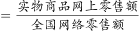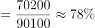，对应C选项。

故正确答案为C。

---

#### 第 2 题　qid 2423336 · 增长

2018年全国农村网络零售额同比增速在以下哪个范围之内？

- **A**. 
低于

- **B**. 

- **C**. 

　✅
- **D**. 
超过

**答案**：C

**官方解析**

根据问题“2018年全国农村网络零售额同比增速······”，定位第二段“2018年······农村实物商品网络零售额为10900亿元，同比增长；农村非实物商品网络零售额2800亿元，同比增长”，判定本题为混合增长率问题。根据混合口诀：混合居中不正中，偏向量大的。因此2018年全国农村网络零售额增长率在两个部分增长率之间，即，观察选项，排除A、D项。且正中间的增长率为，偏向量大的对应的增长率，因此总体增长率偏向10900亿元对应的，则在之间，对应C选项。

故正确答案为C。

---

#### 第 3 题　qid 2423341 · 综合

2018年全国农村实物商品零售额前三位品类的总零售额约为多少亿元？

- **A**. 1960
- **B**. 7400
- **C**. 7600　✅
- **D**. 9600

**答案**：C

**官方解析**

由题干“2018年全国农村······总零售额为多少亿元”，结合材料已知2018年农村实物商品网络零售额及零售额前三位品类所占的比重，判定本题为现期比重问题。定位文字材料第二段可得“农村实物商品网络零售额为10900亿元”，“农村实物商品零售额前三位······分别占农村实物商品零售额的、和”，根据公式：，可得全国农村实物商品零售额前三位品类的总零售额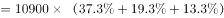亿元，与C项最为接近。

故正确答案为C。

---

#### 第 4 题　qid 2423343 · 综合

2017年全国农产品网络零售品类中，休闲食品零售额约是滋补食品的：

- **A**. 1.7倍
- **B**. 2倍　✅
- **C**. 2.3倍
- **D**. 2.6倍

**答案**：B

**官方解析**

由题干“2017年······是······”，选项为倍数，结合材料时间为2018年，判定本题为基期倍数问题。定位文字材料第三段可得“2018年全国农产品网络零售额达2305亿元”。休闲食品占比为，同比增速为；滋补食品占比为，同比增速为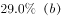。根据公式：，可得2018年休闲食品零售额；滋补食品零售额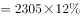。根据基期公式：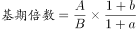，可得所求倍数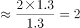倍。

故正确答案为B。

---

#### 第 5 题　qid 2423345 · 综合

根据给定资料，无法推出的是：

- **A**. 2017年全国网络零售额不到75000亿元
- **B**. 2017年全国农产品网络零售额超过1800亿元　✅
- **C**. 2018年全国农村网络零售额前三位品类中，增速最慢的是日用品
- **D**. 2018年全国网络零售额中，实物商品占比约是非实物商品的3倍多

**答案**：B

**官方解析**

A项：定位材料第一段可得“2018年全国网络零售额90100亿元，同比增长”，根据公式：，可得2017年全国网络零售额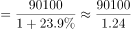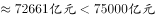，正确；

B项：定位材料第三段可得“2018年全国农产品网络零售额达2305亿元，比全国网络零售额同比增速高9.9个百分点。”定位材料第一段“2018年全国网络零售额······同比增长”，可得2018年全国农产品网络零售额增长率。根据公式：，可得2017年全国农产品网络零售额，错误；

C项：定位材料第二段可得农村实物商品网络零售额前三位增速，而非实物商品网络零售额各品类增速未知，故无法推出全国农村网络零售额前三位品类，无法判断；

D项：定位材料第一段，可得2018年全国网络零售额90100亿元，实物商品网上零售额为70200亿元，非实物商品网上零售额19900亿元。根据公式：，可得实物商品占比，非实物商品占比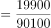，故所求倍数，正确。

本题为选非题，故正确答案为B。

注：本题C项存在争议，材料中农村非实物商品网络零售额并没有给出具体品类的数据，无法判断全国农村网络零售额前三位的品类，故粉笔认为本题C项也无法推出，但B项可直接得出计算错误，因此粉笔推荐本题优先选择B项。

---

### 材料 2

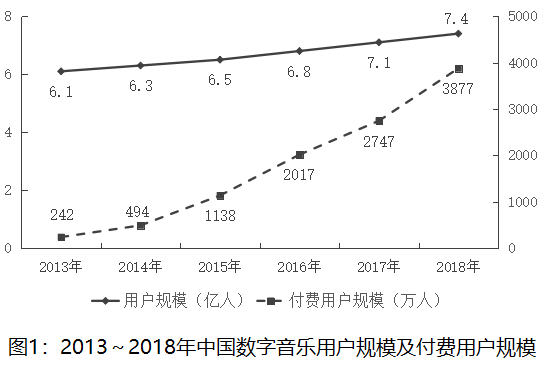

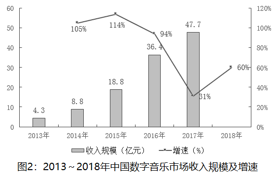

#### 第 6 题　qid 2423335 · 增长

2014～2018年，中国数字音乐用户规模同比增速呈什么趋势？

- **A**. 先下降后上升
- **B**. 先上升后下降
- **C**. 先下降再上升后下降　✅
- **D**. 先上升再下降后上升

**答案**：C

**官方解析**

根据题干“2014～2018年······同比增速”判定本题为一般增长率问题。定位图1可得，2013～2018年，中国数字音乐用户规模为6.1亿人、6.3亿人、6.5亿人、6.8亿人、7.1亿人、7.4亿人。根据公式：增长率可得，2014～2018年，中国数字音乐用户规模同比增速分别为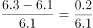、、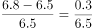、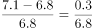、，根据分数比较规则可得，2014年增速2015年增速、2015年增速2016年增速、2016年增速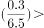2017年增速2018年增速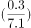，则2014～2018年，中国数字音乐用户规模同比增速趋势为先下降再上升后下降。

故正确答案为C。

---

#### 第 7 题　qid 2423338 · 综合

付费用户规模除以总用户规模可得到付费渗透率。据此，2013～2018年中国数字音乐付费渗透率超过的年份有几个？

- **A**. 1
- **B**. 2　✅
- **C**. 3
- **D**. 4

**答案**：B

**官方解析**

根据题干“2013～2018年中国数字音乐付费渗透率超过的年份有几个”判定本题为现期比重问题。定位图1可得，2013～2018年，中国数字音乐用户规模为6.1亿人、6.3亿人、6.5亿人、6.8亿人、7.1亿人、7.4亿人；付费用户规模为242万人、494万人、1138万人、2017万人、2747万人、3877万人。根据公式：付费渗透率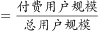可得，2013～2018年，中国数字音乐付费渗透率分别为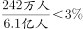、、、、、，则2017年、2018年，中国数字音乐付费渗透率超过，共2个年份。

故正确答案为B。

---

#### 第 8 题　qid 2423342 · 综合

2018年，中国数字音乐市场收入规模约为多少亿元？

- **A**. 68
- **B**. 72
- **C**. 76　✅
- **D**. 80

**答案**：C

**官方解析**

由题干“2018年······约为多少亿元”，结合材料给出2017年收入规模及2018年增速，可判定本题为现期计算问题。定位图2可得，2017年中国数字音乐市场收入规模为47.7亿元，2018年增速为。代入公式：可得，2018年，中国数字音乐市场收入规模约为亿元，与C项最接近。

故正确答案为C。

---

#### 第 9 题　qid 2423344 · 综合

2015-2017年三年中国数字音乐市场的广告收入由高到低排序正确的是：

- **A**. 

　✅
- **B**. 

- **C**. 

- **D**. 

**答案**：A

**官方解析**

定位图2可得，2015-2017年中国数字音乐市场收入分别为18.8、36.4、47.7亿元，定位图3可得，其中广告收入占比分别为、、。则2015年中国数字音乐市场的广告收入为亿元，2016年为亿元，2017年为亿元，由高到低排序为。

故正确答案为A。

---

#### 第 10 题　qid 2423346 · 综合

关于中国数字音乐市场，由上述资料能够推出的是：

- **A**. 2017年版权运营收入超过4亿元　✅
- **B**. 2015～2018年中国数字音乐市场收入规模增速持续下降
- **C**. 2018年付费用户规模同比增长约30%
- **D**. 内容付费收入2017年是2015年的4倍多

**答案**：A

**官方解析**

A项：定位图2可得，2017年中国数字音乐市场收入规模为47.7亿元，定位图3可得，2017年版权运营收入占比为。则2017年版权运营收入为亿元，超过4亿元，正确；

B项：定位图2可得，2015～2018年中国数字音乐市场收入规模增速分别为、、、，增速先下降后上升，并非持续下降，错误；

C项：定位图1可得，2018年付费用户规模为3877万人，2017年为2747万人，则2018年付费用户规模同比增长,并非约，错误；

D项：定位图2可得，2017年中国数字音乐市场收入规模为47.7亿元，2015年为18.8亿元；定位图3可得，2017年内容付费收入占比为，2015年为。亿元，亿元，， 2017年内容付费收入不到2015年的4倍，错误。

故正确答案为A。

---

### 材料 3

        2018年第一季度我国水产品进出口192.67万吨，同比减少，增速较上年同期减少21.97个百分点；进出口总额77.15亿美元，同比增加。贸易顺差19.66亿美元，同比减少2.15亿美元。

        出口方面，2018年第一季度我国水产品出口量98.04万吨，同比减少，出口额48.41亿美元，增加。一般贸易出口量71.18万吨，同比减少；出口额36.71亿美元，同比增加。

#### 第 11 题　qid 2423368 · 增长

2018年第一季度我国水产品进口额同比增量约为多少亿美元？

- **A**. 5　✅
- **B**. 7
- **C**. 9
- **D**. 11

**答案**：A

**官方解析**

根据题干“······同比增量······”判定本题为增长量计算问题。定位材料第二段：“出口方面，2018年第一季度······出口额48.41亿美元，增加”，可知出口额的增量亿美元。定位材料第一段：“贸易顺差19.66亿美元，同比减少2.15亿美元”，可知顺差的增量亿美元，顺差，因此，进口额，则进口额的增量亿美元，与A选项最接近。

故正确答案为A。

---

#### 第 12 题　qid 2423369 · 综合

2016年第一季度我国水产品进出口总量最接近以下哪个数字？

- **A**. 140万吨
- **B**. 160万吨
- **C**. 180万吨　✅
- **D**. 200万吨

**答案**：C

**官方解析**

根据题干“2016年第一季度······”，结合材料时间为2018年第一季度，可判定本题为间隔基期问题。定位材料第一段：“2018年第一季度我国水产品进出口192.67万吨，同比减少，增速较上年同期减少21.97个百分点”，则2018年我国水产品进出口同比增速，2017年同比增速，根据间隔增长率公式，可得2018年相比2016年增长率。根据，可得2016年第一季度我国水产品进出口总量万吨，C选项最接近。

故正确答案为C。

---

#### 第 13 题　qid 2423370 · 比重

2018年第一季度，我国水产品一般贸易主要出口品种中，出口额占我国水产品一般贸易出口额的比重，超过的有几个？

- **A**. 5
- **B**. 6　✅
- **C**. 7
- **D**. 8

**答案**：B

**官方解析**

根据题干“2018年第一季度······出口额占我国水产品一般贸易出口额的比重”，结合材料时间为2018年第一季度，可判定本题为现期比重问题。定位材料第二段：“出口方面，2018年第一季度······一般贸易······出口额36.71亿美元”，则一般贸易出口额的亿美元。定位表格材料第三列“出口额”数据，超过1.8355亿美元的有：头足类、对虾、贝类、罗非鱼、鳗鱼、蟹类，共6个。

故正确答案为B。

---

#### 第 14 题　qid 2423371 · 增长

2018年第一季度，下列产品平均单价同比下降最多的是：

- **A**. 鲭鱼
- **B**. 罗非鱼
- **C**. 大黄鱼　✅
- **D**. 淡水小龙虾

**答案**：C

**官方解析**

根据题干“······平均单价同比下降最多”判定本题为平均数的增长量问题。，平均数的增长量，A是出口金额，B是数量。定位表格材料可得，鲭鱼平均单价的增长量，罗非鱼平均单价的增长量，大黄鱼平均单价的增长量，淡水小龙虾平均单价的增长量。因此，平均单价下降最多的是大黄鱼。

故正确答案为C。

---

#### 第 15 题　qid 2423372 · 综合

根据给定资料，无法推出的是：

- **A**. 
2017年第一季度，我国水产品进出口总额超过65亿美元

- **B**. 
2018年第一季度，我国水产品一般贸易主要出口品种中平均单价最高的是蟹类
　✅
- **C**. 
2018年第一季度，我国水产品一般贸易出口量和出口额在水产品中的占比均超过

- **D**. 
2018年第一季度，我国水产品一般贸易主要出口品种中数量增速最快的种类，出口额增速也最快

**答案**：B

**官方解析**

A项：定位材料第一段：“2018年第一季度我国水产品······进出口总额77.15亿美元，同比增加”，根据，可得2017年第一季度我国水产品进出口总额亿美元，正确；

B项：定位表格材料可知，，因此，蟹类出口平均单价不是最高的，错误；

C项：定位材料第二段：“出口方面，2018年第一季度我国水产品出口量98.04万吨，同比减少，出口额48.41亿美元，增加。一般贸易出口量71.18万吨，同比减少；出口额36.71亿美元，同比增加”，可知一般贸易出口量在水产品的占比，一般贸易出口额在水产品的占比，正确；

D项：定位表格材料，我国水产品一般贸易主要出口品种中数量增速最快的是大黄鱼（），其出口额的增速（）也是最快的，正确。

本题为选非题，故正确答案为B。

---
