# 2019年辽宁省公务员录用考试《行测》题（网友回忆版）

> 省考 · 2019 年 · 6 个模块 · 共 120 题

- [政治理论](#%E6%94%BF%E6%B2%BB%E7%90%86%E8%AE%BA) · 1 题
- [常识判断](#%E5%B8%B8%E8%AF%86%E5%88%A4%E6%96%AD) · 19 题
- [言语理解与表达](#%E8%A8%80%E8%AF%AD%E7%90%86%E8%A7%A3%E4%B8%8E%E8%A1%A8%E8%BE%BE) · 40 题
- [数量关系](#%E6%95%B0%E9%87%8F%E5%85%B3%E7%B3%BB) · 10 题
- [判断推理](#%E5%88%A4%E6%96%AD%E6%8E%A8%E7%90%86) · 30 题
- [资料分析](#%E8%B5%84%E6%96%99%E5%88%86%E6%9E%90) · 20 题

---

## 政治理论

### 第 1 题　qid 2443010 · 时事政治

中共中央、国务院于2019年1月8日在北京隆重举行国家科学技术奖励大会。习近平总书记向获得2018年度国家最高科学技术奖的        颁发奖励证书。

- **A**. 王泽山院士和侯云德院士
- **B**. 赵玉芬院士和钟南山院士
- **C**. 王泽山院士和施一公院士
- **D**. 刘永坦院士和钱七虎院士　✅

**答案**：D

**官方解析**

本题考查政治常识。
A项错误，王泽山院士和侯云德院士是2017年度国家最高科学技术奖获得者。
B项错误，赵玉芬院士是著名的有机化学家，但没有获得过国家最高科学技术奖；钟南山院士是著名呼吸病学专家，但没有获得过国家最高科学技术奖。
C项错误，施一公院士是闻名世界的结构生物学家，但没有获得过国家最高科学技术奖。
D项正确，2018年度国家科学技术奖励大会于2019年1月8日在人民大会堂举行。哈尔滨工业大学刘永坦院士，中国人民解放军陆军工程大学钱七虎院士分获国家最高科学技术奖。刘永坦院士是我国著名的雷达与信号处理技术专家，我国对海探测新体制雷达理论奠基人，对海远程探测技术跨越发展的引领者；钱七虎院士是我国著名的防护工程学家，现代防护工程理论的奠基人、防护工程学科的创立者、防护工程科技创新的引领者，为我国防护工程各个时期的建设发展做出了杰出贡献。
故正确答案为D。

---

## 常识判断

### 第 1 题　qid 2443005 · 人文常识

中共中央、国务院、中央军委颁发了“庆祝中华人民共和国成立70周年”纪念章。下述对象中不符合纪念章颁发条件的人员是：

- **A**. 中华人民共和国成立前参加革命工作的、健在的老战士老同志
- **B**. 中华人民共和国成立后获得国家级表彰奖励及以上荣誉并健在的人员
- **C**. 中华人民共和国成立后因参战荣立特等功以上奖励并健在的军队人员（含退役军人）　✅
- **D**. 为中华人民共和国成立作出杰出贡献的国际友人

**答案**：C

**官方解析**

本题考查政治常识。
为庆祝中华人民共和国成立70周年，中共中央、国务院、中央军委将于2019年8月29日颁发“庆祝中华人民共和国成立70周年”纪念章。“庆祝中华人民共和国成立70周年”纪念章颁发给下述对象中符合条件的人员：中华人民共和国成立前参加革命工作的、健在的老战士老同志；中华人民共和国成立后获得国家级表彰奖励及以上荣誉并健在的人员；中华人民共和国成立后因参战荣立一等功以上奖励并健在的军队人员（含退役军人）；为中华人民共和国成立作出杰出贡献的国际友人。此题出题不严谨，C项“特等功”也属于“一等功以上”，但只有C项与官方描述不一致，故选C。
本题为选非题，故正确答案为C。

---

### 第 2 题　qid 2443008 · 科技常识

为了纪念1970年4月24日我国成功发射了第一颗人造地球卫星——“东方红”1号，2016年3月8日，国务院将每年4月24日设立为“中国航天日”。2019年中国航天日主题是：

- **A**. “逐梦航天合作共赢”　✅
- **B**. “共筑航天新时代”
- **C**. “航天创造美好生活”
- **D**. “中国梦 航天梦”

**答案**：A

**官方解析**

本题考查政治常识。
A项正确，2019年4月24日，第四个“中国航天日”，以“逐梦航天，合作共赢”为主题的主场活动在湖南长沙举行，首次重磅发布了中国空间站的最新研制进展。
B项错误，2018年“中国航天日”主场活动在哈尔滨工业大学开幕，此次“中国航天日”的主题是“共筑航天新时代”。
C项错误，“航天创造美好生活”是2017年“中国航天日”的主题。 
D项错误，2016年3月8日，国务院批复同意将每年4月24日设立为“中国航天日”。首个中国航天日的主题为“中国梦，航天梦”。
故正确答案为A。

---

### 第 3 题　qid 2443013 · 法律常识

关于信访，下列说法正确的是：

- **A**. 某县质监局不设立专门的信访工作机构，违反了信访规定
- **B**. 陈某对乡政府的决定不服，可以采用走访形式到市政府提出信访请求
- **C**. 詹某在提出信访事项时故意捏造歪曲事实，诬告陷害他人，应依法追究其刑事责任
- **D**. 钱某对区政府作出的信访事项处理意见不服，可以请求市政府复查　✅

**答案**：D

**官方解析**

本题考查法律常识。
A项错误，《信访工作条例》第十四条规定：“各级党委和政府信访部门是开展信访工作的专门机构，履行下列职责：······”因此，信访工作的专门机构只在各级党委和政府设立，并非在政府的工作部门设立。
B项错误，《信访工作条例》第二十条第一款规定：“信访人采用走访形式提出信访事项的，应当到有权处理的本级或者上一级机关、单位设立或者指定的接待场所提出。”题中，陈某应向乡政府或县政府提出信访请求，而不能直接向市政府提出。
C项错误，《信访工作条例》第四十七条第三款规定：“信访人捏造歪曲事实、诬告陷害他人，构成违反治安管理行为的，依法给予治安管理处罚；构成犯罪的，依法追究刑事责任。”詹某的行为只有构成犯罪才应被追究刑事责任，C项说法太过绝对。
D项正确，《信访工作条例》第三十五条规定：“信访人对信访处理意见不服的，可以自收到书面答复之日起30日内请求原办理机关、单位的上一级机关、单位复查。收到复查请求的机关、单位应当自收到复查请求之日起30日内提出复查意见，并予以书面答复。”钱某对区政府的处理意见不服可以请求区政府的上一级机关市政府复查。
故正确答案为D。

---

### 第 4 题　qid 2443014 · 法律常识

关于刑事责任的追究，下列表述错误的是：

- **A**. 犯罪嫌疑人关某在被抓获前自杀身亡，依法不追究其刑事责任
- **B**. 外国商人保罗在我国领域内犯抢劫罪，适用我国刑法追究其刑事责任
- **C**. 某国公民大卫在搭乘中国飞机时，盗窃他人财物，不能依据我国刑法追究其刑事责任　✅
- **D**. 苏某非法侵占顾某的财产，被害人顾某没有起诉，则依法不追究苏某刑事责任

**答案**：C

**官方解析**

本题考查法律常识。
A项正确，根据《刑事诉讼法》第十六条规定：“有下列情形之一的，不追究刑事责任，已经追究的，应当撤销案件，或者不起诉，或者终止审理，或者宣告无罪：(一)情节显著轻微、危害不大，不认为是犯罪的；(二)犯罪已过追诉时效期限的；(三)经特赦令免除刑罚的；(四)依照刑法告诉才处理的犯罪，没有告诉或者撤回告诉的；（五)犯罪嫌疑人、被告人死亡的；(六)其他法律规定免予追究刑事责任的。”
B项正确，根据《刑法》第六条规定：“凡在中华人民共和国领域内犯罪的，除法律有特别规定的以外，都适用本法。”
C项错误，根据《刑法》第六条规定：“凡在中华人民共和国领域内犯罪的，除法律有特别规定的以外，都适用本法。凡在中华人民共和国船舶或者航空器内犯罪的，也适用本法。犯罪的行为或者结果有一项发生在中华人民共和国领域内的，就认为是在中华人民共和国领域内犯罪。”外国人在中国飞机上盗窃，适用我国刑法。
D项正确，《刑法》第二百七十条规定：“将代为保管的他人财物非法占为己有，数额较大，拒不退还的，处二年以下有期徒刑、拘役或者罚金;数额巨大或者有其他严重情节的，处二年以上五年以下有期徒刑，并处罚金。将他人的遗忘物或者埋藏物非法占为己有，数额较大，拒不交出的，依照前款的规定处罚。本条罪，告诉的才处理。”
本题为选非题，故正确答案为C。

---

### 第 5 题　qid 2443018 · 科技常识

建国以来，我国在科技方面取得了瞩目的成就，下面的表述错误的是：

- **A**. “天鲲号”是首艘由我国自主设计建造的亚洲最大自航绞吸挖泥船
- **B**. “嫦娥四号”探测器的发射，在人类历史上首次实现了航天器在月球背面软着陆
- **C**. “蛟龙号”是我国首艘载人潜水器支持母船　✅
- **D**. “雪龙2号”是我国第一艘自主建造的极地科学考察破冰船

**答案**：C

**官方解析**

本题考查科技常识。
A项正确，“天鲲号”绞吸挖泥船是由中国船舶工业集团公司第708所设计，上海振华重工集团启东公司建造的新一代重型自航绞吸挖泥船，是首艘由我国自主设计建造的目前亚洲最大、最先进的自航绞吸挖泥船，也是目前世界上智能化水平最高的自航绞吸船。
B项正确，2019年1月3日上午10点26分，“嫦娥四号”探测器成功软着陆在月球背面的南极-艾特肯盆地冯卡门撞击坑，这是人类历史上首次实现了航天器在月球背面软着陆。
C项错误，2018年12月8日，我国首艘载人潜水器支持母船“深海一号”在武汉下水。作为我国7000米级“蛟龙号”载人潜水器专用母船，“深海一号”建成后可以充分发挥“蛟龙号”的技术性能，显著提升我国精细探索大洋资源环境的能力与水平。“蛟龙号”是我国自行设计、自主集成研制的载人潜水器。
D项正确，2019年7月11日，我国第一艘自主建造的极地科学考察破冰船——“雪龙2”号在上海顺利交付。“雪龙2”号极地科学考察破冰船，采用国际先进的船艏船艉双向破冰船型设计，能以2—3节的航速在冰厚1.5米+雪厚0.2米的条件下连续破冰航行，具备全回转电力推进功能和冲撞破冰能力，可实现极区原地360°自由转动，并突破极区20米当年冰冰脊。
本题为选非题，故正确答案为C。

---

### 第 6 题　qid 2443021 · 经济常识

下列不属于我国在经济疲软时期应该采取的财政政策的是：

- **A**. 扩大政府开支，增加预算支出规模
- **B**. 降低税收，增加人均可支配收入
- **C**. 降低央行再贴现率　✅
- **D**. 增加政府公债购买规模

**答案**：C

**官方解析**

本题考查经济常识。
财政政策是指国家根据一定时期政治、经济、社会发展的任务而规定的财政工作的指导原则，通过财政支出与税收政策来调节总需求。
A项正确，扩大政府支出，可以刺激总需求，从而增加国民收入。
B项正确，降低税收，可以刺激消费，从而增加国民收入。
C项错误，调整再贴现率属于货币政策。降低再贴现率意味着商业银行向中央银行贷款的成本降低，从而增加了货币投放，直接增加货币供给量，从而刺激消费。
D项正确，增加政府公债购买规模可以刺激消费，从而增加国民收入。
本题为选非题，故正确答案为C。

---

### 第 7 题　qid 2443025 · 人文常识

下列成语与其蕴含的经济学原理对应错误的是：

- **A**. 覆水难收——沉没成本
- **B**. 镜花水月——泡沫经济
- **C**. 洛阳纸贵——供给需求
- **D**. 他山之石——风险评估　✅

**答案**：D

**官方解析**

本题考查经济常识。
A项正确，沉没成本是指已经付出了并且不能收回的成本。覆水难收的意思是：倒在地上的水难以收回；比喻事情已成定局，无法挽回。“倒在地上的水”都是已经发生的并且无法收回的，属于沉没成本。因此，“覆水难收”对应沉没资本。
B项正确，泡沫经济是指资产价值超越实体经济，极易丧失持续发展能力的宏观经济状态。由于缺乏实体经济的支撑，因此其资产犹如泡沫一般容易破裂。镜花水月的意思是：镜子里的花、水中的月亮；比喻虚幻的景象。“镜子里的花、水中的月亮”都是虚而不实的。因此，“镜花水月”对应泡沫经济。
C项正确，洛阳纸贵是指西晋都城洛阳之纸因大家争相传抄左思的作品《三都赋》，以至于一时之间供不应求，货缺而贵。“纸贵”的原因是由于消费者的需求量增大，而市场的供给小于需求，因此，“洛阳纸贵”对应供给需求。
D项错误，风险评估是指量化测评某一事件或事物带来的影响或损失的可能程度。他山之石的意思是：比喻能帮助自己改正缺点的人或意见。与“风险评估”没有对应关系。
本题为选非题，故正确答案为D。

---

### 第 8 题　qid 2443028 · 人文常识

中国传统文化历来注重含蓄之美，古典诗词文学中更是经常使用典故来表情达意，下列有关典故对应错误的是：

- **A**. 还珠——比喻官吏为政清廉——今日还珠守，何年执戟郎（唐·杜牧）
- **B**. 尺素——代书信——欲寄彩笺兼尺素，山长水阔知何处（宋·张先）　✅
- **C**. 抱柱——比喻坚守信约——常存抱柱信，岂上望夫台（唐·李白）
- **D**. 画眉——指喜欢——妆罢低声向夫婿，画眉深浅入时无（唐·朱庆馀）

**答案**：B

**官方解析**

本题考查人文常识。
A项正确，还珠，形容为政清廉、政绩卓著。古时合浦盛产珍珠，因太守的贪婪，珍珠都转到别的地方。孟尝任太守后，革除贪污流弊，珍珠又回到合浦来了。故以“还珠”喻官吏为政清廉。唐代诗人杜牧创作了一首五言古诗《春日言怀寄虢州李常侍十韵》，“今日还珠守，何年执戟郎”出自该诗。
B项错误，尺素，小幅的丝织物，如绢、帛等，代指书信，“欲寄彩笺兼尺素，山长水阔知何处”出自宋代词人晏殊的《蝶恋花•槛菊愁烟兰泣露》。
C项正确，抱柱，指坚守信约，相传古代书生同一女子相约在桥下见面。他等了很久，不见女子到来，这时河水猛涨，淹没桥梁，书生为了坚守信约，不肯离去，抱住桥柱，淹死在水里。“常存抱柱信，岂上望夫台”出自唐代诗人李白的《长干行》。
D项正确，画眉，是古代妇女的一种面饰风俗，使得女子眉目清晰，旧时常有夫婿替妻子画眉，表示对妻子的喜欢，也比喻夫妻感情好。“妆罢低声问夫婿，画眉深浅入时无”出自唐代诗人朱庆馀的《近试上张水部》。
本题为选非题，故正确答案为B。

---

### 第 9 题　qid 2443032 · 人文常识

下列诗词中，属于陆游作品的有：
①《早发白帝城》
②《示儿》
③《登幽州台歌》
④《书愤》

- **A**. ①②
- **B**. ②③
- **C**. ②④　✅
- **D**. ③④

**答案**：C

**官方解析**

本题考查人文常识。
①错误，《早发白帝城》是唐代伟大诗人李白在流放途中遇赦返回时所创作的一首七言绝句。此诗是李白诗作中流传最广的名篇之一。诗人是把遇赦后愉快的心情和江山的壮丽多姿、顺水行舟的流畅轻快融为一体来表达的。
②正确，《示儿》是宋代诗人陆游创作的一首七言绝句，是诗人的绝笔。此诗传达出诗人临终时复杂的思想情绪和忧国忧民的爱国情怀，表现了诗人一生的心愿，倾注了诗人满腔的悲慨，既有对抗金大业未就的无穷遗恨，也有对神圣事业必成的坚定信念。
③错误，《登幽州台歌》是唐代诗人陈子昂在初唐时期创作的一首五言古诗。此诗是一首吊古伤今的生命悲歌，表现诗人孤独遗世、独立苍茫的落寞情怀。
④正确，《书愤》是南宋诗人陆游创作的一首七言律诗。这首诗展现自己青壮年时期的豪情壮志和战斗生活情景，抒发了壮心未遂、时光虚掷、功业难成的悲愤之气，但悲愤而又不感伤颓废。
故正确答案为C。

---

### 第 10 题　qid 2443035 · 人文常识

对中国字画的落款，下列表述错误的是：

- **A**. 惠存：是送给集体单位的
- **B**. 斧正：表示“请指导”的意思
- **C**. 清赏：表示这件作品供对方赏玩而已
- **D**. 俪正：指送给爱慕的人　✅

**答案**：D

**官方解析**

本题考查人文常识。
A项正确，“惠”用于对方对待自己的行动，在我国书画作品落款中，“惠存”多在给单位的作品中题写，指作品是赠给集体单位的。
B项正确，“斧正”意为请对方像匠人一样用斧头削正，表示“请指导”的意思。
C项正确，“清赏”意为清标可赏，表示这件作品供对方赏玩而已。
D项错误，“俪”者，伉俪也。“俪正”是指对方夫妇都是行家，请一起指正，而不是指送给爱慕的人。
本题为选非题，故正确答案为D。

---

### 第 11 题　qid 2443037 · 人文常识

下列名言与其作者对应正确的是：

- **A**. 春蚕到死丝方尽，蜡炬成灰泪始干——屈原
- **B**. 孤帆远影碧空尽，唯见长江天际流——杜甫
- **C**. 路漫漫其修远兮，吾将上下而求索——李商隐
- **D**. 勤能补拙是良训，一分辛苦一分才——华罗庚　✅

**答案**：D

**官方解析**

本题考查人文常识。
A项错误，“春蚕到死丝方尽，蜡炬成灰泪始干”出自唐代诗人李商隐的《无题》，表现了自己对于对方的思念，如同春蚕吐丝，到死方休。“蜡炬成灰泪始干”则比喻自己为不能相聚而痛苦，无尽无休，仿佛蜡泪直到蜡烛烧成了灰方始流尽一样。
B项错误，“孤帆远影碧空尽，唯见长江天际流”出自唐代诗人李白的《黄鹤楼送孟浩然之广陵》。诗人巧妙地将依依惜别的深情寄托在对自然景物的动态描写之中，将情与景完全交融在一起。
C项错误，“路漫漫其修远兮，吾将上下而求索”出自屈原的《离骚》。意为道路又窄又长无边无际，但我要努力寻找心中的太阳，表现了诗人志在百折不挠的去寻找理想中的人生之道。
D项正确，“勤能补拙是良训，一分辛苦一分才”是华罗庚先生的名句，也是他的亲身经历。意为勤奋能够弥补自身的不足，这是前人留下的有益的训诫，只要付出一分辛苦，就能增长一分才能。
故正确答案为D。

---

### 第 12 题　qid 2443040 · 人文常识

中国古代有：“吾日三省吾身”；“道虽迩，不行不至；事虽小，不为不成”；“身体力行”等思想。这些都表达了在进行道德修养时应该：

- **A**. 省察克治，勤于实践　✅
- **B**. 慎独自律，遵守道德规范
- **C**. 知行合一，完善道德品质
- **D**. 学思结合，加强道德行为训练

**答案**：A

**官方解析**

本题考查毛中特。
“吾日三省吾身”出自《论语》“曾子曰：‘吾日三省吾身：为人谋而不忠乎？与朋友交而不信乎？传不习乎？’”这“三省”说了两个方面。一是修己，二是对人。对人要诚信，不欺人也不欺己。替人谋事要尽心，尽心才能不苟且。每日的“三省”是为了更好的实践。“道虽迩，不行不至；事虽小，不为不成。”出自《荀子•修身》。意为路程即使很近，但不走就不能到达；事情即使很小，但不做就不能成功。告诉人们对待任何事情要去做、要有所行动。“身体力行”出自《淮南子•泛论训》：“圣人以身体之。”表示努力实践，亲身体验。题干强调的是行，即实践的重要性。
A项正确，“省察克治”指每时每刻思考检查自己的思想言行是否符合道德要求，勤于实践。所以，A项正确，符合题意。
B项错误，“慎独自律”是指一个人在无人监督的情况下，凭着高度自觉，按照道德规范去做事，没有任何有违法律或有悖道德的行为。所以，B项错误，不符合题意。
C项错误，“知行合一”是由明朝思想家王守仁提出来的。指客体顺应主体，知是指良知，行是指人的实践，知与行的合一。所以，C项错误，不符合题意。
D项错误，“学思结合”是孔子关于学习心理的观点。意谓在学习过程中把学与思辩证地结合起来。所以，D项错误，不符合题意。
故正确答案为A。

---

### 第 13 题　qid 2443045 · 科技常识

联合国将2019年定为“国际化学元素周期表年”。下列有关化学元素周期表的说法错误的是：

- **A**. 元素周期表共有18列
- **B**. 元素周期表是俄国化学家门捷列夫编制的
- **C**. 今年是化学元素周期表创建150周年
- **D**. 元素周期表中元素是按原子从大到小排列的　✅

**答案**：D

**官方解析**

本题考查科技常识。

A项正确，如下图所示，元素周期表共有18列。

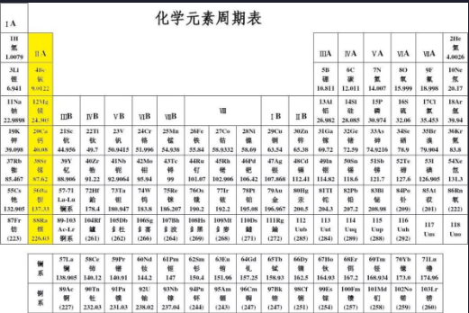

B项、C项正确，化学元素周期表是科学界最重要的成就之一，1869年被认为是俄国化学家德米特里·门捷列夫发明元素周期表的一年，2019年则是元素周期表诞生的第150周年。

D项错误，元素周期表是根据原子序数从小至大排序的化学元素列表，不是从大到小。在周期表中，元素是以元素的原子序数排列，最小的排行最先。表中一横行称为一个周期，一列称为一个族。原子半径由左到右依次减小，上到下依次增大。

本题为选非题，故正确答案为D。

---

### 第 14 题　qid 2443047 · 地理国情

关于中国四大高原，下列表述错误的是：

- **A**. 青藏高原是世界最高的高原，平均海拔4000米以上，高原上，雪山、冰川很多，有“液体水库”之称　✅
- **B**. 内蒙古高原是中国第二大高原。它地面平坦，很多地方是一望无际的草原
- **C**. 云贵高原地面高低不平，地势比较平坦的山间小盆地，被当地人称之为“坝子”
- **D**. 黄土高原，位于中国中部偏北地区，是中华民族古代文明的发祥地之一

**答案**：A

**官方解析**

本题考查地理国情。

A项错误，青藏高原是世界上海拔最高的高原，平均海拔4000米以上，被称为“世界屋脊”、“第三极”。高原上，雪山、冰川很多，有“固体水库”之称

B项正确，内蒙古高原是中国第二大高原，为蒙古高原的一部分。内蒙古高原地面平坦，中国重要的牧场，草原面积约占高原面积的，很多地方是一望无际的草原。

C项正确，云贵高原多为喀斯特地貌,地面高低不平，高原上有众多地势平坦的山间盆地和宽谷，被当地人称为“坝子”，是水田集中和村镇密集的地方。

D项正确，黄土高原位于我国中部偏北地区，是中华民族古代文明的发祥地之一，也是地球上分布最集中且面积最大的黄土区。无论古史传说、文献记载，还是考古发现，无论人文学者的考证，还是科学家的研究，均充分表明，黄土高原是中华文明形成、发展、成熟的最重要舞台，不同时期的文化、文明，几乎连续相继地出现在黄土高原。

本题为选非题，故正确答案为A。

---

### 第 15 题　qid 2443049 · 人文常识

2019年8月2日，第十四届全运会吉祥物“秦岭四宝”正式亮相。“秦岭四宝”是指：

- **A**. 朱鹮、大熊猫、羚牛、金丝猴　✅
- **B**. 扬子鳄、朱鹮、羚牛、金丝猴
- **C**. 羚羊、大熊猫、丹顶鹤、金丝猴
- **D**. 朱鹮、大熊猫、羚羊、中华鲟

**答案**：A

**官方解析**

本题考查政治常识。
2019年8月2日，第十四届全运会会徽和吉祥物在西安发布。以“秦岭四宝”朱鹮、大熊猫、羚牛、金丝猴为原型的卡通形象的“朱朱”“熊熊”“羚羚”“金金”为2021年第十四届全国运动会的吉祥物。
朱鹮“朱朱”，手举火炬，展翅飞跑；大熊猫“熊熊”，张开双臂，热情奔放；羚牛“羚羚”，健壮憨萌，阔步向前；金丝猴“金金”，聪明智慧、灵动可爱。身着“富裕黄”“圣地红”“梦想蓝”“生态绿”运动装的吉祥物组合，分别寓意奔向新时代、喜迎八方客、同享新生活、共筑中国梦。
故正确答案为A。

---

### 第 16 题　qid 2443052 · 科技常识

有关生活小常识，下列表述错误的是：

- **A**. 几乎所有瓜果蔬菜都含有一定量的维生素C
- **B**. 地震时遇到化工厂着火、毒气泄漏，要尽量绕到上风方向，并用湿毛巾捂住口鼻
- **C**. 果脯是世界卫生组织已经公布的全球十大垃圾食品之一
- **D**. 被动物咬伤后必须在48小时内注射疫苗　✅

**答案**：D

**官方解析**

本题考查科技常识。
A项正确，维生素C主要来源是新鲜蔬菜与水果，正在急速生长的植物中维生素C含量高，几乎所有瓜果蔬菜都含有一定量的维生素C。
B项正确，地震时遇到化工厂着火、毒气泄漏，要尽量逆风绕到上风方向，并用湿毛巾捂住口鼻，不要朝顺风方向跑。因为顺风会助长火势和毒气泄漏，湿毛巾捂住口鼻可以减少烟尘和有毒有害物质进入呼吸道，降低对人体的伤害。
C项正确，果脯中含有亚硝酸盐，在人体内可结合胺形成潜在的致癌物质亚硝酸胺；含有香精等添加剂可能损害肝脏等脏器；含有较高盐分可能导致血压升高和肾脏负担加重。
D项错误，根据《狂犬病暴露预防处置工作规范》第十条：“首次暴露后的狂犬病疫苗接种应当越早越好。接种程序:一般咬伤者于0(注射当天)、3、7、14和28天各注射狂犬病疫苗1个剂量。狂犬病疫苗不分体重和年龄，每针次均接种1个剂量。……”咬伤后应尽量于24小时内接种疫苗。
世界卫生组织曾经辟谣“十大垃圾食品”的谣言。出题者可能并不知道已经被辟谣。此题为真题，因此不能修改其选项。C项虽有错，但果脯的确是不健康的食品，而D项的错误属于原则性的知识错误，因此粉笔倾向于选D。
本题为选非题，故正确答案为D。

---

### 第 17 题　qid 2443056 · 人文常识

“乳鸦啼散玉屏空，一枕新凉一扇风。睡起秋色无觅处，满阶梧桐月明中。”这首诗描述的是二十四节气中的：

- **A**. 秋分
- **B**. 白露
- **C**. 立秋　✅
- **D**. 霜降

**答案**：C

**官方解析**

本题考查人文常识。
“乳鸦啼散玉屏空，一枕新凉一扇风。睡起秋色无觅处，满阶梧桐月明中。”是宋代文人刘翰所作的《立秋》，大意为“小乌鸦的鸣叫声散去时，只有玉色屏风空虚寂寞地立着。秋风吹来，顿觉枕边清新凉爽，就像有人在床边用绢扇在扇一样。睡梦中朦朦胧胧地听见外面秋风萧萧，可是醒来去找，却什么也找不到，只见落满台阶的梧桐叶，沐浴在朗朗的月光中。”立秋，是二十四节气中的第13个节气，更是秋天的第一个节气，从这一天开始，天高气爽，月明风清，气温逐渐下降。诗句中“一枕新凉一扇风”可知天气开始转凉，而“秋色无觅处”则说明秋天刚刚到来，可以判断诗句描述的是立秋这一节气。
故正确答案为C。

---

### 第 18 题　qid 2443058 · 人文常识

下列有关光的原理表达正确的是：

- **A**. 星星闪烁——光的衍射
- **B**. 下雨过后夜间亮者为水，暗者为陆——光的反射　✅
- **C**. 电影银幕——光的直线传播
- **D**. 通过狭缝观察发光的日光灯时能看见彩色条纹——光的漫反射

**答案**：B

**官方解析**

本题考查科技常识。
A项错误，光从一种介质斜射入另一种介质时，传播方向发生改变，从而使光线在不同介质的交界处发生偏折，这种现象叫做光的折射。地球的大气层由于分布不均匀，犹如层层透镜，射入其中的光线便会发生多次折射层层弯折。遥远的星光要到达我们的视野同样需要穿过大气层的多次折射和弯折。而且由于大气层（尤其是其中的对流层）非常不稳定，一直在无规则的湍动，经过弯折的星光会随之改变方向，因此我们观望星空时，看到的星光是闪烁的。所以星星闪烁是因为光的折射，不是光的衍射。
B项正确，下雨过后，水面发生镜面反射，地面发生的是漫反射。夜间，当人迎着月光走路时，水面反射的较强月光刚好能进入人眼，而地面漫反射的月光射向各个方向，只有较少的一部分能进入人眼。因此，迎着月光走路时，较亮处是水，较暗处为陆地。
C项错误，电影幕布是影院的硬件设施，投影机将映像投放到幕布上，观众直接从幕布上观看。为了使坐在不同位置上的人都能看到，电影银幕往往要用粗糙的白布制作。一方面，白色能反射所有颜色的光，使所看到的像更加逼真；另一方面，白布表面粗糙（不光滑）能产生漫反射，使光线向各个方向传播。因此应用的原理是光的漫反射，而不是光沿直线传播。
D项错误，光波在遇到障碍物或通过狭缝时，会偏离直线传播路径，绕过障碍物边缘或狭缝边缘传播，这种现象称为光的衍射。通过狭缝观察发光的日光灯时能看见彩色条纹，主要是由于狭缝的宽度与光的波长相近或小于光的波长，从而发生了较为明显的衍射现象。因此，应用的原理主要是光的衍射，而非光的漫反射。
故正确答案为B。

---

### 第 19 题　qid 2443062 · 人文常识

汉字产生的标志是殷商后期所形成的初步定型的甲骨文，其后经过了几千年的演变，形成了我们今天的文字。下列汉字演变过程的时间排序正确的是：

- **A**. 隶书、小篆、楷书、行书
- **B**. 小篆、隶书、行书、楷书
- **C**. 小篆、隶书、楷书、行书　✅
- **D**. 楷书、小篆、行书、隶书

**答案**：C

**官方解析**

本题考查人文常识相关知识。
小篆是在秦始皇统一中国后，推行“书同文，车同轨”，统一度量衡的政策，由丞相李斯负责，在秦国原来使用的大篆的基础上，进行简化，取消其他的六国文字，创制了统一文字的汉字书写形式。
隶书，由小篆演变而来，产生于秦，通行于汉，为后世楷书、草书、行书的产生和演变奠定了基础。字形多呈宽扁，横画长而竖画短，讲究“蚕头雁尾”、“一波三折”。
楷书也叫正楷、真书、正书。出现于汉末，由隶书逐渐演变而来，魏晋南北朝时期通行，特点是横平竖直。
行书，大约出现在西汉晩期和东汉初期。行书历经魏晋的黄金期、唐代的发展期后，在宋代达到了新的高峰，于各种书体中逐渐占居主流地位。它是为了弥补楷书的书写速度太慢和草书的难于辨认而产生，特点细若游丝。
所以，汉字演变过程的时间排序正确的是小篆、隶书、楷书、行书。
故正确答案为C。

---

## 言语理解与表达

### 第 1 题　qid 2443053 · 逻辑填空

中国共产党的历史，就是一部党领导人民持续进行伟大社会革命的历史。习近平总书记指出：“新时代中国特色社会主义是我们党领导人民进行伟大社会革命的成果，也是我们党领导人民进行伟大社会革命的继续，必须            进行下去。”
填入画横线部分最恰当的一项是：

- **A**. 始终如一
- **B**. 义无反顾
- **C**. 勇往直前
- **D**. 一以贯之　✅

**答案**：D

**官方解析**

由“中国共产党的历史，就是······持续进行伟大社会革命的历史”“进行伟大社会革命的继续”可知，横线处表达中国特色社会主义要沿着伟大社会革命继续进行下去，D项“一以贯之”强调用一个根本性的事理贯通事情的始末或全部的道理，这里指始终沿着伟大社会革命进行下去的，符合语境，当选。A项“始终如一”指自始至终一个样子，侧重的是坚持，不间断，与语境不符，且，“始终如一进行”用法错误，排除；B项“义无反顾”指为了正义而勇往直前，绝不退缩，C项“勇往直前”指勇敢地一直无畏地前进，两者都强调勇敢前进，与文段持续进行、继续进行的语境不符，排除。
故正确答案为D。
【文段出处】《人民日报:新时代中国特色社会主义与伟大社会革命》

---

### 第 2 题　qid 2443060 · 逻辑填空

当前，世界正处于百年不遇的大        之中，经济仍在艰难复苏，技术革命一日千里，突发性风险始终存在，各方对人类和平与发展        既有期待，又有忧虑。国际之“乱”和中国之“治”，凸显中国方案的可行、中国理念的可贵。
依次填入画横线部分最恰当的一项是：

- **A**. 演变  远景
- **B**. 变革  愿景
- **C**. 改革  愿望
- **D**. 变局  前景　✅

**答案**：D

**官方解析**

本题从第二空入手，由“既有期待，又有忧虑”可知，此处说的是各方对未来的期待和忧虑，A项“远景”指将来的景象，D项“前景”将要出现的景象和情形，均符合语境，保留；B项“愿景”是希望看到的情景，C项“愿望”泛指心中期望实现的想法，多指心中希望看到的美好的想法，与后文“又有忧虑”矛盾，排除。
第一空，根据横线后“经济仍在艰难复苏，技术革命一日千里，突发性风险始终存在”可知，横线处表达世界正处于变化的形势中，D项“变局”指变化的时局，可与后文对应，且“正处于百年不遇的大变局之中”为常见搭配，当选；A项“演变”指发展变化，侧重历时较久的，与“正处于”语意不符，排除。
故正确答案为D。
【文段出处】《开辟人类更加繁荣安宁的美好未来》

---

### 第 3 题　qid 2443064 · 逻辑填空

在弘扬中国传统文化、坚守产品品质的同时，老字号加快创新脚步，灵活营销、打造品牌，用全新面貌给人们带来更好的消费体验。在传承中华传统饮食文化的过程中，聚德华天        “发扬工匠精神，打造原汁原味”。“但愿人长久，岁岁杏花楼”，这是上海街头巷尾广为流传的一句话，展现了创办于1851年的老字号“杏花楼”在消费者心中的分量。中秋佳节，团圆赏月，少不了杏花楼的月饼。月饼已不单纯是食品，更是中秋文化的        ，浓缩了中华传统饮食文化的精髓。
依次填入画横线部分最恰当的一项是：

- **A**. 注重  符号　✅
- **B**. 关注  元素
- **C**. 重视  代表
- **D**. 侧重  内涵

**答案**：A

**官方解析**

本题可从第二空入手，横线处所填词语对应“月饼”，“更”表示递进，A项“符号”指标志，B项“元素”指构成事物的要素，二者均可构成递进关系，保留。C项“代表”指显示同一类的共同特征的人或事物，月饼可以是“中秋食品”的代表，而非“中秋文化”的代表，排除；D项“内涵”指含义、内容，中秋文化的内涵不能是月饼，语义不符，排除。
第一空，对比AB两个项，文段表达聚德华天坚守产品品质，即对于“发扬工匠精神，打造原汁原味”很重视， A项“注重”即关注重视，符合文意。B项“关注”侧重于关心注视，没有A项更加契合文意，排除。
故正确答案为A。
【文段出处】《老字号 用品质擦亮品牌》

---

### 第 4 题　qid 2443069 · 逻辑填空

我国艺术品拍卖市场异常火爆，大多数人看重的并非艺术品的文化价值，而是它的经济价值。所以，在这个过程中，并不能说明国民文化素质            。这更多只是表明艺术品的        价值而非文化价值受到了一些有钱人的重视。
依次填入画横线部分最恰当的一项是：

- **A**. 与日俱增  投资
- **B**. 突飞猛进  市场
- **C**. 水涨船高  商业　✅
- **D**. 相形见绌  收藏

**答案**：C

**官方解析**

第一空，横线处所填成语与“国民文化素质”搭配，由文意可知，国民文化素质并没有随着拍卖市场的火爆而提升，B项“突飞猛进”形容事业、学问等进展非常迅速，C项“水涨船高”比喻事物随着它所凭借的基础的提高而提高，均符合文意，保留。A项“与日俱增”指随着时间的推移而不断增长，文段没有时间推移的对应，且与“素质”搭配不当，D项“相形见绌”指跟另一人或事物比较起来显得远远不如，文段并未将国民文化素质跟其他国家进行比较，排除。
第二空，横线处所填词语搭配“价值”，由前文“大多数人看重的并非艺术品的文化价值，而是它的经济价值”可知，横线处所填词语应与“经济价值”形成对应，故C项“商业”更符合文意，当选。B项“市场”与“商业”相比，语义太宽泛，市场价值也包含文化价值等，而文段强调的是商业价值，排除。
故正确答案为C。
【文段出处】《艺术品拍卖，资本导演这场戏》

---

### 第 5 题　qid 2443075 · 逻辑填空

历史城区、历史文化街区和文物建筑都是        历史信息的资源，是历史的“活化石”，对待历史文化遗存，要使其“            ”，而不是“返老还童”。一些古城区成片拆除、全迁居民另建仿古街，这不是名城保护，也不是棚户区改造的正确方法，既丢了人气，文化传承也无从说起。
依次填入画横线部分最恰当的一项是：

- **A**. 包含  老当益壮
- **B**. 囊括  焕然一新
- **C**. 蕴藏  方兴未艾
- **D**. 饱含  延年益寿　✅

**答案**：D

**官方解析**

本题可从第二空入手。根据文段“要……而不是……”可知，第二空应与“返老还童”构成反义并列，“返老还童”指老年人恢复了青春的状态，对应后文的“成片拆除”“另建”等，因此横线处应体现出“老年”的另一种状态，保持文化原貌。A项“老当益壮”侧重于年老志气不减、D项“延年益寿”即延长寿命，均能表示出老年的另一种不同状态，保留；B项“焕然一新”指改变旧面貌，出现崭新的气象、C项“方兴未艾”指事物正在发展，尚未到达止境，多用于形容新生事物，均与文意不符，排除。
对比A、D两项，由后文“古城区成片拆除……不是名城保护……文化传承也无从说起”可知，文段强调要让历史遗迹长久的保存下去，侧重遗迹的“长寿”，未涉及“志气”，且首空D项“饱含”语义较A项“包含”更为丰富，D项更符合文意。
故正确答案为D。
【文段出处】《历史文化名城保护，要下绣花功夫》

---

### 第 6 题　qid 2443081 · 逻辑填空

随着暑期结束，携娃出游的家长已陆续回到家中，但暑期旅游遭遇的种种窘境却依然            。据报道，暑期学生旅游带动家庭出行，致使许多地方的热点景区纷纷“爆棚”，酒店“爆满”，假期“恶补式旅游”让不少家庭陷入进退两难的        。
依次填入画横线部分最恰当的一项是：

- **A**. 历历在目  狼狈
- **B**. 挥之不去  境地
- **C**. 不寒而栗  抉择
- **D**. 记忆犹新  尴尬　✅

**答案**：D

**官方解析**

第一空，横线与“窘境”搭配，且表示对旅途中不好的经历难以忘记，A项“历历在目”指过去事物清楚地重现眼前，D项“记忆犹新”指印象非常深刻，两项均能体现出记忆深刻的意思，保留；B项“挥之不去”指一些事情在心中难以排解，难以忘怀，常用作“在脑海中或在心里……挥之不去”，此处用法不当，排除；C项“不寒而栗”指因恐惧而发抖，文段没有体现害怕的意思，排除。
第二空，所填词语与“陷入”搭配，且根据文意应体现出“进退两难”之意，感情色彩偏消极。D项“尴尬”指处境困难，不好处理，且与“陷入”搭配得当，当选；A项“狼狈”形容非常困顿窘迫的样子，此处形容家长程度过重，且与“陷入”搭配不当，排除。
故正确答案为D。
【文段出处】《如何走出“恶补式”旅游尴尬》

---

### 第 7 题　qid 2443085 · 逻辑填空

嫉妒心强的人常常言辞讽刺，他们            ，有时还喜欢过度        对方。嫉妒者对目标者的攻击以恭维为烟幕，这不仅是因为需要维持其妒意披着的赞美外衣，同时也出于对引发其嫉妒的美事的强烈渴望。
依次填入画横线部分最恰当的一项是：

- **A**. 言不由衷  赞美
- **B**. 口是心非  表扬
- **C**. 阳奉阴违  夸奖
- **D**. 心口不一  褒奖　✅

**答案**：D

**官方解析**

第一空，根据后文可知，嫉妒之人表面上恭维，但内心却对彼此差距强烈不满，因此横线处应体现“表里不一”之意。B项“口是心非”与D项“心口不一”均指说法与想法并不一致，且多作贬义，形容人虚伪诡诈，保留；A项“言不由衷”意为并不是说的真心话，虽也有表里不一之意，但侧重于为了妥协现实的无奈之举，排除；C项“阳奉阴违”指表面遵从，暗里违背，指说法与做法不一，文段侧重于言辞和想法的不一致，而非“行为”，与文意不符，排除；
第二空，根据“过度”、“强烈渴望”可知，横线处所填词语程度较重，B项“表扬”与D“褒奖”都有称赞之意，但后者较前者程度更重，更符合嫉妒者极端的心态，当选。
故正确答案为D。
【文段出处】《嫉妒》

---

### 第 8 题　qid 2443094 · 逻辑填空

面对新生事物，在很多时候我们是            的。但是，纵观当前互联网经济的侵权新现象，如退押金难等，其所直陈的仍然是经济中存在的诚信缺失、假冒伪劣等老问题。因为互联网经济与实体经济一样，        着相同的市场交易规律，它的本质特征依然是信用经济。
依次填入画横线部分最恰当的一项是：

- **A**. 无所适从  遵从
- **B**. 茫然若失  遵守
- **C**. 不知所措  遵照
- **D**. 手足无措  遵循　✅

**答案**：D

**官方解析**

第一空，应该体现面对新事物时陌生、慌乱的状态。C项“不知所措”指不知道怎么办才好，形容处境为难或心神慌乱、D项“手足无措”指手脚不知放到哪儿好，形容举动慌张，或无法应付，两项均符合文意，保留。A项“无所适从”指不知听从哪一个好或不知怎么办才好，多用做面临多种选择的语境，文段并非强调面临选择，排除；B项“茫然若失”形容精神不集中，恍惚，若有所失的样子，与文段语境不符，排除。
第二空代入验证，D项“遵循规律”为常见搭配，当选，C项“遵照”常搭配“命令、指示”等，排除。
故正确答案为D。
【文段出处】《如何遏制互联网经济的侵权现象》

---

### 第 9 题　qid 2443097 · 逻辑填空

罗曼·罗兰：最可怕的敌人，就是没有坚强的信念！顾城：黑夜给了我黑色的眼睛，我却用它来寻找光明！这些            的名句既有艺术感染力又具有强大的生命力，所以能            。
依次填入画横线部分最恰当的一项是：

- **A**. 喜闻乐见  千古传颂
- **B**. 脍炙人口  传诵至今　✅
- **C**. 交口称誉  源远流长
- **D**. 口碑载道  名流千古

**答案**：B

**官方解析**

本题可从第二空入手，根据文段“罗曼·罗兰：最可怕的敌人，就是没有坚强的信念！顾城：黑夜给了我黑色的眼睛，我却用它来寻找光明！”可知，文段强调的是一些近代作家诗人的名句。B项“传诵至今”填于此处即指这些名句到今天都被人们传扬称颂，符合文意，当选。A项“千古传颂”、C项“源远流长”、D项“名流千古”均强调这些名句有悠久的历史，用来形容近代作家诗人的名句程度过重，均可排除。
第一空代入验证，B项“脍炙人口”指好的诗文受到人们的称赞和传颂，与“名句”搭配恰当，符合文意，当选。
故正确答案为B。

---

### 第 10 题　qid 2443101 · 逻辑填空

半个多世纪以来，沃伦·巴菲特一直都恰到好处地把握了时机。对于这位传奇投资家，他的长期投资取得了惊人的回报，巴菲特自己将他的成功归结为专注。他除了关注商业活动外，几乎对其他一切如艺术、文学、旅行、建筑等全部            ，因此他能够            追求自己的激情。专注就是注意力全力集中到某事物上，与你所关注的事物融为一体，专注是完成伟大事业的决心。
依次填入画横线部分最恰当的一项是：

- **A**. 不予理睬  一心一意
- **B**. 不闻不问  尽心尽力
- **C**. 置若罔闻  聚精会神
- **D**. 充耳不闻  专心致志　✅

**答案**：D

**官方解析**

本题可从第二空入手，根据后文“专注就是注意力全力集中到某事物上，与你所关注的事物融为一体，专注是完成伟大事业的决心”可知，横线处应体现专注、专心之意。D项“专心致志”即强调专注、专心，符合文意，当选。A项“一心一意”侧重强调专一，而文段强调专注，与文段语境不符，排除；B项“尽心尽力”指竭尽心思、力量，不能体现专注之意，排除；C项“聚精会神”一般搭配具体的动作，文中追求激情是抽象动作，搭配不当，排除； 
第一空代入验证，根据“除了关注商业活动外，几乎对其他一切如艺术、文学、旅行、建筑等全部”可知，文段强调巴菲特重视商业活动，其他活动难以引起其注意，故横线处应体现不重视之意。D项“充耳不闻”指有意不听别人的意见，可以体现不重视，符合文意，当选。
故正确答案为D。
【文段出处】《巴菲特:人一生中最重要的是专注》

---

### 第 11 题　qid 2443107 · 逻辑填空

置身在            的雪花中，在白色的            间，仰望着天空飘落的雪花，手伸出来，接住落下的雪花，我仔细观察了雪花的样子，整朵雪花呈六边形，它的花纹伸展得非常整齐，像树杈分开的样子。
依次填入画横线部分最恰当的一项是：

- **A**. 漫天飞扬  亭台楼阁
- **B**. 翩翩起舞  富丽堂皇
- **C**. 漫天飞舞  琼楼玉宇　✅
- **D**. 轻盈飘渺  雕梁画栋

**答案**：C

**官方解析**

第一空搭配雪花， A项“飞扬”往往做动词使用，如尘土飞扬、彩旗飞扬，横线处所填词语应当为形容词，排除；B、C、D三项均适合填入文段，保留。 
第二空，搭配“白色的”，B项“富丽堂皇”形容房屋宏伟豪华，是个形容词，横线上所填词语应为名词，排除；D项“雕梁画栋”指有彩绘装饰的十分华丽的房屋，“彩绘”跟“白色”矛盾，排除。C项“琼楼玉宇”指月中宫殿，仙界楼台。也形容富丽堂皇的建筑物，符合文意，当选。
故正确答案为C。
【出处】《下雪了》

---

### 第 12 题　qid 2443111 · 逻辑填空

包光潜在《温暖的橘子》中提到，那是十年前的秋天，我和朋友到西北旅游观光。由于路途遥远，精神            。大约过了几个隧道之后，豁然开朗，两边的山坡出现大片的橘林。刚刚成熟的橘子，在一片翠绿中            地泛着橘红色的光彩。到了一个小站，火车尚未停稳，月台上已经到处都是奔跑的橘子。
依次填入画横线部分最恰当的一项是：

- **A**. 萎靡不振  清晰可见
- **B**. 萎靡不振  若隐若现　✅
- **C**. 一蹶不振  隐约可见
- **D**. 一蹶不振  时隐时现

**答案**：B

**官方解析**

第一空，搭配“精神”，表达含义为路途遥远，精神状态比较疲惫。A、B两项“萎靡不振”形容精神不振，意志消沉，适合填入文段；C、D两项“一蹶不振”比喻遭受一次挫折以后就再也振作不起来，文段中未体现“挫折”的含义，排除。
第二空，依据文意“刚刚成熟的橘子”、“一片翠绿”说明橘子成熟的数量还不多，而且文段中表示是火车快速经过橘林，所以车上的人看到的是一片翠绿中橘红一闪而过，对应B项。A项“清晰可见”与文意相悖，排除。
故正确答案为B。
【出处】《温暖的橘子》

---

### 第 13 题　qid 2443115 · 逻辑填空

要坚持因人因地施策，因贫困原因施策，因贫困类型施策，区别不同情况，做到            、精准滴灌、靶向治疗，不搞大水漫灌、            、大而化之。
依次填入画横线部分最恰当的一项是：

- **A**. 有的放矢  人浮于事
- **B**. 持之以恒  蜻蜓点水
- **C**. 对症下药  走马观花　✅
- **D**. 锲而不舍  三心二意

**答案**：C

**官方解析**

第一空，由上文“因人因地施策，因贫困原因施策，因贫困类型施策”及后文“精准滴灌”“靶向治疗”可知，横线处应体现“有针对地解决问题”，A项“有的放矢”比喻说话做事有明确的目的性和针对性，符合文意，C项“对症下药”比喻针对具体情况提出解决问题的办法，符合文意；B项“持之以恒”、D项“锲而不舍”均强调“坚持”，和文段侧重点不一致，排除。
第二空，依据文段“做到······不搞······”可知前后语义相反，故横线上所填词语要体现出“没有针对性”的意思。A项“人浮于事”强调工作中人员过多或人多事少，与文段意思不相符，排除；C项“走马观花”比喻粗略地观察事物，能体现出“没有针对性”的语义，故选该项。
故正确答案为C。
【出处】《习近平：对症下药 精准滴灌 靶向治疗 打赢脱贫攻坚战》

---

### 第 14 题　qid 2443044 · 逻辑填空

中国传统文人重视意境。美学家宗白华先生说过，中国艺术意境的创成，既须得屈原的缠绵悱恻，又须得庄子的超旷空灵。缠绵悱恻，才能            ，深入万物的核心，所谓“得其环中”。超旷空灵，才能为镜中花，水中月，            ，无迹可寻，所谓“超以象外”。
依次填入画横线部分最恰当的一项是：

- **A**. 一往情深  羚羊挂角　✅
- **B**. 一如既往  雪泥鸿爪
- **C**. 一气呵成  神来之笔
- **D**. 一见倾心  天马行空

**答案**：A

**官方解析**

第一空，根据后文“深入万物的核心”可知，需填入表示深入程度之深、之透彻的词语。A项“一往情深”表示对人或对事物倾注了很深的感情，可体现程度深，符合文意。B项“一如既往”指态度或做法没有任何变化，还是像从前一样；C项“一气呵成”指文章的气势首尾贯通；D项“一见倾心”指初次见面就十分爱慕，均不能体现深入程度之深，故不符合文意，排除。
验证第二空，根据前文“镜中花，水中月”及后文“无迹可寻”可知，这种意境是很难找到踪迹的、超脱物外的。A项“羚羊挂角”指诗的意境超脱，符合文意，验证合适。
故正确答案为A。
【文段出处】《宗白华：中国艺术意境之诞生》

---

### 第 15 题　qid 2443057 · 逻辑填空

文学只不过是文学，并不等同于文化，也不约等于。但文学是其它各艺术门类的酵母，“文艺”二字        了此种关系。若将文艺从文化中        出来，文化便很容易成为            的学问，结果对于最广大的人民失去了感染力。用时下最流行的说法那就是“不接地气”了。
依次填入画横线部分最恰当的一项是：

- **A**. 解释  分离  阳春白雪
- **B**. 注脚  分解  曲高和寡
- **C**. 阐释  拆解  高高在上
- **D**. 注释  剥离  束之高阁　✅

**答案**：D

**官方解析**

第一空，“文艺”两字是“文学”与“艺术”的结合，故可知为前文“文学是其他各艺术门类的酵母”的解释。A项“解释”指合理地说明事物变化的原因，事物之间的联系，或者是事物发展的规律；C项“阐释”指说明、表明；D项“注释”指解释字句的文字，也指用文字解释字句，均符合文意。B项“注脚”指解释字句的文字，也泛指解释、说明，但用于此处语法错误，“注脚”后一般不接宾语，比如秦俑展成为“文明交流互鉴”的最好注脚，排除。
第二空，搭配“文艺”，根据后文解释可知，意在表明文化中不再有文艺的部分，A项“分离”意为分开、离开、隔离、分别之意，符合文意，C项“拆解”指拆开、拆散，符合文意；D项“剥离”指使脱落、分开，可用于具体事物与抽象事物，符合文意。
第三空，由“结果对于最广大的人民失去了感染力”可知此处强调文化对人民没有吸引力了，人民不再喜欢文化了，D项“束之高阁”指把东西捆起来，放在高高的楼阁上，比喻放在一旁，不去管它，能体现出文化没有吸引力、不再受人民喜欢的意思，当选。A项“阳春白雪”比喻高深的不通俗的文学艺术，文段并非意在夸赞没有了文艺的文化变得十分高雅，与文意不符，排除；C项“高高在上”指领导者脱离实际，脱离群众，体现不出文化没有吸引力、不再受人民喜欢的意思，如某奢侈品在很多人心里是高高在上的，但与此同时，也是备受很多人喜爱的，与语境不符，排除。
故正确答案为D。
【文段出处】《梁晓声茅盾文学奖获奖感言：文学影响世道人心》

---

### 第 16 题　qid 2443070 · 逻辑填空

散布谣言者抓住人们“宁可信其有不可信其无”的心理，散布            的网络谣言。这些谣言误导了公共舆论，        了社会秩序，影响了人们的正常生活。不仅会造成人心恐慌，有的还会给行业和产业发展带来巨大损失，甚至也使国家的一些好政策遭到误解，严重影响政府公信力，民众对此            。
依次填入画横线部分最恰当的一项是：

- **A**. 捕风捉影  扰乱  嗤之以鼻
- **B**. 骇人听闻  干扰  莫衷一是
- **C**. 耸人听闻  妨碍  不屑一顾
- **D**. 危言耸听  扰乱  深恶痛绝　✅

**答案**：D

**官方解析**

从第三空入手，根据“造成人心恐慌”“行业和产业发展带来巨大损失”以及“国家的一些好政策遭到误解”可知，散布谣言这件事是非常不好的，所填词语要体现出“民众”对散布谣言这件事是非常讨厌的意思，D项“深恶痛绝”指极端地厌恶、痛恨，可以对应文段中非常严重的不良影响，符合文意。A项“嗤之以鼻”指从鼻子里发出冷笑的声音，表示讥笑和蔑视；C项“不屑一顾”认为不值得一看，形容极端轻视，两项均体现出轻视、蔑视的意思，文段中散布谣言造成很大的危害，体现出民众对这件事是非常憎恨的，而不是轻视、看不起，程度过轻，不符合文意，排除；B项“莫衷一是”指意见分歧，没有一致的看法，不符合文意，文段已明确表示了民众的一致的感情倾向，排除。
第一空、第二空代入文段验证，危言耸听的网络谣言、扰乱了社会秩序，搭配合适，当选。
故正确答案为D。
【文段出处】《“科学辟谣平台”：辟谣也需要“国家队”》

---

### 第 17 题　qid 2443078 · 逻辑填空

不必讳言，近期猪肉价格暴涨，固然与农产品供给周期性        有关，也与生猪生产供应在一些地方存在政策性收紧是分不开的。一个简单例子是，因为环保        ，很多地方不仅纷纷强力取缔养殖场，也禁止农村散户养猪，当规模性养殖受到猪瘟袭击时，供给侧渠道顿时收窄，猪肉涨价自然            。
依次填入画横线部分最恰当的一项是：

- **A**. 波动  约束  毫无疑问　✅
- **B**. 变化  制约  势在必行
- **C**. 影响  推进  顺理成章
- **D**. 规律  要求  水到渠成

**答案**：A

**官方解析**

本题从第二空入手，根据前文的“政策性收紧”以及下文“强力取缔”“禁止农村散户养猪”可知，“环保”因素是限制性的，A项“约束”、B项“制约”D项“要求”三项均可。C项“环保推进”体现的是环保政策的实施，而非环保硬性要求，故与文意无关，排除。
第三空，横线处体现“猪肉供给侧渠道顿时收窄”，“猪肉涨价”的必然性结果，A项“毫无疑问”没有一点疑问，十分肯定，语义合适。B项“势在必行”指某事根据事物的发展趋势必须做，即尚未有行动，与文段中猪肉价格已经暴涨的事实不符，排除。D项“水到渠成”比喻条件成熟了，事情自然会成功，文段并无“成功”之意，排除。
第一空代入验证，“农产品供给周期性波动”为固定搭配，语义合适，当选。
故正确答案为A。
【文段出处】《一刀猪肉，贯穿着政府治理的方方面面》

---

### 第 18 题　qid 2443090 · 逻辑填空

我们从小就接受“无规矩不成方圆”的教育，明白世上任何事物皆有各自标准法度的道理。但总有人不守规则、            ，个中道理值得深思。事实上，近年来有关漠视、违反、扭曲规则的事            ，小到闯红灯、高铁霸座等，大到违规用权、官员腐败等，无不        着破坏规则导致的种种危害和风险。
依次填入画横线部分最恰当的一项是：

- **A**. 自以为是  层出不穷  突显
- **B**. 随心所欲  比比皆是  显示
- **C**. 不以为然  大行其道  显露
- **D**. 各行其是  屡见不鲜  凸显　✅

**答案**：D

**官方解析**

第一空，根据“、”可知，横线处与“不守规则”语义相近，表达不按“标准法度”行事之意，B项“随心所欲”指一切都由着自己心意，想怎么做就怎么做，D项“各行其是”指各自按照自己以为对的去做，均符合文意，保留。A项“自以为是”指认为自己的看法和做法都正确，不接受别人的意见，文段并无不虚心之意，C项“不以为然”指不认为是对的，表示不同意，与文段意思无关，均排除。
第二空，根据后文“小到······大到······”可知，横线处应体现漠视、违反、扭曲规则的事很多之意，B项“比比皆是”指到处都是，极其常见，D项“屡见不鲜”指经常看见，并不新奇，均符合文意，保留。
第三空，搭配“危害和风险”，且对应前文“闯红灯、高铁霸座、违规用权、官员腐败”的行为，侧重强调其带来的“危害和风险”很明显，D项“凸显”指清楚地显露，符合文意，当选。B项“显示”指明显地表现，相较而言程度较轻，无法体现出强调的意味，排除。
故正确答案为D。
【文段出处】《规则意识短板现象成因》

---

### 第 19 题　qid 2443096 · 逻辑填空

中共中央、国务院《关于决定设立河北雄安新区的通知》一出台，可谓            ，连续几天，关于雄安新区的报道和分析            。之所以引发如此巨大的关注，显然是因为雄安新区被提到了很高的地位。这些年国家陆续批准设立了十几个新区，只有雄安新区能和深圳特区、浦东新区            。
依次填入画横线部分最恰当的一项是：

- **A**. 惊天动地  此起彼伏  同日而语
- **B**. 石破天惊  铺天盖地  相提并论　✅
- **C**. 震天动地  等量齐观  同舟共济
- **D**. 震天撼地  翻天覆地  一视同仁

**答案**：B

**官方解析**

本题可从第二空入手，根据下文“引发如此巨大的关注”可知，横线处体现“关于雄安新区的报道和分析”很多，A项“此起彼伏”指这里起来，那里下去，形容接连不断，B项“铺天盖地”形容声势大，来势猛，到处都是，两项语义均可。C项“等量齐观”指对有差别的事物，同等看待，与文意无关，排除。D项“翻天覆地”侧重表达变化巨大，而非数量、范围上的多、广，排除。
第三空，表达雄安新区能和深圳特区、浦东新区地位相当，B项“相提并论”指把不同的事放在一起谈论或看待，符合文意。A项“同日而语”指把相同的人或事物放在相同时间比较，放在一起谈论或看待，多用于否定句中，且置于文段与多个主语搭配不当，排除。
代入验证第一空，横线处形容《关于决定设立河北雄安新区的通知》出台后的引发的轰动效果，“石破天惊”用以比喻文章、议论出奇惊人，符合文意。
故正确答案为B。

---

### 第 20 题　qid 2443102 · 逻辑填空

显微摄影是一门使用照相机拍摄显微镜下一般用肉眼无法看清的标本的技术。肉眼中            的细沙，在显微镜下却是“一沙一世界”，有的            像宝石，有的金黄酥脆像饼干。即使是            的柴米油盐，在显微镜下也会展现神奇而充满魅力的一面。
依次填入画横线部分最恰当的一项是：

- **A**. 如出一辙  晶莹剔透  不足为奇
- **B**. 一成不变  玲珑剔透  不足为奇
- **C**. 一模一样  光亮通明  司空见惯
- **D**. 千篇一律  晶莹剔透  司空见惯　✅

**答案**：D

**官方解析**

本题可以从第二空入手，第二空，形容有的沙子像宝石一样，B项“玲珑剔透”形容器物精致通明，结构细巧；也比喻人精明灵活，不能形容宝石，排除。C项“光亮通明”强调明亮、干净，没有杂质，文段中并未强调没有杂质，排除。A项与D项的“晶莹剔透”指光亮透明的样子，常用来形容宝石，符合文意，保留。
第三空，形容“柴米油盐”，这些事物在生活中很常见，所以对应D项“司空见惯”，指某事常见。A项“不足为奇”强调不值得奇怪，不能说明日常生活中经常见到，排除。
代入第一空验证，“千篇一律”原意为一千篇文章都一样，泛指事物只有一种形式，毫无变化，形容细沙在肉眼中看起来都一样，符合文意，当选。
故正确答案为D。
【文段出处】《显微镜下大视界》

---

### 第 21 题　qid 2443105 · 片段阅读

第46个世界环境日确定的主题是“绿水青山就是金山银山”。这是习近平总书记关于生态文明建设最具代表性的“金句”。习近平总书记提出“既要金山银山，又要绿水青山”、“宁要绿水青山，不要金山银山”、“绿水青山就是金山银山”等科学论断，人们习惯称之为“两山论”。随着实践的深入，“两山论”经受了事实检验，越来越成为社会共识，为中国发展注入越来越强大的正能量。
这段文字支持的观点是：
①生态环境是经济发展的重要基础
②生态文明建设应与经济建设协同发展
③经济建设是生态文明建设的重要基础
④生态优势可以转化为经济优势

- **A**. ①②③
- **B**. ②③④
- **C**. ①②④　✅
- **D**. ①③④

**答案**：C

**官方解析**

根据文段“绿水青山就是金山银山”可知，①④属于本文所支持的观点；根据文段“既要金山银山，又要绿水青山”可知，②属于本文所支持的观点。③强调经济建设的重要性，而文段强调生态建设的重要性，故不属于本文所支持的观点，排除A项、B项、D项。
故正确答案为C。
【文段出处】《习近平的“两山论”指明发展方向》

---

### 第 22 题　qid 2443109 · 片段阅读

获得2019年诺贝尔经济学奖的三位经济学家，在减贫方面进行了长期的有意义的探索研究，对于如何解决贫困这个艰巨而宏观的世界性课题，他们将其分解为较小、更易于管理的问题，从细节入手，从而交出了一份更具可操作性的答卷。他们的实践表明，这些小而精确的问题通常可以通过精心设计的干预性实验来获得精准的答案，从而做到有效减贫。一些分析人士认为，通过田野实验方法验证具体减贫政策的效果，从而发现有效地克服贫困状态的相关政策，这种研究路径正是发展经济学在当前及今后一段时期的前沿研究方向。
这段文字意在说明：

- **A**. 三位经济学家获奖原因分析
- **B**. 通过田野实验方法能解决世界性贫困问题
- **C**. 宏观性世界问题需要用干预性实验来进行验证
- **D**. 宏观性经济问题可通过精细的干预性实验探讨研究　✅

**答案**：D

**官方解析**

文段开篇介绍了获得诺贝尔经济学奖的三位经济学家在减贫方面做了有意义的研究，交出了具有可操作性的答卷，接着介绍了他们的实践结果，即可以通过精心设计的干预性试验来获得精准答案，尾句介绍了分析人士的观点，通过指代词总结前文，强调通过精心设计的干预性实验进行研究是发展经济学的方向，故文段的重点强调宏观经济问题可以通过精细的干预实验来进行，对应D项。
A项“获奖原因分析”文段未提及，无中生有，排除。
B项“世界性贫困问题”非文段重点，文段强调经济问题，排除。
C项“宏观性世界问题”概念扩大，文段重点在于经济，排除。
故正确答案为D。
【文段出处】《诺贝尔奖为何颁给减贫学者》

---

### 第 23 题　qid 2443113 · 片段阅读

中国正处在经济快速发展时期，出现了许多新兴产业，但是这些新兴产业人才匮乏，导致我国人才结构不平衡，成为实现经济增长方式转变的瓶颈。与此同时，由于新兴产业新增了许多就业岗位，各地政府应该采取各种方法，调动各种资源，引进新兴产业高端人才，并积极倡导越来越多的人选择学习新兴学科知识。所以，新兴领域的人才培养应该成为越来越多的人升学深造的首选，并将成为高等教育未来发展趋势。
对这段话的主旨归纳准确的是：

- **A**. 新兴产业的兴起，增加了就业机会
- **B**. 发展新兴学科教育，提升人才资本　✅
- **C**. 办好新兴产业，加快经济转型
- **D**. 要引导越来越多的人接受新兴学科教育

**答案**：B

**官方解析**

文段首先指出我国出现许多新兴产业，接着通过转折关联词“但是”提出问题，即新兴产业人才匮乏阻碍了经济增长方式的转变，后文通过“与此同时”表并列，指出政府应引导人们选择学习新兴学科知识，尾句由“所以”总结前文，引出结论，指出新兴领域的人才培养应该成为升学深造的首选，并成为高等教育的培养趋势，故文段重点强调应发展对新兴领域人才的教育培养，对应B项。
A项、D项，均为结论前一部分的内容，非重点，排除。
C项，“新兴产业”并非文段重点，文段重点强调“新兴学科教育”，排除。
故正确答案B。

---

### 第 24 题　qid 2443117 · 片段阅读

在全球化日益发展、国际组织地位和作用愈加凸显的今天，中国要想在竞争日趋激烈的国际环境下实现自身发展的战略目标，不仅需要积极主动的进取精神，不断开辟新的领域，加大参与国际组织的力度，同时也需要以认真求实的科学态度，对当今国际组织有一个系统全面的认识，对自己在国际组织中的地位有一个准确的定位和把握，对中国与国际组织之间存在的问题有一个清醒的认识和理解，对未来国际组织的发展趋势及其走向作出合理的推测和判断。
这段文字主要支持的观点是：

- **A**. 国际组织地位和作用愈加凸显
- **B**. 中国在国际舞台上实现自身发展的战略目标
- **C**. 中国对国际组织的定位和把握准确
- **D**. 在全球化进程中，中国对国际组织的新认识　✅

**答案**：D

**官方解析**

文段开篇指出在全球化的今天，国际组织的地位和作用凸显，接着指出中国要想在竞争日趋激烈的国际环境下实现自身发展的战略目标，一方面要积极进取和开拓，加大参与国际组织的力度，另一方面要以认真求实的态度，对当今国际组织、与国际组织的关系、未来发展趋势等有全面的认识，提取共性可知，文段重在强调在全球化的今天，中国应对国际组织有全新的认识，对应D项。
A项，仅为文段背景，非重点，排除；
B项，未提及主题词“国际组织”，排除；
C项，“对国际组织的定位和把握准确”偷换概念，文段指出“对自己在国际组织中的地位有一个准确的定位和把握”，排除。
故正确答案为D。
【文段出处】《中国与国际组织》

---

### 第 25 题　qid 2443119 · 片段阅读

在人人皆可言教育的年代，猜疑与隔阂正在消解传统意义上的师道尊严。教师，也算是一个清苦的职业。看似有寒暑假，实际上多数时间都用来备课、评课；双休日，学校要承担各类社会考试；工作日，课多人少，一人请假就可能影响教学进度。在这样的工作压力下，倘若再得不到应有的尊重，轻则让教师心灰意冷，重则令名师远走高飞。
接下来最有可能讲述的是：

- **A**. 如何消除社会对教师的猜疑与隔阂
- **B**. 涵养师道尊严的途径　✅
- **C**. 造成社会对教师误解的原因
- **D**. 呼吁全社会尊重教师

**答案**：B

**官方解析**

文段开篇介绍问题，猜疑与隔阂正在消解传统意义上的师道尊严，随后对教师这一职业进行分析，论述该职业之清苦状态。尾句通过反面论证提出对策，即教师应该得到充分的尊重。接语选择题，下文谈论的内容应与文段尾句话题保持一致，且逻辑一致。故下文应具体介绍，如何让教师得到充分尊重，即让教师得到尊重的具体途径和措施，对应B项，当选。
A项“猜疑与隔阂”为首句谈论的话题，下文不会继续论述，排除；C项“对教师误解”话题错误，文段最后谈论的是“对教师的尊重”，排除；D项“呼吁全社会尊重教师”为尾句反面论证的内容，即为尾句的同义替换，而下文应谈论让教师得到尊重的具体途径和做法，排除。
故正确答案为B。
【文段出处】《师道尊严，需要担当作为来维护》

---

### 第 26 题　qid 2443120 · 片段阅读

国际妇女节，好莱坞女星安妮·海瑟薇以联合国亲善大使的身份，站上联合国纽约总部讲台发表演说，为女性也为男性发声。她指出，妇女应该待在家里照顾小孩的人设是一种顽固的刻板印象，不仅歧视女性，加重了母亲的负担，也低估了父亲的角色，限制了男性在家庭和社会中的参与度。这种角色定位给孩子的成长带来了巨大的影响，她从亲身体验出发，呼吁全球政府、企业和机构，调整现有的产假制度，给予两性平等的带薪产假和育婴假，“创造一个女性和男性都不会因为想当父母，而受到经济惩罚的世界。”
这段文字意在强调：

- **A**. 妇女待在家里照顾小孩的人设是错误的
- **B**. 男性在家庭和社会中的参与度应该加强
- **C**. 除了女性，男性也要拥有育婴权利　✅
- **D**. 男女平等制度的设想

**答案**：C

**官方解析**

文段开篇介绍了安妮·海瑟薇在联合国总部发表演说的内容，通过关联词“不仅······也······”论述了妇女照顾小孩的人设给女性、男性及孩子成长带来的负面影响。尾句通过“呼吁”引导对策，表示要给予两性平等的带薪产假和育婴假，即除了女性之外，男性也要照顾小孩。文段中对策是重点，对应C项。
A项“错误的”表述过于绝对，文段仅论述了这种人设有负面影响，并未提及完全错误，且非对策表述，排除；B项，“参与度”表述不明确，文段明确指出应该增加父亲参与育婴的权利，排除；D项，“制度”表述不明确，文段强调的是“产假制度”，排除。
故正确答案为C。

---

### 第 27 题　qid 2443077 · 片段阅读

“无现金社会”之所以能够如此快速地被人们接受，无疑源自于它克服了现金给人们带来的“烦恼”，给生活带来了诸多便利：不仅让偷盗抢劫的笨贼们空手而归，更让使用假钞的骗子们倍感头疼。无现金状态下，还会减少以纸钞为媒介的疾病传播。然而，“无现金社会”也不是百益而无一害。无现金社会，改变的不仅是支付方式，也潜移默化地改变了人们的消费习惯、消费心理。消费者，要理财管理，收支有度；金融机构，要更新服务，保障安全；监管机构，则要因势利导，提升监管能力等。
本文中“无现金社会”意在强调的是：

- **A**. 给生活带来的便利
- **B**. 给社会带来了新的风险与挑战　✅
- **C**. 减少以纸钞为媒介的疾病传播
- **D**. 推动技术发展和社会进步

**答案**：B

**官方解析**

文段开篇介绍了“无现金社会”被人们快速接受的原因，并论述了它给生活带来的诸多便利。接着通过转折词“然而”引导重点，表示“无现金社会”也有不利的一面，并详细论述了面对“无现金社会”的到来，消费者、金融机构、监管机构需要做到的几个方面，即“无现金社会”给社会带来了新的挑战。文段中转折之后是重点，对应B项。
A项“带来的便利”、C项“减少疾病传播”均对应转折之前的内容，非重点，排除。
D项文段未提及，无中生有，且文段转折之后强调的是“不利”，而选项内容为“有利”，排除。
故正确答案为B。
【文段出处】《“无现金社会”需兴利去弊》

---

### 第 28 题　qid 2443082 · 片段阅读

终身学习时代，对知识内容的提供者提出了更高要求。这恰恰也是知识付费平台的“软肋”之一。曾经有媒体做过一次调查，让一些参与过知识付费学习的人回答知识付费对他们来说有没有用。调查结果显示，大部分人对付费学习产品的满意度都不高，而他们的不满意主要就表现在他们对知识付费产品的质量不敢恭维。所以，对于知识付费平台来说，最迫切的任务就是精心打磨内容，提高质量，通过真正优质的好内容赢得学习者的心，让他们觉得“物有所值”。
最适合做这段文字标题的是：

- **A**. 知识付费助力终身学习
- **B**. 如何解决知识付费平台的软肋
- **C**. 知识付费需要物有所值　✅
- **D**. 走出知识付费发展困境

**答案**：C

**官方解析**

文段开篇提出问题，表示知识内容的提供者不能满足更高的要求是付费平台的“软肋”之一。接着通过介绍调查结果，印证了人们对知识付费产品的质量不满是知识付费学习过程中的主要问题。尾句“所以”引导结论，强调知识付费平台要提高内容质量，让用户在知识付费过程中感到“物有所值”。文段中结论是重点，对应C项。
A项“助力终身学习”文段未提及，无中生有，排除。
B项“如何解决”、D项“走出······困境”均表述不明确，文段尾句明确提出了对策，即要让用户感到“物有所值”，排除。
故正确答案为C。
【文段出处】《让知识付费助力终身学习》

---

### 第 29 题　qid 2443087 · 片段阅读

“开学第一课”，本质是“课”，是所有教学的一部分，而课程创新也属于学校的教育事务，因此，在进行“开学第一课”时，各地宜充分结合本校的办学定位、办学条件和特色，由全体教师参与进行课程设计论证，并听取学生和家长的意见。每年的“开学第一课”也不必回避相同的主题，因为每个年龄段的学生，学习任务本就不同，关键在于要给同样的主题注入新的内涵。
这段文字强调的是：

- **A**. 不能脱离课的本质开展“开学第一课”
- **B**. “开学第一课”应由老师、学生、家长三方主体共同设计完成
- **C**. “开学第一课”与课程创新要同步　✅
- **D**. “开学第一课”不应拘于形，而应重于实

**答案**：C

**官方解析**

文段开篇指出“开学第一课”是教学的一部分，而课程创新也属于学校的教育事务，强调课程创新的重要性，并通过“因此”引导结论，在进行“开学第一课”时，要考虑到各个方面，尾句通过“关键在于”强调“给同样的主题注入新的内涵”，即应该创新，因此文段意在说明“开学第一课”要注重创新，对应C项。
A项，“课的本质”对应文段开头，为结论之前内容，非重点，排除；
B项，文段提及“老师、学生、家长三方主体共同设计完成”的目的是为了保障“课程创新”，选项表述内容非重点，排除；
D项，“应重于实”中的“实”即“创新”，故表述不明确，排除。
故正确答案为C。
【文段出处】《多元化“开学第一课”，实现教育的回归》

---

### 第 30 题　qid 2443092 · 片段阅读

我们要在科学技术上赶超世界先进水平，不但要提高高等教育的质量，而且首先要提高中小学教育的质量，按照中小学生所能接受的程度，用先进的科学知识来充实中小学教育内容。
这段话支持了这样一个观点：

- **A**. 提高高等教育质量是在科学技术上赶超世界先进水平的条件
- **B**. 全面提高教育质量是在科学技术上赶超世界先进水平的条件
- **C**. 提高中小学的教育质量是在科学技术上赶超世界先进水平的条件　✅
- **D**. 学习先进科学知识是在科学技术上赶超世界先进水平的条件

**答案**：C

**官方解析**

文段给出实现“科学技术上赶超世界先进水平”的两方面对策，且由递进关联词“不但……而且……”引导，且通过“首先”进一步强调第二个对策，即“中小学教育”的重要性，对应C项。
A项，“高等教育质量”是程度“而且”之前的内容，非重点，排除；
B项，“全面提高教育质量”范围扩大，文段重点强调的是“中小学教育”，排除；
D项，“用先进的科学知识来充实中小学教育内容”重点强调“中小学教育”而非“先进科学知识”，非重点，排除。
故正确答案为C。
【文段出处】《编好教材是提高教学质量的关键》

---

### 第 31 题　qid 2443095 · 语句表达

将下列6个句子重新排列，语序正确的是：
①和人类的目标明确的前行不同，千百年来，还有另一些盲目的旅客
②咸咸的海水侵蚀着它们，只有一些特殊的有着保护层的果实能幸存
③视线里，没有帆船，只有被海风塑造的碎云和茫茫海面
④各种植物的果实，来自大陆或别的海岛，漂浮着到处漫游
⑤这些天涯浪子，一旦被冲上岛屿，就有可能成为岛屿上的移民
⑥在这样的海面上依循命运的安排旅行着

- **A**. ④③①⑥⑤②
- **B**. ①⑤②④⑥③
- **C**. ③①⑥④②⑤　✅
- **D**. ④⑥①②③⑤

**答案**：C

**官方解析**

根据选项判断首句，①句论述话题是“盲目的旅客”、③句论述“视线里”的场景、④句论述“植物的果实”，均没有明显的首句标志，无法直接确定首句。
进一步观察可知，②句中出现指代词“它们”，且论述“一些特殊的有着保护层的果实能幸存”，结合选项，②句之前分别为①④⑤三句，①句论述“盲目的旅客”，和“果实”无关，无法与②句构成捆绑，排除D项；④句论述“各种植物的果实”，可以与②句构成捆绑，保留C项；⑤句论述“被冲上岛屿”，按照逻辑顺序，应先漂浮，再冲上岛屿，故⑤句应在④②两句之后，排除A、B两项。
验证C项，③句提出海面话题，①⑥两句论述海面上有盲目的旅客，④句介绍旅客是植物的果实，②⑤两句论述旅客的命运，逻辑恰当，当选。
故正确答案为C。
【文段出处】《西沙群岛的春天》

---

### 第 32 题　qid 2443103 · 片段阅读

网约车“合规”，说到底是为了促进网约车行业更良性的发展，为了保障和增进民众的福祉。网约车之规合不合理，民众的利益是最重要的标尺。换言之，如果“合规”有利于民众利益，那就是值得肯定和鼓励的，如果“合规”伤害了民众利益，那就是必须否定和摒弃的。概而言之，规矩是为“人”服务的，一味强调规矩而忘记了“人”，            。
填在文中空白部分比较恰当的是：

- **A**. 这无疑是舍本逐末　✅
- **B**. 其结果就是网约车之规为大众所诟病
- **C**. 规矩就是形同虚设
- **D**. 就会损害民众的利益

**答案**：A

**官方解析**

横线出现在文段结尾，且由“概而言之”引导，可知是对前文的总结。文段开篇提出网约车“合规”是为了保障和增进民众福祉，其合规的合理性在于民众的利益，并用“换言之”进行正反两方面的解释说明，进一步介绍民众利益是网约车合规的根本所在。最后用“概而言之”总结前文，指出一味强调规矩忘了“人”就是忘记了根本、忽略了关键，对应A项“舍本逐末”。
B项侧重“网约车之规为大众所诟病”，C项侧重规矩不能发挥作用，两项均未体现“人”的关键作用，排除；
D项，“损害民众利益”相较于A项“舍本逐末”，没有体现民众利益对合规来说的关键性作用，A项与上文衔接更为紧密，故排除D项。 
故正确答案为A。
【文段出处】《网约车“合规”，前提是“规矩合理”》

---

### 第 33 题　qid 2443106 · 片段阅读

“快递”是一个典型的新业态，它对城市治理根本的挑战在于打破了原有的治理常规，塑造了新的街头治理景观。街头摊贩或许变少了，但摊贩经济却未必减少，它只不过不再依赖于街头巷尾的人员聚集，而是依赖于线上线下的精准匹配。传统意义上的城管执法冲突的确是减少了，但每天针对电动车摆放等服务管理工作却在急剧增加。以前，交警主要针对有车一族进行执法，但现如今针对“快递小哥”这类群体的交通执法在急剧增加。
下列说法与原文不符的是：

- **A**. 新业态对街头治理提出新要求
- **B**. 互联网使一些传统商业的实现形式发生了改变
- **C**. 快递新业态的发展是缓解城管执法冲突的有效手段　✅
- **D**. 新业态的出现对城市治理是挑战

**答案**：C

**官方解析**

本题是一道选非题。
由“它对城市治理根本的挑战在于打破了原有的治理常规，塑造了新的街头治理景”可知，“快递”作为新业态对城市治理带来了挑战，对街头治理提出了要求，A、D项均符合文意，排除；
由“街头摊贩或许变少了，但摊贩经济却未必减少，它只不过不再依赖于街头巷尾的人员聚集，而是依赖于线上线下的精准匹配”可知，互联网确实改变了一些传统商业的实现形式，B项说法符合文意，排除；
C项“快递新业态的发展是缓解城管执法冲突的有效手段”曲解文意，文中讲到“传统意义上的城管执法冲突的确是减少了，但每天针对电动车摆放等服务管理工作却在急剧增加”，说明只是传统上的减少了，新的却在增加，当选。
故正确答案为C。

---

### 第 34 题　qid 2443110 · 片段阅读

诗，来源于生活，又高于生活。可是，诗并不是现实生活照相式的复制品。它是现实生活在诗歌创作者心中所激起的情感的浪花，它需要创作者在生活与艺术之间架起一座桥梁，而艺术感受便是这座桥梁。诗人能以诗的方式接受现实印象，并能借助幻想活动，在诗的形象中把印象又复印出来。诗歌创作者总是善于通过自己独特的艺术感受，去摄取生活中的那些元素，并调动自己的联想和想象，对那些元素进行发酵，进行化学处理，进而酿造出诗来。
这段文字意在说明：

- **A**. 诗歌是创作者在现实生活中所激起的情感浪花
- **B**. 对诗歌的创作是诗人通过艺术感受而完成的　✅
- **C**. 诗歌来源于社会印象并反映社会印象
- **D**. 诗歌创作者的想象力十分丰富

**答案**：B

**官方解析**

文段开篇提到诗源于生活又高于生活，并非是生活的复制品，后面指出诗是生活在作者心中激起的情感浪花，用“需要”表示对策，提到诗歌需要创作者在生活与艺术间的桥梁即艺术感受，引出“艺术感受”这一主题词，后面又提到诗歌创作者通过艺术感受摄取生活元素进而酿造出诗，故文段强调诗歌创造是通过艺术感受完成的，对应B项。A、C、D三项均未提及“艺术感受”这一主题词，排除。
故正确答案为B。

---

### 第 35 题　qid 2443114 · 片段阅读

飞船和航天飞机在返回地球进入大气层时，总是要进入“黑障”，这时机身与大气层剧烈摩擦燃烧，通讯信号中断，航天员生理感觉痛苦，因而成为太空任务中最危险的关口。飞船的速度非常快，是第一宇宙速度，这样才能让它在轨道上运行。它的速度一旦降低，就会下落，如果速度在进入大气层前降到很低，它就会直线往下掉，这样克服地球引力一直落到可以开伞的高度，需要消耗大量的燃料。因此，飞船在返回地球进入大气层时，不能减缓速度。
对这段文字概括最为恰当的是：

- **A**. 飞船在返回地球进入大气层时，速度不能减缓　✅
- **B**. 飞船速度降低，航天员痛苦感觉增强
- **C**. 飞船速度加快有利于飞行安全
- **D**. 飞船和航天飞机在返回地球进入大气层时，进入“黑障”是必经之路

**答案**：A

**官方解析**

文段首先指出，飞船和航天飞机进入“黑障”时是太空任务最危险的关口，此时速度一旦降低就会下落，这个过程需要消耗大量的燃料。最后“因此”总结前文，指出飞船返回地球进入大气层时，不能减缓速度。故文段为分总结构，尾句为结论，对应A项。
B项，文段没有指出速度降低飞行员的痛苦感觉会增强，排除；
C项，文段没有指出飞船速度加快有利于飞行安全，排除；
D项，对应文段首句，为结论前部分，非重点，排除。
故正确答案为A。
【文段出处】《飞船返回地球应减慢速度还是加快》

---

### 第 36 题　qid 2443116 · 片段阅读

生物科技是利用科学技术和生物技术，对农业或其他方面进行改造。利用生物体、生物组织、细胞及其成分，综合应用化学、生物学和医药学各学科原理和技术方法制得的用于预防、诊断、治疗和康复保健的制品或其它现代生物技术研制的蛋白质或核酸类药物。由于药物资源有限，含量极微，因而使用高纯度的分离工艺有一定难度，且成本昂贵。用生物基因工程方法生产这些药物，就可以很好地解决这些难题。
对“这些难题”理解最准确的一项是：

- **A**. 生物科技是利用科学技术和生物技术
- **B**. 高纯度的分离工艺有一定难度，成本昂贵　✅
- **C**. 药物资源有限，含量极微，高纯度的分离工艺有一定难度
- **D**. 药物资源有限，含量极微，因而成本昂贵

**答案**：B

**官方解析**

前文先介绍生物科技的定义，以及其详细应用。然后指出由于一定原因，导致药物“使用高纯度的分离工艺有一定难度，且成本昂贵”，故生物基因工程方法要解决的难题是“使用高纯度的分离工艺有一定难度，且成本昂贵”，对应B项。
A项，是对生物科技下定义，不是问题的表述，排除；
C项，“高纯度的分离工艺有一定难度”只对应“这些难题”的一部分，表述片面，排除。
D项，“成本昂贵”只对应“这些难题”的一部分，表述片面，排除。
故正确答案为B。

---

### 第 37 题　qid 2443118 · 片段阅读

横跨江河的大桥两端接岸处，通常被称为桥头，在桥头位置建造的建筑物就是桥头堡。桥头堡最初的建造目的是出于军事防御的需要。由于最初的桥头堡只是一座地堡或堡垒，因此而得名。现在有些大桥修建的桥头堡不再出于军事目的，而是作为一种建筑标志，如著名的南京长江大桥，两端桥头都建有高达70米的桥头堡，并配合雕塑群像，形成宏伟壮观的建筑群体，使大桥更具气势。桥头堡内部还安装了观光电梯，方便游人登桥眺望壮丽的长江风光。除此之外，设置桥头堡还具有利于大桥的交通管理，方便对其进行日常养护等作用。
最适合做这段文字标题的是：

- **A**. 建造大桥桥头堡的初衷
- **B**. 桥头堡名字的由来
- **C**. 建造桥头堡的意义
- **D**. 为什么大桥要造桥头堡　✅

**答案**：D

**官方解析**

文段首先通过下定义的方式引出桥头堡这一话题，随后介绍了桥头堡最初的建造目的，接下来指出现在有些大桥建造桥头堡的目的是作为“建筑标志”，并通过南京长江大桥进行举例说明，最后通过“除此之外”指出设置桥头堡地另一原因，即便于大桥的管理和养护。故文段通过并列结构指出大桥建造桥头堡的原因，对应D项。
A、项仅对应“军事防御的需要”一个方面的原因，表述片面，排除；B项“名字的由来”非重点，排除；C项，“建造桥头堡的意义”仅对应“除此之外”之后的内容，表述片面，且不如D项更符合标题吸引读者的特征，排除。
故正确答案为D。
【文段出处】《为什么大桥要造桥头堡》

---

### 第 38 题　qid 2443121 · 片段阅读

柏拉图说：“法律有一部分是为有美德的人制定的，如果他们愿意和平善良地生活，那么法律可以教会他们在与他人的交往中所要遵循的准则；法律也有一部分是为那些不接受教诲的人制定的，这些人顽固不化，没有任何办法能使他们摆脱罪恶。”
这段话所阐述的法律的规范作用是：

- **A**. 教育作用  保障作用
- **B**. 指引作用  保障作用
- **C**. 教育作用  强制作用　✅
- **D**. 指引作用  预测作用

**答案**：C

**官方解析**

文段为并列结构，根据第一个分句“法律有一部分是为有美德的人制定的......法律可以教会他们在与他人的交往中所要遵循的准则”可知，此处强调的是法律的教育作用；根据第二个分句“法律也有部分是为那些不接受教诲的人制定的，这些人顽固不化，没有任何办法能使他们摆脱罪恶”可知，此处强调的是法律的强制作用，对应C项。“保障作用”并非法律的规范作用，且文中未体现，排除A、B两项；第二个分句强调的是法律的“强制”作用而非“预测”作用，排除D项。
故正确答案为C。

---

### 第 39 题　qid 2443122 · 片段阅读

黄河凌汛发生在冬季河水开始封冻和春季河水开始解冻时，是因冰坝阻塞水流甚至带来洪灾的一种河流特有的水文现象。纬度差异是引起凌汛的主要原因。秋末冬初，北部河水首先封冻，南来的未结冰的水流受阻排泄不畅，于是抬高水位，引起凌汛。冬末南部的河水先解冻，而北部河面依然冰层很厚，上游大量的水流夹带冰凌一起下泄，不仅无法破坏下游的冰层，甚至浮冰还会增进冰层的加厚，极易形成冰坝或冰桥，阻塞水流、抬高水位，发生凌汛。如果凌汛与黄河春季的洪汛结合起来，将会产生更大的危害。因此要兴建许多大型的水利工程，防止凌汛泛滥成灾。
对这段文字概括最为恰当的是：

- **A**. 黄河凌汛产生的原因
- **B**. 黄河凌汛是一种河流特有的水文现象
- **C**. 防止黄河凌汛泛滥成灾的必要性　✅
- **D**. 黄河凌汛产生的危害

**答案**：C

**官方解析**

文段开篇引出“黄河凌汛”这一话题，接着指出引起凌汛的主要原因是纬度差异，并对纬度差异是如何在冬季封冻和春季解冻时对河水造成影响从而引发凌汛进行了具体解释，随后指出黄河凌汛与春季的洪汛结合会产生更大危害。尾句通过结论词“因此”提出对策，强调要兴建许多大型的水利工程，防止凌汛泛滥成灾。故文段重点强调防止黄河凌汛泛滥成灾的必要性，对应C项。
A项“黄河凌汛产生的原因”非文段重点，文段通过介绍凌汛的成因引出防止凌汛的必要性，排除；B项是对黄河凌汛概念的介绍，非文段重点，排除；D项介绍凌汛的危害同样是为了体现防止凌汛危害发生的必要性，非文段重点，排除。
故正确答案为C。
【文段出处】《黄河凌汛的成因是什么？》

---

### 第 40 题　qid 2443123 · 语句表达

将下列6个句子重新排列，语序正确的是：
①这条河贯穿南北，盯着一条河看，其实就是纲举目张，在打量一个辽阔而古老的中国
②它与空间一起支撑起一个勘探世界奥秘的坐标
③时间是历史，也是文化，还是解决一个个疑问的真相
④世界沿着运河像布匹一样在我的想象里展开
⑤在时空交错的坐标里探寻一条河，我相信我看见的是一个复杂、浩瀚的世界
⑥它还给了我另一个想象世界的维度，那就是时间

- **A**. ①⑤⑥③②④
- **B**. ④⑥③②⑤①　✅
- **C**. ⑤①④⑥②③
- **D**. ③②⑤④⑥①

**答案**：B

**官方解析**

首先观察选项，对比首句。①句出现指代词“这条河”，句中没有其指代的对象，不适合做首句，排除A项。其他三句不好判断，寻找其他线索。③句里对“时间”的作用进行了具体说明，⑥句句尾引出“时间”这一话题，根据行文逻辑，应先引出话题再进行具体展开，故⑥句后接③句，锁定B项。对B项进行验证，逻辑通顺，当选。
故正确答案为B。
【文段出处】《徐则臣：在运河里，打量一个辽阔而古老的中国》

---

## 数量关系

### 第 1 题　qid 2443063 · 数学运算

某农科院准备挑选2男2女4名科技人员分别去市郊的甲乙丙丁4个乡参加科技支农工作，在报名的人员中有3男4女符合要求，在4名女性中有1位是农科院的副院长，考虑到工作的具体需要，这名副院长不去甲乡，且去丁乡的是女性。符合条件的选法有        种。

- **A**. 198　✅
- **B**. 216
- **C**. 378
- **D**. 432

**答案**：A

**官方解析**

（1）假设去甲乡镇的为男性，同时丁乡镇必须为女性，乙丙无要求，则情况数为：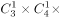种；

（2）假设去甲乡镇的为女性且不能为副院长，丁乡镇必须为女性，乙丙无要求，则情况数为：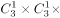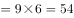种；

则符合条件的选法有种。

故正确答案为A。

---

### 第 2 题　qid 2443065 · 数学运算

某大型相亲类综艺节目举办线下联谊活动，在签到时每人可以抽取一张礼物卡，凡是抽中有编号的礼物卡均有玫瑰花赠送，抽到“谢谢参与”的则赠送一盒面巾纸。带有编号的礼物卡共100张，编号1-100，按礼物卡标签号发放奖品的规则如下：
（1）标签号为2的倍数，领2枝玫瑰
（2）标签号为3的倍数，领3枝玫瑰
（3）标签号既是2的倍数，又是3的倍数可重复领奖
（4）其他标签号均领1枝玫瑰
那么本次联谊活动应准备玫瑰花        枝。

- **A**. 215
- **B**. 232　✅
- **C**. 312
- **D**. 416

**答案**：B

**官方解析**

已知1-100满足编号为2的倍数的有个；编号为3的倍数的有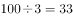余1，有33个；编号既为2的倍数又为3的倍数即6的倍数有余4，有16个。根据二集合容斥原理，则，既非2倍数又非3倍数共有个。因此总计需准备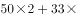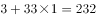枝玫瑰。

故正确答案为B。

---

### 第 3 题　qid 2443068 · 数学运算

中秋假期，小王请同在一个城市的9位大学同学聚餐。10人围坐一桌，敬酒前小王提出一个建议：每个人要同不相邻的同学喝一杯。如果小王的提议被通过，那么一共要准备        杯酒。

- **A**. 70　✅
- **B**. 90
- **C**. 140
- **D**. 210

**答案**：A

**官方解析**

根据题干条件，每个人要和不相邻的同学喝一杯，总计10人，每人除了自己和左右相邻的两位同学外，不相邻的同学共7名，即每个人需同7名同学喝酒，10人总计需喝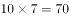次。但因每两人只用喝一次，实际只需要喝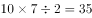次，每次互相喝酒的两人各一杯，总共需要准备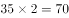杯酒。

故正确答案为A。

---

### 第 4 题　qid 2443074 · 数学运算

有两个班的学生从南部校区到北部校区参加活动，但只有一辆车接送，第一班的学生坐车从学校出发的同时，第二班学生开始步行；车到途中某处，让第一班学生下车步行，车立刻返回接第二班学生上车并直接开到北部校区。学生步行速度为每小时4公里，载学生时车速每小时40公里，空车时车速为每小时50公里。问：要使两班学生同时到达北部校区，第二班学生步行全程的        。

- **A**. 1/6
- **B**. 1/7　✅
- **C**. 1/10
- **D**. 1/8

**答案**：B

**官方解析**

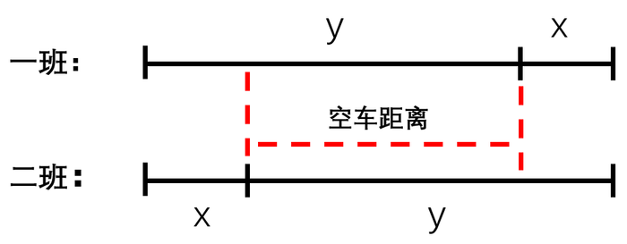

由于两个班学生的步行速度均为每小时4公里，坐车速度均为每小时40公里，要想同时到达，则两个班学生的步行距离与乘车距离应分别相等。设一班学生步行的路程为x，乘车的路程为y，则最后步行的时间为；车返回和载着二班学生到达终点总共用的时间应为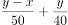。两者所用时间相同，则，解得。则学生步行路程占全程的比重为。

故正确答案为B。

---

### 第 5 题　qid 2443091 · 数学运算

甲乙丙丁四个建筑队分别承担相同的施工任务。由于设备原因，当甲乙丙同时开工时，丁已经干了若干天。经过一番努力，甲用3天，乙用5天，丙用8天，赶上了丁的进度。已知甲的效率是12，乙的效率是8，则丙的效率是        。

- **A**. 

- **B**. 
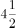

- **C**. 

　✅
- **D**. 

**答案**：C

**官方解析**

设丁提前干了天，根据题干条件，将甲的效率为12、乙的效率为8直接代入，列式可得：，，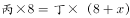。解得，。则丙的效率。

故正确答案为C。

---

### 第 6 题　qid 2443130 · 数学运算

长为10cm的素菜蛋卷的制作方法是：用一张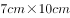的蛋皮把长度为10cm的豆芽卷在里面，外形为圆柱状。某日豆芽只有7cm长,于是改变蛋卷的卷法，得到7cm的圆柱。这两种大小的蛋卷在相连接处均重叠了1cm的蛋皮，问10cm长的蛋卷与7cm长的蛋卷的体积比是<u>       </u>。

- **A**. 7:10
- **B**. 20:21
- **C**. 40:63　✅
- **D**. 1:1

**答案**：C

**官方解析**

两种卷的方式如下图所示，由于两种大小的蛋卷在相连接处均重叠了1cm的蛋皮，因此A、B方式的底面周长分别为6、9cm，则底面半径分别为、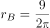，故A、B方式两个蛋卷形成的圆柱底面积分别为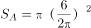、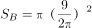。根据圆柱体积公式：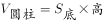，则10cm长的蛋卷与7cm长的蛋卷的体积比为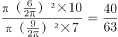。

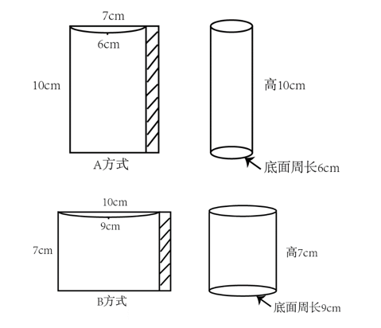

故正确答案为C。

---

### 第 7 题　qid 2443099 · 数学运算

两只机械手表，一只每天快18分钟，一只每天慢15分钟。现在将两只手表同时调整到标准时间，则它们再次同时显示标准时间要经过        天。

- **A**. 40
- **B**. 88
- **C**. 178
- **D**. 240　✅

**答案**：D

**官方解析**

一只表每天快18分钟，则要想再次显示标准时间，最少需要快出12小时分钟，因此需要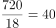天；另一只表每天慢15分钟，则要想再次显示标准时间，最少需要慢出12小时分钟，因此需要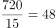天。因此要想它们再次同时显示标准时间需要经过的天数为40、48的最小公倍数即240天。

故正确答案为D。

---

### 第 8 题　qid 2443104 · 数学运算

甲乙2艘帆船从A地到B地。无风时，甲需要12小时，乙需要15小时。如果逆风，甲的速度下降，乙的速度下降。两船同时从A地出发，中途遇逆风，但同时到达B地。那么行船过程逆风行驶<u>        </u>小时。

- **A**. 10　✅
- **B**. 8
- **C**. 6
- **D**. 5

**答案**：A

**官方解析**

赋值AB两地的距离为12、15的最小公倍数60，则甲、乙无风时的速度分别为，。则根据条件，逆风时二者的速度分别为，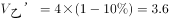。设从A到B的过程中无风时间为，逆风时间为，则，，联立①②式解得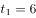，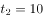，故逆风时间为10小时。

故正确答案为A。

---

### 第 9 题　qid 2443108 · 数学运算

在一块草场上老李养了若干头牛和若干只羊。如果只有羊吃草，够吃16天；如果第一天牛吃，第二天羊吃，这样交替，正好整数天吃完；如果第一天羊吃，第二天牛吃，这样交替，那么比上次轮流的做法多吃半天；牛单独吃能够吃        天。

- **A**. 8　✅
- **B**. 7
- **C**. 6
- **D**. 5

**答案**：A

**官方解析**

根据题干条件，方式1：若第一天牛吃，第二天羊吃，这样交替，则按“牛羊牛羊······”依次交替，则每一个周期为2天，每周期效率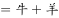；方式2：若第一天羊吃，第二天牛吃，这样交替，则按“羊牛羊牛······” 依次交替，则每一个周期为2天，每周期效率，和方式1相同。

若方式1刚好吃了完整的n个周期，则方式2需要吃完整的n个周期加上半天，由于每个周期方式1和方式2的效率相等，则此时两次的量不同，存在矛盾。若方式1前面吃了完整的n个周期后再用1天吃完，则最后一天为牛吃完，此时方式2前面也吃了完整的n个周期，则倒数第二天为羊吃，最后半天为牛吃，则有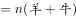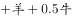，可得：，即。赋值牛吃草效率为2，则羊为1，此时总草量，则牛单独吃需要的时间为天。

故正确答案为A。 

注：1.牛吃草问题会说明草匀速生长，本题没有提到草的生长，因此不考虑草生长。

2.本题若验证会发现若总量看为16份，则方式1牛羊一周期吃草3份，5个周期后还剩1份只需牛吃半天，与整数天矛盾，因此推测可能为命题人在16这里的数据设置存在问题，尽管能解出答案，但数据内部存在矛盾。

---

### 第 10 题　qid 2443112 · 数学运算

有4个盒子装有红白蓝绿四色粉笔各有若干支。任意2个盒子的粉笔的支数和分别为12、23、31、46、54、65，粉笔支数最多的盒子里同一颜色最多的粉笔至少有        支（没有并列）。

- **A**. 14
- **B**. 13　✅
- **C**. 12
- **D**. 11

**答案**：B

**官方解析**

假设四个盒子装的粉笔数分别为a支、b支、c支、d支，且，则最大的两盒支数和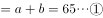，第二大的两盒支数和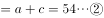，联立①②式可得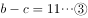，根据和差同性可得为奇数，则只可能是23或31，由于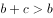，故不能为23，则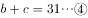。联立③④式，解得，代入①式解得，即粉笔支数最多的盒子里粉笔总数为44支。设其中同一颜色最多的粉笔有x支，要想让x尽量小，则其它几种颜色的粉笔应尽量多，构造数列如下：

可列式为，解得，因x至少为12.5，又x为整数，则x至少为13。

故正确答案为B。

---

## 判断推理

### 第 1 题　qid 2443004 · 图形推理

从四个选项中选最合适的一个填入问号处，使之呈现一定的规律性：

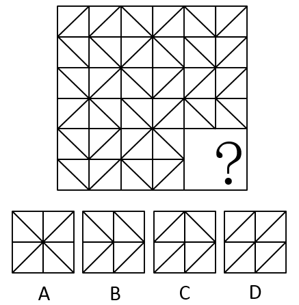

- **A**. A
- **B**. B　✅
- **C**. C
- **D**. D

**答案**：B

**官方解析**

解法一：图形元素组成相同，但位置无明显规律，继续观察发现，九宫格每一行的三个图形均为轴对称图形，因此问号处应填一个轴对称图形，但选不出唯一答案，因此考虑对称轴的细化。继续观察，发现每一行的三个图形分别都只有一条横向对称轴、只有一条纵向对称轴和有两条相互垂直的对称轴，如下图所示： 

 

因此问号处应当填一个只有一条横向对称轴的图形，只有B选项满足。

故正确答案为B。

解法二：图形元素组成相同，优先考虑位置规律，九宫格优先横行观察，通过相邻比较发现，第一行相邻两幅图之间有且只有两条直线发生了位置变化；第二行验证此规律成立，第三行运用此规律，问号处应选择一个跟前一幅图“有且只有两条直线发生了变化”的选项，排除AC两项；九宫格横行观察选不出唯一答案，考虑竖着看，再次观察发现，第一列相邻两幅图之间也满足有且只有两条直线发生了变化，第二列验证无误，故B项和D项中，只有D项满足和第三列的图2有且只有两条直线发生了变化，D项当选。

故正确答案为D。

解法三：图形元素组成相同，但位置无明显规律。九宫格每格可划分为2×2的小格子，且每个小方格内有1条斜线，斜线只有两种，考虑黑白运算，九宫格优先看横行，观察发现：相同斜线叠加后变为“/”（如下图黄框内），不同斜线叠加后变为“\”（如下图红框内），经验证第二行也符合规律，第三行应用规律，只有B项符合。

故正确答案为B。

此题有三种思路，但其中两种解法答案都是B，此外，对称性考频相对较高，且以往考过类似题目特征的图形题，考查的也是对称性这一考点，因此经过教研，粉笔倾向于答案B。

---

### 第 2 题　qid 2443006 · 图形推理

从四个选项中选最合适的一个填入问号处，使之呈现一定的规律性：

- **A**. A
- **B**. B
- **C**. C　✅
- **D**. D

**答案**：C

**官方解析**

题干每幅图均有小黑点，且小黑点的个数分别是：2、1、2、1、2、？，因此问号处应填入小黑点数量为1的选项，排除A、B，剩下C、D两项，对比选项发现唯一区别在于小三角形内部黑点位置不一样；继续观察题干发现，利用时针法从三角形内部的黑点出发，经过直角画向另一条直角边的时候，图1、图3和图5的时针方向一致，均为逆时针，图2、图4的时针方向一致，均为顺时针，如下图所示： 

 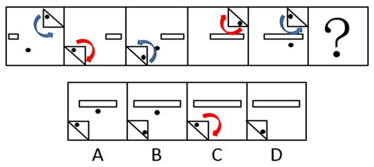

因此问号处应填入和图2、图4时针方向一致的选项，只有C项符合。

故正确答案为C。

---

### 第 3 题　qid 2443007 · 图形推理

从四个选项中选最合适的一个填入问号处，使之呈现一定的规律性：

- **A**. A
- **B**. B
- **C**. C　✅
- **D**. D

**答案**：C

**官方解析**

图形元素组成不同，属性无明显规律，考虑数量规律。观察发现，题干每幅图均是圆作为外框，且内部线条交叉明显，优先考虑数点。题干图形框上交点依次为0、1、2、？、4，内部交点依次为：1、2、3、？、3，框上交点和内部交点数作差的绝对值均为1，只有C项符合。
故正确答案为C。

---

### 第 4 题　qid 2443009 · 图形推理

左边给出的是纸盒的外表图，由它折叠而成的一项是：

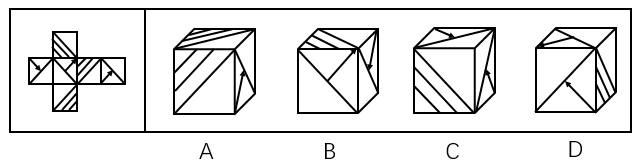

- **A**. A　✅
- **B**. B
- **C**. C
- **D**. D

**答案**：A

**官方解析**

将展开图的面标上序号，如下图所示：

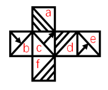

A项：与题干展开图一致，当选；

B项：正面是c面，从c面画边， 如下图所示：

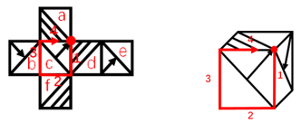

展开图中边1对应是的d面，而B项中边1对应的不是d面，选项与题干不一致，排除；

C项：选项中顶面和右面为面b和面e，如下图所示，题干展开图中面b和面e的公共边挨着面b中带箭头的三角形和面e中的空白三角形：

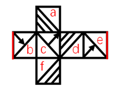

而选项中两个面的公共边挨着两个面中的空白三角形： 

选项与题干展开图不一致，排除；

D项：顶面为c面，从c面开始画边，如下图所示：

展开图中，边3对应的是b面，而D项中边3对应的不是b面，选项与题干不一致，排除。

故正确答案为A。

---

### 第 5 题　qid 2443011 · 图形推理

把下面六个图形分为两类，使得每一类图形都有各自的共同特征或规律，分类正确的一项是：

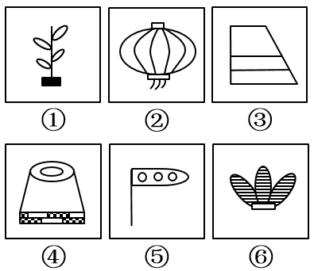

- **A**. ①②③  ④⑤⑥
- **B**. ①④⑤  ②③⑥
- **C**. ①③⑥  ②④⑤
- **D**. ①③⑤  ②④⑥　✅

**答案**：D

**官方解析**

本题为分组分类。通过观察发现，图①③⑤均有一条竖线，图②④⑥均有空白矩形，因此图①③⑤为一组，②④⑥为一组，对应D项。
故正确答案为D。

---

### 第 6 题　qid 2443015 · 图形推理

从四个选项中选最合适的一个填入问号处，使之呈现一定的规律性：

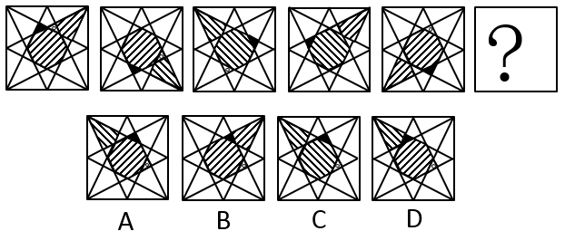

- **A**. A　✅
- **B**. B
- **C**. C
- **D**. D

**答案**：A

**官方解析**

图形元素组成相同，优先考虑位置规律。观察发现，黑色三角形每次逆时针平移3格，小白圆圈每次顺时针平移2格，排除D项；最外圈阴影部分的线条与最中间阴影部分线条的方向依次是平行、垂直、平行、垂直、平行、？，因此问号处应当填一个垂直的，只有A符合。
故正确答案为A。

---

### 第 7 题　qid 2443055 · 定义判断

概念的内涵是指概念所反映的对象的本质属性，它是概念质的规定性，说明概念所反映的对象是什么样。
根据上述定义，下列属于从概念的内涵加以说明的是：

- **A**. 存储-转发信息系统是无论文书或其他信息等数字形式的文本、数字数据都能够通过该系统进行发送和接收
- **B**. 社会关系包括经济、思想、政治、文化以及家庭等各方面的关系
- **C**. 独角兽公司是指那些估值达到10亿美元以上的初创企业　✅
- **D**. 5G是4G之后的延伸

**答案**：C

**官方解析**

第一步：找出定义关键词。
“概念所反映的对象的本质属性”、“说明概念所反映的对象是什么样”。
第二步：逐一分析选项。
A项：存储-转发信息系统是无论文书或其他信息等数字形式的文本、数字数据都能够通过该系统进行发送和接收，只是说明文本、数字数据都能够通过该系统进行发送和接收，并没有指出该系统的特点和属性，不符合“概念所反映的对象的本质属性”，不符合定义，排除；
B项：社会关系包括经济、思想、政治、文化以及家庭等各方面的关系，是在具体举例说明哪些情况属于社会关系，没有指出社会关系的本质属性，不符合“概念所反映的对象的本质属性”，不符合定义，排除；
C项：独角兽公司是指那些估值达到10亿美元以上的初创企业，指出独角兽公司的属性是估值达到10亿美元以上、初创企业，符合“概念所反映的对象的本质属性”，也符合“说明概念所反映的对象是什么样”，符合定义，当选；
D项：5G是4G之后的延伸，没有指出5G的本质属性，不符合“概念所反映的对象的本质属性”，不符合定义，排除。
故正确答案为C。

---

### 第 8 题　qid 2443059 · 定义判断

饥饿营销是指商品提供者有意调低产量，以期达到调控供求关系、制造供不应求假象、维持商品较高售价和利润，以达到维护品牌形象、提高产品附加值的目的。
根据上述定义，下列属于饥饿营销的是：

- **A**. 在楼市旺季某开发商每次只开卖一栋楼，还张榜公布销售情况形成临时性缺货或只剩少数存量假象，造成人多排队、加价购买等热销氛围　✅
- **B**. 全球某大车企为了调整产品结构，对某品牌汽车减低产量
- **C**. 苹果平板电脑iPad刚上市很热销，有时断货，造成一些时尚人士找店长预留，甚至高价买水货
- **D**. 小米手机曾制定用户需先预定排号，根据排位顺序付款发货销售方式，从而引起大家对小米手机的关注，形成热销

**答案**：A

**官方解析**

第一步：找出定义关键词。
“商品提供者有意调低产量”、“调控供求关系、制造供不应求假象、维持商品较高售价和利润”、“以达到维护品牌形象、提高产品附加值的目的”。
第二步：逐一分析选项。
A项：开发商每次只开卖一栋楼，符合“商品提供者有意调低产量”，形成临时性缺货或只剩少数存量假象，造成人多排队、加价购买，符合“调控供求关系、制造供不应求假象、维持商品较高售价和利润”，符合定义，当选； 
B项：大车企为了调整产品结构，对汽车减低产量，不符合“调控供求关系、制造供不应求假象”，不符合定义，排除；
C项：iPad刚上市很热销，有时断货，不符合“商品提供者有意调低产量”，也不符合“调控供求关系、制造供不应求假象”，不符合定义，排除；
D项：小米手机曾制定用户需先预定排号，根据排位顺序付款发货销售方式，不符合“商品提供者有意调低产量”，也不符合“调控供求关系、制造供不应求假象”，不符合定义，排除。
故正确答案为A。

---

### 第 9 题　qid 2443071 · 定义判断

授权是指主管或领导者按层次领导原则委授副职或下属以一定责任与部分理事权，使副职或下属在其领导、监督下有相应的自主权和行动指挥权，被授权者对授权者负有报告及完成之责。
根据上述定义，下列属于授权的是：

- **A**. 因去党校学习王校长将报销业务交由校长助理审批　✅
- **B**. 财务处长每月将公司财务信息汇报给董事会
- **C**. 小张因为没找到车间主任，而直接找经理请假
- **D**. 张厂长让秘书替他准备午餐

**答案**：A

**官方解析**

第一步：找出定义关键词。
“主管或领导者”、“按层次领导原则委授副职或下属以一定责任与部分理事权, 使副职或下属在其领导、监督下有相应的自主权和行动指挥权”。
第二步：逐一分析选项。
A项：王校长将报销业务交由校长助理审批，校长助理获得了审批报销业务的权限，符合“按层次领导原则委授副职或下属以一定责任与部分理事权, 使副职或下属在其领导、监督下有相应的自主权和行动指挥权”，符合定义，当选； 
B项：财务处长每月将公司财务信息汇报给董事会，财务处长只是汇报并没有获得董事会的授权，不符合定义，排除；
C项：小张因为没找到车间主任，而直接找经理请假，小张只是请假并没有获得授权，不符合定义，排除；
D项：张厂长让秘书替他准备午餐，秘书准备午餐并没有获得授权，不符合定义，排除。
故正确答案为A。

---

### 第 10 题　qid 2443076 · 定义判断

滚动调查是指一连串在不同时段采用相同内容开展的民意调查，目的是了解民意在时间维度上的变化，例如调查民众对公共服务满意度的变化。
根据上述定义，下列属于滚动调查的是：

- **A**. 某公司委托某社会调查公司对不同学历消费者开展调查，了解他们的需求差异
- **B**. 某大学每学期都会在学期初和学期末对学生开展心理健康调查，了解他们的心理健康状况
- **C**. 某区政府每年年初都会对全区居民开展公共服务需求调查，了解居民迫切的民生需要　✅
- **D**. 某健身中心每次课后都会对消费者进行问卷调查，以评价不同健身老师的授课质量

**答案**：C

**官方解析**

第一步：找出定义关键词。
“一连串在不同时段采用相同内容开展的民意调查”、“目的是了解民意在时间维度上的变化”。
第二步：逐一分析选项。
A项：某公司委托某社会调查公司对不同学历消费者开展调查，该调查是针对不同学历而不是不同时段，不符合定义，排除； 
B项：某大学每学期都会在学期初和学期末对学生开展心理健康调查，心理健康调查不属于民意调查，不符合定义，排除；
C项：某区政府每年年初都会对全区居民开展公共服务需求调查，每年年初属于不同时段，居民开展公共服务需求调查，属于民意调查，符合“一连串在不同时段采用相同内容开展的民意调查”，符合定义，当选；
D项：某健身中心每次课后都会对消费者进行问卷调查，以评价不同健身老师的授课质量，对于健身课程的评价不属于民意调查，不符合定义，排除。
故正确答案为C。

---

### 第 11 题　qid 2443080 · 定义判断

邻避效应是指具有负外部性效应的公共设施产生的效用为大众所共享，而带来的风险和成本却由设施附近居民承受，进而导致公众心理上的隔阂，引发居民抵制的现象。
根据上述定义，下列属于邻避效应的是：

- **A**. 某社区一楼业主私自开挖地下室，其他楼层业主认为安全受到影响，集体前去阻止施工
- **B**. 某公司拟在格林社区附近修建信号发射塔，但部分居民以信号塔影响风水为由阻止施工
- **C**. 某社区原有变电设施不能满足周边居民用电需求，供电公司拟在附近修建新的变电设施，但附近居民以会产生噪音为理由阻挠施工　✅
- **D**. 某市拟投资兴建一座造纸厂，但相邻胶清市某造纸厂工人认为该厂的修建会影响他们的效益，故前往阻挠施工

**答案**：C

**官方解析**

第一步：找出定义关键词。
“产生的效用为大众所共享”、“带来的风险和成本却由设施附近居民承受”、“公众心理上隔阂，引发居民抵制”。
第二步：逐一分析选项。
A项：一楼业主私自开挖地下室，是为了自己用，不符合“产生的效用为大众所共享”， 不符合定义，排除；
B项：公司拟修建信号发射塔，符合“产生的效用为大众所共享”，但部分居民以影响风水为由阻拦，风水没有体现风险和成本，不符合“带来的风险和成本却由设施附近居民承受”，不符合定义，排除；
C项：供电公司拟在附近修建新的变电设施，符合“产生的效用为大众所共享”，附近居民以会产生噪音为理由阻挠施工，符合“带来的风险和成本却由设施附近居民承受”、“公众心理上隔阂，引发居民抵制”，符合定义，当选；
D项：相邻胶清市某造纸厂工人认为新修建的造纸厂会影响他们的效益，不符合“带来的风险和成本却由设施附近居民承受”、“公众心理上隔阂，引发居民抵制”，不符合定义，排除。
故正确答案为C。

---

### 第 12 题　qid 2443084 · 定义判断

侧向思维方法是指利用其他领域的观念、知识或方法来寻找解决本领域某个问题的可能途径和思路的一种方式。
根据上述定义，下列不属于运用侧向思维方法的是：

- **A**. 鲁班由于茅草的细齿刮破手指而发明了锯
- **B**. 格拉塞通过观察啤酒泡沫的现象，提出了气泡室的设想
- **C**. 居里夫人根据实验室中看到的蓝光，发现了天然放射性元素“镭”　✅
- **D**. 奥地利的医生奥恩布鲁格，受到敲酒桶凭叩击声就能知道桶内有多少酒的启发，想出以“叩诊”的方法诊断人体胸腔中是否有积水

**答案**：C

**官方解析**

第一步：找出定义关键词。
“利用其他领域的观念、知识或方法”、“寻找解决本领域某个问题的可能途径和思路”。
第二步：逐一分析选项。
A项：鲁班由于茅草的细齿刮破手指而发明了锯，茅草和锯是不同的领域，符合“利用其他领域的观念、知识或方法”、“寻找解决本领域某个问题的可能途径和思路”，符合定义，排除；
B项：通过观察啤酒泡沫的现象，提出了气泡室的设想，啤酒泡沫和气泡室是不同的领域，符合“利用其他领域的观念、知识或方法”、“寻找解决本领域某个问题的可能途径和思路”，符合定义，排除；
C项：根据实验室中看到的蓝光，发现了天然放射性元素“镭”，是通过相关的实验得到相关的发现，不符合“利用其他领域的观念、知识或方法”、“寻找解决本领域某个问题的可能途径和思路”，不符合定义，当选；
D项：受到敲酒桶凭叩击声判断桶内有多少酒的启发，想出“叩诊”的方法，敲酒桶和叩诊是不同的领域，符合“利用其他领域的观念、知识或方法”、“寻找解决本领域某个问题的可能途径和思路”，符合定义，排除。
本题为选非题，故正确答案为C。

---

### 第 13 题　qid 2443088 · 定义判断

水下文化遗产是指经历至少100年的周期性或连续性的、部分或全部位于水下的具有文化、历史或考古价值的所有人类生存的遗迹。
根据上述定义，下列属于水下文化遗产的是：

- **A**. 我国南沙群岛附近海域历时数百万年形成的珊瑚礁群
- **B**. 我国道光年间在苏门答腊和爪哇岛之间触礁沉没的商船“泰兴号”　✅
- **C**. 迪拜于上世纪末在海中以人工岛方式建造的世界第一座七星级观光酒店
- **D**. 希腊克里特岛上发掘出的公元前10000年至公元前3300年新石器文化遗迹

**答案**：B

**官方解析**

第一步：找出定义关键词。
“经历至少100年的周期性或连续性”、“部分或全部位于水下”、“具有文化、历史或考古价值的所有人类生存的遗迹”。
第二步：逐一分析选项。
A项：我国南沙群岛附近海城历时数百万年形成的珊瑚礁群，没有体现出人类生存，不符合“具有文化、历史或考古价值的所有人类生存的遗迹”，不符合定义，排除；
B项：我国道光年间在苏门答腊和爪哇岛之间触礁沉没的商船“泰兴号”，符合“经历至少100年的周期性或连续性”、“部分或全部位于水下”、“具有文化、历史或考古价值的所有人类生存的遗迹”，符合定义，当选；
C项：迪拜于上世纪末在海中以人工岛方式建造的酒店，不符合“经历至少100年的周期性或连续性”、“具有文化、历史或考古价值的所有人类生存的遗迹”，不符合定义，排除；
D项：希腊克里特岛上发掘出的公元前10000年至公元前3300年新石器文化遗迹，没有体现出在哪里发现的，不符合“部分或全部位于水下”，不符合定义，排除。
故正确答案为B。

---

### 第 14 题　qid 2443093 · 定义判断

《民法总则》第三十三条规定“具有完全民事行为能力的成年人，可以与其近亲属、其他愿意担任监护人的个人或者组织事先协商，以书面相关法律法条形式确定自己的监护人。协商确定的监护人在该成年人丧失或者部分丧失民事行为能力时，履行监护职责。”这种监护形式被称为意定监护。
根据上述定义，下列属于意定监护的是：

- **A**. 杜宇常年在国外工作，其母亲患慢性疾病，部分丧失民事行为能力，故杜宇指定其叔叔作为母亲的监护人
- **B**. 李伯伯膝下无子，孤身一人，得到了邻居王琦常年悉心照顾。今年初，李伯伯和王琦到公证处公证，确定在李伯伯丧失生活自理能力时由王琦担任其监护人　✅
- **C**. 我国法律规定，在福利院收养的孤儿由福利院担任其监护人
- **D**. 丧偶多年的文爷爷与照顾其生活的保姆互生情愫，两人虽然没有领取结婚证，但俨然形成了事实婚姻

**答案**：B

**官方解析**

第一步：找出定义关键词。
 “具有完全民事行为能力的成年人”、“与其近亲属、其他愿意担任监护人的个人或者组织事先协商”、“以书面相关法律法条形式确定自己的监护人”、“协商确定的监护人在该成年人丧失或者部分丧失民事行为能力时，履行监护职责” 。
第二步：逐一分析选项。
A项：杜宇的母亲部分丧失民事行为能力，杜宇指定其叔叔作为母亲的监护人，不符合“具有完全民事行为能力的成年人”、“与其近亲属、其他愿意担任监护人的个人或者组织事先协商”，不符合定义，排除；
B项：李伯伯和王琦到公证处公证，符合“具有完全民事行为能力的成年人”、“与其近亲属、其他愿意担任监护人的个人或者组织事先协商”、“以书面相关法律法条形式确定自己的监护人”，确定在李伯伯丧失生活自理能力时由王琦担任其监护人，符合“协商确定的监护人在该成年人丧失或者部分丧失民事行为能力时，履行监护职责”，符合定义，当选；
C项：在福利院收养的孤儿由福利院担任其监护人，不符合“具有完全民事行为能力的成年人”、“与其近亲属、其他愿意担任监护人的个人或者组织事先协商”，不符合定义，排除；
D项：丧偶多年的文爷爷与照顾其生活的保姆虽然没有领取结婚证，但俨然形成了事实婚姻，不符合“以书面相关法律法条形式确定自己的监护人”、“协商确定的监护人在该成年人丧失或者部分丧失民事行为能力时，履行监护职责”，不符合定义，排除。
故正确答案为B。

---

### 第 15 题　qid 2443100 · 类比推理

（    ）对于 知识 相当于 挑战 对于（    ）

- **A**. 理解：攀登
- **B**. 学识：理论
- **C**. 学习：极限　✅
- **D**. 文化：迎接

**答案**：C

**官方解析**

逐一代入选项。
A项：理解知识是动宾短语，挑战和攀登之间无明显逻辑关系，前后逻辑关系不一致，排除；
B项：学识是指学术上的知识和修养，理论和挑战之间无明显逻辑关系，前后逻辑关系不一致，排除；
C项：学习知识是动宾短语，挑战极限是动宾短语，前后逻辑关系一致，当选；
D项：文化和知识之间无明显逻辑关系，迎接挑战是动宾短语，前后逻辑关系不一致，排除。
故正确答案为C。

---

### 第 16 题　qid 2443016 · 类比推理

编辑部 对于（    ） 相当于 （    ） 对于 学校

- **A**. 作者：校园
- **B**. 档案处：学生处
- **C**. 期刊：学生
- **D**. 出版社：教务处　✅

**答案**：D

**官方解析**

逐一代入选项。
A项：编辑部可以联系作者投稿，二者是对应关系，学校和校园是全同关系，前后逻辑关系不一致，排除；
B项：编辑部和档案处是两个部门，二者是并列关系，学生处是学校的组成部分，二者是组成关系，前后逻辑关系不一致，排除；
C项：编辑部编辑期刊，二者是工作内容的对应，学生在学校里面，二者是地点的对应，前后逻辑关系不一致，排除；
D项：编辑部是出版社的组成部分，教务处是学校的组成部分，前后逻辑关系一致，当选。
故正确答案为D。

---

### 第 17 题　qid 2443019 · 类比推理

弓箭：枪炮：战争

- **A**. 毛笔：钢笔：书法　✅
- **B**. 马车：汽车：运输
- **C**. 书籍：电脑：学习
- **D**. 广播：电视：宣传

**答案**：A

**官方解析**

第一步：判断题干词语间逻辑关系。
弓箭和枪炮都是战争中使用的武器，二者是并列关系，且弓箭出现的时间要早于枪炮，战争是名词。
第二步：判断选项词语间逻辑关系。
A项：毛笔和钢笔是书法中会用到的工具，二者是并列关系，且毛笔出现的时间要早于钢笔，书法是名词，与题干逻辑关系一致，当选；
B项：马车和汽车是运输过程中会用到的工具，二者是并列关系，同时运输也可以作为动词，马车和汽车都具有运输的功能，前两个词与第三个词也能构成功能对应，与题干逻辑关系不一致，排除；
C项：书籍和电脑是学习中会使用到的工具，二者是并列关系，同时学习也可以作为动词，书籍和电脑可以用来学习，前两个词与第三个词构成功能对应，与题干逻辑关系不一致，排除；
D项：广播和电视是宣传中会使用到的工具，二者是并列关系，同时宣传也可以作为动词，广播和电视都具有宣传的功能，前两个词与第三个词构成功能对应，与题干逻辑关系不一致，排除。
故正确答案为A。

---

### 第 18 题　qid 2443020 · 类比推理

侵犯：指责：愤怒

- **A**. 赞赏：感谢：真诚　✅
- **B**. 帮助：道歉：谅解
- **C**. 误解：解释：无意
- **D**. 抢劫：反抗：犯罪

**答案**：A

**官方解析**

第一步：判断题干词语间逻辑关系。
先侵犯别人，再受到指责，二者具有时间的先后顺序；愤怒的指责，二者构成偏正短语。 
第二步：判断选项词语间逻辑关系。
A项：先赞赏别人，再受到感谢；真诚的感谢，二者构成偏正短语，与题干逻辑关系一致，当选；
B项：帮助和道歉无明显先后顺序，与题干逻辑关系不一致，排除；
C项：无意不能用来形容解释，与题干逻辑关系不一致，排除；
D项：“犯罪”不能用来形容“反抗”，与题干逻辑关系不一致，排除。
故正确答案为A。

---

### 第 19 题　qid 2443022 · 类比推理

语言：简洁

- **A**. 骨骼：清奇
- **B**. 想象：丰富　✅
- **C**. 彷徨：徘徊
- **D**. 坦途：捷径

**答案**：B

**官方解析**

第一步：判断题干词语间逻辑关系。
简洁的语言，二者为偏正关系。
第二步：判断选项词语间逻辑关系。
A项：清奇的骨骼，二者为偏正关系，与题干逻辑关系一致，保留；
B项：丰富的想象，二者为偏正关系，与题干逻辑关系一致，保留；
C项：彷徨指徘徊走来走去，犹豫不决，二者为近义关系，与题干逻辑关系不一致，排除；
D项：有的坦途是捷径，有的捷径是坦途，二者为交叉关系，与题干逻辑关系不一致，排除。
比较A、B两项，题干中的语言和B项中的想象都是抽象名词，而A项中的骨骼是具体名词，B项比A项与题干逻辑关系更为一致。
故正确答案为B。

---

### 第 20 题　qid 2443024 · 类比推理

猪八戒：唐僧

- **A**. 周公：比干
- **B**. 夸父：女娲
- **C**. 哪吒：姜子牙　✅
- **D**. 黄帝：炎帝

**答案**：C

**官方解析**

第一步：判断题干词语间逻辑关系。
猪八戒是唐僧的徒弟，二者为上下辈分的对应关系。
第二步：判断选项词语间逻辑关系。
A项：周公指周文公，是周朝政治家、军事家、哲学家；比干是商王文丁庶子，商王帝乙之弟，商纣王帝辛子受之叔，殷商王室的重臣。二者并非上下辈分的对应关系，与题干逻辑关系不一致，排除；
B项：夸父与女娲是两位远古时期的神话人物，二者为并列关系，与题干逻辑关系不一致，排除；
C项：姜子牙和太乙真人都是元始天尊的徒弟，二人是师兄弟关系，哪吒的师傅是太乙真人，因此姜子牙是哪吒的师叔。二者为上下辈分的对应关系，与题干逻辑关系一致，当选；
D项：黄帝与炎帝是两位不同的部落首领，二者为并列关系，与题干逻辑关系不一致，排除。
故正确答案为C。

---

### 第 21 题　qid 2443026 · 类比推理

平面三角形：内角和180度

- **A**. 恒星：太阳
- **B**. 磁铁：南极北极　✅
- **C**. 军人：手枪
- **D**. 电话：电波

**答案**：B

**官方解析**

第一步：判断题干词语间逻辑关系。
平面三角形必然存在内角和180度的属性，二者为必然属性对应关系。
第二步：判断选项词语间逻辑关系。
A项：太阳是一颗恒星，二者为包容关系中的种属关系，与题干逻辑关系不一致，排除；
B项：磁铁的两端会各指向地球南方和北方，指向北方的一端称为北极，指向南方的一端为南极，磁铁必然有南极北极，与题干逻辑关系一致，当选；
C项：手枪是军人的武器，二者为职业与工具之间的对应关系，与题干逻辑关系不一致，排除；
D项：电话利用电波进行信息通讯，二者为对应关系，与题干逻辑关系不一致，排除。
故正确答案为B。

---

### 第 22 题　qid 2443027 · 类比推理

亏损：收入：成本

- **A**. 贸易顺差：进口：出口　✅
- **B**. 负债：借钱：还钱
- **C**. 价格上涨：需求：供给
- **D**. 库存：入库：出库

**答案**：A

**官方解析**

第一步：判断题干词语间逻辑关系。
收入小于成本会产生亏损。
第二步：判断选项词语间逻辑关系。
A项：进口小于出口会产生贸易顺差，与题干逻辑关系一致，当选；
B项：还钱数小于借钱数会产生负债，但还钱与借钱词语顺序相反，与题干逻辑关系不一致，排除；
C项：供给小于需求会导致价格上涨，但需求与供给词语顺序相反，与题干逻辑关系不一致，排除；
D项：入库小于出库会使库存数量减少，而不是“库存”，与题干逻辑关系不一致，排除。
故正确答案为A。

---

### 第 23 题　qid 2443029 · 类比推理

有甲乙丙丁戊五个人参加比赛，比赛结束后，有己庚辛壬癸五个人对他们的名次做了如下判断
己：甲第一名，乙第二名
庚：丁第四名，戊第五名
辛：丙第三名，乙第二名
壬：甲第一名，丁第四名
癸：丙第四名，戊第五名
赛后名次公布之后发现，己庚辛每人最多猜对了一半，壬癸至少猜对了一半。则甲乙丙丁戊的名次依次是：

- **A**. 13425　✅
- **B**. 21345
- **C**. 12453
- **D**. 53412

**答案**：A

**官方解析**

第一步：分析题干。
本题为组合排列，题干五句话有真有假，即题干条件不确定，优先用代入法来解题。
代入的选项需满足己庚辛每人最多猜对了一半，壬癸至少猜对了一半。
第二步：逐一分析选项。
A项：代入后己半真半假，庚半真半假，辛全假，壬半真半假，癸全真，满足题干要求，当选；
B项：代入后己全假，但庚全真不满足题干要求，排除；
C项：代入后己全真不满足题干要求，排除；
D项：代入后己全假，庚全假，辛全假，但壬全假不满足题干要求，排除。
故正确答案为A。

---

### 第 24 题　qid 2443031 · 逻辑判断

有三个小伙伴去吃火锅，点餐的时候他们对服务员讲了如下的话：
甲：或者吃鸭血，或者不吃藕片
乙：只有不吃海带，才吃鸭血
丙：不吃豆腐泡，除非吃藕片
按照三位小伙伴的要求，服务员的下列哪种菜品组合一定不符合客人的要求。

- **A**. 有鸭血和豆腐泡
- **B**. 有海带，没有藕片
- **C**. 有豆腐泡，没有海带
- **D**. 有海带和豆腐泡　✅

**答案**：D

**官方解析**

第一步：翻译题干。

①鸭血 或者 藕片

②鸭血  海带

③豆腐泡  藕片

将③①②进行串联可得④豆腐泡藕片鸭血海带。

第二步：逐一分析选项。

A项：代入后与④不冲突，排除；

B项：代入后与④不冲突，排除；

C项：代入后与④不冲突，排除；

D项：有海带和豆腐泡，根据④豆腐泡海带，说明有豆腐泡就一定没有海带，D项一定不符合，当选。

本题为选非题，故正确答案为D。

---

### 第 25 题　qid 2443034 · 类比推理

某班选派学生代表参加校庆活动，张强或者隋雷至少必须有一人参加，同时还需满足以下条件：
（1）如果有隋雷，就必须有夏伟
（2）夏伟、张强至多只能有一人
（3）若有张强，就必须有孙风
（4）有孙风，就必须有夏伟
如果以上为真，代表中一定包括以下哪两人？

- **A**. 张强和夏伟
- **B**. 夏伟和孙风
- **C**. 孙风和隋雷
- **D**. 隋雷和夏伟　✅

**答案**：D

**官方解析**

翻译题干如下：

（1）隋雷夏伟

（2）夏伟 或 张强

（3）张强孙风

（4）孙风夏伟

（5）张强 或 隋雷

将（3）（4）串联为：张强孙风夏伟，又根据（2）可得张强夏伟，则说明张强一定不去，又根据（5）否一推一可得隋雷去，根据（1）可得夏伟去，因此隋雷和夏伟一定去。

故正确答案为D。

---

### 第 26 题　qid 2443036 · 逻辑判断

当前一些教师授课过程中存在知识更新不及时、授课态度不端正、教学方法不科学的问题。之所以会出现这三个问题，根本原因是教师考核过程中存在的重科研、轻教学的倾向。除非改变考核中教学评价占比过低的现状，教师才有积极性及时更新知识、授课态度才能更加端正、教学方法才能更加科学。对于学生而言，如果这三个问题不能得到有效解决，就很难激发起他们的学习兴趣。
如果上述陈述为真，则以下哪一项论断必定为真？

- **A**. 如果学生的学习兴趣没有激发起来，那一定是这三个问题没有得到有效解决
- **B**. 如果学生的学习兴趣激发起来了，那一定是教师考核中提高了教学评价的占比　✅
- **C**. 如果教师的教学态度没有端正起来，则说明教师考核中教学占比仍然较低
- **D**. 只要解决了这三个问题，学生的学习兴趣就一定能激发起来

**答案**：B

**官方解析**

第一步：翻译题干。

（1）积极性及时更新知识改变考核中教学评价占比过低的现状；

（2）授课态度能更加端正改变考核中教学评价占比过低的现状；

（3）教学方法能更加科学改变考核中教学评价占比过低的现状；

（4）-有效解决这三个问题-激发起学生的学习兴趣。

第二步：逐一分析选项。

A项：激发起学生的学习兴趣有效解决这三个问题，这是对条件（4）的肯后，肯后得不到确定结论，排除；

B项：学生的学习兴趣激发起来了教师考核中提高了教学评价的占比，这是对条件（4）的否后，否后必否前，可以得出有效解决了“知识更新不及时、授课态度不端正、教学方法不科学”这三个问题，这是对条件（1）的肯前，肯前必肯后，可推出改变了考核中教学评价占比过低的现状。该项可以推出，当选；

C项：-教师的教学态度端正教师考核中教学占比仍然较低，这是对条件（2）的否前，否前得不到确定结论，排除；

D项：解决了这三个问题学生的学习兴趣能激发起来，这是对条件（4）的否前，否前得不到确定结论，排除。

故正确答案为B。

---

### 第 27 题　qid 2443038 · 逻辑判断

赵甲、钱乙、孙丙、李丁和周戊分别住在赵楼、钱屯、孙家堡、李庄和周店五个村中。已知：
（1）每人的姓氏与所在村庄的第一个字不同
（2）赵甲和孙丙不住在李庄
（3）钱乙不住在孙家堡或周店
（4）李丁不住在赵楼或钱屯
（5）周戊不住在钱屯或赵楼
（6）除非赵甲住李庄，钱乙才住李庄
（7）若赵甲住孙家堡，则孙丙住李庄
根据以上信息可以得出以下哪项？

- **A**. 李丁住孙家堡　✅
- **B**. 钱乙住李庄
- **C**. 孙丙住周店
- **D**. 赵甲住钱屯

**答案**：A

**官方解析**

第一步：分析题干条件。

（1）每个人的姓氏与所在村庄的第一个字不同；

（2）甲不住李庄 且 丙不住李庄；

（3）乙不住孙家堡 且 乙不住周店；

（4）丁不住赵楼 且 丁不住钱屯；

（5）戊不住赵楼 且 戊不住钱屯；

（6）乙住李庄甲住李庄；

（7）甲住孙家堡丙住李庄。

第二步：根据题干条件进行推理。

根据条件（2）甲不住李庄且丙不住李庄，结合条件（6）可知，乙不住在李庄；再结合条件（1）可知丁也不住李庄，故只能是戊住在李庄，排除B项；

根据条件（2）丙不住李庄，结合条件（7）可知，甲不住在孙家堡，再根据条件（1）（3）可知乙和丙都不住在孙家堡，故只能是丁住在孙家堡，对应A项。

故正确答案为A。

注：本题条件（3）（4）（5）中虽然出现“或”，但表达意思为“且”，如条件（3）钱乙不住在孙家堡或周店，意思是钱乙既不住在孙家堡也不住在周店，翻译成“且”更满足条件实际含义。

---

### 第 28 题　qid 2443039 · 逻辑判断

一个国家只有立足粮食基本自给，才能掌握粮食安全主动权，进而才能掌控经济社会发展这个大局。而只有守住今天的耕地，才能守住明天的饭碗，如果耕地守不住，粮食生产就成了无本之木、无源之水，我们就没有了赖以吃饭的“命根子”。由此可以推出：

- **A**. 守住耕地就可以确保粮食安全无虞
- **B**. 确保粮食自给意味着掌握了粮食安全主动权
- **C**. 如果能够确保粮食生产，意味着我们守住了耕地　✅
- **D**. 之所以能掌控经济社会发展大局是因为做到了粮食基本自给

**答案**：C

**官方解析**

第一步：翻译题干。

①粮食安全主动权粮食基本自给

②掌控经济社会发展大局粮食安全主动权

③守住明天饭碗守住今天耕地

④守住今天耕地粮食生产成了无本之木、无源之水

⑤守住今天耕地“命根子”

第二步：逐一分析选项。

A项：翻译为守住耕地粮食安全无虞，是对④的否前，否前不确定，排除；

B项：翻译为粮食自给掌握粮食安全主动权，是对①的肯后，肯后不确定，排除；

C项：翻译为确保粮食生产守住了耕地，是对④的否后，否后必否前，推出守住耕地，当选；

D项：选项为因果关系，题干为条件关系，故无法推出，排除。

故正确答案为C。

---

### 第 29 题　qid 2443042 · 类比推理

近年来一些地区出现了居民因担心辐射阻挠移动通讯信号基站建设的案例。对此，专家指出，移动通信基站手机频段的电磁辐射平均功率密度为40微瓦/平方厘米，其强度相当于一台电视机或1.5个移动电话充电器。因此，大家大可不必担心移动基站的辐射危害。
以下哪项如果为真，最能支持专家的结论？

- **A**. 实际上，人们并不是每天都处于移动基站的辐射范围内
- **B**. 即使有辐射，移动通讯已经成为人们必不可少的通讯工具
- **C**. 低于100微瓦/平方厘米的电磁辐射不会对人体产生伤害　✅
- **D**. 没有哪个人因为电视机有辐射而放弃看电视

**答案**：C

**官方解析**

第一步：找到论点和论据
论点：大家大可不必担心移动基站的辐射危害。
论据：移动通信基站手机频段的电磁辐射平均功率密度为40微瓦/平方厘米，其强度相当于一台电视机或1.5个移动电话充电器
论点的话题是基站的辐射对人体没有危害，论据的话题是移动通信基站手机频段的电磁辐射平均功率密度为40微瓦/平方厘米，论点论据话题不一致，优先考虑搭桥。
第二步：逐一分析选项
A项：虽然人们不是每天都处于辐射范围内，但不代表移动基站的辐射对人体无危害，只要处于辐射范围内就有可能有危害，无关选项，排除；
B项：移动通讯是不是必不可少的工具和题干讨论的辐射的危害话题不一致，无关选项，排除；
C项：40微瓦低于100微瓦/平方厘米，对人体无危害，在论点论据间建立联系，搭桥，当选；
D项：该项讨论的是看电视，不是移动基站，类比加强选项力度极弱，排除。
故正确答案为C。

---

### 第 30 题　qid 2443043 · 逻辑判断

相关资料显示，国内出现丁克家族大概是在上世纪90年代。进入工业社会，消费取代生产成为家庭的基本经济功能，知识取代体力成为主要人力资本，人口质量取代数量决定家庭的经济效益，社会化与社会保障将赡养外移至社会机构，生育的价值降低，不再是家庭的“必需品”和“生命的必要构成”，不育成为自由权利。所以，近年来选择做丁克的家庭有明显上升的趋势。为此，有专家预言丁克现象会对中国的二孩生育政策造成冲击和影响。
若以下选项均为真，最能对专家的预言进行削弱的是：

- **A**. 丁克家族的增多是社会发展到一定程度后必然出现的现象，背后反映的是中国人价值观的变迁
- **B**. 丁克在中国仍然是小众，是部分中国人的生育态度，是可以接受的自然选择，不会对中国的二孩生育政策造成任何冲击和影响　✅
- **C**. 城市化的快速发展，年轻、适龄生育人口涌向大城市，随之而来的工作难、房价高、生育成本上涨，是选择不生二胎的主要原因
- **D**. 结婚十年一直做丁克族的小王夫妇被国家二胎政策所触动生育了一名男婴

**答案**：B

**官方解析**

第一步：找到论点和论据
论点：丁克现象会对中国的二孩生育政策造成冲击和影响。
论据：无
本题只有论点没有论据，前面的文段都是背景情况交代，优先考虑否定论点，即丁克不会对中国的二孩生育政策造成冲击。
第二步：逐一分析选项
A项：中国人的价值观和二孩生育政策话题不一致，无关选项，排除；
B项：丁克不会对中国的二孩生育政策造成任何冲击和影响，否定论点，当选；
C项：其他原因也能导致二孩生育政策受影响，他因削弱，力度较弱，排除；
D项：小王夫妇只是个例，其他人是否受影响不确定，没办法否定整个中国的情况，削弱力度较弱，排除。
故正确答案为B。

---

## 资料分析

### 材料 1

        2019年1-8月，全国房地产开发投资84589亿元，同比增长，增速比1-7月回落0.1个百分点。其中，住宅投资65187亿元，增长，增速回落0.2个百分点。

        1-8月，东部地区房地产开发投资44857亿元，同比增长，增速比1-7月回落0.4个百分点；中部地区投资17809亿元，增长，增速加快0.3个百分点；西部地区投资18506亿元，增长，增速加快0.9个百分点；东北地区投资3418亿元，增长，增速回落1.3个百分点。

        1-8月，房地产开发企业土地购置面积12236万平方米，同比下降，每平方米土地价格同比上涨，土地成交额6374亿元。

        1-8月，东部地区商品房销售面积40303万平方米，同比下降，降幅比1-7月收窄0.6个百分点；销售额50739亿元，增长，增速加快0.3个百分点。中部地区商品房销售面积28791万平方米，增长，1-7月为下降；销售额20682亿元，增长，增速加快0.7个百分点。西部地区商品房销售面积28284万平方米，增长，增速加快1.0个百分点；销售额20363亿元，增长，增速加快0.6个百分点。东北地区商品房销售面积4471万平方米，下降，降幅收窄1.2个百分点；销售额3589亿元，增长，增速加快1.8个百分点。

#### 第 1 题　qid 2443066 · 比重

2018年1-8月，住宅投资占全国房地产开发投资比重约为：

- **A**. 

- **B**. 

- **C**. 

　✅
- **D**. 

**答案**：C

**官方解析**

根据题干“2018年1-8月，······占······比重约为”，结合材料时间为2019年1-8月，可判定本题为基期比重问题。定位文字资料第一段可知，2019年1-8月，全国房地产开发投资84589亿元（B），同比增长（b），······其中，住宅投资65187亿元（A），增长（a）。根据基期比重公式：，则 2018年1-8月住宅投资所占比重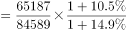。

故正确答案为C。

---

#### 第 2 题　qid 2443072 · 增长

2019年1-8月，西部地区投资比去年同期增加约      亿元。

- **A**. 2812
- **B**. 2643
- **C**. 2552　✅
- **D**. 2313

**答案**：C

**官方解析**

根据题干“2019年1-8月，······增加约<u>      </u>亿元”，可判定本题为增长量计算问题。定位文字资料第二段可知，2019年1-8月，西部地区投资18506亿元，增长。则2019年1-8月西部地区投资增长量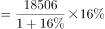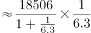亿元，C项最接近。

故正确答案为C。

备注:原题干时间为“2018年1-8月”，但没有相关数据进行计算，故粉笔将本题时间修改为“2019年1-8月”，可以得出C项。

---

#### 第 3 题　qid 2443083 · 增长

2019年1-8月，房地产开发企业土地成交额与去年同期相比增长约：

- **A**. 
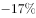

- **B**. 

　✅
- **C**. 

- **D**. 

**答案**：B

**官方解析**

根据题干“2019年1-8月，······与去年同期相比增长约”，结合选项是百分数，且每平方米土地价格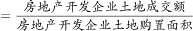，可判定本题为平均数的增长率问题。定位文字资料第三段可知，2019年1-8月，房地产开发企业土地购置面积同比下降（b），每平方米土地价格同比上涨（r）。根据平均数增长率公式：，房地产开发企业土地成交额增速为，代入公式得：，则。

故正确答案为B。

---

#### 第 4 题　qid 2443086 · 增长

2019年1-8月，下列地区中商品房价格同比增长最慢的是：

- **A**. 东部地区
- **B**. 西部地区　✅
- **C**. 中部地区
- **D**. 东北地区

**答案**：B

**官方解析**

根据题干“2019年1-8月，下列地区中商品房价格同比增长最慢的是”，商品房价格，可判定本题为平均数的增长率问题。定位文字资料第四段可知，2019年1-8月，东部地区商品房销售面积同比下降（b），销售额增长（a）；中部地区商品房销售面积增长（b），销售额增长（a）；西部地区商品房销售面积增长（b），销售额增长（a）；东北地区商品房销售面积下降（b），销售额增长（a）。

根据平均数增长率公式：，则2019年1-8月东部地区商品房价格同比增速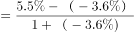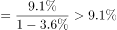；西部地区商品房价格同比增速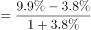；中部地区商品房价格同比增速；东北部地区商品房价格同比增速比较可知，西部地区商品房价格同比增速最慢。

故正确答案为B。 

---

#### 第 5 题　qid 2443089 · 综合

下列说法错误的是：

- **A**. 2019年1-8月，全国各地区商品房单价均保持上涨
- **B**. 2019年1-8月，全国商品房销售额最多的是东部地区
- **C**. 2019年1-8月，西部地区商品房销售面积约27248万平方米　✅
- **D**. 2019年1-7月，全国房地产开发投资东部地区增速高于东北地区

**答案**：C

**官方解析**

A项：定位文字资料第四段可知，2019年1-8月，东部地区商品房销售面积同比下降（b），销售额增长（a）；中部地区商品房销售面积增长（b），销售额增长（a）；西部地区商品房销售面积增长（b），销售额增长（a）；东北地区商品房销售面积下降（b），销售额增长（a）。商品房单价，根据两期平均数结论，当分子增长率（a）分母增长率（b），则平均数较去年上升。东部地区：；中部地区：；西部地区：；东北地区：。则全国各地区商品房单价均保持上涨，正确；

B项：定位文字资料第四段可知，2019年1-8月，东部地区商品房销售额50739亿元，中部地区商品房销售额20682亿元，西部地区商品房销售额20363亿元，东北地区商品房销售额3589亿元，则全国商品房销售额最多的是东部地区，正确；

C项：定位文字资料第四段可知，2019年1-8月西部地区商品房销售面积28284万平方米，并非27248万平方米，错误；

D项：定位文字资料第二段可知，2019年1-8月，东部地区房地产开发投资44857亿元，同比增长，增速比1-7月回落0.4个百分点；东北地区投资3418亿元，增长，增速回落1.3个百分点。则2019年1-7月全国东部地区房地产开发投资增速；东北部地区增速，。错误。

本题为选非题，故正确答案为C、D。

备注：本题C、D项均有明显错误，C项表述“西部地区商品房销售面积约27248万平方米”是基期2018年1-8月数据，若将C项时间改为基期时间，则有唯一答案，但题干明确表述是现期，故粉笔认为本题C、D项均为正确答案。

---

### 材料 2

#### 第 6 题　qid 2443050 · 综合

“十二五”期间华为销售收入总计达到        百万元。

- **A**. 1,344,565
- **B**. 1,346,358　✅
- **C**. 1,348,467
- **D**. 1,350,118

**答案**：B

**官方解析**

定位统计图1，“十二五时期”即2011-2015年华为公司销售收入分别为203929百万元、220198百万元、239025百万元、288197百万元、395009百万元。可计算出“十二五”期间华为销售收入总计百万元。

故正确答案为B。

---

#### 第 7 题　qid 2443061 · 增长

下面折线图能反映2015-2018年华为在美洲地区销售收入同比增长率趋势的是：

- **A**. A　✅
- **B**. B
- **C**. C
- **D**. D

**答案**：A

**官方解析**

由题干“···2015-2018年···同比增长率”，可判定本题为一般增长率计算问题。定位统计图2，2014年-2018年华为在美洲地区销售收入分别为30852百万、38976百万、44082百万、39285百万、47885百万。根据公式，可计算出：

2015年增长率；

2016年增长率；

2017年增长率；

2018年增长率。

最大是2015年，第二是2018年，排除B、C、D三项。

故正确答案为A。

---

#### 第 8 题　qid 2443067 · 增长

2010年-2018年华为公司销售收入同比增长低于的年份有<u>        </u>个。

- **A**. 2　✅
- **B**. 3
- **C**. 4
- **D**. 5

**答案**：A

**官方解析**

定位统计图1可知，2010-2018年华为公司销售收入同比增长率。其中2012年（）、2013年（）低于，所以满足题意的年份有2个。

故正确答案为A。

---

#### 第 9 题　qid 2443073 · 增长

2013年-2018年华为公司各类业务销售收入同比增长率最高的是：

- **A**. 2018年的运营商业务
- **B**. 2017年的其他业务
- **C**. 2016年的企业业务
- **D**. 2015年的消费者业务　✅

**答案**：D

**官方解析**

由题干“2013-2018年···同比增长率最高”，可判定本题为一般增长率比较问题。定位统计图2，2017年、2018年的运营商业务分别为297838百万元、294012百万元；2016年、2017年的其他业务分别为10539百万元、13586百万元；2015年、2016年的企业业务分别为27609百万元、40666百万元；2014年、2015年的消费者业务分别为75100百万元、129128百万元。根据公式，比较增长率可直接用；

A项：；

B项：；

C项：；

D项：。

比较上述数字，2013年-2018年华为公司各类业务销售收入同比增长率最高的是2015年的消费者业务。

故正确答案为D。

---

#### 第 10 题　qid 2443079 · 综合

根据上述信息，欧洲中东非洲地区的销售收入占公司总销售收入的说法不正确的是：

- **A**. 欧洲中东非洲地区的销售收入占比一直高于亚太与美洲地区之和的占比
- **B**. 2016年欧洲中东非洲地区的销售收入占比比2015年的下降了约3个百分点
- **C**. 2013年欧洲中东非洲地区的销售收入占比为最高
- **D**. 2017年欧洲中东非洲地区的销售收入占比排第四位　✅

**答案**：D

**官方解析**

A项，总体量相同，比较它们之间的占比，只需比较部分量大小即可。定位统计图2，

2013年欧洲中东非洲地区的销售收入为百万元；

2014年欧洲中东非洲地区的销售收入为百万元；

2015年欧洲中东非洲地区的销售收入为百万元；

2016年欧洲中东非洲地区的销售收入为百万元；

2017年欧洲中东非洲地区的销售收入为百万元；

2018年欧洲中东非洲地区的销售收入为百万元；

从上述数据可知，欧洲中东非洲地区的销售收入占比一直高于亚太与美洲地区之和的占比。正确；

B项，定位统计图2，2015年、2016年欧洲中东非洲地区的销售收入分别为128016百万元、156509百万元；定位统计图1，2015年、2016年公司总销售收入分别为395009百万元、521574百万元。根据公式，可计算出2016年欧洲中东非洲地区的销售收入占比，2015年占比。可知，，下降约3个百分点。正确；

C项，定位统计图2，2013年中国、欧洲中东非洲、亚太、美洲、其他地区的销售收入分别为82785百万元、84006百万元、38691百万元、29346百万元、4197百万元。根据公式，总体量相同，只比较部分量即可，从上述数字看出，2013年欧洲中东非洲地区的销售收入占比为最高，正确；

D项，定位统计图2，2017年中国、欧洲中东非洲、亚太、美洲、其他地区的销售收入分别为305092百万元、163854百万元、74427百万元、39285百万元、20963百万元。根据公式，总体量相同，只比较部分量即可，从上述数字看出，2017年欧洲中东非洲地区的销售收入占比排第二位，而非第四位，错误。

本题为选非题，故正确答案为D。

备注：CD项，表述有歧义，也可以按照时间比较，即比较2013年-2018年，欧洲中东非洲的销售收入占比，答案一致。粉笔更倾向于按地区比较。

---

### 材料 3

#### 第 11 题　qid 2443012 · 增长

2018年比2016年新登记注册市场主体约增加        万户。

- **A**. 16
- **B**. 18　✅
- **C**. 20
- **D**. 22

**答案**：B

**官方解析**

由题目问“2018年比2016年···增加多少万户”，可判定本题为间隔增长量问题。根据表中数据，可得2018年末，新登记市场主体户数约为66.1万户，同比增长，增速比上年少25.5个百分点，则2017年同比增速为。则与2016年相比，2018年新登记注册市场主体户数的增长率为，题目所求为万户，与B项最接近。

故正确答案为B。

---

#### 第 12 题　qid 2443017 · 比重

2016年各类市场主体中企业占比约为：

- **A**. 

　✅
- **B**. 

- **C**. 

- **D**. 

**答案**：A

**官方解析**

由题目问“2016年各类市场主体中企业占比”，判定本题为基期比重问题。根据表中数据，可得2018年，市场主体有343.8万户，同比增长，增速比上年多1.1个百分点，则2017年市场主体户数同比增长，则2016年市场主体户数为；同理可得2018年，企业有90.7万户，同比增长，增速比上年少2.9个百分点，则2017年企业户数同比增长，则2016年企业户数为；题目所求比重为，与A项最接近。

故正确答案为A。

---

#### 第 13 题　qid 2443023 · 增长

2018年规模以上工业主营业务利润总额比2016年增长了约        亿元。

- **A**. 471
- **B**. 535
- **C**. 703
- **D**. 928　✅

**答案**：D

**官方解析**

由题目问“2018年···利润总额比2016年···增长多少亿元”，可判定本题为间隔增长量问题。根据表中数据，可得2018年规模以上工业主营业务利润总额1460.3亿元，同比增长，增速比上年少51.9个百分点，则2017年同比增速为。则与2016年相比，2018年规模以上工业主营业务利润总额的增长率为，题目所求为亿元，与D项最接近。

故正确答案为D。

---

#### 第 14 题　qid 2443030 · 综合

2017年规模以上工业主营业务利润率约为：

- **A**. 

- **B**. 

　✅
- **C**. 

- **D**. 

**答案**：B

**官方解析**

由题目问“2017年···利润率约为多少”，，判定本题为基期比重问题。根据表中数据，可得2018年规模以上工业主营业务利润总额1460.3亿元，同比增长；主营业务收入26489.9亿元，同比增长；题目所求为。

故正确答案为B。

---

#### 第 15 题　qid 2443033 · 综合

能够从上述资料中推出的是：

- **A**. 2018年平均每个新登记市场主体贡献地区生产总值增加额约为360亿元
- **B**. 2016年农民专业合作社在全部市场主体中的占比高于2018年
- **C**. 2017年平均约13.8人拥有一户市场主体　✅
- **D**. 规模以上工业主营业务纳税总额增速低于利润总额增速是因为实行了减税政策

**答案**：C

**官方解析**

A项：地区生产总值的增加额并不一定都是由新登记市场主体所贡献的，根据表格信息，无法计算新登记市场主体贡献了多少地区生产总值，因此无法得出平均每个新登记市场主体贡献地区生产总值增加额，错误；

B项：根据表格，无法得出2017年农民专业合作社数量同比增长率，即无法得出2016年农民专业合作社数量，因此无法得出2016年农民专业合作社在全部市场主体中的占比，错误；

C项：根据表格，2018年生产总值25315.4亿元，同比增长，年人均生产总值为58008元，同比增长，则2017年人口数为：亿人。2018年市场主体有343.8万户，同比增长，则2017年有市场主体万户，则题目所求为人/户，即平均约13.8人拥有一户市场主体，正确；

D项：根据表格信息，规模以上工业主营业务纳税总额增速低于利润总额增速的原因是无法得知的，错误。

故正确答案为C。

---

### 材料 4

        2019年1-8月，辽宁省社会消费品零售总额9846.6亿元，比上年同期增长，增速回落1.6个百分点。限额以上单位消费品零售额实现2254.6亿元，同比下降，增速回落6.5个百分点。

        又知2019年1-7月全省限额以上批发业，零售业，住宿业和餐饮业实现零售额同比分别增长、、和。

#### 第 16 题　qid 2443041 · 综合

2017年8月，辽宁省社会消费品零售总额约为：

- **A**. 1121亿元
- **B**. 1184亿元　✅
- **C**. 4750亿元
- **D**. 8633亿元

**答案**：B

**官方解析**

根据题干“2017年8月······”，结合材料时间为2019年，可判定本题为间隔基期计算问题。定位折线图可知2018年8月辽宁省社会消费品零售总额同比增速为，2019年8月为，根据间隔增长率公式。定位表格材料可知2019年8月，辽宁省社会消费品零售总额为1280.7亿元，根据基期计算公式可计算得2017年8月辽宁省社会消费品零售总额亿元，与B项接近。

故正确答案为B。

---

#### 第 17 题　qid 2443046 · 平均数

2019年1-7月，限额以上批发业平均每月实现销售额是住宿业的约        倍

- **A**. 7.12
- **B**. 7.69
- **C**. 8.28　✅
- **D**. 9.01

**答案**：C

**官方解析**

根据题干“2019年1-7月，······是······倍”，可判定本题为现期倍数问题。定位表格数据可知批发业零售额2019年1-8月为170.4亿元，8月为4.9亿元，住宿业零售额2019年1-8月为23.9亿元，8月为3.9亿元。计算可得：2019年1-7月批发业零售额亿元，2019年1-7月住宿业零售额亿元，故题干所求倍数倍。

故正确答案为C。

---

#### 第 18 题　qid 2443048 · 增长

2019年8月全省限额以上住宿业实现销售额同比约增长：

- **A**. 

- **B**. 

　✅
- **C**. 

- **D**. 

**答案**：B

**官方解析**

根据题干“2019年8月全省限额以上住宿业实现销售额同比约增长”，结合选项都为百分数，且材料给出2019年1-7月和1-8月全省限额以上住宿业实现销售额同比增长率，可判定本题为混合增长率问题。定位表格数据可知“2019年1-8月全省限额以上住宿业实现零售额为23.9亿元，同比增长，8月零售额为3.9亿元”，定位最后一段文字数据可知“2019年1-7月全省限额以上住宿业实现零售额同比分别增长”，设2019年8月增长率为r。

方法一：根据混合增长率的口诀“混合增长率居中不正中，偏向基期量较大的一方”，1-7月大于8月份数据，因此混合后的增长率更靠近。根据线段法可得：，解得：。排除A和C选项。代入D选项：，和差距太大，排除D选项。

方法二：根据线段法，距离与量成反比，1-7月：8月，则，则。

备注：虽然精确计算没有接近的答案，但按照命题思路来看应该是选择B选项。

故正确答案为B。

---

#### 第 19 题　qid 2443051 · 综合

2018年8月通讯器材类实现消费品零售额比日用品类约多        亿元。

- **A**. 2.6
- **B**. 2.4
- **C**. 2.2　✅
- **D**. 2.0

**答案**：C

**官方解析**

根据题干“2018年8月······比······亿元”，结合材料时间为2019年，可判定本题为基期和差问题。定位表格材料可知：“2019年8月，通讯器材类实现消费品零售额9.6亿元，同比增长，日用品7.1亿元，同比增长”，根据公式：基期量，2018年8月通讯器材类实现消费品零售额比日用品类多。

故正确答案为C。

---

#### 第 20 题　qid 2443054 · 综合

根据上述材料，下列说法正确的是：

- **A**. 2017年8月社会消费品零售总额约为1208亿元
- **B**. 2019年1-7月烟酒类实现消费品零售总额少于2018年同期　✅
- **C**. 2019年1-8月，1月的社会消费品零售总额同比增速高于4月同比增速
- **D**. 2019年1-8月汽车类零售总额同比减少，而石油及其制品类零售总额同比增加是因为石油及其制品涨价

**答案**：B

**官方解析**

A项：根据116题计算得2017年8月辽宁省社会消费品零售总额，错误；

B项：定位表格数据可知“2019年8月全省限额以上烟酒类实现零售额为3.5亿元，同比增长，1-8月零售额为29.8亿元，同比增长”，设1-7月增长率为r。根据混合增长率的口诀“混合增长率居中”，8月增长率1-8月增长率1-7月增长率r，解得：，即2019年1-7月少于2018年同期，正确；

C项：定位折线图数据可知2019年1-2月增速为，4月增速为，但无法求出1月份增速，无法判断1月和4月增速大小关系，错误；

D项：定位表格数据可知“2019年1-8月全省限额以上汽车类同比增长，石油及其制品类同比增长”，但无法判断石油及其制品类零售总额同比增加的原因，错误。

故正确答案为B。

---
