# 2019年青海省公务员录用考试《行测》题省市州级（A类）（网友回忆版）

> 省考 · 2019 年 · 6 个模块 · 共 120 题

- [政治理论](#%E6%94%BF%E6%B2%BB%E7%90%86%E8%AE%BA) · 3 题
- [常识判断](#%E5%B8%B8%E8%AF%86%E5%88%A4%E6%96%AD) · 17 题
- [言语理解与表达](#%E8%A8%80%E8%AF%AD%E7%90%86%E8%A7%A3%E4%B8%8E%E8%A1%A8%E8%BE%BE) · 35 题
- [数量关系](#%E6%95%B0%E9%87%8F%E5%85%B3%E7%B3%BB) · 10 题
- [判断推理](#%E5%88%A4%E6%96%AD%E6%8E%A8%E7%90%86) · 40 题
- [资料分析](#%E8%B5%84%E6%96%99%E5%88%86%E6%9E%90) · 15 题

---

## 政治理论

### 第 1 题　qid 2393983 · 新思想

党的十九大报告指出，（    ）是中国特色社会主义最本质的特征，是中国特色社会主义制度的最大优势。

- **A**. 中国共产党的领导　✅
- **B**. 人民当家作主
- **C**. 公有制经济
- **D**. 民主协商

**答案**：A

**官方解析**

本题考查政治常识。
习近平总书记在党的十九大报告中指出，“中国特色社会主义最本质的特征是中国共产党领导，中国特色社会主义制度的最大优势是中国共产党领导”。
故正确答案为A。

---

### 第 2 题　qid 2393994 · 时事政治

2019年4月27日，习近平总书记在第二届“一带一路”国际合作高峰论坛圆桌峰会上指出，要高质量共建“一带一路”。“一带一路”是“（    ）”的简称。

- **A**. 21世纪丝绸之路经济带、海上丝绸之路
- **B**. 海上丝绸之路经济带、21世纪丝绸之路
- **C**. 丝绸之路经济带、21世纪海上丝绸之路　✅
- **D**. 丝绸之路海上经济带、21世纪丝绸之路

**答案**：C

**官方解析**

本题考查政治常识。
“一带一路”是“丝绸之路经济带”和“21世纪海上丝绸之路”的简称。“一带一路”是中国与丝路沿途国家分享优质产能，它是共商项目投资、共建基础设施、共享合作成果，内容包括道路联通、贸易畅通、货币流通、政策沟通、人心相通等“五通”。
故正确答案为C。

---

### 第 3 题　qid 2393933 · 新思想

下列活动由中国共产党领导的是（    ）。
①东北义勇军的抗日斗争
②东北抗日联军的斗争
③东北抗日游击队的斗争
④中华共和国人民革命政府的抗日斗争
⑤“一二·九”运动
⑥西安事变

- **A**. ①②③④⑤⑥
- **B**. ①③④⑤
- **C**. ②③⑤⑥
- **D**. ②③⑤　✅

**答案**：D

**官方解析**

本题考查毛中特。
①错误，东北义勇军是“九·一八”事变后到1933年初东北抗日武装的总称。日军发动侵占东北辽宁、吉林、黑龙江三省的战争时，当地广大人民群众、边防军和地方武装的爱国官兵自发组成了积极抗击日伪军的非官方队列。因此，东北义勇军的抗日斗争不是中国共产党领导的。
②正确，东北抗日联军是在中国共产党领导下的一支英雄部队。“九一八”日本侵占中国东北以后，由部分原东北军、中共抗日游击队、农民暴动武装、义勇军等组成。他们在中国共产党的领导下，同日本侵略者进行了长达十四年的艰苦斗争，牵制七十六万日军，消灭日本关东军十八万，表现了中华民族不畏强暴，英勇不屈的精神，有力地支援了全国的抗日战争和世界反法西斯战争。
③正确，从1936年初到1937年秋，在中国共产党的领导和组织下，东北抗日游击队、东北人民革命军等抗日武装陆续改编成东北抗日联军。
④错误，中华共和国是1933年闽变时由陈铭枢、李济深等中国国民党党内反蒋左派及十九路军在福建建立的共和国，又称十九路军政权，首都福州，其政府自称为“中华共和国人民革命政府”，政府主席为李济深，执政党为生产人民党，年号为“中华共和国”。因此，中华共和国人民革命政府的抗日斗争不是中国共产党领导的。
⑤正确，1935年12月9日，北平数千名学生举行了抗日救国示威游行，反对华北自治，反抗日本帝国主义，要求保全中国领土的完整，掀起了全国抗日救国新高潮。“一二·九”运动是中国共产党领导的一次大规模学生爱国运动。
⑥错误，西安事变是指1936年12月12日张学良和杨虎城为了达到劝谏蒋介石改变“攘外必先安内”的既定国策，停止内战，一致抗日的目的，在西安发动“兵谏”的历史事件。因此，西安事变不是中国共产党领导的。
综上所述，②③⑤正确，①④⑥错误。
故正确答案为D。

---

## 常识判断

### 第 1 题　qid 2393987 · 人文常识

中央提出“十三五”期间脱贫攻坚的目标是“两不愁三保障”，“三保障”具体是指（    ）。

- **A**. 保障日常吃饭、保障基本医疗、保障基本就业
- **B**. 保障日常吃饭、保障基本穿着、保障基本就业
- **C**. 保障义务教育、保障基本穿着、保障安全住房
- **D**. 保障义务教育、保障基本医疗、保障安全住房　✅

**答案**：D

**官方解析**

本题考查政治常识。
2015年11月召开的中央扶贫开发工作会议强调，“十三五”期间脱贫攻坚的目标是，到2020年稳定实现农村贫困人口不愁吃、不愁穿，农村贫困人口义务教育、基本医疗、住房安全有保障；同时实现贫困地区农民人均可支配收入增长幅度高于全国平均水平、基本公共服务主要领域指标接近全国平均水平。
故正确答案为D。

---

### 第 2 题　qid 2393996 · 科技常识

“正能量”指的是一种健康乐观、积极向上的动力和情感。当下中国社会涌现了许多富有正能量的人和事，这些催人奋进的、充满希望的人和事也带动和影响了周围一批人，从哲学角度看（    ）。
①正能量具有指导作用，能够将人们的愿望变成现实
②正能量具有能动性，能够给人带来信心和力量
③正能量具有反作用，能对人体生理活动进行调节和控制
④正能量具有创造性，能直接转化为物质力量

- **A**. ①②
- **B**. ①④
- **C**. ②③　✅
- **D**. ③④

**答案**：C

**官方解析**

该题考查政治相关知识。人能够能动地改造世界体现在：意识对改造客观世界具有指导作用；意识对于人体生理活动具有调节和控制作用。
①错误，“正能量”是一种具有健康乐观、积极向上的意识，意识具有指导作用，人们在意识的指导下通过实践才能把观念的东西转化为现实东西，但是仅仅通过意识是无法将愿望变成现实的，前半句正确，后半句错误，所以①错误。
②正确，“正能量”作为一种正确的意识，是一种健康乐观、积极向上的动力和情感，能够给人带来信心和力量，所以②正确。
③正确，“正能量”作为一种正确的意识，健康乐观、积极向上的动力和情感，对人体生理活动具有调节和控制作用，当人们在遇到挫折困难的时候，可以通过“正能量”的意识，使人们积极乐观、身心愉悦，更好地面对生活。所以③正确。
④错误，意识活动具有主动性和创造性，是人能够认识世界的重要条件，但是意识不能直接转化为物质力量，是通过实践才能转化为物质的，所以④错误。
故正确答案为C。

---

### 第 3 题　qid 2393998 · 人文常识

一块屋场，几条板凳，没有主席台，不用音箱话筒，无需讲话稿，聊的是田头村事，谈的是致富之经。这是深受村民点赞的屋场会，贫困户、村干部、驻村工作队等几十人围坐一起，倾听百姓心声，解读扶贫政策，说实话，解决实际问题。屋场会（    ）。
①有利于增强服务意识，融洽干群关系，为群众办实事
②是对巩固基层政权的有益尝试和探索
③有利于基层群众性自治组织形式的多样化
④是党的群众路线的一种创新，有助于调动村民参与村务管理的热情

- **A**. ①②
- **B**. ①④　✅
- **C**. ②③
- **D**. ③④

**答案**：B

**官方解析**

该题考查政治知识。题干中“一块屋场，几条板凳，没有主席台，不用音箱话筒，无需讲话稿”指不讲形式、接地气的屋场会。
①正确，不讲形式、接地气的屋场会，可以真正了解村民的所思、所想、所盼，有利于融洽干群关系，为老百姓办实事，所以①正确。
②错误，村委会是基层群众性自治组织，不是国家基层政权机关，所以②错误。
③错误，屋场会是民主管理形式的创新，不是基层群众性自治组织形式的多样化，基层自治组织的形式就是村委会和居委会，我国《宪法》规定：“城市和农村按居民居住地区设立的居民委员会或者村民委员会是基层群众性自治组织。”基层群众性自治组织形式的多样化说法错误，所以③错误。
④正确，屋场会是对村民民主管理的创新，是党的群众路线的一种创新，问政于民，问需于民，调动了村民参与村务管理的热情，所以④正确。
故正确答案为B。

---

### 第 4 题　qid 2394001 · 经济常识

据统计，目前我国老年人已达2.3亿，老年消费者这轮“夕阳”本应该成为推动GDP发展的一轮“朝阳”，但因为社会养老保障体系建设滞后，即使是“重阳节”这一天，人们也很难感受到“银发经济”这四个字的分量。这给我们的启示是（    ）。
①深化改革，有效化解我国的“老年化”矛盾，完善中国特色养老保障制度
②充分认识规律发生作用的条件和范围，使价值规律与我国经济发展相符合
③正确认识和利用社会养老保障体系与老年消费的客观联系，拉动经济增长
④矛盾具有特殊性，我国不适合发展“银发经济”，而应大力发展“朝阳经济”

- **A**. ①②
- **B**. ②④
- **C**. ①③　✅
- **D**. ③④

**答案**：C

**官方解析**

该题考查政治知识。
①正确，我国社会养老保障体系建设滞后，要通过改革，不断完善中国特色养老保障制度，解决社会发展中的各种矛盾，尤其是“老年化”矛盾，所以①正确。
②错误，发挥主观能动性要尊重客观规律，应该是充分认识规律发生作用的条件和范围，使我国“经济发展”与“价值规律”相符合，而不是“价值规律”与我国的“经济发展”来符合，选项说法正好相反，所以②错误。
③正确，要想“银发经济”拉动经济增长，必须在社会养老保障体系较为完善的条件下，因此只有正确认识和利用社会养老保障体系与老年消费的客观联系，才能拉动经济增长，所以③正确。
④错误，矛盾具有特殊性，只有正确认识我国“老年化”矛盾的特殊性，才能使我国的“银发经济”转化为“朝阳经济”，因此我们既要发展“银发经济”，也要寻找机会大力发展“朝阳经济”，所以④错误。
故正确答案为C。

---

### 第 5 题　qid 2394005 · 法律常识

司法公正体现在司法活动各个方面和对司法人员的要求上。下列（    ）做法体现的不是司法公正的内涵。

- **A**. 甲法院对社会关注的重大案件通过微博直播庭审过程
- **B**. 乙法院将本院公开审理后作出的判决书在网上公布
- **C**. 丙检察院为辩护人查阅、摘抄、复制案卷材料提供便利
- **D**. 丁检察院为暴力犯罪的被害人提供医疗和物质救助　✅

**答案**：D

**官方解析**

本题考查法律常识。
根据司法的理论与实践，司法公正主要体现在以下几方面：（1）司法活动的合法性。合法性是指司法机关审理案件要严格按照法律的规定办事。不仅要按实体法办事，而且要按程序法办事。（2）司法人员的中立性，如法官的中立性。（3）司法活动的公开性。诉讼程序的每一阶段和步骤都应当以当事人和社会公众看得见的方式进行。例如，法院应当努力实现立案公开、庭审公开、审判结果公开、裁判文书公开和执行过程公正。（4）当事人地位的平等性。一是当事人享有平等的诉讼权利，二是法院平等地保护当事人诉讼权利的行使。（5）司法程序的参与性。程序参与性又称为“获得法庭审判机会”，指那些利益或权利可能会受到民事裁判或诉讼结局直接影响的人应当有充分的机会富有意义地参与诉讼的过程，并对裁判结果的形成发挥其有效的影响和作用。（6）司法结果的正确性。适用法律时，事实要调查清楚；证据要确凿可靠，经得起历史检验；对案件的定性要准确；处理要适当。
A项、B项正确，属于司法活动的公开性，体现了司法公正。
C项正确，这是司法程序的参与性体现，属于司法公正。
D项错误，该检察院的刑事被害人救助有关工作与司法公正无关。
本题为选非题，故正确答案为D。

---

### 第 6 题　qid 2394010 · 人文常识

人民币升值，最有可能出现的是（    ）。

- **A**. 旅游收入增加
- **B**. 旅游收入减少
- **C**. 进口增加　✅
- **D**. 出口增加

**答案**：C

**官方解析**

本题考查经济常识。人民币升值是相对于其他货币而言的，意味着人民币的购买力增强。对于国人出国旅游、留学、投资等都有好处，有利于中国进口，不利于中国出口。
A、B两项错误，旅游收入来源于入境游、出境游和国内游。人民币升值对国内游基本没有影响；出境游的影响因素很多，除人民币汇率外，还有国家居民收入水平、签证政策、目的地的物价水平、航权、国家的出境政策、国际关系等，人民币升值对出境游有积极影响，但是影响有限；人民币升值会一定程度上抑制出境游，但我国出境游客中，港澳游客占据绝大部分，而在港澳地区，人民币基本上可以自由流通，汇率因素对旅游选择的影响不大。综上，人民币升值并不必然带来旅游收入的增加或者减少。
C项正确，D项错误，人民币升值会使进口品价格下降，出口品价格上升，从而刺激进口，抑制出口，减少国际贸易顺差甚至出现逆差。
故正确答案为C。

---

### 第 7 题　qid 2394012 · 经济常识

钱铺钱庄是明清时期重要的金融机构。钱铺的主要业务是兑换银两，或将顾客手中的铜钱换成银两，或将银两换成铜钱。后来发展成吸收存款、放款和汇兑为主要业务的钱庄。到乾隆年间，钱庄已有相当规模。上述转变的主要原因是（    ）。

- **A**. 以物易物是明清时期商贸主要形式
- **B**. 工商业发展使区域间长途贸易兴盛　✅
- **C**. 民营手工业在明清时期获得大发展
- **D**. 明清时期中国的对外贸易长期出超

**答案**：B

**官方解析**

本题考查人文常识。
钱庄早期称为钱铺，最初只是经营银两与制钱的兑换以及不同成色银两的兑换业务，从中赚取手续费。之后，由于工商业发展，市场交易的不断扩大，在长途跨区域贸易中，携带银两或铜钱不便，有些信誉好的钱庄就开始签发钱帖子，即银票，代替现金支付，可随时兑取银钱。继而发展为吸收存款、发放贷款，将商业资本转变和增加为金融资本，从中赚取利息。
故正确答案为B。

---

### 第 8 题　qid 2394019 · 经济常识

面对国际经济合作和竞争格局的深刻变化，顺应国内经济提质增效升级的迫切需要，我国要坚定不移地扩大对外开放，在开放中增强发展新动能、增添改革新动力、增创竞争新优势，推进新一轮高水平对外开放，着力实现合作共赢。据此，下列传导路径正确的有（    ）。
①实施创新驱动发展战略——形成出口竞争新优势——开放型经济水平提高
②扩大跨境电子商务试点——企业增加出口产品“海外仓”建设——促进经济全球化形成
③推进自贸区谈判——促进贸易投资自由化——构建均衡、共赢、包容的国际经贸体系
④打造新的外向型产业集群——加快“走出去”步伐——外资更多投向中西部地区

- **A**. ①②
- **B**. ②④
- **C**. ①③　✅
- **D**. ③④

**答案**：C

**官方解析**

本题考查经济常识。
①正确，习近平总书记指出：“要加快实施创新驱动发展战略，强化现代化经济体系的战略支撑。”实施创新驱动发展战略，有利于增加出口的竞争优势，进一步提高开放型经济水平。
②错误，《关于促进外贸回稳向好的若干意见》指出：在加大对外贸新业态的支持力度上，要开展并扩大跨境电子商务试点，支持企业建设一批出口产品“海外仓”和海外营运中心。但是目前经济全球化已经形成，②表述错误。
③正确，2016年政府工作报告指出：加快实施自由贸易区战略。积极商签区域全面经济伙伴关系协定，加快中日韩自贸区等谈判，推进中美、中欧投资协定谈判，加强亚太自贸区联合战略研究。推进自贸区谈判，有利于促进贸易投资自由化，构建均衡、共赢、包容的国际经贸体系。
④错误，打造新的外向型产业集群，引导外资更多投向中西部地区。但是外资更多投向中西部地区是“引进来”，而不是“走出去”，④表述错误。
因此，①③表述正确，②④表述错误。
故正确答案为C。

---

### 第 9 题　qid 2394021 · 科技常识

龙卷风的实质是高速旋转的气流。它能把地面上的物体或人畜“吸”起卷入空中。龙卷风能“吸”起物体的原因是（    ）。

- **A**. 龙卷风内部的压强远小于外部的大气压强　✅
- **B**. 龙卷风利用静电将物体吸到空中
- **C**. 龙卷风使物体受到的重力变小
- **D**. 龙卷风增大了空气对物体的浮力

**答案**：A

**官方解析**

本题考查地理国情。

A项正确，气体的流速越大，压强越小。龙卷风内部空气流速远大于外部空气流速，所以龙卷风内部的压强远小于外部压强。物体在压强差的作用下，被“吸”起卷入空中。 

B项错误，当一个带有静电的物体靠近另一个不带静电的物体时，由于静电感应，产生吸附现象。处于龙卷风中的物体一方面很少带静电，另一方面也没有可以令其吸附的对象，故表述错误。

C项错误，重力是地球对地面附近物体施加的引力，其大小等于物体的质量与重力加速度之积，即重力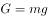，重力加速度为常量，龙卷风中的物体质量并未减小，因此其受到的重力不变。

D项错误，浮力是物体浸入流体（液体或气体）中受到的向上的力，其大小等于物体所排开的流体的重量。处于龙卷风中的物体的体积一般不会变化（除特殊的易变形物体外），其排开的气体的重量也不会变化，因此物体受到的浮力不变。

故正确答案为A。

---

### 第 10 题　qid 2394023 · 地理国情

在青海，当我们外出时，看树桩上的年轮，可以识别年轮宽的一面为（    ）。

- **A**. 东方
- **B**. 南方　✅
- **C**. 西方
- **D**. 北方

**答案**：B

**官方解析**

本题考查地理国情。
树木在阳光充足的一面生长旺盛，形成层原始细胞分裂较快，径向生长较快，每年长得多，年轮间距较宽。我国地处北半球，树干朝南一面受阳光照射较多，所以年轮间隔大的一面是南方。
故正确答案为B。

---

### 第 11 题　qid 2394025 · 人文常识

飞行距离较远时，民航飞机一般适宜在（    ）飞行。

- **A**. 散逸层
- **B**. 对流层
- **C**. 平流层　✅
- **D**. 中间层

**答案**：C

**官方解析**

本题考查地理国情。
民航飞机一般在对流层顶部（空气运动较稳定）或平流层底部飞行。选择在什么高度飞行，和航线长度有关系。飞行距离较长时在平流层飞行。
A项错误，800公里高度以上的大气层称为散逸层，它是大气的最高层，这里温度很高，空气稀薄。民航飞机无法达到这样的飞行高度。
B项错误，对流层为大气圈的最低层，云、雨、雪、雾、雷电等天气现象，基本上都发生在此层，其特点是有强烈的对流运动，不太适合飞机长距离飞行。
C项正确，自对流层顶至50—55公里的高空为平流层。平流层内水汽和尘埃稀少，基本上无云雨天气，空气垂直运动微弱，气流平稳，利于飞机长距离高空飞行。
D项错误，平流层顶到80—90公里高度的大气层为中间层。气温随高度增高而降低。高度较高且有相当强烈的垂直对流运动，不适宜飞机飞行。
故正确答案为C。

---

### 第 12 题　qid 2394026 · 人文常识

白纸、黑纸、镜子、红纸四种物体，吸收光的本领从强到弱依次是（    ）。

- **A**. 白纸、黑纸、镜子、红纸
- **B**. 黑纸、红纸、白纸、镜子　✅
- **C**. 镜子、白纸、红纸、黑纸
- **D**. 镜子、黑纸、红纸、白纸

**答案**：B

**官方解析**

本题考查科技常识。
白色不透明物体能反射所有的色光，黑色不透明物体吸收所有的色光，彩色不透明物体只能反射和物体相同的色光，其他色光被物体吸收。因此黑纸吸收光的本领最强，之后依次是红纸、白纸。镜子是通过光的镜面反射来成虚像的，其界面光滑、反射率高，吸收光的本领最弱。
故正确答案为B。

---

### 第 13 题　qid 2394028 · 人文常识

如果国庆节当天是农历九月初三。关于当天月相的描述，正确的是（    ）。

- **A**. 杨同学说：“月球黄昏升出地平面。”
- **B**. 赖同学说：“上半夜可见于西天。”　✅
- **C**. 张同学说：“月面东半亮（左）。”
- **D**. 尹同学说：“月球午夜落下地平面。”

**答案**：B

**官方解析**

本题考查地理国情。月球本身并不发光，我们看到的月光是月球反射太阳光的结果。月球圆缺变化的各种形状，称为月相。可用口诀加强记忆：上上上西西、下下下东东。意思是：上弦月出现在农历月的上半月的上半夜，月面朝西，位于西半天空（凹的一面朝东）；下弦月出现在农历月的下半月的下半夜，月面朝东（凹的一面朝西），位于东半天空。
A项错误，农历每月十八、十九，月面朝东。此时为黄昏后月出，正午前月落，大半晚可见。
B项正确，农历每月初三，月球被太阳照亮的半个月面朝西，地球上可看到其中有一部分呈镰刀形，凸面对着西边的太阳，称为蛾眉月。蛾眉月，日出后月出，日落后月落，与太阳同在天空，在明亮的天空中，故看不到月相。只有当太阳落山后的一段时间才能在西方天空看到蛾眉月。所以上半夜可在西方天空看到月亮。
C项错误，农历每月二十二、二十三，太阳、地球和月球之间的相对位置变成直角，月球在日地连线的西边90°。这时我们看到月球东半边亮呈半圆形，月面朝东，称为下弦月。
D项错误，农历每月初七、初八，太阳、地球和月球之间的相对位置变成直角，即月地连线与日地连线成90°。地球上的观察者正好看到月球是西半边亮，亮面朝西，呈半圆形叫上弦月。上弦月约正午月出，午夜从西方落入地平线之下，上半晚可见。
故正确答案为B。

---

### 第 14 题　qid 2393931 · 科技常识

在温暖的环境中，苹果、梨放久了会逐渐变成空心，重量明显减轻。其主要原因是（    ）。

- **A**. 苹果、梨的蒸腾作用散失了较多的水分
- **B**. 苹果、梨的呼吸作用消耗了其中的有机物　✅
- **C**. 苹果、梨的中央被细菌、真菌分解掉了
- **D**. 苹果、梨细胞的分裂和生长停止

**答案**：B

**官方解析**

本题考查科技常识。
A项错误，蒸腾作用是水分从活的植物体表面（主要是叶子）以水蒸汽状态散失到大气中的过程。蒸腾作用不仅受外界环境条件的影响，而且还受植物本身的调节和控制，因此它是一种复杂的生理过程。摘下来的苹果、梨不会进行蒸腾作用，但会进行蒸发作用，使得水分不断散失，出现表皮皱缩现象。
B项正确，植物的呼吸作用是指植物体吸收氧气，将有机物转化为二氧化碳和水并释放能量的过程。在温暖的环境中久放的苹果、梨会逐渐变成空心，重量明显减轻是因为苹果、梨进行呼吸作用，体内的有机物消耗较多，有机物减少，使其空心。
C项错误，苹果、梨被周围的细菌和真菌等分解者分解，会出现腐烂现象，但不会出现空心现象。
D项错误，苹果、梨长成后，高度分化的细胞的确会停止分裂和生长，但不会出现空心现象。
故正确答案为B。

---

### 第 15 题　qid 2393932 · 人文常识

有史学家评论战国时期的学说称：“战国时代，诸子百家风行一时。各家中有顺势而动的，想要因势利导，借助权力来改造社会；也有逆势而动的，知其不可而为，想依据理想来改造社会。”其中“逆势而动”的学派最有可能的是（    ）。

- **A**. 墨家　✅
- **B**. 纵横家
- **C**. 法家
- **D**. 兵家

**答案**：A

**官方解析**

本题考查人文常识。
A项正确，墨家的创始人是墨子。他的思想代表了平民的利益，特别是手工业者的利益。墨子主张“兼爱”（爱一切人，“不分王公大人”和“万民”的阶级差别），“非攻”（反对战争，在当时主要是反对不正义战争，反映了小生产者渴望安定生活的愿望），“尚贤”（主张任人唯贤，反对王公贵族的任人唯亲）。战国时期，各国混战不休，因此，墨家的主张不符合当时的时代形势，因此，“逆势而动”的学派最有可能的是墨家。
B项错误，纵横家是战国时期从事政治外交的流派。他们的出现主要是因为当时割据纷争，王权不能稳固统一，需要在国力富足的基础上利用联合、排斥、威逼、利诱或辅之以兵之法不战而胜，或以较少的损失获得最大的收益。纵横家的产生符合当时的历史条件，因此纵横家属于“顺势而动”的学派。
C项错误，法家是战国时期的重要学派之一，法家在经济上主张废井田，重农抑商、奖励耕战；政治上主张废分封，设郡县，君主专制，仗势用术，以严刑峻法进行统治；思想和教育方面，则主张禁断诸子百家学说，以法为教，以吏为师。其学说为君主专制的大一统王朝的建立，提供了理论根据和行动方略。因此，法家属于借助权力来改造社会的学派。
D项错误，兵家是春秋战国诸子百家之一，以研究作战、用兵为其主要宗旨。兵家集大成者是孙武的《孙子兵法》。兵家学派的产生符合当时的历史条件，因此兵家属于“顺势而动”的学派。
故正确答案为A。

---

### 第 16 题　qid 2393934 · 人文常识

穿越时空，来到19世纪90年代的英国伦敦，你可能看到的场景是（    ）。

- **A**. 女王召集议会开会，由她选任新首相
- **B**. 泰晤士河水质恶化　✅
- **C**. 爱因斯坦访问伦敦，宣讲相对论
- **D**. 飞机在伦敦上空飞过

**答案**：B

**官方解析**

本题考查人文常识。19世纪90年代是指公元1890年至1899年。
A项错误，英国首相是英国政府首脑，是代表英国王室和民众执掌国家行政权力的最高官员。一般情况下国会下议院的多数党党魁或执政联盟的首领自动成为首相人选，人选经国王、女王任命后正式成为首相。19世纪90年代的英国，资产阶级代议制已经相对完善，首相由议会多数党领袖出任，由女王任命，但并非由女王选出。“选任”的说法错误。
B项正确，自18世纪60年代，英国进入工业革命。工业革命促进了英国的工业发展，大量的工厂沿泰晤士河而建，两岸人口激增，大量的矿业废水、工业废水和生活污水未经处理就流入泰晤士河，水质恶化严重。在19世纪90年代，可能看到泰晤士河水质恶化。
C项错误，相对论是爱因斯坦创立的关于物质、运动、时间和空间之间相互关系的理论。依其研究对象的不同可分为狭义相对论和广义相对论。爱因斯坦在1905年发表的论文《论动体的电动力学》中首次提出狭义相对论。广义相对论由爱因斯坦于1915年完成，1916年正式发表。19世纪90年代尚未出现相对论。
D项错误，1903年12月17日，世界上第一架载人动力飞机在美国北卡罗莱纳州的基蒂霍克飞上了蓝天。这架飞机被称为“飞行者号”，它的发明者是美国莱特兄弟。飞机出现在20世纪初，19世纪90年代看不到。
故正确答案为B。

---

### 第 17 题　qid 2393935 · 人文常识

支持组织集权的正当理由是（    ）。

- **A**. 提高组织的适应能力
- **B**. 提高组织决策质量
- **C**. 维护政策的统一性与提高行政效率　✅
- **D**. 提高组织成员的工作热情

**答案**：C

**官方解析**

本题考查管理学常识。组织集权是指在一个组织结构体系中，机关的事权由本机关自行负责处理，不设置或授权下级或派出机关的组织结构体系；或者上级机关或单位完全掌握组织的决策权和控制权，下级或派出机关处理事务须完全秉承上级或中枢机关的意志的组织结构体系。
A项错误，处在动态环境中的组织必须根据环境中各种因素的变化不断进行调整。集权的组织可能使各个部门失去自我适应和自我调整的能力，从而削弱组织整体的应变能力。现代管理环境情况多变，要求管理组织系统要有很强的适应性，很强的应变能力。而实现这一点就需要通过授权来使各级管理者手中拥有自主权。
B项错误，在高度集权的组织中，随着组织规模的扩大，组织的最高管理者远离基层，基层发生的问题经过层层请示汇报后再作决策，不仅影响了决策的正确性，而且影响决策的及时性。
C项正确，组织集权的优点有：政令统一，不会出现乱出多门，分歧互异的现象；统筹兼顾，集中人力、物力资源，实现管理效能；组织上、下形成一个层级控制体系，指挥统一，命令易于贯彻执行。支持组织集权正是基于其能维护政令的统一性，并通过统筹兼顾提高行政效率。
D项错误，由于实行集权管理，几乎所有的决策权都集中在最高管理层，结果使中下层管理者变成了纯粹的执行者，他们没有任何的决策权、发言权和自主权。长此以往，他们的积极性、创造性和主动性会被磨灭，工作热情消失，并且会减弱其对组织关心的程度。
故正确答案为C。

---

## 言语理解与表达

### 第 1 题　qid 2393984 · 逻辑填空

经典不产自        的冥想，而源于        的共鸣。作者自身树立经典意识、在艺术上精益求精；网站编辑把好品质关，及时发掘推荐有潜力的作品；网站、读者、评论家和监管部门也可齐心协力，营造有利环境。
依次填入划横线部分最恰当的一项是（    ）。

- **A**. 隔绝  协作　✅
- **B**. 隔空  合作
- **C**. 虚空  现实
- **D**. 浅层  深度

**答案**：A

**官方解析**

本题从第二空入手，根据完整语句“作者自身树立经典意识、在艺术上精益求精；网站编辑把好品质关，及时发掘推荐有潜力的作品；网站、读者、评论家和监管部门也可齐心协力，营造有利环境”可知，横线处强调经典源于多方的共同努力，A项“协作”指在目标实施过程中，部门与部门之间、个人与个人之间的协调与配合；B项“合作”指个人与个人、群体与群体之间为达到共同目的，彼此相互配合的一种联合行动、方式，均符合文意。C项“现实”指客观存在的事物或事实解释；D项“深度”指一个人的学识、修养很高，与文意不符，均排除。
第一空，横线处搭配“冥想”且根据“不产自······而源于······”可知，横线处与第二空构成反义并列关系，A项“隔绝”指阻隔、断绝，与“协作”语意相反，体现出经典并非个体冥想的产物，符合文意，当选。B项“隔空”指隔着一定的空间，无法与“合作”构成语意相反，排除。
故正确答案为A。
【文段出处】《网络文学：趋向经典，创造经典》

---

### 第 2 题　qid 2393989 · 逻辑填空

观察就要用专业的角度去关注、        周围的事物，有意识地汲取、思索、分析，看在眼里，记在心里。丰富的想象正是来源于知识的广博和平时对生活深入细致的观察。因此，想象并不是凭空        的。
依次填入划横线部分最恰当的一项是（    ）。

- **A**. 体验  杜撰
- **B**. 体味  虚构
- **C**. 体察  臆造　✅
- **D**. 体察  虚构

**答案**：C

**官方解析**

第一空，横线处与“关注”通过顿号构成并列且对应后文“看在眼里”，故横线处表达“看”的含义，C、D两项“体察”指体会、观察，语意相符。A项“体验”指亲身经历；B项“体味”指体会寻味，均与文意不符，排除。
第二空，根据“想象正是来源于······观察”可知，横线处强调想象不是凭空想出来的，C项“臆造”指凭主观的想法编造，语意相符且“凭空臆造”是常见搭配，当选。D项“虚构”指凌空构作，凭空捏造，虚幻之实化，含有“凭空编造”的意思，与“凭空”语义重复，排除。
故正确答案为C。

---

### 第 3 题　qid 2393991 · 逻辑填空

在政治、经济多元和一体化的时代，文化语境也呈现多元，出现        的情感价值取向实属正常现象，我们充分尊重个人的情感选择。但是，过度        情感的极端自由、极端物欲，其实会给个人的幸福带来许多内伤。
依次填入划横线部分最恰当的一项是（    ）。

- **A**. 林林总总  鼓吹　✅
- **B**. 琳琅满目  渲染
- **C**. 纷繁芜杂  追逐
- **D**. 标新立异  强调

**答案**：A

**官方解析**

第一空，横线处搭配“价值取向”且根据“文化语境也呈现多元”可知，横线处体现“多”的含义，A项“林林总总”形容繁多，符合文意，当选。B项“琳琅满目”比喻面前美好的东西很多，多搭配工艺品，与“价值取向”搭配不当，排除；C项“纷繁芜杂”指多而杂乱，没有条理，文段并未体现“杂、乱”，排除；D项“标新立异”指提出新的主张、见解，与“多”无关，且文段并未强调“新”，排除。
第二空，代入验证，根据“极端自由”、“极端物欲”可知，横线处所填词语感情色彩偏消极，A项“鼓吹”指过度吹嘘，符合语境，当选。
故正确答案为A。

---

### 第 4 题　qid 2394000 · 逻辑填空

如果冰川融化，海平面上升，世界各国都将要        被海水淹没地区的人口或者在河道中下游地带建造大坝保护地处低洼地区的城市，这些都需要巨大的花费。因此，世界目前面临的挑战就是限制二氧化碳的排放，从而        全球变暖所导致的最坏结果的发生，这在未来几十年里更加重要。
依次填入划横线部分最恰当的一项是（    ）。

- **A**. 转移  阻止　✅
- **B**. 控制  避免
- **C**. 延缓  减少
- **D**. 安置  改变

**答案**：A

**官方解析**

第一空，横线处搭配“人口”且根据“被海水淹没地区的”可知，这些人口需要被“转移”、“安置”到安全的地方，A、D两项均符合文意。B项“控制人口”指减少人口增长，语意不符，排除；C项“延缓”指延迟，与“人口”搭配不当，排除。
第二空，横线处搭配“的发生”，A项“阻止······发生”，搭配恰当，符合文意，当选。D项“改变”用法错误，合理的搭配为“改变最坏的结果”，而不是“改变最坏结果的发生”，排除。
故正确答案为A。

---

### 第 5 题　qid 2394002 · 逻辑填空

城市的生活资源有限，在数千个城市里，数百个城市供水或供电等已然        ，而且越是密集拥挤的地方污染治理的力度越大，而治理污染越是困难，人口越发失控。当人口承载量日趋饱和，对环境本来是正常的利用，也渐渐变成了不计后果的        。
依次填入划横线部分最恰当的一项是（    ）。

- **A**. 捉襟见肘  索取　✅
- **B**. 寥寥无几  掠夺
- **C**. 不堪重负  破坏
- **D**. 人满为患  占用

**答案**：A

**官方解析**

第一空，搭配“供水、供电等”，根据前文“生活资源有限”可知，横线处体现城市供水供电不足、压力大之意，A项“捉襟见肘”比喻顾此失彼、穷于应付，符合文意，保留；B项“寥寥无几”修饰的是数量上的少，D项“人满为患”指因人多造成了困难，两项均与“供水供电”搭配不当，排除；C项“不堪重负”指承受不了繁重的负荷，不能担当重任，指在经济上或别的方面无法承受，由材料中“生活资源有限”可知，程度过重，排除。
验证第二空，表示对环境从正常利用变成不考虑后果的索要，A项“索取”符合文意，当选。
故正确答案为A。

---

### 第 6 题　qid 2394014 · 逻辑填空

其实，持这种        的人并不想掩饰他们        的种族主义观念，说什么“这是一场与一种完全不同的文明和不同的意识形态的斗争，这是美国以前从未经历过的”“当前中国的制度不是西方哲学和历史的产物”“我们首次面对一个非白色人种的大国竞争对手”。这样的鼓噪声，人们并不陌生，使人们不能不想到纳粹当年对犹太民族的恶毒诅咒。
依次填入划横线部分最恰当的一项是（    ）。

- **A**. 是非观念  天生优越
- **B**. 奇谈怪论  根深蒂固　✅
- **C**. 奇思怪想  与生俱来
- **D**. 独立思想  推陈出新

**答案**：B

**官方解析**

第一空，根据后文给出的种种言论与观点和“鼓噪声”、“毒恶诅咒”可知，该言论与观点是消极贬义的，B项“奇谈怪论”指奇怪的、不合情理的言论，符合文意，当选。A项“是非观念”指能够判断一件事情的是非对错，不表示消极的感情色彩，排除；C项“奇思怪想”指想象力丰富，而文段后文“鼓噪声”、“恶毒诅咒”可知，横线处并非表达的是想象力，而是具体的言论，排除；D项“独立思想”指独立自主、不依赖他人，感情色彩积极，排除。
验证第二空，修饰“种族主义观念”，“根深蒂固”指根基深厚牢固，不可动摇，用在此处搭配恰当，符合文意。
故正确答案为B。
【文段出处】《不要逆历史潮流而动——“对华文明冲突论”可以休矣》

---

### 第 7 题　qid 2394018 · 逻辑填空

那种抽象地用对技术先进性的讨论取代对实际贸易情况的讨论的分析，意味着将具体的生产过程简化成技术体系中的上游和下游的关系，抽象地谈论哪一方具有创新优势，不提及具体的产业能力和制造体系，得出的结论因此形成了巨大的        。那种简单地将所谓          等同于对美方无条件、无底线、无边界让步的认识，则是典型的        的表现。
依次填入划横线部分最恰当的一项是（    ）。

- **A**. 反差  实力深浅  妥协退让
- **B**. 落差  引而不发  投降主义
- **C**. 扭曲  韬光养晦  虚无主义　✅
- **D**. 漏洞  涵养蓄积  绥靖主义

**答案**：C

**官方解析**

从第二空入手，根据前后文可知，第二空应体现出与“对美方无条件、无底线、无边界让步的认识”不是等同的，而是相反关系，故横线处应填入积极感情色彩的词语。A项“实力深浅”为中性词，包含“深浅”两个方面，排除；B项“引而不发”比喻做好准备暂时不行动，等待时机；C项“韬光养晦”指隐藏才能不使外露；D项“涵养蓄积”指积蓄储存能量，三项均符合文意，保留。
第三空，根据“是典型的······的表现”可知，前文是对横线处的解释说明，对应“对美方无条件、无底线、无边界让步的认识”，C项“虚无主义”表意正确，指对于客观世界或生命的认识是没有任何目的、条件和意义的，文段无条件、无底线、无边界地认识美方，即为“虚无主义”的表现，C项正确，当选。B项“投降主义”指违背民族或阶级利益，向敌人投降、屈服的思想或行为，文段并未体现投降之意，排除；D项“绥靖主义”指对侵略者姑息、退让，牺牲别国利益以求暂时的和平与苟安的妥协政策，与文段意思不符，排除。
验证第一空，根据前文“抽象地讨论取代实际情况的分析”、“抽象简化技术体系”等，得出的结论形成“扭曲”符合文意。
故正确答案为C。
【文段出处】《赢得中美贸易摩擦需要纠正三种错误认知》

---

### 第 8 题　qid 2394022 · 逻辑填空

所谓幼儿园“小学化”，指的是在幼儿园阶段提前教汉语拼音、识字、计算、英语等小学课程内容。这种现象近年来非常普遍，        ，甚至传导至幼前阶段，也就是还没上幼儿园就开始教这些知识了。更有甚者，小孩还在幼儿园阶段就在上奥数班，至于学拼音、英语，更是        。上海的家长们为了给孩子报某个毫无资质的学前班，挤破了头不说，排队报名的黄牛号都涨到5000元，这事情也一度闹得        。
依次填入划横线部分最恰当的一项是（    ）。

- **A**. 靡然成风  层见叠出  沸沸扬扬
- **B**. 蔚然成风  层见叠出  沸反盈天
- **C**. 靡然成风  司空见惯  沸沸扬扬　✅
- **D**. 蔚然成风  司空见惯  沸反盈天

**答案**：C

**官方解析**

第一空，所填词语形容幼儿园“小学化”这一现象，根据前后文可知，作者对于幼儿园“小学化”是不认可的，这是一种不好的风气，“靡然成风”指相互跟风，群起效尤而成风气，贬义词，多指不好的风气，保留A、C两项；“蔚然成风”指一件事情逐渐发展盛行，形成一种良好的风气，感情色彩为积极褒义，与文段感情色彩不符，排除B、D两项。
第二空，根据横线前“更是”可知，横线处体现该现象特别普遍、特别常见，C项“司空见惯”指某事常见不足为奇，与文意相符，当选；A项“层见叠出”指接连不断地多次出现，文段仅表示该现象常见而非一个接一个地出现，排除。
验证第三空，“沸沸扬扬”形容人声喧扰，议论纷纷，与前文“闹得”搭配得当，当选。
故正确答案为C。

---

### 第 9 题　qid 2394027 · 逻辑填空

自改革开放以来，中国一直在加强科技开发，多次冲破技术封锁，实现弯道超车，        ，靠的就是自主创新。从车辆到线路，从制动到通信信号，没有技术，就从国外引进消化吸收。一步一个台阶，中国高铁企业苦练内功、        ，实现了国人高铁产业腾飞的梦想。以高铁为镜，我们涵养精益求精的大国工匠精神。        ，中国制造面临过这样的尴尬：号称是世界工厂、制造大国，老百姓却        ，去国外抢购保温杯、电饭煲、马桶盖等普通日用品。
依次填入划横线部分最恰当的一项是（    ）。

- **A**. 后来居上  厚积薄发  毋庸讳言  舍近求远　✅
- **B**. 后发先至  养精蓄锐  毋庸讳言  舍本逐末
- **C**. 后发先至  养精蓄锐  毋庸置疑  舍近求远
- **D**. 后来居上  厚积薄发  毋庸置疑  舍本逐末

**答案**：A

**官方解析**

先看第一空，所填词语与“弯道超车”构成并列，表示中国科技发展由原来“没有技术”到后来的“实现弯道超车”，体现出中国科技发展由弱到强，由比不上发达国家到赶超发达国家。“后来居上”指后来的超过先前的，用以称赞后起之秀超过前辈，符合文意。“后发先至”指比对手晚出手但是先碰到对方，一出手对方必然倒地，“必然倒地”无从体现，文中并未提及中国与他国竞争致使他国败北，排除B、C项。
再看第四空，由“中国是制造大国，老百姓却去国外抢购日用品”可知，老百姓放弃身边的国货，而选择国外产品。A项“舍近求远”指舍去近处的，追求远处的，形容做事走弯路，符合文意。D项“舍本逐末”比喻做事不注意根本，而只抓细微末节，文字并未提及“根本”与“细节”，排除。
第二、三空代入验证，“厚积薄发”形容只有准备充分才能办好事情；“毋庸讳言”指用不着隐讳，可以直说的内容，填入文段均符合文意。
故正确答案为A。
【文段出处】《人民日报评论员：标注中国制造新高度》

---

### 第 10 题　qid 2394031 · 逻辑填空

传统文化是中华民族的灵魂，几千年来，春节庙会、清明祭祖、端午赛龙舟、重阳登高等传统民俗活动        ，展现了乡土文化旺盛顽强的生命力。乡村旅游大发展，传统村落成为人们        的旅游胜地，民俗体验、乡村写生等成为消费热点。景德镇陶瓷、淄博琉璃、潍坊风筝等乡土工艺品以及泰山皮影、日照农民画等乡土民间艺术纷纷走出国门，中国乡村文化正        地走向世界，挺立于世界文化之林。实践证明，中国乡土文化历经劫难而不亡，        而新生，我们完全有理由树立对乡土文化的自信，这是文化自信的核心构成，决定着文化自信的深度和广度。
依次填入划横线部分最恰当的一项是（    ）。

- **A**. 方兴未艾  趋之若鹜  从容不迫  沧海桑田
- **B**. 如火如荼  纷至沓来  踌躇满志  饱经风雨　✅
- **C**. 轰轰烈烈  接踵而至  胸有成竹  饱经沧桑
- **D**. 方兴未艾  心驰神往  信心百倍  饱经沧桑

**答案**：B

**官方解析**

第一空，所填词语搭配“传统民俗活动”，根据“几千年来”、“展现了乡土文化旺盛顽强的生命力”可知，所填词语表示传统民俗活动依然发展良好，B项“如火如荼”原比喻军容之盛，现用来形容旺盛、热烈或激烈；C项“轰轰烈烈”形容事业的兴旺，也形容声势浩大，气魄宏伟，两项符合语境。A、D项“方兴未艾”是指事物正在发展，尚未达到止境或还没有停止，多形容新生事物正在蓬勃发展，“传统民俗活动”存在了几千年，并非新生事物，与文意不符。排除A、D两项。
第二空，根据“乡村旅游大发展”、“消费热点”可知，传统村落成为非常热门的旅游地点。B项“纷至沓来”形容纷纷到来，连续不断地到来；C项“接踵而至”指人们前脚跟着后脚，接连不断地来，均符合文意。
第三空，根据“我们完全有理由树立对乡土文化的自信”可知，中国乡村文化应是很有自信地走向世界，B项“踌躇满志”形容对自己取得的成就非常得意，C项“胸有成竹”比喻熟练有把握，均符合文意。
第四空，横线前后句式一致，表示并列，所填词语对应“历经劫难”。B项“饱经风雨”指经历过许多艰难困苦，符合文意。C项“饱经沧桑”指经历过多次的世事变化，生活经历极为丰富，这里并非经历“世事变化”，而是经历“苦难”，排除。
故正确答案为B。
【文段出处】中学语文测试题

---

### 第 11 题　qid 2393945 · 逻辑填空

中国人喜欢用石头来代表仪式与权力，一个突出的例证是，人们喜欢在石头上进行书法创作，取其      的材料气质，达到永存文字的理想。石头取材方便、质地坚硬、体量巨大、保存容易、镌刻困难、端正严肃、      等特性，让石头上的书法与其他材料上的书法有所区别。摩崖是中国人创造的、体量最大的书法，选址多在断崖峭壁之上。因此其内容与形式，必须与所处环境      ，既突出周围景观地貌的主题，起到点题作用，又隐身于大山大水之间，强调人与自然的和谐。“石文”兴起的初期，正是纸张发明的时候。其后，石头上的书法与纸张上的书法交织前行。聪明的中国人充分利用石头与纸张不同的载体特性，      ，各自发挥长处，共同建构中国文字、文化与文明的摩天大厦。
依次填入划横线部分最恰当的项是（ ）。

- **A**. 亘古不灭  朴素无华  息息相关  扬长避短
- **B**. 亘古不灭  朴素无华  休戚相关  相得益彰
- **C**. 亘古不变  质朴无华  息息相关  扬长避短　✅
- **D**. 亘古不变  质朴无华  休戚相关  相得益彰

**答案**：C

**官方解析**

第一空，横线修饰“石头”这类材料的气质，且根据“达到永存文字的理想”可知，希望书写在石头上的文字可以永存、不改变。“亘古不变”指从古至今永远也不会改变，符合文意。“亘古不灭”指从古到今，永不绝灭，形容永久的生命力，侧重强调“永不绝灭”，不符合文意，且程度较重，排除A、B项。
第二空，横线修饰“石头”的特性，“质朴无华”指质朴实在而不浮华，符合文意。
第三空入手，横线修饰摩崖内容与形式，与其所处环境的关系，根据“既突出周围景观地貌的主题，起到点题作用，又隐身于大山大水之间，强调人与自然的和谐”可知，书法与自然之间应紧密联系。C项“息息相关”形容关系非常密切，符合文意。D项“休戚相关”指忧喜、祸福彼此相关联，形容关系密切，利害相关，文中未提及“利害、祸福”，故语意过重，排除D项。
第四空，代入验证，C项“扬长避短”指发扬长处，回避短处，与“利用石头与纸张不同的载体特性，各自发挥长处共构摩天大厦”对应得当，当选。
故正确答案为C。
【文段出处】高三模考卷

---

### 第 12 题　qid 2393946 · 逻辑填空

世界经济强劲，中国经济更有力量；国际市场疲软，中国经济也存在不确定性。面对外汇资产缩水风险、出口贸易受到影响和输入性通胀压力上升等      ，中国需要      考量应对，谋定而后动，制定具有特色的中国方案更是      。
依次填入划横线部分最恰当的一项是（ ）。

- **A**. 困境  郑重  迫在眉睫
- **B**. 局势  认真  十万火急
- **C**. 局面  仔细  急如星火
- **D**. 考验  审慎  刻不容缓　✅

**答案**：D

**官方解析**

第一空，横线处所填词语应与 “面对”搭配，且根据“风险”“压力上升”可知，横线处应体现出当下面对的情况、处境是有问题的。A项“困境”指困难的处境，D项“考验”指通过具体事件、行动或困难环境来检验，均符合文意，保留。B项“局势”指一个时期内的发展情况，C项“局面”指一个时期内事情的状态，均不符合文意，排除。
第二空，横线处所填词语应与横线后“谋定而后动”形成对应，即定下计划后再采取行动，故横线处需体现中国应充分考虑之意。D项“审慎”指周密而谨慎，可以体现“充分考虑”之意，保留。A项“郑重”指严肃认真，无法体现“充分考虑”之意，排除。
第三空，代入验证，D项“刻不容缓”指片刻也不容耽搁，形容情势或事情非常紧迫，符合文意，当选。
故正确答案为D。
【文段出处】高三模考卷

---

### 第 13 题　qid 2393948 · 逻辑填空

散存于民间的珍贵文物和艺术品，从19世纪起就大量流向海外，幸存于国内民间的藏品      ，而拥有这些宝贝的藏家对拍卖这件事还抱有怀疑和惧怕的心理，不敢轻易拿出藏品交易。      的春秋两季拍卖，在不紧不慢的节奏中积累出市场，经过大约10年的蛰伏期，中国文物艺术品价值逐渐      出来。
依次填入划横线部分最恰当的一项是（ ）。

- **A**. 比比皆是  大张旗鼓  显露
- **B**. 偶有所闻  循序渐进  展示
- **C**. 凤毛麟角  周而复始  迸发　✅
- **D**. 五花八门  水到渠成  呈现

**答案**：C

**官方解析**

第一空，填入横线的成语修饰“民间藏品”，且结合前后文“幸存”及“不敢轻易拿出藏品交易”可知，“民间藏品”为数不多、非常稀少。B项“偶有所闻”指偶然听说；C项“凤毛麟角”比喻人或物稀有珍贵，均可体现“民间藏品”少的意思，符合文意，保留。A项“比比皆是”形容遍地都是；D项“五花八门”比喻花样多端种类繁多，均与文意相悖，排除。
第二空，填入横线的成语修饰“春秋两季拍卖”，并结合后文“经过10年蛰伏期，艺术品的价值……”可知，所填词语应体现“拍卖”是两个季节不断循环往复的，C项“周而复始”形容不断循环，符合文意，当选。B项“循序渐进”按一定的顺序、步骤逐渐进步，“春秋两季拍卖”并非是先后顺序、步骤的关系，仅为不同时间段的举办，与文意不符，排除。
第三空，代入验证， C项 “价值迸发”搭配恰当，表述正确。
故正确答案为C。
【文段出处】《浅谈2018—19年中国古董文物艺术品拍卖市场行情，怎么发展起来的》

---

### 第 14 题　qid 2393949 · 逻辑填空

自美国本届政府上台以来，世界主要经济体对美方的      主义多有领教，对美方处理中美经贸摩擦的      心态和极端手法      。去年以来，美方对欧盟、日本、加拿大等主要经济体纷纷挑起经贸摩擦。
依次填入划横线部分最恰当的一项是（ ）。

- **A**. 霸权  无理  深有感触
- **B**. 霸凌  骄横  感同身受　✅
- **C**. 单边  一贯  心知肚明
- **D**. 强权  习惯  习以为常

**答案**：B

**官方解析**

本题从第二空入手，所填词语与“极端”构成并列关系，应体现美方“心态”极度的偏激，色彩偏消极，B项“骄横”指傲慢专横，符合文意。A项“无理”一般搭配“要求、条件”，与“心态”搭配不当，排除。C项“一贯”指一向如此,从未改变，D项“习惯”指积久养成的生活方式，均不能与后文“极端”构成并列关系，且均为中性词，与文段不符，排除。
第一空，代入验证，“霸凌主义”指恃强欺弱者、恶霸的主张，符合文意。
第三空，代入验证，“感同身受”指像自身承受一样。对应前文“世界主要经济体……多有领教”，符合文意，当选。
故正确答案为B。
【文段出处】《失道寡助的美国打不赢贸易战》

---

### 第 15 题　qid 2393950 · 逻辑填空

各种文明应该交流互鉴、取长补短、美美与共。把国与国之间的问题上升到文明层面，把不同文明降低到人种范畴，不仅      ，而且有百害而无一利。对那些热衷于种族主义的斯金纳们，人们必须大喝一声，      吧！不要冒天下之大不韪，再执迷不悟、      ，前面就是万丈深渊。
依次填入划横线部分最恰当的一项是（ ）。

- **A**. 毫无正义  金盆洗手  固执己见
- **B**. 损人害己  果断放弃  不知悔改
- **C**. 于事无补  悬崖勒马  一意孤行　✅
- **D**. 打破平衡  回头是岸  怙恶不悛

**答案**：C

**官方解析**

第一空，依据“不仅……而且”为递进关系，故所填词语对应“有百害而无一利”且程度较轻，A、C、D项均可， B项“损人害己”指既害了别人，又害了自己，与后文程度一致，不能构成递进关系，排除。
第二空，根据后文“不要冒天下之大不韪……前面就是万丈深渊”可知，所填词语应体现让“斯金纳们”这类人“要及时悔改，否则前面就有危险存在”，C项“悬崖勒马”比喻面临危险及时醒悟回头符合文意，保留。A项“金盆洗手”指放弃以前长期从事的行业或某件事，而文段修饰的“热衷于种族主义的人”即“一种信仰”而非“从事的行业或事”，与文意不符，排除；D项“回头是岸”比喻犯错误的人只要悔改,就会有出路，文段并未提及“是否有出路”，仅强调要及时悔悟错误，“是岸”无对应信息，排除。
第三空，代入验证C项。顿号表并列，所填词语对应“执迷不悟”，应体现坚持错误而不觉悟之意，C项“一意孤行”指不接受别人的劝告，顽固地按照自己的主观想法去做，符合文意，当选。
故正确答案为C。
【文段出处】《人民日报钟声：不要逆历史潮流而动——“对华文明冲突论”可以休矣》

---

### 第 16 题　qid 2393937 · 语句表达

下列各句在表达上没有语病的一句是（  ）。

- **A**. 为了防止这类交通事故不再发生，我们加强了交通安全的教育和管理
- **B**. 不管气候条件和地理环境都极端不利，登山队员仍然克服了困难，胜利攀登顶峰
- **C**. 该市有人不择手段仿造伪劣产品，对这种坑害顾客骗取钱财的不法行为，应给以严厉打击
- **D**. 马教授领导的科研组研制出能燃用各种劣质煤并具有节煤作用的劣质煤稳燃器，为节能做出了重大贡献　✅

**答案**：D

**官方解析**

A项存在语病，应将“不再”改为“再次”，肯否矛盾，排除。
B项存在语病，应将“不管”改为“尽管”，关联词语搭配不当，排除。
C项存在语病，应将“仿造”改为“制造”或者将“伪劣产品”改为“名牌产品” ，仿造伪劣产品逻辑不当，排除。
故正确答案为D。

---

### 第 17 题　qid 2393938 · 片段阅读

美国在海外推行民主问题时，决策者专注于其他国家的法律和制度而不是其正当文化。他们认为，人们会为了投票的机会而放弃近期的安全和稳定。他们利用军事干预来推行民主价值观，而没有考虑这种做法所带来的问题，而且还忽视了他们希望去说服的那些人的价值观和利益。
上面这段话主要表达的意思是（  ）。

- **A**. 认为在海外推行民主问题时因专注于其他国家的法律和制度而犯了不少错误
- **B**. 认为在海外推行民主问题时一味地干预而没有考虑他国人民的价值观和利益
- **C**. 认为美国在海外推行民主问题时犯了三大错误　✅
- **D**. 认为美国在海外推行民主问题时犯了四大错误

**答案**：C

**官方解析**

文段围绕“美国在海外推行民主问题”展开，提到了美国决策者只专注于其他国家的法律和制度而不看他们的正当文化、美国认为人们会为了投票的机会而放弃近期的安全稳定、美国利用军事干预来推行民主价值观而不考虑后果以及对方的价值观和利益这三方面的问题。文段是并列结构，需对文段做全面概括，即美国在海外推行民主问题时存在的三方面问题，C项当选。
A、B两项均未提及核心话题“美国”，且仅仅提到了某一个问题，表述片面，排除；D项：“四大错误”表述错误，只有三方面错误，排除。
故正确答案为C。

---

### 第 18 题　qid 2393939 · 片段阅读

20年前，关于中东地区的高级别外交会议没有美国的参与和领导是不可想象的。如今，土耳其、俄罗斯和伊朗在没有华盛顿的情况下展开磋商，而叙利亚反对派前往莫斯科去讨论国家的未来。俄罗斯也加强了与埃及、土耳其、沙特阿拉伯和以色列的联系。
上面这段话要表达的主要意思是（ ）。

- **A**. 在中东问题上，俄罗斯基本上取代了美国处理中东事务
- **B**. 美国对中东控制力和影响力明显下降　✅
- **C**. 中东开始由美国单一主导走向多极化主导
- **D**. 中东的未来掌握在美国或俄罗斯等大国的手里，自己无法主宰

**答案**：B

**官方解析**

文段首句指出20年前美国在中东影响力很大，第二句“如今”之后情况发生了变化：中东各国在没有美国参与的情况下开展磋商，叙利亚反对派去俄罗斯参会，并且俄罗斯与各国的联系也在加强。文段通过对比体现出俄罗斯在中东的作用上升，而美国在中东的影响力大不如先前，对应B项。
A项，“俄罗斯基本取代美国”表述绝对，文段仅体现出俄罗斯在中东的作用上升，排除；
C项，“多极化主导”无中生有，排除；
D项，谈论中东未来无法自主而受制于美国俄罗斯，无中生有，排除。
故正确答案为B。
【出处】《西班牙专家：淡出中东凸显美影响力弱化》

---

### 第 19 题　qid 2393940 · 片段阅读

随着现代化进程的加快，传统文化的发展空间被压缩了。这其中有诸多因素的影响，但传统文化本身应对不灵活、缺乏创新能力也是一个重要原因。一方面是固步自封，不求变革而落伍于时代；另一方面则身在宝山而不自知，优秀的文化财富没有得到充分开发利用。《花木兰》的故事被美国人拿去拍成动画片，影响跨越国界，就充分显示了民间传统文化创新的魅力。
上面这段话要表达的主要意思是（ ）。

- **A**. 分析传统文化未能与时俱进的原因
- **B**. 保护传统文化的关键是文化创新　✅
- **C**. 传统文化需要用异国的思维才能创新
- **D**. 现代化进程加快是传统文化落伍的主要原因

**答案**：B

**官方解析**

文段首句指出传统文化面临发展空间被压缩的问题，接下来指出传统文化缺乏创新能力是造成问题的主要原因，后文通过例举两个方面进行说明。尾句通过“花木兰”的例子，说明了传统文化通过开发利用可以取得成功，文段为“提出问题+分析问题”的结构，意在针对问题提出对策即需要创新来扩大空间，对应B项。
A项属于分析问题的部分，非重点，排除；
C项，“异国思维”对应文段尾句“花木兰”的内容，属于举例论证的内容，非重点，排除；
D项，文段导致传统文化落伍的原因是“传统文化本身应对不灵活、缺乏创新能力”而非“现代化进程加快”，两者不存在因果关系，排除。
故正确答案为B。
【文段出处】《李贻衡委员：民间传统文化的保护与创新》

---

### 第 20 题　qid 2393941 · 片段阅读

在中国文化苑内，唐诗与宋词构成一双至美无上的艺术精品，共同构成中国封建时代文化的高峰。人们对这两种文体亦颇多评论。有人认为，唐诗才是真正的艺术，精细而高雅，无论是用词还是构思，皆展示文才与思情；而宋词则或多或少有一种鄙俗的质地，类似于今天的通俗文学。有人认为，宋词才是真正的艺术，做到了雅俗共赏，非诗所能比，“梅须逊雪三分白，雪却输梅一段香”。我则以为二者各有所长，不必作无谓的比较。
下面对“梅须逊雪三分白，雪却输梅一段香”这句话在文中所要表达的意思，理解最准确的一项是（ ）。

- **A**. 唐诗比宋词更有韵味，更有雅正之质
- **B**. 唐诗与宋词一样，各有所长，各有所短
- **C**. 宋词比唐诗更有优势，更有广泛的社会性　✅
- **D**. 唐诗有梅香，宋词有雪白

**答案**：C

**官方解析**

本题为词句理解题，需要结合上下文进行理解，“梅须逊雪三分白，雪却输梅一段香”是文段倒数第二句的后半个分句，结合前半句话“宋词才是真正的艺术……非诗所能比”，可知这句话是在突出宋词的较高地位。并且尾句提到“我则以为二者各有所长”，转折之后说明两者地位相同，转折之前应该体现两者地位不同，突出的是“宋词”较高地位，C项当选。
A项，倒数第二句突出的是“宋词”的地位，而非“唐诗”，语义相悖，排除。
B项对应尾句，是转折之后的观点，而这句诗在转折之前，与尾句的含义不同，排除。
D项未涉及到两者地位的对比，排除。
故正确答案为C。

---

### 第 21 题　qid 2393954 · 片段阅读

所有的农耕文明时代的文化都具有保守性，无论东西方，概无例外。深刻的原因是，在以手工劳动为基础的生产方式中，“原封不动地保持旧的生产方式，却是过去一切工业阶级生存的首要条件”（《马克思恩格斯选集》）。西方文化，尤其是自然科学在西方文艺复兴与18世纪工业革命后之所以发生了深刻性的质变，引发了中西方的对立与冲突，以及中国在自然科学发展上的明显落后，根本原因在于，以机器为生产基础的商品经济生产方式与交换方式取代了以手工工具为基础的自然经济生产方式与交换方式。
对上面这段话，理解正确的一项是（ ）。

- **A**. 以手工劳动为基础的生产方式，是导致农耕文明时代的文化具有保守性的根本原因
- **B**. 由表及里，从历史的文化现象角度分析了中西方的对立与冲突形成的深层原因　✅
- **C**. 无论东西方，在封建时代，都是以农耕文明为主的，故而东西方都具有保守性
- **D**. 自然科学的质变引发了中西方文化的对立与冲突，引发了生产方式与交换方式的变化

**答案**：B

**官方解析**

根据文段，首先从自然科学、西方文艺复兴与18世纪工业革命等历史事实出发，再从“生产方式与交换方式”的改变这一根本原因进行分析，阐述了中西方的对立与冲突形成的深层原因，符合由浅入深，“由表及里”的顺序，B项正确，当选； 
A项，根据文段，手工劳动为基础的生产方式是导致农耕文化具有保守性的“深刻原因”，而非“根本原因”，排除。
C项，根据文意可知，无论是东方和西方的农耕文明都具有保守性，而并非东方和西方均以农耕文明为主，概念偷换，排除。
D项，根据文意，自然科学之所以发生深刻变化，根本原因在于生产方式和交换方式的改变，而非自然科学导致二者的改变，属于因果倒置，排除。
故正确答案为B。
【文段出处】《论文化创新与创新文化》

---

### 第 22 题　qid 2393956 · 片段阅读

以梅宏团队为研究主力，北京大学作为第一完成单位研发的“云端融合的资源反射机制及高效互操作技术”改变了传统“白盒”互操作技术思路，提出颠覆式的数据互操作技术途径——“黑盒”思路，通过揭示信息系统内部基于云端融合特性的计算反射机理，发明了通过系统客户端外部监测与控制实现业务数据和功能高效互操作的整套技术及平台，突破了信息孤岛业务数据和功能与第三方系统高效互操作这一制约大数据价值链上下游的“卡脖子”技术，使信息孤岛开放效率得到大幅提升。
对上面这段话，下列说法正确的一项是（ ）。

- **A**. 黑盒思路突破了信息孤岛业务数据和功能与第三方系统高效互操作这一制约大数据的整套技术和平台
- **B**. 梅宏团队利用高效互操作技术揭示了计算机反射机理
- **C**. 在白盒思路下，信息孤岛开放效率基本上没有什么提升
- **D**. 黑盒与白盒相比，优势在于其资源反射机理和高效互操作技术　✅

**答案**：D

**官方解析**

根据文段首句“云端融合的资源反射机制及高效互操作技术改变了传统白盒互操作技术思路”可知白盒与黑盒的区别在于资源反射机制和互操技术两点，D项当选。
A项，根据文意，黑盒思路建立了“整套技术及平台”，突破了高效互操这一制约了大数据价值链上下游的卡脖子技术，可知黑盒思路并非对整套技术有所突破，只是在“高效互操”上有所突破，范围扩大，排除。
B项，根据文段“梅宏团队通过揭示······计算反射机理，发明了······高效互操作的整套技术及平台”可知，揭示原理在前，发明高效互操作技术在后，因果倒置，排除。
C项，根据文意，黑盒思路使孤岛开放效率大幅度提升，但文段并未说明白盒思路下效率没有提升，表述无中生有，排除。
故正确答案为D。
【文段出处】《“黑盒式”互操作技术连接信息孤岛》

---

### 第 23 题　qid 2393959 · 片段阅读

19世纪末20世纪初，是中国面临前所未有的大变革的年代。活跃在那个大变革年代的有几位杰出的历史人物，他们凝聚了那个时代的记忆，成为那个时代的符号。梁启超先生就是其中一位。他既是英勇的斗士，也是深邃的学者；既是不知疲倦的政治家，也是充满了慈爱的长者。遗憾的是，历史没有给予他长久的人生。但这却不影响他形成远超自我生命的学术思想体系。这个学术思想体系随着时间的推移，不仅没有褪色，反而更加熠熠生辉。
对上面这段话理解不正确的一项是（ ）。

- **A**. 文段着墨时代背景，目的是衬托主人公梁启超先生
- **B**. 文段重点在于表明梁启超先生斗士、学者、政治家、长者的身份　✅
- **C**. 文段用梁启超先生有限的生命来反衬他远超生命的思想
- **D**. 文段虽从多角度来写梁启超先生，但归根结蒂是想揭示梁启超先生的思想价值

**答案**：B

**官方解析**

根据文段“但这却不影响他形成远超自我生命的学术思想体系”可知，文段通过转折词重点强调梁启超的思想体系，C项与D项理解正确，排除；而对其多种身份的介绍位于转折前，并非文段强调的重点，B项当选；A项，根据“梁启超先生就是其中一位”以及后文可知文段重点描述了时代背景之下的梁启超先生，理解正确，排除。
故正确答案为B。
【文段出处】《一个时代的思想图谱和文化基因》

---

### 第 24 题　qid 2393965 · 语句表达

下列各句中，画线的成语使用正确的一项是（  ）。

- **A**. 
故宫博物院的珍宝馆里，陈列着各种奇珍异宝、古玩文物，真是<u>沁人心脾</u>

- **B**. 
建设中国特色的社会主义事业，要靠我们持久奋战，不可能<u>一蹴而就</u>
　✅
- **C**. 
经过重新装修，教学楼里里外外<u>改头换面</u>，给了刚返校的师生们一个惊喜

- **D**. 
金庸的武打小说情节起伏跌宕、<u>抑扬顿挫</u>，吸引了广大读者

**答案**：B

**官方解析**

B项，“一蹴而就”比喻事情轻而易举，一下子就成功，文段强调的就是建设中国特色社会主义事业要持久奋战，不能一下子成功，符合文意，当选；
A 项，“沁人心脾”用来形容欣赏了美好的诗文、乐曲等给人以清新、爽朗的感觉，而文段中说的是“奇珍异宝”、“古玩文物”而非诗文、乐曲，用法不当，排除；
C项，“改头换面”比喻只改外表和形式，内容实质不变，而句子中提到里里外外都改变了，不仅仅是表面，用法不当，排除；
D项，“抑扬顿挫”，形容诗文作品或音乐之声响高低转折，富变化又有节奏，不能用来形容小说的情节，用法不当，排除。
故正确答案为B。

---

### 第 25 题　qid 2393967 · 语句表达

填入划横线部分最恰当的一句是（ ）。
据中国农业大学调查，我国消费者每年在餐桌上浪费的食物总量价值高达2000亿元，被倒掉的食物约相当于两亿多人一年的口粮。德国和英国的统计显示，德国居民每年当作垃圾扔掉的可用或部分可用的食品高达1100万吨；英国每天有约700万片面包、130万罐酸奶、66万个鸡蛋被丢弃，其中相当一部分可以食用，这种“舌尖上的浪费”，触目惊心，令人心痛。无数的事实证明：      。

- **A**. 当前许多国家食物浪费严重　✅
- **B**. 中欧食物浪费惊人
- **C**. 其他国家食物浪费没有中欧明显
- **D**. 人们对食物的浪费应引起人类的重视与警觉

**答案**：A

**官方解析**

语句填空题，横线在结尾，并且横线前面出现无数事实证明，提示需要总结前文得出最终的结论，文段首先指出我国每年浪费的食物总量非常的大，其次又指出德国和英国的浪费也是非常严重的，紧接着指出“事实证明”，其实指的是前面提到的各种例子，可知，文段想强调食物浪费非常严重，对应到A项，“许多国家食物浪费严重”，符合文意，当选；
B项，“中欧”若理解为“中国”和“欧洲”，则范围扩大，文段只提到了“西欧（英国）”“欧洲中部地区（德国）”，并没有提及“北欧”。“中欧”如果理解为“欧洲中部”，表述也为片面，因为文段也提到了“中国”和“西欧（英国）”，排除；
C项，“其他国家没有中欧明显”文段没有提到其他国家与中欧的对比，无中生有，排除；
D项，文段通过例子以及“事实证明”想要强调的是食物浪费的情况严重，而非要引起人们的警觉和重视，无中生有，排除。
故正确答案为A。

---

### 第 26 题　qid 2393953 · 片段阅读

国家邮政局发展研究中心指数研究室主任刘江说，1～4月快递业务量完成170.7亿件，同比增长，是同期服务业生产指数增速的3倍多，增速在现代服务业处于领先地位。更可喜的是，快递行业不仅长“块头”，“肌肉”也跟着长，行业发展质量不断提高。1～4月份，全国快递服务企业业务收入累计完成2135.4亿元，同比增长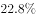；行业日均快件处理量达1.6亿件，最高达1.8亿件，单月快递业务量已接近50亿件数量级。

下列选项适合做文章标题的是（  ）。

- **A**. 快递行业，跑出加速度
- **B**. 农村快递增长迅猛
- **C**. 快递应补齐短板
- **D**. 快递高位运行　✅

**答案**：D

**官方解析**

这是一道标题填入题，其实也是需要把握文段中心的。文段前半部分指出快递业务发展势头比较好，处于现代服务的领先地位，接着又指出快递行业不仅长“块头”，还长“肌肉”，也就是说行业发展的质量也不断提高，后面举出数据具体解释说明，故文段强调的是快递行业发展速度和质量水平都不断提高，对应到D项，“高位运行”将高速度和高质量包括在内。
A项，“跑出加速度”只强调速度快，而没指出质量高，片面，排除；
B项，“农村”无中生有，排除；
C项，“应补齐短板”无中生有，排除；
故正确答案为D。
【文段出处】《国家邮政局发展研究中心指数研究室主任刘江接受人民日报采访》

---

### 第 27 题　qid 2393957 · 语句表达

①五四运动是彻底反帝反封建的伟大爱国革命运动。
②深刻认识五四运动是一场伟大爱国革命运动，始终高举爱国主义伟大旗帜。
③五四运动倡导的爱国，就是要争取民族独立、维护国家主权和领土完整、反对帝国主义奴役和封建军阀的卖国行径，为中华民族的爱国主义注入了新的内涵。
④五四精神的主要内容是爱国、进步、民主、科学，而其核心是爱国主义精神。
⑤爱国主义是一种既质朴又深沉的情感，是实现中华民族伟大复兴的精神动力，无论何时我们都要厚植爱国主义情怀、高举爱国主义伟大旗帜。
将上面的句子组成语意连贯的一段话，排列正确的一项是（  ）。

- **A**. ①②④③⑤
- **B**. ②①④③⑤　✅
- **C**. ④③①⑤②
- **D**. ⑤②①④③

**答案**：B

**官方解析**

对比选项，判断首句，①句和②句均提出“五四运动”话题，可以作首句；④句分析五四运动的具体精神，⑤句分析五四精神中的爱国精神，均是具体展开说明的句子，不适合作为首句，排除C、D两项。
对比A、B两项，重点辨析①②两句的先后顺序，②句先提出五四运动是爱国革命运动这一观点，①句对此观点进行具体解释说明，故顺序为②①，对应B项。
故正确答案为B。
【文段出处】《坚定实现民族复兴的志向和信心》宣讲家网

---

### 第 28 题　qid 2393962 · 片段阅读

下列空缺处句子排列最恰当的一项是（  ）。
无论是读者还是作者，我们在接触文字时，常常由我们的个性、人生经历、生长环境这三个因素来决定我们的审美趣味。      ，      ，      。      ，      ，      。这三点功夫就是我们常说的学问修养，而纯正的趣味必定是学问修养的结果。
①它们的影响有好有坏
②我们应该根据固有的个性而加以磨砺陶冶
③不易也不必完全摆脱
④这三点都是很自然地套在一个人身上的
⑤接收多方的传统习尚而融会贯通
⑥扩充身世经历而加以细心体验

- **A**. ②⑤⑥④①③
- **B**. ②⑥⑤④③①
- **C**. ④①③②⑥⑤　✅
- **D**. ④③①②⑤⑥

**答案**：C

**官方解析**

对比选项，判断首句，根据指代词形成捆绑，④中“这三点”指代前文的“这三个环境因素”，故④做首句，排除A、B两项。
对比C、D两项，重点分析②⑥⑤三句的排列顺序，②⑥⑤中的“个性”、“身世经历”、“传统习尚”分别依次对应第一句的“个性、人生经历、生长环境这三个因素”，对应C项。
故正确答案为C。
【文段出处】《文学的趣味》朱光潜

---

### 第 29 题　qid 2393966 · 语句表达

下列空缺处句子排列最恰当的一项是（  ）。
在中国传统文化中，道家的老子与庄子常常两位一体；儒家的孔子与孟子也是形影相随的，      。
①既有《论语》，则有《孟子》
②孔子曰“成仁”，孟子曰“取义”，他们的宗旨也相配合
③冯友兰先生既把孔子比作苏格拉底，又把孟子比作柏拉图
④既有大圣，则有亚圣
⑤司马迁说：“孟子序诗书，述仲尼之意。”

- **A**. ④②①③⑤
- **B**. ④①②⑤③　✅
- **C**. ①④②③⑤
- **D**. ①②④⑤③

**答案**：B

**官方解析**

观察选项，①和④都是“既有……则有……”的句式，两句句式一致，故①④或者④①应紧密相连，排除A、D两项。
对比B、C 两项，区别在于①④的先后顺序，横线前语句提及了孔子、孟子二位人物，④中的“大圣”、“亚圣”分别是孔子及孟子的称号，①句中的《论语》、《孟子》则是他们的作品，按照逻辑顺序，应该先提出人物，再分析其代表作品，故顺序为④①，对应B项。
故正确答案为B。
【文段出处】《孔 孟》黄仁宇

---

### 第 30 题　qid 2393968 · 语句表达

①右手下坡去十来步，就是一条小溪，水却不深
②踏着溪中的几块垫脚石过了溪，路旁有茅棚，住着一两家老百姓
③小屋前门有一条小路，曲折向外，在松林中行数百米，便豁然开朗
④还有很多美丽的骨牌草，有的还是很青翠，有的已经枯黄
⑤左手上坡是一条较为正式的路，隔路又是一片松林，坡头长满了半人高的茅草
将上面的句子组成语意连贯的一段话，排列正确的一项是（  ）。

- **A**. ②①④③⑤
- **B**. ③④①⑤②
- **C**. ②⑤①④③
- **D**. ③⑤④①②　✅

**答案**：D

**官方解析**

首先观察选项,确定首句，②句描绘了踏过小溪后的景象，③句介绍了小屋周边的环境，不易判断首句。接着观察句子可知，①句“右手下坡去十来步，就是一条小溪”，②句“踏着溪中的几块垫脚石过了溪”可通过“小溪”这一共同信息捆绑，且应先介绍“小溪”再“过溪”，故①②捆绑，锁定D项。D项中③句出现了“松林”，与⑤句“又是一片松林”同样也可通过“松林”这一共同信息捆绑，当选。
故正确答案为D。
【文段出处】高中语文试题

---

### 第 31 题　qid 2393971 · 语句表达

依次填入下面一段文字横线处的语句，衔接最恰当的一组是（  ）。
在中国古代有四大发明，但也有人说，中国的珠算也当是一大发明。为什么呢？中国珠算以算盘为工具进行数字计算，借助算盘和口诀，通过人手指拨动算珠，就可以完成高难度的计算。      ，      ，      ，      ，      ，      。2013年12月4日，中国珠算被正式列入联合国教科文组织的人类非物质文化遗产名录。
①即使是不识字的人也能熟练掌握
②珠算算盘结构简单
③蕴含了坐标几何原理
④包含了珠算的所有秘密
⑤珠算口诀则是一套完整的韵味诗歌
⑥用珠算运算，无论速度还是准确率都可以跟电子计算器媲美

- **A**. ②④⑤③⑥①
- **B**. ②③⑤④①⑥　✅
- **C**. ⑥①②⑤④③
- **D**. ⑥②④⑤③①

**答案**：B

**官方解析**

本题属于语句填空与语句排序的组合题型，需将句子依次排列后放于文段当中，同时需要注意与前后文的衔接。
横线前出现“算盘和口诀”的表述，故后文应先介绍算盘，再论述口诀，观察选项发现②句“算盘结构”，③句“坐标几何原理”均介绍“算盘”的结构，⑤句则是论述“珠算口诀”，故②③句应在⑤句之前，锁定B项。
验证B项，②③句均介绍算盘，⑤④句均论述珠算口诀，最后通过①⑥总结珠算的好处，并以此引出下文，逻辑通顺，当选。
故正确答案为B。
【文段出处】高中语文试题

---

### 第 32 题　qid 2393972 · 语句表达

下列空缺处的句子衔接最恰当的一项是（  ）。
她登上山崖之巅，纵目四望，时值深秋，崖角的菊花      。

- **A**. 十分秀丽，光洁鲜亮。竞相开放，争奇斗艳，花蕊嫩黄，花瓣层层叠叠
- **B**. 竞相开放，争奇斗艳。花蕊嫩黄，花瓣层层叠叠，光洁鲜亮，十分秀丽　✅
- **C**. 光洁鲜亮，十分秀丽。花蕊嫩黄，花瓣层层叠叠，竞相开放，争奇斗艳
- **D**. 花瓣层层叠叠，竞相开放。花蕊嫩黄，光洁鲜亮，争奇斗艳，十分秀丽

**答案**：B

**官方解析**

横线出现在文段结尾，且为尾句中的一个分句，需与尾句话题保持一致。横线之前出现“菊花”，选项均是在介绍菊花的相关话题，内容相同，仅语序有变化，故在选择时需考虑选项的逻辑顺序。
观察选项发现，“竞相开放，争奇斗艳”是对菊花的整体开放进行描述，“花蕊嫩黄”“花瓣层层叠叠”是对菊花的组成部分分别进行描述，“光洁鲜亮，十分秀丽”是对菊花的评价。按照逻辑顺序，应先整体阐述“菊花的开放”，再具体描述“菊花的组成部分”，最后对菊花进行评价。对应B项。
A项，将“光洁鲜亮，十分秀丽”的评价置于“开放”前，逻辑混乱，排除；
C项，将“开放”置于最后，逻辑混乱，排除；
D项，将“开放”置于“花瓣”后，逻辑混乱，排除。
故正确答案为B。
【文段出处】《小村池塘》

---

### 第 33 题　qid 2393990 · 语句表达

空缺处的句子衔接最恰当的一项是（  ）。
若要谈论中国的散文，有人非常认可朱自清，有人则赞赏宗白华，有人则喜欢余秋雨，但是我却更爱余光中，   ①  ，徐疾多致的节奏代替了平铺直叙的语序，   ②  ，幽默风趣的妙语代替了装腔作势的教训。

- **A**. ①簇新的意象代替了被嚼烂的少女和梦的俗喻②澎澎湃湃的谈吐代替了矫揉造作的伪情滥调　✅
- **B**. ①被嚼烂的少女和梦的俗喻被簇新的意象代替了②矫揉造作的伪情滥调被澎澎湃湃的谈吐代替了
- **C**. ①簇新的意象代替了矫揉造作的伪情滥调②澎澎湃湃的谈吐代替了被嚼烂的少女和梦的俗喻
- **D**. ①被嚼烂的少女和梦的俗喻被澎澎湃湃的谈吐代替了②矫揉造作的伪情滥调被簇新的意象代替了

**答案**：A

**官方解析**

观察已知题干，前后句式相同，构成并列关系，横线处所填语句应为“……代替了……”的句式，而B、D两项中，句式为“被……代替了”，均排除。
分析句子内容，“徐疾多致的节奏代替了平铺直叙的语序”中，“徐疾多致”意为快慢有次序， “平铺直叙”意为没有起伏，重点不突出，两者语义相反。故横线处①句前后也应构成语义相反的关系；“幽默风趣的妙语代替了装腔作势的教训”中，“幽默风趣的妙语”和“装腔作势的教训”都与言论有关，分句中前后话题一致，故横线处②句所填句子前后话题也应保持一致。
A项，①句，“被嚼烂的”“俗喻”意为陈旧，与“簇新”构成语义相反。第②句“澎澎湃湃的谈吐”和 “矫揉造作的伪情滥调”均与言论有关，前后话题一致，当选。
C项，①句，“簇新”和“矫揉造作”无法构成语义相反，②句，“澎澎湃湃的谈吐”和“被嚼烂的少女和梦的俗喻”话题不一致，排除。
故正确答案为A。
【文段出处】《余光中的散文艺术世界》

---

### 第 34 题　qid 2393974 · 语句表达

依次填写在甲乙丙三处横线上的句子，最恰当的一项是（  ）。
上个世纪八十年代初，我刚刚参加工作，   甲  后来回想起来，自己也常常惊讶于那时候的大胆：   乙  却居然敢放言高论，   丙  
甲：①我为了赶任务开始写一篇关于文学的论文，②我开始写一篇关于文学的论文，为了赶任务，
乙：①对于本国的古典文学缺乏系统研究，对于欧洲文学所知有限，而政治思想水平也很低的那时的我，②我那时对于本国的古典文学缺乏系统研究，对于欧洲文学所知有限，而政治思想水平也很低，
丙：①真是大胆的事。②岂非大胆？

- **A**. 甲①乙①丙②
- **B**. 甲①乙②丙②
- **C**. 甲②乙①丙①
- **D**. 甲②乙①丙②　✅

**答案**：D

**官方解析**

甲横线处，分析选项句子，①句为正常语序，陈述客观情况；②句为倒装句，突出强调“赶任务”这一目的。又依据后文可知，作者当时的行为比较大胆，“赶任务”意为时间紧任务重，即作者要在短时间内将论文完成，能体现“大胆”。句式中，将“赶任务”这一事件经倒装语序突出强调后，与文意更吻合，故甲选择第②句，排除A、B两项。
乙横线处，C、D两项均为第①句，不需辨析。
丙横线处，由“：”可知，横线后的句子对横线前的“大胆”进行解释说明。①句为陈述句，语气平淡；②句为反问句，语气强烈，通过反问句的句式更加凸显出“赶任务写文学论文”这一事件的不可思议性和大胆程度，故②句更符合文意，对应D项。
故正确答案为D。
【文段出处】高考语文题

---

### 第 35 题　qid 2393993 · 语句表达

下列各项中最适合填在横线上的一项是（  ）。
人们常常生活在实际生活中，而文人和哲人则常常生活在想象世界里。我们生活中的一点一滴，或喜或悲，在文人笔下成为悲欢离合的故事，而在哲人眼里，则是一篇篇的哲学故事。其中，一位哲人对乐观与悲观这样解释：譬如面对着桌子上的半杯水，乐观主义者说这个杯子的一半是满的，悲观主义者说这个杯子一半是空的，显然，      ，使我们在任何时候任何条件下都不会失去信心和追求。一旦遇到困难，我们黯淡的心情也能够很快豁然开朗，从种种苦恼中自我解脱。

- **A**. 这两种理解有其合理性也有一些片面性
- **B**. 乐观主义者比悲观主义者更有利于人类进步
- **C**. 人与人的观察角度和思维方式是不同的
- **D**. 观察事物时善于选择生活中积极的一面　✅

**答案**：D

**官方解析**

横线前列举了乐观的人和悲观的人看待半杯水的不同角度和见解，横线后提到“不会失去信心和追求”，只有乐观的心态才会有这样的效果，故横线上所填的内容应该与乐观积极的心态有关，对应D项。
A、C两项未提及“积极心态”，与后文无法衔接，均排除；
B项，“人类进步”无中生有，且后文未涉及对于“乐观和悲观”比较之后结果的评价与讨论，该项与后文无法衔接，排除。 
故正确答案为D。

---

## 数量关系

### 第 1 题　qid 2394004 · 数学运算

实验室有A、B、C三个实验试管，分别装有10克、15克、20克的水，小明把含有一定浓度的10克药水倒进A试管中，混合后取出10克倒入B试管中，再次混合后，从B试管中取出10克倒入C试管中，最后用化学仪器检测出C试管中药水浓度为。试计算刚开始倒入A试管中药水的浓度是多少？

- **A**. 

- **B**. 

- **C**. 

　✅
- **D**. 

**答案**：C

**官方解析**

设最初倒入A试管中药水的浓度为，则：

A混合后取出10克的浓度为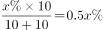；

B混合后取出10克浓度为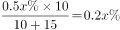；

C混合后浓度为，解得。

所以最初倒入A试管中药水的浓度为。

故正确答案为C。

---

### 第 2 题　qid 2394006 · 数学运算

正值毕业季，306宿舍有A、B、C、D四位男同学，他们准备找班主任宋老师合影，若要求宋老师坐正中间，A、B两位同学不能挨着坐，那么总共有多少种坐法？

- **A**. 8种
- **B**. 12种
- **C**. 16种　✅
- **D**. 24种

**答案**：C

**官方解析**

方法一：根据题意，包括老师一共5人，要求老师在中间，则老师左边和右边各两个人。考虑A、B不相邻，则A、B分别在老师左右两边， C、D也分别在老师的左右两边。先安排A、B，在老师左边两个空中挑一个 ，在右边两个空中挑一个 ，考虑A、B顺序，剩下两个空放C、D，考虑顺序，所以共有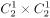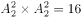种。

方法二：本题正面情况较为复杂考虑从反面出发进行求解。总情况老师在中间其余四人共四个位置共种情况。反面情况A、B两同学相邻，先安排AB两人相邻且在老师的左侧或是右侧，有2种情况，再考虑两人的相对位置有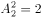种情况，其余两人只能在AB的另一侧考虑相对位置有种情况，则反面情况共有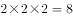种情况。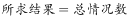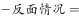  种。

故正确答案为C。 

---

### 第 3 题　qid 2394009 · 数学运算

一个时钟每小时慢4分钟，照这样计算，早上6:00对准标准时间后，当日晚上该时钟指向8:00时，标准时间是多少？

- **A**. 20:56
- **B**. 21:00　✅
- **C**. 21:30
- **D**. 21:56

**答案**：B

**官方解析**

根据题意可知当标准钟走60分钟时，慢钟走56分钟，所以慢钟与标准钟速度之比为56:60。慢钟早上6:00对准标准时间后，到晚上8:00共经过14个小时。假设标准钟经过小时，则，解得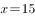小时，所以标准钟从早上6:00开始走了15个小时，即21:00。

故正确答案为B。

---

### 第 4 题　qid 2394013 · 数学运算

陈老师奖励小美、小林、小红各人民币若干元，三人去文具店买学习用品。其中，小美买了6支中性笔，小林买了3支钢笔，小红买了2支钢笔、1支中性笔和2支铅笔。已知三人用去的钱数一样，则3支钢笔的价格是几支铅笔的价格？

- **A**. 4支
- **B**. 8支
- **C**. 10支
- **D**. 12支　✅

**答案**：D

**官方解析**

赋值三人所花钱数均为6元，可得每支中性笔价格为元，每支钢笔价格为元，每支铅笔的价格为元。

则题目所求为支，即3支钢笔的价格等于12支铅笔的价格。

故正确答案为D。

---

### 第 5 题　qid 2394015 · 数学运算

林华全家是阅读爱好者，家里有各种书籍，版本也多。已知他家有五分之三的书是中文版的，六分之一是英文版的，八分之一是中英文互译版的，还有多于11本但少于17本是其它版本的，问他家有多少本英文版书？

- **A**. 72本
- **B**. 20本　✅
- **C**. 15本
- **D**. 13本

**答案**：B

**官方解析**

根据题意可得，林华家其他版本的书占总数的比重为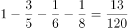，根据倍数特性可知林华家书的总数是120的倍数，其它版本的书是13的倍数，又因为其它版本多于11本但少于17本，所以其他版本数量刚好为13本，则书的总数为120本。所以题目所求英文版的书数量为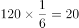本。

故正确答案为B。

---

### 第 6 题　qid 2393944 · 数学运算

某日停电，房间里同时点燃了两支同样长的蜡烛，两支蜡烛的质量不同，一支可以维持4小时，一支可以维持7小时。来电时，发现其中一支剩下的长度是另一支剩下长度的4倍，请问这次停电时间是多久？

- **A**. 2.5小时
- **B**. 3小时
- **C**. 3.5小时　✅
- **D**. 3.8小时

**答案**：C

**官方解析**

假设两支蜡烛总长度均为28，则两支蜡烛每小时燃烧的速度分别为7和4。设停电时间为小时，根据题干条件可列方程：，解得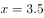小时。

故正确答案为C。

---

### 第 7 题　qid 2393961 · 数学运算

汽车在平直的公路上运动，它先以速度行驶了2/5的路程，接着以的速度驶完余下的3/5路程，若全程平均速度是，则是多少？

- **A**. 

- **B**. 
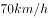

- **C**. 
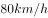
　✅
- **D**. 
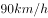

**答案**：C

**官方解析**

设总路程为5S,则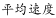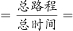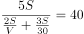，解得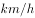。

故正确答案为C。

---

### 第 8 题　qid 2393980 · 数学运算

一个长方体木块恰能切割成五个正方体木块，五个正方体木块表面积之和比原来的长方体木块的表面积增加了。则长方体木块的体积为多少？

- **A**. 
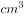
　✅
- **B**. 

- **C**. 

- **D**. 

**答案**：A

**官方解析**

一个长方体恰好切成五个小正方体，多出的总面积即新生成的8个截面的面积和（一个截面即小正方体一个面），设小正方体棱长为，，可得，一个小正方体的体积为，那么长方体的体积（即5个小正方体的体积）。

故正确答案为A。

---

### 第 9 题　qid 2393986 · 数学运算

小王负责甲、乙、丙、丁四个采购基地的采购任务，甲、乙、丙、丁四基地分别需要每隔2天、4天、6天、7天去采购一次。7月1日，小王分别去了四个基地采购，问他整个7月有几天不用去采购基地采购？

- **A**. 10天
- **B**. 11天　✅
- **C**. 12天
- **D**. 13天

**答案**：B

**官方解析**

7月份日期列表如下，已按题意将任务分配在表格中：

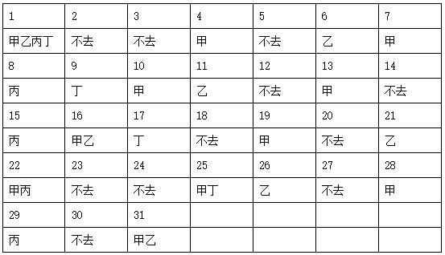

由表格中可以看出，2、3、5、12、14、18、20、23、24、27、30日不去，所以7月份不去基地的天数共有11天。

故正确答案为B。

---

### 第 10 题　qid 2393992 · 数学运算

某企业设计了一款工艺品，每件的成本是70元，为了合理定价，投放市场进行试销。据市场调查，销售单价是120元时，每天的销售量是100件，而销售单价每降价1元，每天就可多售出5件，但要求销售单价不得低于成本。则销售单价为多少元时，每天的销售利润最大？

- **A**. 100元
- **B**. 102元
- **C**. 105元　✅
- **D**. 108元

**答案**：C

**官方解析**

设降价元，总利润为，根据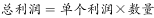，得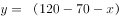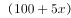，令，解得 ， 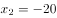，当时， 取得最大值，即售价为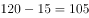元时，利润最大。

故正确答案为C。

---

## 判断推理

### 第 1 题　qid 2393995 · 图形推理

从所给的四个选项中，选择最合适的一个填入问号处，使之呈现一定的规律性。

- **A**. A　✅
- **B**. B
- **C**. C
- **D**. D

**答案**：A

**官方解析**

元素组成不同，且无明显属性规律，考虑数量规律。观察发现，图形线条交叉明显，考虑数交点，题干每个图形交点的数量都是2，故问号处图形交点的数量也应该为2，只有A项符合。
故正确答案为A。

---

### 第 2 题　qid 2394003 · 图形推理

从所给的四个选项中，选择最合适的一个填入问号处，使之呈现一定的规律性。

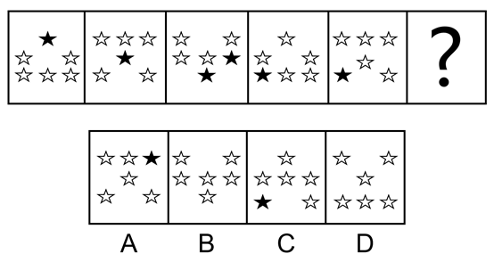

- **A**. A
- **B**. B　✅
- **C**. C
- **D**. D

**答案**：B

**官方解析**

解法一：

每个图形都由多个独立的小元素组成，优先考虑元素的种类和个数，但选不出唯一答案。再观察发现，除小元素外，每个图形均包含3个空白，考虑3个空白的位置，如下图所示，每个空白依次向下平移一步（循环走），只有B项符合规律。

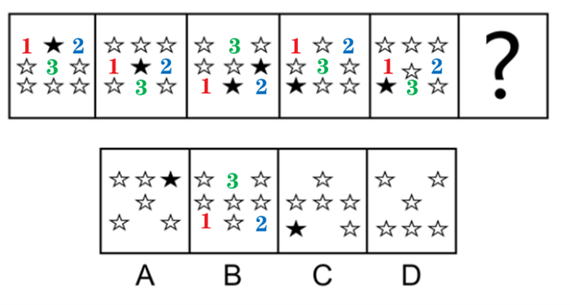

解法二：

每个图形都由多个独立的小元素组成，优先考虑元素的种类和个数，但选不出唯一答案。继续观察发现，每个图形都有三行元素，一行有1个元素，一行有2个元素，一行有3个元素，有1个元素的每次向下平移一行（循环走），有2个元素的每次也向下平移一行（循环走），有3个元素的每次也向下平移一行（循环走），只有B项符合。 

故正确答案为B。

---

### 第 3 题　qid 2394007 · 图形推理

从所给的四个选项中，选择最合适的一个填入问号处，使之呈现一定的规律性。

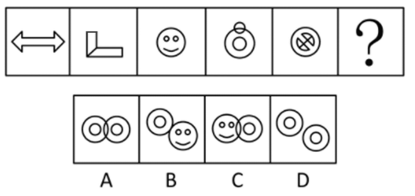

- **A**. A
- **B**. B
- **C**. C　✅
- **D**. D

**答案**：C

**官方解析**

元素组成不同，优先考虑属性规律，题干图形均比较规整，考虑对称性，但图二不是轴对称图形。继续观察发现，每个图形“窟窿”比较明显，考虑数面，面数量依次为1、2、3、4、5，故问号处图形应该有6个面，只有C项符合。
故正确答案为C。

---

### 第 4 题　qid 2394016 · 图形推理

从所给的四个选项中，选择最合适的一个填入问号处，使之呈现一定的规律性。

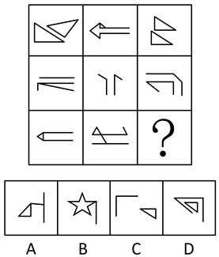

- **A**. A
- **B**. B
- **C**. C
- **D**. D　✅

**答案**：D

**官方解析**

元素组成不同，且无明显属性规律，考虑数量规律。九宫格第二行出现单独的直线，考虑数直线，但整体数直线没有规律，考虑线的细化考法，即线的方向，如下图所示，第一行图一有1组平行线，图二有2组平行线，图三有3组平行线，第二行也满足此规律，第三行前两个图也符合规律，故问号处应该有3组平行线，只有D项符合。

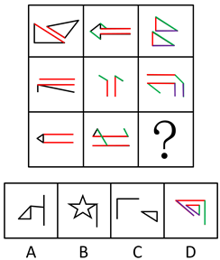

故正确答案为D。

---

### 第 5 题　qid 2394020 · 图形推理

从所给的四个选项中，选择最合适的一个填入问号处，使之呈现一定的规律性。

- **A**. A
- **B**. B
- **C**. C
- **D**. D　✅

**答案**：D

**官方解析**

元素组成不同，且无明显属性规律，考虑数量规律。图2出现端点，且明显为一笔画图形，图4、图5都是封闭图形相切，为切圆变形，优先考虑笔画数，题干均为一笔画图形，故问号处图形也应该为一笔画，A、B、C均为两笔画，只有D项为一笔画。
故正确答案为D。

---

### 第 6 题　qid 2394024 · 图形推理

题中包含六个或六组图形，请把它们分为两类，使得每一类图形都有各自的共同特征或规律。

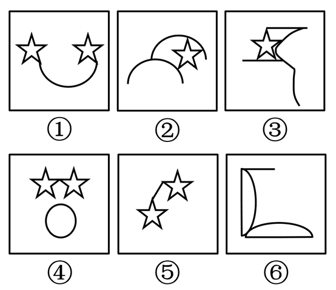

- **A**. ①④⑥，②③⑤
- **B**. ①④⑤，②③⑥
- **C**. ①②③，④⑤⑥
- **D**. ①③⑤，②④⑥　✅

**答案**：D

**官方解析**

本题为分组分类题目。通过观察发现，题干每个图形中均出现了两个相同的元素，优先考虑两个相同元素之间的位置关系，图①③⑤中的两个相同元素没有直接相连，图②④⑥中两个相同元素直接相连，对应D项。
故正确答案为D。

---

### 第 7 题　qid 2394029 · 定义判断

游戏化管理：是指在不是游戏的场景里使用得分、等级排序、竞争等游戏中的元素的管理行为。它在工作环境中的运用往往可以让员工增加感情投入，从而提高效率。
根据上述定义，下列属于游戏化管理行为的是（    ）。

- **A**. 某翻译软件公司动员办公室员工参与“找茬”，寻找语言翻译错误　✅
- **B**. 扮演卡通人物来吸引大家的注意力
- **C**. 公司聘用新的管理层
- **D**. 学校要求教师不得进行学生考试得分排名

**答案**：A

**官方解析**

第一步：找出定义关键词。
“不是游戏的场景里”、“使用游戏中的元素”、“管理行为”。
第二步：逐一分析选项。
A项：公司动员员工“找茬”，符合“使用游戏中的元素”，寻找语言翻译错误，符合“不是游戏的场景里”，是一种“管理行为”，符合定义，当选；
B项：扮演卡通人物吸引大家注意力，卡通人物不符合“使用游戏中的元素”，不符合定义，排除；
C项：聘用新的管理层，不符合“使用游戏中的元素”，不符合定义，排除；
D项：学校要求老师不得将得分排名，不符合“使用游戏中的元素”，不符合定义，排除。
故正确答案为A。

---

### 第 8 题　qid 2394033 · 定义判断

可恢复性评价：是指突发事件后、应急管理结束前，对事件的现状恢复到基本正常状态的能力的评价以及完成恢复所需要的时间和资源的评价。
根据上述定义，下列属于可恢复性评价的是（    ）。

- **A**. 某地地震后，民政部向灾区发放救灾物资
- **B**. 卫生部估计H1N1流感疫苗研发所需时间
- **C**. 重大交通事故发生后，交通管理部门估计交通事故造成的堵车时间　✅
- **D**. 上级指示48小时内解决因大雪封路而滞留车站的乘客的交通问题

**答案**：C

**官方解析**

第一步：找出定义关键词。
“突发事件后，应急管理结束前”、“对事件的现状恢复到基本正常状态的能力的评价”、“完成恢复所需要的时间和资源的评价”。
第二步：逐一分析选项。
A项：民政局只是发放救灾物资，不符合“恢复正常状态的能力的评价或时间资源的评价”，不符合定义，排除； 
B项：卫生部估计流感疫苗研发所需时间，但即使疫苗研发成功也不代表能恢复到正常状态，不符合“完成恢复所需要的时间和资源的评价”，不符合定义，排除；
C项：交管部门估计交通事故造成的堵车时间，符合“突发事件后，应急管理结束前”、符合“对事件的现状恢复到基本正常状态的时间的评价”，符合定义，当选；
D项：上级作出的指示是一种要求、命令，而不是评价。评价是指对一件事或人物进行判断、分析后的结论。不符合定义，排除。
故正确答案为C。

---

### 第 9 题　qid 2394035 · 定义判断

制度企业家：是指不仅发挥着传统企业家的功能，同时在他们的事业发展过程中帮助建立市场体制的那些人。他们对发展环境下的机会高度敏感，敢于突破制度壁垒，来获得可观的收益。
根据上述定义，下列不属于制度企业家的是（    ）。

- **A**. 开发网约车系统出行改变出租车行业运营模式的某企业家
- **B**. 建立第三方支付方式和各大金融机构合作的某企业家
- **C**. 成立教育集团提升民间办学能力的某企业家　✅
- **D**. 创新即时通讯模式改变人们信息传递方式的某企业家

**答案**：C

**官方解析**

第一步：找出定义关键词。
“不仅发挥着企业家的功能”、“在他们事业发展过程中帮助建立市场体制的那些人”、“敢于突破制度壁垒”。
第二步：逐一分析选项。
A项：开发网约车系统改变出租车行业运营模式，符合“发展过程中帮助建立市场体制”、“敢于突破制度壁垒”，符合定义，排除； 
B项：建立第三方支付方式和各大金融机构合作，符合“发展过程中帮助建立市场体制”、“敢于突破制度壁垒”，符合定义，排除；
C项：成立教育集团提升民间办学能力，仍是传统企业的模式，不符合“发展过程中帮助建立市场体制”、“敢于突破制度壁垒”，不符合定义，当选；
D项：创新即时通讯模式改变人们信息传递方式，符合“发展过程中帮助建立市场体制”、“敢于突破制度壁垒”，符合定义，排除。
本题为选非题，故正确答案为C。

---

### 第 10 题　qid 2394037 · 定义判断

社会整合：是指调整或协调社会各部分之间的矛盾和冲突，使整个社会成为一个统一的运行良好的体系的过程。通过社会整合，使社会体系中既互相独立又互相联系的各个部分之间互相顺应，形成均衡状态。
根据上述定义，下列不属于社会整合的是（    ）。

- **A**. 经济发展中产生的新的社会阶层人士　✅
- **B**. 地区间的文化交融
- **C**. 打击各类违法犯罪行为
- **D**. 中央一号文件指导“三农”工作

**答案**：A

**官方解析**

第一步：找出定义关键词。
“调整或协调社会各部分之间的矛盾和冲突”、“整个社会成为一个统一的运行良好的体系的过程”。
第二步：逐一分析选项。
A项：经济发展中产生的新的社会阶层人士，不符合“调整或协调社会各部分之间的矛盾和冲突”，也没有体现社会成为一个运行良好的体系过程，不符合定义，当选； 
B项：地区间的文化融合，让不同地区的文化取长补短，符合“调整或协调社会各部分之间的矛盾和冲突”，符合“整个社会成为一个统一的运行良好的体系的过程”，符合定义，排除；
C项：打击各类违法犯罪，符合“调整或协调社会各部分之间的矛盾和冲突”，使社会成为一个运行良好的体系，符合定义，排除；
D项：中央文件指导“三农”工作，是协调农业、农村和农民之间的矛盾，符合“调整或协调社会各部分之间的矛盾和冲突”，使社会成为一个运行良好的体系，符合定义，排除。
本题为选非题，故正确答案为A。

---

### 第 11 题　qid 2393947 · 定义判断

同辈压力：是指同辈人互相比较中产生的心理压力，一个同辈人团体对个人施加影响，会促使个人改变其态度、价值观或行为以遵守团体准则。
根据上述定义，下列属于同辈压力的是（    ）。

- **A**. 领导对下属的批评
- **B**. 同事间的关系调处
- **C**. 年轻人的穿戴攀比　✅
- **D**. 部门间的业务比赛

**答案**：C

**官方解析**

第一步：找出定义关键词。
“同辈人互相比较中产生的心理压力”、“一个同辈人团体对个人施加影响”、“促使个人改变其态度、价值观或行为以遵守团队准则”。
第二步：逐一分析选项。
A项：领导和下属之间，不明确是否是“同辈人”，领导对下属的批评，不符合“一个同辈人团体对个人施加影响”，“促使个人改变其态度、价值观或行为以遵守团队准则”，不符合定义，排除；
B项：同事之间，不明确是否是“同辈人”，同事间的关系调处不符合“一个同辈人团体对个人施加影响”，“促使个人改变其态度、价值观或行为以遵守团队准则”，不符合定义，排除；
C项：年轻人之间，符合“同辈人”，，穿戴攀比符合“互相比较中产生的心理压力”、“一个同辈人团体对个人施加影响”，“促使个人改变其态度、价值观或行为以遵守团队准则”，符合定义，当选；
D项：部门间的业务比赛，不明确是否是“同辈人”，不符合“同辈人互相比较中产生的心理压力”，业务比赛也不符合“一个同辈人团体对个人施加影响”，“促使个人改变其态度、价值观或行为以遵守团队准则”，不符合定义，排除。
故正确答案为C。

---

### 第 12 题　qid 2393955 · 定义判断

显性成本：是指厂商在生产要素市场上购买或租用所需要的生产要素的实际支出，即企业支付给企业以外的经济资源所有者的货币额。例如支付的生产费用、工资费用、市场营销费用等，因而它是有形的成本。
根据上述定义，下列金额不属于显性成本的是（    ）。

- **A**. 公司支付1万元租用商场大厅进行现场营销
- **B**. 原材料涨价使企业产品单位成本多花费1万元
- **C**. 企业每平米价值1万元的厂房　✅
- **D**. 企业支付给部门经理的1万元月薪

**答案**：C

**官方解析**

第一步：找出定义关键词。
“即企业支付给企业以外的经济资源所有者的货币额”、“支付的生产费用、工资费用、市场营销费用等”。
第二步：逐一分析选项。
A项：公司支付1万元租用商场大厅进行现场营销，符合“即企业支付给企业以外的经济资源所有者的货币额”，符合定义，排除；
B项：原材料涨价使企业产品单位成本多花费1万元，符合“即企业支付给企业以外的经济资源所有者的货币额”，符合定义，排除；
C项：企业每平米价值1万元的厂房，只是价值，并不涉及支付货币，不符合“即企业支付给企业以外的经济资源所有者的货币额”，不符合定义，当选；
D项：企业支付给部门经理的1万元月薪，属于工资费用，也符合“即企业支付给企业以外的经济资源所有者的货币额”，符合定义，排除。
本题为选非题，故正确答案为C。

---

### 第 13 题　qid 2393958 · 定义判断

零工经济：是指由工作量不多的自由职业者构成的经济领域，利用互联网和移动技术等快速匹配供需方，主要包括群体工作和经应用程序接洽的按需工作两种形式。换句话说，之前的工作关系是“单位——人”，而现在的主流关系则是“平台——人”。
根据上述定义，下列属于零工经济的是（    ）。

- **A**. 出租车行业
- **B**. 电商网站维护行业
- **C**. 外卖配送行业　✅
- **D**. 交通维护志愿者行为

**答案**：C

**官方解析**

第一步：找出定义关键词。
 “利用互联网和移动技术等快速匹配供需方”、“主要包括群体工作和经应用程序接洽的按需工作两种形式”、现在的主流关系是“平台——人”。
第二步：逐一分析选项。
A项：出租车行业包括传统出租车及网约车，其中传统出租车不符合“利用互联网和移动技术等快速匹配供需方”，属于不明确选项，保留；
B项：电商网站维护行业的主要工作是维护电商网站，不符合“利用互联网和移动技术等快速匹配供需方”，不符合定义，排除；
C项：外卖配送行业主要是通过外卖平台快速匹配供需方，符合“利用互联网和移动技术等快速匹配供需方”，符合定义，保留；
D项：交通维护志愿者行为，不符合“利用互联网和移动技术等快速匹配供需方”，不符合定义，排除。
比较A、C两项，A项表述不明确。
故正确答案为C。
注：本题为热点题，零工经济中最典型的就是外卖送餐和滴滴专车。本题A项出租车行业并未明确说是网约车，那么也有可能属于传统出租车，而如今外卖配送几乎都是平台接单，极少有通过其他方式接单（如电话等），故结合热点并择优选择C项。

---

### 第 14 题　qid 2393963 · 定义判断

愿望投射：是指把自己的主观愿望投射于他人，认为他人也如自己所期望的那样，把希望当成了现实。结果往往对他人的情感、意向做出错误评价，歪曲了他人，造成交往障碍。
根据上述定义，下列属于愿望投射的是（    ）。

- **A**. 人无我有，人有我优
- **B**. 世上本无事，庸人自扰之
- **C**. 别人笑我太疯癫，我笑他人看不穿
- **D**. 我之所虑，人之所想　✅

**答案**：D

**官方解析**

第一步：找出定义关键词。
“把自己的主观愿望投射于他人”、“认为他人也如自己所期望的那样，把希望当成了现实”、“结果往往对他人的情感、意向做出错误评价，歪曲了他人，造成交往障碍”。
第二步：逐一分析选项。
A项：人无我有，人有我优的意思是“某产品没有的时候，我却开始在卖了，独食一方。别人也在卖的时候，我已精良产品，无人能敌”，未提及“把自己的主观愿望投射于他人”，不符合定义，排除；
B项：世上本无事，庸人自扰之的意思是“比喻常常自己跟自己过不去，遇事生非，疑神疑鬼的自找麻烦”，未提及“把自己的主观愿望投射于他人”，不符合定义，排除；
C项：别人笑我太疯癫，我笑他人看不穿的意思是“世俗的人讥笑疯疯癫癫的样子，其实我的内心是已经顿悟了的，只是俗人们不明白罢了”, 不符合“把自己的主观愿望投射于他人”，不符合定义，排除；
D项：我之所虑，人之所想的意思是“我所考虑的就是别人所想的”，符合“把自己的主观愿望投射于他人”，符合定义，当选。
故正确答案为D。

---

### 第 15 题　qid 2393969 · 定义判断

高原现象：是指学生在学习进程中常会有这样一个阶段，即学习成绩到一定程度时，继续提高的速度减慢，有的人甚至发生停滞不前或倒退的现象。
根据上述定义，下列属于高原现象的是（    ）。

- **A**. 高考临近，小郑感到睡眠不足，越来越没有学习的动力了
- **B**. 高考模拟考试，小齐都考得很好，他觉得自己学不学都能考上好大学
- **C**. 高考三轮复习，小赵感到提高不多，认为复习没用，不愿再看书了　✅
- **D**. 高考过后，小韩考得不错，她认为已经超常发挥了

**答案**：C

**官方解析**

第一步：找出定义关键词。
“学生”、“学习成绩到一定程度时”、“继续提高的速度减慢，有的人甚至发生停滞不前或倒退的现象”。
第二步：逐一分析选项。
A项：高考临近，小郑睡眠不足导致没有学习动力，不符合“学习成绩到一定程度时”，不符合定义，排除；
B项：高考模拟考试，小齐都考得很好，不符合“学习成绩到一定程度时”，“继续提高的速度减慢，有的人甚至发生停滞不前或倒退的现象”，不符合定义，排除；
C项：高考三轮复习，小赵感到提高不多，符合“学习成绩到一定程度时”，他认为复习没用，不愿再看书，符合“继续提高的速度减慢，有的人甚至发生停滞不前或倒退的现象”，符合定义，当选；
D项：高考过后，小韩考得不错，不符合“学习成绩到一定程度时”，“继续提高的速度减慢，有的人甚至发生停滞不前或倒退的现象”，不符合定义，排除。
故正确答案为C。

---

### 第 16 题　qid 2393973 · 定义判断

数字鸿沟：是指在全球数字化进程中，不同国家、地区、行业、企业、社区之间，由于对信息、网络技术的拥有程度、应用程度以及创新能力的差别而造成的信息落差的趋势。
根据上述定义，下列现象属于数字鸿沟的是（    ）。

- **A**. 网络电视之所以受欢迎，就是其将被动接收变为主动选择
- **B**. 现代市场经济环境下，大企业有能力和资本建立大数据系统，小企业经常望其项背　✅
- **C**. 发达国家的生产技术是在贸易中形成比较优势的主要因素
- **D**. 网络时代下，大城市和小城市的信息获取速度已经相差无几

**答案**：B

**官方解析**

第一步：找出定义关键词。
“全球数字化进程中”、“不同国家、地区、行业、企业、社区之间”、“由于对信息、网络技术的拥有程度、应用程度以及创新能力的差别”、“造成的信息落差的趋势”。
第二步：逐一分析选项。
A项：网络电视受欢迎是因为将被动接收变为主动选择，不符合 “由于对信息、网络技术的拥有程度、应用程度以及创新能力的差别而造成的信息落差的趋势”，不符合定义，排除；
B项：大企业有能力和资本建立大数据系统，小企业经常望其项背（注：望其项背比喻赶得上或比得上，第二层含义是指只能看到背影，看不清头部的意思，该成语经常以否定句表示与“望”的对象有一定差距，故粉笔认为此选项中的成语虽然没用否定句，可能存在成语误用，但综合其他选项看，命题人更想表达的是大企业和小企业之间有差距），符合“造成的信息落差的趋势”，符合定义，当选；
C项：发达国家在贸易中占优势的原因是生产技术，不符合“由于对信息、网络技术的拥有程度、应用程度以及创新能力的差别”，不符合定义，排除；
D项：网络时代，符合“全球数字化进程中”，大城市和小城市的信息获取速度已经相差无几，不符合“造成的信息落差的趋势”，不符合定义，排除。
故正确答案为B。

---

### 第 17 题　qid 2393975 · 定义判断

定义：
（1）本源制度是指在人类社会初期就形成的、并在以后的社会生活中发挥着基本作用，人类生存所依赖的最基本的社会制度。
（2）派生制度是后来出现的、在本源制度的基础上形成并发展起来的社会制度。
根据上述定义，下列选项同时包含了本源制度和派生制度的是（    ）。

- **A**. 君主制度和民主制度
- **B**. 等价交换制度和社会主义市场经济制度　✅
- **C**. 社会契约制度和法律规范
- **D**. 独裁统治和社会主义制度

**答案**：B

**官方解析**

第一步：找出定义关键词。
本源制度：“在人类社会初期就形成的”、“并在以后的社会生活中发挥着基本作用”、“人类生存所依赖的最基本的社会制度”。
派生制度：“后来出现的”、“在本源制度的基础上形成并发展起来的社会制度”。
第二步：逐一分析选项。
A项：君主制度和民主制度都是“后来出现的”，“在本源制度的基础上形成并发展起来的社会制度”，均符合“派生制度”定义，排除；
B项：等价交换制度是“在人类社会初期就形成的”，“并在以后的社会生活中发挥着基本作用”，“人类生存所依赖的最基本的社会制度”，符合“本源制度”定义；而社会主义市场经济制度是“后来出现的”，“在本源制度的基础上形成并发展起来的社会制度”，符合“派生制度”定义，当选；
C项：社会契约制度和法律规范都是“后来出现的”，“在本源制度的基础上形成并发展起来的社会制度”，均符合“派生制度”定义，排除；
D项：独裁统治和社会主义制度都是“后来出现的”，“在本源制度的基础上形成并发展起来的社会制度”，均符合“派生制度”定义，排除。
故正确答案是B。

---

### 第 18 题　qid 2393976 · 定义判断

定义：
（1）无意注意：是指没有预定目的、不需要意志努力、不由自主地对一定事物所产生的注意。
（2）有意注意：是指自觉的、有预定目的的，必要时还需要付出一定意志努力的注意。
根据上述定义，下列选项同时包含了无意注意和有意注意的是（    ）。

- **A**. 小昕在上班时看到路过的领导很不高兴，认为是自己工作出了错
- **B**. 小晖想买一本时尚杂志，上网搜索了很久都没有满意的
- **C**. 小妍下班时看到了临街橱窗里的一件裙子，她立即到店里试穿并察看面料和样式　✅
- **D**. 小军在外吃饭时看到了高中同桌，正准备打招呼看到领导走了过来

**答案**：C

**官方解析**

第一步：找出定义关键词。

无意注意：“没有预定目的、不需要意志努力、不由自主”、“对一定事物所产生的注意”。

有意注意：“自觉的、有预定目的的，必要时还需要付出一定意志努力”。

需要强调，题干两个定义都有提到“注意”一词，“注意”的意思是：

即“注意”既要有感官上的视觉、听觉、味觉等，又要有思维的处理。

第二步：逐一分析选项。

A项：小昕在上班时看到路过的领导，符合“没有预定目的、不需要意志努力、不由自主”，“对一定事物所产生的注意”，且既有视觉，又有思维，符合无意注意，“认为是自己工作出了错”，只有思维，没有感官上的视觉、听觉、味觉，不属于题干的任何一个定义，所以选项中只有“无意注意”，排除；

B项：小晖想买一本时尚杂志，上网搜索了很久都没有满意的，上网搜索符合“自觉的、有预定目的的，必要时还需要付出一定意志努力”，且既有视觉，又有思维，符合有意注意，但选项里面不包含无意注意，排除；

C项：小妍下班时看到了临街橱窗里的一件裙子，符合“没有预定目的、不需要意志努力、不由自主”，“对一定事物所产生的注意”，且既有视觉，又有思维，符合“无意注意”定义；她立即到店里试穿并察看面料和样式，符合“自觉的、有预定目的的，必要时还需要付出一定意志努力”，且既有视觉，又有思维，符合“有意注意”定义，当选；

D项：小军在外吃饭时看到了高中同桌，符合“没有预定目的、不需要意志努力、不由自主”，“对一定事物所产生的注意”，且既有视觉，又有思维，符合无意注意；正准备打招呼，说明还没来得及打招呼，不存在“有意注意”和“无意注意”；看到领导走了过来，也不需要意志努力，符合“没有预定目的、不需要意志努力、不由自主”，“对一定事物所产生的注意”，且既有视觉，又有思维，也符合“无意注意”。但选项里面不包含有意注意，排除。

故正确答案为C。

---

### 第 19 题　qid 2393977 · 类比推理

理想：打算

- **A**. 计算：算计
- **B**. 品德：道德
- **C**. 人杰：人才　✅
- **D**. 空闲：无聊

**答案**：C

**官方解析**

第一步：判断题干词语间逻辑关系。
理想是指对未来事物的合理的设想、希望、计划 ，打算是一种粗线条的、其想法不太成熟的非正式计划。二者都可用来形容对未来的计划，且前者的程度更深。
第二步：判断选项词语间逻辑关系。
A项：计算和算计都有“暗中谋划损害别人”的意思，二者为近义关系，但并非是前者的程度更深，与题干逻辑关系不一致，排除；
B项：品德就其实质来说，是道德价值和道德规范在个体身上内化的产物。品德与道德为近义关系，且二者没有程度深浅之分，与题干逻辑关系不一致，排除；
C项：人杰是指才能特别杰出的人，人才是指在某一方面有才能或本事的人。二者都可用来形容有才能的人，且前者的程度更深，与题干逻辑关系一致，当选；
D项：空闲时可能会无聊，二者是对应关系，且二者没有程度深浅之分，与题干逻辑关系不一致，排除。
故正确答案为C。

---

### 第 20 题　qid 2393978 · 类比推理

知识分子：民主党派成员

- **A**. 党外人士：无党派人士
- **B**. 手机：电视机
- **C**. 演员：主演
- **D**. 企业家：华侨　✅

**答案**：D

**官方解析**

第一步：判断题干词语间逻辑关系。
知识分子是指以阐发或者运用知识为核心工作的脑力劳动者。民主党派是在中国除执政党中国共产党以外的八个参政党的统称。故有的知识分子是民主党派成员，有的知识分子不是民主党派成员，有的民主党派成员是知识分子，有的民主党派成员不是知识分子，二者是交叉关系。
第二步：判断选项词语间逻辑关系。
A项：无党派人士是指没有参加任何党派、对社会有积极贡献和一定影响的人士，党外人士是指执政党以外的各民主党派、无党派人士中具有广泛社会影响和广泛代表性的各界人士。故无党派人士是党外人士的一种，二者是种属关系，与题干逻辑关系不一致，排除；
B项：手机和电视机，二者是并列关系，与题干逻辑关系不一致，排除；
C项：主演是演员的一种，二者是种属关系，与题干逻辑关系不一致，排除；
D项：华侨是指在国外定居的具有中国国籍的自然人。故有的企业家是华侨，有的企业家不是华侨，有的华侨是企业家，有的华侨不是企业家，二者是交叉关系，与题干逻辑关系一致，当选。
故正确答案为D。

---

### 第 21 题　qid 2393979 · 类比推理

拘泥：潇洒

- **A**. 粗犷：精致　✅
- **B**. 帅气：促狭
- **C**. 勤俭：消费
- **D**. 才华：粗鄙

**答案**：A

**官方解析**

第一步：判断题干词语间逻辑关系。
拘泥是指拘束、不自然；潇洒形容神情举止自然大方，不呆板，不拘束，二者是反义关系。
第二步：判断选项词语间逻辑关系。
A项：粗犷是指粗壮豪放，也可以指粗野，精致是指精巧细致，二者是反义关系，与题干逻辑关系一致，当选；
B项：帅气多用来形容男性英俊，促狭是指刁钻，爱捉弄人，与帅气无明显逻辑关系，与题干逻辑关系不一致，排除；
C项：勤俭指的是勤劳而节俭，其反义词是浪费，而非消费，与题干逻辑关系不一致，排除；
D项：才华是指一个人表现出来的才能，粗鄙是指粗俗鄙陋，二者无明显逻辑关系，与题干逻辑关系不一致，排除。
故正确答案为A。

---

### 第 22 题　qid 2393981 · 类比推理

金子：银子

- **A**. 电脑：汽车
- **B**. 王阳明：格物论
- **C**. 韭菜：洋葱　✅
- **D**. 唐诗：贺知章

**答案**：C

**官方解析**

第一步：判断题干词语间逻辑关系。
金子是黄金的通称，银子是白银的通称，故金子和银子是两种不同的贵金属，二者是并列关系。
第二步：判断选项词语间逻辑关系。
A项：电脑是一种电子设备，汽车是一种交通工具，二者不是并列关系，与题干逻辑关系不一致，排除；
B项：王阳明提出格物论的重要学说，二者是人物和学说的对应关系，与题干逻辑关系不一致，排除；
C项：韭菜和洋葱是两种不同的蔬菜，二者是并列关系，与题干逻辑关系一致，当选；
D项：贺知章是唐代诗人，其写的诗被称为唐诗，二者是对应关系，与题干逻辑关系不一致，排除。
故正确答案为C。

---

### 第 23 题　qid 2393982 · 类比推理

文字：表达

- **A**. 康熙：乾隆
- **B**. 志向：领导
- **C**. 议论文：论证　✅
- **D**. 机关：公务员

**答案**：C

**官方解析**

第一步：判断题干词语间逻辑关系。
文字可以用来表达，二者体现了功能的对应关系。
第二步：判断选项词语间逻辑关系。
A项：康熙和乾隆都是清朝的皇帝，二者是并列关系，与题干逻辑关系不一致，排除；
B项：志向的内容可以是成为领导，二者是对应关系，与题干逻辑关系不一致，排除；
C项：议论文是一种剖析事物论述事理、发表意见、提出主张的文体，可以用来论证，二者是功能的对应关系，与题干逻辑关系一致，当选；
D项：机关在这里指办理事务的部门或机构，与公务员是场所的对应关系，与题干逻辑关系不一致，排除。
故正确答案为C。

---

### 第 24 题　qid 2393985 · 类比推理

满族人：后金

- **A**. 蒙古人：元朝　✅
- **B**. 匈奴人：南宋
- **C**. 中国：联合国
- **D**. 市领导：市政协

**答案**：A

**官方解析**

第一步：判断题干词语间逻辑关系。
满族人主政后金（1616年，努尔哈赤建立大金，史称后金），二者为对应关系。
第二步：判断选项词语间逻辑关系。
A项：蒙古人主政元朝（元朝，由蒙古族建立，是中国历史上首次由少数民族建立的大一统王朝），二者为对应关系，与题干逻辑关系一致，当选；
B项：南宋（公元1127年，靖康之变后，宋徽宗第九子康王赵构建庙称帝，国号仍为宋，史称南宋）这个时期主政的是汉人，而匈奴是约公元前3世纪时兴起的一个游牧部族，匈奴国的全盛时期从公元前209年至公元前128年，五胡十六国时期，内迁中原的南匈奴建立前赵、北凉和夏等国家；北匈奴西迁康居。二者无明显逻辑关系，与题干逻辑关系不一致，排除；
C项：中国是联合国的发起国、创始国之一，二者是组成关系，与题干逻辑关系不一致，排除；
D项：市领导组织中有市政协，二者是组成关系，与题干逻辑关系不一致，排除。
故正确答案为A。

---

### 第 25 题　qid 2393988 · 类比推理

科学：社会科学：自然科学

- **A**. 轿车：货车：工程车
- **B**. 第二产业：建筑业：工业　✅
- **C**. 医院：医生：护士
- **D**. 社区：房屋：居民

**答案**：B

**官方解析**

第一步：判断题干词语间逻辑关系。
自然科学和社会科学都是科学，后两词与第一词之间构成种属关系，且自然科学和社会科学之间是并列关系。
第二步：判断选项词语间逻辑关系。
A项：轿车是指用于载送人员及其随身物品的车，货车是指为载运货物而设计和装备的车，工程车是用于工程的运载，挖掘，抢修，甚至作战等，三者是并列关系，与题干逻辑关系不一致，排除；
B项：建筑业和工业都是第二产业，后两词与第一词之间构成种属关系，且建筑业和工业之间是并列关系，与题干逻辑关系一致，当选；
C项：医生和护士与医院之间是人物与场所的对应关系，不是种属关系，与题干逻辑关系不一致，排除；
D项：房屋和居民与社区之间是人物与场所的对应关系，不是种属关系，与题干逻辑关系不一致，排除。
故正确答案为B。

---

### 第 26 题　qid 2394034 · 类比推理

展览：铭记：历史

- **A**. 广告：推广：口碑
- **B**. 处分：告知：结果
- **C**. 晚会：庆祝：节日　✅
- **D**. 研究：阅读：文献

**答案**：C

**官方解析**

第一步：判断题干词语间逻辑关系。
展览的目的可以是铭记历史，且铭记和历史为动宾搭配。
第二步：判断选项词语间逻辑关系。
A项：广告的目的可以是推广品牌或提升口碑，推广和口碑之间搭配不当，与题干逻辑关系不一致，排除；
B项：处分的目的不是为了告知结果，而是为了进行惩戒、处罚，与题干逻辑关系不一致，排除；
C项：晚会的目的可以是庆祝节日，且庆祝和节日为动宾搭配，与题干逻辑关系一致，当选；
D项：研究的目的不是为了阅读文献，阅读文献是做研究的一种方式，与题干逻辑关系不一致，排除。
故正确答案为C。
注：题干和C选项都可以看成目的的对应关系，但都不是唯一的对应关系。如：展览的目的可以是铭记历史，也可以是展出艺术品或商品等等；同样，晚会的目的可以是庆祝节日，也可以是其他目的。

---

### 第 27 题　qid 2394036 · 类比推理

三角形 对于（    ）相当于 词语 对于（    ）。

- **A**. 多边形：中文
- **B**. 圆形：词汇
- **C**. 锐角：字　✅
- **D**. 稳定：才能

**答案**：C

**官方解析**

逐一代入选项。
A项：三角形是多边形，词语和中文是交叉关系，有的词语是中文，有的词语不是中文，有的中文是词语，有的中文不是词语（例如“葡萄”的“葡”字单独不能看作词语），前后逻辑关系不一致，排除；
B项：三角形和圆形是并列关系，词汇是一种语言中所使用的词的总和，如汉语词汇，因此词汇由词语组成，二者为组成关系，前后逻辑关系不一致，排除；
C项：锐角是三角形的组成部分，二者为组成关系，字是词语的组成部分，二者为组成关系，前后逻辑关系一致，当选；
D项：三角形具有稳定性，二者为属性对应关系，词语和才能无明显逻辑关系，前后逻辑关系不一致，排除。
故正确答案为C。

---

### 第 28 题　qid 2394038 · 类比推理

秀外慧中 对于（    ）相当于（    ）对于 文韬武略。

- **A**. 声名在外：大权在握
- **B**. 左顾右盼：经天纬地
- **C**. 才貌双全：文武双全　✅
- **D**. 悠然自得：文采超然

**答案**：C

**官方解析**

逐一代入选项。
A项：秀外慧中是指女子容貌清秀，内心聪慧，声名在外是指人出名后，名声在外流传，为众人所知，二者无明显逻辑关系，大权在握指手中掌握着实权，文韬武略指文有计谋，武有策略，指智勇双全，二者无明显逻辑关系，排除；
B项：秀外慧中是指女子容貌清秀，内心聪慧，左顾右盼是指向左右两边看，二者无明显逻辑关系，经天纬地指规划天地，形容人的才能很大，文韬武略指文有计谋，武有策略，指智勇双全，二者无明显逻辑关系，排除；
C项：秀外慧中是指女子容貌清秀，内心聪慧，才貌双全是指才学和相貌都好，二者为近义关系，文武双全是指文才和武艺都很出众，文韬武略指文有计谋，武有策略，指智勇双全，二者是近义关系，前后逻辑关系一致，当选；
D项：秀外慧中是指女子容貌清秀，内心聪慧，悠然自得形容自由清闲、心情舒畅。二者无明显逻辑关系，文采超然指文采出众，文韬武略指文有计谋，武有策略，指智勇双全，二者无明显逻辑关系，排除。
故正确答案为C。

---

### 第 29 题　qid 2394039 · 逻辑判断

一个不尊重他人的人不会得到他人的尊重，一个不会反省的人不会真正地尊重他人。张三是一个会反省的人。
如果上述断定为真，那么以下哪项一定为真？

- **A**. 张三会真正地尊重他人
- **B**. 张三会得到他人的尊重
- **C**. 张三不会真正地尊重他人
- **D**. 无法得出张三是否会尊重他人　✅

**答案**：D

**官方解析**

第一步：翻译题干
① 得到他人尊重→尊重他人
② 尊重他人→会反省
③ 张三→会反省
通过①②递推出④：得到他人尊重→尊重他人→会反省
第二步：逐一分析选项。
A项：无法推出，排除；
B项：无法推出，排除；
C项：无法推出，排除；
D项：张三会反省，是对于④的肯后，肯后无必然结论，因此无法得知张三是否会尊重他人，当选。
故正确答案为D。

---

### 第 30 题　qid 2394040 · 类比推理

所有西宁人都是青海人；所有西宁人都喜欢吃面食；有些青海人喜欢旅游。
如果以上断定成立，那么下列哪项能够从中推出？
Ⅰ.有些青海人不是西宁人。
Ⅱ.有些青海人不喜欢旅游。
Ⅲ.有些青海人喜欢吃面食。

- **A**. 仅仅Ⅰ
- **B**. 仅仅Ⅱ
- **C**. 仅仅Ⅲ　✅
- **D**. 仅仅Ⅰ和Ⅲ

**答案**：C

**官方解析**

第一步：翻译题干

①西宁人青海人

②西宁人喜欢吃面食

③有的青海人喜欢旅游

第二步：逐一分析选项。

Ⅰ.已知所有的西宁人都是青海人，根据“所有的A都是B 换位为 有的B是A”，可以得出：有的青海人是西宁人，但是“有的A是B”得不出“有的A不是B”，因此得不出“有的青海人不是西宁人”，Ⅰ不能推出，排除；

Ⅱ.已知“有的青海人喜欢旅游”，“有的A是B”得不出“有的A不是B”，所以，无法得知“有的青海人不喜欢旅游”，因此Ⅱ不能推出，排除；

Ⅲ.已知所有的西宁人都是青海人，根据“所有的A都是B 换位为 有的B是A”，可以得出：有的青海人是西宁人，即：有的青海人西宁人，再结合②递推，得出：有的青海人西宁人喜欢吃面食，可以得到：有的青海人喜欢吃面食，当选。

因此能够推出的，只有Ⅲ。

故正确答案为C。

---

### 第 31 题　qid 2394041 · 逻辑判断

张楠是某研究所的工作人员，他的朋友都是博士或者教授。王晓是该研究所的工作人员，赵琳是张楠的中学同学。
如果上述信息为真，则以下哪项一定为真？

- **A**. 王晓是张楠的朋友
- **B**. 赵琳不是张楠的朋友
- **C**. 如果王晓是博士，那么王晓是张楠的朋友
- **D**. 如果赵琳是张楠的朋友，那么她是博士或者教授　✅

**答案**：D

**官方解析**

第一步：翻译题干

①张楠研究所工作人员

②张楠的朋友博士或教授

③王晓研究所工作人员

④赵琳张楠中学同学

第二步：逐一分析选项。

A项：已知王晓是研究所工作人员，无法确定王晓是不是张楠的朋友，排除；

B项：已知赵琳是张楠的中学同学，无法确定赵琳是不是张楠的朋友，排除；

C项：王晓是博士是对②的肯后，肯后无必然结论，所以无法得知王晓是博士的时候，是否为张楠的朋友，排除；

D项：如果赵琳是张楠的朋友，则是对②的肯前，肯前必肯后，因此可以得出赵琳是博士或者教授，当选。

故正确答案为D。

---

### 第 32 题　qid 2394042 · 逻辑判断

所有犯罪行为都会受到刑法制裁，有的违法行为是犯罪行为，黄涛的行为是违法行为。
如果上述断定为真，则以下哪项必定为真？

- **A**. 有的违法行为会受到刑法制裁　✅
- **B**. 黄涛的行为是犯罪行为
- **C**. 黄涛的行为会受到刑法制裁
- **D**. 所有受到刑法制裁的行为都是犯罪行为

**答案**：A

**官方解析**

第一步：翻译题干

①犯罪行为受到刑法制裁

②有的违法行为犯罪行为

③黄涛的行为违法

第二步：逐一分析选项。

A项：根据②和①递推得到：有的违法行为犯罪行为受到刑法制裁，所以可知：有的违法行为会受到刑法制裁，当选；

B项：根据③可知黄涛的行为是违法行为，但②是有的违法行为是犯罪行为，无法串联，排除；

C项：根据③可知黄涛的行为是违法行为，推不出黄涛的行为会受到刑法制裁，排除；

D项：受到刑法制裁犯罪行为，是对①的肯后，肯后无必然结论，所以D项不一定为真，排除。

故正确答案为A。

---

### 第 33 题　qid 2394043 · 逻辑判断

根据统计，电瓶车引发的交通事故占全部交通事故的比例超过，引起了国家相关部门的重点关注。电瓶车事故的发生主要由电瓶车速度快、电瓶车主不遵守交通规则等引起。国家为加强对电瓶车的管理，规定新生产、销售的电瓶车车速不得超过25，质量不能超过55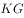。专家认为，这样能够大幅减少电瓶车引发的交通事故。

以下哪项为真，最能质疑上述专家的结论？

- **A**. 电瓶车引发的交通事故主要是由电瓶车本身的车速过快引起的
- **B**. 电瓶车引发的交通事故中，车速快虽然是其中一个原因，但最主要的是电瓶车主不遵守交通规则　✅
- **C**. 很多城市电瓶车道比较窄，电瓶车经常碰撞在一起
- **D**. 以前发生的交通事故中，机动车引起的交通事故比例更高

**答案**：B

**官方解析**

第一步：找出论点和论据。

论点：规定新生产、销售的电瓶车车速不得超过25km/h，质量不能超过55kg，这样能够大幅减少电瓶车引发的交通事故。

论据：根据统计，电瓶车引发的交通事故占全部交通事故的比例超过，引起了国家相关部门的重点关注。电瓶车事故的发生主要由电瓶车速度快、电瓶车主不遵守交通规则等引起。

本题的论点是说新规定（限制电瓶车的车速、质量）能大幅减少电瓶车引发的交通事故，论据是说速度快是电瓶车事故发生的主要原因之一。论点论据话题基本一致，可以考虑否论点。

第二步：逐一分析选项。

A项：说明车速快是导致事故的原因，可以加强，排除；

B项：指出车速快只是事故的其中一个原因，而事故最主要原因是车主不遵守交通规则，既然车速快不是最主要原因，那么只是通过限制车速就无法起到大幅减少电瓶车事故的效果，直接削弱论点，当选；

C项：电瓶车道窄、容易碰撞，也可能导致电瓶车交通事故，但即使这样，也无法确定限制车速是否能大幅减少电瓶车事故，无法削弱，排除；

D项：机动车引起的交通事故与论点讨论的电动车引起的交通事故无关，无法削弱，排除。

故正确答案为B。

---

### 第 34 题　qid 2394044 · 逻辑判断

即将毕业时，某班要评选优秀毕业生，班级内部进行讨论中。
班长：要么李雪被评为优秀毕业生，要么王磊被评为优秀毕业生。
团支书：我不同意。
以下哪项准确表达了团支书的意见？

- **A**. 李雪和王磊都被评为优秀毕业生
- **B**. 李雪和王磊都不能评为优秀毕业生
- **C**. 要么李雪和王磊都被评为优秀毕业生，要么李雪和王磊都不能评为优秀毕业生　✅
- **D**. 李雪被评为优秀毕业生，王磊不能评为优秀毕业生

**答案**：C

**官方解析**

第一步：翻译题干。
班长：要么李雪，要么王磊
团支书：我不同意
团支书不同意的是班长的话，即否定了（要么李雪，要么王磊）这句话。要么，要么是二选一，否定要么，要么有两种情况：①两者都选，②两者都不选。
第二步：逐一分析选项。
A项：两个都选，只是团支书的话的其中一种情况，排除；
B项：两个都不选，只是团支书的话的其中一种情况，排除；
C项：包含了团支书的话的两种情况，正确；
D项：不符合团支书的意见，排除。
故正确答案为C。

---

### 第 35 题　qid 2394045 · 逻辑判断

只有社会稳定，经济才能发展。只有经济发展了，人民的生活水平才能提高。如果没有财富的公平分配，社会就不会稳定。
如果以上陈述为真，则以下各项都为真，除了哪一项？

- **A**. 只有社会稳定，人们的生活水平才能提高
- **B**. 如果人民的生活水平没有提高，那么经济没有得到发展　✅
- **C**. 如果人民的生活水平提高了，那么社会必定是稳定的
- **D**. 如果财富能公平分配，那么人民的生活水平就会提高

**答案**：B

**官方解析**

第一步：翻译题干。 

① 经济发展社会稳定

② 生活水平提高经济发展

③ 社会稳定财富公平分配

将①②③合并，得到：④生活水平提高经济发展社会稳定财富公平分配

第二步：逐一分析选项。

A项：翻译为生活水平提高社会稳定，能够推出，排除；

B项：翻译为生活水平提高经济发展，是对②的否前，否前得不出确定结论，推不出，当选；

C项：翻译为生活水平提高社会稳定，能够推出，排除；

D项：翻译为财富公平分配生活水平提高，是对④的肯后，肯后得不出确定结论，推不出，当选。

本题为选非题，故正确答案为B、D。

注：本题出题有误，有两个正确答案。

---

### 第 36 题　qid 2394046 · 逻辑判断

一项最新研究发现，经常喝酸奶可降低儿童患蛀牙的风险。在此之前，也有研究人员提出酸奶可预防儿童蛀牙，还有研究显示，黄油、奶酪和牛奶对预防蛀牙并没有明显效果。虽然多喝酸奶对儿童的牙齿有保护作用，但酸奶能降低蛀牙风险的原因仍不明确。目前一种说法是酸奶中所含的蛋白质能附着在牙齿表面，从而预防有害酸侵蚀牙齿。
以下哪项如果为真，最能支持这项研究发现？

- **A**. 
黄油、奶酪和牛奶的蛋白质成分没有酸奶丰富，对儿童牙齿的防蛀效果不明显

- **B**. 
儿童牙龈的牙釉质处于未成熟阶段，对抗酸腐蚀的能力低，人工加糖的酸奶会增加蛀牙的风险

- **C**. 
有研究表明，儿童每周至少食用4次酸奶可将蛀牙发生率降低
　✅
- **D**. 
世界上许多国家的科学家都在研究酸奶对预防儿童蛀牙的作用

**答案**：C

**官方解析**

第一步：找出论点和论据。

论点：经常喝酸奶可降低儿童患蛀牙的风险。

论据：酸奶中所含的蛋白质能附着在牙齿表面，从而预防有害酸侵蚀牙齿。

本题论点和论据话题一致，需要补充论据来加强论点。

第二步：逐一分析选项。

A项：选项指出黄油奶酪牛奶不如酸奶的蛋白质成分丰富，且黄油奶酪牛奶对儿童的防蛀效果不明显，但不确定酸奶的防蛀效果如何，无法支持，排除；

B项：人工加糖的酸奶会增加蛀牙风险，削弱了论点，无法支持，排除；

C项：指出儿童食用酸奶可将蛀牙发生率降低，补充论据，可以支持，当选； 

D项：许多国家的科学家在研究酸奶对儿童预防蛀牙的作用，但是否有作用不确定，属于不明确选项，无法加强，排除。

故正确答案为C。

---

### 第 37 题　qid 2394047 · 逻辑判断

大多数独生子女都有以自我为中心的倾向，有些非独生子女同样有以自我为中心的倾向，自我为中心倾向的产生有各种原因，但一个共同原因是缺乏父母的正确引导。
如果上述判定为真，则以下哪项一定为真？

- **A**. 每个缺乏父母正确引导的家庭都有独生子女
- **B**. 有些缺乏父母正确引导的家庭有不止一个子女　✅
- **C**. 有些家庭虽然缺乏父母正确引导，但子女并不以自我为中心
- **D**. 缺乏父母正确引导的多子女家庭，少于缺乏父母正确引导的独生子女家庭

**答案**：B

**官方解析**

第一步：翻译题干。

① 有的独生子女自我为中心；

② 有的非独生子女自我为中心；

③ 自我为中心的共同原因是缺乏父母的正确引导，即只要是自我为中心，就是一定是缺乏父母的正确引导造成的，根据前推后可翻译为：自我为中心缺乏父母的正确引导。

串联①③可得：④ 有的独生子女自我为中心缺乏父母的正确引导；

串联②③可得：⑤ 有的非独生子女自我为中心缺乏父母的正确引导。

第二步：逐一分析选项。

A项：翻译为缺乏父母的正确引导独生子女，是对④的肯后，无法得到确定性结论，排除；

B项：翻译为有的缺乏父母的正确引导非独生子女，根据⑤中有的AB有的BA可得，有的缺乏父母的正确引导非独生子女，可以推出，当选；

C项：翻译为有的缺乏父母的正确引导自我为中心，根据③可得，有的自我为中心缺乏父母的正确引导，换位可得，有的缺乏父母的正确引导自我为中心，无法推出自我为中心，排除；

D项：题干没有对二者进行数量比较，无法推出，排除。

故正确答案为B。

---

### 第 38 题　qid 2394048 · 逻辑判断

昨天晚上，马辉或者去体育馆打球，或者去拜访他的老师秦楠。如果昨天晚上马辉开车，那么他就没有去体育馆打球。只有马辉和他的老师秦楠事先约定好，他才会去拜访他的老师。事实上，马辉事先与他的老师秦楠没有约定。
根据以上陈述，可以得出以下哪项一定为真？

- **A**. 昨天晚上马辉与他老师秦楠一起去体育馆打球
- **B**. 昨天晚上马辉拜访了他的老师秦楠
- **C**. 昨天晚上马辉没有开车　✅
- **D**. 昨天晚上马辉没有去体育馆打球

**答案**：C

**官方解析**

第一步：翻译题干。

① 打球 或 拜访老师；

② 开车打球；

③ 拜访老师约定好；

④ 约定好。

第二步：逐一分析选项。

根据③④可知，④是对③的否后，否后必否前，所以拜访老师；再根据①中或关系的否一推一，可得去打球；最后根据②的否后必否前，得到开车，即约定好拜访老师打球开车，只有C项满足。

故正确答案为C。

---

### 第 39 题　qid 2394049 · 逻辑判断

某单位领导决定在王、陈、周、李、林、胡六人中挑几个人去执行一项重要任务，执行任务的人选应满足以下所有条件：王、李两人中只要一人参加；李、周两人中也只要一人参加；王、陈两人至少有一人参加；王、林、胡三人中应有两人参加；陈和周要么都参加，要么都不参加；如果林参加，李一定要参加。
据此，可以推出以下哪一项是正确的？

- **A**. 王、陈不参加
- **B**. 林、胡不参加
- **C**. 周、李不参加
- **D**. 李、林不参加　✅

**答案**：D

**官方解析**

第一步：分析题干。

① 要么王要么李；

② 要么李要么周；

③ 王 或 陈；

④ 王、林、胡选两人；

⑤ 陈周要么都参加，要么都不参加；

⑥ 林李

第二步：根据题干条件分析选项。

A项：代入A项，如果王、陈不参加，则与③矛盾，排除；

B项：代入B项，如果林、胡不参加，则与④矛盾，排除；

C项：代入C项，如果周、李不参加，则与②矛盾，排除；

D项：假设李参加，根据①②可知，王、周一定不参加；再根据③可知，陈一定参加；则根据⑤可知，周一定参加，与前面得到的周不参加矛盾，所以可知假设错误，李一定不参加。此时，根据⑥的否后必否前可知，林一定不参加，即李、林一定不参加，当选。

故正确答案为D。

---

### 第 40 题　qid 2394050 · 逻辑判断

人口增长问题是世界各国尤其是发达国家面临的问题。发达国家普遍面临着生育率低、人口增长缓慢甚至是负增长的状况，这直接影响着经济发展和民族传承。我国在实行计划生育政策的30年后，也面临着类似的问题，因此我国逐渐放开二胎政策。但实际效果来看，效果并不理想。有专家指出，二胎政策效果不理想主要源于社会压力太大。
以下哪项为真，最能支持上述专家的观点？

- **A**. 二胎政策放开后，许多想生的70后夫妻已经过了最佳生育年龄
- **B**. 90后的青年夫妻更愿意过二人世界，不愿意多生孩子
- **C**. 因为养孩子的成本过高，导致很多夫妻不愿意多生孩子　✅
- **D**. 社会环境的污染影响着很多青年夫妻的生育能力

**答案**：C

**官方解析**

第一步：找出论点和论据。
论点：二胎政策效果不理想主要源于社会压力太大。
论据：无。
本题只有论点，没有论据，优先考虑补充论据的方式来加强。
第二步：逐一分析选项。
A项：指出许多70后夫妻过了最佳生育年龄，与论点提到的社会压力无关，属于无关选项，无法加强，排除；
B项：指出90后青年夫妻不愿意多生孩子，与论点提到的二胎和社会压力无关，属于无关选项，无法加强，排除；
C项：指出养孩子成本太高导致许多夫妻不愿意多生孩子，解释了正是因为社会压力大，从而对二胎政策的效果有影响，补充论据，当选；
D项：指出社会环境的污染影响了生育能力，与论点提到的社会压力无关，属于无关选项，无法加强，排除。
故正确答案为C。

---

## 资料分析

### 材料 1

        2018年我国国内生产总值900309亿元，比上年增长，全国居民人均可支配收入28228元，比上年增长，全国居民恩格尔系数为。2018年我国总人口139538万人，比上年增加530万人，其中城镇常住人口83137万人，全年出生人口1523万人，死亡人口993万人。

        2018年我国货物进出口总额305050亿元，比上年增长。其中，出口164177亿元，增长；进口140873亿元，增长。货物进出口顺差23304亿元，比上年减少5217亿元。对“一带一路”沿线国家进出口总额83657亿元，比上年增长。其中，出口46478亿元，增长；进口37179亿元，增长。

        2018年社会消费品零售总额380987亿元，比上年增长。全年实物商品网上零售额70198亿元，比上年增长。按经营地统计，城镇消费品零售额325637亿元，增长；乡村消费品零售额55350亿元，增长。按消费类型统计，商品零售额338271亿元，增长；餐饮收入额42716亿元，增长。

注释：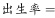

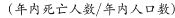

#### 第 1 题　qid 2393997 · 平均数

2017年我国人均国内生产总值约为（    ）。

- **A**. 6万元　✅
- **B**. 6.5万元
- **C**. 7万元
- **D**. 7.5万元

**答案**：A

**官方解析**

根据题干“2017年我国人均···约为”，结合材料时间为2018年，可判定本题为基期平均数计算问题。定位文字材料第一段，2018年我国国内生产总值900309亿元，比上年增长；2018年我国总人口139538万人，比上年增加530万人。可得，2017年我国总人口为。则2017年我国人均国内生产总值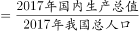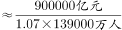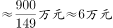。

故正确答案为A。

---

#### 第 2 题　qid 2393999 · 综合

2018年我国常住人口城镇化率约为当年人口出生率的（    ）。

- **A**. 5.5倍
- **B**. 5.9倍
- **C**. 55倍　✅
- **D**. 59倍

**答案**：C

**官方解析**

根据题干“2018年···为···”，结合选项求倍数，且材料时间为2018年，可判定本题为现期倍数问题。根据注释可知，，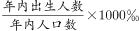。则因此2018年常住人口城镇化率是当年人口出生率的倍数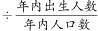。定位文字材料第一段可知，2018年我国城镇常住人口83137万人，全年出生人口1523万人，故所求。

故正确答案为C。

---

#### 第 3 题　qid 2394008 · 综合

2018年我国货物进出口顺差总额和出口总额较上一年分别（    ）。

- **A**. 
减少，增加10684亿元

- **B**. 
减少，增加10884亿元
　✅
- **C**. 
增加，增加10874亿元

- **D**. 
增加，增加10654亿元

**答案**：B

**官方解析**

根据题干“2018年···”结合选项“增加/减少···%”，可判定本题为一般增长率问题，结合选项“增加/减少···亿元”可判定本题为增长量计算问题。定位文字材料第二段，2018年货物进出口顺差23304亿元，比上年减少5217亿元；则根据公式：可得，2018年货物进出口顺差总额增长率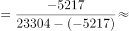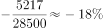，即减少。定位文字材料第二段，2018年我国出口164177亿元，增长；根据公式：可得，2018年出口总额增长量亿元（B、C之间差距极小，估算易错，需要精算）。

故正确答案为B。

注：在算出增长率为，即减少后，可结合选项排除A、C、D，直接选B。

---

#### 第 4 题　qid 2394011 · 综合

2018年我国对“一带一路”沿线国家的贸易顺差为（    ）亿元。

- **A**. 11308
- **B**. 10190
- **C**. 46478
- **D**. 9299　✅

**答案**：D

**官方解析**

定位文字材料第二段，2018年我国对“一带一路”沿线国家出口46478亿元，进口37179亿元，因此亿元，只有D满足。

故正确答案为D。

---

#### 第 5 题　qid 2394017 · 比重

下列关于我国经济和社会发展情况描述正确的有（    ）。

①2018年城镇消费品零售额占社会消费品零售总额的比重为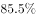

②相比2017年，2018年数据增长最快的是全年实物商品网上零售额

③我国对“一带一路”沿线国家的贸易顺差值，2017年大于2018年

④2017年我国餐饮收入额在40000亿元以上

- **A**. 1个
- **B**. 2个　✅
- **C**. 3个
- **D**. 4个

**答案**：B

**官方解析**

①：定位材料第三段可得，2018年城镇消费品零售额325637亿元，社会消费品零售总额380987亿元，则2018年城镇消费品零售额占社会消费品零售总额的比重为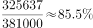，正确；

②：数据增长最快即增速最大。若题干为“根据上述材料，下列描述正确的有”，则全年实物商品网上零售额的增速（）确实最大，但是，题干为“关于我国经济和社会发展情况描述正确的有”，我国经济和社会发展情况的范围过大，因此在不知其它相关信息增速的情况下，无法推出全年实物商品网上零售额的增速最大，错误；

③：定位材料第二段，2018年我国对“一带一路”沿线国家出口46478亿元，增长；进口37179亿元，增长。结合109题结论可知，2018年顺差值为9299亿元。根据“”，则2017年顺差值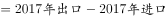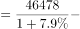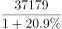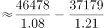亿元，即2017年大于2018年，正确；

④：定位文字材料第三段，2018年我国餐饮收入额42716亿元，增长，根据“”，则2017年我国餐饮收入额，直除首位上不到4，即小于40000亿元，错误；

正确的描述有2项。

故正确答案为B。

---

### 材料 2

        1979年全国普通高校毕业生人数为8.5万人，1980年为14.7万人，2001年为114万人，2002年为145万人，2010年较上一年同比增长，2018年首次突破了800万人，2019年预计达到834万人，毕业生就业创业面临严峻形势。

#### 第 6 题　qid 2394030 · 综合

2009年全国普通高校毕业生人数约为（    ）。

- **A**. 600万人
- **B**. 610万人　✅
- **C**. 620万人
- **D**. 630万人

**答案**：B

**官方解析**

根据“2009年······约为”，结合材料给出2010年数据，判断本题为基期计算问题。定位文字材料和图形材料可知，2010年全国普通高校毕业生人数为631万人，较上一年同比增长，则万人。

故正确答案为B。

---

#### 第 7 题　qid 2394032 · 增长

在2010～2019年中，全国普通高校毕业生同比增长最快的两个年份是（    ）。

- **A**. 2011年和2014年　✅
- **B**. 2011年和2017年
- **C**. 2014年和2017年
- **D**. 2018年和2019年

**答案**：A

**官方解析**

根据“······同比增长最快的两个年份”可判定本题为一般增长率的比较问题。定位图形材料，根据，可得全国普通高校毕业生同比增速如下：

2011年：；

2014年：；

2017年：；

2018年：；

2019年：。

则同比增长最快的两个年份是2011年和2014年。

故正确答案为A。

---

#### 第 8 题　qid 2393936 · 比重

最能准确反映2001年，2010年和2019年全国普通高校毕业生人数比重的统计图是（    ）。

- **A**. A
- **B**. B
- **C**. C
- **D**. D　✅

**答案**：D

**官方解析**

根据“······比重的统计图是”，结合材料已给2001年、2010年、2019年数据，可判定本题为现期比重问题。定位文字材料和图形材料，可知2001年全国普通高校毕业生人数为114万人，2010年为631万人，2019年为834万人，则这三年总毕业人数万人。根据，则2001年毕业人数所占比重；2010年毕业人数所占比重；2019年毕业人数所占比重，结合选项饼形图的比重关系，D选项最符合。

故正确答案为D。

---

#### 第 9 题　qid 2393942 · 综合

下列关于2017届本科毕业生毕业半年后在各城市的就业满意度排序正确的一项是（    ）。

- **A**. 

- **B**. 

　✅
- **C**. 

- **D**. 

**答案**：B

**官方解析**

定位表格材料，选项中涉及的2017年本科毕业生毕业半年后在部分城市的就业满意度从大到小依次为：北京；上海；宁波；天津；广州；深圳；南京；苏州；成都；武汉；重庆；郑州；只有B选项排序正确。

故正确答案为B。

---

#### 第 10 题　qid 2393943 · 倍数

根据以上资料，下列说法正确的有（    ）。

①2019年全国普通高校毕业生人数约为1979年人数的100倍

②近5年全国普通高校毕业生人数基数很大，增长速率比较稳定，每年都是按照的速度在增长

③近8年间累计培养全国普通高校毕业生人数已经超过6000万人，按现有的增长速度，估计2020年全国普通高校毕业生人数将达到840万人以上

④2017届本科毕业生毕业半年后在各城市的就业满意度高于的城市有6个

⑤在一线城市中，北京是就业满意度最高的城市，其次是杭州

- **A**. 1个
- **B**. 2个　✅
- **C**. 3个
- **D**. 4个

**答案**：B

**官方解析**

①：定位文字和图形材料，1979年全国普通高校毕业生人数为8.5万人，2019年全国普通高校毕业生人数为834万人，倍数，正确；

（备注：如果表述为“约为……的101倍”，则该表述错误，因为101是精确到个位，则计算值必须在100.5-101.4范围内才是正确的。但本题表述为“约为……的100倍”，则不必精确到个位，98倍四舍五入约为100倍是正确的） 

②：定位图形材料，2019年全国普通高校毕业生同比增速为，故并非均按的速度增长，错误；

③：定位图形材料，近8年累计毕业生人数为，由②知，2019年毕业生人数的增长速度约为，则，正确；

④：定位表格材料，2017届本科毕业生毕业半年后在部分城市的就业满意度高于的有：北京；上海；杭州；宁波；天津，共5个，错误；

（备注：即使表述为“2017届本科毕业生毕业半年后在各城市的就业满意度高于的城市有5个”，但由于表格只给了部分城市的就业满意度，不能确定所有城市的相关数据，因此该表述依然是错误的）

⑤定位表格材料，一线城市中，就业满意度最高的城市是北京，其次是上海，杭州属于“新一线城市”，错误。

综上所述，说法正确的为①③，共两个。

故正确答案为B。

---

### 材料 3

        Q省2018年客货运输换算周转量5096.9亿吨公里，比上年增长。货物周转量4143.3亿吨公里，增长。其中，铁路周转量729.6亿吨公里，下降；公路周转量2731.8亿吨公里，增长。旅客周转量1768.2亿人公里，增长。其中，铁路周转量865.6亿人公里，增长；公路周转量767.3亿人公里，下降；民航周转量132.3亿人公里，增长。

#### 第 11 题　qid 2393951 · 增长

2018年，Q省货运量增速最大的是（    ）。

- **A**. 铁路
- **B**. 管道　✅
- **C**. 公路
- **D**. 民航

**答案**：B

**官方解析**

根据题干“增速最大”，结合表格材料，判定本题为直接找数。定位表格材料上半部分可知，2018年货运量增长速度：铁路（）；管道（）；公路（）；民航（）。比较四个数字，其中最大，故2018年，Q省货运量增速最大的是管道。

故正确答案为B。

---

#### 第 12 题　qid 2393952 · 综合

2017年，Q省货物周转量为（    ）。

- **A**. 4877.4亿吨公里
- **B**. 4820.3亿吨公里
- **C**. 4153.3亿吨公里
- **D**. 4110.4亿吨公里　✅

**答案**：D

**官方解析**

由题干“2017年，Q省货物周转量······”，结合材料时间为2018年，可判定本题为基期计算问题。定位文字材料“Q省2018年······货物周转量4143.3亿吨公里，增长。”代入基期计算公式：亿吨公里，与D项最接近。

故正确答案为D。 

---

#### 第 13 题　qid 2393960 · 比重

2018年，Q省公路客运量占客运总量的比重约为（    ）。

- **A**. 

　✅
- **B**. 

- **C**. 

- **D**. 

**答案**：A

**官方解析**

由题干“2018年，Q省公路客运量占······的比重”，材料时间为2018年，可判定本题为现期比重问题。定位表格材料下半部分可知，客运总量为151080.5万人，公路客运量为138221.0万人。根据，则2018年，Q省公路客运量占客运总量的比重。

故正确答案为A。

---

#### 第 14 题　qid 2393964 · 平均数

2018年，Q省客运平均运送距离约为（    ）。

- **A**. 107公里
- **B**. 1007公里
- **C**. 1170公里
- **D**. 117公里　✅

**答案**：D

**官方解析**

由题干“2018年，Q省客运平均······”，结合材料时间为2018年，可判定本题为现期平均数问题。定位文字材料“Q省2018年······旅客周转量1768.2亿人公里”；定位表格材料，Q省客运总量为151080.5万人。由，则2018年，Q省客运平均运送距离。

故正确答案为D。

---

#### 第 15 题　qid 2393970 · 综合

关于Q省客货运输情况，以下说法正确的是（    ）。

- **A**. 
2017年，Q省客货运输换算周转量约为5000亿吨公里

- **B**. 
2018年，Q省铁路货物周转量增速大于公路货物周转量增速

- **C**. 
2018年，Q省4种客运方式客运量比上年平均增长以上

- **D**. 
2018年，Q省水运客运量比民航客运量多598.5万人
　✅

**答案**：D

**官方解析**

A项：定位文字材料，Q省2018年客货运输换算周转量5096.9亿吨公里，比上年增长。根据，则2017年，Q省客货运输换算周转量亿吨公里，非5000亿吨公里，错误；

B项：定位文字材料，Q省铁路货物周转量增速下降；公路货物周转量增速为增长，则铁路货物周转量增速小于公路货物周转量增速，错误；

C项：定位表格材料，2018年，Q省4种客运方式客运量比上年的平均增长率，为4种客运方式客运量的混合增长率，即为客运量的整体增长率（），显然，则平均增长率非以上，错误；

D项：定位表格材料，2018年，Q省水运客运量1533.9万人，民航客运量935.4万人，前者比后者多万人，正确。

故正确答案为D。

---
