# 2019年青海省法院、检察院录用考试《行测》题

> 省考 · 2019 年 · 6 个模块 · 共 118 题

- [政治理论](#%E6%94%BF%E6%B2%BB%E7%90%86%E8%AE%BA) · 5 题
- [常识判断](#%E5%B8%B8%E8%AF%86%E5%88%A4%E6%96%AD) · 40 题
- [言语理解与表达](#%E8%A8%80%E8%AF%AD%E7%90%86%E8%A7%A3%E4%B8%8E%E8%A1%A8%E8%BE%BE) · 30 题
- [数量关系](#%E6%95%B0%E9%87%8F%E5%85%B3%E7%B3%BB) · 10 题
- [判断推理](#%E5%88%A4%E6%96%AD%E6%8E%A8%E7%90%86) · 28 题
- [资料分析](#%E8%B5%84%E6%96%99%E5%88%86%E6%9E%90) · 5 题

---

## 政治理论

### 第 1 题　qid 2439965 · 新思想

根据十九大报告，下列说法不准确的是：

- **A**. 发展是解决我国一切问题的关键
- **B**. 创新是建设现代化经济体系的战略支撑
- **C**. 社会主义核心价值观是当代中国精神的集中体现
- **D**. 就业是中华民族伟大复兴的基础工程　✅

**答案**：D

**官方解析**

本题考查政治。
A项正确，习近平总书记在十九大报告中指出：“坚持新发展理念。发展是解决我国一切问题的基础和关键，发展必须是科学发展，必须坚定不移贯彻创新、协调、绿色、开放、共享的发展理念。”
B项正确，习近平总书记在十九大报告中指出：“创新是引领发展的第一动力，是建设现代化经济体系的战略支撑。要瞄准世界科技前沿，强化基础研究，实现前瞻性基础研究、引领性原创成果重大突破。”
C项正确，习近平总书记在十九大报告中指出：“培育和践行社会主义核心价值观。社会主义核心价值观是当代中国精神的集中体现，凝结着全体人民共同的价值追求。”
D项错误，习近平总书记在十九大报告中指出：“优先发展教育事业。建设教育强国是中华民族伟大复兴的基础工程，必须把教育事业放在优先位置，深化教育改革，加快教育现代化，办好人民满意的教育。”习近平总书记还指出：“就业是最大的民生。要坚持就业优先战略和积极就业政策，实现更高质量和更充分就业。”
本题为选非题，故正确答案为D。

---

### 第 2 题　qid 2439970 · 新思想

中国特色社会主义的本质要求和重要保障是：

- **A**. 人民当家作主
- **B**. 党的领导
- **C**. 全面依法治国　✅
- **D**. 改革开放

**答案**：C

**官方解析**

本题考查政治。
党的十九大报告指出：“全面依法治国是中国特色社会主义的本质要求和重要保障。必须把党的领导贯彻落实到依法治国全过程和各方面，坚定不移走中国特色社会主义法治道路，完善以宪法为核心的中国特色社会主义法律体系······”
故正确答案为C。

---

### 第 3 题　qid 2439975 · 新思想

哪一次会议系统回答了新时代坚持和发展什么样的中国特色社会主义、怎样坚持和发展中国特色社会主义？

- **A**. 党的十六大
- **B**. 党的十七大
- **C**. 党的十八大
- **D**. 党的十九大　✅

**答案**：D

**官方解析**

本题考查政治。
党的十九大报告指出：“十八大以来，国内外形势变化和我国各项事业发展都给我们提出了一个重大时代课题，这就是必须从理论和实践结合上系统回答新时代坚持和发展什么样的中国特色社会主义、怎样坚持和发展中国特色社会主义，包括新时代坚持和发展中国特色社会主义的总目标、总任务、总体布局、战略布局和发展方向、发展方式、发展动力、战略步骤、外部条件、政治保证等基本问题······”党的十九大提出了新时代中国特色社会主义思想基本方略，系统回答了新时代坚持和发展什么样的中国特色社会主义、怎样坚持和发展中国特色社会主义。
故正确答案为D。

---

### 第 4 题　qid 2439976 · 新思想

习近平新时代中国特色社会主义思想明确提出全面深化改革的总目标是：

- **A**. 坚定道路自信、理论自信、制度自信、文化自信
- **B**. 完善和发展中国特色社会主义制度、推进国家治理体系和治理能力现代化　✅
- **C**. 建设中国特色社会主义法治体系、建设社会主义法治国家
- **D**. 推动构建新型国际关系，推动构建人类命运共同体

**答案**：B

**官方解析**

本题考查政治。
党的十九大报告指出：“新时代中国特色社会主义思想，明确坚持和发展中国特色社会主义，总任务是实现社会主义现代化和中华民族伟大复兴······明确中国特色社会主义事业总体布局是‘五位一体’、战略布局是‘四个全面’，强调坚定道路自信、理论自信、制度自信、文化自信；明确全面深化改革总目标是完善和发展中国特色社会主义制度、推进国家治理体系和治理能力现代化；明确全面推进依法治国总目标是建设中国特色社会主义法治体系、建设社会主义法治国家······明确中国特色大国外交要推动构建新型国际关系，推动构建人类命运共同体······”
故正确答案为B。

---

### 第 5 题　qid 2439981 · 新思想

是马克思主义生态观在当代中国的最新发展，是以习近平同志为核心的党中央深入把握经济社会发展规律、人与自然发展规律的重要理论创新，彰显了对中国民族永续发展和人类未来的责任担当。

- **A**. 坚持绿色发展
- **B**. 尊重并善待自然环境
- **C**. 坚持人与自然和谐共生　✅
- **D**. 绿色文明

**答案**：C

**官方解析**

本题考查政治。
党的十九大报告提出“坚持人与自然和谐共生”，并将其作为新时代坚持和发展中国特色社会主义的基本方略之一。这为科学把握、正确处理人与自然关系提供了基本遵循。坚持人与自然和谐共生，是马克思主义生态观在当代中国的最新发展，是以习近平同志为核心的党中央深入把握经济社会发展规律、人与自然发展规律的重要理论创新，彰显了对中华民族永续发展和人类未来的责任担当。习总书记在2018年5月4日在纪念马克思诞辰200周年大会上的讲话中强调：“我们要坚持人与自然和谐共生，牢固树立和切实践行绿水青山就是金山银山的理念，动员全社会力量推进生态文明建设，共建美丽中国，让人民群众在绿水青山中共享自然之美、生命之美、生活之美，走出一条生产发展、生活富裕、生态良好的文明发展道路。”
故正确答案为C。

---

## 常识判断

### 第 1 题　qid 2439902 · 法律常识

关于法的效力，下列哪个选项是正确的？

- **A**. 不同位阶法律冲突的处理原则包括宪法至上，法律高于法规，行政法规高于规章，行政法规高于地方性法规，国内法优先于国际法
- **B**. 宪法、法律、行政法规、地方性法规等主要是根据其所调整的社会关系作出的分类
- **C**. 地方性法规和部门规章有冲突时，由国务院决定适用地方性法规，或者由国务院报请全国人大常委会决定　✅
- **D**. 广东省政府的规章和交通部的规章存在冲突时由国务院裁决，而交通部的规章和广州市政府的规章存在冲突时则直接适用交通部的规章

**答案**：C

**官方解析**

本题考查法理学。
A项错误，根据《立法法》第八十七条规定：“宪法具有最高的法律效力，一切法律、行政法规、地方性法规、自治条例和单行条例、规章都不得同宪法相抵触。”第八十八条规定：“法律的效力高于行政法规、地方性法规、规章。行政法规的效力高于地方性法规、规章。”因此，“不同位阶法律冲突的处理原则包括宪法至上，法律高于法规，行政法规高于规章，行政法规高于地方性法规”这一表述正确，而国际法和国内法是同一位阶的法律，对于国际法和国内法谁优先适用的问题在法理上并没有明确具体规定。
B项错误，宪法、法律、行政法规、地方性法规等主要是根据法的效力和地位所作的分类，而不是根据其所调整的社会关系而作出的分类，部门法的划分是根据所调整的社会关系作的分类。
C项正确，根据《立法法》第九十五条规定：“地方性法规、规章之间不一致时，由有关机关依照下列规定的权限作出裁决：······（二）地方性法规与部门规章之间对同一事项的规定不一致，不能确定如何适用时，由国务院提出意见，国务院认为应当适用地方性法规的，应当决定在该地方适用地方性法规的规定；认为应当适用部门规章的，应当提请全国人民代表大会常务委员会裁决；······”
D项错误，根据《立法法》第九十五条第一款规定：“地方性法规、规章之间不一致时，由有关机关依照下列规定的权限作出裁决：······（三）部门规章之间、部门规章与地方政府规章之间对同一事项的规定不一致时，由国务院裁决。”因此，广东省政府的规章和交通部的规章存在冲突、交通部的规章和广州市政府的规章存在冲突时，都需国务院裁决。
故正确答案为C。

---

### 第 2 题　qid 2439903 · 法律常识

关于我国公民的政治权利和自由，下列哪个选项是正确的？

- **A**. 外籍华人企业家可以回国参加人大代表选举
- **B**. 公民言论自由可以通过口头或书面的方式行使　✅
- **C**. 公民有结社、集会、游行、示威、罢工的权利
- **D**. 对于任何国家机关和工作人员的违法失职行为，公民有提出申诉、控告、检举或罢免的权利

**答案**：B

**官方解析**

本题考查宪法。
A项错误，根据《宪法》第三十四条规定：“中华人民共和国年满十八周岁的公民，不分民族、种族、性别、职业、家庭出身、宗教信仰、教育程度、财产状况、居住期限，都有选举权和被选举权；但是依照法律被剥夺政治权利的人除外。”外籍华人企业家不具有我国国籍，因此，不可以回国参加人大代表选举。
B项正确，根据《宪法》第三十五条规定：“中华人民共和国公民有言论、出版、集会、结社、游行、示威的自由。”因此，言论自由是法律赋予公民的权利，可通过口头或书面的方式行使。
C项错误，根据《宪法》第三十五条规定：“中华人民共和国公民有言论、出版、集会、结社、游行、示威的自由。”因此，罢工不属于公民的权利。
D项错误，根据《宪法》第四十一条第一款规定：“中华人民共和国公民对于任何国家机关和国家工作人员，有提出批评和建议的权利；对于任何国家机关和国家工作人员的违法失职行为，有向有关国家机关提出申诉、控告或者检举的权利，但是不得捏造或者歪曲事实进行诬告陷害。”因此，对于任何国家机关和工作人员的违法失职行为，公民有提出申诉、控告、检举的权利，但不具有罢免的权利。
故正确答案为B。

---

### 第 3 题　qid 2439904 · 法律常识

根据我国刑法规定，下列哪个选项构成以危险方法危害公共安全罪？

- **A**. 甲抱着“砸着谁谁倒霉”的心理从窗户扔出一块砖头，砸中一位行人，使其身受重伤
- **B**. 甲明知炭疽杆菌是一种白色粉状的病菌，遂将家中粉末状食品干燥剂装入信封内，寄给某单位领导乙，造成乙精神高度紧张，同时引起周围人们恐慌
- **C**. 甲多次驾车尾随外地高档车辆，在前车正常变更车道时，突然加速撞向前车侧后方，造成前车变更车道时未让借车道内车辆先行的假象，以对方违章为由获取赔偿
- **D**. 甲明知盗窃消防栓铜芯将使消防栓丧失功能，仍将路侧草坪上正在使用的几十个消防栓铜芯（价值人民币5000元）盗走　✅

**答案**：D

**官方解析**

本题考查刑法。

根据《刑法》第一百一十四条的规定，以危险方法危害公共安全罪是指故意以放火、决水、爆炸、投毒以外的并与之相当的危险方法，足以危害公共安全的行为。
A项错误，根据《刑法》第二百九十一条之二规定：“从建筑物或者其他高空抛掷物品，情节严重的，处一年以下有期徒刑、拘役或者管制，并处或者单处罚金。有前款行为，同时构成其他犯罪的，依照处罚较重的规定定罪处罚。”甲明知往窗外扔砖头会砸伤人，仍实施了扔砖头的行为，最终导致他人身受重伤，构成高空抛物罪。
B项错误，甲是将粉末状食品干燥剂假装炭疽杆菌寄给乙，虽造成了单位恐慌，但是食品干燥剂并无现实危害性，不会危害公共安全，甲不构成危害公共安全罪，是治安违法行为。
C项错误，根据《道路交通安全法》的规定，驾驶人应当遵守道路交通安全法律、法规的规定，按照操作规范安全驾驶、文明驾驶。甲在前方车辆正常变更车道时，加速撞向前车，其行为违反了《道路交通安全法》，若造成人员伤亡，甲或构成故意伤害罪，其行为不足以危害公共安全，不能认定为以危险方法危害公共安全罪。
D项正确，路侧草坪上设置消防栓是为了防止周围有火灾，路边都是公共场合，甲将路侧草坪上的消防栓铜芯全部盗走，犯罪动机虽然只是为了非法占有消防栓铜芯，但其主观上对危害公共安全持放任的态度，根据主客观相一致的原则，甲盗窃消防栓铜芯的行为已构成以危险方法危害公共安全罪。依据法条竞合的原则，对甲盗窃消防栓铜芯的行为应择一重罪即以危险方法危害公共安全罪定罪。
故正确答案为D。

---

### 第 4 题　qid 2439905 · 法律常识

关于重大误解，下列哪个选项是正确的？

- **A**. 甲遇乞讨的乙，欲赠乙10元，因灯光昏暗，误取一张100元钞票给乙　✅
- **B**. 甲误以为放在枕头下的iPhone6丢失，遂在乙处购买一部新iPhone6
- **C**. 甲误以为乙收藏的国画“马震图”市场价值在500万元以上（实际该画市场价格约为210万元），遂以200万元的价格购买
- **D**. 甲欲将一头牛以5000元出卖给乙，请丙给乙带口信，丙故意告诉乙：“甲将他的牛以2000元出卖给你。”乙又请丙给甲带口信：“同意购买”，丙如实转告给甲

**答案**：A

**官方解析**

本题考查法律常识。
重大误解，指的是一方当事人因自己的过错导致对合同的内容等发生误解而订立了合同，重大误解是可撤销民事法律行为的法定撤销事由。误解一般是由受害方当事人自己的过错造成的，当事人的误解必须是对行为的主要内容构成重大误解，误解直接影响到当事人所享受的权利和承担的义务。
A项正确，甲赠与时，出于自己的过错对标的物的性质发生错误认识，并遭受了损失，构成重大误解。
B项错误，甲误认为自己的手机丢失，遂在乙处购买一部新手机，其购买手机时意思表示真实，对手机的型号价格等没有产生误解，只是“动机错误”，该买卖行为并未让甲受损，不构成重大误解。
C项错误，甲自己主观意识上对乙收藏的国画价格产生了认知错误，属于对标的物的价值认知错误，且该画的实际价格和甲购买的价格出入不大，甲以200万元的价格购买该画的行为不成立重大误解。
D项错误，由于第三人丙存在欺骗行为导致甲和乙成立了买卖合同，并非是由于受害人乙自己的过错造成的，意思表示未生效，该买卖合同未成立，不存在重大误解问题。
故正确答案为A。

---

### 第 5 题　qid 2439907 · 法律常识

关于刑事案件量刑程序，有下列四个说法：①对于公诉案件，人民检察院一般只能在量刑建议书中提出量刑建议；②人民检察院委托制作涉及未成年人的社会调查报告，出于保护未成年人隐私需要，可以采取播放等方式，不在法庭上宣读；③人民法院在刑事裁判文书中必须说明是否采纳公诉人、当事人发表的量刑建议、意见的理由，但可以不说明所查明的事实对量刑的作用；④对于不开庭审理的二审案件，审判人员在讯问被告人、听取其他当事人的意见时，必须审查量刑事实和证据。下列哪个选项是正确的？

- **A**. ①③符合法律规定
- **B**. ②④符合法律规定
- **C**. ①③④符合法律规定
- **D**. ①②③④都不符合法律规定　✅

**答案**：D

**官方解析**

本题考查法律常识。
①错误，根据《关于规范量刑程序若干问题的意见》第九条第一款规定：“人民检察院提出量刑建议，可以制作量刑建议书，与起诉书一并移送人民法院；对于案情简单、量刑情节简单的适用速裁程序的案件，也可以在起诉书中写明量刑建议。”
②错误，根据《关于规范量刑程序若干问题的意见》第十八条规定：“人民法院、人民检察院、侦查机关或者辩护人委托有关方面制作涉及未成年人的社会调查报告的，调查报告应当在法庭上宣读，并进行质证。”
③错误，根据《关于规范量刑程序若干问题的意见》第二十五条规定：“人民法院应当在刑事裁判文书中说明量刑理由。量刑说理主要包括：（一）已经查明的量刑事实及其对量刑的影响；（二）是否采纳公诉人、自诉人、被告人及其辩护人、被害人及其诉讼代理人发表的量刑建议、意见及理由；（三）人民法院判处刑罚的理由和法律依据。对于适用速裁程序审理的案件，可以简化量刑说理。”
④错误，根据《关于规范量刑程序若干问题的意见》第二十六条第二款规定：“对于不开庭审理的二审、再审案件，审判人员在阅卷、讯问被告人、听取自诉人、辩护人、被害人及其诉讼代理人的意见时，应当注意审查量刑事实和证据。”
①②③④都不符合法律规定。
故正确答案为D。

---

### 第 6 题　qid 2439908 · 法律常识

甲（住G市）因资金紧张，向乙（户籍所在地在E市，长期居住在F市）借款50万元，为此双方签订一份借款合同，约定借款到期后，将款项汇入乙在H市开户的银行账户内。借款到期后，甲未还款，乙准备向人民法院起诉。关于管辖权问题，下列哪个选项是正确的？

- **A**. 只有E市法院有管辖权
- **B**. 只有F市法院有管辖权
- **C**. 只有H市法院有管辖权　✅
- **D**. F市和H市法院都有管辖权

**答案**：C

**官方解析**

本题考查程序法常识。
根据《中华人民共和国民事诉讼法》第二十三条规定：因合同纠纷提起的诉讼，由被告住所地或者合同履行地人民法院管辖。题中，双方约定将款项汇入乙在H市开户的银行账户内，所以H市是双方约定的合同履行地，本案应由被告所在地即G市或合同履行地H市法院管辖，但答案没有G市，所以只能选C项由H市法院管辖。
故正确答案为C。

---

### 第 7 题　qid 2439909 · 法律常识

关于行政处罚，下列哪个选项是正确的？

- **A**. 法律法规可以设定各种行政处罚，但限制人身自由的行政处罚，只能由法律设定
- **B**. 对于依法给予五十元以下罚款的行政处罚决定，行政机关可以当场收缴罚款　✅
- **C**. 对于吊销营业执照的行政处罚，行政机关在作出决定之前应当告知当事人有要求举行听证的权利　✅
- **D**. 行政处罚由具有行政处罚权的行政机关在法定授权范围内实施

**答案**：BC

**官方解析**

本题考查法律常识。
A项错误，《中华人民共和国行政处罚法》第十条规定：“法律可以设定各种行政处罚。限制人身自由的行政处罚，只能由法律设定。” 法规并不能设定各种行政处罚。
B项正确，《中华人民共和国行政处罚法》第六十八条规定：“依照本法第五十一条的规定当场作出行政处罚决定，有下列情形之一，执法人员可以当场收缴罚款：（一）依法给予一百元以下罚款的；（二）不当场收缴事后难以执行的。”
C项正确，《中华人民共和国行政处罚法》第六十三条规定：“行政机关拟作出下列行政处罚决定，应当告知当事人有要求听证的权利，当事人要求听证的，行政机关应当组织听证：（一）较大数额罚款；（二）没收较大数额违法所得、没收较大价值非法财物；（三）降低资质等级、吊销许可证件；（四）责令停产停业、责令关闭、限制从业；（五）其他较重的行政处罚；（六）法律、法规、规章规定的其他情形。当事人不承担行政机关组织听证的费用。”吊销营业执照属于吊销许可证件，可以申请召开听证会。
D项错误，《中华人民共和国行政处罚法》第十七条规定：“行政处罚由具有行政处罚权的行政机关在法定职权范围内实施。”《中华人民共和国行政处罚法》第十九条规定：“法律、法规授权的具有管理公共事务职能的组织可以在法定授权范围内实施行政处罚。”行政机关在法定职权范围内实施行政处罚，被授权组织在法律法规授权的范围内实施行政处罚。
故正确答案为BC。
【备注】本题原为单选题，现在由于法律修改，BC都属于正确选项。

---

### 第 8 题　qid 2439910 · 法律常识

关于正当防卫，下列哪个选项是错误的？

- **A**. 甲为杀死乙，故意辱骂乙，致使乙殴打甲，甲趁机将乙杀死，甲的行为不成立正当防卫
- **B**. 甲与乙等多人约定互殴，乙突然掏出火药枪准备射击甲等人，甲迅速将乙打倒，致使乙重伤，甲的行为成立正当防卫　✅
- **C**. 甲发现正在殴打丙的乙系被通缉的犯罪嫌疑人，为将乙扭送派出所而将乙打成轻伤，甲的行为成立正当防卫
- **D**. 甲看见乙正持刀猛砍丙，为阻止其行为，将一砖头砸向乙，将乙砸死，甲的行为成立正当防卫

**答案**：B

**官方解析**

本题考查刑法常识。
A项正确，《中华人民共和国刑法》第十四条规定：“明知自己的行为会发生危害社会的结果，并且希望或者放任这种结果发生，因而构成犯罪的，是故意犯罪。故意犯罪，应当负刑事责任。”甲主观上希望造成乙死亡，并且实施了杀害乙的行为，属于故意犯罪，不是正当防卫。
B项错误，本题中，甲乙双方约定互相斗殴，甲乙双方都有斗殴的故意，当乙掏出火枪准备射击时，甲将乙打倒的行为也是不法侵害的行为，并非正当的行为，在互殴过程中不存在正当防卫，甲行为不属于正当防卫。
C项正确，《中华人民共和国刑法》第二十条第一款规定：“为了使国家、公共利益、本人或者他人的人身、财产和其他权利免受正在进行的不法侵害，而采取的制止不法侵害的行为，对不法侵害人造成损害的，属于正当防卫，不负刑事责任。”选项中，甲为制止对不法侵害人乙的行为，对乙造成轻伤，属于正当防卫。
D项正确，《中华人民共和国刑法》第二十条第三款规定：“对正在进行行凶、杀人、抢劫、强奸、绑架以及其他严重危及人身安全的暴力犯罪，采取防卫行为，造成不法侵害人伤亡的，不属于防卫过当，不负刑事责任。”选项中，甲对正在实施暴力犯罪的乙采取防卫行为，虽然造成乙的死亡，但不属于防卫过当，成立正当防卫。
本题为选非题，故正确答案为B。

---

### 第 9 题　qid 2439911 · 法律常识

关于合同解除，下列哪个选项是正确的？

- **A**. 赠与合同的赠与人享有任意解除权，但赠与标的物所有权已经转移、经过公证的赠与合同具有社会公益、道德义务性质的赠与合同除外
- **B**. 保管合同的寄存人和保管人均享有任意解除权
- **C**. 合同因违约被解除后，若合同约定有违约金，守约方仍有权在合同解除后请求违约方支付违约金　✅
- **D**. 当事人约定解除权成立条件的，自约定条件成就时，合同自动解除

**答案**：C

**官方解析**

本题考查法律常识。
A项错误，根据《民法典》第六百五十八条规定：“赠与人在赠与财产的权利转移之前可以撤销赠与。经过公证的赠与合同或者依法不得撤销的具有救灾、扶贫、助残等公益、道德义务性质的赠与合同，不适用前款规定。”本条规定的是赠与合同的任意撤销权，而非任意解除权。撤销的合同自始没有法律约束力；而合同的解除要根据合同的履行情况和合同的性质及当事人的意愿来决定合同被解除后是否具有溯及力。
B项错误，根据《民法典》第八百九十九条规定：“寄存人可以随时领取保管物。当事人对保管期限没有约定或者约定不明确的，保管人可以随时请求寄存人领取保管物；约定保管期限的，保管人无特别事由，不得请求寄存人提前领取保管物。”保管合同的寄存人享有任意解除权，而保管人不享有任意解除权。
C项正确，根据《最高人民法院关于审理买卖合同纠纷案件适用法律问题的解释》第二十条规定：“买卖合同因违约而解除后，守约方主张继续适用违约金条款的，人民法院应予支持；但约定的违约金过分高于造成的损失的，人民法院可以参照民法典第五百八十五条第二款的规定处理。”合同因违约解除，守约方可以主张继续适用违约金条款。
D项错误，根据《民法典》第一百五十八条规定：“民事法律行为可以附条件，但是根据其性质不得附条件的除外。附生效条件的民事法律行为，自条件成就时生效。附解除条件的民事法律行为，自条件成就时失效。”又根据《民法典》第五百六十五条第一款规定：“当事人一方依法主张解除合同的，应当通知对方。合同自通知到达对方时解除；通知载明债务人在一定期限内不履行债务则合同自动解除，债务人在该期限内未履行债务的，合同自通知载明的期限届满时解除。对方对解除合同有异议的，任何一方当事人均可以请求人民法院或者仲裁机构确认解除行为的效力。”
故正确答案为C。

---

### 第 10 题　qid 2439912 · 法律常识

法院在审理李某持有枪支案时发现，李某不仅存在持有枪支的事实，还存在盗窃枪支、贩卖毒品等事实。关于本案，下列哪个选项是正确的？

- **A**. 人民法院可以建议人民检察院补充或变更起诉　✅
- **B**. 如果李某承认盗窃枪支、贩卖毒品等事实，人民法院可以与人民检察院商量后，直接作出判决
- **C**. 人民法院可建议人民检察院退回补充侦查
- **D**. 人民法院也可以在听取控辩双方意见的基础上作出判决

**答案**：A

**官方解析**

本题考查程序法常识。
《最高人民法院、最高人民检察院、公安部等关于实施刑事诉讼法若干问题的规定》第三十条规定：“人民法院审理公诉案件，发现有新的事实，可能影响定罪的，人民检察院可以要求补充起诉或者变更起诉，人民法院可以建议人民检察院补充起诉或者变更起诉。人民法院建议人民检察院补充起诉或者变更起诉的，人民检察院应当在七日以内回复意见。”本题中，法院在审理案件过程中发现新的实施，影响对李某的定罪和量刑，人民法院可以建议人民检察院补充起诉或者变更起诉。
故正确答案为A。

---

### 第 11 题　qid 2439913 · 法律常识

王某接受李某委托，以诉讼代理人身份参加李某起诉张某的一起保险合同纠纷案。下列哪个选项是正确的？

- **A**. 如果王某是律师，应提交其所在律师事务所与李某签订的协议书、李某的授权委托书、王某的执业证、律师事务所的证明材料
- **B**. 如果王某是基层法律工作者，应提交李某的授权委托书、王某的执业证、基层法律服务所出具的介绍信、当事人一方位于本辖区内的证明材料　✅
- **C**. 如果王某是李某的近亲属，应提交与委托人有近亲属关系的证明材料
- **D**. 如果王某是李某所在单位推荐的公民，应提交推荐材料、李某属于该单位的证明材料

**答案**：B

**官方解析**

本题考查程序法。
根据《民事诉讼法》第五十八条规定：“当事人、法定代理人可以委托一至二人作为诉讼代理人。下列人员可以被委托为诉讼代理人：（一）律师、基层法律服务工作者；（二）当事人的近亲属或者工作人员；（三）当事人所在社区、单位以及有关社会团体推荐的公民。”第五十九条第一款规定：“委托他人代为诉讼，必须向人民法院提交由委托人签名或者盖章的授权委托书。”
A项错误，根据《最高人民法院关于适用〈中华人民共和国民事诉讼法〉的解释》第八十八条规定：“诉讼代理人除根据民事诉讼法第五十九条规定提交授权委托书外，还应当按照下列规定向人民法院提交相关材料：（一）律师应当提交律师执业证、律师事务所证明材料。”王某无需提供其所在律师事务所与李某签订的协议书。
B项正确，根据《最高人民法院关于适用〈中华人民共和国民事诉讼法〉的解释》第八十八条规定：“诉讼代理人除根据民事诉讼法第五十九条规定提交授权委托书外，还应当按照下列规定向人民法院提交相关材料：（二）基层法律服务工作者应当提交法律服务工作者执业证、基层法律服务所出具的介绍信以及当事人一方位于本辖区内的证明材料。”
C、D项错误，根据《最高人民法院关于适用〈中华人民共和国民事诉讼法〉的解释》第八十八条规定：“诉讼代理人除根据民事诉讼法第五十九条规定提交授权委托书外，还应当按照下列规定向人民法院提交相关材料：（三）当事人的近亲属应当提交身份证件和与委托人有近亲属关系的证明材料······（五）当事人所在社区、单位推荐的公民应当提交身份证件、推荐材料和当事人属于该社区、单位的证明材料。”王某还需提供身份证件。
故正确答案为B。

---

### 第 12 题　qid 2439914 · 法律常识

关于行政诉讼中的原被告，下列哪个选项是正确的？

- **A**. 针对美丽家园小区的消防设施无法使用问题，某市消防部门给予罚款2万元、责令重新购置消防设施的行政处罚，业主委员会可以自己的名义向人民法院提起诉讼
- **B**. 某工商局吊销E企业营业执照，E企业提出行政复议，复议机关以违反法定程序为由确认吊销行为违法，E企业可以复议机关为被告，向人民法院提起诉讼
- **C**. 甲对H村民委员会的集体土地分配不服，可以H村民委员会为被告，向人民法院提起诉讼
- **D**. 乙的房屋临街，因实施街面改造，由F市人民政府确定的房屋征收部门对乙的房屋进行征收，乙对拆迁补偿数额不服，可以房屋征收部门为被告，向人民法院提起诉讼　✅

**答案**：D

**官方解析**

本题考查程序法。
A项错误，根据《消防法》第十八条规定：“同一建筑物由两个以上单位管理或者使用的，应当明确各方的消防安全责任，并确定责任人对共用的疏散通道、安全出口、建筑消防设施和消防车通道进行统一管理。住宅区的物业服务企业应当对管理区域内的共用消防设施进行维护管理，提供消防安全防范服务。”根据《最高人民法院关于适用〈中华人民共和国行政诉讼法〉的解释》第十八条第一款规定：“业主委员会对于行政机关作出的涉及业主共有利益的行政行为，可以自己的名义提起诉讼。”该行政处罚是针对小区物业作出的，并未涉及业主共有利益，业主委员会不能以自己名义提起诉讼。
B项错误，根据《行政诉讼法》第二十六条第二款规定：“经复议的案件，复议机关决定维持原行政行为的，作出原行政行为的行政机关和复议机关是共同被告；复议机关改变原行政行为的，复议机关是被告。”根据《最高人民法院关于适用〈中华人民共和国行政诉讼法〉的解释》第二十二条规定：“行政诉讼法第二十六条第二款规定的‘复议机关改变原行政行为’，是指复议机关改变原行政行为的处理结果。复议机关改变原行政行为所认定的主要事实和证据、改变原行政行为所适用的规范依据，但未改变原行政行为处理结果的，视为复议机关维持原行政行为······复议机关确认原行政行为违法，属于改变原行政行为，但复议机关以违反法定程序为由确认原行政行为违法的除外。”本题中，复议机关以违反法定程序为由确认吊销行为违法视为复议机关维持原行政行为，E企业应以工商局和复议机关为共同被告向人民法院提起诉讼。
C项错误，《最高人民法院关于审理涉及农村土地承包纠纷案件适用法律问题的解释》第一条规定：“下列涉及农村土地承包民事纠纷，人民法院应当依法受理：下列涉及农村土地承包民事纠纷，人民法院应当依法受理：（一）承包合同纠纷；（二）承包经营权侵权纠纷；（三）土地经营权侵权纠纷；（四）承包经营权互换、转让纠纷；（五）土地经营权流转纠纷；（六）承包地征收补偿费用分配纠纷；（七）承包经营权继承纠纷；（八）土地经营权继承纠纷。”根据上述司法解释，对村委会分配土地不服的，应当提起民事诉讼，不属于行政诉讼的受案范围。
D项正确，根据《最高人民法院关于适用〈中华人民共和国行政诉讼法〉的解释》第二十五条第一款规定：“市、县级人民政府确定的房屋征收部门组织实施房屋征收与补偿工作过程中作出行政行为，被征收人不服提起诉讼的，以房屋征收部门为被告。”
故正确答案为D。

---

### 第 13 题　qid 2439916 · 法律常识

张某系某股份有限公司发起人之一，持有股份。在公司成立后的三年多时间里，因各董事之间存在矛盾，导致公司经营出现困难。关于张某可以采取的法律措施，下列哪个选项是正确的？

- **A**. 同时提起解散公司的诉讼和对公司进行清算的诉讼
- **B**. 提起解散公司诉讼时，可要求法院采取财产保全措施
- **C**. 提起解散公司诉讼时，应以公司为被告　✅
- **D**. 可起诉各董事履行对公司的忠实义务和勤勉义务

**答案**：C

**官方解析**

本题考查商法。

A项错误，根据《公司法》第一百八十二条规定：“公司经营管理发生严重困难，继续存续会使股东利益受到重大损失，通过其他途径不能解决的，持有公司全部股东表决权百分之十以上的股东，可以请求人民法院解散公司。”根据《最高人民法院关于适用〈中华人民共和国公司法〉若干问题的规定（二）》第二条规定：“股东提起解散公司诉讼，同时又申请人民法院对公司进行清算的，人民法院对其提出的清算申请不予受理。人民法院可以告知原告，在人民法院判决解散公司后，依据公司法第一百八十四条和本规定第七条的规定，自行组织清算或者另行申请人民法院对公司进行清算。”张某持股超过，可以提起解散公司的诉讼，但不能同时申请对公司进行清算。

B项错误，根据《最高人民法院关于适用〈中华人民共和国公司法〉若干问题的规定（二）》第三条规定：“股东提起解散公司诉讼时，向人民法院申请财产保全或者证据保全的，在股东提供担保且不影响公司正常经营的情形下，人民法院可予以保全。”只有在张某提供担保且不影响公司正常经营的情况下，法院才可予以保全。

C项正确，根据《最高人民法院关于适用〈中华人民共和国公司法〉若干问题的规定（二）》第四条规定：“股东提起解散公司诉讼应当以公司为被告。”

D项错误，根据《公司法》第一百四十七条规定：“董事、监事、高级管理人员应当遵守法律、行政法规和公司章程，对公司负有忠实义务和勤勉义务。”本题是公司的经营管理出现了问题，各董事并未违反法定的忠实义务和勤勉义务。

故正确答案为C。

---

### 第 14 题　qid 2439918 · 法律常识

关于因果关系，下列哪个选项是错误的？

- **A**. 甲绑架并强奸乙女后离开，随后乙女被邻居不慎引发的火灾烧死，甲的行为与乙女的死亡之间具有因果关系，但不一定承担刑事责任　✅
- **B**. 甲超速行驶追尾前面的车辆，巨大的撞击声使路人乙受惊吓摔倒，并经抢救无效死亡，即使认定甲的行为与乙的死亡存在条件关系，也不能将乙的死亡归责于甲
- **C**. 甲为抢劫乙的手机而对乙实施暴力行为，但遭到乙的反抗，甲见事不可为，伺机将乙停靠在旁边的摩托车骑跑，甲的暴力行为与取得摩托车之间存在因果关系，成立抢劫既遂
- **D**. 甲以杀人故意开车撞乙，以为乙死亡，随后将尸体沉入江中。但尸检报告表明，乙系溺水死亡。即使认定甲存在认识错误，但甲的杀人行为与乙的死亡之间存在因果关系

**答案**：A

**官方解析**

本题考查刑法。刑法上的因果关系，是危害行为与危害结果之间的一种引起与被引起的关系。因果关系的发展过程，可能会出现介入因素。如果介入因素是必然发生的或者出现频率很高的，那么不阻断违法行为和损害结果之间因果关系。如果介入因素出现的概率很低、甚至与前面的行为没有任何关联，那么介入因素就是异常情况。异常的情况下，如果介入因素能够独立的导致损害结果的发生，那么阻断了前危害行为与损害结果的因果关系，如果介入因素不能独立导致损害结果的发生，只是稍微提前了损害结果发生的时间，那么不阻断因果关系。
A项错误，甲绑架并强奸乙女并不足以致使乙女死亡，当中介入了火灾这一异常因素，乙女死亡完全是由这一偶然的火灾造成，阻断了甲的违法行为和乙女死亡之间因果关系，所以甲无需对乙女的死亡承担刑事责任，但甲需承担绑架并强奸乙女的刑事责任。
B项正确，虽然甲的追尾与乙死亡之间存在特殊的条件关系，但并不意味着行为人对此要承担刑事责任。行为人是否承担刑事责任，还需看是否具备主观要件，即看行为人主观上是否有故意或过失。如果甲明知乙会受惊吓摔倒并可能死亡，则甲构成故意杀人罪既遂；或者甲应当预见到此情形，因疏忽大意没有预见到，则甲构成过失致人死亡罪。本题中，甲既非故意，也无法预见此情形，属于意外事件，不能将乙的死亡归责于甲。
C项正确，甲的暴力行为给抢夺摩托创造可趁之机，所以暴力行为与抢夺行为有因果关系，又根据《刑法》第二百六十九条规定：“犯盗窃、诈骗、抢夺罪，为窝藏赃物、抗拒抓捕或者毁灭罪证而当场使用暴力或者以暴力相威胁的，依照本法第二百六十三条（即抢劫罪）的规定定罪处罚。”故甲构成抢劫罪既遂。
D项正确，甲以杀人故意开车撞乙，该行为本身就具有致使乙死亡的高度危险，即甲致使乙重伤行为与乙死亡存在因果关系。甲“杀人”后将尸体沉入江中毁尸灭迹，这一行为并不异常，不能阻断甲致乙死亡的因果关系，应认定甲的杀人行为与死亡结果之间具有因果关系。
本题为选非题，故正确答案为A。

---

### 第 15 题　qid 2439919 · 法律常识

张某受甲公司委托从乙公司订购一批钢材，甲公司未限定钢材单价。张某与乙公司私下商定将钢材单价比正常售价提高200元，乙公司给张某每吨100元回扣。张某遂以甲公司名义与乙公司签订买卖合同。关于本案，下列哪个选项是正确的？

- **A**. 该买卖合同以合法形式掩盖非法目的，无效
- **B**. 张某的行为属于无权代理，买卖合同效力待定
- **C**. 乙公司行为构成对甲公司的欺诈，买卖合同属可撤销合同
- **D**. 张某与乙公司恶意串通损害甲公司利益，应对甲公司承担连带责任　✅

**答案**：D

**官方解析**

本题考查民法。
A、C两项错误，张某与乙公司恶意串通，属于滥用代理权行为，违反了代理权行使的原则，为无效代理。
B项错误，无权代理是指代理人不具有代理权，但以本人的名义与第三人进行民事活动的代理。张某受甲公司委托，在代理权限内与乙公司订立合同，不属于无权代理。
D项正确，根据《中华人民共和国民法典》第一百六十四条第二款规定：“代理人和相对人恶意串通，损害被代理人合法权益的，代理人和相对人应当承担连带责任。”张某与乙公司恶意串通损害甲公司利益，张某与乙公司应对甲公司承担连带责任。
故正确答案为D。

---

### 第 16 题　qid 2439921 · 法律常识

关于刑事案件中人民法院第二审发回重审，下列哪个选项是错误的？

- **A**. 一审违反公开审判规定、回避制度的，应当发回重审
- **B**. 发回重审原则上以二次为限　✅
- **C**. 在发回重审裁定书中应当详细写明发回重审的理由及法律依据
- **D**. 对于事实不清的案件，二审法院既可以改判，也可以发回重审

**答案**：B

**官方解析**

本题考查程序法。
A项正确，根据《刑事诉讼法》第二百三十八条规定：“第二审人民法院发现第一审人民法院的审理有下列违反法律规定的诉讼程序的情形之一的，应当裁定撤销原判，发回原审人民法院重新审判：（一）违反本法有关公开审判的规定的；（二）违反回避制度的；（三）剥夺或者限制了当事人的法定诉讼权利，可能影响公正审判的；（四）审判组织的组成不合法的；（五）其他违反法律规定的诉讼程序，可能影响公正审判的。”
B项错误，《刑事诉讼法》第二百三十六条规定：“第二审人民法院对不服第一审判决的上诉、抗诉案件，经过审理后，应当按照下列情形分别处理：······（三）原判决事实不清楚或者证据不足的，可以在查清事实后改判；也可以裁定撤销原判，发回原审人民法院重新审判。原审人民法院对于依照前款第三项规定发回重新审判的案件作出判决后，被告人提出上诉或者人民检察院提出抗诉的，第二审人民法院应当依法作出判决或者裁定，不得再发回原审人民法院重新审判。”根据《关于规范上下级人民法院审判业务关系的若干意见》第七条规定：“第二审人民法院因原审判决事实不清、证据不足将案件发回重审的，原则上只能发回重审一次。”可见在“原审判决事实不清、证据不足”的情况下，发回原审人民法院重审的次数只能有一次。
C项正确，根据《关于规范上下级人民法院审判业务关系的若干意见》第六条第二款规定：“第二审人民法院作出发回重审裁定时，应当在裁定书中详细阐明发回重审的理由及法律依据。”
D项正确，根据《刑事诉讼法》第二百三十六条规定：“第二审人民法院对不服第一审判决的上诉、抗诉案件，经过审理后，应当按照下列情形分别处理：······（三）原判决事实不清楚或者证据不足的，可以在查清事实后改判；也可以裁定撤销原判，发回原审人民法院重新审判。”
本题为选非题，故正确答案为B。

---

### 第 17 题　qid 2439922 · 法律常识

关于民事诉讼证据，下列哪个选项是错误的？

- **A**. 对于自然规律、众所周知的事实、日常经验法则等，当事人无需举证
- **B**. 对于涉及损害国家利益、社会公共利益、涉及身份关系等证据，属于人民法院认为案件审理需要的证据　✅
- **C**. 乙向法院起诉，要求丙支付剩余的租金，返还出租的房屋。丙提出抗辩，认为双方租赁关系已经解除，并提供一份双方同意解除租赁关系的证明材料。为证明自己的主张，乙应当就其与丙存在租赁法律关系、丙提供的材料不真实等承担举证证明责任
- **D**. 一方当事人在答辩状中，对于己不利的事实表示认可，但人民法院在审理中发现该事实与查明事实不相符合，则不予确认

**答案**：B

**官方解析**

本题考查程序法。
A项正确，根据最高人民法院《关于适用〈中华人民共和国民事诉讼法〉的解释》第九十三条规定：“下列事实，当事人无须举证证明：（一）自然规律以及定理、定律；（二）众所周知的事实；（三）根据法律规定推定的事实；（四）根据已知的事实和日常生活经验法则推定出的另一事实；（五）已为人民法院发生法律效力的裁判所确认的事实；（六）已为仲裁机构生效裁决所确认的事实；（七）已为有效公证文书所证明的事实。前款第二项至第四项规定的事实，当事人有相反证据足以反驳的除外；第五项至第七项规定的事实，当事人有相反证据足以推翻的除外。”
B项错误，根据《最高人民法院关于民事诉讼证据的若干规定》第十五条：“《民事诉讼法》第六十四条规定的‘人民法院认为审理案件需要的证据’，是指以下情形：（一）涉及可能有损国家利益、社会公共利益或者他人合法权益的事实；（二）涉及依职权追加当事人、中止诉讼、终结诉讼、回避等与实体争议无关的程序事项。”人民法院认为审理案件需要的证据包括他人合法权益，而不是身份关系。
C项正确，根据《最高人民法院关于民事诉讼证据的若干规定》第五条：“在合同纠纷案件中，主张合同关系成立并生效的一方当事人对合同订立和生效的事实承担举证责任；主张合同关系变更、解除、终止、撤销的一方当事人对引起合同关系变动的事实承担举证责任。”乙应当承担对其与丙存在租赁法律关系、丙提供的材料不真实的举证责任，丙承担了双方同意解除租赁关系的证明材料。
D项正确，根据最高人民法院《关于适用〈中华人民共和国民事诉讼法〉的解释》第九十二条规定：“一方当事人在法庭审理中，或者在起诉状、答辩状、代理词等书面材料中，对于己不利的事实明确表示承认的，另一方当事人无需举证证明。对于涉及身份关系、国家利益、社会公共利益等应当由人民法院依职权调查的事实，不适用前款自认的规定。自认的事实与查明的事实不符的，人民法院不予确认。”
本题为选非题，故正确答案为B。
注：本题B项解析引用的《最高人民法院关于民事诉讼证据的若干规定》第十五条规定已经修改删除，相应规定见《最高人民法院关于适用&lt;中华人民共和国民事诉讼法&gt;的解释》第九十六条第一款规定：“民事诉讼法第六十七条第二款规定的人民法院认为审理案件需要的证据包括：(一)涉及可能损害国家利益、社会公共利益的；(二)涉及身份关系的······”

---

### 第 18 题　qid 2439923 · 法律常识

关于中国历史上进行的法制变革，下列哪个选项是错误的？

- **A**. 《大清新刑律》采用了罪刑法定原则，规定刑罚分为主刑、从刑
- **B**. 西汉文帝下令废除肉刑
- **C**. 商鞅变法贯彻“明法重刑”主张
- **D**. 唐代废除宫刑制度　✅

**答案**：D

**官方解析**

本题考查法理学。
A项正确，《大清新刑律》是清政府于1911年公布的中国历史上第一部近代意义上的专门刑法典。《大清新刑律》采用了罪刑法定原则，以罪名和刑罚等专属刑罚范畴的条文作为法典的内容。在体例上抛弃了旧律的结构，将法典分为总则和分则。确立了新的刑罚制度，规定刑罚分为主刑、从刑。
B项正确，汉文帝时，汉朝继续沿用黥、劓、斩左右趾等肉刑，不利于汉初政权的稳固，开始考虑改革肉刑。医学家淳于意获罪当施黥刑，其女缇萦上书请求将自己没官为奴，替父赎罪，并指出肉刑制度断绝犯人自新之路等问题。由此，文帝下令废除肉刑，改用其他刑罚。
C项正确，作为法家的代表人物，商鞅主张运用法律手段达到建立强大政权的目的。商鞅变法将自己的思想主张与秦国“富国强兵”的要求结合起来，贯彻法家“明法重刑”主张，尽力贯彻重刑原则，加大量刑幅度，对轻罪也施以重刑。
D项错误，北魏时期开始改革以往五刑制度，增加鞭刑和杖刑，后北齐和北周相继采用。北朝、南朝相继宣布废除宫刑制度，自此结束了使用宫刑的历史。
本题为选非题，故正确答案为D。

---

### 第 19 题　qid 2439924 · 法律常识

关于破坏金融管理秩序罪，下列哪个选项是错误的？

- **A**. 国家工作人员甲收受贿赂10万，随后将10万元假币上交纪委，并交代了受贿事实，甲成立受贿罪与使用假币罪
- **B**. 甲将大额面值的纸币剪碎后拼接成大量小额面值的纸币，或将金属熔化后铸造成更多金属货币，都成立变造货币罪　✅
- **C**. 甲为炒股，遂以招工为名招募员工，员工未实际参加工作，而是认购“股金”后领取高额分红，甲成立非法吸收公众存款罪
- **D**. 甲明知乙骗取贷款而仍然帮助乙将款项转换成外币，即使无法确定乙是否具有非法占有的目的，甲的行为都成立洗钱罪

**答案**：B

**官方解析**

本题考查刑法。
A项正确，根据《刑法》第三百八十五条规定：“国家工作人员利用职务上的便利，索取他人财物的，或者非法收受他人财物，为他人谋取利益的，是受贿罪。”第一百七十二条规定：“明知是伪造的货币而持有、使用，数额较大的”构成使用假币罪。因此甲成立受贿罪与使用假币罪。
B项错误，变造货币，是指对真货币的加工，没有改变货币的同一性，如将金属货币上的发行年份进行改变。如果加工的程度导致新货币与原真货币丧失同一性，则属于伪造货币。以货币碎片为材料，加入其他纸张，制作成假币的，此情形属于以真货币为材料，制作成丧失真货币外观的假币的行为，属于伪造货币；将金属货币熔化后，制作成较薄的、更多的金属货币的行为，是以真货币为材料，制作成丧失了真货币外观的假币，改变了货币的同一性，属于伪造货币。
C项正确，根据《刑法》第一百七十六条的规定，非法吸收公众存款罪，是指非法吸收公众存款或者变相吸收公众存款，扰乱金融秩序的行为。甲的目的是炒股，吸收了“员工”的存款，并没有进行实际的生产经营，扰乱了金融秩序，构成非法吸收公众存款罪。
D项正确，根据《刑法》第一百九十一条规定：
为掩饰、隐瞒毒品犯罪、黑社会性质的组织犯罪、恐怖活动犯罪、走私犯罪、贪污贿赂犯罪、破坏金融管理秩序犯罪、金融诈骗犯罪的所得及其产生的收益的来源和性质，有下列行为之一的，没收实施以上犯罪的所得及其产生的收益，处五年以下有期徒刑或者拘役，并处或者单处罚金；情节严重的，处五年以上十年以下有期徒刑，并处罚金：
（一）提供资金帐户的；
（二）将财产转换为现金、金融票据、有价证券的；
（三）通过转账或者其他支付结算方式转移资金的；
（四）跨境转移资产的；
（五）以其他方法掩饰、隐瞒犯罪所得及其收益的来源和性质的。
单位犯前款罪的，对单位判处罚金，并对其直接负责的主管人员和其他直接责任人员，依照前款的规定处罚。
本题为选非题，故正确答案为B。

---

### 第 20 题　qid 2439925 · 法律常识

甲、乙、丙三人拟成立一家小规模商贸有限责任公司，注册资金20万元。甲以一辆货车出资，乙以货币出资，丙以新型专利出资。关于本案，下列哪个选项是正确的？

- **A**. 甲出资的货车无需转移所有权，但须交公司管理和使用
- **B**. 甲出资的货车无需评估作价
- **C**. 乙的货币出资不能少于7万元
- **D**. 必须依法制定书面的公司章程　✅

**答案**：D

**官方解析**

本题考查商法。
A项错误，根据《公司法》第二十八条规定：“股东应当按期足额缴纳公司章程中规定的各自所认缴的出资额。股东以货币出资的，应当将货币出资足额存入有限责任公司在银行开设的账户；以非货币财产出资的，应当依法办理其财产权的转移手续。”甲需转移货车的所用权。
B项错误，根据《公司法》第二十七条规定：“股东可以用货币出资，也可以用实物、知识产权、土地使用权等可以用货币估价并可以依法转让的非货币财产作价出资；但是，法律、行政法规规定不得作为出资的财产除外。对作为出资的非货币财产应当评估作价，核实财产，不得高估或者低估作价。法律、行政法规对评估作价有规定的，从其规定。”甲出资的货车需要评估作价。
C项错误，根据《公司法》第二十三条规定：“设立有限责任公司，应当具备下列条件：（一）股东符合法定人数；（二）有符合公司章程规定的全体股东认缴的出资额；（三）股东共同制定公司章程；（四）有公司名称，建立符合有限责任公司要求的组织机构；（五）有公司住所。”没有对货币出资的要求。
D项正确，根据《公司法》第十一条规定：“设立公司必须依法制定公司章程。公司章程对公司、股东、董事、监事、高级管理人员具有约束力。”
故正确答案为D。

---

### 第 21 题　qid 2439927 · 法律常识

关于刑事案件中人民检察院的审查起诉，下列哪个选项是错误的？

- **A**. 发现侦查人员以非法方法收集证据的，可以要求侦查机关重新调查取证，也可以自行调查取证
- **B**. 认为需要对公安机关的勘验、检查进行复验、复查的，应当要求公安机关复验、复查，也可以自行复验、复查
- **C**. 对已经退回侦查机关二次补充侦查的案件，在审查起诉中又发现新的犯罪事实的，应当全案移送侦查机关立案侦查　✅
- **D**. 人民检察院对于审查起诉的案件，应当在一个月以内作出决定

**答案**：C

**官方解析**

本题考查程序法。
A项正确，《人民检察院刑事诉讼规则（试行）》第三百七十九条规定：“人民检察院公诉部门在审查中发现侦查人员以非法方法收集犯罪嫌疑人供述、被害人陈述、证人证言等证据材料的，应当依法排除非法证据并提出纠正意见，同时可以要求侦查机关另行指派侦查人员重新调查取证，必要时人民检察院也可以自行调查取证。”
B项正确，《人民检察院刑事诉讼规则（试行）》第三百六十九条规定：“人民检察院审查案件的时候，对公安机关的勘验、检查，认为需要复验、复查的，应当要求公安机关复验、复查，人民检察院可以派员参加；也可以自行复验、复查，商请公安机关派员参加，必要时也可以聘请专门技术人员参加。”
C项错误，《人民检察院刑事诉讼规则（试行）》第三百八十四条规定：“人民检察院对已经退回侦查机关二次补充侦查的案件，在审查起诉中又发现新的犯罪事实的，应当移送侦查机关立案侦查；对已经查清的犯罪事实，应当依法提起公诉。”并不是全案移送。
D项正确，《人民检察院刑事诉讼规则（试行）》第三百八十六条第一款：“人民检察院对于移送审查起诉的案件，应当在一个月以内作出决定；重大、复杂的案件，一个月以内不能作出决定的，经检察长批准，可以延长十五日。”
本题为选非题，故正确答案为C。

---

### 第 22 题　qid 2439928 · 法律常识

关于民事公益诉讼，下列哪个选项是错误的？

- **A**. 人民法院受理公益诉讼案件后，应当在十五日内书面告知相关行政主管部门　✅
- **B**. 对于公益诉讼案件，人民法院可以组织调解
- **C**. 公益诉讼案件的原告在法庭辩论终结后申请撤诉的，人民法院不予准许
- **D**. 公益诉讼案件的当事人达成和解协议，人民法院应当将和解协议进行公告，公告期间不少于三十日

**答案**：A

**官方解析**

本题考查程序法。
A项错误，《最高人民法院关于适用〈中华人民共和国民事诉讼法〉的解释》第二百八十六条规定：“人民法院受理公益诉讼案件后，应当在十日内书面告知相关行政主管部门。”
B项正确，《最高人民法院关于适用〈中华人民共和国民事诉讼法〉的解释》第二百八十九条第一款规定：“对公益诉讼案件，当事人可以和解，人民法院可以调解。”
C项正确，《最高人民法院关于适用〈中华人民共和国民事诉讼法〉的解释》第二百九十条规定：“公益诉讼案件的原告在法庭辩论终结后申请撤诉的，人民法院不予准许。”
D项正确，《最高人民法院关于适用〈中华人民共和国民事诉讼法〉的解释》第二百八十九条第二款规定：“当事人达成和解或者调解协议后，人民法院应当将和解或者调解协议进行公告。公告期间不得少于三十日。”
本题为选非题，故正确答案为A。

---

### 第 23 题　qid 2439929 · 法律常识

中国丙公司（买方）与美国丁公司（卖方）签订电子产品进口合同，价格条件为CIF。货到目的港时，丙公司发现有五箱货物因包装不当而受损，因此拒收，该货物在目的港码头被雨淋再一次受损。依据1980年《联合国国际货物销售合同公约》，下列哪个选项是正确的？

- **A**. 因丙公司拒收货物，丁公司应承担货物在目的港码头被雨淋造成的损失
- **B**. 丁公司应承担因包装不当造成的货物损失　✅
- **C**. 因本合同已选择CIF贸易术语，故不再适用《公约》
- **D**. 在CIF条件下应由丁公司办理投保，故丁公司也应承担运输途中的风险

**答案**：B

**官方解析**

本题考查经济法。CIF指成本加保险费与运费，当货物在装运港越过船舷时，卖方即完成交货。货物自装运港到目的港的运费保险费等由卖方支付，但货物装船后发生的损坏及灭失的风险由买方承担。
A项错误，价格条件为CIF，意味着货物装船后发生的损坏及灭失的风险由买方承担，因丙公司拒收货物，该货物在目的港码头被雨淋再一次受损应由丙公司承担。
B项正确，提供符合其安排的运输所要求的包装是卖方的义务，丁公司应承担因包装不当造成的货物损失。
C项错误，贸易术语能够和《联合国国际货物销售合同公约》同时用，术语优先，术语之外用公约。
D项错误，价格条件为CIF，卖方有购买保险的义务，但货物装船后发生的损坏及灭失的风险由买方承担，故丁公司不承担运输途中的风险。
故正确答案为B。

---

### 第 24 题　qid 2439930 · 法律常识

下列哪个选项不属于司法公正的内涵？

- **A**. 司法活动的公开性
- **B**. 裁判人员的中立性
- **C**. 司法过程的参与性
- **D**. 案件处理的便民性　✅

**答案**：D

**官方解析**

本题考查法理学。司法公正是法律的自身要求，也是依法治国的要求。
A项正确，司法活动的公开性是指诉讼程序的每一阶段和步骤都应当以当事人和社会公众看得见的方式进行。例如，法院应当努力实现立案公开，庭审公开、审判结果公开、裁判文书公开和执行过程公开，司法活动的公开性是司法公正的内涵。
B项正确，裁判人员的中立性是指法院和法官对于法律实施过程中所发生的各种主体之间的纠纷，以中立的身份和地位，依公正、科学的司法程序，居中加以解决。它既不作为纠纷任何一方当事人的组成部分，也不主动介入纠纷之中，裁判人员的中立性是司法公正的内涵。
C项正确，司法程序的参与性又称为“获得法庭审判机会”，指那些利益或权利可能会受到民事裁判或诉讼结局直接影响的人应当有充分的机会富有意义地参与诉讼的过程，并对裁判结果的形成发挥其有效的影响和作用，司法程序的参与性是司法公正的内涵。
D项错误，司法人员处理案件是以事实为依据，以法律为准绳，秉承着公平公正的原则，并不是一味的便民，案件处理的便民性不是司法公正的内涵。
本题为选非题，故正确答案为D。

---

### 第 25 题　qid 2439931 · 法律常识

已满14周岁不满16周岁的人，对下列哪个行为不承担刑事责任？

- **A**. 积极参加聚众斗殴，致使他人死亡的
- **B**. 绑架他人，将他人打成重伤的
- **C**. 14周岁当天非法拘禁他人并殴打他人，使他人抢救无效，于次日凌晨死亡的　✅
- **D**. 诈骗他人财物，为抗拒抓捕将他人打成重伤的

**答案**：C

**官方解析**

本题考查刑法。
我国《刑法》第十七条规定：“已满十六周岁的人犯罪，应当负刑事责任。已满十四周岁不满十六周岁的人，犯故意杀人、故意伤害致人重伤或者死亡、强奸、抢劫、贩卖毒品、放火、爆炸、投放危险物质罪的，应当负刑事责任。已满十二周岁不满十四周岁的人，犯故意杀人、故意伤害罪，致人死亡或者以特别残忍手段致人重伤造成严重残疾，情节恶劣，经最高人民检察院核准追诉的，应当负刑事责任。对依照前三款规定追究刑事责任的不满十八周岁的人，应当从轻或者减轻处罚。因不满十六周岁不予刑事处罚的，责令其父母或者其他监护人加以管教；在必要的时候，依法进行专门矫治教育。”
A项正确，根据《刑法》第二百九十二条第二款的规定：“聚众斗殴，致人重伤、死亡的，依照本法第二百三十四条、第二百三十二条的规定定罪处罚。”该项情形构成故意伤害致人死亡或者故意杀人罪，应当承担刑事责任。
B项正确，对绑架行为不承担刑事责任，但对其故意伤害致人重伤行为，应当承担刑事责任。
C项错误，根据上述规定，已满十二周岁不满十四周岁的人，犯故意伤害罪，致人死亡的，要经过最高人民检察院核准追诉的才应当负刑事责任，该项没有明确说明是否经过最高人民检察院核准追诉，所以不承担刑事责任。
D项正确，根据《最高人民法院关于审理未成年人刑事案件具体应用法律若干问题的解释》第十条第一款规定：“已满十四周岁不满十六周岁的人盗窃、诈骗、抢夺他人财物，为窝藏赃物、抗拒抓捕或者毁灭罪证，当场使用暴力，故意伤害致人重伤或者死亡，或者故意杀人的，应当分别以故意伤害罪或者故意杀人罪定罪处罚。”由此可知，已满14周岁不满16周岁的人，诈骗他人财物，为抗拒抓捕将他人打成重伤的，应当承担刑事责任。
本题为选非题，故正确答案为C。

---

### 第 26 题　qid 2439932 · 法律常识

甲与乙离婚，甲乙的子女均已成年，与乙一起生活。甲与丙再婚后购买一套房屋，登记在甲名下。后甲因病不能自理，常年卧床。丙见状离家出走三年之久。甲乙的子女和乙想要回房屋。关于本案，下列哪个选项是正确的？

- **A**. 房屋登记在甲名下，故属于甲的个人财产
- **B**. 丙在甲病后未尽夫妻的责任和义务，不能主张房产份额
- **C**. 甲乙的子女可以申请宣告丙失踪
- **D**. 甲本人向法院提交书面意见后，甲乙的子女可代理甲参与甲与丙的离婚诉讼　✅

**答案**：D

**官方解析**

本题考查法律常识。
A、B两项错误，根据《民法典》第一千零六十二条规定：“夫妻在婚姻关系存续期间所得的下列财产，为夫妻的共同财产，归夫妻共同所有：（一）工资、奖金、劳务报酬；（二）生产、经营、投资的收益；（三）知识产权的收益；（四）继承或者受赠的财产，但是本法第一千零六十三条第三项规定的除外；（五）其他应当归共同所有的财产。夫妻对共同财产，有平等的处理权。”房屋是甲与丙婚后购买的，属于“婚姻关系存续期间所得”，是夫妻共同财产，因此丙可以主张房产份额，丙未尽作为妻子的责任和义务不是剥夺其财产权利的依据。
C项错误，根据《民法典》第四十条规定：“自然人下落不明满二年的，利害关系人可以向人民法院申请宣告该自然人为失踪人。”所谓利害关系人，是指与失踪人有人身关系或财产关系的人，如父母、配偶、近亲属、债权人、债务人等。甲乙的子女均已成年，与乙一起生活，并非是丙的利害关系人，因此不是宣告失踪制度中合法的利害关系人，不可以申请宣告丙失踪。
D项正确，根据《民事诉讼法》第六十二条规定：“离婚案件有诉讼代理人的，本人除不能表达意思的以外，仍应出庭；确因特殊情况无法出庭的，必须向人民法院提交书面意见。”甲因病不能自理无法出庭，可以由其子女（近亲属）作为诉讼代理人。
故正确答案为D。

---

### 第 27 题　qid 2439933 · 法律常识

关于刑事诉讼法律监督，下列哪个选项是正确的？

- **A**. 人民检察院侦查监督部门受理对公安机关应当立案而不立案的申诉
- **B**. 人民检察院发现公安机关侦查活动中的违法行为，应当向公安机关发出纠正违法通知书
- **C**. 人民检察院发现人民法院审理案件违反法律规定的诉讼程序，应当向人民法院提出纠正意见　✅
- **D**. 人民检察院对生效刑事判决的复查，以一次为限

**答案**：C

**官方解析**

本题考查程序法。
A项错误，《人民检察院刑事诉讼规则（试行）》第五百五十四条规定：“人民检察院控告检察部门受理对公安机关应当立案而不立案或者不应当立案而立案的控告、申诉，应当根据事实和法律进行审查，并可以要求控告人、申诉人提供有关材料，认为需要公安机关说明不立案或者立案理由的，应当及时将案件移送侦查监督部门办理。”由控告检察部门受理而非侦查监督部门。
B项错误，《人民检察院刑事诉讼规则（试行）》第五百六十六条第一款规定：“人民检察院发现公安机关侦查活动中的违法行为，对于情节较轻的，可以由检察人员以口头方式向侦查人员或者公安机关负责人提出纠正意见，并及时向本部门负责人汇报；必要的时候，由部门负责人提出。对于情节较重的违法情形，应当报请检察长批准后，向公安机关发出纠正违法通知书。构成犯罪的，移送有关部门依法追究刑事责任。”根据上述规定可知，该选项表述错误。
C项正确，《人民检察院刑事诉讼规则（试行）》第五百八十条第一款规定：“人民检察院在审判活动监督中，如果发现人民法院或者审判人员审理案件违反法律规定的诉讼程序，应当向人民法院提出纠正意见。”
D项错误，《人民检察院刑事诉讼规则（试行）》第五百九十四条规定：“对不服人民法院已经发生法律效力的刑事判决、裁定的申诉，经两级人民检察院办理且省级人民检察院已经复查的，如果没有新的事实和理由，人民检察院不再立案复查，但原审被告人可能被宣告无罪或者判决、裁定有其他重大错误可能的除外。”对有新的事实和理由的，人民检察院可以再立案复查，以一次为限的说法错误。
故正确答案为C。

---

### 第 28 题　qid 2439934 · 法律常识

关于民事诉讼二审程序的表述，下列哪个选项是正确的？

- **A**. 引起二审的原因，既可以是当事人的上诉，也可以是检察院的抗诉
- **B**. 二审只能是法律审
- **C**. 二审原则上应当开庭审理　✅
- **D**. 当事人在一审中实施的行为，在二审中对其不具有拘束力

**答案**：C

**官方解析**

本题考查程序法。
A项错误，《民事诉讼法》第一百六十四条规定：“当事人不服地方人民法院第一审判决的，有权在判决书送达之日起十五日内向上一级人民法院提起上诉。当事人不服地方人民法院第一审裁定的，有权在裁定书送达之日起十日内向上一级人民法院提起上诉。”因此只有当事人上诉是引起二审的程序。
B项错误，《民事诉讼法》第一百六十八条规定：“第二审人民法院应当对上诉请求的有关事实和适用法律进行审查。”据此可知，二审既是事实审，又是法律审。
C项正确，《民事诉讼法》第一百六十九条第一款规定：“第二审人民法院对上诉案件，应当组成合议庭，开庭审理。经过阅卷、调查和询问当事人，对没有提出新的事实、证据或者理由，合议庭认为不需要开庭审理的，可以不开庭审理。”据此可知，二审原则上应开庭审理，特殊情况下可不开庭审理。
D项错误，《最高人民法院关于适用&lt;中华人民共和国民事诉讼法&gt;的解释》第三百四十二条第一款规定：“当事人在第一审程序中实施的诉讼行为，在第二审程序中对该当事人仍具有拘束力。”
故正确答案为C。

---

### 第 29 题　qid 2439935 · 法律常识

关于加强法治队伍建设，下列哪个选项是错误的？

- **A**. 加快建立符合职业特点的法治工作人员管理制度，完善职业保障体系，建立法官、检察官、人民警察专业职务序列及工资制度
- **B**. 建设高素质的法治专门队伍，把提高业务能力摆在首位，加强理想信念教育、深入开展社会主义核心价值观和社会主义法治理念教育　✅
- **C**. 建立从符合条件的律师、法学专家中招录立法工作者、法官、检察官制度、畅通具备条件的军队转业干部进入法治队伍的渠道，健全从政法专业毕业生中招录人才的机制
- **D**. 加强律师事务所管理，发挥律师协会自律作用，规范律师执业行为，监督律师严格遵守执业道德和执业操守，强化准入、退出管理，严格执行违法违规职业惩戒制度

**答案**：B

**官方解析**

本题考查法理学。
A、C两项正确，《中共中央关于全面推进依法治国若干重大问题的决定》指出：“推进法治专门队伍正规化、专业化、职业化，提高职业素养和专业水平。完善法律职业准入制度，健全国家统一法律职业资格考试制度，建立法律职业人员统一职前培训制度。建立从符合条件的律师、法学专家中招录立法工作者、法官、检察官制度，畅通具备条件的军队转业干部进入法治专门队伍的通道，健全从政法专业毕业生中招录人才的规范便捷机制。加强边疆地区、民族地区法治专门队伍建设。加快建立符合职业特点的法治工作人员管理制度，完善职业保障体系，建立法官、检察官、人民警察专业职务序列及工资制度。”
B项错误，《中共中央关于全面推进依法治国若干重大问题的决定》指出：“设高素质法治专门队伍。把思想政治建设摆在首位，加强理想信念教育，深入开展社会主义核心价值观和社会主义法治理念教育，坚持党的事业、人民利益、宪法法律至上，加强立法队伍、行政执法队伍、司法队伍建设。”
D项正确，《中共中央关于全面推进依法治国若干重大问题的决定》指出：“加强法律服务队伍建设。加强律师队伍思想政治建设，把拥护中国共产党领导、拥护社会主义法治作为律师从业的基本要求，增强广大律师走中国特色社会主义法治道路的自觉性和坚定性。构建社会律师、公职律师、公司律师等优势互补、结构合理的律师队伍。提高律师队伍业务素质，完善执业保障机制。加强律师事务所管理，发挥律师协会自律作用，规范律师执业行为，监督律师严格遵守职业道德和职业操守，强化准入、退出管理，严格执行违法违规执业惩戒制度。加强律师行业党的建设，扩大党的工作覆盖面，切实发挥律师事务所党组织的政治核心作用。”
本题为选非题，故正确答案为B。

---

### 第 30 题　qid 2439936 · 法律常识

关于法律职业道德，下列哪个选项是错误的？

- **A**. 法律人的基本使命是实现社会的公平正义，所以法律职业道德具有较强的公平正义特征
- **B**. 法律职业道德的主体具有特定性，因此与一般的社会道德相比，具有更强的约束性
- **C**. 法律职业道德通过更强的自律性和严格的程序性来实现　✅
- **D**. 法律职业道德体现的是一种法律职业精神

**答案**：C

**官方解析**

本题考查法理学。
A项正确，法律人的基本使命是实现社会的公平正义，法律职业道德具有更强的公平正义象征和社会感召作用，具有示范性。
B项正确，与一般社会道德相比，法律职业道德具有主体的特定性、职业的特殊性和更强的约束性的特征。
C项错误，法律职业道德在本质上是道德要求而不是法律要求，道德要求主要靠内在的约束，包括内心信念和社会舆论，而法律要求主要是外在的强制力。通过更强的自律性和严格的程序性来实现是没有区分职业道德要求与法律要求。
D项正确，法律职业道德体现的是一种法律职业精神。
本题为选非题，故正确答案为C。

---

### 第 31 题　qid 2439966 · 人文常识

“不忘初心，牢记使命”主题教育的根本任务不包括：

- **A**. 深入贯彻新时代中国特色社会主义思想
- **B**. 锤炼忠诚干净担当的政治品格
- **C**. 引导党员干部弘扬优良作风，解决突出问题　✅
- **D**. 团结带领全国各族人民为实现伟大梦想共同奋斗

**答案**：C

**官方解析**

本题考查政治。
2019年5月31日，“不忘初心、牢记使命”主题教育工作会议在北京召开。中共中央总书记、国家主席、中央军委主席习近平出席会议并发表重要讲话。习近平总书记在讲话中提出：“牢牢把握目标任务。开展这次主题教育，根本任务是深入学习贯彻新时代中国特色社会主义思想，锤炼忠诚干净担当的政治品格，团结带领全国各族人民为实现伟大梦想共同奋斗。具体目标是理论学习有收获、思想政治受洗礼、干事创业敢担当、为民服务解难题、清正廉洁作表率。这一目标任务，体现了党对新时代党员干部思想、政治、作风、能力、廉政方面的基本要求。”
本题为选非题，故正确答案为C。

---

### 第 32 题　qid 2439968 · 人文常识

下列关于新民主主义革命时期大事件的表述，不正确的是：

- **A**. 古田会议确立了人民军队建设的基本原则，重申了党对军队的绝对领导
- **B**. 中共二大第一次明确提出了彻底的反帝反封建的民主革命纲领
- **C**. 洛川会议提出了建立广泛的抗日民族统一战线，标志着党的全面抗战路线正式形成　✅
- **D**. 毛泽东在党的六届六中全会上强调“共产党员应该是实事求是的模范，共产党员不论何时何地都不应该把个人利益放在第一位”

**答案**：C

**官方解析**

本题考查毛中特。
A项正确，1929年12月，红军第四军党的第九次代表大会在福建省上杭县古田村召开，即“古田会议”。会议总结了红四军成立以来军队建设方面的经验教训，确立了人民军队建设的基本原则，规定了红军的性质、宗旨和任务，重申了中国共产党对红军（军队）实行绝对领导的原则，确立了“思想建党，政治建军”的建党建军原则。会议选举毛泽东为中共红四军前敌委员会书记。
B项正确，中共二大第一次明确提出了彻底的反帝反封建的民主革命纲领。1922年7月16日至23日，中国共产党第二次全国代表大会在上海举行。大会通过的宣言实际上制定了中国共产党的最低纲领和最高纲领。党的最低纲领，即党在民主革命阶段的纲领是：消除内乱，打倒军阀，建设国内和平；推翻国际帝国主义的压迫，达到中华民族完全独立；统一中国为真正的民主共和国。党的最高纲领是：组织无产阶级，用阶级斗争的手段，建立劳农专政的政治，铲除私有财产制度，渐次达到一个共产主义社会。
C项错误，1935年底，中共中央在瓦窑堡召开会议。毛泽东根据会议精神，在党的活动分子会议上作了《论反对日本帝国主义的策略》的报告，确定了建立广泛的抗日民族统一战线的方针，统一了党内思想。1937年8月22日至25日，中共中央政治局在陕北洛川县冯家村召开了扩大会议，即“洛川会议”。洛川会议通过了《中共中央关于目前形势与党的任务的决定》，毛泽东代表中央政治局对会议作了总结，回答了讨论中提出的问题。他指出，必须坚持抗日民族统一战线中的独立自主原则，一定要实行党对抗战的领导，依靠人民群众，实行全面抗战，反对片面抗战、反对妥协退让、民族革命战争才能获得彻底胜利。因此，洛川会议标志着党的全面抗战路线正式形成。
D项正确，1938年9月至11月，党的扩大的六届六中全会提出和制定的关于党的建设的一系列重要决策，对于党的建设产生了深远影响。毛泽东在会上强调：“共产党员无论何时何地都不应以个人利益放在第一位，而应以个人利益服从于民族的和人民群众的利益······共产党员应是实事求是的模范，又是具有远见卓识的模范。”
本题为选非题，故正确答案为C。

---

### 第 33 题　qid 2439969 · 人文常识

乡村振兴战略的总方针是：

- **A**. 生产发展、生活宽裕、乡风文明、村容整治、管理民主
- **B**. 生产发展、生活富裕、村容整治、乡风文明、管理民主
- **C**. 产业兴旺、生态宜居、乡风文明、治理有效、生活富裕　✅
- **D**. 产业兴旺、生态宜居、村容政治、治理有效、生活富裕

**答案**：C

**官方解析**

本题考查政治。
党的十九大报告指出：“农业农村农民问题是关系国计民生的根本性问题，必须始终把解决好‘三农’问题作为全党工作重中之重。要坚持农业农村优先发展，按照产业兴旺、生态宜居、乡风文明、治理有效、生活富裕的总要求，建立健全城乡融合发展体制机制和政策体系，加快推进农业农村现代化。”2018年9月，中共中央、国务院印发了《乡村振兴战略规划（2018－2022年）》，规划中指出：“本规划以习近平总书记关于‘三农’工作的重要论述为指导，按照产业兴旺、生态宜居、乡风文明、治理有效、生活富裕的总要求，对实施乡村振兴战略作出阶段性谋划······”
故正确答案为C。

---

### 第 34 题　qid 2439971 · 人文常识

“五位一体”的总体布局是一个有机整体，其中文化建设是：

- **A**. 根本
- **B**. 条件
- **C**. 保证
- **D**. 灵魂　✅

**答案**：D

**官方解析**

本题考查政治。
“五位一体”是十八大报告的“新提法”之一。把生态文明建设纳入中国特色社会主义事业五位一体总体布局，这标志着我们党对中国特色社会主义规律认识的进一步深化。党的十九大报告明确中国特色社会主义事业总体布局是“五位一体”、战略布局是“四个全面”，强调坚定道路自信、理论自信、制度自信、文化自信。“五位一体”的总体布局是一个有机整体，其中经济建设是根本，政治建设是保证，文化建设是灵魂，社会建设是条件，生态文明建设是基础。
故正确答案为D。

---

### 第 35 题　qid 2439973 · 人文常识

1978年5月11日，《            》发表本报特约评论员文章《实践是检验真理的唯一标准》，由此引发了一场关于真理标准问题的大讨论。

- **A**. 新华社
- **B**. 人民日报
- **C**. 光明日报　✅
- **D**. 经济日报

**答案**：C

**官方解析**

本题考查政治。
1978年5月11日，《光明日报》发表本报特约评论员文章《实践是检验真理的唯一标准》，由此引发了一场关于真理标准问题的大讨论。
故正确答案为C。

---

### 第 36 题　qid 2439974 · 人文常识

“六盘山上高峰，红旗漫卷西风。今日长缨在手，何时缚住苍龙？”此诗句为毛泽东所作，根据文中提供信息，这首诗的创作时间是：

- **A**. 1934年10月
- **B**. 1935年10月　✅
- **C**. 1945年9年
- **D**. 1949年10月

**答案**：B

**官方解析**

本题考查毛中特。
此诗句出自毛泽东的《清平乐·六盘山》。六盘山，古称为陇山，地处宁夏南部黄土高原，是红军长征时翻越的最后一座大山，因此也被称为“胜利之山”。1935年8月，毛泽东主席粉碎了张国焘分裂党，分裂红军的机会主义路线。9月中旬，红军攻克天险腊子口。10月7日，红军在宁夏六盘山的青石嘴，又击败了前来堵截的敌骑兵团。当天下午，一鼓作气，翻越了六盘山。此词即是作者翻越六盘山时的咏怀之作。因此，这首诗的创作时间是1935年10月。
故正确答案为B。

---

### 第 37 题　qid 2439977 · 人文常识

“不忘初心，牢记使命”主题教育的基础是：

- **A**. 认认真真学原著悟原理　✅
- **B**. 注重实际效果，解决实质问题
- **C**. 有正视问题的自觉和刀刃向内的勇气
- **D**. 学党章党规、学系列讲话，做合格党员

**答案**：A

**官方解析**

本题考查政治。
A项正确，“不忘初心，牢记使命”主题教育的基础是认认真真学原著悟原理。要将学习贯彻始终，教育引导广大党员干部在原有学习的基础上取得新进步、达到新高度，把学习成效体现到增强党性、提高能力、改进作风、推动工作上来。
B项错误，习总书记在“不忘初心、牢记使命”主题教育工作会议上强调：“主题教育本身要注重实际效果，解决实质问题。要以好的作风开展主题教育，对可能出现的各种形式主义，提前预判、有效防范、坚决克服。”
C项错误，习总书记在十九届中央政治局第十五次集体学习时的讲话中指出：“不忘初心、牢记使命，说到底是要解决党内存在的违背初心和使命的各种问题，关键是要有正视问题的自觉和刀刃向内的勇气。”
D项错误，“两学一做”是指学党章党规、学系列讲话，做合格党员。
故正确答案为A。

---

### 第 38 题　qid 2439979 · 人文常识

“                    ”的总要求，是根据新时代党的建设任务、针对党内存在的突出问题、结合“不忘初心，牢记使命”主题教育的特点提出来的。

- **A**. 守初心、记使命，树理想、为人民
- **B**. 守初心、记使命，壮筋骨、长才干
- **C**. 守初心、担使命，找差距、抓落实　✅
- **D**. 守初心、担使命，知荣辱、攻艰难

**答案**：C

**官方解析**

本题考查政治。
2019年5月31日，“不忘初心、牢记使命”主题教育工作会议在北京召开，习近平总书记在会上指出：“‘守初心、担使命，找差距、抓落实’的总要求，是根据新时代党的建设任务、针对党内存在的突出问题、结合这次主题教育的特点提出来的。”
故正确答案为C。

---

### 第 39 题　qid 2439982 · 人文常识

“三全育人”即            、            、            。

- **A**. 全力育人  全程育人  全方位育人
- **B**. 全员育人  全力育人  全社会育人
- **C**. 全部育人  全力育人  全身心育人
- **D**. 全员育人  全程育人  全方位育人　✅

**答案**：D

**官方解析**

本题考查政治。
中共中央、国务院《关于加强和改进新形势下高校思想政治工作的意见》指出：“坚持全员全过程全方位育人。把思想价值引领贯穿教育教学全过程和各环节，形成教书育人、科研育人、实践育人、管理育人、服务育人、文化育人、组织育人长效机制。”因此，“三全育人”即全员育人、全程育人、全方位育人。
故正确答案为D。

---

### 第 40 题　qid 2439983 · 人文常识

社会主义核心价值观社会层面的价值取向是：

- **A**. 民主、文明、自由、平等
- **B**. 自由、民主、诚信、公正
- **C**. 自由、平等、公正、法治　✅
- **D**. 民主，诚信、友善、公正

**答案**：C

**官方解析**

本题考查政治。
培育和践行社会主义核心价值观，是推进中国特色社会主义伟大事业、实现中华民族伟大复兴中国梦的战略任务。党的十八大提出，倡导富强、民主、文明、和谐，倡导自由、平等、公正、法治，倡导爱国、敬业、诚信、友善，积极培育和践行社会主义核心价值观。富强、民主、文明、和谐是国家层面的价值目标，自由、平等、公正、法治是社会层面的价值取向，爱国、敬业、诚信、友善是公民个人层面的价值准则，这24个字是社会主义核心价值观的基本内容，为培育和践行社会主义核心价值观提供了基本的遵循方向。
故正确答案为C。

---

## 言语理解与表达

### 第 1 题　qid 2439987 · 逻辑填空

不实宣传、随意承诺，招生的时候夸下海口，等学生要毕业了才发现升学和就业都会被耽误。部分民办学校            的表象之下，        出一些地方民办学校缺乏有力监管的乱象。
依次填入划横线部分最恰当的词语是：

- **A**. 冠冕堂皇  反射
- **B**. 光鲜亮丽  反应
- **C**. 唯利是图  折射　✅
- **D**. 徒有虚名  映射

**答案**：C

**官方解析**

先看第二空，所填词语搭配“乱象”。A项“反射”指光线、声波等从一种介质到达另一种介质的界面时返回原介质，或指机体通过神经系统，对于刺激所发生的反应，一般搭配“光线”等，不能搭配“乱象”，排除。B项“反应”指因为事件所引发的回应，如化学反应、光学反应等，同样不能搭配“乱象”，排除。比较C、D两项，C项“折射”比喻把事物的表象或实质表现出来，D项“映射”指映照、照射。由“······表象之下······一些地方民办学校缺乏有力监管的乱象”可知，此处强调一些民办学校的表象下体现出其缺乏有力监管的实质问题，用“折射”恰当，排除D项。
验证第一空，C项“唯利是图”指只贪图利益，不顾及其他，用于形容一些民办学校不实宣传、随意承诺的行为恰当。
故正确答案为C。
【文段出处】《“南应”校长因办学涉嫌诈骗被刑拘，警醒了谁？》

---

### 第 2 题　qid 2439988 · 逻辑填空

形式主义人人喊打，但到底形式主义是什么、怎样克服形式主义，一些人却            。往往是以形式主义反对形式主义，这种不当        模式，必然导致基层治理空洞化、政策执行空白化、治理对象空心化。
依次填入划横线部分最恰当的词语是：

- **A**. 众说纷纭  认知
- **B**. 众口难调  运作
- **C**. 指手画脚  应对
- **D**. 莫衷一是  思维　✅

**答案**：D

**官方解析**

第一空，横线前的“却”表转折，前文“形式主义人人喊打”体现出大家对形式主义的态度是一致的，即“人人喊打”，所以此处强调大家对“到底形式主义是什么、怎样克服形式主义”说法是不一致的，所填词语应能体现“不一致”，D项“莫衷一是”指不能决定哪个是对的，形容意见分歧，没有一致的看法，符合语境。A项“众说纷纭”指人多嘴杂，各有各的说法，议论纷纷；其中的“众”与横线前的“一些人”语义重复，排除。B项“众口难调”指众人口味不同，很难调和得使大家都满意，不符合语境，且其中的“众”与横线前的“一些人”同样语义重复，排除。C项“指手画脚”形容说话时兼用手势示意，也形容轻率地指点、批判，与语境不符，排除。
验证第二空，“思维”与前文“以形式主义反对形式主义”呼应，恰当。
故正确答案为D。
【文段出处】《上级要求的，必须层层加码才算重视吗？》

---

### 第 3 题　qid 2439989 · 逻辑填空

巡视巡察坚持发现问题、形成震慑，成为了管党治党的重要利器。一些有问题的干部心中不安，可又不想            ，于是便            干扰巡视巡察。
依次填入划横线部分最恰当的词语是：

- **A**. 束手就擒  铤而走险　✅
- **B**. 坐以待毙  奋不顾身
- **C**. 粉身碎骨  孤注一掷
- **D**. 听天由命  负隅顽抗

**答案**：A

**官方解析**

先看第二空，所填词语形容一些有问题的干部干扰巡视巡察。A项“铤而走险”指无路可走时采取冒险行为，C项“孤注一掷”比喻在危急时用尽所有力量作最后一次冒险，两者符合一些有问题的干部面临巡视巡察的语境，保留。B项“奋不顾身”指奋勇向前，不考虑个人安危，褒义词，不符合文段感情色彩，排除。D项“负隅顽抗”比喻依仗某种条件顽固抵抗；文段并无“依仗某种条件”的语境，排除。
再看第一空，C项“粉身碎骨”比喻为了某种目的或遭到危险而丧失生命；语义程度过重，排除。A项“束手就擒”指毫不抵抗，乖乖地让人捉住，与后文的“干扰巡视巡察”相呼应，当选。
故正确答案为A。
【文段出处】《巡视巡察岂容干扰》

---

### 第 4 题　qid 2439990 · 逻辑填空

技术的进步，带来了一种逼真的假象：躲在屏幕后的我们，并不需要为自己的行为负责。隐匿在网名背后的网友，就可以            地暴露平日里不敢见光的恶。我们都知道，互联网不是法外之地，但要        这一假象带来的诱惑，并不容易。
依次填入划横线部分最恰当的词语是：

- **A**. 肆无忌惮  抵御　✅
- **B**. 堂而皇之  抵制
- **C**. 无所顾忌  抗衡
- **D**. 专横跋扈  抵抗

**答案**：A

**官方解析**

第一空，根据“躲在屏幕后的我们，并不需要为自己的行为负责”可知，横线处所填成语表达没有任何忌惮之意。A项“肆无忌惮”指任意妄为，没有一点儿顾忌，C项“无所顾忌”指没有什么可顾虑的，均符合文意，保留。B项“堂而皇之”形容公开或不加掩饰，与前文“躲在屏幕后”“不敢见光”的“隐蔽”语义相矛盾，排除。D项“专横跋扈”指专断蛮横，恣意妄为，很不讲理，与文段“躲在屏幕后”无法对应，排除。
第二空，横线处所填词语与“诱惑”搭配。A项“抵御”与“诱惑”为常见搭配，当选。C项“抗衡”与“诱惑”搭配不当，排除。
故正确答案为A。
【文段出处】《代骂业务上线，拷问的是互联网道德底线》

---

### 第 5 题　qid 2439991 · 逻辑填空

儿歌《一分钱》主要表达的思想内涵，就是倡导拾金不昧、学雷锋做好事的精神，即便是捡到一分钱，也不应            。这首儿歌旋律简单，歌词            。易懂、易学，加上是儿歌必学曲目，经过几代人的传唱，逐渐成为流传甚广的经典儿歌。
依次填入划横线部分最恰当的词语是：

- **A**. 损人利己  字正腔圆
- **B**. 据为己有  朗朗上口　✅
- **C**. 自私自利  抑扬顿挫
- **D**. 唯利是图  珠圆玉润

**答案**：B

**官方解析**

第一空，根据“倡导拾金不昧、学雷锋做好事”可知，横线处体现即使捡到的是一分钱，也得上交给警察叔叔，归还失主。B项“据为己有”符合文意，当选。A项“损人利己”指损害别人，使自己得到好处，D项“唯利是图”表示只要有利可图，什么事都干，两项置于文段用于形容“捡到一分钱”程度过重，排除。C项“自私自利”表示自私，并不必然与金钱相关，与“拾金不昧”无法对应，排除。基本锁定B项。
第二空代入验证，B项“朗朗上口”指诵读诗词文章时的声音响亮而顺口，与后文“易懂、易学，加上是儿歌必学曲目，经过几代人的传唱，逐渐成为流传甚广的经典儿歌”对应得当，当选。
故正确答案为B。
【文段出处】《〈一分钱〉改成〈一元钱〉，儿歌要与时俱进吗》

---

### 第 6 题　qid 2439992 · 逻辑填空

提起机场消费，许多人的第一反应就是“价格高”“垄断”。78元一碗面条，59元一碗馄饨······机场的“天价”餐饮，可以说令人            。其实，从商业变革和消费升级的角度，未来机场餐饮的变化，或不仅仅体现在价格的更加亲民上。在加快新理念、新技术、新设计改造提升，向场景化、体验式、互动性、综合型消费场所转型等方面，机场、高铁站、高速公路服务区等都            。
依次填入划横线部分最恰当的词语是：

- **A**. 望尘莫及  不可或缺
- **B**. 望洋兴叹  大有裨益
- **C**. 望而生畏  举足轻重
- **D**. 望而却步  大有可为　✅

**答案**：D

**官方解析**

第一空，根据“价格高”“78元一碗面条”等可知，机场餐饮价格很高，让很多人不敢尝试。D项“望而却步”指看到力不能及的事而往后退缩，符合文意，当选。A项“望尘莫及”形容远远落后，通常用于对比的语境，排除。B项“望洋兴叹”本意指在伟大的事物面前感叹自己的渺小，现多表达一种无可奈何的情感，与文意不符，排除。C项“望而生畏”指看见了就害怕，语义过重，排除。
第二空，代入验证。D项“大有可为”指事情很值得做，很有发展前途，置于文段体现出机场、高铁站、高速公路等服务区在未来大有发展，符合文意，当选。
故正确答案为D。
【文段出处】《机场“天价”牛肉面，不该任由市场自决》

---

### 第 7 题　qid 2439993 · 逻辑填空

而今随着社会、经济、文化的发展和商家的营销手段的升级，追剧消费已经不仅是一种经济领域的“景观”，而且还是文化方面的价值认同。剧中人物的同款西服、风衣、项链、鞋都成了网店爆款商品，这也让营销商再次嗅到了“蹭热点”的无限商机。之所以如此，一方面是公众            的心理暗示发挥了作用，从喜欢剧中人物延伸到了穿戴服饰等；另一方面则是在经济条件良好的情况下，人们喜欢用消费这样简单的方式        起自己对剧中人物的价值认同。
依次填入划横线部分最恰当的词语是：

- **A**. 爱毛反裘  建立
- **B**. 如获至宝  建设
- **C**. 爱不忍释  构筑
- **D**. 爱屋及乌  构建　✅

**答案**：D

**官方解析**

第一空，搭配“心理暗示”，根据后文解释可知，这种暗示是源于对剧中人物喜欢的延伸，将对人的喜欢延伸到了对他穿着的喜欢。D项“爱屋及乌”指爱一个人而连带地关心到与他有关的人或物，符合文意。A项“爱毛反裘”指不重视根本，轻重倒置，与文意无关，文段未体现剧中人物与其穿搭孰轻孰重，排除；B项“如获至宝”指好像得到了最好的宝贝，形容对于所得到的东西非常珍视喜爱，语意程度过重，排除；C项“爱不忍释”指对所喜欢的物品，爱得拿在手里久久不肯放下，语意程度过重，排除。锁定正确答案为D项。
验证第二空，搭配“价值认同”，D项“构建”指建立，且多用于抽象事物。搭配合适，验证正确。
故正确答案为D。
【文段出处】《追剧消费需保持理性》

---

### 第 8 题　qid 2439994 · 逻辑填空

她是大清重臣之后，生长在            之家，她的外祖父曾为挽救大清危局，殚精竭虑，            ，虽未成功，但值得敬佩。
依次填入划横线部分最恰当的词语是：

- **A**. 花天酒地  苦心经营
- **B**. 钟鸣鼎食  惨淡经营　✅
- **C**. 鼎鼎有名  费尽心机
- **D**. 鲜衣美食  挖空心思

**答案**：B

**官方解析**

第一空，形容大清重臣之后生长的家庭，B项“钟鸣鼎食”指权贵的豪奢排场，可体现重臣家庭的尊贵与权威，符合文意。C项“鼎鼎有名”指盛大的样子，非常有名，符合重臣之后的语境，符合文意；D项“鲜衣美食”指生活优裕，语意也可。A项“花天酒地”指沉浸在酒色之中，表意消极。根据后文可知，文段认为主人公的外祖父是值得敬佩的，故文段表意积极，A项与文段感情色彩相悖，排除。
第二空，用于形容主人公的外祖父，且与“殚精竭虑”并列，可知外祖父为了挽救大清想尽了办法。B项“惨淡经营”指苦心筹划，营谋某事，符合文意。C项“费尽心机”指挖空心思，想尽办法；D项“挖空心思”指费尽心思，想尽一切办法，均常用于消极语境，与文段感情色彩相悖，排除。
故正确答案为B。

---

### 第 9 题　qid 2439995 · 逻辑填空

在患者信息泄露的整个环节中，买方才是真正的始作俑者。如果不能对买方做出有威慑力的惩戒，他们        患者信息的犯罪活动就不会停止。针对这种情况，可以由政府部门统一        医疗信息管理的网络安全标准，统一配置高规格的防病毒软件，保证患者的信息不会在诊疗机构信息平台上被不良商家        。
依次填入划横线部分最恰当的词语是：

- **A**. 挖掘  制定  读取　✅
- **B**. 搜集  颁布  撷取
- **C**. 贩卖  执行  骗取
- **D**. 收集  制订  获取

**答案**：A

**官方解析**

第一空，搭配“患者信息”，A项“挖掘”指深入开发、探求，患者信息一般不容易得到，故用于此处语意合适；C项“贩卖”指商人买进货物再加价卖出以获取利润，所填内容搭配对象为买方，买方并非贩卖的一方，故不符合文意，排除。对比B、D两项，两者虽均有把不在一起的事物集中起来的意思，但B项“搜集”侧重搜寻，即需去寻找；D项“收集”侧重将现成的零散的东西收拢在一起，患者信息并非现有的事物，故不符合文意，排除D项。
第二空，搭配“网络安全标准”，A项“制定”指国家机关通过立法活动产生新的法律规范，符合文意。B项“颁布”指政府机关或人民团体将其研拟的法令规章、行政措施和所属成员的权利义务有关的诸事宜，依法公布周知，符合文意。
第三空，A项“读取”指将存储在硬盘中的数据调入系统，一般搭配信息数据，搭配合适，符合文意。B项“撷取”指采择精华，文段未体现患者信息是精华，故不符合文意，排除。
故正确答案为A。
【文段出处】《必须义不容辞地保护医疗隐私》

---

### 第 10 题　qid 2439996 · 逻辑填空

无法避免，        只有忍受，这就是做人的本分。无法避免的事情你无法忍耐，又承受不了，这        软弱，        愚蠢。
依次填入划横线部分最恰当的词语是：

- **A**. 如果  那就  虽然  但是
- **B**. 因为  所以  不但不  而且
- **C**. 只要  就  一面  一面
- **D**. 既然  那就  不但  而且　✅

**答案**：D

**官方解析**

第一空、第二空，可知“无法避免”是前提，“只有忍受”是在这一前提下的结果。A项“如果”表假设，“那就”表推论，可体现前提与结果的关系，符合文意；B项“因为”表原因，“所以”表结果，符合文意；C项“只要······就”强调充分条件，但不是达成结果的唯一条件，语意尚可；D项“既然······那就”表因果关系，符合文意。
第三空、第四空，“软弱”与“愚蠢”为并列关系，D项“不但······而且”表并列，符合文意。A项“虽然······但是”表转折，不符合文意，排除；B项“不但不······而且”表述错误，应为“不但不······而且不”，且语意与文段相悖，排除；C项“一面······一面······”强调两个动作同时发生，软弱与愚蠢并非动作，排除。
故正确答案为D。
【文段出处】《简爱语录》

---

### 第 11 题　qid 2439997 · 片段阅读

不少基层教师面临待遇差，工作量大，尊严感低的职业困境。有的乡村教师透露“一个星期将近30个课时，还是班主任，每天从早读到放学排队都没法休息。”基层教师的待遇困境，一定程度上加大了“读书无用论”的盛行，也让部分学生更加轻视教师这个职业。由此，不少优秀人才开始逃离基层教师队伍，进入到课外辅导机构和民办学校。
这段文字意在说明：

- **A**. 基层教师的待遇困境
- **B**. 基层教师队伍人才流失的原因　✅
- **C**. 当前社会对基础教育重视的不足
- **D**. 基层教师的待遇亟需提升

**答案**：B

**官方解析**

文段先指出基层教师面临“待遇差，工作量大，尊严感低”，并举例说明，随后指出这种困境导致教师的地位进一步降低。“由此”总结前文，指出导致的结果是优秀人才逃离基层教师队伍。故文段为因果逻辑，B项当选。
A项，文段重点在于分析原因，而非详细介绍其待遇困境，排除；
C项，“重视不足”对应文段中的“轻视”，非重点，排除；
D项，“待遇差”在文段首句中有所提及，但并非重点，排除。
故正确答案为B。
【文段出处】《任正非之悟:越是基础的，越是核心的》

---

### 第 12 题　qid 2439998 · 片段阅读

让《关于解决形式主义突出问题为基层减负的通知》落实落地，防止“浮”于文字、机械操作，必须拿出实实在在的举措，在解决基层“高压”问题上下实功夫。比如，对基层负担的表现和原因进行全面摸底，结合各部门实际，厘清责任边界，规范责任事项，制定责任清单，以问题为导向，出台系统减负措施和办法，抓深入抓具体，切实让基层干部多些务实、少些事务，能够把心思集中到抓落实上，把精力聚焦到干事业、促发展上。
这段文字意在说明：

- **A**. 切实解决基层减负问题的措施和办法
- **B**. 基层减负问题由来已久
- **C**. 切实解决基层减负问题要结合部门特点制定具体措施
- **D**. 解决基层减负问题应在“解决问题”上出实招，防止机械式操作　✅

**答案**：D

**官方解析**

文段首句指出要解决形式主义问题为基层减负，必须拿出实实在在的举措，在解决基层“高压”问题上下实功夫，随后“比如”引出具体例子，指出应如何拿出实实在在的举措解决基层“高压”问题。故文段首句为重点，D项强调了在解决问题上“出实招”，符合文段所述的避免形式主义、拿出实在举措，符合文意。
A项，表述过于笼统，没有体现出文段强调的重点，排除；
B项，文段并没有讨论基层减负问题的“由来”，排除；
C项，对策的重点并非“结合部门特点制定具体措施”，排除。
故正确答案为D。
【文段出处】《基层减负切忌“雷声大雨点小”》

---

### 第 13 题　qid 2439999 · 片段阅读

红雀珊瑚是大戟科大戟属植物，聚伞花序丛生于枝顶或上部叶腋内，每一聚伞花序为一鞋状的总苞所包围，内含多数雄花和1朵雌花。花期12月至翌年6月。中国云南、广西、广东南部常见栽培，北方温室亦有栽培。红雀珊瑚性喜温暖，适生于阳光充足而不太强烈且通风良好的地区，可适应温度较高和半阴的环境，要求疏松肥沃、排水良好的栽培土壤。红雀珊瑚以全草入药，主治疮疡肿毒、疥癣、跌打肿痛、骨折和外伤出血。
根据这段文字，以下理解正确的是：

- **A**. 红雀珊瑚花期是6月至12月
- **B**. 红雀珊瑚性喜温，云南、广西、广东常见栽培
- **C**. 红雀珊瑚聚伞花序内雌花少于雄花　✅
- **D**. 红雀珊瑚其根入药，主治疮疡肿毒、疥癣等

**答案**：C

**官方解析**

C项，符合所述“每一聚伞花序为一鞋状的总苞所包围，内含多数雄花和1朵雌花”，表述正确，当选。
A项，原文所述“花期12月至翌年6月”，而非“6月至12月”，排除；
B项，文段所述“中国云南、广西、广东南部常见栽培”，而非“广东”，排除；
D项，原文所述“红雀珊瑚以全草入药”，而非“其根入药”，排除。
故正确答案为C。
【文段出处】《红雀珊瑚》

---

### 第 14 题　qid 2440000 · 片段阅读

无原则的“花钱消灾”往往为“校闹”现象的滋生提供了土壤，此次《意见》明确禁止不顾法律原则的“花钱买平安”行为。例如，规定在相关责任明确前，学校不得赔钱息事；为避免个别人出于息事宁人的考虑片面加重学校责任，规定任何组织和个人不得非法干涉纠纷处理。同时，对于“校闹”中实施的违法违规行为，应坚决依法予以惩处，对其实现有力震慑。
这段文字的主旨是：

- **A**. “校闹”都是钱闹的
- **B**. 学校安心办学需要法律的保护　✅
- **C**. 学校不应当是赔偿的主体
- **D**. 无论是学校还是其他主体都应守法

**答案**：B

**官方解析**

文段先指出，出台《意见》明确禁止不顾法律原则的“花钱买平安”行为，接着举例说明《意见》中的详细规定。然后“同时”连接上下文形成并列指出“校闹”中的违法行为也应进行惩处，实现有力震慑。故文段从《意见》明确禁止不顾法律原则的“花钱买平安”行为和惩处校闹中的违法行为两方面，体现出了法律对学校的保护，B项当选。
A项，文段没有分析“校闹”产生的原因，排除；
C项，学校“赔偿”问题仅是文段内容的一部分，表述片面，排除；
D项，“都应守法”这一说法范围过大，偏离主题，排除。
故正确答案为B。
【文段出处】《依法治理“校闹”,守护校园安宁》

---

### 第 15 题　qid 2440001 · 片段阅读

停车3小时罚款3230元，堪称代价惨重。而如果厘清此事的来龙去脉，我们甚至会发现，本案中对涉事车主的追罚还未完全到位。毕竟，开出此一罚单的乃是城管下辖的执法队，而不是交管部门。三千多的罚款，针对的是“毁坏绿化”这一结果，并不包括对“违停”行为本身的处罚。将车停在公共绿化带上，貌似只是一起简单案件，却涉及了多种违法情形以及跨部门的执法协同。
这段文字意在：

- **A**. 说明“绿化带停车罚三千”的处罚代价惨重
- **B**. 强调“绿化带停车罚三千”反映出执法过程中的缺陷　✅
- **C**. 强调“绿化带停车罚三千”缺乏法律依据
- **D**. 说明规范绿化带停车需多部门协同进行

**答案**：B

**官方解析**

文段开篇由案件引出，通过“甚至”强调，本案中对涉事车主的追罚还没有完全到位，因为三千多的罚款是城管针对毁坏绿化的处罚，而交警还未对违停进行处罚。说明将车停在公共绿化带上，涉及了多种违法情形以及跨部门的执法协同。文段重在强调对涉事车主的追罚还没有完全到位，即执法过程中的缺陷，B项符合文意，当选。
A项“代价惨重”是为了引出后文的内容，不是文段重点，排除。
C项“缺乏法律依据”与文段不符，文段中为追罚还未完全到位，排除。
D项“规范绿化带停车”意为允许在绿化带上停车，要规范这种行为，与文段不符，排除。
故正确答案为B。
【文段出处】《“绿化带停车罚三千”反映出执法经验与缺陷》

---

### 第 16 题　qid 2440003 · 片段阅读

作为一款有着网红属性的食品，港荣蒸蛋糕在广告宣传上重金投入，用曝光度和流量建立自己的品牌效应。这种营销路径现在相当常见，一些实体店销售的网红产品甚至专门雇人排队，来制造广受欢迎的火爆效果。但正如港荣蒸蛋糕频现食品安全问题所显示的，将过多精力投入到营销策略中，而在产品质量的基础性环节投入不足，无疑是本末倒置。
这段文字旨在说明：

- **A**. 曝光度和流量来建立品牌效应成为网红食品最流行的营销路径
- **B**. 网红食品只要把好质量关，就能建立品牌效应
- **C**. 网红食品不能只讲营销而忽视产品质量　✅
- **D**. 打造网红食品品牌须从多角度发力

**答案**：C

**官方解析**

文段开篇介绍网红食品的营销路径，在广告宣传上投入重金，用曝光度和流量建立品牌效应。“但”表转折，转折后强调频现食品安全问题，显示了投入过多精力在营销中而忽视产品质量，是本末倒置的。因此，文段强调网红食品不能只看重营销而忽视产品质量，C项符合文意，当选。
A项网红食品的“营销路径”为转折之前的内容，非重点，排除。
B项虽属于对策类选项，且抓住了主题词“质量”，但“只要······就”表述绝对，排除。
D项“多角度发力”表述不明确，与文意不符，排除。
故正确答案为C。
【文段出处】《屡曝添加剂问题，网红食品不能只讲营销》

---

### 第 17 题　qid 2440004 · 片段阅读

按理说，商家挽留客户，就要拿出足够的诚意，努力以优质、廉价的服务吸引客户“用脚投票”。但一些APP平台偏偏反其道而行之，千方百计通过玩套路、设陷阱等不光彩的手段挽留用户：一不小心就成了会员，被扣款却毫不知情，付费容易、取消时却晕头转向······这不是留人，而是坑人。这种“套路”也注定不得人心，行之不远。
这段文字的中心主旨是：

- **A**. APP套路越深越留不住用户
- **B**. APP套路形式多多，需谨慎
- **C**. APP吸引用户的方式有待改善
- **D**. APP套路用户亟待整治　✅

**答案**：D

**官方解析**

文段开篇介绍商家要如何留住客户。接着“但”表转折，转折后指出一些APP商家通过套路等手段挽留客户的现象。最后作者对这些现象做出评价，认为这些“套路”是坑人，不得人心，行之不远。文段为分总结构，总部分主要体现的是APP套路用户是有问题的，应重在解决问题，D项符合，当选。
A项可以对应文段最后部分总结的问题，但不属于对策选项，不是最优选，排除。
B项“套路形式多多，需谨慎”为针对用户的对策，文段强调的是商家，排除。
C项“吸引用户的方式有待改善”属于对策选项，但表述不明确，需要针对“APP套路客户”提对策，排除。
故正确答案为D。
【文段出处】《APP自动续费的“套路” 谁来解？》

---

### 第 18 题　qid 2440006 · 片段阅读

干净是担当的前提，担当是干净的追求。党员领导干部要秉公无私、廉洁从政，紧绷党纪国法、道德伦理底线之弦，不带私利、清清白白、干净为官。当前，部分党员领导干部遇到事情就躲、遇到责任就推，遇到利益就争、遇到好处就上，明哲保身、投机钻营，这些都是缺乏担当的表现。习近平总书记强调，绝不能把反腐败当成不担当、不作为的借口。这一要求给那些所谓不贪不占、不干不为的领导干部当头一棒。
这段文字意在说明：

- **A**. 要正确处理好干净和担当的关系　✅
- **B**. 部分党员干部流于形式主义
- **C**. 部分党员干部不作为
- **D**. 党员干部应该秉公无私、廉洁从政

**答案**：A

**官方解析**

文段开篇指出干净和担当的关系。后文进行详细的解释说明，“党员干部······干净为官”说明党员领导干部要干净为官，“当前······当头一棒”强调党员干部要有担当。故文段强调的是担当与干净，A项符合文意，当选。
B项“流于形式主义”文段未提及，无中生有，即使其想表达部分党员不务实，也表述片面，排除。
C项“不作为”表述片面，针对没有担当的部分，排除。
D项“秉公无私、廉洁从政”表述片面，针对“干净为官”的部分，排除。
故正确答案为A。
【文段出处】《建设风清气正的政治机关》

---

### 第 19 题　qid 2440007 · 片段阅读

相比其他领域，加强社会主义意识形态对于文化产品市场的引领作用，这一工作在当下有着重要的现实意义和针对性。改革开放以来，我国文化产品市场繁荣发展，文化产品种类多样、形式多元、内容丰富。但也要看到，受到“资本导向”“投资逐利”等理念影响，一些文化行业从业者错误地认为产品有市场、有票房、有流量、有话题，就是对投资方的负责，却无视对文化产品本身的价值追求。由此，诸如“颜值即正义”“争当网红、实现财务自由”等非主流的、错误的价值观念有所蔓延。
这段文字主要说明：

- **A**. 文化创作不能只追求“流量”
- **B**. 错误的意识形态在社会蔓延
- **C**. 加强社会主义意识形态对于文化产品市场的引领作用　✅
- **D**. 必须加强对青少年文化产品市场监管

**答案**：C

**官方解析**

文段首先指出“加强社会主义意识形态对文化产品市场的引领作用具有重要意义”。后介绍改革开放以来，我国文化产品市场繁荣发展，“但”也存在“错误认识”、“非主流的、错误的价值观念有所蔓延”的问题，故针对这些问题“加强社会主义意识形态对文化产品市场的引领作用”十分有必要，对应C项。
A项，对应“有市场、有票房、有流量、有话题”，“追求流量”只是文化行业从业者错误价值观的一种，且“不能只追求流量”表述不明确，排除；
B项，“错误的意识形态在社会蔓延”对应问题表述，非重点，排除；
D项，文段没有提到“青少年文化产品市场”，属于无中生有，排除。
故正确答案为C。
【文段出处】《文化创作不能只追求“流量”》

---

### 第 20 题　qid 2440011 · 片段阅读

在以描写农民、战士、工人为主流的新中国初期文坛上，王蒙可以说从一开始便找准了自己的方向，写自己最熟悉的中学生题材：“我一定可以写一部独一无二的书。写从旧社会进入新社会，从少年时代进入青年时代，写以政治活动社会活动为主开始了大规模的经济建设，写从黑暗到光明，写从束缚到自由，从欢呼到行动，歌唱新中国，歌唱金色的日子，歌唱永远的万岁青春。”这便是写作《青春万岁》的缘起。
这段材料的主旨内容是：

- **A**. 王蒙的写作内容
- **B**. 写作《青春万岁》的缘由　✅
- **C**. 王蒙的写作方向
- **D**. 新中国初期文坛的主流

**答案**：B

**官方解析**

文段首先介绍在新中国初期文坛上，王蒙找准了自己的写作方向，以书写中学生为题材，并援引王蒙自身的话语做解释说明。尾句利用“这”总结前文，故文段重点介绍写作《青春万岁》的原因，对应B项。
A项，对应援引部分内容，属于解释说明部分，非重点，排除；
C项，文段重点强调写作《青春万岁》的原因，而非“王蒙的写作方向”，故偏离中心，排除；
D项，新中国初期文坛的主流是文段开篇的内容，属于背景铺垫，非重点，排除。
故正确答案为B。
【文段出处】《青春万岁，永不褪色》

---

### 第 21 题　qid 2440014 · 片段阅读

中国科幻电影尾随着科幻文学一路走来，跌跌撞撞。从20世纪30年代的生涩尝试，到新中国成立初期的勇敢探索，直至1980年，上影厂推出新中国第一部真正意义上的科幻电影。其后又出现《霹雳贝贝》《大气层消失》等科幻影片。2019年初，国产科幻大片《流浪地球》更是成为“爆款”。虽然很多国产科幻电影存在着科普意味浓、视觉效果差的毛病，但创作者无一不在放飞想象力的翅膀。因此，                    。
填入文中画线部分最恰当的一项是：

- **A**. 悲喜之间，既反映出人们对科幻文艺的高度期待，也折射出中国科幻文艺离“高峰”尚有距离
- **B**. 在很长一段时间里，国产科幻电影从故事到技术，都由内而外地追随好莱坞模式
- **C**. 中国人从不缺乏想象力，并且在文艺领域存在幻想传统，这正是国产科幻文艺必将强大起来的基础　✅
- **D**. 同为舶来品，科幻比魔幻现实主义经历的“中国化”过程要漫长、繁复得多

**答案**：C

**官方解析**

横线出现在尾句，且由“因此”引导，应起到总结前文的作用。文段首先介绍中国科幻电影发展的并不顺利，虽然很多国产科幻电影存在诸多毛病，但创作者都在发挥自己的想象力，故文段重点强调想象力。
C项，强调中国人的想象力是国产科幻文艺强大的基础，符合文意，当选；
A项，缺少“想象力”，与上文话题衔接不一致，排除；
B项，“追随好莱坞”前文并未提及，故无法衔接上文，排除；
D项，前文没有将科幻与魔幻进行比较，故无法衔接上文，排除。
故正确答案为C。 
【文段出处】《中国科幻最缺的不是想象力》

---

### 第 22 题　qid 2440021 · 语句表达

。这场革命包括两个阶段。第一步是用3到5年时间，通过强制性的垃圾分类工作，形成垃圾处理从填埋为主向焚烧为主、辅以资源化利用的重大转型，重点是处理好日益增长的城市生活垃圾；第二步是再用10到15年时间强化循环经济、建设低废城市，重点是减少生活垃圾的增长和末端处理的分量，提高资源循环率，大幅减少垃圾焚烧和填埋比重。
填入文中画横线部分最恰当的一项是：

- **A**. 垃圾分类只是垃圾处理乃至“垃圾革命”的第一步
- **B**. 广大城市居民普遍感慨，垃圾分类这一回“动真格”了
- **C**. 党的十八大以来，城市生活垃圾分类被纳入生态文明建设范畴
- **D**. 当下的垃圾分类行动，正是中国城市一场系统性“垃圾革命”的开端　✅

**答案**：D

**官方解析**

横线出现在文段首句，需结合后文对横线内容做出判断。后文利用“第一步、第二步”分别介绍这场革命的两个阶段，故横线处应与“垃圾革命的步骤”有关。A项，根据“第一步是用3到5年时间，通过强制性的垃圾分类工作，形成垃圾处理从填埋为主向焚烧为主、辅以资源化利用的重大转型，重点是处理好日益增长的城市生活垃圾”可知，垃圾革命的第一步不仅有“垃圾分类”还有“垃圾处理”，故“只是”表述错误，排除；D项，“垃圾分类行动是中国城市一场系统性‘垃圾革命’的开端”，表述正确，当选。
B、C两项，由“这场革命”可知，指代词“这”指代前文的一场革命，B项和C项没有提到“革命”一词，无法与后文的指代词衔接，排除。
故正确答案为D。 
【文段出处】《走好“垃圾革命”的第一步》

---

### 第 23 题　qid 2440023 · 语句表达

然而，人工智能迅速发展的同时，也出现了一些需要关注的现象：为抢“风口”，一些企业硬是和人工智能“攀亲戚”，结果徒有名头，对自动驾驶、机器人、智慧城市等应用一哄而上，却少有精力用于基础性研究；为争“帽子”、一些地方一窝蜂地开建人工智能产业园，资源整合利用率低，导致不少园区呈现空心化趋势。对此，各地还需解决一些深层次问题，                    ，才能使人工智能在提升产业智能化水平、改善民生上迈出坚实的步伐。
填入文中画横线部分最恰当的一项是：

- **A**. 集聚一批专业人才
- **B**. 扶持人工智能配套企业
- **C**. 攻破一批关键核心技术　✅
- **D**. 给予更多的政策的支持

**答案**：C

**官方解析**

文段开篇论述人工智能在发展的同时也出现了一些问题，一是一些企业硬是和人工智能“攀亲戚”，却少有精力用于基础性研究，二是人工智能产业园区资源整合率低，呈现空心化趋势。横线处由“还需”引导对策，且对应前文“解决深层次的问题”，C项“攻破一批关键核心技术”即从根本上解决问题，改变目前人工智能的发展流于表面的现象，当选。
A项“集聚一批专业人才”、B项“扶持人工智能配套企业”、D项“给予更多的政策的支持”均未涉及从根本上解决技术问题，与前后文衔接不当，排除。
故正确答案为C。
【文段出处】《人民时评：人工智能，看趋势也看需求》

---

### 第 24 题　qid 2440025 · 语句表达

大家当然都理解环保部门的初衷是好的，也相信有些小作坊在生产过程中会造成一些污染。问题在于，这些污染在整体污染源中占多大比例？要以怎样的强度去治理？杀鸡如果用上牛刀，不仅让人觉得荒诞，还会让人怀疑环保部门治污的诚意。治污总得分个轻重缓急，在通常人的理解中，家庭灶火或者小餐馆的这点烟火，在整体大气污染中几乎可以忽略不计，如果对这些都用上了铁腕，那其他更严重的污染源是都治理好了么？                    。
填入文中画横线部分最恰当的一项是：

- **A**. 如果该下猛药的地方不下，反倒在民众生活领域瞎折腾，那就是舍本逐末　✅
- **B**. 退一步说，即便环保部门对其他严重污染源已经在加快治理，也没必要“一刀切”地捆绑上民众的生活
- **C**. 越是这样，越是应该细致稳妥，精准治污，在治污和民生之间寻找平衡，而不是试图营造一种“呼吁治污就可能连饭都吃不上”的冲突图景
- **D**. 每个地方的经济形势不同，污染源有别，是不是该考虑在充分调研的基础上，明确更细致的阶段性治污目标

**答案**：A

**官方解析**

文段开篇论述人们对环保部门治理小作坊污染方面的手段存疑，之后指出在常人理解中，小作坊的烟火在整体大气污染中几乎可以忽略不计，并通过反问句质疑环保部门污染治理的重点不正确。故横线处承接前文得出结论，即应先治理更严重的污染源，而非盯着小作坊的污染，对应A项。
B项“环保部门对其他严重污染源在治理”、C项“精准治污”、D项“阶段性治污目标”均无法总结前文，与文段衔接不当，排除。
故正确答案为A。
【文段出处】《敬一山：给灶台贴封条，治污别玩这样的行为艺术》

---

### 第 25 题　qid 2440027 · 片段阅读

近年来，我国陆续建立一项项制度，让守信者和失信者越发泾渭分明。但也应看到，尽管社会信用体系在逐步完善，整体上却呈现出一定程度的碎片化状态。目前，国家层面的信用立法亟待推进，跨地区、跨部门、跨领域的激励与惩戒机制有待整合。现实中，一个人在某地有了失信记录，往往并不影响其到另一个地区开展经济活动；因诚实守信积累的“信用积分”，也难以在全国范围享受到实际便利。
这段文字意在强调：

- **A**. 我国社会信用体系机制需要整合　✅
- **B**. 我国社会信用体系已经得到改善
- **C**. 我国社会信用体系的碎片化主要源于立法的不完善
- **D**. 社会诚实守信的实现必须与社会信用体系相配合

**答案**：A

**官方解析**

文段开篇论述背景，紧接着通过转折“但”指出当下存在的问题，即社会信用体系呈现出碎片化的状态，接下来提出对策，指出国家层面的信用立法亟待推进，跨地区的相关机制有待整合，后文对此问题进行举例说明。故文段强调的重点是我国社会信用体系需要整合，对应A项。
B项，“已经得到改善”偷换时态，文段论述的是信用体系还存在问题需要改善，排除；
C项，为分析问题原因的表述，文段强调的是解决问题的对策，排除；
D项，文段并未论述社会信用的实现与信用体系的关系，无中生有，排除。
故正确答案为A。
【文段出处】《让信用成为市场经济“硬通货”》

---

### 第 26 题　qid 2440029 · 片段阅读

合格的全科医生组成家庭医生团队，在分级诊疗制度中起牵头作用，根据居民健康需求进行首诊、分诊。这样，可以把更多患者留在基层就医，只有小部分疑难重症转到大医院就诊。打个比方，全科医生相当于健康服务体系的指挥官和负责人，分级诊疗制度是主梁，医疗保障、药品供应等体系是若干支柱，由此构成全面支撑的服务体系，以提供更优质的健康服务。
这段文字意在强调：

- **A**. 合格的全科医生将会是我国医疗体系的主力军　✅
- **B**. 首诊留在基层将会大大改善我国的医疗状况
- **C**. 更优质的健康服务需要全面的服务体系
- **D**. 科学的分级诊疗制度将进行按需分级

**答案**：A

**官方解析**

文段开篇点出，合格的全科医生在分级诊疗制度中起牵头作用，在这个基础上才能进行首诊、分诊，解决医疗集中在大医院的问题。随后以“指挥官”“负责人”进行打比方，并结合分级诊疗制度、医疗保障、药品供应等，强调其对构建全面支撑服务体系、提供优质健康服务的重要性。综合来看，整个文段均在突出“合格全科医生”的重要性，对应A项。
B项“首诊留在基层”、C项“全面的服务体系”、D项“按需分级”均未包含文段重点“合格的全科医生”，非重点，排除。
故正确答案为A。
【文段出处】《来一场健康服务供给侧改革》

---

### 第 27 题　qid 2440030 · 语句表达

①心理学研究表明，不确定的刺激会加强重复决策，因此一时间盲盒成了让人上瘾的存在
②售卖盲盒的商家，是否放大了“中奖”概率，变相诱导购买？那些经典、限量款的真实“中奖”率会不会低于宣传，留下消费陷阱？标称的设计师原创设计的玩偶是否名副其实？同样是未知数
③所谓盲盒，里面通常装的是动漫、影视作品的周边，或者设计师单独设计出来的玩偶
④但是，盲盒又是个高度不透明，信息极为不对称的行业
⑤就这点来看，这和买彩票颇为相像，都有赌运气的成分
⑥之所以叫盲盒，是因为盒子上没有标注，只有打开才会知道自己抽到了什么
将上述6个句子重新排列，顺序正确的是：

- **A**. ①⑤②③⑥④
- **B**. ③⑥①⑤④②　✅
- **C**. ①⑥③⑤④②
- **D**. ③⑤⑥①②④

**答案**：B

**官方解析**

观察选项，对比首句。①论述了盲盒让人上瘾的心理学原因，③介绍了盲盒的定义，下定义更适合作为首句，故排除A、C两项。
对比B、D两项，需确定③之后接⑤还是⑥。③给盲盒下定义，⑥解释了叫盲盒这个名字的原因，均围绕盲盒的名字展开论述，衔接恰当，B项当选。⑤出现指代词“就这点来看”，前文应论述盲盒有赌运气成分，但③并未提及，故③⑤衔接不当，排除D项。
故正确答案为B。
【文段出处】《“盲盒经济”火爆，但年轻人消费别盲目》

---

### 第 28 题　qid 2440032 · 语句表达

①“腊七腊八，冻死寒鸦”，这是一年里最冷的时候
②可是，到了严冬，不久便是春天，所以人们并不因为寒冷而减少过年与迎春的热情
③这种特制的粥是祭祖祭神的，可是细一想，它倒是农业社会的一种自傲的表现——这种粥是用所有的各种的米，各种的豆，与各种的干果（杏仁、核桃仁、瓜子、荔枝肉、莲子、花生米、葡萄干、菱角米······）熬成的
④按照北京的老规矩，过农历的新年（春节），差不多在腊月的初旬就开头了
⑤在腊八那天，人家里，寺观里，都熬腊八粥
⑥这不是粥，而是小型的农业展览会
将上述6个句子重新排列，顺序正确的是：

- **A**. ④⑤①③②⑥
- **B**. ①②④③⑤⑥
- **C**. ④①②⑤③⑥　✅
- **D**. ①⑤②③④⑥

**答案**：C

**官方解析**

观察选项，对比首句。④介绍了北京春节在腊月初旬就开头了，①论述了腊七腊八是一年最冷的时候，不易判断哪个更适合作首句。
继续寻找其他线索，③出现指代词“这种特制的粥”，故前句应论述一种粥，只有⑤提及了“腊八粥”，故⑤③捆绑，锁定C项。
故正确答案为C。
【文段出处】《北京的春天》

---

### 第 29 题　qid 2440033 · 语句表达

①9岁的罗若彤就读于榆中县甘草店镇中心小学
②兰州市榆中县甘草店镇距离兰州市区50公里，这里聚集了大量流动的留守儿童家庭
③屋外紧邻大型货车经过的交通要道，附近不少留守儿童都经由此处前往学校
④早年父母离异，父亲远在新疆打工，罗若彤与67岁的祖母张慧芳租住在距离学校1公里、不足10平方米的出租屋内
⑤祖孙俩挤在一张双人床上，床头堆放着被褥、衣物等，电线乱缠乱绕，燃气灶、取暖炉等生活设施杂乱堆放
⑥孩子上学路上存在诸多安全隐患
将上述6个句子重新排列，顺序正确的是：

- **A**. ①②④③⑤⑥
- **B**. ②①④⑤③⑥　✅
- **C**. ①④⑤②③⑥
- **D**. ②④③⑤①⑥

**答案**：B

**官方解析**

观察选项，对比首句。①论述了罗若彤在甘草店镇上学，②论述了甘草店镇的整体情况，②为大背景，①为罗若彤个人的情况，因此②更适合作首句，排除A、C两项。

对比B、D两项，需确定④之前为①还是②。④论述了罗若彤家庭的具体情况，①介绍了罗若彤在哪里上学，②介绍了甘草店镇的整体情况，①④均围绕罗若彤个人展开论述，共同信息捆绑锁定B项。

故正确答案为B。

【文段出处】《“流动留守”儿童，监护真空下的高危群体》

---

### 第 30 题　qid 2440036 · 语句表达

①就目前情况而言，我国已经远远超过美国和欧盟，成为全球肉类消耗第一大国

②这其中，来自牛、羊肠道发酵排出的温室气体

③联合国统计的一份调查中显示，畜牧业造成的温室气体排放占全球总排放量的以上

④根据中国肉类协会统计，2015年中国人均肉类消耗量约为63公斤/年，相较1978年增长了6倍

⑤而另一大部分则是生产饲料和变更土地用途所产生的，约占

⑥在畜牧自身的排放中，牛羊等大型物种占据了主导地位，全球约14亿头牛就占总排放量的以上，而600亿只鸡只有左右

将上述6个句子重新排列，顺序正确的是：

- **A**. ⑥④②⑤①③
- **B**. ③②⑤⑥①④　✅
- **C**. ④①③②⑤⑥
- **D**. ①⑥④②③⑤

**答案**：B

**官方解析**

观察选项，对比首句。⑥论述了畜牧自身排放中的牛羊、鸡的排放量占比情况，③论述了畜牧业温室气体排放量的整体情况。④论述了中国人均肉类消耗量情况，①论述了我国成为肉类消耗第一大国，首句不好判断。
再寻找其他线索，②出现指代词“这其中”，介绍了排出温室气体的具体来源，故前句应围绕排出温室气体展开论述。观察选项，②之前为③或④，③论述了畜牧业造成温室气体排放的占比情况，④论述了中国人均肉类消耗情况，故③②捆绑，排除A、D两项。对比B、C两项，区别在于①④与③②⑤⑥的顺序，依据文段可知③②⑤⑥介绍联合国关于畜牧业的相关介绍，①④围绕我国进行详细展开介绍，故应先介绍联合国的大背景，再具体介绍我国的情况，对应B项，排除C项。
故正确答案为B。
【文段出处】《你敢信？未来你吃的牛肉可能都是植物做的》

---

## 数量关系

### 第 1 题　qid 2440184 · 数学运算

小明计划到商店为自己购买衣服和鞋子，预算不超过800元，已知衣服每套的售价是99元，每双鞋子的售价是67元，如果小明至少要买4套衣服和3双鞋。那么他有多少种不同的购买方式？

- **A**. 5
- **B**. 7　✅
- **C**. 8
- **D**. 4

**答案**：B

**官方解析**

买4套衣服和3双鞋合计花费元，预算不超过800元，故还剩元，此时接下来的花费不超过203元即可。列表枚举如下：

则一共有7种购买方式。

故正确答案为B。

---

### 第 2 题　qid 2440188 · 数学运算

某超市为了增加收入，开展“8个空啤酒瓶换1瓶啤酒”的促销活动，老李在活动期间共购买了127瓶啤酒，期间老李不断用空啤酒瓶去换啤酒，请问老李在活动期间一共喝掉了多少瓶啤酒？

- **A**. 140
- **B**. 142
- **C**. 143
- **D**. 145　✅

**答案**：D

**官方解析**

根据空瓶换酒公式：个酒瓶可以换1瓶酒，个空瓶最多可以喝到瓶酒。8个空酒瓶换1瓶啤酒，老李花钱买了127瓶啤酒，产生的127个空瓶，最多可喝到瓶酒，因啤酒数一定是整数，故最多可以喝到18瓶酒。加上花钱买到127瓶酒，一共可以喝到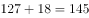瓶。

故正确答案为D。

---

### 第 3 题　qid 2440191 · 数学运算

一次期末考试，某班同学成绩统计如下表：

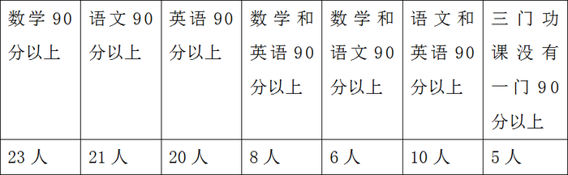

求：这个班最多有多少人？

- **A**. 45
- **B**. 51　✅
- **C**. 53
- **D**. 55

**答案**：B

**官方解析**

根据三集合标准公式：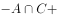，设三门功课均90分以上的人数为，代入公式可得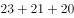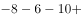，化简得。求总数最多则最多，而三门功课均90分以上的人数一定小于或等于数学和语文90分以上的人数，即。

则当时，人，此时班里人数最多。

故正确答案为B。

---

### 第 4 题　qid 2440192 · 数学运算

A、B二人开车同时从甲地到乙地，A到达乙地后立即返回，在距乙地64千米处与B相遇，已知A每小时行40千米，B每小时行24千米，求甲乙两地相距多少千米？

- **A**. 192
- **B**. 256　✅
- **C**. 320
- **D**. 512

**答案**：B

**官方解析**

设甲乙两地相距千米，则相遇时A所走的路程为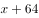千米，B所走的路程为千米。A、B二人同时出发，相遇时所用时间相同，因此，路程和速度成正比。可得：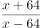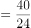，解得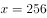千米。

故正确答案为B。

---

### 第 5 题　qid 2440193 · 数学运算

某单位老刘有一个紧急通知要通知到60名同事，假如每通知一位同事需要1分钟，同事接电话后也可以互相通知，要使所有同事都接到通知至少需要几分钟？

- **A**. 6　✅
- **B**. 7
- **C**. 8
- **D**. 9

**答案**：A

**官方解析**

根据题意，每通知一位同事需要1分钟，同事接到电话后可以互相通知，可得：
第一分钟时，老刘可通知到1位同事，共2人接到通知；
第二分钟时，2人可通知到2位同事，共4人接到通知；
第三分钟时，4人可通知到4位同事，共8人接到通知；
第四分钟时，8人可通知到8位同事，共16人接到通知；
第五分钟时，16人可通知到16位同事，共32人接到通知；
第六分钟时，32人可通知到32位同事，能够接到通知的人数可达64人；
因包含老刘在内，总共有61人，则六分钟即可完成。
故正确答案为A。

---

### 第 6 题　qid 2440200 · 数学运算

某环形跑道，两人由同一起点同时出发，异向而行，每隔10分钟相遇一次；如果两人由同一起点同时出发，同向而行，每隔25分钟相遇一次。已知环形跑道的长度是1800米，那么两人的速度分别是多少？

- **A**. 126米/分  54米/分　✅
- **B**. 138米/分  42米/分
- **C**. 110米/分  70米/分
- **D**. 100米/分  80米/分

**答案**：A

**官方解析**

在环形跑道中，由同一起点异向而行，相遇一次时两人共走一个全程，用时10分钟，则：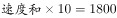，解得两人速度和为180米/分；由同一起点同向而行，相遇一次时快者比慢者多走一个全程，用时25分钟，则：，解得两人速度差为72米/分，结合选项只有A项满足。

故正确答案为A。

---

### 第 7 题　qid 2440202 · 数学运算

甲乙丙三人完成同一幅拼图的时间分别需要1小时、1.2小时、1.5小时。现在有两幅拼图需要甲、乙完成，两人同时开始，丙刚开始帮助甲拼拼图，后来又帮助乙拼，最后两个拼图同时完成。问：丙分别帮助甲、乙多长时间？

- **A**. 0.1小时  0.3小时
- **B**. 0.3小时  0.5小时　✅
- **C**. 0.5小时  0.6小时
- **D**. 0.6小时  0.2小时

**答案**：B

**官方解析**

赋值一幅拼图的工作总量为6，则甲、乙、丙的效率分别为、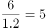、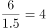。由于同时开始，同时结束，因此在两幅拼图完工过程中，甲、乙、丙始终在工作，假设工作时间总计为，则有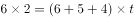，解得小时。甲的工作量为，则丙帮甲干的时间为小时，则丙帮乙干的时间为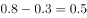小时。

故正确答案为B。

---

### 第 8 题　qid 2440204 · 数学运算

某文具店老板第一次以100元购买了一批铅笔，按每支定价2.8元出售。第二次购买时每支铅笔的批发价比第一次多了0.5元，共花费150元，购买的数量比第一次多10支，当这批铅笔售出时，正好遇到文具店店庆，剩余的铅笔以定价6折售出。那么，该文具店老板第二次批发的铅笔都售出后盈利多少或亏损多少？

- **A**. 盈利26.8元
- **B**. 亏损26.8元
- **C**. 盈利2.16元
- **D**. 亏损2.16元　✅

**答案**：D

**官方解析**

设第一次每支铅笔批发价元，买了支，则第二次每支铅笔批发价为元，购买数量为支。根据题意有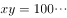，，联立、②式，解得两组解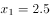元，支；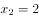元，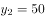支。则第二次购买量为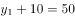支或支。若第二次购买50支，则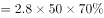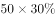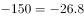元，即亏损26.8元；若第二次购买60支，则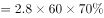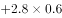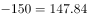元，即亏损2.16元。

B、D选项均能计算出，但若答案为B，则第二次每支铅笔批发价为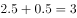元，而定价仅为2.8元，最初定价比成本还低，不符合常识，因此倾向于选D。

故正确答案为D。

---

### 第 9 题　qid 2440210 · 数学运算

某品牌月饼进价比上月提高了，某商场仍按上月售价销售该品牌月饼，利润率比上月下降了5个百分点，那么该商场上月销售该品牌月饼的利润率是多少？

- **A**. 

- **B**. 

- **C**. 

　✅
- **D**. 

**答案**：C

**官方解析**

赋值上月进价为100，则本月进价为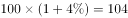，设售价为，根据题意列表如下：

利润率比上月下降了5个百分点，则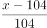，解得，则上月利润率为。

故正确答案为C。

---

### 第 10 题　qid 2440211 · 数学运算

小李打算买38个梨和苹果，已知苹果每个3元，梨每个2元，现要求苹果的数量不得少于梨的3倍，那么各买多少苹果和梨才能使花费最少？

- **A**. 30  8
- **B**. 28  10
- **C**. 33  5
- **D**. 29  9　✅

**答案**：D

**官方解析**

方法一：设买梨个，则买苹果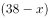个。根据苹果数量不少于梨的3倍，可得：，化简得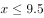。因为梨便宜，所以总个数38不变的情况下，梨买得越多花费越少，所以当（梨的数量）取最大值9（只能取整数）的时候，花费最少。

方法二：选项信息充分，考虑代入排除法。

A项：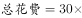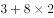元；

B项：28少于10的3倍，不符合题意，直接排除；

C项：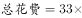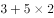元；

D项：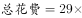元。

故正确答案为D。

---

## 判断推理

### 第 1 题　qid 2440214 · 图形推理

从所给的四个选项中，选择最合适的一个填入问号处，使之呈现一定的规律性。

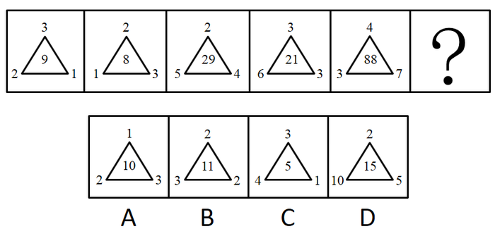

- **A**. A
- **B**. B
- **C**. C
- **D**. D　✅

**答案**：D

**官方解析**

每幅图都有数字，考虑数字推理。观察发现，图一：，图二：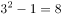，图三：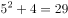，图四：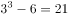，图五：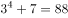，问号处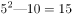，只有D项符合。

故正确答案为D。

---

### 第 2 题　qid 2440224 · 图形推理

从所给四个选项中，选择最合适的一个填入问号处，使之呈现一定规律性。

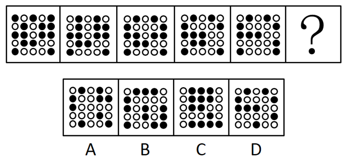

- **A**. A
- **B**. B
- **C**. C
- **D**. D　✅

**答案**：D

**官方解析**

元素组成不同，每幅图都有小黑球，发现小黑球数量从图一到图五依次递减，分别为14、13、12、11、10，？处应选择一个9个黑球的，排除B、C两项。再次观察题干发现，图二和图一相比只有第一行颜色变动，其他行不变，图三和图二相比只有第二行颜色变动，其他行不变，图四和图三相比只有第三行颜色变动，其他行不变，图五和图四相比只有第四行颜色变动，其他行不变，因此问号处应该是第五行和前一幅图相比颜色变动，其他行不变。排除A项，只有D项符合。
故正确答案为D。

---

### 第 3 题　qid 2440227 · 图形推理

从所给四个选项中，选择最合适的一个填入问号处，使之呈现一定的规律性。

- **A**. A　✅
- **B**. B
- **C**. C
- **D**. D

**答案**：A

**官方解析**

元素组成不同，优先考虑属性规律。题干所有图形均为曲线和直线共同构成。进而考虑数量规律，题干图形的部分数分别为：1、2、1，故问号处应选择有2部分的图形。只有A项符合。
故正确答案为A。

---

### 第 4 题　qid 2440234 · 定义判断

法国昆虫学家法布尔曾经做过一个著名的实验：把许多毛毛虫放在一个花盆的边缘上，使其首尾相接，围成一圈，在花盆周围不远的地方，撒了一些毛毛虫喜欢吃的松叶。毛毛虫开始一个跟着一个，绕着花盆的边缘一圈一圈地走，一小时过去了，一天过去了，又一天过去了，这些毛毛虫还是夜以继日地绕着花盆的边缘在转圈，一连走了七天七夜，它们最终因为饥饿和精疲力竭而相继死去。法布尔在做这个实验前曾经设想：毛毛虫会很快厌倦这种毫无意义的绕圈而转向它们比较爱吃的食物，遗憾的是毛毛虫并没有这样做。后来，科学家把这种喜欢跟着前面的路线走的习惯称之为“跟随者”的习惯，把因跟随而导致失败的现象称为“毛毛虫效应”。
根据上述定义，下列属于“毛毛虫效应”的是：

- **A**. 股市中“买涨不买落，经常被套牢”的思想　✅
- **B**. 老张看见小区居民都买了保险，他也毫不犹豫地买了
- **C**. 百事可乐公司向可口可乐公司学习推广模式，迅速打开了中国市场
- **D**. 某公司一直坚持质量第一的原则，使公司规模越办越大

**答案**：A

**官方解析**

第一步：找出定义关键词。
“因跟随而导致失败”。
第二步：逐一分析选项。
A项：股票价格上涨跟着购买，被套牢说明失败，符合定义，当选；
B项：老张看见其他人买保险他也买属于跟随，但是没有体现失败，不符合定义，排除；
C项：迅速打开市场，说明没有失败，不符合定义，排除； 
D项：规模越来越大说明没有失败，不符合定义，排除。
故正确答案为A。

---

### 第 5 题　qid 2440235 · 定义判断

注意分配是指在同一时间内，把注意指向不同的对象，同时从事几种不同活动的现象。
根据上述定义，下列不属于注意分配的是：

- **A**. 学生边听讲边做笔记
- **B**. 歌手自拉自唱
- **C**. 工人边观察仪表边控制调节
- **D**. 运动员一鼓作气完成了躲避、转身、投篮的动作　✅

**答案**：D

**官方解析**

第一步：找出定义关键词。
“同一时间内”、“注意指向不同的对象”、“从事几种不同活动”。
第二步：逐一分析选项。
A项：学生边听讲边做笔记，符合“同一时间内”，听讲与记笔记是不同对象，符合“注意指向不同的对象”、“从事几种不同活动”，符合定义，排除； 
B项：歌手自拉自唱，符合“同一时间内”，拉与唱是不同行为，符合“注意指向不同的对象”、“从事几种不同活动”，符合定义，排除；
C项：边观察仪表边控制调节，符合“同一时间内”，观察与调节是不同的行为，符合“注意指向不同的对象”、“从事几种不同活动”，符合定义，排除；
D项：运动员完成躲避、转身与投篮的动作不是同一时间，不符合“同一时间内”，一鼓作气只是强调了动作的连贯性，但不代表是同一时间，不符合定义，当选。
本题为选非题，故正确答案为D。

---

### 第 6 题　qid 2440236 · 定义判断

印象管理，有时又称印象整饰，是指人们试图管理和控制他人对自己所形成的印象的过程。
根据上述定义，下列不属于印象管理的是：

- **A**. 为了使上级觉得小组所取得的成绩与组长关系密切，当上级来视察时，组长总是与组员在一起讨论问题
- **B**. 老陈在工作中勤勤恳恳，兢兢业业，吃苦在前，享受在后　✅
- **C**. 晓琳觉得自己的腿粗，每次去公共场合都穿长裙
- **D**. 小王上班迟到了，向领导道歉，解释迟到原因

**答案**：B

**官方解析**

第一步：找出定义关键词。
“试图管理和控制他人对自己所形成的印象的过程”。
第二步：逐一分析选项。
A项：上级来视察时，组长总是与组员在一起讨论问题，体现了组长控制他人对自己印象形成，符合定义，排除； 
B项：勤勤恳恳地工作并没有体现控制他人对自己印象形成，不符合定义，当选；
C项：晓琳每次去公共场合都穿长裙，体现了控制他人对自己印象形成，符合定义，排除；
D项：小王上班迟到向领导道歉和解释原因，是试图控制他人不留下对自己不好的印象，符合定义，排除。
本题为选非题，故正确答案为B。

---

### 第 7 题　qid 2440237 · 定义判断

信用卡诈骗罪是指以非法占有为目的，违反信用卡管理法规，利用信用卡进行诈骗活动。骗取财物数额较大的行为。利用信用卡，一般是指使用伪造的、作废的信用卡或者冒用他人的信用卡、恶意透支的方法进行诈骗活动。
根据上述定义，下列不属于信用卡诈骗罪的是：

- **A**. 小王是一名数据高手，有一次他提取了小赵的信用卡磁条信息，在其不知情的情况下偷偷做了一张信用卡，并用它买了自己喜爱的手表和提取了5000元现金
- **B**. 小李在周五下班后，回家的路上捡到了一张信用卡，他觉得反正又没人看见，于是他拿着信用卡去了手机店仿照卡主的签名签字买了一部最新款的智能手机
- **C**. 老李遭遇家中巨变，身无分文被逼无奈的他通过信用卡套现的1万元买日用品，后来到期后银行多次电话催收，老李拒不接听电话，还为了防止被发现偷偷藏了起来
- **D**. 小刘在日常生活中经济压力较大，办理了许多信用卡，以帮助他度过经济难关，但是由于薪资发放不及时，他逾期十天才还上刷卡消费的钱和利息　✅

**答案**：D

**官方解析**

第一步：找出定义关键词。
“以非法占有为目的”、“使用伪造的、作废的信用卡或者冒用他人的信用卡、恶意透支的方法”、“进行诈骗活动”、“数额较大”。
第二步：逐一分析选项。
A项：小王用小赵的磁条信息偷偷做了一张信用卡，提取了5000元现金，符合“使用伪造的信用卡”、“进行诈骗活动”、“数额较大”，符合定义，排除； 
B项：仿照卡主的签名签字买了一部最新款的智能手机，符合“冒用他人的信用卡”、“进行诈骗活动”、“数额较大”，符合定义，排除；
C项：通过信用卡套现的1万元买日用品，不还钱还偷偷藏了起来，符合“恶意透支的方法”、“进行诈骗活动”、“数额较大”，符合定义，排除；
D项：逾期十天才还上刷卡消费的钱和利息，只是由于薪资发放不及时，并不是恶意透支，不是诈骗行为，不符合定义，当选。
本题为选非题，故正确答案为D。

---

### 第 8 题　qid 2440238 · 定义判断

绑架罪，是指勒索财物或者其他目的，使用暴力、胁迫或者其他方法，绑架他人的行为，或者绑架他人作为人质的行为。
根据上述定义下列属于绑架罪的是：

- **A**. 小刘所在单位搞团建活动，活动中，小刘扮演歹徒绑架了扮演人质的小王，并要求小王的父亲老梁拿一百万赎金救人，最后大家成功解救了人质小王，而小刘被反绑了起来
- **B**. 老李因为家庭经济困难，他的妻子又患了癌症，走投无路的他绑架了老孙家的宠物狗，让老孙出1万元赎回他的狗
- **C**. 小明和小红是情侣，在他们分手后，小明把小红迷晕带到郊区的山村里，警告小红如果不同意和他复合就不放她回家　✅
- **D**. 刘鑫与张文是好朋友，某次因为吵架张文不听刘鑫解释。刘鑫为了解释，把张文带到家中，跟她解释完后将其送回家

**答案**：C

**官方解析**

第一步：找出定义关键词。
“勒索财物或者其他目的”、“使用暴力、胁迫或者其他方法，绑架他人的行为”、“或者绑架他人作为人质的行为”。
第二步：逐一分析选项。
A项：只是单位搞团建活动，是表演节目，并非真正的绑架，不符合定义，排除；
B项：绑架的是宠物狗，而题干中要求绑架的对象是人，而非动物，不符合定义，排除；
C项：小明把小红迷晕带到郊区的山村里，警告小红如果不同意和他复合就不放她回家，这是以胁迫方式绑架他人，符合定义，当选；
D项：刘鑫为了解释，把张文带到家中，没有体现是胁迫张文跟他回家，没有体现“胁迫或使用暴力”，不符合定义，排除。
故正确答案为C。

---

### 第 9 题　qid 2440239 · 定义判断

当两物体产生相对滑动（或有相对滑动趋势）时，则在接触间将产生阻碍物体滑动的力，这种力称为滑动摩擦力。
根据以上定义，下列属于滑动摩擦力的是：

- **A**. 骑自行车时，车轮与地面之间的摩擦力
- **B**. 擦黑板时，黑板擦与黑板之间的摩擦力　✅
- **C**. 人在正常走路时产生的摩擦力
- **D**. 篮球在地面上滚动时产生的摩擦力

**答案**：B

**官方解析**

第一步：找出定义关键词。
“当两物体产生相对滑动（或有相对滑动趋势）时”、“在接触间将产生阻碍物体滑动的力”。
第二步：逐一分析选项。
A项：骑自行车时，车轮与地面之间是滚动，而不是滑动，不符合“相对滑动（或有相对滑动趋势）时”，不符合定义，排除； 
B项：擦黑板时，黑板擦与黑板产生了相对滑动，而且有阻力产生，符合定义，当选；
C项：人在正常走路时，人和路面之间没有产生相对滑动，不符合定义，排除；
D项：篮球在地面上滚动时，篮球和地面之间是滚动，而不是滑动，不符合“相对滑动（或有相对滑动趋势）时”，不符合定义，排除。
故正确答案为B。

---

### 第 10 题　qid 2440240 · 逻辑判断

呼告是在行文中直呼文中的人或物的一种修辞方式。一般可把它分为呼人、呼物两种形式。运用呼告，可以抒发强烈的思想感情，加强感染力，并引起读者强烈的感情共鸣。
根据以上定义，下列语句未使用呼告这一修辞方式的是：

- **A**. 秋，听说你已来到
- **B**. 鼓动吧，风！咆哮吧，雷！闪耀吧，电！
- **C**. 周总理，我们的好总理，你在哪里呵，你在哪里？
- **D**. 水面冻冰，冰积雪，雪上加霜　✅

**答案**：D

**官方解析**

第一步：找出定义关键词。
“在行文中直呼文中的人或物的一种修辞方式”、“可以抒发强烈的思想感情，加强感染力”、“引起读者强烈的感情共鸣”。
第二步：逐一分析选项。
A项：“秋”是行文中对物的称呼，通过这个称呼可以抒发强烈的思想感情，加强感染力，符合定义，排除； 
B项：“风”、“雷”、“电”是行文中对物的称呼，通过这些称呼可以抒发强烈的思想感情，加强感染力，符合定义，排除；
C项：“周总理”是行文中对人的称呼，通过这个称呼可以抒发强烈的思想感情，加强感染力，符合定义，排除；
D项：“水面冻冰，冰积雪，雪上加霜”只是陈述了客观事实，并没有体现对行文中人和物的称呼，不符合定义，当选。
本题为选非题，故正确答案为D。

---

### 第 11 题　qid 2440241 · 定义判断

逆向思维，也称求异思维，它是对司空见惯的似乎已成定论的事物或观点反过来思考的一种思维方式。敢于“反其道而思之”，让思维向对立面的方向发展，从问题的相反面深入地进行探索，树立新思想，创立新形象。
根据上述定义，下列不属于逆向思维的是：

- **A**. 司马光砸缸放水，救出了小伙伴
- **B**. 农民老张在秋收中比别人早收了几天，结果天降大雨，全村只有自己丰收　✅
- **C**. 法拉第根据电流的磁效应，认为磁场也能产生电，提出了电磁感应定律
- **D**. 小王在自己的简历中将经历倒叙，使得自己在万份简历中脱颖而出

**答案**：B

**官方解析**

第一步：找出定义关键词。
“对似乎已成定论的事物或观点反过来思考的一种思维方式”。
第二步：逐一分析选项。
A项：司马光砸缸放水，救出了小伙伴，水缸本是用来储水，他把水缸砸破放水，符合“对似乎已成定论的事物或观点反过来思考的一种思维方式”，符合定义，排除；
B项：农民老张在秋收中比别人早收了几天，并没有体现出“对似乎已成定论的事物或观点反过来思考的一种思维方式”，不符合定义，当选；
C 项：法拉第根据电流的磁效应，认为磁场也能产生电，符合“对似乎已成定论的事物或观点反过来思考的一种思维方式”，符合定义，排除；
D项：小王在自己的简历中将经历倒叙，让自己脱颖而出，本来简历往往按时间顺序记叙，小王采取倒叙的方式，符合“对似乎已成定论的事物或观点反过来思考的一种思维方式”，符合定义，排除。
本题为选非题，故正确答案为B。

---

### 第 12 题　qid 2440242 · 定义判断

高峰体验是指人们在追求自我实现的过程中，基本需要获得满足后，达到自我实现时所感受到的短暂的、豁达的、极乐的体验，是一种趋于顶峰、超越时空、超越自我的满足与完美体验。
根据上述定义，下列不属于高峰体验的是：

- **A**. 冯导终于拍出大片获得奥斯卡最佳导演时的体验
- **B**. 老崔爬上山峰看到朝阳升起时的体验
- **C**. 村民见到老李与失散多年孩子拥抱时的体验　✅
- **D**. 小张经过努力终于成为飞行员时的体验

**答案**：C

**官方解析**

第一步：找出定义关键词。
“追求自我实现的过程中，基本需要获得满足后”、“达到自我实现时所感受到的短暂的、豁达的、极乐的体验”。
第二步：逐一分析选项。
A项：冯导获的奥斯卡最佳导演奖的体验，符合“追求自我实现的过程中，基本需要获得满足后”、“达到自我实现时所感受到的短暂的、豁达的、极乐的体验”，符合定义，排除；
B项：老崔爬上山峰看到朝阳升起时的体验，符合“追求自我实现的过程中，基本需要获得满足后”、“达到自我实现时所感受到的短暂的、豁达的、极乐的体验”，符合定义，排除；
C 项：村民见到老李找到孩子的体验，村民的此种体验并不是他自我追求的实现，是老李自我追求实现的满足，不符合“追求自我实现的过程中，基本需要获得满足后”、“达到自我实现时所感受到的短暂的、豁达的、极乐的体验”，不符合定义，当选；
D项：小张经过努力终于成为飞行员时的体验，符合“追求自我实现的过程中，基本需要获得满足后”、“达到自我实现时所感受到的短暂的、豁达的、极乐的体验”，符合定义，排除。
本题为选非题，故正确答案为C。

---

### 第 13 题　qid 2440243 · 定义判断

结构化决策是对某一决策过程的环境及规则，能用确定的模型或语言描述，以适当的算法产生决策方案，并能从多种方案中选择最优解的决策。非结构化决策是指决策过程复杂，不可能用确定的模型和语言来描述其决策过程。更无所谓最优解的决策。
根据上述定义，下列属于非结构化决策的是：

- **A**. 某国确定将与周边国家大力发展伙伴关系　✅
- **B**. 某市要再建造一座长江大桥
- **C**. 某景点限制游客进入数量
- **D**. 某网店根据销量确定进货品类

**答案**：A

**官方解析**

第一步：找出定义关键词。
结构化决策：“对某一决策过程的环境及规则”、“能用确定的模型或语言描述”、“以适当的算法产生决策方案”、“并能从多种方案中选择最优解的决策”。
非结构化决策：“决策过程复杂”、“不可能用确定的模型和语言来描述其决策过程”、“更无所谓最优解的决策”。
第二步：逐一分析选项。
A项：某国确定将与周边国家大力发展伙伴关系，伙伴关系比较抽象的，符合“不可能用确定的模型和语言来描述其决策过程”，符合“非结构化决策”定义，当选；
B项：某市要再建造一座长江大桥，大桥的方案是可以确定描述的，不符合“不可能用确定的模型和语言来描述其决策过程”，不符合“非结构化决策”定义，排除；
C项：某景点限制游客进入数量，游客的数量是可以具体描述的，可以有最优解的决策，不符合“不可能用确定的模型和语言来描述其决策过程”，不符合“非结构化决策”定义，排除；
D项：某网店根据销量确定进货品类，进货品类可以用确定的模型和语言来描述其决策过程，不符合“不可能用确定的模型和语言来描述其决策过程”，不符合“非结构化决策”定义，排除。
故正确答案为 A。

---

### 第 14 题　qid 2440244 · 类比推理

长江：中国

- **A**. 尼罗河：非洲
- **B**. 密西西比河：美国
- **C**. 伏尔加河：俄罗斯　✅
- **D**. 巴拿马运河：巴拿马

**答案**：C

**官方解析**

第一步：判断题干词语间逻辑关系。
长江是位于中国的自然流域，且长江的整个流域都位于中国境内，二者是地点的对应。
第二步：判断选项词语间逻辑关系。
A项：尼罗河位于非洲，二者是地点的对应，但非洲不是国家，与题干逻辑关系不一致，排除；
B项：密西西比河整个水系流经美国本土48州中的31个州和加拿大的两个州，故整个流域不是全部位于美国境内，与题干逻辑关系不一致，排除；
C项：伏尔加河是位于俄罗斯的自然流域，伏尔加河流经俄罗斯13个联邦主体，整个流域位于俄罗斯境内，二者是地点的对应，与题干逻辑关系一致，当选； 
D项：巴拿马运河位于中美洲国家巴拿马共和国，该运河是由美国建造完成，但是巴拿马运河不是天然流域，与题干逻辑关系不一致，排除。
故正确答案为C。

---

### 第 15 题　qid 2440245 · 类比推理

木头：木桌：家具

- **A**. 百合：花卉：药用
- **B**. 橡胶：轮胎：汽车
- **C**. 树木：森林：自然
- **D**. 小麦：馒头：食物　✅

**答案**：D

**官方解析**

第一步：判断题干词语间逻辑关系。
木头是木桌的原材料，二者是对应关系，木桌是家具的一种，二者是种属关系。
第二步：判断选项词语间逻辑关系。
A项：百合是一种花卉，二者是种属关系，与题干逻辑关系不一致，排除；
B项：橡胶是轮胎的原材料，二者是对应关系，轮胎是汽车的组成部分，二者是组成关系，与题干逻辑关系不一致，排除；
C项：树木是森林的组成部分，二者是组成关系，与题干逻辑关系不一致，排除；
D项：小麦是馒头的原材料，二者是对应关系，馒头是食物的一种，二者是种属关系，与题干逻辑关系一致，当选。
故正确答案为D。

---

### 第 16 题　qid 2440246 · 类比推理

图书馆：书籍：保存

- **A**. 医务室：医生：休息
- **B**. 足球场：足球：裁判
- **C**. 冰箱：午餐肉：冷藏　✅
- **D**. 教师：教室：上课

**答案**：C

**官方解析**

第一步：判断题干词语间逻辑关系。
保存书籍是动宾关系，二者是语法关系，图书馆是保存书籍的场所，是对应关系。
第二步：判断选项词语间逻辑关系。
A项：医生休息是主谓关系，与题干逻辑关系不一致，排除；
B项：裁判判罚足球比赛，裁判与足球，二者不是动宾关系，与题干逻辑关系不一致，排除；
C项：冷藏午餐肉是动宾关系，冰箱是冷藏午餐肉的场所，是对应关系，与题干逻辑关系一致，当选；
D项：教师上课是主谓关系，教室是教师上课的场所，与题干逻辑关系不一致，排除。
故正确答案为C。

---

### 第 17 题　qid 2440247 · 类比推理

花瓶 对于        相当于        对于 照明

- **A**. 瓷器  电路
- **B**. 艺术  灯塔
- **C**. 石狮  地图
- **D**. 装饰  台灯　✅

**答案**：D

**官方解析**

逐一代入选项。
A项：有的花瓶是瓷器，有的花瓶不是瓷器，有的瓷器是花瓶，有的瓷器不是花瓶，因此花瓶和瓷器二者为交叉关系。照明需要用到电路，二者不是交叉关系，前后逻辑关系不一致，排除；
B项：花瓶和艺术之间没有明确的逻辑关系（注意：有的花瓶可以是艺术品，花瓶和艺术品之间可以构成交叉关系，但是花瓶和艺术之间没有必然明确的逻辑关系），灯塔是高塔形建筑物，灯塔上装有照明设备，灯塔具有照明作用，二者是对应关系，前后逻辑关系不一致，排除；
C项：花瓶和石狮没有必然的逻辑关系，地图和照明也没有明确的逻辑关系，前后逻辑关系不一致，排除；
D项：花瓶具有装饰的作用，台灯具有照明的作用，二者均为功能的对应关系，前后逻辑关系一致，当选。
故正确答案为D。

---

### 第 18 题　qid 2440248 · 类比推理

酒驾 对于        相当于        对于 尊敬

- **A**. 处罚  善良　✅
- **B**. 拘留  轻视
- **C**. 交通规则  价值观
- **D**. 交警  道德

**答案**：A

**官方解析**

逐一代入选项。
A项：酒驾可能被处罚，善良可能被尊敬，均是或然的因果关系，前后逻辑关系一致，当选；
B项：酒驾可能被拘留，二者是或然因果关系，轻视和尊敬是对于人的两种态度，属于并列关系，前后逻辑关系不一致，排除；
C项：通过造句子可知：酒驾违反了交通规则，而价值观违反了尊敬不符合逻辑，前后逻辑关系不一致，排除；
D项：查询酒驾是交警的工作职责之一，二者是对应关系，道德和尊敬之间没有必然联系，前后逻辑关系不一致，排除。
故正确答案为A。

---

### 第 19 题　qid 2440249 · 逻辑判断

甲乙丙三人商量去钓鱼，甲说：如果乙去，我就去；乙说：如果我不去，丙也不会去；丙说：如果甲不去，那么我就去。
那么可以推出的是：

- **A**. 甲去钓鱼　✅
- **B**. 乙去钓鱼
- **C**. 丙去钓鱼
- **D**. 乙不去钓鱼

**答案**：A

**官方解析**

翻译题干。

① 乙  甲

② 乙  丙

③ 甲  丙

④ 将③逆否和②可以递推出：④ 乙  丙  甲

根据①和④可知，无论乙去不去，甲都会去，即：甲一定去钓鱼。A选项符合题意。

故正确答案为A。

---

### 第 20 题　qid 2440250 · 逻辑判断

如今的自媒体都是标题党，张姓微博大V肯定会被警告要注意标题的准确性。
下列选项中的逻辑与上述推理最接近的是：

- **A**. 北方人不喜欢甜食，小张不是北方人，所以小张不会不喜欢甜食
- **B**. 性格叛逆的孩子有出息，小刘有出息，所以小刘性格叛逆
- **C**. 发达国家都是不遵守国际法的，有些美洲国家不遵守国际法，所以有些国家不是发达国家
- **D**. 现在的年轻演员普遍长得好看，小蔡是年轻演员，所以小蔡长得好看　✅

**答案**：D

**官方解析**

第一步：翻译题干。

自媒体标题党，张姓大V被警告要注意标题准确性，即：张姓大V是自媒体，所以，张姓大V是标题党。题干的推理形式是肯前推出肯后。

第二步：逐一分析选项。

A项：北方人不喜欢甜食，小张不是北方人是对命题的否前，与题干推理形式不一致，排除；

B项：性格叛逆的孩子有出息，小刘有出息是对命题的肯后，与题干推理形式不一致，排除；

C项：发达国家不遵守国际法，有些美洲国家不遵守国际法是对题干命题的肯后，与题干的推理形式不一致，排除；

D项：年轻演员长得好看，小蔡是年轻演员，所以小蔡长得好看，这是肯前推出肯后，与题干推理形式一致，当选。

故正确答案为D。

---

### 第 21 题　qid 2440251 · 逻辑判断

目前我国几大手机厂商均陆续推出了5G手机，但也有外国厂商指出，目前5G手机技术不成熟，现在还无法大规模推广普及。
以下哪项如果为真，不能支持外国厂商的观点？

- **A**. 新技术往往价格昂贵
- **B**. 目前5G基站主要分布于大城市
- **C**. 媒体宣传5G手机非常到位　✅
- **D**. 大部分民众并不对这种技术升级感兴趣

**答案**：C

**官方解析**

第一步：找出论点和论据。
论点：目前5G手机技术不成熟，现在还无法大规模推广普及。
论据：无。
本题只有论点没有论据，因此，考虑补充论据的方式加强。
第二步：逐一分析选项。
A项：新技术价格贵，是导致其无法普及的一个因素，补充论据，可以加强，排除；
B项：目前5G基站主要分布于大城市，说明5G的基站普及率不高，补充论据，可以加强，排除；
C项：媒体宣传5G手机非常到位，与5G技术现在是否可以大规模普及没有关系，属于无关选项，无法加强，当选；
D项：大部分民众并不对这种技术升级感兴趣，是导致其无法普及的一个因素，补充论据，可以加强，排除。
本题为选非题，故正确答案为C。

---

### 第 22 题　qid 2440252 · 类比推理

春游过程中，小米、小钱和小何看到了一棵树，小钱说：“它不是松树，是柏树。”小何说：“它不是柏树，是松树。”小米不能确定是什么树，但是他说：“它不是杨树，也不是柏树。”最后老师说：“你们三个人的猜测中只有一个人的两个判断都对，一个人的判断是一对一错，还有一人全错了。”
如果老师的说法是对的，则可以得出他们看到的是哪种树？

- **A**. 松树
- **B**. 柏树　✅
- **C**. 杨树
- **D**. 无法确定

**答案**：B

**官方解析**

本题属于组合排列题型。
第一步：分析题干信息。
题干信息不明确，采用代入法解题。
第二步：逐一代入选项。
A项：如果是松树，则：小钱的两句全错，小何的两句全对，小米的两句全对，不符合题意，排除；
B项：如果是柏树，则：小钱的两句全对，小何的两句全错，小米的两句一对一错，符合题意，当选；
C项：如果是杨树，则：小钱的两句一对一错，小何的两句一对一错，小米的两句一对一错，不符合题意，排除；
D项：根据上述分析，可以确定是柏树，排除。
故正确答案为B。

---

### 第 23 题　qid 2440253 · 逻辑判断

学校要举行文艺汇演，某系准备在唱歌、跳舞、相声、小品中确定一个或几个节目去参加。系领导通过筛选，最终形成以下三种意见：
（1）对于唱歌和跳舞，至多选择一个。
（2）对于唱歌和小品，至少选择一个。
（3）如果选择相声或者小品，就不能选择跳舞。
最终参加文艺汇演的节目只满足上述一种意见。
根据以上陈述，以下哪项是正确的？

- **A**. 选择跳舞、相声、小品
- **B**. 选择跳舞，但不选择相声和小品
- **C**. 选择唱歌、跳舞、小品　✅
- **D**. 选择相声、但不选择跳舞和小品

**答案**：C

**官方解析**

第一步:整理题干条件。

① 唱歌或跳舞

② 唱歌或小品

③ 相声或小品跳舞。

第二步:逐一分析选项。

题干条件不确定，只有一个正确，优先采用代入法。

将A项代入，①②正确，③错误，不符合题意，排除；

将B项代入，不确定是否选择唱歌，假设选择唱歌，①错误，②③正确；假设不选择唱歌，①③正确，②错误，两种情况均不符合题意，排除；

将C项代入，①③错误，②正确，符合题意，当选；

将D项代入，不确定是否选择唱歌，假设选择唱歌，①②③均正确；假设不选择唱歌，①③正确，②错误，两种情况均不符合题意，排除。

故正确答案为C。

---

### 第 24 题　qid 2440254 · 逻辑判断

某小区在2018年之前公共设施经常遭到破坏，2018年在小区居民的要求下，小区物业为小区安装了多角度摄像监控系统，之后该小区的公共设施很少受到破坏，这说明多角度摄像监控系统对于保护小区公共设施起到了重要的作用。
以下哪项如果为真，最能加强上述结论？

- **A**. 从2018年开始，该市其他同等档次未安装监控系统的小区公共设施破坏事件显著增加　✅
- **B**. 该市的另一个小区也安装了多角度摄像监控系统，但效果并不理想
- **C**. 从2018年开始，小区物业增加了工作人员，加强了治安巡逻
- **D**. 多角度摄像监控系统对于商场等公共场所防范作用较差

**答案**：A

**官方解析**

第一步:找出论点和论据。
论点:多角度摄像监控系统对于保护小区公共设施起到了重要的作用。
论据:小区物业为小区安装了多角度摄像监控系统，之后该小区的公共设施很少遭到破坏。
本题的论点和论据均讨论了多角度摄像监控系统对保护小区公共设施的作用，论点和论据话题一致，要想加强，可以补充论据，即解释多角度监控系统可以保护小区公共设施的原因，或者举例说明该系统确实可以保护小区公共设施。
第二步:逐一分析选项。
A项:指出没安装该系统的小区公共设施破坏严重，那么说明该系统确实能够保护小区公共设施，补充论据，可以加强，当选;
B项:强调另一个小区安装该系统却没有效果，说明该系统并不能保护小区公共设施，削弱了论点，排除;
C项:指出该小区增加了人员，加强了治安，与该系统是否能保护小区公共设施无关，无关项，排除;
D项:指出该系统对商场等公共场所防范作用较差，与论点中的小区公共设施无关，无关项，排除。
故正确答案为A。

---

### 第 25 题　qid 2440255 · 逻辑判断

星座预测就是根据星辰的位置及其各种变化来预测人世间的各种事物。有很多人相信并依照星座预测制定每天的日程。因此，有人认为星座预测是正确的，否则也不会有这么多人相信。
以下哪项如果为真，最能反驳上述观点？

- **A**. 星座确实存在
- **B**. 有更多的人不相信星座预测
- **C**. 未成年人才相信星座预测
- **D**. 会有很多的人相信非常不科学的事情　✅

**答案**：D

**官方解析**

第一步：找出论点和论据。
论点：星座预测是正确的，否则也不会有这么多人相信。
论据：无。
本题只有论点，没有论据，优先考虑否定论点的方式来削弱。
第二步：逐一分析选项。
A项：指星座确实存在，但是论点讨论的是星座预测是否是正确的，存在不代表预测一定是正确的，属于不明确选项，无法削弱，排除；
B项：指出有更多的人不相信星座预测，与论点讨论的星座预测到底是不是正确的无关，无法削弱，排除；
C项：指出未成年人才相信星座预测，与论点讨论的星座预测到底是不是正确的无关，无法削弱，排除；
D项：指出会有很多人相信不科学的事情，即不能根据很多人相信，就认为星座预测是正确的，否定论点，当选。
故正确答案为D。

---

### 第 26 题　qid 2440256 · 逻辑判断

为了能够使自己保持旺盛的精力投入到工作中去，年轻人小李每天中午用完午餐之后都会冲一杯雀巢速溶咖啡提神，可是通过一周的跟踪观察发现每天中午饮用完咖啡后，小李下午还是犯瞌睡，于是他认为：喝雀巢咖啡不能提神。
以下哪项如果为真，最能削弱上述结论？

- **A**. 以前小李中午不喝咖啡，下午在座位上都睡着了　✅
- **B**. 小李喝的是有食品安全认证的雀巢咖啡
- **C**. 雀巢咖啡在国内销量位居速溶咖啡第一位
- **D**. 雀巢咖啡的国内售价比较其他咖啡更优惠

**答案**：A

**官方解析**

第一步：找出论点和论据。
论点：喝雀巢咖啡不能提神。
论据：通过一周的跟踪观察发现，每天中午饮用完咖啡后，小李下午还是犯瞌睡。
论点和论据话题一致，优先考虑否定论点的方式来削弱。
第二步：逐一分析选项。
A项：指出以前小李不喝咖啡时，下午都在座位上睡着了，而现在喝了咖啡，下午只是犯瞌睡，说明雀巢咖啡有用，可以起到一定的提神效果，否定论点，当选；
B项：指出小李喝的是有食品安全认证的雀巢咖啡，与论点讨论的该咖啡能不能提神无关，无法削弱，排除；
C项：指出雀巢咖啡在国内销量位居速溶咖啡第一位，与论点讨论的该咖啡能不能提神无关，无法削弱，排除；
D项：指出雀巢咖啡的国内售价更优惠，与论点讨论的该咖啡能不能提神无关，无法削弱，排除。
故正确答案为A。

---

### 第 27 题　qid 2440258 · 逻辑判断

自从某中学在高三年级实行班主任岗位目标责任制后，学校的升学率逐年上升。由此可见，只有实行班主任岗位目标责任制，才能使该校的升学率稳步增长。
以下哪项如果为真，最能削弱上述论证？

- **A**. 近几年高校扩招，学生升学率整体形势较好
- **B**. 没有实行班主任岗位目标责任制的A中学，近几年的升学率也在稳步上升
- **C**. 前年该校开始实行教师薪酬改革，极大地调动了广大教师的积极性
- **D**. 如果该校没有实行班主任岗位目标责任制，近两年的升学率会上升得更快　✅

**答案**：D

**官方解析**

第一步:找出论点和论据。
论点:只有实行班主任岗位目标责任制，才能使该校的升学率稳步增长。
论据:自从某中学在高三年级实行班主任岗位目标责任制后，学校的升学率逐年上升。
本题的论点和论据均讨论了班主任岗位目标责任制和升学率的关系，论点和论据话题一致，要想削弱，可以否定论点，即说明没有实行班主任岗位目标责任制，升学率也能增长。
第二步：逐一分析选项。
A项：该项指出可能是因为升学率整体形势好，使得升学率稳步增长，是他因削弱，可以削弱，保留；
B项：该项讨论的是“没有实行制度的A中学”，与题干讨论的某中学无关，无关选项，无法削弱，排除；
C项：该项指出前年该校也实行了教师薪酬改革，调动了教师的积极性，可能是因为教师积极性高了，使得升学率稳步增长，是他因削弱，可以削弱，保留；
D项：如果该校没有实行班主任岗位目标责任制，近两年的升学率会增长得更快，说明实行班主任岗位目标责任制反而限制了升学率的增长，直接削弱论点，保留。
对比A、C、D三项，D项削弱论点力度最强，大于A、C两项的他因削弱。
故正确答案为D。

---

### 第 28 题　qid 2440259 · 逻辑判断

当前，银行面临着这样一个问题，就是对于那些在贷款后不能及时还贷的客户，银行除了不断通过各种形式催款别无他法。因此许多银行都向不能及时还贷的客户收取滞纳金。但有关调查表明，收取滞纳金后不能及时还贷的客户数量不但未减少，反而增加了。
以下哪项如果为真，最能解释上述调查结果？

- **A**. 收取滞纳金后，更多的客户认为即使不及时还贷也不必内疚，只要支付滞纳金就行　✅
- **B**. 有个别客户对收取滞纳金的行为不满，有时会故意不及时还贷来抗议
- **C**. 有些客户因为生活压力大，常常不能及时还贷
- **D**. 收取滞纳金的金额太低，对原本经常不及时还贷的客户没有太大的压力

**答案**：A

**官方解析**

第一步:找出题干的矛盾之处。
题干的矛盾之处在于银行向不能及时还贷的客户收取滞纳金，但收取滞纳金后不能及时还贷的客户数量不但未减少，反而增加了。
第二步:逐一分析选项。
A项:收取滞纳金后，客户认为不必内疚，所以更多的客户可能不及时还贷，可以解释，当选;
B项:个别客户的不满并不能解释为何不能及时还贷的客户数量增加了，不能解释，排除;
C项:有些客户不能及时还款，是一个长期性的行为，并不能解释这次收取滞纳金为何使得不能及时还贷的客户数量增加了，不能解释，排除;
D项:对原本经常不能还贷的客户的影响，并不能解释为何不能及时还贷的客户数量增加了，不能解释，排除。
故正确答案为A。

---

## 资料分析

### 材料 1

        2018年1-10月份，全国房地产开发投资99325亿元，同比增长，增速比1-9月份回落0.2个百分点。其中，住宅投资70370亿元，增长，增速回落0.3个百分点。住宅投资占房地产开发投资的比重为。

        1-10月份，东部地区房地产开发投资53136亿元，同比增长，增速比1-9月份回落0.2个百分点；中部地区投资20755亿元，增长，增速回落1.3个百分点；西部地区投资21254亿元，增长，增速提高0.9个百分点；东北地区投资4180亿元，增长，增速回落0.9个百分点。

        1-10月份，商品房销售面积133117万平方米，同比增长，增速比1-9月份回落0.7个百分点。其中，住宅销售面积增长，办公楼销售面积下降，商业营业用房销售面积下降。商品房销售额115913亿元，增长，增速回落0.8个百分点。其中，住宅销售额增长，办公楼销售额下降，商业营业用房销售额增长。

        1-10月份，东部地区商品房销售面积53545万平方米，同比下降，降幅比1-9月份扩大0.4个百分点；销售额61680亿元，增长，增速回落0.6个百分点。中部地区商品房销售面积37733万平方米，增长，增速回落1.5个百分点；销售额25380亿元，增长，增速回落1.6个百分点。西部地区商品房销售面积35430万平方米，增长，增速回落0.3个百分点；销售额24165亿元，增长，增速回落0.6个百分点。东北地区商品房销售面积6409万平方米，下降，降幅扩大1.2个百分点；销售额4688亿元，增长，增速回落2.5个百分点。

        10月末，商品房待售面积52789万平方米，比9月末减少401万平方米。其中，住宅待售面积减少321万平方米，办公楼待售面积减少19万平方米，商业营业用房待售面积减少46万平方米。

#### 第 1 题　qid 2440282 · 比重

2017年1-10月，住宅投资占房地产开发投资的比重约为：

- **A**. 
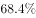
　✅
- **B**. 

- **C**. 
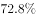

- **D**. 

**答案**：A

**官方解析**

根据题干“2017年1-10月···占···的比重”，结合材料时间为2018年，可判定本题为基期比重问题。定位材料第一段数据可得：“2018年1-10月份，全国房地产开发投资99325亿元，同比增长。住宅投资70370亿元，增长。住宅投资占房地产开发投资的比重为。”根据基期比重的公式：基期比重，故题干所求2017年1-10月份住宅投资占房地产开发投资的比重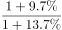，只有A项满足。

故正确答案为A。

---

#### 第 2 题　qid 2440284 · 综合

2018年1-10月，在东部、中部、西部、东北四个地区中，商品房销售单价与全国变化相同的有几项？

- **A**. 1
- **B**. 2
- **C**. 3
- **D**. 4　✅

**答案**：D

**官方解析**

根据题干“······销售单价与全国变化相同”，可判定本题为两期平均数的比较问题。销售单价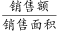，根据平均数升降判断的方法：若销售额的增速大于销售面积的增速，则单价与去年相比上升，反之下降。定位第三段可知“2018年1-10月份，商品房销售面积······同比增长。商品房销售额······增长”。销售额增速销售面积的增速，因此全国商品房销售单价与去年相比有所上升。

定位第四段可得到数据“2018年1-10月份，东部地区商品房销售面积同比下降；销售额增长。中部地区面积37733增长；销售额增长；西部地区销售面积增长；销售额增长；东北地区销售面积下降；销售额增长。”观察发现，四个地区都满足销售额增速销售面积的增速，即四个地区商品房销售单价与去年相比都有所上升。故商品房销售单价与全国变化相同的地区有4项。

故正确答案为D。

备注：各地区单价与全国单价变化相同，即单价涨跌方向一致（同增或者同减），判断单价涨跌时比较增长率或者增长量的正负即可。

---

#### 第 3 题　qid 2440285 · 增长

在2018年的下列指标中，同比增长幅度最大的是：

- **A**. 1-9月东部地区房地产开发投资
- **B**. 1-10月西部地区商品房销售额　✅
- **C**. 1-9月商品房销售额
- **D**. 1-10月住宅投资

**答案**：B

**官方解析**

由题干“在2018年···同比增长幅度最大···”，可判定本题为一般增长率比较问题。

A项，定位文字材料第二段，“1-10月份，东部地区房地产开发投资53136亿元，同比增长，增速比1-9月份回落0.2个百分点；”，可计算出2018年1-9月东部地区房地产开发投资增速为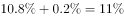；

B项，定位文字材料第四段，“1-10月份···西部地区商品房···销售额24165亿元，增长···。”，可知2018年1-10月西部地区商品房销售额增速为；

C项，定位文字材料第三段，“1-10月份，···商品房销售额115913亿元，增长，增速回落0.8个百分点。···”，可计算出2018年1-9月商品房销售额增速为；

D项，定位文字材料第一段，“2018年1-10月份，···其中，住宅投资70370亿元，增长···”，可知2018年1-10月住宅投资增速为。

比较上述增速，最大的是1-10月西部地区商品房销售额（）。

故正确答案为B。

---

#### 第 4 题　qid 2440288 · 增长

2018年1-10月，在东部、中部、西部、东北四个地区中，按商品房销售额同比增长量的排序正确的是哪一项？

- **A**. 

- **B**. 
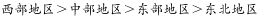
　✅
- **C**. 

- **D**. 
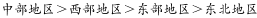

**答案**：B

**官方解析**

由题干“2018年1-10月，···同比增长量的排序···”，可判定本题为增长量比较问题。定位文字材料第四段，“1-10月份，东部地区···销售额61680亿元，增长，···。中部地区···销售额25380亿元，增长，···。西部地区···销售额24165亿元，增长，···。东北地区···销售额4688亿元，增长，···”。根据公式，增长量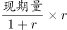，可计算出东部地区商品房销售额同比增长量亿元；中部地区商品房销售额同比增长量亿元；西部地区商品房销售额同比增长量亿元；东北地区商品房销售额同比增长量亿元。比较四个数字，可知西部地区最大，满足的只有B项。

故正确答案为B。

---

#### 第 5 题　qid 2440290 · 综合

根据材料，下列说法正确的是：

- **A**. 
如果保持2018年10月末的同比增量不变，商品房待售面积将在2019年下半年跌破5亿平方米

- **B**. 
2018年10月末，商品房待售面积同比下降

- **C**. 
2018年1-10月，在我国四个区域中，东部地区的商品房销售单价最高
　✅
- **D**. 
2018年10月末，在商品房待售面积中，住宅待售面积环比变化最小

**答案**：C

**官方解析**

A项，定位文字材料最后一段，“10月末，商品房待售面积52789万平方米，比9月末减少401万平方米。”材料给出比9月末减少，属于10月末的环比数据，而题干是“保持2018年10月末的同比增量不变，”没有2017年10月的数据，无法推出，错误；

B项，定位文字材料最后一段，“10月末，商品房待售面积52789万平方米，比9月末减少401万平方米。”材料给出比9月末减少，属于10月末的环比数据，而题干是“同比下降”，没有2017年10月的数据，无法推出，错误；

C项，定位文字材料第四段，“1-10月份，东部地区商品房销售面积53545万平方米，···；销售额61680亿元，···。中部地区商品房销售面积37733万平方米，···；销售额25380亿元，···。西部地区商品房销售面积35430万平方米，···；销售额24165亿元，···。东北地区商品房销售面积6409万平方米，···；销售额4688亿元，···。”。根据公式销售单价，可计算出东部地区销售单价万元/平方米；中部地区销售单价万元/平方米；西部地区销售单价万元/平方米；东北地区销售单价万元/平方米。由此可知，东部地区的商品房销售单价最高。正确；

D项，定位文字材料最后一段，“10月末，商品房待售面积52789万平方米，比9月末减少401万平方米。其中，住宅待售面积减少321万平方米，办公楼待售面积减少19万平方米，商业营业用房待售面积减少46万平方米。”比较上述数字，办公楼待售面积减少19万平方米是环比变化最小的，而非住宅待售面积，错误。

故正确答案为C。

---
