# 2019深圳市公务员录用考试《行测》题（网友回忆版）

> 省考 · 2019 年 · 6 个模块 · 共 97 题

- [政治理论](#%E6%94%BF%E6%B2%BB%E7%90%86%E8%AE%BA) · 3 题
- [常识判断](#%E5%B8%B8%E8%AF%86%E5%88%A4%E6%96%AD) · 17 题
- [言语理解与表达](#%E8%A8%80%E8%AF%AD%E7%90%86%E8%A7%A3%E4%B8%8E%E8%A1%A8%E8%BE%BE) · 30 题
- [数量关系](#%E6%95%B0%E9%87%8F%E5%85%B3%E7%B3%BB) · 12 题
- [判断推理](#%E5%88%A4%E6%96%AD%E6%8E%A8%E7%90%86) · 20 题
- [资料分析](#%E8%B5%84%E6%96%99%E5%88%86%E6%9E%90) · 15 题

---

## 政治理论

### 第 1 题　qid 2385130 · 新思想

习近平总书记在党的十九大报告中指出，中华民族伟大复兴，绝不是轻轻松松、敲锣打鼓就能实现的。为了实现伟大梦想，全党必须准备付出更为艰巨、更为艰苦的努力，其中不包括（  ）。

- **A**. 必须进行伟大斗争
- **B**. 必须建设伟大工程
- **C**. 必须付出伟大牺牲　✅
- **D**. 必须推进伟大事业

**答案**：C

**官方解析**

本题考查政治常识。
习近平总书记在党的十九大报告中指出：行百里者半九十。中华民族伟大复兴，绝不是轻轻松松、敲锣打鼓就能实现的。全党必须准备付出更为艰巨、更为艰苦的努力。实现伟大梦想，必须进行伟大斗争。实现伟大梦想，必须建设伟大工程。实现伟大梦想，必须推进伟大事业。伟大斗争，伟大工程，伟大事业，伟大梦想，紧密联系、相互贯通、相互作用，其中起决定性作用的是党的建设新的伟大工程。据此可知ABD三项均包含其中，不包括C项。
本题为选非题，故正确答案为C。

---

### 第 2 题　qid 2385113 · 时事政治

2019年3月5日，李克强总理代表国务院在十三届全国人大二次会议上作《政府工作报告》时提出，要实施更大规模的减税，普惠性减税与结构性减税并举，重点降低（    ）税收负担。

- **A**. 制造业和小微企业　✅
- **B**. 服务业和中小企业
- **C**. 建筑业和民营企业
- **D**. 农业和个体工商户

**答案**：A

**官方解析**

本题考查政治。
2019年3月5日，李克强总理代表国务院在十三届全国人大二次会议上作《政府工作报告》时提出，要实施更大规模的减税，普惠性减税与结构性减税并举，重点降低制造业和小微企业税收负担。
故正确答案为A。

---

### 第 3 题　qid 2385123 · 时事政治

根据2019年2月中共中央印发的《中国共产党重大事项请示报告条例》，党组织应向上级党组织请示的事项不包括（    ）。

- **A**. 重大违纪违法和复杂敏感案件处理
- **B**. 领导班子成员分工　✅
- **C**. 重大活动、重要政策的宣传报道口径
- **D**. 属于自身职权范围内但事关重大或者特殊敏感的事项

**答案**：B

**官方解析**

本题考查政治常识。
根据《中国共产党重大事项请示报告条例》第十三条规定：“党组织应当向上级党组织请示下列事项：······（二）重大改革措施、重大立法事项、重大体制变动、重大项目推进、重大突发事件、重大机构调整、重要干部任免、重要表彰奖励、重大违纪违法和复杂敏感案件处理等；（三）明确规定需要请示的重要会议、重要活动、重要文件等；（四）重大活动、重要政策的宣传报道口径，新闻宣传和意识形态工作中的全局性问题和不易把握的问题；（五）出台重大创新举措，特别是遇到新情况新问题且无明文规定、需要先行先试，或者创新举措可能与现行规定相冲突、需经授权才能实施的情况；（六）属于自身职权范围内但事关重大或者特殊敏感的事项；······”因此，不涉及领导班子成员分工。
本题为选非题，故正确答案为B。

---

## 常识判断

### 第 1 题　qid 2385103 · 人文常识

关于党政机关公文中请示的抄送范围，下列说法正确的是（  ）。

- **A**. 受双重领导的机关向一个上级机关行文，原则上应抄送另一个上级机关
- **B**. 特殊情况需越级行文的，不必抄送被越过的机关
- **C**. 根据需要可抄送下级机关
- **D**. 根据需要可抄送相关上级机关和同级机关　✅

**答案**：D

**官方解析**

本题主要考查公文写作与处理。
A项错误，请示是上行文，根据《党政机关公文处理工作条例》第十五条规定：向上级机关行文，应当遵循以下规则：（六）受双重领导的机关向一个上级机关行文，必要时抄送另一个上级机关。而A选项表述为“原则上应抄送另一个上级机关”，表述错误。
B项错误，根据《党政机关公文处理工作条例》第十四条规定：行文关系根据隶属关系和职权范围确定。一般不得越级行文，特殊情况需要越级行文的，应当同时抄送被越过的机关。
C项错误，根据《党政机关公文处理工作条例》第十五条第（一）项规定：“原则上主送一个上级机关，根据需要同时抄送相关上级机关和同级机关，不抄送下级机关”。因此C项表述错误。
D项正确，根据《党政机关公文处理工作条例》第十五条第（一）项规定：“原则上主送一个上级机关，根据需要同时抄送相关上级机关和同级机关，不抄送下级机关”。因此请示行文中可根据需要抄送相关上级机关和同级机关。
故正确答案为D。

---

### 第 2 题　qid 2385106 · 人文常识

两个单位联合行文需要会签，以（  ）为成文日期。

- **A**. 第一个签发机关负责人签发的日期
- **B**. 第二个签发机关负责人签发的日期　✅
- **C**. 会议通过的日期
- **D**. 会议送印的日期

**答案**：B

**官方解析**

本题主要考查公文写作与处理。
《党政机关公文处理工作条例》第九条第（十二）项规定：“成文日期。署会议通过或者发文机关负责人签发的日期。联合行文时，署最后签发机关负责人签发的日期。”本题是两个单位联合行文会签，因此“最后签发机关负责人签发的日期”也就是第二个签发机关负责人签发的日期。
故正确答案为B。

---

### 第 3 题　qid 2385107 · 人文常识

下列人事处理不属于公务员申诉范围的是（    ）。

- **A**. 取消录用
- **B**. 诫勉　✅
- **C**. 免职
- **D**. 申请提前退休未予批准

**答案**：B

**官方解析**

本题考查法律常识。根据《公务员法》第九十五条第一款规定：“公务员对涉及本人的下列人事处理不服的，可以自知道该人事处理之日起三十日内向原处理机关申请复核；对复核结果不服的，可以自接到复核决定之日起十五日内，按照规定向同级公务员主管部门或者作出该人事处理的机关的上一级机关提出申诉；也可以不经复核，自知道该人事处理之日起三十日内直接提出申诉：（一）处分；（二）辞退或者取消录用；（三）降职；（四）定期考核定为不称职；（五）免职；（六）申请辞职、提前退休未予批准；（七）不按照规定确定或者扣减工资、福利、保险待遇；（八）法律、法规规定可以申诉的其他情形。”诫勉不属于公务员申诉范围，因此B项错误。
本题为选非题，故正确答案为B。

---

### 第 4 题　qid 2385109 · 人文常识

古诗《社日》写道：“鹅湖山下稻粱肥，豚栅鸡栖半掩扉。桑柘影斜春社散，家家扶得醉人归。”立春后第五个戊日即社日，又称春社，它是我国古代劳动人民祭祀（  ）的节日。

- **A**. 灶神
- **B**. 龙王
- **C**. 山神
- **D**. 土地神　✅

**答案**：D

**官方解析**

本题考查人文常识。“桑柘影斜春社散，家家扶得醉人归”出自唐代诗人王驾的《社日》，诗人通过一些极富有农村生活情调的画面勾勒，烘托山村节日的欢乐，反映了农人辛勤劳动带来的富裕生活。“社”，古指土地神，《白虎通义·社稷》记载：“人非土不立，非谷不食。土地广博，不可遍敬也；五谷众多，不可一一祭也。故封土立社，示有土尊。”春社日，指春季祭祀土地神的日子，是一个中国传统节日，自宋代起，以立春后第五个戊日为社日。
A项错误，祭灶神，一般都是在腊月二十三（也有地方为腊月二十四）进行祭拜。
B项错误，祭龙王，流行于黄河中下游、淮河流域、长江中下游等地。祭祀时间为农历二月初二。
C项错误，祭山神，主要是藏族民间活动，日期不定。
D项正确，春社，是祭祀土地神的节日。
故正确答案为D。

---

### 第 5 题　qid 2385111 · 人文常识

有清代学者在讨论唐诗时写道：“唐人作诗，惟适己意，不索人知其意。”在讨论宋诗时写道：“宋人作诗，欲人人知其意，故多直达。”下列诗句为唐朝人所作的是（  ）。

- **A**. 独怜幽草涧边生，上有黄鹂深树鸣。春潮带雨晚来急，野渡无人舟自横　✅
- **B**. 莫言下岭便无难，赚得行人空喜欢。正入万山圈子里，一山放过一山拦
- **C**. 半亩方塘一鉴开，天光云影共徘徊。问渠那得清如许，为有源头活水来
- **D**. 飞来山上千寻塔，闻说鸡鸣见日升。不畏浮云遮望眼，自缘身在最高层

**答案**：A

**官方解析**

本题考查人文常识。
A项正确，诗句为唐朝诗人韦应物所作的《滁州西涧》。这是一首脍炙人口的七绝山水名篇，是韦应物的代表作之一，也是唐人绝句中的精品之一。作于唐德宗建中二年(781)诗人出任滁州刺史期间。诗写春游西涧和暮雨野渡所见， 诗人通过对一些平常景物的信手点染， 成就了一幅意境深幽的风景画， 从而表现了大自然的真、善、美，亦体现了诗人闲适、雅淡的情操和善于从大自然的真朴中发现常人难以体察出的情趣的审美能力。
B项错误，诗句出自宋朝诗人杨万里的《过松源晨炊漆公店》。诗人运用欲抑先扬的手法，把层峦叠嶂、峰回路转的自然景观写得活灵活现。莫说下山容易无艰险，小心诡诈的群山骗了你！一个“空”字突出表现了“行人”被“赚”后的失落神态。
C项错误，诗句为南宋理学家、思想家、哲学家、教育家、诗人朱熹所作的《观书有感》。全篇写景、议景， 却无一字 “关书”; 但细读再三便又觉无一字“不关书”。这首诗托物喻理，以“方塘”喻“书本”，说明要不断学习，更新知识，才能保持活力，具有较高的学养。
D项错误，诗句为北宋政治家、思想家、文学家、改革家王安石所作的《登飞来峰》。王安石知鄞县期满，返回故乡临川，途经杭州，在游飞来峰时写下了这首诗。王安石通过本诗给人们揭示了居高能不畏浮云遮望眼的规律，也鼓舞着人们不断攀登，登上“飞来峰上千寻塔”，站到生活的高峰、历史的高峰，踏浮云于脚下，从而做生活的主人，推动社会历史前进。 
故正确答案为A。

---

### 第 6 题　qid 2385114 · 科技常识

关于现代前沿科学技术，下列说法错误的是（  ）。

- **A**. AI即人工智能，可用于需要人类智力才能解决的复杂问题，如医疗诊断、管理决策、语言理解等
- **B**. 5G网络的通信速度可达现有4G网络的数百倍，几乎不会发生通信延迟
- **C**. QR码三个角上的“回”字图形的作用是帮助解码软件确定码的位置、大小、倾斜角度
- **D**. AR是一种虚拟现实技术，它由计算机生成交互式三维动态场景，给用户带来沉浸式体验　✅

**答案**：D

**官方解析**

本题考查科技常识。
A项正确，人工智能（Artificial Intelligence，简称AI）是一门由多种学科相互渗透而发展起来的综合性前沿学科，它是用人工方法在机器（计算机）上实现的智能，或称机器智能。人工智能研究如何用计算机来表示和执行人类的智能活动，以模拟人脑所从事的推理，学习，思考和规划等思维活动，并用于解决需要人类的智力才能处理的复杂问题，如下棋、解题、从事数学发现、学习新的概念、解释视觉场景、推理案情，医疗诊断，管理决策和自然语言理解等。
B项正确，5G网络作为第五代移动通信网络，其峰值理论传输速度可达每秒数10Gb，这比4G网络的传输速度快数百倍，整部超高画质电影可在1秒之内下载完成。除了高带宽之外，5G网络相比4G网络还有着更低的延迟，5G网络的Ping值可以达到仅有几毫秒，因此几乎不会发生通信延迟。
C项正确，QR码中的“QR”指的是Quick Response 的缩写，即快速响应。QR码与其他二维码相比，具有识读速度快、数据密度大、占用空间小的优势。QR码呈正方形，4个角存在3个印有较小的类似“回”字的图案，用于帮助解码软件来确定码的位置、大小、倾斜角度、并加以解码，实现360度高速识读，使得图像采集器不需要精确的对准QR码，无论以任何角度扫描，QR码仍可正确被读取识别。 
D项错误，AR即Augmented Reality（增强现实），是一种实时地计算摄影机影像的位置及角度并加上相应图像的技术，将虚拟的信息应用到真实世界，被人类感官所感知，从而达到超越现实的感官体验。虚拟现实技术指的是VR（Virtual Reality），是一种可以创建和体验虚拟世界的计算机仿真系统，它利用计算机生成一种模拟环境，是一种多源信息融合的、交互式的三维动态视景和实体行为的系统仿真，使用户沉浸到该环境中。
本题为选非题，故正确答案为D。

---

### 第 7 题　qid 2385120 · 法律常识

德国哲学家黑格尔认为，斯巴达的道德风习影响其宪法，而宪法也影响道德风习，但两者都是社会制度的产物。他又认为社会制度取决于时代精神或民族精神，而时代精神或民族精神又是绝对精神发展的一个环节。这反映的哲学自然观是（  ）。

- **A**. 机械唯物主义
- **B**. 辩证唯物主义
- **C**. 主观唯心主义
- **D**. 辩证唯心主义　✅

**答案**：D

**官方解析**

本题考查政治常识。
自然观是指对自然界的总的看法，是世界观的组成部分。唯物主义认为自然界是不依赖人的意识而独立存在的客观物质世界；唯心主义认为自然界是精神或上帝的产物。
A、B项错误，题干中，黑格尔认为道德风习和宪法都是社会制度的产物，他又认为社会制度是绝对精神的产物，即绝对精神是世界的本原，属于唯心主义的观点。
C项错误，主观唯心论或主观唯心主义是一个哲学理论。其提出某主体的心灵，如其感觉、经验、意识、观念或意志等是世界中事物产生和存在的根源与基础，而外部世界中的一切事物则是由这些主观精神所派生的，这些主观精神的显现。
D项正确，客观辩证唯心主义者的典型是黑格尔，他提出了“绝对精神”是万事万物的本原和基础，认为“思维”和“存在”都统一于“绝对精神”。本题中，黑格尔强调绝对精神包含时代精神、民族精神等，决定社会制度，产生道德风习、宪法等，符合其“绝对精神”是万事万物的本原和基础的观点。
故正确答案为D。

---

### 第 8 题　qid 2385122 · 法律常识

《宪法》第五十一条规定：“中华人民共和国公民在行使自由和权利的时候，不得损害国家的、社会的、集体的利益和其他公民的合法的自由和权利。”关于该条文，下列说法正确的是（  ）。

- **A**. 表达的是授权性规则
- **B**. 表达的是禁止性规则　✅
- **C**. 表达的是程序性原则
- **D**. 表达了法律规则中的法律后果

**答案**：B

**官方解析**

本题考查法律常识。
A项错误，授权性规则是指示人们可以作为、不作为或要求别人作为、不作为的规则。授权性规则的特点是为权利主体提供一定的选择自由，对于权利主体来说不具有强制性，它既不强令权利人作为，也不强令权利人不作为。相反，它为行为人的作为、不作为提供了一个自由选择的空间。
B项正确，禁止性规范通常称为禁止性规定，是“命令当事人不得为一定行为之法律规定”，属于“禁止当事人采用特定模式的强行性规范”。本题中，《宪法》明确规定公民在行使自由和权利的时候，不得损害其他主体的自由和权利，属于禁止性规定。
C项错误，程序性法律原则是规定程序性法律问题的原则。程序性法律原则的功能是调整程序上的权利义务关系，例如，公开原则、回避原则、司法独立原则、谁主张谁举证原则、排除非法证据原则等。
D项错误，法律后果，指法律规则中规定人们在作出符合或不符合行为模式的要求时应承担相应的结果的部分，是法律规则对人们具有法律意义的行为的态度。该条文没有规定法律后果。
故正确答案为B。

---

### 第 9 题　qid 2385124 · 法律常识

第十三届全国人大一次会议表决通过了《中华人民共和国宪法修正案》，将宪法序言中的“健全社会主义（  ）”修改为“健全社会主义（  ）”。

- **A**. 法制、法治　✅
- **B**. 法律、法制
- **C**. 法治、法制
- **D**. 法律、法治

**答案**：A

**官方解析**

本题考查法律。第十三届全国人大一次会议表决通过《宪法修正案》，第三十二条规定：宪法序言第七自然段中“在马克思列宁主义、毛泽东思想、邓小平理论和‘三个代表’重要思想指引下”，修改为“在马克思列宁主义、毛泽东思想、邓小平理论、‘三个代表’重要思想、科学发展观、习近平新时代中国特色社会主义思想指引下”；“健全社会主义法制”修改为“健全社会主义法治”······
故正确答案为A。

---

### 第 10 题　qid 2385125 · 人文常识

摄影师甲拍摄了一组深圳街景作品，并上传于社交媒体群中。乙在社交媒体群中看到后，擅自将该组照片上传于某营利性商业图库网站，获得报酬若干。乙的行为（  ）。

- **A**. 仅侵犯了甲的著作权中的财产权
- **B**. 侵犯了甲的保护作品完整权
- **C**. 侵犯了甲的信息网络传播权　✅
- **D**. 不构成侵权

**答案**：C

**官方解析**

本题考查法律常识。
根据《著作权法》第三条的规定：“本法所称的作品，是指文学、艺术和科学领域内具有独创性并能以一定形式表现的智力成果，包括：（一）文字作品；（二）口述作品；（三）音乐、戏剧、曲艺、舞蹈、杂技艺术作品；（四）美术、建筑作品；（五）摄影作品；（六）视听作品；（七）工程设计图、产品设计图、地图、示意图等图形作品和模型作品；（八）计算机软件；（九）符合作品特征的其他智力成果。”摄影师甲拍摄了该深圳街景作品，故甲对该摄影作品享有著作权。
A项错误，选项中“仅侵犯了甲的著作权中的财产权”表述过于绝对。若乙将该组照片上传于某营利性商业图库网站时未表明作品作者的身份，则有可能会侵犯著作权中的人身权（署名权）。
B项错误，保护作品完整权是指保护作品的不受歪曲、篡改的权利，属于著作人身权之一，即未经著作权人许可，不得对作品进行实质性修改，更不得故意改变或用作伪的手段改动原作品。乙并没有修改作品。
C项正确，信息网络传播权是指以有线或者无线方式向公众提供作品、表演或者录音录像制品，使公众可以在其个人选定的时间和地点获得作品、表演或者录音录像制品的权利。乙擅自将甲的摄影作品上传于某营利性商业图库网站的行为侵犯了甲的信息网络传播权。
D项错误，《著作权法》第五十二条规定：“有下列侵权行为的，应当根据情况，承担停止侵害、消除影响、赔礼道歉、赔偿损失等民事责任：······（七）使用他人作品，应当支付报酬而未支付的······”。故乙的行为构成侵权。
故正确答案为C。

---

### 第 11 题　qid 2385128 · 法律常识

根据《深圳市聘任制公务员聘任合同管理办法（试行）》，聘任制公务员有下列情形的，除（  ）外，用人机关应当解除与聘任制公务员的聘任合同。

- **A**. 未经用人机关同意，在其他单位兼职的　✅
- **B**. 因所在机关撤销需要调整工作，本人拒绝合理安排的
- **C**. 发生责任事故造成严重后果的
- **D**. 被依法追究刑事责任的

**答案**：A

**官方解析**

本题考查法律常识。根据《深圳市聘任制公务员聘任合同管理办法（试行）》第三十条规定：“聘任制公务员有下列情形之一的，用人机关应当解除聘任合同：（一）年度考核连续两年被确定为不称职的；（二）不胜任现职工作，又不接受其他安排的；（三）不履行公务员义务，不遵守公务员纪律，经教育仍无转变，不适合继续在机关工作的；（四）因所在机关调整、撤销、合并或者缩减编制员额需要调整工作，本人拒绝合理安排的；（五）旷工或者因公外出、请假期满无正当理由逾期不归连续超过15天，或者1年内累计超过30天的；（六）发生责任事故造成严重后果的；（七）有严重违法违纪行为或者被依法追究刑事责任的；（八）法律、法规等规定或者聘任合同约定的其他情形。”
BCD项正确，符合《深圳市聘任制公务员聘任合同管理办法（试行）》第三十条第四项、第六项、第七项规定。
A项错误，根据《深圳市聘任制公务员聘任合同管理办法（试行）》第二十九条规定：“聘任制公务员有下列情形之一的，用人机关可以解除聘任合同：······（三）未经用人机关同意，在其他单位兼职的······”未经用人机关同意，在其他单位兼职的，用人机关可以解除聘任合同，而非“应当”。
本题为选非题，故正确答案为A。

---

### 第 12 题　qid 2385129 · 人文常识

自2018年开始实施的国务院机构改革，强调要着眼于转变政府职能，关于改革后国务院部门的工作职责，下列说法错误的是（  ）。

- **A**. 军官转业安置由退役军人事务部负责
- **B**. 水旱灾害防治由水利部负责　✅
- **C**. 森林、湿地等资源调查和确权登记管理由自然资源部负责
- **D**. 流域水环境保护由生态环境部负责

**答案**：B

**官方解析**

本题考查政治常识。2018年3月21日，中共中央印发了《深化党和国家机构改革方案》就统筹推进党政军群机构改革作出了全面安排部署，深化国务院机构改革是其中的一项重要任务。
A项正确，根据《深化党和国家机构改革方案》的规定：“ （二十九）组建退役军人事务部。将民政部的退役军人优抚安置职责，人力资源和社会保障部的军官转业安置职责，以及中央军委政治工作部、后勤保障部有关职责整合，组建退役军人事务部。” 军官转业安置由退役军人事务部负责。
B项错误，根据《深化党和国家机构改革方案》的规定：“ （三十）组建应急管理部。将国家安全生产监督管理总局的职责，国务院办公厅的应急管理职责，公安部的消防管理职责，民政部的救灾职责，国土资源部的地质灾害防治、水利部的水旱灾害防治、农业部的草原防火、国家林业局的森林防火相关职责，中国地震局的震灾应急救援职责以及国家防汛抗旱总指挥部、国家减灾委员会、国务院抗震救灾指挥部、国家森林防火指挥部的职责整合，组建应急管理部。” 水旱灾害防治由应急管理部负责。
C项正确，根据《深化党和国家机构改革方案》的规定：“ （二十四）组建自然资源部。将国土资源部的职责，国家发展和改革委员会的组织编制主体功能区规划职责，住房和城乡建设部的城乡规划管理职责，水利部的水资源调查和确权登记管理职责，农业部的草原资源调查和确权登记管理职责，国家林业局的森林、湿地等资源调查和确权登记管理职责，国家海洋局的职责，国家测绘地理信息局的职责整合，组建自然资源部。”森林、湿地等资源调查和确权登记管理由自然资源部负责。
D项正确，根据《深化党和国家机构改革方案》的规定：“ （二十五）组建生态环境部。将环境保护部的职责，国家发展和改革委员会的应对气候变化和减排职责，国土资源部的监督防止地下水污染职责，水利部的编制水功能区划、排污口设置管理、流域水环境保护职责，农业部的监督指导农业面源污染治理职责，国家海洋局的海洋环境保护职责，国务院南水北调工程建设委员会办公室的南水北调工程项目区环境保护职责整合，组建生态环境部。”流域水环境保护由生态环境部负责。
本题为选非题，故正确答案为B。

---

### 第 13 题　qid 2385102 · 法律常识

2019年2月，中共中央、国务院印发《粤港澳大湾区发展规划纲要》，提出以香港、澳门、广州、深圳四大中心城市作为区域发展的核心引擎。以下属于该纲要对深圳提出的要求的是（    ）。

- **A**. 建设亚太区国际法律及争议解决服务中心
- **B**. 打造以中华文化为主流、多元文化共存的交流合作基地
- **C**. 全面增强国际商贸中心、综合交通枢纽功能
- **D**. 努力成为具有世界影响力的创新创意之都　✅

**答案**：D

**官方解析**

本题考查政治常识。
A项错误，根据《粤港澳大湾区发展规划纲要》指出“建设亚太区国际法律及争议解决服务中心”是对香港提出的要求。
B项错误，根据《粤港澳大湾区发展规划纲要》指出“打造以中华文化为主流、多元文化共存的交流合作基地”是对澳门提出的要求。
C项错误，根据《粤港澳大湾区发展规划纲要》指出“全面增强国际商贸中心、综合交通枢纽功能”是对广州提出的要求。
D项正确，根据《粤港澳大湾区发展规划纲要》指出“努力成为具有世界影响力的创新创意之都”是对深圳提出的要求。
故正确答案为D。

---

### 第 14 题　qid 2385104 · 人文常识

2018年是改革开放40周年，是深圳改革发展史上具有重要意义的一年。下列关于2018年深圳发展情况的说法，错误的是（    ）。

- **A**. 港口集成箱吞吐量连续九年居世界第一　✅
- **B**. 经济总量居亚洲城市前五，居粤港澳大湾区首位
- **C**. 光明行政区获国务院批复设立，北部中心建设进入新阶段
- **D**. 跻身世界一线城市行列

**答案**：A

**官方解析**

本题考查政治。

A项错误，2019年1月27日上海市第十五届人民代表大会第二次会议开幕，上海市市长应勇作政府工作报告时指出：2018年上海金融市场交易总额突破1600万亿元，口岸贸易总额突破1.2万亿美元，上海港集成箱吞吐量连续9年位居世界第一。

B项正确，据深圳市2019年政府工作报告：2018年本市生产总值突破2.4万亿元、同比增长，经济总量居亚洲城市前五。2019年2月27日，香港特别行政区政府统计处公布去年经济数据，2018年香港实现地区生产总值28453.17亿港元，同比增长。根据香港统计处官网提供的兑换率，2018年人民币兑港币平均汇率为1.1855，照此计算，去年香港GDP折合人民币约为24000.98亿元。而深圳2018年GDP为24221.98亿元人民币，同比增长，高出香港221亿元左右，这也意味着深圳市GDP首次超越香港，成为了粤港澳大湾区排名第一的城市。

C项正确，据深圳市2019年政府工作报告：财政预算管理、税收征管体制、土地管理、社会组织管理等领域改革取得积极进展。国务院批复设立光明行政区，北部中心建设进入新阶段。

D项正确，2018年11月14日，由全球化与世界城市（GaWC）研究网络编制的全球城市分级排名——《世界城市名册2018》正式出炉。作为全球最著名的城市评级机构之一，GaWC自2000年起不定期发布《世界城市名册》，通过检验城市间金融、专业、创新知识流情况，确定一座城市在世界城市网络中的位置。六座中国城市（香港、北京、台北、广州、上海、深圳）位居全球一线，深圳首次入选。

本题为选非题，故正确答案为A。

---

### 第 15 题　qid 2385116 · 人文常识

2019年3月，第四届联合国环境大会中国代表团和联合国环境规划署在肯尼亚首都内罗毕共同发布声明宣布，中国将主办2019年世界环境日活动，聚焦（    ）主题。

- **A**. “可持续消费与生产”
- **B**. “塑战塑决”
- **C**. “空气污染”　✅
- **D**. “绿色经济”

**答案**：C

**官方解析**

本题考查政治知识。
第四届联合国环境大会中国代表团和联合国环境规划署于3月15日在肯尼亚首都内罗毕共同发布声明宣布，中国成为2019年世界环境日活动主办国。声明说，今年世界环境日将聚焦“空气污染”主题，主场活动将在浙江省杭州市举行。
故正确答案为C。

---

### 第 16 题　qid 2385118 · 经济常识

为刺激经济发展，政府通常采取扩张性财政政策。下列政府财政措施不属于扩张性财政政策的是（    ）。

- **A**. 加大基础设施建设投资规模
- **B**. 增发国债
- **C**. 减少重复征税，将营业税改为增值税
- **D**. 节约非生产性开支　✅

**答案**：D

**官方解析**

本题考查经济知识。
扩张性财政政策指在经济衰退时期，通过发行国债，增加财政支出和减少税收，以刺激总需求增长，降低失业率，使经济尽快复苏的一种财政分配方式。
A项正确，通过加大基础设施建设投资规模可以刺激需求，提供更多就业岗位，拉动经济增长。属于扩张性财政政策的举措。
B项正确，增发国债可以弥补财政的不足，刺激需求增长。属于扩张性财政政策的举措。
C项正确，减少税收是扩张性财政政策的重要举措之一。
D项错误，节约非生产性开支会抑制社会总需求增长。属于紧缩性财政政策的举措。
本题为选非题，故正确答案为D。

---

### 第 17 题　qid 2385121 · 法律常识

根据《党政领导干部选拔任用工作条例》，选拔任用党政领导干部，必须把（    ）放在首位。

- **A**. 道德品行
- **B**. 专业素养
- **C**. 政治标准　✅
- **D**. 工作实绩

**答案**：C

**官方解析**

本题考查政治常识。
根据《党政领导干部选拔任用工作条例》第三条第一款规定：“选拔任用党政领导干部，必须把政治标准放在首位，符合将领导班子建设成为坚持党的基本理论、基本路线、基本方略，全心全意为人民服务，具有推进新时代中国特色社会主义事业发展的能力，结构合理、团结坚强的领导集体的要求。”
故正确答案为C。

---

## 言语理解与表达

### 第 1 题　qid 2385162 · 逻辑填空

以垃圾转运站为代表的垃圾收运环节，因其连接上下游，成为城市垃圾处理的      。

- **A**. 中枢　✅
- **B**. 枢要
- **C**. 中心
- **D**. 中坚

**答案**：A

**官方解析**

横线处搭配“垃圾收运环节”，根据“连接上下游”可知，横线处体现“垃圾收运环节”对“城市垃圾处理”承上启下的重要作用，A项“中枢”即中间、枢纽，指事物中起主导作用的部分，符合“垃圾收运环节”承上启下的作用，当选。
B项“枢要”指中心、冲要之地，与“垃圾收运环节”搭配不当，排除；C项“中心”强调中央、核心，不如“中枢”更能体现垃圾收运环节“承上启下”的特点，排除；D项“中坚”指集体中最有力的并起较大作用的成分，强调的是“中流砥柱”，而非“承上启下”，排除。
故正确答案为A。
【文段出处】《城市垃圾收运这五年》

---

### 第 2 题　qid 2385165 · 逻辑填空

在蜡像馆出口处和网站上往往有调查问卷，其中最重要的问题是“下一次来蜡像馆，你最想看到谁？”基于观众的需求，蜡像馆再根据候选名人的社会影响力、大众口碑进行综合评估，以此确保馆内的名人蜡像能      不同年龄、背景的游客。

- **A**. 契合
- **B**. 迎合　✅
- **C**. 符合
- **D**. 吻合

**答案**：B

**官方解析**

根据“调查问卷”以及“基于观众的需求”可知，横线处体现蜡像馆根据游客的心意陈列名人蜡像。B项“迎合”指逢迎，猜测或揣度别人的心意以便顺从或投合，符合文意。
A项“契合”指符合，C项“符合”指相合，D项“吻合”指完全符合，三项均体现不出蜡像馆根据观众内心需求所作出的调整，与文段语境不符，排除。
故正确答案为B。
【文段出处】《谁是大明星，蜡像师说了算》

---

### 第 3 题　qid 2385168 · 逻辑填空

将下列选项中的词语依次填入句子横线处，最恰当的一组是：
那些没有在城内定居下来的人，也逐渐养成了靠城吃城的习惯，做起生意来，一点也不亚于城里的人。按照无奸不商的古训，      入了生意门，      不应该将此生意人和彼生意人区别对待，在日常的历史中不管是礼遇，还是非礼遇，彼此都应该平起平坐。事实上      不能，这些亦农亦商的人，天生比只会坐店堂的城里人更吃苦耐劳，      生意大小、路途远近，      有赚的就一定肯做。

- **A**. 既然、就、却、不管、只要　✅
- **B**. 如果、就、竟、虽然、但是
- **C**. 即使、也、可、无论、都是
- **D**. 尽管、但、并、哪怕，然而

**答案**：A

**官方解析**

第一空和第二空，根据后文“在日常的历史中不管是礼遇，还是非礼遇，彼此都应该平起平坐”可知，横线处表达，入了生意门就不应该对生意人区别对待。A项“既然……就”表示条件关系，符合文意。B项“如果……就”，C项“即使……也”表示假设关系，根据前文“那些没有在城内定居下来的人……做起生意来……”可知，他们已经“入了生意门”，假设关系与文段语境不符，排除；D项“尽管……但”表示转折关系，与文意不符，排除。
第三空代入验证，根据“事实上”可知，“却”表示转折关系，符合文意。
第四空代入验证，根据“这些亦农亦商的人吃苦耐劳”以及“一定肯做”可知，横线处表达不在乎生意大小、路途远近，“不管”符合文意。
第五空代入验证，“只要……就”表示条件关系，符合文意，当选。
故正确答案为A。
【文段出处】《楚汉思想散》

---

### 第 4 题　qid 2385169 · 语句表达

将下列选项中的词语依次填入句子横线处，最恰当的一组是：
性格直爽，动不动就对记者      的她，却成为中国体坛标志性的人物。她      ，似乎很难被归类，她脾气火爆，不是乖乖女。但她在球场上的坚韧以及所取得的成就，在为中国体育赢得世界      的同时，足以传递关于力与美的正能量。

- **A**. 反唇相讥、特立独行、瞩目　✅
- **B**. 针锋相对、特立独行、瞩目
- **C**. 反唇相讥、独断专行、注目
- **D**. 针锋相对、独断专行、注目

**答案**：A

**官方解析**

第一空，修饰“她”对记者的态度，A、C两项“反唇相讥”指受到指责不服气，反过来讥讽对方，符合文段中她“性格直爽”的特征。B、D两项“针锋相对”比喻双方在策略、论点及行动方式等方面尖锐对立，多用于辩论场合，置于此处修饰“她”对“记者”的态度不恰当，排除。
第二空，根据“似乎很难被归类”可知，“她”与众不同。A项“特立独行”泛指特殊的、与众不同的，符合文意，当选。C项“独断专行”形容作风不民主，感情色彩偏消极，文段未体现“她”做事是否“民主”，且根据前文“成为中国体坛标志性人物”可知，“她”为中国杰出的运动员，感情色彩不符，排除。
第三空代入验证，赢得世界“瞩目”搭配恰当，且符合文意，A项当选。
故正确答案为A。
【文段出处】《中国十大最具血性的运动员，个个斗志昂扬》

---

### 第 5 题　qid 2385171 · 语句表达

将下列选项中的词语依次填入各句横线处，最恰当的一组是：
（1）对于西方汉学家来说，若想解读《红楼梦》，不仅要了解作者的生平，还要迈过好几道难关，才能                ，领悟其独特的艺术魅力。
（2）文艺复兴时期的绝世天才达·芬奇，既是一位艺术家和哲学家，同时又是工程师、物理学家和生物学家，他在上述每个领域，都达到了他那个时代                的成就。

- **A**. 登高望远、登坛拜将
- **B**. 登堂入室、登坛拜将
- **C**. 登堂入室、登峰造极　✅
- **D**. 登高望远、登峰造极

**答案**：C

**官方解析**

第一空，依据前文“不仅······还要迈过好几道难关”可知，若想解读《红楼梦》应一步一步，从了解作者生平开始，再逐渐深入，攻克难关，最后领略艺术魅力。这是一个循序渐进的过程。B、C两项“登堂入室”比喻学问或技能从浅到深，达到很高的水平，符合文意。A、D两项“登高望远”比喻思想境界高，目光远大，侧重眼光长远，与文意不符，排除。
第二空，指示代词“他”指代前文“绝世天才达·芬奇”，由此可知，他在每个领域都达到了非常突出的成就。C项“登峰造极”比喻学问、技能等达到最高的境界或成就，符合文意，当选。B项“登坛拜将”比喻任命将帅以及其他主持工作的首脑人物，文段未体现“任命将帅”之意，与文意不符，排除。
故正确答案为C。
【文段出处】《书籍生命力纵横谈》

---

### 第 6 题　qid 2385147 · 语句表达

将下列选项中的词语依次填入各句横线处，最恰当的一组是：
（1）一个人完全没有指望了，但仍旧企图得到某种支持，人家就说他在            ，一点用处也没有。
（2）一家报社推出了世界杯赛专版，对赛果进行预测，不过这些猜测不是对各队命运的严肃分析，都是一些                的笑料拼盘。

- **A**. 捞稻草、天花乱坠　✅
- **B**. 捞稻草、天马行空
- **C**. 泡蘑菇、天马行空
- **D**. 泡蘑菇、天花乱坠

**答案**：A

**官方解析**

第一空，根据前后文“一个人完全没有指望了，但仍旧企图得到某种支持”、“一点用处也没有”可知，“他”正在做的事情，是在没有出路的困境做徒劳无功的事，A、B两项“捞稻草”比喻在绝境中做徒劳的挣扎，符合文意，保留。“泡蘑菇”指故意东拉西扯或纠缠，来拖延时间，文段并无“拖延时间”之意，排除C、D两项。
第二空，根据“不是······是”可知，前后为反义并列，前后语意相反，根据前文“对各队命运的严肃分析”可知，后文应体现“非严肃分析”，再结合后文“笑料拼盘”，横线处应体现报社为了达到娱乐性目的，故意说的夸大，吸引眼球，对应A项“天花乱坠”，符合文意。B项“天马行空”比喻思想行为无拘无束或诗文气势豪放，也比喻人浮躁，不踏实，与文意不符，排除。
【文段出处】《日媒体预测世界杯：阿根廷夺冠 意大利一球未进》

---

### 第 7 题　qid 2385149 · 语句表达

将下列选项中的词语依次填入各句横线处，最恰当的一组是：
（1）古希腊哲学经受了中世纪宗教和近现代科学的考验，其传达的很多道理依然                ，有着旺盛的生命力。
（2）轻工业主要生产日用消费品，与广大人民群众生活                ，直接关系国计民生。

- **A**. 牢不可破、休戚相关
- **B**. 牢不可破、息息相关
- **C**. 颠扑不破、休戚相关
- **D**. 颠扑不破、息息相关　✅

**答案**：D

**官方解析**

第一空，横线处修饰“道理”，根据后文“有着旺盛的生命力”可知，该道理经受住了宗教和科学的考验而没有被推翻，“颠扑不破”比喻理论、道理等永远不会被推翻，符合文意，保留C、D两项。而“牢不可破”指坚固得不可摧毁，与“道理”搭配不当，排除A、B两项。
第二空，根据后文“直接关系国计民生”可知，日用消费品和群众生活是有着非常紧密的联系，D项“息息相关”形容关系密切，符合文意，当选。C项“休戚相关”指忧喜、福祸彼此相关联，形容关系密切，利害相关，文段不涉及“利害、福祸”问题，不符合文意，排除。
故正确答案为D。

---

### 第 8 题　qid 2385151 · 语句表达

将下列选项中的词语依次填入句子横线处，最恰当的一组是：
中华文明作为世界四大文明之一，创造了辉煌灿烂的华夏文化，        五千年从未间断，这种以汉字和农耕为核心的文明形态影响遍及东亚，以“四大发明”为代表的中国智慧更是                ，为人类社会的发展、交流和进步做出了巨大的贡献。

- **A**. 连绵、名声在外
- **B**. 延绵、声名远播　✅
- **C**. 连绵、声名远播
- **D**. 延绵、名声在外

**答案**：B

**官方解析**

第一空，填入横线词语修饰“中华文明”，根据后文“五千年从未间断”可知，横线处要体现不间断之意，“延绵”指连续不断、一直延续，符合文意，保留B、D两项；“连绵”指山脉、河流、雨雪等接连不断，不能修饰“中华文明”，搭配不当，排除A、C两项。
第二空，横线前出现递进关联词“更”，对应前文“影响遍及东亚”，故填入横线成语的程度比之更重，体现影响范围更广泛，B项“声名远播”表示名声传得很广，远近闻名，符合文意，当选。D项“名声在外”指人出名后，名声在外流传，为众人所知，搭配不当，排除。
故正确答案为B。
【文段出处】《中华文明的核心发源地到底在哪里？》

---

### 第 9 题　qid 2385153 · 语句表达

将下列选项中的词语依次填入各句横线处，最恰当的一组是：
（1）                ，如今的大学里，似乎已经很少有这种因为一台电脑而生发出的虚荣与苦涩了。
（2）在各级部门都简化行政审批的当下，当地的一小撮办事员却还                ，让群众开具“奇葩”证明，这样的做法显然需要反思。
（3）回望光伏行业发展历程，可以发现，一些在国内甚至全球领先的光伏巨头企业在经历了                的风光后，纷纷跌下“神坛”。

- **A**. 物换星移、抱残守缺、白驹过隙
- **B**. 物换星移、独辟蹊径、昙花一现
- **C**. 时过境迁、独辟蹊径、白驹过隙
- **D**. 时过境迁、抱残守缺、昙花一现　✅

**答案**：D

**官方解析**

第一空，根据后文“如今的大学里，似乎已经很少······”可知，横线处应体现时代发生了变化，如今和以前的情况不一样，“物换星移”指节令变化、时间推移，“时过境迁”指随着时间的推移，情况发生变化，均符合文意，不做排除。
第二空，横线前面出现转折词“却”，提示前后语义相反，对应“简化行政审批的当下”，故横线处则应体现，该“奇葩”证明没有符合当下的简化审批的要求，依然延续旧制度，“抱残守缺”形容思想保守，不求改进，符合文意，保留A、D两项。而“独辟蹊径”比喻独创一种风格或新的方法，感情色彩为积极褒义，与文段不符，排除B、C两项。
第三空，搭配“风光”，且后文提示“纷纷跌下‘神坛’”，横线处则要体现只风光了很短的时间，“昙花一现”比喻美好的事物或景象出现了一下，很快就消失，符合文意，D项当选。A项“白驹过隙” 形容时间过得极快，体现不出“风光”之意，排除。
故正确答案为D。
【文段出处】《时评：学会理性消费 大学生活没有什么“标配”》
《异地就医患者跑6趟没报销 新京报：服务意识缺失》
《光伏产业遭遇政策急刹车再现震荡：订单减少价格下滑》

---

### 第 10 题　qid 2385154 · 逻辑填空

将下列选项中的词语依次填入句子横线处，最恰当的一组是：
苏武执节出域，面对威逼        不屈，身处绝境        面对，青丝熬成白发，十九年后终归故国，是因为他回家的信念始终未曾动摇。生活中的情况往往是，我们不是看到希望再坚持，而是坚持了才能看到希望。山穷水尽、柳暗花明，两种景色的        转换是因为你多走了几步。

- **A**. 浑然、怡然、迥然
- **B**. 凛然、坦然、迥然　✅
- **C**. 浑然、坦然、恍然
- **D**. 凛然、怡然、恍然

**答案**：B

**官方解析**

第一空，根据题目可知横线体现出苏武面对威逼不屈服的状态，“凛然”指严肃而可敬畏的样子，体现严肃不可侵犯的态度，符合文意，保留B、D两项。“浑然”表示完整不可分割，与文意不符，排除A、C两项。
第二空，填入横线词语表示苏武身处绝境的一种态度，B项“坦然”强调心里平静，表达苏武虽然身处绝境，但是镇静自若，平静坦然的态度，符合文意。D项“怡然”表示喜悦，文段并没有喜悦的体现，且根据文段“青丝熬成白发”，体现苏武在绝境中的处境应该是比较艰难的，故感情色彩不符，排除。
第三空代入验证，B项“迥然”表示差别很大，对应前文“山穷水尽、柳暗花明”，一个形容绝境，一个形容美好景象，两者差别很大，符合文意。
故正确答案为B。
【文段出处】《致敬，平凡中坚持的你》

---

### 第 11 题　qid 2385127 · 语句表达

下列各句中，没有语病的一句是：

- **A**. 一辆被称为“陆地巡洋舰”的越野吉普在蜿蜒曲折的山路上像离弦的箭一样奔驰。
- **B**. 该大学的管理学院利用丰富的智力和社会资源，努力开拓教学方式和科研成果，促进“产学合一”。
- **C**. 他心里很清楚，这次投资假若一旦失败，他大半生的心血就会付之东流。
- **D**. 在抗击“非典”中，白衣天使们前仆后继，其壮举真可谓惊天地泣鬼神。　✅

**答案**：D

**官方解析**

A项，不合逻辑，“在蜿蜒曲折的环山公路上”不可能“像离弦的箭一样奔驰”，排除；

B项，“开拓”和“科研成果”搭配不当，排除；
C项，“假若”和“一旦”语义重复，排除；
D项，表意明确，没有语病，当选。
故正确答案为D。

---

### 第 12 题　qid 2385133 · 语句表达

下列各句中，有语病的一句是：

- **A**. 这次采访中一半以上的被采访者曾多年担任电商平台的客服，有极为丰富的人际沟通经验。
- **B**. 我舅舅是分子人类学家，许多人以为我进入这个看似古怪的领域是受我舅舅的影响，其实不是这样的。
- **C**. 在话剧演出过程中与他的灵魂有过碰撞的人都清楚，所谓的“现实”中的他不像在舞台上那样，是个踌躇满志、激昂慷慨的人。　✅
- **D**. 近年来，物流行业的迅猛发展和物流价格的持续上涨，引起了有关部门的高度重视。

**答案**：C

**官方解析**

C项，表述有歧义，是“舞台上踌躇满志，激昂慷慨”还是“舞台下踌躇满志，激昂慷慨”，当选； 
A、B、D三项均表意明确，没有语病。
故正确答案为C。

---

### 第 13 题　qid 2385137 · 语句表达

下列各句中，没有语病的一句是：

- **A**. 依据车队的纪律处罚办法，队长决定给予该违纪队员停止参加今年余下所有对外比赛资格。
- **B**. 美国的“页岩气革命”无论是从制度上还是技术上都给很多国家提供了可借鉴的经验，全球许多国家准备在页岩气领域大干一番，这其中就包括中国。　✅
- **C**. 喜爱歌唱类节目的观众越来越多，把社会各类人群的心给俘获了。
- **D**. 观摩了成年狮群的这次猎捕活动以后，对它们这些小狮子的猎捕水平有了很大的提高。

**答案**：B

**官方解析**

B项表意明确，没有语病，当选；
A项，成分残缺，应改为“给予该违纪队员停止参加今年余下所有对外比赛资格的处分”，排除；
C项，主体错误，俘获人群心的不应是“观众”，而是“歌唱类节目”，应改为“歌唱类节目受到越来越多观众的喜爱”，排除；
D项，成分残缺，应改为“小狮子观摩了成年狮群的这次捕猎活动以后，它们的猎捕水平有了很大的提高”，排除。
故正确答案为B。

---

### 第 14 题　qid 2385139 · 语句表达

下列各句中，没有语病的一句是：

- **A**. 办案交警告诉记者，目前他们正在调查这起事故的原因是什么造成的，但依旧会尽可能保障该路段的正常通行。
- **B**. 在劳动者提供正常劳动的情况下，用人单位应支付给劳动者在剔除中班、夜班、高温、低温等特殊工作环境、条件下的津贴后，不得低于当地最低工资标准。
- **C**. 写论文不容易，发表论文也不容易，许多研究生的主要精力就用在这一方面。
- **D**. 科研工作者用半精制和实用饲料进行淡水鱼养殖的实验都表明，牛脂和鲱鱼油是饲料中优质的脂类来源。　✅

**答案**：D

**官方解析**

D项，语义明确，没有语病，当选；
A项，“原因是······造成的”句式杂糅，表述有语病，排除；
B项，成分残缺，应改为“用人单位支付给劳动者的工资在剔除中班、夜班、高温、低温等特殊工作环境、条件下的津贴后”，缺少主语“工资”，排除；
C项，为歧义句，指示代词“这”指代不明，不清楚指代的是“写论文”还是“发表论文”，排除。
故正确答案为D。

---

### 第 15 题　qid 2385141 · 语句表达

下列各句中，没有语病的一句是：

- **A**. 我还见到一位从国内出来的年轻人，他有一个法国妻子，但他说几年后学业结束仍要回国。　✅
- **B**. 这个我知道，不过我并不害怕，我的这次出行就是要挑战这些既高大又巍峨的高山。
- **C**. 我的工作室里非常热乎乎的，夜间十一点我坐在写字桌前还在流汗。
- **D**. 我没有给那些人中间任何一个写过一封信，可是我并非没有忘记他们。

**答案**：A

**官方解析**

A项，语义明确，表述没有语病，当选；
B项，成分赘余，“巍峨”是高大壮观，雄伟矗立的样子，与前文的“高大”语义重复，且与后文“高山”中的“高”语义重复，排除；
C项，搭配不当，“热乎乎”与“非常”搭配不当，排除；
D项，肯否矛盾，后半句出现两个否定词，表达含义为肯定，也就是说语义为“我忘记了他们”，与句子整体表达含义“我没有忘记他们”不一致，排除。
故正确答案为A。

---

### 第 16 题　qid 2385161 · 语句表达

下列各句中，有语病的一句是：

- **A**. 中方敦促日方切实正视和深刻反省侵略历史，同军国主义划清界限，以实际行动取信于亚洲邻国。
- **B**. 到2022年，北京城将充斥着冬奥会徽章、吉祥物图案、迎奥运的各种标语和冬奥会五彩缤纷的广告牌。　✅
- **C**. 在网络安全问题上，我国扮演了多重角色，是网络安全的坚定维护者，也是黑客攻击的受害国。
- **D**. 当代社会中，婚姻已经不是生活中的“必需品”，很多人甚至更加享受单身生活的状态。

**答案**：B

**官方解析**

B项，“充斥”为贬义词，通常搭配消极事物，而文段提及到的“冬奥会徽章、吉祥物图案、迎奥运的各种标语和冬奥会五彩缤纷的广告牌”均是积极事物，因此感情色彩不符，故当选；其他三项均不存在语病，排除。
本题为选非题，故正确答案为B。

---

### 第 17 题　qid 2385164 · 语句表达

下列各句中，没有语病的一句是：

- **A**. 随着电子商务向农村发展，许多网络诈骗分子开始瞄准防范意识较弱的农村消费群体，设置重重陷阱，利用假客服、假链接等网络诈骗手段层出不穷。
- **B**. 元坝气田一线工作者克服了常人难以想象的困难，为成千上万的家庭点燃蓝色火焰做出了贡献。　✅
- **C**. 衡量教育的成功，可以看它能否把孩子从“没有问题”教育得“有问题”，如果孩子能善于提出问题，那就算非常成功。
- **D**. 狗被人类从狼中驯化出来，已形成很多品种，一条好狗的毛色必须光亮油润、聪明可爱、善解人意。

**答案**：B

**官方解析**

A项，“设置······等网络诈骗手段层出不穷”成分多余，可将“利用”去掉，排除；
B项，表述无误，当选；
C项，存在“一面对两面”的错误，正确表述应为“衡量教育的成功与否”，排除；
D项，搭配不当，“一条好狗的毛色必须光亮油润、聪明可爱、善解人意”，此句话是在强调其毛色，“聪明可爱、善解人意”均是形容其性格，存在语病，排除。
故正确答案为B。

---

### 第 18 题　qid 2385172 · 逻辑填空

位于印尼极西地带的锡纳朋火山大规模喷发，冲上数千英尺的高空，多个村庄被炙热的火山灰吞噬，遇难人数不断增加，灾情极为严重。
以上句子的语病类型是（    ）。

- **A**. 成分赘余
- **B**. 语序不当
- **C**. 动宾搭配不当
- **D**. 成分残缺　✅

**答案**：D

**官方解析**

“冲上数千英尺的高空”缺少主语，主语应该是火山灰。故病句类型为成分残缺。
故正确答案为D。

---

### 第 19 题　qid 2385173 · 语句表达

下列各句中，没有语病的一句是：

- **A**. 二十几年前我们在游击队里跟这个地区建立起来的血肉感情，现在依然是炽热的。　✅
- **B**. 虽然在跑步比赛中远远落后于其他选手，但还是毫不放弃坚持跑完。
- **C**. 《三只狼》写了一个农民在路上遇见了三只狼，刚开始想给狼扔几块肉以甩掉它们，但后来发觉狼贪得无厌，终于下决心将狼打死了。
- **D**. 如何预防“鼠标手”？关键是要尽量避免减少上肢长时间处于机械而频繁的工作状态之中。

**答案**：A

**官方解析**

B项，缺少主语，不知道是“谁”跑步落后于其他选手；C项，缺少宾语，应在“《三只狼》写了一个农民在路上遇见了三只狼”后面加上“故事”；D项，语义矛盾，“避免减少······”的意思是增加，和“预防”前后矛盾，应该去掉“减少”。
故正确答案为A。

---

### 第 20 题　qid 2385174 · 语句表达

把下面几个句子组成语意连贯的一段文字，排序正确的一项是：
（1）最早的哲学家出于好奇心，对眼前的一些现象，如日月星辰等，感到诧异，然后一点点地推进，提出关于万物本源的哲学问题。
（2）因为每一个人在本性上都想求知。
（3）这就决定了哲学是最自由的学问。
（4）哲学的思辨最初表现为“诧异”，诧异就是好奇心。
（5）而出于本性的求知是为知而知、为智慧而求智慧的思辨活动，不服从任何物质利益和外在目的。

- **A**. 1-2-5-3-4
- **B**. 4-1-2-5-3
- **C**. 4-1-3-2-5
- **D**. 2-5-3-4-1　✅

**答案**：D

**官方解析**

观察选项，对比首句，（1）句提到哲学家出于好奇心，提出关于万物本源的哲学问题，（4）句提到哲学的思辨变成好奇心，对比（1）和（4）两句话，按照逻辑顺序，应该是先变为好奇心，才能出于好奇心去提出问题，应该（4）在（1）前面，首先排除A项。（4）（2）两句无法判断首句。
继续观察文段（3）句出现指代词“这”，指代的是（5）句中哲学不服从任何物质利益和外在目的，故（5）（3）捆绑，排除C项。
对比B、D两项，需要确定（2）、（5）、（3）和（4）、（1）的顺序，（2）、（5）、（3）讲的是“哲学”，而（4）、（1）提到的是哲学家提出关于哲学的问题，按照逻辑顺序应该是（2）、（5）、（3）在（4）、（1）前面，排除B项。
故正确答案为D。
【文段出处】《十个哲学思想，让思想更有深度》

---

### 第 21 题　qid 2385156 · 片段阅读

换个角度看问题，往往可以化难为易、化繁为简。一次，爱迪生让助手帮助自己测量一个梨形灯泡的容积，助手接过后，立即开始了工作，他一会儿拿游标卡尺测量，一会儿在稿纸上计算，后来甚至还动用了一些复杂的数学公式。可几个小时过去了，他忙得满头大汗，还是没有算出结果。就在助手搬出大学里学过的知识，准备再一次尝试计算灯泡的容积时，爱迪生进来了。爱迪生看到助手面前摆满的各种工具书和身旁的那一堆稿纸，立刻就明白了是怎么回事。于是，他拿起灯泡，朝里面倒满水，递给助手说：“你去把灯泡里的水倒进量杯里，就会得出我们所需要的答案。”这时，忙得满头大汗的助手才恍然大悟：自己想得太复杂了。看来，学会变通，善于让自己的思维转身是很重要的。
这段话主要支持了这样一种论点，即（    ）。

- **A**. 发明家区别于常人的重要品质是善于变通
- **B**. 学会变通，往往可以化难为易，化繁为简　✅
- **C**. 做科研的方法过于单一，往往事倍功半
- **D**. 复杂的理论和公式的实用性比不上日常的生活经验

**答案**：B

**官方解析**

文段首先提出观点，即“换个角度看问题，往往可以化难为易，化繁为简”，随后举出爱迪生和助手的例子来进行解释说明，最后又再一次重申前文观点，指出“学会变通，善于让自己的思维转身是很重要的”，故文段重点强调学会变通，能够把难的事情简单化，对应答案B项。
A项，“发明家”对应例子内容，非重点，排除；
C项，“科研的方法过于单一”，无中生有，排除；
D项，“理论和公式”属于解释说明的内容，且文段也未提及“复杂的理论和公式的实用性”和“日常的生活经验”的对比，无中生有，排除。
故正确答案为B。

---

### 第 22 题　qid 2385158 · 片段阅读

长信宫灯的设计极为科学，全器由宫女的头部、身躯、手臂以及灯罩、灯盘、灯座六部分分别铸造后装配而成，构成一个有机的整体。同时又可以拆卸，便于移动和清洗。灯盘可以转动，灯罩可以开合，能够根据需要随意调节照射方向和照明亮度。宫女体内中空，左手执灯，右衣袖似在挡风，实为吸收烟炱（由烟凝集成的黑灰）的虹管。点灯后，烟炱通过其右臂形成的虹管进入体腔内，可以保持室内环境的清洁。长信宫灯充分体现我国古代劳动人民高超的智慧和精湛的工艺，堪称“中华第一灯”。
下列对材料的理解，错误的是（    ）。

- **A**. 长信宫灯设计的科学性体现在全器是一个由六部分分别铸造后装配而成的有机整体
- **B**. 长信宫灯被称为“中华第一灯”，因为它充分体现了我国古代劳动人民高超的智慧和精湛的工艺
- **C**. 长信宫灯的宫女衣袖可以吸收烟炱，兼具美观与实用的设计体现了设计者的人性化构思
- **D**. 长信宫灯的照射方向和照明亮度可通过转动灯盘或开合灯罩来进行调节　✅

**答案**：D

**官方解析**

根据提问方式可知，本题为细节判断题，且为选非题。
根据原文“长信宫灯的设计极为科学...后装配而成，构成一个有机整体”可知，A项表述正确，排除；
B项对应原文尾句“长信宫灯充分体现了我国古代劳动...中华第一灯”，表述正确，排除；
C项对应原文“右衣袖似在挡风，实为吸收烟炱（由烟凝集成的黑灰）的虹管”可知，表述正确，排除；
D项，根据原文“灯盘可以转动，灯罩可以开合，能够根据需要随意调节照射方向和照明亮度”可知，灯盘转动对应调节方向，灯罩开合对应照亮明度，故D项“长信宫灯的照射方向和照明亮度可通过转动灯盘或开合灯罩来进行调节”表述错误，文段是分别对应，而不是或者的关系。
本题为选非题，故正确答案为D。
【文段出处】《“长信宫”灯》

---

### 第 23 题　qid 2385160 · 片段阅读

有时我甚至还看到蝈蝈非常勇敢地纵身追捕蝉，而蝉则惊慌失措地飞起逃窜，就像鹰在天空中追捕云雀一样。但是这种以劫掠为生的鸟比昆虫低劣，它是进攻比它弱的东西，而蝈蝈则相反，它进攻比自己大得多、强壮有力得多的庞然大物，而这种身材大小悬殊的肉搏，其结果是毫无疑问的，蝈蝈有着有力的大颚、锐利的钳子，不能把它的俘虏开膛破肚的情况极少出现。因为蝉没有武器，只能哀鸣踢蹬。
上文“其结果是毫无疑问的”一句中的“结果”，具体是指（    ）。

- **A**. 蝈蝈战胜了比它强壮的蝉　✅
- **B**. 强壮的蝈蝈战胜了弱小的蝉
- **C**. 鹰追捕到了柔弱的云雀
- **D**. 身材大的战胜身材小的

**答案**：A

**官方解析**

定位原文，“结果”一词前面是指代词“其”，故需结合上文理解。根据前文可知，“而蝈蝈则相反，它进攻比自己大得多、强壮有力得多的庞然大物，而这种身材大小悬殊的肉搏”，意在强调蝈蝈虽身材小，却可以进攻比它身材大的昆虫。再结合后文的“蝈蝈有着有力的大颚，锐利的钳子，不能把它的俘虏开膛破肚的情况极少出现”可知，最终的结果是蝈蝈胜利了，即蝈蝈战胜了比它强大的蝉，对应A项。
B项“弱小的蝉”表述有误，原文表述为“而蝈蝈则相反，它进攻比自己大得多、强壮有力得多的庞然大物”，该项与文意相悖，排除；
C项主体不是蝈蝈，排除；
D项表述与文段相悖，蝈蝈战胜了蝉，是身材小的战胜了身材大的。
故正确答案为A。
【文段出处】《绿色蝈蝈》

---

### 第 24 题　qid 2385167 · 片段阅读

从现代考古发现来看，中国至少在夏商周的“三代”时期就有城市了，但和现代功能较为接近的城市，到春秋战国时期才出现，如齐国的首都临淄，据《战国策·齐策》记载，当时有7万户，仅以一户3口的标准来算，总人口也达到了21万。城市大了，人口多了，治安、卫生、交通等一系列问题也就多了。在这种情况下，古代城管应运而生。古代城管除负责环卫、拆违章建筑、禁止占道经营外，还得“防火缉盗”。有的还有管理市场物价，维持公平交易和社会治安的义务，是真正的“综合执法”，权力也比现代城管大。
下列说法与原文意思相符的是（    ）。

- **A**. 中国古代城市最早出现在夏商周的“三代”时期
- **B**. 春秋战国时期齐国的首都临淄是中国历史上首座设置城管的城市
- **C**. 规模较小的城市即使没有专门的城管人员来管理，也不会出现治安、卫生、交通等问题
- **D**. 古代城管的职能综合了现代城管、市场监管、公安等机关的部分职能　✅

**答案**：D

**官方解析**

A项，根据“中国至少在夏商周的‘三代’时期就有城市了”可知，中国城市最晚出现在夏商周的“三代”时期。选项表述与文意相悖，排除；
B项，根据“和现代功能较为接近的城市，到春秋战国时期才出现，如齐国的首都临淄”可知，“临淄”只是“城市”的例子，并非“设置城管的城市”，且“首座设置城管的城市”文中并未提及，无中生有，排除；
C项，“规模较小的城市”文段并未提及，故表述无中生有，排除；
D项，根据“古代城管除负责环卫、拆违章建筑、禁止占道经营外，还得‘防火缉盗’；有的还有管理市场物价、维持公平交易和社会治安的义务”可知，古代城管兼有现代城管、市场监管、公安的职能，D项表述正确，当选。
故正确答案为D。
【文段出处】搜狐《战国时已有“监市”城管 “防火缉盗”》

---

### 第 25 题　qid 2385170 · 片段阅读

80后的新生代家长是高等教育扩招后成长起来的一代人，他们对孩子教育的重视程度达到了空前的高度。他们有一套自己的教育理念和方法，而且希望将其付诸实践，期待学校和老师按照自己的想法教学。家长群体的日益强势使得家长和老师势均力敌，较量便成了常态，于是纠纷频发，带来许多误会和矛盾。
下列说法不符合原文意思的是（    ）。

- **A**. 80后新生代家长十分重视孩子的教育
- **B**. 80后新生代家长有自己的教育理念和方法
- **C**. 80后新生代家长希望参与教学　✅
- **D**. 80后新生代家长与老师之间常发生误会和矛盾

**答案**：C

**官方解析**

根据提问方式可知，本题为细节判断题，且为选非题。
A项，根据“他们对孩子教育的重视程度提到了空前的高度”可知，80后新生代家长重视孩子教育，该项表述与文意相符，排除；
B项，对应文中“有一套自己的教育理念和方法”，选项表述与文意相符，排除；
C项，“希望参与教学”文段并未提及，故表述无中生有，当选；
D项，根据“较量便成了常态，于是纠纷频发，带来许多误会和矛盾”可知，家长与老师之间误会和矛盾频发，选项表述与文意相符，排除。
本题为选非题，故正确答案为C。
【文段出处】中国普法网《微信群家校矛盾剖析：作业是焦点 群里有江湖》

---

### 第 26 题　qid 2385175 · 片段阅读

静，就是潜下心来，保持安静。有些年轻人缺乏安静的耐心，一味追求高频率、快节奏的生活，一静下来就不习惯，觉得无聊。譬如酒和茶，他们更爱酒的热烈刺激，较少去品茶中滋味。他们遇事急躁，做事浮躁，还没想好要干什么，怎么干好，就急吼吼做方案、拿计划，一旦遭遇挫折，又不知如何是好。
这段话主要支持了这样一种论点，即（    ）。

- **A**. 年轻人遭遇挫折是难免的
- **B**. 年轻人追求高效率、快节奏，无法安静下来
- **C**. 做事应当潜下心来，保持安静　✅
- **D**. 保持安静才能做出有效的方案

**答案**：C

**官方解析**

文段开篇引出了“静，就是潜下心来，保持安静”的话题，随后阐述了有些年轻人缺乏安静的耐心，追求高频率、快节奏的现状，一静下来就觉得无聊，又阐释了有些年轻人遇事急躁，做事急躁，一旦遭遇挫折，又不知如何是好。故文段根据年轻人的问题提出解决问题的对策，即“做事应当潜下心来，保持安静”对应选项应为C项。
A项，“遭遇挫折是难免的”文段未提及，无中生有，排除；
B项，“年轻人追求高效率、快节奏，无法安静下来”为对现状问题的表述，非重点，排除；
D项，“保持安静才能做出有效的方案”，“做出有效的方案”只是例子表述，非重点，排除。
故正确答案为C。
【文段出处】《培养自己的“静能量”》

---

### 第 27 题　qid 2385176 · 片段阅读

目前禽流感疫情在非洲以及印度的家禽中已经蔓延开来，而且在尼日利亚，虽然政府已全力以赴，但疫情仍在不断地扩散。阿富汗发生疫情暴发流行似乎也在所难免。人们对此应予以高度重视。也许可以这么说，相比疫情进入欧洲（同样不可避免）而言，这些更至关紧要。贫穷国家农村人口多，无论是通过控制还是阻止周边地区内动物的流动，其对家禽中暴发的禽流感疫情的处置和扑灭能力，都远远弱于欧洲国家。在非洲和印度，人们的院子里来回走动的鸡、鸭随处可见，它们与人群、其他家畜以及野生动物密切接触后，疫情遂得以传播。而在欧洲，大多数家禽都养殖在管控严格的经济农场中。
下列说法与原文意思不一致的是（    ）。

- **A**. 禽流感疫情的传播与家禽间的密切接触有关，但与人群间的接触无关　✅
- **B**. 在非洲和印度，由于缺乏严格的管控，禽流感疫情会比欧洲更加严重
- **C**. 控制和阻止周边地区内动物的流动对于遏制禽流感疫情扩散有一定作用
- **D**. 禽流感疫情进入欧洲虽较非洲以及印度要晚，但疫情进入欧洲实际上无可避免

**答案**：A

**官方解析**

A项，根据文段“人们的院子里来回走动的鸡、鸭随处可见，它们与人群，其他家畜以及野生动物密切接触后，疫情遂得以传播”可知，禽流感的传播与人群的接触是有关系的，故A项“与人群间的接触无关”表述错误，当选；
B项，根据文段“无论是通过控制还是阻止周边地区内动物的流动，其对家禽中爆发的禽流感疫情的处置和扑灭能力，都远远弱于欧洲国家”、“而在欧洲，大多数家禽都养殖在管控严格的经济农场中”可知，管控不严格的地区禽流感疫情，比管控严格的地区严重，故B项表述正确，排除；
C项，根据文段“在非洲和印度，人们的院子里来回走动的鸡、鸭随处可见，它们与人群，其他家畜以及野生动物密切接触后，疫情遂得以传播。而在欧洲，大多数家禽都养殖在管控严格的经济农场中。”可知，禽流感的扩散与动物的流动接触有关，而管控严格的农场中对禽流感疫情处置和扑灭能力较强，故C项表述正确，排除；
D项，根据文段“禽流感疫情在非洲以及印度的家禽中已经蔓延开来”、“相比疫情进入欧洲（同样不可避免）而言”可知，疫情已经进入非洲及印度地区，但并未进入欧洲，所以禽流感疫情进入欧洲的时间比非洲以及印度要晚，故D项表述正确，排除。
本题为选非题，故正确答案为A。

---

### 第 28 题　qid 2385177 · 片段阅读

苏大夫本名苏金散，民国初年在小白楼一带，开所行医，正骨拿踝，天津卫挂头牌，连洋人赛马，折胳膊断腿，也来求他。逢到有人伤筋断骨找他来，他呢？手指一触，隔皮截肉，里头怎么回事，立时心明眼亮。忽然双手赛一对白鸟，上下翻飞，疾如闪电，只听“咔嚓咔嚓”，不等病人觉疼，断骨头就接上了。贴块膏药，上了夹板，病人回去自好。倘若再来，一准是鞠大躬谢大恩送大匾来了。
下列对材料的理解，错误的是（    ）。

- **A**. “连洋人赛马，折胳膊断腿，也来求他”，这是正面表现苏金散对生命一视同仁的高尚医德　✅
- **B**. “手指一触”“上下翻飞，疾如闪电”等动作细节生动地表现了苏金散正骨拿踝的娴熟技法
- **C**. “不等病人觉疼，断骨头就接上了”，这是从病人的角度侧面表现苏金散的高超医术
- **D**. “一准是鞠大躬谢大恩送大匾来了”，这是以病人的感谢来表现苏金散的高超医术

**答案**：A

**官方解析**

A项，“连洋人赛马，折胳膊断腿，也来求他”，这句话强调“洋人都信任他”文段通过这句话想表现出苏金散的医术非常高超，而非对生命一视同仁的高尚医德，故A项理解错误，当选。
B、C、D三项均表述正确。
本题为选非题，故正确答案为A。
【文段出处】《俗世奇人》

---

### 第 29 题　qid 2385178 · 片段阅读

众所周知，文化是民族自身的烙印，在形成一个民族的诸多因素中，地缘、血缘因素都不如文化来得重要。这个观点虽然是现代西方的社会学家和民族学家提出来的，但事实上，中华民族的先贤早就有所认识。火是人类最早掌握的自然力。古希腊人认为火种是普罗米修斯从天庭盗来馈赠给人类的，而中华民族的先民则认为取火方法是他们中的一员——燧人氏发明的。这反映了中华传统文化与西方传统文化的精神差异：西方人把崇拜的目光投向天庭，中国人则对自身的力量充满了自信。人的道德准则并非来自神的诫命，而是源于人的本性；人的智慧也并非来自神的启示，而是源于人的内心。先秦的诸子百家议论蜂起，他们都以人为思考的主要对象，其智慧大都是关于人生的智慧。这种思维方式为中华传统文化打下了深刻的民族烙印，那就是以人为本的精神。由此导致的结果是：当其他民族对各路神灵的至高权威顶礼膜拜时，中华民族的先民则把人间的圣贤当作崇敬和效仿的对象；当其他民族从宗教感情中寻求灵魂的净化或愉悦时，中华民族的先民则从日常人伦中追求仁爱心和幸福感。
下列对材料的理解，错误的是（    ）。

- **A**. 现代西方的社会学家和民族学家以及中华民族的先贤们都提出地缘、血缘是形成民族的重要因素　✅
- **B**. 古希腊人认为火种本属于神灵，中华民族的先民则认为取火方法是人类自身的发明
- **C**. 与西方人不同的是，中国人认为道德准则源于人的本性，智慧源于人的内心
- **D**. 先秦的诸子百家以人为思考的主要对象，大都得出关于人生的智慧，这就是以人为本的思维方式

**答案**：A

**官方解析**

A项，根据“众所周知···中华民族的先贤早就有所认识”可知，这个观点是“现代西方的社会学家和民族学家”提出来的，“中华民族先贤”只是有所认识，“都提出”表述绝对;地缘、血缘是诸多因素之一，“重要因素”未提及，无中生有，故为正确答案。
B项，根据“古希腊人认为火种是普罗米修斯从天庭盗来馈赠给人类的···燧人氏发明的”可知，表述正确，排除；
C项，根据“西方人把崇拜的目光投向天庭···而是源于人的内心”可知，表述正确，排除；
D项，根据“先秦的诸子百家议论蜂起···那就是以人为本的精神”可知，表述正确，排除。
本题为选非题，故正确答案为A。
【文段出处】《莫砺锋：以优秀传统文化滋润心灵》

---

### 第 30 题　qid 2385179 · 片段阅读

从某种程度上讲，所有的天气事件都或多或少地受到了全球变暖的影响。卫星资料显示，不断上升的二氧化碳水平使得地球变得更绿，特别是在干旱地区。但由此带来的结果是复杂的，并不总是好事。例如，在澳大利亚，有些植物消耗了更多的水分，从而使得河流流量减少了三分之一左右。这种改变可能会造成不可预见的长期后果。由于人类活动导致的气候变化都叠加在同期观测到的气候自然变化之上，这使得我们很难判断出气候变化的真正原因。也就是说，难以区分这些变化中哪些是自然的，哪些是人为造成的。但是，长期的研究结果是不容置疑的：随着气温的不断上升，持续变化着的状态是一个“新常态”。
下列对材料的理解，错误的是（    ）。

- **A**. 不断上升的二氧化碳水平能使地球变得更绿，这种变化可能会造成不可预见的长期后果
- **B**. 二氧化碳水平上升导致植物过分生长，而植物的生长使得河流流量减少，可见不断上升的二氧化碳水平带来的都是不利的结果　✅
- **C**. 导致气候变化的原因有自然形成的，也有人为造成的，二者叠加在同期观测到的气候变化之上
- **D**. 随着气温的不断上升，持续变化着的状态是一个“新常态”，这是长期研究得出的不容置疑的结果

**答案**：B

**官方解析**

B项，根据“卫星资料显示···这种改变可能会造成不可预见的长期后果”可知，二氧化碳水平上升可能会造成不利后果，“二氧化碳水平带来的都是不利的结果”表述过于绝对，故为正确答案。
A项，根据“卫星资料显示···这种改变可能会造成不可预见的长期后果”可知，二氧化碳水平的上升会使水分减少，进而可能造成不可预见的长期后果。故此项表述正确，排除；
C项，根据“由于人类活动导致的气候变化都叠加在同期观测到的气候自然变化之上···哪些是人为造成的。”可知，表述正确，排除；
D项，根据“但是···持续变化着的状态是一个‘新常态’。”可知，表述正确，排除。
本题为选非题，故正确答案为B。

---

## 数量关系

### 第 1 题　qid 2385183 · 数学运算

1，3，-1，-5，11，（  ）

- **A**. -49
- **B**. -1
- **C**. -61　✅
- **D**. 0

**答案**：C

**官方解析**

数列无任何特征，作差、递推等常规思路均无规律。观察加和后发现，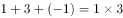；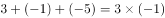；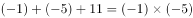。即相邻三项中，三项之和=前两项乘积。依此规律可得：，则所求项。

故正确答案为C。

---

### 第 2 题　qid 2385184 · 数学运算

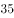，，（  ），，

- **A**. 

　✅
- **B**. 

- **C**. 

- **D**. 

**答案**：A

**官方解析**

数列中最后一项的分母343恰好为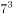，由此考虑将分母部分转化为幂次形式。原数列可转化为：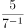  、 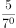  、（）、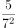  、 。分子部分均为5，分母部分的底数均为7、指数是公差为1的等差数列，所求项的分母部分指数应为1，即分母为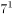。则题干所求项为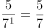。

故正确答案为A。

---

### 第 3 题　qid 2385187 · 数学运算

某工厂生产冶金模具，去年按定价的出售，获得了的利润率；今年由于工厂迁址，使得成本下降，按原定价的出售，可获得的利润率。去年成本与今年成本之比为（  ）。

- **A**. 4：3
- **B**. 10：9　✅
- **C**. 16：9
- **D**. 75：64

**答案**：B

**官方解析**

赋值去年的成本为100，设今年的成本为，根据条件可得：

由表格可得,解得：。因此去年与今年成本之比为。

故正确答案为B。

---

### 第 4 题　qid 2385188 · 数学运算

某公司每月成本比上月增加10万元，收入比上月增加。已知该公司今年1月份亏损10万元，2月份亏损8万元，则该公司在今年（  ）月份可以第一次实现盈利。

- **A**. 3
- **B**. 4　✅
- **C**. 5
- **D**. 6

**答案**：B

**官方解析**

设1月成本为，由于每月成本比上月增加10万元，可得2月成本为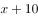。结合条件列表如下：

由于收入比上月增加，因此，解得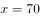。故2月收入为72，成本为80。要想第一次实现盈利，即收入＞成本，从小到大代入选项验证：

代入A项，3月收入为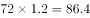，成本为，为亏损状态，排除；

代入B项，4月收入为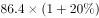，成本为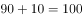，首次出现盈利。

故正确答案为B。

---

### 第 5 题　qid 2385189 · 数学运算

某市在工作日对本地机动车实行尾号限行，规则为：周一限行“1”“9”，周二限行“2”“8”，周三限行“3”“7”，周四限行“4”“6”，周五限行“5”“0”。已知某年7月份尾号“1”“9”和“5”“0”的限行天数一样多，则该年的7月1日是（  ）。

- **A**. 周六
- **B**. 周日
- **C**. 周一
- **D**. 周二　✅

**答案**：D

**官方解析**

根据题意，某年7月份尾号“1”“9”和“5”“0”的限行天数一样多，即7月中周一和周五的天数一样多。7月共31天，将其拆分为前面3天+后面28天两部分进行分析。
后面连续的28天中一定包含完整的4周，因此周一和周五均各有4天。而前面连续的3天中如果包括周一，则一定不可能包括周五。因此若包括了周一或周五中任意1天，都会导致周一和周五天数不一样多，所以要满足周一周五一样多，则前三天一定不包括周一和周五。故该月的前三天一定为周二、周三、周四，因此该年7月1日为周二。
故正确答案为D。

---

### 第 6 题　qid 2385190 · 数学运算

王某出资10万元投资甲、乙、丙三只股票，且投资乙股、丙股的金额相同。他在甲股上涨、乙股上涨，丙股下跌时将全部股票抛出，共获利12万元（不考虑其他费用）。那么，王某投资甲、乙两只股票的金额比例是（  ）。

- **A**. 8：1
- **B**. 3：1
- **C**. 4：3　✅
- **D**. 6：1

**答案**：C

**官方解析**

由于投资乙、丙股票的成本相同，而乙上涨，丙下跌，说明这两部分的总收益为0，则获利的12万均为甲上涨的收益。

假设甲股票成本为，上涨后的万，则甲股票成本万。由于总成本10万，那么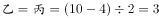万，因此王某投资甲乙两支股票的金额之比为。

故正确答案为C。

---

### 第 7 题　qid 2385089 · 数学运算

某次运动会需组织长宽相等的方阵。组织方安排了一个鲜花方阵和一个彩旗方阵，两个方阵分别入场完毕后又合成一个方阵，鲜花方阵的人恰好组成新方阵的最外圈。已知彩旗方阵比鲜花方阵多28人，则新方阵的总人数为（  ）。

- **A**. 100　✅
- **B**. 144
- **C**. 196
- **D**. 256

**答案**：A

**官方解析**

由于方阵长宽相等，假设彩旗方阵每边人数为，则彩旗方阵总人数为。鲜花方阵和彩旗方阵组成新方阵后，鲜花方阵恰好为最外围，即彩旗方阵再往外拓宽的一层。那么，彩旗方阵每边人，则鲜花方阵边长每边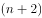人，故鲜花方阵人数。根据彩旗方阵比鲜花方阵多28人可得：，解得，因此新方阵最外层每边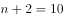人，共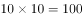人。

故正确答案为A。

---

### 第 8 题　qid 2385090 · 数学运算

小孟驾驶汽车沿一条笔直公路匀速行驶。某一时刻，小孟先看到路边的第一个里程碑，上面刻的公里数X为两位数。半小时后，他又看到第二个里程碑，上面刻的公里数Y恰好由X的十位数和个位数交换位置所成。又过了半小时，他看到第三个里程碑，上面刻的公里数Z恰好由X的两位数中间添一个0所成。再过一小时，小孟自看到第一个里程碑起共驾驶了（  ）公里。

- **A**. 120
- **B**. 150
- **C**. 180　✅
- **D**. 200

**答案**：C

**官方解析**

设第一个里程碑上刻的里程数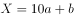，则第二个里程碑上刻的里程数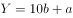,第三个里程碑上刻的里程数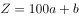。由于从第一个里程碑到第二个里程碑与从第二个里程碑到第三个里程碑经历的时间均为半小时，且车速不变，则走过的路程相同，可得即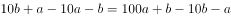，解得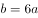。由于和均为一位数，故，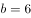，所以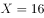，，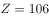，汽车每半小时走的路程为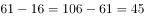。经过第三块里程碑后再多走1小时，那么此时的总时间应比经过第一块里程碑时多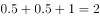小时，此时走的路程应比通过第一块里程碑时多走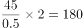公里。

故正确答案为C。

---

### 第 9 题　qid 2385091 · 数学运算

某类商品按质量分为8个档次，最低档次商品每件可获利8元，每提高一个档次，则每件商品的利润增加2元。最低档次商品每天可产出60件，每提高一个档次，则日产量减少5件。若只生产其中某一档次的商品，则每天能获得的最大利润是（  ）元。

- **A**. 620
- **B**. 630
- **C**. 640　✅
- **D**. 650

**答案**：C

**官方解析**

设产品提高了个档次，每日获得总利润为，则每件的利润为元，每日售出的数量为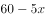，那么每天获得的利润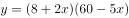。当时，或12，若让每天获得的利润最大，此时应取-4与12的平均值4，此时。 

故正确答案为C。

---

### 第 10 题　qid 2385092 · 数学运算

某自驾游车队由6辆车组成，车队的行车顺序有如下要求：甲车不能排在第一位，乙车必须排在最后一位，丙车必须排在前两位，且任一车辆均不得超车或并行。该车队的行车顺序共有（  ）种可能。

- **A**. 36
- **B**. 42　✅
- **C**. 48
- **D**. 54

**答案**：B

**官方解析**

对丙车的位置进行分类讨论：①若丙车排在第一位，乙车排在最后一位，则剩下的4辆车可随意排列，情况数为；②若丙车排在第二位，乙车排在最后一位，由于甲车不能排在第一位，那么分步讨论。先从剩下的丁、戊、己三辆车中选一辆排在第一位，有种情况，剩下的最后三辆车任意排列情况数为，故共有种情况。该车队的排序共有24+18=42种情况。

故正确答案为B。

---

### 第 11 题　qid 2385094 · 数学运算

某公司组织所有员工分乘一批大巴去旅游，要求每辆大巴乘坐员工人数不超过35人。若每车坐28人，则有1人坐不上车；若开走1辆空车，则所有员工恰好可平均分乘到各车。该公司共有员工（  ）人。

- **A**. 281
- **B**. 589
- **C**. 841　✅
- **D**. 981

**答案**：C

**官方解析**

利用代入排除法

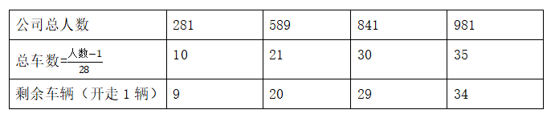

公司总人数恰好平均分到剩余的车上，则总人数可被剩余车辆数整除，观察数据可知只有841可被29整除。

故正确答案为C。

---

### 第 12 题　qid 2385095 · 数学运算

某家庭有爸爸、妈妈、女儿3人，今年每2人的平均年龄加上余下1人的年龄之和，分别为39、52、53，则3人中最大年龄与最小年龄之差为（  ）。

- **A**. 22
- **B**. 24
- **C**. 26
- **D**. 28　✅

**答案**：D

**官方解析**

设三个人的年龄分别为a、b、c，则有：

······①；

······②； 

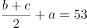······③；

将①②③分别乘2可知：a最大，c最小。（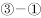）×2可得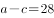，故最大年龄与最小年龄之差为28。

故正确答案为D。

---

## 判断推理

### 第 1 题　qid 2385136 · 类比推理

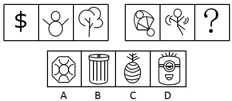

- **A**. A
- **B**. B
- **C**. C　✅
- **D**. D

**答案**：C

**官方解析**

元素组成不同，且无明显属性规律，考虑数量规律。题干第一组图中出现多个曲线和直线线段，考虑线数量，曲线和直线分开数。第一组图形中曲线的数量为1、2、3；直线的数量为1、2、3，每幅图中曲线和直线的数量相等。第二组图形应用规律，曲线的数量为4、5、？；直线的数量为4、5，？，因此？处图形应该有6条直线和6条曲线。A项为5条曲线、8条直线，排除；B项为4条曲线、8条直线，排除；C项为6条曲线、6条直线，当选；D项为6条曲线、12条直线，排除。
故正确答案为C。

---

### 第 2 题　qid 2385138 · 类比推理

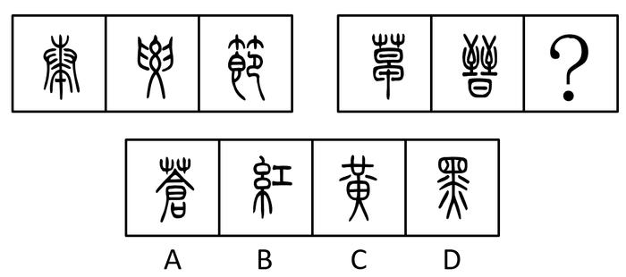

- **A**. A
- **B**. B
- **C**. C　✅
- **D**. D

**答案**：C

**官方解析**

元素组成不同，且无明显属性规律，考虑数量规律。题干图形均出现了封闭空间，优先考虑面数量。题干第一组图形的面数量分别为0、2、4，为等差数列；第二组图形的面数量分别为1、3，？，所以？处图形应为5个面。A项为4个面，B项为2个面，C项为5个面，D项为4个面，只有C项符合。
故正确答案为C。

---

### 第 3 题　qid 2385140 · 类比推理

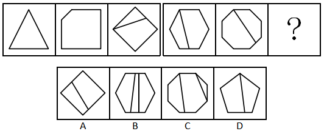

- **A**. A
- **B**. B
- **C**. C
- **D**. D　✅

**答案**：D

**官方解析**

解法一：观察图形，元素组成不同且无明显属性规律，考虑数量规律。每个图形都有一个外框，个别图形的外框内被线条分开，考虑线数量，第一组图：3、5、5；第二组图：7、9、？没规律。考虑点数量，第一组图：3、5、5；第二组图：7、9、？也没规律。但是综合点数量和线数量来看，我们发现，每一个图形的点数量与线数量都是相等的。按照这个规律我们来看选项，A选项6个点、5条线；B选项10个点、8条线；C选项9个点、10条线；D选项6个点、6条线。

故正确答案为D。

解法二：观察图形，元素组成不同且无明显属性规律，考虑数量规律。每个图形都有一个外框，个别图形的外框内被线条分开，考虑角数量。第一组图的角数量分别为：3、5、7；第二组图的角数量为：9、11、？。故问号处应该为13个角的图形。选项的角数量分别为：A项8个角、B项14个角、C项13个角、D项8个角。

故正确答案为C。

对比两个规律，我们发现都很严谨，并无瑕疵。但是考虑到出题人的思维惯性，近五年深圳市考从未涉及角数量考点，并且其他省份、自治区、直辖市和国家的公务员招录考试中也几乎未涉及角数量考点；而“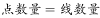”的考点在近几年的考试中偶有涉及，因此对比出题人的思维惯性，正确答案应为D。

故正确答案为D。

---

### 第 4 题　qid 2385142 · 类比推理

- **A**. A
- **B**. B　✅
- **C**. C
- **D**. D

**答案**：B

**官方解析**

观察图形，都是由一个个的小元素构成，考虑元素数量。题干中所有图形均为3个元素构成，而且每个元素均不相同，即3种元素。但选项中也都是3个元素，3种元素构成，无法排除。考虑其他规律。再次观察图形发现，第一组图上面都是1个元素，下面都是2个元素；第二组图上面都是2个元素，下面都是1个元素，因此排除A、D两项；第一组所有图形中都包含同一种元素圆圈，由此可知，第二组的所有图形中也应该都包含同一种元素——圆圈。观察B、C两项，发现只有B选项存在圆圈。
故正确答案为B。

---

### 第 5 题　qid 2385143 · 类比推理

- **A**. A
- **B**. B
- **C**. C
- **D**. D　✅

**答案**：D

**官方解析**

观察图形，每个图形都有一个大圆，并且里面是一些小黑圈，外面是一些小白圈，考虑元素数量。第一组图中的小白圈个数分别是2、3、6，前两个图白圈数量的乘积是第三个图白圈的数量，小黑圈的数量分别是6、2、3，后两个图中小黑圈的数量的乘积是第一个图中小黑圈的数量；第二组图中的小白圈个数分别是1、2、？，所以？处图形中小白圈的数量应该为2，小黑圈的数量分别是8、4、?，所以？处图形中小黑圈的数量应该为2，只有D选项符合。
故正确答案为D。

---

### 第 6 题　qid 2385145 · 类比推理

（1）金星  （2）火星
（3）木星  （4）水星
（5）土星

- **A**. 3-2-5-4-1
- **B**. 4-2-1-5-3
- **C**. 4-1-2-3-5　✅
- **D**. 2-1-5-3-4

**答案**：C

**官方解析**

解析一：
第一步：先确定逻辑关系最为明显的逻辑顺序。
观察题干，五个事件主要围绕“太阳系的五大行星”。逻辑关系的先后顺序比较明显的事件是事件（4），水星是八大行星中距离太阳最近的行星，故事件（4）应是首句，排除A、D项。
第二步：逐一对照选项并判断正确答案。
根据第一步的结果可以判断只有B、C项符合，金星是八大行星中距离太阳第二近的行星，排除B项。
故正确答案为C。
解析二：
第一步：先确定逻辑关系最为明显的逻辑顺序。
观察题干，五个事件主要围绕“太阳系的五大行星”。逻辑关系的先后顺序比较明显的事件是事件（4），水星是八大行星中体积最小的行星，故事件（4）应是首句，排除A、D项。
第二步：逐一对照选项并判断正确答案。
根据第一步的结果可以判断只有B、C项符合，火星是八大行星中体积第二小的行星，排除C项。
故正确答案为B。
本题答案有争议，BC两项均可。体积这个知识点比较生僻，粉笔倾向于优先考虑距离远近，选C。
故正确答案为C。
注：太阳系的八大行星按照离太阳从近到远的顺序依次为：水星，金星，地球，火星，木星，土星，天王星，海王星。
太阳系的八大行星按照体积从小到大的顺序依次为：水星，火星，金星，地球，海王星，天王星，土星，木星。

---

### 第 7 题　qid 2385110 · 类比推理

（1）吞竞争者 （2）失用户心 （3）涨服务费 （4）打补贴战 （5）成独角兽

- **A**. 4-2-1-5-3
- **B**. 4-5-1-2-3
- **C**. 5-4-2-1-3
- **D**. 4-1-5-3-2　✅

**答案**：D

**官方解析**

第一步：先确定逻辑关系最为明显的逻辑顺序。
观察题干，五个事件主要围绕“吞并竞争对手最后却失去用户”的过程。逻辑关系的先后顺序比较明显的事件是事件（2）和（3），应该是涨服务费，导致失去用户心。故事件（3）应在事件（2）的前面，排除A、B、C项。
第二步：逐一对照选项并判断正确答案。
根据第一步的结果可以判断只有D项符合。
故正确答案为D。

---

### 第 8 题　qid 2385117 · 类比推理

（1）不幸死亡 （2）劣质针剂 （3）流通各地 （4）缺乏监管 （5）接种疫苗

- **A**. 3-4-5-1-2
- **B**. 3-1-2-5-4
- **C**. 2-3-5-4-1
- **D**. 4-2-3-5-1　✅

**答案**：D

**官方解析**

第一步：先确定逻辑关系最为明显的逻辑顺序。
观察题干，五个事件主要围绕“劣质疫苗致人死亡”的过程。逻辑关系的先后顺序比较明显的事件是事件（1）和（5），应该是先接种疫苗，再不幸死亡。故事件（5）应在事件（1）的前面，排除B项。
第二步：逐一对照选项并判断正确答案。
根据第一步的结果可以判断只有A、C、D项符合。之所以会发生疫苗致人死亡的事件，应该是因为缺乏监管，致使劣质针剂流通各地，事件（2）、（3）、（4）的先后顺序依次为：（4）—（2）—（3），排除A、C项。
故正确答案为D。

---

### 第 9 题　qid 2385126 · 类比推理

（1）电影发行 （2）剪辑配乐 （3）创作剧本 （4）演员表演 （5）选取场景

- **A**. 3-4-2-1-5
- **B**. 4-3-5-2-1
- **C**. 5-4-2-3-1
- **D**. 3-5-4-2-1　✅

**答案**：D

**官方解析**

第一步：先确定逻辑关系最为明显的事件顺序。
观察题干，五个事件主要围绕“制作电影”的话题展开。逻辑关系的先后顺序比较明显的是事件（3）和事件（4），应该是先创作剧本，演员再进行表演，即事件（3）应该在事件（4）的前面，排除B、C项。
第二步：逐一对照选项并判断正确答案。
根据第一步得到的结果剩下A项和D项，通过分析事件（1）和（5）得知，只有先“选取场景”进行拍摄，才能“电影发行”。因此事件（5）排在事件（1）前面，排除A项。
故正确答案为D。

---

### 第 10 题　qid 2385132 · 类比推理

（1）长安 （2）罗马 （3）大宛 （4）敦煌 （5）安息

- **A**. 2-5-4-3-1
- **B**. 1-4-3-5-2　✅
- **C**. 3-2-1-5-4
- **D**. 1-4-5-3-2

**答案**：B

**官方解析**

观察题干，题干五个城市或国家均为丝绸之路自东向西经过的区域，分别是长安-敦煌-大宛-安息-罗马，对应B项。
故正确答案为B。

---

### 第 11 题　qid 2385144 · 类比推理

在某大学文学院的课程改革研讨会上，负责语言学教学的朱老师说，在现代语言学中，文学的思维和知识毫无用武之地，这样就不必要求语言学专业的学生对文学基础有深刻的理解，因此，在语言学专业未来的教学体系中，文学基础课程就应该用其它重要的语言学类基础课程替代。
下列说法如果为真，能质疑朱老师的上述观点的是（    ）。
（1）语言学类基础课程难度较大，会导致学生的平均成绩降低。
（2）语言学研究对象之一的文学语言具有与众不同的特点，运用文学思维解读其特点最为贴切。
（3）该学院语言学专业的学生大多研究修辞学方向，而修辞学研究需要语言学和文学相结合。

- **A**. （2）
- **B**. （3）
- **C**. （1）（3）
- **D**. （2）（3）　✅

**答案**：D

**官方解析**

第一步：找出论点和论据。
论点：在语言学专业未来的教学体系中，文学基础课程就应该用其他重要的语言学类基础课程替代。
论据：在现代语言学中，文学的思维和知识毫无用武之地，这样就不必要求语言学专业的学生对文学基础有深刻的理解。
本题论点说的是文学基础课程应该被其它语言类课程替代，论据说的是文学的思维和知识对语言学专业没有用处，论点是建议类，要想削弱，可以考虑否定论据，即文学的思维和知识对语言学专业是有用的。
第二步：逐一分析选项。
（1）强调语言学类课程难度大，与论点讨论的语言学专业是否需要学习文学基础课程无关，无关项，不能削弱；
（2）说明文学语言是语言学的研究对象之一，而文学语言需要用到文学思维，那么在现代语言学中，文学的思维是有用的，直接否定论据，可以削弱；
（3）强调语言学专业的学生研究修辞学，而修辞学需要结合语言学和文学，那么在现代语言学中，文学的思维是有用的，直接否定论据，可以削弱；
综上所述，可以削弱的为（2）和（3）。
故正确答案为D。

---

### 第 12 题　qid 2385146 · 逻辑判断

一个学者要在学术研究上取得突破，一定要热爱研究，并且耐得住寂寞。有些学者虽然耐得住寂寞，但内心并不热爱研究，因此，不是所有的学者都能在学术研究上取得突破。
下列选项的逻辑结构与上文逻辑结构最类似的是（    ）。

- **A**. 某奢侈品店规定，要买到该店最新款，必须网上实名预约，并且完成全款预付。有些买到该店最新款的人并没有网上实名预约，因此该奢侈品店的规定很有可能是自我炒作
- **B**. 不重视自我充电的职员往往几年后得不到升职加薪的机会。有的职员几年后升职加薪，因此有些职员重视自我充电
- **C**. 要成为一个受欢迎的人，必须既懂幽默，又会适度打扮自己。有些人会适度打扮自己但并不懂幽默，因此有些人不能成为受欢迎的人　✅
- **D**. 电视剧要想收视率高，必须既有流量明星参演，又经广泛宣传。有些收视率低的电视剧有流量明星参演，且宣传广泛，因此有流量明星参演不是电视剧收视率高的主要原因

**答案**：C

**官方解析**

第一步：分析题干推理方式。

题干翻译为：学术研究上取得突破热爱研究 且 耐得住寂寞，耐得住寂寞 且 热爱研究学术上取得突破，即AB 且 C，B 且 CA。

第二步：逐一分析选项。

A项：翻译为买到新款实名预约且全款预付，买到新款 且 实名预约自我炒作，即AB 且 C，A 且 BD，与题干推理方式不一致，排除；

B项：翻译为重视自我充电升职加薪，升职加薪重视自我充电，即AB，BA，与题干推理方式不一致，排除；

C项：翻译为受欢迎打扮 且 幽默，打扮 且 幽默受欢迎，即AB 且 C，B 且 CA，与题干推理方式一致，当选；

D项：翻译为收视率高流量明星且广泛宣传，流量明星 且 广泛宣传收视率高，即AB 且 C， B 且 CA，与题干推理方式不一致，排除。

故正确答案为C。

---

### 第 13 题　qid 2385148 · 逻辑判断

过年期间，学校后勤处计划为所有留校学生提供免费餐饭并安排文艺活动，一方面是想为留校学生缓解过年期间的孤独感，另一方面是想为这些学生减轻生活上的经济压力。
下列选项如果为真，最不能质疑后勤处此项计划的是（    ）。

- **A**. 留校学生大都买不起回家的车票　✅
- **B**. 绝大多数学生过年留校都是因为科研活动十分繁忙
- **C**. 人手不足，文艺活动难以开展
- **D**. 绝大多数学生都认为学校提供的餐饭很难吃，宁愿在校外就餐

**答案**：A

**官方解析**

第一步：找出论点和论据。
论点：过年期间，学校后勤处为所有留校学生提供免费餐饭并安排文艺活动，一方面是想为留校学生缓解过年期间的孤独感，另一方面是想为这些学生减轻生活上的压力。
论据：无。
本题只有论点，质疑可以直接反着论点来说，一是这种方式不能缓解留校学生过年期间的孤独感，二是不能减轻留校学生生活上的压力，三是可以直接说明学校的计划不可行。
第二步：逐一分析选项。
A项：留校学生买不起回家的车票，说明学生确实是经济有困难，这种方式可以减轻学生生活上的压力，为加强项，无法削弱，当选；
B项：绝大多数学生因为科研繁忙所以留校过年，说明大部分留校学生既不是因为孤独也不是因为经济有困难才留校的，此种方式并不能达到缓解学生的孤独感，减轻学生生活上压力的目的，可以削弱，排除；
C项：人手不足，文艺活动难以展开，直接否定后勤计划的可行性，可以削弱，排除；
D项：绝大多数学生认为学校的餐饭难吃，宁愿在校外就餐，说明学生不爱吃学校的餐饭，即使提供了学生也会去校外吃，达不到减轻学生经济压力的目的，可以削弱，排除。
本题为选非题，故正确答案为A。

---

### 第 14 题　qid 2385150 · 逻辑判断

某部门有五名员工，分别是小赵、小钱、小孙、小李、小周。关于五人的政治面貌，有如下事实：
如果小赵是党员，则小李是党员；如果小钱是党员，则小李和小孙都是党员；要么小赵是党员，要么小周是党员；如果小孙不是党员，则小周是党员。
则下列说法错误的是（    ）。

- **A**. 如果小周不是党员，则小钱是党员　✅
- **B**. 如果小周不是党员，则五人中至少有三人是党员
- **C**. 如果小钱和小周都是党员，则五人中有四人是党员
- **D**. 如果小李和小孙都不是党员，则五人中只有一个是党员

**答案**：A

**官方解析**

第一步：翻译题干。

①小赵党员小李党员

②小钱党员小李党员且小孙党员

③要么小赵是党员，要么小周是党员

④小孙党员小周党员

第二步：逐一分析选项。

A项：小周党员小钱党员，根据条件③，如果小周不是党员可知小赵是党员，根据条件①肯前必肯后推出小李是党员；根据条件④，如果小周不是党员，否后必否前可知小孙是党员；小李是党员且小孙是党员是对条件②的肯后，肯后无法推出确定性结论，所以小钱是否是党员不确定，此项无法推出，当选；

B项：如果小周不是党员，根据条件④，否后必否前可知小孙是党员；根据条件③可知小赵是党员，根据条件①，又可知小李是党员，此时已知三人是党员，B选项正确，排除；

C项：如果小钱和小周都是党员，根据条件②，肯前必肯后可知小李是党员且小孙是党员，此时四人都是党员，C选项正确，排除；

D项：如果小李和小孙都不是党员，根据条件①，否后必否前可知小赵不是党员，根据条件②否后必否前，可知小钱不是党员，根据条件③可知，小周是党员，即五人中只有一人是党员，D选项正确，排除。

本题为选非题，故正确答案为A。

---

### 第 15 题　qid 2385152 · 逻辑判断

为了解某地人民对建设创新社会的认识情况，当地知识产权局发放了调查问卷。问卷回收后发现，的被调查者对建设创新社会的意义有正确的认识，的被调查者能理解国家对创新社会的建设所作的投入。该地知识产权局由此得出结论，目前当地人民对于建设创新社会是能够认识并理解的。

下列选项如果为真，最能削弱以上结论的是（    ）。

- **A**. 能理解国家对创新社会的建设所作投入的被调查者均对建设创新社会的意义有正确的认识
- **B**. 正确认识与理解创新社会的建设离积极投入创新社会的建设还有相当的距离
- **C**. 并非全国人民都接受了调查问卷，所以结论的可信度还值得怀疑
- **D**. 这批问卷的被调查者主要来自该地知识产权局及其相关单位　✅

**答案**：D

**官方解析**

第一步:找出论点和论据。

论点：目前当地人民对于建设创新社会是能够认识并理解的。

论据：问卷回收后发现，的被调查者对建设创新社会的意义有正确的认识，的被调查者能理解国家对创新社会的建设所作的投入。

本题的论点是通过调查问卷所得，此类样本类题目有其特殊的削弱方式，可以从样本入手，如果调查的样本不具有代表性，那么由此样本得出的结论不一定成立，即可削弱。

第二步：逐一分析选项。

A项：由论据可知，的被调查者有正确的认识，的被调查者能理解国家的投入。而该项说明，的能理解的被调查者都是有正确认识的被调查者，是在论据中两组数据之间建立联系，但还是不确定当地总体有多少人对于建设创新社会是能够认识并理解，所以无法削弱，排除；

B项：题干论点讨论的是当地人民对于建设创新社会的认识与理解，是观念层面上的，与能否积极投入创新社会建设（行动层面）是无关的，因此是无关项，排除；

C项：题干论点讨论的范围是当地人民，与全国人民是否都接受了调查问卷无关，因此是无关项，排除；

D项：该项指出问卷的被调查者主要来自于该地知识产权局及其相关单位，而题干论点讨论的是当地人民，由此可知，此问卷样本的选取不具有代表性，可以削弱，当选。

故正确答案为D。

---

### 第 16 题　qid 2385155 · 逻辑判断

世界近代三大数学猜想是费马猜想、四色猜想和哥德巴赫猜想。费马猜想的证明于1994年由英国数学家安德鲁·怀尔斯完成，且得到了数学界的认可；四色猜想的证明于1976年由美国数学家阿佩尔与哈肯借助计算机完成，但1981年数学家施密特发现了其中的错误；哥德巴赫猜想尚未解决，目前最好的成果——陈氏定理，乃1966年由中国数学家陈景润取得。
由此可知（    ）。

- **A**. 哥德巴赫猜想比费马猜想和四色猜想更难证明
- **B**. 中国数学家在世界近代三大数学猜想的证明工作中成就最高
- **C**. 哥德巴赫猜想和四色猜想尚待严格证明　✅
- **D**. 世界近代三大数学猜想的证明一定都能完成，只是时间问题

**答案**：C

**官方解析**

日常结论题，根据题干信息逐一分析选项。
A项：题干指出了三大数学猜想的证明情况，但并没有对它们的证明难度进行比较，无法推出，排除；
B项：针对哥德巴赫猜想，目前最好的成果是陈氏定理，但是不能说明中国数学家在世界近代三大数学猜想的证明工作中成就最高，无法推出，排除；
C项：数学家施密特发现了之前四色猜想的证明存在错误，而哥德巴赫猜想尚未解决，所以哥德巴赫猜想和四色猜想尚待严格证明，可以推出，当选；
D项：哥德巴赫猜想和四色猜想还没有被证明，所以近代三大数学猜想的证明是否一定都能完成，无法推出，排除。
故正确答案为C。

---

### 第 17 题　qid 2385157 · 类比推理

在一项大型招标项目中，只有一家公司中标，虽然参选的9家公司都已知道结果，但在正式公布结果之前，各公司对外界的回复不尽相同。具体如下：
（1）甲公司：“是庚公司中标了。”
（2）乙公司：“应该是庚公司中标了。”
（3）丙公司：“是我公司中标了。”
（4）丁公司：“丙公司没有中标。”
（5）戊公司：“庚公司说的是真的。”
（6）己公司：“是壬公司中标了。”
（7）庚公司：“我公司没有中标，壬公司也没有中标。”
（8）辛公司：“我公司中标了。”
（9）壬公司：“我公司破格中标了。”
已知9家公司中只有4家公司说的是实话，则中标的公司是（    ）。

- **A**. 丙公司
- **B**. 己公司
- **C**. 庚公司
- **D**. 辛公司　✅

**答案**：D

**官方解析**

本题属于真假推理题。

第一步：找出题干矛盾命题。

（1）甲：庚公司中标

（2）乙：庚公司中标

（3）丙：丙公司中标

（4）丁：丙公司中标

（5）戊：庚公司说的是真的

（6）己：壬公司中标

（7）庚：庚中标且壬公司中标

（8）辛：辛公司中标

（9）壬：壬公司中标

分析题干关系，丙和丁说的话是矛盾关系，必然满足一真一假。

第二步：看其余。

结合提问可知9句话里面有4真，本题目除了丙和丁之外剩下还有7个人，这7个人说的话只有3句话为真。假设庚说真话，那么戊也说真话，即庚没有中标，壬公司也没有中标，那么甲、乙、己、壬四个人说假话，故只需要辛说真话即满足题干要求，所以辛说真话，辛公司中标为真。

故正确答案为D。

---

### 第 18 题　qid 2385159 · 逻辑判断

研究显示，对偶尔食用一定量皮蛋的儿童而言，大多数品牌的皮蛋的含铅量并不会导致智力发育低下。因此，研究人员认为，儿童可以放心食用皮蛋而无需担心其影响身体健康。
下列选项如果为真，最能削弱上述论证的是（    ）。

- **A**. 喜欢吃皮蛋的儿童往往也喜欢食用其它对智力发育有害的食品
- **B**. 所有品牌的皮蛋或多或少都含有对人体有害的物质
- **C**. 儿童的智力发育正常不等于身体健康　✅
- **D**. 大量食用皮蛋会导致儿童腹泻

**答案**：C

**官方解析**

第一步：找出论点和论据。
论点：儿童可以放心食用皮蛋而无需担心其影响身体健康。
论据：对偶尔食用一定量皮蛋的儿童而言，大多数品牌的皮蛋的含铅量并不会导致智力发育低下。
本题论据说的是食用皮蛋的儿童不会导致智力低下，而论点说的是食用皮蛋的儿童不会影响健康，论点和论据讨论的话题不一致，优先考虑拆桥。
第二步：逐一分析选项。
A项：该项说的是喜欢吃皮蛋的儿童也会食用其他对智力发育有害的食品，而题干说的是偶尔食用一定量皮蛋的儿童，二者讨论的主体不一致，无法削弱，排除； 
B项：该项说的是所有的皮蛋都含有对人体有害的物质，但并没有提及食用一定量的皮蛋是否会影响身体健康，为不明确选项，无法削弱，排除；
C项：该项说的是智力发育正常不等于身体健康，说明虽然皮蛋不会导致儿童智力低下，但是不代表儿童身体是健康的，在论点和论据之间拆桥，为拆桥项，可以削弱，当选；
D项：该项说的是大量食用皮蛋会导致腹泻，而论点说的是偶尔食用一定量皮蛋的儿童，二者主体不一致，无法削弱，排除。
故正确答案为C。

---

### 第 19 题　qid 2385163 · 类比推理

某股市专家说：“从收益率来看，股市高手可能在某一时间超过其他所有股民，也可能一直超过某些股民，但不可能一直超过其他所有股民。”
如果该股市专家的上述说法为真，则下列推断为假的有（    ）个。
（1）股市专家的收益率可能在某一时间超过某些股民。
（2）不存在某一时间股市高手的收益率必然不超过其他所有股民。
（3）不存在某一时间股市高手的收益率可能不超过其他所有股民。

- **A**. 3
- **B**. 2
- **C**. 1
- **D**. 0　✅

**答案**：D

**官方解析**

第一步：翻译题干。
①股市高手的收益率可能在某个时间超过其他所有股民；
②股市高手的收益率可能一直（在所有时间）超过某些股民；
③股市高手的收益率不可能一直（在所有时间）超过其他所有股民。
第二步：逐一分析选项。
（1）股市专家的收益率可能在某一时间超过某些股民。根据条件①可知，题干讨论的主体是股市高手，而该项说的是股市专家，主体不一致，故该项的真假未知，该项的推断并非一定为假，排除；
（2）不存在某一时间股市高手的收益率必然不超过其他所有股民。此句话等价于存在股市高手的收益率可能一直（在所有时间）超过某些股民，根据条件②可知，该项必然为真，排除；
（3）不存在某一时间股市高手的收益率可能不超过其他所有股民。此句话等价于存在高手的收益率必然一直（在所有时间）超过某些股民，根据条件②，题干说的是“可能”，而该项说的是“必然”，由于“可能”的矛盾关系是“必然不”，因此“可能”与“必然”并非矛盾，故“可能”虽然推不出“必然”，但该项的推断并非一定为假，排除。
综上可知，上述推断为假的有0个。
故正确答案为D。

---

### 第 20 题　qid 2385180 · 类比推理

老陈和小吴比赛下象棋。根据规则，比赛共三场，每场胜者积2分，败者扣1分，平局则双方积分不变化，三场比赛结束后，老陈的积分为3分，小吴的积分为0分。
由此可知（ ）。

- **A**. 没有平局　✅
- **B**. 老陈三场均获胜
- **C**. 小吴最多败一场
- **D**. 老陈至少败两场

**答案**：A

**官方解析**

题干给出的是确定信息，从题干入手进行推理，老陈得3分，一定是赢2场，输1场；那么可知与之对弈的小吴就是输2场，赢1场；3局当中没有平局，直接确定答案是A项。
B、C、D三项与题干推知信息相违背。
故正确答案为A。

---

## 资料分析

### 材料 1

        2018年1-9月汽车行业统计数据如下：

        乘用车累计产销分别完成1735.1万辆和1726.0万辆，同比分别增长和。其中，轿车产销分别完成841.3万辆和842.6万辆，同比分别增长和；SUV产销分别完成737.1万辆和723.5万辆，同比分别增长和；MPV产销分别完成124.4万辆和126.2万辆，同比分别下降和；交叉型乘用车产销分别完成32.2万辆和33.7万辆，同比分别下降和。中国品牌乘用车累计销售724.2万辆，同比下降。

        商用车累计产销分别完成314.1万辆和323.1万辆，同比分别增长和。分车型情况看，客车产销分别完成33.9万辆和33.3万辆，同比分别下降和；货车产销分别完成280.1万辆和289.8万辆，同比分别增长和。

        新能源汽车中，纯电动汽车产销分别完成55.5万辆和54.1万辆，同比分别增长和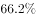；插电式混合动力汽车产销分别完成18.0万辆和18.1万辆，同比分别增长和。

        汽车整车出口81.4万辆，同比增长。分车型情况看，乘用车出口60.1万辆，同比增长；商用车出口21.3万辆，同比增长。

#### 第 1 题　qid 2385108 · 增长

对2018年1-9月商用车销量增长贡献最大的是（    ）。

- **A**. 轿车销量
- **B**. MPV销量
- **C**. 客车销量
- **D**. 货车销量　✅

**答案**：D

**官方解析**

根据题干“对2018年1-9月商用车销量增长贡献最大的是（）”，可判断本题为增长量比较问题。根据主体“商用车”定位材料第三段，商用车按照车型分为客车和货车，排除A、B项。由材料可知：客车销量同比下降，增长率为负数，代表下降；货车同比增长，增长率为正数，代表上升，问增长贡献最大的，正数一定大于负数，排除C项。

故正确答案为D。

---

#### 第 2 题　qid 2385112 · 综合

2018年1-9月，产销率最高的乘用车车型是（    ）。

- **A**. 轿车
- **B**. SUV
- **C**. MPV
- **D**. 交叉型乘用车　✅

**答案**：D

**官方解析**

根据题干“2018年1-9月，产销率最高的乘用车车型是（）”，结合材料时间为2018年1-9月，可判断本题为现期比重问题。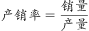，主体是乘用车车型，定位材料第二段，A项轿车：；B项SUV：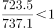；C项MPV：；D项交叉型乘用车：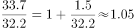。产销率最高的乘用车车型是交叉型乘用车。

故正确答案为D。

---

#### 第 3 题　qid 2385131 · 比重

2017年1-9月，中国品牌乘用车销量占乘用车销量的比重是（    ）。

- **A**. 

- **B**. 

　✅
- **C**. 

- **D**. 

**答案**：B

**官方解析**

根据题干“2017年1-9月，中国品牌乘用车销量占乘用车销量的比重是（）”，结合材料时间为2018年1-9月，可判断本题为基期比重问题。定位材料，可得：2018年1-9月汽车行业统计数据如下：乘用车累计产销分别完成1735.1万辆和1726.0（B）万辆，同比分别增长和(b)······，中国品牌乘用车累计销售724.2（A）万辆，同比下降(a)。根据基期比重公式，则2017年1-9月，中国品牌乘用车销量占乘用车销量的比重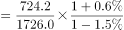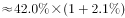，对应B项。 

故正确答案为B。

---

#### 第 4 题　qid 2385134 · 综合

2017年1-9月，乘用车的四类车型按销量从高至低排列，依次为（    ）。

- **A**. 
轿车SUV交叉型乘用车MPV

- **B**. 
SUV轿车交叉型乘用车MPV

- **C**. 
轿车SUVMPV交叉型乘用车
　✅
- **D**. 
SUV轿车MPV交叉型乘用车

**答案**：C

**官方解析**

根据题干“2017年1-9月，乘用车的四类车型按销量从高至低排列，依次为”，结合材料时间为2018年1-9月，可判定本题为基期比较问题。根据，可知：2017年1-9月轿车销量为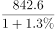万辆；SUV销量为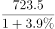万辆，和 两个分数比较，的分子大分母小，分数一定大，说明轿车SUV，排除B、D项。剩余A、C项，只需要比较交叉型乘用车和MPV的销量，2017年1-9月MPV销量为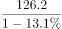万辆，交叉型乘用车销量为万辆，和比较，分母十分接近，MPV的分子远远大于交叉型乘用车，因此MPV交叉型乘用车，排除A项。

故正确答案为C。

---

#### 第 5 题　qid 2385135 · 综合

根据上文，以下说法一定正确的是（    ）。

- **A**. 2017年1-9月，纯电动汽车和插电式混合动力汽车的产量均高于自身销量　✅
- **B**. 2017年1-9月，货车销量是客车销量的9.7倍
- **C**. 2018年1-9月，非中国品牌乘用车销量同比下降
- **D**. 2018年1-9月，乘用车与商用车的整车出口量差距同比进一步扩大

**答案**：A

**官方解析**

A项：定位材料第四段，纯电动汽车产销分别完成55.5万辆和54.1万辆，同比分别增长和；插电式混合动力汽车产销分别完成18.0万辆和18.1万辆，同比分别增长和。2017年1-9月纯电动汽车产量为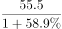万辆；销量为万辆，产量对应分子大，分母小，明显结果更大；2017年1-9月插电式混合动力汽车产量为万辆；销量为万辆，二者分子几乎相等，而产量对应分母更小，因此结果也更大，正确；

B项：定位材料第三段，可得：客车销量为33.3（B）万辆，同比下降（b）；货车销量289.8（A）万辆，同比增长（a）。根据基期倍数公式，货车销量是客车销量的倍，错误；

C项：定位材料第二段，2018年1-9月，乘用车累计销量同比增长0.6%，中国品牌乘用车累计销售同比下降，因为，根据混合增长率居中，可知整体增长率大于中国品牌乘用车销量同比增长率（），必然小于非中国品牌乘用车销量同比增长率，即2018年1-9月，非中国品牌乘用车销量同比增长率大于，并非同比下降，错误；

D项：定位材料第五段，可得：乘用车出口60.1万辆，同比增长；商用车出口21.3万辆，同比增长。题干“2018年1-9月，乘用车与商用车的整车出口量差距同比进一步扩大”，同比进一步扩大，是指2017年比2016年扩大，2018年又比2017年扩大，而根据材料无法求出2016年的整车出口量差距数据，所以无法推断，错误。

故正确答案为A。

---

### 材料 2

#### 第 6 题　qid 2385100 · 综合

2011年，深圳市进出口总额为（    ）亿美元。

- **A**. 4877.41
- **B**. 4668.31
- **C**. 4142.24　✅
- **D**. 3984.39

**答案**：C

**官方解析**

由题干“2011年，深圳市进出口总额为（    ）亿美元”且材料时间是2012年，判定此题为基期计算问题。定位统计图，根据公式：，则2011年深圳市进出口总额为亿美元，与C项最接近。

故正确答案为C。

---

#### 第 7 题　qid 2385101 · 综合

2012-2017年，深圳市进出口贸易顺差最大的年份是（    ）年。

- **A**. 2012
- **B**. 2014
- **C**. 2015　✅
- **D**. 2017

**答案**：C

**官方解析**

定位材料可知，2012年深圳市进出口贸易顺差为亿美元；2014年深圳市进出口贸易顺差为亿美元；2015年深圳市进出口贸易顺差为亿美元；2017年深圳市进出口贸易顺差为亿美元。因此，深圳市进出口贸易顺差最大的年份是2015年。（只计算选项中给的年份即可）

故正确答案为C。

---

#### 第 8 题　qid 2385105 · 增长

2012-2017年，深圳市进出口总额同比增幅最大的年份和同比减幅最大的年份相比，其进口总额相差（    ）亿美元。

- **A**. 1390.35
- **B**. 982.01
- **C**. 708.80　✅
- **D**. 681.55

**答案**：C

**官方解析**

由材料可知深圳市进出口总额同比增幅最大的年份为2013年（），降幅最大的年份为2016年（），其进口总额相差亿美元。

故正确答案为C。

---

#### 第 9 题　qid 2385115 · 增长

2012-2017年，深圳市进口总额的年均增长率约为（    ）。

- **A**. 

　✅
- **B**. 

- **C**. 

- **D**. 

**答案**：A

**官方解析**

由题干“2012-2017年，深圳市进口总额的年均增长率约为（）”判定此题为年均增长率问题。根据公式：，由材料可知，，结合选项增长率数值较小，根据进行估算，则有1+5r＜0.87，解得r＜-2.6%，只有A项略小于-2.6%。

故正确答案为A。

---

#### 第 10 题　qid 2385119 · 综合

根据上图，下列说法正确的是（    ）。

- **A**. 2013-2017年，深圳市进出口总额呈先升后降的趋势
- **B**. 2013年深圳市出口总额是2017年进口总额的2倍多
- **C**. 2013-2017年，深圳市进出口总额的同比增速均高于本年出口总额的同比增速
- **D**. 2017年，深圳市进出口总额同比增加157.07亿美元　✅

**答案**：D

**官方解析**

A项：观察折线图可知，2017年进出口总额同比增长，即2017年进出口总额高于2016年，并不是下降。错误；

B项：由材料可知，2013年深圳市出口额为3057.02亿美元，2017年深圳市进口额为1697.88亿美元，，不足2倍。错误；

C项：由折线图可知2014年深圳市进出口总额增速为，出口额增速为，即2014深圳市进出口总额的同比增速低于本年出口总额的同比增速。错误；

D项：2017年深圳市进出口总额同比增长亿美元。正确。

故正确答案为D。

---

### 材料 3

#### 第 11 题　qid 2385093 · 增长

2018年，广东省生产总值同比增长（    ）。

- **A**. 

　✅
- **B**. 

- **C**. 

- **D**. 

**答案**：A

**官方解析**

由题干“2018年，广东省生产总值同比增长”，结合选项为百分数，可判定本题为增长率计算问题。定位表2可得，2018年珠三角地区、粤东西北地区生产总值分别为81048.50、19977.45亿元，2017年分别为75809.75、19345.38亿元。根据文字部分可知，粤东西北地区是指广东省除珠三角地区之外的所有地区，则2018年广东省生产总值同比增长率为

故正确答案为A。

---

#### 第 12 题　qid 2385096 · 比重

2016年，珠三角地区下列经济指标占全省总额的比重，与珠三角地区生产总值占全省生产总值的比重最接近的是（    ）。

- **A**. 固定资产投资
- **B**. 房地产开发投资　✅
- **C**. 社会消费品零售总额
- **D**. 进出口总额

**答案**：B

**官方解析**

由题干“2016年···占···的比重，与···占···的比重最接近的是”，可判定本题为现期比重比较问题。定位表2可得，2016年珠三角地区、粤东西北地区生产总值分别为67841.85、17713.81亿元，则珠三角地区生产总值占全省生产总值的比重为。定位表1可得2016年广东各区域主要经济总量指标，分别计算珠三角所占比重即可。

A固定资产投资：；

B房地产开发投资：；

C社会消费品零售总额：；

D进出口总额：。

比较可知，与珠三角地区生产总值占全省生产总值的比重最接近的是房地产开发投资。

故正确答案为B。

---

#### 第 13 题　qid 2385097 · 增长

2013-2018年，粤东西北地区生产总值同比增速最快的年份是（    ）年。

- **A**. 2013　✅
- **B**. 2014
- **C**. 2017
- **D**. 2018

**答案**：A

**官方解析**

由题干“2013-2018年···同比增速最快的年份是”，可判定本题为增长率比较问题。定位表2可得，2012-2018年粤东西北地区生产总值，根据计算各选项年份增长率，进行比较即可。

A:2013年：；

B:2014年：；

C:2017年：；

D:2018年：。

比较可知，粤东西北地区生产总值同比增速最快的年份是2013年。

故正确答案为A。

备注：本题按照网友回忆版题干为“2013-2018年，粤东西北地区生产总值同比增速最快的年份”，答案应为2016年，但选项中无此年份，故解析以选项中的四个年份进行比较。

---

#### 第 14 题　qid 2385098 · 综合

2016年，广东各区域按社会消费品零售总额与地区生产总值的比值由大到小排列，依次为（    ）。

- **A**. 
珠三角粤北山区东翼西翼

- **B**. 
珠三角粤北山区西翼东翼

- **C**. 
东翼西翼珠三角粤北山区

- **D**. 
东翼西翼粤北山区珠三角
　✅

**答案**：D

**官方解析**

由题干“2016年···与···的比值由大到小排列，依次为”，可判定本题为比值比较问题。定位表1可得2016年广东各区域社会消费品零售总额与地区生产总值，比值分别为：珠三角、东翼、西翼、粤北山区。由大到小排列依次为东翼、西翼、粤北山区、珠三角，与D项顺序一致。

故正确答案为D。

---

#### 第 15 题　qid 2385099 · 综合

根据上表，下列说法正确的是（    ）。

- **A**. 2016年，珠三角地方一般公共预算收入比粤东西北地区多7.0倍
- **B**. 2012-2018年，珠三角与粤东西北地区生产总值的差距逐年缩小
- **C**. 按2018年珠三角地区生产总值的同比增速，预计2020年珠三角地区生产总值将突破9万亿元　✅
- **D**. 2016年，广东省固定资产投资30008.86亿元

**答案**：C

**官方解析**

A项：定位表1可得，2016年珠三角地方一般公共预算收入为6923.98亿元，粤东西北地区为亿元。多7倍代表是8倍，倍8倍，错误；

B项：定位表2可得，2012年珠三角与粤东西北地区生产总值分别为47824.18、12650.41亿元，亿元。2013年珠三角与粤东西北地区生产总值分别为53307.67、14149.40亿元，亿元。，可知差距并非逐年缩小，错误；

C项：定位表2可得，2018年珠三角地区生产总值为81048.50亿元，2017年为75809.75亿元。2018年珠三角地区生产总值同比增量亿元。根据增长量与现期量成正比，保持增长率不变，则2020年的增长量2019年的增长量2018年的增长量，则2020年珠三角地区生产总值2018年珠三角地区生产总值2018年的增长量亿元，正确；

D项：定位表1可得，2016年，广东省固定资产投资为亿元，错误。

故正确答案为C。

---
