# 河南省2019年统一考试录用司法所公务员《行测》题（网友回忆版）

> 省考 · 2019 年 · 5 个模块 · 共 114 题

- [常识判断](#%E5%B8%B8%E8%AF%86%E5%88%A4%E6%96%AD) · 15 题
- [言语理解与表达](#%E8%A8%80%E8%AF%AD%E7%90%86%E8%A7%A3%E4%B8%8E%E8%A1%A8%E8%BE%BE) · 30 题
- [数量关系](#%E6%95%B0%E9%87%8F%E5%85%B3%E7%B3%BB) · 14 题
- [判断推理](#%E5%88%A4%E6%96%AD%E6%8E%A8%E7%90%86) · 40 题
- [资料分析](#%E8%B5%84%E6%96%99%E5%88%86%E6%9E%90) · 15 题

---

## 常识判断

### 第 1 题　qid 2452837 · 法律常识

张某与郑某都是足球爱好者，两人互不相识。某周末，张某、郑某等人通过微信球友群相约踢足球。踢球过程中，在张某进攻、郑某防守时，双方发生了肢体碰撞，张某受伤倒地。经医院诊断，张某韧带撕裂。于是张某起诉郑某要求其承担的赔偿责任，支付各项损失共计15万余元。对此，根据相关法律规定，下列说法正确的是：

- **A**. 张某自愿参加踢球，郑某没有故意加害行为，所以损害后果应由张某自担　✅
- **B**. 张某、郑某以及其他参与踢球者应共同承担赔偿责任
- **C**. 张某的起诉对象应是活动组织者和微信群主
- **D**. 张某起诉郑某理由充分，合理合法

**答案**：A

**官方解析**

本题考查法律常识。
根据《中华人民共和国民法典》第一千一百六十五条规定：“行为人因过错侵害他人民事权益，应当承担侵权责任。根据法律规定推定行为人有过错，行为人不能证明自己没有过错的，应当承担侵权责任。”张某作为一个成年人，一个球友群成员，对足球运动的危险应当具有充分的认识。张某自愿参加该项体育活动，应视为同意甘冒风险、认可风险自担。除非其他参与者故意加害，参与该项活动而发生的损害后果应由参与者自担。而张某、郑某在张某受伤前存在肢体碰撞，在有强身体对抗的足球运动中是十分常见的，郑某对张某的受伤亦非恶意加害。所以损害后果由张某自行承担。
故正确答案为A。

---

### 第 2 题　qid 2452840 · 人文常识

上个月，小刘到H公司面试。随后，接到H公司的短信，通知已被录用，要求小刘按时参加公司组织的为期6天的岗前培训，培训结束后，他和H公司签订了劳动合同，约定试用期1个月。在试用期内，公司利用周末休息日组织了4天的业务培训。对此，根据相关规定，下列说法正确的是：

- **A**. 岗前培训期间并未从事具体工作，双方之间尚未建立劳动关系，H公司不用给小刘发放工资
- **B**. 周末业务培训并不等于生产经营，也没有对公司产生效益，H公司不用给小刘发放加班费
- **C**. H公司要给小刘发放周末加班费，但不用给小刘发放岗前培训期间的工资
- **D**. H公司既要给小刘发放周末加班费，还要给小刘发放岗前培训期间的工资　✅

**答案**：D

**官方解析**

本题考查法律常识。
A、C项错误，《劳动合同法》第七条规定：“用人单位自用工之日起即与劳动者建立劳动关系。用人单位应当建立职工名册备查。”根据《江苏省劳动合同条例》第十三条规定：“用人单位自用工之日起即与劳动者建立劳动关系。用人单位安排劳动者参加上岗前培训、学习的，劳动关系自劳动者参加之日起建立。”《劳动合同法》规定的“用工”不仅包括了用人单位的实际用工，也包括为了实际用工而进行的岗前培训。岗前培训是为了实际用工而做的准备，进行岗位培训也是用人单位的用工行为。且参照《江苏省劳动合同条例》的规定，在岗前培训时，公司已经与小刘建立了劳动关系，公司应给小刘在岗前培训期间发放工资。
B项错误，《劳动法》第四十三条规定：“用人单位不得违反本法规定延长劳动者的工作时间。”第四十四条规定：“有下列情形之一的，用人单位应当按照下列标准支付高于劳动者正常工作时间工资的工资报酬：（一）安排劳动者延长时间的，支付不低于工资的百分之一百五十的工资报酬；（二）休息日安排劳动者工作又不能安排补休的，支付不低于工资的百分之二百的工资报酬；（三）法定休假日安排劳动者工作的，支付不低于工资的百分之三百的工资报酬。”公司利用周末休息日组织了4天业务培训，是在建立劳动关系以后，且是为了公司的经营而开展的业务培训，公司应给小刘发放加班费。
D项正确，H公司既要给小刘发放周末加班费，还要给小刘发放岗前培训期间的工资。
故正确答案为D。

---

### 第 3 题　qid 2452842 · 法律常识

王先生和赵女士按照家乡风俗，举办了婚礼。由于赵女士单位特殊，对配偶身份进行了一定时间的政审，直到婚礼一年后，二人才办了结婚登记。举办婚礼后，王先生的父母全款给儿子买了一套房，房产证在王先生办理结婚登记后两个月办了下来，登记在王先生名下。婚后，二人因为感情不合。赵女士最终起诉离婚，要求按照夫妻共同财产以分割房子。对此，按照相关法律，下列说法正确的是：

- **A**. 办了婚礼后买的房子就是婚后购置，应属夫妻共同财产
- **B**. 房产证在结婚登记后办下来的，属夫妻共同财产
- **C**. 王先生父母全资购房，该房产既不属于王先生也不属于赵女士
- **D**. 王先生父母全资购房，但产权登记在王先生个人名下，该房屋属王先生的个人财产　✅

**答案**：D

**官方解析**

本题考查法律常识。
《最高人民法院关于适用中华人民共和国民法典婚姻家庭编的解释(一)》第二十九条规定： 当事人结婚前，父母为双方购置房屋出资的，该出资应当认定为对自己子女个人的赠与，但父母明确表示赠与双方的除外。
故正确答案为D。

---

### 第 4 题　qid 2452845 · 法律常识

张女士网购了一瓶化妆水，由于已经过期，导致使用后脸部过敏。为此张女士花了5000元医药费用于治疗脸部过敏。她给商家发消息要求他们赔偿，但他们一直不回消息，不接电话。对此，根据相关法律规定，下列说法中不正确的是：

- **A**. 张女士可要求网购平台提供商家的真实名称、地址和有效联系方式，与商家协商解决
- **B**. 如果网购平台无法提供商家的真实名称、地址和有效联系方式，张女士可以要求网购平台对她的损失进行赔偿
- **C**. 商家赔偿后，张女士有权向网购平台追偿　✅
- **D**. 网购平台赔偿后，张女士有权向商家追偿

**答案**：C

**官方解析**

【注】本题出题有误，D选项疑为网购平台赔偿后，有权向商家追偿。
A、B项正确，《消费者权益保护法》第四十四条规定：“消费者通过网络交易平台购买商品或者接受服务，其合法权益受到损害的，可以向销售者或者服务者要求赔偿。网络交易平台提供者不能提供销售者或者服务者的真实名称、地址和有效联系方式的，消费者也可以向网络交易平台提供者要求赔偿；网络交易平台提供者作出更有利于消费者的承诺的，应当履行承诺。网络交易平台提供者赔偿后，有权向销售者或者服务者追偿。网络交易平台提供者明知或者应知销售者或者服务者利用其平台侵害消费者合法权益，未采取必要措施的，依法与该销售者或者服务者承担连带责任。”
C项错误，商家赔偿后，张女士无权再向网购平台追偿。
D项正确，网购平台赔偿后，可以向商家追偿。由于出题失误，D项可能出题时多写了张女士三字，影响本题答案。
由于本题为单选题，且是选非题，粉笔倾向答案为C。

---

### 第 5 题　qid 2452848 · 法律常识

吴先生被一辆货车撞成高位截瘫，经相关部门责任认定，货车驾驶员负全部责任。后经法院审理，货车司机所属公司同意赔偿40万元。判决生效之后，肇事方却提出由于资金紧张，没办法一次性支付赔偿金。对此，根据相关法律规定，下列说法不正确的是：

- **A**. 赔偿金必须一次性支付　✅
- **B**. 双方协商不一致的，赔偿金应当一次性支付
- **C**. 双方要协商一致的，赔偿金可以分期支付
- **D**. 如果分期支付，支付方应提供相应的担保

**答案**：A

**官方解析**

本题考查法律常识。
《中华人民共和国民法典》第一千一百八十七条规定：“损害发生后，当事人可以协商赔偿费用的支付方式。协商不一致的，赔偿费用应当一次性支付；一次性支付确有困难的，可以分期支付，但是被侵权人有权请求提供相应的担保。”因此，在双方协商一致的情况下，赔偿金可以分期支付，但支付方应当提供相应的担保。
本题为选非题，故正确答案为A。

---

### 第 6 题　qid 2452851 · 法律常识

韩某与几个朋友一起吃饭时都喝了酒，饭后，由于朋友李某喝的比较少就提出开韩某的车送韩某回家。途中与一辆轿车相撞，该事故使对方车辆损坏，对方要求赔偿维修费用4万元，交管部门认定韩某一方应承担事故的全部责任。对此，根据相关法律规定，下列说法正确的是：

- **A**. 李某无偿为韩某提供劳务，因此两人共同承担责任
- **B**. 在该起交通事故中，韩某对机动车享有事实上和法律上的运行支配权，因此韩某承担全部责任
- **C**. 李某未从机动车的运行中获利，因此不承担责任
- **D**. 李某酒后驾驶，属于重大过失，因此承担全部责任　✅

**答案**：D

**官方解析**

本题考查法律常识。
根据《民法典》第一千二百零九条规定：“因租赁、借用等情形机动车所有人、管理人与使用人不是同一人时，发生交通事故造成损害，属于该机动车一方责任的，由机动车使用人承担赔偿责任；机动车所有人、管理人对损害的发生有过错的，承担相应的赔偿责任。”李某为车辆使用人，因李某酒后驾驶导致交通事故，李某存在重大过失，因此应该承担全部责任。
故正确答案为D。

---

### 第 7 题　qid 2452853 · 法律常识

宋某和熊某是同事，前几天，宋某从朋友口中得知熊某发微信朋友圈骂她是“小三”“不知廉耻”等等，还配有宋某的照片。对此，熊某并不承认。但宋某的朋友已经将截图发给了她。因为此事，公司同事对宋某议论纷纷。对此，根据相关法律规定，下列说法中正确的是：

- **A**. 熊某在微信朋友圈的行为不同于现实中的直言辱骂，不构成名誉侵权
- **B**. 熊某在微信朋友圈的行为会造成宋某的社会评价降低，构成名誉侵权　✅
- **C**. 宋某无法起诉至法院要求熊某删除朋友圈相关内容，书面公开道歉
- **D**. 宋某不能要求赔偿精神损害抚慰金

**答案**：B

**官方解析**

本题考查法律常识。
A项错误，根据《中华人民共和国民法典》第一千一百九十四条规定：“网络用户、网络服务提供者利用网络侵害他人民事权益的，应当承担侵权责任。法律另有规定的，依照其规定。”微信朋友圈属于网络空间，但不是法外之地，侵害他人名誉权同样需要承担责任。
B项正确，熊某在微信朋友圈辱骂宋某，会造成宋某的社会评价降低，侵害了宋某的名誉权，应当承担侵权责任。
C项错误，根据《中华人民共和国民法典》第一百七十九条规定：“承担民事责任的方式主要有：（一）停止侵害；（二）排除妨碍；（三）消除危险；（四）返还财产；（五）恢复原状；（六）修理、重作、更换；（七）继续履行；（八）赔偿损失；（九）支付违约金；（十）消除影响、恢复名誉；（十一）赔礼道歉。法律规定惩罚性赔偿的，依照其规定。本条规定的承担民事责任的方式，可以单独适用，也可以合并适用。”针对熊某的侵权行为，宋某可以起诉至法院要求其排除妨害（删除朋友圈相关内容）、消除影响、恢复名誉（书面公开道歉）。
D项错误，根据《中华人民共和国民法典》第一千一百八十三条规定：“侵害自然人人身权益造成严重精神损害的，被侵权人有权请求精神损害赔偿。因故意或者重大过失侵害自然人具有人身意义的特定物造成严重精神损害的，被侵权人有权请求精神损害赔偿。”熊某侵害宋某名誉权，如果对宋某造成严重精神损害，宋某有权要求赔偿精神损害抚慰金。
故正确答案为B。

---

### 第 8 题　qid 2452855 · 法律常识

晚饭后李先生和儿子在小区散步时，有一条未牵绳的小狗冲出扑向他儿子，并咬伤了他的胳膊。为了保护儿子，李先生用脚踹小狗。但因为用力过猛，将小狗踹死了。后来，狗主人说这条狗十分名贵，要求李先生赔偿损失。对此，根据相关法律规定，下列说法正确的是：

- **A**. 李先生的行为属于正当防卫，不需要承担法律责任
- **B**. 李先生的行为属于防卫过当，需要承担法律责任
- **C**. 遛狗不牵绳导致狗咬人，养狗者要承担侵权责任　✅
- **D**. 养狗者和李先生应承担各自的法律责任

**答案**：C

**官方解析**

本题考查法律常识。
A、B项错误，根据《中华人民共和国民法典》第一百八十一条规定：“因正当防卫造成损害的，不承担民事责任。正当防卫超过必要的限度，造成不应有的损害的，正当防卫人应当承担适当的民事责任。”第一百八十二条规定：“因紧急避险造成损害的，由引起险情发生的人承担民事责任。危险由自然原因引起的，紧急避险人不承担民事责任，可以给予适当补偿。紧急避险采取措施不当或者超过必要的限度，造成不应有的损害的，紧急避险人应当承担适当的民事责任。”正当防卫必须是针对实施不法侵害的行为人实施防卫行为；紧急避险针对的是一切危险，可以是来源于违法犯罪人，也可以来源于自然灾害、动物的侵袭、人的生理病理造成的危险等，所以李先生的行为属于紧急避险。
C项正确，《中华人民共和国民法典》第一千二百四十五条规定：“饲养的动物造成他人损害的，动物饲养人或者管理人应当承担侵权责任，但是，能够证明损害是因被侵权人故意或者重大过失造成的，可以不承担或者减轻责任。”养狗者未牵狗绳，小狗咬伤路人，养狗者应当承担侵权责任。
D项错误，李先生脚踹小狗的行为属于紧急避险，由引起险情发生的人即养狗者承担责任。
故正确答案为C。

---

### 第 9 题　qid 2452858 · 法律常识

因酒量都比较大，小李和小唐在单位被戏称为“二斤哥”和“酒仙”。某日，他俩戏言说要在酒桌上“一决高下”，于是很多同事跟着看热闹。酒过三巡，两人都有些醉，但没分出胜负，同事小王掏出500元钱做诱饵，说谁赢归谁，结果小李最后因酒精中毒被送至医院，治疗痊愈共花去医药费6万元。对此，根据相关法律规定，下列说法正确的是：

- **A**. 小李可要求小王赔偿部分医药费　✅
- **B**. 劝酒人小王应当承担全部赔偿责任
- **C**. 因小李过错所以应独自承担所有医药费
- **D**. 小李可向小唐、小王和在场的同事索赔全部医药费

**答案**：A

**官方解析**

本题考查法律常识。
小王掏出500元钱做诱饵进行劝酒行为，使得小李求胜心切饮酒过度，导致酒精中毒，在饮酒过程中有明显的强迫性劝酒行为，主观上存在强迫的过错，此时对于损害后果的发生，劝酒人应当承担相应的过错赔偿责任。醉酒人自身也有一定的过错。因为这种强迫并非是暴力性的，应当减轻劝酒人的赔偿责任。
故正确答案为A。

---

### 第 10 题　qid 2452861 · 法律常识

春节期间，刘女士在某超市购买了两箱牛奶，一周后发现牛奶都已发霉变质。她找到超市要求退货，超市却告知牛奶销售商只是租赁其柜台，卖完牛奶就“人去楼空”。超市还拿出租赁协议，双方约定“谁销售谁负责”，让刘女士找牛奶销售商。对此，根据相关法律规定，下列说法正确的是：

- **A**. 刘女士、销售商、超市共同担责
- **B**. 因刘女士购买时未仔细辨别，所以她应当担责
- **C**. 超市对进场销售的商品检查不到位应当承担全部责任　✅
- **D**. 超市承担责任后，刘女士还可向销售商进行追偿

**答案**：C

**官方解析**

本题考查法律常识。
《食品安全法》第一百四十八条第一款规定：“消费者因不符合食品安全标准的食品受到损害的，可以向经营者要求赔偿损失，也可以向生产者要求赔偿损失。接到消费者赔偿要求的生产经营者，应当实行首负责任制，先行赔付，不得推诿；属于生产者责任的，经营者赔偿后有权向生产者追偿；属于经营者责任的，生产者赔偿后有权向经营者追偿。”《消费者权益保护法》第四十三条规定：“消费者在展销会、租赁柜台购买商品或者接受服务，其合法权益受到损害的，可以向销售者或者服务者要求赔偿。展销会结束或者柜台租赁期满后，也可以向展销会的举办者、柜台的出租者要求赔偿。展销会的举办者、柜台的出租者赔偿后，有权向销售者或服务者追偿。”《食品安全法》第五十二条也指出：“集中交易市场的开办者、柜台出租者和展销会举办者，应当依法审查入场食品经营者的许可证，明确其食品安全管理责任，定期对其经营环境和条件进行检查，发现其有违反本法规定行为的，应当及时制止并立即报告所在地县级人民政府食品药品监督管理部门。”牛奶虽然是由他人所售，但超市是柜台的出租者。在柜台租赁期满后，消费者有权向超市要求赔偿。超市承担责任后，可向牛奶销售商进行追偿。
故正确答案为C。

---

### 第 11 题　qid 2452865 · 法律常识

戴女士在某美容医院进行了肉毒素注射，注射前医生与她签过《知情同意书》，该同意书内容均为术后注意事项。注射两天后出现发烧、脸疼、头晕等症状，最后被医院诊断为肉毒素中毒，后续医疗费用又花费两万元。对此，根据相关法律规定，下列说法正确的是：

- **A**. 因双方事先签订了《知情同意书》，所以医院没有责任
- **B**. 戴女士自己身体有问题，因此她只能自己承担全部责任
- **C**. 因《知情同意书》未履行了充分、完全的告知义务，因此医院要承担部分责任
- **D**. 戴女士可依据医疗费发票、工资流水单等，向法院起诉，要求美容医院支付医疗费、营养费、误工费　✅

**答案**：D

**官方解析**

本题考查法律常识。
根据《民法典》第一千二百一十九条规定：“医务人员在诊疗活动中应当向患者说明病情和医疗措施。需要实施手术、特殊检查、特殊治疗的，医务人员应当及时向患者具体说明医疗风险、替代医疗方案等情况，并取得其明确同意；不能或者不宜向患者说明的，应当向患者的近亲属说明，并取得其明确同意。医务人员未尽到前款义务，造成患者损害的，医疗机构应当承担赔偿责任。”
美容院虽然与戴女士签订了《知情同意书》，但该《知情同意书》内容均为术后注意事项，并无医疗风险等应当及时向患者具体说明的内容，医务人员未履行完全的告知义务，造成戴女士肉毒素中毒，医疗机构应承担赔偿责任，按照上述法条的规定，医疗机构对未履行告知义务造成的损害后果是承担完全赔偿责任，而非部分赔偿责任，因此，戴女士可依据医疗费发票、工资流水单等，向法院起诉，要求美容医院支付医疗费、营养费、误工费。
故正确答案为D。

---

### 第 12 题　qid 2452867 · 法律常识

黄某是一家建筑设计公司经理。该公司设计师赵某于本月5日提出离职，6日起就不再来公司上班，黄经理用多种方式都没有联系上赵某。赵某的突然离开导致公司几个项目工作延期，给客户造成了损失，现在客户要求公司赔偿。对此，根据相关法律规定，下列说法不正确的是：

- **A**. 黄经理公司可建议客户直接找赵某赔偿损失　✅
- **B**. 赵某提前1天通知用人单位解除劳动合同的做法不合法
- **C**. 因赵某离职给黄经理公司带来的经济损失的举证责任在建筑设计公司
- **D**. 赵某未履行相关义务，给公司造成经济损失，该公司可以向赵某索赔

**答案**：A

**官方解析**

本题考查法律常识。
A项错误，公司与客户签订了项目，因项目工作延期给客户造成了损失，根据合同的相对性，应当由公司向客户承担赔偿责任。至于公司和前员工赵某的纠纷，可以在赔偿后，向赵某追偿。
B项正确，根据《劳动合同法》第三十七条规定：“劳动者提前三十日以书面形式通知用人单位，可以解除劳动合同。劳动者在试用期内提前三日通知用人单位，可以解除劳动合同。”因此，赵某提前1天通知用人单位解除劳动合同的做法是不合法，应当提前三十日以书面形式通知。
C项正确，根据《民事诉讼法》第六十四条第一款规定：“当事人对自己提出的主张，有责任提供证据。”建筑设计公司如果要求赵某承担因离职带来的经济损失，按照谁主张谁举证的原则，应当承担举证责任。
D项正确，根据《劳动合同法》第九十条规定：“劳动者违反本法规定解除劳动合同，或者违反劳动合同中约定的保密义务或者竞业限制，给用人单位造成损失的，应当承担赔偿责任。” 赵某未履行相关义务，给公司造成经济损失，该公司有权向赵某索赔。
本题为选非题，故正确答案为A。

---

### 第 13 题　qid 2452869 · 法律常识

张某是一名“职业打假人”。有群众向他反映一家店里卖的特级海参有问题，他了解情况后从该店铺购买了10万元的海参，经鉴定海参确实不符合质量要求，他便要求该店以商品价款的三倍赔偿。对此，根据相关法律规定，下列说法正确的是：

- **A**. 张某要求三倍赔偿不合法
- **B**. 该店对知假买假的张某构成欺诈
- **C**. 该店对其他购买海参的群众构成欺诈　✅
- **D**. 张某知假买假然后要求赔偿对该店构成欺诈

**答案**：C

**官方解析**

本题考查法律常识。
根据《消费者权益保护法》第五十五条第一款规定：“经营者提供商品或者服务有欺诈行为的，应当按照消费者的要求增加赔偿其受到的损失，增加赔偿的金额为消费者购买商品的价款或者接受服务的费用的三倍；增加赔偿的金额不足五百元的，为五百元。法律另有规定的，依照其规定。”
A项错误，根据《消费者权益保护法》第五十五条第一款规定，张某有权要求该店以商品价款的三倍赔偿。
B、D项错误，知假买假是指消费者在明知道商品是假货的情况下，仍然购买商品的行为。张某只是根据群众反映，怀疑该店所卖的海参可能有问题，也即是购买时不确定是否为假货，是在买回后经鉴定才得出是假货的结论，严格上说不属于知假买假。
C项正确，该店明知海参存在质量问题仍销售，对其他购买海参的群众构成欺诈。
故正确答案为C。

---

### 第 14 题　qid 2452871 · 法律常识

老张经营一家水泥厂，年初，一名老客户从他厂里订购了一批水泥，但是客户说最近手头紧张，让老张先开发票，钱款过几个月再付。想着是老朋友，老张就按照客户的要求办了。但让老张没想到的是，当他向客户催要欠款时，对方竟然拿着发票说，已经付完了，发票就是证据。对此，按照相关法律规定，下列说法正确的是：

- **A**. 付款与开发票之间是因果关系，客户的发票就是付款凭证
- **B**. 因老张与客户之间只有口头约定，老张要钱行为于法无据
- **C**. 老张和客户之间的纠纷属买卖合同纠纷　✅
- **D**. 老张与客户之间的纠纷属一般借贷纠纷

**答案**：C

**官方解析**

本题考查法律常识。
A项错误，开票与付款是两个不同的法律事实，未开票不能证明未付款，已开票亦不能证明已付款。只有当事人明确约定取得发票即表明票载金额已经支付，才能在发票的取得与付款之间建立因果关系。
B项错误，根据《民法典》第四百六十九条第一款规定：“当事人订立合同，可以采用书面形式、口头形式或者其他形式。”口头约定也是合同的一种形式，虽然证明较为困难，但不能说于法无据。
C项正确，根据《民法典》第五百九十五条规定：“买卖合同是出卖人转移标的物的所有权于买受人，买受人支付价款的合同。”老张和客户订立的是水泥买卖合同，因此产生的纠纷属买卖合同纠纷。
D项错误，根据《民法典》第六百六十七条规定：“借款合同是借款人向贷款人借款，到期返还借款并支付利息的合同。”老张和客户之间成立的是货物买卖合同，并非借贷合同，所以并非是借贷纠纷。
故正确答案为C。

---

### 第 15 题　qid 2452873 · 法律常识

今年5月份，一位同事向张女士借了10万元。当时欠条中写明，他将在一年内还清借款。但是，最近张女士和该同事之间发生了一些矛盾，关系比较僵。张女士想提前要回借给同事的10万元。对此，根据相关法律规定，下列说法不正确的是：

- **A**. 因欠条中明确约定了还款日期，张女士的诉求难以得到法律支持
- **B**. 张女士和同事之间的借条，相当于“借款合同”，具有法律约束力
- **C**. 即使同事还款期限届满前明确表示不会履行还款义务，张女士也无法解除合同　✅
- **D**. 如果同事未按约定的用途使用借款，张女士可以要求同事提前还款

**答案**：C

**官方解析**

本题考查法律常识。
A项正确，根据《中华人民共和国民法典》第六百七十五条规定：“借款人应当按照约定的期限返还借款。对借款期限没有约定或者约定不明确，依照本法第五百一十条的规定仍不能确定的，借款人可以随时返还；贷款人可以催告借款人在合理期限内返还。” 因合同中约定了还款期限，张女士想提前要回借款的诉求难以得到法律支持。
B项正确，根据《中华人民共和国民法典》第六百六十八条第一款规定：“借款合同采用书面形式，但自然人之间借款另有约定的除外。”借条，相当于“借款合同”，具有法律约束力。
C项错误，根据《中华人民共和国民法典》第五百六十三条规定：“有下列情形之一的，当事人可以解除合同：······（二）在履行期限届满之前，当事人一方明确表示或者以自己的行为表明不履行主要债务······”同事还款期限届满前明确表示不会履行还款义务，张女士有权解除合同。
D项正确，根据《中华人民共和国民法典》第六百七十三条规定：“借款人未按照约定的借款用途使用借款的，贷款人可以停止发放借款、提前收回借款或者解除合同。”如果同事未按约定的用途使用借款，张女士可以要求同事提前还款。
本题为选非题，故正确答案为C。

---

## 言语理解与表达

### 第 1 题　qid 2452776 · 逻辑填空

在有违道德却不一定违反制度时，或者说制度设计的预期是想用行为人的道德风险来堵住制度“漏洞”时，这种有漏洞的制度设计，就是对那些        道德、宁冒道德风险也要取得实利的行为人的嘉奖。

- **A**. 藐视　✅
- **B**. 蔑视
- **C**. 轻视
- **D**. 诬蔑

**答案**：A

**官方解析**

横线处通过顿号与后文“宁冒道德风险”构成并列关系，前后语义相近。根据后文“宁冒道德风险也要取得实利”可知，这类行为人明知自己所做之事有违道德却还要做，认为道德约束是没有价值或意义的，从而不加以约束自己，故横线处应表达认为道德不重要之意。A项“藐视”指认为“某种事物”很卑贱、渺小、是没有价值或令人厌恶的，符合文意，当选。B项“蔑视”指小看，轻视，轻蔑鄙视，使用时通常会觉得自己比对方优越，文段中的行为人和道德约束无高下之分，搭配错误，排除；C项“轻视”指小看，不重视，置于文中程度过轻，排除；D项“诬蔑”指歪曲事实，造谣诽谤，败坏他人的名誉，与文意不符，排除。
故正确答案为A。 
【文段出处】《光明网评论员：政策设计对赌道德是奖励藐视道德者》

---

### 第 2 题　qid 2452778 · 逻辑填空

对那些看得准的新生事物，比如基于“互联网”和分享经济的新业态，要量身定制监管模式，不能<u>        </u>，企业也希望通过规范管理，营造行业健康发展的环境。

- **A**. 削足适履　✅
- **B**. 扬汤止沸
- **C**. 矫枉过正
- **D**. 舍本逐末

**答案**：A

**官方解析**

根据“要量身定制监管模式，不能……”可知，横线处所填词语要体现出对待新事物没有量身定制，而是沿用老套的监管模式之意。A项“削足适履”比喻过分迁就现成条件，或生搬硬套，符合文意，当选。B项“扬汤止沸”比喻办法不对头，不能从根本上解决问题，文段未体现有无从根本上解决问题之意，排除；C项“矫枉过正”比喻纠正错误超过了应有的限度，文段未体现纠正错误之意，排除；D项“舍本逐末”比喻做事不抓住主要的问题，而专顾细枝末节，文段无主次之分，排除。
故正确答案为A。 
【文段出处】《李克强：深化简政放权放管结合优化服务 推进行政体制改革转职能提效能》

---

### 第 3 题　qid 2452779 · 逻辑填空

植物药的功效需要        ，以便发挥最大的功效。中国需要用世界眼光来看植物药，促进植物药产业健康发展。

- **A**. 恰到好处
- **B**. 正本清源　✅
- **C**. 一针见血
- **D**. 药到病除

**答案**：B

**官方解析**

根据后文“以便发挥最大的功效……促进植物药产业的健康发展”可知，目前的植物药发展并不健康，功效发挥的并不够，而事实上植物药确实有功效、有作用，因此需要对植物药的功效进行正名，认可其功效。B项“正本清源”指从根本上整顿，从源头上清理，置于文段即表示从根本和源头上整顿、清理对植物药功效不认可甚至否定的观点，符合文意，当选。A项“恰到好处”指说话、办事等正好达到适当的地步，与文意不符，排除；C项“一针见血”比喻说话直截了当，切中要害，与文意不符，排除；D项“药到病除”形容用药效果非常好，与文意不符，排除。
故正确答案为B。 
【文段出处】《林瑞超：植物药需正本清源发挥最大功效》

---

### 第 4 题　qid 2452782 · 逻辑填空

五千年文明看河南，在漫漫历史长河中，古人类从这里发源、古文明从这里萌芽，古中国由这里崛起。悠久的历史积淀了丰厚而灿烂的文化，河南以其蔚为壮观的文化场景、        的文化底蕴、寓意深刻的文化宝藏著称于世，影响深远。

- **A**. 群英荟萃
- **B**. 钟灵毓秀　✅
- **C**. 山清水秀
- **D**. 藏龙卧虎

**答案**：B

**官方解析**

文段围绕河南的文化积淀展开描述，横线处成语修饰文化底蕴，而底蕴往往用深厚形容，故横线处应体现出深厚之意。B项“钟灵毓秀”凝聚了天地间的灵气，孕育着优秀的人物，凝聚天地间的灵气可体现出深厚之意，符合文意，当选。A项“群英荟萃”比喻许多才能出众的人聚集在一起，用于表示人才辈出，不能形容“文化底蕴”，排除；C项“山清水秀”形容风景优美，与“文化底蕴”搭配不当，排除；D项“藏龙卧虎”指隐藏着未被发现的人才，也指隐藏不露，深藏不露的人才，与“文化底蕴”搭配不当；排除。
故正确答案为B。 
【文段出处】光明网《坚定文化自信 滋养民族精神》

---

### 第 5 题　qid 2452785 · 逻辑填空

读书，就是与博学的先生对话。他以和缓的语调，告诉我物质的速朽和精神的永恒。譬如当年唐宋，曾        雕梁画栋，而存活于人心        的，却是激扬精神的诗词咏歌。

- **A**. 肥马轻裘  念念不忘
- **B**. 锦衣玉食  念念不忘
- **C**. 锦衣玉食  不朽流传
- **D**. 肥马轻裘  不朽流传　✅

**答案**：D

**官方解析**

第一空，与后文“雕梁画栋”构成并列，语义应相近，“雕梁画栋”原意指在栋梁等木结构上雕刻花纹并加上彩绘，现指建筑物很华丽。B、C两项“锦衣玉食”形容豪华的生活；A、D两项“肥马轻裘”意为骑肥壮的马，穿轻暖的皮衣，形容阔绰。比较二者程度轻重，“肥马轻裘”语义重于“锦衣玉食”，能与“雕梁画栋”构成语义的一致，形容唐宋时期奢侈的生活，故排除B、C两项。
第二空，横线处对应文段“存活于人心”。A项“念念不忘”形容牢记于心，时刻不忘，D项“不朽流传”意为永垂不朽，流芳百世。文段中“激扬精神的诗词咏歌”并不是仅仅被人们记住，而是穿越时间，仍具有精神力量；且“不朽流传”与文段上文“物质的速朽”也能构成反义的对应关系，排除A项。
故正确答案为D。
【文段出处】人民日报《小书店 大视野（书店的灯光）》

---

### 第 6 题　qid 2452787 · 逻辑填空

体制        遭遇既有格局的强大惯性，发展转型面临创新能力和人才培育的刚性瓶颈，政府职能转变不仅需要壮士断腕的勇气，也不能没有临渊履冰的精细和严谨。民主的发育，要有法治护航；法治的尊严，离开民主又极易        。

- **A**. 转轨  专断　✅
- **B**. 转型  武断
- **C**. 并轨  专横
- **D**. 转换  决断

**答案**：A

**官方解析**

第一空，横线处所填词语与后文“政府职能转变”构成对应。A项“转轨”意为转入另一轨道，比喻改变原来的体制，符合文意，保留；D项“转换”意为改变、改换，与文意搭配尚可，保留。B项“转型”指事物结构形态、运转模式的根本性转变过程，政府体制并不是发生了根本性的转变，与文意不符，排除；C项“并轨”指将两种并行的体制，措施或做法等合二为一，文段未体现将两种体制模式合并为一种，与文意不符，排除。
第二空，根据文意可知，“民主”和“法治”二者应该是互相配合，缺一不可的关系，故横线处所填词语应表示脱离了民主的法治就会变得不好，感情色彩偏消极。A项“专断”意为独自决断，专决，符合文意，当选；D项“决断”意为有魄力，不具有消极的感情色彩，与文段感情色彩不符，排除。
故正确答案为A。
【文段出处】人民日报《守护人民政党的生命线》

---

### 第 7 题　qid 2452789 · 逻辑填空

中国的环境压力比任何国家都大，环境资源问题比任何国家都突出，解决起来比任何国家都困难。这样的结论，不是来自某个        的环保组织，而是来自国务院授权开展的中国环境宏观战略研究。虽然付出了巨大的努力，中国的环境质量仍只是“局部有所好转，总体尚未        。形势仍然严峻，压力继续加大”。不断加剧的污染，正成为河山不能承受之重。

- **A**. 骇人听闻  控制
- **B**. 危言耸听  遏制　✅
- **C**. 不足为奇  驾驭
- **D**. 卓然自立  掌握

**答案**：B

**官方解析**

第一空，文段首先指出中国环境问题严重，解决比任何国家都困难，“这样的结论”指代前文中国问题很严重的结论。故横线处要体现出结论很严重，并与“环保组织”搭配。B项“危言耸听”指故意说些夸大的吓人的话，使人惊疑震动。符合文意，当选。A项“骇人听闻”指使人听了非常吃惊、害怕，与“环保组织”搭配不当，排除。C项“不足为奇”指某种事物或现象很平常，没有什么奇怪的，横线处并无此意，排除。D项“卓然自立”指成就或品格等高出其他的人，有鹤立鸡群之意，形容非同一般，横线处并无此意，排除。
第二空，代入验证，“遏制”与后文“形势仍然严峻，压力继续加大”形成对应，符合语境。
故正确答案为B。 
【文段出处】人民日报《生态文明的中国觉醒》

---

### 第 8 题　qid 2452791 · 逻辑填空

“半边天”这个具有鲜明中国特色的词汇，既        着妇女的力量，也标识着妇女的地位，远播五湖四海，成为诠释中国妇女形象的最好        。

- **A**. 标志  名词
- **B**. 标榜  名称
- **C**. 彰显  名片　✅
- **D**. 展现  名誉

**答案**：C

**官方解析**

第一空，根据文段信息“半边天”体现着妇女的力量，感情色彩积极。B项“标榜”指宣扬，称道，吹嘘，多为贬义，与文段感情色彩不符，排除。A项“标志”是生活中人们用来表明某一事物特征的记号或显示的意思；C项“彰显”鲜明地显示，通常用于感情色彩积极的语境；D项“展现”指明显地表现出来，均保留。
第二空，D项“名誉”无法形容“词汇”，搭配不当，排除。A“名词”与C项“名片”相比，C项“名片”感情色彩偏积极，与文段积极的感情色彩更匹配，“半边天”成为诠释中国妇女形象的最好的名片，符合语境，当选。
故正确答案为C。
【文段出处】《巾帼建新功 共筑中国梦 ——习近平总书记重要讲话鼓舞半边天》

---

### 第 9 题　qid 2452793 · 逻辑填空

国泰则民安，民富则国强。国和家的        ，是中华民族漫长演进史中最为深刻的总结，国家兴衰始终都在塑造个体命运中扮演着核心角色。正如有论者所言，在灾难与辉煌的双重变奏之中，一个个中国人的梦想从来离不开民族整体的际遇。个体的命运往往随着历史而        ，无论大江大海还是一枝一叶。

- **A**. 息息相关  时来运转
- **B**. 休戚与共  摇摆不定
- **C**. 命运攸关  流转颠簸　✅
- **D**. 血肉相连  举棋不定

**答案**：C

**官方解析**

第一空，根据文段信息“国泰则民安，民富则国强”可知国和家关系非常密切。A项“息息相关”比喻关系极为密切或彼此契合无间；B项“休戚与共”形容关系密切，利害相同；C项“命运攸关”指命运好坏相关；D项“血肉相连”比喻关系十分密切，均符合语义。
第二空，根据文意“在灾难与辉煌的双重变奏之中，一个个中国人的梦想从来离不开民族整体的际遇”可知，个体的命运和历史的变奏是一致的，故横线上应体现灾难与辉煌的双重变奏之意。C项“流转颠簸”流落转徙，起伏摇动，符合语境，当选。A项“时来运转”本来处境不好，遇到机会，由逆境转到顺境，文段并非是从逆境变为顺境的过程，排除；B项“摇摆不定”来回摇荡、摆动不停或意念或立场等游移、变动不确定，D项“举棋不定”比喻犹豫不决，拿不定主意，均与文意不符，排除。
故正确答案为C。
【文段出处】《凝聚力实现中国梦》

---

### 第 10 题　qid 2452794 · 片段阅读

城市发展要做好“大”与“小”统一的文章。“大”固然可以支撑起城市的        ，“小”却也散发着城市温润的人文情怀。“大”体现城市的宏阔气度，“小”则涵养城市的清新活力。在城市发展过程中，要兼顾城市空间和功能的多样化，涵养城市的人文内涵和历史        ，保持城市社会生态的平衡发展，让人在“诗意的栖居”中与城市达成心的交融。

- **A**. 磅礴气势  底蕴　✅
- **B**. 宏伟壮观  底色
- **C**. 非凡气势  积淀
- **D**. 高楼大厦  沉淀

**答案**：A

**官方解析**

第一空，根据文段“‘大’体现城市的宏阔气度”可知，横线处应与“宏阔气度”形成对应。“宏阔气度”指宏伟辽阔的气魄风度，A项“磅礴气势”形容气势极其宏壮雄伟，B项“宏伟壮观”形容景象、建筑雄伟，C项“非凡气势”形容表现出来的力量、威势宏大，不同于寻常，均可与“宏阔气度”形成对应，保留；D项“高楼大厦”只是指具体的事物，体现不出“气魄风度”之意，排除。
第二空，搭配“涵养”，A项“底蕴”意为指内在修养，与“涵养”搭配得当，当选。B项“底色”，指的是本身的颜色，与“涵养”搭配不当，排除；C项“积淀”指积累沉淀下来的事物，历史积淀已经为有意义的内容，无需“涵养”，均搭配不当，排除。
故正确答案为A。
【文段出处】光明网《“诗意栖居”须重视涵养城市生态》

---

### 第 11 题　qid 2452795 · 逻辑填空

作为伟大的人道主义者，马克思致力于        资本的剥削与人的异化，追求人的解放与自由全面发展。这种人民至上的立场情怀代表了一种极其高远的价值追求，这种价值使得马克思及其提出的理念图景高踞于人类道义的        。

- **A**. 批驳  出发点
- **B**. 批判  制高点　✅
- **C**. 反驳  落脚点
- **D**. 批评  支撑点

**答案**：B

**官方解析**

第二空入手，根据文段“代表了一种极其高远的价值追求”，“马克思及其提出的理念图景高踞于”，可知马克思提出的理念比人类道义的最高点还要高，B项“制高点”指对周围地形具有俯视、控制作用的地点，符合文意。A项，“出发点”比喻考虑问题的基点，C项“落脚点”指的是落脚之处，也指目的、目的地，D项“支撑点”指事物的关键所在，均无法体现出最高点的含义，与文段对应，排除
第一空代入验证，根据“作为伟大的人道主义者”，马克思对资本的剥削与人的异化持有批判的态度，符合语境。
故正确答案为B。
【文段出处】光明日报《纪念，为了更好地继续前行》

---

### 第 12 题　qid 2452796 · 逻辑填空

要深化户籍制度改革，放宽城镇落户条件，加快让居住证覆盖未落户的城镇常住人口，        居住证的“含金量”，        他们依法享有居住地教育、就业、医疗、社保等基本公共服务。

- **A**. 提高  保证
- **B**. 增加  保护
- **C**. 增加  保证
- **D**. 提高  保障　✅

**答案**：D

**官方解析**

本题可从第二空入手，结合语境可知，横线处需体现前文中各项举措对“依法享有基本公共服务”的作用，即让未落户人口可以依法享有基本公共服务。D项“保障”指保护（生命、财产、权利等），使不受侵犯和破坏，可以体现前文举措的作用，且“保障某某依法享有基本公共服务”为常见搭配，符合文意，当选。A项、C项“保证”意为担保，确保既定的要求和标准，不打折扣，表述过于绝对，与文段语体风格不符，排除；B项“保护”指尽力照顾，使不受损害，常用于主体存在可能受到损害的情况下，文中举措目的是使未落户人口满足享有服务的条件，而非避免伤害，故并不对应，排除。
第一空，代入验证，搭配“含金量”，此处“含金量”的含义为居住证的内在价值。D项“提高”常搭配“效率”、“水平”、“素质”等抽象内容，与文中“含金量”所指的内在价值，搭配恰当，当选。
故正确答案为D。
【文段出处】《李克强：深化简政放权放管结合优化服务 推进行政体制改革转职能提效能》

---

### 第 13 题　qid 2452797 · 逻辑填空

“政绩冲动症”与权力傲慢有着            的联系。傲慢的权力给政绩冲动“保驾护航”，政绩冲动反过来又加剧了权力的傲慢。政绩冲动和权力傲慢投射到具体的长官意志上，就会产生成倍的畸形恶果；规划可以        修改，项目浪费并不鲜见，甚至为了所谓“公墓对行政新区不吉利”而大兴土木；背后难言的利益猫腻，更是给政绩冲动提供了坚实的后盾。

- **A**. 千丝万缕  刻意
- **B**. 不可割裂  随意　✅
- **C**. 相辅相成  随心
- **D**. 珠联璧合  随便

**答案**：B

**官方解析**

第一空，根据后文内容可知，政绩冲动与权力傲慢是可以相互产生作用，联系非常的紧密。A项“千丝万缕”多形容相互之间种种密切而复杂的联系，难以割断，符合文意，可保留；B项“不可割裂”指关系紧密，难以割裂，符合文意，可保留；C项“相辅相成”侧重强调缺一不可，文段并未指出缺谁不行，而是强调两者关系紧密，且色彩偏积极，与文段描述对象不符，排除；D项“珠联璧合”比喻杰出的人才或美好的事物聚集在一起，色彩偏积极，与文段不符，排除；
第二空，搭配“修改”，根据后文“项目浪费并不鲜见”可知，权力者做出决策时是自高自大的，凡是都按照自己的意图，目空一切，因此，这种修改是比较随意，对应B项。A项“刻意”指故意为之，跟后文无法对应，排除；
故正确答案为B。
【文段出处】《财政穷县频现“短命”工程是瞎折腾》

---

### 第 14 题　qid 2452798 · 逻辑填空

在我国，准确把握民生问题的这一必要      ，对于防止平均主义的复活有着特别重要的意义。应当看到，平均主义在中国历史上存在了很长一段时间，有着较为深厚的社会及民众基础。平均主义曾经严重      了中国的发展。就是现在，不患寡而患不均的概念仍然      。

- **A**. 限制  遏制  根深蒂固
- **B**. 界限  抑制  根深蒂固　✅
- **C**. 界限  遏制  坚不可摧
- **D**. 限制  抑制  坚不可摧

**答案**：B

**官方解析**

第一空，搭配“把握”，“把握界限”是常见搭配，“限制”意为阻碍、制约，通常表述为“限制……”或“……有一定限制”，与“把握”搭配不当，排除；
第二空，搭配“发展”，“抑制”和“遏制”均可；
第三空，搭配“概念”，根据文意这种概念是一种不太好的，感情色彩偏消极，对应B项“根深蒂固”，表明这种不好的观念扎得很深；D项“坚不可摧”意为非常坚固摧毁不了，色彩偏积极，排除；
故正确答案为B。
【文段出处】《不宜忽略改善民生的几个必要界限 》

---

### 第 15 题　qid 2452799 · 逻辑填空

“凡益之道，与时偕行。”面对新形势，艰苦朴素精神不是过时了，而是      了；艰苦朴素精神的意义不是淡化了，而是      了；艰苦朴素精神的作用不是削弱了，而是      了。

- **A**. 历久弥新  历久弥深  历久弥坚　✅
- **B**. 历久弥新  历久弥坚  历久弥深
- **C**. 历久弥深  历久弥新  历久弥坚
- **D**. 历久弥坚  历久弥深  历久弥新

**答案**：A

**官方解析**

文段通过两个分号引导并列结构，在每个并列分句中句式都为“不是……而是……”构成反义并列。
第一空，横线所填成语要跟“过时”语义相反，体现出来与时俱进的意思。“历久弥新”意为经历时间久更加的鲜活，符合文意。C项“历久弥深”侧重强调经历久了程度越来越深，不符合文意；D项“历久弥坚”侧重强调更加的牢固坚强，不符合文意；
第二空，横线所填成语要和“淡化”语义相反，体现出程度加深的意思，对应A项“历久弥深”。
第三空，代入验证，“历久弥坚”与前文“削弱”能构成反义并列，符合文意。
故正确答案为A。
【文段出处】《“如火如荼”莫若“历久弥新”》（注：本题文段经过了命题人加工，把原文中的“抗战精神”换成了“艰苦朴素精神”）

---

### 第 16 题　qid 2452988 · 片段阅读

最近一部医疗纪录片引发了不小的轰动。在这部纪录片里，呈现了重症抢救、器官捐献、临终关怀、年轻妈妈的抗癌日记等直面生死悲欢的细节。这部纪录片并没有着力刻画皆大欢喜的医疗奇迹，而是坦然地展示了医疗的“失败”：医生尽力了，却也无能为力。“偶尔治愈，常常帮助，总是安慰。”美国医生特鲁多的名言早已闻名遐迩。医学固然可以妙手回春，但面对生死有命，很多时候也无力回天。当患者带着对生的渴望，却碰上了医疗的瓶颈，会造成巨大的期待落差。而当落差因为知识壁垒或是情绪失控而指向了医生，往往会造成本该结成利益共同体的医患之间对立紧张。2013年震动全国的温岭袭医案即是一例，即便手术成功，却没有医疗办法缓解患者鼻腔的不适感，导致患者以为医院造假，最后酿成血案。
这段文字意在强调：

- **A**. 个人生命的长度取决于现代医疗水平
- **B**. 常识可解贯穿人类数千年历史的生死之忧
- **C**. 这部纪录片淋漓尽致地展示了生死之忧
- **D**. 坦然接受医学的“无力回天”是社会心态成熟的标志　✅

**答案**：D

**官方解析**

文段开篇通过介绍纪录片内容引出医疗会有“失败”的话题，然后通过特鲁多医生的名言进一步论证，最后阐述因为患者期待落空带来医患矛盾，并通过“温岭袭医案”举例论证，故整个文段结构为“提出问题—分析问题” ，D项“坦然接受医学的“无力回天”是社会心态成熟的标志”为针对文段问题提出的对策，当选。
A项，“个人生命的长度取决于现代医疗水平”对应文段内容“医学可以妙手回春”，但文段强调的是“医疗很多时候也会无力回天”非重点，排除；
B项，“常识可解贯穿人类数千年历史的生死之忧”文段并没有提及常识可以解决医疗无力回天的问题，无关对策，排除； 
C项，“展示了生死之忧”属于问题表述，非重点，排除。
故正确答案为D。
【文段出处】《&lt;人间世&gt;带来的启示》

---

### 第 17 题　qid 2452991 · 片段阅读

“二十四节气”申遗成功，令人振奋。如何活化与传承这些文化元素，故宫、中华书局等单位推出的《唐诗之美日历》《红楼梦日历》《故宫日历》或可有所启发。这些书装帧古典，意涵丰富，每逢节气还精心选配插图与诗词，令人耳目一新，销量也动辄几十万本，受到读者追捧。绵延千载的节气传统，成为浸润日常的文化韵味。有媒体调查显示，多的受访者认为发扬二十四节气文化要与现代文明结合。可见，文化不能被束之高阁，要在现实的土壤中生息繁衍。曾经召开的全国宣传部长会议提出，“加快文化事业文化产业发展，推出更多优秀文化产品”。用更切合当代受众心理的文化产品，在潜移默化中根植文化，无疑是传统文化的一个着陆点。

以下与作者表述的观点最接近的是：

- **A**. 二十四节气文化与现代文明息息相关
- **B**. 文化产品接地气才能有人气　✅
- **C**. 二十四节气文化是文化产品
- **D**. 二十四节气文化是传统文化

**答案**：B

**官方解析**

文段首先通过故宫、中华书局推出的日历，引出文化元素活化与继承的话题，紧接着通过结论词“可见”引出结论，即“文化不能被束之高阁，要在现实的土壤中生息繁衍” 强调文化要接地气，不能远离群众，后引用宣传部长的话对前面观点进行论证。因此文段重在强调，文化传承要接地气，对应B项当选。

A项，“与现代文明息息相关”对应“多的受访者认为，发扬二十四节气文化要与现代文明结合”属于结论前，非重点，排除；

C、D项均强调“二十四节气文化”，二十四节气属于结论前，举例子部分，非重点，排除；

故正确答案为B。

【文段出处】《文化产品接地气才能有人气》

---

### 第 18 题　qid 2452994 · 片段阅读

当前，我国医疗资源多集中在大城市和大型公立医院，“全国人民看病挤协和”虽不乏戏谑，却也真实反映了挂号难、看病难等突出问题。与此同时，大量基层医院和社区医院门庭冷落，民营医院更是得不到有效发展。医疗服务资源配置上的不均衡表明，单纯依靠政府主导的公立医院无法满足群众日益增长和多元化的就医需求，通过鼓励社会资本办医，做大医疗服务“蛋糕”，无疑是一条现实的途径。
这段文字未暗示的信息是：

- **A**. 鼓励社会资本办医是改善医疗服务水平的现实途径　✅
- **B**. 我国医疗服务供给与群众就医需求之间有较大差距
- **C**. 我国基层医院、社区医院和民营医院发展受到限制
- **D**. 政府主导的公立医院无法满足人民群众的就医需求

**答案**：A

**官方解析**

A项，根据“单纯依靠政府主导的公立医院无法满足群众日益增长和多元化的就医需求，通过鼓励社会资本办医，做大医疗服务‘蛋糕’，无疑是一条现实的途径。”可知，社会资本办医解决的是满足民众就医需求的问题，而非改善医疗服务水平，故表述有误，当选。
B项，对应“医疗服务资源配置上的不均衡表明，单纯依靠政府主导的公立医院无法满足群众日益增长和多元化的就医需求”，表述正确，排除；
C项，对应“大量基层医院和社区医院门庭冷落，民营医院更是得不到有效发展”，表述正确，排除；
D项，对应“单纯依靠政府主导的公立医院无法满足群众日益增长和多元化的就医需求”，表述正确，排除。
本题为选非题，故正确答案为A。
【文段出处】《对民资办医要“扶上马送一程”》

---

### 第 19 题　qid 2452997 · 片段阅读

作为社会的中坚力量，高收入者往往创富能力强，生活受资金的制约很小，理应为社会承担更多的社会责任。以税收来调节过高收入，是维护社会公平正义的客观需要。因此，完善个税制度，首先必须“盯紧”高收入者。既需要警惕一部分人妄言“税负太重”为高收入者避税开脱，又必须加强税收征缴监管手段，建立起完善透明的个人财产登记、收入申报及交叉稽核制度，堵住高收入者避税的渠道。同时，还必须加大对偷税漏税行为的惩处，让高收入者不敢心生邪念。
这段文字主要支持的一个观点是：

- **A**. 高收入者是社会的中坚力量
- **B**. 高收入者生活受资金制约影响小
- **C**. 完善个税制度，调节过高收入　✅
- **D**. 加大对偷税漏税行为的惩处

**答案**：C

**官方解析**

文段开篇引出“高收入者”的话题，指出需要靠税收调节高收入。接着“因此”总结前文，强调完善个税制度应该从高收入者着手。后文通过“既需要······又必须······”以及“同时，还必须······”三个方面，对如何调节高收入者，避免他们偷税漏税做了详细的解释说明，整个文段强调的重点，即完善个税制度需要调节高收入者，锁定C项。
A项，“社会的中坚力量”，B项，“受资金制约影响小”，对应结论前的内容，非重点，排除；
D项，对应尾句，属于解释说明部分，非重点，且属于“同时”之后的内容，表述片面，排除。
故正确答案为C。
【文段出处】《马致平：征个税应盯紧富人》

---

### 第 20 题　qid 2452999 · 片段阅读

哲学的前提批判工作的真实指向究竟是什么？它是从何种特有的视角和方式切入对人的观念和行为的前提，并对之展开内在的而非外在的批判的呢？这是我们理解哲学的前提批判时所必须回答的一个“前提性”问题。哲学前提批判最根本的指向是人的思想观念和生活信念的“界限”，它要消解“思维的规定”与“存在的规定”具有同一性这一似乎不言自明的前提假设，从而呈现一切“思维的规定”不可避免的有限性。“思维”规定与“存在”规定具有同一性，这一信念经常被视为包括经验常识的“真理”、理论知识的“真理”和哲学的“真理”在内的种种认识形式赖以成立的一个基本前提。
这段文字主要介绍的是：

- **A**. 前提批判工作的真理性
- **B**. 前提批判工作的科学性
- **C**. 前提批判工作的同一性
- **D**. 哲学前提批判工作的主题　✅

**答案**：D

**官方解析**

文段开篇通过两个问题，引出“哲学的前提批判工作”这一话题，紧接着告诉我们，了解哲学的前提批判工作的指向很重要，最后又对“哲学的前提批判工作”的指向进行了解释说明。故整个文段围绕哲学前提批判工作展开，对应D项，“主题”即对应哲学前提批判最根本的指向内容；
ABC三项均未提及“哲学的前提批判工作”这一核心话题，且A项“真理性”，C项“同一性”，对应文段解释说明部分，非重点，排除；B项“科学性”，文段未提及，无中生有，排除；
故正确答案为D
【文段出处】《贺来：站到“界限”之上：哲学前提批判的真实意蕴》

---

### 第 21 题　qid 2453001 · 片段阅读

习近平总书记指出，当前意识形态工作的根本任务没有变，也不能变，那就是要巩固马克思主义在意识形态领域的指导地位、巩固全党全国人民团结奋斗的共同思想基础。要加强重大理论学习，认真落实党委中心组理论学习制度，扎实开展“两学一做”学习教育，用中国特色社会主义理论体系和习近平总书记系列重要讲话精神统一思想、凝聚共识，确保在“举什么旗、走什么路”这一根本问题上绝不含糊、绝无偏差。要强化思想政治引导，密切关注社会思潮动态动向，严守政治纪律和政治规矩，坚决维护中央权威，对一些错误言论、思潮和主张，旗帜鲜明、及时有力地予以批驳和修正，始终站稳政治立场、保持政治定力、把准政治方向，为加快发展奠定坚实的思想政治基础。
这段文字意在强调：

- **A**. 当前意识形态工作根本任务没有变　✅
- **B**. 加强思想意识形态领域的工作力度
- **C**. 全国人民团结奋斗的共同思想基础
- **D**. 全党全国人民思想政治引导的方向

**答案**：A

**官方解析**

文段开篇通过习总书记的话引出观点，即当前意识形态工作的根本任务没有变，紧接着通过“那就是”对这一根本任务进行解释，从巩固马克思主义在意识形态的领导地位、加强理论学习和强化思想政治引导三个方面进行具体展开，故整个文段为“总-分”结构，重点强调当前意识形态工作根本任务没有变，对应A项。
B项“意识形态领域”，C项“全国人民团结奋斗的共同思想基础”，对应文段解释说明部分，且只对应巩固马克思主义在意识形态这一部分，表述片面，排除；
D项“思想政治引导”，对应文段尾句，属于解释说明部分，且表述片面，排除。
故正确答案为A。
【文段出处】《认真履行意识形态工作主体责任》

---

### 第 22 题　qid 2453004 · 片段阅读

马克思的政治经济学虽然以资本主义作为研究对象，但它一开始就根植于无产阶级解放运动的土壤中，服务于人民，因而具有鲜明的人民主体性。中国特色社会主义政治经济学脱胎于马克思主义政治经济学，流淌的是马克思主义政治经济学的血液，因而，人民主体性也毫无例外是其首要原则。人民主体性原则的基本意涵就是全体人民都是社会主义物质文明、精神文明、社会文明和生态文明的参与者、建设者、推动者，同时又是平等分享经济社会发展成果的主人。脱离人民主体性原则，中国特色社会主义政治经济学就不是马克思主义的，也肯定不是社会主义性质的。
这段文字意在说明：

- **A**. 马克思的政治经济学以资本主义作为研究对象
- **B**. 马克思的政治经济学根植于无产阶级解放运动
- **C**. 中国特色社会主义政治经济学具有马克思政治经济学基因
- **D**. 人民主体性是中国特色社会主义政治经济学的首要原则　✅

**答案**：D

**官方解析**

文段开篇告诉我们马克思的政治经济学具有鲜明的人民主体性，接着指出中国特色社会主义政治经济学脱胎于马克思主义政治经济学，流淌着它的血液，通过“因而”得出结论，人民主体性也是中国特色社会主义政治经济学的首要原则，然后对人民主体性作出了具体的解释，尾句通过反面论证依然在强调人民主体性对于中国特色社会主义政治经济学的重要性，故文段的重点对应D项。
A、B两项，对应文段首句，属于结论前的内容，非重点；
C项，对应“脱胎于马克思主义政治经济学，流淌的是……血液”，属于结论前的内容，非重点，排除；
故正确答案为D。
【文段出处】《正本清源：准确理解社会主义政治经济学的重大原则》

---

### 第 23 题　qid 2453007 · 片段阅读

服饰是华夏文明的重要组成部分，凝结了中华民族的精神和风采，今天的民族复兴必然要求复兴传统服饰文化。当代中国人穿着具有本民族风格的服饰是身体力行展现民族自豪感和自信心的重要手段。要在中华传统文化系统中探寻中国服饰的文化基因，同时也要用现代创新的手法将这些基因进行重组和变革，既要展现中国传统的审美精神，也要适应当代国人的审美和着装习惯。
这段文字意在强调：

- **A**. 中国服饰文化的基因　✅
- **B**. 中国服饰的意义
- **C**. 服饰与中华民族精神
- **D**. 国人的审美和着装习惯

**答案**：A

**官方解析**

文段开篇前两句引出服饰文化这一话题，并指出其很重要。最后尾句通过“要……同时也要……”引导并列结构，强调中国服饰的文化基因很重要以及具体的做法，后通过“既要……也要……”对做法进行补充说明，故文段重点围绕中国服饰文化基因展开论述，对应A项。
B、C两项，均对应开篇非重点部分，文段强调的是中国服饰文化的基因，排除；D项，对应尾句的后半部分，表述片面，且没有提到“服饰文化”这一话题，排除。
故正确答案为A。
【文段出处】《探寻中国服饰的文化基因》

---

### 第 24 题　qid 2453009 · 片段阅读

利益催生下，信息黑色产业链对公民权利的侵犯显而易见：公众信息被泄露、隐私被侵犯、人身被骚扰甚至还发生过快递信息泄露导致凶手上门的恶性事件。在信息数据能够迅速变现的时代，要切断信息贩卖的利益链条，保护公民的个人信息安全，不能仅止于相关企业的道歉与自查，而更应该走向公共机构日常化的严格规范与监管，走向法律对公民隐私权利制度化的保障。
这段话旨在说明：

- **A**. 信息安全需要严格监管和法律保障制度　✅
- **B**. 信息泄露对公民权利的侵犯随处可见
- **C**. 信息泄露常导致恶性事件的发生
- **D**. 信息泄露企业应道歉和自查

**答案**：A

**官方解析**

文段开篇提出问题，指出信息黑色产业链侵犯公民权利，并通过冒号进行解释说明，列举很多信息泄露导致的恶性事件。尾句提出对策，通过“不能仅止于……而更应该……”强调程度词“更”之后的对策，即严格规范监管和法律制度化保障，对应A项。
B、C两项，均对应前文问题的表述，非重点，排除。
D项，对应尾句“更应该”之前的内容，非重点，排除。
故正确答案为A。
【文段出处】《倒卖个人信息者必须受严惩》

---

### 第 25 题　qid 2453010 · 片段阅读

看似繁荣热闹的表象后面，称得上精品力作的作品乏善可陈。有“高原”缺“高峰”的现象，深层的原因是什么？文化部艺术司连续七次举办研讨会，与会艺术家及理论家认为，创作出三“精”的艺术作品，思想精深、艺术精湛、制作精良，需要崇高的艺术精神：创造的精神、尊重历史的精神、人文关怀的精神。当下的中国正处在复兴的历史节点，呼唤、期待着伟大作品的产生，富有活力的中华民族蓄积着艺术精神的新的内涵，具有中国气质和时代精神的生活素材期待着美术家们去表现去创作。
这段文字意在说明：

- **A**. 三“精”艺术作品的现状
- **B**. 艺术精神的概括
- **C**. 艺术精神新内涵　✅
- **D**. 艺术精神与时代精神

**答案**：C

**官方解析**

文段开篇指出精品力作乏善可陈这一问题。接着分析原因，通过艺术家及理论家的观点指出创作出三“精”的艺术作品需要有艺术精神，随后用冒号进行解释说明。最后通过尾句强调在当下这个历史节点上，期待更多伟大作品产生，就要积蓄艺术精神的新内涵，故文段重点强调的是赋予艺术精神新的内容，这样才能有更多优秀作品产生，对应C项。
A项，未涉及文段主题词“艺术精神”，且“现状”非重点，排除。
B项，对应前文解释说明的内容，非重点，且没有明确提到“新内涵”，排除。
D项，文段并非并列结构，“时代精神”非文段的重点，文段侧重强调艺术精神的新内涵，排除。
故正确答案为C。
【文段出处】《2014年的中国美术：正本清源回归大道》

---

### 第 26 题　qid 2453012 · 片段阅读

弘扬中华体育精神，建设世界体育强国，是中国梦的重要内容。而实现这样伟大的战略梦想，需要我们每个人的参与。中华体育精神倡导超越自我、追求成功的价值追求，对实现中国梦具有重要的精神动力。我们要大力发扬中华体育精神，树立“健康第一”的思想观念和“终生体育”的长远目标，将中华体育精神和弘扬优秀传统文化结合起来，持续推动中国梦这一伟大目标的实现。
这段文字主要是说明：

- **A**. 中华体育精神价值构建是实现中国梦的战略需要　✅
- **B**. 中华体育精神是中国梦的重要内容
- **C**. 建设体育强国需要人人参与
- **D**. 中华体育精神的价值追求

**答案**：A

**官方解析**

文段开篇介绍中华体育精神是中国梦的重要内容，接下来指出实现中国梦这个战略梦想需要每个人参与，如何实现，后文明确指出，通过对中华体育精神的价值追求实现中国梦。即文段重点强调通过发扬体育精神，实现中国梦目标，故文段主题词为中华体育精神和实现中国梦，把握两个主题词，对应A项。
B项，对应首句引出话题的部分，非重点，排除。
C项，未涉及文段论述的两个主题词，排除。
D项，未涉及“中国梦”这个主题词，排除。
故正确答案为A。
【文段出处】《中华体育精神的文化内涵与价值构建》

---

### 第 27 题　qid 2453013 · 片段阅读

随着医疗体系改革的逐步深入，医院将成为自主经营的经济实体，出于自身利益的需要，往往会注重追求经济效益，以致出现见利忘义、以药养医的现象。与医院服务相关的药品和医用器材生产流通秩序混乱，价格虚高。一些不法药商通过给医生回扣、提成等，增加药品和医用器材的销售量，现行医院的药品收入加成机制，也诱导医院买卖贵重药品。医生开大处方、过度检查和治疗、收受红包、请吃等现象也极大地加重了患者看病的经济负担，进一步导致了医患关系持续紧张。
这段文字主要是说明：

- **A**. 我国医院将成为自主经营的经济实体
- **B**. 医院追求经济效益是导致医患关系紧张的重要因素　✅
- **C**. 我国医院服务相关的药品和医用器材生产流通秩序混乱
- **D**. 我国医生开大处方、过度检查和治疗、收受红包、请吃等现象严重

**答案**：B

**官方解析**

文段开篇通过“随着”交代医院过于注重追求经济效益带来以药养医等危害的背景，引出医院注重追求经济效益的话题，后面具体列举了一系列以药养医的具体表现，一系列医院过度收费行为加重了患者负担，通过“导致”强调带来结果就是导致医患关系紧张。整个文段为分总结构，强调医院注重追求经济效益导致医患关系紧张。对应B项，当选
A项，背景表述，非重点，排除；
C、D两项，为危害具体情况表述，非重点，且表述片面，排除。
故正确答案为B。
【文段出处】抽刀断仇仇更浓，医患纠纷何时了？

---

### 第 28 题　qid 2453016 · 片段阅读

社会救助水平的提高，归根结底取决于制度保障。要真正实现贫有所济、困有所帮，就要提高政策执行的公开性和透明度，保障群众对社会救助的知情权、参与权和监督权，实现社会救助的规范化、经常化、制度化。      。因此，真正实现“困有所济”还需整合各方力量，促进社会救助从“单一”走向“多元”。

- **A**. 我国社会救助的主体结构中，政府固然是第一责任主体，但受财力所限，政府救助存在许多盲点，依然有相当一部分社会成员游离在政府救助的保障网之外
- **B**. 但在实践中，由于缺少统一规范的制度，有不少地方对家庭收入的核查，主要源自主观判断和根据基层单位审核的意见，无法对申请人多元化的家庭收入进行准确核查
- **C**. 然而，各地低保发放却屡现“关系保”、“人情保”，一些家境富裕又享受着低保的人比比皆是，救助制度不规范、救助水平依然较低、社会救助力量发挥不够等问题依然存在
- **D**. 目前我国救助管理尚不规范，还没有形成统一的社会救助管理部门，从而导致社会救助缺乏联动机制，难以有效满足救助对象的各种救助需求　✅

**答案**：D

**官方解析**

此题为语句填空题，横线放置在中间，起到承上启下的作用。前文论述社会救助取决于制度保障，引出社会救助这一话题，并提出社会救助的管理目标就是实现社会救助制度的规范化、经常化、制度化。后文“因此”，进行总结，针对社会救助有针对性提出对策，那就是即整合各方力量，实现多元。可知横线部分应该是提出问题部分表述，应体现社会救助存在问题，与此话题保持一致，没有整合各方力量，没有实现多元多种方式救助，同时承接前文社会救助管理方面的话题，对应选项应为D项。
A项，文段未涉及财力问题，无中生有，排除；
B项，根据后文可知，文段强调的是没有实现多种方式的多元救助，而不是针对一个“家庭的收入进行多元核查”，与文段话题不符，排除；
C项，没有未体现力量未整合相关话题，不能引起下文，排除。
故正确答案为D项。
【文段出处】社会救助要堵住制度漏洞抽刀断仇仇更浓，医患纠纷何时了？

---

### 第 29 题　qid 2453017 · 片段阅读

眼睛通过调节晶状体的弯曲程度来改变晶状体焦距获得倒立的、缩小的实像。分布在视网膜上的视神经细胞受到光的刺激，把这个信号传输给大脑，人就可以看到这个物体了，这就是眼睛成像的基本原理。眼睛所能看到的最远的点叫远点，正视眼所能看到的远点在极远处；眼睛所能看到的最近的点叫近点，正常眼睛的近点在距离眼睛约10厘米处。长时间用眼可发生眼疲劳现象，眼疲劳的症状表现为：眼睛发胀、头疼、眼花，眼睛酸涩、眼睛发干等。
这段话主要讲述：

- **A**. 眼睛的器官部位
- **B**. 长时间用眼导致眼疲劳　✅
- **C**. 眼睛的成像原理
- **D**. 眼疲劳的症状表现

**答案**：B

**官方解析**

文段开篇介绍眼睛通过调节晶状体去获取实像，引出眼睛相关话题，具体介绍眼睛成像的原理。接着介绍眼睛看到的位置范围情况。尾句指出长时间用眼有危害，可能带来眼疲劳，故文段前文属于话题引入，后文为作者观点，文段行文脉络为分总结构，对应B项，当选。
A项，为话题引入部分表述，非重点，排除；
C项，为前文论述内容，非重点，排除；
D项，为结论后的冒号部分的具体说明，非重点，排除。
故正确答案为B项。

---

### 第 30 题　qid 2453019 · 片段阅读

研究发现，造成中年人幸福感“低谷”的原因很多，但最关键因素是就业情况和经济状况。是否拥有住宅对年轻人的幸福感影响不明显，他们更关心住所距离办公地点、娱乐场所和朋友家是否足够近。进入中年后，住房问题对幸福感的影响凸显出来，邻里关系等也会对幸福感造成很大影响。社会治安情况对所有年龄段人群的幸福感都影响颇深。而身体健康水平对幸福感的影响程度一般会有两次飙升：第一次是在30岁后首次发现健康状况下滑时，还有就是首次发现比较严重的生理疾病时。
与这段文字文意不符的是：

- **A**. 幸福感的高低与生活中的诸多因素相关
- **B**. 身体健康问题对年轻人幸福感的影响较小　✅
- **C**. 住房问题对中年人幸福感的影响比对年轻人更大
- **D**. 社会治安情况对中年人和年轻人的幸福感都有影响

**答案**：B

**官方解析**

根据“而身体健康水平对幸福感的影响程度一般会有两次飙升：第一次是在30岁后首次发现健康状况下滑时，还有就是首次发现比较严重的生理疾病时。是否拥有住宅对年轻人的幸福感影响不明显”可知，文段并未将身体健康问题对年轻人幸福感的影响情况与其他因素作比较，无中生有属于无关对比，B项，当选。
A项，根据“进入中年后，住房问题对幸福感的影响凸显出来，邻里关系等也会对幸福感造成很大影响。社会治安情况对所有年龄段人群的幸福感都影响颇深。而身体健康水平对幸福感的影响程度一般会有两次飙升”，可知，影响幸福感的因素有许多，正确，排除；
C项，根据“是否拥有住宅对年轻人的幸福感影响不明显，他们更关心住所距离办公地点、娱乐场所和朋友家是否足够近。进入中年后，住房问题对幸福感的影响凸显出来”可知，C项表述正确，排除；
D项，根据“。社会治安情况对所有年龄段人群的幸福感都影响颇深”可知，D项表述正确，排除。
本题为选非题，故正确答案为B。
【文段出处】研究：中年人的幸福感最低

---

## 数量关系

### 第 1 题　qid 2452800 · 数学运算

(    )，11，20，31，44，59

- **A**. 2
- **B**. 3
- **C**. 4　✅
- **D**. 5

**答案**：C

**官方解析**

数列无明显特征，优先考虑作差。作差后得到新数列：（   ）、9、11、13、15，是公差为2 的等差数列，则第一项为，故题干所求项为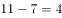。

故正确答案为C。 

---

### 第 2 题　qid 2452807 · 数学运算

- **A**. -6　✅
- **B**. -3
- **C**. -4
- **D**. -5

**答案**：A

**官方解析**

题干出现图形，且大数位置不固定，优先考虑凑相等。观察发现每一行或者每一列相加之和都为6，故所求项为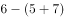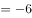。

故正确答案为A。 

---

### 第 3 题　qid 2452809 · 数学运算

108.02，-70.04，72.06，-34.08，36.10，（  ）

- **A**. -7.12　✅
- **B**. 7.02
- **C**. 9.12
- **D**. -9.12

**答案**：A

**官方解析**

原数列中数字均为小数，可将整数部分与小数部分分开观察。整数部分正负交替，数字分别108、70、72、34、36，作差加和均无规律，观察各项数字发现，各位数字相加之和为9、7、9、7、9，则下一项整数部分加和应为7。小数部分为02、04、06、08、10，构成公差为2的等差数列，下一项为12。因为原数列正负交替循环，则所求项应为-7.12。
故正确答案为A。

---

### 第 4 题　qid 2452814 · 数学运算

- **A**. 

　✅
- **B**. 

- **C**. 

- **D**. 
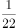

**答案**：A

**官方解析**

将原数列分子分母分开观察，分子均为1，分母为2、3、5、7、11、13，为质数列，下一项为17。则所求项为。

故正确答案为A。

---

### 第 5 题　qid 2452816 · 数学运算

某市从市儿童公园到市科技馆有6种不同路线，从市科技馆到市少年宫有5种不同路线，从市儿童公园到市少年宫有4种不同路线，则从市儿童公园到市少年宫的路线共有：

- **A**. 24种
- **B**. 36种
- **C**. 34种　✅
- **D**. 38种

**答案**：C

**官方解析**

从市儿童公园到市科技馆有6种不同路线，从市科技馆到市少年官有5种不同路线，那么从市儿童公园途径科技馆再到市少年宫有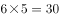种路线；从市儿童公园到市少年宫有4种不同路线。故从市儿童公园到市少年宫共有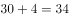种路线。

故正确答案为C。

---

### 第 6 题　qid 2452818 · 数学运算

在切钢管时会在切口处产生钢材损耗，每切一次损耗的钢材量约为10克，一根钢材被均匀地切成三等份，损耗钢材为钢材总重量的，则这根钢材的重量为：

- **A**. 10千克　✅
- **B**. 12千克
- **C**. 14千克
- **D**. 15千克

**答案**：A

**官方解析**

根据题意，一根钢材被切成三等份，需要切两次，则损耗的钢材量为克。又因为损耗钢材为钢材总重量的，则钢材总重量为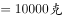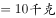。

故正确答案为A。

---

### 第 7 题　qid 2452819 · 数学运算

小王从乡镇骑自行车前往县城，若他骑行速度为18千米/时，则下午5点钟到达；若他骑行速度为20千米/时，则下午4点钟到达。小王的出发时间为：

- **A**. 早上6点
- **B**. 早上7点　✅
- **C**. 早上8点
- **D**. 中午12点

**答案**：B

**官方解析**

乡镇到县城的路程一定，则速度与时间成反比。速度之比为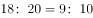，对应时间之比为。相差的1份对应1小时。当速度为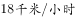时，所用时间为10小时，下午5点钟到达，对应出发时间应为早上7点。

故正确答案为B。

---

### 第 8 题　qid 2452821 · 数学运算

某隧道长1500米，有一列长150米的火车通过这条隧道，从车头进入隧道到完全通过隧道花费的时间为50秒，整列火车完全在隧道中的时间是：

- **A**. 43.2秒
- **B**. 40.9秒　✅
- **C**. 38.3秒
- **D**. 37.5秒

**答案**：B

**官方解析**

本题为行程问题中的火车过桥问题。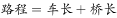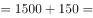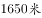，则火车的速度为。整列火车完全在隧道中的路程为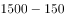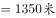，那么整列火车完全在隧道中的时间为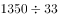。

故正确答案为B。

---

### 第 9 题　qid 2452822 · 数学运算

有A、B两个书架，A书架有50本书，B书架有70本书，要使A书架上的书本数是B书架的2倍，则从B书架上拿书放到A架上是：

- **A**. 30本　✅
- **B**. 32本
- **C**. 34本
- **D**. 35本

**答案**：A

**官方解析**

设从B书架上拿本书放到A架上，根据题意可建立方程：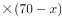，解得。

故正确答案为A。

---

### 第 10 题　qid 2452801 · 数学运算

某书法兴趣班有学员12人，其中男生5人，女生7人。从中随机选取2名学生参加书法比赛，则选到1名男生和1名女生的概率为：

- **A**. 

- **B**. 
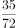

- **C**. 
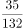

- **D**. 

　✅

**答案**：D

**官方解析**

根据公式，概率=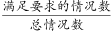。总情况为12名学员随机选2名，共有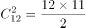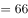种情况；满足要求的情况为5名男生中选1名有种情况、7名女生中选1名有种情况，分步用乘法，共有种情况。则概率=。

故正确答案为D。

---

### 第 11 题　qid 2452803 · 数学运算

有一条自西向东流向的河流，甲、乙两艘轮船分别从河流的上游和下游两点开始相对航行，在相遇于某地时，甲船航行的路程为乙船的2倍。已知乙船的速度为甲船的2倍，水流速度为1千米/分，则甲船的航行速度为：

- **A**. 4千米/分
- **B**. 3千米/分
- **C**. 2千米/分
- **D**. 1千米/分　✅

**答案**：D

**官方解析**

设甲船航行速度为，则乙船航行速度为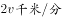，航行时间为。根据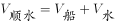、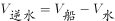，结合题干条件中甲船航行的路程为乙船的2倍，列式可得：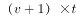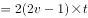，解得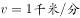。

故正确答案为D。

备注：本题为争议题，根据对“航行速度”的不同理解可以得出两个答案。若认为“航行速度”为船速，则本题选择D项；若认为“航行速度”包含水流速度对船速的影响，则本题甲船的航行速度应为千米/分，选择C项。粉笔倾向正确答案为D项。

---

### 第 12 题　qid 2452806 · 数学运算

一瓶硫酸使用了5天，使用时后一天总比前一天少使用1毫升，今天做实验用掉了5毫升后，现在剩下的量与已经用掉的量相同，则这瓶硫酸原来有：

- **A**. 70毫升　✅
- **B**. 65毫升
- **C**. 60毫升
- **D**. 55毫升

**答案**：A

**官方解析**

根据“使用时后一天总比前一天少使用1毫升”可得，这5天硫酸用量为等差数列。等差数列求和公式，第3天使用硫酸量为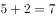，则5天使用硫酸总量为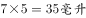。根据“剩下的量与已经用掉的量相同”可得，这瓶硫酸原来有。

故正确答案为A。

---

### 第 13 题　qid 2452808 · 数学运算

把1到82这82个自然数都相加起来，但由于中间有两个连续的数都多加了一次，得到的和为3520，则多加的第一个数是：

- **A**. 55
- **B**. 57
- **C**. 58　✅
- **D**. 60

**答案**：C

**官方解析**

设多加的第一个数是，根据等差数列求和公式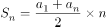可得，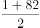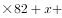，整理得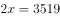，选项尾数不同考虑尾数法，尾数为，则尾数为3或8，只有C项满足。

故正确答案为C。

---

### 第 14 题　qid 2452811 · 数学运算

有8个不同颜色的小球，从中任意选出3个分给3个学生，每人1个，则其分法有：

- **A**. 72种
- **B**. 216种
- **C**. 336种　✅
- **D**. 1008种

**答案**：C

**官方解析**

从8个球中任选3个球，有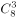种情况；将3个球分给3个学生，有种情况。分步用乘法，则共有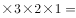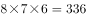种情况。

故正确答案为C。

---

## 判断推理

### 第 1 题　qid 2452815 · 图形推理

下列选项中，折叠后可以与所给图形结合在一起，成为一个整体的是：

- **A**. A
- **B**. B　✅
- **C**. C
- **D**. D

**答案**：B

**官方解析**

本题考查立体拼合。根据题干给出的立体图形侧面有四个面，要与该图形结合，必须也有四个面与其拼合，而D选项有三个面，可以排除；继续观察发现，题干黑色面比较特殊，只有它有一个凹进去的“”图形，根据凹凸对应原则，选项当中的图形也得只有一个面有一个凸出来的“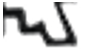”图形与之拼合；排除A项，剩下BC两个选项，仔细观察原图形的豁口，只有B项折叠起来能与之重合。

故正确答案为B。

---

### 第 2 题　qid 2452817 · 图形推理

从所给的四个选项中，选择最合适的一个填入问号处，使之呈现一定的规律性：

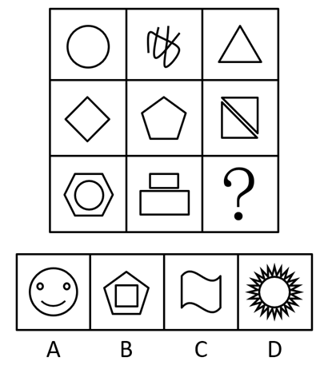

- **A**. A
- **B**. B　✅
- **C**. C
- **D**. D

**答案**：B

**官方解析**

元素组成不同，且无明显属性规律，考虑数量规律。题干图形出现明显的多边形以及单一曲线，考虑数线条数。九宫格优先横着观察，三行图形依次由1，2，3，4，5，6，7，8，“？”条线组成。故“？”处应该选择由9条线组成的
图形，对应B选项。
故正确答案为B。

---

### 第 3 题　qid 2452820 · 图形推理

从所给的四个选项中，选择最合适的一个填入问号处，使之呈现一定的规律性：

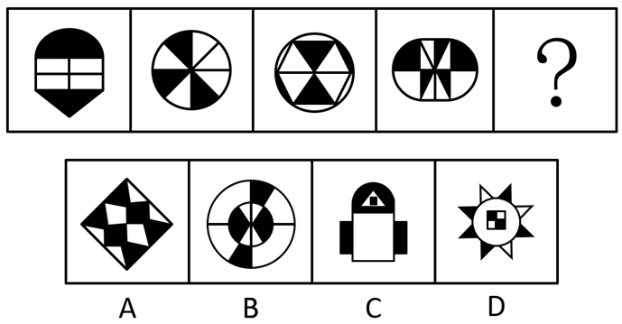

- **A**. A　✅
- **B**. B
- **C**. C
- **D**. D

**答案**：A

**官方解析**

元素组成不同，且无明显属性规律，考虑数量规律。题干图形出现明显的黑块，并且黑块数量依次是“2、3、4、5、？”。故“？”处应该选择一个有6个黑块的图形，对应A选项。
故正确答案为A。

---

### 第 4 题　qid 2452823 · 图形推理

从所给的四个选项中，选择最合适的一个填入问号处，使之呈现一定的规律性：

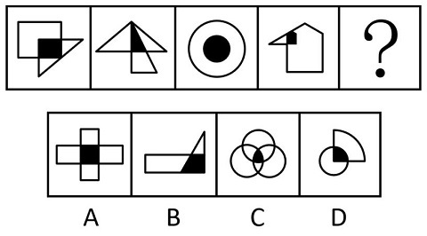

- **A**. A
- **B**. B
- **C**. C
- **D**. D　✅

**答案**：D

**官方解析**

题干图形都是由两个图形组成，优先考虑图形间关系。观察发现每个图形当中的两个图形相交形成黑色阴影，并且每个图形中的黑色阴影部分与其中一个图案的形状相同，只有D项符合这一规律。
故正确答案为D。

---

### 第 5 题　qid 2452824 · 图形推理

从所给的四个选项中，选择最合适的一个填入问号处，使之呈现一定的规律性：

- **A**. A
- **B**. B
- **C**. C
- **D**. D　✅

**答案**：D

**官方解析**

元素组成相似，优先考虑样式规律。第一组图形中，图1和图2上面的横线先求同，再旋转，下面的弧线先顺时针转，再相加，得到图3。第二组图形运用此规律，图1与图2上面的横线先求同，再旋转，下面的折线先顺时针转，再相加，得到图3，故只有D项符合此规律。

故正确答案为D。

---

### 第 6 题　qid 2452825 · 图形推理

从所给的四个选项中，选择最合适的一个填入问号处，使之呈现一定的规律性：

- **A**. A
- **B**. B
- **C**. C　✅
- **D**. D

**答案**：C

**官方解析**

元素组成相同，优先考虑位置规律。第一组图形中，图1左右翻转得到图2，图2上下翻转得到图3。第二组图形运用此规律，图1左右翻转得到图2，图2上下翻转得到图3，故只有C项符合此规律。
故正确答案为C。

---

### 第 7 题　qid 2452826 · 图形推理

从所给的四个选项中，选择最合适的一个填入问号处，使之呈现一定的规律性：

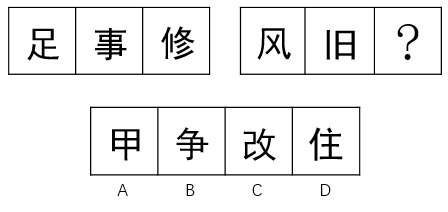

- **A**. A
- **B**. B　✅
- **C**. C
- **D**. D

**答案**：B

**官方解析**

元素组成不同，且无明显属性规律，优先考虑数量规律。图形均为汉字，优先考虑笔画数。第一组图笔画数依次为7、8、9。第二组图形运用此规律，第二组图笔画数依次为4、5、？，因此问号处应选择6笔画的汉字。四个选项汉字的笔画数分别为5、6、7、7，只有B选项符合规律。
故正确答案为B。

---

### 第 8 题　qid 2452827 · 图形推理

从所给的四个选项中，选择最合适的一个填入问号处，使之呈现一定的规律性：

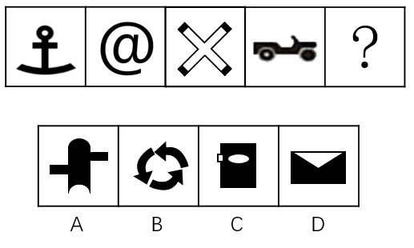

- **A**. A
- **B**. B
- **C**. C
- **D**. D　✅

**答案**：D

**官方解析**

元素组成不同，且无明显属性规律，优先考虑数量规律。观察题干图形发现出现生活化图形、空白区域明显，考虑数面。题干所有图形面的数量均为1，四个选项面的数量分别为0、0、2、1，只有D选项符合规律。
故正确答案为D。

---

### 第 9 题　qid 2452828 · 图形推理

从所给的四个选项中，选择最合适的一个填入问号处，使之呈现一定的规律性：

- **A**. A
- **B**. B
- **C**. C　✅
- **D**. D

**答案**：C

**官方解析**

本题为两组图题目，在第一组图，图1上半部分的阴影三角形向下翻转得到图2，继续向下翻转得到图3，第二组图依照此规律变化，图1上半部分的两个阴影三角形和一个白色三角形先向下翻转得到图2，此部分继续向下翻转，白色三角形相连接形成菱形，阴影三角形的阴影部分应分开为线条状，符合此规律的只有C选项。
故正确答案为C。

---

### 第 10 题　qid 2452829 · 图形推理

从所给的四个选项中，选择最合适的一个填入问号处，使之呈现一定的规律性：

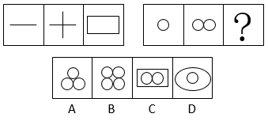

- **A**. A
- **B**. B　✅
- **C**. C
- **D**. D

**答案**：B

**官方解析**

元素组成不同，且无明显属性规律，优先考虑数量规律。第一组图中出现单一直线以及多边形，优先考虑数直线，第一组图中直线的数量依次是1、2、4；第二组中出现的均为曲线图形，考虑数曲线，曲线数量依次是1、2，故问号处曲线出现应为4条，A项3条，B项4条，C项2条，D项2条，只有B项符合要求。
故正确答案为B。

---

### 第 11 题　qid 2452830 · 定义判断

名人效应是名人的出现所达成的引人注意、扩大影响的效应，或人们模仿名人的心理现象的统称。
根据上述定义，下面不属于名人效应的是：

- **A**. 某连续剧因著名演员主演而大获好评，后来该主演在本剧中所穿服饰开始热卖
- **B**. 某产品邀请了某体育明星代言后产品销量直线上升
- **C**. 某著名作家在公园举行新书签名会，吸引了大批游客
- **D**. 某市长就本市环境污染问题接受各大报社记者的采访　✅

**答案**：D

**官方解析**

第一步：找出定义关键词。
“名人的出现所达成的引人注意、扩大影响的效应”、“人们模仿名人的心理现象”。
第二步：逐一分析选项。
A项：著名演员获得好评之后，在剧中所穿的服饰也开始热卖，符合“名人的出现所达成的引人注意、扩大影响的效应”、“人们模仿名人的心理现象”，符合定义，排除； 
B项：体育明星代言产品导致销量直线上升，符合“名人的出现所达成的引人注意、扩大影响的效应”、“人们模仿名人的心理现象”，符合定义，排除；
C项：著名作家在公园举行新书签名会，吸引游客前往，符合“名人的出现所达成的引人注意、扩大影响的效应”、“人们模仿名人的心理现象”，符合定义，排除；
D项：市长因环境问题接受记者的采访，不符合“名人的出现所达成的引人注意、扩大影响的效应”、“人们模仿名人的心理现象”，不符合定义，当选。
本题为选非题，故正确答案为D。

---

### 第 12 题　qid 2452831 · 定义判断

应激性是指生物对外来刺激(如温度、声音)在短时间内所做出的反应。
根据上述定义，以下属于应激性的是：

- **A**. 篮球触地后高高弹起
- **B**. 含羞草被碰触后叶子收缩　✅
- **C**. 鲜牛奶常温放置24小时后发酸
- **D**. 纸张遇到明火燃烧

**答案**：B

**官方解析**

第一步：找出定义关键词。
“生物对外来刺激(如温度、声音)在短时间内所做出的反应”。
第二步：逐一分析选项。
A项：篮球触碰地面之后会高高弹起，篮球不是生物，不符合“生物对外来刺激(如温度、声音)在短时间内所做出的反应”，不符合定义，排除； 
B项：含羞草被碰触后叶子收缩，符合“生物对外来刺激(如温度、声音)在短时间内所做出的反应”，符合定义，当选；
C项：鲜牛奶放置24小时后发酸，鲜牛奶不是生物，不符合“生物对外来刺激(如温度、声音)在短时间内所做出的反应”，不符合定义，排除；
D项：纸遇到火会燃烧，纸不是生物，不符合“生物对外来刺激(如温度、声音)在短时间内所做出的反应”，不符合定义，排除。
故正确答案为B。

---

### 第 13 题　qid 2452832 · 定义判断

表演艺术是一种通过演唱、演奏等方式来塑造形象、传达情感的艺术形式，一般指舞台上的现场表演。
根据上述定义，下面属于表演艺术的是：

- **A**. 魔术师大卫•科波菲尔的魔术“大变活人”　✅
- **B**. 科幻电影《美国队长2》
- **C**. 健身房的瑜伽练习课
- **D**. 社区部分妇女自行组织的广场舞

**答案**：A

**官方解析**

第一步：找出定义关键词。
“通过演唱、演奏等方式来塑造形象、传达情感的艺术形式”、“一般指舞台上的现场表演”。
第二步：逐一分析选项。
A项：魔术符合“通过演唱、演奏等方式来塑造形象、传达情感的艺术形式”并且魔术“大变活人”是在舞台上表演的，满足“一般指舞台上的现场表演”，符合定义，当选； 
B项：科幻电影《美国队长2》是将人物表演利用胶卷、录像带或数字媒体将影像和声音捕捉起来，再加上后期的编辑工作而成，不满足“一般指舞台上的现场表演”，不符合定义，排除；
C项：健身房的瑜伽练习课，不满足“通过演唱、演奏等方式来塑造形象、传达情感的艺术形式”也不满足“一般指舞台上的现场表演”，不符合定义，排除；
D项：社区部分妇女自行组织的广场舞没有塑造形象，不满足“通过演唱、演奏等方式来塑造形象、传达情感的艺术形式”也不满足“一般指舞台上的现场表演”，不符合定义，排除。
故正确答案为A。

---

### 第 14 题　qid 2452833 · 定义判断

所谓形象工程指某些领导干部为了个人或小团体的目的和利益，不顾群众需要和当地实际，不惜利用手中权力而搞出的劳民伤财、浮华无效却有可能为自己和小团体标榜政绩的工程。
下列属于形象工程的是：

- **A**. 某市领导干部为农村儿童建立希望基金会
- **B**. 某经理私自为集团快速建立了豪华大厦
- **C**. 某领导以发展旅游为名在贫困乡建大型度假村　✅
- **D**. 某市领导决定对当地古建筑工程进行修复

**答案**：C

**官方解析**

第一步：找出定义关键词。
“某些领导干部”、“为了个人或小团体的目的和利益”、“不顾群众需要和当地实际，不惜利用手中权力而搞出的劳民伤财、浮华无效却有可能为自己和小团体标榜政绩的工程”。
第二步：逐一分析选项。
A项：为儿童建立希望基金会，是为了当地群众的利益，不满足“为了个人或小团体的目的和利益”，也不满足“不顾群众需要和当地实际，不惜利用手中权力而搞出的劳民伤财、浮华无效却有可能为自己和小团体标榜政绩的工程”，不符合定义，排除； 
B项：某经理，不满足“某些领导干部”，建立豪华大厦也不会提升政绩，不满足“不顾群众需要和当地实际，不惜利用手中权力而搞出的劳民伤财、浮华无效却有可能为自己和小团体标榜政绩的工程”，不符合定义，排除；
C项：某领导，满足“某些领导干部”，以发展旅游为名在贫困乡建大型度假村满足“为了个人或小团体的目的和利益”，也满足“不顾群众需要和当地实际，不惜利用手中权力而搞出的劳民伤财、浮华无效却有可能为自己和小团体标榜政绩的工程”，符合定义，当选；
D项：某市领导，满足“某些领导干部”，但是对当地古建筑工程进行修复不是浮华无效的，不满足 “不顾群众需要和当地实际，不惜利用手中权力而搞出的劳民伤财、浮华无效却有可能为自己和小团体标榜政绩的工程” ，不符合定义，排除。
故正确答案为C。

---

### 第 15 题　qid 2452834 · 定义判断

正当防卫是指对正在进行不法侵害行为的人，采取的制止不法侵害的行为，对不法侵害人造成一定限度损害的，属于正当防卫，不负刑事责任。
下列属于正当防卫的是：

- **A**. 小偷进入朋友家中准备盗窃，被朋友的母亲阻止后迅速离开
- **B**. 盗匪拦路抢劫，但是发现被拦者是自己的亲戚，不得已而放弃
- **C**. 杀人犯杀害自己仇人时，仇人拿刀与之展开搏斗　✅
- **D**. 盗匪抢劫正在逃亡的杀人犯，双方发生争执

**答案**：C

**官方解析**

第一步：找出定义关键词。
“对正在进行不法侵害行为的人”、“采取的制止不法侵害的行为，对不法侵害人造成一定限度损害的”。
第二步：逐一分析选项。
A项：小偷进入朋友家中准备盗窃，被朋友的母亲阻止后离开，没有对不法侵害人造成损害，不满足“采取的制止不法侵害的行为，对不法侵害人造成一定限度损害的”，不符合定义，排除；
B项：盗匪不得已而放弃抢劫，说明并没有开始抢劫，不满足“对正在进行不法侵害行为的人”，不符合定义，排除；
C项：杀人犯杀害自己仇人时满足“正在进行不法侵害行为的人”，仇人拿刀与之展开搏斗满足“采取的制止不法侵害的行为，对不法侵害人造成一定限度损害的”，符合定义，当选；
D项：盗匪抢劫正在逃亡的杀人犯满足“正在进行不法侵害行为的人”，但双方发生争执不知道有没有制止不法侵害，不满足“采取的制止不法侵害的行为，对不法侵害人造成一定限度损害的”，不符合定义，排除。
故正确答案为C。

---

### 第 16 题　qid 2452835 · 定义判断

紧缩货币政策指中央银行为实现既定的经济目标运用各种工具调节货币供应量和利率，进而影响宏观经济的方针和措施的总和。紧缩货币政策最终希望取得稳定物价，促进经济增长，实现充分就业和平衡国际收支的效果。
根据上述定义，以下涉及到紧缩货币政策的是：

- **A**. 某商业银行面临资金紧缺的严重问题，为减少风险，对于投资审批程序更加严格
- **B**. 欧洲各国的领导人普遍表示应该采取谨慎的货币政策以应对日益严峻的金融危机
- **C**. 中央银行通过调整准备金率以控制商业银行贷款，从而减少银行呆坏账的风险　✅
- **D**. 渣打银行推出无抵押信用贷款，有效地解决了中小企业缺乏抵押物的问题

**答案**：C

**官方解析**

第一步：找出定义关键词。
“中央银行为实现既定的经济目标”、“运用各种工具调节货币供应量和利率”、“进而影响宏观经济的方针和措施的总和”。
第二步：逐一分析选项。
A项：某商业银行不是中央银行，不满足“中央银行为实现既定的经济目标”，不符合定义，排除； 
B项：欧洲各国的领导人不是中央银行，不满足“中央银行为实现既定的经济目标”，应该采取也并没有正在去做，不满足“运用各种工具调节货币供应量和利率”，不符合定义，排除；
C项：中央银行通过调整准备金率以控制商业银行贷款满足“中央银行为实现既定的经济目标”，也满足“运用各种工具调节货币供应量和利率”，符合定义，当选；
D项：渣打银行不是中央银行，不满足“中央银行为实现既定的经济目标”，不符合定义，排除。
故正确答案为C。

---

### 第 17 题　qid 2452838 · 定义判断

海绵城市是新一代城市雨洪管理概念，是指城市在适应环境变化和应对雨水带来的自然灾害等方面具有良好的“弹性”，也可称之为“水弹性城市”。
下列不属于海绵城市的是：

- **A**. 光明新区先后建立发达的地下管网系统
- **B**. 德国城市高效排水排污
- **C**. 瑞士在全国大力推行“雨水工程”
- **D**. 洛杉矶的雨水一直是流入河道，后流向大海　✅

**答案**：D

**官方解析**

第一步：找出定义关键词。
“城市在适应环境变化和应对雨水带来的自然灾害等方面具有良好的弹性”。
第二步：逐一分析选项。
A项：发达的地下管网系统，体现出应对雨水的“弹性”，符合“城市在适应环境变化和应对雨水带来的自然灾害等方面具有良好的弹性”，符合定义，排除； 
B项：高效排水排污，“高效”体现出应对雨水的“弹性”，符合“城市在适应环境变化和应对雨水带来的自然灾害等方面具有良好的弹性”，符合定义，排除； 
C项：推行“雨水工程”，体现出应对雨水的“弹性”，符合“城市在适应环境变化和应对雨水带来的自然灾害等方面具有良好的弹性”，符合定义，排除； 
D项：雨水一直是流入河道，后流向大海，就是最简单的排水，没有体现应对雨水的“弹性”，不符合“城市在适应环境变化和应对雨水带来的自然灾害等方面具有良好的弹性”，不符合定义，当选。
本题为选非题，故正确答案为D。

---

### 第 18 题　qid 2452841 · 定义判断

“互联网政务”服务实现部门间数据共享，让居民和企业少跑腿、好办事、不添堵，简除烦苛，禁察非法，使人民群众有更平等的机会和更大的创造空间。

下列<u>不属于</u>互联网政务服务的是：

- **A**. 小明去政府办理农村合作医疗保险要求只需携带公民身份证
- **B**. 小明去政府单位跑一个窗口就将其所要办理的事情办好
- **C**. 小明身在外地不需要回到户口所在地就可以办理身份证
- **D**. 小明去政府机构办理业务感觉服务比以前好很多　✅

**答案**：D

**官方解析**

第一步：找出定义关键词。
“数据共享”、“让居民和企业少跑腿、好办事、不添堵，简除烦苛，禁察非法”
第二步：逐一分析选项。
A项：办理农村合作医疗保险要求只需携带公民身份证，简化流程，符合“让居民和企业少跑腿、好办事、不添堵，简除烦苛，禁察非法”，符合定义，排除； 
B项：去政府单位跑一个窗口就将其所要办理的事情办好，一键式办理，符合“让居民和企业少跑腿、好办事、不添堵，简除烦苛，禁察非法”，符合定义，排除； 
C项：不需要回到户口所在地就可以办理身份证，便民利民，符合“让居民和企业少跑腿、好办事、不添堵，简除烦苛，禁察非法”，符合定义，排除；
D项：感觉服务比以前好很多，强调的是服务态度的转变，不符合“让居民和企业少跑腿、好办事、不添堵，简除烦苛，禁察非法”，不符合定义，当选。
本题为选非题，故正确答案为D。

---

### 第 19 题　qid 2452844 · 定义判断

共享税是由中央和地方政府按一定方式分享收入的一类税收。共享税的分享方式主要有附加式、分征式、比例分成式等。我国的共享税有增值税、资源税、个人所得税、企业所得税和证券交易税。
下列属于共享税的是：

- **A**. 每次通过海关交的关税
- **B**. 消费金额较大时所交的消费税
- **C**. 铁道部门集中缴纳的营业税
- **D**. 公司财务申购材料缴纳的增值税　✅

**答案**：D

**官方解析**

第一步：找出定义关键词。
“共享税有增值税、资源税、个人所得税、企业所得税和证券交易税”，题干给了5种税种，可以考虑一一对应。
第二步：逐一分析选项。
A项：关税，不符合“共享税有增值税、资源税、个人所得税、企业所得税和证券交易税”，不符合定义，排除； 
B项：消费税，不符合“共享税有增值税、资源税、个人所得税、企业所得税和证券交易税”，不符合定义，排除； 
C项：营业税，不符合“共享税有增值税、资源税、个人所得税、企业所得税和证券交易税”，不符合定义，排除； 
D项：增值税，符合“共享税有增值税、资源税、个人所得税、企业所得税和证券交易税”5种之一，符合定义，当选。
故正确答案为D。

---

### 第 20 题　qid 2452847 · 定义判断

缺点逆用法是指针对人或事物中的缺点，考虑如何将这些缺点进行转换，使之成为可被利用的优点，从而解决问题的方法。
根据上述定义，下面属于缺点逆用法的是：

- **A**. 电流通过导体时会产生热量，如不进行散热则会损害电路元件。人们利用电流的这种特点，将产生的热量传导到毛毯上，生产出了电热毯　✅
- **B**. 公司新生产的模具被曝含有致癌物质，公司高层决定紧急召开会议讨论如何进行产品召回
- **C**. 最近部分市民投诉出租车拒载现象较多，针对此现象，出租车公司决定对司机重新进行业务培训并加重对拒载司机的处罚
- **D**. 小明有先天性的口吃，为了练好发声，他每天口含着石子练习

**答案**：A

**官方解析**

第一步：找出定义关键词。
“考虑如何将这些缺点进行转换，使之成为可被利用的优点，从而解决问题”
第二步：逐一分析选项。
A项：电流的热量如果不进行散热会损害电路元件，符合“缺点”，利用电流的这种特点，将产生的热量传导到毛毯上，生产出了电热毯，符合“把缺点进行转换，使之成为可被利用的优点，从而解决问题”，符合定义，当选；
B项：公司召回致癌产品，只是“召回”，不符合“把缺点进行转换，使之成为可被利用的优点，从而解决问题”，不符合定义，排除；
C项：对拒载司机进行处罚，只是解决市民的投诉，不符合“把缺点进行转换，使之成为可被利用的优点，从而解决问题”，不符合定义，排除；
D项：每天口含着石子练习，只是在克服缺点，不符合“把缺点进行转换，使之成为可被利用的优点，从而解决问题”，不符合定义，排除；
故正确答案为A。

---

### 第 21 题　qid 2452850 · 类比推理

青蛙：害虫

- **A**. 老师：学生
- **B**. 老鹰：老鼠　✅
- **C**. 蜻蜓：蝴蝶
- **D**. 牛奶：奶牛

**答案**：B

**官方解析**

第一步：判断题干词语间逻辑关系。
青蛙吃害虫，二者为捕食者与被捕食者的对应关系。
第二步：判断选项词语间逻辑关系。
A项：老师教导学生，二者为职业与作用对象的对应关系，与题干逻辑关系不一致，排除；
B项：老鹰吃老鼠，二者为捕食者与被捕食者的对应关系，与题干逻辑关系一致，当选；
C项：蜻蜓和蝴蝶都是动物，二者为并列关系，与题干逻辑关系不一致，排除；
D项：奶牛可以产出牛奶，二者为产出物的对应关系，与题干逻辑关系不一致，排除。
故正确答案为B。

---

### 第 22 题　qid 2452852 · 类比推理

绿萝：植物

- **A**. 金属：铝
- **B**. 铁锤：铁锹
- **C**. 动物：斑马
- **D**. 蝴蝶：昆虫　✅

**答案**：D

**官方解析**

第一步：判断题干词语间逻辑关系。
绿萝是植物的一种，二者为种属关系。
第二步：判断选项词语间逻辑关系。
A项：铝是金属的一种，二者为种属关系，但两词顺序与题干相反，与题干逻辑关系不一致，排除；
B项：铁锤和铁锹是两种工具，二者为并列关系，与题干逻辑关系不一致，排除；
C项：斑马是动物的一种，二者为种属关系，但两词顺序与题干相反，与题干逻辑关系不一致，排除；
D项：蝴蝶是昆虫的一种，二者为种属关系，与题干逻辑关系一致，当选。
故正确答案为D。

---

### 第 23 题　qid 2452854 · 类比推理

焦作：云台山

- **A**. 香港：紫荆花
- **B**. 华山：渭南
- **C**. 云南：洱海
- **D**. 杭州：西湖　✅

**答案**：D

**官方解析**

第一步：判断题干词语间逻辑关系。
云台山是焦作市的景点之一，二者为城市与景点的对应关系。
第二步：判断选项词语间逻辑关系。
A项：紫荆花是香港的市花，二者为城市与市花的对应关系，与题干逻辑关系不一致，排除；
B项：华山是渭南市的景点之一，二者为城市与景点的对应关系，但两词顺序与题干相反，与题干逻辑关系不一致，排除；
C项：洱海是云南省的景点之一，二者为省份与景点的对应关系，与题干逻辑关系不一致，排除；
D项：西湖是杭州市的景点之一，二者为城市与景点的对应关系，与题干逻辑关系一致，当选。
故正确答案为D。

---

### 第 24 题　qid 2452856 · 类比推理

英国：伦敦

- **A**. 宇宙：火星
- **B**. 青海：甘肃
- **C**. 香港：九龙　✅
- **D**. 釜山：韩国

**答案**：C

**官方解析**

第一步：判断题干词语间逻辑关系。
伦敦是英国的组成部分，二者为组成关系。
第二步：判断选项词语间逻辑关系。
A项：火星是宇宙的组成部分，二者为组成关系，与题干逻辑关系一致，保留；
B项：青海和甘肃是我国的两个省份，二者为并列关系，与题干逻辑关系不一致，排除；
C项：九龙是香港的组成部分，二者为组成关系，与题干逻辑关系一致，保留；
D项：釜山是韩国的组成部分，但两词顺序与题干相反，与题干逻辑关系不一致，排除。
比较A、C两项，题干中伦敦是英国的首都，是英国的政治、经济、文化、金融中心；而九龙是中国香港的三大区域之一，是除了香港岛以外市区的主要组成部分，C项与题干的关系更近，因此排除A项。
故正确答案为C。

---

### 第 25 题　qid 2452859 · 类比推理

吐鲁番：葡萄

- **A**. 北京：普通话
- **B**. 新疆：哈密瓜　✅
- **C**. 解放军：建军节
- **D**. 房地产：开发商

**答案**：B

**官方解析**

第一步：判断题干词语间逻辑关系。
葡萄是吐鲁番的特产，二者为地点与特产之间的对应关系。
第二步：判断选项词语间逻辑关系。
A项：普通话是以北京语音为标准音，以北方话（官话）为基础方言，以典范的现代白话文著作为语法规范的通用语，并非北京的特产，与题干逻辑关系不一致，排除；
B项：哈密瓜是新疆的特产，二者为地点与特产之间的对应关系，与题干逻辑关系一致，当选；
C项：建军节是解放军建军纪念日，二者为节日对应关系，与题干逻辑关系不一致，排除；
D项：有的开发商开发经营房地产，二者并非地点与特产之间的对应关系，与题干逻辑关系不一致，排除。
故正确答案为B。

---

### 第 26 题　qid 2452836 · 类比推理

篮球：运动

- **A**. 敲诈：犯罪　✅
- **B**. 作者：鲁迅
- **C**. 历史：近代史
- **D**. 金钱：权利

**答案**：A

**官方解析**

第一步：判断题干词语间逻辑关系。
篮球是一种运动，二者为包容关系中的种属关系。
第二步：判断选项词语间逻辑关系。
A项：敲诈是一种犯罪，二者为种属关系，与题干逻辑关系一致，当选；
B项：作者一般指文学、艺术和科学作品的创作者，鲁迅是一名作者，二者为种属关系，但词语顺序不同，与题干逻辑关系不一致，排除；
C项：历史按照时间可分为史前史、古代史、近代史、现代史等，近代史是一段历史，二者为种属关系，但词语顺序不同，与题干逻辑关系不一致，排除；
D项：金钱可能会给人带来权利，二者为对应关系，与题干逻辑关系不一致，排除。
故正确答案为A。

---

### 第 27 题　qid 2452839 · 类比推理

《西游记》：吴承恩

- **A**. 《三国志》：罗贯中
- **B**. 《三国演义》：施耐庵
- **C**. 《警世通言》：冯梦龙　✅
- **D**. 《绿野仙踪》：蒲松龄

**答案**：C

**官方解析**

第一步：判断题干词语间逻辑关系。
《西游记》的作者是吴承恩，二者为作品与作者的对应关系。
第二步：判断选项词语间逻辑关系。
A项：《三国志》的作者是西晋史学家陈寿，不是罗贯中，与题干逻辑关系不一致，排除；
B项：《三国演义》的作者是罗贯中，施耐庵是《水浒传》的作者，与题干逻辑关系不一致，排除；
C项：《警世通言》的作者是冯梦龙，二者为作品与作者的对应关系，与题干逻辑关系一致，当选；
D项：《绿野仙踪》的作者是美国作家弗兰克·鲍姆，蒲松龄是《聊斋志异》的作者，与题干逻辑关系不一致，排除。
故正确答案为C。

---

### 第 28 题　qid 2452843 · 类比推理

周瑜：曹操

- **A**. 杜甫：柳永
- **B**. 动物：食物
- **C**. 火车：叉车
- **D**. 吴国：魏国　✅

**答案**：D

**官方解析**

第一步：判断题干词语间逻辑关系。
周瑜与曹操均是东汉末年的历史人物，二者为并列关系中的反对关系。
第二步：判断选项词语间逻辑关系。
A项：杜甫是唐代诗人，柳永北宋词人，二者是并列关系中的反对关系，与题干逻辑关系一致，保留；
B项：有的动物是食物，有的食物是动物，有的动物不是食物，有的食物不是动物，二者为交叉关系，与题干逻辑关系不一致，排除；
C项：叉车是一种工业搬运车辆，是汽车的一种，而汽车与火车为并列关系，叉车与火车并非并列关系，与题干逻辑关系不一致，排除；
D项：吴国与魏国是三国时期的两个国家，二者为并列关系中的反对关系，与题干逻辑关系一致，保留。
对比A、D两个选项，A项中的两个历史人物所处的朝代并不相同，而D项的两个国家都处于三国时期，所处朝代相同，并且题干中的周瑜和曹操刚好一个是吴国人、一个是魏国人，竖着看可以构成历史人物和所处朝代的对应关系，因此，D选项与题干的逻辑关系更相近，对比择优后选择D项。
故正确答案为D。

---

### 第 29 题　qid 2452846 · 类比推理

麦当劳：美国

- **A**. 肯德基：德国
- **B**. 三星：韩国　✅
- **C**. 夏普：英国
- **D**. 哈根达斯：日本

**答案**：B

**官方解析**

第一步：判断题干词语间逻辑关系。
麦当劳是美国的品牌，创立于美国，二者为创立地点的对应关系。
第二步：判断选项词语间逻辑关系。
A项：肯德基不是创立于德国，而是创立于美国，与题干逻辑关系不一致，排除；
B项：三星是韩国的品牌，创立于韩国，二者为创立地点的对应关系，与题干逻辑关系一致，当选；
C项：夏普不是创立于英国，而是创立于日本，与题干逻辑关系不一致，排除；
D项：哈根达斯不是创立于日本，而是创立于美国，与题干逻辑关系不一致，排除。
故正确答案为B。

---

### 第 30 题　qid 2452849 · 类比推理

逗号：中止

- **A**. 句号：引用
- **B**. 解释：冒号
- **C**. 回车：换行　✅
- **D**. 并列：分隔号

**答案**：C

**官方解析**

第一步：判断题干词语间逻辑关系。
逗号是用来中止的，具有中止的功能，二者为功能上的对应关系。
第二步：判断选项词语间逻辑关系。
A项：句号的功能不是引用，而是表示结束，与题干逻辑关系不一致，排除；
B项：冒号是用来解释的，具有解释的功能，但两词顺序与题干相反，与题干逻辑关系不一致，排除；
C项：回车是用来换行的，具有换行的功能，与题干逻辑关系一致，当选；
D项：分隔号可以用来表示并列，但两词顺序与题干相反，与题干逻辑关系不一致，排除。
故正确答案为C。

---

### 第 31 题　qid 2452857 · 逻辑判断

在电影“泰坦尼克号”里，我们看到了一幅幅充满人性，感人至深的温暖画面：白发苍苍的老船长庄严宣布：“让妇女儿童优先离船”。最后他平静地与“泰坦尼克号”一同沉没……
根据白发苍苍老船长的话，下列推理正确的是：

- **A**. 她是儿童，所以可以优先离船　✅
- **B**. 优先离船的都是妇女儿童
- **C**. 她优先离船，所以她是妇女
- **D**. 不是妇女儿童不可以优先离船

**答案**：A

**官方解析**

第一步：翻译题干。

题干关于老船长的话，可以理解为：如果是妇女或儿童，那么可以优先离船，所以可以翻译为：①妇女或儿童优先离船。

第二步：逐一分析选项。

A项：儿童是对①的肯前，肯前必肯后，当选；

B项：优先离船是对①的肯后，但肯后得不到确定性的结论，排除；

C项：优先离船是对①的肯后，但肯后得不到确定性的结论，排除；

D项：优先离船是对①的肯后，但肯后得不到确定性的结论，排除。

故正确答案为A。

---

### 第 32 题　qid 2452860 · 类比推理

“犯罪的不都是无固定收入人群”这一命题可以理解为：

- **A**. 所有犯罪的都不是无固定收入人群
- **B**. 所有犯罪的都是无固定收入人群
- **C**. 有的犯罪的不是无固定收入人群　✅
- **D**. 所有的无固定收入人群是犯罪的

**答案**：C

**官方解析**

第一步：翻译题干。

题干“不都是”理解成“有的不”，所以题干可以翻译为：

①有的犯罪无固定收入人群

第二步：逐一分析选项。

A项：翻译为犯罪无固定收入人群，有的不能推所有，推不出，排除；

B项：翻译为犯罪无固定收入人群，与题干矛盾，推不出，排除；

C项：翻译为有的犯罪无固定收入人群，与题干一致，当选；

D项：翻译为无固定收入人群犯罪，有的不能逆否，无法推出，排除。

故正确答案为C。

---

### 第 33 题　qid 2452862 · 逻辑判断

许多成功的演员都是表演系专业毕业的，也有很多演员是草根出身，通过一些机遇走上了演艺之路，但没有一个不努力提升自己演艺水平的演员能够获得成功。
如果以上陈述为真，那么以下选项一定为真的是：

- **A**. 没有草根出身的演员会不努力提升自己演艺水平
- **B**. 所有不成功的演员都不努力去提升自己演艺水平
- **C**. 演员越努力提升自己演艺水平就越可能获得成功　✅
- **D**. 表演系专业毕业的演员会努力提升自己演艺水平

**答案**：C

**官方解析**

第一步：翻译题干。

①有的成功演员表演系毕业；

②有的演员草根；

③成功努力提升自己演艺水平；

①换位后和③可得：④有的表演系毕业成功演员努力提升自己演艺水平。

第二步：逐一分析选项。

A项：翻译为草根努力提升自己演艺水平，草根与努力之间不构成推出关系，排除；

B项：翻译为—成功努力提升自己演艺水平，对③的否前，否前推不出必然性结论，排除；

C项：翻译为越努力提升自己演艺水平越可能成功，是对③的肯后，肯后得不到必然性结论，选项中说的是可能获得成功，当选；

D项：翻译为表演系专业努力提升自己演艺水平，根据①③只能推出有的表演系毕业努力提升自己演艺水平，无法推出所有，排除。

故正确答案为C。

---

### 第 34 题　qid 2452863 · 类比推理

舞蹈课上，学生紫梦来迟了，老师问她：“怎么又迟到了？”根据此所述，则该教师提问的预设是：

- **A**. 学生紫梦不喜欢上舞蹈课
- **B**. 学生紫梦上课迟到是有意的
- **C**. 以前上舞蹈课学生紫梦也迟到过　✅
- **D**. 这节舞蹈课上没有其他同学迟到

**答案**：C

**官方解析**

第一步：找出论点和论据。
论点：学生紫梦又迟到了。
论据：无。
本题只有论点无论据，问法为预设，优先考虑必要条件的加强方式。
第二步：逐一分析选项。
A项：喜欢上舞蹈课也不意味着一定不迟到，并且跟“又一次”没有关系，无法成为预设，排除；
B项：老师的问法中看不出紫梦是不是故意这个主观意识，而且“有意”和“又一次”没有关系，无法成为预设，排除；
C项：如果以前上舞蹈课学生紫梦没迟到过，老师就不会问“又一次”，所以是老师所言的必要条件，当选；
D项：老师针对于紫梦发问，与其他同学是否迟到无关，排除。
故正确答案为C。

---

### 第 35 题　qid 2452864 · 类比推理

有员工没参加单位举行的学习宣传《习近平谈治国理政》(第二卷)座谈会。甲、乙、丙、丁中有一人没有参加，其他三人都参加了。单位负责人在询问时，他们做了如下的回答。
甲：乙没有来。
乙：我不但参加了，而且还谈了感想。
丙：我晚来了一会儿，但一直到座谈会结束才走。
丁：如果丙来了，那就是我没来。
如果他们中只有一个人说谎，则以下成立的是：

- **A**. 甲没有参加
- **B**. 乙没有参加
- **C**. 丙没有参加
- **D**. 丁没有参加　✅

**答案**：D

**官方解析**

本题属于真假推理题。
第一步：找出题干矛盾命题。
甲说“乙没有来”和乙说“我不但参加了，而且还谈了感想”是矛盾关系，必有一真一假。
第二步：看其余。
已知只有一个人说谎，说明其余人说的都是真的。丙说“我晚来了一会儿”，说明丙参加了。丁说“如果丙来了，那就是我没来”，因丙参加为真，说明丁没有参加。
故正确答案为D。

---

### 第 36 题　qid 2452866 · 类比推理

中国要真正成为世界大国中的执牛耳者，首先就要向海洋要发展空间。翻看历史上所有的大国崛起，无不是在浩瀚的海洋中完成自我蜕变的。然而作为当今世界唯一的超级大国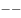美国，却始终打着自己的小九九。它几乎不能容忍一个意识形态和自己不同的国家崛起于太平洋的另外一端，从而击碎自己积累两百年的霸主地位。在现实中，美国就和某些国家串联起来，创造出旨在围堵中国的“太平洋岛链”，这成了中国这只雄鸡暂时难以摆脱的海路桎梏。

根据这段文字，无法推出的是：

- **A**. 发展海洋空间对中国具有重要意义
- **B**. 美国和中国的意识形态完全不同
- **C**. 美国的全球地位有利于中国的发展　✅
- **D**. 美国的小九九就是阻碍中国的发展

**答案**：C

**官方解析**

日常结论题，根据题干信息逐一分析选项。
A项：根据前两句话可知，中国要成为大国中的执牛耳者，就要向海洋要发展空间。大国崛起离不开浩瀚的海洋，可以看出海洋对于中国的重要意义，可以推出，排除；
B项：题干中指出美国几乎不能容忍一个意识形态和自己不同的国家崛起于太平洋的另外一端，这里说的就是中国，所以中美意识形态完全不同，可以推出，排除；
C项：题干中指明美国在围堵中国的“太平洋岛链”且设置海路桎梏，说明是不利于中国发展的，推不出来有利于中国发展，当选；
D项：题干中美国精神上无法容忍中国崛起，现实中处处设置桎梏，都暴露出它的小九九（目的）就是阻碍中国发展，可以推出，排除。
本题为选非题，故正确答案为C。

---

### 第 37 题　qid 2452868 · 逻辑判断

现代法治社会，公民缴纳税款，本该获得对应的公共服务，其中就包括良好的大气环境。如果公众缴税之后，还需要单独缴纳空气污染费，那么就涉嫌重复收费。即便因为特殊原因非要征收，相关部门必须让这笔资金的使用足够透明，才能开征这一收费。但目前来看，XX市收取空气污染费本身都无理无据，又如何指望其将钱花到刀刃上，而不是成为其小金库和第二、甚至第N财政？
根据这段文字，可以推出的是：

- **A**. 良好的大气环境是法治社会公民应享的公共服务　✅
- **B**. 现代法治社会一定不能收取空气污染费
- **C**. 公开透明是法治社会征收空气污染费的唯一条件
- **D**. 现代法治社会所有民众都缴纳了税款

**答案**：A

**官方解析**

日常结论题，根据题干信息逐一分析选项。
A项：根据第一句话，“现代法治社会，公民缴纳税款，本该获得对应的公共服务，其中就包括良好的大气环境”可以推出：良好的大气环境是法治社会公民应享的公共服务，可以推出，当选；
B项：根据第三句话“即便因为特殊原因非要征收，相关部门必须让这笔资金的使用足够透明，才能开征这一收费” 可以推出：特殊原因且资金使用透明的情况下可以收取空气污染费，无法推出，排除；
C项：题干第三句话只提到了，公开透明是法治社会征收空气污染费的必要条件，并未提到是否是唯一条件，无法推出，排除；
D项：题干中并未提到现代法治社会所有民众是否都缴纳了税款，无法推出，排除。
故正确答案为A。

---

### 第 38 题　qid 2452870 · 类比推理

某种意义上说，公开发表论文的确是个人研究水平的一种证明。上个世纪有关方面主张把发表论文列为职称评审的依据之一，初衷固然不错。此一制度设计，在一段时期内也确实有积极的作用。但是，旧的制度不可能永远管用，新的体系必须在现实情况的变化中建立和刷新，否则我们就得为因循守旧付出代价。
根据这段文字，不能推出的是：

- **A**. 论文发表是个人科研能力的证明
- **B**. 我国现行的职称评审制度需要改革
- **C**. 我国职称评审条件之一是要发表论文
- **D**. 我国现行职称评审制度设计不合理　✅

**答案**：D

**官方解析**

日常结论题，根据题干信息逐一分析选项。
A项：根据第一句话“某种意义上说，公开发表论文的确是个人研究水平的一种证明”可以推出，排除；
B项：根据第四句话“但是，旧的制度不可能永远管用，新的体系必须在现实情况的变化中建立和刷新，否则我们就得为因循守旧付出代价”可以推出：我国需要改革现有的制度，可以推出，排除；
C项：根据题干第二、三句话“上个世纪有关方面主张把发表论文列为职称评审的依据之一，初衷固然不错，此一制度设计，在一段时期内也确实有积极的作用”，说明我国存在发表论文是职称评审条件之一的情况，可以推出，排除；
D项：题干中并未提到我国现行职称评审制度设计不合理，无法推出，当选。
本题为选非题，故正确答案为D。

---

### 第 39 题　qid 2452872 · 逻辑判断

大学生热衷于考证，所有的指向都是便于就业，多一个证便多一个找到相对满意工作的机会，出发点很简单也很直接，也说明了人才市场的某种需求的取向，已经给大学生们注入了无声的动力。那么，所谓的考证达人，或者大学生们逢证必考，呈现出来盲目，事实上不是单纯意义的盲目了，反映出来的仍然是大学生群体性就业的焦虑。
根据这段文字，可以推出的是：

- **A**. 大学生考证越多，越容易找到份好工作
- **B**. 大学生考证越多，越说明其市场需求大
- **C**. 大学生逢证必考，反映了其就业的焦虑　✅
- **D**. 大学生热衷考证，主要证明其为考证达人

**答案**：C

**官方解析**

日常结论题，根据题干信息逐一分析选项。
A项：题干第一句话“多一个证便多一个找到相对满意工作的机会”可知，证多工作机会就多，但不代表越容易找到好工作，无法推出，排除；
B项：题干第一句话说的是“人才市场的某种需求的取向”，而不是市场需求大，无法推出，排除；
C项：题干最后一句话“大学生们逢证必考，呈现出来盲目，事实上不是单纯意义的盲目了，反映出来的仍然是大学生群体性就业的焦虑”，可以推出，当选；
D项：题干第一句话“大学生热衷于考证，所有的指向都是便于就业”可知，大学生考证主要是为了便于就业，而不是为了证明自己是考证达人，无法推出，排除。
故正确答案为C。

---

### 第 40 题　qid 2452874 · 类比推理

国家统计局到某单位开展反腐倡廉公众满意度调查，该单位包括局长在内共有373名员工。有关这373名员工，以下三个断定中只有一个是真的：（1）有人满意；（2）有人不满意；（3）局长不满意。根据这段文字，以下为真的是：

- **A**. 373名员工都满意　✅
- **B**. 373名员工都不满意
- **C**. 有1名员工不满意
- **D**. 无法确定该单位满意人数

**答案**：A

**官方解析**

本题属于真假推理题。
第一步：找关系。
本题中（1）有人满意和（2）有人不满意是反对关系，二者必有一真。已知三个断定中只有一个是真的，则这句真话一定在这组反对关系中，那么（3）局长不满意为假。
第二步：看其余。
由（3）局长不满意为假，可知局长是满意的。由局长满意可以推出有人满意，因此（1）为真，而（1）和（2）只有一真，那么（2）有人不满意为假，因此他的矛盾命题所有人都满意为真。只有A项符合。
故正确答案为A。

---

## 资料分析

### 材料 1

        2018年1-2月份，全国规模以上工业企业实现利润总额9689亿元，同比增长。其中，国有控股企业实现利润总额2918.1亿元，同比增长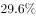；集体企业实现利润总额36.9亿元，增长；股份制企业实现利润总额6829.5亿元，增长；外商及港澳台商投资企业实现利润总额2259.6亿元，增长；私营企业实现利润总额2830.8亿元，增长。按行业分其中采矿业实现利润总额877.9亿元，同比增长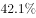；制造业实现利润总额8100亿元，增长；电力、热力、燃气及水生产和供应业实现利润总额711.1亿元，增长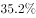。

#### 第 1 题　qid 2452877 · 综合

2017年1-2月份全国规模以上工业企业实现利润总额：

- **A**. 8493亿元
- **B**. 8576亿元
- **C**. 8345亿元　✅
- **D**. 8129亿元

**答案**：C

**官方解析**

题干所求为“2017年1-2月份······实现利润总额······”，结合材料所给时间为2018年1-2月份，判定本题为基期计算问题。定位文字材料“2018年1-2月份，全国规模以上工业企业实现利润总额9689亿元，同比增长”，则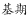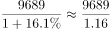，直除首数为83，C项最为接近。

故正确答案为C。

---

#### 第 2 题　qid 2452878 · 增长

2018年1-2月份股份制企业实现利润总额比上年同期增长约：

- **A**. 864亿元
- **B**. 1434亿元
- **C**. 666亿元
- **D**. 1185亿元　✅

**答案**：D

**官方解析**

题干所求为“······比上年同期增长······亿元”，判定本题为增长量计算问题。定位文字材料“股份制企业实现利润总额6829.5亿元，增长”，则增长量，直除首数为11，D项最为接近。

故正确答案为D。

---

#### 第 3 题　qid 2452886 · 比重

2018年1-2月份制造业实现利润总额占全国规模以上工业企业实现利润总额的比重为：

- **A**. 

- **B**. 

　✅
- **C**. 

- **D**. 

**答案**：B

**官方解析**

题干所求为“2018年1-2月份······占······比重为”，且材料时间为2018年1-2月，判定本题为现期比重问题。定位文字材料“2018年1-2月份，全国规模以上工业企业实现利润总额9689亿元······制造业实现利润总额8100亿元”，则2018年1-2月份制造业实现利润总额占全国规模以上工业企业实现利润总额的比重，B项最为接近。

故正确答案为B。

---

#### 第 4 题　qid 2452887 · 增长

2018年1-2月份按企业性质分类中实现利润总额同比增长额大于45亿元的有：

- **A**. 1个
- **B**. 2个
- **C**. 3个　✅
- **D**. 4个

**答案**：C

**官方解析**

题干所求为“同比增长额大于45亿元的有······”，判定本题为增长量比较问题。定位文字材料“国有控股企业实现利润总额2918.1亿元，同比增长；集体企业实现利润总额36.9亿元，增长；股份制企业实现利润总额6829.5亿元，增长；外商及港澳台商投资企业实现利润总额2259.6亿元，增长；私营企业实现利润总额2830.8亿元，增长”，则各类企业增长量情况如下：

国有控股企业：；

集体企业：；

股份制企业：；

外商及港澳台商投资企业：；

私营企业：。

则2018年1-2月份实现利润总额同比增长额大于45亿元的企业类型有国有控股企业、股份制企业、私营企业3种。

故正确答案为C。

---

#### 第 5 题　qid 2452889 · 综合

下列说法正确的是：

- **A**. 2017年1-2月份制造业实现利润总额为7200亿元　✅
- **B**. 2018年1-2月份私营企业实现利润总额增量大于采矿业实现利润总额增量
- **C**. 2018年1-2月份外商及港澳台商投资企业实现利润总额增量最小
- **D**. 以上说法都不正确

**答案**：A

**官方解析**

A项：定位文字材料，“2018年1-2月份······制造业实现利润总额8100亿元，增长”，则2017年1-2月份制造业实现利润总额。正确；

B项：定位文字材料，“2018年1-2月份······采矿业实现利润总额877.9亿元，同比增长”，采矿业实现利润总额增量。结合第109题，私营企业实现利润总额增量；即2018年1-2月份私营企业实现利润总额增量小于采矿业实现利润总额增量。错误；

C项：结合第109题，外商及港澳台商投资企业实现利润总额增量；而集体企业实现利润总额增量，即2018年1-2月份外商及港澳台商投资企业实现利润总额增量不是最小的。错误；

D项：错误。

故正确答案为A。

---

### 材料 2

#### 第 6 题　qid 2452875 · 增长

快递业务量与上年相比增长量最大的年份是：

- **A**. 2017年
- **B**. 2016年　✅
- **C**. 2014年
- **D**. 2015年

**答案**：B

**官方解析**

由题干“…增长量最大的年份”，可判定本题为增长量比较问题。定位柱状图，2013-2017年快递业务量分别为91.9亿件、139.6亿件、206.7亿件、312.8亿件、400.6亿件。根据增长量公式：，可得

2014年增长量亿件；

2015年增长量亿件；

2016年增长量亿件；

2017年增长量亿件。

则增长量最大的年份为2016年。

故正确答案为B。

---

#### 第 7 题　qid 2452876 · 平均数

2013-2017年，快递业务量平均每年约收发：

- **A**. 206亿件
- **B**. 230亿件　✅
- **C**. 226亿件
- **D**. 246亿件

**答案**：B

**官方解析**

由题干“2013-2017年，…平均每年约收发”，结合材料时间，可判定本题为现期平均数问题。定位柱状图，2013-2017年快递业务量分别为91.9亿件、139.6亿件、206.7亿件、312.8亿件、400.6亿件。则2013-2017年，平均每年收发快递量亿件。

故正确答案为B。

---

#### 第 8 题　qid 2452880 · 增长

2016年快递业务量比2015年约增长：

- **A**. 

　✅
- **B**. 

- **C**. 

- **D**. 

**答案**：A

**官方解析**

由题干“2016年…比2015年约增长”，结合选项都是百分数，可判定本题为一般增长率问题。定位柱状图，2015年和2016年快递业务量分别为206.7亿件、312.8亿件。根据增长率计算公式：。

故正确答案为A。

---

#### 第 9 题　qid 2452882 · 增长

2017年比2013年快递业务量增加：

- **A**. 261亿件
- **B**. 312.8亿件
- **C**. 318.7亿件
- **D**. 308.7亿件　✅

**答案**：D

**官方解析**

由题干“2017年比2013年…增加”，结合选项有单位，可判定本题为增长量计算问题。定位柱状图，2013年和2017年快递业务量分别为91.9亿件、400.6亿件。根据增长量公式：亿件。

故正确答案为D。

---

#### 第 10 题　qid 2452884 · 综合

以下说法不正确的是：

- **A**. 快递业务量增速最大年份是2013年
- **B**. 快递业务量增速最小年份是2017年
- **C**. 五年间快递业务量增加最多的年份也是业务量增速最快的年份　✅
- **D**. 2015年快递业务量比2014年增加67.1亿件

**答案**：C

**官方解析**

A项：定位折线图，增速最大的年份为2013年，正确；

B项：定位折线图，增速最小的年份为2017年，正确；

C项：定位柱状图，根据111题可知，快递业务量增加最多的年份为2016年；定位折线图，增速最快的年份为2013年，并非同一年，错误；

D项：定位柱状图，2014年和2015年快递业务量分别为139.6亿件、206.7亿件。根据增长量公式：亿件，正确。

本题为选非题，故正确答案为C。

---

### 材料 3

#### 第 11 题　qid 2452879 · 增长

2017年，中国内地对韩国出口额比2016年同期约净增长：

- **A**. 6186亿元
- **B**. 756亿元
- **C**. 5250亿元
- **D**. 779亿元　✅

**答案**：D

**官方解析**

根据“2017年，中国内地对韩国出口额比2016年同期约净增长”，结合选项为亿元，判断本题为增长量计算问题。定位表格第七行，2017年我国内地对韩国出口额为6965亿元，比上年增长。亿元。D项最接近。

故正确答案为D。

---

#### 第 12 题　qid 2452881 · 综合

中国内地进口额与出口额相差最大的国家和地区是：

- **A**. 欧盟
- **B**. 美国　✅
- **C**. 中国香港
- **D**. 中国台湾

**答案**：B

**官方解析**

定位表格第二、三、六、八行，

中国内地对欧盟的进口额、出口额分别为16543亿元、25199亿元，相差亿元；

中国内地对美国的进口额、出口额分别为10430亿元、29103亿元，相差亿元；

中国内地对中国香港的进口额、出口额分别为495亿元、18899亿元，相差亿元；

中国内地对中国台湾的进口额、出口额分别为10512亿元、2979亿元，相差亿元；

据上可知，中国内地对美国的进口额与出口额相差最大。

故正确答案为B。

---

#### 第 13 题　qid 2452883 · 综合

2016年中国内地对日本的进口额约为：

- **A**. 8546亿元
- **B**. 6185亿元
- **C**. 9634亿元　✅
- **D**. 10501亿元

**答案**：C

**官方解析**

根据“2016年中国内地对日本的进口额约为”，结合材料时间为2017年数据，判断本题为基期计算问题。定位表格第五行，2017年中国内地对日本的进口额为11204亿元，比上年增长。亿元，与C项最接近。

故正确答案为C。

---

#### 第 14 题　qid 2452885 · 综合

2017年中国内地与下列四个国家和地区中实现贸易逆差的是：

- **A**. 俄罗斯
- **B**. 东盟
- **C**. 中国台湾　✅
- **D**. 印度

**答案**：C

**官方解析**

贸易逆差即，即只需表格中第二列数据小于第五列数据即可。分别定位表格第四、八、十、十一行，中国内地只有对中国台湾的出口额（2979亿元）进口额（10512亿元），因此对其实现贸易逆差。

故正确答案为C。

---

#### 第 15 题　qid 2452888 · 比重

2017年中国内地出口额占全部比重大于进口额占全部比重的国家和地区有：

- **A**. 3个
- **B**. 4个　✅
- **C**. 5个
- **D**. 6个

**答案**：B

**官方解析**

定位表格第四、七列，出口额占全部比重大于进口额占全部比重的国家和地区有欧盟（出口占比进口占比）、美国（出口占比进口占比）、中国香港（出口占比进口占比）、印度（出口占比进口占比）。共4个国家和地区。

故正确答案为B。

---
