# 2020年上海市公务员录用考试《行测》题（A类）（网友回忆版）

> 省考 · 2020 年 · 6 个模块 · 共 130 题

- [政治理论](#%E6%94%BF%E6%B2%BB%E7%90%86%E8%AE%BA) · 8 题
- [常识判断](#%E5%B8%B8%E8%AF%86%E5%88%A4%E6%96%AD) · 32 题
- [言语理解与表达](#%E8%A8%80%E8%AF%AD%E7%90%86%E8%A7%A3%E4%B8%8E%E8%A1%A8%E8%BE%BE) · 25 题
- [数量关系](#%E6%95%B0%E9%87%8F%E5%85%B3%E7%B3%BB) · 23 题
- [判断推理](#%E5%88%A4%E6%96%AD%E6%8E%A8%E7%90%86) · 35 题
- [资料分析](#%E8%B5%84%E6%96%99%E5%88%86%E6%9E%90) · 7 题

---

## 政治理论

### 材料 1

        习近平总书记指出：“当代中国的伟大社会变革，不是简单延续我国历史文化的母版，不是简单套用马克思主义经典作家设想的模板，不是其他国家社会主义实践的再版，也不是国外现代化发展的翻版。”实践证明，中国特色社会主义道路是一条既符合中国国情，又适合时代发展要求并取得巨大成功的唯一正确道路。只有这条道路而没有别的道路，能够引领中国进步、增进人民福祉、实现民族复兴。我们必须坚定道路自信、理论自信、制度自信、文化自信。

        在中国特色社会主义新时代，完成伟大事业必须靠党的领导。中国特色社会主义制度的最大优势是中国共产党领导。今天，我们比历史上任何时期都更接近、更有信心和能力实现中华民族伟大复兴的目标。习近平总书记指出：“行百里者半九十。中华民族伟大复兴，绝不是轻轻松松、敲锣打鼓就能实现的。全党必须准备付出更为艰巨、更为艰苦的努力。”

#### 第 1 题　qid 2452916 · 新思想

坚定中国特色社会主义“四个自信”，说到底是要坚定        。

- **A**. 制度自信
- **B**. 道路自信
- **C**. 理论自信
- **D**. 文化自信　✅

**答案**：D

**官方解析**

本题考查政治常识。
2016年5月17日,习近平总书记在哲学社会科学工作座谈会上指出,“我们要坚定中国特色社会主义道路自信、理论自信、制度自信,说到底是要坚持文化自信”。
故正确答案为D。

---

#### 第 2 题　qid 2452918 · 新思想

实现伟大理想，必须推进伟大事业。习近平总书记指出，改革开放以来党的全部理论和实践的主题是                    。

- **A**. 以经济建设为中心
- **B**. 建立新中国和改革开放
- **C**. 中国特色社会主义　✅
- **D**. 发展社会主义市场经济

**答案**：C

**官方解析**

本题考查政治常识。
 习总书记在“7·26”重要讲话中指出，中国特色社会主义是改革开放以来党的全部理论和实践的主题，全党必须高举中国特色社会主义伟大旗帜，牢固树立中国特色社会主义道路自信、理论自信、制度自信、文化自信，确保党和国家事业始终沿着正确方向胜利前进。这一重要论断引起了思想理论界和广大干部群众的普遍关注、广泛认同和热烈反响。独特的文化传统，独特的历史命运，独特的基本国情，决定了我们必然要走适合自己特点的发展道路。中国特色社会主义是马克思主义基本原理同中国具体实践和时代特征相结合的产物，是党带领全国各族人民长期实践取得的根本成就，必须倍加珍惜、始终坚持、不断发展。
故正确答案为C。

---

### 材料 2

        新中国成立不久，中国共产党就把促进“农业和交通运输业的现代化”“建立巩固的现代化国防”写入党在过渡时期总路线。1954年，在第一届全国人民代表大会第一次会议开幕词中，毛泽东同志提出：“准备在几个五年计划之内，将我们现在这样一个经济上文化上落后的国家，建设成为一个工业化的具有高度现代文化程度的伟大国家。”根据这些思想，周恩来同志在政府工作报告中首次提出包括现代化的工业、现代化的农业、现代化的交通运输业和现代化的国防在内的四个现代化目标。此后，四个现代化的内容不断调整完善，从明确提出“实现工业化”到掀起一场“技术革命”，1964年第三届全国人民代表大会第一次会议正式和完整地提出我国实现“四个现代化”的任务。1975年，周恩来同志在第四届全国人民代表大会第一次会议上又重申了分两步走、全面实现四个现代化的战略安排。

        党的十八大以来，以习近平同志为核心的党中央以巨大的政治勇气和强烈的责任担当，进行伟大斗争、建设伟大工程、推进伟大事业、实现伟大梦想，取得了全方位、开创性成就，实现了深层次、根本性变革，推动中国特色社会主义进入新时代。党的十九大围绕新时代实现中华民族伟大复兴的历史使命，对新时代推进我国社会主义现代化建设作出新的顶层设计，提出分两步走，在21世纪中叶建成社会主义现代化强国的战略安排。

#### 第 3 题　qid 2452959 · 新思想

在新时代，围绕如何全面建设社会主义现代化这一重大问题，习近平总书记提出了一系列新思想新观点新要求。他强调，“现代化的本质是            ”。

- **A**. 人的现代化　✅
- **B**. 工业、农业、服务业的现代化
- **C**. 国家治理体系和治理能力现代化
- **D**. 人与自然和谐共生的现代化

**答案**：A

**官方解析**

本题考查政治常识。
《习近平新时代中国特色社会主义思想学习纲要》五、开启全面建设社会主义现代化国家新征程指出：“在新时代，围绕如何全面建设社会主义现代化这一重大问题，习近平总书记提出了一系列新思想新观点新要求。他指出，实现社会主义现代化和中华民族伟大复兴是坚持和发展中国特色社会主义的总任务，要在全面建成小康社会的基础上，分两步走全面建成社会主义现代化强国。他强调，‘现代化的本质是人的现代化’，‘我们要建设的现代化是人与自然和谐共生的现代化’，要‘推进国家治理体系和治理能力现代化’，‘要在坚持以经济建设为中心的同时，全面推进经济建设、政治建设、文化建设、社会建设、生态文明建设，促进现代化建设各个环节、各个方面协调发展’等等。”
故正确答案为A。

---

#### 第 4 题　qid 2452896 · 时事政治

2019年10月，中国共产党第十九届中央委员会第四次全体会议在京召开。全会提出，国家行政管理承担着按照党和国家决策部署推动经济社会发展、管理社会事务、服务人民群众的重大职责。要坚持和完善中国特色社会主义行政体制，构建                    的政府治理体系。

- **A**. 职责明确、依法行政　✅
- **B**. 职责明确、人民满意
- **C**. 结构合理、依法行政
- **D**. 结构合理、人民满意

**答案**：A

**官方解析**

本题考查政治常识。
2019年10月31日中国共产党第十九届中央委员会第四次全体会议通过了《中共中央关于坚持和完善中国特色社会主义制度 推进国家治理体系和治理能力现代化若干重大问题的决定》。《决定》强调：“……五、坚持和完善中国特色社会主义行政体制，构建职责明确、依法行政的政府治理体系……。”
故正确答案为A。

---

#### 第 5 题　qid 2453104 · 新思想

把人民对美好生活的向往作为奋斗目标，从根本上回答了        的问题，是立党为公、执政为民的生动体现，是共产党人始终坚守的政治灵魂和精神支柱。

- **A**. “满足谁”
- **B**. “为了谁”　✅
- **C**. “需要谁”
- **D**. “依靠谁”

**答案**：B

**官方解析**

本题考查政治常识。
求是网《以人民为中心是新时代坚持和发展中国特色社会主义根本立场》一文中指出：把人民对美好生活的向往作为奋斗目标，从根本上回答了“为了谁”的问题，是立党为公、执政为民的生动体现，是共产党人始终坚守的政治灵魂和精神支柱。
故正确答案为B。

---

#### 第 6 题　qid 2452906 · 新思想

习近平出席第二届“一带一路”国际合作高峰论坛开幕式时，在主旨演讲中强调，面向未来，我们要秉持共商共建共享原则，坚持                    理念，努力实现高标准、惠民生、可持续目标，推动共建“一带一路”沿着高质量发展方向不断前进。

- **A**. 开放、包容、共赢
- **B**. 协调、绿色、共享
- **C**. 开放、绿色、廉洁　✅
- **D**. 协调、绿色、开放

**答案**：C

**官方解析**

本题考查政治常识。
2019年4月26日，国家主席习近平在北京出席第二届“一带一路”国际合作高峰论坛开幕式，并发表题为《齐心开创共建“一带一路”美好未来》的主旨演讲。他强调，面向未来，我们要秉持共商共建共享原则，坚持开放、绿色、廉洁理念，努力实现高标准、惠民生、可持续目标，推动共建“一带一路”沿着高质量发展方向不断前进。
故正确答案为C。

---

#### 第 7 题　qid 2453106 · 时事政治

习近平指出：“落实党的十八届三中全会以来中央确定的各项改革任务，前期重点是夯基垒台、立柱架梁，中期重点在全面推进、积厚成势，现在要把着力点放到加强系统集成、协同高效上来，巩固和深化这些年来我们在解决体制性障碍、机制性梗阻、政策性创新方面取得的改革成果，推动各方面制度更加成熟更加定型”，说明全面深化改革是新时代坚持和发展中国特色社会主义的：

- **A**. 本质要求
- **B**. 奋斗目标
- **C**. 根本动力　✅
- **D**. 战略安排

**答案**：C

**官方解析**

本题考查政治常识。
《习近平新时代中国特色社会主义思想学习纲要》中指出：“改革开放只有进行时，没有完成时。新时代坚持和发展中国特色社会主义，根本动力仍然是全面深化改革。在前进道路上，要进一步解放思想、进一步解放和发展社会生产力、进一步解放和增强社会活力，在更高起点、更高层次、更高目标上推进全面深化改革，将改革开放进行到底。”题目中，将各项改革任务的着力点放在加强系统集成、协同高效上来，巩固和深化各项改革成果，进而推动各方面制度更加成熟更加定型，说明全面深化改革依然是新时代坚持和发展中国特色社会主义的根本动力。
故正确答案为C。

---

#### 第 8 题　qid 2452897 · 新思想

习近平在主持召开中央全面依法治国委员会第二次会议时发表重要讲话强调，                    是依法治国的迫切需要。要把党的领导贯穿于其全过程和各方面，增强公众参与实效，提高专家论证质量，坚持合法性审查，防控风险。

- **A**. 维护重大公共利益
- **B**. 积极推进重点领域立法
- **C**. 规范重大行政决策程序　✅
- **D**. 促进社会公平正义

**答案**：C

**官方解析**

本题考查政治常识。
2019年2月25日下午，中共中央总书记、国家主席、中央军委主席、中央全面依法治国委员会主任习近平主持召开中央全面依法治国委员会第二次会议并发表重要讲话。会议指出：“规范重大行政决策程序，是依法治国的迫切需要。要把党的领导贯穿于重大行政决策全过程和各方面，履行决策法定程序，增强公众参与实效，提高专家论证质量，坚持合法性审查，防控决策风险。”
故正确答案为C。

---

## 常识判断

### 材料 1

        习近平总书记指出：“当代中国的伟大社会变革，不是简单延续我国历史文化的母版，不是简单套用马克思主义经典作家设想的模板，不是其他国家社会主义实践的再版，也不是国外现代化发展的翻版。”实践证明，中国特色社会主义道路是一条既符合中国国情，又适合时代发展要求并取得巨大成功的唯一正确道路。只有这条道路而没有别的道路，能够引领中国进步、增进人民福祉、实现民族复兴。我们必须坚定道路自信、理论自信、制度自信、文化自信。

        在中国特色社会主义新时代，完成伟大事业必须靠党的领导。中国特色社会主义制度的最大优势是中国共产党领导。今天，我们比历史上任何时期都更接近、更有信心和能力实现中华民族伟大复兴的目标。习近平总书记指出：“行百里者半九十。中华民族伟大复兴，绝不是轻轻松松、敲锣打鼓就能实现的。全党必须准备付出更为艰巨、更为艰苦的努力。”

#### 第 1 题　qid 2452919 · 人文常识

2019年5月31日，“不忘初心、牢记使命”主题教育工作会议在北京召开。根据党中央部署，此次主题教育以县处级及以上领导干部为重点，在全党自上而下分两批开展，贯彻“守初心、担使命，找差距、抓落实”的总要求。这说明                    。

- **A**. 党始终坚持以人民为中心的发展理念　✅
- **B**. 科学执政是中国共产党执政的基本方式
- **C**. 党重视自身先进性建设，提高执政能力　✅
- **D**. 党的政治建设是党的根本性建设　✅

**答案**：ACD

**官方解析**

本题考查政治常识。
 A项正确，党的十九大报告中指出，“人民是历史的创造者，是决定党和国家前途命运的根本力量，中国共产党人的初心和使命，就是为中国人民谋幸福，为中华民族谋复兴”。深刻揭示了党同人民的关系，我们在任何情况下、与人民同呼吸共命运的立场不能变，全心全意为人民服务的宗旨不能忘，要始终坚持以人民为中心的发展理念。总理念中的“守初心”正是体现了党始终坚持以人民为中心的发展理念。
B项错误，党的十六届四中全会提出科学执政、民主执政、依法执政这三种党的执政方式。其中依法执政是新的历史条件下党执政的一个基本方式。科学执政、民主执政要通过依法执政体现出来，又要靠依法执政来保证实现。
C项正确，党的先进性建设，就是要使我们党保持与时俱进的品质，始终走在时代前列，不断提高执政能力、巩固执政地位、完成执政使命；就是要通过推进思想建设、组织建设、作风建设、制度建设、反腐倡廉建设，使党的理论和路线、方针、政策始终体现社会发展进步的要求和全国各族人民的利益，不断提高广大党员的素质和各级党组织的创造力、凝聚力、战斗力，始终发挥党员的先锋模范作用，始终发挥党组织的领导核心作用和战斗堡垒作用。“担使命，找差距”都体现了党重视自身先进性建设，提高执政能力。
 D项正确，党的政治建设是党的根本性建设，决定党的建设方向和效果。重视政治建设是中国共产党的优良传统与特别优势。此次主题会议正是体现了党的政治建设是党的根本性建设。
故正确答案为ACD。

---

### 材料 2

        新中国成立不久，中国共产党就把促进“农业和交通运输业的现代化”“建立巩固的现代化国防”写入党在过渡时期总路线。1954年，在第一届全国人民代表大会第一次会议开幕词中，毛泽东同志提出：“准备在几个五年计划之内，将我们现在这样一个经济上文化上落后的国家，建设成为一个工业化的具有高度现代文化程度的伟大国家。”根据这些思想，周恩来同志在政府工作报告中首次提出包括现代化的工业、现代化的农业、现代化的交通运输业和现代化的国防在内的四个现代化目标。此后，四个现代化的内容不断调整完善，从明确提出“实现工业化”到掀起一场“技术革命”，1964年第三届全国人民代表大会第一次会议正式和完整地提出我国实现“四个现代化”的任务。1975年，周恩来同志在第四届全国人民代表大会第一次会议上又重申了分两步走、全面实现四个现代化的战略安排。

        党的十八大以来，以习近平同志为核心的党中央以巨大的政治勇气和强烈的责任担当，进行伟大斗争、建设伟大工程、推进伟大事业、实现伟大梦想，取得了全方位、开创性成就，实现了深层次、根本性变革，推动中国特色社会主义进入新时代。党的十九大围绕新时代实现中华民族伟大复兴的历史使命，对新时代推进我国社会主义现代化建设作出新的顶层设计，提出分两步走，在21世纪中叶建成社会主义现代化强国的战略安排。

#### 第 2 题　qid 2452953 · 人文常识

上述材料表明，                    ，是中华民族的最高利益和根本利益。我们党领导中国人民进行的一切奋斗，归根到底都是为了实现这一伟大目标。

- **A**. 实现中华民族伟大复兴　✅
- **B**. 全面实现“四个现代化”
- **C**. 建设社会主义现代化强国　✅
- **D**. 建立完整的工业体系和国民经济体系

**答案**：AC

**官方解析**

本题考查中国特色社会主义理论体系
《习近平新时代中国特色社会主义思想学习纲要》中指出：“建设社会主义现代化强国，实现中华民族伟大复兴，是中华民族的最高利益和根本利益。我们党领导中国人民进行的一切奋斗，归根到底都是为了实现这一伟大目标。”从新中国成立到党的十九大召开，四个现代化的内容不断调整完善，党的十九大围绕新时代实现中华民族伟大复兴的历史使命，对新时代推进我国社会主义现代化建设作出新的顶层设计，提出在21世纪中叶建成社会主义现代化强国的战略安排。
故正确答案为AC。

---

#### 第 3 题　qid 2452956 · 人文常识

1964年第三届全国人民代表大会第一次会议正式和完整地提出我国实现“四个现代化”的任务是：“在不太长的历史时期内，把我国建设成为一个具有现代农业、现代工业、            的社会主义强国”。

- **A**. 现代交通运输业
- **B**. 现代国防　✅
- **C**. 现代教育
- **D**. 现代科学技术　✅

**答案**：BD

**官方解析**

本题考查中国特色社会主义理论体系
《周恩来总理在第三届全国人民代表大会第一次会议上作政府工作报告（1964年)》中指出：“周总理说，为了在不太长的历史时期内，把我国建设成为一个具有现代农业、现代工业、现代国防和现代科学技术的社会主义强国，我们在今后发展国民经济中，应当注意以下的问题。第一，正确处理农业、轻工业、重工业的关系。第二，正确处理自力更生同国际合作的关系。第三，实行技术革命。第四，实行集中领导同大搞群众运动相结合。”
故正确答案为BD。

---

#### 第 4 题　qid 2452958 · 人文常识

改革开放之后，我们党曾提出社会主义现代化建设“三步走”战略目标，即                    。

- **A**. 解决人民温饱问题　✅
- **B**. 人民生活总体上达到小康水平　✅
- **C**. 全面建成小康社会
- **D**. 基本实现现代化　✅

**答案**：ABD

**官方解析**

1987年10月25日，中国共产党第十三次全国代表大会举行。代理中央委员会总书记赵紫阳作《沿着有中国特色的社会主义道路前进——在中国共产党第十三次全国代表大会上的报告》的报告。报告中指出：“党的十一届三中全会以后，我国经济建设的战略部署大体分三步走。第一步，实现国民生产总值比一九八〇年翻一番，解决人民的温饱问题。这个任务已经基本实现。第二步，到本世纪末，使国民生产总值再增长一倍，人民生活达到小康水平。第三步，到下个世纪中叶，人均国民生产总值达到中等发达国家水平，人民生活比较富裕，基本实现现代化。”
故正确答案为ABD。

---

### 材料 3

        绩效在中国古代政府管理中早有应用。从《尚书》的“三载考绩，三考黜陟幽明”到周朝《地官》中的相关规定。堂南汉已形成较完整的绩效制度。宋庆历年间，范仲淹在向皇帝提交的《答手诏条陈十事》中，第一条为“明黜陟”，即废除“磨勘制”，恢复宋朝的考绩制。宋朝在救灾上有不成文规定，主办官员若能用好政府拨款，且无贪贿和灾民暴乱，则为“有功”；若不动用国库，而是运用地方资源救灾，则为“有绩效”。

        十九大报告提出的“全面实施绩效管理”是对政府治理理念和方式的重大改革，影响深远。全面实施绩效管理该怎么做，事关改革成败。“全面”是相对于局部、片面或举例说明而言的，按此理解，全面绩效管理是全覆盖公共部门、公共资金的管理。绩效管理是价值理性和工具理性的统一，其管理主体是各级政府，采用“有效公共服务预算”的双要素管理。通过绩效指标、绩效目标，将公共部门职能转化为责任，以绩效评价来监察结果，从而将领导干部目标责任考核纳入该体系，是责任型、服务型政府的“抓手”。它按不同对象设计管理环节，如对部门采用绩效目标、绩效预算、绩效拨款、绩效评价等环节管理，从而区别于传统管理。

        绩效管理属于科学管理，科学性是其基本属性，主要通过制度建设、绩效指标和日常管理体现。绩效指标应按部门职能、预算项目目标设计，遵循量化规则，绩效管理制度建设则应符合公共管理规律和流程化、环节化管理要求，如对预算项目采用前期、中期、后期评价模式，对部门管理采用绩效目标、绩效预算、绩效拨款、绩效评价环节模式。绩效指标应指向结果，绩效评价是对结果而非管理过程的评价。绩效管理过程各项评价结果应按法律、《信息公开条例》要求公开。

#### 第 5 题　qid 2453089 · 人文常识

绩效在中国古代政府管理中的应用，是基于（    ）的目的。

- **A**. 考察官员的执政结果　✅
- **B**. 选拔和激励有担当、政绩卓著的官员　✅
- **C**. 淘汰贪官庸官　✅
- **D**. 防御和抵抗外来入侵

**答案**：ABC

**官方解析**

本题考查人文常识。
“三载考绩，三考黜陟幽明”的意思是三年考核一次，三次考核之后，提升贤明者，罢免昏庸者。体现了中国古代实行考绩制度的目的是考察官员的执政结果；选拔和激励有担当、政绩卓著的官员，淘汰贪官庸官。同时，宋代在救灾上的不成文规定，也体现了激励选拔担当、政绩卓著的官员，遏制官员贪腐目的。因此，ABC正确。
D项错误，材料未体现，故排除。
故正确答案为ABC。

---

#### 第 6 题　qid 2453090 · 人文常识

根据材料，下列对于政府全面绩效管理的“全面”理解正确的是（    ）

- **A**. 从中央到村委会六级政府全覆盖
- **B**. 前期、中期和后期评价等过程全覆盖　✅
- **C**. 党政机关、事业单位、社会团体、国有企业和民营企业全覆盖
- **D**. 一般公共预算、政府性基金预算、国有资本经营预算和社会保险基金预算全覆盖　✅

**答案**：BD

**官方解析**

本题考查管理学常识。
A项错误，根据材料，绩效管理的“管理主体是各级政府”，即政府全覆盖，包括中央到乡镇五级政府。《宪法》第一百一十一条规定：“城市和农村按居民居住地区设立的居民委员会或者村民委员会是基层群众性自治组织。”村委会不属于一级政府。
B项正确，根据材料，“绩效管理制度建设则应符合公共管理规律和流程化、环节化管理要求，如对预算项目采用前期、中期、后期评价模式”，说明绩效管理将覆盖预算资金运动各环节，实现前期、中期和后期评价等全过程管理。
C项错误，根据材料，“全面绩效管理是全覆盖公共部门、公共资金的管理”，其中的公共部门包括党政机关、事业单位、社会团体和国有企业。私营企业不属于公共部门的范畴。
D项正确，根据材料，绩效管理“采用‘有效公共服务+预算’的双要素管理”，即预算全覆盖，包括一般公共预算、政府性基金预算、国有资本经营预算和社会保险基金预算。
故正确答案为BD。

---

#### 第 7 题　qid 2453091 · 人文常识

根据材料，我国全面实施绩效管理的原则包括（    ）

- **A**. 整体性原则　✅
- **B**. 公益性原则
- **C**. 科学性原则　✅
- **D**. 公开性原则　✅

**答案**：ACD

**官方解析**

本题考查管理常识。
A项正确，全面绩效管理是全覆盖公共部门、公共资金的管理。全面绩效管理的对象是所有的公共部门，并非是针对部分部门实施的管理方式，体现了整体性原则。
B项错误，公益性原则指的是实施某种政策、方案、措施、活动等，应是以满足人民群众的公共利益为目的，全面实施绩效管理是对政府治理理念和方式的改革，其管理主体是各级政府，主要是为了形成完整的科学的绩效管理制度，未体现公益性。
C项正确，绩效管理属于科学管理，科学性是其根本属性，体现了科学性原则是全面绩效管理包含的原则，绩效指标按部门职能、预算项目目标设计，遵循量化规则，绩效管理制度建设符合公共管理规律和流程化、环节化管理要求是科学性原则的体现。
D项正确，绩效管理过程各项评价结果应按法律、《信息公开条例》要求公开，体现的是公开性原则。
故正确答案为ACD。

---

#### 第 8 题　qid 2453093 · 经济常识

我国全面实施绩效管理的意义主要体现在：

- **A**. 拓展了财政作为国家治理基础和重要支柱的功能
- **B**. 对管理全过程实施了绩效评价
- **C**. 优化了政府治理方式　✅
- **D**. 提升了政府行政效率　✅

**答案**：CD

**官方解析**

本题考查管理学常识。
A项错误，全面实施绩效管理包含了对公共资金的管理，可以更有效地配置财政资源，提高社会经济发展效率，但没有拓展财政作为国家的治理基础和重要支柱的功能。
B项错误，根据材料，绩效评价是对结果而非管理过程的评价。
C、D项正确，求是网《全面实施绩效管理，提升国家治理能力》一文中指出，全面绩效管理是深化行政体制改革、转变政府职能的重要手段，也是推进政府治理现代化的必然要求，对于提高政府的工作效能、实现资源的优化配置具有十分重要的意义。十九大报告中提到全面实施绩效管理，首次确立绩效管理的系统架构，是党中央在整体管理层面上贯彻落实新《预算法》的重大决策，将之作为完善国家治理体系、提高财政资金使用效率的重要抓手，是新时代推进服务型、责任型和效能型政府的探索和创新。
故正确答案为CD。

---

### 材料 4

        法工委是全国人大常委会的工作机构，作为参谋助手为全国人大常委会行使国家立法权提供服务。为了加强与新闻媒体的联系，更好地向社会公众介绍立法工作情况，法工委建立了发言人制度。

        2019年8月21日，全国人大常委会法工委就建立发言人机制举行第一次记者会。发言人通报了今年上半年法律草案向社会公布征求意见的情况，并回答记者提问。

        目前为止，本年度共有15部法律草案向社会公开征求意见21件次，包括：民法典婚姻家庭编（草案二次审议稿）、民法典继承编（草案二次审议稿）、森林法（修订草案）、社区矫正法（草案）、密码法（草案）、固体废物污染环境防治法（修订草案）、土地管理法和城市房地产管理法修正案（草案二次审议稿）等。

        对于备受关注的民法典，其合同编、侵权编草案的二次审议稿于2019年1月4日至2月3日在中国人大网全文公布，公开向社会征求意见。合同编草案二次审议稿共收到256人提出的504条意见，侵权责任编草案二次审议稿收到117人提出的228条意见。2019年4月，十三届全国人大常委会第十次会议对民法典物权编、人格权编进行了二审，之后4月26日至5月25日，两编草案的二次审议稿分别在中国人大网全文公布，公开征求社会公众意见。其间，物权编草案二次审议稿共收到1132人提出的2286条意见，人格权编草案二次审议稿收到20031人提出的31936条意见。

#### 第 9 题　qid 2452973 · 人文常识

全国人大常委会                    。

- **A**. 是全国人大的常设机关　✅
- **B**. 行使最高立法权　✅
- **C**. 是我国最高国家行政机关
- **D**. 是我国最高国家权力机关的执行机关

**答案**：AB

**官方解析**

本题考查法律常识。
A项正确，根据《宪法》第五十七条规定：“中华人民共和国全国人民代表大会是最高国家权力机关。它的常设机关是全国人民代表大会常务委员会。”
B项正确，根据《宪法》第五十八条规定：“全国人民代表大会和全国人民代表大会常务委员会行使国家立法权。”全国人大及其常委会行使最高立法权。
C、D项错误，根据《宪法》第八十五条规定：“中华人民共和国国务院，即中央人民政府，是最高国家权力机关的执行机关，是最高国家行政机关。”因此国务院是我国最高国家行政机关，是我国最高国家权力机关的执行机关，而非全国人大常委会。
故正确答案为AB。

---

#### 第 10 题　qid 2452974 · 法律常识

下列法律中必须由全国人大制定的是                    。

- **A**. 中华人民共和国土地管理法
- **B**. 中华人民共和国森林法
- **C**. 中华人民共和国社区矫正法
- **D**. 中华人民共和国民法典　✅

**答案**：D

**官方解析**

本题考查法律常识。根据《宪法》第六十二条规定：“全国人民代表大会行使下列职权：······（三）制定和修改刑事、民事、国家机构的和其他的基本法律······”第六十七条规定：“全国人民代表大会常务委员会行使下列职权：······（二）制定和修改除应当由全国人民代表大会制定的法律以外的其他法律······”全国人大制定基本法律，全国人大常委会制定除基本法律以外的其他法律。
A项错误，《中华人民共和国土地管理法》是1986年6月25日第六届全国人民代表大会常务委员会第十六次会议通过，并于2019年经全国人大常委会修订通过，属于基本法律以外的其他法律，应由全国人大常委会制定。
B项错误，《中华人民共和国森林法》是1984年9月20日第六届全国人民代表大会常务委员会第七次会议通过，并于2009年经全国人大常委会修订，属于基本法律以外的其他法律，应由全国人大常委会制定。
C项错误，《中华人民共和国社区矫正法》2019年12月28日第十三届全国人民代表大会常务委员会第十五次会议通过。《中华人民共和国社区矫正法》属于基本法律以外的其他法律，应由全国人大常委会制定。
D项正确，民法典属于民事基本法律，必须由全国人大制定。
故正确答案为D。

---

#### 第 11 题　qid 2452975 · 法律常识

民法典合同编、侵权编草案的二次审议稿在中国人大网全文公布，公开向社会征求意见，根本原因在于                    。

- **A**. 我国坚持人民代表大会制度
- **B**. 我国是人民民主专政的社会主义国家　✅
- **C**. 社会主义法制是社会主义民主的前提和基础
- **D**. 社会主义民主是社会主义法制的保障

**答案**：B

**官方解析**

本题考查法律常识。
A项错误，根据《宪法》第二条第一、二款规定：“中华人民共和国的一切权力属于人民。人民行使国家权力的机关是全国人民代表大会和地方各级人民代表大会。”人民代表大会制度是我国的政权组织形式，是按照民主集中制的原则，建立全部国家机构，统一领导和管理国家事务的根本政治制度。而题干虽然是在中国人大网站公布，但是是为了向社会征求意见，选项和题意不符。另外题中问的是根本原因，政体是由国体决定的，有什么性质的国家，就要求有什么样的政体与之相匹配。因此应当选到国体，而非政体。
B项正确，根据《宪法》第一条第一款规定：“中华人民共和国是工人阶级领导的、以工农联盟为基础的人民民主专政的社会主义国家。”法律草案审议稿在网上公布，公开向社会征求意见，根本原因是我国的国体是人民民主专政，充分体现了我国由人民当家作主。
C项错误，社会主义民主同法制相比，是第一位的、决定性的。主要原因有：一是从社会主义法制的产生来看，它是随着社会主义民主即人民主权的产生而产生的。二是从社会主义法制的性质和内容来看，有什么性质的民主，就有什么性质的法制。三是从社会主义法制的健全和发展方向来看，同样不能离开民主。因此，社会主义民主是社会主义法制的前提和基础。
D项错误，社会主义法制是社会主义民主的保障，主要体现在：一是社会主义法制确认社会主义民主；二是社会主义法制规定社会主义民主的范围；三是社会主义法制规定如何实现社会主义民主；四是社会主义法制是保卫社会主义民主的武器。
故正确答案为B。

---

#### 第 12 题　qid 2452977 · 人文常识

全国人大常委会行使国家立法权，向社会公开征求意见                    。

- **A**. 体现了我国民主的广泛性　✅
- **B**. 是人民群众参与管理国家的基础和标志
- **C**. 促进了基层政权的巩固
- **D**. 有利于群众依法直接行使民主权利

**答案**：A

**官方解析**

本题考查法律常识。
A项正确，法律草案审议稿在网上公布，公开向社会征求意见，全体人民都能参与，体现了我国民主的广泛性。
B项错误，选举权和被选举权是公民基本的民主权利，因此行使选举权和被选举权是人民群众参与管理国家的基础和标志。
C项错误，完善基层民主制度，才能促进基层政权巩固。
D项错误，群众直接行使民主权利这一说法错误，人民通过选举人大代表，由人大代表组成人民代表大会代表人民行使民主权利，因此是间接行使民主权利。
故正确答案为A。

---

#### 第 13 题　qid 2452903 · 科技常识

2019年8月，清华大学科研团队发布了一款类脑计算芯片。该芯片是世界首款异构融合类脑芯片，也是世界上第一个既可支持脉冲神经网络又可支持人工神经网络的人工智能芯片。该芯片的名字是        。

- **A**. “天机芯”　✅
- **B**. “中国芯”
- **C**. “中华芯”
- **D**. “麒麟芯”

**答案**：A

**官方解析**

本题考查科技常识。
2019年8月，清华大学施路平团队发布研究成果——类脑计算芯片“天机芯”。该芯片是世界首款异构融合类脑芯片，也是世界上第一个既可支持脉冲神经网络又可支持人工神经网络的人工智能芯片。
故正确答案为A。

---

#### 第 14 题　qid 2452901 · 人文常识

近年来，我国置身世界大发展大变革大调整中，不惑于纷乱现象，不畏于艰难险阻，以元首外交引领扩大全球朋友圈、以开放合作之姿谋求各国共同发展、力倡多边主义推动全球治理改革，不断开创中国特色大国外交新局面。这表明，中国特色大国外交是        。
①以维护各国共同利益为目的，促进共同发展。
②主导全球多边治理，建立国际政治经济新秩序。
③坚持独立自主的和平外交政策，发挥负责任大国的作用。
④坚持合作共赢，推动构建人类命运共同体。

- **A**. ①②
- **B**. ①③④
- **C**. ②③④
- **D**. ③④　✅

**答案**：D

**官方解析**

本题考查政治常识。
①错误，中国外交政策的宗旨是维护世界和平、促进共同发展。维护国家利益是主权国家对外活动的出发点和落脚点。我国在维护自身利益的同时，兼顾他国合理关切，在谋求本国发展中促进各国共同发展。“以维护各国共同利益为目的”说法错误。
②错误，中国积极致力于全球多边治理，但不是“主导”，中国尊重各国人民自主选择发展道路的权利，维护国际公平正义，反对把自己的意志强加于人，反对干涉别国内政，反对以强凌弱。
③正确，中国坚持独立自主的和平外交政策，是维护世界和平与稳定的积极因素和坚定力量，是促进世界经济发展的重要力量，在国际事务中的代表性和话语权进一步增强，发挥着负责任大国的作用。
④正确，中国高举和平、发展、合作、共赢的旗帜，推动建设相互尊重、公平正义、合作共赢的新型国际关系。中国主张各国人民同心协力，构建人类命运共同体，建设持久和平、普遍安全、共同繁荣、开放包容、清洁美丽的世界。
故正确答案为D。

---

#### 第 15 题　qid 2453105 · 人文常识

港珠澳大桥是世界上最长的跨海大桥，大桥路线呈“S”型曲线，切合了水流走向。从结构力学的角度来看，弯度明显更稳定，跨海大桥受到的海浪冲击远远大于普通桥梁，设计“S”型曲线，能让水流通过引导减少对桥梁造成的伤害。同时，由于海底也和地面一样，是凹凸不平的地形，把桥梁修成弯曲的形状是为了避开这些起伏的地形，保障桥梁的稳定和安全。这表明：

- **A**. 人具有主观能动性，可以认识事物的本质和规律　✅
- **B**. 人能够创造条件，改变规律起作用的具体方式
- **C**. 人的意识能够创造出自然界所没有的客观事物
- **D**. 人能够通过想象将观念中的对象变成现实的东西

**答案**：A

**官方解析**

本题考查政治常识。
A项正确，人具有主观能动性，可以认识事物的本质和规律，并且能够利用规律，改造客观世界，造福于人类。港珠澳大桥路线设计成“S”型曲线正是人们利用规律，发挥主观性的一个体现。
B项错误，人们可以创造条件，改变规律起作用的具体方式，但是本题大桥设计成“S”型曲线是人们在利用规律、顺应规律，并没有为了让规律起作用而去改变什么。
C项错误，辩证唯物主义认为，物质决定意识，意识是对物质的反映，意识不是自生的和先验的。“意识能够创造出自然界所没有的客观事物”是唯心主义的观点，是错误的，意识不能够脱离物质而存在。
D项错误，人能够通过想象将观念中的对象变成现实的东西，体现的是意识对物质的反作用，但题干没有提到人的想象，是无关选项，所以不选。
故正确答案为A。

---

#### 第 16 题　qid 2452909 · 经济常识

2019年8月，国务院印发《中国（上海）自由贸易试验区            总体方案》，方案要求，建立以            为核心的制度体系，建立全面风险管理制度，建设具有国际市场竞争力的开放型产业体系。

- **A**. 外高桥保税区，贸易便利化
- **B**. 临港新片区，贸易便利化
- **C**. 外高桥保税区，投资贸易自由化
- **D**. 临港新片区，投资贸易自由化　✅

**答案**：D

**官方解析**

本题考查政治常识。
2019年8月，国务院印发《中国（上海）自由贸易试验区临港新片区总体方案》（以下简称《方案》）。《方案》明确，新片区参照经济特区管理。要建立以投资贸易自由化为核心的制度体系。在适用自由贸易试验区各项开放创新措施的基础上，支持新片区以投资自由、贸易自由、资金自由、运输自由、人员从业自由等为重点，推进投资贸易自由化便利化。
故正确答案为D。

---

#### 第 17 题　qid 2452929 · 经济常识

下列选项中，属于行政行为的是                    。

- **A**. 市场监督管理局销毁收缴的假冒伪劣产品
- **B**. 城管局雇用外部人员修理其办公设备
- **C**. 交警在路口安装交通标志
- **D**. 财政局审批某会计师事务所的设立　✅

**答案**：D

**官方解析**

本题考查法律常识。
A项错误，市场监督管理局查封、扣押物品或者没收非法所得等是具体行政行为，但市场监督管理局对收缴的假冒伪劣产品的销毁是行政事实行为，行政事实行为指的是行政主体基于职权实施的不能产生、变更或者消灭行政法律关系的行为。
B项错误，城管局雇用外部人员修理设备，便和外部人员之间建立了承揽合同，双方是民事法律关系，城管局具有民事主体资格，未使用其行政职权，不属于行政行为。
C项错误，行政行为指行政主体及其工作人员行使行政职权对相对人作出的产生行政法律效果的行为。交警在路口安装交通标志是为了保障出行安全的职责行为，没有相对人，也没有权利义务的产生，不属于行政行为。
D项正确，行政许可是指行政机关根据公民、法人或者其他组织的申请，经依法审查准予其从事特定活动的行为。《行政许可法》第十二条规定：“下列事项可以设定行政许可：……（五）企业或者其他组织的设立等，需要确定主体资格的事项；（六）法律、行政法规规定可以设定行政许可的其他事项。”财政局审批会计师事务所的设立是行政许可行为。
故正确答案为D。

---

#### 第 18 题　qid 2452939 · 法律常识

下列选项中，        属于我国《刑法》规定的刑罚。

- **A**. 从业禁止
- **B**. 管制　✅
- **C**. 训诫
- **D**. 罚款

**答案**：B

**官方解析**

本题考查法律常识。
根据《刑法》第三十三条规定：“【主刑种类】主刑的种类如下：（一）管制；（二）拘役；（三）有期徒刑；（四）无期徒刑；（五）死刑。”第三十四条规定：“【附加刑种类】附加刑的种类如下：（一）罚金；（二）剥夺政治权利；（三）没收财产。附加刑也可以独立适用。”
故正确答案为B。

---

#### 第 19 题　qid 2453107 · 法律常识

我国《宪法》规定，国家建立健全同（    ）发展水平相适应的社会保障制度。

- **A**. 政治
- **B**. 经济　✅
- **C**. 政治和经济
- **D**. 政治、经济和社会

**答案**：B

**官方解析**

本题考查法律常识。
根据《宪法》第十四条第四款规定：“国家建立健全同经济发展水平相适应的社会保障制度。”
故正确答案为B。

---

#### 第 20 题　qid 2452926 · 人文常识

下列关于公务员录用的表述，错误的是                    。

- **A**. 新录用的公务员试用期为一年
- **B**. 被依法列为失信联合惩戒对象的人员不得录用为公务员
- **C**. 地方各级机关公务员的录用必要时可授权市级公务员主管部门组织　✅
- **D**. 录用公务员应当在规定的编制限额内，并有相应的职位空缺

**答案**：C

**官方解析**

本题考查法律常识。
A项正确，《公务员法》第三十四条规定：“新录用的公务员试用期为一年。试用期满合格的，予以任职；不合格的，取消录用。”
B项正确，《公务员法》第二十六条规定：“下列人员不得录用为公务员：（一）因犯罪受过刑事处罚的；（二）被开除中国共产党党籍的；（三）被开除公职的；（四）被依法列为失信联合惩戒对象的；（五）有法律规定不得录用为公务员的其他情形的。”
C项错误，《公务员法》第二十四条规定：“中央机关及其直属机构公务员的录用，由中央公务员主管部门负责组织。地方各级机关公务员的录用，由省级公务员主管部门负责组织，必要时省级公务员主管部门可以授权设区的市级公务员主管部门组织。”
D项正确，《公务员法》第二十七条规定：“录用公务员，应当在规定的编制限额内，并有相应的职位空缺。”
本题为选非题，故正确答案为C。

---

#### 第 21 题　qid 2452944 · 人文常识

下列行为中，属于公共政策诉求的是                    。

- **A**. 患者要求医院减免医药费
- **B**. 企业要求政府减轻负担　✅
- **C**. 职员要求老板提高工资
- **D**. 公众要求传媒关注客机安全

**答案**：B

**官方解析**

本题考查行政管理。
公共政策是指国家通过对资源的战略性运用，以协调经济社会活动及相互关系的一系列政策的总称。因此，公共政策是国家制定的。
A项错误，医院不属于制定公共政策的主体，患者对医院的诉求不属于公共政策诉求。
B项正确，政府可以制定公共政策以实现公共利益诉求，因此企业要求政府减轻负担属于公共政策诉求。
C项错误，企业老板不属于制定公共政策的主体，无法制定公共政策，因此职员对老板的诉求不属于公共政策诉求。
D项错误，传媒不属于制定公共政策的主体，不能制定公共政策，因此公众对传媒的诉求不属于公共政策诉求。
故正确答案为B。

---

#### 第 22 题　qid 2452946 · 人文常识

行政协调对于行政管理有序化以及组织整体功能的发挥有重要作用。下列对行政协调的理解错误的是                    。

- **A**. 行政协调是指行政管理过程中的协调
- **B**. 行政协调是在有关各方存在不同程度共同之处的基础上，对差异进行融和调整
- **C**. 行政协调关键在于政府与公众间的平衡　✅
- **D**. 行政协调与行政公关在原则与方法上有融和交叉之处

**答案**：C

**官方解析**

本题考查行政管理。
A项正确，行政协调是指行政管理过程中的协调，是行政主体为达到一定的行政目标而引导行政组织、部门、人员之间建立良好的协作与配合关系，以实现共同目标的行为。
B项正确，行政协调不是在非此即彼相互排斥的两极做选择，而是在有关各方存在不同程度共同之处的基础上，对差异进行融和调整，以实现关系的和谐与整体功能的最大化。
C项错误，行政协调关键在政府各方面关系的平衡，如输入信息与输出信息的平衡、履行社会职能与自身有效管理的平衡、专业化分工与全局管理的平衡、职权责的平衡等。
D项正确，行政协调是行政主体为达到一定的行政目标而引导行政组织、部门、人员之间建立良好的协作与配合关系，以实现共同目标的行为。行政公共关系特指政府在施政过程中运用传播沟通的方法，促进政府与公众之间相互了解、理解、信任与合作的一种管理活动。行政协调的关键在政府各方面关系的平衡，行政公关是通过双向传播与沟通达到政府与公众间的平衡，二者都是为达到一种平衡关系以实现共同目标，因此，在实际操作中，二者无论是在原则还是方法上往往有融和交叉之处。
本题为选非题，故正确答案为C。

---

#### 第 23 题　qid 2452940 · 法律常识

行政管理外部监督是指行政管理组织以外的各种监督主体对行政机关及其工作人员的管理活动进行的多渠道、多种形式的异体监督。其中，            是有法律效力的最高层次的异体监督。

- **A**. 社会监督
- **B**. 政党监督
- **C**. 司法机关监督
- **D**. 权力机关监督　✅

**答案**：D

**官方解析**

本题考查管理学常识。
A项错误，社会监督是指由国家机关以外的社会组织和公民对各种法律活动的合法性进行的监督。
B项错误，政党监督是指政党组织对行政机关的工作实施的监察与督导。政党监督包括执政党监督、参政党监督、在野党监督等，其中执政党监督占有非常重要的地位。中国的政党监督的方式包括：中国共产党的监督；民主党派的监督；人民政协的监督。
C项错误，司法机关监督是指人民检察院和人民法院依照法定职权和程序对行政机关、公务员进行的监督。
D项正确，权力机关监督是指各级人大及其常委会对国家行政机关及其公务员的监督，其监督的主要方式有听取和审议工作报告，审查和批准国民经济计划和财政预算、决算，审查政府的法规、决定和命令，质询和询问，代表视察和执法检查，罢免政府组成人员六种。人民代表大会是我国的权力机关，国家行政机关在它的基础上产生，对它负责，受它监督。因此，权力机关监督是有法律效力最高层次的异体监督。
故正确答案为D。

---

#### 第 24 题　qid 2453094 · 人文常识

下列行政方法中，与我们长期提倡的“从群众中来，到群众中去”的群众路线工作方法有相似之处的是：

- **A**. 思想政治教育方法
- **B**. 参与管理方法　✅
- **C**. 行为激励方法
- **D**. 行政责任方法

**答案**：B

**官方解析**

本题考查行政管理。
行政方法即行政管理方法，是指行政机关及其工作人员为实现行政目标，从公共组织内外部环境和管理对象的实际情况出发，在一定的管理思想和原则指导下所采取的各种措施、手段、办法、技巧的总和。
A项错误，思想政治教育方法是通过对人们进行确定的、有目的的、系统的感化与劝导，使受教育者在身心上养成教育者所希望的思想和品质的行政方法。其主要途径有：情理交融法、普遍自我教育法、个别现象教育法、以身作则教育法和刚柔相济法等。
B项正确，参与管理方法是通过由下级行政主体或者行政客体参加管理和决策来提高人们的积极性和管理效率的一种行政方法，可以激励人们更好地为完成行政目标而努力。这种方法与我们长期倡导的“从群众中来，到群众中去”的群众路线的工作方法有相似之处。
C项错误，行为激励方法是通过有计划地设置一定的条件和情境，激发人们的行为动机，使之产生某种特定的行为反应。主要方式有：目标激励、奖励激励、竞争激励和反激励等。
D项错误，行政责任方法用行政体制中职权划分的机制将组织中的目标与人事中的职位有机地结合起来，从而使行政工作中的职、权、责、利诸要素一致起来。其本质内容是权力与责任的关系，包括机关责任制与岗位责任制。
故正确答案为B。

---

#### 第 25 题　qid 2453097 · 人文常识

光学树脂常用于制作镜片，它是一种有机材料，其分子间结构相对松弛，光线可通过率为。下列关于光学树脂镜片的表达错误的是<u>                    </u>。

- **A**. 树脂镜片和普通玻璃镜片的透光率不相上下
- **B**. 树脂镜片的抗撞击力比普通玻璃镜片更强
- **C**. 和同样大小的普通玻璃镜片相比，树脂镜片要轻得多
- **D**. 和普通玻璃镜片相比，树脂镜片更加耐磨　✅

**答案**：D

**官方解析**

本题考查科技常识。
A项正确，在可见光区，树脂镜片透光率接近玻璃，二者不相上下。
B项正确，树脂镜片的抗冲击力强，不易破裂。万一镜片被击碎，不但碎片少，且较不尖锐，能使眼球及面部受伤的情形减至最低程度。
C项正确，和同样大小的普通玻璃镜片相比，树脂镜片相当于玻璃镜片重量的二分之一至三分之一，要轻得多。
D项错误，树脂镜片的缺点是容易擦伤，树脂镜片的耐刮性较玻璃镜片差，虽可经由表面硬化处理改善之，但效果有限。
本题为选非题，故正确答案为D。

---

#### 第 26 题　qid 2452898 · 人文常识

已知物体表面颜色越浅，反射热辐射的能力越强，进行热辐射的能力越差；物体表面颜色越深，反射热辐射的能力越差，进行热辐射的能力越强。据此，下列关于石油液化气罐和电力变压器表面颜色的判断，说法正确的是                    。

- **A**. 均应漆成银白色
- **B**. 均应漆成灰黑色
- **C**. 前者漆成灰黑色，后者漆成银白色
- **D**. 前者漆成银白色，后者漆成灰黑色　✅

**答案**：D

**官方解析**

本题考查科技常识。
液化气罐里面装有的液化气属于易燃易爆液体，因此要保持低温。但其本身不产生热，其温度升高主要是因为吸收来自环境中通过热辐射传递的热量，涂成银白色这种浅色，其外表面反射热辐射的能力就强，可以减少从外界吸收的热辐射，从而保持罐体温度较低，保证安全性。
正常运行中的电力变压器，会有极少部分的电能转化为内能，导致其温度升高，当变压器的温度比环境温度高时，将其漆成颜色很深的灰黑色，有利于将热量通过热辐射的方式传递到环境中，从而避免自身温度升得过高。 
故正确答案为D。

---

#### 第 27 题　qid 2452950 · 科技常识

下列选项中，导热性最好的是        ，它比大多数气体的导热系数高出10倍，在能源工业中是极好的传热导体。

- **A**. 氢气　✅
- **B**. 氧气
- **C**. 氮气
- **D**. 氦气

**答案**：A

**官方解析**

本题考查科技常识。

导热系数是表征物质导热能力的物理量。表示材料在一维稳态传热情况下，面积为，厚度为的材料，当其两侧表面温度差为时，单位时间内由导热方式传递的热量，单位为瓦/米·度（W/(m·K)，此处为K可用代替）。

下氢气导热系数约为0.17 W/(m·K)，是导热性最好的气体，比大多数气体的导热系数高出10倍，因此在能源工业中，氢气是极好的传热导体。

故正确答案为A。

---

#### 第 28 题　qid 2453098 · 人文常识

飞行器在速度接近音速时会有一股强大的阻力，使飞行器产生强烈的振荡，速度衰减。这一现象被称为音障。要突破音障，对超音速飞机的结构有一定要求，下列机翼的设计有利于突破音障的是：

- **A**. 又薄又短　✅
- **B**. 又薄又长
- **C**. 又厚又短
- **D**. 又厚又长

**答案**：A

**官方解析**

本题考查科技常识。
飞机是靠机翼产生升力，而把飞机托上天空的，机翼越大，升力就越大。但是，从另一方面来看，机翼在飞行中也会产生阻力，机翼越厚越长，阻力也越大。在飞行速度比较低的时候，为了产生足够的升力，就要把机翼做得长一些，例如滑翔机的翅膀就特别长；当速度提高以后，特别是在超音速飞行的时候，如果机翼厚长，所产生的阻力就特别大，就很难突破音障。因此对于超音速飞机来说，把机翼设计得又短又薄才能有利于突破音障。
故正确答案为A。

---

#### 第 29 题　qid 2452900 · 人文常识

马克思、恩格斯创立了唯物史观和剩余价值学说，揭示了人类历史发展的奥秘和资本主义剥削的实质，论证了无产阶级的历史使命，弥补了空想社会主义的缺陷，从而把社会主义从空想发展为科学。科学社会主义问世的标志是            。

- **A**. 《共产党宣言》的发表　✅
- **B**. 《资本论》的出版
- **C**. 巴黎公社的建立
- **D**. 十月革命的胜利

**答案**：A

**官方解析**

本题考查人文常识。
A项正确，《共产党宣言》的问世是人类思想史上的一个伟大事件，标志着科学社会主义的诞生。《共产党宣言》是第一次全面阐述科学社会主义原理的伟大著作，为各国无产阶级革命提供了崇高的共产主义理想、先进的建党学说和科学的行动指南。
B项错误，《资本论》是马克思主义政治经济学的经典著作，是享誉世界的伟大名著。《资本论》的出版，标志着马克思主义政治经济学理论体系的形成，在马克思主义理论形成和发展史中具有十分重大的意义。
C项错误，1871年3月18日，巴黎工人举行起义，推翻了资产阶级反动统治，建立了无产阶级革命政权。3月26日进行公社选举，28日巴黎公社宣告成立。巴黎公社是人类历史上第一个无产阶级政权。
D项错误，1917年11月7日，列宁和托洛茨基领导的布尔什维克武装力量推翻了临时政府，建立了苏维埃政权。列宁领导的十月革命产生了世界上第一个无产阶级专政的国家，开辟了世界无产阶级革命的新时代和殖民地半殖民地在无产阶级领导下进行民族民主革命的新时代。
故正确答案为A。

---

#### 第 30 题　qid 2453100 · 人文常识

“破釜沉舟”是项羽在           前作的战前动员，意在鼓励将士志在必胜，现在作为成语，表示下定决心，不顾一切地干到底。

- **A**. 长平之战
- **B**. 巨鹿之战　✅
- **C**. 官渡之战
- **D**. 淝水之战

**答案**：B

**官方解析**

本题考查人文常识。
A项错误，长平之战，是秦国率军在赵国的长平（今山西省晋城高平市西北）一带同赵国军队发生的战争。赵军最终战败，秦国获胜进占长平。成语纸上谈兵，经常用于形容长平之战失利的赵括。
B项正确，巨鹿之战，是秦末农民战争所取得的一场巨大胜利，也是中国历史上著名的以少胜多的战役之一。项羽破釜沉舟，在各诸侯军龟缩于壁垒中时带头以楚军猛攻秦军，带动诸侯联军歼灭秦将主力。
C项错误，官渡之战，曹操以两万左右的兵力，出奇制胜，击破袁军十万，以曹操的全面胜利而告结束。是东汉末年“三大战役”之一，也是中国历史上著名的以弱胜强的战役之一。
D项错误，淝水之战，前秦出兵伐晋，于淝水（现今安徽省寿县的东南方）与东晋交战，最终东晋仅以八万军力大胜八十余万前秦军，是中国历史上著名的以少胜多的战例。
故正确答案为B。

---

#### 第 31 题　qid 2453081 · 人文常识

荀子的“不闻不若闻之，闻之不若见之，见之不若知之，知之不若行之”；明代王夫之的“知行相资以为用”，从哲学的角度，这里主要强调的是                    。

- **A**. 物质与意识
- **B**. 认识与实践　✅
- **C**. 感性认识与理性认识
- **D**. 静止与运动

**答案**：B

**官方解析**

本题考查政治常识。
A项错误，世界统一于物质，意识是物质的产物，物质第一性，意识第二性，物质决定意识，意识对物质具有能动的反作用。意识的反作用要受物质决定作用的制约。题干未体现，无关选项。
B项正确，实践对认识的决定性作用主要表现为：（1）实践是认识的来源，实践产生了认识的需要；（2）实践是认识发展的根本动力，是认识的基础；（3）实践是认识的目的；（4）实践是检验认识正确与否的唯一标准。荀子的“不闻不若闻之，闻之不若见之，见之不若知之，知之不若行之”，意思是没有听到不如听到，听到不如见到，见到不如理解到，理解到不如去实行，学问到了实行也就达到了顶点。王夫之的“知行相资以为用”，意思是以知促行、以行促知、知行合一。所以题干主要强调的是“认识与实践”的哲学原理。
C项错误，感性认识是人们在实践过程中，通过自己各种感官产生的感觉在头脑中产生许多印象，对各种事物的表面现象有了初步认识。它只反映事物的现象和外部联系，尚未达到事物的本质和内部联系。在感性认识的基础上，经过思考的作用，将丰富的感觉材料，加以去粗取精，去伪存真，由此及彼，由表及里的改造制作过程，就会产生一个飞跃，变成由概念、判断和推理阶段反映事物的本质和内部联系的理性认识。它同感性认识有性质的不同，但又互相连贯，二者在实践的基础上联系起来。题干未体现，无关选项。
D项错误，运动是物质的存在形式和固有属性。它包括宇宙间的一切变化和过程。辩证唯物主义认为，世界是物质的，物质是永恒运动着的。物质和运动是不可分的，世界上没有不运动的物质，也没有离开物质的运动。题干未体现，无关选项。
故正确答案为B。

---

#### 第 32 题　qid 2452908 · 人文常识

“西风烈，长空雁叫霜晨月。霜晨月，马蹄声碎，喇叭声咽。雄关漫道真如铁，而今迈步从头越。从头越，苍山如海，残阳如血。”是毛泽东同志写于1935年的一首词。该词描绘的是红军            的场景。

- **A**. 征战甘肃南部关隘腊子口
- **B**. 征战福建龙岩、漳州
- **C**. 飞夺泸定桥
- **D**. 征战贵州娄山关　✅

**答案**：D

**官方解析**

本题考查人文常识。
这首词出自毛泽东的《忆秦娥·娄山关》，写于1935年2月，最早发表于1957年1月的《诗刊》上。1935年2月25日凌晨，红军向贵州娄山关挺进，在红花园与黔军遭遇，傍晚时分终于把这座雄关控制在手中，使大部队顺利通过。由于这一仗意义重大，所以诗人心情无比激动，在战斗结束不久即挥笔写下此词。
故正确答案为D。

---

## 言语理解与表达

### 材料 1

        从一般视角看，充分陈述法律理由有助于促进公正，但本书（《司法的逻辑：实践中的方法与公正》）作者却提出：司法中是应该作出法律论证，但这种法律论证不应该追求“充分”。为什么？首先，“充分”是指除了运用细节化的明确法律规定和一般形式逻辑推理加以论证这两种方式之外，对其他辅助性论证资源的大量使用，辅助性论证资源则主要包括说理方法、经验常识、法律原理。多数情况下，仅仅运用细节化的明确法律规定及一般形式逻辑推理，这种论证只会让人感到“本来如此”，而要实现“很有道理”的论证，则势必需要不断地使用说理方法、经验常识和法律原理等。

        然而，作者经过研究后发现：其一，人们关于“说理方法”的日常经验，本身就是复杂的，比如中国古代的许多经典文本，以模糊思维和飘逸说理为特征，典型如《论语》《老子》，而西方许多经典文本，却以分析思维和精细说理为特征，两种思维说理明显不同；其二，日常生活的论证语境和法律过程的论证语境存在较大区别，后者比前者更凸显利益以及是非立场的纠葛，参与者及旁观者对后者中的论证，审视、期待、要求显然更高，从“经验常识”展开理由论证，总会引发新的疑问和追问；其三，在法学话语及法律实践话语中，关于“法律原理”的争论不胜枚举，在中国法学甚至世界法学中，几乎难以看到一个法律原理未曾遭遇反论，且法律原理常涉及规范问题，注定在价值上有主观性。

        因此，作者的结论是：法律论证是否充分与争议的化解、裁判的正当性、司法公正之间均没有必然的联系，而“单纯”的法律论证，仅适用细节化的法律规定及一般形式逻辑，以展现法律裁判的理由，是最理想的，它清晰明确、难以被质疑，几乎能最好、最有效地抵挡外部裁判异议。

#### 第 1 题　qid 2453029 · 片段阅读

上文中提及的“本书作者”对司法中充分进行法律论证的态度是            。

- **A**. 赞成
- **B**. 不赞成　✅
- **C**. 不置可否
- **D**. 怀疑

**答案**：B

**官方解析**

第一段开篇通过转折词“但”引出“本书作者”对“充分进行法律论证”的态度，即“司法中是应该做出法律论证，但这种法律论证不应该追求‘充分’”，换句话说，作者对于司法中充分进行法律论证这一做法是不赞同的，锁定B项；
A项“赞成”，D项“怀疑”，均不是作者的态度，排除；
C项“不置可否”指不表明态度，文段作者态度很明确，即不赞同，排除；
故正确答案为B。
【文段出处】《老问题与新见解——读刘星&lt;司法的逻辑：实践中的方法与公正&gt;》

---

#### 第 2 题　qid 2453030 · 片段阅读

根据文意，下列说法不正确的是                    。

- **A**. 中西方的说理方式不尽相同
- **B**. 让人感到“本来如此”的法律论证方式其实是最有效的
- **C**. 使用说理方法、经验常识和法律原理会使法律论证“很有道理”
- **D**. 日常生活的论证语境更强调利益的诉求　✅

**答案**：D

**官方解析**

A项，根据第2自然段“比如中国古代的许多经典文本，以模糊思维和飘逸说理为特征······而西方许多经典文本，却以分析思维和精细说理为特征”，可知中国和西方的说理方式不同，表述正确，排除；
B项，根据第1自然段“多数情况下，仅仅运用细节化的明确法律规定及一般形式逻辑推理，这种论证只会让人感到‘本来如此’”；以及第3自然段“仅适用细节化的法律规定及一般形式逻辑，以展现法律裁判的理由，是最理想的，它清晰明确、难以质疑，几乎能最好、最有效地抵挡外部裁判异议”可知，“本来如此”的法律论证方法就是最有效的，表述正确，排除；
C项，根据第1自然段“而要实现‘很有道理’的论证，则势必需要不断地使用说理方法、经验常识和法律原理等”可知，最有效的论证方式应该是“说理方法、经验常识和法律原理等”，表述正确，排除；
D项，根据第2自然段“其二，日常生活的论证语境和法律过程的论证语境存在较大区别，后者比前者更凸显利益以及是非立场的纠葛”可知，法律过程的论证语境更强调利益诉求，表述错误，当选；
本题为选非题，故正确答案为D。
【文段出处】《老问题与新见解——读刘星&lt;司法的逻辑：实践中的方法与公正&gt;》

---

#### 第 3 题　qid 2453031 · 片段阅读

根据文意，下列关于“单纯”的法律论证的说法，不正确的是                    。

- **A**. 仅运用细节化的明确法律规定和一般形式逻辑推理加以论证
- **B**. 论证不充分，难以让人信服　✅
- **C**. 多数情况下不影响司法的公正性
- **D**. 比较清晰明确，不容置疑

**答案**：B

**官方解析**

A项，根据最后一段“仅适用细节化的法律规定及一般形式逻辑”可知，表述正确，排除；
B项，根据最后一段“是最理想的，它清晰明确、难以质疑”可知，该论证可以让人信服，故表述与文意相悖，当选；
C项，根据最后一段“几乎能最好、最有效地抵挡外部裁判异议”可知，该论证方式不受外界影响，故不会影响司法的公正性，表述正确，排除；
D项，根据最后一段“是最理想的，它清晰明确、难以质疑”可知，表述正确，排除。
本题为选非题，故正确答案为B。
【文段出处】《老问题与新见解——读刘星&lt;司法的逻辑：实践中的方法与公正&gt;》

---

### 材料 2

        皇祐二年，吴中大饥，殍殣枕路，是时范文正领浙西，发粟及募民存饷，为术甚备，吴人喜竞渡，好为佛事。希文乃纵民竞渡，太守日出宴于湖上，自春至夏，居民空巷出游。又召诸佛寺主首谕之曰：“饥岁工价至贱，可以大兴土木之役。”于是诸寺工作鼎兴。又新敖仓吏舍，日役千夫。

        监司奏劾杭州不恤荒政，嬉游不节，及公私兴造，伤耗民力。文正乃自条叙所以宴游及兴造，皆欲以发有余之财以惠贫者。贸易、饮食、工技、服力之人，仰食于公私者，日无虑数万人，荒政之施，莫此为大。是岁，两浙唯杭州晏然，民不流徙，皆公之惠也。岁饥，发司农之粟，募民兴利，近岁遂著为令。既已恤饥，因之以成就民利，此先王之美泽也。

#### 第 4 题　qid 2453083 · 片段阅读

下列选项中，对文中句子理解有误的一项是：

- **A**. “吴中大饥，殍殣枕路”。意思是吴中闹饥荒，饿死的人躺倒在路上
- **B**. “希文乃纵民竞渡，太守日出宴于湖上”，这里希文和太守指的都是范仲淹
- **C**. “又新敖仓吏舍，日役千夫。”这里“新”是形容词作动词，“日”是名词作状语
- **D**. “文正乃自条叙所以宴游及兴造，皆欲以发有余之财以惠贫者。”这句话的意思是范仲淹上奏辩解自己之所以宴游湖上，大兴土木、都是为了让官府可以聚集到更多钱财进而发放给贫苦的人　✅

**答案**：D

**官方解析**

A项，“吴中大饥，殍殣枕路” ，“殍殣”指饿死的人，可译为“吴中发生大饥荒，饿死者的尸体遍布于道路”，选项表述正确，排除；
B项，“希文乃纵民竞渡，太守日出宴于湖上”，范仲淹字希文，在杭州担任太守时，遇到饥荒，且后文检察机关弹劾范仲淹“不恤荒政，嬉游不节”也可证实，是范仲淹宴饮于西湖，因此，本文中希文与太守，均指范仲淹，表述正确，排除；
C项，“又新敖仓吏舍，日役千夫。”中，“新”指的是翻新，是一个动作，属于形容词作动词，“日”指的是每日，表示时间，属于时间名词作状语，因此，C项表述正确，排除；
D项，根据前文可知，不仅官府在翻建，寺庙也在翻建，所以不仅是官府，还有民间寺庙，故“官府”表述片面，且根据文意可知，官府与民间为百姓提供的是工作机会，并非直接发放钱财，表述错误，当选。
本题为选非题，故正确答案为D。
【文段出处】《范文正浙西救灾》

---

#### 第 5 题　qid 2453085 · 片段阅读

根据文意，以下（    ）项不是范仲淹采取的救荒措施。

- **A**. 打开自家谷仓赈济灾民　✅
- **B**. 鼓励老百姓举行划船比赛
- **C**. 鼓励寺院大兴土木工程
- **D**. 招募人力修建谷仓和官府衙衙役的宿舍

**答案**：A

**官方解析**

A项，根据第一段“发粟及募民存饷，为术甚备”，意为下令散发米粮以赈济灾民，并鼓励百姓储备粮食，救荒的措施非常完备，并未提及发放的是自家仓库米粮，无中生有，当选；
B项，根据第一段“希文乃纵民竞渡”，意为范仲淹鼓励民间多举办赛事，表述正确，排除；
C项，根据第一段“饥岁工价至贱，可以大兴土木之役。于是诸寺工作鼎兴”，意为灾荒年间民工工价最低廉，可以趁此时机大力兴建土木工程，于是各个寺院的修建工程都非常兴盛，表述正确，排除；
D项，根据第一段“又新敖仓吏舍，日役千夫”，意为又召募工人兴建了朝廷的谷仓及官府衙役的宿舍，每天募集的工人多达一千人，表述正确，排除；
本题为选非题，故正确答案为A。
【文段出处】《范文正浙西救灾》

---

#### 第 6 题　qid 2453087 · 片段阅读

关于范仲淹的救荒措施带来的后果，以下选项中描述不恰当的一项是：

- **A**. 造成杭州城万人空巷，老百姓每天出门游玩
- **B**. 导致监察官员上奏弹劾范仲淹劳民伤财
- **C**. 令灾民有机会通过贸易、饮食服务、出卖体力等从官府或私人处得到工作机会
- **D**. 使杭州成为两浙地区唯一社会安定的地方，外地灾民也纷纷逃荒到杭州　✅

**答案**：D

**官方解析**

A项，文章第一段“希文乃纵民竞渡，太守日出宴于湖上，自春至夏，居民空巷出游”的意思是“范仲淹就鼓励民间多举办赛事，太守每日出游宴饮于西湖上，自春天到夏天，城中居民大规模出游，尽情玩赏。”，该项表述正确，排除。
B项，文章第二段“监司奏劾杭州不恤荒政，嬉游不节，及公私兴造，伤耗民力”的意思是“监察机关弹劾杭州长官范仲淹不体恤荒政，嬉戏游乐而无节制，以及官府、私家兴建房舍，伤耗民间财力”，该项表述正确，排除。
C项，文章第三段“贸易、饮食、工技、服力之人，仰食于公私者，日无虑数万人，······”的意思是“那些从事贸易、饮食行业的人，工匠、民夫，仰仗官府、私家养活的，每天大概可达几万人”，该项表述正确，排除。
D项，文章第四段“是岁，两浙唯杭州晏然，民不流徙，皆公之惠也”的意思是“这一年两浙路灾区唯有杭州平安无事，百姓没有流亡的，这都是范仲淹的恩惠。”，文段并未体现“外地灾民也纷纷逃荒到杭州”，该选项表述不恰当。
本题为选非题，故正确答案为D。
【文段出处】《范文正浙西救灾》

---

#### 第 7 题　qid 2453088 · 语句表达

下列句子中，没有表达作者对范仲淹救荒措施的态度和评价的是：

- **A**. “是时范文正领浙西，发粟及募民存饷，为术甚备”。
- **B**. “荒政之施，莫此为大”。
- **C**. “希文乃纵民竞渡，太守日出宴于湖上”。　✅
- **D**. “是岁，两浙唯杭州晏然，民不流徙，皆文正之惠也。”

**答案**：C

**官方解析**

A项，指范仲淹治理浙西，下令散发米粮赈灾，并鼓励百姓储备粮食，救荒的措施非常完备，体现了对范仲淹治理措施的肯定，排除；
B项，指救济灾荒的措施，没有比这一做法更好的了，体现了对范仲淹救灾的褒奖，排除；
C项，指范仲淹鼓励民间多举办赛事，太守每日出游宴饮于西湖上，只是客观表述范仲淹的措施，没有体现作者对范仲淹做法的态度如何，当选；
D项，指这一年杭州免于过重的灾祸，人民不用颠沛流离，体现了范仲淹措施得当，排除。
本题为选非题，故正确答案为C。
【文段出处】《范文正浙西救灾》

---

#### 第 8 题　qid 2453006 · 逻辑填空

公文的力度        与思想的深度有关，        离不开语言的“加持”。劲道的公文语言        紧凑凝练、一语中的，        层层递进、步步深入，风格因人而异，        都应起到触动人心、震撼人心、激励人心的效果。

- **A**. 既，又，不是，就是，但
- **B**. 既，也，或，或，但　✅
- **C**. 因为，所以，既，又，但是
- **D**. 不但，而且，无论，还是，然而

**答案**：B

**官方解析**

第一空、第二空，根据“与思想的深度有关”“离不开语言的‘加持’”可知，此处列举了影响公文力度的两个因素，应填入表示并列或递进的连词，A项“既”“又”、B项“既”“也”均表示并列，D项“不但”“而且”表示递进，三项均符合文意，保留。C项“因为”“所以”表示因果关系，排除。
第三空、第四空，根据后文信息“风格因人而异”可知，前文是在列举公文语言的不同风格。B项“或”“或”可以表示列举，符合文意，保留；A项“不是”“就是”表示二者择其一的选择关系，公文语言不是只有这两种风格，排除；D项“无论”“还是”表假设关系，文段列举的两种风格并不属于假设，排除。
第五空代入验证，文段意为不同风格的公文语言都具有同样的效果，前后语义相反，B项“但”表示转折，逻辑通顺，符合文意，当选。
故正确答案为B。
【文段出处】东方资讯《【遴选公文写作】公文语言“成熟度”是什么？如何提高“成熟度”？》

---

#### 第 9 题　qid 2453059 · 逻辑填空

必须承认，我们在给年轻人贴上“个性”标签的同时，其实多少也暗含着不够成熟不够理性的主观评价。问题是，哪一代人不都是从            的青年时代，逐渐走向成熟和理性的？都需要经历从学生到职业人的身份      ，这种转变对每个人来说都不是            的。
填入画线部分最恰当的一项是：

- **A**. 稀里糊涂  蜕变  顺顺当当
- **B**. 稀里糊涂  改变  风平浪静
- **C**. 懵懵懂懂  改变  风平浪静
- **D**. 懵懵懂懂  蜕变  顺顺当当　✅

**答案**：D

**官方解析**

第一空，搭配“青年时代”，和“成熟和理性”语意相反，C、D两项“懵懵懂懂”形容什么也不知道，置于文段可体现青年时代的青涩、不成熟，符合文意，保留。A、B两项“稀里糊涂”指不明白、迷糊，其反义为“明明白白”，与“成熟和理性”无关，排除。
第二空， C项“改变”指变化、更改。D项“蜕变”泛指人或事物发生质变。根据文段可知，每个人的身份都会由学生变为职业人，这种变化是身份的完全变化，D项“蜕变”符合文意，排除C项。
第三空代入验证，根据文意可知，在身份发生较大变化的过程中，不可能一点困难都不会遇到，D项“顺顺当当”符合语境，当选。
故正确答案为D。
【文段出处】《不必放大95后“秒辞”现象》

---

#### 第 10 题　qid 2453008 · 逻辑填空

根据上海市统一规划，新扬子江码头将洗去征尘，转换角色，一改昔日军港码头的        ，嬗变成黄浦江45公里美丽岸线中一段特别风景。今后，当我们流连忘返，徜徉其间，享受习习江风，观赏浦江两岸美景的时候，千万别忘了海军扬子江码头——这朵昔日洁白无比的海上珊瑚花，曾带给我们这座城市的        、        与美好。

- **A**. 肃穆，宁静，光荣
- **B**. 宁静，安宁，光荣
- **C**. 肃静，安宁，荣耀　✅
- **D**. 安宁，宁静，荣耀

**答案**：C

**官方解析**

第一空，与“军港码头”搭配，A项“肃穆”、C项“肃静”意为严肃而安静，可以表示军港码头应具有的特性，保留；B项“宁静”、D项“安宁”意为平静、安静，体现不出带有军事色彩的军港码头的特性；且后文“嬗变”意为蜕变、更替，故前后文语义应该相反，B项“宁静”、D项“安宁”无法与后文“美丽岸线中一段特别风景”构成相反的语义关系，故排除B、D两项。
第二空，横线处应体现出军港码头给城市带来的作用，C项“安宁”指安定、太平，符合军港码头对城市所起的作用，保留。A项“宁静”侧重于平静，体现不出军港对于城市的保护作用，排除。
第三空，代入验证，C项“荣耀”指美好的声誉，符合文意，当选。
故正确答案为C。
【文段出处】搜狐网《别了，黄浦江畔的扬子江码头》

---

#### 第 11 题　qid 2453063 · 逻辑填空

因为资金迟迟未能到位，      发电站的工程一直      不前。
填入画线部分最恰当的一项是：

- **A**. 水力  停止
- **B**. 水利  停止
- **C**. 水力  停滞　✅
- **D**. 水利  停滞

**答案**：C

**官方解析**

第一空，A、C两项“水力”指水流所产生的动力。B、D两项“水利”指对水资源的开发利用和防止水灾，也指代水利工程。根据文意，发电站是利用水流的力量进行发电的，应使用“水力”，排除B、D两项。
第二空，A项“停止”指不再进行、不再实行；C项“停滞”指因为受到阻碍，不能顺利地运动或发展。根据文段“因为资金迟迟未能到位”可知，水电站的发展受到了资金的阻滞而不能顺利发展，C项“停滞”更加符合文意，A项“停止”程度过重，排除。
故正确答案为C。

---

#### 第 12 题　qid 2452998 · 语句表达

图灵在密码方面取得的成就                    。他发明了“图灵机”，虽然这个机器当时是为战争服务的，但是，在人工智能的发展历史中，却是            的一个事件。

- **A**. 可望而不可即，开天辟地
- **B**. 可望而不可及，开天辟地　✅
- **C**. 可望而不可及，开天劈地
- **D**. 可望而不可即，开天劈地

**答案**：B

**官方解析**

第一空，“即”指靠近，接近，“可望而不可即”指可以望到但无法接近。“及”指达到，赶上，“可望而不可及”指只可仰望而无法赶上。横线处搭配“成就”，表达图灵的成就是其他事物赶不上的，故B、C两项更加符合文意，排除A、D两项。
第二空，B项“开天辟地”指前所未有，有史以来的第一次，置于文段表达“图灵机”是人工智能发展历史上的一个开端性事件，符合文意，当选。C项“开天劈地”属成语误用，排除。
故正确答案为B。

---

#### 第 13 题　qid 2453011 · 语句表达

下列语句中，不能契合孟子“舍生取义”精神的一项是                     。

- **A**. 人生自古谁无死，留取丹心照汗青。
- **B**. 为国坚诚款，捐躯忘贱贫。　✅
- **C**. 粉身碎骨全不怕，要留清白在人间。
- **D**. 人固有一死，或重于泰山，或轻于鸿毛。

**答案**：B

**官方解析**

孟子“舍生取义”意为维护正义事业而不怕牺牲生命，牺牲自己。
A项，“人生自古谁无死，留取丹心照汗青”出自文天祥的《过零丁洋》，意为自古以来没有人能够长生不死，我要留一片爱国的丹心映照史册，能够体现出舍生取义的精神，排除。
B项，“为国坚诚款，捐躯忘贱贫”出自骆宾王的《咏怀古意上裴侍郎》，意为治理国家要忠诚、真诚，为国家奉献不分贵贱，未能体现出当生命与道义发生冲突时，选择道义，当选。
C项，“粉身碎骨全不怕，要留清白在人间”出自于谦的《石灰吟》，意为即使粉身碎骨也毫不惧怕，只要把高尚的节操留在人世间，能够体现出舍生取义的精神，排除。
D项，“人固有一死，或重于泰山，或轻于鸿毛”出自司马迁的《报任安书》，意为人终究免不了一死，但死的价值不同，为了人民正义的事业而死就比泰山还重，而那些自私自利、损人利己的人之死就比鸿毛还轻，能够体现出舍生取义的精神，排除。
本题为选非题，故正确答案为B。

---

#### 第 14 题　qid 2453065 · 语句表达

下列句子中，没有语病的一项是：

- **A**. 十八大以来，党和政府加大了对贪污、腐败、徇私枉法等的查处和打击，做到发现一起，查处一起。
- **B**. 改革公费医疗制度，实施医疗保险的问题，对于广大群众并不是一下子就能接受的，相关政府部门应耐心做好宣传、解释工作。
- **C**. 能否做好水资源的开源和节流，是西部开发成功的关键。
- **D**. 波澜壮阔的改革开放和现代化建设，为广大有志青年提供了一个驰骋、进取的广阔空间。　✅

**答案**：D

**官方解析**

A项缺少宾语，应改为“加大了对贪污、腐败、徇私枉法等的查处和打击力度”，排除；B项介词滥用，“对于广大群众并不是一下子就能接受的”应删掉“对于”，排除；C项一面对两面，应把“能否做好水资源的开源和节流”中的“能否”删去或改为“是西部开发成功与否的关键”，排除；D项语句通顺，语义明确，没有语病，当选。
故正确答案为D。

---

#### 第 15 题　qid 2453014 · 片段阅读

下列划线成语“一言以蔽之”的用法，错误的一项是      。

- **A**. 
精明的贾母，竞被王熙凤<u>一言以蔽之</u>，不知不觉就上当了。
　✅
- **B**. 
有个别提案和建议看起来“不接地气”，究其原因，要么缺少充分的科学论证，要么没有相关的数据支撑······<u>一言以蔽之</u>，就是缺乏扎实深入的调查研究。

- **C**. 
如果没有第三者，离婚分手的原因往往是很复杂的，是难以<u>一言以蔽之</u>的。

- **D**. 
<u>一言以蔽之</u>，就是“中国人始终认为，世界好，中国才能好；中国好，世界才更好”。

**答案**：A

**官方解析**

“一言以蔽之”指用一句话来概括。
A项，该句语义为精明的贾母被王熙凤的话蒙蔽了，“一言以蔽之”在此处使用错误，当选；
B项，该句指出个别提案和建议看起来“不接地气”的原因较多，后文对这些原因进行概括，即“缺乏扎实深入的调查研究”，“一言以蔽之”在此处用法正确，排除；
C项，该句语义为离婚分手的原因很复杂，难以用一句话概括，“一言以蔽之”在此处用法正确，排除；
D项，该句通过“一言以蔽之”进行概括总结，接着引出中国人的观点，“一言以蔽之”在此处用法正确，排除。
本题为选非题，故正确答案为A。

---

#### 第 16 题　qid 2453068 · 片段阅读

①由于蛋黄的比重小于蛋白，选择将鸡蛋的大头向上直立存放，即使蛋白变稀，也不会很快发生蛋黄贴皮现象。
②这是因为鲜鸡蛋的蛋清是浓稠的，但随着存放时间的延长以及外界温度的变化，蛋白会逐渐变稀，从而失去固定蛋黄的作用。
③储存鸡蛋时要将鸡蛋竖着放，而且要将鸡蛋的大头朝上。
④这样既可防止微生物侵入蛋黄，也有利于保证蛋品的质量。
下列语句按照合理的逻辑顺序，排列正确的一项是：

- **A**. ②①③④
- **B**. ①④③②
- **C**. ③②①④　✅
- **D**. ③④②①

**答案**：C

**官方解析**

观察选项，确定首句。①、②、③充当首句，②出现指代词“这是”，且没有出现指代对象，故不适合作首句，排除A项；比较①、③两句，③句提出要将“鸡蛋的大头朝上”这一话题，①句围绕这一话题进行原因的论述，故③句更适合作首句，排除B项。
对比C和D发现，②出现指代词“这”、关联词“因为”，属于原因分析，而③句论述了“储存时将鸡蛋的大头朝上”这一做法，②句属于对③句做法的原因分析，故③②可以构成捆绑，排除D项，C项符合逻辑，当选。
故正确答案为C。
【出处】腾讯网《储存鸡蛋时一定要这样放不但防微生物还保证质量》

---

#### 第 17 题　qid 2453020 · 片段阅读

对下面一则广告的修改意见最恰当的一组是        。
xx山庄位于西天目山，夏天特别凉爽，白天不用扇子，夜晚不离被子。山庄总面积4000多平方米，可同时接待近200多人，伙食分餐、桌餐任选，周围瀑布、水库、竹林美不胜收，室内卡拉OK、棋牌、乒乓应有尽有，是朋友小聚，避暑休闲的好去处。
（1）“西天目山”改成“天目山西边”；
（2）“夏天”改成“气候”；
（3）“同时接待近200多人”中的“近”或“多”去掉一个；
（4）“美不胜收”改成“数不胜数”；
（5）“朋友小聚”后逗号改成顿号。

- **A**. （1）（4）
- **B**. （2）（4）
- **C**. （3）（5）　✅
- **D**. （4）（5）

**答案**：C

**官方解析**

（1）“西天目山”是国家级森林和野生动物类型的自然保护区，并没有“天目山西边”的说法，无需修改；（2）“夏天凉爽”说法没有问题，无需修改；（3）“近200人”是不到200，“200多人”是比200多，“近”与“多”两者矛盾，应该去掉一个，说法正确，当选；（4）“美不胜收”指美好的东西很多，一时看不过来。在广告当中表达瀑布、水库、竹林很美，没有问题，无需修改；（5）“朋友小聚”、“避暑休闲”为并列关系，改为顿号更加恰当，说法正确，当选。
故正确答案为C。

---

#### 第 18 题　qid 2453022 · 片段阅读

2018年，国家大幅上调了科学技术奖的奖金标准，最高奖奖金由此前的500万元/人上调至800万元/人，且全部由获奖者个人支配。在人们的印象里，科研工作者的形象似乎总是与清苦绑定在一起，科研中个人智力劳动的价值，常常被有意无意地轻视。事实上，没有科研工作者的个人努力与智慧，再多的投入，也不能确保取得相应的产出。因此，不论是国家、社会还是科研机构，都该为他们的努力提供回报。这也传达出一个信号，国家尊重科研工作中个人的价值，或者说，只要能取得相应的成就，科研工作者就完全可以堂堂正正地过上富裕、优渥的生活。也只有这样，科研事业才能有源源不断的新鲜血液注入，进而变得更加繁荣、昌盛。
这一文段的主要意思是                    。

- **A**. 国家大幅上调了科学技术奖的奖金标准
- **B**. 要加大对科研中个人智力劳动的奖励
- **C**. 科研工作者配得上这样的奖励　✅
- **D**. 科研工作者的清苦生活已在改变

**答案**：C

**官方解析**

文段首先介绍国家上调科学技术奖奖金标准的举措，紧接着指出科研中的个人智力劳动价值常被轻视，随后通过“事实上”转折指出科研工作者的价值及重要性，否定前文大家的固有印象，所以多方都应该为科研工作者的努力提供回报，说明此次调整奖金标准是合情理的。后文通过“这也传达出一个信号”“也只有这样”强调“提供回报”这一情况反映出的是只要能取得相应的成就，科研工作者完全可以堂堂正正过上富裕的生活，也就是说我们要改变固有观念。文段重在强调科研工作者只要有相应的成绩完全可以过上富裕的生活，对应C项。
A项，为文段开头背景引入部分，偏离文段重点，排除；
B项，“要加大”为将来时，而对科研中个人智力劳动的奖励是已有的客观现象，表述不符；且文段重点并非加大奖励，而是转变固有思想观念，认可科研工作者取得成就后的奖励，排除；
D项，“已在改变”属于客观事实的描述，并非文段重点，排除。
故正确答案为C。
【文段出处】中国青年报《800万元奖金全归个人 科研工作者配得上这样的奖励》

---

#### 第 19 题　qid 2453021 · 片段阅读

美国近期发射了“帕克太阳探测器”。该探测器比之前的任何探测器飞得离太阳表面更近，在严酷的高温和辐射条件下，将深入探索太阳，希冀解开重大谜团。
下面说法与这段文字相符的是        。

- **A**. “帕克太阳探测器”能深入太阳对其进行探索
- **B**. 美国发射的太阳探测器离太阳更近
- **C**. “帕克太阳探测器”将承受高温以及太阳辐射的考验　✅
- **D**. 有了“帕克太阳探测器”，太阳的重大谜团将被解开

**答案**：C

**官方解析**

A项，根据“飞得离太阳表面更近”“将深入探索太阳”可知文段表达的意思是距离太阳很近，然后进一步探索太阳，而“深入太阳对其进行探索”意为进入太阳里面进行探索，故表述与文意不符，排除；
B项，根据“该探测器比之前的任何探测器飞得离太阳表面更近”可知，文段特指美国发射的“帕克太阳探测器”离太阳很近，并非美国发射的所有的太阳探测器都离太阳近，故表述与文意不符，排除；
C项，根据“在严酷的高温和辐射条件下，将深入探索太阳”可知，表述正确，当选；
D项，根据“希冀解开重大谜团”可知，只是一种希望，并不能得出“重大谜团将被解开”的结论，表述错误，排除。
故正确答案为C。
【文段出处】人民日报《美将发射帕克太阳探测器：掀起新高潮或解重大谜团》

---

#### 第 20 题　qid 2453071 · 片段阅读

当人体骨骼发生骨质疏松时，疏松的骨骼会在体重负荷之下出现“微骨折”，这些“微骨折”日积月累，会造成骨骼塌陷、关节变形等病变，发生“差异性沉降”。其中，脊柱、胫骨近端等部位差异沉降最为显著和典型。胫骨内外侧平台的“差异性沉降”导致膝关节内侧软骨受压超过临界值，逐渐变薄、退变，继而关节研磨加重，从而导致膝关节骨性关节炎。
下列说法与上文意思不相符的是：

- **A**. 胫骨的“差异性沉降”是导致膝关节骨性关节炎发生和发展的主要原因
- **B**. 骨质疏松是导致膝关节骨性关节炎发生和发展的重要原因
- **C**. 骨骼的“差异性沉降”出现在膝关节骨性关节炎的发病过程中
- **D**. 在体重载荷的长期作用下，人体骨骼会发生不同程度的沉降　✅

**答案**：D

**官方解析**

A项，根据尾句“胫骨内外侧平台的‘差异性沉降’......从而导致膝关节骨性关节炎。”可知，胫骨的“差异性沉降”是导致膝关节骨性关节炎发生和发展的主要原因，表述正确，排除；
B项，根据文意可知，骨质疏松会出现“微骨折”，进而发生“差异性沉降”，从而导致膝关节骨性关节炎，故表述正确，排除；
C项，根据尾句“胫骨内外侧平台的‘差异性沉降’......从而导致膝关节骨性关节炎。”可知，骨骼的“差异性沉降”是出现在膝关节骨性关节炎的发病过程中，表述正确，排除；
D项，根据“当人体骨骼发生骨质疏松时，疏松的骨骼会在体重负荷之下出现‘微骨折’，......发生‘差异性沉降’。”可知，疏松的骨骼会在体重负荷之下出现“差异性沉降”，选项夸大范围，故表述错误，当选。
本题为选非题，故正确答案为D。
【文段出处】《膝关节磨损 该换膝还是保膝》

---

#### 第 21 题　qid 2453073 · 片段阅读

前几年，一些不法分子打着“助学”的旗号，大肆在校园推销“高利贷”。将目标重点放到涉世未深的大学生身上，一时间大行其道，由于设置了各种难以识别的“套路”，利息高得骇人，以及恶意逼债等，导致有的学生在压力之下不得不休学，出卖隐私，甚至出现跳楼自杀的悲剧。现在，经过教育、公安等部门的通力合作，“校园贷”已从大学校园里被清除出去，但并未绝迹，仍在危害社会。实际上大学生也有教训可以吸取，在父母的宠爱之下，在一些所谓时尚生活的诱惑下，往往过度追求超越自身和其家庭经济状况的高消费，没能认识“校园贷”的危害。因此，                    。
填入画线处最恰当的一句是：

- **A**. 教育、公安等部门要继续严格清除“校园贷”
- **B**. 大学生有必要进行反思加强自律　✅
- **C**. 大学生要远离“校园贷”
- **D**. 大学生要增强对“校园贷”危害的认识

**答案**：B

**官方解析**

横线出现在文段结尾，且由“因此”引导，故需要对前文进行总结。文段开头引出不法分子在校园推销“高利贷”的话题。紧接着具体介绍了校园“高利贷”对大学生的危害，并指出教育、公安等部门的通力合作，“校园贷”已从大学校园里被清除出去，但仍在危害社会。后文出现一个“实际上”，话锋一转，开始分析大学生自身的问题，“在一些所谓时尚生活的诱惑下，往往过度追求超越自身和其家庭经济状况的高消费，没能认识&#39;校园贷&#39;的危害”，归根结底主要问题还是没能抵御诱惑。所以横线上的内容应该针对学生没能抵住诱惑提出具体对策，即学生要有自我约束能力，不断反思加强自律，对应B项。
A项“教育、公安等部门”为转折之前内容，非重点，排除；
C项远离“校园贷”表述不明确，文段强调“大学生本人进行反思加强自律”，排除；
D项“增强对&#39;校园贷&#39;危害的认识”，是针对“没能认识&#39;校园贷&#39;的危害”这个问题，但这并非根本问题，最根本的问题是大学生没有抵御住诱惑，所以对策没有针对性，排除。
故正确答案为B。
【文段出处】中国青年报《重拳打击“校园贷” 大学生也要自律》

---

#### 第 22 题　qid 2453024 · 片段阅读

为了满足人们的肉类需求，目前有200亿只鸡、15亿头牛和10亿只羊占领着地球四分之一的土地，吃掉了世界上30%的农作物，消耗着大量的淡水。研究表明，获得一公斤的牛肉大约需要消耗1.5万升淡水，而收获一公斤的玉米或小麦只需要1500升。牲畜和禽类产生的废弃物对环境气候也毫无裨益，根据联合国粮食及农业组织的统计，家禽产生的废气占全部人为温室气体的14.5%。
上面语段传递的信息是                    。

- **A**. 畜牧业加剧了地球环境的恶化　✅
- **B**. 肉类生产方式将逐步被改变
- **C**. 素食是关系人们真正健康长寿、自然环境保护和人类生存发展的大事，因此将在全世界普遍提倡
- **D**. 传统养殖业即将转型

**答案**：A

**官方解析**

文段开篇指出为了满足肉类需求，地球上大量土地被动物占用，农作物和淡水被大量消耗，接着通过数据对比牛肉与谷物的耗水量，进一步说明畜牧业对资源的大量消耗。后文通过“也”引出另一方面，指出牲畜和禽类产生的废弃物对环境气候有不利影响，并引用数据说明家畜产生的废弃物在温室气体中的占比。故文段从资源消耗和环境污染的角度，论述了畜牧业对地球环境的负面影响，对应A项。
B、C、D三项：B项“肉类生产方式将逐步被改变”、C项“素食”、D项“传统养殖业”文段均未提及，无中生有，排除。
故正确答案为A。

---

#### 第 23 题　qid 2453025 · 片段阅读

海洋二号B卫星是我国第二颗海洋动力环境系列卫星，是我国民用空间基础设施规划的海洋业务卫星。该星将与后续发射的海洋二号C卫星和D卫星组成我国首个海洋动力环境卫星星座，可大幅提高海洋动力环境要素全球观测覆盖能力和时效性。海洋二号B卫星成功发射后，卫星获取的海风、海浪、海流、海温等海洋动力环境信息可进一步满足海洋业务需求并兼顾气象、减灾、水利等其他行业的应用需求，为国民经济建设和国防建设、海洋科学研究、全球气候变化提供数据支持，同时也将在国际对地观测体系中发挥重要作用，为我国积极参与全球治理提供技术支撑。
下面说法与上文意思不相符的是

- **A**. 海洋二号B卫星能够获取全球海面风向、浪高等多种海洋动力环境参数
- **B**. 海洋二号B卫星接收的数据可应用于气象、农业和应急管理等领域
- **C**. 海洋二号C卫星和D卫星比B卫星的海洋动力环境要素全球观测覆盖能力和时效性更强　✅
- **D**. 海洋二号B卫星将在国际对地观测体系中发挥重要作用

**答案**：C

**官方解析**

A项，根据文段“卫星获取的海风、海浪、海流、海温等海洋动力环境信息”可知，表述符合文意，排除；
B项，根据文段“信息可进一步满足海洋业务需求并兼顾气象、减灾、水利等其他行业的应用需求”可知，表述正确，排除；
C项，文段中没有提及海洋二号C卫星和D卫星与B卫星之间的对比，无关对比，当选；
D项，根据“同时也将在国际对地观测体系中发挥重要作用”可知，符合文意，排除。
本题为选非题，故正确答案为C。
【文段出处】人民日报：《我国成功发射海洋二号B卫星》

---

#### 第 24 题　qid 2453026 · 片段阅读

语言经济学作为一门新兴的交叉学科，是运用经济学的概念、分析方法及工具，把语言作为变量，不仅研究语言本身产生、发展、演化和变迁的规律和路径，语言对个体的作用机理和传导机制等内容，而且考察语言在经济活动中的作用以及语言和经济活动之间的关系，并在此基础上，为语言教育、翻译等语言产业的发展及相关语言政策的制定提供建议。
根据上文意思，下面说法有误的是                    。

- **A**. 语言经济学是运用经济学的方法研究不同语言的产生和演化
- **B**. 语言经济学的研究重点是语言、语言政策及其演变对经济活动的影响　✅
- **C**. 语言经济学的研究目的是使语言更好地服务于经济发展和社会生活
- **D**. 从学科发展的角度来看，语言经济学将有效促进语言学和经济学之间的跨学科互动，对推动经济学和语言学的发展都有着重要意义

**答案**：B

**官方解析**

根据提问可知，本题为细节判断题。
A项，对应文段“研究语言本身产生、发展、演化和变迁的规律和路径”，选项表述正确，排除；
B项，由文段“不仅研究语言本身产生、发展、演化和变迁的规律和路径，语言对个体的作用机理和传导机制等内容，而且考察语言在经济活动中的作用以及语言和经济活动之间的关系，并在此基础上，为语言教育、翻译等语言产业的发展及相关语言政策的制定提供建议”可知，文段并未提到语言政策对经济活动的影响，无中生有，当选。
C项，对应文段“考察语言在经济活动中的作用以及语言和经济活动之间的关系，并在此基础上，为语言教育、翻译等语言产业的发展及相关语言政策的制定提供建议”可知，语言经济学可以对这两个方面带来有利影响，表述正确，排除；
D项，对应文段“语言经济学作为一门新兴的交叉学科”以及“考察语言在经济活动中的作用以······提供建议”可知，两个学科融合发展会带来很好的结果，表述正确，排除。
本题为选非题，故正确答案为B。
【文段出处】《经济学视角下的语言》

---

#### 第 25 题　qid 2453076 · 片段阅读

近日，距今5.18亿年的“清江生物群”被西北大学早期生命与环境创新研究团队发现，这一“令人震惊的科学成果”发表在《科学》杂志上。对此，国际某著名古生物学家评价：清江生物群的“化石丰富度、多样性和保真度世界一流，科学价值巨大，后续研究将有望填补我们对于寒武纪大爆发的认知空白，并解决动物门类起源演化方面的一系列科学问题”。
古生物学家的评价，意在说明：

- **A**. 这一类发现的重要意义　✅
- **B**. 清江生物群化石的重要历史价值
- **C**. 这一研究能填补认知的空白
- **D**. 清江生物群化石的特色

**答案**：A

**官方解析**

文段一开始指出有最新研究发现了“清江生物群”，接着通过指代词“对此”指代前文引出古生物学家的评价，强调清江生物群化石的发现与后续研究会对科学研究产生重要的影响，对应A项。
B项，“历史价值”表述错误，文段强调的是科学价值，即对科学研究有很重要的作用，排除；
C项，“填补空白”对应带来的好处中的一个方面，表述片面，排除；
D项，对应文段“丰富度、多样性和保真度世界一流”，文段重点想要强调这样的特点会有重要的科研价值，选项表述为非重点内容，排除。
故正确答案为A。
【文段出处】《探寻5亿年前“生命大爆发”的奥秘》

---

## 数量关系

### 材料 1

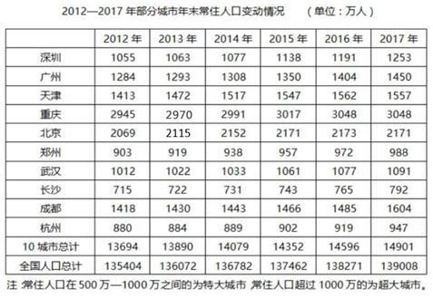

#### 第 1 题　qid 2453099 · 数学运算

表中所列10城市2017年末常住人口数量较2012年末约增长了（    ）。

- **A**. 

- **B**. 

- **C**. 

- **D**. 

　✅

**答案**：D

**官方解析**

根据题干“2017年末······较2012年末约增长了”，结合选项“”，判定本题为一般增长率问题。定位表格可知，表中所列10城市2017年末、2012年末常住人口数量分别为14901、13694万人。代入公式：增长率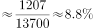。

故正确答案为D。

---

#### 第 2 题　qid 2453103 · 数学运算

能够从上述材料中推出的是（    ）。

- **A**. 2013—2017年，天津市常住人口年均增长30万人以上
- **B**. 2015年末全国人口同比增量高于2014年水平
- **C**. 按2017年常住人口同比增量计算，杭州市将在2020年内成为超大城市
- **D**. 2013年末，重庆常住人口同比增量高于10城市常住人口同比增量的平均值　✅

**答案**：D

**官方解析**

A项：定位表格数据可得：2013年和2017年天津市年末常住人口分别为1472万人和1557万人，故题干所求年均增长人数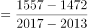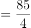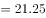万人万人，错误。

B项：定位表格最后一行数据可得：2013年-2015年全国人口年末常住人口分别为136072万人、136782万人和137462万人，则2014年和2015年的人口增长量分别为万人和万人，即2015年增量2014年增量，错误。

C项：定位表格，2016年、2017年杭州市年末常住人口分别为919、947万人，则增长量为万人，按2017年常住人口同比增量计算，杭州市人口将在2019年就达到万人，成为超大城市，而不是在2020年内才达到超大城市的人数标准，错误。

D项：定位表格可得：重庆2012年末人口和2013年末人口分别为2945万人、2970万人，则2013年增长量为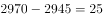万人；定位表格可得：10城市人口2012年末和2013年末分别为13694万人、13890万人，则2013年增长量为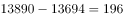万人，10个城市增量的平均值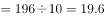万人，重庆同比增量高于10城市平均值，正确。

故正确答案为D。

---

### 材料 2

                      表1  2016～2021年我国工业大数据市场规模增长及预测 

                    表2  按不同方式划分的2018年我国工业大数据销售额比例

#### 第 3 题　qid 2452985 · 数学运算

2018年我国工业大数据销售额最高的5种产品结构中，销售额最高的类别销售额约是销售额最低类别的            倍。

- **A**. 1.5
- **B**. 2.5
- **C**. 3.3　✅
- **D**. 4.6

**答案**：C

**官方解析**

根据题干“2018年···是···的多少倍”，结合材料为2018年，可判定本题为现期倍数问题。定位表2，在产品结构中，“设备故障诊断”占比最高，则销售额最高，其销售额；“供应链优化”占比最低，则销售额最低，其销售额，则销售额最高的类别销售额是最低的：倍，与C项接近。

故正确答案为C。

---

#### 第 4 题　qid 2452986 · 数学运算

关于我国工业大数据市场，能够从上述资料中推出的是                    。

- **A**. 2018年我国工业大数据市场中，大型企业的销售额超过80亿元　✅
- **B**. 2018年我国工业大数据市场中，电力行业销售额是采矿业的3倍多
- **C**. 2017年，我国工业大数据占大数据总体市场规模的比重高于上年水平
- **D**. 2019-2021年，我国工业大数据市场规模将达到2016-2018年的2.5倍以上

**答案**：A

**官方解析**

A项：定位表格1，2018年我国工业大数据市场规模114.2亿元，定位表格2，2018年我国工业大数据市场中，大型企业的销售额占比为，则大型企业销售额亿元，正确；

B项：定位表2，在2018年用户行业结构中，电力行业占比，其销售额；采矿业占比，其销售额。两者倍数倍。错误；

C项：定位表格1，2017年我国工业大数据市场规模同比增速，总体市场规模同比增速。根据两期比重结论：当时，比重下降，即比重低于上年水平。错误；

D项：定位表格1,2019-2021年我国工业大数据市场规模亿元；2016-2018年我国工业大数据市场规模亿元，两者倍数倍，未达到2.5倍。错误。

故正确答案为A。

---

### 材料 3

                             表  2018年全国及京津沪各类型外资企业进出口贸易额及同比增速

#### 第 5 题　qid 2452987 · 数学运算

2018年12月，北京市三种类型的外资企业进出口贸易状况为                    。

- **A**. 出口额比进口额高不到100亿元
- **B**. 出口额比进口额高100亿元以上
- **C**. 进口额比出口额高不到100亿元
- **D**. 进口额比出口额高100亿元以上　✅

**答案**：D

**官方解析**

定位表格材料可得，2018年12月，北京市三种类型的外资企业出口额为亿元；进口额为亿元。故进口额比出口额高亿元，即进口额比出口额高100亿元以上。 

故正确答案为D。

---

#### 第 6 题　qid 2452989 · 数学运算

京津沪三个直辖市中，2018年外商独资企业进口额占全国外商独资企业进口额比重高于2017年水平的直辖市有            个。

- **A**. 0　✅
- **B**. 1
- **C**. 2
- **D**. 3

**答案**：A

**官方解析**

根据题干“京津沪三个直辖市中，2018年······占······比重高于2017年水平的直辖市有”，可判定此题为两期比重比较问题。由两期比重比较结论可知，若，则现期比重高于基期比重。定位表格材料可知，；京津沪三个直辖市2018年外商独资进口额增速a分别为、、，均小于。故满足条件的有0个。

故正确答案为A。

---

#### 第 7 题　qid 2452992 · 数学运算

2018年，京津两地中外合资企业出口额约是两地中外合作企业出口额的            倍。

- **A**. 65
- **B**. 209　✅
- **C**. 326
- **D**. 455

**答案**：B

**官方解析**

根据题干“2018年，京津两地中外合资······是······倍”，可判定此题为现期倍数问题。定位表格材料可知，京津两地中外合资企业出口额为；京津两地中外合作企业出口额为。则所求为。

故正确答案为B。

---

#### 第 8 题　qid 2453000 · 数学运算

能够从上述资料中推出的是                    。

- **A**. 
2018年，全国各类型外资企业进出口总额超过15万亿元

- **B**. 
2018年，上海外商独资企业进出口总额占全国同类企业的以上

- **C**. 
2018年12月，上海中外合资企业出口额超过前11个月平均值
　✅
- **D**. 
2017年，北京中外合作企业出口额高于其进口额

**答案**：C

**官方解析**

A项：定位表格材料，2018年全国各类型外资企业进出口总额为万亿元15万亿元。错误；

B项：定位表格材料，2018年上海外商独资企业进出口总额为亿元；全国同类企业进出口总额为亿元，故所求比重为。错误；

C项：若2018年12月上海中外合资企业出口额超过前11个月平均值，则12月出口额，即。定位表格材料可知，2018年12月上海中外合资企业出口额为123.63亿元，全年出口额为1415.02亿元，则。正确；

D项：定位表格材料，由基期量可知，2017年北京中外合作企业出口额亿元；2017年北京中外合作企业进口额亿元，即出口额低于进口额。而非高于，错误。

故正确答案为C。

---

#### 第 9 题　qid 2453053 · 数学运算

数列：2，8，4，16，6，32，8，（    ）

- **A**. 16
- **B**. 64　✅
- **C**. 128
- **D**. 256

**答案**：B

**官方解析**

观察数列特征，数列项数较多，考虑多重数列。交叉来看，奇数列2，4，6，8，此数列是公差为2的等差数列；偶数列8，16，32，是公比为2的等比数列，故所求项。

故正确答案为B。

---

#### 第 10 题　qid 2452921 · 数学运算

下表中问号处的数字为<u>        </u>。

- **A**. 378　✅
- **B**. 342
- **C**. 300
- **D**. 228

**答案**：A

**官方解析**

观察数列特征，都是6的倍数。分解因式：

观察每个田字格，，则。

故正确答案为A。

---

#### 第 11 题　qid 2453055 · 数学运算

数列：（1，2），（3，4），（7，8），（15，16），（    ，    ）

- **A**. （31，32）　✅
- **B**. （32，33）
- **C**. （33，34）
- **D**. （34，35）

**答案**：A

**官方解析**

观察数列特征，数列项数较多，考虑多重数列。交叉来看，括号中的前项数字为：1，3，7，15，（    ），两两作差得到2，4，8，是公比为2的等比数列，所求项的前项为。括号中的后项数字为：2，4，8，16，（    ），是公比为2的等比数列，则所求项的后项。

故正确答案为A。

---

#### 第 12 题　qid 2452917 · 数学运算

如图，问号处的数字为<u>        </u>。

- **A**. 168
- **B**. 132
- **C**. 96
- **D**. 72　✅

**答案**：D

**官方解析**

观察数列特征，数字处于三角形三个角上，顶角位置数字3，6，9，此数列是公差为3的等差数列，所求位置：；左下角位置数字4，8，24，此数列作商得到2，3，下一项为4，所求位置：；第一个三角形数字加和，第二个三角形数字加和，第三个三角形数字加和。由此可知，第四个三角形数字加和也是180，则。

故正确答案为D。

备注：最后一个是空白三角形，需要根据前面的规律计算出来，再计算出？处的数字。

---

#### 第 13 题　qid 2452920 · 数学运算

如图，问号处的数字为<u>        </u>。

- **A**. 1
- **B**. 8
- **C**. 19
- **D**. 31　✅

**答案**：D

**官方解析**

方法一：观察数列特征，没中心凑大数，大数位置不同，考虑单独的四则运算。先考虑加法，第一组，第二组，第三组，可以看出34，44，54，（  ），此数列是公差为10的等差数列，则。第四组，则。

方法二：第一个正方形左上角1，逆时针变动一个位置的数字是2，3，4，此数列是公差为1的等差数列；第一个正方形左下角4，逆时针变动一个位置的数字是6，8，10，此数列是公差为2的等差数列；第一个正方形右下角10，逆时针变动一个位置的数字是13，16，19，此数列是公差为3的等差数列；第一个正方形右上角19，逆时针变动一个位置的数字是23，27，？，此数列是公差为4的等差数列；则。

故正确答案为D。

---

#### 第 14 题　qid 2453066 · 数学运算

如图，圆锥高厘米，底面半径为6厘米，一只蚂蚁从A点沿圆锥侧面爬行到B点，则最短的距离为<u>        </u>厘米。

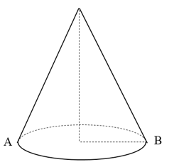

- **A**. 
12

- **B**. 

　✅
- **C**. 

- **D**. 
24

**答案**：B

**官方解析**

由题意，底面半径BC为6厘米，则底面周长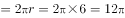。又圆锥高厘米，在直角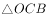中，，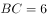，则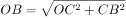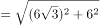。要计算蚂蚁爬行的最短距离，将图形展开，连接AB，AB即最短的距离。圆锥展开图是扇形，该扇形的弧长底面周长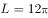，可根据弧长公式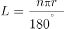，其中，则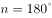。展开图如图2所示，在直角中，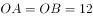，则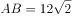。

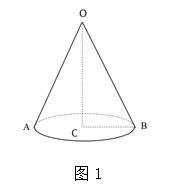

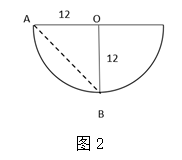

故正确答案为B。

---

#### 第 15 题　qid 2453070 · 数学运算

某果品公司计划安排6辆汽车运载A、B、C三种水果共32吨进入某市销售，要求每辆车只装同一种水果且必须装满，根据下表提供的信息，则有<u>        </u>种安排车辆方案。

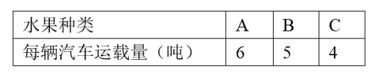

- **A**. 1　✅
- **B**. 2
- **C**. 3
- **D**. 4

**答案**：A

**官方解析**

设运输A水果的车有辆，运输B水果的车有辆，运输C水果的车有辆。根据题意可列式为：，，，得。与8均为偶数，则也为偶数，且应，可取值为2、4。当时，，此时没有车辆运输C水果，与题意不符；当时，，，满足要求。即只有3辆车运输A水果，2辆车运输B水果，1辆车运输C水果这一种情况刚好满足题干条件。 

故正确答案为A。

---

#### 第 16 题　qid 2453077 · 数学运算

已知三角形一边长为a。甲说：“剩下的两条边只要有一条变长，则三角形面积一定变大。”乙反对说：“不对，必须要剩下的两条边同时变长，三角形的面积才一定变大。”
下列判断正确的是：

- **A**. 甲正确，乙错误
- **B**. 甲错误，乙正确
- **C**. 甲乙都正确
- **D**. 甲乙都错误　✅

**答案**：D

**官方解析**

如图1所示，边长为2的等边三角形，底为2，高为，面积为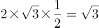；边长分别为2、2、，顶角为等腰三角形，底为，高为1，面积为。两个三角形有两条边相等，只有一条边变长，但面积没有发生变化，可知甲的说法错误。

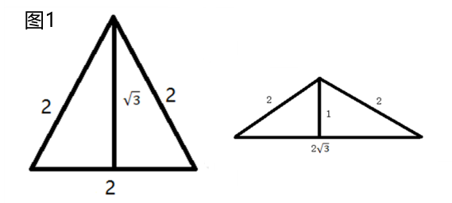

如图2所示，将直角三角形其中两条边拉长，使三角形变为钝角三角形，此时三角形的底与高均未发生变化，则面积依然保持不变，可知乙的说法错误。

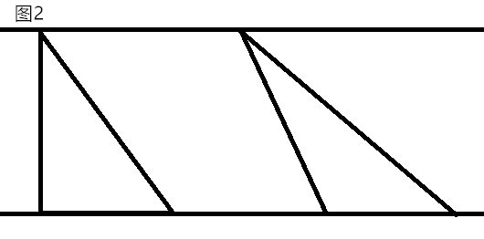

故正确答案为D。

---

#### 第 17 题　qid 2452932 · 数学运算

某游乐园在一个平地中央挖了一个球形下沉广场，广场直径为200米，最深处50米，那么这个球形的直径为        米。

- **A**. 125
- **B**. 200
- **C**. 225
- **D**. 250　✅

**答案**：D

**官方解析**

根据题意，广场的直径为200米，则米；最深处为50米，则米，米。由于是直角三角形，则（OB为球的半径，可用r表示），即，解得，则该球的直径为米。

故正确答案为D。

---

#### 第 18 题　qid 2452922 · 数学运算

M小区停车收费，小型车辆每天5元，中型车辆每天8元，大型车辆每天10元。某天小区总共停了20辆车，共收费153元，那么当天大型车辆可能有        辆。

- **A**. 8
- **B**. 9
- **C**. 10　✅
- **D**. 11

**答案**：C

**官方解析**

设小型车辆辆，中型车辆辆，大型车辆辆。根据“总共停了20辆车”，可得；根据“共收费153元”，可得。令，可得。由于、，且、均为整数。代入选项A，解得辆，错误；代入选项B，解得，错误；代入选项C，解得，正确；代入选项D，解得为负数，错误。

故正确答案为C。

---

#### 第 19 题　qid 2452924 · 数学运算

甲乙丙丁四人一起去踏青，甲带的钱是另外三个人总和的一半，乙带的钱是另外三个人的，丙带的钱是另外三个人的，丁带了91元，他们一共带了<u>        </u>元。

- **A**. 364
- **B**. 380
- **C**. 420　✅
- **D**. 495

**答案**：C

**官方解析**

根据“甲带的钱是另外三个人总和的一半”，则，；根据“乙带的钱是另外三个人的”，则，；根据“丙带的钱是另外三个人的”，则，。设一共带了元。则甲带了元，乙带了元，丙带了元。所以一共带了，解得，所以一共带了元。

故正确答案为C。

---

#### 第 20 题　qid 2452941 · 数学运算

天气预报预测未来2天的天气情况如下：第一天晴天、下雨、下雪；第二天晴天、下雨、下雪，则未来两天天气状况不同的概率为<u>        </u>。

- **A**. 

- **B**. 

- **C**. 

　✅
- **D**. 

**答案**：C

**官方解析**

方法一：未来两天天气状况不同，可分三类：①第一天晴天、第二天非晴天，；②第一天下雨、第二天非下雨，；③第一天下雪、第二天非下雪，。则题干所求。

方法二：未来两天天气状况不同的概率。未来两天天气相同总共分为三类：①都是晴天，概率为；②都是下雨，概率为；③都是下雪，概率为。则题干所求。

故正确答案为C。

---

#### 第 21 题　qid 2453079 · 数学运算

小王等6名学生参与了某展览会志愿者活动。他们被安排到两个不同的会场服务。如果要求每个会场都至少有2名志愿者，则对小王等人共有        种不同的安排方式。

- **A**. 20
- **B**. 30
- **C**. 50　✅
- **D**. 360

**答案**：C

**官方解析**

根据题意可分为2种情况：（1）每个会场3人，即从6人中任选3人去一个会场，有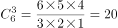种情况；（2）一个会场有2人，另一个会场有4人，即从6人中任选2人有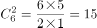种情况，任选1个会场去2人有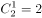种情况，分步用乘法，有种情况。分类用加法，则共有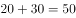种情况。

故正确答案为C。

---

#### 第 22 题　qid 2452936 · 数学运算

一个由若干个单位立方体组成的立体图形，从正面看、左侧面看、下面看都是一个的正方形，那么这个立体图形至少需要<u>        </u>个单位立方体。

- **A**. 17
- **B**. 19　✅
- **C**. 21
- **D**. 22

**答案**：B

**官方解析**

题干要求从正面、左侧面、下面看均为3×3的正方形，先在下面平铺一层，共9个立方体；接下来满足正面和左侧面，需要10个立方体即可，如下图所示，共有9+10=19个立方体。所以至少需要19个单位立方体。

故正确答案为B。

备注：如下图所示，实际可以通过9+6=15个单位立方体摆出满足题目要求的图形，但由于选项最小为17，出题人应该不是考查这种思路，故猜测本题答案为19。

---

#### 第 23 题　qid 2453092 · 数学运算

如图所示，则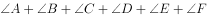的度数是<u>        </u>。

- **A**. 
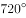

- **B**. 
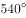

- **C**. 
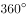
　✅
- **D**. 

**答案**：C

**官方解析**

如下图，延长直线CF交AB于点G，交DE于点H。则根据三角形两个内角和等于第三个角的外角可得，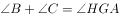，则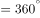，即四边形DHGA内角和为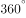。

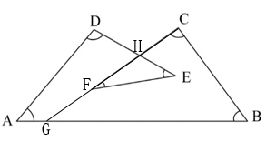

故正确答案为C。

---

## 判断推理

### 第 1 题　qid 2452945 · 类比推理

从金属利用的历史来看，先是青铜器时代，而后是铁器时代，铝的利用是近百年的事。下列选项中，与金属利用的先后顺序相关度最高的是                    。

- **A**. 地壳中金属的含量
- **B**. 金属冶炼的难易　✅
- **C**. 金属的导电性和延展性
- **D**. 金属制品的用途

**答案**：B

**官方解析**

铜、铁、铝三种金属活动性由强到弱的顺序为：铝铁铜；金属活动性越强，金属的冶炼难易程度越难，冶炼技术要求越高，因而人类早期只能使用较容易冶炼的铜，随后才是铁，最后是铝。

故正确答案为B。

---

### 第 2 题　qid 2453061 · 类比推理

将气体溶于水有多种装置，如果是一种有毒气体，下列装置最合适的是（  ）。

- **A**. A
- **B**. B
- **C**. C
- **D**. D　✅

**答案**：D

**官方解析**

A项：烧杯敞口，有毒气体若未充分溶解会散发到空气中，造成危害，错误；
B项：倒扣漏斗虽然增加了气体与水的接触面，但是烧杯敞口，可能导致未充分溶解的有毒气体散发到空气中，造成危害，错误；
C项：装置封闭，玻璃管中气体无法排出，水只能溶解少量气体，错误；
D项：第一次未溶解气体通入到敞口烧杯内，会进行再次溶解，能使有毒气体充分溶于水，正确。
故正确答案为D。

---

### 第 3 题　qid 2452955 · 逻辑判断

物质的结构决定性质，微粒间的相互作用力越强，熔点越高。一些氧化物的熔点如下表所示：

下列选项中，不能解释氧化物熔点存在差异的是<u>                    </u>。

- **A**. 
分子晶体中的作用力是相对较弱的分子间作用力

- **B**. 
离子晶体中的作用力是相对较强的离子键

- **C**. 
原子晶体中的作用力是相对较弱的共价键
　✅
- **D**. 
中的离子键弱于的

**答案**：C

**官方解析**

A项，分子晶体中的作用力是分子间作用力，不是化学键，作用力较弱，熔沸点较低，故A项可以解释氧化物的熔点差异；

B项，离子晶体中的作用力是离子键，属于化学键，作用力较强，熔沸点较高，故B项可以解释氧化物的熔点差异；

C项，原子晶体中的作用力是共价键，属于化学键，作用力很强，熔沸点一般很高，故C项表述错误，不能解释氧化物的熔点差异；

D项，和是离子晶体，离子晶体中的作用力为离子键，离子键能越大，晶体的熔点越高，因为的离子键弱于，所以的熔点比的熔点低，故D项可以解释氧化物的熔点差异。

故正确答案为C。

---

### 第 4 题　qid 2453069 · 类比推理

医院吸氧的氧气吸入器（图2），其作用原理与图1类似，关于该装置，下列说法错误的是（  ）。

- **A**. 可以用来湿润氧气
- **B**. B导管连接氧气钢瓶　✅
- **C**. 可以用来观察输出氧气的流速
- **D**. 可以用来观察是否有氧气输出

**答案**：B

**官方解析**

A项：氧气从A导管通入，通入水中，再通过B导管排出，可以用来湿润氧气，正确；
B项：若B导管连接氧气钢瓶通入氧气，则会导致瓶内气体气压增大，使水从A导管排出，错误；
C项：氧气不易溶于水，通过水时会看见有气泡生成，故可以通过观察气泡产生的速度判别输出氧气的速度，正确；
D项：氧气不易溶于水，可以通过观察是否有气泡产生，判别是否有氧气输出，正确。
本题为选非题，故正确答案为B。

---

### 第 5 题　qid 2452960 · 逻辑判断

过氧化氢()的沸点比水高，但受热易分解。某试剂厂制得浓度~的过氧化氢溶液，再浓缩成的溶液时，可采用的适宜方法是<u>            </u>。

- **A**. 常压蒸馏
- **B**. 减压蒸馏　✅
- **C**. 加压蒸馏
- **D**. 加生石灰，常压蒸馏

**答案**：B

**官方解析**

过氧化氢的沸点比水高，但受热易分解，浓缩过氧化氢溶液时，应避免加热，常压、加压蒸馏，均需加热，故A项、C项错误。生石灰与水反应会放出大量的热，会使过氧化氢分解，故D项错误。适宜方法应为减压蒸馏，减压可降低水的沸点，使水在较低温度下沸腾，得到浓缩的过氧化氢溶液，B项正确。
故正确答案为B。

---

### 第 6 题　qid 2452961 · 类比推理

“蹦极”是一种极富刺激性的游乐项目，如图所示为一根橡皮绳，一端系住人的腰部，另一端固定在跳台上。当人落至图中A点时，橡皮绳刚好被拉直，当人落至图中B点时，橡皮绳对人的拉力大小与人的重力大小相等，C点是游戏者所能达到的最低点。在游戏者离开跳台到最低点的过程中，不计空气阻力，下列说法正确的是<u>                    </u>。

- **A**. 游戏者的动能一直在增加
- **B**. 游戏者到达B点时重力势能最小
- **C**. 游戏者到达B点时动能最大　✅
- **D**. 游戏者在C点时的弹性势能最小

**答案**：C

**官方解析**

在蹦极的过程中，绳子还没有完全拉直时，游戏者的速度越来越快，因此动能逐渐增加；在A点和B点之间，游戏者受重力和绳子向上的拉力作用，由于重力大于拉力，因此合力方向向下，加速度方向向下，速度仍然在增加，动能依然在增加；在B点和C点之间，绳子向上的拉力开始大于重力，合外力方向向上，加速度方向向上，因此速度逐渐减少，直至C点时速度为0，动能逐渐减少。因此A项错误、C项正确。
游戏者在出发点处位置最高，重力势能势能最大，在C点处位置最低，重力势能最小，B项说法错误。
弹性势能是物体由于发生弹性形变而具有的能量，弹性形变越大，弹性势能越大。在C点处，绳子被拉至最长，因此弹性势能最大，D项说法错误。
故正确答案为C。

---

### 第 7 题　qid 2452970 · 类比推理

某国研制出一种用超声波做子弹的枪，当超声波达到一定强度时就能有较强的攻击力，实际要阻挡这一武器的袭击，只要用薄薄的一层            。

- **A**. 半导体
- **B**. 磁性物质
- **C**. 真空带　✅
- **D**. 绝缘物质

**答案**：C

**官方解析**

超声波是频率高于20000赫兹的声波，属于声波的一种。由于声波不能在真空中传播，故只要设置一层真空带，就能阻断超声波子弹的攻击。
故正确答案为C。

---

### 第 8 题　qid 2452967 · 类比推理

如图所示，匀速向东行驶的火车车厢中，光滑水平桌面上正中位置放有一个相对静止的小球。右下图是小球的俯视图，A为初始位置，曲线为小球相对桌面的运动轨迹，可以判断<u>                    </u>。

- **A**. 火车向北减速转弯　✅
- **B**. 火车向西减速前进
- **C**. 火车向东加速前进
- **D**. 火车向南减速转弯

**答案**：A

**官方解析**

根据题意，小球与桌面相对静止，则小球和桌面同时向东做匀速直线运动，由小球相对桌面的运动轨迹可知，小球相对桌面的运动速度可以分解为正东方向和正南方向的两个分速度，由于桌面是光滑的，对小球没有摩擦力，小球在惯性作用下继续保持匀速向东运动（即火车原有的速度）。以小球作为参照物，火车和桌面的运动速度可分解为正西方向和正北方向。

A项，火车向北减速转弯，火车和桌面相对于小球有正西方向和正北方向的分速度，正确；

B项，火车向西减速前进，火车和桌面相对于小球运动方向为正西，错误；

C项，火车向东加速前进，火车和桌面相对于小球运动方向为正东，错误；

D项，火车向南减速转弯，火车和桌面相对于小球有正西方向和正南方向的分速度，错误。

故正确答案为A。

---

### 第 9 题　qid 2453072 · 类比推理

如图所示，重为G质量分布均匀的梯子斜搁在光滑的竖直墙面上，重为Q的人沿梯子从低端A处开始匀速向上走向顶端B处，整个过程梯子不滑动。则下列说法中正确的是（  ）。

- **A**. 梯子对墙面的压力变大　✅
- **B**. 地面对梯子的支持力变小
- **C**. 梯子对墙面的压力变小
- **D**. 地面对梯子的支持力变大

**答案**：A

**官方解析**

人在上爬的过程中，梯子和人的构成的系统处于平衡状态。对整体进行受力分析，竖直方向上，受到地面提供的竖直向上的支持力，人与梯子提供的竖直向下的重力，处于平衡状态，由于梯子和人的重力不发生改变，所以地面对梯子的支持力不发生改变，即支持力不会变小也不会变大，排除选项B、D。

 

将梯子看成轻质杠杆，A点为支点，将人的重力看成动力，墙对梯子的支持力看成阻力，随着人向上走，重力不变，但动力臂变大，而阻力臂不变，根据平衡状态下，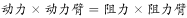，可以推出阻力变大，即墙对梯子的支持力变大，梯子对墙面的压力也变大。

故正确答案为A。

---

### 第 10 题　qid 2453074 · 逻辑判断

如图所示、AB为一根两端封闭的玻璃粗管，其中装满水，水中有一个直径小于粗管直径的乒乓球。当玻璃管以中点O点开始在水平面内顺时针转动时，则（  ）。

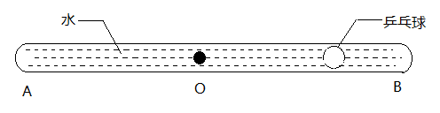

- **A**. 乒乓球向A端移动，当转动够快时乒乓球能停留在玻璃管的A端
- **B**. 乒乓球向B端移动，当转动够快时乒乓球能停留在玻璃管的B端
- **C**. 乒乓球向A端移动，当转动够快时乒乓球能停留在玻璃管的中点O处　✅
- **D**. 无论转动多快，乒乓球相对玻璃管停留在原处

**答案**：C

**官方解析**

物体做圆周运动所需的向心力 ，其中是物体的质量，是物体运动的角速度，是运动的圆周轨道半径。

玻璃管开始旋转时，水和乒乓球以相同的角速度做圆周运动，由于水质量大于乒乓球，故做圆周运动时所需要的向心力光凭管壁摩擦力不足以提供，故乒乓球附近的水会做离心运动，被“甩”到外侧管底，在管底支持力的作用下，进行圆周运动，与此同时，乒乓球在水的作用下向内侧运动，最终停留在O点。

故正确答案为C。

---

### 第 11 题　qid 2453075 · 逻辑判断

如图所示是日本庭院常见的一种装置——添水。装置原理十分简单，竹筒中间设置支架，上面注水，如果水满竹筒就会倒出来。倒出来后竹筒空了又会抬起来。下列关于该装置表述不正确的是（  ）。

- **A**. 装置的重心会旋转轴往复运动
- **B**. 装置重心超过轴向右一段距离后进入倒水阶段
- **C**. 装置做往复运动的周期和注水速度有关，注水越快，周期越短
- **D**. 装置做往复运动的周期和竹筒容积有关，容积越大，周期越短　✅

**答案**：D

**官方解析**

刚开始注水时，水聚集在竹筒左侧的底部，因此重心靠左，随着竹筒内水量的变多，重心逐渐变高，并且向右移动，水满时，重心在轴右侧一定距离，竹筒将克服摩擦力缓慢做顺时针转动，将水倒出，此时，竹筒变空，重心回到轴左侧，竹筒逆时针抬起。
注水速度越快，整个装置的重心变化越快，往复运动越快，周期越短；竹筒容积越大，注水时，水满所需要的水量就越多，往复运动越慢，周期越长。
本题为选非题，故正确答案为D。

---

### 第 12 题　qid 2453095 · 图形推理

下列选项中，符合所给图形的变化规律的是：

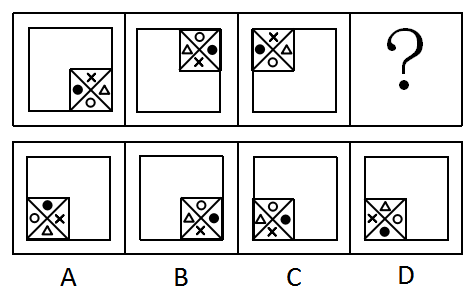

- **A**. A
- **B**. B
- **C**. C　✅
- **D**. D

**答案**：C

**官方解析**

元素组成相同，优先考虑位置规律。内部的小正方形从图一开始沿着外边框四个角，每次逆时针移动一步，因此图四应该移动到左下角位置，排除B项；继续观察，小正方形内部的小元素依次按照顺（逆）时针平移2格，所以图四中小黑点应在最右侧，符合的只有C项。
故正确答案为C。

---

### 第 13 题　qid 2452980 · 图形推理

下列选项中，符合所给图形的变化规律的是<u>        </u>。

- **A**. A
- **B**. B
- **C**. C　✅
- **D**. D

**答案**：C

**官方解析**

元素组成不同，出现多个独立小元素，优先考虑元素种类和数量规律。每幅图都是由正方形和圆两种元素组成，且每幅图正方形的数量比圆的数量多1个，只有C项符合。
故正确答案为C。

---

### 第 14 题　qid 2453078 · 图形推理

下列选项中，符合所给图形的变化规律的是：

- **A**. A　✅
- **B**. B
- **C**. C
- **D**. D

**答案**：A

**官方解析**

元素组成相同，优先考虑位置规律。观察发现， 题干前一幅图的1变为下一幅图的4，2变为7，3变为5，4变为8，5变为6，6变为1，7变为3，8变为2。只有A项符合。

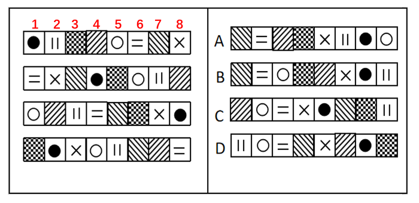

故正确答案为A。

---

### 第 15 题　qid 2452984 · 图形推理

下列选项中，符合所给图形的变化规律的是<u>        </u>。

- **A**. A
- **B**. B
- **C**. C　✅
- **D**. D

**答案**：C

**官方解析**

元素组成相似，且相同线条重复出现，优先考虑样式规律中的加减同异。第一组图中，图1和图2求同得到图3；第二组图应用此规律，故？处应选择一个图1和图2求同得到的图形。只有C符合。
故正确答案为C。

---

### 第 16 题　qid 2453032 · 图形推理

下列选项中，符合所给图形的变化规律的是<u>      </u>。

- **A**. A　✅
- **B**. B
- **C**. C
- **D**. D

**答案**：A

**官方解析**

元素组成相同，优先考虑位置规律。每个图形都是由4个高低不一的长方形组成的，在图一中，从左到右依次给长方形编号为1、2、3、4，图一到图二1号长方形向右平移三步，图二到图三2号长方形向右平移三步，故图三到？处应该是3号长方形向右平移三步，只有A项符合。

故正确答案为A。 

---

### 第 17 题　qid 2453033 · 图形推理

下图给定的平面图折叠后的立体图形是<u>      </u>。

- **A**. A　✅
- **B**. B
- **C**. C
- **D**. D

**答案**：A

**官方解析**

将原展开图标上序号，如下图，逐一进行分析。

A项：选项与题干一致，当选；

B项：选项中的面k在展开图中没有出现，选项与题干不一致，排除；

C项：选项中包括面e和面i，而面e和面i为相对面，不能同时出现，选项与题干不一致，排除；

D项：选项中包括面f和面h，而面f和面h为相对面，不能同时出现，选项与题干不一致，排除。

故正确答案为A。

---

### 第 18 题　qid 2453034 · 图形推理

左图是右图的平面展开图，数字与字母一一对应，与123456可以对应的是<u>      </u>。

- **A**. A
- **B**. B
- **C**. C
- **D**. D　✅

**答案**：D

**官方解析**

本题考查六面体。
A项：题干展开图中的面5和面6是相对面，而面f和面e不是，排除。
B项：题干展开图中的面1和面3是相对面，而面c和面e不是，排除。
C项：题干展开图中的面1和面3是相对面，而面c和面f不是，排除。
D项：题干展开图中六个面的相对位置关系和立体图形中六个面的相对位置一致，当选。
故正确答案为D。

---

### 第 19 题　qid 2453080 · 图形推理

下列选项中，符合所给图形的变化规律的是<u>      </u>。

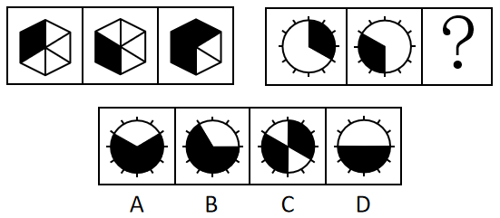

- **A**. A　✅
- **B**. B
- **C**. C
- **D**. D

**答案**：A

**官方解析**

元素组成相似，优先考虑样式规律。观察发现，第一组图形中，第一个图形经过顺时针旋转60°后，与第二个图形进行叠加运算可得第三个图形。根据此规律，第二组图形中，先将第一个图形顺时针旋转60°，再与第二个图形进行叠加，可得A项。
故正确答案为A。

---

### 第 20 题　qid 2453036 · 图形推理

下列选项中，符合所给图形的变化规律的是<u>      </u>。

- **A**. A
- **B**. B　✅
- **C**. C
- **D**. D

**答案**：B

**官方解析**

元素组成相同，优先考虑位置规律。第一组图中，图2是由图1左右翻转得来的，图3是由图2上下翻转得来的。第二组图运用此规律，图2是由图1左右翻转得来的，所以？处图形应该是图2上下翻转得来的，只有B项符合此规律。
故正确答案为B。

---

### 第 21 题　qid 2453082 · 图形推理

下列选项中，符合所给图形的变化规律的是：

- **A**. A
- **B**. B
- **C**. C
- **D**. D　✅

**答案**：D

**官方解析**

观察题干图形发现，元素组成相似。题干每幅图都由内圈、中间、外圈组成，颜色或图案包括黑色、白色、斜线、竖线、点状。
观察可得，题干正方形内部填充依次是白-黑-斜线-竖线，所以“？”处图形内部为“点状”，排除B、C两项。比较A、D两项，不同之处在于外圈，继续观察外圈正方形的填充分别是斜线-竖线-点状-白色，所以“？”处图形外圈为“黑色”，只有D项符合。
故正确答案为D。

---

### 第 22 题　qid 2453084 · 图形推理

下列选项中，与其他三个图形规律不同的是：

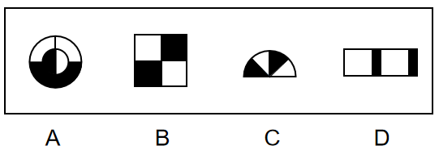

- **A**. A
- **B**. B
- **C**. C
- **D**. D　✅

**答案**：D

**官方解析**

通过观察发现，题干图形均由黑块和白块组成，且色块分布均匀，优先考虑黑白块面积。A项、B项和C项中的黑块和白块面积相同，均占图形总面积的一半，而D项中白块的面积远大于黑块，故只有D项呈现的规律与其他三项不同。
本题为选非题，故正确答案为D。

---

### 第 23 题　qid 2453086 · 图形推理

下列选项中，符合所给图形的变化规律的是：

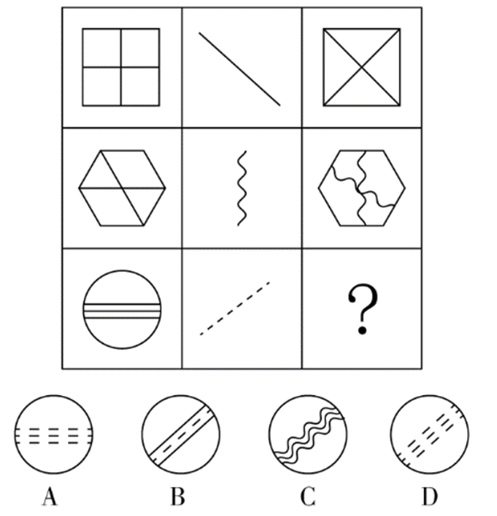

- **A**. A
- **B**. B
- **C**. C
- **D**. D　✅

**答案**：D

**官方解析**

九宫格优先横行看，第一行图1的内部线条替换成图2的斜线样式后可得到图3，且图3保留了图2该方向的斜线；第二行验证规律可得，图1的内部线条替换成图2的曲线样式后可得到图3，且图3保留了图2竖直方向的曲线，规律验证成立；因此第三行中，图1的内部线条替换成图2的虚线样式，并且要保留图2该方向的虚线，只有D符合。
故正确答案选D。

---

### 第 24 题　qid 2453046 · 逻辑判断

所有真正关心老百姓利益的领导干部，都会受到大家的尊敬；而真正关心老百姓利益的领导干部都特别重视如何解决住房、看病、教育和养老等民生问题。因此，那些不重视如何解决老百姓民生问题的领导干部，都不会受到大家的尊敬。
为保证上述论证成立，必须增加下列      项作为前提。

- **A**. 随着老龄化社会的来临，老百姓面临的看病、养老等问题越来越突出
- **B**. 所有重视如何解决老百姓民生问题的领导干部，都会受到大家的尊敬
- **C**. 住房、看病、教育和养老等民生问题，是事关老百姓利益的最为突出的问题
- **D**. 所有受到大家尊敬的领导干部，都是真正关心老百姓利益的领导干部　✅

**答案**：D

**官方解析**

第一步：找出论点和论据。

论点：不重视民生问题的领导干部不尊敬（根据逆否可以推出：尊敬重视民生问题的领导干部）；

论据：关心老百姓利益的领导干部尊敬；关心老百姓利益的领导干部重视民生问题。

第二步：逐一分析选项。

A项：论点说的是不重视如何解决老百姓民生问题的领导干部，都不会受到大家的尊敬，该项说的是看病、养老等问题越来越突出，话题不一致，无法加强，排除；

B项：简单翻译为重视解决民生问题的领导干部尊敬，将其补充到论据之上，无法得到论点，因此无法加强，排除；

C项：论点说的是不重视如何解决老百姓民生问题的领导干部，都不会受到大家的尊敬，该项说的是民生问题是最为突出的话题，话题不一致，无法加强，排除；

D项：简单翻译为：尊敬关心老百姓利益的领导干部，将其补充到论据，可以得到：尊敬关心老百姓利益的领导干部重视民生问题，因此可以得到论点，可以加强，当选。

故正确答案为D。

---

### 第 25 题　qid 2453056 · 逻辑判断

人因自然而生，人与自然是一种共生关系，对自然的伤害最终会伤及人类自身。因此，只有尊重自然规律，才能有效防止在开发利用自然上走弯路。
根据以上陈述，可以得出下列       项。

- **A**. 如果不尊重自然规律，就不能有效防止在开发利用自然上走弯路　✅
- **B**. 如果尊重自然规律，就能有效防止在开发利用自然上走弯路
- **C**. 因为人与自然是一种共生关系，所以必须尊重自然规律
- **D**. 人因自然而生，所以必须开发利用自然

**答案**：A

**官方解析**

第一步：翻译题干。

有效防止在开发利用自然上走弯路尊重自然规律

第二步：逐一分析选项。

A项：翻译为尊重自然规律有效防止在开发利用自然上走弯路，是对题干的否后，否后必否前，当选；

B项：翻译为尊重自然规律有效防止在开发利用自然上走弯路，是对题干的肯后，但肯后得不到确定性的结论，无法推出，排除；

C项：题干未提及人与自然共生关系与尊重自然规律的联系，无法推出，排除；

D项：题干未提及人因自然而生和开发利用自然关系的联系，无法推出，排除。

故正确答案为A。

---

### 第 26 题　qid 2453058 · 逻辑判断

在最后一次校级职称评定委员会的会议上，委员张教授认为这届委员会是近年来工作最没有影响力的一届。当列席会议的校长询问这一判断的理由时，张教授指出：大多数教师根本叫不出委员会成员的姓名。
张教授的判断如果为真，必须假定下列      项。

- **A**. 普通教师通常对职称评定委员会的工作不感兴趣
- **B**. 只有职称评定委员会成员才有资格评价委员会工作是否具有影响力
- **C**. 教师对职称评定委员会人员组成的熟悉程度是评价其工作是否具有影响力的一个重要指标　✅
- **D**. 在遴选职称评定委员会成员时，候选人往往是那些在教师中拥有较高知名度的教授

**答案**：C

**官方解析**

第一步：找出论点和论据。
论点：这届委员会是近年来工作最没有影响力的一届。
论据：大多数教师根本叫不出委员会成员的姓名。
论点讨论的是这届委员会的影响力，论据讨论的是能否叫出委员会成员姓名。论点论据话题不一致，结合问法，优先考虑搭桥。
第二步：逐一分析选项。
A项：该项讨论的是教师对职称评定委员会工作不感兴趣，与论点这届委员会的影响力无关，话题不一致，无法加强，排除；
B项：该项讨论的是谁有资格评价委员会工作是否具有影响力，与论点这届委员会的影响力无关，话题不一致，无法加强，排除；
C项：教师对职称评定委员会人员组成的熟悉程度，即是否能叫出委员会成员姓名，其是评价委员会工作是否具有影响力的一个重要指标，选项建立了论点与论据的联系，为搭桥项，可以加强，当选；
D项：该项讨论的是遴选职称评定委员会成员的条件，与论点这届委员会的影响力无关，话题不一致，无法加强，排除。
故正确答案为C。

---

### 第 27 题　qid 2453044 · 逻辑判断

亚马逊热带雨林火灾次数与过火面积每年以惊人的比例增加。但是，卫星照片显示，去年火灾次数与过火面积的增加比例明显低于往年。去年，某国政府支出数百万美元用于预防和扑灭亚马逊热带雨林火灾。该国政府宣称，上述卫星数据表明政府预防和扑灭火灾的努力取得了显著效果。
下列      项如果为真，最能削弱该国政府的上述结论。

- **A**. 去年该国用以预防和扑灭亚马逊热带雨林火灾的投入明显低于往年
- **B**. 该国去年出现了异乎寻常的大面积持续降雨　✅
- **C**. 与该国毗邻的其他国家的热带雨林火灾次数与过火面积并未减少
- **D**. 该国用于热带雨林火灾预防与扑灭的费用只占年度财政支出的很小比例

**答案**：B

**官方解析**

第一步：找出论点和论据。
论点：政府预防和扑灭火灾的努力取得了显著效果。
论据：去年火灾次数与过火面积的增加比例明显低于往年。去年，某国政府支出数百万美元用于预防和扑灭亚马逊热带雨林火灾。
论点和论据都在讨论政府预防和扑灭火灾的关系，因此论点论据话题一致，考虑否定论点。
第二步：逐一分析选项。
A项：论点说的是预防和扑灭火灾的努力取得了显著效果，该项说的是去年的投入明显低于往年，投入的高低和是否有效果不是同一话题，话题不一致，无法削弱，排除；
B项：论点说的是政府扑灭火灾的努力取得了效果，该项说的是去年出现了大面积持续降雨，说明亚马逊雨林火灾次数减少的原因是大面积持续降雨，说了亚马逊雨林火灾次数减少的另外一个原因，属于另有他因，可以削弱，当选；
C项：论点说的是亚马逊雨林的火灾，该项说的其他国家的雨林，主体不一致，无法削弱，排除；
D项：论点说的是政府扑灭火灾取得了显著效果，该项说的是投入费用的比例，话题不一致，无法削弱，排除。
故正确答案为B。

---

### 第 28 题　qid 2453040 · 逻辑判断

一些科学家认为，在6500万年前，一颗小行星击中了现在的尤卡坦半岛，因此导致了恐龙的灭绝。这些科学家认为：如此一击抛掷了大量的碎片到大气中，从而阻挡了阳光、冷却了空气。对于食草恐龙来说，如果没有充足的阳光和食物资源，那么它们将会灭亡，并且没有恐龙能够长期在低温中生存。然而，这批科学家同时确信：小行星产生的大多数碎片会在六个月内到达地面，以至于无法让植物消失和让恐龙冻僵。
下列      项如果为真，能为解决上述科学家们的信念和事实之间的明显差异提供支持。

- **A**. 
食草恐龙的灭绝使食肉恐龙失去了食物来源

- **B**. 
恐龙很容易受到由小行星碎片所引发的空气污染的影响，以致于产生致命的呼吸问题
　✅
- **C**. 
碎片聚合成的粉尘能够减少约的阳光，从而使地表温度降低7到10摄氏度

- **D**. 
那颗小行星的直径至少为9.6公里，对于通过撞击和由其引起的海啸来杀死恐龙已经足够大了

**答案**：B

**官方解析**

第一步：找出题干矛盾。
提问方式为：解决科学家们的信念和事实之间的明显差异，即解释科学家的信念和事实之间的矛盾。
科学家认为的即为科学家的信念，信念为：小行星击中了现在的尤卡坦半岛，因此导致了恐龙的灭绝。如此一击抛掷了大量的碎片到大气中，从而阻挡了阳光、冷却了空气。对于食草恐龙来说，如果没有充足的阳光和食物资源，那么它们将会灭亡，并且没有恐龙能够长期在低温中生存。
科学家确信的即为事实，事实为：小行星产生的大多数碎片会在六个月内到达地面，以至于无法让植物消失和让恐龙冻僵。
简单总结：我们需要解释为什么“小行星碎片影响的阳光和食物问题没有让恐龙灭绝，但科学家依然认为是小行星碎片让恐龙灭绝的。”
第二步：逐一分析选项。
A项：该项说食草恐龙的灭绝使食肉恐龙失去食物，但事实是小行星的大多数碎片会在六个月内到达地面，以至于无法让植物消失，所以食草恐龙还是有植物可食用，无法解释信念和事实之间的差异，不能解释题干矛盾，排除；
B项：该项说明恐龙的灭绝是因为小行星产生的碎片引发的空气污染问题，解释了在阳光和食物问题没有让恐龙灭绝后（即事实），小行星产生的碎片是怎样导致恐龙灭绝的（即信念），解释了信念和事实之间的差异，可以解释题干矛盾，保留；
C项：该项说粉尘对地表温度的影响，但不明确地表温度降低7到10摄氏度之后是否对恐龙的生存产生灭绝影响，不能解释题干矛盾，排除；
D项：该项说明恐龙的灭绝是因为撞击和海啸，解释了在阳光和食物问题没有让恐龙灭绝后（即事实），小行星是怎样导致恐龙灭绝的（即信念），解释了信念和事实之间的差异，可以解释题干矛盾，保留；
对比B、D两项，B项解释了“小行星产生的碎片是怎样导致恐龙灭绝”，D项解释了“小行星是怎样导致恐龙灭绝”，题干中的信念既提到了“小行星导致恐龙灭绝”，也大篇幅分析了“小行星产生的碎片导致恐龙灭绝”，题干中的事实只提到了“小行星产生的碎片”的相关信息。故信念和事实差异的重点应是“小行星产生的碎片”到底是如何导致恐龙灭绝，而并非“小行星”是如何导致恐龙灭绝；另外，D项的海啸是局部的，B项的空气污染明显范围更大，更可能导致恐龙灭绝，因此B项解释力度更强。
故正确答案为B。

---

### 第 29 题　qid 2453045 · 逻辑判断

在某旅行社的股东会上，总经理提出：根据目前公司整体规划，我提议欧洲线和北美线两条线路至少要开通一条，但南美线因航线问题不能马上开通。董事长表示反对。
下列      项最能准确表达董事长的意思。

- **A**. 欧洲线、北美线和南美线三条线路都开通
- **B**. 欧洲线、北美线和南美线三条线路都不开通
- **C**. 欧洲线和北美线两条线路至多开通一条，但南美线要马上开通
- **D**. 如果南美线不能马上开通，那么欧洲线和北美线两条线路都不能开通　✅

**答案**：D

**官方解析**

第一步：翻译题干。

①（欧洲线或北美线）且南美线

董事长表示反对，则董事长意思为题干翻译的否命题，则题干可以表示为

②（欧洲线或北美线）或南美线

第二步：逐一分析选项。

A项：翻译为：欧洲线且北美线且南美线，无法推出，排除；

B项：翻译为：欧洲线且北美线且南美线，无法推出，排除；

C项：翻译为：（欧洲线或北美线）且南美线，无法推出，排除；

D项：翻译为：南美线欧洲线且北美线，为②的否一推一，可以推出，当选。

故正确答案为D。

---

### 第 30 题　qid 2453042 · 逻辑判断

中国国庆盛大阅兵过程中，各军兵种方队整齐划一、步调一致，完美展现了中国军人的刚毅与坚强，举世瞩目。这是军人们历经数月艰苦训练的结果。已知，某训练小组共有40余名队员，平均身高1.82米，平均年龄24岁。最终，所有年龄23岁以上且身高超过1.83米的队员都参与了正式阅兵。
根据以上信息，关于该训练小组，可以得出下列      项。

- **A**. 没有23岁以下的队员参加正式阅兵
- **B**. 参加正式阅兵的队员中，23岁以上的队员占多数
- **C**. 所有身高超过1.83米但年龄23岁以下的队员都没有参加正式阅兵
- **D**. 未参加正式阅兵者中不包括年龄23岁以上且身高超过1.83米的队员　✅

**答案**：D

**官方解析**

第一步：翻译题干。

23岁以上且身高超过1.83米参与正式阅兵

第二步：逐一分析选项。

A项：没有23岁以下的队员参加正式阅兵说明所有23岁以下的队员都没有参加阅兵，23岁以下属于对题干翻译的否前，否前不确定，无法推出，排除；

B项：根据题干翻译只知道23岁以上且身高超过1.83的队员都参加了阅兵，但这些人在所有人中的比例未知，无法推出，排除；

C项：翻译为：身高超过1.83米且23岁以下参加阅兵，23岁以下是对题干翻译的否前，否前不确定，无法推出，排除； 

D项：翻译为：23岁以上且身高超过1.83米参加正式阅兵，可以推出，当选。

故正确答案为D。

---

### 第 31 题　qid 2453060 · 逻辑判断

某大学哲学系三年级本科生参加了一次国家英语六级考试。关于考试成绩，四位同学做出了如下猜测：
甲：所有同学都及格了。
乙：小张没有及格。
丙：肯定不会全部同学都及格。
丁：也不会所有同学都不及格。
如果只有一位同学猜错了，则下列                    项为真。

- **A**. 甲猜错了，小张及格了
- **B**. 甲猜错了，小张没有及格　✅
- **C**. 乙猜错了，小张及格了
- **D**. 丙猜错了，小张及格了

**答案**：B

**官方解析**

本题属于真假推理题。
第一步：找出题干矛盾关系。
甲说“所有同学都及格”和丙说“肯定不会全部同学都及格”（即有的同学不会及格）是矛盾关系，必有一真必有一假。
第二步：看其余。
已知只有一句是假话，则乙和丁说的是真话，即小张没有及格，也不会所有同学都不及格（即有的同学会及格），因此甲说的是假话，丙说的是真话。
故正确答案为B。

---

### 第 32 题　qid 2453064 · 类比推理

花园有东西两个区，已知：
（1）玫瑰都种植在东区；
（2）西区是牡丹园，种植的是各色牡丹；
（3）花园中的牡丹有许多名贵品种，但是没有黑色的；
（4）珍稀品种都是玫瑰。
根据以上陈述，关于该花园中的花卉，下列                    项必然为假。

- **A**. 西区牡丹中有珍稀品种　✅
- **B**. 玫瑰没有名贵品种
- **C**. 东区有许多名贵品种
- **D**. 玫瑰有许多珍稀品种

**答案**：A

**官方解析**

第一步：分析题干条件。

（1）玫瑰种植在东区；

（2）西区（牡丹园）种植各色牡丹；

（3）牡丹有许多名贵品种，没有黑色牡丹；

（4）珍稀品种玫瑰。

第二步：根据题干条件进行推理。

A项：根据条件（2）、（4）可知，西区（牡丹园）牡丹，对条件（4）逆否，玫瑰珍稀品种，将二者串联，西区（牡丹园）牡丹珍稀品种，因此，西区牡丹中有珍稀品种必然为假，即A项一定为假，当选；

B项：根据条件（3）可知，牡丹有许多名贵品种，但是玫瑰是否有名贵品种，题干没有提及，因此可能为真，不是必然为假，排除B项；

C项：根据条件（3）可知，牡丹有许多名贵品种，但是东区是否有名贵品种，题干没有提及，因此可能为真，不是必然为假，排除C项；

D项：根据条件（4）可知，珍稀品种玫瑰，有许多玫瑰是珍稀品种，是对箭头后的肯后，肯后不确定，但是可能为真，不是必然为假，排除D项。

故正确答案为A。

---

### 第 33 题　qid 2453049 · 类比推理

一家人准备一起去北欧旅游，各自表达如下愿望：
父亲：若去挪威，则不去丹麦和冰岛；
母亲：若不去冰岛，则去挪威和丹麦；
儿子：若不去挪威，则去瑞典和芬兰。
最终的方案满足了上述每个人的愿望。根据以上陈述，可以得出下列      项。

- **A**. 去瑞典、芬兰和丹麦
- **B**. 去瑞典、芬兰和冰岛　✅
- **C**. 去瑞典、丹麦和冰岛
- **D**. 去芬兰、丹麦和冰岛

**答案**：B

**官方解析**

已知：

（1）挪威丹麦且冰岛

（2）冰岛挪威且丹麦

（3）挪威瑞典且芬兰

因题干都为推出关系，无确定信息，故采用代入法。

A项：代入瑞典、芬兰和丹麦，去丹麦是对条件1的否后，得到否前：不去挪威，这是对条件2的否后，得到否前：去冰岛。但是A项中并没有去冰岛，这与题干矛盾，因此无法推出，排除；

B项：代入瑞典、芬兰和冰岛，去冰岛对条件1进行了否后，得到否前：不去挪威，同时不去挪威又能根据条件3得到瑞典且芬兰，因为代入后符合条件，当选；

C项：代入瑞典、丹麦和冰岛，同B项，只能根据去冰岛得出去了瑞典和芬兰，无法得出是否去丹麦，排除；

D项：代入芬兰、丹麦和冰岛，同B项，只能根据去冰岛得出去了瑞典和芬兰，无法得出是否去丹麦，排除。

故正确答案为B。

---

### 第 34 题　qid 2453067 · 类比推理

在干部选拔中，甲、乙、丙、丁4人脱颖而出。进一步考察，4人中2人拟任正科级，2人拟任副科级。已知：
（1）若甲或乙之一任正科级，则丁任正科级；
（2）若甲或乙之一任副科级，则丙任副科级；
（3）如果丁任正科级，则丙也任正科级。
根据以上信息，则下列                    项可能为真。

- **A**. 甲乙均任正科级　✅
- **B**. 乙丙均任正科级
- **C**. 甲丙均任正科级
- **D**. 乙丁均任正科级

**答案**：A

**官方解析**

第一步：分析题干条件。

（1）要么甲正科，要么乙正科丁正科；

（2）要么甲副科，要么乙副科丙副科；

（3）丁正科丙正科；

（4）甲、乙、丙、丁4人中2人正科，2人副科；

将（1）（3）进行串联得到：（5）要么甲正科，要么乙正科丁正科丙正科。

第二步：根据题干条件进行推理。

提问方式为“可能”，优先考虑代入法。

代入A项：若甲、乙均为正科，根据条件（4）可知，丙、丁均为副科，“丙副科”是对条件（2）的肯后，且“甲、乙均为正科”是对条件（5）的否前，均可能成立，满足题干所有条件，可能为真，当选； 

代入B项：若乙、丙均为正科，根据条件（4）可知，甲、丁均为副科，但“甲副科、乙正科”是对条件（5）的肯前，肯前必肯后，可知丁、丙均为正科，此时正科为3人，前后结论矛盾，不可能为真，排除；

代入C项：若甲、丙均为正科，根据条件（4）可知，乙、丁均为副科，但“甲正科、乙副科”是对条件（5）的肯前，肯前必肯后，可知丁、丙均为正科，此时正科为3人，前后结论矛盾，不可能为真，排除；

代入D项：若乙、丁均为正科，根据条件（4）可知，甲、丙均为副科，但“甲副科、乙正科”是对条件（5）的肯前，肯前必肯后，可知丁、丙均为正科，此时正科为3人，前后结论矛盾，不可能为真，排除。

故正确答案为A。

---

### 第 35 题　qid 2453050 · 类比推理

某三甲医院的医生中，专科医院毕业的医生人数大于非专科医院毕业的医生人数，女医生的人数大于男医生的人数。
如果上述论述是真的，那么      项关于该医院医生的断定也一定是真的。
（1）非专科医院毕业的女医生人数大于专科医院毕业的男医生人数。
（2）专科医院毕业的男医生人数大于非专科医院毕业的男医生人数。
（3）专科医院毕业的女医生人数大于非专科医院毕业的男医生人数。

- **A**. （1）和（2）
- **B**. 只有（2）
- **C**. 只有（3）　✅
- **D**. （2）和（3）

**答案**：C

**官方解析**

已知：

①专科医学院毕业人数非专科医学院毕业人数

②女医生人数男医生人数

（1）非专科女医生人数专科男医生人数，根据题干条件，无从得出二者之间的关系，排除；

（2）专科医学院毕业的男医生人数 非专科医学院毕业的男医生人数，根据题干条件，无法得知男医生中专科与非专科的比例关系，无法推出，排除；

（3）①专科医院毕业医生人数非专科医院毕业医生人数，即专科（男+女）非专科（男+女）；②女医生人数男医生人数，即女（非专科+专科）男（非专科 +专科）。将①和②相加，整理可得：专科医院毕业的女医生人数非专科医院毕业的男医生人数，可以推出。

故正确答案为C。

---

## 资料分析

### 材料 1

#### 第 1 题　qid 2453096 · 增长

在上述城市中，2016年末（    ）市常住人口数量同比增量最大。

- **A**. 深圳
- **B**. 广州　✅
- **C**. 天津
- **D**. 武汉

**答案**：B

**官方解析**

根据题干“2016年末······同比增量最大”，可判定本题为增长量计算问题。定位表格可知深圳、广州、天津、武汉2016年末、2015年末对应的人口数量。根据增长量可得，选项中的四个城市2016年末常住人口数量同比增量分别为：

深圳：万人；

广州：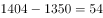万人；

天津：万人；

武汉：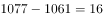万人；故同比增长量最大的为广州。

故正确答案为B。

---

#### 第 2 题　qid 2453101 · 增长

2014年末，表中所列超大城市常住人口同比增量占全国人口同比增量的（    ）。

- **A**. 不到两成
- **B**. 两成多　✅
- **C**. 三成多
- **D**. 四成以上

**答案**：B

**官方解析**

根据题干“2014年末······占······”且材料有2014年相关数据，可判定本题为现期比重问题。根据注释可知，超大城市为常住人口超过1000万的城市，则根据表格数据，2014年末是超大城市的有深圳、广州、天津、重庆、北京、武汉、成都。根据增长量，可求超大城市的增长量分别为：深圳万人、广州万人、天津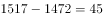万人、重庆万人、北京万人、武汉万人、成都万人。则超大城市的增长量之和为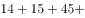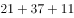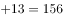万人。

全国人口同比增量为万人。则超大城市常住人口同比增量占全国人口同比增量的比重，即两成多。

故正确答案为B。

---

#### 第 3 题　qid 2453102 · 增长

以下折线图反映了2013—2017年（    ）年末常住人口同比增量的变化趋势。

- **A**. 武汉　✅
- **B**. 长沙
- **C**. 杭州
- **D**. 北京

**答案**：A

**官方解析**

根据题干“······同比增量的变化趋势”，可判定本题为增长量比较问题。由于有坐标轴且有具体数值，因此可先看2013年的增长量。定位表格可得选项各城市2012、2013年人口数据。根据增长量，可得选项城市2013年增量分别为：

武汉：万人，与折线图一致，保留A；

长沙：万人，与折线图不一致，而折线图为10万人，排除；

杭州：万人，与折线图不一致，而折线图为10万人，排除；

北京：万人，与折线图不一致，而折线图为10万人，排除。

故正确答案为A。

---

### 材料 2

                      表1  2016～2021年我国工业大数据市场规模增长及预测 

                    表2  按不同方式划分的2018年我国工业大数据销售额比例

#### 第 4 题　qid 2452979 · 增长

2016-2019年，我国工业大数据市场规模同比增速最快的为            年。

- **A**. 2016
- **B**. 2017
- **C**. 2018
- **D**. 2019　✅

**答案**：D

**官方解析**

定位表1，2016-2019年我国工业大数据市场规模同比增速分别为：、、、，可见，增速最快的为2019年。

故正确答案为D。

---

#### 第 5 题　qid 2452981 · 增长

如保持2021年同比增量不变，则在            年我国工业大数据市场规模将比2021年翻一番。

- **A**. 2025
- **B**. 2026　✅
- **C**. 2027
- **D**. 2028

**答案**：B

**官方解析**

根据题干“···在哪年···比2021年翻一番”，可判定本题为现期计算问题。定位表1，2020年、2021年我国工业大数据市场规模分别为192.6亿元、256.0亿元。根据计算公式，2021年同比亿元；市场规模比2021年翻一番，即增长，增长256.0亿元。则需要年，即至少需要5年，应为年。

故正确答案为B。

---

#### 第 6 题　qid 2452983 · 综合

2018年，我国离散型制造业大数据市场规模约比流程型制造业大数据市场规模高            亿元。

- **A**. 44
- **B**. 50　✅
- **C**. 98
- **D**. 113

**答案**：B

**官方解析**

根据题干“2018年，···比···高多少亿元”，材料中包含2018年数据，可判定本题为现期计算问题。定位表1与表2，2018年我国工业大数据市场规模为114.2亿元，其中离散型制造业占比，流程型制造业占比，则前者比后者高：亿元，与B项接近。

故正确答案为B。 

---

### 材料 3

                             表  2018年全国及京津沪各类型外资企业进出口贸易额及同比增速

#### 第 7 题　qid 2452996 · 增长

将上海市的中外合作企业、中外合资企业和外商独资企业按2018年全年进出口贸易总额同比增量从高到低排列，正确的是<u>            </u>。

- **A**. 

　✅
- **B**. 

- **C**. 

- **D**. 

**答案**：A

**官方解析**

根据题干“将上海市的······同比增量从高到低排列”，可判定此题为增长量的比较问题。由，定位表格材料数据可得三种类型外资企业进出口贸易总额。根据增长量，则所求同比增量分别为：

①中外合作亿元；

②中外合资亿元；

③外商独资出口额增速、进口额增速均为正值，同比增量大于0，则。

故正确答案为A。

---
