# 2020年上海市公务员录用考试《行测》题（B类）（网友回忆版）

> 省考 · 2020 年 · 6 个模块 · 共 130 题

- [政治理论](#%E6%94%BF%E6%B2%BB%E7%90%86%E8%AE%BA) · 7 题
- [常识判断](#%E5%B8%B8%E8%AF%86%E5%88%A4%E6%96%AD) · 33 题
- [言语理解与表达](#%E8%A8%80%E8%AF%AD%E7%90%86%E8%A7%A3%E4%B8%8E%E8%A1%A8%E8%BE%BE) · 25 题
- [数量关系](#%E6%95%B0%E9%87%8F%E5%85%B3%E7%B3%BB) · 25 题
- [判断推理](#%E5%88%A4%E6%96%AD%E6%8E%A8%E7%90%86) · 35 题
- [资料分析](#%E8%B5%84%E6%96%99%E5%88%86%E6%9E%90) · 5 题

---

## 政治理论

### 材料 1

        习近平总书记指出：“当代中国的伟大社会变革，不是简单延续我国历史文化的母版，不是简单套用马克思主义经典作家设想的模板，不是其他国家社会主义实践的再版，也不是国外现代化发展的翻版。”实践证明，中国特色社会主义道路是一条既符合中国国情，又适合时代发展要求并取得巨大成功的唯一正确道路。只有这条道路而没有别的道路，能够引领中国进步、增进人民福祉、实现民族复兴。我们必须坚定道路自信、理论自信、制度自信、文化自信。

        在中国特色社会主义新时代，完成伟大事业必须靠党的领导。中国特色社会主义制度的最大优势是中国共产党领导。今天，我们比历史上任何时期都更接近、更有信心和能力实现中华民族伟大复兴的目标。习近平总书记指出：“行百里者半九十。中华民族伟大复兴，绝不是轻轻松松、敲锣打鼓就能实现的。全党必须准备付出更为艰巨、更为艰苦的努力。”

#### 第 1 题　qid 2452916 · 新思想

坚定中国特色社会主义“四个自信”，说到底是要坚定        。

- **A**. 制度自信
- **B**. 道路自信
- **C**. 理论自信
- **D**. 文化自信　✅

**答案**：D

**官方解析**

本题考查政治常识。
2016年5月17日,习近平总书记在哲学社会科学工作座谈会上指出,“我们要坚定中国特色社会主义道路自信、理论自信、制度自信,说到底是要坚持文化自信”。
故正确答案为D。

---

#### 第 2 题　qid 2452918 · 新思想

实现伟大理想，必须推进伟大事业。习近平总书记指出，改革开放以来党的全部理论和实践的主题是                    。

- **A**. 以经济建设为中心
- **B**. 建立新中国和改革开放
- **C**. 中国特色社会主义　✅
- **D**. 发展社会主义市场经济

**答案**：C

**官方解析**

本题考查政治常识。
 习总书记在“7·26”重要讲话中指出，中国特色社会主义是改革开放以来党的全部理论和实践的主题，全党必须高举中国特色社会主义伟大旗帜，牢固树立中国特色社会主义道路自信、理论自信、制度自信、文化自信，确保党和国家事业始终沿着正确方向胜利前进。这一重要论断引起了思想理论界和广大干部群众的普遍关注、广泛认同和热烈反响。独特的文化传统，独特的历史命运，独特的基本国情，决定了我们必然要走适合自己特点的发展道路。中国特色社会主义是马克思主义基本原理同中国具体实践和时代特征相结合的产物，是党带领全国各族人民长期实践取得的根本成就，必须倍加珍惜、始终坚持、不断发展。
故正确答案为C。

---

### 材料 2

        新中国成立不久，中国共产党就把促进“农业和交通运输业的现代化”“建立巩固的现代化国防”写入党在过渡时期总路线。1954年，在第一届全国人民代表大会第一次会议开幕词中，毛泽东同志提出：“准备在几个五年计划之内，将我们现在这样一个经济上文化上落后的国家，建设成为一个工业化的具有高度现代文化程度的伟大国家。”根据这些思想，周恩来同志在政府工作报告中首次提出包括现代化的工业、现代化的农业、现代化的交通运输业和现代化的国防在内的四个现代化目标。此后，四个现代化的内容不断调整完善，从明确提出“实现工业化”到掀起一场“技术革命”，1964年第三届全国人民代表大会第一次会议正式和完整地提出我国实现“四个现代化”的任务。1975年，周恩来同志在第四届全国人民代表大会第一次会议上又重申了分两步走、全面实现四个现代化的战略安排。

        党的十八大以来，以习近平同志为核心的党中央以巨大的政治勇气和强烈的责任担当，进行伟大斗争、建设伟大工程、推进伟大事业、实现伟大梦想，取得了全方位、开创性成就，实现了深层次、根本性变革，推动中国特色社会主义进入新时代。党的十九大围绕新时代实现中华民族伟大复兴的历史使命，对新时代推进我国社会主义现代化建设作出新的顶层设计，提出分两步走，在21世纪中叶建成社会主义现代化强国的战略安排。

#### 第 3 题　qid 2452959 · 新思想

在新时代，围绕如何全面建设社会主义现代化这一重大问题，习近平总书记提出了一系列新思想新观点新要求。他强调，“现代化的本质是            ”。

- **A**. 人的现代化　✅
- **B**. 工业、农业、服务业的现代化
- **C**. 国家治理体系和治理能力现代化
- **D**. 人与自然和谐共生的现代化

**答案**：A

**官方解析**

本题考查政治常识。
《习近平新时代中国特色社会主义思想学习纲要》五、开启全面建设社会主义现代化国家新征程指出：“在新时代，围绕如何全面建设社会主义现代化这一重大问题，习近平总书记提出了一系列新思想新观点新要求。他指出，实现社会主义现代化和中华民族伟大复兴是坚持和发展中国特色社会主义的总任务，要在全面建成小康社会的基础上，分两步走全面建成社会主义现代化强国。他强调，‘现代化的本质是人的现代化’，‘我们要建设的现代化是人与自然和谐共生的现代化’，要‘推进国家治理体系和治理能力现代化’，‘要在坚持以经济建设为中心的同时，全面推进经济建设、政治建设、文化建设、社会建设、生态文明建设，促进现代化建设各个环节、各个方面协调发展’等等。”
故正确答案为A。

---

#### 第 4 题　qid 2452896 · 时事政治

2019年10月，中国共产党第十九届中央委员会第四次全体会议在京召开。全会提出，国家行政管理承担着按照党和国家决策部署推动经济社会发展、管理社会事务、服务人民群众的重大职责。要坚持和完善中国特色社会主义行政体制，构建                    的政府治理体系。

- **A**. 职责明确、依法行政　✅
- **B**. 职责明确、人民满意
- **C**. 结构合理、依法行政
- **D**. 结构合理、人民满意

**答案**：A

**官方解析**

本题考查政治常识。
2019年10月31日中国共产党第十九届中央委员会第四次全体会议通过了《中共中央关于坚持和完善中国特色社会主义制度 推进国家治理体系和治理能力现代化若干重大问题的决定》。《决定》强调：“……五、坚持和完善中国特色社会主义行政体制，构建职责明确、依法行政的政府治理体系……。”
故正确答案为A。

---

#### 第 5 题　qid 2452897 · 新思想

习近平在主持召开中央全面依法治国委员会第二次会议时发表重要讲话强调，                    是依法治国的迫切需要。要把党的领导贯穿于其全过程和各方面，增强公众参与实效，提高专家论证质量，坚持合法性审查，防控风险。

- **A**. 维护重大公共利益
- **B**. 积极推进重点领域立法
- **C**. 规范重大行政决策程序　✅
- **D**. 促进社会公平正义

**答案**：C

**官方解析**

本题考查政治常识。
2019年2月25日下午，中共中央总书记、国家主席、中央军委主席、中央全面依法治国委员会主任习近平主持召开中央全面依法治国委员会第二次会议并发表重要讲话。会议指出：“规范重大行政决策程序，是依法治国的迫切需要。要把党的领导贯穿于重大行政决策全过程和各方面，履行决策法定程序，增强公众参与实效，提高专家论证质量，坚持合法性审查，防控决策风险。”
故正确答案为C。

---

#### 第 6 题　qid 2452905 · 毛中特

习近平总书记在主持中共中央政治局第十五次集体学习时强调，我们党在推进马克思主义中国化进程中，先后形成了毛泽东思想、邓小平理论、“三个代表”重要思想、科学发展观、新时代中国特色社会主义思想，为推进                    提供了强大思想武器。

- **A**. 思想革命与自我革命
- **B**. 社会革命和自我革命　✅
- **C**. 思想革命与技术革命
- **D**. 社会革命和技术革命

**答案**：B

**官方解析**

本题考查政治常识。
在中央政治局第十五次集体学习时，习近平总书记指出：“马克思主义是指导我们改造客观世界和主观世界的锐利思想武器。我们党在推进马克思主义中国化进程中，先后形成了毛泽东思想、邓小平理论、‘三个代表’重要思想、科学发展观、新时代中国特色社会主义思想，为推进社会革命和自我革命提供了强大思想武器。”
故正确答案为B。

---

#### 第 7 题　qid 2452906 · 新思想

习近平出席第二届“一带一路”国际合作高峰论坛开幕式时，在主旨演讲中强调，面向未来，我们要秉持共商共建共享原则，坚持                    理念，努力实现高标准、惠民生、可持续目标，推动共建“一带一路”沿着高质量发展方向不断前进。

- **A**. 开放、包容、共赢
- **B**. 协调、绿色、共享
- **C**. 开放、绿色、廉洁　✅
- **D**. 协调、绿色、开放

**答案**：C

**官方解析**

本题考查政治常识。
2019年4月26日，国家主席习近平在北京出席第二届“一带一路”国际合作高峰论坛开幕式，并发表题为《齐心开创共建“一带一路”美好未来》的主旨演讲。他强调，面向未来，我们要秉持共商共建共享原则，坚持开放、绿色、廉洁理念，努力实现高标准、惠民生、可持续目标，推动共建“一带一路”沿着高质量发展方向不断前进。
故正确答案为C。

---

## 常识判断

### 材料 1

        习近平总书记指出：“当代中国的伟大社会变革，不是简单延续我国历史文化的母版，不是简单套用马克思主义经典作家设想的模板，不是其他国家社会主义实践的再版，也不是国外现代化发展的翻版。”实践证明，中国特色社会主义道路是一条既符合中国国情，又适合时代发展要求并取得巨大成功的唯一正确道路。只有这条道路而没有别的道路，能够引领中国进步、增进人民福祉、实现民族复兴。我们必须坚定道路自信、理论自信、制度自信、文化自信。

        在中国特色社会主义新时代，完成伟大事业必须靠党的领导。中国特色社会主义制度的最大优势是中国共产党领导。今天，我们比历史上任何时期都更接近、更有信心和能力实现中华民族伟大复兴的目标。习近平总书记指出：“行百里者半九十。中华民族伟大复兴，绝不是轻轻松松、敲锣打鼓就能实现的。全党必须准备付出更为艰巨、更为艰苦的努力。”

#### 第 1 题　qid 2452919 · 人文常识

2019年5月31日，“不忘初心、牢记使命”主题教育工作会议在北京召开。根据党中央部署，此次主题教育以县处级及以上领导干部为重点，在全党自上而下分两批开展，贯彻“守初心、担使命，找差距、抓落实”的总要求。这说明                    。

- **A**. 党始终坚持以人民为中心的发展理念　✅
- **B**. 科学执政是中国共产党执政的基本方式
- **C**. 党重视自身先进性建设，提高执政能力　✅
- **D**. 党的政治建设是党的根本性建设　✅

**答案**：ACD

**官方解析**

本题考查政治常识。
 A项正确，党的十九大报告中指出，“人民是历史的创造者，是决定党和国家前途命运的根本力量，中国共产党人的初心和使命，就是为中国人民谋幸福，为中华民族谋复兴”。深刻揭示了党同人民的关系，我们在任何情况下、与人民同呼吸共命运的立场不能变，全心全意为人民服务的宗旨不能忘，要始终坚持以人民为中心的发展理念。总理念中的“守初心”正是体现了党始终坚持以人民为中心的发展理念。
B项错误，党的十六届四中全会提出科学执政、民主执政、依法执政这三种党的执政方式。其中依法执政是新的历史条件下党执政的一个基本方式。科学执政、民主执政要通过依法执政体现出来，又要靠依法执政来保证实现。
C项正确，党的先进性建设，就是要使我们党保持与时俱进的品质，始终走在时代前列，不断提高执政能力、巩固执政地位、完成执政使命；就是要通过推进思想建设、组织建设、作风建设、制度建设、反腐倡廉建设，使党的理论和路线、方针、政策始终体现社会发展进步的要求和全国各族人民的利益，不断提高广大党员的素质和各级党组织的创造力、凝聚力、战斗力，始终发挥党员的先锋模范作用，始终发挥党组织的领导核心作用和战斗堡垒作用。“担使命，找差距”都体现了党重视自身先进性建设，提高执政能力。
 D项正确，党的政治建设是党的根本性建设，决定党的建设方向和效果。重视政治建设是中国共产党的优良传统与特别优势。此次主题会议正是体现了党的政治建设是党的根本性建设。
故正确答案为ACD。

---

### 材料 2

        新中国成立不久，中国共产党就把促进“农业和交通运输业的现代化”“建立巩固的现代化国防”写入党在过渡时期总路线。1954年，在第一届全国人民代表大会第一次会议开幕词中，毛泽东同志提出：“准备在几个五年计划之内，将我们现在这样一个经济上文化上落后的国家，建设成为一个工业化的具有高度现代文化程度的伟大国家。”根据这些思想，周恩来同志在政府工作报告中首次提出包括现代化的工业、现代化的农业、现代化的交通运输业和现代化的国防在内的四个现代化目标。此后，四个现代化的内容不断调整完善，从明确提出“实现工业化”到掀起一场“技术革命”，1964年第三届全国人民代表大会第一次会议正式和完整地提出我国实现“四个现代化”的任务。1975年，周恩来同志在第四届全国人民代表大会第一次会议上又重申了分两步走、全面实现四个现代化的战略安排。

        党的十八大以来，以习近平同志为核心的党中央以巨大的政治勇气和强烈的责任担当，进行伟大斗争、建设伟大工程、推进伟大事业、实现伟大梦想，取得了全方位、开创性成就，实现了深层次、根本性变革，推动中国特色社会主义进入新时代。党的十九大围绕新时代实现中华民族伟大复兴的历史使命，对新时代推进我国社会主义现代化建设作出新的顶层设计，提出分两步走，在21世纪中叶建成社会主义现代化强国的战略安排。

#### 第 2 题　qid 2452953 · 人文常识

上述材料表明，                    ，是中华民族的最高利益和根本利益。我们党领导中国人民进行的一切奋斗，归根到底都是为了实现这一伟大目标。

- **A**. 实现中华民族伟大复兴　✅
- **B**. 全面实现“四个现代化”
- **C**. 建设社会主义现代化强国　✅
- **D**. 建立完整的工业体系和国民经济体系

**答案**：AC

**官方解析**

本题考查中国特色社会主义理论体系
《习近平新时代中国特色社会主义思想学习纲要》中指出：“建设社会主义现代化强国，实现中华民族伟大复兴，是中华民族的最高利益和根本利益。我们党领导中国人民进行的一切奋斗，归根到底都是为了实现这一伟大目标。”从新中国成立到党的十九大召开，四个现代化的内容不断调整完善，党的十九大围绕新时代实现中华民族伟大复兴的历史使命，对新时代推进我国社会主义现代化建设作出新的顶层设计，提出在21世纪中叶建成社会主义现代化强国的战略安排。
故正确答案为AC。

---

#### 第 3 题　qid 2452956 · 人文常识

1964年第三届全国人民代表大会第一次会议正式和完整地提出我国实现“四个现代化”的任务是：“在不太长的历史时期内，把我国建设成为一个具有现代农业、现代工业、            的社会主义强国”。

- **A**. 现代交通运输业
- **B**. 现代国防　✅
- **C**. 现代教育
- **D**. 现代科学技术　✅

**答案**：BD

**官方解析**

本题考查中国特色社会主义理论体系
《周恩来总理在第三届全国人民代表大会第一次会议上作政府工作报告（1964年)》中指出：“周总理说，为了在不太长的历史时期内，把我国建设成为一个具有现代农业、现代工业、现代国防和现代科学技术的社会主义强国，我们在今后发展国民经济中，应当注意以下的问题。第一，正确处理农业、轻工业、重工业的关系。第二，正确处理自力更生同国际合作的关系。第三，实行技术革命。第四，实行集中领导同大搞群众运动相结合。”
故正确答案为BD。

---

#### 第 4 题　qid 2452958 · 人文常识

改革开放之后，我们党曾提出社会主义现代化建设“三步走”战略目标，即                    。

- **A**. 解决人民温饱问题　✅
- **B**. 人民生活总体上达到小康水平　✅
- **C**. 全面建成小康社会
- **D**. 基本实现现代化　✅

**答案**：ABD

**官方解析**

1987年10月25日，中国共产党第十三次全国代表大会举行。代理中央委员会总书记赵紫阳作《沿着有中国特色的社会主义道路前进——在中国共产党第十三次全国代表大会上的报告》的报告。报告中指出：“党的十一届三中全会以后，我国经济建设的战略部署大体分三步走。第一步，实现国民生产总值比一九八〇年翻一番，解决人民的温饱问题。这个任务已经基本实现。第二步，到本世纪末，使国民生产总值再增长一倍，人民生活达到小康水平。第三步，到下个世纪中叶，人均国民生产总值达到中等发达国家水平，人民生活比较富裕，基本实现现代化。”
故正确答案为ABD。

---

### 材料 3

        故宫是中华民族文化遗产的重要载体，也是中国传统文化的典型象征。近年来，在继承发扬传统文化所承载的历史内涵、发挥应有的社会文化担当的基础上，故宫综合运用市场化手段进行创造性转化与创新性发展：通过自营、合作经营和品牌授权等多元化合作方式，将故宫文化元素进行多样化的产品转化，创造出多种实用有趣，又与馆藏文物的历史渊源、文化寓意以及背后的故事相互关联的文创产品。同时，积极寻求与多品牌多行业的跨界合作，为故宫文创提供了更加现代化的表达。目前，相关衍生品数量已经突破一万种，此外，故宫还推出了具有教育娱乐功能的APP，开放数字馆等，使故宫文创不仅仅限于产品的设计和制造，而是从文化形象的塑造到创意衍生品的打造，从实体产品的创作到影游内容的开发，从线上营销到线上线下体验购买，以及从行业内到行业之间的跨界融合，对故宫文化进行全方位宣传和多角度渗透。

        由于我国博物馆机构存在层级、藏品资源、地域等方面的差异，多数博物馆机构在文创产品开发过程中仍然存在较多问题。博物馆文创产品的开发应在坚守文物历史事实及本真性的前提下，加强对文物资源的历史内涵、文化价值和艺术审美的传播再创造。围绕更好地诠释优秀传统文化、讲好“中国故事”，发挥好博物馆满足公众获取知识、实现自我提升功能等目标，来做好文创产品的创作设计，以及品质和内涵提升。我国博物馆进行文创产品开发，关键是要找到博物馆所拥有的资源与市场资源的嫁接点。实践中，在如何使用、谁来使用藏品元素开发文化产品这些问题上，国内不少文化单位和企业还有不同的认识，亟需规范。

        实际上，提供公共文化服务是博物馆的基本职能，但非全部职能。在保证发挥好基本公共文化服务职能的前提下，博物馆完全可以通过市场化的方式提供非基本、个性化或更高层次的文化服务。未来需优化分配机制，将博物馆文创销售所得的部分收入，作为博物馆文创研发、绩效奖励和市场运营的支出。同时，应该将博物馆文创产品的发展业绩纳入博物馆评估定级和绩效考核之中。

#### 第 5 题　qid 2452963 · 人文常识

根据材料，故宫的属性是      。

- **A**. 营利性
- **B**. 公益性　✅
- **C**. 竞争性
- **D**. 服务型　✅

**答案**：BD

**官方解析**

本题考查管理学常识。
A项错误，营利性是指商行为概念既包括任何主体从事的以盈利性营业为目的的客观商行为，也包括商主体从事的任何营业性活动，即主观商行为。故宫不以盈利为目的，所以故宫的属性不包括“营利性”
B、D项正确，根据第三段内容“提供公共文化服务是博物馆的基本职能”的表述，可知故宫具有提供公共文化服务的职能，所以故宫的属性包括“公益性”和“服务性”。
C项错误，根据第三段内容“提供公共文化服务是博物馆的基本职能”的表述，可知故宫具有公共文化服务职能。公共服务具有非竞争性和非排他性。所以“竞争性”不是故宫的属性。
故正确答案为BD。

---

#### 第 6 题　qid 2452965 · 人文常识

根据材料，故宫传统文化价值的当代转化备受好评的原因有                    。

- **A**. 寻求新的价值的认同
- **B**. 借鉴西方博物馆运作的经验
- **C**. 注重文化的提炼、重构和再造　✅
- **D**. 擅用市场化的手段　✅

**答案**：CD

**官方解析**

本题考查常识。
A项错误，“寻求新的价值的认同”是指“将庄严肃穆的故宫文化以趣味化和创意娱乐化，以及极具鲜活生命力的方式表现出来，使得故宫从此不再只是一个文化象征和旅游景点，而是极具现代文化活力的独特的文化符号。其最显著的效果，就是寻求到与当代大众消费文化，尤其是年轻一代追求个性化、符号化的消费价值观念的共鸣。”文段未提及相关内容，无关选项。
B项错误，“借鉴西方博物馆运作的经验”文段未提及相关内容，无关选项。
C项正确，根据第一段“又与馆藏文物的历史渊源、文化寓意以及背后的故事相互关联的文创产品。同时，积极寻求与多品牌多行业······为故宫文创提供了更加现代化的表达。”的表述，可知故宫传统文化价值的当代转化备受好评原因包括“注重文化的提炼、重构和再造”。
D项正确，根据第一段“故宫综合运用市场化手段进行创造性转化与创新性发展”和“故宫文创不仅仅限于产品的设计和制造，而是从文化形象的塑造到创意衍生品的打造，从实体产品的创作到影游内容的开发，从线上营销到线上线下体验购买，以及从行业内到行业之间的跨界融合，对故宫文化进行全方位宣传和多角度渗透。”的表述，可知故宫传统文化价值的当代转化备受好评原因包括“擅用市场化的手段”。
故正确答案为CD。

---

#### 第 7 题　qid 2452968 · 科技常识

材料中所提“实践中，在如何使用、谁来使用藏品元素开发文化产品这些问题上，国内不少文化单位和企业还有不同的认识，亟需规范”，这主要指向市场化建设机制中的        环节。

- **A**. 产权建设　✅
- **B**. 授权方式
- **C**. 审查方式
- **D**. 营销手段

**答案**：A

**官方解析**

本题考查经济常识。
A项正确，产权是指对财产实体的动态经营和财产价值的动态实现，是以所有权为核心的一组权力，包括占有权、使用权、收益权、支配权等。产权制度建设是要建立以归属清晰、权责明确、保护严格、流转顺畅为特征的制度体系。题干中强调要规范“如何使用，谁来使用藏品元素开发文化产品等问题”指的是产权建设环节。
B项错误，授权方式是指从目前国内外博物馆文创开发模式来看，博物馆可对外授权的内容。题干未提到博物馆对外授权内容。
C项错误，审查机制指对文创产品品质和合作机构的审查，在市场机制下严格的审查程序。题干未提到对文创产品的审查。
D项错误，市场营销指借助互联网、新媒体以及其他传播渠道进行全方位、多样化的营销。题干未提到对文创产品进行多样化营销。
故正确答案为A。

---

#### 第 8 题　qid 2452971 · 人文常识

当前我国博物馆机构在文创产品开发过程中存在                    的问题。

- **A**. 文创品质亟需提升　✅
- **B**. 商业模式不够成熟　✅
- **C**. 运行模式不够灵活　✅
- **D**. 固化的体制障碍　✅

**答案**：ABCD

**官方解析**

本题考查经济常识。
A项正确，题干中强调博物馆文创产品的开发应加强对文物资源所蕴含的历史内涵、文化价值和艺术审美的传播再创造。做到诠释好优秀传统文化、讲好“中国故事”，做好文创产品的品质和内涵提升。说明我国博物馆机构在文创产品开发过程中文创品质亟需提升。
B、C项正确，题干中强调“我国博物馆进行文创产品开发，关键是要走社会化的路子，找到博物馆所拥有的资源与市场资源的嫁接点。”说明我国博物馆机构在文创产品开发过程中要优化商业模式和运行模式。
D项正确，题干中提到“实际上，提供公共文化服务是博物馆的基本职能······应该将博物馆文创产品的发展业绩纳入博物馆评估定级和绩效考核之中。”说明我国博物馆机构在文创产品开发过程中存在固化的体制障碍，需破解固化的体制障碍。
故正确答案为ABCD。

---

### 材料 4

        法工委是全国人大常委会的工作机构，作为参谋助手为全国人大常委会行使国家立法权提供服务。为了加强与新闻媒体的联系，更好地向社会公众介绍立法工作情况，法工委建立了发言人制度。

        2019年8月21日，全国人大常委会法工委就建立发言人机制举行第一次记者会。发言人通报了今年上半年法律草案向社会公布征求意见的情况，并回答记者提问。

        目前为止，本年度共有15部法律草案向社会公开征求意见21件次，包括：民法典婚姻家庭编（草案二次审议稿）、民法典继承编（草案二次审议稿）、森林法（修订草案）、社区矫正法（草案）、密码法（草案）、固体废物污染环境防治法（修订草案）、土地管理法和城市房地产管理法修正案（草案二次审议稿）等。

        对于备受关注的民法典，其合同编、侵权编草案的二次审议稿于2019年1月4日至2月3日在中国人大网全文公布，公开向社会征求意见。合同编草案二次审议稿共收到256人提出的504条意见，侵权责任编草案二次审议稿收到117人提出的228条意见。2019年4月，十三届全国人大常委会第十次会议对民法典物权编、人格权编进行了二审，之后4月26日至5月25日，两编草案的二次审议稿分别在中国人大网全文公布，公开征求社会公众意见。其间，物权编草案二次审议稿共收到1132人提出的2286条意见，人格权编草案二次审议稿收到20031人提出的31936条意见。

#### 第 9 题　qid 2452973 · 人文常识

全国人大常委会                    。

- **A**. 是全国人大的常设机关　✅
- **B**. 行使最高立法权　✅
- **C**. 是我国最高国家行政机关
- **D**. 是我国最高国家权力机关的执行机关

**答案**：AB

**官方解析**

本题考查法律常识。
A项正确，根据《宪法》第五十七条规定：“中华人民共和国全国人民代表大会是最高国家权力机关。它的常设机关是全国人民代表大会常务委员会。”
B项正确，根据《宪法》第五十八条规定：“全国人民代表大会和全国人民代表大会常务委员会行使国家立法权。”全国人大及其常委会行使最高立法权。
C、D项错误，根据《宪法》第八十五条规定：“中华人民共和国国务院，即中央人民政府，是最高国家权力机关的执行机关，是最高国家行政机关。”因此国务院是我国最高国家行政机关，是我国最高国家权力机关的执行机关，而非全国人大常委会。
故正确答案为AB。

---

#### 第 10 题　qid 2452974 · 法律常识

下列法律中必须由全国人大制定的是                    。

- **A**. 中华人民共和国土地管理法
- **B**. 中华人民共和国森林法
- **C**. 中华人民共和国社区矫正法
- **D**. 中华人民共和国民法典　✅

**答案**：D

**官方解析**

本题考查法律常识。根据《宪法》第六十二条规定：“全国人民代表大会行使下列职权：······（三）制定和修改刑事、民事、国家机构的和其他的基本法律······”第六十七条规定：“全国人民代表大会常务委员会行使下列职权：······（二）制定和修改除应当由全国人民代表大会制定的法律以外的其他法律······”全国人大制定基本法律，全国人大常委会制定除基本法律以外的其他法律。
A项错误，《中华人民共和国土地管理法》是1986年6月25日第六届全国人民代表大会常务委员会第十六次会议通过，并于2019年经全国人大常委会修订通过，属于基本法律以外的其他法律，应由全国人大常委会制定。
B项错误，《中华人民共和国森林法》是1984年9月20日第六届全国人民代表大会常务委员会第七次会议通过，并于2009年经全国人大常委会修订，属于基本法律以外的其他法律，应由全国人大常委会制定。
C项错误，《中华人民共和国社区矫正法》2019年12月28日第十三届全国人民代表大会常务委员会第十五次会议通过。《中华人民共和国社区矫正法》属于基本法律以外的其他法律，应由全国人大常委会制定。
D项正确，民法典属于民事基本法律，必须由全国人大制定。
故正确答案为D。

---

#### 第 11 题　qid 2452975 · 法律常识

民法典合同编、侵权编草案的二次审议稿在中国人大网全文公布，公开向社会征求意见，根本原因在于                    。

- **A**. 我国坚持人民代表大会制度
- **B**. 我国是人民民主专政的社会主义国家　✅
- **C**. 社会主义法制是社会主义民主的前提和基础
- **D**. 社会主义民主是社会主义法制的保障

**答案**：B

**官方解析**

本题考查法律常识。
A项错误，根据《宪法》第二条第一、二款规定：“中华人民共和国的一切权力属于人民。人民行使国家权力的机关是全国人民代表大会和地方各级人民代表大会。”人民代表大会制度是我国的政权组织形式，是按照民主集中制的原则，建立全部国家机构，统一领导和管理国家事务的根本政治制度。而题干虽然是在中国人大网站公布，但是是为了向社会征求意见，选项和题意不符。另外题中问的是根本原因，政体是由国体决定的，有什么性质的国家，就要求有什么样的政体与之相匹配。因此应当选到国体，而非政体。
B项正确，根据《宪法》第一条第一款规定：“中华人民共和国是工人阶级领导的、以工农联盟为基础的人民民主专政的社会主义国家。”法律草案审议稿在网上公布，公开向社会征求意见，根本原因是我国的国体是人民民主专政，充分体现了我国由人民当家作主。
C项错误，社会主义民主同法制相比，是第一位的、决定性的。主要原因有：一是从社会主义法制的产生来看，它是随着社会主义民主即人民主权的产生而产生的。二是从社会主义法制的性质和内容来看，有什么性质的民主，就有什么性质的法制。三是从社会主义法制的健全和发展方向来看，同样不能离开民主。因此，社会主义民主是社会主义法制的前提和基础。
D项错误，社会主义法制是社会主义民主的保障，主要体现在：一是社会主义法制确认社会主义民主；二是社会主义法制规定社会主义民主的范围；三是社会主义法制规定如何实现社会主义民主；四是社会主义法制是保卫社会主义民主的武器。
故正确答案为B。

---

#### 第 12 题　qid 2452977 · 人文常识

全国人大常委会行使国家立法权，向社会公开征求意见                    。

- **A**. 体现了我国民主的广泛性　✅
- **B**. 是人民群众参与管理国家的基础和标志
- **C**. 促进了基层政权的巩固
- **D**. 有利于群众依法直接行使民主权利

**答案**：A

**官方解析**

本题考查法律常识。
A项正确，法律草案审议稿在网上公布，公开向社会征求意见，全体人民都能参与，体现了我国民主的广泛性。
B项错误，选举权和被选举权是公民基本的民主权利，因此行使选举权和被选举权是人民群众参与管理国家的基础和标志。
C项错误，完善基层民主制度，才能促进基层政权巩固。
D项错误，群众直接行使民主权利这一说法错误，人民通过选举人大代表，由人大代表组成人民代表大会代表人民行使民主权利，因此是间接行使民主权利。
故正确答案为A。

---

#### 第 13 题　qid 2452899 · 人文常识

中国梦视野宽广、内涵丰富、意蕴深远。中国梦的本质是                    。

- **A**. 国家复兴、民族富强、社会和谐
- **B**. 国家富强、民族振兴、人民幸福　✅
- **C**. 国家富强、民族复兴、人民幸福
- **D**. 国家富强、民族复兴、人民民主

**答案**：B

**官方解析**

本题考查政治常识。
中国梦视野宽广、内涵丰富、意蕴深远。习近平总书记多次强调，“中国梦的本质是国家富强、民族振兴、人民幸福”。这个梦想，把国家的追求、民族的向往、人民的期盼融为一体，体现了中华民族和中国人民的整体利益，表达了每一个中华儿女的共同愿景。
故正确答案为B。

---

#### 第 14 题　qid 2452901 · 人文常识

近年来，我国置身世界大发展大变革大调整中，不惑于纷乱现象，不畏于艰难险阻，以元首外交引领扩大全球朋友圈、以开放合作之姿谋求各国共同发展、力倡多边主义推动全球治理改革，不断开创中国特色大国外交新局面。这表明，中国特色大国外交是        。
①以维护各国共同利益为目的，促进共同发展。
②主导全球多边治理，建立国际政治经济新秩序。
③坚持独立自主的和平外交政策，发挥负责任大国的作用。
④坚持合作共赢，推动构建人类命运共同体。

- **A**. ①②
- **B**. ①③④
- **C**. ②③④
- **D**. ③④　✅

**答案**：D

**官方解析**

本题考查政治常识。
①错误，中国外交政策的宗旨是维护世界和平、促进共同发展。维护国家利益是主权国家对外活动的出发点和落脚点。我国在维护自身利益的同时，兼顾他国合理关切，在谋求本国发展中促进各国共同发展。“以维护各国共同利益为目的”说法错误。
②错误，中国积极致力于全球多边治理，但不是“主导”，中国尊重各国人民自主选择发展道路的权利，维护国际公平正义，反对把自己的意志强加于人，反对干涉别国内政，反对以强凌弱。
③正确，中国坚持独立自主的和平外交政策，是维护世界和平与稳定的积极因素和坚定力量，是促进世界经济发展的重要力量，在国际事务中的代表性和话语权进一步增强，发挥着负责任大国的作用。
④正确，中国高举和平、发展、合作、共赢的旗帜，推动建设相互尊重、公平正义、合作共赢的新型国际关系。中国主张各国人民同心协力，构建人类命运共同体，建设持久和平、普遍安全、共同繁荣、开放包容、清洁美丽的世界。
故正确答案为D。

---

#### 第 15 题　qid 2452903 · 科技常识

2019年8月，清华大学科研团队发布了一款类脑计算芯片。该芯片是世界首款异构融合类脑芯片，也是世界上第一个既可支持脉冲神经网络又可支持人工神经网络的人工智能芯片。该芯片的名字是        。

- **A**. “天机芯”　✅
- **B**. “中国芯”
- **C**. “中华芯”
- **D**. “麒麟芯”

**答案**：A

**官方解析**

本题考查科技常识。
2019年8月，清华大学施路平团队发布研究成果——类脑计算芯片“天机芯”。该芯片是世界首款异构融合类脑芯片，也是世界上第一个既可支持脉冲神经网络又可支持人工神经网络的人工智能芯片。
故正确答案为A。

---

#### 第 16 题　qid 2452907 · 人文常识

国产电影《哪吒之魔童降世》中，哪吒希望通过自己的努力改变他人成见，得到周围人的认可和喜爱。最终，在感受到父母的爱后，以一己之力对抗天命，保护家人周全，贴近当代年轻人的奋斗观和人生观，不信命，靠自己。哪吒“我命由我不由天”的呐喊，其合理性在于                    。

- **A**. 只要有坚韧的意志，就能取得成功
- **B**. 强大精神力量在改造世界的过程中有决定作用
- **C**. 意识具有能动性，有能动地认识世界和改造世界的作用　✅
- **D**. 唯心主义在现实生活中有一定的应用价值

**答案**：C

**官方解析**

本题考查政治常识。
A项错误，坚韧的意志是成功的基础，但要取得成功还需要能力、心态、智慧、机遇等各种因素，并不是只有坚韧的意志。选项表述有误，排除。
B项错误，强大的精神力量作为一种意识，对人们的行为具有导向、规范作用，能够影响前途和命运，但并非在改造世界的过程中起到决定作用。选项表述有误，排除。
C项正确，意识具有能动作用，一方面意识能够指导人们能动地认识世界；另一方面意识能够指导人们能动地改造世界（包括调节和控制人体生理活动）。哪吒希望通过自己的努力改变他人成见，这种意识指导他最终证明了自己，赢得人们的尊重。
D项错误，唯心主义强调意识是世界的本原，世界上一切物质都是由于意识的存在而存在的，没有意识就没有物质。而唯物主义认为世界是物质的，物质第一性，意识第二性，在现实生活中我们应该用唯物主义来指导实践。
故正确答案为C。

---

#### 第 17 题　qid 2452909 · 经济常识

2019年8月，国务院印发《中国（上海）自由贸易试验区            总体方案》，方案要求，建立以            为核心的制度体系，建立全面风险管理制度，建设具有国际市场竞争力的开放型产业体系。

- **A**. 外高桥保税区，贸易便利化
- **B**. 临港新片区，贸易便利化
- **C**. 外高桥保税区，投资贸易自由化
- **D**. 临港新片区，投资贸易自由化　✅

**答案**：D

**官方解析**

本题考查政治常识。
2019年8月，国务院印发《中国（上海）自由贸易试验区临港新片区总体方案》（以下简称《方案》）。《方案》明确，新片区参照经济特区管理。要建立以投资贸易自由化为核心的制度体系。在适用自由贸易试验区各项开放创新措施的基础上，支持新片区以投资自由、贸易自由、资金自由、运输自由、人员从业自由等为重点，推进投资贸易自由化便利化。
故正确答案为D。

---

#### 第 18 题　qid 2452926 · 人文常识

下列关于公务员录用的表述，错误的是                    。

- **A**. 新录用的公务员试用期为一年
- **B**. 被依法列为失信联合惩戒对象的人员不得录用为公务员
- **C**. 地方各级机关公务员的录用必要时可授权市级公务员主管部门组织　✅
- **D**. 录用公务员应当在规定的编制限额内，并有相应的职位空缺

**答案**：C

**官方解析**

本题考查法律常识。
A项正确，《公务员法》第三十四条规定：“新录用的公务员试用期为一年。试用期满合格的，予以任职；不合格的，取消录用。”
B项正确，《公务员法》第二十六条规定：“下列人员不得录用为公务员：（一）因犯罪受过刑事处罚的；（二）被开除中国共产党党籍的；（三）被开除公职的；（四）被依法列为失信联合惩戒对象的；（五）有法律规定不得录用为公务员的其他情形的。”
C项错误，《公务员法》第二十四条规定：“中央机关及其直属机构公务员的录用，由中央公务员主管部门负责组织。地方各级机关公务员的录用，由省级公务员主管部门负责组织，必要时省级公务员主管部门可以授权设区的市级公务员主管部门组织。”
D项正确，《公务员法》第二十七条规定：“录用公务员，应当在规定的编制限额内，并有相应的职位空缺。”
本题为选非题，故正确答案为C。

---

#### 第 19 题　qid 2452929 · 经济常识

下列选项中，属于行政行为的是                    。

- **A**. 市场监督管理局销毁收缴的假冒伪劣产品
- **B**. 城管局雇用外部人员修理其办公设备
- **C**. 交警在路口安装交通标志
- **D**. 财政局审批某会计师事务所的设立　✅

**答案**：D

**官方解析**

本题考查法律常识。
A项错误，市场监督管理局查封、扣押物品或者没收非法所得等是具体行政行为，但市场监督管理局对收缴的假冒伪劣产品的销毁是行政事实行为，行政事实行为指的是行政主体基于职权实施的不能产生、变更或者消灭行政法律关系的行为。
B项错误，城管局雇用外部人员修理设备，便和外部人员之间建立了承揽合同，双方是民事法律关系，城管局具有民事主体资格，未使用其行政职权，不属于行政行为。
C项错误，行政行为指行政主体及其工作人员行使行政职权对相对人作出的产生行政法律效果的行为。交警在路口安装交通标志是为了保障出行安全的职责行为，没有相对人，也没有权利义务的产生，不属于行政行为。
D项正确，行政许可是指行政机关根据公民、法人或者其他组织的申请，经依法审查准予其从事特定活动的行为。《行政许可法》第十二条规定：“下列事项可以设定行政许可：……（五）企业或者其他组织的设立等，需要确定主体资格的事项；（六）法律、行政法规规定可以设定行政许可的其他事项。”财政局审批会计师事务所的设立是行政许可行为。
故正确答案为D。

---

#### 第 20 题　qid 2452935 · 人文常识

全国人大常委会从属于全国人大，在全国人大闭会期间行使全国人大的部分职权，包括立法权、任免权、决定权、监督权等。下列选项中，全国人大常委会有权任免的是            。

- **A**. 国务委员
- **B**. 国务院总理
- **C**. 国务院各部部长　✅
- **D**. 最高人民检察院检察长

**答案**：C

**官方解析**

本题考查法律常识。
根据《宪法》第六十七条规定：“全国人民代表大会常务委员会行使下列职权：（九）在全国人民代表大会闭会期间，根据国务院总理的提名，决定部长、委员会主任、审计长、秘书长的人选；（十）在全国人民代表大会闭会期间，根据中央军事委员会主席的提名，决定中央军事委员会其他组成人员的人选；（十一）根据国家监察委员会主任的提请，任免国家监察委员会副主任、委员；（十二）根据最高人民法院院长的提请，任免最高人民法院副院长、审判员、审判委员会委员和军事法院院长；（十三）根据最高人民检察院检察长的提请，任免最高人民检察院副检察长、检察员、检察委员会委员和军事检察院检察长，并且批准省、自治区、直辖市的人民检察院检察长的任免。”因此，全国人大常委会有权在全国人大闭会期间任免国务院各部部长。
根据《宪法》第六十二条规定：“全国人民代表大会行使下列职权：（四）选举中华人民共和国主席、副主席；（五）根据中华人民共和国主席的提名，决定国务院总理的人选；根据国务院总理的提名，决定国务院副总理、国务委员、各部部长、各委员会主任、审计长、秘书长的人选；（六）选举中央军事委员会主席；根据中央军事委员会主席的提名，决定中央军事委员会其他组成人员的人选；（七）选举国家监察委员会主任；（八）选举最高人民法院院长；（九）选举最高人民检察院检察长。”国务委员、国务院总理、最高人民检察院检察长均由全国人大产生。
故正确答案为C。

---

#### 第 21 题　qid 2452939 · 法律常识

下列选项中，        属于我国《刑法》规定的刑罚。

- **A**. 从业禁止
- **B**. 管制　✅
- **C**. 训诫
- **D**. 罚款

**答案**：B

**官方解析**

本题考查法律常识。
根据《刑法》第三十三条规定：“【主刑种类】主刑的种类如下：（一）管制；（二）拘役；（三）有期徒刑；（四）无期徒刑；（五）死刑。”第三十四条规定：“【附加刑种类】附加刑的种类如下：（一）罚金；（二）剥夺政治权利；（三）没收财产。附加刑也可以独立适用。”
故正确答案为B。

---

#### 第 22 题　qid 2452940 · 法律常识

行政管理外部监督是指行政管理组织以外的各种监督主体对行政机关及其工作人员的管理活动进行的多渠道、多种形式的异体监督。其中，            是有法律效力的最高层次的异体监督。

- **A**. 社会监督
- **B**. 政党监督
- **C**. 司法机关监督
- **D**. 权力机关监督　✅

**答案**：D

**官方解析**

本题考查管理学常识。
A项错误，社会监督是指由国家机关以外的社会组织和公民对各种法律活动的合法性进行的监督。
B项错误，政党监督是指政党组织对行政机关的工作实施的监察与督导。政党监督包括执政党监督、参政党监督、在野党监督等，其中执政党监督占有非常重要的地位。中国的政党监督的方式包括：中国共产党的监督；民主党派的监督；人民政协的监督。
C项错误，司法机关监督是指人民检察院和人民法院依照法定职权和程序对行政机关、公务员进行的监督。
D项正确，权力机关监督是指各级人大及其常委会对国家行政机关及其公务员的监督，其监督的主要方式有听取和审议工作报告，审查和批准国民经济计划和财政预算、决算，审查政府的法规、决定和命令，质询和询问，代表视察和执法检查，罢免政府组成人员六种。人民代表大会是我国的权力机关，国家行政机关在它的基础上产生，对它负责，受它监督。因此，权力机关监督是有法律效力最高层次的异体监督。
故正确答案为D。

---

#### 第 23 题　qid 2452942 · 法律常识

政府依据法律和法规，适应社会环境的变迁和公众意愿的改变，对政府及其官员的行为进行有效规范性约束的能力是            。

- **A**. 组织控制能力　✅
- **B**. 行政管理能力
- **C**. 社会服务能力
- **D**. 公共政策能力

**答案**：A

**官方解析**

本题考查管理学常识。
A项正确，组织控制能力是指政府依据法律和法规，适应社会环境的变迁和公众意愿的改变，对政府及其官员的行为进行有效规范性约束的能力。组织控制能力基本的价值界定在于如何有效地保障行政宗旨，防止和反对滥用公共行政权力，实现依法行政。
B项错误，行政管理能力是指政府通过一定的行政行为使既定的公共政策成为社会公众遵从的行为准则，进而实现既定公共政策价值目标的能力。我国提升行政管理能力的目标不仅在于政府公共行政管理的实践效率，更在于实践效力或效果。
C项错误，社会服务能力是指政府有效地向公众全面提供公共产品和公共服务满足社会需求的能力。
D项错误，公共政策能力是指一个政府正确地制定和有效地执行公共政策的能力。
故正确答案为A。

---

#### 第 24 题　qid 2452944 · 人文常识

下列行为中，属于公共政策诉求的是                    。

- **A**. 患者要求医院减免医药费
- **B**. 企业要求政府减轻负担　✅
- **C**. 职员要求老板提高工资
- **D**. 公众要求传媒关注客机安全

**答案**：B

**官方解析**

本题考查行政管理。
公共政策是指国家通过对资源的战略性运用，以协调经济社会活动及相互关系的一系列政策的总称。因此，公共政策是国家制定的。
A项错误，医院不属于制定公共政策的主体，患者对医院的诉求不属于公共政策诉求。
B项正确，政府可以制定公共政策以实现公共利益诉求，因此企业要求政府减轻负担属于公共政策诉求。
C项错误，企业老板不属于制定公共政策的主体，无法制定公共政策，因此职员对老板的诉求不属于公共政策诉求。
D项错误，传媒不属于制定公共政策的主体，不能制定公共政策，因此公众对传媒的诉求不属于公共政策诉求。
故正确答案为B。

---

#### 第 25 题　qid 2452946 · 人文常识

行政协调对于行政管理有序化以及组织整体功能的发挥有重要作用。下列对行政协调的理解错误的是                    。

- **A**. 行政协调是指行政管理过程中的协调
- **B**. 行政协调是在有关各方存在不同程度共同之处的基础上，对差异进行融和调整
- **C**. 行政协调关键在于政府与公众间的平衡　✅
- **D**. 行政协调与行政公关在原则与方法上有融和交叉之处

**答案**：C

**官方解析**

本题考查行政管理。
A项正确，行政协调是指行政管理过程中的协调，是行政主体为达到一定的行政目标而引导行政组织、部门、人员之间建立良好的协作与配合关系，以实现共同目标的行为。
B项正确，行政协调不是在非此即彼相互排斥的两极做选择，而是在有关各方存在不同程度共同之处的基础上，对差异进行融和调整，以实现关系的和谐与整体功能的最大化。
C项错误，行政协调关键在政府各方面关系的平衡，如输入信息与输出信息的平衡、履行社会职能与自身有效管理的平衡、专业化分工与全局管理的平衡、职权责的平衡等。
D项正确，行政协调是行政主体为达到一定的行政目标而引导行政组织、部门、人员之间建立良好的协作与配合关系，以实现共同目标的行为。行政公共关系特指政府在施政过程中运用传播沟通的方法，促进政府与公众之间相互了解、理解、信任与合作的一种管理活动。行政协调的关键在政府各方面关系的平衡，行政公关是通过双向传播与沟通达到政府与公众间的平衡，二者都是为达到一种平衡关系以实现共同目标，因此，在实际操作中，二者无论是在原则还是方法上往往有融和交叉之处。
本题为选非题，故正确答案为C。

---

#### 第 26 题　qid 2452948 · 科技常识

边缘计算指的是在网络边缘结点来处理、分析数据。边缘结点指的就是在数据产生源头和云中心之间任一具有计算资源和网络资源的结点。根据上述信息判断，下列关于边缘计算的说法不正确的是                    。

- **A**. 手机可以看作人与云中心之间的边缘结点
- **B**. 采用边缘计算会增加网络数据流量　✅
- **C**. 采用边缘计算可以减少能源的消耗
- **D**. 采用边缘计算可以减少响应时间

**答案**：B

**官方解析**

本题考查科技常识。
边缘计算指的就是在数据产生源附近分析、处理数据，这样能够减少请求响应时间、提升电池续航能力、减少网络带宽同时保证数据的安全性和私密性。
A项正确，根据边缘节点的定义，手机是人（数据产生源头）和云中心之间具有计算资源和网络资源的智能终端，可以看作人和云中心的边缘节点。
B项错误，由于边缘计算的数据不需要全部传输到云端，减少了智能设备和数据中心传输的数据量，所以边缘计算会减少网络数据流量。
C项正确，部分计算任务从云端卸载到边缘之后，可以减少网络传输和多级转发带来的带宽和时延损耗，故边缘计算可以减少能源的消耗。
D项正确，由于数据大多是在边缘结点进行处理和分析，而不是在远程的数据中心或云端进行，减少了传输时间，有效地降低了延迟。
本题为选非题，故正确答案为B。

---

#### 第 27 题　qid 2452950 · 科技常识

下列选项中，导热性最好的是        ，它比大多数气体的导热系数高出10倍，在能源工业中是极好的传热导体。

- **A**. 氢气　✅
- **B**. 氧气
- **C**. 氮气
- **D**. 氦气

**答案**：A

**官方解析**

本题考查科技常识。

导热系数是表征物质导热能力的物理量。表示材料在一维稳态传热情况下，面积为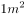，厚度为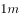的材料，当其两侧表面温度差为时，单位时间内由导热方式传递的热量，单位为瓦/米·度（W/(m·K)，此处为K可用代替）。

下氢气导热系数约为0.17 W/(m·K)，是导热性最好的气体，比大多数气体的导热系数高出10倍，因此在能源工业中，氢气是极好的传热导体。

故正确答案为A。

---

#### 第 28 题　qid 2452952 · 科技常识

植物的六大器官，根、茎、叶、花、果实和种子都可以成为人类的食物，但不同植物被取食的器官各有不同。下列植物与被取食的器官对应关系，错误的是            。

- **A**. 萝卜—根
- **B**. 白菜—叶
- **C**. 竹笋—茎
- **D**. 西蓝花—果实　✅

**答案**：D

**官方解析**

本题考查科技常识。
A项正确，萝卜是十字花科属能形成肥大肉质根的二年生草本植物，它的食用部分是肉质根。
B项正确，白菜分结球与不结球两类，是一种叶菜类蔬菜，它的食用部分是叶。
C项正确，竹笋是禾本科竹亚科植物苦竹、淡竹、毛竹等的嫩茎，它的食用部分是茎。
D项错误，西蓝花是十字花科芸苔属甘蓝种中以绿色花球为产品的一个变种，它的食用部分为绿色幼嫩花茎和花蕾，而不是果实。
本题为选非题，故正确答案为D。

---

#### 第 29 题　qid 2452898 · 人文常识

已知物体表面颜色越浅，反射热辐射的能力越强，进行热辐射的能力越差；物体表面颜色越深，反射热辐射的能力越差，进行热辐射的能力越强。据此，下列关于石油液化气罐和电力变压器表面颜色的判断，说法正确的是                    。

- **A**. 均应漆成银白色
- **B**. 均应漆成灰黑色
- **C**. 前者漆成灰黑色，后者漆成银白色
- **D**. 前者漆成银白色，后者漆成灰黑色　✅

**答案**：D

**官方解析**

本题考查科技常识。
液化气罐里面装有的液化气属于易燃易爆液体，因此要保持低温。但其本身不产生热，其温度升高主要是因为吸收来自环境中通过热辐射传递的热量，涂成银白色这种浅色，其外表面反射热辐射的能力就强，可以减少从外界吸收的热辐射，从而保持罐体温度较低，保证安全性。
正常运行中的电力变压器，会有极少部分的电能转化为内能，导致其温度升高，当变压器的温度比环境温度高时，将其漆成颜色很深的灰黑色，有利于将热量通过热辐射的方式传递到环境中，从而避免自身温度升得过高。 
故正确答案为D。

---

#### 第 30 题　qid 2452900 · 人文常识

马克思、恩格斯创立了唯物史观和剩余价值学说，揭示了人类历史发展的奥秘和资本主义剥削的实质，论证了无产阶级的历史使命，弥补了空想社会主义的缺陷，从而把社会主义从空想发展为科学。科学社会主义问世的标志是            。

- **A**. 《共产党宣言》的发表　✅
- **B**. 《资本论》的出版
- **C**. 巴黎公社的建立
- **D**. 十月革命的胜利

**答案**：A

**官方解析**

本题考查人文常识。
A项正确，《共产党宣言》的问世是人类思想史上的一个伟大事件，标志着科学社会主义的诞生。《共产党宣言》是第一次全面阐述科学社会主义原理的伟大著作，为各国无产阶级革命提供了崇高的共产主义理想、先进的建党学说和科学的行动指南。
B项错误，《资本论》是马克思主义政治经济学的经典著作，是享誉世界的伟大名著。《资本论》的出版，标志着马克思主义政治经济学理论体系的形成，在马克思主义理论形成和发展史中具有十分重大的意义。
C项错误，1871年3月18日，巴黎工人举行起义，推翻了资产阶级反动统治，建立了无产阶级革命政权。3月26日进行公社选举，28日巴黎公社宣告成立。巴黎公社是人类历史上第一个无产阶级政权。
D项错误，1917年11月7日，列宁和托洛茨基领导的布尔什维克武装力量推翻了临时政府，建立了苏维埃政权。列宁领导的十月革命产生了世界上第一个无产阶级专政的国家，开辟了世界无产阶级革命的新时代和殖民地半殖民地在无产阶级领导下进行民族民主革命的新时代。
故正确答案为A。

---

#### 第 31 题　qid 2452902 · 人文常识

在一幅书法作品中看到“贤契笑存”的文字，说明它可能是            的。

- **A**. 老师送学生　✅
- **B**. 学生送老师
- **C**. 领导送下级
- **D**. 晚辈送长辈

**答案**：A

**官方解析**

本题考查人文常识。
“贤契”是对弟子或朋友子侄辈的敬称（多用于书面），“笑存”则是客套词或敬辞。因此，书法作品中出现“贤契笑存”，很可能是老师送给学生的。
故正确答案为A。

---

#### 第 32 题　qid 2452904 · 人文常识

“夜静弦声响碧空，宫商信任往来风。依稀似曲才堪听，又被风吹别调中。”这一首诗描写的对象是            。

- **A**. 琵琶
- **B**. 风筝　✅
- **C**. 弓箭
- **D**. 古琴

**答案**：B

**官方解析**

本题考查人文常识。
这首诗出自唐朝诗人高骈的《风筝（一作题风筝寄意）》，大意是：寂静的夜空中，何处传来弦声？这弦任由风儿演奏出简单的音调。这音调似乎很模糊，但仔细听来却能成曲，也勉强能欣赏。由“弦声响碧空”也可判断诗文描写的是风筝。唐代的风筝装有弦或笛，飞入天空在风的演奏下发出声音，甚至能够产生美妙的乐声。这也就是风筝名字的由来——因为它能在空中发出筝弦的声音。
故正确答案为B。

---

#### 第 33 题　qid 2452908 · 人文常识

“西风烈，长空雁叫霜晨月。霜晨月，马蹄声碎，喇叭声咽。雄关漫道真如铁，而今迈步从头越。从头越，苍山如海，残阳如血。”是毛泽东同志写于1935年的一首词。该词描绘的是红军            的场景。

- **A**. 征战甘肃南部关隘腊子口
- **B**. 征战福建龙岩、漳州
- **C**. 飞夺泸定桥
- **D**. 征战贵州娄山关　✅

**答案**：D

**官方解析**

本题考查人文常识。
这首词出自毛泽东的《忆秦娥·娄山关》，写于1935年2月，最早发表于1957年1月的《诗刊》上。1935年2月25日凌晨，红军向贵州娄山关挺进，在红花园与黔军遭遇，傍晚时分终于把这座雄关控制在手中，使大部队顺利通过。由于这一仗意义重大，所以诗人心情无比激动，在战斗结束不久即挥笔写下此词。
故正确答案为D。

---

## 言语理解与表达

### 材料 1

        从一般视角看，充分陈述法律理由有助于促进公正，但本书（《司法的逻辑：实践中的方法与公正》）作者却提出：司法中是应该作出法律论证，但这种法律论证不应该追求“充分”。为什么？首先，“充分”是指除了运用细节化的明确法律规定和一般形式逻辑推理加以论证这两种方式之外，对其他辅助性论证资源的大量使用，辅助性论证资源则主要包括说理方法、经验常识、法律原理。多数情况下，仅仅运用细节化的明确法律规定及一般形式逻辑推理，这种论证只会让人感到“本来如此”，而要实现“很有道理”的论证，则势必需要不断地使用说理方法、经验常识和法律原理等。

        然而，作者经过研究后发现：其一，人们关于“说理方法”的日常经验，本身就是复杂的，比如中国古代的许多经典文本，以模糊思维和飘逸说理为特征，典型如《论语》《老子》，而西方许多经典文本，却以分析思维和精细说理为特征，两种思维说理明显不同；其二，日常生活的论证语境和法律过程的论证语境存在较大区别，后者比前者更凸显利益以及是非立场的纠葛，参与者及旁观者对后者中的论证，审视、期待、要求显然更高，从“经验常识”展开理由论证，总会引发新的疑问和追问；其三，在法学话语及法律实践话语中，关于“法律原理”的争论不胜枚举，在中国法学甚至世界法学中，几乎难以看到一个法律原理未曾遭遇反论，且法律原理常涉及规范问题，注定在价值上有主观性。

        因此，作者的结论是：法律论证是否充分与争议的化解、裁判的正当性、司法公正之间均没有必然的联系，而“单纯”的法律论证，仅适用细节化的法律规定及一般形式逻辑，以展现法律裁判的理由，是最理想的，它清晰明确、难以被质疑，几乎能最好、最有效地抵挡外部裁判异议。

#### 第 1 题　qid 2453029 · 片段阅读

上文中提及的“本书作者”对司法中充分进行法律论证的态度是            。

- **A**. 赞成
- **B**. 不赞成　✅
- **C**. 不置可否
- **D**. 怀疑

**答案**：B

**官方解析**

第一段开篇通过转折词“但”引出“本书作者”对“充分进行法律论证”的态度，即“司法中是应该做出法律论证，但这种法律论证不应该追求‘充分’”，换句话说，作者对于司法中充分进行法律论证这一做法是不赞同的，锁定B项；
A项“赞成”，D项“怀疑”，均不是作者的态度，排除；
C项“不置可否”指不表明态度，文段作者态度很明确，即不赞同，排除；
故正确答案为B。
【文段出处】《老问题与新见解——读刘星&lt;司法的逻辑：实践中的方法与公正&gt;》

---

#### 第 2 题　qid 2453030 · 片段阅读

根据文意，下列说法不正确的是                    。

- **A**. 中西方的说理方式不尽相同
- **B**. 让人感到“本来如此”的法律论证方式其实是最有效的
- **C**. 使用说理方法、经验常识和法律原理会使法律论证“很有道理”
- **D**. 日常生活的论证语境更强调利益的诉求　✅

**答案**：D

**官方解析**

A项，根据第2自然段“比如中国古代的许多经典文本，以模糊思维和飘逸说理为特征······而西方许多经典文本，却以分析思维和精细说理为特征”，可知中国和西方的说理方式不同，表述正确，排除；
B项，根据第1自然段“多数情况下，仅仅运用细节化的明确法律规定及一般形式逻辑推理，这种论证只会让人感到‘本来如此’”；以及第3自然段“仅适用细节化的法律规定及一般形式逻辑，以展现法律裁判的理由，是最理想的，它清晰明确、难以质疑，几乎能最好、最有效地抵挡外部裁判异议”可知，“本来如此”的法律论证方法就是最有效的，表述正确，排除；
C项，根据第1自然段“而要实现‘很有道理’的论证，则势必需要不断地使用说理方法、经验常识和法律原理等”可知，最有效的论证方式应该是“说理方法、经验常识和法律原理等”，表述正确，排除；
D项，根据第2自然段“其二，日常生活的论证语境和法律过程的论证语境存在较大区别，后者比前者更凸显利益以及是非立场的纠葛”可知，法律过程的论证语境更强调利益诉求，表述错误，当选；
本题为选非题，故正确答案为D。
【文段出处】《老问题与新见解——读刘星&lt;司法的逻辑：实践中的方法与公正&gt;》

---

#### 第 3 题　qid 2453031 · 片段阅读

根据文意，下列关于“单纯”的法律论证的说法，不正确的是                    。

- **A**. 仅运用细节化的明确法律规定和一般形式逻辑推理加以论证
- **B**. 论证不充分，难以让人信服　✅
- **C**. 多数情况下不影响司法的公正性
- **D**. 比较清晰明确，不容置疑

**答案**：B

**官方解析**

A项，根据最后一段“仅适用细节化的法律规定及一般形式逻辑”可知，表述正确，排除；
B项，根据最后一段“是最理想的，它清晰明确、难以质疑”可知，该论证可以让人信服，故表述与文意相悖，当选；
C项，根据最后一段“几乎能最好、最有效地抵挡外部裁判异议”可知，该论证方式不受外界影响，故不会影响司法的公正性，表述正确，排除；
D项，根据最后一段“是最理想的，它清晰明确、难以质疑”可知，表述正确，排除。
本题为选非题，故正确答案为B。
【文段出处】《老问题与新见解——读刘星&lt;司法的逻辑：实践中的方法与公正&gt;》

---

### 材料 2

      据研究，屈原《九歌》诸篇原始底本的大致族属与时代能概括如下：《东皇太一》《东君》，源于五帝晚期海岱地区东夷集团虞舜族的《韶》乐；《河伯》《云中君》，源于夏代中原地区夏族禹启以来的《虬歌》；《大司命》《少司命》，春秋战国时期各诸侯国的生命生育祭歌颂诗；《湘君》《湘夫人》《山鬼》，长江中游楚地楚族流传久远的山川祭歌颂诗；《国殇》，流传于楚国的爱国战魂祭歌：《礼魂》，以上各篇共用的“乱辞”。在商代早中期以前，楚族的起源及早期发展阶段在黄河中下游，且与夷、夏两集团有密切关系。在神话传说中，楚人的远祖之一颛顼氏主要活动在海岱与中原地区，曾得到东夷集团的远祖少昊氏族的帮助。颛顼之后，有祝融八姓，亦与东夷少昊、重、黎、中原各族关系密切。为此，东夷集团《韶》乐、华夏集团《虬歌》，为楚族所熟悉，并为屈原整理《九歌》时有所保存。

        而屈原，“楚之同姓也，为楚怀王左徒”，是王室贵族子弟的师傅；又为三闾大夫，“掌王族三姓。屈原序其谱属，率其贤良，以厉国士”。因此，屈原熟悉本族的历史文化，进而整理编组了《九歌》。本来，各血缘氏族部落只祭祀本族范围内的天体神、山川神和祖先神，相关的祭器、礼仪、乐舞歌辞也只限在本族内流传。此即“神不歆非类，民不祀非族”。然而，屈原还是将不同区域、族属、时代、内容的祭歌颂诗与楚国的《湘君》诸篇合编在一起了。这不是屈原冒天下之大不韪。西周盛行的体现血缘管理的井田制、宗法等级制、家族世袭制等，到春秋时代开始动摇，至战国时代则几乎瓦解——各诸侯相互征战，血缘纽带已被解构。因此，血缘基础上的“民不祀非族”“祀不越望”的规矩已不复存在。这样，屈原将不同族属的祭歌颂诗合编在一起，完成综合性的《九歌》，也就成为可能。

        楚国发展到楚威王时，国力达到鼎盛。楚怀王即位，承父盛业，在苏秦游说之下，联合韩、魏等五国攻秦，是为合纵。当时的楚怀王意气风发，有一统天下的雄心。据《汉书·郊祀志》：“楚怀王隆祭祀，事鬼神，欲以获福助，却秦军。”此际任左徒的屈原“入则与王图议国事，以出号令；出则接遇宾客，应对诸侯。王甚任之”，可谓君臣相得。因此，言《九歌》是屈子为国君修饰润色，欲以却退秦师，也信而有征。

        孔子以维护周礼为目的，把西周王官礼乐作为标准删编《诗经》。结果是，不仅十五个诸侯血缘族团的颂诗、史诗，以及十五国之外的民歌被删除，甚至进一步引领时代的理性自觉，“不语怪力乱神”，将原本丰富的巫术神灵、图腾神话作了历史化改造，而失去了其天国神灵的浪漫气息。但楚氏族带着北方夷夏原始巫术宗教文化，反倒与当地固有的苗民巫风习俗相融合，而得以持续发扬。屈原既“博闻强志”，深知楚族及夷夏古族的远古历史文化，又担任左徒与三闾大夫这两个与巫术宗教活动有关的职位，最终造就了《九歌》特别的原始文化。《九歌》是我们认识远古部族文化的重要窗口。

#### 第 4 题　qid 2452910 · 片段阅读

依据文段，下列判断不正确的是：

- **A**. 《东皇太一》保留了一定的《韶》乐内容
- **B**. 《九歌》是不同区域、族属、时代、内容祭歌颂诗的组合
- **C**. 《九歌》的编组没有蕴含政治意图　✅
- **D**. 《九歌》的浪漫气息与当地苗民的巫风习俗有比较密切的关系

**答案**：C

**官方解析**

A项，根据第一段“《东皇太一》《东君》，源于五帝晚期海岱地区东夷集团虞舜族的《韶》乐”可知，表述正确，排除；
B项，根据第二段“然而，屈原还是将不同区域、族属、时代、内容的祭歌颂诗与楚国的《湘君》诸篇合编在一起了······这样，屈原将不同族属的祭歌颂诗合编在一起，完成综合性的《九歌》，也就成为可能”可知，表述正确，排除；
C项，根据第三段“因此，言《九歌》是屈子为国君修饰润色，欲以却退秦师，也信而有征”可知，这句话意为“有人认为《九歌》是屈原替君主草拟修饰言辞，打算借此劝退秦国大军，这个说法也是有凭据、站得住脚的”，故《九歌》的编组，是可能包含政治意图的，表述错误，当选；
D项，根据第四段“但楚氏族带着北方夷夏原始巫术宗教文化，反倒与当地固有的苗民巫风习俗相融合，而得以持续发扬······最终造就了《九歌》特别的原始文化”可知，表述正确，排除。
本题为选非题，故正确答案为C。
【文段出处】《远古部族文化融合创新与《九歌》的形成》

---

#### 第 5 题　qid 2452911 · 片段阅读

假如按照“神不歆非类，民不祀非族”的原则，屈原能够编辑、加工的诗歌是：

- **A**. 《东皇太一》
- **B**. 《河伯》
- **C**. 《大司命》
- **D**. 《山鬼》　✅

**答案**：D

**官方解析**

题干中“神不歆非类，民不祀非族”的含义是，神不享受不是应分的祭品，百姓不祭祀非本宗族的祖先。如果符合这项原则，那么屈原能够加工、编辑的诗歌应该围绕楚国流传的神或祖先论述。
A项，根据文章第一段中“《东皇太一》《东君》，源于五帝晚期海岱地区东夷集团虞舜族的《韶》乐”可知，该项不属于楚国范围，排除。
B项，根据文章第一段中“《河伯》《云中君》，源于夏代中原地区夏族禹启以来的《虬歌》”可知，该项不属于楚国范围，排除。
C项，根据文章第一段中“《大司命》《少司命》，春秋战国时期各诸侯国的生命生育祭歌颂诗”可知，该项不属于楚国范围，排除。
D项，根据文章第一段中“《湘君》《湘夫人》《山鬼》，长江中游楚地楚族流传久远的山川祭歌颂诗”可知，该项属于楚国流传范围内，表述正确。
故正确答案为D。
【文段出处】《远古部族文化融合创新与《九歌》的形成》

---

#### 第 6 题　qid 2452912 · 片段阅读

下列陈述，不能解释屈原编组《九歌》原因的一项是                    。

- **A**. 屈原对楚族及夷夏古族的历史文化关系了解深入
- **B**. 屈原担任左徒与三闾大夫
- **C**. 西周时的宗法等级制、家族世袭制等，到战国时代已土崩瓦解
- **D**. 楚氏族的原始巫术宗教文化，与当地固有的苗民巫风习俗相融合　✅

**答案**：D

**官方解析**

根据“楚氏族带着北方夷夏原始巫术宗教文化，反倒与当地固有的苗民巫风习俗相融合，而得以持续发扬······造就了《九歌》特别的原始文化”可知，文段表述的逻辑是楚氏族带有的北方原始宗教文化，使其可以与当地原有的苗民巫风习俗融合，最终带来的结果是《九歌》具有特殊文化特色。并没有体现出来楚氏族带着北方夷夏原始巫术宗教文化，与当地固有的苗民巫风习俗相融合，使得屈原编组九歌。不符合文段表述，D项错误，当选。
A项，根据“在商代早中期以前，楚族的起源及早期发展阶段在黄河中下游，且与夷、夏两集团有密切关系。······，为此，东夷集团《韶》乐、华夏集团《虬歌》，为楚族所熟悉，并为屈原整理《九歌》时有所保存”可知，A项正确，排除；
B项，根据“而屈原，&#39;楚之同姓也，为楚怀王左徒&#39;，是王室贵族子弟的师傅；又为三闾大夫，&#39;掌王族三姓。屈原序其谱属，率其贤良，以厉国士&#39;。因此屈原熟悉本组的历史文化，进而整理编组了《九歌》”以及“又担任左徙与三闾大夫这两个······造就了《九歌》特别的原始文化”可知，B项正确，排除；
C项，根据“这不是屈原冒天下之大不韪。西周盛行的体现······这样屈原将不同族属的祭歌颂诗合编在一起，完成综合性的《九歌》，也就成为可能”可知，C项正确，排除；
故正确答案为D。
【文段出处】《远古部族文化融合创新与《九歌》的形成》

---

#### 第 7 题　qid 2452914 · 片段阅读

这一文段的核心内容是论                    。

- **A**. 《九歌》的形成　✅
- **B**. 《九歌》的来源
- **C**. 屈原编组了《九歌》
- **D**. 《九歌》的文化特色

**答案**：A

**官方解析**

文章第一段详细介绍了屈原《九歌》诸篇原始底本的大致族属与时代情况；第二段阐述随着时代的变迁，为屈原将不同族属的祭歌颂诗合编在一起创造了必要条件，推动了《九歌》的形成；第三段点明了与《九歌》创作相关的历史背景；最后一段通过与孔子删编《诗经》形成对比，突出屈原自身条件及楚国文化背景造就了《九歌》特别的原始文化。故文章从原始素材、时代条件、历史文化背景等多个维度，全面深入地探讨了《九歌》的形成过程，对应A项。
B项，“《九歌》的来源”仅涉及原始底本族属与时代，对应文章开篇部分的内容，表述片面，排除；
C项，“屈原编组了《九歌》”仅对应文章第二段的内容，表述片面，排除；
D项，“《九歌》的文化特色”仅对应文章结尾段的内容，表述片面，且文章重在论述《九歌》的形成过程，而非其文化特色本身，偏离文章重点，排除。
故正确答案为A。
【文段出处】《远古部族文化融合创新与《九歌》的形成》

---

#### 第 8 题　qid 2452995 · 片段阅读

全国两会        ，来自社会各界的代表、委员，齐聚北京，             。

- **A**. 前夕，共商国是　✅
- **B**. 前昔，共商国是
- **C**. 前夕，共商国事
- **D**. 前昔，共商国事

**答案**：A

**官方解析**

第一空，“前夕”指假日或任何重大节日之前的晚上或白天；也指某一特殊事件即将发生的时期。“前昔”指前面日子。根据文意，全国两会即将召开，两会是我国较为重要的会议，召开之前的时刻，应使用“前夕”，排除B、D两项。
第二空，A项“共商国是”中，“国是”指国家大计，为国家政策方针等重大的决策，是较广的指称，是正规书面用语，语境庄重、严肃。C项“共商国事”中，“国事”指国家事务，是较具体的指称。根据文段，全国两会，商讨的是各种国家策略方针等决策，A项“国是”更加合适。
故正确答案为A。

---

#### 第 9 题　qid 2452998 · 语句表达

图灵在密码方面取得的成就                    。他发明了“图灵机”，虽然这个机器当时是为战争服务的，但是，在人工智能的发展历史中，却是            的一个事件。

- **A**. 可望而不可即，开天辟地
- **B**. 可望而不可及，开天辟地　✅
- **C**. 可望而不可及，开天劈地
- **D**. 可望而不可即，开天劈地

**答案**：B

**官方解析**

第一空，“即”指靠近，接近，“可望而不可即”指可以望到但无法接近。“及”指达到，赶上，“可望而不可及”指只可仰望而无法赶上。横线处搭配“成就”，表达图灵的成就是其他事物赶不上的，故B、C两项更加符合文意，排除A、D两项。
第二空，B项“开天辟地”指前所未有，有史以来的第一次，置于文段表达“图灵机”是人工智能发展历史上的一个开端性事件，符合文意，当选。C项“开天劈地”属成语误用，排除。
故正确答案为B。

---

#### 第 10 题　qid 2453003 · 语句表达

现实中，不同的地域、气候等因素哺育出            的文化。与此同时，纷繁多样的时代文化进一步刺激着人们的乡土情结，在多元文化中强调自身文化特色就            。于是，那些能够彰显文化特色的讨论总是不断地        人们的身份认同。

- **A**. 五光十色，在所难免，唤起
- **B**. 五光十色，自然而然，引起
- **C**. 多姿多彩，自然而然，引起
- **D**. 多姿多彩，在所难免，唤起　✅

**答案**：D

**官方解析**

第一空，横线处搭配“文化”，根据后文“与此同时，纷繁多样的时代文化……”可知，横线处所填成语形容文化种类丰富。C、D两项“多姿多彩”指丰富多彩，置于文段可以形容文化的种类多样，符合文意，保留。A、B两项“五光十色”形容色泽鲜艳，花样繁多，与“文化”搭配不当，排除。
第二空，C项“自然而然”指不经外力作用而如此；D项“在所难免”指由于某种限制而难于避免。根据文段“纷繁多样的时代文化进一步刺激着人们的乡土情结”可知，强调自身文化特色是源于乡土情结，而非自然形成，D项“在所难免”填入文段更合适，排除C项。
第三空代入验证，“唤起人们的身份认同”搭配和语义均合适，当选。
故正确答案为D。
【文段出处】《“南北大战”的“口水仗”背后是文化认同》

---

#### 第 11 题　qid 2453006 · 逻辑填空

公文的力度        与思想的深度有关，        离不开语言的“加持”。劲道的公文语言        紧凑凝练、一语中的，        层层递进、步步深入，风格因人而异，        都应起到触动人心、震撼人心、激励人心的效果。

- **A**. 既，又，不是，就是，但
- **B**. 既，也，或，或，但　✅
- **C**. 因为，所以，既，又，但是
- **D**. 不但，而且，无论，还是，然而

**答案**：B

**官方解析**

第一空、第二空，根据“与思想的深度有关”“离不开语言的‘加持’”可知，此处列举了影响公文力度的两个因素，应填入表示并列或递进的连词，A项“既”“又”、B项“既”“也”均表示并列，D项“不但”“而且”表示递进，三项均符合文意，保留。C项“因为”“所以”表示因果关系，排除。
第三空、第四空，根据后文信息“风格因人而异”可知，前文是在列举公文语言的不同风格。B项“或”“或”可以表示列举，符合文意，保留；A项“不是”“就是”表示二者择其一的选择关系，公文语言不是只有这两种风格，排除；D项“无论”“还是”表假设关系，文段列举的两种风格并不属于假设，排除。
第五空代入验证，文段意为不同风格的公文语言都具有同样的效果，前后语义相反，B项“但”表示转折，逻辑通顺，符合文意，当选。
故正确答案为B。
【文段出处】东方资讯《【遴选公文写作】公文语言“成熟度”是什么？如何提高“成熟度”？》

---

#### 第 12 题　qid 2453008 · 逻辑填空

根据上海市统一规划，新扬子江码头将洗去征尘，转换角色，一改昔日军港码头的        ，嬗变成黄浦江45公里美丽岸线中一段特别风景。今后，当我们流连忘返，徜徉其间，享受习习江风，观赏浦江两岸美景的时候，千万别忘了海军扬子江码头——这朵昔日洁白无比的海上珊瑚花，曾带给我们这座城市的        、        与美好。

- **A**. 肃穆，宁静，光荣
- **B**. 宁静，安宁，光荣
- **C**. 肃静，安宁，荣耀　✅
- **D**. 安宁，宁静，荣耀

**答案**：C

**官方解析**

第一空，与“军港码头”搭配，A项“肃穆”、C项“肃静”意为严肃而安静，可以表示军港码头应具有的特性，保留；B项“宁静”、D项“安宁”意为平静、安静，体现不出带有军事色彩的军港码头的特性；且后文“嬗变”意为蜕变、更替，故前后文语义应该相反，B项“宁静”、D项“安宁”无法与后文“美丽岸线中一段特别风景”构成相反的语义关系，故排除B、D两项。
第二空，横线处应体现出军港码头给城市带来的作用，C项“安宁”指安定、太平，符合军港码头对城市所起的作用，保留。A项“宁静”侧重于平静，体现不出军港对于城市的保护作用，排除。
第三空，代入验证，C项“荣耀”指美好的声誉，符合文意，当选。
故正确答案为C。
【文段出处】搜狐网《别了，黄浦江畔的扬子江码头》

---

#### 第 13 题　qid 2453011 · 语句表达

下列语句中，不能契合孟子“舍生取义”精神的一项是                     。

- **A**. 人生自古谁无死，留取丹心照汗青。
- **B**. 为国坚诚款，捐躯忘贱贫。　✅
- **C**. 粉身碎骨全不怕，要留清白在人间。
- **D**. 人固有一死，或重于泰山，或轻于鸿毛。

**答案**：B

**官方解析**

孟子“舍生取义”意为维护正义事业而不怕牺牲生命，牺牲自己。
A项，“人生自古谁无死，留取丹心照汗青”出自文天祥的《过零丁洋》，意为自古以来没有人能够长生不死，我要留一片爱国的丹心映照史册，能够体现出舍生取义的精神，排除。
B项，“为国坚诚款，捐躯忘贱贫”出自骆宾王的《咏怀古意上裴侍郎》，意为治理国家要忠诚、真诚，为国家奉献不分贵贱，未能体现出当生命与道义发生冲突时，选择道义，当选。
C项，“粉身碎骨全不怕，要留清白在人间”出自于谦的《石灰吟》，意为即使粉身碎骨也毫不惧怕，只要把高尚的节操留在人世间，能够体现出舍生取义的精神，排除。
D项，“人固有一死，或重于泰山，或轻于鸿毛”出自司马迁的《报任安书》，意为人终究免不了一死，但死的价值不同，为了人民正义的事业而死就比泰山还重，而那些自私自利、损人利己的人之死就比鸿毛还轻，能够体现出舍生取义的精神，排除。
本题为选非题，故正确答案为B。

---

#### 第 14 题　qid 2453014 · 片段阅读

下列划线成语“一言以蔽之”的用法，错误的一项是      。

- **A**. 
精明的贾母，竞被王熙凤<u>一言以蔽之</u>，不知不觉就上当了。
　✅
- **B**. 
有个别提案和建议看起来“不接地气”，究其原因，要么缺少充分的科学论证，要么没有相关的数据支撑······<u>一言以蔽之</u>，就是缺乏扎实深入的调查研究。

- **C**. 
如果没有第三者，离婚分手的原因往往是很复杂的，是难以<u>一言以蔽之</u>的。

- **D**. 
<u>一言以蔽之</u>，就是“中国人始终认为，世界好，中国才能好；中国好，世界才更好”。

**答案**：A

**官方解析**

“一言以蔽之”指用一句话来概括。
A项，该句语义为精明的贾母被王熙凤的话蒙蔽了，“一言以蔽之”在此处使用错误，当选；
B项，该句指出个别提案和建议看起来“不接地气”的原因较多，后文对这些原因进行概括，即“缺乏扎实深入的调查研究”，“一言以蔽之”在此处用法正确，排除；
C项，该句语义为离婚分手的原因很复杂，难以用一句话概括，“一言以蔽之”在此处用法正确，排除；
D项，该句通过“一言以蔽之”进行概括总结，接着引出中国人的观点，“一言以蔽之”在此处用法正确，排除。
本题为选非题，故正确答案为A。

---

#### 第 15 题　qid 2453015 · 片段阅读

下面一段话中，有语病的一句是        。
①长久以来，人们认为身心是分离的，进而认为读书人和体育健将是对立的：②读书人就是“充耳不闻运动事，一心只读圣贤书”，反过来，体育健将也给人一种“坐不住板凳”的刻板印象。③但随着对“人”的理解的加深，这种观念渐渐推翻了：④一方面有些读书人对运动很痴迷，另一方面好运动者不但体魄强健，头脑也不简单——他们取得运动成绩靠的不仅是健壮的身体，还有敏锐的观察和灵活的策略。

- **A**. ①
- **B**. ②
- **C**. ③　✅
- **D**. ④

**答案**：C

**官方解析**

C项，修改为“这种观念渐渐被推翻了”。
A、B、D三项均表述正确。
故正确答案为C。

---

#### 第 16 题　qid 2453018 · 逻辑填空

按顺序排列下列句子，组合成语义连贯的一段话，正确的一项是        。
无边的青色草浪，在风中起伏。草是竹节草和黑麦草，簇拥着翻卷。
①这里是初夏的香油洲——鄱阳湖最大的草洲，有近200平方公里。
②我站在草浪中间远眺，不远的地平线下，是茫茫的湖水。
③远处的岛屿，像隐现在烟雨之中的帆船。
④晌午后的微雨，也是青黛色。
再过两个月，这里将一片汪洋，草洲消失，被日渐上涨的湖水完全浸吞。水下的草甸将成为鱼类觅食的殿堂。

- **A**. ①②③④
- **B**. ④②③①　✅
- **C**. ④①②③
- **D**. ②①③④

**答案**：B

**官方解析**

文段开头“无边的青色草浪......”描述了青色的草原。观察选项，①、②和④充当首句，①“这”指代词指代前文，衔接恰当；②“我站在草浪中间远眺......”与前文草浪话题一致；④“晌午后的微雨，也是青黛色”，“也”表示并列，前文应该出现青色事物与其并列，衔接恰当，但是观察可知只有文段开头出现了青色草浪，故④作为首句衔接最恰当，排除A、D两项。
观察尾句，尾句①和③，后文提到“这里将一片汪洋，草洲消失”，①提到地点“草洲”，衔接恰当，B项当选。③将“岛屿”比喻为“帆船”，围绕岛屿展开论述，无法与后文衔接，排除C项。
故正确答案为B。
【文段出处】《候鸟是大地上的另一种节气》

---

#### 第 17 题　qid 2453020 · 片段阅读

对下面一则广告的修改意见最恰当的一组是        。
xx山庄位于西天目山，夏天特别凉爽，白天不用扇子，夜晚不离被子。山庄总面积4000多平方米，可同时接待近200多人，伙食分餐、桌餐任选，周围瀑布、水库、竹林美不胜收，室内卡拉OK、棋牌、乒乓应有尽有，是朋友小聚，避暑休闲的好去处。
（1）“西天目山”改成“天目山西边”；
（2）“夏天”改成“气候”；
（3）“同时接待近200多人”中的“近”或“多”去掉一个；
（4）“美不胜收”改成“数不胜数”；
（5）“朋友小聚”后逗号改成顿号。

- **A**. （1）（4）
- **B**. （2）（4）
- **C**. （3）（5）　✅
- **D**. （4）（5）

**答案**：C

**官方解析**

（1）“西天目山”是国家级森林和野生动物类型的自然保护区，并没有“天目山西边”的说法，无需修改；（2）“夏天凉爽”说法没有问题，无需修改；（3）“近200人”是不到200，“200多人”是比200多，“近”与“多”两者矛盾，应该去掉一个，说法正确，当选；（4）“美不胜收”指美好的东西很多，一时看不过来。在广告当中表达瀑布、水库、竹林很美，没有问题，无需修改；（5）“朋友小聚”、“避暑休闲”为并列关系，改为顿号更加恰当，说法正确，当选。
故正确答案为C。

---

#### 第 18 题　qid 2453021 · 片段阅读

美国近期发射了“帕克太阳探测器”。该探测器比之前的任何探测器飞得离太阳表面更近，在严酷的高温和辐射条件下，将深入探索太阳，希冀解开重大谜团。
下面说法与这段文字相符的是        。

- **A**. “帕克太阳探测器”能深入太阳对其进行探索
- **B**. 美国发射的太阳探测器离太阳更近
- **C**. “帕克太阳探测器”将承受高温以及太阳辐射的考验　✅
- **D**. 有了“帕克太阳探测器”，太阳的重大谜团将被解开

**答案**：C

**官方解析**

A项，根据“飞得离太阳表面更近”“将深入探索太阳”可知文段表达的意思是距离太阳很近，然后进一步探索太阳，而“深入太阳对其进行探索”意为进入太阳里面进行探索，故表述与文意不符，排除；
B项，根据“该探测器比之前的任何探测器飞得离太阳表面更近”可知，文段特指美国发射的“帕克太阳探测器”离太阳很近，并非美国发射的所有的太阳探测器都离太阳近，故表述与文意不符，排除；
C项，根据“在严酷的高温和辐射条件下，将深入探索太阳”可知，表述正确，当选；
D项，根据“希冀解开重大谜团”可知，只是一种希望，并不能得出“重大谜团将被解开”的结论，表述错误，排除。
故正确答案为C。
【文段出处】人民日报《美将发射帕克太阳探测器：掀起新高潮或解重大谜团》

---

#### 第 19 题　qid 2453022 · 片段阅读

2018年，国家大幅上调了科学技术奖的奖金标准，最高奖奖金由此前的500万元/人上调至800万元/人，且全部由获奖者个人支配。在人们的印象里，科研工作者的形象似乎总是与清苦绑定在一起，科研中个人智力劳动的价值，常常被有意无意地轻视。事实上，没有科研工作者的个人努力与智慧，再多的投入，也不能确保取得相应的产出。因此，不论是国家、社会还是科研机构，都该为他们的努力提供回报。这也传达出一个信号，国家尊重科研工作中个人的价值，或者说，只要能取得相应的成就，科研工作者就完全可以堂堂正正地过上富裕、优渥的生活。也只有这样，科研事业才能有源源不断的新鲜血液注入，进而变得更加繁荣、昌盛。
这一文段的主要意思是                    。

- **A**. 国家大幅上调了科学技术奖的奖金标准
- **B**. 要加大对科研中个人智力劳动的奖励
- **C**. 科研工作者配得上这样的奖励　✅
- **D**. 科研工作者的清苦生活已在改变

**答案**：C

**官方解析**

文段首先介绍国家上调科学技术奖奖金标准的举措，紧接着指出科研中的个人智力劳动价值常被轻视，随后通过“事实上”转折指出科研工作者的价值及重要性，否定前文大家的固有印象，所以多方都应该为科研工作者的努力提供回报，说明此次调整奖金标准是合情理的。后文通过“这也传达出一个信号”“也只有这样”强调“提供回报”这一情况反映出的是只要能取得相应的成就，科研工作者完全可以堂堂正正过上富裕的生活，也就是说我们要改变固有观念。文段重在强调科研工作者只要有相应的成绩完全可以过上富裕的生活，对应C项。
A项，为文段开头背景引入部分，偏离文段重点，排除；
B项，“要加大”为将来时，而对科研中个人智力劳动的奖励是已有的客观现象，表述不符；且文段重点并非加大奖励，而是转变固有思想观念，认可科研工作者取得成就后的奖励，排除；
D项，“已在改变”属于客观事实的描述，并非文段重点，排除。
故正确答案为C。
【文段出处】中国青年报《800万元奖金全归个人 科研工作者配得上这样的奖励》

---

#### 第 20 题　qid 2453023 · 片段阅读

细胞衰老和干细胞耗竭作为机体衰老的重要标志，是导致老年疾病发生发展的重要因素。骨关节炎是一种常见的衰老相关疾病，其发病率随年龄增长而逐渐提高——伴随着衰老，关节内的多种细胞，如软骨细胞、滑膜细胞、间充质干细胞等均出现细胞衰老及功能退化。其中，间充质干细胞的衰老被认为是骨关节炎发病的重要诱因之一。
根据上面文字可以得出的结论是                    。

- **A**. 导致老年疾病发生发展的重要因素已被证明
- **B**. 年轻人患骨关节炎明显少于老年人
- **C**. 防衰老重在防细胞衰老及功能退化
- **D**. 研究干细胞衰老的机制并寻找对策对治疗骨关节炎意义重大　✅

**答案**：D

**官方解析**

文段开篇介绍细胞衰老和干细胞耗竭与老年疾病发生发展之间的关系，继而指出骨关节炎就是一种常见的衰老相关疾病，伴随着衰老，关节内的多种细胞均会出现细胞衰老及功能退化，而在这当中，间充质干细胞的衰老是骨关节炎发病的重要诱因之一。故文段重在强调间充质干细胞衰老与骨关节炎之间的关系，对应D项。
A项，“导致老年疾病发生发展的重要因素”为引出话题内容，非重点，排除；
B项，年轻人与老年人患骨关节炎的对比非文段重点，排除；
C项，偏离文段核心话题“骨关节炎”，排除。
故正确答案为D。
【文段出处】《干细胞“年轻因子”新发现》

---

#### 第 21 题　qid 2453024 · 片段阅读

为了满足人们的肉类需求，目前有200亿只鸡、15亿头牛和10亿只羊占领着地球四分之一的土地，吃掉了世界上30%的农作物，消耗着大量的淡水。研究表明，获得一公斤的牛肉大约需要消耗1.5万升淡水，而收获一公斤的玉米或小麦只需要1500升。牲畜和禽类产生的废弃物对环境气候也毫无裨益，根据联合国粮食及农业组织的统计，家禽产生的废气占全部人为温室气体的14.5%。
上面语段传递的信息是                    。

- **A**. 畜牧业加剧了地球环境的恶化　✅
- **B**. 肉类生产方式将逐步被改变
- **C**. 素食是关系人们真正健康长寿、自然环境保护和人类生存发展的大事，因此将在全世界普遍提倡
- **D**. 传统养殖业即将转型

**答案**：A

**官方解析**

文段开篇指出为了满足肉类需求，地球上大量土地被动物占用，农作物和淡水被大量消耗，接着通过数据对比牛肉与谷物的耗水量，进一步说明畜牧业对资源的大量消耗。后文通过“也”引出另一方面，指出牲畜和禽类产生的废弃物对环境气候有不利影响，并引用数据说明家畜产生的废弃物在温室气体中的占比。故文段从资源消耗和环境污染的角度，论述了畜牧业对地球环境的负面影响，对应A项。
B、C、D三项：B项“肉类生产方式将逐步被改变”、C项“素食”、D项“传统养殖业”文段均未提及，无中生有，排除。
故正确答案为A。

---

#### 第 22 题　qid 2453025 · 片段阅读

海洋二号B卫星是我国第二颗海洋动力环境系列卫星，是我国民用空间基础设施规划的海洋业务卫星。该星将与后续发射的海洋二号C卫星和D卫星组成我国首个海洋动力环境卫星星座，可大幅提高海洋动力环境要素全球观测覆盖能力和时效性。海洋二号B卫星成功发射后，卫星获取的海风、海浪、海流、海温等海洋动力环境信息可进一步满足海洋业务需求并兼顾气象、减灾、水利等其他行业的应用需求，为国民经济建设和国防建设、海洋科学研究、全球气候变化提供数据支持，同时也将在国际对地观测体系中发挥重要作用，为我国积极参与全球治理提供技术支撑。
下面说法与上文意思不相符的是

- **A**. 海洋二号B卫星能够获取全球海面风向、浪高等多种海洋动力环境参数
- **B**. 海洋二号B卫星接收的数据可应用于气象、农业和应急管理等领域
- **C**. 海洋二号C卫星和D卫星比B卫星的海洋动力环境要素全球观测覆盖能力和时效性更强　✅
- **D**. 海洋二号B卫星将在国际对地观测体系中发挥重要作用

**答案**：C

**官方解析**

A项，根据文段“卫星获取的海风、海浪、海流、海温等海洋动力环境信息”可知，表述符合文意，排除；
B项，根据文段“信息可进一步满足海洋业务需求并兼顾气象、减灾、水利等其他行业的应用需求”可知，表述正确，排除；
C项，文段中没有提及海洋二号C卫星和D卫星与B卫星之间的对比，无关对比，当选；
D项，根据“同时也将在国际对地观测体系中发挥重要作用”可知，符合文意，排除。
本题为选非题，故正确答案为C。
【文段出处】人民日报：《我国成功发射海洋二号B卫星》

---

#### 第 23 题　qid 2453026 · 片段阅读

语言经济学作为一门新兴的交叉学科，是运用经济学的概念、分析方法及工具，把语言作为变量，不仅研究语言本身产生、发展、演化和变迁的规律和路径，语言对个体的作用机理和传导机制等内容，而且考察语言在经济活动中的作用以及语言和经济活动之间的关系，并在此基础上，为语言教育、翻译等语言产业的发展及相关语言政策的制定提供建议。
根据上文意思，下面说法有误的是                    。

- **A**. 语言经济学是运用经济学的方法研究不同语言的产生和演化
- **B**. 语言经济学的研究重点是语言、语言政策及其演变对经济活动的影响　✅
- **C**. 语言经济学的研究目的是使语言更好地服务于经济发展和社会生活
- **D**. 从学科发展的角度来看，语言经济学将有效促进语言学和经济学之间的跨学科互动，对推动经济学和语言学的发展都有着重要意义

**答案**：B

**官方解析**

根据提问可知，本题为细节判断题。
A项，对应文段“研究语言本身产生、发展、演化和变迁的规律和路径”，选项表述正确，排除；
B项，由文段“不仅研究语言本身产生、发展、演化和变迁的规律和路径，语言对个体的作用机理和传导机制等内容，而且考察语言在经济活动中的作用以及语言和经济活动之间的关系，并在此基础上，为语言教育、翻译等语言产业的发展及相关语言政策的制定提供建议”可知，文段并未提到语言政策对经济活动的影响，无中生有，当选。
C项，对应文段“考察语言在经济活动中的作用以及语言和经济活动之间的关系，并在此基础上，为语言教育、翻译等语言产业的发展及相关语言政策的制定提供建议”可知，语言经济学可以对这两个方面带来有利影响，表述正确，排除；
D项，对应文段“语言经济学作为一门新兴的交叉学科”以及“考察语言在经济活动中的作用以······提供建议”可知，两个学科融合发展会带来很好的结果，表述正确，排除。
本题为选非题，故正确答案为B。
【文段出处】《经济学视角下的语言》

---

#### 第 24 题　qid 2453027 · 片段阅读

“真”侧重于人掌握客观规律，“善”侧重于掌握人的需要，人只有满足自己和社会的需要才能达到“善”。而“美”则侧重于在前两者的前提下，超越“真”和“善”各自的局限性，比较自由地把握客体，从而充分地达到自我实现的境界。
因此，                    。

- **A**. “美”是最自由的
- **B**. “美”是人生最高境界　✅
- **C**. “真”“善”和“美”是一体的
- **D**. “美"的人生应该成为人生追求的最高价值目标

**答案**：B

**官方解析**

横线出现在文段结尾，起到总结前文的作用，前文首先介绍了“真”“善”两个不同的侧重点，并表示人需要满足相应条件才能达到，紧接着引出“美”的侧重，并通过“从而”引导结论，表明“美”可以超越“真”和“善”的局限“达到自我实现的境界”，整个前文通过“美”与“真”“善”的对比，凸显出“美”的境界是这三者中最高的，是对“真”和“善”的超越，对应B项。
A项“最自由”对应“比较自由的把握客体”，属于“从而”引导结果之前的内容，非重点，排除；
C项“一体的”表述错误，文段强调的是“美”与“真”“善”不一样，而非一个整体，与文意相悖，排除；
D项“人生追求的最高价值目标”无中生有，文段没有阐述“美”给人带来什么价值，排除。
故正确答案为B。
【文段出处】《美育需要每个家庭投入其中》

---

#### 第 25 题　qid 2453028 · 片段阅读

汉武帝初，匈奴请和亲，上下其议。韩安国曰：“今匈奴负戎马足，怀鸟兽心，迁徙鸟集，难得而制。得其地不足为广，有其众不足为强，自上古弗属。汉数千里争利，则人马罢，虏以全制其敝，势必危殆。臣故以为不如和亲。”
下列不属于韩安国主张和亲的理由是                    。

- **A**. 匈奴擅长骑射，有很大的杀伤力
- **B**. 匈奴所居之地，属于荒漠地带，不宜农耕　✅
- **C**. 匈奴采用游牧的方式，居无定所
- **D**. 匈奴以逸待劳，汉军长途跋涉，必受其害

**答案**：B

**官方解析**

根据提问可知，本题为细节判断题。
A项，对应文段“今匈奴负戎马足，怀鸟兽心”，可知，匈奴兵强马壮，擅于骑兵打仗，故该项表述正确，排除；
B项，对应文段“迁徙鸟集”可知，匈奴没有固定居住地点，经常会迁徙，且“荒漠地带”“不宜农耕”文段无对应，属于无中生有，故该项表述不准确，当选；
C项，对应文段“迁徙鸟集”可知，匈奴会迁徙，即游牧方式，表述正确，排除；
D项，对应文段“汉数千里争利，则人马罢，虏以全制其敝，势必危殆”可知，汉军行几千里路去争夺胜利，就会人马疲惫，匈奴人会凭借全面的优势对付汉军的弱点，必定十分危险，表述正确，排除。
本题为选非题，故正确答案为B。
【文段出处】《汉书·韩安国传》

---

## 数量关系

### 材料 1

根据下列资料，回答76～80题。

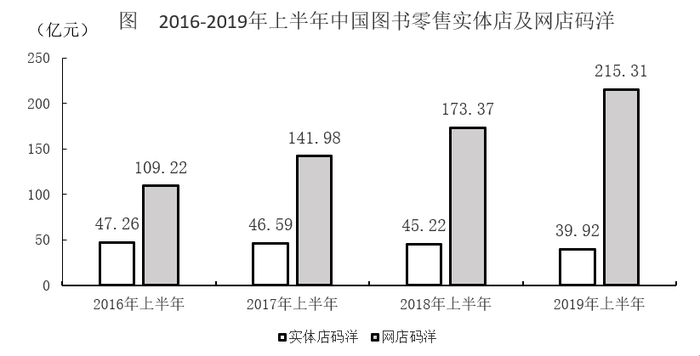

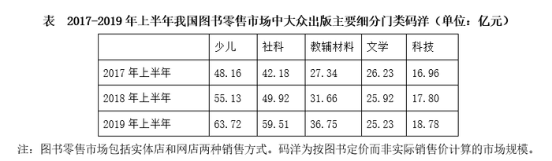

#### 第 1 题　qid 2452954 · 数学运算

2019年上半年我国图书零售市场实体店与网店码洋之和比上年高                    。

- **A**. 不到35亿元
- **B**. 35亿至40亿元　✅
- **C**. 40亿至45亿元
- **D**. 超过45亿元

**答案**：B

**官方解析**

根据“2019年上半年······与上年比”，选项中有单位，判定本题为增长量计算问题。定位图形，2019年上半年实体店码洋为39.92亿元，网店码洋为215.31亿元，而2018年上半年实体店码洋为45.22亿元，网店码洋为173.37亿元，则所求为亿元，在B项范围之内。

故正确答案为B。

---

#### 第 2 题　qid 2452957 · 数学运算

如2019年上半年我国图书零售市场中，网店平均打5.5折销售，实体店平均打9折销售，则同期网店图书实际营业额约是实体店的            倍。

- **A**. 2.5
- **B**. 3.3　✅
- **C**. 4.2
- **D**. 5.4

**答案**：B

**官方解析**

据“······同期网店图书实际营业额约是实体店的多少倍”，判定本题为现期倍数问题。定位图形材料，2019年上半年实体店码洋为39.92亿元，网店码洋为215.31亿元。结合注释，码洋为按图书定价而非实际销售计算的市场规模，则实际营业额，因此所求倍数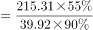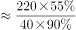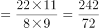，与B选项最接近。

故正确答案为B。

---

#### 第 3 题　qid 2452962 · 数学运算

2017年上半年，教辅材料与科技类图书码洋在全国图书零售市场中的占比                  。

- **A**. 
低于

- **B**. 
在之间
　✅
- **C**. 
在之间

- **D**. 
超过

**答案**：B

**官方解析**

根据“2017年上半年，······在······中的占比为多少”，且已知2017年上半年的数据，判定本题为现期比重问题。定位表格，2017年上半年教辅材料码洋为27.34亿元，科技类图书码洋为16.96亿元。定位图形，2017年上半年，实体店码洋为46.59亿元，网店码洋为141.98亿元。结合注释，图书零售市场包括实体店和网店两种销售方式，则全国图书零售市场码洋。所求比重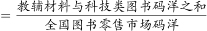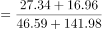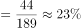。在B项范围之中。

故正确答案为B。

---

#### 第 4 题　qid 2452972 · 数学运算

能够从上述资料中推出的是                    。

- **A**. 
2017-2019年，每年上半年实体店码洋同比下降金额逐年递增
　✅
- **B**. 
2017年上半年，少儿类图书码洋是科技类图书的3倍以上

- **C**. 
2017-2019年，文学类图书总码洋在70亿至80亿元之间

- **D**. 
如2019年下半年环比增速达到，则全年网店码洋将超过500亿元

**答案**：A

**官方解析**

A项：定位图形，2016年-2019年，每年上半年实体店码洋分别为47.26、46.59、45.22、39.92亿元。则2017-2019年，每年上半年实体店码洋同比下降金额分别为亿元、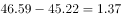亿元、亿元，下降金额逐年递增，正确；

B项：定位表格，2017年上半年少儿类图书码洋为48.16亿元，科技类图书码洋为16.96亿元，，错误；

C项：定位表格，所给数据均为每年上半年的各细分门类码洋数据，并无每年下半年的码洋数据，因此2017年-2019年文学类图书总码洋无法计算，错误；

D项：定位图形，2019年上半年网店码洋为215.31亿元，下半年环比增速为，根据，则2019年下半年网店码洋为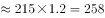亿元，全年网店码洋为亿元，错误。

故正确答案为A。

---

### 材料 2

                      表1  2016～2021年我国工业大数据市场规模增长及预测 

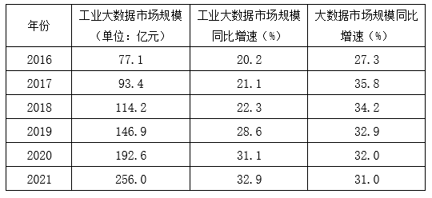

                    表2  按不同方式划分的2018年我国工业大数据销售额比例

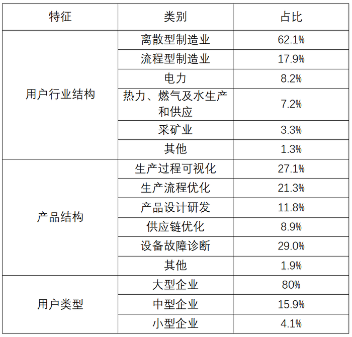

#### 第 5 题　qid 2452985 · 数学运算

2018年我国工业大数据销售额最高的5种产品结构中，销售额最高的类别销售额约是销售额最低类别的            倍。

- **A**. 1.5
- **B**. 2.5
- **C**. 3.3　✅
- **D**. 4.6

**答案**：C

**官方解析**

根据题干“2018年···是···的多少倍”，结合材料为2018年，可判定本题为现期倍数问题。定位表2，在产品结构中，“设备故障诊断”占比最高，则销售额最高，其销售额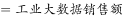；“供应链优化”占比最低，则销售额最低，其销售额，则销售额最高的类别销售额是最低的：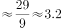倍，与C项接近。

故正确答案为C。

---

#### 第 6 题　qid 2452986 · 数学运算

关于我国工业大数据市场，能够从上述资料中推出的是                    。

- **A**. 2018年我国工业大数据市场中，大型企业的销售额超过80亿元　✅
- **B**. 2018年我国工业大数据市场中，电力行业销售额是采矿业的3倍多
- **C**. 2017年，我国工业大数据占大数据总体市场规模的比重高于上年水平
- **D**. 2019-2021年，我国工业大数据市场规模将达到2016-2018年的2.5倍以上

**答案**：A

**官方解析**

A项：定位表格1，2018年我国工业大数据市场规模114.2亿元，定位表格2，2018年我国工业大数据市场中，大型企业的销售额占比为，则大型企业销售额亿元，正确；

B项：定位表2，在2018年用户行业结构中，电力行业占比，其销售额；采矿业占比，其销售额。两者倍数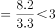倍。错误；

C项：定位表格1，2017年我国工业大数据市场规模同比增速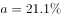，总体市场规模同比增速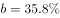。根据两期比重结论：当时，比重下降，即比重低于上年水平。错误；

D项：定位表格1,2019-2021年我国工业大数据市场规模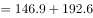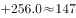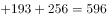亿元；2016-2018年我国工业大数据市场规模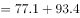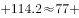亿元，两者倍数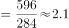倍，未达到2.5倍。错误。

故正确答案为A。

---

### 材料 3

                             表  2018年全国及京津沪各类型外资企业进出口贸易额及同比增速

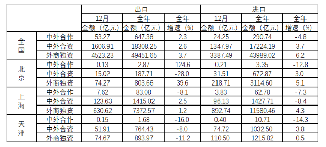

#### 第 7 题　qid 2452987 · 数学运算

2018年12月，北京市三种类型的外资企业进出口贸易状况为                    。

- **A**. 出口额比进口额高不到100亿元
- **B**. 出口额比进口额高100亿元以上
- **C**. 进口额比出口额高不到100亿元
- **D**. 进口额比出口额高100亿元以上　✅

**答案**：D

**官方解析**

定位表格材料可得，2018年12月，北京市三种类型的外资企业出口额为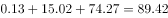亿元；进口额为亿元。故进口额比出口额高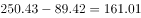亿元，即进口额比出口额高100亿元以上。 

故正确答案为D。

---

#### 第 8 题　qid 2452989 · 数学运算

京津沪三个直辖市中，2018年外商独资企业进口额占全国外商独资企业进口额比重高于2017年水平的直辖市有            个。

- **A**. 0　✅
- **B**. 1
- **C**. 2
- **D**. 3

**答案**：A

**官方解析**

根据题干“京津沪三个直辖市中，2018年······占······比重高于2017年水平的直辖市有”，可判定此题为两期比重比较问题。由两期比重比较结论可知，若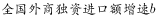，则现期比重高于基期比重。定位表格材料可知，；京津沪三个直辖市2018年外商独资进口额增速a分别为、、，均小于。故满足条件的有0个。

故正确答案为A。

---

#### 第 9 题　qid 2452992 · 数学运算

2018年，京津两地中外合资企业出口额约是两地中外合作企业出口额的            倍。

- **A**. 65
- **B**. 209　✅
- **C**. 326
- **D**. 455

**答案**：B

**官方解析**

根据题干“2018年，京津两地中外合资······是······倍”，可判定此题为现期倍数问题。定位表格材料可知，京津两地中外合资企业出口额为；京津两地中外合作企业出口额为。则所求为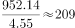。

故正确答案为B。

---

#### 第 10 题　qid 2453000 · 数学运算

能够从上述资料中推出的是                    。

- **A**. 
2018年，全国各类型外资企业进出口总额超过15万亿元

- **B**. 
2018年，上海外商独资企业进出口总额占全国同类企业的以上

- **C**. 
2018年12月，上海中外合资企业出口额超过前11个月平均值
　✅
- **D**. 
2017年，北京中外合作企业出口额高于其进口额

**答案**：C

**官方解析**

A项：定位表格材料，2018年全国各类型外资企业进出口总额为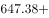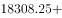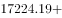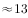万亿元15万亿元。错误；

B项：定位表格材料，2018年上海外商独资企业进出口总额为亿元；全国同类企业进出口总额为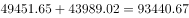亿元，故所求比重为。错误；

C项：若2018年12月上海中外合资企业出口额超过前11个月平均值，则12月出口额，即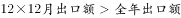。定位表格材料可知，2018年12月上海中外合资企业出口额为123.63亿元，全年出口额为1415.02亿元，则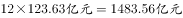。正确；

D项：定位表格材料，由基期量可知，2017年北京中外合作企业出口额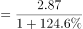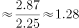亿元；2017年北京中外合作企业进口额亿元，即出口额低于进口额。而非高于，错误。

故正确答案为C。

---

#### 第 11 题　qid 2452913 · 数学运算

数列：3，2，0，3，7，2，-4，3，

- **A**. 2
- **B**. 7
- **C**. 11　✅
- **D**. 14

**答案**：C

**官方解析**

观察数列特征，数列项数较多，考虑多重数列。交叉来看，奇数列3，0，7，-4，____，两两加和得到3，7，3，？，此数列为周期数列，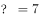，则所求项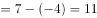。偶数列2，3，2，3，此数列为周期数列。奇数项偶数项都有规律。

故正确答案为C。

---

#### 第 12 题　qid 2452915 · 数学运算

数列：3，2；5，1；6，4；10，2；12，8；

- **A**. 14，1
- **B**. 16，2
- **C**. 18，3
- **D**. 20，4　✅

**答案**：D

**官方解析**

方法一：观察数列特征，分号分成一组。每组两数倍数关系明显，考虑作商数列。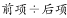，得到新数列：1.5；5；1.5；5；1.5；？，此数列为周期数列，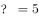。选项D的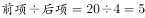，满足题意。

方法二：观察数列特征，分号分成一组。每两组之间关系为，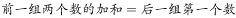；。故所求数为，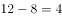。

故正确答案为D。

---

#### 第 13 题　qid 2452917 · 数学运算

如图，问号处的数字为<u>        </u>。

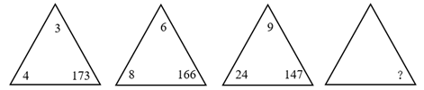

- **A**. 168
- **B**. 132
- **C**. 96
- **D**. 72　✅

**答案**：D

**官方解析**

观察数列特征，数字处于三角形三个角上，顶角位置数字3，6，9，此数列是公差为3的等差数列，所求位置：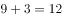；左下角位置数字4，8，24，此数列作商得到2，3，下一项为4，所求位置：；第一个三角形数字加和，第二个三角形数字加和，第三个三角形数字加和。由此可知，第四个三角形数字加和也是180，则。

故正确答案为D。

备注：最后一个是空白三角形，需要根据前面的规律计算出来，再计算出？处的数字。

---

#### 第 14 题　qid 2452920 · 数学运算

如图，问号处的数字为<u>        </u>。

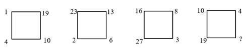

- **A**. 1
- **B**. 8
- **C**. 19
- **D**. 31　✅

**答案**：D

**官方解析**

方法一：观察数列特征，没中心凑大数，大数位置不同，考虑单独的四则运算。先考虑加法，第一组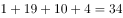，第二组，第三组，可以看出34，44，54，（  ），此数列是公差为10的等差数列，则。第四组，则。

方法二：第一个正方形左上角1，逆时针变动一个位置的数字是2，3，4，此数列是公差为1的等差数列；第一个正方形左下角4，逆时针变动一个位置的数字是6，8，10，此数列是公差为2的等差数列；第一个正方形右下角10，逆时针变动一个位置的数字是13，16，19，此数列是公差为3的等差数列；第一个正方形右上角19，逆时针变动一个位置的数字是23，27，？，此数列是公差为4的等差数列；则。

故正确答案为D。

---

#### 第 15 题　qid 2452921 · 数学运算

下表中问号处的数字为<u>        </u>。

- **A**. 378　✅
- **B**. 342
- **C**. 300
- **D**. 228

**答案**：A

**官方解析**

观察数列特征，都是6的倍数。分解因式：

观察每个田字格，，则。

故正确答案为A。

---

#### 第 16 题　qid 2452922 · 数学运算

M小区停车收费，小型车辆每天5元，中型车辆每天8元，大型车辆每天10元。某天小区总共停了20辆车，共收费153元，那么当天大型车辆可能有        辆。

- **A**. 8
- **B**. 9
- **C**. 10　✅
- **D**. 11

**答案**：C

**官方解析**

设小型车辆辆，中型车辆辆，大型车辆辆。根据“总共停了20辆车”，可得；根据“共收费153元”，可得。令，可得。由于、，且、均为整数。代入选项A，解得辆，错误；代入选项B，解得，错误；代入选项C，解得，正确；代入选项D，解得为负数，错误。

故正确答案为C。

---

#### 第 17 题　qid 2452924 · 数学运算

甲乙丙丁四人一起去踏青，甲带的钱是另外三个人总和的一半，乙带的钱是另外三个人的，丙带的钱是另外三个人的，丁带了91元，他们一共带了<u>        </u>元。

- **A**. 364
- **B**. 380
- **C**. 420　✅
- **D**. 495

**答案**：C

**官方解析**

根据“甲带的钱是另外三个人总和的一半”，则，；根据“乙带的钱是另外三个人的”，则，；根据“丙带的钱是另外三个人的”，则，。设一共带了元。则甲带了元，乙带了元，丙带了元。所以一共带了，解得，所以一共带了元。

故正确答案为C。

---

#### 第 18 题　qid 2452927 · 数学运算

两条公路成十字交叉，甲从十字路口南1200米处向北直行，乙从十字路口处向东直行。甲、乙同时出发10分钟，两人与十字路口的距离相等，出发后100分钟，两人与十字路口的距离再次相等，此时他们距离十字路口        米。

- **A**. 6600
- **B**. 6000
- **C**. 5600
- **D**. 5400　✅

**答案**：D

**官方解析**

根据题意， “出发10分钟，两人与十字路口的距离相等”，可得；“出发100分钟，两人与十字路口的距离再次相等”，可得。联立①②，解得米/分钟，米/分钟。第二次距离相等时，距离十字路口的距离为米。

故正确答案为D。

---

#### 第 19 题　qid 2452931 · 数学运算

有甲、乙两个瓶子，甲瓶里装了200毫升清水，乙瓶里装了200毫升纯酒精。第一次把20毫升纯酒精由乙瓶倒入甲瓶，第二次把甲瓶中20毫升溶液倒回乙瓶，此时甲瓶里含有纯酒精的量        乙瓶里含水的量。

- **A**. 大于
- **B**. 小于
- **C**. 等于　✅
- **D**. 不能确定

**答案**：C

**官方解析**

方法一：根据题意列表如下：

第二次后，甲瓶含有纯酒精ml，乙瓶含有水（）ml，两者相等。

方法二：在倾倒之前甲、乙两瓶各有200ml的溶液；倾倒两次后，甲、乙两瓶还是各有200ml的溶液，那么甲瓶中少的水是用来自于乙瓶中的酒精来补充；同理，乙瓶中少的酒精是用来自于甲瓶中的水来补充，故此时甲瓶里含有纯酒精的量等于乙瓶里含水的量。

故正确答案为C。

---

#### 第 20 题　qid 2452932 · 数学运算

某游乐园在一个平地中央挖了一个球形下沉广场，广场直径为200米，最深处50米，那么这个球形的直径为        米。

- **A**. 125
- **B**. 200
- **C**. 225
- **D**. 250　✅

**答案**：D

**官方解析**

根据题意，广场的直径为200米，则米；最深处为50米，则米，米。由于是直角三角形，则（OB为球的半径，可用r表示），即，解得，则该球的直径为米。

故正确答案为D。

---

#### 第 21 题　qid 2452933 · 数学运算

有A、B两个水壶，分别装有a、b升水。现将B壶中的一半水倒入A壶中，再将A壶中的一半水倒回B壶中。将上述过程记为一次操作，那么两次操作后A、B两壶中的水又回到初始状态，那么<u>        </u>。

- **A**. 

　✅
- **B**. 

- **C**. 

- **D**. 

**答案**：A

**官方解析**

赋值，根据题意，每一次操作后A、B两个水壶中水量如下图所示：

题目说两次操作后A、B两壶回归初始状态，即；。都能解得，则。

故正确答案为A。

---

#### 第 22 题　qid 2452936 · 数学运算

一个由若干个单位立方体组成的立体图形，从正面看、左侧面看、下面看都是一个的正方形，那么这个立体图形至少需要<u>        </u>个单位立方体。

- **A**. 17
- **B**. 19　✅
- **C**. 21
- **D**. 22

**答案**：B

**官方解析**

题干要求从正面、左侧面、下面看均为3×3的正方形，先在下面平铺一层，共9个立方体；接下来满足正面和左侧面，需要10个立方体即可，如下图所示，共有9+10=19个立方体。所以至少需要19个单位立方体。

故正确答案为B。

备注：如下图所示，实际可以通过9+6=15个单位立方体摆出满足题目要求的图形，但由于选项最小为17，出题人应该不是考查这种思路，故猜测本题答案为19。

---

#### 第 23 题　qid 2452938 · 数学运算

一条东西向的河流，水流自西向东，速度为10公里/小时，现有摆渡船从南岸的A点出发，要开往正北方向的位于北岸的B点，已知船速为20公里/小时，则摆渡船往            方向行驶，可以保证船能够向正北方向航行。

- **A**. 北偏西30度　✅
- **B**. 西偏北45度
- **C**. 东偏北30度
- **D**. 北偏东45度

**答案**：A

**官方解析**

题目如上图所示。

水流自西向东，要想船向正北方行驶，应向西行驶消除水流的影响，故可排除C、D两项。CO为水流动方向，AC为船行驶方向，三角形OAC为直角三角形，题目所求为的度数，相同时间内，，直角三角形中，所对的直角边是斜边的一半，故，即北偏西30度。

故正确答案为A。

备注：题目中所给的船速为船航行时真实速度，不是指静水中的速度，否则此题没有答案。

---

#### 第 24 题　qid 2452941 · 数学运算

天气预报预测未来2天的天气情况如下：第一天晴天、下雨、下雪；第二天晴天、下雨、下雪，则未来两天天气状况不同的概率为<u>        </u>。

- **A**. 

- **B**. 

- **C**. 

　✅
- **D**. 

**答案**：C

**官方解析**

方法一：未来两天天气状况不同，可分三类：①第一天晴天、第二天非晴天，；②第一天下雨、第二天非下雨，；③第一天下雪、第二天非下雪，。则题干所求。

方法二：未来两天天气状况不同的概率。未来两天天气相同总共分为三类：①都是晴天，概率为；②都是下雨，概率为；③都是下雪，概率为。则题干所求。

故正确答案为C。

---

#### 第 25 题　qid 2452943 · 数学运算

一条街上有90棵树，其中有些树已经挂上了彩灯，这时，要选择在一棵未挂彩灯的树上悬挂红旗，有趣的是，无论将红旗挂在哪棵树上都与挂了彩灯的树相邻，那么至少有        棵树挂了彩灯。

- **A**. 35
- **B**. 30　✅
- **C**. 25
- **D**. 20

**答案**：B

**官方解析**

圆圈和三角形分别表示挂彩灯和没挂彩灯的树，如图所示：

为了满足“无论将红旗挂在哪棵树上都与挂了彩灯的树相邻”，且要使挂彩灯的树尽可能地少，则每两棵挂彩灯的树之间应该隔两棵没挂彩灯的树，且第一棵挂彩灯的树左侧还有一棵树没挂彩灯，最后一棵挂彩灯的树右侧还有一棵没挂彩灯的树。观察发现，相当于每3棵树为一个周期，共有个周期，每个周期有一棵树挂彩灯，则总共有棵树挂彩灯。

故正确答案为B。

---

## 判断推理

### 第 1 题　qid 2452945 · 类比推理

从金属利用的历史来看，先是青铜器时代，而后是铁器时代，铝的利用是近百年的事。下列选项中，与金属利用的先后顺序相关度最高的是                    。

- **A**. 地壳中金属的含量
- **B**. 金属冶炼的难易　✅
- **C**. 金属的导电性和延展性
- **D**. 金属制品的用途

**答案**：B

**官方解析**

铜、铁、铝三种金属活动性由强到弱的顺序为：铝铁铜；金属活动性越强，金属的冶炼难易程度越难，冶炼技术要求越高，因而人类早期只能使用较容易冶炼的铜，随后才是铁，最后是铝。

故正确答案为B。

---

### 第 2 题　qid 2452947 · 类比推理

食物过敏是在摄入食物时由于食物中的某些成分引起免疫应答，导致消化系统内或全身性的变态反应。以下食物成分最容易引起过敏的是        。

- **A**. 蛋白质　✅
- **B**. 维生素
- **C**. 纤维素
- **D**. 脂肪

**答案**：A

**官方解析**

当人体免疫系统的防卫功能过强时，对外来物质过度敏感会引起过敏反应。引起人体免疫反应的抗原，大部分是蛋白质。
故正确答案为A。

---

### 第 3 题　qid 2452951 · 类比推理

变色镜片含有卤化银（氯化银、溴化银）微晶，当受到紫外线或短波可见光等激活光照射时，卤素离子放出电子，该电子被银离子捕获，发生下列反应：

无色的卤化银分解为不透明的银原子和透明的卤素原子，银原子吸收光线使镜片透光率降低。由于变色镜片中的卤素不会逸失，所以能发生可逆反应。下列分析错误的是<u>                    </u>。

- **A**. 强太阳光使平衡右移
- **B**. CuO在变色中起催化作用
- **C**. 强太阳光下镜片中仍有AgBr
- **D**. 室内日光灯下镜片中无Ag　✅

**答案**：D

**官方解析**

当受到紫外线或短波可见光照射时，卤化银分解生成不透明的银原子，镜片透光率降低，故而强太阳光下照射会促使卤化银分解，使平衡右移，A项正确；根据反应方程式可知，作为催化剂，在反应中起催化作用，B项正确；可逆反应中反应物不能全部转化为生成物，所以强太阳光下镜片中仍有，室内日光灯下镜片中也仍有 ，C项正确、D项错误。

本题为选非题，故正确答案为D。

---

### 第 4 题　qid 2452955 · 逻辑判断

物质的结构决定性质，微粒间的相互作用力越强，熔点越高。一些氧化物的熔点如下表所示：

下列选项中，不能解释氧化物熔点存在差异的是<u>                    </u>。

- **A**. 
分子晶体中的作用力是相对较弱的分子间作用力

- **B**. 
离子晶体中的作用力是相对较强的离子键

- **C**. 
原子晶体中的作用力是相对较弱的共价键
　✅
- **D**. 
中的离子键弱于的

**答案**：C

**官方解析**

A项，分子晶体中的作用力是分子间作用力，不是化学键，作用力较弱，熔沸点较低，故A项可以解释氧化物的熔点差异；

B项，离子晶体中的作用力是离子键，属于化学键，作用力较强，熔沸点较高，故B项可以解释氧化物的熔点差异；

C项，原子晶体中的作用力是共价键，属于化学键，作用力很强，熔沸点一般很高，故C项表述错误，不能解释氧化物的熔点差异；

D项，和是离子晶体，离子晶体中的作用力为离子键，离子键能越大，晶体的熔点越高，因为的离子键弱于，所以的熔点比的熔点低，故D项可以解释氧化物的熔点差异。

故正确答案为C。

---

### 第 5 题　qid 2452960 · 逻辑判断

过氧化氢()的沸点比水高，但受热易分解。某试剂厂制得浓度~的过氧化氢溶液，再浓缩成的溶液时，可采用的适宜方法是<u>            </u>。

- **A**. 常压蒸馏
- **B**. 减压蒸馏　✅
- **C**. 加压蒸馏
- **D**. 加生石灰，常压蒸馏

**答案**：B

**官方解析**

过氧化氢的沸点比水高，但受热易分解，浓缩过氧化氢溶液时，应避免加热，常压、加压蒸馏，均需加热，故A项、C项错误。生石灰与水反应会放出大量的热，会使过氧化氢分解，故D项错误。适宜方法应为减压蒸馏，减压可降低水的沸点，使水在较低温度下沸腾，得到浓缩的过氧化氢溶液，B项正确。
故正确答案为B。

---

### 第 6 题　qid 2452961 · 类比推理

“蹦极”是一种极富刺激性的游乐项目，如图所示为一根橡皮绳，一端系住人的腰部，另一端固定在跳台上。当人落至图中A点时，橡皮绳刚好被拉直，当人落至图中B点时，橡皮绳对人的拉力大小与人的重力大小相等，C点是游戏者所能达到的最低点。在游戏者离开跳台到最低点的过程中，不计空气阻力，下列说法正确的是<u>                    </u>。

- **A**. 游戏者的动能一直在增加
- **B**. 游戏者到达B点时重力势能最小
- **C**. 游戏者到达B点时动能最大　✅
- **D**. 游戏者在C点时的弹性势能最小

**答案**：C

**官方解析**

在蹦极的过程中，绳子还没有完全拉直时，游戏者的速度越来越快，因此动能逐渐增加；在A点和B点之间，游戏者受重力和绳子向上的拉力作用，由于重力大于拉力，因此合力方向向下，加速度方向向下，速度仍然在增加，动能依然在增加；在B点和C点之间，绳子向上的拉力开始大于重力，合外力方向向上，加速度方向向上，因此速度逐渐减少，直至C点时速度为0，动能逐渐减少。因此A项错误、C项正确。
游戏者在出发点处位置最高，重力势能势能最大，在C点处位置最低，重力势能最小，B项说法错误。
弹性势能是物体由于发生弹性形变而具有的能量，弹性形变越大，弹性势能越大。在C点处，绳子被拉至最长，因此弹性势能最大，D项说法错误。
故正确答案为C。

---

### 第 7 题　qid 2452964 · 逻辑判断

下图为远距离输电线路示意图，若发电机的输出电压不变，下列叙述中正确的是<u>                    </u>。

- **A**. 当用户用电器的总电阻减少时，输电线上损失的功率增大　✅
- **B**. 升压变压器的输出电压等于降压变压器输入电压
- **C**. 输电线中的电流只由升压变压器原、副线圈的匝数比决定
- **D**. 升压变压器的原线圈中的电流与用户电器设备消耗的功率无关

**答案**：A

**官方解析**

远距离输电时，输电线也存在一定的电阻。
A项，当用户用电器的总电阻减小时，由于降压变压器输出的电压不变，导致用户总功率增加，升压变压器和降压变压器在电压不变的情况下提供功率增加，输电线中电流增大，因此输电线上的损失功率增大，正确；
B项，由于远距离输电时输电线上存在一定电阻，故而输电线上分去一部分电压，因此升压变压器的输出电压大于降压变压器的输入电压，错误；
C项，输电线上的电流大小由用户功率大小决定，变压器两侧电流的比例关系由线圈匝数比反映，错误；
D项，当用户用电设备消耗功率变化时，降压变压器输出功率相应变化，升压变压器的输出功率也将发生变化，由于发电机的输出电压（即升压变压器的原线圈电压）不变，那么升压变压器的原线圈中的电流将发生变化，错误。
故正确答案为A。

---

### 第 8 题　qid 2452967 · 类比推理

如图所示，匀速向东行驶的火车车厢中，光滑水平桌面上正中位置放有一个相对静止的小球。右下图是小球的俯视图，A为初始位置，曲线为小球相对桌面的运动轨迹，可以判断<u>                    </u>。

- **A**. 火车向北减速转弯　✅
- **B**. 火车向西减速前进
- **C**. 火车向东加速前进
- **D**. 火车向南减速转弯

**答案**：A

**官方解析**

根据题意，小球与桌面相对静止，则小球和桌面同时向东做匀速直线运动，由小球相对桌面的运动轨迹可知，小球相对桌面的运动速度可以分解为正东方向和正南方向的两个分速度，由于桌面是光滑的，对小球没有摩擦力，小球在惯性作用下继续保持匀速向东运动（即火车原有的速度）。以小球作为参照物，火车和桌面的运动速度可分解为正西方向和正北方向。

A项，火车向北减速转弯，火车和桌面相对于小球有正西方向和正北方向的分速度，正确；

B项，火车向西减速前进，火车和桌面相对于小球运动方向为正西，错误；

C项，火车向东加速前进，火车和桌面相对于小球运动方向为正东，错误；

D项，火车向南减速转弯，火车和桌面相对于小球有正西方向和正南方向的分速度，错误。

故正确答案为A。

---

### 第 9 题　qid 2452969 · 类比推理

质量分别为3m和m的两颗恒星A和B组成双星系统，仅在相互之间万有引力的作用下，以两星连线上的某点为圆心，在同一平面内做角速度相同的匀速圆周运动。已知向心力大小与物体质量、轨道半径、角速度平方成正比。下列说法正确的是<u>                    </u>。

- **A**. 两恒星的向心力大小相等　✅
- **B**. 两恒星的轨道半径相等
- **C**. 两恒星的线速度相等
- **D**. 两恒星的周期不等

**答案**：A

**官方解析**

根据题意，两颗恒星分别仅受到对方的万有引力作用，这对万有引力是一对作用力和反作用力，力的大小相等，方向相反。

A项，两颗恒星的向心力就是由该万有引力提供，因此两颗恒星的向心力大小相等，正确；

B项，根据公式，，两恒星的向心力大小相等，角速度相等，而质量不相等，所以轨道半径必然不相等，错误；

C项，两恒星角速度相等、轨道半径r不相等，由线速度公式，可知线速度不相等，错误；

D项，匀速圆周运动中，，角速度相等，周期相等，错误。

故正确答案为A。

---

### 第 10 题　qid 2452970 · 类比推理

某国研制出一种用超声波做子弹的枪，当超声波达到一定强度时就能有较强的攻击力，实际要阻挡这一武器的袭击，只要用薄薄的一层            。

- **A**. 半导体
- **B**. 磁性物质
- **C**. 真空带　✅
- **D**. 绝缘物质

**答案**：C

**官方解析**

超声波是频率高于20000赫兹的声波，属于声波的一种。由于声波不能在真空中传播，故只要设置一层真空带，就能阻断超声波子弹的攻击。
故正确答案为C。

---

### 第 11 题　qid 2452976 · 逻辑判断

已知一种液体的密度随深度而增大，它的变化规律是，式中、是常数，表示深度。设深度足够，有一个密度为的实心小球投入此液体中，且，则小球的运动过程表述正确的是<u>                    </u>。(本题只考虑小球受到重力和浮力两个力)

- **A**. 小球会经历若干次加速和匀速过程，最后沉底
- **B**. 小球一直加速，最后沉底
- **C**. 小球会经历若干次匀速和减速过程，最后悬浮在液体中某处
- **D**. 小球会经历若干次加速和减速过程，最后悬浮在液体中某处　✅

**答案**：D

**官方解析**

小球的重力为，小球投入液体中所受浮力为，根据，得到，即小球的重力大于浮力，故小球投入液体中，做向下的加速运动。根据，可知随着小球向下运动，不断增大， 也不断增大，故小球所受浮力增大。

当浮力大于重力时，小球受合力方向向上，与运动方向相反，开始做减速运动，直至速度减少到0。此时小球在向上合力作用下，开始做向上的加速运动，小球所受浮力开始减少。当浮力小于重力时，小球受合力方向向下，与运动方向相反，开始做减速运动，直至速度减少到0，小球又在向下合力作用下，开始向下做加速运动。

故小球会经历若干次加速和减速过程，排除选项B、C。由于深度足够，即必然存在，所以小球不会沉底，最终一定会悬浮在液体中某处，故选项A错误，选项D正确。

故正确答案为D。

---

### 第 12 题　qid 2452978 · 图形推理

下列选项中，符合所给图形的变化规律的是<u>        </u>。

- **A**. A
- **B**. B
- **C**. C
- **D**. D　✅

**答案**：D

**官方解析**

元素组成相同，优先考虑位置规律。从图一到图二，图形整体逆时针旋转90°，因此问号处图形应该是图二逆时针旋转90°所得，只有D项符合。
故正确答案为D。

---

### 第 13 题　qid 2452980 · 图形推理

下列选项中，符合所给图形的变化规律的是<u>        </u>。

- **A**. A
- **B**. B
- **C**. C　✅
- **D**. D

**答案**：C

**官方解析**

元素组成不同，出现多个独立小元素，优先考虑元素种类和数量规律。每幅图都是由正方形和圆两种元素组成，且每幅图正方形的数量比圆的数量多1个，只有C项符合。
故正确答案为C。

---

### 第 14 题　qid 2452982 · 图形推理

下列选项中，符合所给图形的变化规律的是<u>        </u>。

- **A**. A
- **B**. B
- **C**. C
- **D**. D　✅

**答案**：D

**官方解析**

元素组成相同，优先考虑位置规律。观察发现，每个方块均向右移动4格，只有D项符合规律。
故正确答案为D。

---

### 第 15 题　qid 2452984 · 图形推理

下列选项中，符合所给图形的变化规律的是<u>        </u>。

- **A**. A
- **B**. B
- **C**. C　✅
- **D**. D

**答案**：C

**官方解析**

元素组成相似，且相同线条重复出现，优先考虑样式规律中的加减同异。第一组图中，图1和图2求同得到图3；第二组图应用此规律，故？处应选择一个图1和图2求同得到的图形。只有C符合。
故正确答案为C。

---

### 第 16 题　qid 2453032 · 图形推理

下列选项中，符合所给图形的变化规律的是<u>      </u>。

- **A**. A　✅
- **B**. B
- **C**. C
- **D**. D

**答案**：A

**官方解析**

元素组成相同，优先考虑位置规律。每个图形都是由4个高低不一的长方形组成的，在图一中，从左到右依次给长方形编号为1、2、3、4，图一到图二1号长方形向右平移三步，图二到图三2号长方形向右平移三步，故图三到？处应该是3号长方形向右平移三步，只有A项符合。

故正确答案为A。 

---

### 第 17 题　qid 2453033 · 图形推理

下图给定的平面图折叠后的立体图形是<u>      </u>。

- **A**. A　✅
- **B**. B
- **C**. C
- **D**. D

**答案**：A

**官方解析**

将原展开图标上序号，如下图，逐一进行分析。

A项：选项与题干一致，当选；

B项：选项中的面k在展开图中没有出现，选项与题干不一致，排除；

C项：选项中包括面e和面i，而面e和面i为相对面，不能同时出现，选项与题干不一致，排除；

D项：选项中包括面f和面h，而面f和面h为相对面，不能同时出现，选项与题干不一致，排除。

故正确答案为A。

---

### 第 18 题　qid 2453034 · 图形推理

左图是右图的平面展开图，数字与字母一一对应，与123456可以对应的是<u>      </u>。

- **A**. A
- **B**. B
- **C**. C
- **D**. D　✅

**答案**：D

**官方解析**

本题考查六面体。
A项：题干展开图中的面5和面6是相对面，而面f和面e不是，排除。
B项：题干展开图中的面1和面3是相对面，而面c和面e不是，排除。
C项：题干展开图中的面1和面3是相对面，而面c和面f不是，排除。
D项：题干展开图中六个面的相对位置关系和立体图形中六个面的相对位置一致，当选。
故正确答案为D。

---

### 第 19 题　qid 2453035 · 图形推理

下列选项中，符合所给图形的变化规律的是<u>      </u>。

- **A**. A
- **B**. B
- **C**. C　✅
- **D**. D

**答案**：C

**官方解析**

元素组成相似，优先考虑样式规律。第一组图中，图一顺时针移动两格，再与图二叠加，等于图三；第二组图形运用此规律，图一顺时针移动两格，再与图二叠加，对应C项。
故正确答案为C。

---

### 第 20 题　qid 2453036 · 图形推理

下列选项中，符合所给图形的变化规律的是<u>      </u>。

- **A**. A
- **B**. B　✅
- **C**. C
- **D**. D

**答案**：B

**官方解析**

元素组成相同，优先考虑位置规律。第一组图中，图2是由图1左右翻转得来的，图3是由图2上下翻转得来的。第二组图运用此规律，图2是由图1左右翻转得来的，所以？处图形应该是图2上下翻转得来的，只有B项符合此规律。
故正确答案为B。

---

### 第 21 题　qid 2453037 · 图形推理

下列选项中，符合所给图形的变化规律的是<u>      </u>。

- **A**. A
- **B**. B
- **C**. C　✅
- **D**. D

**答案**：C

**官方解析**

元素组成相似，优先考虑样式规律。相同元素重复出现，考虑形状的遍历，九宫格优先横行看，第一行每个图形分为三层，每层均是三角形、圆、正方形遍历，第二行验证规律成立，第三行？处应补最内圈为横着的椭圆，中间为竖着的椭圆，外圈为正方形的图形，只有C项符合。
故正确答案为C。

---

### 第 22 题　qid 2453038 · 图形推理

下列选项中，与其他三个图形规律不同的是<u>      </u>。

- **A**. A
- **B**. B
- **C**. C
- **D**. D　✅

**答案**：D

**官方解析**

解法一：观察题干图形，A、B、C项均可由三角形沿着两侧出头的直线翻转后得到，如下图所示：

因此只有D项与其他选项规律不同。

解法二：若将题干的出头三角形看作基础图形，可以发现A、B、C项均有该基础图形，只有D项没有，与其他三个图形规律不同的是D项。

解法三：元素组成不同，属性无明显规律，考虑数量规律。图形线条交叉明显，优先考虑交点数，分别是7、9、6、9，单独看无规律；图形出头端点也很明显，可考虑出头端点数，分别是3、5、2、4，单独看也无规律，可考虑做运算，ABC三项交点数与端点数之差均为4，D项交点数与端点数之差为5，与其他三个图形规律不同的是D项。

故正确答案为D。

---

### 第 23 题　qid 2453039 · 图形推理

下列选项中，符合所给图形的变化规律的是<u>      </u>。

- **A**. A
- **B**. B
- **C**. C　✅
- **D**. D

**答案**：C

**官方解析**

元素组成不同，且无明显属性规律，优先考虑数量规律。出现图形被切割出封闭白色区域，优先考虑数面数量，第一组中面数量依次为1、1、2，图1与图2的面的数量相加等于图3，第二组中面数量依次为4、1、？，？处应选择有5个面的图形，只有C项符合。
故正确答案为C。

---

### 第 24 题　qid 2453040 · 逻辑判断

一些科学家认为，在6500万年前，一颗小行星击中了现在的尤卡坦半岛，因此导致了恐龙的灭绝。这些科学家认为：如此一击抛掷了大量的碎片到大气中，从而阻挡了阳光、冷却了空气。对于食草恐龙来说，如果没有充足的阳光和食物资源，那么它们将会灭亡，并且没有恐龙能够长期在低温中生存。然而，这批科学家同时确信：小行星产生的大多数碎片会在六个月内到达地面，以至于无法让植物消失和让恐龙冻僵。
下列      项如果为真，能为解决上述科学家们的信念和事实之间的明显差异提供支持。

- **A**. 
食草恐龙的灭绝使食肉恐龙失去了食物来源

- **B**. 
恐龙很容易受到由小行星碎片所引发的空气污染的影响，以致于产生致命的呼吸问题
　✅
- **C**. 
碎片聚合成的粉尘能够减少约的阳光，从而使地表温度降低7到10摄氏度

- **D**. 
那颗小行星的直径至少为9.6公里，对于通过撞击和由其引起的海啸来杀死恐龙已经足够大了

**答案**：B

**官方解析**

第一步：找出题干矛盾。
提问方式为：解决科学家们的信念和事实之间的明显差异，即解释科学家的信念和事实之间的矛盾。
科学家认为的即为科学家的信念，信念为：小行星击中了现在的尤卡坦半岛，因此导致了恐龙的灭绝。如此一击抛掷了大量的碎片到大气中，从而阻挡了阳光、冷却了空气。对于食草恐龙来说，如果没有充足的阳光和食物资源，那么它们将会灭亡，并且没有恐龙能够长期在低温中生存。
科学家确信的即为事实，事实为：小行星产生的大多数碎片会在六个月内到达地面，以至于无法让植物消失和让恐龙冻僵。
简单总结：我们需要解释为什么“小行星碎片影响的阳光和食物问题没有让恐龙灭绝，但科学家依然认为是小行星碎片让恐龙灭绝的。”
第二步：逐一分析选项。
A项：该项说食草恐龙的灭绝使食肉恐龙失去食物，但事实是小行星的大多数碎片会在六个月内到达地面，以至于无法让植物消失，所以食草恐龙还是有植物可食用，无法解释信念和事实之间的差异，不能解释题干矛盾，排除；
B项：该项说明恐龙的灭绝是因为小行星产生的碎片引发的空气污染问题，解释了在阳光和食物问题没有让恐龙灭绝后（即事实），小行星产生的碎片是怎样导致恐龙灭绝的（即信念），解释了信念和事实之间的差异，可以解释题干矛盾，保留；
C项：该项说粉尘对地表温度的影响，但不明确地表温度降低7到10摄氏度之后是否对恐龙的生存产生灭绝影响，不能解释题干矛盾，排除；
D项：该项说明恐龙的灭绝是因为撞击和海啸，解释了在阳光和食物问题没有让恐龙灭绝后（即事实），小行星是怎样导致恐龙灭绝的（即信念），解释了信念和事实之间的差异，可以解释题干矛盾，保留；
对比B、D两项，B项解释了“小行星产生的碎片是怎样导致恐龙灭绝”，D项解释了“小行星是怎样导致恐龙灭绝”，题干中的信念既提到了“小行星导致恐龙灭绝”，也大篇幅分析了“小行星产生的碎片导致恐龙灭绝”，题干中的事实只提到了“小行星产生的碎片”的相关信息。故信念和事实差异的重点应是“小行星产生的碎片”到底是如何导致恐龙灭绝，而并非“小行星”是如何导致恐龙灭绝；另外，D项的海啸是局部的，B项的空气污染明显范围更大，更可能导致恐龙灭绝，因此B项解释力度更强。
故正确答案为B。

---

### 第 25 题　qid 2453041 · 逻辑判断

经历了若干年的沉淀，甲国已经在人才、数据、基础设施和政策层面做了较多储备，为人工智能的发展提供了丰沃的土壤。许多国际知名的人工智能专家和企业加盟甲国。最近几年，各种区域性的人工智能论坛和学术会议多次在甲国举行。这次世界人工智能大会在甲国召开，充分证明了甲国在世界人工智能领域的号召力和凝聚力。
下列      项最可能是上述论述所假设的前提。

- **A**. 甲国有足够的人力和财力，能够保证世界人工智能大会的顺利召开
- **B**. 甲国已经出现了许多世界领先的人工智能研究团队和研究机构，并吸引了国际上众多的优秀人才到甲国来进行人工智能基础理论研究
- **C**. 世界人工智能大会影响巨大、关注度高，只有在世界人工智能领域具备足够号召力和凝聚力的国家才能举办　✅
- **D**. 人工智能将给社会带来巨大变化，并有力推动新经济的发展，成为社会变革和创新驱动的新引擎

**答案**：C

**官方解析**

第一步：找出论点和论据。
论点：甲国在世界人工智能领域具备号召力和凝聚力。
论据：世界人工智能大会在甲国召开。
论据讨论的是“甲国”和“召开世界人工智能大会”之间的关系，论点讨论的是“甲国”和“在世界人工智能领域具备号召力和凝聚力”之间的关系，二者话题不一致，且提问方式为“前提”，加强优先考虑搭桥，即建立“召开世界人工智能大会”和“在世界人工智能领域具备号召力和凝聚力”之间的联系。
第二步：逐一分析选项。
A项：该项指出甲国的人力和财力足以顺利举办世界人工智能大会，但不明确甲国在世界人工智能领域是否具备号召力和凝聚力，为不明确项，无法加强，排除；
B项：该项指出甲国自身研究机构的先进水平和对人才的吸引程度，讨论的是甲国自身的能力，但不明确甲国在世界人工智能领域是否具备号召力和凝聚力，为不明确项，无法加强，排除；
C项：该项可翻译为“举办世界人工智能大会→在世界人工智能领域具备足够号召力和凝聚力”，建立了论据和论点之间的联系，为搭桥项，可以加强，当选；
D项：该项指出人工智能的积极作用，与论点讨论的甲国及其在世界人工智能领域的号召力和凝聚力无关，为无关项，无法加强，排除。
故正确答案为C。

---

### 第 26 题　qid 2453042 · 逻辑判断

中国国庆盛大阅兵过程中，各军兵种方队整齐划一、步调一致，完美展现了中国军人的刚毅与坚强，举世瞩目。这是军人们历经数月艰苦训练的结果。已知，某训练小组共有40余名队员，平均身高1.82米，平均年龄24岁。最终，所有年龄23岁以上且身高超过1.83米的队员都参与了正式阅兵。
根据以上信息，关于该训练小组，可以得出下列      项。

- **A**. 没有23岁以下的队员参加正式阅兵
- **B**. 参加正式阅兵的队员中，23岁以上的队员占多数
- **C**. 所有身高超过1.83米但年龄23岁以下的队员都没有参加正式阅兵
- **D**. 未参加正式阅兵者中不包括年龄23岁以上且身高超过1.83米的队员　✅

**答案**：D

**官方解析**

第一步：翻译题干。

23岁以上且身高超过1.83米参与正式阅兵

第二步：逐一分析选项。

A项：没有23岁以下的队员参加正式阅兵说明所有23岁以下的队员都没有参加阅兵，23岁以下属于对题干翻译的否前，否前不确定，无法推出，排除；

B项：根据题干翻译只知道23岁以上且身高超过1.83的队员都参加了阅兵，但这些人在所有人中的比例未知，无法推出，排除；

C项：翻译为：身高超过1.83米且23岁以下参加阅兵，23岁以下是对题干翻译的否前，否前不确定，无法推出，排除； 

D项：翻译为：23岁以上且身高超过1.83米参加正式阅兵，可以推出，当选。

故正确答案为D。

---

### 第 27 题　qid 2453043 · 图形推理

保护生态环境必须依靠制度、依靠法治。只有实行最严格的制度、最严密的法治，才能为生态文明建设提供可靠保障。在这方面，最重要的是要完善经济社会发展考核评价体系，把资源消耗、环境损害、生态效益等体现生态文明建设状况的指标纳入经济社会发展评价体系，建立体现生态文明要求的目标体系、考核办法、奖惩机制，使之成为推进生态文明建设的重要导向和约束。
根据以上陈述，最有可能得出下列      项。

- **A**. 如果不实行最严密的法治，就不能为生态文明建设提供可靠保障　✅
- **B**. 只有把体现生态文明建设状况的指标纳入其中，才能完善经济社会发展考核评价体系
- **C**. 只要实行最严格的制度，就可以为生态文明建设提供可靠保障
- **D**. 如果考核评价体系没有体现生态文明建设状况的指标，就不能发挥其重要的导向作用

**答案**：A

**官方解析**

第一步：翻译题干。

①保护生态环境依靠制度 且 依靠法治；

②为生态文明建设提供可靠保障实行最严格的制度 且 最严密的法治；

第二步：逐一分析选项。

A项：翻译为：为生态文明建设提供可靠保障实行最严密的法治，是对②的肯前，肯前必肯后，可以推出，当选；

B项：翻译为：完善经济社会发展考核评价体系把体现生态文明建设状况的指标纳入其中，本句翻译在题干翻译中未涉及，无中生有，无法推出，排除；

C项：翻译为：实行最严格的制度为生态文明建设提供可靠保障，是肯定②后面的一部分，无法推出确定性结论，无法推出，排除；

D项：翻译为：发挥考核评价体系的导向作用考核评价体系有体现生态文明建设状况的指标，本句翻译在题干翻译中未涉及，无中生有，无法推出，排除。

故正确答案为A。

---

### 第 28 题　qid 2453044 · 逻辑判断

亚马逊热带雨林火灾次数与过火面积每年以惊人的比例增加。但是，卫星照片显示，去年火灾次数与过火面积的增加比例明显低于往年。去年，某国政府支出数百万美元用于预防和扑灭亚马逊热带雨林火灾。该国政府宣称，上述卫星数据表明政府预防和扑灭火灾的努力取得了显著效果。
下列      项如果为真，最能削弱该国政府的上述结论。

- **A**. 去年该国用以预防和扑灭亚马逊热带雨林火灾的投入明显低于往年
- **B**. 该国去年出现了异乎寻常的大面积持续降雨　✅
- **C**. 与该国毗邻的其他国家的热带雨林火灾次数与过火面积并未减少
- **D**. 该国用于热带雨林火灾预防与扑灭的费用只占年度财政支出的很小比例

**答案**：B

**官方解析**

第一步：找出论点和论据。
论点：政府预防和扑灭火灾的努力取得了显著效果。
论据：去年火灾次数与过火面积的增加比例明显低于往年。去年，某国政府支出数百万美元用于预防和扑灭亚马逊热带雨林火灾。
论点和论据都在讨论政府预防和扑灭火灾的关系，因此论点论据话题一致，考虑否定论点。
第二步：逐一分析选项。
A项：论点说的是预防和扑灭火灾的努力取得了显著效果，该项说的是去年的投入明显低于往年，投入的高低和是否有效果不是同一话题，话题不一致，无法削弱，排除；
B项：论点说的是政府扑灭火灾的努力取得了效果，该项说的是去年出现了大面积持续降雨，说明亚马逊雨林火灾次数减少的原因是大面积持续降雨，说了亚马逊雨林火灾次数减少的另外一个原因，属于另有他因，可以削弱，当选；
C项：论点说的是亚马逊雨林的火灾，该项说的其他国家的雨林，主体不一致，无法削弱，排除；
D项：论点说的是政府扑灭火灾取得了显著效果，该项说的是投入费用的比例，话题不一致，无法削弱，排除。
故正确答案为B。

---

### 第 29 题　qid 2453045 · 逻辑判断

在某旅行社的股东会上，总经理提出：根据目前公司整体规划，我提议欧洲线和北美线两条线路至少要开通一条，但南美线因航线问题不能马上开通。董事长表示反对。
下列      项最能准确表达董事长的意思。

- **A**. 欧洲线、北美线和南美线三条线路都开通
- **B**. 欧洲线、北美线和南美线三条线路都不开通
- **C**. 欧洲线和北美线两条线路至多开通一条，但南美线要马上开通
- **D**. 如果南美线不能马上开通，那么欧洲线和北美线两条线路都不能开通　✅

**答案**：D

**官方解析**

第一步：翻译题干。

①（欧洲线或北美线）且南美线

董事长表示反对，则董事长意思为题干翻译的否命题，则题干可以表示为

②（欧洲线或北美线）或南美线

第二步：逐一分析选项。

A项：翻译为：欧洲线且北美线且南美线，无法推出，排除；

B项：翻译为：欧洲线且北美线且南美线，无法推出，排除；

C项：翻译为：（欧洲线或北美线）且南美线，无法推出，排除；

D项：翻译为：南美线欧洲线且北美线，为②的否一推一，可以推出，当选。

故正确答案为D。

---

### 第 30 题　qid 2453046 · 逻辑判断

所有真正关心老百姓利益的领导干部，都会受到大家的尊敬；而真正关心老百姓利益的领导干部都特别重视如何解决住房、看病、教育和养老等民生问题。因此，那些不重视如何解决老百姓民生问题的领导干部，都不会受到大家的尊敬。
为保证上述论证成立，必须增加下列      项作为前提。

- **A**. 随着老龄化社会的来临，老百姓面临的看病、养老等问题越来越突出
- **B**. 所有重视如何解决老百姓民生问题的领导干部，都会受到大家的尊敬
- **C**. 住房、看病、教育和养老等民生问题，是事关老百姓利益的最为突出的问题
- **D**. 所有受到大家尊敬的领导干部，都是真正关心老百姓利益的领导干部　✅

**答案**：D

**官方解析**

第一步：找出论点和论据。

论点：不重视民生问题的领导干部不尊敬（根据逆否可以推出：尊敬重视民生问题的领导干部）；

论据：关心老百姓利益的领导干部尊敬；关心老百姓利益的领导干部重视民生问题。

第二步：逐一分析选项。

A项：论点说的是不重视如何解决老百姓民生问题的领导干部，都不会受到大家的尊敬，该项说的是看病、养老等问题越来越突出，话题不一致，无法加强，排除；

B项：简单翻译为重视解决民生问题的领导干部尊敬，将其补充到论据之上，无法得到论点，因此无法加强，排除；

C项：论点说的是不重视如何解决老百姓民生问题的领导干部，都不会受到大家的尊敬，该项说的是民生问题是最为突出的话题，话题不一致，无法加强，排除；

D项：简单翻译为：尊敬关心老百姓利益的领导干部，将其补充到论据，可以得到：尊敬关心老百姓利益的领导干部重视民生问题，因此可以得到论点，可以加强，当选。

故正确答案为D。

---

### 第 31 题　qid 2453047 · 逻辑判断

经过全力检测和排查，省重大动物疫情监测中心的专家确定了如下事实：
（1）如果S村和Q乡出现了非洲猪瘟疫情，则X镇未出现；
（2）X镇出现了非洲猪瘟疫情，而且有关W村的疫情监测报告是准确的；
（3）只有W村的监测报告不准确，Q乡才未出现非洲猪瘟疫情。
根据以上陈述，可以得出下列      项。

- **A**. S村没有出现非洲猪瘟疫情，Q乡出现了　✅
- **B**. S村和X镇都出现了非洲猪瘟疫情
- **C**. S村出现了非洲猪瘟疫情，Q乡未出现
- **D**. X镇和W村都出现了非洲猪瘟疫情

**答案**：A

**官方解析**

第一步：翻译题干。

①S村且Q乡X镇

②X镇且W村准确

③Q乡W村准确

第二步：根据题干条件进行推理。

从确定信息②入手，已知X镇出现疫情且W村的报告准确，X镇出现疫情是对①的否后，否后必否前，可以得到④S村或Q乡，W村的报告准确是对③否后，否后必否前，可以得到Q乡出现疫情；Q乡出现疫情是对④否一推一，可以得到S村没有出现疫情，因此得到Q乡出现疫情，S村没有出现疫情，对应A项。

故正确答案为A。

---

### 第 32 题　qid 2453048 · 类比推理

某公司决定将部分资金进行投资，拟在基金、黄金、期货、字画、股票5种投资品种中进行选择。要求如下：
（1）基金、黄金至多购买一种；
（2）基金、期货、字画至少购买两种；
（3）黄金、股票、期货至少购买一种。
根据以上信息，可以得出下列      项。

- **A**. 期货、股票至少购买一种　✅
- **B**. 基金、黄金至少购买一种
- **C**. 至少购买三种
- **D**. 至多购买三种

**答案**：A

**官方解析**

已知：

（1）基金、黄金1

（2）基金、期货、字画2

（3）黄金、股票、期货1

因题干都为不确定信息，故采用代入法。

A项：如果期货、股票不是1，即小于1，也就是期货、股票都不买，此时若满足条件（3），则一定要买黄金，若满足条件（2），则一定要买基金和字画，此时便不满足条件（1），即期货、股票不能小于1，所以必须大于等于1，即选项一定能够得出，当选；

B项：如果基金、黄金不是1，即小于1，也就是基金黄金都不买，代入三个条件都是成立的，所以不能得出，排除；

C项：代入的话，即购买3种及以上，但根据题干条件，可以只购买2种，比如：期货、字画，因此C项不一定为真，排除；

D项：代入的话，即：最多购买3种，但根据题干条件，可以购买3种及以上，比如：黄金、期货、字画、股票，因此D项不一定为真，排除。

故正确答案为A。

---

### 第 33 题　qid 2453049 · 类比推理

一家人准备一起去北欧旅游，各自表达如下愿望：
父亲：若去挪威，则不去丹麦和冰岛；
母亲：若不去冰岛，则去挪威和丹麦；
儿子：若不去挪威，则去瑞典和芬兰。
最终的方案满足了上述每个人的愿望。根据以上陈述，可以得出下列      项。

- **A**. 去瑞典、芬兰和丹麦
- **B**. 去瑞典、芬兰和冰岛　✅
- **C**. 去瑞典、丹麦和冰岛
- **D**. 去芬兰、丹麦和冰岛

**答案**：B

**官方解析**

已知：

（1）挪威丹麦且冰岛

（2）冰岛挪威且丹麦

（3）挪威瑞典且芬兰

因题干都为推出关系，无确定信息，故采用代入法。

A项：代入瑞典、芬兰和丹麦，去丹麦是对条件1的否后，得到否前：不去挪威，这是对条件2的否后，得到否前：去冰岛。但是A项中并没有去冰岛，这与题干矛盾，因此无法推出，排除；

B项：代入瑞典、芬兰和冰岛，去冰岛对条件1进行了否后，得到否前：不去挪威，同时不去挪威又能根据条件3得到瑞典且芬兰，因为代入后符合条件，当选；

C项：代入瑞典、丹麦和冰岛，同B项，只能根据去冰岛得出去了瑞典和芬兰，无法得出是否去丹麦，排除；

D项：代入芬兰、丹麦和冰岛，同B项，只能根据去冰岛得出去了瑞典和芬兰，无法得出是否去丹麦，排除。

故正确答案为B。

---

### 第 34 题　qid 2453050 · 类比推理

某三甲医院的医生中，专科医院毕业的医生人数大于非专科医院毕业的医生人数，女医生的人数大于男医生的人数。
如果上述论述是真的，那么      项关于该医院医生的断定也一定是真的。
（1）非专科医院毕业的女医生人数大于专科医院毕业的男医生人数。
（2）专科医院毕业的男医生人数大于非专科医院毕业的男医生人数。
（3）专科医院毕业的女医生人数大于非专科医院毕业的男医生人数。

- **A**. （1）和（2）
- **B**. 只有（2）
- **C**. 只有（3）　✅
- **D**. （2）和（3）

**答案**：C

**官方解析**

已知：

①专科医学院毕业人数非专科医学院毕业人数

②女医生人数男医生人数

（1）非专科女医生人数专科男医生人数，根据题干条件，无从得出二者之间的关系，排除；

（2）专科医学院毕业的男医生人数 非专科医学院毕业的男医生人数，根据题干条件，无法得知男医生中专科与非专科的比例关系，无法推出，排除；

（3）①专科医院毕业医生人数非专科医院毕业医生人数，即专科（男+女）非专科（男+女）；②女医生人数男医生人数，即女（非专科+专科）男（非专科 +专科）。将①和②相加，整理可得：专科医院毕业的女医生人数非专科医院毕业的男医生人数，可以推出。

故正确答案为C。

---

### 第 35 题　qid 2453051 · 逻辑判断

甲、乙、丙、丁和戊5人到赵村、李村、陈村、王村4村驻村考察，每人只去一个村，每个村至少去1人。已知：
（1）若甲或乙至少有1人去赵村，则丁去王村且戊不去王村；
（2）若乙去赵村或丁去王村，则戊去王村而甲不去陈村；
（3）若丁、戊并非都去王村，则甲去赵村。
根据以上陈述，可以得出下列      项。

- **A**. 甲去李村，乙去赵村
- **B**. 乙去陈村，丙去赵村　✅
- **C**. 丙去赵村，丁去李村
- **D**. 丁去赵村，戊去王村

**答案**：B

**官方解析**

已知：

（1）甲赵 或 乙赵丁王 且 戊王

（2）乙赵 或 丁王戊王 且 甲陈

（3）（丁王 且 戊王）甲赵

因题干都为推出信息，无确定信息，故用假设法，从最大信息开始假设。本题中“丁是否去王”和“戊是否去王”均出现3次，从这两个信息中的任意一个假设都可以。比如假设“丁王”和“丁王”两种情况。

一：假设丁去王村，根据条件（2）可知，戊去王村且甲不去陈村，再根据条件（1）戊去王村可以得出甲不去赵村且乙不去赵村，此时，只能丙去赵村，并且根据条件（3）可知，甲不去赵村可得出丁去王村且戊去王村，在此种假设下，丙去赵村，丁和戊去王村，甲去李村，乙去陈村，符合以上所有条件。

二：假设丁不去王村，根据条件（1）可知：丁不去王村则甲不去赵村且乙不去赵村，根据条件（3）可知，甲不去赵村则丁去王村且戊去王村，与假设矛盾，此种情况不成立。

故只能是丁去王村，此时，根据第一种假设，丙去赵村，丁和戊去王村，甲去李村，乙去陈村。

故正确答案为B。

---

## 资料分析

### 材料 1

根据下列资料，回答76～80题。

#### 第 1 题　qid 2452966 · 增长

2017-2019年，每年上半年网店图书零售码洋同比增速                    。

- **A**. 逐年升高
- **B**. 逐年降低
- **C**. 先升高后降低
- **D**. 先降低后升高　✅

**答案**：D

**官方解析**

根据“2017-2019年，每年上半年网店图书零售码洋同比增速”，结合选项判断趋势，判定本题为一般增长率比较问题。定位图形，2016年-2019年，每年上半年网店图书零售码洋分别为109.22、141.98、173.37、215.31亿元。根据公式：增长率，则2017年上半年网店图书零售码洋同比增速为；2018年上半年同比增速为；2019年上半年同比增速为。因此同比增速先降低后升高，D选项符合。

故正确答案为D。

---

### 材料 2

                      表1  2016～2021年我国工业大数据市场规模增长及预测 

                    表2  按不同方式划分的2018年我国工业大数据销售额比例

#### 第 2 题　qid 2452979 · 增长

2016-2019年，我国工业大数据市场规模同比增速最快的为            年。

- **A**. 2016
- **B**. 2017
- **C**. 2018
- **D**. 2019　✅

**答案**：D

**官方解析**

定位表1，2016-2019年我国工业大数据市场规模同比增速分别为：、、、，可见，增速最快的为2019年。

故正确答案为D。

---

#### 第 3 题　qid 2452981 · 增长

如保持2021年同比增量不变，则在            年我国工业大数据市场规模将比2021年翻一番。

- **A**. 2025
- **B**. 2026　✅
- **C**. 2027
- **D**. 2028

**答案**：B

**官方解析**

根据题干“···在哪年···比2021年翻一番”，可判定本题为现期计算问题。定位表1，2020年、2021年我国工业大数据市场规模分别为192.6亿元、256.0亿元。根据计算公式，2021年同比亿元；市场规模比2021年翻一番，即增长，增长256.0亿元。则需要年，即至少需要5年，应为年。

故正确答案为B。

---

#### 第 4 题　qid 2452983 · 综合

2018年，我国离散型制造业大数据市场规模约比流程型制造业大数据市场规模高            亿元。

- **A**. 44
- **B**. 50　✅
- **C**. 98
- **D**. 113

**答案**：B

**官方解析**

根据题干“2018年，···比···高多少亿元”，材料中包含2018年数据，可判定本题为现期计算问题。定位表1与表2，2018年我国工业大数据市场规模为114.2亿元，其中离散型制造业占比，流程型制造业占比，则前者比后者高：亿元，与B项接近。

故正确答案为B。 

---

### 材料 3

                             表  2018年全国及京津沪各类型外资企业进出口贸易额及同比增速

#### 第 5 题　qid 2452996 · 增长

将上海市的中外合作企业、中外合资企业和外商独资企业按2018年全年进出口贸易总额同比增量从高到低排列，正确的是<u>            </u>。

- **A**. 

　✅
- **B**. 

- **C**. 

- **D**. 

**答案**：A

**官方解析**

根据题干“将上海市的······同比增量从高到低排列”，可判定此题为增长量的比较问题。由，定位表格材料数据可得三种类型外资企业进出口贸易总额。根据增长量，则所求同比增量分别为：

①中外合作亿元；

②中外合资亿元；

③外商独资出口额增速、进口额增速均为正值，同比增量大于0，则。

故正确答案为A。

---
