# 2020年上海市行政执法类考试《行测》试题（网友回忆版）

> 省考 · 2020 年 · 6 个模块 · 共 100 题

- [政治理论](#%E6%94%BF%E6%B2%BB%E7%90%86%E8%AE%BA) · 9 题
- [常识判断](#%E5%B8%B8%E8%AF%86%E5%88%A4%E6%96%AD) · 26 题
- [言语理解与表达](#%E8%A8%80%E8%AF%AD%E7%90%86%E8%A7%A3%E4%B8%8E%E8%A1%A8%E8%BE%BE) · 20 题
- [数量关系](#%E6%95%B0%E9%87%8F%E5%85%B3%E7%B3%BB) · 16 题
- [判断推理](#%E5%88%A4%E6%96%AD%E6%8E%A8%E7%90%86) · 25 题
- [资料分析](#%E8%B5%84%E6%96%99%E5%88%86%E6%9E%90) · 4 题

---

## 政治理论

### 材料 1

        党的十八届四中全会提出全面推进依法治国，并将每年的12月4日定为国家宪法日。在党的十九届四中全会上习近平总书记推出，要坚持和完善中国特色社会主义制度，推进国家治理体系和治理能力现代化，随着一批关系国家重大战略部署的法律法规相继制定出台，一批法治建设重要领域和关键环节改革的新举措不断落地实施，以宪法为基石的法治精神正在中华大地上落地生根。

        加强宪法实施，维护宪法权威是党的十八大以来以习近平同志为核心的党中央推进全面依法治国的重要内容。2018年3月，第五次宪法修正案通过。3月17日上午，人民大会堂迎来共和国历史上首次国家领导人宪法宣誓；同月，中央全面依法治国委员会组建。

        国家治理体系和治理能力的现代化首先是治理体系和治理能力的法治化。《外商投资法》、《疫苗管理法》、新《土地管理法》、新《药品管理法》等先后表决通过，国家主席习近平签署主席令予以公布。这些法律因时制定，为深化改革、扩大开放、保护人民群众根本利益奠定了坚实的法律基础。

        依法治国，维护社会公平正义，是民之所向、是国之基址。习近平总书记指出，中国特色社会主义国家制度和法律制度是被实践证明了的科学制度体系，具有显著优势。要坚持全面依法治国的优势。党的十九届四中全会把“坚持和完善中国特色社会主义法治体系，提高党依法治国、依法执政能力”作为制度建设的一个重要任务，为在法治轨道上推进国家治理现代化指明了方向和路径。

#### 第 1 题　qid 5672736 · 新思想

加强宪法实施，维护宪法权威是党的十八大以来以习近平同志为核心的党中央推进全面依法治国的重要内容。依法治国首先是        。

- **A**. 坚持党的领导
- **B**. 坚持依宪治国　✅
- **C**. 坚持人民主体地位
- **D**. 从中国实际出发

**答案**：B

**官方解析**

本题考查政治常识。
A、C、D三项错误，B项正确，2018年8月24日，习近平总书记在中央全面依法治国委员会第一次会议上的讲话指出，依法治国首先要坚持依宪治国，依法执政首先要坚持依宪执政。党领导人民制定宪法法律，领导人民实施宪法法律，党自身必须在宪法法律范围内活动。任何公民、社会组织和国家机关都必须以宪法法律为行为准则，依照宪法法律行使权利或权力，履行义务或职责，都不得有超越宪法法律的特权，一切违反宪法法律的行为都必须予以追究。 
故正确答案为B。

---

#### 第 2 题　qid 5672699 · 新思想

2020年6月2日，习近平在主持专家学者座谈会时强调，人民安全是国家安全的基石，要强化底线思维，增强        ，时刻防范卫生健康领域重大风险。

- **A**. 职责意识
- **B**. 求真务实意识
- **C**. 服务大局意识
- **D**. 忧患意识　✅

**答案**：D

**官方解析**

本题考查政治常识。
A、B、C三项错误，D项正确，2020年6月2日，习近平总书记在主持召开专家学者座谈会时指出：“人民安全是国家安全的基石。突发急性传染病往往传播范围广、传播速度快、社会危害大，是重大的生物安全问题。我们要强化底线思维，增强忧患意识，时刻防范卫生健康领域重大风险。”
故正确答案为D。

---

#### 第 3 题　qid 5672700 · 新思想

加强党的组织建设，根本目的是        ，为推进中国特色社会主义事业提供坚强保证。

- **A**. 加强党的作风建设
- **B**. 坚持和加强党的全面领导　✅
- **C**. 深入开展反腐斗争
- **D**. 保持坚强政治定力的正确前进方向

**答案**：B

**官方解析**

本题考查政治常识。
B项正确，A、C、D三项错误，2020年6月29日，中共中央政治局就“深入学习领会和贯彻落实新时代党的组织路线”举行第二十一次集体学习时，习近平指出，要抓好坚持和完善党的领导、坚持和发展中国特色社会主义。加强党的组织建设，根本目的是坚持和加强党的全面领导，为推进中国特色社会主义事业提供坚强保证。现在，第一个百年奋斗目标即将胜利实现，我们即将开启全面建设社会主义现代化国家、实现第二个百年奋斗目标的新征程。面对复杂形势和艰巨任务，我们要全面把握世界百年未有之大变局和中华民族伟大复兴战略全局，有力应对重大挑战、抵御重大风险、克服重大阻力、化解重大矛盾，进行具有许多新的历史特点的伟大斗争，实现中华民族伟大复兴，最根本的保证还是党的领导。
故正确答案为B。

---

#### 第 4 题　qid 5672702 · 新思想

2020年5月22日，中共中央总书记，国家主席、中央军委主席习近平在参加十三届全国人大三次会议内蒙古代表团审议时强调，必须把        作为最重要的政绩。我们推动经济社会发展，归根到底是为了不断满足人民群众对美好生活的需要。

- **A**. 充分就业
- **B**. 为民造福　✅
- **C**. 让群众得到实惠
- **D**. 保障人民生命安全

**答案**：B

**官方解析**

本题考查政治常识。
B项正确，A、C、D三项错误，习近平总书记在参加他所在的十三届全国人大三次会议内蒙古代表团审议时强调，必须把为民造福作为最重要的政绩。我们推动经济社会发展，归根到底是为了不断满足人民群众对美好生活的需要。要始终把人民安居乐业、安危冷暖放在心上，用心用情用力解决群众关心的就业、教育、社保、医疗、住房、养老、食品安全、社会治安等实际问题，一件一件抓落实，一年接着一年干，努力让群众看到变化、得到实惠。要巩固和拓展产业就业扶贫成果，做好易地扶贫搬迁后续扶持，推动脱贫攻坚和乡村振兴有机衔接。
故正确答案为B。

---

#### 第 5 题　qid 5672703 · 新思想

习近平在国家勋章和国家荣誉称号颁授仪式上的讲话中提到，伟大出自平凡，平凡造就伟大。只要有坚定的理想信念、不懈的奋斗精神，脚踏实地把每件平凡的事做好，一切平凡的人都可以获存不平凡的人生，一切平凡的工作都可以创造不平凡的成就。这体现了        。

- **A**. 意识具有能动认识世界的作用
- **B**. 只要有量的积累必然会产生质变
- **C**. 矛盾双方在一定条件下相互转化　✅
- **D**. 发挥主观能动性必须要尊重规律

**答案**：C

**官方解析**

本题考查政治常识。
A项错误，意识的能动作用（主观能动性）是指意识能动地反映世界和通过实践改造世界的能力和作用。意识的能动作用主要表现为意识活动具有目的性和计划性、意识活动具有创造性、意识具有指导实践改造客观世界的作用和意识具有调控人的行为和生理活动的作用。选项表述正确，但与题干无关。
B项错误，量变质变的辩证规律表明：质变是量变的必然结果，量变达到一定的程度必然引起质变。量变没有突破度的范围，就没有办法产生质变。选项表述错误。
C项正确，矛盾的同一性指的是矛盾双方在一定条件下相互贯通、相互转化，即矛盾双方在一定条件下向自己的对立面转化的趋势。“平凡的工作创造不平凡的成就”体现了矛盾双方在一定条件下相互转化。
D项错误，物质决定意识，意识具有能动的反作用，要求既要尊重客观规律，又要充分发挥主观能动性。一方面，尊重客观规律是正确发挥主观能动性的前提。只有遵循历史的规律和进程，把握时代的脉搏和契机，人才能真正成为历史的主人。另一方面，只有充分发挥主观能动性，才能正确认识和利用客观规律。选项表述正确，但是与题干无关。
故正确答案为C。

---

#### 第 6 题　qid 5672707 · 毛中特

1921年6月，湖南早期共产党组织推举毛泽东、        作为湖南省代表，前往上海出席中国共产党第一次全国代表大会。

- **A**. 何叔衡　✅
- **B**. 徐特立
- **C**. 谢觉哉
- **D**. 蔡和森

**答案**：A

**官方解析**

本题考查毛中特。
A项正确，B、C、D三项错误，1921年6月29日，毛泽东与何叔衡作为湖南代表，赴上海出席中国共产党第一次全国代表大会。1913年，何叔衡考入湖南省立第一师范讲习班，结识了毛泽东，两人结下深厚友谊。1918年4月，何叔衡与毛泽东等人发起组织成立了新民学会，又于1920年共同发起成立湖南的共产党早期组织。
故正确答案为A。

---

#### 第 7 题　qid 5672708 · 新思想

2020年3月6日，习近平总书记出席决战决胜脱贫攻坚座谈会并发表重要讲话，他强调，我们坚持        扶贫方针，引导和支持所有有劳动能力的贫困人口依靠自己的双手创造美好明天。

- **A**. 发展式
- **B**. 开拓式
- **C**. 救济式
- **D**. 开发式　✅

**答案**：D

**官方解析**

本题考查政治常识。
D项正确，A、B、C三项错误，2020年3月6日，习近平总书记出席决战决胜脱贫攻坚座谈会并发表重要讲话。“一、我国脱贫攻坚取得决定性成就”中“第二，贫困群众收入水平大幅度提高”部分指出：“我们坚持开发式扶贫方针，引导和支持所有有劳动能力的贫困人口依靠自己的双手创造美好明天。建档立卡贫困人口中，90%以上得到了产业扶贫和就业扶贫支持，三分之二以上主要靠外出务工和产业脱贫，工资性收入和生产经营性收入占比上升，转移性收入占比逐年下降，自主脱贫能力稳步提高。”
故正确答案为D。

---

#### 第 8 题　qid 5672710 · 时事政治

2020年《政府工作报告》指出，实施扩大内需战略，推动经济发展方式加快转变。我国内需潜力大，要深化供给侧结构性改革，突出        ，使提振消费与扩大投资有效结合、相互促进。

- **A**. 多元导向
- **B**. 政治导向
- **C**. 创新导向
- **D**. 民生导向　✅

**答案**：D

**官方解析**

本题考查政治常识。
D项正确，A、B、C三项错误，2020年《政府工作报告》中“五、实施扩大内需战略，推动经济发展方式加快转变”部分指出：“我国内需潜力大，要深化供给侧结构性改革，突出民生导向，使提振消费与扩大投资有效结合、相互促进。推动消费回升。通过稳就业促增收保民生，提高居民消费意愿和能力。支持餐饮、商场、文化、旅游、家政等生活服务业恢复发展，推动线上线下融合······”
故正确答案为D。

---

#### 第 9 题　qid 5672743 · 毛中特

“实事求是”一词，源于东汉史学家班固撰写的《汉书•河间献王传》，本义是指严谨好学、务求真谛的治学态度。毛泽东对“实事求是”作出全新的马克思主义解释，使之内涵精义升华，并用之来概括马克思主义哲学根本观点和中国共产党思想路线。其中“是”就是            。

- **A**. 客观事物
- **B**. 客观事实
- **C**. 正确性
- **D**. 规律性　✅

**答案**：D

**官方解析**

本题考查政治常识。
D项正确，A、B、C三项错误，实事求是既是党的思想路线，也是毛泽东思想活的灵魂。实事求是，就是一切从实际出发，理论联系实际，坚持在实践中检验真理和发展真理。毛泽东在《改造我们的学习》中指出：“‘实事’就是客观存在着的一切事物，‘是’就是客观事物的内部联系，即规律性，‘求’就是我们去研究。”
故正确答案为D。

---

## 常识判断

### 材料 1

        党的十八届四中全会提出全面推进依法治国，并将每年的12月4日定为国家宪法日。在党的十九届四中全会上习近平总书记推出，要坚持和完善中国特色社会主义制度，推进国家治理体系和治理能力现代化，随着一批关系国家重大战略部署的法律法规相继制定出台，一批法治建设重要领域和关键环节改革的新举措不断落地实施，以宪法为基石的法治精神正在中华大地上落地生根。

        加强宪法实施，维护宪法权威是党的十八大以来以习近平同志为核心的党中央推进全面依法治国的重要内容。2018年3月，第五次宪法修正案通过。3月17日上午，人民大会堂迎来共和国历史上首次国家领导人宪法宣誓；同月，中央全面依法治国委员会组建。

        国家治理体系和治理能力的现代化首先是治理体系和治理能力的法治化。《外商投资法》、《疫苗管理法》、新《土地管理法》、新《药品管理法》等先后表决通过，国家主席习近平签署主席令予以公布。这些法律因时制定，为深化改革、扩大开放、保护人民群众根本利益奠定了坚实的法律基础。

        依法治国，维护社会公平正义，是民之所向、是国之基址。习近平总书记指出，中国特色社会主义国家制度和法律制度是被实践证明了的科学制度体系，具有显著优势。要坚持全面依法治国的优势。党的十九届四中全会把“坚持和完善中国特色社会主义法治体系，提高党依法治国、依法执政能力”作为制度建设的一个重要任务，为在法治轨道上推进国家治理现代化指明了方向和路径。

#### 第 1 题　qid 5672730 · 法律常识

2020年12月4日将是第        个国家宪法日。

- **A**. 四
- **B**. 五
- **C**. 六
- **D**. 七　✅

**答案**：D

**官方解析**

本题考查政治常识。
A、B、C三项错误，D项正确，2014年11月1日，十二届全国人大常委会第十一次会议表决通过决定，将12月4日设立为“国家宪法日”。2020年12月4日，是我国第七个国家宪法日。2020年11月30日-12月6日，是第三个“宪法宣传周”。 
故正确答案为D。

---

#### 第 2 题　qid 5672731 · 法律常识

宪法是国家的根本法，是治国安邦的总章程。十三届全国人大一次会议表决通过的《中华人民共和国宪法修正案》，确立了        在国家政治和社会生活中的指导地位，实现了指导思想的与时俱进。

- **A**. 中国特色社会主义理论体系、“四个全面”战略布局
- **B**. 科学发展观、“四个全面”战略布局
- **C**. 科学发展观、习近平新时代中国特色社会主义思想　✅
- **D**. 人类命运共同体思想、习近平新时代中国特色社会主义思想

**答案**：C

**官方解析**

本题考查法律常识。
A、B、D三项错误，C项正确，《中华人民共和国宪法修正案（2018年）》第三十二条规定，宪法序言第七自然段中“在马克思列宁主义、毛泽东思想、邓小平理论和‘三个代表’重要思想指引下”修改为“在马克思列宁主义、毛泽东思想、邓小平理论、‘三个代表’重要思想、科学发展观、习近平新时代中国特色社会主义思想指引下”······因此是确立了科学发展观、习近平新时代中国特色社会主义思想在国家政治和社会生活中的指导地位。
故正确答案为C。

---

#### 第 3 题　qid 5672740 · 法律常识

全面依法治国必须（    ）。

- **A**. 科学立法　✅
- **B**. 严格执法　✅
- **C**. 公正司法　✅
- **D**. 全民守法　✅

**答案**：ABCD

**官方解析**

本题考查政治常识。
A、B、C、D四项正确，2013年2月23日习近平同志主持中共十八届中央政治局第四次集体学习时的讲话，指出：全面推进依法治国，必须坚持科学立法、严格执法、公正司法、全民守法，坚持依法治国、依法执政、依法行政共同推进，坚持法治国家、法治政府、法治社会一体建设，不断开创依法治国新局面。
故正确答案为ABCD。

---

#### 第 4 题　qid 5672737 · 人文常识

信息化建设推动了智慧法院在全国的推广，司法更为便民利民。这有助于        。

- **A**. 促进立法的科学化和民主化
- **B**. 提高审判案件的质量和效率　✅
- **C**. 提高检察机关侦查案件的能力
- **D**. 促进行政机关执法水平的提高

**答案**：B

**官方解析**

本题考查管理常识。
A项错误，立法的主体是全国人民代表大会和全国人民代表大会常务委员会。
B项正确，智慧法院是依托现代人工智能，围绕司法为民、公正司法，坚持司法规律、体制改革与技术变革相融合，以高度信息化方式支持司法审判、诉讼服务和司法管理，实现全业务网上办理、全流程依法公开、全方位智能服务的人民法院组织、建设、运行和管理形态。人民法院可以通过线下和线上智慧法院相结合的方法，提供立体式、全方位服务，提供更加优质、高效、便捷的司法服务。
C项错误，检察机关侦查案件的能力提升属于检察院的内容。
D项错误，行政机关执法水平的提高属于国务院及其部委、地方政府及其部门等的内容，而法院属于司法机关。
故正确答案为B。

---

#### 第 5 题　qid 5672704 · 人文常识

《中共中央关于加强党的政治建设的意见》指出，中央和地方各级人大机关、行政机关、政协机关、监察机关、审判机关、检察机关本质上都是        ，旗帜鲜明讲政治是应尽之责。

- **A**. 国家机关
- **B**. 权力机关
- **C**. 政治机关　✅
- **D**. 党的机关

**答案**：C

**官方解析**

本题考查政治常识。
C项正确，A、B、D三项错误，《中共中央关于加强党的政治建设的意见》中“四、提高政治能力”部分指出：“（八）彰显国家机关政治属性。中央和地方各级人大机关、行政机关、政协机关、监察机关、审判机关、检察机关本质上都是政治机关，旗帜鲜明讲政治是应尽之责。要始终坚持在党的领导下依法实施经济社会管理活动，坚决贯彻落实党的基本理论、基本路线、基本方略，积极主动将党的领导主张和重大决策部署转化为法律法规和政策政令，转化为对经济社会管理的部署安排和工作活动，转化为领导体制、工作机制和管理方式方法创新，转化为推动经济社会发展的实际效果。国家机关履行职责、开展工作，要提高政治站位，把准政治方向，注重政治效果，考虑政治影响，坚决防止和纠正把政治与业务割裂开来、对立起来的错误认识和做法，确保政治和业务融为一体、高度统一。”
故正确答案为C。

---

#### 第 6 题　qid 5672706 · 经济常识

当前，要在世界科技革命中抢占制高点，破解资源环境等约束，必须要做强科技这个第一生产力，用好创新这把“金钥匙”，坚定贯彻落实创新发展理念。创新发展注重解决发展动力问题，协调发展注重解决        问题，绿色发展注重解决人与自然和谐共生问题，开放发展注重解决发展内外联动问题，共享发展注重解决社会公平正义问题。

- **A**. 发展速度放缓
- **B**. 发展模式低效
- **C**. 贫富分化加剧
- **D**. 发展的不平衡　✅

**答案**：D

**官方解析**

本题考查政治常识。
D项正确，A、B、C三项错误，新发展理念是指创新、协调、绿色、开放、共享的发展理念。创新发展注重解决发展动力问题、协调发展注重解决发展不平衡问题、绿色发展注重解决人与自然和谐问题、开放发展注重解决发展内外联动问题、共享发展注重解决社会公平正义问题。
故正确答案为D。

---

#### 第 7 题　qid 5672709 · 人文常识

2020年6月8日，世界银行发布《全球经济展望》报告，预计2020年全球经济将下滑5.2%，这将是全球经济自        以来陷入的最严重的衰退。

- **A**. 一战
- **B**. 二战　✅
- **C**. 改革开放
- **D**. 新世纪

**答案**：B

**官方解析**

本题考查政治常识。
B项正确，A、C、D三项错误，2020年6月8日，世界银行发布的《全球经济展望》报告指出，受新冠疫情冲击，预计2020年全球经济将下滑5.2%，这将是二战以来最严重的经济衰退。
报告认为，由于新冠疫情的冲击及其防控措施带来的经济“停摆”，全球经济将在2020年陷入严重收缩，预计人均收入降低3.6%。2020年将是1870年以来人均产出出现下降的经济体数量最多的一年。其中，严重依赖全球贸易、旅游、大宗商品出口和外部融资的经济体受疫情冲击最大。
故正确答案为B。

---

#### 第 8 题　qid 5672713 · 经济常识

中共中央、国务院2020年5月印发《关于新时代加快完善社会主义市场经济体制的意见》指出，坚持公有制为主体、多种所有制经济共同发展，增强        活力。

- **A**. 民营经济
- **B**. 中小企业
- **C**. 外贸出口
- **D**. 微观主体　✅

**答案**：D

**官方解析**

本题考查政治常识。
D项正确，A、B、C三项错误，中共中央、国务院2020年5月印发《关于新时代加快完善社会主义市场经济体制的意见》指出，坚持公有制为主体、多种所有制经济共同发展，增强微观主体活力。
故正确答案为D。

---

#### 第 9 题　qid 5672714 · 法律常识

根据《中华人民共和国民法典》，民法调整平等主体的自然人、法人和非法人组织之间的人身关系和        。

- **A**. 财产关系　✅
- **B**. 法律关系
- **C**. 劳动关系
- **D**. 生产关系

**答案**：A

**官方解析**

本题考查法律常识。
B、C、D三项错误，A项正确，根据《中华人民共和国民法典》第二条规定：“民法调整平等主体的自然人、法人和非法人组织之间的人身关系和财产关系。”由此说明，民法调整的是平等主体的自然人、法人和非法人组织之间的人身和财产关系，并非是法律关系或劳动、生产关系。
故正确答案为A。

---

#### 第 10 题　qid 5672716 · 人文常识

法是一种以国家强制力保障实施的行为规范。下列关于法的这一特征，表述正确的是        。

- **A**. 只要使用国家强制力，法就能得以实施
- **B**. 只有使用国家强制力，法才能得以实施
- **C**. 法的每一次实施都必须要使用国家强制力
- **D**. 国家强制力是法得以实施的最后保障　✅

**答案**：D

**官方解析**

本题考查法律常识。
A、B、C三项错误，D项正确，法是由国家制定或认可并以国家强制力保证实施的，反映由特定物质生活条件所决定的统治阶级意志的规范体系。由此说明，国家强制力是法得以实施的保障力量，但是它并不是唯一保障力量。只有当法在实施过程中遇到阻碍时，才会以国家强制力保障，故国家强制力是法得以实施的最后保障。
故正确答案为D。

---

#### 第 11 题　qid 5672717 · 法律常识

行政行为具有公定力。下列关于公定力的理解，错误的是        。

- **A**. 行政行为作出之后，即推定为具有法律效力
- **B**. 未经依法变更或者撤销，任何人不得否定行政行为的效力
- **C**. 公定力是行政行为的一种对世效力
- **D**. 公定力使行政行为具有了不容置疑的有效　✅

**答案**：D

**官方解析**

本题考查法律常识。
A、B两项正确，行政行为的公定力指的是：行政行为一经作出，除非存在重大、明显违法情形，即假定其合法有效，任何机关、组织和个人未经法定程序不得否认其效力。因此，行政行为作出之后，即推定为具有法律效力。
C项正确，对世效力指的是其效力及于不特定的任何人。行政行为公定力要求除非存在重大、明显违法情形，即假定其合法有效，任何机关、组织和个人未经法定程序不得否认其效力，因此具有对世效力。
D项错误，行政行为的公定力虽然使行政行为在作出后具有法律效力，但相对人仍然有质疑其的权利，有权通过法定程序进行救济。
本题为选非题，故正确答案为D。

---

#### 第 12 题　qid 5672718 · 法律常识

2020年1月28日，为加强新冠肺炎COVID-19的防控工作，某县人民政府发布《关于全县社区（村）封闭式管理实施办法》。该文件属于        。

- **A**. 行政法规
- **B**. 地方政府规章
- **C**. 地方性法规
- **D**. 抽象行政行为　✅

**答案**：D

**官方解析**

本题考查法律常识。
A项错误，根据《中华人民共和国立法法》第七十二条第一款规定：“国务院根据宪法和法律，制定行政法规。”第七十七条规定：“行政法规由总理签署国务院令公布。有关国防建设的行政法规，可以由国务院总理、中央军事委员会主席共同签署国务院、中央军事委员会令公布。”因此，行政法规的制定主体是国务院，由总理签署国务院令公布或由国务院总理、中央军事委员会主席共同签署国务院、中央军事委员会令公布。
B项错误，根据《中华人民共和国立法法》第九十三条第一款规定：“省、自治区、直辖市和设区的市、自治州的人民政府，可以根据法律、行政法规和本省、自治区、直辖市的地方性法规，制定规章。”第九十六条第二款规定：“地方政府规章由省长、自治区主席、市长或者自治州州长签署命令予以公布。”因此，地方政府规章的制定主体是省、自治区、直辖市和设区的市、自治州的人民政府，由省长、自治区主席、市长或者自治州州长签署命令予以公布。
C项错误，根据《中华人民共和国立法法》第八十条规定：“省、自治区、直辖市的人民代表大会及其常务委员会根据本行政区域的具体情况和实际需要，在不同宪法、法律、行政法规相抵触的前提下，可以制定地方性法规。”第八十一条第一款规定：“设区的市的人民代表大会及其常务委员会根据本市的具体情况和实际需要，在不同宪法、法律、行政法规和本省、自治区的地方性法规相抵触的前提下，可以对城乡建设与管理、生态文明建设、历史文化保护、基层治理等方面的事项制定地方性法规······”因此，地方性法规的制定主体是省、自治区、直辖市的人民代表大会及其常务委员会和设区的市的人民代表大会及其常务委员会。
D项正确，抽象行政行为，是指行政机关制定行政法规、规章和具有普遍约束力的决定、命令等行政规范性文件的行为。题中，某县人民政府发布的《关于全县社区（村）封闭式管理实施办法》属于该县制定的具有普遍约束力的决定、命令，该文件属于抽象行政行为。
故正确答案为D。

---

#### 第 13 题　qid 5672725 · 法律常识

行政处罚是行政机关维护行政管理秩序过程中经常使用的行政手段之一。根据我国《行政处罚法》的规定，下列说法中正确的是        。

- **A**. 行政机关责令行政相对人自动拆除违法搭建物，属于行政处罚
- **B**. 上海市人民政府经国务院授权可以决定由一个行政机关行使多个行政机关除了限制人身自由和财产权以外的行政处罚权
- **C**. 针对未成年人的行政违法行为，行政机关应当从轻或者减轻行政处罚
- **D**. 当事人对当场作出的行政处罚决定不服的，可以提起行政诉讼　✅

**答案**：D

**官方解析**

本题考查法律常识。
A项错误，根据《中华人民共和国行政处罚法》第二十八条第一款规定：“行政机关实施行政处罚时，应当责令当事人改正或者限期改正违法行为。”选项中，行政机关责令行政相对人自动拆除违法搭建物属于行政处罚之后的一种行政命令性行为，不属于行政处罚。（注：对“责令限期拆除”这一行为性质的认定尚有分歧，例如《中华人民共和国土地管理法》第八十三条规定：“······建设单位或者个人对责令限期拆除的行政处罚决定不服的，可以······”将其归为了行政处罚。鉴于本题为单选题且题干表述是“根据我国《行政处罚法》的规定”，从《中华人民共和国行政处罚法》的角度，结合D项有《中华人民共和国行政处罚法》中的明确规定，粉笔认为其不属于行政处罚。）
B项错误，根据《中华人民共和国行政处罚法》第十八条第二、三款规定：“国务院或者省、自治区、直辖市人民政府可以决定一个行政机关行使有关行政机关的行政处罚权。限制人身自由的行政处罚权只能由公安机关和法律规定的其他机关行使。”选项中，一方面上海市人民政府作为直辖市人民政府，可以自行决定一个行政机关行使有关行政机关的行政处罚权；另一方面，上海市人民政府若决定由公安机关行使有关机关的行政处罚权，则没有排除该情形；若决定由非公安机关行使其他机关的行政处罚权，该行政处罚权仅排除“限制人身自由”即可，不包括“限制财产权”。
C项错误，根据《中华人民共和国行政处罚法》第三十条规定：“不满十四周岁的未成年人有违法行为的，不予行政处罚，责令监护人加以管教；已满十四周岁不满十八周岁的未成年人有违法行为的，应当从轻或者减轻行政处罚。”选项中，若未成年人不满十四周岁，不予行政处罚。
D项正确，根据《中华人民共和国行政处罚法》第七条第一款规定：“公民、法人或者其他组织对行政机关所给予的行政处罚，享有陈述权、申辩权；对行政处罚不服的，有权依法申请行政复议或者提起行政诉讼。”选项中，《中华人民共和国行政处罚法》并未对当场作出的行政处罚决定规定有特殊的救济渠道，当事人不服的可以提起行政诉讼。
故正确答案为D。

---

#### 第 14 题　qid 5672719 · 人文常识

行政监督的首要功能，即最基本功能是        ，这一功能属于直接关系到整个行政体系运作的常规性功能。

- **A**. 行政纠错
- **B**. 行政防护
- **C**. 行政督察　✅
- **D**. 行政惩处

**答案**：C

**官方解析**

本题考查管理常识。
A项错误，行政监督一方面是对行政机关及其工作人员执行行政法规、行政规章和行政纪律的情况进行监督；另一方面是通过监督发现行政机关及其工作人员有违法、违规、违纪等行为时对其进行纠错改正。行政纠错是在行政机关及其工作人员在行政执行过程中出现了违犯有关行政法规、行政规章、行政纪律的情况下，特定行政监督部门所进行的行政活动。
B项错误，监督都具有防护性的功能和作用，但是不同类型和不同层次的监督，其防护功能不同。行政防护作为行政监督的一种功能，既可以防止某种行政违法、违规、违纪等行为的发生，又可以防止行政机关及其工作人员在行政活动中有关行政违法、违规、违纪等行为的再次或重复发生。
C项正确，行政监督的目的是督察各级行政机关及其工作人员执行国家行政法规、行政规章与行政纪律的情况。这是行政监督的基本功能，它直接关系到整个行政体系的正常运行。为了确保行政督察的有效性，对行政机关的督察活动必须做到规范性和时效性。规范性是指行政督察必须严格遵守国家制定的有关行政法规、行政规章和行政纪律；任何机关和个人，特别是上级行政机关和行政领导不得超越、偏离以上行政督察的合法性依据。时效性是指行政督察必须经常性地进行。
D项错误，行政惩处不是行政监督的基本职能。
故正确答案为C。

---

#### 第 15 题　qid 5672720 · 法律常识

D公司因为未办理社会保险登记，被罚款3万元，D公司不服申请行政复议，复议机关维持了罚款决定。D公司逾期不缴纳罚款，应当        。

- **A**. 由复议机关申请人民法院强制执行
- **B**. 由复议机关依法强制执行
- **C**. 由复议机关依法强制执行，或者申请人民法院强制执行
- **D**. 由作出罚款决定的行政机关依法强制执行，或者申请人民法院强制执行　✅

**答案**：D

**官方解析**

本题考查法律常识。
A、B、C三项错误，D项正确，根据《中华人民共和国行政复议法》第七十八条第一项规定：“申请人、第三人逾期不起诉又不履行行政复议决定书、调解书的，或者不履行最终裁决的行政复议决定的，按照下列规定分别处理：（一）维持行政行为的行政复议决定书，由作出行政行为的行政机关依法强制执行，或者申请人民法院强制执行。”本题中，复议机关维持了罚款决定，因此应由作出具体行政行为的行政机关依法强制执行，或者申请人民法院强制执行。
故正确答案为D。

---

#### 第 16 题　qid 5672722 · 法律常识

通过行政沟通，行政管理各部门之间、各人员之间相互协商、相互协调，明确职责与义务，踏踏实实做实事，严格遵守相关法律法规、部门规章规则，发展良好的行政作风。以上表述主要体现了        。

- **A**. 行政沟通是调解矛盾、提高行政效率的前提条件
- **B**. 有效的行政沟通可以鼓舞士气，并协调好人际关系
- **C**. 行政沟通是使行政系统内各要素形成密切联系和协调一致的必要手段　✅
- **D**. 行政沟通是实现行政决策科学化、民主化，克服官僚主义的有效措施

**答案**：C

**官方解析**

本题考查管理常识。
C项正确，A、B、D三项错误，通过行政沟通，行政管理各部门之间、各人员之间相互协商、相互协调，说明行政沟通可以使行政系统内各要素形成密切联系和协调一致。A项提到的“矛盾”、B项提到的“鼓舞士气”、D项提到的“行政决策”在题干中均未体现。
故正确答案为C。

---

#### 第 17 题　qid 5672723 · 经济常识

行政组织从不同的角度和标准来区分，可以分成不同的类型。其中以行政管理流程为标准把行政组织分为        。

- **A**. 中央行政机关和地方行政机关
- **B**. 领导、辅助、咨询、信息、监督和派出机关
- **C**. 决策、执行、咨询和监督机关　✅
- **D**. 常设机关和临时机关

**答案**：C

**官方解析**

本题考查政治常识。
行政组织是一个庞大复杂的组织体系，其组织类型可以从不同的角度来划分。
A项错误，以行政层级为标准分类，行政组织可分为中央行政机关与地方行政机关。
B项错误，以不同功能、作用为标准分类，行政组织可以分为领导机关、执行机关、监督机关、咨询机关、信息机关、辅助机关、派出机关。
C项正确，以行政管理流程为标准分类，可以把行政组织划分为决策、执行、咨询和监督机关。
D项错误，以设置的久暂为标准分类，行政组织可分为常设机关与临时机关。常设机关即永久性行政机关，是管理经常性行政事务的机关。国务院各部、委及地方各级人民政府的厅、委、局均属于常设的职能机关。临时机关是为解决某一临时性专门问题而设置的机关。一旦问题被解决或任务已完成，该类机关随即被撤销。如不少县市设置的防汛指挥部即为专门指挥防汛的临时机关。
故正确答案为C。

---

#### 第 18 题　qid 5672726 · 人文常识

提高政府活动的公开性、民主性、不断扩大政府同群众联系的渠道，提高公民参政意识，完善公民参政议政机制，这体现了国家的            。

- **A**. 政治职能　✅
- **B**. 经济职能
- **C**. 文化职能
- **D**. 社会职能

**答案**：A

**官方解析**

本题考查管理常识。
A项正确，政治职能，亦称统治职能，政治职能是指政府为维护国家统治阶级的利益，对外保护国家安全，对内维持社会秩序的职能。中国政府主要有四大政治职能：①军事保卫职能。即维护国家独立和主权完整、保卫国防安全、防御外来侵略的职能；②外交职能。即通过政府的外交活动，促进本国与世界其他各国正常的政治、经济往来，建立睦邻友好关系，促进国与国之间互惠互利，反对强权政治，维护世界和平等方面的职能；③治安职能。即维持国家内部社会秩序、镇压叛国和危害社会安全的活动、保障人民的政治权利和生命财产安全、维护宪法和法律尊严的职能；④民主政治建设职能。即通过政府活动，推进国家政权完善和民主政治发展的职能。题干体现了政治职能中的民主政治建设职能。
B项错误，经济职能是指政府为国家经济的发展，对社会经济生活进行管理的职能。包括宏观调控职能、提供公共产品和服务职能、市场监管职能。
C项错误，文化职能是指政府为满足人民日益增长的文化生活的需要，依法对文化事业所实施管理的职能。它是加强社会主义精神文明，促进经济与社会协调发展的重要保证。包括发展科学技术的职能、发展教育的职能、发展文化事业的职能、发展卫生体育的职能。
D项错误，社会职能亦称社会公共服务职能，即指除政治、经济、文化职能以外政府必须承担的其他职能。包括调节社会分配和组织社会保障的职能、保护生态环境和自然资源的职能、促进社会化服务体系建立的职能、提高人口质量，实行计划生育的职能。
故正确答案为A。

---

#### 第 19 题　qid 5672729 · 法律常识

根据《公务员法》的规定，公务员职位类别按照公务员职位的性质、特点和管理需要，可以分为若干类别。以下不属于此分类方法的是（    ）。

- **A**. 综合管理类
- **B**. 行政执法类
- **C**. 专业技术类
- **D**. 专业聘任类　✅

**答案**：D

**官方解析**

本题考查法律常识。
A、B、C三项正确，D项错误，《中华人民共和国公务员法》第十六条第二款规定：“公务员职位类别按照公务员职位的性质、特点和管理需要，划分为综合管理类、专业技术类和行政执法类等类别。根据本法，对于具有职位特殊性，需要单独管理的，可以增设其他职位类别。各职位类别的适用范围由国家另行规定。”并无专业聘任类。
本题为选非题，故正确答案为D。

---

#### 第 20 题　qid 5672734 · 经济常识

国家公共部门通过对市民或法人提供特别劳务或履行某些管理职能的过程中收取手续费或工本费以获得的公共收入称为（    ）。

- **A**. 税收收入
- **B**. 债务收入
- **C**. 规费收入　✅
- **D**. 罚没收入

**答案**：C

**官方解析**

本题考查管理常识。
C项正确，A、B、D三项错误，行政规费又称规费收入，是政府机关为某些特定的单位和个人提供相应服务所收取的费用，如办理结婚证、护照等收取的工本费、手续费等。这些收费主要是配合国家对有关行为、活动的统计、管理，并适当弥补政府管理成本费用，不以增加政府收入为目的。
故正确答案为C。

---

#### 第 21 题　qid 5672735 · 人文常识

政策评估是一项程序性工作，需要按步骤进行。以下（    ）项不属于政策评估计划与准备阶段的主要任务。

- **A**. 建立评估机构
- **B**. 全面收集信息　✅
- **C**. 制定评估方案
- **D**. 落实评估条件

**答案**：B

**官方解析**

本题考查管理常识。
政策评估是一项程序性工作，需要按步骤进行。通常有以下步骤：1、计划与准备；2、组织与实施；3、总结与报告。
A、C、D三项正确，计划与准备是政策评估的基础性工作，是完成政策评估的前提条件。计划与准备的主要任务有：（1）建立评估机构。机构设置是政策评估的组织保证，要根据评估的具体要求确定相应的组织规模和职位数量；（2）挑选评估人员；（3）确定评估对象；（4）制定评估方案。评估方案的好与坏直接关系到评估工作的质量高低和活动成败。主要涉及描述评估对象、阐述评估目的、建立评估标准、选择评估方法、确定评估目标等工作；（5）落实评估条件。其中包括评估的时空条件，工作进度安排，经费筹措与使用，设备准备和人员要求等。
B项错误，全面收集信息属于政策评估组织与实施阶段的主要任务。
本题为选非题，故正确答案为B。

---

#### 第 22 题　qid 5672727 · 人文常识

在日常生活中，我们常有这样的体会：要走进房间拿东西，进门后却忘了要做什么。这是一种常见的记忆机制，科学家将这种“出门就忘事”的情况称为“门口效应”。以下对于该效应不正确的阐述是        。

- **A**. 不论是真实环境还是虚拟环境，“门口效应”都存在
- **B**. “门口效应”和人们的注意力及行为层次有关
- **C**. “门口效应”相当于大脑的一种调节作用
- **D**. “门口效应”有利于大脑同时进行多项工作　✅

**答案**：D

**官方解析**

本题考查管理常识。
A项正确，“门口效应”是一种心理学现象。当人经过一扇普通的门时，可能会诱发遗忘一些事情，哪怕是一扇虚拟的门，也会造成影响。
B项正确，人的注意力会根据行动的层级上下浮动，这种方式也让我们能够执行复杂的行为。当我们的注意力在不同层级之间浮动，“门口效应”就会出现。
C项正确，“门口效应”可以理解为人脑的一种调节功能。类似于电脑和手机需要定期清理内存，人脑也需要删除一些不太重要或临时的信息，以储存更多新的信息，从而记住更有用的事情。
D项错误，从科学的层面来讲，“门口效应”之所以会产生是因为我们所处的物理和心理环境都发生了变化，而我们复杂的大脑中，有多个计划同时运作，当来到不同的环境，那个使我们来到不同环境的计划，是我们众多计划的一个，一旦环境发生改变，就很容易被遗忘。“门口效应”说明，我们一次只能记住一定量的信息。当我们被其他事情的想法分散注意力时，我们的工作记忆就不会长久。如果我们想摆脱这种效应，最好的的方法就是，在做事情时一心一意。
本题为选非题，故正确答案为D。

---

#### 第 23 题　qid 5672732 · 人文常识

喷雾降温系统可局部地控制大环境的温度，系统散发到空气中的水微粒会吸收大量周围环境中的热量，是防暑降温的有效手段。下列关于喷雾降温系统说法错误的是        。

- **A**. 降温是利用了汽化吸热的原理
- **B**. 通风条件越好降温效果越好
- **C**. 相对湿度越高降温效果越差
- **D**. 在室内使用比室外效果更好　✅

**答案**：D

**官方解析**

本题考查科技常识。
汽化是指物质从液态变为气态的过程，有蒸发和沸腾两种形式，该过程需要吸热。其中蒸发是温度低于沸点时发生在液体表面的汽化过程。影响因素及其影响：温度越高，蒸发越快；液面面积越大，蒸发越快；液体表面上方空气流动的速度越快（即通风情况越好），蒸发越快；相对湿度越高，蒸发越慢。
A项正确，喷雾降温系统散发到空气中的水微粒，在蒸发的过程中要吸收大量周围环境中的热量，从而降低周围环境的温度，是防暑降温的有效手段。
B、C两项正确，D项错误，喷雾降温的效果受空气湿度的影响较大，相对湿度越高降温效果越差，通风条件越好降温效果越好。因此喷雾降温在室内使用的效果是较差的，特别是对于通风条件较差的室内采用喷雾降温的效果更是有限。
本题为选非题，故正确答案为D。

---

#### 第 24 题　qid 5672728 · 科技常识

2020年6月16日，“墨子号”量子科学实验室卫星在国际上首次实现千公里级基于纠缠的量子密钥分发。作为新一代通信技术，量子通信基于量子信息传输的高效和绝对安全性，成为近几年来国际科研竞争中的焦点领域之一。下列关于量子通信的描述不正确的是        。

- **A**. 量子通信只能通过光纤传输信号　✅
- **B**. 量子通信比传统通信方式更加高效
- **C**. 量子通信有别于现在手机的5G网络通信
- **D**. 量子通信加密的密钥是随机的，即使被窃取者截获，也无法破解信息

**答案**：A

**官方解析**

本题考查科技常识。
A项错误，光量子通信主要基于量子纠缠态的理论，使用量子隐形传态（传输）的方式实现信息传递。量子隐形传态是一种利用分散量子缠结与一些物理讯息的转换来传送量子态至任意距离的位置的技术，是一种全新的通信方式。光纤传输信号是在发送端首先要把传送的信息（如话音）变成电信号，然后调制到激光器发出的激光束上，使光的强度随电信号的幅度（频率）变化而变化，并通过光纤发送出去；在接收端，检测器收到光信号后把它变换成电信号，经解调后恢复原信息。
B项正确，经典通信较光量子通信相比，光量子通信的高效性体现在被传输的未知量子态在被测量之前会处于纠缠态，即同时代表多个状态，例如一个量子态可以同时表示0和1两个数字，7个这样的量子态就可以同时表示128个状态或128个数字：0-127。光量子通信的这样一次传输，就相当于经典通信方式速率的128倍。
C项正确，第五代移动通信技术（简称5G）是具有高速率、低时延和大连接特点的新一代宽带移动通信技术，5G通讯设施是实现人机物互联的网络基础设施。量子通信的主要优势在于其高度安全的通信保障，而5G则更注重高速数据传输。两种通信方式都有自己的优势和应用场景，因此5G与量子通信是有区别的。 
D项正确，经典通信较光量子通信相比，光量子通信的安全性体现在：1.量子加密的密钥是随机的，即使被窃取者截获，也无法得到正确的密钥，因此无法破解信息；2.分别在通信双方手中具有纠缠态的2个粒子，其中一个粒子的量子态发生变化，另外一方的量子态就会随之立刻变化，并且根据量子理论，宏观的任何观察和干扰，都会立刻改变量子态，引起其坍塌，因此窃取者由于干扰而得到的信息已经破坏，并非原有信息。 
本题为选非题，故正确答案为A。

---

#### 第 25 题　qid 5672733 · 地理国情

长江是中国水量最丰富的河流。古往今来的文人墨客留下了许多描写长江的诗句。以下（    ）与长江无关。

- **A**. 问君能有几多愁？恰似一江春水向东流
- **B**. 我住长江头，君住长江尾
- **C**. 凤凰台上凤凰游，凤去台空江自流
- **D**. 行到水穷处，坐看云起时　✅

**答案**：D

**官方解析**

本题考查人文常识。
A项正确，“问君能有几多愁？恰似一江春水向东流”出自南唐后主李煜的《虞美人·春花秋月何时了》，意思是要问我心中有多少哀愁，就像这不尽的滔滔春水滚滚东流。其中“一江”指长江，用一江春水来比愁，跟南唐故国金陵在长江边相结合，充满怀念故国之情。
B项正确，“我住长江头，君住长江尾”出自宋代李之仪的《卜算子·我住长江头》，意思是我居住在长江上游，你居住在长江尾底。
C项正确，“凤凰台上凤凰游，凤去台空江自流”出自唐代李白的《登金陵凤凰台》，意思是凤凰台上曾经有凤凰鸟来这里游憩，而今凤凰鸟已经飞走了，六朝的繁华也一去不复返，只留下这座空台，还有长江的水仍然不停地流着。
D项错误，“行到水穷处，坐看云起时”出自唐代王维的《终南别业》，意思是间或走到水的尽头去寻求源流，间或坐看上升的云雾千变万化。这首诗描绘了诗人隐居终南山的闲适怡乐，随遇而安之情。终南山位于陕西省境内的秦岭山脉中段，并非长江流经地带。
本题为选非题，故正确答案为D。

---

#### 第 26 题　qid 5672741 · 人文常识

王维的《送元二使安西》：“渭城朝雨浥轻尘，客舍青青柳色新。劝君更尽一杯酒，西出阳关无故人。”诗中的“阳关”是指通往        的道路。

- **A**. 匈奴
- **B**. 西域　✅
- **C**. 中原
- **D**. 西川

**答案**：B

**官方解析**

本题考查人文常识。
B项正确，A、C、D三项错误，题干中诗句意思为渭城早晨一场春雨沾湿了轻尘，客舍周围柳树的枝叶翠嫩一新。老朋友请你再干一杯美酒，向西出了阳关就难以遇到故旧亲人。其中“阳关”，位于甘肃省敦煌市西南70千米的古董滩。西汉置关，因在玉门关之南而得名，和玉门关同为当时对西域交通的门户。
故正确答案为B。

---

## 言语理解与表达

### 材料 1

        说到会飞（滑翔）的哺乳动物，人们首先就会想到蝙蝠和鼯鼠。其实还有一个较为特殊的类群就是鼯猴，它与蝙蝠及鼯鼠一样，同样也是会在空中滑翔的。

        鼯猴又名飞猴、猫猴，这主要是因为它们的吻部略尖，眼睛很大，其面部与灵长目中的鼯猴比较相似，再加上身体的大小又与猫差不多，故而得名。鼯猴的身体两侧有能够展开的皮膜，但与其它会在空中滑翔的哺乳动物的区别是，其皮膜是从耳后颈部两侧以及颏部开始，经前后肢向后一直延伸至尾尖和指、趾端，而不是终止于腕部和踝部。这种神奇的皮膜可在空气的压力作用下鼓起，从而使鼯猴的身体转变成扁形的降落伞形状，最终能在林中的树木之间自由滑翔。据悉，鼯猴每次至少能滑翔60多米，最远可超过130米，同时还能行动自如地控制它的“飞行”方向和高度。

        鼯猴属于哺乳动物中的一个比较原始的小类群一皮翼目。它们与灵长目动物具有较近的亲缘关系，在0.86亿年前的白垩纪末期与灵长类动物产生进化方面的分歧，从而形成一个新的类群。从传统意义上说，像路猴这样的“皮翼目”仅有以下两个物种菲律宾鼯猴和斑鼯猴。目前，皮翼目的成员已得到扩充，原来被当作斑鼯猴的几个成员已“自立门户”了。

        斑鼯猴体长34至42厘米，尾长22至27厘米，体重约1000至1075克。眼圈处有白班，体毛主要呈灰褐色至红褐色，杂有少量白色斑点，腹部颜色则较浅，分布于缅甸、泰国、柬埔寨、马来西亚等国和印度尼西亚的苏门答腊、加里曼丹、爪哇及其邻近的一些更小的岛屿上。

#### 第 1 题　qid 5658639 · 语句表达

下列句子中，表达不够准确的一句是        。

- **A**. 蝙蝠、鼯鼠和鼯猴同属哺乳动物
- **B**. 鼯猴和鼯鼠、蝙蝠一样都能够在“空中飞行”
- **C**. 鼯猴、飞猴、猫猴、斑鼯猴指的是同一种类的动物　✅
- **D**. 鼯猴属于哺乳动物中的皮翼目

**答案**：C

**官方解析**

A项，根据“说到会飞（滑翔）的哺乳动物，人们首先就会想到蝙蝠和鼯鼠”和“鼯猴属于哺乳动物中的一个比较原始的小类群一皮翼目”可知，表述正确，排除；
B项，根据“说到会飞（滑翔）的哺乳动物，人们首先就会想到蝙蝠和鼯鼠。其实还有一个较为特殊的类群就是鼯猴，它与蝙蝠及鼯鼠一样，同样也是会在空中滑翔的”可知，表述正确，排除；
C项，根据“鼯猴又名飞猴、猫猴”和“从传统意义上说······原来被当作斑鼯猴的几个成员已‘自立门户’了”可知，鼯猴、飞猴、猫猴为同一种类动物，斑鼯猴是单独的种类，表述错误，当选；
D项，根据“鼯猴属于哺乳动物中的一个比较原始的小类群一皮翼目”可知，表述正确，排除。
本题为选非题，故正确答案为C。
【文段出处】《籍猴》毕役

---

#### 第 2 题　qid 5658646 · 片段阅读

在第二段中，对“飞行”一词加上双引号的作用是        。

- **A**. 引用
- **B**. 强调
- **C**. 反语
- **D**. 特殊含义　✅

**答案**：D

**官方解析**

根据“它与蝙蝠及鼯鼠一样，同样也是会在空中滑翔的”“······最终能在林中的树木之间自由滑翔”可知，鼯猴并不具备飞行能力，仅具备与飞行能力相似的滑翔能力，因此此处“飞行”代指鼯猴所具备的滑翔能力，为特殊含义，故对其加上双引号，对应D项。A项“引用”指援引别人说过的话（包括书面材料）或做过的事作为自己观点的根据，B项“强调”指突出某事，重视某事，C项“反语”指用与本意相反的话语来表达本意，常用于嘲弄讽刺，此处均未涉及，排除。
故正确答案为D。
【文段出处】《鼯猴》毕役

---

#### 第 3 题　qid 5658733 · 片段阅读

在第二段中，作者主要表达的意思是        。

- **A**. 鼯猴的外形及得名由来
- **B**. 鼯猴与其他哺乳动物的区别
- **C**. 鼯猴神奇的皮膜及其作用　✅
- **D**. 鼯猴滑翔的特点

**答案**：C

**官方解析**

定位文章第二段，文段先引出“鼯猴”的话题，并通过“因为”进行原因解释，指出鼯猴得名的由来，接着介绍鼯猴的身体两侧有能够展开的皮膜，并论述鼯猴的皮膜与其他会在空中滑翔的哺乳动物的区别，随后指出这种神奇的皮膜使鼯猴可以在林中的树木之间自由滑翔，尾句通过“60多米”“130米”针对前文鼯猴皮膜的作用进行具体的举例论证，故第二段作者主要介绍了鼯猴神奇的皮膜及其作用，对应C项。
A项，“外形及得名由来”对应文段首句话题引入内容，非重点，排除；
B项，“与其他哺乳动物的区别”范围扩大，文段论述的是“与其它会在空中滑翔的哺乳动物的区别”，且未提及文段核心话题“鼯猴神奇的皮膜”，排除；
D项，“滑翔的特点”对应文段尾句举例论证的内容，非重点，且未提及文段核心话题“鼯猴神奇的皮膜”，排除。
故正确答案为C。
【文段出处】《鼯猴》毕役

---

#### 第 4 题　qid 5658657 · 片段阅读

文章第四段所运用的说明方法是        。

- **A**. 举例子，下定义
- **B**. 分类别，列数字　✅
- **C**. 举例子，列数字
- **D**. 分类别，下定义

**答案**：B

**官方解析**

“斑鼯猴体长34至42厘米，尾长22至27厘米，体重约1000至1075克”该句运用的是列数字的说明方法，排除A、D两项。
“斑鼯猴体长34至42厘米，尾长22至27厘米，体重约1000至1075克。眼圈处有白班，体毛主要呈灰褐色至红褐色，杂有少量白色斑点，腹部颜色则较浅”，这部分文字围绕斑鼯猴的体貌特征进行说明，“分布于缅甸、泰国、柬埔寨、马来西亚等国和印度尼西亚的苏门答腊、加里曼丹、爪哇及其邻近的一些更小的岛屿上”，这部分文字围绕斑鼯猴的地理分布进行说明，符合分类别的说明方法，排除C项，锁定B项。
故正确答案为B。
【文段出处】《鼯猴》毕役

---

#### 第 5 题　qid 5658569 · 逻辑填空

许多上合组织成员国处于丝绸之路经济带上，各国的发展规划可以与丝绸之路经济带建设有机结合、            。未来，上合组织框架内的经济合作步伐将显著       ，合作水平将提升至一个全新的高度。
依次填入画线部分最恰当的是        。

- **A**. 水乳交融 加快
- **B**. 水乳交融 减慢
- **C**. 相得益彰 减慢
- **D**. 相得益彰 加快　✅

**答案**：D

**官方解析**

第一空，根据顿号表并列，且结合后文“合作水平将提升至一个全新的高度”可知，横线处表达各国发展规划与丝绸之路经济带建设相结合带来好的结果，C、D两项“相得益彰”指相互帮助，互相补充，更能显示出各自的长处，符合文意，均保留。A、B两项“水乳交融”形容关系非常融洽或结合十分紧密，横线处意在体现二者相结合有好处之意，而非仅仅是关系融洽，与文意不符，均排除。
第二空，根据“合作水平将提升至一个全新的高度”可知，文段感情色彩偏积极，D项“加快”意为使变得更快，与文段感情色彩相符，当选。C项“减慢”指速度变慢，与文意相悖，排除。
故正确答案为D。
【文段出处】《注入新能量 明确新方向》

---

#### 第 6 题　qid 5658542 · 逻辑填空

上半年，随着国家政策效应        ，我国经济出现回稳势头，积极因素增多，但当前一些企业生产经营困难，不少现实难题还需要        。
依次填入画线部分最恰当的是        。

- **A**. 出现 解救
- **B**. 显现 化解　✅
- **C**. 反应 解决
- **D**. 反映 化验

**答案**：B

**官方解析**

第一空，搭配“效应”，A项“出现”指显露出来，产生出来，B项“显现”指呈现，显露，均与“效应”搭配恰当，保留。C项“反应”指机体受到体内或体外的刺激而引起相应的活动或变化，D项“反映”指机体接受和回答客观事物影响的活动过程，均与“效应”搭配不当，排除。
第二空，搭配“难题”，B项“化解”指解除，消除，“化解难题”为惯用搭配，当选。A项“解救”指使脱离危险或困境，常搭配“危难”“某人”等，与“难题”搭配不当，排除。
故正确答案为B。
【文段出处】央广网《李克强：以更精准有效的举措推动经济稳中向好》

---

#### 第 7 题　qid 5658539 · 逻辑填空

任何一名党员，        职务高低、资历深浅、成就大小，        必须自觉遵守党内政治生活准则，各级党员领导干部要率先垂范。
依次填入画线部分最恰当的是        。

- **A**. 不论 都　✅
- **B**. 即使 也
- **C**. 只要 就
- **D**. 只有 才

**答案**：A

**官方解析**

根据“任何一名党员”和“各级党员领导干部要率先垂范”可知，文段意在表达不管党员情况如何，全都要遵守准则。A项“不论······都”表示条件或情况不同而结果不变，符合文意，当选。
B项“即使······也”表示让步关系，C项“只要······就”和D项“只有······才”表示条件关系，均与文意不符，排除。
故正确答案为A。
【文段出处】人民网《党建评：坚持用纪律规矩规范约束——论全方位扎实推进新时代廉洁文化建设》

---

#### 第 8 题　qid 5658557 · 逻辑填空

为        国家京津冀协同发展战略，工信部此前曾        提出了“自2015年8月1日起取消京津冀手机长途漫游费”的工作要求。
依次填入画线部分最恰当的是        。

- **A**. 搭配 明白
- **B**. 支持 明显
- **C**. 配合 明确　✅
- **D**. 执行 清楚

**答案**：C

**官方解析**

第一空，搭配“国家京津冀协同发展战略”，B项“支持”指勉强维持，支撑或给以鼓励、赞助，C项“配合”指各方面分工合作来完成共同的任务，D项“执行”指实施、实行，均与“国家京津冀协同发展战略”搭配恰当，保留。A项“搭配”指按适当的标准或比例加以配合或分配，常见表述为“服装搭配”“合理搭配”，与“国家京津冀协同发展战略”搭配不当，排除。
第二空，搭配“提出······工作要求”，根据“自2015年8月1日起取消京津冀手机长途漫游费”可知，工信部确切地提出相关工作要求，C项“明确”指清晰明白而确定不移，符合文意，当选。B项“明显”指清楚地显露出来，容易让人看出或感觉到，D项“清楚”指事物容易让人了解、辩认，均与“提出······工作要求”搭配不当，排除。
故正确答案为C。
【文段出处】新京报《取消“漫游费”，运营商“损失”没那么夸张》

---

#### 第 9 题　qid 5658572 · 逻辑填空

依次填入横线处的最恰当词语是        。
（1）不要轻易去依赖一个人，它会成为你的        。当分别来临，你失去的不是某个人，而是你精神的支柱。
（2）其实有时候在街上手机不离手，不是有多想玩，而是为了掩饰自己没人同行的        。
（3）只有当你的快乐和幸福不        于任何人或物的时候，你才是自由的。

- **A**. 惯例 难堪 附属
- **B**. 习惯 难堪 附庸
- **C**. 惯例 尴尬 附庸
- **D**. 习惯 尴尬 附属　✅

**答案**：D

**官方解析**

第一空，横线处所填词语和前文“依赖”有对应，B、D两项“习惯”指长时期养成的不易改变的行为、倾向、生活方式、社会风尚，符合文意，均保留。A、C两项“惯例”指一向的做法，根据后文“你失去的不是某个人，而是你精神的支柱”可知，文段强调的依赖更多的是精神层面，并非做法，均排除。
第二空，根据前文可知，手机不离手是用来掩饰没人同行的窘境，D项“尴尬”指不自然，能体现用手机掩饰没人同行的窘境，符合文意，保留。B项“难堪”指不易忍受，忍受不了，程度过重，排除。
第三空，代入验证，根据后文“你才是自由的”可知，横线处所填词语需体现依附的语义，D项“附属”指依附归属，符合文意，当选。
故正确答案为D。
【文段出处】澎湃号《不要轻易去依赖一个人，它会成为你的习惯》
太平洋网《他们说，遥望着摩天轮的人，其实都是在遥望幸福》
《真正的自由是只依附于自己》

---

#### 第 10 题　qid 5658540 · 语句表达

下列句子中，有语病的一项是        。

- **A**. 我是得罪了你，但也抱了歉，你还要我怎么样？　✅
- **B**. 天太热了，澡刚刚洗好又出一身汗。
- **C**. 他每天早上起来先喝一杯清水，等吃过了早饭再去跑跑步、游游泳。
- **D**. 昨天晚上我觉睡得很不好，今天没精神见老同学一面了。

**答案**：A

**官方解析**

A项，“抱歉”强调心有愧疚不安，转折词“但”之后需体现因对不住别人而向对方承认错误之意，应强调行为动作，而不是心理活动，故“抱了歉”用词不当，应改为“道了歉”，存在语病，当选；
B、C、D三项均表述恰当，没有语病，排除。
故正确答案为A。

---

#### 第 11 题　qid 5658544 · 语句表达

下列语句中所用成语没有错别字的一句是        。

- **A**. 我国体育健儿在奥运会上奋力拼搏，再接再厉，勇创佳绩。　✅
- **B**. 我国古代的诸子百家，学说渊远流长，著述丰富。
- **C**. 一名合格的法官，不能贪赃枉法、徇私午弊，而应做到清正廉洁、执法严明。
- **D**. 对当前频繁进行电信诈骗的犯罪团伙必须严厉打击，以敬效尤。

**答案**：A

**官方解析**

A项，“再接再厉”没有错别字，意思是一次又一次地继续努力，当选；
B项，“渊远流长”应改为“源远流长”，意思是源头很远，流程很长，排除；
C项，“徇私午弊”应改为“徇私舞弊”，意思是为了私利用欺骗的方式做违法乱纪的事情，排除；
D项，“以敬效尤”应改为“以儆效尤”，意思是用对一个坏人或一件坏事的严肃处理来警告那些学做坏事的人，排除。
故正确答案为A。

---

#### 第 12 题　qid 5658550 · 片段阅读

以下文章标题有歧义的是        。

- **A**. 用治安探头抓拍闯红灯违法　✅
- **B**. 毒品犯罪向高校蔓延
- **C**. 抗癌疫苗审批亟待提速
- **D**. 被误诊的“艾滋病患者”

**答案**：A

**官方解析**

A项，有两种理解。第一种是用治安探头抓拍闯红灯的行为是违法的；第二种是用治安探头抓拍“闯红灯”这种违法行为，故该句存在歧义，当选。
B、C、D三项的说法均无歧义，排除。
故正确答案为A。

---

#### 第 13 题　qid 5658551 · 片段阅读

以下语句中，没有使用拟人辞格的是        。

- **A**. 星星在哪里都是很亮的，就看你有没有抬头去看它们。　✅
- **B**. 懒惰没有牙齿，却可以吞噬人的智慧。
- **C**. 不要整天抱怨生活欠了你什么，生活根本不知道你是谁。
- **D**. 白昼的光，如何能了解夜晚黑暗的深度呢？

**答案**：A

**官方解析**

A项，仅客观表述星星很亮，并没有使用拟人辞格，当选；
B项，根据“牙齿”“吞噬”等表述可知，该句将“懒惰”人格化，赋予其人的特征，使用了拟人辞格，排除；
C项，根据“生活欠了你什么”“生活根本不知道你是谁”可知，该句将“生活”人格化，赋予其人的特征，使用了拟人辞格，排除；
D项，根据“了解”一词可知，该句将“光”人格化，赋予其人的特征，使用了拟人辞格，排除。
本题为选非题，故正确答案为A。

---

#### 第 14 题　qid 5658571 · 片段阅读

下列画线字的含义与其他三个不同的一个是        。

- **A**. 
执事聪明，文章与孟轲、扬雄相<u>若</u>

- **B**. 
以<u>若</u>所为，求<u>若</u>所欲，犹缘木而求鱼也
　✅
- **C**. 
海内存知己，天涯<u>若</u>比邻

- **D**. 
群臣进谏，门庭<u>若</u>市

**答案**：B

**官方解析**

A项“执事聪明，文章与孟轲、扬雄相若”意为先生您很聪明，文章写得与孟轲、扬雄不相上下。
B项“以若所为，求若所欲，犹缘木而求鱼也”意为以这样的做法，去谋求这样的理想，就像爬到树上却要抓鱼一样。
C项“海内存知己，天涯若比邻”意为四海之内若有交心的知己，即使远在天边也如近在比邻。
D项“群臣进谏，门庭若市”意为许多大臣都来进献谏言，宫门和庭院像集市一样热闹。
A、C、D三项中的“若”在句中的意思均为“好像、就像”，而B项中的“若”做代词，意思是“如此、这样”，与其它三项语义不同，当选。
本题为选非题，故正确答案为B。

---

#### 第 15 题　qid 5658555 · 逻辑填空

国家旅游局表示，要在不影响各单位和企业正常生产经营活动，不影响群众办事的前提下，创造条件探索夏季2.5天休假模式。2.5天休假模式有三大关键词：鼓励而非统一、夏季而非全年、“有条件的”单位而非全部。
上段话的表达风格是            。

- **A**. 琐碎啰嗦
- **B**. 委婉含蓄
- **C**. 严谨正式　✅
- **D**. 诘屈聱牙

**答案**：C

**官方解析**

文段开篇介绍国家旅游局对于2.5天休假模式的看法，然后通过三大关键词简明准确地介绍了2.5天休假模式，其中，“正常生产经营活动”“探索夏季2.5天休假模式”等短语较为书面、正式，“要在······前提下”体现出文段表述较为严谨周密，故这段文字体现出严谨正式的风格，对应C项。
A项“琐碎啰嗦”指细小散碎且言语繁复，这段文字以三大关键词的方式介绍2.5天休假模式，较为简明扼要，并非“琐碎啰嗦”，排除；B项“委婉含蓄”指不直言其事，故意把话说得含蓄、婉转一些，但又有点不轻易流露，文段开门见山地转述了国家旅游局对于2.5天休假模式的看法，并非“委婉含蓄”，排除；D项“诘屈聱牙”形容文章晦涩艰深，难懂难读，这段文字并非晦涩艰深，难懂难读，排除。
故正确答案为C。
【文段出处】《“2.5天休假模式”要来了 “具备条件”很重要》

---

#### 第 16 题　qid 5658565 · 片段阅读

近年来，继“假日经济”“旅游经济”“美丽经济”之后，又出现了一个新名词“高考经济”，善于把握“商机”的商家们把目光投向了高考这块“唐僧肉”。诸多健脑、营养补药吹得神乎其神，让人怦然动心；各类《考试宝典》《应试指南》充斥书店报摊，叫人眼花缭乱；各个宾馆，酒楼打出“考生客房”“高考套餐”招徕顾客，令人目不暇接；各大网站推出专家、学者的咨询答疑，“高考状元”的聊天对话，把人搞得神魂颠倒。
本文段意在说明        。

- **A**. 商家应把握好“高考经济”的商机
- **B**. “高考经济”是一个新近出现的名词
- **C**. “高考经济”中的现象令人眼花缭乱
- **D**. 高考不可以与经济挂钩　✅

**答案**：D

**官方解析**

文段开篇引出“高考经济”的话题，随后指出善于把握“商机”的商家们把目光投向了高考这块“唐僧肉”，并对商家们的做法进行举例说明，指出商家们过分挖掘“高考经济”商机存在的问题，故文段为提出问题+分析问题的结构，应优选对策，即高考不应该与经济挂钩，对应D项。
A项，“商家应把握好‘高考经济’的商机”与文段文意相悖，排除；
B项，“新近出现的名词”对应文段开头引出话题部分，非重点，排除；
C项，“现象令人眼花缭乱”对应问题部分，非重点，排除。
故正确答案为D。
【文段出处】《“高考经济”买的没有卖的精》

---

#### 第 17 题　qid 5658553 · 片段阅读

近年来，越来越多的考古学研究结果显示，在更新世末期的欧洲，人们消费了大量的水产品，水产品资源对于这些欧洲先民具有十分重要的意义。有观点认为，尽管当时欧洲大陆上遍布各种大型植食性动物，但是从捕猎难度和风险的角度考虑，捕捉鱼类和其他水产品的效率更高、风险更低。所以，将原始人类一律想象为陆上的猎手是我们的主观臆断。
根据文段的内容，下列说法不正确的是        。

- **A**. 人们曾经以为欧洲原始人类主要靠捕食陆上动物为生
- **B**. 欧洲原始人类中并没有猎人　✅
- **C**. 对欧洲原始人类而言，水产品资源更易获得
- **D**. 水产品是欧洲原始人类的重要食物

**答案**：B

**官方解析**

A项，根据“所以，将原始人类一律想象为陆上的猎手是我们的主观臆断”可知，说法正确，排除；
B项，根据“有观点认为，尽管当时欧洲大陆上遍布各种大型植食性动物，但是从捕猎难度和风险的角度考虑，捕捉鱼类和其他水产品的效率更高、风险更低。所以，将原始人类一律想象为陆上的猎手是我们的主观臆断”可知，“没有猎人”说法过于绝对，当选；
C项，根据“有观点认为，尽管当时欧洲大陆上遍布各种大型植食性动物，但是从捕猎难度和风险的角度考虑，捕捉鱼类和其他水产品的效率更高、风险更低”可知，说法正确，排除；
D项，根据“近年来，越来越多的考古学研究结果显示，在更新世末期的欧洲，人们消费了大量的水产品，水产品资源对于这些欧洲先民具有十分重要的意义”可知，说法正确，排除。
本题为选非题，故正确答案为B。
【文段出处】《将原始人类一律想象为狩猎能手是我们的主观臆断》

---

#### 第 18 题　qid 5658622 · 片段阅读

培育良好的社会风尚，需要从青少年开始树立正确的爱憎观、荣辱观。“立德树人”要使青少年在复杂多变的社会中能够辨清哪些社会现象、社会行为值得称赞、值得发扬，哪些现象、哪些行为需要彻底唾弃、批判，从而自觉抵制各种歪风邪气，重树社会新风。同时，这种爱憎观、荣辱观也使得青少年能够时刻反省和检查自身行为是否适宜美好，成为一个具有羞耻观的人。上述立德树人的活动能够在社会中自然形成一条绝缘带，杜绝腐化的社会风气的无限蔓延，也形成了一道防洪堤，防止败坏人心的社会污流四处流溢，最终达到净化社会风气的目的。
本文段的主要写作意图是        。

- **A**. 说明如何培养青少年
- **B**. 探讨什么样的社会风尚是良好的
- **C**. 明确为什么要净化社会风气
- **D**. 讨论培育良好社会风尚的主要方法是什么　✅

**答案**：D

**官方解析**

文段开篇通过“需要”提出对策，给出培育良好的社会风尚的方法，随后指出“立德树人”可以使青少年重树社会新风，成为一个具有羞耻观的人，尾句进一步指出立德树人的活动最终能够达到净化社会风气的目的。故文段旨在指出如何通过立德树人的活动培育良好的社会风尚，对应D项。
A项，并未提及“培育良好的社会风尚”这一核心话题，偏离文段中心，排除；
B项，文段讨论的是“培育良好的社会风尚”的方法，并非探讨“什么样的社会风尚是良好的”，无中生有，排除；
C项，“为什么要净化社会风气”文段并未提及，无中生有，排除。
故正确答案为D。
【文段出处】光明日报《立德树人与培育良好社会风尚》

---

#### 第 19 题　qid 5658592 · 片段阅读

随着科技的发展，智能产品的普及，人们对它们的依赖程度日深。而市民的视力总体情形每况愈下。据数据统计显示，我国已经是近视大国，全国患近视人数居世界首位。其中，青少年中近视患病率高达50%~60%，知识人群近视患病率高达85%~90%。若没有有效的政策干预，未来我国5岁以上人口的近视患病率将增长到51%左右，近视人口将达到7亿。到时候，在航空航天、精密制造、军事等行业领域，符合视力要求的劳动力可能面临巨大缺口，将直接威胁我国经济社会可持续发展以及国家安全。所以青少年近视防控迫在眉睫。
根据文段内容，下列说法不准确的是        。

- **A**. 而今市民的视力总体情况不容乐观
- **B**. 视力不佳与过度使用智能产品有关
- **C**. 近视人口增加已对我国经济社会可持续发展和国家安全造成直接威胁　✅
- **D**. 防控青少年近视工作必须高度重视，从现在抓起

**答案**：C

**官方解析**

A项，根据“而市民的视力总体情形每况愈下。据数据统计显示，我国已经是近视大国，全国患近视人数居世界首位”可知，表述正确，排除；
B项，根据“随着科技的发展，智能产品的普及，人们对它们的依赖程度日深。而市民的视力总体情形每况愈下”可知，表述正确，排除；
C项，根据“未来我国5岁以上人口的近视患病率将增长到51%左右，近视人口将达到7亿。到时候······将直接威胁我国经济社会可持续发展以及国家安全”可知，未来近视人口增加将直接威胁我国经济社会可持续发展以及国家安全，并非已造成直接威胁，偷换时态，当选；
D项，根据“所以青少年近视防控迫在眉睫”可知，表述正确，排除。
本题为选非题，故正确答案为C。
【文段出处】《视觉健康危机 需引起重视》

---

#### 第 20 题　qid 5658593 · 片段阅读

在现实生活中，那些长期经历失败的儿童、久病缠身的患者、无依无靠的老人，他们身上常常会出现“习得性无助”的特征：当一个人发现无论他如何努力，无论他干什么，都以失败而告终时，他就会觉得自己控制不了整个局面。于是，他的精神支柱就会瓦解，斗志也随之丧失，最终就会放弃所有努力，真的陷入绝望。
上文中涉及到的内容是        。

- **A**. “习得性无助”的发生阶段
- **B**. “习得性无助”的社会危害
- **C**. “习得性无助”的预防措施
- **D**. “习得性无助”的表现　✅

**答案**：D

**官方解析**

A项“发生阶段”、B项“社会危害”和C项“预防措施”文段均未提及，无中生有，排除；
D项，“当一个人发现······他就会觉得自己控制不了整个局面。于是，他的精神支柱就会瓦解，斗志也随之丧失，最终就会放弃所有努力，真的陷入绝望”属于“习得性无助”的表现，当选。
故正确答案为D。
【文段出处】《经济学中的哲学之习得性无助效应》

---

## 数量关系

### 材料 1

        2015年全年国内生产总值676708亿元，比上年增长6.9%。全年人均国内生产总值49351元，比上年増加6.3%。

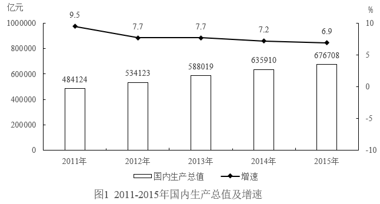

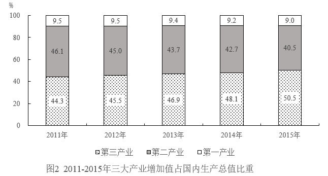

#### 第 1 题　qid 5658280 · 数学运算

2015年，第一产业增加值约比上年同期增加了        。

- **A**. 0.2%
- **B**. 2.2%
- **C**. 4.1%　✅
- **D**. 6.7%

**答案**：C

**官方解析**

根据题干“2015年······约比上年同期增加了”，结合选项为百分数，可判定本题为一般增长率问题。定位统计图1可得：2014年、2015年国内生产总值分别为635910亿元、676708亿元，2015年国内生产总值增速为6.9%；定位统计图2可得：2014年、2015年第一产业增加值占国内生产总值的比重分别为9.2%、9.0%。

方法一：根据公式：部分=整体×比重，增长率，则题干所求，与C项最接近。

方法二：根据公式：两期比重差，设2015年第一产业增加值同比增速为x，则，解得，与C项最接近。

故正确答案为C。

---

#### 第 2 题　qid 5658295 · 数学运算

关于2011-2015年国内生产总值及三次产业增加值结构，能够从上述资料中推出的是：

- **A**. 每年的第一产业增加值均不高于上年水平
- **B**. 五年国内生产总值总量在300万亿元以上
- **C**. 2012年第二产业增加值略高于25万亿元
- **D**. 2014年第三产业增加值超过第一产业的5倍　✅

**答案**：D

**官方解析**

A项：定位统计图1和图2，可知2011-2015年各年国内生产总值及第一产业占比。但材料中并未给出2010年的相关数据，无法确定2011年第一产业增加值与2010年相比的大小情况，无法推出，错误；

B项：定位统计图1可知，2011-2015年国内生产总值分别为484124亿元、534123亿元、588019亿元、635910亿元、676708亿元。则五年国内生产总值万亿元万亿元，错误；

C项：定位统计图1和图2可知，2012年国内生产总值为534123亿元；第二产业占比为45.0%。根据公式：部分=整体×比重，则2012年第二产业增加值为534123×45.0%&lt;550000×45.0%=247500亿元&lt;25万亿元，错误；

D项：定位统计图1和图2可知，2014年国内生产总值为635910亿元；第一产业占比为9.2%，第三产业占比为48.1%。根据公式：部分=整体×比重，则2014年第三产业増加值是第一产业的倍，超过5倍，正确。

故正确答案为D。

---

### 材料 2

#### 第 3 题　qid 5658328 · 数学运算

2015年第三季度，有（    ）个周五进口铁矿石国内港口总库存多于上个周五。

- **A**. 6
- **B**. 7
- **C**. 8　✅
- **D**. 9

**答案**：C

**官方解析**

定位统计表可知2015年第三季度各周五进口铁矿石国内港口总库存。其中多于上个周五的有：7月3日（8177万吨＞7871万吨）、7月10日（8201万吨＞8177万吨）、7月24日（8175万吨＞8115万吨）、8月7日（8156万吨＞8068万吨）、8月14日（8167万吨＞8156万吨）、9月11日（8125万吨＞7994万吨）、9月18日（8290万吨＞8125万吨）、9月25日（8552万吨＞8290万吨），共8个。
故正确答案为C。

---

#### 第 4 题　qid 5658329 · 数学运算

2015年第三季度进口铁矿石国内港口总库存最少的周五，三个不同进口来源的铁矿石中库存量高于上周五水平的是（    ）。

- **A**. 澳洲铁矿石
- **B**. 巴西铁矿石　✅
- **C**. 澳洲和印度铁矿石
- **D**. 巴西和印度铁矿石

**答案**：B

**官方解析**

定位统计表可知2015年第三季度（7-9月）各周五自澳洲、巴西、印度进口的铁矿石库存量及进口铁矿石国内港口总库存。其中国内港口总库存最少的周五是9月4日（7994万吨），铁矿石库存量高于上周五水平的是巴西铁矿石（1344万吨＞1339万吨）。
故正确答案为B。

---

#### 第 5 题　qid 5658331 · 数学运算

2015年8月各周五中，澳洲铁矿石库存最多是印度铁矿石库存的约        倍。

- **A**. 95
- **B**. 103
- **C**. 117　✅
- **D**. 136

**答案**：C

**官方解析**

根据题干“2015年8月各周五中······是······的约<u>        </u>倍”，可判定本题为现期倍数问题。定位统计表可知2015年8月各周五澳洲和印度的铁矿石库存情况。由此分别求出各周五的倍数：2015年8月7日，倍；2015年8月14日，倍；2015年8月21日，倍；2015年8月28日，倍。比较可知，最大的为117倍（2015年8月21日）。

故正确答案为C。

---

#### 第 6 题　qid 5658332 · 数学运算

关于2015年第三季度各个周五的进口铁矿石国内港口库存，能够从上述资料中推出的是        。

- **A**. 每个周五澳洲铁矿石库存均占总库存的一半以上　✅
- **B**. 最后一个周五澳洲铁矿石库存是巴西的3倍以上
- **C**. 有3个周五印度铁矿石的库存量与上个周五相同
- **D**. 每个周五印度铁矿石的库存量均不到总库存的1%

**答案**：A

**官方解析**

A项：定位统计表可知2015年第三季度各个周五澳洲及国内港口铁矿石库存情况。题干所求为：，通过计算、比较可知，每个周五澳洲铁矿石库存均占总库存的一半以上，正确；

B项：定位统计表可知2015年第三季度最后一个周五澳洲铁矿石库存为4311万吨，巴西铁矿石库存为1467万吨，则所求倍数为倍＜3倍，错误；

C项：定位统计表可知2015年第三季度各个周五印度铁矿石库存量，其中与上个周五库存量相同的有2015年7月10日（32万吨）和8月7日（45万吨），共2个，错误；

D项：定位统计表可知2015年第三季度各个周五印度及国内港口铁矿石库存情况。其中2015年9月11日：100＞8125×1%=81.25，错误。

故正确答案为A。

---

#### 第 7 题　qid 5657670 · 数学运算

假设一根铁丝环绕地球赤道一周，若它受冷冷缩，长度减少了400米，那它陷进地表平均大约        米。（地球半径约为6370千米，地球近似看成一个球体）

- **A**. 0.06
- **B**. 0.4
- **C**. 64　✅
- **D**. 400

**答案**：C

**官方解析**

设铁丝冷缩前环绕赤道一周的半径为R米，冷缩后半径为r米，则，因此铁丝受冷冷缩后陷进地表米。

故正确答案为C。

---

#### 第 8 题　qid 5657671 · 数学运算

一个密码有6个位置，每个位置可以用0~9这十个数中的任意一个或A~Z这26个字母中的任意一个。某人尝试两种方案，方案一：6个位置全都用数字；方案二：数字和字母任意选用。则方案二的密码设置方法数大约是方案一的        倍。

- **A**. 2023
- **B**. 2436
- **C**. 1989
- **D**. 2177　✅

**答案**：D

**官方解析**

根据题意，方案一为6个位置全都用数字，则每个位置有10种可能，共有种情况。方案二为数字和字母任意选用，则每个位置有10+26=36种可能，共有种情况。因此方案二的密码设置方法数是方案一的倍。

故正确答案为D。

---

#### 第 9 题　qid 5657678 · 数学运算

如图是一个无盖正方体盒子展开后的平面图，A、B、C是展开图上的三点，则在原正方体盒子中的大小是（    ）。

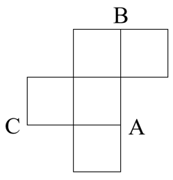

- **A**. 

- **B**. 

- **C**. 

　✅
- **D**. 

**答案**：C

**官方解析**

如下图所示，是无盖正方体盒子折叠后的立体图，A、B、C分别是正方体的三个顶点。连接AB、AC、BC，可知AB、AC、BC均为正方体面上的对角线，长度相等，则三角形ABC为等边三角形，的大小是。

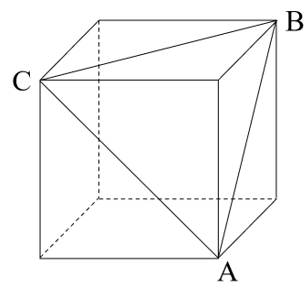

故正确答案为C。

---

#### 第 10 题　qid 5657679 · 数学运算

某人上楼梯，每一步可以跨1个台阶或2个台阶或3个台阶，则上到第5个台阶，有（    ）种方法。

- **A**. 3
- **B**. 6
- **C**. 8
- **D**. 13　✅

**答案**：D

**官方解析**

每一步可以跨1个台阶或2个台阶或3个台阶，分情况列表如下：

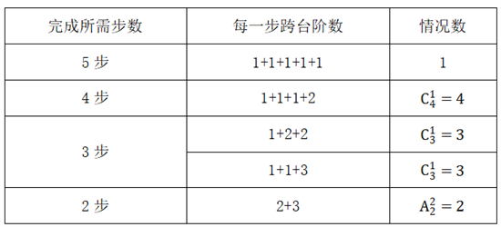

综上所述，共有1+4+3+3+2=13种方法。

故正确答案为D。

---

#### 第 11 题　qid 5657684 · 数学运算

有两枚形状相同的硬币，将硬币B绕硬币A滚动一圈回到起点（滚动过程中没有滑动），则硬币B自转了        圈。

- **A**. 
1

- **B**. 

- **C**. 
2
　✅
- **D**. 

**答案**：C

**官方解析**

硬币以圆心为基点旋转360度即为自转1圈。设硬币的半径为r，如图所示，硬币B的圆心移动路程应为一个半径为2r的圆的周长。

用硬币B的圆心移动路程，除以硬币B的周长，即为硬币B绕硬币A滚动一圈回到起点时，自身旋转的圈数，即圆心移动路程÷圆周长=圈数。硬币B的圆心移动路程为，硬币B的周长为，则硬币B自转了圈。

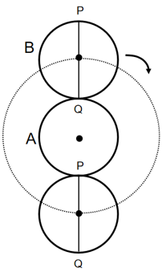

故正确答案为C。

备注：若圆的半径为r，圆的半径为R，且满足R=kr，圆沿圆外无滑动地滚动一圈回到原出发点，则圆自转了（k+1）圈。

---

#### 第 12 题　qid 5657689 · 数学运算

有一场考试将在12月的某个星期日举行，若11月1日为周三，下列可能的时间是        。

- **A**. 12月7日
- **B**. 12月12日
- **C**. 12月17日　✅
- **D**. 12月21日

**答案**：C

**官方解析**

12月1日与11月1日相差30天，，经过了4个整周期多2天，即12月1日为星期五，则12月的星期日分别为12月3日、12月10日、12月17日、12月24日、12月31日，只有C项满足。

故正确答案为C。

---

#### 第 13 题　qid 5657695 · 数学运算

有4个圆柱形杯子甲、乙、丙、丁，乙的高是甲的两倍，杯口宽是甲的一半；丙的高是甲的倍，杯口宽是甲的倍；丁的高是甲的倍，杯口宽是甲的倍，则4个杯子中容积最小的是<u>        </u>。

- **A**. 甲
- **B**. 乙　✅
- **C**. 丙
- **D**. 丁

**答案**：B

**官方解析**

赋值甲杯的高为1、杯子底面直径为4，则底面半径为2。根据，可得：。结合题干条件有：

乙杯的高为2、杯子底面直径为，则底面半径为1，；

丙杯的高为、杯子底面直径为，则底面半径为，；

丁杯的高为、杯子底面直径为，则底面半径为3，。

比较可知，容积最小的是乙杯。

故正确答案为B。

---

#### 第 14 题　qid 5657700 · 数学运算

某学生乘坐地铁上学，所搭乘的地铁首班5：31到站，每2分钟一班，每班车停靠时间为30秒，该学生每次到达地铁站台的时间为5：30至5：35之间的任意时刻且等可能，则该学生无需等候就能乘上地铁的概率为        。

- **A**. 

- **B**. 

- **C**. 

　✅
- **D**. 

**答案**：C

**官方解析**

根据题意可知，该学生到达地铁站台时间为5：30至5：35之间的任意时刻且等可能，则总情况为5分钟内的任意时刻到达，即有5×60种情况。已知该地铁每2分钟一班，且第一班地铁到站时间为5：31，则第二班地铁到站时间为5：33，第三班地铁到站时间为5：35。由此可知，在这5分钟内，地铁可停靠两个班次，每班车停靠时间为30秒，共停靠30+30=60秒，该学生若想无需等候就能乘上地铁，到站时间应为地铁停靠时间的任一时刻，则满足题意的情况数有60种。故所求概率。

故正确答案为C。

---

#### 第 15 题　qid 5657703 · 数学运算

某旅行社为吸引市民组团去风景区旅游，推出了下图对话中收费标准。某单位组织员工去风景区旅游，共支付给旅行社旅游费用27000元，则该单位这次共有<u>        </u>员工去风景区旅游。

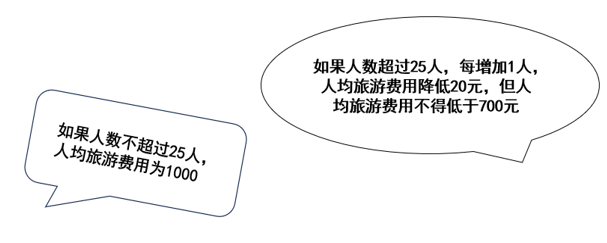

- **A**. 20名
- **B**. 25名
- **C**. 30名　✅
- **D**. 40名

**答案**：C

**官方解析**

根据题干，若旅游人数不超过25人，则该单位应支付的旅游费用最多为25×1000=25000元，故该单位旅游人数超过25人，排除A、B两项。代入C项，可知员工数增加了30-25=5人，人均旅游费用降低为1000-5×20=900元&gt;700元，总费用为30×900=27000元，符合题目要求，当选。
故正确答案为C。

---

#### 第 16 题　qid 5657708 · 数学运算

某公司现要建一个货物中转站，如图，直线a，b，c表示三条公路，要求中转站到三条公路的距离相等，则可供选择的地址有<u>        </u>。

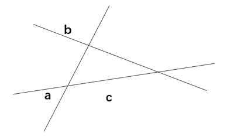

- **A**. 一处
- **B**. 两处
- **C**. 三处
- **D**. 四处　✅

**答案**：D

**官方解析**

由三角形内角平分线的交点到三角形三边的距离相等，可得三角形内角平分线的交点满足条件（一处）。如图，三条公路的交点分别为A、B、C，点P为两条外角平分线的交点。过点P作PE垂直AB，作PF垂直BC，又因BP平分，故，则PE=PF，同理，过点P作PH垂直AC，则PF=PH。由此得出结论：三角形两条外角平分线的交点到其三边的距离也相等。该三角形为锐角三角形，两条外角平分线的交点在三条边外各有一个（三处）。故可供选择的地址有四处。

故正确答案为D。

---

## 判断推理

### 第 1 题　qid 5660568 · 定义判断

第一印象效应是指交往双方形成的第一次印象对今后交往关系的影响。
下列选项中属于第一印象效应的是：

- **A**. 马明穿着红衬衫，满头大汗跑到公司面试，面试官觉得马明不像学生，没录用他　✅
- **B**. 小东通过亲戚进入某公司，并且认识了公司的领导，领导一直对小东照顾有加
- **C**. 老李因为犯罪而入狱一年，出狱后找工作时，很多单位听说他坐过牢而不愿招他
- **D**. 张桦到了新公司后，因为其性格和善，待人热忱，与周围的同事相处融洽

**答案**：A

**官方解析**

第一步：找出定义关键词。
“交往双方形成的第一次印象对今后交往关系的影响”。
第二步：逐一分析选项。
A项：马明穿着红衬衫，满头大汗跑到公司面试，面试官觉得马明不像学生，这说明二人初次见面时，马明给面试官留下的第一次印象不佳，结果没录用他，说明第一次印象影响了马明的后续录用，对双方今后的交往关系产生了影响，符合“交往双方形成的第一次印象对今后交往关系的影响”，符合定义，当选；
B项：小东通过亲戚进入某公司，并且认识了公司的领导，领导一直对小东照顾有加，未提及领导对小东的第一次印象如何，不符合“交往双方形成的第一次印象对今后交往关系的影响”，不符合定义，排除；
C项：老李出狱后找工作时，很多单位听说他坐过牢而不愿招他，这些单位是因为老李坐牢的经历而不招他，不是受第一次印象的影响，不符合“交往双方形成的第一次印象对今后交往关系的影响”，不符合定义，排除；
D项：张桦到了新公司后，因为其性格和善，待人热忱，与周围的同事相处融洽，张桦是因为性格好才能与同事相处融洽，不是受第一次印象的影响，不符合“交往双方形成的第一次印象对今后交往关系的影响”，不符合定义，排除。
故正确答案为A。

---

### 第 2 题　qid 5660570 · 定义判断

头脑风暴法是指一组人员通过召开特殊的专题会议形式，对某一特定问题，与会成员之间互相交流、互相启迪、互相激励、互相修正、互相补充、集思广益，从而达到产生大量新设想的集体性发散思维技法。
下列属于头脑风暴法的是        。

- **A**. 市政府召开全市安全生产电视电话会议
- **B**. 谷歌在美国旧金山举行新品发布会，最新版Android系统正式与大家见面
- **C**. 物理学院在理化大楼科技展厅召开年终总结大会，六十余名教授参会
- **D**. 电讯公司经理召集不同专业的技术人员共同讨论去除电线上积雪的方法　✅

**答案**：D

**官方解析**

第一步：找出定义关键词。
“一组人员通过召开特殊的专题会议形式”、“对某一特定问题，与会成员之间互相交流、互相启迪、互相激励、互相修正、互相补充、集思广益”、“产生大量新设想”。
第二步：逐一分析选项。
A项：市政府召开全市安全生产电视电话会议，全市安全生产涉及方方面面的问题，不属于针对某一特定问题，不符合“对某一特定问题，与会成员之间互相交流、互相启迪、互相激励、互相修正、互相补充、集思广益”，不符合定义，排除；
B项：谷歌举行新品发布会，目的是向消费者介绍最新版Android系统，不是针对某一特定问题进行讨论，不符合“对某一特定问题，与会成员之间互相交流、互相启迪、互相激励、互相修正、互相补充、集思广益”、“产生大量新设想”，不符合定义，排除；
C项：物理学院召开年终总结大会，是对本年度的工作进行总结概括，不是针对某一特定问题进行讨论，不符合“对某一特定问题，与会成员之间互相交流、互相启迪、互相激励、互相修正、互相补充、集思广益”、“产生大量新设想”，不符合定义，排除；
D项：电讯公司经理召集不同专业的技术人员，符合“一组人员通过召开特殊的专题会议形式”，共同讨论去除电线上积雪的方法，符合“对某一特定问题，与会成员之间互相交流、互相启迪、互相激励、互相修正、互相补充、集思广益”，符合定义，当选。
故正确答案为D。

---

### 第 3 题　qid 5660572 · 定义判断

供应商是指直接向零售商提供商品及相应服务的企业及其分支机构、个体工商户，包括制造商、经销商和其他中介商。
下列不属于供应商的是        。

- **A**. 王某在香港开了家“皮包公司”，倒卖电子设备给内地某集团公司　✅
- **B**. 张某在农村承包了块土地，种植了土豆出售给淀粉加工厂
- **C**. 曹某所工作的企业技术中心为集团公司提供相关器材和咨询服务
- **D**. 李某的公司为某房产集团很多楼盘提供外墙防水材料

**答案**：A

**官方解析**

第一步：找出定义关键词。
“直接向零售商提供商品及相应服务的企业及其分支机构、个体工商户”、“包括制造商、经销商和其他中介商”。
第二步：逐一分析选项。
A项：王某开的是皮包公司，通过“倒卖产品”向零售商提供商品，不属于正规合法的经销商或中介商，更不是制造商，不符合“包括制造商、经销商和其他中介商”，不符合定义，当选；
B项：张某在农村承包了块土地，种植了土豆出售给淀粉加工厂，即张某直接向淀粉加工厂提供商品，符合“直接向零售商提供商品及相应服务的企业及其分支机构、个体工商户”、“包括制造商、经销商和其他中介商”，符合定义，排除；
C项：曹某所工作的企业技术中心为集团公司提供相关器材和咨询服务，即曹某所在企业直接向集团公司提供商品及服务，符合“直接向零售商提供商品及相应服务的企业及其分支机构、个体工商户”、“包括制造商、经销商和其他中介商”，符合定义，排除；
D项：李某的公司为某房产集团很多楼盘提供外墙防水材料，即李某的公司直接向房产集团提供商品，符合“直接向零售商提供商品及相应服务的企业及其分支机构、个体工商户”、“包括制造商、经销商和其他中介商”，符合定义，排除。
本题为选非题，故正确答案为A。

---

### 第 4 题　qid 5660574 · 定义判断

差异化战略是指为使企业产品与竞争对手产品有明显的区别，形成与众不同的特点而采取的一种战略。其核心是取得某种对顾客有价值的独特性。
根据上述定义，下列不涉及差异化战略的是：

- **A**. 某公司生产的绿茶饮料有十分独特的风味
- **B**. 某公司改进生产工艺后，生产的产品价格比同类产品的价格低了将近10%　✅
- **C**. 某品牌将目标消费者定位于特立独行的年轻群体，成功地占领了小众市场
- **D**. 某品牌汽车的独特卖点就是先进的无人驾驶技术

**答案**：B

**官方解析**

第一步：找出定义关键词。
“企业产品与竞争对手产品有明显的区别”、“取得某种对顾客有价值的独特性”。
第二步：逐一分析选项。
A项：某公司生产的绿茶饮料的风味具有独特性，符合“企业产品与竞争对手产品有明显的区别”、“取得某种对顾客有价值的独特性”，符合定义，排除；
B项：某公司的产品价格比同类产品的价格低，但未说明该公司的产品本身是否具有与众不同的特点，也未体现出该产品是否取得了某种对顾客有价值的独特性，不符合“企业产品与竞争对手产品有明显的区别”、“取得某种对顾客有价值的独特性”，不符合定义，当选；
C项：某品牌将目标消费者定位于特立独行的年轻群体，说明对目标消费者的定位与众不同，且成功占领了小众市场，说明该品牌的产品确实取得了某种对目标消费者有价值的独特性，符合“企业产品与竞争对手产品有明显的区别”、“取得某种对顾客有价值的独特性”，符合定义，排除；
D项：某品牌汽车的独特卖点是先进的无人驾驶技术，符合“企业产品与竞争对手产品有明显的区别”、“取得某种对顾客有价值的独特性”，符合定义，排除。
本题为选非题，故正确答案为B。

---

### 第 5 题　qid 5660577 · 定义判断

鲨鱼效应，因为鲨鱼没有鳔，为了不使自己下沉就不停的游动，使得身体越来越强壮。这里指先天的不足不一定全是坏事，只要自己努力，总会化劣势为优势。
下列不属于鲨鱼效应的是        。

- **A**. 王某语言能力很差，但李主管发现他肯吃苦、肯做事，就经常指导王某工作，王某每次都会拿笔记下来，之后成为了后勤主管，在工作时能详细记录每笔采购和销售情况
- **B**. 小东从小就不善言辞，但做事情很专注，通过不断努力，成为了科研院所的研究人员，并成功研制出多款科技产品
- **C**. 谢某从小资质一般，反应较慢，在其他同学玩耍的时候他一直在学习，遇到不懂的题目会反复琢磨，直到弄懂为止，最终考上了理想的大学
- **D**. 小李毕业后进入某科技公司，发现大学学的知识派不上用处，觉得前途很迷茫，后来在同事的帮助和自己的努力下，逐渐成为工作中的小专家　✅

**答案**：D

**官方解析**

第一步：找出定义关键词。
“先天的不足”、“自己努力”、“化劣势为优势”。
第二步：逐一分析选项。
A项：王某语言能力很差，符合“先天的不足”，但他肯吃苦、肯做事，在被指导时每次都会拿笔记下来，符合“自己努力”，之后成为了后勤主管，在工作时能详细记录每笔采购和销售情况，符合“化劣势为优势”，符合定义，排除；
B项：小东从小就不善言辞，符合“先天的不足”，但做事情很专注，不断努力，符合“自己努力”，成为了科研院所的研究人员，并成功研制出多款科技产品，符合“化劣势为优势”，符合定义，排除；
C项：谢某从小资质一般，反应较慢，符合“先天的不足”，在其他同学玩耍的时候他一直在学习，符合“自己努力”，最终考上了理想的大学，符合“化劣势为优势”，符合定义，排除；
D项：小李发现大学学的知识派不上用处，觉得前途很迷茫，不符合“先天的不足”，不符合定义，当选。
本题为选非题，故正确答案为D。

---

### 第 6 题　qid 5660578 · 图形推理

下列选项中，符合所给图形的变化规律的是：<u>        </u>。

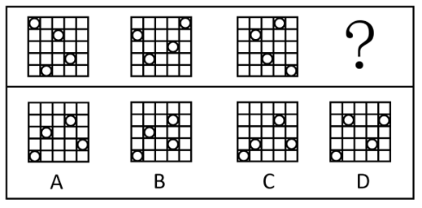

- **A**. A　✅
- **B**. B
- **C**. C
- **D**. D

**答案**：A

**官方解析**

解法一：元素组成相同，优先考虑位置规律。观察发现，将题干图形内外分开看，如下图所示，外圈中，1号和2号小白圆均为每次顺时针平移4格，排除B、D两项；内圈中，3号和4号小白圆均为每次顺时针平移2格，排除C项，只有A项符合。

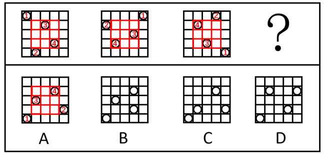

解法二：元素组成相同，优先考虑位置规律。观察发现，题干图形从左至右依次整体顺时针旋转，故？处图形应为图3整体顺时针旋转得到，只有A项符合。

故正确答案为A。

---

### 第 7 题　qid 5660579 · 图形推理

下列选项中，符合所给图形的变化规律的是：<u>        </u>。

- **A**. A
- **B**. B
- **C**. C　✅
- **D**. D

**答案**：C

**官方解析**

元素组成相似，优先考虑样式规律。观察发现，题干图形内部相同图案重复出现，考虑图案的遍历。题干图形共有8种图案，且每种图案重复出现两次，只有C项符合。
故正确答案为C。

---

### 第 8 题　qid 5660580 · 图形推理

下列选项中，符合所给图形的变化规律的是：<u>        </u>。

- **A**. A
- **B**. B　✅
- **C**. C
- **D**. D

**答案**：B

**官方解析**

元素组成相似，优先考虑样式规律。观察发现，题干图形的箭头的方向为“右、右、左”每三个循环，故？处图形的箭头的方向应朝右，排除C项；再次观察发现，题干每个箭头上的总线条数没有规律，但方向朝右箭头的上半部分的线条数依次为1、2、3、4、5、6（如下图所示），故？处朝右箭头的上半部分的线条数应为7，只有B项符合。

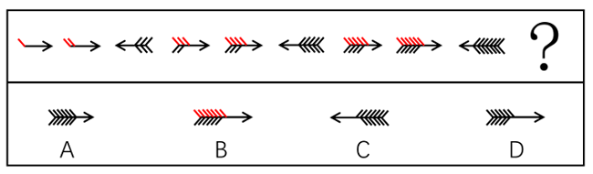

故正确答案为B。

---

### 第 9 题　qid 5660582 · 图形推理

下列选项中，符合所给图形的变化规律的是：<u>        </u>。

- **A**. A
- **B**. B
- **C**. C　✅
- **D**. D

**答案**：C

**官方解析**

元素组成相似，且相同线条重复出现，优先考虑样式规律中的加减同异。本题为金字塔类题目，要自下向上找规律，即下层相邻的两幅图之间进行运算得到上面的一幅图，如下图箭头指向所示：

通过第四行到第三行的运算可知：外框保持不变，内部图案求异，且黑球和白球求异后得到黑球；经验证，第三行到第二行满足此规律；？处应用此规律，只有C项符合。

故正确答案为C。

注：第二行最右侧的两个黑球求异后根据之前的规则应为空白，但四个选项中均不存在最右侧为空白的情况，由于两个黑球求异一定不是黑球，故在A、C两项中择优选择最右侧是白球的C项。

---

### 第 10 题　qid 5660583 · 图形推理

下列选项中，符合所给图形的变化规律的是：<u>        </u>。

- **A**. A
- **B**. B
- **C**. C
- **D**. D　✅

**答案**：D

**官方解析**

元素组成相同，优先考虑位置规律。观察发现，黑球每次顺时针平移1格，且依次交替出现在框内和框外；叉号每次顺时针平移2格，且依次交替出现在框外和框内；白球每次顺时针平移3格，且依次交替出现在框内和框外，只有D项符合。
故正确答案为D。

---

### 第 11 题　qid 5660584 · 图形推理

下列选项中，符合所给图形的变化规律的是：<u>        </u>。

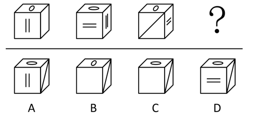

- **A**. A
- **B**. B
- **C**. C　✅
- **D**. D

**答案**：C

**官方解析**

元素组成相同，优先考虑位置规律。观察发现，六面体以竖轴为基准，每次逆时针旋转，故？处六面体顶面内的椭圆方向应与图二相同，排除B项；图一右侧面的空白面应旋转至？处的正面，排除A、D两项，只有C项符合。

故正确答案为C。

---

### 第 12 题　qid 5660586 · 图形推理

下列选项中，符合所给图形的变化规律的是：

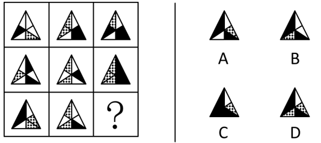

- **A**. A
- **B**. B
- **C**. C
- **D**. D　✅

**答案**：D

**官方解析**

元素组成相似，优先考虑样式规律。题干每行图形的轮廓相同，考虑黑白运算。九宫格优先横向观察，前两行图形黑白运算的规律为：白+点=点、白+白=白、黑+点=黑、黑+白=黑、白+黑=黑、点+黑=黑、点+白=点。第三行应用此规律，只有D项符合。
故正确答案为D。

---

### 第 13 题　qid 5660587 · 图形推理

下列选项中，符合所给图形的变化规律的是：

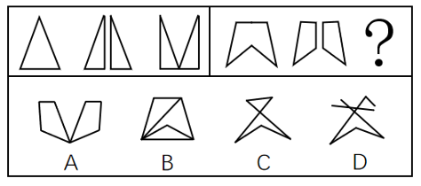

- **A**. A　✅
- **B**. B
- **C**. C
- **D**. D

**答案**：A

**官方解析**

元素组成相同，考虑位置规律。观察发现，第一组图中，图1中的三角形沿对称轴一分为二得到图2，图2中三角形e和三角形f左右位置互换得到图3（如下图所示），第二组图应遵循相同的规律，只有A项符合。

故正确答案为A。

---

### 第 14 题　qid 5660591 · 图形推理

下列选项中，符合所给图形的变化规律的是：

- **A**. A
- **B**. B
- **C**. C　✅
- **D**. D

**答案**：C

**官方解析**

元素组成不同，且无属性规律，优先考虑数量规律。观察发现，题干图形内、中、外环均出现黑点，考虑黑点的数量，题干图1内、中、外环的黑点数均为3，图2内、中、外环的黑点数均为4，图3内、中、外环的黑点数均为5，故“？”处图形内、中、外环的黑点数应均为6，没有唯一答案。继续观察发现，题干图形内、中、外环的黑点均依次首尾相连（如下图所示），只有C项符合。

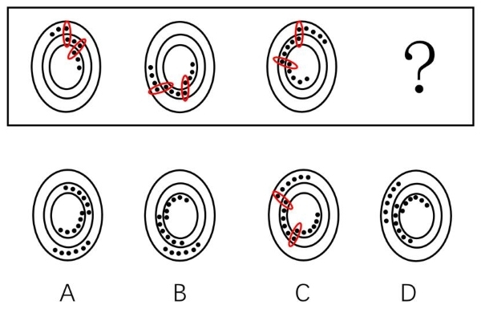

故正确答案为C。

---

### 第 15 题　qid 5660597 · 图形推理

下列选项中，与其他三个图形规律不同的是：

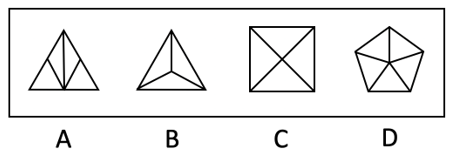

- **A**. A　✅
- **B**. B
- **C**. C
- **D**. D

**答案**：A

**官方解析**

解法一：图形元素组成不同，可考虑数量规律。题干图形的封闭区域多，优先考虑数面，但无规律。观察发现，B、C、D三项的面均只有一种形状，只有A项的面有两种三角形的形状。
本题为选非题，故正确答案为A。
解法二：图形元素组成不同，优先考虑属性规律。观察发现，题干图形均为对称图形，并且A、B、D三项为轴对称图形，只有C项为既轴对称又中心对称图形。
本题为选非题，故正确答案为C。
解法三：图形元素组成不同，可考虑数量规律。题干图形中出现多边形，考虑数直线。观察发现，A、B、C三项均为6条直线，只有D项为10条直线。
本题为选非题，故正确答案为D。
解法四：图形元素组成不同，可考虑数量规律。题干图形中出现“田”字变形，考虑笔画数。观察发现，A、B、C三项的笔画数均为2，只有D项笔画数为3。
本题为选非题，故正确答案为D。
解法五：图形元素组成不同，可考虑数量规律。观察发现，题干图形中存在较多的直线交叉，考虑交点数量。整体考虑交点数没有规律，考虑点的细化。B、C、D三项内部交点数均为1，只有A项内部交点数为0。
本题为选非题，故正确答案为A。
解法六：图形元素组成不同，可考虑数量规律。观察发现，A、B、D三项中框内的直线数量跟外框线数量一样，只有C项不一样。
本题为选非题，故正确答案为C。
解法七：图形元素组成不同，可考虑数量规律。观察发现，B、C、D三项中的对称轴数量和面数量一样，只有A项不一样。
本题为选非题，故正确答案为A。
注：本题有争议，七个规律都有道理，但根据多边形被分割，面的数量和形状明显，粉笔更倾向根据面形状的种类择优选择A项，争议题大家了解基本解题思路即可，无需作为备考重点。

---

### 第 16 题　qid 5660600 · 逻辑判断

传统生产要素对经济增长的作用是递减的，而人力资本则具有报酬递增的特征，是可持续的增长源泉。因此，能够显著强化人力资本这个关键要素，就能够实现有质量有效益的中高速增长，保证中等收入群体不断扩大。
如果上述论断为真，则下列        项必定为真。

- **A**. 只有保证中等收入群体不断扩大，才能显著强化人力资本　✅
- **B**. 人力资本以外的传统生产要素不是可持续的增长源泉
- **C**. 只要实现有质量的中高速增长就能保证中等收入群体不断扩大
- **D**. 人力资本并不是生产要素，只是经济增长的要素

**答案**：A

**官方解析**

第一步：翻译题干。

①人力资本可持续的增长源泉；

②显著强化人力资本实现有质量有效益的中高速增长；

③显著强化人力资本保证中等收入群体不断扩大。

第二步：逐一分析选项。

A项：翻译为“显著强化人力资本保证中等收入群体不断扩大”，这是对③的肯前，肯前必肯后，可以推出，当选；

B项：题干未提及传统生产要素与可持续的增长源泉的关系，无法推出，排除；

C项：题干未提及实现有质量的中高速增长与保证中等收入群体不断扩大的关系，无法推出，排除；

D项：题干未提及人力资本与生产要素的关系，无法推出，排除。

故正确答案为A。

---

### 第 17 题　qid 5660603 · 逻辑判断

传统民间文艺是过去人们的一种生活方式。它之所以在当下式微，是因为它远离了当代人的生活，不再被现代生活所需要。有调查显示，我国青少年对白雪公主、丑小鸭等西方童话角色如数家珍，对孟姜女、田螺姑娘等中国民间故事人物却知之甚少。我国传统民间故事正在日益远离当下国人的生活。
如果上述论述为真，那么下列        项不是传统民间文艺式微的原因。

- **A**. 传统民间文艺缺乏现代化的表现方式
- **B**. 传统故事情节元素带有很深厚的农耕社会色彩
- **C**. 传统故事的表达方式和思维观念与现代社会有所脱节
- **D**. 传统民间故事全方位、无死角地覆盖了生活的方方面面　✅

**答案**：D

**官方解析**

第一步：找出论点和论据。
论点：传统民间文艺在当下式微。
论据：它（传统民间文艺）远离了当代人的生活，不再被现代生活所需要。有调查显示，我国青少年对白雪公主、丑小鸭等西方童话角色如数家珍，对孟姜女、田螺姑娘等中国民间故事人物却知之甚少。我国传统民间故事正在日益远离当下国人的生活。
本题论点和论据讨论的都是传统民间文艺在当下式微的现象，二者话题一致，加强优先考虑补充论据，且本题为选非题，将可以加强的选项排除即可。
第二步：逐一分析选项。
A项：该项指出传统民间文艺缺乏现代化的表现方式，补充说明传统民间文艺在当下式微的原因，可以加强，排除；
B项：该项指出传统故事情节元素带有很深厚的农耕社会色彩，说明传统民间文艺远离了当代人的生活，补充说明传统民间文艺在当下式微的原因，可以加强，排除；
C项：该项指出传统故事的表达方式和思维观念与现代社会有所脱节，补充说明传统民间文艺在当下式微的原因，可以加强，排除；
D项：该项指出传统民间故事覆盖了生活的方方面面，而论点讨论的是传统民间文艺在当下式微的原因，话题不一致，无法加强，当选。
本题为选非题，故正确答案为D。

---

### 第 18 题　qid 5660606 · 逻辑判断

原子钟是一种基于原子的能级跃迁周期的计时工具，能满足天文、工业以及物理实验上对于超精密计时的需求。因此，原子钟必须安放在海拔高度为零的零磁场环境中。
要使上述结论能够成立，需要下列        项作为前提。

- **A**. 原子钟的精度可以达到每2000万年误差1秒
- **B**. 目前，我国研制的NIM5铯原子喷泉钟是世界上最好的铯原子钟之一
- **C**. 原子钟最初是由物理学家创造出来用于探索宇宙本质的
- **D**. 海拔高度和磁场会对原子的能级跃迁周期产生影响　✅

**答案**：D

**官方解析**

第一步：找出论点和论据。
论点：原子钟必须安放在海拔高度为零的零磁场环境中。
论据：原子钟是一种基于原子的能级跃迁周期的计时工具，能满足天文、工业以及物理实验上对于超精密计时的需求。
本题论点讨论的是原子钟必须安放的海拔和磁场环境，论据讨论的是原子钟是基于原子的能级跃迁周期的计时工具，二者话题不一致，加强优先考虑搭桥，即在“海拔和磁场环境”和“原子的能级跃迁周期”之间建立联系。
第二步：逐一分析选项。
A项：说明原子钟的误差特别小，但原子钟的误差大小与题干论点、论据讨论的话题无关，无法加强，排除；
B项：说明目前我国研制的NIM5铯原子喷泉钟是世界上最好的铯原子钟之一，但原子钟的好坏与题干论点、论据讨论的话题无关，无法加强，排除；
C项：说明原子钟最初被用来探索宇宙本质，但原子钟最初的功能与题干论点、论据讨论的话题无关，无法加强，排除；
D项：说明海拔和磁场对原子的能级跃迁周期产生影响，建立了“海拔和磁场环境”和“原子的能级跃迁周期”之间的联系，搭桥项，可以加强，当选。
故正确答案为D。

---

### 第 19 题　qid 5660608 · 逻辑判断

德国研究人员通过动物实验证实，中草药雷公藤中含的活性物质一一雷公藤红素不仅有助减肥，还可缓解肥胖小鼠的糖尿病症状，有望用于新型减肥药物的研发。研究发现，通常情况下，肥胖小鼠会因一种名为瘦素的激素不起作用而没有饱腹感，而雷公藤红素能够激活小鼠大脑内的饱腹中枢，使小鼠能控制饮食，进而更好地调节体重。
下列        项如果为真，最能支持上述论述。

- **A**. 雷公藤红素毒副作用较大，不可随意服用
- **B**. 雷公藤有祛风除湿、活血通络、消肿止痛等功效
- **C**. 瘦素在人体内和小鼠体内的作用存在细微差别
- **D**. 雷公藤可以让瘦素重新发挥作用　✅

**答案**：D

**官方解析**

第一步：找出论点和论据。
论点：中草药雷公藤中含的活性物质一一雷公藤红素不仅有助减肥，还可缓解肥胖小鼠的糖尿病症状，有望用于新型减肥药物的研发。
论据：通常情况下，肥胖小鼠会因一种名为瘦素的激素不起作用而没有饱腹感，而雷公藤红素能够激活小鼠大脑内的饱腹中枢，使小鼠能控制饮食，进而更好地调节体重。
本题论点论据讨论的均是雷公藤红素有助于减肥，话题一致，加强优先考虑补充论据，即解释雷公藤红素有助于减肥的原因或者举例加强。
第二步：逐一分析选项。
A项：说明雷公藤红素毒副作用较大，而题干讨论的是其对减肥的作用，话题不一致，无法加强，排除；
B项：说明雷公藤有祛风除湿、活血通络、消肿止痛等功效，而题干讨论的是其对减肥的作用，话题不一致，无法加强，排除；
C项：说明瘦素在小鼠体内和人体内的作用不一样，即在小鼠体内的实验未必能应用在人体内，有削弱力度，无法加强，排除；
D项：说明雷公藤能让瘦素发挥作用，即解释为什么雷公藤有助于减肥，补充论据，可以加强，当选。
故正确答案为D。

---

### 第 20 题　qid 5660609 · 类比推理

某设计院有150名员工，（1）有人会讲法语；（2）有人不会讲法语；（3）院长不会讲法语。
如果上述三个条件中只有一个是真的，那么下列        项判断是正确的。

- **A**. 150人都会讲法语　✅
- **B**. 150人都不会讲法语
- **C**. 仅有10人会讲法语
- **D**. 不能确定

**答案**：A

**官方解析**

第一步：找出题干反对命题。
（1）有人会讲法语；
（2）有人不会讲法语；
（3）院长不会讲法语。
条件（1）与（2）为两个“有的”，必有一真。而根据“上述三个条件中只有一个是真的”可知，唯一的一真在条件（1）和（2）中，那么条件（3）一定为假。
第二步：看其余。
根据条件（3）为假，其矛盾命题“院长会讲法语”为真，可推出条件（1）“有人会讲法语”为真。由于题干只有一句话为真，那么条件（2）为假，其矛盾命题“所有人都会讲法语”为真，所有人即为150名员工，对应A项。
故正确答案为A。

---

### 第 21 题　qid 5660611 · 逻辑判断

为教育发展做出重大贡献的优秀教育工作者会获得“教育家”的崇高荣誉。某些教育家是大学数学系毕业的，因此某些大学数学系的毕业生是对教育领域很有研究的人。
如果下列        项为真，能保证上述论证成立。

- **A**. 某些对教育领域很有研究的教育家不是大学数学系毕业的
- **B**. 所有对教育发展做出重大贡献的人都是教育家
- **C**. 所有教育家都是对教育领域很有研究的人　✅
- **D**. 某些教育家不是大学数学系的毕业生，而是学教育学的

**答案**：C

**官方解析**

第一步：找出论点论据。
论点：某些大学数学系的毕业生是对教育领域很有研究的人。
论据：某些教育家是大学数学系毕业的。
论点讨论的是大学数学系毕业生与对教育领域很有研究的人之间的关系，论据讨论的是教育家与大学数学系毕业之间的关系，二者话题不一致，加强优先考虑搭桥，即在教育家与对教育领域很有研究的人之间建立联系。
第二步：逐一分析选项。
A项：该项指出某些对教育领域很有研究的教育家不是大学数学系毕业的，据此无法确定是否还有些教育家是大学数学系毕业的，为不明确项，无法加强，排除；
B项：该项说的是对教育发展做出重大贡献的人，而论点说的是对教育领域很有研究的人，二者话题不一致，该项不是搭桥项，无法加强，排除；
C项：该项指出所有教育家都是对教育领域很有研究的人，结合论据中某些教育家是大学数学系毕业的，论据可换位为有些数学系毕业生是教育家，可以推出某些数学系毕业生是对教育领域很有研究的人，可使论证成立，为搭桥项，当选；
D项：该项指出某些教育家不是大学数学系毕业生，无法确定是否某些大学数学系的毕业生对教育领域很有研究，无法加强，排除。
故正确答案为C。

---

### 第 22 题　qid 5660613 · 逻辑判断

某研究团队评估了97名平均年龄16岁的健康青少年的循环系统状况。其中，54人借助试管婴儿技术出生，43人为自然受孕出生。在24小时动态血压监测中，研究人员发现，与对照组相比，试管婴儿组的收缩压和舒张压均要高一些。并且，试管婴儿组有8名青少年的血压数值己达到高血压标准，而对照组中只有1人达到高血压标准。研究负责人说，这次研究显示，借助辅助生育技术出生的青少年出现高血压的几率约是自然受孕出生青少年的6倍。
下列各项如果为真，        项不能质疑上述负责人的观点。

- **A**. 研究样本规模太小
- **B**. 没有考察孕期母亲的健康状况
- **C**. 借助辅助生育技术的父母大多存在生育缺陷
- **D**. 试管婴儿的胚胎在植入子宫前会暴露在各种环境因素中　✅

**答案**：D

**官方解析**

第一步：找出论点和论据。
论点：借助辅助生育技术出生的青少年出现高血压的几率约是自然受孕出生青少年的6倍。
论据：研究人员发现，与对照组相比，试管婴儿组的收缩压和舒张压均要高一些。并且，试管婴儿组有8名青少年的血压数值己达到高血压标准，而对照组中只有1人达到高血压标准。
本题论点论据均在讨论借助辅助生育技术出生的青少年出现高血压的几率要更高，话题一致，且本题为选非题，排除可以削弱的选项即可。（本题的论点也可以理解为辅助生育技术使得青少年高血压的几率增高，论点出现因果关系，因此也可以考虑他因削弱及因果倒置）
第二步：逐一分析选项。
A项：该项指出研究样本规模太小，说明论据选取的研究样本不具代表性，削弱论据，可以削弱，排除；
B项：该项指出研究过程中没有考察到孕期母亲的健康状况，孕期母亲的健康状况可能也会对青少年的血压产生影响，提出了其他可能会导致青少年高血压的原因，他因削弱，可以削弱，排除；
C项：该项指出借助辅助生育技术的父母大多存在生育缺陷，父母存在生育缺陷可能也会对青少年的血压产生影响，提出了其他可能会导致青少年高血压的原因，他因削弱，可以削弱，排除；
D项：该项指出试管婴儿的胚胎在植入子宫前会暴露在各种环境因素中，说明试管婴儿技术可能存在着一些技术问题，但不明确这种技术问题是否会对青少年的血压造成影响，不明确项，无法削弱，当选。
本题为选非题，故正确答案为D。

---

### 第 23 题　qid 5660614 · 逻辑判断

有专家向房地产建设主管部门建议，在新建住宅中安装水雾喷头，当室内达到一定警戒温度时，喷头自动喷水灭火。但是有部分开发商认为，80%以上的房屋灭火可以被住户人为扑灭，那么安装水雾喷头就用处不大了。
以下选项如果为真，最能削弱开发商观点的是        。

- **A**. 该市住宅均为多层低密度住宅，可直接利用室外消火栓灭火
- **B**. 在新建住宅内设置温度报警装置比水雾喷头更加灵敏
- **C**. 大部分火灾发生在午夜，住户处于睡眠状态　✅
- **D**. 普通住户大部分都没有经过正规的灭火技能训练

**答案**：C

**官方解析**

第一步：找出论点和论据。
论点：80%以上的房屋灭火可以被住户人为扑灭，那么安装水雾喷头就用处不大了。
论据：无。
本题只有论点，削弱优先考虑否定论点。
第二步：逐一分析选项。
A项：该项指出该市住宅可以直接利用室外消火栓灭火，但不明确当火灾发生时，火情是否会被住户发现，也不清楚室内是否有必要安装水雾喷头，为不明确项，无法削弱，排除；
B项：该项指出设置温度报警装置比水雾喷头更灵敏，温度报警装置更灵敏无法否认水雾喷头的用处不大，为无关项，无法削弱，排除；
C项：该项指出大部分火灾发生时，住户处于睡眠状态，说明当火灾发生时，火很难被人为扑灭，因此安装水雾喷头是很有必要的，否定论点，可以削弱，当选；
D项：该项指出普通住户大部分都没有经过正规的灭火技能训练，是否经过正规灭火技能训练与安装水雾喷头没有必然联系，为无关项，无法削弱，排除。
故正确答案为C。

---

### 第 24 题　qid 5660615 · 类比推理

有小新、小明和小方三位同班同学参加了今年的考研，己知：
（1）小新的专业成绩比小方要高；
（2）小明的英语成绩是最低的；
（3）小方的专业成绩是最高的；
（4）小明的政治成绩比小新要低。
如果上述说法中有一项是假的，则下列说法一定为真的是        项。

- **A**. 小新的英语成绩比小明低
- **B**. 小明的政治成绩是最低的
- **C**. 小方的英语成绩比小明高　✅
- **D**. 小明的专业成绩是最低的

**答案**：C

**官方解析**

第一步：找关系。
（1）小新专业成绩＞小方专业成绩；
（2）小明英语成绩最低；
（3）小方专业成绩最高；
（4）小明政治成绩＜小新政治成绩。
由于（1）和（3）不可能同时为真，根据题干，上述说法中有一项是假的，可以推出（1）和（3）中必有一假。
第二步：看其余。
根据（1）和（3）必有一假，可以推出其余的（2）和（4）均为真，即小明英语成绩最低，小明政治成绩＜小新政治成绩，只有C项符合。
故正确答案为C。

---

### 第 25 题　qid 5660616 · 类比推理

甲、乙、丙三人拟利用周末一起到江浙皖游玩。他们三人对于景点选择的意向如下：
甲：黄山、千岛湖、西湖
乙：千岛湖、梅花山、大报恩寺
丙：黄山、西湖、大报恩寺
经过进一步磋商协调，最终他们游玩了3个景点，他们各人意向中均恰有2个景点被选中。那么，他们最终游玩的景点中一定包括        。

- **A**. 千岛湖和大报恩寺　✅
- **B**. 千岛湖和西湖
- **C**. 西湖和黄山
- **D**. 黄山和大报恩寺

**答案**：A

**官方解析**

第一步：分析题干条件。
（1）甲：黄山、千岛湖、西湖；
（2）乙：千岛湖、梅花山、大报恩寺；
（3）丙：黄山、西湖、大报恩寺；
（4）最终游玩了3个景点，各人意向中均恰有2个景点被选中。
第二步：根据题干条件进行推理。
题干信息不确定，且问法为“一定”，考虑采用假设法，排除可以不去的景点。
题干无其他提示信息，从条件出现的第一个景点开始假设，假设最终游玩的景点中不包括黄山，根据条件（4）各人意向中均恰有2个景点被选中，则需要去甲和丙其余的意向景点，即千岛湖、西湖和大报恩寺，此时乙的意向中也恰有2个景点被选中，符合题干要求，假设成立，排除C、D两项；根据A、B两项的不同之处，假设最终游玩的景点中不包括大报恩寺，根据条件（4）各人意向中均恰有2个景点被选中，则需要去乙和丙其余的意向景点，即千岛湖、梅花山、黄山和西湖，与条件（4）最终游玩了3个景点相违背，不符合题干要求，假设不成立，即他们最终游玩的景点中一定包括大报恩寺，只有A项符合。
故正确答案为A。

---

## 资料分析

### 材料 1

        2015年全年国内生产总值676708亿元，比上年增长6.9%。全年人均国内生产总值49351元，比上年増加6.3%。

#### 第 1 题　qid 5658219 · 增长

图中国内生产总值增速最慢的年份，第二产业增加值比第三产业增加值约低        万亿元。

- **A**. 3
- **B**. 5
- **C**. 7　✅
- **D**. 9

**答案**：C

**官方解析**

根据题干“······第二产业增加值比第三产业增加值约低······万亿元”，结合材料给出第二、三产业增加值占国内生产总值比重，可判定本题为现期比重问题。定位统计图1可得：2011-2015年国内生产总值增速最慢的是2015年（6.9%），2015年国内生产总值676708亿元；定位统计图2可得：2015年第二、三产业增加值占国内生产总值比重分别为40.5%、50.5%。根据公式：部分=整体×比重，可得2015年第二产业增加值比第三产业增加值低亿元万亿元，与C项最接近。

故正确答案为C。

---

#### 第 2 题　qid 5658245 · 增长

2012-2015年间，有        年的国内生产总值增长了5万亿元以上。

- **A**. 1　✅
- **B**. 2
- **C**. 3
- **D**. 4

**答案**：A

**官方解析**

根据题干“······增长了5万亿元以上”，可判定本题为增长量计算问题。根据公式：增长量=现期量-基期量，定位统计图1可得2012-2015年各年份国内生产总值同比增长量分别为：2012年，534123-484124=49999亿元&lt;5万亿元；2013年，588019-534123=53896亿元&gt;5万亿元；2014年，635910-588019=47891亿元&lt;5万亿元；2015年，676708-635910=40798亿元&lt;5万亿元。故满足题干要求的只有2013年这一年。
故正确答案为A。

---

#### 第 3 题　qid 5658263 · 增长

2012-2015年，国内生产总值增速同比变化幅度最小的年份，第二产业占GDP的比重与上年相比下降了        个百分点。

- **A**. 1.0
- **B**. 1.1
- **C**. 1.3　✅
- **D**. 1.8

**答案**：C

**官方解析**

根据题干“2012-2015年······的比重与上年相比下降了······个百分点”，可判定本题为两期比重问题。定位统计图1可得：2011-2015年国内生产总值的同比增速分别为9.5%、7.7%、7.7%、7.2%、6.9%，由于2012年和2013年国内生产总值的同比增速相同，则2013年国内生产总值增速同比变化幅度最小。定位统计图2可得：2012年、2013年第二产业占GDP的比重分别为45.0%、43.7%，43.7%-45.0%=-1.3%，故2013年第二产业占GDP的比重与上年相比下降了1.3个百分点。
故正确答案为C。

---

### 材料 2

#### 第 4 题　qid 5658330 · 综合

2015年第三季度各周五，巴西铁矿石库存量的最高值和最低值相差（    ）万吨。

- **A**. 不到100
- **B**. 100多
- **C**. 200多　✅
- **D**. 300多

**答案**：C

**官方解析**

定位统计表可知2015年第三季度（7-9月）各周五巴西铁矿石库存量。库存量最高的是1467万吨（9月25日），最低的是1239万吨（7月17日），两者相差1467-1239=228万吨，对应C项。
故正确答案为C。

---
