# 2020年北京市公务员录用考试《行测》题（区级及以上卷）（网友回忆版）

> 省考 · 2020 年 · 6 个模块 · 共 135 题

- [政治理论](#%E6%94%BF%E6%B2%BB%E7%90%86%E8%AE%BA) · 4 题
- [常识判断](#%E5%B8%B8%E8%AF%86%E5%88%A4%E6%96%AD) · 31 题
- [言语理解与表达](#%E8%A8%80%E8%AF%AD%E7%90%86%E8%A7%A3%E4%B8%8E%E8%A1%A8%E8%BE%BE) · 35 题
- [数量关系](#%E6%95%B0%E9%87%8F%E5%85%B3%E7%B3%BB) · 15 题
- [判断推理](#%E5%88%A4%E6%96%AD%E6%8E%A8%E7%90%86) · 30 题
- [资料分析](#%E8%B5%84%E6%96%99%E5%88%86%E6%9E%90) · 20 题

---

## 政治理论

### 材料 1

        1949年3月23日，中共中央和毛泽东同志离开西柏坡前往北平，25日进驻北京香山，这里成为党中央所在地。在庆祝新中国成立70周年前夕，习近平总书记前往中共中央北京香山革命纪念地，回顾中国共产党领导中国人民夺取全国胜利和党中央筹建中华人民共和国的光辉历史。习总书记在视察北京香山革命纪念地时强调，全党全国各族人民要紧密团结起来，不忘初心、牢记使命，锐意进取、开拓创新，沿着中国特色社会主义道路，满怀信心继续把新中国巩固好、发展好，为实现“两个一百年”奋斗目标、实现中华民族伟大复兴中国梦而不懈奋斗。

#### 第 1 题　qid 2453174 · 毛中特

新中国成立前夕，毛泽东同志把中国共产党在全国执政比作进京“赶考”。多年来，习近平总书记在许多场合多次重提“赶考”。这种“赶考”意识主要体现了中国共产党和中国共产党人的：

- **A**. 奉献精神
- **B**. 忧患意识　✅
- **C**. 学习意识
- **D**. 钻研精神

**答案**：B

**官方解析**

本题考查政治常识。
70年来，从毛泽东进京、中国共产党准备在全国执政，到习近平总书记在许多场合多次重提“赶考”，在中国共产党的领导人的意识里，“赶考”这根弦一直绷得很紧，不曾松懈。要经受住人民的“考试”，中国共产党要深刻认识党面临的执政考验、改革开放考验、市场经济考验、外部环境考验“四大考验”的长期性和复杂性，深刻认识党面临的精神懈怠危险、能力不足危险、脱离群众危险、消极腐败危险“四大危险”的尖锐性和严峻性，必须保持清醒自觉，必须时刻绷紧“赶考”这根弦，就像习近平总书记在十九届一中全会上指出的那样：“担当这份重任，我们既充满信心，又如履薄冰。”
综上所述，“赶考”意识体现了中国共产党和共产党人的忧患意识。
故正确答案为B。

---

#### 第 2 题　qid 2453177 · 新思想

中共中央在北京香山虽然只有半年时间，但这里是中国革命重心        的重要标志，在中国共产党历史、中华人民共和国历史上具有非常重要的地位。

- **A**. 从城市转向农村
- **B**. 从旧民主主义革命转向新民主主义革命
- **C**. 从农村转向城市　✅
- **D**. 从新民主主义革命转向社会主义现代化建设

**答案**：C

**官方解析**

本题考查政治常识。
1949年3月23日，中共中央和毛泽东同志离开西柏坡前往北平，25日进驻北京香山，这里成为党中央所在地。中共中央在北京香山虽然只有半年时间，但这里是我们党领导解放战争走向全国胜利、新民主主义革命取得伟大胜利的总指挥部，是中国革命重心从农村转向城市的重要标志，在中国共产党历史、中华人民共和国历史上具有非常重要的地位。
故正确答案为C。

---

#### 第 3 题　qid 2453112 · 新思想

党的十九大提出了新时代党的建设总要求。下列关于新时代党的建设总要求的说法中，正确的有
①党的建设以党的政治建设为统领
②党的建设要坚持党要管党，全面从严治党
③党的建设以调动全党的积极性、纪律性、创造性为主线
④要把党建设成为始终走在时代前列、人民衷心拥护、勇于自我革命、经得起各种风浪考验、朝气蓬勃的马克思主义执政党

- **A**. ①②③
- **B**. ①③④
- **C**. ①②④　✅
- **D**. ②③④

**答案**：C

**官方解析**

本题考查政治常识。
党的十九大报告提出：“新时代党的建设总要求是：坚持和加强党的全面领导，坚持党要管党、全面从严治党，以加强党的长期执政能力建设、先进性和纯洁性建设为主线，以党的政治建设为统领，以坚定理想信念宗旨为根基，以调动全党积极性、主动性、创造性为着力点，全面推进党的政治建设、思想建设、组织建设、作风建设、纪律建设，把制度建设贯穿其中，深入推进反腐败斗争，不断提高党的建设质量，把党建设成为始终走在时代前列、人民衷心拥护、勇于自我革命、经得起各种风浪考验、朝气蓬勃的马克思主义执政党。”
①②④正确；③错误，党的建设以加强党的长期执政能力建设、先进性和纯洁性建设为主线，并非以调动全党的积极性、纪律性、创造性为主线。
故正确答案为C。

---

#### 第 4 题　qid 2453114 · 毛中特

2019年5月31日，习近平总书记在“不忘初心、牢记使命”主题教育工作会议上发表重要讲话指出，要坚持思想建党、理论强党，坚持学思用贯通、知信行统一，推动广大党员干部筑牢信仰之基、补足精神之钙、把稳思想之舵。这段话体现的哲学原理是
①社会存在决定社会意识
②精神对物质、社会意识对社会存在具有反作用
③矛盾无时无处不在，具有普遍性和客观性
④先进的社会意识对社会发展起推动作用

- **A**. ①④
- **B**. ②③
- **C**. ①③
- **D**. ②④　✅

**答案**：D

**官方解析**

本题考查政治常识。
①错误，社会存在决定社会意识，社会意识是社会存在的反映，社会存在的性质和变化决定社会意识的性质和变化。题干并未体现。
②④正确，精神（意识）对物质具有反作用，社会意识具有相对独立性，社会意识反映社会存在并对社会存在起促进或阻碍的作用，先进的社会意识对社会发展起推动作用。习近平总书记这句话的意思是广大党员干部要以党的理论武装头脑，学习并树立先进的社会意识，发挥主观能动性，利用意识对物质的反作用，才能更好地认识世界、改造世界，才能更好地服务群众。
③错误，矛盾指事物自身所包含的既相互排斥又相互吸引、既对立又统一的趋势、倾向和方面。矛盾是客观事物所固有的，具有客观性、普遍性。题干并未体现。
故正确答案为D。

---

## 常识判断

### 材料 1

        1949年3月23日，中共中央和毛泽东同志离开西柏坡前往北平，25日进驻北京香山，这里成为党中央所在地。在庆祝新中国成立70周年前夕，习近平总书记前往中共中央北京香山革命纪念地，回顾中国共产党领导中国人民夺取全国胜利和党中央筹建中华人民共和国的光辉历史。习总书记在视察北京香山革命纪念地时强调，全党全国各族人民要紧密团结起来，不忘初心、牢记使命，锐意进取、开拓创新，沿着中国特色社会主义道路，满怀信心继续把新中国巩固好、发展好，为实现“两个一百年”奋斗目标、实现中华民族伟大复兴中国梦而不懈奋斗。

#### 第 1 题　qid 2453161 · 人文常识

下列历史事件中，发生在中共中央进驻香山期间的有：
①渡江战役吹响了解放全中国的进军号角
②毛泽东同志发表《论人民民主专政》
③《中国人民政治协商会议共同纲领》起草通过
④人民解放军举行盛大的北平入城式

- **A**. ①②③　✅
- **B**. ①②④
- **C**. ①③④
- **D**. ②③④

**答案**：A

**官方解析**

本题考查毛中特。
①正确，渡江战役是1949年4月21日至6月2日，中国人民解放军第二、第三野战军和第四野战军一部，在长江中下游强渡长江，对国民党军汤恩伯、白崇禧两集团进行的战略性进攻战役。
②正确，《论人民民主专政》是1949年6月30日，毛泽东为纪念中国共产党成立二十八周年而写的一篇论文。该论文论述了即将成立的中华人民共和国的国家性质，各阶级在国家中的地位及其相互关系，国家对内、对外政策等。
③正确，1949年9月29日，中国人民政治协商会议通过了具有临时宪法性质的《中国人民政治协商会议共同纲领》，选举产生了中央人民政府委员会，宣告了中华人民共和国的成立。
④错误，1949年2月3日，人民解放军举行盛大的进驻北平入城式，这次入城仪式在整个中国和世界都引起了强烈反响。该历史事件发生在1949年3月25日进驻香山之前。
故正确答案为A。

---

#### 第 2 题　qid 2453167 · 人文常识

随着政治形势的发展和工作重心的转移，中共中央早期所在地也相应地发生过多次变迁。以下选项中，中共中央早期所在地不包括：

- **A**. 上海
- **B**. 武汉
- **C**. 江西瑞金
- **D**. 长春　✅

**答案**：D

**官方解析**

本题考查毛中特。
A项正确，1920年8月，陈独秀、李达等人在上海建立中国第一个共产党早期组织，上海成为中国共产党的发祥地。1921年7月23日，中国共产党第一次全国代表大会在上海召开，会后成立的由陈独秀、张国焘、李达组成的中共中央局即驻上海。
B项正确，1927年初，大革命期间国民党中央和国民政府由广州迁至武汉。中共中央秘书厅、中央组织部、中央军委等机关也分别于1926年底到1927年春完成了从上海到武汉的搬迁工作。武汉成为中共中央的第二个驻扎地。
C项正确，1931年11月，中华苏维埃共和国临时中央政府在江西瑞金宣告成立，瑞金成为中国共产党领导下的第一个全国性红色政权首府，也成为中共中央的第三个驻扎地。
D项错误，中国共产党早期所在地不包括长春。
本题为选非题，故正确答案为D。

---

#### 第 3 题　qid 2453170 · 人文常识

缅怀这段历史，就是要继承和发扬老一辈革命家“宜将剩勇追穷寇，不可沽名学霸王”的：

- **A**. 革命到底精神　✅
- **B**. 团结奋进、勇于创新精神
- **C**. 舍生取义、视死如归精神
- **D**. 勇于担当精神

**答案**：A

**官方解析**

本题考查人文常识。
“宜将剩勇追穷寇，不可沽名学霸王”出自毛泽东的《七律·人民解放军占领南京》，意思是：应该趁现在这敌衰我盛的大好时机，痛追残敌，解放全中国。不可学那贪图虚名，放纵敌人而造成自己失败的楚霸王项羽。2019年9月12日，在庆祝新中国成立70周年前夕，习近平前往中共中央北京香山革命纪念地，并发表重要讲话。他强调：“我们缅怀这段历史，就是要继承和发扬老一辈革命家‘宜将剩勇追穷寇，不可沽名学霸王’的革命到底精神，不断增强中国特色社会主义的道路自信、理论自信、制度自信、文化自信，勇于进行具有许多新的历史特点的伟大斗争。”因此，BCD项不符合题意。
故正确答案为A。

---

### 材料 2

        12345市民服务热线是北京市政府设立的非紧急救助服务，前身是1987年设立的“市长电话”。通过接听市民来电，解答公众咨询，收集整理社情民意，受理市民提出的诉求、问题、建议等，通过交办妥善解决市民遇到的非紧急类问题。

        北京市提出“接诉即办”，即提高对“诉”的重视，加强“办”的力度。2019年1月1日起12345市民服务热线开始将街道（乡镇）管辖权属清晰的群众诉求，直接派给街乡镇。街乡镇迅速回应“接诉即办”，区政府同时接到派单，负责督办。一般性问题7天反馈办理结果。

        “接诉即办”推行以来收到很大成效，据不完全统计，2019年截至6月底，12345共受理群众来电241万件，向街乡镇派单41万多件，一批市民集中关心、老大难问题得到解决。在这个机制的推动下，基层探索出24小时值班、群众诉求首接责任、“四微”工作法、新媒体派单、未诉先办等颇具实效的机制。

#### 第 4 题　qid 2453137 · 人文常识

自2019年1月1日起，北京市逐步将各类热线整合到12345市民服务热线，实现“一号通”集中受理市民群众各类诉求。以下关于北京市这种整合热线改革举措的表述中，正确的是
①意在打通城市治理的“最后一公里”，由各级监察机关直接对接百姓诉求
②打破过去各个单位各自受理、分别办理的局限，更加方便了市民诉求的表达
③引导政府部门“一竿子插到底”，到基层解决群众反映的现实难题
④重点为了解决街道职能定位不准、责权利不匹配等问题

- **A**. ①②
- **B**. ②③　✅
- **C**. ①③
- **D**. ③④

**答案**：B

**官方解析**

本题考查政治常识。
①错误，集中受理市民群众各类诉求，这种模式的创新找准了服务群众“最后一公里”的痛点和难点，极大提高了为民办事的效率，从而真正回应群众的诉求，体现出“为人民服务”的改革宗旨。根据《监察法》第三条规定：“各级监察委员会是行使国家监察职能的专责机关，依照本法对所有行使公权力的公职人员(以下简称公职人员)进行监察，调查职务违法和职务犯罪，开展廉政建设和反腐败工作，维护宪法和法律的尊严。”由此可知①后半句表述错误，各级监察机关不直接对接百姓诉求。
②正确，整合热线、实现“一号通”的改革，打破了过去各个单位各自受理、分别办理、效率低下的局限，更加方便市民诉求的表达。
③正确，集中受理市民群众各类诉求的方式在过去“街乡吹哨，部门报到”机制的基础上，把更多的力量下沉到基层，引导政府部门“一竿子插到底”，到基层解决群众反映的现实难题。
④错误，“接诉即办”把管辖权属清晰的群众诉求直接派给街道（乡镇），并从响应率、解决率、满意率三方面进行考核，不仅省去了不必要的中间环节，更重要的是实现了案件办理在时间上、速度上、效果上的显著提升。
因此②③正确。
故正确答案为B。

---

#### 第 5 题　qid 2453142 · 人文常识

根据“接诉即办”的工作流程，对于市民诉求类电话。以下说法不正确的是

- **A**. 可直接派单到街乡镇
- **B**. 所有派单需要报党政一把手签阅
- **C**. 所有工单在答复市民前须经主责领导审阅　✅
- **D**. 对审核通过的各街乡镇的工单要向市民进行回访

**答案**：C

**官方解析**

本题考查政治常识。
A项正确，根据职能职责、问题归属来判定具体承办单位，对于管辖权属清晰的群众诉求直接派给街乡镇，并从响应率、解决率、满意率三方面进行考核。
B项正确，在准确判定具体承办单位后进行派单，值班员发现派单后需要马上签收，并及时报党政一把手签阅。
C项错误，工单签收后需要对其进行判别，一般工单可以直接回复或联系市民现场处理，重点工单需要经主责领导审阅，进行快速处理。
D项正确，针对审核通过的各区、各街乡镇的工单要向市民进行回访，向群众反馈诉求处置过程和办理结果，耐心解答问题，与群众零距离真诚沟通，并认真记录群众后续需求，虚心接受群众意见建议。
本题为选非题，故正确答案为C。

---

#### 第 6 题　qid 2453147 · 人文常识

为积极响应市民诉求，做到“闻风而动、接诉即办”，A镇实行闭环管理，全程督办。近日，市民安女士反映社区附近垃圾站散发臭味的问题，A镇政府在签收工单后采取了一系列措施，以下措施中不符合工作流程要求的是

- **A**. 直接将安女士反映的问题派单至A镇所在区的城市管理委员会
- **B**. 联系镇环卫部门具体承办，安女士所在社区全程盯办，并及时和安女士沟通
- **C**. 在整件事情解决的过程中，镇纪委牵头，区监察专员参与，对履职情况和办理实效等进行全程监督　✅
- **D**. 在工单办结后及时回访安女士，确认办理结果

**答案**：C

**官方解析**

本题考查政治常识。
A项正确，根据材料，安女士反映的问题（社区附近垃圾站散发臭味）管辖权属清晰，直接派单至A镇所在区的城市管理委员会符合工作流程要求。
B项正确，题干中垃圾站的问题应当由对口的镇环卫部门负责承办；安女士所在的社区为相关方，应当全程盯办，并及时和安女士沟通。
C项错误，根据材料，A镇政府回应“接诉即办”后，区政府同时接到派单并负责督办。因此，在整件事情解决的过程中，应当由区政府的纪委监察委牵头，对履职情况和办理实效进行全程监督。
D项正确，根据材料，工单办结后应当对反映问题的市民进行回访，确认办理结果。
本题为选非题，故正确答案为C。

---

#### 第 7 题　qid 2453153 · 人文常识

2019年1月1日以来，12345受理市民来电数百万件。根据12345群众来电诉求的“大数据”，北京市加强规律性研究，梳理形成违法建设、物业管理、群租房等11项专项整治问题清单，由市领导分工负责推动解决。
下列对在“接诉即办”工作中开展大数据分析和规律性研究的目的意义理解不正确的是

- **A**. 推动“接诉即办”从“有一办一”“举一反三”向主动治理、未诉先办深化
- **B**. 大大增强了政府工作的靶向性
- **C**. 推动工作模式转变，从一类诉求打包办，到一个诉求一个诉求精细办　✅
- **D**. 引导各区增加公共服务有效供给，有针对性补短板、强弱项

**答案**：C

**官方解析**

本题考查管理学常识。
A项正确，通过分析群众来电“大数据”，政府部门可以总结规律，形成专项整治问题清单，从而推动“接诉即办”从“有一办一”“举一反三”向主动治理、未诉先办深化。
B项正确，“接诉即办”机制依托大数据，能够做到从一个诉求一个诉求地办理，到一类诉求的打包解决，再到民生大问题的根本性梳理，从而实现未诉先办，大大增强了政府工作的靶向性。
C项错误，从题干可知，北京市政府在分析群众来电“大数据”的基础上，不断总结规律，形成专项整治问题清单，体现了政府在解决民生问题上的创新，即从一个诉求一个诉求地办理，到一类诉求的打包解决，再到民生大问题的根本性梳理。
D项正确，北京市依托12345市民服务热线平台，以“接诉即办”机制为抓手，撬动基层治理大变革，从“民有所呼”的大数据积累中，梳理出高频问题、重点区域，未诉先办、主动治理，最终引导各区增加公共服务有效供给，有针对性地补短板、强弱项，真正做到为人民办实事、办好事，满足人民群众的需求。
本题为选非题，故正确答案为C。

---

#### 第 8 题　qid 2453159 · 人文常识

北京市已探索出一套保障和提升“接诉即办”效率的机制，定期分析研判群众诉求，对群众反映集中的热点问题加大“点穴”式督办力度，并将相关考核数据分别纳入各部门党组织书记年度考核和政府年度绩效考评。这一做法意在
①推动各部门切实改进工作作风，保障“接诉即办”的效果
②指导各部门把量化指标作为唯一依据开展各项工作
③进一步创新政府绩效考评体系，强化政府在“接诉即办”效果评估中的主导地位
④通过排名传导压力，形成各部门努力解决问题的态势

- **A**. ①②
- **B**. ②③
- **C**. ②④
- **D**. ①④　✅

**答案**：D

**官方解析**

本题考查管理学常识。
①正确，北京市政府的这一做法其目的是了解各部门在某一阶段的工作效率和工作成果，最终推动各部门切实改进工作作风，保障“接诉即办”的效果和“接诉即办”制度的有效落实。
②错误，把量化指标作为唯一依据开展各项工作不利于各部门有针对性的解决问题，可能会导致各部门陷入数据竞争而忽略真正为群众解决实际问题。
③错误，虽然政府在“接诉即办”过程中处于主导地位，但是“接诉即办”效果评估应该充分了解群众的满意度和反馈，保证考核数据的准确性。该说法与题干无关，排除。
④正确，通过排名，可以使各部门看到差距和不足，在此基础上不断提高解决问题的能力和效率，最终实现从上到下形成努力解决问题的态势。
因此，①④正确，②③错误。
故正确答案为D。

---

#### 第 9 题　qid 2453113 · 人文常识

根据国家《“十三五”脱贫攻坚规划》，到2020年稳定实现现行标准下农村贫困人口“两不愁、三保障”。“两不愁、三保障”具体是指

- **A**. 不愁吃、不愁穿，义务教育、基本医疗和住房安全有保障　✅
- **B**. 不愁吃、不愁花，义务教育、基本医疗和住房安全有保障
- **C**. 不愁吃、不愁穿，义务教育、基本医疗和就业有保障
- **D**. 不愁吃、不愁住，义务教育、基本医疗和就业有保障

**答案**：A

**官方解析**

本题考查政治常识。
2016年11月23日，国务院公开发布了《“十三五”脱贫攻坚规划》。《规划》提出：“到2020年，稳定实现现行标准下农村贫困人口不愁吃、不愁穿，义务教育、基本医疗和住房安全有保障（以下称‘两不愁、三保障’）。”
故正确答案为A。

---

#### 第 10 题　qid 2453115 · 人文常识

2019年是推动京津冀协同发展的重要一年，下列关于京津冀协同发展的说法中，不正确的是

- **A**. 建设雄安新区是千年大计
- **B**. 京津冀协同发展目前处于谋思路、打基础、寻突破的阶段　✅
- **C**. 积极稳妥有序疏解北京非首都功能是京津冀协同发展战略首要的任务
- **D**. 京津冀协同发展在交通、生态、产业等重点领域实现了率先突破

**答案**：B

**官方解析**

本题考查政治。
A项正确，2019年1月16日至18日，习近平总书记在京津冀三省市考察，主持召开京津冀协同发展座谈会并发表重要讲话。他强调，建设雄安新区是千年大计。新区首先就要新在规划、建设的理念上，要体现出前瞻性、引领性。要全面贯彻新发展理念，坚持高质量发展要求，努力创造新时代高质量发展的标杆。
B项错误，2019年1月18日，习近平总书记在京津冀三省市考察并主持召开京津冀协同发展座谈会上指出：“过去的5年，京津冀协同发展总体上处于谋思路、打基础、寻突破的阶段，当前和今后一个时期进入到滚石上山、爬坡过坎、攻坚克难的关键阶段，需要下更大气力推进工作。”
C项正确，2019年1月16日至18日，习近平总书记在京津冀三省市考察，主持召开京津冀协同发展座谈会并发表重要讲话。他对推动京津冀协同发展提出了6个方面的要求。其中，第一条要求紧紧抓住“牛鼻子”不放松，积极稳妥有序疏解北京非首都功能。即稳妥有序疏解北京非首都功能是京津冀协同发展战略首要的、也是最核心的任务。
D项正确，2019年1月11日，国务院新闻办举行新闻发布会，京津冀协同发展领导小组办公室副主任、国家发展改革委副主任林念修介绍河北雄安新区和北京城市副中心规划建设有关情况。他指出：“到目前为止，雄安新区和北京城市副中心规划建设正在高标准、高质量推进，北京非首都功能疏解正在积极稳妥开展。交通、生态、产业等重点领域也实现了率先突破。”
本题为选非题，故正确答案为B。

---

#### 第 11 题　qid 2453116 · 经济常识

下列国际组织，按照中国加入的时间先后顺序排列正确的一项是
①联合国
②亚太经合组织
③国际原子能机构
④世界贸易组织

- **A**. ①②③④
- **B**. ①③②④　✅
- **C**. ③②①④
- **D**. ③①④②

**答案**：B

**官方解析**

本题考查经济。
①中国1945年10月24日加入联合国，于1971年10月25日恢复合法席位。
②中国于1991年11月加入亚太经合组织。
③中国于1984年1月加入国际原子能机构。
④中国于2001年12月加入世界贸易组织。
按加入时间先后顺序排列为①③②④。
故正确答案为B。

---

#### 第 12 题　qid 2453118 · 人文常识

绿色食品是我国对无污染、安全的、优质的、营养类食品的总称。下列标志属于我国绿色食品标志的是

- **A**. 

　✅
- **B**. 

- **C**. 

- **D**. 

**答案**：A

**官方解析**

本题考查人文常识。
A项正确，是绿色食品标志。
B项错误，是无公害农产品标志。
C项错误，是质量安全标志。
D项错误，是可回收物标志。
故正确答案为A。

---

#### 第 13 题　qid 2453119 · 人文常识

在浮力应用的过程中，下列有关说法正确的是

- **A**. 潜水艇——通过改变排水的多少来实现下沉和上浮
- **B**. 热气球——在上升过程中球囊内的气体密度小于外界空气密度　✅
- **C**. 轮船——在风力更大的江面上吃水会变深
- **D**. 密度计——测量不同密度的液体时所受到的浮力不同

**答案**：B

**官方解析**

本题考查科技常识。

A项错误，潜水艇外形、体积固定，因此排水量一定，潜入海中所受海水浮力也一定，故只有改变自身重量才能控制下沉和浮起。下沉时潜水艇打开压舱入水口，海水进入潜艇内部的水舱，使艇重超过浮力而下沉；需浮起时潜艇应用内部贮备的压缩空气，将水舱内的海水排出艇外，此时，艇重小于浮力而向上浮起。

B项正确，微观来讲，气体受热之后分子之间的距离变大，导致体积变大、密度变小。热气球就是利用这一原理，喷火装置启动后，将热气球气囊中的空气加热，空气受热膨胀，密度变小，热气球所受大气浮力为气囊所排开的空气重力，即，大于气囊内空气重力。随着加热的进行，气囊内部空气密度进一步减小，当大气浮力大于气囊内空气重力和热气球附属设备重力之和时，热气球便缓缓上升。

C项错误，根据伯努利效应，流体的速度越大，压力越小，这时候整体的大气压力减小了，因此轮船会获得一个向上的升力，而自身重力不变的情况下，需要水的浮力会变小，吃水变浅。风力越大，吃水越浅。

D项错误，密度计是根据阿基米德原理和物体浮在液面上平衡的条件制成的。它是一根密闭的玻璃管，上部粗细均匀，内壁贴有刻度纸，下部较粗，下端装有铅丸或水银，使玻璃管能竖直浮在液面上。测量液体密度时，密度计漂浮在液体中达到二力平衡，自身重力与所受浮力方向相反、大小相同，由于密度计自身重力始终不变，所以测量不同密度的液体时所受到的浮力也不变。

故正确答案为B。

---

#### 第 14 题　qid 2453120 · 科技常识

“修身齐家治国平天下”体现以下哪一学派的人生理想和志趣？

- **A**. 道家
- **B**. 法家
- **C**. 墨家
- **D**. 儒家　✅

**答案**：D

**官方解析**

本题考查科技人文常识。“修身齐家治国平天下”出自《礼记·大学》。修身就是完善自己，使行为有规范；齐家就是管理好一个家族，成为宗族的楷模、效仿学习的样板；治国就是治理好一个小小的诸侯国，这里的国不是我们现代意义的国家，古代的诸侯国是要对周王室负责，也就是我们平时所说的“邦”；平天下就是安抚天下黎民百姓，使他们能够丰衣足食、安居乐业，而不是用武力平定天下。“平天下”是儒家的终极目标，即达到一种在等级秩序基础上的平等和公平。
法家思想强调以法治国、法术势相结合，墨家思想强调兼爱、非攻、尚贤，道家思想强调无为而治、齐物论。
故正确答案为D。

---

#### 第 15 题　qid 2453121 · 人文常识

下列选项中，与王国维在《人间词话》中谈到治学三境界时引用的“衣带渐宽终不悔，为伊消得人憔悴”内涵最相近的是

- **A**. 海内存知己，天涯若比邻
- **B**. 宝剑锋从磨砺出，梅花香自苦寒来　✅
- **C**. 会当凌绝顶，一览众山小
- **D**. 劝君更尽一杯酒，西出阳关无故人

**答案**：B

**官方解析**

本题考查人文常识。“衣带渐宽终不悔，为伊消得人憔悴”字面意思是沉溺于热恋中的情人对爱情的执着，人消瘦了，但决不后悔，就如学者在追求知识的过程中所表现出一种认定了目标就呕心沥血、孜孜以求的执着精神。
A项错误，诗句出自唐代诗人王勃的作品《送杜少府之任蜀州》，是送别诗的名作，此诗意在慰勉友人勿在离别之时悲哀。
B项正确，此句字面意思是说宝剑的锐利刃锋是从不断地磨砺中得到的，挨过寒冷冬季的梅花更加的幽香，喻义要想拥有珍贵品质或美好才华等是需要不断的努力、修炼、克服一定的困难才能达到的。
C项错误，出自杜甫的名篇《望岳》，诗句意为当人登上泰山的顶峰，俯瞰那众山，而众山就会显得极为渺小。表达了诗人敢攀顶峰、俯视一切的雄心和气概。
D项错误，出自唐代诗人王维的《送元二使安西》，是一首送朋友去西北边疆的诗。表达依依惜别的情谊，而且包含着对远行者处境、心情的深情体贴，包含着前路珍重的殷勤祝愿。
故正确答案为B。

---

#### 第 16 题　qid 2453117 · 人文常识

电磁波包括无线电波、微波、红外线、可见光、紫外线等。下列关于电磁波的说法正确的是：

- **A**. 红外线是电磁波粒子性的体现
- **B**. 微波在真空中的传播速度小于可见光
- **C**. 紫外线在遥控和热成像仪中普遍应用
- **D**. 雷达可以通过无线电波的反射测距　✅

**答案**：D

**官方解析**

本题考查科技常识。

A项错误，电磁波的波长越短，粒子性越强；波长越长，波动性越强。而红外线的波长较长，其更多体现的是波动性。

B项错误，微波和可见光在真空中的传播速度是一样的，都是光速，速度为。

C项错误，遥控和热成像仪应用的是红外线。红外遥控具有抗干扰、电路简单、容易编码和解码、功耗小、成本低的优点，因此应用广泛。自然界中一切物体都可以辐射红外线，热成像仪利用这个原理，将物体辐射出的红外线的功率信号转换为电信号，经过处理，从而得到物体的热像图。

D项正确，“雷达”一词是音译，原意为“无线电探测和测距”，其实际含义是利用目标对电磁波的反射现象来发现目标并测定其位置。因此雷达可以通过无线电波的反射测距。

故正确答案为D。

---

#### 第 17 题　qid 2453122 · 法律常识

根据宪法和法律规定，我国各级人民政府是各级国家        的执行机关。

- **A**. 权力机关　✅
- **B**. 共产党组织
- **C**. 司法机关
- **D**. 社会团体

**答案**：A

**官方解析**

本题考查法律常识。
根据《宪法》第一百零五条规定：“地方各级人民政府是地方各级国家权力机关的执行机关，是地方各级国家行政机关。地方各级人民政府实行省长、市长、县长、区长、乡长、镇长负责制。”
故正确答案为A。

---

#### 第 18 题　qid 2453123 · 法律常识

根据《中华人民共和国行政诉讼法》，下列诉讼事项中，人民法院不予受理的是：

- **A**. 对公安机关作出的行政拘留的决定不服
- **B**. 认为行政机关违法摊派费用
- **C**. 对行政机关作出的有关行政许可的决定不服
- **D**. 对行政机关作出的有关工作人员奖惩的决定不服　✅

**答案**：D

**官方解析**

本题考查法律常识。
根据《行政诉讼法》第十二条第一款规定：“人民法院受理公民、法人或者其他组织提起的下列诉讼：(一)对行政拘留、暂扣或者吊销许可证和执照、责令停产停业、没收违法所得、没收非法财物、罚款、警告等行政处罚不服的；(二)对限制人身自由或者对财产的查封、扣押、冻结等行政强制措施和行政强制执行不服的；(三)申请行政许可，行政机关拒绝或者在法定期限内不予答复，或者对行政机关作出的有关行政许可的其他决定不服的；……(九)认为行政机关违法集资、摊派费用或者违法要求履行其他义务的；……”
A项正确，符合上述第（一）项的情形，人民法院应当受理。
B项正确，符合上述第（九）项的情形，人民法院应当受理。
C项正确，符合上述第（三）项的情形，人民法院应当受理。
D项错误，根据《行政诉讼法》第十三条规定：“人民法院不受理公民、法人或者其他组织对下列事项提起的诉讼：(一)国防、外交等国家行为；(二)行政法规、规章或者行政机关制定、发布的具有普遍约束力的决定、命令；(三)行政机关对行政机关工作人员的奖惩、任免等决定；(四)法律规定由行政机关最终裁决的行政行为。”故对行政机关作出的有关工作人员奖惩的决定不服的，不能提起行政诉讼。
本题为选非题，故正确答案为D。

---

#### 第 19 题　qid 2453125 · 法律常识

贾某经相亲与李某确立恋爱关系，贾某按照习俗给李某家送了彩礼。办理结婚登记手续后，开始准备婚礼。之后因贾某与李某感情破裂，办理了离婚登记手续，贾某要求李某返还彩礼，以下哪个理由可以得到法律支持？

- **A**. 彩礼金额远远超过当地平均水平
- **B**. 两人还未开始共同生活　✅
- **C**. 贾某家当前因发生变故生活困难
- **D**. 两人还未举行婚礼

**答案**：B

**官方解析**

本题考查法律常识。
《最高人民法院关于适用&lt;中华人民共和国民法典&gt;婚姻家庭编的解释（一）》第五条规定：“当事人请求返还按照习俗给付的彩礼的，如果查明属于以下情形，人民法院应当予以支持：（一）双方未办理结婚登记手续；（二）双方办理结婚登记手续但确未共同生活；（三）婚前给付并导致给付人生活困难。适用前款第二项、第三项的规定，应当以双方离婚为条件。”
A项错误，彩礼金额超过了当地平均水平并非是法院支持退还彩礼的情形。
B项正确，贾某与李某办理了婚姻登记手续，但两人还未开始共同生活的，可以得到法院的支持。
C项错误，夫妻双方离婚，婚前给付彩礼并导致给付人生活困难的，是法院支持退还彩礼的情形。贾某家是在离婚后因变故导致生活困难，并非是因给付彩礼导致生活困难，不可以得到法院的支持。
D项错误，两人未举行婚礼不是法院支持退还彩礼的情形。
故正确答案为B。

---

#### 第 20 题　qid 2453129 · 地理国情

某县地处黄土高原，水土流失严重。如果你是该县相关部门的工作人员，你认为采取以下哪些措施能有效治理水土流失？
①压缩农业用地，扩大林草种植面积
②调整种植结构，发展棉花产业
③施用石灰，降低土壤酸性
④打坝淤地，平整土地

- **A**. ①②
- **B**. ②③
- **C**. ①④　✅
- **D**. ③④

**答案**：C

**官方解析**

本题考查地理国情。
①正确，实行退耕还林还草，扩大林草种植面积可有效防风固沙，减少水土流失。
②错误，大面积种植棉花会导致自然植被被破坏、土地退化、水土流失加剧。
③错误，黄土高原水土流失主要是降水集中和土质疏松等原因导致，与土壤酸碱性无关，且黄土高原土层富含碳酸钙和磷、钾、硼、锰等元素，土壤反应多偏碱性。
④正确，在黄土高原塬面平整土地可以增加水分下渗，在沟谷处修建挡土坝，打坝淤地可减少水土流失。
综上，①④项措施可以达到治理水土流失的目的。
故正确答案为C。

---

#### 第 21 题　qid 2453133 · 人文常识

明代名臣于谦曾写下《石灰吟》：“千锤万凿出深山，烈火焚烧若等闲。粉骨碎身浑不怕，要留清白在人间”。诗中“烈火焚烧若等闲”描写的是：

- **A**. 生石灰变成熟石灰的过程
- **B**. 利用石灰石生产生石灰的过程　✅
- **C**. 石灰浆固化的过程
- **D**. 熟石灰改良酸性土壤的过程

**答案**：B

**官方解析**

本题考查科技常识。

首句“千锤万凿出深山”描写的是石灰石的开采，石灰石的主要成分为碳酸钙，碳酸钙经过高温煅烧，会生成氧化钙和二氧化碳，反应式：。生成的氧化钙就是我们通常所讲的生石灰。

A项错误，生石灰的主要成分为氧化钙，熟石灰的主要成分为氢氧化钙。生石灰与水反应变成熟石灰，反应式：。该反应会放出大量的热，不需要烈火焚烧。

B项正确，“烈火焚烧若等闲”描写的就是石灰石（碳酸钙）经过烈火焚烧（高温煅烧）生成生石灰（氧化钙）和二氧化碳这个反应过程，即利用石灰石生产生石灰的过程。

C项错误，石灰浆的固化是在干燥、结晶、碳酸化等几个作用下共同进行的，不需要烈火焚烧。

D项错误，熟石灰呈弱碱性，可以与土壤中的酸性物质发生中和反应，从而改良酸性土壤，不需要进行烈火焚烧。

故正确答案为B。

---

#### 第 22 题　qid 2453173 · 人文常识

2019年是“基层减负年”，考核评价一个地方和单位的工作关键看：

- **A**. 有没有解决实际问题　✅
- **B**. 群众的评价怎么样　✅
- **C**. 有没有出台专门的制度措施
- **D**. 有没有完整的工作笔记

**答案**：AB

**官方解析**

本题考查政治。
2019年3月11日，中共中央办公厅印发《关于解决形式主义突出问题为基层减负的通知》文件指出：“考核评价一个地方和单位的工作，关键看有没有解决实际问题、群众的评价怎么样。”
故正确答案为AB。

---

#### 第 23 题　qid 2453175 · 人文常识

北京大兴国际机场于2019年国庆前投入运营。下列有关北京大兴国际机场的说法中，正确的有：

- **A**. 北京大兴国际机场坐落于北京大兴区与河北廊坊市交界　✅
- **B**. 北京大兴国际机场航站楼是目前全球最大规模的单体航站楼　✅
- **C**. 北京大兴国际机场航站楼成为全球首座高铁地下穿行的机场航站楼　✅
- **D**. 北京大兴国际机场与首都国际机场形成国际一流的双枢纽机场　✅

**答案**：ABCD

**官方解析**

本题考查政治。
2019年9月25日上午，在新中国成立70周年之际，北京大兴国际机场投运仪式在北京举行，北京大兴国际机场正式投入运营。北京大兴国际机场，是建设在北京市大兴区与河北省廊坊市广阳区之间的超大型国际航空综合交通枢纽。大兴机场航站楼，是目前全球最大规模的单体航站楼，以其独特的造型设计、精湛的施工工艺、便捷的交通组织、先进的技术应用，创造了许多世界之最。大兴国际机场是全球首座高铁从地下穿行的机场，也是全球首座双层出发双层到达的航站楼。北京大兴国际机场将与首都国际机场形成国际一流的双枢纽机场，进而与京津冀周边机场一道建设世界级机场群。
故正确答案为ABCD。

---

#### 第 24 题　qid 2453128 · 人文常识

2018～2020年，我国实施打赢蓝天保卫战三年作战计划，以下哪些重点区域为该作战计划的主战场？

- **A**. 京津冀及周边　✅
- **B**. 长三角　✅
- **C**. 汾渭平原　✅
- **D**. 武汉城市圈

**答案**：ABC

**官方解析**

本题考查政治。
根据2018年6月27日，《国务院关于印发打赢蓝天保卫战三年行动计划的通知》（国发〔2018〕22号）文件中明确指出，重点区域范围包括京津冀及周边地区，包含北京市，天津市，河北省石家庄、唐山、邯郸、邢台、保定、沧州、廊坊、衡水市以及雄安新区，山西省太原、阳泉、长治、晋城市，山东省济南、淄博、济宁、德州、聊城、滨州、菏泽市，河南省郑州、开封、安阳、鹤壁、新乡、焦作、濮阳市等；长三角地区，包含上海市、江苏省、浙江省、安徽省；汾渭平原，包含山西省晋中、运城、临汾、吕梁市，河南省洛阳、三门峡市，陕西省西安、铜川、宝鸡、咸阳、渭南市以及杨凌示范区等。
故正确答案为ABC。

---

#### 第 25 题　qid 2453131 · 人文常识

俗话说“麻雀虽小，五脏俱全”，所以人们在进行调查研究工作时，应该抓住典型，学会“解剖麻雀”，达到举一反三、“窥一斑而知全豹”的效果。这体现的哲学原理有

- **A**. 矛盾的普遍性和矛盾的特殊性之间的辩证关系　✅
- **B**. 认识事物的过程通常是先由个性到共性，再由共性到个性　✅
- **C**. 意识的能动性能使人认识和发展规律
- **D**. 人们能够根据事物的固有联系来建立新的联系

**答案**：AB

**官方解析**

本题考查政治常识。
A项正确，“麻雀小”反映了这一事物的特殊性，“五脏全”反映了这一类事物的普遍性。“麻雀虽小，五脏俱全”反映了矛盾的普遍性寓于矛盾的特殊性之中，通过特殊性表现出来。
B项正确，人们对客观事物的认识，总是由个别到一般、由个性到共性，再由一般到个别、由共性到个性，这样不断循环往复和向前发展的。因此，人们在进行调查研究工作时，要抓住典型，“解剖麻雀”，重视特殊性在认识过程中所起的作用，从而达到举一反三、“窥一斑而知全豹”，认识到事物的普遍性。
C项错误，规律是客观的，人们可以发挥主观能动性，认识和利用规律，但是不能发展规律。
D项错误，选项本身说法正确，但是与题干无关。联系是客观的，人们可以根据事物固有的联系，改变事物的状态，建立新的具体的联系。
故正确答案为AB。

---

#### 第 26 题　qid 2453135 · 人文常识

在长期的革命、建设、改革过程中，我国已经结成的爱国统一战线包括

- **A**. 全体社会主义劳动者　✅
- **B**. 社会主义事业的建设者　✅
- **C**. 拥护社会主义的爱国者　✅
- **D**. 拥护祖国统一和致力于中华民族伟大复兴的爱国者　✅

**答案**：ABCD

**官方解析**

本题考查法律常识。
我国《宪法》在序言中明确提到：“在长期的革命、建设、改革过程中，已经结成由中国共产党领导的，有各民主党派和各人民团体参加的，包括全体社会主义劳动者、社会主义事业的建设者、拥护社会主义的爱国者、拥护祖国统一和致力于中华民族伟大复兴的爱国者的广泛的爱国统一战线，这个统一战线将继续巩固和发展。”
故正确答案为ABCD。

---

#### 第 27 题　qid 2453139 · 经济常识

下列关于我国社会主义基本经济制度的表述正确的有

- **A**. 公有制经济和非公有制经济都是社会主义市场经济的重要组成部分，都是我国经济社会发展的重要基础　✅
- **B**. 必须毫不动摇巩固和发展公有制经济，坚持公有制主体地位，发挥国有经济主导作用，推动国有资本做强做优做大　✅
- **C**. 必须毫不动摇鼓励、支持、引导非公有制经济发展，激发非公有制经济活力和创造力　✅
- **D**. 我国民营经济只能壮大、不能弱化，而且要走向更加广阔的舞台　✅

**答案**：ABCD

**官方解析**

本题考查经济。
A项正确，党的十八届三中全会提出，公有制为主体、多种所有制经济共同发展的基本经济制度，是中国特色社会主义制度的重要支柱，也是社会主义市场经济体制的根基。公有制经济和非公有制经济都是社会主义市场经济的重要组成部分，都是我国经济社会发展的重要基础。
B、C项正确，党的十八届三中全会提出，必须毫不动摇巩固和发展公有制经济，坚持公有制主体地位，发挥国有经济主导作用，不断增强国有经济活力、控制力、影响力。必须毫不动摇鼓励、支持、引导非公有制经济发展，激发非公有制经济活力和创造力。
D项正确，2018年11月，习近平在民营企业座谈会上的讲话明确指出，“民营经济是我国经济制度的内在要素，民营企业和民营企业家是我们自己人”，“我国民营经济只能壮大、不能弱化，不仅不能‘离场’，而且要走向更加广阔的舞台”。
故正确答案为ABCD。

---

#### 第 28 题　qid 2453144 · 法律常识

对于保健食品广告，我国法律做了特殊的限制，下列广告内容违反法律规定的有

- **A**. 服用甲保健食品可以有效预防糖尿病　✅
- **B**. 服用乙保健食品是保障老年人骨骼健康所必需　✅
- **C**. 服用丙保健食品的效果得到某明星的推荐和证明　✅
- **D**. 购买丁保健食品是聪明人都会为健康做的投资　✅

**答案**：ABCD

**官方解析**

本题考查法律常识。
根据《广告法》第十八条规定：“保健食品广告不得含有下列内容：（一）表示功效、安全性的断言或者保证；（二）涉及疾病预防、治疗功能；（三）声称或者暗示广告商品为保障健康所必需；（四）与药品、其他保健食品进行比较；（五）利用广告代言人作推荐、证明；（六）法律、行政法规规定禁止的其他内容。保健食品广告应当显著标明‘本品不能代替药物’。”
A项错误，“服用甲保健食品可以有效预防糖尿病”，涉及疾病预防、治疗功能，违反法律规定（二）。
B、D项错误，“服用乙保健食品是保障老年人骨骼健康所必需”、“购买丁保健食品是聪明人都会为健康做的投资”，均声称或者暗示广告商品为保障健康所必需，违反法律规定（三）。
C项错误，“服用丙保健食品的效果得到某明星的推荐和证明”，利用广告代言人作推荐、证明，违反法律规定（五）。
本题为选非题，故正确答案为ABCD。

---

#### 第 29 题　qid 2453148 · 科技常识

下列选项中，涉及植物呼吸活动的有

- **A**. 大棚水果栽培中夜间适当降温　✅
- **B**. 适当延长光照时间提高蔬菜产量
- **C**. 通过立体栽培提高土地利用率
- **D**. 给土壤松土以促进植物根部生长　✅

**答案**：AD

**官方解析**

本题考查科技常识。
植物呼吸活动分为有氧呼吸和无氧呼吸，绝大多数情况下进行的是有氧呼吸。有氧呼吸是指植物在有氧条件下，将有机化合物氧化，产生二氧化碳和水的过程。
A项正确，大棚水果栽培中夜间适当降温：通过增加二氧化碳的含量可以抑制储存蔬菜水果等的呼吸作用；充氮气也可以降低氧气的浓度，抑制呼吸作用。所以“大棚水果栽培中夜间适当降温”涉及植物呼吸作用。
B项错误，光合作用通常是指绿色植物（包括藻类）吸收光能，把二氧化碳和水合成富能有机物，同时释放氧气的过程。延长光照时间，会增强光合作用，产生更多的有机物，从而提高产量，但基本不影响呼吸作用。
C项错误，立体栽培也叫垂直栽培，是立体化的无土栽培，这种栽培是在不影响平面栽培的条件下，通过四周竖立起来的柱形栽培或者以搭架、吊挂形式按垂直梯度分层栽培，向空间发展，充分利用温室空间和太阳能，以提高土地利用率3～5倍，可提高单位面积产量2～3倍。所以“通过立体栽培提高土地利用率”与植物呼吸作用无关。
D项正确，松土可以增大土壤间的空隙，方便植物的根进行呼吸作用。所以“给土壤松土以促进植物根部生长”涉及植物呼吸作用。
故正确答案为AD。

---

#### 第 30 题　qid 2453152 · 科技常识

体检报告中的指标值往往反映了人体的健康状况，下列说法正确的有

- **A**. 血小板减少意味着出血的危险性增加　✅
- **B**. 高密度胆固醇升高会增加患冠心病的风险
- **C**. 血红蛋白是判断贫血的重要指标之一　✅
- **D**. 谷丙转氨酶和谷草转氨酶同时升高可能是肝细胞受损　✅

**答案**：ACD

**官方解析**

本题考查科技常识。

A项正确，血小板减少症是外周血液中血小板数量异常减少（采用血小板直接计数法时低于10^10/L）的现象。通常情况下，血小板5010^9/L时，即存在皮肤、黏膜出血的危险性；2010^9/L时，有自发性出血的高度危险性；1010^9/L时则有极高度危险性。综上所述，血小板减少意味着出血的危险性增加。

B项错误，胆固醇又分为高密度胆固醇和低密度胆固醇两种，前者对心血管有保护作用，通常称之为“好胆固醇”；后者偏高，冠心病的危险性就会增加，通常称之为“坏胆固醇”。

C项正确，血色素又称血红蛋白，红细胞里一种含铁质的蛋白质，是人体血液中的血红蛋白的主要成分，是判断病人是否贫血的一个重要指标。如果发现血红蛋白低于正常标准，就是贫血。贫血会危害人体中造血器官的功能，还会导致其他病变。所以血色素成为观察人体健康的一个重要方面。

D项正确，转氨酶大体分为：谷丙转氨酶和谷草转氨酶等。谷丙转氨酶（ALT）主要存在于各种细胞中，尤以肝细胞为最，整个肝脏内转氨酶含量约为血中含量的100倍。正常时，只要少量释放入血中，血清中其酶的活性即可明显升高。在各种病毒性肝炎的急性期、药物中毒性肝细胞坏死时，ALT大量释放入血中，因此它是诊断病毒性肝炎、中毒性肝炎的重要指标。肝细胞内谷丙转氨酶的浓度比血清高1000～3000倍。只要有1%的肝细胞坏死，便可使血中酶活性增高1倍，因此转氨酶（尤其是ALT）是急性肝细胞损害的敏感标志。谷草转氨酶（AST）主要分布在心肌，其次是肝脏、骨骼肌和肾脏等组织中。正常时血清中的AST含量较低，但相应细胞受损时，细胞膜通透性增加，胞浆内的AST释放入血，故其血清浓度可升高，临床一般常作为心肌梗死和心肌炎的辅助检查。综上所述，谷丙转氨酶和谷草转氨酶同时升高可能是肝细胞受损。

故正确答案为ACD。

---

#### 第 31 题　qid 2453157 · 人文常识

古代长城沿线上建有许多关口，下列位于北京的关口有

- **A**. 居庸关　✅
- **B**. 雁门关
- **C**. 九门口
- **D**. 古北口　✅

**答案**：AD

**官方解析**

本题考查地理国情。
A项正确，居庸关在距北京市区50余公里外的昌平区境内。居庸关得名始自秦代，相传秦始皇修筑长城时，将囚犯、士卒和强征来的民夫徙居于此，取“徙居庸徒”之意。
B项错误，雁门关，位于山西省忻州市代县县城以北约20公里处的雁门山中，是长城上的重要关隘，以“险”著称，被誉为“中华第一关”，有“天下九塞，雁门为首”之说。
C项错误，九门口长城坐落在辽宁省葫芦岛市绥中县李家乡新台子村境内，距山海关15公里，全长1704米，是中国万里长城中唯一的一段水上长城。
D项正确，古北口长城位于北京市密云区古北口镇东南，是中国长城史上最完整的长城体系。由北齐长城和明长城共同组成，包括卧虎山、蟠龙山、金山岭和司马台4个城段。
故正确答案为AD。

---

## 言语理解与表达

### 材料 1

        优化营商环境是党中央、国务院在新形势下作出的重大决策部署，是促进高质量发展的重要举措。近年来，各地区、各部门认真贯彻落实党中央、国务院决策部署，深入推进“放管服”改革，深刻转变政府职能，持续优化营商环境，取得积极成效。其中，北京市、上海市聚焦市场主体反映的突出问题，对标国际先进，推出大量改革举措，形成了一批典型经验做法。经国务院同意,现就在全国复制推广借鉴京沪两地优化营商环境改革举措有关事项通知如下。

        一、在全国复制推广借鉴改革举措的主要内容

        (一)在全国复制推广的改革举措。主要包括：实行开办企业全程网上办，压缩企业设立登记时间，全面推广电子营业执照，优化印章刻制服务，实行社保用工登记“二合一”；实行客户用电线上报装；提供不动产登记、交易和缴税“一窗受理、并行办理”服务，提供不动产登记信息网上查询和现场自助查询服务；纳税“最多跑一次”；推广应用国际贸易“单一窗口”，公开口岸收费目录清单，口岸通关提前申报；建立“基本解决执行难”联动机制等13项改革举措。

        (二)供全国借鉴的改革举措。主要包括：提供企业档案“容e查”服务；优化环境影响评价分类分级管理，实行数字化联合审图，推行工程招投标交易全过程电子化，实行施工许可证全程网上办；提供低压小微企业接电“零上门零审批零投资”服务，提供客户接电移动作业终端实时响应服务，实行接电工程双经理负责制；推行不动产登记信息和地籍管理信息互联互通，实行不动产登记电子证照协同互认，建立健全不动产登记和土地权籍测绘投诉机制及土地纠纷相关信息公开制度；住房公积金缴存业务全程网上办、“通缴通取”，实行纳税人线上“一表申请”“一键报税”；实行通关全流程电子化，推行海关内部核批“一步作业”，推行集装箱设备交接单无纸化，实行口岸分类验放，实行跨境贸易大数据监管，优化关税征管全流程服务，同步通关和物流作业；推行法院网上立案与司法数据常态化公开，推行全流程网络化办案，构建诉讼服务平台等23项改革举措。

        二、高度重视复制推广借鉴工作

        各地区、各部门要坚决贯彻落实党中央、国务院决策部署，深刻认识复制推广借鉴京沪两地优化营商环境改革举措的重大意义，加快（甲）政府管理理念和方式，着力推动制度创新，以简审批优服务便利投资兴业、以公证监督促进公平竞争、以改革推动降低涉企收费，下硬功夫（乙）好发展软环境，持续提升政府服务水平和办事效率，加快建立健全统一开放、竞争有序的现代市场体系，持续（丙）改革红利，进一步(丁)市场主体活力和社会创造力。

        三、切实做好组织实施

        各地区要主动对标先进，相互学习借鉴，将优化营商环境改革举措复制推广借鉴工作纳入本地区重点工作，加强组织领导，落实工作责任，确保复制推广借鉴工作顺利推进。国务院各有关部门要结合工作职责，积极协调、指导推进复制推广借鉴工作。国务院办公厅、国家发展改革委要加强跟踪督促，及时总结推广典型经验做法，进一步改善全国营商环境。复制推广借鉴工作中遇到的重大问题，要及时报告国务院。

#### 第 1 题　qid 2453227 · 逻辑填空

依次填入文中甲、乙、丙、丁四处，最恰当的一组词语是

- **A**. 转变、打造、释放、激发　✅
- **B**. 转化、创建、激发、释放
- **C**. 转变、打造、激发、释放
- **D**. 转化、创建、释放、激发

**答案**：A

**官方解析**

第一空，搭配“政府管理理念和方式”，“转变”指从一种形式、状态或特点变为另一种形式、状态或特点，“转化”指在一定条件下，各自向着和自己相反的方面转变，向着对立方面所处的地位转变，对比可发现，“转变”搭配更恰当，排除B、D两项。
第三空，搭配“改革红利”，“释放”和“激发”均搭配恰当，无法排除。
第四空，根据“加快建立健全统一开放、竞争有序的现代市场体系”“打造市场化、法治化、国际化营商环境”可知，复制推广借鉴工作的目的是为了增强市场的活力，“激发”指激励使奋起，符合文意，当选。“释放”指把所含的物质或能量释放出来，无法体现增强市场活力的意思，排除。
故正确答案为A。
【文段出处】《国务院办公厅关于做好优化营商环境改革举措复制推广借鉴工作的通知》

---

#### 第 2 题　qid 2453228 · 片段阅读

L省认真落实本公文要求，并于半年后将工作情况进行报送。下列哪项可以作为报送的文件标题？

- **A**. 《L省关于复制推广借鉴京沪两地优化营商环境改革举措的请示》
- **B**. 《L省关于总结推广京沪两地优化营商环境典型经验做法的通知》
- **C**. 《L省关于复制推广借鉴京沪两地优化营商环境改革举措的报告》　✅
- **D**. 《L省关于总结推广京沪两地优化营商环境典型经验做法的批复》

**答案**：C

**官方解析**

“报送”意思是报告并送交上级或有关部门，由题干可知，文件标题需体现“报送”这一性质，C项，“报告”用口头或书面的形式向上级或群众所做的正式陈述，适用于向上级机关汇报工作，反映情况，提出意见或者建议，答复上级机关的询问等，符合文意，当选。
A项，“请示”适用于向上级请求指示、批准，需要写在事前，而L省已经落实了相关工作，故不需要再进行“请示”，排除；
B项，“通知”是要求下级机关、组织或人员办理或周知的事项；发布行政法规和规章；批转下级机关公文，转发上级、同级或不相隶属机关公文时所使用的一种公文。题干要求将工作情况报送，而不是告知下级或其他机关某些事项，排除；
D项，“批复”是指答复下级机关的请示事项时使用的文种，题干没有体现答复下级申请，排除。
故正确答案为C。
【文段出处】《国务院办公厅关于做好优化营商环境改革举措复制推广借鉴工作的通知》

---

#### 第 3 题　qid 2453233 · 片段阅读

根据本文，在全国复制推广借鉴的改革举措可能会带来以下哪些具体效果？
①企业无须申领营业执照
②纳税人纳税更加便捷
③口岸收费项目更加透明
④执行难问题得到根本解决

- **A**. ①③
- **B**. ②③　✅
- **C**. ①④
- **D**. ③④

**答案**：B

**官方解析**

定位到文章第三段，由“纳税‘最多跑一次’”可知，“②纳税人纳税更加便捷”，表述正确，由“推广应用国际贸易‘单一窗口’，公开口岸收费目录清单，口岸通关提前申报”可知，“③口岸收费项目更加透明”，表述正确，B项当选。
由“实行开办企业全程网上办，压缩企业设立登记时间，全面推广电子营业执照”可知，“企业无须申领营业执照”表述错误，文段提到办理电子执照而非“无须申领营业执照”，①错误，排除A、C两项；
“执行难问题得到根本解决”，无中生有，④错误，排除D项。
故正确答案为B。
【文段出处】《国务院办公厅关于做好优化营商环境改革举措复制推广借鉴工作的通知》

---

#### 第 4 题　qid 2453235 · 片段阅读

《在全国复制推广借鉴的京沪两地优化营商环境改革举措清单》是所选公文的附件，关于附件的说法不正确的是

- **A**. 附件是公文正文的说明、补充或者参考资料
- **B**. 一篇公文可以有多个附件
- **C**. 公文正文中的附件名称之后不加标点符号
- **D**. 公文正文中的附件名称位置是发文机关署名之后　✅

**答案**：D

**官方解析**

本题主要考查公文常识。公文附件是公文正文的说明、补充或者参考资料，A项表述正确，排除；一篇公文可以有多个附件，只要各个附件之间做好区分，标明序号即可，B项表述正确，排除；公文正文中的附件名称之后不需要加标点符号，直接写明附件名称即可，C项表述正确，排除。
公文正文中的附件名称位置位于发文机关署名之前，D项表述错误，当选。
故正确答案为D。
【文段出处】《国务院办公厅关于做好优化营商环境改革举措复制推广借鉴工作的通知》

---

#### 第 5 题　qid 2453236 · 片段阅读

本文的发文机关最可能是

- **A**. 国务院办公厅　✅
- **B**. 国家发展和改革委员会
- **C**. 国家市场监督管理总局
- **D**. 北京市人民政府

**答案**：A

**官方解析**

该公文对“国务院各有关部门、国务院办公厅、国家发展改革委”提出了工作要求，依照上级对下级工作提出要求的原则，本文的发文机关最可能是国务院办公厅，A项当选。
B、C、D项均为国务院下级部门，不能对国务院各有关部门、国务院办公厅提出工作要求，不可能是本文的发文机关，排除。
故正确答案为A。
【文段出处】《国务院办公厅关于做好优化营商环境改革举措复制推广借鉴工作的通知》

---

### 材料 2

        “<u>                    </u>”。自古以来，小到黎民百姓的生产生活，大到国家民族间的兵戎相见，都免不了受到当时天气的影响和制约。古人对于天气的预测大多来自千万年口耳相传的观测经验，偶然性相当大。近代以来，随着雷达技术、卫星技术以及计算机技术的进步，人类不光能从地面获知大气层的变化动态，更能从遥远的太空俯瞰广大的地表区域，实现对灾害性天气事件的预防和日常天气的预报。

        现代的天气预报系统，主要分为地上气象观测站、地面气象雷达系统、高层大气气象观测、气象卫星以及数据解析中心等几种分工不同、各有侧重的观测网络体系。①地上气象观测站主要负责采集各地的气压、气温、湿度、风向、风速、降水量、积雪深度、日照时间、云量以及空气质量等气象数据。这些数据一方面与其他途径采集的大气活动信息进行汇总，以便进行实时天气预报；另一方面则形成数据库，作为长期研究气候变动的宝贵资料。②地面气象雷达系统通过建立在各地的雷达设施向所在空域云层发射厘米级波长的电磁波，来观测数百公里范围内云层中的凝结核、冰晶以及雨滴或雪花的形成情况。雷达获得的数据再与地面观测站的实测结果进行汇总分析，从而实现对雨雪天气的预报。③高层大气气象观测主要通过释放无线电探空仪和布置风廓线雷达实现。前者可以认为是地上气象观测站的高空版，可以实现收集约三十千米高空处气象数据的功能。后者可以认为是地面雨雪气象雷达的孪生兄弟，主要测量高空中的风速和风向等信息。气象卫星位于这个由低到高层次分明的观测网络的最上方，主要负责监测大范围区域内的气象变化，特别是台风一类的灾害性气象事件。④以超级计算机作为核心的数据解析中心堪称整个气象监控与预报网络的大脑。各级观测设施装置中收集到的无数琐碎信息，经过超级计算机的运算，即使是多重因素复合作用下的复杂动态过程亦可轻松模拟。小到当天某时某地的天气精准预报，大到全国范围内整个季节中降水量与往年平均值的相对大小，超级计算机可谓是无所不知。

        天气预报会“报不准”吗？即使有了这么强大的预报系统，我们还是不得不承认，天气预报确实有时会“报不准”。为什么呢？这个问题一般来说受到两个因素制约。首先，现代天气预报早已不是曾经的全市统一，一天播报一次，而是定位精准并且实时更新。正如上面所述，天气变化是一个多因素作用下的极端复杂体系，现今的技术很难实现数小时后的精确预报，但是大城市局地的短时预报精准度还是相当高的。很多人还保持着头天晚上收听第二天天气预报的习惯，这样发生偏差也就在情理之中了。其次，夏天的锋面雨等短时强对流天气突发性强，即便是超级计算机也时常有心无力，无法精准预知。但是，做到在强对流天气发生一两个小时前实现应急预警，目前的技术还是把握颇大的。

        在气象预报方面，人类从无知懵懂到小有所成，技术进步的脚步仍然坚定向前，天气预报的精准度和有效预测时间还会逐渐增加。

#### 第 6 题　qid 2453212 · 片段阅读

下列选项中，最适合回填至文中第1段画线处的是

- **A**. 东风不与周郎便，铜雀春深锁二乔　✅
- **B**. 忽如一夜春风来，千树万树梨花开
- **C**. 不知细叶谁裁出，二月春风似剪刀
- **D**. 黑云压城城欲摧，甲光向日金鳞开

**答案**：A

**官方解析**

横线在开头，需结合后文内容理解。分析后句可知，语句主要论述生产生活、战争受到天气影响和制约的内容，故横线处所填诗句也需表达出此意。
A项“东风不与周郎便，铜雀春深锁二乔”的意思是假如东风不给周瑜以方便，结局恐怕是曹操取胜，二乔被关进铜雀台了，表示战事结局受到天气的影响，与后句语义一致，当选。
B项“忽如一夜春风来，千树万树梨花开”意为挂在枝头的积雪，在诗人的眼中就像一夜盛开的梨花，似乎是美丽的春天突然到来了一样，描述的是北国雪景；C项“不知细叶谁裁出，二月春风似剪刀” 不知那丝丝柳叶是谁裁出，原来二月的春风像巧匠手中的剪刀，诗句是对大自然生化万物所唱的赞歌；D项“黑云压城城欲摧，甲光向日金鳞开”意为敌兵滚滚而来，犹如黑云翻卷，想要摧倒城墙，我军严待以来，阳光照耀铠甲，一片金光闪烁，诗句描述的是战争的悲壮。B、C、D三项均未提及天气对生产生活、战争的影响，排除。
故正确答案为A。
【文段出处】《说高温就高温，天气预报这么准，我也很绝望啊》

---

#### 第 7 题　qid 2453213 · 片段阅读

此外，云层在数天内的变化趋势，大范围的海水温度分布，森林火灾的预警和监测，对于气象卫星来说都不过是略施身手，农业害虫的迁徙，火山活动的监测，海水潮位的异常变化也都难逃气象卫星法眼。
以上文字回填至第2段哪一处最恰当？

- **A**. ①处
- **B**. ②处
- **C**. ③处
- **D**. ④处　✅

**答案**：D

**官方解析**

文章第2段的首句介绍了现代天气预报系统有地上气象观测站、地面气象雷达系统、高层大气气象观测、气象卫星、数据解析中心这几种观测网络体系，后文按照首句的顺序，依次对这几种观测网络体系进行了具体论述。题干中的文字主要论述了气象卫星能够监测的具体内容，且开头“此外”表并列，说明该段文字之前应论述了气象卫星。
A项，①之前整体介绍观测网络体系；B项，②之前论述了地上气象观测站；C项，③之前论述了地面气象雷达系统，均未介绍气象卫星，排除。
D项，④之前论述了气象卫星的位置和主要监测任务，该段文字填入此处最恰当，当选。
故正确答案为D。
【文段出处】《说高温就高温，天气预报这么准，我也很绝望啊》

---

#### 第 8 题　qid 2453214 · 片段阅读

关于各级气象观测体系，下列描述正确的是

- **A**. 地上气象观测站主要观测云层中雨雪等形成情况
- **B**. 地面气象雷达系统主要负责采集气象数据
- **C**. 高层大气气象观测主要负责监测大范围气象变化
- **D**. 气象卫星特别对灾害性气象事件有监测功能　✅

**答案**：D

**官方解析**

对应第二段。
A项，由“地面气象雷达系统通过建立在各地的雷达设施......来观测数百公里范围内云层中的凝结核、冰晶以及雨滴或雪花的形成情况”可知，是地面气象雷达系统观测云层中雨雪等形成情况，而不是地上气象观测站，不符合文意，排除；
B项，由“地上气象站主要负责采集各地的气压、气温......日照时间、云量以及空气质量等气象数据”可知，是地上气象站负责采集气象数据，而不是地面气象雷达系统，不符合文意，排除；
C项，由“气象卫星位于这个由低到高层次分明的观测网络的最上方，主要负责监测大范围区域内的气象变化”可知，是气象卫星负责监测大范围区域的气象变化，而不是高层大气气象观测，不符合文意，排除；
D项，由“气象卫星主要负责监测大范围区域内的气象变化，特别是台风一类的灾害性气象事件”可知，气象卫星特别对灾害性气象事件有监测功能，符合文意，当选。
故正确答案为D。
【文段出处】《说高温就高温，天气预报这么准，我也很绝望啊》

---

#### 第 9 题　qid 2453216 · 片段阅读

下列叙述符合作者观点或态度的是：

- **A**. 古人对气象的预测经验至今仍普遍有效
- **B**. 对城镇地区的天气预报准确度要高于农村地区
- **C**. 现有天气预报系统还不足以支持大范围的短时精准预报　✅
- **D**. 天气预报的有效观测已经发展到一个瓶颈状态

**答案**：C

**官方解析**

A项，由第一段“古人对于天气的预测大多来自千万年口耳相传的观测经验，偶然性相当大。近代以来，随着雷达技术、卫星技术······实现对灾害性天气事件的预防和日常天气的预报”可知，古人对天气的预测偶然性大，近代以来我们开始用科技手段观测天气，“古人对气象的预测经验至今仍普遍有效”不符合文意，排除。
B项，文段第三段只是介绍大城市局地的短时预报精准度还是相当高的，没有关于城镇地区和农村地区天气预报准确度对比的描述，属于无中生有，排除。
C项，由第三段“天气变化是一个多因素作用下的极端复杂体系，现今的技术很难实现数小时后的精确预报，但是大城市局地的短时预报精准度还是相当高的”可知最多是局部地区可以实现，但是现有天气预报系统确实还不足以支持大范围的短时精准预报，符合文意，当选。
D项，由最后一段“在气象预报方面，技术进步的脚步仍然坚定向前，天气预报的精准度和有效预测时间还会逐渐增加”气象预报的科技是一直在不断进步的，天气预报的有效观测已经发展到一个瓶颈状态不符合文意，排除。
故正确答案为C。
【文段出处】《说高温就高温，天气预报这么准，我也很绝望啊》

---

#### 第 10 题　qid 2453225 · 片段阅读

这篇文章主要介绍了

- **A**. 精准天气预报的实现途径　✅
- **B**. 人类的气象预报发展历程
- **C**. 现代气象预报技术的局限性
- **D**. 天气预报与人类生活的关系

**答案**：A

**官方解析**

文段首先由古人对天气的预测引出现代利用高科技观测气象的话题，然后大篇幅介绍现代天气预报系统的观测体系，接着介绍现代天气预报报不准的原因，最后介绍随着科技的进步，气象预报的精准度和有效预测时间还会进步，故文段重点强调现代精准天气预报的实现途径，对应A项。
B项，文段由古代对天气的预测，引出现代用高科技预报气象的话题，大篇幅介绍天气预报系统是同时利用这些气象观测体系来精准的观测天气，文段没有介绍气象预报发展的过程，偏离文意，排除；
C项，只在第三段介绍了天气预报报不准的原因，所以现代气象预报技术的局限性概括片面，排除；
D项，文段没有关于天气预报与人类生活关系的描述，不符合文意，排除。
故正确答案为A。
【文段出处】《说高温就高温，天气预报这么准，我也很绝望啊》

---

### 材料 3

        《流浪地球》以超过22亿的票房成为春节电影票房冠军。然而，在小说原著中，电影讲述的故事只是地球路过木星时的几小段文字而已。这样一部小说，也给了“中国科幻”一个宏阔的背景。人类带着地球在宇宙流浪，距离将以4.3光年为计、时间将以2500年为计，其间该有多少惊心动魄的故事。也就是说，这是一个有着无限可能性的故事，更是一个能够不断拓展想象力边界的舞台。从这个角度看，《流浪地球》开启的，可能将是一个新的电影世界。

        在《流浪地球》这个电影世界中，我们还能看到许多熟悉的中国元素。不仅是地下的北京、冰封的上海，甚至是对“流浪”与“回家”这一组关系的理解，都充满了中国式的对家的向往、对故土的眷恋——面对危机的人类，竟然带着地球这个家园一起去往远方。这或许也是很多人对这样一部电影开启的世界更为期待的原因。我们期待能看到更多中国价值、东方理念，在人类想象力的疆域里延伸，在更为极端与特殊的情况下处理人类面临的永恒拷问。

        一部成熟的电影，不是偶然出现的，而是源于强大文化体系的支撑。刘慈欣的《三体》等作品屡获国际大奖，带热了中国科幻文学；从《战狼II》到《无名之辈》等风格各异的电影作品，在抬高电影创作水准的同时，也一次次抬高中国电影票房——刚刚过去的春节档期，电影总票房已接近60亿。这些也反映着观众对中国科幻电影充满期待的文化与心理背景。

        更重要的是，就像刘慈欣所说，今天的中国有着强烈的“未来感”。科技创新的“中国浪潮”让世界侧目，也打开了中国人对于科学的认知。在这个春节假期，贵州山区的“中国天眼”，成为一个旅游热点，人们渴望在这里了解未知、聆听未来。这与一部“硬核科幻电影”成为热点话题一样，都可以说是当代中国科学热情高涨的缩影。而中国科协的调查显示，2018年我国具备基本科学素质的公民比例达，其中上海、北京两地的比例超过。可以说，今天的中国科幻文艺创作，既有改革开放40年科技巨大进步这一“巨人的肩膀”，又有着公众不断增强的科学向往这一“深厚的土壤”，中国的科幻人、电影人有能力也有责任抓住机遇，为世界的科幻文艺创作提供更多更好的中国经验、中国故事，拓展人类对于未来的想象空间。

        应该说，相对影视经典、科幻大片，《流浪地球》都还有一些差距。①但一部电影能成为公共话题、激发公共讨论，也意味着这部影片有讨论的价值，更意味着观众对中国科幻有着进一步的期待。②对于观众而言，对电影的评价，或许可以少一些哗众取宠、意气之争，多一些中肯建议、理性之言。③指出电影甚至原著的不足，也给予足够的支持和鼓励，才能让我们的想象力跟着小说、跟着电影一起激荡，迎接中国科幻真正的春天。④

#### 第 11 题　qid 2453229 · 片段阅读

第1段中的“这个角度”指的是：

- **A**. 高票房有可能一举扭转中国电影市场的惨淡现状
- **B**. 原著给电影剧本留下了丰富的再创作线索和空间　✅
- **C**. 电影体现出了有史以来中国科幻电影的最好水平
- **D**. 科普与文学意识在中国科幻文学创作中相得益彰

**答案**：B

**官方解析**

定位原文第一段，“这个角度”指代前文的内容，文段开篇阐述电影讲述的故事在小说原著中只是几小段文字，这为中国科幻提供了一个宏阔的背景。接着均是在具体阐述电影是通过时间来体现宏阔的背景。最后通过“也就是说”表总结，强调《流浪地球》所展现出的无限可能性以及不断拓展的想象力。故“这个角度”指的是小说原著为电影剧本所留下的广阔空间，对应B项。
A项“扭转······惨淡现状”、C项“有史以来······最好水平”在第一段中均未提及，无中生有，排除；
D项“相得益彰”强调的是两者结合发挥更好的作用，而文段只是提及小说为电影提供了一个宏阔的背景，与文意不符合，排除。
故正确答案为B。
【文段出处】《&lt;流浪地球&gt;提升期待的水位》

---

#### 第 12 题　qid 2453230 · 片段阅读

第2段中提到电影中体现的中国文化价值观是：

- **A**. 功崇惟志，业广惟勤
- **B**. 天下之本在国，国之本在家　✅
- **C**. 宰相必起于州部，猛将必发于卒伍
- **D**. 志之所趋，无远勿届，穷山距海，不能限也

**答案**：B

**官方解析**

定位第二段，文段首句提及《流浪地球》电影出现了许多中国元素，接着阐述这些元素均是体现了中国式的对家的向往、对故土的眷恋，对应B项“天下之本在国，国之本在家”，意为天下的基础是国，国的基础是家。
A项“功崇惟志，业广惟勤”意思是取得伟大的功业，是由于有伟大的志向；完成伟大的功业，在于辛勤不懈地工作，未提及对家国的向往眷恋之情，不符合文意，排除；
C项“宰相起于州部,猛士起于卒伍”意思是宰相一定从基层州部兴起，猛将一定从基层卒伍发端，强调国家的文臣武将，特别是选拔高层的官员和将领，一定要从有基层实际工作经验的人中选拔，未提及对家国的向往眷恋之情，不符合文意，排除；
D项“志之所趋，无远勿届，穷山距海，不能限也”意思是一个人如果有足够的志向,他要到达的地方不论多远,他最终都能到达，穷山距海也不能限制，未提及对家国的向往眷恋之情，不符合文意，排除。
故正确答案为B。
【文段出处】《&lt;流浪地球&gt;提升期待的水位》

---

#### 第 13 题　qid 2453231 · 片段阅读

第3段作者意在强调：

- **A**. 中国科幻电影发展动力强劲　✅
- **B**. 中国电影的商业前景非常可观
- **C**. 中国科幻文学的发展带来了科幻电影热
- **D**. 中国科幻产业的发展需要更多科幻作家

**答案**：A

**官方解析**

定位第3段，段首说明成熟的电影需要有强大的文化体系支撑，后文通过并列，分别介绍了科幻文学的发展带来了人们对科幻的热情，以及中国电影票房的总体向好趋势。尾句“这”总结前文，强调科幻文学热和人们对电影的热情，助推人们对科幻电影充满期待，可对应A项“中国科幻电影发展动力强劲”，当选。
B项“中国电影”表述错误，结论句中强调的是“中国科幻电影”，排除；
C项“科幻文学”表述片面，仅对应文段中并列的第一个方面，未提及中国电影票房的走高趋势，排除；
D项“中国科幻产业”概念扩大，文段重点在于“科幻电影”，排除。
故正确答案为A。
【文段出处】《&lt;流浪地球&gt;提升期待的水位》

---

#### 第 14 题　qid 2453232 · 片段阅读

以下说法符合作者观点的是：

- **A**. 中国式科幻的发展亟待科学知识的普及来推动　✅
- **B**. 培养年轻观众对国产科幻电影的热情卓有成效
- **C**. 中国科幻电影的制作水平已达到世界一流水平
- **D**. 中国科幻类文艺作品的创作遇到了最好的时代

**答案**：A

**官方解析**

本题为细节判断题，根据文意可知，当代中国科学热情高涨，推动了中国科幻的发展，A项符合文意，当选。
B项“培养年轻观众”无中生有，排除；
C项“已达到世界一流水平”表述绝对，与文段不符，文段中为“与经典还有一些差距”，排除；
D项“最好的时代”表述绝对，根据文段尾句可知，当前还不是中国科幻真正的春天，排除。
故正确答案为A。
【文段出处】《&lt;流浪地球&gt;提升期待的水位》

---

#### 第 15 题　qid 2453234 · 片段阅读

“既看到长处也看到短板，既不棒杀也不捧杀，才能激励文化产品质量的进一步提升。”这句话应放到最后一段中的：

- **A**. ①处
- **B**. ②处
- **C**. ③处　✅
- **D**. ④处

**答案**：C

**官方解析**

题干文字表意为要对文化产品客观公正地看待才能提升质量，且题干文字要与上下文连接紧密。分析可知，③处之前介绍观众要多提中肯建议，题干文字可以对其进行进一步解释，③处之后进一步提到指出不足和给予支持的意义，题干放在③处与上下文连接紧密，C项当选；
A项，若放在①句处，不能与“但”之后构成转折，排除；
B项，②处之前介绍了电影成为公共话题，体现观众对中国科幻的期待，与题干文字的话题连接不紧密，排除；
D项，④处之前提到“迎接中国科幻真正的春天”，是对文段的总结升华，而题干内容只是提及客观评价激励文化产品质量提升，程度不及文段尾句，不宜放在④处，排除。
故正确答案为C。
【文段出处】《&lt;流浪地球&gt;提升期待的水位》

---

### 材料 4

①我们正在进入一个“算法”的时代。我们究竟应该买什么东西、看什么新闻、去哪里上学……在作出这些决策时，我们通常会遵循算法的指引。算法让我们完成过去难以完成的任务，还能为我们提供个性化的服务。

②在这样的背景下，如何对算法进行有效规制，让算法的好处得到充分发挥呢？有专家认为，必须让算法实现透明化；另一些专家认为，应该让算法可以被共享。这些观点在操作中面临的困难很大。以算法的透明性为例，尽管很多人都呼吁将算法公开，以便其被监督，但这很不现实。一方面，对于企业来说，算法是核心资产。强行要求将这些算法公开，是对企业知识产权的一种侵犯。另一方面，由于很多算法十分复杂，就算被公开、被共享了，要想对它们进行有效的监管，会面临很高的成本。由此，需要探索一条更为有效的路径。

③虽然，现在很难有一套完整的、明晰的算法规制思路。不过，有两条原则可以被参考，分别是：“将人的事情留给人，将算法的事情留给算法”，以及“用规制人的思路来规制算法”。

④先看第一条原则。在很多情况下，算法本身只是一种工具，要负责任的应该是人。例如，一些电商平台利用算法对用户进行分级，然后根据分级状况决定商品的销售价格。这就是价格歧视，要对此负责的是人，而非算法。

⑤再看第二条原则。很多人认为算法是一个黑箱，不知道里面的运行机制，因此难以被规制。这听上去有道理，但却存在纰漏。教科书上算法的定义是，为解决特定问题而规定的一系列操作。据此，人为了解决问题而进行的思考也是一种算法。虽然机器的算法很复杂，但至少我们还知道它所应用的编程语言和编程原则；而对于人脑中的算法，尽管我们已经研究多年，但却始终不了解其使用的“编程语言”，尽管如此，但这并不妨碍我们对人的行为进行规制，那么，我们为什么不能用类似的思路来思考对算法的规制呢？

⑥按照这一思路，举例来说，如果要指挥电工安装灯泡，一种思路是，在一边观察电工，一有问题就纠正。但这个思路成本很高，还会损害电工的积极性。另外一种思路是，告诉电工“你若安好，便是晴天；你若安不好，就要赔钱”。电工同意后，他一定会仔细地把灯泡安好。

⑦其中的道理在于，我们通过调整电工的支付状况，让他自身的利益和我们达成了一致。在经济学上，这被称为“激励相容条件”。对于算法规制而言，规制者只要设法调整算法的输入目标，保证它和我们想要的目标一致，就可以引导它达到我们想要的结果。

#### 第 16 题　qid 2453237 · 片段阅读

但与此同时，算法的普遍应用也会产生很多问题。例如，个性化推荐的算法可能限制人的信息来源，让人们陷入“信息茧房”；企业可能利用算法，对消费者进行价格歧视······这些，都是过去不曾遇到过的。
以上段落填入文中哪一位置最恰当？

- **A**. ①②之间　✅
- **B**. ②③之间
- **C**. ③④之间
- **D**. ④⑤之间

**答案**：A

**官方解析**

本题为语句填空题的变形，需结合上下文进行分析。题干段落通过转折词“但”强调算法的普遍应用产生很多问题，接着进行举例说明，①段介绍了算法可以完成过去难以完成的任务、提供个性化服务，为算法优点的表述，可与题干内容构成转折，且②段通过指代词“这样”指代上文，提出要对算法进行规制的对策，故题干段落放在①②段之间衔接紧密，A项当选。
②段介绍要探索对算法规制的路径，与题干不能构成转折关系，故不宜放在②③段之间，排除B项；③段介绍了两条规制算法的原则，④⑤段分别介绍了具体原则，③④⑤衔接紧密，不能放入题干段落，排除C、D项。
故正确答案为A。
【文段出处】《今天，你被算法“算计”了吗？》

---

#### 第 17 题　qid 2453247 · 片段阅读

根据文章，作者最可能赞同的是

- **A**. 算法在本质上仅仅是一种工具　✅
- **B**. 算法公开是算法规制的有效手段
- **C**. 有效规制算法的关键是监管其运行过程
- **D**. 难以对“人的算法”产生的行为进行规制

**答案**：A

**官方解析**

本题为细节判断题。
A项，根据第④段“在很多情况下，算法本身只是一种工具，要负责任的应该是人”以及结合第⑤段算法的定义可知，表述正确，当选；
B项，根据第②段“尽管很多人都呼吁将算法公开，以便其被监督，但这很不现实。……强行要求将这些算法公开，是对企业知识产权的一种侵犯。……就算被公开、被共享了，要想对它们进行有效的监管，会面临很高的成本”可知，算法公开不是有效手段，故表述错误，排除；
C项，“有效规制算法的关键是监管其运行过程”在文章中未有体现，且根据篇章第②段“由于很多算法十分复杂，就算被公开、被共享了，要想对它们进行有效的监管，会面临很高的成本”可知，要求监管算法的运行过程很不现实，故表述错误，排除；
D项，根据第⑤段“而对于人脑中的算法，尽管我们已经研究多年，但却始终不了解其使用的‘编程语言’，尽管如此，但这并不妨碍我们对人的行为进行规制”可知，“难以规制”表述错误，排除。
故正确答案为A。
【文段出处】《用规制人的思路规制算法》

---

#### 第 18 题　qid 2453248 · 片段阅读

根据文章，作者举电工的例子是为了说明

- **A**. 对人的管理需要以利益考量为主
- **B**. 激励措施有助于效用最大化
- **C**. 对人的规制可借用来规制算法　✅
- **D**. 人的创造性需要宽松的管理氛围

**答案**：C

**官方解析**

首先定位例子所在位置为第六段，故观点位于第五段中，根据“尽管如此，但这并不妨碍我们对人的行为进行规制，那么，我们为什么不能用类似的思路来思考对算法的规制呢？”可知，作者举电工的例子是希望通过借鉴对人行为的规制方法来规制算法，对应C项。
A项“对人的管理”、D项“人的创造性”均偏离了“规制算法”这一核心话题，排除A、D两项。
B项，“激励措施”为第七段中原因解释的部分，故不属于例子所论证的观点，排除。
故正确答案为C。
【文段出处】《用规制人的思路规制算法》

---

#### 第 19 题　qid 2453249 · 片段阅读

这篇文章最可能有益于下列哪一群体？

- **A**. 编程教育机构负责人
- **B**. 信息管理相关的政府部门
- **C**. 计算机爱好者
- **D**. 互联网消费者　✅

**答案**：D

**官方解析**

根据文段第①段可知，我们在做决策时，算法可以给出指引且为我们提供更针对性的服务，根据56题所给题干可知，算法的普遍应用会对消费者产生不利影响，根据第⑥⑦自然段所提出解决算法有效规制的新思路通过所举“电工”的例子可知，作为消费者我们支付给电工费用，让其利益与我们达成一致，方可让我们得到效益，尾句“对于算法规制而言，规制者只要设法调整算法的输入目标，保证它和我们想要的目标一致，就可以引导它达到我们想要的结果。”可知，这种算法的有效规制可以更好的服务于我们，让我们得到好处，能够通过算法有效规制得到好处的是支付费用的“消费者”，对应 D项。 
A、B、C三项均不是算法有效规制的受益群体，排除。
故正确答案为D。

---

#### 第 20 题　qid 2453250 · 片段阅读

这篇文章主要介绍了

- **A**. 算法对人生活的影响
- **B**. 算法被称作“黑箱”的原因
- **C**. 算法规制的困境与出路　✅
- **D**. 算法透明化的有效路径

**答案**：C

**官方解析**

第①段交代背景引出“算法”的话题，并指出算法可以完成难以完成的任务以及为我们提供个性化服务；第②段提出问题，即如何对“算法进行有效规制”让其好处得到充分发挥，随后指出一些专家的不同看法，通过“这些观点”指出“算法有效规制”面临的困难大，并以此进行举例说明，尾句通过“由此”进行总结，强调要“探索有效路径”去解决问题，即如何对“算法进行有效规制”。第③段指出可以参考的两条原则；第④、⑤段分别详细阐述两条原则并在第⑤段尾句指出一种思路对“算法进行规制”；第⑥、⑦段用“这一思路”进行举例，并阐述其中的道理，文章尾句给出结论，即对于“算法规制”的做法，并阐明这种做法可以达到我们想要的结果。故整个文段围绕“算法规制”展开了详细分析，且讲述了两部分内容，一是“算法规制”所面临的问题，二是针对“算法规制”问题给出的对策，对应C项。
A、B、D三项均不是文段的核心话题“算法规制”，且A项“对人生活的影响”属于文段开篇提到的内容，非重点，排除；
B项，“被称作‘黑箱’的原因”仅能对应第⑤段，并非文段重点所在，排除；
D项，“算法透明化”属于第②段另一些专家所提出的观点，表述片面，排除。
故正确答案为C。

---

### 材料 5

        钱学森曾提出一个问题，后来被称为“钱学森之问”：为什么我们的学校总是培养不出杰出人才？虽然他当时只是针对科学研究而言，但这个问题可以推广到很多领域。比“钱学森之问”更为具体的问题是：相对于我们的人口规模，相对于我们的经济总量，相对于我们的教育投入，从我们的教育体制中走出来的具有创造力的人才，为什么这么少？

        创造性思维首先来源于知识，这似乎没有争议。不过，对知识的界定需要更多思考。我们说的知识通常指学科和领域的专业知识。但是，知识也应该包括跨学科知识、跨领域知识、跨界知识。创造力多产生于学科交叉和融合。所以对“钱学森之问”的第一个回答是：学生的知识结构有问题。我们的学生过多局限于专业知识，而缺乏跨学科、跨领域、跨界知识，而这些往往是具有创造力的人才的特征。

        创造性思维的第二个来源是好奇心和想象力。爱因斯坦说过，“<u>      </u>”。他还说过，“<u>      </u>”，在我们以知识为中心的教育中，这些知识以外的因素通常不受重视。知识与受教育年限的关系比较简单，通常随着受教育年限的增多而增多，但好奇心和想象力与受教育年限的关系则更取决于教育环境和教育方法。儿童时期的好奇心和想象力特别强，但是随着受教育的增多，好奇心和想象力很有可能会递减。这是因为，知识体系都是有框架、有假定的，难怪爱因斯坦感叹过，“<u>      </u>”。如果这些分析是对的，那么对“钱学森之问”的第二个回答是：不是我们的学校培养不出杰出人才，而是我们的学校在增加学生知识的同时，有意无意地限制了创造性人才的必要因素——好奇心和想象力的发展。

        创造性思维的第三个来源与价值取向有关，也就是与追求创新的动机和动力有关。创新的动机有三个层次，分别代表了三种价值取向：短期功利主义、长期功利主义和内在价值的非功利主义，每一个后者都比前者有更高的追求。对短期功利主义者而言，创新能够在短期带来奖励。对长期功利主义者而言，创新需要经过长期努力才能见到成效。而对内在价值的非功利主义者而言，创新源于一种内在动力，源自一种永不满足于现状的渴望，一种发自内心、不可抑制的激情，而不是为了个人的回报和社会的奖赏。现实情况是，具备第一类动机的人很多，具备第二类动机的人也有，但具备第三类动机的人就寥寥无几了。然而，科学和社会的殿堂中如果没有他们，就不称其为殿堂。所以，对“钱学森之问”的第三个回答是：我们之所以缺乏创造性人才，除了知识结构问题和缺乏好奇心和想象力之外，就是在价值取向上太“立竿见影”急于求成的心态。这样的价值观很难出现颠覆性创新、革命性创新。

#### 第 21 题　qid 2453238 · 逻辑填空

将下列三个句子依次填入文中画横线处，正确的顺序是
①我没有特殊的天赋，我只是极度地好奇
②好奇心能够在正规教育中幸存下来，简直就是一个奇迹
③想象力比知识更重要。因为知识只是局限于我们已知的一切，而想象力将包括整个世界中那些未知的一切

- **A**. ①②③
- **B**. ①③②　✅
- **C**. ②③①
- **D**. ③②①

**答案**：B

**官方解析**

这是一道语句填空题，需要将三个句子分别填入文段，此题可从第二处入手，横线后提到以知识为中心的教育中，这些知识以外的因素通常不受重视。这句话中出现指代词“这些因素”，故横线所填的应体现出“这些因素”，观察选项，只需对比②、③两句即可，②提到“好奇心”只指一种因素，无法与“这些因素”对应，③句中“想象力将包括整个世界中那些未知的一切”与“这些因素”对应得当，排除A和D项。
第三空，根据横线前文可知，儿童时期的好奇心和想象力最强，随着受教育的增多，好奇心和想象力会递减，因为“知识体系都是有框架、有假定的”是爱因斯坦对前文的感叹，根据话题一致性，后文应该体现“好奇心”与“教育”的关系，对比①、②这两句话，①仅介绍“我”有好奇心，并未涉及到教育，②提到“好奇心在正规教育中存活下来”，既能体现好奇心与教育的关系又能与前文构成对应，所以，②填入文段合适。排除C项。
故正确答案为B项。
【文段出处】《批判性思维与创造性思维教育：理念与实践》

---

#### 第 22 题　qid 2453239 · 片段阅读

下列各项均引自《基础教育课程改革纲要（试行）》中基础教育课程改革的具体目标，哪项最有助于解决作者对“钱学森之问”第一个回答所呈现的问题？

- **A**. 强调形成积极主动的学习态度，使获得基础知识与基本技能的过程同时成为学会学习和形成正确价值观的过程
- **B**. 加强课程内容与学生生活以及现代社会科技发展的联系，关注学生的学习兴趣和经验，精选终身学习必备的基础知识和技能
- **C**. 整体设置九年一贯的课程门类和课时比例，设置综合课程，以适应不同地区和学生发展的需求，体现课程结构的均衡性、综合性和选择性　✅
- **D**. 培养学生搜集和处理信息的能力、获取新知识的能力、分析和解决问题的能力，以及交流与合作的能力

**答案**：C

**官方解析**

针对“钱学森之问”的第一个回答呈现的问题是：学生的知识结构有问题。我们的学生过多局限于专业知识，而缺乏跨学科、跨领域、跨界知识，且根据“创造力多产生于学科交叉和融合”可知，要解决问题需要让不同学科的知识交叉融合。C项“设置综合课程”、“课程结构的均衡性、综合性和选择性”都能够体现出，学生可以有多种知识的学习，可以帮助解决文段所提到的问题，当选。
A项，“获得基础知识与基本技能”、“形成正确价值观”都没有涉及到跨学科、跨领域、跨界知识的学习，因此无助于解决这个问题，排除；
B项，首先“内容与学生生活以及现代社会科技发展的联系”体现出的是知识与外界的联系，并没有体现出多学科之间的交叉和融合，其次“精选终身学习必备的基础知识和技能”与文意无关，无中生有，排除。
D项，选项强调的是培养学生的能力，并未涉及到跨学科、跨领域、跨界知识，因此无助于解决文段的问题，排除。
故正确答案为C项。
【文段出处】《批判性思维与创造性思维教育：理念与实践》

---

#### 第 23 题　qid 2453240 · 片段阅读

关于学校教育对创造性思维的影响，下列与作者观点相符的是

- **A**. 好奇心和想象力与受教育年限并非单纯的线性关系　✅
- **B**. 高等教育比基础教育更有助于增加人们的创造力
- **C**. 减少教育中的知识学习能够促进人们创造力的发展
- **D**. 儿童时期好奇心和想象力的培养是学校教育的首要目标

**答案**：A

**官方解析**

A项，根据文段“知识与受教育年限的关系比较简单，通常随着受教育年限的增多而增多，但好奇心和想象力与受教育年限的关系则更取决于教育环境和教育方法”可知，二者并非单纯的线性关系，表述正确，当选；
B项，文段并未将高等教育和基础教育进行对比，排除；
C项，根据文段“创造性思维首先来源于知识，这似乎没有争议”可知，选项表述与文意相悖，排除；
D项，文段分别介绍创造性思维由知识、好奇心和想象力、价值取向三个因素共同决定，选项“首要目标”无中生有，排除。
故正确答案为A。
【文段出处】《清华教授钱颖一: 我们的学生为什么缺乏“创造性思维”？》

---

#### 第 24 题　qid 2453241 · 片段阅读

根据本文，短期功利主义者追求的是
①职位晋升
②追求真理
③获得奖金
④填补技术空白
⑤创世界一流

- **A**. ②⑤
- **B**. ③④
- **C**. ④⑤
- **D**. ①③　✅

**答案**：D

**官方解析**

根据文段“对短期功利主义者而言，创新能够在短期带来奖励”可知，①“职位晋升”、③“获得奖金”均属于短期内奖励带来的结果，是短期功利主义者所追求的目标，D项当选。
根据文段“对长期功利主义者而言，创新需要经过长期努力才能见到成效”可知④⑤均属于长期功利主义者追求的目标；根据“对内在价值的非功利主义者而言，创新源于一种内在动力，源自一种永不满足于现状的渴望，一种发自内心、不可抑制的激情，而不是为了个人的回报和社会的奖赏”可知，②属于对内在价值的非功利主义者追求的目标，排除A、B、C三项。
故正确答案为D。
【文段出处】《清华教授钱颖一: 我们的学生为什么缺乏“创造性思维”？》

---

#### 第 25 题　qid 2453242 · 片段阅读

根据作者对“钱学森之问”的第三个回答，以下哪项最可能是作者所赞成的价值取向？

- **A**. 清静寡欲，随遇而安
- **B**. 不追求功利的自我实现　✅
- **C**. 天下熙熙，皆为利来
- **D**. 宁可我负天下人，不可天下人负我

**答案**：B

**官方解析**

定位文段，“钱学森之问”的第三个回答位于第四段。第四段首先介绍了创造性思维的第三个来源与价值取向有关，并阐述了创新的动机分别代表三种价值取向，即短期功利主义、长期功利主义和内在价值的非功利主义，还说明了每一种取向后者都比前者有更高的追求，具备第三类动机的人很少。紧接着通过转折标志词“然而”指出第三类动机的重要性。结尾通过结论引导词“所以”重点强调对“钱学森之问”的第三个回答，即是不能在价值取向上太急于求成，不能太功利，表明作者赞成内在价值的非功利主义这一价值取向。B项“不追求功利的自我实现”即是作者所赞成的价值取向，当选。
A项，“清静寡欲、随遇而安”侧重强调宁静无为，减低欲望。作者赞成的价值取向是要多追求内在价值，而非“减低欲望”，故选项与文意不符，排除；
C项，“天下熙熙皆为利来”是指天下人为了各自的利益而奔波，侧重强调“功利”这一价值取向，而文段已表明不能太功利，选项与文意相悖，排除；
D项，“宁可我负天下人，不可天下人负我”意为宁愿我对不起所有人，也不能让所有人对不起我，选项与文意无关，排除。
故正确答案为B。
【文段出处】《我们的学生为什么缺乏“创造性思维”？》

---

### 材料 6

        说起挖井的技术与历史，国人最可自豪。据说甲骨文中就有“井”字，华夏民族的祖先们早就知道用石头做成铲子可掘地寻水了。有科学史家研究认为，中国古代的凿井技术是一项重大发明，并在11世纪传到欧洲，影响极为深远。

        近代地质科学建立后，人们对地下的好奇心有增无减。而研究岩芯，是地质科学家最偏爱的手段之一。岩芯就像地球的“起居注”，一天不落地记录了地球的生活作息和成长经历——地球的体温怎样变化？地球偷偷埋藏了多少宝藏？大地为何震动？火山为何喷发？地球如何从最初的“水深火热”变为养育万物的“母亲”？这些问题的答案，岩芯里几乎都有。倘若能够让地球亿万年沉积下来的岩石重见天日，那无疑是最理想的研究载体。

        于是，人类开始联合起来在地球上的许多地方打千米以上的深钻孔。目前最深的钻井是苏联打的，深达12262米；次深的是德国9101米的KTB深孔，两孔深度均远超过珠穆朗玛峰的海拔高度。我国虽然起步较晚，但地理环境可谓得天独厚。经过科学家的艰苦奋斗，终于研制成功了属于自己的钻探利器“地壳一号”。这个钻机有何能耐敢称“一号”？通过一组数据，我们便可知晓：组装前的钻机设备总体积6000余立方米，总重量1500多吨，其中长度超过10米的结构件33件，单件最大长度13米，单件最大重量约40吨，需要50辆长21.5米的六轴重型拖挂运输车才能装下。这些巨型部件经过9个复杂的步骤安装完成后，整个钻机约20层楼高，相当于一个半足球场大。钻机钻深预计可达万米，最大勾载700吨，相当于120头成年大象的重量，总功率4610千瓦。“地壳一号”不仅庞大，更兼具灵巧。它真正实现了钻机设备的数字化、自动化与智能化，工人只需在操作室触动按钮和监测，钻机设备就可自动完成全套动作，既高效又安全。

        预计“地壳一号”所在的大庆油田“松科2井”将与已经完成的“松科1井”钻探成果一起，构成完整的白垩系岩芯。白垩纪既是恐龙大繁殖时期，也是发生大灭绝的时期。现在的研究显示，白垩纪是地球不断升温的时期，和现在很像，其平均气温比今天高10摄氏度左右，这一时期的地层会完整地记录那时的环境变化。这些成果，将对我们今天的全球气候变化研究意义重大。另外，大庆油田之下是否埋藏着更深的“油盆”，也有待“地壳一号”给出答案。

#### 第 26 题　qid 2453218 · 片段阅读

本文说岩芯就像地球的“起居注”，与这里的“起居注”意思最接近的是

- **A**. 年轮
- **B**. 副本　✅
- **C**. 扫描仪
- **D**. 刻度尺

**答案**：B

**官方解析**

“起居注”处于第二段。文段介绍岩芯就像地球的“起居注”，并说明岩芯的作用，即是一天不落地记录了地球的生活作息和成长经历。后文则对岩芯的记录功能进行了解释说明。故“起居注”即体现岩芯对地球的生活作息和成长经历的记录功能。B项“副本”的作用即是复制，能体现出原主体的生活作息和成长经历，当选。
A项，“年轮”仅能记录年岁，无法记录地球的生活作息和成长经历，选项与文意不符，排除；
C项，“扫描仪”是一种捕获事物影像的装置，无法体现地球的生活作息和成长经历，选项与文意不符，排除；
D项，“刻度尺”的功能是测量物体长度，选项与文意无关，排除。
故正确答案为B。
【文段出处】《从“掘井取水”到“万米钻探”》

---

#### 第 27 题　qid 2453220 · 片段阅读

关于“地壳一号”，下列说法不正确的是

- **A**. 我国拥有自主知识产权
- **B**. 整个操作流程无需人工干预　✅
- **C**. 钻机设备总重量超过一千五百吨
- **D**. 钻深可超珠穆朗玛峰的海拔高度

**答案**：B

**官方解析**

定位文段，“地壳一号”出现在第3、4段。
B项，根据第3段“工人只需在操作室触动按钮和监测，钻地设备就可自动完成全套动作”可知，运行过程中需要人工参与，故“无需人工干预”表述错误，当选。
A项，根据第3段“我国虽然起步较晚，但地理环境可谓得天独厚······终于研制成功了属于自己的钻探利器‘地壳一号’”，故“我国拥有自主知识产权”符合文意，排除。
C项，根据第3段“组装前的钻机设备总体积6000余立方米，总重量1500多吨”可知，“钻机设备总重量超过一千五百吨”符合文意，排除。
D项，根据第3段“钻机钻深预计可达万米”可知，钻深可以超过珠穆朗玛峰的海拔高度，符合文意，排除。
本题为选非题，故正确答案为B。
【文段出处】《从“掘井取水”到“万米钻探”》

---

#### 第 28 题　qid 2453222 · 片段阅读

“地壳一号”之所以选择大庆油田进行钻探是因为

- **A**. 油田有雄厚的技术力量
- **B**. 油田技术人员全程参与研发
- **C**. 交通运输条件非常便利
- **D**. 当地有比较理想的地质构造　✅

**答案**：D

**官方解析**

定位文段，“大庆油田”出现在第4自然段。根据第4自然段“‘地壳一号’所在的大庆油田‘松科2井’将与已经完成的‘松科1井’钻探成果一起，构成完整的白垩系岩芯”及第2自然段“岩芯就像地球的‘起居注’，一天不落地记录了地球的生活作息和成长经历”可知，大庆油田具有可供研究的“岩芯”，即“比较理想的地质构造”，对应D项。
A项“雄厚的技术力量”，B项“油田技术人员全程参与研发”，C项“运输条件非常便利”文段均未提及，无中生有，故排除A、B、C三项。
故正确答案为D。
【文段出处】《从“掘井取水”到“万米钻探”》

---

#### 第 29 题　qid 2453224 · 片段阅读

“地壳一号”的预期成果将与下列哪项研究关系最为密切？

- **A**. 全球气候　✅
- **B**. 物种灭绝
- **C**. 机械制造
- **D**. 地球构造

**答案**：A

**官方解析**

A项，对应文章第四段 “将对我们今天的全球气候变化研究意义重大”相符，故对应A项。
B项“物种灭绝”、C项“机械制造”以及D项“地球构造”都不是文段当中所提及的“预期成果”，排除。
故正确答案为A。
【文段出处】《从“掘井取水”到“万米钻探”》

---

#### 第 30 题　qid 2453226 · 片段阅读

如果本文的副标题为“‘地壳一号’成功研制”，主标题最恰当的是

- **A**. 从“上天”到“入地”
- **B**. 从“地表”到“地心”
- **C**. 从“凿井取水”到“万米钻探”　✅
- **D**. 从“一穷二白”到“世界领先”

**答案**：C

**官方解析**

篇章第一段交代我国古代“凿井取水”的历史，第二段说明科学家对于研究岩芯充满了好奇，第三段引出了我国的钻探利器“地壳一号”并对其性能进行具体解释说明，同时说明该机器探测深度“可达万米”，第四段说明“地壳一号”可能带来的研究成果。故该文段实际上为沿时间线展开的脉络，若取主标题可将古今两方面进行概括，即“凿井取水”到“万米钻探”对应C项。
A项未提及文段主题词“凿井取水”，且“上天”文段未提及，无中生有，排除；
B项，文段未提及研究“地表”，且文段重点讨论的是“岩芯”而非“地心”，排除；
D项“世界领先”文段未提及，且“地壳一号”探测深度“预计可达万米”，而目前世界上最深的钻可达12262米，确实也不属于“领先”的状态，排除。
故正确答案为C。
【文段出处】《从“掘井取水”到“万米钻探”》

---

#### 第 31 题　qid 2453215 · 片段阅读

社会和文化推崇慷慨行为，但这种行为往往要求一个人为他人利益贡献自己的资源，所以这很难用一般的经济理论解释。然而，有神经科学论文指出，即使会牺牲自我利益，有些人也会对他人慷慨大方，这是因为当人表现慷慨时，会激活大脑中的特定区域，而这些区域与产生幸福感的区域相互关联。
根据这段文字，下列说法正确的是

- **A**. 对牺牲自我利益去满足他人的行为不应过多推崇
- **B**. 人类做出慷慨行为与产生幸福感时的大脑机制相同
- **C**. 慷慨行为能增加幸福感是人们慷慨待人的原因之一　✅
- **D**. 经济学理论能够充分阐述人类利他行为的机制

**答案**：C

**官方解析**

A项，根据“社会和文化推崇慷慨行为”可知，“不应过多推崇”与文意相悖，排除；
B项，根据“人表现慷慨时，会激活大脑中的特定脑区，而这些区域与产生幸福感的区域相互关联”可知，“相互关联”并不意味着“机制相同”，排除；
C项，根据“人表现慷慨时，会激活大脑中的特定脑区，而这些区域与产生幸福感的区域相互关联”可知，人们的慷慨行为与幸福感增加有直接的联系，这可能是人们慷慨待人的原因，该项表述正确；
D项，根据“社会和文化推崇慷慨行为······所以这很难用一般的经济理论解释”可知，表述错误，排除。
故正确答案为C。

---

#### 第 32 题　qid 2453217 · 片段阅读

在传统金融体系中，长期以来对“三农”的金融支持服务还不够，农村、农业、农民的金融服务获得感不明显。传统金融体系受“短期绩效”“资本至上”以及“规模偏好”等观念的影响，对规模小抗风险能力差的中小企业、创业者的金融服务相对不足。另外，风险控制与监管、市场之间还存在一定失衡情况。这些难点和痛点，在一定程度上影响了实体经济高质量发展，影响了广大人民群众对美好生活向往的满足。基于此，面对和解决传统金融体系无法解决的难点、痛点和服务障碍正是新金融崛起的出发点。
这段文字主要介绍了

- **A**. 市场对金融服务的新需求
- **B**. 建设新金融的现实背景　✅
- **C**. 农村金融体系面临的问题
- **D**. 传统金融体系的新发展

**答案**：B

**官方解析**

文段首先指出传统金融体系对“三农”支持不足，接下来指出其对中小企业、创业者的金融服务也相对不足，“另外”在其他方面还存在一定的失衡情况。随后通过“这些难点和痛点”总结前文，指出这些问题对经济发展和人民生活都带来了不好的影响。尾句“基于此”得出结论，说明传统金融体系存在的问题正是新金融崛起的出发点。故文段意在强调“新金融崛起的出发点”即现实背景，B项当选。
A项，“市场的需求”文段并未提及，属于无中生有，排除；C项，“问题”对应尾句之前的内容，非重点，排除；D项，“传统金融体系”非重点，文段重点论述的是“新金融”的崛起，偏离文段主题，排除。
故正确答案为B。
【文段出处】《建设服务经济社会高质量发展的新金融》

---

#### 第 33 题　qid 2453219 · 片段阅读

基因和性状、疾病之间有着非常复杂的关系，破译这一关系最原始的方法是上个世纪中叶建立的基因连锁分析：通过比较受遗传疾病影响的家族中不同成员的染色体条带或遗传标记的异同，在染色体上定位致病基因。这种方法在研究单基因遗传病方面取得了很多成绩，但其缺点是分辨率有限，很难准确地定位到单个基因上。
这段文字意在说明：

- **A**. 基因和疾病的关系难以准确破译
- **B**. 基因连锁分析方法存在明显缺陷　✅
- **C**. 单基因遗传病更容易找出病因
- **D**. 基因分析有助于精准治疗遗传病

**答案**：B

**官方解析**

文段首先指出破译基因、性状和疾病之间的复杂关系，最原始的方法是基因连锁分析法，紧接着通过冒号对其解释说明。尾句通过转折词“但”指出“这种方法”的缺点是分辨率有限，很难准确定位到单个基因上，“这种方法”指代“基因连锁分析法”。故文段为“转折”结构，转折之后为重点，强调“基因连锁分析法”的缺点，对应B项。
A项“基因和疾病的关系”、C项“单基因遗传病”均偏离文段中心，文段主要围绕“基因连锁分析”的方法进行阐述，排除；D项“治疗遗传病”对应尾句转折之前的内容，非重点，排除。
故正确答案为B。
【文段出处】《身高的秘密》

---

#### 第 34 题　qid 2453221 · 片段阅读

为了躲避天敌和高温日晒，许多候鸟迁徙时选择夜间飞行。当必须飞越某些天然地理屏障如墨西哥湾时，它们甚至会不眠不休地连续飞行24小时。与人一样，长期缺乏睡眠会令鸟儿极度疲惫，灵活性降低，这必然导致它们在中途休息时面临更大的危险。然而一项最新研究表明，候鸟们自有一套聪明的解决办法。科学家观测了7只捕获到的斯文氏夜鸫，发现这种惯常夜间飞行的候鸟白天休息时并非完全放松，通常会睁着一只眼睛。而脑电波也显示，它们只有半个大脑处于标准休眠状态。
下列哪项最适合作这段文字的标题？

- **A**. 半梦半醒之间　✅
- **B**. 斯文氏夜鸫的秘技
- **C**. 睁一只眼，闭一只眼
- **D**. 你的夜晚，我的白天

**答案**：A

**官方解析**

文段开篇论述候鸟迁徙时多选择夜间飞行，并指出长期缺乏睡眠会使鸟类在中途休息时面临更大的危险。前文指出问题，后文通过“然而”引出最新的研究结论，给出解决办法，即鸟类在白天休息时大脑并非完全放松，一般会睁一只眼，且只有半个大脑处于休眠状态。故文段重点即候鸟可通过半休眠半醒着的方式，解决迁徙途中休息时面临的危险，对应A项。
B项，“斯文氏夜鸫”对应转折后例子中的内容，非重点，且“秘技”表述不够明确，排除；C项，“睁一只眼，闭一只眼”表述片面，文段还指出了半个大脑的休眠状态，排除；D项，“你的夜晚，我的白天”与转折之后的最新研究结论无关，排除。
故正确答案为A。

---

#### 第 35 题　qid 2453223 · 语句表达

①用人的关键并不在于用这个人而不用那个人，而在于怎样使组织中的每个成员都能得到最适当的位置，发挥最大的潜能
②在不同的情景和条件下，长与短都会向自己的对立面转化，长的可以变短，短的可以变长
③扬长避短是用人的基本方略
④这种长与短互换的规律，是长短辩证关系中最容易被人忽视的一部分
⑤管理者的高明之处，就在于短中见长，善用其短
⑥然而，在现实生活中，人的长处和短处并不是绝对的，没有静止不变的长，也没有一成不变的短
将以上6个句子重新排列，语序最恰当的是

- **A**. ③⑥②④①⑤　✅
- **B**. ⑤④⑥②①③
- **C**. ②⑤④①③⑥
- **D**. ①⑤⑥③②④

**答案**：A

**官方解析**

对比选项，确定首句。①论述用人的关键在于让人尽其用，②阐述了长与短互换的规律，③论述扬长避短为用人的基本策略，⑤指出管理者的高明之处在于善用其短，很难判断出首句。
进一步观察句子，④出现指代词“这种长与短互换的规律”，根据选项提示，④之前为②、⑤，②论述了长与短互换的规律，⑤指出管理者的高明之处在于善用其短，分析可知，②④捆绑更加合适，排除B、C两项。
对比A、D两项的尾句，④指出长短辩证的关系是最容易被忽视的部分，提出问题，⑤论述管理者的高明做法，即为解决问题的对策，对比后⑤更适合做尾句，排除D项。
故正确答案为A。
【文段出处】《谈用人》

---

## 数量关系

### 第 1 题　qid 2453169 · 数学运算

A公园规定，个人票每张10元，团体票每张60元（可供10人参观），无其他票价优惠政策。五年级二班共有58人逛A公园，则最少应付多少元？

- **A**. 350
- **B**. 360　✅
- **C**. 380
- **D**. 390

**答案**：B

**官方解析**

每张团体票可供10人参观，若58人均使用团体票，共需6张团体票，需花费元。若50人使用团体票，8人使用个人票，需花费元。可知最少需花费360元，购买6张团体票。

故正确答案为B。

---

### 第 2 题　qid 2453171 · 数学运算

一个长方体零件的长、宽和高分别为、和厘米，其所有棱长之和为168厘米，则该长方体零件的体积为多少立方厘米？

- **A**. 1680
- **B**. 2184
- **C**. 2688　✅
- **D**. 2744

**答案**：C

**官方解析**

长方体的棱长总和，即，解得厘米。则长方体的长宽高分别为16、14、12厘米，体积为立方厘米。

故正确答案为C。

---

### 第 3 题　qid 2453178 · 数学运算

某单位实行弹性工作制，不严格规定上下班时间，但是上班打卡时间与下班打卡时间差应不少于9小时。某天上午小刘到单位打卡时，从镜子里看到时钟显示如右图。则小刘当天最早的下班打卡时间为？

- **A**. 18：05
- **B**. 18：35
- **C**. 12：05
- **D**. 17：55　✅

**答案**：D

**官方解析**

将钟表左右翻转后得到实际时间如下图所示，可知此时为上午8:55，则最早下班打卡时间为。

故正确答案为D。

---

### 第 4 题　qid 2453179 · 数学运算

某单位随机安排张、王、刘、李、陈5名职工去甲、乙、丙三个地方开展调研。要求甲、乙两地各去2人，且张、王两人不能同组，刘、陈二人必须同组，则共有多少种不同的安排方式？

- **A**. 4　✅
- **B**. 6
- **C**. 12
- **D**. 24

**答案**：A

**官方解析**

刘、陈二人必须同组，且甲乙两地各需两人，则刘陈二人组成的队伍可在甲乙两地中选择一个，情况数为；张、王二人不能同组，则在二人中选择一人前往丙地，此时剩余二人自动组成小组，情况数为。则不同的安排方式共有种。

故正确答案为A。

---

### 第 5 题　qid 2453181 · 数学运算

劳务费计税方式为总额不高于4000元时，应纳税额；高于4000元时，应纳税额。某单位甲、乙两部门在同一月份要为某专家发放劳务费，金额均不超过4000元，如果两笔劳务费分别计税，应纳税额之和为780元，但按照规定，两笔劳务费应合并计税，则该专家实际应纳税额为

- **A**. 780元
- **B**. 815元
- **C**. 880元　✅
- **D**. 940元

**答案**：C

**官方解析**

设两笔劳务费分别为、元，根据题意可列式为：，化简可得，。则合并纳税时，应缴税额为元。

故正确答案为C。

---

### 第 6 题　qid 2453184 · 数学运算

甲、乙两个学校的在校生人数之比为5：3，甲学校如果转入30名学生，再将85名学生转到乙学校，则两个学校在校生人数相同。则此时乙学校学生人数在以下哪个范围内？

- **A**. 不到200人
- **B**. 在200～240人之间
- **C**. 在241～280人之间
- **D**. 超过280人　✅

**答案**：D

**官方解析**

设甲学校的在校生人数为，乙学校的在校生人数为。当“甲学校转入30名学生，再将85名学生转到乙学校”后，甲学校的在校生人数变为人，乙学校的在校生人数变为人。根据“两个学校在校生人数相同”，可得，解得，此时乙学校的在校生人数为人，对应D项。

故正确答案为D。

---

### 第 7 题　qid 2453188 · 数学运算

以下为4款银行理财产品：

注：年化收益率按365天计算。产品未到投资期限赎回，不享受收益。

如果希望在1年内投资10万元资金，那么投资哪款产品能获得最大收益?

- **A**. 1号
- **B**. 2号
- **C**. 3号
- **D**. 4号　✅

**答案**：D

**官方解析**

投资各产品的收益情况如下：

投资1号产品：，故一年内可以投资1次，最多可以收益万元。

投资2号产品：不够起购金额；

投资3号产品：，故一年内可以投资1次，最多可以收益万元。

投资4号产品：，故一年内可以投资2次，假设第二次投资仍以本金投资，而且以最低收益率计算，可以收益万元。

综上，4号产品的最小收益大于其他3号产品。所以投资4号产品能够获得最大收益。

故正确答案为D。 

---

### 第 8 题　qid 2453180 · 数学运算

某家电维修公司的职工每人每天最多完成5次修理任务。维修工小张上个月工作了20天，总计完成修理任务98次。则他上个月每天完成的修理任务次数有多少种不同的可能？

- **A**. 190
- **B**. 210　✅
- **C**. 380
- **D**. 400

**答案**：B

**官方解析**

若小张工作时每天都完成5次维修任务，则上个月应完成次维修任务，而上个月实际共完成98次维修任务，说明有以下两种情况：

一、某一天完成3次维修任务，其余的工作时间每天完成5次维修任务：从工作的20天中选出1天，有种情况；

二、某两天是每天完成4次维修任务，其余的工作时间每天完成5次维修任务：从工作的20天中选出2天，有种情况。

所以他上个月每天完成的维修任务次数有种情况，对应B项。

故正确答案为B。

---

### 第 9 题　qid 2453187 · 数学运算

某商品成本为200元，售价为292元，公司根据市场情况调整了销售方案，将售价调整为268元，预计日销量将上涨。现欲通过改进生产线降低成本，以保持降价前的单日利润，则单件产品的生产成本至少需要降低

- **A**. 

- **B**. 

- **C**. 

　✅
- **D**. 

**答案**：C

**官方解析**

赋值销量为100，上涨后销量变为115。设改进生产线之后，单件产品的生产成本降低了x。根据题意可得表格：

根据要“保持降价前的单日利润”，可得，解得，单件产品的生产成本至少需要降低，对应C项。

故正确答案为C。

---

### 第 10 题　qid 2453189 · 数学运算

一辆汽车在高速公路上以60公里小时的速度匀速行驶，此时司机开始以固定的加速度进行加速，加速后50秒内，汽车行驶了1公里。则汽车从开始加速，到加速至高速公路的速度上限120公里小时需要多长时间？

- **A**. 100秒
- **B**. 125秒　✅
- **C**. 150秒
- **D**. 180秒

**答案**：B

**官方解析**

匀加速直线运动的位移公式为：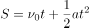，初始速度为60km/h，即km/s；速度上限120 km/h，即km/s。根据“加速后50秒内，汽车行驶了1公里”，代入公式，即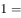，解得加速度a为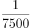。汽车从开始加速到加速至高速公路的速度上限120 km/h，需要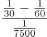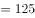秒，对应B项。

故正确答案为B。

---

### 第 11 题　qid 2453190 · 数学运算

某网店的甲商品定价为300元，乙商品定价为500元。小张以七折购买了甲商品，购买乙商品时参加了每满199元减50元的活动。小赵购买甲商品时在9折基础上又参加了每满100元减10元活动，则小赵通过以下哪种促销活动购买乙商品，其购买甲、乙两件商品总花销与小张一样？

- **A**. 减50元后打八折　✅
- **B**. 直接打七折
- **C**. 打九折后减120元
- **D**. 直接减120元

**答案**：A

**官方解析**

小张7折购买甲商品即元；乙商品定价500，购买乙商品时参加每满199元减50元的活动，500元包含两个199元，即一共减100元，故乙商品最终购买价格为元；小张两件商品总花销为元。

现小赵购买甲商品，先打9折，即元，然后在其基础上每满100元减10元，270元包含两个100元，即一共减20元，故最终购买甲商品的价格为元。要使小张和小赵购买两件商品花销一样，则小赵购买乙商品的价格必须是元。代入A项，500元减50元为450元，再打8折即是元，符合条件。

故正确答案为A。

---

### 第 12 题　qid 2453193 · 数学运算

某单位的一个科室从10名职工中随机挑选2人去听报告，要求女职工人数不得少于1人。已知该科室女职工比男职工多2人，小张和小刘都是该科室的女性职工，则她们同时被选上的概率在以下哪个范围内？

- **A**. 
到之间

- **B**. 
小于

- **C**. 
到之间
　✅
- **D**. 
大于

**答案**：C

**官方解析**

假设男职工x人，女职工则是人，根据题意可得，解得。故该科室男职工4人，女职工6人。随机选2人听报告，女职工人数不得少于1人，则有两种情况：

①女职工1人，男职工1人，则是种情况；

②女职工2人，则是种情况。

故总情况数是种。

现要小张和小刘同时选上，一共只选择两个人，故同时选上的情况数只有1种。

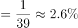。

故正确答案为C。

---

### 第 13 题　qid 2453194 · 数学运算

某单位有不到100人参加远足活动，如将该单位人员平均分成N组（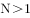且每组人数），则每组的人数有且仅有6种不同的可能性。则该单位参加活动的人数可能的最小值和最大值之间相差多少人？

- **A**. 32
- **B**. 48
- **C**. 56
- **D**. 64　✅

**答案**：D

**官方解析**

每组的人数有且仅有6种不同的可能性，说明此数字除了1和本身，有且仅有6个约数，加上1和本身，说明有8个约数。根据约数个数理论：如果一个合数分解质因数形式为，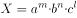···则该合数的约数个数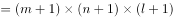···。本题中约数个数为或者，说明，或者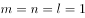。

若，，则要让人数最小，此时a，b要尽可能小（同时须为质数），故a取2，b取3，人数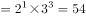或者，24更小，此种情况下最小值取24；

若，则要让人数最小，此时a，b，c尽可能小，故分别取2、3、5，此时人数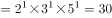。与上一种情况综合可知，最小为24。

现要使最大值最大，则其差值也应最大，故从选项最大值开始代入验算。D项：假设差值为64，则最大值为，88分解质因数，其约数个数，去掉1和本身，还剩6个约数，完全满足题意。

故正确答案为D。

---

### 第 14 题　qid 2453195 · 数学运算

甲、乙两船分别从上游的A地和下游的B地同时出发相向匀速行驶。甲船2小时后到达B地，随后立刻返航以原功率行驶，在3小时后与乙船同时到达A地。则两船如果同时从A地出发前往B地，甲船比乙船提前到达的时间在以下哪个范围内？

- **A**. 低于半小时
- **B**. 半小时～1小时之间　✅
- **C**. 1小时～1个半小时之间
- **D**. 高于1个半小时

**答案**：B

**官方解析**

根据题意可知，甲从A到B顺流花了2小时，从B到A逆流花了3小时，乙从B到A逆流花了5小时。赋值两地AB距离（2，3，5的公倍数），则甲顺流的速度为···①，甲逆流的速度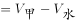···②；联立①②，可得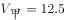，；乙逆流速度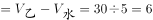，得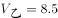。

现两船同时从A到B，甲船时间为2小时（已知），乙船时间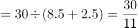小时，则甲船比乙船提前小时，即在半小时~1小时之间。

故正确答案为B。

---

### 第 15 题　qid 2453196 · 数学运算

一个7层楼的酒店，每层有20间客房。酒店的房间号为一个3位数字，其中第一位为楼层，第二、三位为从01到20的房间编号。相邻的房间房号也相邻。某个楼层三个相邻房间的房号之和为一个各位数字均不相同、且各位数字之和为6的四位数。则这三个相邻房间的房号组合有多少种不同的可能？

- **A**. 2　✅
- **B**. 1
- **C**. 6
- **D**. 4

**答案**：A

**官方解析**

房号之和为一个各位数字均不同，且各位数字之和为6的四位数。故这四个数字只能是0、1、2、3。同时，房号的后两位最大为20，故后两位相加不可能产生进位。因此，三个百位数字相加（即百位数字3）必须要产生进位至千位才能得到一个四位数。故百位数字必须4，分情况讨论：

（1）若百位数字为4，则和的前两位为12，故后两位只能是03或者30，但是不可能有三个连续的数和为3，故后两位不能为03，只能是30。此时30只能由09、10、11三个连续的房号加和而成。因此，此时三个房号分别为409、410、411。

（2）若百位数字为5和6，则和的前两位分别为15和18，不符合。

（3）若百位数字为7，则和的前两位为21，则后两位只能是03或者30，与情况（1）同理可得，此时房号为709、710、711。

所以三间连续的房间为409、410、411或者709、710、711两种情况。

故正确答案为A。

---

## 判断推理

### 第 1 题　qid 2453154 · 图形推理

每道题包含两套图形和可供选择的4个图形。这两套图形具有某种相似性，也存在某种差异。要求你从四个选项中选择最适合取代问号的一个。正确的答案应不仅使两套图形表现出最大的相似性，而且使第二套图形也表现出自己的特征。

- **A**. A
- **B**. B
- **C**. C　✅
- **D**. D

**答案**：C

**官方解析**

元素组成不同，优先考虑属性规律。观察可知，题干图形比较规整，考虑对称性。第一组图分别为中心对称，轴对称，轴对称中心对称，第二组图遵循规律，分别是中心对称，轴对称，所以？处应选择轴对称中心对称图形，符合的只有C项。

故正确答案为C。

---

### 第 2 题　qid 2453158 · 图形推理

每道题包含两套图形和可供选择的4个图形。这两套图形具有某种相似性，也存在某种差异。要求你从四个选项中选择最适合取代问号的一个。正确的答案应不仅使两套图形表现出最大的相似性，而且使第二套图形也表现出自己的特征。

- **A**. A　✅
- **B**. B
- **C**. C
- **D**. D

**答案**：A

**官方解析**

元素组成相似，优先考虑样式规律。第一组图中，第一幅图上半部分左右两边有竖线，第二幅图没有，第三幅图上半部分两条竖线保留下来，因此规律为第一幅图和第二幅图去同求异后得到第三幅图；第二组图也应该满足此规律，第一幅图上半部分没有横线，第二幅图上半部分的左侧有横线，去同求异后，左上侧应该保留横线，只有A项符合。
故正确答案为A。

---

### 第 3 题　qid 2453160 · 图形推理

每道题包含两套图形和可供选择的4个图形。这两套图形具有某种相似性，也存在某种差异。要求你从四个选项中选择最适合取代问号的一个。正确的答案应不仅使两套图形表现出最大的相似性，而且使第二套图形也表现出自己的特征。

- **A**. A
- **B**. B
- **C**. C　✅
- **D**. D

**答案**：C

**官方解析**

元素组成不同，且无明显属性规律，优先考虑数量规律。题干出现多个封闭空间，考虑数面，题干图形的面数量均为3，但是ABCD项均为3个面，选不出唯一答案。继续观察发现，第一组每个图形的边框条数分别为4、5、6，呈递增规律；第二组每个图形的边框条数分别为1、2，所以？处图形的边框条数应为3，C项满足。
故正确答案为C。

---

### 第 4 题　qid 2453164 · 图形推理

每道题包含一套图形和四个选项，请从四个选项中选出最恰当的一项填在问号处，使图形呈现一定的规律性。

- **A**. A　✅
- **B**. B
- **C**. C
- **D**. D

**答案**：A

**官方解析**

题干阴影部分的形状分别为三角形，四边形，五边形，六边形，图形的边数依次递增一条，所以？处的图形应为有两条边的图形，排除C、D项；对比A、B项发现位于阴影部分图形左上和左下的小图形的边数不同，观察题干可知，小图形的边数依次为两条边，三条边，四条边，五条边，小图形的边数也依次递增，所以？处图形小图形的边数应为一条边，A项满足。
故正确答案为A。

---

### 第 5 题　qid 2453168 · 图形推理

每道题包含一套图形和四个选项，请从四个选项中选出最恰当的一项填在问号处，使图形呈现一定的规律性。

- **A**. A　✅
- **B**. B
- **C**. C
- **D**. D

**答案**：A

**官方解析**

题干每幅图都是由左右两个图形构成，且图形线条有虚有实，左右两图形分开看，观察发现，图一左实右虚，图二左虚右实，图三左实右虚，图四左虚右实，左右虚实线条交替出现，故？处图形应为左实右虚，只有A项左右两个图是左实右虚。
故正确答案为A。

---

### 第 6 题　qid 2453208 · 逻辑判断

某位记者说道：“金钱和幸福是人们苦苦追求的。但是，一个人有钱并不意味着他一定幸福。而一个人幸福也不意味着他一定有钱。我采访过的人中：有的人有钱，有的人幸福，多数人并不同时具备这两者。”
若该记者所述为真，关于他所采访的人中，哪项陈述一定为真？

- **A**. 只有少数人既有钱又幸福　✅
- **B**. 有钱人比幸福的人要多
- **C**. 幸福的人比有钱的人更多些
- **D**. 有的人既没钱，又不幸福

**答案**：A

**官方解析**

日常结论题，根据题干信息逐一分析选项。
A项：根据记者的表述，多数人并不同时具备这两者，可以推出只有少数人既有钱又幸福，当选；
B项：题干中并没有比较有钱人的人数和幸福的人的人数，无中生有，排除；
C项：同B项，题干中并没有比较有钱人的人数和幸福的人的人数，无中生有，排除；
D项：题干只论述有的人有钱，有的人幸福，并没有不幸福、没钱的表述，有的是推不出有的不是，逻辑错误，排除。
故正确答案为A。

---

### 第 7 题　qid 2453210 · 逻辑判断

某校规定，对于学校的任一实验室，除非有教师在国际期刊上发表论文，否则没资格申报国家重点实验室。该校甲实验室有教师在国际期刊上发表论文。该校乙实验室有资格申报国家重点实验室。
若上述陈述为真，则以下哪项也一定为真？

- **A**. 该校甲实验室有资格申报国家重点实验室
- **B**. 该校甲实验室有教师没有在国际期刊上发表过论文
- **C**. 该校乙实验室有教师在国际期刊上发表论文　✅
- **D**. 该校乙实验室有教师没有在国际期刊上发表过论文

**答案**：C

**官方解析**

第一步：翻译题干。

① 有资格申报国家重点实验室有教师发表论文；

② 甲实验室有教师发表论文；

③ 乙实验室有资格申报国家重点实验室。

第二步：逐一分析选项。

A项：题干中②是对①的肯后，但肯后得不到确定性的结论，因此推不出甲实验室是否有资格申报国家重点实验室，排除； 

B项：题干中②甲实验室有教师发表论文，有老师发表过无法推出有老师没发表过，排除；

C项：题干中③是对①的肯前，肯前必肯后，可以推出乙实验室有教师发表论文，当选；

D项：题干中③是对①的肯前，肯前必肯后，得到的是乙实验室有教师发表论文，有教师发表论文无法推出有教师没有发表论文，无法推出，排除。

故正确答案为C。

---

### 第 8 题　qid 2453207 · 类比推理

人非圣贤，孰能无过。我不是圣贤，所以，我也有犯错误的时候。
以下除哪项外，均与题干的论证结构相似？

- **A**. 金无足赤，人无完人。张灵灵是人，所以，张灵灵也不是完美的
- **B**. 无知者无畏。小张见多识广，所以，他做事谨小慎微　✅
- **C**. 志不强者智不达。曹芳意志不坚定，所以，曹芳不能充分发挥她的智慧
- **D**. 狭路相逢勇者胜。苏梅是勇者，所以，她最终会取得胜利

**答案**：B

**官方解析**

翻译题干，找到题干的论证结构。

人非圣贤，孰能无过。我不是圣贤，所以，我也有犯错误的时候。

即ab，因为a，所以得到b。推理形式为：肯前必肯后。

第二步：逐一分析选项。

A项：人不完美。因为张灵灵是人，所以推出张灵灵不是完美的。即ab，因为a，所以得到b，推理形式为：肯前必肯后，与题干推理结构相似，排除；

B项：无知者无畏。因为小张见多识广，所以推出他做事谨小慎微。即ab，因为a，所以得到b，推理形式为：否前得到否后，与题干推理结构不相似，当选；

C项：志不强者智不达。因为曹芳意志不坚定，所以推出曹芳不能充分发挥她的智慧。即ab，因为a，所以得到b，推理形式为：肯前必肯后，与题干推理结构相似，排除；

D项：勇者胜。因为苏梅是勇者，所以推出她最终会取得胜利。即ab，因为a，所以得到b，推理形式为：肯前必肯后，与题干推理结构相似，排除。

本题为选非题，故正确答案为B。

---

### 第 9 题　qid 2453209 · 逻辑判断

近年来，某地交通状况日趋恶化，相关部门在调研之前开了一次碰头会讨论相关事宜，有人提议，应在早上6点到9点与晚上5点到8点间禁止大货车通行，这样能极大缓解交通拥堵状况。
以下哪项如果为真，最能支持上述论断？

- **A**. 通常情况下大货车的车速都比较快
- **B**. 这两个时间段里该地区行驶的车辆以大货车为主　✅
- **C**. 大货车的车身比较宽，而该地区的道路相对狭窄
- **D**. 大货车的司机相对其他车辆驾驶员更不注意交通安全

**答案**：B

**官方解析**

第一步：找出论点和论据。
论点：应在早上6点到9点与晚上5点到8点间禁止大货车通行，这样能极大缓解交通拥堵状况。
论据：无。
本题只有论点没有论据，加强优先考虑补充论据。
第二步：逐一分析选项。
A项：该项指出大货车车速较快，而车速与交通拥堵关系未知，不明确选项，不能加强，排除；
B项：该项指出这两个时间段里该地区行驶的车辆以大货车为主，则在该时间段内限制大货车可以缓解交通拥堵，补充论据，可以加强，当选；
C项：该项指出大货车的车身比较宽，而道路较窄，但不明确禁止时段里大货车的数量，因此不明确该时段禁止大货车能否缓解交通拥堵，不明确选项，不能加强，排除；
D项：该项指出大货车司机的安全意识，与该时段交通拥堵无必然联系，不能加强，排除。
故正确答案为B。

---

### 第 10 题　qid 2453211 · 逻辑判断

人的大脑聪明与否不仅是天生的，我们后天的行为也会对大脑产生深刻的影响。“用进废退”的生物科学原则，同样适用于人脑。大脑神经细胞和其他组织器官一样，越用越能保持其充沛的活力；总不用的话，人可能会变得越来越笨。
以下哪项如果为真，最能支持上述结论？

- **A**. 人在专注思考时大脑的血流情况可能发生变化，从而使某些区域的温度过高导致疲劳
- **B**. 随着年龄增长，大脑神经元会慢慢衰亡
- **C**. 当一个人完成单调任务时，大脑便会自动转换为“安眠模式”
- **D**. 学习新的语言可以促使脑区之间建立更高效灵活的沟通模式　✅

**答案**：D

**官方解析**

第一步：找出论点和论据。
论点：大脑神经细胞和其他组织器官一样，越用越能保持其充沛的活力；总不用的话，人可能会变得越来越笨。
论据：人的大脑聪明与否不仅是天生的，我们后天的行为也会对大脑产生深刻的影响，“用进废退”的生物科学原则，同样适用于人脑。
论点论据话题一致，优先考虑补充论据进行加强。
第二步：逐一分析选项。
A项：该项讨论的是用脑与疲劳的关系，而论点说的是用脑与聪明的关系，话题不一致，不能加强，排除；
B项：该项讨论的是年龄与脑神经元的关系，而论点说的是用脑与聪明的关系，话题不一致，不能加强，排除；
C项：该项讨论的是完成单调任务时大脑会转换为“安眠模式”，但没有提及“安眠模式”与聪明之间的关系，不能加强，排除；
D项：“学习新的语言”属于用脑，“促使脑区之间建立更高效灵活的沟通模式”说明大脑变得更灵活、更聪明，举用脑的例子说明用脑能变聪明，可以加强，当选。
故正确答案为D。

---

### 第 11 题　qid 2453156 · 逻辑判断

某国研究人员招募大学生被试进行情绪与大脑活动的研究，先让大学生读一些能够激发嫉妒和幸灾乐祸的情绪的故事，然后用功能磁共振成像仪对被试脑部血流变化进行测定，发现，嫉妒情绪与大脑前扣带回皮层的活跃度有关，幸灾乐祸与大脑纹状体的活跃度有关，而且，在产生嫉妒情绪时前扣带回皮层的活动越活跃的人，其纹状体的活跃程度就越高。
根据上述研究，最有可能得出以下哪项结论？

- **A**. 大脑的功能变化可以证明，嫉妒和幸灾乐祸都是人之常情
- **B**. 喜欢嫉妒别人的人，大脑前扣带回皮层的功能要比其他人更强
- **C**. 那些爱嫉妒别人的人，更有可能在别人不顺利时幸灾乐祸　✅
- **D**. 喜欢幸灾乐祸的人，大脑的纹状体活跃程度要比喜欢嫉妒的人更高

**答案**：C

**官方解析**

日常结论题，根据题干信息逐一分析选项。
A项：题中只是对嫉妒和幸灾乐祸这两种情绪进行研究，并没有涉及到嫉妒和幸灾乐祸都是人之常情，无中生有，排除；
B项：题干只是提到嫉妒情绪与大脑前扣带回皮层的活跃度有关，但是没有提及大脑扣带回皮层的功能和其他人之间的比较，无中生有，排除；
C项：据最后一句话可知，在产生嫉妒情绪时前扣带回皮层的活动越活跃的人，其纹状体的活跃程度就越高，而幸灾乐祸和纹状体的活跃度有关，可以推出，那些爱嫉妒别人的人，更有可能在别人不顺利时幸灾乐祸，当选；
D项：题干中没有涉及幸灾乐祸的人大脑的纹状体活跃程度如何，无中生有，排除。
故正确答案为C。

---

### 第 12 题　qid 2453162 · 逻辑判断

翻转课堂是随着信息技术的发展出现的一种新的教学模式，在这种模式下，重新调整了课堂内外的时间，学生在上课前完成对教学视频等学习资源的观看和学习，师生在课堂上一起完成作业答疑、协作探究和互动交流等活动，将学习的决定权从教师转移给了学生。有人认为，应该在我国的中小学中大力推广这一教学模式，以便提高教学效果。
以下选项中，除了哪个选项，都是上述论述所依赖的假设？

- **A**. 教师能把以往的教学技能快速地应用于翻转课堂
- **B**. 学生会主动地在课前学习相关内容
- **C**. 学校能够有效协调师生课堂内外的教与学
- **D**. 与之配套的软件与系统可很好地替代板书　✅

**答案**：D

**官方解析**

第一步：找出论点和论据。
论点：应该在我国的中小学中大力推广翻转课堂这一教学模式，以便提高教学效果。
论据：翻转课堂是随着信息技术的发展出现的一种新的教学模式，在这种模式下，重新调整了课堂内外的时间，学生在上课前完成对教学视频等学习资源的观看和学习，师生在课堂上一起完成作业答疑、协作探究和互动交流等活动。
本题论点论据均在讨论翻转课堂，话题一致，且本题为选非题，将不是前提的选项排除即可。
第二步：逐一分析选项。
A项：该项说的是教师能把教学技能快速应用于翻转课堂，若教学技能无法快速应用，则无法推广翻转课堂，也无法保证教学效果，是论证所依赖的假设，可以加强，排除；
B项：该项说的是学生会主动地在课前学习相关内容，若学生没有主动在课前学习相关内容，就无法在上课前完成对教学资源的观看，从而无法保证提高教学效果，是论证所依赖的假设，可以加强，排除；
C项：该项说的是学校能够有效协调师生课堂内外的教与学，若学校无法协调课堂内外的教与学，则无法合理调整课堂内外的时间，就无法推广该教学模式，是论证所依赖的假设，可以加强，排除；
D项：该项说的是配套的软件与系统可很好地代替板书，即使相关软件和系统无法很好地替代板书，也可以采用传统板书讲解，其并不影响教学模式的大力推广，因此无法成为论证所依赖的假设，无法加强，当选。
本题为选非题，故正确答案为D。

---

### 第 13 题　qid 2453165 · 逻辑判断

某环保组织赞助了一项科学实验，研究者对某国多个知名品牌的250瓶塑料瓶装水进行检测，发现仅17瓶水中没有塑料微粒。塑料微粒可能本身毒性小或没有毒性，但由于颗粒小、有疏水性等特征，是持久性有机污染物等有毒有害化学物质的载体。有人据此提出：饮用塑料瓶装水对身体健康有害。
以下各项如果为真，哪项最能驳斥该人的观点？

- **A**. 赞助该研究的环保组织是一个绿色环保组织，倡导绿色生活
- **B**. 保质期内的塑料瓶装水中塑料微粒含量，远低于各国饮用水塑料微粒含量安全标准　✅
- **C**. 塑料瓶中的高密度化工产品和残余物会对人体产生巨大影响，导致健康问题
- **D**. 该研究发表在非医学专业的报纸上，既没有在专业杂志上发表，也没有经过其他研究的核实

**答案**：B

**官方解析**

第一步：找出论点和论据。
论点：饮用塑料瓶装水对身体有害。
论据：科学实验检测结果发现250瓶塑料瓶装水中只有17瓶水中没有塑料微粒，塑料微粒是持久性有机污染物等有毒有害化学物质的载体。
论点与论据都主要讨论塑料瓶装水对身体有害，论点论据话题一致，故优先考虑削弱论点。
第二步：逐一分析选项。
A项：该项讨论赞助研究的是什么样的环保组织，与论点饮用塑料瓶装水对身体有害无关，不能削弱，排除；
B项：保质期内的塑料瓶装水的微粒含量，远低于各国饮用水塑料微粒含量安全标准，即塑料微粒的含量是在安全标准以下的，没有超过安全值 ，所以是安全的，因此饮用塑料瓶装水不会对身体造成危害，削弱论点，可以削弱，当选；
C项：塑料瓶中的化工产品和残留余物会导致健康问题，即饮用塑料瓶装水对身体有害，可以加强，不能削弱，排除；
D项：该项讨论该研究发表在哪，与论点饮用塑料瓶装水对身体有害无关，不能削弱，排除。
故正确答案为B。

---

### 第 14 题　qid 2453166 · 逻辑判断

智能手表近几年发展迅速，它有很多传统手表所不具备的功能，比如，实时收发短信、邮件；实时监测运动状态；获取血压、脉搏数据等。也正因为智能手表的这些优点，越来越多的人购买智能手表。据此，张楠预计，再过若干年，制造传统手表的工厂最终会倒闭。
以下哪项如果为真，最能削弱张楠的结论？

- **A**. 因为智能手表价格较为昂贵，一些消费者不会购买智能手表
- **B**. 虽然传统手表功能单一，戴习惯的人不愿意改戴智能手表
- **C**. 大多数传统手表制造厂不仅制造传统手表也制造智能手表　✅
- **D**. 许多智能手表需要与智能手机配套使用，令许多人感到麻烦

**答案**：C

**官方解析**

第一步：找出论点和论据。
论点：再过若干年，制造传统手表的工厂最终会倒闭。
论据：智能手表的这些优点，越来越多的人购买智能手表。
论据说智能手表与传统手表相比，有很多优点，论点说制造传统手表的工厂会倒闭，话题一致，优先考虑削弱论点。
第二步：逐一分析选项。
A项：智能手表价格昂贵，一些消费者不会购买，但是究竟是多少消费者不会购买，范围不清晰，而且不会购买智能手表的消费者是否会购买传统手表，也不明确，无法削弱，排除；
B项：戴习惯传统手表的人不愿意改戴智能手表，虽然有人不愿换下传统手表，但是这部分人数量多少不明确，如果只有少部分人坚持佩戴传统手表，购买量较少的情况下，传统手表工厂依然可能倒闭，无法削弱，排除；
C项：大多数传统手表制造厂不仅制造传统手表也制造智能手表，那么无论智能手表和传统手表在未来谁卖得更好，传统手表的制造厂都不会倒闭，可以削弱，当选；
D项：智能手表令许多人感到麻烦，只说了智能手表的缺点，但是和传统手表相比谁更受欢迎，不明确，无法削弱，排除。
故正确答案为C。

---

### 第 15 题　qid 2453124 · 逻辑判断

某单位准备举办一年一度的春季运动会，甲科室的所有成员都参加了50米或者100米的短跑项目，该科室的一些年轻成员还参加了一万米的长跑项目。有人推论，该单位里一些参加短跑项目的成员是长期长跑锻炼者。
以下哪项是上述推论正确的前提条件？

- **A**. 所有甲科室没有参加一万米长跑项目的成员都不是长期长跑锻炼者
- **B**. 一些甲科室没有参加一万米长跑项目的成员不是长期长跑锻炼者
- **C**. 一些参加了一万米长跑项目的成员是长期长跑锻炼者
- **D**. 所有参加了一万米长跑项目的成员都是长期长跑锻炼者　✅

**答案**：D

**官方解析**

第一步：找出论点和论据。
论点：该单位里一些参加短跑项目的成员是长期长跑锻炼者。
论据：甲科室的所有成员都参加了50米或者100米的短跑项目；甲科室的一些年轻成员还参加了一万米的长跑项目。
本题的论点说的是该单位里一些参加短跑项目的成员是长期长跑锻炼者，整理论据可知一些参加短跑项目的成员参加了长跑项目，论点论据讨论的话题不一致，结合提问方式，优先考虑搭桥，即在长跑项目的成员和长期长跑锻炼者之间建立联系。
第二步：逐一分析选项。
A项：该项只是说甲科室没有参加长跑项目的成员不是长期长跑锻炼者，只能证明该单位一些参加短跑项目的成员不是长期长跑锻炼者，另一部分的情况未知，不明确选项，不能加强，排除；
B项：该项只是说部分甲科室没参加长跑项目的成员不是长期长跑锻炼者，也就是甲科室部分只参加短跑项目的成员不是长期长跑锻炼者，另一部分的情况未知，不明确选项，不能加强，排除；
C项：该项说一些参加了一万米长跑项目的成员是长跑锻炼者，但是否是甲科室的这部分年轻成员不明确，不明确选项，不能加强，排除；
D项：该项说所有参加长跑项目的成员都是长期长跑锻炼者，结合“一些参加短跑项目的成员参加了长跑项目”，可以得出论点单位里一些参加短跑项目的成员是长期长跑锻炼者，建立了参加长跑项目的成员和长期长跑锻炼者之间的联系，搭桥项，当选。
故正确答案为D。

---

### 第 16 题　qid 2453132 · 逻辑判断

某宿舍住着小华、小峰、小明、小刚和小强五名本科生，在确定学年论文指导老师时，他们将分别被分给张老师、王老师和李老师当中的一人。张老师只研究古代文学，王老师只研究词汇学和古文字学，李老师只研究句法学和词汇学。每位指导老师最多可指导两人，每位同学仅对所分配指导老师的一个研究方向感兴趣。已知：
（1）小峰和小刚被分给了王老师；
（2）小华被分给了李老师。
若每位同学都按照自己的兴趣被分配给了指导老师，则以下各项都是符合题干的陈述，除了哪项？

- **A**. 小明对词汇学感兴趣，小强对古代文学感兴趣
- **B**. 小明对句法学感兴趣，小强对古代文学感兴趣
- **C**. 小明对古代文学感兴趣，小强对句法学感兴趣
- **D**. 小明对古代文学感兴趣，小强对古文字学感兴趣　✅

**答案**：D

**官方解析**

第一步：分析题干。
（1）张老师只研究古代文学；
（2）王老师只研究词汇学和古文字学；
（3）李老师只研究句法学和词汇学；
（4）每位指导老师最多可指导两人；
（5）每位同学仅对所分配指导老师的一个研究方向感兴趣；
（6）小峰和小刚被分给了王老师；小华被分给了李老师。
第二步：根据题干条件分析选项。
提问方式为哪项不符合题干的陈述，因此，可以考虑代入法。
代入A项，小明对词汇学感兴趣可以分配给李老师，小强对古代文学感兴趣可以分配给张老师，此时满足题干所有条件，排除；
代入B项，小明对句法学感兴趣只能分配给李老师，小强对古代文学感兴趣可以分配给张老师，此时满足题干所有条件，排除；
代入C项，小明对古代文学感兴趣可以分配给张老师，小强对句法学感兴趣可以分配给李老师，此时满足题干所有条件，排除；
代入D项，小明对古代文学感兴趣可以分配给张老师，小强对古文字学感兴趣只能分配给王老师，此时王老师已经指导了三个学生，与条件（4）矛盾，当选。
本题为选非题，故正确答案为D。

---

### 第 17 题　qid 2453273 · 逻辑判断

研究者观察了241名中风患者，其中88位全身中风患者中有78人的耳垂上出现了特定的折痕，153名暂时性缺血中风（即通常所说的微卒中/小中风）患者中有112人出现同样的现象。研究者认为，应该考虑把这种耳垂折痕加入“典型的中风风险因素清单”。
以下各项如果为真，哪项最能支持以上结论？

- **A**. 耳垂折痕是健康潜在风险的可视指标之一，意味着各种健康风险的增加
- **B**. 小动脉堵塞使头颈部的血液循环变差，出现耳垂折痕，也增加了中风的风险　✅
- **C**. 耳垂折痕与糖尿病、高血压、缺血性心脏病和周围血管病变风险性提高相关
- **D**. 随着年纪增长，皮肤的血液循环变慢，耳垂皮肤弹性降低，最终出现折痕

**答案**：B

**官方解析**

第一步:找出论点和论据。
论点:应该考虑把这种耳垂折痕加入“典型的中风风险因素清单”。
论据:研究者观察了241名中风患者，其中88位全身中风患者中有78人的耳垂上出现了特定的折痕，153名暂时性缺血中风（即通常所说的微卒中/小中风）患者中有112人出现同样的现象。
本题的论点是考虑把耳垂折痕加入“典型的中风风险因素清单”，这个结论是根据论据里面的实验得到的，论点论据话题一致，因此考虑补充论据来加强。
第二步:逐一分析选项。
A项:耳垂折痕可以意味着健康风险的增加，但是这里的健康风险范围比较大，到底是否包含论点中的中风风险我们是不确定的，因此属于不明确选项，无法加强，排除；
B项:小动脉堵塞导致血液循环变差，出现了耳垂折痕，也增加了中风的风险，可以解释为什么耳垂折痕可以看做成中风风险的典型，解释原因加强，当选;
C项:耳垂折痕与糖尿病、高血压、缺血性心脏病和周围血管病变风险性提高相关，这些病到底与中风风险是否存在关系是不明确的，因此属于不明确选项，排除;
D项:随着年纪增长最终出现折痕，也就意味着可能是年纪增长，皮肤血液循环变慢导致出现耳垂折痕，那么出现耳垂折痕的原因就不一定是因为存在中风风险，因此该项为他因削弱，排除。
故正确答案为B。

---

### 第 18 题　qid 2453274 · 逻辑判断

英国的一项研究统计了8170人在10岁时的智商数据和成年后的饮食状况。研究结果显示，10岁时智商越高，30岁时成为素食者的可能性就越大。另一项针对几万名高智商人群的饮食调查显示，这些人多半是素食爱好者。因而，“素食是聪明人的选择，素食让你我更有智慧”，成为很多素食餐馆的广告语。
以下陈述如果为真，哪项无法质疑上述广告语？

- **A**. 很多素食餐馆价格不菲，只有社会经济地位较好的人才会经常光顾，这些人智商也较高　✅
- **B**. 肉类和动物内脏是铁的主要来源，缺铁性贫血会导致大脑供氧不足，智力发育迟缓
- **C**. 大脑发育离不开充足的磷脂，而磷脂的饮食来源主要是鱼肉和鸡蛋
- **D**. 高智商的人倾向选择素食不代表素食能让人智商变得更高

**答案**：A

**官方解析**

第一步：找出论点和论据。
论点：素食是聪明人的选择，素食让你我更有智慧。
论据：英国的一项研究统计了8170人在10岁时的智商数据和成年后的饮食状况。研究结果显示，10岁时智商越高，30岁时成为素食者的可能性就越大。另一项针对几万名高智商人群的饮食调查显示，这些人多半是素食爱好者。
论据讨论素食和智商之间的“相关关系”，论点讨论素食和智商之间的“因果关系”，二者话题不一致，考虑拆桥，还可以考虑削弱论点，本题为选非题，将可以削弱的选项排除即可。
第二步：逐一分析选项。
A项：说的是素食餐厅经常有智商高的人光顾，即说明智商高的人和素食之间有一定的关系，加强项，无法削弱，当选；
B项：说明不吃肉类，素食会造成智力发育迟缓，即素食不会让人更有智慧，削弱论点，可以削弱，排除；
C项：说明不吃鱼肉和鸡蛋会造成磷脂缺乏进一步影响大脑发育，同样说明素食不会让人更有智慧，削弱论点，可以削弱，排除；
D项：高智商的人倾向选择素食不代表素食能让人智商变得更高，即通过高智商的人是素食主义者的论据无法推出素食可以让人更有智慧的论点，切断论点和论据的联系，拆桥项，可以削弱，排除。
本题为选非题，故正确答案为A。

---

### 第 19 题　qid 2453255 · 逻辑判断

几位同事在小王家喝茶聊天。他们讨论正在喝的这种茶是什么茶。小刘说：“不是龙井，不是碧螺春”，小赵说：“不是龙井，是乌龙茶”，小李说：“不是乌龙茶，是龙井。”最后，经小王确认，三人中有一人的判断完全正确，一个人只说对了一半，另外一个人则完全说错。
据此，可以推出：

- **A**. 小刘的判断完全正确，他们喝的是乌龙茶
- **B**. 小赵的判断完全正确，他们喝的不是龙井
- **C**. 小李的判断完全正确，他们喝的是龙井　✅
- **D**. 小李只说对了一半，他们喝的是碧螺春

**答案**：C

**官方解析**

此题目为组合排列题型，题干信息不确定，优先考虑代入法解题。
A项：代入到题干中发现，小刘完全正确，小赵也完全正确，不符合题干，排除；
B项：代入到题干中发现，小赵完全正确，小刘也完全正确，不符合题干，排除；
C项：代入到题干中发现，小刘对一半，小赵全错，小李完全正确，符合题干，当选；
D项：代入到题干中发现，小刘对一半，小赵也对一半，不符合题干，排除。
故正确答案为C。

---

### 第 20 题　qid 2453275 · 逻辑判断

癌症的发病与基因相关，如基因发生突变，变得过于活跃，会驱动癌症的发生，同理，如果抑癌基因发生突变，失去功能，也会促发癌症。PTEN是一种容易发生突变的抑癌基因，目前发现人体内有一种叫WWP1的E3泛素连接酶会与PTEN结合，影响其抑癌功能。抑制WWP1的功能，就能解放PTEN，恢复PTEN对癌症的抑制，从而起到抗癌作用。有研究证实，一种叫做“吲哚-3-甲醇”（I3C）的天然化合物能有效抑制WWP1的功能，而I3C在西兰花等十字花科植物中非常普遍。
根据上述论述，以下哪项判断正确？

- **A**. 常吃西兰花等十字花科蔬菜有助于治疗癌症
- **B**. WWP1含量越高，PTEN的含量越低
- **C**. E3泛素连接酶通过对致癌基因的作用而影响癌症的发生
- **D**. I3C有助于恢复PTEN的抑癌功能　✅

**答案**：D

**官方解析**

日常结论题，根据题干信息逐一分析选项。
A项：题干最后一句话只提到“I3C在西兰花等十字花科植物中非常普遍”，没有涉及食用西兰花等十字花科蔬菜是否可以吸收I3C，也就无法推出常吃西兰花等十字花科蔬菜有助于治疗癌症，无中生有，排除；
B项：根据题干中“一种叫WWP1的E3泛素连接酶会与PTEN结合，影响其抑癌功能”可知WWP1会影响PTEN的抑癌功能，但无法推出WWP1与PTEN含量之间的关系，无中生有，排除；
C项：根据题干中“PTEN是一种容易发生突变的抑癌基因”以及“一种叫WWP1的E3泛素连接酶会与PTEN结合，影响其抑癌功能”可知E3是对抑癌基因PTEN起作用，而不是致癌基因，偷换概念，排除；
D项：根据题干中“‘吲哚-3-甲醇’（I3C）的天然化合物能有效抑制WWP1的功能”以及“抑制WWP1的功能，就能解放PTEN，恢复PTEN对癌症的抑制，从而起到抗癌作用”，可以推出I3C有助于恢复PTEN的抑癌功能，可以推出，当选。
故正确答案为D。

---

### 第 21 题　qid 2453197 · 定义判断

交互记忆，指的是当由两个或以上的个体组成的团体经过长时间一起工作生活之后，他们之间会分享存储的记忆。个体不一定需要记忆所有的信息，而只需要记住群体内那些成员是哪方面信息的专家即可，当需要这方面信息时就可以向其询问。通过这种方式，本应存储于每个个体中的记忆被分散到组成群体的不同成员的头脑中去了，就好像所有的成员的头脑组成了一个具有更大容量的记忆库一样。
根据上述定义，以下不属于交互记忆的是：

- **A**. 小郭对实验室各种设备都非常熟悉，课题组成员在讨论实验数据的误差时都会询问小郭的意见，排除设备造成重大误差的可能性
- **B**. 小梅和小芳经常在一起学习，考前复习时，她们相互提问，相互考核，发现各自没有掌握的知识点，有效提高了学习效率　✅
- **C**. 小涛在家里找以前的家庭聚会合影，怎么也找不到，他问爸爸：“您记得咱家那些合影都放哪儿了吗?”爸爸回答：“家里的东西，你得问你妈。”
- **D**. 研究生夏江找不到某个理论的原始出处，他记得同课题组一位师兄以前介绍过这方面的研究，就去找该师兄求助，师兄告诉他可在哪本书中查到

**答案**：B

**官方解析**

第一步：找出定义关键词。
“个体不一定需要记忆所有的信息，而只需要记住那些成员是哪方面的专家即可”、“当需要这方面的信息时就可以向其询问”。
第二步：逐一分析选项。
A项：课题组成员在讨论实验数据的误差时都会询问小郭的意见，即大多数人不用知道所有信息，直接询问小郭即可，符合“个体不一定需要记忆所有的信息”、“当需要这方面的信息时就可以向其询问”，符合定义，排除；
B项：小梅和小芳一起学习，相互提问、考核，发现各自没有掌握的知识点，说明双方都需要掌握所有知识点，不符合“个体不一定需要记忆所有的信息，而只需要记住那些成员是哪方面的专家即可”，不符合定义，当选；
C项：小涛找不到家庭合影，询问父亲，父亲让他询问妈妈，即家庭成员之间有分工，每个家庭成员不需要记住所有信息，需要时直接询问别人即可，符合“个体不一定需要记忆所有的信息”、“当需要这方面的信息时就可以向其询问”，符合定义，排除；
D项：夏江找不到理论出处，就去找师兄求助，说明夏江不需要记住所有信息，需要时直接询问他人即可，符合“个体不一定需要记忆所有的信息”、“当需要这方面的信息时就可以向其询问”，符合定义，排除。
本题为选非题，故正确答案为B。

---

### 第 22 题　qid 2453198 · 定义判断

湿租，是航空公司之间的一种特殊租赁方式，在提供飞机的同时提供机组和乘务组为对方服务，而且在租赁过程中，被租赁飞机的标志不变、飞机号不变。民航规章体系将其定义为：是指按照租赁协议，承租方租赁飞机时携带出租方一名或者多名机组成员的租赁。
根据上述定义，以下属于湿租的是：

- **A**. 某航线由甲航空公司销售机票，乙航空公司独立执行飞行，两公司达成协议，合作期间使用甲公司的航班号
- **B**. 某航空公司为了开辟欧洲新航线，从甲国进口五架最新机型飞机，同时聘请甲国飞行员和专业维修技师为新航线服务
- **C**. 某航空公司因季节原因人员短缺，从乙航空公司临时借调部分工作人员承担飞行任务
- **D**. 圣诞将至，甲国航空公司为了缓解客运压力，从乙国租借了三架民用飞机，机组和维修员工仍为乙国航空公司原有资源　✅

**答案**：D

**官方解析**

第一步：找出定义关键词。
“在提供飞机的同时提供机组和乘务组为对方服务”、“被租赁飞机的标志不变、飞机号不变”。
第二步：逐一分析选项。
A项：某航线由甲航空公司销售机票，乙航空公司独立执行飞行，即乙航空公司提供飞机，是租赁方，但最后使用甲公司的航班号，不符合“被租赁飞机的标志不变、飞机号不变”，不符合定义，排除； 
B项：某航空公司从甲国进口飞机，属于直接购买，不是“租赁”，不符合定义，排除；
C项：某航空公司只是从乙航空公司临时借调部分工作人员，并没有租赁对方公司的飞机，不符合“在提供飞机的同时提供机组和乘务组为对方服务”，不符合定义，排除；
D项：甲国航空公司从乙国租借了三架民用飞机，存在“租赁”的行为，机组和维修员工仍为乙国航空公司原有资源，说明乙国航空公司“在提供飞机的同时提供机组和乘务组为对方服务”，符合定义，当选。
故正确答案为D。

---

### 第 23 题　qid 2453199 · 定义判断

黄金标准法则，指的是在品牌定位和广告表现上，为品牌设立一个可使之与同类品牌相比更加出色的说辞，从而体现出该品牌的高出一筹，胜人一筹；黄金标准的内容可以有：强调领导性和专业性；突出产品的优越品质；建立科学的使用规则；突出品牌在技术、工艺等方面的先进性；传播惟我独尊的品牌价值与形象等。
根据上述定义，以下没有应用黄金标准法则的是：

- **A**. 某保健品的宣传语是“鹤舞长山，我心飞翔！”　✅
- **B**. 某肉类食品品牌的宣传语是“世界领先的肉类供应商！”
- **C**. 某电视品牌的广告语是“不闪的，才是最好的！”
- **D**. 某房地产的广告语是“我是你今生唯一的选择！”

**答案**：A

**官方解析**

第一步：找出定义关键词。
“品牌设立与同类品牌相比更加出色的说辞”、“体现出该品牌的高出一筹，胜人一筹”。
第二步：逐一分析选项。
A项：某保健品的宣传语是“鹤舞长山，我心飞翔！”，强调的是该公司的保健品本身效果佳，让消费者长寿健康，心情好，不符合“品牌设立与同类品牌相比更加出色的说辞”、“体现出该品牌的高出一筹，胜人一筹”，不符合定义，当选；
B项：某肉类食品品牌的宣传语是“世界领先的肉类供应商！”，“世界领先”符合“品牌设立与同类品牌相比更加出色的说辞”、“体现出该品牌的高出一筹，胜人一筹”，符合定义，排除；
C项：某电视品牌的广告语是“不闪的，才是最好的！”，突出了品牌在技术、工艺等方面的先进性，符合“品牌设立与同类品牌相比更加出色的说辞”、“体现出该品牌的高出一筹，胜人一筹”，符合定义，排除；
D项：某房地产的广告语是“我是你今生唯一的选择！”，选项中的“唯一”体现了唯我独尊的品牌价值，比其他品牌更加出色，更胜一筹，符合“体现出该品牌的高出一筹，胜人一筹”，符合定义，排除。
本题为选非题，故正确答案为A。

---

### 第 24 题　qid 2453201 · 定义判断

合同可以根据价款分为开口合同和闭口合同，“开口价”是指按一定的计价方式通过计算最终才能确定的价格，“闭口价”是指订立合同时已确定的价格。没有确定价格的买卖合同是“开口合同”。
根据上述定义，以下属于开口合同的是：

- **A**. 
李先生和装修公司签订合同，约定装修总价为12万。结账时装修公司提出，装修过程中李先生要求使用的是更高标准的五金件，因此要求李先生额外支付2000元

- **B**. 
甲、乙两公司签订供货合同，约定供货单价，甲公司每月下达次月订单给乙公司，月底按甲公司的入库数量进行结算，如原材料市场价格波动超过本合同价以上可再协商
　✅
- **C**. 
方先生和妻子离异时约定，女儿由女方抚养，方先生每月支付2000元抚养费给女方，直至孩子成年，如果孩子生病等需要额外支出，费用支出由双方协商决定

- **D**. 
江阿姨年事已高，她的三个儿子经江阿姨同意后约定，将她名下的两居室转到大儿子名下，其他儿子放弃对房产的要求，由大儿子照顾江阿姨并负责所有费用

**答案**：B

**官方解析**

第一步：找出定义关键词。

“没有确定价格的买卖合同”。

第二步：逐一分析选项。

A项：李先生与装修公司签订合同，约定合同总价为12万，不符合“没有确定价格的买卖合同”，装修过程中李先生要求使用更高标准的五金件，因此要额外支付2000元，也不符合“没有确定价格的买卖合同”，不符合定义，排除；

B项：甲、乙两公司签订供货合同，约定供货单价，如原材料市场价格波动超过本合同价以上可再协商，原材料市场价格波动符合“没有确定价格的买卖合同”，符合定义，当选；

C项：夫妻双方对女儿的抚养费用约定，不符合“买卖合同”，不符合定义，排除；

D项：兄弟之间约定照顾母亲，不符合“买卖合同”，不符合定义，排除。

故正确答案为B。

---

### 第 25 题　qid 2453205 · 定义判断

“热炉效应”，是指组织中任何人触犯规章制度都要受到处罚。它是由于触摸热炉与实行惩罚之间有许多相似之处而得名。“热炉”形象地阐述了惩处原则：一、警告性原则。热炉火红，不用手去摸也知道炉子是热的。例如企业领导要经常对下属进行规章制度教育。二、一致性原则。每当你碰到热炉，肯定会被灼伤。只要触犯规章制度，就一定会受到惩处。三、即时性原则。当你碰到热炉时，立即就被灼伤。惩处必须在错误行为发生后立即进行，绝不能拖泥带水。四、公平性原则。不管是谁碰到热炉，都会被灼伤。
根据上述定义，以下并未体现“热炉效应”的是：

- **A**. 王子犯法，与庶民同罪
- **B**. 明慎所职，毋以身试法
- **C**. 民不举，官不究　✅
- **D**. 法不阿贵，绳不挠曲

**答案**：C

**官方解析**

第一步：找出定义关键词。
“组织中任何人触犯规章制度都要受到处罚”、“警告性原则”、“一致性原则”、“即时性原则”、“公平性原则”。
第二步：逐一分析选项。
A项：王子犯法，与庶民同罪的意思是，王子违背了法律，会和老百姓一样处以惩罚，没有特殊对待，符合“组织中任何人触犯规章制度都要受到处罚”、“公平性原则”，符合定义，排除；
B项：明慎所职，毋以身试法的意思是，要知道自己的职责，不要试着亲身去做触犯法律的事，符合“组织中任何人触犯规章制度都要受到处罚”“警告性原则”，符合定义，排除；
C项：民不举，官不究意思是，虽有不当行为，但当事人不向当局提出追诉请求，当局就不应追究，不符合“组织中任何人触犯规章制度都要受到处罚”，不符合定义，当选；
D项：法不阿贵，绳不挠曲意思是，法律不偏袒有权有势的人，墨线不向弯曲的地方倾斜，符合“组织中任何人触犯规章制度都要受到处罚”“公平性原则”，符合定义，排除。
本题为选非题，故正确答案为C。

---

### 第 26 题　qid 2453150 · 定义判断

周边产品，指利用动画、漫画、游戏等作品中的人物或动物造型，经授权后制成的商品。
根据上述定义，以下属于周边产品的是：

- **A**. 某文化公司请美术大师绘制了一套《红楼梦》金陵十二钗的明信片，印刷售卖
- **B**. 小涛制作了一套孙悟空七十二变的泥塑，参加区文化馆组织的手工艺术品比赛
- **C**. 某娱乐公司开发了一部非常受欢迎的动画片，同步推出主人公形象的玩具和服装　✅
- **D**. 小樱把自己的偶像明星曾经饰演过的所有角色的照片集结成册，在粉丝群里销售

**答案**：C

**官方解析**

第一步：找出定义关键词。
“动漫、漫画、游戏等作品中的人物或动物造型”、“经授权后制成的商品”。
第二步：逐一分析选项。
A项：《红楼梦》金陵十二钗是小说中的人物，不符合“动漫、漫画、游戏等作品中的人物或动物造型”，不符合定义，排除；
B项：孙悟空是小说中的人物，不符合“动漫、漫画、游戏等作品中的人物或动物造型”；参加区文化馆的比赛，并不是要售卖的商品，不符合“经授权后制成的商品”，不符合定义，排除；
C项：娱乐公司开发动画片，并且推出主人公形象的玩具和服装，符合“动漫、漫画、游戏等作品中的人物或动物造型”、“经授权后制成的商品”，符合定义，当选；
D项：小樱集结自己偶像饰演的角色的照片，并且销售，不符合“动漫、漫画、游戏等作品中的人物或动物造型”、“经授权后制成的商品”，不符合定义，排除。
故正确答案为C。

---

### 第 27 题　qid 2453163 · 定义判断

绿色运输，是指以节约能源、减少废气排放为特征的运输。其实施途径主要包括：合理选择运输工具和运输路线，克服迂回运输和重复运输，以实现节能减排的目标；改进内燃机技术和使用清洁燃料，以提高能效；防止运输过程中的泄露，以免对局部地区造成严重的环境危害。
根据上述定义，以下不属于绿色运输的是：

- **A**. 进口的水果、零食和日用品，航空运输且市内全程冷链配送，由多级经销商逐级分销　✅
- **B**. 电商对同一区域进行集约化配送，统一集货、统一送货，尽量减少货流和空载率
- **C**. 某快递公司引入拥有更高燃油效率和更大载货量的新机型，耗油更省，飞行更远
- **D**. 某地的物流运输全面使用可再生燃料和混合动力技术，还定期对驾驶员进行培训

**答案**：A

**官方解析**

第一步：找出定义关键词。
 “以节约能源、减少废气排放为特征的运输”、“合理选择运输工具和运输路线，克服迂回运输和重复运输，以实现节能减排的目标”、“改进内燃机技术和使用清洁燃料，以提高能效”、“防止运输过程中的泄露，以免对局部地区造成严重的环境危害”。
 第二步：逐一分析选项。
 A项：进口的水果、零食和日用品用冷链配送，由多级经销商逐级分销，没有体现节能减排，不符合“以节约能源、减少废气排放为特征的运输”，不符合“合理选择运输工具和运输路线，克服迂回运输和重复运输，以实现节能减排的目标”，不符合“改进内燃机技术和使用清洁燃料，以提高能效”，也不符合“防止运输过程中的泄露，以免对局部地区造成严重的环境危害”，不符合定义，当选；
 B项：电商集约化配送尽量减少货流和空载率，符合“合理选择运输工具和运输路线，克服迂回运输和重复运输，以实现节能减排的目标”，符合定义，排除；
 C项：某快递公司引入拥有更高燃油效率和更大载货量的新机型，耗油更省，符合“合理选择运输工具和运输路线，克服迂回运输和重复运输，以实现节能减排的目标”，也符合“改进内燃机技术和使用清洁燃料，以提高能效”，符合定义，排除；
 D项：某地的物流运输全面使用可再生燃料和混合动力技术，定期对驾驶员进行培训，符合“改进内燃机技术和使用清洁燃料，以提高能效”，符合定义，排除。
本题为选非题，故正确答案为A。

---

### 第 28 题　qid 2453172 · 定义判断

兼语句，是由兼语短语充当谓语或独立成句的句子。兼语句具有如下特点：第一，兼语句的谓语由动宾短语套接主谓短语构成，动宾短语的宾语兼做主谓短语的主语。第二，兼语句多有使令的意思，所以句中前一个谓语多由使令动词充当。第三，兼语句中兼语的谓语是前边动作所要达到的目的或产生的结果，即兼语前后两个动词在语意上有一定联系。“我请他作报告”就是一个兼语句。
根据上述定义，以下句子不属于兼语句的是：

- **A**. 老师叫我告诉你这件事
- **B**. 我去图书馆借本书看　✅
- **C**. 学校号召毕业生去支教
- **D**. 同学们选小明当班长

**答案**：B

**官方解析**

第一步：找出定义关键词。
“由兼语短语充当谓语或独立成句的句子”、“兼语句的谓语由动宾短语套接主谓短语构成，动宾短语的宾语兼做主谓短语的主语”、“兼语句多有使令的意思，所以句中前一个谓语多由使令动词充当”、“兼语句中兼语的谓语是前边动作所要达到的目的或产生的结果，即兼语前后两个动词在语意上有一定联系”。
第二步：逐一分析选项。
A项：老师叫我告诉你这件事，“叫我”是动宾短语，“我告诉你”是主谓短语，符合“由兼语短语充当谓语或独立成句的句子”“兼语句的谓语由动宾短语套接主谓短语构成，动宾短语的宾语兼做主谓短语的主语”；“老师叫我”是命令语句，符合“兼语句多有使令的意思，所以句中前一个谓语多由使令动词充当”；“告诉你这件事”是老师的目的，符合“兼语句中兼语的谓语是前边动作所要达到的目的或产生的结果，即兼语前后两个动词在语意上有一定联系”，符合定义，排除。 
B项：我去图书馆借本书看，“去图书馆”是动宾短语，“图书馆借本书”，图书馆不是借书的主语而是地点状语，不符合“兼语句的谓语由动宾短语套接主谓短语构成，动宾短语的宾语兼做主谓短语的主语”，不符合定义，当选。 
C项：学校号召毕业生去支教，“号召毕业生”是动宾短语，“毕业生去支教”是主谓短语，符合“由兼语短语充当谓语或独立成句的句子”“兼语句的谓语由动宾短语套接主谓短语构成，动宾短语的宾语兼做主谓短语的主语”；“毕业生去支教”是学校的目的，符合“兼语句中兼语的谓语是前边动作所要达到的目的或产生的结果，即兼语前后两个动词在语意上有一定联系”，符合定义，排除。 
D项：同学们选小明当班长，“选小明”是动宾短语，“小明当班长”是主谓短语，符合“由兼语短语充当谓语或独立成句的句子”“兼语句的谓语由动宾短语套接主谓短语构成，动宾短语的宾语兼做主谓短语的主语”；“小明当班长”是同学们的目的，符合“兼语句中兼语的谓语是前边动作所要达到的目的或产生的结果，即兼语前后两个动词在语意上有一定联系”，符合定义，排除。
本题为选非题，故正确答案为B。

---

### 第 29 题　qid 2453182 · 定义判断

回赎权，是指出典人在典期届满时享有的要求偿付原典价并支付其他合理的费用和利息，赎回原典物的权利。回赎权有一定的期限限制。根据我国有关法规和司法解释的规定，出典人在典期届满10年不回赎，或无典期经过30年不回赎的，视为绝卖，典物的所有权即归典权人所有。
根据上述定义，以下判断正确的是：

- **A**. 小张因投资需要资金，在典当行典当了一件传家宝，约定三年后赎回，三年后小张投资失利，无法按时回赎，典当行即拥有该宝贝的所有权
- **B**. 王某二十年前无典期典当了自己的房屋，现在仍未赎回，该房屋可视为绝卖，王某无法再赎回
- **C**. 李某在1999年与典当行达成协议，以3万元典当了一块古董手表，未明确典当期限，直至2009年李某仍没有赎回，此时典当行可以将手表公开拍卖
- **D**. 赵某十五年前典当了一套房屋的产权，当时协议典期为两年，赵某至今仍无能力回赎，该房屋可视为绝卖　✅

**答案**：D

**官方解析**

第一步：找出定义关键词。
“出典人在典期届满时享有的要求偿付原典价并支付其他合理的费用和利息，赎回原典物的权利”、“出典人在典期届满10年不回赎，或无典期经过30年不回赎的，视为绝卖”。
第二步：逐一分析选项。
A项：约定三年后赎回，即典期为三年，而三年后小张无法按时回赎，不符合“出典人在典期届满10年不回赎”，不符合定义，排除；
B项：王某二十年前无典期典当了自己的房屋，属于无典期经过20年不回赎，不符合“无典期经过30年不回赎”，不符合定义，排除；
C项：李某在1999年典当一块古董手表，未明确典当期限，直至2009年李某仍没有赎回，属于无典期经过10年不回赎，不符合“无典期经过30年不回赎”不符合定义，排除；
D项：赵某十五年前典当了一套房屋的产权，当时协议典期为两年，属于典期届满13年不回赎，符合“出典人在典期届满10年不回赎”，符合定义，当选。
故正确答案为D。

---

### 第 30 题　qid 2453186 · 定义判断

商业混同行为，是指经营者采用欺骗手段从事市场交易，使自己经营的商品或服务与特定竞争对手的商品或服务相混淆，造成或足以使购买者误认误购的不正当竞争行为。
根据上述定义，以下属于商业混同行为的是：

- **A**. 某啤酒厂家出售的一款“白威”啤酒，跟知名品牌百威啤酒的外包装非常相似，售价却只有百威啤酒的一半　✅
- **B**. 泰山旅游宣传海报的图片上山峦起伏、白云缭绕，当地一家卷烟厂生产的“泰山”牌香烟，也将海报的图片复制在烟盒上
- **C**. 某娱乐演艺公司经营一家名为“晚亭”的会所，并在门前张挂其公司旗下艺人张婉婷的电影剧照，不少人以为是张婉婷本人开的会所
- **D**. 某饼干生产厂家的外包装使用知名动画片“小猪佩奇”的剧照，里面还随饼干附赠小猪佩奇的玩偶，吸引了很多小顾客

**答案**：A

**官方解析**

第一步：找出定义关键词。
“使自己经营的商品或服务与特定竞争对手的商品或服务相混淆”、“造成或足以使购买者误认误购的不正当竞争行为”。
第二步：逐一分析选项。
A项：某啤酒厂家出售的啤酒跟知名品牌外包装非常相似，符合“使自己经营的商品或服务与特定竞争对手的商品或服务相混淆”、也符合“造成或足以使购买者误认误购的不正当竞争行为”，符合定义，当选；
B项：泰山旅游宣传海报和卷烟厂之间并非竞争对手的关系，不符合定义，排除；
C项：某娱乐演艺公司经营的会所和其公司旗下艺人并非竞争对手的关系，不符合定义，排除；
D项：某饼干生产厂家和知名动画片“小猪佩奇”并非竞争对手的关系，不符合定义，排除。
故正确答案为A。

---

## 资料分析

### 材料 1

        2017年全国共有各级各类民办学校17.76万所，占全国学校总数；各类民办教育在校生达5120.47万人，比上年增长。其中：民办幼儿园16.04万所，比上年增长；在园儿童2572.34万人，比上年增长。民办普通小学6107所，比上年增长；在校生814.17万人，比上年增长。民办初中5277所，比上年增长；在校生577.68万人，比上年增长。民办普通高中3002所，比上年增长；在校生306.26万人，比上年增长。民办中等职业学校2069所，比上年下降；在校生197.33万人，比上年增长。

#### 第 1 题　qid 2453200 · 综合

2017年全国学校总数在以下哪个范围内？

- **A**. 不到50万所
- **B**. 50～60万所之间　✅
- **C**. 60～70万所之间
- **D**. 超过70万所

**答案**：B

**官方解析**

根据“2017年全国学校总数在以下哪个范围内”，结合材料所给数据为2017年的比重数据，判断本题为现期比重问题。定位材料，“2017年全国共有各级各类民办学校17.76万所，占全国学校总数”。因此全国的学校总数为万所，在B选项范围内。

故正确答案为B。

---

#### 第 2 题　qid 2453202 · 比重

2017年民办幼儿园在园儿童人数占民办教育在校生总人数的比例约为

- **A**. 

- **B**. 

　✅
- **C**. 

- **D**. 

**答案**：B

**官方解析**

根据“2017年······占······的比例约为多少”，结合材料时间为2017年，判断本题为现期比重问题。定位材料，各类民办教育在校生达5120.47万人，民办幼儿园在园儿童2572.34万人。根据公式：，则2017年民办幼儿园在园儿童人数占民办教育在校生总人数的比例约为。

故正确答案为B。

---

#### 第 3 题　qid 2453203 · 增长

以下民办学校类型中，2017年学校数量同比增长最多的是

- **A**. 民办普通高中
- **B**. 民办普通小学
- **C**. 民办初中
- **D**. 民办幼儿园　✅

**答案**：D

**官方解析**

根据“······2017年学校数量同比增长最多的是”，判断本题为增长量比较问题。定位材料可得，“民办普通小学6107所，比上年增长；民办初中5277所，比上年增长，民办幼儿园16.04万所，比上年增长”，根据增长量比较口诀“大大则大”，民办幼儿园的现期量（16.04万所=160400所）和增长率（）均大于民办普通小学与民办初中，所以民办幼儿园的增长量大于民办普通小学与民办初中。

根据增长量计算公式：，计算比较民办普通高中和民办幼儿园的增长量。

民办普通高中的增长量；

民办幼儿园的增长量。 

故2017年学校数量同比增长最多的是民办幼儿园。

故正确答案为D。

---

#### 第 4 题　qid 2453204 · 平均数

2016年平均每所民办中等职业学校在校生人数约为

- **A**. 871人　✅
- **B**. 991人
- **C**. 1091人
- **D**. 1181人

**答案**：A

**官方解析**

由题干“2016年平均每······”，结合材料时间是2017年，可判定本题为基期平均数问题。定位文字材料，“2017年，······民办中等职业学校2069所（），比上年下降（）；在校生197.33万人（），比上年增长（）。”根据基期平均数公式：，可计算出2016年平均每所民办中等职业学校在校生人数约为： 人人，满足的只有A项。

故正确答案为A。

---

#### 第 5 题　qid 2453206 · 综合

能够从上述资料中推出的是

- **A**. 
2017年平均每所民办学校在校生人数超过300人

- **B**. 
2017年民办中等职业学校在校生人数同比增加了20多万人

- **C**. 
2017年民办初中学校数量占民办学校总数的以上

- **D**. 
2017年民办普通高中在校生人数同比增速快于民办普通小学
　✅

**答案**：D

**官方解析**

A项：定位文字材料，“2017年全国共有各级各类民办学校17.76万所（），······各类民办教育在校生达5120.47万人（），比上年增长”。根据现期平均数公式：，可以计算出2017年平均每所民办学校在校生人数人人。错误；

B项：定位文字材料，“2017年，······民办中等职业学校······在校生197.33万人，比上年增长”。根据增长量，可计算出2017年民办中等职业学校在校生人数同比增加了万人万人。错误；

C项：定位文字材料，“2017年全国共有各级各类民办学校17.76万所，······民办初中5277所”。根据公式：比重，可计算出2017年民办初中学校数量占民办学校总数的比重。错误；

D项：定位文字材料，“2017年民办普通小学在校生814.17万人，比上年增长；民办普通高中在校生306.26万人，比上年增长”。可知2017年民办普通高中在校生人数同比增速（）快于民办普通小学（）。正确。

故正确答案为D。

---

### 材料 2

        2016年末，A自治区城镇人口为1542.1万人，城镇化率(城镇人口占总人口比重)为。

        2016年末A自治区城镇人均居住面积达32.20平方米，比1978年末增长了5.5倍；农村牧区人均居住面积达27.40平方米，比1985年末增长。2016年末A自治区城镇居民家庭每百户拥有家用汽车38.48辆、家用电脑62台、移动电话222.21部；农牧民家庭每百户拥有家用汽车27.29辆、家用电脑23台、移动电话231.53部。

#### 第 6 题　qid 2453134 · 综合

2016年末A自治区城镇人口总居住面积约为多少亿平方米？

- **A**. 3
- **B**. 5　✅
- **C**. 7
- **D**. 9

**答案**：B

**官方解析**

根据题干所求“2016年末······人口总居住面积约为······”，结合材料可判定此题为现期平均数问题。定位文字材料第一段“2016年末，A自治区城镇人口为1542.1万人”，定位文字材料第二段“2016年末A自治区城镇人均居住面积达32.20平方米”。由城镇人均居住面积得，城镇人口总居住面积亿平方米，与B项最接近。

故正确答案为B。

---

#### 第 7 题　qid 2453138 · 增长

以下折线图最能准确反映2013～2016年A自治区哪一类居民的哪一类产品拥有量同比增量变化趋势？

- **A**. 城镇居民，家用汽车　✅
- **B**. 农村牧区居民，家用汽车
- **C**. 城镇居民，移动电话
- **D**. 农村牧区居民，移动电话

**答案**：A

**官方解析**

根据题干所求“以下折线图······同比增量变化趋势”，可判定此题为增长量比较问题。定位表格材料，由可得，2013~2016年A自治区城镇居民、农村牧区居民不同产品拥有量同比增量分别为：

A项：城镇居民，家用汽车：0.14辆、4.99辆、3.41辆、6.36辆，满足折线图变化趋势，当选。

B项：农村牧区居民，家用汽车：6.04辆、1.81辆、5.96辆、4.21辆，观察折线图第一个点应为最低点，与数据不符，排除；

C项：城镇居民，移动电话：部、9.5部、4.78部、5.3部，由折线图第四个点应为最高点，排除；

D项：农村牧区居民，移动电话：部、12.19部、13.84部、10.95部，由折线图第四个点应为最高点，排除。

故正确答案为A。

---

#### 第 8 题　qid 2453143 · 平均数

2013～2016各年末，A自治区城镇、农村牧区居民人均居住面积、户均家用汽车和移动电话拥有量均高于上年的年份有几个？

- **A**. 1
- **B**. 2　✅
- **C**. 3
- **D**. 4

**答案**：B

**官方解析**

定位表格材料可得，2012年末A自治区城镇居民人均居住面积为29.89平方米，2013年末为29.60平方米，2013年末低于上年，则2013年末排除；2013年末农村牧区居民人均居住面积为26.01平方米，2014年末为25.80平方米，2014年末低于上年，则2014年末排除；2015年末、2016年末A自治区城镇、农村牧区居民人均居住面积、户均家用汽车和移动电话拥有量均高于上年，即2015年、2016年这2个年份满足。
故正确答案为B。

---

#### 第 9 题　qid 2453146 · 平均数

假设平均每户城镇居民家庭的人口数与农牧民家庭相同，则2016年末A自治区城镇居民拥有的家用电脑总量约是农村牧区居民的多少倍？

- **A**. 1.6
- **B**. 2.1
- **C**. 2.7
- **D**. 4.3　✅

**答案**：D

**官方解析**

由题干“2016年末······是······的多少倍”，且材料数据为2016年，可判定本题为现期倍数问题。定位文字材料第二段“2016年末A自治区城镇居民家庭每百户拥有家用电脑62台；农牧家庭每百户拥有家用电脑23台”。城镇居民家庭拥有电脑总量是农村牧区居民的倍数为：。由题干“平均每户城镇居民家庭人口数与农牧家庭相同”，可知平均每户人口数，则，因此。定位文字材料第一段“A自治区城镇人口为1542.1万人，城镇化率为”，可知A自治区农村牧区人口比例为（），则人口总数为，因此倍。

故正确答案为D。

---

#### 第 10 题　qid 2453155 · 综合

关于A自治区的以下信息，能够从上述资料中推出的是

- **A**. 
1978年末城镇人均居住面积高于1985年末农村牧区人均居住面积

- **B**. 
2016年末城镇人口数量是农村牧区人口数量的2倍以上

- **C**. 
2016年末城镇居民户均移动电话拥有量比2012年末增长了以上

- **D**. 
2014年末农村牧区平均每6户农牧民拥有的汽车数量在1辆以上
　✅

**答案**：D

**官方解析**

A项：定位文字材料第二段“2016年末A自治区城镇人均居住面积达32.20平方米，比1978年末增长了5.5倍；农村牧区人均居住面积达27.40平方米，比1985年末增长”，则1978年末城镇人均居住面积为：平方米；1985年末农村牧区人均居住面积为：平方米，因此前者小于后者，错误；

B项：定位文字材料第一段“2016年末，A自治区城镇人口为1542.1万人，城镇化率(城镇人口占总人口比重)为”，则2016年末农村牧区人口占比，2016年末城镇人口数量是农村牧区人口数量的倍数为：，错误；

C项：定位表格，2016年末、2012年末城镇居民户均移动电话拥有量分别为222.21部、206.11部，则2016年增长率，错误；

D项：定位表格，2014年末农村牧区平均每百户家用汽车拥有量为17.12辆，则平均每6户农牧民拥有的汽车数量为辆，正确。

故正确答案为D。

---

### 材料 3

        截至2015年12月底，北京市文化及相关产业企业共有198948户，同比增长，占全市企业总数的；2015年新设文化及相关产业企业30323户，同比增长。

#### 第 11 题　qid 2453126 · 综合

截至2015年12月底北京市企业总数约为多少万户？

- **A**. 120　✅
- **B**. 23
- **C**. 17
- **D**. 3

**答案**：A

**官方解析**

根据题干“截至2015年12月底北京市企业总数约为多少万户”，结合材料时间为2015年，可判定本题为现期比重计算问题。定位文字材料可得：“截至2015年12月底，北京市文化及相关产业企业共有198948户······”，占全市企业总数的；故北京市企业总数。

故正确答案为A。

---

#### 第 12 题　qid 2453127 · 综合

北京市2015年12月底前成立的文化及相关产业企业中，约有多少万户在2015年注销（上年末企业数＋本年内新增企业数-本年内注销企业数＝本年末企业数）？

- **A**. 20.1
- **B**. 17.1
- **C**. 1.1
- **D**. 0.2　✅

**答案**：D

**官方解析**

根据题干“······约有多少万户在2015年注销”，结合材料时间为2015年，可判定本题为现期计算问题。定位文字材料：“截至2015年12月底，北京市文化及相关产业企业共有198948户，同比增长，2015年新设文化及相关产业企业30323户”。结合题干给出的等式：，可得：，本年内注销企业数。

故正确答案为D。

---

#### 第 13 题　qid 2453130 · 综合

截至2015年12月底北京市文化及相关产业各行业中，企业数量最多的行业的企业户数比企业数量最少的行业多多少倍？

- **A**. 5.6
- **B**. 22.7
- **C**. 47.5　✅
- **D**. 93.3

**答案**：C

**官方解析**

根据题干“截至2015年12月底······多多少倍”，结合材料时间为2015年，可判定本题为现期倍数计算问题。定位材料表格可得：企业数量最多的行业是文化艺术服务业，其企业数量为95928户；企业数量最少的行业是广播电视电影服务业，其企业数量为1977户，代入公式：多几倍。

故正确答案为C。

---

#### 第 14 题　qid 2453136 · 综合

2015年文化及相关产业新设企业中，新设户数排名前三位的行业合计占全市文化及相关产业新设企业户数的：

- **A**. 

- **B**. 

- **C**. 

- **D**. 

　✅

**答案**：D

**官方解析**

由题干“2015年，······占······”，判定本题为现期比重问题。定位表格可得：2015年文化及相关产业各行业全年新设企业户数排名前三位的行业分别为：文化艺术服务（18586户）、文化创意和设计服务（4850户）和文化产品生产的辅助生产（1710户）；定位文字材料可得：“2015年新设文化及相关产业企业30323户”，根据公式：比重，则所求比重，与D项最接近。

故正确答案为D。

---

#### 第 15 题　qid 2453141 · 综合

下列有关北京市文化及相关产业各行业企业的表述中，错误的是：

- **A**. 截至2015年12月底文化休闲娱乐服务业的企业中，一成以上为2015年新设企业　✅
- **B**. 截止2015年12月底北京市文化及相关产业各行业企业数量都比上年有一定增加
- **C**. 北京市文化及相关产业各行业中，在2015年新设企业户数同比降幅最大的行业是文化用品的生产业
- **D**. 截至2015年12月底企业数量同比增速最快的三个行业是广播电视电影服务业、文化艺术服务业、工艺美术品的生产业

**答案**：A

**官方解析**

A项：定位表格可得，文化休闲娱乐服务业2015年年末企业总数为2456户，全年新设企业数为244户。根据公式：比重，则所求，即不足一成，错误；

B项：定位表格可得，截至2015年12月底，北京市文化及相关产业各行业企业总数同比增速均大于0，说明企业数量都比上年有一定增加，正确；

C项：定位表格可得，2015年新设企业户数同比增速为负数的行业有：文化休闲娱乐服务（）、文化创意和设计服务（）、文化专用设备的生产（）、文化用品的生产（）、工艺美术品的生产（）、文化产品生产的辅助生产（），降幅比较的是增长率的绝对值，则降幅最大的为文化用品生产业，正确；

D项：定位表格可得，2015年各行业年末企业总数同比增速最快的三个行业是广播电视电影服务（）、文化艺术服务（）和工艺美术品的生产（），正确。

本题为选非题，故正确答案为A。

---

### 材料 4

        2016年“一带一路”沿线64个国家GDP之和约为12.0万亿美元，占全球GDP的；人口总数约为32.1亿人，占全球人口的；对外贸易总额约为71885.5亿美元，占全球贸易总额的。

#### 第 16 题　qid 2453176 · 综合

2016年东南亚“一带一路”沿线国家人口总数约占“一带一路”沿线64个国家人口总数的：

- **A**. 

- **B**. 

- **C**. 

　✅
- **D**. 

**答案**：C

**官方解析**

由题干“2016年······约占······的”，结合选项为百分数，可判定本题为现期比重问题。定位文字材料可得，2016年“一带一路”沿线64个国家人口总数约为32.1亿人，定位表格可得，2016年东南亚“一带一路”沿线国家人口总数为63852.5万人。则所求比重，与C项最接近。

故正确答案为C。

---

#### 第 17 题　qid 2453183 · 平均数

2016年“一带一路”沿线国家人均GDP约是全球水平的多少倍：

- **A**. 2.7
- **B**. 1.6
- **C**. 0.9
- **D**. 0.4　✅

**答案**：D

**官方解析**

由题干“2016年······约是······的多少倍”，可判定本题为现期倍数问题。定位文字材料可得，2016年“一带一路”沿线64个国家GDP之和约为12.0万亿美元，占全球GDP的；人口总数约为32.1亿人，占全球人口的。则2016年“一带一路”沿线国家人均GDP美元/人，全球人均GDP美元/人，所求倍数，与D项最接近。

故正确答案为D。

---

#### 第 18 题　qid 2453185 · 综合

2016年东南亚“一带一路”沿线国家有几个呈现贸易逆差（进口额高于出口额）：

- **A**. 5
- **B**. 6　✅
- **C**. 7
- **D**. 8

**答案**：B

**官方解析**

定位表格查找可得，2016年东南亚“一带一路”沿线国家进口额高于出口额的有越南、菲律宾、缅甸、柬埔寨、老挝、东帝汶，共6个国家。
故正确答案为B。

---

#### 第 19 题　qid 2453191 · 平均数

2016年东南亚人均GDP最低的“一带一路”沿线国家，当年其进出口额约占东南亚“一带一路”沿线国家：

- **A**. 
不到

- **B**. 
-之间

- **C**. 
-之间
　✅
- **D**. 
以上

**答案**：C

**官方解析**

由题干“······占······”，结合材料时间与题干一致，可判定本题为现期比重问题。需先找到2016年东南亚人均GDP最低的“一带一路”沿线国家，也就是找最小的国家，反过来就是找最大的国家。定位表格，发现明显最大的是缅甸和柬埔寨，直除比较，，，即2016年东南亚人均GDP最低的“一带一路”沿线国家是柬埔寨。其当年进出口额占东南亚“一带一路”沿线国家的比重为，即在～之间。

故正确答案为C。

---

#### 第 20 题　qid 2453192 · 比重

以下信息，可从资料中推出的有几条：

①2012-2016年，每年“一带一路”沿线国家对外贸易占全球份额均低于上年水平

②2016年东南亚“一带一路”沿线国家GDP占全球GDP的比重在-之间

③2016年东南亚“一带一路”沿线国家中，人口最多的2个国家进出口总额均未排进前三

- **A**. 0
- **B**. 1　✅
- **C**. 2
- **D**. 3

**答案**：B

**官方解析**

①定位折线图，发现2012年和2013年“一带一路”沿线国家对外贸易占全球份额是不变的，均为，不满足均低于上年水平，因此说法错误；

②方法一：定位表格，已知2016年东南亚“一带一路”沿线国家GDP合计为25802.2亿美元；定位文字材料，已知2016年“一带一路”沿线64个国家GDP之和约为12.0万亿美元，占全球GDP的。那么2016年全球GDP为万亿美元，那么所求比重为，不在～之间，因此说法错误。

方法二：定位表格，已知2016年东南亚“一带一路”沿线国家GDP合计为25802.2亿美元；定位文字材料，已知2016年“一带一路”沿线64个国家GDP之和约为12.0万亿美元，占全球GDP的。全球GDP的为12.0万亿美元，全球GDP的为3.0万亿美元，万亿美元，说明不到，因此说法错误；

③定位表格，发现2016年东南亚“一带一路”沿线国家中，人口数最多的2个国家分别是印度尼西亚和菲律宾，进出口总额排在前三名的国家分别是新加坡、泰国、越南，印度尼西亚和菲律宾均未排进前三名，因此说法正确。能推出的只有③。

故正确答案为B。

---
