# 2020年四川下半年公务员录用考试《行测》试题（网友回忆版）

> 省考 · 2020 年 · 6 个模块 · 共 100 题

- [政治理论](#%E6%94%BF%E6%B2%BB%E7%90%86%E8%AE%BA) · 1 题
- [常识判断](#%E5%B8%B8%E8%AF%86%E5%88%A4%E6%96%AD) · 9 题
- [言语理解与表达](#%E8%A8%80%E8%AF%AD%E7%90%86%E8%A7%A3%E4%B8%8E%E8%A1%A8%E8%BE%BE) · 30 题
- [数量关系](#%E6%95%B0%E9%87%8F%E5%85%B3%E7%B3%BB) · 10 题
- [判断推理](#%E5%88%A4%E6%96%AD%E6%8E%A8%E7%90%86) · 35 题
- [资料分析](#%E8%B5%84%E6%96%99%E5%88%86%E6%9E%90) · 15 题

---

## 政治理论

### 第 1 题　qid 2725266 · 新思想

以习近平同志为核心的党中央坚持以人民为中心的发展思想，提出“创新、协调、绿色、开放、共享”的新发展理念。以下最能体现“共享”新发展理念的是：

- **A**. 中国与“一带一路”沿线国家共建了70多个经贸合作区
- **B**. 港珠澳大桥海底隧道作为世界最长的海底隧道正式贯通
- **C**. 我国确定京津冀协同发展战略，调整优化城市布局和空间结构
- **D**. 我国坚持精准扶贫精准脱贫的基本方略，坚持打赢脱贫攻坚战　✅

**答案**：D

**官方解析**

本题考查政治常识。
A项错误，我国与“一带一路”沿线国家共建经贸合作区，进一步提升对外开放水平，体现了“开放”新发展理念。开放发展注重的是解决发展内外联动问题。
B项错误，港珠澳大桥海底隧道是世界上最长的海底隧道，它是我国科技创新能力的展现，体现了“创新”新发展理念。创新发展注重的是解决发展动力问题。
C项错误，京津冀协同发展战略侧重于区域协调发展，体现了“协调”新发展理念。协调发展注重的是解决发展不平衡问题。我国发展不协调是一个长期存在的问题，突出表现在区域、城乡、经济和社会、物质文明和精神文明、经济建设和国防建设等关系上。
D项正确，脱贫攻坚战致力于消除贫困、改善民生、逐步实现共同富裕，体现了“共享”新发展理念。共享发展注重的是解决社会公平正义问题。我国经济发展的“蛋糕”不断做大，但分配不公问题比较突出，收入差距、城乡区域公共服务水平差距较大。在共享改革发展成果上，无论是实际情况还是制度设计，都还有不完善的地方。
故正确答案为D。

---

## 常识判断

### 第 1 题　qid 2725268 · 法律常识

下列说法不符合我国宪法规定的是：

- **A**. 总理人选由国家主席提名
- **B**. 宣布战争状态属于全国人大及其常委会
- **C**. 省内某市实施紧急状态由国家主席宣布　✅
- **D**. 公民有从国家获得物质帮助维持基本生活的权利

**答案**：C

**官方解析**

本题考查法律常识。
A项正确，《宪法》第六十二条规定：“全国人民代表大会行使下列职权：······（五）根据中华人民共和国主席的提名，决定国务院总理的人选；根据国务院总理的提名，决定国务院副总理、国务委员、各部部长、各委员会主任、审计长、秘书长的人选······”因此，总理人选由国家主席提名。
B项错误，《宪法》第八十条规定：“中华人民共和国主席根据全国人民代表大会的决定和全国人民代表大会常务委员会的决定，公布法律，任免国务院总理、副总理、国务委员、各部部长、各委员会主任、审计长、秘书长，授予国家的勋章和荣誉称号，发布特赦令，宣布进入紧急状态，宣布战争状态，发布动员令。”因此，国家主席宣布战争状态。
C项错误，根据《宪法》第八十条和第八十九条的规定，有权宣布进入紧急状态的分别是国家主席和国务院。根据《宪法》第六十七条和第八十条的规定，国家主席根据全国人大常委会的决定，宣布全国或者个别省、自治区、直辖市进入紧急状态。根据《宪法》第八十九条的规定，国务院决定并宣布省、自治区、直辖市范围内部分地区进入紧急状态。因此，对全国或者个别省、自治区、直辖市实施紧急状态，其决定机关和宣布机关是不同的，决定机关是国家的权力机关，而宣布机关是国家主席；对省、自治区、直辖市范围内部分地区实施紧急状态，由国务院作出决定并宣布。
D项错误，《宪法》第四十五条第一款规定：“中华人民共和国公民在年老、疾病或者丧失劳动能力的情况下，有从国家和社会获得物质帮助的权利。国家发展为公民享受这些权利所需要的社会保险、社会救济和医疗卫生事业。”因此，并不是所有公民都有从国家获得物质帮助维持基本生活的权利。仅指年老、疾病或者丧失劳动能力的公民。
注意：本题BCD项表述均错误，掌握知识点即可。
本题为选非题，故正确答案为C。

---

### 第 2 题　qid 2725269 · 人文常识

下列行为属于见义勇为的是：

- **A**. 外科医生张某在医院大厅看见一位老人突然心梗晕倒，立刻上前对其进行紧急处理，最终挽救了老人的生命
- **B**. 王某回家时正遇小偷在自家盗窃，不顾个人安危，勇敢与小偷搏斗，虽身负重伤，但最终在邻居的帮助下抓住了窃贼
- **C**. 军人陈某在回家探亲路上遇几名歹徒对一女子耍流氓，他毫不犹豫上前制止，结果被刺伤，歹徒还是跑掉了　✅
- **D**. 警察刘某在巡逻中，突遇两名手持匕首的歹徒抢劫路人，他毫不畏惧地冲上去与劫匪搏斗，最后将他们抓获

**答案**：C

**官方解析**

本题考查法律常识。
见义勇为是指非因法定职责或者约定义务，为保护国家利益、集体利益或者他人的人身、财产安全，不顾个人安危，与违法犯罪行为作斗争或者抢险救灾的行为。
A项错误，医生的职责就是救人，外科医生张某在医院大厅正在工作中，本身就有救人的职责，其行为不属于见义勇为。
B项错误，见义勇为所保护的客体，是国家利益、集体利益或者他人的人身、财产安全。公民为保护个人生命、财产安全而与违法犯罪作斗争的行为，不能认定为见义勇为。本案中，王某是自己家里遭受盗窃，属于自己的事情，不属于见义勇为的范畴。
C项正确，军人陈某在回家探亲的路上与歹徒作斗争，虽然没有将歹徒抓获归案，但是其行为同样弘扬了军人敢于维护人民群众的合法权益的高尚精神，属于见义勇为。
D项错误，警察的工作职责就是保护国家利益、集体利益或者他人的人身、财产安全。因此，刘某的行为属于职责范围内，不属于见义勇为。
故正确答案为C。

---

### 第 3 题　qid 2725271 · 人文常识

下列毛泽东诗词中所描述的历史事件，按时间先后排序正确的是：
①七百里驱十五日，赣水苍茫闽山碧，横扫千军如卷席
②秋收时节暮云愁，霹雳一声暴动
③红军不怕远征难，万水千山只等闲
④钟山风雨起苍黄，百万雄师过大江

- **A**. ②①③④　✅
- **B**. ③②④①
- **C**. ②①④③
- **D**. ③①②④

**答案**：A

**官方解析**

本题考查人文常识。
①项，该句出自1931年夏毛泽东同志创作的《渔家傲·反第二次大“围剿”》，此词上片具体描写了白云山战斗的经过，下片概括了1931年反第二次大“围剿”整个战役胜利的情况。通过这些描写，热情地歌颂了根据地军民所向无敌的英雄气概，无情地揭露和嘲讽了国民党反动派纸老虎的本质及其必然灭亡的下场。
②项，该句出自1927年9月秋收起义后毛泽东同志创作的《西江月·秋收起义》，此词高度概括了秋收起义的情况，揭示了农民暴动的根本原因和正义性，抒发了对工农革命武装的赞扬之情。
③项，该句出自1935年10月毛泽东同志创作的《七律·长征》。当时毛泽东率领中央红军越过岷山，长征即将结束。此诗高度概括了长征路上的各种艰难险阻。通过生动典型的事例，热情洋溢地赞扬了中国工农红军不畏艰难，英勇顽强的革命英雄主义和乐观主义精神。
④项，该句出自1949年4月毛泽东同志创作的《七律·人民解放军占领南京》，诗中描绘了1949年解放军渡江解放南京的雄伟场面。全诗表现了人民解放军彻底打垮国民党反动派的信心和决心，表达了诗人解放全中国的必胜信念，格调雄伟，气势磅礴，雄壮有力。
①-④项按照创作的时间先后排序，依次为②①③④。
故正确答案为A。

---

### 第 4 题　qid 2725272 · 人文常识

下列与中国古代政府机构相关的说法，错误的是：

- **A**. 军机处始设于清代雍正帝统治时期
- **B**. 隋唐时期中央政府采用三省六部制
- **C**. 宋代的枢密院是主管财政的专门机构　✅
- **D**. 明太祖为加强中央集权废除丞相一职

**答案**：C

**官方解析**

本题考查人文常识。
A项正确，军机处作为清代最重要、存在时间最长的中央最高辅弼机构，在成立时间上，学术界尚有分歧，有雍正四年、七年、八年、十年说。大部分学者认为，雍正七年（1729年），清廷对西北准噶尔用兵，为方便皇帝随时召见大臣研究军政大事并能保守军事机密，在隆宗门内设置“军机房”，作为临时军事指挥机构。雍正十年（1732年）军机房正式改称“办理军机处”，简称“军机处”。
B项正确，三省六部制是中国古代封建社会一套组织严密的中央官制，它始于隋朝五省六曹制，确立于隋朝，完善于唐朝，此后一直到清末，六部制基本沿袭未改。三省指中书省、门下省、尚书省，六部指尚书省下属的吏部、户部、礼部、兵部、刑部、工部。
C项错误，枢密院，封建时代中央官署名，五代至元的最高军事机构。宋朝枢密院是军队的最高指挥机构，军队的调防、战争的动员、战争的指挥等都是枢密院的职责，同时也领导兵部的工作。
D项正确，明太祖朱元璋在位期间为强化中央集权，废除丞相和行中书省，设三司分掌地方权力。
本题为选非题，故正确答案为C。

---

### 第 5 题　qid 2725314 · 地理国情

下列关于地理学知识，说法正确的是：

- **A**. 散逸层空气稀薄，温度和热量都非常高
- **B**. 雷暴通常发生在温度低、湿度高的地区
- **C**. 平流层是大气最底层且最主要的大气层
- **D**. 地球大气散射蓝色光的能力比红色光强　✅

**答案**：D

**官方解析**

本题考查地理国情。
 A项错误，散逸层是地球大气的最外层，散逸层的大气极为稀薄，而太阳光强烈，导致散逸层温度可以达到非常高，但因为空气太稀薄，空气总量较少，所以没有储存多少热量。综上，散逸层空气稀薄，温度较高，但储存的热量较少。 
B项错误，雷暴是热带和温带地区可见的局地性强对流天气，雷暴发生时可伴随有雷击、闪电、强风和强降水，例如雨或冰雹。雷暴可发生于春季和夏季，常见的例子是夏季午后，但也可能在冬季随暴风雪发生，被称为雷雪。
C项错误，大气层最底层为对流层，与人类关系最为密切。平流层位于对流层之上、中间层之下。平流层亦称同温层，是地球大气层里上热下冷的一层，此层被分成不同的温度层，其中高温层置于顶部，而低温层置于底部。
D项正确，1871年，英国科学家瑞利证明，一定范围内，短波光的散射比长波光要强得多，即短波光比长波光更容易被大气散射。蓝色光波长约为490-450nm，红色光波长约为700-620nm。地球大气散射蓝色光的能力比红色光强，这也是天空呈现蓝色的原因。
故正确答案为D。

---

### 第 6 题　qid 2725315 · 科技常识

下列与鸟类有关的说法，错误的是：

- **A**. 鸟类均有羽毛，是恒温脊椎动物
- **B**. 丹顶鹤是国家一级保护野生动物
- **C**. “鹊巢鸠占”中的“鸠”指的是鹰　✅
- **D**. 大部分乌鸦是不随季节迁徙的留鸟

**答案**：C

**官方解析**

本题考查科技常识。
A项正确，鸟类是指体表被覆羽毛、有翼、恒温和卵生的高等脊椎动物。鸟类的种类仅次于鱼类，为遍布全球的脊椎动物。
B项正确，根据我国《国家重点保护野生动物名录》，丹顶鹤为国家一级保护动物。丹顶鹤是鹤类中的一种，大型涉禽，体长120～160厘米。分布于中国东北地区，蒙古东部，俄罗斯乌苏里江东岸，朝鲜，韩国和日本北海道。
C项错误，“鹊巢鸠占”意为鸠不会做窠，常强占喜鹊的窠，其中“鸠”，部分观点认为是鸠鸽类的斑鸠，也有考证认为是指俗称布谷鸟的一种杜鹃，古称鸤鸠。鹰会筑巢，故此处的鸠不会指鹰。
D项正确，留鸟是指长期栖居在繁殖地区，不作周期性迁徙的鸟类。乌鸦是雀形目鸦科数种黑色鸟类的俗称，嘴大喜欢鸣叫，性情凶猛，羽毛大多黑色或黑白两色，长喙，翅远长于尾，乌鸦大多为留鸟，不随季节迁徙。
本题为选非题，故正确答案为C。

---

### 第 7 题　qid 2725317 · 人文常识

下列有关轨道交通的说法，错误的是：

- **A**. 希腊是第一个拥有路轨运输的国家
- **B**. 法国的TGV（高速列车）是世界上首条高速铁路　✅
- **C**. 我国的高速铁路运营里程目前居世界第一
- **D**. 京张铁路是中国人自行设计和建造的第一条干线铁路

**答案**：B

**官方解析**

本题考查科技常识。
A项正确，希腊是第一个拥有路轨运输的国家，至少两千年前已有马拉的车沿着轨道运行。1804年，德里维斯克在英国威尔士发明了第一台能在铁轨上前进的蒸汽机车。第一台取得成功的蒸汽机车是史蒂芬森在1829年建造的火箭号。
B项错误，TGV是法国高速铁路系统的简称，往来巴黎邻近及邻国的城市。TGV列车最早的原型是TGV001，TGV是继日本新干线之后的世界第二条商业运行的高速铁路系统。新干线是日本的高速铁路系统，也是全世界第一个投入商业运营的高速铁路系统。
C项正确，截至2018年底，我国铁路里程达到13.1万公里，其中高速铁路运营里程2.9万公里，居世界第一；公路总里程485万公里，其中高速公路总里程超过14万公里，居世界第一。截至2020年10月，我国高铁运营里程及高速公路通车里程均居世界第一位。
D项正确，京张铁路全长约200千米，于1909年建成，是中国首条不使用外国资金及人员，完全由中国人自行筹资、勘测、设计、施工完成，投入营运的铁路。京张铁路是中国人自行设计和建造的第一条铁路干线，是中国人民和中国工程技术界的光荣，也是中国近代史上中国人民反帝斗争的一个胜利。
本题为选非题，故正确答案为B。

---

### 第 8 题　qid 2725318 · 人文常识

下列关于日常生活知识的说法，正确的是：

- **A**. 金属器皿盛放食物可以放入微波炉中加热
- **B**. 医用酒精并非纯酒精是因为稀释后的酒精渗透能力更强　✅
- **C**. 天然气燃烧时火焰呈紫蓝色说明缺氧，此时可适当调整灶具风门
- **D**. 煮熟的豆浆破坏了豆类原有的营养成分，因此豆浆最好不要完全煮熟

**答案**：B

**官方解析**

本题考查科技常识。

A项错误，如果用金属器皿盛放食物放到微波炉中加热，一方面因金属的屏蔽作用阻挡了微波，使食物不能被加热；另一方面微波在金属内壁与金属容器间不断反射，金属中自由移动的电子在微波频频撞击下形成电流。当电流强度不断变大时，金属内壁或金属容器上的电压也越来越大，随之产生放电现象，微波炉中电子元件会被烧毁，甚至整个微波炉都可能被烧毁。

B项正确，医用酒精是酒精（乙醇）和水的混合物，一般常用的酒精浓度为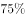，此时杀菌消毒能力较好。如果酒精浓度过高，会在细菌表面形成一层保护膜，阻止酒精进入细菌体内，难以将细菌彻底杀死，因此适当稀释后的酒精渗透能力更强。

C项错误，天然气是指自然界中存在的一类可燃性气体，其主要成分是甲烷。天然气燃烧时火焰呈红黄色说明缺氧，此时可适当调整灶具风门，待火焰呈紫蓝色时，表明燃烧充分。

D项错误，豆浆以大豆等为原料，含有丰富的蛋白质、脂肪、钙、磷及维生素等营养物质，但是大豆中含有的胰蛋白酶抑制素、皂素、皂毒素等都是有害物质。豆浆若未真正煮透，饮用容易引起中毒而发生呕吐、腹泻等，严重会危及生命，因此，豆浆要完全煮沸才可食用。

故正确答案为B。

---

### 第 9 题　qid 2725319 · 人文常识

下列关于体育运动的说法，正确的是：

- **A**. 举重、游泳和竞走均属有氧运动
- **B**. 田径比赛包括田赛、径赛和全能比赛　✅
- **C**. 奥运会上垒球场的面积比篮球场的小
- **D**. 百米赛跑的世界纪录已经突破了9秒

**答案**：B

**官方解析**

本题考查科技常识。
A项错误，有氧运动是指人体在氧气充分供应的情况下进行的体育锻炼，它的特点是强度低、有节奏、持续时间较长。常见的有氧运动项目有步行、慢跑、滑冰、游泳、骑自行车等，一般认为竞走也属于有氧运动。无氧运动是指肌肉在“缺氧”的状态下高速剧烈运动，常见的无氧运动项目有赛跑、举重、投掷等。
B项正确，田径比赛是田赛、径赛和全能比赛的全称。现代田径运动的分类不同，主要包括竞走、跑、跳跃、投掷以及由跑、跳、跃、投掷的部分项目组成的全能运动，共计四十多项。
C项错误，垒球的比赛场地是一个直角扇形区域，直角两边是区分界内地区和界外地区的边线。界内地区又分为内场和外场。内场呈正方形。内场每边垒间距离为18.3米。投手板至本垒的距离为13.10米。本垒后面和两边线以外不少于7.62~9.14米的范围内为界外的有效比赛地区。两边线为长67.06米，两边线顶端圆弧连结线的任何一点距本垒尖角的距离都是67.06米。根据国际篮联规定，标准篮球场地的尺寸是长28米，宽15米。因此，奥运会上垒球场的面积比篮球场大。
D项错误，百米世界纪录是距离最短、用时最少的田径纪录。到目前（2020年12月6日），百米纪录是由牙买加著名短跑健将博尔特于2009年8月17日在德国柏林创造的9秒58。
故正确答案为B。

---

## 言语理解与表达

### 第 1 题　qid 2725267 · 逻辑填空

近年来，人民不仅对物质文化生活提出了更高要求，而且在民主、法治等方面的要求日益增长，但更加        的问题是发展不平衡不充分，这已经成为满足人民日益增长的美好生活需要的主要        因素。
依次填入画横线部分最恰当的一项是：

- **A**. 现实 约束
- **B**. 突出 制约　✅
- **C**. 严峻 限制
- **D**. 突兀 影响

**答案**：B

**官方解析**

第一空，根据横线前程度词“更加”可知，后文阐述的“发展不平衡不充分”的问题程度较重。B项“突出”指超过一般地显露出来，C项“严峻”指严重，两者均能体现程度较重，符合语境，保留。A项“现实”指合于客观情况，体现不出问题的程度较重，与语境不符，排除；D项“突兀”强调突然、出乎意外，“发展不平衡不充分”的问题并非是突然产生的，与语境不符，排除。
第二空，此处说的是“发展不平衡不充分”已经影响了“满足人民日益增长的美好生活需要”这一目标的实现。B项“制约”指甲事物本身的存在和变化以乙事物的存在和变化为条件，则甲事物为乙事物所制约，符合语境，当选。C项“限制”指规定范围，不许超过，如限制文章的字数，“发展不平衡不充分”并非限制了“满足人民日益增长的美好生活需要”的实现，不许其超出规定的范围，与语境不符，排除。
故正确答案为B。
【文段出处】《十九大报告》

---

### 第 2 题　qid 2725270 · 逻辑填空

近年来，国内某些博物馆以“特展”的名义，对某些展览额外收取高额门票。这种做法恐怕不仅仅把非专业人士限制在外，就连一些从事专业研究的学者也难免            了。
填入画横线部分最恰当的一项是：

- **A**. 忍痛割爱
- **B**. 裹足不前
- **C**. 望而却步　✅
- **D**. 大失所望

**答案**：C

**官方解析**

根据横线前的并列标志词“也”可知，此处应表达高额门票不仅将非专业人士限制在外，就连学者也被限制在外了。C项“望而却步”指看到了危险或力不能及的事而往后退缩，置于此处表示高额门票限制了学者进入博物馆观展，符合语境，当选。
A项“忍痛割爱”指不是出自本意忍痛地放弃心爱的东西，被割舍的东西一般是属于自己的，文段中展览里的展品并非属于学者，与语境不符，排除；
B项“裹足不前”指缠上裹脚的布准备远行，却又停步不进，多指有所顾虑，侧重思想保守、没有进步，此处并非强调学者思想保守，与语境不符，排除；
D项“大失所望”指非常失望，此处并非强调学者对博物馆的做法失望，而是强调这种做法限制了学者，与语境不符，排除。
故正确答案为C。
【文段出处】《高价的“特展”》

---

### 第 3 题　qid 2725273 · 逻辑填空

《经典咏流传》将经典诗词的精神内涵与时代发展紧密结合，在新的时代背景下重新        和深度发掘，实现了真正意义上的            ，让国人对古典诗词有了更丰富、更亲近、更喜悦的体验。
依次填入画横线部分最恰当的一项是：

- **A**. 阐述 脱胎换骨
- **B**. 认识 发扬光大
- **C**. 诠释 古为今用　✅
- **D**. 观照 与时俱进

**答案**：C

**官方解析**

第一空，横线处搭配“精神内涵”，根据“在新的时代背景下”和“深度发掘”可知，横线处应表达在新时代重新定义、丰富经典诗词的精神内涵。C项“诠释”指解释，阐明，符合文意，且“重新诠释精神内涵”为常用搭配，保留。A项“阐述”指详尽深入地说明和陈述，体现不出重新定义、丰富精神内涵之意，且“重新阐述精神内涵”搭配不当，排除；B项“认识”指确定，知晓，认明，侧重某件事物被人知道，D项“观照”指仔细观察，审视，强调从某件事物身上看见另一事物，两项均不符合文意，排除。
第二空，代入验证。C项“古为今用”指吸收古代的优点，摒弃缺点，以使现代更进步，可对应后文“让国人对古典诗词有了更丰富、更亲近、更喜悦的体验”，表示深度发掘经典诗词的精神内涵之后所起到的作用，当选。
故正确答案为C。
【文段出处】《经典咏流传》：让古典诗词乘着歌声的翅膀飞翔

---

### 第 4 题　qid 2725274 · 逻辑填空

作为承载信息极大丰富的民族基因宝库，文物并非扁平的、冰冷的物件，其所涉及的学科门类             。它们包含了大量的历史文化信息，可以让今人        过去、找到认识自我的坐标；不仅蕴含有博大精深的智慧、巧夺天工的技艺，而且有领先世界的成就。
依次填入画横线部分最恰当的一项是：

- **A**. 不计其数 反思
- **B**. 包罗万象 回溯　✅
- **C**. 不胜枚举 追忆
- **D**. 五花八门 比照

**答案**：B

**官方解析**

第一空，由“文物并非扁平的、冰冷的物件，其所涉及的······”可知，横线处所填成语与“扁平的、冰冷的”形成反义并列，表达文物涉及的学科门类较为丰富、多元之意。B项“包罗万象”形容内容丰富，无所不有，D项“五花八门”比喻花样繁多，二者均可体现学科门类丰富多元，符合文意，保留。A项“不计其数”、C项“不胜枚举”均表示数量极多，体现不出多元之意，且学科门类是有数的，并非“不计其数、不胜枚举”，搭配不当，排除。
第二空，横线处体现文物包含历史文化信息的作用，通过大量的历史文化信息，今人可以了解过去。B项“回溯”意为回顾，回到早先，表示历史文化信息带领人们回顾过去，了解其发生的事情，符合文意，当选。D项“比照”意为对比、比较，文段并无进行对比、比较之意，排除。
故正确答案为B。
【文段出处】中国文明网《国家宝藏》：一眼千年，用时尚打开传统

---

### 第 5 题　qid 2725276 · 逻辑填空

期刊与网络并存的格局是当下网络文学得以发生的逻辑前提。正是由于文学期刊“发表难”，积压的草根性创作力量才通过网络得以大规模        。不过，这种发表格局也折射出一种观念上的预设：发表在文学期刊上的作品一定是        的，而网络文学就可以是粗陋的。
依次填入画横线部分最恰当的一项是：

- **A**. 发掘 严谨
- **B**. 爆发 正统
- **C**. 传播 经典
- **D**. 释放 精致　✅

**答案**：D

**官方解析**

本题可从第二空入手，根据“发表在文学期刊上的作品一定是······的，而网络文学就可以是粗陋的”可知，文段将文学期刊上的作品与网络文学作品进行比较，横线处所填词语要与“粗陋”表意相反，且要搭配“作品”。D项“精致”指精巧细致，符合文意，保留。A项“严谨”指严肃谨慎、严密周全，与“作品”搭配不当，排除；B项“正统”指党派、学派等一脉相传的嫡派或王朝先后相承的系统，与“作品”搭配不当，排除；C项“经典”指具有典范性、权威性的著作，与“粗陋”不能形成反义关系，排除。
第一空，代入验证，D项“释放”指把所含的物质或能量放出来，与横线前的“积压”形成对应，符合文意，当选。
故正确答案为D。
【文段出处】《在新时代重新审视网络文学》

---

### 第 6 题　qid 2725275 · 逻辑填空

千里岷江和沱江的冲积，        了肥沃的成都平原。从高空俯瞰，金黄的油菜花热烈盛开，错落分布的村落        在平坦宽广的农田中；围绕村落自然分布的树木，既为村落增加了独特的空间安全感，又为田间动物穿越提供了可供休憩的场所。
依次填入画横线部分最恰当的一项是：

- **A**. 滋润 镶嵌
- **B**. 成就 遍布
- **C**. 孕育 穿插
- **D**. 造就 点缀　✅

**答案**：D

**官方解析**

第一空，根据“千里岷江和沱江的冲积”可知，横线处要体现由于岷江和沱江的冲积，形成了成都平原，B项“成就”、C项“孕育”、D项“造就”均能体现形成之意，保留。A项“滋润”指保持水润，使物体表面不干燥，不能体现形成之意，且与前文的“冲积”无法对应，排除。
第二空，根据“错落分布的村落”可知，横线处要体现出村落交错排布在农田中的状态，D项“点缀”指加以衬托或装饰，使原有事物更加美好，符合文意，当选。B项“遍布”指分布到所有的地方，与横线前的“分布”语义重复，排除；C项“穿插”指互相错开、交叉，也指小说戏曲中为了衬托主题而安排一些次要的情节，一般用法为“······中穿插······”，并且“穿插”应该是多个对象互相交叉，与前文的“错落分布”对应不恰当，排除。
故正确答案为D。
【文段出处】《成都至拉萨——从平原迈入高原》

---

### 第 7 题　qid 2725277 · 逻辑填空

有的文明覆灭之后，原有的民族可能还在，但文化上却被征服者彻底        。中国历史上也不乏征服与被征服，中国文明却没有因此而断裂。一个很重要的原因是中国处于半封闭的状态，东面是大海，西面是高原和荒漠，与其他地区的文明虽有接触，但相互间的交流与冲突总体来说并不        。
依次填入画横线部分最恰当的一项是：

- **A**. 颠覆 充分
- **B**. 融合 频繁
- **C**. 改造 直接
- **D**. 同化 显著　✅

**答案**：D

**官方解析**

第一空，“但”表转折，横线处所填词语应表达被征服者的文化已经消失不在。A项“颠覆”指翻倒，C项“改造”指从根本上改变旧的、建立新的，使适应新的形势和需要，D项“同化”指不相同的事物逐渐变得相似或相同，均符合文意，保留。B项“融合”指几种不同的事物合成一体，与文意不符，排除。
第二空，“但”表转折，横线处所填词语应与前文“接触”构成转折关系。D项“显著”指非常明显，搭配“不”，可以与前文“接触”构成转折关系，符合文意，当选。A项“充分”指充足、足够，与“冲突”搭配不当，排除；C项“直接”指不经过中间事物发生关系的，与前文“接触”相矛盾，排除。
故正确答案为D。
【文段出处】《为何说中国文明不是西来的》

---

### 第 8 题　qid 2725282 · 逻辑填空

从现实角度来说，“好面子”实际上是一种遵守社会游戏规则的表现。如果不把面子事做好，就容易被周围的人        。在很多人看来，根本不必考虑“好面子”背后的原因和目的，只要跟大多数人的行为保持一致，            ，就一定不会错，这就是社会心理学中经常提到的“羊群效应”。
依次填入画横线部分最恰当的一项是：

- **A**. 反感 亦步亦趋
- **B**. 排斥 随波逐流　✅
- **C**. 鄙视 墨守成规
- **D**. 误解 人云亦云

**答案**：B

**官方解析**

本题从第二空入手，根据“只要跟大多数人的行为保持一致”以及“羊群效应”可知，横线处需表达“从众行为”之意，A项“亦步亦趋”比喻由于缺乏主张或为了讨好，事事模仿或追随别人，B项“随波逐流”比喻没有坚定的立场，缺乏判断是非的能力，只能随着别人走，均能体现在行为上与别人一致，符合文意，保留。C项“墨守成规”指思想保守，守着老规矩不肯改变，与文意不符，排除；D项“人云亦云”指没有主见，只会随声附和，侧重“说”，而文段强调“做”，与文意不符，排除。
第一空，根据“‘好面子’实际上是······游戏规则的表现”以及“大多数人的行为保持一致”可知，不好面子则不能与众人行为一致，故横线处所填词语需表达不能与众人一致之意，B项“排斥”指不相容、使离开或不使进入，符合文意，当选。A项“反感”指不满或反对的情绪，侧重情绪的表达，与B项相比程度轻，排除。
故正确答案为B。
【文段出处】《爱面子是人情世故的潜规则》

---

### 第 9 题　qid 2725286 · 逻辑填空

中学阶段大多数必读作品所反映的生活与当下生活差异较大，中学生对当时的社会很难有宏观、准确的        ，这就带来了阅读的障碍。此外，必读作品大多反映的是作家的人生经历和情感体验，没有一定人生阅历的人，很难产生情感共鸣与价值认同，于是            。
依次填入画横线部分最恰当的一项是：

- **A**. 把握 知难而退　✅
- **B**. 理解 半途而废
- **C**. 判断 断章取义
- **D**. 定位 望洋兴叹

**答案**：A

**官方解析**

第一空，由文段“中学阶段大多数必读作品所反映的生活与当下生活差异较大”“这就带来了阅读的障碍”可知，中学生很难对阅读作品所处的社会有较为准确的了解和认知。A项“把握”指掌握、理解，B项“理解”指了解、认识，均符合文意，保留。C项“判断”指对事物之间是否具有某种关系的肯定或否定，D项“定位”指把事物放在合适的位置并做出评价，均不符合文意，排除。
第二空，横线前“于是”提示横线所填成语为前文带来的结果，由“没有一定人生阅历的人，很难产生情感共鸣与价值认同”可知，所填成语表示由于读者不具备相应的人生阅历，所以无法消化理解该作品。A项“知难而退”指知道事情困难就后退，符合文意，当选。B项“半途而废”指半路上终止，比喻做事情有始无终，文段中并无已经开始阅读但中途放弃之意，不符合文意，排除。
故正确答案为A。
【文段出处】光明网《勿让“必读”绑架阅读的初衷》

---

### 第 10 题　qid 2725423 · 逻辑填空

当国大业大、兵强马壮的时候，非我莫属、称王称霸的心理优势不免同步膨胀，进而，就会很自然地顺应起弱肉强食的丛林法则，对外扩张、威胁他国，成为            的思维惯性。而此时，属于文明的力道，才真正凸显出来。顺从欲望本能而为，            ，那是动物天性的暴力遗存；依照价值观念而为，约束自我，才是人类文明的进步力量。 
依次填入横线处最恰当的一项是：

- **A**. 理所当然 顺其自然
- **B**. 水到渠成 以暴制暴
- **C**. 顺势而为 放任自流　✅
- **D**. 因势利导 随心所欲

**答案**：C

**官方解析**

第一空，横线处修饰“思维惯性”，根据前文“就会很自然地顺应起弱肉强食的丛林法则”可知，这种思维惯性是顺应丛林法则。C项“顺势而为”意思是顺应潮流，不要逆势而行，能体现顺应法则，符合文意，当选。A项“理所当然”意思是按道理应当这样，强调合乎情理，B项“水到渠成”比喻有条件之后，事情自然会成功，均不能体现顺应某种趋势，排除；D项“因势利导”意思是顺着事情发展的趋势，向有利于实现目的的方向加以引导，文段未体现出引导的意思，排除。
第二空，代入验证，“，”引导并列结构，故横线处表意与“顺从欲望本能而为”相近，即不受约束。C项“放任自流”意思是听其自然发展或行动不加约束或干涉，符合文意，当选。
故正确答案为C。
【文段出处】《习近平：国虽大，好战必亡》

---

### 第 11 题　qid 2725509 · 片段阅读

最早对“峨眉”二字作出解释的是晋人任豫，其《益州记》记载峨眉山在南安县（今四川乐山）界以南八十里，两山首相望如蛾眉。这个说法为北朝郦道元所接受，其《水经注》记载峨眉山在南安县界，去成都南千里，秋日清澄，望见两山相峙如蛾眉。任豫、郦道元从峨眉山的外形来推定“峨眉”二字的语源语义来历，几乎成为后世定论。然而考查图书典籍，我们却找不到“峨眉”为“蛾眉”的文献证据。
这段文字是一篇论文的开头，这篇论文最可能：

- **A**. 考证“峨眉”一词的来源　✅
- **B**. 介绍峨眉山外貌形态的变化
- **C**. 介绍《水经注》对后世的影响
- **D**. 论证文献对地理研究的重要性

**答案**：A

**官方解析**

本题为接语选择题，需通读全文，重点把握文段核心话题。文段首先分别介绍了任豫、郦道元对“峨眉”二字作出的解释，并指出他们是根据峨眉山的外形来推定“峨眉”的语源语义来历，尾句“然而”转折，指出没有图书典籍能够证明“峨眉”为“蛾眉”。由此可知，文段主要围绕“峨眉”的来源在论述，作为一篇论文的开头，这篇论文最可能在考证“峨眉”的来源，对应A项。
B项，“峨眉山外貌形态”与尾句话题不一致，且“变化”无中生有，排除；
C项，《水经注》为举例部分的内容，非重点，且表述片面，排除；
D项，与文段话题不一致，排除。
故正确答案为A。
【文段出处】《“峨眉”语源考》

---

### 第 12 题　qid 2725511 · 片段阅读

随着农村人口快速向城市转移，教育资源的供给并未随之增容，如调整中小学布局，扩建、新建学校，调配师资等。单纯靠挖掘潜力“加双筷子”的办法应对教育资源不足的问题，终究难以为继。人口城市化是不可逆的趋势，促进城乡教育均衡化，不是简单把农村学生留在农村，事实上也是留不住的，应顺应城市化发展的趋势，随人口流动来配置和供给教育资源。子女教育往往是农村进城人口的第一需求，解决好农民子女进城教育的问题，也是推动农村人口就地城市化的基础。
这段文字针对的主要问题是：

- **A**. 教育资源调配与现实需求严重脱节
- **B**. 人口快速流动给城市发展造成压力
- **C**. 农村转移人口在城市生活中遇到障碍
- **D**. 城镇化背景下教育资源供给存在矛盾　✅

**答案**：D

**官方解析**

文段开篇指出农村人口快速向城市转移，教育资源供给不足的问题，后指出单靠挖掘潜力的办法不足以解决问题，随后提出对策，即想解决问题“应顺应城市化发展的趋势，随人口流动来配置和供给教育资源”，尾句解释了这样做的好处。由于题干问的是问题，故正确答案应为问题的同义替换，即在农村人口大量涌入城市的背景下，城市人口越来越多但教育资源却供给不足，对应D项。
A项，缺少主题词“城市化”，偏离文段中心，排除；
B项，“给城市发展造成压力”与文段教育资源供给的话题不一致，偏离文段中心，排除；
C项，文段讨论的话题为城市化背景下教育资源的供给问题，“在城市生活中遇到障碍”将话题扩大，排除。
故正确答案为D。
【文段出处】《“持通知书被拒收”放大城镇化教育的短板》

---

### 第 13 题　qid 2725510 · 片段阅读

在老少冲突中，一类观点被年轻人所欢迎：年轻人早出晚归不容易，老人应该给他们腾出空间。这种说法所对应的逻辑是：一般认为年轻人利用资源是投入社会生产的，例如在公交车享有座位能够让他们更好地休息，从而提高工作效率。老人利用资源更多用于满足个人生活和享受性需求，是纯粹的消耗，而年轻人占有资源后最终会创造新的社会资源。这种功利化的伦理逻辑不乏市场，甚至为部分老年人所赞同。但是，正如那句“人人都有老去的一天”所说的，在老年人和年轻人之间分配资源，不能只盯着眼前的功利。
这段文字意在强调：

- **A**. 应尊重老年人享受社会资源的权利　✅
- **B**. 舆论在公共资源分配问题上反映强烈
- **C**. 不同的社会资源分配方案对应着不同的逻辑
- **D**. 功利的算计不应成为当代社会崇尚的价值理念

**答案**：A

**官方解析**

文段开篇指出一些人认为，老年人应给年轻人腾出空间，后解释原因，即老人利用资源属于纯粹的消耗，而年轻人占有资源是合理的，即老年人不应占据社会资源。后指出这种功利化的伦理逻辑获得一部分人的支持，尾句利用转折关联词“但是”强调，“老年人和年轻人之间分配资源，不能只盯着眼前的功利”，即眼前功利化的看法不对，老年人也有资格享受社会资源，对应A项。
B项，“舆论在公共资源分配问题上反映强烈”文段未提及，无中生有，排除；
C项，“逻辑”对应转折之前，非重点，排除；
D项，“当代社会崇尚的价值理念”文段未提及，无中生有，排除。
故正确答案为A。
【文段出处】《人人都会老去 解决老少冲突需脱离年龄视角》

---

### 第 14 题　qid 2725512 · 片段阅读

说到中国戈壁荒漠中的植物，有些人首先想起的是胡杨、柽柳、梭梭，有些人想到的则是锁阳、肉苁蓉等形态独特的滋补药物，然而在植物学研究者的眼中，甘肃西北部戈壁地带最珍贵、最神秘的物种，当属能够忍受极端环境的耐旱植物，以及绵刺、半日花等古地中海孑遗种类，这些貌不惊人的低矮灌木，对研究环境变迁、物种演化有着重要的意义。
这段文字接下来最可能讲的是：

- **A**. 植物学家对于珍贵物种的判断标准
- **B**. 低矮灌木在物种演化过程中的表现　✅
- **C**. 戈壁荒漠植物抗击极端环境的能力
- **D**. 古地中海孑遗种类分布与环境的关系

**答案**：B

**官方解析**

由提问方式可知，本题为接语选择题，且文段仅存在一句内容。文段开篇指出人们较为熟悉的戈壁荒漠植物是胡杨、锁阳等植物，随后通过“然而”转折强调对于植物学研究者来说，低矮灌木最为珍贵和神秘，因为它们对植物学家研究环境变迁、物种演化有非常重要的意义，因此后文应继续围绕低矮灌木在环境变迁中的演化过程展开介绍，对应B项。
A项，“珍贵物种的判断标准”并非文段重点内容，且文段强调“甘肃西北部”的珍贵物种，选项范围扩大，排除；
C项，文段主要谈论话题为“低矮灌木”，“戈壁荒漠植物”概念扩大，与文段最后谈论的话题衔接不当，排除；
D项，“古地中海孑遗”为文段中“低矮灌木”中的部分种类，表述片面，排除。
故正确答案为B。
【文段出处】《甘肃西北的干旱戈壁，是珍稀植物隐居的乐土》

---

### 第 15 题　qid 2725508 · 片段阅读

在舆论生态、媒体格局深刻变化的形势下，受众的接受心理和阅读习惯也发生了深刻变化，不同的人有着不同的信息需求，呈现分众化、差异化的趋势。过去传统媒体时代，新闻舆论态势犹如一个大教室，媒体是雷打不动的信息中心；移动互联时代，新闻舆论态势则近乎游乐场，受众可以随兴趣任意选择内容和场景。要从媒体竞争中突围，在舆论引导中制胜，空洞说教、生硬灌输不行，追求猎奇、编造故事不行，刻意迎合、取悦受众不行，庸俗媚俗、极端表达也不行。创新理念、内容、体裁、形式、方法、手段、业态、体制和机制，才能提高媒体对受众的“黏度”。
这段文字意在说明：

- **A**. 创新是媒体行业的发展要求　✅
- **B**. 传统媒体已无法满足大众需求
- **C**. 舆论引导是媒体决胜的战略高地
- **D**. 媒体组织机构之间的竞争异常激烈

**答案**：A

**官方解析**

文段开篇介绍在舆论生态、媒体格局深刻变化的形势下，不同的人有着不同的信息需求，呈现分众化、差异化的趋势这一背景，随后通过将“过去传统媒体时代”和“移动互联时代”不同的新闻态势作对比来说明要从媒体竞争中突围，在舆论引导中制胜不能胡编乱造、刻意迎合等。最后给出对策，即需要创新才能提高媒体对受众的“黏度”，对应A项。
B项，偏离文段核心话题，文段重点为尾句的对策，即“创新”，且“传统媒体已无法满足大众需求”表述不明确，排除；
C项，“舆论引导”偏离文段核心话题，排除；
D项，“媒体组织机构之间的竞争异常激烈”为对策之前“移动互联时代”下的背景，非重点，排除。
故正确答案为A。
【文段出处】《创新表达也是传播力》

---

### 第 16 题　qid 2725293 · 片段阅读

资寿寺的壁画在我国现存的明代壁画中应属上品。在风格上，明显带着唐代接受外来文化影响的痕迹，同时又具有强烈的本土化的中原风格。西壁的壁画为工笔重彩画法，富丽华贵，严谨庄重，线描精准而流畅，线条有粗细变化，应比芮城永乐宫的壁画更具表现力。东壁壁画在风格上就不同了，明显出自另一位画工之手。这位画工技艺超群，用笔精熟老到，行笔速度很快，奔放之中极有神韵，而且设色很淡，线条突出，全幅画几乎是用线结构而成，其掌握运用线条的能力可想而知，即使是明代画坛上那些大家，有几位能有这位民间画工如此高妙的笔法？
关于资寿寺壁画，下列说法与原文相符的是：

- **A**. 艺术风格影响了明代的画坛
- **B**. 是明代中西文化交流的代表之作
- **C**. 西壁壁画与东壁壁画艺术风格迥异　✅
- **D**. 比芮城永乐宫壁画的历史更加悠久

**答案**：C

**官方解析**

A项，文段并未介绍资寿寺壁画的艺术风格对明代画坛产生了影响，无中生有，排除；
B项，根据“在风格上，明显带着唐代接受外来文化影响的痕迹，同时又具有强烈的本土化的中原风格”可知，文段虽介绍资寿寺壁画同时具备外来文化痕迹和本土风格，但并未说明其为明代中西文化交流的代表之作，无中生有，排除；
C项，根据“西壁的壁画为工笔重彩画法，······，应比芮城永乐宫的壁画更具表现力。东壁壁画在风格上就不同了，明显出自另一位画工之手”可知，西壁壁画与东壁壁画的风格不同，表述正确，当选；
D项，根据“应比芮城永乐宫的壁画更具表现力”可知，文段未对二者的创作时间进行对比，无中生有，排除。
故正确答案为C。
【文段出处】《晋地三忧》

---

### 第 17 题　qid 2725305 · 片段阅读

大多数荧光增白剂是无毒的或相对无毒的，尤其是用于合成洗涤剂的种类，不会给人类健康造成风险，更不会引发肿瘤。各国洗涤剂中均含有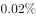~的荧光增白剂，我国目前的添加量也不高于此水平。洗涤废液中的荧光增白剂含量大约为5ppm~10ppm，远低于任何毒性试验水平。此外，荧光增白剂可吸附在植物根部而不会渗透其根、茎、叶、花和果实中，这表明荧光增白剂对农作物有很高的安全性。环境中的荧光增白剂可以通过光分解(降解)和活性污泥吸附降解，加氯化消毒装置对其也有较好的处理效果，不会对人类和水生物造成健康影响。

下列说法与原文不符的是：

- **A**. 
并非所有的荧光增白剂都是无毒的

- **B**. 
洗涤剂中含有荧光增白剂是普遍现象

- **C**. 
荧光增白剂含量超过的洗涤剂有害
　✅
- **D**. 
活性污泥可吸附降解环境中的荧光增白剂

**答案**：C

**官方解析**

C项，根据“各国洗涤剂中均含有~的荧光增白剂”可知，文段仅论述各国洗涤剂中荧光增白剂含量不超过，并未论述荧光增白剂超过的洗涤剂就是有害的，无中生有，当选；

A项，根据“大多数荧光增白剂是无毒的或相对无毒的”可知，并非所有荧光增白剂都无毒，表述正确，排除；

B项，根据“各国洗涤剂中均含有~的荧光增白剂”可知，洗涤剂中普遍含有荧光增白剂，表述正确，排除；

D项，根据“环境中的荧光增白剂可以通过光分解（降解）和活性污泥吸附降解”可知，活性污泥可吸附降解环境中的荧光增白剂，表述正确，排除。

本题为选非题，故正确答案为C。

【文段出处】《荧光增白剂有害吗》

---

### 第 18 题　qid 2725308 · 片段阅读

在从猿到人的进化过程中，人们考虑到地理、气候、动植物资源等因素是完全正确的。但在禄丰古猿、东方人、元谋人生存的区域内有丰富的盐泽，不能不促使我们去思考盐在从猿到人进化中的作用。吃熟食易消化，促进原始人类的进步；古猿食盐促进食物消化，促进营养合成，增强古猿体质，从而提高了古猿的生存能力，促进了古猿的进化，也是合乎逻辑的。
这段文字意在：

- **A**. 分析原始人类进化的原因
- **B**. 强调盐在古猿进化中的作用　✅
- **C**. 对比盐与火对人类的影响
- **D**. 介绍考古研究发现的新成果

**答案**：B

**官方解析**

文段开篇引出“猿到人的进化”这一话题，说明人们对于这一过程考虑到一些因素的正确性，随后通过转折词“但”引出重点，强调人们思考“盐”在猿到人的进化中的作用，尾句说明“盐”促进古猿的进化是合乎逻辑的，进一步论证了前文观点。故文段意在强调“盐”在古猿进化中的作用，对应B项。
A项，“原始人类进化的原因”、D项“考古研究发现的新成果”均未提及主题词“盐”，表述不明确，排除；
C项，文段并未将“盐与火”进行对比，无中生有，排除。
故正确答案为B。

---

### 第 19 题　qid 2725311 · 片段阅读

随着春节临近，各大互联网企业推出的五花八门的“手机抢红包”活动再度引发各界关注。专家表示，作为近年来迅速兴起的一项“全民指尖新年俗”，手机红包已成为当前几大互联网巨头的战略要地；而愈演愈烈的“红包大战”，实质则是互联网巨头都不愿错过的一场用户之战、移动支付地位之战、生态场景之战。
最适合做这段文字标题的是：

- **A**. “手机抢红包”内置的利益链
- **B**. 互联网企业黏住用户的新方式
- **C**. 红包大战背后的互联网巨头之争　✅
- **D**. 手机红包缘何成为“全民指尖新年俗”

**答案**：C

**官方解析**

文段开篇交代背景，指出各大互联网企业推出的“手机抢红包”活动引起关注，接下来论述专家观点，即“红包大战”是互联网巨头重要的争夺战，故文段重在强调红包大战能反映互联网巨头间激烈的竞争，对应C项。
A项，“内置的利益链”无中生有，且缺少核心话题“互联网巨头”，排除；
B项，“新方式”表述不明确，且缺少核心话题“红包大战”，排除；
D项，缺少核心话题“互联网巨头”，且“全民指尖新年俗”仅对应并列结构的其中一个分句，表述片面，排除。
故正确答案为C。
【文段出处】《“红包大战”背后的金融生态圈》

---

### 第 20 题　qid 2725313 · 语句表达

在一项针对留学生的跨文化交际调查中，当被问及“你适应中国的生活吗”时，超过的亚洲学生和欧美学生都选择了“比较适应”，可见伴随汉语水平的提高和对中国了解程度的加深，大多数受访者已经逐渐步入了跨文化适应中的“恢复期”，正在更加理性地认识中国，并且寻找办法解决文化休克带来的交际问题。但是，仍然有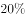的亚洲学生处于“危机期”，认为“不太适应中国，对中国文化还很困惑”，而仅有左右的欧美学生有同样的感受。这说明，<u>                    </u>。

填入画横线部分最恰当的一项是：

- **A**. 中国文化与亚洲文化有亲缘关系的说法似乎并不成立
- **B**. 文化距离的远近并不是影响跨文化适应的关键性因素　✅
- **C**. 某种意义上讲，欧美学生比亚洲学生更能适应中国文化
- **D**. 对地域文化的了解程度决定其对该地域文化的接受程度

**答案**：B

**官方解析**

横线在结尾，起到总结前文的作用，且根据“这说明”可知，后文应是根据前文调查反映的背后结论。文段开篇指出一项针对留学生跨文化交际的调查结果，即大多数留学生都能适应中国生活，并分析了原因。紧接着通过“但是”进行转折，通过列数据指出“不太适应中国”的亚洲学生多于欧美学生。亚洲国家与我国之间的地理距离显然要小于欧美国家，故文段意在强调距离的远近并不会影响文化的适应，对应B项。
A项，文段并未论述“中国文化与亚洲文化有亲缘关系”，无中生有，排除；
C项，“欧美学生比亚洲学生更能适应中国文化”符合文意，但与B项相比，仅是表面现象的概括，并非通过现象说明的背后结论，排除；
D项，文段并未论述“对地域文化的了解程度”，无中生有，排除。
故正确答案为B。

---

### 第 21 题　qid 2725316 · 语句表达

①金沙江与横断山脉共同组成的山川屏障，将西南地区切割成狭小细碎的地理空间，在一定程度上阻隔了文化的交流，形成了各成一统的多彩面貌
②阻隔与交融，哪个才是金沙江在文明进程中扮演的真正角色
③由蛮荒之地到少数民族文化的摇篮，是什么造就了这里异中有同、瑰丽多姿的文化面貌
④汉代以前，金沙江被称作“黑水”，是一片笼罩在神话、传说之中，荒芜而神秘不可知的地带，在今天，它却是中国文化多样性最为丰富的地区
⑤金沙江发源于青海省格拉丹东雪山北麓，由玉树巴塘河口南流，继而向东奔流而去
⑥对于金沙江文化的追溯，或许也是对文明本身的追问
将以上6个句子重新排列，语序正确的一项是：

- **A**. ④⑤②⑥③①
- **B**. ①④⑤②③⑥
- **C**. ⑤①④③②⑥　✅
- **D**. ②⑤⑥④③①

**答案**：C

**官方解析**

首先，判断首句，①句介绍了金沙江与横断山脉共同的作用，②句通过提问的方式探讨金沙江在文明进程中的作用，④句阐述金沙江的过去和现在的发展，⑤句介绍金沙江的发源地，对比这四句可知，①句和②句均为金沙江的意义表述，不适合作为首句，排除B、D两项。对比④句和⑤句，应先产生金沙江，再讲述金沙江的过去和现在的发展，所以⑤句更适合作首句，排除A项。
验证C项，⑤句介绍金沙江的发源地，而后①句介绍了金沙江周围的地理环境，引出其与文化之间的联系，④句通过汉代和现在的对比，体现了如今金沙江地区的文化多样性，③句承接上文文化多样性的话题，并提出疑问寻求原因，②句通过疑问句，探寻金沙江在文明进程中的作用，⑥句“对于金沙江文化的追溯，或许也是对文明本身的追问”，承接上文关于金沙江文明的疑问，逻辑通顺合理，符合文意，当选。
故正确答案为C。
【文段出处】中华遗产《金沙江——阻隔与交融之间》

---

### 第 22 题　qid 2725320 · 语句表达

①服饰形式主要采用上衣下裳制，衣用正色，裳用间色
②这种形式一直延续到春秋战国时期，直到一种名为“深衣”的连体服饰出现，才得以改变
③当时的服饰依据穿着者的身份、地位，各有分别
④中国的衣冠服饰制度，大概在夏商时期初见端倪，到了西周渐趋完善，并被纳入礼制范围
⑤这种审美观念对中国妇女服饰观的影响竟长达千余年
⑥在商周前后，随着封建生产关系的形成与发展，这个时期的女性服装趋向完善和华丽，一袭长衫把女人的美发挥到极致
将以上6个句子重新排列，语序正确的一项是：

- **A**. ④③①②⑥⑤　✅
- **B**. ④⑥⑤①③②
- **C**. ⑥④⑤③①②
- **D**. ⑥④②③①⑤

**答案**：A

**官方解析**

首先，根据选项判断首句，④句介绍了中国衣冠服饰制度的发展进程，⑥句介绍了女性服饰的发展变化，两句对比，④句所论述的“中国的衣冠服饰”更适合作为背景引入，⑥句论述的“女性服装”只是其中一方面，④句在⑥句之前，排除C、D两项。然后，观察题干，②句中出现指代词“这”，故利用指代词捆绑，②句中的“这”应指代①句中的“服饰形式”，故①②捆绑，排除B项，锁定A项。
故正确答案为A。

---

### 第 23 题　qid 2725291 · 语句表达

①这是因为银杏的外种皮不但黏臭，还具有较强的酸性和毒性，过多接触还会引起皮肤过敏和腐蚀
②因为银杏树形巨大寿命也很长，掉落在母株附近的种子发芽之后没有办法熬过“长寿母亲”的树荫，只能枯萎
③银杏的适应能力异常强健，耐低温耐干旱耐贫瘠，甚至在极端环境下也能得以存活
④而除了人类，又少有其他动物会吃银杏的果实
⑤于是，银杏的果实自然掉落后常常只会原地腐烂，直到坚硬的种子裸露之后才会有鸟兽触碰
⑥但银杏传播种子的能力却十分有限
将以上6个句子重新排列，语序正确的一项是：

- **A**. ②④①③⑥⑤
- **B**. ②⑤④①③⑥
- **C**. ③⑥②⑤①④
- **D**. ③⑥②④①⑤　✅

**答案**：D

**官方解析**

对比选项，确定首句，②句开头出现“因为”，属于原因论述，解释银杏种子枯萎的原因，不适合作首句，排除A、B两项。③句引出“银杏”这一话题，讲述了银杏的适应能力很强，适合作首句，保留。
对比C、D两项，尾句各不一致，分别为④句和⑤句。⑤句出现“于是”，表示结论和总结，强调银杏果实掉落后通常只会原地腐烂，而④句“少有其他动物会吃银杏的果实”，属于⑤句结论的原因之一，应在⑤句之前出现，故⑤句更适合作尾句，排除C项，D项当选。
故正确答案为D。
【文段出处】《扇舞金黄，银杏越千年》

---

### 第 24 题　qid 2725297 · 语句表达

社会发展史表明，和对食物的追求一样，人类对美、对艺术的追求始终未变。如果我们将这种追求称为“艺欲”的话，“艺欲”不会像“食欲”那样在满足后减弱，反而会不断增强，这种增强                    。我们都有这样的体验，即便是独自阅读一部文学作品、欣赏一部影视剧或听一场音乐会，也会产生与人交流的内在要求，这种内在要求反过来又会刺激和增强新的文艺需求，此种新需求主要不是重复欣赏某部作品，而是希望欣赏到更加精良的作品。
填入画横线部分最恰当的一项是：

- **A**. 推动着文艺需求更多元丰富
- **B**. 强化了对人们文艺需求的敏锐感知
- **C**. 使文艺更加深刻而广泛地嵌入人们的生活
- **D**. 主要表现为希望获得质量更优的文艺作品　✅

**答案**：D

**官方解析**

语句填空题，横线在中间，需结合前后文共同把握所填内容。横线前以“食欲”作对比，引入“艺欲”这一话题，并强调其会随着满足后“不断增强”；横线后则通过我们日常的阅读、视听体验，阐释“艺欲”满足后的具体表现，表现为“希望欣赏到更加精良的作品”。结合前后文，横线处则要体现“艺欲”增强后的具体表现，“希望获得质量更优的文艺作品”恰好对应后文“希望欣赏到更加精良的作品”，对应D项。
A项，“多元丰富”表述错误，后文强调的是对“更加精良的作品”的需求，并非需求多元化，排除；
B项，“强化······敏锐感知”文段未提及，无中生有，排除；
C项，“嵌入人们的生活”文段未提及，无中生有，排除。
故正确答案为D。
【文段出处】《形塑健康向上的网络审美情趣》

---

### 第 25 题　qid 2725304 · 片段阅读

相比于群众日益增长的健身需求，我国已有体育场馆所能提供的公共体育服务无疑是捉襟见肘的。事实上，建造新的体育场馆并非易事，毕竟体育场馆投入不菲，而从场馆选址来说，也并不能做到哪里有群众健身需求，就可以在哪里建造场馆。在扩大健身场馆、设施的增量方面，就近、就便提供体育场地设施，因地制宜盘活各种资源，使其能为群众健身所用，是比较现实的选择。比如一些地区和城市依山、傍湖或利用公园建起健身步道，一些街道和社区辟出健身休闲场地等，都是值得大力推广的有益尝试。
下列哪项不是这段文字中提及的工作思路？

- **A**. 相关部门转换思路
- **B**. 多途径充实资金来源　✅
- **C**. 遵循因地制宜原则
- **D**. 合理利用现有体育资源

**答案**：B

**官方解析**

文段首先提出问题，依据现有体育场馆提供公共体育服务捉襟见肘。以往的观点是建造新的体育场馆，而现在需要变换思路，在扩大健身场馆和设施增量方面，要就近、就便提供设施，因地制宜盘活各种资源，后面通过举例进行论证。
A项，“相关部门转换思路”为整个文段所表达的核心内容，对应文段“建造新的体育场馆并非易事······就近、就便提供体育场地设施”，与文意相符，排除；
B项，文段未提及“资金来源”，无中生有，当选；
C项，对应文段“因地制宜盘活各种资源”，与文意相符，排除；
D项，对应文段“盘活各种资源”，即指将现有的体育资源利用好，与文意相符，排除。
本题为选非题，故正确答案为B。
【文段出处】《让更多场馆为群众健身所用》

---

### 第 26 题　qid 2725307 · 片段阅读

很多有奖答题类游戏一度异常火爆。其实，这类游戏的前身是电视里的有奖竞猜节目，这种节目自诞生起就有很强的博彩性质。这类节目最大的卖点在于让人们通过对金钱的非正常获取，颠覆关于劳动与报酬的法则，并在此过程中感受刺激。益智，从来不是有奖竞猜类节目最吸引人的地方，有奖答题类游戏也一样。 
最适合做这段文字标题的是：

- **A**. 金钱游戏与电视节目的原动力
- **B**. 益智还是赌博，你需要想清楚
- **C**. 指望答题游戏益智？这并不现实　✅
- **D**. 有奖答题类游戏走红背后的心理学

**答案**：C

**官方解析**

文段首句先引出话题“有奖答题类游戏”，接着通过转折标志词“其实”指出“有奖答题类游戏”前身是“有奖竞猜节目”，具有很强的博彩性质，并对此类型的节目卖点进行了阐释，尾句指出“有奖答题类游戏”和“有奖竞猜类节目”一样，“益智”并非其最吸引人的地方。故文段旨在强调“有奖答题类游戏”最大的卖点并非“益智”，对应C项。
A项，“金钱游戏”、“电视节目”偏离文段中心，文段重点强调“有奖答题类游戏”，排除；
B项，未提及“有奖答题类游戏”，缺少主题词，排除；
D项，“背后的心理学”表述不明确，且缺少主题词“益智”，排除。
故正确答案为C。
【文段出处】《指望答题游戏“益智”？这并不现实》

---

### 第 27 题　qid 2725310 · 片段阅读

我国城市每年餐厨废弃物产生量高达9000多万吨，这是一笔可以再利用的资源。然而长期以来，废弃物的实际处理率不足。实际上，餐厨垃圾经过油水分离、无害化处理等技术环节后，可用于提炼生物柴油、沼气发电等多个领域，具有一定的经济价值。近年来，管理部门为部分餐馆的餐厨废弃物专用桶加装了电子芯片，借助芯片能够对餐厨垃圾的来源、去向、清运量、处理量进行全程在线监控。通过安装“身份证”，提升了餐厨废弃物的回收利用效率，变废为宝产生了理想的经济效益。

这段文字主要说明：

- **A**. 电子芯片技术可广泛应用于垃圾治理
- **B**. 解决餐厨废弃物问题应该采用新技术　✅
- **C**. 油水分离是餐厨垃圾处理的核心技术
- **D**. 城市的餐厨废弃物可以转化为新能源

**答案**：B

**官方解析**

文段开篇引出餐厨废弃物这一话题，并通过转折关联词“然而”指出我国废弃物实际处理率不足的问题，紧接着通过“实际上”表转折，强调可通过技术手段解决餐厨废弃物实际处理率低的问题。后文以近年来管理部门的举措为例，说明“加装电子芯片”可以提升回收利用效率，产生理想的经济效益。故文段重点强调可利用技术手段解决餐厨废弃物的问题，对应B项。
A项，未提及“餐厨废弃物”，缺少主题词，且“广泛应用”文段未提及，无中生有，排除；
C项，“油水分离”仅对应“技术环节”的一种，表述片面，排除；
D项，“转化为新能源”文段未提及，无中生有，排除。
故正确答案为B。
【文段出处】《人民日报来论：电子芯片折射治理升级》

---

### 第 28 题　qid 2725411 · 片段阅读

天蓝釉是清代康熙年间首创的名贵色釉之一，由天青釉演变而来，是以钴、铜、钛、铁等多种金属元素为呈色剂，在高温还原条件下烧成。其釉色浅蓝，釉质莹洁清雅，似蓝色的天空，故名“天蓝釉”。康熙年间的天蓝釉器多为小件器皿，笔洗较多，其次是观音尊、双陆尊，大件器有觚、尊等。其中，天蓝釉刻菊花纹长颈瓶造型别致，胎质细腻，釉色淡雅宜人，纹样清晰，刻画线条纤细，为康熙天蓝釉瓷的代表作。
这段文字没有提及康熙天蓝釉瓷的：

- **A**. 主要产地　✅
- **B**. 得名原因
- **C**. 器型特点
- **D**. 呈色原理

**答案**：A

**官方解析**

A项，康熙天蓝釉瓷的“主要产地”，文段并未提及，当选；
B项，根据“其釉色浅蓝，釉质莹洁清雅，似蓝色的天空，故名‘天蓝釉’”可知，“得名原因”在文段中有所提及，排除；
C项，根据“其中，天蓝釉刻菊花纹长颈瓶造型别致，胎质细腻，釉色淡雅宜人，纹样清晰，刻画线条纤细，为康熙天蓝釉瓷的代表作”可知，“器型特点”在文段中有所提及，排除；
D项，根据“是以钴、铜、钛、铁等多种金属元素为呈色剂，在高温还原条件下烧成。”可知，“呈色原理”在文段中有所提及，排除。
本题为选非题，故正确答案为A。
【文段出处】《中国国家博物馆瓷质馆藏精品之三》

---

### 第 29 题　qid 2725415 · 片段阅读

刘慈欣这十年创作的每一篇科幻作品我都拜读过，他屡屡将目光投向贫瘠的大西北，写西北山村如何遭遇银河帝国拆迁队，一名身患癌症的教师、一群孩子、一个村庄、一个星球的命运，在群星闪烁的宇宙之下，如何奇妙地交织在一起（《乡村教师》）；写无数大肥皂泡裹带湿润空气以及两代人的梦想，进入内陆，从而调节西北干旱的气候（《圆圆的肥皂泡》）······
上述文字中所举的例子，是为了反驳下列哪项关于刘慈欣科幻作品的观点？

- **A**. 不过是幻想的文字，并不接地气　✅
- **B**. 过于理性，很难使读者产生共鸣
- **C**. 充满硬朗气质，缺乏对个人情感的描述
- **D**. 注重宏大背景的描述，缺乏对普通人命运的关注

**答案**：A

**官方解析**

文段开篇便点明主旨，指出刘慈欣作品“屡屡将目光投向贫瘠的大西北”，然后分别列举了《乡村教师》和《圆圆的肥皂泡》两部科幻著作，具体说明其作品是如何聚焦大西北。综合所举例子，无论是以“西北山村”“患癌教师”等为主体元素的《乡村教师》，还是以讲述“调节西北干旱气候”为主的《圆圆的肥皂泡》，均可体现出刘慈欣的科幻作品与现实生活的息息相关，并非纯粹的“幻想”。故文段所举例子反驳了其作品脱离现实，即“不接地气”的观点，对应A项。
B项，“过于理性”偏离文段论述重点，文段所提及内容并非“感性”，因此反驳“过于理性”偏离文段论述重点，排除；
C项，“缺乏对个人情感的描述”和D项，“缺乏对普通人命运的关注”均仅对应《乡村教师》这一例子，表述片面，排除。
故正确答案为A。
【文段出处】《姚利芬：印象刘慈欣》

---

### 第 30 题　qid 2725419 · 片段阅读

房子是用来住的，不是用来炒的。从理论上说，买房不是刚需，居住才是刚需。但为何“宁买房不租房”？这说到底还是因为权利：人们不仅在买“产”，也在买“权”。对物权之上的受教育权、养老保障、医疗等权利的需求，有时比居住本身还强烈。越是人口流动大、业态更新快的城市，这个问题越紧迫。以租购同权为特色的房屋租赁市场改革，正是抓住了这一深层次的需求，尝试实现租屋供给不足和租屋赋权不足的双重解铃。
这段文字中“这个问题”指的是：

- **A**. 租屋供给不足的状况普遍存在
- **B**. 房价超出许多刚需的购买能力
- **C**. 对物权之上各项权利需求强烈　✅
- **D**. 房子长期以来被视为增值手段

**答案**：C

**官方解析**

“这个问题”出现在文段中间，观察前文可知，文段首先指出从“房子是用来住”的理论看“居住才是刚需”，并提出为何不租房的问题，随后指出原因“因为权利”。对物权之上的受教育权、养老保障、医疗等权利的需求有时比居住本身还强烈。“这个问题”指代前文对物权之上的权利的需求，对应C项。
A项，“租屋供给不足”对应尾句，在“这个问题”之后，非其指代内容，排除；
B项，“房价超出许多刚需的购买能力”无中生有，文段并未提及，排除；
D项，“被视为增值手段”对应首句“房子是用来住的，不是用来炒的”，是“这个问题”之前存在的客观情况，并非“这个问题”本身，排除。
故正确答案为C。
【文段出处】《人民日报：保障权利的同时应做大房屋以外的公共产品》

---

## 数量关系

### 第 1 题　qid 2725439 · 数学运算

某支部的每名党员均以5天为周期，在每个周期的最后1天内提交1篇学习心得。某年的1月1日是周日，在1月1日—5日的5天内，支部分别收到2篇、3篇、3篇、1篇和1篇学习心得。问当年前12周（每周从周日开始计算）内，支部共收到多少篇学习心得？

- **A**. 170
- **B**. 169　✅
- **C**. 120
- **D**. 119

**答案**：B

**官方解析**

根据题意可知，5天为一个周期，天共循环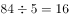个周期······4天。每个周期内共收到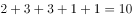篇学习心得，剩余4天收到的学习心得与1月1日—4日相同。因此，共收到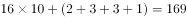篇。

故正确答案为B。

---

### 第 2 题　qid 2725441 · 数学运算

一批相同的17件产品，交给甲、乙、丙三人生产。已知甲、乙、丙三人生产一件产品所需时间相同，每个人至少分到四件产品的生产任务，三人同时开始生产且完成各自的任务之前不休息。问完成所有工作所需时长有多少不同的可能性？

- **A**. 9
- **B**. 8
- **C**. 4　✅
- **D**. 3

**答案**：C

**官方解析**

根据题意可知，甲、乙、丙三人效率相同，即完成所有工作所需时长取决于工作量最大者所需时长。每人先分配四件产品，所需时间相同，总时长取决于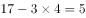件产品的分配情况。将最大工作量分类讨论如下：①分到2件产品（分配方案2、2、1）；②分到3件产品（分配方案3、2、0或3、1、1）；③分到4件产品（分配方案4、1、0）；④分到5件产品（分配方案5、0、0）。即完成所有工作所需时长共有4种可能。

故正确答案为C。

---

### 第 3 题　qid 2725447 · 数学运算

甲、乙、丙3种商品的库存分别为300件、300件和400件，单价分别为300元、500元、400元。销售出总库存量一半的商品后，剩余商品打5折销售。问总销售额最高为多少万元？

- **A**. 28.5
- **B**. 30
- **C**. 31.5　✅
- **D**. 33

**答案**：C

**官方解析**

根据题干可知，总库存量，销售出总库存量一半的商品即已销售件。总销售额销售单价销量，若要总销售额尽量高，则单价高的商品尽量以原价销售，故所求前500件销售额后500件销售额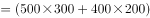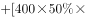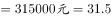万元。

故正确答案为C。

---

### 第 4 题　qid 2725453 · 数学运算

某公园修一个梯形的草坪ABCD，如下图所示，游客只能沿实线行走，其中AB长40米，DC长80米，AD长40米，BC长60米，E、F点为AD和BC的中点。后为了方便游客，拟修一条木质栈道EF穿过草坪，则该栈道至少可以让游客从入口E点到出口C点少走多少米？

- **A**. 10　✅
- **B**. 15
- **C**. 20
- **D**. 25

**答案**：A

**官方解析**

路径E-F-C长度一定，要使少走的距离数最少，则应让游客走的实线距离更少，分情况讨论游客所走实线情况：

E-A-B-C：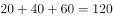米；

E-D-C：米；

则路径E-D-C距离更少。

根据题意可知，EF米，则游客通过栈道到C点的距离为米，则该栈道至少可以让游客从入口E点到出口C点少走米。

故正确答案为A。

---

### 第 5 题　qid 2725460 · 数学运算

一次长跑活动中，某人跑了比全程的多2000米的路程后，发现其已跑过的路程长度恰好是未跑路程的，问他还剩多少米的路程未跑？

- **A**. 5000
- **B**. 5300
- **C**. 6000　✅
- **D**. 6400

**答案**：C

**官方解析**

设全程为米，则已跑的路程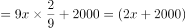米，未跑的路程米，根据题意列方程得：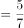，解得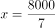，则未跑的路程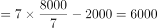米。

故正确答案为C。

---

### 第 6 题　qid 2725391 · 数学运算

某企业生产一批产品，计划在42天内完成，先由甲、乙车间共同生产，12天后甲车间完成总任务的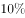，乙车间完成总任务的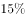。乙车间因设备整修，此后只能以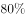的效率工作，为按时完成任务，丙车间此时新加入工作，问其产能至少应是甲车间的：

- **A**. 1
- **B**. 0.8　✅
- **C**. 0.6
- **D**. 0.5

**答案**：B

**官方解析**

由题干条件“12天后甲车间完成总任务的，乙车间完成总任务”可知，甲、乙车间的效率之比为10：15，赋值甲的效率为10，乙的效率为15，则总的工作量为，乙车间设备整修时的效率为。设丙车间的工作效率为，若恰好按时完成任务可列方程：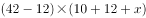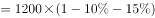，解得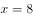，因此丙车间产能至少应是甲车间的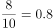。

故正确答案为B。

---

### 第 7 题　qid 2725451 · 数学运算

桌上有20张正面向上的卡片，每次任选其中的3张翻面后放置于原位。问操作2次后，任一张卡片正面向上的概率为：

- **A**. 0.7225
- **B**. 0.745　✅
- **C**. 0.825
- **D**. 0.85

**答案**：B

**官方解析**

要使经过2轮翻转之后卡片正面向上，包括两类情况：1.该张卡片2轮均被选中（从正到反，再翻回正）；2.该张卡片2轮均未被选中（一直保持正面）。

1.该张卡片2轮均被选中。每次被选中概率为在20张卡片中任选3张，，两轮均被选中，；

2.该张卡片2轮均未被选中。每次未被选中概率为，两轮均未被选中，；

总概率为两类情况概率之和，则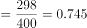。

故正确答案为B。

---

### 第 8 题　qid 2725468 · 数学运算

某企业有三个分公司，已知华北分公司的党员人数比华东分公司多1人，比华南分公司少4人。现将三个分公司的销售部门进行轮换，将华北分公司的销售部调入华东分公司，华东分公司的销售部调入华南分公司，华南分公司的销售部调入华北分公司，则三个分公司的党员人数相等。如华东分公司销售部原有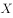名党员。问华北分公司销售部原有多少名党员？

- **A**. 
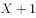

- **B**. 
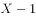

- **C**. 

- **D**. 

　✅

**答案**：D

**官方解析**

设华北分公司调换前党员总人数为人，由题可知华东分公司调换前党员总人数为人，华南分公司调换前党员总人数为人，调换后党员总人数不变，共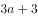人，因销售部轮换后三个分公司党员人数相等，则华东分公司党员人数为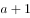人，比调换前多人，由题意可知这2人由华北分公司销售部调入，若华东分公司销售部原有名党员，那么华北分公司销售部原有党员人数为人。 

故正确答案为D。

---

### 第 9 题　qid 2725488 · 数学运算

如图所示，在直线L上依次摆放着5个正方形。已知斜放置的2个正方形的面积分别是3和2。正放置的3个正方形的面积依次是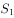、、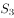，且。问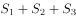的值为？

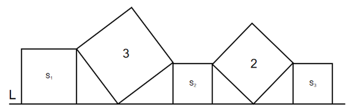

- **A**. 4　✅
- **B**. 5
- **C**. 11
- **D**. 13

**答案**：A

**官方解析**

根据正方形HIJK和正方形BCED的面积分别为2和3，可得，，由勾股定理可得，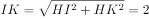，又因为HJ平分IK，故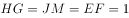，正方形与的面积为1，由勾股定理可得，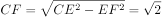。由于，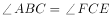，，根据“两角及其夹边对应相等的三角形全等”，可得三角形与三角形全等，故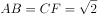，正方形的面积为2，故。

故正确答案为A。

---

### 第 10 题　qid 2725489 · 数学运算

某人花400元购买了若干盒樱桃。已知甲、乙、丙三个品种的樱桃单价分别为28元/盒、32元/盒和33元/盒，问他最多购买了多少盒丙品种的樱桃？

- **A**. 3
- **B**. 4　✅
- **C**. 5
- **D**. 6

**答案**：B

**官方解析**

方法一：设分别购买了甲、乙、丙三个品种的樱桃盒、盒、盒，由题意可列式：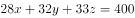，问最多购买了多少盒丙品种的樱桃，即的最大解，考虑从大到小代入排除：

将D项代入方程得：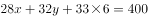，化简得：，14、16均为偶数，但101为奇数，故、无法同时取到整数解，排除；

将C项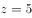代入方程得：，化简得：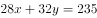，28、32均为偶数，但235为奇数，故、无法同时取到整数解，排除；

将B项代入方程得：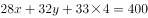，化简得：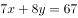，7和8一奇一偶，67为奇数，故一定为奇数，当时，为非整数；当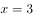时，为非整数；当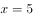时，，满足要求。则的最大正整数解为4。

方法二：设分别购买了甲、乙、丙三个品种的樱桃盒、盒、盒，由题意可列式：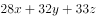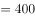，因、、均为正整数，28、32、400均为4的整数倍，故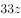为4的整数倍，为4的整数倍，B项满足。

故正确答案为B。

---

## 判断推理

### 第 1 题　qid 2725446 · 图形推理

从所给的四个选项中，选择最合适的一个填入问号处，使之呈现一定的规律性：

- **A**. A　✅
- **B**. B
- **C**. C
- **D**. D

**答案**：A

**官方解析**

元素组成不同，且无明显属性规律，优先考虑数量规律。观察发现，题干均为立体图形，考虑数立体图形外表面的数量，题干立体图形外表面数量均为6，故问号处应选择一个外表面数量为6的立体图形，只有A项符合。
故正确答案为A。

---

### 第 2 题　qid 2725513 · 图形推理

从所给的四个选项中，选择最合适的一个填入问号处，使之呈现一定的规律性：

- **A**. A
- **B**. B　✅
- **C**. C
- **D**. D

**答案**：B

**官方解析**

元素组成不同，且每幅图均由多个图形构成，优先考虑图形间关系。观察发现，题干所有图形均相交于点，排除A、C两项。进一步观察发现，题干图形均为一部分，排除D项。
故正确答案为B。

---

### 第 3 题　qid 2725452 · 图形推理

从所给的四个选项中，选择最合适的一个填入问号处，使之呈现一定的规律性：

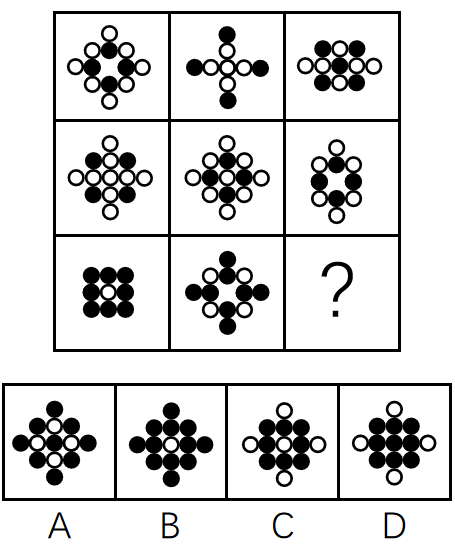

- **A**. A
- **B**. B
- **C**. C
- **D**. D　✅

**答案**：D

**官方解析**

元素组成相似，优先考虑样式规律。题干中各图形均由黑圆和白圆组成，九宫格题目优先考虑横向比较，但无明显规律，考虑纵向比较。观察发现，第一列中，前两个图形去同求异之后得到第三个图形（白圆被黑圆遮挡）；第二列中，前两个图形去同求异之后得到第三个图形（白圆被黑圆遮挡）；故第三列？处图形应由前两个图形去同求异得到（白圆被黑圆遮挡），只有D项符合。
故正确答案为D。

---

### 第 4 题　qid 2725458 · 图形推理

下列选项中由左边四个图形拼合而成的是：

- **A**. A
- **B**. B
- **C**. C　✅
- **D**. D

**答案**：C

**官方解析**

本题考查平面拼合，可采用平行且等长相消的方式解题。消去平行且等长的线段后进行组合可得到轮廓图，即为C项。平行且等长相消的方式如下图所示：

故正确答案为C。

---

### 第 5 题　qid 2725553 · 类比推理

下列选项中与图中所给几何图不一致的是：

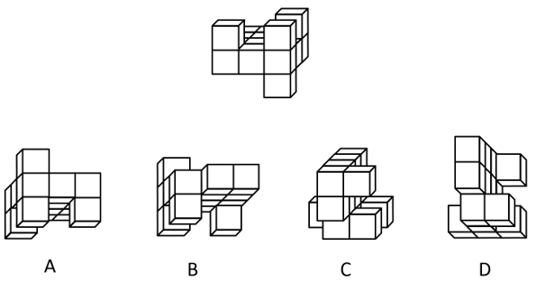

- **A**. A
- **B**. B
- **C**. C　✅
- **D**. D

**答案**：C

**官方解析**

如下图，将题干立体图形中左上角的方块标为1号方块，观察发现，题干立体图形中1号方块与黑色粗线条贯穿的三个方块在同侧，而C项中相应位置的1号方块与黑色粗线条贯穿的三个方块在斜对侧，所以C项与题干所给几何图不一致。

本题为选非题，故正确答案为C。

注：本题不严谨，因为问“不一致”，说明出题人把与题干互为镜像的B、D两项当成了一致，所以唯一完全不一致的只有C项。

---

### 第 6 题　qid 2725345 · 图形推理

左边给定的是纸盒外表面的展开图，下列哪项能由它折叠而成？

- **A**. A
- **B**. B　✅
- **C**. C
- **D**. D

**答案**：B

**官方解析**

将题干展开图中的面依次标注为面a、b、c、d，如下图：

A项：由面b和面c构成，以面c中的点1为起点，顺时针画边，如下图：

题干展开图中与边2相邻的面是面d，而选项中与边2相邻的面是面b，与题干不符，排除；

B项：选项与题干一致，当选；

C项：由面c和面d构成，以面d中的点3为起点，顺时针画边，如下图：

题干展开图中与边4相邻的面是面a，而选项中与边4相邻的面是面c，与题干不符，排除；

D项：由面a和面d构成，以面a中的点5为起点，顺时针画边，如下图：

题干展开图中与边6相邻的面是面b，而选项中与边6相邻的面是面d，与题干不符，排除。

故正确答案为B。

---

### 第 7 题　qid 2725321 · 图形推理

把下面的六个图形分为两类，使每一类图形都有各自的共同特征或规律，分类正确的一项是：

- **A**. ①③⑥，②④⑤　✅
- **B**. ①④⑥，②③⑤
- **C**. ①②④，③⑤⑥
- **D**. ①③⑤，②④⑥

**答案**：A

**官方解析**

本题为分组分类题。元素组成不同，且无明显属性规律，考虑数量规律。观察题干图形发现，每个图形均存在两条直线垂直相交，考虑直角数。图①③⑥有一个直角，图②④⑤有两个直角，即图①③⑥为一组，图②④⑤为一组。
故正确答案为A。

---

### 第 8 题　qid 2725329 · 图形推理

把下面的六个图形分为两类，使每一类图形都有各自的共同特征或规律，分类正确的一项是：

- **A**. ①②③，④⑤⑥
- **B**. ①④⑥，②③⑤　✅
- **C**. ①②⑤，③④⑥
- **D**. ①②⑥，③④⑤

**答案**：B

**官方解析**

本题为分组分类题。元素组成不同，且无明显属性规律，优先考虑数量规律。题干图①、图⑥为多端点图形，图②为五角星变形图，考虑笔画数。图①④⑥均为两笔画图形，图②③⑤均为一笔画图形，即图①④⑥为一组，图②③⑤为一组。
故正确答案为B。

---

### 第 9 题　qid 2725322 · 图形推理

把下面的六个图形分为两类，使每一类图形都有各自的共同特征或规律，分类正确的一项是：

- **A**. ①②③，④⑤⑥
- **B**. ①③④，②⑤⑥
- **C**. ①②⑤，③④⑥
- **D**. ①③⑥，②④⑤　✅

**答案**：D

**官方解析**

本题为分组分类题目。元素组成不同，优先考虑属性规律。观察可知，题干图①、图④、图⑤都出现了等腰元素，且其余图形都比较规整，优先考虑对称性。图①③⑥均为轴对称图形，图②④⑤均为轴中心对称图形。因此，图①③⑥为一组，图②④⑤为一组。

故正确答案为D。

---

### 第 10 题　qid 2725328 · 图形推理

把下面的六个图形分为两类，使每一类图形都有各自的共同特征或规律，分类正确的一项是：

- **A**. ①②④，③⑤⑥
- **B**. ①③④，②⑤⑥　✅
- **C**. ①③⑤，②④⑥
- **D**. ①②③，④⑤⑥

**答案**：B

**官方解析**

本题为分组分类题目。元素组成不同，且无明显属性规律，考虑数量规律。观察发现，图①③④中相同的图形均相连，为1个部分；图②⑤⑥中相同的图形均不相连，为多个部分。即图①③④为一组，图②⑤⑥为一组。
故正确答案为B。

---

### 第 11 题　qid 2725280 · 定义判断

中心路径说服是指通过提供强有力且令人信服的论据进行说服，外周路径说服是指采用熟悉易懂的表述或视觉形象来进行说服。
根据上述定义，下列属于中心路径说服的是：

- **A**. 杂志上的计算机广告详细列出了产品的特点及价格信息　✅
- **B**. 啤酒广告总是将啤酒与聚会等轻松热闹的场景联系在一起
- **C**. 理财推广员告诫客户，不要把所有的鸡蛋都放在一个篮子里
- **D**. 耳机厂商把产品赠送给球星，并让他们带着耳机出现在大众前

**答案**：A

**官方解析**

第一步：找出定义关键词。
中心路径说服：“强有力且令人信服的论据”；
外周路径说服：“熟悉易懂的表述或视觉形象”。
第二步：逐一分析选项。
A项：详细列出了产品的特点及价格信息，属于“强有力且令人信服的论据”，符合中心路径说服的定义，当选；
B项：将啤酒与聚会等轻松热闹的场景联系在一起，属于“熟悉易懂的视觉形象”，符合外周路径说服的定义，排除；
C项：不要把所有的鸡蛋都放在一个篮子里，属于“熟悉易懂的表述”，符合外周路径说服的定义，排除；
D项：让球星带着耳机出现在大众前，属于“熟悉易懂的视觉形象”，符合外周路径说服的定义，排除。
故正确答案为A。

---

### 第 12 题　qid 2725285 · 定义判断

蔡格尼克效应指的是人们对于那些未能完成的事项的记忆有时会比对已完成事项记忆更好的现象。
根据上述定义，下列属于蔡格尼克效应的是：

- **A**. 作业写到一半被同伴拉去踢球，踢完球回家就把写作业的事置之脑后
- **B**. 由于迟到，电影的开场未能看到，至今还对这部电影的情节记忆犹新
- **C**. 电视剧没看完被要求听讲座，事后忘记讲座内容却对电视剧念念不忘　✅
- **D**. 团队未能完成某项目的攻关任务，其成员至今对这一遗憾仍耿耿于怀

**答案**：C

**官方解析**

第一步：找出定义关键词。
“对于那些未能完成的事项的记忆有时会比对已完成事项记忆更好”。
第二步：逐一分析选项。
A项：写作业属于未完成事项，踢球属于已完成事项，把写作业的事置之脑后说明对未完成事项的记忆并不好，不符合定义，排除；
B项：看电影开场属于未完成事项，看电影的情节属于已完成事项，对电影情节记忆犹新说明对已完成事项的记忆较好，不符合定义，排除；
C项：看电视剧属于未完成事项，听讲座属于已完成事项，忘记讲座内容却对电视剧念念不忘，说明对未完成事项的记忆比对已完成事项的记忆更好，符合定义，当选；
D项：攻关任务属于未完成事项，没有已完成事项，无法进行对比，不符合定义，排除。
故正确答案为C。

---

### 第 13 题　qid 2725287 · 定义判断

亲社会侵犯行为是指为了达到为社会团体的准则所能接受的目的，以一种社会认可的方式所做出的侵犯行为。
根据上述定义，下列属于亲社会侵犯行为的是：

- **A**. 老张和老王因纠纷而打架斗殴
- **B**. 家长用罚站教育不听话的孩子
- **C**. 李女士将企图侮辱她的坏人打伤
- **D**. 张某在街上抓住小偷扭送至派出所　✅

**答案**：D

**官方解析**

第一步：找出定义关键词。
“为了达到为社会团体的准则所能接受的目的”、“以一种社会认可的方式所做出的侵犯行为”。
第二步：逐一分析选项。
A项：老张和老王因纠纷而打架斗殴，打架斗殴不属于被社会认可的方式，不符合“以一种社会认可的方式所做出的侵犯行为”，不符合定义，排除；
B项：家长用罚站教育不听话的孩子，属于教育孩子的一种行为，不符合“为了达到为社会团体的准则所能接受的目的”，不符合定义，排除；
C项：李女士将企图侮辱她的坏人打伤，不符合“为了达到为社会团体的准则所能接受的目的”、“以一种社会认可的方式所做出的侵犯行为”，不符合定义，排除；
D项：张某在街上抓住小偷扭送至派出所，抓小偷属于社会认可的行为，且抓小偷这一过程对小偷来说属于侵犯行为，符合“为了达到为社会团体的准则所能接受的目的”、“以一种社会认可的方式所做出的侵犯行为”，符合定义，当选。
故正确答案为D。

---

### 第 14 题　qid 2725290 · 定义判断

再造想象是指根据言语的描述或图样的示意，在人脑中形成有关事物的形象的过程。
根据上述定义，下列属于再造想象的是：

- **A**. 某人受到亭子能避雨但无法移动的启发，发明了雨伞
- **B**. 读毛主席的《沁园春·雪》时，人们脑海中呈现出一副雪景图　✅
- **C**. 鲁迅先生在创作《故乡》时，根据记忆塑造了少年闰土这一形象
- **D**. 观众在欣赏舞者的《雀之灵》时，仿佛看到孔雀开屏的美丽景象

**答案**：B

**官方解析**

第一步：找出定义关键词。
“根据言语的描述或图样的示意”、“在人脑中形成有关事物的形象”。
第二步：逐一分析选项。
A项：某人根据亭子能避雨但无法移动发明了雨伞，属于创造出新事物、新形象，不符合“根据言语的描述或图样的示意”、“在人脑中形成有关事物的形象”，不符合定义，排除；
B项：读毛主席的《沁园春·雪》时，人们脑海中呈现雪景图，符合“根据言语的描述或图样的示意”、“在人脑中形成有关事物的形象”，符合定义，当选；
C项：鲁迅先生根据记忆塑造了少年闰土的形象，属于创造过程，不符合“根据言语的描述或图样的示意”、“在人脑中形成有关事物的形象”，不符合定义，排除；
D项：观众欣赏舞蹈《雀之灵》时，仿佛看到孔雀开屏的美丽景象，是舞者技术高超，所以就像真实孔雀一般呈现在观众眼前，不符合“根据言语的描述或图样的示意”、“在人脑中形成有关事物的形象”，不符合定义，排除。
故正确答案为B。

---

### 第 15 题　qid 2725278 · 定义判断

普雷马克原理是指利用频率较高的活动来强化频率较低的活动，从而促进低频活动的发生，或者用个体喜欢做的事情作为一种强化手段，刺激其做出他们本身不喜欢的行为。
根据上述定义，下列利用普雷马克原理的是：

- **A**. 如果认真练习钢琴两小时，小朵就可以看两集动画片　✅
- **B**. 由于写完作业后还要做家务，小明故意拖延作业时间
- **C**. 如果每天按时上下班，月底就可以拿到200元全勤奖
- **D**. 如果能每天坚持锻炼，就不需要通过节食来保持身材

**答案**：A

**官方解析**

第一步：找出定义关键词。
“利用频率较高的活动来强化频率较低的活动”、“促进低频活动的发生”、“用个体喜欢做的事情作为一种强化手段”、“刺激其做出他们本身不喜欢的行为”。
第二步：逐一分析选项。
A项：用看动画片作为强化手段，让小朵认真练习钢琴两个小时，符合“用个体喜欢做的事情作为一种强化手段”、“刺激其做出他们本身不喜欢的行为”，符合定义，当选；
B项：小明为了不做家务拖延写作业的时间，没有起到强化刺激和促进作用，不符合“利用频率较高的活动来强化频率较低的活动”、“促进低频活动的发生”、“刺激其做出他们本身不喜欢的行为”，不符合定义，排除；
C项：月底200元的全勤奖相对于每天按时上下班来说频率较低，不符合“利用频率较高的活动来强化频率较低的活动”，且200元的全勤奖作为奖励不是个体喜欢做的事情，也不符合“用个体喜欢做的事情作为一种强化手段”，不符合定义，排除；
D项：坚持锻炼和节食，两者并没有体现活动频率的高低，也没有说明是否为个体喜欢做的事，不符合“利用频率较高的活动来强化频率较低的活动”、“用个体喜欢做的事情作为一种强化手段”，不符合定义，排除。
故正确答案为A。

---

### 第 16 题　qid 2725281 · 定义判断

自我应验效应是指由原先错误的期望引起，最终这个错误的期望变成了现实的行为。
根据上述定义，下列属于自我应验效应的是：

- **A**. 小金对舞蹈不感兴趣，但父母觉得孩子的兴趣是父母坚持的结果，希望她有所成就，花了大量心血培养她，可她表现平平
- **B**. 小林从小酷爱足球，父母也发现了他在足球上的天赋，期望他将来能成为一名足球运动员，在父母的苦心栽培下小林终于如愿以偿
- **C**. 小莉是某画家的养女，对收养不知情的老师觉得她应该有艺术天赋，在老师的不断鼓励下，她真的成了一位小画家　✅
- **D**. 小南学习成绩在学校一直都是名列前茅，父母对他期望很高，觉得他考名牌大学没有问题，可小南高考发挥失常，与名校失之交臂

**答案**：C

**官方解析**

第一步：找出定义关键词。
“由原先错误的期望引起”、“最终这个错误的期望变成了现实的行为”。
第二步：逐一分析选项。
A项：小金对舞蹈不感兴趣，但父母还是希望她在舞蹈上有所成就，这是一种错误的期望，符合“由原先错误的期望引起”，花了大量心血培养她，可她表现平平，说明父母的期望没有变成现实，不符合“最终这个错误的期望变成了现实的行为”，不符合定义，排除；
B项：小林酷爱足球且有天赋，父母期望他将来能成为一名足球运动员，这是一种正确合理的期望，不符合“由原先错误的期望引起”，不符合定义，排除；
C项：某画家的养女小莉可能并不具有艺术天赋，但不知情的老师觉得她应该有艺术天赋，这是一种错误的期望，符合“由原先错误的期望引起”，在老师的不断鼓励下，她真的成了一位小画家，符合“最终这个错误的期望变成了现实的行为”，符合定义，当选；
D项：小南学习成绩在学校一直都是名列前茅，父母对他期望很高，觉得他考名牌大学没有问题，这是一种正确合理的期望，不符合“由原先错误的期望引起”，并且他最后也没有考上名校，不符合“最终这个错误的期望变成了现实的行为”，不符合定义，排除。
故正确答案为C。

---

### 第 17 题　qid 2725284 · 定义判断

防御机制中的投射作用是指将自己行为中不为社会认可的部分加诸他人，藉以减少自己因此而产生的焦虑。
根据上述定义，下列不属于防御机制中的投射作用的是：

- **A**. 连续几年，小王的销售业绩总是垫底，他将自己的困境归咎于经济不景气　✅
- **B**. 某小贩做生意总是缺斤少两，他辩解天下乌鸦一般黑，其他小贩也是如此
- **C**. 某考生作弊，老师进行批评教育，他不以为然，觉得作弊是“公开的秘密”
- **D**. 某老板总是无理克扣员工工资，还狡辩资本家都是靠榨取剩余价值发家的

**答案**：A

**官方解析**

第一步：找出定义关键词。
“将自己行为中不为社会认可的部分加诸他人”、“减少自己因此而产生的焦虑”。
第二步：逐一分析选项。
A项：小王的销售业绩总是垫底，他将自己的困境归咎于经济不景气，并没有加诸他人，不符合“将自己行为中不为社会认可的部分加诸他人”，不符合定义，当选；
B项：某小贩做生意总是缺斤少两，他辩解天下乌鸦一般黑，其他小贩也是如此，符合“将自己行为中不为社会认可的部分加诸他人”，符合定义，排除；
C项：某考生作弊，老师进行批评教育，他不以为然，觉得作弊是“公开的秘密”，即别人也会这样做，符合“将自己行为中不为社会认可的部分加诸他人”，符合定义，排除；
D项：某老板总是无理克扣员工工资，还狡辩资本家都是靠榨取剩余价值发家的，符合“将自己行为中不为社会认可的部分加诸他人”，符合定义，排除。
本题为选非题，故正确答案为A。

---

### 第 18 题　qid 2725288 · 定义判断

拖延症是指自我调节失败，在能够预料后果有害的情况下，仍然把计划要做的事情往后推迟的一种行为。
根据上述定义，下列属于拖延症的是：

- **A**. 每天下班后，小玲至少加班1小时，甚至有时还会把工作带回家处理
- **B**. 小丽与小鹏打算大学毕业就结婚，但由于小鹏创业失败，公司破产，小丽找各种借口拖延结婚，失望至极的小鹏决定与小丽分手
- **C**. 烟龄20年的老李最近被咳嗽困扰决定戒烟，但每次戒烟都坚持不到5天就会复吸，反复若干次，最后他还是放弃了戒烟的打算
- **D**. 小美想出版个人画册并与出版社约定了交稿日期，但由于工作繁忙，她迟迟不愿动笔，总是想“明天赶赶就行了”，到了交稿日期，作品只完成一半　✅

**答案**：D

**官方解析**

第一步：找出定义关键词。
“自我调节失败”、“在能够预料后果有害的情况下”、“把计划要做的事情往后推迟”。
第二步：逐一分析选项。
A项：小玲加班甚至把工作带回家处理，没有体现小玲“自我调节失败”，也没有体现“在能够预料后果有害的情况下”、“把计划要做的事情往后推迟”，不符合定义，排除；
B项：小鹏创业失败，公司破产，小丽找借口拖延结婚，导致小鹏决定与小丽分手，实际上小丽并不是拖延，而是不愿意结婚，不符合“在能够预料后果有害的情况下”、“把计划要做的事情往后推迟”，不符合定义，排除；
C项：老李每次戒烟都会复吸，最终放弃了戒烟，体现了老李重复戒烟、重复吸烟，最终放弃的过程，老李开始并没有拖延，而是戒烟失败了，不符合“在能够预料后果有害的情况下”、“把计划要做的事情往后推迟”，不符合定义，排除；
D项：小美与出版社约定了交稿日期，若没有及时画稿会导致作品完成不了，符合“在能够预料后果有害的情况下”，她迟迟不愿动笔，符合“把计划要做的事情往后推迟”，符合定义，当选。
故正确答案为D。

---

### 第 19 题　qid 2725395 · 定义判断

社会比较同化效应指的是当个体与比自己境况好的对象进行比较时，会产生一种觉得自己和比自己境况好的人一样好，进而提高对自己能力等方面的评价；而当个体与比自己境况差的个体进行比较时，会产生一种觉得自己和比自己境况差的人一样差，进而降低对自己能力等方面的评价。
根据上述定义，下列属于社会比较同化效应的是：

- **A**. 癌症病人看到病情比自己更严重的病人时，庆幸自己的处境并非最差
- **B**. 小杰和小伟在学习上你追我赶，因此小杰把小伟当作自己的竞争目标
- **C**. 小宁从普通初中考入重点高中，看到周围同学都那么优秀而自惭形秽
- **D**. 小威听了师兄师姐的优秀事迹后，觉得自己也可以变得那么优秀　✅

**答案**：D

**官方解析**

第一步：找出定义关键词。
“当个体与比自己境况好的对象进行比较时，会产生一种觉得自己和比自己境况好的人一样好”、“当个体与比自己境况差的个体进行比较时，会产生一种觉得自己和比自己境况差的人一样差”。
第二步：逐一分析选项。
A项：癌症病人看到病情比自己更严重的病人，觉得自己并不是最差的，不符合“当个体与比自己境况差的个体进行比较时，会产生一种觉得自己和比自己境况差的人一样差”，不符合定义，排除；
B项：小杰只是把小伟当作自己的竞争目标，并不存在境况差异的比较，不符合定义，排除；
C项：小宁看到周围同学很优秀而自惭形秽，属于和境况好的人对比，觉得没有别人好，不符合“当个体与比自己境况好的对象进行比较时，会产生一种觉得自己和比自己境况好的人一样好”，不符合定义，排除；
D项：小威拿师兄师姐进行比较，觉得自己也可以变得和他们一样优秀，符合“当个体与比自己境况好的对象进行比较时，会产生一种觉得自己和比自己境况好的人一样好”，符合定义，当选。
故正确答案为D。

---

### 第 20 题　qid 2725469 · 定义判断

不随意注意是指没有预定目的，不需要意志努力，不由自主地对一定事物所产生的注意；随意注意指的是有预定目的，需要一定意志努力的注意，它是注意的一种积极、主动的形式；随意后注意是注意的一种特殊形式，是指有自觉目的但不需要意志努力的注意。
①家庭主妇小张厨艺娴熟，在切菜的同时，还可以看电视剧
②教室里小明在聚精会神地听老师讲课，时不时还记着笔记
③安静的课堂忽然闯进来一个人，大家不约而同抬头看向他
根据上述定义，下列选项对应关系正确的是：

- **A**. ①③涉及不随意注意
- **B**. ②涉及随意后注意
- **C**. ②③涉及随意注意
- **D**. ①涉及随意后注意　✅

**答案**：D

**官方解析**

第一步：找出定义关键词。
不随意注意：“没有预定目的”、“不需要意志努力”、“不由自主地对一定事物所产生的注意”；
随意注意：“有预定目的”、“需要一定意志努力”；
随意后注意：“有自觉目的但不需要意志努力”。
第二步：逐一分析三个情景。
情景①：家庭主妇小张厨艺娴熟，在切菜的同时，还可以看电视剧。
分析：切菜的同时看电视剧是有一定目的但不需要意志努力的，符合“有自觉目的但不需要意志努力”，符合“随意后注意”的定义。
情景②：教室里小明在聚精会神地听老师讲课，时不时还记着笔记。
分析：聚精会神地听课并且记笔记，是有预定目的的，需要意志努力的，符合“有预定目的”、“需要一定意志努力”，符合“随意注意”的定义。
情景③：安静的课堂忽然闯进来一个人，大家不约而同抬头看向他。
分析：大家看向忽然闯进的人是没有预定目的的，也不需要意志努力的，是不由自主地关注，符合“没有预定目的”、“不需要意志努力”、“不由自主地对一定事物所产生的注意”，符合“不随意注意”的定义。
因而情景①对应随意后注意，情景②对应随意注意，情景③对应不随意注意。
故正确答案为D。

---

### 第 21 题　qid 2725471 · 类比推理

懒惰∶失败

- **A**. 积分∶兑换
- **B**. 昏迷∶晕倒
- **C**. 运筹∶决战
- **D**. 犯罪∶坐牢　✅

**答案**：D

**官方解析**

第一步：判断题干词语间逻辑关系。
懒惰可能会导致失败，二者为或然因果关系。
第二步：判断选项词语间逻辑关系。
A项：积分可以用来兑换物品，不存在因果关系，与题干逻辑关系不一致，排除；
B项：昏迷是由于大脑功能受到极度抑制而意识丧失和随意运动消失的病理状态，晕倒是指因头晕站立不稳而倒地，两者均指意识丧失，只存在时间上的差别，不具有因果关系，与题干逻辑关系不一致，排除；
C项：对战场运筹的好坏，会决定决战的成败，但是运筹和决战不存在因果关系，与题干逻辑关系不一致，排除；
D项：犯罪可能会导致坐牢，二者为或然因果关系，与题干逻辑关系一致，当选。
故正确答案为D。

---

### 第 22 题　qid 2725473 · 类比推理

书法：欧体

- **A**. 希腊神话∶中国神话
- **B**. 蟠桃园∶仙桃
- **C**. 著作∶专著　✅
- **D**. 知网∶网络

**答案**：C

**官方解析**

第一步：判断题干词语间逻辑关系。
欧体是一种书法，二者为包容关系中的种属关系。
第二步：判断选项词语间逻辑关系。
A项：希腊神话与中国神话是以国家为划分标准的两种神话，为并列关系，与题干逻辑关系不一致，排除；
B项：在神话传说中蟠桃园里有仙桃，二者为地点的对应关系，与题干逻辑关系不一致，排除；
C项：专著为就某方面加以研究论述的专门著作，故专著是一种著作，二者为包容关系中的种属关系，与题干逻辑关系一致，当选；
D项：知网是一个网络网站，运用于网络领域，二者为对应关系，与题干逻辑关系不一致，排除。
故正确答案为C。

---

### 第 23 题　qid 2725475 · 类比推理

手足∶手∶足

- **A**. 江湖∶江∶湖　✅
- **B**. 巨大∶巨∶大
- **C**. 拉扯∶拉∶扯
- **D**. 给予∶给∶予

**答案**：A

**官方解析**

第一步：判断题干词语间逻辑关系。
手足由手和足组成，后两个词组成第一个词；且三个词的词性均为名词。
第二步：判断选项词语间逻辑关系。
A项：江湖由江和湖组成，后两个词组成第一个词；且三个词的词性均为名词，与题干逻辑关系一致，当选；
B项：巨大由巨和大组成，后两个词组成第一个词；但三个词的词性均为形容词，与题干逻辑关系不一致，排除；
C项：拉扯由拉和扯组成，后两个词组成第一个词；但三个词的词性均为动词，与题干逻辑关系不一致，排除；
D项：给予由给和予组成，后两个词组成第一个词；但三个词的词性均为动词，与题干逻辑关系不一致，排除。
故正确答案为A。

---

### 第 24 题　qid 2725478 · 类比推理

丛林 对于 （    ） 相当于 （    ） 对于 驾驶员

- **A**. 雨林；轿车
- **B**. 猛虎；司机
- **C**. 树木；乘客
- **D**. 伐木工；游轮　✅

**答案**：D

**官方解析**

逐一代入选项。
A项：丛林与雨林侧重点不同、覆盖不同、树木密度不同，二者为并列关系，驾驶员驾驶轿车，二者为对应关系，前后逻辑关系不一致，排除；
B项：丛林可以是猛虎的生存环境，二者为地点对应关系，司机是驾驶员的别称，二者为全同关系，前后逻辑关系不一致，排除；
C项：树木是丛林的一部分，二者为组成关系，驾驶员为乘客服务，二者为对应关系，前后逻辑关系不一致，排除；
D项：伐木工可以在丛林工作，二者为职业与地点对应关系，驾驶员可以在游轮工作，二者为职业与地点对应关系，前后逻辑关系一致，当选。
故正确答案为D。

---

### 第 25 题　qid 2725480 · 类比推理

烤箱 对于 （    ） 相当于 （    ） 对于 书本

- **A**. 微波炉；纸张
- **B**. 面包；报纸
- **C**. 蛋糕；印刷厂　✅
- **D**. 炊具；知识

**答案**：C

**官方解析**

逐一代入选项。
A项：烤箱和微波炉均为厨房电器，二者为并列关系，纸张组成书本，二者为组成关系，前后逻辑关系不一致，排除；
B项：烤箱制作面包，二者为对应关系，报纸和书本为并列关系，前后逻辑关系不一致，排除；
C项：烤箱制作蛋糕，印刷厂制作书本，均为对应关系，前后逻辑关系一致，当选；
D项：烤箱是炊具，二者为种属关系，书本是知识的载体，前后逻辑关系不一致，排除。
故正确答案为C。

---

### 第 26 题　qid 2725481 · 逻辑判断

某研究院指出，随着科技的进步，未来全球大概有3.75亿人将面临重新就业，其中中国占一亿。人工智能虽然会取代人类的很多工作，但是有创造力和丰富情感的工作，是人工智能无法取代的，比如科学、文艺、育儿、养老、教师等工作，相比较现在而言，反而会逆势上扬，成为将来的热门。
以下哪项如果为真，最能支持上述观点？

- **A**. 处理大批数据的工作，人的判断误差能力不如机器人
- **B**. 一些著名企业的总裁陆续表示，计划使用人工智能代替运营人员
- **C**. 掌握深度学习能力的人工智能，拥有编程的能力，能轻松编写歌曲，创造出新的绘画风格
- **D**. 智能是认知和加工信息的能力，情感则是由生物进化长期形成的，前者不可能产生后者　✅

**答案**：D

**官方解析**

第一步：找出论点和论据。
论点：有创造力和丰富情感的工作，是人工智能无法取代的，比如科学、文艺、育儿、养老、教师等工作，相比较现在而言，反而会逆势上扬，成为将来的热门。
论据：无。
本题只有论点，没有论据，优先考虑补充论据来进行加强。
第二步：逐一分析选项。
A项：指出人类在处理大批数据时的判断误差能力不如机器人，说明人工智能可以取代人类的这些工作，但处理大批数据的工作不属于有创造力和丰富情感的工作，话题不一致，无法加强，排除；
B项：指出部分企业打算用人工智能来代替运营人员，但无法确定运营人员的工作是否需要创造力和丰富情感，属于不明确选项，无法加强，排除；
C项：指出有深度学习能力的人工智能，可以轻松编写歌曲，创造出新的绘画风格等，证明了人工智能有创造性，具有削弱作用，无法加强，排除；
D项：指出智能不可能产生情感，解释了为什么人工智能无法胜任有创造力和丰富情感的工作，补充论据，当选。
故正确答案为D。

---

### 第 27 题　qid 2725486 · 逻辑判断

碳酸钙是珍珠的主要成分，占珍珠比例的百分之九十，但是，想用皮肤来吸收碳酸钙，这几乎是不可能的，因为皮肤有多层结构，固体的珍珠粉很难渗入。珍珠粉外敷之后若有残留粉末，可能会反射出一定的光泽，显得皮肤变白了。其实这只是假象。所以，想靠着珍珠粉去美白是不太现实的。
下列选项除了哪项外，均能反驳上述论证？

- **A**. 现代技术能让珍珠粉的大小达到百纳米以下，可以被吸入皮肤
- **B**. 某明星有长期外用珍珠粉的习惯，年过60仍皮肤润泽柔滑，细腻白皙
- **C**. 珍珠粉外敷能部分隔绝空气，减缓空气对皮肤表层细胞的氧化，长期使用能延缓衰老　✅
- **D**. 珍珠粉中的牛磺酸具有加强巨噬细胞吞噬的能力，黑色素进入表皮层之后部分会被巨噬细胞吞噬降解

**答案**：C

**官方解析**

第一步：找出论点和论据。
论点：想靠着珍珠粉去美白是不太现实的。
论据：想用皮肤来吸收碳酸钙，这几乎是不可能的，因为皮肤有多层结构，固体的珍珠粉很难渗入。珍珠粉外敷之后若有残留粉末，可能会反射出一定的光泽，显得皮肤变白了。
本题论点说的是靠着珍珠粉去美白不现实，论据说的是碳酸钙无法被皮肤吸收。论点和论据话题不一致，削弱可以考虑拆桥，也可以削弱论点和削弱论据，因为本题为选非题，排除削弱项即可。
第二步：逐一分析选项。
A项：指出现代技术可以实现珍珠粉被吸入皮肤，说明珍珠粉中的碳酸钙可以渗入皮肤，削弱论据，排除；
B项：以某明星为例证明外用珍珠粉可以让皮肤白皙，从而证明珍珠粉可以美白，削弱论点，排除；
C项：指出珍珠粉外敷可以减缓皮肤表层细胞被氧化，缓解衰老，而论点讨论的是珍珠粉是否能起到美白的作用，话题不一致，无法削弱，当选；
D项：指出珍珠粉中的牛磺酸可以降解进入表皮层的黑色素，说明珍珠粉含有其他具有美白效果的成分，削弱论点，排除。
本题为选非题，故正确答案为C。

---

### 第 28 题　qid 2725296 · 逻辑判断

一项专门调查显示，英国女人特别迷恋高跟鞋。2012年，这些高跟鞋迷们在买鞋上的花销达到了35亿英镑。据一些著名高跟鞋品牌店反映，英国不少女性在买一双价格不菲的新高跟鞋时，总是毫不迟疑，出手大方。尽管她们花了大笔钱买高跟鞋，但买来的鞋子有从未穿过。英国每20名女性中就有1人拥有50双以上的高跟鞋，且的女性说她们每年至少购买10双高跟鞋。

以下哪项如果为真，最能支持上述调查结论？

- **A**. 英国女性更喜爱收藏漂亮高跟鞋而不是使用它们　✅
- **B**. 英国每名女性平均拥有的鞋子数量是男性的两倍
- **C**. 英国女性更重视高跟鞋的数量而非高跟鞋的质量
- **D**. 英国女性每个月购买穿戴用品金额占工资的一半

**答案**：A

**官方解析**

第一步：找出论点和论据。

论点：英国女人特别迷恋高跟鞋。

论据：2012年，这些高跟鞋迷们在买鞋上的花销达到了35亿英镑。据一些著名高跟鞋品牌店反映，英国不少女性在买一双价格不菲的新高跟鞋时，总是毫不迟疑，出手大方。尽管她们花了大笔钱买高跟鞋，但买来的鞋子有从未穿过。英国每20名女性中就有1人拥有50双以上的高跟鞋，且的女性说她们每年至少购买10双高跟鞋。

本题的论点和论据话题一致，都在说英国女人特别迷恋高跟鞋，所以，我们需要以补充论据的方式来加强。

第二步：逐一分析选项。

A项：该项以英国女性喜爱收藏漂亮高跟鞋为理由解释了为什么英国女性花大价钱购买大量的高跟鞋却不穿，补充论据，可以加强，当选；

B项：该项是在比较英国女性和男性之间鞋子数量，论点是在说英国女性与高跟鞋的关系，题干并未涉及与男性的比较，且拥有的鞋子多不等同于拥有的高跟鞋多，无关选项，无法加强，排除；

C项：该项说明英国女性更加重视高跟鞋的数量而不是高跟鞋的质量，题干并未涉及数量和质量之间的比较，而且重视数量也不能解释为什么要购买大量的高跟鞋但是不穿，无关选项，无法加强，排除；

D项：该项是在说英国女性购买穿戴用品花费多，论点是在说英国女性与高跟鞋的关系，话题不一致，无法加强，排除。

故正确答案为A。

---

### 第 29 题　qid 2725299 · 逻辑判断

假定有一个鱼缸，里面的金鱼透过弧形的鱼缸玻璃观察外面的世界，现在它们中的物理学家开始发展“金鱼物理学”了，它们归纳观察到的现象，并建立起一些物理学定律，这些物理学定律能够解释和描述金鱼们透过鱼缸所观察到的外部世界，这些定律甚至还能够正确预言外部世界的新现象。因此，这样的“金鱼物理学”可以是正确的。
要使上述论证成立，需要补充下列哪项作为前提？

- **A**. 我们看到的直线运动可能在“金鱼物理学”中表现为曲线运动
- **B**. 物理学理论正确与否依赖于其理论体系所得出的结论能否被反复验证
- **C**. 虽然金鱼的实在图像与我们的不同，但是我们的实在图像也可能是不真实的
- **D**. 当某理论的解释与观察者的观测吻合时，观察者往往认为这个理论就是正确的　✅

**答案**：D

**官方解析**

第一步：找出论点和论据。
论点：“金鱼物理学”可以是正确的。
论据：它们归纳观察到的现象，并建立起一些物理学定律，这些物理学定律能够解释和描述金鱼们透过鱼缸所观察到的外部世界，这些定律甚至还能够正确预言外部世界的新现象。
本题论点讨论的是“金鱼物理学”正确与否，论据讨论的是物理学定律能够解释外部世界，甚至能够正确预言外部世界。论点和论据话题不一致，优先考虑搭桥，在“正确”和“物理学定律能够解释和正确预言外部世界的新现象”之间建立联系即可。
第二步：逐一分析选项。
A项：该项说明我们实际看到的与“金鱼物理学”所体现的不一致，与论点话题“金鱼物理学”是否正确无关，无法加强，排除；
B项：该项指出物理学理论是否正确与反复验证的关系，但是题干只涉及解释和预言，与反复验证无关，无法加强，排除；
C项：该项说明金鱼观察到的与我们的不同，而我们观察到的也可能是不真实的，与论点话题“金鱼物理学”是否正确无关，无法加强，排除；
D项：该项说明当某理论的解释与观察者的观测相吻合的时候，观察者就认为这个理论是正确的，即建立了“正确”与“解释和正确预言外部现象”的联系，搭桥，可以加强，当选。
故正确答案为D。

---

### 第 30 题　qid 2725300 · 逻辑判断

动物药理实验表明，白藜芦醇具有明显的软化血管作用，可以抗血栓，对冠心病、高血脂有防治作用。而葡萄生长过程中，为防止灰色霉菌感染导致葡萄腐烂，会产生白藜芦醇。在葡萄酒发酵生产过程中，由于葡萄汁酶的作用，酒中白藜芦醇的数量明显增加。因此，葡萄酒具有保健功效。
以下哪项如果为真，最能质疑上述论证？

- **A**. 白藜芦醇想要发挥软化血管的作用，理论上需要连续两个月每天喝1斤葡萄酒
- **B**. 乙醇是一级致癌物，任何酒精饮料不论是否真有诸如软化血管之类的养生作用，最后都会明显降低饮用者的预期寿命　✅
- **C**. 偏爱奶酪、芝士、黄油等高脂肪食物的法国人，因常饮富含白藜芦醇的葡萄酒，其冠心病发病率却低于其他西方国家
- **D**. 即便在动物实验中能确定白藜芦醇物质对动物有用，要证实白藜芦醇对人体健康的作用和安全性，还必须进行大规模的人体试验

**答案**：B

**官方解析**

第一步：找出论点和论据。
论点：葡萄酒具有保健功效。
论据：白藜芦醇具有明显的软化血管作用，可以抗血栓，对冠心病、高血脂有防治作用。而葡萄生长过程中，为防止灰色霉菌感染导致葡萄腐烂，会产生白藜芦醇。在葡萄酒发酵生产过程中，由于葡萄汁酶的作用，酒中白藜芦醇的数量明显增加。
本题论点讨论的是葡萄酒具有保健功效，论据讨论的是葡萄酒中的白藜芦醇可以软化血管，二者话题不一致，削弱优先考虑拆桥，也可以考虑削弱论点或他因削弱。
第二步：逐一分析选项。
A项：该项指出发挥白藜芦醇软化血管的作用，理论上需要连续两个月每天喝1斤葡萄酒，“1斤葡萄酒”并不是完全不可实现的天文数字，部分人可以每天饮用1斤葡萄酒，所以该项削弱力度比较弱，保留；
B项：该项指出“任何酒精饮料”都会明显降低饮用者的预期寿命，即喝葡萄酒也会降低寿命，而论点提到的葡萄酒具有的保健功效本身也是为了保护身体健康、延缓寿命，说明葡萄酒并不具有保健功效，直接削弱论点，且比A项用词更绝对，力度更强，当选；
C项：该项拿法国人举例子，说明含有白藜芦醇的葡萄酒可以降低冠心病发病率，举例证明葡萄酒具有保健功效，加强项，无法削弱，排除；
D项：该项指出白藜芦醇对动物有用，但要证明白藜芦醇对人体的保健功效，还需要进行大规模的人体试验，即不明确白藜芦醇对人体是否具有保健功效，无法削弱，排除。
故正确答案为B。

---

### 第 31 题　qid 2725264 · 逻辑判断

如果不在国家机关工作，小张就会失去今后晋职深造的机会；而如果不在民营企业工作，小张就不能提高自己的工资收入。小张不能既在国家机关工作又在民营企业工作。如果不能提高自己的工资收入，小张就买不起婚房。虽然小张女朋友不介意婚房的有无，但小张女朋友的父母很介意，小张自己也很介意。他暗下决心：如果买不起婚房，自己宁肯不结婚。最近，一直内心纠结的小张终于结婚了。
根据以上信息，可以得出以下哪项?

- **A**. 小张现在不在国家机关工作　✅
- **B**. 小张现在不在民营企业工作
- **C**. 小张不会失去今后晋职深造的机会
- **D**. 小张女朋友的父母最近改变了想法

**答案**：A

**官方解析**

第一步：翻译题干。

（1）不在国家机关工作失去深造机会；

（2）不在民营企业工作不能提高工资；

（3）国家机关工作或民营企业工作；

（4）不能提高工资买不起婚房；

（5）买不起婚房不结婚；

（6）小张结婚。

根据（6）小张结婚进行推理可以得出：

小张结婚买得起婚房提高工资民营企业工作国家机关工作失去深造机会。

第二步：逐一分析选项。

A项：根据上述推理可知，小张不在国家机关工作，可以推出，当选；

B项：根据上述推理可知，小张在民营企业工作，不能推出，排除；

C项：根据上述推理可知，小张失去深造机会，不能推出，排除；

D项：根据题干信息无法判断小张女朋友的父母有没有改变想法，不能推出，排除。

故正确答案为A。

---

### 第 32 题　qid 2725294 · 逻辑判断

地区GDP汇总数据与全国GDP数据存在一定差距，在统计实践上是可以接受的，在各国统计工作中也比较常见。目前A国地区GDP汇总数据与全国GDP数据也存在一定差距，这在统计实践上是可以接受的。
以下哪项如果为真，最能支持上述观点？

- **A**. 该国的统计工作与其他国家相比存在较大差距
- **B**. 该国某些地区GDP数据存在弄虚作假等失真情况
- **C**. 该国地区GDP与全国GDP数据在计算方法上不同　✅
- **D**. 该国所辖地区众多，且经济发展水平存在较大差异

**答案**：C

**官方解析**

第一步：找出论点和论据。
论点：目前A国地区GDP汇总数据与全国GDP数据也存在一定差距，这在统计实践上是可以接受的。
论据：地区GDP汇总数据与全国GDP数据存在一定差距，在统计实践上是可以接受的，在各国统计工作中也比较常见。
本题的论点和论据话题一致，都在说明地区GDP汇总数据与全国GDP数据存在一定差距，并且是可以接受的，加强考虑补充论据。
第二步：逐一分析选项。
A项：该项指出该国与其他国家统计工作上的差距，而论点说的是地区GDP汇总数据与全国GDP数据的差距在统计实践上是可以接受的，话题不一致，无法加强，排除；
B项：该项指出某些地区GDP数据存在弄虚作假等失真情况，这可能是地区GDP汇总数据与全国GDP数据存在一定差距的原因，但弄虚作假造成的数据差距应该是不能被统计实践所接受的，具有一定的削弱作用，无法加强，排除；
C项：该项指出地区GDP与全国GDP数据计算方法不同，这可能是地区GDP汇总数据与全国GDP数据存在一定差距的原因，而且这种差距是因为计算方法不同，并不是数据不准确不真实，解释了为什么数据差距在统计实践上是可以接受的，补充论据，当选；
D项：该项指出该国各地区经济发展水平存在差异性，只能说明该国各地区的GDP是不同的，而论点说的是地区GDP汇总数据与全国GDP数据的差距在统计实践上是可以接受的，话题不一致，无法加强，排除。
故正确答案为C。

---

### 第 33 题　qid 2725298 · 逻辑判断

物业专项维修基金主要用于支付物业共用部分、共用设施设备等的维修费用。某市物业专项维修基金强制缴存工作已经执行了近20年，实现资金归集总额近200亿元，去年全年增值收益10亿元，而去年一年被使用的维修基金仅仅只有4000万元。对此，有市民建议，政府应该考虑降低物业专项维修基金的缴存标准。
以下哪项如果为真，最能反驳市民的这一建议？

- **A**. 降低新建成楼宇的物业专项维修基金缴存标准对已缴存业主不公平
- **B**. 部分小区使用小区公共收益解决共用部分、共用设施设备的维修问题
- **C**. 该市已启用新的资金管理办法解决申请使用维修基金流程繁琐的问题
- **D**. 该市缴存资金的大部分楼宇都是近几年建成，尚处于开发商的保修期内　✅

**答案**：D

**官方解析**

第一步：找出论点和论据。
论点：政府应该考虑降低物业专项维修基金的缴存标准。
论据：某市物业专项维修基金强制缴存工作已经执行了近20年，实现资金归集总额近200亿元，去年全年增值收益10亿元，而去年一年被使用的维修基金仅仅只有4000万元。
本题论点和论据都在讨论物业专项维修基金的缴存，话题一致，因此可以预设否定论点的方式进行削弱，即说明政府不应该降低物业专项维修基金的缴存标准的原因。
第二步：逐一分析选项。
A项：论点讨论的是政府该不该降低物业专项维修基金的缴存标准，该项说的是降低新建成楼宇的物业专项维修基金缴存标准对已缴存业主不公平，对业主是否公平不是政府不应该降低物业专项维修基金缴存标准的必要原因，无法削弱，排除；
B项：论点讨论的是政府该不该降低物业专项维修基金的缴存标准，该项说的是部分小区使用小区公共收益解决共用部分、共用设施设备的维修问题，话题不一致，排除；
C项：论点讨论的是政府该不该降低物业专项维修基金的缴存标准，该项说的是该市启用新办法去解决申请流程繁琐的问题，话题不一致，排除；
D项：该项说的是缴存资金的大部分楼宇尚处于开发商的保修期内，即这些楼宇还未进入维修高峰期，使用维修资金的需求少，当脱离开发商的保修期后，将会使用大量维修资金，这说明了政府不应该降低物业专项维修基金的缴存标准的原因，削弱了论点，当选。
故正确答案为D。

---

### 第 34 题　qid 2725265 · 逻辑判断

几年前，某市开始对使用一次性塑料餐盒的餐厅征收处理费，餐厅每使用一个一次性塑料餐盒就要缴纳2元的处理费。自从征收这项处理费后，该市餐厅使用一次性塑料餐盒的数量逐年下降。
由此可以推出：

- **A**. 该市餐厅的营业额不断下降
- **B**. 该市餐厅非一次性餐盒的使用量不断上升
- **C**. 该市一次性塑料餐盒处理费的收入不断减少　✅
- **D**. 该市征收一次性塑料餐盒处理费导致餐厅利润下降

**答案**：C

**官方解析**

日常结论题，根据题干信息逐一分析选项。
A项：题干中没有涉及营业额不断下降，无中生有，排除；
B项：题干中仅指出一次性塑料餐盒的使用数量逐年下降，但没有涉及非一次性餐盒的使用量不断上升，无中生有，排除；
C项：根据题干最后一句话可知，征收处理费之后该市餐厅使用一次性塑料餐盒的数量逐年下降，可以推出该市一次性塑料餐盒处理费的收入不断减少，当选；
D项：题干中没有涉及餐厅利润下降的话题，无中生有，排除。
故正确答案为C。

---

### 第 35 题　qid 2725303 · 类比推理

在一次职业技能竞赛中，六位决赛选手决出第一至第六的名次。一号选手比四号选手的名次低但比二号选手名次高；三号选手比二号选手名次低；五号选手的名次比三号选手的高但比四号选手的低。
根据下列哪项能够推出六号选手的名次比一号选手的名次低？

- **A**. 六号选手的名次比二号选手的名次低　✅
- **B**. 六号选手的名次比三号选手的名次高
- **C**. 六号选手的名次比四号选手的名次低
- **D**. 六号选手的名次比五号选手的名次高

**答案**：A

**官方解析**

第一步：整理题干条件。

由于题干出现了名次排序，所以可以用“”作为辅助工具整理题干信息。

①四号一号二号；

②二号三号；

③四号五号三号；

将①②串联可以得到④四号一号二号三号。

第二步：根据题干条件分析选项。

题干问根据哪项能够推出某结论，故优先考虑代入法：

代入A项，若二号六号，结合条件④可以得出一号六号，可以推出六号选手的名次比一号选手的名次低的结论，当选；

代入B项，若六号三号，无法推出六号选手的名次比一号选手的名次低的结论，排除；

代入C项，若四号六号，无法推出六号选手的名次比一号选手的名次低的结论，排除；

代入D项，若六号五号，无法推出六号选手的名次比一号选手的名次低的结论，排除。

故正确答案为A。

---

## 资料分析

### 材料 1

        2015年国民经济和社会发展统计公报。公报显示，全年全国居民人均可支配收入21966元，比上年增长，增长率下降1.2个百分点。按常住地分，2015年城镇居民人均可支配收入31195元，比上年增长，增长率比2014年下降0.8个百分点；农村居民人均可支配收入11422元，比上年增长，增长率比2014年下降2.3个百分点。全年农村居民人均纯收入为10772元。全国农民工人均月收入3072元，比上年增长。全国居民人均消费支出15712元，比上年增长。按常住地分，城镇居民人均消费支出21392元，增长，农村居民人均消费支出9223元，增长。2015年，全国参加城镇职工基本养老保险人数35361万人，比上年末增加1236万人，比2013年末增加3133万人；参加城乡居民基本养老保险人数50472万人，增加365万人，比2013年末增加772万人；参加城镇基本医疗保险人数66570万人，增加6823万人，比2013年末增加9525万人。其中，参加职工基本医疗保险人数28894万人，增加598万人；参加城镇居民基本医疗保险人数37675万人，增加6225万人。参加失业保险人数17326万人。参加工伤保险人数21404万人，增加765万人，其中参加工伤保险的农民工7489万人，增加127万人。参加生育保险人数17769万人，增加730万人。

#### 第 1 题　qid 2725466 · 平均数

2013年，城镇居民人均可支配收入约为多少万元？

- **A**. 1.9
- **B**. 2.2
- **C**. 2.6　✅
- **D**. 3

**答案**：C

**官方解析**

根据题干“2013年，城镇居民人均可支配收入······”，结合材料时间为2015年，可判定本题为间隔基期问题。定位材料第一段“按常住地分，2015年城镇居民人均可支配收入31195元，比上年增长，增长率比2014年下降0.8个百分点”，则2014年城镇居民人均可支配收入同比增速为，根据间隔增长率计算公式：，则2013年城镇居民人均可支配收入元万元，对应C项。

故正确答案为C。

---

#### 第 2 题　qid 2725470 · 增长

2015年，下列指标中同比增长最快的是：

- **A**. 全国农民工人均月收入
- **B**. 城镇居民人均消费支出
- **C**. 农村居民人均可支配收入
- **D**. 农村居民人均消费支出　✅

**答案**：D

**官方解析**

根据题干“同比增长最快······”，且材料中已知相关增长率，可判断本题为直接找数问题。由文字材料可得：全国农民工人均月收入同比增速为，城镇居民人均消费支出同比增速为，农村居民人均可支配收入同比增速为，农村居民人均消费支出同比增速为。故同比增长最快的是农村居民人均消费支出。

故正确答案为D。

---

#### 第 3 题　qid 2725476 · 增长

2014年，参加城镇职工基本养老保险人数比上年同期增长了：

- **A**. 0.044
- **B**. 0.049
- **C**. 0.054
- **D**. 0.059　✅

**答案**：D

**官方解析**

根据题干“2014年······比上年同期增长了”，结合选项都没有单位，可判定本题为一般增长率计算问题。定位材料可得，2015年，全国参加城镇职工基本养老保险人数35361万人，比上年末增加1236万人，比2013年末增加3133万人。则2014年全国参加城镇职工基本养老保险人数为万人，2013年为万人。所求增长率。

故正确答案为D。

---

#### 第 4 题　qid 2725479 · 综合

2014年，参加城镇居民基本医疗保险的人数约占当年参加城镇基本医疗保险人数的：

- **A**. 0.59
- **B**. 0.53　✅
- **C**. 0.42
- **D**. 0.36

**答案**：B

**官方解析**

根据题干“2014年······约占······的”，结合材料时间为2015年，可判定本题为基期比重计算问题。定位材料可得，（2015年）参加城镇基本医疗保险人数66570万人，增加6823万人，······其中······参加城镇居民基本医疗保险人数37675万人，增加6225万人。则所求比重为，与B项最接近。

故正确答案为B。

---

#### 第 5 题　qid 2725485 · 综合

能够从上述资料中推出的是：

- **A**. 
2014年参加工伤保险人数多于参加生育保险人数
　✅
- **B**. 
2015年参加失业保险的人数比上年增长以上

- **C**. 
2015年城乡居民基本养老保险人数同比增量高于2014年

- **D**. 
2015年城镇居民人均消费支出金额不到人均可支配收入的

**答案**：A

**官方解析**

A项：定位材料最后两句“（2015年）参加工伤保险人数21404万人，增加765万人······参加生育保险人数17769万人，增加730万人”。根据，可得2014年参加工伤保险人数为万人；2014年参加生育保险人数为万人。故2014年参加工伤保险人数多于参加生育保险人数，正确；

B项：定位材料“（2015年）参加失业保险人数17326万人”。只给出现期量，故无法得出2015年比上年的增长率，错误；

C项：定位材料“（2015年）参加城乡居民基本养老保险人数50472万人，增加365万人，比2013年末增加772万人”。可得2015年城乡居民基本养老保险人数同比增量为365万人，2014年城乡居民基本养老保险人数为（）万人，2013年人数为（）万人，故2014年城乡居民基本养老保险人数同比增量为万人。即2015年同比增量低于2014年，错误；

D项：定位材料“2015年城镇居民人均可支配收入31195元······城镇居民人均消费支出21392元”。可得元元，故2015年城镇居民人均消费支出金额高于人均可支配收入的，错误。

故正确答案为A。

---

### 材料 2

        截止2017年末，全国就业人员77640万人，比上年末增加37万人；其中城镇就业人员42462万人，比上年末增加1034万人。全国就业人员中，第一产业就业人员占；第二产业就业人员占；第三产业就业人员占。2017年全国农民工总量28652万人，比上年增加481万人，其中外出农民工17185万人。

#### 第 6 题　qid 2725301 · 综合

2017年末，全国第一产业就业人员约为多少万人?

- **A**. 11465
- **B**. 11963
- **C**. 20465
- **D**. 20963　✅

**答案**：D

**官方解析**

根据题干“2017年末，全国第一产业就业人员······”，结合材料给了2017年末全国就业人员的人数以及第一产业就业人员所占的比重，可判定本题为现期比重问题。定位文字材料可得：2017年末，全国就业人员77640万人，第一产业就业人员占。根据现期比重公式：部分，代入数据可得：第一产业就业人员万人，与D项最接近。

故正确答案为D。

---

#### 第 7 题　qid 2725302 · 增长

2012-2017年，下列经济类型中，全国城镇就业人员增速最快的是：

- **A**. 私营企业　✅
- **B**. 有限责任公司
- **C**. 国有单位
- **D**. 股份有限公司

**答案**：A

**官方解析**

根据题干“2012-2017年······增速最快的是”，可判定本题为一般增长率问题。定位表格材料可得：A项，2012年为7557万人，2017年为13327万人；B项，2012年为3787万人，2017年为6367万人；C项，2012年为6839万人，2017年为6064万人；D项，2012年为1243万人，2017年为1846万人。根据一般增长率公式：增长率，代入公式可得：A项：增长率；B项：增长率；C项：增长率；D项：增长率；观察可以发现，其中A、B两项明显大于，C项为负数，D项低于，所以排除C、D两项，只需要比较A、B两项：，即A项B项，所以A项增速最快。

故正确答案为A。

---

#### 第 8 题　qid 2725306 · 综合

2017年末，国有单位和城镇集体单位城镇就业人员约占全国城镇就业人员的：

- **A**. 

- **B**. 

　✅
- **C**. 

- **D**. 

**答案**：B

**官方解析**

根据题干“2017年末······约占······”，结合表格材料给出的2017年末按经济类型分城镇就业人员情况，可判定本题为现期比重问题。定位表格材料可得，2017年末城镇就业人员42462万人，其中，国有单位城镇就业人员6064万人，城镇集体单位城镇就业人员406万人。2017年末，国有单位和城镇集体单位城镇就业人员约占全国城镇就业人员的比重。

故正确答案为B。

---

#### 第 9 题　qid 2725309 · 比重

2012-2016年，我国第三产业就业人员占全国就业人员比例最大的年份是：

- **A**. 2013年
- **B**. 2014年
- **C**. 2015年
- **D**. 2016年　✅

**答案**：D

**官方解析**

根据题干“2012-2016年，······占······”，结合表格材料给出2012-2016年末第三产业就业人员和全国就业人员的数据，可判定本题为现期比重问题。定位表格可得，2013-2016年末全国就业人员分别为：76977万人、77253万人、77451万人、77603万人，第三产业就业人员分别为：29636万人、31364万人、32839万人、33757万人。可得：

2013年第三产业就业人员占全国就业人员的比例；

2014年第三产业就业人员占全国就业人员的比例；

2015年第三产业就业人员占全国就业人员的比例；

2016年第三产业就业人员占全国就业人员的比例。

比较可知，所求占比最大的是2016年。

故正确答案为D。

---

#### 第 10 题　qid 2725312 · 综合

能够从上述资料中推出的是：

- **A**. 
2012-2017年，全国有限责任公司城镇就业人员逐年递增

- **B**. 
2016年，全国第二产业就业人员比2012年减少超过1000万人

- **C**. 
2017年，外出农民工约占全国农民工总量的以上

- **D**. 
2013-2017年，全国城镇就业人员数量增长最多的年份是2013年
　✅

**答案**：D

**官方解析**

A项：定位表格材料可知，2012年-2017年全国有限责任公司城镇就业人员数量，其中2015年为6389万人，2016年为6381万人，2017年为6367万人，2015-2017年逐年递减，错误；

B项：定位表格材料可知，2016年与2012年全国第二产业就业人员数量分别为22350万人、23241万人，则2016年全国第二产业就业人员比2012年减少万人，未超过1000万人，错误；

C项：定位文字材料可知，2017年全国农民工总量28652万人，其中外出农民工17185万人。则2017年外出农民工约占全国农民工总量的比重为，非以上，错误；

D项：定位表格材料可知，2012年-2017年全国城镇就业人员数量。则各年份城镇就业人员数量增长：2013年，万人；2014年，万人；2015年，万人；2016年，万人；2017年，万人。所以2013年全国城镇就业人员数量增长最多，正确。

故正确答案为D。

---

### 材料 3

#### 第 11 题　qid 2725323 · 增长

2015-2017年，相关指标中，3年增长率均超过的有几个：

- **A**. 2
- **B**. 3
- **C**. 4　✅
- **D**. 5

**答案**：C

**官方解析**

定位表格材料可得，3年增长率均超过的指标有国内旅游人数、国内旅游收入、全年实现旅游业总收入、全国旅游业对GDP的综合贡献，共4个指标。

故正确答案为C。

关于本题题干，我们搜集到两个考生回忆的版本：①3年增长率超过的有几个；②3年增长率均超过的有几个。小粉笔经过对比分析后，认为第一个理解有一定歧义，第二个版本表述更严谨，且与选项设置更契合。故采取了第二个版本录入题库并进行解析。

---

#### 第 12 题　qid 2725324 · 增长

2015、2016、2017年，3年旅游总收入同比增量均值：

- **A**. 不到4000亿
- **B**. 4000-6000亿　✅
- **C**. 6000-8000亿
- **D**. 超过8000亿

**答案**：B

**官方解析**

根据题干“3年······同比增量均值”，可判定本题为年均增长量问题。定位表格材料可知，2015年旅游总收入为4.13万亿元，增速为，2017年旅游总收入为5.4万亿元，可知2014年旅游总收入为万亿元。根据年均增长量，故3年旅游总收入同比增量均值亿元，结合选项在4000-6000亿元之间。

故正确答案为B。

---

#### 第 13 题　qid 2725325 · 平均数

2017年，国内旅游平均每人次创造收入比2015年：

- **A**. 增长小于100元　✅
- **B**. 增长大于100元
- **C**. 减少小于100元
- **D**. 减少大于100元

**答案**：A

**官方解析**

根据题干“2017年，国内旅游平均每人次创造收入比2015年”，结合选项：增长/减少单位，可判定本题为平均数的增长量问题。定位表格材料可知：2017年国内旅游收入为4.57万亿元，国内旅游人数为50.01亿人次；2015年国内旅游收入为3.42万亿元，国内旅游人数为40亿人次。代入公式：平均数的增长量元，即增长小于100元。

故正确答案为A。

---

#### 第 14 题　qid 2725326 · 平均数

2014-2017年，出境旅游平均人次花费最多的年份是：

- **A**. 2014
- **B**. 2015
- **C**. 2016　✅
- **D**. 2017

**答案**：C

**官方解析**

根据题干“2014-2017年，出境旅游平均人次花费最多的年份是”，可判定本题为现期平均数问题。

方法一：定位表格数据，出境旅游平均人次花费，根据基期平均数公式：，则2014年出境旅游平均人次花费；

2015年出境旅游平均人次花费：美元；

2016年出境旅游平均人次花费：美元；

2017年出境旅游平均人次花费：美元。

因此2016年出境旅游平均人次花费最多。

方法二：根据出境旅游平均人次花费，定位表格数据，可查找到对应分子A（旅游花费）和分母B（旅游人次）的具体量与增长率，可判定本题为两期平均数比较问题。根据两期平均数结论：分子（旅游花费）的增长率分母（人次）的增长率，平均数上升；反之，下降。

则：2015年旅游花费增长率；旅游人次增长率，，因此2015年平均数2014年平均数；

2016年旅游花费增长率；旅游人次增长率，，因此2016年平均数2015年平均数；

2017年旅游花费增长率；旅游人次增长率，，因此2017年平均数2016年平均数；

综上可得，2016年出境旅游平均人次花费最多。

故正确答案为C。

---

#### 第 15 题　qid 2725327 · 综合

能够从上述资料中推出的是：

- **A**. 
2016年，入境旅游人数增速比2015年降低1.7个百分点
　✅
- **B**. 
2017年，旅游业直接就业占直接和间接就业比重不到

- **C**. 
2015-2017年，全国旅游业对GDP的贡献同比增速逐年增大

- **D**. 
2015-2017年，每年出境花费同比增速均高于国际旅游收入同比增速

**答案**：A

**官方解析**

A项：定位表格可得，2015年入境旅游人数增速为，2016年入境旅游人数增速为，则2016年入境旅游人数增速比2015年降低个百分点，正确；

B项：定位表格可得，2017年直接就业人数2825万人，直接和间接就业人数7990万人，则2017年旅游业直接就业占直接和间接就业比重，错误；

C项：定位表格可得，2015-2017年，全国旅游业对GDP的贡献同比增速分别为、、，2017年增速低于2016年，则不是逐年增大，错误；

D项：定位表格可得，2015-2017年，出境旅游花费同比增速分别为、、，国际旅游收入同比增速分别为、、，其中2016年出境旅游花费同比增速（）2016年国际旅游收入同比增速（），错误。

故正确答案为A。

本题的A项，关于1.7的表述，我们搜集到“1.7个百分点”和“”两个考生回忆版本。考虑到增速本身是相对量指标，根据统计习惯和以往的命题方式，小粉笔认为第一种表述更符合题目本意，否则本题就没有正确答案了。故我们选择第一种进行录入并进行解析。

---
