# 2020年四川省公务员考试《行测》试题（网友回忆版）

> 省考 · 2020 年 · 6 个模块 · 共 100 题

- [政治理论](#%E6%94%BF%E6%B2%BB%E7%90%86%E8%AE%BA) · 1 题
- [常识判断](#%E5%B8%B8%E8%AF%86%E5%88%A4%E6%96%AD) · 14 题
- [言语理解与表达](#%E8%A8%80%E8%AF%AD%E7%90%86%E8%A7%A3%E4%B8%8E%E8%A1%A8%E8%BE%BE) · 30 题
- [数量关系](#%E6%95%B0%E9%87%8F%E5%85%B3%E7%B3%BB) · 10 题
- [判断推理](#%E5%88%A4%E6%96%AD%E6%8E%A8%E7%90%86) · 30 题
- [资料分析](#%E8%B5%84%E6%96%99%E5%88%86%E6%9E%90) · 15 题

---

## 政治理论

### 第 1 题　qid 2578645 · 新思想

根据《中共中央关于坚持和完善中国特色社会主义制度 推进国家治理体系和治理能力现代化若干重大问题的决定》，下列说法与构建服务全民终身学习教育体系不相符的是：

- **A**. 推动城乡义务教育一体化发展
- **B**. 支持和规范民办教育、合作办学
- **C**. 构建覆盖城乡的家庭教育指导体系
- **D**. 健全学前教育、特殊教育和普及义务教育保障机制　✅

**答案**：D

**官方解析**

本题考查政治常识。
A、B、C项正确，中国共产党第十九届中央委员会第四次全体会议通过的《中共中央关于坚持和完善中国特色社会主义制度 推进国家治理体系和治理能力现代化若干重大问题的决定》指出：“构建服务全民终身学习的教育体系。推动城乡义务教育一体化发展，健全学前教育、特殊教育和普及高中阶段教育保障机制，完善职业技术教育、高等教育、继续教育统筹协调发展机制。支持和规范民办教育、合作办学。构建覆盖城乡的家庭教育指导服务体系。发挥网络教育和人工智能优势，创新教育和学习方式，加快发展面向每个人、适合每个人、更加开放灵活的教育体系，建设学习型社会。”
D项错误，“普及义务教育保障机制”表述有误，应为“普及高中阶段教育保障机制”。
本题为选非题，故正确答案为D。

---

## 常识判断

### 第 1 题　qid 2578643 · 法律常识

2018年修订的《中华人民共和国宪法》，增加了国家监察机关的内容，关于国家监察机关，下列说法错误的是：

- **A**. 国家监察委员会主任由全国人民代表大会选举和罢免
- **B**. 全国人民代表大会及其常务委员会监督国家监察委员会的工作
- **C**. 全国人大常委会根据委员长的提请，任免国家监察委员会副主任、委员　✅
- **D**. 县级以上地方各级人民代表大会常务委员会的组成人员不得担任国家监察机关的职务

**答案**：C

**官方解析**

本题考查法律常识。
A项正确，根据《宪法》第六十二条规定：“全国人民代表大会行使下列职权：······（七）选举国家监察委员会主任······” 根据《宪法》第六十三条规定：“全国人民代表大会有权罢免下列人员：······（四）国家监察委员会主任······” 所以国家监察委员会主任由全国人民代表大会选举和罢免。
B项正确，根据《监察法》第八条规定：“国家监察委员会由全国人民代表大会产生，负责全国监察工作。国家监察委员会由主任、副主任若干人、委员若干人组成，主任由全国人民代表大会选举，副主任、委员由国家监察委员会主任提请全国人民代表大会常务委员会任免。国家监察委员会主任每届任期同全国人民代表大会每届任期相同，连续任职不得超过两届。国家监察委员会对全国人民代表大会及其常务委员会负责，并接受其监督。”所以，全国人民代表大会及其常务委员会监督国家监察委员会的工作。
C项错误，根据《宪法》第六十七条规定：“全国人民代表大会常务委员会行使下列职权：······（十一）根据国家监察委员会主任的提请，任免国家监察委员会副主任、委员······”所以，全国人大常委会根据委员长的提请，任免国家监察委员会副主任、委员的说法错误。
D项正确，根据《宪法》第一百零三条规定：“县级以上的地方各级人民代表大会常务委员会的组成人员不得担任国家行政机关、监察机关、审判机关和检察机关的职务。”
本题为选非题，故正确答案为C。

---

### 第 2 题　qid 2578649 · 法律常识

按照我国《民法典》的规定，财产继承的效力顺位为：

- **A**. 
遗嘱继承遗赠扶养协议法定继承

- **B**. 
法定继承遗赠扶养协议遗嘱继承

- **C**. 
遗赠扶养协议遗嘱继承法定继承
　✅
- **D**. 
遗赠扶养协议法定继承遗嘱继承

**答案**：C

**官方解析**

本题考查法律常识。

根据《中华人民共和国民法典》第一千一百二十三条规定：“继承开始后，按照法定继承办理；有遗嘱的，按照遗嘱继承或者遗赠办理；有遗赠扶养协议的，按照协议办理。”所以，遗赠扶养协议的效力最高，其次是遗赠或者遗嘱，效力最低的是法定继承。所以效力顺位是：遗赠扶养协议遗嘱继承法定继承。

故正确答案为C。

【备注】因之前法典已失效，题目根据最新民法典进行调整。

---

### 第 3 题　qid 2578658 · 法律常识

下列情形符合我国法律规定的是：

- **A**. 某地消费者协会宣传并销售本地的特色产品
- **B**. 根据产品质量法，制冷效果不好的空调属于“缺陷产品”
- **C**. 张阿姨在网上超市买了生鲜食品，收货后可在7天内无理由退款
- **D**. 某问题奶粉导致数名婴儿患肾结石，代言该奶粉的明星需承担连带责任　✅

**答案**：D

**官方解析**

本题考查法律常识。
A项错误：根据《消费者权益保护法》第三十八条规定：“消费者组织不得从事商品经营和营利性服务，不得以收取费用或者其他牟取利益的方式向消费者推荐商品和服务。”消费者协会不可宣传并销售本地的特色产品。
B项错误，根据《产品质量法》第四十六条规定：“本法所称缺陷，是指产品存在危及人身、他人财产安全的不合理的危险；产品有保障人体健康和人身、财产安全的国家标准、行业标准的，是指不符合该标准。”制冷效果不好的空调是瑕疵产品而非缺陷产品。
C项错误，根据《消费者权益保护法》第二十五条第一款规定：“经营者采用网络、电视、电话、邮购等方式销售商品，消费者有权自收到商品之日起七日内退货，且无需说明理由，但下列商品除外：（一）消费者定作的；（二）鲜活易腐的；（三）在线下载或者消费者拆封的音像制品、计算机软件等数字化商品；（四）交付的报纸、期刊。”生鲜食品不可七日无理由退货。
D项正确，根据《广告法》第五十六条第二款规定：“关系消费者生命健康的商品或者服务的虚假广告，造成消费者损害的，其广告经营者、广告发布者、广告代言人应当与广告主承担连带责任。”明星代言有问题的奶粉，造成消费者损害的，应承担连带责任。
故正确答案为D。

---

### 第 4 题　qid 2578660 · 人文常识

下列与古代政治制度有关的说法正确的是：

- **A**. 唐朝的决策机构为军机处
- **B**. 宋朝的最高行政机构为中书省
- **C**. 明朝废除了中书省，设置内阁　✅
- **D**. 元朝在地方一直设置有节度使

**答案**：C

**官方解析**

本题考查人文常识。
A项错误，雍正七年（1729年），清廷对西北准噶尔用兵，为方便皇帝随时召见大臣研究军政大事并能保守军事机密，在隆宗门内设置“军机房”，作为临时军事指挥机构。雍正十年（1732年）军机房正式改称“办理军机处”，简称“军机处”。军机处的设立是清代中枢机构的重大变革，标志着清代君主集权发展到了顶点。军机处在权力上是执政的最高国家机关，而在形式上始终处于临时机构的地位。因此，军机处是清朝的决策机构。 
B项错误，中书省，三国时期始置，西晋沿置，隋改称“内史省”。唐初复置，与尚书、门下并称“三省”。宋朝设置中书门下作为最高行政机构，长官称“同中书门下平章事”，简称“同平章事”。后增设参知政事、枢密使和三司使分割宰相的行政权、军权和财权。
C项正确，明朝为加强君权，在中央，废除中书省和丞相，把丞相的权力分给六部，由六部的长官直接对皇帝负责，设立内阁，设立锦衣卫、东厂等特务机构，加强对臣民等监视和侦查。
D项错误，元朝为改变宋朝地方无权、人浮于事的局面，在地方实行行省制度。除河北、山西、山东由中书省直接管理外，地方设行省。行省之下，分别为路、府、州、县。行省制度，加强了中央集权，巩固了多民族国家的统一。它的创立，是地方行政制度的重大变革，是中国省制的开端。节度使是唐朝的地方制度。
故正确答案为C。

---

### 第 5 题　qid 2578662 · 人文常识

下列哪句古诗描写的旅行方向与其他三句明显不同？

- **A**. 朝辞白帝彩云间，千里江陵一日还
- **B**. 即从巴峡穿巫峡，便下襄阳向洛阳　✅
- **C**. 故人西辞黄鹤楼，烟花三月下扬州
- **D**. 夜发清溪向三峡，思君不见下渝州

**答案**：B

**官方解析**

本题考查人文常识。
A项正确，“朝辞白帝彩云间，千里江陵一日还”出自唐朝诗人李白的《早发白帝城》。白帝城位于今重庆市奉节县城东白帝山，江陵指今湖北江陵县，因此旅行方向为由西至东。
B项错误，“即从巴峡穿巫峡，便下襄阳向洛阳”出自唐朝诗人杜甫的《闻官军收河南河北》。诗中巴峡在今重庆境内，襄阳今属湖北，洛阳今属河南，诗人从四川回故乡河南，旅行方向为由南向北。
C项正确，“故人西辞黄鹤楼，烟花三月下扬州”出自唐朝诗人李白的《黄鹤楼送孟浩然之广陵》。黄鹤楼位于今湖北武汉市武昌蛇山的黄鹄矶，扬州地处江苏省中部，因此旅行方向为由西至东。
D项正确，“夜发清溪向三峡，思君不见下渝州”出自唐朝诗人李白的《峨眉山月歌》。清溪指清溪驿，属四川犍为，在峨眉山附近，渝州位于今重庆一带，因此旅行方向为由西至东。
本题为选非题，故正确答案为B。

---

### 第 6 题　qid 2578665 · 人文常识

下列哪一情形不可能发生？

- **A**. 顺治帝在圆明园饮宴　✅
- **B**. 乾隆帝游览扬州瘦西湖
- **C**. 雍正帝在紫禁城召见臣子
- **D**. 康熙帝在承德避暑山庄欣赏歌舞

**答案**：A

**官方解析**

本题考查人文常识。
A项错误，圆明园是清朝帝王在150余年间经营的一座大型皇家宫苑，始建于康熙年间，由圆明、长春、绮春三园组成，被誉为“一切造园艺术的典范”和“万园之园”。顺治帝是清朝第三位皇帝，也是清军入关以来第一位皇帝；康熙帝是清朝第四位皇帝。因此，顺治帝不可能在圆明园宴饮。
B项正确，瘦西湖位于江苏扬州西郊，原为护城河，名保障河、炮山河，又称长春湖。瘦西湖名称始于清乾隆年间。瘦西湖有二十四景，按性质大体可分为六类：御苑园林、寺庙园林、祠堂园林、书院园林、酒楼茶肆园林和宅园。因此，乾隆皇帝可能会游览扬州瘦西湖。
C项正确，北京故宫从明永乐十八年即1420年建成以来，一直是中国明清两代的皇家宫殿。故宫旧称为紫禁城，位于北京中轴线的中心，是中国古代宫廷建筑之精华，是世界上现存规模最大、保存最为完整的木结构宫殿建筑群。雍正帝是清朝第五位皇帝，清定都北京后第三位皇帝。因此，雍正帝可能在紫禁城召见臣子。
D项正确，承德避暑山庄位于河北，又称“热河行宫”，是由众多的宫殿以及其它处理政务、举行仪式的建筑构成的一个庞大的建筑群，主要分为宫殿区和苑景区两部分。承德避暑山庄始建于清康熙四十二年，历时近90年。因此，康熙帝可能在承德避暑山庄欣赏歌舞。
本题为选非题，故正确答案为A。

---

### 第 7 题　qid 2578667 · 地理国情

下列与我国四大盆地有关的说法不正确的是：

- **A**. 柴达木盆地盛产小麦和青稞　✅
- **B**. 准噶尔盆地呈不规则三角形
- **C**. 罗布泊位于塔里木盆地东部
- **D**. 四川盆地的气温高于同纬度其他地区

**答案**：A

**官方解析**

本题考查地理国情。
A项错误，柴达木盆地位于青藏高原东北部青海省境内，盆地内部大部分为戈壁、沙漠，东部多沼泽、盐湖，矿藏丰富，并非农作物的主要产区。
B项正确，准噶尔盆地位于中国新疆的北部，阿尔泰山与天山之间，盆地呈不规则三角形，地势向西倾斜，北部略高于南部。
C项正确，罗布泊位于新疆塔里木盆地东部，由于气候变迁及人类水利工程影响，导致上游来水减少，现已干涸，仅为大片盐壳。
D项正确，四川盆地位于我国四川省和重庆市境内，盆地四周被山岭和高原环绕，盆地内部低山丘陵起伏，西部有成都平原。四川盆地地形闭塞，四周高中间低，白天热气聚集在低地内，晚上不易散出去，气温高于同纬度其他地区。
本题为选非题，故正确答案为A。

---

### 第 8 题　qid 2578668 · 人文常识

歌曲是时代的产物，下列歌词按反映的时代先后排序，正确的是：
①打倒列强！打倒列强！除军阀！除军阀！
②我的家，在东北松花江上······从那个悲惨的时候，脱离了我的家乡
③雄赳赳，气昂昂，跨过鸭绿江，保和平，为祖国，就是保家乡
④如今的南泥湾，与往年不一般······是陕北的好江南
⑤驱除鞑虏，还我中华！铁血男儿壮志冲九霄

- **A**. ②①③⑤④
- **B**. ④①⑤②③
- **C**. ③①⑤④②
- **D**. ⑤①②④③　✅

**答案**：D

**官方解析**

本题考查人文常识。
①出自歌曲《打倒列强》，反映的是北伐战争时期（1926年5月20日至1927年4月12日），北伐军节节胜利，北洋军阀反动政府终将倒台，国民革命一定会成功。
②出自歌曲《松花江上》，反映的是1931年“九一八”事变后，东北民众以至中国人民的悲愤情怀。
③出自歌曲《中国人民志愿军战歌》，反映的是1950年中国人民志愿军抗美援朝的事件，体现了志愿军和全国人民的钢铁意志和坚强信念。
④出自歌曲《南泥湾》，反映的是1941年八路军120师三五九旅在南泥湾开垦以满足根据地物资供给的事件。
⑤出自《辛亥首义歌》，反映的是武昌起义，1911年10月10日在湖北武昌发生的一场旨在推翻清朝统治的兵变，也是辛亥革命的开端。
按照歌词反映的时代先后顺序为⑤①②④③。
故正确答案为D。

---

### 第 9 题　qid 2578670 · 科技常识

下列现象与地转偏向力没有直接关联的是：

- **A**. 我国河流大都右岸较为陡峭，左岸较为平缓
- **B**. 北印度洋环流在冬季呈逆时针方向流动，夏季反之　✅
- **C**. 从卫星云图上看，北半球的台风呈逆时针方向旋转，南半球反之
- **D**. 随着太阳直射点北移，南印度洋的东南信风越过赤道形成西南季风

**答案**：B

**官方解析**

本题考查地理国情。
地转偏向力，是指地球由于自转而形成的一种惯性力，在这种力的作用下，地球上水平运动的物体，无论朝着任何方向运动，都和直线方向发生偏离，在北半球向右偏，在南半球向左偏。地转偏向力对作为气体和流体的气流、河流、洋流等水平运动方向影响很大，具有重要的地理意义。
A项正确，我国在北半球，在地转偏向力作用下，河水冲刷右岸严重，左岸则流水较慢，淤积为主。所以，河流左岸平缓，右岸陡峭。
B项错误，北印度洋由于受南亚热带季风气候的影响，形成了特殊的北印度洋季风环流，夏季在西南季风的影响下形成顺时针大洋环流圈，冬季在东北季风的影响下形成逆时针大洋环流圈。
C项正确，台风是一种热带气旋，形成于赤道地区的温暖水域。当潮湿、温暖的空气开始上升，就会产生一个低压区，进而吸引周围更多的暖湿空气。温暖的空气在上升的过程中开始旋转，并且温度开始下降，冷凝生成云团，释放出热量，释放的热量进一步加快上升运动。在这种正反馈机理的促进下，气旋不断加强，最终形成巨大的台风。如果地球没有自转，那么风只会简单的从高压区吹向低压区。由于地球是旋转的，因此当温暖的空气上升时，受到地转偏向力的作用，就会形成气旋。由于在南北半球地转偏向力的方向恰好相反，因此在北半球风会围绕低压区做逆时针运动，而在南半球绕低压区做顺时针运动。
D项正确，随着太阳直射点北移，赤道低气压带北移，南印度洋的东南信风越过赤道，受地转偏向力影响，形成西南季风。
本题为选非题，故正确答案为B。

---

### 第 10 题　qid 2578671 · 人文常识

关于贫血，下列说法正确的是：

- **A**. 体内叶酸缺乏会导致贫血　✅
- **B**. 用铁锅炒菜可有效预防缺铁性贫血
- **C**. 葡萄糖酸锌口服液可预防小儿贫血
- **D**. 做血常规抽血出现眩晕是因为贫血

**答案**：A

**官方解析**

本题考查科技常识。
A项正确，体内缺乏叶酸，可形成巨幼红细胞性贫血，易出现头晕、乏力、腹痛，腹泻，唇炎，舌炎，可口服叶酸和b12来治疗。
B项错误，在高温下，铁元素会少量的渗入食物中，在客观上起到补铁的作用。但是铁锅溶出的铁元素为非血红素铁，能被人体吸收的比例并不高，而人体血液所需的、且能更有效吸收的是血红素铁，因此铁锅炒菜不能有效预防缺铁性贫血，如需有效预防还需要补充富含铁的食物。
C项错误，常见小儿贫血有缺铁性贫血、营养性巨幼细胞性贫血、溶血性贫血。葡萄糖酸锌口服液可用于治疗缺锌引起的营养不良、厌食症、儿童生长发育迟缓等。该口服液主要是补充锌元素，对锌缺乏引起的食欲不佳有一定的改善作用，对于营养不良引起的贫血能起到间接辅助作用，而不能治疗其他原因引起的小儿贫血。
D项错误，血常规抽血量不大，引起眩晕的原因可能是晕血症，也可能是血糖低，并不能确定是贫血引起的。
故正确答案为A。

---

### 第 11 题　qid 2578673 · 人文常识

下列关于体育的说法错误的是：

- **A**. 乒乓球运动起源于英国
- **B**. 同一城市可以举办多次奥运会
- **C**. 马拉松长跑的形成与特洛伊战争有关　✅
- **D**. 一级方程式锦标赛是世界三大体育赛事之一

**答案**：C

**官方解析**

本题考查人文历史。
A项正确，乒乓球，起源于19世纪末的英国；20世纪初，乒乓球运动在欧洲和亚洲蓬勃开展起来。1959年，容国团获得了第二十五届世界乒乓球锦标赛男子单打冠军后，中国运动员开始登上了国际乒坛，直至今天，被称为中国的“国球”。
B项正确，在现代奥运史上，第一个两次举办奥运会的城市是法国巴黎，分别为1900年第2届和1924年第8届奥运会。英国伦敦举办过三次夏季奥运会，是目前为止举办次数最多的城市，举办过两次夏季奥运会的城市有雅典、洛杉矶、东京等。
C项错误，马拉松赛是一项长跑比赛项目，其距离为42.195公里。这个比赛项目起源于发生在马拉松海边的马拉松战役（公元前490年9月12日）。特洛伊战争发生在迈锡尼文明时期，著名典故是特洛伊木马计。
D项正确，奥运会、世界杯和世界一级方程式锦标赛(F1)并称全球三大体育赛事。世界一级方程式锦标赛是当今世界最高水平的赛车比赛，首次比赛于1950年英国银石赛道举行。
本题为选非题，故正确答案为C。

---

### 第 12 题　qid 2578674 · 人文常识

下列关于洗涤用品的说法正确的是：

- **A**. 使用加酶洗衣粉，水温越高效果越好
- **B**. 使用酸性的洗发液可以有效去除头发上的油脂
- **C**. 推广使用无磷洗衣粉是为了减少对皮肤和衣物的伤害
- **D**. 洗洁精借助表面活性剂，以水为介质对污物进行溶解　✅

**答案**：D

**官方解析**

本题考查科技常识。

A项错误，加酶洗衣粉的pH值一般不大于10，在水温时，能充分发挥洗涤作用；温度过高会使酶变性，从而失去活性。

B项错误，碱性的洗发液可以有效去除头发上的油污，其原理是洗发液中的碱性物质可以和油脂发生化学反应，生成可溶于水的高级脂肪酸盐。而酸性洗发液中的酸性物质和油脂反应会生成不溶于水的高级脂肪酸，因此酸性的洗发液去除头发上油脂的效果较差。

C项错误，推广无磷洗衣粉的使用，主要目的是防止水体污染。含磷洗衣粉的应用容易造成水体富营养化，是因为水中植物吸收了磷元素而大量繁殖，从而使水中鱼类缺氧死亡，并使得水质变坏。

D项正确，在洗涤过程中加入洗洁精(主要是表面活性剂)，可以减弱污垢与固体表面的黏附作用，再施以外力搅动，借助于水的冲力将污垢与固体表面分离而悬浮于水中，最后达到将污垢冲洗干净的目的。

故正确答案为D。

---

### 第 13 题　qid 2578675 · 科技常识

下列与汽车有关的说法错误的是：

- **A**. 测距倒车雷达主要利用的是红外线　✅
- **B**. 新能源汽车的动力来源包括电能、氢能等
- **C**. 汽车转弯时，前轮的转弯半径比同一侧的后轮大
- **D**. 汽车行驶时能通过发动机水箱中循环流动的水帮助散热

**答案**：A

**官方解析**

本题考查科技常识。
A项错误，测距倒车雷达在倒车时，利用超声波原理，由装置在车尾保险杠上的探头发送超声波撞击障碍物后反射此声波，计算出车体与障碍物间的实际距离，然后提示给司机，使停车或倒车更容易、更安全。
B项正确，新能源汽车是指采用非常规的车用燃料作为动力来源(或使用常规的车用燃料，但采用新型车载动力装置)，综合车辆的动力控制和驱动方面的先进技术，形成的技术原理先进、具有新技术、新结构的汽车。新能源汽车包括纯电动汽车、增程式电动汽车、混合动力汽车、燃料电池电动汽车、氢发动机汽车、其他新能源汽车等。其动力来源主要有电能、氢能、燃气、乙醇等。
C项正确，车辆转弯时，前、后车轮的运动轨迹不重合，前轮作为主控轮，它的转弯半径比同一侧的后轮大，从而形成内轮差。
D项正确，汽车发动机常用循环流动的水帮助散热，主要原因是水的比热容比较大，在温度升高的同时，能够吸收的热量较多，所以用水来做冷却剂。
本题为选非题，故正确答案为A。

---

### 第 14 题　qid 2578677 · 人文常识

高温红色预警信号是气象部门通过气象监测在高温到来之前做出的预警信号，以下关于高温红色预警信号的描述正确的是：

- **A**. 
12小时内最高气温将升至以上

- **B**. 
12小时内最高气温将升至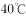以上

- **C**. 
24小时内最高气温将升至以上

- **D**. 
24小时内最高气温将升至以上
　✅

**答案**：D

**官方解析**

本题考查科技常识。

高温预警信号分三级，分别以黄色、橙色、红色表示。其中，高温黄色预警信号是指连续三天日最高气温将在以上；高温橙色预警信号是指24小时内最高气温将升至以上；高温红色预警信号（最高级别）是指24小时内最高气温将升至以上。

故正确答案为D。

---

## 言语理解与表达

### 第 1 题　qid 2578742 · 逻辑填空

行书一身兼众体，包容天下字，行书处在楷、草之间，最有        空间。正楷严肃认真，影响了书写速度，行书既书写快，又看得懂，因而大受欢迎。
填入画横线部分最恰当的一项是：

- **A**. 伸缩　✅
- **B**. 改造
- **C**. 想象
- **D**. 创作

**答案**：A

**官方解析**

根据文段信息“行书处在楷、草之间”“正楷严肃认真，影响了书写速度，行书既书写快，又看得懂”，可知行书书写风格是介于楷书、草书之间进行灵活调整，在二者之间找到了平衡点。A项“伸缩”比喻在一定范围内的变通或变化，符合语境，当选。B项“改造”指改变旧的，建立新的，文段并未产生新事物，排除；C项“想象”指在原有事物的基础上创造出新形象的心理活动，D项“创作”指文学艺术作品的创造，均体现不出行书书写风格是介于楷书、草书这两者之间的灵活调整，排除。
故正确答案为A。
【文段出处】《论字：行书最得意》

---

### 第 2 题　qid 2578745 · 逻辑填空

作为一种依靠界笔、直尺等工具创作的绘画，界画主要表现的是宫室、楼榭等宏伟建筑，而这类建筑的        之处往往在于土木结构的复杂精巧，所以能画得准确细腻已是极为不易，而要在此基础上        出风神气象，就更需洞悉无遗、铢积寸累。
依次填入画横线部分最恰当的一项是：

- **A**. 新奇  表现
- **B**. 高妙  传达　✅
- **C**. 独特  渲染
- **D**. 非凡  勾勒

**答案**：B

**官方解析**

第一空，根据“土木结构的复杂精巧”“极为不易”可知，横线处强调“宫室、楼榭”这类建筑构造十分精美巧妙。B项“高妙”形容事物佳美绝妙，D项“非凡”指超过一般，不同寻常，二者均含有奇特巧妙远超出一般事物的意思，保留。A项“新奇”和C项“独特”两者侧重于新鲜、特别，与文段无关，排除。
第二空，搭配“风神气象”，侧重于表达一种抽象的神韵意境。B项“传达”指传递表达，常搭配“精神”“神韵”等抽象名词，体现出对抽象意境的展现和表达，搭配合理，且符合界画的作用，当选。D项“勾勒”指用线条描画出轮廓，勾勒出的往往是大致情况，而文段侧重“细腻”，与文意相悖，排除。
故正确答案为B。
【文段出处】《烟霞丘壑：中国古代画家和他们的世界》

---

### 第 3 题　qid 2578748 · 逻辑填空

在大数据的洪流中，互联网与传统文化产业的融合，成为一个新的市场        。作为创意性、知识性、融合性强的产业，三大要素的支撑对于文化生产力的发展至关重要。文化产业对资源、人才以及开放和多元包容具有高度依赖性，这与互联网和大数据的基因            。
依次填入画横线部分最恰当的一项是：

- **A**. 机会  相辅相成
- **B**. 机遇  一脉相承
- **C**. 契机  不谋而合　✅
- **D**. 时机  异曲同工

**答案**：C

**官方解析**

本题可从第二空入手，根据“互联网与传统文化产业的融合”“文化产业对资源、人才以及开放和多元包容具有高度依赖性”可知，互联网和文化产业对于相关要素的依赖都是共通的，故第二空应体现出共同、一致的意思，C项“不谋而合”指事先未经商量，而意见、行为却一致，符合文意，保留。A项“相辅相成”指两件事物互相配合，互相辅助，缺一不可，文化产业与互联网并非是缺一不可的关系，排除；B项“一脉相承”指某种思想、行为或学说之间有继承关系，文化产业与互联网之间无继承关系，排除；D项“异曲同工”比喻不同的做法或说法取得同样的效果，文段并未体现做法不同，排除。
第一空，代入验证，C项“契机”指机会，事物转变的关键，可以体现互联网与传统文化产业的融合是个难得的机会，符合文意，当选。
故正确答案为C。
【文段出处】《如何看待文化产业与大数据“新融合”？》

---

### 第 4 题　qid 2578766 · 逻辑填空

近年来，北京市重视挖掘老旧厂房的文化内涵和利用价值，将其发展成文化创意类项目，使之        文化馆、图书馆、博物馆等公共文化功能。老旧厂房作为城市文化的重要        ，为城市文化的创新发展提供了空间，既展示了历史文化，也成为新的文化地标。
依次填入画横线部分最恰当的一项是：

- **A**. 肩负  载体
- **B**. 担任  遗迹
- **C**. 分担  标志
- **D**. 承载  记忆　✅

**答案**：D

**官方解析**

第一空，根据文意可知，横线处表示老旧厂房具备类似“文化馆、图书馆、博物馆”等的公共文化功能，因此，第一个空应能表示“具备、具有”之意，且能与“功能”搭配。C项“分担”指分别承担或者代别人担负一部分，D项“承载”指担当，符合文意，且与“功能”搭配得当，保留；A项“肩负”指担负，无法与“功能”搭配，通常和“重担、责任、希望、任务、使命”等词语搭配，排除；B项“担任”指担当某种职务或者责任，也与“功能”搭配不当，排除。
第二空，作者意在说明老旧厂房见证了城市的发展历程，可以成为城市文化存在的重要证据，D项“记忆”指对见过的事物能够回忆，符合文意，当选；C项“标志”指表明特征的记号，但通过文段中“挖掘”可知，老旧厂房的文化体现并不明显，因此与文意不符，排除。
故正确答案为D。

【文段出处】《挖掘老旧厂房文化内涵和利用价值 老旧厂房变身“文创乐园”》

---

### 第 5 题　qid 2578767 · 逻辑填空

近几十年来，苏绣讲究的“平、齐、光、亮”已被刺绣界广为认同，成为衡量传统针法技艺高低的基本        。各绣种最初习绣都要从学习平绣技法入手，而真正绣好一幅平绣作品并非易事，能成为经典的作品可谓            ，这不仅因为此种技艺用针黹书写了刺绣艺术史，更是因为它承担着传承工匠精神的历史重任。
依次填入画横线部分最恰当的一项是：

- **A**. 尺度  凤毛麟角　✅
- **B**. 追求  屈指可数
- **C**. 标准  众望所归
- **D**. 原则  大海捞针

**答案**：A

**官方解析**

本题可从第二空入手，根据文段信息“而真正绣好一副平绣作品并非易事”可知，能成为经典的作品应该更难，更少，A项“凤毛麟角”与B项“屈指可数”均体现数量极少，可以保留；C项“众望所归”指众人的信任、希望归向某人，与文意无关，排除；D项“大海捞针”比喻很难找到，文段并无“找”之意，故排除。
第一空，根据文意可知，横线处表示“平、齐、光、亮”成为评判、衡量传统针法技艺高低的标准，A项“尺度”表示处事或看待事物的标准，与文意相符，当选；B项“追求”指尽力寻找、探索，与文意不符，排除。
故正确答案为A。

---

### 第 6 题　qid 2578768 · 逻辑填空

当一名记者让科学家用一句话描述他的研究时，科学家只能焦躁地问他：“科学的语言，你会多少？”科学家的        当然可以理解。当一位科学家花了数十年的时间，终于完成了一项研究，并以此获得了诺贝尔奖，你怎么可能让他把整个研究过程        为一句话呢？
依次填入画横线部分最恰当的一项是：

- **A**. 傲慢  概括
- **B**. 烦恼  精炼
- **C**. 不满  浓缩　✅
- **D**. 抱怨  简约

**答案**：C

**官方解析**

第一空，所填词语用于修饰科学家对记者提出要求的态度。由“科学的语言，你会多少”“你怎么可能让他把整个研究过程        为一句话呢”以及“焦躁”可以体现科学家的“不满”和“抱怨”，C、D两项均保留。A项“傲慢”指轻视别人，对人没有礼貌，此处并无轻视和不礼貌的意思，排除；B项“烦恼”指烦闷苦恼，文段并未介绍科学家的烦恼，而是表达科学家对记者提出要求的不悦，排除。
第二空，科学家花费数十年进行研究，而记者提出的要求是用一句话来描述，C项“浓缩”泛指提炼、压缩、概括，符合语境，当选。D项“简约”指简略、不详细，为形容词，而文段中应填入动词，用法不当，排除。
故正确答案为C。
【文段出处】《不懂科学，就不能领略科学的美吗？》

---

### 第 7 题　qid 2578769 · 逻辑填空

弗洛伊德曾说，教育是一种“不可能”成功的职业。因为我们往往会            地把从父母那里学到的东西传递给我们的子孙。更有甚者，即使我们下定决心与童年所接受的教育        ，“反其道而行之”，这其实也意味着我们正在被想要努力挣脱的链条所捆绑。
依次填入画横线部分最恰当的一项是：

- **A**. 自以为是  妥协
- **B**. 潜移默化  决裂　✅
- **C**. 习以为常  分离
- **D**. 理所当然  共存

**答案**：B

**官方解析**

本题突破口为第二空，根据“反其道而行之”可知，横线处应表现出不赞同“童年所接受的教育”之意，B项“决裂”指破裂，语意相符，保留；A项“妥协”指用让步的方法避免冲突或争执，C项“分离”指分开、别离，均与文意不符，排除；D项“共存”指共同存在，语意相悖，排除。
第一空，代入验证，“潜移默化地把从父母那里学到的东西传递给我们的子孙”，B项“潜移默化”指人的思想、性格在不知不觉中受到感染、影响而发生变化，侧重于强调不知不觉的一种行为，符合文意，当选。
故正确答案为B。
【出处】《家庭教育如何不再成为心理“祸害”》

---

### 第 8 题　qid 2578770 · 逻辑填空

对久不更新、久不回复的服务网站，人们没少投诉和批评，最终都            。因为这些投诉和批评根本不能制约和影响相关部门，网页上的投诉窗口，在接到投诉信息后也只会自动回复“您的信息已收到”等万能句式。一边积极反映意见，另一边却            ，权当网站为摆设。
依次填入画横线部分最恰当的一项是：

- **A**. 不了了之  充耳不闻　✅
- **B**. 于事无补  敷衍塞责
- **C**. 石沉大海  无动于衷
- **D**. 收效甚微  虚与委蛇

**答案**：A

**官方解析**

第一空，根据“人们没少投诉和批评”“这些投诉和批评根本不能制约和影响相关部门”可知，横线处表示投诉和批评最终没有得到有效的反馈结果。A项“不了了之”指把事情放在一边不管，就算完事，B项“于事无补”指对事情没有什么益处，C项“石沉大海”比喻始终没有消息，D项“收效甚微”指付出的努力基本没什么效果，均符合文意，保留。
第二空，根据“却”可知，横线处与“积极反映意见”语义相反，且根据“权当网站为摆设”可知，政府部门对于“群众呼声、意见”未听从。A项“充耳不闻”形容听不进或存心不听取别人的意见，与“群众积极反映意见”对应准确，且文段讨论的核心话题为“政府对于群众意见的态度”，“政府‘听取’群众意见”更为常见，当选。B项“敷衍塞责”指办事不认真负责，只是表面应付一下，C项“无动于衷”指对应该关心、注意的事情毫不关心，置之不理，D项“虚与委蛇”指对人虚情假意，假意殷勤，敷衍应对，均不如A项对应准确，排除。
故正确答案为A。
【文段出处】《南方日报：网站不更新被问责应成常态》

---

### 第 9 题　qid 2578771 · 逻辑填空

当下一系列重大纪念活动为革命历史题材剧提供了创作契机，但有些创作者只是迎合活动而草就，使得剧目            ，不能成为保留剧目。究其原因，其中最大问题就是选材，选材不当直接会导致剧种与题材的        。我们一定要考虑该题材是否适合做成戏曲，是否适合该剧种。
依次填入画横线部分最恰当的一项是：

- **A**. 鱼目混珠  脱节
- **B**. 稍纵即逝  断档
- **C**. 粗制滥造  偏离
- **D**. 昙花一现  分裂　✅

**答案**：D

**官方解析**

第一空，“保留剧目”指某个剧团或者主要演员演出获得成功的并保留下来以备经常演出的戏剧，那么根据文段“不能成为保留剧目”以及“只是迎合活动而草就”可知，横线处应体现剧目因迎合活动而不能长久保留下来的意思。B项“稍纵即逝”形容时间或机会等很容易过去，D项“昙花一现”比喻美好的事物或景象出现了一下，很快就消失，均符合题意，保留；A项“鱼目混珠”比喻拿假的东西冒充真的东西，文段强调“时间短”而非“真与假”，排除；C项“粗制滥造”指制作粗劣，不讲究质量，也指工作不负责任，草率从事，与“时间短”无关，排除。
第二空，根据“要考虑该题材是否适合做成戏曲，是否适合该剧种”可知，选材不当会导致题材和剧种不符，即题材不适合剧种。D项“分裂”指裂开，可以体现题材与剧种是不相符的，当选；B项“断档”（1）指某种商品脱销或某种物品用完，（2）指某一方面或某一年龄段的人严重缺乏，文段并非强调缺少剧种与题材，与文意不符，排除。
故正确答案为D。
【文段出处】《中国文明网—革命历史题材戏剧创作的突破与反思》

---

### 第 10 题　qid 2578772 · 逻辑填空

拍摄行业剧难就难在既要在专业上不被        ，又要在戏剧情感上引发共鸣，巧妙地将艺术性与专业性结合起来。我国电视剧行业发展到现在，对于家庭伦理剧、都市情感剧的驾驭已经            ，但是在行业剧的创作上还是要注意立足于真实情况和现实模型，决不能对行业            、胡编乱造。
依次填入画横线部分最恰当的一项是：

- **A**. 挑剔  得心应手  以偏概全
- **B**. 苛责  驾轻就熟  浮光掠影
- **C**. 责备  绰绰有余  望文生义
- **D**. 指摘  游刃有余  一知半解　✅

**答案**：D

**官方解析**

第一空，搭配“行业剧”，A项“挑剔”、B项“苛责”和D项“指摘”搭配均可，保留；C项“责备”一般搭配人，排除。
第二空，形容对于家庭伦理剧和都市情感剧驾驭的好，A项“得心应手”，形容技艺纯熟，做事顺手，尽合心意，D项“游刃有余”，比喻做事熟练，解决问题轻松利落，搭配均可，保留；B项“驾轻就熟”，比喻对事情很熟悉，做起来很容易，意思可以但是用法不对，不能说“驾驭已经驾轻就熟”只能说“对于家庭伦理剧、都市情感剧已经驾轻就熟”，排除。
第三空，文段强调的是对于真实情况不了解，D项“一知半解”形容知之甚少，理解不深不透，符合文意，当选；A项“以偏概全”，是指片面地根据局部现象来推论整体，得出错误的结论，与文意无关，排除。
故正确答案为D。
【文段出处】光明时评《行业剧应有行业水准》

---

### 第 11 题　qid 2578773 · 片段阅读

就书法而言，汉碑和汉简之间是有区别的，汉碑是书丹以后刻出来的，再拓成墨拓，汉简则是用毛笔直接在竹木简上写出来的。由此产生了书写态度方面的区别：碑的书写是正式的，其文辞、内容、字体甚至书写与刻制的过程，都非常严谨；汉简的书写则是真实书写的体现，书写者往往处于一种放松状态，没有必须写好的压力与负担。书法“无意于佳乃佳”，汉碑的整饬与汉简的率意，在审美上各异其趣，汉简书法对今天的启发更多的是那种率性而书、自然而然的态度。在学习古代书法作品时，要了解这种不同，从而更好地把握住各自的特征。
这段文字意在说明：

- **A**. 书写状态对书法风格有直接影响
- **B**. 汉碑和汉简是不同书写风格的代表
- **C**. 如何正确认识汉碑和汉简的书法价值　✅
- **D**. 书法作品是书写工具与书写行为的综合体

**答案**：C

**官方解析**

文段开篇介绍了汉碑和汉简书法的区别，由此引出两者书写态度方面的区别，并进行具体论述，接着具体论述了两者的审美区别，尾句通过“要”提出对策，强调在学习古代书法作品时，要了解汉碑和汉简的不同，故文段重在强调要正确认识汉碑和汉简的书法价值，对应C项。
A项，缺少文段主题词“汉碑”“汉简”，且“书写状态”为对策之前的内容，非重点，排除；
B项，文段并未说明汉碑和汉简是不同风格的代表，“代表”无中生有，排除；
D项，缺少文段主题词“汉碑”“汉简”，且“书写工具与书写行为”是文段开篇引出话题部分，非重点，排除。
故正确答案为C。
【文段出处】《汉唐胸怀 丝路精神：丝路书法文化的当代解读 》

---

### 第 12 题　qid 2578774 · 片段阅读

受美国次贷危机的影响，全球的经济停止增长甚至倒退，无论发达国家还是发展中国家，跨境贸易都或多或少地呈现紧缩态势。在这种情况下，无论是国家还是企业的可利用资金都相对紧张，对资金周转率的要求也越来越高，这无疑使过去传统的大交易量、长账期的贸易模式难以为继，政府和企业为了规避资金风险，将原有的贸易模式分割成多笔小额贸易，同时缩短账期，加上互联网和便捷的物流，这种新兴的贸易模式在全球范围内越发流行开来。
这段文字主要说明：

- **A**. 互联网和物流是新兴贸易模式流行的前提
- **B**. 次贷危机直接影响了传统跨境贸易的规模
- **C**. 小额跨境贸易有利于企业和政府规避资金风险
- **D**. 经济危机成为小额跨境电子商务发展的助推剂　✅

**答案**：D

**官方解析**

文段开篇指出美国次贷危机对全球跨境贸易带来影响，然后阐述这种影响带来了资金紧张、对资金周转率的要求也越来越高的问题，最后指出这问题使政府由传统的大交易量、长账期贸易模式转变成小额贸易模式，故文段旨在说明经济危机带来贸易模式的改变，即小额跨境电子商务的发展，对应D项。
A项，“互联网和物流”是“新兴贸易模式”的内容之一，且“流行的前提”无中生有，排除；
B项，问题表述，非重点，排除；
C项，落脚点是“企业和政府规避资金风险”，文段是一个因果结构，最终的结果是小额跨境电子商务的出现，排除。
故正确答案为D。
【文段出处】《盘点：中小企业小额跨境外贸电商发展现状和困境》

---

### 第 13 题　qid 2578775 · 片段阅读

如果说《清明上河图》集中反映了宋朝生活“俗”的一面，“西园雅集”则是“雅”的象征。在北宋被传为佳话的“西园雅集”，表现了当年众多文人雅士的宴游场景，苏轼、李公麟、米芾等聚集一堂，或吟诗赋词，或抚琴唱和，或打坐问禅，形成了以苏轼为中心的文人圈。身在其中的画家李公麟以写实手法将雅集描绘下来，米芾作序，“水石潺湲，风竹相吞，炉烟方袅，草木自馨。人间清旷之乐，不过如此”。“西园雅集”是古代绘画史中的一个经典母题，后代画家多有摹本或仿作，这也是宋人精神的一种延续。
这段文字意在：

- **A**. 比较“西园雅集”和《清明上河图》的不同风格
- **B**. 介绍“西园雅集”的创作者和所描摹的文化名人
- **C**. 阐释“西园雅集”所呈现的文人趣味和精神价值　✅
- **D**. 评价“西园雅集”对中国古代绘画史的独特贡献

**答案**：C

**官方解析**

文段开篇通过《清明上河图》引出“西园雅集”，并且强调其是雅的象征，接下来通过“在北宋被传为佳话的‘西园雅集’，表现了当年众多文人雅士的宴游场景······不过如此”描绘文人雅士赋诗、抚琴、作画等场景，体现出文人雅的一面。随后通过“‘西园雅集’······这也是宋人精神的一种延续”体现出“西园雅集”是精神的延续。文段通过“也”引导并列的结构，故文段描述了“西园雅集”的两个方面，一方面是文人雅的一面，一方面是精神延续。对应C项。
A项，《清明上河图》是为了引出“西园雅集”这一话题，非重点，排除；
B项，只对应“西园雅集”文人趣味部分，表述片面，排除；
D项，“中国古代绘画史”属于精神延续这一方面，表述片面，并且“独特贡献”无中生有，排除。
故正确答案为C。
【文段出处】《我们为什么爱宋朝：市井、雅集、山水、茶事、书院》

---

### 第 14 题　qid 2578776 · 片段阅读

“质疑”其实是最基本的科学精神。对于以前的结果、结论甚至得到广泛证实和接受的理论体系，都需要以怀疑的眼光进行审视。但是“质疑”并不完全等同于“怀疑”，更不是全面否定。“质疑”实际上是评判地学习和批评地接受，其目的是发现以前工作的漏洞、缺陷、不完善、没有经过检验或者不能完全适用的地方。比如爱因斯坦对牛顿力学和牛顿引力理论质疑的结果，使其发现了牛顿力学和牛顿引力理论只有在低速和弱引力场的情况下才是正确的，否则就需要使用狭义相对论和广义相对论。
这段文字主要介绍“质疑”：

- **A**. 作为科学基本精神的原因
- **B**. 与怀疑的内在联系和区别
- **C**. 对科学理论发展的重要性
- **D**. 具有的内涵及其实践价值　✅

**答案**：D

**官方解析**

文段开篇首先引出质疑是基本的科学精神，接下来通过“但是”转折后指出质疑不是怀疑，也不是全面否定。随后通过“实际上”转折词明确指出质疑是什么，以及它能够发挥的作用。文段最后通过“比如”举例子再次论证观点，因此文段中心句为转折之后质疑的含义和价值。对应D项。
A项，“科学基本精神”、B项，“与怀疑的内在联系和区别”均对应文段“实际上”之前内容，为转折前非重点部分，排除；
C项，“科学理论发展”无中生有，文段未提及，排除。
故正确答案为D。
【文段出处】《什么是科学精神，东西方有何不同？》

---

### 第 15 题　qid 2578777 · 片段阅读

元朝继承了唐、宋对外开放的政策，在政治上加强与海外诸国的联系，在经济上积极开展海外贸易。与元朝有联系的国家和地区在200个以上，其中相当一部分是前代没有记载的。明朝初年的《大明混一图》（1389年）和朝鲜的《混一疆理历代国都之图》（1402年），都出现了非洲南部的大三角，两图类似。朝鲜地图的作者明确说是据元人两种地图合绘而成。可见，元人对非洲地理形势已有所了解。海外地理知识的扩展反映了海外交通的进步。可以认为，元代的海外活动为15世纪郑和航海奠定了基础。
下列说法与原文相符的是：

- **A**. 与元朝交往的海外诸国大大多于前朝　✅
- **B**. 元朝西征曾到达非洲并据此绘出地图
- **C**. 元朝是我国海上交通最为发达的时期
- **D**. 历史上我国海外贸易最繁荣的是元朝

**答案**：A

**官方解析**

A项，根据“与元朝有联系的国家和地区在200个以上，其中相当一部分是前代没有记载的”可知，A项的“大大多于前朝”说法正确，当选；
B项，无中生有，“西征”在文段中没有提及，文段中只说明朝初年的《大明混一图》中出现了非洲南部的大三角，不符合文意，排除；
C、D两项的“最为发达”“最繁荣”说法绝对，并且文段并未提及，无中生有，均排除。
故正确答案为A。
【文段出处】人民网《人民日报刊文谈元朝：疆域远超汉唐坚持开放海贸发达》

---

### 第 16 题　qid 2578778 · 片段阅读

语言学是研究语言结构模式与演化规律的学科。对“模式”与“规律”的探求是语言学与其他科学共同的目标。然而，光有科学的目标还远远不够。演绎与归纳、定性与定量、描写与解释、假设与检验等现代科学在方法论上的共同特征，正是我国传统语言学所欠缺的。与此同时，中国语言学还面临着国际化问题。我们在国际语言学学术共同体中的声音还很微弱。造成这种局面的原因，并不能完全归结于研究对象的不同，以及国际学术语言是英语的语言藩篱，也存在研究理念与研究方法的问题。
这段文字意在说明：

- **A**. 中国语言学研究走向科学化和国际化任重道远
- **B**. 过去国内语言学界对语言学研究方向的认识存在误区
- **C**. 研究理念与方法的问题制约了中国语言学的科学化和国际化　✅
- **D**. 对语言结构模式和演化规律的探究是现代语言学的终极追求

**答案**：C

**官方解析**

文段开篇通过下定义的形式引出“语言学”这一话题，接着论述了“语言学”的目标。接下来通过转折词“然而”指出“光有科学的目标还远远不够”。后文论述了我国传统语言学在现代科学方法论上有所欠缺这一问题，紧接着通过并列标志词“与此同时”引出另一问题，即“中国语言学还面临着国际化问题”，也就是说，中国语言学面临着科学化与国际化两大问题。后文具体分析产生这两大问题的原因是“存在研究理念与研究方法的问题”。故文段重在论述研究理念与研究方法的问题制约了中国语言学的科学化和国际化，对应C项。
A项，“中国语言学研究走向科学化和国际化任重道远”仅提到了问题，与C项相比概括的不够全面，排除；
B项，“过去国内语言学界”文段未提及，无中生有，排除；
D项，“现代语言学的终极追求”文段并未提及，无中生有，排除。
故正确答案为C。
【文段出处】《语言研究的科学化与国际化》

---

### 第 17 题　qid 2578779 · 片段阅读

古籍修复是一项实践性很强的工作，如果无法接触到古籍，即使学习了相关知识也很难提高实践能力。古籍修复虽然可以看作一门技艺，但需要文学、目录学，乃至材料、化学等理工科目的背景知识才能更好地工作，对文化水平要求较高。图书馆、博物馆等招聘单位对于古籍修复工作应聘者的学历要求通常较高，需要本科及以上学历，但是目前我国古籍修复专业的学历教育却以高职专科教育为主。这就使得文博机构的人才需求无法得到满足，而具有一些实际操作能力的人又无用武之地。
这段文字意在说明：

- **A**. 古籍修复人才应具备多方面的专业知识
- **B**. 招聘古籍修复人才时应轻学历、重能力
- **C**. 文博机构应为古籍修复人员提供实践机会
- **D**. 古籍修复人才的培养与现实需求严重脱节　✅

**答案**：D

**官方解析**

文段开篇通过下定义的形式引出话题“古籍修复”，接下来告诉我们“古籍修复”的人才需要两方面的能力，一方面是需要“实践能力”，另一方面需要较高的“文化水平”，随后通过转折关联词“但是”指出现存的问题，“我国古籍修复专业的学历教育却以高职专科教育为主”即具有实践能力的人才不具备高学历，这样的现状正是人才教育培养与现实需求严重脱节导致的。文段最后通过指代词“这”指出“人才教育培养与现实需求脱节”这一问题带来的危害，即 “文博机构的人才需求无法得到满足，而具有一些实际操作能力的人又无用武之地”，对应D项。
A项，“古籍修复”人才应具备实践能力与较高的文化水平这两方面，而专业知识只针对文化水平这一方面，表述片面，排除；
B项，文段重在强调我国古籍修复人才培养方面的问题，而非指出招聘古籍修复人才的时候应该怎么做，故选项所述对策无法解决文段中的问题，与文意不符，排除；
C项，“文博机构”对应文段尾句，重在论述问题带来的危害，非重点，且“提供实践机会”这一对策也无法对应文段，无中生有，排除。
故正确答案为D。
【文段出处】光明日报《善用社会力量促进古籍修复》

---

### 第 18 题　qid 2578780 · 片段阅读

众所周知，雷达主要靠接收目标的反射信号来发现目标。通常所说的隐身技术主要依靠形状、吸波涂层等吸收雷达波或改变雷达波的传播方向，进而达到隐身的目的。巧的是，对于这些隐身绝招，太赫兹雷达几乎全部“免疫”。集众家优长于一身的太赫兹，其远小于微波与毫米波的波长，可用于探测更小的目标并实现更精确的定位。同时，太赫兹波又包含了丰富的频率和宽广的带宽，能以成千上万种频率发射纳秒乃至皮秒级脉冲，进而大大超出现有隐身技术的“屏蔽”范围。
根据这段文字，可以知道：

- **A**. 太赫兹波波长较长、频率较丰富
- **B**. 太赫兹雷达可破解一般的反射信号
- **C**. 太赫兹雷达可发现一般的隐身战机　✅
- **D**. 太赫兹波可探及更远范围内的隐身战机

**答案**：C

**官方解析**

A项，根据“其远小于微波与毫米波的波长”可知，太赫兹波长较短，该项表述与文意相悖，排除。
B项，文段指出太赫兹雷达可以探测更小目标、精确定位并且大大超出现有隐身技术的屏蔽范围，而“可破解一般的反射信号”文段中并未提及，无中生有，排除。
C 项：根据“对于这些隐身绝招，太赫兹雷达几乎全部‘免疫’”以及“大大超出现有隐身技术的‘屏蔽’范围”可知，太赫兹雷达现阶段能够发现一般的隐身战机，该项表述正确，当选。
D项，文段论述太赫兹雷达“大大超出现有隐身技术的‘屏蔽’范围”，但至于是否能够探及“更远范围”的隐身战机，文段中并未提及，无中生有，排除。
故正确答案为C。
【文段出处】《中国新型雷达技术真牛：“墙后”藏啥看得“一清二楚”》

---

### 第 19 题　qid 2578781 · 片段阅读

我国是世界上农业开放程度最高的国家之一， 随着对外开放的继续深化，国内市场与国际市场将进一步融合，农业开放程度还会进一步提高。今后，我们不仅面临来自农业现代化水平很高的发达国家的竞争，也将面临来自劳动力优势明显的发展中国家的竞争。目前，国内农产品生产成本仍处在上升通道，租地、劳动力成本以及机械作业费用不断上涨，粮食等农产品缺乏价格优势， 而国际农产品价格下降、进口量增加，国内粮食库存压力增大，这对我国市场会形成巨大冲击，将直接导致国内价格提高的空间收窄，国内农产品生产将面临价格“天花板”和成本“地板”的双重挤压，比较效益下降。
这段文字意在说明：

- **A**. 国内农产品市场竞争力有待提高　✅
- **B**. 必须加快转变我国农业发展方式
- **C**. 应谨慎看待继续提高农业开放程度
- **D**. 破解国内农产品发展困局迫在眉睫

**答案**：A

**官方解析**

文段首先交代背景，“我国是世界上农业开放程度最高的国家之一”“农业开放程度还会进一步提高”，紧接着描述在这种大背景下，我国农业面临竞争，即“我们不仅面临······发达国家的竞争，也将面临······发展中国家的竞争”，最后通过国内和国际全方位的对比着重说明我国农产品在竞争中处于下风，故文段重点围绕“竞争”来描述，强调在对外开放继续深入的背景下，我国农产品不具备竞争优势，故需提升自身竞争力，对应A项。
B项，“加快转变我国农业发展方式”无中生有，排除；
C项，“提高农业开放程度”为背景介绍中内容，文段意在强调在此背景下，国内农产品面临的竞争，故非文段表述重点，排除；
D项，文段意在强调，国内农产品在新背景下面对更多竞争，应提高自身的竞争力，“破解国内农产品发展困局”对策表述不明确，排除。
故正确答案为A。
【文段出处】《“三量齐增”反映中国农业竞争力不强》

---

### 第 20 题　qid 2578782 · 片段阅读

两汉时，监察官大多由地方官察举推荐入选。为了保证御史不受牵制地行使弹劾权，隋唐时期改变了北魏以来由御史台长官选任御史的制度，而由吏部选任，但是唐代的吏部选拔实际上由宰相控制。到宋代，中央一级监察官多由“帝王亲擢”， 而地方监察官则实行“台官自选制”，由中央监察官直接任命，监察权摆脱了相权的控制。为防止裙带关系， 还会有一些关于任职资格的限制，实行回避，比如魏晋南北朝时规定大士族不得担任御史中丞，宋代规定凡经宰相荐举为官者或宰相的亲戚故旧，均不得为御史，明代规定巡回监察官应当回避原籍，或曾任官、寓居处所等地。
这段文字主要介绍的是：

- **A**. 我国古代监察官的选任程序　✅
- **B**. 古代监察官与其他官职的区别
- **C**. 历代监察官制度的沿袭与变革
- **D**. 监察官任职回避制度的历史由来

**答案**：A

**官方解析**

文段介绍了“两汉”“隋唐”“宋代”监察官的选任程序，为并列结构。后文“为防止裙带关系，还会有一些关于任职资格的限制”进一步详细的介绍各个朝代在任职资格上有哪些限制，同样是在对监察官的选任进行详细说明。总结文段，文段为并列结构，文段重点介绍了我国古代选任监察官有哪些程序，对应A项。
B项，“与其他官职的区别”为无关对比，文段未提及与其他官职有哪些区别，排除。
C项，“沿袭与变革”无中生有，文段未体现各个朝代的监察官制度之间有什么样的关系，且文段主题是“监察官的选任”，选项中“监察官制度”主题词范围扩大，排除。
D项，“任职回避”表述片面，不是文段重点，任职回避只是古代选任监察官中的一个方面，排除。
故正确答案为A。
【文段出处】《中国古代的监察官制度》

---

### 第 21 题　qid 2578783 · 片段阅读

人们在讨论地名的时候，往往忽略了它们的时间意义和概念，因为从空间范围定义一个地名，无论点或面，都是通过地理坐标，用具体界限划定的。但是任何一个空间范围，其实都与一定的时间范围相联系，这个时间范围有长有短， 而在这一时间范围内， 地名又与很多地名以外的事物和因素相联系。所以地名除了本意之外，还有其历史的、文化的、社会的、民族的等各方面的意义。
这段文字是一篇文章的开头，这篇文章最可能讨论的是:

- **A**. 古今地名的联系
- **B**. 地名命名的规律
- **C**. 地名中的历史与文化　✅
- **D**. 地理位置对地名的影响

**答案**：C

**官方解析**

根据提问方式可知，本题为接语选择题，应在阅读全文基础上，重点关注文段最后谈论的核心话题。文段先提出话题，指出人们讨论地名时常忽略地名的时间意义和概念，并解释原因，接着通过转折词“但是”，表明地名与时间范围以及时间范围内的很多地名以外的事物相联系，尾句通过结论词“所以”总结前文，得出结论，地名除了本意还有历史、文化、社会、民族等方面的意义。故文段重点在结尾，即本篇文章接下来将围绕地名中包含的历史和文化等各方面的意义展开论述，对应C项。
A项，文段并未就地名的古与今展开讨论，无中生有，排除；
B项，“命名的规律”表述笼统，没有直接点明地名与历史、文化的联系，排除；
D项，“地理位置”为转折前的内容，不是作者观点所在，非重点，排除。
故正确答案为C。
【文段出处】《地名、历史和文化》

---

### 第 22 题　qid 2578784 · 片段阅读

客观地说，要实现自动驾驶，单靠汽车本身升级是远远不够的，还需要城市道路升级为智能化管理，达到汽车和城市交通系统的联动，汽车才能有更多的“眼睛”观察到周围的路况，发现潜在的危险。但在目前技术与环境没有完善的情况下，无人驾驶的汽车还不能像人脑一样做到精准判断，不可贸然上路。这也是无人驾驶研发者应该注意的，研发应当考虑周全而不能激进，毕竟自动驾驶能否应对复杂的道路环境，必须经历“路考”的检验。
这段文字意在强调：

- **A**. 自动驾驶技术的应用需稳步前行　✅
- **B**. 安全是自动驾驶技术应用的首要原则
- **C**. 实现自动驾驶离不开各种配套设施的升级
- **D**. 能否通过“路考”检验是自动驾驶技术的关键

**答案**：A

**官方解析**

文段开篇论述实现自动驾驶，不能只靠汽车本身升级，还要城市道路升级。接着通过转折词“但”引出观点，表示以目前的技术和环境状况，无人驾驶的汽车不可贸然上路，尾句通过“这也是”补充说明，指出无人驾驶研发应考虑周全而不能激进，这些共同说明无人驾驶不可贸然上路，不能激进，即无人驾驶的汽车上路需稳妥、谨慎，对应A项。
B项，“安全”对应转折前的“危险”，非文段重点，排除。
C项，“配套设施”表述不明确，文段明确表述为“城市道路升级”，且为转折前表述，非重点，排除。
D项，“路考”为尾句中论证“不能激进”的解释说明内容，非重点，排除。
故正确答案为A。
【文段出处】《无人驾驶首发事故，令人惋惜但不能止步》

---

### 第 23 题　qid 2578785 · 片段阅读

或许是深受农业文明影响的缘故，中国古典艺术始终缠绕着一种对花草植物的敏感。林徽因说：“惜花、解花太东方，亲昵自然，含着人性的细致是东方传统的情绪。”我们都会背：“蒹葭苍苍，白露为霜。所谓伊人，在水一方。”但未必所有人都知道，所谓“蒹葭”，就是我们熟悉的芦苇。《诗经》 里的世界，其实并不遥远。“参差荇菜”“南有乔木”“桃之夭夭”“彼黍离离” ，这先秦时代的民歌，几乎首首离不开植物，一风一雨、一稼一穑，遍布着草木的声息，以至于《诗经》里的植物花卉，也成为一门学问，吸引一代代的学人研究考证。
对这段文字概括最恰当的是：

- **A**. 中国古典艺术深受农业文明的影响
- **B**. 花草植物是中国古典艺术的重要元素　✅
- **C**. 先秦民歌以花草植物为最主要的描写对象
- **D**. 《诗经》为古代学人的研究提供了丰富素材

**答案**：B

**官方解析**

文段开篇提出观点“中国古典艺术始终缠绕着一种对花草植物的敏感”，即中国古典艺术与花草植物之间的关系密不可分，接着引用林徽因的观点和《诗经》举例说明中国古典艺术与花草植物的紧密关系，故文段重点强调中国古典艺术与花草植物的紧密关系，对应B项。
A项，未包含文段核心话题“花草植物”，且文段为“或许”，选项表述过于绝对，排除；
C项，“先秦民歌”为举例论证内容，非重点，排除；
D项，《诗经》为举例论证内容，非重点，排除。
故正确答案为B。
【文段出处】《跟着吴昌硕去赏花》

---

### 第 24 题　qid 2578786 · 片段阅读

日前，世界上首条柔性人造触觉神经问世。这条人造神经能够很好地模拟人类皮肤的触觉功能，并能够与生物体神经信号兼容。它可应用于假肢中，实现与人体神经系统的兼容，柔性轻质的结构将使相关产品具有很好的舒适性。这种人造神经对神经系统疾病的治疗也具有潜在意义。如果应用于软体机器人，可使其实现类似人类的感知，并在极端工作环境中替代人类。科学家表示，尽管这项研究前景可期，但目前还只是迈出了第一步，还有很多工作要做。
关于“人造神经”， 这段文字没有涉及：

- **A**. 核心技术　✅
- **B**. 应用领域
- **C**. 研发进展
- **D**. 主要特点

**答案**：A

**官方解析**

A项：“核心技术”指支撑产品实现的技术选择中的关键部分，文段未提及“人造神经”的“核心技术”，当选。
B项：由“它可应用于假肢中”可知，文段提及其“应用领域”，排除。
C项：由“尽管这项研究前景可期，但目前还只是迈出了第一步”可知，文段提及其“研发进展”，排除。
D项：由“这条人造神经能够很好地模拟人类皮肤的触觉功能，并能够与生物体神经信号兼容”可知，文段提及其“主要特点”，排除。
本题为选非题，故正确答案为A。
【文段出处】中国青年报：《世界首条柔性人造触觉神经诞生》

---

### 第 25 题　qid 2578787 · 片段阅读

随着互联网的出现，人们求知有了更便捷、更有效率的渠道。但是，互联网企业在发展初期为了粘住市场，基本都是免费向网民提供有关的资讯和知识，这养成了中国网民对互联网的免费消费习惯，对于网上阅读需要付费还不能适应，甚至有所抵触。在这样的背景之下，一些知识付费APP在市场开发方面并不顺畅。但是，正是这种借助于互联网的APP，使知识显示了它的市场价值，而且由于新技术的普及，相比于传统的授课和著书，它一方面为知识提供者赢得了更多的经济利益，另一方面又为知识消费者节省了大量费用。
这段文字意在强调互联网知识付费：

- **A**. 为商家和消费者带来了双赢　✅
- **B**. 发展有赖于新技术的普及
- **C**. 使人们认识到了知识的市场价值
- **D**. 逐渐改变了网民的传统消费习惯

**答案**：A

**官方解析**

文段首先论述了知识付费APP市场开发不顺畅的原因，即互联网带来的免费资讯养成了消费者免费获取信息的习惯。之后通过转折词“但是”引出文段中心句，先阐述APP使知识显示出其市场价值，随后用“而且”做顺承，引出更为重要的因果关系，结果分为两个方面，即为知识提供者和知识消费者带来的好处。综上可以对应到A项，即“为商家和消费者带来了双赢”。 
B项，“新技术的普及”是“由于”引导的原因解释，非重点，且“发展有赖于新技术的普及”中的“有赖于”，无中生有，文段未提及，排除；
C项，“认识到了知识的市场价值”为转折后的部分内容，并非文段论述的重点，排除；
D项，只讨论对“网民”的影响，表述片面，排除。
故正确答案为A。
【文段出处】《凸显知识的市场价值 拿出勇气迎接知识付费时代》

---

### 第 26 题　qid 2578788 · 语句表达

①交通的高速发展使人们感觉生活在“地球村”，空间成为虚拟符号或只意味着数字的变化。
②正如有人指出的，“在城市消费时代，艺术的接受者与创造者都趋向于职业化”。
③民俗是在特定地理环境下产生的有明显地域性的文化，当地方性消弭时民俗也随之消失。
④大众传播媒介使时空缩小，网络瞬时传播的速度和广度超越以往任何时候。
⑤即由于地理气候等因素长期养成的生存智慧失去了优势，地方文化的多样性也不复存在了。
⑥一些传统民俗在当代被商家和政府征用，变成了量贩式的“工业产品”。
将以上6个句子重新排列，语序正确的是：

- **A**. ④⑤③①②⑥
- **B**. ⑥⑤③②①④
- **C**. ③⑤④①⑥②　✅
- **D**. ①⑤⑥②④③

**答案**：C

**官方解析**

观察选项，确定首句。首句分别是①③④⑥，对比首句。①句论述了“空间成为虚拟符号或只意味着数字的变化”，③句先给出了民俗的定义，再进一步论述了民俗受地理环境影响，地方性消弭时民俗随之消失，④句论述了大众传播媒介影响时空，⑥句论述了传统民俗被征用后变成量贩式“工业产品”。对比后无法确定首句。
观察句子特征，②句中出现“正如”，表示举例说明，按照逻辑，应先提出观点，再进行举例说明。②句论述了“艺术的接受者与创造者都趋向于职业化”，是对⑥句传统民俗被征用后变成量贩式“工业产品”的论证，故⑥②捆绑，排除A、B两项。
进一步观察可知，⑤句中出现“即”，属于解释说明，论述了地理气候因素会影响地方文化的多样性，是对③句民俗受地理环境影响，地方性消弭时民俗随之消失的解释说明，故⑤句应在③句之后，排除D项。
故正确答案为C。

---

### 第 27 题　qid 2578789 · 片段阅读

好的作家像名茶一样，是岁月山川灵气之凝聚，除了后天的技艺训练，还与天赋和成长环境密不可分。中国当代文坛的中坚力量，如莫言、贾平凹、阿来、迟子建等，就鲜明体现了地域环境对其写作的深刻塑造。这些作家的出生地多是偏僻乡村，作品也主要是乡土题材，很多都以自己家乡作为“文学根据地”。这集中反映了中国当代文学的一个现象，即乡土题材作品占绝大多数。哪怕写作和阅读的群体多数都居于城市，他们之间的交集还是乡村：住在城市的作家，写关于乡土的小说，给住在城市却保有乡土记忆的读者读。
这段文字接下来最可能讲的是：

- **A**. 作家的成长环境对文学创作的影响
- **B**. 当代文坛著名乡土作家的代表作品
- **C**. 当代文学为何热衷于乡土题材创作　✅
- **D**. 当代中国文学叙事主题的变化趋势

**答案**：C

**官方解析**

本题为接语选择题。文段开篇通过与名茶做类比，指出环境对于成就好作家的重要性，随后列举说明，并指出中国当代文学作品多数为乡土题材，尾句对反映出的现象做具体论述，即就算作家和读者都在城市，还是要写、要读乡土题材的作品这一现状，反映出现在的作家都热衷于乡土题材的作品。故文段接下来应该围绕作家热衷乡村题材这一现象展开论述，进一步寻求现象出现的原因，对应C项。
A、D两项，均偏离文段最后谈论的核心话题“乡土”，排除。
B项，讨论的是乡土作家，而文段最后谈论的话题既包括乡土作家又包括作品的读者，核心仍在讨论乡土题材的作品，偷换概念，排除。
故正确答案为C。
【文段出处】《“文学根据地”刍议》

---

### 第 28 题　qid 2578790 · 片段阅读

科学和艺术如同硬币的两面，共同的基础是人类的创造力，追求的是真理的普遍性。科学传播也是一种创造性活动，它由从业者将科学以各种手段和途径转化成公众易于理解的内容，从而实现传播，激发人们对科学的意识和欣赏，形成对科学客观理性的态度，在这个过程中也需要把科学与艺术结合起来。从学术同行传播的角度来说，很多著名学术期刊都会有艺术性的封面，这些封面就是科学与艺术结合的结果。面向普通公众的科学传播更加需要寓教于乐，其意义无外乎强调信息的传播要嫁接到艺术的手段上来，这样才能触动公众的神经，引起他们的共鸣。
最适合做这段文字标题的是：

- **A**. 科学传播，也是一门艺术　✅
- **B**. 科学与艺术，硬币的两面
- **C**. 嫁接艺术，科学成为大众文化
- **D**. 艺术封面，科学艺术的跨界组合

**答案**：A

**官方解析**

文段开篇介绍科学和艺术的关系并指出共同的基础是创造力，接下来引出“科学传播”这一话题，论述了“科学传播”的具体过程，并指出在科学传播的过程中还需要把科学和艺术结合起来。随后从“学术同行传播的角度”和“面向普通公众的科学传播”的角度详细解释说明了科学的传播需要与艺术结合，故文段重点即“科学传播”应与艺术相结合，对应A项。
B项为首句引入话题的部分，非重点，排除。
C、D两项“嫁接艺术”及“艺术封面”均为后文解释说明的内容，非重点，排除。
故正确答案为A。
【文段出处】《科学传播是一门艺术》

---

### 第 29 题　qid 2578791 · 语句表达

农民是乡村振兴的主体，也是受益者，必须要把亿万农民群众的积极性、主动性、创造性调动起来。在过去长期的农业生产中，我们或多或少存在重物轻人的现象。这表现在只注重农产品的数量增长，不重视务农队伍的素质提高和职业化。相应的是，农村教育、科技、卫生、文化等公共资源投入少，导致农村人口素质偏低、人才缺乏。而乡村发展的本质是人的健康发展，只有农民自身素质和能力不断提升，才能有效推进乡村的可持续发展。因此，                    。
填入画横线部分最恰当的一句是：

- **A**. 乡村振兴必须加大对农村公共资源的投入
- **B**. 要提升农民科学素养，提高农业农村现代化水平
- **C**. 乡村振兴在注重硬件建设的同时也要大力提高人口素质　✅
- **D**. 乡村基础教育、职业教育、就业培训等才是乡村建设的根本

**答案**：C

**官方解析**

横线出现在文段结尾，所填句子应是对前文的总结概括。文段首句介绍农民在乡村振兴中的重要性，随后指出在农业生产中存在的问题，即“不重视务农队伍的素质提高和职业化”导致农村人口素质偏低，最后通过“只有······才······”提出对策，强调要不断提升农民自身素质和能力，故文段论述的重点是乡村振兴应不断提升农民自身素质和能力，对应C项。
A项，“加大对农村公共资源的投入”仅对应一方面内容，表述片面，且未提及文段的重点概念“素质”，排除；
B项，未提及文段论述的核心话题“乡村振兴”，排除；
D项，文段“只有······才······”句式中，强调的重点是“农民自身素质”，而非“乡村基础教育、职业教育、就业培训”，不契合文段中心，排除。
故正确答案为C。
【文段出处】《实现乡村振兴要答好三题》

---

### 第 30 题　qid 2578792 · 片段阅读

如果没有阳光照射，五颜六色的昆虫可能是一片灰暗，因为它们具有奇妙的微结构，在光线的折射、衍射及干扰下形成艳丽的色彩。昆虫的颜色可分为色素色和结构色两种。结构色是构成昆虫颜色的主要部分，蛾类和包括蝴蝶在内的鳞翅目昆虫尤为明显，它们翅膀上的鳞片具有极其精巧的三维微观结构，可以产生各种结构色。我们用手抓蝴蝶时，粘在手上的“粉”就是鳞片，大小一般为50微米左右，其表面的微结构只有几百纳米。蛾类诞生于2亿年前，人们只能猜测它的美丽色彩，因为化石只能保存生物的结构，无法留下颜色。
下列说法与原文相符的是：

- **A**. 蛾类和鳞翅目昆虫的颜色来自同一种结构色
- **B**. 人们可以从蛾类化石中获取颜色等生物信息
- **C**. 昆虫的颜色是自身结构与光线共同作用的结果　✅
- **D**. 具有相同微观结构的鳞片可以产生相同的颜色

**答案**：C

**官方解析**

A项，文段阐述了蛾类和鳞翅目昆虫都具有微观结构，可以产生各种结构色，而并未阐述它们的颜色来源是同一种结构色，故表述无中生有，排除；
B项，根据“蛾类诞生于2亿年前，人们只能猜测它的美丽色彩，因为化石只能保存生物的结构，无法留下颜色”可知，人们并无法从蛾类化石中获取颜色，故选项与文意相悖，排除；
C项，根据“它们具有奇妙的微结构，在光线的折射、衍射及干扰下形成艳丽的色彩”可知，表述正确，当选；
D项，文段仅阐述了蛾类和鳞翅目昆虫都具有微观结构，可以产生各种结构色，而并未阐述相同的微观结构可以产生相同的颜色，故表述无中生有，排除。
故正确答案为C。
【文段出处】《微结构告诉你2亿年前的昆虫啥颜色》

---

## 数量关系

### 第 1 题　qid 2578696 · 数学运算

工厂有两条效率相同的生产线A和B。现有件产品的订单乙和件相同产品的订单甲。两条生产线先合作天完成甲订单的部分生产任务，之后两条生产线分别负责不同订单的生产任务，又过天后乙订单完成，此时两条生产线继续合作天，完成全部甲订单的生产任务。问和的关系为：

- **A**. 

- **B**. 
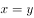
　✅
- **C**. 

- **D**. 
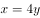

**答案**：B

**官方解析**

设两条生产线的生产效率均为1，已知乙订单由其中一条生产线经天完成，则。又已知甲订单先由两条生产线合作天，再由一条生产线生产天，最终再由两条生产线继续合作天，则。联立两式，可得：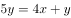，化简得：。

故正确答案为B。

---

### 第 2 题　qid 2578710 · 数学运算

甲、乙两辆小车从相距100米的轨道两端同时出发相向而行，甲车以2米/秒的速度匀速行驶，乙车从静止状态开始以的加速度均匀加速行驶，到达终点后停下。问以下哪个图能准确描述甲乙各自到达终点前，两车之间的距离与时间的关系（横轴为时间，纵轴为直线距离）？

- **A**. A
- **B**. B
- **C**. C
- **D**. D　✅

**答案**：D

**官方解析**

方法一：离开起点后，两车之间的距离分阶段讨论如下：

①在相遇前，他们的距离随着时间变大逐渐变小；

②相遇后，两车背道而驰，两车之间的距离随着时间变大逐渐变大，增加距离由两车的路程和决定；

③加速度行驶的乙车到达终点后停下，之后只有甲车在行驶，故两车之间增加的距离取决于甲车。

因此两车之间的距离与时间的关系由三段组成，只有D项满足。

方法二：设甲、乙两车各自到达终点前，两车之间的距离为米，经过时间为秒。甲车速度匀速为2米/秒，乙车初速度为0，加速度为1，则甲车在秒里走过的路程为米；根据公式，路程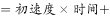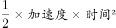，则乙车在秒里走过的路程为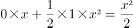。把全程分三段讨论：

①在相遇之前：两车越来越接近，距离变小且为轨道总长减去他们各自已经走过的路程和，则从两车出发到相遇，两车之间的距离，为一元二次函数，且由于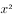前的系数为负值，在坐标轴中表示为开口向下的抛物线，排除A、C两项；

②在相遇之后直到其中一辆车率先到达终点：两车逐渐远离，距离变大且为他们各自已经走过的路程和减去轨道总长，两车之间的距离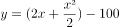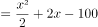，为一元二次函数，且由于前的系数为正值，在坐标轴中表示为开口向上的抛物线，排除B项；（考场上据此即可选出正确答案，不用继续讨论第三段）

③其中一辆车到达终点后直到另一辆车到达终点：到达终点的车不动，由还在行驶的车决定两车之间的距离。甲车走完全程需用时秒，此时乙车走过路程为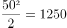米，因此乙车远早于甲车到达终点并且停止行驶，此时他们的距离就是甲车和起点的距离也就是甲车走过的路程，两车之间的距离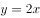，在坐标轴中表示为一次线性函数。

所以最终的函数图形应当由三段组成，并且由于乙加速非常快，甲、乙相遇后乙到达终点的时间非常短，所以最后的函数图形为：一半段较长的开口向下的抛物线，加一小半段开口向上的抛物线，再加一段较长的直线。

故正确答案为D。

---

### 第 3 题　qid 2578698 · 数学运算

甲、乙两个箱子中分别装有不同数量的某种商品，总数不到100件。如果从甲或乙箱子中随机拿出1件这种商品，拿到次品的概率分别为和。如果将两箱内的商品混合后再随机拿出1件，则拿到次品的概率为，从乙箱中随机拿出3件这种商品，均不为次品的概率在以下哪个范围内？

- **A**. 

　✅
- **B**. 
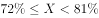

- **C**. 

- **D**. 
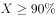

**答案**：A

**官方解析**

设甲、乙两个箱子中的次品分别有、件，则甲的商品数量为件，乙的商品数量为件。根据混合后拿到次品的概率为，有，化简可得，则甲、乙两个箱子中的商品数量为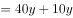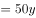。根据题意，，则只能取值为1，即乙有10件商品，其中有1件是次品、9件正品。从乙箱中随机拿出3件这种商品，均不为次品的概率为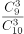，在A项的取值范围内。

故正确答案为A。

---

### 第 4 题　qid 2578700 · 数学运算

高校某教研室某年承接部级科研项目5个，经费总额为500万元，且每个项目经费都是整数万元。已知经费最多的两个项目平均经费与经费最少的两个项目经费之和相同，问经费排名第三的项目可能的最低经费金额为多少万元？

- **A**. 145
- **B**. 142
- **C**. 74　✅
- **D**. 71

**答案**：C

**官方解析**

方法一：设排名第三的项目经费为万元，经费最多的两个项目的平均经费为万元。则经费最多的两个项目经费之和为万元，经费最少的两个项目经费之和为万元。根据经费总额为500万元，有。要值最小，则从最小的选项开始代入：

代入D项，，则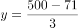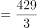万元，经费最少的两个项目必然有一个高于71万元，不符合题意，排除；

代入C项，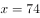，则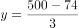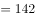万元，经费最少的两个项目平均有71万元，小于74万元，符合题意，当选。

方法二：设经费最多的两个项目的平均经费为万元，推出经费最多的两个项目经费之和为万元，经费最少的两个项目经费之和为万元，则经费最多的两个项目和经费最少的两个项目经费之和为万元，一定是3的倍数，因此500减去选项是3的倍数。A项：，不是3的倍数，排除；B项：，不是3的倍数，排除；C项：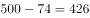，是3的倍数，保留；D项：，是3的倍数，保留。

剩余C、D两项，题目问最低，从最小的开始代入，代入D项，排名第三的项目经费为71万元，那么其他四个之和为万元，429是3的倍数，说明经费最少的两个项目经费之和为万元，其中一项明显会大于71万元，不符合71万元排名第三，排除。

故正确答案为C。

---

### 第 5 题　qid 2578686 · 数学运算

某种圆珠笔单支购买1.7元/支，另有5元/3支和15元/10支两种包装供购买，办公室购买这种圆珠笔支，最低可能的购买总价为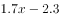元，问可能的最大值为：

- **A**. 19　✅
- **B**. 21
- **C**. 29
- **D**. 31

**答案**：A

**官方解析**

根据题意，如果购买5元/3支的包装，则每3支圆珠笔比原价便宜元；如果购买15元/10支的包装，则每10支圆珠笔比原价便宜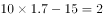元。如果购买总价为元，则相比原价便宜了2.3元。

方法一：由于购买总价最低，则其中必然包含了1个10支的包装和3个3支的包装，则，且如果买到20支则可以享受更为优惠的折扣（两个2元），所以最大仅能取到19。

方法二：结合选项，如果支，则一定可以购买2个15元/10支的包装，最低可能的购买总价至少可以便宜4元，元不可能为最低可能的购买总价，排除B、C、D三项。

故正确答案为A。 

---

### 第 6 题　qid 2578692 · 数学运算

某超市出售1.5升装和4升装两种规格的矿泉水，1.5升装的每瓶进价3元，售价4.5元；4升装的每瓶进价7元，售价9元，三月份该超市共出售1000升矿泉水，利润（总售价总进价）为800元。问出售1.5升装矿泉水的瓶数是4升装的几倍？

- **A**. 4　✅
- **B**. 3
- **C**. 2
- **D**. 1.5

**答案**：A

**官方解析**

设超市售出1.5升装矿泉水瓶，4升装矿泉水瓶。售出1瓶1.5升装矿泉水的利润为元，售出1瓶4升装矿泉水的利润为元。根据条件可得：

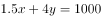······①，

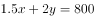······②；

联立①②，解得，，则所求倍数倍。

故正确答案为A。

---

### 第 7 题　qid 2578687 · 数学运算

某工程由甲、乙两家企业共同参与，甲企业的实际出资额是乙企业的3倍，乙企业投入的人力资源是甲企业的2倍，如将两家企业投入的人力资源按一定价格折算为出资额并依折算后的出资额分配利润。则甲企业分配的利润是乙企业的1.2倍，问如乙企业的出资额增加，而其他条件不变，其分配的利润是甲企业的多少倍？

- **A**. 0.90
- **B**. 0.95　✅
- **C**. 1.00
- **D**. 1.05

**答案**：B

**官方解析**

赋值甲企业实际出资额为3，乙企业实际出资额为1，甲、乙人力资源之比为1：2，按照一定价格折算为出资额分配利润，则人力资源折算的出资额分配利润为1：2，设甲企业人力资源折算后的出资额为，乙企业人力资源折算后的出资额为。则甲企业折算后的出资额，乙企业折算后的出资额。，解得。则甲企业折算后分配利润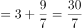，乙企业出资额增加后，其分配利润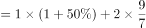，所求倍数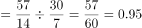倍。

故正确答案为B。

---

### 第 8 题　qid 2578694 · 数学运算

某单位举办兵乓球比赛，经过初赛之后最终只有甲、乙、丙、丁四人进入半决赛，半决赛随机抽签决定对手，胜者进入决赛，按平时练习情况，甲对乙的胜率是，甲对丙的胜率是，甲对丁的胜率是，乙对丙的胜率是，乙对丁的胜率是，丙对丁的胜率是，则下列判断正确的是？

- **A**. 
一定存在一种分组方式，丁比丙夺冠的几率更大

- **B**. 
一定存在一种分组方式，乙夺冠的几率能超过

- **C**. 
当甲和丁，乙和丙进行半决赛时，甲夺冠的可能性最大

- **D**. 
甲和乙进行半决赛时，甲夺冠可能性大于甲和丙进行半决赛的情况
　✅

**答案**：D

**官方解析**

由题意，可以将半决赛的分组结果分为以下几种：

第一种情况：

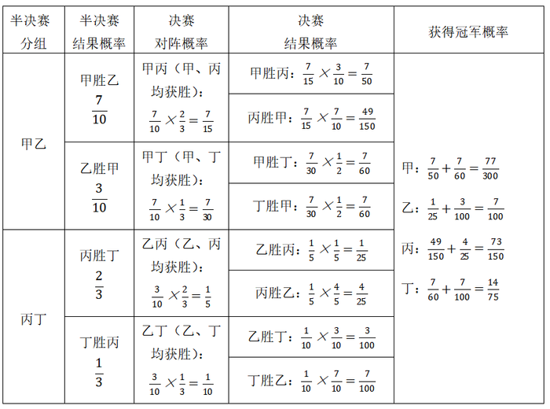

第二种情况：

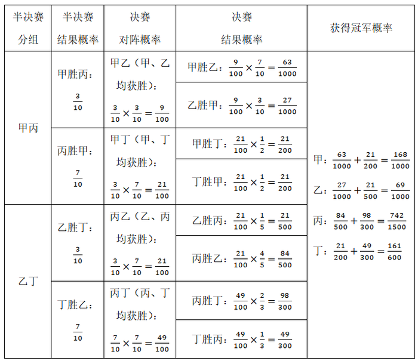

第三种情况：

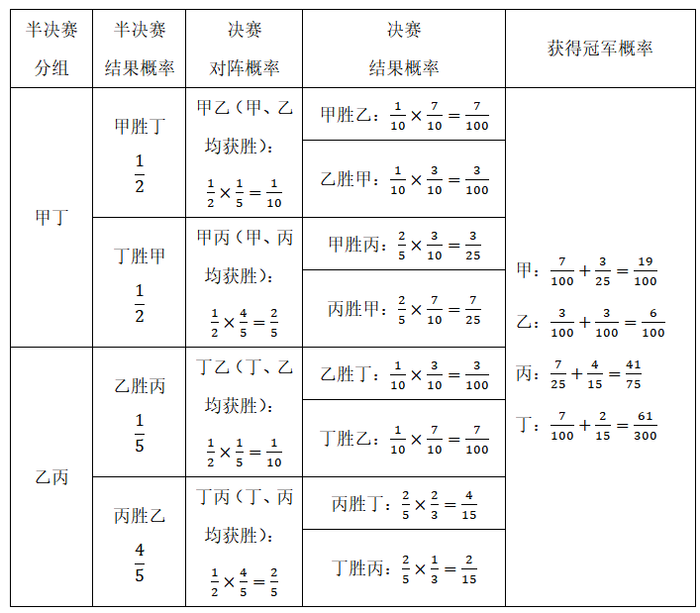

代入各个选项：

A项：三种情况，丁和丙的夺冠概率分别为（）、（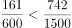）、（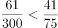），错误；

B项：三种情况，乙的夺冠概率分别为、、，错误；

C项：由第三种情况可得，丙的夺冠概率最大，错误；

D项：由第一种情况可得，甲夺冠的概率为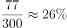；由第二种情况可得，甲夺冠的概率为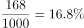，正确。

故正确答案为D。

---

### 第 9 题　qid 2578688 · 数学运算

一个重量为千克的圆台形容器如下图所示，其口部半径是底面半径的2倍。在容器中装满水，总重量为9千克。从中倒出部分水使得液面高度为装满时的一半，总重量下降到4.5千克。问的值在以下哪个范围内？

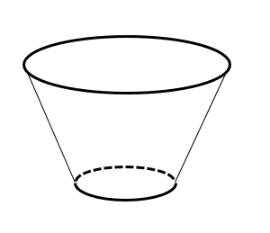

- **A**. 

- **B**. 

- **C**. 
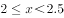
　✅
- **D**. 

**答案**：C

**官方解析**

根据题意，，设底面半径为，则口部半径为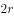，装满水时的液面高度为，因为倒出部分水后液面高度为装满时的一半，则倒出水后的液面高度和倒出部分水的液面高度均为，倒出水后的水面半径。赋值，则倒出水后的水面半径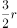，口部半径。根据，且容器中的液体不变，密度相同，可得水的质量比即为体积比；根据圆台体积公式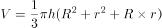（为上底半径、为下底半径、为高），则倒出部分水的体积与剩余部分水的体积之比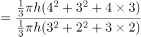。设倒出部分的水的质量为，剩余部分的水的质量为。倒出部分的水的质量千克，则，剩余部分的水的质量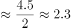，此时总重量，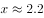。

故正确答案为C。

---

### 第 10 题　qid 2578689 · 数学运算

一个容器由一个长方体和一个半圆柱体如下图组合而成，长方体的长为1米，宽为0.5米，高为2米。在这个容器表面涂漆花费200元，问平均每平方米的涂漆成本在哪个范围内？

- **A**. 不超过20元
- **B**. 超过20元但不超过25元　✅
- **C**. 超过25元但不超过30元
- **D**. 超过30元

**答案**：B

**官方解析**

容器是由一个长方体和一个半圆柱体组合而成的，根据长方体的表面积公式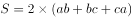和圆柱表面积公式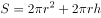，可得：容器表面积长方体表面积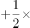圆柱表面积长方体和半圆柱重合面面积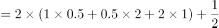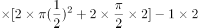平方米，则平均每平方米的涂漆成本元/平方米。

故正确答案为B。

---

## 判断推理

### 第 1 题　qid 2578743 · 图形推理

从所给四个选择中，选择最合适的一个填入问号处，使之呈现一定规律性：

- **A**. A
- **B**. B
- **C**. C
- **D**. D　✅

**答案**：D

**官方解析**

元素组成不同，考虑属性规律和数量规律。观察发现，A项、B项为“田”字变形图，图5和D项为“日”字变形图，可考虑笔画数。题干前四幅图，奇点数均为0，是一笔画，第五幅图奇点数为2，也是一笔画，故？处图形应为一笔画图形。A项、B项、C项均有4个奇点，是两笔画图形，D项有2个奇点，是一笔画图形。

故正确答案为D。

---

### 第 2 题　qid 2578751 · 图形推理

从所给四个选择中，选择最合适的一个填入问号处，使之呈现一定规律性：

- **A**. A　✅
- **B**. B
- **C**. C
- **D**. D

**答案**：A

**官方解析**

解析一：元素组成相同，优先考虑位置规律。观察发现，图形整体位置无规律，可以考虑比较相邻的题干图形找规律。观察发现，相邻两幅图形中，图1与图2第一列相同，图2与图3第三列相同，图3与图4第五列相同，图4与图5第二列相同，故题干规律是相邻的两幅图之间有一列相同，并且是隔一列相同，故接下来应该是第四列与图5相同，只有A项符合，当选。

解析二：元素组成相同，优先考虑位置规律。观察发现，图形整体位置无规律，可以考虑比较相邻的题干图形找规律。观察发现，相邻两幅图形中，前一幅图中前三列的黑球和后一幅图中后三列的黑球位置保持不变，同时，前一幅图形的后两列下移一格得到后一幅图形的前两列，下移时碰到底部就从上循环，因此？处图形中后三列黑球的位置应该和图5中前三列的黑球位置完全相同，前两列由图5后两列下移一格得到，只有A项符合，当选。

以上两种思路均可选出唯一答案。

故正确答案为A。

---

### 第 3 题　qid 2578756 · 图形推理

从所给四个选择中，选择最合适的一个填入问号处，使之呈现一定规律性：

- **A**. A
- **B**. B　✅
- **C**. C
- **D**. D

**答案**：B

**官方解析**

元素组成相同，优先考虑位置规律。九宫格题目优先看横行，观察发现，第一行图形中外部小黑球每次顺时针移动一步、内部小黑球每次逆时针移动一步，可以得到后一幅图；第二行外部小黑球每次顺时针移动两步、内部小黑球每次逆时针移动两步，可以得到后一幅图；第三行外部小黑球每次顺时针移动三步、内部小黑球每次逆时针移动三步，可以得到后一幅图。根据这个规律，只有B项符合。
故正确答案为B。

---

### 第 4 题　qid 2578764 · 图形推理

把下面的六个图形分为两类，使每一类图形都有各自的共同特征或规律，分类正确的一项是：

- **A**. ①④⑥，②③⑤
- **B**. ①④⑤，②③⑥
- **C**. ①③⑤，②④⑥　✅
- **D**. ①②④，③⑤⑥

**答案**：C

**官方解析**

本题为分组分类题目。元素组成不同，考虑属性或数量规律。观察发现，题干中出现圆相切，考虑点的数量。整体点的数量无规律，但图③⑤存在交点均为曲曲交点，观察其余图形，发现图①③⑤存在曲曲交点，图②④⑥存在曲直交点。即图①③⑤一组，图②④⑥一组。
故正确答案为C。

---

### 第 5 题　qid 2578740 · 图形推理

左边给定的是纸盒的外表面，下列哪项能由它折叠而成？

- **A**. A
- **B**. B
- **C**. C　✅
- **D**. D

**答案**：C

**官方解析**

将原展开图标上序号如下图，逐一进行分析。

A项：选项中出现三角形的面为面2、3、4、5其中的三个面，但在展开图中面2与面4、面3与面5都是相对面，相对面不能同时出现，选项和题干不一致，排除；

B项：选项中正对着的面和上边的面由面1、面6组成，右边的面为面2、3、4、5中的其中一个，而在展开图中面1与面6为相对面，相对面不能同时出现，选项和题干不一致，排除；

C项：选项面为面2、3、6，选项和题干一致，当选；

D项：选项中上边的面和右边的面由两个小三角形的面组成，并且两个小三角形面公共边顶端有交点，据此有两种可能，分别是面2与面5、面3与面4。但是无论是为面3与面4时，还是面2和面5时，两个面的公共边在展开图中都是梯形的长底边，而D项的公共边挨着右边面的小三角形直角边，选项和题干不一致，排除。

故正确答案为C。

---

### 第 6 题　qid 2578744 · 定义判断

疑离是变通运用了选择疑问句形成的一种修辞方法，它用两项或多项疑问句并列发问，但不要求读者从中选择一项，而是让读者发疑。待把语言前后连贯，便可疑念全消。
根据上述定义，下列运用了疑离的修辞方法是：

- **A**. 水几重呵，山几重？水绕山环桂林城······是山城呵，是水城？都在青山绿水中······　✅
- **B**. 哪一颗星没有光？哪一朵花没有香？大海啊，哪一次我的思潮里没有你波涛的清响？
- **C**. 我走过的路很多，哪见过像这样荆棘丛生的路呢？我走过的路很多，哪见过像这样崎岖难行的路呢？没有。
- **D**. 啊，黄继光，刘胡兰······不都是党亲手培育的，共产主义甘霖灌溉出来的鲜花吗？人间还有什么花朵能同他们争艳呢？

**答案**：A

**官方解析**

第一步：找出定义关键词。
“变通运用了选择疑问句”、“两项或多项疑问句并列发问”、“把语言前后连贯，便可疑念全消”。
第二步：逐一分析选项。
A项：“是山城呵，是水城？”是在问这里是山城还是水城？符合“变通运用了选择疑问句”，“都在青山绿水中······”说明这里既是山城也是水城，符合“把语言前后连贯，便可疑念全消”，符合定义，当选；
B项：“哪一颗星没有光？哪一朵花没有香？”不符合“变通运用了选择疑问句”，而且都是问问题，不符合“把语言前后连贯，便可疑念全消”，不符合定义，排除；
C项：“哪见过像这样荆棘丛生的路呢？”不符合“变通运用了选择疑问句”，其后半句直接解答问题，不符合“把语言前后连贯，便可疑念全消”，不符合定义，排除；
D项：“不都是党亲手培育的，共产主义甘霖灌溉出来的鲜花吗？”是在反问，不符合“变通运用了选择疑问句”，而且不符合“把语言前后连贯，便可疑念全消”，不符合定义，排除。
故正确答案为A。

---

### 第 7 题　qid 2578752 · 定义判断

注意分为似注意和似不注意两种。似注意是指表面上注意某些事物，但实际上心里却想着其他事物。似不注意是指貌似不注意一事物而实际上心里却十分注意这一事物。
根据上述定义，下列属于似不注意的是：

- **A**. 第一次来到海边的人们往往容易不自觉地被波澜壮阔的景色所深深吸引
- **B**. 学生们正在教室上课，突然从外面进来一个人，学生们不由自主地看向他
- **C**. 临近午餐时间，会议还没有结束，很多参会者虽然表面在认真倾听会议内容，心里却在想着午餐吃什么
- **D**. 侦查员在人群中发现了犯罪嫌疑人，为了不打草惊蛇，假装没看见，然后悄悄靠近，出其不意将其抓获　✅

**答案**：D

**官方解析**

第一步：找出定义关键词。
似注意：“表面上注意”、“心里却想着其他事物”；
似不注意：“貌似不注意一事物而实际上心里却十分注意”。
第二步：逐一分析选项。
A项：人们往往不自觉地被景色吸引，是注意到了景色这一事物，不符合“貌似不注意一事物而实际上心里却十分注意”，不符合“似不注意”定义，也不符合“似注意”定义，排除；
B项：学生们看向外面突然进来的人，不符合“貌似不注意一事物而实际上心里却十分注意”，不符合“似不注意”定义，也不符合“似注意”定义，排除；
C项：参会者虽然表面在倾听会议内容，心里却在想着午餐吃什么，符合“表面上注意”、“心里却想着其他事物”，符合“似注意”定义，不符合“似不注意”定义，排除；
D项：侦查员为了不打草惊蛇，假装没看见，然后悄悄靠近，符合“貌似不注意一事物而实际上心里却十分注意”，符合“似不注意”定义，当选。
故正确答案为D。

---

### 第 8 题　qid 2578757 · 定义判断

O2O模式即Online To Offline，是指将线下的商务机会与互联网结合，让互联网成为线下交易的前台。线上平台为消费者提供消费指南、优惠信息、便利服务和分享平台，而线下商户则专注于提供服务。
根据上述定义，以下属于O2O模式的是：

- **A**. 乘客致电出租车热线预定出租车，可在指定的时间地点享受车接车送
- **B**. 互联网上的跨洋英语聊天室，使中国学生能直接跟外国友人用英语进行交流
- **C**. 研究员利用微信平台招募测试对象，根据他们在线填写问卷的结果再进行线下访谈
- **D**. 家政服务公司利用手机软件推销家政服务，用户通过手机预约之后，工作人员到家服务　✅

**答案**：D

**官方解析**

第一步：找出定义关键词。
“线下的商务机会与互联网结合”、“线上平台为消费者提供消费指南、优惠信息、便利服务和分享平台”、“线下商户则专注于提供服务”。
第二步：逐一分析选项。
A项：乘客致电出租车热线预定出租车，不符合“线下的商务机会与互联网结合”，不符合定义，排除；
B项：互联网上的跨洋英语聊天室，不符合“线下的商务机会与互联网结合”，不符合定义，排除；
C项：研究员利用微信平台招募测试对象，不符合“线下的商务机会与互联网结合”，根据在线填写问卷的结果进行线下访谈，不符合“线上平台为消费者提供消费指南、优惠信息、便利服务和分享平台”，不符合定义，排除；
D项：家政服务公司利用手机软件推销服务，符合“线下的商务机会与互联网结合”，用户通过手机预约，符合“线上平台为消费者提供消费指南、优惠信息、便利服务和分享平台”，工作人员到家服务符合“线下商户则专注于提供服务”，符合定义，当选。
故正确答案为D。

---

### 第 9 题　qid 2578749 · 定义判断

一个国家生产某种产品的成本比另一个国家低，那么，该国就在这种商品的生产上与另一个国家相比具有比较优势。
根据上述定义，以下判断正确的是：

- **A**. 作为佛教圣地的泰国，宗教文化旅游资源丰富，旅游产业相当发达，相对周边国家来说，泰国具有旅游产品的比较优势
- **B**. 甲国人口众多，廉价的劳动力吸引了乙国大多数手机制造公司到甲国开辟生产线，相比乙国，甲国在手机生产上具有比较优势　✅
- **C**. 某欧洲国家因自然风光优美，成为亚洲众多电影制片公司的外景拍摄地，相对于亚洲国家来说，这个欧洲国家具有电影生产的比较优势
- **D**. 甲国具有丰富的石油资源，但天然气资源匮乏，乙国进口甲国石油的同时，向甲国出口天然气，相比甲国，乙国具有能源的比较优势

**答案**：B

**官方解析**

第一步：找出定义关键词。
“一个国家生产某种产品的成本比另一个国家低”、“该国就在这种商品的生产上与另一个国家相比具有比较优势”。
第二步：逐一分析选项。
A项：泰国旅游资源较其他地区更丰富，旅游资源是一种资源，而不是某种产品，不符合“一个国家生产某种产品的成本比另一个国家低”，泰国旅游产品有优势，不符合“该国就在这种商品的生产上与另一个国家相比具有比较优势”，不符合定义，排除；
B项：甲国人口多，劳动力廉价，即为生产的人力成本低，符合“一个国家生产某种产品的成本比另一个国家低”，吸引乙国到甲国开辟生产线进行生产，符合“该国就在这种商品的生产上与另一个国家相比具有比较优势”，符合定义，当选；
C项：欧洲自然风光优美成为亚洲电影制片公司的外景拍摄地，是两个地区之间的自然资源情况，不是国家之间的对比，不符合“一个国家生产某种产品的成本比另一个国家低”，不符合定义，排除；
D项：甲国石油资源丰富，乙国天然气资源丰富，但并不涉及到生产产品的成本，不符合“一个国家生产某种产品的成本比另一个国家低”，乙国能源有优势，不涉及商品的生产，不符合“该国就在这种商品的生产上与另一个国家相比具有比较优势”，不符合定义，排除。
故正确答案为B。

---

### 第 10 题　qid 2578754 · 定义判断

关联营销是指商家通过资源整合寻找产品、品牌等所要营销内容的关联性，来实现深层次的多面引导。
根据上述定义，下列没有反映关联营销的是：

- **A**. 某体育用品商店的主推商品为泳衣，在泳衣货品区的旁边还配有防晒霜、太阳镜和遮阳帽进行销售
- **B**. 某电视厂商通过构建体验空间，让顾客感受液晶屏幕放映影片带来的视觉体验，从而促进电视机的销量　✅
- **C**. 某母婴网站根据顾客购买的儿童纸尿裤推测孩子的年龄，从而在购物页面推荐更多这一年龄段孩子需要使用的产品
- **D**. 某服装公司最为畅销的产品为某种图案的圆领T恤，与此同时公司还生产了该图案的V领T恤和立领T恤，销量也很好

**答案**：B

**官方解析**

第一步：找出定义关键词。
“通过资源整合寻找产品、品牌等所要营销内容的关联性”、“实现深层次的多面引导”。
第二步：逐一分析选项。
A项：体育用品商店在泳衣货品区旁边配有防晒霜、太阳镜和遮阳帽进行销售，符合“通过资源整合寻找产品、品牌等所要营销内容的关联性”，符合“实现深层次的多面引导”，符合定义，排除；
B项：电视厂商通过构建体验空间，让顾客感受液晶屏幕的视觉体验，没有体现多种营销内容的关联性，不符合“通过资源整合寻找产品、品牌等所要营销内容的关联性”，也没有体现“实现深层次的多面引导”，不符合定义，当选；
C项：母婴网站通过推测孩子的年龄在购物页面推荐同年龄的产品，符合“通过资源整合寻找产品、品牌等所要营销内容的关联性”，符合“实现深层次的多面引导”，符合定义，排除；
D项：服装公司生产带有同一图案的不同形状衣领的T恤进行销售，符合“通过资源整合寻找产品、品牌等所要营销内容的关联性”，符合“实现深层次的多面引导”，符合定义，排除。
本题为选非题，故正确答案为B。

---

### 第 11 题　qid 2578758 · 定义判断

连带责任保证是债的担保的一种，它是指保证人与债权人约定，债务人在债务履行期限届满没有履行债务的，债权人既可以要求债务人履行债务，也可以要求保证人在其保证范围内承担债务。
根据上述定义，下列属于连带责任保证的是：

- **A**. 甲欠乙100万元货款，甲找来丙，三方约定，若三个月内甲不能偿还货款，由丙代乙主张债权
- **B**. 甲欠乙100万元货款，甲找来丙，三方约定，若三个月内甲不能偿还货款，乙有权要求丙偿还全部货款　✅
- **C**. 甲欠乙100万元货款，甲找来尚欠自己100万元债务的丙，三方约定，若到期甲不能偿还货款，由丙代为偿还
- **D**. 甲欠乙100万元货款，甲找来丙，将丙收藏的一幅名画交给乙，约定若在三个月内甲不能偿还货款，乙有权取得该画的所有权

**答案**：B

**官方解析**

第一步：找出定义关键词。
连带责任保证：“保证人与债权人约定”、“债务人在债务履行期限届满没有履行债务”、“债权人既可以要求债务人履行债务，也可以要求保证人在其保证范围内承担债务”。
第二步：逐一分析选项。
A项：甲欠乙的钱，丙代乙主张债权，意味着丙去跟甲要欠款，说明丙不是保证人，不符合“保证人与债权人约定”，不符合定义，排除；
B项：甲欠乙的钱，丙是债务的保证人，在债务人甲不能在期限内偿还债务，债权人乙有权要求债务保证人丙承担债务，符合“保证人与债权人约定”、“债务人在债务履行期限届满没有履行债务”、“债权人既可以要求债务人履行债务，也可以要求保证人在其保证范围内承担债务”，符合定义，当选；
C项：甲欠乙的钱，丙又欠甲的钱，丙是甲的债务人，并不是甲与乙之间债务的保证人，不符合“保证人与债权人约定”，不符合定义，排除；
D项：甲欠乙的钱，然后甲把丙收藏的画给乙作为抵押，丙不是甲与乙之间债务的保证人，不符合“保证人与债权人约定”、“债权人既可以要求债务人履行债务，也可以要求保证人在其保证范围内承担债务”，不符合定义，排除。
故正确答案为B。

---

### 第 12 题　qid 2578759 · 定义判断

义务性规范要求人们以某种方式必须作出或不作出某种行为。授权性规范表明人们有作出或不作出某种行为的权利。二者的关系是：当某种行为被确立为义务时，这种行为也同时被确立为权利；否定某种行为是义务，不意味着否定了这种行为是权利；当某种行为被确立为权利时，不意味着这种行为是义务；否定某种行为是权利，也即否定了某种行为是义务。
根据上述定义，下列说法错误的是：

- **A**. 若规定“公民有选举的权利”，意味着“公民有选举的义务”　✅
- **B**. 若规定“公民没有生育的义务”，不意味着“公民没有生育的权利”
- **C**. 若规定“本科生必须修读一门外语课”时，意味着“本科生有权利修读一门外语课”
- **D**. 若规定“公民没有干涉他人婚姻自由的权利”，意味着“公民没有干涉他人婚姻自由的义务”

**答案**：A

**官方解析**

第一步：找出定义关键词。
义务性规范要求人们以某种方式必须作出或不作出某种行为；
授权性规范表明人们有作出或不作出某种行为的权利；
二者的关系是：
当某种行为被确立为义务时，这种行为也同时被确立为权利；
否定某种行为是义务，不意味着否定了这种行为是权利；
当某种行为被确立为权利时，不意味着这种行为是义务；
否定某种行为是权利，也即否定了某种行为是义务。
第二步：逐一分析选项。
A项：“规定‘公民有选举的权利’”属于“授权性规范”范畴，根据“当某种行为被确立为权利时，不意味着这种行为是义务”，因此，“意味着‘公民有选举的义务’”，说法错误，当选；
B项：“规定‘公民没有生育的义务’”属于“义务性规范”范畴，根据“否定某种行为是义务，不意味着否定了这种行为是权利”，因此，“不意味着‘公民没有生育的权利’”，说法正确，排除；
C项：“规定‘本科生必须修读一门外语课’”属于“义务性规范”范畴，根据“当某种行为被确立为义务时，这种行为也同时被确立为权利”，因此，“意味着‘本科生有权利修读一门外语课’”，说法正确，排除；
D项：“规定‘公民没有干涉他人婚姻自由的权利’”属于“授权性规范”范畴，根据“否定某种行为是权利，也即否定了某种行为是义务”，因此，“意味着‘公民没有干涉他人婚姻自由的义务’”，说法正确，排除。
本题为选非题，故正确答案为A。

---

### 第 13 题　qid 2578747 · 定义判断

互惠利他是指两个无亲缘关系的动物个体之间通过相互合作而互利的行为。纯粹利他是指动物个体对无亲缘关系的其他个体施以利他行为，而不追求任何针对自身的客观回报。
根据上述定义，下列动物行为属于纯粹利他的是：

- **A**. 在蜜蜂群体中，蜂后产卵孵化为工蜂，工蜂自己不生育，而是全力以赴地养育蜂后产卵孵化的幼虫
- **B**. 魑蝠是一种以吸食其他动物的血为生的蝙蝠，一只吸到血的魑蝠会把血吐给另外一只与其毫无关系的正在挨饿的魑蝠　✅
- **C**. 当野兔躲在灌木丛中时，几只鹰会临时组成合作小组，由其中一只或几只将野兔赶出，其他几只从空中俯冲下来，将野兔捕杀
- **D**. 雌性雀鱼总是将其他种群内的小鱼吸引到自己的鱼群中加以喂养，新加入的小鱼可以壮大自己的鱼群，鱼群越大，幼年雀鱼被捕食的概率就越小

**答案**：B

**官方解析**

第一步：找出定义关键词。
互惠利他：“两个无亲缘关系的动物个体之间”、“通过相互合作而互利的行为”；
纯粹利他：“动物个体对无亲缘关系的其他个体”、“施以利他行为，而不追求任何针对自身的客观回报”。
第二步：逐一分析选项。
A项：蜂后产卵孵化为工蜂，工蜂自己不生育，而是养育蜂后的幼虫，属于有亲缘关系的同类之间进行相互合作，不符合任何一个定义，排除； 
B项：魑蝠会把血吐给另外一只没有关系的魑蝠，符合“动物个体对无亲缘关系的其他个体”，也符合“施以利他行为，而不追求任何针对自身的客观回报”，符合“纯粹利他”定义，当选；
C项：几只鹰合作抓野兔，属于“通过相互合作而互利的行为”，符合“互惠利他”定义，不符合“纯粹利他”定义，排除； 
D项：雌性雀鱼将其他种群内的小鱼吸引到自己的鱼群中喂养，目的是减小自己鱼群中的幼年雀鱼被捕食的概率，不符合任何一个定义，排除。
故正确答案为B。

---

### 第 14 题　qid 2578761 · 类比推理

笛子：音乐家

- **A**. 扫把：清洁工　✅
- **B**. 包裹：快递员
- **C**. 信誉：投资者
- **D**. 员工：企业家

**答案**：A

**官方解析**

第一步：判断题干词语间逻辑关系。
笛子是音乐家演奏乐曲时用到的一种工具，二者是工具的对应关系。
第二步：判断选项词语间逻辑关系。
A项：扫把是清洁工打扫卫生时用到的一种工具，二者是工具的对应关系，与题干逻辑关系一致，当选；
B项：包裹是快递员进行投递工作的对象，而不是工具，与题干逻辑关系不一致，排除；
C项：信誉不是投资者进行投资时用到的工具，与题干逻辑关系不一致，排除；
D项：员工是企业家的管理对象，而不是工具，与题干逻辑关系不一致，排除。
故正确答案为A。

---

### 第 15 题　qid 2578763 · 类比推理

米：粒

- **A**. 枕：头
- **B**. 车：辆　✅
- **C**. 衣：服
- **D**. 窗：帘

**答案**：B

**官方解析**

第一步：判断题干词语间逻辑关系。
米和粒共同组成词语“米粒”，且“米”的计量单位是“粒”，二者为计量单位的对应关系。
第二步：判断选项词语间逻辑关系。
A项：枕和头共同组成词语“枕头”，但是“枕”的计量单位不是“头”，与题干逻辑关系不一致，排除；
B项：车和辆共同组成词语“车辆”，且“车”的计量单位是“辆”，与题干逻辑关系一致，当选；
C项：衣和服共同组成词语“衣服”，但是“衣”的计量单位不是“服”，与题干逻辑关系不一致，排除；
D项：窗和帘共同组成词语“窗帘”，但是“窗”的计量单位不是“帘”，与题干逻辑关系不一致，排除。
故正确答案为B。

---

### 第 16 题　qid 2578765 · 类比推理

东施效颦：生搬硬套

- **A**. 崇洋媚外：吃里扒外
- **B**. 外强中干：徒有其表　✅
- **C**. 大快人心：兴高采烈
- **D**. 十恶不赦：臭名昭著

**答案**：B

**官方解析**

第一步：判断题干词语间逻辑关系。
东施效颦，比喻模仿别人，不但模仿不好，反而出丑；生搬硬套，指不顾实际情况，机械地运用别人的经验，照抄别人的办法，二者是近义关系。
第二步：判断选项词语间逻辑关系。
A项：崇洋媚外，意思是崇拜西方一切，谄媚外国人，指丧失民族自尊心，一味奉承巴结外国人；吃里扒外，是指接受这一方面的好处，却为那一方面卖力，也指将自己方面的情况告诉对方，二者不是近义关系，与题干逻辑关系不一致，排除；
B项：外强中干，形容外表强大而实际虚弱的事物；徒有其表，指空有外表，有名无实，二者是近义关系，与题干逻辑关系一致，当选；
C项：大快人心，指坏人受到惩罚，使人感到非常痛快；兴高采烈，形容兴致高，精神饱满，二者不是近义关系，与题干逻辑关系不一致，排除；
D项：十恶不赦，指罪恶极大，不可饶恕；臭名昭著，指坏名声人人都知道，二者不是近义关系，与题干逻辑关系不一致，排除。
故正确答案为B。

---

### 第 17 题　qid 2578793 · 类比推理

食盐：调味料：氯化钠

- **A**. 煤炭：固体矿物：无烟煤
- **B**. 沙画：现代艺术：视觉艺术
- **C**. 普洱茶：云雾茶：茶多酚
- **D**. 硅藻：浮游植物：二氧化硅　✅

**答案**：D

**官方解析**

第一步：判断题干词语间逻辑关系。
食盐是一种调味料，二者为种属关系，氯化钠是食盐的组成部分，二者为组成关系。
第二步：判断选项词语间逻辑关系。
A项：煤炭是一种固体矿物，二者为种属关系，但无烟煤是一种煤炭，二者也是种属关系，与题干逻辑关系不一致，排除；
B项：沙画是一种现代艺术，二者为种属关系，但沙画是一种视觉艺术，二者也是种属关系，与题干逻辑关系不一致，排除；
C项：普洱茶和云雾茶都是一种茶，二者为并列关系，与题干逻辑关系不一致，排除；
D项：硅藻是一种浮游植物，二者为种属关系，硅藻的组成部分是二氧化硅，二者为组成关系，与题干逻辑关系一致，当选。
故正确答案为D。

---

### 第 18 题　qid 2578794 · 类比推理

商标：商品：商场

- **A**. 品牌：电脑：电器
- **B**. 工牌：工人：工厂　✅
- **C**. 艺术：艺人：剧场
- **D**. 军规：军人：军队

**答案**：B

**官方解析**

第一步：判断题干词语间逻辑关系。
商标是用来区别一个经营者的品牌或服务和其他经营者的商品或服务的标记，商标可以用来区分商品，二者是对应关系，商品在商场销售，二者为场所对应关系。
第二步：判断选项词语间逻辑关系。
A项：品牌可以用来区分电脑，二者是对应关系，电脑是电器，二者为种属关系，与题干逻辑关系不一致，排除；
B项：工牌可以用来区分工人，二者是对应关系，工人在工厂工作， 二者为场所对应关系，与题干逻辑关系一致，当选；
C项：艺术不是区分艺人的标志，与题干逻辑关系不一致，排除；
D项：军规是治军的法规律令的统称，不是区分军人的标志，与题干逻辑关系不一致，排除。
故正确答案为B。

---

### 第 19 题　qid 2578795 · 类比推理

（    ） 对于 红酒 相当于（    ）对于 照片

- **A**. 酒庄；模特
- **B**. 果汁；胶卷
- **C**. 葡萄；风景
- **D**. 酒杯；相册　✅

**答案**：D

**官方解析**

逐一代入选项。
A项：酒庄是生产红酒的地点，二者为地点对应关系，照片中有模特，照片是模特的载体，二者为载体对应关系，前后逻辑关系不一致，排除；
B项：果汁和红酒都是饮品，二者为并列关系，胶卷可以用来冲印照片，二者为对应关系，前后逻辑关系不一致，排除；
C项：葡萄是制作红酒的原材料，二者为原材料对应关系，照片中有风景，照片是风景的载体，二者为载体对应关系，前后逻辑关系不一致，排除；
D项：酒杯可以装红酒，二者为功能对象的对应关系，相册可以装照片，二者为功能对象的对应关系，前后逻辑关系一致，当选。
故正确答案为D。

---

### 第 20 题　qid 2578796 · 类比推理

坚果 对于（    ）相当于（    ）对于 琵琶

- **A**. 苹果；乐器
- **B**. 松仁；扬琴
- **C**. 板栗；弹拨乐器　✅
- **D**. 浆果；打击乐器

**答案**：C

**官方解析**

逐一代入选项。
A项：苹果不是坚果，二者为反向包容关系，琵琶是乐器，二者为种属关系，前后逻辑关系不一致，排除；
B项：松仁是坚果，二者为种属关系，扬琴和琵琶是两种乐器，二者为并列关系，前后逻辑关系不一致，排除；
C项：板栗是坚果，二者为种属关系，琵琶是弹拨乐器，二者为种属关系，前后逻辑关系一致，当选；
D项：浆果和坚果是两种不同的果实类型，二者为并列关系，琵琶不是打击乐器，二者为反向包容关系，前后逻辑关系不一致，排除。
故正确答案为C。

---

### 第 21 题　qid 2578755 · 类比推理

木材 对于 （    ） 相当于 （    ） 对于 竹笛

- **A**. 树木；竖笛
- **B**. 建筑；音乐
- **C**. 木鱼；笙箫
- **D**. 木屋；竹子　✅

**答案**：D

**官方解析**

逐一代入选项。
A项：树木是木材的原材料，二者为原材料对应关系，竖笛和竹笛，二者为交叉关系，前后逻辑关系不一致，排除；
B项：木材是建筑的原材料，二者为原材料对应关系，竹笛可以吹奏出音乐，二者为乐器对应关系，前后逻辑关系不一致，排除；
C项：木材是木鱼的原材料，二者为原材料对应关系，笙箫和竹笛是两种不同的乐器，二者为并列关系，前后逻辑关系不一致，排除；
D项：木材是木屋的原材料，二者为原材料对应关系，竹子是竹笛的原材料，二者为原材料对应关系，前后逻辑关系一致，当选。
故正确答案为D。

---

### 第 22 题　qid 2578760 · 逻辑判断

橙腹草原田鼠实行的是动物世界极为罕见的“一夫一妻制”。研究者首先检测了雌性田鼠的内侧前额叶皮层与伏隔核两个区域的“交流”（这两大区域在解剖学上是相连的，伏隔核在大脑的奖励系统中扮演了关键的角色），然后让这些雌性田鼠与雄性田鼠见面，在见面过程中持续检测这两个脑区之间的交流强度。他们发现，那些脑区交流强度更高的田鼠，更容易与另一半快速建立起亲密关系。他们由此认为，这两个脑区之间的环路的激活，能够直接影响动物爱意的产生。
以下哪项如果为真，最能支持以上研究者的观点？

- **A**. 
在首次性行为后，橙腹草原田鼠的两个脑区交流的强度，与性行为后它们拥抱的速度快慢有直接关联

- **B**. 
既往研究发现，与爱情有关的化学物质，无论是多巴胺还是催产素，或多或少都能激活奖励系统，使人对伴侣产生爱意

- **C**. 
研究者让雌雄两只田鼠靠近但不能直接接触，给予特定波长的光， 激活这条神经通路。次日，相比面对陌生雄性田鼠，雌性田鼠更愿意与昨日见过的雄性田鼠亲昵
　✅
- **D**. 
和橙腹草原田鼠超过的基因相同的山地鼠，即使给它们注入足量催产素(与爱情有关的化学物质)，它们也依旧对伴侣过夜即忘，研究发现山地鼠的大脑相应区域缺乏催产素的受体

**答案**：C

**官方解析**

第一步：找出论点和论据。
论点：这两个脑区之间的环路的激活，能够直接影响动物爱意的产生。
论据：研究者首先检测了雌性田鼠的内侧前额叶皮层与伏隔核两个区域的“交流” (这两大区域在解剖学上是相连的，伏隔核在大脑的奖励系统中扮演了关键的角色)，然后让这些雌性田鼠与雄性田鼠见面，在见面过程中持续检测这两个脑区之间的交流强度。他们发现，那些脑区交流强度更高的田鼠，更容易与另一半快速建立起亲密关系。
本题论据讨论两个脑区交流强度更高的田鼠更容易建立亲密关系，论点讨论两个脑区之间的环路的激活，更容易产生爱意。论据论点都在讨论这两个脑区对田鼠亲密关系的影响，话题一致，优先考虑补充论据进行加强。
第二步：逐一分析选项。
A项：选项讨论两个脑区交流的强度与拥抱的速度有直接关联，但不明确是何种关联，为不明确选项，无法加强，排除；
B项：选项讨论多巴胺、催产素对爱意的影响，而论点讨论的是脑区之间环路的激活与爱意之间的关系，话题不一致，无法加强，排除；
C项：通过补充实验进行对比，证明两个脑区之间的环路的激活，确实能够直接影响动物爱意的产生，补充论据，当选；
D项：选项讨论山地鼠缺乏催产素受体，而论点讨论的是脑区之间环路的激活与爱意之间的关系，话题不一致，无法加强，排除。
故正确答案为C。

---

### 第 23 题　qid 2578762 · 逻辑判断

一项最新研究发现，脑部DNA的变异是使人们患上抑郁症和焦虑症的原因，而且这种变化会传递给后代。但是，有反对者认为，脑部杏仁核活动的增加会使应对恐慌的大脑区域的活动增强，这是引发抑郁症和焦虑症的原因。
以下哪项如果为真，最能削弱反对者的观点？

- **A**. DNA的变异是人类许多疾病的罪魁祸首
- **B**. 不健康的生活习惯也会引发抑郁症和焦虑症
- **C**. 脑部DNA的变异是使杏仁核活动增加的原因　✅
- **D**. 有些抑郁症和焦虑症患者的脑部DNA会发生变异

**答案**：C

**官方解析**

第一步：找出论点和论据。
论点：脑部杏仁核活动的增加会使应对恐慌的大脑区域的活动增强，这是引发抑郁症和焦虑症的原因。
论据：无。
本题只有论点，没有论据，考虑削弱论点，即引发抑郁症和焦虑症的原因不是脑部杏仁核活动的增加。
第二步：逐一分析选项。
A项：该项说的是DNA变异会导致许多疾病，而论点说的是引发抑郁症和焦虑症的原因，话题不一致，无法削弱，排除；
B项：该项说的是不健康的生活习惯也会导致抑郁症和焦虑症，与论点说的是脑部杏仁核活动增加会导致抑郁症和焦虑症无关，无法削弱，排除；
C项：该项说的是脑部DNA变异导致了杏仁核活动增加，而论点说的是杏仁核活动增加导致了抑郁症和焦虑症，因此脑部DNA变异是导致抑郁症和焦虑症的根本原因，直接削弱论点，可以削弱，当选；
D项：该项说的是有些抑郁症和焦虑症患者的脑部DNA会变异，即患病后的情况，而论点说的是引发抑郁症和焦虑症的原因，话题不一致，无法削弱，排除。
故正确答案为C。

---

### 第 24 题　qid 2578741 · 逻辑判断

某社区近期举行了一项关于家庭饲养宠物与家庭生活幸福感关系的调查。此次调查走访了100户家庭，调查的内容包括宠物的种类、饲养宠物的时间、家庭成员的学历和职业等诸多方面。调查结果表明，饲养宠物的家庭，其家庭成员的幸福感普遍高于没有饲养宠物的家庭。这说明，家庭饲养宠物有助于提升家庭生活幸福感。
以下哪项如果为真，最能削弱上述论证？

- **A**. 该调查所采集样本数量不足
- **B**. 该社区饲养宠物的通常是那些居住条件较好的居民
- **C**. 没有饲养宠物的家庭，其家庭成员通常为工作较为繁忙的在岗职工
- **D**. 家庭饲养宠物通常是因为其成员有充裕的时间并具有较高的家庭生活幸福感　✅

**答案**：D

**官方解析**

第一步：找出论点和论据。
论点：家庭饲养宠物有助于提升家庭生活幸福感。
论据：调查结果表明，饲养宠物的家庭，其家庭成员的幸福感普遍高于没有饲养宠物的家庭。
本题的论点和论据都在讨论饲养宠物与家庭生活幸福感的关系，论点论据话题一致，可以直接考虑削弱论点，且论点为因果关系，也可以考虑因果倒置和他因削弱。
第二步：逐一分析选项。
A项：调查所采集样本数量不足，证明了调查不够科学，削弱论据，具有一定的削弱力度，保留；
B项：选项说的居住条件较好的居民会养宠物，论点说的是饲养宠物可以提升家庭生活幸福感，话题不一致，无法削弱，排除；
C项：选项解释的是不养宠物的原因，论点说的是饲养宠物可以提升家庭生活幸福感，话题不一致，无法削弱，排除；
D项：选项说明因为家庭生活幸福感较高，所以才饲养宠物，因果倒置进行削弱，保留。
比较A、D两项，A项为削弱论据，D项为因果倒置，因果倒置削弱力度大于削弱论据。
故正确答案为D。

---

### 第 25 题　qid 2578746 · 逻辑判断

睡眠呼吸暂停是一种疾病，表现为患者在睡觉时空气进入肺部受阻。一旦短暂中断呼吸，患者会立刻醒来，以便再度呼吸。因此，深受睡眠呼吸暂停之苦的人有时每一两分钟就要醒一次，这样的情况可能会持续一整夜。一项研究发现，被确诊为睡眠呼吸暂停的男性和女性，患上重度抑郁的可能性分别要比睡得好的人高出2.4倍和5.2倍。研究人员认为，睡眠断断续续可能会导致抑郁症。
以下哪项如果为真，最能支持上述结论？

- **A**. 睡眠呼吸暂停的患者都有睡眠严重不足的问题
- **B**. 全世界患有抑郁症的女性比男性人数高出两倍多
- **C**. 有研究发现，深睡眠时间较长的人第二天精神状态更好
- **D**. 用辅助设备使患者恢复正常呼吸和睡眠，可显著缓解抑郁症状　✅

**答案**：D

**官方解析**

第一步：找出论点和论据。
论点：睡眠断断续续可能会导致抑郁症。
论据：被确诊为睡眠呼吸暂停的男性和女性，患上重度抑郁的可能性分别要比睡得好的人高出2.4倍和5.2倍。
本题论点和论据都在说睡眠问题可能导致抑郁症，话题一致，可以通过补充论据的方式进行加强，即解释原因或举例加强。
第二步：逐一分析选项。
A项：该项说的是睡眠呼吸暂停的患者存在睡眠严重不足的问题，未涉及睡眠问题是否导致抑郁症，话题不一致，无法加强，排除；
B项：该项说的是患有抑郁症的女性比男性人数高出两倍多，选项未涉及睡眠问题是否导致抑郁症，话题不一致，无法加强，排除；
C项：该项说的是深睡眠时间较长的人第二天精神状态更好，选项未涉及睡眠断断续续是否导致抑郁症，话题不一致，无法加强，排除；
D项：该项说的是用辅助设备使患者恢复正常呼吸和睡眠，可缓解抑郁症状，说明短暂中断呼吸是造成抑郁症的原因，补充论据，可以加强，当选。
故正确答案为D。

---

### 第 26 题　qid 2578750 · 类比推理

端粒是DNA片段，其长度在出生时很长，后逐渐变短，被视为衰老的标志。研究人员分析了多年的数据后发现：至少生育一个孩子的女性其端粒的平均长度比未生育的女性缩短。这个百分比相当于11年的细胞衰老结果，超过了吸烟和肥胖对细胞老化的影响速度。因此有人提出，生育孩子会让女人加速衰老。

以下哪项如果为真，不能驳斥上述观点？

- **A**. 细胞衰老并不代表个体衰老，细胞衰老是防止细胞发生癌变的重要方式
- **B**. 怀孕过程中妇女体内的雌激素水平持续剧烈上升，对细胞端粒具有保护作用
- **C**. 人体结构非常复杂，包括各类细胞、组织、器官，衰老不能通过“端粒”来简单解释
- **D**. 生育有助于女性健康，可降低多种疾病风险，母乳喂养一年，可使妇女患乳腺癌的风险降低三成　✅

**答案**：D

**官方解析**

第一步：找出论点和论据。

论点：生育孩子会让女人加速衰老。

论据：至少生育一个孩子的女性其端粒的平均长度比未生育的女性缩短。这个百分比相当于11年的细胞衰老结果，超过了吸烟和肥胖对细胞老化的影响速度。

题干论点说的是生育孩子会让女人加速衰老。论据说的是生育孩子使端粒缩短，细胞衰老。削弱可以考虑直接否定论点（生育孩子不会让女人加速衰老），也可以考虑切断二者间的联系（端粒缩短/细胞衰老不一定加速个体衰老），还可以否定论据或质疑论据的可靠性（生育孩子不一定会使女性的端粒缩短）。

第二步：逐一分析选项。

A项：细胞衰老并不代表个体衰老，拆断了论点的个体衰老和论据的细胞衰老的联系，可以削弱，排除；

B项：怀孕过程中妇女体内的雌激素水平持续剧烈上升，对细胞端粒具有保护作用，说明女性可能不会因为生育使端粒变短而加速衰老，否定论据，可以削弱，排除；

C项：人体衰老不能通过“端粒&quot;来简单解释，说明端粒变短不一定代表个体衰老，切断了论点的个体衰老和论据的端粒缩短的联系，可以削弱，排除；

D项：说的是生育有助于女性健康，可降低多种疾病风险，但题干论点说的是生育孩子会让女人加速衰老，衰老和患病并不相同，偷换概念，话题不一致，无关项，当选。

本题为选非题，故正确答案为D。

---

### 第 27 题　qid 2578753 · 逻辑判断

近日，科学家首次证实蜥蜴睡眠时存在快速眼动和慢波睡眠两种状态，在快速眼动状态下，大脑产生高频电波且眼睛快速闪动， 这些现象与做梦存在关联。科学家据此推测：蜥蜴和人类一样，在睡眠时会做梦。
科学家推测的成立， 需要补充以下哪项作为前提？

- **A**. 人类做梦出现在快速眼动阶段　✅
- **B**. 蜥蜴和人类有一些共同的生物特性
- **C**. 睡眠期间快速眼动和慢波睡眠交替进行
- **D**. 研究人员已经证实人在睡眠时会经常做梦

**答案**：A

**官方解析**

第一步：找出论点和论据。
论点：蜥蜴和人类一样，在睡眠时会做梦。
论据：科学家首次证实蜥蜴睡眠时存在快速眼动和慢波睡眠两种状态，在快速眼动状态下，大脑产生高频电波且眼睛快速闪动，这些现象与做梦存在关联。
本题提问的是“前提”，优先考虑搭桥。论点讨论的是蜥蜴和人类一样，睡眠时会做梦，论据讨论的蜥蜴的快速眼动状态与做梦存在关联，两者话题不一致，考虑在人类做梦和快速眼动状态之间搭桥进行加强。
第二步：逐一分析选项。
A项：此项指出人类做梦出现在快速眼动阶段，在论点和论据之间搭桥，说明人类确实和蜥蜴一样都是在快速眼动状态做梦，可以加强，当选；
B项：该项指出蜥蜴和人类有一些共同的生物特性，不一定指的是蜥蜴和人类睡眠会做梦这个特性，不能加强，排除；
C项：该项指出睡眠期间快速眼动和慢波睡眠交替进行，但不清楚人类是否也是这样交替进行，不能加强，排除；
D项：该项指出人类会做梦，但是不清楚蜥蜴是否和人类一样，不能加强，排除。
故正确答案为A。

---

### 第 28 题　qid 2578819 · 逻辑判断

260万年前灭绝的巨齿鲨体长超过15米，拥有强大的咬合力，其3米宽的下颌可压碎一辆小汽车。然而，近期的一项研究显示，巨齿鲨喜欢捕食的是体长小于5米的小须鲸，而不是体型更为庞大的大须鲸。但是由于气候的变化，小须鲸的数量锐减。研究人员据此认为，巨齿鲨是因缺少食物而灭绝的。
以下哪项如果为真，最能削弱上述结论？

- **A**. 小须鲸在260万年前数量锐减的原因是缺少食物
- **B**. 大须鲸是所有鲸类中游速最快的，很难被巨齿鲨捕食到
- **C**. 巨齿鲨也喜好捕食体型较小的海豹和现已灭绝的侏儒抹香鲸　✅
- **D**. 与巨齿鲨生活在同一时期的座头鲸和蓝鲸等大型鲸鱼都发生了进化

**答案**：C

**官方解析**

第一步：找出论点和论据。
论点：巨齿鲨是因缺少食物而灭绝的。
论据：巨齿鲨喜欢捕食的是体长小于5米的小须鲸，而不是体型更为庞大的大须鲸。但是由于气候的变化，小须鲸的数量锐减。
本题论点说的是巨齿鲨是因缺少食物而灭绝的，论据说巨齿鲨喜欢捕食的小须鲸因为气候变化数量锐减。二者话题不一致，削弱可以考虑拆桥，即证明巨齿鲨的食物不只有小须鲸，也可以考虑削弱论点和削弱论据。
第二步：逐一分析选项。
A项：该项说的是小须鲸的灭绝原因，而论点是巨齿鲨的灭绝原因，主体不一致，无法削弱，排除；
B项：该项说的是大须鲸不易被巨齿鲨捕食到，只是说明了为什么巨齿鲨不喜欢捕食大须鲸，无法确定巨齿鲨的灭绝原因是不是缺少食物，无法削弱，排除；
C项：该项说的是巨齿鲨也喜好捕食体型较小的海豹和现已灭绝的侏儒抹香鲸，说明巨齿鲨的食物不只有小须鲸，即小须鲸数量减少不代表巨齿鲨会缺少食物，拆桥项，当选；
D项：该项说的是座头鲸和蓝鲸等大型鲸鱼发生了进化，而论点是巨齿鲨的灭绝原因，话题不一致，无法削弱，排除。
故正确答案为C。

---

### 第 29 题　qid 2578821 · 逻辑判断

有学者认为，文化产品的生产者、消费者和市场管理者并非是导致文化产品低俗化的原因，文化产品的低俗化是由文化产品市场化导致的，因为市场的逐利性会导致文化产品的生产者、消费者和市场管理者忽视文化发展的社会效益，从而导致文化产品低俗化。
以下哪项如果为真，最能削弱上述论证？

- **A**. 文化产品市场化发展必然会引起文化体制改革和文化产业的发展
- **B**. 一些没有实行文化产品市场化的国家，并不存在文化产品低俗化的问题
- **C**. 文化产品市场化的决定因素是文化产品的生产者、消费者和市场管理者　✅
- **D**. 文化产品的生产者、消费者和市场管理者均是以文化产品市场化为导向

**答案**：C

**官方解析**

第一步：找出论点和论据。
论点：文化产品的生产者、消费者和市场管理者并非是导致文化产品低俗化的原因，文化产品的低俗化是由文化产品市场化导致的。
论据：因为市场的逐利性会导致文化产品的生产者、消费者和市场管理者忽视文化发展的社会效益，从而导致文化产品低俗化。
本题的论点和论据说的都是文化产品的低俗化与文化产品市场化之间的关系，二者话题一致，优先考虑削弱论点。
第二步:逐一分析选项。
A项：该项讨论的是文化产品市场化会引起文化体制改革和文化产业的发展，而论点讨论的是文化产品的低俗化是由文化产品市场化导致的，话题不一致，无法削弱，排除；
B项：该项通过举例说明文化产品低俗化与文化产品市场化之间存在关系，具有加强作用，无法削弱，排除；
C项：该项指出文化产品的生产者、消费者和市场管理者是造成文化产品市场化的决定因素，那么文化产品的低俗化是由文化产品市场化导致的意味着文化产品的生产者、消费者和市场管理者是导致文化产品低俗化的原因，直接削弱论点，当选；
D项：该项指出决定文化产品的生产者、消费者和市场管理者导向的是文化产品市场化，证明了文化产品市场化才是决定因素，具有加强作用，无法削弱，排除。
故正确答案为C。

---

### 第 30 题　qid 2578825 · 类比推理

张先生拟购买几种鲜花，购买意向如下：
①玫瑰、郁金香至多买一种；
②牡丹、玫瑰和雏菊至少买一种；
③郁金香、雏菊、百合至少买两种；
④如果买郁金香，则不购买牡丹。
根据上述意向，可以得出张先生：

- **A**. 必须买百合
- **B**. 郁金香、牡丹至少买了一种
- **C**. 雏菊、玫瑰至少买了一种　✅
- **D**. 至少买了3种鲜花

**答案**：C

**官方解析**

第一步：分析题干条件。

（1）玫瑰或郁金香；

（2）牡丹、玫瑰、雏菊至少买一种；

（3）郁金香、雏菊、百合至少买两种；

（4）郁金香牡丹。

第二步：根据题干条件进行推理。

题干条件均为不明确的信息，考虑采用假设法，由于条件中郁金香出现次数最多，故对郁金香分两种情况进行假设。

第一种情况：购买郁金香，根据条件（4）则不购买牡丹，根据条件（1）可知不购买玫瑰，又根据条件（2）可知购买雏菊。现已购买了郁金香、雏菊，根据条件（3）可知可能购买百合也可能没有购买，即可能购买2种鲜花也可能购买3种鲜花，A、D两项均可排除；

第二种情况：不购买郁金香，根据条件（3）可知购买雏菊和百合，根据其他条件，无法得知是否购买了玫瑰和牡丹，即可能购买也可能不购买，若不购买牡丹，此时牡丹和郁金香均未购买，排除B项。

综合上述两种情况可以推出张先生一定会购买雏菊，C项当选。

故正确答案为C。

---

## 资料分析

### 材料 1

        据调查，全国各院校毕业五年的大学生（以下统称为毕业生）薪酬排名前十的情况如下：

#### 第 1 题　qid 2578797 · 平均数

资料中2016年毕业生平均薪酬最高的院校，其毕业生平均薪酬约是平均薪酬最低院校的：

- **A**. 1.1倍
- **B**. 1.3倍　✅
- **C**. 1.5倍
- **D**. 1.7倍

**答案**：B

**官方解析**

根据题干“2016年······约是······的”，结合材料时间为2016年，选项为倍数，可判定本题为现期倍数问题。定位柱状图可得，2016年平均薪酬最高的是A大学，薪酬为元；平均薪酬最低的是J大学，薪酬为元。则2016年毕业生平均薪酬最高的院校是最低院校的倍。

故正确答案为B。

---

#### 第 2 题　qid 2578798 · 增长

2016年语言类大学平均薪酬排名第二的院校，其毕业生平均薪酬同比增长约为：

- **A**. 

　✅
- **B**. 

- **C**. 

- **D**. 

**答案**：A

**官方解析**

根据题干“2016年······同比增长约为”，结合选项为百分数，可判定本题为一般增长率问题。定位表格可得，2016年语言类大学平均薪酬排名第二的院校是G院校。定位柱状图可得，G院校2015年平均薪酬为10310元，2016年增量为1806元，则其毕业生平均薪酬同比增长率，只有A项符合。

故正确答案为A。

---

#### 第 3 题　qid 2578799 · 增长

图中有几所院校毕业生2016年平均薪酬同比增速低于：

- **A**. 0
- **B**. 1　✅
- **C**. 2
- **D**. 3

**答案**：B

**官方解析**

由题干“有几所院校毕业生2016年平均薪酬同比增速低于”，可判定本题为一般增长率问题。定位柱状图可得各院校2015年毕业生平均薪酬及2016年同比增量，代入公式：增长率，可分别计算各院校平均薪酬增长率，再与进行大小比较即可。

A院校：；B院校：；C院校：；D院校：；E院校：；F院校：；G院校：；H院校：；I院校：；J院校：。计算可知，只有F院校，即共计1所院校毕业生2016年平均薪酬同比增速低于。

故正确答案为B。

---

#### 第 4 题　qid 2578802 · 平均数

假设资料中的各个院校毕业生人数相同，2016年各专业类型毕业生平均薪酬，从高到低排序为：

- **A**. 
工科语言财经综合

- **B**. 
财经工科综合语言

- **C**. 
工科综合财经语言
　✅
- **D**. 
综合工科财经语言

**答案**：C

**官方解析**

根据题干“2016年各专业类型毕业生平均薪酬······”，可判定本题为现期平均数问题。定位表格可知，工科类院校有A、H共2所、财经类院校有B、I、J共3所、综合类院校有C、D、F共3所、语言类院校有E、G共2所，各专业类型毕业生平均薪酬。

定位柱状图数据可得2016年各院校类型平均薪酬，由题干条件“设资料中的各个院校毕业生人数相同”，设各个毕业院校毕业生人数为1，则工科类（A、H）的平均薪酬为元，财经类（B、I、J）平均薪酬为元，综合类（C、D、F）平均薪酬为元，语言类（E、G）平均薪酬为元。

所以平均薪酬从高到低依次为工科综合财经语言。

故正确答案为C。

---

#### 第 5 题　qid 2578808 · 综合

关于资料中十所院校的情况，能够从上述资料推出的是：

- **A**. 北京的院校占总数的一半以下
- **B**. 综合类院校的数量和工科院校一样多
- **C**. 毕业生薪酬排名第9的院校薪酬增速最快　✅
- **D**. 毕业生薪酬排名第5的院校2015年同样排名第5

**答案**：C

**官方解析**

A项：定位表格可得，北京的院校有A、F、G、I、J共五所，占院校总数的比重为，即北京的院校占十所院校的一半，错误；

B项：定位表格可得，综合类院校有C、D、F共三所，工科类有A、H共两所，两类院校数量不一致，错误；

C项：定位柱状图可得，2016年毕业生薪酬排名第9的院校为I院校，根据增长率进行比较：在A-I九所院校中，I院校同比增量最大、基期量最小，则这九所院校中I院校同比增速最快；比较I、J两所院校增速，I院校增速为，J院校为，即I院校同比增速也快于J院校。所以I院校是毕业生薪酬增速最快的，正确；

D项：定位柱状图可得，2016年毕业生薪酬排名第5的院校为E院校，其2015年毕业生薪酬在十所大学中排名第6，错误。

故正确答案为C。

---

### 材料 2

        2018年上半年，全国移动互联网累计流量达266亿GB，同比增长；其中通过手机上网的流量达到262亿GB，同比增长。

#### 第 6 题　qid 2578809 · 比重

2018年上半年，全国通过非手机设备上网的移动互联网接入流量占同期移动互联网累计接入流量的比重在以下哪个范围内？

- **A**. 
不到

- **B**. 
~之间
　✅
- **C**. 
~之间

- **D**. 
超过

**答案**：B

**官方解析**

根据题干“2018年上半年，······占······的比重······”，可判定本题为现期比重问题。定位文字材料可得：2018年上半年，全国移动互联网累计流量为266亿GB，其中通过手机设备上网的流量为262亿GB。则通过非手机设备上网的移动互联网接入流量为亿GB，其占同期移动互联网累计接入流量的比重为，在~之间。

故正确答案为B。

---

#### 第 7 题　qid 2578811 · 综合

2017年下半年，全国移动互联网累计接入流量约是上半年的多少倍?

- **A**. 1.8　✅
- **B**. 2.0
- **C**. 2.7
- **D**. 3.4

**答案**：A

**官方解析**

根据题干“2017年下半年······是上半年······的多少倍”，结合材料数据时间是2018年上半年，可判定本题为基期倍数问题。定位文字材料可得：2018年上半年，全国移动互联网累计流量达266亿GB，同比增长；定位柱状图可得：2017年7~12月全国移动互联网接入流量依次为19.7、21.7、24、27.9、29.8、33.9亿GB。根据基期公式：，则2017年上半年全国移动互联网累计流量为亿GB；2017年下半年全国移动互联网接入流量为亿GB。故2017年下半年全国移动互联网累计接入流量约是上半年的倍。

故正确答案为A。

---

#### 第 8 题　qid 2578812 · 综合

2018年3月，全国移动互联网接入户数约为多少亿户?

- **A**. 12.4
- **B**. 12.7
- **C**. 13.0　✅
- **D**. 13.3

**答案**：C

**官方解析**

根据题干“2018年3月，全国移动互联网接入户数约为······”，结合材料中给出2018年3月全国移动互联网接入流量和户均全国移动互联网接入流量可知：全国移动互联网接入户数，可判定本题为现期平均数问题。定位图形材料可得：2018年3月，全国移动互联网接入流量为42.8亿GB，户均全国移动互联网接入流量为3.29GB/户。则全国移动互联网接入户数亿户。

故正确答案为C。

---

#### 第 9 题　qid 2578813 · 平均数

2018年上半年，户均移动互联网接入流量环比增长以上的月份有几个？

- **A**. 1
- **B**. 2　✅
- **C**. 3
- **D**. 4

**答案**：B

**官方解析**

根据题干“······环比增长以上的月份有······”，可判定本题为一般增长率问题。由增长率公式：增长率，可得，若“”，则增长率超过。定位图形材料：1月：；2月：；3月：；4月：；5月：；6月：，只有3月和5月户均移动互联网接入流量环比增长以上。

故正确答案为B。

---

#### 第 10 题　qid 2578814 · 综合

无法从上述资料中推出的是：

- **A**. 
2017年12月移动互联网接入流量较上月增长以上

- **B**. 
2018年上半年通过非手机移动设备上网的流量同比增长超过2倍
　✅
- **C**. 
2018年第二季度移动互联网接入流量比第一季度增长40亿GB以上

- **D**. 
2017年6月-2018年6月，户均移动互联网日接入流量超过0.1GB/户的月份仅有4个

**答案**：B

**官方解析**

A项：定位图形材料可得：2017年11月，移动互联网接入流量为29.8亿GB；2017年12月，移动互联网接入流量为33.9亿GB。则增长率，正确；

B项：定位文字材料可得：全国移动互联网累计流量的同比增长率为，通过手机上网的流量的同比增长率为。由于“非手机移动设备上网的流量手机移动设备上网的流量移动互联网流量”，根据混合增长率口诀“混合居中”可知，2018年上半年通过非手机移动设备上网的流量同比增长率小于全国移动互联网流量的同比增长率，未超过2倍，错误；

C项：定位柱状图，2018年1-6月移动互联网接入流量分别为35.3亿GB、33.6亿GB、42.8亿GB、45.2亿GB、52.7亿GB、56.7亿GB，根据公式：增长量现期量基期量，则所求二季度一季度亿GB，正确；

D项：定位折线图，根据公式：户均移动互联网日接入流量，可知户均移动互联网日接入流量超过0.1GB/户的月份有4个，分别为2018年3月（GB/户），2018年4月（GB/户），2018年5月（GB/户），2018年6月（GB/户），正确。

本题为选非题，故正确答案为B。

---

### 材料 3

        2017年，S市服务业小微样本企业总体实现营业收入105.39亿元，同比增长 ，比2016年回落了15.7个百分点，户均实现营业收入510.63万元。

        2017年，S市服务业小微样本企业总体资产938.58亿元，同比增长 ，增速比2016年下降0.9个百分点，户均资产4547.40万元。分门类看，除房地产业，交通运输、仓储和邮政业，教育业资产总计比2016年分别下降、和外，其他行业资产总计同比均有不同程度的增长。

        2017年，S市服务业小微样本企业总体营业税金及附加为1.09亿元，同比下降；缴纳增值税2.30亿元，同比增长，户均缴纳增值税11.16万元。

        2017年，S市服务业小微样本企业总体应付职工薪酬19.28亿元，比2016年增长。户均应付职工薪酬93.50万元。从业人员人数29028人，人均年薪酬6.64万元，比2016年增加0.60万元。

#### 第 11 题　qid 2578803 · 综合

2017年，S市服务业小微样本企业共有多少户?

- **A**. 不到3000户　✅
- **B**. 3000~4000户之间
- **C**. 4001~5000户之间
- **D**. 超过5000户

**答案**：A

**官方解析**

根据题干“2017年，S市服务业小微样本企业······户”，结合材料给出2017年总体营业收入及户均营业收入，可判定本题为现期平均数计算问题。定位文字材料第一段，“2017年，S市服务业小微样本企业总体实现营业收入105.39亿元······户均实现营业收入510.63万元”。根据平均数计算公式：户数，故2017年S市服务业小微样本企业户数户，不到3000户。

故正确答案为A。

---

#### 第 12 题　qid 2578804 · 平均数

2017年，S市服务业小微样本企业平均每万元资产实现营业收入比2015年：

- **A**. 
增长了不到

- **B**. 
增长了以上
　✅
- **C**. 
下降了不到

- **D**. 
下降了以上

**答案**：B

**官方解析**

根据题干“2017年，······平均每······比2015年”，且选项为增长/下降百分数，可判定本题为平均数的增长率结合间隔增长率计算问题。定位文字材料第一段，“2017年，S市服务业小微样本企业总体实现营业收入105.39亿元，同比增长，比2016年回落了15.7个百分点”；定位文字材料第二段，“2017年，S市服务业小微样本企业总体资产938.58亿元，同比增长，增速比2016年下降0.9个百分点”。平均每万元资产实现营业收入，平均数增长率。先根据间隔增长率公式：计算和，则营业收入的间隔增长率；总体资产的间隔增长率。代入公式计算，在B项范围之内。

故正确答案为B。

---

#### 第 13 题　qid 2578805 · 平均数

如S市服务业小微样本企业数量为固定值，问2017年S市服务业小微样本企业户均比上年少缴纳营业税金及附加多少万元？

- **A**. 1.1
- **B**. 2.2　✅
- **C**. 3.3
- **D**. 4.4

**答案**：B

**官方解析**

根据题干“2017年······户均比上年少······多少万元”，可判定本题为平均数的增长量计算问题。定位材料第三段可得“2017年，S市服务业小微样本企业总体营业税金及附加为1.09亿元，同比下降”；结合题干“S市服务业小微样本企业数量为固定值”，再结合本篇材料第1题可知，小微样本企业数量为2066户。根据户均缴纳营业税金及附加，所以2017年S市服务业小微样本企业户均比上年少缴纳营业税金及附加万元万元，对应B项。

故正确答案为B。

---

#### 第 14 题　qid 2578806 · 综合

S市服务业小微样本企业2016年从业人员总数最接近以下哪个数字？

- **A**. 26565
- **B**. 27001
- **C**. 29205　✅
- **D**. 35015

**答案**：C

**官方解析**

根据题干“S市服务业小微样本企业2016年从业人员总数······”，结合材料时间为2017年，并给出总体职工薪酬及人均年薪，从业人员数，可判定本题为基期平均数计算问题。定位文字材料第四段可得，“2017年，S市服务业小微样本企业总体应付职工薪酬19.28亿元，比2016年增长······人均年薪酬6.64万元，比2016年增加0.60万元”，根据基期量，S市服务业小微样本企业2016年从业人员总数人，对应C项。

故正确答案为C。

---

#### 第 15 题　qid 2578807 · 综合

能够从上述资料中推出的是：

- **A**. 
2016年，S市服务业小微样本企业缴纳营业增值税超过营业税金及附加的2倍

- **B**. 
2017年，S市服务业小微样本企业总体应付职工薪酬同比增加2亿多元

- **C**. 
2017年，除房地产业外，S市其他服务业小微样本企业总体资产同比增速高于
　✅
- **D**. 
2017年，S市服务业小微样本企业平均每万元营业收入缴纳营业税金及附加高于上年水平

**答案**：C

**官方解析**

A项：定位文字材料第三段可得，2017年，S市服务业小微样本企业总体营业税金及附加为1.09亿元（B），同比下降（b）；缴纳增值税2.30亿元（A），同比增长（a）。 根据基期倍数公式：，则所求倍。错误；

B项：定位文字材料第四段可得，“2017年，S市服务业小微样本企业总体应付职工薪酬19.28亿元，比2016年增长”。根据增长量，则所求亿元。错误；

C项：定位文字材料第二段可得，“2017年，S市服务业小微样本企业总体资产938.58亿元，同比增长······除房地产业······资产总计比2016年分别下降······”。可知S市服务业小微样本企业总体资产增长率，房地产业增长率，所以其他服务业小微样本企业总体资产增长率总体增长率（）房地产业（）。正确；

D项，定位文字材料第三段可得，2017年，S市服务业小微样本企业总体营业税金及附加······同比下降（a）；定位文字材料第一段可得，“2017年，S市服务业小微样本企业总体实现营业收入······同比增长（b）”。平均每万元营业收入缴纳营业税及附加，根据两期平均数结论，，平均数低于上年水平。错误。

故正确答案为C。

---
