# 2020年山东省公务员录用考试《行测》试题（网友回忆版）

> 省考 · 2020 年 · 6 个模块 · 共 90 题

- [政治理论](#%E6%94%BF%E6%B2%BB%E7%90%86%E8%AE%BA) · 1 题
- [常识判断](#%E5%B8%B8%E8%AF%86%E5%88%A4%E6%96%AD) · 9 题
- [言语理解与表达](#%E8%A8%80%E8%AF%AD%E7%90%86%E8%A7%A3%E4%B8%8E%E8%A1%A8%E8%BE%BE) · 25 题
- [数量关系](#%E6%95%B0%E9%87%8F%E5%85%B3%E7%B3%BB) · 10 题
- [判断推理](#%E5%88%A4%E6%96%AD%E6%8E%A8%E7%90%86) · 30 题
- [资料分析](#%E8%B5%84%E6%96%99%E5%88%86%E6%9E%90) · 15 题

---

## 政治理论

### 第 1 题　qid 2571735 · 新思想

下列哪一项不属于坚持和完善中国特色社会主义制度、推进国家治理体系和治理能力现代化的总体目标？

- **A**. 到中国共产党成立一百年时，在各方面制度更加成熟更加定型上取得明显成效
- **B**. 到二〇二五年，各方面制度建设取得重要进展，制度框架和政策体系基本形成　✅
- **C**. 到二〇三五年，各方面制度更加完善，基本实现国家治理体系和治理能力现代化
- **D**. 到新中国成立一百年时，全面实现国家治理体系和治理能力现代化

**答案**：B

**官方解析**

本题考查政治常识。
中国共产党第十九届中央委员会第四次全体会议于2019年10月28日至31日在北京举行。全会提出，坚持和完善中国特色社会主义制度、推进国家治理体系和治理能力现代化的总体目标是，到我们党成立一百年时，在各方面制度更加成熟更加定型上取得明显成效；到二〇三五年，各方面制度更加完善，基本实现国家治理体系和治理能力现代化；到新中国成立一百年时，全面实现国家治理体系和治理能力现代化，使中国特色社会主义制度更加巩固、优越性充分展现。故A、C、D三项均正确，B项错误。
本题为选非题，故正确答案为B。

---

## 常识判断

### 第 1 题　qid 2571744 · 地理国情

下列有关山东省“三大经济圈”表述正确的是：

- **A**. 淄博、泰安、德州、滨州、潍坊都属于省会经济区
- **B**. 水浒故里、黄河口生态旅游区位于胶东经济圈
- **C**. 东方圣地、亲情沂蒙等旅游品牌都属于鲁南经济区　✅
- **D**. 省会经济区的定位包括金融中心和乡村振兴先行区

**答案**：C

**官方解析**

本题考查地理国情。
A项错误，根据《山东省人民政府关于加快省会经济圈一体化发展的指导意见》，省会经济圈涵盖济南、淄博、泰安、聊城、德州、滨州、东营7市，潍坊不属于省会经济圈，而属于胶东经济圈。
B项错误，根据《山东省人民政府关于加快胶东经济圈一体化发展的指导意见》，胶东经济圈涵盖青岛、烟台、威海、潍坊、日照5市。黄河口生态旅游区位于东营市，属于省会经济圈，水浒故里位于济宁市，属于鲁南经济圈。
C项正确，根据《山东省人民政府关于加快鲁南经济圈一体化发展的指导意见》，鲁南经济圈涵盖临沂、枣庄、济宁、菏泽4市。“东方圣地”是济宁市旅游品牌，“亲情沂蒙”是临沂市旅游品牌，均属于鲁南经济圈。
D项错误，省会经济圈的定位是打造黄河流域生态保护和高质量发展示范区、全国动能转换区域传导引领区、世界文明交流互鉴新高地，其建设的是济南区域性金融中心；打造全国金融中心是胶东经济圈的定位，而乡村振兴先行区则是鲁南经济圈的定位。
故正确答案为C。

---

### 第 2 题　qid 2571748 · 人文常识

下列哪一情形符合我国公务员法的相关规定？

- **A**. 某新录用的公务员经历了六个月的试用期后，便可予以任职
- **B**. 某公务员因工作失误，受到了免职处分
- **C**. 某公务员在挂职期间，为了工作便利，把人事关系转入挂职单位
- **D**. 机关聘任公务员可以进行公开招聘，也可以从符合条件的人员中直接选聘　✅

**答案**：D

**官方解析**

本题考查法律常识。
A项错误，根据《中华人民共和国公务员法》第三十四条规定：“新录用的公务员试用期为一年。试用期满合格的，予以任职；不合格的，取消录用。”
B项错误，根据《中华人民共和国公务员法》第六十二条规定：“处分分为：警告、记过、记大过、降级、撤职、开除。”免职并非公务员处分的种类。
C项错误，根据《中华人民共和国公务员法》第七十二条规定：“根据工作需要，机关可以采取挂职方式选派公务员承担重大工程、重大项目、重点任务或者其他专项工作。公务员在挂职期间，不改变与原机关的人事关系。”故“为了工作便利，把人事关系转入挂职单位”表述错误。
D项正确，根据《中华人民共和国公务员法》第一百零一条第一款规定：“机关聘任公务员可以参照公务员考试录用的程序进行公开招聘，也可以从符合条件的人员中直接选聘。”
故正确答案为D。

---

### 第 3 题　qid 2571754 · 科技常识

近年来，“共享单车”在许多城市兴起，给群众带来方便的同时，也被一些不法分子盯上。下列表述不正确的是：

- **A**. 赵某用技术开锁的手段解锁共享单车并贩卖，价值共计5000元，构成盗窃罪
- **B**. 钱某酒后为寻求刺激砸坏多辆共享单车，价值共计5000元，构成寻衅滋事罪
- **C**. 孙某将共享单车搬回家里解锁后又砸坏，价值共计5000元，构成故意毁坏财物罪
- **D**. 李某将共享单车上的二维码换成手机病毒二维码，非法获利5000元，构成诈骗罪　✅

**答案**：D

**官方解析**

本题考查法律常识。
A项正确，盗窃罪是指以非法占有为目的，窃取公私财物数额较大，或者多次盗窃、入户盗窃、携带凶器盗窃、扒窃的行为。题中，赵某解锁并贩卖共享单车，主观上具有非法占有的目的，客观上在共享单车经营者不知情的情况下转移了车辆的占有，侵犯了其对共享单车的所有权，应以盗窃罪论处。
B项正确，根据《中华人民共和国刑法》第二百九十三条规定：“有下列寻衅滋事行为之一，破坏社会秩序的，处五年以下有期徒刑、拘役或者管制：（一）随意殴打他人，情节恶劣的；（二）追逐、拦截、辱骂、恐吓他人，情节恶劣的；（三）强拿硬要或者任意损毁、占用公私财物，情节严重的；（四）在公共场所起哄闹事，造成公共场所秩序严重混乱的。  纠集他人多次实施前款行为，严重破坏社会秩序的，处五年以上十年以下有期徒刑，可以并处罚金。”题中，钱某为求刺激酒后砸坏多辆共享单车，符合该条第（三）项规定的情形，应以寻衅滋事罪论处。
C项正确，题干，孙某将共享单车搬回家里解锁后砸坏，主观上不具有占有利用的意思，应构成故意毁坏财物罪。
D项错误，根据《中华人民共和国刑法》第二百六十六条规定：“诈骗罪是以非法占有为目的，用虚构事实或者隐瞒真相的方式，骗取数额较大的公私财物的行为。”诈骗罪要想成立，需要让被害人产生错误认知，并基于错误认知处分财产。本题中，李某将二维码进行调换，导致使用共享单车的人将钱转到李某的账户中，而未能转入共享单车所属公司，不存在被害人产生认知错误处分财产的过程，故不符合诈骗罪的行为结构。而李某的行为以非法占有为目的，利用调换二维码的方式秘密窃取他人财物，符合盗窃罪特征，故应成立盗窃罪。
本题为选非题，故正确答案为D。
注：本题C项有一定瑕疵，没有明确说明孙某的目的是为了砸车还是偷车，但结合D选项，优中选优选择D项更合适些。

---

### 第 4 题　qid 2571757 · 法律常识

下列哪种情形可以在甲、乙之间成立民事法律关系？

- **A**. 甲跟乙口头约定，第二天早上八点甲搭乘乙的车上班，结果乙忘记此事，导致甲错过一单50万元的生意
- **B**. 甲购物时看到乙在扶梯上摔倒，情急之下上前救乙，但乙仍被电梯夹伤
- **C**. 甲在一场赌博中输给乙5万元，现场支付3万元，还有2万元未偿还
- **D**. 甲对乙说，如果乙考上研究生就把自己的劳力士手表赠送给乙，乙表示同意　✅

**答案**：D

**官方解析**

本题考查法律常识。
民事法律关系是由民法规范调整的、以权利义务为内容的社会关系，包括平等主体之间的人身关系和财产关系。
A项错误，关于甲搭乘便车的行为属于由道德规范的情谊行为，不受法律拘束，不成立合同关系。乙忘记此事导致甲的损失不构成违约。
B项错误，根据《民法典》第一百八十四条规定：“因自愿实施紧急救助行为造成受助人损害的，救助人不承担民事责任。”题干中甲的行为属于自愿实施紧急救助行为，因此不承担民事责任。
C项错误，根据《民法典》第一百五十三条第一款规定：“违反法律、行政法规的强制性规定的民事法律行为无效。但是，该强制性规定不导致该民事法律行为无效的除外。”赌博行为违反了我国治安管理法等法律明令禁止赌博的规定，也损害社会公共利益，属于违法行为。
D项正确，根据《民法典》第六百五十七条规定：“赠与合同是赠与人将自己的财产无偿给予受赠人，受赠人表示接受赠与的合同。”根据《民法典》第六百六十一条规定：“赠与可以附义务。赠与附义务的，受赠人应当按照约定履行义务。”题干中甲、乙的行为构成赠与合同。
故正确答案为D。

---

### 第 5 题　qid 2571765 · 人文常识

杜牧《秋夕》中有“银烛秋光冷画屏，轻罗小扇扑流萤”，据此，下列说法不正确的是：

- **A**. 此时南半球地区可能处于春季
- **B**. 作者与李商隐合称为“小李杜”
- **C**. “画屏”上可能出现唐伯虎的题词　✅
- **D**. “流萤”因体内含有荧光素而发光

**答案**：C

**官方解析**

本题考查人文常识。
A项正确，《秋夕》描写的是我国古代七夕节的场景，七夕节为每年的农历七月初七，一般都是处于北半球的夏季或秋季，此时南半球处于冬季或春季。
B项正确，杜牧（803年-约852年），字牧之，号樊川居士，是唐代杰出的诗人、散文家，著有《樊川文集》。杜牧的诗歌以七言绝句著称，内容以咏史抒怀为主，与李商隐合称“小李杜”。
C项错误，唐寅（1470年3月6日-1524年1月7日），字伯虎，小字子畏，号六如居士。明朝著名画家、书法家、诗人。唐伯虎生活的年代晚于杜牧，因此“画屏”上不可能出现唐伯虎的题词。
D项正确，“流萤”是指萤火虫，萤火虫有专门的发光细胞，在发光细胞中有两类化学物质，一类被称作荧光素，另一类被称为荧光素酶。荧光素能在荧光素酶的催化下消耗ATP，并与氧气发生反应，反应中产生激发态的氧化荧光素，当氧化荧光素从激发态回到基态时释放出光子。
本题为选非题，故正确答案为C。

---

### 第 6 题　qid 2571767 · 人文常识

关于物体的运动，下列说法正确的是：

- **A**. 物体从高空中下落其速度变得越来越快是因其具有惯性
- **B**. 跳伞运动员在匀速下降的过程中其机械能逐渐减小　✅
- **C**. 当物体受到力的作用后其运动速度必然发生改变
- **D**. 足球在空中飞行时受到的空气阻力保持不变

**答案**：B

**官方解析**

本题考查科技常识。
A项错误，物体受到地球引力从高空下落，在加速度的作用下，做加速运动。当物体运动方向与加速度方向一致时，运动速度会变得越来越快。物体从空中下落速度越来越快不是因为惯性。
B项正确，机械能是动能与势能的总和。物体的质量与速度决定动能，跳伞运动员在匀速下降的过程中，质量不变，速度不变，故动能不变；物体的质量和高度决定重力势能，跳伞运动员在匀速下降的过程中，质量不变，高度下降，故重力势能逐渐减小。动能不变，重力势能逐渐减小，因此机械能逐渐减小。
C项错误，当物体受到的合外力为零时，将保持静止或匀速运动状态。因此当物体受到力的作用后，其运动速度不一定发生改变。
D项错误，足球在空中飞行时，受到的空气阻力与运动速度成正比，速度越快，空气阻力越大。足球在空中飞行的速度受到重力的影响，不断变化，因此空气阻力也不断改变。
故正确答案为B。

---

### 第 7 题　qid 2571774 · 人文常识

下列哪种疾病经过粪口途径传播？

- **A**. 细菌性痢疾　✅
- **B**. 流行性脑炎
- **C**. 乙型肝炎
- **D**. 疟疾

**答案**：A

**官方解析**

本题考查科技常识。
A项正确，细菌性痢疾是一种肠道传染病，流行于夏秋季，主要表现为起病急、发热、腹痛、腹泻，严重者可能出现感染性休克和中毒性脑病。细菌性痢疾主要经过粪口途径传播，主要传染源为病人及带菌者。
B项错误，流行性脑炎的患者会出现咽喉疼痛等症状，该疾病主要通过飞沫传播。
C项错误，乙型肝炎是由乙肝病毒引起的，以肝脏损害为主的一组全身性传染病，主要表现为疲乏、食欲减退、厌油、肝功能异常等。主要传染源为乙肝患者、病毒携带者。传播途径为母婴传播、血液及血制品传播、破损的皮肤和粘膜及性接触传播等。
D项错误，疟疾是由疟原虫引起的传染病，主要表现为发抖、寒战、高热、乏力等，严重可危及生命。疟疾的主要传播媒介是按蚊，当按蚊叮咬人时，可将携带的疟原虫带入人体血液，引起疟疾的传播。
故正确答案为A。

---

### 第 8 题　qid 2571780 · 科技常识

下列哪一措施不能起到减少空气污染的作用：

- **A**. 加快天然气等清洁能源利用
- **B**. 尽可能使用低硫少灰的燃料
- **C**. 鼓励步行，加强自行车交通系统建设
- **D**. 发展高层建筑，提高城市容积率　✅

**答案**：D

**官方解析**

本题考查科技常识。
A项正确，清洁能源即绿色能源，是指不排放污染物、能够直接用于生产生活的能源，它包括核能和可再生能源。天然气作为一种清洁能源，燃烧时产生的二氧化碳少于其他化石燃料，造成的温室效应较低，燃烧之后也没有废渣、废水。大力推广清洁燃料天然气，重点用于民用燃料及工业燃料的替代方面，对于我国一次能源以煤炭为主而带来的废气排放严重超标、酸雨成灾及温室效应等环境保护被动局面的改变，推进节能减排、减少大气污染将起到积极作用。
B项正确，大气污染物的生成，与工业生产原料和燃料有直接关系。应当严格选择原料和燃料，尽可能使用低硫少灰的燃料，采取预处理措施，如洗煤脱硫、重油脱硫，或者建设焦炉，变煤为气焦双收，变有害物多的原料和燃料为无害少害的原料和燃料，依次降低硫和杂质的排放量，减少空气污染。
C项正确，机动车尾气排放的二氧化碳、硫化物、氮氧化物、氟氯烃等使温室效应、光化学烟雾、臭氧层破坏和酸雨等大气环境问题日益严重。鼓励步行，加强自行车交通系统建设，倡导绿色出行理念，可以有效减少机动车的使用，既节约能源，提高能源利用效率，减少空气污染，又有益于健康，兼顾效率。
D项错误，发展高层建筑，可以提高城市容积率和土地利用效率，缓解住宅供求矛盾，但与减少空气污染无关。
本题为选非题，故正确答案为D。

---

### 第 9 题　qid 2571784 · 人文常识

人们对消毒杀菌越来越重视，下列说法正确的是：

- **A**. 
的酒精消毒效果最好

- **B**. 
洁厕灵和84消毒液混合使用可提高杀菌效果

- **C**. 
多酶消毒液应在沸水状态下使用

- **D**. 
巴氏消毒法可用来给啤酒消毒
　✅

**答案**：D

**官方解析**

本题考查科技常识。

A项错误，酒精的学名叫乙醇，它具有很大的渗透能力，能钻到细菌体内，使细菌蛋白质凝固，从而杀死细菌。并不是纯度越高，杀菌消毒的效果就越好。酒精的浓度很高，过高浓度的酒精会快速使表层细菌的蛋白质固化，形成一层蛋白膜，阻止其进入细菌体内，难以将细菌彻底杀死；若酒精浓度过低，虽可进入细菌，但不能将其体内的蛋白质凝固，同样也不能将细菌彻底杀死。当酒精浓度为时，它的杀菌能力是最强的。

B项错误，洁厕灵和84消毒液不能混合，可能产生有毒气体。当洁厕灵的主要成分是盐酸时，它与主要成分是次氯酸钠的强碱性84消毒液混合会发生化学反应，反应后产生氯气。氯气是一种有强烈刺激性气味的有毒气体。如果吸入一定量的氯气，会损伤人体的呼吸道、眼鼻等器官，出现不适症状，若氯气浓度很高，吸入量又大则会危及生命。

C项错误，多酶消毒液即多酶清洗液。需要清洗的物品应当浸泡在已经稀释后的多酶清洗液溶液中，浸泡的时间在2-10分钟左右。多酶清洗液的使用环境一般在PH值5.5-9.0之间，但是PH值6.5-7.5之间的环境下使用效果最好。使用多酶清洗液进行清洗时，水温最好在之间。

D项正确，巴氏消毒法，也称巴氏灭菌法，是法国生物学家路易·巴斯德于1865年发明的消毒方法。巴氏灭菌法是一种利用较低的温度既可杀死病菌又能保持物品中营养物质风味不变的消毒法。巴氏消毒法经后人改进，是一种用于彻底杀灭啤酒、酒、牛奶、血清蛋白等液体中病原体的方法，也是现世界通用的一种牛奶消毒法。

故正确答案为D。

---

## 言语理解与表达

### 第 1 题　qid 2571731 · 逻辑填空

人与工具协同进化、互相改变的进程从未停止。在技术尚不成熟的时期，人们为了享受新技术带来的便利和效率，可能会            。而当技术瓶颈被突破，人类的丰富创意和巨大需求，又会把技术力量化作新的创新行动，在社会发展的历史上留下绚丽篇章。
填入画横线部分最恰当的一项是：

- **A**. 逆来顺受
- **B**. 退避三舍
- **C**. 因噎废食
- **D**. 削足适履　✅

**答案**：D

**官方解析**

根据文意，提及“技术尚不成熟的时期”和“当技术瓶颈被突破”两种情况，两者语意相反，故横线处体现为了享受新技术的便利和效率而不顾新技术尚未成熟，D项“削足适履”比喻不合理地迁就现成条件或不顾具体条件，生搬硬套，“削足”对应“技术尚不成熟”，“适履”对应“享受新技术带来的便利和效率”，符合文意，当选。
A项“逆来顺受”指对别人的欺负或无理的待遇采取忍受的态度，文段并未涉及别人的欺负或无理的待遇，B项“退避三舍”泛指对人让步，不与相争，与文意不符，均排除；C项“因噎废食”比喻因为怕出问题，索性不干，与文段文意不符，排除。
故正确答案为D。
【文段出处】《语言智能的文艺范，影响不简单》

---

### 第 2 题　qid 2571743 · 逻辑填空

文字的发展是        的，所以在由前一个时期演变为后一个时期的时候，要有或长或短的新旧形式并用期。新旧形式            ，最后完成交替。
依次填入画横线部分最恰当的一项是：

- **A**. 连续  平分秋色
- **B**. 自然  相映成趣
- **C**. 渐变  此消彼长　✅
- **D**. 缓慢  并行不悖

**答案**：C

**官方解析**

第一空，横线后出现因果标志词“所以”，由“有或长或短的新旧形式并用期”可知，文字的发展并不是一步到位的。C项“渐变”指逐渐变化；D项“缓慢”指不迅速，均符合文意，保留。A项“连续”指一个接一个，B项“自然”指自由发展，不经人力干预，文段强调的是“并用期”，均与文意不符，排除。
第二空，所填词语搭配“新旧形式”。C项“此消彼长”指这个下降，那个上升，与前文“新旧形式并用”和后文“完成交替”在语义上构成顺承关系，当选。D项“并行不悖”指同时实行，互不冲突，无法与“完成交替”形成对应，排除。
故正确答案为C。
【文段出处】《汉字进入了简化字时代》

---

### 第 3 题　qid 2571750 · 逻辑填空

历史研究的任务，不仅在于弄清每一件具体史实的原貌，更在于揭示隐藏在历史现象背后带有规律性的东西。忽视微观研究的宏观研究，只能是            ，无法真正揭示历史发展的规律；忽视宏观研究的微观研究，又成了            ，同样难以揭示历史演进的奥秘。
依次填入画横线部分最恰当的一项是：

- **A**. 夸夸其谈  缘木求鱼
- **B**. 纸上谈兵  舍本逐末
- **C**. 空中楼阁  盲人摸象　✅
- **D**. 坐而论道  断章取义

**答案**：C

**官方解析**

第一空，根据“忽视微观研究的宏观研究”可知，横线处所填成语强调只注重宏观研究，就会忽略微观的、具体的史实。B项“纸上谈兵”比喻不联系实际情况，空发议论，C项“空中楼阁”比喻虚幻的事物或脱离实际的空想，均强调脱离实际，符合文意，保留。A项“夸夸其谈”比喻说话或写文章浮夸，不切实际，与“研究”搭配不当，且“夸夸其谈”侧重“浮夸”，文段未体现宏观研究浮夸之意，与文意不符，排除；D项“坐而论道”指口头说说，不见行动，侧重强调缺乏行动，与文意不符，排除。
第二空，根据“忽视宏观研究的微观研究”可知，横线处所填成语强调只注重微观的、具体的史实，就会忽略宏观研究。C项“盲人摸象”比喻对事物了解不全面，以偏概全，乱加揣测，与文意相符，当选。B项“舍本逐末”比喻不抓根本环节，而只在枝节问题上下功夫，侧重主次不分，与文意不符，排除。
故正确答案为C。
【文段出处】《博览群书》2010全集

---

### 第 4 题　qid 2571758 · 逻辑填空

喜剧看似简单，其实最难把握        。表演太浮夸则            ，表演太温吞则让喜剧失去光泽。有的人适合演小品、说相声，但并不一定适合演喜剧电影。
依次填入画横线部分最恰当的一项是：

- **A**. 分寸  过犹不及　✅
- **B**. 标准  适得其反
- **C**. 尺度  矫枉过正
- **D**. 火候  画蛇添足

**答案**：A

**官方解析**

本题可从第二空入手，横线处表示“表演太浮夸”出现的不好结果，“浮夸”指夸张，故横线处应体现出因夸张带来的结果。A项“过犹不及”指事情做得过头，就跟做得不够一样，都是不合适的；B项“适得其反”指恰恰得到与预期相反的结果，两者均能体现出表演太浮夸不佳效果，保留。C项“矫枉过正”比喻纠正错误超过了应有的限度，文段未体现“纠正错误”这层意思，排除；D项“画蛇添足”比喻做了多余的事，非但无益，反而不合适。也比喻虚构事实，无中生有，侧重于强调多余，而非“浮夸”，与文意不符，排除。
第一空，A项“分寸”指说话或做事的适当标准或限度；B项“标准”指衡量事物的准则。根据后文“表演太浮夸”“表演太温吞”可知，文段主要强调演员在表演过程中对表演力度的把握，而非恒定的表演准则，故A项“分寸”比B项“标准”更为恰当。
故正确答案为A。
【文段出处】中国文明网-《喜剧电影也要会讲故事》

---

### 第 5 题　qid 2571763 · 逻辑填空

见义勇为者需要迅速果断出击方可抓住            的机会有效制止不法侵害。作为普通人，在紧急情况下来不及思考就冲上去制止侵害行为的精神            。
依次填入画横线部分最恰当的一项是：

- **A**. 转瞬即逝  难能可贵　✅
- **B**. 昙花一现  来之不易
- **C**. 不可多得  有待商榷
- **D**. 千钧一发  屡禁不止

**答案**：A

**官方解析**

第一空，横线处对应“需要迅速果断出击”，故所填词语应表达这种机会很快就会消失，停留的时间非常短暂之意。A项“转瞬即逝”形容很快就会失去或消失；B项“昙花一现”比喻美好的事物或景象出现了一下，很快就消失，两项均与文意相符，保留。C项“不可多得”形容非常稀少，很难得到，文段强调的是这种机会很快就会消失，而非稀少、难得，故与文意不符，排除。D项“千钧一发”形容事态极其危险，常用作“千钧一发的时刻”或“千钧一发之际”，与“机会”搭配不当，排除。
第二空，根据文意可知，在紧急的情况下冲上去见义勇为的精神是十分可贵的。A项“难能可贵”指难做的事居然能做到，值得珍视，符合文意，当选。B项“来之不易”指得到它不容易，表示财物的取得或事物的成功是不容易的，与“在紧急情况下来不及思考就冲上去制止侵害行为的精神”搭配不当，排除。
故正确答案为A。
【文段出处】人民日报《赵宇案反转，说明善待见义勇为将成为一种趋势》

---

### 第 6 题　qid 2571772 · 逻辑填空

新技术的商业价值是        的，往往是针对某种具体应用场景而言的。所以，技术的商业价值，需要以某种形式将其商业化之后，才能            地体现出来。而技术商业化的核心，是设计有效的商业模式。
依次填入画横线部分最恰当的一项是：

- **A**. 具体  厚积薄发
- **B**. 潜在  淋漓尽致　✅
- **C**. 无形  顺理成章
- **D**. 巨大  具体而微

**答案**：B

**官方解析**

第一空，根据后文“往往是针对某种具体应用场景而言”及“需要以某种形式将其商业化之后，才能······”可知，新技术的商业价值在遇到具体的应用场景前是不容易看出来的。B项“潜在”指存在于事物内部不容易发现或发觉的；C项“无形”是指感官不能感觉到的，用在此处形容技术的商业价值需要某种形式才能够被发现之意，两项均符合文意，保留。A项“具体”指特定的，与文意不符，且不能与后文构成因果对应，排除。D项“巨大”形容规模、数量等很大，与文意不符，排除。
第二空，根据文意可知，所填词语应表达技术的商业价值，经过商业化之后能够充分、彻底地体现出来之意。B项“淋漓尽致”形容文章、谈话等详尽透彻，发挥充分，符合文意，当选。C项“顺理成章”指写文章或做事，顺着条理就能做好，也指某种情况合乎情理，自然产生某种结果，与文意不符，且与“体现”搭配不当，一般用作“（某件事情）顺理成章”或“顺理成章地（做某件事情）”，排除。
故正确答案为B。
【文段出处】学术论文-《商业模式创新为何如此受关注-那是因为-“赚钱的逻辑”变复杂了》

---

### 第 7 题　qid 2571787 · 逻辑填空

来黄山旅游的游客往往为“五岳归来不看山”的兴致登山，下山却被厚重古雅的徽州古城、西递宏村等建筑所        ，沉醉于            的砖雕木雕、技艺天成的徽墨歙砚、味重色浓的徽菜、洒脱不羁的新安书画——“原来，徽州，有一个古老雅致的中国。”
依次填入画横线部分最恰当的一项是：

- **A**. 震撼  巧夺天工　✅
- **B**. 折服  妙趣横生
- **C**. 吸引  浑然天成
- **D**. 感染  独具匠心

**答案**：A

**官方解析**

本题第一空不易判断，可先从第二空入手，横线处所填成语修饰“砖雕木雕”，A项“巧夺天工”指精巧的人工胜过天然，形容技艺极其精巧， D项“独具匠心”指具有与众不同的巧妙的构思，二者均可用来修饰“砖雕木雕”，保留；B项“妙趣横生”指洋溢着美妙的意趣，文段并无“有趣”之意；C项“浑然天成”是指自然形成的整体，无斧凿的痕迹，多形容诗文结构、用词、人的才德，与“砖雕木雕”搭配不当，均排除。
第一空，横线处所填词语应体现出游客看到徽州古城和西递宏村时的状态，且由“原来，徽州，有一个古老雅致的中国”可知，游客是十分惊讶，震惊的，A项“震撼”指震动，摇撼，也形容内心受到强烈的冲击或感动，精神或情绪剧烈起伏或波动，摇动人的心灵，符合文意，当选；D项“感染”指通过语言或行为引起别人相同的思想感情，无法体现出惊讶之意，排除。
故正确答案为A。
【文段出处】《&lt;徽州行记&gt;：清冷徽州是故乡》

---

### 第 8 题　qid 2571793 · 逻辑填空

尽管“互联网医疗健康”是大势所趋，但现阶段全面推广“共享护士”也有问题。就算是正规护士，其专业素养和擅长领域也<u>            </u>，况且上门护理不比在医院病房，万一出现紧急情况也不好及时、有效地处置，容易引发医疗事故和相关纠纷，风险隐患<u>            </u>。

依次填入画横线部分最恰当的一项是：

- **A**. 参差不齐  毋庸置疑
- **B**. 迥然不同  不一而足
- **C**. 各有千秋  非同小可
- **D**. 千差万别  不容小觑　✅

**答案**：D

**官方解析**

第一空，由文意可知“共享护士”存在问题，横线处所填成语搭配“专业素养和擅长领域”。B项“迥然不同”指差别很大，完全不同；D项“千差万别”形容差别很大，各不相同，两项均能与“专业素养”和“擅长领域”搭配，形容护士之间存在差别，符合文意，保留。A项“参差不齐”指不一致，不整齐，形容水平不一或很不整齐，用来修饰“擅长领域”不恰当，排除。C项“各有千秋”指各有各的存在价值，各有所长，各有特色，感情色彩偏褒义，与文段感情色彩不符，文段是指出“共享护士”存在的问题，并非介绍正规护士各自的特长，排除。
第二空，由前文“出现紧急情况不好及时有效地处置，容易引发医疗事故和相关纠纷”可知，对于上门护理过程中存在的风险隐患应提高重视。B项“不一而足”指不止一种或一次，而是很多，文段并非强调“风险隐患”种类多或次数多，不符合文意，排除。D项“不容小觑”指不能小看，不能轻视，强调要重视上门护理中存在的风险隐患，符合文意，当选。
故正确答案为D。
【文段出处】《共享护士，规范不能走到问题的后面》

---

### 第 9 题　qid 2571795 · 逻辑填空

人类对环境的影响远远超出了生物最        的需求。这些影响可以被归纳为“消费”这一        的词汇，但其中实际上包括了大量的资源开采、生态破坏和能源消耗。
依次填入画横线部分最恰当的一项是：

- **A**. 基础  空洞
- **B**. 根本  抽象
- **C**. 基本  笼统　✅
- **D**. 低级  模糊

**答案**：C

**官方解析**

第一空，横线处所填词语形容生物的需求，A项“基础”、B项“根本”和C项“基本”均能体现出生物最本质的需求，符合文意，保留。D项“低级”表示形式构造简单或庸俗之意，文段既无构造简单，也无与高级相反的庸俗之意，与文意不符，排除。
第二空，横线处所填词语对应前文“归纳”，体现出整体上概括的意思，后文“实际上包括了大量的资源开采、生态破坏和能源消耗”阐释了“消费”的内涵，C项“笼统”表示含糊、不明确，可表达整体概括之意，且与后文对应恰当，当选。A项“空洞”指没有内容或内容不切实，与后文“包括了大量的资源开采、生态破坏和能源消耗”表意不符，排除；B项“抽象”指不具体，不易捉摸，侧重不具体、不好理解之意，体现不出整体概括的意思，且“消费”一词，并无不好理解，不易捉摸之意，与文意不符，排除。
故正确答案为C。
【文段出处】《地球上理想的人类数量是多少》

---

### 第 10 题　qid 2571798 · 逻辑填空

二十四节气依据天文物候和自然时序形成，指导民众一年四季的农事活动，进而发展为中华民族的文化时间。它        于黄河流域，但对各地人民的生产生活实践具有普遍的指导意义。作为中国人的时间        ，二十四节气既呈现多样的地方特征，又存在共通的文化        。
依次填入画横线部分最恰当的一项是：

- **A**. 发端  指南  根基　✅
- **B**. 肇始  法则  载体
- **C**. 起源  模式  印记
- **D**. 兴盛  标记  内涵

**答案**：A

**官方解析**

第一空，所填词语搭配“于黄河流域”，表示开始之意，A项“发端”、B项“肇始”、C项“起源”均有开始之意，填入文段搭配恰当，保留。D项“兴盛”指蓬勃发展，与文意不符，排除。
第二空，根据前文“指导民众一年四季的农事活动”、“具有普遍的指导意义”可知，二十四节气起指导作用，A项“指南”指为人们提供指导性资料或情况的事物，即起到指导作用，与前文对应恰当，保留。B项“法则”指规范准则，C项“模式”指事物的标准形式，均不如“指南”与前文对应恰当，排除。
第三空，代入验证，A项“根基”表示基础，“存在共通的文化根基”搭配恰当，符合语境，当选。
故正确答案为A。
【文段出处】《物候有别，民俗相通——二十四节气的地域呈现》

---

### 第 11 题　qid 2571803 · 逻辑填空

网络平台不能将盈利模式不明朗、遭遇非法侵权的亏空        ，通过“杀熟”的花式套路        到消费者身上。
依次填入画横线部分最恰当的一项是：

- **A**. 后果  附着
- **B**. 恶果  转移
- **C**. 焦虑  转嫁　✅
- **D**. 顾虑  转化

**答案**：C

**官方解析**

本题可从第二空入手，根据前文“不明朗”“亏空”“‘杀熟’的花式套路”可知文段感情色彩偏消极，所填词语表示网络平台把不好的东西加在消费者身上，C项“转嫁”指把自己应该承受的负担、损失、罪名等加在别人身上，用于消极语境，契合文段感情色彩，基本锁定C项。A项“附着”指较小的物体黏着在较大的物体上，B项“转移”侧重转换位置，从一方移到另一方，D项“转化”指转变，均为中性词，与文段感情色彩不符，排除。
第一空代入验证，“焦虑”与前文“盈利模式不明朗”对应恰当，当选。
故正确答案为C。
【文段出处】《网络剧“花式收费”何时休》

---

### 第 12 题　qid 2571807 · 逻辑填空

“公知”和“大V”这类群体中有一些人，在舆论场分外活跃，以意见领袖的        指点江山，抛出的论调看似        ，但惯用套路无非是拼接事实、断章取义、玩弄双标“三板斧”。
依次填入画横线部分最恰当的一项是：

- **A**. 身份  正确
- **B**. 姿态  独到　✅
- **C**. 态度  完美
- **D**. 模样  高明

**答案**：B

**官方解析**

本题可从第二空入手，横线后出现转折词“但”引导转折关系，横线处所填词语应与“惯用套路”语义相反，体现出“抛出的论调”与之前不同，B项“独到”指与众不同，符合文意，当选。A项“正确”指符合事实、道理或某种公认的标准，C项“完美”指完备美好、没有缺点，D项“高明”指见解、技能高超，三项均无法与“惯用套路”构成转折关系，与文意不符，排除。
第一空，代入验证，横线处搭配“意见领袖”，且根据“指点江山”可知，横线处表示姿势状态而非外在的长相打扮，B项“姿态”指姿势，符合文意，当选。
故正确答案为B。
【文段出处】《“公知体”失去市场见证国民心态之变》

---

### 第 13 题　qid 2571808 · 逻辑填空

光绪年间，有被称为“伶界大王”的谭鑫培；之后，又有“武生泰斗”杨小楼，“四大名旦”梅兰芳、尚小云、程砚秋、荀慧生等等，可谓            。二十世纪初，京剧进入繁荣期，出现了            的繁盛局面。
依次填入画横线部分最恰当的一项是：

- **A**. 大家云集  异彩纷呈
- **B**. 人才济济  百花齐放
- **C**. 群英荟萃  百家争鸣
- **D**. 名家辈出  流派纷呈　✅

**答案**：D

**官方解析**

第一空，根据前文“谭鑫培”“杨小楼”“梅兰芳、尚小云、程砚秋、荀慧生”可知，横线处所填词语应表达京剧名家很多的含义，A项“大家云集”和D项“名家辈出”，均能体现出有名气的人很多，符合文意，保留。B项“人才济济”和C项“群英荟萃”均侧重强调有才能的人很多，与文意不符，排除。
第二空，横线处所填词语搭配“繁盛局面”，根据前文“武生泰斗”“四大名旦”“进入繁荣时期”可知，横线处要体现京剧蓬勃发展、派系众多的含义，D项“流派纷呈”指学术思想或文艺创作方面的派别很多，符合文意，当选。A项“异彩纷呈”指有着突出的成就或表现，文段并未提及京剧取得的成就，与文意不符，排除。
故正确答案为D。
【文段出处】《中考语文试题》

---

### 第 14 题　qid 2571809 · 片段阅读

传统村落是珍贵的农耕文明遗产。当前，传统村落面临的当务之急依然是严格保护。随着信息化、智能化时代的到来，让传统村落融入未来，在新格局下进行功能定位，重新融入城乡发展，是今后的一个重要议题。因为发展才能体现传统村落的价值，发展才会让传统村落传承下去。未来，历史村镇将和现代城市更加紧密地融合在一起，并作为乡村振兴战略中的特色保护类和重要聚焦点，在未来的城乡格局中扮演重要的角色，带动城乡发展。
这段文字意在说明：

- **A**. 发展才会让传统村落传承下去
- **B**. 传统村落将在未来的城乡格局中扮演重要的角色
- **C**. 传统村落要在城乡融合背景下实现不断发展　✅
- **D**. 传统村落急需严格保护

**答案**：C

**官方解析**

文段开篇引出“传统村落”这一话题，并论述当前的主要任务是严格保护，然后指出在信息化、智能化时代到来的大背景之下，传统村落融入未来、融入城乡发展是今后的“重要议题”，紧接着通过“因为”对观点进行原因解释，尾句则介绍未来的情况，历史城镇将和现代城市更加紧密地融合在一起，对前文观点进行加强论证，故整个文段重点强调传统村落要融入未来、融入城乡发展，对应C项。
A项“发展”表述不明确，文段重在强调“融入城乡发展”，排除；
B项“在未来的城乡格局中扮演重要的角色”属于尾句解释说明内容，非重点，排除；
D项“严格保护”对应首句，为当前的情况，本身非重点，排除。
故正确答案为C。
【文段出处】《让传统村落走向现代、走向世界》

---

### 第 15 题　qid 2571811 · 片段阅读

随着我国综合国力的不断攀升，汉语国际化趋势已不可阻挡。作为炎黄子孙的共同语，普通话推广不但要依托占绝大多数的境内言语者，还应考虑海外华侨华人的语言情况。精准推普应当考虑不同地区的汉语情况，制定接受度高、标准合理的中华民族共通语标准，减少差异与隔阂，同心协力推动普通话的全球传播。
这段文字意在说明：

- **A**. 精准推普应与汉语国际化相结合　✅
- **B**. 要推动普通话实现全球传播
- **C**. 适应汉语国际化的趋势，要精准推广普通话
- **D**. 普通话推广可以减少不同人群之间的隔阂

**答案**：A

**官方解析**

文段首句为介绍背景，指出汉语国际化趋势不可阻挡，因此普通话推广不仅要依托境内言语者，还要考虑海外华侨华人的情况，即普通话推广需要实现“国际化”。接下来进一步提出对策，强调“精准推普”应考虑不同地区的情况，制定合理、能够被普遍接受的标准，从而减少差异与隔阂，推动普通话的全球传播。结合全文可以看出，作者重在强调“精准推普”也要考虑到汉语国际化的趋势，推动普通话的全球传播，A项符合文意，当选。
B项，文段重点论述了应如何推动普通话实现全球传播，即进行“精准推普”，选项表述不明确，排除；
C项，文段的重点讨论如何进行“精准推普”，C项并未提及如何推行，相较A项，表述不明确，排除；
D项，文段重点论述如何推广普通话，而非推广普通话的好处，偏离文段中心，排除。
故正确答案为A。
【文段出处】《漫灌到滴灌，推普要精准》

---

### 第 16 题　qid 2571814 · 片段阅读

为了鼓励阅读，无论是专家学者还是作家，无不极力论证阅读的好处。所谓好处，指的是阅读能给一个人带来现实回报。为此，规劝阅读的文章往往竭力证明诸多成功人士是如何善于从阅读中把握商机的。其实，竭力论证阅读对成功有所助益的人与公然持“读书无用论”者的出发点是一样的，即主张从功利角度诠释阅读的意义。由于现实中决定个人事业成败的因素相当复杂，阅读在其中扮演的角色往往微不足道，这就淡化了阅读的吸引力，而过分功利地解读阅读，阅读就不可避免地变得干瘪、乏味，甚至沦为赤裸裸的工具。
这段文字的核心观点是：

- **A**. “读书无用论”源于对成功的盲目追逐
- **B**. 应从非功利的角度重新探寻阅读的意义　✅
- **C**. 专家学者对于阅读方向的引导存在误区
- **D**. 过分强调阅读工具性会使读者丧失兴趣

**答案**：B

**官方解析**

文段首先指出为了鼓励阅读，人们往往极力论证阅读的好处，导致规劝阅读的文章往往过于强调阅读的现实回报，接着通过“其实”引导的转折关系引出重点，强调该做法属于“从功利角度诠释阅读的意义”。随后通过“由于”引导原因解释，对观点进行进一步解释说明，指出“从功利角度诠释阅读的意义”存在的弊端。故作者重在强调不应从功利的角度诠释阅读的意义，对应B项。
A项，“读书无用论”在文中出现，是为了证明当前很多规劝阅读的文章是功利的，其本身并非文段核心话题，排除；
C项，文段重在通过论述专家学者对于阅读方向引导的误区，指出不应过于功利地看待阅读的意义，其本身非重点，排除；
D项，对应文段尾句，为解释说明的内容，本身非重点，排除。
故正确答案为B。
【文段出处】《阅读的首要目的不是“成功”》

---

### 第 17 题　qid 2571816 · 片段阅读

“小剧场戏曲”到底是什么？与“大”相对应，直观来看，“小剧场”的“小”首先反映在剧场的物理规模上。不同于大剧场宽阔平展、与观众泾渭分明的演出舞台，小剧场的舞台常采取半伸出式的结构，直接探入到观众席当中，使演员与观众的互动发生在更近的距离之内。同时，与大剧场动辄成百上千的观众人数相比，小剧场所容纳的观众要少许多，一般仅在几十人到二三百人。许多在大剧院里听惯了戏的观众对“小剧场”的模式感到陌生，其实这种模式才是戏曲最传统的表现形式。
这段文字没有提及“小剧场”：

- **A**. 结构布局的主要特点
- **B**. 表演形式的发展历史　✅
- **C**. 所能容纳的观众数量
- **D**. 演员与观众间的互动

**答案**：B

**官方解析**

A项，“小剧场的舞台常采取半伸出式的结构，直接探入到观众席当中”为结构布局，排除；
C项，“小剧场所容纳的观众要少许多，一般仅在几十人到二三百人”为容纳的观众数量，排除；
D项，小剧场的舞台“直接探入到观众席当中，使演员与观众的互动发生在更近的距离之内”，提到了演员与观众间的互动，排除；
B项，“发展历史”在文段中没有提及，当选。
本题为选非题，故正确答案为B。
【文段出处】《小剧场戏曲是回归还是创举？》

---

### 第 18 题　qid 2571715 · 片段阅读

众所周知，美是有力量的，没有美育的教育是不完整的教育。两千多年前，孔子就提出“兴于诗，立于礼，成于乐”，强调审美教育对于人格培养的作用。或许有不少人认为，美又不能充饥，不懂审美也没什么大不了。但是，在物质供应日益丰沛、精神问题愈显突出的现代社会，审美能力将发挥越来越重要甚至是不可替代的作用。它关系到个人感受生活的能力。然而，如何在国民教育体系中赋予美育应有的位置，以更有力的抓手、更具体的评价机制，去培养和提升每一个公民的审美能力，长期以来却缺少行之有效的方法。
这段文字意在强调：

- **A**. 国人的审美能力亟待培养和提升
- **B**. 审美能力的重要性日益凸显
- **C**. 孔子的审美观念今天仍可借鉴
- **D**. 国民教育体系应重视美育教育　✅

**答案**：D

**官方解析**

文段首句指出美育的重要性，紧接引用孔子的话和现代社会的需要再次强调美育的作用。后利用转折关联词“然而”指出在国民教育体系中美育却没有应有的位置，以致公民审美能力的培养和提升缺少行之有效的方法，故应当在国民教育中给予其应有的位置，重视美育，对应D项。
A项，“国人的审美能力亟待培养和提升”偏离文段核心话题“美育”，排除；
B项，“审美能力的重要性”为转折之前内容，非重点，排除；
C项，引用孔子的观点目的在于论证“美育”的重要性，且“审美观念”无中生有，排除。
故正确答案为D。
【文段出处】《美育是一种刚需》

---

### 第 19 题　qid 2571722 · 片段阅读

很长时间以来，在戏曲传承中遇到的最大挑战就是观众流失，尤其年轻的观众越来越少。这其中一个重要因素，就是戏曲在当下的“打开方式”还比较单调，不能满足当代人的需求。什么样的“打开方式”才能吸引人？法门之一就是“融入生活”。作为优秀的传统文化，戏曲代表着以往的生活方式，如今时代变化，有些生活方式虽然和人们已经脱节，可是有些元素还能为人们所用。“第一套戏曲广播体操”在央视戏曲春节晚会上播出，受到热捧，许多人争相学习，就是因为这套广播体操契合了现代人锻炼身体的需求，同时又能兼顾艺术魅力的体验。
这段文字意在强调，戏曲传承应该：

- **A**. 注重传播优秀的文化
- **B**. 改变单调的表现方式
- **C**. 努力融入人们的生活　✅
- **D**. 兼顾民族性和世界性

**答案**：C

**官方解析**

文段以“很长时间以来”介绍背景，提出戏曲传承的问题是观众流失，并解释其重要原因在于戏曲在当下的“打开方式”单调。之后通过问答形式，针对“打开方式”这一问题提出对策，即“融入生活”。接下来针对如何融入生活进行解释说明，并以“第一套戏曲广播体操”为例加以论证。故文段主要强调对策，融入当代人的生活，对应C项。
A项，文段提出的问题是戏曲传承中观众流失，而非戏曲不注重传播优秀文化，偏离中心，排除；
B项，“改变单调的表现方式”表述不明确，文段已明确提出改变“打开方式”是“融入生活”，排除；
D项，“民族性”“世界性”文段并未提及，无中生有，排除。
故正确答案为C。
【文段出处】《换个打开方式 戏曲并不差“粉”》

---

### 第 20 题　qid 2571733 · 语句表达

众所周知，人类被一个强烈的地磁场所保护着不受各种太空辐射的侵害。正因为这个地磁场的偏转作用，各种有害的辐射都被阻挡在外，无法到达地面。这个地磁场被认为是由地核周围的液态岩浆受热流动所产生的。                     。那就是，液态岩浆形成和流动都建立在炽热地核的基础上，而研究表明地核的年龄仅仅只有十亿年，但是维系地球生命的保护伞——地磁场，却至少已经存在了四十亿年之久。
填入画横线部分最恰当的一项是：

- **A**. 这一观点确实加深了人类对地球结构的理解
- **B**. 围绕地磁场的形成还有一种相反的观点
- **C**. 关于地磁场的一个悖论科学家们却一直未能解释　✅
- **D**. 但人们对于地磁场的年龄还存在一些疑问

**答案**：C

**官方解析**

横线出现在文段中间，起到承上启下的作用，需联系上下文进行判断。横线前指出地磁场被认为是由地核周围的液态岩浆受热流动产生的，横线后指出液态岩浆的形成是建立在地核的基础上，地核的年龄有十亿年，而地磁场已存在四十亿年之久，分析横线前后可知，地磁场建立在液态岩浆之上，液态岩浆以地核为基础，但是地磁场的存在时间却早于地核，前后出现了矛盾，故横线处强调的应为二者间存在矛盾关系，“那就是”指代“矛盾”，对应C项。
A项，“地球结构”无中生有，排除；
B项，横线后并未介绍地磁场形成的另一种观点，而是指出其形成的悖论，排除；
D项，尾句介绍的并非疑问，话题衔接不当，排除。
故正确答案为C。
【文段出处】《“石英”对地磁场年龄悖论的解答》

---

### 第 21 题　qid 2571738 · 片段阅读

中国古代称外国为“番”。出于表示尊敬、臣服等原因，这些番邦会派使节来朝见皇帝。众多番邦使节云集朝堂，为了便于皇帝逐一认识，负责典礼的大臣就将各位使节分成两列，皇帝按照先后次序，先左后右与使节寒暄交谈，依次类推。交谈之前，典礼官都会报告这些番邦国家的称号，即所谓的“番号”，因此番号就有了依次编号的意味。在现代汉语中，番号一般特指部队编号，主要是按照部队的性质、编制序列和数字顺序授予的部队名号。
这段文字主要介绍了：

- **A**. 现代部队编号的起源
- **B**. “番号”一词的来源及含义　✅
- **C**. 古代番邦朝见的热闹场景
- **D**. 古代皇帝接待使节的礼仪程序

**答案**：B

**官方解析**

文段开篇介绍了番号的来源，指出番号起到给众多番邦使节编号的作用，之后论述番号在现代汉语中的具体含义，故文段阐述的主题词为“番号”，强调的是其来源和具体含义，对应B项。
A项，“现代部队编号”属于含义部分，表述片面，且未提及主题词“番号”，排除；
C、D两项，仅为论述番号起源中的部分内容，非重点，且未提及主题词“番号”，排除。
故正确答案为B。
【文段出处】《“番号”一词是怎么来的呢？有一种说法是和古代域外使节朝拜有关。》

---

### 第 22 题　qid 2571741 · 语句表达

这些年西汉纸不断出土，从材料上看，西汉纸大多夹带许多未被捣碎的纤维团，这种纸制作粗糙，组织松散，纸浆分布不匀，透眼较多，不太适于落笔着墨，书写起来也不顺畅。西汉纸大多不平整，像被揉搓过一样。出土的很多纸上都没有字，即便有字，也是写在纸的右下角，常见的字有“付子”“细辛”等。经考证它们基本都是汉代的药名。于是有学者推论，如果这类纸用于包装药材，那些写在纸角的字，恰好就会露在药包的表面。这样看来，                    。
填入画横线部分最恰当的一项是：

- **A**. 原来早在蔡伦之前纸就已经被发明出来了
- **B**. 纸张成为主要书写工具经历了漫长过程
- **C**. 西汉的古纸极有可能主要用来包装东西　✅
- **D**. 我国古代造纸起源与中药学发展不无关系

**答案**：C

**官方解析**

横线处于文段结尾，并且横线前面出现“这样看来”，指代词是对前文的总结，故需要分析前文内容。文段开篇提到西汉纸从材料上看不太适合书写，又提到纸张不平整，像被揉搓过，大多没有字，即便有字也是写在右下角且多是药名，最后指出学者根据考证推论出这类纸是用于包药材的，由此可知西汉纸的作用可能是用来包东西，对应C项。
A项，文中并未涉及到西汉纸与蔡伦纸发明的先后顺序，且选项没有提及“包装东西”这一关键词，排除；
B项，“主要书写工具”无中生有，排除；
D项，造纸的起源与中药学的关系，无中生有，文段只是提到用西汉纸包装中药，并未涉及到“中药学”，排除。
故正确答案为C。
【文段出处】《古纸最初干啥用》

---

### 第 23 题　qid 2571745 · 片段阅读

银行无人化，用智能设备替代繁琐的人工操作，当然是未来的趋势。减少人力开支，让有限的人力发挥更大的价值，可能是银行积极推广无人技术的最大动力。但是，银行不能为了减少成本而降低服务水平，忽略部分群体的实际需要，也不能在无人化的未来，推卸保护客户资产安全的责任。在技术应用中，找到用户普遍的“痛点”，才能更好地玩转无人银行。毕竟，智能技术的应用目的，归根结底在于提高银行业的服务水平，让每个用户都能享受到更好的服务。
这段文字意在说明：

- **A**. 银行无人化符合新时代技术发展的趋势
- **B**. 银行采用智能技术不能牺牲服务与安全
- **C**. 无人银行的发展应基于用户的实际需要　✅
- **D**. 更好的服务质量才应是银行的追求目标

**答案**：C

**官方解析**

文段开篇提到银行无人化是未来的趋势，减少人力开支是推广无人技术的动力，接着用转折词“但是”引出问题，强调“银行不能为了减少成本而降低服务水平，忽略部分群体的实际需要，也不能在无人化的未来，推卸保护客户资产安全的责任”，之后通过“才”引导对策，重点突出无人银行要找到用户的“痛点”，尾句进一步解释，依然在强调智能技术的应用目的在于更好地服务用户，故文段重点表明无人银行的发展要注重用户的需求，对应C项。
A项，对应首句内容，并非文段重点，排除；B项，“不能······”表述并不明确，且文段核心话题是“银行无人化”，无主题词，排除；D项，同样是围绕“银行”在论述，而文段核心话题是“银行无人化”，排除。
故正确答案为C。
【文段出处】《数字化时代，银行如何从线上线下做经营提升客户感受？》

---

### 第 24 题　qid 2571751 · 语句表达

①但是，严肃的考古学与地理学研究表明，近现代阿提卡地区相对贫瘠的自然面貌可一直追溯到史前时代，环境并非缔造雅典城邦辉煌古典文明的决定性因素
②19世纪，古典文明朝圣者们前往雅典游历，现代阿提卡地区的光秃山丘让他们大失所望
③于是，水文侵蚀作用和过度放牧等因素破坏了阿提卡固有的宜居环境的假说迅速风行一时
④因此，解释雅典古典文明盛极而衰的“环境破坏说”在借助现当代环境史研究兴起的东风盛行一时后迅速偃旗息鼓，并且受到严厉批判
⑤他们无法将这个并不迷人的地貌景观同雅典的辉煌成就联系起来
⑥20世纪80年代，古典学者开始关注现当代环境史研究，认为阿提卡地区畜牧业资源的过度开发破坏了当地植被环境，进而导致雅典城邦乃至整个希腊古典文明衰落
将以上6个句子重新排列，语序正确的是：

- **A**. ②⑤③⑥①④　✅
- **B**. ②③①④⑤⑥
- **C**. ②⑥⑤③④①
- **D**. ②①④③⑥⑤

**答案**：A

**官方解析**

从选项可知，文段首句均为②句，寻找其他突破口。⑤句出现代词“他们”和“这个并不迷人的地貌”，判断⑤句之前接哪句话恰当。A项，②⑤捆绑，⑤句中的“他们”能够对应②句中的“古典文明朝圣者们”，且⑤句中“这个并不迷人的地貌”指的正是②句中的“光秃山丘”，另外⑤句中“无法······同雅典的辉煌成就联系起来”，解释了②句中朝圣者们失望的原因，因此⑤句应紧跟②句，保留。B项，④⑤捆绑，④句在重点论述“‘环境破坏说’”，完全没有涉及⑤句相关内容，无法形成指代关系，排除；C项和D项，均是⑥⑤捆绑，⑤句中的“他们”和⑥句中的“古典学者”之间指代不合理，且⑤句中“无法······联系起来”是在提出问题，而⑥句中“古典学者开始关注现当代环境史研究，认为······”属于分析问题，根据逻辑关系，也应该是先提出问题，再分析问题，排除。
验证A项，文段首先指出19世纪古典朝圣者看到阿提卡失望的原因，即与他们想象中的不一样，接着对这种“不一样”进行解释，即③⑥句的“‘环境破坏说’”，然后①句从严肃考古学与地理研究学角度对“‘环境破坏说’”予以否定，说明环境并不是影响雅典文明的绝对因素，④句是总结句，指出“‘环境破坏说’”的最终命运，即从一时兴起到偃旗息鼓，并受到严厉批判。因此整个文段主要描述了“环境破坏说”的发展过程，A项逻辑顺序合理，当选。
故正确答案为A。 
【文段出处】中国社会科学网《古代世界无环境史的观点不可取》

---

### 第 25 题　qid 2571753 · 片段阅读

远古时代，人类一天平均要移动16～22公里，他们走路、奔跑、冲刺、攀爬、游泳、跳跃、举重······他们不得不如此，否则就难以生存。在50万年的进化中，现代人所拥有的思考型的大脑，正是从运动技能的磨炼中进化而来的，人类渐渐有了梦想、计划以及创造的能力，从而创造了现代文明。但讽刺的是，文明的前进速度如此之快，人类的身体和基因却来不及跟上——就基因而言，我们仍然是50万年前的那些狩猎采集者，我们仍然渴望最高热量的食物，但却不再需要运动。最终，久坐不动的现代生活方式成了人类长期生存的重大威胁之一。
这段文字接下来最可能讲的是：

- **A**. 热量对人体的重要意义
- **B**. 运动对人类进化的好处
- **C**. 基因与人类健康的关系
- **D**. 运动量少对人类的危害　✅

**答案**：D

**官方解析**

根据提问方式可知，本题为接语选择题，应在阅读全文基础上，重点关注文段最后谈论的核心话题。文段首先解释远古时代人们运动的原因——为了生存，接着指出运动促进了人类大脑的进化，从而创造了现代文明，然后通过转折说明由于文明的发展，人类不再需要运动，尾句重点描述“久坐不动的现代生活方式成了人类长期生存的重大威胁之一”，即“久坐不动的现代生活方式”对人类长期生存形成威胁，因此文段接下来应该围绕这种威胁展开论述，D项的“运动量少”与“久坐不动”语意一致，“危害”与“威胁”对应，当选。
A项，“热量”与尾句的核心话题不一致，排除；
B项，“运动对人类进化的好处”对应上文“在50万年的进化中，现代人所拥有的思考型的大脑，正是从运动技能的磨炼中进化而来的······”，属于上文提到的内容，排除；
C项，“基因”与尾句的核心话题不一致，排除。
故正确答案为D。 
【文段出处】三联生活周刊《让孩子动起来》

---

## 数量关系

### 第 1 题　qid 2571727 · 数学运算

甲、乙两人在一条400米的环形跑道上从相距200米的位置出发，同向匀速跑步。当甲第三次追上乙的时候，乙跑了2000米。问甲的速度是乙的多少倍？

- **A**. 1.2
- **B**. 1.5　✅
- **C**. 1.6
- **D**. 2.0

**答案**：B

**官方解析**

环形跑道异地同向出发，两人的初始距离为200米，则第一次追上时，甲、乙的路程差为200米。追上后再次出发，相当于同时同地同向出发，追上一次，两人的路程差为一圈，则从第一次追上到第三次追上，又追上两次，则路程差为两圈，即米。从出发到第三次追上，甲、乙的路程差即甲比乙多走的路程为米，乙的路程：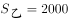米，则甲的路程：米。从出发到第三次追上，两人的时间相同，根据“时间相同，路程与速度成正比”，则。

故正确答案为B。

---

### 第 2 题　qid 2571736 · 数学运算

已知1立方米可燃冰可转化为164立方米的天然气和0.8立方米的水。现完成一定量的可燃冰转化后，产生的水比可燃冰体积减小了22立方米。问转化过程总共产生多少立方米天然气？

- **A**. 少于1.6万
- **B**. 1.6万～1.7万之间
- **C**. 1.7万～1.8万之间
- **D**. 多于1.8万　✅

**答案**：D

**官方解析**

方法一：1立方米可燃冰可产生水的体积比可燃冰的体积少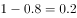立方米，现产生的水比可燃冰体积减小了22立方米，则所用可燃冰立方米。110立方米可燃冰产生的天然气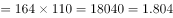万立方米，在D项范围内。

方法二：1立方米可燃冰可产生0.8立方米的水，则可燃冰和水的体积之比为，现产生的水比可燃冰体积减小了22立方米，可燃冰体积与水的体积比仍是5：4，体积相差1份，1份立方米，可燃冰体积5份立方米，则产生的天然气体积万立方米，在D项范围内。

故正确答案为D。

---

### 第 3 题　qid 2571739 · 数学运算

某集团旗下有量贩式超市和便民小超市两种门店，集团统一采购的A商品在量贩式超市和便民小超市的单件售价分别为12元和13.5元。4月份A商品在两种门店分别售出了600件和400件，共获利5000元，问该商品进价为多少元？

- **A**. 7.2
- **B**. 7.6　✅
- **C**. 8.0
- **D**. 8.4

**答案**：B

**官方解析**

方法一：设该商品进价为元，则量贩式超市每件的利润为元，便民小超市每件的利润为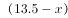元，4月份分别卖出600件和400件，共获利5000元，则，解得。

方法二：极端思维解题。便民小超市比量贩式超市每件多赚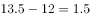元，所以400件多赚元。假设便民超市每件也按12元出售，则1000件的总利润应为元，每件商品的利润是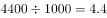元，则进价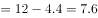元。

故正确答案为B。

---

### 第 4 题　qid 2571747 · 数学运算

马拉松组委会在赛道中设置18个水站，将赛道平均分为19段。送水车下午14：00从起点出发匀速行驶，每到一个站点停1分钟时间卸下瓶装水，到达终点之后原速返回起点且不再停站。已知14：27，送水车卸完第9个站的瓶装水，问如果其到达终点后立刻返回，什么时间能重新回到起点？

- **A**. 15：30
- **B**. 15：32
- **C**. 15：34　✅
- **D**. 15：36

**答案**：C

**官方解析**

根据题目信息可知从14：00到14：27总共走过9段并且卸水9次，共耗时27分钟。因每次卸水时间都是1分钟，卸水9次共9分钟，可知走一段的时间应该是分钟。因“到达终点之后原速返回起点且不再停站”，即总共需要走段，并且卸水18次，所以分钟1小时34分钟。因下午14：00出发，经过1小时34分钟，可知15：34重新回到起点。

故正确答案为C。

---

### 第 5 题　qid 2571759 · 数学运算

由于改良了种植技术，农场2017年种植的A和B两种作物，产量分别增加了和。已知2017年两种作物总产量增加了，问2017年A和B两种作物的产量比为：

- **A**. 7：8
- **B**. 8：7
- **C**. 176：175
- **D**. 77：100　✅

**答案**：D

**官方解析**

方法1：设2016年A、B作物的产量分别为和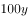，根据题意可知，2017年A作物产量为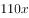，B作物产量为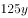，两种作物总产量为；则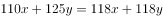，化简可得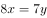，所以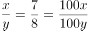，则2017年A、B作物产量之比为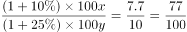。

方法2：根据2017年A、B作物产量分别增加和，而总产量增加，可以考虑使用线段法进行解答。设2016年A、B作物的产量分别为和，根据距离和量成反比，可知，可得2016年A、B作物产量之比为7：8，则2017年A、B作物产量之比为。

故正确答案为D。

---

### 第 6 题　qid 2571768 · 数学运算

一个半圆形拱门的宽和高分别为8米和4米，一辆货车拉着宽4.8米、每层高20厘米的泡沫板通过该拱门。如果车斗底部与地面的垂直距离为1.1米，问要通过拱门，每次最多可以装载几层泡沫板?

- **A**. 9
- **B**. 10　✅
- **C**. 11
- **D**. 12

**答案**：B

**官方解析**

货物与拱门接触时承载层数最多，此时如图所示，记拱门圆心为O点。A点为货车与拱门接触点，过A点作地面的垂线，垂足为C点，则三角形OAC为直角三角形。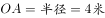，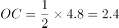米。根据勾股定理得米。那么货物最高为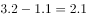米。最多可承载层数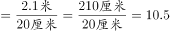，因此最多可载层数为10。

故正确答案为B。

---

### 第 7 题　qid 2571773 · 数学运算

公司2017年每个月的销售额都比上个月高万元。其9月的销售额是1月的2倍，11月的销售额为900万元。问该公司2017年全年的销售额是多少万元?

- **A**. 7200
- **B**. 7650
- **C**. 8100　✅
- **D**. 8550

**答案**：C

**官方解析**

根据“某公司2017年每个月的销售额都比上个月高万元。”可知每个月的销售额成等差数列，公差为。设首项为，根据等差数列公式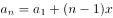。得

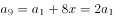，

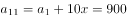，

解得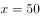，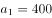。

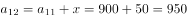

根据等差数列求和公式。

则公司2017年全年的销售额是8100万元。

故正确答案为C。

---

### 第 8 题　qid 2571791 · 数学运算

在ATM机上输入银行卡密码时，若连续三次输入错误则会吞卡，老李忘了银行卡密码的末两位数，只记得是两个不相同的奇数，若他在末两位上随意输入两个不同奇数，能在吞卡前猜中正确密码的概率是：

- **A**. 
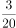
　✅
- **B**. 

- **C**. 

- **D**. 

**答案**：A

**官方解析**

奇数为1、3、5、7、9，共五个，总情况数为从5个奇数中选择两个不同奇数，共种。三次尝试有一次猜中即可。分类讨论：第一次猜中的概率为；第一次猜错第二次猜中的概率为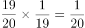；前两次均错第三次猜中的概率为。则能在吞卡前猜中的概率为。

故正确答案为A。

---

### 第 9 题　qid 2571800 · 数学运算

有2张的正方形红纸，3张的正方形黄纸，2张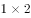的长方形绿纸，所有的纸均颜色均匀。现在将这些纸全部不重叠地贴到一张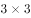的正方形白纸上，要求最后的图案为轴对称图形。问总共能贴出多少种满足要求的图案（旋转后重合的图案视为同一种）?

- **A**. 11
- **B**. 10　✅
- **C**. 5
- **D**. 4

**答案**：B

**官方解析**

（1）两个长方形关于正方形横轴或竖轴对称：共4种。（先贴两个的长方形绿纸横轴或竖轴对称，再贴两个的正方形红纸横轴或竖轴对称，有4种，最后贴黄纸即可。）

注：因为旋转后重合的图案视为同一种，此处可视作竖轴对称，也可认为是横轴对称。

（2）两个长方形关于正方形对角线对称但不相邻：共4种。（先贴两个的长方形绿纸关于正方形对角线对称但不相邻，再贴两个的正方形红纸对角线对称，有4种，最后贴黄纸即可。）

（3）两个长方形关于正方形对角线对称且相邻：共2种。（先贴两个的长方形绿纸关于正方形相邻对角线对称，再贴两个的正方形红纸对角线对称，有2种，最后贴黄纸即可。）

一共10种情况。

故正确答案为B。

---

### 第 10 题　qid 2571802 · 数学运算

甲、乙两个工程队共同完成某项工程需要12天，其中甲单独完成需要20天。现8月15日开始施工，由甲工程队先单独做5天，然后甲、乙两个工程队合作3天，剩下的由乙工程队单独完成，问工程完成的日期是：

- **A**. 9月5日
- **B**. 9月6日　✅
- **C**. 9月7日
- **D**. 9月8日

**答案**：B

**官方解析**

甲、乙共同完成需要12天，甲单独完成需要20天，赋值总的工程量为60，甲、乙的效率和为，甲的效率为，故乙的效率为，甲先做5天完成了的工作量，甲、乙合作3天完成了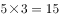的工作量，剩余的工作量，乙单独完成剩余工作量需要天，完成此项工程一共需要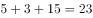天，8月15日开始，8月干了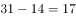天，故9月还需要6天，完工日期为9月6日。

故正确答案为B。

---

## 判断推理

### 第 1 题　qid 2571740 · 图形推理

从所给的四个选项中，选择最合适的一个填入问号处，使之呈现一定的规律性：

- **A**. A
- **B**. B
- **C**. C　✅
- **D**. D

**答案**：C

**官方解析**

元素组成不同，无明显属性规律，考虑数量规律。题干每幅图都是由直线构成，且线条交叉明显，优先考虑数交点。第一组图交点数分别为3、5、7；第二组图应用此规律，交点数依次为3、5、？，故？处应该选择一个交点数为7的图形。A、B、C、D四项中图形的交点数分别为5、10、7、6，只有C项符合。
故正确答案为C。

---

### 第 2 题　qid 2571749 · 图形推理

从所给的四个选项中，选择最合适的一个填入问号处，使之呈现一定的规律性：

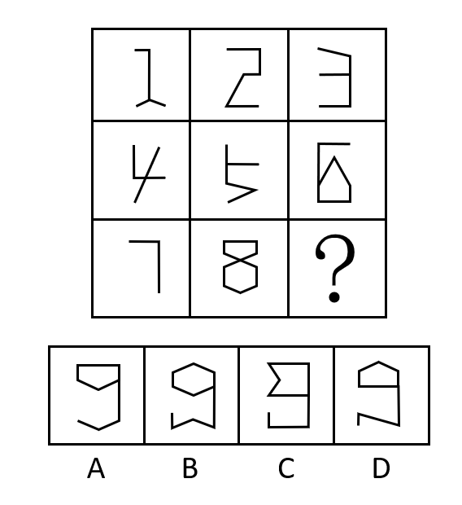

- **A**. A
- **B**. B
- **C**. C
- **D**. D　✅

**答案**：D

**官方解析**

元素组成不同，无明显属性规律，考虑数量规律。题干每幅图都是由直线构成，存在直线相交且出现明显的直角，优先考虑数直角数。九宫格优先看横行，第一行中，三个图形的直角数分别为1、2、3；经验证，第二行中，三个图形的直角数分别为1、2、3；第三行前两个图形的直角数分别为1、2，故第三行应用此规律， “？”处应选择一个直角数为3的图形。A、B、C、D四项图形中的直角数分别为2、0、5、3，只有D项符合。

故正确答案为D。

---

### 第 3 题　qid 2571755 · 图形推理

把下面的六个图形分为两类，使每一类图形都有各自的共同特征或规律，分类正确的一项是：

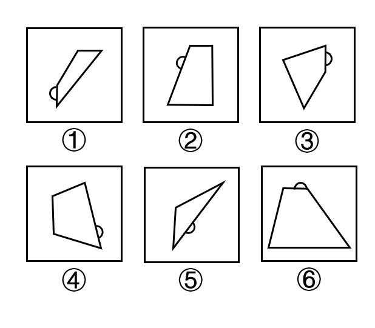

- **A**. ①②⑤，③④⑥
- **B**. ①③⑥，②④⑤　✅
- **C**. ①③④，②⑤⑥
- **D**. ①②④，③⑤⑥

**答案**：B

**官方解析**

本题为分组分类题目。观察发现，每个图形都由一个小半圆和一个多边形组成，考虑功能元素的标记作用。观察发现，每个小半圆都在多边形的一条边上，图①③⑥中小半圆是在多边形的最短边上，图②④⑤中小半圆是在多边形的最长边上。即图①③⑥一组，图②④⑤一组。
故正确答案为B。

---

### 第 4 题　qid 2571760 · 图形推理

左边给定的是纸盒的外表面，下面哪一项能由它折叠而成？

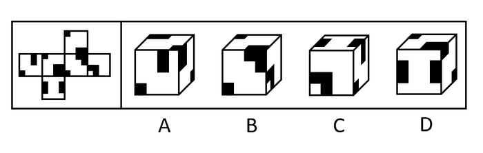

- **A**. A
- **B**. B　✅
- **C**. C
- **D**. D

**答案**：B

**官方解析**

将原展开图标上序号如下图，逐一进行分析。

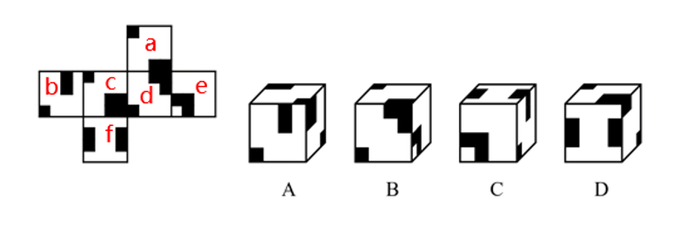

A项：选项中出现了面b、面c和面a，其中面b与面c有公共边（如下图中蓝边所示），选项中的公共边挨着面c的大黑块，展开图中的公共边挨着面c的小黑块，选项与题干不一致，排除；

B项：选项与题干一致，当选；

C项：选项中出现了面e、面b和面f，其中面b与面f有公共边（如下图中蓝边所示），选项中的公共边挨着面b的长黑块，展开图中的公共边挨着面b的小黑块，选项与题干不一致，排除；

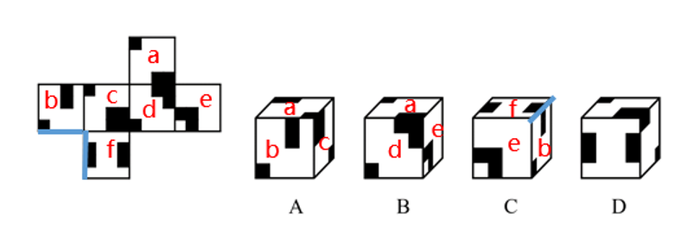

D项：选项中出现了面f、面a和面c，其中面f和面a是相对面，相对面不能同时出现，选项与题干不一致，排除。

故正确答案为B。

---

### 第 5 题　qid 2571762 · 图形推理

下面给定的立体图形，将其从任一面切开，截面的边数不可能是：

- **A**. 10
- **B**. 5
- **C**. 4
- **D**. 3　✅

**答案**：D

**官方解析**

本题考查截面图，逐一分析选项。

A项：横切下半部分即可切出十边形；

B项：横切上半部分即可切出五边形；

C项：斜切下半部的任意一个角即可切出四边形；

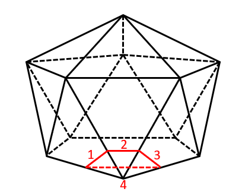

D项：无法切出三角形。

本题为选非题，故正确答案为D。

---

### 第 6 题　qid 2571770 · 定义判断

创造过程中的类比包括直接类比和拟人类比。直接类比是指从自然界的现象中或人类社会已有的发明成果中寻找与创造对象相类似的事物，并通过比较启发出创造性设想的一种方法。拟人类比是指把创造发明的对象人格化，假如自己是该对象时，在该种情况下会如何办的一种方法。
根据上述定义，下列属于直接类比的是：

- **A**. 为了更好地统治百姓，古代帝王号称“真龙天子”，并把龙绣在衣服和旗帜上
- **B**. 模仿沙丘的形状改进飞机发动机的燃烧器，发明了“沙丘驻涡火焰稳定器”　✅
- **C**. 模拟人的动作设计机械人
- **D**. 用拳头表示努力加油

**答案**：B

**官方解析**

第一步：找出定义关键词。
直接类比：“从自然界的现象中或人类社会已有的发明成果中寻找与创造对象相类似的事物”、“通过比较启发出创造性设想”；
拟人类比：“把创造发明的对象人格化，假如自己是该对象时，在该种情况下会如何办”。
第二步：逐一分析选项。
A项：古代帝王号称“真龙天子”，并把龙绣在衣服和旗帜上，“龙”不符合“从自然界的现象中或人类社会已有的发明成果中寻找与创造对象相类似的事物”，不符合“直接类比”定义，排除；
B项：模仿沙丘的形状改进飞机发动机的燃烧器，“沙丘”符合“从自然界的现象中寻找与创造对象相类似的事物”，发明了“沙丘驻涡火焰稳定器”符合“通过比较启发出创造性设想”，符合“直接类比”定义，当选；
C项：模拟人的动作设计机械人，不符合“从自然界的现象中或人类社会已有的发明成果中寻找与创造对象相类似的事物”，不符合“直接类比”定义，排除；
D项：用拳头表示努力加油，不符合“从自然界的现象中或人类社会已有的发明成果中寻找与创造对象相类似的事物”，不符合“直接类比”定义，排除。
故正确答案为B。

---

### 第 7 题　qid 2571771 · 定义判断

功能是事物内部固有的效能，它是由事物内部要素结构所决定的，是一种内在与事物内部相对稳定独立的机制。作用是事物与外部环境发生关系时所产生的外部效应。
根据上述定义，下列说法正确的是：

- **A**. 汽车具有运输的功能　✅
- **B**. 脾具有造血、滤血、清除衰老血细胞等作用
- **C**. 法具有促进科技文化事业进步的功能
- **D**. 手机具有通讯的作用

**答案**：A

**官方解析**

第一步：找出定义关键词。
功能：“事物内部固有的效能”、“由事物内部要素结构所决定的”；
作用：“事物与外部环境发生关系时所产生的外部效应”。
第二步：逐一分析选项。
A项：运输是汽车固有的效能，由汽车的内部要素结构所决定，所以运输是汽车的功能，符合定义，当选；
B项：造血、滤血、清除衰老血细胞，是脾固有的效能，不是外部效应，属于脾的功能，不是作用，不符合定义，排除；
C项：法促进科技文化事业进步，是法与外部科技文化事业发生关系时所产生的，属于法的作用，不是功能，不符合定义，排除；
D项：通讯是手机固有的效能，并不是手机与外部发生关系时所产生的，属于手机的功能，不是作用，不符合定义，排除。
故正确答案为A。

---

### 第 8 题　qid 2571778 · 定义判断

注意力经济是指通过最大限度地吸引用户或消费者的注意力，培养潜在的消费群体，以期获得最大的未来商业利益的经济模式。
根据上述定义，下列不属于注意力经济的是：

- **A**. 一服装企业以高薪聘请某知名度很高的歌星做代言人
- **B**. 奥运会期间，某商业银行推出一款以奥运为主题的信用卡
- **C**. 一饮料生产企业斥巨资获得国内某高收视率选秀节目的冠名权
- **D**. 某手机制造商大量投入研发经费，用以提升产品的用户体验　✅

**答案**：D

**官方解析**

第一步：找出定义关键词。
“最大限度地吸引用户或消费者的注意力”、“培养潜在的消费群体”、“获得最大的未来商业利益”。
第二步：逐一分析选项。
A项：服装企业聘请某知名度很高的歌星做代言人，可以利用歌星的知名度吸引用户和消费者的注意力，符合“最大限度地吸引用户或消费者的注意力”、“培养潜在的消费群体”，符合定义，排除；
B项：某商业银行推出一款以奥运为主题的信用卡，可以在奥运会期间吸引用户和消费者的注意力，符合“最大限度地吸引用户或消费者的注意力”、“培养潜在的消费群体”，符合定义，排除；
C项：饮料生产企业斥巨资获得国内某高收视率选秀节目的冠名权，可以利用选秀节目吸引用户和消费者的注意力，符合“最大限度地吸引用户或消费者的注意力”、“培养潜在的消费群体”，符合定义，排除；
D项：手机制造商大量投入研发经费，是为了提升产品的用户体验，是针对顾客使用产品的阶段进行的，不符合“培养潜在的消费群体”，不符合定义，当选。
本题为选非题，故正确答案为D。

---

### 第 9 题　qid 2571781 · 定义判断

遵循所含微粒性质的不同，化学物质分为纯净物与混合物。纯净物是由一种物质组成的，又包括单质和化合物。单质是由同种元素组成的纯净物，化合物是由不同元素组成的纯净物。混合物是由两种或多种物质混合而成的，这些物质相互间没有发生化学反应，各物质都保持原来的性质。
根据上述定义，下列说法正确的是：

- **A**. 白磷和红磷都是化合物
- **B**. 铁矿是单质
- **C**. 氯化钠是纯净物　✅
- **D**. 冰水混合物是混合物

**答案**：C

**官方解析**

第一步：找出定义关键词。
纯净物：“纯净物是由一种物质组成的”；
单质：“是由同种元素组成的纯净物”；
化合物：“是由不同元素组成的纯净物”；
混合物：“是由两种或多种物质混合而成的”。
第二步：逐一分析选项。
A项：白磷和红磷都是由同种磷元素组成的，他们是单质，不是化合物，排除；
B项：铁矿中含有铁的多种化合物以及一些岩石、沉积物，是由多种物质混合而成的，是混合物，不是单质，排除；
C项：氯化钠，是由一种物质组成的纯净物，符合定义，当选；
D项：冰和水虽然存在状态不同，但都是由同一物质水分子组成，所以冰水混合物是纯净物，不是混合物，排除。
故正确答案为C。

---

### 第 10 题　qid 2571786 · 定义判断

论据通常可分为事实性论据和理论性论据两种。事实性论据是指用来证明论点的事例、史实和统计数据等。理论性论据是指用来证明论点的、被社会大众所接受或者公认的道理、名言、俗语等。
根据上述定义，下列论证使用了理论性论据的是：

- **A**. 
人是可以依靠自己的毅力克服困难，走向成功的。尽管命运让贝多芬失去了听觉，但是他最终还是成为了一个伟大的作曲家

- **B**. 
一项研究发现，人平均每隔十分钟就要撒一次谎。所以在我们的日常生活中，没有不撒谎的人，只是谎言有大有小罢了

- **C**. 
只要有恒心，就没有做不成的事情。愚公锲而不舍地挖掘太行、王屋二山，他的精神感动了神灵，终于将山移走

- **D**. 
爱迪生曾说过：“天才是的汗水加上的灵感。”因此要想成功，后天的努力至关重要
　✅

**答案**：D

**官方解析**

第一步：找出定义关键词。

事实性论据：“指用来证明论点的事例、史实和统计数据等”；

理论性论据：“指用来证明论点的、被社会大众所接受或者公认的道理、名言、俗语等”。

第二步：逐一分析选项。

A项：贝多芬失去了听觉却依然成为了一个伟大的作曲家，属于“用来证明论点的事例”，符合“事实性依据”定义，不符合“理论性依据”定义，排除；

B项：一项研究发现，人平均每隔十分钟就要撒一次谎，属于“用来证明论点的统计数据”，符合“事实性依据”定义，不符合“理论性依据”定义，排除；

C项：愚公锲而不舍地挖掘太行、王屋二山，他的精神感动了神灵，终于将山移走，属于“用来证明论点的事例”，符合“事实性依据”定义，不符合“理论性依据”定义，排除；

D项：爱迪生曾说过：“天才是的汗水加上的灵感”，属于“用来证明论点的、被社会大众所接受或者公认的道理、名言、俗语等”，符合“理论性依据”定义，当选。

故正确答案为D。

---

### 第 11 题　qid 2571712 · 类比推理

飞机：汽车

- **A**. 电瓶车：自行车
- **B**. 脚踏三轮车：摩托车
- **C**. 高铁：有轨电车　✅
- **D**. 轮船：皮划艇

**答案**：C

**官方解析**

第一步：判断题干词语间逻辑关系。
题干“飞机”与“汽车”均为交通工具，为并列关系，并且动力来源一致，均为发动机。
第二步：判断选项词语间逻辑关系。
A项：“电瓶车”与“自行车”均为交通工具，为并列关系，但是“电瓶车”的动力来源是电力，“自行车”的动力来源是人力，动力来源不一致，与题干逻辑关系不一致，排除；
B项：“脚踏三轮车”与“摩托车”均为交通工具，为并列关系，但是“脚踏三轮车”的动力来源是人力，“摩托车”的动力来源是发动机，动力来源不一致，与题干逻辑关系不一致，排除；
C项：“高铁”与“有轨电车”均为交通工具，为并列关系，并且动力来源均为电动机，动力来源一致，与题干逻辑关系一致，当选；
D项：“轮船”与“皮划艇”均为水上交通工具，为并列关系，但是“轮船”的动力来源是涡轮机和蒸汽机，“皮划艇”的动力来源是人力，动力来源不一致，与题干逻辑关系不一致，排除。
故正确答案为C。

---

### 第 12 题　qid 2571713 · 类比推理

正误：是非

- **A**. 优劣：贵贱
- **B**. 爱憎：情仇
- **C**. 卑微：渺小
- **D**. 成败：胜负　✅

**答案**：D

**官方解析**

第一步：判断题干词语间逻辑关系。
“正误”和“是非”都表示事物的对错，二者为近义词，并且“正”与“误”是反义，“是”与“非”是反义。
第二步：判断选项词语间逻辑关系。
A项：“优劣”表示事物的好坏，“贵贱”表示富贵与贫贱，二者不是近义词，与题干逻辑关系不一致，排除；
B项：“爱憎”表示好恶，“情仇”表示情感与仇恨，二者不是近义词，与题干逻辑关系不一致，排除；
C项：“卑微”表示卑贱微小，地位低下，“渺小”表示非常微小，或完全无关紧要，二者是近义词，但是“卑”和“微”不是反义词，与题干逻辑关系不一致，排除；
D项：“成败”表示成功与失败，“胜负”表示胜利与失败，二者是近义词，并且“成”与“败”是反义，“胜”与“负”是反义，与题干逻辑关系一致，当选。
故正确答案为D。

---

### 第 13 题　qid 2571714 · 类比推理

平板版画：铜板版画

- **A**. 单色版画：佛教版画　✅
- **B**. 石板版画：木板版画
- **C**. 现代版画：传统版画
- **D**. 凹版版画：凸版版画

**答案**：A

**官方解析**

第一步：判断题干词语间逻辑关系。
有的平板版画是铜板版画，有的平板版画不是铜板版画，并且有的铜板版画是平板版画，有的铜板版画不是平板版画，二者为交叉关系。
第二步：判断选项词语间逻辑关系。
A项：有的单色版画是佛教版画，有的单色版画不是佛教版画，有的佛教版画是单色版画，有的佛教版画不是单色版画，二者为交叉关系，与题干逻辑关系一致，当选；
B项：石板版画和木板版画，二者是并列关系，与题干逻辑关系不一致，排除；
C项：现代版画和传统版画，二者是并列关系，与题干逻辑关系不一致，排除；
D项：凹版版画和凸版版画，二者是并列关系，与题干逻辑关系不一致，排除。
故正确答案为A。

---

### 第 14 题　qid 2571716 · 类比推理

战：斗：战斗

- **A**. 欢：迎：欢迎
- **B**. 学：习：学习　✅
- **C**. 勤：劳：勤劳
- **D**. 发：行：发行

**答案**：B

**官方解析**

第一步：判断题干词语间逻辑关系。
“战”有“战争、战斗”之意，“斗”有“对打、争胜”之意，二者构成近义关系，且可组成词语“战斗”。
第二步：判断选项词语间逻辑关系。
A项：“欢”的意思是“快乐、高兴”，“迎”的意思是“迎接”，二者不是近义关系，与题干逻辑关系不一致，排除；
B项：“学”的意思是“学习、模仿”，“习”的意思是“学习、复习”，二者构成近义关系，且可组成词语“学习”，与题干逻辑关系一致，当选；
C项：“勤”的意思是“尽力多做或不断地做”，“劳”的意思是“劳动、烦劳、疲劳“，二者不是近义关系，与题干逻辑关系不一致，排除；
D项：“发”的意思是“送出、交付、产生”，“行”的意思是“走、路程、旅行、做”，二者不是近义关系，与题干逻辑关系不一致，排除。
故正确答案为B。

---

### 第 15 题　qid 2571718 · 类比推理

典当：贷款：融资

- **A**. 买入：卖出：交易
- **B**. 水运：空运：运输　✅
- **C**. 望诊：闻诊：问诊
- **D**. 起跑：冲刺：赛跑

**答案**：B

**官方解析**

第一步：判断题干词语间逻辑关系。
典当是以财物作质押，有偿有期借贷融资的一种方式，贷款是银行或其他金融机构按一定利率和必须归还等条件出借货币资金的一种信用活动形式，都是不同的融资方式，故二者是并列关系，和融资是包容关系中的种属关系。
第二步：判断选项词语间逻辑关系。
A项：买入和卖出是整个交易过程中的不同阶段，二者是并列关系，但是和交易是组成关系，与题干逻辑关系不一致，排除；
B项：水运和空运是不同的运输方式，二者是并列关系，且和运输是种属关系，与题干逻辑关系一致，当选；
C项：望诊、闻诊和问诊，三者构成并列关系，与题干逻辑关系不一致，排除；
D项：起跑和冲刺是整个赛跑过程中的不同阶段，二者是并列关系，但是和赛跑是组成关系，与题干逻辑关系不一致，排除。
故正确答案为B。

---

### 第 16 题　qid 2571720 · 类比推理

超速：追尾：处罚

- **A**. 高温：自燃：追责　✅
- **B**. 购票：乘车：出行
- **C**. 谨慎：寡言：冷落
- **D**. 勤政：声望：爱戴

**答案**：A

**官方解析**

第一步：判断题干词语间逻辑关系。
超速可能会导致追尾，追尾可能会导致被处罚，二者均为因果关系。
第二步：判断选项词语间逻辑关系。
A项：高温可能会导致自燃，自燃可能会导致被追责（注：在高温下，汽车自燃了，如果被检查出汽车本身就有质量问题，是可以追究厂家的责任），二者均为因果关系，与题干逻辑关系一致，当选；
B项：先购票，再乘车，二者是动作先后顺序，而非因果关系，与题干逻辑关系不一致，排除；
C项：谨慎是指对外界事物或自己的言行密切注意；寡言是指很少说话，不爱说话，二者之间没有直接的因果联系，且如果谨慎最终导致的结果是被冷落，这也并不符合大众主流思维，因为谨慎是美德，与题干逻辑关系不一致，排除；
D项：因为勤政，所以可能“有”声望，而非声望，与题干逻辑关系不一致，排除。
注：本题为争议题，很多同学纠结C项和D项，认为题干的主体是人，其实不然，超速的定义是车辆的行驶速度超过法律法规规定的速度，所以超速的主体到底是车辆，还是驾驶车辆的人，从不同角度来理解，都是有道理的；
另外，从二级辨析—积极/消极的角度来看，题干和A项都是消极事件，且都是可以跟“车辆”相关的；C项因果关系并不明显； D项是积极事件，比较而言，也是A项更好；
综上所述，本题不严谨，各说各有理，备考时间有限，小粉笔不建议广大考生过多纠结争议题，主要学习本题的解题思维即可。
故正确答案为A。

---

### 第 17 题　qid 2571723 · 类比推理

足球：运动员：体育场

- **A**. 龙舟：划手：河流　✅
- **B**. 协议：国家：世贸组织
- **C**. 商品：顾客：厂家
- **D**. 葡萄：酿酒师：啤酒节

**答案**：A

**官方解析**

第一步：判断题干词语间逻辑关系。
运动员在体育场踢足球，且运动员是一个职业，体育场是踢足球的场所，三者为对应关系。
第二步：判断选项词语间逻辑关系。
A项：划手在河流划龙舟，且划手是一个职业，河流是划龙舟的场所，三者为对应关系，与题干逻辑关系一致，当选；
B项：国家在世贸组织签订协议，但国家不是一个职业，与题干逻辑关系不一致，排除；
C项：顾客在厂家购买商品，但顾客不是一个职业，与题干逻辑关系不一致，排除；
D项：酿酒师在啤酒节酿啤酒，葡萄是酿酒需要用到的原材料，与题干逻辑关系不一致，排除。
故正确答案为A。

---

### 第 18 题　qid 2571724 · 类比推理

诗人：作诗：作词

- **A**. 画家：艺术：画展
- **B**. 乐手：指挥：弹琴
- **C**. 鼓手：弹奏：作曲
- **D**. 会计：审核：做账　✅

**答案**：D

**官方解析**

第一步：判断题干词语间逻辑关系。
诗人可以作诗，也可以作词，三者为对应关系。
第二步：判断选项词语间逻辑关系。
A项：画家可以创作艺术，举办画展，与题干逻辑关系不一致，排除；
B项：乐手包括吉他手、钢琴手等，所以乐手可以弹琴，但是不指挥，指挥一般由指挥手担任，与题干逻辑关系不一致，排除；
C项：鼓手是乐队中打鼓的人，不弹奏，也不作曲，与题干逻辑关系不一致，排除；
D项：会计可以审核，也可以做账，三者为对应关系，与题干逻辑关系一致，当选。
故正确答案为D。

---

### 第 19 题　qid 2571726 · 类比推理

何首乌 对于（    ）相当于（    ）对于 星座

- **A**. 山药；北斗七星
- **B**. 淀粉；恒星
- **C**. 中药；大熊座　✅
- **D**. 植物；天文学

**答案**：C

**官方解析**

逐一代入选项。
A项：何首乌和山药是两种植物，二者为并列关系中的反对关系，北斗七星是大熊座的组成部分，而大熊座是一个星座，前后逻辑关系不一致，排除；
B项：何首乌含有淀粉，星座由恒星组成，均为包容关系中的组成关系，但词语顺序不同，前后逻辑关系不一致，排除；
C项：何首乌是一种中药，大熊座是一个星座，均为包容关系中的种属关系，前后逻辑关系一致，当选；
D项：何首乌是一种植物，二者为包容关系中的种属关系，星座是天文学的研究内容，二者为对应关系，前后逻辑关系不一致，排除。
故正确答案为C。

---

### 第 20 题　qid 2571730 · 类比推理

阳刚 对于（    ）相当于 谦恭 对于（    ）

- **A**. 男孩；女孩
- **B**. 阴柔；倨傲　✅
- **C**. 果敢；谦逊
- **D**. 外表；内心

**答案**：B

**官方解析**

逐一代入选项。
A项：阳刚指刚强，专用于形容男孩；谦恭指谦虚而有礼貌，并不专用于形容女孩，前后逻辑关系不一致，排除；
B项：阳刚指刚强，与阴柔为反义关系；谦恭指谦虚而有礼貌，倨傲形容高傲自大、傲慢的样子，二者为反义关系，前后逻辑关系一致，当选；
C项：阳刚指刚强，果敢指勇敢而有决断，二者无明显关系；谦恭指谦虚而有礼貌，谦逊指谦虚恭谨，二者为近义关系，前后逻辑关系不一致，排除；
D项：阳刚的外表，但只能用于形容男人，而谦恭的内心，无明显限制，前后逻辑关系不一致，排除。
故正确答案为B。

---

### 第 21 题　qid 2571734 · 逻辑判断

某慈善组织号召企业向受暴雨袭击的某地区捐赠帐篷。某地区为表谢意向该组织询问是哪些企业进行了捐赠。经调查，了解到以下情况：（1）四家企业都没有捐赠；（2）丁企业没有捐赠；（3）乙企业和丁企业至少有一家企业没有捐赠；（4）四家企业中确有企业捐赠。后来得知上述四种情况两种为真，两种为假。
由此可以推出：

- **A**. 甲企业没有进行捐赠
- **B**. 乙企业进行了捐赠
- **C**. 丙企业没有进行捐赠
- **D**. 丁企业进行了捐赠　✅

**答案**：D

**官方解析**

第一步：找矛盾。
（1）四家企业都没有捐赠与（4）四家企业中确有企业捐赠是矛盾关系，必有一真必有一假。已知四种情况两种为真，两种为假，可以推出（1）（4）一真一假，（2）（3）也一真一假。
第二步：看其余。
当（2）丁企业没有捐赠为真时，可知（3）乙企业和丁企业至少有一家企业没有捐赠也一定为真，但（2）（3）需满足一真一假，不符合条件，因此可以推出（2）丁企业没有捐赠只能为假，即丁企业捐赠为真，D项当选。
故正确答案为D。

---

### 第 22 题　qid 2571752 · 逻辑判断

研究人员给一群实验用的小鼠提供相同的食物，这些小鼠中有部分小鼠的下丘脑部位有不可恢复的损伤，而另一些则没有。一段时间后，研究人员发现那些下丘脑部位有损伤的小鼠出现了肥胖的症状。研究人员认为，下丘脑特定部位的损伤是导致小鼠肥胖的原因。
以下哪项如果为真，最能支持研究人员的结论？

- **A**. 下丘脑部位未损伤的那些小鼠未出现肥胖的症状　✅
- **B**. 已有相当多研究人员致力于研究小鼠脑部损伤与肥胖之间的关系
- **C**. 研究人员发现，下丘脑部位损伤的小鼠患糖尿病的比例高于正常水平
- **D**. 下丘脑部位损伤的小鼠与食用高脂饮食导致肥胖的小鼠肥胖程度相当

**答案**：A

**官方解析**

第一步：找出论点和论据。
论点：下丘脑特定部位的损伤是导致小鼠肥胖的原因。
论据：研究人员给一群实验用的小鼠提供相同的食物，这些小鼠中有部分小鼠的下丘脑部位有不可恢复的损伤，而另一些则没有。一段时间后，研究人员发现那些下丘脑部位有损伤的小鼠出现了肥胖的症状。
本题论点论据讨论的都是下丘脑特定部位的损伤和小鼠发胖之间的关系，论点论据话题一致，优先考虑补充论据进行加强。由于论据是用两组小鼠做了对比实验，但只给出了一组结果，因此优先考虑补充另外一组实验的结果。
第二步：逐一分析选项。
A项：指出下丘脑部位未损伤的小鼠未出现肥胖的症状，补充了另外一组实验的结果，与下丘脑部位有损伤的小鼠进行对比，可以加强，当选；
B项：已有相当多研究人员致力于研究小鼠脑部损伤与肥胖之间的关系，但下丘脑特定部位的损伤是否会导致小鼠肥胖尚不可知，属于不明确选项，无法加强，排除；
C项：论点说的是下丘脑特定部位损伤会导致小鼠肥胖，该项说的是下丘脑部位损伤的小鼠患糖尿病的比例高，糖尿病是血糖高，而肥胖是脂肪多，话题不一致，无法加强，排除；
D项：实验中给两组小鼠提供的是相同的食物，区别在于两组小鼠一组下丘脑特定部位有损伤，一组没有损伤，而选项说的是下丘脑部位损伤的小鼠与食用高脂饮食的小鼠肥胖程度相当，与题干无关，无法加强，排除。
故正确答案为A。

---

### 第 23 题　qid 2571761 · 逻辑判断

一项实验中，研究者对被试者进行了身体活动水平的调查，分析了他们平均每天坐着的时间。结果显示，每天坐的时间过长（超过5小时）与大脑内侧颞叶缩小密切相关，即使其他时间身体达到了很高的活动水平，也无法改变颞叶缩小的趋势。因此，久坐会对人的记忆力产生影响。
要得到上述结论，需要补充的前提是：

- **A**. 有些记忆力较差的人不常运动，更喜欢宅在家里
- **B**. 大部分帕金森患者出现记忆力的持续衰退和颞叶缩小的状况
- **C**. 大脑内侧颞叶区域包含海马回，而这一部位与记忆的形成有关　✅
- **D**. 各年龄段群体中，久坐对年轻人记忆力的影响大于中老年人

**答案**：C

**官方解析**

第一步：找出论点和论据。
论点：久坐会对人的记忆力产生影响。
论据：每天坐的时间过长（超过5小时）与大脑内侧颞叶缩小密切相关，即使其他时间身体达到了很高的活动水平，也无法改变颞叶缩小的趋势。
论点讨论的是久坐会对人的记忆力产生影响，论据讨论的是久坐会导致颞叶缩小，论点和论据话题不一致，要想加强，优先考虑搭桥，即建立“记忆”和“颞叶”之间的关系。
第二步：逐一分析选项。
A项：该项指出有些记忆力较差的人不常运动，更喜欢宅在家里，不常运动不等于久坐，不能说明久坐会对人的记忆力产生影响，不是上述论证的前提，排除；
B项：大部分帕金森患者出现记忆力的持续衰退和颞叶缩小的状况，这与久坐是否会对人的记忆力产生影响无关，不是上述论证的前提，排除；
C项：久坐会导致颞叶缩小，而大脑内侧颞叶区域包含海马回，这一部位与记忆的形成有关，所以久坐会对人的记忆力产生影响，在“记忆”和“颞叶”之间建立了联系，搭桥项，当选；
D项：该项说明久坐的确对记忆力有影响，有一定加强力度，但不是上述论证的前提，排除。
故正确答案为C。

---

### 第 24 题　qid 2571766 · 逻辑判断

早期阿尔茨海默症患者由于记忆丧失，经常处于焦虑不安的状态中。近期科研人员通过实验发现，对患有早期阿尔茨海默症的小白鼠大脑进行光感刺激能够帮其找回失去的记忆。他们指出，光感刺激有助于早期阿尔茨海默症的治疗。
以下哪项如果为真，最能支持上述论证？

- **A**. 生活在日照时间长的地区的小白鼠比接受光感刺激的实验室小白鼠患早期阿尔茨海默症的比例低
- **B**. 有些接受过光感刺激的小白鼠患上了早期阿尔茨海默症
- **C**. 如果终止光感刺激，患早期阿尔茨海默症的小白鼠症状会加重　✅
- **D**. 没有接受光感刺激的小白鼠患早期阿尔茨海默症的比例较低

**答案**：C

**官方解析**

第一步：找出论点和论据。
论点：光感刺激有助于早期阿尔茨海默症的治疗。
论据：对患有早期阿尔茨海默症的小白鼠大脑进行光感刺激能够帮其找回失去的记忆。
论点和论据讨论的话题是一致的，想加强，优先考虑补充论据，即解释原因或举例。
第二步：逐一分析选项。
A项：论点讨论的是治病，选项讨论的是患病比例，二者话题不一致，无关项，排除；
B项：有些接受过光感刺激的小白鼠患上了早期阿尔茨海默症，在一定程度上，反而说明光感刺激可能不能治疗早期阿尔茨海默症，削弱项，不能加强，排除；
C项：终止光感刺激，患早期阿尔茨海默症的小白鼠症状会加重，说明光感刺激有助于缓解和治疗早期阿尔茨海默症，补充论据进行加强，当选；
D项：没有接受光感刺激的小白鼠患病比例低，与接受光感刺激能否治病无关，不能加强，排除。
故正确答案为C。

---

### 第 25 题　qid 2571775 · 逻辑判断

主流观点认为，气候变化是人类双足行走的主要驱动力。几百万年前，非洲森林的面积开始缩减，草原面积大量增长。在树木很少的环境中，双足行走的意义很明显：站起来，能让人类祖先的视线越过生长丰茂的草，看到捕食者和猎物。因此，草原面积大量增长使得最善于站立的祖先更有可能存活，他们的基因得以传承下来。
以下哪项如果为真，最能削弱上述论证？

- **A**. 人类祖先从四腿行走到双足行走的过程中，多处身体结构发生了转变
- **B**. 在发现早期双足行走人类化石的区域，还发现了大量同时代的森林动植物化石　✅
- **C**. 新生儿表现出一些人类祖先曾经在树上居住的迹象
- **D**. 早期人类的膝关节与现代人类的膝关节惊人的相似

**答案**：B

**官方解析**

第一步：找出论点和论据。
论点：草原面积大量增长使得最善于站立的祖先更有可能存活，他们的基因得以传承下来。
论据：在树木很少的环境中，双足行走的意义很明显：站起来，能让人类祖先的视线越过生长丰茂的草，看到捕食者和猎物。
本题论点说草原面积大量增长使得最善于站立的祖先更有可能存活，他们的基因得以传承下来，论据说在树木很少的环境中，双足行走的意义很明显：站起来，能让人类祖先的视线越过生长丰茂的草，看到捕食者和猎物，两者都在说草原对人类双足行走的影响，话题一致，优先考虑削弱论点。
第二步：逐一分析选项。
A项：指出人类祖先从四腿行走到双足行走的过程中，多处身体结构发生了转变，但无法确定人类变为双足行走是否是因为草原面积增长，无法削弱，排除；
B项：指出在发现早期双足行走人类化石的区域，还发现了大量同时代的森林动植物化石，说明其实在森林时期已经有人类实现双足行走，证明不是因为草原出现才有了双足行走，削弱论点，当选；
C项：指出新生儿表现出一些人类祖先曾经在树上居住的迹象，讨论的是新生儿表现出来的迹象，而题干讨论的是人类双足行走与草原面积增长的关系，与题干话题不一致，排除；
D项：指出早期人类的膝关节与现代人类的膝关节惊人的相似，讨论的是早期人类与现代人类膝关节的特点，而题干讨论的是人类双足行走与草原面积增长的关系，与题干话题不一致，排除。
故正确答案为B。

---

### 第 26 题　qid 2571782 · 逻辑判断

如今，常有人抱怨自己很难有充足的睡眠，睡眠质量也常常不佳。一些专家认为这与现代科技的众多产物，比如长明的路灯、电视、电脑和手机有关，正是这些人造光源和电子设备产生的光扰乱了睡眠，让人们难以入睡。
以下哪项如果为真，最能支持上述结论?

- **A**. 当个体暴露在灯光下，入睡会变得比以往困难，睡眠也呈现出碎片化的状况　✅
- **B**. 现代人的昼夜节律常被工作和时差打乱，电子设备和人造光源并不是睡眠被打断的唯一原因
- **C**. 当前一些人的睡眠问题很可能不是因为睡眠总时间短，而是因为使用电脑等设备引发了一些健康问题
- **D**. 在一些没有电的农村地区，人们的平均睡眠时间比生活在城市同龄人的睡眠时间长很多

**答案**：A

**官方解析**

第一步：找出论点和论据。
论点：一些专家认为这与现代科技的众多产物，比如长明的路灯、电视、电脑和手机有关，正是这些人造光源和电子设备产生的光扰乱了睡眠，让人们难以入睡。
论据：无。
本题只有论点，没有论据，考虑补充论据，即解释人造光源和电子设备产生的光会扰乱睡眠的原因，或举例子说明人造光源和电子设备产生的光会扰乱睡眠。
第二步：逐一分析选项。
A项：指出当个体暴露在灯光下，入睡会变得比以往困难，睡眠也呈现出碎片化的状况，解释了人造光源和电子设备让人入睡困难，光会扰乱睡眠，补充论据，当选；
B项：指出现代人的昼夜节律常被工作和时差打乱，电子设备和人造光源并不是睡眠被打断的唯一原因，说明人们睡眠质量不佳还有其他原因，属他因项，无法加强，排除；
C项：指出当前一些人的睡眠问题很可能不是因为睡眠总时间短，而是因为使用电脑等设备引发了一些健康问题，讨论的是电脑等设备引发的健康问题，而题干讨论的是人造光源和电子设备产生的光与睡眠质量之间的关系，话题不一致，无法加强，排除；
D项：指出在一些没有电的农村地区，人们的平均睡眠时间比生活在城市同龄人的睡眠时间长很多，题干讨论的睡眠质量，而该项讨论的是睡眠时间，话题不一致，无法加强，排除。
故正确答案为A。

---

### 第 27 题　qid 2571788 · 逻辑判断

足迹化石虽然不能像实体化石那样保存生物完整的形态，但从足迹化石中，我们可以分析出生物大概的形态特征和行为学特征。也就是说，当直接证据缺失的时候，我们只能通过间接证据——足迹化石来推测当时的环境，反推是哪些动物留下的足迹，它们有没有复杂的动物行为等。因此，在前寒武纪到寒武纪的转折时期，足迹化石显得尤为重要。
上述结论的成立，还需基于以下哪一前提？

- **A**. 目前发现的从前寒武纪到寒武纪转折时期的足迹化石比实体化石更多
- **B**. 前寒武纪到寒武纪转折时期的足迹化石比实体化石更具有研究价值
- **C**. 目前发现的前寒武纪到寒武纪转折时期的足迹化石比其他时期稀少
- **D**. 在前寒武纪到寒武纪的转折时期，保留下来的动物实体化石十分稀少　✅

**答案**：D

**官方解析**

第一步：找出论点和论据。
论点：在前寒武纪到寒武纪的转折时期，足迹化石显得尤为重要。
论据：当直接证据缺失的时候，我们只能通过间接证据——足迹化石来推测当时的环境，反推是哪些动物留下的足迹，它们有没有复杂的动物行为等。
本题论点论据都在说，通过足迹化石来推测当时的环境和动物行为，都在讨论在某一时期足迹化石的重要性，论点论据话题一致，优先考虑补充必要条件。
第二步：逐一分析选项。
A项：指出目前发现的从前寒武纪到寒武纪转折时期的足迹化石比实体化石更多，无法确定实体化石的具体数量，不能作为题干的必要条件，不是题干论证成立的前提，排除；
B项：指出前寒武纪到寒武纪转折时期的足迹化石比实体化石更具有研究价值，但无法确定实体化石和足迹化石的数量，现存的化石是哪种，哪种化石更为重要，不能作为题干的必要条件，不是题干论证成立的前提，排除；
C项：指出目前发现的前寒武纪到寒武纪转折时期的足迹化石比其他时期稀少，但无法确定该时期实体化石的具体数量，不能作为题干的必要条件，不是题干论证成立的前提，排除；
D项：指出在前寒武纪到寒武纪的转折时期，保留下来的动物实体化石十分稀少，说明该时期实体化石作为直接证据而缺失，需要足迹化石这种间接证据，补充了题干的必要条件，当选。
故正确答案为D。

---

### 第 28 题　qid 2571792 · 逻辑判断

某城市选拔志愿者，已知情况如下：
（1）只有小红报名，小白、小黑和小花才会都跟着报名；
（2）如果小白不报名，则小黑也不报名；
（3）如果小黑不报名，则小灰也不报名；
（4）小红没报名；
（5）小灰报名了。
由此可以推出：

- **A**. 小白、小黑和小花都报名了
- **B**. 小白和小黑都报名了　✅
- **C**. 小黑和小花都报名了
- **D**. 小白和小花都报名了

**答案**：B

**官方解析**

第一步：翻译题干。

① 小白 且 小黑 且 小花小红；

② 小黑小白；

③ 小灰小黑；

④ 小红；

⑤ 小灰；

根据②③可得：⑥小灰小黑小白。

第二步：逐一分析选项。

根据⑤⑥可知，⑤是对⑥的肯前，肯前必肯后，所以得到小黑和小白都报名了；根据④①可知，④是对①的否后，否后必否前，可得到（小白且小黑且小花），再依据德摩根定律拆括号，得到小白或小黑或小花；又根据前述条件小白和小黑都报名和或关系的否一推一得到小花，即小花没报名。综上所述，小灰、小黑、小白都报名了，小花没报名，只有B项满足，当选。

故正确答案为B。

---

### 第 29 题　qid 2571794 · 逻辑判断

研究人员用X射线拍摄猕猴进食、打哈欠以及相互嘶吼时发出各种各样声音的影像。结果显示，猕猴很容易就能发出许多不同的声音，包括英语字母中最基本的5个元音。研究人员据此推测，猕猴不能说出数千个单词和完整的句子，是因为它们的大脑和人类存在差异。
以下哪项如果为真，最能支持上述研究人员的推测？

- **A**. 猕猴和类人猿的声带特征是它们无法重现人类语音的原因
- **B**. 非洲灰鹦鹉经过人类训练之后，可以说800多个单词
- **C**. 人类丰富的语言表达能力主要源于大脑中特有的高度发达的语言功能区　✅
- **D**. 利用电脑模拟猕猴讲完整的句子，每个词都比较清晰，并不难听懂

**答案**：C

**官方解析**

第一步：找出论点和论据。
论点：猕猴不能说出数千个单词和完整的句子，是因为它们的大脑和人类存在差异。
论据：猕猴很容易就能发出许多不同的声音，包括英语字母中最基本的5个元音。
本题的论点是在说猕猴大脑和人类存在差异，导致猕猴不能说数千个单词和完整的句子，论据在说猕猴能发出很多不同的声音，论点论据都是在说猕猴大脑和人类存在差异与发出声音之间的关系，论点论据话题一致，因此考虑补充论据，证明确实是猕猴大脑与人类之间的差异让猕猴不能说数千个单词和完整句子即可。
第二步：逐一分析选项。
A项：猕猴和类人猿的声带特征是它们无法重现人类语音的原因，那导致猕猴不能说数千个单词和完整句子的原因是声带特征，跟与人类大脑的差异无关，削弱论点，无法加强，排除；
B项：非洲灰鹦经过训练之后能发出声音和猕猴无关，主体不一致，无法加强，排除；
C项：人类丰富的语言表达能力主要源于大脑中特有的高度发达的语言功能区，说明语言表达能力和人类大脑特有的语言功能区相关，补充论据证明了猕猴无法说很多话的原因确实是和人脑存在差异，可以加强论点，当选；
D项：通过电脑模拟能听懂猕猴的声音，和猕猴不能说数千个单词和句子的原因无关，无法加强，排除。 
故正确答案为C。

---

### 第 30 题　qid 2571796 · 逻辑判断

某手机厂商推出一款手机的新款，与旧款相比，除续航时间大大提升以外，新款手机的其他样式与配置均未发生变化。在旧款手机与新款手机同时销售的三个月内，旧款手机的销量超过了新款手机。于是，该手机厂商得出一个结论，认为续航时间并非顾客的首要考虑因素。
以下哪项如果为真，最能削弱上述结论？

- **A**. 旧款手机的续航时间足以满足消费者的需要　✅
- **B**. 越来越多的消费者趋向于购买充电宝以延长手机的续航时间
- **C**. 消费者对新款手机的续航时间缺乏足够的认识
- **D**. 新款手机延长续航时间的同时提高了销售价格

**答案**：A

**官方解析**

第一步：找出论点和论据。
论点：续航时间并非顾客的首要考虑因素。
论据：某手机厂商推出一款手机的新款，与旧款相比，除续航时间大大提升以外，新款手机的其他样式与配置均未发生变化。在旧款手机与新款手机同时销售的三个月内，旧款手机的销量超过了新款手机。
本题的论点在说续航时间不是顾客考虑的首要因素，论据在说续航时间和手机销量的关系，因此论点论据话题一致，优先考虑否定论点，其次考虑否定论据。
第二步：逐一分析选项。
A项：指出旧款手机续航时间能满足需要，说明续航时间是在顾客首要考虑范围之内，因为能满足需求，所以购买旧款手机，否定论点，可以削弱，当选；
B项：说明有其他方式可以增加手机续航的时间，那么顾客购买手机是否首要考虑续航时间其实不清楚，属于不明确选项，无法削弱，排除；
C项：只是说明对新款手机的续航时间缺乏认识，那么认识之后是否会购买新手机，购买手机是否首要考虑续航时间也无从得知，属于不明确选项，无法削弱，排除；
D项：说明新款手机提高续航时间的同时也提高了价格，那么不买新手机是因为价格，就不是首要考虑续航时间了，加强论点，无法削弱，排除。
故正确答案为A。

---

## 资料分析

### 材料 1

        2016年国产工业机器人销量继续增长，全年累计销售29144台，较上年增长，增速较上年提升。

        从机械结构看，2016年国产多关节机器人销量首次超过万台，为11756台，增速已连续两年超过，占国产工业机器人总销量的，比上年提高12.9个百分点。坐标机器人仍是国产工业机器人销量第一的机型，2016年销售12830台，占销售总量的比重为，比上年回落3.5个百分点，连续两年占比回落。工厂用AGV机器人销量超过2100台，同比增长。并联机器人销售增长。而SCARA机器人和圆柱坐标机器人的销售则出现超过的下降。

        从应用领域看，2016年搬运与上下料仍是国产工业机器人的首要应用领域，全年销售1.65万台，同比增长，增速放缓，占国产工业机器人销售总量的；焊接和钎焊机器人销售0.51万台，同比增长；装配与拆卸机器人销售0.37万台，同比增长。此外涂层与胶封机器人的销售也实现了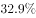的增长，特别是其中的喷漆上釉机器人销量增长了，而洁净室机器人和加工机器人的销售量均出现了同比下降。

       从应用行业看，3C行业和电气设备行业销量均超过5000台，分列第一第二位，特别是电气设备行业，同比大幅增长3倍有余。汽车行业销量同比增长；非金属矿物制品业销量同比增长。此外，在家具、服装、烟草等消费品制造行业的机器人消费量均翻番。

#### 第 1 题　qid 2571789 · 增长

2016年国产工业机器人累计销售量较上年约增加了多少万台？

- **A**. 0.20
- **B**. 0.31
- **C**. 0.42　✅
- **D**. 0.53

**答案**：C

**官方解析**

根据题干“2016年······较上年约增加······万台”，可判定本题为增长量计算问题。定位文字材料第一段，“2016······，全年累计销售29144台，较上年增长”，故2016年国产工业机器人累计销售量的同比增长量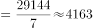台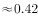万台 。

故正确答案为C。

---

#### 第 2 题　qid 2571801 · 综合

以下饼图中，最能准确反映2015年不同机械结构的国产工业机器人销量分布状况的是（白色：多关节机器人、斜线：坐标机器人、黑色：其他机器人）：

- **A**. 

- **B**. 

　✅
- **C**. 

- **D**. 

**答案**：B

**官方解析**

根据材料时间为2016年及题干“最能准确反映2015年······分布状况的是”，可判定本题为基期比重问题。定位文字材料第二段，“2016年国产多关节机器人······占国产工业机器人总销量的，比上年提高12.9个百分点。坐标机器人······占销售总量的比重为，比上年回落3.5个百分点”。可得，2015年国产多关节机器人（白色部分）占国产工业机器人总销量的比重为，坐标机器人（斜线部分）所占比重为，其他机器人（黑色部分）占比为，只有B项满足黑色部分占比为。

故正确答案为B。

---

#### 第 3 题　qid 2571805 · 比重

2016年装配与拆卸机器人销量占国产工业机器人总销量的比重比上年约：

- **A**. 下降了2个百分点
- **B**. 下降了6个百分点
- **C**. 提升了2个百分点
- **D**. 提升了6个百分点　✅

**答案**：D

**官方解析**

根据题干“2016年······占······比重比上年······”，结合选项为百分点，可判定本题为两期比重计算问题。定位文字材料第一段，“2016年国产工业机器人······，全年累计销售29144台，较上年增长”，定位文字材料第三段，“2016年······装配与拆卸机器人销售0.37万台，同比增长”。代入公式，两期比重差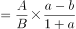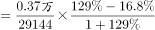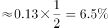，即提升了约6.5个百分点，与D项最接近。

故正确答案为D。

---

#### 第 4 题　qid 2571812 · 比重

下列指标中，2015、2016连续两年均实现增长的是：
①国产多关节机器人销量
②搬运与上下料机器人销量
③圆柱坐标机器人销量
④并联机器人销量占总销量的比例

- **A**. ​①②　✅
- **B**. ​①③
- **C**. ②④
- **D**. ③④

**答案**：A

**官方解析**

①定位文字材料第二段，“······2016年国产多关节机器人销量······增速已连续两年超过······”，可得国产多关节机器人销量2015、2016连续两年均实现增长，正确；

②定位文字材料第三段，“······2016年搬运与上下料······机器人······同比增长，增速放缓······”，即2015年增长率大于，可得搬运与上下料机器人销量2015、2016连续两年均实现增长，正确；

③定位文字材料第二段，“······圆柱坐标机器人的销售则出现超过的下降”，可得2016年圆柱坐标机器人销量下降，错误；

④定位文字材料第二段，“······并联机器人销售增长······”，材料只有2016年数据，无法得知2015年并联机器人销量占总销量的比例相比2014年的变化情况，错误。

故正确答案为A。

---

#### 第 5 题　qid 2571815 · 综合

关于2016年国产工业机器人销售状况，能够从上述资料中推出的是：

- **A**. 工厂用AGV机器人销量较上年增加了500多台
- **B**. 焊接和钎焊机器人销量占总销量的2成以上
- **C**. 3C、汽车行业销量占总销量比重均同比上升
- **D**. 电气设备行业销售增量超过3000台　✅

**答案**：D

**官方解析**

A项：定位文字材料第二段，工厂用AGV机器人销量超过2100台，同比增长。因此增长量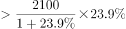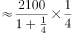台，但无法推出500多台，错误；

B项：定位文字材料第一、三段，2016年国产工业机器人······全年累计销售29144台······2016年······焊接和钎焊机器人销售0.51万台，可得焊接和钎焊机器人销量占总销量的比重为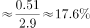，不到两成，错误；

C项：定位文字材料第一、四段，“国产工业机器人······较上年增长······3C行业和电气设备······特别是电气设备行业，同比大幅增长3倍有余”。未给出3C行业增长量（率）或者2015年销量相关的数据，故无法判定其占比变化，错误；

D项：定位文字材料第四段，“电气设备行业销量均超过5000台······特别是电气设备行业，同比大幅增长3倍有余”，可得电气设备行业销售增量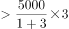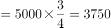台，超过3000台，正确。

故正确答案为D。

---

### 材料 2

        截至2017年底，我国共有30个省（区、市）投产了747个生物质发电项目，并网装机容量1476.2万千瓦（不含自备电厂），年发电量794.5亿千瓦时。其中农林生物质发电项目271个，累计并网装机700.9万千瓦，年发电量397.3亿千瓦时；生活垃圾焚烧发电项目339个，累计并网装机725.3万千瓦，年发电量375.2亿千瓦时；沼气发电项目137个，累计并网装机50.0万千瓦，年发电量22.0亿千瓦时。

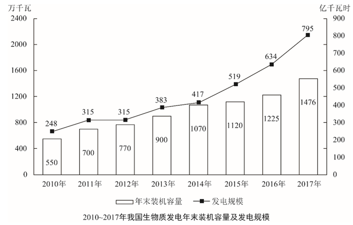

        2017年，全国生物质发电替代化石能源约2500万吨标煤，减排二氧化碳约6500万吨，农林生物质发电共计处理农林废弃物约5400万吨；垃圾焚烧发电共计处理城镇生活垃圾约10600万吨，约占全国垃圾清运量的。

#### 第 6 题　qid 2571717 · 增长

2011～2017年间，我国生物质发电年末装机容量同比增速最快的年份是：

- **A**. 2011年　✅
- **B**. 2013年
- **C**. 2014年
- **D**. 2017年

**答案**：A

**官方解析**

根据题干所求“······同比增速最快的年份是”，可判定本题为一般增长率比较问题。定位图形材料可知每一年的现期值和基期值，根据公式：增长率，代入公式可得：2011年：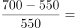；2013年：；2014年：；2017年：。

故正确答案为A。

---

#### 第 7 题　qid 2571719 · 综合

“十二五”（2011～2015年）期间，我国生物质发电总量在以下哪个范围内？

- **A**. 小于1700亿千瓦时
- **B**. 1700～2000亿千瓦时　✅
- **C**. 2000～2300亿千瓦时
- **D**. 大于2300亿千瓦时

**答案**：B

**官方解析**

定位图形材料可知“十二五”（2011-2015年）期间我国生物质发电量分别为315、315、383、417、519亿千瓦时，相加为亿千瓦时，即在1700～2000亿千瓦时之间。

故正确答案为B。

---

#### 第 8 题　qid 2571721 · 平均数

2017年平均每个农林生物质发电项目的年发电量约是沼气发电项目的多少倍？

- **A**. 3
- **B**. 5
- **C**. 9　✅
- **D**. 17

**答案**：C

**官方解析**

根据题干“2017年······是······多少倍”，结合材料中时间为2017年，可判定本题为现期倍数问题。定位文字材料第一段，其中农林生物质发电项目271个，年发电量397.3亿千瓦时；沼气发电项目137个，年发电量22.0亿千瓦时，代入平均数计算公式：平均数。每个农林生物质发电项目的年发电量；每个沼气发电项目的年发电量，所求倍数。

故正确答案为C。

---

#### 第 9 题　qid 2571725 · 比重

以下饼图中，能准确反映2017年末我国农林生物质发电项目（斜线）、生活垃圾焚烧发电项目（白色）和沼气发电项目（黑色）装机容量占全国生物质发电装机容量比重的是：

- **A**. 

　✅
- **B**. 

- **C**. 

- **D**. 

**答案**：A

**官方解析**

根据题干“以下饼图中，能准确反映2017年······占······比重的是”，结合材料中时间为2017年，可判定本题为现期比重问题。定位文字材料第一段，截至2017年底，我国共有30个省（区、市）投产了747个生物质发电项目，并网装机容量1476.2万千瓦（不含自备电厂）。其中农林生物质发电项目271个，累计并网装机700.9万千瓦；生活垃圾焚烧发电项目339个，累计并网装机725.3万千瓦；沼气发电项目137个，累计并网装机50.0万千瓦。因此，农林生物质发电项目装机容量比重为，观察图形，可排除B、D两项，同时生活垃圾焚烧发电项目装机容量大于农林生物质发电项目，故其占比也大于农林生物质发电项目，观察图形，可排除C项。

故正确答案为A。

---

#### 第 10 题　qid 2571728 · 综合

关于全国生物质发电状况，能够从上述资料中推出的是：

- **A**. 2017年全国垃圾清运量超过3亿吨
- **B**. 如用化石能源发电，每吨标煤会产生3吨以上的二氧化碳排放
- **C**. 2017年末我国生物质发电每万千瓦并网装机容量全年发电量在5000到10000千瓦时之间
- **D**. 如保持2017年同比增量不变，“十三五”（2016～2020年）生物质发电总量将超过4500亿千瓦时　✅

**答案**：D

**官方解析**

A项：定位文字材料第二段，垃圾焚烧发电共计处理城镇生活垃圾约10600万吨，约占全国垃圾清运量的，则2017年全国垃圾清运量为万吨3亿吨，错误；

B项：定位文字材料第二段，2017年，全国生物质发电替代化石能源约2500万吨标煤，减排二氧化碳约6500万吨，则每吨标煤所产生的二氧化碳排放为吨3吨，错误；

C项：定位文字材料第一段，截至2017年底，我国共有30个省（区、市）投产了747个生物质发电项目，并网装机容量1476.2万千瓦（不含自备电厂），年发电量794.5亿千瓦时。则每万千瓦并网装机容量全年发电量为亿千瓦时，不在5000-10000千瓦时之间，错误；

D项：定位图形材料，2016年生物质发电量为634亿千瓦时，2017年生物质发电量为795亿千瓦时，2017年生物质发电量增量为亿千瓦时。因此，在保持2017年同比增量不变的情况下，2018年发电量为亿千瓦时，2019年发电量为亿千瓦时，2020年发电量为亿千瓦时；2016～2020年发电总量为亿千瓦时4500亿千瓦时，正确。

故正确答案为D。

---

### 材料 3

        2017年全国海洋生产总值77611亿元，比上年增长，海洋生产总值占国内生产总值的。

        2017年，J省海洋生产总值为7217亿元，比上年增长，海洋生产总值占地区生产总值的，2017年，全省沿海沿江港口完成货物吞吐量20.4亿吨，同比增长；集装箱吞吐量1698.8万标箱，同比增长。

        2017年，J省造船完工量为1412.4万载重吨，同比下降；新承订单量为1393.4万载重吨，同比增长；手持订单量为3662.3万载重吨，同比下降，分别占全国份额的、和。

        2017年，J省沿海三市接待国内游客10558.01万人次，同比增长；接待入境过夜旅游者27.65万人次，同比增长。

        2017年，J省实现海水养殖产量93.1万吨，同比增长；海洋捕捞产量53万吨，同比下降；远洋渔业产量2.9万吨，同比增长。

        2017年，J省海工装备产值同比增长。全省沿海地区风电装机容量达到589.7万千瓦，同比增长；海上风电装机容量达到162.5万千瓦，同比增长。2017年，全省完成海水淡化产量1.31万吨，同比增长。

#### 第 11 题　qid 2571729 · 增长

2017年J省海洋生产总值同比每增长1个百分点，当年其海洋生产总值约增加：

- **A**. 66亿元　✅
- **B**. 72亿元
- **C**. 726亿元
- **D**. 776亿元

**答案**：A

**官方解析**

方法一：根据题干“2017年······约增加”，结合选项带单位，可判定本题为增长量计算问题。定位材料第二段，“2017年，J省海洋生产总值为7217亿元，比上年增长”，则2016年J省海洋生产总值亿元。故2017年J省海洋生产总值同比每增长1个百分点，当年其海洋生产总值约增加亿元，与A项最接近。

方法二：2017年J省海洋生产总值的增长量为亿元。即增长9.2个百分点对应的增长量为600亿元，则每增长1个百分点，当年其海洋生产总值约增加亿元，与A项最接近。

故正确答案为A。

---

#### 第 12 题　qid 2571732 · 比重

2017年J省海洋生产总值占全国的比重比上年：

- **A**. 上升了约0.2个百分点　✅
- **B**. 上升了约2个百分点
- **C**. 下降了约0.2个百分点
- **D**. 下降了约2个百分点

**答案**：A

**官方解析**

根据题干中“2017年······占······比重比上年”，可以判定本题为两期比重问题。定位文字材料第一段和第二段，“2017年全国海洋生产总值77611亿元，比上年增长”，“2017年，J省海洋生产总值为7217亿元，比上年增长”。代入公式，两期比重差，即上升了约0.19个百分点，与A项最接近。

故正确答案为A。

---

#### 第 13 题　qid 2571737 · 增长

2017年J省海洋经济中，以下产业增速由高到低排序正确的是：

- **A**. 沿海沿江港口完成货物吞吐量、造船业新承订单量、海上风电装机容量
- **B**. 海上风电装机容量、沿海沿江港口完成货物吞吐量、沿海三市接待国内游客数量
- **C**. 海水养殖产量、海上风电装机容量、远洋渔业产量
- **D**. 海上风电装机容量、远洋渔业产量、沿海沿江港口完成货物吞吐量　✅

**答案**：D

**官方解析**

定位文字材料可得，沿海沿江港口完成货物吞吐量增速造船业新承订单量增速，A项错误；沿海沿江港口完成货物吞吐量增速沿海三市接待国内游客数量增速，B项错误；海水养殖产量增速海上风电装机容量增速，C项错误；海上风电装机容量增速远洋渔业产量增速沿海沿江港口完成货物吞吐量增速，D项正确。

故正确答案为D。

---

#### 第 14 题　qid 2571742 · 综合

2016年J省海水养殖产量约为海洋捕捞产量的：

- **A**. 0.6倍
- **B**. 0.8倍
- **C**. 1.6倍　✅
- **D**. 1.8倍

**答案**：C

**官方解析**

根据题干“2016年······约为······的”，且选项为倍数，结合材料时间2017年，可判定本题为基期倍数问题。定位文字材料第五段，“2017年，J省实现海水养殖产量93.1万吨，同比增长；海洋捕捞产量53万吨，同比下降”，则2016年J省海水养殖产量约为海洋捕捞产量的倍。

故正确答案为C。

---

#### 第 15 题　qid 2571746 · 综合

下列选项中，能够从上述资料中推出的是：

- **A**. 2016年，J省造船工业新承订单量高于其造船完工量
- **B**. 2017年，J省海上风电装机容量占沿海地区风电装机容量的比重高于上年水平　✅
- **C**. 2017年，J省沿海三市平均每天接待入境过夜旅游者近0.8万人次
- **D**. 2017年，J省沿海沿江港口完成集装箱吞吐量较上年增长了100多万标箱

**答案**：B

**官方解析**

A项：定位材料第三段，“2017年，J省造船完工量为1412.4万载重吨，同比下降；新承订单量为1393.4万载重吨，同比增长”，则2016年J省造船完工量，2016年新承订单量，故2016年新承订单量低于其造船完工量，错误；

B项：定位材料最后一段，“2017年······全省沿海地区风电装机容量······同比增长；海上风电装机容量······同比增长”，即部分增长率，总体增长率，则。根据两期比重结论，当部分增长率总体增长率时，可判定比重上升，正确；

C项：定位材料第四段，“2017年，J省沿海三市······接待入境过夜旅游者27.65万人次，同比增长”，则2017年J省沿海三市平均每天接待入境过夜旅游者为万人次，错误；

D项：定位材料第二段，“2017年，全省沿海沿江港口完成······集装箱吞吐量1698.8万标箱，同比增长”，则2017年J省沿海沿江港口完成集装箱吞吐量较上年的增长量万，错误。

故正确答案为B。

---
