# 2020年广东省公务员录用考试《行测》试题（乡镇卷）（网友回忆版）

> 省考 · 2020 年 · 6 个模块 · 共 97 题

- [政治理论](#%E6%94%BF%E6%B2%BB%E7%90%86%E8%AE%BA) · 3 题
- [常识判断](#%E5%B8%B8%E8%AF%86%E5%88%A4%E6%96%AD) · 37 题
- [言语理解与表达](#%E8%A8%80%E8%AF%AD%E7%90%86%E8%A7%A3%E4%B8%8E%E8%A1%A8%E8%BE%BE) · 10 题
- [数量关系](#%E6%95%B0%E9%87%8F%E5%85%B3%E7%B3%BB) · 12 题
- [判断推理](#%E5%88%A4%E6%96%AD%E6%8E%A8%E7%90%86) · 20 题
- [资料分析](#%E8%B5%84%E6%96%99%E5%88%86%E6%9E%90) · 15 题

---

## 政治理论

### 第 1 题　qid 2604229 · 马克思主义

针对我国疫情防控工作，习近平总书记指出“要变压力为动力，善于化危为机”。以下典故与“善于化危为机”所蕴含的哲学原理一致的是（    ）。

- **A**. 塞翁失马，焉知非福　✅
- **B**. 绳锯木断，水滴石穿
- **C**. 千里之堤，溃于蚁穴
- **D**. 南橘北枳，便分两等

**答案**：A

**官方解析**

本题考查政治常识。唯物辩证法认为矛盾双方相互贯通，在一定条件下可以相互转化。“要变压力为动力，善于化危为机”体现了矛盾双方在一定条件下的相互转化。
A项正确，“塞翁失马，焉知非福”比喻一时虽然受到损失，反而因此能得到好处。也指坏事在一定条件下可变为好事，反之亦然。体现了矛盾双方在一定条件下可以相互转化。
B项错误，“质量互变规律”是唯物辩证法三大基本规律之一，强调量变是质变的必要准备，质变是量变的必然结果，量变超过一定限度必然引起质变，使旧质变为新质，然后在新质基础上又开始新的量变。“绳锯木断，水滴石穿”意思是用绳子也能把木头锯断，水珠滴落，天长日久也可以把石头滴穿。体现了质量互变规律。
C项错误，“千里之堤，溃于蚁穴”意思是千里长的大堤，往往因蚂蚁（白蚁）洞穴而崩溃。比喻小事不慎将酿成大祸。体现了质量互变规律。
D项错误，唯物辩证法强调内因是事物变化的根据，外因是事物变化的条件，外因通过内因而起作用。“南橘北枳，便分两等”比喻同一物种因环境条件不同而发生变异。体现了外因是事物发展的重要条件。
故正确答案为A。

---

### 第 2 题　qid 2604233 · 新思想

习近平总书记指出“不平衡是普遍的，要在发展中促进相对平衡”，这句话体现了（    ）发展理念。

- **A**. 开放
- **B**. 协调　✅
- **C**. 创新
- **D**. 共享

**答案**：B

**官方解析**

本题考查政治常识。创新、协调、绿色、开放、共享的发展理念，是管全局、管根本、管长远的导向，具有战略性、纲领性、引领性。
A项错误，开放发展注重的是解决发展内外联动问题。
B项正确，协调发展注重的是解决发展不平衡问题。“不平衡是普遍的，要在发展中促进相对平衡”体现了协调发展理念，是区域协调发展的辩证法。
C项错误，创新发展注重的是解决发展动力问题。
D项错误，共享发展注重的是解决社会公平正义问题。
故正确答案为B。

---

### 第 3 题　qid 2604243 · 新思想

中国特色社会主义制度是一个严密完整的科学制度体系，起四梁八柱作用的是根本制度、基本制度、重要制度，其中具有统领地位的是（    ）。

- **A**. 党的领导制度　✅
- **B**. 协商民主制度
- **C**. 国家监察制度
- **D**. 人民代表大会制度

**答案**：A

**官方解析**

本题考查政治常识。
2020年1月1日出版的《求是》杂志发表中共中央总书记、国家主席、中央军委主席习近平的重要文章《坚持和完善中国特色社会主义制度推进国家治理体系和治理能力现代化》。文章指出，要毫不动摇坚持和巩固中国特色社会主义制度。中国特色社会主义制度是一个严密完整的科学制度体系，起四梁八柱作用的是根本制度、基本制度、重要制度，其中具有统领地位的是党的领导制度。党的领导制度是我国的根本领导制度。
故正确答案为A。

---

## 常识判断

### 第 1 题　qid 2604231 · 法律常识

我国民法典规定，未设立村集体经济组织的，（    ）可以依法代行村集体经济组织职能。

- **A**. 村长
- **B**. 村民委员会　✅
- **C**. 村党支部
- **D**. 村民小组

**答案**：B

**官方解析**

本题考查法律常识。
根据《民法典》第一百零一条规定：“居民委员会、村民委员会具有基层群众性自治组织法人资格，可以从事为履行职能所需要的民事活动。未设立村集体经济组织的，村民委员会可以依法代行村集体经济组织的职能。”
故正确答案为B。

---

### 第 2 题　qid 2604237 · 经济常识

为有效应对新冠疫情对我国经济的影响，相关部门出台了一系列举措帮助企业复工复产。以下属于金融政策举措的是：

- **A**. 降低政府定价的货物港务费和港口设施保安费收费标准，显著降低物流运输成本
- **B**. 对中小微企业生产经营场所的用电、用水、用气实施阶段性缓缴费用，缓缴期“欠费不停供”
- **C**. 免征中小微企业三项社保的单位缴费，降低企业负担
- **D**. 引导银行加大对民营和小微企业支持的力度，保持贷款额合理增加　✅

**答案**：D

**官方解析**

本题考查经济常识。金融政策是指中央银行为实现宏观经济调控目标而采用各种方式调节货币、利率和汇率水平，进而影响宏观经济的各种方针和措施的总称。一般而言，一个国家的宏观金融政策主要包括三大政策：货币政策、利率政策和汇率政策。而财政政策是政府运用各种财政手段和措施，以实现一定时期预定的包括充分就业，物价稳定和经济增长的宏观经济目标的政策。其主要是通过财政支出与税收政策调节总需求来实现的。
A项错误，降低政府定价的货物港务费和港口设施保安费收费标准属于政府财政政策举措。
B项错误，对中小微企业生产经营场所的用电、用水、用气实施阶段性缓缴费用，缓缴期“欠费不停供”属于政府财政政策举措。
C项错误，免征中小微企业三项社保的单位缴费，降低企业负担属于政府财政政策举措。
D项正确，引导银行加大对民营和小微企业支持的力度，保持贷款额合理增加是银行运用金融政策举措保证民营和小微企业正常发展。
故正确答案为D。

---

### 第 3 题　qid 2604242 · 人文常识

打赢脱贫攻坚战、实施乡村振兴战略，需要强化科技支撑作用。以下措施属于强化科技支撑作用的是（    ）。
①完善村规民约
②支持丘陵山区农田宜机化改造
③推进相对贫困户危房改造
④建设农业科技成果转化交易平台
⑤推动复合型农业机械研发

- **A**. ①②④
- **B**. ②④⑤　✅
- **C**. ①②④⑤
- **D**. ①②③④⑤

**答案**：B

**官方解析**

本题考查政治常识。
①错误，从农村实际出发，健全完善村规民约，切实用制度管理好村民事务。进一步发挥村民自治的功能，用好村民“一事一议”制度，真正实现村民管理自身的事务。其不属于强化科技支撑作用的措施。
②正确，《国务院关于加快推进农业机械化和农机装备产业转型升级的指导意见》明确提出，推进机械化生产与农田建设相适应，重点支持丘陵山区开展农田“宜机化”改造。
③错误，推进相对贫困户危房改造是精准扶贫的措施之一，不属于强化科技支撑作用的措施。
④正确，2013年，全国农业科技成果转化交易服务平台建设正式启动，建设农业科技成果转化交易平台将提高我国农业科技成果的转化水平，使农业科技成果转化更方便、快捷而规范。
⑤正确，《国务院关于加快推进农业机械化和农机装备产业转型升级的指导意见》指出：瞄准农业机械化需求，加快推进农机装备创新，研发适合国情、农民需要、先进适用的各类农机，既要发展适应多种形式适度规模经营的大中型农机，也要发展适应小农生产、丘陵山区作业的小型农机以及适应特色作物生产、特产养殖需要的高效专用农机。因此②④⑤正确。
故正确答案为B。

---

### 第 4 题　qid 2604248 · 人文常识

党的十九届四中全会首次提出要“重视发挥第三次分配作用，发展慈善等社会公益事业”。以下属于第三次分配的是（    ）。

- **A**. 企业员工获取加班劳动报酬
- **B**. 政府向困难家庭发放低保
- **C**. 银行为家庭困难学生办理助学贷款
- **D**. 中国红十字会出资救助患病儿童　✅

**答案**：D

**官方解析**

本题考查经济常识。
A项错误，第一次分配即初次分配，是由市场按照效率原则进行、直接与生产要素相联系的分配。任何生产活动都离不开劳动力、资本、土地和技术等生产要素，在市场经济条件下，取得这些要素必须支付一定的货币，这种货币报酬就形成各要素提供者的初次分配收入。企业员工获取加班劳动报酬属于初次分配。
B、C项错误，第二次分配是由政府按照兼顾公平和效率的原则、侧重公平原则，通过税收、社会保障支出等进行的再分配，如对贫困户和灾民的救济，征收个人所得税、遗产税、赠与税等。政府向困难家庭发放低保、为家庭困难学生办理助学贷款属于第二次分配。
D项正确，第三次分配体现社会成员更高的精神追求，其是在道德、文化、习惯等影响下，社会力量自愿通过民间捐赠、慈善事业、志愿行动等方式济困扶弱的行为，是对再分配的有益补充。中国红十字会出资救助患病儿童属于第三次分配。
故正确答案为D。

---

### 第 5 题　qid 2604257 · 人文常识

产业增收是脱贫攻坚的主要途径和长久之策。以下举措不属于产业扶贫的是（    ）。

- **A**. 种植特色水果
- **B**. 开展乡村旅游
- **C**. 兴建乡村卫生站　✅
- **D**. 成立农产品产业园

**答案**：C

**官方解析**

本题考查政治常识。
A项正确，《关于实施产业扶贫三年攻坚行动的意见》指出：“（四）推进特色林产业提质增效。深入实施特色林产业扶贫行动，因地制宜发展市场需求旺盛、带贫效益较高的木本油料、特色林果、林下经济、竹藤、种苗花卉等特色林产业，加快建设特色林产品标准化生产基地，发展林下中药材、特色经济林、野生动植物繁育利用、林下种养殖等产业。”
B项正确，《关于实施产业扶贫三年攻坚行动的意见》指出：“（六）大力发展休闲农业、乡村旅游等新产业新业态。支持贫困县、贫困村依托特色农产品、农事景观、人文景观等资源，结合易地搬迁、危房改造等项目，发展休闲农业、乡村旅游、康养健身、创意农业、体验农业等多元业态，拓宽贫困群众就业增收渠道。”
C项错误，兴建乡村卫生站能够强化乡镇医疗基础设施，但不属于产业扶贫的举措。
D项正确，《关于实施产业扶贫三年攻坚行动的意见》指出：“（七）支持创建扶贫产业园。把扶贫产业园建设作为贫困地区产业扶贫和乡村产业兴旺的重要抓手，支持有条件的贫困县创建一二三产业融合的扶贫产业园。”
本题为选非题，故正确答案为C。

---

### 第 6 题　qid 2604265 · 科技常识

新冠肺炎疫情发生以来，中国始终同国际社会开展交流合作，并提出（    ）的新理念：倡导团结合作共同抗疫。

- **A**. 构建人类命运共同体
- **B**. 建立疫苗协作开发机制
- **C**. 构建人类卫生健康共同体　✅
- **D**. 建立全球治理体系

**答案**：C

**官方解析**

本题考查政治常识。
2020年5月18日，习近平主席在第73届世界卫生大会视频会议开幕式上发表致辞，呼吁各国团结合作战胜疫情，共同构建人类卫生健康共同体，提出全力搞好疫情防控、发挥世界卫生组织作用、加大对非洲国家支持、加强全球公共卫生治理、恢复经济社会发展、加强国际合作等六点建议。因此，A、B、D三项不符合题意。
故正确答案为C。

---

### 第 7 题　qid 2604270 · 地理国情

2020年4月，经国务院批准，海南省三沙市设立南沙区，南沙区人民政府驻永暑礁。以下对永暑礁的描述有误的是（    ）。

- **A**. 永暑礁位于海南省东南部
- **B**. 永暑礁位于西沙群岛　✅
- **C**. 永暑礁的气候为热带季风气候
- **D**. 永暑礁拥有丰富的渔业和矿产资源

**答案**：B

**官方解析**

本题考查地理国情。

A项正确，永暑礁是海南省三沙市南沙区政府驻地，位于海南省东南部。

B项错误，永暑礁是我国南沙群岛的一座珊瑚环礁，而不是位于西沙群岛。

C项正确，永暑礁位于北纬，东经，属于热带季风气候。

D项正确，永暑礁海域鱼类属于印度洋-太平洋热带动物区系，以珊瑚礁鱼类和热带大洋性鱼类占绝大多数，是我国海洋鱼类区系的重要组成部分；永暑礁周围海域海底蕴藏着大量矿藏，包括铁、锰、铜、镍、钴、铅、锌等数十种金属元素和沸石、珊瑚贝壳灰岩等非金属矿产，以及热液矿床。

本题为选非题，故正确答案为B。

---

### 第 8 题　qid 2604250 · 法律常识

2020年6月30日颁布的《中华人民共和国香港特别行政区维护国家安全法》是保持香港特别行政区繁荣和稳定的重要法律。以下属于该法规定处罚的罪行有（    ）。
①分裂国家罪
②颠覆国家政权罪
③恐怖活动罪
④勾结外国或者境外势力危害国家安全罪

- **A**. ①④
- **B**. ①②③
- **C**. ②③④
- **D**. ①②③④　✅

**答案**：D

**官方解析**

本题考查法律常识。
①正确，《香港特别行政区维护国家安全法》第二十条第一款规定：“任何人组织、策划、实施或者参与实施以下旨在分裂国家、破坏国家统一行为之一的，不论是否使用武力或者以武力相威胁，即属犯罪：（一）将香港特别行政区或者中华人民共和国其他任何部分从中华人民共和国分离出去；（二）非法改变香港特别行政区或者中华人民共和国其他任何部分的法律地位；（三）将香港特别行政区或者中华人民共和国其他任何部分转归外国统治。”这是该法关于分裂国家罪的规定。
②正确，《香港特别行政区维护国家安全法》第二十二条第一款规定：“任何人组织、策划、实施或者参与实施以下以武力、威胁使用武力或者其他非法手段旨在颠覆国家政权行为之一的，即属犯罪：（一）推翻、破坏中华人民共和国宪法所确立的中华人民共和国根本制度；（二）推翻中华人民共和国中央政权机关或者香港特别行政区政权机关；（三）严重干扰、阻挠、破坏中华人民共和国中央政权机关或者香港特别行政区政权机关依法履行职能；（四）攻击、破坏香港特别行政区政权机关履职场所及其设施，致使其无法正常履行职能。”这是该法关于颠覆国家政权罪的规定。
③正确，《香港特别行政区维护国家安全法》第二十四条第一款规定：“为胁迫中央人民政府、香港特别行政区政府或者国际组织或者威吓公众以图实现政治主张，组织、策划、实施、参与实施或者威胁实施以下造成或者意图造成严重社会危害的恐怖活动之一的，即属犯罪：（一）针对人的严重暴力；（二）爆炸、纵火或者投放毒害性、放射性、传染病病原体等物质；（三）破坏交通工具、交通设施、电力设备、燃气设备或者其他易燃易爆设备；（四）严重干扰、破坏水、电、燃气、交通、通讯、网络等公共服务和管理的电子控制系统；（五）以其他危险方法严重危害公众健康或者安全。”这是该法关于恐怖活动罪的规定。
④正确，《香港特别行政区维护国家安全法》第二十九条第一款规定：“为外国或者境外机构、组织、人员窃取、刺探、收买、非法提供涉及国家安全的国家秘密或者情报的；请求外国或者境外机构、组织、人员实施，与外国或者境外机构、组织、人员串谋实施，或者直接或者间接接受外国或者境外机构、组织、人员的指使、控制、资助或者其他形式的支援实施以下行为之一的，均属犯罪：（一）对中华人民共和国发动战争，或者以武力或者武力相威胁，对中华人民共和国主权、统一和领土完整造成严重危害；（二）对香港特别行政区政府或者中央人民政府制定和执行法律、政策进行严重阻挠并可能造成严重后果；（三）对香港特别行政区选举进行操控、破坏并可能造成严重后果；（四）对香港特别行政区或者中华人民共和国进行制裁、封锁或者采取其他敌对行动；（五）通过各种非法方式引发香港特别行政区居民对中央人民政府或者香港特别行政区政府的憎恨并可能造成严重后果。”这是该法关于勾结外国或者境外势力危害国家安全罪的规定。
故正确答案为D。

---

### 第 9 题　qid 2604261 · 地理国情

2020年7月23日，“天问一号”深空探测器在海南文昌发射成功，大约9个月后，“天问一号”将在（    ）表面着陆，标志着我国正式开启行星探测时代。

- **A**. 月球
- **B**. 火星　✅
- **C**. 金星
- **D**. 木星

**答案**：B

**官方解析**

本题考查科技常识。
2020年7月23日12时41分，我国在海南文昌航天发射场用长征五号遥四运载火箭，将我国首颗火星探测器 “天问一号”成功发射升空，任务取得圆满成功。此次是我国完全自主实施的火星探测任务，标志着我国行星探测的大幕正式拉开。因此，A、C、D三项均不符合题意，排除。
故正确答案为B。

---

### 第 10 题　qid 2604278 · 人文常识

乡村文化繁荣兴盛重大工程包括“农耕文化保护传承”，以下诗句最能体现农耕文化保护传承的是（    ）。

- **A**. 谁知盘中餐，粒粒皆辛苦　✅
- **B**. 离离原上草，一岁一枯荣
- **C**. 尧有欲谏之鼓，舜有诽谤之木
- **D**. 山重水复疑无路，柳暗花明又一村

**答案**：A

**官方解析**

本题考查政治常识。走中国特色社会主义乡村振兴道路，必须传承发展提升农耕文明，走乡村文化兴盛之路。
A项正确，“谁知盘中餐，粒粒皆辛苦”出自唐代诗人李绅的《悯农·其二》。其描绘了在烈日当空的正午农民田里劳作的景象，概括地表现了农民终年辛勤劳动的生活，表达了诗人对农民真挚的同情之心。
B项错误，“离离原上草，一岁一枯荣”出自唐代诗人白居易的《赋得古原草送别》。作者用叠字“离离”描写春草的茂盛，第二句“一岁一枯荣”，进而写出原上野草秋枯春荣，岁岁循环，生生不已的规律。未体现农耕文化保护传承。
C项错误，“尧有欲谏之鼓，舜有诽谤之木”出自《吕氏春秋》的“自知”一节。相传尧、舜为了鼓励老百姓进谏献言，分别设立谏鼓、谤木，作为与民众沟通的一种渠道，鼓励民众积极进言谏言。未体现农耕文化保护传承。
D项错误，“山重水复疑无路，柳暗花明又一村”出自南宋诗人陆游的《游山西村》。比喻在遇到困难时，一种办法不行，可以用另一种办法去解决，通过探索去发现答案。未体现农耕文化保护传承。
故正确答案为A。

---

### 第 11 题　qid 2604289 · 地理国情

在中国史、亚洲史上，（    ）有着深远的意义和影响，它大大地拓宽了古人的地理视野，改变了汉朝的地域观念，有历史学家甚至将它与哥伦布“发现”美洲相提并论。

- **A**. 昭君出塞
- **B**. 蒙古西征
- **C**. 张骞凿空　✅
- **D**. 鉴真东渡

**答案**：C

**官方解析**

本题考查人文常识。
A项错误，昭君出塞发生在公元前54年，匈奴呼韩邪单于被他哥哥郅支单于打败，南迁至长城外的光禄塞下，同西汉结好，曾三次进长安入朝，并向汉元帝请求和亲，王昭君请求出塞和亲。昭君出塞顺应了当时的形势，推动了汉王朝和匈奴的和平发展。
B项错误，蒙古西征是蒙古帝国的三次西征，将蒙古帝国的铁蹄遍及欧亚广大地区。题干中的朝代是汉代，蒙古西征发生的朝代为元代，时间不一致。
C项正确，张骞凿空一般指张骞出使西域，汉武帝时期希望联合月氏夹击匈奴，派遣张骞出使西域各国的历史事件。张骞出使西域后丝绸之路逐渐打通，它把西汉同中亚许多国家联系起来，促进了它们之间的政治、经济、军事和文化的交流，同时拓宽了古人的地理视野，改变了汉朝的地域观念。
D项错误，鉴真是唐朝名僧，曾担任扬州大明寺住持，应日本遣唐留学僧人请求先后六次东渡，弘传佛法，传播博大精深的中国文化，促进了日本佛学、医学、建筑和雕塑水平的提高，受到中日人民和佛学界的尊敬。题干中的朝代是汉代，鉴真东渡发生的朝代为唐代，时间不一致。
故正确答案为C。

---

### 第 12 题　qid 2604297 · 人文常识

岭南地区盛产甜美可口的荔枝，自古就有“日啖荔枝三百颗，不辞长作岭南人”的美誉。以下最有可能为岭南地区适合荔枝生长主要原因的是（    ）。

- **A**. 日照时间长，光合作用充分
- **B**. 昼夜温差小，易于糖分聚集
- **C**. 土壤粘，强碱性，利于中和果酸
- **D**. 气温高，降水多，适宜果实生长　✅

**答案**：D

**官方解析**

本题考查地理国情。

A项错误，岭南地区位于北回归线附近，太阳辐射量较多，日照时间较长。但光合作用取决于光照强度和光质，日照时间越长并不意味着光合作用越充分。

B项错误，昼夜温差大的地区，白天温度高，光合作用旺盛，制造的有机物多；夜间温度低，呼吸作用弱，分解的有机物少，因此植物光合作用积累的有机物多于呼吸作用消耗的有机物，体内积累的有机物增多。故昼夜温差大的地区瓜果更甜。

C项错误，我国土壤pH大多在4.5～8.5范围内，由南向北pH值递增，长江（北纬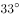）以南的土壤多为酸性和强酸性；华中华东地区的红壤，pH值在5.5～6.5之间；长江以北的土壤多为中性或碱性。岭南地区多砖红壤、赤红壤，其特点为：颜色红，土层较厚，质地较粘重，肥力较差，呈酸性。

D项正确，岭南地区属东亚季风气候区南部，具有热带、亚热带季风海洋性气候特点，该气候区域夏季太阳高度角大，气温较高，且南季风带来的降水丰沛，雨热同期，雨季持续时间长。荔枝树喜高温高湿，喜光向阳，岭南地区的气候条件适合荔枝的生长。

故正确答案为D。

---

### 第 13 题　qid 2604232 · 人文常识

在日常生活中，下列说法符合科学原理的是（    ）。

- **A**. 
使用碳酸饮料可以有效溶解水壶内的水垢
　✅
- **B**. 
成年人体内的水分大约能占到体重的

- **C**. 
烧开的水放置一个晚上后，亚硝酸盐含量会显著增加

- **D**. 
剧烈运动后，人们应当避免摄入电解质，以免增加肾脏负担

**答案**：A

**官方解析**

本题考查科技常识。

A项正确，碳酸饮料中含有（碳酸），水垢是水中所含的微量沉淀物质长期积累形成的，主要成分是碳酸钙等碳酸盐，碳酸饮料里面的碳酸会与其发生反应，产生溶于水的碳酸氢钙，从而达到去水垢的目的。

B项错误，根据生物学家的报告，成年人体内水分约占人体重的。其中脑脊髓中水占、淋巴腺中水占、血液中水占、肌肉中水占、骨骼中水占。

C项错误，按照国家规定，生活饮用水的亚硝酸盐标准是1微克/ml。只要亚硝酸盐不超过这个量，就是安全的。而一般隔夜水的亚硝酸盐含量都不会超过这个数字。

D项错误，运动时会丢失大量汗液，其中的成分是水，剩余的则是尿素、乳酸、脂肪酸和各种电解质。过多丢失体内电解质，对运动能力及健康有严重影响。因此大量运动后既要补水，也要补充矿物元素。

故正确答案为A。

---

### 第 14 题　qid 2604235 · 人文常识

煤燃烧后的产物主要是，也含有一定量的，还可能含有。某市环保部门监测发现，该市郊区的火力发电厂（以煤为燃料）周围的树木枯萎情况比上一年严重。造成树木枯萎的最主要原因可能是（    ）。

- **A**. 
的超标排放

- **B**. 
的超标排放

- **C**. 
排放导致的酸雨
　✅
- **D**. 
排放导致的酸雨

**答案**：C

**官方解析**

本题考查科技常识。

A项错误，一氧化碳（），一种碳氧化合物，标准状况下为无色、无臭、无刺激性的气体。一氧化碳超标排放到大气中，在血液中极易与血红蛋白结合，形成碳氧血红蛋白，使血红蛋白丧失携氧的能力和作用，造成组织窒息，严重时死亡。

B项错误，二氧化碳（），常温常压下是一种无色无味或无色无嗅而略有酸味的气体，也是一种常见的温室气体。二氧化碳排放过多容易引起温室效应，加剧气候变暖。

C项正确，D项错误，二氧化硫排放到大气中，经过“云内成雨过程”，即水汽凝结在硫酸根凝结核上，发生液相氧化反应，形成硫酸雨滴；又经过“云下冲刷过程”，即含酸雨滴在下降过程中不断合并吸附、冲刷其他含酸雨滴和含酸气体，形成较大雨滴，最后降落在地面上，形成了酸雨。酸雨可导致土壤酸化、植被枯萎等危害。

故正确答案为C。

---

### 第 15 题　qid 2604238 · 人文常识

消费者权利是消费者在购买、使用商品或者接受服务中所享有的权利。下列消费者权利与侵犯该权利的事件对应正确的是（    ）。

- **A**. 知情权——某线上服装店为快速清仓，推出低价“福袋”商品，并注明“福袋”内服装的款式、颜色等随机搭配
- **B**. 自主选择权——某餐厅推出外卖8折活动，但是消费者点外卖时只有选择套餐才享受折扣，自由搭配时无法享受8折优惠
- **C**. 安全保障权——王某的轿车已达到报废标准，但是他依旧照常使用，在一次高速行驶中刹车失灵造成事故
- **D**. 公平交易权——李某在车行订购汽车后，车行要求李某购买“车辆维护套餐”，否则汽车不予交付　✅

**答案**：D

**官方解析**

本题考查法律常识。
A项错误，根据《消费者权益保护法》第八条规定可知：“消费者享有知悉其购买、使用的商品或者接受的服务的真实情况的权利。消费者有权根据商品或者服务的不同情况，要求经营者提供商品的价格、产地、生产者、用途、性能、规格、等级、主要成份、生产日期、有效期限、检验合格证明、使用方法说明书、售后服务，或者服务的内容、规格、费用等有关情况。”消费者已经知晓“福袋”内的商品颜色、样式是随机搭配的，消费者已经知情。
B项错误，根据《消费者权益保护法》第九条规定可知：“消费者享有自主选择商品或者服务的权利。消费者有权自主选择提供商品或者服务的经营者，自主选择商品品种或者服务方式，自主决定购买或者不购买任何一种商品、接受或者不接受任何一项服务。消费者在自主选择商品或者服务时，有权进行比较、鉴别和挑选。”餐厅对外卖套餐8折促销，未侵犯消费者的自主选择权。
C项错误，根据《消费者权益保护法》第七条第二款规定可知：“消费者有权要求经营者提供的商品和服务，符合保障人身、财产安全的要求。”王某的轿车并非在购买的时候存在质量问题，经营者未侵犯王某的安全保障权。
D项正确，根据《消费者权益保护法》第十条规定可知：“消费者享有公平交易的权利。消费者在购买商品或者接受服务时，有权获得质量保障、价格合理、计量正确等公平交易条件，有权拒绝经营者的强制交易行为。”车行要求李某购买“车辆维护套餐”，否则汽车不予交付，是捆绑销售行为，侵犯的是李某的公平交易权。
故正确答案为D。

---

### 第 16 题　qid 2604240 · 法律常识

某公司与陈某在签订劳动合同时，在该合同约定“本人自愿放弃缴纳社保，公司每月给予200元补贴作为补偿，与每月工资一同发放”，陈某工作一年后辞职。辞职后，他在当地申请劳动仲裁，要求该公司补缴社会保险金。关于以上案例，以下说法错误的是（    ）。

- **A**. 案例中合同所约定的不缴纳社保的条款属于无效条款
- **B**. 该公司应为陈某补缴社会保险
- **C**. 陈某应当返还由该公司每月发放的200元补贴
- **D**. 为确保放弃缴纳社保声明合法生效，应另起协议　✅

**答案**：D

**官方解析**

本题考查法律常识。
《劳动法》第七十条规定：“国家发展社会保险事业，建立社会保险制度，设立社会保险基金，使劳动者在年老、患病、工伤、失业、生育等情况下获得帮助和补偿。”《社会保险法》第四条第一款规定：“中华人民共和国境内的用人单位和个人依法缴纳社会保险费，有权查询缴费记录、个人权益记录，要求社会保险经办机构提供社会保险咨询等相关服务。” 由此可知，用人单位负有依法缴纳社会保险费的法定义务，该法定义务不因当事人的约定而可予以免除。
A项正确，公司与陈某在合同中约定放弃缴纳社会保险的条款违反了法律法规的强制性规定，属于无效条款。
B、C项正确，公司有为陈某依法缴纳社会保险的法定义务，该公司应为陈某补缴社会保险，陈某应当返还由该公司每月发放的200元补贴。
D项错误，用人单位与劳动者约定放弃缴纳社会保险的约定违反了法律的强制性规定，另起协议约定亦属于无效约定。
本题为选非题，故正确答案为D。

---

### 第 17 题　qid 2604244 · 经济常识

“逆经济风向调节”是指当经济萎缩时要采取扩张的经济政策，当经济过热时要采用紧缩的经济政策。据此，当一个国家经济过热时，应当采取的政策措施是（    ）。

- **A**. 减少政府支出，提高利率　✅
- **B**. 减少政府支出，降低利率
- **C**. 增加政府支出，提高利率
- **D**. 增加政府支出，降低利率

**答案**：A

**官方解析**

本题考查经济常识。
经济过热是指市场供给发展速度与市场需求发展速度不成比例。依据经济学的定义，实际增长率超过了潜在增长率叫经济过热，它的基本特征表现为经济要素总需求超过总供给，由此引发物价指数的全面持续上涨。在经济过热时，应采取紧缩性的货币政策和财政政策，减少政府支出是紧缩性的财政政策，能抑制社会总需求；提高利率也是紧缩性的货币政策，会增加储蓄，减少消费，抑制经济过热。
故正确答案为A。

---

### 第 18 题　qid 2604283 · 科技常识

农技站为了贮存种子，拟采用以下做法，其中最可行的是（    ）。

- **A**. 
将种子浸泡在含水的容器中

- **B**. 
将种子置放在含氧量低于的干燥地窖中
　✅
- **C**. 
将种子置于15摄氏度左右的低温环境中

- **D**. 
将种子封闭在完全避光的黑暗环境中

**答案**：B

**官方解析**

农技站贮存种子时，为了延长种子的寿命，需要注意两方面：一是保持干燥，这样可以防止提前发芽、防止发霉；二是削弱呼吸作用，减少有机物消耗，这样可以保证播种时种子有足够的营养物质，提高发芽率，降低温度和含氧量能够抑制种子的呼吸作用，此外，呼吸作用需要水环境，干燥的环境也能一定程度上抑制呼吸作用。因此，保存种子应该做到干燥、低温、低氧。

A项：将种子短时间在水中浸泡会使得种子的种皮软化，使水分和氧气进入种子内部，会使种子有发芽的倾向（部分水生植物甚至可以在水中完成种子萌发的全过程），不利于种子保存；而长时间浸泡在水中会导致种皮破裂、种子腐烂发臭等后果，直接导致种子死亡，也不利于种子保存，错误；

B项：保持周围环境干燥，可以有效防止种子吸水返潮，氧气浓度低也会抑制细胞的呼吸作用，防止种子消耗过多的有机物，同时地窖中通常温度不会很高，因此是适合种子保存的条件，正确；

C项：的低温环境可以一定程度上减弱呼吸作用，但是仅说的低温环境，除此之外再无其他限制条件，并不知道外界的湿度如何、氧气含量如何，只控制温度，不控制水分和氧气浓度，也无法保证种子的长期保存。而且对于很多农作物来说，已经达到发芽的最低温度了（例如水稻、大豆、玉米种子发芽的最低温度分别是、、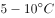），因此的温度下这些农作物的种子会有部分发芽，错误；

D项：光照强度不会直接影响细胞呼吸，与种子贮存条件无关，错误。

故正确答案为B。

---

### 第 19 题　qid 2604288 · 科技常识

援藏干部小吴发现，夏天在藏区的高山上能看到一条横在半山腰的线，这条线之上冰雪璀璨闪耀，线下则只有裸露岩坡或草丛树林。当地人告诉他，这就是“雪线”。如果气候稳定，雪线每年大致在同一个高度上，如果气候或降雪量发生变化，雪线就会发生变化。则小吴最不可能观察到的现象是（    ）。

- **A**. 气候变暖，降雪量增加，雪线上移
- **B**. 气候变暖，降雪量减少，雪线上移
- **C**. 气候变冷，降雪量减少，雪线下移
- **D**. 气候变冷，降雪量增加，雪线上移　✅

**答案**：D

**官方解析**

当气候变暖，或降雪量减少，降雪量小于消融量，雪线上移；反之，当气候变冷，或降雪量增加，降雪量大于消融量，雪线下移。
A项：气候变暖，降雪量增加，降雪量可能仍小于消融量，雪线可能上移，正确；
B项：气候变暖，降雪量减少，降雪量小于消融量，雪线应上移，正确；
C项：气候变冷，降雪量减少，降雪量可能大于消融量，雪线可能下移，正确；
D项：气候变冷，降雪量增加，降雪量大于消融量，雪线应下移，错误。
本题为选非题，故正确答案为D。

---

### 第 20 题　qid 2604292 · 科技常识

一般来说，海水会从密度大的地方向密度小的地方流动，而海水的密度主要受到温度和盐度的影响。则以下判断正确的是（    ）。

- **A**. 越热越咸的海水，密度越大
- **B**. 越冷越咸的海水，密度越大　✅
- **C**. 越冷越淡的海水，密度越大
- **D**. 越热越淡的海水，密度越大

**答案**：B

**官方解析**

海水的密度取决于温度、盐度和压力（或深度）。在低温、高盐和深水压力大的情况下，海水密度大。而在高温、低盐的表层水域，海水密度就小。
因此越冷越咸的海水，密度越大。
故正确答案为B。

---

### 第 21 题　qid 2604295 · 科技常识

在生活中，我们可以用紫色的蝴蝶兰花溶液作为酸碱指示剂，其遇酸性溶液显红色，遇碱性溶液则显黄色。下列说法正确的是（    ）。

- **A**. 在盐水中滴入蝴蝶兰花溶液，溶液呈红色
- **B**. 在纯净水中滴入蝴蝶兰花溶液，溶液呈无色
- **C**. 在苏打水中滴入蝴蝶兰花溶液，溶液呈黄色　✅
- **D**. 在酸或碱性溶液中滴入蝴蝶兰花溶液后，变色的过程属于物理变化

**答案**：C

**官方解析**

盐水和纯净水均呈中性，向盐水和纯净水中滴加蝴蝶兰花溶液，溶液的颜色将变为与蝴蝶兰花溶液相似的紫色，故A、B两项均错误。苏打水呈碱性，根据题目可知蝴蝶兰花溶液遇碱性溶液则显黄色，故C项正确。指示剂遇酸或碱性溶液变色，是由于指示剂与酸碱性溶液发生了化学反应，生成了新物质，从而使溶液呈现不同的颜色，故D项错误。
故正确答案为C。

---

### 第 22 题　qid 2604300 · 科技常识

下列物质与其用途搭配正确的是（    ）。
1臭氧——用作氧化剂
2二氧化碳——用作干燥剂
3氦气——用作燃料
4液氮——用作制冷剂

- **A**. 14　✅
- **B**. 23
- **C**. 12
- **D**. 34

**答案**：A

**官方解析**

臭氧具有很强的氧化性，可以用作氧化剂，正确；二氧化碳不具有吸水性，不能用作干燥剂，错误；氦气不是可燃性气体，不能用作燃料，错误；液氮变为气态时吸收大量的热，降低周围温度，所以液氮可用作制冷剂，正确。
故正确答案为A。

---

### 第 23 题　qid 2604284 · 科技常识

甲、乙两人在森林中走散了。为了找到对方，两人都打开了定位器。甲所看到的定位信息显示，乙目前在甲位置的东偏北37度方向。如果定位信息无误，则乙看到甲的位置信息应是甲在乙位置的（    ）。

- **A**. 西偏南37度　✅
- **B**. 西偏南53度
- **C**. 西偏北27度
- **D**. 西偏北53度

**答案**：A

**官方解析**

如图所示，乙作为参照点时，甲位于乙西偏南的位置。

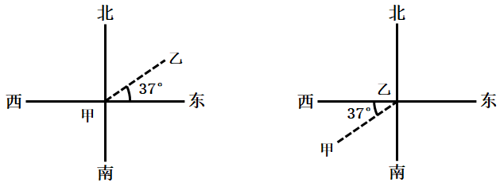

故正确答案为A。

---

### 第 24 题　qid 2604287 · 科技常识

有甲、乙、丙三个轻质小球，已知甲与乙相互吸引，甲与丙相互排斥，则以下说法正确的是（    ）。

- **A**. 若乙带正电，丙可能带正电
- **B**. 若乙带正电，丙可能不带电
- **C**. 若丙带负电，乙可能带负电
- **D**. 若丙带负电，乙可能不带电　✅

**答案**：D

**官方解析**

甲、乙、丙三个轻质小球，由于带电体能够吸引轻质物体。甲与乙相互吸引，说明甲、乙可能是异种电荷，也可能甲、乙一个带电一个不带电；甲与丙相互排斥，说明甲、丙是同种电荷。由此可知丙带有电荷，乙可能带有异种电荷，也可能不带电。
故正确答案为D。

---

### 第 25 题　qid 2604303 · 科技常识

如图所示，肖大伯家有两口水缸摆在一起（①和③、②和④是同一口水缸）。在同一天内，①②表示水缸在日光直射下，③④表示水缸在月光直射下。如果忽略其他因素影响，则下列说法不正确的是（    ）。

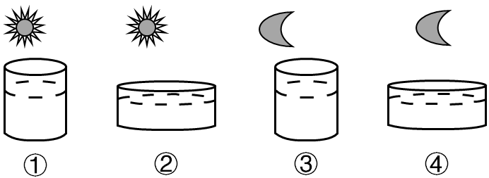

- **A**. ③④水分蒸发的速度相同　✅
- **B**. ①③水分蒸发的速度不同
- **C**. ②水分蒸发的速度最快
- **D**. ③水分蒸发的速度最慢

**答案**：A

**官方解析**

A项：③和④的温度相同，但是④的表面积大，则④的蒸发速度更快，错误；
B项：①和③的表面积相同，但是温度不同，则蒸发速度也不同，正确；
C项：②与④相比，表面积相同，但是②温度高，则②的蒸发速度快；同理①的蒸发速度比③快，而①与②温度相同，但是②的表面积更大，因此②的蒸发速度比①快，由此可见②的蒸发速度最快，正确；
D项：③与④相比，温度相同，但是③的表面积小，则③的蒸发速度比④慢；由于①比③快，②比④快，由此可见③的蒸发速度是最慢的，正确。
本题为选非题，故正确答案为A。

---

### 第 26 题　qid 2604305 · 科技常识

下列关于生活现象的说法，正确的是（    ）。

- **A**. 不锈钢容器比铁容器更持久耐用是因为所用合金材料永远不会生锈
- **B**. 氮气常用作食品防腐剂是因为其不与食品反应，无毒且容易获得　✅
- **C**. 小苏打可使面团蓬松多孔是因为其在面团发酵过程中会汽化
- **D**. 洗洁精能除去油污是因为洗洁精与油污发生了化学反应，使油粒分解

**答案**：B

**官方解析**

A项：不锈钢容器比铁容器更持久耐用是因为不锈钢不易生锈，但如果使用、保养不当或使用环境太恶劣，不锈钢容器是有可能生锈的，永远不会生锈说法过于绝对，错误；

B项：氮气不活泼，在常温常压下难与其它化学物质反应，同时能使食物处于无氧环境中，抑制导致食物腐败的细菌、微生物的繁殖；另一方面，氮气做为空气中主要成分，易获取，且成本更低廉，说法正确；

C项：面团发酵过程中产生的酸性物质，与小苏打（NaHCO）发生化学反应产生二氧化碳，从而使面团体积膨胀，所以会蓬松多孔，是化学变化，而非汽化，说法错误；

D项：洗洁精具有乳化作用，能将油污中大的油粒分散成细小的油粒，随水冲走，达到洗涤的目的，是物理变化，而不是洗洁精与油污发生化学反应，说法错误。

故正确答案为B。

---

### 第 27 题　qid 2604319 · 科技常识

一般而言，在北半球地转偏向力会使风向右偏离其原始的路线。图中显示的是位于北半球的甲地的等压线分布情况，则甲地的风向最可能是（    ）。

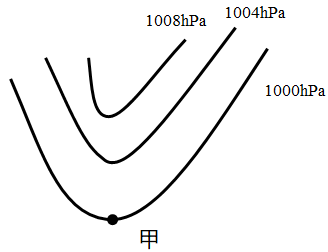

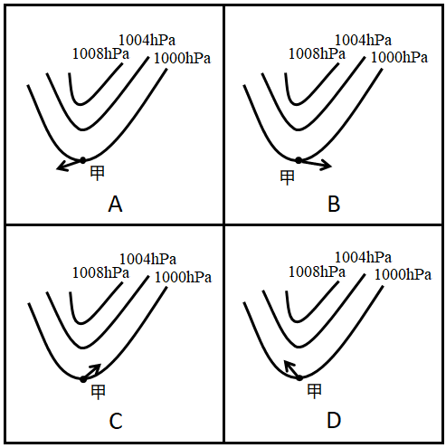

- **A**. A　✅
- **B**. B
- **C**. C
- **D**. D

**答案**：A

**官方解析**

气体的流动方向是从高气压流向低气压。风从高气压流向低气压时，由于在北半球受地转偏向力影响，风向右偏离，如图在甲处的原风向指向下方，向右偏之后最可能如A选项的图中所示。

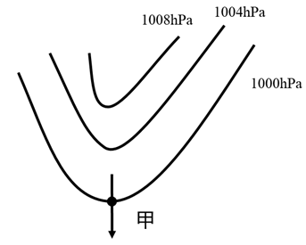

故正确答案为A。

---

### 第 28 题　qid 2604335 · 科技常识

夏季，从冰箱内拿出一个装有冰块的杯子，则在杯内物体变为常温的过程中，杯壁温度随着时间变化的图像最有可能接近（  ）。

- **A**. A
- **B**. B　✅
- **C**. C
- **D**. D

**答案**：B

**官方解析**

从冰箱内拿出一个装有冰块的杯子，原先杯子所处的环境为以下，拿出冰箱后，由于外部气温高，杯子逐渐升温，同时冰块开始融化；升温到时，此时杯中物质为冰水混合物，冰水混合物温度为不变，这段时间内，随着冰块的融化，杯子温度也保持不变，排除A、D两项；当冰块全部融化为水后，杯子温度和水温逐渐升高变为常温，排除C项。

故正确答案为B。

备注：据考生回忆，实际试卷选项横坐标标注温度，纵坐标标注时间，推测为打印错误。实际同一时间不可能对应多个不同温度。故粉笔将选项修改为横坐标标注时间，纵坐标标注温度。

---

### 第 29 题　qid 2604338 · 科技常识

实验员小张计划配制浓度为8的氯化钠溶液，在配制过程中，他使用托盘天平称量氯化钠的质量，使用量筒称量水的体积。但由于操作失误，最终配制的溶液浓度偏小，则以下可能导致这一结果的是（  ）。

- **A**. 称量前未调平衡，天平指针偏右
- **B**. 称量时，使用了已生锈的砝码
- **C**. 用量筒取水时，仰视读数　✅
- **D**. 将水倒入烧杯时，一部分洒在外面

**答案**：C

**官方解析**

最终配制的溶液浓度偏小，根据溶液浓度=溶质质量溶液质量可以推断，可能的原因为称量出的氯化钠质量偏小或者是量取的水的体积偏大。

A项：托盘天平称量是根据左右平衡的原理，左物右码，称量前未调平衡，天平指针偏右，说明原先右边重，则称量一定质量的氯化钠，相当于是事先先用部分氯化钠平衡天平后又进行的称量，故所称量的氯化钠质量会偏大，溶液浓度也偏大，排除；

B项：天平砝码如果生锈，则会导致砝码的质量变大，则所称量的氯化钠质量会偏大，溶液浓度也偏大，排除；

C项：用量筒取水时，仰视读数，看到的读数偏小，真正看到示数已经到了需要量取的体积时，量取的水已经多了，即量取的水的体积偏大，溶液浓度偏小，正确；

D项：将水倒入烧杯时，一部分洒在外面，即溶剂质量变小，所以溶液质量也变小，溶液浓度偏大，排除。

故正确答案为C。

---

### 第 30 题　qid 2604344 · 科技常识

如果将等量的氧气和氮气混合，注入一个密闭容器，则静置较长一段时间后，容器内氧元素（用O代表）和氮元素（用N代表）的分布最可能接近（  ）。

- **A**. A　✅
- **B**. B
- **C**. C
- **D**. D

**答案**：A

**官方解析**

根据分子动理论，分子在不停地做不规则运动，气体分子通过不规则运动扩散到其他气体分子之间的空隙中。较长一段时间后，两种气体分子均匀地混合在一起。所以在密闭容器静置很长一段时间后，氮气和氧气会均匀混合，氧元素与氮元素均匀分布在容器内。
故正确答案为A。

---

### 第 31 题　qid 2604346 · 科技常识

如图所示是某仓库报警器的电路示意图，热传感器安装在仓库内部，监控机A和报警电铃安装在监控室内。热传感器的阻值会随着温度的升高而减小，当仓库发生火情时，下列说法正确的是（  ）

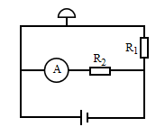

- **A**. 
监控机A两端的电流增大

- **B**. 
报警电铃两端的电压减小

- **C**. 
电阻器两端的电压不变
　✅
- **D**. 
电源的电压降低

**答案**：C

**官方解析**

根据电路图分析电路：与报警电铃同在一条支路，监控机A与在另一条支路，两条支路并联后连接在电源两端。

当发生火情时，温度升高，热传感器的阻值将减小，此时电路总电阻随之减小，但电源输出电压始终不变，D项错误；根据并联电路特点：各并联支路两端的电压等于电路的总电压，电阻器所在支路电阻无变化，所以该支路电流不变，热传感器所在支路电阻变小，该支路电流变大。通过监控机A两端的电流保持不变，A项错误；通过电阻器两端的电流也不变，则其两端电压保持不变，C项正确；根据串联分压规律，报警电铃和热传感器两端的电压之和等于电源电压，由于热传感器的阻值减小，其分到的电压也减小，而电源电压不变，则报警电铃两端的电压增大，B项错误。

故正确答案为C。

---

### 第 32 题　qid 2604347 · 科技常识

小张乘坐的小船在平静的湖面上匀速行驶，他在甲板上竖直跳起后下落，则下落点（  ）。

- **A**. 在起跳点　✅
- **B**. 在起跳点前
- **C**. 在起跳点后
- **D**. 位置不确定

**答案**：A

**官方解析**

小张从匀速行驶的小船上跳起，由于惯性，小张在水平方向上依旧会保持起跳时小船匀速行驶的速度。而在小张跳起、下落的过程中，小船也仍保持匀速行驶，小张与小船在水平方向上速度一致，因此小张落下后仍在起跳点。
故正确答案为A。

---

### 第 33 题　qid 2604326 · 科技常识

如图所示，乙、丙两个正方体漂浮在装有溶液的容器内保持静止状态，且上表面与液面持平，正方体甲下表面与乙物体的上表面密切接触，球体丁与丙之间用细绳牵连，则下列说法正确的是（    ）。

- **A**. 液体对物体甲有浮力作用
- **B**. 丙受到的浮力大于丁受到的浮力　✅
- **C**. 乙受到的浮力大于甲乙两物体的重力之和
- **D**. 细绳的牵引力等于丙受到的浮力减去丁的重力

**答案**：B

**官方解析**

先将甲、乙看成一个整体进行分析，此时甲乙整体可看做漂浮在液面的物体，则所受浮力应与二者重力之和相等，由于物体甲并未接触液体，因此不受浮力，甲乙整体所受浮力即为物体乙所受浮力，乙受到的浮力等于甲乙两物体的重力之和，A项、C项错误；
对物体丙进行受力分析可知，物体丙漂浮在液体中保持静止，受竖直向上的浮力、自身重力与细绳的牵引力，因此细绳的牵引力等于丙受到的浮力减去丙的重力，D项错误；物体所受浮力大小等于排开液体所受重力，如图所示正方体丙体积大于球体丁体积，因此丙排开液体体积大，丙受到的浮力大于丁受到的浮力，B项正确。
故正确答案为B。

---

### 第 34 题　qid 2604327 · 科技常识

某可燃物的着火点为t，如图所示，则该物质燃烧火势从大到小的点依次是（    ）。

- **A**. ①②③
- **B**. ②④⑤
- **C**. ③④⑤
- **D**. ⑤④②　✅

**答案**：D

**官方解析**

物质燃烧的条件是：物质具有可燃性，有助燃剂（氧气），温度达到着火点。只有温度达到物质的着火点，物质才可能燃烧，所以③处物质不燃烧。当温度达到着火点后，物质燃烧的剧烈程度与助燃剂（氧气）浓度有关，氧气浓度越大，燃烧越剧烈，①处氧气浓度为0，故①处物质也不燃烧，只有②④⑤三处物质可以燃烧，由图可知这三处的氧气浓度大小关系为⑤④②，故燃烧剧烈程度由大到小排序为⑤④②。

故正确答案为D。

---

### 第 35 题　qid 2604330 · 科技常识

如图所示，仓库工人计划用小车运送三箱货物，第一次先用大小为F的力将一箱货物从A仓库推到B仓库，第二次用同样大小的力将两箱货物从A仓库拉到B仓库。则在货物的移动过程中，关于两次做功的情况下列说法正确的是（    ）。

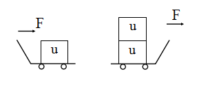

- **A**. 工人第一次做的功比第二次多
- **B**. 工人第一次做的功比第二次少
- **C**. 工人第一次做的功与第二次一样多　✅
- **D**. 无法确定

**答案**：C

**官方解析**

由题目可知两个移动过程均为从A仓库到B仓库，位移相同。根据功的计算公式得，力做的功只与力和力方向上产生的位移有关，而两次过程，工人施加给货物的力相等，该力方向上的位移也相同，所以两次工人做的功一样多。

故正确答案为C。

---

### 第 36 题　qid 2604331 · 科技常识

如图所示，小球用橡皮筋固定在天花板上。如果让小球从A点落下，B点是橡皮筋的自然长度，C点是小球达到的最低点。则下列说法正确的是（    ）。

- **A**. 在B点时，小球的重力等于橡皮筋的张力
- **B**. 小球在C点受到2个力的作用　✅
- **C**. 小球在C点受力平衡
- **D**. 小球在A点的重力势能等于动能

**答案**：B

**官方解析**

A项：由于B点是橡皮筋的自然长度点，此时橡皮筋的张力为0，即橡皮筋对小球没有作用力，错误；
B项：当小球位于C点时，橡皮筋处于拉伸状态，此时小球受自身重力和橡皮筋的张力共两个力作用，正确；
C项：橡皮筋的张力大小取决于橡皮筋的形变量的大小，形变量越大，橡皮筋的张力越大，从B点到C点，橡皮筋的张力在增大。小球下落过程中，先加速后减速，最后在最低点C速度减少为零。减速过程中，橡皮筋张力大于小球重力，C点橡皮筋张力最大，大于小球所受重力，C点受力不平衡，错误；
D项：小球从A点落下，在A点时速度为零，动能也为零，故重力势能等于动能说法错误。
故正确答案为B。

---

### 第 37 题　qid 2604332 · 科技常识

李先生驾车外出，用导航计算得知出发地到目的地的直线距离是20km，路途中经过测速点时，他看到车内记速表显示为60km/h，半小时后到达目的地，导航显示路程是33km。由此可以判断（    ）。
①李先生驾车的位移是20km
②李先生驾车的位移是33km
③整个路途中，李先生驾车的平均速度为60km/h
④经过测速点时的瞬时速度是60km/h

- **A**. ①③
- **B**. ②③
- **C**. ②④
- **D**. ①④　✅

**答案**：D

**官方解析**

根据物体位移的定义可知，位移是物体运动过程由初位置到末位置的有向线段，其大小与路程无关，所以李先生驾车的位移大小为出发地到目的地的直线距离，即20km，①正确，②错误。车内记速表所测得的数值，是对车辆当前速度的反应，所以车内记速表测得数值为瞬时速度，车辆平均速度为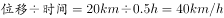，故③错误，④正确。

故正确答案为D。

---

## 言语理解与表达

### 第 1 题　qid 2604251 · 逻辑填空

真正打赢脱贫攻坚战，还需要大力发展优势特色扶贫产业，通过统一规划、连片开发，建设一批特色鲜明、带动能力强的扶贫产业，            发展休闲农业、设施农业等农村二三产业。
填入横线部分最恰当的一项是：

- **A**. 因势利导
- **B**. 因地制宜　✅
- **C**. 因时制宜
- **D**. 因材施教

**答案**：B

**官方解析**

由“发展优势特色扶贫产业”“特色鲜明、带动能力强的扶贫产业”可知，此处强调要发展有特色的休闲农业、设施农业等。B项“因地制宜”指根据各地的具体情况，制定适宜的办法，填入横线处能体现发展特色的休闲农业、设施农业等，当选。
A项“因势利导”指顺着事情发展的趋势，向有利于实现目的的方向加以引导，侧重强调“势”，即事物发展趋势；C项“因时制宜”指根据不同时期的具体情况，采取适当的措施，侧重强调“时”，即某事物不同时期的具体情况；文段并无事物发展趋势和不同时期具体情况的表述，均排除。D项“因材施教”指针对学习的人的志趣、能力等具体情况进行不同的教育，一般用于教育教学，不能用于农业农村扶贫，排除。
故正确答案为B。
【文段出处】《新时期精准扶贫精准脱贫系列报道（二）：精准施策发力，加快产业脱贫工程建设》

---

### 第 2 题　qid 2604262 · 逻辑填空

以理想信念引领乡村治理现代化，        要从组织和制度层面发力，        要在活动阵地建设层面发力，为党组织宣传理想信念、贯彻落实政策提供制度保障和阵地依托。
填入横线部分最恰当的一项是：

- **A**. 不仅  更　✅
- **B**. 尽管  还
- **C**. 如果  就
- **D**. 即使  也

**答案**：A

**官方解析**

分析文段，“要从组织和制度层面发力”和“要在活动阵地建设层面发力”为两个不同层面的发力点，分别对应后文的“制度保障”和“阵地依托”，二者应为并列或递进关系，A项“不仅······更······”表示递进关系，符合文意，当选。
B项“尽管······还······”表示转折关系，C项“如果······就······”表示假设关系，D项“即使······也······”表示假设关系，均不符合文段逻辑，排除。
故正确答案为A。
【文段出处】《将党小组建在村民组上——河南省新密市城关镇乡村治理的探索》

---

### 第 3 题　qid 2604269 · 逻辑填空

良好乡风具有浸润人心，        向善，规范行为，        力量的积极作用，要以实施乡风文明培育行动为抓手，加强乡村德治，培育稳脱贫，促振兴的文化软环境。
填入横线部分最恰当的一项是：

- **A**. 带动  集中
- **B**. 带领  凝结
- **C**. 引导  集聚
- **D**. 引领  凝聚　✅

**答案**：D

**官方解析**

第一空，修饰“良好乡风”，由横线前“浸润人心”可知，所填词语应表达良好乡风具有引导积极向上的作用之意。C项，“引导”指带领、领导，D项，“引领”指引导、带领，均可搭配“向善”且符合文意，保留。A项，“带动”指引导着前进，一般用作“在······的带动之下”“带动······之风”，与“向善”搭配不当，排除；B项，“带领”指领导或指挥（一群人进行集体活动），与“向善”搭配不当，排除。

第二空，搭配“力量”。C项，“集聚”指集合、聚合，D项，“凝聚”指聚集、积聚，二者均可搭配“力量”。C项，“集聚”的“集”侧重于集合在一起，D项，“凝聚”的“凝”侧重于凝结，“凝聚力量”用在此处可以强调将力量凝结聚集在一起之意，且“凝聚”“凝结”“集聚”，语义更丰富，因此D项“凝聚”更符合文意，当选。

故正确答案为D。

【文段出处】《半月谈：稳脱贫促振兴，须治软环境》

---

### 第 4 题　qid 2604276 · 逻辑填空

在广袤的大地上，通过“三支一扶”计划成长起来的年轻人，在不同领域和岗位上担当作为、无私奉献，        了青春的价值，        出一曲曲奋斗赞歌。
填入横线部分最恰当的一项是：

- **A**. 诠释  谱写　✅
- **B**. 书写  传唱
- **C**. 证明  吟诵
- **D**. 展现  描绘

**答案**：A

**官方解析**

本题可从第二空入手，横线处所填词语搭配“赞歌”，A项“谱写”指写作（乐曲等），与“赞歌”搭配恰当，当选。B项“传唱”指（歌曲等）流传歌唱，文段强调的并不是赞歌的“流传歌唱”，而是“三支一扶”的年轻人写出属于自己的奋斗赞歌，“传唱”用在此处不恰当，排除；C项“吟诵”指吟咏诵读，常搭配“古诗词”，一般不与“赞歌”搭配，排除；D项“描绘”指描画，与“赞歌”搭配不恰当，排除。
第一空代入验证，横线处所填词语搭配“价值”，A项“诠释”指说明解释，与“价值”搭配恰当，符合文意。
故正确答案为A。
【文段出处】《“三支一扶”，在基层播撒青春梦想》

---

### 第 5 题　qid 2604290 · 逻辑填空

近几年，脱贫攻坚取得决定性成就的一个重要原因，就是通过派驻工作组、第一书记等驻村帮扶力量，为贫困农村带去了        的领导、        的思路、        的资源保障，破解了农村发展的人才之困。
填入横线部分最恰当的一项是：

- **A**. 强劲  开明  充分
- **B**. 强硬  明晰  丰富
- **C**. 坚强  开阔  有力　✅
- **D**. 坚毅  明确  充沛

**答案**：C

**官方解析**

第一空，搭配“领导”，且表达出积极的感情色彩。C项“坚强”指的是果断不动摇，D项“坚毅”指的是坚定刚毅，均能和“领导”搭配，体现领导在脱贫攻坚帮扶工作中有着坚定信念，保留。A项“强劲”指的是强大有力，更多形容“能力”“力量”等，与“领导”搭配不当，排除；B项“强硬”更多指的是倔强的，不作任何让步，多用于消极语境，与文段感情色彩不符，排除；
第二空，搭配“思路”，C项“开阔”、D项“明确”均可搭配“思路”，保留；
第三空，搭配“资源保障”，C项“有力”与”资源保障”为常见搭配，当选；D项“充沛”指饱满、旺盛，多搭配精力、活力等，与“资源保障”搭配不当，排除。
故正确答案为C。
【文段出处】《半月谈：稳脱贫促振兴，须治软环境》

---

### 第 6 题　qid 2604310 · 片段阅读

在基层工作中，长期直面各种矛盾和诱惑，不断经受大事急事难事烦事的考验，可以在挑重担、啃硬骨头、接烫手山芋的磨砺中壮筋骨、长才干，练就忠诚、干净、担当的政治品格，培养坚忍不拔、百折不挠的性格，成长为处理各种矛盾问题的高手，发展成治理社会、发展经济的能人。
上述文段主要说明了：

- **A**. 基层锻炼是干部培养的必要条件
- **B**. 基层工作面临巨大挑战
- **C**. 基层需要能力强的干部
- **D**. 基层工作有助于干部成长　✅

**答案**：D

**官方解析**

文段首先指出在基层工作中会长期直面矛盾和诱惑，不断经受考验。随后通过“可以”引出基层工作对干部成长的作用，可以练就好的政治品格，培养好的性格，成长为“高手”“能人”。故文段重在强调基层工作对干部成长的作用，对应D项。
A项，文段论述了基层工作对于干部有哪些好处，但并未指出是干部养成的“必要条件”，过于绝对，排除；
B项，仅对应文段前两句，非重点，且缺少“干部成长”这一话题，排除；
C项，文段讨论的核心话题并非基层需要什么样的干部，而是基层工作对干部的作用，排除。
故正确答案为D。
【文段出处】《基层是加强干部政治历练、实践锻炼的最好学校》

---

### 第 7 题　qid 2604313 · 片段阅读

应对疫情给企业经营带来的不利影响，广东省政府近期出台支持企业复工复产的20项政策措施，实打实解决企业面临的用工成本、经营负担、疫情防控、现金流压力等方面问题。广东各地各部门也打出“减负”“暖企”政策组合拳，力求精准解决企业难题。除此之外，有关部门还梳理出102家制造业重点企业名单，建立复工复产“一对一”跟踪服务机制，准确摸排问题，提出解决方案。
下列选项最适合作为这段文字标题的是：

- **A**. 应对疫情，“暖”字当头
- **B**. 广东：打通复工复产堵点　✅
- **C**. 广东经济：挑战与机遇并存
- **D**. “减负暖企”，实现经济腾飞

**答案**：B

**官方解析**

文段首先介绍了广东通过出台“20项政策措施”支持企业复工复产，接下来通过“也”，并列介绍了广东各地各部门“减负”“暖企”政策，尾句通过“除此之外”再次介绍了对102家制造业企业建立复工复产“一对一”跟踪服务机制。故文段通过并列结构，从三方面介绍了广东如何帮助企业解决问题难点、支持企业复工复产的具体措施，B项“打通复工复产堵点”概括恰当，当选。
A项，“‘暖’字当头”对应文段分句“‘减负’‘暖企’政策组合拳”，表述片面，排除；
C项，文段通篇论述的是帮助企业解决疫情带来的问题，未涉及“机遇”，排除；
D项，“减负暖企”仅对应文段分句“广东各地各部门也打出‘减负’‘暖企’政策组合拳”，表述片面，且文段主要论述如何应对疫情带来的影响，“实现经济腾飞”无中生有，排除。
故正确答案为B。
【文段出处】《人民日报：广东 打通复工复产堵点》

---

### 第 8 题　qid 2604314 · 片段阅读

农村公共文化服务好不好，要以村民满不满意为评价标准。因此，文化建设从一开始，就要以“人”为中心，站在村民的角度考虑问题，认真对待他们的精神文化需求，才能击中痛点，“对症下药”，才能实现文化建设的“精准化”，才能避免“一刀切”以及由此产生的资源浪费。
这段文字主要讲了：

- **A**. 农村文化建设要以“人”为本　✅
- **B**. 农村文化建设要追求“精准化”
- **C**. 农村公共文化建设服务的标准
- **D**. 建设农村公共文化服务的意义

**答案**：A

**官方解析**

文段开篇指出农村公共文化服务要以村民满意度为评价标准，之后“因此”引出结论，阐述文化建设从一开始，就要以“人”为中心，并阐述了其意义。故文段为分总分结构，强调的是文化建设要以“人”为中心，对应A项。
B项，“精准化”为文化建设带来的效果，非重点，排除；
C项，“服务的标准”无中生有，排除；
D项，文段强调的重点为文化建设如何做，而非文化建设带来的意义，排除。
故正确答案为A。
【文段出处】《光明日报：乡村众筹文化院坝的效果可期》

---

### 第 9 题　qid 2604316 · 片段阅读

政务公开的目标，既要保障公众的知情权和监督权，又要畅通政府与公众之间的交流互动，以公开推动理念转变与流程再造，建设人民满意的服务型政府。没有交流互动，政务公开就成了“为公开而公开”；没有监督权和知情权的配合，政务公开就成了“稻草人”和“花架子”。在政务公开中，公众本身不仅是被动的接受者，更是主动的参与者。只有公众持续不断地广泛参与，政务公开才有不断深入的动力。
对这段文字理解不准确的是：

- **A**. 政务公开需要公众的主动参与
- **B**. 公众参与越广泛，政务公开才能越深入
- **C**. 政务公开源于公众对政府工作的知情意愿　✅
- **D**. 政府与公众的交流互动有利于建设服务型政府

**答案**：C

**官方解析**

A项，根据“在政务公开中，公众本身不仅是被动的接受者，更是主动的参与者”可知，表述正确，排除；

B项，根据“只有公众持续不断地广泛参与，政务公开才有不断深入的动力”可知，表述正确，排除；
C项，“政务公开源于公众对政府工作的知情意愿”在文段中并未提及，无中生有，当选；
D项，根据“畅通政府与公众之间的交流互动，以公开推动理念转变与流程再造，建设人民满意的服务型政府”可知，表述正确，排除。
本题为选非题，故正确答案为C。
【文段出处】《政务公开，从偏重信息到运行全过程公开》

---

### 第 10 题　qid 2604317 · 片段阅读

今年是全面打赢脱贫攻坚战的收官之年，脱贫攻坚的最后堡垒必须攻克。然而，在这最后冲刺阶段，我们却不得不面对新冠肺炎疫情带来的严峻挑战，面对疫情风险，那些刚刚脱贫或者尚未脱贫的群众具有明显的脆弱性。如果不能处理好战“疫”与战“贫”的关系，就有可能让我们来之不易的脱贫攻坚成果出现波折和变数。
上述文字旨在说明：

- **A**. 战“疫”与战“贫”都应被重视　✅
- **B**. 战“疫”与战“贫”绝非易事
- **C**. 战“疫”之后必须严防返贫
- **D**. 战“疫”胜利有利于脱贫攻坚

**答案**：A

**官方解析**

文段开篇指出“脱贫攻坚的最后堡垒必须攻克”，紧接着通过关联词“然而”进行转折，论述脱贫关键阶段突遭疫情，且在疫情之下“刚刚脱贫”或“尚未脱贫的群众”具有明显的“脆弱性”，意在强调应该重视疫情带来的风险。尾句则结合前文内容，通过反面论证强调要处理好战“疫”与战“贫”的关系，即同时重视战“疫”和战“贫”两项工作，不能顾此失彼，对应A项。
B项，“绝非易事”，论述战胜疫情与脱贫工作的难度，非文段论述重点，排除；
C项，文段通过反面论证，意在强调兼顾战“疫”和战“贫”，而两者之间并无先后之分，与文意不符，排除；
D项，“战‘疫’胜利”文段并未提及，无中生有，排除。
故正确答案为A。
【文段出处】《战“疫”战“贫”，皆须不误》

---

## 数量关系

### 第 1 题　qid 2604259 · 数学运算

9.19，4.27，5.35，2.43，（    ）

- **A**. 3.51
- **B**. 5.51　✅
- **C**. 5.60
- **D**. 8.60

**答案**：B

**官方解析**

题干有特殊符号“.”，故考虑小数点前后的机械划分。小数点后数列19，27，35，43，（    ），是公差为8的等差数列，下一项为；小数点前数列观察无明显特征，作差作和亦无规律，考虑与小数部分的关系，，，，，发现小数部分两数乘积取个位数是整数部分，即，取9；，取4；，取5；，取2，则所求项整数部分为，取5，故所求项为5.51。

故正确答案为B。

---

### 第 2 题　qid 2604267 · 数学运算

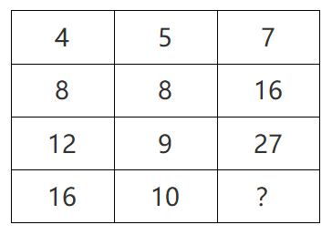

- **A**. 16
- **B**. 27
- **C**. 38　✅
- **D**. 49

**答案**：C

**官方解析**

图形数阵，优先考虑横向和竖向规律。第一行；第二行；第三行，发现各行数字之和组成的数列16，32，48，（    ），是公差为16的等差数列，下一项为，则所求项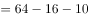。

故正确答案为C。

---

### 第 3 题　qid 2604230 · 数学运算

甲、乙两地稻谷同时成熟，分别需要15台和13台大型收割机进行收割，计划从丙、丁两地分别调配20台和8台收割机进行支援。若从丙地调配一台收割机到甲、乙两地分别需要油费40元、50元；从丁地到甲、乙两地分别需要50元、30元，则完成所有的收割机调配至少需要油费（    ）元。

- **A**. 1000
- **B**. 1090　✅
- **C**. 1180
- **D**. 1270

**答案**：B

**官方解析**

根据题意可知，从丙地向甲地调配收割机油费较低，从丁地向乙地调配收割机油费较低，则油费最低调配方案如下表：

最低油费为元。

故正确答案为B。

---

### 第 4 题　qid 2604239 · 数学运算

为加强治安防控，现计划在一段L形的围墙（如下图）上安装治安摄像头，其中A点到B点长度为750米，B点到C点长度为1350米。按要求ABC三个位置必须安装一个摄像头，且相邻两个摄像头之间的距离要保持一致，则整段围墙至少需要安装（    ）个摄像头。

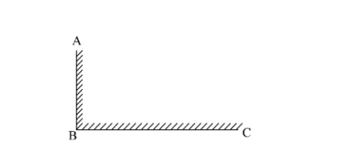

- **A**. 14
- **B**. 15　✅
- **C**. 16
- **D**. 17

**答案**：B

**官方解析**

根据“ABC三个位置必须安装一个摄像头”可知为两端植树问题。根据公式：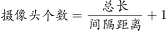。根据“相邻两个摄像头之间的距离要保持一致”可得，间隔距离需为AB、BC长度的公约数。总长一定，间隔距离越大，摄像头的个数就越少，则间隔距离最大为AB（750米）、BC（1350米）的最大公约数，即150米，则至少需要安装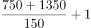个摄像头。

故正确答案为B。

---

### 第 5 题　qid 2604252 · 数学运算

现有浓度为的食盐水250克，若向该食盐水添加10克食盐，再蒸发掉160克水，则新获得的食盐水的浓度为（    ）。

- **A**. 

- **B**. 

- **C**. 

　✅
- **D**. 

**答案**：C

**官方解析**

由，则。原来浓度为的250克食盐水中食盐的含量为克；添加10克食盐，再蒸发掉160克水，则此时食盐含量为克，溶液为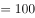克，则。

故正确答案为C。

---

### 第 6 题　qid 2604260 · 数学运算

某单位的两个部门计划订阅报纸。每个部门需要在指定的5种报纸中选择其中的3种，且这两个部门在选择时应做好沟通，做到5种报纸都有部门订阅，则订阅报纸的方案共有（    ）种。

- **A**. 20
- **B**. 30　✅
- **C**. 60
- **D**. 100

**答案**：B

**官方解析**

第一个选择的部门从5种报纸中任意选择3种，有种选择；此时要保证5种报纸都有人选择，第二个部门必须要选择剩余的2种报纸，且再从第一个部门选择的3种报纸中任选一种即可，则第二个部门有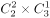种，则订阅报纸的方案共有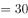种。

故正确答案为B。

---

### 第 7 题　qid 2604271 · 数学运算

一个纸箱里装有大小及材质完全相同的10个小球，其中3个黑色，2个白色，1个红色，2个黄色，1个绿色，1个紫色。如果不放回地依次随机取出3个小球，则取出的小球依次是黑色，红色，白色的概率为（    ）。

- **A**. 
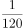
　✅
- **B**. 

- **C**. 
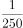

- **D**. 

**答案**：A

**官方解析**

概率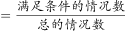。不放回的依次随机取出3个小球，总的情况数为种；要求取出的小球依次是黑色、红色、白色的情况数为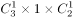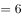种，则取出的小球依次是黑色，红色，白色的概率为。

故正确答案为A。

---

### 第 8 题　qid 2604354 · 数学运算

某企业四月的营业额比三月的营业额多三分之一，五月的营业额比四月多三分之一，则三月的营业额比五月的营业额少（    ）。

- **A**. 

- **B**. 

- **C**. 

- **D**. 

　✅

**答案**：D

**官方解析**

根据题意赋值三月营业额为9，则四月的营业额，五月的营业额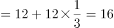，因此三月的营业额比五月的营业额少。

故正确答案为D。

---

### 第 9 题　qid 2604355 · 数学运算

三个书架共放有60本书，如果从第一个书架取出10本书放入第二个书架，再从第二个书架取出5本书放入第三个书架，则此时三个书架的书就会一样多。那么第二个书架最初存放了（    ）本书。

- **A**. 15　✅
- **B**. 20
- **C**. 25
- **D**. 30

**答案**：A

**官方解析**

由题意可知最后三个书架的书一样多，即最后第二个书架的书本。设第二个书架原来的书有本，则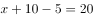，解得。

故正确答案为A。

---

### 第 10 题　qid 2604356 · 数学运算

办公室按零售价花费360元购买了一批笔记本。如果按批发价购买，则每个笔记本能便宜3元，且恰好能多购买20个。则该笔记本零售价为（    ）元。

- **A**. 3
- **B**. 4
- **C**. 6
- **D**. 9　✅

**答案**：D

**官方解析**

设笔记本零售价为每本元，可列式为：，解题过程较为繁琐，可将选项代入验证。由题意可知，零售单价比批发单价高3元，则零售单价应大于3元，可排除A项。

代入B项：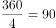，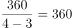，差不是20，排除；

代入C项：，，差不是20，排除；

代入D项：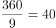，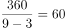，，符合题意，当选。

故正确答案为D。

---

### 第 11 题　qid 2604357 · 数学运算

某部门正在准备会议材料，共有153份相同的文件，需要装到大小两种文件袋里送至会场，大的每个能装24份文件，小的每个能装15份文件。如果要使每个文件袋都正好装满，则需要大文件袋（    ）个。

- **A**. 2　✅
- **B**. 3
- **C**. 5
- **D**. 7

**答案**：A

**官方解析**

设需要大文件袋个，小文件袋个，由题意可列式为：，化简可得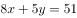。为偶数，51为奇数，则为奇数，可知的尾数为5，的尾数为6，选项中满足条件的取值为A、D两项。，可知取值不能为7，排除D项。

故正确答案为A。

---

### 第 12 题　qid 2604358 · 数学运算

A、B两座港口相距300公里且仅有1条固定航道，在某一时刻甲船从A港顺流而下前往B港，同时乙船从B港逆流而上前往A港，甲船在5小时之后抵达了B港，停留1小时后开始返回A港，又过了6小时追上了乙船。则乙船在静水中的时速为（    ）公里。

- **A**. 20
- **B**. 25
- **C**. 30　✅
- **D**. 40

**答案**：C

**官方解析**

由题意可知，甲顺水需用5小时走完全程，可得：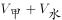公里/时。甲返程追上乙时，乙已逆流行驶了小时，同样的逆流路程甲走了6小时，可得：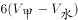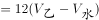，化简得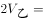千米/时，则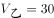千米/时。

故正确答案为C。

---

## 判断推理

### 第 1 题　qid 2604255 · 图形推理

下列选项中最符合所给图形规律的是（    ）。

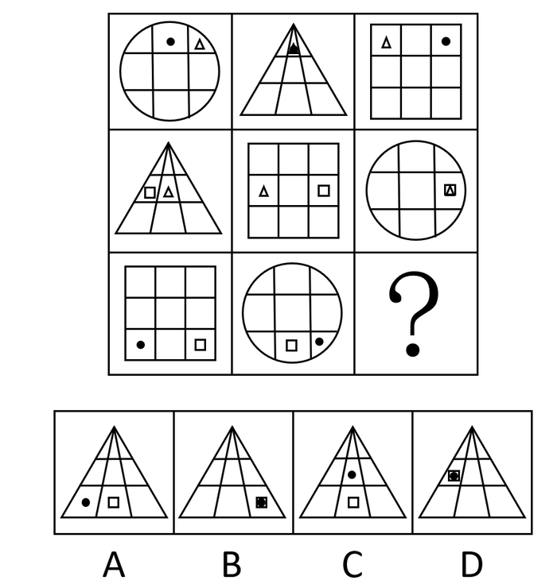

- **A**. A
- **B**. B　✅
- **C**. C
- **D**. D

**答案**：B

**官方解析**

元素组成相似，优先考虑样式规律。九宫格优先横向看，第一横行中，内部小元素均在第一行，且两个小元素之间的位置关系分别为相邻、重合和相隔一格；第二横行中，内部小元素均在第二行，且两个小元素之间的位置关系分别为相邻、相隔一格和重合；第三横行应用规律，前两幅图中内部小元素均在第三横行，且两个小元素之间的位置关系分别为间隔一格和相邻，故？处应该选一个重合的，只有B项符合，当选。
故正确答案为B。

---

### 第 2 题　qid 2604268 · 图形推理

下列选项中最符合所给图形规律的是（    ）。

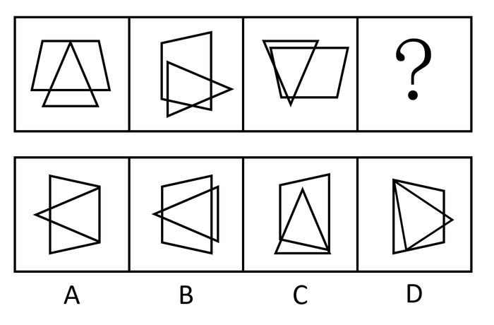

- **A**. A　✅
- **B**. B
- **C**. C
- **D**. D

**答案**：A

**官方解析**

元素组成相同，均由一个三角形和梯形构成，优先考虑位置规律。观察发现，题干中三角形依次顺时针旋转，梯形依次逆时针旋转，？处应用规律，只有A项符合，当选。

故正确答案为A。

---

### 第 3 题　qid 2604281 · 图形推理

下列选项中最符合所给图形规律的是（    ）。

- **A**. A　✅
- **B**. B
- **C**. C
- **D**. D

**答案**：A

**官方解析**

元素组成不同，优先考虑属性规律。观察发现，题干图形均为既轴对称又中心对称图形，排除B项；进一步观察发现，题干图形均由黑球和白球构成，考虑数量规律，题干黑球数量分别为2、3、2、3，故？处应选择黑球数量为2的图形，只有A项符合，当选。
故正确答案为A。

---

### 第 4 题　qid 2604286 · 图形推理

下列选项中最符合所给图形规律的是（    ）。

- **A**. A
- **B**. B
- **C**. C
- **D**. D　✅

**答案**：D

**官方解析**

本题考察图形拼合。将原图形所给的四个图形分别标记1、2、3、4，发现可以与D项拼接成一个完整的图形。

故正确答案为D。

---

### 第 5 题　qid 2604293 · 图形推理

下列选项中最符合所给图形规律的是（    ）。

- **A**. A
- **B**. B
- **C**. C　✅
- **D**. D

**答案**：C

**官方解析**

观察发现，题干图形均有明显小黑点，但黑点个数无明显规律。继续对比黑点的位置，发现前一幅图中黑点的位置在后一幅图中都能找到，即后一幅图是在前一幅图的基础上新增黑点得到。那么问号处应由图四增加黑点得到，如图所示，对应C项。

故正确答案为C。 

---

### 第 6 题　qid 2604245 · 图形推理

如图所示的物体至少由（    ）个小正方体堆积而成。

- **A**. 14
- **B**. 15
- **C**. 16　✅
- **D**. 17

**答案**：C

**官方解析**

用小正方体最少的情况，背面应如上图所示。即最上层有3个小正方体，中间层有5个小正方体，中间层小正方体下方都应有正方体支撑，所以最下层小正方体至少有8个，据此，题干物体至少由16个小正方体堆积而成。

故正确答案为C。

---

### 第 7 题　qid 2604279 · 图形推理

下列选项中，不能在裁剪或覆盖后折成如图所示立方体的是（    ）。

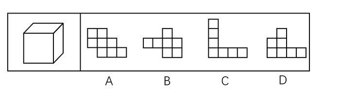

- **A**. A
- **B**. B
- **C**. C
- **D**. D　✅

**答案**：D

**官方解析**

将选项原展开图标上序号如下图，逐一进行分析。

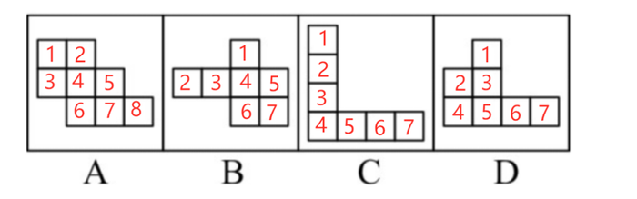

A项：展开图中裁去面3和面6，得到的展开图中（如下图A项所示），面1和面5，面2和面7，面4和面8分别互为相对面，符合六面体展开图中的“二二二型”，折叠后可以得到题干所示的立方体，排除；

B项：展开图中裁去面6（或面7），得到的展开图中（如上图B项所示），面1和面7（或面6），面2和面4，面3和面5分别互为相对面，符合六面体展开图中的“一四一型”，折叠后可以得到题干所示的立方体，排除；

C项：展开图中面1和面3、面5和面7、面2和面4、面4和面6分别互为相对面，其中面2、面6分别和面4互为相对面，在其折叠后能得到题干所示的立方体，不过面2和面6在立体图形中重合在一起与面4互为相对面，排除；

D项：其展开图无论是通过裁剪或是覆盖均不能得到题干所示的封闭的立方体，当选。

本题为选非题，故正确答案为D。

---

### 第 8 题　qid 2604306 · 图形推理

下列选项中，能与所给图形组合成立方体的是（    ）。

- **A**. A
- **B**. B
- **C**. C　✅
- **D**. D

**答案**：C

**官方解析**

本题考查立体拼合。根据题干中的两个立体图形可共同构成一个的立方体，观察选项，从A项第一层和第二层结合来看，是长度为4立方体的多面体，与题干不符，排除；

从上向下逐层分析题干，题干第一层两个图形相加共有6个小立方体，还需要3个小立方体才能组成的立方体，但是D项第一层只有2个小立方体，排除；

题干第二层两个图形相加共有4个小立方体，还需要5个小立方体才能组成的立方体，B项第二层有4个小立方体，排除。

故正确答案为C。

---

### 第 9 题　qid 2604311 · 图形推理

请问使用所给的四个图形能够组合成（    ）。

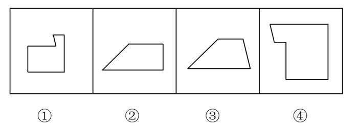

- **A**. 矩形
- **B**. 三角形
- **C**. 等腰梯形
- **D**. 直角梯形　✅

**答案**：D

**官方解析**

本题考查平面拼合，可采用平行且等长相消的方式解题。消去平行且等长的线段后进行组合可得到轮廓图为直角梯形，即为D项。平行且等长相消的方式如下图所示： 

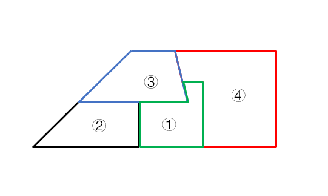

故正确答案为D。

---

### 第 10 题　qid 2604320 · 图形推理

下列4张纸条，沿折痕能够折出如图所示图形的是（    ）。

- **A**. A
- **B**. B
- **C**. C　✅
- **D**. D

**答案**：C

**官方解析**

观察题干，发现图形折痕之间构成了梯形，如图所示，展开图中需有两个非直角大梯形④⑤，两个非直角小梯形③⑥，两个直角小梯形①②，且折痕所构成的两个大梯形应该相邻，只有C项符合此特征。

故正确答案为C。

---

### 第 11 题　qid 2604247 · 类比推理

精准：扶贫（    ）

- **A**. 保护：环境
- **B**. 热心：助人　✅
- **C**. 进退：自如
- **D**. 粗犷：生产

**答案**：B

**官方解析**

第一步：判断题干词语间逻辑关系。
精准扶贫，精准用来修饰扶贫，二者为偏正结构，且扶贫是动宾结构。
第二步：判断选项词语间逻辑关系。
A项：保护环境，二者为动宾结构，与题干逻辑关系不一致，排除；
B项：热心助人，热心用来修饰助人，二者为偏正结构，且助人是动宾结构，与题干逻辑关系一致，当选；
C项：“进退”、“自如”，后者为修饰词，前者为被修饰的中心词，修饰词和被修饰顺序颠倒，不能构成偏正结构，与题干逻辑关系不一致，排除；
D项：粗犷生产，粗犷用来修饰生产，二者为偏正结构，但生产是动词，不是动宾结构，与题干逻辑关系不一致，排除。
注：本题除了从词性的角度二级辨析之外，还可以从感情色彩角度二级辨析，即题干“精准扶贫”和B选项“热心助人”均为褒义，但D选项“粗犷生产”并非褒义，B项更贴近题干。
故正确答案为B。

---

### 第 12 题　qid 2604253 · 类比推理

端午：中秋（    ）

- **A**. 红色：绿色　✅
- **B**. 生存：死亡
- **C**. 物质：精神
- **D**. 线路：电路

**答案**：A

**官方解析**

第一步：判断题干词语间逻辑关系。
端午和中秋都是中国的传统节日，二者为并列关系，且除了这两个节日之外，中国传统节日还包括重阳、七夕等，所以二者为并列关系中的反对关系。
第二步：判断选项词语间逻辑关系。
A项：红色和绿色都是颜色，二者为并列关系，且除了这两种颜色之外，颜色还包括黄色、紫色等，所以二者为并列关系中的反对关系，与题干逻辑关系一致，当选；
B项：生存和死亡都是存在的状态，二者为并列关系，但是存在状态除了生存就是死亡，二者是非此即彼的关系，即并列关系中的矛盾关系，与题干逻辑关系不一致，排除；
C项：物质和精神二者为并列关系，但是物质是实物，精神是意识和思维活动，不存在既物质又精神的情况，二者是非此即彼的关系，即并列关系中的矛盾关系，与题干逻辑关系不一致，排除；
D项：线路指狭小如线的道路、传导电流的电线或者铁路道轨等，电路是指传导电流的路线，电路是线路的一种，二者为种属关系，与题干逻辑关系不一致，排除。
故正确答案为A。

---

### 第 13 题　qid 2604258 · 类比推理

海螺：号角（    ）

- **A**. 树枝：剪刀
- **B**. 羽毛：衣服
- **C**. 葫芦：水瓢　✅
- **D**. 孔雀：折扇

**答案**：C

**官方解析**

第一步：判断题干词语间逻辑关系。
海螺是制作号角的原材料，二者为原材料对应关系。
第二步：判断选项词语间逻辑关系。
A项：剪刀可以修剪树枝，二者不是材料对应关系，与题干逻辑关系不一致，排除；
B项：羽毛是制作衣服的一种原材料，二者为原材料对应关系，与题干逻辑关系一致，保留；
C项：葫芦是制作水瓢的原材料，二者为原材料对应关系，与题干逻辑关系一致，保留；
D项：孔雀的羽毛可以做成折扇，但是孔雀并不是折扇的直接原材料，与题干逻辑关系不一致，排除。
比较B、C两项，水瓢利用葫芦的外形制作而成，题干中号角是利用海螺的外形制作而成，而衣服并不是利用羽毛的外形制作而成，C项与题干逻辑关系更为一致。
故正确答案为C。

---

### 第 14 题　qid 2604264 · 类比推理

耳朵：助听器（    ）

- **A**. 眼睛：望远镜
- **B**. 手指：手套
- **C**. 嘴唇：口罩
- **D**. 腿脚：拐杖　✅

**答案**：D

**官方解析**

第一步：判断题干词语间逻辑关系。
耳朵有听觉障碍的人佩戴助听器，可以辅助听觉，帮助实现耳朵的功能，二者为对应关系。
第二步：判断选项词语间逻辑关系。
A项：利用望远镜，人们用眼睛可以观测遥远物体，与眼睛是否存在视觉障碍无关，与题干逻辑关系不一致，排除；
B项：佩戴手套可以保护手指，并非实现手指的功能，与题干逻辑关系不一致，排除；
C项：佩戴口罩能够遮挡口鼻，起到保暖或者遮挡保护的作用，并非实现口鼻的功能，与题干逻辑关系不一致，排除；
D项：腿脚有行动障碍的人使用拐杖，可以辅助行动，帮助实现腿脚的功能，二者为对应关系，与题干逻辑关系一致，当选。
故正确答案为D。

---

### 第 15 题　qid 2604266 · 类比推理

瓜熟蒂落：水到渠成（    ）

- **A**. 朝三暮四：朝秦暮楚　✅
- **B**. 翻云覆雨：翻天覆地
- **C**. 耳濡目染：耳熟能详
- **D**. 大功告成：功败垂成

**答案**：A

**官方解析**

第一步：判断题干词语间逻辑关系。
瓜熟蒂落指时机一旦成熟，事情自然成功，水到渠成比喻有条件之后，事情自然会成功，即功到自然成，二者是近义关系。
第二步：判断选项词语间逻辑关系。
A项：朝三暮四原指玩弄手法欺骗人，后用来比喻常常变卦，反复无常，朝秦暮楚用以比喻人没有原则，反复无常，二者是近义关系，与题干逻辑关系一致，当选；
B项：翻云覆雨比喻反复无常或惯于玩弄手段，翻天覆地形容变化巨大而彻底，也指闹得很凶，二者不是近义关系，与题干逻辑关系不一致，排除；
C项：耳濡目染意思是耳朵经常听到，眼睛经常看到，不知不觉地受到影响，耳熟能详指听得多了，能够很清楚、很详细地复述出来，二者不是近义关系，与题干逻辑关系不一致，排除；
D项：大功告成指巨大工程或重要任务宣告完成，功败垂成指事情接近成功的时候却遭到了失败，二者是反义关系，与题干逻辑关系不一致，排除。
故正确答案为A。

---

### 第 16 题　qid 2604272 · 类比推理

某工作组计划开展实地调研，初步确定只选择粤东、粤西或粤北中的一个地区。对此，工作组中的甲、乙、丙三人提出了以下意见：
甲：在此次调研中粤东更具有代表性，应该前往粤东地区。
乙：上一轮调研已经去过粤北了，这一次应该选择其他地区。
丙：我认为选择粤西或粤北地区开展实地调研更合适。
最终工作组只采纳了其中一个人的意见，则下列陈述一定正确的是（    ）。

- **A**. 工作组前往了粤东地区
- **B**. 工作组前往了粤西地区
- **C**. 工作组采纳了乙的意见
- **D**. 工作组采纳了丙的意见　✅

**答案**：D

**官方解析**

第一步：翻译题干。

① 去粤东；

② 粤北；

③ 粤西或粤北。

因为只从三个地方进行选择，故条件③等价为“粤东”。

第二步：逐一分析选项。

题干条件③与条件①相矛盾，二者必有一真一假，最终工作组只采纳了一个人的意见，故条件②一定为假，所以工作组最后去了粤北地区。即工作组采纳了丙的意见。

故正确答案为D。

---

### 第 17 题　qid 2604274 · 逻辑判断

有人认为，十二生肖起源于动物崇拜。这是因为在原始社会中，人类的生产力水平很低，猪、牛、羊等牲畜与农事活动关系密切，动物崇拜也就随之而生。除此之外，虎、蛇等动物可能威胁到人类的自身安全，往往被视为强大的象征，人们也会因为感到恐惧而形成动物崇拜。
以下选项如果为真，最能反驳上述判断的是（    ）。

- **A**. 十二生肖中只有龙不是现实中存在的动物
- **B**. “过街老鼠人人喊打”，但它是十二生肖之首　✅
- **C**. 鸡、鸭、鹅与农事活动关系密切，但只有鸡属于十二生肖
- **D**. 牛和猪都与农事相关，但他们在十二生肖中的位置相距很远

**答案**：B

**官方解析**

第一步：找出论点和论据。
论点：十二生肖起源于动物崇拜。
论据：因为在原始社会中，人类的生产力水平很低，猪、牛、羊等牲畜与农事活动关系密切，动物崇拜也就随之而生。除此之外，虎、蛇等动物可能威胁到人类的自身安全，往往被视为强大的象征，人们也会因为感到恐惧而形成动物崇拜。
本题的论点在说十二生肖起源于动物崇拜，论据在说人类会对与农事活动关系密切还有可能威胁人类自身安全的动物产生动物崇拜，可以用与农事活动关系密切的动物不会令人产生动物崇拜，或者用强大的象征动物也不会令人产生动物崇拜进行削弱。
第二步：逐一分析选项。
A项：选项讨论的是龙不是现实中存在的动物，但是无法判断人们对龙是否存在动物崇拜，话题不一致，无法削弱，排除；
B项：“过街老鼠人人喊打”，但它是十二生肖之首，说明老鼠是人们痛恨并且人人喊打的动物，而不是与农事活动关系密切或强大到令人恐惧的动物，为举反例削弱论点，当选；
C项：鸡、鸭、鹅与农事活动关系密切，但只有鸡属于十二生肖，无法否定十二生肖起源于动物崇拜，因为三种动物虽然都与农事活动紧密相关，但是三者与农事活动的密切程度，以及其他方面可能有差异，因此无法削弱，排除；
D项：选项讨论的是牛和猪的排位问题，论点讨论的是动物崇拜的问题，二者讨论的话题不一致，无法削弱，排除。
故正确答案为B。

---

### 第 18 题　qid 2604275 · 逻辑判断

某扶贫产业基地计划种植紫薯、红薯、南瓜以及玉米四种农作物。四种农作物的种植面积大小不一，且需要满足以下条件：
①要么紫薯种植面积最大，要么南瓜种植面积最大；
②如果紫薯的种植面积最大，红薯的种植面积便最小；
如果红薯的种植面积大于玉米，可以推出的是（    ）。

- **A**. 南瓜种植面积大于玉米种植面积　✅
- **B**. 紫薯种植面积大于玉米种植面积
- **C**. 紫薯种植面积小于红薯种植面积
- **D**. 玉米种植面积大于南瓜种植面积

**答案**：A

**官方解析**

第一步：翻译题干。

①要么紫薯最大，要么南瓜最大；

②紫薯最大红薯最小；

③红薯的种植面积大于玉米。

第二步：逐一分析选项。

根据③可知红薯的面积不是最小的，对②箭头后进行了否定，根据否后必否前，可以得到紫薯最大；又根据①可知，紫薯和南瓜有且只有一个面积最大，而紫薯最大，则可以得出南瓜最大为真，即南瓜的种植面积是最大的。

A项：当南瓜的种植面积最大时，南瓜的种植面积一定大于其他三个农作物的种植面积，可以得出南瓜的种植面积大于玉米的种植面积，可以推出，当选；

B项：紫薯种植面积和玉米种植面积的大小关系根据题干信息无法推出，为不确定选项，排除；

C项：紫薯种植面积和红薯种植面积的大小关系根据题干信息无法推出，为不确定选项，排除；

D项：根据题干可以推出南瓜的种植面积最大，故南瓜的种植面积一定大于玉米的种植面积，该项错误，排除。

故正确答案为A。

---

### 第 19 题　qid 2604277 · 逻辑判断

国内有研究发现，在小学阶段，春季出生的孩子比冬季出生的孩子学习成绩更好，在学业上获得成功的概率也更高。有人据此推测，这是由于春季出生的孩子年纪更大一些，而年纪大的孩子往往更成熟，更容易获得老师的关注。
以下选项如果为真，最能反驳上述判断的是（    ）。

- **A**. 得到老师更多关注并不意味着一定有更多在学业上取得成就的机会
- **B**. 教育部门规定，小学生必须在当年9月1日前年满6周岁才能入学　✅
- **C**. 老师也会倾向于关注成绩不理想的学生
- **D**. 其他研究发现，成绩好的孩子普遍善于独立思考

**答案**：B

**官方解析**

第一步：找出论点和论据。
论点：春季出生的孩子成绩更好，是因为春季出生的孩子年纪更大，更容易获得老师的关注。
论据：无。
本题只有论点没有论据，优先考虑削弱论点。
第二步：逐一分析选项。
A项：得到老师更多关注“不一定”有更多在学业上取得成就的机会，削弱了“关注”和“成绩”之间的因果联系，能削弱，保留；
B项：教育部门规定，小学生必须在当年9月1日前年满6周岁才能入学，比如2020年按规定可以上一年级的学生，年纪构成应该是2013年9月1日后—2014年9月1日前出生的孩子（不要用“找关系提前上学或延迟上学”等极端个例来讨论，要讨论普遍情况），所以在同一年级中，并不是春季出生的孩子年纪更大，反而是冬季更大，直接否定了论点中“是因为春季出生的孩子年纪更大”这个原因，能削弱，保留；
C项：老师也会倾向于关注成绩不理想的学生，与春季出生的孩子学习成绩更好的原因无关，排除；
D项：其他研究发现，成绩好的孩子普遍善于独立思考，说的是成绩好和是否善于思考的关系，但是与春季出生的孩子学习成绩更好的原因无关，排除。
对比A、B两项，都是在削弱论点中的因果关系，但B项力度更强，理由如下：
（1）A项说的是“不一定”，削弱力度不及B项的确定性表述；
（2）论点找的核心原因是“春季出生的孩子年纪更大”，B项说事实上班里是冬季出生的比春季出生的年纪大，直接削弱核心原因，而A项削弱的是在年纪大小基础上再延伸出来的“关注度”，如果年纪都不成立，后面延伸的就没有意义了，一个是“根”，一个是“延伸”，削弱“根”更强，故粉笔教研团队这道题更倾向B项。
故正确答案为B。

---

### 第 20 题　qid 2604280 · 逻辑判断

某市实现高质量发展的关键在于，通过推动当地制造业的发展，建立健全现代化产业体系。该市产业园区的建设发展对建立健全现代化产业体系至关重要，因此也是推动实现高质量发展的关键。
下列选项中，与上述推论过程结构最为类似的是（    ）。

- **A**. 打好三大攻坚战是全面建成小康社会的前提条件，也是实现高质量发展的必备基础。所以，打好三大攻坚战才能实现经济社会的全面发展
- **B**. 所有战略性新兴领域的产品均为高尖端产品。某公司的产品广泛应用于新型材料等战略性新兴领域。因此，该公司是一家高尖端制造企业
- **C**. 公路网络不发达会导致交通落后，而交通落后已经成为制约乡镇加快发展的最大瓶颈。因此，乡镇要加快发展，必须加强路网建设　✅
- **D**. 与传统育苗方式相比，组织育苗是一种更为高效的组织快繁方式。因此，引进组织育苗技术很有意义

**答案**：C

**官方解析**

第一步：翻译题干，找到题干的推理结构。

第一句的翻译为：实现高质量发展通过推动当地制造业的发展，建立健全现代化产业体系；

第二句的翻译为：健全现代化的产业体系产业园区的建设发展；

最后的推理为：实现高质量发展产业园区的建设发展。

即题干的论证过程为：12，23，因此13。（通过肯前串联起来，推出肯后。）

第二步：逐一分析选项。

A项：翻译为全面建成小康社会打好三大攻坚战，实现高质量发展打好三大攻坚战，但是最后一句的“实现经济社会的全面发展”在前面翻译中并未提到，与题干推理形式不同，排除；

B项：翻译为战略性新兴领域的产品高尖端产品，最后一句话说的是该公司是一家高尖端制造企业，但是题干第一句话说的是高尖端产品，偷换概念，排除；

C项：翻译为公路网络不发达交通落后，交通落后乡镇加快发展，最后一句的翻译应为：乡镇加快发展必须加强路网建设，选项的论证过程为：12，23，因此31，保留；

D项：翻译为组织育苗高效，引进组织育苗技术很有意义，但是最后一句是否有意义在前面并未提到，与题干推理形式不同，排除。

注意：本题四个选项中没有与题干完全相同的推理方式，但是题干的推理方式为“通过肯前串联起来，推出肯后”，这是正确的推理逻辑，只有C项“通过否后串联起来，推出否前”，“肯前必肯后，否后必否前”，这也是正确的推理逻辑，故择优选C项。

本题能够学到的知识点是，如果有一个选项与题干的推理方式完全相同，比如都是肯前推肯后，优选这个选项；但如果没有这样的选项，题干的推理是对的，我们也要找一个推理正确的选项。

故正确答案为C。

---

## 资料分析

### 材料 1

        近年来，我国大力推动农村互联网建设，目前已初步建成融合、泛在、安全、绿色的宽带网络环境，基本实现“城市光纤到楼到户，农村宽带进乡入村”。2019年，我国已建成全球最大规模光纤和移动通信网络，行政村通光纤和4G比例均超过。调查显示，截至2020年3月，我国网民规模为9.04亿人，其中农村网民规模为2.55亿人，较2018年12月增长，城镇网民规模为6.49亿人，占网民整体的，较2018年12月增长4200万。

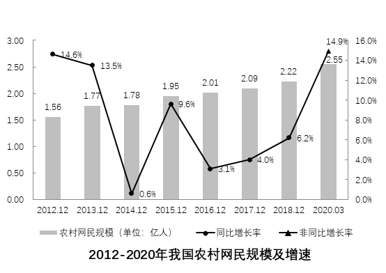

        我国农村地区互联网普及率为，较2018年12月提升7.8个百分点，其余年份详情如下： 

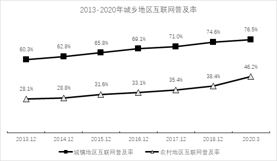

#### 第 1 题　qid 2604234 · 综合

2020年3月，农村网民规模约占我国网民整体的（    ）。

- **A**. 

- **B**. 

- **C**. 

　✅
- **D**. 

**答案**：C

**官方解析**

方法一：根据题干“2020年3月，······约占······的”，结合选项为百分数，可判定本题为现期比重计算问题。定位文字材料第一段可得，截至2020年3月，我国网民规模为9.04亿人，其中农村网民规模为2.55亿人，则所求比重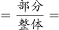，与C项最接近。

方法二：定位文字材料第一段可得，截至2020年3月，······城镇网民规模为6.49亿人，占网民整体的。则农村网民规模所占比重。

故正确答案为C。

---

#### 第 2 题　qid 2604236 · 增长

如果按照2018年12月到2020年3月的城镇网民规模月均增长量估算，2020年12月，城镇网民规模约为（    ）亿人。

- **A**. 6.49
- **B**. 6.74　✅
- **C**. 6.99
- **D**. 7.24

**答案**：B

**官方解析**

根据题干“如果按照······月均增长量估算，2020年12月······约为（    ）亿人”，可判定本题为现期计算问题。定位文字材料第一段可得，截至2020年3月，我国城镇网民规模为6.49亿人，······较2018年12月增长4200万。2020年3月与2018年12月的月份差为15个月，到2020年12月还有9个月，则所求现期量为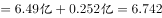亿人，与B项最接近。

故正确答案为B。

---

#### 第 3 题　qid 2604241 · 增长

与2011年12月相比，2020年3月农村网民规模增长了约（     ）。

- **A**. 

- **B**. 

- **C**. 

　✅
- **D**. 

**答案**：C

**官方解析**

根据题干“与2011年12月相比，2020年3月农村网民规模增长了约”，结合选项为百分数，可判定本题为一般增长率计算问题。定位统计图查找可得，2020年3月农村网民规模为2.55亿人，2012年12月农村网民规模为1.56亿人，同比增长。则2011年12月农村网民规模为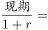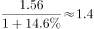亿人，与2011年12月相比，2020年3月农村网民规模增长了，与C项最接近。

故正确答案为C。

---

#### 第 4 题　qid 2604246 · 综合

下列选项中，城镇地区互联网普及率与农村相差最大的是（    ）。

- **A**. 2015年
- **B**. 2016年
- **C**. 2017年
- **D**. 2018年　✅

**答案**：D

**官方解析**

定位折线图可得：2015-2018年城镇地区互联网普及率分别为、、、，农村地区互联网普及率分别为、、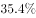、。则城镇地区互联网普及率与农村地区互联网普及率相差：2015年：，2016年：，2017年：，2018年：，即相差最大的为2018年，相差36.2个百分点。

故正确答案为D。

---

#### 第 5 题　qid 2604254 · 综合

根据以上资料，下列说法正确的是（    ）。

- **A**. 
截至2020年3月，农村人口约为7亿

- **B**. 
2019年农村网民规模同比增长率约为

- **C**. 
2013-2018年，我国城镇地区互联网普及率的增幅逐年提升

- **D**. 
2013-2018年，我国农村网民规模每年均较上一年有所增长
　✅

**答案**：D

**官方解析**

A项：定位文字材料第一段可知：截至2020年3月，农村网民规模为2.55亿人；定位文字材料第二段可知：我国农村地区互联网普及率为，根据公式：，则农村人口约为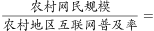亿，错误；

B项：材料所给信息为2020年3月与2018年12月的相关数据，信息不全，无法求出2019年农村网民规模的同比增长率，错误；

C项：定位折线图可知，2016年城镇地区互联网普及率的增幅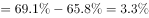，即增长3.3个百分点；2017年城镇地区互联网普及率的增幅，即增长1.9个百分点，故2017年城镇地区互联网普及率的增幅小于2016年的，错误；

D项：定位柱状图可得：2012-2018年我国农村网民规模分别为1.56、1.77、1.78、1.95、2.01、2.09、2.22亿人，每年均较上一年有所增长，正确。

故正确答案为D。

---

### 材料 2

        2019年我国农民工规模继续扩大，总量达到29077万人，同比增长。其中，本地农民工11652万人，比上年增加82万人；外出农民工17425万人，比上年增加159万人。外出农民工中，在省内就业的农民工9917万人，比上年增加245万人；跨省流动农民工7508万人，比上年减少86万人。

        从收入看，农民工集中就业的六大行业月均收入均稳定增长。2019年农民工月均收入约4000元；其中外出农民工月均收入4427元，比上年增加320元；本地农民工月均收入3500元，比上年增加160元。分区域看，在东部地区就业的农民工月均收入4222元，比上年增长；在中部地区就业的农民工月均收入3794元，比上年增长；在西部地区就业的农民工月均收入3723元，比上年增长；在东北地区就业的农民工月均收入3469元，同比增长。

#### 第 6 题　qid 2604282 · 增长

2014-2019年，我国农民工规模增加了约（    ）。

- **A**. 

- **B**. 

- **C**. 

　✅
- **D**. 

**答案**：C

**官方解析**

根据题干“2014-2019年，······增加了约”，结合选项为百分数，可判定本题为增长率计算问题。定位柱状图，2015年我国农民工总量为27747万人，同比增长，2019年为29077万人，则2014年我国农民工总量万人。则2019年相对于2014年的增长率。

故正确答案为C。

---

#### 第 7 题　qid 2604291 · 综合

2018年，省内就业农民工的数量约占外出农民工的（    ）。

- **A**. 

- **B**. 

- **C**. 

　✅
- **D**. 

**答案**：C

**官方解析**

根据题干“2018年，······占······的”，结合材料时间为2019年，可判定本题为基期比重问题。定位文字材料第一段，2019年外出农民工17425万人，比上年增加159万人。外出农民工中，在省内就业的农民工9917万人，比上年增加245万人。则2018年省内就业农民工的数量约占外出农民工的比重，与C项最接近。

故正确答案为C。

---

#### 第 8 题　qid 2604294 · 增长

2019年，下列行业中农民工月均收入同比增加最多的是（    ）。

- **A**. 制造业
- **B**. 建筑业　✅
- **C**. 批发和零售业
- **D**. 交通运输仓储邮政业

**答案**：B

**官方解析**

根据题干“2019年，······增加最多的是”，可判定本题为增长量比较问题。定位表格，根据公式：增长量可得，2019年，选项各行业中农民工月均收入同比增量分别为：

A项：元；

B项：元；

C项：元；

D项：元。

对比可得，B项建筑业增加最多。

故正确答案为B。

---

#### 第 9 题　qid 2604298 · 综合

2018年，我国农民工在各区域的月均收入从高到低是（    ）。

- **A**. 
西部地区中部地区东北地区东部地区

- **B**. 
中部地区东部地区东北地区西部地区

- **C**. 
东部地区西部地区东北地区中部地区

- **D**. 
东部地区中部地区西部地区东北地区
　✅

**答案**：D

**官方解析**

根据文字材料第二段可得，2019年，东部地区就业的农民工月均收入4222元，同比增长；中部地区就业的农民工月均收入3794元，同比增长；西部地区就业的农民工月均收入3723元，同比增长；东北地区就业的农民工月均收入3469元，同比增长。则2018年，各区域农民工的月均收入分别为：

东部地区：元；

中部地区：元；

西部地区：元；

东北地区：元。

则从高到低是：东部地区中部地区西部地区东北地区，D项满足题干要求。

故正确答案为D。

---

#### 第 10 题　qid 2604301 · 综合

根据以上资料，下面说法不正确的是（    ）。

- **A**. 2018年农民工月均收入达4100元　✅
- **B**. 2019年，不同行业的农民工的年收入差距可能在1.2万元以上
- **C**. 2019年，外出农民工月均收入同比增速高于本地农民工
- **D**. 2015-2019年间，农民工规模同比增速最小的是2018年

**答案**：A

**官方解析**

A项：根据文字材料第二段，2019年农民工月均收入约4000元；其中外出农民工月均收入同比增加320元；本地农民工月均收入同比增加160元。则2019年农民工月均收入同比有所增加，2018年农民工月均收入应不到4000元，错误；

B项：根据表格材料可得，2019年，交通运输仓储邮政业的农民工月均收入为4667元，住宿餐饮业的农民工月均收入为3289元，二者月均收入差值为元，年收入差值为元，差距超过1.2万元，正确；

C项：根据文字材料第二段可得，2019年，外出农民工月均收入4427元，同比增加320元；本地农民工月均收入3500元，同比增加160元。外出农民工月均收入同比增长；本地农民工月均收入同比增长，前者高于后者，正确；

D项：定位图形材料可得，2015-2019年，农民工规模同比增速依次为、、、、，同比增速最小的是2018年，正确。

本题为选非题，故正确答案为A。

---

### 材料 3

        2019年全国农村网络零售额从2014年的1800亿元增加至逾1.7万亿元，占全国网络零售总额的，较上年略有提升；同比增长，高于全国网络零售总额增长率2.6个百分点。

        分地区看，东、中、西部和东北地区农村网络零售额分别占全国农村网络零售额的、、和，同比增长分别为、、和。

        2019年，电子商务进农村综合示范工作聚焦脱贫攻坚和乡村振兴，取得了阶段性成果。全国832个贫困县实现网络零售额1489.9亿元，同比增长，全国农产品网络零售额高达3975亿元，同比增长，其中，水果、肉禽蛋、奶类同比增速排名前三，分别为、和，生鲜农产品网络零售额持续高速增长，潜力不断释放。

#### 第 11 题　qid 2604273 · 平均数

2014-2019年间，全国农村网络零售额平均每年增长约（    ）亿元。

- **A**. 2183.3
- **B**. 2547.1
- **C**. 3056.6　✅
- **D**. 3820.7

**答案**：C

**官方解析**

根据题干“2014-2019年间，全国农村网络零售额平均每年增长约······亿元”，可判定本题为年均增长量计算问题。定位第一个图形材料可得：2014年，全国农村网络零售额为1800亿元；2019年，全国农村网络零售额为17082.8亿元，代入公式：年均增长量，则2014-2019年间，全国农村网络零售额的年均增长量亿元，C项最为接近。

故正确答案为C。

---

#### 第 12 题　qid 2604285 · 比重

2018年，东、中、西部和东北地区农村网络零售额占全国农村网络零售额的比重分别为（    ）。

- **A**. 
，，，
　✅
- **B**. 
，，，

- **C**. 
，，，

- **D**. 
无法判断

**答案**：A

**官方解析**

根据题干“2018年，东、中、西部和东北地区······占······比重分别为”，结合资料提供了2019年各地区的比重，可判定本题为基期比重计算问题。定位文字材料第一段“2019年全国农村网络零售额······同比增长”、第二段“分地区看，东、中、西部和东北地区农村网络零售额分别占全国农村网络零售额的、，和，同比增长分别为，，和”。根据两期比重结论可知：2019年东部地区农村网络零售额的增长速度（）全国农村网络零售额的增长速度（），则2019年东部占比（）2018年东部占比，即2018年东部占比，观察选项，只有A项符合要求。

故正确答案为A。

---

#### 第 13 题　qid 2604296 · 增长

2019年，全国农产品网络零售额同比增长率较全国网络零售总额同比增长率高约（    ）个百分点。

- **A**. 7.9
- **B**. 10.5　✅
- **C**. 11.9
- **D**. 13.5

**答案**：B

**官方解析**

定位文字材料第三段“2019年······全国农产品网络零售额······同比增长”、第一段“2019年全国农村网络零售额······同比增长，高于全国网络零售总额增长率2.6个百分点”，可知2019年，全国农产品网络零售额同比增长率，全国网络零售总额同比增长率，则2019年，全国农产品网络零售额同比增长率较全国网络零售总额同比增长率高约个百分点。

故正确答案为B。

---

#### 第 14 题　qid 2604299 · 综合

2019年全国各类农产品中，网络零售额排名前三的农产品零售额合计约为（    ）亿元。

- **A**. 277.1
- **B**. 739.4
- **C**. 1073.3
- **D**. 1935.8　✅

**答案**：D

**官方解析**

根据“2019年全国各类农产品中······合计约为······”，结合资料统计图中给定占比，可判定本题为现期比重问题。定位第二个图形材料，由于总体值一定，占比越高，则零售额越高，因此网络零售额排名前三的农产品分别为休闲产品、茶叶、滋补食品，对应零售额占比分别为、、。定位文字材料第三段，可知2019年全国农产品网络零售额为3975亿元。根据公式，，则2019年全国各类农产品中，网络零售额排名前三的农产品零售额亿元，D项最为接近。

故正确答案为D。

---

#### 第 15 题　qid 2604302 · 综合

根据以上资料，下列说法正确的是（    ）。

- **A**. 
2014-2019年，农村网络零售额增长了10倍

- **B**. 
2019年，平均每个贫困县网络零售额超2亿元

- **C**. 
2018年，全国农村网络零售额约占全国网络零售总额的

- **D**. 
2019年水产品占全国农产品网络零售额的比重较2018年有所下降
　✅

**答案**：D

**官方解析**

A项：定位第一个图形材料可知，2014年全国农村网络零售额为1800亿元，2019年为17082.8亿元。根据公式，增长率，因此增长了不到9倍，错误；

B项：定位文字材料第三段，2019年全国832个贫困县实现网络零售额1489.9亿元，则平均每个贫困县网络零售额为亿元，错误；

C项：定位文字材料第一段，2019年全国农村网络零售额从2014年的1800亿元增加至逾1.7万亿元，占全国网络零售总额的，较上年略有提升，可知2018年占比低于，不到，错误；

D项：定位文字材料第三段，2019年全国农产品网络零售额高达3975亿元，同比增长，定位第二个图形材料，2019年全国水产品网络零售额同比增速为，根据两期比重结论：部分增长率（）总体增长率（），则2019年水产品占全国农产品网络零售额的比重较2018年有所下降，正确。

故正确答案为D。 

---
