# 2020年广东省公务员录用考试《行测》试题（县级卷）（网友回忆版）

> 省考 · 2020 年 · 6 个模块 · 共 90 题

- [政治理论](#%E6%94%BF%E6%B2%BB%E7%90%86%E8%AE%BA) · 2 题
- [常识判断](#%E5%B8%B8%E8%AF%86%E5%88%A4%E6%96%AD) · 23 题
- [言语理解与表达](#%E8%A8%80%E8%AF%AD%E7%90%86%E8%A7%A3%E4%B8%8E%E8%A1%A8%E8%BE%BE) · 10 题
- [数量关系](#%E6%95%B0%E9%87%8F%E5%85%B3%E7%B3%BB) · 12 题
- [判断推理](#%E5%88%A4%E6%96%AD%E6%8E%A8%E7%90%86) · 28 题
- [资料分析](#%E8%B5%84%E6%96%99%E5%88%86%E6%9E%90) · 15 题

---

## 政治理论

### 第 1 题　qid 2604243 · 新思想

中国特色社会主义制度是一个严密完整的科学制度体系，起四梁八柱作用的是根本制度、基本制度、重要制度，其中具有统领地位的是（    ）。

- **A**. 党的领导制度　✅
- **B**. 协商民主制度
- **C**. 国家监察制度
- **D**. 人民代表大会制度

**答案**：A

**官方解析**

本题考查政治常识。
2020年1月1日出版的《求是》杂志发表中共中央总书记、国家主席、中央军委主席习近平的重要文章《坚持和完善中国特色社会主义制度推进国家治理体系和治理能力现代化》。文章指出，要毫不动摇坚持和巩固中国特色社会主义制度。中国特色社会主义制度是一个严密完整的科学制度体系，起四梁八柱作用的是根本制度、基本制度、重要制度，其中具有统领地位的是党的领导制度。党的领导制度是我国的根本领导制度。
故正确答案为A。

---

### 第 2 题　qid 2604229 · 马克思主义

针对我国疫情防控工作，习近平总书记指出“要变压力为动力，善于化危为机”。以下典故与“善于化危为机”所蕴含的哲学原理一致的是（    ）。

- **A**. 塞翁失马，焉知非福　✅
- **B**. 绳锯木断，水滴石穿
- **C**. 千里之堤，溃于蚁穴
- **D**. 南橘北枳，便分两等

**答案**：A

**官方解析**

本题考查政治常识。唯物辩证法认为矛盾双方相互贯通，在一定条件下可以相互转化。“要变压力为动力，善于化危为机”体现了矛盾双方在一定条件下的相互转化。
A项正确，“塞翁失马，焉知非福”比喻一时虽然受到损失，反而因此能得到好处。也指坏事在一定条件下可变为好事，反之亦然。体现了矛盾双方在一定条件下可以相互转化。
B项错误，“质量互变规律”是唯物辩证法三大基本规律之一，强调量变是质变的必要准备，质变是量变的必然结果，量变超过一定限度必然引起质变，使旧质变为新质，然后在新质基础上又开始新的量变。“绳锯木断，水滴石穿”意思是用绳子也能把木头锯断，水珠滴落，天长日久也可以把石头滴穿。体现了质量互变规律。
C项错误，“千里之堤，溃于蚁穴”意思是千里长的大堤，往往因蚂蚁（白蚁）洞穴而崩溃。比喻小事不慎将酿成大祸。体现了质量互变规律。
D项错误，唯物辩证法强调内因是事物变化的根据，外因是事物变化的条件，外因通过内因而起作用。“南橘北枳，便分两等”比喻同一物种因环境条件不同而发生变异。体现了外因是事物发展的重要条件。
故正确答案为A。

---

## 常识判断

### 第 1 题　qid 2604265 · 科技常识

新冠肺炎疫情发生以来，中国始终同国际社会开展交流合作，并提出（    ）的新理念：倡导团结合作共同抗疫。

- **A**. 构建人类命运共同体
- **B**. 建立疫苗协作开发机制
- **C**. 构建人类卫生健康共同体　✅
- **D**. 建立全球治理体系

**答案**：C

**官方解析**

本题考查政治常识。
2020年5月18日，习近平主席在第73届世界卫生大会视频会议开幕式上发表致辞，呼吁各国团结合作战胜疫情，共同构建人类卫生健康共同体，提出全力搞好疫情防控、发挥世界卫生组织作用、加大对非洲国家支持、加强全球公共卫生治理、恢复经济社会发展、加强国际合作等六点建议。因此，A、B、D三项不符合题意。
故正确答案为C。

---

### 第 2 题　qid 2604270 · 地理国情

2020年4月，经国务院批准，海南省三沙市设立南沙区，南沙区人民政府驻永暑礁。以下对永暑礁的描述有误的是（    ）。

- **A**. 永暑礁位于海南省东南部
- **B**. 永暑礁位于西沙群岛　✅
- **C**. 永暑礁的气候为热带季风气候
- **D**. 永暑礁拥有丰富的渔业和矿产资源

**答案**：B

**官方解析**

本题考查地理国情。

A项正确，永暑礁是海南省三沙市南沙区政府驻地，位于海南省东南部。

B项错误，永暑礁是我国南沙群岛的一座珊瑚环礁，而不是位于西沙群岛。

C项正确，永暑礁位于北纬，东经，属于热带季风气候。

D项正确，永暑礁海域鱼类属于印度洋-太平洋热带动物区系，以珊瑚礁鱼类和热带大洋性鱼类占绝大多数，是我国海洋鱼类区系的重要组成部分；永暑礁周围海域海底蕴藏着大量矿藏，包括铁、锰、铜、镍、钴、铅、锌等数十种金属元素和沸石、珊瑚贝壳灰岩等非金属矿产，以及热液矿床。

本题为选非题，故正确答案为B。

---

### 第 3 题　qid 2604250 · 法律常识

2020年6月30日颁布的《中华人民共和国香港特别行政区维护国家安全法》是保持香港特别行政区繁荣和稳定的重要法律。以下属于该法规定处罚的罪行有（    ）。
①分裂国家罪
②颠覆国家政权罪
③恐怖活动罪
④勾结外国或者境外势力危害国家安全罪

- **A**. ①④
- **B**. ①②③
- **C**. ②③④
- **D**. ①②③④　✅

**答案**：D

**官方解析**

本题考查法律常识。
①正确，《香港特别行政区维护国家安全法》第二十条第一款规定：“任何人组织、策划、实施或者参与实施以下旨在分裂国家、破坏国家统一行为之一的，不论是否使用武力或者以武力相威胁，即属犯罪：（一）将香港特别行政区或者中华人民共和国其他任何部分从中华人民共和国分离出去；（二）非法改变香港特别行政区或者中华人民共和国其他任何部分的法律地位；（三）将香港特别行政区或者中华人民共和国其他任何部分转归外国统治。”这是该法关于分裂国家罪的规定。
②正确，《香港特别行政区维护国家安全法》第二十二条第一款规定：“任何人组织、策划、实施或者参与实施以下以武力、威胁使用武力或者其他非法手段旨在颠覆国家政权行为之一的，即属犯罪：（一）推翻、破坏中华人民共和国宪法所确立的中华人民共和国根本制度；（二）推翻中华人民共和国中央政权机关或者香港特别行政区政权机关；（三）严重干扰、阻挠、破坏中华人民共和国中央政权机关或者香港特别行政区政权机关依法履行职能；（四）攻击、破坏香港特别行政区政权机关履职场所及其设施，致使其无法正常履行职能。”这是该法关于颠覆国家政权罪的规定。
③正确，《香港特别行政区维护国家安全法》第二十四条第一款规定：“为胁迫中央人民政府、香港特别行政区政府或者国际组织或者威吓公众以图实现政治主张，组织、策划、实施、参与实施或者威胁实施以下造成或者意图造成严重社会危害的恐怖活动之一的，即属犯罪：（一）针对人的严重暴力；（二）爆炸、纵火或者投放毒害性、放射性、传染病病原体等物质；（三）破坏交通工具、交通设施、电力设备、燃气设备或者其他易燃易爆设备；（四）严重干扰、破坏水、电、燃气、交通、通讯、网络等公共服务和管理的电子控制系统；（五）以其他危险方法严重危害公众健康或者安全。”这是该法关于恐怖活动罪的规定。
④正确，《香港特别行政区维护国家安全法》第二十九条第一款规定：“为外国或者境外机构、组织、人员窃取、刺探、收买、非法提供涉及国家安全的国家秘密或者情报的；请求外国或者境外机构、组织、人员实施，与外国或者境外机构、组织、人员串谋实施，或者直接或者间接接受外国或者境外机构、组织、人员的指使、控制、资助或者其他形式的支援实施以下行为之一的，均属犯罪：（一）对中华人民共和国发动战争，或者以武力或者武力相威胁，对中华人民共和国主权、统一和领土完整造成严重危害；（二）对香港特别行政区政府或者中央人民政府制定和执行法律、政策进行严重阻挠并可能造成严重后果；（三）对香港特别行政区选举进行操控、破坏并可能造成严重后果；（四）对香港特别行政区或者中华人民共和国进行制裁、封锁或者采取其他敌对行动；（五）通过各种非法方式引发香港特别行政区居民对中央人民政府或者香港特别行政区政府的憎恨并可能造成严重后果。”这是该法关于勾结外国或者境外势力危害国家安全罪的规定。
故正确答案为D。

---

### 第 4 题　qid 2604261 · 地理国情

2020年7月23日，“天问一号”深空探测器在海南文昌发射成功，大约9个月后，“天问一号”将在（    ）表面着陆，标志着我国正式开启行星探测时代。

- **A**. 月球
- **B**. 火星　✅
- **C**. 金星
- **D**. 木星

**答案**：B

**官方解析**

本题考查科技常识。
2020年7月23日12时41分，我国在海南文昌航天发射场用长征五号遥四运载火箭，将我国首颗火星探测器 “天问一号”成功发射升空，任务取得圆满成功。此次是我国完全自主实施的火星探测任务，标志着我国行星探测的大幕正式拉开。因此，A、C、D三项均不符合题意，排除。
故正确答案为B。

---

### 第 5 题　qid 2604289 · 地理国情

在中国史、亚洲史上，（    ）有着深远的意义和影响，它大大地拓宽了古人的地理视野，改变了汉朝的地域观念，有历史学家甚至将它与哥伦布“发现”美洲相提并论。

- **A**. 昭君出塞
- **B**. 蒙古西征
- **C**. 张骞凿空　✅
- **D**. 鉴真东渡

**答案**：C

**官方解析**

本题考查人文常识。
A项错误，昭君出塞发生在公元前54年，匈奴呼韩邪单于被他哥哥郅支单于打败，南迁至长城外的光禄塞下，同西汉结好，曾三次进长安入朝，并向汉元帝请求和亲，王昭君请求出塞和亲。昭君出塞顺应了当时的形势，推动了汉王朝和匈奴的和平发展。
B项错误，蒙古西征是蒙古帝国的三次西征，将蒙古帝国的铁蹄遍及欧亚广大地区。题干中的朝代是汉代，蒙古西征发生的朝代为元代，时间不一致。
C项正确，张骞凿空一般指张骞出使西域，汉武帝时期希望联合月氏夹击匈奴，派遣张骞出使西域各国的历史事件。张骞出使西域后丝绸之路逐渐打通，它把西汉同中亚许多国家联系起来，促进了它们之间的政治、经济、军事和文化的交流，同时拓宽了古人的地理视野，改变了汉朝的地域观念。
D项错误，鉴真是唐朝名僧，曾担任扬州大明寺住持，应日本遣唐留学僧人请求先后六次东渡，弘传佛法，传播博大精深的中国文化，促进了日本佛学、医学、建筑和雕塑水平的提高，受到中日人民和佛学界的尊敬。题干中的朝代是汉代，鉴真东渡发生的朝代为唐代，时间不一致。
故正确答案为C。

---

### 第 6 题　qid 2604297 · 人文常识

岭南地区盛产甜美可口的荔枝，自古就有“日啖荔枝三百颗，不辞长作岭南人”的美誉。以下最有可能为岭南地区适合荔枝生长主要原因的是（    ）。

- **A**. 日照时间长，光合作用充分
- **B**. 昼夜温差小，易于糖分聚集
- **C**. 土壤粘，强碱性，利于中和果酸
- **D**. 气温高，降水多，适宜果实生长　✅

**答案**：D

**官方解析**

本题考查地理国情。

A项错误，岭南地区位于北回归线附近，太阳辐射量较多，日照时间较长。但光合作用取决于光照强度和光质，日照时间越长并不意味着光合作用越充分。

B项错误，昼夜温差大的地区，白天温度高，光合作用旺盛，制造的有机物多；夜间温度低，呼吸作用弱，分解的有机物少，因此植物光合作用积累的有机物多于呼吸作用消耗的有机物，体内积累的有机物增多。故昼夜温差大的地区瓜果更甜。

C项错误，我国土壤pH大多在4.5～8.5范围内，由南向北pH值递增，长江（北纬）以南的土壤多为酸性和强酸性；华中华东地区的红壤，pH值在5.5～6.5之间；长江以北的土壤多为中性或碱性。岭南地区多砖红壤、赤红壤，其特点为：颜色红，土层较厚，质地较粘重，肥力较差，呈酸性。

D项正确，岭南地区属东亚季风气候区南部，具有热带、亚热带季风海洋性气候特点，该气候区域夏季太阳高度角大，气温较高，且南季风带来的降水丰沛，雨热同期，雨季持续时间长。荔枝树喜高温高湿，喜光向阳，岭南地区的气候条件适合荔枝的生长。

故正确答案为D。

---

### 第 7 题　qid 2604232 · 人文常识

在日常生活中，下列说法符合科学原理的是（    ）。

- **A**. 
使用碳酸饮料可以有效溶解水壶内的水垢
　✅
- **B**. 
成年人体内的水分大约能占到体重的

- **C**. 
烧开的水放置一个晚上后，亚硝酸盐含量会显著增加

- **D**. 
剧烈运动后，人们应当避免摄入电解质，以免增加肾脏负担

**答案**：A

**官方解析**

本题考查科技常识。

A项正确，碳酸饮料中含有（碳酸），水垢是水中所含的微量沉淀物质长期积累形成的，主要成分是碳酸钙等碳酸盐，碳酸饮料里面的碳酸会与其发生反应，产生溶于水的碳酸氢钙，从而达到去水垢的目的。

B项错误，根据生物学家的报告，成年人体内水分约占人体重的。其中脑脊髓中水占、淋巴腺中水占、血液中水占、肌肉中水占、骨骼中水占。

C项错误，按照国家规定，生活饮用水的亚硝酸盐标准是1微克/ml。只要亚硝酸盐不超过这个量，就是安全的。而一般隔夜水的亚硝酸盐含量都不会超过这个数字。

D项错误，运动时会丢失大量汗液，其中的成分是水，剩余的则是尿素、乳酸、脂肪酸和各种电解质。过多丢失体内电解质，对运动能力及健康有严重影响。因此大量运动后既要补水，也要补充矿物元素。

故正确答案为A。

---

### 第 8 题　qid 2604237 · 经济常识

为有效应对新冠疫情对我国经济的影响，相关部门出台了一系列举措帮助企业复工复产。以下属于金融政策举措的是：

- **A**. 降低政府定价的货物港务费和港口设施保安费收费标准，显著降低物流运输成本
- **B**. 对中小微企业生产经营场所的用电、用水、用气实施阶段性缓缴费用，缓缴期“欠费不停供”
- **C**. 免征中小微企业三项社保的单位缴费，降低企业负担
- **D**. 引导银行加大对民营和小微企业支持的力度，保持贷款额合理增加　✅

**答案**：D

**官方解析**

本题考查经济常识。金融政策是指中央银行为实现宏观经济调控目标而采用各种方式调节货币、利率和汇率水平，进而影响宏观经济的各种方针和措施的总称。一般而言，一个国家的宏观金融政策主要包括三大政策：货币政策、利率政策和汇率政策。而财政政策是政府运用各种财政手段和措施，以实现一定时期预定的包括充分就业，物价稳定和经济增长的宏观经济目标的政策。其主要是通过财政支出与税收政策调节总需求来实现的。
A项错误，降低政府定价的货物港务费和港口设施保安费收费标准属于政府财政政策举措。
B项错误，对中小微企业生产经营场所的用电、用水、用气实施阶段性缓缴费用，缓缴期“欠费不停供”属于政府财政政策举措。
C项错误，免征中小微企业三项社保的单位缴费，降低企业负担属于政府财政政策举措。
D项正确，引导银行加大对民营和小微企业支持的力度，保持贷款额合理增加是银行运用金融政策举措保证民营和小微企业正常发展。
故正确答案为D。

---

### 第 9 题　qid 2604248 · 人文常识

党的十九届四中全会首次提出要“重视发挥第三次分配作用，发展慈善等社会公益事业”。以下属于第三次分配的是（    ）。

- **A**. 企业员工获取加班劳动报酬
- **B**. 政府向困难家庭发放低保
- **C**. 银行为家庭困难学生办理助学贷款
- **D**. 中国红十字会出资救助患病儿童　✅

**答案**：D

**官方解析**

本题考查经济常识。
A项错误，第一次分配即初次分配，是由市场按照效率原则进行、直接与生产要素相联系的分配。任何生产活动都离不开劳动力、资本、土地和技术等生产要素，在市场经济条件下，取得这些要素必须支付一定的货币，这种货币报酬就形成各要素提供者的初次分配收入。企业员工获取加班劳动报酬属于初次分配。
B、C项错误，第二次分配是由政府按照兼顾公平和效率的原则、侧重公平原则，通过税收、社会保障支出等进行的再分配，如对贫困户和灾民的救济，征收个人所得税、遗产税、赠与税等。政府向困难家庭发放低保、为家庭困难学生办理助学贷款属于第二次分配。
D项正确，第三次分配体现社会成员更高的精神追求，其是在道德、文化、习惯等影响下，社会力量自愿通过民间捐赠、慈善事业、志愿行动等方式济困扶弱的行为，是对再分配的有益补充。中国红十字会出资救助患病儿童属于第三次分配。
故正确答案为D。

---

### 第 10 题　qid 2604235 · 人文常识

煤燃烧后的产物主要是，也含有一定量的，还可能含有。某市环保部门监测发现，该市郊区的火力发电厂（以煤为燃料）周围的树木枯萎情况比上一年严重。造成树木枯萎的最主要原因可能是（    ）。

- **A**. 
的超标排放

- **B**. 
的超标排放

- **C**. 
排放导致的酸雨
　✅
- **D**. 
排放导致的酸雨

**答案**：C

**官方解析**

本题考查科技常识。

A项错误，一氧化碳（），一种碳氧化合物，标准状况下为无色、无臭、无刺激性的气体。一氧化碳超标排放到大气中，在血液中极易与血红蛋白结合，形成碳氧血红蛋白，使血红蛋白丧失携氧的能力和作用，造成组织窒息，严重时死亡。

B项错误，二氧化碳（），常温常压下是一种无色无味或无色无嗅而略有酸味的气体，也是一种常见的温室气体。二氧化碳排放过多容易引起温室效应，加剧气候变暖。

C项正确，D项错误，二氧化硫排放到大气中，经过“云内成雨过程”，即水汽凝结在硫酸根凝结核上，发生液相氧化反应，形成硫酸雨滴；又经过“云下冲刷过程”，即含酸雨滴在下降过程中不断合并吸附、冲刷其他含酸雨滴和含酸气体，形成较大雨滴，最后降落在地面上，形成了酸雨。酸雨可导致土壤酸化、植被枯萎等危害。

故正确答案为C。

---

### 第 11 题　qid 2604238 · 人文常识

消费者权利是消费者在购买、使用商品或者接受服务中所享有的权利。下列消费者权利与侵犯该权利的事件对应正确的是（    ）。

- **A**. 知情权——某线上服装店为快速清仓，推出低价“福袋”商品，并注明“福袋”内服装的款式、颜色等随机搭配
- **B**. 自主选择权——某餐厅推出外卖8折活动，但是消费者点外卖时只有选择套餐才享受折扣，自由搭配时无法享受8折优惠
- **C**. 安全保障权——王某的轿车已达到报废标准，但是他依旧照常使用，在一次高速行驶中刹车失灵造成事故
- **D**. 公平交易权——李某在车行订购汽车后，车行要求李某购买“车辆维护套餐”，否则汽车不予交付　✅

**答案**：D

**官方解析**

本题考查法律常识。
A项错误，根据《消费者权益保护法》第八条规定可知：“消费者享有知悉其购买、使用的商品或者接受的服务的真实情况的权利。消费者有权根据商品或者服务的不同情况，要求经营者提供商品的价格、产地、生产者、用途、性能、规格、等级、主要成份、生产日期、有效期限、检验合格证明、使用方法说明书、售后服务，或者服务的内容、规格、费用等有关情况。”消费者已经知晓“福袋”内的商品颜色、样式是随机搭配的，消费者已经知情。
B项错误，根据《消费者权益保护法》第九条规定可知：“消费者享有自主选择商品或者服务的权利。消费者有权自主选择提供商品或者服务的经营者，自主选择商品品种或者服务方式，自主决定购买或者不购买任何一种商品、接受或者不接受任何一项服务。消费者在自主选择商品或者服务时，有权进行比较、鉴别和挑选。”餐厅对外卖套餐8折促销，未侵犯消费者的自主选择权。
C项错误，根据《消费者权益保护法》第七条第二款规定可知：“消费者有权要求经营者提供的商品和服务，符合保障人身、财产安全的要求。”王某的轿车并非在购买的时候存在质量问题，经营者未侵犯王某的安全保障权。
D项正确，根据《消费者权益保护法》第十条规定可知：“消费者享有公平交易的权利。消费者在购买商品或者接受服务时，有权获得质量保障、价格合理、计量正确等公平交易条件，有权拒绝经营者的强制交易行为。”车行要求李某购买“车辆维护套餐”，否则汽车不予交付，是捆绑销售行为，侵犯的是李某的公平交易权。
故正确答案为D。

---

### 第 12 题　qid 2604244 · 经济常识

“逆经济风向调节”是指当经济萎缩时要采取扩张的经济政策，当经济过热时要采用紧缩的经济政策。据此，当一个国家经济过热时，应当采取的政策措施是（    ）。

- **A**. 减少政府支出，提高利率　✅
- **B**. 减少政府支出，降低利率
- **C**. 增加政府支出，提高利率
- **D**. 增加政府支出，降低利率

**答案**：A

**官方解析**

本题考查经济常识。
经济过热是指市场供给发展速度与市场需求发展速度不成比例。依据经济学的定义，实际增长率超过了潜在增长率叫经济过热，它的基本特征表现为经济要素总需求超过总供给，由此引发物价指数的全面持续上涨。在经济过热时，应采取紧缩性的货币政策和财政政策，减少政府支出是紧缩性的财政政策，能抑制社会总需求；提高利率也是紧缩性的货币政策，会增加储蓄，减少消费，抑制经济过热。
故正确答案为A。

---

### 第 13 题　qid 2605852 · 法律常识

民法典对我国现行的、制定于不同时期的民事法律规范进行全面系统地编订纂修，以下法律规范不属于民法典范围的是：

- **A**. 物权法
- **B**. 婚姻法
- **C**. 公务员法　✅
- **D**. 侵权责任法

**答案**：C

**官方解析**

本题考查法律常识。
编纂民法典是党的十八届四中全会提出的重大立法任务，是以习近平同志为核心的党中央作出的重大法治建设部署。编纂民法典，是对我国现行的、制定于不同时期的民法通则、物权法、合同法、担保法、婚姻法、收养法、继承法、侵权责任法和人格权方面的民事法律规范进行全面系统的编订纂修。《中华人民共和国民法典》共7编、1260条，各编依次为总则、物权、合同、人格权、婚姻家庭、继承、侵权责任，以及附则。
本题为选非题，故正确答案为C。

---

### 第 14 题　qid 2604295 · 科技常识

在生活中，我们可以用紫色的蝴蝶兰花溶液作为酸碱指示剂，其遇酸性溶液显红色，遇碱性溶液则显黄色。下列说法正确的是（    ）。

- **A**. 在盐水中滴入蝴蝶兰花溶液，溶液呈红色
- **B**. 在纯净水中滴入蝴蝶兰花溶液，溶液呈无色
- **C**. 在苏打水中滴入蝴蝶兰花溶液，溶液呈黄色　✅
- **D**. 在酸或碱性溶液中滴入蝴蝶兰花溶液后，变色的过程属于物理变化

**答案**：C

**官方解析**

盐水和纯净水均呈中性，向盐水和纯净水中滴加蝴蝶兰花溶液，溶液的颜色将变为与蝴蝶兰花溶液相似的紫色，故A、B两项均错误。苏打水呈碱性，根据题目可知蝴蝶兰花溶液遇碱性溶液则显黄色，故C项正确。指示剂遇酸或碱性溶液变色，是由于指示剂与酸碱性溶液发生了化学反应，生成了新物质，从而使溶液呈现不同的颜色，故D项错误。
故正确答案为C。

---

### 第 15 题　qid 2604319 · 科技常识

一般而言，在北半球地转偏向力会使风向右偏离其原始的路线。图中显示的是位于北半球的甲地的等压线分布情况，则甲地的风向最可能是（    ）。

- **A**. A　✅
- **B**. B
- **C**. C
- **D**. D

**答案**：A

**官方解析**

气体的流动方向是从高气压流向低气压。风从高气压流向低气压时，由于在北半球受地转偏向力影响，风向右偏离，如图在甲处的原风向指向下方，向右偏之后最可能如A选项的图中所示。

故正确答案为A。

---

### 第 16 题　qid 2604335 · 科技常识

夏季，从冰箱内拿出一个装有冰块的杯子，则在杯内物体变为常温的过程中，杯壁温度随着时间变化的图像最有可能接近（  ）。

- **A**. A
- **B**. B　✅
- **C**. C
- **D**. D

**答案**：B

**官方解析**

从冰箱内拿出一个装有冰块的杯子，原先杯子所处的环境为以下，拿出冰箱后，由于外部气温高，杯子逐渐升温，同时冰块开始融化；升温到时，此时杯中物质为冰水混合物，冰水混合物温度为不变，这段时间内，随着冰块的融化，杯子温度也保持不变，排除A、D两项；当冰块全部融化为水后，杯子温度和水温逐渐升高变为常温，排除C项。

故正确答案为B。

备注：据考生回忆，实际试卷选项横坐标标注温度，纵坐标标注时间，推测为打印错误。实际同一时间不可能对应多个不同温度。故粉笔将选项修改为横坐标标注时间，纵坐标标注温度。

---

### 第 17 题　qid 2604338 · 科技常识

实验员小张计划配制浓度为8的氯化钠溶液，在配制过程中，他使用托盘天平称量氯化钠的质量，使用量筒称量水的体积。但由于操作失误，最终配制的溶液浓度偏小，则以下可能导致这一结果的是（  ）。

- **A**. 称量前未调平衡，天平指针偏右
- **B**. 称量时，使用了已生锈的砝码
- **C**. 用量筒取水时，仰视读数　✅
- **D**. 将水倒入烧杯时，一部分洒在外面

**答案**：C

**官方解析**

最终配制的溶液浓度偏小，根据溶液浓度=溶质质量溶液质量可以推断，可能的原因为称量出的氯化钠质量偏小或者是量取的水的体积偏大。

A项：托盘天平称量是根据左右平衡的原理，左物右码，称量前未调平衡，天平指针偏右，说明原先右边重，则称量一定质量的氯化钠，相当于是事先先用部分氯化钠平衡天平后又进行的称量，故所称量的氯化钠质量会偏大，溶液浓度也偏大，排除；

B项：天平砝码如果生锈，则会导致砝码的质量变大，则所称量的氯化钠质量会偏大，溶液浓度也偏大，排除；

C项：用量筒取水时，仰视读数，看到的读数偏小，真正看到示数已经到了需要量取的体积时，量取的水已经多了，即量取的水的体积偏大，溶液浓度偏小，正确；

D项：将水倒入烧杯时，一部分洒在外面，即溶剂质量变小，所以溶液质量也变小，溶液浓度偏大，排除。

故正确答案为C。

---

### 第 18 题　qid 2604344 · 科技常识

如果将等量的氧气和氮气混合，注入一个密闭容器，则静置较长一段时间后，容器内氧元素（用O代表）和氮元素（用N代表）的分布最可能接近（  ）。

- **A**. A　✅
- **B**. B
- **C**. C
- **D**. D

**答案**：A

**官方解析**

根据分子动理论，分子在不停地做不规则运动，气体分子通过不规则运动扩散到其他气体分子之间的空隙中。较长一段时间后，两种气体分子均匀地混合在一起。所以在密闭容器静置很长一段时间后，氮气和氧气会均匀混合，氧元素与氮元素均匀分布在容器内。
故正确答案为A。

---

### 第 19 题　qid 2604326 · 科技常识

如图所示，乙、丙两个正方体漂浮在装有溶液的容器内保持静止状态，且上表面与液面持平，正方体甲下表面与乙物体的上表面密切接触，球体丁与丙之间用细绳牵连，则下列说法正确的是（    ）。

- **A**. 液体对物体甲有浮力作用
- **B**. 丙受到的浮力大于丁受到的浮力　✅
- **C**. 乙受到的浮力大于甲乙两物体的重力之和
- **D**. 细绳的牵引力等于丙受到的浮力减去丁的重力

**答案**：B

**官方解析**

先将甲、乙看成一个整体进行分析，此时甲乙整体可看做漂浮在液面的物体，则所受浮力应与二者重力之和相等，由于物体甲并未接触液体，因此不受浮力，甲乙整体所受浮力即为物体乙所受浮力，乙受到的浮力等于甲乙两物体的重力之和，A项、C项错误；
对物体丙进行受力分析可知，物体丙漂浮在液体中保持静止，受竖直向上的浮力、自身重力与细绳的牵引力，因此细绳的牵引力等于丙受到的浮力减去丙的重力，D项错误；物体所受浮力大小等于排开液体所受重力，如图所示正方体丙体积大于球体丁体积，因此丙排开液体体积大，丙受到的浮力大于丁受到的浮力，B项正确。
故正确答案为B。

---

### 第 20 题　qid 2604327 · 科技常识

某可燃物的着火点为t，如图所示，则该物质燃烧火势从大到小的点依次是（    ）。

- **A**. ①②③
- **B**. ②④⑤
- **C**. ③④⑤
- **D**. ⑤④②　✅

**答案**：D

**官方解析**

物质燃烧的条件是：物质具有可燃性，有助燃剂（氧气），温度达到着火点。只有温度达到物质的着火点，物质才可能燃烧，所以③处物质不燃烧。当温度达到着火点后，物质燃烧的剧烈程度与助燃剂（氧气）浓度有关，氧气浓度越大，燃烧越剧烈，①处氧气浓度为0，故①处物质也不燃烧，只有②④⑤三处物质可以燃烧，由图可知这三处的氧气浓度大小关系为⑤④②，故燃烧剧烈程度由大到小排序为⑤④②。

故正确答案为D。

---

### 第 21 题　qid 2604330 · 科技常识

如图所示，仓库工人计划用小车运送三箱货物，第一次先用大小为F的力将一箱货物从A仓库推到B仓库，第二次用同样大小的力将两箱货物从A仓库拉到B仓库。则在货物的移动过程中，关于两次做功的情况下列说法正确的是（    ）。

- **A**. 工人第一次做的功比第二次多
- **B**. 工人第一次做的功比第二次少
- **C**. 工人第一次做的功与第二次一样多　✅
- **D**. 无法确定

**答案**：C

**官方解析**

由题目可知两个移动过程均为从A仓库到B仓库，位移相同。根据功的计算公式得，力做的功只与力和力方向上产生的位移有关，而两次过程，工人施加给货物的力相等，该力方向上的位移也相同，所以两次工人做的功一样多。

故正确答案为C。

---

### 第 22 题　qid 2606870 · 科技常识

如图所示是一辆公交车在平直道路上行驶的位移（s）与时间（t）图像，则下列选项中最能准确反映公交车速度（v）与时间（t）图像的是（    ）。

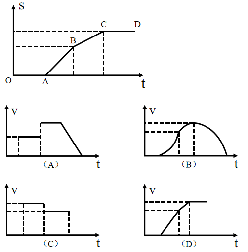

- **A**. A
- **B**. B
- **C**. C　✅
- **D**. D

**答案**：C

**官方解析**

一辆公交车在平直道路上行驶，其位移（s）-时间（t）图像的斜率代表速度大小。
OA段，位移s保持不变，斜率为0，故速度v为零；
AB段，位移s逐渐增加，斜率保持不变，速度v保持不变，在v-t图中应为水平线段；
BC段，位移s依然逐渐增加，增加的速度相对AB段放缓，斜率保持不变但小于AB段斜率，速度v保持不变且低于AB段速度，在v-t图中应为比AB段低的水平线段；
CD段，位移s保持不变，斜率为0，故速度v为零。
综上所述，只有C项图像符合。
故正确答案为C。

---

### 第 23 题　qid 2604305 · 科技常识

下列关于生活现象的说法，正确的是（    ）。

- **A**. 不锈钢容器比铁容器更持久耐用是因为所用合金材料永远不会生锈
- **B**. 氮气常用作食品防腐剂是因为其不与食品反应，无毒且容易获得　✅
- **C**. 小苏打可使面团蓬松多孔是因为其在面团发酵过程中会汽化
- **D**. 洗洁精能除去油污是因为洗洁精与油污发生了化学反应，使油粒分解

**答案**：B

**官方解析**

A项：不锈钢容器比铁容器更持久耐用是因为不锈钢不易生锈，但如果使用、保养不当或使用环境太恶劣，不锈钢容器是有可能生锈的，永远不会生锈说法过于绝对，错误；

B项：氮气不活泼，在常温常压下难与其它化学物质反应，同时能使食物处于无氧环境中，抑制导致食物腐败的细菌、微生物的繁殖；另一方面，氮气做为空气中主要成分，易获取，且成本更低廉，说法正确；

C项：面团发酵过程中产生的酸性物质，与小苏打（NaHCO）发生化学反应产生二氧化碳，从而使面团体积膨胀，所以会蓬松多孔，是化学变化，而非汽化，说法错误；

D项：洗洁精具有乳化作用，能将油污中大的油粒分散成细小的油粒，随水冲走，达到洗涤的目的，是物理变化，而不是洗洁精与油污发生化学反应，说法错误。

故正确答案为B。

---

## 言语理解与表达

### 第 1 题　qid 2605768 · 逻辑填空

千百年来，中华民族正是在与各种疫病、自然灾害、外来侵略等艰难困苦的斗争中，练就了            、众志成城的精神禀赋。
填入横线部分最恰当的一项是：

- **A**. 可歌可泣
- **B**. 百折不挠　✅
- **C**. 坚定不移
- **D**. 不卑不亢

**答案**：B

**官方解析**

所填词语搭配“精神禀赋”，且根据前文“与各种疫病、自然灾害、侵略等艰难困苦的斗争中”及并列的“众志成城”可知，横线处需表达在面对艰难困苦时依然能不畏艰难，团结一致，克服艰难。B项“百折不挠”指无论受多少挫折都不退缩，形容意志坚强，符合文意，当选。A项“可歌可泣”指悲壮的事迹使人非常感动，文段并未提及“悲壮”之意，排除；D项“不卑不亢”形容人说话办事有恰当的分寸，与“精神禀赋”搭配不当，排除。C项“坚定不移”指稳定坚强，毫不动摇，与“百折不挠”对比，对应前文的艰难困苦，“百折不挠”更符合文意。
故正确答案为B。
【文段出处】人民网：《疫情是人类良知的试金石》

---

### 第 2 题　qid 2605771 · 逻辑填空

在政务公开中，公众本身        是被动的接受者，        是主动的参与者。只有公众不断地广泛参与，政务公开才有不断深入的动力。
填入横线部分最恰当的一项是：

- **A**. 既   又
- **B**. 不仅   更　✅
- **C**. 即使   也
- **D**. 因为   所以

**答案**：B

**官方解析**

分析文段，根据横线后“只有······才”引导的对策可知，文段更强调在政务公开中公众的主动参与，故“被动的接受”与“主动的参与”二者构成递进关系，观察选项，B项“不仅······更”符合文意，当选。
A项，“既······又”为并列关系，C项，“即使······也”为假设关系，D项，“因为······所以”为因果关系，三项均与文意不符，排除。
故正确答案为B。
【文段出处】《政能亮丨政务公开，从偏重信息到运行全过程公开》

---

### 第 3 题　qid 2605783 · 逻辑填空

作为人世间最        、最        的情感，爱国是流淌在中华民族血脉之中，去不掉、打不破、灭不了的情感，是中国人民和中华民族维护民族独立和民族尊严的强大精神动力。
填入横线部分最恰当的一项是：

- **A**. 深层 持久　✅
- **B**. 真挚 复杂
- **C**. 特殊 难忘
- **D**. 强烈 丰富

**答案**：A

**官方解析**

第一空，横线处所填词语修饰“爱国情感”，且由后文“爱国是流淌在中华民族血脉之中”可知，爱国情感是具有“融入血脉”的特点。A项“深层”指深入的意思；B项“真挚”指真诚恳切（多指感情）；D项“强烈”指极强的、力量很大的，三项均符合文意，保留。C项“特殊”指不同于同类的事物或平常的情况的，文段并未体现爱国情感“特殊”，不符合文意，排除。
第二空，横线处所填词语修饰“爱国情感”，且由后文“去不掉、打不破、灭不了”可知，所填词语应体现爱国情感“一直存在”的意思。A项“持久”指保持长久，符合文意，当选。B项“复杂”指（事物的种类、头绪等）多而杂，文段并未体现爱国情感“多而杂”的特点，排除；D项“丰富”指种类多或数量大，文段并非强调爱国包含的情感种类多，整体仍是单一的，排除。
故正确答案为A。
【文段出处】《举国共享盛世联欢 凝聚民族复兴伟力》

---

### 第 4 题　qid 2605784 · 逻辑填空

党的十八大以来，反腐败与改作风            ，既        毒瘤更净化生态，既治病救人更强身健体，共同汇聚成全面从严治党的强劲脉动。
依次填入画横线部分最恰当的一组是：

- **A**. 齐头并进 扫除
- **B**. 相辅相成 驱除
- **C**. 一脉相承 去除
- **D**. 双管齐下 剜除　✅

**答案**：D

**官方解析**

第一空，根据后文“共同汇聚成全面从严治党的强劲脉动”可知，所填成语表达“反腐败与改作风”两种方式结合使用的意思。A项“齐头并进”形容几件事情或几项工作同时进行，B项“相辅相成”指的是两件事物互相补充，互相配合，缺一不可，D项“双管齐下”比喻做一件事两个方面同时进行或两种方法同时使用，均可表达“反腐败与改作风”两种方式结合使用的意思，保留。C项“一脉相承”比喻某种思想、行为或学说之间有继承关系，文段并非强调反腐败与改作风之间有继承关系，排除。
第二空，搭配“毒瘤”，根据“净化生态”可知此处表达把毒瘤去除掉之意，D项“剜除”指的是把肉或身体组织剜掉去除，与“毒瘤”搭配恰当，且表意形象，当选。A项“扫除”指清扫去除，B项“驱除”指的是驱赶除掉，均无法与“毒瘤”构成形象搭配，排除。
故正确答案为D。

---

### 第 5 题　qid 2605785 · 逻辑填空

伟大的成就与变革，往往是前所未有的，是            的，是惊心动魄的，却没有一个是            的，是信手拈来的，是一蹴而就的。
填入划横线部分最恰当的一组是：

- **A**. 空前绝后 一帆风顺
- **B**. 开天辟地 空中楼阁
- **C**. 荡气回肠 轻而易举　✅
- **D**. 振聋发聩 日行千里

**答案**：C

**官方解析**

本题可从第二空入手，横线处与“信手拈来”“一蹴而就”构成并列结构，语意相近，“信手拈来”与“一蹴而就”均形容做事情容易。A项“一帆风顺”比喻非常顺利，没有任何阻碍，C项“轻而易举”形容事情容易做，不费力，省事，均符合文意，保留。B项“空中楼阁”比喻虚构的事物或不现实的理论、方案等，D项“日行千里”现多形容做事或学习效率高，速度快，让人惊叹，均与文意无关，排除。
第一空，横线处与“前所未有”“惊心动魄”构成并列结构，形容的是伟大成就与变革的特点。C项“荡气回肠”形容使肝肠回旋，使心气激荡，可体现伟大的成就与变革让人内心激荡，符合语境，当选。A项“空前绝后”意思是从前没有过，今后也不会再有，“空前”与“前所未有”语意重复，且“绝后”程度过重，排除。
故正确答案为C。
【文段出处】《&lt;求是&gt;杂志署名文章：站在百年目标的门槛上》

---

### 第 6 题　qid 2605787 · 语句表达

坚守初心和使命，就能坚定理想信念，做到                    ，始终从容应对前进道路上的各种风险与挑战。共产党人的理想信念是党的初心和使命的最集中体现，是共产党人践行初心和使命的精神之钙。在我们党近百年的征程中，一代又一代共产党人英勇奋斗、流血牺牲，靠的就是为人民谋幸福、为民族谋复兴的初心和使命的激励。
填入横线部分最恰当的一项是：

- **A**. “要留清白在人间”
- **B**. “心底无私天地宽”
- **C**. “栉风沐雨自担当”
- **D**. “千磨万击还坚劲”　✅

**答案**：D

**官方解析**

根据后文“始终从容应对前进道路上的各种风险与挑战”可知，横线处强调的是坚定不移地面对各种困难的意思。D项“千磨万击还坚劲”指经受了千万种磨难打击，它还是那样坚韧挺拔，可形容坚定不移应对各种风险的意思，符合文意，当选。
A项“要留清白在人间”常与“粉骨碎身浑不怕”连在一起使用，表达的是只要能把高尚的气节留在人世间，就算粉身碎骨也不怕，表达了一种洁身自好，不与恶势力同流合污的思想，B项“心底无私天地宽”形容只要人心底坦荡无私，人的胸怀便要比大海、天空还要宽阔，C项“栉风沐雨自担当”指的是风吹雨打也不怕独自担当，均与文意无关，排除。
故正确答案为D。
【文段出处】《&lt;求是&gt;杂志署名文章：站在百年目标的门槛上》

---

### 第 7 题　qid 2604313 · 片段阅读

应对疫情给企业经营带来的不利影响，广东省政府近期出台支持企业复工复产的20项政策措施，实打实解决企业面临的用工成本、经营负担、疫情防控、现金流压力等方面问题。广东各地各部门也打出“减负”“暖企”政策组合拳，力求精准解决企业难题。除此之外，有关部门还梳理出102家制造业重点企业名单，建立复工复产“一对一”跟踪服务机制，准确摸排问题，提出解决方案。
下列选项最适合作为这段文字标题的是：

- **A**. 应对疫情，“暖”字当头
- **B**. 广东：打通复工复产堵点　✅
- **C**. 广东经济：挑战与机遇并存
- **D**. “减负暖企”，实现经济腾飞

**答案**：B

**官方解析**

文段首先介绍了广东通过出台“20项政策措施”支持企业复工复产，接下来通过“也”，并列介绍了广东各地各部门“减负”“暖企”政策，尾句通过“除此之外”再次介绍了对102家制造业企业建立复工复产“一对一”跟踪服务机制。故文段通过并列结构，从三方面介绍了广东如何帮助企业解决问题难点、支持企业复工复产的具体措施，B项“打通复工复产堵点”概括恰当，当选。
A项，“‘暖’字当头”对应文段分句“‘减负’‘暖企’政策组合拳”，表述片面，排除；
C项，文段通篇论述的是帮助企业解决疫情带来的问题，未涉及“机遇”，排除；
D项，“减负暖企”仅对应文段分句“广东各地各部门也打出‘减负’‘暖企’政策组合拳”，表述片面，且文段主要论述如何应对疫情带来的影响，“实现经济腾飞”无中生有，排除。
故正确答案为B。
【文段出处】《人民日报：广东 打通复工复产堵点》

---

### 第 8 题　qid 2605859 · 片段阅读

衡量一座城市的治理水平，往往不在于建了多少高楼大厦，更要看弱势群体有多大程度的尊严，生活能否得到基本保障。平时如此，疫情防控期间同样如此。防控任务艰巨，要照顾到方方面面，兼顾每一个群体，实属不易，但越是如此，越要关注最需关注的人：大众的生活越是被按下暂停键，越要关注那些生活无以为继的群体，为他们输送温暖和信心。
通过这段文字，作者意在强调：

- **A**. 城市的硬件设施水平对城市治理而言处于次要地位
- **B**. 保障弱势群体的基本生活对城市治理尤为重要
- **C**. 疫情防控期间更要关注社会中的弱势群体　✅
- **D**. 疫情防控期间保障民生尤为关键

**答案**：C

**官方解析**

文段首句指出“弱势群体”对于衡量一座城市的治理水平很重要，紧接着指出疫情防控期间同样如此，并通过转折关联词“但”和程度词“最”引出文段论述的重点，即疫情防控期间更应关注“那些生活无以为继的群体”，为他们输送温暖和信心。故文段论述的重点是疫情防控期间更需关注弱势群体，对应C项。
A项，未提及文段论述的核心话题“弱势群体”，“城市的硬件设施水平”并非文段论述重点，排除；
B项，“基本生活”表述片面，且未提及文段强调的重点“疫情防控期间”，排除；
D项，“保障民生”范围扩大，文段重点强调的是对“弱势群体”的关注，排除。
故正确答案为C。
【文段出处】《一座城市发展水平，不看有多少高楼，而是弱势群体活的是否有尊严》

---

### 第 9 题　qid 2605861 · 片段阅读

让中国标准走向世界，是实现技术、产品和服务输出的最有效方式。但必须看到，标准竞争仍是核心技术硬实力的体现，美、日、欧等标准有其历史优势，在市场上已形成体系优势，我国标准制定和输出想要追赶发达国家的脚步还需要不断努力：一方面，质量和技术含量不断提升，成果的转化欠缺动力；另一方面，技术之外的配套工作也有待持续完善。
这段文字主要说明了：

- **A**. 中国标准走向全世界仍然任重道远　✅
- **B**. 需要加强技术创新推动中国标准走向世界
- **C**. 中国标准与现行国际标准还有一定差距
- **D**. 核心技术硬实力不足阻碍了中国标准的输出

**答案**：A

**官方解析**

文段首先指出中国标准走向世界的重要意义，接着通过转折关联词“但”指出美、日、欧等标准已形成体系优势，我国标准的制定和输出还需要不断努力。文段最后通过“一方面······另一方面······”具体阐述了我国标准制定和输出存在的问题。由此可知，文段重在强调我国标准走向世界存在的问题，A项“中国标准走向全世界仍然任重道远”能概括此意，当选。
B项，文段中阐述的我国标准走向世界面临两方面的问题，而选项“需要加强技术创新”仅针对其中一方面问题给出的对策，表述片面，排除。
C项，文段说的是“······想要追赶发达国家的脚步还需要不断努力”，强调中国标准离“发达国家”标准有一定距离，而非选项的“现行国际标准”，表述与文意不符，排除。
D项，“核心技术硬实力不足”对应其中一方面的问题，未涉及另一方面“技术之外的配套工作”的问题，表述片面，排除。
故正确答案为A。
【文段出处】《从“独木出海”到“协同造船”  中国标准“走出去”的合作新格局》

---

### 第 10 题　qid 2606186 · 片段阅读

在互联网时代，每个人都是“价值出口”；在地球村时代，每个人都是“国家名片”。更重要的是，大时代、大变迁，让中国人有着无比丰富的生命可能，有着更为多彩的生活体验。梦想与奋斗、成功与挫折、欢笑与泪水，正是最能打动人心的故事。学会发现故事、讲述故事，讲述自己的故事、身边的故事，我们就能向世界更好地展现一个真实、立体、生动的中国。
对这段文字理解准确的是：

- **A**. 人人都要学会讲故事　✅
- **B**. 每个人都是国家形象的组成部分
- **C**. 平凡的点滴重构了“中国故事”
- **D**. 世界对改革开放的中国故事感兴趣

**答案**：A

**官方解析**

文段开篇借助两个并列分句介绍当今时代对“每个人”的影响，并通过程度词“更”突出其中影响之一是给予国人“丰富的生命可能”和“多彩的生活体验”。紧接着又说明这些“体验”与“可能”所包含的“梦想与奋斗”等元素是“最能打动人心的故事”。尾句则承接前文强调讲好这些故事的重要性。故文段主要围绕“人”和“讲故事”两个主题词展开论述的，同时包含这两个主题词的仅有A项。
B项：缺少主题词“讲故事”，排除；
C项和D项均缺少主题词“人”，排除。
故正确答案为A。
【文段出处】《当好中国故事“主讲人”》

---

## 数量关系

### 第 1 题　qid 2604259 · 数学运算

9.19，4.27，5.35，2.43，（    ）

- **A**. 3.51
- **B**. 5.51　✅
- **C**. 5.60
- **D**. 8.60

**答案**：B

**官方解析**

题干有特殊符号“.”，故考虑小数点前后的机械划分。小数点后数列19，27，35，43，（    ），是公差为8的等差数列，下一项为；小数点前数列观察无明显特征，作差作和亦无规律，考虑与小数部分的关系，，，，，发现小数部分两数乘积取个位数是整数部分，即，取9；，取4；，取5；，取2，则所求项整数部分为，取5，故所求项为5.51。

故正确答案为B。

---

### 第 2 题　qid 2604267 · 数学运算

- **A**. 16
- **B**. 27
- **C**. 38　✅
- **D**. 49

**答案**：C

**官方解析**

图形数阵，优先考虑横向和竖向规律。第一行；第二行；第三行，发现各行数字之和组成的数列16，32，48，（    ），是公差为16的等差数列，下一项为，则所求项。

故正确答案为C。

---

### 第 3 题　qid 2605816 · 数学运算

中秋节前夕，某商场采购了一批月饼礼盒，此后第一周售出了总数的一半多10份，第二周售出了剩下的一半多5份，若此时还剩下20份月饼礼盒，则商场最初采购了（    ）份月饼礼盒。

- **A**. 60
- **B**. 80
- **C**. 100
- **D**. 120　✅

**答案**：D

**官方解析**

方法一：余数问题可优先考虑代入排除。

A项：月饼总量为60，第一周售出一半多10份为40份，剩余20份；第二周售出一半多5份为15份，剩余5份，不符合题意，排除；

B项：月饼总量为80，第一周售出一半多10份为50份，剩余30份；第二周售出一半多5份为20份，剩余10份，不符合题意，排除；

C项：月饼总量为100，第一周售出一半多10份为60份，剩余40份；第二周售出一半多5份为25份，剩余15份，不符合题意，排除；

D项：月饼总量为120，第一周售出一半多10份为70份，剩余50份；第二周售出一半多5份为30份，剩余20份，符合题意，当选。 

方法二：根据题意，设商场最初采购份月饼礼盒，则第一周剩下总数的一半少10份，即，第二周售出份，则第二周剩下，解得，故商场最初采购礼盒数为份。

故正确答案为D。

---

### 第 4 题　qid 2605829 · 数学运算

某文具厂计划每周生产A、B两款文件夹共9000个，其中A款文件夹每个生产成本为1.6元，售价为2.3元，B款文件夹每个生产成本为2元，售价为3元。假设该厂每周在两款文件夹上投入的生产成本不高于15000元，则要使利润最大化，该厂每周应生产A款文件夹（    ）个。

- **A**. 0
- **B**. 6000
- **C**. 7500　✅
- **D**. 9000

**答案**：C

**官方解析**

利润率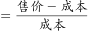，由题意可知，A款文件夹利润率为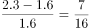，B款利润率为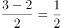，A款利润率B款利润率，要使利润最大化，应尽可能多的生产B款文件夹，A款文件夹数量要尽量少。设文具厂每周生产A、B款文件夹数量分别为个、个，由题意可列式为，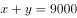①，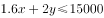②。将①式代入②式可得，，解得，即A款文件夹最少生产7500个。

故正确答案为C。

---

### 第 5 题　qid 2605836 · 数学运算

某单位食堂后勤部门采购了一批大米，并将其平均分给了甲、乙两个饭堂。5周后，甲饭堂只剩余大米7千克；又过了1周，乙饭堂也只剩余大米6千克，已知甲乙饭堂的就餐人数固定，前往甲饭堂就餐的人数比乙饭堂多1人。如果每人每周消耗大米1千克，则这批大米共有（    ）千克。

- **A**. 72
- **B**. 84　✅
- **C**. 96
- **D**. 108

**答案**：B

**官方解析**

设前往乙饭堂就餐的有人，前往甲饭堂就餐的有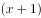人，由题意可列式为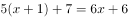，解得，则大米总量为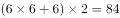千克。

故正确答案为B。

---

### 第 6 题　qid 2605831 · 数学运算

某政务服务大厅开始办理业务前，已经有部分人在排队等候领取证书，且每分钟新增的人数一样多。从开始办理业务到排队等候的人全部领到证书，若同时开5个发证窗口就需要1个小时，若同时开6个发证窗口就需要40分钟。按照每个窗口给每个人发证书需要1分钟计算，如果想要在20分钟内将排队等候的人的证书全部发完，则需同时开（    ）个发证窗口。

- **A**. 7
- **B**. 8
- **C**. 9　✅
- **D**. 10

**答案**：C

**官方解析**

设开始办理业务前排队人数为，每分钟新增人数为。则代入牛吃草公式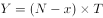可得，，解得，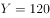。设需同时开放个发证窗口，才能在20分钟以内发完证书，即为，解得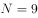，需同时开放9个发证窗口。

故正确答案为C。

---

### 第 7 题　qid 2605834 · 数学运算

在针对一家小型超市的调查中发现，某生鲜商品的售价与销量之间呈现以下规律：售价每降低1元，销量便会增加2千克，对应的表格如下：

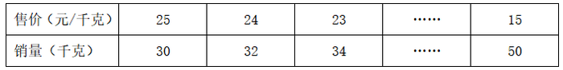

若该商品的成本是15元/千克，售价不得高于25元且必须为整数，如果某天该商品的销售利润为200元，则售价是（    ）元/千克。

- **A**. 22
- **B**. 20　✅
- **C**. 18
- **D**. 16

**答案**：B

**官方解析**

当天利润为200元，总利润单件利润销量，利润售价成本，由题意可知售价为整数，成本为15元/千克，则单件利润应是200的约数，代入选项验证。

A项：售价为22元/千克，单件利润为元，不是200的约数，排除；

B项：售价为20元/千克，单件利润为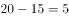元，是200的约数，销量为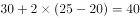千克，总利润为元，符合题意所有条件，无需验证剩余选项。

故正确答案为B。

---

### 第 8 题　qid 2604239 · 数学运算

为加强治安防控，现计划在一段L形的围墙（如下图）上安装治安摄像头，其中A点到B点长度为750米，B点到C点长度为1350米。按要求ABC三个位置必须安装一个摄像头，且相邻两个摄像头之间的距离要保持一致，则整段围墙至少需要安装（    ）个摄像头。

- **A**. 14
- **B**. 15　✅
- **C**. 16
- **D**. 17

**答案**：B

**官方解析**

根据“ABC三个位置必须安装一个摄像头”可知为两端植树问题。根据公式：。根据“相邻两个摄像头之间的距离要保持一致”可得，间隔距离需为AB、BC长度的公约数。总长一定，间隔距离越大，摄像头的个数就越少，则间隔距离最大为AB（750米）、BC（1350米）的最大公约数，即150米，则至少需要安装个摄像头。

故正确答案为B。

---

### 第 9 题　qid 2604260 · 数学运算

某单位的两个部门计划订阅报纸。每个部门需要在指定的5种报纸中选择其中的3种，且这两个部门在选择时应做好沟通，做到5种报纸都有部门订阅，则订阅报纸的方案共有（    ）种。

- **A**. 20
- **B**. 30　✅
- **C**. 60
- **D**. 100

**答案**：B

**官方解析**

第一个选择的部门从5种报纸中任意选择3种，有种选择；此时要保证5种报纸都有人选择，第二个部门必须要选择剩余的2种报纸，且再从第一个部门选择的3种报纸中任选一种即可，则第二个部门有种，则订阅报纸的方案共有种。

故正确答案为B。

---

### 第 10 题　qid 2604271 · 数学运算

一个纸箱里装有大小及材质完全相同的10个小球，其中3个黑色，2个白色，1个红色，2个黄色，1个绿色，1个紫色。如果不放回地依次随机取出3个小球，则取出的小球依次是黑色，红色，白色的概率为（    ）。

- **A**. 

　✅
- **B**. 

- **C**. 

- **D**. 

**答案**：A

**官方解析**

概率。不放回的依次随机取出3个小球，总的情况数为种；要求取出的小球依次是黑色、红色、白色的情况数为种，则取出的小球依次是黑色，红色，白色的概率为。

故正确答案为A。

---

### 第 11 题　qid 2604357 · 数学运算

某部门正在准备会议材料，共有153份相同的文件，需要装到大小两种文件袋里送至会场，大的每个能装24份文件，小的每个能装15份文件。如果要使每个文件袋都正好装满，则需要大文件袋（    ）个。

- **A**. 2　✅
- **B**. 3
- **C**. 5
- **D**. 7

**答案**：A

**官方解析**

设需要大文件袋个，小文件袋个，由题意可列式为：，化简可得。为偶数，51为奇数，则为奇数，可知的尾数为5，的尾数为6，选项中满足条件的取值为A、D两项。，可知取值不能为7，排除D项。

故正确答案为A。

---

### 第 12 题　qid 2604358 · 数学运算

A、B两座港口相距300公里且仅有1条固定航道，在某一时刻甲船从A港顺流而下前往B港，同时乙船从B港逆流而上前往A港，甲船在5小时之后抵达了B港，停留1小时后开始返回A港，又过了6小时追上了乙船。则乙船在静水中的时速为（    ）公里。

- **A**. 20
- **B**. 25
- **C**. 30　✅
- **D**. 40

**答案**：C

**官方解析**

由题意可知，甲顺水需用5小时走完全程，可得：公里/时。甲返程追上乙时，乙已逆流行驶了小时，同样的逆流路程甲走了6小时，可得：，化简得千米/时，则千米/时。

故正确答案为C。

---

## 判断推理

### 第 1 题　qid 2604279 · 图形推理

下列选项中，不能在裁剪或覆盖后折成如图所示立方体的是（    ）。

- **A**. A
- **B**. B
- **C**. C
- **D**. D　✅

**答案**：D

**官方解析**

将选项原展开图标上序号如下图，逐一进行分析。

A项：展开图中裁去面3和面6，得到的展开图中（如下图A项所示），面1和面5，面2和面7，面4和面8分别互为相对面，符合六面体展开图中的“二二二型”，折叠后可以得到题干所示的立方体，排除；

B项：展开图中裁去面6（或面7），得到的展开图中（如上图B项所示），面1和面7（或面6），面2和面4，面3和面5分别互为相对面，符合六面体展开图中的“一四一型”，折叠后可以得到题干所示的立方体，排除；

C项：展开图中面1和面3、面5和面7、面2和面4、面4和面6分别互为相对面，其中面2、面6分别和面4互为相对面，在其折叠后能得到题干所示的立方体，不过面2和面6在立体图形中重合在一起与面4互为相对面，排除；

D项：其展开图无论是通过裁剪或是覆盖均不能得到题干所示的封闭的立方体，当选。

本题为选非题，故正确答案为D。

---

### 第 2 题　qid 2604286 · 图形推理

下列选项中最符合所给图形规律的是（    ）。

- **A**. A
- **B**. B
- **C**. C
- **D**. D　✅

**答案**：D

**官方解析**

本题考察图形拼合。将原图形所给的四个图形分别标记1、2、3、4，发现可以与D项拼接成一个完整的图形。

故正确答案为D。

---

### 第 3 题　qid 2604306 · 图形推理

下列选项中，能与所给图形组合成立方体的是（    ）。

- **A**. A
- **B**. B
- **C**. C　✅
- **D**. D

**答案**：C

**官方解析**

本题考查立体拼合。根据题干中的两个立体图形可共同构成一个的立方体，观察选项，从A项第一层和第二层结合来看，是长度为4立方体的多面体，与题干不符，排除；

从上向下逐层分析题干，题干第一层两个图形相加共有6个小立方体，还需要3个小立方体才能组成的立方体，但是D项第一层只有2个小立方体，排除；

题干第二层两个图形相加共有4个小立方体，还需要5个小立方体才能组成的立方体，B项第二层有4个小立方体，排除。

故正确答案为C。

---

### 第 4 题　qid 2604311 · 图形推理

请问使用所给的四个图形能够组合成（    ）。

- **A**. 矩形
- **B**. 三角形
- **C**. 等腰梯形
- **D**. 直角梯形　✅

**答案**：D

**官方解析**

本题考查平面拼合，可采用平行且等长相消的方式解题。消去平行且等长的线段后进行组合可得到轮廓图为直角梯形，即为D项。平行且等长相消的方式如下图所示： 

故正确答案为D。

---

### 第 5 题　qid 2604320 · 图形推理

下列4张纸条，沿折痕能够折出如图所示图形的是（    ）。

- **A**. A
- **B**. B
- **C**. C　✅
- **D**. D

**答案**：C

**官方解析**

观察题干，发现图形折痕之间构成了梯形，如图所示，展开图中需有两个非直角大梯形④⑤，两个非直角小梯形③⑥，两个直角小梯形①②，且折痕所构成的两个大梯形应该相邻，只有C项符合此特征。

故正确答案为C。

---

### 第 6 题　qid 2605788 · 图形推理

下列选项中最符合所给图形规律的是（    ）。

- **A**. A
- **B**. B　✅
- **C**. C
- **D**. D

**答案**：B

**官方解析**

元素组成不同，且无明显属性规律，考虑数量规律。观察发现，题干图形出现较多的圆、弧等曲线图形，考虑曲线数，但数曲线没有规律。继续观察发现，题干图形线条相交明显，考虑数交点。题干图形的交点数依次为2、3、4、5，故？处应选择一个交点数为6的图形。A项交点数为0个，B项交点数为6个，C项交点数为4个，D项交点数为8个。只有B项符合。
故正确答案为B。

---

### 第 7 题　qid 2605833 · 图形推理

下列选项中最符合所给图形规律的是（    ）。

- **A**. A　✅
- **B**. B
- **C**. C
- **D**. D

**答案**：A

**官方解析**

元素组成不同，且无属性规律和数量规律。观察发现，题干中所有汉字的最外圈都呈现出三面有连续线条包围、一面开放的状态。A项最外圈为三面有连续线条包围、一面开放，B项最外圈只有一面有线条，C项最外圈三面的线条未连续，在点处有开口，D项最外圈只有两面有连续线条。只有A项符合。
故正确答案为A。

---

### 第 8 题　qid 2605835 · 图形推理

下列选项中最符合所给图形规律的是（    ）。

- **A**. A
- **B**. B
- **C**. C　✅
- **D**. D

**答案**：C

**官方解析**

解析一：图形元素组成相似，考虑样式规律，图形间有相同的线条反复出现，优先考虑样式规律中的加减同异。在前一组图形中，第一个图形与第二个图形去同存异，可以得到第三个图形，故第二组图形应遵循同样的规律，符合条件的只有C项。
故正确答案为C。
解析二：图形元素组成不同，且属性无规律考虑数量规律，观察发现出现多个“日”字变形及多端点，考虑数笔画。第一组图形笔画数都为1，第二组图形应遵循同样的规律，第二组图1与图2笔画数也都为1，故问号处应填入笔画数为1的图形。选项的笔画数分别为3、2、2、1，符合条件的只有D项。
故正确答案为D。
注：根据图形特征“相同线条反复出现”，此题元素组成相似的特征更加明显，应优先考虑样式规律，故粉笔更倾向于C项。

---

### 第 9 题　qid 2605837 · 图形推理

下列的三个视图是观察某一多面体得到的，则该立体图形不可能是（    ）。

- **A**. A　✅
- **B**. B
- **C**. C
- **D**. D

**答案**：A

**官方解析**

A项：左视图的第三列与题干图形不匹配，当选；

B项：三视图均符合题干给定图形，排除；

C项：三视图均符合题干给定图形，排除；

D项：三视图均符合题干给定图形，排除。

本题为选非题，故正确答案为A。

---

### 第 10 题　qid 2605838 · 图形推理

下列选项中最符合所给图形规律的是（    ）。

- **A**. A
- **B**. B
- **C**. C　✅
- **D**. D

**答案**：C

**官方解析**

题干元素组成相同，优先考虑位置规律。图中的黑色三角形和带斜线三角形均以图一最上方为起始位置沿中间七边形的边发生平移，在图一和图二中两种三角形为重合状态。黑色三角形依次顺时针平移1、2、3步，故到？处应顺时针平移4步，排除A、D两项；带斜线三角形依次顺时针平移1步，故到？处也应顺时针平移1步，排除B项。
故正确答案为C。

---

### 第 11 题　qid 2605839 · 类比推理

清风∶朗月（    ）

- **A**. 钢墙∶铁壁
- **B**. 斗转∶星移
- **C**. 惊涛∶骇浪
- **D**. 高山∶流水　✅

**答案**：D

**官方解析**

第一步：判断题干词语间逻辑关系。
清风指的是清朗的风，朗月指的是明亮的月，二者为并列关系，且都是自然现象，同时清风和朗月这两个词都是偏正结构。
第二步：判断选项词语间逻辑关系。
A项：钢墙和铁壁二者为并列关系，也为偏正结构，但是钢墙和铁壁并非是自然现象，与题干逻辑关系不一致，排除；
B项：斗转指北斗转换了方向，星移指星辰移了位置，二者为并列关系，且都是自然现象，但是斗转和星移这两个词都是主谓结构，与题干逻辑关系不一致，排除；
C项：惊涛和骇浪都是指汹涌的浪涛，二者为全同关系，与题干逻辑关系不一致，排除；
D项：高山是指高的山，流水是指流动的水，二者为并列关系，且都是自然现象，同时高山和流水这两个词都是偏正结构，与题干逻辑关系一致，当选。
故正确答案为D。

---

### 第 12 题　qid 2605840 · 类比推理

油田∶汽油（    ）

- **A**. 伐木场∶家具　✅
- **B**. 商场∶服装
- **C**. 农田∶稻谷
- **D**. 水库∶水

**答案**：A

**官方解析**

第一步：判断题干词语间逻辑关系。
油田开采的石油充当原材料经过加工成为汽油。
第二步：判断选项词语间逻辑关系。
A项：伐木场砍伐的木材充当原材料经过加工成为家具，与题干逻辑关系一致，当选；
B项：在商场里销售服装，二者为地点的对应关系，服装的原材料为布料，布料不是在商场中开采出的，与题干逻辑关系不一致，排除；
C项：在农田里收割稻谷，二者为地点的对应关系，稻谷不是经过加工的成品，与题干逻辑关系不一致，排除；
D项：水是水库的组成部分，二者为组成关系，水不是经过加工的成品，与题干逻辑关系不一致，排除。
故正确答案为A。

---

### 第 13 题　qid 2605842 · 类比推理

夜晚∶路灯（    ）

- **A**. 孤舟∶灯塔
- **B**. 站台∶路标
- **C**. 春节∶春联　✅
- **D**. 黄昏∶道别

**答案**：C

**官方解析**

第一步：判断题干词语间逻辑关系。
路灯是在夜晚时使用的，二者存在时间上的对应关系。
第二步：判断选项词语间逻辑关系。
A项：孤舟需要灯塔为其照明护航，但并不是只有孤舟才需要灯塔，其它的船只也需要灯塔照明护航，二者不是必要条件的对应关系，与题干逻辑关系不一致，排除；
B项：站台里有路标来指路，但并不是只有站台里才有路标，生活中很多地方都需要路标来指路，二者不是必要条件的对应关系，与题干逻辑关系不一致，排除；
C项：春联是在春节期间使用的，二者存在时间上的对应关系，与题干逻辑关系一致，当选；
D项：在黄昏时道别，但并不是只有在黄昏时才能道别，清晨午后都可以用来道别，二者不是必要条件的对应关系，与题干逻辑关系不一致，排除。
故正确答案为C。

---

### 第 14 题　qid 2605843 · 类比推理

人∶成年人∶未成年人（    ）

- **A**. 门∶开门∶关门
- **B**. 手∶左手∶右手　✅
- **C**. 天气∶晴天∶阴天
- **D**. 车祸∶幸存者∶遇难者

**答案**：B

**官方解析**

第一步：判断题干词语间逻辑关系。
成年人与未成年人均是人的一种，二者与第一个词是包容关系中的种属关系，且成年人与未成年人是并列关系中的矛盾关系。
第二步：判断选项词语间逻辑关系。
A项：开门与关门分别是两个动作，与门不是包容关系中的种属关系，与题干逻辑关系不一致，排除；
B项：左手与右手均是手的一种，二者与第一个词是包容关系中的种属关系，且左手与右手是并列关系中的矛盾关系，与题干逻辑关系一致，当选；
C项：晴天与阴天均是天气的一种，二者与第一个词是包容关系中的种属关系，但是天气除了晴天、阴天之外，还有其它天气，故晴天和阴天是并列关系中的反对关系，与题干逻辑关系不一致，排除；
D项：车祸之后可能会出现幸存者与遇难者，幸存者与遇难者不是车祸的一种，与题干逻辑关系不一致，排除。
故正确答案为B。

---

### 第 15 题　qid 2604266 · 类比推理

瓜熟蒂落：水到渠成（    ）

- **A**. 朝三暮四：朝秦暮楚　✅
- **B**. 翻云覆雨：翻天覆地
- **C**. 耳濡目染：耳熟能详
- **D**. 大功告成：功败垂成

**答案**：A

**官方解析**

第一步：判断题干词语间逻辑关系。
瓜熟蒂落指时机一旦成熟，事情自然成功，水到渠成比喻有条件之后，事情自然会成功，即功到自然成，二者是近义关系。
第二步：判断选项词语间逻辑关系。
A项：朝三暮四原指玩弄手法欺骗人，后用来比喻常常变卦，反复无常，朝秦暮楚用以比喻人没有原则，反复无常，二者是近义关系，与题干逻辑关系一致，当选；
B项：翻云覆雨比喻反复无常或惯于玩弄手段，翻天覆地形容变化巨大而彻底，也指闹得很凶，二者不是近义关系，与题干逻辑关系不一致，排除；
C项：耳濡目染意思是耳朵经常听到，眼睛经常看到，不知不觉地受到影响，耳熟能详指听得多了，能够很清楚、很详细地复述出来，二者不是近义关系，与题干逻辑关系不一致，排除；
D项：大功告成指巨大工程或重要任务宣告完成，功败垂成指事情接近成功的时候却遭到了失败，二者是反义关系，与题干逻辑关系不一致，排除。
故正确答案为A。

---

### 第 16 题　qid 2604272 · 类比推理

某工作组计划开展实地调研，初步确定只选择粤东、粤西或粤北中的一个地区。对此，工作组中的甲、乙、丙三人提出了以下意见：
甲：在此次调研中粤东更具有代表性，应该前往粤东地区。
乙：上一轮调研已经去过粤北了，这一次应该选择其他地区。
丙：我认为选择粤西或粤北地区开展实地调研更合适。
最终工作组只采纳了其中一个人的意见，则下列陈述一定正确的是（    ）。

- **A**. 工作组前往了粤东地区
- **B**. 工作组前往了粤西地区
- **C**. 工作组采纳了乙的意见
- **D**. 工作组采纳了丙的意见　✅

**答案**：D

**官方解析**

第一步：翻译题干。

① 去粤东；

② 粤北；

③ 粤西或粤北。

因为只从三个地方进行选择，故条件③等价为“粤东”。

第二步：逐一分析选项。

题干条件③与条件①相矛盾，二者必有一真一假，最终工作组只采纳了一个人的意见，故条件②一定为假，所以工作组最后去了粤北地区。即工作组采纳了丙的意见。

故正确答案为D。

---

### 第 17 题　qid 2604274 · 逻辑判断

有人认为，十二生肖起源于动物崇拜。这是因为在原始社会中，人类的生产力水平很低，猪、牛、羊等牲畜与农事活动关系密切，动物崇拜也就随之而生。除此之外，虎、蛇等动物可能威胁到人类的自身安全，往往被视为强大的象征，人们也会因为感到恐惧而形成动物崇拜。
以下选项如果为真，最能反驳上述判断的是（    ）。

- **A**. 十二生肖中只有龙不是现实中存在的动物
- **B**. “过街老鼠人人喊打”，但它是十二生肖之首　✅
- **C**. 鸡、鸭、鹅与农事活动关系密切，但只有鸡属于十二生肖
- **D**. 牛和猪都与农事相关，但他们在十二生肖中的位置相距很远

**答案**：B

**官方解析**

第一步：找出论点和论据。
论点：十二生肖起源于动物崇拜。
论据：因为在原始社会中，人类的生产力水平很低，猪、牛、羊等牲畜与农事活动关系密切，动物崇拜也就随之而生。除此之外，虎、蛇等动物可能威胁到人类的自身安全，往往被视为强大的象征，人们也会因为感到恐惧而形成动物崇拜。
本题的论点在说十二生肖起源于动物崇拜，论据在说人类会对与农事活动关系密切还有可能威胁人类自身安全的动物产生动物崇拜，可以用与农事活动关系密切的动物不会令人产生动物崇拜，或者用强大的象征动物也不会令人产生动物崇拜进行削弱。
第二步：逐一分析选项。
A项：选项讨论的是龙不是现实中存在的动物，但是无法判断人们对龙是否存在动物崇拜，话题不一致，无法削弱，排除；
B项：“过街老鼠人人喊打”，但它是十二生肖之首，说明老鼠是人们痛恨并且人人喊打的动物，而不是与农事活动关系密切或强大到令人恐惧的动物，为举反例削弱论点，当选；
C项：鸡、鸭、鹅与农事活动关系密切，但只有鸡属于十二生肖，无法否定十二生肖起源于动物崇拜，因为三种动物虽然都与农事活动紧密相关，但是三者与农事活动的密切程度，以及其他方面可能有差异，因此无法削弱，排除；
D项：选项讨论的是牛和猪的排位问题，论点讨论的是动物崇拜的问题，二者讨论的话题不一致，无法削弱，排除。
故正确答案为B。

---

### 第 18 题　qid 2604275 · 逻辑判断

某扶贫产业基地计划种植紫薯、红薯、南瓜以及玉米四种农作物。四种农作物的种植面积大小不一，且需要满足以下条件：
①要么紫薯种植面积最大，要么南瓜种植面积最大；
②如果紫薯的种植面积最大，红薯的种植面积便最小；
如果红薯的种植面积大于玉米，可以推出的是（    ）。

- **A**. 南瓜种植面积大于玉米种植面积　✅
- **B**. 紫薯种植面积大于玉米种植面积
- **C**. 紫薯种植面积小于红薯种植面积
- **D**. 玉米种植面积大于南瓜种植面积

**答案**：A

**官方解析**

第一步：翻译题干。

①要么紫薯最大，要么南瓜最大；

②紫薯最大红薯最小；

③红薯的种植面积大于玉米。

第二步：逐一分析选项。

根据③可知红薯的面积不是最小的，对②箭头后进行了否定，根据否后必否前，可以得到紫薯最大；又根据①可知，紫薯和南瓜有且只有一个面积最大，而紫薯最大，则可以得出南瓜最大为真，即南瓜的种植面积是最大的。

A项：当南瓜的种植面积最大时，南瓜的种植面积一定大于其他三个农作物的种植面积，可以得出南瓜的种植面积大于玉米的种植面积，可以推出，当选；

B项：紫薯种植面积和玉米种植面积的大小关系根据题干信息无法推出，为不确定选项，排除；

C项：紫薯种植面积和红薯种植面积的大小关系根据题干信息无法推出，为不确定选项，排除；

D项：根据题干可以推出南瓜的种植面积最大，故南瓜的种植面积一定大于玉米的种植面积，该项错误，排除。

故正确答案为A。

---

### 第 19 题　qid 2604277 · 逻辑判断

国内有研究发现，在小学阶段，春季出生的孩子比冬季出生的孩子学习成绩更好，在学业上获得成功的概率也更高。有人据此推测，这是由于春季出生的孩子年纪更大一些，而年纪大的孩子往往更成熟，更容易获得老师的关注。
以下选项如果为真，最能反驳上述判断的是（    ）。

- **A**. 得到老师更多关注并不意味着一定有更多在学业上取得成就的机会
- **B**. 教育部门规定，小学生必须在当年9月1日前年满6周岁才能入学　✅
- **C**. 老师也会倾向于关注成绩不理想的学生
- **D**. 其他研究发现，成绩好的孩子普遍善于独立思考

**答案**：B

**官方解析**

第一步：找出论点和论据。
论点：春季出生的孩子成绩更好，是因为春季出生的孩子年纪更大，更容易获得老师的关注。
论据：无。
本题只有论点没有论据，优先考虑削弱论点。
第二步：逐一分析选项。
A项：得到老师更多关注“不一定”有更多在学业上取得成就的机会，削弱了“关注”和“成绩”之间的因果联系，能削弱，保留；
B项：教育部门规定，小学生必须在当年9月1日前年满6周岁才能入学，比如2020年按规定可以上一年级的学生，年纪构成应该是2013年9月1日后—2014年9月1日前出生的孩子（不要用“找关系提前上学或延迟上学”等极端个例来讨论，要讨论普遍情况），所以在同一年级中，并不是春季出生的孩子年纪更大，反而是冬季更大，直接否定了论点中“是因为春季出生的孩子年纪更大”这个原因，能削弱，保留；
C项：老师也会倾向于关注成绩不理想的学生，与春季出生的孩子学习成绩更好的原因无关，排除；
D项：其他研究发现，成绩好的孩子普遍善于独立思考，说的是成绩好和是否善于思考的关系，但是与春季出生的孩子学习成绩更好的原因无关，排除。
对比A、B两项，都是在削弱论点中的因果关系，但B项力度更强，理由如下：
（1）A项说的是“不一定”，削弱力度不及B项的确定性表述；
（2）论点找的核心原因是“春季出生的孩子年纪更大”，B项说事实上班里是冬季出生的比春季出生的年纪大，直接削弱核心原因，而A项削弱的是在年纪大小基础上再延伸出来的“关注度”，如果年纪都不成立，后面延伸的就没有意义了，一个是“根”，一个是“延伸”，削弱“根”更强，故粉笔教研团队这道题更倾向B项。
故正确答案为B。

---

### 第 20 题　qid 2604280 · 逻辑判断

某市实现高质量发展的关键在于，通过推动当地制造业的发展，建立健全现代化产业体系。该市产业园区的建设发展对建立健全现代化产业体系至关重要，因此也是推动实现高质量发展的关键。
下列选项中，与上述推论过程结构最为类似的是（    ）。

- **A**. 打好三大攻坚战是全面建成小康社会的前提条件，也是实现高质量发展的必备基础。所以，打好三大攻坚战才能实现经济社会的全面发展
- **B**. 所有战略性新兴领域的产品均为高尖端产品。某公司的产品广泛应用于新型材料等战略性新兴领域。因此，该公司是一家高尖端制造企业
- **C**. 公路网络不发达会导致交通落后，而交通落后已经成为制约乡镇加快发展的最大瓶颈。因此，乡镇要加快发展，必须加强路网建设　✅
- **D**. 与传统育苗方式相比，组织育苗是一种更为高效的组织快繁方式。因此，引进组织育苗技术很有意义

**答案**：C

**官方解析**

第一步：翻译题干，找到题干的推理结构。

第一句的翻译为：实现高质量发展通过推动当地制造业的发展，建立健全现代化产业体系；

第二句的翻译为：健全现代化的产业体系产业园区的建设发展；

最后的推理为：实现高质量发展产业园区的建设发展。

即题干的论证过程为：12，23，因此13。（通过肯前串联起来，推出肯后。）

第二步：逐一分析选项。

A项：翻译为全面建成小康社会打好三大攻坚战，实现高质量发展打好三大攻坚战，但是最后一句的“实现经济社会的全面发展”在前面翻译中并未提到，与题干推理形式不同，排除；

B项：翻译为战略性新兴领域的产品高尖端产品，最后一句话说的是该公司是一家高尖端制造企业，但是题干第一句话说的是高尖端产品，偷换概念，排除；

C项：翻译为公路网络不发达交通落后，交通落后乡镇加快发展，最后一句的翻译应为：乡镇加快发展必须加强路网建设，选项的论证过程为：12，23，因此31，保留；

D项：翻译为组织育苗高效，引进组织育苗技术很有意义，但是最后一句是否有意义在前面并未提到，与题干推理形式不同，排除。

注意：本题四个选项中没有与题干完全相同的推理方式，但是题干的推理方式为“通过肯前串联起来，推出肯后”，这是正确的推理逻辑，只有C项“通过否后串联起来，推出否前”，“肯前必肯后，否后必否前”，这也是正确的推理逻辑，故择优选C项。

本题能够学到的知识点是，如果有一个选项与题干的推理方式完全相同，比如都是肯前推肯后，优选这个选项；但如果没有这样的选项，题干的推理是对的，我们也要找一个推理正确的选项。

故正确答案为C。

---

### 第 21 题　qid 2605849 · 逻辑判断

某全国连锁餐饮企业在北方部分城市新推出了一款糕点，销量与口碑极佳，因此该公司管理层认为， 如果在南方地区推出该产品一定也能受到顾客的喜爱。 
下列选项最能指出上述论证缺陷的是：

- **A**. 默认了该款产品在北方市场的销量与口碑信息可以用于预测南方市场　✅
- **B**. 忽视了国内的其它餐饮企业也可能会推出同款糕点
- **C**. 默认了该连锁餐饮企业在南方地区开设有分店
- **D**. 忽视了许多南方城市有自己的特色糕点

**答案**：A

**官方解析**

第一步：找出论点和论据。
论点：如果在南方地区推出该产品一定也能受到顾客的喜爱。
论据：某全国连锁餐饮企业在北方部分城市新推出了一款糕点，销量与口碑极佳。
题干中论据说的是产品在北方销量与口碑好，论点说的是该产品在南方受到顾客喜爱，论点论据话题不一致，说明题干默认了北方的销量与口碑能够推测出南方市场的情况，指出该默认的论证即指出了论证缺陷。
第二步：逐一分析选项。
A项：论据说的是产品在北方销量口碑好，论点说的是在南方地区推出该产品一定也能受到顾客的喜爱，之所以能做出这个预测就是默认了二者之间存在关联，该项指出默认了北方的销量与口碑能预测南方市场情况，可以指出论证缺陷，当选；
B项：论点说的是在南方地区推出该产品一定也能受到顾客的喜爱，该项说的是国内其他企业也可能推出同款糕点，话题不一致，无法指出论证缺陷，排除；
C项：论点讨论的是产品是否受欢迎，而该项讨论的是企业是否有分店，话题不一致，无法指出论证缺陷，排除； 
D项：论点说的是在南方地区推出该产品一定也能受到顾客的喜爱，该项说的是许多南方城市有自己的特色糕点，话题不一致，无法指出论证缺陷，排除。
故正确答案为A。

---

### 第 22 题　qid 2605850 · 逻辑判断

有研究表明，长期使用酒精洗手液会对手部皮肤造成损伤，而某品牌免洗洗手液所有成分均从天然植物提取，不含酒精。因此不会对手部皮肤产生损害。 
下列选项最能指出上述论证缺陷的是：

- **A**. 默认了洗手液中只有酒精对手部皮肤产生损害　✅
- **B**. 默认了从天然植物中不会提炼出酒精
- **C**. 忽视了酒精会提升洗手液的清洁效果
- **D**. 忽视了从天然植物中提取的成分可能对人体其它部位造成损伤

**答案**：A

**官方解析**

第一步：找出论点和论据。
论点：某品牌免洗洗手液不会对手部皮肤产生损害；
论据：某品牌免洗洗手液所有成分均从天然植物提取，不含酒精。
题干中论据指出某品牌免洗洗手液不含酒精，论点在说某品牌免洗洗手液不会对手部皮肤造成损害，二者话题不一致，默认了洗手液中只有酒精对皮肤产生损害，指出此论证缺陷即可。
第二步：逐一分析选项。
A项：论据说不含酒精，论点说不伤害手部皮肤，该选项提到默认了洗手液中只有酒精对皮肤产生损害，可以指出论证缺陷，当选；
B项：该选项说默认了从天然植物中不会提炼出酒精，而题干在说免洗洗手液，主体不一致，无法指出论证缺陷，排除；
C项：该选项说忽视了酒精会提升洗手液的清洁效果，而题干论点在说免洗洗手液会不会对手部皮肤造成伤害，话题不一致，无法指出论证缺陷，排除；
D项：该选项说忽视了从天然植物中提取的成分可能对人体其他部位造成损伤，而题干论点在说免洗洗手液会不会对手部皮肤造成伤害，话题不一致，无法指出论证缺陷，排除。
故正确答案为A。

---

### 第 23 题　qid 2605854 · 逻辑判断

没有游子不思乡，思乡之人皆惆怅，故游子无不惆怅。 
下列选项，与上述论证逻辑不一致的是：

- **A**. 没有人不热爱生命，不热爱生命的人会轻生，因此没有人会轻生
- **B**. 没有国家不希望富强，而要想富强必须发展经济，因此没有国家不希望发展经济
- **C**. 没有哪一场战争不会带来死亡，没有哪一死亡不令人悲伤，因此没有战争不令人感到悲伤
- **D**. 没有人不渴望幸福生活，而幸福生活都是奋斗出来的，因此努力奋斗的人都能获得幸福生活　✅

**答案**：D

**官方解析**

第一步：翻译题干。

“没有游子不思乡”等同于“所有游子都思乡”。题干论证逻辑如下：

游子思乡，思乡惆怅，因此游子惆怅，（即ab，bc，因此，ac）。

第二步：逐一分析选项。

A项：“没有人不热爱生命”等同于“所有人都热爱生命”，“没有人会轻生”等同于“所有人都不会轻生”，该项的论证逻辑为：人热爱生命，热爱生命轻生，因此，人轻生（即ab，bc，因此，ac），推理形式与题干不一致，保留；

B项：翻译为国家希望富强，希望富强发展经济，因此国家发展经济，（即ab，bc，因此，ac），推理形式与题干一致，排除；

C项：翻译为战争死亡，死亡悲伤，因此战争悲伤，（即ab，bc，因此，ac），推理形式与题干一致，排除；

D项：“没有人不渴望幸福生活”等同于“所有人都渴望幸福生活”，该项的论证逻辑为：人幸福生活，幸福生活奋斗，因此奋斗幸福生活，（即ab，bc，因此，cb），推理形式与题干不一致，保留。

本题目为争议题，AD两项的结构均与题干不一致，从结构上来看D与题干更不一致，故本题目答案给到D。本题目在设置上不够严谨，考生在备考中无需纠结该题目，仅作参考即可。

本题为选非题，故正确答案为D。

---

### 第 24 题　qid 2605856 · 逻辑判断

受影视资本“寒冬”和政策收紧的影响，原创剧集整体规模在2019年出现缩水，有影视数据显示，2019年剧集播出数量整体下降，从452部缩减至377部，不过某权威影视网站的评分显示，热度前30名剧集的评分均值由2018年的5.96分升至2019年的6.51分。这在一定程度上表明，剧集数量大幅减少后，排名前列的精品剧并未受到太大影响，市场淘汰的是一批非精品类型的剧集。

以下哪项为真，最能加强以上论证？

- **A**. 有很多原创剧集的拍摄成本非常低，而且还有进一步的压缩空间
- **B**. 针对影视行业的政策主要集中在限制低俗有害的影视作品
- **C**. 2018-2019年，该权威影视网站的评分流程和标准保持一致　✅
- **D**. 2018年该权威影视网站对所有原创剧集都有评分

**答案**：C

**官方解析**

第一步：找出论点和论据。
论点：剧集数量大幅减少后，排名前列的精品剧并未受到太大影响，市场淘汰的是一批非精品类型的剧集。
论据：2019年剧集数量下降，不过某权威影视网站的评分显示，热度前30名剧集的评分均值较2018年有所提高。
论点和论据都在围绕着排名前列的剧集评分提高，质量未受影响，因此话题一致，可以考虑补论据加强。
第二步：逐一分析选项。
A项：题干通过剧集数量减少对排名前列的精品剧的影响，得出市场淘汰的是一批非精品类型的剧集，该项说的是原创剧集拍摄成本的问题，话题不一致，无法加强，排除；
B项：题干通过剧集数量减少对排名前列的精品剧的影响，得出市场淘汰的是一批非精品类型的剧集，该项说的是影视行业的政策主要集中在限制低俗有害的影视作品，在一定程度上可以解释淘汰的确实是非精品剧集，属于解释原因，可以加强，保留；
C项：2018年和2019年评分流程和标准一致，是这两年评分可以做比较的必要条件，属于补充必要条件，可以加强，保留；
D项：只说了2018年所有原创剧集都有评分，没有提到2019年，而题干比较的是两年的情况，无法加强，排除。
对比择优， C项是题干论证的必要条件，B项只是在解释市场淘汰非精品剧集的原因，C项力度更大。
故正确答案为C。

---

### 第 25 题　qid 2606093 · 逻辑判断

信息时代似乎给人们提供了前所未有的多样选择。但实际上，社交媒体的兴起和智能算法的应用，使人们逐渐变得只会选择性接触自己感兴趣的信息，如同春蚕吐丝一样，渐渐形成“信息茧房”。显然，只接触到自己感兴趣的信息是不全面的。因此，信息时代的到来并不意味着人们能够更为全面地看待社会问题。
下列选项，与上述论证过程最为类似的是：

- **A**. 专业人士在科普中容易过分倚重“用数据说话”而忽视了讲故事的技巧，往往导致了科普难以吸引眼球。这或许正是专业科普常常收效甚微的原因
- **B**. 人们对未经证实的信息不加分辨地转发，成为了谣言层出不穷的重要原因。因此，只有提升个人的信息鉴别能力，才能有效切断谣言的传播环节
- **C**. 消费者的环保态度很难转化为实际的购物选择，而且常常会默认所谓的绿色环保产品缺少加工。因此，以绿色环保为卖点的产品并不容易获得成功　✅
- **D**. 经济社会是个动态循环过程，只有结束停摆，让人流、物流、资金有序转动起来，整个循环才能畅通，经济社会秩序才能尽快恢复

**答案**：C

**官方解析**

第一步：分析题干论证过程。
论点：信息时代的到来并不意味着人们能够更为全面地看待社会问题。
论据：信息时代给人们提供了前所未有的选择，但实际上社交媒体的兴起和智能算法的应用使人们只关注自己感兴趣的信息，导致形成了“信息茧房”。
题干的论证过程为：首先说明信息时代似乎给人们提供了前所未有的多样选择，但实际上渐渐形成“信息茧房”，然后得出人们并不能全面看待社会问题。由存在的问题，得到相应的结论。
第二步：逐一分析选项。
A项：首先说明专业人士忽视讲故事的技巧，导致了科普难以吸引眼球，然后推测出这是专业科普常常收效甚微的原因。结论是一个因果关系的表述，且“或许”表示可能，与题干论证过程不一致，排除；
B项：首先提出谣言层出不穷的原因是人们对未经证实的信息不加分辨地转发，然后提出了提升个人的信息鉴别能力才能有效切断谣言的传播环节，由问题提出对策，与题干论证过程不一致，排除；
C项：首先说明消费者的环保态度很难转化为实际的购物选择，常常会默认所谓的绿色环保产品缺少加工，然后得出以绿色环保为卖点的产品并不容易获得成功。由存在的问题，得到相应的结论，与题干论证过程一致，当选；
D项：首先说明经济社会是一个动态循环过程的原理，然后具体叙述了经济社会秩序如何能尽快恢复的对策，由原理到对策，与题干论证过程不一致，排除。
故正确答案为C。

---

### 第 26 题　qid 2606143 · 定义判断

某市的志愿者管理采用注册制，其中活跃志愿者约占。为进一步增强志愿者服务力量，提高活跃志愿者数量，该市管理部门制定了以下政策：鼓励所有政府部门及公益组织的工作人员注册成为志愿者。

以下属于该部门制定政策时的假设的是：

- **A**. 该城市还有大量的社会活动没有得到足够的志愿者支持
- **B**. 政府部门及公益组织的工作人员的志愿服务意愿都很强
- **C**. 一直以来该市制定的各项政策都得到了市民的积极响应
- **D**. 活跃志愿者的数量会随着注册志愿者人数的增加而增加　✅

**答案**：D

**官方解析**

第一步：找出论点和论据。

论点：鼓励所有政府部门及公益组织的工作人员注册成为志愿者。

论据：某市的志愿者管理采用注册制，其中活跃志愿者约占。为进一步增强志愿者服务力量，提高活跃志愿者数量。

提问为“假设”优先考虑搭桥，论据说的是活跃志愿者数量少，要提高活跃志愿者数量，而论点说的是鼓励政府部门及公益组织工作人员注册成为志愿者，论据论点话题不一致，可以进行搭桥，在提高活跃志愿者数量和工作人员注册成为志愿者之间建立联系。 

第二步：逐一分析选项。

A项：大量的社会活动没有得到足够的志愿者支持,与论点“鼓励所有政府部门及公益组织的工作人员注册成为志愿者”无关，因此属于无关选项，不能加强，排除；

B项：工作人员的志愿服务意愿都很强，但意愿强的工作人员最后是否成为活跃志愿者未知，是否会提高活跃志愿者数量也不明确，因此属于不明确选项，不能加强，排除；

C项：市民积极响应该市制定的各项政策，与论点“鼓励所有政府部门及公益组织的工作人员注册成为志愿者”无关，因此属于无关选项，不能加强，排除；

D项：工作人员注册成为志愿者即注册志愿者人数增加，而活跃志愿者的数量会随着注册志愿者人数的增加而增加，建立了提高活跃志愿者数量和工作人员注册成为志愿者之间的联系，属于搭桥选项，是使论证成立的假设，当选。

故正确答案为D。

---

### 第 27 题　qid 2606188 · 类比推理

某省开展了新高考改革，考试科目按“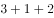”模式设置，“3”为全国统一高考的语文、数学、外语，“1”由考生在物理、历史2门学科中选择1门，“2”由考生在政治、地理、化学、生物学4门学科中选择2门。某校选了化学的同学大多数都选了物理，选了政治的同学都选了历史。

如果以上描述为真，则下列关于该校的断定必然为真的是：

I.有的同学选了化学和政治

II.选了化学的同学都没有选政治

III.有的同学选了化学却没有选政治

IV.有的同学选了政治却没有选化学

- **A**. I和II
- **B**. III和IV
- **C**. 只有III　✅
- **D**. I和III

**答案**：C

**官方解析**

第一步：翻译题干。

①语文、数学、外语必选

②要么物理，要么历史

③政治、地理、化学、生物四选二

④有的选化学选物理

⑤选政治选历史

②⑤串联可以推出：⑥选政治选历史选物理

②④⑤串联可以推出：⑦有的选化学选物理选历史选政治

第二步：逐一分析选项。

I翻译为：有的选化学且选政治，与翻译结果⑦不一致，“有的不是”不能推出“有的是”，因此无法得出有的选化学的是否也选了政治，无法推出，排除；

II翻译为：选化学选政治，与翻译结果⑦不一致，“有的”不能推出“所有”，无法推出，排除；

III翻译为：有的选化学选政治，与翻译结果⑦一致，可以推出，当选；

IV翻译为：有的选政治选化学，根据翻译结果⑥可知，选政治选历史选物理，已知④为有的选化学选物理，但④为集合推理，不能逆否，故无法推出确定结论有的选政治的没有选化学，无法推出，排除。

故正确答案为C。

---

### 第 28 题　qid 2606775 · 逻辑判断

对于城市街头小摊贩占道经营影响交通的问题，有学者认为应当在不影响城市交通的特定区域设置面向小摊贩的集中营业区，这样就能够缓解小摊贩随意占道经营产生的交通堵塞问题。
要使上述论证成立，必须补充的前提是（    ）。

- **A**. 集中营业区不会向入驻的小摊贩收取管理费用
- **B**. 集中营业区不会产生噪音、环境污染等其它城市问题
- **C**. 设置集中营业区后占道经营的小摊贩会前往该处摆设摊位　✅
- **D**. 集中营业区的交通位置便利，小摊贩能够在该处获得更高利润

**答案**：C

**官方解析**

第一步：找出论点和论据。
论点：应当在不影响城市交通的特定区域设置面向小摊贩的集中营业区，这样就能够缓解小摊贩随意占道经营产生的交通堵塞问题。
论据：无。
本题题干只有论点没有论据，且提问方式为“前提”，优先考虑必要条件，即论点“设置集中营业区，就能够缓解交通堵塞问题”的必要条件。
第二步：逐一分析选项。
A项：选项说的是不会收取管理费用，即使会收取费用，如果费用不多，小摊贩可以接受，依然是可以通过设置集中营业区缓解交通堵塞问题的，否定代入论点依旧成立，所以该项不是论点成立的必要条件，排除；
B项：选项说的是不会产生其它城市问题，题干论点讨论的只是“交通堵塞问题”，跟会不会产生其它城市问题无关，该项不是论点成立的必要条件，排除；
C项：小摊贩会前往该处摆设摊位是“设置集中营业区，就能够缓解交通堵塞问题”的必要条件，如果小摊贩根本不去集中营业区摆摊，那么该地的存在是没有意义的，也就不存在缓解交通堵塞的问题，否定代入论点不成立，因此该项是论点成立的必要条件，当选；
D项：小摊贩是否能在此处获得更高的利润，与设置集中营业区能否缓解交通堵塞问题没有必然联系，该项不是论点成立的必要条件，排除。
故正确答案为C。

---

## 资料分析

### 材料 1

        社会保险包括了养老保险，工伤保险，医疗生育保险等，是社会保障体系的重要组成部分。其在整个社会保障体系中居于核心地位，社会保险是一种缴费型的社会保障，资金主要由用人单位和劳动者缴纳（一般而言，各类社会保险的缴纳费用缴费基数缴纳比例），政府财政给予补贴并承担最终责任。

        在经历了一段时间的摸索后，我国的社会保障制度在上世纪90年代进入了创新式的改革、发展时期。1995年3月1日，国务院发出《关于深化企业职工养老保险制度改革的通知》，确定了社会统筹与个人账户相结合的养老保险制度，职工基本养老保险制度在全国范围内正式实行统账结合模式。

        近年来，随着我国经济发展出现一系列新形式新情况，企业对进一步降低社保费率的呼声较强，党中央、国务院提出新的要求。2019年《政府工作报告》明确提出，各地可将养老保险单位缴费比例降至。2019年，B市率先降低养老保险单位缴费比例。预计今后每年可减轻该市企业社保费缴费负担超百亿元。

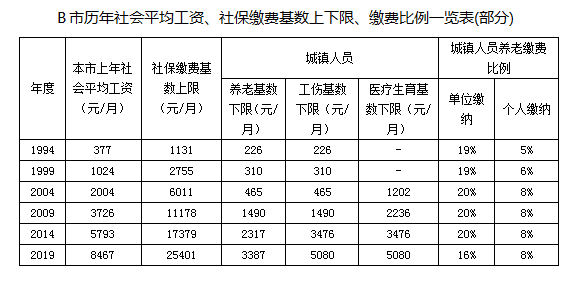

#### 第 1 题　qid 2696535 · 平均数

一般来说，社保管理部门会根据当地上一年社会平均工资来确定当年的社保缴费基数上限，两者比值相对固定。下列选项中，B市这一比值与其他年份差别最大的是（    ）。

- **A**. 1999年　✅
- **B**. 2004年
- **C**. 2014年
- **D**. 2019年

**答案**：A

**官方解析**

根据题干“······B市这一比值与其他年份差别最大的是”，可判定本题为比值比较问题。定位表格可知，B市历年的社会平均工资和社保缴费基数上限，则各选项两者比值如下：1999年：，2004年：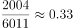，2014年：，2019年：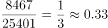。因此B市这一比值与其他年份差别最大的是1999年。

故正确答案为A。

【备注】本题对于题干的理解存在争议点：比值比较的年份是仅选项涉及的四个年份进行比较，还是与表中所有年份进行比较。小粉笔根据题干中“下列选项中······”，倾向于按照选项四个年份进行比较。

---

#### 第 2 题　qid 2696550 · 比重

根据行业的风险性质不同，工伤保险缴费的比例也不同。假如B市某企业所属行业类别的工伤保险缴费比例一直为（职工个人不缴纳工伤保险费用），在按照工伤基数下限为其员工缴纳工伤保险的情况下，2019年每名员工缴纳的工伤保险金额约为10年前的（    ）倍。

- **A**. 1.46
- **B**. 2.27
- **C**. 3.41　✅
- **D**. 4.23

**答案**：C

**官方解析**

根据题干“······2019年······约为10年前······倍”，可判定本题为现期倍数问题。定位表格可知，B市2009年工伤基数下限为1490元/月，2019年工伤基数下限为5080元/月；由题干可知，工伤保险缴费比例一直为。根据文字材料第一段：各类社会保险的缴纳费用缴费基数缴纳比例，可得2019年每名员工缴纳的工伤保险金额，2009年每名员工缴纳的工伤保险金额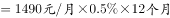，因此题干所求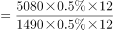倍。

故正确答案为C。

---

#### 第 3 题　qid 2696552 · 平均数

在B市某企业工作的小王，2019年月平均工资为10161元，如果该企业将养老保险缴费基数下限调整为小王的实际月平均工资，则该企业全年将增加支出约（    ）元。

- **A**. 1084
- **B**. 5058
- **C**. 9032
- **D**. 13006　✅

**答案**：D

**官方解析**

根据题干“······全年将增加支出约······元”，可判定本题为增长量计算问题。定位表格可知，B市2019年养老基数下限为3387元/月，单位缴纳比例为。根据公式：增长量现期量基期量，因此该企业全年将增加支出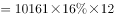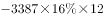元。

故正确答案为D。

---

#### 第 4 题　qid 2696566 · 增长

以下最有可能符合B市1998-2018年社会平均工资增长率变化情况的曲线是（    ）。

- **A**. 

- **B**. 
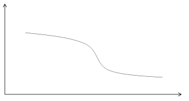
　✅
- **C**. 

- **D**. 

**答案**：B

**官方解析**

根据题干“······1998-2018年······社会平均工资增长率变化情况······”，可判定本题为一般增长率比较问题。定位表格可知，B市1993年、1998年、2003年、2008年、2013年、2018年的社会平均工资分别为377元/月、1024元/月、2004元/月、3726元/月、5793元/月、8467元/月。因为倍数关系明显，只需要比较即可。因此1993~1998年：，1998-2003年：，2003-2008年：，2008-2013年：，2013-2018年：，即1998-2018年社会平均工资增长率呈逐渐下降的趋势，对比选项各曲线，只有B项符合。

故正确答案为B。

（备注：本篇第一题提到“社保管理部门会根据当地上一年社会平均工资来确定当年的社保缴费基数上限”，因此表格中的社会平均工资应该对应上一年的数值）

---

#### 第 5 题　qid 2696567 · 综合

如果B市社保缴费基数，每5年调整一次，则根据上述资料，以下说法正确的是（    ）。

- **A**. 1994-2019年，B市城镇人员养老保险缴纳基数下限与上年社会平均工资的比值逐渐缩小
- **B**. 1994-2019年，B市城镇人员养老保险的企业缴纳比例和个人缴纳比例逐渐降低
- **C**. 2004-2019年，B市城镇人员的工伤和医疗生育保险缴纳基数下限始终不低于养老基数下限　✅
- **D**. 2009-2019年，B市城镇人员与农业户口人员的各项保险缴纳差距逐渐缩小

**答案**：C

**官方解析**

A项：定位表格可知，历年B市城镇人员养老保险缴纳基数下限与上年社会平均工资，则两者比值如下：1994年：，1999年：，2004年：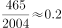，2009年：，2009年的比值2004年，并非逐渐缩小，错误；

B项：定位表格可知，B市城镇人员养老保险的个人缴纳比例1994年为，1999年为，增加了，并非逐渐降低，错误；

C项：定位表格可知，2004-2019年B市城镇人员的养老、工伤和医疗生育保险缴纳基数下限，2004年：元/月，2009年：元/月，2014年：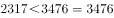元/月，2019年：元/月，即工伤和医疗生育保险缴纳基数下限始终不低于养老基数下限，正确；

D项：材料中未提及农业户口人员的各项保险缴纳情况，无法推出，错误。

故正确答案为C。

---

### 材料 2

        2019年我国农民工规模继续扩大，总量达到29077万人，同比增长。其中，本地农民工11652万人，比上年增加82万人；外出农民工17425万人，比上年增加159万人。外出农民工中，在省内就业的农民工9917万人，比上年增加245万人；跨省流动农民工7508万人，比上年减少86万人。

        从收入看，农民工集中就业的六大行业月均收入均稳定增长。2019年农民工月均收入约4000元；其中外出农民工月均收入4427元，比上年增加320元；本地农民工月均收入3500元，比上年增加160元。分区域看，在东部地区就业的农民工月均收入4222元，比上年增长；在中部地区就业的农民工月均收入3794元，比上年增长；在西部地区就业的农民工月均收入3723元，比上年增长；在东北地区就业的农民工月均收入3469元，同比增长。

#### 第 6 题　qid 2604282 · 增长

2014-2019年，我国农民工规模增加了约（    ）。

- **A**. 

- **B**. 

- **C**. 

　✅
- **D**. 

**答案**：C

**官方解析**

根据题干“2014-2019年，······增加了约”，结合选项为百分数，可判定本题为增长率计算问题。定位柱状图，2015年我国农民工总量为27747万人，同比增长，2019年为29077万人，则2014年我国农民工总量万人。则2019年相对于2014年的增长率。

故正确答案为C。

---

#### 第 7 题　qid 2604291 · 综合

2018年，省内就业农民工的数量约占外出农民工的（    ）。

- **A**. 

- **B**. 

- **C**. 

　✅
- **D**. 

**答案**：C

**官方解析**

根据题干“2018年，······占······的”，结合材料时间为2019年，可判定本题为基期比重问题。定位文字材料第一段，2019年外出农民工17425万人，比上年增加159万人。外出农民工中，在省内就业的农民工9917万人，比上年增加245万人。则2018年省内就业农民工的数量约占外出农民工的比重，与C项最接近。

故正确答案为C。

---

#### 第 8 题　qid 2604294 · 增长

2019年，下列行业中农民工月均收入同比增加最多的是（    ）。

- **A**. 制造业
- **B**. 建筑业　✅
- **C**. 批发和零售业
- **D**. 交通运输仓储邮政业

**答案**：B

**官方解析**

根据题干“2019年，······增加最多的是”，可判定本题为增长量比较问题。定位表格，根据公式：增长量可得，2019年，选项各行业中农民工月均收入同比增量分别为：

A项：元；

B项：元；

C项：元；

D项：元。

对比可得，B项建筑业增加最多。

故正确答案为B。

---

#### 第 9 题　qid 2604298 · 综合

2018年，我国农民工在各区域的月均收入从高到低是（    ）。

- **A**. 
西部地区中部地区东北地区东部地区

- **B**. 
中部地区东部地区东北地区西部地区

- **C**. 
东部地区西部地区东北地区中部地区

- **D**. 
东部地区中部地区西部地区东北地区
　✅

**答案**：D

**官方解析**

根据文字材料第二段可得，2019年，东部地区就业的农民工月均收入4222元，同比增长；中部地区就业的农民工月均收入3794元，同比增长；西部地区就业的农民工月均收入3723元，同比增长；东北地区就业的农民工月均收入3469元，同比增长。则2018年，各区域农民工的月均收入分别为：

东部地区：元；

中部地区：元；

西部地区：元；

东北地区：元。

则从高到低是：东部地区中部地区西部地区东北地区，D项满足题干要求。

故正确答案为D。

---

#### 第 10 题　qid 2604301 · 综合

根据以上资料，下面说法不正确的是（    ）。

- **A**. 2018年农民工月均收入达4100元　✅
- **B**. 2019年，不同行业的农民工的年收入差距可能在1.2万元以上
- **C**. 2019年，外出农民工月均收入同比增速高于本地农民工
- **D**. 2015-2019年间，农民工规模同比增速最小的是2018年

**答案**：A

**官方解析**

A项：根据文字材料第二段，2019年农民工月均收入约4000元；其中外出农民工月均收入同比增加320元；本地农民工月均收入同比增加160元。则2019年农民工月均收入同比有所增加，2018年农民工月均收入应不到4000元，错误；

B项：根据表格材料可得，2019年，交通运输仓储邮政业的农民工月均收入为4667元，住宿餐饮业的农民工月均收入为3289元，二者月均收入差值为元，年收入差值为元，差距超过1.2万元，正确；

C项：根据文字材料第二段可得，2019年，外出农民工月均收入4427元，同比增加320元；本地农民工月均收入3500元，同比增加160元。外出农民工月均收入同比增长；本地农民工月均收入同比增长，前者高于后者，正确；

D项：定位图形材料可得，2015-2019年，农民工规模同比增速依次为、、、、，同比增速最小的是2018年，正确。

本题为选非题，故正确答案为A。

---

### 材料 3

        2019年，广东规模以上工业企业用水量39.54亿立方米，分水种看，自来水用水量最大，达35.67亿立方米，占全部用水量的；地表淡水用水量2.52亿立方米，地下淡水0.03亿立方米，其他水1.32亿立方米。分地区看，珠三角地区用水量达29.85亿立方米，占比超。

        2019年，广东规模以上工业企业重复用水量为147.10亿立方米，比上年增长，重复用水率提高到（注：重复用水率）。分行业看，重复用水量主要集中在电力、冶金和石油石化行业。其中，电力行业重复用水量为50.72亿立方米，比上年下降，占全省规模以上工业企业全部重复用水量的；冶金行业重复用水量为40.82亿立方米，增长，占全部重复用水量的；石油石化行业重复用水量为32.12亿立方米，增长，占全部重复用水量的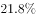。

        整体而言，在全省规模以上工业企业中，重复用水量普及面窄且重复用水率较低的问题值得关注。有重复用水的企业只有3573家，只占全省规模以上工业企业的，说明九成多企业无重复用水。重复用水量超过1000万立方米以上的企业88家，仅占重复用水量的，主要集中在石油化工、电厂和钢铁厂等少数大型企业中，重复用水应用领域明显较窄。

#### 第 11 题　qid 2606258 · 综合

2019年广东规模以上工业企业用水量中，地表与地下淡水量约占：

- **A**. 

- **B**. 

　✅
- **C**. 

- **D**. 

**答案**：B

**官方解析**

根据题干“2019年···约占”，结合选项为百分比，可判定本题为现期比重问题。定位文字材料第1段可得：2019年，广东规模以上工业企业用水量39.54亿立方米，地表淡水用水量2.52亿立方米，地下淡水0.03亿立方米。因此地表与地下淡水量的占比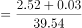。

故正确答案为B。

---

#### 第 12 题　qid 2606259 · 综合

与2018年相比，2019年广东规模以上工业企业用水量：

- **A**. 减少了约0.8亿立方米　✅
- **B**. 增加了约1.8亿立方米
- **C**. 减少了约2.8亿立方米
- **D**. 增加了约3.8亿立方米

**答案**：A

**官方解析**

根据题干“与2018年相比，2019年···”，结合选项中有减少和增加，且带有单位，可判定本题为增长量计算问题。定位表格材料，可得2019年广东各地区用水量和同比变化率。根据公式，增长量，则与2018年相比广东各地区用水量变化情况为：珠三角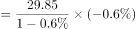，粤东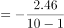，粤西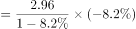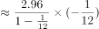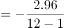，粤北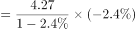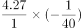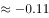。因此与2018年相比，2019年广东规模以上工业企业用水量约减少了亿立方米，与A项最接近。

故正确答案为A。

---

#### 第 13 题　qid 2606260 · 综合

2018年广东规模以上企业重复用水率约为：

- **A**. 

　✅
- **B**. 

- **C**. 

- **D**. 
无法判断

**答案**：A

**官方解析**

根据题干“2018年···重复用水率约为”，结合材料公式可知重复利用率为比重且材料时间为2019年，可判定本题为基期比重问题。

方法一：定位文字材料第2段可知：2019年，广东规模以上工业企业重复用水量为147.10亿立方米，比上年增长，则2018年重复用水量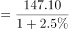亿立方米。根据上一题（97题）可知，2019年用水量39.54亿立方米比2018年减少0.8亿立方米，则2018年用水量现期增长量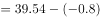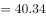亿立方米。所以根据材料所给公式：重复用水率重复用水量（用水量重复用水量），则2018年广东规模以上企业重复用水率，A项最接近。

方法二：定位文字材料第2段中可知，“2019年···重复用水率提高到”，说明2018年的重复用水率低于，只有A项符合。

故正确答案为A。

---

#### 第 14 题　qid 2606261 · 综合

2018年电力、冶金和石油石化行业以外的其他行业的重复用水量约占广东规模以上工业企业重复用水量的：

- **A**. 

- **B**. 

　✅
- **C**. 

- **D**. 

**答案**：B

**官方解析**

根据题干“2018年······约占······”，结合选项为百分比，可判定本题为基期比重问题。定位文字材料第二段，可知2018年重复用水量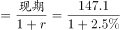；2018年电力、冶金和石油石化行业的重复用水量分别为，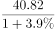，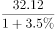。因此2018年电力、冶金和石油石化行业以外的其他行业的重复用水量占比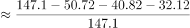，B项最为接近。

故正确答案为B。

---

#### 第 15 题　qid 2606262 · 综合

根据以上资料，下列有关2019年广东省规模以上工业企业重复用水情况正确的是：

- **A**. 
全省约有规模以上工业企业4.3万家

- **B**. 
有重复用水的企业的平均重复用水量约为41.2万立方米

- **C**. 
重复用水量超过1000万立方米的企业的平均重复用水量约为1.8亿立方米

- **D**. 
电力行业的重复用水率不可能低于
　✅

**答案**：D

**官方解析**

A项：定位文字材料第三段可知：有重复用水的企业只有3573家，只占全省规模以上工业企业的，可推出全省规模以上工业企业=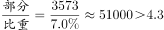万，错误；

B项：定位文字材料第二和第三段可知：2019年，广东规模以上工业企业重复用水量为147.10亿立方米；有重复用水的企业只有3573家。因此有重复用水的企业的平均重复用水量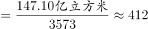万立方米万立方米，错误；

C项：定位文字材料第二和第三段可知：2019年，广东规模以上工业企业重复用水量为147.10亿立方米；重复用水量超过1000万立方米的企业88家，仅占重复用水量的。因此重复用水量超过1000万立方米的企业的平均重复用水量亿立方米亿立方米，错误；

D项：定位文字材料第一和第二段可知：2019年，广东规模以上工业企业用水量39.54亿立方米，电力行业重复用水量为50.72亿立方米。因为电力行业的用水量小于广东规模以上工业企业用水量39.54亿立方米，所以电力行业的重复用水率，正确。

故正确答案为D。

---
