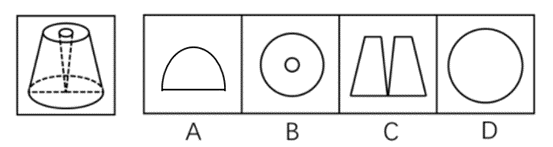
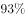
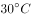

# 2020年广西自治区公务员录用考试《行测》试题（网友回忆版）

> 省考 · 2020 年 · 6 个模块 · 共 100 题

- [政治理论](#%E6%94%BF%E6%B2%BB%E7%90%86%E8%AE%BA) · 2 题
- [常识判断](#%E5%B8%B8%E8%AF%86%E5%88%A4%E6%96%AD) · 8 题
- [言语理解与表达](#%E8%A8%80%E8%AF%AD%E7%90%86%E8%A7%A3%E4%B8%8E%E8%A1%A8%E8%BE%BE) · 35 题
- [数量关系](#%E6%95%B0%E9%87%8F%E5%85%B3%E7%B3%BB) · 10 题
- [判断推理](#%E5%88%A4%E6%96%AD%E6%8E%A8%E7%90%86) · 35 题
- [资料分析](#%E8%B5%84%E6%96%99%E5%88%86%E6%9E%90) · 10 题

---

## 政治理论

### 第 1 题　qid 2616114 · 新思想

习近平总书记2020年3月6日在决战决胜脱贫攻坚座谈会上强调，这次会议的主要任务是，分析当前形势，克服新冠肺炎疫情影响，凝心聚力打赢脱贫攻坚战，做到“两个确保”。下列属于“两个确保”内容的是：
①如期完成脱贫攻坚目标任务 ②实现经济社会高质量发展
③打赢疫情防控阻击战 ④全面建成小康社会

- **A**. ①②
- **B**. ①③
- **C**. ②④
- **D**. ①④　✅

**答案**：D

**官方解析**

本题考查政治常识。  
习近平总书记2020年3月6日在决战决胜脱贫攻坚座谈会上强调，这次会议的主要任务是，分析当前形势，克服新冠肺炎疫情影响，凝心聚力打赢脱贫攻坚战，确保如期完成脱贫攻坚目标任务，确保全面建成小康社会。
故正确答案为D。

---

### 第 2 题　qid 2616012 · 新思想

2020年1月8日，习近平总书记在“不忘初心、牢记使命”主题教育总结大会上的讲话中引用了一句古语：“君子之过也，如日月之食焉：过也，人皆见之；更也，人皆仰之。”下列选项最能体现这一古语精髓的是：

- **A**. 敢于自我革命，勇于开拓创新
- **B**. 敢于坚持真理，勇于担当作为
- **C**. 敢于直面问题，勇于修正错误　✅
- **D**. 敢于坚持原则，勇于承担责任

**答案**：C

**官方解析**

本题考查政治常识。
2020年1月8日，在“不忘初心、牢记使命”主题教育总结大会上，在说到必须以正视问题的勇气和刀刃向内的自觉不断推进党的自我革命时，习近平总书记使用了古语“君子之过也，如日月之食焉：过也，人皆见之；更也，人皆仰之”。该古语出自《论语》，意思是君子的过错，如同日食月食：他犯了错误，人们都看得见；他改正了错误，人们都仰望他。
故正确答案为C。

---

## 常识判断

### 第 1 题　qid 2616113 · 人文常识

为应对新冠肺炎疫情，我国出台了一系列政策举措，帮助企业和个体工商户减负纾困，促进复工复产。下列哪一选项不属于我国在支持复工复产方面的优惠政策：

- **A**. 阶段性减免增值税小规模纳税人增值税
- **B**. 阶段性减免企业和个体工商户物业租金　✅
- **C**. 阶段性减征职工基本医疗保险单位缴费
- **D**. 阶段性减免企业养老、失业、工伤保险单位缴费

**答案**：B

**官方解析**

本题考查政治常识。
2020年3月，国家税务总局发布新版《支持疫情防控和经济社会发展税费优惠政策指引》，在支持复工复产方面，对受疫情影响较大的困难行业企业2020年度发生的亏损最长结转年限延长至8年；阶段性减免增值税小规模纳税人增值税；阶段性减免企业养老、失业、工伤保险单位缴费；阶段性减免以单位方式参保的个体工商户职工养老、失业、工伤保险；阶段性减征职工基本医疗保险单位缴费；鼓励各地通过减免城镇土地使用税等方式支持出租方为个体工商户减免物业租金。
本题为选非题，故正确答案为B。

---

### 第 2 题　qid 2616112 · 人文常识

“一带一路”倡议自提出以来，已逐步成为当今世界广泛参与的重要国际合作平台。下列有关2019年“一带一路”发展成果的说法正确的是：

- **A**. 中欧班列全年开列8200多列，“一带一路”在欧洲稳步前行　✅
- **B**. 2019年4月，第二届“一带一路”国际合作高峰论坛在杭州举行
- **C**. 中国人民银行和联合国开发计划署共同撰写研究报告，提出了“一带一路”投融资规划框架
- **D**. 第六届丝绸之路国际电影节于2019年10月在泉州举办，推动“一带一路”国家间的文化交流

**答案**：A

**官方解析**

本题考查政治常识。

A项正确，2019年，中欧班列开行8225列，同比增长，“一带一路”在欧洲稳步前行。

B项错误，第二届“一带一路”国际合作高峰论坛于2019年4月25日至27日在北京举行。

C项错误，2019年11月，《融合投融资规则 促进“一带一路”可持续发展——“一带一路”经济发展报告（2019）》正式对外发布。该报告由中国国家开发银行和联合国开发计划署共同撰写，报告重点研究了“一带一路”投融资规则、促进包容性发展、助力可持续发展等问题。

D项错误，第六届丝绸之路国际电影节于2019年10月15至20日在福建省福州市举办。

故正确答案为A。

---

### 第 3 题　qid 2616013 · 人文常识

下列有关公共卫生的说法正确的是：

- **A**. 突发公共卫生事件应急响应分为Ⅰ级、Ⅱ级、Ⅲ级三个等级
- **B**. 按照我国现行标准，甲类传染病有鼠疫、霍乱、传染性非典型肺炎三种
- **C**. 省、自治区、直辖市人民政府卫生行政主管部门有权向社会发布本行政区域内突发事件的消息
- **D**. 医疗卫生机构发现可能发生传染病暴发、流行的，应当在2小时内向所在地县级人民政府卫生行政主管部门报告　✅

**答案**：D

**官方解析**

本题考查法律常识。
A项错误，《国家突发公共卫生事件应急预案》总则第三条规定：“根据突发公共卫生事件性质、危害程度、涉及范围，突发公共卫生事件可分为特别重大（Ⅰ级）、重大（Ⅱ级）、较大（Ⅲ级）和一般（Ⅳ级）四级。”“突发公共卫生事件的应急反应和终止”部分第一条规定：“发生突发公共卫生事件时，事发地的县级、市（地）级、省级人民政府及其有关部门按照分级响应的原则，作出相应级别应急反应······”因此，应急响应为四个等级。
B项错误，根据《中华人民共和国传染病防治法》第三条第二款规定：“甲类传染病是指：鼠疫、霍乱。”
C项错误：《突发公共卫生事件应急条例》第二十五条规定：“国家建立突发事件的信息发布制度。国务院卫生行政主管部门负责向社会发布突发事件的信息。必要时，可以授权省、自治区、直辖市人民政府卫生行政主管部门向社会发布本行政区域内突发事件的信息。信息发布应当及时、准确、全面。”
D项正确，根据《突发公共卫生事件应急条例》第十九条第三款规定：“有下列情形之一的，省、自治区、直辖市人民政府应当在接到报告1小时内，向国务院卫生行政主管部门报告：（一）发生或者可能发生传染病暴发、流行的；（二）发生或者发现不明原因的群体性疾病的；（三）发生传染病菌种、毒种丢失的；（四）发生或者可能发生重大食物和职业中毒事件的。······”第二十条第一款规定：“突发事件监测机构、医疗卫生机构和有关单位发现有本条例第十九条规定情形之一的，应当在2小时内向所在地县级人民政府卫生行政主管部门报告；接到报告的卫生行政主管部门应当在2小时内向本级人民政府报告，并同时向上级人民政府卫生行政主管部门和国务院卫生行政主管部门报告。”
故正确答案为D。

---

### 第 4 题　qid 2616015 · 人文常识

下列俗语与其蕴含的经济学道理对应错误的是：

- **A**. 田忌赛马—成本与收益　✅
- **B**. 知人知面不知心—信息不对称
- **C**. 十年栽树，百年树人—长期投资
- **D**. 萝卜白菜，各有所爱—偏好理论

**答案**：A

**官方解析**

本题考查经济常识。
A项错误，“田忌赛马”讲的是田忌通过调整自己的马与齐威王的马的对阵顺序，最终取胜的故事。这个故事告诉我们如何利用自己的长处去对付对手的短处，从而在竞技中获胜。从经济学角度看，这揭示了权衡取舍的原理，只有懂得取舍，才能作出最优的决策，在市场竞争中取胜。“田忌赛马”的故事跟“成本与收益”无关。
B项正确，“知人知面不知心”指认识一个人容易，但要了解一个人的内心却很困难。信息不对称理论是指在市场经济活动中，各类人员对有关信息的了解是有差异的；掌握信息比较充分的人员，往往处于比较有利的地位，而信息贫乏的人员，则处于比较不利的地位。“知人知面不知心”体现了各类人员对有关信息的了解存在差异，体现了信息不对称理论。
C项正确，“十年栽树，百年树人”意思是小树需要十年才能长成大树，而人则需要更长的时间才能被培养成才。长期投资是指不准备随时变现，持有时间超过1年的企业对外投资。“十年栽树，百年树人”体现了长期投资。
D项正确，“萝卜白菜，各有所爱”指的就是各人有各人的喜好。消费者偏好是反映消费者对不同产品和服务的喜好程度的个性化偏好，是影响市场需求的一个重要因素。“萝卜白菜，各有所爱”体现了消费者偏好理论。
本题为选非题，故正确答案为A。

---

### 第 5 题　qid 2616111 · 人文常识

下列政府举措中，不能够直接促进城镇居民人均可支配收入增长的是：

- **A**. 减税
- **B**. 发行政府债券　✅
- **C**. 将学前教育纳入义务教育
- **D**. 提高退休职工养老金发放标准

**答案**：B

**官方解析**

本题考查经济常识。
城镇居民人均可支配收入是指将家庭总收入扣除交纳的个人所得税和个人交纳的各项社会保障支出之后，按照居民家庭人口平均的收入水平。其中，家庭总收入是指该家庭中生活在一起的所有家庭人员从各种渠道得到的所有收入之和。城镇居民人均可支配收入标志着居民的购买力，是衡量城镇居民收入水平和生活水平的最重要和最常用的统计指标。
A项正确，减税可以降低居民所交纳的个人所得税等税费，少交的税费可以用于其他家庭支出，从而直接提高居民可支配收入。
B项错误，发行政府债券是国家对经济进行宏观调控的工具，可以通过国家对经济的宏观调控来间接影响个人收入。
C项正确，学前教育纳入义务教育后将不再交纳学费，省下的学费可用于其他家庭支出，故可以直接提高居民可支配收入。
D项正确，提高退休职工养老金发放标准可以直接增加居民的工资收入，从而直接提高了居民可支配收入。
本题为选非题，故正确答案为B。

---

### 第 6 题　qid 2616014 · 地理国情

为提升生态文明、建设美丽中国，党和政府做了一系列重要工作。下列有关生态文明建设的说法不正确的是：

- **A**. 自2020年1月起，黄河流域的自然保护区将全面禁止生产性捕捞　✅
- **B**. 2019年8月，第一届国家公园论坛在青海省举行，与会代表形成了8条“西宁共识”
- **C**. 2019年，第二轮中央生态环保督察启动，拟用三年时间完成例行督察，再用一年时间开展“回头看”
- **D**. 2019年11月，住建部发布了新修订的《生活垃圾分类标志》标准，将生活垃圾类别调整为可回收物、有害垃圾、厨余垃圾和其他垃圾4个大类

**答案**：A

**官方解析**

本题考查政治常识。
A项错误，根据《农业农村部关于长江流域重点水域禁捕范围和时间的通告》，长江上游珍稀特有鱼类国家级自然保护区等332个自然保护区和水产种质资源保护区，自2020年1月1日0时起，全面禁止生产性捕捞。
B项正确，2019年8月19日至20日，由国家林业和草原局、青海省人民政府共同举办的第一届国家公园论坛在青海省西宁市成功举行。与会代表通过交流、讨论，形成8条“西宁共识”。
C项正确，2019年3月，生态环境部部长李干杰在生态环境保护督察专题培训班中指出，将全面启动第二轮例行督察。从2019年起，用三年左右时间完成第二轮中央生态环境保护例行督察，再用一年时间开展“回头看”。
D项正确，2019年11月15日，住建部发布了新修订的《生活垃圾分类标志》标准，将生活垃圾类别调整为可回收物、有害垃圾、厨余垃圾和其他垃圾4个大类、11个小类。
本题为选非题，故正确答案为A。

---

### 第 7 题　qid 2616022 · 科技常识

下列名言中出现最晚的一项是：

- **A**. 笛卡尔：我思故我在
- **B**. 亚里士多德：人是天生的政治动物
- **C**. 亚当·斯密：人天生，并且永远，是自私的动物　✅
- **D**. 阿基米德：给我一个支点，我就能撬起整个地球

**答案**：C

**官方解析**

本题考查人文常识。
A项错误，“我思故我在”为笛卡尔的名言，意思是“我思考，所以我存在”。笛卡尔（1596年-1650年），法国著名哲学家、物理学家、数学家。
B项错误，“人是天生的政治动物”出自亚里士多德的《政治学》一书。该书是公元前325年亚里士多德根据他和他的学生对希腊158个城邦政治法律制度的调查结果写成的，是古希腊第一部全面、系统地论述政治问题的著作。
C项正确，“人天生，并且永远，是自私的动物”出自亚当·斯密的《国富论》一书。《国富论》首次出版于1776年，其认为人的本性是利己的，追求个人利益是人民从事经济活动的唯一动力。
D项错误，“给我一个支点，我就能撬起整个地球”为阿基米德的名言。阿基米德（公元前287年-公元前212年），伟大的古希腊哲学家、数学家、物理学家，享有“力学之父”的美称。
因此C项中的名言出现最晚。
故正确答案为C。

---

### 第 8 题　qid 2616020 · 人文常识

祠堂在中国传统社会是家族成员的重要活动中心，一般情况下按姓氏称为某氏宗祠，但有时也会称为某氏家庙。称为“家庙”的依据是：

- **A**. 该家族与宗教有关
- **B**. 社会习惯约定俗成
- **C**. 该家族受到皇帝册封
- **D**. 该家族有人获得官爵　✅

**答案**：D

**官方解析**

本题考查人文常识。
家庙即儒教为祖先立的庙，属于中国儒教徒祭祀祖先和先贤的场所。古时家族有官爵者才能建家庙，作为祭祀祖先的场所。古代，对庙的规模有严格的等级限制。根据《礼记·王制》记载：“天子七庙，三昭三穆，与太祖之庙而七。诸侯五庙，二昭二穆，与太祖之庙而五。大夫三庙，一昭一穆，与太祖之庙而三。士一庙，庶人祭于寝。”“太庙”是帝王的祖庙，其他凡有官爵的人，也可按制建立“家庙”。上古时期其叫“宗庙”，唐朝始创“私庙”，宋改为“家庙”。故称为“家庙”的依据是该家族有人获得官爵。
故正确答案为D。

---

## 言语理解与表达

### 第 1 题　qid 2616061 · 逻辑填空

从某种意义上来说，唐卡是藏文化中第一个走产业化的门类。文化产业化的指标之一是        ，早在数百年前，唐卡就已经有了《造像度量经》，而“度量”是决定一幅唐卡价值的基本条件，一幅上乘的手绘唐卡，应该是完全按照《造像度量经》之规定绘制的。
填入划横线部分最恰当的一项是：

- **A**. 类型化
- **B**. 标准化　✅
- **C**. 数据化
- **D**. 规模化

**答案**：B

**官方解析**

根据后文“一幅上乘的手绘唐卡，应该是完全按照《造像度量经》之规定绘制的”可知，横线处所填词语强调唐卡因为有自己的统一标准，所以才具备走产业化的条件。B项“标准化”指为适应科学技术发展和合理组织生产的需要，在产品质量、品种规格、零件部件通用等方面规定统一的技术标准，符合文意，当选。
A项“类型化”指将具有共同特征的事物划到一个种类，C项“数据化”指用数值的形式将各种参数进行呈现，D项“规模化”指事物的规模大小达到了一定的标准，在文段中均未体现，排除。
故正确答案为B。
【文段出处】《西藏特色文化产业之窗让藏文化不再“高冷”》

---

### 第 2 题　qid 2616062 · 逻辑填空

业内专家建议建立国家营养日或营养周，开展“食育进农村”等活动，加大公益广告投入，发布适宜不同人群的膳食指南。针对农村留守儿童多的现状，在家庭监管        的情况下，政府可通过购买服务，让相关社会组织走进农村，帮助农村孩子健康成长。
填入划横线部分最恰当的一项是：

- **A**. 缺失　✅
- **B**. 薄弱
- **C**. 不力
- **D**. 缺乏

**答案**：A

**官方解析**

横线处所填词语修饰农村留守儿童“家庭监管”的情况，由文段可知，所填词语应体现“留守儿童”缺少家庭监管的意思。A项“缺失”可做名词或动词，指缺少，失去的意思，“家庭监管缺失”搭配恰当，符合文意，当选；B项“薄弱”为形容词，指容易破坏或动摇、不雄厚、不坚强，一般搭配“兵力”“意志”“基础”等，与“家庭监管”搭配不当，排除；C项“不力”为形容词，指不尽力、不得力的意思，文段并非表达留守儿童在家庭监管方面不得力的意思，不符合文意，排除；D项“缺乏”为动词，指（所需要的、想要的或一般应有的事物）没有或不够，应放在宾语“家庭监管”之前，一般表述为“缺乏家庭监管”，置于此处用法错误，排除。
故正确答案为A。
【文段出处】《营养“缺乏”与“过剩”困扰青少年健康》

---

### 第 3 题　qid 2616133 · 逻辑填空

饮食在中国文化传承中是较稳定的领域，国有盛衰，代有兴亡，用筷子吃饭数千年不变，与宴饮相关的某些礼仪程式也很少变化，盛行在西周的乡饮酒礼，上可溯至三代遗风，下传至清道光年间，其敬老、尊长、议政的古风            ，连酒会程序——谋宾、迎宾、旅酬和送宾等礼仪也            。
依次填入划横线部分最恰当的一项是：

- **A**. 如出一辙  毫无二致
- **B**. 一脉相承  大同小异　✅
- **C**. 一脉相通  相差无几
- **D**. 衣钵相传  半斤八两

**答案**：B

**官方解析**

第一空，文段指出我国饮食在传统文化中比较稳定，相关的吃饭习俗数千年不变，且横线前提到“上可溯至三代遗风，下传至清道光年间”，故横线处表示敬老、尊长、议政的古风是一直传承、延续的。A项“如出一辙”表示好像从一道车辙上走过来，形容两种言论或行动一模一样，与文中表示古风一直延续、传承的语义不符，排除；B项“一脉相承”表示从同一血统、派别世代相承流传下来，可体现出敬老、尊长、议政的古风一直传承、延续之意，保留。C项“一脉相通”指事物之间相互关联，可以互通，侧重强调关联性强，文段表示传承之意，而非事物之间的关联性，排除；D项“衣钵相传”比喻技术、学术的师徒相传，不符合语境，排除。
第二空，代入验证，横线处前“也”字表明与上文内容形成近义并列，应表达这些礼仪也大致相同之意。B项“大同小异”表示大部分相同，只有小部分不同，与文意相符，当选。
故正确答案为B。
【文段出处】《150年前，西餐进入中国，吃个饭竟然促进了男女平等》

---

### 第 4 题　qid 2616065 · 逻辑填空

向民众        科学知识，        科学精神，是科学家义不容辞的责任。但是科学家首先要致力于科研，他究竟能花多少时间来做科普，显然无法一概而论。通常，一线科学家很难花费太多的时间和精力直接参与一波又一波的科普活动。
依次填入划横线部分最恰当的一项是：

- **A**. 传输  传递
- **B**. 传递  传播　✅
- **C**. 传导  传扬
- **D**. 传达  传承

**答案**：B

**官方解析**

第一空，搭配“科学知识”，表示向民众传播科学知识，A项“传输”指传递、输送，一般搭配信息、数据，与“知识”搭配得当，保留；B项“传递”指由一方交给另一方，表示科学家把科学知识传播给民众，搭配得当且语义恰当，保留。C项“传导”指热或电从物体的一部分传到另一部分，多用于物理学或神经方面，与知识搭配不当，排除；D项“传达”意为把一方的意思告诉给另一方，多与命令、消息搭配，与知识搭配不当，排除。
第二空，搭配“科学精神”，根据横线后“做科普”“科普活动”可知，“科普”即科学普及，特点是范围广、受众多，所以横线处所填词语要体现出范围广、受众多，B项“传播”指广泛散布，与“科学精神”搭配恰当，且与“科普活动”对应准确，当选。A项“传递”无法体现出科普活动受众多的特点，排除。
故正确答案为B。
【文段出处】《期待我国的“元科普”力作》

---

### 第 5 题　qid 2616066 · 逻辑填空

中华文化绵延5000年，有其独特的价值体系，已成为中华民族的基因。中华优秀传统文化是中华民族的突出优势，        着中华民族最深沉的精神追求，为中华民族生生不息、发展壮大提供了丰厚        ，潜移默化地影响着中国人的思想方式和行为方式，至今仍然具有鲜活的时代价值。
依次填入划横线部分最恰当的一项是：

- **A**. 沉淀  润泽
- **B**. 积淀  滋养　✅
- **C**. 积聚  滋润
- **D**. 积蓄  滋补

**答案**：B

**官方解析**

第一空，所填词语搭配“精神追求”，根据前文“中华文化绵延5000年”、“中华优秀传统文化是中华民族的突出优势”可知，此处表达中华优秀传统文化中积累包含最深沉的精神追求的意思，A项“沉淀”表示凝聚积累、 B项“积淀”指积累沉淀，两项均可体现积累的意思，保留。C项“积聚”指逐渐聚集，常搭配物资、钱财，D项“积蓄”指积攒聚存，常搭配力量、钱财，均与“精神追求”搭配不当，排除。
第二空，所填词语搭配“提供”，需要填一个名词，B项“滋养”可做名词，表示养分、养料的意思，与“提供”搭配恰当，当选。A项“润泽”指的是滋润、使滋润的意思，一般不做名词使用，与“提供”“丰厚”均搭配不当，排除。
故正确答案为B。
【文段出处】《以高度的文化自信推动中华文化繁荣发展》

---

### 第 6 题　qid 2616147 · 逻辑填空

上海合作组织成立十多年来，创造性提出并始终        “上海精神”，主张互信、互利、平等、协商、尊重多样文明、谋求共同发展，为世界各国共同繁荣、区域合作发展壮大提供了有益        ，为推动各国        建设人类命运共同体作出了重大贡献。
依次填入划横线部分最恰当的一项是：

- **A**. 实践  启发  并肩
- **B**. 推行  借镜  昂首
- **C**. 践行  借鉴  携手　✅
- **D**. 履行  启示  挽手

**答案**：C

**官方解析**

第一空，所填词语搭配“上海精神”。B项“推行”和C项“践行”搭配“上海精神”均恰当，保留。A项“实践”作谓语时，其后一般不接宾语，即其后不能搭配“上海精神”，排除；D项“履行”一般搭配职责、义务等，不能搭配“上海精神”，排除。
第二空，文段说的是上海合作组织的经验可以让世界各国学习、效仿。B项“借镜”取自成语“借镜观形”，“借镜观形”比喻参考和吸取别人的经验教训。B项“借镜”与C项“借鉴”意思相同，填入横线处均符合语境，保留。
第三空，B项“昂首”指仰着头，C项“携手”指手拉着手，表示共同做某事。由“各国”“人类命运共同体”可知，此处强调各国齐心协力共谋发展，所以C项“携手”更符合语境，当选。
故正确答案为C。
【文段出处】《为携手建设人类命运共同体作出更大贡献》

---

### 第 7 题　qid 2616131 · 语句表达

长期以来，人们对于“阳春白雪”的传统文化，都是一种仰望的姿态，认为            ，于是常常过而不入。从这个意义上说，搞好文创，需要首先激发起人们对文化的浓厚兴趣，然后同样重要的，是想方设法保留住它。如此，人们才会在文化探索的旅程中              ，走得更深、更远。
依次填入划横线部分最恰当的一项是：

- **A**. 海水不可斗量  登堂入室
- **B**. 百思不得其解  斗折蛇行
- **C**. 夏虫不可语冰  登高履危
- **D**. 可望而不可即  拾级而上　✅

**答案**：D

**官方解析**

第一空，根据文意可知，人们对于传统文化是仰望的姿态，故横线处应与此意相近，D项“可望而不可即”指可以望到但无法接近，与文段对应恰当，保留；A项“海水不可斗量”比喻不可根据某人的现状就低估他的未来，文段未谈论人的现状与未来，与文段语义无关，排除；B项“百思不得其解”的意思是对事情百般思索都不明白，文段谈论的是人们对传统文化的看法而非是否明白，与文段语义无关，排除；C项“夏虫不可语冰”比喻时间局限人的见识，也比喻人的见识短浅，不懂大道理，文段并未提及见识是否短浅，与文段语义无关，排除。
第二空，代入验证，D项“拾级而上”的意思是顺着阶梯一步一步地往上走，与后文“走得更深、更远”对应恰当，符合语境，当选。
故正确答案为D。
【文段出处】《文创产业功夫在诗外》

---

### 第 8 题　qid 2616187 · 逻辑填空

随着智能科技和产业的发展，数据和计算正在成为            经济增长和发展的关键            。作为第四次工业革命的引擎，智能科技和经济在中国的发展            于经济转型升级中所创造的智能化需求。
依次填入划横线部分最恰当的一项是：

- **A**. 推动  因素  产生
- **B**. 驱使  要点  内化
- **C**. 触动  质素  生长
- **D**. 驱动  要素  内生　✅

**答案**：D

**官方解析**

第一空，此处需分别搭配“经济增长”和“发展”，A项“推动”指的是使事物推进，D项“驱动”指的是使动起来，均可与“经济增长”、“发展”构成搭配，保留A、D两项；B项“驱使”指的是强迫人按照自己的意志行动，一般搭配为“在……驱使下”“利益驱使”等，与“经济增长”、“发展”搭配不当，排除；C项“触动”指的是碰、撞，因某种刺激而引起（感情变化、回忆等），与“增长”、“发展”搭配不当，排除；
第二空，搭配“关键”，A项“因素”、D项“要素”均可构成搭配，保留；
第三空， 结合文段，此处需表达智能科技和经济能够在中国得以发展是由于有经济转型升级中所创造的智能化需求，即横线要表达智能科技和经济的发展与智能化需求之间存在因果关系。D项，“内生”指的是靠自身发展，智能这一领域的科技和经济之所以发展靠的是自身领域的需求——智能化的需求，在此能够体现同一领域的两者之间的因果关系，保留；A项“产生”指的是由已有的事物中生出新的事物，更多形容两个不同领域之间的因果关系，与文意不符，排除。
故正确答案为D。
【文段出处】《中国人工智能如何更好发展》

---

### 第 9 题　qid 2616127 · 逻辑填空

研究结果显示，只要手机在视线范围或            的范围之内，就会导致人们的注意力下降。这并不是手机的推送或通知分散了人的注意力，而是人们下意识地不去“        ”手机，但发布这个指令的过程本身就会耗费有限的认知资源，造成脑力流失。
依次填入划横线部分最恰当的一项是：

- **A**. 近在咫尺  牵挂
- **B**. 唾手可得  惦念
- **C**. 触手可及  惦记　✅
- **D**. 一步之遥  想念

**答案**：C

**官方解析**

第一空，根据横线前“手机在视线范围”可知，所填词语表达距离手机很近之意。A项“近在咫尺”形容离得特别近，C项“触手可及”指近在手边，一伸手就可以接触到，形容距离极近，D项“一步之遥”指一步的距离，比喻距离很近，三项均符合文意，保留。B项“唾手可得”形容非常容易得到，与文意不符，排除。
第二空，根据文意可知，下意识地不去“想”手机的过程本身就会耗费有限的认知资源，故所填词语应体现“总想着、记着”之意。C项“惦记”指对人或事物心里老想着，放不下，置于此处形容人心里一直想着手机，符合文意，当选。A项“牵挂”指挂念，因放心不下而想念，D项“想念”指对离别的人或环境不能忘怀，希望见到，两者均有主观上关心之意，形容“手机”不恰当，排除。
故正确答案为C。
【文段出处】《科普：手机在身边会影响大脑认知功能》

---

### 第 10 题　qid 2616008 · 逻辑填空

在西汉时期，一种青铜染炉非常流行，以至于在许多地方都有出土。这种染炉分为三个构造：主体为炭炉，下部是        炭灰的盘体，上面放置一具活动的杯。它曾让几代学者对它的用途             ，直到今天，考古界才确定它就是一种类似现代意义上的“小火锅”。
依次填入划横线部分最恰当的一项是：

- **A**. 接收  孜孜以求
- **B**. 承接  迷惑不解　✅
- **C**. 收纳  朝思暮想
- **D**. 盛放  潜精研思

**答案**：B

**官方解析**

第一空，根据文段信息“主体为炭炉，下部是······炭灰的盘体”可知，染炉下部是用来接上面掉下来的炭灰的。B项“承接”意思是承前接后，体现出接住上面掉下的东西，与文段对应恰当，保留。A项“接收”指收取、收受，一般搭配“礼物、遗产、工程”等，与炭灰搭配不当，排除；C项“收纳”指收留容纳，D项“盛放”指安放，均体现要把东西收好、保存，炭灰是燃烧后的废物不需要完好保存，与文意不符，排除。
第二空，代入验证，根据后文“直到今天，考古界才确定它就是······”可知，以前几代学者并不知道染炉的用途。B项“迷惑不解”指对某事非常疑惑，很不理解，与文段对应恰当，当选。
故正确答案为B。
【文段出处】《考古证实：汉代吃火锅撸串儿喝酒很流行 》

---

### 第 11 题　qid 2616124 · 逻辑填空

艺术桥是巴黎的一个标志，不仅        了塞纳河畔的风景，更记载了艺术文化的传承和人类文明的繁荣。热爱美景、艺术和生活的人都会乐见艺术桥能够长久地        ，发挥其应有的便民功能以及作为文物景观的历史价值和艺术作品的美学价值。
依次填入划横线部分最恰当的一项是：

- **A**. 衬托  连续
- **B**. 渲染  继续
- **C**. 装饰  持续
- **D**. 点缀  存续　✅

**答案**：D

**官方解析**

第一空，所填词语修饰“艺术桥”与“塞纳河畔的风景”的关系， C项“装饰”指在身体或物体的表面加些附属的东西，使美观；D项“点缀”指加以衬托或装饰，使原有事物更加美好，均符合文章要求，搭配得当，均保留。A项“衬托”指为了使事物的特色突出，把另一些事物放在一起来陪衬或对照，侧重于两个事物之间的对比、对照，让某物更突出，但文中没有通过对比让某物更突出的意思，排除；B项“渲染”指国画的一种画法，用水墨或淡的色彩涂抹画面，以加强艺术效果；也可用来比喻夸大地形容，搭配“艺术桥”不妥，排除。
第二空，所填词语亦要搭配“艺术桥”，D项“存续”指存在并延续，搭配合适，并能与文中“长久地”形成对应，当选。C项“持续”指延续不断，多为某种行为、状态继续下去，搭配“艺术桥”不当，排除C项。
故正确答案为D。
【文段出处】《人民日报环球走笔：真爱不必上锁》

---

### 第 12 题　qid 2616129 · 逻辑填空

两相比较，白话文在通俗易懂的同时，往往在韵律上缺少节奏感，篇幅冗长，而文言文能用            传达出深层或多层意思，其凝练之美、韵律之美和意境之美是白话文            的。
依次填入划横线部分最恰当的一项是：

- **A**. 一语双关  略逊一筹
- **B**. 只言片语  无与伦比
- **C**. 三言两语  相形见绌
- **D**. 寥寥数语  无可比拟　✅

**答案**：D

**官方解析**

第一空，根据“两相比较”可知，文段把白话文与文言文作对比，所填成语与“篇幅冗长”构成反义对应，表示文章字数少的意思。B项“只言片语”指个别词句或片断的话，C项“三言两语”形容话很少，D项“寥寥数语”指非常简括地说，均能体现出文言文篇幅不冗长的含义，保留。A项“一语双关”指一句话包含两个意思，不强调文章的字数少，无法与“篇幅冗长”对应，排除。
第二空，根据文段“其凝练之美、韵律之美和意境之美”可知，白话文不具备以上特点，所填成语表示文言文的三种美是白话文无法相比的。D项“无可比拟”指没有可以相比的，符合语境，当选。B项“无与伦比”指事物非常完美，没有能够与它相比的同类的东西，用在此处程度过重，排除；C项“相形见绌”指和同类的事物相比较显出不足，文段强调的是文言文的三种美是白话文无法与之相比，并非强调白话文自身的缺陷和不足，排除。 
故正确答案为D。 
【文段出处】《冉启斌：文言文在意境、形式、音韵等方面有特殊美感》

---

### 第 13 题　qid 2616161 · 逻辑填空

不少街坊所熟知的“冬病夏治”，就是根据祖国医学“春夏养阳，秋冬养阴”的理论，        四时特性的养生疗法。“冬病”指某些好发于冬季，或在冬季加重的病变，如支气管炎、慢性阻塞性肺疾病、过敏性鼻炎、失眠、骨关节痛、体质虚寒症等疾病。“夏治”指夏季这些病情有所缓解，趁其发作缓解季节，补气扶阳、辨证施治，以        冬季旧病复发，或减轻其症状。
依次填入划横线部分最恰当的一项是：

- **A**. 服从  防止
- **B**. 适应  免予
- **C**. 顺应  预防　✅
- **D**. 符合  避免

**答案**：C

**官方解析**

第一空，搭配“四时特性”，且由前一分句的“根据”可知，横线处表示“冬病夏治”受到了“四时特性”的引导与影响。A项“服从”指遵照、听从，一般搭配命令、管理等，与“四时特性”搭配不当，排除；D项“符合”指数量、形状、情节等相合，虽然可与“四时特性”搭配，但体现不出受到了其影响之意，排除；B项“适应”指适合，C项“顺应”指顺从、适应，均可与“四时特性”搭配，且能体现出受到了其影响之意，保留。
第二空，根据文意，“夏治”的目的即提前做准备，防止冬季旧病复发，故横线处应体现时间角度的提前，做防备之意。C项“预防”指事先防备，符合文意，当选。B项“免予”指不给予或不施行，与文意不符，排除。
故正确答案为C。
【文段出处】《夏天晒太阳防病有讲究》

---

### 第 14 题　qid 2616125 · 逻辑填空

文化是“人化”，同时又要“化人”。城市中的人一方面是文化形象的        和代言人，人们的精神面貌、道德修养、行为举止诸方面都反映出城市的文化形象；另一方面其行为方式又受到城市文化形象的影响，良好的文化形象会对人产生引导、规范和        作用。
依次填入划横线部分最恰当的一项是：

- **A**. 载体  激励　✅
- **B**. 体现  训诫
- **C**. 内涵  塑造
- **D**. 象征  制约

**答案**：A

**官方解析**

第一空，所填词语和“代言人”构成近义并列，且能对应后文“人们的精神面貌、道德修养、行为举止诸方面都反映出城市的文化形象”，A项“载体”指能够承载其他事物的事物；B项“体现”指某种性质或现象在某一事物上具体表现出来；D项“象征”指用来象征某种特别意义的具体事物，均符合文意，保留。C项“内涵”指一个概念所反映的事物的本质属性的总和，也就是概念的内容，文段并未体现此意，排除。
第二空，所填词语和“引导”“规范”构成近义并列，由前文“良好的文化形象”可知，所填词语应该是褒义词。A项“激励”指激发鼓励，为褒义词，符合文意，当选。B项“训诫”指教导和告诫，与文段“良好的文化形象”对应不当，排除；D项“制约”指限制约束，感情色彩中性，且常用于消极语境，与文段感情色彩不符，排除。
故正确答案为A。
【文段出处】《以城市文化形象助力城市发展》

---

### 第 15 题　qid 2616141 · 逻辑填空

研究人员分别给成年小鼠和老年小鼠喂食膳食纤维含量不同的两种食物，持续4周，然后对小鼠血液中短链脂肪酸水平、肠道炎症状况等进行检测，结果表明，多补充膳食纤维，不仅可以提高老年小鼠血液中短链脂肪酸水平，而且会显著        小鼠肠道炎症，增强细胞抗炎能力，进而抑制有害化学物质的产生，延缓大脑功能        进程。
依次填入划横线部分最恰当的一项是：

- **A**. 减弱  衰萎
- **B**. 减缓  衰弱
- **C**. 减轻  衰退　✅
- **D**. 减少  衰变

**答案**：C

**官方解析**

第一空，搭配“炎症”，A项“减弱”，C项“减轻”，D项“减少”均可与之搭配，保留。B项“减缓”指速度变慢，不能直接搭配“炎症”，排除。
第二空，横线前搭配“大脑功能”，C项“衰退”指衰弱减退，可与“大脑功能”搭配，当选。A项“衰萎”指衰败萎缩，可以搭配“大脑”，但不能搭配“功能”，排除。D项“衰变”指放射性元素放射出粒子后变成另一种元素的现象，与本题语境无关，排除。
故正确答案为C。
【文段出处】《补充膳食纤维有助于延缓大脑衰退》

---

### 第 16 题　qid 2616132 · 逻辑填空

中国的格律诗，总体上在唐代            ，达到无法超越的地步。宋诗其实是唐诗的延续，宋代有一些优秀的诗人，他们的创作可与唐人媲美，譬如苏东坡、王安石、陆游等。宋诗中，写得情景交融、意境优美的作品，可以说             。
依次填入划横线部分最恰当的一项是：

- **A**. 叹为观止  触目皆是
- **B**. 登峰造极  俯拾皆是　✅
- **C**. 无出其右  汗牛充栋
- **D**. 无与伦比  斗量车载

**答案**：B

**官方解析**

第一空，搭配“格律诗”，根据后文“达到无法超越的地步”可知，唐代的格律诗水平极高。B项“登峰造极”比喻学问、技能等达到最高的境界或成就，C项“无出其右”表示没有能超过它的，两项均符合文意，保留。A项“叹为观止”形容所见到的事物好到了极点，常用搭配为“令人叹为观止”“让人叹为观止”，排除；D项“无与伦比”指事物非常完美，没有能够与它相比的同类的东西，根据“宋代有一些优秀的诗人，他们的创作可与唐人媲美”可知，程度过重，排除。
第二空，搭配“作品”，B项“俯拾皆是”形容多而易得，填入横线处表达宋诗中“写得情景交融、意境优美的作品很多”，符合文意，当选。C项“汗牛充栋”多用于形容“藏书”较多，而文段说的是“诗歌作品”，排除。
故正确答案为B。 
【文段出处】《莫说宋诗味如蜡》

---

### 第 17 题　qid 2616011 · 逻辑填空

近年来，人们的生活条件越来越好，对旅游        的要求也越来越高，从前到此一游、            的旅游方式已逐渐被深度体验、注重文化与互动的旅游方式所替代。正是在这种背景下，文化与旅游融合的发展方式            ，并成为热点。
依次填入划横线部分最恰当的一项是：

- **A**. 质量  浮光掠影  脱颖而出
- **B**. 环境  浅尝辄止  蔚然成风
- **C**. 品质  走马观花  应运而生　✅
- **D**. 生态  蜻蜓点水  蔚为大观

**答案**：C

**官方解析**

本题可从第三空入手，根据“这种背景下”指代前文，前文指出近年来人们的旅游方式“已逐渐被深度体验、注重文化与互动的旅游方式所替代”，故横线处应体现在这样的背景下，“文化与旅游融合的发展方式”随着人们的需要开始兴起。C项“应运而生”指随着某种形势而产生，符合文意，保留。
A项“脱颖而出”本意指锥尖透过布袋显露出来，也指人的本领全部显露出来，体现不出“开始兴起”的含义，与文意不符，排除；
B项“蔚然成风”指事物盛极一时，成为风气，体现不出“开始兴起”的含义，与文意不符，排除；
D项“蔚为大观”指事物美好而繁多，多指文物、盛大的景象等，与“发展方式”搭配不当，排除。
第一空，代入验证，“旅游品质的要求”搭配恰当，保留。
第二空，代入验证，横线处与“到此一游”构成并列，“走马观花”指粗略地观察一下，与“到此一游”语义相近，当选。
故正确答案为C。
【文段出处】《在文旅融合中讲好民俗故事》

---

### 第 18 题　qid 2616006 · 片段阅读

水熊被认为是世界上最顽强的动物，其显著特征是能在各种极端环境中存活下来。科学家曾经将水熊冰冻在冰层之中，暴露在放射线之下，甚至将它们发送至太空，但令人惊奇的是，水熊仍能从假死状态中复活。最近，科学家揭示了水熊复活的秘密，其DNA兼具动物和细菌成分，使其成为“弗兰肯斯坦”混合体。此外，科学家们在研究水熊复活过程中哪些基因会被激活时，还发现了一组特殊蛋白质。这组蛋白质能够快速替换体内损耗的水分，并修复受损细胞，致使这种动物接近于不可毁灭状态。
这段文字旨在说明：

- **A**. 水熊的显著特征是能在各种极端环境中存活
- **B**. 水熊是一种能复活的“弗兰肯斯坦”混合体
- **C**. 水熊拥有神秘DNA使它接近于不可毁灭　✅
- **D**. 水熊拥有的特殊蛋白质能修复受损的细胞

**答案**：C

**官方解析**

文段首先介绍水熊是世界上最顽强的动物，随后从将水熊“冰冻”、“暴露在放射线之下”、“发送至太空”，水熊依然能够复活等方面进行解释说明。后文通过介绍科学家的发现引出文段重点，介绍水熊复活的秘密究竟是什么，根据“此外”前后两部分的内容可知，因为特殊的DNA，使得水熊接近于不可毁灭的状态，对应C项。
A项，“能在各种极端环境中存活”为文段引出话题部分，非重点，排除；
B项，偏离文段核心话题，文段重点围绕“DNA”的作用展开，排除；
D项，“特殊蛋白质”偏离核心话题“DNA”，且未指出水熊生命力顽强这一观点，排除。
故正确答案为C。
【文段出处】《无水无食物仍存活30年，揭秘最顽强动物——水熊的神秘DNA！》

---

### 第 19 题　qid 2615974 · 片段阅读

研究人员发现在大脑中存在着不同种类和巨大数量的高维几何结构，由紧密连接的神经元团块和它们之间的空白区域（空洞）组成。这些团块或空洞似乎对大脑功能至关重要，当研究人员给虚拟大脑组织施加刺激时，他们发现神经元以一种高度有组织性的方式对刺激做出了反应。这意味着我们思考问题的时候，神经元的团块会逐渐组合成更高维的结构，形成高维的孔隙或空洞，团块中的神经元越多，空洞的维度就越高，最高的时候可以达到11个维度。
根据上述文字，下列说法正确的是：

- **A**. 团块中的神经元越多，空洞的维度就越高，意识越复杂
- **B**. 神经元团块或空洞互相联系，以施压方式促进人的思考
- **C**. 神经元能以高度有组织性的方式反应，取决于大脑功能
- **D**. 人脑充满多维几何结构，最高时可在11个维度上运行　✅

**答案**：D

**官方解析**

A项，根据“我们思考问题的时候，神经元的团块会逐渐组合成更高维的结构，形成高维的孔隙或空洞，团块中的神经元越多，空洞的维度就越高”可知，人类思考问题时即意识复杂时，神经元形成的团块越多、空洞的维度就越高，A选项因果倒置，排除；
B项，“以施压方式促进人的思考”无中生有，文段并未介绍施压可以促进思考，排除；
C项，根据“当研究人员给虚拟大脑组织施加刺激时，他们发现神经元以一种高度有组织性的方式对刺激做出了反应”可知，当大脑受到刺激时，神经元能以高度有组织性的方式做出反应，“受到刺激”是神经元产生反应的前提，故“取决于大脑功能”无中生有，排除；
D项，根据“研究人员发现在大脑中存在着不同种类和巨大数量的高维几何结构”“最高的时候可以达到11个维度”可知，表述正确，当选。
故正确答案为D。
【文段出处】《不是三维？科学家发现人的大脑里可能有11个维度！》

---

### 第 20 题　qid 2616245 · 片段阅读

生长在非洲大草原上的灰犀牛，身躯庞大，给人一种行动迟缓、安全无害的错觉，从而时常忽略了危险的存在——当灰犀牛被触怒发起攻击时，却会体现出惊人的爆发力，阻止它的概率接近于零，最终引发破坏性极强的灾难。概率大、破坏力强是“灰犀牛”事件最重要的特征。很多危机事件，与其说是“黑天鹅”，不如说更像是“灰犀牛”。它们并非发端于不可预测的小概率事件（“黑天鹅”），而是大概率、高风险事件（“灰犀牛”）不断演化的结果，这些风险的存在早就广为人知，却由于体制或认识的局限，没有得到积极防范和应对，最终升级为全面的系统性危机。
根据上述文字，下列说法正确的是：

- **A**. “黑天鹅”和“灰犀牛”事件都是严重的无法防范的危机事件
- **B**. 与“灰犀牛”相对，“黑天鹅”是指破坏性不强的小概率事件
- **C**. 许多“黑天鹅”事件背后都隐藏着“灰犀牛”危机　✅
- **D**. “灰犀牛”和“黑天鹅”事件没有明显区别，一定条件下可以互相转化

**答案**：C

**官方解析**

A、B两项存在共性错误，文中只强调“灰犀牛”事件“概率大、破坏力强”，但是对“黑天鹅”事件只定性为“不可预测的小概率事件”，但其破坏性是否严重文段未提及，A项将“黑天鹅”事件定性为严重的无法防范的事件、B项将其定性为破坏性不强的事件，均为无中生有，排除；
C项，根据“很多危机事件，与其说是‘黑天鹅’，不如说更像是‘灰犀牛’”可知，表面看似是“黑天鹅”事件，其实可能是“灰犀牛”，即“黑天鹅”背后隐藏着“灰犀牛”，表述正确，符合文意，当选；
D项，根据文段可知“黑天鹅”是小概率事件，“灰犀牛”是大概率、高风险事件，两者不同，“没有明显区别”表述错误，且“互相转化”文段未提及，无中生有，排除。
故正确答案为C。
【文段出处】《“灰犀牛”，究竟什么来头？》

---

### 第 21 题　qid 2615973 · 片段阅读

正因为中国法律史学除了单纯的理论研究，还要探究解决当代中国的法律问题，所以有必要坚持独立的中国立场。不论是单纯的理论研究，还是切近实际的应用研究，都需坚持独立思想立场，才能做出有价值的研究成果。这里的独立立场，其实就是中国自身的立场，而不是站在别国的立场之上。近代以来，西方国家一些学者对于中国法律不客观的负面评价，曾经影响到中国学者对待本国法律历史的态度。直到今天，这种影响仍没有完全消除，需要加以矫正。
这段文字旨在强调：

- **A**. 中国法律史学研究需探究解决当代中国的法律问题
- **B**. 中国法律史学研究受到西方学者不客观的负面评价
- **C**. 中国法律史学研究必须坚持中国自身独立的立场　✅
- **D**. 中国法律史学研究曾受西方学者影响至今未消除

**答案**：C

**官方解析**

文段开篇通过结论词“所以”提出观点，强调中国法律史学研究需坚持独立的中国立场，后文分别从正反两个方面来论证前文观点，一方面“坚持独立思想立场才能做出有价值的研究成果”，即需要坚持中国立场，另一方面“西方国家一些学者对于中国法律不客观的负面评价······这种影响仍没有完全消除，需要加以矫正”，即通过反面的角度来强调需要坚持中国立场。故文段为总分结构，旨在强调中国法律史学研究必须坚持中国自身独立的立场，对应C项。
A项“当代中国的法律问题”对应开篇话题引入部分，结论之前的内容非重点，排除。
B项“西方学者不客观的负面评价”，D项“影响至今未消除”均对应解释说明部分的内容，非重点，排除。
故正确答案为C。
【文段出处】《构建具有中国风格的法律史学》

---

### 第 22 题　qid 2616119 · 片段阅读

有研究团队让22名17岁至42岁的志愿者在两周内每晚照常使用电子设备，但在睡前佩戴三小时防蓝光眼镜，发现其晚间褪黑激素水平整体上升了大约，上升幅度甚至超过服用褪黑激素补充剂带来的变化。志愿者感觉睡眠质量改善，入睡更快，整体睡眠时间延长。研究者说，最大的蓝光光源是日光，但大部分基于LED灯的设备也会发出蓝光，“人造蓝光”会激活对褪黑激素有抑制作用的内在光敏视网膜神经节细胞，从而干扰睡眠。该研究者建议睡前少用电子设备，或佩戴防蓝光眼镜。

从这段文字可以推出：

- **A**. 电子设备的蓝光会减少褪黑激素的分泌而促进睡眠
- **B**. 天然的日光并不会激活内在光敏视网膜神经节细胞
- **C**. 睡前不佩戴防蓝光眼镜会使褪黑激素水平整体上升
- **D**. 提升褪黑激素水平有助于入睡更快和睡眠质量改善　✅

**答案**：D

**官方解析**

A项，根据“大部分基于LED灯的设备也会发出蓝光，‘人造蓝光’会激活对褪黑激素有抑制作用的内在光敏视网膜神经节细胞，从而干扰睡眠”可知，蓝光会减少褪黑激素的分泌，干扰睡眠，而非促进睡眠，与文意相悖，排除；

B项，文段只说“人造蓝光”会激活神经节细胞，对于天然日光并未提到，无中生有，排除；

C项，根据“在睡前佩戴三小时防蓝光眼镜，发现其晚间褪黑激素水平整体上升了大约”可知，佩戴防蓝光眼镜可以使褪黑激素水平整体上升，选项表述错误，排除；

D项，根据“在睡前佩戴三小时防蓝光眼镜，发现其晚间褪黑激素水平整体上升了大约”和“志愿者感觉睡眠质量改善，入睡更快，整体睡眠时间延长”可知，选项表述正确，当选。

故正确答案为D。

【文段出处】中国青年网《晚上用电子设备易失眠》

---

### 第 23 题　qid 2616123 · 语句表达

①虽然农村留守儿童的生活状态令人担忧，所需的关爱力度更大
②长此以往，势必会加重城市留守儿童问题
③当前，留守儿童关爱措施主要是针对农村留守儿童
④但长期以来，城市留守儿童问题始终被边缘化
⑤从而给社会造成新的难题
⑥既无过多关注，也无相应关爱措施
将以上6个句子重新排列，语序正确的是：

- **A**. ③①④⑥②⑤　✅
- **B**. ③①②⑥④⑤
- **C**. ①③④②⑤⑥
- **D**. ①④③②⑥⑤

**答案**：A

**官方解析**

观察选项，判断首句。对比①句和③句，①句对农村留守儿童的生活状态进行了论述，而③句通过背景引入，引出农村留守儿童的话题。按照常规写作思路，通常先引出话题，再展开具体论述，即③句比①句更适合做首句，排除C、D两项。
观察①句中出现了“虽然”转折关系的前半部分，后面应接转折词，剩下AB两项，①后接④或者②，④中出现“但”转折词，①④转折关联词配套捆绑，锁定A项。
故正确答案为A。
【文段出处】人民网《城市留守儿童问题也需重视》

---

### 第 24 题　qid 2616138 · 片段阅读

人之所以能看到物体，是因为物体阻挡了光波的通过。如想让某个小球隐形，可在该小球的四周覆盖一层以同心圆形状排列的超材料，这种材料能挡住传来的一切光波，并且不发生反射或吸收现象。被挡开的波在物体的另一边再次汇合后继续沿直线传播。在观察者看来，物体就似乎变得“不存在”了，也就实现了视觉隐身，简而言之，隐身衣使用的超材料，可以让雷达波、光线或者其他的波绕过物体而不会被反弹，进而达到不可视的效果。未来，隐身衣将被首先应用于军事领域，提高作战的隐蔽性和安全性。但如果任何人都可以实现隐形，也会引发一系列社会问题。
与这段文字意思相符的一项是：

- **A**. 隐身衣能够让光线穿透自身
- **B**. 物体阻挡光波使人能够视物　✅
- **C**. 隐身衣用于军事会引发战争
- **D**. 使用超材料能够反弹雷达波

**答案**：B

**官方解析**

A项，根据“隐身衣使用的超材料，可以让雷达波、光线或者其他的波绕过物体而不会被反弹，进而达到不可视的效果”可知，隐身衣可以让光波绕过物体，而非穿透自身，故表述错误，排除；
B项，根据“人之所以能看到物体，是因为物体阻挡了光波的通过”可知，表述正确，当选；
C项，根据“未来，隐身衣将被首先应用于军事领域，提高作战的隐蔽性和安全性”可知，“会引发战争”强加因果，排除；
D项，根据“简而言之，隐身衣使用的超材料，可以让雷达波、光线或者其他的波绕过物体而不会被反弹，进而达到不可视的效果”可知，使用超材料不会反弹雷达波，故表述错误，排除。
故正确答案为B。
【文段出处】《隐形人能从传说走向现实吗》

---

### 第 25 题　qid 2616007 · 片段阅读

最新研究表明，火星表面可能包含着一种叫做高氯酸镁的有毒化合物，它在紫外线下能摧毁细菌。研究者将枯草杆菌放置在短波紫外线辐射下，其状况类似于火星表面，发现高氯酸镁具有强杀菌性。只要存在高氯酸镁，枯草杆菌几分钟内就失去生存能力。同时，研究人员发现火星表面其他两种物质——氧化铁和过氧化氢，与高氯酸镁结合后杀菌性能增强10倍。这项发现表明，火星表面对细胞非常危险。长远来看，可能对后续的火星探索产生影响，尤其是可能大大增加了人类开发火星的成本。
这段文字意在强调：

- **A**. 高氯酸镁杀枯草杆菌有奇效
- **B**. 已找到为火星表面消毒的方法
- **C**. 火星自身具有杀菌自净的能力
- **D**. 火星比预想更不适宜生命存活　✅

**答案**：D

**官方解析**

文段开篇指出研究表明，火星表面有一种叫高氯酸镁的有毒化合物可以消灭细菌，紧接着用“同时”表并列指出，火星还存在氧化铁和过氧化氢，也存在杀菌的作用。随后，文段通过“这项发现表明”指代前文得出结论：火星表面对细胞非常危险，这大大增加了人类开发火星的成本。故文段重在强调火星表面不适宜细胞生存，对应D项。
A项“高氯酸镁”属于结论前的内容，非重点，且属于“同时”前的内容，表述片面，排除；
B项“已找到为火星表面消毒的方法”文段并未提及，属于无中生有，排除；
C项“火星自身具有杀菌自净的能力”属于结论前的内容，非重点，排除。
故正确答案为D。
【文段出处】《火星比预想更不适宜生命存活：有毒化学物质摧毁细菌》

---

### 第 26 题　qid 2616002 · 片段阅读

社交恐惧症是焦虑障碍的一个重要亚型，其主要症状是害怕受到注视，例如害怕在大庭广众之下讲话等，症状严重时甚至不敢出门。害羞则是一种常见的人格特质，本身并不具有病理性。不过，绝大多数社交恐惧症患者在接受治疗之后，症状都会得到明显缓解。对于症状程度较轻的患者，应该首选心理治疗；如果患者因工作忙等原因不能或不愿意接受心理治疗，则可以首选药物治疗，但将药物治疗与心理治疗结合起来才是治疗社交恐惧症最有效的方法。此外，大多数社交恐惧症患者都起病于青少年时期，所以预防非常重要。
根据这段文字，下列说法正确的是：

- **A**. 害羞是社交恐惧症的一个重要亚型
- **B**. 社交恐惧症无法通过药物治疗治愈
- **C**. 中老年人不会成为社交恐惧症患者
- **D**. 症状程度较轻者用结合治疗最有效　✅

**答案**：D

**官方解析**

A项，根据“社交恐惧症是焦虑障碍的一个重要亚型”“害羞则是一种常见的人格特质，本身并不具有病理性”可知，害羞并非是社交恐惧症的一个重要亚型，它是一种常见的人格特质，本身并不具有病理性，偷换概念，排除；
B项，根据“如果患者因工作忙等原因不能或不愿意接受心理治疗，则可以首选药物治疗”可知，药物可以治疗社交恐惧症，表述错误，排除；
C项，根据“大多数社交恐惧症患者都起病于青少年时期”可知，中老年人也可能成为社交恐惧症患者，表述绝对，排除；
D项，根据“将药物治疗与心理治疗结合起来才是治疗社交恐惧症最有效的方法”可知，表述正确，当选。
故正确答案为D。

---

### 第 27 题　qid 2615993 · 片段阅读

近来，多家情商教育机构针对不同年龄段推出相应套餐，“情商班”火爆家长圈。情商是控制和驾驭情绪的能力，对人的生活和工作有重要的作用。可是，在很多人的心里，情商的内涵已经被异化，最早的情商概念和如今流行的情商观念大相径庭。许多人对情商的理解，是圆滑世故、阿谀奉承的另一种说法。实际上，情商的核心既是对自身情绪的认识和控制能力，也包括与人交往、融入集体的能力。这两种能力的培养，需要在日常生活中实践。孩子能否培养出良好的情绪控制能力和社交能力，很大程度上取决于家长，任何情商培训都无法取代日常生活中的情商培养。
接下来最可能讲述的是：

- **A**. 情商补习应当引起家长高度关注
- **B**. 家长在家庭教育中的身体力行
- **C**. 家长要理性地看待情商培训班　✅
- **D**. 需要培养和提高家长的情商

**答案**：C

**官方解析**

根据提问方式可知，本题为接语选择题，应重点关注文段最后讨论的核心话题。文段开篇引出“情商教育”的话题并介绍情商的作用，而后通过转折词“可是”强调很多人对情商的认知存在偏差并进行具体说明，接着通过“实际上”论述了情商的核心，通过“需要”提出对策，指出情商应在日常生活中实践得到，尾句进一步论述，日常的情商培养中家长应起到重要作用，而不能过分依赖培训班。故接下来最有可能详细介绍家长面对情商培训班的态度，对应C项。
A项，与文意相悖，文段之前提到自身情绪的认识和控制能力需要在日常生活中实践，并非是靠补习，排除；
B项，“家庭教育”范围扩大，文中强调的是情商的培养，排除；
D项，“培养和提高家长的情商”与文段话题衔接不当，排除。
故正确答案为C。
【文段出处】《“情商班”火爆家长圈 不如家长先负起责任》

---

### 第 28 题　qid 2615975 · 片段阅读

在移动阅读时代，自媒体的影响力不可小觑。由于拥有更广阔的传播途径和分发渠道，受公众关注度高，自媒体人掌握了一定话语权。有些自媒体人与传统媒体机构相比，确实不落下风，公信力给他们带来了收益。然而，公信力是把双刃剑，自媒体人既要看到流量背后的利益，也要认识到滥用自己的公信力会引发哪些负面效果。若以为可以仰仗传播力而“任性”，则实实在在打错了算盘。滥用话语权的后果，将直接影响自己辛苦树立起来的公信力，失去公众的支持与关注。
这段文字意在强调：

- **A**. 自媒体具有强大的影响力
- **B**. 自媒体人不应只关注收益
- **C**. 自媒体人应争取公众支持
- **D**. 自媒体的话语权不可滥用　✅

**答案**：D

**官方解析**

文段开篇介绍自媒体影响力不可小觑的背景，并指出由于自媒体人掌握了一定话语权，可凭借公信力获得收益。之后通过“然而”转折引出重点，指出滥用公信力会引发负面效果的问题，尾句从反面提出对策。故文段强调自媒体不能仰仗传播力而“任性”，不能滥用话语权，对应D项。
A项，“影响力”对应文段转折前内容，非重点，排除；
B项，“不应只关注收益”对应尾句之前内容，非重点，排除；
C项，“争取公众支持”对应文段尾句滥用话语权的后果，非重点且表述片面，排除。
故正确答案为D。
【文段出处】《自媒体公信力不可滥用》

---

### 第 29 题　qid 2615994 · 片段阅读

技术是一把“双刃剑”，应用得当可以造福社会、造福人民，应用不当会危害社会、危害人民。当前，从整个世界范围来看，网络安全威胁不断增加，信息安全问题日益突出。没有网络安全就没有国家安全，没有信息安全就谈不上让信息化更好造福人民。信息时代，人们享受着数字化生活带来的诸多便利，但网络黑客、互联网诈骗、侵犯个人隐私等又让很多人“中招”。可见，信息化应用越深入，就越要重视信息安全问题。
这段文字意在强调：

- **A**. 必须完善法律法规，为数字化生活提供法治保障
- **B**. 解决信息安全问题，提高数字化生活的安全系数　✅
- **C**. 降低信息化应用成本，增进人民福祉、造福社会
- **D**. 提高数字化生活质量，就必须加强信息技术手段

**答案**：B

**官方解析**

文段先指出“技术是一把‘双刃剑’”，交代了当前的背景。随后重点描述目前网络信息安全问题十分突出，关乎国家和人民的切身利益。接下来通过正反论证分析问题，指出信息时代人们享受着数字化生活的便利，但又面临网络安全的威胁。最后，由结论词“可见”总结前文，并提出对策“要重视信息安全问题”。故文段为分总结构，意在指出当下需要重视信息安全问题，对应B项。
A项，“完善法律法规”无中生有，排除；
C项，“降低信息化应用成本”无中生有，排除；
D项，文段讨论的核心并非是提高数字化生活质量的问题，而是信息安全问题，且提出的对策是“重视信息安全”，而非“加强信息技术手段”，排除。
故正确答案为B。
【文段出处】《创造更好的数字化生活》

---

### 第 30 题　qid 2615976 · 片段阅读

我国研究机构日前宣布，世界上第一个全超导托卡马克“东方超环”（EAST）实现了稳定的101.2秒稳态长脉冲高约束等离子体运行，创造了新的世界纪录。这标志着EAST成为世界上第一个实现稳态高约束模式运行持续时间达到百秒量级的托卡马克核聚变实验装置。EAST高11米、直径8米、重达400吨，是我国第四代核聚变实验装置，其科学目标是让海水中大量存在的氘和氚在高温条件下，像太阳一样发生核聚变，为人类提供源源不断的清洁能源，所以也被称为“人造太阳”。
这段文字主要说明了：

- **A**. 大力发展清洁能源势在必行
- **B**. 核聚变技术可创造清洁能源
- **C**. 短期内难建成真正的“人造太阳”
- **D**. “人造太阳”装置取得革命性突破　✅

**答案**：D

**官方解析**

文段首先介绍世界上第一个全超导托卡马克EAST创造了新的世界纪录，新突破使EAST成为世界上第一个持续时间达到百秒量级的托卡马克核聚变实验装置，接着通过介绍EAST的特点、科学目标等来介绍其被称为“人造太阳”的原因，故文段重点介绍“人造太阳”即EAST取得的重大突破，对应D项。
A、B两项均围绕“清洁能源”展开，但文段主题词为EAST装置，即“人造太阳”，主题词偷换，排除；
C项，“短期内难建成”无中生有，排除。
故正确答案为D。
【文段出处】《“人造太阳”新突破，奠定核聚变基础 》

---

### 第 31 题　qid 2616144 · 语句表达

压缩空气储能属于一种物理方式的储能，即空气在整个过程中只存在温度、压强等状态的变化，而不会发生化学方面的变化。储存了众多电力的压缩空气需要放在一间封闭性极好的“屋子”里，而这间“屋子”的“主人”就是盐。食盐开采后会自然留下一个场所，学名叫做“盐穴”。“盐穴”是一种极其宝贵的不可再生资源，并且密封性能良好。然而，长期以来这种资源的利用系数很低。由于盐岩具有良好的蠕变特性、自愈合特性，渗透率极低，并且不会与空气中的氧气发生反应。因此，                    。
填入划横线部分最恰当的一项是：

- **A**. 要依托盐穴资源的优势发展储能产业
- **B**. “盐穴”是储存高压空气的理想场所　✅
- **C**. 应当利用盐穴储能改善发电与用电
- **D**. 要大力开发盐岩提高能源利用效率

**答案**：B

**官方解析**

横线出现在文段结尾，且横线前出现“因此”，故需要结合前文内容进行分析。前文说压缩空气储能属于一种物理方式的储能，它需要放在一间封闭性极好的“屋子”里，即“盐穴”。后文接着分析“盐穴”密封性能良好、有良好蠕变特性、自愈合特性，渗透率极低，不会与空气中的氧气发生反应等优点。“因此”应该承接前文进行总结，所以横线上的内容应该围绕“盐穴”封闭性好，可以被用来存储高压空气展开，对应B项。
A项，“发展储能产业”在文段没有体现，无中生有，排除；
C项，“利用盐穴储能改善发电与用电”在文段没有体现，无中生有，排除；
D项，“大力开发盐岩”在文段没有体现，无中生有，排除。
故正确答案为B。
【文段出处】《平时储能用时取出 盐穴竟然是能量银行？》

---

### 第 32 题　qid 2616140 · 片段阅读

作为一种积极有效的开发性保护模式，全域旅游强调旅游发展与资源环境承载能力相适应，要通过全面优化旅游资源、基础设施、旅游功能、旅游要素和产业布局，更好地疏解和减轻核心景点景区的承载压力，更好地保护核心资源和生态环境，实现设施、要素、功能在空间上的合理布局和优化配置，对推动生态保护新格局具有重要意义。
最适合做这段文字标题的是：

- **A**. 以全域旅游减轻景区的承载压力
- **B**. 以全域旅游推动生态保护新格局　✅
- **C**. 以全域旅游资源观保护核心资源
- **D**. 以全域旅游环境观优化产业布局

**答案**：B

**官方解析**

文段开篇引出全域旅游的话题，后利用程度词“更好”强调全域旅游可以带来多方面的好处，最后指出实现合理布局和优化配置后对推动生态保护新格局具有重要意义，故文段重在强调全域旅游对生态保护新格局的推动作用，对应B项。
A项“减轻景区的承载压力”对应“更好地疏解和减轻核心景点景区的承载压力”，属于好处之一，表述片面，排除；
C项侧重强调“全域旅游资源观”，D项侧重强调“全域旅游环境观”，均偏离文段核心话题 “全域旅游”，排除。
故正确答案为B。
【文段出处】《以全域旅游推动生态保护新格局》

---

### 第 33 题　qid 2615977 · 语句表达

①语言是符号体系，而每一种语言的符号体系都带着文化的烙印，都是这种语言的共同体集体认知的结果，都是文化的载体，这是语言的“体”
②语言和文化是一体两面的，没有谁能够把语言和文化彻底分开，这是由语言的属性决定的
③所以汉语国际教育不必把“文化传播”特意突出出来，因为学习一种语言不可能不涉及这种语言所负载的文化内容，这是不言而喻的
④语言中隐含着使用这种语言的人和社会群体的价值观念，而这种价值观念往往是习焉不察的
⑤语言也是思维工具和交际工具，我们在使用一种语言思维和交际的时候不可能不受这种语言的影响，这好似语言的“用”
将以上5个句子重新排列，语序正确的是：

- **A**. ②①⑤④③　✅
- **B**. ④①⑤②③
- **C**. ②⑤①③④
- **D**. ④②①⑤③

**答案**：A

**官方解析**

从选项入手，判断首句，②的话题是“语言和文化”，④的话题是“语言和价值观念”，两句话没有明显的首句和非首句特征，不好判断，找其他线索。⑤出现关联词“也”，和前面一句话是并列关系。观察选项发现⑤前面有①和②，①提到“语言是符号体系”，和⑤构成并列，关联关系完整，排除C项。
观察剩下句子发现，③出现结论标志词“所以”，符合尾句特征，但剩余选项都是③充当尾句，因此找③的捆绑集团，对比选项发现③前面有②④⑤三句话， ④提到“这种价值观念往往是习焉不察的”，可以和③的“不必特意突出”构成因果关系，并且④和⑤都在论述语言的使用，话题一致，可捆绑。基本锁定A项。
继续验证可以发现，①⑤两句是对②句中语言的属性进行详细论述。
故正确答案为A。

---

### 第 34 题　qid 2616118 · 语句表达

网络书店的页面为了适应人眼的视野范围，又窄又长，容易让人疲倦，而且图书多按销量或排行榜来呈现。随着人工智能的发展，现在还可以利用大数据算法，根据读者浏览和购买历史来确定其读书品味，推荐的书目符合读者口味，这就不可避免地形成“蚕茧效应”，读者只能看到喜欢看的，长此以往，                    ，这样的不足正好可以通过实体书店来弥补。现在不少大型书店的在售图书多到十万种以上，一入书城，如进书海，给读者带来的体验是网络书店无法比拟的。此时，书店如果能从众多图书中挑选高品质图书，用品质赢得读者，就可以在和网店的竞争中凸显竞争力。
填入划横线部分最恰当的一项是：

- **A**. 读者在网络书店的收获越来越小
- **B**. 逛实体书店才可能带来意外惊喜
- **C**. 读者阅读视野不知不觉日益狭窄　✅
- **D**. 网络书店无法满足读者阅读需求

**答案**：C

**官方解析**

横线出现在文段中间，需要结合前后文内容进行分析。前文论述网络书店的不足之处，读者只能看到喜欢看的，即能看到的书会变少；横线后指出这个不足可以靠实体书店来弥补，因为“一入书城，如进书海”，也就是图书种类多，可从众多图书中挑选。故横线处所填内容应表达出因读者只能看到喜欢看的，时间长了其阅读的视野也就越来越窄，对应C项。
A项，文段围绕的核心话题是读者所看到的图书多与少，而非“收获”，排除；
B项，“意外惊喜”在文段中并未提及，前后衔接不当，排除；
D项，“无法满足”表述过于绝对，网络书店可以更精准地满足读者阅读需求，但会使读者的阅读视野越来越窄，并非无法满足读者的阅读需求，排除。
故正确答案为C。
【文段出处】《书店，不能止步于外表美》

---

### 第 35 题　qid 2615982 · 语句表达

非遗曲艺周、非遗公开课、非遗影像展等3700多项活动在全国同步展开，400多项体验传承活动在20多个省区市推出······刚刚过去的“文化和自然遗产日”，一系列精彩的活动让人们走进“养在深闺人未识”的文化遗产，感知岁月积淀的文化魅力，也让人们意识到，                    。 
填入划横线部分最恰当的一项是：

- **A**. 文化遗产保护为先，还需要社会公众的高度参与
- **B**. 文化遗产可以摆脱高冷的标签，飞入寻常百姓家　✅
- **C**. 如何让文化遗产“活”起来也是值得思考的话题
- **D**. 我国能有如此丰富的文化遗产，得益于保护管理

**答案**：B

**官方解析**

横线出现在文段结尾，起到总结前文的作用。文段开篇以非遗的各种活动为例引出话题，随后通过介绍“文化和自然遗产日”的精彩活动，指出这一系列活动让人们走进文化遗产，感受文化魅力。横线前通过“也”表并列，故所填句子也应表达各种非遗的活动让平时“养在深闺”的文化遗产能与普通百姓接触的意思，对应B项。
A、D两项：文段未提及对文化遗产的“保护”，属无中生有，排除。
C项：选项中“让文化遗产‘活’起来”的表述不明确，文段强调的是让平时不常见的文化遗产走近普通百姓，排除。
故正确答案为B。
【文段出处】《让文化遗产“活”在寻常百姓家》

---

## 数量关系

### 第 1 题　qid 2616070 · 数学运算

小明每天从家中出发骑自行车经过一段平路，再经过一道斜坡后到达学校上课。某天早上，小明从家中骑车出发，一到校门口就发现忘带课本，马上返回，从离家到赶回家中共用了1个小时，假设小明当天平路骑行速度为9千米/小时，上坡速度为6千米/小时，下坡速度为18千米/小时，那么小明的家距离学校多远？

- **A**. 3.5千米
- **B**. 4.5千米　✅
- **C**. 5.5千米
- **D**. 6.5千米

**答案**：B

**官方解析**

设小明家到学校的距离为，在往返的过程中，上坡和下坡的路程均为斜坡的长度即距离相等，根据等距离平均速度公式，上下坡的平均速度千米/小时，与平路速度相等，故往返全程的平均速度均为9千米/小时，往返一次走了两个全程，千米/小时小时，得千米。

故正确答案为B。

---

### 第 2 题　qid 2616085 · 数学运算

南部某战区一个10人小分队里有6人是特种兵，某次突击任务需派出5人参战，若抽到3名或3名以上特种兵可成功完成突击任务，那么成功完成突击任务的概率有多大？

- **A**. 

- **B**. 

- **C**. 

- **D**. 

　✅

**答案**：D

**官方解析**

10人小分队里有6人是特种兵，则另外4人是非特种兵，派出5人参战，共有种组合情况。

若不能成功完成突击任务，则5名参战队员中只有1名特种兵或2名特种兵，共有种组合情况。

则成功完成突击任务的概率。

故正确答案为D。

---

### 第 3 题　qid 2616068 · 数学运算

某学习平台的学习内容由观看视频、阅读文章、收藏分享、论坛交流、考试答题五个部分组成。某学员要先后学完这五个部分，若观看视频和阅读文章不能连续进行，该学员学习顺序的选择有：

- **A**. 24种
- **B**. 72种　✅
- **C**. 96种
- **D**. 120种

**答案**：B

**官方解析**

根据题意，观看视频和阅读文章不连续，可用插空法，先安排其它三部分学习内容，顺序有种，这三部分学习内容共形成四个空，再插入不能连续进行的观看视频和阅读文章这两部分，有种，因此总的学习顺序的选择有种。

故正确答案为B。

---

### 第 4 题　qid 2616086 · 数学运算

甲、乙、丙三人去超市买了100元的商品，如果甲付钱，那么甲剩下的钱是乙、丙两人钱数之和的；如果乙付钱，则乙剩下的钱是甲、丙两人钱数之和的；如果丙付钱，丙用他的会员卡可享受9折优惠，结果丙剩下的钱是甲、乙两人钱数之和的；那么，甲、乙、丙三人开始时一共带了多少钱？

- **A**. 850元　✅
- **B**. 900元
- **C**. 950元
- **D**. 1000元

**答案**：A

**官方解析**

方法一：设开始时甲带了元，乙带了元，丙带了元，则由题意可得：······①，······②，······③，联立方程组，解得，，。故甲、乙、丙三人开始时一共带了元。

方法二：题干出现比例，虽然钱数不一定是整数，但选项均为整数，说明总钱数一定为整数，故优先考虑利用倍数特性解题。由题意可知，，即为2份，为13份，则为15份，即三人总钱数减去100是15的倍数，观察选项，排除B、C两项；丙用会员卡需支付元，则，即为1份，为3份，则为4份，即是4的倍数，排除D项，只有A项符合。

故正确答案为A。

备注：本题考场上应该选择倍数特性法，如果用方程法则太浪费时间。

---

### 第 5 题　qid 2616164 · 数学运算

小王在荡秋千，当秋千摆角为时，它摆到最高位置与最低位置的高度差为0.45米。小王为寻求更大的刺激感，将秋千摆角增加，则秋千能摆到的最高位置约上升了多少米？（，）

- **A**. 0.15米
- **B**. 0.24米
- **C**. 0.37米
- **D**. 0.41米　✅

**答案**：D

**官方解析**

如下图1所示，OA为秋千在最低位置时的情况，OB为摆角是时秋千位置的情况，即，所以，CA是摆角为时，最高位置与最低位置的高度差，即0.45米。设，则、，根据，即，解得，则。当摆角为时，如下图2所示，OA为秋千在最低位置时的情况，OE为摆角是时秋千位置的情况，即，所以为等腰直角三角形，，若，则，解得，此时高度差为米，比原来的0.45米上升了米。

故正确答案为D。

---

### 第 6 题　qid 2616088 · 数学运算

某社区拟对一块梯形活动场地进行扩建，经测算，如果将梯形的上底边增加1米，下底边增加1米，则面积将扩大10平方米；如果将梯形的上底边增加1倍，下底边增加1米，则面积将扩大55平方米；如果将上底边增加1米，下底边增加1倍，则面积将扩大105平方米。现拟将梯形的上底边增加1倍还多2米，下底边增加3倍还多4米，则面积将扩大多少？

- **A**. 280平方米
- **B**. 380平方米　✅
- **C**. 420平方米
- **D**. 480平方米

**答案**：B

**官方解析**

设梯形的上底边为米，下底边为米，高为米。则根据题意有······①，······②，······③。由①解得，，代入②和③，解得，。因此当梯形的上底边增加1倍还多2米，下底边增加3倍还多4米时，面积将扩大平方米。

故正确答案为B。

---

### 第 7 题　qid 2616079 · 数学运算

某电商平台每隔5千米有一座仓库，共有A、B、C、D四座仓库，图中数字表示各仓库库存货物的吨数。现需要把所有的货物集中存放在其中某一个仓库中，如果每吨货物运输1千米需要运费3元，要使运费最少，则需将货物集中到哪座仓库？

- **A**. 仓库A
- **B**. 仓库B
- **C**. 仓库C　✅
- **D**. 仓库D

**答案**：C

**官方解析**

方法一：根据题意直接代入选项计算总运费。

若将货物集中到仓库A，则运费为元;

若将货物集中到仓库B，则运费为元；

若将货物集中到仓库C，则运费为元；

若将货物集中到仓库D，则运费为元；

则运费最少的是将货物集中到仓库C。

方法二：货物集中问题，只与各个仓库的存放量有关，与距离及运费无关。先考虑AB打包，CD打包，显然前者存放量（30吨）不如后者（40吨）多，因此AB的货物均需要向CD方向移动，先移到仓库C中。此时仓库C共有货物吨，仓库D有25吨，则仓库D向仓库C移动，最后货物都集中到仓库C中。

故正确答案为C。

---

### 第 8 题　qid 2616078 · 数学运算

植树节期间，某单位购进一批树苗，在林场工人的指导下组织员工植树造林。假设植树的成活率为，那么，该单位职工小张种植3棵树苗，至少成活2棵的概率是：

- **A**. 

- **B**. 

- **C**. 

- **D**. 

　✅

**答案**：D

**官方解析**

植树成活的概率为，即，则死亡的概率为。小张种植了3棵树苗，至少成活2棵包含2种情况，分类讨论如下：

（1）成活2棵的概率为：；

（2）成活3棵的概率为：；

分类用加法，则至少成活2棵的概率为。

故正确答案为D。

---

### 第 9 题　qid 2616082 · 数学运算

在屋内墙角处堆放稻谷（如图，谷堆为一个圆锥的四分之一），谷堆底部的弧长为6米，高为2米，经过一夜发现谷堆在重力作用下底部的弧长变为8米，若谷堆的谷量不变，那么此时谷堆的高为：

- **A**. 
米
　✅
- **B**. 
米

- **C**. 
米

- **D**. 
米

**答案**：A

**官方解析**

根据图示，谷堆的体积恰好是四分之一圆锥，则圆锥的底面圆周长为米。根据周长公式，，米。经过一夜之后，底部弧长变为8米，则新的四分之一圆锥底部圆的半径为米。谷堆为四分之一圆锥，体积。谷堆的谷量不变，有，整理得米。

故正确答案为A。

---

### 第 10 题　qid 2616081 · 数学运算

某会展中心布置会场，从花卉市场购买郁金香、月季花、牡丹花三种花卉各20盆，每盆均用纸箱打包好装车运送至会展中心，再由工人搬运至布展区。问至少要搬出多少盆花卉才能保证搬出的鲜花中一定有郁金香？

- **A**. 20盆
- **B**. 21盆
- **C**. 40盆
- **D**. 41盆　✅

**答案**：D

**官方解析**

根据问法“至少······才能保证······”，可判定本题为最不利构造型最值问题。考虑最不利情况为前面搬出的花卉都是月季花和牡丹花，则一共搬出盆花卉。在此基础上再搬1盆花，就可以保证一定是郁金香，则至少需要搬盆花卉。

故正确答案为D。

---

## 判断推理

### 第 1 题　qid 2616108 · 图形推理

把下面六个图形分为两类，使每一类图形都有各自的共同特征或规律，分类正确的一项是：

- **A**. ①②④，③⑤⑥
- **B**. ①③④，②⑤⑥
- **C**. ①③⑥，②④⑤
- **D**. ①④⑤，②③⑥　✅

**答案**：D

**官方解析**

本题为分组分类题目。每个正方体中均出现一个三角形阴影，观察发现，图①④⑤中的三角形均为等腰三角形，图②③⑥中的三角形均不是等腰三角形。即①④⑤一组，②③⑥一组。
故正确答案为D。

---

### 第 2 题　qid 2616105 · 图形推理

把下面六个图形分为两类，使每一类图形都有各自的共同特征或规律，分类正确的一项是：

- **A**. ①⑤⑥，②③④　✅
- **B**. ①②⑤，③④⑥
- **C**. ①②④，③⑤⑥
- **D**. ①③⑤，②④⑥

**答案**：A

**官方解析**

元素组成不同，优先考虑属性规律。对称、曲直均无明显规律，考虑开闭性。图①⑤⑥均为带有封闭区域的图形，图②③④均为全开放的图形，即①⑤⑥为一组，②③④为一组。
故正确答案为A。

---

### 第 3 题　qid 2616003 · 图形推理

从所给的四个选项中，选择最合适的一个填入问号处，使之呈现一定的规律性：

- **A**. A
- **B**. B
- **C**. C　✅
- **D**. D

**答案**：C

**官方解析**

元素组成相同，优先考虑位置规律。九宫格图形优先按横行来看，观察第一行图形，发现图1通过顺时针旋转得到图2，图2通过左右翻转得到图3。第二行验证，同样满足此规律。因此问号处的图形应该是第三行中的图2通过左右翻转得到，四个选项中只有C项符合。

故正确答案为C。

---

### 第 4 题　qid 2615987 · 图形推理

一圆锥台如下图所示，从正中心挖掉一个小圆锥体，然后从任意面剖开，下面哪一项不可能是该圆锥台的截面？

- **A**. A
- **B**. B
- **C**. C
- **D**. D　✅

**答案**：D

**官方解析**

本题考查截面图，逐一分析选项。

A项：从图形腰部向下底面斜切即可得到，能切出，排除；

B项：沿图形水平方向切出即可得到，能切出，排除；

C项：从图形正中间竖直向下切即可得到，能切出，排除；

D项：图形中间有从上底面到下底面的空心圆锥，无法切出整圆，当选。

本题为选非题，故正确答案为D。

---

### 第 5 题　qid 2616106 · 图形推理

如下图所示，左侧为大立方体，右侧为其部分立体截面，问哪个选项能够与其拼成完整的大立方体： 

 

- **A**. A
- **B**. B
- **C**. C　✅
- **D**. D

**答案**：C

**官方解析**

本题考查立体拼合，解题原则为凹凸一致。根据题干要求，可知正确选项和右侧图形拼合后应为左侧正方体。如下图所示，将选项C进行转动后，可与题干右侧图形拼合成左侧正方体。

故正确答案为C。

---

### 第 6 题　qid 2615980 · 定义判断

联觉是一种感觉器官受到刺激时引起性质完全不同的其他感觉的现象。它是不同感觉间相互作用的结果，也是一种条件反射现象。联觉现象在所有感觉中都存在，表现有个别差异。在现实生活中，由于某一种事物属性的出现经常伴随着另一种事物属性的出现，这两种事物属性所引起的感觉之间就形成了固定的条件联系。
根据上述定义，下列选项不属于联觉的是：

- **A**. 小徐看到涂成蓝色的墙壁，浑身充满凉意
- **B**. 各种菜肴香味飘来，小刘听到了旋律变化
- **C**. 小李对人十分热情，人们都说他好像一团火　✅
- **D**. 看到写在纸上的手机号，小冯感到阵阵发麻

**答案**：C

**官方解析**

第一步：找出定义关键词。
“一种感觉器官受到刺激时引起性质完全不同的其他感觉的现象”。
第二步：逐一分析选项。
A项：小徐看到涂成蓝色的墙壁，浑身充满凉意，是视觉受到刺激后引起了触觉的变化，符合“一种感觉器官受到刺激时引起性质完全不同的其他感觉的现象”，符合定义，排除； 
B项：各种菜肴香味飘来，小刘听到了旋律变化，是嗅觉受到刺激后引起了听觉的变化，符合“一种感觉器官受到刺激时引起性质完全不同的其他感觉的现象”，符合定义，排除；
C项：小李对人十分热情，人们都说他好像一团火，是对小李的整体评价，没有涉及多种感觉，不符合“一种感觉器官受到刺激时引起性质完全不同的其他感觉的现象”，不符合定义，当选；
D项：看到写在纸上的手机号，小冯感到阵阵发麻，是视觉受到刺激后引起了触觉的变化，符合“一种感觉器官受到刺激时引起性质完全不同的其他感觉的现象”，符合定义，排除。
本题为选非题，故正确答案为C。

---

### 第 7 题　qid 2615995 · 定义判断

疼痛共情的偏好性，是指个体对他人疼痛的感知、判断和情绪反应，总是由于个体与他人之间的亲疏远近关系或情感认同程度不同而不同。
根据上述定义，下列没有体现疼痛共情的偏好性的是（    ）。

- **A**. 小明看到《西游记》里的白骨精被孙悟空打死，高兴得跳了起来
- **B**. 小张看到外来游客不幸溺水而亡，从此再也不敢去那条河里游泳　✅
- **C**. 小李在看歌剧《白毛女》时跳上戏台拉住喜儿，不让黄世仁抢走
- **D**. 小红听奶奶回忆自己在旧社会的苦日子时，禁不住潸然泪下

**答案**：B

**官方解析**

第一步：找出定义关键词。
“个体对他人疼痛的感知、判断和情绪反应”、“由于个体与他人之间的亲疏远近关系或情感认同程度不同而不同”。
第二步：逐一分析选项。
A项：小明看到《西游记》里的白骨精被孙悟空打死，高兴得跳了起来。小明对孙悟空和白骨精的情感认同程度不同，《西游记》中，孙悟空是正面形象，而白骨精是反面形象，通常人们对作品中的正义形象是支持和赞同的，所以小明看到正义获胜会很高兴、很支持，符合“个体对他人疼痛的感知、判断和情绪反应”、“由于个体与他人之间的亲疏远近关系或情感认同程度不同而不同”，符合定义，排除；
B项：小张看到外来游客不幸溺水而亡，从此再也不敢去那条河里游泳，小张与溺水游客属于陌生的关系，但溺水的不论是谁，小张都不会再去那条河里游泳，没有因为关系或认同感的不同而有区别，而是一种经验教训，不符合“由于个体与他人之间的亲疏远近关系或情感认同程度不同而不同”，不符合定义，当选；
C项：小李在看歌剧《白毛女》时跳上戏台拉住喜儿，不让黄世仁抢走，歌剧中喜儿的角色让观众怜惜，黄世仁的角色让观众厌恶，因此小李认知上会亲近喜儿，疏远黄世仁，最终跳上戏台阻止，符合“个体对他人疼痛的感知、判断和情绪反应”、“由于个体与他人之间的亲疏远近关系或情感认同程度不同而不同”，符合定义，排除；
D项：小红听奶奶回忆自己在旧社会的苦日子时，禁不住潸然泪下，小红正因为是她亲近的奶奶曾遭受了痛苦，所以忍不住得哭了，正常来讲大家对苦难的生活都有一定经历和承受力，如果是陌生人或者是讨厌的经历了苦难生活，我们未必会有特别大的情绪反应，符合“个体对他人疼痛的感知、判断和情绪反应”、“由于个体与他人之间的亲疏远近关系或情感认同程度不同而不同”，符合定义，排除。
本题为选非题，故正确答案为B。

---

### 第 8 题　qid 2615988 · 定义判断

热传导是介质内无宏观运动时的传热现象，其在固体、液体和气体中均可发生。但严格而言，只有在固体中才是纯粹的热传导，在流体（泛指液体和气体）中又是另外一种情况，流体即使处于静止状态，也会由于温度梯度所造成的密度差而产生自然对流，因此在流体中热对流与热传导可能会同时发生。
根据上述定义，下列选项不存在热传导现象的是：

- **A**. 海洋上层高温水体和下层低温水体因温度差而交换
- **B**. 铁棒的一端放入热水中，另一端温度升高
- **C**. 太阳照射，导致地球表面温度升高　✅
- **D**. 在热水中加入冷水，热水变成温水

**答案**：C

**官方解析**

第一步：找出定义关键词。
“介质内无宏观运动”、“传热现象”、“流体中由于温度梯度所造成的密度差”。
第二步：逐一分析选项。
A项：海洋内部水体交换，符合“介质内无宏观运动”，海洋上层高温水体和下层低温水体因温度差而交换，符合“传热现象”、“流体中由于温度梯度所造成的密度差”，符合定义，排除； 
B项：铁棒的一端放入热水中，符合“介质内无宏观运动”，热量沿着铁棒传递到另一端，使得温度升高，符合“传热现象”，符合定义，排除；
C项：太阳照射，使地球表面温度升高，太阳与地球表面之间是真空环境，没有介质，不符合“介质内无宏观运动”，不符合定义，当选；
D项：热水中加入冷水，符合“介质内无宏观运动”，冷水和热水因温度差而发生热传递，最终变成温水，符合“传热现象”、“流体中由于温度梯度所造成的密度差”，符合定义，排除。
本题为选非题，故正确答案为C。

---

### 第 9 题　qid 2616104 · 定义判断

印象管理是指人试图控制他人对自己形成的印象的过程。一个人留给他人的印象表明了他人对其的知觉、评价，甚至会使他人形成对其的特定应对方式。因而，为了给他人留下好的印象，得到他人好的评价与对待，人会用一种给他人造成特定印象的方式来自我表现。印象管理的运用，尤其要避免某些表演崩溃，包括无意动作、不合时宜的闯入、闹剧等。
根据上述定义，下列选项最能体现印象管理运用的是：

- **A**. 沙子龙在夜静人稀时，关好门，舞出一套断魂枪，微微一笑说：“不传不传”
- **B**. 许衡看到人们摘食路边的梨解渴，不为所动，说：“梨虽无主，而吾心有主”　✅
- **C**. 一向沉静温柔的小美在毕业之际，承受不住与同学离别的感伤，突然嚎啕大哭
- **D**. 岳飞的母亲为了激励岳飞奋勇抗金，用针在其背上刺了四个字：“精忠报国”

**答案**：B

**官方解析**

第一步：找出定义关键词。
印象管理：“试图控制他人对自己形成的印象的过程”、“为了给他人留下好的印象······用一种给他人造成特定印象的方式来自我表现”、“避免某些表演崩溃，包括无意动作、不合时宜的闯入、闹剧等”。
第二步：逐一分析选项。
A项：沙子龙在夜静人稀时，关门武枪，此时只有他自己，并非是想在他人面前树立自己形象，不符合“试图控制他人对自己形成的印象的过程”，也不符合“为了给他人留下好的印象······用一种给他人造成特定印象的方式来自我表现”，不符合定义，排除； 
B项：“梨虽无主,而吾心有主”的意思是梨虽然没有主人，但是我的心灵是有主见的，对比人们摘食路边的梨解渴的行为，体现了许衡“为了给他人留下好的印象······用一种给他人造成特定印象的方式来自我表现”，也符合“避免某些表演崩溃，包括无意动作”，符合定义，当选；
C项：一向沉静温柔的小美毕业之际嚎啕大哭，说明在毕业之际，小美的情绪崩溃了，不符合“避免某些表演崩溃”，不符合定义，排除；
D项：岳飞的母亲为了激励岳飞而刺字，并非是想在他人面前树立自己形象，不符合“试图控制他人对自己形成的印象的过程”，也不符合“为了给他人留下好的印象······用一种给他人造成特定印象的方式来自我表现”，不符合定义，排除。
故正确答案为B。

---

### 第 10 题　qid 2615984 · 定义判断

亲环境行为是指个体通过减少或消除自身活动对环境的负面影响以达到改善生态系统结构的行为。它的本质是通过有效减轻环境问题实现环境改善，核心任务是构造环境稳态友好型的社会。
根据上述定义，下列选项属于亲环境行为的是：

- **A**. 植树造林
- **B**. 低碳出行　✅
- **C**. 细水长流
- **D**. 围海造田

**答案**：B

**官方解析**

第一步：找出定义关键词。

“个体通过减少或消除自身活动对环境的负面影响”、“改善生态系统结构”。

第二步：逐一分析选项。

A项：植树造林是新造或更新森林的生产活动，不符合“个体通过减少或消除自身活动对环境的负面影响”，不符合定义，排除； 

B项：低碳出行是一种降低“碳”的出行方式，符合“个体通过减少或消除自身活动对环境的负面影响”，符合“改善生态系统结构”，符合定义，当选；

C项：细水长流是指节约使用财物，精细安排，长远打算，与生态环境无关，不符合“个体通过减少或消除自身活动对环境的负面影响”，也不符合“改善生态系统结构”，不符合定义，排除；

D项：围海造田是把海洋变成陆地、田地，有效利用海洋空间，不符合“个体通过减少或消除自身活动对环境的负面影响”，也不符合“改善生态系统结构”，不符合定义，排除。

故正确答案为B。

注——本题出处如下：

王玉珏的论文《亲环境行为研究综述》中提到：个体亲环境行为可分为四类，其中私人领域的环保行为就包括“使用环保的出行工具”，即本题B项的“低碳出行”。

---

### 第 11 题　qid 2615986 · 定义判断

侵蚀作用指风力、流水、冰川、波浪等外力在运动状态下改变地面岩石及其风化物的过程。侵蚀作用可分为机械剥蚀作用和化学剥蚀作用。
根据上述定义，下列选项属于侵蚀作用的是：

- **A**. 裸露的人造雕像在长期的风吹日晒雨淋下，会出现机械剥蚀，甚至会出现崩塌碎裂
- **B**. 植物根部在岩缝中向岩石施加物理压力，并提供一个水及化学物的渗透渠道，造成岩石分解开裂
- **C**. 可溶性石灰岩在流水中部分溶解形成天然溶液而随水流失，造成岩体缩小甚至消失，形成岩溶地貌　✅
- **D**. 在气温变化突出的地区，岩石中的水分冻融交替，冰冻时体积膨胀，像楔子插入岩体内，导致岩石崩碎

**答案**：C

**官方解析**

第一步：找出定义关键词。
“风力、流水、冰川、波浪等外力在运动状态下”、“改变地面岩石及其风化物”。
第二步：逐一分析选项。
A项：裸露的人造雕像，不符合“改变地面岩石及其风化物”，不符合定义，排除； 
B项：植物根部在岩缝中向岩石施加物理压力最终导致岩石分解开裂，不符合“风力、流水、冰川、波浪等外力在运动状态下”，不符合定义，排除；
C项：可溶性石灰岩在流水中部分溶解形成天然溶液，符合“风力、流水、冰川、波浪等外力在运动状态下”、“改变地面岩石及其风化物”，符合定义，当选；
D项：岩石中的水分冻融交替，冰冻时体积膨胀，导致岩石崩碎，不符合“风力、流水、冰川、波浪等外力在运动状态下”，不符合定义，排除。
故正确答案为C。

---

### 第 12 题　qid 2615985 · 定义判断

积极强化是指用某种有吸引力的结果对某一行为进行奖励和肯定，以期在类似条件下重复这一行为。消极强化是指在行为出现时把不愉快的刺激撤销或减少，这样也可以增加行为频率。
根据上述定义，下列选项属于积极强化的是（    ）。

- **A**. 君子一日三省其身
- **B**. 杀鸡骇猴以儆效尤
- **C**. 重赏之下必有勇夫　✅
- **D**. 从轻发落戴罪立功

**答案**：C

**官方解析**

第一步：找出定义关键词。
积极强化：“用某种有吸引力的结果”、“对某一行为进行奖励和肯定”、“以期在类似条件下重复这一行为”；
消极强化：“在行为出现时把不愉快的刺激撤销或减少”、“可以增加行为频率”。
第二步：逐一分析选项。
A项：君子一日三省其身，意思是君子多次自觉地检查自己，不符合“对某一行为进行奖励和肯定”，也不符合“在行为出现时把不愉快的刺激撤销或减少”，不符合任何一个定义，排除；
B项：杀鸡骇猴以儆效尤，意思是用惩罚一个人的办法来警告别人，未体现奖励或减少不愉快的刺激，不符合“对某一行为进行奖励和肯定”，也不符合“在行为出现时把不愉快的刺激撤销或减少”，不符合任何一个定义，排除；
C项：重赏之下必有勇夫，意思是用重金悬赏，就会有勇于出来干事的人，符合“用某种有吸引力的结果”、“对某一行为进行奖励和肯定”、“以期在类似条件下重复这一行为”，符合“积极强化”定义，当选；
D项：从轻发落戴罪立功，意思是处罚从宽，争取立下功劳，借以赎罪，不符合“对某一行为进行奖励和肯定”，也不符合“在行为出现时把不愉快的刺激撤销或减少”，不符合任何一个定义，排除。
故正确答案为C。

---

### 第 13 题　qid 2615989 · 定义判断

算法歧视是以算法为手段实施的歧视，主要指在大数据背景下，依靠机器计算的自动决策系统在对数据主体做出决策分析时，由于数据和算法本身不具有中立性或者隐含错误、被人为操控等原因，对数据主体进行差别对待，造成歧视性后果。
根据上述定义，下列属于算法歧视的是：

- **A**. 某新生班主任根据学生的入学成绩高低来安排他们的学号
- **B**. 某水果商家总是对长期参与团购的客户给予更低价格折扣
- **C**. 某信用评估平台通过用户的网络使用行为来判定其信用值
- **D**. 某招聘网站给男性推送高薪职位的广告次数是女性的6倍　✅

**答案**：D

**官方解析**

第一步：找出定义关键词。
“大数据背景下”、“机器计算的自动决策系统在对数据主体做出决策分析时”、“不具有中立性或者隐含错误、被人为操控”、“对数据主体进行差别对待，造成歧视性后果”。
第二步：逐一分析选项。
A项：某新生班主任根据学生的入学成绩高低来安排他们的学号，不符合“大数据背景下”，也不符合“对数据主体进行差别对待，造成歧视性后果”，不符合定义，排除； 
B项：某水果商家总是对长期参与团购的客户给予更低价格折扣，不符合“大数据背景下”，也不符合“对数据主体进行差别对待，造成歧视性后果”，不符合定义，排除； 
C项：某信用评估平台通过用户的网络使用行为来判定其信用值，不符合“对数据主体进行差别对待，造成歧视性后果”，不符合定义，排除；
D项：某招聘网站给男性推送高薪职位的广告次数是女性的6倍，符合“大数据背景下”，且性别本身并不存在差别，但是网站的推送结果存在差别，符合“不具有中立性或者隐含错误、被人为操控”、“对数据主体进行差别对待，造成歧视性后果”，符合定义，当选。
故正确答案为D。

---

### 第 14 题　qid 2616103 · 定义判断

错觉是完全不符合刺激本身特征的失真的或扭曲事实的知觉经验，生活中，凭知觉经验所作的解释显然是失真的，甚至是错误的。幻觉是在没有相应的外界客观事物直接作用下发生的不真实感知。幻觉具有与真实知觉类似的特点，但它是虚幻的。正常人在某些特殊的状态下，如强烈的情绪体验并伴有生动的想象、回忆，或期待的心情、紧张的情绪，或处于催眠状态，都可能会出现幻觉。在入眠或醒觉状态的过程中，也会发生幻觉。
根据上述定义，下列属于幻觉的是：

- **A**. 杯弓有蛇影，草木疑皆兵
- **B**. 相看两不厌，唯有敬亭山
- **C**. 寝兴目存形，遗音犹在耳　✅
- **D**. 蝉噪林逾静，鸟鸣山更幽

**答案**：C

**官方解析**

第一步：找出定义关键词。
错觉：“不符合刺激本身特征”、“失真的或扭曲事实的”、“凭知觉经验所作的解释显然是失真的，甚至是错误的”；
幻觉：“没有相应的外界客观事物”、“不真实感知”。
第二步：逐一分析选项。
A项：杯弓有蛇影，出自东汉学者应劭的《风俗通义·怪神》，意思是将映在酒杯里的弓影误认为蛇；草木疑皆兵，出自《晋书·苻坚载记》，意思是把山上的草木都当做敌兵，符合“不符合刺激本身特征”、“失真的或扭曲事实的”，符合“错觉”定义，不符合“幻觉”定义，排除；
B项：相看两不厌，唯有敬亭山，出自唐代李白的《独坐敬亭山》，意思是敬亭山和我对视着，谁都看不够，看不厌，看来理解我的只有这敬亭山了，不符合“失真的或扭曲事实的”以及“没有相应的外界客观事物”，不符合任何一个定义，排除；
C项：寝兴目存形，遗音犹在耳，出自魏晋诗人潘安的《悼亡诗三首》，意思是睡下和起床的时候都还能看到你，你的声音仿佛还在我的耳边，表达了对亡妻深深的思念之情，符合“没有相应的外界客观事物”、“不真实感知”，也能对应题干“在入眠或醒觉状态的过程中”，符合“幻觉”定义，当选；
D项：蝉噪林逾静，鸟鸣山更幽，出自南朝王籍的《入若耶溪》，意思是蝉声高唱，树林却显得格外宁静，鸟鸣声声，深山里倒比往常更清幽，不符合“失真的或扭曲事实的”以及“没有相应的外界客观事物”，不符合任何一个定义，排除。
故正确答案为C。

---

### 第 15 题　qid 2615992 · 定义判断

外部性是指经济当事人的生产和消费行为对其他经济当事人的生产和消费行为施加的有益或者有害影响的效应。正外部性是指某个经济行为个体的活动使他人或社会受益，而受益者无需花费代价。负外部性是指某个经济行为个体的活动使他人或社会受损，而造成负外部性的人却没有为此承担成本。
根据上述定义，下列选项属于正外部性的是：

- **A**. 经过农田的蒸汽机车，喷出火花飞到农民种植的麦穗上
- **B**. 飞速行驶的火车尖锐的汽笛声吓跑在农田吃稻谷的小鸟　✅
- **C**. 某工厂在村庄建起了扶贫车间，为村民就近就业提供便利
- **D**. 某工厂排出了大量废水和有害气体，给周围居民带来健康危害

**答案**：B

**官方解析**

第一步：找出定义关键词。

正外部性：“某个经济行为个体的活动使他人或社会受益”、“受益者无需花费代价”；

负外部性：“某个经济行为个体的活动使他人或社会受损”、“造成负外部性的人却没有为此承担成本”。

第二步：逐一分析选项。

A项：火花飞到农民种植的麦穗上，对植物造成损害，符合“某个经济行为个体的活动使他人或社会受损”，不符合“某个经济行为个体的活动使他人或社会受益”，符合“负外部性”定义，不符合“正外部性”定义，排除；

B项：尖锐的汽笛声吓跑在农田吃稻谷的小鸟，保护了稻谷，符合“某个经济行为个体的活动使他人或社会受益”，且“受益者无需花费代价”，符合“正外部性”定义，当选；

C项：某工厂在村庄建起了扶贫车间，为村民就近就业提供便利，符合“某个经济行为个体的活动使他人或社会受益”，但村民到车间工作也需要付出劳动力等成本，不符合“受益者无需花费代价”，不符合任何一个定义，排除；

D项：某工厂排出了大量废水和有害气体，给周围居民带来健康危害，不符合“某个经济行为个体的活动使他人或社会受益”，不符合“正外部性”定义，排除。

故正确答案为B。

注：原文如下：

---

### 第 16 题　qid 2615991 · 定义判断

社会收缩是指人类聚落中人口持续流失，由此引发相应地区经济社会环境和文化在空间上的衰退过程。根据收缩行为是否是聚落行为主体主动采取的规划策略或管理措施，可以分为主动社会收缩和被动社会收缩。
根据上述定义，下列选项属于主动社会收缩的是（    ）。

- **A**. 某市因疏解核心区功能导致城区人口下降　✅
- **B**. 2019年我国春运人口迁移规模近30亿人次
- **C**. 某产煤大县因资源枯竭导致就业吸纳能力下降
- **D**. 某制造业基地因产业升级导致房屋空置率居高不下

**答案**：A

**官方解析**

第一步：找出定义关键词。
社会收缩：“人类聚落中人口持续流失，由此引发相应地区经济社会环境和文化在空间上的衰退过程”；
主动社会收缩：“收缩行为是聚落行为主体主动采取的规划策略或管理措施”；
被动社会收缩：“收缩行为不是聚落行为主体主动采取的规划策略或管理措施”。
第二步：逐一分析选项。
A项：某市疏解核心区功能是主动的行为，符合“收缩行为是聚落行为主体主动采取的规划策略或管理措施”，城区人口下降，符合“人类聚落中人口持续流失”，符合“主动社会收缩”定义，当选；
B项：春运人口大规模迁移，只是人口转移，不符合“人类聚落中人口持续流失”，不符合“社会收缩”定义，排除；
C项：某产煤大县资源枯竭不是主动的行为，不符合“收缩行为是聚落行为主体主动采取的规划策略或管理措施”，就业吸纳能力下降，不代表人口流失，不符合“人类聚落中人口持续流失”，不符合“主动社会收缩”定义，排除；
D项：某制造业基地产业升级导致房屋空置率居高不下，不代表人口流失，不符合“人类聚落中人口持续流失”，不符合“社会收缩”定义，排除。
故正确答案为A。

---

### 第 17 题　qid 2615963 · 类比推理

鸳：鸯

- **A**. 蚱蜢：蝗虫
- **B**. 白猫：黑猫
- **C**. 雄鸡：雌鸡　✅
- **D**. 红男：绿女

**答案**：C

**官方解析**

第一步：判断题干词语间逻辑关系。
鸳鸯是一种鸟类，鸳指雄鸟，鸯指雌鸟，二者为并列关系，且为并列关系中的矛盾关系。
第二步：判断选项词语间逻辑关系。
A项：蚱蜢和蝗虫的关系较有争议，多数资料显示二者为全同关系，与题干逻辑关系不一致，排除；
B项：白猫和黑猫是并列关系，但为并列关系中的反对关系，与题干逻辑关系不一致，排除；
C项：雄鸡和雌鸡是并列关系，且为并列关系中的矛盾关系，与题干逻辑关系一致，当选；
D项： 红男绿女，意思是指穿着各种漂亮服装的青年男女，二者为并列关系，但不是矛盾关系，与题干逻辑关系不一致，排除。
故正确答案为C。

---

### 第 18 题　qid 2616102 · 类比推理

鲜花：塑料花

- **A**. 纸质书：电子书
- **B**. 相片：画像
- **C**. 原本：复印本　✅
- **D**. 钤章：印泥

**答案**：C

**官方解析**

第一步：判断题干词语间逻辑关系。
鲜花和塑料花是并列关系，且鲜花是真花，而塑料花是仿真花，是根据鲜花人工制作而成的。
第二步：判断选项词语间逻辑关系。
A项：纸质书和电子书是并列关系，但二者是书籍的两种载体形式，与题干逻辑关系不一致，排除；
B项：相片和画像是并列关系，但二者是记录人像的两种表现形式，相片是利用照相机拍摄出来的，而画像是利用画笔画出来的，与题干逻辑关系不一致，排除；
C项：原本和复印本是并列关系，且原本是正品，而复印本是根据原本复印而来的，与题干逻辑关系一致，当选；
D项：钤章是指旧时机关团体使用的图章，需要和印泥配套使用，二者是配套对应关系，与题干逻辑关系不一致，排除。
故正确答案为C。

---

### 第 19 题　qid 2615969 · 类比推理

空运：海运：运输

- **A**. 平装：精装：装帧　✅
- **B**. 货轮：客轮：邮轮
- **C**. 晚会：聚会：集会
- **D**. 试飞：试航：航天

**答案**：A

**官方解析**

第一步：判断题干词语间逻辑关系。
空运和海运是两种不同的运输方式，前两词为并列关系，并与第三词构成种属关系。
第二步：判断选项词语间逻辑关系。
A项：平装和精装是两种不同的装帧方式，前两词为并列关系，并与第三词构成种属关系，与题干逻辑关系一致，当选；
B项：货轮和客轮分别是用来运载货物和乘客的船舶，二者为并列关系，邮轮指的是在海洋中航行的旅游客轮，所以邮轮是客轮的一种，与货轮不构成种属关系，与题干逻辑关系不一致，排除；
C项：晚会是指在晚上举行的集会，多以文娱活动为主，聚会是指人数较多，有明确主题的集体活动，二者不构成并列关系，与题干逻辑关系不一致，排除；
D项：试飞是指在飞机交付使用前进行的试验性飞行，试航是指飞机、船只等在正式航行前进行的试验性航行，二者和航天没有必然关系，与题干逻辑关系不一致，排除。
故正确答案为A。

---

### 第 20 题　qid 2615965 · 类比推理

牵牛花：喇叭花

- **A**. 乞巧节：七夕节　✅
- **B**. 七巧板：橡皮泥
- **C**. 人行道：车行道
- **D**. 防腐剂：添加剂

**答案**：A

**官方解析**

第一步：判断题干词语间逻辑关系。
牵牛花又称喇叭花，二者为全同关系。
第二步：判断选项词语间逻辑关系。
A项：乞巧节又称七夕节，二者为全同关系，与题干逻辑关系一致，当选；
B项：七巧板和橡皮泥均为儿童玩具，二者为并列关系，与题干逻辑关系不一致，排除；
C项：人行道和车行道为并列关系，与题干逻辑关系不一致，排除；
D项：防腐剂是添加剂的一种，二者为种属关系，与题干逻辑关系不一致，排除。
故正确答案为A。

---

### 第 21 题　qid 2615978 · 类比推理

（    ）对于 世味年来薄似纱 相当于 达观 对于（    ）

- **A**. 忧郁；前度刘郎今又来
- **B**. 感伤；莫道谗言如浪深　✅
- **C**. 讽刺；道是无晴却有晴
- **D**. 斥责；金陵王气黯然收

**答案**：B

**官方解析**

逐一代入选项。
A项：“世味年来薄似纱”出自南宋陆游的《临安春雨初霁》，体现了诗人对世态炎凉的无奈和客籍京华的蹉跎，与“忧郁”无明显逻辑关系，“前度刘郎今又来”出自唐代刘禹锡的《再游玄都观》，描写的是曾经被排挤的人又回来了，暗寓自己不屈之志，与“达观”无明显逻辑关系，前后逻辑关系不一致，排除；
B项：“世味年来薄似纱”出自南宋陆游的《临安春雨初霁》，表达了诗人的“感伤”之情，“莫道谗言如浪深”出自唐代刘禹锡的《杂曲歌辞·浪淘沙》，描写的是不要说流言蜚语如同凶恶的浪涛一样令人恐惧，体现了诗人拼搏、乐观的心境，表达了“达观”之情，前后逻辑关系一致，当选；
C项：“世味年来薄似纱”与“讽刺”无明显逻辑关系，“道是无晴却有晴”出自唐代刘禹锡的《竹枝词二首·其一》，表面是说无晴但还有晴，实际上想表达说是没有感情但其实有情，是运用谐音双关的手法，把天“晴”和爱“情”这两件不相关的事物巧妙地联系起来，表现出初恋少女忐忑不安的微妙感情，与“达观”无明显逻辑关系，前后逻辑关系不一致，排除；
D项：“世味年来薄似纱”与“斥责”无明显逻辑关系，“金陵王气黯然收”出自唐代刘禹锡的《西塞山怀古》，描写的是东吴的王气黯然消逝，表明国家统一是人心所向，与“达观”无明显逻辑关系，前后逻辑关系不一致，排除。
故正确答案为B。

---

### 第 22 题　qid 2615968 · 类比推理

初伏：中伏：末伏

- **A**. 火星：木星：土星
- **B**. 大雨：小雨：谷雨
- **C**. 上旬：中旬：下旬　✅
- **D**. 大暑：小暑：处暑

**答案**：C

**官方解析**

第一步：判断题干词语间逻辑关系。
初伏、中伏、末伏，三者之间是并列关系，并且三者按照三伏天的时间先后顺序排列，先初伏，再中伏，最后末伏。
第二步：判断选项词语间逻辑关系。
A项：火星、木星、土星是太阳系八大行星中的三个行星，三者之间是并列关系，但是没有时间先后顺序，与题干逻辑关系不一致，排除；
B项：大雨、小雨是两种不同的天气，谷雨是二十四节气之一，三者不构成并列关系，与题干逻辑关系不一致，排除；
C项：上旬、中旬、下旬，三者之间是并列关系，并且三者按照一个月份的不同时间段的时间先后顺序排列，先上旬，再中旬，最后下旬，与题干逻辑关系一致，当选；
D项：大暑、小暑、处暑是二十四节气中的三个节气，三者之间是并列关系，但是它们的时间先后顺序应该是先小暑，再大暑，最后处暑，与题干逻辑关系不一致，排除。
故正确答案为C。

---

### 第 23 题　qid 2615962 · 类比推理

（    ）对于  裁判  相当于  案件  对于（    ）

- **A**. 球员；法庭
- **B**. 黑哨；上诉
- **C**. 比赛；法官　✅
- **D**. 比分；律师

**答案**：C

**官方解析**

逐一代入选项。
A项：球员是裁判监督的对象，二者为主体和对象的对应关系，法庭是案件审判的场所，二者为场所对应关系，前后逻辑关系不一致，排除；
B项：黑哨是足球运动中裁判违反公平性原则的行为，二者为对应关系，上诉案件，二者为动宾关系，前后逻辑关系不一致，排除；
C项：裁判是一种职业，裁判可以判决比赛，法官是一种职业，法官可以判决案件，二者是职业主体和对象的对应关系，且主体与对象之间的关系均体现为“判决”，前后逻辑关系一致，当选；
D项：裁判是一种职业，裁判可以记录比分，律师是一种职业，律师可以处理案件，二者是职业主体和对象的对应关系，但主体与对象之间的关系不一致，前面为“记录”，后面为“处理”，前后逻辑关系不一致，排除。
故正确答案为C。

---

### 第 24 题　qid 2616134 · 类比推理

十年寒窗：悬梁刺股：囊萤映雪

- **A**. 七月流火：以荻画地：临池学书
- **B**. 三月肉味：蓝田种玉：程门立雪
- **C**. 一寸光阴：凿壁偷光：闻鸡起舞　✅
- **D**. 一日三秋：卧薪尝胆：铁杆磨针

**答案**：C

**官方解析**

第一步：判断题干词语间逻辑关系。
十年寒窗、悬梁刺股和囊萤映雪都是形容刻苦攻读，勤学上进，三者为近义关系。
第二步：判断选项词语间逻辑关系。
A项：七月流火指夏去秋来，寒天将至；以荻画地是指用荻杆在地上写字画画；临池学书指刻苦练习书法；三者语义没有关系，与题干逻辑关系不一致，排除；
B项：三月肉味形容专心一意，全神贯注；蓝田种玉比喻男女获得了称心如意的美好姻缘；程门立雪指尊敬师长，重视自己的教育事业；三者语义没有关系，与题干逻辑关系不一致，排除；
C项：一寸光阴是指时间非常宝贵；凿壁偷光用来形容家贫而读书刻苦；闻鸡起舞是指听到鸡啼就起来舞剑，比喻有志报国的人及时奋起；三者均形容珍惜时间，勤学刻苦，为近义关系，与题干逻辑关系一致，当选；
D项：一日三秋比喻分别时间虽短，却觉得很长，形容思念殷切；卧薪尝胆比喻刻苦自励、发奋图强；铁杆磨针比喻只要有决心，肯下工夫，多么难的事情也能做成功；三者语义没有关系，与题干逻辑关系不一致，排除。
故正确答案为C。

---

### 第 25 题　qid 2615970 · 类比推理

了如指掌  对于（    ）相当于（    ）对于  坚固

- **A**. 知道；铁板一块
- **B**. 明白；坚不可摧
- **C**. 理解；铜墙铁壁
- **D**. 了解；固若金汤　✅

**答案**：D

**官方解析**

逐一代入选项。
A项：“了如指掌”是指对事物了解得非常清楚，“知道”是指有一定的了解和认识，二者为近义关系；“铁板一块”比喻结合紧密、不可分割的整体，“坚固”是指结实牢固，不容易破坏，二者无明显的关系，前后逻辑关系不一致，排除；
B项：“了如指掌”是指对事物了解得非常清楚，“明白”有知道、了解的意思，二者为近义关系；“坚不可摧”形容非常坚固，与“坚固”为近义关系，前后逻辑关系一致，保留；
C项：“了如指掌”是指对事物了解得非常清楚，“理解”是指懂、了解，二者为近义关系；“铜墙铁壁”是指防御十分坚固，与“坚固”为近义关系，前后逻辑关系一致，保留；
D项：“了如指掌”是指对事物了解得非常清楚，与“了解”为近义关系；“固若金汤”形容防守非常坚固，与“坚固”为近义关系，前后逻辑关系一致，保留。
对比B、C、D三项，题干的“了如指掌”和D项的“固若金汤”都含有比喻义，词语结构更加贴近，D项当选。
故正确答案为D。

---

### 第 26 题　qid 2616033 · 逻辑判断

越是身处浮华的地方，我们越是希望能遇到一块心灵栖息地。虽然我们生活在一个商业化社会，但书店仍然是灵魂的慰藉之地。大到城市，小到商场，若能有一家文化味浓郁的书店，一定能让人们感受到不一样的氛围。书店入驻商场，这不仅能给商场带来客流，也能提升商场的品位。以书店融合阅读、休闲和其他文化产品的类似“文化商场”模式，更是可以在商场内部构建一个特别的文化链。
如果以上论断为真，则下列说法正确的是：

- **A**. 城市让人们感受到不一样的氛围，是因为拥有文化味浓郁的书店
- **B**. 想要在商场内部构建一个特别的文化链，就不应忽视书店这一环　✅
- **C**. 因为书店提升了商场的品位，所以书店给商场带来了客流
- **D**. 即便不是身处浮华的地方，我们也能遇到一块心灵栖息地

**答案**：B

**官方解析**

日常结论题，根据题干信息逐一分析选项。
A项：题干中指出文化味浓郁的书店可以推出让人们感受到不一样的氛围，选项中说是因为有文化味浓郁的书店所以让人们感受到不一样的氛围，推出关系不等于因果关系，无法推出，排除；
B项：根据题干最后一句话可知，书店可以在商场内部构建一个特别的文化链，选项中说想要在商场内部构建一个特别的文化链，不应该忽视书店这一环，是文段的同义替换，可以推出，当选；
C项：题干中指出书店既给商场带来客流也提升了商场的品位，选项中说是因为书店提升了商场的品位所以给商场带来了客流，无法推出，排除；
D项：题干说的是我们希望遇到心灵栖息地，选项说的是我们能否遇到心灵栖息地，属于偷换概念，无法推出，排除。
故正确答案为B。

---

### 第 27 题　qid 2615990 · 逻辑判断

地球距离火星最近约为5500万公里，最远则超过4亿公里，只有地球与火星夹角为时发射探测器才能如期抵达火星。2020年，我国发射了火星探测器，预计2021年登陆火星。一位航天专家对此评论道：“如果没抓住2020年这个机会，那么，下一次合适的发射时间至少要推迟到2022年之后。”

上述专家的评论若要成立，需要补充的前提是：

- **A**. 火星探测器发射后，需要经过不少于7个月的飞行，才能抵达火星轨道
- **B**. 我国于2020年发射了火星探测器，缩小了与西方航天大国的差距
- **C**. 地球与火星的相对近点约每15年出现一次，二者距离近的年份是登陆火星的最佳时机
- **D**. 发射火星探测器须等到地球和火星形成一定夹角，而这个机会每隔26个月才出现一次　✅

**答案**：D

**官方解析**

第一步：找出论点和论据。

论点：如果没抓住2020年这个机会，那么，下一次合适的发射时间至少要推迟到2022年之后。

论据：地球距离火星最近约为5500万公里，最远则超过4亿公里，只有地球与火星夹角为时发射探测器才能如期抵达火星。

本题问题为“前提”，加强考虑搭桥和必要条件。论点说的是下一次合适的发射时间是2年后，而论据说的是只有地球与火星夹角为时发射探测器才能如期抵达火星，二者话题不一致，优先考虑搭桥，即在地球与火星夹角与下一次合适的发射时间是2年后之间建立联系。

第二步：逐一分析选项。

A项：指出火星探测器发射后需要经过不少于7个月的飞行，才能抵达火星轨道，与火星探测器下一次合适的发射时间无关，话题不一致，无法加强，排除；

B项：指出我国2020年发射了火星探测器，缩小了与西方航天大国的差距，与火星探测器下一次合适的发射时间无关，话题不一致，无法加强，排除；

C项：指出地球与火星距离近的年份是登陆火星的最佳时机，而论点说的是火星探测器下一次合适的发射时间，登陆与发射时间并不相同，且选项中说的是地球与火星的相对近点约每15年出现一次，而论点中说的是火星探测器下一次合适的发射时间是在2022年后，二者时间的长短差距较大，无法加强，排除；

D项：指出发射火星探测器须等到地球和火星形成一定夹角，而这个机会每隔26个月才出现一次，在地球与火星夹角与火星探测器下一次合适的发射时间是2年后之间建立联系，属于搭桥项，可以加强，当选。

故正确答案为D。

---

### 第 28 题　qid 2616000 · 逻辑判断

地球表面的大部分都被海洋覆盖，生命也诞生于海洋之中。然而，据估计，地球有的物种生活在陆地上，而海洋中仅为，剩下的生活在淡水中。研究者认为，陆地栖息地的物理布局相对海洋可能更加支离破碎，是导致陆地物种更加多样化的主要原因之一。

以下哪项如果为真，最能加强上述研究者的观点？

- **A**. 地球表面可分成热带、南温带、北温带、南寒带、北寒带五个温度带，各温度带物种差异性大，种类丰富
- **B**. 深海相对于有阳光照射的浅海岸地区而言，基本上像个冰箱，而且门已经关上很久，物种远不如浅海丰富
- **C**. 根据某群岛记录显示，随着时间推移，自然选择甚至可以把两个岛屿上相同物种的不同族群变成截然不同的物种　✅
- **D**. 森林覆盖许多陆地，而树叶和枝干形成新的生态环境，海洋中的珊瑚也起同样作用，但覆盖海底的面积没那么大

**答案**：C

**官方解析**

第一步：找出论点和论据。

论点：陆地栖息地的物理布局相对海洋可能更加支离破碎，是导致陆地物种更加多样化的主要原因之一。

论据：无。

本题只有论点没有论据，优先考虑补充论据，补充能够证明陆地栖息地的物理布局比海洋更复杂和破碎，能影响陆地物种多样化的原因或例子。

第二步：逐一分析选项。

A项：该项说的是地球表面温度差异导致各温度带物种差异大，与论点讨论的陆地栖息地的物理布局更加支离破碎导致陆地物种更加多样化无关，话题不一致，无法加强，排除；

B项：该项说的是深海物种不如浅海丰富，与论点讨论的陆地栖息地的物理布局更加支离破碎导致陆地物种更加多样化无关，话题不一致，无法加强，排除；

C项：该项说的是自然选择可以让两个岛屿上的同一物种变得不同，即说明陆地栖息地的物理布局的破碎导致陆地物种更加多样化，通过举例的方式进行加强，当选； 

D项：该项说的是森林中树叶和枝干能形成新的生态环境，而且比海洋中起同样作用的珊瑚覆盖的面积更广，只能说明陆地与海洋相比，相似的生态环境面积要广，但是否一定带来物种的多样性不明确，不能加强，排除。

故正确答案为C。

注：【原文链接】http://www.360doc.com/content/17/0724/10/5554415_673699256.shtml

原文讨论的是陆地的物种多样性远超海洋的原因，根据文段结构，C项为“陆地栖息地的物理布局可能更加支离破碎，更加多样化”的例子，即本题论点的例子。而D项为解释海洋物理障碍少，陆地可以“建造出精品”的例子。

---

### 第 29 题　qid 2616067 · 逻辑判断

近年来，“类脑计算”从理念走向实践，正走出一条制造类人智能的新途径。所谓“类脑计算”，是指仿真、模拟和借鉴大脑神经系统结构和信息处理过程的装置、模型和方法，其目标是制造类脑计算机。然而有人提出质疑：大脑奥秘尚未揭示，我们还不了解智能背后的基本原理，怎么能制造出具有“大脑智能”的类脑计算机呢？
以下哪项如果为真，最能反驳上述质疑？

- **A**. 类脑计算机的器件速度是生物神经元和突触的百万倍，一旦产生智能，后果难以预料
- **B**. 关于“类脑计算”的伦理制度和风险评估等必须与“类脑计算”的技术发明同步展开
- **C**. 揭示大脑奥秘和发明类脑计算机是相互作用的复杂过程，不是“前者决定后者”的简单关系　✅
- **D**. 国内已经启动集合各高校、科研机构和企业优势研究力量的10多项“类脑计算”研究项目

**答案**：C

**官方解析**

第一步：找出论点和论据。
论点：大脑奥秘尚未揭示，我们还不了解智能背后的基本原理，怎么能制造出具有“大脑智能”的类脑计算机。
论据：无。
本题论点讨论揭示大脑奥秘，了解智能背后的基本原理和制造“大脑智能”的类脑计算机之间的关系，没有论据，优先考虑否定论点，即揭示大脑奥秘，了解智能背后的基本原理和制造“大脑智能”的类脑计算机之间没有必然联系。
第二步：逐一分析选项。
A项：选项讨论类脑计算机产生智能的后果，论点讨论的是能否制造出类脑计算机，话题不一致，无法削弱，排除；
B项：选项讨论的是“类脑计算”的伦理制度和风险评估，论点讨论的是能否制造出类脑计算机，话题不一致，无法削弱，排除；
C项：论点意为因为没有揭示大脑奥秘，不了解智能背后的基本原理，所以不能制造类脑计算机，选项指出了揭示大脑奥秘和发明类脑计算机不是简单的“前者决定后者”的关系，否定论点，可以削弱，当选；
D项：选项讨论的是国内已启动多项“类脑计算”研究项目，启动了项目不等于就能制造出类脑计算机，话题不一致，无法削弱，排除。
故正确答案为C。

---

### 第 30 题　qid 2616034 · 逻辑判断

二氧化碳的排放量剧增导致全球气候变暖，使珠穆朗玛峰所在的喜马拉雅地区冰川面临急剧缩小的危险。研究显示，珠峰海拔在5000米到6000米的冰川集中区域出现快速融化的现象，这些地方将只在冬季而不是在温暖的季节时看到结冰。专家推论说，根据未来的气候变化趋势，喜马拉雅地区的冰川减少的速度还有可能加快，如果本世纪内气温如预计的一样继续升高，该地区的冰川最终将消失殆尽。
如果以下各项为真，最能削弱上述论证的是：

- **A**. 
喜马拉雅冰川每年缩小约到

- **B**. 
喜马拉雅其他地区冰川对温度不敏感
　✅
- **C**. 
过去50年珠峰周边冰川覆盖面积减少了

- **D**. 
珠穆朗玛峰7000米以上区域未出现冰川快速融化现象

**答案**：B

**官方解析**

第一步：找出论点和论据。

论点：根据未来的气候变化趋势，喜马拉雅地区的冰川减少的速度还有可能加快，如果本世纪内气温如预计的一样继续升高，该地区的冰川最终将消失殆尽。

论据：珠峰海拔在5000米到6000米的冰川集中区域出现快速融化的现象，这些地方将只在冬季而不是在温暖的季节时看到结冰。

论点说的是喜马拉雅地区的冰川将会消失殆尽，论据是珠峰海拔在5000米到6000米的冰川集中区域出现快速融化的现象，因此本题目的论证关系是通过珠穆朗玛峰5000米-6000米区域的变化，来预测喜马拉雅山未来整体的情况，论点和论据的话题不一致，要想否定论证，可以补充5000米-6000米之外的地方冰川不会消融来进行否定，即通过局部是推不出整体这种方式来进行否定。

第二步：逐一分析选项。

A项：选项说喜马拉雅冰川每年缩小约到，补充论据说明冰川在不断缩小，有加强力度，排除；

B项：选项说喜马拉雅其他地区冰川对温度不敏感，说明在珠穆朗玛峰5000米-6000米之外的其他地区冰川并不会受温度的影响，那么就说明从题干中的论据是推不出论点的，可以削弱，当选；

C项：过去50年珠峰周边冰川覆盖面积减少了，补充论据说明冰川在不断缩小，有加强力度，排除；

D项：珠穆朗玛峰7000米以上区域未出现冰川快速融化现象，通过举反例来证明冰川不会完全消失，但该项只是举出了7000米以上的地区，不如B项包含的范围广，可以削弱，但是力度比B项弱，排除。

故正确答案为B。

---

### 第 31 题　qid 2616032 · 逻辑判断

在市场竞争十分激烈的时候，一个企业要是不激流勇进，创造出富有竞争力的产品，也不适时撤退、主动割爱，放弃没有前景的市场，那么这个企业最后一定会陷入危机之中。
如果以上论断为真，下列说法正确的是（    ）。

- **A**. 某企业未能创造出富有竞争力的产品，最后一定会惨遭淘汰
- **B**. 某企业紧要关头急流勇退，转向其它市场，就可以避免危机
- **C**. 某企业放弃已显颓势的产业，转向新产品的开发，它可能不会被淘汰　✅
- **D**. 某企业研发出了富有竞争力的产品，它最后一定不会陷入危机之中

**答案**：C

**官方解析**

第一步：翻译题干。

-（激流勇进，创造出富有竞争力的产品）且-（适时撤退，主动割爱，放弃没有前景的市场）→陷入危机

第二步：逐一分析选项。

A项：翻译为-创造出有市场竞争力的产品→淘汰，“-创造出有市场竞争力的产品”是对题干翻译前件“且”关系一部分的肯定，据此无法判断整个“且”关系的真假，进而无法得出确定性结论，不能推出，排除；

B项：翻译为“急流勇退，转向其他市场陷入危机”，“急流勇退，转向其他市场”即“适时撤退、主动割爱，放弃没有前景的市场”，是对题干翻译前件“且”关系的一部分的否定，否前不能得到确定性结论，不能推出，排除；

C项：翻译为放弃已显颓势的产业→可能不会被淘汰，放弃已显颓势的产业是否定题干翻译前件“且关系”的一部分，否前不能得到确定性结论，但是C选项后面说的是可能不会被淘汰，是一种可能性的表述，可以推出，当选；

D项：翻译为富有竞争力的产品→-陷入危机，是否定题干翻译前件“且关系”的一部分，否前不能得到确定性结论，不能推出，排除。

故正确答案为C。

---

### 第 32 题　qid 2616036 · 逻辑判断

食品添加剂是现代食品工业的重要组成部分，按规定使用食品添加剂既对人体无害，而且能够改善食品品质，起到防腐、保鲜的作用。正是因为有了食品添加剂的发展，才有了大量的方便食品，给人们的生活带来极大的便利。如果不加入食品添加剂，大部分食品要么难看、难吃或者难以保鲜，要么就是价格昂贵。
下列说法能够支持上面论点的是（    ）。

- **A**. 食品添加剂和人类文明史一样悠久，例如点豆腐用的卤水
- **B**. 如果不使用添加剂，食品会因微生物作用而引起食物中毒　✅
- **C**. 宣称无食品添加剂往往是商家迎合消费者心理造成的噱头
- **D**. 三聚氰胺也是一种添加剂，在水泥里能够作为高效减水剂

**答案**：B

**官方解析**

第一步：找出论点和论据。
论点：食品添加剂是现代食品工业的重要组成部分，按规定使用食品添加剂既对人体无害，而且能够改善食品品质，起到防腐、保鲜的作用。正是因为有了食品添加剂的发展，才有了大量的方便食品，给人们的生活带来极大的便利。如果不加入食品添加剂，大部分食品要么难看、难吃或者难以保鲜，要么就是价格昂贵。
论据：无
本题只有论点，没有论据，加强优先考虑补充论据，即解释为什么食品添加剂按规定添加既对人体无害，并且能够改善食品品质，防腐，保鲜，或举例证明某些食品添加剂对人体无害，并且能够改善食品品质，防腐，保鲜。
第二步：逐一分析选项。
A项：论点说的是食品添加剂按规定添加既对人体无害，并且能够改善食品品质，防腐，保鲜，该项说的是食品添加剂和人类文明一样历史悠久，话题不一致，无法加强，排除；
B项：若不使用食品添加剂，食品会因微生物作用而导致食物中毒，说明食品添加剂对于食品是有好处的，解释了为什么我们要在食品中添加食品添加剂，当选；
C项：论点说的是食品添加剂按规定添加既对人体无害，并且能够改善食品品质，防腐，保鲜，该项说的是商家会以什么样的噱头来吸引消费者，话题不一致，无法加强，排除；
D项：论点强调的是食品添加剂按规定添加既对人体无害，并且能够改善食品品质，防腐，保鲜，该项说的是三聚氰胺在不同的环境中所起到的作用，与题干话题不一致，排除。
故正确答案为B。

---

### 第 33 题　qid 2616107 · 类比推理

师范类院校学生来自全国各地，甲大学是师范类院校，所以甲大学的学生来自全国各地。
下列选项所犯逻辑错误与上述推理最相似的是：

- **A**. 牛不是食肉动物，而狮子不是牛，所以狮子不是食肉动物
- **B**. 父母爱读书的孩子爱运动，小黄爱运动，所以小黄的父母爱读书
- **C**. 私人捐赠的教学楼遍布全国各高校，何况是邵逸夫先生捐赠的逸夫楼　✅
- **D**. 文明司机都是礼让行人的，有些公务司机礼让行人，所以有些公务司机是文明司机

**答案**：C

**官方解析**

第一步：翻译题干。

A（师范类院校学生）B（来自全国各地），C（甲大学）A（师范类院校），结论：C（甲大学的学生）B（来自全国各地）。

第二步：逐一分析选项。

A项：A（牛）B（不是食肉动物），C（狮子）A（牛），结论：C（狮子）B（不是食肉动物），与题干推理形式不一致，排除；

B项：A（父母爱读书）B（孩子爱运动），C（小黄）B（爱运动），结论：C（小黄）A（父母爱读书），与题干推理形式不一致，排除；

C项：该句的后半句“何况是邵逸夫先生捐赠的逸夫楼”是反问，可以理解为“逸夫楼是私人捐赠的教学楼，所以逸夫楼遍布全国各高校”。即A（私人捐赠的教学楼）B（遍布全国各高校），C（逸夫楼）A（私人捐赠的教学楼），结论：C（逸夫楼）B（遍布全国各高校），与题干推理形式一致，当选；

D项：A（文明司机）B（礼让行人），C（有些公务司机）B（礼让行人），结论：C（有些公务司机）A（文明司机），与题干推理形式不一致，排除。

故正确答案为C。

---

### 第 34 题　qid 2616160 · 逻辑判断

一项心理学研究认为，出身经济层次最低家庭的人中年后出现代谢综合征的比例最高，无论他们获得多大成就都是如此。该研究同时发现代谢综合征虽与童年生活状况有关，但该群体中那些拥有慈母的人不容易出现该综合征。究其原因，慈母具有同情心，会告诉孩子如何应对压力并鼓励他们健康饮食，保持良好生活方式。因此，我们在现实中可以设计一套方案，指导母亲教育孩子如何应对压力、健康生活和掌控命运。
由此可以推出：

- **A**. 设计针对母亲的指导方案，有助于降低特定群体出现代谢综合征的比例　✅
- **B**. 因为缺少母爱，出身经济层次最低家庭的人出现代谢综合征的比例最高
- **C**. 因为父亲不教导孩子保持良好生活方式，所以父亲对孩子的健康没影响
- **D**. 出身经济层次最低家庭的人，童年如受到慈母呵护，中年后身体很健康

**答案**：A

**官方解析**

日常结论题，根据题干信息逐一分析选项。
A项：根据题干可知拥有慈母的人不容易出现代谢综合征，慈母可以教育孩子如何应对压力、健康生活和掌握命运，因此，设计一套方案指导母亲，可帮助出身经济最低的人群降低出现代谢综合征的几率，当选；
B项：由文段可以得出，出身经济层次最低家庭的人中年后出现代谢综合征的比例最高，慈母可以降低这一比例，但是并没有提到出现代谢综合征是否是因为缺少母爱，无法推出，排除；
C项：父亲不教导孩子保持良好生活方式，题干中并未出现父亲相关描述，属于无中生有，排除；
D项：出身经济层次最低的人群，受到慈母呵护，只能得出代谢综合征的情况不易出现，并不能说明身体整体的健康情况，属于偷换概念，排除。
故正确答案为A。

---

### 第 35 题　qid 2616135 · 逻辑判断

一项最新研究发现，世界上的绿海龟越来越“雌性化”。专家估计，到2100年，约有的新生绿海龟为雌性。研究表明，决定绿海龟性别的主要因素是绿海龟孵化时周围沙子的温度。如果沙子的温度在28到30度之间，孵化出来的绿海龟雌雄比例差不多；如果温度高出这个范围，那孵化出来的绿海龟大多数是雌性，相反，则大多数为雄性。

以下哪项如果为真，最能支持上述论断？

- **A**. 绿海龟终将无法正常繁殖最后在地球上灭绝
- **B**. 绿海龟是一种由孵化时温度决定性别的动物
- **C**. 温室效应将导致全球气候变暖问题日趋严重　✅
- **D**. 温度的持续升高使绿海龟孵化的死亡率增加

**答案**：C

**官方解析**

第一步：找出论点和论据。

论点：到2100年，约有的新生绿海龟为雌性。

论据：决定绿海龟性别的主要因素是海龟孵化时周围沙子的温度。如果沙子的温度在28到30度之间，孵化出来的绿海龟雌雄比例差不多；如果温度高出这个范围，那孵化出来的绿海龟大多数是雌性，相反，则大多数为雄性。

本题的论点讨论的是绿海龟到2100年新生绿海龟将有的为雌性，而论据讨论的是决定海龟性别的是温度，温度达到以上孵化的绿海龟中雌性的比例较大，论点论据话题不一致，优先考虑搭桥，即建立起“2100年”与“温度达到以上”的关系。

第二步：逐一分析选项。

A项：该项说的是绿海龟繁殖和灭绝之间的关系，论点论据讨论的是绿海龟性别和孵化温度的关系，话题不一致，无法加强，排除；

B项：该项只是指出了绿海龟孵化的性别与温度有关，没有明确说明雌性与温度的具体关系，也不明确未来温度是否会达到30度以上，属于不明确选项，无法加强，排除；

C项：该项讨论了温室效应将导致未来全球变暖更加严重，表明了未来温度将会升高，因此2100年的气温很有可能超过，如果气温超过孵化出的绿海龟大多数将为雌性海龟，搭桥项，可以加强，当选；

D项：论点说的是绿海龟性别和孵化温度的关系，该项讨论的是温度与绿海龟死亡率之间的关系，话题不一致，无法加强，排除。

故正确答案为C。

---

## 资料分析

### 材料 1

 

#### 第 1 题　qid 2616084 · 综合

2016年，A市旅游服务价值年值比农林牧渔业总产值年值多：

- **A**. 494.46亿元
- **B**. 462.79亿元
- **C**. 441.85亿元
- **D**. 404.35亿元　✅

**答案**：D

**官方解析**

根据题干“2016年，······比······多”，结合材料时间“2017年”，可判定本题为基期作差问题。定位表格材料可得：“2017年，A市旅游服务价值年值为804.78亿元，同比增长；农林牧渔业总产值年值为308.32亿元，同比增长”。根据：，列式：2016年A市旅游服务价值年值比农林牧渔业总产值年值多 亿元，所求结果与D项最接近。

故正确答案为D。

---

#### 第 2 题　qid 2616071 · 比重

2016年，A市直接经济价值年值占现代农业生态服务价值年值的比重为：

- **A**. 

- **B**. 

　✅
- **C**. 

- **D**. 

**答案**：B

**官方解析**

根据题干“2016年，······占······的比重为”，结合材料时间“2017年”，可判定本题为基期比重问题。定位表格材料可得：2017年直接经济价值年值为372.60亿元，比上年增长，现代农业生态服务价值年值为3635.46亿元，比上年增长。故2016年A市直接经济价值年值占现代农业生态服务价值年值的比重，所求结果与B项最接近。

故正确答案为B。

---

#### 第 3 题　qid 2616080 · 比重

能够正确描述2017年A市间接经济价值年值中三个指标占比的统计图是：

 

- **A**. A　✅
- **B**. B
- **C**. C
- **D**. D

**答案**：A

**官方解析**

方法一：根据题干“······2017年······占比······”，结合材料时间“2017年”，可判定本题为现期比重问题。定位表格材料可得：2017年间接经济价值年值为1214.15亿元，旅游服务价值年值为804.78亿元，水力发电价值年值为8.68亿元，景观增值价值年值为400.70亿元。旅游服务价值年值占比为，即大于、小于，说明第一个扇形的圆心角大于、小于，结合选项排除B、C两项；景观增值价值年值占比为，说明最后一个扇形的圆心角大于，结合选项排除D项。

方法二：旅游服务价值年值与景观增值价值年值比例为，说明第一个扇形的面积约为第三个扇形面积的2倍，结合选项排除B、C、D三项。

故正确答案为A。

---

#### 第 4 题　qid 2616093 · 综合

2017年A市生态与环境价值中，年值、贴现值较上年均有所上升的指标有：

- **A**. 6个
- **B**. 5个　✅
- **C**. 4个
- **D**. 3个

**答案**：B

**官方解析**

根据题干“2017年······较上年均有所上升的······”，可知2017年A市生态与环境价值中“年值、贴现值”的增速都为正（即增长率大于0），即表明较上年均有所上升。定位表格可知：2017年A市生态与环境价值中，年值、贴现值同比增长率都为正的指标有：“气候调节价值（、）、水源涵养价值（、）、生物多样性价值（、）、防护与减灾价值（、）、土壤形成价值（、）”，共5个。

故正确答案为B。

---

#### 第 5 题　qid 2616096 · 综合

能够从上述资料中推出的是：

- **A**. 2016年A市气候调节价值年值超过700亿元
- **B**. 2017年A市现代农业生态服务价值年值增长率、贴现值增长率最低的是同一个指标
- **C**. 2017年A市生态与环境价值贴现值超过直接经济价值贴现值、间接经济价值贴现值之和的5倍　✅
- **D**. 2017年A市气候调节价值与水源涵养价值的年值之和超过生态与环境价值中其余指标的年值之和

**答案**：C

**官方解析**

A项：定位表格，2017年A市气候调节价值年值为732.34，比上年增长，则2016年A市气候调节价值年值为亿元，没有超过700亿元，错误。

B项：定位表格，2017年A市现代农业生态服务价值年值增长率最低的是土壤保持价值，增长率为，贴现值增长率最低的是水力发电价值，增长率为，非同一个指标，错误。

C项：定位表格，2017年A市生态与环境价值贴现值为9182.61亿元，直接经济价值贴现值为372.60亿元、间接经济价值贴现值为1214.15亿元，则，而，正确。

D项：定位表格，2017年A市气候调节价值年值为732.34，水源涵养价值年值为287.78，两个指标年值之和为：亿元；生态与环境价值年值为2048.71，生态与环境价值其余指标的年值之和为：亿元，1020.12亿元1028.59亿元，则2017年A市气候调节价值与水源涵养价值的年值之和小于生态与环境价值中其余指标的年值之和，错误。

故正确答案为C。

---

### 材料 2

        2019年6月，全国发行地方政府债券8996亿元，同比增长，环比增长。其中，发行一般债券3178亿元，同比减少，环比增长，发行专项债券5818亿元，同比增长，环比增长；按用途划分，发行新增债券7170亿元，同比增长，环比增长，发行置换债券和再融资债券1826亿元，同比减少，环比增长。

        2019年6月，地方政府债券平均发行期限11.1年，其中新增债券10.4年，置换债券和再融资债券13.4年；地方政府债券平均发行利率，其中新增债券，置换债券和再融资债券。

        2019年1至6月，全国发行地方政府债券28372亿元，同比增长。其中，发行一般债券12858亿元，同比增长，发行专项债券15514亿元，同比增长；按用途划分，发行新增债券21765亿元，同比增长，发行置换债券和再融资债券6607亿元，同比减少。

        2019年1至6月，地方政府债券平均发行期限9.3年，其中一般债券11.2年，专项债券7.8年；地方政府债券平均发行利率，其中一般债券，专项债券。

        2019年全国地方政府债务限额为240774.3亿元。其中，一般债务限额133089.22亿元，专项债务限额107685.08亿元。截至2019年6月末，全国地方政府债务余额205477亿元，其中，一般债务118397亿元，专项债务87080亿元。

#### 第 6 题　qid 2616100 · 综合

2018年6月，发行置换债券和再融资债券约为：

- **A**. 3157亿元
- **B**. 2186亿元　✅
- **C**. 1657亿元
- **D**. 1386亿元

**答案**：B

**官方解析**

根据题干“2018年6月”，结合选项单位与材料时间，可判定本题为基期计算问题。根据文字材料第一段“（2019年6月）发行置换债券和再融资债券1826亿元，同比减少”。结合公式：基期量可得，2018年6月发行置换债券和再融资债券亿元，与B项最接近。

故正确答案为B。

---

#### 第 7 题　qid 2616092 · 综合

2019年6月，全国发行的地方政府债券比2018年6月多约：

- **A**. 6151亿元
- **B**. 5953亿元
- **C**. 3653亿元　✅
- **D**. 3043亿元

**答案**：C

**官方解析**

根据题干“2019年6月，······比2018年6月多约”，判定本题为增长量计算问题。定位文字材料第一段“2019年6月，全国发行地方政府债券8996亿元，同比增长”。根据公式：增长量。代入数据，2019年6月，全国发行的地方政府债券的同比增长量亿元，与C项最接近。

故正确答案为C。

---

#### 第 8 题　qid 2616097 · 比重

2018年1至6月，发行一般债券的占比较发行专项债券的占比约：

- **A**. 
低

- **B**. 
低

- **C**. 
高
　✅
- **D**. 
高

**答案**：C

**官方解析**

根据题干“2018年1至6月······占比约”，结合材料时间，可判定本题为基期比重问题。结合文字资料第三段“2019年1至6月，全国发行地方政府债券28372亿元，同比增长。其中，发行一般债券12858亿元，同比增长，发行专项债券15514亿元，同比增长”。代入公式：基期量和比重，可得所求比重，与C项最接近。

故正确答案为C。

---

#### 第 9 题　qid 2616101 · 综合

不能从上述资料推出的是：

- **A**. 截至2019年6月末，地方政府一般债务余额和专项债务余额都控制在限额之内
- **B**. 2019年1至6月，地方政府一般债券的平均发行利率高于专项债券0.1个百分点
- **C**. 2019年5月，地方政府新增债券的平均发行期限比置换债券和再融资债券短　✅
- **D**. 2019年地方一般债务限额比专项债务限额多25404.14亿元

**答案**：C

**官方解析**

A项：定位文字材料最后一段“2019年······一般债务限额133089.22亿元，专项债务限额107685.08亿元。截至2019年6月末······一般债务118397亿元，专项债务87080亿元”，由于118397亿元133089.22亿元、87080亿元107685.08亿元，说明都控制在限额之内，正确；

B项：定位文字材料第四段“2019年1至6月，······其中一般债券，专项债券”，则一般债券平均发行利率专项债券平均发行利率个百分点，正确；

C项：定位文字材料第二段“2019年6月，······其中新增债券10.4年，置换债券和再融资债券13.4年”，只有2019年6月的年份数据，无法计算出2019年5月的数据，故无法推出，错误；

D项：定位文字材料最后一段“2019年······其中，一般债务限额133089.22亿元，专项债务限额107685.08亿元”，一般债务限额专项债务限额亿元，正确。

本题为选非题，故正确答案为C。

---

#### 第 10 题　qid 2616173 · 增长

2019年1至6月，全国发行地方政府债券同比增量绝对值排序正确的是：

- **A**. 
新增债券专项债券置换债券和再融资债券一般债券
　✅
- **B**. 
新增债券置换债券和再融资债券一般债券专项债券

- **C**. 
专项债券新增债券置换债券和再融资债券一般债券

- **D**. 
置换债券和再融资债券专项债券一般债券新增债券

**答案**：A

**官方解析**

根据题干“······同比增量绝对值排序正确的是”，可判定本题为增长量的比较问题。定位文字材料第三段可得，2019年1至6月······发行一般债券12858亿元，同比增长，发行专项债券15514亿元，同比增长；······发行新增债券21765亿元，同比增长，发行置换债券和再融资债券6607亿元，同比减少。

根据增长量比较“大大则大”的原则，新增债券（21765亿元）专项债券（15514亿元）一般债券（12858亿元），新增债券的同比增速（）专项债券的同比增速（）一般债券的同比增速（），且由于三者都是同比增长，则同比增量绝对值的排序为：新增债券专项债券一般债券，只有A项符合。

故正确答案为A。

---
