# 2020年新疆公务员录用考试《行测》试题（网友回忆版）

> 省考 · 2020 年 · 6 个模块 · 共 115 题

- [政治理论](#%E6%94%BF%E6%B2%BB%E7%90%86%E8%AE%BA) · 1 题
- [常识判断](#%E5%B8%B8%E8%AF%86%E5%88%A4%E6%96%AD) · 24 题
- [言语理解与表达](#%E8%A8%80%E8%AF%AD%E7%90%86%E8%A7%A3%E4%B8%8E%E8%A1%A8%E8%BE%BE) · 25 题
- [数量关系](#%E6%95%B0%E9%87%8F%E5%85%B3%E7%B3%BB) · 15 题
- [判断推理](#%E5%88%A4%E6%96%AD%E6%8E%A8%E7%90%86) · 35 题
- [资料分析](#%E8%B5%84%E6%96%99%E5%88%86%E6%9E%90) · 15 题

---

## 政治理论

### 第 1 题　qid 2662168 · 时事政治

2020年1月6日，在新疆维吾尔自治区第十三届人民代表大会第三次会议的政府工作报告中提出，2020年要加快乡村产业振兴，按照（    ）的思路，以提升农产品有效供给质量为主攻方向等，实现农业全产业链发展。

- **A**. 疆内疆外“两张网”建设
- **B**. 稳粮、优棉、促畜、强果、兴特色　✅
- **C**. 平衡南北疆、城乡、农贸区发展
- **D**. 优化、分类、务实、调整

**答案**：B

**官方解析**

本题考查政治常识。
2020年1月6日，在新疆维吾尔自治区第十三届人民代表大会第三次会议的政府工作报告中提出，2020年要加快乡村产业振兴，按照稳粮、优棉、促畜、强果、兴特色的思路，以提升农产品有效供给质量为主攻方向等，实现农业全产业链发展。
故正确答案为B。

---

## 常识判断

### 第 1 题　qid 2662167 · 人文常识

2020年是全面建成小康社会目标实现之年、是全面打赢脱贫攻坚战收官之年。下列关于全面建成小康社会和脱贫攻坚的说法，错误的是：

- **A**. 如期全面建成小康社会，更重要、更难做到的是“全面”
- **B**. 全面建成小康社会是针对全国讲的，不是每个地区、每个民族、每个人都达到同一个水平
- **C**. 坚持“两不愁三保障”脱贫标准，即不愁吃，不愁穿，保障义务教育、基本医疗、住房安全
- **D**. 脱贫攻坚的目标要做到“两个确保”：确保现行标准下的农村贫困人口全部脱贫，消除相对贫困；确保贫困县全部摘帽，解决区域性整体贫困　✅

**答案**：D

**官方解析**

本题考查政治常识。
A项正确，习近平总书记在党的十八届五中全会第二次全体会议上指出：“全面建成小康社会，强调的不仅是‘小康’，而且更重要的也是更难做到的是‘全面’。”
B项正确，《习近平总书记系列重要讲话读本（2016年版）》中指出：“全面建成小康社会是针对全国讲的，不是每个地区、每个民族、每个人都达到同一水平。贫困人口脱贫是全面建成小康社会的底线目标，如果几千万贫困人口的问题不解决，几百个贫困县的问题不解决，就不能说全面建成小康社会。全面实现小康，就是说56个民族都要建成小康社会，一个都不能少，一个都不能掉队，这是最起码的要求，但不可能是同一个水平的小康，底线要求的标准就是到2020年这个时间节点上，要全部实现脱贫，消除绝对贫困。”
C项正确，2019年4月16日，习近平总书记在解决“两不愁三保障”突出问题座谈会上的讲话中指出：“到2020年稳定实现农村贫困人口不愁吃、不愁穿，义务教育、基本医疗、住房安全有保障，是贫困人口脱贫的基本要求和核心指标，直接关系攻坚战质量。总的看，‘两不愁’基本解决了，‘三保障’还存在不少薄弱环节。”
D项错误，2018年2月14日，习总书记在打好精准脱贫攻坚战座谈会上发表重要讲话，强调：“确保到2020年现行标准下农村贫困人口全部脱贫，消除绝对贫困；确保贫困县全部摘帽，解决区域性整体贫困。稳定实现贫困人口‘两不愁三保障’，贫困地区基本公共服务领域主要指标接近全国平均水平。既不能降低标准、影响质量，也不要调高标准、吊高胃口。”选项中“消除相对贫困”表述错误。
本题为选非题，故正确答案为D。

---

### 第 2 题　qid 2662170 · 科技常识

在抗击新冠肺炎疫情过程中，中国始终秉持人类命运共同体理念，彰显负责任大国形象，为全球公共卫生事业作出了重要贡献。下列直接体现了这一点的有几项？
①采取最坚决、最彻底的措施，全力阻止新冠肺炎疫情在全球范围的蔓延
②及时向各方通报疫情信息，分享病毒基因序列，与世界卫生组织、周边和有关国家密切合作
③把人民生命安全和身体健康放在第一位，实施新冠肺炎确诊患者免费救治
④向其他出现疫情扩散的国家和地区提供力所能及的援助

- **A**. 1
- **B**. 2
- **C**. 3
- **D**. 4　✅

**答案**：D

**官方解析**

本题考查政治常识。
2020年3月，《求是》杂志发表中国外交部部长王毅的文章《坚决打赢抗击疫情阻击战 推动构建人类命运共同体》。
①正确，文章中指出：“中国为阻止疫情全球扩散展现了担当。中国站在抗击新冠肺炎疫情的第一线，我们不仅对中国人民负责，也为全球公共卫生事业尽责，通过采取最坚决、最彻底的措施，全力阻止新冠肺炎疫情在全球范围的蔓延。”
②正确，文章中指出：“中国为携手应对全球挑战赢得了信任。中方从一开始就高度重视国际卫生合作，本着公开透明原则，及时向各方通报疫情信息，分享病毒基因序列，与世界卫生组织、周边和有关国家密切合作，邀请国际专家并肩工作。”
③正确，中国把人民生命安全和身体健康放在第一位，实施新冠肺炎确诊患者免费救治，治疗费用全部由国家承担。这一举措大大减轻了我国疫情防控的阻力，用中国速度为全球作出防疫准备争取了宝贵时间，用中国力量撑起了控制疫情蔓延的坚固防线。联合国秘书长古特雷斯表示，中国为抗击新冠肺炎疫情并避免其蔓延付出了巨大牺牲，为全人类作出了贡献。世界卫生组织总干事谭德塞指出，中国强有力的举措既控制了疫情在中国境内扩散，也阻止了疫情向其他国家蔓延，不仅是在保护中国人民，也是在保护世界人民。
④正确，文章中指出：“我们将秉持人类命运共同体理念，积极开展抗疫国际和地区合作。战胜这场疫情不仅攸关中国人民的生命和健康，也关系到世界各国人民的安全和福祉。我们将按照党中央部署，围绕统筹推进新冠肺炎疫情防控和经济社会发展做好涉外工作，推动中外人员往来和各领域合作有序进行。我们将扩大抗疫双多边合作，继续同世卫组织保持良好沟通，探索开展跨国联防联控，加强卫生、检疫、交通、出入境等部门协调，及时分享疫情信息、防控措施和研究成果，加强抗病毒药物及疫苗联合研发。我们也将在全面有力防控本国疫情的同时，向其他出现疫情扩散的国家和地区提供力所能及的援助，发挥负责任大国作用。”
故正确答案为D。

---

### 第 3 题　qid 2662179 · 人文常识

《中共中央 国务院关于抓好“三农”领域重点工作确保如期实现全面小康的意见》一文指出，要完善农村留守儿童和妇女、老年人关爱服务体系。发展农村（    ），多形式建设日间照料中心，改善失能老年人和重度残疾人护理服务。

- **A**. 互助式养老　✅
- **B**. 嵌入式养老
- **C**. 群居式养老
- **D**. 家庭式养老

**答案**：A

**官方解析**

本题考查政治常识。
《中共中央 国务院关于抓好“三农”领域重点工作确保如期实现全面小康的意见》一文指出：“加强农村社会保障。适当提高城乡居民基本医疗保险财政补助和个人缴费标准。提高城乡居民基本医保、大病保险、医疗救助经办服务水平，地级市域范围内实现“一站式服务、一窗口办理、一单制结算”。加强农村低保对象动态精准管理，合理提高低保等社会救助水平。完善农村留守儿童和妇女、老年人关爱服务体系。发展农村互助式养老，多形式建设日间照料中心，改善失能老年人和重度残疾人护理服务。”
故正确答案为A。

---

### 第 4 题　qid 2662184 · 人文常识

关于我国最高科学技术奖，下列说法错误的是：

- **A**. 是中国五个国家科学技术奖中的最高等级奖项
- **B**. 每年评选出两名杰出科学工作者获得本奖项　✅
- **C**. 袁隆平是第一届国家最高科学技术奖获得者
- **D**. 国家最高科学技术奖采取推荐制

**答案**：B

**官方解析**

本题考查科技常识。
A项正确，国务院设立了五项国家科学技术奖，分别为国家最高科学技术奖、国家自然科学奖、国家技术发明奖、国家科学技术进步奖、中华人民共和国国际科学技术合作奖。其中，最高科学技术奖是五个国家科学技术奖中的最高等级奖项，须报请国家主席签署并颁发奖章、证书和奖金。
B项错误，国家最高科学技术奖每年授予人数不超过两名，获奖者必须在当代科学技术前沿取得重大突破或者在科学技术发展中有卓越建树；在科学技术创新、科学技术成果转化和高技术产业化中，创造巨大经济效益或者社会效益。每一年度的最高科学技术奖获得者并非一定为两名，如2002年度、2006年度、2014年度获奖者仅有一位，2004年度、2015年度获奖者空缺。
C项正确，袁隆平，杂交水稻专家，中国工程院院士，湖南省农业科学院研究员，2000年获得第一届国家最高科学技术奖。
D项正确，国家最高科学技术奖采取的是推荐制。有推荐资格的单位和个人包括：省、自治区、直辖市人民政府；国务院有关组成部门、直属机构；中国人民解放军各总部；经国务院科学技术行政部门认定的符合国务院科学技术行政部门规定的资格条件的其他单位和科学技术专家。（注：该说法已过时，根据新版《国家科学技术奖励条例》，国家最高科学技术奖已由推荐制改为提名制。）
本题为选非题，故正确答案为B。

---

### 第 5 题　qid 2662187 · 科技常识

2020年7月23日，我国首次火星探测任务（    ）探测器在中国文昌航天发射场启程。随着长征五号遥四火箭的点火升空，我国拉开了向更遥远的深空探测的序幕。

- **A**. 天问一号　✅
- **B**. 凤凰一号
- **C**. 火星一号
- **D**. 朱雀一号

**答案**：A

**官方解析**

本题考查科技常识。
2020年7月23日12时41分，我国在海南岛东北海岸中国文昌航天发射场，用长征五号遥四运载火箭将我国首次火星探测任务“天问一号”探测器发射升空，飞行2000多秒后，成功将探测器送入预定轨道，开启火星探测之旅，迈出了我国自主开展行星探测的第一步。
故正确答案为A。

---

### 第 6 题　qid 2662194 · 人文常识

2020年最高人民法院工作报告指出要保护未成年人健康成长。完善少年司法制度，坚持（    ）审判。

- **A**. 要素式
- **B**. 一站式
- **C**. 圆桌式　✅
- **D**. 纠问式

**答案**：C

**官方解析**

本题考查政治常识。
《2020年最高人民法院工作报告》中指出：“保护未成年人健康成长。完善少年司法制度，坚持圆桌式审判。”圆桌式审判有利于缓解未成年人面对法庭审理的紧张感，更好地通过审判工作让犯罪的未成年人深刻认识到其行为的社会危害性，纠正其行为。
故正确答案为C。

---

### 第 7 题　qid 2662165 · 人文常识

2020年3月2日，我国具有完全自主知识产权的三代核电“华龙一号”全球首堆——中核集团（    ）热态性能试验基本完成，为后续机组装料、并网发电等工作奠定了坚实基础。

- **A**. 福清核电5号机组　✅
- **B**. 海阳核电1号机组
- **C**. 阳江核电4号机组
- **D**. 田湾核电2号机组

**答案**：A

**官方解析**

本题考查科技常识。
2020年3月2日，我国具有完全自主知识产权的三代核电“华龙一号”全球首堆——中核集团福清核电5号机组热态性能试验基本完成，为后续机组装料、并网发电等工作奠定了坚实基础。
故正确答案为A。

---

### 第 8 题　qid 2662171 · 地理国情

2020年3月24日，新疆维吾尔自治区党委农村工作会议强调，巩固脱贫攻坚成果、促进农民持续稳定增收，根本要靠（    ）。

- **A**. 乡村产业发展　✅
- **B**. 构建乡村治理新体系
- **C**. 夯实基层基础
- **D**. 农业供给侧结构性改革

**答案**：A

**官方解析**

本题考查政治常识。
2020年3月24日，新疆维吾尔自治区党委农村工作会议召开。会议强调，巩固脱贫攻坚成果、促进农民持续稳定增收，根本要靠乡村产业发展。
故正确答案为A。

---

### 第 9 题　qid 2662175 · 地理国情

作为新疆第三条出疆铁路，全长1213.7公里的（    ）于2020年7月全线铺轨完成，它是我国又一条入疆大动脉。

- **A**. 青喀铁路
- **B**. 兰库铁路
- **C**. 兰喀铁路
- **D**. 格库铁路　✅

**答案**：D

**官方解析**

本题考查政治常识。
2020年7月21日，在新疆与青海交界处的阿尔金山，随着格库铁路（青海格尔木至新疆库尔勒）新疆段最后一节轨排铺设到位，标志着格库铁路铺轨全线贯通，为年内全线开通运营打下了坚实基础。格库铁路起自青海省格尔木市，沿昆仑山北麓、柴达木盆地南缘西行，进入新疆境内，穿越阿尔金山，经新疆若羌县、尉犁县，到达库尔勒市，全长约1213.7公里，是新疆的第三条出疆通道。全线开通后，将进一步完善我国西部铁路网结构，推动西部大开发提速，加快“丝绸之路经济带”建设。
故正确答案为D。

---

### 第 10 题　qid 2662180 · 地理国情

被业内专家称为“新疆三峡工程”的（    ）水利枢纽工程于2019年11月19日下闸蓄水，使叶尔羌河彻底告别千年水患。该工程是新疆最大水利枢纽工程，将保证塔里木河生态供水条件下，发挥防洪、灌溉、发电的综合利用功能。

- **A**. 大石门
- **B**. 阿尔塔什　✅
- **C**. 大石峡
- **D**. 乌鲁瓦提

**答案**：B

**官方解析**

本题考查政治常识。
阿尔塔什水利枢纽工程位于莎车县霍什拉甫乡阿尔塔什村和克孜勒苏克尔克孜自治州阿克陶县的库斯拉甫乡交界处，总投资109.86亿元，工期历时74个月，于2019年11月19日起开始下闸蓄水。阿尔塔什水利枢纽工程是目前新疆最大的水利工程、国家“十三五”期间的百项重大项目工程之一，也是国务院加快推进的172项重大节水供水工程之一。由于在设计、施工等方面面临诸多技术难点，它被业内专家称为“新疆的三峡工程”。
故正确答案为B。

---

### 第 11 题　qid 2662188 · 地理国情

2019年12月29日23时，新疆首个光热发电项目——（    ）一次并网成功。该项目是国家首批光热发电示范项目之一，可实现年供电量1.983亿度。

- **A**. 
中核克拉玛依100MW光热发电项目

- **B**. 
伊犁尼勒克县大唐60MW光热发电项目

- **C**. 
新疆华能电气股份有限公司25万千兆光热发电项目

- **D**. 
哈密熔盐塔式50MW光热发电项目
　✅

**答案**：D

**官方解析**

本题考查政治常识。
2019年12月29日23时39分，新疆首个光热发电示范项目——中电工程哈密50MW熔盐塔式光热发电项目一次并网成功。中电工程哈密塔式50MW光热发电项目是国家能源局首批光热发电示范项目之一，也是新疆自治区首个光热示范项目，由中国能源建设集团投资有限公司投资建设。
故正确答案为D。

---

### 第 12 题　qid 2662172 · 地理国情

坐落在吐鲁番盆地中央平原的（    ），是新疆地区规模最大、延续时间最长、形制最复杂、影响最深远的一座名城。它奠基于公元前1世纪，是汉魏以来河西及中原移民所营建的中心城市。

- **A**. 高昌故城　✅
- **B**. 楼兰古城
- **C**. 交河故城
- **D**. 北庭故城

**答案**：A

**官方解析**

本题考查地理国情。
A项正确，高昌故城位于新疆吐鲁番市，是公元前1世纪至公元14世纪吐鲁番盆地第一大中心城镇，城址包括外城、内城和“可汗堡”三重城。城址内分布有大量宗教建筑遗址和房屋遗址。高昌故城曾是西域重要的政治、经济、文化、宗教、军事中心，展现了城市文化、建筑技术、多种宗教和多民族文化在吐鲁番盆地的交流与传播。
B项错误，楼兰古城一般指楼兰古国。楼兰古国，是古丝绸之路上的一个小国，位于罗布泊西部，处于西域的枢纽，在古代丝绸之路上占有极为重要的地位。
C项错误，交河故城是公元前2世纪至5世纪由车师人开创和建造的，是世界上最大最古老、保存得最完好的生土建筑城市，也是我国保存两千多年最完整的都市遗迹。唐西域最高军政机构安西都护府最早就设在交河故城。
D项错误，北庭故城遗址为唐代北庭大都护府治所遗址，位于新疆维吾尔自治区吉木萨尔县城正北12千米处，古时为西域城池，是北疆的重要交通枢纽和贸易中转站，古代丝绸之路北道必经之地。
故正确答案为A。

---

### 第 13 题　qid 2662174 · 地理国情

下列哪一项不是新疆出土的文物？

- **A**. 阿斯塔那伏羲女娲图
- **B**. 司禾府印
- **C**. 透雕人鸟兽玉饰件　✅
- **D**. “五星出东方利中国”

**答案**：C

**官方解析**

本题考查地理国情。
A项正确，《伏羲女娲图》是唐代一位佚名作者所画，1965年新疆阿斯塔那出土，藏于新疆维吾尔自治区博物馆。其描绘的是伏羲女娲相拥交媾的景象，表现了中国古代神话传说中的人类始祖形象以及未知的宗教含义。
B项正确，司禾府印为汉代西域屯田官员印，1959年出土于新疆民丰县尼雅遗址东汉合葬墓。桥纽方形，煤精质地，篆书体，通高1.7厘米，边长2厘米。
C项错误，透雕人鸟兽玉饰件出土于1991年，昆山市赵陵山遗址77号墓中。赵陵山位于昆山市张浦镇西南，属长江三角洲太湖水乡地带新石器时代遗址。
D项正确，五星出东方利中国，汉代织锦护臂，为国家一级文物，被誉为20世纪中国考古学最伟大的发现之一。1995年10月，中日尼雅遗址学术考察队成员在新疆和田地区民丰县尼雅遗址一处古墓中发现该织锦。
本题为选非题，故正确答案为C。

---

### 第 14 题　qid 2662177 · 人文常识

下列与丝绸之路无关的名胜古迹是：

- **A**. 敦煌莫高窟
- **B**. 克孜尔千佛洞
- **C**. 洛阳白马寺
- **D**. 云冈石窟　✅

**答案**：D

**官方解析**

本题考查地理国情。
丝绸之路指西汉时，由张骞出使西域开辟的从长安（今西安）经甘肃、新疆，到中亚、西亚，并联结地中海各国的陆上信道。
A项正确，敦煌莫高窟位于甘肃省境内，是中国规模最大、内容最丰富的石窟群，是中西方交流之要冲，古丝绸之路必经之地。敦煌莫高窟有五座唐宋木结构窟檐建筑，是中国现存建筑中的珍贵标本。
B项正确，克孜尔石窟又称克孜尔千佛洞，位于新疆维吾尔自治区拜城县克孜尔乡东南8公里处的渭干河河谷北岸，始建于公元3世纪，是中国历史上开凿最早的佛教石窟。克孜尔石窟是丝绸之路承载世界文明、佛教传播进程不可替代的历史典范。
C项正确，白马寺位于河南省洛阳市，始建于东汉永平十一年（公元68年），是佛教传入中国后兴建的第一座官办寺院，历来被尊为中国佛教的“祖庭”和“释源”。洛阳白马寺是中外通过丝绸之路进行佛教文化交流的见证。
D项错误，云冈石窟位于山西省大同市，以壮观的石刻闻名，其造像气势宏伟，内容丰富多彩，堪称公元5世纪中国石刻艺术之冠。其与丝绸之路无关。
本题为选非题，故正确答案为D。

---

### 第 15 题　qid 2662183 · 人文常识

关于甲骨文，下列说法不正确的是：

- **A**. 是我国现存最早的文字
- **B**. 既可以表音又可以表意　✅
- **C**. 所用的骨片曾经被当作药材
- **D**. 记录内容大多是卜辞

**答案**：B

**官方解析**

本题考查人文常识。
A、D两项正确，甲骨文是中国汉字的早期形式，最早出土于河南省安阳市殷墟，因此又称“殷墟文字”。殷墟甲骨文上刻写的主要是占卜记录（“卜辞”），是记载“占卜”过程的王室档案。
B项错误，甲骨文的功能可以概括为以形表意或象形表意，它既具有象形文字的特征，亦具备表意文字的属性。
C项正确，据《甲骨琐语》记载，剃头匠李成最先把当地的甲骨当作药材卖给药铺，因甲骨治病被传的很神奇，引起了一位翰林的注意，他对比金文等古文字，确定这是殷商时期的文字，由此，甲骨文终于走出安阳小屯村，为世界所知。
本题为选非题，故正确答案为B。

---

### 第 16 题　qid 2662185 · 法律常识

关于我国税收制度，下列说法不符合法律规定的是：

- **A**. 房产税和车船税都属于财产行为税
- **B**. 目前中央人民政府不在特别行政区征税
- **C**. 我国现行个人所得税征税起征点是5000元
- **D**. 所有税种均由税务部门负责征收　✅

**答案**：D

**官方解析**

本题考查法律常识。
A项正确，财产行为税是指以纳税人拥有的财产数量或者财产价值为征税对象，或是为了实现某种特定的目的，以纳税人的某些特定行为为征税对象的税种。例如我国现行的印花税、契税、车船税、房产税都属于这一类。
B项正确，《香港特别行政区基本法》第一百零六条规定：“香港特别行政区保持财政独立。香港特别行政区的财政收入全部用于自身需要，不上缴中央人民政府。中央人民政府不在香港特别行政区征税。”《澳门特别行政区基本法》第一百零四条规定：“澳门特别行政区保持财政独立。澳门特别行政区财政收入全部由澳门特别行政区自行支配，不上缴中央人民政府。中央人民政府不在澳门特别行政区征税。”因此，目前中央人民政府不在特别行政区征税。
C项正确，2018年8月31日，全国十三届全国人大常委会第五次会议表决通过了全国人大常委会关于修改个人所得税法的决定。根据决定，个税起征点由原来的3500元/月提高至现行的5000元/月。
D项错误，目前我国的税收分别由税务、财政、海关等系统负责征收管理。（1）税务机关负责征收管理的有增值税，消费税，车辆购置税，企业所得税（铁道部门、各银行总行、各保险总公司集中缴纳的增值税、所得税、城市维护建设税，中央企业缴纳的所得税，中央与地方所属企业、事业单位组成的联营企业、股份制企业缴纳的所得税，地方银行、非银行金融企业缴纳的所得税，海洋石油企业缴纳的所得税等），资源税，个人所得税，城镇土地使用税，耕地占用税，土地增值税，房产税，车船税，印花税，契税等。（2）在大部分地区契税由地方财政部门征收和管理。（3）海关系统负责征收和管理关税、船舶吨税，同时负责代征进口环节的增值税和消费税。
本题为选非题，故正确答案为D。

---

### 第 17 题　qid 2662190 · 人文常识

儒释道是影响我国传统文化的主要思想，下列与之相关的说法错误的是：

- **A**. 佛教传入中国后曾被称为“浮屠教”
- **B**. 山西悬空寺是一座儒释道三教合一的寺院
- **C**. 宋代将四书五经确定为唯一的科举考试内容　✅
- **D**. 北魏拓跋焘确立了儒学的主体地位

**答案**：C

**官方解析**

本题考查人文常识。
A项正确，佛教传入中国后曾被称为“浮屠教”。根据《佛学大辞典》，浮屠亦作浮图、休屠。古人因称佛教徒为浮屠，故称佛教为浮屠教。
B项正确，悬空寺，位于山西省大同市浑源县城南3.5公里处，始建于北魏后期(公元491年)，距今已有一千五百多年。悬空寺佛、道、儒“三教合一”的宗教特色在世界东方独树一枝，蜚声中外，被誉为“世界一绝”“东方瑰宝”。
C项错误，宋代科举前期基本上沿袭唐制，进士科考帖经、墨义和诗赋，弊病很大。王安石任参知政事后，对科举考试的内容着手进行改变，取消诗赋、帖经、墨义，专以经义、论、策取士。熙宁八年，宋神宗下令废除诗赋、帖经、墨义取士，颁发王安石的《三经新义》和论、策取士。并把《易官义》《诗经》《书经》《周礼》《礼记》称为大经，《论语》《孟子》称为兼经，定为应考士子的必读书。规定进士考试为四场：一场考大经，二场考兼经，三场考论，最后一场考策。
D项正确，北魏太武帝拓跋焘在执政的实践中，逐渐认识到要维护和巩固自己的统治，而实行了一系列的改革采用汉人治理国家的办法，推行文治。他在国内大范围地推崇儒学，让很多的汉族高级知识分子参政，他尊崇孔子，提倡儒学，大量吸收汉族地主阶级知识分子参政，目的是要用儒家学说统治百姓的思想，利用汉族知识分子的知识和经验治国安邦，确立了儒学的主体地位。
本题为选非题，故正确答案为C。

---

### 第 18 题　qid 2662209 · 人文常识

关于我国农业，下列说法错误的是：

- **A**. 广西、广东、云南三省是我国主要糖料产区
- **B**. 温室大棚占地面积居世界第一
- **C**. 耕地灌溉面积超过10亿亩
- **D**. 农林牧渔中产值占比最低的是畜牧业　✅

**答案**：D

**官方解析**

本题考查地理国情。

A项正确，2019年国家统计局发布《农业生产跃上新台阶 现代农业擘画新蓝图——新中国成立70周年经济社会发展成就系列报告之十二》。《报告》指出，糖料向广西、云南和广东3省（区）集中。2018年广西、云南和广东3省（区）糖料产量合计为10346万吨，占全国糖料产量的。

B项正确，第三次全国农业普查结果显示，2016年末全国温室占地面积334千公顷，比2006年末增长，大棚占地面积981千公顷，增长。我国温室大棚占地面积稳居世界第一，工厂化种养也呈快速发展态势。

C项正确，2019年国家统计局发布《农业生产跃上新台阶 现代农业擘画新蓝图——新中国成立70周年经济社会发展成就系列报告之十二》。《报告》指出，国家深入实施藏粮于地、藏粮于技战略，持续加强以农田水利为重点的农业基础设施建设力度，加大投入兴修农田水利，深化重大水利工程建设，不断完善小型农田水利设施，农田灌溉条件明显改善。据水利部统计，2018年我国耕地灌溉面积10.2亿亩，比1952年增长2.4倍，年均增长。

D项错误，2019年国家统计局发布《农业生产跃上新台阶 现代农业擘画新蓝图——新中国成立70周年经济社会发展成就系列报告之十二》。《报告》指出，改革开放后，林、牧、渔业开始全面发展，农林牧渔四业结构日益协调合理。2018年农业产值占农林牧渔四业产值的比重为，比1952年下降28.8个百分点；林业占，提高3.4个百分点；畜牧业占，提高15.4个百分点；渔业占，提高10.0个百分点。因此，农林牧渔中产值占比最低的是林业。

本题为选非题，故正确答案为D。

---

### 第 19 题　qid 2662210 · 科技常识

下列关于生活常识说法错误的是：

- **A**. 心肺复苏抢救时，胸外心脏按压与人工呼吸的比例为30：2
- **B**. 照相馆废相纸属于可回收垃圾　✅
- **C**. 5G的优势支撑了无人驾驶汽车和无人机的操控
- **D**. 海水稻具有抗病虫和耐盐碱等特性

**答案**：B

**官方解析**

本题考查科技常识。
A项正确，心肺复苏是对心跳呼吸停止的人进行抢救，其既有心脏按压又有人工呼吸，进行人工呼吸前，要使病人呼吸畅通。人工呼吸和胸外心脏按压的方法结合时，要先做30次心脏按压，并保持气道通畅，再做2次人工呼吸，如此交替反复进行。
B项错误，可回收物是指适宜回收循环使用和资源利用的废物。其中可回收纸类是指未严重玷污的文字用纸、包装用纸和其他纸制品等。而照相馆废相纸属于对人体健康或自然环境造成直接或潜在危害的生活废弃物，为有害垃圾。
C项正确，无人驾驶汽车和无人机都是通过利用机载传感器来感知周围环境，并根据感知所获得的道路、位置和障碍物信息，控制转向和速度，从而使车辆能安全行驶，无人机安全飞行。5G具备高性能、低延迟与高容量特性，支撑了无人驾驶汽车和无人机的操控。
D项正确，“海水稻”是耐盐碱水稻的俗称，其并非直接生长在海水里，而是在盐碱地及滩涂上存活生长的一类特殊的水稻，具有无需施肥、抗病虫、耐盐碱三大特性。
本题为选非题，故正确答案为B。

---

### 第 20 题　qid 2662213 · 人文常识

摄影作品先后顺序：
①海浪中的脸 
②胜利旗帜插到帝国国会大厦 
③南京大屠杀
④希特勒在巴黎

- **A**. ③④①②　✅
- **B**. ②③④①
- **C**. ④①③②
- **D**. ①②④③

**答案**：A

**官方解析**

本题考查人文常识。
①海浪中的脸时间点为1944年，莱利参加诺曼底登陆战的第一轮攻击，涉水冲向奥马哈海滩，那瞬间情景被战地摄影记者捕捉到，因此诞生此照片。
②胜利旗帜插到帝国国会大厦拍摄于1945年的德国柏林，作者是叶普盖尼·哈尔岱。
③南京大屠杀拍摄于1937年，作者是美国传教士约翰·马吉。
④希特勒在巴黎拍摄于1940年，记录了希特勒和他的亲信们巡视战果的场景。
因此顺序应为③④①②。
故正确答案为A。

---

### 第 21 题　qid 2662214 · 人文常识

下列关于天文学说法错误的是：

- **A**. 银河系里存在大量恒星
- **B**. 就整个地球而言，日环食发生次数少于日全食　✅
- **C**. 对流层集中了大气中大部分水汽
- **D**. 大批流星群闯入大气层造成的电离效应可能使远距离电讯异常

**答案**：B

**官方解析**

本题考查地理国情。

A项正确，银河系是太阳系所在的恒星系统，包括1200亿颗恒星和大量的星团、星云，还有各种类型的星际气体和星际尘埃。

B项错误，从全球范围来看：日环食出现的频率比日全食高。这是因为月球本影的平均长度（373293公里）小于月球与地球之间的平均距离（384400公里），因此日环食发生的次数多于日全食。

C项正确，对流层，是指最接近地球表面的一层大气，也是大气的最下层，密度最大，所包含的空气质量几乎占整个大气质量的，以及几乎所有的水蒸气及气溶胶。

D项正确，流星雨对人类活动会产生一定影响。流星雨可能对航天器造成威胁、陨星可能击中人类或牲畜、大批流星群闯入地球大气层造成的电离效应则可能使远距离电讯发生异常。

本题为选非题，故正确答案为B。

---

### 第 22 题　qid 2662217 · 地理国情

下列关于高速铁路说法正确的是：

- **A**. 沪昆高铁横跨第一、二、三级阶梯
- **B**. 徐兰高铁经过安徽和湖北
- **C**. 京广高铁连接了我国两大工业基地　✅
- **D**. 京哈高铁穿过温带大陆性气候区

**答案**：C

**官方解析**

本题考查地理国情。
A项错误，沪昆高铁是一条连接上海市与云南省昆明市的高速铁路，跨越第二、第三级阶梯，没有跨越第一级阶梯。
B项错误，徐兰高铁是我国“四纵四横”高速铁路网中横向高铁干线，同时也是“八纵八横”快速客运通道陆桥通道的重要组成部分。线路经过江苏、安徽、河南、陕西、甘肃5个省份，全长约1580公里，线路走向大体上与既有陇海铁路平行。
C项正确，京广高速铁路自北京西站起，经过北京、河北、河南、湖北、湖南、广东6个省市，止于广州南站，我国京广高速铁路南北连接京津唐和珠江三角洲两大工业基地。
D项错误，京哈高铁由北京市出发，途经河北省、辽宁省、吉林省，终到黑龙江省哈尔滨市，均属于温带季风气候。
故正确答案为C。

---

### 第 23 题　qid 2662218 · 科技常识

关于生活常识，下列说法正确的是：

- **A**. 双层玻璃中间有一个空气层，是因为空气能保温和隔热　✅
- **B**. 汽车车身设计成流线型，是为了加大汽车行驶时受到的阻力
- **C**. 对着电视画面拍照，应开启照相机闪光灯，这样画面更清晰
- **D**. 看电影时从每个角度都能看到银幕上的画面，是因为银幕产生了光的折射

**答案**：A

**官方解析**

本题考查科技常识。
A项正确，空气的导热系数很低，且双层玻璃的特殊结构限制了空气的对流，因此起到保温和隔热的作用。
B项错误，汽车的车身设计成流线型，是为了减小汽车行驶时受到的阻力。
C项错误，照相机拍照利用的是凸透镜成像原理，就是物体自身的光或反射的太阳光穿过照相机镜头在照相机感光元件上呈倒立缩小的实像。我们看到的电视画面的光是电视机内部光源穿过电视机显示器的透射光，如果想让照相机照的电视机画面清晰，必须减少闪光灯和照明灯对电视机画面的影响，避免闪光灯和照明灯的光在电视屏幕上反射，干扰到电视画面本身的透射光。
D项错误，银幕是凹凸不平的，平行光线入射到粗糙的银幕上，反射光线射向四面八方，进入不同方向的人的眼睛，不同方向的人们都能看到，因此光在银幕上发生漫反射。
故正确答案为A。

---

### 第 24 题　qid 2662221 · 科技常识

化学与生产生活息息相关，下列说法错误的是：

- **A**. 桥梁吊绳中所使用的聚乙烯纤维属于有机合成材料
- **B**. 蔬菜中残留的农药用酸性物质泡，可降低农药的药性　✅
- **C**. 印刷电路板常用化学腐蚀剂来生产，这种化学腐蚀剂是氯化铁
- **D**. 点燃蜡烛的炭黑具有吸附性，因此可点燃蜡烛去除烟味

**答案**：B

**官方解析**

本题考查科技常识。

A项正确，聚乙烯纤维属于有机合成材料，它是由聚乙烯经熔融纺丝法纺丝而得到的纤维材料，包括短纤维和长丝，这种纤维的机械强度可通过纺丝工艺参数进行调节，而且湿态强度和伸长与干态相同，聚乙烯纤维具有强度高，密度低，绝缘性佳等优点，但热承载能力低和冷蠕变限制了它的应用，主要用于生产各种工业用纺织品，特别是滤材，篷布以及网带等产品。

B项错误，绝大多数农药呈酸性，用碱性物质泡会降低农药的药性，用酸性物质泡则不会。

C项正确，制印刷电路板时常用氯化铁溶液作为“腐蚀液”，其反应的化学方程式为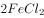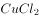。

D项正确，蜡烛燃烧产生炭黑等无定形炭对烟雾有吸附作用，它能将室内有异味的气体吸附在黑色烟子表面，从而达到消除烟味的作用。

本题为选非题，故正确答案为B。

---

## 言语理解与表达

### 第 1 题　qid 2662178 · 逻辑填空

目前存世最早的一张藏书票的制作年代大约是1450年，画面为一只刺猬衔着一枝野花，画面顶端的缎带上写着一行德文，大意是“慎防刺猬随时一吻”，        不要偷书。
填入划横线处最恰当的一项是：

- **A**. 警示　✅
- **B**. 预示
- **C**. 揭示
- **D**. 暗示

**答案**：A

**官方解析**

分析可知，“        不要偷书”是对“慎防刺猬随时一吻”的理解，结合“慎防”可知，所填词语含有让人谨慎防备的意思。A项“警示”侧重“警”，即警告、警醒，强调警醒告示，符合语境，当选。B项“预示”侧重“预”，即预先，强调预先显示；C项“揭示”侧重“揭”，即揭开，强调揭开原来不容易看出的事物；D项“暗示”侧重“暗”，强调用含蓄的言语或示意的举动使人领会；三者均不能体现让人谨慎防备的意思，不能与“慎防”呼应，排除。
故正确答案为A。
【文段出处】《藏书票里看门道》

---

### 第 2 题　qid 2662189 · 逻辑填空

“一带一路”跨文化认同的矛盾除了语言障碍外，还源自文化冲突、利益偏差、政治误解等多种因素。实现价值共识的最好方式就是        共同的文化记忆，打开被现实利益束缚的        ，找到“一带一路”沿线国家的感情共鸣。
依次填入划横线处最恰当的一项是：

- **A**. 唤醒  牵绊
- **B**. 挖掘  枷锁　✅
- **C**. 搭建  锁链
- **D**. 追溯  牢笼

**答案**：B

**官方解析**

第一空，由“找到······感情共鸣”可知，实现价值共识的办法是找到共同之处，故横线处应体现寻找共同的文化记忆，A项“唤醒”指叫醒，B项“挖掘”指挖、发掘，均可体现，符合文意，保留。C项“搭建”指建造（多用于临时性建筑），与“记忆”搭配不当，排除；D项“追溯”比喻探索事物的由来，与文意无关，排除。
第二空，横线处所填词语与动词“打开”搭配，B项“枷锁”比喻束缚人的观念、制度等，“打开枷锁”为常用搭配，当选。A项“牵绊”指惦念、羁绊，“打开牵绊”搭配不当，排除。
故正确答案为B。
【文段出处】《“一带一路”的跨文化认同》

---

### 第 3 题　qid 2662197 · 逻辑填空

猫咪都有着俊俏的脸、明亮的眼睛和毛茸茸的身体，天生可爱讨喜，加上平衡感高，就像体操选手，一举一动、姿态        。文人都是追求美、歌颂美的，因此光是观察、欣赏猫咪的模样和举动，就是一种绝佳的美感        ，便足以让文人成为猫痴。
依次填入划横线处最恰当的一项是：

- **A**. 妩媚  玩味
- **B**. 迷人  共鸣
- **C**. 优雅  体验　✅
- **D**. 横生  享受

**答案**：C

**官方解析**

第一空，所填词语搭配“姿态”，且与“就像体操选手”形成对应。B项“迷人”指使人陶醉，使人迷恋；C项“优雅”指优美高雅，均符合文意，搭配恰当，保留。A项“妩媚”形容女子、花木等姿态美好可爱，一般只形容女子，而体操选手有男有女，搭配不当，排除。D项“横生”常见有两层意思，当意为纵横杂乱地生长时，与文意不符，排除。当意为指层出不穷地出现时，与“体操选手”“姿态”对应不当，“层出不穷”形容事物连续出现，没有穷尽，而体操选手的姿态是有一定数量的，不可能没有穷尽地出现，且根据“光是观察、欣赏猫咪的模样和举动，就是一种绝佳的美感”也可知，后文强调猫咪姿态给人以美的感觉，并非强调姿态的多样性，故排除。
第二空，所填词语搭配“美感”，由文意可知，所填词语应表达“感受”之意。C项“体验”指通过实践来认识周围的事物或亲身经历，符合文意，且“美感体验”为常见搭配，当选。B项“共鸣”指由别人的某种情绪引起相同的情绪，文段并未提及“别人的情绪”，与文意不符，排除。
故正确答案为C。
【文段出处】《文人为何偏爱猫》

---

### 第 4 题　qid 2662204 · 逻辑填空

伴随文化产业的不断创新发展，文创产品不再        于杯子、笔记本、帆布袋等传统样式。出版业、博物馆、非遗技艺都在跨界融合中结合自身特点，积极拥抱新领域，        让市场认可且具经济价值的创新产品。
依次填入划横线处最恰当的一项是：

- **A**. 拘泥  研发　✅
- **B**. 倾向  立志
- **C**. 挑战  争取
- **D**. 束缚  渴望

**答案**：A

**官方解析**

第一空，根据横线后“跨界融合”“拥抱新领域”可知，“不再”所填词语应表达文创产品不受局限、突破传统样式之意。A项“拘泥”指固执，不知变通，D项“束缚”指使受到约束限制，均符合文意，保留。B项“倾向”指发展的方向、趋势，横线处词语所表达感情色彩应偏消极，“倾向”一词感情色彩为中性偏积极，排除；C项“挑战”指主动尝试战胜对方，“挑战于”搭配不当，排除。

第二空，搭配“创新产品”，且根据“创新”可知，所填词语应表达文化产业研究开发出新的产品之意。A项“研发”指研制开发，搭配恰当，符合文意，当选。D项“渴望”指迫切地希望，与文意不符，排除。

故正确答案为A。

【文段出处】《“文化”跨界融合推动着文创“破圈”》

---

### 第 5 题　qid 2662192 · 逻辑填空

全世界的博物馆正在        一场数字化革命，用数字技术开拓新的展览形式、增强展览效果、提升参观        、加强文物保护······数字技术使博物馆在实体之外再造了无数个性化、可以随时随地访问的贴身博物馆。
依次填入划横线处最恰当的一项是：

- **A**. 部署  距离
- **B**. 酝酿  机遇
- **C**. 了解  情绪
- **D**. 掀起  体验　✅

**答案**：D

**官方解析**

第一空，搭配“革命”，且根据后文“数字技术使博物馆······再造了无数个性化、可以随时随地访问的贴身博物馆”可知革命已经发生。D项“掀起”指使大规模地兴起，与“革命”搭配得当，可体现革命已经发生，保留。A项“部署”指安排，布置，是在事情发生之前进行的工作，B项“酝酿”比喻事情逐渐成熟的准备过程，填入文段体现革命正在准备，均与文段时态不符，排除；C项“了解”指知道得清楚，或打听、调查，常与情况搭配，与“革命”搭配不当，排除。
第二空，代入验证，D项“提升参观体验”搭配得当，当选。
故正确答案为D。
【文段出处】《用新技术增强展览效果》

---

### 第 6 题　qid 2662203 · 逻辑填空

朱元璋还曾命令手下的天文学家对中国和阿拉伯天文历法系统进行会通，即“欲合而为一，以成一代之历志”，通过将两者结合，制定出一部更为        的历法。因为两种天文系统存在一些显著的差异，最终未能如愿，但这两种历法在明代            都被相互参用，成为官方正式采用的两部历法。
依次填入划横线处最恰当的一项是：

- **A**. 精细 的的确确
- **B**. 明确 或多或少
- **C**. 优秀 毫无疑问
- **D**. 杰出 自始至终　✅

**答案**：D

**官方解析**

第一空，根据后文“成为官方正式采用的两部历法”可知，这两部历法本身是比较好的历法，又由横线前“更”可知，将两部历法结合制定出的则是一部更为完美、更好的历法，故横线处所填的词语要表达“合而为一”后的历法非常完美的意思，D项“杰出”意为出众，可体现此意，保留。A项“精细”指精密细致，B项“明确”指清晰明白而确定不移，均无法体现完美之意，排除；C项“优秀”虽能体现非常好的意思，但与“杰出”相比，程度较轻，排除。
第二空，代入验证，转折后指出即使二者存在显著差异，也不妨碍明代对二者相互参用，“自始至终”符合文意，当选。
故正确答案为D。
【文段出处】《丝路天文：阿拉伯天文学在中国》

---

### 第 7 题　qid 2662224 · 片段阅读

加拿大研究人员选取757名3~4个月大的婴儿，对他们的体重增长情况追踪调查了3年，结果显示：3岁时已经面临超重甚至肥胖问题的孩子，肠道菌群与体重正常的孩子不同。研究人员对参试婴儿的生活环境进行进一步考察后发现，在消毒剂用量最多的家庭中成长的婴儿肠道中所含毛螺菌比平均水平高出了两倍。毛螺菌科细菌以人体内未被消化的碳水化合物纤维为食，使之分解后为身体提供额外的热量。这种细菌的增多导致孩子体内产生过多热量，小小年纪就开始发胖。
这段文字意在：

- **A**. 揭示家庭消毒剂与婴儿体重的关系　✅
- **B**. 指出婴幼儿时期控制热量摄入的必要性
- **C**. 指出维持肠道菌群正常对健康的重要意义
- **D**. 说明碳水化合物是婴儿时期的重要来源

**答案**：A

**官方解析**

文段开篇通过追踪调查引出话题，指出肠道菌群与婴儿体重有相关性。后文通过进一步的考察指出，家庭消毒剂用量多会影响肠道菌群，最终导致成长中的婴儿发胖。故文段旨在强调家庭消毒剂的用量影响婴儿体重，对应A项。
B项，根据文意可知，导致孩子小小年纪就开始发胖的主要原因是家庭消毒剂用量过多，“控制热量摄入”并非文段重点，排除；
C项，本文围绕孩子体重增长的原因进行探究，“健康”范围扩大，排除；
D项，“碳水化合物是婴儿时期的重要来源”无中生有，排除。
故正确答案为A。
【文段出处】《家中太干净，孩子易肥胖》

---

### 第 8 题　qid 2662227 · 片段阅读

美国坦普尔大学研究人员以2500多名志愿者为对象，利用计算机对影响未来财富的决定性因素进行排名。这些因素包括：年龄、职业、教育、种族、性别、身高、地理位置以及延迟“即刻满足”的能力（自控力）等。结果显示，职业和教育是预测高收入的最重要因素，其次是所处地理位置和性别，紧跟其后的就是人的自控能力，它对收入的预测性明显超过年龄、种族和身高等因素。研究人员认为，重视儿童自控力的培养有助挖掘孩子未来的赚钱潜力。
最适合做这段文字标题的是：

- **A**. 性格决定命运
- **B**. 自控力强的人更富有　✅
- **C**. 财富从孩子抓起
- **D**. 神奇的财富猎手

**答案**：B

**官方解析**

文段开篇引出美国大学的实验研究，分析了影响未来财富的因素，并指出实验结果针对多种影响因素进行了排名。尾句通过“研究人员认为”引出中心，强调培养儿童自控力有助于让孩子未来变得富有。故整篇文章意在通过一个实验，强调自控力对富有的影响，对应B项。
A项，“性格”文段没有提及，无中生有，排除；
C项，“从孩子抓起”表述不明确，文段强调“自控力”影响未来的赚钱潜力，故偏离文段中心，排除；
D项，“财富猎手”表述不明确，排除。
故正确答案为B。
【文段出处】《自控力强的人更富有》

---

### 第 9 题　qid 2663627 · 片段阅读

拿破仑去世后，其尸检报告给出的拿破仑官方身高是5尺2寸（法寸），即1.68米左右。按照现在的标准来看并不算高，但有历史学家估计，十八世纪末、十九世纪初，法国人的平均身高大致为1.66米至1.67米。拿破仑是矮个子的说法其实与英法两国间的国际政治相关。1803年《亚眠和约》破裂之后，英国媒体把拿破仑5尺2寸的身高写在了报纸上，画在了漫画中，却没有标明其“法寸”的长度单位。英国读者便用英寸来理解拿破仑的身高，换算为1.57米。
这段文字意在说明：

- **A**. 说拿破仑是个矮个子纯属误解
- **B**. 其实拿破仑比一般法国人要高
- **C**. 英国人污蔑拿破仑是矮个子
- **D**. 要用历史眼光看拿破仑的身高　✅

**答案**：D

**官方解析**

文段为并列结构，前半部分通过介绍法国人的平均身高为1.66米至1.67米，而拿破仑官方身高是5尺2寸（法寸），即1.68米左右，说明在当时拿破仑的身高并不矮。后半部分阐述拿破仑矮个子的说法是因为英国媒体把拿破仑5尺2寸的身高写在了报纸上，却由于政治因素没有标明其“法寸”的长度单位，被误以为身高矮，故文段重在强调讨论拿破仑的身高应该考虑其所处的时代背景。对应D项。
A项，拿破仑个子矮被误解仅对应文段前半部分，表述片面，排除；
B项，拿破仑比一般法国人高仅对应文段前半部分，表述片面，排除；
C项，英国人污蔑拿破仑是矮个子仅对应文段后半部分，表述片面，排除。
故正确答案为D。
【文段出处】《画像与真相》

---

### 第 10 题　qid 2663634 · 片段阅读

世界其他地方的人们也面临着骑乘时安全、便捷、行动多样性等各种因素难以兼顾的难题，为此曾提出各种解决方案，如古罗马人把马鞍四角的鞍鞒大幅垫高，来固定骑手在马背上的位置，古波斯人则用绳带把骑手双腿固定到马鞍上。但构造简单、制作方便、功能全面、使用安全的马镫显然更加完美地解决了痛点，受到广泛欢迎，能够很快取代当地原有的技术。在中世纪伊斯兰史料中，马镫也被称作“中国鞋”，彰显出人们对这一发明原产地的认可。
下列说法与原文不相符的是：

- **A**. 马镫因便捷、安全、灵活广受欢迎
- **B**. 马镫是通过丝绸之路传到西方的技术
- **C**. 古罗马和古波斯人对马镫进行过改良　✅
- **D**. 伊斯兰地区曾把马镫称作“中国鞋”

**答案**：C

**官方解析**

A项，文段阐述了马镫因为构造简单、制作方便、功能全面、使用安全受到广泛欢迎，表述与文意相符，排除；
B项，根据“马镫也被称作‘中国鞋’，彰显出人们对这一发明原产地的认可”可知，马镫原产地是中国，极有可能是通过丝绸之路传到伊斯兰等地方去的，表述与文意相符，排除；
C项，文段中并未提及古罗马和古波斯人对马镫进行过改良，无中生有，当选；
D项，根据“在中世纪伊斯兰史料中，马镫也被称作‘中国鞋’”可知，表述与文意相符，排除。
本题为选非题，故正确答案为C。
【文段出处】《“源于中国”：丝绸之路上的创新符号》

---

### 第 11 题　qid 2663533 · 片段阅读

吃饱了就困，在医学上称为“醉饭”。人在吃进食物之后，一方面要分泌大量消化液，一方面要消化道蠕动，以消化食物，这两个功能被中医认为是脾气的一部分。这个过程需血液、氧气、水分等帮助工作，导致其他脏器的供血有所减少，大脑也会出现暂时性的缺血现象，人因此出现嗜睡、困倦之感，饭后尤其明显。如果他原本就是脾气虚的，饭后大脑的缺血就会更加严重。这种情况如果不加以干预，严重的可能导致低灌注性的脑中风或者心绞痛。
下列说法与原文不相符的是：

- **A**. “醉饭”严重决不能掉以轻心
- **B**. “醉饭”是一种正常的生理反应　✅
- **C**. “醉饭”是由大脑缺血导致的
- **D**. 脾气虚的人“醉饭”更强烈

**答案**：B

**官方解析**

A项，根据“这种情况如果不加以干预，严重的可能导致低灌注性的脑中风或者心绞痛”可知，“这种情况”即指“醉饭”，带来的后果是极其严重的，我们不能掉以轻心，符合文意，排除；
B项，根据“如果他原本就是脾气虚的，饭后大脑的缺血就会更加严重”可知，“醉饭”其实是脾气虚弱的表现，并不是人体正常的生理表现，不符合文意，当选；
C项，根据“大脑也会出现暂时性的缺血现象，人因此出现嗜睡、困倦之感，饭后尤其明显”可知，“醉饭”是由大脑缺血引起的，符合文意，排除；
D项，根据“如果他原本就是脾气虚的，饭后大脑的缺血就会更加严重”可知，表述正确，排除。
本题为选非题，故正确答案为B。
【文段出处】《谣言：吃饱了就困是因为懒》

---

### 第 12 题　qid 2663536 · 片段阅读

中国特殊的气候环境，使中国形成了热食的习俗。热食不能用手直接接触，需要餐具帮助进餐。战国时期，漆器进入到了饮食器具当中，并逐渐取代了青铜器。在使用漆器承载食物时，如果使用刀、叉来进食，会在漆器表面造成大量的划痕和损伤，影响到漆器的美观。中国古代的先民们利用竹子良好的弹性，首先制造出了“竹夹”，并在使用中积累了经验，最终演化出了筷子。
文中没有提及下列哪一信息：

- **A**. 中国的筷子由“竹夹”演化而来
- **B**. 古人用筷子与使用漆器餐具有关
- **C**. 吃热食的习俗促成了筷子的产生
- **D**. 战国时期人们放弃刀叉改用竹筷　✅

**答案**：D

**官方解析**

A项，根据“中国古代的先民们利用竹子良好的弹性，首先制造出了‘竹夹’，并在使用中积累了经验，最终演化出了筷子”可知，表述正确，排除；
B项，根据“在使用漆器承载食物时，如果使用刀、叉来进食，会在漆器表面造成大量的划痕和损伤，影响到漆器的美观。······，最终演化出了筷子”可知，表述正确，排除；
C项，根据“热食不能用手直接接触，需要餐具帮助进餐”可知，表述正确，排除；
D项，根据“中国古代的先民们利用竹子良好的弹性，首先制造出了‘竹夹’，并在使用中积累了经验，最终演化出了筷子”可知，古人确实放弃刀、叉，改用竹筷进食，但并未说明改用竹筷这一行为发生在战国时期，无中生有，当选。
本题为选非题，故正确答案为D。
【文段出处】《筷子为何会产生在中国？》

---

### 第 13 题　qid 2663637 · 片段阅读

惠山细货泥人，主要指手捏戏文，更加脱离耍货的样态，成为纯粹的装饰品。细货重手工，有打泥、揉泥、捏脚、捏身、装头、开相、装鸾等约15道工序。塑造极细的手指不开裂断掉，则仰仗惠山地区黑色黏土所具备的特佳的强度硬度。手捏戏文主要表现京昆戏剧场景和一些佛道形象，多以两三人为一组。前面所说王春林、周阿生等敬献的作品当属此类。由于人物造型比例准确，抓住戏剧高潮时人物典型动作，彩绘生动、顾盼生姿，观之如临剧场。
 关于惠山细货泥人文段未提及的是：

- **A**. 传承关系　✅
- **B**. 主要用途
- **C**. 材料特点
- **D**. 工艺流程

**答案**：A

**官方解析**

A项，“传承关系”文段未提及，无中生有，当选；
B项，“主要用途”对应文段“惠山细货泥人，主要指手捏戏文，更加脱离耍货的样态，成为纯粹的装饰品”，文段提及，排除；
C项，“材料特点”对应文段“仰仗惠山地区黑色黏土所具备的特佳的强度硬度”，文段提及，排除；
D项，“工艺流程”对应文段“细货重手工，有打泥、揉泥、捏脚、捏身、装头、开相、装鸾等约15道工序”，文段提及，排除。
本题为选非题，故正确答案为A。
【文段出处】《粗货、细货、耍货》

---

### 第 14 题　qid 2662971 · 片段阅读

如果说，人类已知的“明知识”（即可以用文字、公式、程序、语言表达出来的知识）是冰山的一小角，那么“暗知识”（人类不可感受又不可表达的新知识，即今天正被新机器“发现”的新一类知识）就是冰山下面最大的那块。暗知识会是未来统治和占领整个知识空间最大量的一种知识。我们要做好心理准备。人类知识的权威现在刚刚开始被动摇。未来，机器能掌握和发现的知识会越来越多。慢慢地，我们可能成为小岛一般的存在，被暗知识这个海洋淹没。
这段文字意在说明：

- **A**. 人类将会被暗知识孤立起来
- **B**. 暗知识将主宰未来知识领域　✅
- **C**. 人类的知识权威正逐渐丧失
- **D**. 人工智能是暗知识的创造者

**答案**：B

**官方解析**

文段开篇通过“明知识”引出“暗知识”这一话题，而后给出观点“暗知识会是未来统治和占领整个知识空间最大量的一种知识”，最后通过“人类的知识权威被动摇”和“被暗知识这个海洋淹没”进行具体解释说明，故文段应为分总分结构，旨在强调未来暗知识对人类知识领域的影响，对应B项。
A项，“人类将会被暗知识孤立起来”文段未提及，文段尾句仅提及“我们可能成为小岛一般的存在，被暗知识这个海洋淹没”，该项无中生有，排除；
C项，文段全篇都在讨论“暗知识”，而C项未提及这一主题词，排除；
D项，“人工智能”文段未提及，为无中生有，排除。
故正确答案为B。
【文段出处】《什么知识正在挑战人类的“权威”》

---

### 第 15 题　qid 2662861 · 片段阅读

针对近年来青蒿素在全球部分地区出现的“抗药性”难题，屠呦呦及其团队经过多年攻坚，在“抗疟机理研究”“抗药性成因”“调整治疗手段”等方面取得新突破，于近期提出应对“青蒿素抗药性”难题的切实可行治疗方案，并在“青蒿素治疗红斑狼疮等适应症”“传统中医药科研论著走出去”等方面取得新进展，获得世界卫生组织和国内权威专家的高度认可。
这是一段引言，文章接下来最不可能展开介绍的是：

- **A**. 青蒿素抗药性研究领域的新突破
- **B**. 青蒿素治疗红斑狼疮的独特效果
- **C**. 传统中医药科研论著对世界的贡献
- **D**. 青蒿素“抗药性”问题出现的原因　✅

**答案**：D

**官方解析**

文段开头先提出青蒿素出现“抗药性”难题，接着提出屠呦呦团队经过多年攻坚，在“抗药性”难题上取得新的突破和进展，并获得世界卫生组织和国内权威专家的高度认可，因此结合文段的提问方式，根据话题一致原则，上述文段论述过的内容都有可能作为接下来文段论述的内容，据此可知D项“‘抗药性’问题出现的原因”逻辑错误，文段先提出问题又论述问题已取得新的突破，故后文不会再围绕问题的原因进行论述，当选。
A项抗药性研究领域的新突破，B项治疗红斑狼疮的独特效果，C项传统中医药科研论著对世界的贡献，都与文段话题相关，排除。
本题为选非题，故正确答案为D。

【文段出处】《屠呦呦团队放大招：“青蒿素抗药性”等研究获新突破》

---

### 第 16 题　qid 2662866 · 片段阅读

美国康奈尔大学通过研究肥胖老鼠和正常老鼠的舌头，发现食用脂肪含量高的饮食会让味蕾数量减少。味蕾是舌头上的结构物，包括约100个细胞，老鼠增肥后，成熟味蕾细胞死亡速度变快，而新生细胞生长速度变慢。味蕾减少会导致味觉迟钝，味觉迟钝会让肥胖人群很难固定食用某种饮食，因为他们要像比他们多味蕾的正常人一样品尝到同样的美味，就得吃味道更重的食物，这就表明要摄入更多的糖、脂肪、卡路里。

这段文字意在说明：

- **A**. 味蕾细胞实现新陈代谢的方式
- **B**. 味觉在食物种类选择中的影响
- **C**. 肥胖的人更容易长胖的生理因素　✅
- **D**. 过量食用高脂肪饮食的严重危害

**答案**：C

**官方解析**

文段开篇通过研究肥胖老鼠和正常老鼠的舌头，引出“食用脂肪含量高的饮食会让味蕾数量减少”这一话题，紧接着后文对该实验进行具体介绍。随后通过“导致······会让······”引出文段的重点，即肥胖的人很难固定食用某种饮食，最后对结论解释其原因，也就是味蕾减少会让肥胖人群吃的更多，故文段的重点在讨论肥胖的人为什么比正常人吃更多的食物，对应C项。
A项，“味蕾细胞实现新陈代谢”是对话题“味蕾”的介绍，是上文提到的实验内容，非重点，排除；
B项，“味觉在食物种类选择中的影响”偏离文段中心，文段重点讨论的是肥胖的人群而非味觉，排除；
D项，“食用高脂肪饮食的严重危害”为前文实验的结果，非重点，且“严重危害”表述不明确，排除。
故正确答案为C。
【文段出处】《长胖后味觉会变迟钝》中国家庭报

---

### 第 17 题　qid 2663523 · 片段阅读

定窑是我国宋代五大名窑之一，与汝、官、哥、钧窑齐名。窑址在河北曲阳，曲阳县宋代属定州，故名定窑。定窑受邢窑影响，以烧制白瓷为主，同时还兼烧黑釉、绿釉等，白瓷釉质莹润，色泽温和，宛若牙雕，透影性相当好。装饰上以生动有力的刻、印花白瓷驰誉古今，胜过邢窑。宋金时期清丽素雅的刻花白瓷与富丽堂皇的印花白瓷，是定窑最主要的两个品种，代表了定窑鼎盛时期的典型艺术风格。
下列哪一说法与原文不符：

- **A**. 宋代和金代是定窑的鼎盛时期
- **B**. 刻花和印花白瓷是定窑的代表作品
- **C**. 定窑的白瓷借鉴邢窑又超过了邢窑
- **D**. 清丽素雅是定窑典型的艺术风格　✅

**答案**：D

**官方解析**

A项，根据文段最后一句“宋金时期清丽素雅的刻花白瓷与富丽堂皇的印花白瓷······代表了定窑鼎盛时期的典型艺术风格”可知，既然鼎盛时期代表作出现在宋代和金代，那么宋代和金代即为定窑的鼎盛时期，表述正确，排除；
B项，根据文段最后一句“宋金时期清丽素雅的刻花白瓷与富丽堂皇的印花白瓷，是定窑最主要的两个品种”可知，表述正确，排除；
C项，根据文段“定窑受邢窑影响，······胜过邢窑”可知，表述正确，排除；
D项，根据文段“宋金时期清丽素雅的刻花白瓷与富丽堂皇的印花白瓷······代表了定窑鼎盛时期的典型艺术风格”可知，清丽素雅只是其鼎盛时期的艺术风格，其余时期是否为此特点不确定，故表述错误，当选。
本题为选非题，故正确答案为D。

【文段出处】《【欣赏】中国古代十二名窑》

---

### 第 18 题　qid 2662972 · 片段阅读

德国研究人员对1364名志愿者进行跟踪调查，以了解他们在5456天调查期内如何分配时间。结果表明，总体而言，参试者平均每天会花1小时29分钟做家务，但神经质程度级别最高组的人每天比该平均值多做24分钟家务；比情绪最稳定的一组人每天花在家务上的时间则多41分钟。研究人员推测，情绪稳定性差的人比较容易产生焦虑、抑郁情绪，需要一个更整洁的环境以维持心理上的舒适和安全感，因此，他们会花更多的时间打扫。
下列说法与原文不符的是：

- **A**. 多做家务是神经质人的心理需要
- **B**. 爱做家务的人情绪稳定性差　✅
- **C**. 神经质的人容易产生不稳定情绪
- **D**. 神经质的人需要更整洁的环境

**答案**：B

**官方解析**

A项，根据“情绪稳定性差的人比较容易产生焦虑、抑郁情绪，需要一个更整洁的环境以维持心理上的舒适和安全感，因此，他们会花更多的时间打扫”可知，表述正确，排除；
B项，文段并未提到爱做家务的人的情绪问题，只是提及情绪稳定性差的人会多做家务，无中生有，当选；
C项，根据“研究人员推测，情绪稳定性差的人比较容易产生焦虑、抑郁情绪”可知，表述正确，排除；
D项，根据“情绪稳定性差的人比较容易产生焦虑、抑郁情绪，需要一个更整洁的环境以维持心理上的舒适和安全感”可知，表述正确，排除。
本题为选非题，故正确答案为B。
【文段出处】《神经质的人更喜欢做家务》

---

### 第 19 题　qid 2662870 · 片段阅读

根据目前的考古报道和多项考古证据，中国最早的家绵羊在年代约为距今5600—5000年的甘肃省和青海省一带突然出现，而后向东部传播，在距今约4500年前后进入中原地区。中原地区在年代约为距今4500—4000年的不同地区的多个考古遗址里均发现绵羊骨骼。从历时性的角度观察，中原地区绵羊的出现有一个明显的从无到有、从少到多的发展过程，中国古代家绵羊的出现则明显是西部早、东部晚，很可能有一个自中国西北地区向东传播的过程。
这段文字主要介绍：

- **A**. 家绵羊在中国的传播过程　✅
- **B**. 家绵羊在中原地区的考古发现
- **C**. 古代中原地区家绵羊的来源
- **D**. 地理环境对家绵羊生存的影响

**答案**：A

**官方解析**

文段开篇指出中国最早的家绵羊是从甘肃省和青海省一带向东传播进入中原的，接下来介绍了中原地区发现了绵羊遗骸，最后一句通过“则”表强调，依旧论述了中国家绵羊的传播过程。因此根据文段可知，文段主题词为“家绵羊”和“传播”，根据主题词，对应A项。
B项，“考古发现”并非文段重点，文段旨在强调家绵羊在中国的传播，“考古发现”只是为了从时间上论证其“传播”，排除；
C项，“家绵羊的来源”为无中生有，文段只说在甘肃省和青海省一带突然出现，并未具体论述来源是哪里，排除；
D项，“地理环境”为无中生有，文段并未论述，排除。
故正确答案为A。
【文段出处】《中国家羊的起源》

---

### 第 20 题　qid 2662873 · 片段阅读

汉语、藏语、羌语、缅语等400多种东亚语言被认为拥有共同的祖先语言，合称为汉藏语系，这一语系的母语使用人数仅次于印欧语系。一直以来，语言学家对汉藏语系内部各语支亲缘关系、分化时间以及起源地点存在争议。近日，复旦大学研究团队宣布，综合运用语言学和遗传学等分析方法，他们发现汉藏语系起源于新石器时代的中国北方，并于约6000年前出现了第一次分化。该成果近日以原创性研究论文形式，在线发表于英国《自然》杂志。
这段文字接下来不太可能介绍的是：

- **A**. 该团队的研究过程与详细结论
- **B**. 这一研究所提供的研究范式
- **C**. 各界对这一研究成果的评价
- **D**. 汉藏语系与印欧语系的关系　✅

**答案**：D

**官方解析**

根据提问方式可知，本题为接语选择题。
文段开篇引出汉藏语系的话题，随后指出语言学家对其存在多方面争议，接下来介绍复旦大学研究团队的最新研究成果，即“汉藏语系起源于新石器时代的中国北方”。文段最后强调的是复旦大学团队研究的论文发表了，根据话题一致性原则，下文应该继续围绕这一话题具体展开论述，描述复旦大学团队研究成果，A项“该团队的研究过程与详细结论”、B项论述的是“这一研究”、C项论述的是“这一研究成果”，均与文段最后谈论的核心话题一致，排除。
D项论述的是“印欧语系”，与文段最后谈论的话题不一致，当选。
本题为选非题，故正确答案为D。
【文段出处】《6000年前，汉藏语系起源于中国北方》

---

### 第 21 题　qid 2662973 · 语句表达

①这些钟虽然用途迥异，但形制没有明显差别，自魏晋南北朝时期出现后，一直沿用至近代，学术界将这一新的古钟类型泛称为“梵钟”。
②这种新的古钟类型包括佛寺宫观使用的“佛道用钟”，还包括城市钟楼报时的“更钟”，以及朝堂禁宫安置的“朝钟”等。
③梵钟的名称虽有“梵”字，但并不是随佛教传入中国，而是由古印度的一种敲击的木板与中国的古钟文化结合而成。
④这是一种完全不同于先秦乐钟的古钟类型。
⑤魏晋南北朝时期，随着佛教的传播与道教的兴起，圆筒形梵钟开始广泛出现。
⑥自此，中国古钟的形制、声韵等都因其应用范围的拓展和使用功能的变化而发生了相应变化。
将以上6个句子重新排列，语序正确的是：

- **A**. ③⑤⑥④②①
- **B**. ⑤③⑥④②①
- **C**. ⑤④⑥②①③　✅
- **D**. ④①③⑥⑤②

**答案**：C

**官方解析**

观察选项，③句、④句和⑤句三句充当首句，③句介绍的是梵钟的名称，⑤句引出话题，在魏晋南北朝时期，梵钟开始出现，应该先提出梵钟这一话题，再介绍其名称，故③句不适合做首句，排除A项；④句出现指代词“这”，指代不明确，不适合做首句，排除D项；对比B、C两项，④句前接⑥句或⑤句，④句中指代词“这”指的应该是一种古钟类型，⑥句介绍的是古钟的形制、声韵等发生了变化，非④句指代内容，排除B项；⑤句介绍了圆筒形梵钟的出现，与④句指代词对应。
故正确答案为C。
【文段出处】《古钟的艺术（文物有话说）》

---

### 第 22 题　qid 2662974 · 语句表达

①早期的铜鼎，因铸造技术的局限，形制比较单一，以锥足圆鼎为主，器壁较薄，纹样简单，充满了原始性
②从公元前21世纪至公元前5世纪，在大约1500年的历史进程中，鼎从一件日常的生活用器逐渐走向政治舞台，成为国家政权的标志
③值得一提的是在商代中期偏晚的时候，以族徽与日名为主题所构成的铭文开始出现，中国国家博物馆藏的后母戊鼎就是这一时期的代表。青铜鼎由此进入了它的繁荣期
④商中期以后，随着铸造技术的提高和日益重要的祭祀的需要，鼎的形制也发生了很大变化：出现了方鼎和分档鼎，且形体也不断变大
⑤鼎是青铜时代最具代表性的器物，贯穿了整个青铜时代的始终
⑥尊贵的社会地位，深厚的精神内涵，完美的艺术形式，汇聚于铜鼎一身，使其成为中国青铜文化的代表
将以上6个句子重新排列，语序正确的是：

- **A**. ⑤②⑥①④③　✅
- **B**. ②⑤①④⑥③
- **C**. ⑤③①④⑥②
- **D**. ①④③⑥⑤②

**答案**：A

**官方解析**

对比选项，确定首句。首句分别为①②⑤句，①句阐述早期铜鼎的特点，②句阐述鼎在大约1500年的历史进程中功用的变化，⑤句是对鼎下定义，根据逻辑可知，应先介绍鼎的概念，再进行详细论述，所以⑤句最适合做首句，排除B、D两项。
继续观察，寻找解题线索。①句阐述“早期的铜鼎”，③句阐述“青铜鼎由此进入了它的繁荣期”，即繁荣期的鼎，按照时间发展顺序，①句应在③句之前，排除C项，A项当选。
验证A项，⑤句对鼎下定义，引出鼎的话题，②句介绍鼎在历史进程中功用的变化，⑥句指出铜鼎是中国青铜文化的代表，①、④、③三句介绍鼎从早期到繁荣期的发展历史，逻辑通顺。
故正确答案为A。
【文段出处】《源远流长的鼎文化（文物有话说）》

---

### 第 23 题　qid 2663506 · 语句表达

①进入博物馆，一本本古籍文献知识图书、一张张古籍修复流程和修复前后的对比照片、一件件客家姓氏图腾等文创产品展示，为参观者提供了古籍文献保护、抢救、修复的知识图谱
②古籍修复师们则在三层聚精会神地操作。配纸染纸、配制浆糊、分解书籍、填补虫洞······
③走进洛带古镇，浓郁的客家气息袭来：歇山顶、攒尖顶等各色客家民居古老雅致，广东会馆、川北会馆等客家会馆错落在古镇屋宇间
④古籍修复师们或坐或站、或贴或刻、或裁或粘，按照“整旧如旧”的原则，将善本古籍、古字画、碑帖、档案、票据等还原本来模样
⑤在二楼核心展陈区，杜伟生、徐建华等九位中国当代古籍修复大师、高浮雕传拓大师的修复业绩及学术成果图高高悬挂，他们用过的修复物件整齐摆放，传递着大师们精益求精的“工匠精神”
⑥不多时，一座三层小楼映入眼帘，白墙灰瓦，这便是由四川西部文献修复中心创建的古籍文献修复博物馆
将以上6个句子重新排列，语序正确的是：

- **A**. ③⑥①⑤②④　✅
- **B**. ①④⑤②③⑥
- **C**. ③①②⑥④⑤
- **D**. ①⑤④②⑥③

**答案**：A

**官方解析**

对比首句，分别为①和③，①句“进入博物馆······”在讲述走进博物馆呈现的场景，③句“走进洛带古镇······”在讲述走进古镇呈现的场景。根据⑥句可知，博物馆应为古镇中的建筑之一，③句更适合作首句，保留A、C两项，排除B、D两项。
对比A、C两项，③句后面分别为⑥和①，应当先引出博物馆，后进入博物馆，所以⑥句应在①句之前，锁定A项。
故正确答案为A。
【文段出处】《古籍文献修复博物馆——寻找文献中的历史》

---

### 第 24 题　qid 2663514 · 语句表达

①所以，国务院印发了《2019年全国减轻企业负担工作实施方案》
②然而，近年来，一些地方政府拖欠相关方款项的新闻时有发生
③一些地方政府、国企长期拖欠款项可能严重影响经济正常运行
④除了政府，国有大型企业也时有拖欠民营企业款项的情况
⑤提出今年的工作目标之一是持续推进清欠专项行动
⑥现代经济运行中，政府部门被认为是信用最高的，有政府背书的单位在信用评级中都享有较高的评级
将以上6个句子重新排列，语序正确的是：

- **A**. ③④①②⑥⑤
- **B**. ③①⑥②④⑤
- **C**. ⑥②④③①⑤　✅
- **D**. ⑥②①③④⑤

**答案**：C

**官方解析**

观察选项，对比首句，不易判断。观察其他句子发现，②句中出现转折关联词“然而”，可尝试捆绑，转折前后语义相反，②句指出近年来政府拖欠款项的新闻时有发生，选项中为①②或⑥②捆绑，①句与政府拖欠款项无关，⑥句指出“现代经济运行中，政府部门被认为是信用最高的”，与②句语义相反，故⑥②捆绑更恰当，排除A项。接着观察④句中出现并列标志词“也”，指出企业也有拖欠款项的情况，故可知④句与②句通过“也”进行关联词捆绑，排除D项。
对比B、C两项，尾句均为⑤句，判断是④⑤或①⑤捆绑，④句在论述问题，与⑤句衔接不恰当，①句中出现结论引导词“所以”，指出国务院印发了工作实施方案，⑤句中“提出”具体指的是该实施方案中提出的工作目标，故①⑤捆绑更恰当，锁定C项。
故正确答案为C。
【出处】《欠债还钱，政府应作表率》

---

### 第 25 题　qid 2663518 · 语句表达

①这是当今全球城市智能化的必要性和可能性
②若对上述关系处理不当，就会产生各种各样的“城市病”，如交通拥堵、环境污染等
③城市里的人类社会活动与组织也越来越复杂，如基建、服务、交通、物流、能源、通信等诸多子系统，彼此构成错综复杂的共生、促进或制约关系
④社会科学、自然科学和工程技术从这些关系中已形成大量学术成果，但由于学科区分，综合性分析研究较为稀缺
⑤随着城市不断变得更大、更复杂，在城市物理空间中，人造物开始打破与自然物的平衡关系，如建筑、街道、车辆、包装物、垃圾、污水、雾霾，使土壤、江河、大气等面临严峻考验
⑥近年来，互联网、传感器网、大数据、云平台崛起，城市中错综复杂的关系已通过数字化映射到信息空间，对它们的学习、分析、综合变得可能
将以上6个句子重新排列，语序正确的是：

- **A**. ⑤③②④⑥①　✅
- **B**. ⑥①③⑤②④
- **C**. ⑥①④⑤③②
- **D**. ⑤③④②⑥①

**答案**：A

**官方解析**

观察选项，对比首句，⑤⑥两句，“随着”“近年来”都为背景引入的标志词，均可作为首句，无法排除。继续观察，②句出现指代词“上述关系”，指出对这些关系处理不当对城市产生的不良后果，③句中讲述的正是城市中存在的错综复杂的关系，故可知③②捆绑，排除B、D两项。观察④句中也存在指代词“这些关系”，故可知④句应在③句后，排除C项。
验证可知，文段首先提出人类活动形成了错综复杂的关系，接下来提出学术对这些关系的研究缺乏综合性分析的问题，最后指出互联网等技术为解决这些问题提供了可能。逻辑顺序正确。
故正确答案为A。
【文段出处】人民日报——《城市智能化开启城市生活新境界（开卷知新）》

---

## 数量关系

### 第 1 题　qid 2662166 · 数学运算

某阶梯会议室有16排座位，后一排比前一排多2个，最后一排有40个座位。这个阶梯会议室共有多少个座位？

- **A**. 300
- **B**. 350
- **C**. 400　✅
- **D**. 440

**答案**：C

**官方解析**

根据题意可知，16排座位数是公差为2的等差数列。根据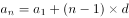，则第一排座位数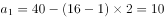个，再根据等差数列求和公式：，可得会议室座位数个。

故正确答案为C。

---

### 第 2 题　qid 2662169 · 数学运算

某美术馆计划展出12幅不同的画，其中有3幅油画、4幅国画、5幅水彩画，排成一行陈列，要求同一种类的画必须连在一起，并且油画不放在两端，问有多少种不同的陈列方式？

- **A**. 不到1万种
- **B**. 1万—2万种之间
- **C**. 2万—3万种之间
- **D**. 超过3万种　✅

**答案**：D

**官方解析**

由题干“同一种类的画必须连在一起” ，即3幅油画捆绑在一起，有种情况，4幅国画捆绑在一起，有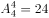种情况，5幅水彩画捆绑在一起，有种情况。由于油画不放在两端，只能摆在中间，则国画和水彩画排在两端，有种情况。所以总情况数为种，超过3万种。

故正确答案为D。

---

### 第 3 题　qid 2662173 · 数学运算

某新型建材生产车间计划生产480个建材，当生产任务完成一半时，暂时停止生产，对器械进行维修清理，用时20分钟。恢复生产后工作效率提高了三分之一，结果完成任务时间比原计划提前了40分钟，问对器械进行维修清理后每小时生产多少个建材？

- **A**. 80　✅
- **B**. 87
- **C**. 94
- **D**. 102

**答案**：A

**官方解析**

方法一：设器械进行维修清理前效率为个/小时，则维修清理后效率为个/小时。当生产任务完成一半时进行维修清理，则清理前后都完成了任务的一半，即240个建材。维修清理用时20分钟，最后完成任务时间比原计划提前40分钟，即效率提高后，完成后一半的任务时间比维修清理前用时少1小时，根据时间的等量关系可列方程：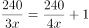，解得，则，即维修清理后每小时生产80个建材。

方法二：恢复生产后工作效率提高了三分之一，即前后工作效率之比，维修清理后的效率是4的倍数，观察选项，只有A项符合。

故正确答案为A。

---

### 第 4 题　qid 2662176 · 数学运算

某地居民生活使用天然气每月标准立方数的基本价格为4元/立方，若每月使用天然气超过标准立方数，超出部分按其基本价格的收费。某用户2月份使用天然气100立方，共交天然气费380元，则该市每月使用天然气标准立方数为多少立方？

- **A**. 60
- **B**. 65
- **C**. 70
- **D**. 75　✅

**答案**：D

**官方解析**

若该用户在标准立方数以内使用100立方，则需要交天然气费元，实际只交天然气费380元，说明使用的天然气超过标准立方数。设每月使用天然气标准立方数为立方，根据总收费为两部分的和，可得方程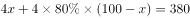，解方程得，即该市每月使用天然气标准立方数为75立方。

故正确答案为D。

---

### 第 5 题　qid 2662181 · 数学运算

某单位共有240名员工，其中订阅A期刊的有125人，订阅B期刊的有126人，订阅C期刊的有135人，订阅A、B期刊的有57人，订阅A、C期刊的有73人，订阅3种期刊的有31人，此外，还有17人没有订阅这三种期刊中的任何一种。问订阅B、C期刊的有多少人？

- **A**. 57
- **B**. 64　✅
- **C**. 69
- **D**. 78

**答案**：B

**官方解析**

设订阅B、C期刊的有人。根据三集合容斥原理标准型公式：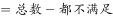，代入数据得：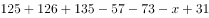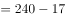，解得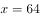，即订阅B、C期刊的有64人。

故正确答案为B。

---

### 第 6 题　qid 2662186 · 数学运算

56人参加户外拓展训练，将22人安排在A营地，34人安排在B营地。从12:01开始，每逢整点A营地派出12人前往B营地，B营地派出8人前往A营地。已知两个营地之间的单程用时为30分钟，问以下哪个时间点，位于B营地的人数正好是A营地的3倍？

- **A**. 13:20
- **B**. 13:40
- **C**. 14:20
- **D**. 14:40　✅

**答案**：D

**官方解析**

方法一：设当派出次且到达营地后，B营地的人数正好是A营地的3倍。由于每次整点A营派出12人，B营派出8人，可知每次到达营地后，A营地总人数少4人，B营地多4人，则列方程为：，解得，即当派出两次且到达营地后，B营地的人数是A营地的3倍。根据题意每整点派出，每半点到达营地，因为12:01开始，故第一次派出时间是13:00，第二次派出时间是14:00，则第二次到达营地时间为14:30，直至下次15:00派出前人数保持不变，结合选项，只有D项满足。

方法二：结合选项发现，间隔时间较短，可以利用枚举法解决。由题意可知，整点派出，半点到达，故可列表为：

由于，双方人数正好呈三倍关系。下次派出时间为15:00，故14:30-15:00之间人数保持三倍关系不变，结合选项，只有D项满足。

故正确答案为D。

---

### 第 7 题　qid 2662191 · 数学运算

A、B两地相距600千米，甲车上午9时从A地开往B地，乙车上午10时从B地开往A地，到中午13时，两辆车恰好在A、B两地的中点相遇。如果甲、乙两辆车都从上午9时由两地相向开出，速度不变，到上午11时，两车还相距多少千米？

- **A**. 100
- **B**. 150
- **C**. 200
- **D**. 250　✅

**答案**：D

**官方解析**

由题意可知，到中午13时，甲车花费4个小时，乙车花费3个小时，因为在中点相遇，则两车均走了300千米，则千米/时，千米/时。当两车从上午9时到11时，共行驶2小时，则走了千米，则两车还相距千米。

故正确答案为D。

---

### 第 8 题　qid 2662205 · 数学运算

为了实现营养的合理搭配，某营养师拟推出适合不同人群的甲、乙两个品种的饮食。其中，1份甲品种中有3千克A食物、1千克B食物、1千克C食物；1份乙品种中有1千克A食物、2千克B食物、2千克C食物。甲、乙两个品种的成本价分别为A、B、C三种食物的成本价之和。已知A食物每千克的成本价为6元。甲品种每份售价为58.5元，利润为成本的，乙品种的利润为成本的。问如果两品种的总销售利润率至少要达到总成本的，销售甲、乙两个品种饮食的份数之比不应低于多少？

- **A**. 5：7
- **B**. 6：8
- **C**. 7：9
- **D**. 8：9　✅

**答案**：D

**官方解析**

根据公式，成本，可得甲品种成本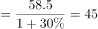元，则甲品种的利润元；计算甲品种的成本情况，分别设1千克B食物的成本价为元，1千克C食物的成本价为元，可得：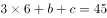，解得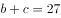，则每份乙品种的成本价为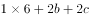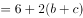元，利润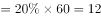元；

设甲、乙两个品种饮食的份数分别为、，根据公式，利润率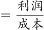，且要求甲、乙两品种的总销售利润率至少要达到总成本的，可得利润率，解得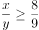，即甲、乙两个品种饮食的份数之比不应低于8：9。

故正确答案为D。

---

### 第 9 题　qid 2662231 · 数学运算

甲、乙两名运动员参加射箭比赛，每一箭的环数是不超过10的自然数，甲、乙两名运动员各射了5箭，每人5箭的环数乘积均为1764，但乙的总环数比甲的少4环，则甲、乙两名运动员的总环数各是多少？

- **A**. 26、22
- **B**. 27、23
- **C**. 28、24　✅
- **D**. 32、28

**答案**：C

**官方解析**

分解1764的因数，可得，因为“每一箭的环数是不超过10的自然数”，所以7不能再和其他因数相乘，甲、乙两名运动员一定均有两箭的环数为7，剩余三箭的环数的乘积，则一共有五种情况：

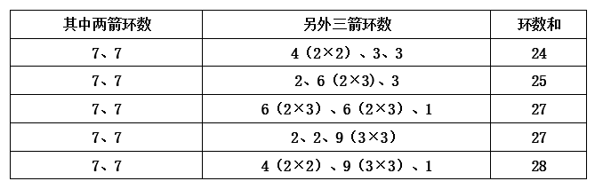

其中只有当环数和为28和24的时候，可以满足“乙的总环数比甲的少4环”的条件。

故正确答案为C。

---

### 第 10 题　qid 2662232 · 数学运算

一艘轮船顺流而行，从甲地到乙地需要6天；逆流而行，从乙地到甲地需要8天。若不考虑其他因素，一个漂流瓶从甲地到乙地需要多少天？

- **A**. 24
- **B**. 36
- **C**. 48　✅
- **D**. 56

**答案**：C

**官方解析**

设两地间的距离为24，则顺流速度，逆流速度，根据顺流速度流水速度逆流速度流水速度，则有流水速度流水速度，解得流水速度，因此一个漂流瓶从甲地到乙地需要天。

故正确答案为C。

---

### 第 11 题　qid 2662235 · 数学运算

某商业小区计划打造两个娱乐广场，其中一个为正方形广场，面积为320平方米，另一个为圆形广场，其直径比正方形广场的边长短，问，圆形广场的面积是多少平方米？

- **A**. 203　✅
- **B**. 307
- **C**. 452
- **D**. 824

**答案**：A

**官方解析**

方法一：根据正方形面积为320平方米，可求出正方形的边长为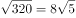米，因为圆形广场的直径比正方形广场的边长短，可知圆形广场的半径为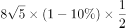米，因此圆形广场的面积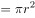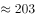平方米，A项最接近。

方法二：当圆的直径和正方形的边长相等时，  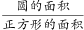，因为题干中的圆形广场的直径比正方形广场的边长短，因此。根据正方形广场的面积为320平方米，则圆形广场的面积平方米，只有A项符合。

故正确答案为A。

---

### 第 12 题　qid 2662236 · 数学运算

某演播大厅的地面形状是边长为100米的正三角形，现要用边长为2米的正三角形砖铺满（如图所示）。问，需要用多少块砖？

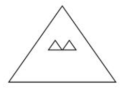

- **A**. 2763
- **B**. 2500　✅
- **C**. 2340
- **D**. 2300

**答案**：B

**官方解析**

从演播大厅大三角形顶角开始铺设，小三角形和大三角形相似，根据边长比例可知，需要铺设50层。如图所示：第一层铺设1块瓷砖，前二层铺设4块，前三层铺设9块，以此类推，前n层铺设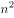块，故前50层共铺设块瓷砖。

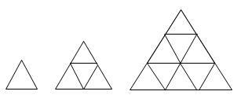

方法二：由题意可知，小瓷砖可以恰好铺满演播厅，根据几何相似特性，面积之比边长平方之比，可得：演播厅面积（大正三角形）：瓷砖面积（小正三角形）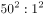，故需要2500块瓷砖可以铺满演播厅。

故正确答案为B。

---

### 第 13 题　qid 2662237 · 数学运算

某高校组织召开教职工代表大会，配备了A、B两个会务组成员，因工作需要，先将A组三分之一的工作人员调到B组去帮忙。后来因为工作程序的改变又把B组工作人员中的12人调到A组，这时A组有26人，B组有14人。问，最初A组的工作人员比B组的工作人员：

- **A**. 多2人　✅
- **B**. 少2人
- **C**. 多12人
- **D**. 少12人

**答案**：A

**官方解析**

设A会务组最初配备了名成员，B会务组最初配备了名成员，调整如下：

联立方程组：······①；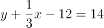······②，解得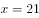，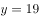，则最初A组的工作人员比B组的工作人员多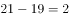人。

故正确答案为A。

---

### 第 14 题　qid 2662239 · 数学运算

甲烧杯装有浓度为的酒精200克，乙烧杯装有浓度为的酒精100克。现向两个烧杯各加入克水后，两个烧杯中酒精浓度相同。问的值为：

- **A**. 350
- **B**. 400
- **C**. 550
- **D**. 600　✅

**答案**：D

**官方解析**

根据，且加入克水后酒精浓度相同，根据等量关系列方程：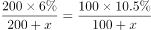，解得。

故正确答案为D。

---

### 第 15 题　qid 2662242 · 数学运算

如图所示，边长为4米和2米的两个正方形，开始在左边重合，大正方形不动，小正方形自左向右平移至出大正方形外停止。设小正方形移动的距离为，两个正方形重叠的面积为，则关于的函数关系用图像表示正确的是：

- **A**. A
- **B**. B
- **C**. C
- **D**. D　✅

**答案**：D

**官方解析**

根据题意可知，开始最左边重合，当移动距离时，此时整个小正方形全部在大正方形中，重叠面积小正方形面积；当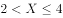时，此时小正方形与大正方形重叠的面积越来越小，且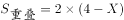， D项符合。

故正确答案为D。

备注：考场上判定出时，重叠面积为4不变，即可排除A、B、C三项，选出正确答案，不必进行后续分析。

---

## 判断推理

### 第 1 题　qid 2662233 · 图形推理

从所给的四个选项中，选择最合适的一个填入问号处，使之呈现一定的规律性：

- **A**. A　✅
- **B**. B
- **C**. C
- **D**. D

**答案**：A

**官方解析**

元素组成不同，且无明显属性规律，考虑数量规律。观察题干图形，图一明显被分割，考虑面数量，题干图形面数量依次为5、4、3、2、1、？，故？处图形面数量应为0，只有A项符合。
故正确答案为A。

---

### 第 2 题　qid 2662238 · 图形推理

从所给的四个选项中，选择最合适的一个填入问号处，使之呈现一定的规律性：

- **A**. A　✅
- **B**. B
- **C**. C
- **D**. D

**答案**：A

**官方解析**

元素组成不同，且无明显属性规律，考虑数量规律。观察发现图形分为多个封闭区域，窟窿明显，考虑面数量，但无规律；再观察发现，图二为明显一笔画图形，B项为“田”字变形图，考虑笔画数，题干图形均为一笔画图形，故？处也应为一笔画图形。A、B、C、D四项图形的笔画数分别为1、2、2、2，只有A项符合。
故正确答案为A。

---

### 第 3 题　qid 2662241 · 图形推理

把下面的六个图形分为两类，使每一类图形都有各自的共同特征或规律，分类正确的一项是：

- **A**. ①④⑤，②③⑥
- **B**. ①⑤⑥，②③④　✅
- **C**. ①③⑤，②④⑥
- **D**. ①④⑥，②③⑤

**答案**：B

**官方解析**

本题为分组分类题目。元素组成不同，且无明显属性规律，考虑数量规律。图形分割面特征明显，考虑数面，但面数量无明显规律。考虑面的细化，观察发现图②、图⑤明显具有相同面，考虑相同面的数量，图②③④相同面的数量均为6，图①⑤相同面的数量均为4，图⑥相同面的数量有2个、3个和4个，因此考虑图①⑤⑥中最多相同面的数量均为4，图②③④中最多相同面的数量均为6，即图①⑤⑥为一组，图②③④为一组。
故正确答案为B。

---

### 第 4 题　qid 2662244 · 图形推理

把下面的六个图形分为两类，使每一类图形都有各自的共同特征或规律，分类正确的一项是：

- **A**. ①④⑤，②③⑥
- **B**. ①②⑤，③④⑥
- **C**. ①③⑤，②④⑥
- **D**. ①④⑥，②③⑤　✅

**答案**：D

**官方解析**

本题为分组分类题目。元素组成不同，优先考虑属性规律。观察发现图形中出现三角形等对称图形，考虑对称性。其中图①④⑥横轴对称，图②③⑤竖轴对称，即图①④⑥为一组，图②③⑤为一组。
故正确答案为D。

---

### 第 5 题　qid 2662246 · 图形推理

左图是给定的立体图形，将其从任一面剖开，立体截面是：

- **A**. A
- **B**. B
- **C**. C
- **D**. D　✅

**答案**：D

**官方解析**

本题考查截面图。逐一分析选项。如下图所示，A、B、C三项均不可以截出，正确的截面图分别如下图一、图二、图三所示：

D项可以截出，具体剖切方式如下图所示：

故正确答案为D。

---

### 第 6 题　qid 2662249 · 定义判断

教育斗富是指在教育领域里打着“造福孩子”的旗帜相互攀比建设豪华学校，而忽视其实用性的现象。
根据上述定义，下列哪项不涉及“教育斗富”？

- **A**. 某中学增建大广场，校园里的建筑物使用的是大理石，教室内配备了有线电视、广播、同声监控等系统，但是这些设备在教学中很少使用
- **B**. 某中学配备了现代化的教学设施，但这些设施平常束之高阁，只有领导来视察时才会被启用
- **C**. 某小学配备了众多高端且先进的教学设施，校园各处随时方便上网，造成不少孩子一下课就上网
- **D**. 某大学增建学生宿舍，花大量资金更新各实验室设备，高薪聘请精专人才来校执教，大量高端人才慕名而来　✅

**答案**：D

**官方解析**

第一步：找出定义关键词。
“在教育领域里打着‘造福孩子’的旗帜”、“相互攀比”、“建设豪华学校”、“忽视其实用性”。
第二步：逐一分析选项。
A项：某中学增建大广场，校园里的建筑物使用的是大理石，教室内配备了有线电视、广播、同声监控等系统，符合“在教育领域里打着‘造福孩子’的旗帜”、“建设豪华学校”，这些设备在教学中很少使用，符合“忽视其实用性”，符合定义，排除； 
B项：某中学配备了现代化的教学设施，符合“在教育领域里打着‘造福孩子’的旗帜”、“建设豪华学校”，这些设施平常束之高阁，只有领导来视察时才会被启用，符合“忽视其实用性”，符合定义，排除；
C项：某小学配备了众多高端且先进的教学设施，校园各处随时方便上网，符合“在教育领域里打着‘造福孩子’的旗帜”、“建设豪华学校”，造成不少孩子一下课就上网，符合“忽视其实用性”，符合定义，排除；
D项：某大学增建学生宿舍，花大量资金更新各实验室设备，宿舍和实验设备是大学的基础设施和设备，不符合“建设豪华学校”，高薪聘请精专人才来校执教，大量高端人才慕名而来，人才是教育的关键所在，说明学校高薪聘请精专人才的行为有其重要价值，不符合“忽视其实用性”，不符合定义，当选。
本题为选非题，故正确答案为D。

---

### 第 7 题　qid 2662251 · 定义判断

绿色消费，是指以节约资源和保护环境为特征的消费行为，主要表现为崇尚勤俭节约，减少损失浪费，选择高效、环保的产品和服务，降低消费过程中的资源消耗和污染排放。
根据上述定义，下列不属于绿色消费的是：

- **A**. 刘阿姨在孩子电动玩具中，从不使用镍镉电池，更喜欢使用充电电池
- **B**. 小李个人比较讲究卫生，在食堂就餐时经常选择一次性木筷和纸杯　✅
- **C**. 老王对食材比较讲究，喜欢简单烹饪的天然食品，不喜欢反复加工和带防腐剂的食品
- **D**. 某装饰公司宣传新的家装理念，强调用天然材料装饰房间，倡导旧家具翻新利用

**答案**：B

**官方解析**

第一步：找出定义关键词。
“以节约资源和保护环境为特征的消费行为”、“崇尚勤俭节约，减少损失浪费，选择高效、环保的产品和服务”、“降低消费过程中的资源消耗和污染排放”。
第二步：逐一分析选项。
A项：孩子电动玩具中从不使用镍镉电池，更喜欢使用充电电池，充电电池可反复使用且经济、环保，符合“以节约资源和保护环境为特征的消费行为”、“崇尚勤俭节约，减少损失浪费，选择高效、环保的产品和服务”、“降低消费过程中的资源消耗和污染排放”，符合定义，排除；
B项：小李在食堂就餐时经常选择用一次性木筷和纸杯，浪费资源，污染环境，不符合“以节约资源和保护环境为特征的消费行为”、“崇尚勤俭节约，减少损失浪费，选择高效、环保的产品和服务”、“降低消费过程中的资源消耗和污染排放”，不符合定义，当选；
C项：老王喜欢简单烹饪的天然食品，不喜欢反复加工和带防腐剂的食品，符合“以节约资源和保护环境为特征的消费行为”、“崇尚勤俭节约，减少损失浪费，选择高效、环保的产品和服务”、“降低消费过程中的资源消耗和污染排放”，符合定义，排除；
D项：某装饰公司强调用天然材料装饰房间，天然材料多指未加工的材料，倡导旧家具翻新利用，符合“以节约资源和保护环境为特征的消费行为”、“崇尚勤俭节约，减少损失浪费，选择高效、环保的产品和服务”、“降低消费过程中的资源消耗和污染排放”，符合定义，排除。
本题为选非题，故正确答案为B。

---

### 第 8 题　qid 2662220 · 定义判断

求同法也叫契合法，是探求事物之间因果联系的方法之一。其基本内容是，在被研究现象a出现的若干场合中，只有一个先行情况是相同的，那么，这个相同的先行情况就是被研究现象a的原因。
根据上述定义，下列属于求同法的是：

- **A**. 在若干要求离婚的案例中，情况各不相同，但双方感情破裂是相同的。可见，双方感情破裂是要求离婚的重要原因　✅
- **B**. 一些社区居民牙齿都非常健康，居民也注重保护牙齿，经调查研究发现，这些社区水源中都含有天然氟化物，可见，水源中含有氟化物是这些社区居民牙齿健康的原因
- **C**. 某人连续三个夜晚出现失眠，第一晚，他看了两小时书，喝了几杯浓茶；第二晚，他看了两小时书，抽了很多烟；第三晚，他看了两小时书，喝了两杯咖啡。可见喝浓茶、喝咖啡、吸烟是失眠的原因
- **D**. 一对双胞胎去饭店就餐，所吃其他食物相同，一个吃了冰激凌，出现腹泻，另一个没吃冰激凌，没出现腹泻，因此，吃冰激凌是导致腹泻的原因

**答案**：A

**官方解析**

第一步：找出定义关键词。
“在被研究现象a出现的若干场合中”、“只有一个先行情况是相同的”、“这个相同的先行情况就是被研究现象a的原因”。
第二步：逐一分析选项。
A项：离婚的案例中情况各不相同，但双方感情破裂是相同的，符合“在被研究现象a出现的若干场合中”、“只有一个先行情况是相同的”，可见，双方感情破裂是要求离婚的重要原因，符合“这个相同的先行情况就是被研究现象a的原因”，符合定义，当选；
B项：一些社区居民牙齿都非常健康，居民也注重保护牙齿，经调查研究发现，这些社区水源中都含有天然氟化物，说明存在两个相同的先行情况：注重保护牙齿和水源含有天然氟化物，不符合“只有一个先行情况是相同的”，不符合定义，排除；
C项：根据某人三晚的情况，得出喝浓茶、喝咖啡、吸烟是失眠的原因，但看两小时书才是唯一相同的先行情况，不符合“只有一个先行情况是相同的”、“这个相同的先行情况就是被研究现象a的原因”，不符合定义，排除；
D项：一对双胞胎去饭店就餐，所吃其他食物相同，一个吃冰激凌腹泻，另一个没吃冰激凌没腹泻，两个人出现在相同场合但对于食物出现了不同的反应，不符合“在被研究现象a出现的若干场合中”、“只有一个先行情况是相同的”、“这个相同的先行情况就是被研究现象a的原因”，不符合定义，排除。
故正确答案为A。

---

### 第 9 题　qid 2662234 · 定义判断

外显学习是有意搜寻或把规则应用于刺激物领域的学习。在外显学习的过程中，人们的学习行为受意识的控制、有明确目的、需要注意资源、要作出一定的努力。内隐学习是指一种无需意志努力的潜意识的学习。这种学习的特点在于人们潜意识地获得某种知识，而且无需意志努力就可以将这些知识提取出来，并应用于特定任务的操作中。
根据上述定义，下列属于外显学习的是：

- **A**. 小红经常听姐姐唱歌，时间一长，她也掌握了唱歌的技巧
- **B**. 生长在相声世家的小刘，经耳濡目染，很小就会说几句相声了
- **C**. 小周在中考前做了大量的英语习题，因此在英语考试中获得满分　✅
- **D**. 小方经常陪着爷爷去下围棋，不知不觉他也会下围棋了

**答案**：C

**官方解析**

第一步：找出定义关键词。
“有意搜寻”、“受意识的控制、有明确目的”。
第二步：逐一分析选项。
A项：小红经常听姐姐唱歌，长时间后也掌握了唱歌技巧，不明确小红是否有意学习唱歌，不符合“有意搜寻”，不符合定义，排除；
B项：生长在相声世家的小刘耳濡目染，说明小刘不知不觉地受到影响，不符合“有意搜寻”，不符合定义，排除；
C项：小周在中考前做了大量的英语习题，英语考试得了满分，符合“有意搜寻”、“受意识的控制、有明确目的”，符合定义，当选；
D项：小方经常陪爷爷下围棋，不知不觉自己也会下了，与A项类似，不明确小方是否有意学习下围棋，不符合“有意搜寻”，不符合定义，排除。
故正确答案为C。

---

### 第 10 题　qid 2662240 · 定义判断

玩忽职守罪是指国家机关工作人员对工作严重不负责任，不履行或者不正确履行自己的工作职责，致使公共财产、国家和人民利益遭受重大损失的行为。
根据上述定义，下列行为属于玩忽职守罪的是：

- **A**. 法官执行判决时严重不负责任，因未履行法定执行职责，致当事人利益遭受重大损失
- **B**. 值班警察与女友电话聊天时接到杀人报警，又闲聊10分钟后才赶往现场，因延迟出警，致被害人被杀、歹徒逃走　✅
- **C**. 检察官讯问犯罪嫌疑人甲时，甲要求上厕所，因检察官违规打开械具后未跟随，致甲在厕所翻窗逃跑
- **D**. 市政府基建负责人因听信朋友介绍，未经审查便与对方签订建楼合同，致被骗300万元

**答案**：B

**官方解析**

第一步：找出定义关键词。
“国家机关工作人员”、“对工作严重不负责任”、“致使公共财产、国家和人民利益遭受重大损失”。
第二步：逐一分析选项。
这道题偏法律常识，如果严格按照定义所给关键词，很难精准对应唯一答案，所以同学们不必过分纠结该题，当成法律知识积累即可。
A项：法官执行判决时严重不负责任，致当事人利益遭受重大损失，在刑法中应直接认定为执行判决、裁定失职罪（注：判决、裁定失职罪是指司法工作人员在执行判决、裁定活动中，严重不负责任，不依法采取诉讼保全措施、不履行法定执行职责，致使当事人或者他人的利益遭受重大损失的行为。），而非玩忽职守罪，排除；
B项：值班警察接到报警后，电话闲聊10分钟才赶往现场，符合“国家机关工作人员”、“对工作严重不负责任”，致被害人被杀、歹徒逃走，造成人民利益严重受损，符合“致使公共财产、国家和人民的利益遭受重大损失”，该警察不负责任的行为符合玩忽职守罪，当选；
C项：因检察官违规打开械具后未跟随导致嫌疑人逃脱，检察官的失职行为构成失职致使在押人员脱逃罪（注：失职致使在押人员脱逃罪是指司法工作人员由于严重不负责任，致使在押的犯罪嫌疑人、被告人或者罪犯脱逃的行为。），而非玩忽职守罪，排除；
D项：基建负责人未经审查签署合同，在签署合同过程中被骗，该行为构成签订、履行合同失职被骗罪（注：签订、履行合同失职被骗罪是指国家机关工作人员在签订、履行合同过程中，因严重不负责任而被诈骗，致使国家利益遭受重大损失的行为。），而非玩忽职守罪，排除。
故正确答案为B。

---

### 第 11 题　qid 2662247 · 定义判断

共情可以划分为情绪共情和认知共情。前者是共情的初级形式，指的是“感其所感”，即我们的情绪会受到他人情绪（如痛苦、快乐）的感染；后者则指认知上采纳他人的观点，进入另一个人的角色，使得我们能理解他人，知道他人感受到了什么，并准确理解他人的想法。
根据上述定义，下列属于认知共情的是：

- **A**. 将心比心　✅
- **B**. 感同身受
- **C**. 志同道合
- **D**. 身临其境

**答案**：A

**官方解析**

第一步：找出定义关键词。
情绪共情：“情绪会受到他人情绪的感染”；
认知共情：“认知上采纳他人的观点”、“进入另一个人的角色”、“准确理解他人的想法”。
第二步：逐一分析选项。
A项：“将心比心”意思是拿自己的心去比照别人的心，指遇事设身处地替别人着想，符合“认知上采纳他人的观点”、“进入另一个人的角色”、“准确理解他人的想法”， 符合认知共情定义，当选；
B项：“感同身受”现在多比喻虽未亲身经历，却如同亲身经历过一样，符合“情绪会受到他人情绪的感染”，符合情绪共情定义，不符合认知共情定义，排除；
C项：“志同道合”的意思是志向相同，道路一致，形容彼此理想、志趣相合，不符合“认知上采纳他人的观点”、“进入另一个人的角色”，不符合认知共情定义，排除；
D项：“身临其境”的意思是亲身面临那种境地，不符合“认知上采纳他人的观点”、“进入另一个人的角色”，不符合认知共情定义，排除。
故正确答案为A。

---

### 第 12 题　qid 2662978 · 定义判断

彼得原理也被称为“向上爬”原理，是美国学者劳伦斯·彼得根据千百个有关组织中不能胜任的失败实例进行分析而归纳得出的一个结论，即在各种组织中，由于习惯于对在某个等级上称职的人员进行晋升提拔，因而雇员总是趋向于晋升到其不称职的地位。
根据上述定义，下列现象中符合彼得原理的是：

- **A**. 赵某因业务能力强，业绩突出，最近被提升为部门经理
- **B**. 优秀女排运动员张某，退役后被女排国家队聘为教练，工作获得高度认可
- **C**. 李某因岳父是公司的董事，入职后就被任命为中层管理者，但由于没有相关经验，他干得力不从心
- **D**. 奥克曼是莱姆汽修公司的杰出技师，当公司调升他做行政主管后，他每天忙得焦头烂额，疲惫不堪，毫无成就感　✅

**答案**：D

**官方解析**

第一步：找出定义关键词。
“习惯于对在某个等级上称职的人员进行晋升提拔”、“雇员总是趋向于晋升到其不称职的地位”。
第二步：逐一分析选项。
A项：赵某业务能力强，业绩突出说明其个人能力很强，提升为部门经理后没有说明是否可以胜任新的岗位，不符合“雇员总是趋向于晋升到其不称职的地位”，不符合定义，排除；
B项：张某退役后被聘为教练，工作获得高度认可说明其能胜任新的岗位，不符合“雇员总是趋向于晋升到其不称职的地位”，不符合定义，排除；
C项：李某一入职就被任命为中层管理者，不属于职位晋升提拔，既不符合“习惯于对在某个等级上称职的人员进行晋升提拔”，也不符合“雇员总是趋向于晋升到其不称职的地位”，不符合定义，排除；
D项：奥克曼是杰出技师，说明其能胜任莱姆汽修公司的技师岗位，调升他做行政主管，符合“习惯于对在某个等级上称职的人员进行晋升提拔”，他每天忙得焦头烂额，疲惫不堪，毫无成就感说明其不能胜任新的岗位，符合“雇员总是趋向于晋升到其不称职的地位”，符合定义，当选。
故正确答案为D。

---

### 第 13 题　qid 2663004 · 定义判断

虚假同感偏差也叫虚假一致性偏差，是指人们常常会高估或夸大自己的信念、判断及行为的普遍性。在认知他人时总喜欢把自己的特性赋予他人身上，假定他人与自己是相同的，而当遇到与此相冲突的信息时，会坚信自己信念和判断的正确性。
根据上述定义，下列不属于虚假同感偏差的是：

- **A**. 小明非常喜欢玩网络游戏，经常逃课去玩游戏，他认为那些整天学习的同学，是因为家里看得紧想玩却玩不成
- **B**. 张某和李某都是人文学院的青年教师，经常在一起讨论学术问题，两人往往各执一词，都认为对方是错的　✅
- **C**. 妈妈边带孩子边做家务，干得大汗淋漓，就把自己的外衣脱了。她生怕旁边的孩子也热着，就帮孩子把衣服也脱掉了，导致孩子受凉感冒
- **D**. 有一些大学生会挂着广告牌在校园里闲逛以获得报酬，他们认为那些不同意挂的人是自命清高的胆小鬼，而不同意挂广告牌的人会认为同意挂的人是装疯卖傻

**答案**：B

**官方解析**

第一步：找出定义关键词。
“高估或夸大自己的信念、判断及行为的普遍性”、“在认知他人时总喜欢把自己的特性赋予他人身上”、“假定他人与自己是相同的”、“遇到与此相冲突的信息时，会坚信自己信念和判断的正确性”。
第二步：逐一分析选项。
A项：小明喜欢玩网络游戏，便认为那些整天学习的同学是因为家里看得紧想玩却玩不成。自己喜欢便觉得同学也喜欢，符合“高估或夸大自己的信念、判断及行为的普遍性”、“在认知他人时总喜欢把自己的特性赋予他人身上”、“假定他人与自己是相同的”，符合定义，排除；
B项：张某和李某在一起讨论学术问题，往往各执一词，认为对方是错的，只是对于问题的讨论，不是对他人的认知，不符合“在认知他人时总喜欢把自己的特性赋予他人身上”，不符合定义，当选；
C项：妈妈做家务时大汗淋漓，觉得热就脱了外衣，生怕孩子热便把孩子的衣服也脱了。自己热便觉得孩子也热，符合“高估或夸大自己的信念、判断及行为的普遍性”、“在认知他人时总喜欢把自己的特性赋予他人身上”、“假定他人与自己是相同的”，符合定义，排除；
D项：同意挂广告牌的大学生认为不同意挂的人是自命清高的胆小鬼，而不同意挂广告牌的人认为同意挂的人是装疯卖傻，两种人都高估了自己行为的普遍性，符合“高估或夸大自己的信念、判断及行为的普遍性”、“在认知他人时总喜欢把自己的特性赋予他人身上”、“假定他人与自己是相同的”，符合定义，排除。
本题为选非题，故正确答案为B。

---

### 第 14 题　qid 2662979 · 定义判断

“模棱两不可”是违反普通逻辑基本规律排中律要求所犯的逻辑错误。排中律要求，在同一时间、同一关系下，对同一对象做出的具有矛盾关系或下反对关系的命题，不能都加以否定。如果都加以否定，就会犯“模棱两不可”的错误。
根据上述定义，下列犯了“模棱两不可”错误的是：

- **A**. 并非有人去考试了，也并非没人去考试　✅
- **B**. 不能任何人的话都相信，也不能任何人的话都不信
- **C**. 不是所有人都看电视直播了，也不是所有人都没看电视直播
- **D**. 讨论某甲是否有罪时，起初有人说：不能说某甲是有罪的；随着调查的深入，又有人说：也不能说某甲就没有罪

**答案**：A

**官方解析**

第一步：找出定义关键词。
排中律：“在同一时间、同一关系下，对同一对象”、“做出的具有矛盾关系或下反对关系的命题，不能都加以否定”；
“模棱两不可”错误：“在同一时间、同一关系下，对同一对象做出的具有矛盾关系或下反对关系的命题，都加以否定”。
第二步：逐一分析选项。
A项：“有人去考试”和“没人去考试”属于矛盾关系，并且对二者进行同时否定，符合“在同一时间、同一关系下，对同一对象做出的具有矛盾关系或下反对关系的命题，都加以否定”，符合定义，当选； 
B项：“任何人的话都相信”和“任何人的话都不信”，所有都和所有都不属于上反对关系，不符合“具有矛盾关系或下反对关系的命题”，不符合定义，排除；
C项：“所有人都看电视直播”和“所有人都没看电视直播”属于上反对关系，不符合“具有矛盾关系或下反对关系的命题”，不符合定义，排除；
D项：“起初有人说”和“随着调查的深入”，时间发生变化，不符合“在同一时间、同一关系下，对同一对象做出的具有矛盾关系或下反对关系的命题，都加以否定”，不符合定义，排除。
故正确答案为A。

---

### 第 15 题　qid 2662980 · 定义判断

划分就是把一个概念所反映的对象分为几小类来明确概念外延的逻辑方法，也可以说是把一个外延较大的属概念分成几个并列的种概念的逻辑方法。分解是在思维中将一个对象分成几个部分，反映部分的概念和反映整体的概念之间不是种属关系。
根据上述定义，下列属于正确划分的是：

- **A**. 定义分为被定义项、定义项和定义联项
- **B**. 呼和浩特市分为新城区、回民区、赛罕区、玉泉区
- **C**. 宇宙中的天体可分为自然天体和人造天体　✅
- **D**. 刑罚分为主刑、剥夺政治权利、没收财产等

**答案**：C

**官方解析**

第一步：找出定义关键词。
划分：“把一个外延较大的属概念”、“分成几个并列的种概念”；
分解：“反映部分的概念和反映整体的概念之间不是种属关系”。
第二步：逐一分析选项。
A项：定义是由被定义项、定义项和定义联项组成的，符合“反映部分的概念和反映整体的概念之间不是种属关系”，符合“分解”定义，不符合“划分”定义，排除； 
B项：新城区、回民区、赛罕区、玉泉区都是呼和浩特市的组成部分，符合“反映部分的概念和反映整体的概念之间不是种属关系”，符合“分解”定义，不符合“划分”定义，排除；
C项：自然天体和人造天体都是宇宙中的天体，且自然天体和人造天体是并列关系，符合“把一个外延较大的属概念”、也符合“分成几个并列的种概念”，符合“划分”定义，当选；
D项：刑罚分为主刑和附加刑，剥夺政治权利、没收财产都属于附加刑，主刑与剥夺政治权利、没收财产不是并列关系，不符合任何一个定义，排除。
故正确答案为C。

---

### 第 16 题　qid 2663658 · 逻辑判断

根据国家卫健委的数据，约有三分之一的中小学生每天户外运动时间不足一小时，超过的中小学生睡眠时间不达标，同时，重压也对青少年的健康造成影响，近视率不断上升，原因主要是家庭作业耗时太长。为此，有教育部门认为，晚上睡个好觉或许对孩子们更重要，在父母同意的情况下，孩子可在指定的睡眠时间后不做尚未完成的作业。但家长们并不感到高兴，他们担心自己的孩子最终只能上低质量的学校。

以下哪项如果为真，最有助于解释家长们的担心？

- **A**. 新规虽可能会减轻学生的作业负担，但现行规则下，大学都是依据高考成绩选择学生　✅
- **B**. 未来将开展人工智能辅助教学，学生们耗费在家庭作业上的时间将大大减少
- **C**. 有研究证明，良好的睡眠能够提高学习效率，有助于提高学习成绩
- **D**. 高校录取机制将进行新的改革，关注学生成绩的同时也会更加重视学生的综合素质

**答案**：A

**官方解析**

第一步：找出题干矛盾。
家长们不为孩子能睡个好觉感到高兴，反而担心孩子上低质量的学校。
第二步：逐一分析选项。
A项：根据题干可知孩子睡个好觉的同时作业量减少了，而大学都是依据高考成绩选择学生，家长们因此会担心作业量减少影响了成绩，只能上低质量的学校，解释了为什么家长们不为孩子能睡个好觉感到高兴，反而担心孩子上低质量的学校，可以解释题干矛盾，当选；
B项：指出未来人工智能辅助教学可以减少学生们做家庭作业的时间，针对的是未来，并不能解释现在家长们出现的担心，无法解释题干矛盾，排除；
C项：指出良好的睡眠有助于提高学习成绩，那么家长们就应该为孩子能睡个好觉感到高兴，而不应该担心孩子上低质量的学校，无法解释题干矛盾，排除；
D项：指出高校录取机制将进行的改革会关注成绩，也会重视学生的综合素质，家长就不应该为此而担心孩子上低质量的学校，无法解释题干矛盾，排除。
故正确答案为A。

---

### 第 17 题　qid 2663659 · 逻辑判断

近年来，“斜杠青年”成为很多人的时尚追求。它指的是一群不再满足“专一职业”生活方式，而选择拥有多重职业和身份的多元生活人群。对此，有人认为，新产业新技术新业态不断更迭，激烈的竞争促使青年人不断进行自我更新，“我们已经开始进入‘不斜杠即淘汰’的快速变化的社会”，然而，也有反对者指出，对于“斜杠青年”，社会可给予更多的理解和支持，但不能成为多数人的盲目追捧。
以下哪项如果为真，最能支持上述反对者的观点？

- **A**. “斜杠青年”本身就给人一种不踏实，不靠谱的感觉，不值得提倡
- **B**. 人一辈子精力有限，今天学这个，明天干那个，最后哪个也没干好，所以要专注才行
- **C**. “斜杠青年”的生活方式需要实力来支撑，他们实际上都是一群自控力强，经历过长期的自我投资与积累，并且拥有某种核心竞争力的人　✅
- **D**. 斜杠与年龄无关，越成熟的人成为斜杠的可能性越大，因为时间和阅历会让人更了解自己，并且有足够多的时间投入到喜欢的事情中

**答案**：C

**官方解析**

第一步：找出论点和论据。
论点：对于“斜杠青年”，社会可给予更多的理解和支持，但不能成为多数人的盲目追捧。
论据：无。
本题只有论点，无论据，加强优先考虑补充论据，解释原因或者举例加强。
第二步：逐一分析选项。
A项：指出“斜杠青年”不值得提倡，但不值得提倡不能说明社会应该给予更多的理解和支持，也不能支持“不能成为多数人的盲目追捧”的成立，无法加强，排除；
B项：指出人应该专注，但题干中“斜杠青年”是指选择拥有多重职业和身份，与专注含义不同，话题不一致，无法加强，排除；
C项：指出“斜杠青年”是一群自控力强，经历过长期的自我投资与积累，并且拥有某种核心竞争力的人，说的是“斜杠青年”本身具有很多的条件，要求很高，大多数人可能无法实现，应该理性对待，解释了为什么不能成为多数人的盲目追捧，补充论据，当选；
D项：指出越成熟的人成为斜杠的可能性越大，与论点无关，属于无关项，排除。
故正确答案为C。

---

### 第 18 题　qid 2663785 · 逻辑判断

电动车和内燃汽车的竞争已有百余年的历史。很长一段时间里，内燃汽车发展一枝独秀，获得了长足的进步。近十几年，随着电池技术的发展，电动车已占领多个领域，如自行车、摩托车、小型运输车以及大型的城市公交、机场港口摆渡车等。由此，有人提出电动车全面取代内燃汽车的时刻即将到来，甚至一些国家和地方纷纷提出了禁售燃油汽车时刻表。但也有反对者称，未来在相当长的时期内，内燃动力与电动力汽车还会相向而行。
以下哪项如果为真，最能支持反对者上述观点？

- **A**. 内燃动力汽车经一百多年的发展，已十分成熟
- **B**. 废旧电池处理、电池中特殊材料的资源应用，可能会带来一些社会问题
- **C**. 有专家指出，从纯电动车生命周期评估，二氧化碳的排放量未必少于汽油车
- **D**. 电动汽车发展的三大焦虑即里程焦虑、充电焦虑与电池焦虑表明，动力电池技术远未成熟，攻关道路仍很漫长　✅

**答案**：D

**官方解析**

第一步：找出论点和论据。
论点：未来在相当长的时期内，内燃动力与电动力汽车还会相向而行。
论据：无。
本题只有论点没有论据，加强优先考虑补充论据，即解释为什么内燃动力与电动力汽车还会相向而行，或举例证明内燃动力与电动力汽车还会相向而行。
第二步：逐一分析选项。
A项：该项说的是内燃动力汽车发展成熟，即使内燃动力汽车发展成熟也有可能被取代，与论点讨论的内燃动力与电动力汽车还会相向而行无关，无法加强，排除；
B项：该项说的是废旧电池处理、电池中特殊材料的资源应用，可能会带来一些社会问题，只是在讨论电动力汽车的电池，与论点讨论的内燃动力与电动力汽车还会相向而行无关，无法加强，排除；
C项：该项说的是有专家指出纯电动车二氧化碳的排放量未必少于汽油车，专家的观点是否正确未知，且排放量如何与论点讨论的内燃动力与电动力汽车还会相向而行无关，无法加强，排除；
D项：该项说的是电动汽车发展的焦虑，动力电池技术远未成熟，说明电动汽车技术发展不完善，电动力汽车暂时无法取代内燃动力汽车，说明了为什么内燃动力与电动力汽车还会相向而行，补充论据，可以加强，当选。
故正确答案为D。

---

### 第 19 题　qid 2663670 · 逻辑判断

近年来，压力重重的城市居民一直在绿色空间中寻找避风港，因为事实证明，绿色空间对身心健康有积极作用，而这常常被用作修建更多的市内公园和开辟更多林地的论据。而“蓝色空间”——海洋、河流、湖泊、瀑布甚至喷泉的好处没有那么广为人知。然而至少10年来，科学家始终认为：临水对人的身心都有好处。
以下哪项如果为真，最不能支持上述结论？

- **A**. 研究发现，每周至少去海边两次的人精神健康状况更好
- **B**. 有研究证明，持续待在城市环境中更让人容易感到疲劳，心情抑郁　✅
- **C**. 水生环境有独特的有利环境因素，如空气污染少、阳光更多，临水生活的人往往更加积极地参与体育锻炼，如水上运动、步行，临水还具有心理康复作用
- **D**. 研究表明，与绿色空间相比，待在水生环境中或附近可以激发积极情绪同时减少消极情绪和压力

**答案**：B

**官方解析**

第一步：找出论点和论据。
论点：临水对人的身心都有好处。
论据：无。
本题为选非题，采用排除的方法，将可以加强的选项排除，题干只有论点没有论据，所以考虑补充论据加强。
第二步：逐一分析选项。
A项：每周至少去海边两次的人精神健康状况更好，举例说明了临水确实对人的身心有好处，补充论据加强，排除；
B项：持续待在城市环境中，无法得知该城市环境是否临水，并且感到疲劳，心情抑郁说明对身心没有好处，无法加强，当选；
C项：解释说明了临水对人的身心有好处的原因，补充论据加强，排除； 
D项：补充论据说明了临水可以激发积极情绪同时减少消极情绪和压力，即临水对人的身心都有好处，可以加强，排除。
本题为选非题，故正确答案为B。

---

### 第 20 题　qid 2663760 · 逻辑判断

一直以来，科学家们为鸟类祖先是谁争论不休。关于鸟类的起源主要有槽齿类起源说、恐龙起源说和鳄类姊妹群说三种，其中槽齿类起源说和恐龙起源说最近争论得比较激烈。近年新发现的化石特别是在中国辽西发现的一系列化石再一次挑起鸟类起源的争论，证明鸟真的是恐龙的后代。
以下哪项如果为真，最能支持上述结论？

- **A**. 在恐龙家族中，有的恐龙不仅有羽毛，还有翅膀
- **B**. 北美发现的原鸟比中华龙鸟和始祖鸟要早几千万年，如果原鸟确实是鸟类，则鸟类几乎与恐龙同时出现
- **C**. 科学家利用电子显微镜，在恐龙化石里找到了一种黑色素体，这种黑色素体在现在鸟类的羽毛中也有，是恐龙基因的延续　✅
- **D**. 有研究认为中华龙鸟是长有“羽毛”的兽脚类恐龙，与美颌龙类似，其“羽毛”与真正鸟类的羽毛有所不同

**答案**：C

**官方解析**

第一步：找出论点和论据。
论点：近年新发现的化石特别是在中国辽西发现的一系列化石再一次挑起鸟类起源的争论，证明鸟真的是恐龙的后代。
论据：无。
第二步：逐一分析选项。
A项：在恐龙家族中，有的恐龙有羽毛和翅膀，并不能代表鸟是恐龙的后代，属于无关选项，无法加强，排除；
B项：鸟类几乎与恐龙同时出现，也无法确定鸟类是否是恐龙的后代，属于无关选项，无法加强，排除；
C项：恐龙化石和鸟类的羽毛中均找到了黑色素体，并且是恐龙基因的延续，说明鸟是恐龙的后代，补充论据，可以加强，当选；
D项：中华龙鸟与美颌龙类似，并不能代表鸟是恐龙的后代，属于无关选项，无法加强，排除。
故正确答案为C。

---

### 第 21 题　qid 2663790 · 逻辑判断

“裸婚”是指不办婚礼甚至没有婚戒而直接领证结婚的一种简朴的结婚方式。由于生活压力以及现代人越来越强调婚姻的自由和独立，婚礼在年轻一代的婚姻中被重视的程度日益削弱。裸婚的盛行，在社会上引起了广泛的关注和热议。有社会学家认为，年轻人主动选择裸婚的做法值得大力提倡，它是一种打破数千年来封建观念束缚的结婚方式，更是一种价值取向进步的体现。
以下哪项如果为真，最能质疑上述观点?

- **A**. 
一项关于裸婚态度的调查结果显示，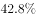的人表示因条件所限才会选择裸婚，有八成人坦承裸婚风险很大
　✅
- **B**. 
裸婚的出现，是对“有房有车有钻戒”的传统择偶条件和结婚标准的否定，但作为新生事物，发展中可能会有很多阻力

- **C**. 
据网上一项调查显示，赞成裸婚的年轻人占了大约六成，他们认为“爱情就应该抛弃金钱的世俗，真心相爱才是最重要的”

- **D**. 
裸婚一方面体现了现代社会对婚姻理解的转变，另一方面也体现了现代社会物质观念的转变

**答案**：A

**官方解析**

第一步：找出论点和论据。

论点：年轻人主动选择裸婚的做法值得大力提倡，它是一种打破数千年来封建观念束缚的结婚方式，更是一种价值取向进步的体现。

论据：无。

本题只有论点没有论据，优先考虑否定论点的方式来削弱，即年轻人主动选择裸婚的做法不值得大力提倡，它不是一种打破封建观念束缚的结婚方式和价值取向进步的体现。

第二步：逐一分析选项。

A项：的人表示因条件所限才会选择裸婚，说明很多人裸婚是条件限制，而不是价值取向进步的体现，有八成人坦承裸婚风险很大，说明裸婚的做法不值得大力提倡，可以削弱，当选；

B项：裸婚是对“有房有车有钻戒”的传统择偶条件和结婚标准的否定，说明裸婚是一种打破封建观念束缚的结婚方式，加强了论点，裸婚发展中可能会有很多阻力，但是否值得提倡不明确，无法削弱，排除；

C项：大约六成年轻人认为爱情应该抛弃金钱的世俗，是一种价值取向进步的体现，是对论点的加强，无法削弱，排除；

D项：裸婚体现了现代社会对婚姻理解的转变和物质观念的转变，但是裸婚是否应该提倡，是否是价值取向的进步都不明确，无法削弱，排除。

故正确答案为A。

---

### 第 22 题　qid 2663657 · 逻辑判断

我国的交强险于2006年7月正式实行，于2007年7月开始普遍推行。作为第一项法定强制险种，交强险经营的总体要求是不亏不盈。而事实上，自2007年开办以来，除了2008年实现盈利7.6亿元外，其余年份均为亏损，交强险累计承保利润为-508亿元，承保利润率为，直到2018年才扭转了12年半的亏损局面。但在66家经营交强险的公司中，40家盈利，仍有26家亏损。对一些保险公司来说，交强险是一种非但不赚钱，还多年连续亏损，却始终坚持不能放弃的业务。

以下哪项如果为真，最有助于解释这些保险公司的行为？

- **A**. 现在多数公司都已盈利，相信自己的公司未来在这个险种上也会盈利
- **B**. 交强险具有公益性、广泛性、强制性，保险公司必须承保，不能拒保
- **C**. 虽有很多车辆在交强险的赔付中赔付的数额远超过车主缴纳交强险时缴纳的金额，但也有很多车辆保险未用到赔付
- **D**. 通常车主为避免日后不必要的麻烦，不会将交强险和商业车险分开投保两家公司，而商业险的利润非常丰厚　✅

**答案**：D

**官方解析**

第一步：找出题干矛盾。
对一些保险公司来说，交强险是一种非但不赚钱，还多年连续亏损，却始终坚持不能放弃的业务。
第二步：逐一分析选项。
A项：相信自己公司未来会在这个险种上盈利和实际是否盈利无关，不能解释题干矛盾，排除；
B项：“保险公司不能拒保”是对经营交强险的公司做的法律规定，指经营交强险的公司不能拒绝客户购买交强险的要求，但是题干中讨论的是保险公司坚持承办交强险业务，而且并不是所有保险公司都必须承办交强险业务，比如寿险公司，因此如果是保险公司自愿申请承办交强险业务的话，B项便不能解释为什么保险公司“始终坚持不放弃交强险”，因此不明确，不能解释题干矛盾，排除；
C项：很多车辆保险未用到赔付，但具体总的赔付金额有没有超过所有车主缴纳交强险的金额不明确，不能解释题干矛盾，排除；
D项：交强险和商业车险捆绑，且商业险的利润非常丰厚，说明保险公司为了得到商业保险的利润也要经营交强险，可以解释为什么保险公司“始终坚持不放弃交强险”，可以解释题干矛盾，当选。
故正确答案为D。

---

### 第 23 题　qid 2663908 · 逻辑判断

最近一项研究证明了学习和睡眠的关系，研究人员在《自然》的合作刊物《学习科学》上，发表了相关的研究成果，指出睡眠质量、时间以及睡眠习惯的持续性与学习成绩成正相关。充足的睡眠对学生的学习更加有利。
以下除哪项外都是上述断定的逻辑推论？

- **A**. 睡眠充足、早起早睡、作息规律的学生普遍都拥有较好的成绩
- **B**. 绝大多数高中生都面临着睡眠不足的困扰，为了学习，他们很多人会选择课间或体育课的时间进行“补觉”
- **C**. 睡眠时间不足，而且也不可能补足，可以在睡眠质量和睡眠习惯上下功夫　✅
- **D**. 固定的时间睡觉、起床，形成固定的作息时间，能在很大程度上弥补睡眠时间短带来的影响

**答案**：C

**官方解析**

第一步：找出论点和论据。

论点：充足的睡眠对学生的学习更加有利。

论据：睡眠质量、时间以及睡眠习惯的持续性与学习成绩成正相关。

论点和论据讨论话题一致，考虑补充论据进行加强。

第二步：逐一分析选项。

A项：睡眠充足、早起早睡、作息规律的学生普遍都拥有较好的成绩，举例说明充足睡眠对成绩的影响，可以加强，排除；

B项：睡眠不足的高中生需要“补觉”来补充睡眠，从而有利学习，举例说明充足睡眠对成绩的影响，可以加强，排除；

C项：说的是睡眠时间与睡眠质量、睡眠习惯之间的关系，是否会影响到学习成绩不确定，因此无法加强，当选；

D项：固定的作息时间，能弥补睡眠时间短带来的影响，固定的作息时间指的是睡眠习惯，说明睡眠习惯也能给成绩带来影响，可以加强，排除。

本题为选非题，故正确答案为C。

补充：原文中C项和D项均为“睡眠习惯的持续性，也会影响学习成绩”的论证内容，但C项解释的是为什么要塑造学生的生物钟即睡眠习惯，因为睡眠时间不足，未提到与学习成绩的关系。而D项通过后面学霸的事例可以说明，固定作息可以提升成绩。

---

### 第 24 题　qid 2663740 · 逻辑判断

甲：目前人类对地球科学的认知水平还不高，从整体上还不能充分认识地震从孕育到发震的机理、时间空间分布规律，因此到目前为止人类还无法做到地震预测。
乙：我不同意你的观点，据权威媒体报道，我国已经建立了ICL地震预警系统，该系统自建成以来，已经成功预警数十次破坏性地震，无一误报。
对于乙的反驳，下列评价正确的是：

- **A**. 反驳有力，引用权威信息证明自己的观点
- **B**. 反驳有力，提出了一个比对方更有力的证据证明自己的观点
- **C**. 反驳无力，在反驳的关键概念上没有与对方保持一致　✅
- **D**. 反驳无力，在关键信息的引用上存在错误

**答案**：C

**官方解析**

第一步：找出论点和论据。
论点：到目前为止人类还无法做到地震预测。
论据：人类对地球科学的认知水平还不高，从整体上还不能充分认识地震从孕育到发震的机理、时间空间分布规律。
第二步：逐一分析选项。
A项：乙通过引用了权威信息来证明自己的观点，但是不确定权威信息的真实性，因此不能反驳，排除；
B项：乙通过提出了一个更有力的证据证明自己的观点，但是不能确定证据的真实性，因此不能反驳，排除；
C项：因为乙在反驳的时候提出的概念与甲不一致，甲提到的是地球科学的认知水平、地震机理以及时间分布规律，而乙提到的是ICL地震预警系统，两者讨论的关键概念不一致，因此反驳无力，当选；
D项：乙在关键信息的引用上存在错误，但是不确定此处的关键信息是什么，所以不明确，排除。
故正确答案为C。

---

### 第 25 题　qid 2663744 · 逻辑判断

只要拥有特色优势学科和一流的师资队伍，就能进入“双一流”建设名单行列。只有全面推进高校内涵发展，才能拥有特色优势学科和一流的师资队伍。M大学没有进入“双一流”建设名单行列。
如果上述断定是真的，则以下哪项也可能为真?
Ⅰ.M大学没有特色优势学科而且师资队伍不够一流
Ⅱ.M大学没有全面推进高校内涵发展
Ⅲ.M大学全面推进了高校内涵发展

- **A**. 仅Ⅰ
- **B**. 仅Ⅱ
- **C**. 仅Ⅲ
- **D**. Ⅰ、Ⅱ和Ⅲ　✅

**答案**：D

**官方解析**

第一步：翻译题干。

①特色优势学科 且 一流的师资队伍进入“双一流”建设名单行列

②特色优势学科 且 一流的师资队伍全面推进高校内涵发展

③“双一流”建设名单行列

第二步：逐一分析选项。

Ⅰ项：为：特色优势学科 且 师资队伍一流，条件③是对①的否后，否后必否前，得到“特色优势学科 或 一流的师资队伍”，Ⅰ只是“特色优势学科 或 一流的师资队伍”的一种可能性，故Ⅰ可能为真，保留；

Ⅱ和Ⅲ项：条件③是对①的否后，否后必否前，得到“特色优势学科 或 一流的师资队伍”，这是对②的否前，否前得不到必然结论，因此Ⅱ、Ⅲ可能为真，保留。

因此Ⅰ、Ⅱ、Ⅲ均有可能为真，只有D项符合。

故正确答案为D。

---

### 第 26 题　qid 2662259 · 类比推理

薯条：土豆

- **A**. 爆米花：玉米　✅
- **B**. 蔬菜：粮食
- **C**. 沙拉：水果
- **D**. 红酒：高粱

**答案**：A

**官方解析**

第一步：判断题干词语间逻辑关系。
土豆可以制作薯条，二者为原材料与成品的对应关系。
第二步：判断选项词语间逻辑关系。
A项：玉米可以制作爆米花，二者为原材料与成品的对应关系，与题干逻辑关系一致，保留；
B项：粮食不是制作蔬菜的原材料，与题干逻辑关系不一致，排除；
C项：水果可以制作沙拉，二者为原材料与成品的对应关系，与题干逻辑关系一致，保留；
D项：红酒的原材料是葡萄，不是高粱，与题干逻辑关系不一致，排除。
比较A、C两项，题干土豆是经过“油炸”制成薯条，A项玉米经过“油炸”制成爆米花，但C项水果不是经过“油炸”制成沙拉，A项与题干关系更为一致。
故正确答案为A。

---

### 第 27 题　qid 2662262 · 类比推理

转念：主意

- **A**. 转述：说话
- **B**. 转交：物品
- **C**. 转向：方向　✅
- **D**. 转录：翻译

**答案**：C

**官方解析**

第一步：判断题干词语间逻辑关系。
转念是指改变主意，二者是对应关系。
第二步：判断选项词语间逻辑关系。
A项：转述是指把别人说的话说给另外的人，并不是改变说话，与题干逻辑关系不一致，排除；
B项：转交物品为动宾关系，与题干逻辑关系不一致，排除；
C项：转向是指改变方向，二者是对应关系，与题干逻辑关系一致，当选；
D项：转录和翻译是蛋白质生物合成中基因表达的两个过程，二者是并列关系，与题干逻辑关系不一致，排除。
故正确答案为C。

---

### 第 28 题　qid 2662272 · 类比推理

检阅：部队：基地

- **A**. 消费：宾客：酒店
- **B**. 采访：代表：会场　✅
- **C**. 培训：员工：岗位
- **D**. 撒网：渔夫：大海

**答案**：B

**官方解析**

第一步：判断题干词语间逻辑关系。
部队在基地接受检阅，基地是个场所，部队接受检阅为被动动作。
第二步：判断选项词语间逻辑关系。
A项：宾客在酒店消费，酒店是个场所，但宾客消费是主动动作，与题干逻辑关系不一致，排除；
B项：代表在会场接受采访，会场是个场所，且代表接受采访为被动动作，与题干逻辑关系一致，当选；
C项：不能说员工在岗位接受培训，岗位不是场所，与题干逻辑关系不一致，排除；
D项：渔夫在大海撒网，大海是个场所，但渔夫撒网是主动动作，与题干逻辑关系不一致，排除。
故正确答案为B。

---

### 第 29 题　qid 2662182 · 类比推理

种植：水果：仓库

- **A**. 自习：知识：图书馆
- **B**. 裁剪：服饰：加工厂
- **C**. 烹饪：美食：保鲜柜　✅
- **D**. 挂职：干部：贫困县

**答案**：C

**官方解析**

第一步：判断题干词语间逻辑关系。
种植水果是动宾结构，水果存放在仓库中，二者是存储地点的对应关系。
第二步：判断选项词语间逻辑关系。
A项：通过自习可以获得知识，二者不是动宾结构，与题干逻辑关系不一致，排除；
B项：裁剪服饰是动宾结构，且加工厂是裁剪服饰的地点。而题干中种植水果的地点并不是仓库，与题干逻辑关系不一致，排除；
C项：烹饪美食是动宾结构，美食存放在保鲜柜中，二者是存储地点的对应关系，与题干逻辑关系一致，当选；
D项：挂职是指在不改变干部行政关系的前提下，委以具体的职务到其他地方来培养锻炼的一种临时性任职行为，挂职干部为偏正结构，挂职用来修饰干部，与题干逻辑关系不一致，排除。
故正确答案为C。

---

### 第 30 题　qid 2662193 · 类比推理

加薪：奖励：鼓励人才

- **A**. 话剧：艺术：陶冶情操
- **B**. 旅行：探索：增进感情
- **C**. 月食：现象：探索宇宙
- **D**. 返券：促销：提高销量　✅

**答案**：D

**官方解析**

第一步：判断题干词语间逻辑关系。
“加薪”是一种“奖励”方式，目的是“鼓励人才”，二者为方式目的的对应关系。
第二步：判断选项词语间逻辑关系。
A项：“话剧”是一种“艺术”，与题干逻辑关系不一致，排除；
B项：“旅行”和“探索”之间为交叉关系，且“旅行”的主要目的并不是“增进感情”，与题干逻辑关系不一致，排除；
C项：“月食”是一种“现象”，二者为种属关系；但“月食”的目的不是“探索宇宙”，与题干逻辑关系不一致，排除； 
D项：“返券”是一种“促销”方式，目的是“提高销量”，二者为方式目的的对应关系，与题干逻辑关系一致，当选。
故正确答案为D。

---

### 第 31 题　qid 2662199 · 类比推理

轮胎：自行车：代步

- **A**. 针头：注射器：预防
- **B**. 衣服：晾衣架：晾晒
- **C**. 风机：油烟机：排烟　✅
- **D**. 乘客：公交车：通勤

**答案**：C

**官方解析**

第一步：判断题干词语间逻辑关系。
轮胎是自行车的组成部分，二者为包容关系中的组成关系；自行车的功能是代步，二者为对应关系中的功能对应关系。
第二步：判断选项词语间逻辑关系。
A项：针头是注射器的组成部分，二者为包容关系中的组成关系；但注射器的功能不是预防，与题干逻辑关系不一致，排除；
B项：用晾衣架晾衣服，二者为对应关系而非组成关系，与题干逻辑关系不一致，排除；
C项：风机是油烟机的组成部分，二者为包容关系中的组成关系；油烟机的功能是排烟，二者为对应关系中的功能对应关系，与题干逻辑关系一致，当选； 
D项：乘客坐公交车，二者为对应关系而非组成关系，与题干逻辑关系不一致，排除。
故正确答案为C。

---

### 第 32 题　qid 2662207 · 类比推理

甲早于乙：乙早于丙：甲早于丙

- **A**. 甲战胜乙：乙战胜丙：甲战胜丙
- **B**. 甲属于乙：乙属于丙：甲属于丙　✅
- **C**. 甲信任乙：乙信任丙：甲信任丙
- **D**. 甲帮助乙：乙帮助丙：甲帮助丙

**答案**：B

**官方解析**

第一步：判断题干词语间逻辑关系。
根据“甲早于乙”和“乙早于丙”可以递推得到“甲早于丙”，“早于”存在传递关系，前两个词与第三个词为对应关系。
第二步：判断选项词语间逻辑关系。
A项：“甲战胜乙”和“乙战胜丙”递推不出“甲战胜丙”，“战胜”不存在传递关系，与题干逻辑关系不一致，排除；
B项：“甲属于乙”和“乙属于丙”可以递推得到“甲属于丙”，“属于”存在传递关系，前两个词与第三个词为对应关系，与题干逻辑关系一致，当选；
C项：“甲信任乙”和“乙信任丙”递推不出“甲信任丙”，“信任”不存在传递关系，与题干逻辑关系不一致，排除；
D项：“甲帮助乙”和“乙帮助丙”递推不出“甲帮助丙”，“帮助”不存在传递关系，与题干逻辑关系不一致，排除。
故正确答案为B。

---

### 第 33 题　qid 2662228 · 类比推理

竞聘 对于（    ）相当于（    ）对于 回报

- **A**. 演讲；报酬
- **B**. 岗位；补偿
- **C**. 连任；投资　✅
- **D**. 任期；付出

**答案**：C

**官方解析**

逐一代入选项。
A项：可以通过“演讲”的方式，达到“竞聘”的目的，二者为对应关系；“报酬”是一种“回报”，二者为种属关系，前后逻辑关系不一致，排除；
B项：“竞聘岗位”，二者为动宾关系；“补偿”与“回报”无明显逻辑关系，前后逻辑关系不一致，排除；
C项：“竞聘”之后可能会“连任”，二者为对应关系；“投资”之后可能会有“回报”，二者为对应关系，前后逻辑关系一致，当选；
D项：“竞聘”与“任期”无明显逻辑关系；“付出”之后可能会有“回报”，二者为对应关系，前后逻辑关系不一致，排除。
故正确答案为C。

---

### 第 34 题　qid 2662211 · 类比推理

喀纳斯 对于（    ）相当于（    ）对于 云南

- **A**. 新疆；丽江　✅
- **B**. 景区；旅游
- **C**. 喀什；米线
- **D**. 青海；傣族

**答案**：A

**官方解析**

逐一代入选项。
A项：喀纳斯位于新疆，是新疆的组成部分；丽江位于云南，是云南的组成部分，均为组成关系，前后逻辑关系一致，当选；
B项：喀纳斯是景区，二者为种属关系；云南是旅游的地点，二者是对应关系，前后逻辑关系不一致，排除；
C项：喀纳斯是新疆的景区，喀什是新疆的县级市，二者无明显逻辑关系；米线是云南的特色食品，前后逻辑关系不一致，排除；
D项：喀纳斯是位于新疆的景区，青海是中国的省份，二者无明显逻辑关系；傣族是主要聚居在云南的民族，前后逻辑关系不一致，排除。
故正确答案为A。

---

### 第 35 题　qid 2662215 · 类比推理

（    ）对于 做饭 相当于 车间 对于（    ）

- **A**. 厨师；机器
- **B**. 燃气；零件
- **C**. 刀具；噪音
- **D**. 厨房；生产　✅

**答案**：D

**官方解析**

逐一代入选项。
A项：厨师做饭，二者是主体与行为的对应关系；机器是车间中用于生产的工具，二者为场所与工具的对应关系，前后逻辑关系不一致，排除；
B项：燃气是用于做饭的燃料，二者为燃料与功能的对应关系；车间是制造零件的场所，二者为场所的对应关系，前后逻辑关系不一致，排除；
C项：刀具是用于做饭的工具，二者为工具与功能的对应关系；车间产生噪音，二者为场所的对应关系，前后逻辑关系不一致，排除；
D项：厨房是做饭的场所，车间是生产的场所，二者均为场所和行为的对应关系，前后逻辑关系一致，当选。
故正确答案为D。

---

## 资料分析

### 材料 1

        2014年，全国房地产开发投资95036亿元，比上年增长，增速比2013年回落9.3个百分点。其中，住宅投资64352亿元，增长。

        2014年，全国商品房销售面积120649万平方米，比上年下降，降幅比1—11月份收窄0.6个百分点，2013年为增长；商品房销售额76292亿元，下降，降幅比1—11月份收窄1.5个百分点，2013年为增长。

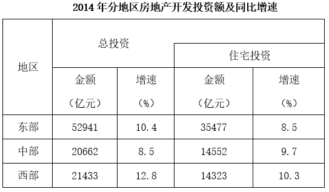

        2014年，东部地区商品房销售面积54756万平方米，比上年下降，降幅比1—11月份收窄1.3个百分点；销售额43607亿元，下降，降幅收窄2.1个百分点。中部地区商品房销售面积33824万平方米，下降，降幅收窄0.4个百分点；销售额16558亿元，增长，1—11月份为下降。西部地区商品房销售面积32068万平方米，增长，增速回落0.6个百分点；销售额16127亿元，增长，增速回落0.6个百分点。

#### 第 1 题　qid 2662243 · 综合

2012年全国房地产开发投资额为多少亿元？

- **A**. 71790.8　✅
- **B**. 67835.2
- **C**. 31248.1
- **D**. 24156.3

**答案**：A

**官方解析**

由题干“2012年全国房地产开发投资额为多少亿元”，结合材料时间为2014年，可判定本题为间隔基期计算问题。定位材料第一段，“2014年，全国房地产开发投资95036亿元，比上年增长，增速比2013年回落9.3个百分点。”根据间隔增长率公式可得，2014年比2012年全国房地产开发投资的增长率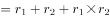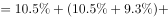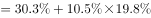，则2012年全国房地产开发投资额为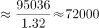亿元，与A项最接近。

故正确答案为A。

---

#### 第 2 题　qid 2662245 · 增长

2014年，全国商品房销售面积比上年减少多少万平方米？

- **A**. 10004.7
- **B**. 9923.5　✅
- **C**. 9014.2
- **D**. 8799.3

**答案**：B

**官方解析**

由题干“2014年······比上年减少多少万平方米”，可判定本题为增长量计算问题。定位文字材料第二段，“2014年，全国商品房销售面积120649万平方米，比上年下降”，根据增长量，2014年全国商品房销售面积增长量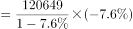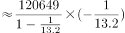万平方米，即减少量约为9900万平方米，与B项最接近。

故正确答案为B。

---

#### 第 3 题　qid 2662248 · 综合

2013年西部地区商品房销售价格为：

- **A**. 3694元/平方米
- **B**. 4674元/平方米
- **C**. 4888元/平方米　✅
- **D**. 5008元/平方米

**答案**：C

**官方解析**

由题干“2013年······商品房销售价格······”，结合材料时间是2014年，可判定本题为基期平均数问题。定位材料第三段，“2014年······西部地区商品房销售面积32068万平方米（B），增长（b）； 销售额16127亿元（A），增长（a）”，根据基期平均数公式：，可计算出2013年西部地区商品房销售价格为：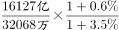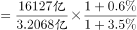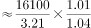元/平方米，与C项最为接近。

故正确答案为C。

---

#### 第 4 题　qid 2662250 · 比重

2013年，东部地区住宅投资占投资额的比重约为：

- **A**. 

- **B**. 

　✅
- **C**. 

- **D**. 

**答案**：B

**官方解析**

由题干“2013年······的比重”，结合材料时间是2014年，可判定本题为基期比重问题。定位统计表材料，2014年东部地区住宅投资额为35477亿元（A），增速为（a）； 总投资额为52941亿元（B），增速为（b）。根据基期比重公式：，可得2013年东部地区住宅投资占投资额的比重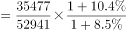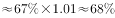。

故正确答案为B。

---

#### 第 5 题　qid 2662252 · 综合

能够从上述资料中推出的是：

- **A**. 2013年东部地区的商品房销售额超过50000亿元
- **B**. 2014年我国东部地区住宅投资额低于中、西部地区之和
- **C**. 2014年我国东部地区房地产投资额是西部地区的3倍多
- **D**. 2014年住宅投资占房地产开发投资的比重不到七成　✅

**答案**：D

**官方解析**

A项：定位材料第三段可知，“2014年，东部地区商品房······销售额43607亿元，下降”，根据基期量，可得2013年东部地区的商品房销售额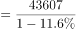亿元，错误；

B项：定位表格可知，2014年东部地区住宅投资额为35477亿元，而中部地区住宅投资额为14552亿元，西部地区住宅投资额为14323亿元。 ，所以2014年东部地区住宅投资额高于中、西部地区之和，错误；

C项：定位表格可知，2014年东部地区房地产投资额为52941亿元，而西部地区房地产投资额为21433亿元。  ，所以2014年二者的倍数关系不到3倍，错误；

D项：定位材料第一段，“2014年，全国房地产开发投资95036亿元，······其中，住宅投资64352亿元，增长。”，也就是不到七成，正确。

故正确答案为D。

---

### 材料 2

        2018年N省规模以上工业增加值比上年增加，增速比上年提高4.0个百分点。其中，新产品增长强劲。石墨及碳素制品增长，单晶硅增长1.2倍，多晶硅增长，汽车增长。

        1—11月，N省规模以上工业企业实现利润总额达到1332.8亿元，同比增长，同期全国平均水平为。其中，制造业利润474.48亿元，同比增长。规模以上工业企业主营业务收入利润率为，同比提高0.3个百分点，也高于全国平均水平4.1个百分点。

#### 第 6 题　qid 2662198 · 综合

2018年1—11月，N省制造业利润额约占规模以上工业企业实现利润总额的：

- **A**. 

- **B**. 

　✅
- **C**. 

- **D**. 

**答案**：B

**官方解析**

根据题干“2018年1—11月，······占······”，且选项为“”，结合材料时间为2018年，可判定本题为现期比重问题。定位文字材料第二段“（2018年）1—11月，N省规模以上工业企业实现利润总额达到1332.8亿元，同比增长，······其中，制造业利润474.48亿元”，根据公式：，则2018年1—11月，N省制造业利润额约占规模以上工业企业实现利润总额的比重，与B项最接近。

故正确答案为B。

---

#### 第 7 题　qid 2662206 · 平均数

2018年1—11月，全国规模以上工业企业主营业务收入利润率平均水平为：

- **A**. 

- **B**. 

- **C**. 

　✅
- **D**. 

**答案**：C

**官方解析**

定位文字材料第二段“（2018年）1—11月，N省······规模以上工业企业主营业务收入利润率为，同比提高0.3个百分点，也高于全国平均水平4.1个百分点。”则2018年1—11月，全国规模以上工业企业主营业务收入利润率平均水平为。

故正确答案为C。

---

#### 第 8 题　qid 2662223 · 增长

将N省2018年规模以上工业新产品按增加值增速从高到低排序，正确的是：

- **A**. 
单晶硅多晶硅石墨及碳素制品汽车
　✅
- **B**. 
单晶硅石墨及碳素制品多晶硅汽车

- **C**. 
汽车石墨及碳素制品多晶硅单晶硅

- **D**. 
单晶硅石墨及碳素制品汽车多晶硅

**答案**：A

**官方解析**

定位文字材料第一段“2018年······石墨及碳素制品增长，单晶硅增长1.2倍，多晶硅增长，汽车增长”可得，N省2018年规模以上工业新产品按增加值增速从高到低排序为：单晶硅（）多晶硅（）石墨及碳素制品（）汽车（）。

故正确答案为A。

---

#### 第 9 题　qid 2662229 · 比重

2013—2018年间，N省GDP中第二产业增加值占比过半的年份有几个？

- **A**. 1
- **B**. 2
- **C**. 3　✅
- **D**. 4

**答案**：C

**官方解析**

根据题干“N省GDP中第二产业增加值占比······”，可判定本题为现期比重问题。N省GDP中第二产业增加值占比过半，即GDP中第二产业增加值第一产业增加值第三产业增加值，定位柱状图，可得：

2013年：第二产业增加值9104.08亿元第一产业增加值1575.76亿元第三产业增加值6236.66亿元，符合；

2014年：第二产业增加值9119.79亿元第一产业增加值1627.85亿元第三产业增加值7022.55亿元，符合；

2015年：第二产业增加值9000.58亿元第一产业增加值1617.42亿元第三产业增加值7213.51亿元，符合；

2016年：第二产业增加值8553.63亿元第一产业增加值1637.39亿元第三产业增加值7937.08亿元，不符合；

其中，2017年与2018年第三产业增加值均大于第二产业，不符合。

则2013—2018年间，N省GDP中第二产业增加值占比过半的年份有2013年、2014年、2015年，共3个。

故正确答案为C。

---

#### 第 10 题　qid 2662230 · 综合

不能从上述资料中推出的是：

- **A**. 
2016年N省GDP同比增量高于2015年水平

- **B**. 
2017年，N省规模以上工业增加值增速超过
　✅
- **C**. 
2018年1—11月，N省规模以上工业企业中，非制造业企业利润同比正增长

- **D**. 
2016—2018年，N省累计GDP低于2013—2015年水平

**答案**：B

**官方解析**

A项：定位统计图，可知2016年N省GDP同比增量2016年GDP值2015年GDP值亿元；2015年N省GDP同比增量2015年GDP值2014年GDP值亿元，故2016年N省GDP同比增量高于2015年水平，正确；

B项：定位文字材料第一段“2018年N省规模以上工业增加值比上年增加，增速比上年提高4.0个百分点。”则2017年N省规模以上工业增加值增速，错误；

C项：定位文字材料第二段“1—11月，N省规模以上工业企业实现利润总额达到1332.8亿元，同比增长······其中，制造业利润474.48亿元，同比增长”，可得非制造业企业利润大于制造业利润。根据混合增长率判定口诀：混合后居中，偏向基数大，可知：非制造业企业利润同比增速，故非制造业企业利润同比正增长，正确；

D项：定位统计图，2016—2018年N省累计GDP2016年GDP2017年GDP2018年GDP亿元；2013—2015年N省累计GDP2013年GDP2014年GDP2015年GDP亿元，故2016—2018年，N省累计GDP低于2013—2015年水平，正确。

本题为选非题，故正确答案为B。

---

### 材料 3

        2018年，M省进出口总值达到1034.4亿元，比上年增长。其中，出口378.6亿元，增长；M省加工贸易进出口总值比上年增长。与“一带一路”沿线国家贸易保持快速增长，其中对蒙古国、越南、德国、荷兰进出口分别比上年增长、1.4倍、和。全省实际利用外资31.6亿美元，比上年增长。

        煤、锯材、铜矿砂为进口值前三的商品，三者合计占同期进口总值的；钢材、机电产品、农产品为出口值前三的商品，三者合计占同期出口总值的。2018年M省对“一带一路”沿线国家外贸进出口699.3亿元，增长，占同期外贸进出口总值的。其中对蒙古国外贸进出口327.7亿元，增长。

#### 第 11 题　qid 2662196 · 综合

2018年，M省进口总值为：

- **A**. 330.9亿元
- **B**. 378.6亿元
- **C**. 655.8亿元　✅
- **D**. 657.9亿元

**答案**：C

**官方解析**

定位文字材料第一段：“2018年，M省进出口总值达到1034.4亿元，比上年增长。其中，出口378.6亿元，增长。”由进口出口进出口，可得2018年，M省进口总值为亿元。

故正确答案为C。

---

#### 第 12 题　qid 2662200 · 增长

2018年下列“一带一路”沿线国家中，与M省贸易额同比增速最快的是：

- **A**. 蒙古国
- **B**. 荷兰
- **C**. 德国
- **D**. 越南　✅

**答案**：D

**官方解析**

定位文字材料第一段：与“一带一路”沿线国家贸易保持快速增长，其中对蒙古国、越南、德国、荷兰进出口分别比上年增长、1.4倍、和。可知对越南贸易增长1.4倍，即增长率为，是四国中增速最快的国家。

故正确答案为D。

---

#### 第 13 题　qid 2662201 · 综合

2017年M省对“一带一路”沿线国家外贸进出口总值为多少亿元？

- **A**. 509.2
- **B**. 610.2　✅
- **C**. 699.3
- **D**. 819.3

**答案**：B

**官方解析**

根据题干“2017年······为多少亿元”，结合材料所给时间为2018年，可判定本题为基期计算问题。定位文字材料第二段可得：2018年M省对“一带一路”沿线国家外贸进出口699.3亿元，增长。根据公式：基期，则2017年M省对“一带一路”沿线国家外贸进出口总值亿元，与B项最接近。

故正确答案为B。

---

#### 第 14 题　qid 2662208 · 综合

2018年M省边境小额贸易中，进口额约是出口额的多少倍？

- **A**. 6
- **B**. 8
- **C**. 11　✅
- **D**. 13

**答案**：C

**官方解析**

根据题干“2018年······是······的多少倍”，结合材料所给时间为2018年，可判定本题为现期倍数问题。定位文字材料第一段可得：2018年，M省进出口总值达到1034.4亿元，其中，出口378.6亿元，则2018年进口额亿元；定位饼状图可得：2018年M省分类型出口贸易中，边境小额贸易占比为；M省分类型进口贸易中，边境小额贸易占比为。根据公式：部分总体比重，则2018年边境小额贸易出口额亿元，进口额亿元，故所求倍数倍。

故正确答案为C。

---

#### 第 15 题　qid 2662212 · 综合

关于2018年M省进出口情况，不能从上述资料中推出的是：

- **A**. 
进口总值同比增速低于

- **B**. 
对蒙古国外贸进出口总值低于对“一带一路”沿线国家外贸进出口总值的一半

- **C**. 
外贸出口中边境小额贸易与加工贸易所占比例相等

- **D**. 
钢材、机电产品、农产品三者合计出口额超过240亿元
　✅

**答案**：D

**官方解析**

A项：定位文字材料第一段，2018年M省进出口总值达到1034.4亿元，比上年增长，其中，出口378.6亿元，增长；根据“混合居中原则”，进出口总值的增长率介于进口增长率和出口增长率之间，故进口总值同比增速小于，正确。

B项：定位文字材料第二段，2018年M省对“一带一路”沿线国家外贸进出口为699.3亿元，蒙古国外贸进出口为327.7亿元，则，正确。

C项：定位图1，2018年M省分类型出口贸易占比中，边境小额贸易与加工贸易占比均为，故两者所占比例相等，正确。

D项：定位文字材料第二段，钢材、机电产品、农产品三者合计占同期出口总值的，定位文字材料第一段，2018年M省出口总值378.6亿元，因此三者合计出口额，错误。

本题为选非题，故正确答案为D。

---
