# 2020年江苏省公务员录用考试《行测》题（A类）（网友回忆版）

> 省考 · 2020 年 · 6 个模块 · 共 134 题

- [政治理论](#%E6%94%BF%E6%B2%BB%E7%90%86%E8%AE%BA) · 3 题
- [常识判断](#%E5%B8%B8%E8%AF%86%E5%88%A4%E6%96%AD) · 12 题
- [言语理解与表达](#%E8%A8%80%E8%AF%AD%E7%90%86%E8%A7%A3%E4%B8%8E%E8%A1%A8%E8%BE%BE) · 30 题
- [数量关系](#%E6%95%B0%E9%87%8F%E5%85%B3%E7%B3%BB) · 19 题
- [判断推理](#%E5%88%A4%E6%96%AD%E6%8E%A8%E7%90%86) · 50 题
- [资料分析](#%E8%B5%84%E6%96%99%E5%88%86%E6%9E%90) · 20 题

---

## 政治理论

### 第 1 题　qid 2452626 · 时事政治

党的十九届四中全会通过了《坚持和完善中国特色社会主义制度、推进国家治理体系和治理能力现代化若干重大问题的决定》。关于该《决定》的内容，下列说法正确的是
①阐述了我国国家制度和国家治理体系发展的历史性成就和显著优势
②提出了推进国家治理体系和治理能力现代化的重大意义和总体要求
③回答了什么是社会主义和怎样建设社会主义这个重大政治问题
④明确了各项制度必须坚持和巩固的根本点、完善和发展的方向

- **A**. ①②③
- **B**. ①②④　✅
- **C**. ①③④
- **D**. ②③④

**答案**：B

**官方解析**

本题考查政治常识。
①②④正确，习近平总书记在《关于&lt;中共中央关于坚持和完善中国特色社会主义制度,推进国家治理体系和治理能力现代化若干重大问题的决定&gt;的说明》一文中指出：“决定稿由15部分构成，分为三大板块。第一板块为第一部分，是总论，主要阐述中国特色社会主义制度和国家治理体系发展的历史性成就、显著优势，提出新时代坚持和完善中国特色社会主义制度、推进国家治理体系和治理能力现代化的重大意义和总体要求。第二板块为分论，聚焦坚持和完善支撑中国特色社会主义制度的根本制度、基本制度、重要制度，安排了13个部分，明确了各项制度必须坚持和巩固的根本点、完善和发展的方向，并作出工作部署。第三板块为第十五部分和结束语，主要就加强党对坚持和完善中国特色社会主义制度、推进国家治理体系和治理能力现代化的领导提出要求。”
③错误，邓小平理论回答了什么是社会主义和怎样建设社会主义这个重大政治问题。
故正确答案为B。

---

### 第 2 题　qid 2452627 · 新思想

习近平总书记强调，在群众工作中要坚持有事多商量，遇事多商量，做事多商量，商量得越多越深入越好。对此，下列理解正确的是
①做群众工作要问计于民、问政于民、问需于民
②涉及群众利益的政策要充分发扬民主，坚持集体决策
③政策执行要向群众做好宣传说服工作，认真听取群众意见
④衡量党和政府工作好坏的标准是看有没有与群众商量

- **A**. ①②③　✅
- **B**. ①②④
- **C**. ①③④
- **D**. ②③④

**答案**：A

**官方解析**

本题考查政治常识。
①②③正确，习近平总书记强调在做群众工作时多与群众商量，意思就是要做到问计于民、问政于民、问需于民，即听取群众建议和意见，使政府的决策更加暖人心，合民意，有效果；尊重群众意愿，倾听群众呼声，保证决策符合人民的根本利益；充分征求群众意见，发扬民主，坚持集体决策，用民主保证决策的科学性。
④错误，衡量党和政府工作好坏的标准是群众满意不满意、高兴不高兴、答应不答应。
故正确答案为A。

---

### 第 3 题　qid 2452635 · 马克思主义

中国共产党始终坚持以人民为中心，把人民立场和群众路线贯彻到治国理政的全部活动之中。人民立场和群众路线体现的马克思主义基本原理是
①人民群众是社会历史的活动主体
②从认识到实践、从实践到认识
③个别与一般内在统一并紧密相连
④从物质到精神、从精神到物质

- **A**. ①②③
- **B**. ①②④
- **C**. ①③④　✅
- **D**. ②③④

**答案**：C

**官方解析**

本题考查政治常识。
①正确，人民群众是推动历史发展的绝大多数社会成员的总和，历史唯物主义的一个重要范畴。从质上说人民群众是指一切对社会历史发展起推动作用的人们，从量上说是指社会人口中的绝大多数。人民群众路线体现了人民群众是历史的活动主体原理。
②错误，党的群众路线就是从群众中来，到群众中去的领导方法，是同“从实践中来，到实践中去”的认识过程一致的，而选项表述错误，应当是“从实践到认识，再从认识到实践”。
③ 正确，个别与一般(特殊性与普遍性)是反映客观世界规律的个性与一般性，党的群众路线就是从群众中来，到群众中去的领导方法体现了从个别到一般，从一般到个别。
④正确，人民群众是社会物质财富的创造者，从而推动了社会的全面进步。人民群众是社会精神财富的创造者，是社会变革的决定力量。人民群众是社会变革的决定力量，在社会变革中起主体作用。坚持人民立场和群众路线就体现了从物质到精神，精神到物质。
故正确答案为C。

---

## 常识判断

### 第 1 题　qid 2452630 · 科技常识

我国当前正处在转变发展方式、优化经济结构、转换增长动力的攻关期，建设现代化经济体系是跨越关口的迫切要求。下列关于现代化经济体系的说法正确的是：

- **A**. 关注劳动和资本的投入，稳定经济增长
- **B**. 国民经济体系中的各个门类和产业均衡发展
- **C**. 互联网大数据人工智能与虚拟经济深度融合
- **D**. 强化市场的决定性作用，提高供给质量和效率　✅

**答案**：D

**官方解析**

本题考查经济常识。
A项错误，由于经济发展方式转变，经济增长应该由劳动和资本投入转变为科技和创新投入。
B项错误，不可能保证每个门类和产业都做到均衡发展，应该有所侧重。
C项错误，推动互联网、大数据、人工智能和实体经济深度融合，培育壮大经济发展新动能，不是虚拟经济。
D项正确，现代化经济体系是更完善的经济体制，即强化市场的决定性作用，深化供给侧结构改革，提高供给质量和效率。
故正确答案为D。

---

### 第 2 题　qid 2452631 · 人文常识

2019年10月31日，国务院决定开展第七次全国人口普查。关于第七次全国人口普查，下列说法不正确的是

- **A**. 标准时点是2020年11月1日零时
- **B**. 普查对象不含在境内定居的外国人　✅
- **C**. 将首次采集普查对象的身份证号码
- **D**. 采取电子化方式开展人口普查登记

**答案**：B

**官方解析**

本题考查政治常识。
A项正确，2020年第七次全国人口标准时点是2020年11月1日零时普查。
B项错误，普查对象是普查标准时点在中华人民共和国境内的自然人以及在中华人民共和国境外但未定居的中国公民，不包括在中华人民共和国境内短期停留的境外人员。
C项正确，为了提高普查数据质量，在全国第七次人口普查中将首次采集普查对象的身份证号码。
D项正确，国务院决定于2020年开展第七次全国人口普查。本次全国人口普查采取电子化方式开展普查登记，探索使用智能手机采集数据。
本题为选非题，故正确答案为B。

---

### 第 3 题　qid 2452634 · 人文常识

我国要优化行政区划设置，提高中心城市和城市群综合承载和资源优化配置能力，实行扁平化管理，形成高效率组织体系。下列属于实行扁平化管理的改革措施是

- **A**. 大部制改革
- **B**. 综合执法改革
- **C**. 垂直化管理改革
- **D**. 省直管县改革　✅

**答案**：D

**官方解析**

本题考查管理学常识。
扁平式管理，或称扁平化管理，是指管理层级的减少和效率提升。传统的管理模式一般呈现层级较多，效率相对较低的金字塔结构。扁平式管理的贡献是：1、减少管理层级；2、上级层级能映射更大面积的下级，从而提高管理效率；3、特殊的下级职能会被越级关注（直管模式或说网络结构）。
A项错误，大部制改革即为大部门体制改革，即为推进政府事务综合管理与协调，按政府综合管理职能合并政府部门，组成超级大部的政府组织体制。特点是扩大一个部所管理的业务范围，把多种内容有联系的事务交由一个部管辖，从而最大限度地避免政府职能交叉、政出多门、多头管理，从而提高行政效率，降低行政成本。
B项错误，综合执法改革是指为解决多头执法、多层执法、执法扰民、基层执法力量不足等问题，提升执法效率和监管水平，合理确定综合执法范围，整合相近职能，在市场监管、交通运输、城市建设管理等领域整合组建综合行政执法队伍，保留必要的专业技术性强的执法队伍。
C项错误，“垂直”管理是我国政府管理中的一大特色，我国比较重要的政府职能部门，主要包括履行经济管理和市场监管职能的部门，如海关、工商、税务、烟草、交通、盐业的中央或者省级以下机关多数实行垂直管理。
D项正确，“省管县”体制指省市县行政管理关系由目前的“省—市—县”三级体制转变为“省—市、县”二级体制，对县的管理由现在的“省管市—市管县”模式变为由省替代市，实行“省管县”模式，其内容包括人事、财政、计划、项目审批等原由市管理的所有方面。省直管县改革减少了中间的管理层级，上级层级能直接映射下级层级，属于扁平化的管理改革模式。
故正确答案为D。

---

### 第 4 题　qid 2452636 · 人文常识

1949年3月，中共中央和毛泽东离开西柏坡前往北平进驻香山。在香山的半年时间里，发生的一系列重大历史事件在党和国家历史上具有非常重要的地位。下列发生在这一时期的重大历史事件是
①毛泽东、朱德发布向全国进军的命令，吹响了解放全中国的伟大号角
②召开了党的七届二中全会，规定了党在全国胜利后应当采取的基本政策
③毛泽东发表了《论人民民主专政》，为新中国建立奠定了理论和政策基础
④制定了《中国人民政治协商会议共同纲领》，描绘了建立建设新中国的蓝图

- **A**. ①②③
- **B**. ①②④
- **C**. ①③④　✅
- **D**. ②③④

**答案**：C

**官方解析**

本题考查毛中特。
①、③、④正确，2019年9月12日，中共中央总书记、国家主席、中央军委主席习近平专程前往北京香山革命纪念地，瞻仰双清别墅、来青轩等革命旧址，参观香山革命纪念馆。他表示，1949年3月23日，中共中央和毛泽东同志离开西柏坡前往北平，25日进驻北京香山，这里成为党中央所在地。在这里，毛泽东、朱德同志发布向全国进军的命令，吹响了“打过长江去，解放全中国”的伟大号角，中国人民解放军以摧枯拉朽之势向全国各地胜利大进军，彻底结束了国民党在大陆的统治。在这里，毛泽东同志发表了《论人民民主专政》，为新中国的建立奠定理论基础和政策基础。在这里，中共中央同各民主党派、各界人士共同筹备中国人民政治协商会议，制定通过了起到临时宪法作用的《中国人民政治协商会议共同纲领》，确定了新中国的国体和政体，制定了一系列基本政策，描绘了建立建设新中国的宏伟蓝图。
②错误，党的七届二中全会于1949年3月5日—13日在河北西柏坡召开。这次会议规定了党在全国胜利以后在政治、经济、外交方面应当采取的基本政策，为夺取全国革命的胜利，推动新民主主义革命向社会主义革命转变，奠定了政治上和思想上的基础。此次会议在西柏坡召开，因此不属于离开西柏坡前往北平进驻香山后发生的重大历史事件。
故正确答案为C。

---

### 第 5 题　qid 2452637 · 人文常识

人们常常引用希腊典故来分析当今世界的现实问题。下列希腊典故与其寓意对应正确的是

- **A**. 潘多拉的盒子——世事变幻无常
- **B**. 阿喀琉斯之踵——强大事物的软肋　✅
- **C**. 修昔底德陷阱——安静祥和背后暗藏的风险
- **D**. 达摩克利斯之剑——守成大国与崛起大国必有一战

**答案**：B

**官方解析**

本题考查人文常识。
A项错误，潘多拉，希腊神话中的第一个女人。她貌美性诈，私自打开宙斯送给她的一只盒子，里面装的疾病、疯狂、罪恶、嫉妒等祸患，一齐飞出，只有希望留在盒底，人间因此充满灾难。因此“潘多拉的盒子”成为“灾祸的来源”的同义语。
B项正确，荷马史诗中的英雄阿喀琉斯出生后便被神仙母亲倒提着浸入冥河，而脚后跟却不慎露在水外，因而除脚后跟外，全身各处刀枪不入。后来，一次战斗中他被人一箭射中脚踝而死去。后人用阿喀琉斯之踵喻指即使再强大的英雄，也有致命的死穴或软肋。
C项错误，“修昔底德陷阱”，指一个新崛起的大国必然要挑战现存大国，而现存大国也必然会回应这种威胁，这样战争变得不可避免。此说法源自古希腊著名历史学家修昔底德，他认为，当一个崛起的大国与既有的统治霸主竞争时，双方面临的危险多数以战争告终。
D项错误，古希腊传说中迪奥尼修斯国王请他的大臣达摩克利斯赴宴，命其坐在用一根马鬃悬挂的一把寒光闪闪的利剑下，意指令人处于一种危机状态，随时要有危机意识。达摩克利斯之剑比喻安逸祥和背后存在的杀机和危险，告诫人们要经常反思潜在的风险并化解之。现也引申为做坏事的人随时都有可能受到惩罚。
故正确答案为B。

---

### 第 6 题　qid 2452652 · 人文常识

我国在区块链领域拥有良好基础，要加快推动区块链技术和产业创新发展，积极推进区块链和经济社会融合发展。关于区块链的特征和作用，下列说法不正确的是

- **A**. 省去第三方中间环节，降低交易成本
- **B**. 打通部门间的数据壁垒，实现信息共享
- **C**. 解决经济社会发展中的“存证”难题，维护社会秩序
- **D**. 排除管理员外任何人修改信息的可能性，确保信息安全　✅

**答案**：D

**官方解析**

本题考查科技常识。
A项正确，区块链技术通过“去中心化”和“点对点”的特征，进一步减少中间环节，消除了第三方交易中介存在的必要性，从而降低交易成本。因为实现了点对点的交易，中央处理或清算组织成为冗余；因为交易的真实性是由区块链上所有参与者共同验证和维护的，所以作为第三方的信用中介也失去了存在价值。
B项正确，区块链“分布式”的特点，可以打通部门间的“数据壁垒”，实现信息和数据共享。与中心化的数据存储不同，区块链上的信息都会通过点对点广播的形式分布于每一个节点，通过“全网见证”实现所有信息的“如实记录”。在公共服务领域，区块链能够实现政务数据跨部门、跨区域共同维护和利用，为人民群众带来更好的政务服务体验。
C项正确，区块链“不可篡改”的特点，为经济社会发展中的“存证”难题提供了解决方案。只要能够确保上链信息和数据的真实性，那么区块链就可以解决信息的“存”和“证”难题。比如在版权领域，区块链可以用于电子证据存证，可以保证不被篡改，并通过分布式账本链接原创平台、版权局、司法机关等各方主体，可以大大提高处理侵权行为的效率。在金融、司法、医疗、版权等对数据真实性要求高的领域，区块链都可以创造安全、高效的应用场景。
D项错误，区块链通过时间戳保证每个区块依次顺序相连。时间戳使区块链上每一笔数据都具有时间标记。简单来说，时间戳证明了区块链上什么时候发生了什么事情，且任何人无法篡改，甚至管理员也无法修改。
本题为选非题，故正确答案为D。

---

### 第 7 题　qid 2452653 · 人文常识

“春江潮水连海平，海上明月共潮生。”关于海水涨落，下列说法不正确的是

- **A**. 地球对海水的引力最大，它使海水有涨有落　✅
- **B**. 海水的涨落受太阳、地球和月球引力的影响
- **C**. 由于距离地球遥远，太阳对海水的引力没有月球大
- **D**. 太阳、月球和地球处在一条线上时，潮汐的潮差最大

**答案**：A

**官方解析**

本题考查地理国情。
A项错误、B项正确，地球表面的海水，随时随地都受万有引力的影响，主要是地球、月球和太阳的引力，其中地球的引力最大。但地球引力只会使海水永恒地依附在地球表面上，海水的涨落是由于受到地球、月球和太阳这三股力量的综合影响，并非只有地球引力。
C项正确，太阳虽然远比月球大，但是太阳与地球之间的距离是月球与地球之间距离的约400倍，所以月球对海水的引力比太阳大。
D项正确，潮差是指在一个潮汐周期内，相邻高潮位与低潮位间的差值，又称潮幅。每当太阳、月球和地球三者连成一条线过后的一两天，海面所受引力为太阳、月球引力的综合，因而出现最高的高潮和最低的低潮，此时潮汐的潮差最大。而每当太阳、月球和地球三者成直角关系过后的一两天，太阳引力和月球引力相互抵消，便出现最低的高潮和最高的低潮，此时潮汐的潮差最小。
本题为选非题，故正确答案为A。

---

### 第 8 题　qid 2452654 · 法律常识

对下列古语所蕴含法律思想的理解，不正确的是

- **A**. 法不察民情而立之，则不威——法律应当服从民意　✅
- **B**. 刑罚不足以移风，杀戮不足以禁奸——严刑峻法有其局限性
- **C**. 国有常法，虽危不亡——法律是国家长治久安的保障
- **D**. 天下之事，不难于立法，而难于法之必行——法律的生命力在于实施

**答案**：A

**官方解析**

本题考查法律常识。
A项错误，出自《商君书•壹言》，意思是如果不体察民情民意就制定法律，那么法律会失去权威。这句古语说明法律的最终目的是服务于民众，制定法律必须考虑民意，但并不意味着法律应当服从民意，这是因为法律的本质是统治阶级进行阶级统治的工具。正如卢梭所说：“明智的创造者并不从制定良好的法律本身着手，而是要事先考察一下，他要为之而立法的那些人民是否适于接受那些法律。”
B项正确，出自《淮南子•主术训》，意思是单靠刑罚不能够改变社会的不良风气，单靠杀戮也不能够禁止坏人坏事。这句古语说明严刑峻法也有其局限性，要想社会秩序井然，不能仅靠刑罚，还要靠道德教育。
C项正确，出自《韩非子•饰邪》，意思是国家有稳定的法度，虽遇到危难也不致灭亡。这句古语说明法律是国家长治久安的保障。
D项正确，出自明代张居正的《请稽查章奏随事考成以修实政疏》，意思是天下的事情，困难之处不在于制定法令，而在于让法令得到切实贯彻执行。这句古语说明法律的生命力在于实施。
本题为选非题，故正确答案为A。

---

### 第 9 题　qid 2452655 · 法律常识

某区教育局将学区调整的情况张贴在各学校门口。刘某的住房被划入新的学区，但他没有及时了解情况，将房屋低价卖给了王某。对此，下列说法正确的是

- **A**. 刘某认为区教育局公开学区信息不当，有权提起行政诉讼　✅
- **B**. 区教育局公开学区信息的行为构成行政不作为
- **C**. 刘某有权以重大误解为由，解除与王某的房屋买卖合同
- **D**. 区教育局应对刘某的损失承担赔偿责任

**答案**：A

**官方解析**

本题考查法律常识。
A项正确，根据《政府信息公开条例》第五十一条规定：“公民、法人或者其他组织认为行政机关在政府信息公开工作中侵犯其合法权益的，可以向上一级行政机关或者政府信息公开工作主管部门投诉、举报，也可以依法申请行政复议或者提起行政诉讼。”因此，如果刘某认为教育局做法不当的，有权提起行政诉讼。
B项错误，行政不作为是指行政机关应当履行职责而不履行或者拖延履行职责。区教育局主动公开学区，并不存在不作为。
C项错误，根据《民法典》第一百四十七条规定：“基于重大误解实施的民事法律行为，行为人有权请求人民法院或者仲裁机构予以撤销。”刘某因为没有及时了解情况，将学区房低价卖给了王某，双方存在重大误解，刘某可以请求人民法院或者仲裁机构将合同撤销，但不能直接与王某解除合同。
D项错误，刘某没有及时了解学区变动信息，是由于自己的过错，其不能要求区教育局承担责任。但是其将房屋低价卖给了王某，存在重大误解，刘某可以通过请求人民法院或者仲裁机构将合同撤销挽回损失。
故正确答案为A。

---

### 第 10 题　qid 2452656 · 人文常识

制度建设不在于制度的多少，而在于精，在于务实管用，突出针对性和指导性，“牛栏关猫”是不行的。下列管理举措属于“牛栏关猫”的是

- **A**. 某地完善配套政策机制，鼓励区块链产业发展
- **B**. 某地采取分类帮扶措施，帮助贫困户精准脱贫
- **C**. 某地为打击“套路贷”，关停所有的网贷机构　✅
- **D**. 某地出台针对性政策，解决营商环境的突出问题

**答案**：C

**官方解析**

本题考查管理学常识。
“牛栏关猫”现象告诉我们牛栏关猫是关不住的，空隙太大，猫可以来去自如。因此作为制度建设的主体，各单位和部门要主动增强“自己把自己关进笼子”的意识，自觉约束自己的权力，减少自由裁量权，把权力的笼子织得紧一些、密一些，并力求各项制度衔接配套、环环相扣，保证制度既拦得住牛，也关得住猫，真正实现“用制度管权、用制度管事、用制度管人”。
A项错误，通过政府层面出台相关政策，不断完善配套政策机制，能够为该地区区块链产业发展创造良好环境，有助于区块链产业健康发展，与题干不符。
B项错误，通过采取分类帮扶措施，体现了精准扶贫、精准脱贫，最终帮助贫困户真正脱贫，与题干不符。
C项正确，“套路贷”是假借民间借贷之名，非法占有被害人财物的违法犯罪行为，是扫黑除恶专项斗争的重点打击对象。该地区打击“套路贷”其目的是为了维护广大人民群众的利益；但是关停所有的网贷机构会导致一些正规的金融机构利益受损，同时无法满足群众的贷款需求。因此，打击“套路贷”必须疏堵并举，大力推进普惠金融服务，为急需用钱的消费者提供可靠、便捷的渠道。
D项错误，该地区出台针对性措施解决本地营商环境突出问题，能够有针对性地解决当地实际问题，使各项措施能够真正得到落实，保障各类市场主体公平参与市场竞争，与题干不符。
故正确答案为C。

---

### 第 11 题　qid 2452657 · 人文常识

为应对运营成本上涨压力，某地政府决定对现行地铁票价进行调整，下图为地铁票价调整的部分工作流程：

填入上述流程图中“？”处的正确选项是

- **A**. 获得上级主管部门的批准
- **B**. 核算成本收益拟定调价方案　✅
- **C**. 与地铁公司进行沟通和协调
- **D**. 选取部分地铁线路先行试点

**答案**：B

**官方解析**

本题考查管理学常识。
A项错误，上级主管部门的批准应该是在发布价格调整方案提交部门审议之后。
B项正确，通过发布事前公告，能够使广大群众了解政府举措；待该地政府根据相关规定和与地铁公司的协定以及各部门意见，拟定调价方案，通过政府平台发布该初步方案，利于广大群众参与提出更好的意见。
C项错误，与地铁公司进行沟通和协调属于发布事前公告的前一环节。
D项错误，在调整方案批准发布之后，可以选取部分地铁线路先行试点，能够为政府提供经验，并在全面推行改革之前不断优化政策，更好为人民服务。
故正确答案为B。

---

### 第 12 题　qid 2452658 · 人文常识

按照城市品质提升的总体要求，住建部于2019年7月在9个城市开展规范城市户外广告设施管理工作。就政策执行来说，下列举措与此属于同一类的是

- **A**. 甲省为鼓励高新技术产业发展出台优惠补贴政策
- **B**. 乙省借鉴国内外经验完善退伍军人荣誉奖励制度
- **C**. 丙省挑选部分国有企业开展混合所有制改革工作　✅
- **D**. 丁省为推动文化产业发展设立文化产业创新基地

**答案**：C

**官方解析**

本题考查政治常识。
“政策试点”，是中国治理实践中所特有的一种政策测试与创新机制，具体类型包括各种形式的试点项目、试验区等。试点项目是中国政策过程中最为典型和普遍的一种政策试点类型，它是指在一定时间段和一定范围（特定的地域、政府部门或企事业单位）内所进行的一种局部性政策探索及实施活动。住建部挑选9个城市先行开展规范城市户外广告设施管理工作就是一种试点项目。
A项错误，甲省的政策面对的是甲省全部的高新企业，与题干政策不是同一类。
B项错误，乙省的政策面对的乙省全部的退伍军人，与题干政策不是同一类。
C项正确，“挑选部分国有企业”也是一种试点项目政策。
D项错误，“设立文化产业创新基地”属于设立试验区，试验区是指为探索或实施某一项或某一领域的新政策、新制度而选定的一个地域性区划单位，具体表现为各种样式的综合性试验区、专门性试验区以及特区、新区、开发开放区、示范区、合作区等。
故正确答案为C。

---

## 言语理解与表达

### 材料 1

        我们多数人对“膳食纤维”的感性印象，恐怕就是那些粗糙的、嚼不烂的“植物纤维”，所以很容易就会想到芹菜和韭菜这类含“筋”丰富的蔬菜，其实，这两种蔬菜膳食纤维含量和许多食物比起来丝毫不出众。它们“渣渣”的口感，主要是植物木质部和韧皮部形成的宏观维管束结构，不完全等同于“膳食纤维”。

        食物膳食纤维的含量，并不与“粗糙”程度成正比，反而许多“软滑细润”的食物同样含有大量的膳食纤维。笼统说，膳食纤维是不能被我们消化酶消化的植物细胞壁残余物，包括纤维素、半纤维素、抗性淀粉、菊粉和各类多糖如葡甘露聚糖和果胶等等。膳食纤维分为“不溶性膳食纤维”和“可溶性膳食纤维”两大类，它们在身体里发挥着不同生理作用。

        “不溶性膳食纤维”不溶于水，但它们能像钢筋骨架一样撑起食物，从而增加了“饱腹感”并能刺激肠道蠕动，减少排泄物在肠道里的停留时间，就是俗称的“润肠通便&quot;；它们通常不能被肠道微生物消化利用，但可以吸附肠道里的有害物质。

        “可溶性膳食纤维”能溶于水，吸水后多呈凝胶状，让食物变得黏稠软滑，使食团体积膨胀，延长胃的排空时间，减缓糖分的吸收：它们能被结肠中的微生物降解生成短链脂肪酸等有益的物质，也能阻止肠粘膜粘连和潜在致病菌迁移，减轻肠道炎症。

        大多数植物性食物，都同时含有这两类膳食纤维。食物口感粗糙的部分，主要包含不溶性膳食纤维，而可溶性纤维完全没有粗粝的口感，膳食纤维含量<u>            </u>，所以一种食物粗纤维较多，并不代表它的膳食纤维的总量就高。那么，哪些食物的膳食纤维含量比较高呢？膳食纤维在谷物、豆类、菌藻和果蔬中广泛存在，而动物性食物则几乎不含膳食纤维。实际上，豆类和谷物才是膳食纤维的含量冠军，它们可溶性和不可溶性膳食纤维的含量都很高，是普通果蔬的几倍甚至十多倍。需要强调的是，这里的“谷物”特指“全谷物”：即脱壳后没有经过精制的粮食种子，譬如小麦粒、大麦粒、糙米、燕麦、荞麦、玉米、薏米、小米等，不包括精白米和精白面，事实上，精米、精面做成的食物，膳食纤维含量很低。

        我国居民膳食指南建议，成人每日膳食纤维的摄入量为25～30克(正比于摄入热量)，我们日常的烹饪方式比如粗研磨、切碎、加热，对膳食纤维的含量和状态影响不大。但如果你不吃谷物或豆类，仅仅靠吃蔬果、坚果和肉类，膳食纤维能达到每日推荐量的可能性几乎没有。

        那些长期选择“低碳水加只吃肉类和果蔬”的饮食方式，从膳食纤维摄入角度看并不健康，这类人的肠道菌群会发生改变，体内产生的三甲胺和氧化三甲胺显著高于普通人，这类物质也是心血管疾病的风险因子。

        但值得注意的是，既然有推荐量，也就是说膳食纤维摄入并非越多越好，有相关动物性实验显示某类型的膳食纤维摄入过量，会影响肠道菌群，从而对身体产生非常负面的影响。所以尽量从均衡膳食中摄入膳食纤维，不推荐额外的可溶性膳食纤维补充剂。

        正常人群还是应该遵照居民膳食指南来吃，自己“设计”的饮食方式绝不会优于指南的。

#### 第 1 题　qid 2452579 · 片段阅读

作者在文章开头以芹菜韭菜为例主要想说明：

- **A**. 多数人凭感性印象判定膳食纤维
- **B**. 含“筋”的食物并非一定富含膳食纤维　✅
- **C**. 膳食纤维丰富与否不能光凭口感
- **D**. 这两种蔬菜实际上与膳食纤维关系不大

**答案**：B

**官方解析**

文段开篇指出大多数人对“膳食纤维”的感性印象是粗糙且嚼不烂的“植物纤维”，通过“所以”做总结，引出“芹菜和韭菜”这类含“筋”丰富的蔬菜，说明人们认为芹菜和韭菜是富含“膳食纤维”的，随后通过“其实”转折，指出芹菜与韭菜他们的纤维含量和许多食物比起来并不如其他食物，尾句进行说明，强调其并不等同于“膳食纤维”，故整个文段通过“芹菜与韭菜”这类含“筋”的食物说明其并非富含“膳食纤维”，对应B项。
A项，“多数人凭感性印象” 文段想要说明凭感性印象判定的食物并非一定富含膳食纤维，与文段观点不符，排除；
C项，“不能光凭口感”表述不明确，文段想要说明含“筋”类的食物并非有膳食纤维，排除；
D项，论述的为例子本身，文段意在通过这两种蔬菜引出观点，例子本身非重点，排除。
故正确答案为B。

---

#### 第 2 题　qid 2452586 · 片段阅读

下列对膳食纤维的描述不符合文意的是：

- **A**. 可以是感觉上非常软嫩细滑的食物
- **B**. 不可能被肠胃中的消化酶完全消化
- **C**. 两类膳食纤维对人体作用不尽相同
- **D**. 每天食用含膳食纤维食物多多益善　✅

**答案**：D

**官方解析**

这是一道选非的细节判断题。
A项，通过第二段中“反而许多‘软细滑润’的食物同样含有大量的膳食纤维”可知，表述正确，排除；
B项，根据第二段中“膳食纤维是不能被我们消化酶消化的植物细胞壁残余物”可知，表述正确，排除；
C项，根据第二段中“膳食纤维分为‘不溶性膳食纤维’和‘可溶性膳食纤维’两大类，它们在身体里发挥着不同生理作用”，可知，表述正确，排除；
D项，根据第八段中“但值得注意的是，既然有推荐量，也就是说膳食纤维摄入并非越多越好”可知，“多多益善”表述错误，故当选。
本题为选非题，故正确答案为D。
【文段出处】《口感越粗越有“筋”的果蔬，膳食纤维的含量就越高？》

---

#### 第 3 题　qid 2452593 · 语句表达

填入文中画横线处最恰当的是：

- **A**. 取决于两者的总和　✅
- **B**. 全在于两者比例高低
- **C**. 来自于这两类食物
- **D**. 包含在这两类食物中

**答案**：A

**官方解析**

横线出现在第五段中间，需结合上下文分析。横线前指出大多数植物性食物同时含有不溶性和可溶性膳食纤维，口感粗糙部分主要是不溶性膳食纤维，可溶性膳食纤维没有粗粝口感。横线后强调一种食物粗纤维多不代表膳食纤维总量高。这说明膳食纤维的总量是由不溶性和可溶性膳食纤维共同决定的，并非只看其中某一种，对应A项。
B项，横线后已点明与各类纤维占比多少无关，“全在于两者比例高低”与文意相悖，排除；
C、D两项，“两类食物”偷换概念，文段围绕两类“膳食纤维”论述，而非“两类食物”，均排除。
故正确答案为A。
【文段出处】《口感越粗越有“筋”的果蔬，膳食纤维的含量就越高？》

---

#### 第 4 题　qid 2452606 · 片段阅读

下列说法与文意不符的是：

- **A**. 食物中包含不溶性膳食纤维有助通便
- **B**. 每天进食粗粮有利于膳食纤维量达标
- **C**. 长期食用动物性食物对健康有危害性　✅
- **D**. 食谱中包含豆类食品对健康十分有益

**答案**：C

**官方解析**

A项，根据第三段“‘不溶性膳食纤维’不溶于水······减少排泄物在肠道里的停留时间，就是俗称的‘润肠通便’”可知，不溶性膳食纤维有助于通便，选项表述正确，排除；
B项，根据第五段“这里的‘谷物’特指‘全谷物’：即脱壳后没有经过精制的粮食种子······事实上，精米、精面做成的食物，膳食纤维含量很低”及第六段“成人每日膳食纤维的摄入量为25～30克（正比于摄入热量）······膳食纤维能达到每日推荐量的可能性几乎没有”可知，选项表述正确，排除；
C项，根据第七段“那些长期选择‘低碳水加只吃肉类和果蔬’的饮食方式······并不健康”可知，低碳水且只吃动物性食物才不健康，选项扩大范围，当选；
D项，根据第五段“事实上，豆类和谷物才是膳食纤维的含量冠军”可知，选项表述正确，排除。
本题为选非题，故正确答案为C。
【文段出处】《口感越粗越有“筋”的果蔬，膳食纤维的含量就越高？》

---

#### 第 5 题　qid 2452611 · 片段阅读

作者通过这篇文章主要说明：

- **A**. 哪些食物中膳食纤维含量是比较丰富的　✅
- **B**. 食用适量含膳食纤维食品对健康有哪些好处
- **C**. 居民膳食指南给日常饮食提出哪些要求
- **D**. 不恰当的饮食方式中隐含哪些健康风险因素

**答案**：A

**官方解析**

文章首段引出膳食纤维的话题，第二段明确膳食纤维概念，指出纤维含量和食物粗糙程度无必然关联，第三、四段分别阐释不溶性膳食纤维和可溶性膳食纤维的特点与作用，第五段说明各类食物膳食纤维含量差异，点明豆类、全谷物纤维含量最高，第六至九段介绍成人膳食纤维每日推荐摄入量，说明纤维摄入不足、过量均会危害身体，倡导均衡膳食、遵循膳食指南。文章围绕膳食纤维展开论述，且着重对比不同食物的纤维含量，重点围绕“富含膳食纤维的食物”展开论述，对应A项。
B项，分别对应文章第三、四段，并非文段重点，排除；
C、D两项，文章主要围绕“膳食纤维”展开论述，均缺少主题词“膳食纤维”，偏离文章核心话题，排除。
故正确答案为A。
【文段出处】《口感越粗越有“筋”的果蔬，膳食纤维的含量就越高？》

---

#### 第 6 题　qid 2452618 · 片段阅读

国家治理效能是反映制度优势的重要指标。中国特色社会主义的制度优势需要转化为国家治理效能，需要通过治理效能来实现和彰显。要善于运用制度和法律治理国家，把各方面制度优势转换为管理国家的效能。推进国家治理体系和治理能力现代化，是发挥社会主义制度优越性的必由之路。
这段文字重在强调：

- **A**. 我国制度优势需要通过良好的治理效能来体现　✅
- **B**. 依靠法律推进我国治理体系和治理能力现代化
- **C**. 社会主义制度对我国治理现代化产生重大影响
- **D**. 治理国家必须发挥我国社会主义制度的优越性

**答案**：A

**官方解析**

文段开篇指出国家治理效能对制度优势的重要性，接着介绍中国特色社会主义的制度优势需要转化为国家治理效能，并通过治理效能来实现和彰显。随后用“要”提出对策，即善于运用制度和法律治理国家，把制度优势转换为治理效能。结尾强调推进国家治理体系和治理能力现代化，是发挥社会主义制度优越性的必由之路。故文段始终围绕“制度优势”与“治理效能”的关系展开，重在强调制度优势需要通过治理效能来彰显，对应A项，当选。
B项“依靠法律推进我国治理体系和治理能力现代化”，“法律”表述片面，且缺少主题词“制度优势”，排除；
C、D两项“社会主义制度对我国治理现代化产生重大影响” 和“治理国家必须发挥我国社会主义制度的优越性”均偏离文段重点，且缺少主题词“治理效能”，排除。
故正确答案为A。
【文段出处】人民网《国家治理现代化：把制度优势转化为治理效能》

---

#### 第 7 题　qid 2452622 · 片段阅读

书院是中国历史上一种独具特色的文化教育形式，在书院发展的一千多年历史进程中，它不仅是中国文化的象征，更是中国文化向域外传播的窗口。书院之名起于唐代，由最早的修书、藏书的机构，逐步演变为具有教学、研究功能的场所。书院制度在宋代不断发展、壮大、成熟，清代是书院发展的鼎盛时期，无论是穷乡僻壤，还是边陲小镇都可见到书院。不仅如此，书院还随儒学走出国门，在朝鲜半岛生根、萌芽、兴盛起来，对中国文化传播起着不可替代的作用。
这段文字主要说明

- **A**. 书院的发展经历了漫长的历史过程
- **B**. 书院所承载的教育及文化传播功能　✅
- **C**. 书院与文明传承之间有着密切关系
- **D**. 书院制度的影响遍布我国以及域外

**答案**：B

**官方解析**

文段首先阐述了书院是一种文化教育形式，“更”字强调其是中国文化传播的窗口。接着具体论述了历史上书院的教育功能。尾句具体阐述了书院的文化传播功能。由此可知，文段主要介绍了书院文化教育和传播的功用，对应B项。
A项，“漫长的历史过程”非重点，排除。
C项，“文明传承”无中生有，排除。
D项，“书院制度”对应解释说明内容，非重点，且表述片面，排除。
故正确答案为B。
【文段出处】《书院在中华文明对外传播中的重要作用》

---

#### 第 8 题　qid 2452624 · 片段阅读

统一的数据采集和分类管理标准有利于政务数据的整合共享，方便各地区、各部门数据库之间的接口连接与数据交换。应加快制定政务数据采集、处理、提供、修改等各类标准规范，对原有信息资源进行标准化处理，规范数据共享的类型、方式、内容、对象和条件，破除数据共享的技术障碍。
这段文字中提取的关键词最恰当的是

- **A**. 数据采集  整合共享  技术障碍
- **B**. 政务数据  数据交换  数据共享
- **C**. 数据采集  标准规范  信息资源
- **D**. 政务数据  标准规范  数据共享　✅

**答案**：D

**官方解析**

文段开篇提到有利于政务数据整合共享的两种方式，然后提出对策，即加快制定政务数据的各类标准规范，规范数据共享，以破除数据共享的技术障碍。故文段的关键词是“政务数据”“标准规范”“数据共享”，对应D项。
A项，“数据采集”表述片面，只是政务数据整合共享两种方式中的其中一种，排除。
B项，“数据交换”表述片面，只是政务数据整合共享的意义之一，排除。
C项，“信息资源”非重点，只是标准化处理的对象，排除。
故正确答案为D。
【文段出处】《政务数据不愿共享的成因及对策》

---

#### 第 9 题　qid 2452629 · 片段阅读

语言和文化一样，很少是自给自足的，故词语的借用自古至今都是常见的语言现象。但当外来词汇进入一个国家后，当地民族会在适应吸收新成分的同时，不自觉地变异和改造其原貌。随着时间的推移，外来词汇会逐渐本土化，日久天长，源流模糊，体用隔断，变异迭生。一旦借词身上的“异域特征”(诸如音素、音节的构成等)在使用者的意识里淡化或消失，它们就会被当地人视为自己母语中的一部分。
这段文字重在说明：

- **A**. 外来词汇对本民族语言和文化的影响
- **B**. 本民族语言吸收改造外来词汇的方式
- **C**. 外来词汇使用的普遍性及本土化过程　✅
- **D**. 外来词汇在母语中淡化与消失的原因

**答案**：C

**官方解析**

文段开篇讲到词语的借用自古至今都是常见的语言现象，接着通过转折关联词“但”指出当地民族会在适应、吸收外来词新成分的同时对其进行改造，接着详细阐述了外来词本土化的过程。故文段重在强调外来词的使用是很普遍的现象以及它本土化的具体过程，对应C项。
A项：“外来词汇对本民族的影响”在文段中并未提及，属于无中生有，排除。
B项：“吸收改造外来词汇的方式”文段并未提及，无中生有，排除。
D项：文段讲的是借词身上的“异域特征”在使用者的意识里淡化或消失，而非外来词汇在母语中淡化与消失，偷换概念，排除。
故正确答案为C。
【文段出处】《由东南亚语言中的梵汉借词看文化交流》

---

#### 第 10 题　qid 2452633 · 片段阅读

以种植业和养殖业为主的农业生产，是深度贫困地区产业扶贫的重要项目和农民主要收入来源。农业生产是“露天工厂”，具有“靠天吃饭”的局限性。深度贫困地区大都自然条件恶劣，发生灾害的频率高、范围广，加之病虫害等方面的影响，给农业生产带来极大挑战。因此，深度贫困地区发展种植业和养殖业，更需要借助农业保险这一市场经济条件下风险管理的基本手段。
以下概括不符合文意的是

- **A**. 科学的风险管理对于保障农民收入至关重要
- **B**. 借助农业保险可有效分散农业生产者的风险
- **C**. 深度贫困地区的农业生产需要承担较大风险
- **D**. 农业保险能够提前介入并有效预防自然灾害　✅

**答案**：D

**官方解析**

A项，根据“农业生产······是深度贫困地区······农民主要收入来源”“更需要借助农业保险这一市场经济条件下风险管理的基本手段”可知，风险管理对保障农民收入很重要，符合文意，排除；
B项，根据“更需要借助农业保险这一市场经济条件下风险管理的基本手段”可知，农业保险可分散农业生产者的风险，符合文意，排除；
C项，根据“深度贫困地区大都自然条件恶劣，发生灾害的频率高、范围广，加之病虫害等方面的影响，给农业生产带来极大挑战”可知，深度贫困地区的农业生产风险较大，符合文意，排除；
D项，根据“农业生产······具有‘靠天吃饭’的局限性”及“更需要借助农业保险这一市场经济条件下风险管理的基本手段”可知，文段仅指出农业保险是风险管理手段，并未提及农业保险能够“提前介入并有效预防自然灾害”，无中生有，与文意不符，当选。
本题为选非题，故正确答案为D。
【文段出处】《农业保险助力产业扶贫》

---

#### 第 11 题　qid 2452638 · 片段阅读

空气污染物对大脑造成严重影响的罪魁祸首是细颗粒物，即直径小于2.5微米的空气污染物。一旦被吸入体内，它们就能抵达肺部深处，进入血流，并随之进入大脑。细颗粒物直径极小，足够穿越为阻隔大型毒物分子而存在的血脑屏障。若细颗粒物由鼻子吸入，还可以通过鼻腔中的嗅觉神经进入大脑。这些颗粒物可能会激发炎症反应，导致严重的脑部疾病，影响认知能力。
这段文字意在说明

- **A**. 空气污染物中细颗粒物进入大脑的危害　✅
- **B**. 空气污染物是造成大脑疾病的罪魁祸首
- **C**. 空气污染物中的细颗粒物如何进入大脑
- **D**. 空气污染物中的细颗粒物危害人体健康

**答案**：A

**官方解析**

文段先指出空气污染物对大脑影响的主要成分是“细颗粒物”，随后介绍了细颗粒物如何进入大脑。尾句“这些细颗粒物”指代上文，指出其会激发炎症反应，影响认知能力。故文段重在指出细颗粒物进入大脑会带来危害，对应A项。
B项，文段关键词为“细颗粒物”，而非“空气污染物”，排除；C项，“细颗粒物如何进入大脑”对应尾句之前的内容，非重点，排除；D项，文段强调细颗粒物对“大脑”的危害，“危害人体健康”概念扩大，排除。
故正确答案为A。

---

#### 第 12 题　qid 2452641 · 片段阅读

文本是书法的灵魂所系。书法的书卷气，以及艺术风格等，皆与文本背后的人文精神息息相关。文本缺位的书法，是不完整的书法。对于书法的价值判断，尽管在传统文化和现代文化中有一定程度的调整，但其文化根本并没有动摇。书法艺术一直承担着“载道”的功能。以《兰亭集序》《祭侄文稿》等为代表的书法经典，均是笔墨与文辞交相辉映的产物，其中蕴含着家国情怀、民族风骨、人文精神，体现着书家的文化修养与艺术素养，至今熠熠生辉。
以下概括不符合文意的是

- **A**. 评价书法作品的价值不能忽视其文本内容
- **B**. 书法艺术的水平取决于书法家的文学水平　✅
- **C**. “文以载道”的古训同样适用于书法艺术
- **D**. 上乘的书法作品几乎都是优秀文本的法帖

**答案**：B

**官方解析**

A项，由文段“对于书法的价值判断······并没有动摇”可知，无论在何种文化中，判断书法的价值都离不开书法包含的文化根本，而由文段“书法的书卷气······息息相关”可知，这种文化根本蕴含在文本中，故选项表述正确，排除。
B项，“文学水平”指文学写作的能力，文中并未涉及文学写作的能力的内容，故选项表述错误，当选。
C项，根据“书法艺术一直承担着‘载道’的功能”可知，选项表述正确，排除。
D项，根据文段尾句“以《兰亭集序》《祭侄文稿》等为代表的书法经典，均是笔墨与文辞交相辉映的产物······至今熠熠生辉”可知，这些上乘的书法作品均是优秀文本，选项表述正确，排除。
本题为选非题，故正确答案为B。
【文段出处】《警惕“无意义文本”书写》

---

#### 第 13 题　qid 2452643 · 语句表达

①为生态环境利益设置核心的法律原则，构建生态环境保护的核心制度体系
②在生态环境保护的法律规范中，生态环境保护是其核心的价值诉求
③生态文明的理论要求法律对具有公共性的、体现未来时代人的利益和自然生态本身价值的生态环境利益进行系统性、整体性的保护
④这决定了仅仅依托传统的法律部门不能对生态环境提供有效的保护
⑤这些法律规范对生态环境提供直接的保护
⑥生态文明需要一个以生态环境价值为核心价值，以生态环境公共利益保护为核心诉求的法律体系
将以上6个句子重新排列，语序正确的是

- **A**. ⑥②⑤①③④
- **B**. ⑥②③⑤④①
- **C**. ③④⑥②⑤①　✅
- **D**. ③②⑤④①⑥

**答案**：C

**官方解析**

观察选项，对比首句。③句论述生态文明的理论要求，提出法律要对生态环境进行系统性、整体性的保护，⑥句论述生态文明需要怎样的法律体系，两句首句特征不明显，不好判断，继续寻找线索。
④句出现指代词“这”，且后文指出这决定了仅仅依托传统的法律部门不能对生态环境提供有效的保护，结合选项可知，需判断③句或⑤句与④句的衔接。③句指出生态文明的理论要求进行“系统性、整体性的保护”与④句相对应，两句衔接恰当。⑤句指出法律规范能提供直接的保护，无法与④句衔接，排除B、D两项。
接着对比A、C项，④指出“仅仅依托传统的法律部门不能对生态环境提供有效的保护”的问题，⑥句“生态文明需要······的法律体系”提出对策，故④句应在⑥句之前，排除A项。
验证C项，③句提出宏观要求，指出要进行系统性、整体性的保护，紧接着④句说明仅依托传统的法律部门是不够的，⑥句具体指出生态文明究竟需要怎样的法律体系，②⑤①句对⑥句所述的法律体系进行具体解释，逻辑通顺，当选。
故正确答案为C。
【文段出处】《论我国环境法律的体系化》

---

#### 第 14 题　qid 2452539 · 片段阅读

支持外资评级机构进入中国银行间债券市场和交易所债券市场开展所有种类债券评级业务，是中国金融市场扩大开放的重大举措。信用评级作为金融市场的重要基础性制度安排，随着中国金融市场国际化进程不断加快，引入国际信用评级机构在中国开展评级业务，有利于满足国际投资者的多样化需求，也有利于促进中国评级行业评级质量改善，有助于中国金融市场的规范健康发展。
这段文字着重说明的是：

- **A**. 信用评级对外开放的相关措施
- **B**. 信用评级对外开放的规划部署
- **C**. 信用评级对外开放的重要意义　✅
- **D**. 信用评级对外开放的基本内涵

**答案**：C

**官方解析**

文段开篇指出引入外资评级机构进入中国金融市场开展评级业务，是中国金融市场扩大开放的重大举措，强调了信用评级对外开放的重要性。接下来指出，信用评级是金融市场的重要基础性制度安排，并从满足国际投资者需求、改善国内评级行业质量、促进金融市场规范健康发展三个方面，说明引入国际信用评级机构的积极作用。故文段重在强调信用评级对外开放带来的积极影响，对应C项。
A、B、D三项：A项“相关措施”、B项“规划部署”、D项“基本内涵”文段均未提及，无中生有，排除。
故正确答案为C。
【文段出处】《重磅！央行发布11条金融业对外开放新举措》

---

#### 第 15 题　qid 2452544 · 片段阅读

海底矿产资源中最受关注的是海底石油。有人推测，的大陆架蕴藏着石油。海底石油储量约2500亿吨，相当于世界石油预估储量的三分之一以上，仅在大陆架的石油储量就有1400亿吨。第一口浅海油井出现在1891年，更多的勘探开发始于20世纪20年代，60年代进入飞跃发展时期。现在，全世界有100多个国家在勘探海底石油，30多个国家已开采出这种“工业的血液”。20世纪50年代海底石油产量仅占全世界石油总产量的，70年代增加到，80年代已达，21世纪初已远远超过。

以下概括不符合文意的是

- **A**. 近半个多世纪海底石油勘探开采发展极为迅速
- **B**. 大陆架的石油储量超过世界石油储量三分之一　✅
- **C**. 现今使用的石油及制品多半来自海底油田
- **D**. 全世界约半数的国家进行了海底石油勘探

**答案**：B

**官方解析**

A项，根据文段“20世纪50年代海底石油产量仅占全世界石油总产量的，70年代增加到，80年代已达，21世纪初已远远超过”可知，近半个多世纪，即20世纪60年代至21世纪10年代，海底石油勘探开采发展迅速，与文意相符，排除；

B项，根据文段“海底石油储量约2500亿吨，相当于世界石油预估储量的三分之一以上，仅在大陆架的石油储量就有1400亿吨”可知，文段只提及海底石油储量相当于世界石油预估储量的三分之一，选项“大陆架的石油储量”偷换概念，当选；

C项，根据文段“30多个国家已开采出这种‘工业的血液’”和“21世纪初已远远超过”可知，海底石油是“工业的血脉”，且占世界石油总量超过，在现今广泛被利用，与文意相符，排除；

D项，根据文段“全世界有100多个国家在勘探海底石油”可知，该项表述正确，因为世界上共有233个国家和地区，其中国家有197个，与文意相符，排除。

本题为选非题，故正确答案为B。

【文段出处】《未来人类向海洋要资源》

---

#### 第 16 题　qid 2452536 · 片段阅读

古典音乐里有很多“炫技”的曲目，在历史发展中，有推动“炫技”的多重力量存在。有时候，是作曲家想要试验声音的极限，出于旋律或和声的考虑，写了当时的演奏者一般演奏不出来的乐段。有时候，是作曲家不够了解某个独奏乐器，无法贴切地从演奏的角度理性思考，于是写了很难演奏甚至无法演奏的曲子。还有些时候，是演奏者主动追求突破，要求演奏过去没法表现的音乐，并借此凸显自己和其他演奏者不同的地方。
关于音乐“炫技”的推动力量，下列说法不符合文意的是：

- **A**. 作曲家出于实验考量创作了很难演奏的乐段
- **B**. 演奏者迫于乐曲要求不得不进行极限性演奏　✅
- **C**. 作曲家因考虑不周全创作了极难演奏的曲目
- **D**. 演奏者为凸显自己个性主动进行突破性演奏

**答案**：B

**官方解析**

A项，根据“有时候，是作曲家想要试验声音的极限，出于旋律或和声的考虑，写了当时的演奏者一般演奏不出来的乐段”可知，作曲家出于实验考量创作了很难演奏的乐段，符合文意，排除；
B项，“迫于乐曲要求不得不进行极限性演奏”文段未提及，无中生有，当选；
C项，根据“有时候，是作曲家不够了解某个独奏乐器，无法贴切地从演奏的角度理性思考，于是写了很难演奏甚至无法演奏的曲子”可知，作曲家因考虑不周全创作了极难演奏的曲目，符合文意，排除；
D项，根据“还有些时候，是演奏者主动追求突破，要求演奏过去没法表现的音乐，并借此凸显自己和其他演奏者不同的地方”可知，演奏者为凸显自己个性主动进行突破性演奏，符合文意，排除。
本题为选非题，故正确答案为B。
【文段出处】《巨人的力量》

---

#### 第 17 题　qid 2452540 · 片段阅读

一个国家的发展应该致力于将经济发展的蛋糕做大，在此基础上，注重公平的分配。对区域经济发展来说，应牢牢建立比较优势的概念。不同的地方在自然地理条件上有巨大的差异。即便是两个自然条件完全相同，地理上相邻的省份或城市，最佳的发展模式也不是大家发展同样的生产结构，而是应该各自有分工。
作者通过这段文字重在强调：

- **A**. 不同地理条件的区域发展模式应当有所不同
- **B**. 地理相邻的两个城市也应该有各自不同特色
- **C**. 不同区域经济发展应与当地比较优势相吻合　✅
- **D**. 最佳发展模式并不适合所有地理条件的区域

**答案**：C

**官方解析**

文段开篇指出一个国家应先致力于将经济发展的蛋糕做大，再考虑平等分配，之后强调对于区域经济的发展应建立比较优势的概念，后文从“不同地理条件”、“相同地理条件”两个角度对前文进行解释说明，故文段强调的重点为区域经济发展应建立比较优势概念这一对策，对应C项。
A项，为解释说明部分的内容，且文段还提及“即使相同地理条件生产结构也应不同”，选项仅提及“不同地理条件”，表述片面且非重点，排除；
B、D两项对应文段尾句，均为解释说明中的内容，非重点，排除。
故正确答案为C。
【文段出处】《区域发展为什么要因地制宜》

---

#### 第 18 题　qid 2452543 · 语句表达

群体免疫力是一种保护整个社区免受疾病侵害的手段：通过免疫社区里足够多的人，有效地打断疾病从一个人传染到另一个人的接力，中断感染链，从而保护少数不能接种疫苗的人群。但是，这个模式要真正起作用，社区中接种疫苗的人必须足够多。接种疫苗的人数必须高于一个最小的百分值(学术界称之为“阈值”)，群体免疫才会生效。接种的社区成员越多，                    。
填入画横线处最恰当的是：

- **A**. 整个社区就越能够避免疾病的爆发　✅
- **B**. 才能有效阻断疾病源感染整个社区
- **C**. 越能保护少数拒绝接种疫苗的人群
- **D**. 整个社区的免疫模式才能发生作用

**答案**：A

**官方解析**

横线出现在文段结尾，需结合前文内容分析。文段首先介绍群体免疫力的内涵，说明其依靠多数人接种疫苗、中断感染链，进而保护社区及少数无法接种疫苗的人群。接着通过“但是”进行转折，指出接种人数达到规定阈值群体免疫才能生效。横线处所填内容应承接前文逻辑，体现接种人数增多带来的积极效果，对应A项。
B项，“阻断疾病源”表述过于绝对，群体免疫力只能保护群体免受侵害，而不是“阻断疾病源”，排除；
C项，“拒绝接种疫苗的人群”文段未提及，无中生有，排除；
D项，文段强调的是接种人数达到阈值，群体免疫便可生效，并非人数越多免疫模式才起作用，排除。
故正确答案为A。
【文段出处】《这些谣言别再信啦！关于疫苗的三大误解 》

---

#### 第 19 题　qid 2452553 · 片段阅读

个案研究的经验告诉我们，法学理论其实只是从特定维度对纷繁的生活实践的一种抽象描述，它不可能追随，更没法规训真实生活的复杂和生动。因此，看起来再好的理论，也不应试图以其抽象的命题来规训真实生活的生动、饱满和复杂。理论法学学者必须始终意识到自己习惯的那种话语在真实生活世界中的局限，并能不断以对经验的考察来理解生动的法律世界。
作者通过这段文字重在强调：

- **A**. 法学理论在应对真实世界时存在局限性
- **B**. 个案研究能有效促进理论的发展和完善
- **C**. 从事法律工作必须通晓个案研究的经验
- **D**. 理论法学应重视理论与真实世界的对接　✅

**答案**：D

**官方解析**

文段开篇指出法学理论只是对生活实践的抽象描述，无法规训真实生活的复杂生动，接着通过“因此”总结前文，强调再好的理论也不应规训真实生活，尾句通过“必须”提出对策，指出理论法学学者要意识到理论局限，用对经验的考察理解生动的法律世界。故文段重点为尾句的对策部分，重在强调理论法学应重视理论与真实世界的对接，立足现实、贴合实践，避免将抽象化的理论生硬套用于复杂多样的真实生活实践，对应D项。
A项“法学理论存在局限性”为问题表述，非重点，排除；
B项“个案研究促进理论发展完善”文段未提及，无中生有，排除；
C项“从事法律工作”范围扩大，文段论述的是“理论法学学者”，且“必须通晓个案研究的经验”文段未提及，无中生有，排除。
故正确答案为D。
【文段出处】《北大法学教授苏力：摆事实、讲道理、断是非》

---

#### 第 20 题　qid 2452556 · 片段阅读

在电影表现的技术层面，数字技术事实上已经代替了同源成像技术，出现了由电脑生产影像所构造的故事片。电脑生产的影像已经不再局限于单纯的特技效果，它们构成了影片全部蒙太奇中的镜头，主要角色都是完全或部分由电脑合成。在电影的发行和放映环节，具有质感的胶片卷，放映机吵闹的声音，抑或是影像剪辑表，还有流动于影院之间装胶片的金属盒，正在一个个地消失于我们的视线，成为历史。
下列对文意的概括最恰当的是：

- **A**. 数字技术已经颠覆了以往电影生产发行全过程　✅
- **B**. 当前电影艺术表现完全离不开数字技术的辅助
- **C**. 数字合成技术取代了电影制作中各种拍摄手法
- **D**. 同源成像技术在电影拍摄技术层面已成为历史

**答案**：A

**官方解析**

文段首先阐述“在电影表现的技术层面”，数字技术已代替了同源成像技术，并进行解释说明；接着论述“在电影的发行和放映环节”，数字技术给电影带来的改变，以往的形式“正在一个个地消失于我们的视线，成为历史”。故整个文段为并列结构，讲述数字技术给电影表现的技术层面、发行和放映环节分别带来了重大改变，对应A项，“数字技术已经颠覆了以往电影生产发行全过程”。
B项，“完全离不开”无中生有，且表述过于绝对化，排除；
C项，“拍摄手法”仅对应文段“电影表现的技术层面”，表述片面，排除；
D项，“同源成像技术”非重点，文段重点为“数字技术”，排除。
故正确答案为A。
【文段出处】《王静：超越电影本体论》

---

#### 第 21 题　qid 2452591 · 逻辑填空

法治是社会治理的基本规则，尤其是在全面依法治国新时代，任何人不管在线上还是线下，都应遵守法律秩序。任何人都必须在法律和道德的        内对网络话语权“轻拿轻放”，用谨言慎行守护            的网络空间和人间正道。
依次填入画横线处最恰当的一项是：

- **A**. 原则  纤毫毕现
- **B**. 规则  正义凛然
- **C**. 架构  波澜不惊
- **D**. 框架  风清气正　✅

**答案**：D

**官方解析**

第一空，根据文意可知，横线处形容应在法律和道德的约束下对网络话语权“轻拿轻放”。C项“架构”指框架；D项“框架”比喻事物的组织、结构，均符合文意，保留。法律和道德本身就是一种原则、规则，故A项“原则”、B项“规则”与“法律和道德”搭配不当，排除A、B两项。
第二空，横线处搭配“网络空间”，且根据“遵守法律秩序、谨言慎行、守护”可知，横线处应形容好的网络空间氛围。D项“风清气正”指讲道德、重操守、严纪律、不谋私、顾大局、淡名利、讲友爱、重团结、多奉献，符合文段语境，当选。C项“波澜不惊”比喻局面平静、形势平稳，没有什么变化或曲折，与文意无关，排除。
故正确答案为D。
【文段出处】《网络话语权应轻拿轻放》

---

#### 第 22 题　qid 2452600 · 语句表达

稻作农业社会的建立和古代文明的出现同时发生在良渚文化时期，这传达了一个重要信息：农业起源与文明起源应该是一个相互衔接的、            的人类社会发展过程。稻作农业社会的建立为古代文明的形成        了基础，古代文明的形成反过来又促进了稻作农业生产的发展。
依次填入画横线处最恰当的一项是：

- **A**. 源远流长  夯实
- **B**. 环环相扣  确定
- **C**. 一脉相承  奠定　✅
- **D**. 不可或缺  铸就

**答案**：C

**官方解析**

第一空，顿号表并列，前后语义相近，横线处与“相互衔接”对应，语义相近，B项“环环相扣”指一环接着一环，形容连接得紧密，可以与前文“相互衔接”构成对应，保留。C项“一脉相承”比喻某种思想、行为、学说之间有继承关系，可以与前文“相互衔接”构成对应，保留。A项“源远流长”形容历史悠久，与“相互衔接”不能构成对应，排除。D项“不可或缺”指非常重要，无法替代或缺少，强调重要性，与“相互衔接”不能构成对应，排除。
第二空，搭配“基础”，C项“奠定”指使稳固，使安定，可以与“基础”搭配，符合文意，当选。B项“确定”指明确肯定，与“基础”搭配不当，排除。
故正确答案为C。
【文段出处】《中国农业起源研究的新思考和新发现》

---

#### 第 23 题　qid 2452603 · 逻辑填空

三年前，某咨询公司在一份报告中预测，到2030年，全自动驾驶出租车将占据全球三分之一以上的汽车出行市场。这在当时看来似乎有些            。而现在，正如这份报告所说，尽管向自动出行的转型无法            ，但整个汽车行业在包括法律法规、基础设施、投资与消费者兴趣在内的几乎所有方面都取得了实质性进展。
依次填入画横线处最恰当的一项是：

- **A**. 不切实际    一蹴而就　✅
- **B**. 不合时宜    一鼓作气
- **C**. 信口开河    一气呵成
- **D**. 言不及义    一步到位

**答案**：A

**官方解析**

第一空，根据文意可知，报告预测到2030年全自动驾驶出租车将占据全球三分之一以上的汽车出行市场，“这在当时看起来似乎”说明在三年前，这样的说法看起来不现实，A项“不切实际”指与实际不符，符合文意，保留。C项“信口开河”比喻随口乱说，说话没有根据，符合文意，保留。B项“不合时宜”形容不适合时代形势的需要，文段并未强调不适合时代形势的需要，排除。D项“言不及义”指只说些无聊的话，谈不到正经的事情，与文意无关，排除。
第二空，根据文意，说明向自动出行的转型，没有办法一下子就完成。A项“一蹴而就”比喻事情轻而易举，一下子就能成功，符合文意，当选。C项“一气呵成”指文章的气势首尾贯通，强调一口气不间断地完成，与文意缺少对应，后文说明所有方面都取得了进展，与文意不符，排除。
故正确答案为A。
【文段出处】《自动驾驶盈利模式有望在5年内实现》

---

#### 第 24 题　qid 2452521 · 逻辑填空

多年宣传之后，垃圾分类真的要走入每个中国家庭的生活了。在这场与垃圾            的拉锯战中，中国是否能借助垃圾分类扭转局势，并通过利用自身的回收行业优势提升人们的环保意识，真正解决垃圾问题，避免重蹈发达国家的覆辙，我们            。
依次填入画横线处最恰当的一项是：

- **A**. 殚精竭虑  翘首以盼
- **B**. 旷日持久  拭目以待　✅
- **C**. 分秒必争  整装待发
- **D**. 势均力敌  胸有成竹

**答案**：B

**官方解析**

第一空，由文段“拉锯战”可知，横线处词语表意为持续时间长或因双方实力不相上下而形成拉锯战，B项“旷日持久”指耗费时日，D项“势均力敌”形容双方势力相当、不分高下，均符合文意，保留；A项“殚精竭虑”形容用尽精力、费尽心思，与文意不符，排除；C项“分秒必争”形容抓紧时间，与文意不符，排除。
第二空，由文段“是否能借助垃圾分类扭转局势”可知，横线处词语表意为要继续观察，B项“拭目以待”指擦亮眼睛等待着，形容殷切期望或等待某件事情的实现，符合文意，当选；D项“胸有成竹”比喻办事以前已有全面的设想和安排，与前文“是否”相悖，排除。
故正确答案为B。
【文段出处】《上海破局垃圾分类，能否避免成为下一个日本？》

---

#### 第 25 题　qid 2452523 · 逻辑填空

解决气候变化不是一个零和博弈，而是需要多种方案            。我们的确需要保护和更有效地管理森林，但对森林碳汇能力也不能            ，需要更加严谨的考证计算。归根到底，科学有效地制定并执行减排政策，才是解决气候变化问题的真正灵药。
依次填入画横线处最恰当的一项是：

- **A**. 博采众长  夸大其辞
- **B**. 集思广益  过度依赖
- **C**. 统筹兼顾  无所作为
- **D**. 齐头并进  盲目乐观　✅

**答案**：D

**官方解析**

第一空，由文段“不是一个零和博弈，而是需要多种方案······”可知，横线所填词语应与“零和博弈”构成反义并列，且需搭配“多种方案”。“零和博弈”指博弈各方的收益和损失相加总和永远为“零”，强调博弈双方不存在合作的可能，故横线所填词语应体现多种方案合作之意。A项“博采众长”指广泛地采纳各家的长处，B项“集思广益”指集中群众的智慧，广泛吸收有益的意见，仅体现对他人意见的吸纳，无法体现合作之意，且均与“多种方案”搭配不当，排除。C项“统筹兼顾”指从全局出发通盘筹划，照顾到各方面及其相互间的关系，D项“齐头并进”形容几件事情或几项工作同时进行，均符合文意，保留。
第二空，由文段“对森林碳汇能力也不能······需要更加严谨的考证计算”“科学有效地制定并执行减排政策，才是······真正灵药”可知，横线所填词语应体现对待森林碳汇能力的态度，即应依靠科学政策解决问题，对森林碳汇能力的态度不要太过放松。D项“盲目乐观”指忽视实际一味乐观，符合文意，当选。C项“无所作为”指不去努力做出成绩或没有做出什么成绩，与“森林碳汇能力”搭配不当，且与后文的衔接也不及D项更为恰当，排除。
故正确答案为D。
【文段出处】《森林是应对气候变化问题的万灵药吗？》

---

#### 第 26 题　qid 2452519 · 逻辑填空

旅行实际上可以让“读万卷书”和“行万里路”同时实现。行万里路会        我们读更多的书，所以旅行是生命中        的内容，也是人生不断自我释放、自我重构的        。
依次填入画横线处最恰当的一项是：

- **A**. 激励  念兹在兹  机缘
- **B**. 引领  多姿多彩  场合
- **C**. 引导  无与伦比  场域
- **D**. 激发  不可或缺  契机　✅

**答案**：D

**官方解析**

本题从第三空入手，所填词语形容旅行是人生不断自我释放、自我重构的一次机会。A项“机缘”指机会和缘分，D项“契机”指事物转化(多指向好的方向转化)的关键、时机，均符合题意，保留。B项“场合”指某个特定的时间和空间，和文段意思不相符，排除；C项“场域”是社会心理学的主要理论之一，是关于人类行为的一种概念模式，总体而言是指人的每一个行动均被行动所发生的场域所影响，而“场域”并非单指物理环境，也包括他人的行为以及与此相关的许多因素，不符合题意，排除。 
第二空，所填成语和“内容”搭配，A项“念兹在兹”泛指念念不忘某一件事情，和“内容”搭配不当，而且主语通常是“人”，不符合题意，排除；D项“不可或缺”表示非常重要，不能有一点点的缺失，不能少一点，强调了旅行对于生命的重要性，符合题意，当选。
验证第一空，D项“激发”指激之使奋起，强调旅行能够让我们更愿意去读更多的书，符合题意。
故正确答案为D。

---

#### 第 27 题　qid 2452520 · 逻辑填空

回顾我国科技事业的发展，正是一代代航天人            、顽强拼搏，        了一系列关键核心技术，才有了中国航天大国的地位；正是因为        了深海装备的关键核心技术，才能使“蛟龙”“潜龙”“海龙”遨游深海，独立自主地进行科学考察，使中国在世界深海科学事业上拥有了发言权。
依次填入画横线处最恰当的一项是：

- **A**. 筚路蓝缕  攻克  突破　✅
- **B**. 锲而不舍  钻研  掌控
- **C**. 披坚执锐  解决  攻陷
- **D**. 身先士卒  破解  控制

**答案**：A

**官方解析**

第一空，根据文段顿号可知，横线处与“顽强拼搏”构成并列，语义相近，应该体现出努力奋斗，坚持不懈的含义。A项“筚路蓝缕”形容创业的艰苦，B项“锲而不舍”比喻有恒心，有毅力，两者均符合题意，保留；C项“披坚执锐”指穿着铁甲，拿着武器，形容全副武装，D项“身先士卒”指作战时将领亲自带头，冲在士兵前面，比喻领导带头，走在群众前面，均无法与后文构成并列，排除C、D两项。 
第二空，搭配“核心技术”，根据后文可知，横线处意为我国成功破解了核心技术，A项“攻克”指战胜，占领、胜利，符合题意，当选。B项“钻研”指深入研究，与文意不符，排除。
第三空，代入验证，搭配“核心技术”。A项“突破”指打破，“突破核心技术”搭配恰当。
故正确答案为A。
【文段出处】《把关键核心技术掌握在自己手中》

---

#### 第 28 题　qid 2452522 · 逻辑填空

一个人走在森林里，膨胀的暖流扑面而来，仿佛热气从暖炉中        而出。随着森林的浓密稀疏，温热的空气或膨胀、或减弱。湿润的凉意令人感到河道的存在，它们虽早已        ，但泥土中仍        着湿气。
依次填入画横线处最恰当的一项是：

- **A**. 流泻  干涸  残存　✅
- **B**. 汹涌  断流  留存
- **C**. 肆意  枯竭  保存
- **D**. 奔腾  湮灭  残留

**答案**：A

**官方解析**

本题可从第二空入手，所填词语修饰“河道”，A项“干涸”指河道、池塘等的水干枯；B项“断流”指枯水期河道中水流消失的现象；C项“枯竭”指水源、资源等干涸，断绝，均符合文意，保留。D项“湮灭”指埋没消灭，与“河道”搭配不当，排除。
第三空，由“它们虽早已······”可知，此处的河道已经很长时间没有水了，因此泥土中的“湿气”也比较少，A项“残存”指残缺不全地存留下来，能够体现湿气不多，符合文意，保留。B项“留存”指保存，存放，C项“保存”指事物、性质、意义、作风等继续存在，不受损失或不发生变化，均无法体现“湿气”较少，排除。
第一空，代入验证，A项“流泻”指迅速地流出、射出，可以与前文“膨胀的暖流扑面而来”构成对应，当选。
故正确答案为A。
【文段出处】《总有一些美好的事物在等着我们》

---

#### 第 29 题　qid 2452526 · 逻辑填空

执法检查是人大行使宪法法律赋予的监督权，也是保证法律得到全面有效实施的一把“利剑”。既然是“利剑”，就必须锋利，而不是        、无关痛痒。有力度、有硬度的执法检查，才能        法律的权威。为什么有的执法检查所呈现的结果却与老百姓的切身感受        ？其中原因恐怕还在于执法检查没到位。
依次填入画横线处最恰当的一项是：

- **A**. 蜻蜓点水  彰显  大相径庭　✅
- **B**. 畏首畏尾  体现  千差万别
- **C**. 畏葸不前  突显  南辕北辙
- **D**. 声东击西  宣告  失之千里

**答案**：A

**官方解析**

第一空，由顿号可知，所填成语需和“无关痛痒”构成并列，“无关痛痒”指与自身利害没有关系或无足轻重，用在此处表示法律的“利剑”没有起到应有的重要作用。A项“蜻蜓点水”比喻做事肤浅不深入，可以和“无关痛痒”构成并列，符合文意，保留。B项“畏首畏尾”比喻做事胆子小，顾虑多，C项“畏葸不前”指畏惧退缩，不敢前进，文段没有体现害怕、畏惧的意思，B、C两项均不符合文意，排除；D项“声东击西”指造成要攻打东边的声势，实际上却攻打西边，是使对方产生错觉以出奇制胜的一种战术，无法与“无关痛痒”构成并列，排除。锁定A项。
第二空，代入验证，A项“彰显”指鲜明地显示，与“权威”搭配得当。
第三空，代入验证，A项“大相径庭”比喻相差很远，大不相同，可以体现执法检查所产生的结果与老百姓的切身感受大不相同，符合文意。
故正确答案为A。
【文段出处】人民日报快评：《让执法检查长出“牙齿”》

---

#### 第 30 题　qid 2452530 · 逻辑填空

中国彩陶很注意图案纹样与器型的关系，        而统一协调，也注意彩陶图案在不同        所产生的不同效果，这种以彩绘纹样与造型        完美结合的艺术手法，同时也成为传统雕塑和工艺美术极有特色的表现手法。
依次填入画横线处最恰当的一项是：

- **A**. 交相辉映  角度  天衣无缝
- **B**. 五彩缤纷  位置  错落有致
- **C**. 千变万化  方向  有目共睹
- **D**. 相辅相成  视角  浑然一体　✅

**答案**：D

**官方解析**

第一空，根据横线前文可知此处形容的是“中国彩陶图案纹样与器型的关系”，且根据后文“统一协调”、“完美结合的艺术手法”可知，横线处表达二者关系是相互配合的，D项“相辅相成”指相互补充，相互促成，置于文段体现出二者的关系是紧密的，符合文意，保留；A项“交相辉映”指各种光亮、色彩等相互映照，形容美好的景象；B项“五彩缤纷”形容色彩繁多艳丽；二者均不能形容图案纹样与器型之间的关系，排除；C项“千变万化”指变化无穷，文段并非有变化之意，与文意不符，排除，锁定D项。
第二空，代入验证，“视角”指的是观察物体时不同的角度，置于文段体现出彩陶图案在不同的角度都有不同的效果，符合文意。
第三空，代入验证，“浑然一体”指融合成为一个整体，也形容文章绘画布置匀整，多用于诗文、绘画等，置于文段符合艺术表现的语境，体现出纹样与造型的完美结合，符合语境。
故正确答案为D。
【文段出处】《新石器时代的彩绘陶，引导了中国美术的意象表现之路》

---

## 数量关系

### 第 1 题　qid 2452604 · 数学运算

7.003，13.009，19.027，25.081，31.243，（    ）

- **A**. 36.568
- **B**. 36.729
- **C**. 37.568
- **D**. 37.729　✅

**答案**：D

**官方解析**

观察数列特征，有小数点且数字位数较多，考虑机械拆分。小数点前的数字7，13，19，25，31，可以看出此数列是公差为6的等差数列，（  ）里应是；小数点后的数字003，009，027，081，243，可以看出此数列是公比为3的等比数列，（  ）里应是。故所求项是37.729。

故正确答案为D。

---

### 第 2 题　qid 2452608 · 数学运算

2，，，10，，（    ）

- **A**. 
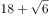

- **B**. 

- **C**. 

　✅
- **D**. 
28

**答案**：C

**官方解析**

观察数列特征，有特殊符号“”，考虑机械拆分。原数列可转化为,,,,，“”前是1，2，4，8，16，此数列是公比为2的等比数列，（  ）中“+”前应是；“”后是，，，，，根号下的数列是公差为1的等差数列，（  ）中“+”后根号下的数应是。故所求项是。

故正确答案为C。

---

### 第 3 题　qid 2452614 · 数学运算

23：30，23：45，0：20，1：20，2：50，（    ）

- **A**. 3：20
- **B**. 4：55　✅
- **C**. 5：45
- **D**. 6：50

**答案**：B

**官方解析**

观察数列无特征，考虑作差。该数列为时间表示形式，后项前项分别为15分钟，35分钟，60分钟，90分钟，？，此数列无特征，继续作差，后项前项分别为20，25，30，是公差为5的等差数列，故下一项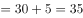，则？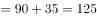。因此所求项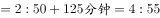。

故正确答案为B。

---

### 第 4 题　qid 2452632 · 数学运算

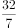，， ，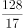， ，（    ）

- **A**. 

- **B**. 

　✅
- **C**. 

- **D**. 
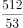

**答案**：B

**官方解析**

观察数列特征，大多数是分数，考虑分数数列。观察分子分母无明显规律，考虑反约分。原数列可转化为，，，，，分子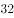，，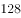，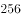，，此数列是公比为的等比数列，所求分子为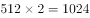；分母，，，，，此数列是公差为的等差数列，所求分母为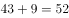。故所求项==。

故正确答案为B。

---

### 第 5 题　qid 2452558 · 数学运算

台风过后，某单位发起救灾捐款活动，甲、乙两部门的员工人数之比是，捐款总额之比是。若甲部门的人均捐款是元，则乙部门的人均捐款是

- **A**. 270元
- **B**. 290元
- **C**. 320元　✅
- **D**. 350元

**答案**：C

**官方解析**

设乙部门人均捐款元，甲、乙两部门员工人数分别、。捐款总额人均捐款部门人数，则根据条件可得：，解得元。则部门的人均捐款是元。

故正确答案为C。

---

### 第 6 题　qid 2452563 · 数学运算

某网店零售月季花，每束成本39元、售价99元，月销量800束。现推出团购活动，购买10束及以上，每束售价59元，预计零售销量减半，团购销量激增。若使原销售利润不减，则月团购销量至少应是

- **A**. 800束
- **B**. 1000束
- **C**. 1200束　✅
- **D**. 1500束

**答案**：C

**官方解析**

设团购销量至少束，则根据题意，单束花利润单束售价单束成本元，则推出团购之前总利润单束利润销量元；推出团购活动后零售销量变为束，团购单束花利润元。根据题意，推出团购活动后总利润零售利润团购利润，解得束，则团购销量至少束。

故正确答案为C。

---

### 第 7 题　qid 2452565 · 数学运算

某装配式建筑企业接到一个生产1033套楼板的订单。甲班组生产5天后，乙班组再生产4天，刚好完成任务。若甲班组比乙班组每天多生产23套，则甲班组生产楼板的套数是

- **A**. 625套　✅
- **B**. 645套
- **C**. 535套
- **D**. 515套

**答案**：A

**官方解析**

设乙班组每天生产楼板套，则甲班组每天生产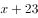套。根据题意，甲班组5天产量甲生产效率甲生产时间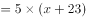套；乙班组4天产量乙生产效率乙生产时间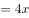套，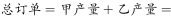，解得套，则甲班组产量套。

故正确答案为A。

---

### 第 8 题　qid 2452577 · 数学运算

使用浓度为的硫酸溶液克和浓度为的硫酸溶液若干克，配制浓度为的硫酸溶液克，需要加水的质量是：

- **A**. 10克　✅
- **B**. 12克
- **C**. 15克
- **D**. 18克

**答案**：A

**官方解析**

设需的硫酸克，根据公式：，且混合前后溶质的质量相等，混合后溶质混合前溶质，即，则解得，则需加水克。

故正确答案为A。

---

### 第 9 题　qid 2452584 · 数学运算

长方形花坛的周长为20米，若长与宽各增加3米，则增加的面积是

- **A**. 42平方米
- **B**. 24平方米
- **C**. 28平方米
- **D**. 39平方米　✅

**答案**：D

**官方解析**

设长方形花坛长为，宽为，则花坛周长为米，解得米。

根据图形可知，增加的面积平方米。

故正确答案为D。

---

### 第 10 题　qid 2452552 · 数学运算

小张下班回家乘地铁18:45之前到家的概率为0.8，乘公交为0.7。已知小张下班回家要么乘地铁，要么乘公交，且选择乘地铁的概率为0.6，则他下班回家18:45之前到家的概率是

- **A**. 0.73
- **B**. 0.74
- **C**. 0.75
- **D**. 0.76　✅

**答案**：D

**官方解析**

乘地铁概率为0.6，乘地铁18:45之前到家的概率为0.8，则选择乘地铁且18:45之前到家的概率为；小张要么乘地铁，要么乘公交，则乘公交的概率为，乘公交18:45之前到家的概率为0.7，则选择乘公交且18:45之前到家的概率为。则小张18:45之前到家的概率为。

故正确答案为D。

---

### 第 11 题　qid 2452561 · 数学运算

某企业预计今年营业收入增长，营业支出增长，营业利润增加600万元。已知该企业去年的营业利润为1000万元，则其今年的预计营业支出是

- **A**. 9000万元
- **B**. 9900万元　✅
- **C**. 10800万元
- **D**. 11500万元

**答案**：B

**官方解析**

设去年收入为万元，则今年预计收入为万元；去年支出为万元，则今年预计支出为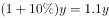万元。去年营业利润为1000万元，则有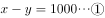；今年营业利润增加600万元，则今年利润为万元，则有。联立①②方程，解得，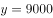。则今年的预计支出为万元。

故正确答案为B。

---

### 第 12 题　qid 2452569 · 数学运算

甲、乙两人分别从A、B两地同时出发相向而行。当两人合计走完两地间路程的时，甲距A地的路程是500米；当两人合计走完两地间路程的时，乙距B地的路程是2400米。若两人的速度始终不变，则当速度较快者走完全程时，速度较慢者距走完全程还剩的路程是

- **A**. 1350米
- **B**. 1600米
- **C**. 1800米
- **D**. 1950米　✅

**答案**：D

**官方解析**

两人走完全程的时，甲走的路程是500米；现两人走完全程的，因速度一直不变，则甲此时走的路程是米，乙走的路程为2400米，时间相同，速度与路程成正比，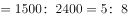，乙的速度较快，全程一共是米，当乙走完全程5200米，因时间相同，甲、乙的路程之比即为速度之比，则甲走了米，还剩米。

故正确答案为D。 

---

### 第 13 题　qid 2452573 · 数学运算

某便民超市将薏米、红豆和小黄米按2：3：5混合后出售，每千克成本13.3元。若薏米每千克成本23.6元，红豆每千克成本9.8元，则小黄米每千克的成本是

- **A**. 10.36元
- **B**. 10.18元
- **C**. 11.45元
- **D**. 11.28元　✅

**答案**：D

**官方解析**

假设混合后薏米2千克，红豆3千克、小黄米5千克。设小黄米每千克成本为元，则有，解得。

故正确答案为D。

---

### 第 14 题　qid 2452580 · 数学运算

某区财政局年度考核，办公室与国库科平均得分90分，预算科与政府采购科平均得分84分，办公室与政府采购科平均得分86分，政府采购科比预算科多10分，国库科的得分比综合科多5分，那么办公室、预算科、国库科、政府采购科、综合科的平均得分是

- **A**. 84分
- **B**. 86分
- **C**. 88分　✅
- **D**. 90分

**答案**：C

**官方解析**

根据题意可得：；；；；。联立②④，解得采购分，预算分，则办公室分，国库分，综合分。五个部门的平均得分则分。

故正确答案为C。

---

### 第 15 题　qid 2452587 · 数学运算

某食品厂速冻饺子的包装有大盒和小盒两种规格，现生产了11000只饺子，恰好装满100个大盒和200个小盒。若3个大盒与5个小盒装的饺子数量相等，则每个小盒与每个大盒装入的饺子数量分别是

- **A**. 24只、40只
- **B**. 30只、50只　✅
- **C**. 36只、60只
- **D**. 27只、45只

**答案**：B

**官方解析**

“3个大盒与5个小盒装的饺子数量相等”，即，化简为：每个大盒的饺子数量：每个小盒的饺子数量。设大盒可以装只饺子，小盒可以装只饺子。根据“现生产了11000只饺子，恰好装满100个大盒和200个小盒”，可得，解得，则每个小盒的饺子数量为30只，每个大盒的饺子数量为50只，对应B项。

故正确答案为B。

---

### 第 16 题　qid 2452592 · 数学运算

在统计某高校运动会参赛人数时，第一次汇总的结果是1742人，复核的结果是1796人，检查发现是第一次计算有误，将某学院参赛人数的个位数字与十位数字颠倒了。已知该学院参赛人数的个位数字与十位数字之和是10，则该学院的参赛人数可能是：

- **A**. 64人
- **B**. 73人
- **C**. 82人　✅
- **D**. 91人

**答案**：C

**官方解析**

根据题意，实际的参赛人数为1796人，“将某学院参赛人数的个位数字与十位数字颠倒”后，汇总的结果为1742人，即该学院颠倒后的参赛人数比实际参赛人数少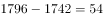人。选项A、B、C、D颠倒后为46、37、28、19，与原数作差后分别少18、36、54、72，只有C项符合。

故正确答案为C。

---

### 第 17 题　qid 2452594 · 数学运算

某商品的进货单价为80元，销售单价为100元，每天可售出120件。已知销售单价每降低1元，每天可多售出20件。若要实现该商品的销售利润最大化，则销售单价应降低的金额是

- **A**. 5元
- **B**. 6元
- **C**. 7元　✅
- **D**. 8元

**答案**：C

**官方解析**

设降价x元，已知“销售单价每降低1元，每天可多售出20件”，调价后销售单价为元，进货单价为80元，则降价后单个利润为元；降价后的销量为件。总利润单个利润数量。令总利润为0，即令和都等于0，解得，。当时，总利润最大，即销售单价应降低的金额是7元，对应C项。

故正确答案为C。

---

### 第 18 题　qid 2452596 · 数学运算

某企业按三个等级给员工发放奖金，一、二、三等奖的获奖人数之比为1：3：10，奖金总额之比为2：3：1。已知获奖员工总数126人，发放奖金总额16.2万元，则三等奖的奖金是

- **A**. 250元
- **B**. 300元　✅
- **C**. 350元
- **D**. 400元

**答案**：B

**官方解析**

设一、二、三等奖的获奖人数为、、，因为“获奖员工总数126人”，即，解得，即一、二、三等奖的获奖人数分别为9、27、90人。设一、二、三等奖的奖金总额分别为、、。因为“发放奖金总额16.2万元”，即，解得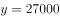元，即三等奖的奖金总额为27000元，故三等奖奖金为元。

故正确答案为B。

---

### 第 19 题　qid 2452598 · 数学运算

某单位要抽调若干人员下乡扶贫，小王、小李、小张都报了名，但因工作需要，若选小李或小张，就不能选小王。已知三人入选的概率都是0.2，但小李、小张同时入选的概率是0.1，则三人中有人入选的概率是

- **A**. 0.3
- **B**. 0.4
- **C**. 0.5　✅
- **D**. 0.6

**答案**：C

**官方解析**

根据题意“若选小李或小张，就不能选小王”，即小李或小张入选时，小王一定不入选，小王入选时，小李和小张都不入选。“三人中有人入选”有以下四种情况：

①小李和小张同时入选，此时小王一定不入选：概率为0.1；

②小李入选、小张不入选，此时小王一定不入选：当小李入选时有两类情况：小李单独入选和小李和小张共同入选，所以小李单独入选的概率为“小李入选的概率小李和小张共同入选的概率”。

③小张入选、小李不入选，此时小王一定不入选：当小张入选时有两类情况：小张单独入选和小李和小张共同入选，所以小张单独入选的概率为“小张入选的概率小李和小张共同入选的概率”。

④小李与小张都未入选，小王单独入选：概率为0.2。

故“三人中有人入选” 的概率是，对应C项。

故正确答案为C。

---

## 判断推理

### 材料 1

在400米跑比赛中，罗、方、许、吕、田、石6人被分在一组。他们站在由内到外的1至6号赛道上。关于他们的位置，已知：

（1）田和石的赛道相邻；

（2）吕的赛道编号小于罗；

（3）田和罗之间隔着两条赛道；

（4）方的赛道编号小于吕，且中间隔着两条赛道。

#### 第 1 题　qid 2452551 · 逻辑判断

根据以上陈述，关于田的位置，以下哪项是可能的？

- **A**. 在3号赛道上　✅
- **B**. 在4号赛道上
- **C**. 在5号赛道上
- **D**. 在6号赛道上

**答案**：A

**官方解析**

第一步：分析题干。
（1）田和石的赛道相邻；
（2）吕的赛道编号小于罗；
（3）田和罗之间隔着两条赛道；
（4）方的赛道编号小于吕，且中间隔着两条赛道。
第二步：根据题干条件分析选项。
提问方式为可能为真，因此，可以考虑代入法。
代入A项，田在3号赛道上，根据条件（3）可知，罗只能在6号赛道上；根据条件（2）（4）可知吕可能在4号或5号赛道上。如果吕在4号赛道上，则方在1号赛道上，根据条件（1）此时石只能在2号，此时满足题干所有要求，所以A项就是可能的，当选；
代入B项，田在4号赛道上，根据条件（3）可知，罗只能在1号赛道上，则吕的赛道编号不可能小于罗，与题干条件（2）矛盾，排除；
代入C项，田在5号赛道上，根据条件（3）可知，罗只能在2号赛道上，题干条件（2），吕只能在1赛道上，此时方的赛道编号不可能小于吕，与题干条件（4）矛盾，排除；
代入D项，田在6号赛道上，根据条件（3）可知，罗只能在3号赛道上，根据条件（2）可知吕可能在1号或2号赛道上，此时方的赛道不可能小于吕的同时隔着两条赛道，与题干条件（4）矛盾，排除。
故正确答案为A。

---

#### 第 2 题　qid 2452559 · 逻辑判断

根据以上陈述，可以推出以下哪项？

- **A**. 许和石的赛道相邻
- **B**. 许和石之间隔着一条赛道
- **C**. 许和石之间隔着两条赛道　✅
- **D**. 许和石之间隔着三条赛道

**答案**：C

**官方解析**

第一步：分析题干。

（1）田和石的赛道相邻；

（2）吕的赛道编号小于罗；

（3）田和罗之间隔着两条赛道；

（4）方的赛道编号小于吕，且中间隔着两条赛道。

第二步：根据题干条件分析选项。

由条件（2）可知：

由条件（4）可知：

以上二者可知，，则方、吕、罗的赛道排列只有以下三种可能：

如果是情况一，根据条件（1）（3），田、石分别在2号、3号赛道，许只能在6号赛道；

如果是情况二，根据条件（1）（3），田、石分别在3号、2号赛道，许只能在5号赛道；

如果是情况三，根据条件（1）（3），田、石分别在3号、4号赛道，许只能在1号赛道；

无论哪种情况，许和石之间都是隔着两条赛道，对应C选项。

故正确答案为C。

---

#### 第 3 题　qid 2452542 · 类比推理

唇亡：齿寒

- **A**. 安居：乐业
- **B**. 纲举：目张　✅
- **C**. 开卷：有益
- **D**. 惩前：毖后

**答案**：B

**官方解析**

第一步：判断题干词语间逻辑关系。
“唇亡”指嘴唇没有了，“齿寒”指牙齿就会寒冷，即因为“唇亡”，所以“齿寒”，二者为因果对应关系。
第二步：判断选项词语间逻辑关系。
A项：“安居”指安定的住在一起，“乐业”指愉快地从事自己的职业，二者为并列关系，与题干逻辑关系不一致，排除；
B项：“纲举”指提起鱼网上面的总绳，“目张”指一个个网眼都张开，即提起大绳子来，就能让一个个网眼张开了。因为“纲举”，所以“目张”，二者为因果对应关系，与题干逻辑关系一致，当选；
C项：“开卷”指打开书本读书，“有益”指有好处有收获，指的是读书总会有好处的。题干是两件事情之间的因果关系，而C项只有读书一件事，有益是读书本身的效果，二者不是因果关系，与题干逻辑关系不一致，排除；
D项：“惩前”指警戒之前犯的错误，“毖后”指以后谨慎，不致再犯，“惩前”的目的是“毖后”，二者是方式目的对应，与题干逻辑关系不一致，排除。
故正确答案为B。

---

#### 第 4 题　qid 2452546 · 类比推理

湄公河：跨境河

- **A**. 黄鹤楼：吊脚楼
- **B**. 青海湖：内陆湖　✅
- **C**. 英国人：西欧人
- **D**. 中山门：凯旋门

**答案**：B

**官方解析**

第一步：判断题干词语间逻辑关系。
“湄公河”是亚洲最重要的跨国水系，因此“湄公河”是“跨境河”，且“湄公河”是“跨境河”中的一个，二者为包容关系中的特指。
第二步：判断选项词语间逻辑关系。
A项：“吊脚楼”为苗族（重庆、贵州等）、壮族、布依族、侗族、水族、土家族等族的传统民居，“黄鹤楼”是武汉标志性建筑，是名胜，因此“黄鹤楼”不是“吊脚楼”，与题干逻辑关系不一致，排除；
B项：“青海湖”是中国最大的“内陆湖”，因此“青海湖”是“内陆湖”，且“青海湖”是“内陆湖”中的一个，二者为包容关系中的特指，与题干逻辑关系一致，当选；
C项：“英国人”是“西欧人”，但英国人是一种统称，有很多英国人，二者不是包容关系中的特指，与题干逻辑关系不一致，排除；
D项：“中山门”和“凯旋门”为并列关系，与题干逻辑关系不一致，排除。
故正确答案为B。

---

#### 第 5 题　qid 2452548 · 类比推理

柳：柳眉：柳腰

- **A**. 莲：莲花：莲蓬
- **B**. 松：松紧：松散
- **C**. 玉：玉手：玉食　✅
- **D**. 鸟：鸟瞰：鸟语

**答案**：C

**官方解析**

第一步：判断题干词语间逻辑关系。
柳眉指眉毛像柳叶一样细长，柳腰指腰像杨柳一样纤柔，两词都是和“柳”相关的比喻。
第二步：判断选项词语间逻辑关系。
A项：莲花指的是荷花，莲蓬指荷花开过后的花托，两词不存在比喻，与题干逻辑关系不一致，排除；
B项：松紧指松或紧的程度，松散指不紧凑，两词不存在比喻，与题干逻辑关系不一致，排除；
C项：玉手指的是像玉一样美好的手，玉食指的是像玉一样珍贵的食物，两词都是和“玉”相关的比喻，与题干逻辑关系一致，保留；
D项：鸟瞰指像鸟一样从上往下看，鸟语指的是小鸟的语言，后者不存在比喻，与题干逻辑关系不一致，排除。
故正确答案为C。

---

#### 第 6 题　qid 2452554 · 类比推理

笔：文具：写字

- **A**. 缸：容器：盛水　✅
- **B**. 钟：时间：计时
- **C**. 草：植物：喂牛
- **D**. 瓦：建材：砌墙

**答案**：A

**官方解析**

第一步：判断题干词语间逻辑关系。
笔是一种文具，二者是种属关系；笔用来写字，二者是功能对应关系，且笔是人工用品。
第二步：判断选项词语间逻辑关系。
A项：缸是一种容器，二者是种属关系，缸用来盛水，二者是功能对应关系，且缸是人工用品，与题干逻辑关系一致，当选；
B项：钟可以显示时间，钟也可以用来计时，都是功能对应关系，与题干逻辑关系不一致，排除；
C项：草是一种植物，二者是种属关系，草可以用来喂牛，二者是功能对应关系，但草是大自然的产物而不是人工用品，与题干逻辑关系不一致，排除；
D项：瓦是一种建材，二者是种属关系，瓦不能用来砌墙，而是用来铺屋顶，二者不是功能对应，与题干逻辑关系不一致，排除。
故正确答案为A。

---

#### 第 7 题　qid 2452639 · 类比推理

暴雨：洪灾：排涝

- **A**. 炎热：干旱：减产
- **B**. 路滑：摔倒：哭泣
- **C**. 假日：拥堵：疏导
- **D**. 地震：伤亡：救助　✅

**答案**：D

**官方解析**

第一步：判断题干词语间逻辑关系。
暴雨会导致洪灾，二者为因果的对应关系，排涝是洪灾的应对措施，二者为对应关系。
第二步：判断选项词语间逻辑关系。
A项：炎热会导致干旱，干旱会导致减产，而不是干旱的应对措施，与题干逻辑关系不一致，排除；
B项：路滑会导致摔倒，但哭泣不能解决摔倒的危害，与题干逻辑关系不一致，排除；
C项：假日会导致拥堵，疏导是拥堵的应对措施，与题干逻辑关系一致，保留；
D项：地震会导致伤亡，救助是伤亡的应对措施，与题干逻辑关系一致，保留。
对比C、D两项：D项更贴近题干，地震和暴雨都是自然灾害，排除C项。
故正确答案为D。

---

#### 第 8 题　qid 2452640 · 类比推理

摸清致贫原因：提出扶贫措施

- **A**. 通过安全检查：进入高铁车厢　✅
- **B**. 增加作物产量：选育作物良种
- **C**. 改正错误言行：认识错误危害
- **D**. 增强合作意识：苦练服务本领

**答案**：A

**官方解析**

第一步：判断题干词语间逻辑关系。
先摸清致贫原因后提出扶贫措施，二者为时间先后顺序的对应关系，且摸清致贫原因与提出扶贫措施两个行为是同一主体。
第二步：判断选项词语间逻辑关系。
A项：先通过安全检查后进入高铁车厢，且通过安全检查与进入高铁车厢是同一主体，与题干逻辑关系一致，当选；
B项：先选育作物良种后增加作物产量，但两词顺序与题干相反，与题干逻辑关系不一致，排除；
C项：先认识错误危害后改正错误言行，但两词顺序与题干相反，与题干逻辑关系不一致，排除；
D项：增强合作意识与苦练服务本领之间无明显先后顺序，与题干逻辑关系不一致，排除。
故正确答案为A。

---

#### 第 9 题　qid 2452642 · 类比推理

粮库 之于（    ）相当于（    ）之于 思想

- **A**. 仓库——记忆
- **B**. 粮田——认识
- **C**. 金库——思维
- **D**. 粮食——文章　✅

**答案**：D

**官方解析**

逐一代入选项。
A项：粮库是仓库的一种，二者是种属关系；记忆与思想之间无明显关系，前后逻辑关系不一致，排除；
B项：粮库用来储存粮田中的粮食，二者为对应关系；思想是认识的一种，二者为种属关系，前后逻辑关系不一致，排除；
C项：粮库和金库都是用来储存物品的仓库，二者为并列关系；思维和思想是近义词，前后逻辑关系不一致，排除；
D项：粮库用来储存粮食，文章用来承载思想，二者均为对应关系，前后逻辑关系一致，当选。
故正确答案为D。

---

#### 第 10 题　qid 2452644 · 类比推理

（    ）之于 实事求是 相当于 南辕北辙 之于（    ）

- **A**. 按图索骥——方枘圆凿
- **B**. 上下求索——左顾右盼
- **C**. 量体裁衣——背道而驰　✅
- **D**. 刻舟求剑——声东击西

**答案**：C

**官方解析**

逐一代入选项。
A项：按图索骥比喻按着线索去寻找，实事求是是指从实际情况出发，不夸大、不缩小，正确地对待和处理问题，二者没有必然联系；南辕北辙指的是心想往南而车子却向北行，比喻行动和目的正好相反，方枘圆凿比喻格格不入、不相容、不适宜，二者没有必然联系，前后逻辑关系不一致，排除；
B项：上下求索比喻百折不挠，不遗余力地去追求和探索，实事求是是指从实际情况出发，不夸大、不缩小，正确地对待和处理问题，二者没有必然联系；南辕北辙指的是心想往南而车子却向北行，比喻行动和目的正好相反，左顾右盼指到处看，二者没有必然联系，前后逻辑关系不一致，排除；
C项：量体裁衣本义是按照身材尺寸裁剪衣服，比喻做事从实际情况出发，实事求是是指从实际情况出发，不夸大、不缩小，正确地对待和处理问题，二者为近义关系；南辕北辙指的是心想往南而车子却向北行，比喻行动和目的正好相反，背道而驰比喻行动方向和所要达到的目标完全相反，二者为近义关系，前后逻辑关系一致，当选；
D项：刻舟求剑比喻办事刻板，没有发展的眼光，实事求是是指从实际情况出发，不夸大、不缩小，正确地对待和处理问题，二者没有必然联系；南辕北辙指的是心想往南而车子却向北行，比喻行动和目的正好相反，声东击西指造成要攻打东边的声势，实际上却攻打西边，二者没有必然联系，前后逻辑关系不一致，排除。
故正确答案为C。

---

#### 第 11 题　qid 2452645 · 类比推理

请从四个选项中选出恰当的一项，其特征或规律与题干给出的一串符号的特征或规律最为相符。

- **A**. 

- **B**. 

- **C**. 
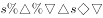

- **D**. 
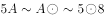
　✅

**答案**：D

**官方解析**

从相同符号的位置入手：位置1、7的符号相同；位置2、4的符号相同；位置3、6的符号相同；位置5、8的符号相同；位置9上的符号与其他位置均不相同。
第二步：判断选项符号间关系。
A项：位置5、8的符号并不相同，与题干不一致，排除；
B项：位置3、6的符号并不相同，与题干不一致，排除；
C项：位置5、8的符号并不相同，与题干不一致，排除；
D项：位置1、7的符号相同；位置2、4的符号相同；位置3、6的符号相同；位置5、8的符号相同；位置9上的符号与其他位置均不相同，与题干一致，当选。
故正确答案为D。

---

#### 第 12 题　qid 2452650 · 类比推理

请从四个选项中选出恰当的一项，其特征或规律与题干给出的一串符号的特征或规律最为相符。
由甲申曱甲申甴甲由曱

- **A**. 己已巳乙已巳己已己乙
- **B**. 上下卡卞下卡土下上卞　✅
- **C**. 人八六入八六人八人入
- **D**. 土士二干士二二士土干

**答案**：B

**官方解析**

第一步：分析题干符号间关系。
从相同符号的位置入手：位置1、9的符号相同；位置2、5、8的符号相同；位置3、6的符号相同；位置4、10的符号相同；位置7的符号与其他位置均不相同。
第二步：判断选项符号间关系。
A项：位置7的符号与位置1、9的符号相同，与题干逻辑关系不一致，排除；
B项：位置1、9的符号相同；位置2、5、8的符号相同；位置3、6的符号相同；位置4、10的符号相同；位置7的符号与其他位置均不相同，与题干逻辑关系一致，当选；
C项：位置7的符号与位置1、9的符号相同，与题干逻辑关系不一致，排除；
D项：位置7的符号与位置3、6的符号相同，与题干逻辑关系不一致，排除。
故正确答案为B。

---

#### 第 13 题　qid 2452533 · 图形推理

请从所给的四个选项中，选出最恰当的一项填入问号处，使之呈现一定的规律性。

- **A**. A
- **B**. B　✅
- **C**. C
- **D**. D

**答案**：B

**官方解析**

元素组成不同，且无明显属性规律，考虑数量规律。观察发现，图形线条交叉明显，考虑数交点，题干每个图形交点的数量分别为：3、4、5、6、7，所以？处交点数应为8个。
故正确答案为B。

---

#### 第 14 题　qid 2452534 · 图形推理

请从所给的四个选项中，选出最恰当的一项填入问号处，使之呈现一定的规律性。

- **A**. A　✅
- **B**. B
- **C**. C
- **D**. D

**答案**：A

**官方解析**

元素组成不同，且无明显属性规律，优先考虑数量规律。观察发现，第一幅图为1个正三角形；第二幅图由2个相同的正三角形构成；第三幅图由3个相同的正三角形构成；第四幅图内部补上一条线，由4个相同的正三角形构成；第五幅图内部补上两条线，由5个相同的正三角形构成。所以问号处图形应满足内部补上线条后，由6个相同的正三角形构成。只有A项图形内部补上两条线，正好由6个相同的正三角形构成。
故正确答案为A。

---

#### 第 15 题　qid 2452535 · 图形推理

请从所给的四个选项中，选出最恰当的一项填入问号处，使之呈现一定的规律性。

- **A**. A
- **B**. B
- **C**. C　✅
- **D**. D

**答案**：C

**官方解析**

元素组成不同，优先考虑属性规律。整体观察，将图形连线，图一、图三、图五为平行四边形，考虑对称性。图一中心对称、图二轴对称、图三中心对称、图四轴对称、图五中心对称，两种对称图形交替出现，？处选择轴对称图形，排除B、D两项。再次观察，发现题干中轴对称图形均只有一条对称轴，A项有两条对称轴，排除，C项有一条对称轴，当选。
故正确答案为C。

---

#### 第 16 题　qid 2452537 · 图形推理

下面四个图形中，只有一个是由上面的四个图形拼合（只能通过上、下、左、右平移）而成的，请把它找出来。

- **A**. A
- **B**. B　✅
- **C**. C
- **D**. D

**答案**：B

**官方解析**

本题考查平面拼合，可采用平行且等长相消的方式解题。消去平行且等长的线段后进行组合即可得到轮廓图，即为B选项。平行且等长相消的方式如下图所示。

故正确答案为B。

---

#### 第 17 题　qid 2452538 · 图形推理

下面四个图形中，只有一个是由上面的四个图形拼合（只能通过上、下、左、右平移）而成的，请把它找出来。

- **A**. A
- **B**. B
- **C**. C　✅
- **D**. D

**答案**：C

**官方解析**

本题考查平面拼合，可采用平行且等长相消的方式解题。消去平行且等长的线段后进行组合即可得到轮廓图，即为C选项。平行且等长相消的方式如下图所示。

故正确答案为C。

---

#### 第 18 题　qid 2452545 · 图形推理

下面四个图形中，只有一个是由上面的四个图形拼合（只能通过上、下、左、右平移）而成的，请把它找出来。

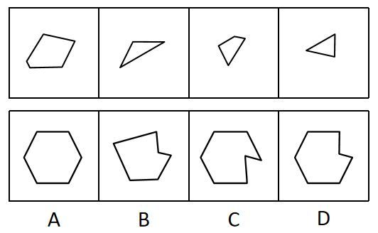

- **A**. A
- **B**. B
- **C**. C
- **D**. D　✅

**答案**：D

**官方解析**

本题考查平面拼合，可采用平行且等长相消的方式解题。消去平行且等长的线段后进行组合即可得到轮廓图，即为D选项。平行且等长相消的方式如下图所示。

故正确答案为D。

---

#### 第 19 题　qid 2452549 · 图形推理

下面四个图形中，只有一个是由上边的四个图形拼合（只能通过上、下、左、右平移）而成的，请把它找出来。

- **A**. A
- **B**. B
- **C**. C
- **D**. D　✅

**答案**：D

**官方解析**

本题考查平面拼合，可采用平行且等长相消的方式解题。消去平行且等长的线段后进行组合可得到轮廓图，即为D项。平行且等长相消的方式如下图所示：

故正确答案为D。

---

#### 第 20 题　qid 2452557 · 图形推理

下面四个图形中，只有一个是由上边的四个图形拼合（只能通过上、下、左、右平移）而成的，请把它找出来。

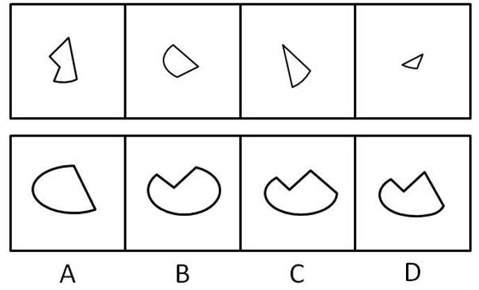

- **A**. A
- **B**. B
- **C**. C　✅
- **D**. D

**答案**：C

**官方解析**

本题考查平面拼合，可采用平行且等长相消的方式解题。消去平行且等长的线段后进行组合可得到轮廓图，即为C项。平行且等长相消的方式如下图所示：

故正确答案为C。

---

#### 第 21 题　qid 2452607 · 图形推理

下面给定的是纸盒外表面的展开图，右边哪一项能由它折叠而成？请把它找出来。

- **A**. A
- **B**. B
- **C**. C　✅
- **D**. D

**答案**：C

**官方解析**

将题干展开图中的面依次标注为面a、b、c、d，如下图：

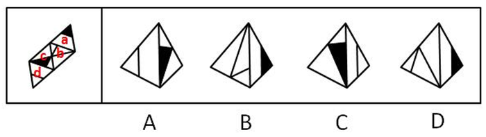

A项：题干中，面c的阴影三角形和面d中的三角形底边右侧挨着，选项面c中阴影三角形与面d中的三角形底边左侧挨着，选项和题干不一致，排除；

B项：题干中，面b的短竖线偏向于面a公共边的左侧，选项面b中短竖线偏向于和面a公共边的右侧，选项和题干不一致，排除；

C项：与题干一致，当选；

D项：题干中，面b有短竖线交于面b与面a的公共边，选项中面b无短竖线交于面b与面a的公共边，选项与题干不一致，排除。

故正确答案为C。

---

#### 第 22 题　qid 2452615 · 图形推理

下面给定的是纸盒外表面的展开图，右边哪一项能由它折叠而成？请把它找出来。

- **A**. A
- **B**. B　✅
- **C**. C
- **D**. D

**答案**：B

**官方解析**

将题干展开图中的面依次标注为面a、b、c、d，如下图：

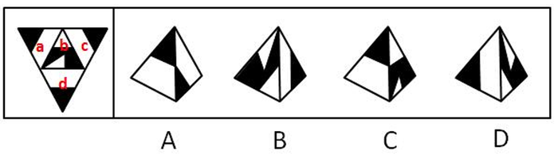

A项：题干中，面a、c、d三个面两两之间的公共边如下图所示，均是黑三角形与黑三角形两两相邻，选项中黑三角形挨着空白区域，选项和题干不一致，排除；

B项：与题干一致，当选；

C项：题干中，面b左侧的阴影和其他面的黑色小三角形没有公共点，选项中有公共点，选项和题干不一致，排除； 

D项：选项中，面b中白色小直角三角形不可能在所示的角落中，选项和题干不一致，排除。

故正确答案为B。

---

#### 第 23 题　qid 2452620 · 图形推理

下面给定的是纸盒外表面的展开图，右边哪一项能由它折叠而成？请把它找出来。

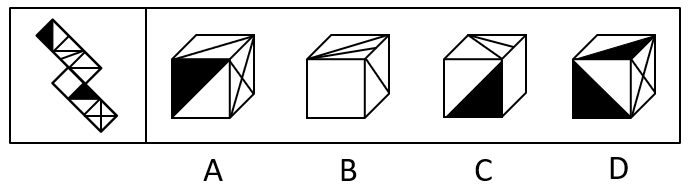

- **A**. A
- **B**. B
- **C**. C　✅
- **D**. D

**答案**：C

**官方解析**

将展开图的面均标上序号，如下图。

A项：选项出现了面c、面f，以及面a、面e中的一个，如果是面a，则面a和面c是相对面，不能同时出现；如果是面e，则面c、面e面f存在公共点，展开图中公共点发射出两条直线和一个黑色锐角，而选项只发射一条线和一个黑色锐角，选项与题干不一致，排除；

B项：选项出现了面b、面c和面d，面b和面d存在公共边，公共边上存在两个交点，而选项只有一个交点，选项与题干不一致，排除；

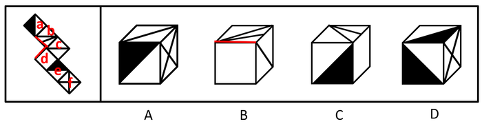

C项：选项出现了面b、面d，以及面a和面e中的一个，如果是面e，则面b与面e是相对面，不能同时出现；如果是面a，则选项与题干一致，当选；

D项：选项出现了面a、面e和面f。题干展开图中，面f和面e及面a中的白三角形均相邻，而选项中面f和顶面的黑三角形相邻，选项与题干展开图不一致，排除。

故正确答案为C。

---

#### 第 24 题　qid 2452623 · 图形推理

下面给定的是纸盒外表面的展开图，右边哪一项能由它折叠而成？请把它找出来。

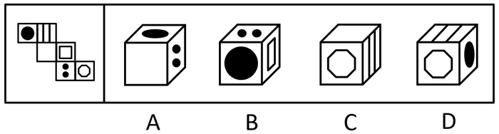

- **A**. A
- **B**. B
- **C**. C
- **D**. D　✅

**答案**：D

**官方解析**

将展开图的面均标上序号，如下图。

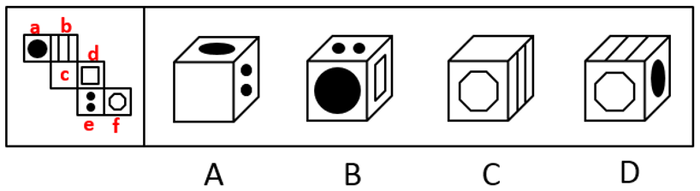

A项：选项出现了面a、面c和面e，面c和面e存在构成直角的两条边，该边为面c和面e的公共边，在展开图和选项中，以两个面的公共边为起点对面c进行画边，展开图中2对应面a，选项则是4对应面a，选项与题干不一致，排除；

B项：选项出现了面e、面a和面d，面a和面d是相对面，不能同时出现，选项与题干不一致，排除；

C项：选项出现了面c、面f和面b，面c和面f是相对面，不能同时出现，选项与题干不一致，排除；

D项：选项出现了面b、面f和面a，选项与题干一致，当选。

故正确答案为D。

---

#### 第 25 题　qid 2452625 · 图形推理

请从所给的四个选项中，选出最恰当的一项填入问号处，使之呈现一定的规律性。

- **A**. A
- **B**. B
- **C**. C
- **D**. D　✅

**答案**：D

**官方解析**

本题考查图形的实际意义，寻找最大共同点。九宫格优先横行看，观察发现，题干每行图片均为奶牛，第一行中奶牛头部的朝向左右交替，且奶牛身上的花纹相同，第二行也为此规律，故第三行运用规律，前两幅图奶牛的头部朝向分别为右、左，故问号处图形的奶牛头部应朝右，排除A、C项，B项奶牛身上的花纹与前两幅图不同，排除。
故正确答案为D。

---

#### 第 26 题　qid 2452628 · 图形推理

请从所给的四个选项中，选出最恰当的一项填入问号处，使之呈现一定的规律性。

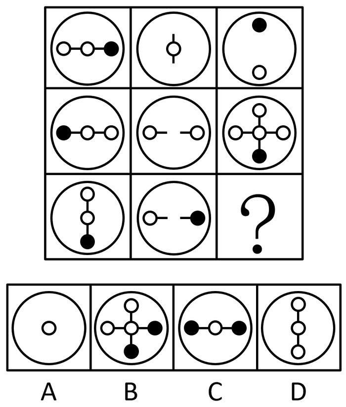

- **A**. A　✅
- **B**. B
- **C**. C
- **D**. D

**答案**：A

**官方解析**

元素组成相似，优先考虑样式规律。九宫格先看第一行，图1逆时针旋转90度再与图2求异得到图3，第二行规律一致，第三行图1逆时针旋转90度再与图2求异，只保留中间的圆。
故正确答案为A。

---

#### 第 27 题　qid 2452532 · 图形推理

左图为给定的立体，从任意角度剖开，右边哪一项不可能是它的截面图？

- **A**. A　✅
- **B**. B
- **C**. C
- **D**. D

**答案**：A

**官方解析**

本题考查截面图，逐一分析选项。

A项：无法切出。

B项：从图形正上方切入，垂直向下切即可得到，排除；

C项：从图形六面体棱上切入，斜切，保证三条边等长，即可得到，排除；

D项：从图形六面体棱上切入，斜切，保证两条边等长，即可得到，排除。

本题为选非题，故正确答案为A。

注：A项截面中椭圆和长方形的中心可能存在重合的情况，但无法确定椭圆和长方形的大小比例、椭圆与长方形框的距离比例、椭圆和长方形的中心重合等是否可以同时满足，而BCD三个选项可以确定能够截出，故粉笔答案定为A项。

---

#### 第 28 题　qid 2452541 · 逻辑判断

党内存在的很多问题都同政治问题相关联。不从政治上认识问题、解决问题，就会陷入头痛医头、脚痛医脚的被动局面，就无法从根本上解决问题。提高政治能力，很重要的一条就是要善于从政治上分析问题、解决问题。只有从政治上分析问题才能看清本质，只有从政治上解决问题才能抓住根本。
根据以上陈述，可以得出以下哪项？

- **A**. 只有从政治上认识问题、解决问题，才能从根本上解决问题　✅
- **B**. 如果善于从政治上分析问题、解决问题，就能提高政治能力
- **C**. 一旦陷入头痛医头、脚痛医脚的被动局面，就无法从根本上解决问题
- **D**. 如果没有看清本质、抓住根本，说明没有从政治上分析问题、解决问题

**答案**：A

**官方解析**

第一步：翻译题干。

①（政治上认识问题、解决问题）陷入头痛医头、脚痛医脚的被动局面

②（政治上认识问题、解决问题）根本上解决问题

③提高政治能力善于从政治上分析问题、解决问题

④看清本质政治上分析问题

⑤抓住根本政治上解决问题

第二步：逐一分析选项。

A项：翻译为根本上解决问题政治上认识问题、解决问题，是对②的否后，否后必否前，可以推出，当选；

B项：翻译为善于从政治上分析问题、解决问题提高政治能力，是对③的肯后，肯后得不到确定结论，无法推出，排除；

C项：翻译为陷入头痛医头、脚痛医脚的被动局面根本上解决问题，是对①的肯后，肯后得不到确定结论，无法和②中的“根本上解决问题”串在一起，无法推出，排除；

D项：翻译为（看清本质、抓准根本）（政治上分析问题、解决问题），是对④、⑤的否前，否前得不到确定结论，无法推出，排除。

故正确答案为A。

---

#### 第 29 题　qid 2452547 · 逻辑判断

人类学家测量了历史上各个时期的人类头骨之后发现，当代成人的脑容量平均为1349毫升，相比中石器时代人类的脑容量，男性减少了，女性减少了。研究者认为，在分工日益明确的时代，富有合作精神的人比其他人有更多的生存和繁衍机会，“最友好者生存”是导致人类大脑不断缩小的重要原因。

以下哪项如果为真，最能支持上述结论？

- **A**. 当代脑科学研究表明，脑容量更小会使得人类更富有合作精神
- **B**. 合作会减少人类的攻击性，而攻击性的减少会使人身体变轻、脑容量减少　✅
- **C**. 随着气温的升高，人们对体重的要求降低，身体的缩小必然带来大脑的缩小
- **D**. 外部信息存储介质的出现减轻了大脑的记忆负担，人类的大脑随之缩小

**答案**：B

**官方解析**

第一步：找出论点和论据。
论点：在分工日益明确的年代，富有合作精神的人比其他人有更多的生存和繁衍机会，“最友好者生存”是导致人类大脑不断缩小的重要原因。
论据:无。
本题只有论点没有论据，加强优先考虑补充论据，即解释原因或举例子。
第二步：逐一分析选项。
A项：选项说的是脑容量更小让人更具有合作精神，而论点说的是合作会导致人类大脑不断缩小，该项颠倒了论点中的因果，因果倒置，无法加强，排除；
B项：选项说的是合作会减少攻击性，从而使脑容量减少，解释了为什么合作会导致人类大脑不断缩小，补充论据，可以加强，当选；
C项：选项说的是身体的缩小会让大脑缩小，而论点指出合作是导致大脑缩小的重要原因，身体的缩小与合作是否为重要原因无关，无法加强，排除；
D项：选项说的是外部存储介质会让大脑缩小，而论点指出合作是导致大脑缩小的重要原因，外部存储介质与合作是否为重要原因无关，无法加强，排除；
故正确答案为B。

---

#### 第 30 题　qid 2452550 · 逻辑判断

每个“熊孩子”的背后都有一个“熊家长”。这些“熊家长”对“熊孩子”百依百顺，溺爱娇惯，这使得“熊孩子”以自我为中心，缺乏规则意识，容易产生过激的非理性行为。当“熊孩子”有些行为对他人和社会造成伤害时，“熊家长”也会以“他还是个孩子”来护短辩解，要求原谅。
以下哪项最可能是“熊家长”辩解所隐含的前提？

- **A**. “熊孩子”犯错误不是故意为之
- **B**. 只要是孩子就难免犯错
- **C**. “熊孩子”长大后会成为好孩子
- **D**. 孩子犯错误应当被原谅　✅

**答案**：D

**官方解析**

第一步:找出论点和论据。
论点:“熊家长”要求原谅“熊孩子”。
论据:“熊家长”以“他还是个孩子”来护短辩解。
题干中论点说的是要求他人原谅“熊孩子”，论据说的是“熊孩子”还是个孩子，论点论据话题不一致，因此考虑在“原谅”和“孩子”之间搭桥。
第二步:逐一分析选项。
A项：该项说的是犯错误不是故意为之，与“被原谅”无必然关系，不能加强，排除；
B项：该项说的是孩子就难免犯错，与“被原谅”无必然关系，不能加强，排除；
C项：该项说的是孩子长大后会成为好孩子，与“被原谅”无必然关系，不能加强，排除；
D项：在“原谅”和“孩子”之间搭桥，为搭桥项，是家长辩解的前提，可以加强，当选。
故正确答案为D。

---

#### 第 31 题　qid 2452555 · 逻辑判断

张、王、李、赵四人计划在6至9月中分别选择一个月休年假，但部门人手短缺，一个月中不能有两个人休假。赵不希望安排在6月，张要求不要安排在9月，李表示6月或8月都可以，王提出只能安排在7、8月份。
如四人的要求均得到满足，则可以推出以下哪项？

- **A**. 张只能安排在6月或者7月
- **B**. 只要李不在6月，王一定会在7月　✅
- **C**. 如果李安排在8月，那么张安排在7月
- **D**. 如果王安排在7月，那么李安排在6月

**答案**：B

**官方解析**

本题信息较多，可考虑列表。

整理题干信息如下：

（1）一个月中不能有两个人休假；

（2）赵不在6月；

（3）张不在9月；

（4）李6月或8月；

（5）王只在7月或8月。

根据题干填入信息如下：

所以由表格可知赵在9月份。其他信息不确定。所以考虑代入选项。

A项：根据表格可以发现张可以安排在6月、7月和8月，故选项说法错误，排除；

B项：如果李不安排在6月，此时6月、7月和9月都不安排李，故李只能在8月，那么王一定会在7月，该项说法正确，当选；

C项：如果李安排在8月，那么王在7月，此时张只能安排在6月，选项说法错误，排除；

D项：如果王安排在7月，即张、李、赵都不能安排在7月，但此时李可以在6月也可以在8月，故该项选项错误，排除。

故正确答案为B。

---

#### 第 32 题　qid 2452560 · 逻辑判断

某部门新录用甲、乙、丙三名工作人员，他们各自的籍贯为江苏、安徽、浙江中的某个省。张红、李梅和王芹对他们的籍贯有如下猜测：
张红：甲是浙江人，乙是安徽人，丙也是浙江人；
李梅：甲是浙江人，乙是江苏人，丙不是江苏人；
王芹：甲是江苏人，乙是浙江人，丙也是江苏人。
已知，对甲、乙、丙的籍贯，上述三人均猜对1个，猜错2个。
根据以上信息，以下哪项是可能的？

- **A**. 甲是江苏人，乙是安徽人，丙是浙江人
- **B**. 甲是浙江人，乙是江苏人，丙是江苏人
- **C**. 甲是安徽人，乙是浙江人，丙是江苏人
- **D**. 甲是江苏人，乙是安徽人，丙是安徽人　✅

**答案**：D

**官方解析**

题干条件不确定，优先采用代入法。
将A项代入，张红所说的第一句话错误，后面两句正确，不符合题干要求“猜对1个，猜错2个”，排除；
将B项代入，张红所说的第一句话正确，后面两句错误；李梅前两句正确，最后一句话错误，不符合题干要求“猜对1个，猜错2个”，排除；
将C项代入，张红所说的三句话均错误，不符合题干要求“猜对1个，猜错2个”，排除；
将D项代入，张红第二句话正确其余错误；李梅第三句话正确其余错误；王芹第一句话正确其余错误，符合题干要求，当选。
故正确答案为D。

---

#### 第 33 题　qid 2452568 · 逻辑判断

一项对某企业基层工作人员的研究报告显示，使用社交软件的基层工作人员罹患糖尿病、精神疾病、缺血性心脏疾病的概率均显著低于不使用社交软件的。据此，该企业管理人员认为，社交软件的使用有利于基层工作人员的健康。
以下哪项如果为真，最能削弱上述管理人员的结论？

- **A**. 长时间使用电脑或者手机会引发包括精神疾病在内的多种健康问题
- **B**. 该企业基层工作人员没有足够多的时间和精力锻炼身体
- **C**. 该企业基层工作人员压力大，身心健康的人才在工作之余使用社交软件　✅
- **D**. 该企业基层工作人员普遍在四十岁以上，相当一部分人不使用社交软件

**答案**：C

**官方解析**

第一步：找出论点和论据。
论点：社交软件的使用有利于基层工作人员的健康。
论据：研究报告显示，使用社交软件的基层工作人员罹患糖尿病、精神疾病、缺血性心脏疾病的概率均显著低于不使用社交软件的。
本题论点论据话题一致，都在讨论社交软件与基层工作人员健康的关系，并且论点中具有因果关系，故可以优先考虑因果倒置。
第二步：逐一分析选项。
A项：论点讨论的是社交软件与基层工作人员健康的关系，该项说的是长期使用手机电脑会引发健康问题，话题不一致，无法削弱，排除；
B项：论点讨论的是社交软件与基层工作人员健康的关系，该项说的是基层工作人员没有时间锻炼身体，并未提到社交软件是否利于身体健康，话题不一致，无法削弱，排除；
C项：该项指出是因为人身体健康才会在工作之余使用社交软件，而论点说的是使用了社交软件会导致身体健康，选项中将原因和结果颠倒顺序，属于因果倒置，可以削弱，当选；
D项：论点讨论社交软件与基层工作人员健康的关系，而该项说的是企业基层工作人员的年龄，相当一部分人不使用社交软件，话题不一致，无法削弱，排除。
故正确答案为C。

---

#### 第 34 题　qid 2452572 · 类比推理

由于业务量增加，某服务中心计划增加登记、咨询、报送、投诉和综合5个业务窗口，拟安排的5名工作人员所熟悉的业务各有不同：小丽作为新人，只熟悉登记业务；小马熟悉登记和咨询业务；小高熟悉报送和投诉业务；老王除了综合和投诉，其他业务都很熟悉；老董所有业务都很精通。最终，5名工作人员被分别安排到5个窗口负责各自熟悉的业务。
关于人员安排，以下说法正确的是

- **A**. 老董不负责综合业务窗口
- **B**. 小高负责报送业务窗口
- **C**. 小马不负责咨询业务窗口
- **D**. 老王负责报送业务窗口　✅

**答案**：D

**官方解析**

整理题干信息如下：

（1）小丽只负责登记业务

（2）小马负责登记或咨询业务

（3）小高负责报送或者投诉业务

（4）老王不负责综合和投诉

（5）老董所有业务都很精通

根据题干填入确定信息如下：

 

此时综合窗口只能老董负责，排除A项；又因5个业务窗口，安排的5名工作人员所熟悉的业务各有不同，即一人一个窗口，所以老董再不负责其他窗口，此时投诉窗口也已经有四个“×”，故只能小高负责投诉窗口，排除B项。此时报送窗口也已经有四个“×”，故只能老王负责报送窗口，D项说法正确，当选。又因为老王不负责其他窗口，此时咨询窗口也已经有四个“×”，故只能小马负责咨询窗口，排除C项，且小马不负责其他窗口，填入：

故正确答案为D。

---

#### 第 35 题　qid 2452527 · 逻辑判断

随着社会经济的快速发展，很多现代化都市高楼林立，变成了钢铁水泥的森林。但欧洲某著名城市几乎没有一座高楼大厦，某旅游者在游览时了解到该城市仅有10万人。由此他认为，人口稀少、需求不旺是这座城市不建高楼大厦的主要原因。
以下哪项如果为真，最能质疑上述旅游者的观点？

- **A**. 许多住在老城区的社会精英都想住进现代化高楼
- **B**. 该城市已经规划3年内建造一座高层地标性建筑
- **C**. 该城市规定一般建筑物的高度不得超过当地教堂　✅
- **D**. 该地区人口近百万的其他城市也大都没有高楼大厦

**答案**：C

**官方解析**

第一步：找出论点和论据。
论点：人口稀少、需求不旺是这座城市不建高楼大厦的主要原因。
论据：欧洲某著名城市几乎没有一座高楼大厦，某旅游者在游览时了解到该城市仅有10万人。
本题论据说的是该城市人少，论点讨论的是人少是该城市不建高楼大厦的主要原因，论点和论据之间是有必然联系的，因此，可以考虑否定论点。除此之外，论点是在探讨不建高楼大厦的原因，因此，还可以考虑因果倒置和他因削弱两种削弱方式。
第二步：逐一分析选项。
A项：论点说的是人口稀少、需求不旺是这座城市不建高楼大厦的主要原因，该项说的是许多住在老城区的社会精英想住高楼，想要通过社会精英想住高楼来证明是有需求的，但是社会精英这个群体范围比较小，首先，没办法证明需求旺盛，也不能削弱论点当中的主要原因，无法削弱，排除；
B项：该项说的是三年内建造一座高层地标性建筑，与论点讨论的这座城市不建高楼大厦的主要原因无关，无法削弱，排除；
C项：该项说的是城市规定一般建筑物的高度不得超过当地教堂，说明城市规定才是这座城市不建高楼大厦的主要原因，削弱论点，当选；
D项：论点讨论的是这座城市不建高楼大厦的主要原因，而该项说的是其他城市有没有高楼大厦，话题不一致，无法削弱，排除。
故正确答案为C。

---

#### 第 36 题　qid 2452597 · 定义判断

造血式扶贫：指政府部门或社会力量通过持续性地扶持农村产业发展，拓宽农产品销售及消费渠道等，帮助贫困地区、贫困人口增收脱贫的扶贫方式。
下列属于造血式扶贫的是

- **A**. 
某县按照“东部林果、旅游，西部设施农业”的整体思路，一直坚持“”的产业发展模式，使农民年收入翻了一番，人均达到近万元
　✅
- **B**. 
某县扶贫办组织了200多名山区农民，经过严格培训，输送到东南沿海城市工作。这些农民每月都按时寄钱回家，家里的日子越过越红火

- **C**. 
县农科所资助某村贫困家庭100头种羊，多次对他们进行科学养羊技术培训，并安排技术人员进行“一对一”的专业指导

- **D**. 
为了解决全村苹果严重滞销的问题，村里的几个年轻人共同开办了一个水果直销网店。不到半月时间，所有苹果就销售一空

**答案**：A

**官方解析**

第一步：找出定义关键词。

“政府部门或社会力量”、“持续性地扶持农村产业发展，拓宽农产品销售及消费渠道”、“帮助贫困地区、贫困人口增收脱贫”。

第二步：逐一分析选项。

A项：某县符合“政府部门或社会力量”，一直坚持“”的产业发展模式，符合“持续性地扶持农村产业发展，拓宽农产品销售及消费渠道”，使农民年收入翻了一番，人均达到近万元，符合“帮助贫困地区、贫困人口增收脱贫”，符合定义，当选；

B项：某县扶贫办组织了200多名山区农民，经过严格培训，输送到东南沿海城市工作，不符合“持续性地扶持农村产业发展，拓宽农产品销售及消费渠道”，不符合定义，排除；

C项：县农科所资助某村贫困家庭100头种羊，多次对他们进行科学养羊技术培训，不符合“持续性地扶持农村产业发展，拓宽农产品销售及消费渠道”，不符合定义，排除；

D项：为了解决全村苹果严重滞销的问题，村里的几个年轻人共同开办了一个水果直销网店，不符合“政府部门或社会力量”，且没有提到贫困，不符合“帮助贫困地区、贫困人口增收脱贫”，不符合定义，排除。

故正确答案为A。

---

#### 第 37 题　qid 2452602 · 定义判断

分众化教育：指根据受众的具体差异，用典型案例分别进行宣传，以激发情感共鸣，达成特定目标的教育方式。
下列属于分众化教育的是

- **A**. 某市组织全市技术创新能手分别深入到所在行业部门，分享自己的创新经验，极大地激发了各行各业人士的创新热情　✅
- **B**. 某地组织的“五一劳动奖章”获得者宣讲团多次进行巡回报告，他们的先进事迹深深地打动了前来听讲的市民
- **C**. 每天傍晚，某学校附近地铁口都有艺术教育培训机构的招生人员散发传单，上面印着考入名校的学生彩照和成绩
- **D**. 在“不忘初心、牢记使命”主题教育中，某区组织党员干部分系统观看专题纪录片《警钟长鸣》，取得了预期效果

**答案**：A

**官方解析**

第一步：找出定义关键词。
“根据受众的具体差异，用典型案例分别进行宣传”、“激发情感共鸣，达成特定目标”。
第二步：逐一分析选项。
A项：某市组织全市技术创新能手分别深入到所在行业部门，分享自己的创新经验，符合“根据受众的具体差异，用典型案例分别进行宣传”，极大地激发了各行各业人士的创新热情，符合“激发情感共鸣，达成特定目标”，符合定义，当选； 
B项：某地组织的“五一劳动奖章” 获得者宣讲团多次进行巡回报告，不符合“根据受众的具体差异，用典型案例分别进行宣传”，不符合定义，排除；
C项：每天傍晚，某学校附近地铁口都有艺术教育培训机构的招生人员散发传单，不符合“根据受众的具体差异，用典型案例分别进行宣传”，不符合定义，排除；
D项：某区组织党员干部分系统观看专题纪录片《警钟长鸣》，不符合“根据受众的具体差异，用典型案例分别进行宣传”，不符合定义，排除。
故正确答案为A。

---

#### 第 38 题　qid 2452605 · 定义判断

喘息服务：指由政府部门购买服务，为有失能失智老人的低收入家庭或特殊困难家庭提供临时性援助，让常年在家照顾亲属者得到短暂休息。
下列属于喘息服务的是

- **A**. 由于儿女移居国外，年迈的赵先生夫妇只得相依为命，平时一起去市场买日常用品，一起去医院就诊取药。社区了解情况后，专门雇人每天上门半小时帮他们料理家务
- **B**. 杨先生10多年前中风，老伴杜女士为了照料他，每天忙得团团转，连自己生病都没时间去医院。今年初，街道派护工不定期上门服务，让她能有时间到医院看病或稍事休息　✅
- **C**. 父亲去世后，年过六旬的张先生独自承担起了照顾精神病妹妹的重任，从来没有睡过一个安稳觉。不久前，老张专门请了一名钟点工照看妹妹，感觉轻松了许多
- **D**. 患健忘症的陈奶奶经常独自出门闲逛，多次走失，靠低保维持生活的儿子无力照顾。区民政部门了解情况后，把陈奶奶送进养老院，并承担了所有费用

**答案**：B

**官方解析**

第一步：找出定义关键词。
“政府部门购买服务”、“为有失能失智老人的低收入家庭或特殊困难家庭提供临时性援助”、“让常年在家照顾亲属者得到短暂休息”。
第二步：逐一分析选项。
A项：由于儿女移居国外，社区专门雇人每天上门半小时帮年迈的赵先生夫妇料理家务，不符合“为有失能失智老人的低收入家庭或特殊困难家庭提供临时性援助”，也不符合“让常年在家照顾亲属者得到短暂休息”，不符合定义，排除；
B项：杨先生10多年前中风，今年初街道派护工不定期上门服务，让杜女士能有时间到医院看病或稍事休息，符合“政府部门购买服务”、“为有失能失智老人的低收入家庭或特殊困难家庭提供临时性援助”、“让常年在家照顾亲属者得到短暂休息”，符合定义，当选；
C项：老张专门请了一名钟点工照看妹妹，不符合“政府部门购买服务”，不符合定义，排除；
D项：患健忘症的陈奶奶多次走失，区民政部门了解情况后，把陈奶奶送进养老院，并承担了所有费用，不符合“为有失能失智老人的低收入家庭或特殊困难家庭提供临时性援助”，不符合定义，排除。
故正确答案为B。

---

#### 第 39 题　qid 2452617 · 定义判断

口述登记制：指办理个体工商户登记手续时，申请人无需亲自填表，只要口述各项信息，核对确认后即可当场领取营业执照的登记方式。
下列属于口述登记制的是

- **A**. 赵先生到市场监督管理部门办理个体户注册登记手续。在窗口人员指导下按照“申请-受理-核准”的步骤，半小时就办好了手续。第二天就拿到了自己的营业执照
- **B**. 汪先生打算申请运动器材店营业执照。他从网上弄清了申请程序，第二天来到区市场监督管理部门登记处，简要地回答了几个问题，不一会儿营业执照就办好了　✅
- **C**. 程先生到市场监督管理部门办理花店营业执照。按照现场人员的指导填好表格，经办人员输入系统打印出信息登记表，程先生签名确认后就拿到了营业执照
- **D**. 蔡先生到市场监督管理部门办理营业执照注销手续。在指定窗口完成自动身份识别后，回答了工作人员的询问，很快就办完了全部手续

**答案**：B

**官方解析**

第一步：找出定义关键词。
“办理个体工商户登记手续时”、“无需亲自填表”、“口述信息”、“核对后当场领取营业执照”。
第二步：逐一分析选项。
A项：赵先生在窗口人员的指导下按照“申请-受理-核准”的步骤，是本人亲自办理，但没有体现“口述信息”即可办理，而且，赵先生第二天拿到营业执照，不符合“核对后当场领取营业执照”，不符合定义，排除；
B项：汪先生在区市场监督管理部门，回答几个问题符合“口述信息”，然后“不一会儿营业执照就办好了”，符合“核对后当场领取营业执照”，符合定义，当选；
C项：程先生按照现场人员的指导填好表格，是本人亲自填表，不符合“无需亲自填表”，不符合定义，排除；
D项：蔡先生办理营业执照注销手续，不符合“办理个体工商户登记手续”，不符合定义，排除。
故正确答案为B。

---

#### 第 40 题　qid 2452619 · 定义判断

垃圾资源化：指垃圾进行分选处理后，成为无污染的循环再利用原料，进而加工、转化为再生资源的垃圾处理方式。
下列属于垃圾资源化的是：

- **A**. 某市为了缓解因煤炭资源过度开采造成的地面下陷问题，新建了一个大型垃圾场，经过分类后的城市生活垃圾每天都会运到这里集中填埋
- **B**. 垃圾焚烧发电需要投入巨大资金，随着相关技术不断进步，电能产量越来越高，尽管排放问题还没有彻底解决，但它仍然是目前比较常见的城市垃圾处理方式
- **C**. 乡村垃圾大多采用分类处理的方法：有回收价值的，挑选出来后稍加处理卖给需要的人，其他大部分卖到废品回收站点，无回收价值的，堆到指定地点
- **D**. 某市正在推行新的垃圾处理方式：将厨余垃圾等有机物分离出来，制成有机肥料，将砖头瓦块、玻璃陶瓷等无机物分离出来，制成新型免烧砖　✅

**答案**：D

**官方解析**

第一步：找出定义关键词。
“垃圾进行分选处理后”、“成为无污染的循环再利用原料”、“加工、转化为再生资源”。
第二步：逐一分析选项。
A项：新建垃圾场，将分类后的城市生活垃圾集中填埋，只是简单填埋，没有将垃圾转化为可循环的原料，不符合“成为无污染的循环再利用原料”、“加工、转化为再生资源”，不符合定义，排除；
B项：垃圾焚烧发电是常见的垃圾处理方式，只是对垃圾进行焚烧，没有体现对垃圾的分类处理，不符合“垃圾进行分选处理后”，而且焚烧垃圾的排放问题没有彻底解决，不符合“成为无污染的循环再利用原料”，不符合定义，排除；
C项：将有回收价值的垃圾卖掉，将无回收价值的垃圾堆放到指定地点，只涉及垃圾的回收和变卖，但没有体现出将垃圾转化成其他资源，不符合“加工、转化为再生资源”，不符合定义，排除；
D项：将厨余垃圾等有机物分离出来，制成肥料，将无机物分离出来，制成免烧砖，符合“垃圾进行分选处理后”，而且将分选处理后的垃圾制成其他资源，符合“成为无污染的循环再利用原料”、“加工、转化为再生资源”，符合定义，当选。
故正确答案为D。

---

#### 第 41 题　qid 2452621 · 定义判断

良性冲突：指管理者设法把企业内部的小冲突转化为凝聚力，推动企业发展的管理策略。
下列属于良性冲突的是

- **A**. 公司召开员工代表大会修订奖惩条例，与会者的意见出现了巨大分歧，大家争得面红耳赤，最后少数服从多数，通过了该条例的修订
- **B**. 某企业面临着一项急需解决的技术难题，总经理提议谁能提出解决方案就可以担任项目主管并获得10万元重奖。这一提议遭到部分与会者的反对，最终未能通过
- **C**. 徐先生和景先生是某公司的一对老搭档，在一些重大决策问题上经常意见相左，互不相让，最终却总能达成一致。在他们的领导下，公司业绩稳步提高
- **D**. 市场部蒋经理听到销售员反映产品质量问题后，向质检部反馈意见，与生产部经理产生了矛盾。公司组织三个部门多次开会协调，最终建立了良好沟通机制　✅

**答案**：D

**官方解析**

第一步：找出定义关键词。
“管理者”、“把企业内部小冲突转化为凝聚力”、“推动企业发展”。
第二步：逐一分析选项。
A项：与会者意见出现巨大分歧，不符合“企业内部小冲突”，不符合定义，排除； 
B项：提议遭到部分与会者反对，最终未能通过，不符合“将小冲突转化为凝聚力”，不符合定义，排除；
C项：徐先生和景先生是老搭档，在重大决策问题上经常意见相左，不符合“企业内部小冲突”，不符合定义，排除；
D项：市场部蒋经理与生产部经理产生矛盾，公司开会协调建立良好沟通机制，符合“将小冲突转化为凝聚力”，而且良好的沟通机制利于公司发展，符合“推动企业发展”，符合定义，当选。
故正确答案为D。

---

#### 第 42 题　qid 2452564 · 定义判断

乡贤调解：指村民之间发生纠纷后，由具有较高威望和影响力的乡村贤达人士出面解决纠纷的民间调解方式。
下列不属于乡贤调解的是

- **A**. 老周与老马因借贷纠纷对簿公堂，法院受理后到村里开庭，并请了几位乡贤旁听，经过现场调解，双方达成谅解　✅
- **B**. 老肖年轻时走南闯北，见多识广，全村上上下下都很敬重他。张家的牛吃了李家的草，高家的水流进了齐家的房，村民只要找到他，问题一下就解决了
- **C**. 老于从镇司法所退休回村后，用老百姓的“土办法”解决了蒋家婆媳不和的老大难问题。从此以后，村里一旦发生什么纠纷，大家都爱跑来请他去评理
- **D**. 老张和邻居老李因为家门口的路闹得不可开交，把路堵死。家住村头的老支书过去调解，两人一见到他，火气就消了一大半，很快握手言好，开通了道路

**答案**：A

**官方解析**

第一步：找出定义关键词。
“村民之间发生纠纷后”、“较高威望和影响力的乡村贤达人士出面解决纠纷的民间调解方式”。
第二步：逐一分析选项。
A项：老周与老马因借贷纠纷对簿公堂，法院受理后到村里开庭，是法院作出调解，不符合“较高威望和影响力的乡村贤达人士出面解决纠纷的民间调解方式”，不符合定义，当选； 
B项：张家的牛吃了李家的草，高家的水流进了齐家的房，符合“村民之间发生纠纷后”，村民只要找到他，问题一下就解决了，符合“较高威望和影响力的乡村贤达人士出面解决纠纷的民间调解方式”，符合定义，排除；
C项：用老百姓的“土办法”解决了蒋家婆媳不和的老大难问题，符合“村民之间发生纠纷后”、“较高威望和影响力的乡村贤达人士出面解决纠纷的民间调解方式”，符合定义，排除；
D项：老张和邻居老李因为家门口的路闹得不可开交，符合“村民之间发生纠纷后”，家住村头的老支书过去调解，两人一见到他，火气就消了一大半，很快握手言好，开通了道路，符合“较高威望和影响力的乡村贤达人士出面解决纠纷的民间调解方式”，符合定义，排除。
本题为选非题，故正确答案为A。

---

#### 第 43 题　qid 2452567 · 定义判断

等待经济：指商家利用人们购物、就医、出行时的空余时间，提供选择自由、使用方便的付费服务。
下列不属于等待经济的是

- **A**. 某购物中心在顾客休息区设置了多台VR游戏机，顾客扫码付费即可操作
- **B**. 某社区卫生服务中心添置了数台功能各异的按摩椅，供候诊患者刷卡使用
- **C**. 某小区内新开设了一家无人超市，每到周末附近居民就喜欢到这里来购物　✅
- **D**. 某火车站在候车室内放置了数台自动售卖机，供旅客自主选购饮料、食品

**答案**：C

**官方解析**

第一步：找出定义关键词。
“商家利用人们购物、就医、出行时的空余时间”、“提供选择自由、使用方便的付费服务”。
第二步：逐一分析选项。
A项：某购物中心在顾客休息区设置了多台VR游戏机，顾客扫码付费即可操作，符合“商家利用人们购物、就医、出行时的空余时间”、“提供选择自由、使用方便的付费服务”，符合定义，排除；
B项：某社区卫生服务中心添置了数台功能各异的按摩椅，供候诊患者刷卡使用，符合“商家利用人们购物、就医、出行时的空余时间”、“提供选择自由、使用方便的付费服务”，符合定义，排除；
C项：某小区内新开设了一家无人超市，每到周末附近居民就喜欢到这里来购物，不符合“商家利用人们购物、就医、出行时的空余时间”、“提供选择自由、使用方便的付费服务”，不符合定义，当选；
D项：某火车站在候车室内放置了数台自动售卖机，供旅客自主选购饮料、食品，符合“商家利用人们购物、就医、出行时的空余时间”、“提供选择自由、使用方便的付费服务”，符合定义，排除。
本题为选非题，故正确答案为C。

---

#### 第 44 题　qid 2452570 · 定义判断

信息污染：指信息传播过程中混入危害性、欺骗性或误导性信息元素，从而影响对有效信息的正常获取和利用的现象。
下列属于信息污染的是

- **A**. 心理学家让实验对象每天看几千张不同的照片，几天后，被试者大都出现头痛、失眠等现象，无法按要求描述相似照片的差别
- **B**. 某牙科医院网站转载了某权威医学杂志的一篇科研论文，但在论文末尾的显著位置附上该医院相关产品的广告
- **C**. 自从帮父母开通微信账号后，小张的微信朋友圈里每天都会看到父母转发的各种养生鸡汤和伪科学信息
- **D**. 陈某在微博上转发某省森林火灾事故的新闻报导时，将五年前亚马孙雨林特大火灾的现场图片作为配图插入其中　✅

**答案**：D

**官方解析**

第一步：找出定义关键词。
“信息传播过程中”、“混入危害性、欺骗性或误导性信息元素”、“影响对有效信息的正常获取和利用”。
第二步：逐一分析选项。
A项：心理学家让实验对象每天看几千张不同的照片，实验对象就是要看这些照片，未体现混入别的信息元素，不符合“混入危害性、欺骗性或误导性信息元素”，不符合定义，排除；
B项：在论文末尾的显著位置附上该医院相关产品的广告，论文的内容本身没有发生改变，附上的广告并不影响读者对论文信息的获取，不符合“混入危害性、欺骗性或误导性信息元素”，不符合定义，排除；
C项：小张的微信朋友圈里每天都会看到父母转发的各种养生鸡汤和伪科学信息，伪科学本身就是假的，不是混入了欺骗性信息，而是整个信息内容本身为假，不符合“混入危害性、欺骗性或误导性信息元素”，不符合定义，排除；
D项：陈某在微博上转发某省森林火灾事故的新闻报道，符合“信息传播过程中”，将五年前亚马孙雨林特大火灾的现场图片作为配图插入其中，符合“混入危害性、欺骗性或误导性信息元素”、“影响对有效信息的正常获取和利用的现象”，符合定义，当选。
故正确答案为D。

---

#### 第 45 题　qid 2452574 · 定义判断

痕迹管理：指按照相关部门要求，用文字或图片等材料记录、展示工作过程和业绩，作为绩效考核依据的监督管理手段。
下列不属于痕迹管理的是

- **A**. 李先生被派往分公司调研，每天忙得不亦乐乎：手机上装了多个工作APP，必须随时关注上边的各种信息，还得及时把现场工作照上传给公司领导
- **B**. 某公司人力资源部门存储了大量的记录公司各项活动的文字影像资料，为每年的年终总结和工作汇报提供了足够的第一手材料
- **C**. 按有关部门规定，申报项目时，除了填写申请书，还须以附件形式提供相应的图片、证书、文件等作为支撑材料，以供评审专家核查　✅
- **D**. 某窗帘公司要求安装人员为客户上门服务时，必须把测量、安装、调试、用户评价等每个环节拍成小视频，现场传给部门经理

**答案**：C

**官方解析**

第一步：找出定义关键词。
“用文字或图片等材料记录、展示工作过程和业绩”、“作为绩效考核依据的监督管理手段”。
第二步：逐一分析选项。
A项：李先生及时把现场工作照上传给工作公司领导，符合“用文字或图片等材料记录、展示工作过程和业绩”、“作为绩效考核依据的监督管理手段”，符合定义，排除；
B项：人力资源部门存储了大量的记录公司活动的文字影像资料，符合“用文字或图片等材料记录、展示工作过程和业绩”、“作为绩效考核依据的监督管理手段”，符合定义，排除；
C项：申报项目时的申请书以及图片、证书、文件等支撑材料只是为了让评审专家核查情况，不符合“作为绩效考核依据的监督管理手段”，不符合定义，当选；
D项：窗帘安装人员传给部门经理的每个环节小视频，符合“用文字或图片等材料记录、展示工作过程和业绩”、“作为绩效考核依据的监督管理手段”，符合定义，排除。
本题为选非题，故正确答案为C。

---

#### 第 46 题　qid 2452524 · 定义判断

抢跑焦虑症：指家庭或学校由于担心孩子缺乏竞争力，急于进行超前教育、加深教学内容等违背教育教学基本规律的现象。
下列不属于抢跑焦虑症的是

- **A**. 暑假刚开始，小明的家长便为他买好了下学期的语文、数学、外语教材及教辅材料，要求他严格按计划完成全部的预习任务
- **B**. 某教育培训机构要求授课教师适当增加教学内容，加大学习难度，吸引更多的优秀学生前来参加各门各类课程的补习　✅
- **C**. 王女士儿子成绩一直很优秀，虽然才读小学三年级，家里就为他请了家教，每周两次一对一辅导法语学习
- **D**. 在全市中学生数学竞赛前夕，某校多次聘请大学教授占用其他课程的时间为参赛选手进行强化训练

**答案**：B

**官方解析**

第一步：找出定义关键词。
“家庭或学校担心孩子缺乏竞争力”、“急于进行超前教育、加深教学内容”、“违背教育教学基本规律”。
第二步：逐一分析选项。
A项：小明家长为他买好了下学期的语文、数学、外语教材，符合“家庭担心孩子缺乏竞争力、急于进行超前教育”，符合定义，排除； 
B项：某教育培训机构要求教师增加教学内容，吸引更多学生前来参加培训，不符合“家庭或学校担心孩子缺乏竞争力”，不符合定义，当选；
C项：王女士为三年级的儿子请家教学习法语，符合“家庭担心孩子缺乏竞争力急于进行超前教育、加深教学内容”，符合定义，排除； 
D项：某校多次聘请大学教授为参赛选手进行强化训练，符合“学校担心孩子缺乏竞争力、急于加深教学内容”、并且占用其他课程时间符合“违背教育教学基本规律”，符合定义，排除。 
本题为选非题，故正确答案为B。

---

#### 第 47 题　qid 2452525 · 定义判断

情感营销：指在商品销售过程中，商家运用各种手段拉近与客户的情感距离，从而达到销售目的的营销策略。
下列属于情感营销的是

- **A**. 商场导购员一见到有人走近，就会满脸笑容地迎上来，用亲属之间的各种称谓拉着顾客去体验、购买商品　✅
- **B**. 小刘经常和小丁一起带孩子游玩，不仅帮小丁解决了儿子入学的难题，还为小丁的儿子购买了自己负责销售的儿童成长类保险产品
- **C**. 某社区组织爱心团队深入辖区低保家庭，悉心照顾孤寡老人，了解他们的消费需求，并从赞助商那里为他们挑选合适的商品
- **D**. 袁先生以前是张先生的供货商，当年帮了他很大的忙。现在张先生成立了自己的公司，袁先生已不再经商，但是两人仍亲如兄弟

**答案**：A

**官方解析**

第一步：找出定义关键词。
“在商品销售过程中”、“商家运用各种手段拉近与客户的情感距离”、“达到销售目的”。
第二步：逐一分析选项。
A项：导购员满脸笑容、用亲属之间的称谓拉着顾客体验商品，符合“在商品销售过程中，商家运用各种手段拉近与客户的情感距离”，并且也想“达到销售目的”，符合定义，当选；
B项：小刘为小丁的儿子购买了自己负责销售的保险产品，这属于小刘送给小丁儿子保险产品，不符合“在商品销售过程中”、“达到销售目的”，不符合定义，排除；
C项：某社区组织爱心团队照顾孤寡老人，为他们从赞助商挑选合适的商品，不符合“在商品销售过程中”、“商家运用各种手段达到销售目的”，不符合定义，排除；
D项：袁先生曾经是张先生的供货商，袁先生现在已经不再经商但两人感情亲如兄弟，不符合 “在商品销售过程中”、“商家运用各种手段拉近与客户的情感距离”从而“达到销售目的”，不符合定义，排除。
故正确答案为A。

---

#### 第 48 题　qid 2452528 · 定义判断

同辈压力：指年龄相近的人因生活、工作、社会地位等方面存在差距，担心受到轻视排挤而产生的心理压力。
下列属于同辈压力的是

- **A**. 老王的朋友都为孩子买了婚房，他也想为儿子买一套，自己的经济实力却远远达不到，为此非常烦恼　✅
- **B**. 某学院近年引进的教师大多晋升了高级职称，有二十多年教龄的赵老师仍然还是讲师，他常常愁得睡不着觉
- **C**. 销售员小丁看到别人都已完成公司的年度销售任务，自己才完成了六成。为防止明年被调离销售部，不分昼夜联系客户
- **D**. 车间主任要求新员工小李一周内必须熟悉设备，能够独立操作。因担心不能顺利过关，他加班加点苦练技能

**答案**：A

**官方解析**

第一步：找出定义关键词。
“年龄相近的人”、“因生活、工作、社会地位等方面存在差距”、“担心受到轻视排挤而产生的心理压力”。
第二步：逐一分析选项。
A项：老王和他的朋友都想为孩子买房子，符合“年龄相近的人”，老王因自己经济实力达不到感到烦恼，符合“因生活、工作、社会地位等方面存在差距，担心受到轻视排挤而产生的心理压力”，符合定义，当选； 
B项：某学院近年引进的教师和有二十多年教龄的赵老师是否属于年龄相近的人不明确，不符合定义，排除；
C项：小丁和同公司的销售员是否属于年龄相近的人不明确，为防止明年被调离销售部，努力的原因是怕丢掉工作，不符合“担心受到轻视排挤而产生的心理压力”，不符合定义，排除；
D项：小李担心不能顺利过关，不符合“担心受到轻视排挤而产生的心理压力”，不符合定义，排除。
故正确答案为A。

---

#### 第 49 题　qid 2452529 · 逻辑判断

谜语有多种猜法。比较法是将字形、字义相近或相反的词放在一起，加以比较而扣合谜底；溯源法是追溯谜面的来源及其与原出处的上下关联，然后再扣合谜底；拟物法是将人或人体某部分物化，将谜面字词语义或所言之事物化，扣合谜底。
①谜面：枕头。要求打一成语。谜底：置之脑后
②谜面：桃花潭水深千尺。要求打一成语。谜底：无与伦比
③谜面：加一笔不好，加一倍不少。要求打一字。谜底：夕
关于①②③谜语的猜法，下列判断正确的是

- **A**. ①溯源法，②比较法，③拟物法
- **B**. ①溯源法，②拟物法，③比较法
- **C**. ①比较法，②溯源法，③拟物法
- **D**. ①拟物法，②溯源法，③比较法　✅

**答案**：D

**官方解析**

第一步：找出定义关键词。
比较法：“将字形、字义相近或相反的词放在一起，加以比较而扣合谜底”。
溯源法：“追溯谜面的来源及其与原出处的上下关联，然后再扣合谜底”。
拟物法：“将人或人体某部分物化，将谜面字词语义或所言之事物化，扣合谜底” 。
第二步：逐一分析三个谜语。
谜语①：“枕头。要求打一成语。谜底：置之脑后”
分析：“枕头”指躺着的时候，垫在头下使头略高的卧具，“置之脑后”是说放在脑袋后面，符合“将人或人体某部分物化，将谜面字词语义或所言之事物化，扣合谜底”，属于拟物法。
谜语②：“桃花潭水深千尺。要求打一成语。谜底：无与伦比”
分析：“桃花潭水深千尺”出自于李白的《赠汪伦》，原句为：“桃花潭水深千尺，不及汪伦送我情”，含义是：桃花潭千尺深的水都比不上汪伦和我的友情，诗人用潭水深千尺比喻汪伦与他的友情。该谜面通过“追溯谜面的来源及其与原出处的上下关联，然后再扣合谜底”，属于溯源法。
谜语③：“加一笔不好，加一倍不少。要求打一字。谜底：夕”
分析：“加一笔不好”，“夕”加一笔是“歹”，“歹”是不好的意思；“加一倍不少”，“夕”再加一倍，也就是两个夕，即“多”，“多”也就是不少的意思。谜面是根据谜底“夕”的字形以及字义相近或相反的词来扣合谜底的，因此属于比较法。
因而谜语①对应拟物法，谜语②对应溯源法，谜语③对应比较法。
故正确答案为D。

---

#### 第 50 题　qid 2452531 · 类比推理

层递：指根据事物的逻辑关系，连用结构相似的语句，把意思按照大小、多少、高低、轻重、远近等不同程度逐层排列出来，表达层次递进的事理。
下列没有使用层递的是

- **A**. 能尽其性，则能尽人之性；能尽人之性，则能尽物之性；能尽物之性，则可以赞天地之化育；可以赞天地之化育，则可以与天地参矣
- **B**. 吾十有五而志于学，三十而立，四十而不惑，五十而知天命，六十而耳顺，七十而从心所欲不逾矩
- **C**. 古之欲明明德于天下者，先治其国；欲治其国者，先齐其家；欲齐其家者，先修其身；欲修其身者，先正其心；欲正其心者，先诚其意；欲诚其意者，先致其知
- **D**. 一曰礼，二曰义，三曰廉，四曰耻。礼不逾节，义不自进，廉不蔽恶，耻不从枉。故不逾节则上位安，不自进则民无巧诈，不蔽恶则行自全，不从枉则邪事不生　✅

**答案**：D

**官方解析**

第一步：找出定义关键词。
“指根据事物的逻辑关系，连用结构相似的语句”、“意思按照大小、多少、高低、轻重、远近等不同程度逐层排列出来”、“表达层次递进的事理”。
第二步：逐一分析选项。
A项：该选项含义为：能尽知他自己的本性，就能尽知他人的本性；能尽知他人的本性，就能尽知万物的本性；能尽知万物的本性，就可以赞助天地万物的化育；能赞助天地万物的化育，就可以与天地并列为三了。该选项“连用结构相似的语句”，从自己到他人再到万物天地，按照事物的大小不同程度逐层排列，“表达层次递进的事理”，符合定义，排除； 
B项：该选项含义为：我十五岁就立志学习，三十岁能够自立，四十岁遇到事情不再感到困惑，五十岁就知道哪些是不能为人力支配的事情而乐知天命，六十岁时能听得进各种不同的意见，七十岁可以随心所欲（收放自如）却又不超出规矩。这一过程是按照年龄的增长、思想境界逐步提高的过程来排列的，符合“意思按照大小、多少、高低、轻重、远近等不同程度逐层排列出来”、“表达层次递进的事理”，符合定义，排除；
C项：该选项含义为：古代那些要想在天下弘扬光明正大品德的人，先要治理好自己的国家；要想治理好自己的国家，先要管理好自己的家庭和家族；要想管理好自己的家庭和家族，先要修养自身的品性；要想修养自身的品性，先要端正自己的思想；要端正自己的思想，先要使自己的意念真诚；要想使自己的意念真诚，先要使自己获得知识。这一过程从明明德到治国再到齐家、修身、正心、诚意，最后致其知，是按照从大到小的顺序排列，符合“意思按照大小、多少、高低、轻重、远近等不同程度逐层排列出来”、“表达层次递进的事理”，符合定义，排除；
D项：该选项含义为：一是礼，二是义，三是廉，四是耻。有礼，人们就不会超越应守的规范；有义，就不会妄自求进；有廉，就不会掩饰过错；有耻，就不会趋从坏人。人们不越出应守的规范，为君者的地位就安定；不妄自求进，人们就不巧谋欺诈；不掩饰过错，行为就自然端正；不趋从坏人，邪乱的事情也就不会发生了。该选项出自春秋时期管仲的《管子》，是在论述礼义廉耻对于国家的重要性，这四件事都很重要，未体现“意思按照大小、多少、高低、轻重、远近等不同程度逐层排列出来”、“表达层次递进的事理”，不符合定义，当选。
本题为选非题，故正确答案为D。

---

## 资料分析

### 材料 1

        新中国成立70年来，我国人口由1949年末的5.4亿人增加到2018年末的近14亿人。其中，从1949年末到1970年末，我国人口由5.4亿人增加到8.3亿人；1971年末至1980年末，全国人口由8.5亿人增加到9.9亿人；20世纪80年代，全国人口由1981年末的10.0亿人增加到1990年末的11.4亿人；1991年以来，我国人口增长率稳步下降，最终在左右的增速上保持平稳。1991-2018年，我国人口年均增加878万人，自2001年以来年均增加711万人。

        1953年末全国16-59岁劳动年龄人口为3.10亿人，1964年末为3.53亿人，1982年、1990年、2000年和2010年四次人口普查数据显示，我国劳动年龄人口分别为5.67亿人、6.99亿人、8.08亿人和9.16亿人。在2012年末我国劳动年龄人口总量达到峰值9.22亿人后增量由正转负，2018年末为8.97亿人。

        新中国成立之初，全国的人口都是文盲。1982年末全国高中及以上受教育程度人口占总人口的，1990年末占，2000年末占，2010年末达到，2018年末提高到。1982年末大专及以上受教育程度人口仅占总人口的，1990年末为，2000年末为，2010年末为，2018年末达到。

#### 第 1 题　qid 2452562 · 增长

1981-1990年这十年，全国人口总增长率是

- **A**. 

- **B**. 

　✅
- **C**. 

- **D**. 

**答案**：B

**官方解析**

根据题干“1981-1990年这十年，全国人口总增长率是”，且选项均为百分数，可判定本题为一般增长率问题。定位文字资料第一段“1971年末至1980年末，全国人口由8.5亿人增加到9.9亿人；20世纪80年代，全国人口由1981年末的10.0亿人增加到1990年末的11.4亿人”。题干求得是1981-1990年这十年，因此现期是1990年，基期是1980年，代入公式：增长率，则题干所求。

故正确答案为B。

---

#### 第 2 题　qid 2452609 · 增长

用、、分别表示四次人口普查间的全国劳动年龄人口年均增长率，下列关系正确的是

- **A**. 

　✅
- **B**. 

- **C**. 

- **D**. 

**答案**：A

**官方解析**

根据题干“······年均增长率······”，且选项为排序，可判定本题为年均增长率的比较问题。定位文字资料第二段“1982年、1990年、2000年和2010年四次人口普查数据显示，我国劳动年龄人口分别为5.67亿人、6.99亿人、8.08亿人和9.16亿人”。1990-2000年与2000-2010年年份差相同，可直接利用比较。1990-2000年：；2000-2010年：；由于分子大、分母小的分数值大，故，则，排除B项。因为1982-1990年的年份差少于1990-2000年，且，所以。因此。

故正确答案为A。

---

#### 第 3 题　qid 2452612 · 综合

2000年末全国人口为

- **A**. 11.6亿人
- **B**. 12.1亿人
- **C**. 12.6亿人　✅
- **D**. 13.1亿人

**答案**：C

**官方解析**

根据题干“2000年末全国人口为”，结合资料所给时间为2018年，可判定本题为基期量的计算问题。定位文字资料第一段“新中国成立70年来，我国人口由1949年末的5.4亿人增加到2018年末的近14亿人······自2001年以来年均增加711万人”，则2000年末全国人口亿人，与C项最接近。

故正确答案为C。

---

#### 第 4 题　qid 2452613 · 比重

全国大专及以上受教育程度人口占总人口比重提高最多的时期是

- **A**. 1981-1990年
- **B**. 1991-2000年
- **C**. 2001-2010年　✅
- **D**. 2011-2018年

**答案**：C

**官方解析**

定位文字资料第三段“1982年末大专及以上受教育程度人口仅占总人口的，1990年末为，2000年末为，2010年末为，2018年末达到”。选项各时间段全国大专及以上受教育程度人口占总人口比重如下：

A项：1981-1990年：资料没有给出1980年末大专及以上受教育程度的人口占总人口的比重，无法计算1981-1990年比重提高的百分点，但一定低于1990年末的比重1.4%，即1.4个百分点。

B项：1991-2000年：，即2.2个百分点。

C项：2001-2010年：，即5.3个百分点。

D项：2011-2018年：，即4.1个百分点。

则比重提高最多的时期是2001-2010年。

故正确答案为C。

---

#### 第 5 题　qid 2452616 · 综合

从上述资料不能推出的是

- **A**. 
2015年我国人口比上年增加711万人
　✅
- **B**. 
2013-2018年我国劳动年龄人口总量逐年减少

- **C**. 
2018年末我国劳动年龄人口占总人口的比重高于

- **D**. 
2018年末我国受教育程度为高中的人口多于2010年末

**答案**：A

**官方解析**

A项：定位文字资料第一段“1991-2018年，我国人口年均增加878万人，自2001年以来年均增加711万人”。年均增加711万人不代表每年都增加711万人，则无法推断2015年我国人口比上年增加多少，错误。

B项：定位文字资料第二段“在2012年末我国劳动年龄人口总量达到峰值9.22亿人，后增量由正转负，2018年末为8.97亿人”。增量由正转负，则2012年之后我国劳动年龄人口总量逐年减少，正确。

C项：定位文字资料第一、二段可知，2018年末我国总人口近14亿人，劳动年龄人口为8.97亿人，则比重，正确。

D项：定位文字资料第三段“1982年末全国高中及以上受教育程度人口占总人口的······2010年末达到，2018年末提高到。1982年末大专及以上受教育程度人口仅占总人口的······2010年末为，2018年末达到”，则2010年末高中人口占总人口的比重为，2018年末为。定位文字资料第一段，“1991年以来，我国人口增长率稳步下降，最终在左右的增速上保持平稳”，则2010年末到2018年末我国总人口平稳上升，即2018年末的总人口多于2010年末，同时2018年末我国受教育程度为高中的人口占总人口的比重高于2010年末，因此2018年末我国受教育程度为高中的人口多于2010年末，正确。

本题为选非题，故正确答案为A。

---

### 材料 2

        2019年1-10月，江苏民航机场旅客吞吐量4901万人次，同比增长，增速比华东地区（六省一市）高6.2个百分点，比上海高9.7个百分点，比浙江高5.7个百分点，比山东高4.4个百分点，比福建高8.7个百分点，比江西高6.9个百分点，与安徽持平。

#### 第 6 题　qid 2452566 · 增长

2019年1-10月，江苏民航机场旅客吞吐量同比增加

- **A**. 398万人次
- **B**. 435万人次
- **C**. 579万人次　✅
- **D**. 657万人次

**答案**：C

**官方解析**

根据题干“2019年1-10月······同比增加”，且选项带单位，可判定本题为增长量计算问题。定位文字资料“2019年1-10月，江苏民航机场旅客吞吐量4901万人次，同比增长”，根据公式：，则题干所求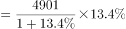万人次，与C项最接近。

故正确答案为C。

---

#### 第 7 题　qid 2452571 · 增长

2013-2018年江苏9个民航机场中旅客吞吐量逐年增加的机场个数是

- **A**. 6个
- **B**. 7个　✅
- **C**. 8个
- **D**. 9个

**答案**：B

**官方解析**

定位表格资料可得2013-2018年江苏9个民航机场每年旅客吞吐量情况。由表格数据可得，旅客吞吐量逐年增加的机场是南京禄口、无锡硕放、南通兴东、徐州观音、扬州泰州、盐城南洋、连云港白塔埠，共7个。
故正确答案为B。

---

#### 第 8 题　qid 2452576 · 增长

2019年1-10月，华东地区民航机场旅客吞吐量同比增速最慢的省（市）是

- **A**. 上海　✅
- **B**. 江西
- **C**. 福建
- **D**. 山东

**答案**：A

**官方解析**

根据题干“2019年1—10月······同比增速最慢的省（市）是”，可判定本题为一般增长率比较问题。定位文字资料“2019年1-10月，江苏民航机场旅客吞吐量4901万人次，同比增长，增速······比上海高9.7个百分点······比山东高4.4个百分点，比福建高8.7个百分点，比江西高6.9个百分点”，则2019年1-10月，选项中各省（市）民航机场旅客吞吐量的同比增速分别为：A项，上海为；B项，江西为；C项，福建为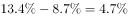；D项，山东为。同比增速最慢的是上海。

故正确答案为A。

---

#### 第 9 题　qid 2452582 · 增长

2013-2018年江苏9个民航机场中旅客吞吐量年均增速最快的机场是

- **A**. 南京禄口
- **B**. 南通兴东
- **C**. 扬州泰州　✅
- **D**. 盐城南洋

**答案**：C

**官方解析**

根据题干“2013—2018年······年均增速最快的机场是”，可判定本题为年均增长率比较问题。根据公式：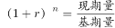，年份差（）相同，比较年均增速大小只需比较。定位表格资料可知，2012年南京禄口民航机场旅客吞吐量为1400万人次，2018年为2858万人次；2012年南通兴东民航机场旅客吞吐量为39万人次，2018年为277万人次；2012年扬州泰州民航机场旅客吞吐量为25万人次，2018年为238万人次；2012年盐城南洋民航机场旅客吞吐量为32万人次，2018年为182万人次。选项中各机场2013-2018年旅客吞吐量的分别为：A项，南京禄口为；B项，南通兴东为；C项，扬州泰州为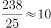；D项，盐城南洋为。旅客吞吐量年均增速最快的机场是扬州泰州。

故正确答案为C。

---

#### 第 10 题　qid 2452588 · 综合

从上述资料中能够推出的是

- **A**. 2019年1-10月安徽民航机场旅客吞吐量在华东地区同比增加最多
- **B**. 2018年南京禄口民航机场旅客吞吐量大于江苏其他8个民航机场之和　✅
- **C**. 2019年1-10月上海民航机场旅客吞吐量占华东地区的比重同比有所提高
- **D**. 2013-2018年常州奔牛民航机场旅客吞吐量年均增量比连云港白塔埠的多2倍多

**答案**：B

**官方解析**

A项：定位文字资料，华东地区中除江苏外，其余省市仅给出2019年1-10月民航机场旅客吞吐量同比增速与江苏民航机场同比增速的关系，无法推出同比增长量的大小关系，错误。

B项：定位表格资料可知各民航机场2018年旅客吞吐量数据。南京禄口民航机场为2858万人次，其余8个民航机场旅客吞吐量之和为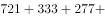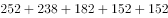万人次，因此2018年南京禄口民航机场旅客吞吐量大于江苏其他8个民航机场之和，正确。

C项：定位文字资料“2019年1-10月，江苏民航机场旅客吞吐量4901万人次，同比增长，增速比华东地区（六省一市）高6.2个百分点，比上海高9.7个百分点”，则华东地区同比增速为，上海同比增速为，根据两期比重比较结论，部分增长率（）整体增长率（），比重同比下降，错误。

D项：定位表格资料可知，2012年常州奔牛民航机场旅客吞吐量为108万人次，2018年为333万人次；2012年连云港白塔埠民航机场旅客吞吐量为48万人次，2018年为152万人次。根据公式：年均增长量，2013-2018年常州奔牛民航机场旅客吞吐量年均增量万人次，连云港白塔埠民航机场旅客吞吐量年均增量万人次，前者比后者多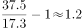倍，错误。

故正确答案为B。

---

### 材料 3

        2019年2月中下旬，某市统计局随机抽取2000名在该市居住半年以上的18～65周岁居民，就其2019年春节期间的消费情况进行了调查。调查结果显示：与上年春节相比，的受访居民消费支出有所增加，的受访居民消费支出基本持平。

                                                     

                                                                          

#### 第 11 题　qid 2452646 · 综合

受访居民中，2019年春节期间消费支出多于上年的人数与少于上年的人数相差：

- **A**. 274人
- **B**. 292人　✅
- **C**. 594人
- **D**. 886人

**答案**：B

**官方解析**

根据题干“受访居民中······人数相差”，结合文字材料“的受访居民消费支出有所增加，的受访居民消费支出基本持平”，可判定本题为现期比重问题。2019年春节期间消费支出少于上年的人数占比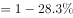，消费支出多于上年的人数消费支出少于上年的人数人。

故正确答案为B。

---

#### 第 12 题　qid 2452647 · 综合

2019年春节期间有“餐饮消费”的受访居民中，一定有人：

- **A**. 参加教育培训　✅
- **B**. 去旅游
- **C**. 购保健产品
- **D**. 购数码产品、智能家电

**答案**：A

**官方解析**

根据题干“2019年······受访居民中······”，结合选项为不同消费项目，可判定本题为现期比重问题。定位图2，2019年春节期间不同消费项目中有“消费餐饮”的受访居民占比为；结合选项，受访居民参加教育培训的占比为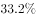，二者占比之和为，超过整体，说明二者之间必然有交集，也就是说，春节期间有“餐饮消费”的受访居民中，一定有人参加教育培训。

故正确答案为A。

---

#### 第 13 题　qid 2452648 · 综合

2019年春节期间消费支出在2000元以下的受访居民中，“发红包、给压岁钱”的至少占

- **A**. 
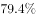

- **B**. 
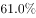

- **C**. 

- **D**. 

　✅

**答案**：D

**官方解析**

根据题干“2019年······至少占”，结合选项为百分数，可判定本题为现期比重问题。定位图1可知春节期间消费支出在2000元以下的受访居民占比为，则消费支出在2000元以下的受访居民人数为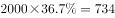人；定位图2可知“发红包、给压岁钱”的受访居民占比为，则“发红包、给压岁钱”的受访居民人数为人，因为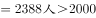人，证明消费支出在2000元以下的受访居民与发红包、给压岁钱的受访居民有交集，所以消费支出在2000元以下的受访居民中，“发红包、给压岁钱”的人数至少为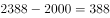人，所求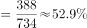。

故正确答案为D。

---

#### 第 14 题　qid 2452649 · 综合

2019年春节期间消费支出在5000元以上的受访居民人数有可能是：

- **A**. 320人
- **B**. 388人　✅
- **C**. 420人
- **D**. 456人

**答案**：B

**官方解析**

根据题干“2019年······受访居民人数······”，可判断本题为现期比重问题。定位文字资料可知受访居民人数为2000人。定位图1可得，5000~8000元、8000~11000元、11000元以上的人数占受访居民的比重分别为、和，根据公式：部分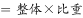，可得该部分受访市民人数为人。说不清的人数占受访居民的比重为，人数为人，故消费支出在5000元以上的受访居民人数应大于或等于378人且小于或等于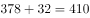人。结合选项，只有B项388人在此范围内。

故正确答案为B。

---

#### 第 15 题　qid 2452651 · 综合

关于2019年春节期间消费，从上述资料中能够推出的是：

- **A**. 
“购年俗食品、烟酒、服饰”的受访居民中没有人消费支出超过8000元

- **B**. 
消费支出与上年基本持平的受访居民中有16人消费支出为2000-5000元

- **C**. 
受访居民中去“看电影、滑雪、逛庙会”的比“参加教育培训”的多400人
　✅
- **D**. 
至少有的受访居民同时选择“购保健产品”“购数码产品、智能家电”和“去旅游”

**答案**：C

**官方解析**

A项：定位图2可知，“购年俗食品、烟酒、服饰”的受访居民占比为；定位图1可知，消费支出超过8000元，一定包括消费支出8000~11000元和11000元以上，表示“说不清”的受访居民也有可能有人的消费支出超过8000元，他们的占比分别为、、，三者占比之和为；“购年俗食品、烟酒、服饰”的受访居民和消费支出可能超过8000元受访居民占比之和至多为，小于整体，所以二者之间可能没有交集，故不能确定“购年俗食品、烟酒、服饰”的受访居民中有没有人消费支出超过8000元，错误。

B项：定位文字资料可知，的受访居民消费支出与上年基本持平；定位图1可知消费支出为2000~5000元的受访者占比为，因为，所以二者有交集，可以确定消费支出与上年基本持平的受访居民中有消费支出为2000~5000元的人，但无法确定具体人数，错误.

C项：定位图2可知，受访居民中去“看电影、滑雪、逛庙会”的占比为，受访居民中“参加教育培训”的占比为，二者人数相差人，正确.

D项：定位图2可知，“购保健产品”的受访居民占比为，“购数码产品、智能家电”的受访居民占比为，“去旅游”的受访居民占比为，三者占比之和为，故三者之间可能没有交集，无法确定关系，错误。

故正确答案为C。

---

### 材料 4

        2019年上半年，全国快递业务量完成277.5亿件，同比增长25.7%；业务收入完成3396.7亿元，同比增长23.7%。6月份，全国快递业务量完成54.6亿件，同比增长29.1%；业务收入完成643.2亿元，同比增长26.5%。

        2019年6月，国家邮政局和各省（区、市）邮政管理局接到消费者对快递服务问题申诉42840件，环比下降0.3%，同比下降10.1%；处理的申诉中，有效申诉量1479件，环比下降5.7%，同比下降68.5%。

#### 第 16 题　qid 2452581 · 增长

2019年上半年，全国异地快递业务量同比增长（  ）

- **A**. 24.9%
- **B**. 29.7%
- **C**. 33.8%　✅
- **D**. 36.1%

**答案**：C

**官方解析**

根据题干“2019年上半年······同比增长”，结合选项是百分数，可判定本题为一般增长率计算问题。定位图形资料可得，2019年上半年全国异地快递业务量为220.4亿件，2018年上半年全国异地快递业务量为164.7亿件，根据公式：增长率，所求。

故正确答案为C。

---

#### 第 17 题　qid 2452590 · 增长

2019年上半年，快递业务收入同比增长最快、最慢的地区分别是（  ）

- **A**. 东部地区、中部地区
- **B**. 东部地区、西部地区　✅
- **C**. 中部地区、东部地区
- **D**. 中部地区、西部地区

**答案**：B

**官方解析**

根据题干“2019年上半年······同比增长最快、最慢······”，可判定本题为一般增长率比较问题。设2019年上半年全国快递业务总收入为A，2018年上半年全国快递业务总收入为B，定位文字资料第一段可知，2019年上半年全国快递业务收入同比增长23.7%，即=23.7%；定位表格资料可得2018年上半年、2019年上半年各地区快递业务收入占比，结合公式：部分=整体×比重，增长率，可得各地区快递业务收入同比增长率如下：

东部地区：增长率，即东部地区快递业务收入增长率大于23.7%；

中部地区：增长率；

西部地区：增长率，即西部地区快递业务收入增长率小于23.7%。

故快递业务收入同比增长最快的地区为东部地区，最慢的地区为西部地区。

故正确答案为B。

---

#### 第 18 题　qid 2452595 · 综合

2018年上半年，中部地区快递业务收入为（  ）

- **A**. 236.1亿元
- **B**. 285.3亿元
- **C**. 304.8亿元　✅
- **D**. 377.0亿元

**答案**：C

**官方解析**

根据题干“2018年上半年······收入为”，结合资料时间为2019年，可判定本题为基期计算问题。定位文字资料第一段可得，2019年上半年全国快递业务收入完成3396.7亿元，同比增长，根据公式：，2018年上半年全国快递业务收入为亿元；定位表格资料可得，中部地区2018年上半年业务收入占比为，根据公式：部分=整体×比重，2018年上半年中部地区快递业务收入为亿元。

故正确答案为C。

---

#### 第 19 题　qid 2452599 · 综合

2018年6月，国家邮政局和各省（区、市）邮政管理局处理的快递服务有效申诉量为（  ）

- **A**. 1479件
- **B**. 2568件
- **C**. 3159件
- **D**. 4695件　✅

**答案**：D

**官方解析**

根据题干“2018年6月······有效申诉量为”，结合资料时间为2019年，可判定本题为基期计算问题。定位文字资料第二段可得，2019年6月，国家邮政局和各省（区、市）邮政管理局处理的快递服务有效申诉量1479件，同比下降68.5%，根据公式：，故所求件。

故正确答案为D。

---

#### 第 20 题　qid 2452601 · 综合

从上述资料不能推出的是（  ）

- **A**. 2019年上半年，东部地区快递业务平均每件收入同比增加　✅
- **B**. 2019年上半年，全国同城快递业务量的比重同比降低
- **C**. 2019年上半年，西部地区快递业务量和快递业务收入的比重都同比降低
- **D**. 2019年5月，国家邮政局和各省（区、市）邮政管理局接到消费者对快递服务问题申诉不足44000件

**答案**：A

**官方解析**

A项：定位文字资料第一段可知，2019年上半年，全国快递业务量完成277.5亿件，同比增长；业务收入完成3396.7亿元，同比增长；定位表格资料可知东部地区业务量及业务收入占比。根据公式：平均每件收入，2019年上半年东部地区快递业务平均每件收入为元；2018年上半年东部地区快递业务平均每件收入为=≈元，故2019年上半年，东部地区快递业务平均每件收入同比降低，错误。

B项：定位图形资料可知，2019年上半年同城快递业务量为50.8亿件，2018年上半年同城快递业务量为50.9亿件，则同城快递业务量增速为=；定位文字资料第一段可得，2019年上半年，全国快递业务量同比增长；根据两期比重比较方法可知，，，即，故比重同比降低，正确。

C项：定位表格资料可知，西部地区2019年上半年、2018年上半年业务量占比分别为、，2019年上半年、2018年上半年业务收入占比分别为、，故西部地区快递业务量和快递业务收入的比重都同比降低，正确。

D项：定位文字资料第二段可知，2019年6月，国家邮政局和各省（区、市）邮政管理局接到消费者对快递服务问题申诉42840件，环比下降。根据公式：，2019年5月接到消费者对快递服务问题申诉件，由于远小于，所以件，正确。

本题为选非题，故正确答案为A。

---
