# 2020年江苏省公务员录用考试《行测》题（B类）（网友回忆版）

> 省考 · 2020 年 · 6 个模块 · 共 134 题

- [政治理论](#%E6%94%BF%E6%B2%BB%E7%90%86%E8%AE%BA) · 3 题
- [常识判断](#%E5%B8%B8%E8%AF%86%E5%88%A4%E6%96%AD) · 12 题
- [言语理解与表达](#%E8%A8%80%E8%AF%AD%E7%90%86%E8%A7%A3%E4%B8%8E%E8%A1%A8%E8%BE%BE) · 30 题
- [数量关系](#%E6%95%B0%E9%87%8F%E5%85%B3%E7%B3%BB) · 19 题
- [判断推理](#%E5%88%A4%E6%96%AD%E6%8E%A8%E7%90%86) · 50 题
- [资料分析](#%E8%B5%84%E6%96%99%E5%88%86%E6%9E%90) · 20 题

---

## 政治理论

### 第 1 题　qid 2452626 · 时事政治

党的十九届四中全会通过了《坚持和完善中国特色社会主义制度、推进国家治理体系和治理能力现代化若干重大问题的决定》。关于该《决定》的内容，下列说法正确的是
①阐述了我国国家制度和国家治理体系发展的历史性成就和显著优势
②提出了推进国家治理体系和治理能力现代化的重大意义和总体要求
③回答了什么是社会主义和怎样建设社会主义这个重大政治问题
④明确了各项制度必须坚持和巩固的根本点、完善和发展的方向

- **A**. ①②③
- **B**. ①②④　✅
- **C**. ①③④
- **D**. ②③④

**答案**：B

**官方解析**

本题考查政治常识。
①②④正确，习近平总书记在《关于&lt;中共中央关于坚持和完善中国特色社会主义制度,推进国家治理体系和治理能力现代化若干重大问题的决定&gt;的说明》一文中指出：“决定稿由15部分构成，分为三大板块。第一板块为第一部分，是总论，主要阐述中国特色社会主义制度和国家治理体系发展的历史性成就、显著优势，提出新时代坚持和完善中国特色社会主义制度、推进国家治理体系和治理能力现代化的重大意义和总体要求。第二板块为分论，聚焦坚持和完善支撑中国特色社会主义制度的根本制度、基本制度、重要制度，安排了13个部分，明确了各项制度必须坚持和巩固的根本点、完善和发展的方向，并作出工作部署。第三板块为第十五部分和结束语，主要就加强党对坚持和完善中国特色社会主义制度、推进国家治理体系和治理能力现代化的领导提出要求。”
③错误，邓小平理论回答了什么是社会主义和怎样建设社会主义这个重大政治问题。
故正确答案为B。

---

### 第 2 题　qid 2452666 · 新思想

习近平总书记指出，涉及群众的问题，要准确把握社会心态和群众情绪，充分考虑执法对象的切身感受，推行人性化执法、阳光执法。但是，不论怎么做，对违法行为一定要严格尺度、依法处理。对此，下列理解正确的是

- **A**. 社会心态和群众情绪是执法的基本出发点
- **B**. 执法对象的切身感受是影响执法的决定性因素
- **C**. 人性化执法、阳光执法是实现执法目的的根本保障
- **D**. 严格尺度、依法处理是执法的根本要求　✅

**答案**：D

**官方解析**

本题考查政治常识。
A项错误，社会心态和群众情绪是在执法过程中涉及到群众问题时，需要准确把握的因素，但其并非是执法的基本出发点。在社会主义国家，执法的权力来自于人民，执法必须立足于为人民服务，以人民利益为根本的出发点。
B项错误，充分考虑执法对象的亲身感受，是为了推行人性化执法和柔性执法，防止恶性事件发生，其并非是影响执法的决定性因素。
C项错误，人性化执法、阳光执法是实现执法目的的重要条件，但并非根本保障。
D项正确，题干中强调“不论怎么做”，对违法行为一定要严格尺度、依法处理，可见，习近平总书记强调的是“严格尺度、依法处理”，这是执法的根本要求。
故正确答案为D。

---

### 第 3 题　qid 2452667 · 新思想

前不久，中央政治局召开会议分析研究当前经济形势，重申了宏观政策要稳、微观政策要活、社会政策要托底的总体思路。下列体现“微观政策要活”这一政策思路的是

- **A**. 避免过度投放货币，以防经济出现大幅度的波动
- **B**. 阶段性提高财政赤字，弥补降税带来的财政减收
- **C**. 鼓励创业和创新，有针对性地加大对企业的扶持　✅
- **D**. 对弱势群体提供普遍的社会保障，解决市场失灵

**答案**：C

**官方解析**

本题考查经济常识。
A项错误，“避免过度投放货币”，即控制货币发行量，是货币政策的内容之一，体现的是“宏观政策要稳”，也就是实施稳健的货币政策。
B项错误，“提高财政赤字”是财政政策的内容之一，体现的是“宏观政策要稳”，也就是实施积极的财政政策。
C项正确，企业等微观市场主体是社会财富的创造者，是经济发展的基石。通过鼓励创业和创新，针对性地加大对企业的扶持，可以全面搞活微观经济，助推企业顺利度过结构调整阵痛期，体现的正是“微观经济要活”这一政策思路。
D项错误，“对弱势群体提供普遍的社会保障”是为困难群众提供基本生活保障，通过社会保障政策“托底”，让全体人民共享改革发展成果，维护社会和谐稳定，体现的是“社会政策要托底”。
故正确答案为C。

---

## 常识判断

### 第 1 题　qid 2452631 · 人文常识

2019年10月31日，国务院决定开展第七次全国人口普查。关于第七次全国人口普查，下列说法不正确的是

- **A**. 标准时点是2020年11月1日零时
- **B**. 普查对象不含在境内定居的外国人　✅
- **C**. 将首次采集普查对象的身份证号码
- **D**. 采取电子化方式开展人口普查登记

**答案**：B

**官方解析**

本题考查政治常识。
A项正确，2020年第七次全国人口标准时点是2020年11月1日零时普查。
B项错误，普查对象是普查标准时点在中华人民共和国境内的自然人以及在中华人民共和国境外但未定居的中国公民，不包括在中华人民共和国境内短期停留的境外人员。
C项正确，为了提高普查数据质量，在全国第七次人口普查中将首次采集普查对象的身份证号码。
D项正确，国务院决定于2020年开展第七次全国人口普查。本次全国人口普查采取电子化方式开展普查登记，探索使用智能手机采集数据。
本题为选非题，故正确答案为B。

---

### 第 2 题　qid 2452668 · 法律常识

2019年7月，中共中央办公厅、国务院办公厅印发了《关于加快推进公共法律服务体系建设的意见》，明确提出了公共法律服务体系建设的总体要求、基本原则和主要目标。下列关于公共法律服务体系的说法，不正确的是

- **A**. 公共法律服务是全面依法治国的基础性、服务性和保障性工作
- **B**. 公共法律服务体系建设需要由政府主导、其他社会主体积极参与
- **C**. 公共法律服务的重点对象是低收入群体等特殊群体
- **D**. 公共法律服务体系提供的是免费的公益性法律服务　✅

**答案**：D

**官方解析**

本题考查政治。
A项正确，《关于加快推进公共法律服务体系建设的意见》指出：“公共法律服务是政府公共职能的重要组成部分，是保障和改善民生的重要举措，是全面依法治国的基础性、服务性和保障性工作。”
B项正确，《关于加快推进公共法律服务体系建设的意见》指出：“坚持政府主导、社会参与，落实政府推进公共法律服务体系建设的主体责任，激发各类社会主体参与公共法律服务的积极性。”
C项正确，《关于加快推进公共法律服务体系建设的意见》指出：“保障特殊群体的基本公共法律服务权益。将低收入群体、残疾人、农民工、老年人、青少年、单亲困难母亲等特殊群体和军人军属、退役军人及其他优抚对象作为公共法律服务的重点对象。”
D项错误，《关于加快推进公共法律服务体系建设的意见》指出：“保障特殊群体的基本公共法律服务权益······引导律师、公证员、司法鉴定人、基层法律服务工作者自觉履行社会责任，积极参与公益性法律服务。”可见公益性法律服务是针对特殊群体提供的服务，而公共法律服务体系的总体目标，则是“建设覆盖城乡、便捷高效、均等普惠的现代公共法律服务体系”，并非是提供免费的法律服务。
本题为选非题，故正确答案为D。

---

### 第 3 题　qid 2452669 · 人文常识

当今世界不稳定不确定因素明显增加，我们要坚持底线思维，居安思危、未雨绸缪，做好应付最坏局面的思想准备。下列表述体现了坚持底线思维的是

- **A**. 政治建设方面绝不能犯颠覆性错误　✅
- **B**. 经济建设方面努力实现高质量发展
- **C**. 文化建设方面要繁荣社会主义文艺
- **D**. 外交战略方面构建人类命运共同体

**答案**：A

**官方解析**

本题考查政治常识。
A项正确，政治安全攸关党和国家的安危，是维护国家安全的根本。如果在事关全局的政治问题上随波逐流，丧失原则和立场，就会严重危害党和人民事业的发展。因此政治建设决不能犯颠覆性错误，这是一种底线。
BCD项错误，底线思维具有目的性、价值性，以实现和维护一定利益和价值为旨归。坚持和发展中国特色社会主义，全面建成社会主义现代化强国，实现中华民族伟大复兴的中国梦，是我们坚持底线思维的总体价值目标。这一总体价值目标，是通过经济、政治、文化、社会、生态文明各个方面建设来体现和实现的。BCD项不属于坚持底线思维，是为了实现总体价值目标在经济、文化、外交战略建设方面的表现。
故正确答案为A。

---

### 第 4 题　qid 2452636 · 人文常识

1949年3月，中共中央和毛泽东离开西柏坡前往北平进驻香山。在香山的半年时间里，发生的一系列重大历史事件在党和国家历史上具有非常重要的地位。下列发生在这一时期的重大历史事件是
①毛泽东、朱德发布向全国进军的命令，吹响了解放全中国的伟大号角
②召开了党的七届二中全会，规定了党在全国胜利后应当采取的基本政策
③毛泽东发表了《论人民民主专政》，为新中国建立奠定了理论和政策基础
④制定了《中国人民政治协商会议共同纲领》，描绘了建立建设新中国的蓝图

- **A**. ①②③
- **B**. ①②④
- **C**. ①③④　✅
- **D**. ②③④

**答案**：C

**官方解析**

本题考查毛中特。
①、③、④正确，2019年9月12日，中共中央总书记、国家主席、中央军委主席习近平专程前往北京香山革命纪念地，瞻仰双清别墅、来青轩等革命旧址，参观香山革命纪念馆。他表示，1949年3月23日，中共中央和毛泽东同志离开西柏坡前往北平，25日进驻北京香山，这里成为党中央所在地。在这里，毛泽东、朱德同志发布向全国进军的命令，吹响了“打过长江去，解放全中国”的伟大号角，中国人民解放军以摧枯拉朽之势向全国各地胜利大进军，彻底结束了国民党在大陆的统治。在这里，毛泽东同志发表了《论人民民主专政》，为新中国的建立奠定理论基础和政策基础。在这里，中共中央同各民主党派、各界人士共同筹备中国人民政治协商会议，制定通过了起到临时宪法作用的《中国人民政治协商会议共同纲领》，确定了新中国的国体和政体，制定了一系列基本政策，描绘了建立建设新中国的宏伟蓝图。
②错误，党的七届二中全会于1949年3月5日—13日在河北西柏坡召开。这次会议规定了党在全国胜利以后在政治、经济、外交方面应当采取的基本政策，为夺取全国革命的胜利，推动新民主主义革命向社会主义革命转变，奠定了政治上和思想上的基础。此次会议在西柏坡召开，因此不属于离开西柏坡前往北平进驻香山后发生的重大历史事件。
故正确答案为C。

---

### 第 5 题　qid 2452637 · 人文常识

人们常常引用希腊典故来分析当今世界的现实问题。下列希腊典故与其寓意对应正确的是

- **A**. 潘多拉的盒子——世事变幻无常
- **B**. 阿喀琉斯之踵——强大事物的软肋　✅
- **C**. 修昔底德陷阱——安静祥和背后暗藏的风险
- **D**. 达摩克利斯之剑——守成大国与崛起大国必有一战

**答案**：B

**官方解析**

本题考查人文常识。
A项错误，潘多拉，希腊神话中的第一个女人。她貌美性诈，私自打开宙斯送给她的一只盒子，里面装的疾病、疯狂、罪恶、嫉妒等祸患，一齐飞出，只有希望留在盒底，人间因此充满灾难。因此“潘多拉的盒子”成为“灾祸的来源”的同义语。
B项正确，荷马史诗中的英雄阿喀琉斯出生后便被神仙母亲倒提着浸入冥河，而脚后跟却不慎露在水外，因而除脚后跟外，全身各处刀枪不入。后来，一次战斗中他被人一箭射中脚踝而死去。后人用阿喀琉斯之踵喻指即使再强大的英雄，也有致命的死穴或软肋。
C项错误，“修昔底德陷阱”，指一个新崛起的大国必然要挑战现存大国，而现存大国也必然会回应这种威胁，这样战争变得不可避免。此说法源自古希腊著名历史学家修昔底德，他认为，当一个崛起的大国与既有的统治霸主竞争时，双方面临的危险多数以战争告终。
D项错误，古希腊传说中迪奥尼修斯国王请他的大臣达摩克利斯赴宴，命其坐在用一根马鬃悬挂的一把寒光闪闪的利剑下，意指令人处于一种危机状态，随时要有危机意识。达摩克利斯之剑比喻安逸祥和背后存在的杀机和危险，告诫人们要经常反思潜在的风险并化解之。现也引申为做坏事的人随时都有可能受到惩罚。
故正确答案为B。

---

### 第 6 题　qid 2452652 · 人文常识

我国在区块链领域拥有良好基础，要加快推动区块链技术和产业创新发展，积极推进区块链和经济社会融合发展。关于区块链的特征和作用，下列说法不正确的是

- **A**. 省去第三方中间环节，降低交易成本
- **B**. 打通部门间的数据壁垒，实现信息共享
- **C**. 解决经济社会发展中的“存证”难题，维护社会秩序
- **D**. 排除管理员外任何人修改信息的可能性，确保信息安全　✅

**答案**：D

**官方解析**

本题考查科技常识。
A项正确，区块链技术通过“去中心化”和“点对点”的特征，进一步减少中间环节，消除了第三方交易中介存在的必要性，从而降低交易成本。因为实现了点对点的交易，中央处理或清算组织成为冗余；因为交易的真实性是由区块链上所有参与者共同验证和维护的，所以作为第三方的信用中介也失去了存在价值。
B项正确，区块链“分布式”的特点，可以打通部门间的“数据壁垒”，实现信息和数据共享。与中心化的数据存储不同，区块链上的信息都会通过点对点广播的形式分布于每一个节点，通过“全网见证”实现所有信息的“如实记录”。在公共服务领域，区块链能够实现政务数据跨部门、跨区域共同维护和利用，为人民群众带来更好的政务服务体验。
C项正确，区块链“不可篡改”的特点，为经济社会发展中的“存证”难题提供了解决方案。只要能够确保上链信息和数据的真实性，那么区块链就可以解决信息的“存”和“证”难题。比如在版权领域，区块链可以用于电子证据存证，可以保证不被篡改，并通过分布式账本链接原创平台、版权局、司法机关等各方主体，可以大大提高处理侵权行为的效率。在金融、司法、医疗、版权等对数据真实性要求高的领域，区块链都可以创造安全、高效的应用场景。
D项错误，区块链通过时间戳保证每个区块依次顺序相连。时间戳使区块链上每一笔数据都具有时间标记。简单来说，时间戳证明了区块链上什么时候发生了什么事情，且任何人无法篡改，甚至管理员也无法修改。
本题为选非题，故正确答案为D。

---

### 第 7 题　qid 2452670 · 人文常识

以下是某执法部门对市民网络投诉的回复情况：

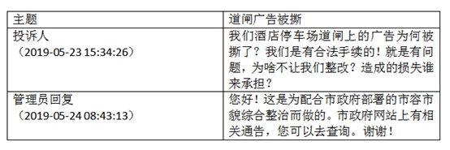

下列对管理员回复的评价，正确的是

- **A**. 合情合理，明确表明了执法的合法依据
- **B**. 内容完整，能准确告知执法信息的查询途径
- **C**. 格式规范，但未具体说明执法的正当理由
- **D**. 回复及时，但内容避重就轻并缺乏针对性　✅

**答案**：D

**官方解析**

本题考查法律常识。根据《信访工作条例》第十七条规定：“公民、法人或者其他组织可以采用信息网络、书信、电话、传真、走访等形式，向各级机关、单位反映情况，提出建议、意见或者投诉请求，有关机关、单位应当依规依法处理。”第三十四条规定：“对本条例第三十一条第六项规定的信访事项应当自受理之日起60日内办结；情况复杂的，经本机关、单位负责人批准，可以适当延长办理期限，但延长期限不得超过30日，并告知信访人延期理由。”案件中，投诉时间是5月23日，处理时间是5月24日，回复及时。但回复的内容，缺乏针对性。只说了配合市政府工作，但对于老百姓提出的三个问题，为啥撕，为啥不让整改，损失谁承担并未一一作答。
AB选项错误，该回复缺乏针对性，因此，内容不完整，也不够合情合理。
C选项错误，回复中说明了执法的理由，即配合市政府工作。
故正确答案为D。

---

### 第 8 题　qid 2452671 · 法律常识

赵某被依法列为失信联合惩戒对象。据此，有关部门可以对他采取的合法措施是

- **A**. 教育管理部门禁止赵某的孩子就读重点学校
- **B**. 用人单位取消赵某的年终绩效工资
- **C**. 人民法院将赵某的失信情况通报其配偶所在单位
- **D**. 某机关拒绝录用赵某为公务员　✅

**答案**：D

**官方解析**

本题考查法律。
A项错误，根据《关于对失信被执行人实施联合惩戒的合作备忘录》规定：“（二十三）限制失信被执行人及失信被执行人的法定代表人、主要负责人、影响债务履行的直接责任人员、实际控制人的子女就读高收费私立学校，由最高人民法院、教育部实施。”由此可见，并不是禁止就读重点学校，而是禁止就读高收费私立学校。
B项错误，根据《关于对失信被执行人实施联合惩戒的合作备忘录》规定：“（十八）禁止参评文明单位、道德模范。对于机关、企事业单位、社会团体或其领导成员为失信被执行人的，不得参加文明单位评选，已经取得文明单位荣誉称号的予以撤销。各类失信被执行人均不得参加道德模范评选，已获得道德模范荣誉称号的予以撤销。由中央宣传部、中央文明办实施。”用人单位不能因为失信原因取消失信人年终绩效工资，但可以撤销荣誉称号，取消评优评先资格。
C项错误，根据《关于对失信被执行人实施联合惩戒的合作备忘录》规定：“（十五)通过‘信用中国’网站和企业信用信息公示系统向社会公布，将失信被执行人信息通过信用中国网站、企业信用信息公示系统向社会公布，由国家发展改革委、工商总局实施。（十六）通过主要新闻网站向社会公布：协调相关互联网新闻信息服务单位向社会公布失信被执行人信息，由国家网信办实施。”可见备忘录中没有规定要将信息通知配偶单位。
D项正确，根据《关于对失信被执行人实施联合惩戒的合作备忘录》规定：“（十七）限制招录（聘）为公务员或事业单位工作人员。协助限制招录（聘）失信被执行人为公务员或事业单位工作人员，由中组部、人力资源社会保障部、公务员局等有关部门实施。”失信人无法报考公务员，会被限制，只有在限制消除后才能恢复正常。
故正确答案为D。

---

### 第 9 题　qid 2452672 · 人文常识

某市交警在设卡检查酒驾时，有人驾驶摩托车行驶到检查点前，突然掉头并加速逆行。对此情形，下列执勤交警的做法恰当的是

- **A**. 为避免发生执法风险，放弃对该摩托车的检查
- **B**. 详细记录现场执法情况，及时作出处置　✅
- **C**. 将路边的共享单车推向路面，阻止摩托车逃跑
- **D**. 立即追击拦阻，防止发生酒驾事故

**答案**：B

**官方解析**

本题考查法律常识。
 A项错误，在交警检查时，有人驾驶摩托车加速逆行，逃避交警的检查，该人的行为有违法的嫌疑，涉嫌酒驾或者其他违法行为，执勤交警应及时处理这种情况，放弃对摩托车的检查、让该摩托车逆行可能会造成交通事故的发生。
B项正确，《道路交通安全违法行为处理程序规定》第十五条第一款规定：“公安机关交通管理部门可以利用交通技术监控设备收集、固定违法行为证据。”交警在遇到本题中的情况，应利用执法记录仪等设备详细记录现场执法情况，可以向交通管理部门反映、联合其他路口交警等，对该摩托车的车主作出处置。
C项错误，将共享单车推向路面会在路面上形成障碍，影响其他车辆的通行，也会影响周围行人使用共享单车。
D项错误，该摩托车车主是加速逆行，若交警及时追击，两辆车的逆行在公路上会影响其他车辆的正常出行，容易引发交通事故，造成交通混乱。
故正确答案为B。

---

### 第 10 题　qid 2452673 · 法律常识

1965年，老周自建了一套房屋。2017年，老周的房屋被划入旧城改造范围。因无产权证和土地使用证，该房屋被认定为违法建筑，城管部门依据2008年施行的《城乡规划法》，责令老周限期拆除。对此，下列说法正确的是

- **A**. 老周的房屋属于违法建筑，应当责令其自行拆除
- **B**. 因旧城改造，认定老周的房屋为违法建筑已无实际意义
- **C**. 城管部门适用法律错误，限期拆除的决定无效　✅
- **D**. 老周的房屋属历史遗留问题，不能得到拆迁补偿

**答案**：C

**官方解析**

本题考查法律常识。
A项错误，老周的房屋自建于1965年，在2008年《城乡规划法》颁布施行前已建成，根据法不溯及既往的原则，无法依据2008年颁布的《城乡规划法》认定老周的房屋为违法建筑。
B项错误，是否认定为违法建筑，关系到老周能否获得拆迁补偿，因此，无实际意义的说法错误。
C项正确，根据法不溯及既往的原则，城管部门适用法律错误，因此城管部门作出的限期拆除决定无效。
D项错误，老周的房屋属于历史遗留问题，但如果根据1965年法律，老周房屋属于合法房屋的，拆迁时应当给予补偿。
故正确答案为C。

---

### 第 11 题　qid 2452674 · 人文常识

老丁将自家临街的一间房屋改为商店，里面的一间房屋用于居住，并办理了合法经营手续。前不久，有消费者举报老丁商店有假冒商品出售，经查，举报属实。对此，市场监督管理部门可以作出的行为是

- **A**. 查封商店并扣留假冒商品
- **B**. 冻结商店或老丁的银行账户
- **C**. 没收商店的营业收入
- **D**. 责令老丁暂停营业　✅

**答案**：D

**官方解析**

本题考查法律常识。根据《消费者权益保护法》第五十六条规定：“经营者有下列情形之一，除承担相应的民事责任外，其他有关法律、法规对处罚机关和处罚方式有规定的，依照法律、法规的规定执行；法律、法规未作规定的，由工商行政管理部门或者其他有关行政部门责令改正，可以根据情节单处或者并处警告、没收违法所得、处以违法所得一倍以上十倍以下的罚款，没有违法所得的，处以五十万元以下的罚款；情节严重的，责令停业整顿、吊销营业执照：······（二）在商品中掺杂、掺假，以假充真，以次充好，或者以不合格商品冒充合格商品的······”
A、B两项错误，采用查封、扣押、冻结等行政强制措施是对财物实施暂时性控制，而老丁商店销售假冒商品已经查证属实，市场监督管理部门应当直接做出行政处罚，而非采取行政强制措施。
C项错误，市场监督管理部门可以做出没收违法所得的处罚，但不得没收商店的营业收入。
D项正确，如果情节严重，市场监督管理部门可以做出责令暂停营业的处罚。
故正确答案为D。

---

### 第 12 题　qid 2452655 · 法律常识

某区教育局将学区调整的情况张贴在各学校门口。刘某的住房被划入新的学区，但他没有及时了解情况，将房屋低价卖给了王某。对此，下列说法正确的是

- **A**. 刘某认为区教育局公开学区信息不当，有权提起行政诉讼　✅
- **B**. 区教育局公开学区信息的行为构成行政不作为
- **C**. 刘某有权以重大误解为由，解除与王某的房屋买卖合同
- **D**. 区教育局应对刘某的损失承担赔偿责任

**答案**：A

**官方解析**

本题考查法律常识。
A项正确，根据《政府信息公开条例》第五十一条规定：“公民、法人或者其他组织认为行政机关在政府信息公开工作中侵犯其合法权益的，可以向上一级行政机关或者政府信息公开工作主管部门投诉、举报，也可以依法申请行政复议或者提起行政诉讼。”因此，如果刘某认为教育局做法不当的，有权提起行政诉讼。
B项错误，行政不作为是指行政机关应当履行职责而不履行或者拖延履行职责。区教育局主动公开学区，并不存在不作为。
C项错误，根据《民法典》第一百四十七条规定：“基于重大误解实施的民事法律行为，行为人有权请求人民法院或者仲裁机构予以撤销。”刘某因为没有及时了解情况，将学区房低价卖给了王某，双方存在重大误解，刘某可以请求人民法院或者仲裁机构将合同撤销，但不能直接与王某解除合同。
D项错误，刘某没有及时了解学区变动信息，是由于自己的过错，其不能要求区教育局承担责任。但是其将房屋低价卖给了王某，存在重大误解，刘某可以通过请求人民法院或者仲裁机构将合同撤销挽回损失。
故正确答案为A。

---

## 言语理解与表达

### 材料 1

        我们多数人对“膳食纤维”的感性印象，恐怕就是那些粗糙的、嚼不烂的“植物纤维”，所以很容易就会想到芹菜和韭菜这类含“筋”丰富的蔬菜，其实，这两种蔬菜膳食纤维含量和许多食物比起来丝毫不出众。它们“渣渣”的口感，主要是植物木质部和韧皮部形成的宏观维管束结构，不完全等同于“膳食纤维”。

        食物膳食纤维的含量，并不与“粗糙”程度成正比，反而许多“软滑细润”的食物同样含有大量的膳食纤维。笼统说，膳食纤维是不能被我们消化酶消化的植物细胞壁残余物，包括纤维素、半纤维素、抗性淀粉、菊粉和各类多糖如葡甘露聚糖和果胶等等。膳食纤维分为“不溶性膳食纤维”和“可溶性膳食纤维”两大类，它们在身体里发挥着不同生理作用。

        “不溶性膳食纤维”不溶于水，但它们能像钢筋骨架一样撑起食物，从而增加了“饱腹感”并能刺激肠道蠕动，减少排泄物在肠道里的停留时间，就是俗称的“润肠通便&quot;；它们通常不能被肠道微生物消化利用，但可以吸附肠道里的有害物质。

        “可溶性膳食纤维”能溶于水，吸水后多呈凝胶状，让食物变得黏稠软滑，使食团体积膨胀，延长胃的排空时间，减缓糖分的吸收：它们能被结肠中的微生物降解生成短链脂肪酸等有益的物质，也能阻止肠粘膜粘连和潜在致病菌迁移，减轻肠道炎症。

        大多数植物性食物，都同时含有这两类膳食纤维。食物口感粗糙的部分，主要包含不溶性膳食纤维，而可溶性纤维完全没有粗粝的口感，膳食纤维含量<u>            </u>，所以一种食物粗纤维较多，并不代表它的膳食纤维的总量就高。那么，哪些食物的膳食纤维含量比较高呢？膳食纤维在谷物、豆类、菌藻和果蔬中广泛存在，而动物性食物则几乎不含膳食纤维。实际上，豆类和谷物才是膳食纤维的含量冠军，它们可溶性和不可溶性膳食纤维的含量都很高，是普通果蔬的几倍甚至十多倍。需要强调的是，这里的“谷物”特指“全谷物”：即脱壳后没有经过精制的粮食种子，譬如小麦粒、大麦粒、糙米、燕麦、荞麦、玉米、薏米、小米等，不包括精白米和精白面，事实上，精米、精面做成的食物，膳食纤维含量很低。

        我国居民膳食指南建议，成人每日膳食纤维的摄入量为25～30克(正比于摄入热量)，我们日常的烹饪方式比如粗研磨、切碎、加热，对膳食纤维的含量和状态影响不大。但如果你不吃谷物或豆类，仅仅靠吃蔬果、坚果和肉类，膳食纤维能达到每日推荐量的可能性几乎没有。

        那些长期选择“低碳水加只吃肉类和果蔬”的饮食方式，从膳食纤维摄入角度看并不健康，这类人的肠道菌群会发生改变，体内产生的三甲胺和氧化三甲胺显著高于普通人，这类物质也是心血管疾病的风险因子。

        但值得注意的是，既然有推荐量，也就是说膳食纤维摄入并非越多越好，有相关动物性实验显示某类型的膳食纤维摄入过量，会影响肠道菌群，从而对身体产生非常负面的影响。所以尽量从均衡膳食中摄入膳食纤维，不推荐额外的可溶性膳食纤维补充剂。

        正常人群还是应该遵照居民膳食指南来吃，自己“设计”的饮食方式绝不会优于指南的。

#### 第 1 题　qid 2452579 · 片段阅读

作者在文章开头以芹菜韭菜为例主要想说明：

- **A**. 多数人凭感性印象判定膳食纤维
- **B**. 含“筋”的食物并非一定富含膳食纤维　✅
- **C**. 膳食纤维丰富与否不能光凭口感
- **D**. 这两种蔬菜实际上与膳食纤维关系不大

**答案**：B

**官方解析**

文段开篇指出大多数人对“膳食纤维”的感性印象是粗糙且嚼不烂的“植物纤维”，通过“所以”做总结，引出“芹菜和韭菜”这类含“筋”丰富的蔬菜，说明人们认为芹菜和韭菜是富含“膳食纤维”的，随后通过“其实”转折，指出芹菜与韭菜他们的纤维含量和许多食物比起来并不如其他食物，尾句进行说明，强调其并不等同于“膳食纤维”，故整个文段通过“芹菜与韭菜”这类含“筋”的食物说明其并非富含“膳食纤维”，对应B项。
A项，“多数人凭感性印象” 文段想要说明凭感性印象判定的食物并非一定富含膳食纤维，与文段观点不符，排除；
C项，“不能光凭口感”表述不明确，文段想要说明含“筋”类的食物并非有膳食纤维，排除；
D项，论述的为例子本身，文段意在通过这两种蔬菜引出观点，例子本身非重点，排除。
故正确答案为B。

---

#### 第 2 题　qid 2452586 · 片段阅读

下列对膳食纤维的描述不符合文意的是：

- **A**. 可以是感觉上非常软嫩细滑的食物
- **B**. 不可能被肠胃中的消化酶完全消化
- **C**. 两类膳食纤维对人体作用不尽相同
- **D**. 每天食用含膳食纤维食物多多益善　✅

**答案**：D

**官方解析**

这是一道选非的细节判断题。
A项，通过第二段中“反而许多‘软细滑润’的食物同样含有大量的膳食纤维”可知，表述正确，排除；
B项，根据第二段中“膳食纤维是不能被我们消化酶消化的植物细胞壁残余物”可知，表述正确，排除；
C项，根据第二段中“膳食纤维分为‘不溶性膳食纤维’和‘可溶性膳食纤维’两大类，它们在身体里发挥着不同生理作用”，可知，表述正确，排除；
D项，根据第八段中“但值得注意的是，既然有推荐量，也就是说膳食纤维摄入并非越多越好”可知，“多多益善”表述错误，故当选。
本题为选非题，故正确答案为D。
【文段出处】《口感越粗越有“筋”的果蔬，膳食纤维的含量就越高？》

---

#### 第 3 题　qid 2452593 · 语句表达

填入文中画横线处最恰当的是：

- **A**. 取决于两者的总和　✅
- **B**. 全在于两者比例高低
- **C**. 来自于这两类食物
- **D**. 包含在这两类食物中

**答案**：A

**官方解析**

横线出现在第五段中间，需结合上下文分析。横线前指出大多数植物性食物同时含有不溶性和可溶性膳食纤维，口感粗糙部分主要是不溶性膳食纤维，可溶性膳食纤维没有粗粝口感。横线后强调一种食物粗纤维多不代表膳食纤维总量高。这说明膳食纤维的总量是由不溶性和可溶性膳食纤维共同决定的，并非只看其中某一种，对应A项。
B项，横线后已点明与各类纤维占比多少无关，“全在于两者比例高低”与文意相悖，排除；
C、D两项，“两类食物”偷换概念，文段围绕两类“膳食纤维”论述，而非“两类食物”，均排除。
故正确答案为A。
【文段出处】《口感越粗越有“筋”的果蔬，膳食纤维的含量就越高？》

---

#### 第 4 题　qid 2452606 · 片段阅读

下列说法与文意不符的是：

- **A**. 食物中包含不溶性膳食纤维有助通便
- **B**. 每天进食粗粮有利于膳食纤维量达标
- **C**. 长期食用动物性食物对健康有危害性　✅
- **D**. 食谱中包含豆类食品对健康十分有益

**答案**：C

**官方解析**

A项，根据第三段“‘不溶性膳食纤维’不溶于水······减少排泄物在肠道里的停留时间，就是俗称的‘润肠通便’”可知，不溶性膳食纤维有助于通便，选项表述正确，排除；
B项，根据第五段“这里的‘谷物’特指‘全谷物’：即脱壳后没有经过精制的粮食种子······事实上，精米、精面做成的食物，膳食纤维含量很低”及第六段“成人每日膳食纤维的摄入量为25～30克（正比于摄入热量）······膳食纤维能达到每日推荐量的可能性几乎没有”可知，选项表述正确，排除；
C项，根据第七段“那些长期选择‘低碳水加只吃肉类和果蔬’的饮食方式······并不健康”可知，低碳水且只吃动物性食物才不健康，选项扩大范围，当选；
D项，根据第五段“事实上，豆类和谷物才是膳食纤维的含量冠军”可知，选项表述正确，排除。
本题为选非题，故正确答案为C。
【文段出处】《口感越粗越有“筋”的果蔬，膳食纤维的含量就越高？》

---

#### 第 5 题　qid 2452611 · 片段阅读

作者通过这篇文章主要说明：

- **A**. 哪些食物中膳食纤维含量是比较丰富的　✅
- **B**. 食用适量含膳食纤维食品对健康有哪些好处
- **C**. 居民膳食指南给日常饮食提出哪些要求
- **D**. 不恰当的饮食方式中隐含哪些健康风险因素

**答案**：A

**官方解析**

文章首段引出膳食纤维的话题，第二段明确膳食纤维概念，指出纤维含量和食物粗糙程度无必然关联，第三、四段分别阐释不溶性膳食纤维和可溶性膳食纤维的特点与作用，第五段说明各类食物膳食纤维含量差异，点明豆类、全谷物纤维含量最高，第六至九段介绍成人膳食纤维每日推荐摄入量，说明纤维摄入不足、过量均会危害身体，倡导均衡膳食、遵循膳食指南。文章围绕膳食纤维展开论述，且着重对比不同食物的纤维含量，重点围绕“富含膳食纤维的食物”展开论述，对应A项。
B项，分别对应文章第三、四段，并非文段重点，排除；
C、D两项，文章主要围绕“膳食纤维”展开论述，均缺少主题词“膳食纤维”，偏离文章核心话题，排除。
故正确答案为A。
【文段出处】《口感越粗越有“筋”的果蔬，膳食纤维的含量就越高？》

---

#### 第 6 题　qid 2452618 · 片段阅读

国家治理效能是反映制度优势的重要指标。中国特色社会主义的制度优势需要转化为国家治理效能，需要通过治理效能来实现和彰显。要善于运用制度和法律治理国家，把各方面制度优势转换为管理国家的效能。推进国家治理体系和治理能力现代化，是发挥社会主义制度优越性的必由之路。
这段文字重在强调：

- **A**. 我国制度优势需要通过良好的治理效能来体现　✅
- **B**. 依靠法律推进我国治理体系和治理能力现代化
- **C**. 社会主义制度对我国治理现代化产生重大影响
- **D**. 治理国家必须发挥我国社会主义制度的优越性

**答案**：A

**官方解析**

文段开篇指出国家治理效能对制度优势的重要性，接着介绍中国特色社会主义的制度优势需要转化为国家治理效能，并通过治理效能来实现和彰显。随后用“要”提出对策，即善于运用制度和法律治理国家，把制度优势转换为治理效能。结尾强调推进国家治理体系和治理能力现代化，是发挥社会主义制度优越性的必由之路。故文段始终围绕“制度优势”与“治理效能”的关系展开，重在强调制度优势需要通过治理效能来彰显，对应A项，当选。
B项“依靠法律推进我国治理体系和治理能力现代化”，“法律”表述片面，且缺少主题词“制度优势”，排除；
C、D两项“社会主义制度对我国治理现代化产生重大影响” 和“治理国家必须发挥我国社会主义制度的优越性”均偏离文段重点，且缺少主题词“治理效能”，排除。
故正确答案为A。
【文段出处】人民网《国家治理现代化：把制度优势转化为治理效能》

---

#### 第 7 题　qid 2452624 · 片段阅读

统一的数据采集和分类管理标准有利于政务数据的整合共享，方便各地区、各部门数据库之间的接口连接与数据交换。应加快制定政务数据采集、处理、提供、修改等各类标准规范，对原有信息资源进行标准化处理，规范数据共享的类型、方式、内容、对象和条件，破除数据共享的技术障碍。
这段文字中提取的关键词最恰当的是

- **A**. 数据采集  整合共享  技术障碍
- **B**. 政务数据  数据交换  数据共享
- **C**. 数据采集  标准规范  信息资源
- **D**. 政务数据  标准规范  数据共享　✅

**答案**：D

**官方解析**

文段开篇提到有利于政务数据整合共享的两种方式，然后提出对策，即加快制定政务数据的各类标准规范，规范数据共享，以破除数据共享的技术障碍。故文段的关键词是“政务数据”“标准规范”“数据共享”，对应D项。
A项，“数据采集”表述片面，只是政务数据整合共享两种方式中的其中一种，排除。
B项，“数据交换”表述片面，只是政务数据整合共享的意义之一，排除。
C项，“信息资源”非重点，只是标准化处理的对象，排除。
故正确答案为D。
【文段出处】《政务数据不愿共享的成因及对策》

---

#### 第 8 题　qid 2452662 · 片段阅读

对于1900-1911年的社会政治变动，真正给我以深刻印象的，并不是所读到的辛亥革命史著作，而是鲁迅的小说。从那里，我才真正知道各色人等是如何经历一场变革，他们不同的心态、经历、际遇、沉浮。在一个个非常生活化的、普通的空间里，被作家塑造和加工了的人物形象是栩栩如生的、可信的，他们再现了一个时代的情境。在这里，辛亥革命不是一个被神圣化了的事件，而是每一个经历者生活的一部分。而在我们的历史写作中，重大事件往往是被高高地架起来的。
这段文字意在说明：

- **A**. 鲁迅小说对历史事件的描写真实生动
- **B**. 历史写作往往不能给人以鲜活的印象　✅
- **C**. 小说的史实陈述比历史学著作更真实
- **D**. 撰写辛亥革命史应该借鉴文学的手法

**答案**：B

**官方解析**

文段开篇说明相对于辛亥革命史著作，鲁迅的小说更能让作者印象深刻，让其更深入地了解当时的社会政治变动，小说中塑造的人物形象栩栩如生，再现了一个时代的情景。接着再次说明鲁迅小说对历史事实的描写真实生动。文段尾句则指出我们的历史写作中，重大事件往往是被高高地架起来的，即强调历史写作往往不能生动地再现历史。故文段为分-总结构，以鲁迅的小说为引，重点强调历史写作往往不能生动地再现历史，对应B项。
A项，“鲁迅小说”为前文话题引入的部分，非重点，排除；
C项，“小说的史实陈述”偷换概念，文段指出的是“小说中塑造的人物形象再现时代情景”，而非“史实陈述”，且文段强调的并非是“真实”，而是“生动”，选项偏离文段中心，排除；
D项，“应该借鉴文学的手法”，对策无中生有，文段未提及，排除。
故正确答案为B。
【文段出处】赵世瑜《明清史、近代史、社会史三者如何对话？》

---

#### 第 9 题　qid 2452543 · 语句表达

群体免疫力是一种保护整个社区免受疾病侵害的手段：通过免疫社区里足够多的人，有效地打断疾病从一个人传染到另一个人的接力，中断感染链，从而保护少数不能接种疫苗的人群。但是，这个模式要真正起作用，社区中接种疫苗的人必须足够多。接种疫苗的人数必须高于一个最小的百分值(学术界称之为“阈值”)，群体免疫才会生效。接种的社区成员越多，                    。
填入画横线处最恰当的是：

- **A**. 整个社区就越能够避免疾病的爆发　✅
- **B**. 才能有效阻断疾病源感染整个社区
- **C**. 越能保护少数拒绝接种疫苗的人群
- **D**. 整个社区的免疫模式才能发生作用

**答案**：A

**官方解析**

横线出现在文段结尾，需结合前文内容分析。文段首先介绍群体免疫力的内涵，说明其依靠多数人接种疫苗、中断感染链，进而保护社区及少数无法接种疫苗的人群。接着通过“但是”进行转折，指出接种人数达到规定阈值群体免疫才能生效。横线处所填内容应承接前文逻辑，体现接种人数增多带来的积极效果，对应A项。
B项，“阻断疾病源”表述过于绝对，群体免疫力只能保护群体免受侵害，而不是“阻断疾病源”，排除；
C项，“拒绝接种疫苗的人群”文段未提及，无中生有，排除；
D项，文段强调的是接种人数达到阈值，群体免疫便可生效，并非人数越多免疫模式才起作用，排除。
故正确答案为A。
【文段出处】《这些谣言别再信啦！关于疫苗的三大误解 》

---

#### 第 10 题　qid 2452663 · 片段阅读

乡村文化的发展获取了可观的经济效益，但从长远看，文化产品更应注重它们的社会效益。社会效益会提高人们的幸福感，有助于实现中华民族的伟大复兴。当然，这并不是要求我们放弃经济效益，而是在两者发生冲突时应把社会效益放在首位。实现乡村文化产业的社会效益，需要政府的监督引导以及政策支持，乡村文化企业自身更应不断提高创新能力，传播先进的文化思想。
这段文字主要说明：

- **A**. 发展乡村文化产业在乡村振兴中的作用
- **B**. 发展乡村文化产业的主要对策和举措
- **C**. 发展乡村文化产业中政府和企业的职责
- **D**. 发展乡村文化产业要重视其社会效益　✅

**答案**：D

**官方解析**

文段首句通过转折引出话题，即乡村文化产品应更重视社会效益。并进一步解释说明重视社会效益的原因，接着阐述重视社会效益并非放弃经济效益，而是要在冲突时将社会效益放在首位，随后就如何实现社会效益，提出对策，强调政府以及企业应该发挥作用。故文段意在强调在乡村文化产业发展中，我们需要注重社会效益，D项符合文意。
A项，文段并没有论述乡村文化产业对于乡村振兴的重要作用，排除；
B项，没有指明具体的对策举措是什么，表述不明确，排除；
C项，缺乏关键词“社会效益”，排除。
故正确答案为D。
【文段出处】《提升乡村文化产业的社会效益》

---

#### 第 11 题　qid 2452556 · 片段阅读

在电影表现的技术层面，数字技术事实上已经代替了同源成像技术，出现了由电脑生产影像所构造的故事片。电脑生产的影像已经不再局限于单纯的特技效果，它们构成了影片全部蒙太奇中的镜头，主要角色都是完全或部分由电脑合成。在电影的发行和放映环节，具有质感的胶片卷，放映机吵闹的声音，抑或是影像剪辑表，还有流动于影院之间装胶片的金属盒，正在一个个地消失于我们的视线，成为历史。
下列对文意的概括最恰当的是：

- **A**. 数字技术已经颠覆了以往电影生产发行全过程　✅
- **B**. 当前电影艺术表现完全离不开数字技术的辅助
- **C**. 数字合成技术取代了电影制作中各种拍摄手法
- **D**. 同源成像技术在电影拍摄技术层面已成为历史

**答案**：A

**官方解析**

文段首先阐述“在电影表现的技术层面”，数字技术已代替了同源成像技术，并进行解释说明；接着论述“在电影的发行和放映环节”，数字技术给电影带来的改变，以往的形式“正在一个个地消失于我们的视线，成为历史”。故整个文段为并列结构，讲述数字技术给电影表现的技术层面、发行和放映环节分别带来了重大改变，对应A项，“数字技术已经颠覆了以往电影生产发行全过程”。
B项，“完全离不开”无中生有，且表述过于绝对化，排除；
C项，“拍摄手法”仅对应文段“电影表现的技术层面”，表述片面，排除；
D项，“同源成像技术”非重点，文段重点为“数字技术”，排除。
故正确答案为A。
【文段出处】《王静：超越电影本体论》

---

#### 第 12 题　qid 2452633 · 片段阅读

以种植业和养殖业为主的农业生产，是深度贫困地区产业扶贫的重要项目和农民主要收入来源。农业生产是“露天工厂”，具有“靠天吃饭”的局限性。深度贫困地区大都自然条件恶劣，发生灾害的频率高、范围广，加之病虫害等方面的影响，给农业生产带来极大挑战。因此，深度贫困地区发展种植业和养殖业，更需要借助农业保险这一市场经济条件下风险管理的基本手段。
以下概括不符合文意的是

- **A**. 科学的风险管理对于保障农民收入至关重要
- **B**. 借助农业保险可有效分散农业生产者的风险
- **C**. 深度贫困地区的农业生产需要承担较大风险
- **D**. 农业保险能够提前介入并有效预防自然灾害　✅

**答案**：D

**官方解析**

A项，根据“农业生产······是深度贫困地区······农民主要收入来源”“更需要借助农业保险这一市场经济条件下风险管理的基本手段”可知，风险管理对保障农民收入很重要，符合文意，排除；
B项，根据“更需要借助农业保险这一市场经济条件下风险管理的基本手段”可知，农业保险可分散农业生产者的风险，符合文意，排除；
C项，根据“深度贫困地区大都自然条件恶劣，发生灾害的频率高、范围广，加之病虫害等方面的影响，给农业生产带来极大挑战”可知，深度贫困地区的农业生产风险较大，符合文意，排除；
D项，根据“农业生产······具有‘靠天吃饭’的局限性”及“更需要借助农业保险这一市场经济条件下风险管理的基本手段”可知，文段仅指出农业保险是风险管理手段，并未提及农业保险能够“提前介入并有效预防自然灾害”，无中生有，与文意不符，当选。
本题为选非题，故正确答案为D。
【文段出处】《农业保险助力产业扶贫》

---

#### 第 13 题　qid 2452665 · 片段阅读

每一页书中也许蕴含着各种心境情绪，让你时而唏嘘不已、痛哭流涕，时而又情不自禁、破涕为笑。你打开一本书，又好似开启了一条可以随意穿梭的时空隧道，瞬间拥有了一双可以御风的翅膀。每一页书中还可能隐含着一场涤荡一切的头脑风暴、一场惊天动地的革命，打开它你可能坚定如往昔，也可能瞬间大彻大悟。在书中，百年乃至千年前的先贤、天才与你同在。在书中，你可以与古人窃窃私语，也可以与他们唇枪舌剑。而每当你合上书页，你都不再是打开它时的自己——人不能两次打开同一本书。
下列说法与文中画线部分意思最接近的是：

- **A**. 每读一本书读者就可能穿越一次历史和现实
- **B**. 两次读同一本书时往往身处不同的时间空间
- **C**. 读书的感悟会随着心境和情绪的不同而变化　✅
- **D**. 同一本书中包含的内容有时候给人印象不同

**答案**：C

**官方解析**

文段开篇说明书中蕴含着各种心境情绪，并具体解释说明，接下来通过打比方的形式首先说明书给人的力量，继而指出书的力量给予我们的可能是坚定如往昔，也可能是大彻大悟，后文同时指出在书中面对先贤、天才时，我们可以与他们窃窃私语，也可以唇枪舌剑，说明书给人带来的心境是不同的，而人在书中所获得的也是不同的，因此尾句“人不能两次打开同一本书”即读书给人带来的感悟是不同的，对应C项。
A项“穿越一次历史和现实”、B项“时间空间”均对应打比方的内容，而打比方是为说明书的作用，故打比方自身并非重点，且两项所述内容并非读书给予人的作用，均排除； 
D项所述内容为书的内容给人的客观印象，而文段更多的是强调“读书之后人的主观感受”，排除。
故正确答案为C。
【文段出处】《阅读者的双重性格》

---

#### 第 14 题　qid 2452544 · 片段阅读

海底矿产资源中最受关注的是海底石油。有人推测，的大陆架蕴藏着石油。海底石油储量约2500亿吨，相当于世界石油预估储量的三分之一以上，仅在大陆架的石油储量就有1400亿吨。第一口浅海油井出现在1891年，更多的勘探开发始于20世纪20年代，60年代进入飞跃发展时期。现在，全世界有100多个国家在勘探海底石油，30多个国家已开采出这种“工业的血液”。20世纪50年代海底石油产量仅占全世界石油总产量的，70年代增加到，80年代已达，21世纪初已远远超过。

以下概括不符合文意的是

- **A**. 近半个多世纪海底石油勘探开采发展极为迅速
- **B**. 大陆架的石油储量超过世界石油储量三分之一　✅
- **C**. 现今使用的石油及制品多半来自海底油田
- **D**. 全世界约半数的国家进行了海底石油勘探

**答案**：B

**官方解析**

A项，根据文段“20世纪50年代海底石油产量仅占全世界石油总产量的，70年代增加到，80年代已达，21世纪初已远远超过”可知，近半个多世纪，即20世纪60年代至21世纪10年代，海底石油勘探开采发展迅速，与文意相符，排除；

B项，根据文段“海底石油储量约2500亿吨，相当于世界石油预估储量的三分之一以上，仅在大陆架的石油储量就有1400亿吨”可知，文段只提及海底石油储量相当于世界石油预估储量的三分之一，选项“大陆架的石油储量”偷换概念，当选；

C项，根据文段“30多个国家已开采出这种‘工业的血液’”和“21世纪初已远远超过”可知，海底石油是“工业的血脉”，且占世界石油总量超过，在现今广泛被利用，与文意相符，排除；

D项，根据文段“全世界有100多个国家在勘探海底石油”可知，该项表述正确，因为世界上共有233个国家和地区，其中国家有197个，与文意相符，排除。

本题为选非题，故正确答案为B。

【文段出处】《未来人类向海洋要资源》

---

#### 第 15 题　qid 2452629 · 片段阅读

语言和文化一样，很少是自给自足的，故词语的借用自古至今都是常见的语言现象。但当外来词汇进入一个国家后，当地民族会在适应吸收新成分的同时，不自觉地变异和改造其原貌。随着时间的推移，外来词汇会逐渐本土化，日久天长，源流模糊，体用隔断，变异迭生。一旦借词身上的“异域特征”(诸如音素、音节的构成等)在使用者的意识里淡化或消失，它们就会被当地人视为自己母语中的一部分。
这段文字重在说明：

- **A**. 外来词汇对本民族语言和文化的影响
- **B**. 本民族语言吸收改造外来词汇的方式
- **C**. 外来词汇使用的普遍性及本土化过程　✅
- **D**. 外来词汇在母语中淡化与消失的原因

**答案**：C

**官方解析**

文段开篇讲到词语的借用自古至今都是常见的语言现象，接着通过转折关联词“但”指出当地民族会在适应、吸收外来词新成分的同时对其进行改造，接着详细阐述了外来词本土化的过程。故文段重在强调外来词的使用是很普遍的现象以及它本土化的具体过程，对应C项。
A项：“外来词汇对本民族的影响”在文段中并未提及，属于无中生有，排除。
B项：“吸收改造外来词汇的方式”文段并未提及，无中生有，排除。
D项：文段讲的是借词身上的“异域特征”在使用者的意识里淡化或消失，而非外来词汇在母语中淡化与消失，偷换概念，排除。
故正确答案为C。
【文段出处】《由东南亚语言中的梵汉借词看文化交流》

---

#### 第 16 题　qid 2452659 · 片段阅读

旅行是用你的眼、用你的心去感悟，这一点是再好的旅行装备，再妙笔生花的作家的游记作品，再保真的摄像拍照设备都代替不了的。至于如何获得个人感悟，从客观上讲需要提前做功课，带着感情和文化背景去旅行；从主观上要保持随心所欲的心态，每个人都有自己独特的感悟，不要跟随他人的参照系去做盲目判断。
下列说法与文意不符的是

- **A**. 旅行就是用自己的眼睛去发现美探索美
- **B**. 了解相关文化背景有助于体悟旅行之美
- **C**. 旅行时的装备和设备可有可无　✅
- **D**. 旅行者应当有宽松舒缓的心态

**答案**：C

**官方解析**

A项，根据“旅行是用你的眼、用你的心去感悟”可知，旅行就是要自己去看、自己去感悟的，故表述正确，排除；
B项，根据“从客观上讲需要提前做功课，带着感情和文化背景去旅行”可知，旅行前要提前做好准备、了解文化背景，故表述正确，排除；
C项，根据“再保真的摄像拍照设备都代替不了”可知，文段仅论述摄像拍照设备不能代替旅行，选项中“旅行时的装备和设备”偷换概念，故表述错误，当选；
D项，根据“从主观上要保持随心所欲的心态，每个人都有自己独特的感悟，不要跟随他人的参照系去做盲目判断”可知，旅行时要放松，不根据别人的参照去判断，故表述正确，排除。
本题为选非题，故正确答案为C。
【文段出处】《葛剑雄＜四极日记＞：讲述世界尽头的“极地传奇”》

---

#### 第 17 题　qid 2452622 · 片段阅读

书院是中国历史上一种独具特色的文化教育形式，在书院发展的一千多年历史进程中，它不仅是中国文化的象征，更是中国文化向域外传播的窗口。书院之名起于唐代，由最早的修书、藏书的机构，逐步演变为具有教学、研究功能的场所。书院制度在宋代不断发展、壮大、成熟，清代是书院发展的鼎盛时期，无论是穷乡僻壤，还是边陲小镇都可见到书院。不仅如此，书院还随儒学走出国门，在朝鲜半岛生根、萌芽、兴盛起来，对中国文化传播起着不可替代的作用。
这段文字主要说明

- **A**. 书院的发展经历了漫长的历史过程
- **B**. 书院所承载的教育及文化传播功能　✅
- **C**. 书院与文明传承之间有着密切关系
- **D**. 书院制度的影响遍布我国以及域外

**答案**：B

**官方解析**

文段首先阐述了书院是一种文化教育形式，“更”字强调其是中国文化传播的窗口。接着具体论述了历史上书院的教育功能。尾句具体阐述了书院的文化传播功能。由此可知，文段主要介绍了书院文化教育和传播的功用，对应B项。
A项，“漫长的历史过程”非重点，排除。
C项，“文明传承”无中生有，排除。
D项，“书院制度”对应解释说明内容，非重点，且表述片面，排除。
故正确答案为B。
【文段出处】《书院在中华文明对外传播中的重要作用》

---

#### 第 18 题　qid 2452680 · 片段阅读

实际上，过分依赖保健品，不仅带不来保健的功效，还可能损害人体健康。健康的体魄不是靠各种保健品堆砌而成的，科学养生需要权威指导、科学知识。大道至简，健康养生并不复杂。世界卫生组织研究发现，影响健康的因素中，生物学因素占、环境影响占、行为和生活方式占、医疗服务仅占。因此，与其迷信保健品的神奇功效，不如以科学和自律来呵护自己的健康。

下列说法与文意不符的是：

- **A**. 最简单的生活方式是最好的养生　✅
- **B**. 应注重科学养生知识的宣传普及
- **C**. 健康生活方式是最有效的养生方法
- **D**. 影响人体健康的因素是多种多样的

**答案**：A

**官方解析**

A项，文段阐述了“大道至简，健康养生并不复杂”，而并未提及“最简单的生活方式”，为无中生有的表述，当选；

B项，根据“科学养生需要权威指导、科学知识”可知，表述正确，排除；

C项，根据“影响健康的因素中······行为和生活方式占”及“不如以科学和自律来呵护自己的健康”可知，文段强调要有健康的生活方式，而不能依赖保健品，表述正确，排除；

D项，根据“影响健康的因素中，生物学因素占、环境影响占、行为和生活方式占、医疗服务仅占”可知，表述正确，排除。

本题为选非题，故正确答案为A。

【文段出处】人民网《走出养生的“保健品误区”》

---

#### 第 19 题　qid 2452681 · 语句表达

①显而易见，一个专业人士在一年之内进行多次重复实验
②但欧洲在改良并且推广印刷术之后，开始建立科学实验的制度，偶然的作用开始让位于必然
③有经济学家认为，古代中国在技术上一直领先，是因为古代中国人口规模庞大，偶然性的发明远远多于人口稀少的欧洲
④所获得的知识和发现，肯定要比一个工匠一辈子因为偶然和随机所获得的发现和成果多
⑤在印刷术发明之前，人类社会科技的进步主要靠大众在生产实践中的偶然发现
⑥无论在东方社会，还是西方社会，情况都是相似的
将以上6个句子重新排列，语序最恰当的是：

- **A**. ⑤⑥③②①④　✅
- **B**. ③⑥⑤②①④
- **C**. ⑤⑥②①④③
- **D**. ③⑤⑥①④②

**答案**：A

**官方解析**

观察选项，判断首句，⑤表明在印刷术发明之前，人类社会科技进步靠偶然发现。③进一步说明中国的偶然性发明多，应该先提出以前多是偶然发现，再具体介绍中国偶然性发明多，即⑤比③更适合作首句，排除B、D两项。对比A项和C项发现，都是⑤⑥，对比⑥后接②或③。⑥“无论在东方社会，还是西方社会”，按照逻辑顺序，文段应该先说东方，再说西方。③中描述的是中国即东方。②中描述的是欧洲即西方。故应③在②之前，选择A项。
故正确答案为A。

---

#### 第 20 题　qid 2452682 · 片段阅读

《论语》最初的译本应当是1687年在巴黎以拉丁文出版的《中国哲学家孔子》。据不完全统计，《论语》目前有40多种语言的译本，其中英语世界译本最多。不同译本间的差异较大，有些译本比较忠实于语言与历史，能客观介绍《论语》及孔子思想；有些译本则善于在翻译中寄托译者本人的使命意识，以耶稣会传教士的译著为代表；还有些译者虽然古汉语水平不高，他们的翻译主要或部分依靠前人的译著，但他们擅于解释和传播孔子思想，使之在异文化中产生很大影响。
这段文字重在说明：

- **A**. 《论语》的翻译活动已有三百多年的漫长历史
- **B**. 英语国家是译介《论语》的重镇
- **C**. 《论语》通过多种语言译介走向世界
- **D**. 多语种的译本传播了《论语》丰富的文化价值　✅

**答案**：D

**官方解析**

文段开篇引出《论语》译本的历史，接下来通过数据论述了《论语》不同语言译本的数量，介绍了《论语》译本的现状。接着通过两个分号，引导三方面并列，分别论述不同译本翻译《论语》有不同的影响：有的客观介绍《论语》及孔子思想；有的翻译中寄托译者本人的使命意识；有的擅于解释和传播孔子思想，故文段旨在强调不同的译本都在为传播《论语》提供不同的角度，传递不同的内容，对应D项。
A项，“三百多年的漫长历史”，对应文段首句，非重点，排除。
B项，“英语国家”，非文段重点，文段意在强调不同的译本，而非英语国家，排除。
C项，文段重点并非是通过不同的语言让世界知道了，而是通过不同的译本传递不同的内容，故“通过多种语言译介走向世界”，偏离文段中心，排除。
故正确答案为D。
【文段出处】人民日报《论语》译本谈

---

#### 第 21 题　qid 2452591 · 逻辑填空

法治是社会治理的基本规则，尤其是在全面依法治国新时代，任何人不管在线上还是线下，都应遵守法律秩序。任何人都必须在法律和道德的        内对网络话语权“轻拿轻放”，用谨言慎行守护            的网络空间和人间正道。
依次填入画横线处最恰当的一项是：

- **A**. 原则  纤毫毕现
- **B**. 规则  正义凛然
- **C**. 架构  波澜不惊
- **D**. 框架  风清气正　✅

**答案**：D

**官方解析**

第一空，根据文意可知，横线处形容应在法律和道德的约束下对网络话语权“轻拿轻放”。C项“架构”指框架；D项“框架”比喻事物的组织、结构，均符合文意，保留。法律和道德本身就是一种原则、规则，故A项“原则”、B项“规则”与“法律和道德”搭配不当，排除A、B两项。
第二空，横线处搭配“网络空间”，且根据“遵守法律秩序、谨言慎行、守护”可知，横线处应形容好的网络空间氛围。D项“风清气正”指讲道德、重操守、严纪律、不谋私、顾大局、淡名利、讲友爱、重团结、多奉献，符合文段语境，当选。C项“波澜不惊”比喻局面平静、形势平稳，没有什么变化或曲折，与文意无关，排除。
故正确答案为D。
【文段出处】《网络话语权应轻拿轻放》

---

#### 第 22 题　qid 2452661 · 逻辑填空

“创新乡贤文化”确实有助于以乡情乡愁为纽带，吸引和凝聚各方人士支持家乡建设。此乃      乡村现代化难题的有益尝试，这一点显然是            的。
依次填入画横线处最恰当的一项是

- **A**. 针对  显而易见
- **B**. 缓解  举足轻重
- **C**. 应对  弥足珍贵
- **D**. 破解  毋庸置疑　✅

**答案**：D

**官方解析**

本题可从第二空入手，根据文段“确实有助于······支持家乡建设”说明“创新乡贤文化”对于解决现代化难题这一点是很确定的。D项“毋庸置疑”指事实确定明显，不必怀疑，符合文段语境，当选。A项“显而易见”指事情或道理很明显，极容易看清，与横线前“显然”语义重复，排除；B项“举足轻重”比喻所处地位非常重要，侧重强调重要性，与文段强调确定的语境不符，排除；C项“弥足珍贵”形容十分珍贵，侧重强调珍贵，与文段语境不符，排除。
第一空，代入验证，“破解难题”为常见固定搭配，符合题意。
故正确答案为D。
【文段出处】《新乡贤文化建设中的传承与创新》

---

#### 第 23 题　qid 2452714 · 逻辑填空

他从不要求学生死记硬背，组织考试也            。考试通常采用开卷的方式，让学生把试卷带回去做。凡是提出自己见解的，即使是与他唱反调，只要能            ，往往也能得高分。
依次填入画横线处最恰当的一项是

- **A**. 特立独行  自成一体
- **B**. 与众不同  自圆其说　✅
- **C**. 我行我素  言之凿凿
- **D**. 剑走偏锋  义正词严

**答案**：B

**官方解析**

第一空，横线对应后面让学生带回家开卷考试，体现和其他考试形式不一样，A项“特立独行”指特殊的，与众不同的，B项“与众不同”表示与其他人不一样，D项“剑走偏锋”形容不走常规，找一些新的、不同以往的办法来解决问题，均可，保留。C项“我行我素”指不管人家怎么说，仍旧按照自己平素的一套去做，感情色彩消极，文段并没有对他的行为进行批判，因此感情色彩不符，排除。
第二空，横线前面论述“凡是提出自己见解的”，后面论述会得到高分，因此横线上也应体现出来学生自己提出观点是正确的，可以获得认可的，B项“自圆其说”指说话的人能使自己的论点或谎话没有漏洞，对应前面提出自己的观点，亦可对应后文得到高分的表述，当选；A项“自成一体”意为在书法、绘画等方面具有独创风格，能自成体系，对应不到学生的观点上，排除；D项“义正词严”形容理由正当充足，措词严正有力。文段要体现的是自己的观点，而非说的理由很充分，排除。
故正确答案为B。
【文段出处】《国学大师顾颉刚其人其事》

---

#### 第 24 题　qid 2452715 · 逻辑填空

国际组织亦称国际团体或国际机构，是具有国际性行为特征的组织，是两个或两个以上的国家（或其他国际法主体）为实现共同的政治经济目的，依据其      的条约或其他正式法律文件建立的有一定规章制度的      机构。
依次填入画横线处最恰当的一项是

- **A**. 缔结  常设性　✅
- **B**. 制订  长期性
- **C**. 拟定  永久性
- **D**. 起草  轮值性

**答案**：A

**官方解析**

第一空，横线搭配“条约”，且和后文“正式法律文件”构成对应，体现出“正式”或“已确定”之意，A项“缔结”指订立，可搭配条约，能体现“正式”之意，符合文意，保留。B项“制订”指创制，拟定，C项“拟定”指草订，D项“起草”指打草稿，从立法修改的确定性来看，三者更侧重过程而非结果，排除。
第二空验证，“常设性机构”，搭配恰当。
故正确答案为A。

---

#### 第 25 题　qid 2452521 · 逻辑填空

多年宣传之后，垃圾分类真的要走入每个中国家庭的生活了。在这场与垃圾            的拉锯战中，中国是否能借助垃圾分类扭转局势，并通过利用自身的回收行业优势提升人们的环保意识，真正解决垃圾问题，避免重蹈发达国家的覆辙，我们            。
依次填入画横线处最恰当的一项是：

- **A**. 殚精竭虑  翘首以盼
- **B**. 旷日持久  拭目以待　✅
- **C**. 分秒必争  整装待发
- **D**. 势均力敌  胸有成竹

**答案**：B

**官方解析**

第一空，由文段“拉锯战”可知，横线处词语表意为持续时间长或因双方实力不相上下而形成拉锯战，B项“旷日持久”指耗费时日，D项“势均力敌”形容双方势力相当、不分高下，均符合文意，保留；A项“殚精竭虑”形容用尽精力、费尽心思，与文意不符，排除；C项“分秒必争”形容抓紧时间，与文意不符，排除。
第二空，由文段“是否能借助垃圾分类扭转局势”可知，横线处词语表意为要继续观察，B项“拭目以待”指擦亮眼睛等待着，形容殷切期望或等待某件事情的实现，符合文意，当选；D项“胸有成竹”比喻办事以前已有全面的设想和安排，与前文“是否”相悖，排除。
故正确答案为B。
【文段出处】《上海破局垃圾分类，能否避免成为下一个日本？》

---

#### 第 26 题　qid 2452522 · 逻辑填空

一个人走在森林里，膨胀的暖流扑面而来，仿佛热气从暖炉中        而出。随着森林的浓密稀疏，温热的空气或膨胀、或减弱。湿润的凉意令人感到河道的存在，它们虽早已        ，但泥土中仍        着湿气。
依次填入画横线处最恰当的一项是：

- **A**. 流泻  干涸  残存　✅
- **B**. 汹涌  断流  留存
- **C**. 肆意  枯竭  保存
- **D**. 奔腾  湮灭  残留

**答案**：A

**官方解析**

本题可从第二空入手，所填词语修饰“河道”，A项“干涸”指河道、池塘等的水干枯；B项“断流”指枯水期河道中水流消失的现象；C项“枯竭”指水源、资源等干涸，断绝，均符合文意，保留。D项“湮灭”指埋没消灭，与“河道”搭配不当，排除。
第三空，由“它们虽早已······”可知，此处的河道已经很长时间没有水了，因此泥土中的“湿气”也比较少，A项“残存”指残缺不全地存留下来，能够体现湿气不多，符合文意，保留。B项“留存”指保存，存放，C项“保存”指事物、性质、意义、作风等继续存在，不受损失或不发生变化，均无法体现“湿气”较少，排除。
第一空，代入验证，A项“流泻”指迅速地流出、射出，可以与前文“膨胀的暖流扑面而来”构成对应，当选。
故正确答案为A。
【文段出处】《总有一些美好的事物在等着我们》

---

#### 第 27 题　qid 2452520 · 逻辑填空

回顾我国科技事业的发展，正是一代代航天人            、顽强拼搏，        了一系列关键核心技术，才有了中国航天大国的地位；正是因为        了深海装备的关键核心技术，才能使“蛟龙”“潜龙”“海龙”遨游深海，独立自主地进行科学考察，使中国在世界深海科学事业上拥有了发言权。
依次填入画横线处最恰当的一项是：

- **A**. 筚路蓝缕  攻克  突破　✅
- **B**. 锲而不舍  钻研  掌控
- **C**. 披坚执锐  解决  攻陷
- **D**. 身先士卒  破解  控制

**答案**：A

**官方解析**

第一空，根据文段顿号可知，横线处与“顽强拼搏”构成并列，语义相近，应该体现出努力奋斗，坚持不懈的含义。A项“筚路蓝缕”形容创业的艰苦，B项“锲而不舍”比喻有恒心，有毅力，两者均符合题意，保留；C项“披坚执锐”指穿着铁甲，拿着武器，形容全副武装，D项“身先士卒”指作战时将领亲自带头，冲在士兵前面，比喻领导带头，走在群众前面，均无法与后文构成并列，排除C、D两项。 
第二空，搭配“核心技术”，根据后文可知，横线处意为我国成功破解了核心技术，A项“攻克”指战胜，占领、胜利，符合题意，当选。B项“钻研”指深入研究，与文意不符，排除。
第三空，代入验证，搭配“核心技术”。A项“突破”指打破，“突破核心技术”搭配恰当。
故正确答案为A。
【文段出处】《把关键核心技术掌握在自己手中》

---

#### 第 28 题　qid 2452526 · 逻辑填空

执法检查是人大行使宪法法律赋予的监督权，也是保证法律得到全面有效实施的一把“利剑”。既然是“利剑”，就必须锋利，而不是        、无关痛痒。有力度、有硬度的执法检查，才能        法律的权威。为什么有的执法检查所呈现的结果却与老百姓的切身感受        ？其中原因恐怕还在于执法检查没到位。
依次填入画横线处最恰当的一项是：

- **A**. 蜻蜓点水  彰显  大相径庭　✅
- **B**. 畏首畏尾  体现  千差万别
- **C**. 畏葸不前  突显  南辕北辙
- **D**. 声东击西  宣告  失之千里

**答案**：A

**官方解析**

第一空，由顿号可知，所填成语需和“无关痛痒”构成并列，“无关痛痒”指与自身利害没有关系或无足轻重，用在此处表示法律的“利剑”没有起到应有的重要作用。A项“蜻蜓点水”比喻做事肤浅不深入，可以和“无关痛痒”构成并列，符合文意，保留。B项“畏首畏尾”比喻做事胆子小，顾虑多，C项“畏葸不前”指畏惧退缩，不敢前进，文段没有体现害怕、畏惧的意思，B、C两项均不符合文意，排除；D项“声东击西”指造成要攻打东边的声势，实际上却攻打西边，是使对方产生错觉以出奇制胜的一种战术，无法与“无关痛痒”构成并列，排除。锁定A项。
第二空，代入验证，A项“彰显”指鲜明地显示，与“权威”搭配得当。
第三空，代入验证，A项“大相径庭”比喻相差很远，大不相同，可以体现执法检查所产生的结果与老百姓的切身感受大不相同，符合文意。
故正确答案为A。
【文段出处】人民日报快评：《让执法检查长出“牙齿”》

---

#### 第 29 题　qid 2452530 · 逻辑填空

中国彩陶很注意图案纹样与器型的关系，        而统一协调，也注意彩陶图案在不同        所产生的不同效果，这种以彩绘纹样与造型        完美结合的艺术手法，同时也成为传统雕塑和工艺美术极有特色的表现手法。
依次填入画横线处最恰当的一项是：

- **A**. 交相辉映  角度  天衣无缝
- **B**. 五彩缤纷  位置  错落有致
- **C**. 千变万化  方向  有目共睹
- **D**. 相辅相成  视角  浑然一体　✅

**答案**：D

**官方解析**

第一空，根据横线前文可知此处形容的是“中国彩陶图案纹样与器型的关系”，且根据后文“统一协调”、“完美结合的艺术手法”可知，横线处表达二者关系是相互配合的，D项“相辅相成”指相互补充，相互促成，置于文段体现出二者的关系是紧密的，符合文意，保留；A项“交相辉映”指各种光亮、色彩等相互映照，形容美好的景象；B项“五彩缤纷”形容色彩繁多艳丽；二者均不能形容图案纹样与器型之间的关系，排除；C项“千变万化”指变化无穷，文段并非有变化之意，与文意不符，排除，锁定D项。
第二空，代入验证，“视角”指的是观察物体时不同的角度，置于文段体现出彩陶图案在不同的角度都有不同的效果，符合文意。
第三空，代入验证，“浑然一体”指融合成为一个整体，也形容文章绘画布置匀整，多用于诗文、绘画等，置于文段符合艺术表现的语境，体现出纹样与造型的完美结合，符合语境。
故正确答案为D。
【文段出处】《新石器时代的彩绘陶，引导了中国美术的意象表现之路》

---

#### 第 30 题　qid 2452660 · 逻辑填空

每次去浯溪，除了看它的碑林和山水之外，最令我            的，是元结当年弹琴的浯台。那里是浯溪的最高点，每到月夜，元结总是执一把琴，坐在那里对江而弹。琴声激活了浯溪山水，浯溪山水        了他的琴声。元结与山水融合在一起，任千古忧愁万古功名顺琴声而去，随水而流，在虚无中        着沉重，在缥缈中偶尔跳出一声叹息。
依次填入画横线处最恰当的项是：

- **A**. 魂牵梦绕  涵养  夹杂
- **B**. 心驰神往  滋养  错杂
- **C**. 流连忘返  浸润  掺杂　✅
- **D**. 铭心刻骨  滋润  混杂

**答案**：C

**官方解析**

第一空，搭配“浯台”。A项“魂牵梦绕”形容万分思念，B项“心驰神往”指心神飞到向往的地方，C项“流连忘返”指玩乐时留恋不愿离开，A、B、C三项均可搭配“浯台”，保留。D项“铭心刻骨”形容留下的印象极其深刻，永远忘不了，程度过重，排除。
第二空，由前文分句“琴声激活了浯溪山水”可知，横线处形容浯溪山水和琴声之间的关系。A项“涵养”指涵育、滋润、养育，通常指在修身养性方面，也指道德、学问等方面的修养，无法形容浯溪山水和琴声之间的关系，排除。B项“滋养”指供给养分、补养；C项“浸润”指逐渐渗透、熏陶的意思，两项置于此处均可，保留。
第三空，修饰“虚无”与“沉重”的关系。C项“掺杂”指混杂，填入文段表达琴声中带有沉重之感，语义恰当，当选。B项“错杂”指交错夹杂，侧重交错、杂乱，与文意不符，排除。
故正确答案为C。
【文段出处】《寂寞的浯溪》

---

## 数量关系

### 第 1 题　qid 2452724 · 数学运算

-32.16，48.23，-72.30，108.37，-162.44，（    ）

- **A**. 230.51
- **B**. 230.62
- **C**. 243.51　✅
- **D**. 243.62

**答案**：C

**官方解析**

观察数列，有小数点，故考虑机械划分。以小数点为分隔符，小数点前是-32、48、-72、108、-162，构成公比为-1.5的等比数列，故原数列小数点前数字为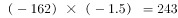；小数点后是16、23、30、37、44，构成公差为7的等差数列，故小数点后的数字为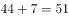。则所求项为243.51。

故正确答案为C。

---

### 第 2 题　qid 2452727 · 数学运算

1，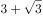，，10，，（    ）

- **A**. 
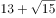

- **B**. 
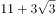

- **C**. 

　✅
- **D**. 

**答案**：C

**官方解析**

观察数列，有整数和无理数，将数列化为同一形式，为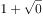，，，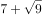，，以“”为分隔符，“”前是1、3、5、7、9，构成以2为公差的等差数列，则下一项为11；“”后是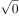、、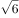、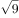、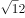，根号内的数字构成公差为3的等差数列，则下一项根号内为15。故所求项为。

故正确答案为C。

---

### 第 3 题　qid 2452729 · 数学运算

1， ， ， ， ，（    ）

- **A**. 

　✅
- **B**. 

- **C**. 

- **D**. 

**答案**：A

**官方解析**

观察数列大部分都是分数，选项也都是分数，考虑分数数列。分母呈现递增趋势，优先考虑反约分。原数列可化为： 、 、、、，发现分母是公比为4的等比数列，则下一项为；分子是公差为5的等差数列，则下一项为。故所求项为。

故正确答案为A。

---

### 第 4 题　qid 2452730 · 数学运算

，，，，，(    )

- **A**. 

- **B**. 

　✅
- **C**. 

- **D**. 

**答案**：B

**官方解析**

观察数列没有明显特征，可以把数列中的数字看成是时间。每个时间间隔的分钟数分别是5、15、30、50分钟，后减前为10、15、20分钟，构成公差为5的等差数列，新数列的下一项为25分钟，往回推为分钟，故所求项是经过75分钟后的时间，为。

故正确答案为B。

---

### 第 5 题　qid 2452732 · 数学运算

梳理甲、乙两个案件的资料，张警官单独完成，分别需要2小时、8小时；王警官单独完成，分别需要1小时、6小时。若两人合作完成，则需要的时间至少是

- **A**. 3小时
- **B**. 4小时　✅
- **C**. 5小时
- **D**. 6小时

**答案**：B

**官方解析**

要想时间最少，需要找到两人更擅长哪个案件。对于张警官来说，梳理甲、乙案件所用时间之比，对于王警官来说，梳理甲、乙案件所用时间，王警官梳理甲案件更有优势，因此优先让王警官梳理甲案件，张警官梳理乙案件，1小时后王警官梳理完甲案件再和张警官一起梳理乙案件；

赋值乙案件工作总量为24，则张警官完成乙案件的效率是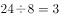，王警官完成乙案件的效率是。1小时之后两个人合作还需要的时间为小时。因此完成两项工作共需要小时。

故正确答案为B。

---

### 第 6 题　qid 2452734 · 数学运算

在统计某高校运动会参赛人数时，第一次汇总的结果是1742人，复核的结果是1796人，检查发现是第一次计算有误，将某学院参赛人数的个位数字与十位数字颠倒了。已知该学院参赛人数的个位数字与十位数字之和是10，则该学院的参赛人数可能是

- **A**. 164人
- **B**. 173人
- **C**. 182人　✅
- **D**. 191人

**答案**：C

**官方解析**

第一次人数与第二次人数相差人，也就是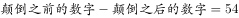；又已知，代入选项验证：

A选项：，排除；

B选项：，排除；

C选项：，，符合条件，当选；

D选项：，排除。

故正确答案为C。

---

### 第 7 题　qid 2452563 · 数学运算

某网店零售月季花，每束成本39元、售价99元，月销量800束。现推出团购活动，购买10束及以上，每束售价59元，预计零售销量减半，团购销量激增。若使原销售利润不减，则月团购销量至少应是

- **A**. 800束
- **B**. 1000束
- **C**. 1200束　✅
- **D**. 1500束

**答案**：C

**官方解析**

设团购销量至少束，则根据题意，单束花利润单束售价单束成本元，则推出团购之前总利润单束利润销量元；推出团购活动后零售销量变为束，团购单束花利润元。根据题意，推出团购活动后总利润零售利润团购利润，解得束，则团购销量至少束。

故正确答案为C。

---

### 第 8 题　qid 2452565 · 数学运算

某装配式建筑企业接到一个生产1033套楼板的订单。甲班组生产5天后，乙班组再生产4天，刚好完成任务。若甲班组比乙班组每天多生产23套，则甲班组生产楼板的套数是

- **A**. 625套　✅
- **B**. 645套
- **C**. 535套
- **D**. 515套

**答案**：A

**官方解析**

设乙班组每天生产楼板套，则甲班组每天生产套。根据题意，甲班组5天产量甲生产效率甲生产时间套；乙班组4天产量乙生产效率乙生产时间套，，解得套，则甲班组产量套。

故正确答案为A。

---

### 第 9 题　qid 2452587 · 数学运算

某食品厂速冻饺子的包装有大盒和小盒两种规格，现生产了11000只饺子，恰好装满100个大盒和200个小盒。若3个大盒与5个小盒装的饺子数量相等，则每个小盒与每个大盒装入的饺子数量分别是

- **A**. 24只、40只
- **B**. 30只、50只　✅
- **C**. 36只、60只
- **D**. 27只、45只

**答案**：B

**官方解析**

“3个大盒与5个小盒装的饺子数量相等”，即，化简为：每个大盒的饺子数量：每个小盒的饺子数量。设大盒可以装只饺子，小盒可以装只饺子。根据“现生产了11000只饺子，恰好装满100个大盒和200个小盒”，可得，解得，则每个小盒的饺子数量为30只，每个大盒的饺子数量为50只，对应B项。

故正确答案为B。

---

### 第 10 题　qid 2452706 · 数学运算

某社区组织了一次助学捐款活动，在场的老王、老李和老张均积极捐款。若老王捐款的是老李捐款的、老张捐款的，且老张比老王多捐192元，则他们的捐款总额是：

- **A**. 418元
- **B**. 456元　✅
- **C**. 494元
- **D**. 532元

**答案**：B

**官方解析**

根据题意，设老王捐款总额是，老李捐款总额是，老张捐款总额是。由“老张比老王多捐192元”可得：，解得元。因此三人的捐款总额为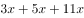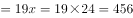元。

故正确答案为B。

---

### 第 11 题　qid 2452594 · 数学运算

某商品的进货单价为80元，销售单价为100元，每天可售出120件。已知销售单价每降低1元，每天可多售出20件。若要实现该商品的销售利润最大化，则销售单价应降低的金额是

- **A**. 5元
- **B**. 6元
- **C**. 7元　✅
- **D**. 8元

**答案**：C

**官方解析**

设降价x元，已知“销售单价每降低1元，每天可多售出20件”，调价后销售单价为元，进货单价为80元，则降价后单个利润为元；降价后的销量为件。总利润单个利润数量。令总利润为0，即令和都等于0，解得，。当时，总利润最大，即销售单价应降低的金额是7元，对应C项。

故正确答案为C。

---

### 第 12 题　qid 2452708 · 数学运算

若将一个长方形的长缩短1厘米，宽加长8厘米，所得新长方形的周长和面积分别是原长方形的2倍和4倍，则原长方形的长是：

- **A**. 4厘米
- **B**. 5厘米　✅
- **C**. 6厘米
- **D**. 7厘米

**答案**：B

**官方解析**

设原长方形长为厘米，宽为厘米，根据题意，可得两者周长关系为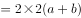，化简得①；可得两者面积关系为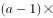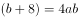②，直接求解较为复杂，考虑代入排除，满足①②即为正确答案。

代入A项：，根据①式，，代入②式，左边，右边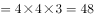，两边不相等，A项错误；

代入B项：，根据①式，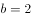，代入②式，左边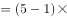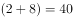，右边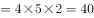，两边相等，此时B项满足题干所有条件，B项正确，当选，C、D两项无需代入。

故正确答案为B。

---

### 第 13 题　qid 2452577 · 数学运算

使用浓度为的硫酸溶液克和浓度为的硫酸溶液若干克，配制浓度为的硫酸溶液克，需要加水的质量是：

- **A**. 10克　✅
- **B**. 12克
- **C**. 15克
- **D**. 18克

**答案**：A

**官方解析**

设需的硫酸克，根据公式：，且混合前后溶质的质量相等，混合后溶质混合前溶质，即，则解得，则需加水克。

故正确答案为A。

---

### 第 14 题　qid 2452569 · 数学运算

甲、乙两人分别从A、B两地同时出发相向而行。当两人合计走完两地间路程的时，甲距A地的路程是500米；当两人合计走完两地间路程的时，乙距B地的路程是2400米。若两人的速度始终不变，则当速度较快者走完全程时，速度较慢者距走完全程还剩的路程是

- **A**. 1350米
- **B**. 1600米
- **C**. 1800米
- **D**. 1950米　✅

**答案**：D

**官方解析**

两人走完全程的时，甲走的路程是500米；现两人走完全程的，因速度一直不变，则甲此时走的路程是米，乙走的路程为2400米，时间相同，速度与路程成正比，，乙的速度较快，全程一共是米，当乙走完全程5200米，因时间相同，甲、乙的路程之比即为速度之比，则甲走了米，还剩米。

故正确答案为D。 

---

### 第 15 题　qid 2452573 · 数学运算

某便民超市将薏米、红豆和小黄米按2：3：5混合后出售，每千克成本13.3元。若薏米每千克成本23.6元，红豆每千克成本9.8元，则小黄米每千克的成本是

- **A**. 10.36元
- **B**. 10.18元
- **C**. 11.45元
- **D**. 11.28元　✅

**答案**：D

**官方解析**

假设混合后薏米2千克，红豆3千克、小黄米5千克。设小黄米每千克成本为元，则有，解得。

故正确答案为D。

---

### 第 16 题　qid 2452710 · 数学运算

某训练基地的一块三角形场地的面积是1920平方米。已知该三角形场地的三边长度之比是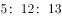，则其周长是：

- **A**. 218米
- **B**. 240米　✅
- **C**. 306米
- **D**. 360米

**答案**：B

**官方解析**

已知三角形三边长度之比为，因，说明此三角形为直角三角形。设此三角形三边长度分别为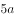米，米，米，则三角形面积平方米，解得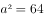，即。三角形周长为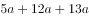米。

故正确答案为B。

---

### 第 17 题　qid 2452598 · 数学运算

某单位要抽调若干人员下乡扶贫，小王、小李、小张都报了名，但因工作需要，若选小李或小张，就不能选小王。已知三人入选的概率都是0.2，但小李、小张同时入选的概率是0.1，则三人中有人入选的概率是

- **A**. 0.3
- **B**. 0.4
- **C**. 0.5　✅
- **D**. 0.6

**答案**：C

**官方解析**

根据题意“若选小李或小张，就不能选小王”，即小李或小张入选时，小王一定不入选，小王入选时，小李和小张都不入选。“三人中有人入选”有以下四种情况：

①小李和小张同时入选，此时小王一定不入选：概率为0.1；

②小李入选、小张不入选，此时小王一定不入选：当小李入选时有两类情况：小李单独入选和小李和小张共同入选，所以小李单独入选的概率为“小李入选的概率小李和小张共同入选的概率”。

③小张入选、小李不入选，此时小王一定不入选：当小张入选时有两类情况：小张单独入选和小李和小张共同入选，所以小张单独入选的概率为“小张入选的概率小李和小张共同入选的概率”。

④小李与小张都未入选，小王单独入选：概率为0.2。

故“三人中有人入选” 的概率是，对应C项。

故正确答案为C。

---

### 第 18 题　qid 2452712 · 数学运算

下图为某市一段地下水管道的分布图，箭线表示管道中水的流向，数值表示箭线的长度(单位：千米)。水从S点流到T点最短的距离是：

- **A**. 20千米
- **B**. 22千米　✅
- **C**. 23千米
- **D**. 24千米

**答案**：B

**官方解析**

 

求S点到T点的最短距离，可以先分两部分考虑，如图所示，即S点到A点，再由A点到T点。从S点到A点，共有4条路线，显然最短距离为千米，从A点到T点，共有2条路线，显然最短距离为千米，此时最短距离为千米。虽然从S点出发不经过A点，也有其他路线到达T点，但均大于22千米，即水从S点流到T点最短的距离为22千米。

故正确答案为B。

---

### 第 19 题　qid 2452596 · 数学运算

某企业按三个等级给员工发放奖金，一、二、三等奖的获奖人数之比为1：3：10，奖金总额之比为2：3：1。已知获奖员工总数126人，发放奖金总额16.2万元，则三等奖的奖金是

- **A**. 250元
- **B**. 300元　✅
- **C**. 350元
- **D**. 400元

**答案**：B

**官方解析**

设一、二、三等奖的获奖人数为、、，因为“获奖员工总数126人”，即，解得，即一、二、三等奖的获奖人数分别为9、27、90人。设一、二、三等奖的奖金总额分别为、、。因为“发放奖金总额16.2万元”，即，解得元，即三等奖的奖金总额为27000元，故三等奖奖金为元。

故正确答案为B。

---

## 判断推理

### 材料 1

在400米跑比赛中，罗、方、许、吕、田、石6人被分在一组。他们站在由内到外的1至6号赛道上。关于他们的位置，已知：

（1）田和石的赛道相邻；

（2）吕的赛道编号小于罗；

（3）田和罗之间隔着两条赛道；

（4）方的赛道编号小于吕，且中间隔着两条赛道。

#### 第 1 题　qid 2452551 · 逻辑判断

根据以上陈述，关于田的位置，以下哪项是可能的？

- **A**. 在3号赛道上　✅
- **B**. 在4号赛道上
- **C**. 在5号赛道上
- **D**. 在6号赛道上

**答案**：A

**官方解析**

第一步：分析题干。
（1）田和石的赛道相邻；
（2）吕的赛道编号小于罗；
（3）田和罗之间隔着两条赛道；
（4）方的赛道编号小于吕，且中间隔着两条赛道。
第二步：根据题干条件分析选项。
提问方式为可能为真，因此，可以考虑代入法。
代入A项，田在3号赛道上，根据条件（3）可知，罗只能在6号赛道上；根据条件（2）（4）可知吕可能在4号或5号赛道上。如果吕在4号赛道上，则方在1号赛道上，根据条件（1）此时石只能在2号，此时满足题干所有要求，所以A项就是可能的，当选；
代入B项，田在4号赛道上，根据条件（3）可知，罗只能在1号赛道上，则吕的赛道编号不可能小于罗，与题干条件（2）矛盾，排除；
代入C项，田在5号赛道上，根据条件（3）可知，罗只能在2号赛道上，题干条件（2），吕只能在1赛道上，此时方的赛道编号不可能小于吕，与题干条件（4）矛盾，排除；
代入D项，田在6号赛道上，根据条件（3）可知，罗只能在3号赛道上，根据条件（2）可知吕可能在1号或2号赛道上，此时方的赛道不可能小于吕的同时隔着两条赛道，与题干条件（4）矛盾，排除。
故正确答案为A。

---

#### 第 2 题　qid 2452559 · 逻辑判断

根据以上陈述，可以推出以下哪项？

- **A**. 许和石的赛道相邻
- **B**. 许和石之间隔着一条赛道
- **C**. 许和石之间隔着两条赛道　✅
- **D**. 许和石之间隔着三条赛道

**答案**：C

**官方解析**

第一步：分析题干。

（1）田和石的赛道相邻；

（2）吕的赛道编号小于罗；

（3）田和罗之间隔着两条赛道；

（4）方的赛道编号小于吕，且中间隔着两条赛道。

第二步：根据题干条件分析选项。

由条件（2）可知：

由条件（4）可知：

以上二者可知，，则方、吕、罗的赛道排列只有以下三种可能：

如果是情况一，根据条件（1）（3），田、石分别在2号、3号赛道，许只能在6号赛道；

如果是情况二，根据条件（1）（3），田、石分别在3号、2号赛道，许只能在5号赛道；

如果是情况三，根据条件（1）（3），田、石分别在3号、4号赛道，许只能在1号赛道；

无论哪种情况，许和石之间都是隔着两条赛道，对应C选项。

故正确答案为C。

---

#### 第 3 题　qid 2452542 · 类比推理

唇亡：齿寒

- **A**. 安居：乐业
- **B**. 纲举：目张　✅
- **C**. 开卷：有益
- **D**. 惩前：毖后

**答案**：B

**官方解析**

第一步：判断题干词语间逻辑关系。
“唇亡”指嘴唇没有了，“齿寒”指牙齿就会寒冷，即因为“唇亡”，所以“齿寒”，二者为因果对应关系。
第二步：判断选项词语间逻辑关系。
A项：“安居”指安定的住在一起，“乐业”指愉快地从事自己的职业，二者为并列关系，与题干逻辑关系不一致，排除；
B项：“纲举”指提起鱼网上面的总绳，“目张”指一个个网眼都张开，即提起大绳子来，就能让一个个网眼张开了。因为“纲举”，所以“目张”，二者为因果对应关系，与题干逻辑关系一致，当选；
C项：“开卷”指打开书本读书，“有益”指有好处有收获，指的是读书总会有好处的。题干是两件事情之间的因果关系，而C项只有读书一件事，有益是读书本身的效果，二者不是因果关系，与题干逻辑关系不一致，排除；
D项：“惩前”指警戒之前犯的错误，“毖后”指以后谨慎，不致再犯，“惩前”的目的是“毖后”，二者是方式目的对应，与题干逻辑关系不一致，排除。
故正确答案为B。

---

#### 第 4 题　qid 2452546 · 类比推理

湄公河：跨境河

- **A**. 黄鹤楼：吊脚楼
- **B**. 青海湖：内陆湖　✅
- **C**. 英国人：西欧人
- **D**. 中山门：凯旋门

**答案**：B

**官方解析**

第一步：判断题干词语间逻辑关系。
“湄公河”是亚洲最重要的跨国水系，因此“湄公河”是“跨境河”，且“湄公河”是“跨境河”中的一个，二者为包容关系中的特指。
第二步：判断选项词语间逻辑关系。
A项：“吊脚楼”为苗族（重庆、贵州等）、壮族、布依族、侗族、水族、土家族等族的传统民居，“黄鹤楼”是武汉标志性建筑，是名胜，因此“黄鹤楼”不是“吊脚楼”，与题干逻辑关系不一致，排除；
B项：“青海湖”是中国最大的“内陆湖”，因此“青海湖”是“内陆湖”，且“青海湖”是“内陆湖”中的一个，二者为包容关系中的特指，与题干逻辑关系一致，当选；
C项：“英国人”是“西欧人”，但英国人是一种统称，有很多英国人，二者不是包容关系中的特指，与题干逻辑关系不一致，排除；
D项：“中山门”和“凯旋门”为并列关系，与题干逻辑关系不一致，排除。
故正确答案为B。

---

#### 第 5 题　qid 2452683 · 类比推理

裙子：毛料裙子：时装

- **A**. 酒精：食用酒精：粮食
- **B**. 手机：5G手机：通讯
- **C**. 包子：肉馅包子：蒸笼
- **D**. 小说：历史小说：名著　✅

**答案**：D

**官方解析**

第一步：判断题干词语间逻辑关系。
毛料裙子是裙子的一种，二者是种属关系，毛料裙子是从原材料角度区分的服装，时装是从流行程度上区分的服装，二者是交叉关系。
第二步：判断选项词语间逻辑关系。
A项：食用酒精是酒精的一种，二者是种属关系，粮食经过发酵可以变成食用酒精，二者是原材料对应，与题干逻辑关系不一致，排除；
B项：5G手机是手机的一种，二者是种属关系，通讯是手机的功能，与题干逻辑关系不一致，排除；
C项：肉馅包子是包子的一种，二者是种属关系，蒸笼是蒸包子时需要用到的工具，与题干逻辑关系不一致，排除；
D项：历史小说是小说的一种，二者是种属关系，历史小说是按照创作的题材来划分作品，名著是从知名程度来区分的作品，二者是交叉关系，与题干逻辑关系一致，当选。
故正确答案为D。

---

#### 第 6 题　qid 2452685 · 类比推理

春节：饺子：饺皮

- **A**. 中秋节：月饼：蛋黄
- **B**. 清明节：青团：青艾
- **C**. 端午节：粽子：粽叶　✅
- **D**. 元宵节：酒酿：糯米

**答案**：C

**官方解析**

第一步：判断题干词语间逻辑关系。
饺皮是饺子的组成部分，二者是组成关系，且饺皮是饺子的最外层；春节会吃饺子，是传统节日和习俗的对应关系。
第二步：判断选项词语间逻辑关系。
A项：蛋黄可以作为月饼的馅，二者是组成关系，但蛋黄是包在月饼的里层，并不是在月饼的最外层，与题干逻辑关系不一致，排除；
B项：由青艾磨汁加入糯米粉制作青团，青艾汁是制作青团的原材料，二者是原材料对应，与题干逻辑关系不一致，排除；
C项：粽叶是粽子的组成部分，二者是组成关系，粽叶是粽子的最外层；端午节会吃粽子，是传统节日和习俗的对应关系，与题干逻辑关系一致，当选；
D项：糯米是制作酒酿的原材料，二者是原材料对应，与题干逻辑关系不一致，排除。
故正确答案为C。

---

#### 第 7 题　qid 2452686 · 类比推理

暴雨：洪灾：排涝

- **A**. 炎热：干旱：减产
- **B**. 假日：拥堵：疏导
- **C**. 路滑：摔倒：骨折
- **D**. 地震：伤亡：救助　✅

**答案**：D

**官方解析**

第一步：判断题干词语间逻辑关系。
暴雨可能会导致洪灾，二者是因果对应，且暴雨是自然灾害；排涝是解决洪灾的方式，二者是方式对应。
第二步：判断选项词语间逻辑关系。
A项：炎热可能会导致干旱，二者是因果对应；干旱可能会导致减产，二者是因果对应，与题干逻辑关系不一致，排除；
B项：假日可能会导致拥堵，二者是因果对应，但是概率很小，且假日也不是自然灾害，与题干逻辑关系不一致，排除；
C项：路滑可能会让人摔倒，二者是因果对应；摔倒可能会导致骨折，二者是因果对应，与题干逻辑关系不一致，排除；
D项：地震可能会导致伤亡，二者是因果对应，且地震是自然灾害；救助是解决地震伤亡的方式，二者是方式对应，与题干逻辑关系一致，当选。
故正确答案为D。

---

#### 第 8 题　qid 2452687 · 类比推理

开车不喝酒：喝酒不开车

- **A**. 家是最小国：国是千万家
- **B**. 不到长城非好汉：唯有好汉到长城
- **C**. 你好我好大家好：大家好了你我好
- **D**. 真金不怕火炼：怕火炼的不是真金　✅

**答案**：D

**官方解析**

第一步：判断题干词语间逻辑关系。

不喝酒（B）是开车（A）的必要条件，喝酒（B）是不开车（A）的充分条件 。

第二步：判断选项词语间逻辑关系。

A项：最小国（B）是家（A）的必要条件，国（B）是千万家（A）的充分条件，与题干逻辑关系不一致，排除；

B项：到长城（B）是好汉（A）的必要条件，到长城（B）是好汉（A）的充分条件，与题干逻辑关系不一致，排除；

C项：大家好（B）是你好我好（A）的必要条件，大家好（B）是你好我好（A）的充分条件，与题干逻辑关系不一致，排除；

D项：不怕火炼（B）是真金（A）的必要条件，怕火炼（B）是不是真金（A）的充分条件，与题干逻辑关系一致，当选。

故正确答案为D。

---

#### 第 9 题　qid 2452688 · 类比推理

裤子 之于（    ）相当于（    ）之于 笔画

- **A**. 剪刀——色彩
- **B**. 秋裤——画笔
- **C**. 布料——汉字　✅
- **D**. 裁缝——书家

**答案**：C

**官方解析**

逐一代入选项。
A项：剪刀是制作裤子需要的工具，二者是对应关系，色彩和笔画没有必然联系，前后逻辑关系不一致，排除；
B项：秋裤是裤子，二者是种属关系，画笔可以写出笔画，二者为对应关系，前后逻辑关系不一致，排除；
C项：裤子是由布料组成的，二者是组成关系，汉字也是由笔画组成的，二者是组成关系，前后逻辑关系一致，当选；
D项：裁缝制作裤子，二者为主宾关系，书家书写笔画，二者也为主宾关系，但顺序反了，前后逻辑关系不一致，排除。
故正确答案为C。

---

#### 第 10 题　qid 2452684 · 类比推理

（    ）之于 实事求是 相当于 南辕北辙 之于 （    ）。

- **A**. 按图索骥——方枘圆凿
- **B**. 上下求索——守株待兔
- **C**. 刻舟求剑——声东击西
- **D**. 量体裁衣——背道而驰　✅

**答案**：D

**官方解析**

逐一代入选项。
A项：按图索骥比喻按照线索去寻找；实事求是是指从实际情况出发，不夸大，不缩小，正确地对待和处理问题，二者没有必然联系，南辕北辙指的是心想往南而车子却向北行，比喻行动和目的正好相反；方枘圆凿比喻格格不入、不相容、不适宜，二者没有必然联系，前后逻辑关系不一致，排除；
B项：上下求索比喻百折不挠，不遗余力地去追求和探索；实事求是是指从实际情况出发，不夸大，不缩小，正确地对待和处理问题，二者没有必然联系，南辕北辙指的是心想往南而车子却向北行，比喻行动和目的正好相反；守株待兔指希望不经过努力而得到成功的侥幸心理，比喻死守狭隘经验，不知变通，二者没有必然联系，前后逻辑关系不一致，排除；
C项：刻舟求剑比喻办事刻板，没有发展的眼光；实事求是是指从实际情况出发，不夸大，不缩小，正确地对待和处理问题，二者没有必然联系，南辕北辙指的是心想往南而车子却向北行，比喻行动和目的正好相反；声东击西指造成要攻打东边的声势，实际上却攻打西边，二者没有必然联系，前后逻辑关系不一致，排除；
D项：量体裁衣本义是按照身材尺寸裁剪衣服，比喻做事从实际情况出发；实事求是是指从实际情况出发，不夸大，不缩小，正确地对待和处理问题，二者为近义关系，南辕北辙指的是心想往南而车子却向北行，比喻行动和目的正好相反；背道而驰比喻行动方向和所要达到的目标完全相反，二者为近义关系，前后逻辑关系一致，当选。
故正确答案为D。

---

#### 第 11 题　qid 2452701 · 类比推理

请从四个选项中选出恰当的一项，其特征或规律与题干给出的一串符号的特征或规律最为相符。

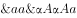

- **A**. 

- **B**. 

- **C**. 

　✅
- **D**. 

**答案**：C

**官方解析**

第一步：分析题干符号间关系。
从相同符号的位置入手：位置1、4的符号相同；位置2、3、9的符号相同；位置5、7的符号相同；位置6、8的符号相同。
第二步：判断选项符号间关系。
A项：位置2、3符号相同，但和位置9符号不相同，与题干不一致，排除； 
B项：位置2、3符号相同，但和位置9符号不相同，并且位置6、8符号不相同，与题干不一致，排除；
C项：位置1、4的符号相同；位置2、3、9的符号相同；位置5、7的符号相同；位置6、8的符号相同，与题干一致，当选；
D项：位置6、8符号不相同，与题干不一致，排除。
故正确答案为C。

---

#### 第 12 题　qid 2452650 · 类比推理

请从四个选项中选出恰当的一项，其特征或规律与题干给出的一串符号的特征或规律最为相符。
由甲申曱甲申甴甲由曱

- **A**. 己已巳乙已巳己已己乙
- **B**. 上下卡卞下卡土下上卞　✅
- **C**. 人八六入八六人八人入
- **D**. 土士二干士二二士土干

**答案**：B

**官方解析**

第一步：分析题干符号间关系。
从相同符号的位置入手：位置1、9的符号相同；位置2、5、8的符号相同；位置3、6的符号相同；位置4、10的符号相同；位置7的符号与其他位置均不相同。
第二步：判断选项符号间关系。
A项：位置7的符号与位置1、9的符号相同，与题干逻辑关系不一致，排除；
B项：位置1、9的符号相同；位置2、5、8的符号相同；位置3、6的符号相同；位置4、10的符号相同；位置7的符号与其他位置均不相同，与题干逻辑关系一致，当选；
C项：位置7的符号与位置1、9的符号相同，与题干逻辑关系不一致，排除；
D项：位置7的符号与位置3、6的符号相同，与题干逻辑关系不一致，排除。
故正确答案为B。

---

#### 第 13 题　qid 2452702 · 图形推理

请从所给的四个选项中，选出最恰当的一项填入问号处，使之呈现一定的规律性。

- **A**. A
- **B**. B
- **C**. C　✅
- **D**. D

**答案**：C

**官方解析**

图形元素组成不同，属性无明显规律，考虑数量规律。题干“窟窿”明显，优先考虑面数量，题干面数量分别是1、2、2、3、3，不成规律。继续观察图形特征，发现三角形内部线条交叉明显，考虑点数量，题干交点数分别是3、4、5、6、7，所以“？”处应选择8个交点的图形。A项7个交点，B项6个交点，C项8个交点，D项7个交点，只有C项符合。
故正确答案为C。

---

#### 第 14 题　qid 2452703 · 图形推理

请从所给的四个选项中，选出最恰当的一项填入问号处，使之呈现一定的规律性。

- **A**. A　✅
- **B**. B
- **C**. C
- **D**. D

**答案**：A

**官方解析**

题干图形中出现多个小元素，优先考虑元素的种类和个数。题干每幅图中均有2种小元素，排除C项。小元素个数依次为2、3、3、4、4，无规律。继续观察，题干图形和剩余选项都由两种元素构成，考虑元素换算。根据“第一个图形+第三个图形=2x第二个图形”的原则，换算后可知1个五角星=2个圆形，将五角星全部换算成圆形圆形个数分别是3、4、5、6、7，所以问号处应选一个换算后有8个圆形的选项。A项有8个圆形，B项有7个圆形，D项有6个圆形，只有A项符合。
故正确答案为A。

---

#### 第 15 题　qid 2452704 · 图形推理

请从所给的四个选项中，选出最恰当的一项填入问号处，使之呈现一定的规律性。

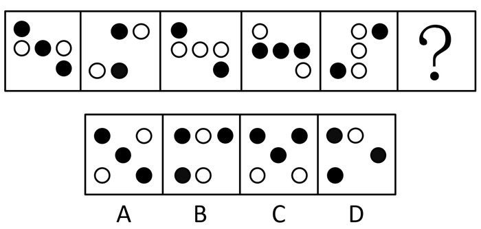

- **A**. A　✅
- **B**. B
- **C**. C
- **D**. D

**答案**：A

**官方解析**

元素组成不同，优先考虑属性规律。观察发现，题干中的图形均由小黑球和小白球组成，题干图2和图5明显是“S或Z”的变形图，考虑对称性，继续观察，题干所有的图形都是中心对称图形，所以“？”处应选一个中心对称图形，只有A项符合。
故正确答案为A。

---

#### 第 16 题　qid 2452675 · 图形推理

下面四个图形中，只有一个是由上面的四个图形拼合（只能通过上、下、左、右平移）而成的，请把它找出来。

- **A**. A
- **B**. B　✅
- **C**. C
- **D**. D

**答案**：B

**官方解析**

本题考查平面拼合，可采用平行且等长相消的方式解题。消去平行且等长的线段后进行组合即可得到轮廓图，即为B选项。平行且等长相消的方式如下图所示：

故正确答案为B。

---

#### 第 17 题　qid 2452676 · 图形推理

下面四个图形中，只有一个是由上面的四个图形拼合（只能通过上、下、左、右平移）而成的，请把它找出来。

- **A**. A　✅
- **B**. B
- **C**. C
- **D**. D

**答案**：A

**官方解析**

本题考查平面拼合，可采用平行且等长相消的方式解题。消去平行且等长的线段后进行组合即可得到轮廓图，即为A选项。根据平行且等长相消，②应与④相拼合在右下角，③应在左下角。平行且等长相消的方式如下图所示：

故正确答案为A。

---

#### 第 18 题　qid 2452677 · 图形推理

下面四个图形中，只有一个是由上面的四个图形拼合（只能通过上、下、左、右平移）而成的，请把它找出来。

- **A**. A
- **B**. B
- **C**. C
- **D**. D　✅

**答案**：D

**官方解析**

本题考查平面拼合，可采用平行且等长相消的方式解题。消去平行且等长的线段后进行组合即可得到轮廓图，即为D选项。平行且等长相消的方式如下图所示：

故正确答案为D。

---

#### 第 19 题　qid 2452678 · 图形推理

下面四个图形中，只有一个是由上面的四个图形拼合（只能通过上、下、左、右平移）而成的，请把它找出来。

- **A**. A
- **B**. B
- **C**. C
- **D**. D　✅

**答案**：D

**官方解析**

本题考查平面拼合，可采用平行且等长相消的方式解题。消去平行且等长的线段后进行组合即可得到轮廓图，即为D选项。平行且等长相消的方式如下图所示：

故正确答案为D。

---

#### 第 20 题　qid 2452679 · 图形推理

右边四个图形中，只有一个是由左边的四个图形拼合（只能通过上、下、左、右平移）而成的，请把它找出来。

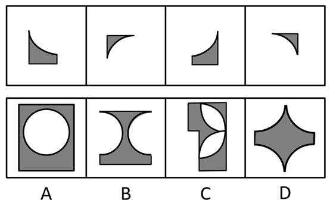

- **A**. A
- **B**. B
- **C**. C
- **D**. D　✅

**答案**：D

**官方解析**

本题考查平面拼合，可采用平行且等长相消的方式解题。消去平行且等长的线段后进行组合可得到轮廓图，即为D项。平行且等长相消的方式如下图所示：

故正确答案为D。

---

#### 第 21 题　qid 2452689 · 图形推理

左边给定的是纸盒外表面的展开图，右边哪一项能由它折叠而成？请把它找出来。

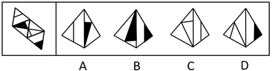

- **A**. A　✅
- **B**. B
- **C**. C
- **D**. D

**答案**：A

**官方解析**

将题干展开图中的面依次标注为面a、b、c、d，如下图：

A项：与题干一致，当选；

B项：选项由面b、d构成，题干展开图中面b的白三角挨着面d（蓝色的线），选项中面b的黑三角挨着面d（蓝色的线），选项和题干不一致，排除；

C项：选项由面a、c构成，题干展开图中面a中的线挨着公共边（绿色的线），选项中面a中的线没有挨着公共边（绿色的线），选项与题干不一致，排除；

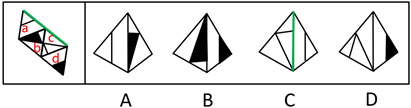

D项：选项由面c、d构成，题干展开图中面c和面d的公共边（红色的线）与面c内的直线有交点，选项中面c和面d的公共边（红色的线）与面c内的直线无交点，选项与题干不一致，排除。

故正确答案为A。

---

#### 第 22 题　qid 2452690 · 图形推理

下面给定的是纸盒外表面的展开图，右边哪一项能由它折叠而成？请把它找出来。

- **A**. A
- **B**. B
- **C**. C　✅
- **D**. D

**答案**：C

**官方解析**

将题干展开图中的面依次标注为面a、b、c、d，如下图：

A项：选项由面a、c、d这三个面其中两个面构成，题干展开图中面a和面c，面a和面d，面c和面d，这三组面的公共边（红色的线）都是两个小黑三角并排挨着，选项中的公共边（红色的线）两个小黑三角是错位挨着，选项与题干不一致，排除；

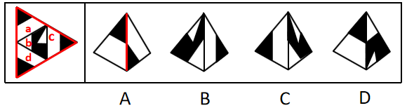

B项：选项由面b、c构成，题干中面b从黑尖开始顺时针画边，边1到边2（绿色的线）中间经过白色的角，而选项中以此为顶点顺时针画边，边1到边2（绿色的线）中间经过的是半黑半白的角，选项与题干不一致，排除；

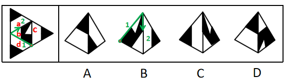

C项：与题干一致，当选；

D项：选项由面b和面a、c、d其中的一个面构成，题干展开图中面b和面a，面b和面c，面b和面d，这三组面的公共边（蓝色的线）都没有与顶角的小黑三角形挨着，而选项中的公共边（蓝色的线）与顶角的小黑三角形挨着，选项与题干不一致，排除。

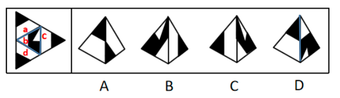

故正确答案为C。

---

#### 第 23 题　qid 2452691 · 图形推理

下面给定的是纸盒外表面的展开图，右边哪一项能由它折叠而成？请把它找出来。

- **A**. A
- **B**. B
- **C**. C
- **D**. D　✅

**答案**：D

**官方解析**

将题干展开图中的面依次标号，如下图：

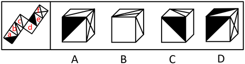

A项：选项由面c、e、f构成，题干中三个面的公共点（红色的点）引出面c和面f的两根线，选项中这三个面的公共点（红色的点）只引出面f的一根线，选项与题干不一致，排除；

B项：选项由面b、c、d构成，以面b中两根线的交点（绿色的点）为起点在面b中顺时针画边，题干中边3挨着面a，选项中边3挨着面c，选项与题干不一致，排除；

C项：选项由面a、b、d构成，以面b中两根线的交点（绿色的点）为起点在面b中顺时针画边，题干中边3挨着面a的白三角，选项中边3挨着面a的黑三角，选项与题干不一致，排除；

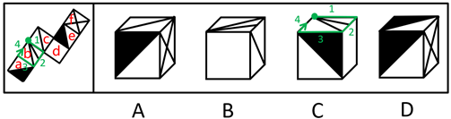

D项：选项与题干一致，当选。

故正确答案为D。

---

#### 第 24 题　qid 2452692 · 图形推理

下面给定的是纸盒外表面的展开图，右边哪一项能由它折叠而成？请把它找出来。

- **A**. A
- **B**. B　✅
- **C**. C
- **D**. D

**答案**：B

**官方解析**

将原展开图标上序号如下图，逐一进行分析。

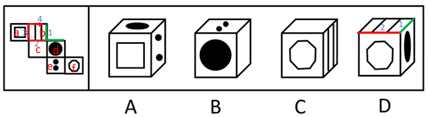

A项：选项出现了面a和面d，面e，而面a和面d为相对面，不能同时出现，选项与题干不一致，排除；

B项：选项出现了面c，面d，面e，选项与题干一致，当选；

C项：选项出现了面b，面c，面f，而面c和面f为相对面，不能同时出现，选项与题干不一致，排除；

D项：选项出现了面b，面d，面f，以面b为唯一面，以面b和面d的公共边为唯一边（如图中绿线所示）。在展开图和选项的面b上，以唯一边为起始边，沿着顺时针方向同时进行画边，展开图中边2所对的面为面c，选项中边2所对的面不是面c，选项与题干不一致，排除。

故正确答案为B。

---

#### 第 25 题　qid 2452625 · 图形推理

请从所给的四个选项中，选出最恰当的一项填入问号处，使之呈现一定的规律性。

- **A**. A
- **B**. B
- **C**. C
- **D**. D　✅

**答案**：D

**官方解析**

本题考查图形的实际意义，寻找最大共同点。九宫格优先横行看，观察发现，题干每行图片均为奶牛，第一行中奶牛头部的朝向左右交替，且奶牛身上的花纹相同，第二行也为此规律，故第三行运用规律，前两幅图奶牛的头部朝向分别为右、左，故问号处图形的奶牛头部应朝右，排除A、C项，B项奶牛身上的花纹与前两幅图不同，排除。
故正确答案为D。

---

#### 第 26 题　qid 2452693 · 图形推理

请从所给的四个选项中，选出最恰当的一项填入问号处，使之呈现一定的规律性。

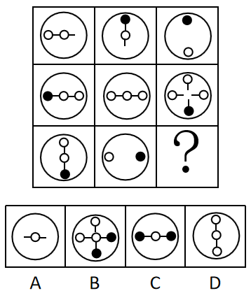

- **A**. A　✅
- **B**. B
- **C**. C
- **D**. D

**答案**：A

**官方解析**

元素组成相似，优先考虑样式规律，且相同线条重复出现，故考虑样式规律中的加减同异。九宫格优先看横行，第一行中，图1逆时针旋转90˚，外框保留，内部元素与图2求异得到图3；经验证，第二行也满足此规律；第三行，应用此规律，选择一个图1逆时针旋转90˚，外框保留，内部元素与图2求异得到的图形，因此“？”处应该选择A项。
故正确答案为A。

---

#### 第 27 题　qid 2452532 · 图形推理

左图为给定的立体，从任意角度剖开，右边哪一项不可能是它的截面图？

- **A**. A　✅
- **B**. B
- **C**. C
- **D**. D

**答案**：A

**官方解析**

本题考查截面图，逐一分析选项。

A项：无法切出。

B项：从图形正上方切入，垂直向下切即可得到，排除；

C项：从图形六面体棱上切入，斜切，保证三条边等长，即可得到，排除；

D项：从图形六面体棱上切入，斜切，保证两条边等长，即可得到，排除。

本题为选非题，故正确答案为A。

注：A项截面中椭圆和长方形的中心可能存在重合的情况，但无法确定椭圆和长方形的大小比例、椭圆与长方形框的距离比例、椭圆和长方形的中心重合等是否可以同时满足，而BCD三个选项可以确定能够截出，故粉笔答案定为A项。

---

#### 第 28 题　qid 2452541 · 逻辑判断

党内存在的很多问题都同政治问题相关联。不从政治上认识问题、解决问题，就会陷入头痛医头、脚痛医脚的被动局面，就无法从根本上解决问题。提高政治能力，很重要的一条就是要善于从政治上分析问题、解决问题。只有从政治上分析问题才能看清本质，只有从政治上解决问题才能抓住根本。
根据以上陈述，可以得出以下哪项？

- **A**. 只有从政治上认识问题、解决问题，才能从根本上解决问题　✅
- **B**. 如果善于从政治上分析问题、解决问题，就能提高政治能力
- **C**. 一旦陷入头痛医头、脚痛医脚的被动局面，就无法从根本上解决问题
- **D**. 如果没有看清本质、抓住根本，说明没有从政治上分析问题、解决问题

**答案**：A

**官方解析**

第一步：翻译题干。

①（政治上认识问题、解决问题）陷入头痛医头、脚痛医脚的被动局面

②（政治上认识问题、解决问题）根本上解决问题

③提高政治能力善于从政治上分析问题、解决问题

④看清本质政治上分析问题

⑤抓住根本政治上解决问题

第二步：逐一分析选项。

A项：翻译为根本上解决问题政治上认识问题、解决问题，是对②的否后，否后必否前，可以推出，当选；

B项：翻译为善于从政治上分析问题、解决问题提高政治能力，是对③的肯后，肯后得不到确定结论，无法推出，排除；

C项：翻译为陷入头痛医头、脚痛医脚的被动局面根本上解决问题，是对①的肯后，肯后得不到确定结论，无法和②中的“根本上解决问题”串在一起，无法推出，排除；

D项：翻译为（看清本质、抓准根本）（政治上分析问题、解决问题），是对④、⑤的否前，否前得不到确定结论，无法推出，排除。

故正确答案为A。

---

#### 第 29 题　qid 2452723 · 逻辑判断

为了研究早餐前锻炼和早餐后锻炼对健康的影响，研究人员进行了连续8周的实验，其中，实验组在早餐前锻炼，对照组在早餐后锻炼。结果发现，实验组锻炼过程中平均燃烧的脂肪量是对照组的2倍。体检结果进一步显示，实验组胰岛素反应能力得到了改善，而对照组没有。研究人员由此认为，相较于早餐后锻炼，早餐前锻炼更能降低罹患心血管疾病的风险。
以下哪项如果为真，最能支持上述研究人员的观点？

- **A**. 胰岛素反应能力强能有效稳定人体的血糖含量
- **B**. 脂肪量过高是罹患心血管疾病的主要原因　✅
- **C**. 饱食状态下锻炼常常会引起胃穿孔等意外
- **D**. 实验对象都是已经患有心血管疾病的个体

**答案**：B

**官方解析**

第一步：找出论点和论据。
论点：相较于早餐后锻炼，早餐前锻炼更能降低罹患心血管疾病的风险。
论据：实验组（即早餐前锻炼）锻炼过程中的平均燃烧的脂肪量是对照组（即早餐后锻炼）的2倍。实验组胰岛素反应能力得到了改善，而对照组没有。
论点强调的是早餐前锻炼和降低患心血管疾病风险之间的关系。论据说的是早餐前锻炼和脂肪量降低、胰岛素反应能力改善之间的关系。论点论据话题不一致，优先考虑搭桥。
第二步：逐一分析选项。
A项：论点说的是可以降低罹患心血管疾病的风险，该项说的是能有效稳定血糖含量，而血糖含量和心血管疾病之间是否存在必然关系并不确定，无法加强，排除；
B项：脂肪量过高是罹患心血管疾病的主要原因，所以脂肪量燃烧得多，患心血管疾病的风险就降低，在脂肪量和心血管疾病之间建立起联系，属于搭桥项，可以加强，当选；
C项：论点说的是早餐前锻炼和降低心血管疾病风险的关系，该项说的是餐后锻炼可能产生的问题，话题不一致，无法加强，排除；
D项：论点说的是降低罹患心血管疾病的风险，即减少得病的概率，该项说的是所有实验对象都已经患有心血管疾病，与题干论点无关，无法加强，排除。
故正确答案为B。

---

#### 第 30 题　qid 2452550 · 逻辑判断

每个“熊孩子”的背后都有一个“熊家长”。这些“熊家长”对“熊孩子”百依百顺，溺爱娇惯，这使得“熊孩子”以自我为中心，缺乏规则意识，容易产生过激的非理性行为。当“熊孩子”有些行为对他人和社会造成伤害时，“熊家长”也会以“他还是个孩子”来护短辩解，要求原谅。
以下哪项最可能是“熊家长”辩解所隐含的前提？

- **A**. “熊孩子”犯错误不是故意为之
- **B**. 只要是孩子就难免犯错
- **C**. “熊孩子”长大后会成为好孩子
- **D**. 孩子犯错误应当被原谅　✅

**答案**：D

**官方解析**

第一步:找出论点和论据。
论点:“熊家长”要求原谅“熊孩子”。
论据:“熊家长”以“他还是个孩子”来护短辩解。
题干中论点说的是要求他人原谅“熊孩子”，论据说的是“熊孩子”还是个孩子，论点论据话题不一致，因此考虑在“原谅”和“孩子”之间搭桥。
第二步:逐一分析选项。
A项：该项说的是犯错误不是故意为之，与“被原谅”无必然关系，不能加强，排除；
B项：该项说的是孩子就难免犯错，与“被原谅”无必然关系，不能加强，排除；
C项：该项说的是孩子长大后会成为好孩子，与“被原谅”无必然关系，不能加强，排除；
D项：在“原谅”和“孩子”之间搭桥，为搭桥项，是家长辩解的前提，可以加强，当选。
故正确答案为D。

---

#### 第 31 题　qid 2452725 · 逻辑判断

市民文化周期间，文化部门要在桃源、东山、南浦、九华四个社区分别举办书展、画展、影展和文博展四种不同的文化惠民活动，由于时间场地限制，每个社区只能举办一种活动。已知：
（1）桃源社区既不办影展，也不办画展；
（2）东山社区既不办书展，也不办画展；
（3）如果东山社区不办画展，则南浦社区不办书展；
（4）如果九华社区不办文博展，则南浦社区举办书展。
据此可以推出以下哪项？

- **A**. 东山社区有可能举办文博展
- **B**. 画展不可能在南浦社区举办
- **C**. 九华社区既没办影展，也没办画展　✅
- **D**. 书展要么是南浦社区办，要么是九华社区办

**答案**：C

**官方解析**

第一步：翻译题干。

要求为每个社区只能举办一种活动；

桃源社区影展 且画展

东山社区书展 且画展

东山社区画展  南浦社区书展

九华社区文博展  南浦社区书展

第二步：再推理。

结合确定信息和最大信息，和可知，东山社区不办画展，可知南浦社区不办书展。结合条件，逆否等价规则，可得九华社区办文博展；又根据要求每个社区只能举办一种活动。所以可得：九华社区既没办影展，也没办画展。

故正确答案为C。

---

#### 第 32 题　qid 2452560 · 逻辑判断

某部门新录用甲、乙、丙三名工作人员，他们各自的籍贯为江苏、安徽、浙江中的某个省。张红、李梅和王芹对他们的籍贯有如下猜测：
张红：甲是浙江人，乙是安徽人，丙也是浙江人；
李梅：甲是浙江人，乙是江苏人，丙不是江苏人；
王芹：甲是江苏人，乙是浙江人，丙也是江苏人。
已知，对甲、乙、丙的籍贯，上述三人均猜对1个，猜错2个。
根据以上信息，以下哪项是可能的？

- **A**. 甲是江苏人，乙是安徽人，丙是浙江人
- **B**. 甲是浙江人，乙是江苏人，丙是江苏人
- **C**. 甲是安徽人，乙是浙江人，丙是江苏人
- **D**. 甲是江苏人，乙是安徽人，丙是安徽人　✅

**答案**：D

**官方解析**

题干条件不确定，优先采用代入法。
将A项代入，张红所说的第一句话错误，后面两句正确，不符合题干要求“猜对1个，猜错2个”，排除；
将B项代入，张红所说的第一句话正确，后面两句错误；李梅前两句正确，最后一句话错误，不符合题干要求“猜对1个，猜错2个”，排除；
将C项代入，张红所说的三句话均错误，不符合题干要求“猜对1个，猜错2个”，排除；
将D项代入，张红第二句话正确其余错误；李梅第三句话正确其余错误；王芹第一句话正确其余错误，符合题干要求，当选。
故正确答案为D。

---

#### 第 33 题　qid 2452726 · 逻辑判断

某款策略类竞技游戏在所有时刻都有种可以选择的操作，并且是一种不完全信息的游戏——玩家通常看不到对手在做什么，因此就无法预测下一步操作。最近，某互联网公司开发了能够玩该款游戏的智能机器人AlphaStar，在一周内就获得了宗师等级，这意味着它在该地区九万多名玩家中排在前。游戏开发者据此断言，AlphaStar在游戏策略上已经和人类持平或者胜过人类了。

以下哪项如果为真，最能支持上述游戏开发者的论断？

- **A**. AlphaStar的反应速度被限制在人类的反应水平　✅
- **B**. AlphaStar在游戏中隐藏了自己是机器人的身份
- **C**. AlphaStar汇集了人工智能最新发展的成果和技术
- **D**. AlphaStar可以利用的支持决策的信息量远超人类

**答案**：A

**官方解析**

第一步：找出论点和论据。

论点：AlphaStar在游戏策略上已经和人类持平或者胜过人类了。

论据：某互联网公司开发了能够玩该游戏的智能机器人AlphaStar，在一周内就获得了宗师等级，排名在该地区九万多名玩家中的前。

论据说的是AlphaStar一周内获得等级高，论点说的是AlphaStar在游戏策略上已经和人类持平或者胜过人类了，话题一致，优先考虑补充论据。

第二步：逐一分析选项。

A项：反应速度被限制在人类的反应水平，排除了其他因素的干扰，从而说明AlphaStar在游戏策略上真的已经和人类持平或者胜过人类，可以加强，当选；

B项：隐藏自己机器人的身份，与是否在游戏策略上已经和人类持平或者胜过人类无关，属于无关选项，排除；

C项：只是说明它汇集了人工智能最新发展的成果和技术，但并不能支持他是否在游戏策略上已经和人类持平或者胜过人类，排除；

D项：可以利用的支持决策的信息量远超人类，说明获胜也可能是因为本身信息量多，而不是仅仅是游戏策略强，削弱了论点中游戏策略导致获胜的结论，他因削弱，排除。

故正确答案为A。

附：通过查证原文，本题答案为A项。

---

#### 第 34 题　qid 2452555 · 逻辑判断

张、王、李、赵四人计划在6至9月中分别选择一个月休年假，但部门人手短缺，一个月中不能有两个人休假。赵不希望安排在6月，张要求不要安排在9月，李表示6月或8月都可以，王提出只能安排在7、8月份。
如四人的要求均得到满足，则可以推出以下哪项？

- **A**. 张只能安排在6月或者7月
- **B**. 只要李不在6月，王一定会在7月　✅
- **C**. 如果李安排在8月，那么张安排在7月
- **D**. 如果王安排在7月，那么李安排在6月

**答案**：B

**官方解析**

本题信息较多，可考虑列表。

整理题干信息如下：

（1）一个月中不能有两个人休假；

（2）赵不在6月；

（3）张不在9月；

（4）李6月或8月；

（5）王只在7月或8月。

根据题干填入信息如下：

所以由表格可知赵在9月份。其他信息不确定。所以考虑代入选项。

A项：根据表格可以发现张可以安排在6月、7月和8月，故选项说法错误，排除；

B项：如果李不安排在6月，此时6月、7月和9月都不安排李，故李只能在8月，那么王一定会在7月，该项说法正确，当选；

C项：如果李安排在8月，那么王在7月，此时张只能安排在6月，选项说法错误，排除；

D项：如果王安排在7月，即张、李、赵都不能安排在7月，但此时李可以在6月也可以在8月，故该项选项错误，排除。

故正确答案为B。

---

#### 第 35 题　qid 2452547 · 逻辑判断

人类学家测量了历史上各个时期的人类头骨之后发现，当代成人的脑容量平均为1349毫升，相比中石器时代人类的脑容量，男性减少了，女性减少了。研究者认为，在分工日益明确的时代，富有合作精神的人比其他人有更多的生存和繁衍机会，“最友好者生存”是导致人类大脑不断缩小的重要原因。

以下哪项如果为真，最能支持上述结论？

- **A**. 当代脑科学研究表明，脑容量更小会使得人类更富有合作精神
- **B**. 合作会减少人类的攻击性，而攻击性的减少会使人身体变轻、脑容量减少　✅
- **C**. 随着气温的升高，人们对体重的要求降低，身体的缩小必然带来大脑的缩小
- **D**. 外部信息存储介质的出现减轻了大脑的记忆负担，人类的大脑随之缩小

**答案**：B

**官方解析**

第一步：找出论点和论据。
论点：在分工日益明确的年代，富有合作精神的人比其他人有更多的生存和繁衍机会，“最友好者生存”是导致人类大脑不断缩小的重要原因。
论据:无。
本题只有论点没有论据，加强优先考虑补充论据，即解释原因或举例子。
第二步：逐一分析选项。
A项：选项说的是脑容量更小让人更具有合作精神，而论点说的是合作会导致人类大脑不断缩小，该项颠倒了论点中的因果，因果倒置，无法加强，排除；
B项：选项说的是合作会减少攻击性，从而使脑容量减少，解释了为什么合作会导致人类大脑不断缩小，补充论据，可以加强，当选；
C项：选项说的是身体的缩小会让大脑缩小，而论点指出合作是导致大脑缩小的重要原因，身体的缩小与合作是否为重要原因无关，无法加强，排除；
D项：选项说的是外部存储介质会让大脑缩小，而论点指出合作是导致大脑缩小的重要原因，外部存储介质与合作是否为重要原因无关，无法加强，排除；
故正确答案为B。

---

#### 第 36 题　qid 2452597 · 定义判断

造血式扶贫：指政府部门或社会力量通过持续性地扶持农村产业发展，拓宽农产品销售及消费渠道等，帮助贫困地区、贫困人口增收脱贫的扶贫方式。
下列属于造血式扶贫的是

- **A**. 
某县按照“东部林果、旅游，西部设施农业”的整体思路，一直坚持“”的产业发展模式，使农民年收入翻了一番，人均达到近万元
　✅
- **B**. 
某县扶贫办组织了200多名山区农民，经过严格培训，输送到东南沿海城市工作。这些农民每月都按时寄钱回家，家里的日子越过越红火

- **C**. 
县农科所资助某村贫困家庭100头种羊，多次对他们进行科学养羊技术培训，并安排技术人员进行“一对一”的专业指导

- **D**. 
为了解决全村苹果严重滞销的问题，村里的几个年轻人共同开办了一个水果直销网店。不到半月时间，所有苹果就销售一空

**答案**：A

**官方解析**

第一步：找出定义关键词。

“政府部门或社会力量”、“持续性地扶持农村产业发展，拓宽农产品销售及消费渠道”、“帮助贫困地区、贫困人口增收脱贫”。

第二步：逐一分析选项。

A项：某县符合“政府部门或社会力量”，一直坚持“”的产业发展模式，符合“持续性地扶持农村产业发展，拓宽农产品销售及消费渠道”，使农民年收入翻了一番，人均达到近万元，符合“帮助贫困地区、贫困人口增收脱贫”，符合定义，当选；

B项：某县扶贫办组织了200多名山区农民，经过严格培训，输送到东南沿海城市工作，不符合“持续性地扶持农村产业发展，拓宽农产品销售及消费渠道”，不符合定义，排除；

C项：县农科所资助某村贫困家庭100头种羊，多次对他们进行科学养羊技术培训，不符合“持续性地扶持农村产业发展，拓宽农产品销售及消费渠道”，不符合定义，排除；

D项：为了解决全村苹果严重滞销的问题，村里的几个年轻人共同开办了一个水果直销网店，不符合“政府部门或社会力量”，且没有提到贫困，不符合“帮助贫困地区、贫困人口增收脱贫”，不符合定义，排除。

故正确答案为A。

---

#### 第 37 题　qid 2452602 · 定义判断

分众化教育：指根据受众的具体差异，用典型案例分别进行宣传，以激发情感共鸣，达成特定目标的教育方式。
下列属于分众化教育的是

- **A**. 某市组织全市技术创新能手分别深入到所在行业部门，分享自己的创新经验，极大地激发了各行各业人士的创新热情　✅
- **B**. 某地组织的“五一劳动奖章”获得者宣讲团多次进行巡回报告，他们的先进事迹深深地打动了前来听讲的市民
- **C**. 每天傍晚，某学校附近地铁口都有艺术教育培训机构的招生人员散发传单，上面印着考入名校的学生彩照和成绩
- **D**. 在“不忘初心、牢记使命”主题教育中，某区组织党员干部分系统观看专题纪录片《警钟长鸣》，取得了预期效果

**答案**：A

**官方解析**

第一步：找出定义关键词。
“根据受众的具体差异，用典型案例分别进行宣传”、“激发情感共鸣，达成特定目标”。
第二步：逐一分析选项。
A项：某市组织全市技术创新能手分别深入到所在行业部门，分享自己的创新经验，符合“根据受众的具体差异，用典型案例分别进行宣传”，极大地激发了各行各业人士的创新热情，符合“激发情感共鸣，达成特定目标”，符合定义，当选； 
B项：某地组织的“五一劳动奖章” 获得者宣讲团多次进行巡回报告，不符合“根据受众的具体差异，用典型案例分别进行宣传”，不符合定义，排除；
C项：每天傍晚，某学校附近地铁口都有艺术教育培训机构的招生人员散发传单，不符合“根据受众的具体差异，用典型案例分别进行宣传”，不符合定义，排除；
D项：某区组织党员干部分系统观看专题纪录片《警钟长鸣》，不符合“根据受众的具体差异，用典型案例分别进行宣传”，不符合定义，排除。
故正确答案为A。

---

#### 第 38 题　qid 2452605 · 定义判断

喘息服务：指由政府部门购买服务，为有失能失智老人的低收入家庭或特殊困难家庭提供临时性援助，让常年在家照顾亲属者得到短暂休息。
下列属于喘息服务的是

- **A**. 由于儿女移居国外，年迈的赵先生夫妇只得相依为命，平时一起去市场买日常用品，一起去医院就诊取药。社区了解情况后，专门雇人每天上门半小时帮他们料理家务
- **B**. 杨先生10多年前中风，老伴杜女士为了照料他，每天忙得团团转，连自己生病都没时间去医院。今年初，街道派护工不定期上门服务，让她能有时间到医院看病或稍事休息　✅
- **C**. 父亲去世后，年过六旬的张先生独自承担起了照顾精神病妹妹的重任，从来没有睡过一个安稳觉。不久前，老张专门请了一名钟点工照看妹妹，感觉轻松了许多
- **D**. 患健忘症的陈奶奶经常独自出门闲逛，多次走失，靠低保维持生活的儿子无力照顾。区民政部门了解情况后，把陈奶奶送进养老院，并承担了所有费用

**答案**：B

**官方解析**

第一步：找出定义关键词。
“政府部门购买服务”、“为有失能失智老人的低收入家庭或特殊困难家庭提供临时性援助”、“让常年在家照顾亲属者得到短暂休息”。
第二步：逐一分析选项。
A项：由于儿女移居国外，社区专门雇人每天上门半小时帮年迈的赵先生夫妇料理家务，不符合“为有失能失智老人的低收入家庭或特殊困难家庭提供临时性援助”，也不符合“让常年在家照顾亲属者得到短暂休息”，不符合定义，排除；
B项：杨先生10多年前中风，今年初街道派护工不定期上门服务，让杜女士能有时间到医院看病或稍事休息，符合“政府部门购买服务”、“为有失能失智老人的低收入家庭或特殊困难家庭提供临时性援助”、“让常年在家照顾亲属者得到短暂休息”，符合定义，当选；
C项：老张专门请了一名钟点工照看妹妹，不符合“政府部门购买服务”，不符合定义，排除；
D项：患健忘症的陈奶奶多次走失，区民政部门了解情况后，把陈奶奶送进养老院，并承担了所有费用，不符合“为有失能失智老人的低收入家庭或特殊困难家庭提供临时性援助”，不符合定义，排除。
故正确答案为B。

---

#### 第 39 题　qid 2452617 · 定义判断

口述登记制：指办理个体工商户登记手续时，申请人无需亲自填表，只要口述各项信息，核对确认后即可当场领取营业执照的登记方式。
下列属于口述登记制的是

- **A**. 赵先生到市场监督管理部门办理个体户注册登记手续。在窗口人员指导下按照“申请-受理-核准”的步骤，半小时就办好了手续。第二天就拿到了自己的营业执照
- **B**. 汪先生打算申请运动器材店营业执照。他从网上弄清了申请程序，第二天来到区市场监督管理部门登记处，简要地回答了几个问题，不一会儿营业执照就办好了　✅
- **C**. 程先生到市场监督管理部门办理花店营业执照。按照现场人员的指导填好表格，经办人员输入系统打印出信息登记表，程先生签名确认后就拿到了营业执照
- **D**. 蔡先生到市场监督管理部门办理营业执照注销手续。在指定窗口完成自动身份识别后，回答了工作人员的询问，很快就办完了全部手续

**答案**：B

**官方解析**

第一步：找出定义关键词。
“办理个体工商户登记手续时”、“无需亲自填表”、“口述信息”、“核对后当场领取营业执照”。
第二步：逐一分析选项。
A项：赵先生在窗口人员的指导下按照“申请-受理-核准”的步骤，是本人亲自办理，但没有体现“口述信息”即可办理，而且，赵先生第二天拿到营业执照，不符合“核对后当场领取营业执照”，不符合定义，排除；
B项：汪先生在区市场监督管理部门，回答几个问题符合“口述信息”，然后“不一会儿营业执照就办好了”，符合“核对后当场领取营业执照”，符合定义，当选；
C项：程先生按照现场人员的指导填好表格，是本人亲自填表，不符合“无需亲自填表”，不符合定义，排除；
D项：蔡先生办理营业执照注销手续，不符合“办理个体工商户登记手续”，不符合定义，排除。
故正确答案为B。

---

#### 第 40 题　qid 2452619 · 定义判断

垃圾资源化：指垃圾进行分选处理后，成为无污染的循环再利用原料，进而加工、转化为再生资源的垃圾处理方式。
下列属于垃圾资源化的是：

- **A**. 某市为了缓解因煤炭资源过度开采造成的地面下陷问题，新建了一个大型垃圾场，经过分类后的城市生活垃圾每天都会运到这里集中填埋
- **B**. 垃圾焚烧发电需要投入巨大资金，随着相关技术不断进步，电能产量越来越高，尽管排放问题还没有彻底解决，但它仍然是目前比较常见的城市垃圾处理方式
- **C**. 乡村垃圾大多采用分类处理的方法：有回收价值的，挑选出来后稍加处理卖给需要的人，其他大部分卖到废品回收站点，无回收价值的，堆到指定地点
- **D**. 某市正在推行新的垃圾处理方式：将厨余垃圾等有机物分离出来，制成有机肥料，将砖头瓦块、玻璃陶瓷等无机物分离出来，制成新型免烧砖　✅

**答案**：D

**官方解析**

第一步：找出定义关键词。
“垃圾进行分选处理后”、“成为无污染的循环再利用原料”、“加工、转化为再生资源”。
第二步：逐一分析选项。
A项：新建垃圾场，将分类后的城市生活垃圾集中填埋，只是简单填埋，没有将垃圾转化为可循环的原料，不符合“成为无污染的循环再利用原料”、“加工、转化为再生资源”，不符合定义，排除；
B项：垃圾焚烧发电是常见的垃圾处理方式，只是对垃圾进行焚烧，没有体现对垃圾的分类处理，不符合“垃圾进行分选处理后”，而且焚烧垃圾的排放问题没有彻底解决，不符合“成为无污染的循环再利用原料”，不符合定义，排除；
C项：将有回收价值的垃圾卖掉，将无回收价值的垃圾堆放到指定地点，只涉及垃圾的回收和变卖，但没有体现出将垃圾转化成其他资源，不符合“加工、转化为再生资源”，不符合定义，排除；
D项：将厨余垃圾等有机物分离出来，制成肥料，将无机物分离出来，制成免烧砖，符合“垃圾进行分选处理后”，而且将分选处理后的垃圾制成其他资源，符合“成为无污染的循环再利用原料”、“加工、转化为再生资源”，符合定义，当选。
故正确答案为D。

---

#### 第 41 题　qid 2452621 · 定义判断

良性冲突：指管理者设法把企业内部的小冲突转化为凝聚力，推动企业发展的管理策略。
下列属于良性冲突的是

- **A**. 公司召开员工代表大会修订奖惩条例，与会者的意见出现了巨大分歧，大家争得面红耳赤，最后少数服从多数，通过了该条例的修订
- **B**. 某企业面临着一项急需解决的技术难题，总经理提议谁能提出解决方案就可以担任项目主管并获得10万元重奖。这一提议遭到部分与会者的反对，最终未能通过
- **C**. 徐先生和景先生是某公司的一对老搭档，在一些重大决策问题上经常意见相左，互不相让，最终却总能达成一致。在他们的领导下，公司业绩稳步提高
- **D**. 市场部蒋经理听到销售员反映产品质量问题后，向质检部反馈意见，与生产部经理产生了矛盾。公司组织三个部门多次开会协调，最终建立了良好沟通机制　✅

**答案**：D

**官方解析**

第一步：找出定义关键词。
“管理者”、“把企业内部小冲突转化为凝聚力”、“推动企业发展”。
第二步：逐一分析选项。
A项：与会者意见出现巨大分歧，不符合“企业内部小冲突”，不符合定义，排除； 
B项：提议遭到部分与会者反对，最终未能通过，不符合“将小冲突转化为凝聚力”，不符合定义，排除；
C项：徐先生和景先生是老搭档，在重大决策问题上经常意见相左，不符合“企业内部小冲突”，不符合定义，排除；
D项：市场部蒋经理与生产部经理产生矛盾，公司开会协调建立良好沟通机制，符合“将小冲突转化为凝聚力”，而且良好的沟通机制利于公司发展，符合“推动企业发展”，符合定义，当选。
故正确答案为D。

---

#### 第 42 题　qid 2452564 · 定义判断

乡贤调解：指村民之间发生纠纷后，由具有较高威望和影响力的乡村贤达人士出面解决纠纷的民间调解方式。
下列不属于乡贤调解的是

- **A**. 老周与老马因借贷纠纷对簿公堂，法院受理后到村里开庭，并请了几位乡贤旁听，经过现场调解，双方达成谅解　✅
- **B**. 老肖年轻时走南闯北，见多识广，全村上上下下都很敬重他。张家的牛吃了李家的草，高家的水流进了齐家的房，村民只要找到他，问题一下就解决了
- **C**. 老于从镇司法所退休回村后，用老百姓的“土办法”解决了蒋家婆媳不和的老大难问题。从此以后，村里一旦发生什么纠纷，大家都爱跑来请他去评理
- **D**. 老张和邻居老李因为家门口的路闹得不可开交，把路堵死。家住村头的老支书过去调解，两人一见到他，火气就消了一大半，很快握手言好，开通了道路

**答案**：A

**官方解析**

第一步：找出定义关键词。
“村民之间发生纠纷后”、“较高威望和影响力的乡村贤达人士出面解决纠纷的民间调解方式”。
第二步：逐一分析选项。
A项：老周与老马因借贷纠纷对簿公堂，法院受理后到村里开庭，是法院作出调解，不符合“较高威望和影响力的乡村贤达人士出面解决纠纷的民间调解方式”，不符合定义，当选； 
B项：张家的牛吃了李家的草，高家的水流进了齐家的房，符合“村民之间发生纠纷后”，村民只要找到他，问题一下就解决了，符合“较高威望和影响力的乡村贤达人士出面解决纠纷的民间调解方式”，符合定义，排除；
C项：用老百姓的“土办法”解决了蒋家婆媳不和的老大难问题，符合“村民之间发生纠纷后”、“较高威望和影响力的乡村贤达人士出面解决纠纷的民间调解方式”，符合定义，排除；
D项：老张和邻居老李因为家门口的路闹得不可开交，符合“村民之间发生纠纷后”，家住村头的老支书过去调解，两人一见到他，火气就消了一大半，很快握手言好，开通了道路，符合“较高威望和影响力的乡村贤达人士出面解决纠纷的民间调解方式”，符合定义，排除。
本题为选非题，故正确答案为A。

---

#### 第 43 题　qid 2452567 · 定义判断

等待经济：指商家利用人们购物、就医、出行时的空余时间，提供选择自由、使用方便的付费服务。
下列不属于等待经济的是

- **A**. 某购物中心在顾客休息区设置了多台VR游戏机，顾客扫码付费即可操作
- **B**. 某社区卫生服务中心添置了数台功能各异的按摩椅，供候诊患者刷卡使用
- **C**. 某小区内新开设了一家无人超市，每到周末附近居民就喜欢到这里来购物　✅
- **D**. 某火车站在候车室内放置了数台自动售卖机，供旅客自主选购饮料、食品

**答案**：C

**官方解析**

第一步：找出定义关键词。
“商家利用人们购物、就医、出行时的空余时间”、“提供选择自由、使用方便的付费服务”。
第二步：逐一分析选项。
A项：某购物中心在顾客休息区设置了多台VR游戏机，顾客扫码付费即可操作，符合“商家利用人们购物、就医、出行时的空余时间”、“提供选择自由、使用方便的付费服务”，符合定义，排除；
B项：某社区卫生服务中心添置了数台功能各异的按摩椅，供候诊患者刷卡使用，符合“商家利用人们购物、就医、出行时的空余时间”、“提供选择自由、使用方便的付费服务”，符合定义，排除；
C项：某小区内新开设了一家无人超市，每到周末附近居民就喜欢到这里来购物，不符合“商家利用人们购物、就医、出行时的空余时间”、“提供选择自由、使用方便的付费服务”，不符合定义，当选；
D项：某火车站在候车室内放置了数台自动售卖机，供旅客自主选购饮料、食品，符合“商家利用人们购物、就医、出行时的空余时间”、“提供选择自由、使用方便的付费服务”，符合定义，排除。
本题为选非题，故正确答案为C。

---

#### 第 44 题　qid 2452728 · 定义判断

银发危机：指老年人因为贪图小便宜而上当受骗，遭受财产损失和精神伤害双重打击的现象。
下列属于银发危机的是

- **A**. 小吴的父亲喜欢根据手机网站上文物鉴定专家的推荐收藏玉器，房子里到处都是他买来的“宝贝”，虽然小吴经常和他吵架，但他却不认为自己有错
- **B**. 赵大妈家附近的商场举办促销活动，每天前200名的顾客免费送10个鸡蛋，昨天她把鸡蛋领回家后，发现手上的金戒指不见了，在家整整生了一天闷气
- **C**. 在社区医院排队挂号时，一位“热心人”得知孙大妈有脑血管病，向她推荐了一种特效药，原价每瓶499元，只收她100元，她当场买了10瓶。回家后听女儿说这种药在正规药房只卖30元，她懊恼不已　✅
- **D**. 某企业在东方小区举行加湿器直销活动，李大妈在推销员劝说下买了一台，半月后才发现虽然货真价实，自家却完全用不上，她一气之下把它扔进地下室

**答案**：C

**官方解析**

第一步：找出定义关键词。
“老年人”、“因为贪图小便宜而上当受骗”、“遭受财产损失和精神伤害双重打击”。
第二步：逐一分析选项。
A项：小吴父亲购买玉器是出于喜爱，并非贪图小便宜，不符合“因为贪图小便宜而上当受骗”，不符合定义，排除；
B项：赵大妈是在领取鸡蛋的过程中丢失了金戒指，并未上当受骗，不符合“因为贪图小便宜而上当受骗”，不符合定义，排除；
C项：孙大妈被“热心人”的药价吸引而购买特效药，但该药价格高于正规药房的售价，符合“老年人”、“因为贪图小便宜而上当受骗”，回家后听女儿说完懊恼不已，符合“遭受财产损失和精神伤害双重打击”，符合定义，当选；
D项：李大妈在推销员的劝说下买了一台加湿器，加湿器本身货真价实，不符合“因为贪图小便宜而上当受骗”，不符合定义，排除。
故正确答案为C。

---

#### 第 45 题　qid 2452570 · 定义判断

信息污染：指信息传播过程中混入危害性、欺骗性或误导性信息元素，从而影响对有效信息的正常获取和利用的现象。
下列属于信息污染的是

- **A**. 心理学家让实验对象每天看几千张不同的照片，几天后，被试者大都出现头痛、失眠等现象，无法按要求描述相似照片的差别
- **B**. 某牙科医院网站转载了某权威医学杂志的一篇科研论文，但在论文末尾的显著位置附上该医院相关产品的广告
- **C**. 自从帮父母开通微信账号后，小张的微信朋友圈里每天都会看到父母转发的各种养生鸡汤和伪科学信息
- **D**. 陈某在微博上转发某省森林火灾事故的新闻报导时，将五年前亚马孙雨林特大火灾的现场图片作为配图插入其中　✅

**答案**：D

**官方解析**

第一步：找出定义关键词。
“信息传播过程中”、“混入危害性、欺骗性或误导性信息元素”、“影响对有效信息的正常获取和利用”。
第二步：逐一分析选项。
A项：心理学家让实验对象每天看几千张不同的照片，实验对象就是要看这些照片，未体现混入别的信息元素，不符合“混入危害性、欺骗性或误导性信息元素”，不符合定义，排除；
B项：在论文末尾的显著位置附上该医院相关产品的广告，论文的内容本身没有发生改变，附上的广告并不影响读者对论文信息的获取，不符合“混入危害性、欺骗性或误导性信息元素”，不符合定义，排除；
C项：小张的微信朋友圈里每天都会看到父母转发的各种养生鸡汤和伪科学信息，伪科学本身就是假的，不是混入了欺骗性信息，而是整个信息内容本身为假，不符合“混入危害性、欺骗性或误导性信息元素”，不符合定义，排除；
D项：陈某在微博上转发某省森林火灾事故的新闻报道，符合“信息传播过程中”，将五年前亚马孙雨林特大火灾的现场图片作为配图插入其中，符合“混入危害性、欺骗性或误导性信息元素”、“影响对有效信息的正常获取和利用的现象”，符合定义，当选。
故正确答案为D。

---

#### 第 46 题　qid 2452574 · 定义判断

痕迹管理：指按照相关部门要求，用文字或图片等材料记录、展示工作过程和业绩，作为绩效考核依据的监督管理手段。
下列不属于痕迹管理的是

- **A**. 李先生被派往分公司调研，每天忙得不亦乐乎：手机上装了多个工作APP，必须随时关注上边的各种信息，还得及时把现场工作照上传给公司领导
- **B**. 某公司人力资源部门存储了大量的记录公司各项活动的文字影像资料，为每年的年终总结和工作汇报提供了足够的第一手材料
- **C**. 按有关部门规定，申报项目时，除了填写申请书，还须以附件形式提供相应的图片、证书、文件等作为支撑材料，以供评审专家核查　✅
- **D**. 某窗帘公司要求安装人员为客户上门服务时，必须把测量、安装、调试、用户评价等每个环节拍成小视频，现场传给部门经理

**答案**：C

**官方解析**

第一步：找出定义关键词。
“用文字或图片等材料记录、展示工作过程和业绩”、“作为绩效考核依据的监督管理手段”。
第二步：逐一分析选项。
A项：李先生及时把现场工作照上传给工作公司领导，符合“用文字或图片等材料记录、展示工作过程和业绩”、“作为绩效考核依据的监督管理手段”，符合定义，排除；
B项：人力资源部门存储了大量的记录公司活动的文字影像资料，符合“用文字或图片等材料记录、展示工作过程和业绩”、“作为绩效考核依据的监督管理手段”，符合定义，排除；
C项：申报项目时的申请书以及图片、证书、文件等支撑材料只是为了让评审专家核查情况，不符合“作为绩效考核依据的监督管理手段”，不符合定义，当选；
D项：窗帘安装人员传给部门经理的每个环节小视频，符合“用文字或图片等材料记录、展示工作过程和业绩”、“作为绩效考核依据的监督管理手段”，符合定义，排除。
本题为选非题，故正确答案为C。

---

#### 第 47 题　qid 2452698 · 定义判断

社交恐惧症：指公众场合或正常社交活动中，因为过分担心、害怕而刻意回避的心理现象。
下列属于社交恐惧症的是

- **A**. 小王以前多次参加招聘面试，每次面对考官都非常紧张，连一些常识性问题都答不上，现在他再也不愿参加招聘活动了　✅
- **B**. 赵先生从来不喜欢和同事打招呼，更不会主动开玩笑，同事们见了他也都远远地避开
- **C**. 张女士非常喜欢广场舞，却一直跳不好。每当看到一种新的广场舞，就在家里反复模仿练习，但是从来不去广场跳集体舞
- **D**. 小李是公司业务骨干，但是不善言辞。有一次，经理让他向客户介绍新产品的研发情况，小李刚讲了几句就满脸通红无话可说了

**答案**：A

**官方解析**

第一步：找出定义关键词。

“公众场合或正常社交活动中”、“害怕”、“刻意回避”。

第二步：逐一分析选项。

A项：小王多次参加面试，符合关键词“正常社交活动中”，面对考官都非常紧张，再也不愿参加招聘活动，符合关键词“害怕”、“刻意回避”，符合定义，当选；

B项：同事们见到赵先生都避开的原因是赵先生从来不喜欢和同事打招呼，不是“因为过分担心、害怕而刻意回避”，不符合定义，排除；

C项：张女士从来不去广场跳集体舞，不符合关键词“公众场合或正常社交活动中”，相比于A项，C项的“害怕”也不明确，对比择优，排除；

D项：小李讲了几句满脸通红的原因是自己不善言辞，未涉及关键词“刻意回避”，排除。

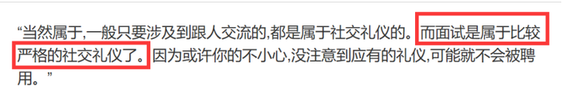

故正确答案为A。

注：有同学纠结A项的面试算不算社交，经过多方面资料查询，面试是属于社交的，所以这道题我们经过对比择优，选择A项。

---

#### 第 48 题　qid 2452699 · 定义判断

情感消费：指消费者出于某种情感需要而购买商品的行为，这种情感通常与商品的使用功能并没有直接关系。
下列属于情感消费的是

- **A**. 小王和小马是同学，情同姐妹，小王是某大牌化妆品的经销商，小马每次都能以最低的价格从小王处购买她需要的化妆品
- **B**. 张先生看到某旅行社儿童节前推出的“欢乐童年南方行”定制旅游项目后，就选择了儿子一直梦寐以求的一条线路
- **C**. 小陈对某电商平台有深厚的感情，多年来一直喜欢在这家平台购买日常用品，因为这家电商的商品质量好、价格低、服务优
- **D**. 刘先生知道父亲有好多T恤衫，看到一件背后印有父亲生肖图案的T恤衫时，虽然价格不菲，还是毫不犹豫地买了回来　✅

**答案**：D

**官方解析**

第一步：找出定义关键词。
“消费者出于某种情感需要而购买商品的行为”、“这种情感通常与商品的使用功能并没有直接关系”。
第二步：逐一分析选项。
A项：小马去小王那里购买化妆品是因为能以最低的价格买到所需的化妆品，并未体现“消费者出于某种情感需要而购买商品的行为”，不符合定义，排除； 
B项：张先生选择该旅游项目是因为这个项目是儿子梦寐以求的，能够体现张先生对儿子的感情，符合“消费者出于某种情感需要而购买商品的行为”，这个项目本身就是为了让孩子们高兴的，跟产品的使用功能是有关系的，不符合“这种情感通常与商品的使用功能并没有直接关系”，不符合定义，排除；
C项：小陈对某电商平台有深厚的感情，所以一直都在这个电商平台上购买，符合“消费者出于某种情感需要而购买商品的行为”，但是他在这个电商平台上购买就是因为商品性价比高，与这些商品的功能有直接关系的，不符合“这种情感通常与商品的使用功能并没有直接关系”，不符合定义，排除；
D项：刘先生知道自己父亲有很多T恤，但是依然购买了背后印有自己父亲生肖的T恤，能够体现自己对父亲的感情的，符合“消费者出于某种情感需要而购买商品的行为”，并且他是因为背后有自己父亲生肖的图案才购买的，与T恤本身的功能无关，所以符合“这种情感通常与商品的使用功能并没有直接关系”，符合定义，当选。
故正确答案为D。

---

#### 第 49 题　qid 2452700 · 图形推理

鬲（lì）是古代一种煮饭用的炊器，有陶制鬲和青铜鬲，其形状一般为侈口（口沿外倾），有三个中空的足，便于炊煮加热。觚（gū）是古代一种用于饮酒的容器，也用作礼器，圈足、敞口、长身，口部和底部都呈现为喇叭状。卣（yǒu）是古代的一种酒器，口椭圆形，圈足，有盖和提梁，腹深。尊（zūn）是古代的一种大中型盛酒器，圈足，圆腹或方腹，长颈，敞口，口径较大。

下列4个图形依次为

- **A**. 觚、尊、鬲、卣
- **B**. 尊、鬲、觚、卣
- **C**. 觚、卣、鬲、尊　✅
- **D**. 鬲、卣、尊、觚

**答案**：C

**官方解析**

第一步：找出定义关键词。
“鬲”：侈口（口沿外倾）、三个中空的足；
“觚”：圈足、敞口、长身，口部和底部都呈现为喇叭状；
“卣”：口椭圆形，圈足，有盖和提梁，腹深；
“尊”：圈足，圆腹或方腹，长颈，敞口，口径较大。
第二步：逐一分析选项。
题干四个图片从左到右依次是：觚、卣、鬲、尊，只有C项符合。
故正确答案为C。

---

#### 第 50 题　qid 2452529 · 逻辑判断

谜语有多种猜法。比较法是将字形、字义相近或相反的词放在一起，加以比较而扣合谜底；溯源法是追溯谜面的来源及其与原出处的上下关联，然后再扣合谜底；拟物法是将人或人体某部分物化，将谜面字词语义或所言之事物化，扣合谜底。
①谜面：枕头。要求打一成语。谜底：置之脑后
②谜面：桃花潭水深千尺。要求打一成语。谜底：无与伦比
③谜面：加一笔不好，加一倍不少。要求打一字。谜底：夕
关于①②③谜语的猜法，下列判断正确的是

- **A**. ①溯源法，②比较法，③拟物法
- **B**. ①溯源法，②拟物法，③比较法
- **C**. ①比较法，②溯源法，③拟物法
- **D**. ①拟物法，②溯源法，③比较法　✅

**答案**：D

**官方解析**

第一步：找出定义关键词。
比较法：“将字形、字义相近或相反的词放在一起，加以比较而扣合谜底”。
溯源法：“追溯谜面的来源及其与原出处的上下关联，然后再扣合谜底”。
拟物法：“将人或人体某部分物化，将谜面字词语义或所言之事物化，扣合谜底” 。
第二步：逐一分析三个谜语。
谜语①：“枕头。要求打一成语。谜底：置之脑后”
分析：“枕头”指躺着的时候，垫在头下使头略高的卧具，“置之脑后”是说放在脑袋后面，符合“将人或人体某部分物化，将谜面字词语义或所言之事物化，扣合谜底”，属于拟物法。
谜语②：“桃花潭水深千尺。要求打一成语。谜底：无与伦比”
分析：“桃花潭水深千尺”出自于李白的《赠汪伦》，原句为：“桃花潭水深千尺，不及汪伦送我情”，含义是：桃花潭千尺深的水都比不上汪伦和我的友情，诗人用潭水深千尺比喻汪伦与他的友情。该谜面通过“追溯谜面的来源及其与原出处的上下关联，然后再扣合谜底”，属于溯源法。
谜语③：“加一笔不好，加一倍不少。要求打一字。谜底：夕”
分析：“加一笔不好”，“夕”加一笔是“歹”，“歹”是不好的意思；“加一倍不少”，“夕”再加一倍，也就是两个夕，即“多”，“多”也就是不少的意思。谜面是根据谜底“夕”的字形以及字义相近或相反的词来扣合谜底的，因此属于比较法。
因而谜语①对应拟物法，谜语②对应溯源法，谜语③对应比较法。
故正确答案为D。

---

## 资料分析

### 材料 1

根据以下资料，回答116～120题

 

#### 第 1 题　qid 2452705 · 综合

2019年上半年，东部地区软件业务收入利润率是

- **A**. 

　✅
- **B**. 
 

- **C**. 
 

- **D**. 

**答案**：A

**官方解析**

根据题干“2019年上半年······利润率是”，可判定本题为现期比重问题。定位表格最后一行可得，2019年上半年我国东部地区软件业务利润为35464369万元，软件业务收入为263354838万元。根据公式：利润率，可得所求利润率，与A项最接近。

故正确答案为A。

---

#### 第 2 题　qid 2452707 · 增长

东部地区各省(市)中，2019年上半年软件业务收入占地区软件业务总收入的比重同比提高的有

- **A**. 5个
- **B**. 6个
- **C**. 7个
- **D**. 8个　✅

**答案**：D

**官方解析**

根据题干“······2019年上半年······占······比重同比提高的有”，可判定本题为两期比重问题。定位表格资料可知2019年上半年我国东部地区各省（市）软件业务收入同比增长率（a）、东部地区软件业务总收入同比增长率（），根据两期比重结论“若 ，则比重同比提高”，满足题干要求的有北京（）、天津（）、河北（）、江苏（）、浙江（）、福建（）、山东（）、海南（），共8个省（市）。

故正确答案为D。

---

#### 第 3 题　qid 2452709 · 平均数

2019年上半年，东部地区各省（市）软件企业的软件业务平均利润的最大值是

- **A**. 2320万元
- **B**. 2355万元
- **C**. 4038万元　✅
- **D**. 4969万元

**答案**：C

**官方解析**

根据题干“2019年上半年······平均利润······”，可判定本题为现期平均数问题。定位表格资料可知2019年上半年我国东部地区各省（市）软件业务利润及企业数，根据公式：，可得2019年上半年我国东部地区各省（市）软件企业平均利润：北京，万元；天津，万元；河北，万元；上海，万元；江苏，=1000万元；浙江，万元；福建，万元；山东，万元；广东，；海南，万元。可得浙江的最大，且与C项最接近。

故正确答案为C。

---

#### 第 4 题　qid 2452711 · 综合

下列图形中，对2019年上半年东部地区各省（市）软件业务收入构成表示正确的是

- **A**. A
- **B**. B　✅
- **C**. C
- **D**. D

**答案**：B

**官方解析**

根据题干“······2019年上半年······收入构成······”，结合选项均为饼形图，可判定本题为现期比重问题。定位表格资料可得2019年上半年东部地区软件业务总收入以及各省（市）软件业务收入。根据公式：比重，可知分母一致，分子越大，比重越大。分别分析各个选项。

A项：图中北京占比大于广东，但在表格资料中，北京（50031221万元）广东（58564688万元），错误。

C项：图中江苏占比大于北京，但在表格资料中，江苏（47479657万元）北京（50031221万元），错误。

D项：图中北京、江苏和山东三个省（市）的总和占东部地区的比重超过，但在表格资料中，北京、江苏和山东三个省（市）的总和占东部地区的比重，错误。

故正确答案为B。

---

#### 第 5 题　qid 2452713 · 综合

关于2019年上半年东部地区软件业的发展情况，从上述资料不能推出的是

- **A**. 江苏信息技术服务收入同比增加额多于浙江
- **B**. 软件业务收入同比增加最多的省（市）是广东　✅
- **C**. 江苏软件企业数是三个直辖市企业数总和的1.3倍
- **D**. 所有省（市）的信息技术服务收入同比增速都在两位数以上

**答案**：B

**官方解析**

A项：定位表格资料可知，2019年上半年江苏信息技术服务收入为26631665万元，同比增长；浙江信息技术服务收入为17545451万元，同比增长。根据公式：增长量，可得江苏信息技术服务收入增加万元，浙江信息技术服务收入增加万元，江苏多于浙江，正确。

B项：定位表格资料可知2019年上半年东部地区各省（市）软件业务收入及同比增长率，根据公式：增长量，可得广东软件业务收入同比增长量万元，北京软件业务收入同比增长量万元，广东软件业务收入同比增长量低于北京，错误。

C项：定位表格资料可知，江苏软件企业数为7138个，三个直辖市（北京、天津、上海）软件企业数总和为个，所求倍数，正确。

D项：定位表格资料可知2019年上半年东部地区各省（市）信息技术服务收入同比增速均大于，即同比增速都在两位数以上，正确。

本题为选非题，故正确答案为B。

---

### 材料 2

        2019年1-10月，江苏民航机场旅客吞吐量4901万人次，同比增长，增速比华东地区（六省一市）高6.2个百分点，比上海高9.7个百分点，比浙江高5.7个百分点，比山东高4.4个百分点，比福建高8.7个百分点，比江西高6.9个百分点，与安徽持平。

#### 第 6 题　qid 2452566 · 增长

2019年1-10月，江苏民航机场旅客吞吐量同比增加

- **A**. 398万人次
- **B**. 435万人次
- **C**. 579万人次　✅
- **D**. 657万人次

**答案**：C

**官方解析**

根据题干“2019年1-10月······同比增加”，且选项带单位，可判定本题为增长量计算问题。定位文字资料“2019年1-10月，江苏民航机场旅客吞吐量4901万人次，同比增长”，根据公式：，则题干所求万人次，与C项最接近。

故正确答案为C。

---

#### 第 7 题　qid 2452571 · 增长

2013-2018年江苏9个民航机场中旅客吞吐量逐年增加的机场个数是

- **A**. 6个
- **B**. 7个　✅
- **C**. 8个
- **D**. 9个

**答案**：B

**官方解析**

定位表格资料可得2013-2018年江苏9个民航机场每年旅客吞吐量情况。由表格数据可得，旅客吞吐量逐年增加的机场是南京禄口、无锡硕放、南通兴东、徐州观音、扬州泰州、盐城南洋、连云港白塔埠，共7个。
故正确答案为B。

---

#### 第 8 题　qid 2452576 · 增长

2019年1-10月，华东地区民航机场旅客吞吐量同比增速最慢的省（市）是

- **A**. 上海　✅
- **B**. 江西
- **C**. 福建
- **D**. 山东

**答案**：A

**官方解析**

根据题干“2019年1—10月······同比增速最慢的省（市）是”，可判定本题为一般增长率比较问题。定位文字资料“2019年1-10月，江苏民航机场旅客吞吐量4901万人次，同比增长，增速······比上海高9.7个百分点······比山东高4.4个百分点，比福建高8.7个百分点，比江西高6.9个百分点”，则2019年1-10月，选项中各省（市）民航机场旅客吞吐量的同比增速分别为：A项，上海为；B项，江西为；C项，福建为；D项，山东为。同比增速最慢的是上海。

故正确答案为A。

---

#### 第 9 题　qid 2452582 · 增长

2013-2018年江苏9个民航机场中旅客吞吐量年均增速最快的机场是

- **A**. 南京禄口
- **B**. 南通兴东
- **C**. 扬州泰州　✅
- **D**. 盐城南洋

**答案**：C

**官方解析**

根据题干“2013—2018年······年均增速最快的机场是”，可判定本题为年均增长率比较问题。根据公式：，年份差（）相同，比较年均增速大小只需比较。定位表格资料可知，2012年南京禄口民航机场旅客吞吐量为1400万人次，2018年为2858万人次；2012年南通兴东民航机场旅客吞吐量为39万人次，2018年为277万人次；2012年扬州泰州民航机场旅客吞吐量为25万人次，2018年为238万人次；2012年盐城南洋民航机场旅客吞吐量为32万人次，2018年为182万人次。选项中各机场2013-2018年旅客吞吐量的分别为：A项，南京禄口为；B项，南通兴东为；C项，扬州泰州为；D项，盐城南洋为。旅客吞吐量年均增速最快的机场是扬州泰州。

故正确答案为C。

---

#### 第 10 题　qid 2452588 · 综合

从上述资料中能够推出的是

- **A**. 2019年1-10月安徽民航机场旅客吞吐量在华东地区同比增加最多
- **B**. 2018年南京禄口民航机场旅客吞吐量大于江苏其他8个民航机场之和　✅
- **C**. 2019年1-10月上海民航机场旅客吞吐量占华东地区的比重同比有所提高
- **D**. 2013-2018年常州奔牛民航机场旅客吞吐量年均增量比连云港白塔埠的多2倍多

**答案**：B

**官方解析**

A项：定位文字资料，华东地区中除江苏外，其余省市仅给出2019年1-10月民航机场旅客吞吐量同比增速与江苏民航机场同比增速的关系，无法推出同比增长量的大小关系，错误。

B项：定位表格资料可知各民航机场2018年旅客吞吐量数据。南京禄口民航机场为2858万人次，其余8个民航机场旅客吞吐量之和为万人次，因此2018年南京禄口民航机场旅客吞吐量大于江苏其他8个民航机场之和，正确。

C项：定位文字资料“2019年1-10月，江苏民航机场旅客吞吐量4901万人次，同比增长，增速比华东地区（六省一市）高6.2个百分点，比上海高9.7个百分点”，则华东地区同比增速为，上海同比增速为，根据两期比重比较结论，部分增长率（）整体增长率（），比重同比下降，错误。

D项：定位表格资料可知，2012年常州奔牛民航机场旅客吞吐量为108万人次，2018年为333万人次；2012年连云港白塔埠民航机场旅客吞吐量为48万人次，2018年为152万人次。根据公式：年均增长量，2013-2018年常州奔牛民航机场旅客吞吐量年均增量万人次，连云港白塔埠民航机场旅客吞吐量年均增量万人次，前者比后者多倍，错误。

故正确答案为B。

---

### 材料 3

        2019年2月中下旬，某市统计局随机抽取2000名在该市居住半年以上的18～65周岁居民，就其2019年春节期间的消费情况进行了调查。调查结果显示：与上年春节相比，的受访居民消费支出有所增加，的受访居民消费支出基本持平。

                                                     

                                                                          

#### 第 11 题　qid 2452646 · 综合

受访居民中，2019年春节期间消费支出多于上年的人数与少于上年的人数相差：

- **A**. 274人
- **B**. 292人　✅
- **C**. 594人
- **D**. 886人

**答案**：B

**官方解析**

根据题干“受访居民中······人数相差”，结合文字材料“的受访居民消费支出有所增加，的受访居民消费支出基本持平”，可判定本题为现期比重问题。2019年春节期间消费支出少于上年的人数占比，消费支出多于上年的人数消费支出少于上年的人数人。

故正确答案为B。

---

#### 第 12 题　qid 2452647 · 综合

2019年春节期间有“餐饮消费”的受访居民中，一定有人：

- **A**. 参加教育培训　✅
- **B**. 去旅游
- **C**. 购保健产品
- **D**. 购数码产品、智能家电

**答案**：A

**官方解析**

根据题干“2019年······受访居民中······”，结合选项为不同消费项目，可判定本题为现期比重问题。定位图2，2019年春节期间不同消费项目中有“消费餐饮”的受访居民占比为；结合选项，受访居民参加教育培训的占比为，二者占比之和为，超过整体，说明二者之间必然有交集，也就是说，春节期间有“餐饮消费”的受访居民中，一定有人参加教育培训。

故正确答案为A。

---

#### 第 13 题　qid 2452648 · 综合

2019年春节期间消费支出在2000元以下的受访居民中，“发红包、给压岁钱”的至少占

- **A**. 

- **B**. 

- **C**. 

- **D**. 

　✅

**答案**：D

**官方解析**

根据题干“2019年······至少占”，结合选项为百分数，可判定本题为现期比重问题。定位图1可知春节期间消费支出在2000元以下的受访居民占比为，则消费支出在2000元以下的受访居民人数为人；定位图2可知“发红包、给压岁钱”的受访居民占比为，则“发红包、给压岁钱”的受访居民人数为人，因为人，证明消费支出在2000元以下的受访居民与发红包、给压岁钱的受访居民有交集，所以消费支出在2000元以下的受访居民中，“发红包、给压岁钱”的人数至少为人，所求。

故正确答案为D。

---

#### 第 14 题　qid 2452649 · 综合

2019年春节期间消费支出在5000元以上的受访居民人数有可能是：

- **A**. 320人
- **B**. 388人　✅
- **C**. 420人
- **D**. 456人

**答案**：B

**官方解析**

根据题干“2019年······受访居民人数······”，可判断本题为现期比重问题。定位文字资料可知受访居民人数为2000人。定位图1可得，5000~8000元、8000~11000元、11000元以上的人数占受访居民的比重分别为、和，根据公式：部分，可得该部分受访市民人数为人。说不清的人数占受访居民的比重为，人数为人，故消费支出在5000元以上的受访居民人数应大于或等于378人且小于或等于人。结合选项，只有B项388人在此范围内。

故正确答案为B。

---

#### 第 15 题　qid 2452651 · 综合

关于2019年春节期间消费，从上述资料中能够推出的是：

- **A**. 
“购年俗食品、烟酒、服饰”的受访居民中没有人消费支出超过8000元

- **B**. 
消费支出与上年基本持平的受访居民中有16人消费支出为2000-5000元

- **C**. 
受访居民中去“看电影、滑雪、逛庙会”的比“参加教育培训”的多400人
　✅
- **D**. 
至少有的受访居民同时选择“购保健产品”“购数码产品、智能家电”和“去旅游”

**答案**：C

**官方解析**

A项：定位图2可知，“购年俗食品、烟酒、服饰”的受访居民占比为；定位图1可知，消费支出超过8000元，一定包括消费支出8000~11000元和11000元以上，表示“说不清”的受访居民也有可能有人的消费支出超过8000元，他们的占比分别为、、，三者占比之和为；“购年俗食品、烟酒、服饰”的受访居民和消费支出可能超过8000元受访居民占比之和至多为，小于整体，所以二者之间可能没有交集，故不能确定“购年俗食品、烟酒、服饰”的受访居民中有没有人消费支出超过8000元，错误。

B项：定位文字资料可知，的受访居民消费支出与上年基本持平；定位图1可知消费支出为2000~5000元的受访者占比为，因为，所以二者有交集，可以确定消费支出与上年基本持平的受访居民中有消费支出为2000~5000元的人，但无法确定具体人数，错误.

C项：定位图2可知，受访居民中去“看电影、滑雪、逛庙会”的占比为，受访居民中“参加教育培训”的占比为，二者人数相差人，正确.

D项：定位图2可知，“购保健产品”的受访居民占比为，“购数码产品、智能家电”的受访居民占比为，“去旅游”的受访居民占比为，三者占比之和为，故三者之间可能没有交集，无法确定关系，错误。

故正确答案为C。

---

### 材料 4

        2018年末，全国共有各类文物机构10160个，比上年末增加229个。其中，文物保护管理机构3550个，占；博物馆4918个，占。全国文物机构从业人员16.26万人，比上年末增加0.11万人。其中，高级职称占，中级职称占。全国文物机构拥有文物藏品4960.61万件，比上年末增长。其中，博物馆文物藏品3754.25万件，文物商店文物藏品751.40万件。

图  2010—2018年全国文物机构及其从业人员情况

#### 第 16 题　qid 2452733 · 综合

2018年末全国文物机构从业人员中，不具备中高级职称的有

- **A**. 12.46万人
- **B**. 13.22万人　✅
- **C**. 14.89万人
- **D**. 15.28万人

**答案**：B

**官方解析**

根据题干“2018年末······中，不具备中高级职称的有”，结合资料给出全部从业人员数及中高级职称人数占比，可判定本题为现期比重问题。定位文字资料可得，2018年末，全国文物机构从业人员16.26万人，其中，高级职称占，中级职称占。根据公式：部分=整体×比重，不具备中高级职称的有万人，与B项最接近。

故正确答案为B。

---

#### 第 17 题　qid 2452735 · 比重

2018年末全国博物馆文物藏品、文物商店文物藏品占全国文物机构文物藏品的比重之差为

- **A**. 53.6个百分点
- **B**. 55.2个百分点
- **C**. 60.5个百分点　✅
- **D**. 66.3个百分点

**答案**：C

**官方解析**

根据题干“2018年末······占全国文物机构文物藏品的比重之差为”结合资料时间为2018年末，可判定本题为现期比重问题。定位文字资料可得，2018年末，全国文物机构拥有文物藏品4960.61万件，其中，博物馆文物藏品3754.25万件，文物商店文物藏品751.40万件。根据公式：比重，可得所求比重差，即60个百分点，与C项最接近。

故正确答案为C。

---

#### 第 18 题　qid 2452736 · 增长

2011-2018年全国文物机构数增加最多的年份是

- **A**. 2011年
- **B**. 2013年　✅
- **C**. 2015年
- **D**. 2017年

**答案**：B

**官方解析**

根据题干“2011-2018年······增加最多的年份是”，可判定本题为增长量比较问题。定位图形资料可得2010-2018年全国文物机构数，根据公式：增长量现期量基期量，计算出各项年份文物机构数的增长量，进行比较即可。

A项：2011年，个。

B项：2013年，个。

C项：2015年，个。

D项：2017年，个。

综上可知，2013年全国文物机构数增加最多。

故正确答案为B。

---

#### 第 19 题　qid 2452737 · 增长

2011-2018年全国文物机构从业人员年均增加

- **A**. 7516人　✅
- **B**. 7821人
- **C**. 8106人
- **D**. 8738人

**答案**：A

**官方解析**

根据题干“2011-2018年······年均增加”，结合选项为“数值单位”，可判定本题为年均增长量计算问题。定位图形资料可得，2010年全国文物机构从业人员数为102471人，2018年为162600人。根据公式：年均增长量，可得2011-2018年全国文物机构从业人员年均增加为人，与A项最接近。

故正确答案为A。

---

#### 第 20 题　qid 2452738 · 综合

从上述材料不能推出的是

- **A**. 2011-2018年全国文物机构数呈逐年增加的态势
- **B**. 2018年末全国博物馆数量比文物保护管理机构数量多
- **C**. 2017年末全国文物机构从业人员比上年末增加1100人　✅
- **D**. 2018年末全国文物机构拥有文物藏品比上年末增加100多万件

**答案**：C

**官方解析**

A项：定位图形资料可知，2011-2018年全国文物机构数逐年增加，正确。

B项：定位文字资料可得，2018年末，全国文物保护管理机构3550个，博物馆4918个，博物馆数量多于文物保护管理机构数量，正确。

C项：定位图形资料可得，2017年末全国文物机构从业人员数为161500人，2016年末为151430人，人，错误。

D项：定位文字资料可得，2018年末全国文物机构拥有文物藏品4960.61万件，比上年末增长。根据公式：增长量，可得所求增长量万件，正确。

本题为选非题，故正确答案为C。

---
