# 2020年江苏省公务员录用考试《行测》题（C类）（网友回忆版）

> 省考 · 2020 年 · 6 个模块 · 共 129 题

- [政治理论](#%E6%94%BF%E6%B2%BB%E7%90%86%E8%AE%BA) · 1 题
- [常识判断](#%E5%B8%B8%E8%AF%86%E5%88%A4%E6%96%AD) · 14 题
- [言语理解与表达](#%E8%A8%80%E8%AF%AD%E7%90%86%E8%A7%A3%E4%B8%8E%E8%A1%A8%E8%BE%BE) · 30 题
- [数量关系](#%E6%95%B0%E9%87%8F%E5%85%B3%E7%B3%BB) · 19 题
- [判断推理](#%E5%88%A4%E6%96%AD%E6%8E%A8%E7%90%86) · 45 题
- [资料分析](#%E8%B5%84%E6%96%99%E5%88%86%E6%9E%90) · 20 题

---

## 政治理论

### 第 1 题　qid 2452626 · 时事政治

党的十九届四中全会通过了《坚持和完善中国特色社会主义制度、推进国家治理体系和治理能力现代化若干重大问题的决定》。关于该《决定》的内容，下列说法正确的是
①阐述了我国国家制度和国家治理体系发展的历史性成就和显著优势
②提出了推进国家治理体系和治理能力现代化的重大意义和总体要求
③回答了什么是社会主义和怎样建设社会主义这个重大政治问题
④明确了各项制度必须坚持和巩固的根本点、完善和发展的方向

- **A**. ①②③
- **B**. ①②④　✅
- **C**. ①③④
- **D**. ②③④

**答案**：B

**官方解析**

本题考查政治常识。
①②④正确，习近平总书记在《关于&lt;中共中央关于坚持和完善中国特色社会主义制度,推进国家治理体系和治理能力现代化若干重大问题的决定&gt;的说明》一文中指出：“决定稿由15部分构成，分为三大板块。第一板块为第一部分，是总论，主要阐述中国特色社会主义制度和国家治理体系发展的历史性成就、显著优势，提出新时代坚持和完善中国特色社会主义制度、推进国家治理体系和治理能力现代化的重大意义和总体要求。第二板块为分论，聚焦坚持和完善支撑中国特色社会主义制度的根本制度、基本制度、重要制度，安排了13个部分，明确了各项制度必须坚持和巩固的根本点、完善和发展的方向，并作出工作部署。第三板块为第十五部分和结束语，主要就加强党对坚持和完善中国特色社会主义制度、推进国家治理体系和治理能力现代化的领导提出要求。”
③错误，邓小平理论回答了什么是社会主义和怎样建设社会主义这个重大政治问题。
故正确答案为B。

---

## 常识判断

### 第 1 题　qid 2452750 · 法律常识

2019年上半年，中共中央、国务院发布《关于建立健全城乡融合发展体制机制和政策体系的意见》，要求在职称评定、工资待遇等方面向乡村教师、医生倾斜，并提出要建立统一的城乡居民人身损害赔偿标准。下列关于该文件及其内容的理解，正确的是

- **A**. 该文件属于国家政策，对法律的制定具有强制约束力
- **B**. 现行的法律规定与该文件内容不符的，均属无效
- **C**. 向乡村工作者倾斜的要求，体现了合理差别原则　✅
- **D**. 城乡居民人身损害赔偿标准的统一，体现了对弱势群体的保护

**答案**：C

**官方解析**

本题考查政治常识。
A、B项错误，政府要依法行政，根据《立法法》第八十七条第一款规定：“法律的效力高于行政法规、地方性法规、规章。”国务院制定的行政法规等规范性文件不得与法律冲突。
C项正确，合理差别是指有某种“合理依据”及在“合理程度”范围内的差别，实质平等承认合理的差别，是为了在竞争和分配中保护弱者的利益。乡村工作者与城市工作者相比，在工作条件、待遇晋升等方面处于弱势，将职称评定、工资待遇等方面向乡村工作者倾斜，是为了保护他们的利益，让他们能够扎根基层继续工作，体现的是合理差别原则。
D项错误，城乡居民人身损害赔偿标准的统一，充分体现了国家平等尊重和保护公民的生命健康权，符合公平和利益平衡原则。没有体现保护弱势群体，因为农村居民并不全是“弱势群体”。
故正确答案为C。

---

### 第 2 题　qid 2452631 · 人文常识

2019年10月31日，国务院决定开展第七次全国人口普查。关于第七次全国人口普查，下列说法不正确的是

- **A**. 标准时点是2020年11月1日零时
- **B**. 普查对象不含在境内定居的外国人　✅
- **C**. 将首次采集普查对象的身份证号码
- **D**. 采取电子化方式开展人口普查登记

**答案**：B

**官方解析**

本题考查政治常识。
A项正确，2020年第七次全国人口标准时点是2020年11月1日零时普查。
B项错误，普查对象是普查标准时点在中华人民共和国境内的自然人以及在中华人民共和国境外但未定居的中国公民，不包括在中华人民共和国境内短期停留的境外人员。
C项正确，为了提高普查数据质量，在全国第七次人口普查中将首次采集普查对象的身份证号码。
D项正确，国务院决定于2020年开展第七次全国人口普查。本次全国人口普查采取电子化方式开展普查登记，探索使用智能手机采集数据。
本题为选非题，故正确答案为B。

---

### 第 3 题　qid 2452753 · 人文常识

新中国成立70年来，我国农业取得了举世瞩目的历史性成就。下列关于新中国农业发展成就说法正确的是
①农业生产技术水平和科技水平显著提高
②粮食的综合生产能力接连实现了新跨越
③农林牧渔全面发展的现代农业已经建立
④农业生产组织方式和模式发生重大变化

- **A**. ①②③
- **B**. ①②④　✅
- **C**. ①③④
- **D**. ②③④

**答案**：B

**官方解析**

本题考查政治常识。
①正确，国家统计局《农业生产跃上新台阶 现代农业擘画新蓝图——新中国成立70周年经济社会发展成就系列报告之十二》一文中指出：“农业基础设施明显改善，农业生产技术和科技水平显著提高。”
②正确，国家统计局《农业生产跃上新台阶 现代农业擘画新蓝图——新中国成立70周年经济社会发展成就系列报告之十二》一文中指出：“粮食生产跃上新台阶，有力保障了国家粮食安全……粮食综合生产能力在前期连续多年增产、起点较高的情况下，再上新台阶。”
③错误，国家统计局《农村经济持续发展 乡村振兴迈出大步——新中国成立70周年经济社会发展成就系列报告之十三》一文中指出：“我国农业实现了由单一以种植业为主的传统农业向农林牧渔业全面发展的现代农业转变。”实现转变，但并不代表“农林牧渔业全面发展的现代农业”已经建立，该说法太绝对。
④正确，国家统计局《农村经济持续发展 乡村振兴迈出大步——新中国成立70周年经济社会发展成就系列报告之十三》一文中指出：“农业生产组织方式和模式发生重大变化，生产效率明显提高。”
故正确答案为B。

---

### 第 4 题　qid 2452669 · 人文常识

当今世界不稳定不确定因素明显增加，我们要坚持底线思维，居安思危、未雨绸缪，做好应付最坏局面的思想准备。下列表述体现了坚持底线思维的是

- **A**. 政治建设方面绝不能犯颠覆性错误　✅
- **B**. 经济建设方面努力实现高质量发展
- **C**. 文化建设方面要繁荣社会主义文艺
- **D**. 外交战略方面构建人类命运共同体

**答案**：A

**官方解析**

本题考查政治常识。
A项正确，政治安全攸关党和国家的安危，是维护国家安全的根本。如果在事关全局的政治问题上随波逐流，丧失原则和立场，就会严重危害党和人民事业的发展。因此政治建设决不能犯颠覆性错误，这是一种底线。
BCD项错误，底线思维具有目的性、价值性，以实现和维护一定利益和价值为旨归。坚持和发展中国特色社会主义，全面建成社会主义现代化强国，实现中华民族伟大复兴的中国梦，是我们坚持底线思维的总体价值目标。这一总体价值目标，是通过经济、政治、文化、社会、生态文明各个方面建设来体现和实现的。BCD项不属于坚持底线思维，是为了实现总体价值目标在经济、文化、外交战略建设方面的表现。
故正确答案为A。

---

### 第 5 题　qid 2452756 · 人文常识

根据当前和今后一段时期我国社会治理面临的形势，社会治理的重心必须落实到社区，关于社会治理的重心必须落实到社区的原因，下列说法不正确的是

- **A**. 社区治理是社会治理的难点
- **B**. 社区治理要以政府需求为导向　✅
- **C**. 能够从源头上解决社会矛盾
- **D**. 利于增强居民对社区的归属感

**答案**：B

**官方解析**

本题考查政治。
A项正确，社区治理创新是社会治理创新的重点和难点。习近平在参加十二届全国人大二次会议上海代表团审议时强调，加强和创新社会治理，关键在体制创新，核心是人，只有人与人和谐相处，社会才会安定有序。社会治理的重心必须落到城乡社区，社区服务和管理能力强了，社会治理的基础就实了。
B项错误，《中共中央国务院关于加强和完善城乡社区治理的意见》的指导思想指出：“······深入贯彻习近平总书记系列重要讲话精神和治国理政新理念新思想新战略，紧紧围绕统筹推进‘五位一体’总体布局和协调推进‘四个全面’战略布局，坚持以基层党组织建设为关键、政府治理为主导、居民需求为导向、改革创新为动力······为实现‘两个一百年’奋斗目标和中华民族伟大复兴的中国梦提供可靠保证。”选项中以政府需求为导向表述错误。
C项正确，着力构建基层社区矛盾纠纷有效治理模式与治理机制，以社区作为矛盾纠纷预防、调处的第一阵地，积极构建社会矛盾社区多元主体协同治理网络体系，建立健全社区矛盾纠纷排查、预警、调解、善后机制，有助于从源头上解决社会矛盾。
D项正确，居民对社区的认同感和归属感是和谐社区建设的核心要素。将社会治理的重心落实到社区，完善居民在社区公共事务中当家作主的权利行使机制，通过共同努力建成家园，有利于增强居民对社区的认同感和归属感。
本题为选非题，故正确答案为B。

---

### 第 6 题　qid 2452758 · 人文常识

我国要按照增加总量、优化存量、提高效能的原则，强化高质量绿色发展导向，加快构建新型农业补贴政策体系。下列不属于加快构建新型农业补贴政策体系措施的是

- **A**. 完善稻谷和小麦最低收购价政策
- **B**. 完善玉米和大豆生产者补贴政策
- **C**. 完善农业信贷担保费率补助机制
- **D**. 完善农产品出口的现金补贴机制　✅

**答案**：D

**官方解析**

本题考查政治。
2019年中央一号文件指出：“完善农业支持保护制度。按照增加总量、优化存量、提高效能的原则，强化高质量绿色发展导向，加快构建新型农业补贴政策体系。按照适应世贸组织规则、保护农民利益、支持农业发展的原则，抓紧研究制定完善农业支持保护政策的意见。调整改进‘黄箱’政策，扩大‘绿箱’政策使用范围。按照更好发挥市场机制作用取向，完善稻谷和小麦最低收购价政策。完善玉米和大豆生产者补贴政策。健全农业信贷担保费率补助和以奖代补机制，研究制定担保机构业务考核的具体办法，加快做大担保规模。按照扩面增品提标的要求，完善农业保险政策。推进稻谷、小麦、玉米完全成本保险和收入保险试点。扩大农业大灾保险试点和‘保险+期货’试点。探索对地方优势特色农产品保险实施以奖代补试点。”因此A、B、C项正确，D项未提到。
本题为选非题，故正确答案为D。

---

### 第 7 题　qid 2452636 · 人文常识

1949年3月，中共中央和毛泽东离开西柏坡前往北平进驻香山。在香山的半年时间里，发生的一系列重大历史事件在党和国家历史上具有非常重要的地位。下列发生在这一时期的重大历史事件是
①毛泽东、朱德发布向全国进军的命令，吹响了解放全中国的伟大号角
②召开了党的七届二中全会，规定了党在全国胜利后应当采取的基本政策
③毛泽东发表了《论人民民主专政》，为新中国建立奠定了理论和政策基础
④制定了《中国人民政治协商会议共同纲领》，描绘了建立建设新中国的蓝图

- **A**. ①②③
- **B**. ①②④
- **C**. ①③④　✅
- **D**. ②③④

**答案**：C

**官方解析**

本题考查毛中特。
①、③、④正确，2019年9月12日，中共中央总书记、国家主席、中央军委主席习近平专程前往北京香山革命纪念地，瞻仰双清别墅、来青轩等革命旧址，参观香山革命纪念馆。他表示，1949年3月23日，中共中央和毛泽东同志离开西柏坡前往北平，25日进驻北京香山，这里成为党中央所在地。在这里，毛泽东、朱德同志发布向全国进军的命令，吹响了“打过长江去，解放全中国”的伟大号角，中国人民解放军以摧枯拉朽之势向全国各地胜利大进军，彻底结束了国民党在大陆的统治。在这里，毛泽东同志发表了《论人民民主专政》，为新中国的建立奠定理论基础和政策基础。在这里，中共中央同各民主党派、各界人士共同筹备中国人民政治协商会议，制定通过了起到临时宪法作用的《中国人民政治协商会议共同纲领》，确定了新中国的国体和政体，制定了一系列基本政策，描绘了建立建设新中国的宏伟蓝图。
②错误，党的七届二中全会于1949年3月5日—13日在河北西柏坡召开。这次会议规定了党在全国胜利以后在政治、经济、外交方面应当采取的基本政策，为夺取全国革命的胜利，推动新民主主义革命向社会主义革命转变，奠定了政治上和思想上的基础。此次会议在西柏坡召开，因此不属于离开西柏坡前往北平进驻香山后发生的重大历史事件。
故正确答案为C。

---

### 第 8 题　qid 2452637 · 人文常识

人们常常引用希腊典故来分析当今世界的现实问题。下列希腊典故与其寓意对应正确的是

- **A**. 潘多拉的盒子——世事变幻无常
- **B**. 阿喀琉斯之踵——强大事物的软肋　✅
- **C**. 修昔底德陷阱——安静祥和背后暗藏的风险
- **D**. 达摩克利斯之剑——守成大国与崛起大国必有一战

**答案**：B

**官方解析**

本题考查人文常识。
A项错误，潘多拉，希腊神话中的第一个女人。她貌美性诈，私自打开宙斯送给她的一只盒子，里面装的疾病、疯狂、罪恶、嫉妒等祸患，一齐飞出，只有希望留在盒底，人间因此充满灾难。因此“潘多拉的盒子”成为“灾祸的来源”的同义语。
B项正确，荷马史诗中的英雄阿喀琉斯出生后便被神仙母亲倒提着浸入冥河，而脚后跟却不慎露在水外，因而除脚后跟外，全身各处刀枪不入。后来，一次战斗中他被人一箭射中脚踝而死去。后人用阿喀琉斯之踵喻指即使再强大的英雄，也有致命的死穴或软肋。
C项错误，“修昔底德陷阱”，指一个新崛起的大国必然要挑战现存大国，而现存大国也必然会回应这种威胁，这样战争变得不可避免。此说法源自古希腊著名历史学家修昔底德，他认为，当一个崛起的大国与既有的统治霸主竞争时，双方面临的危险多数以战争告终。
D项错误，古希腊传说中迪奥尼修斯国王请他的大臣达摩克利斯赴宴，命其坐在用一根马鬃悬挂的一把寒光闪闪的利剑下，意指令人处于一种危机状态，随时要有危机意识。达摩克利斯之剑比喻安逸祥和背后存在的杀机和危险，告诫人们要经常反思潜在的风险并化解之。现也引申为做坏事的人随时都有可能受到惩罚。
故正确答案为B。

---

### 第 9 题　qid 2452652 · 人文常识

我国在区块链领域拥有良好基础，要加快推动区块链技术和产业创新发展，积极推进区块链和经济社会融合发展。关于区块链的特征和作用，下列说法不正确的是

- **A**. 省去第三方中间环节，降低交易成本
- **B**. 打通部门间的数据壁垒，实现信息共享
- **C**. 解决经济社会发展中的“存证”难题，维护社会秩序
- **D**. 排除管理员外任何人修改信息的可能性，确保信息安全　✅

**答案**：D

**官方解析**

本题考查科技常识。
A项正确，区块链技术通过“去中心化”和“点对点”的特征，进一步减少中间环节，消除了第三方交易中介存在的必要性，从而降低交易成本。因为实现了点对点的交易，中央处理或清算组织成为冗余；因为交易的真实性是由区块链上所有参与者共同验证和维护的，所以作为第三方的信用中介也失去了存在价值。
B项正确，区块链“分布式”的特点，可以打通部门间的“数据壁垒”，实现信息和数据共享。与中心化的数据存储不同，区块链上的信息都会通过点对点广播的形式分布于每一个节点，通过“全网见证”实现所有信息的“如实记录”。在公共服务领域，区块链能够实现政务数据跨部门、跨区域共同维护和利用，为人民群众带来更好的政务服务体验。
C项正确，区块链“不可篡改”的特点，为经济社会发展中的“存证”难题提供了解决方案。只要能够确保上链信息和数据的真实性，那么区块链就可以解决信息的“存”和“证”难题。比如在版权领域，区块链可以用于电子证据存证，可以保证不被篡改，并通过分布式账本链接原创平台、版权局、司法机关等各方主体，可以大大提高处理侵权行为的效率。在金融、司法、医疗、版权等对数据真实性要求高的领域，区块链都可以创造安全、高效的应用场景。
D项错误，区块链通过时间戳保证每个区块依次顺序相连。时间戳使区块链上每一笔数据都具有时间标记。简单来说，时间戳证明了区块链上什么时候发生了什么事情，且任何人无法篡改，甚至管理员也无法修改。
本题为选非题，故正确答案为D。

---

### 第 10 题　qid 2452754 · 法律常识

村民会议可以制定村规民约。下列村规民约约定的内容，与法律法规相抵触的是

- **A**. 村民的宅基地不得出售给城市居民
- **B**. 村民参与赌博的，取消其一切村集体经济待遇　✅
- **C**. 举行婚丧喜庆活动，时间不得超过三天
- **D**. 本村子弟考取大学的，给予一定物质奖励

**答案**：B

**官方解析**

本题考查法律常识。
A项错误，《农村宅基地管理办法》第八条规定：农村村民宅基地的所有权属于集体，个人只有使用权，未经批准任何人不得擅自转让、出租。《关于加强土地转让管理严禁炒卖土地的通知》规定，“农民的住宅不得向城市居民出售，也不得批准城市居民占用农民集体土地建住宅”。故村民的宅基地不能出售给城市居民未违反法律规定。
B项正确，村民是村集体中的一员，依法享有一切村集体经济的待遇，《村民委员会组织法》第二十七条第二款规定：“村民自治章程、村规民约以及村民会议或者村民代表会议的决定不得与宪法、法律、法规和国家的政策相抵触，不得有侵犯村民的人身权利、民主权利和合法财产权利的内容。”村规民约以村民赌博而取消一切村集体经济待遇侵犯了村民的合法财产权利。
 C项错误，举行婚丧喜庆活动不超过三天的村规民约顺应了全国厉行勤俭节约，反对铺张浪费的大形势和民意要求，利于规范婚庆事宜，与法律法规不冲突。
D项错误，对于本村考上大学的学生给予物质奖励，是对大学生的一种赠与奖励，利于鼓励学生好好学习，形成良好的学习氛围，未违反民法、村民委员会组织法等的禁止性规定。
故正确答案为B。

---

### 第 11 题　qid 2452757 · 法律常识

村民张某与村委会就土地承包合同引发纠纷。应村委会要求，乡政府指派工作人员丈量有争议的土地时，毁坏了地里的青苗。对此，下列说法正确的是

- **A**. 张某与村委会的纠纷应当通过诉讼途径解决
- **B**. 乡政府的量地行为属于行政调解中的调查取证　✅
- **C**. 乡政府介入张某与村委会的纠纷缺乏法律依据
- **D**. 村委会应当对毁坏的青苗承担行政赔偿责任

**答案**：B

**官方解析**

本题考查法律常识。
 A项、C项错误，《中华人民共和国农村土地承包经营纠纷调解仲裁法》第三条规定：“发生农村土地承包经营纠纷的，当事人可以自行和解，也可以请求村民委员会、乡(镇)人民政府等调解。”第四条规定：“当事人和解、调解不成或者不愿和解、调解的，可以向农村土地承包仲裁委员会申请仲裁，也可以直接向人民法院起诉。” 
B项正确，行政调解，是指由我国行政机关主持，通过说服教育的方式，民事纠纷或轻微刑事案件当事人自愿达成协议，解决纠纷的一种调解制度，通常称为政府调解。乡政府的量地行为是现场勘察和固定证据的行为，是调查取证。
D项错误，行政赔偿，是指国家行政机关及其工作人员在行使职权的过程中侵犯公民、法人或其他组织的合法权益并造成损害，由国家承担赔偿责任的制度。《村民委员会组织法》第二条第一款规定：“村民委员会是村民自我管理、自我教育、自我服务的基层群众性自治组织，实行民主选举、民主决策、民主管理、民主监督。”村委会不是国家行政机关，不能作为行政赔偿的主体，村委会对毁坏青苗的赔偿属于民事赔偿。
故正确答案为B。

---

### 第 12 题　qid 2452759 · 人文常识

随着脱贫攻坚进入关键期，必须把防止脱贫人口返贫放在重要位置。对此，下列做法对防止脱贫人口返贫具有积极意义的是
①保持脱贫攻坚政策的连续性和稳定性
②保持摘帽贫困县干部队伍的相对稳定
③适时组织对农村脱贫人口的“回头看”
④提高补贴标准以提升脱贫人口生活水平

- **A**. ①②③　✅
- **B**. ①②④
- **C**. ①③④
- **D**. ②③④

**答案**：A

**官方解析**

本题考查政治常识。
①②正确，中共中央总书记、国家主席、中央军委主席习近平主持召开解决“两不愁三保障”突出问题座谈会并发表重要讲话。他强调，要把防止返贫摆在重要位置，贫困县摘帽后，要继续完成剩余贫困人口脱贫任务，实现已脱贫人口的稳定脱贫。贫困县党政正职要保持稳定，做到摘帽不摘责任。脱贫攻坚主要政策要继续执行，做到摘帽不摘政策。扶贫工作队不能撤，做到摘帽不摘帮扶。要把防止返贫放在重要位置，做到摘帽不摘监管。要保持政策稳定性、连续性。
③正确，扶贫办从今年起对所有已经脱贫的贫困人口将适时开展“回头看”，看每一个脱贫家庭是不是真正脱贫，有哪些还存在返贫风险，针对每个贫困家庭不同的困难和问题，采取对应的措施。“回头看”是扫除扶贫死角、巩固扶贫效果的重要一环，对防止脱贫人口返贫具有积极意义。
④错误，靠政策补贴、靠发钱发物实现脱贫的人口对政策依赖性很大，脱贫不可持续，极易出现返贫，扶贫的目的应该是变“输血”为“造血”，激发贫困地区和贫困群众的内生动力，将扶贫与扶智、扶志紧密结合，纠偏“等靠要”，激活“原动力”。该说法错误，排除。
因此①②③正确，④错误。
故正确答案为A。

---

### 第 13 题　qid 2452760 · 人文常识

农村养老作为我国养老服务体系中的“最短板”，迫切需要创新农村养老服务方式，让农民老有所养。下列属于农村养老方式创新的是

- **A**. 使用村级集体资金确保五保户的日常生活照料
- **B**. 按月向农村老人发放一定数额的养老金
- **C**. 引进专业的社会组织弥补农村养老服务的不足
- **D**. 在倡导家庭养老的同时积极发展互助式养老　✅

**答案**：D

**官方解析**

本题考查政治常识。

A项错误，根据《农村五保供养工作条例》第二条规定：“本条例所称农村五保供养，是指依照本条例规定，在吃、穿、住、医、葬方面给予村民的生活照顾和物质帮助。”第十一条规定：“农村五保供养资金，在地方人民政府财政预算中安排。有农村集体经营等收入的地方，可以从农村集体经营等收入中安排资金，用于补助和改善农村五保供养对象的生活。农村五保供养对象将承包土地交由他人代耕的，其收益归该农村五保供养对象所有。具体办法由省、自治区、直辖市人民政府规定。”因此，使用村级集体资金确保五保户的日常生活照料属于国家规定范围，不属于农村养老方式创新，故排除。

B项错误，《国务院关于印发“十三五”国家老龄事业发展和养老体系建设规划的通知》指出：“在全国范围内基本建成针对经济困难的高龄、失能老年人的补贴制度。对经济困难的老年人，地方各级人民政府逐步给予养老服务补贴。”按月发放养老金属于全国范围的补贴制度，不属于农村养老方式创新，故排除。

C项错误，目前，社会组织参与养老服务业发展仍存在一些政策、体制障碍。首先，社会组织参与养老服务的政策有待完善。虽然2013年发布的《国务院关于加快发展养老服务业的若干意见》对支持社会力量举办养老机构作出了相关规定，但现有政策仍然存在对基本养老服务的界定不够明晰、政府与市场边界没有厘清等问题。在实际操作中，对养老机构的税费、土地、融资等优惠政策的落实情况还不理想。其次，政府购买养老服务机制及配套法规有待完善。主要是：政府购买养老服务的安全监管制度、服务定价和收益管理制度、社会组织治理机制、对社会组织提供养老服务的分类管理制度等还不够完善；政府购买养老服务的相关地方法规，包括地方政府购买养老服务的范围、程序、经费保障、争议解决方法以及关于非营利组织的法律地位、税收优惠等有待进一步明确。最后，社会组织参与养老服务的补偿机制有待完善。

D项正确，习近平总书记在党的十九大报告中提出：“积极应对人口老龄化，构建养老、孝老、敬老政策体系和社会环境。”老龄化是挑战，也是机遇。老年人不是社会的负担，而是社会的资源。让老年人通过互助养老贡献社会、实现自我。国务院办公厅出台的《关于全面放开养老服务市场提升养老服务质量的若干意见》倡导家庭养老的同时积极发展“互助养老模式”。发展互助养老是我国养老模式创新和比较选择的结果。互助养老是综合家庭养老和社会养老两大基本模式优点的新型养老模式。家庭养老是由家庭成员提供养老资源的养老方式，是“在家养老”和“家庭成员养老”的结合。社会养老是由社会提供养老资源的养老方式，包括居家养老、社区养老和机构养老，三者分别由“在家养老”或“在社区养老”或“在机构养老”和“政府、社会组织、企业、志愿者等养老”的不同结合方式形成。预计到2020年，我国独居和空巢老年人将增加到1．18亿人左右，纯粹依靠家庭养老显然不现实。多数地区政府为经济困难的高龄、失能老人购买居家养老服务，但有服务小时数限制，多数老人享受不到无偿或低偿服务，购买有偿服务的意愿和能力又比较有限。“十二五”期末，我国社区养老服务设施在城市社区基本全覆盖、农村覆盖率超过50，尚未覆盖的多是地广人稀地区，继续建设将会面临投入效率不高的问题。多数老年人不符合入住公办养老机构条件，面临收费低的民办养老院质量差、不想住而质量高的收费高、住不起的尴尬。互助养老能够有效弥补家庭养老的不足和社会养老的不能，具有就地养老、整合资源、地缘相近和成本较低等优点，符合大多数老年人的养老意愿和我国的互助文化传统，因而易于接受。

故正确答案为D。

---

### 第 14 题　qid 2452761 · 经济常识

调结构、提品质、促融合是当前我国农业供给侧结构性改革的主要内容。下列措施符合这一改革要求的是

- **A**. 调整渔业、林业和畜牧业的比重，确保农业占比稳步增长
- **B**. 增加财政收入，确保粮食产品、进口量及库存量三量齐增
- **C**. 提高主要粮食作物收购价，完善补贴制度，确保粮食安全
- **D**. 降低单位耕地农药使用量，提高绿色农产品生产加工能力　✅

**答案**：D

**官方解析**

本题考查政治常识。
A项错误，第一产业包括农业、林业、牧业和渔业，因此A项调整的是第一产业的内部结构，而题干问的是农业的供给侧改革，主体不一致，因此A项错误。
B项错误，增加财政收入属于政府的宏观调控经济手段，不是从农业自身层面作出的改变，因此不属于农业供给侧改革的内容。
C项错误，国家提高农产品收购价格属于宏观调控经济手段，不属于农业供给侧改革的内容。
D项正确，降低单位耕地农药使用量，提高绿色农产品加工生产能力，能够提高农产品品质，扩大有效供给，属于农业供给侧改革的内容。
故正确答案为D。

---

## 言语理解与表达

### 材料 1

        交通基础设施建设常被国内外学者用来解释城乡收入差距问题，而关于交通基础设施建设对城乡收入差距的影响方向研究则倍受关注。以京津城际高速铁路的开通为标志，中国交通基础设施建设正在迅速变化。那么，高铁开通将会对城乡收入差距产生怎样的影响？

        高铁开通对城乡收入差距的影响机理主要表现为：对于部分需要兼顾父母与子女照料的高技能劳动力而言，其在选择劳动区位时往往会产生父母与子女因高房价不能同自己一起进入发达地区的顾虑，<u>       </u> 。在交通效率不高的时代，部分高技能劳动力由于无法解决家庭照料和异地就业之间的矛盾而放弃在发达地区的异地就业行为。但是，高铁的出现将缓解这一矛盾，相对于传统的交通运输方式，高铁最大的特点就是缩短了区域之间的时间距离。这一“时空压缩”效应意味着高技能劳动力可以通过随时来往于发达地区与欠发达地区之间来兼顾家庭照料与异地就业。

        对于低技能劳动力而言，由于高铁的高价特征，其与高技能劳动力对高铁的需求弹性有所差异。对于收入水平相对较低的低技能劳动力而言，其在出行时选择高铁出行的概率要远低于收入较高的高技能劳动力。低技能劳动力与高技能劳动力对高铁的<u>需求弹性差异</u>使得越来越多的高技能劳动力流向发达地区。

        人力资本在发达地区的集聚不仅促进了发达地区产业升级，也加速了传统产业从发达地区向欠发达地区转移。欠发达地区在承接了由部分发达地区转移的传统产业后，对低技能劳动力的用工需求大幅增加。这为低技能劳动力提供了部分就业机会，低技能劳动力由农业部门转移至工业部门将提高欠发达地区低技能劳动力的整体收入水平，缩小城乡收入差距。

        此外，高技能劳动力与低技能劳动力存在一定的技能互补性。当高技能劳动力受到高铁开通影响加速向发达地区集聚时，低技能劳动力相对受到高铁开通的影响较小。这会使得发达地区出现低技能劳动力供给相对短缺的情况。低技能劳动力的短缺也将相对提升低技能劳动力工资水平，有利于缩小城乡收入差距。

#### 第 1 题　qid 2452743 · 片段阅读

根据文意，高铁开通提升异地就业率的主要原因是

- **A**. 区间距离缩短
- **B**. 便于照顾家庭
- **C**. 交通效率提升　✅
- **D**. 生活成本降低

**答案**：C

**官方解析**

根据文章第二段的内容可知，在交通效率不高的时代，阻碍了异地就业的行为，后文随即谈到“高铁的出现将缓解这一矛盾”，即解决了交通效率不高的问题，从而提升异地就业率，对应C项。
A项，“区间距离”在文段中未提及，并且两地之间的区间距离并不会改变，排除；
B项，“便于照顾家庭”是解决问题后带来的好处，并非解决问题的主要原因，排除；
D项，“生活成本”无中生有，排除；
故正确答案为C。
【文段出处】《高铁开通缩小了城乡收入差距吗？》

---

#### 第 2 题　qid 2452744 · 语句表达

填入文中画横线处最恰当的是

- **A**. 因而降低了生活质量
- **B**. 故而放弃了高薪职位
- **C**. 从而加剧其家庭矛盾
- **D**. 进而抑制其迁移行为　✅

**答案**：D

**官方解析**

横线在中间，需结合上下文做题。横线前论述高技能劳动者选择劳动区位时，会有亲人不能一起来发达地区的顾虑，横线处应体现出这个顾虑所带来的结果。且根据后文可知，部分高技能劳动力可能会放弃异地就业行为，说明他们因为矛盾，而没有前往发达地区。D项“进而抑制其迁移行为”对应到没有前往发达地区这一结果，当选。
A项“生活质量”、B项“高薪职位”文段中均没有提及，无中生有，排除。
C项“加剧家庭矛盾”是指在原有的基础之上，再次加重，文段并没有提及之前有没有家庭矛盾，无中生有，排除。
故正确答案为D。
【文段出处】《有关城市化的一些想法》

---

#### 第 3 题　qid 2452745 · 片段阅读

文中提到的出行“需求弹性差异”，不包括

- **A**. 交通费用支付能力
- **B**. 就业选择和出行意愿
- **C**. 选择高铁出行的概率
- **D**. 对居住条件的要求　✅

**答案**：D

**官方解析**

A项，根据第3自然段“由于高铁的高价特征，其与高技能劳动力对高铁的需求弹性有所差异”可知，选项“交通费用支付能力”属于“需求弹性差异”，排除；
B项，根据第2自然段“在交通效率不高的时代，部分高技能劳动力由于无法解决家庭照料和异地就业之间的矛盾而放弃在发达地区的异地就业行为”可知，选项“就业选择和出行意愿”属于“需求弹性差异”，排除；
C项，根据第3自然段“对于收入水平相对较低的低技能劳动力而言，其在出行时选择高铁出行的概率远要低于收入较高的高技能劳动力”可知，选项“选择高铁出行的概率”属于“需求弹性差异”，排除；
D项，“对居住条件的要求”，文段没有提及，当选。
本题为选非题，故正确答案为D。

---

#### 第 4 题　qid 2452746 · 片段阅读

根据文意，高铁开通对欠发达地区的积极影响不包括

- **A**. 缩小城乡收入差距
- **B**. 吸引高端技术人才　✅
- **C**. 大幅增加就业机会
- **D**. 提高整体收入水平

**答案**：B

**官方解析**

根据文章第四段“这为低技能劳动力提供了部分就业机会，低技能劳动力由农业部门转移至工业部门将提高欠发达地区低技能劳动力的整体收入水平，缩小城乡收入差距”可知，A、C、D三项均为高铁开通后对欠发达地区的积极影响。
但第四段中“欠发达地区在承接了由部分发达地区转移的传统产业后，对低技能劳动力的用工需求大幅增加”，证明欠发达地区吸引的是低技能劳动力，而不是B项“吸引高端技术人才”。
故正确答案为B。
【文段出处】《高铁开通缩小了城乡差距吗？》

---

#### 第 5 题　qid 2452747 · 片段阅读

作者认为，高铁开通最重要的意义在于

- **A**. 促进人力资本的流动　✅
- **B**. 帮助低技能劳动力就业
- **C**. 解除异地就业后顾之忧
- **D**. 推动产业结构的升级

**答案**：A

**官方解析**

文段开篇引出高铁开通影响城乡收入差距的相关话题，提出交通效率不高给高技能劳动力的家庭照料和异地就业之间带来了矛盾。转折之后通过程度词“最大的”强调高铁可以让高技能劳动力随时往来异地，兼顾家庭照料与异地就业。后文具体分析了相关原理，并且具体阐述在解决了高技能劳动异地往返兼顾就业和家庭的问题后，高铁让高技能的劳动力愿意在发达地区创造价值，由此带来的人力资本流动促进地区产业变动、低技能劳动力拥有就业机会，通过“此外”表示并列提出可以让高低技能劳动力互补，促进低技能劳动力收入等一系列好处，后文是在进行具体的解释说明。故整个文段都在强调高铁开通后，高技能与低技能人群可以在发达地区与欠发达地区流动，缩小城乡差距，对应A项。
B项，仅提到“低技能劳动力”，表述片面，文段还提及到“高技能人群”，排除；
C项，“解决异地就业后顾之忧”并非文段所强调的重点，且解决就业的后顾之忧仍然是为了促进人力资本流动，故排除；
D项，属于文段非重点内容且表述片面，文段意在强调“人力流动”，排除。
故正确答案为A。

---

#### 第 6 题　qid 2452618 · 片段阅读

国家治理效能是反映制度优势的重要指标。中国特色社会主义的制度优势需要转化为国家治理效能，需要通过治理效能来实现和彰显。要善于运用制度和法律治理国家，把各方面制度优势转换为管理国家的效能。推进国家治理体系和治理能力现代化，是发挥社会主义制度优越性的必由之路。
这段文字重在强调：

- **A**. 我国制度优势需要通过良好的治理效能来体现　✅
- **B**. 依靠法律推进我国治理体系和治理能力现代化
- **C**. 社会主义制度对我国治理现代化产生重大影响
- **D**. 治理国家必须发挥我国社会主义制度的优越性

**答案**：A

**官方解析**

文段开篇指出国家治理效能对制度优势的重要性，接着介绍中国特色社会主义的制度优势需要转化为国家治理效能，并通过治理效能来实现和彰显。随后用“要”提出对策，即善于运用制度和法律治理国家，把制度优势转换为治理效能。结尾强调推进国家治理体系和治理能力现代化，是发挥社会主义制度优越性的必由之路。故文段始终围绕“制度优势”与“治理效能”的关系展开，重在强调制度优势需要通过治理效能来彰显，对应A项，当选。
B项“依靠法律推进我国治理体系和治理能力现代化”，“法律”表述片面，且缺少主题词“制度优势”，排除；
C、D两项“社会主义制度对我国治理现代化产生重大影响” 和“治理国家必须发挥我国社会主义制度的优越性”均偏离文段重点，且缺少主题词“治理效能”，排除。
故正确答案为A。
【文段出处】人民网《国家治理现代化：把制度优势转化为治理效能》

---

#### 第 7 题　qid 2452663 · 片段阅读

乡村文化的发展获取了可观的经济效益，但从长远看，文化产品更应注重它们的社会效益。社会效益会提高人们的幸福感，有助于实现中华民族的伟大复兴。当然，这并不是要求我们放弃经济效益，而是在两者发生冲突时应把社会效益放在首位。实现乡村文化产业的社会效益，需要政府的监督引导以及政策支持，乡村文化企业自身更应不断提高创新能力，传播先进的文化思想。
这段文字主要说明：

- **A**. 发展乡村文化产业在乡村振兴中的作用
- **B**. 发展乡村文化产业的主要对策和举措
- **C**. 发展乡村文化产业中政府和企业的职责
- **D**. 发展乡村文化产业要重视其社会效益　✅

**答案**：D

**官方解析**

文段首句通过转折引出话题，即乡村文化产品应更重视社会效益。并进一步解释说明重视社会效益的原因，接着阐述重视社会效益并非放弃经济效益，而是要在冲突时将社会效益放在首位，随后就如何实现社会效益，提出对策，强调政府以及企业应该发挥作用。故文段意在强调在乡村文化产业发展中，我们需要注重社会效益，D项符合文意。
A项，文段并没有论述乡村文化产业对于乡村振兴的重要作用，排除；
B项，没有指明具体的对策举措是什么，表述不明确，排除；
C项，缺乏关键词“社会效益”，排除。
故正确答案为D。
【文段出处】《提升乡村文化产业的社会效益》

---

#### 第 8 题　qid 2452633 · 片段阅读

以种植业和养殖业为主的农业生产，是深度贫困地区产业扶贫的重要项目和农民主要收入来源。农业生产是“露天工厂”，具有“靠天吃饭”的局限性。深度贫困地区大都自然条件恶劣，发生灾害的频率高、范围广，加之病虫害等方面的影响，给农业生产带来极大挑战。因此，深度贫困地区发展种植业和养殖业，更需要借助农业保险这一市场经济条件下风险管理的基本手段。
以下概括不符合文意的是

- **A**. 科学的风险管理对于保障农民收入至关重要
- **B**. 借助农业保险可有效分散农业生产者的风险
- **C**. 深度贫困地区的农业生产需要承担较大风险
- **D**. 农业保险能够提前介入并有效预防自然灾害　✅

**答案**：D

**官方解析**

A项，根据“农业生产······是深度贫困地区······农民主要收入来源”“更需要借助农业保险这一市场经济条件下风险管理的基本手段”可知，风险管理对保障农民收入很重要，符合文意，排除；
B项，根据“更需要借助农业保险这一市场经济条件下风险管理的基本手段”可知，农业保险可分散农业生产者的风险，符合文意，排除；
C项，根据“深度贫困地区大都自然条件恶劣，发生灾害的频率高、范围广，加之病虫害等方面的影响，给农业生产带来极大挑战”可知，深度贫困地区的农业生产风险较大，符合文意，排除；
D项，根据“农业生产······具有‘靠天吃饭’的局限性”及“更需要借助农业保险这一市场经济条件下风险管理的基本手段”可知，文段仅指出农业保险是风险管理手段，并未提及农业保险能够“提前介入并有效预防自然灾害”，无中生有，与文意不符，当选。
本题为选非题，故正确答案为D。
【文段出处】《农业保险助力产业扶贫》

---

#### 第 9 题　qid 2452622 · 片段阅读

书院是中国历史上一种独具特色的文化教育形式，在书院发展的一千多年历史进程中，它不仅是中国文化的象征，更是中国文化向域外传播的窗口。书院之名起于唐代，由最早的修书、藏书的机构，逐步演变为具有教学、研究功能的场所。书院制度在宋代不断发展、壮大、成熟，清代是书院发展的鼎盛时期，无论是穷乡僻壤，还是边陲小镇都可见到书院。不仅如此，书院还随儒学走出国门，在朝鲜半岛生根、萌芽、兴盛起来，对中国文化传播起着不可替代的作用。
这段文字主要说明

- **A**. 书院的发展经历了漫长的历史过程
- **B**. 书院所承载的教育及文化传播功能　✅
- **C**. 书院与文明传承之间有着密切关系
- **D**. 书院制度的影响遍布我国以及域外

**答案**：B

**官方解析**

文段首先阐述了书院是一种文化教育形式，“更”字强调其是中国文化传播的窗口。接着具体论述了历史上书院的教育功能。尾句具体阐述了书院的文化传播功能。由此可知，文段主要介绍了书院文化教育和传播的功用，对应B项。
A项，“漫长的历史过程”非重点，排除。
C项，“文明传承”无中生有，排除。
D项，“书院制度”对应解释说明内容，非重点，且表述片面，排除。
故正确答案为B。
【文段出处】《书院在中华文明对外传播中的重要作用》

---

#### 第 10 题　qid 2452624 · 片段阅读

统一的数据采集和分类管理标准有利于政务数据的整合共享，方便各地区、各部门数据库之间的接口连接与数据交换。应加快制定政务数据采集、处理、提供、修改等各类标准规范，对原有信息资源进行标准化处理，规范数据共享的类型、方式、内容、对象和条件，破除数据共享的技术障碍。
这段文字中提取的关键词最恰当的是

- **A**. 数据采集  整合共享  技术障碍
- **B**. 政务数据  数据交换  数据共享
- **C**. 数据采集  标准规范  信息资源
- **D**. 政务数据  标准规范  数据共享　✅

**答案**：D

**官方解析**

文段开篇提到有利于政务数据整合共享的两种方式，然后提出对策，即加快制定政务数据的各类标准规范，规范数据共享，以破除数据共享的技术障碍。故文段的关键词是“政务数据”“标准规范”“数据共享”，对应D项。
A项，“数据采集”表述片面，只是政务数据整合共享两种方式中的其中一种，排除。
B项，“数据交换”表述片面，只是政务数据整合共享的意义之一，排除。
C项，“信息资源”非重点，只是标准化处理的对象，排除。
故正确答案为D。
【文段出处】《政务数据不愿共享的成因及对策》

---

#### 第 11 题　qid 2452662 · 片段阅读

对于1900-1911年的社会政治变动，真正给我以深刻印象的，并不是所读到的辛亥革命史著作，而是鲁迅的小说。从那里，我才真正知道各色人等是如何经历一场变革，他们不同的心态、经历、际遇、沉浮。在一个个非常生活化的、普通的空间里，被作家塑造和加工了的人物形象是栩栩如生的、可信的，他们再现了一个时代的情境。在这里，辛亥革命不是一个被神圣化了的事件，而是每一个经历者生活的一部分。而在我们的历史写作中，重大事件往往是被高高地架起来的。
这段文字意在说明：

- **A**. 鲁迅小说对历史事件的描写真实生动
- **B**. 历史写作往往不能给人以鲜活的印象　✅
- **C**. 小说的史实陈述比历史学著作更真实
- **D**. 撰写辛亥革命史应该借鉴文学的手法

**答案**：B

**官方解析**

文段开篇说明相对于辛亥革命史著作，鲁迅的小说更能让作者印象深刻，让其更深入地了解当时的社会政治变动，小说中塑造的人物形象栩栩如生，再现了一个时代的情景。接着再次说明鲁迅小说对历史事实的描写真实生动。文段尾句则指出我们的历史写作中，重大事件往往是被高高地架起来的，即强调历史写作往往不能生动地再现历史。故文段为分-总结构，以鲁迅的小说为引，重点强调历史写作往往不能生动地再现历史，对应B项。
A项，“鲁迅小说”为前文话题引入的部分，非重点，排除；
C项，“小说的史实陈述”偷换概念，文段指出的是“小说中塑造的人物形象再现时代情景”，而非“史实陈述”，且文段强调的并非是“真实”，而是“生动”，选项偏离文段中心，排除；
D项，“应该借鉴文学的手法”，对策无中生有，文段未提及，排除。
故正确答案为B。
【文段出处】赵世瑜《明清史、近代史、社会史三者如何对话？》

---

#### 第 12 题　qid 2452638 · 片段阅读

空气污染物对大脑造成严重影响的罪魁祸首是细颗粒物，即直径小于2.5微米的空气污染物。一旦被吸入体内，它们就能抵达肺部深处，进入血流，并随之进入大脑。细颗粒物直径极小，足够穿越为阻隔大型毒物分子而存在的血脑屏障。若细颗粒物由鼻子吸入，还可以通过鼻腔中的嗅觉神经进入大脑。这些颗粒物可能会激发炎症反应，导致严重的脑部疾病，影响认知能力。
这段文字意在说明

- **A**. 空气污染物中细颗粒物进入大脑的危害　✅
- **B**. 空气污染物是造成大脑疾病的罪魁祸首
- **C**. 空气污染物中的细颗粒物如何进入大脑
- **D**. 空气污染物中的细颗粒物危害人体健康

**答案**：A

**官方解析**

文段先指出空气污染物对大脑影响的主要成分是“细颗粒物”，随后介绍了细颗粒物如何进入大脑。尾句“这些细颗粒物”指代上文，指出其会激发炎症反应，影响认知能力。故文段重在指出细颗粒物进入大脑会带来危害，对应A项。
B项，文段关键词为“细颗粒物”，而非“空气污染物”，排除；C项，“细颗粒物如何进入大脑”对应尾句之前的内容，非重点，排除；D项，文段强调细颗粒物对“大脑”的危害，“危害人体健康”概念扩大，排除。
故正确答案为A。

---

#### 第 13 题　qid 2452544 · 片段阅读

海底矿产资源中最受关注的是海底石油。有人推测，的大陆架蕴藏着石油。海底石油储量约2500亿吨，相当于世界石油预估储量的三分之一以上，仅在大陆架的石油储量就有1400亿吨。第一口浅海油井出现在1891年，更多的勘探开发始于20世纪20年代，60年代进入飞跃发展时期。现在，全世界有100多个国家在勘探海底石油，30多个国家已开采出这种“工业的血液”。20世纪50年代海底石油产量仅占全世界石油总产量的，70年代增加到，80年代已达，21世纪初已远远超过。

以下概括不符合文意的是

- **A**. 近半个多世纪海底石油勘探开采发展极为迅速
- **B**. 大陆架的石油储量超过世界石油储量三分之一　✅
- **C**. 现今使用的石油及制品多半来自海底油田
- **D**. 全世界约半数的国家进行了海底石油勘探

**答案**：B

**官方解析**

A项，根据文段“20世纪50年代海底石油产量仅占全世界石油总产量的，70年代增加到，80年代已达，21世纪初已远远超过”可知，近半个多世纪，即20世纪60年代至21世纪10年代，海底石油勘探开采发展迅速，与文意相符，排除；

B项，根据文段“海底石油储量约2500亿吨，相当于世界石油预估储量的三分之一以上，仅在大陆架的石油储量就有1400亿吨”可知，文段只提及海底石油储量相当于世界石油预估储量的三分之一，选项“大陆架的石油储量”偷换概念，当选；

C项，根据文段“30多个国家已开采出这种‘工业的血液’”和“21世纪初已远远超过”可知，海底石油是“工业的血脉”，且占世界石油总量超过，在现今广泛被利用，与文意相符，排除；

D项，根据文段“全世界有100多个国家在勘探海底石油”可知，该项表述正确，因为世界上共有233个国家和地区，其中国家有197个，与文意相符，排除。

本题为选非题，故正确答案为B。

【文段出处】《未来人类向海洋要资源》

---

#### 第 14 题　qid 2452556 · 片段阅读

在电影表现的技术层面，数字技术事实上已经代替了同源成像技术，出现了由电脑生产影像所构造的故事片。电脑生产的影像已经不再局限于单纯的特技效果，它们构成了影片全部蒙太奇中的镜头，主要角色都是完全或部分由电脑合成。在电影的发行和放映环节，具有质感的胶片卷，放映机吵闹的声音，抑或是影像剪辑表，还有流动于影院之间装胶片的金属盒，正在一个个地消失于我们的视线，成为历史。
下列对文意的概括最恰当的是：

- **A**. 数字技术已经颠覆了以往电影生产发行全过程　✅
- **B**. 当前电影艺术表现完全离不开数字技术的辅助
- **C**. 数字合成技术取代了电影制作中各种拍摄手法
- **D**. 同源成像技术在电影拍摄技术层面已成为历史

**答案**：A

**官方解析**

文段首先阐述“在电影表现的技术层面”，数字技术已代替了同源成像技术，并进行解释说明；接着论述“在电影的发行和放映环节”，数字技术给电影带来的改变，以往的形式“正在一个个地消失于我们的视线，成为历史”。故整个文段为并列结构，讲述数字技术给电影表现的技术层面、发行和放映环节分别带来了重大改变，对应A项，“数字技术已经颠覆了以往电影生产发行全过程”。
B项，“完全离不开”无中生有，且表述过于绝对化，排除；
C项，“拍摄手法”仅对应文段“电影表现的技术层面”，表述片面，排除；
D项，“同源成像技术”非重点，文段重点为“数字技术”，排除。
故正确答案为A。
【文段出处】《王静：超越电影本体论》

---

#### 第 15 题　qid 2452717 · 语句表达

①文化是每个民族每个国家的生命体现
②文化的积淀是一个社会、一个民族最可宝贵的精神财富
③“不同”“多元”是社会发展的必然，更是现代社会文明进步的标志
④如若所有的民族、所有的国家都强求一律，很可能导致人类文明僵化衰落
⑤中国道路的成功充分说明，各个国家必须根据自己的国情建设精神家园
⑥中国有句古话说得好，“和实生物，同则不继”
将以上6个句子重新排列，语序最恰当的是

- **A**. ②⑤④⑥③①
- **B**. ⑥②③④⑤①
- **C**. ③⑥④①②⑤　✅
- **D**. ④⑥①⑤②③

**答案**：C

**官方解析**

首先对比选项，确定首句，②句引出“文化的积淀”的话题，③句提出“不同、多元”的观点，⑥句提出“同则不继”的观点 ,均可作为首句。而④句“如若所有的民族、所有的国家都强求一律，很可能导致人类文明僵化衰落”是通过反面论证的形式解释说明“所有的民族、国家不能都一样”，即“不同”这一观点，不适合作首句，排除D项。
对比尾句，①句说明“文化”很重要，而⑤句则是通过“必须”提出对策，指出各个国家如何建设精神家园，故⑤句更适合作尾句，排除A、B两项。
故正确答案为C。
【文段出处】《我们该有什么样的文化自信》

---

#### 第 16 题　qid 2452719 · 片段阅读

虽然“增强免疫力”在民间很常用，但在学术界却极少提及，甚至可以说它不是一个科学名词。在民间，“增强免疫力”是一个模糊的概念，它意味着可以增强抵抗病原体的能力，所以被认为是一件好事。但在科学界，“增强免疫力”不容易定义，因为免疫反应包括很多方面，比如长生抗体、T细胞反应、吞噬细胞吞噬等，很难定义和量化。更重要的是，对于一个有正常免疫力的人来说，增强免疫力不意味着是一件好事，甚至可能会导致不必要的麻烦，比如增加自身免疫疾病的发病风险。
关于“增强免疫力”，下列说法不符合文意的是

- **A**. 民间和科学界的认识存在较大分歧
- **B**. 科学界认为免疫反应是复杂多样的
- **C**. 是针对免疫力低下者采取的干预措施　✅
- **D**. 很难根据有限的指标进行定义和计量

**答案**：C

**官方解析**

A项，根据文段“在民间，‘增强免疫力’ 是一个模糊的概念，它意味着可以增强抵抗病原体的能力，所以被认为是一件好事。但在科学界 ‘增强免疫力’ 不容易定义”可知，民间与科学界对“增强免疫力”的认识确实存在较大分歧，符合文意，排除。
B项，根据文段“在科学界 ‘增强免疫力’ 不容易定义，因为免疫反应包括很多方面”可知，“免疫反应是复杂多样的”符合文意，排除。
C项，“免疫力低下者”文段并未提及，无中生有，且根据“虽然‘增强免疫力’在民间很常用，但在学术界却极少提及，甚至可以说它不是一个科学名词”可知，“增强免疫力”本身不属于科学范畴，故也非一种“干预措施”，不符合文意，当选。
D项，根据文段“因为免疫反应包括很多方面，比如长生抗体、T细胞反应、吞噬细胞吞噬等，很难定义和量化”可知，“很难定义和计量”表述正确，排除。
本题为选非题，故正确答案为C。
【文段出处】《免疫力低到底是怎么回事？》

---

#### 第 17 题　qid 2452665 · 片段阅读

每一页书中也许蕴含着各种心境情绪，让你时而唏嘘不已、痛哭流涕，时而又情不自禁、破涕为笑。你打开一本书，又好似开启了一条可以随意穿梭的时空隧道，瞬间拥有了一双可以御风的翅膀。每一页书中还可能隐含着一场涤荡一切的头脑风暴、一场惊天动地的革命，打开它你可能坚定如往昔，也可能瞬间大彻大悟。在书中，百年乃至千年前的先贤、天才与你同在。在书中，你可以与古人窃窃私语，也可以与他们唇枪舌剑。而每当你合上书页，你都不再是打开它时的自己——人不能两次打开同一本书。
下列说法与文中画线部分意思最接近的是：

- **A**. 每读一本书读者就可能穿越一次历史和现实
- **B**. 两次读同一本书时往往身处不同的时间空间
- **C**. 读书的感悟会随着心境和情绪的不同而变化　✅
- **D**. 同一本书中包含的内容有时候给人印象不同

**答案**：C

**官方解析**

文段开篇说明书中蕴含着各种心境情绪，并具体解释说明，接下来通过打比方的形式首先说明书给人的力量，继而指出书的力量给予我们的可能是坚定如往昔，也可能是大彻大悟，后文同时指出在书中面对先贤、天才时，我们可以与他们窃窃私语，也可以唇枪舌剑，说明书给人带来的心境是不同的，而人在书中所获得的也是不同的，因此尾句“人不能两次打开同一本书”即读书给人带来的感悟是不同的，对应C项。
A项“穿越一次历史和现实”、B项“时间空间”均对应打比方的内容，而打比方是为说明书的作用，故打比方自身并非重点，且两项所述内容并非读书给予人的作用，均排除； 
D项所述内容为书的内容给人的客观印象，而文段更多的是强调“读书之后人的主观感受”，排除。
故正确答案为C。
【文段出处】《阅读者的双重性格》

---

#### 第 18 题　qid 2452720 · 片段阅读

夜间是重要的消费时段。发展夜间经济，不仅是拓展新的消费领域的重要抓手，也是满足人们对美好生活需要的必然选择。但也要看到，夜间经济在给城市带来活力、魅力和新的经济增长点的同时，也对城市治理水平提出了更高要求。夜间消费的“菜单”能否更丰富，让人们有更多选择；公共交通能否跟上，为消费者和延时下班的工作人员提供便利。可以说，这一切不仅是一道经济命题，也是一道治理考题。
下列说法与文意不符的是

- **A**. 夜间经济将影响日间经济整体发展水平　✅
- **B**. 夜间经济考验着管理者的城市治理水平
- **C**. 夜间经济的发展离不开优质的公共服务
- **D**. 夜间经济繁荣将有助于经济社会的发展

**答案**：A

**官方解析**

A项，“影响日间经济整体发展水平”，文段未提及，无中生有，本题为选非题，当选；
B项，根据“夜间经济在给城市带来活力、魅力和新的经济增长点的同时，也对城市治理水平提出了更高要求”可知，“夜间经济考验着管理者的城市治理水平”表述正确，与文意相符，排除；
C项，根据“公共交通能否跟上，为消费者和延时下班的工作人员提供便利”可知，“夜间经济”需要优质的公共服务，与文意相符，排除；
D项，根据“夜间经济在给城市带来活力、魅力和新的经济增长点”可知，“夜间经济”确有助于经济社会的发展，与文意相符，排除。
本题为选非题，故正确答案为A。
【文段出处】《人民日报：让夜间经济点亮城市夜空》

---

#### 第 19 题　qid 2452539 · 片段阅读

支持外资评级机构进入中国银行间债券市场和交易所债券市场开展所有种类债券评级业务，是中国金融市场扩大开放的重大举措。信用评级作为金融市场的重要基础性制度安排，随着中国金融市场国际化进程不断加快，引入国际信用评级机构在中国开展评级业务，有利于满足国际投资者的多样化需求，也有利于促进中国评级行业评级质量改善，有助于中国金融市场的规范健康发展。
这段文字着重说明的是：

- **A**. 信用评级对外开放的相关措施
- **B**. 信用评级对外开放的规划部署
- **C**. 信用评级对外开放的重要意义　✅
- **D**. 信用评级对外开放的基本内涵

**答案**：C

**官方解析**

文段开篇指出引入外资评级机构进入中国金融市场开展评级业务，是中国金融市场扩大开放的重大举措，强调了信用评级对外开放的重要性。接下来指出，信用评级是金融市场的重要基础性制度安排，并从满足国际投资者需求、改善国内评级行业质量、促进金融市场规范健康发展三个方面，说明引入国际信用评级机构的积极作用。故文段重在强调信用评级对外开放带来的积极影响，对应C项。
A、B、D三项：A项“相关措施”、B项“规划部署”、D项“基本内涵”文段均未提及，无中生有，排除。
故正确答案为C。
【文段出处】《重磅！央行发布11条金融业对外开放新举措》

---

#### 第 20 题　qid 2452641 · 片段阅读

文本是书法的灵魂所系。书法的书卷气，以及艺术风格等，皆与文本背后的人文精神息息相关。文本缺位的书法，是不完整的书法。对于书法的价值判断，尽管在传统文化和现代文化中有一定程度的调整，但其文化根本并没有动摇。书法艺术一直承担着“载道”的功能。以《兰亭集序》《祭侄文稿》等为代表的书法经典，均是笔墨与文辞交相辉映的产物，其中蕴含着家国情怀、民族风骨、人文精神，体现着书家的文化修养与艺术素养，至今熠熠生辉。
以下概括不符合文意的是

- **A**. 评价书法作品的价值不能忽视其文本内容
- **B**. 书法艺术的水平取决于书法家的文学水平　✅
- **C**. “文以载道”的古训同样适用于书法艺术
- **D**. 上乘的书法作品几乎都是优秀文本的法帖

**答案**：B

**官方解析**

A项，由文段“对于书法的价值判断······并没有动摇”可知，无论在何种文化中，判断书法的价值都离不开书法包含的文化根本，而由文段“书法的书卷气······息息相关”可知，这种文化根本蕴含在文本中，故选项表述正确，排除。
B项，“文学水平”指文学写作的能力，文中并未涉及文学写作的能力的内容，故选项表述错误，当选。
C项，根据“书法艺术一直承担着‘载道’的功能”可知，选项表述正确，排除。
D项，根据文段尾句“以《兰亭集序》《祭侄文稿》等为代表的书法经典，均是笔墨与文辞交相辉映的产物······至今熠熠生辉”可知，这些上乘的书法作品均是优秀文本，选项表述正确，排除。
本题为选非题，故正确答案为B。
【文段出处】《警惕“无意义文本”书写》

---

#### 第 21 题　qid 2452661 · 逻辑填空

“创新乡贤文化”确实有助于以乡情乡愁为纽带，吸引和凝聚各方人士支持家乡建设。此乃      乡村现代化难题的有益尝试，这一点显然是            的。
依次填入画横线处最恰当的一项是

- **A**. 针对  显而易见
- **B**. 缓解  举足轻重
- **C**. 应对  弥足珍贵
- **D**. 破解  毋庸置疑　✅

**答案**：D

**官方解析**

本题可从第二空入手，根据文段“确实有助于······支持家乡建设”说明“创新乡贤文化”对于解决现代化难题这一点是很确定的。D项“毋庸置疑”指事实确定明显，不必怀疑，符合文段语境，当选。A项“显而易见”指事情或道理很明显，极容易看清，与横线前“显然”语义重复，排除；B项“举足轻重”比喻所处地位非常重要，侧重强调重要性，与文段强调确定的语境不符，排除；C项“弥足珍贵”形容十分珍贵，侧重强调珍贵，与文段语境不符，排除。
第一空，代入验证，“破解难题”为常见固定搭配，符合题意。
故正确答案为D。
【文段出处】《新乡贤文化建设中的传承与创新》

---

#### 第 22 题　qid 2452716 · 逻辑填空

蝉是三伏天的“超级男声”，才艺超拔；蝉是            的歌唱天才，它的腹腔唱法，别具一格；它的音色纯净清亮，高亢悠长。蟋蟀、蚱蜢和纺织娘，这些天资不错的鸣虫，都没有那么强的唱功，难以望“蝉”项背。蝉唱实在嘹亮，但不是        。“蝉噪林逾静”，诗人王籍说得真好。
依次填入画横线处最恰当的一项是

- **A**. 无可非议  张扬
- **B**. 无处不在  热烈
- **C**. 无师自通  喧嚣　✅
- **D**. 无懈可击  刺耳

**答案**：C

**官方解析**

第一空，根据文段“才艺超拔”、“歌唱天才”、“它的腹腔唱法，别具一格”可知，此处表示蝉在唱歌方面是有独特造诣的。A项“无可非议”指没有什么可以指责的，C项“无师自通”指没有老师的传授就能通晓，D项“无懈可击”指没有可以被人攻击或挑剔的缝隙，形容非常严密，填入文段都可体现蝉唱的很好，保留。B项“无处不在”指无论什么地方都有，形容数量之多、存在的范围极广，文段未体现蝉的数量和存在范围，排除。
第二空，根据文段“但”可知，横线处对应“嘹亮”，且根据后文“蝉噪林逾静”可知，横线处体现环境的喧闹，C项“喧嚣”符合文意，当选。A项“张扬”指把隐秘的或不必让众人知道的事情声张出去，与文意无关，排除；D项“刺耳”指声音尖锐、杂乱或言语尖酸刻薄，使人听着不舒服。
故正确答案为C。
【文段出处】《听蝉南阳》

---

#### 第 23 题　qid 2452718 · 逻辑填空

最初，不同颜色共享单车入驻城市时都打着激活闲置资源的旗子，因为过往的有桩公共自行车系统的不便利，人们一度以为城市的公共资源获得了        。但就是这样为了提高利用效率而生的项目，逐渐演变成城市的累赘。废弃的自行车堆积如山，反而造成了资源的过度浪费，这无疑和“共享”的初衷            。
依次填入画横线处最恰当的一项是

- **A**. 整合  貌合神离
- **B**. 重生  背道而驰　✅
- **C**. 释放  渐行渐远
- **D**. 利用  咫尺天涯

**答案**：B

**官方解析**

本题可从第二空入手，根据文段“但就是这样为了提高利用效率······反而造成了资源的过度浪费”可知，横线处所填词语要体现出资源的过度浪费与共享的初衷是相违背的意思，B项“背道而驰”比喻方向和目的完全相反，C项“渐行渐远”指由于性格、观念、背景、立场等的不同，导致前进的方向与目标之间发生偏离，均符合文意，保留；A项“貌合神离”指表面上关系不错，实际上是两条心，文章不是说的表面和实际的问题，不符合文意，排除；D项“咫尺天涯”指距离虽然很近，但很难相见，就像在遥远的天边一样，不符合文意，排除。
第一空，对应首句“激活闲置资源”，故横线处所填词语应体现出闲置资源重新得到利用的意思。B项“重生”指再生、复活，符合文意，当选。C项“释放”指把所含的物质或能量放出来，根据“过往的有桩自行车系统的不便性”可知，公共资源一直都有，是一直处于释放状态的，只不过释放的还不够彻底。因此“释放”不如“重生”更符合文段语境，排除。
故正确答案为B。
【文段出处】《被低价收购的共享单车：5毛一斤一辆也就能卖20元》

---

#### 第 24 题　qid 2452721 · 逻辑填空

人们的文化生活趋向多元化，不再只是“听书看戏”这样有限的方式，百姓的艺术审美趣味也受时尚文化影响而与传统社会有了很大不同，城市的流行文化也开始向县城及农村        ，这一切改变使得说唱这类乡土艺术        。
依次填入画横线处最恰当的一项是

- **A**. 迁移  后继无人
- **B**. 伸展  岌岌可危
- **C**. 拓展  朝不保夕
- **D**. 蔓延  难以为继　✅

**答案**：D

**官方解析**

本题从第二空入手，后文“这一切改变使得说唱这类乡土艺术······”“这一切”指代前文，表明乡土艺术受到流行文化的冲击。D项“难以为继”指难以继续下去，意为受到冲击难以继续发展，与文段对应恰当，当选。A项“后继无人”指没有后人来继承前人的事业，与文意无关，排除。B项“岌岌可危”形容非常危险，快要倾覆或灭亡；C项“朝不保夕”形容形势危急，难以预料，B、C两项程度过重，文段仅强调“受时尚文化影响”，排除。
第一空，代入验证，“蔓延”搭配文段“流行文化”，搭配得当，符合文意，当选。
故正确答案为D。
【文段出处】《说唱艺术对民俗的依存关系》

---

#### 第 25 题　qid 2452603 · 逻辑填空

三年前，某咨询公司在一份报告中预测，到2030年，全自动驾驶出租车将占据全球三分之一以上的汽车出行市场。这在当时看来似乎有些            。而现在，正如这份报告所说，尽管向自动出行的转型无法            ，但整个汽车行业在包括法律法规、基础设施、投资与消费者兴趣在内的几乎所有方面都取得了实质性进展。
依次填入画横线处最恰当的一项是：

- **A**. 不切实际    一蹴而就　✅
- **B**. 不合时宜    一鼓作气
- **C**. 信口开河    一气呵成
- **D**. 言不及义    一步到位

**答案**：A

**官方解析**

第一空，根据文意可知，报告预测到2030年全自动驾驶出租车将占据全球三分之一以上的汽车出行市场，“这在当时看起来似乎”说明在三年前，这样的说法看起来不现实，A项“不切实际”指与实际不符，符合文意，保留。C项“信口开河”比喻随口乱说，说话没有根据，符合文意，保留。B项“不合时宜”形容不适合时代形势的需要，文段并未强调不适合时代形势的需要，排除。D项“言不及义”指只说些无聊的话，谈不到正经的事情，与文意无关，排除。
第二空，根据文意，说明向自动出行的转型，没有办法一下子就完成。A项“一蹴而就”比喻事情轻而易举，一下子就能成功，符合文意，当选。C项“一气呵成”指文章的气势首尾贯通，强调一口气不间断地完成，与文意缺少对应，后文说明所有方面都取得了进展，与文意不符，排除。
故正确答案为A。
【文段出处】《自动驾驶盈利模式有望在5年内实现》

---

#### 第 26 题　qid 2452521 · 逻辑填空

多年宣传之后，垃圾分类真的要走入每个中国家庭的生活了。在这场与垃圾            的拉锯战中，中国是否能借助垃圾分类扭转局势，并通过利用自身的回收行业优势提升人们的环保意识，真正解决垃圾问题，避免重蹈发达国家的覆辙，我们            。
依次填入画横线处最恰当的一项是：

- **A**. 殚精竭虑  翘首以盼
- **B**. 旷日持久  拭目以待　✅
- **C**. 分秒必争  整装待发
- **D**. 势均力敌  胸有成竹

**答案**：B

**官方解析**

第一空，由文段“拉锯战”可知，横线处词语表意为持续时间长或因双方实力不相上下而形成拉锯战，B项“旷日持久”指耗费时日，D项“势均力敌”形容双方势力相当、不分高下，均符合文意，保留；A项“殚精竭虑”形容用尽精力、费尽心思，与文意不符，排除；C项“分秒必争”形容抓紧时间，与文意不符，排除。
第二空，由文段“是否能借助垃圾分类扭转局势”可知，横线处词语表意为要继续观察，B项“拭目以待”指擦亮眼睛等待着，形容殷切期望或等待某件事情的实现，符合文意，当选；D项“胸有成竹”比喻办事以前已有全面的设想和安排，与前文“是否”相悖，排除。
故正确答案为B。
【文段出处】《上海破局垃圾分类，能否避免成为下一个日本？》

---

#### 第 27 题　qid 2452523 · 逻辑填空

解决气候变化不是一个零和博弈，而是需要多种方案            。我们的确需要保护和更有效地管理森林，但对森林碳汇能力也不能            ，需要更加严谨的考证计算。归根到底，科学有效地制定并执行减排政策，才是解决气候变化问题的真正灵药。
依次填入画横线处最恰当的一项是：

- **A**. 博采众长  夸大其辞
- **B**. 集思广益  过度依赖
- **C**. 统筹兼顾  无所作为
- **D**. 齐头并进  盲目乐观　✅

**答案**：D

**官方解析**

第一空，由文段“不是一个零和博弈，而是需要多种方案······”可知，横线所填词语应与“零和博弈”构成反义并列，且需搭配“多种方案”。“零和博弈”指博弈各方的收益和损失相加总和永远为“零”，强调博弈双方不存在合作的可能，故横线所填词语应体现多种方案合作之意。A项“博采众长”指广泛地采纳各家的长处，B项“集思广益”指集中群众的智慧，广泛吸收有益的意见，仅体现对他人意见的吸纳，无法体现合作之意，且均与“多种方案”搭配不当，排除。C项“统筹兼顾”指从全局出发通盘筹划，照顾到各方面及其相互间的关系，D项“齐头并进”形容几件事情或几项工作同时进行，均符合文意，保留。
第二空，由文段“对森林碳汇能力也不能······需要更加严谨的考证计算”“科学有效地制定并执行减排政策，才是······真正灵药”可知，横线所填词语应体现对待森林碳汇能力的态度，即应依靠科学政策解决问题，对森林碳汇能力的态度不要太过放松。D项“盲目乐观”指忽视实际一味乐观，符合文意，当选。C项“无所作为”指不去努力做出成绩或没有做出什么成绩，与“森林碳汇能力”搭配不当，且与后文的衔接也不及D项更为恰当，排除。
故正确答案为D。
【文段出处】《森林是应对气候变化问题的万灵药吗？》

---

#### 第 28 题　qid 2452660 · 逻辑填空

每次去浯溪，除了看它的碑林和山水之外，最令我            的，是元结当年弹琴的浯台。那里是浯溪的最高点，每到月夜，元结总是执一把琴，坐在那里对江而弹。琴声激活了浯溪山水，浯溪山水        了他的琴声。元结与山水融合在一起，任千古忧愁万古功名顺琴声而去，随水而流，在虚无中        着沉重，在缥缈中偶尔跳出一声叹息。
依次填入画横线处最恰当的项是：

- **A**. 魂牵梦绕  涵养  夹杂
- **B**. 心驰神往  滋养  错杂
- **C**. 流连忘返  浸润  掺杂　✅
- **D**. 铭心刻骨  滋润  混杂

**答案**：C

**官方解析**

第一空，搭配“浯台”。A项“魂牵梦绕”形容万分思念，B项“心驰神往”指心神飞到向往的地方，C项“流连忘返”指玩乐时留恋不愿离开，A、B、C三项均可搭配“浯台”，保留。D项“铭心刻骨”形容留下的印象极其深刻，永远忘不了，程度过重，排除。
第二空，由前文分句“琴声激活了浯溪山水”可知，横线处形容浯溪山水和琴声之间的关系。A项“涵养”指涵育、滋润、养育，通常指在修身养性方面，也指道德、学问等方面的修养，无法形容浯溪山水和琴声之间的关系，排除。B项“滋养”指供给养分、补养；C项“浸润”指逐渐渗透、熏陶的意思，两项置于此处均可，保留。
第三空，修饰“虚无”与“沉重”的关系。C项“掺杂”指混杂，填入文段表达琴声中带有沉重之感，语义恰当，当选。B项“错杂”指交错夹杂，侧重交错、杂乱，与文意不符，排除。
故正确答案为C。
【文段出处】《寂寞的浯溪》

---

#### 第 29 题　qid 2452722 · 逻辑填空

除了消费行为之外，人们容易忽略的是另一种非消费行为的数据化，而这种非消费行为的数据化也很有可能被        “需求创造”体系中。比如很多购物APP的“新客免费”“新客优惠”等，是通过识别你的“未购买”来进行促销。非消费行为的数据化，让我们在消费社会面前更加            ，它使原本与消费无关的行为变成了消费行为的        。
依次填入画横线处最恰当的一项是

- **A**. 纳入  无所遁形  前奏　✅
- **B**. 计入  谨言慎行  陷阱
- **C**. 归入  束手无策  预演
- **D**. 卷入  身不由己  同谋

**答案**：A

**官方解析**

第一空，搭配“体系”，根据后文“比如······是通过识别你的‘未购买信息’来进行促销”可知，表达的是非消费行为的数据化可能会进入“需求创造”体系中，A项“纳入”、B项“计入”、C项“归入”均可体现出此意，保留；D项“卷入”常搭配“风波”等，与文段“体系”搭配不当，排除。
第二空，根据前文可知，非消费行为的数据化，使我们的一切都暴露在消费社会面前，A项“无所遁形”指没有地方可以隐藏形迹、身影，赤裸裸地展现在人们面前，可体现此意，当选；B项“谨言慎行”指言语行动小心谨慎，文段一直谈论的是“消费行为”，言语谨慎与文段并无对应，排除；C项“束手无策”指好像手被束缚住了，无法解脱，泛指对遇到的麻烦没有办法解决，一筹莫展的情况，文段并未体现“非消费行为的数据化”是大众遇到的麻烦或问题，需要大众去解决，仅是强调它使我们的一切数据都暴露在消费社会面前，与文意不符，排除。
第三空，代入验证，“前奏”指先于主要或更重要的事情之前发生的行为，放在文中，体现出非消费行为的数据化预示着消费行为的发生之意，符合语境。
故正确答案为A。
【文段出处】月读《地理媒介：新自由还是新操控？》

---

#### 第 30 题　qid 2452520 · 逻辑填空

回顾我国科技事业的发展，正是一代代航天人            、顽强拼搏，        了一系列关键核心技术，才有了中国航天大国的地位；正是因为        了深海装备的关键核心技术，才能使“蛟龙”“潜龙”“海龙”遨游深海，独立自主地进行科学考察，使中国在世界深海科学事业上拥有了发言权。
依次填入画横线处最恰当的一项是：

- **A**. 筚路蓝缕  攻克  突破　✅
- **B**. 锲而不舍  钻研  掌控
- **C**. 披坚执锐  解决  攻陷
- **D**. 身先士卒  破解  控制

**答案**：A

**官方解析**

第一空，根据文段顿号可知，横线处与“顽强拼搏”构成并列，语义相近，应该体现出努力奋斗，坚持不懈的含义。A项“筚路蓝缕”形容创业的艰苦，B项“锲而不舍”比喻有恒心，有毅力，两者均符合题意，保留；C项“披坚执锐”指穿着铁甲，拿着武器，形容全副武装，D项“身先士卒”指作战时将领亲自带头，冲在士兵前面，比喻领导带头，走在群众前面，均无法与后文构成并列，排除C、D两项。 
第二空，搭配“核心技术”，根据后文可知，横线处意为我国成功破解了核心技术，A项“攻克”指战胜，占领、胜利，符合题意，当选。B项“钻研”指深入研究，与文意不符，排除。
第三空，代入验证，搭配“核心技术”。A项“突破”指打破，“突破核心技术”搭配恰当。
故正确答案为A。
【文段出处】《把关键核心技术掌握在自己手中》

---

## 数量关系

### 第 1 题　qid 2452604 · 数学运算

7.003，13.009，19.027，25.081，31.243，（    ）

- **A**. 36.568
- **B**. 36.729
- **C**. 37.568
- **D**. 37.729　✅

**答案**：D

**官方解析**

观察数列特征，有小数点且数字位数较多，考虑机械拆分。小数点前的数字7，13，19，25，31，可以看出此数列是公差为6的等差数列，（  ）里应是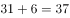；小数点后的数字003，009，027，081，243，可以看出此数列是公比为3的等比数列，（  ）里应是。故所求项是37.729。

故正确答案为D。

---

### 第 2 题　qid 2452739 · 数学运算

2，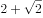，，10，，（    ）

- **A**. 
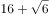

- **B**. 
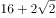

- **C**. 
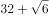
　✅
- **D**. 

**答案**：C

**官方解析**

原数列：2，，，10，，？

反推为：，，，，，？

则加号前的数字为1，2，4，8，16，易知是公比为2的等比数列，下一项应为；

根号内的数字为1，2，3，4，5，易知是公差为1的等差数列，下一项应为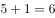，即所求为。

故正确答案为C。

---

### 第 3 题　qid 2452729 · 数学运算

1， ， 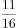， ， ，（    ）

- **A**. 
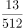
　✅
- **B**. 
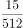

- **C**. 
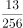

- **D**. 
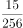

**答案**：A

**官方解析**

观察数列大部分都是分数，选项也都是分数，考虑分数数列。分母呈现递增趋势，优先考虑反约分。原数列可化为： 、 、、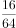、，发现分母是公比为4的等比数列，则下一项为；分子是公差为5的等差数列，则下一项为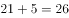。故所求项为。

故正确答案为A。

---

### 第 4 题　qid 2452730 · 数学运算

，，，，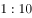，(    )

- **A**. 

- **B**. 

　✅
- **C**. 

- **D**. 

**答案**：B

**官方解析**

观察数列没有明显特征，可以把数列中的数字看成是时间。每个时间间隔的分钟数分别是5、15、30、50分钟，后减前为10、15、20分钟，构成公差为5的等差数列，新数列的下一项为25分钟，往回推为分钟，故所求项是经过75分钟后的时间，为。

故正确答案为B。

---

### 第 5 题　qid 2452587 · 数学运算

某食品厂速冻饺子的包装有大盒和小盒两种规格，现生产了11000只饺子，恰好装满100个大盒和200个小盒。若3个大盒与5个小盒装的饺子数量相等，则每个小盒与每个大盒装入的饺子数量分别是

- **A**. 24只、40只
- **B**. 30只、50只　✅
- **C**. 36只、60只
- **D**. 27只、45只

**答案**：B

**官方解析**

“3个大盒与5个小盒装的饺子数量相等”，即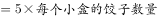，化简为：每个大盒的饺子数量：每个小盒的饺子数量。设大盒可以装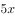只饺子，小盒可以装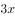只饺子。根据“现生产了11000只饺子，恰好装满100个大盒和200个小盒”，可得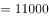，解得，则每个小盒的饺子数量为30只，每个大盒的饺子数量为50只，对应B项。

故正确答案为B。

---

### 第 6 题　qid 2452584 · 数学运算

长方形花坛的周长为20米，若长与宽各增加3米，则增加的面积是

- **A**. 42平方米
- **B**. 24平方米
- **C**. 28平方米
- **D**. 39平方米　✅

**答案**：D

**官方解析**

设长方形花坛长为，宽为，则花坛周长为米，解得米。

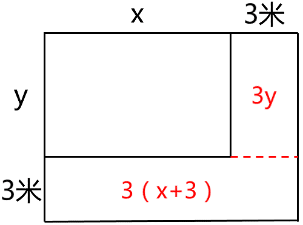

根据图形可知，增加的面积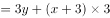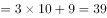平方米。

故正确答案为D。

---

### 第 7 题　qid 2452740 · 数学运算

一项工程由甲、乙工程队单独完成，分别需50天和80天。若甲、乙工程队合作20天后，剩余工程量由乙、丙工程队合作需12天完成，则丙工程队单独完成此项工程所需的时间是

- **A**. 40天
- **B**. 45天
- **C**. 50天
- **D**. 60天　✅

**答案**：D

**官方解析**

设该工程的工作总量为时间50天、80天的公倍数400，则甲工程队的效率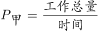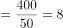，乙工程队的效率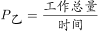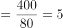，由甲、乙工程队合作20天后，乙、丙工程队继续合作12天完成工程可知：，推得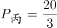，则丙工程队单独完成此项工程需要时间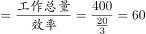天。

故正确答案为D。

---

### 第 8 题　qid 2452563 · 数学运算

某网店零售月季花，每束成本39元、售价99元，月销量800束。现推出团购活动，购买10束及以上，每束售价59元，预计零售销量减半，团购销量激增。若使原销售利润不减，则月团购销量至少应是

- **A**. 800束
- **B**. 1000束
- **C**. 1200束　✅
- **D**. 1500束

**答案**：C

**官方解析**

设团购销量至少束，则根据题意，单束花利润单束售价单束成本元，则推出团购之前总利润单束利润销量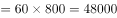元；推出团购活动后零售销量变为束，团购单束花利润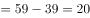元。根据题意，推出团购活动后总利润零售利润团购利润，解得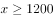束，则团购销量至少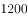束。

故正确答案为C。

---

### 第 9 题　qid 2452580 · 数学运算

某区财政局年度考核，办公室与国库科平均得分90分，预算科与政府采购科平均得分84分，办公室与政府采购科平均得分86分，政府采购科比预算科多10分，国库科的得分比综合科多5分，那么办公室、预算科、国库科、政府采购科、综合科的平均得分是

- **A**. 84分
- **B**. 86分
- **C**. 88分　✅
- **D**. 90分

**答案**：C

**官方解析**

根据题意可得：；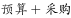；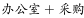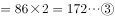；；。联立②④，解得采购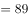分，预算分，则办公室分，国库分，综合分。五个部门的平均得分则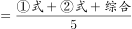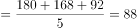分。

故正确答案为C。

---

### 第 10 题　qid 2452741 · 数学运算

一个三位数的个位数字比十位数字小1，百位数字是十位数字的3倍。若将个位与百位数字对调，所得新三位数比原三位数小693，则原三位数个位、十位、百位的数字之和是

- **A**. 12
- **B**. 14　✅
- **C**. 13
- **D**. 15

**答案**：B

**官方解析**

根据题意，设原三位数百位、十位、个位的数字分别为、、，则可得方程组：；；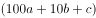。解得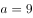，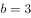，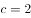，则原三位数百位、十位、个位的数字之和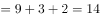。

故正确答案为B。

---

### 第 11 题　qid 2452712 · 数学运算

下图为某市一段地下水管道的分布图，箭线表示管道中水的流向，数值表示箭线的长度(单位：千米)。水从S点流到T点最短的距离是：

- **A**. 20千米
- **B**. 22千米　✅
- **C**. 23千米
- **D**. 24千米

**答案**：B

**官方解析**

 

求S点到T点的最短距离，可以先分两部分考虑，如图所示，即S点到A点，再由A点到T点。从S点到A点，共有4条路线，显然最短距离为千米，从A点到T点，共有2条路线，显然最短距离为千米，此时最短距离为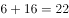千米。虽然从S点出发不经过A点，也有其他路线到达T点，但均大于22千米，即水从S点流到T点最短的距离为22千米。

故正确答案为B。

---

### 第 12 题　qid 2452594 · 数学运算

某商品的进货单价为80元，销售单价为100元，每天可售出120件。已知销售单价每降低1元，每天可多售出20件。若要实现该商品的销售利润最大化，则销售单价应降低的金额是

- **A**. 5元
- **B**. 6元
- **C**. 7元　✅
- **D**. 8元

**答案**：C

**官方解析**

设降价x元，已知“销售单价每降低1元，每天可多售出20件”，调价后销售单价为元，进货单价为80元，则降价后单个利润为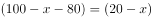元；降价后的销量为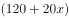件。总利润单个利润数量。令总利润为0，即令和都等于0，解得，。当时，总利润最大，即销售单价应降低的金额是7元，对应C项。

故正确答案为C。

---

### 第 13 题　qid 2452573 · 数学运算

某便民超市将薏米、红豆和小黄米按2：3：5混合后出售，每千克成本13.3元。若薏米每千克成本23.6元，红豆每千克成本9.8元，则小黄米每千克的成本是

- **A**. 10.36元
- **B**. 10.18元
- **C**. 11.45元
- **D**. 11.28元　✅

**答案**：D

**官方解析**

假设混合后薏米2千克，红豆3千克、小黄米5千克。设小黄米每千克成本为元，则有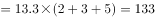，解得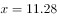。

故正确答案为D。

---

### 第 14 题　qid 2452577 · 数学运算

使用浓度为的硫酸溶液克和浓度为的硫酸溶液若干克，配制浓度为的硫酸溶液克，需要加水的质量是：

- **A**. 10克　✅
- **B**. 12克
- **C**. 15克
- **D**. 18克

**答案**：A

**官方解析**

设需的硫酸克，根据公式：，且混合前后溶质的质量相等，混合后溶质混合前溶质，即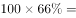，则解得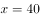，则需加水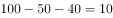克。

故正确答案为A。

---

### 第 15 题　qid 2452598 · 数学运算

某单位要抽调若干人员下乡扶贫，小王、小李、小张都报了名，但因工作需要，若选小李或小张，就不能选小王。已知三人入选的概率都是0.2，但小李、小张同时入选的概率是0.1，则三人中有人入选的概率是

- **A**. 0.3
- **B**. 0.4
- **C**. 0.5　✅
- **D**. 0.6

**答案**：C

**官方解析**

根据题意“若选小李或小张，就不能选小王”，即小李或小张入选时，小王一定不入选，小王入选时，小李和小张都不入选。“三人中有人入选”有以下四种情况：

①小李和小张同时入选，此时小王一定不入选：概率为0.1；

②小李入选、小张不入选，此时小王一定不入选：当小李入选时有两类情况：小李单独入选和小李和小张共同入选，所以小李单独入选的概率为“小李入选的概率小李和小张共同入选的概率”。

③小张入选、小李不入选，此时小王一定不入选：当小张入选时有两类情况：小张单独入选和小李和小张共同入选，所以小张单独入选的概率为“小张入选的概率小李和小张共同入选的概率”。

④小李与小张都未入选，小王单独入选：概率为0.2。

故“三人中有人入选” 的概率是，对应C项。

故正确答案为C。

---

### 第 16 题　qid 2452771 · 数学运算

某企业按三个等级给员工发放奖金，一、二、三等奖的获奖人数之比为，奖金总额之比为。已知获奖员工总数126人，发放奖金总额16.2万元，则三等奖的奖金是

- **A**. 200元
- **B**. 300元　✅
- **C**. 350元
- **D**. 400元

**答案**：B

**官方解析**

根据“获奖员工总数126人”和“一、二、三等奖的获奖人数之比”，可求三等奖获奖人数为人；同理可求三等奖奖金总额为万元元。则三等奖的奖金是元。

故正确答案为B。

---

### 第 17 题　qid 2452773 · 数学运算

两人在环形跑道上匀速跑步，同向跑每3分钟相遇一次，相向跑每1分钟相遇一次。若速度较快者每圈用时1.5分钟，则速度较慢者每圈用时是

- **A**. 3分钟　✅
- **B**. 4分钟
- **C**. 5分钟
- **D**. 2分钟

**答案**：A

**官方解析**

题干中只给出时间，没有具体的速度和路程，可以用赋值法。赋值环形跑道全程长度为3，在环形跑道中，由同一起点同向而行，相遇一次时快者比慢者多走一个全程，用时3分钟，则：，解得；在环形跑道中，由同一起点相向而行，相遇一次时快者和慢者一共走一个全程，用时1分钟，则：，解得。由、可求，。则较慢者每圈用时分钟。

故正确答案为A。

---

### 第 18 题　qid 2452558 · 数学运算

台风过后，某单位发起救灾捐款活动，甲、乙两部门的员工人数之比是，捐款总额之比是。若甲部门的人均捐款是元，则乙部门的人均捐款是

- **A**. 270元
- **B**. 290元
- **C**. 320元　✅
- **D**. 350元

**答案**：C

**官方解析**

设乙部门人均捐款元，甲、乙两部门员工人数分别、。捐款总额人均捐款部门人数，则根据条件可得：，解得元。则部门的人均捐款是元。

故正确答案为C。

---

### 第 19 题　qid 2452774 · 数学运算

某小微企业接到三个相同的订单，赵、钱、孙、李四位师傅单独完成一个，分别需20小时、20小时、15小时和12小时。现钱、孙、李各负责一个订单，赵根据需要协助他们完成任务。若要三个订单同时完工且用时最短，则赵协助钱的时间是

- **A**. 8小时　✅
- **B**. 7小时
- **C**. 6小时
- **D**. 9小时

**答案**：A

**官方解析**

赋值一个订单的工作量为60，则赵师傅效率为、钱师傅效率为、孙师傅效率为、李师傅效率为。由于同时开始，同时结束，因此在三个订单完工过程中，四个人始终在工作，则小时。设赵协助钱师傅小时，根据钱负责的订单工作进程可列方程为，解得。

故正确答案为A。

---

## 判断推理

### 材料 1

在400米跑比赛中，罗、方、许、吕、田、石6人被分在一组。他们站在由内到外的1至6号赛道上。关于他们的位置，已知：

（1）田和石的赛道相邻；

（2）吕的赛道编号小于罗；

（3）田和罗之间隔着两条赛道；

（4）方的赛道编号小于吕，且中间隔着两条赛道。

#### 第 1 题　qid 2452551 · 逻辑判断

根据以上陈述，关于田的位置，以下哪项是可能的？

- **A**. 在3号赛道上　✅
- **B**. 在4号赛道上
- **C**. 在5号赛道上
- **D**. 在6号赛道上

**答案**：A

**官方解析**

第一步：分析题干。
（1）田和石的赛道相邻；
（2）吕的赛道编号小于罗；
（3）田和罗之间隔着两条赛道；
（4）方的赛道编号小于吕，且中间隔着两条赛道。
第二步：根据题干条件分析选项。
提问方式为可能为真，因此，可以考虑代入法。
代入A项，田在3号赛道上，根据条件（3）可知，罗只能在6号赛道上；根据条件（2）（4）可知吕可能在4号或5号赛道上。如果吕在4号赛道上，则方在1号赛道上，根据条件（1）此时石只能在2号，此时满足题干所有要求，所以A项就是可能的，当选；
代入B项，田在4号赛道上，根据条件（3）可知，罗只能在1号赛道上，则吕的赛道编号不可能小于罗，与题干条件（2）矛盾，排除；
代入C项，田在5号赛道上，根据条件（3）可知，罗只能在2号赛道上，题干条件（2），吕只能在1赛道上，此时方的赛道编号不可能小于吕，与题干条件（4）矛盾，排除；
代入D项，田在6号赛道上，根据条件（3）可知，罗只能在3号赛道上，根据条件（2）可知吕可能在1号或2号赛道上，此时方的赛道不可能小于吕的同时隔着两条赛道，与题干条件（4）矛盾，排除。
故正确答案为A。

---

#### 第 2 题　qid 2452559 · 逻辑判断

根据以上陈述，可以推出以下哪项？

- **A**. 许和石的赛道相邻
- **B**. 许和石之间隔着一条赛道
- **C**. 许和石之间隔着两条赛道　✅
- **D**. 许和石之间隔着三条赛道

**答案**：C

**官方解析**

第一步：分析题干。

（1）田和石的赛道相邻；

（2）吕的赛道编号小于罗；

（3）田和罗之间隔着两条赛道；

（4）方的赛道编号小于吕，且中间隔着两条赛道。

第二步：根据题干条件分析选项。

由条件（2）可知：

由条件（4）可知：

以上二者可知，，则方、吕、罗的赛道排列只有以下三种可能：

如果是情况一，根据条件（1）（3），田、石分别在2号、3号赛道，许只能在6号赛道；

如果是情况二，根据条件（1）（3），田、石分别在3号、2号赛道，许只能在5号赛道；

如果是情况三，根据条件（1）（3），田、石分别在3号、4号赛道，许只能在1号赛道；

无论哪种情况，许和石之间都是隔着两条赛道，对应C选项。

故正确答案为C。

---

#### 第 3 题　qid 2452542 · 类比推理

唇亡：齿寒

- **A**. 安居：乐业
- **B**. 纲举：目张　✅
- **C**. 开卷：有益
- **D**. 惩前：毖后

**答案**：B

**官方解析**

第一步：判断题干词语间逻辑关系。
“唇亡”指嘴唇没有了，“齿寒”指牙齿就会寒冷，即因为“唇亡”，所以“齿寒”，二者为因果对应关系。
第二步：判断选项词语间逻辑关系。
A项：“安居”指安定的住在一起，“乐业”指愉快地从事自己的职业，二者为并列关系，与题干逻辑关系不一致，排除；
B项：“纲举”指提起鱼网上面的总绳，“目张”指一个个网眼都张开，即提起大绳子来，就能让一个个网眼张开了。因为“纲举”，所以“目张”，二者为因果对应关系，与题干逻辑关系一致，当选；
C项：“开卷”指打开书本读书，“有益”指有好处有收获，指的是读书总会有好处的。题干是两件事情之间的因果关系，而C项只有读书一件事，有益是读书本身的效果，二者不是因果关系，与题干逻辑关系不一致，排除；
D项：“惩前”指警戒之前犯的错误，“毖后”指以后谨慎，不致再犯，“惩前”的目的是“毖后”，二者是方式目的对应，与题干逻辑关系不一致，排除。
故正确答案为B。

---

#### 第 4 题　qid 2452546 · 类比推理

湄公河：跨境河

- **A**. 黄鹤楼：吊脚楼
- **B**. 青海湖：内陆湖　✅
- **C**. 英国人：西欧人
- **D**. 中山门：凯旋门

**答案**：B

**官方解析**

第一步：判断题干词语间逻辑关系。
“湄公河”是亚洲最重要的跨国水系，因此“湄公河”是“跨境河”，且“湄公河”是“跨境河”中的一个，二者为包容关系中的特指。
第二步：判断选项词语间逻辑关系。
A项：“吊脚楼”为苗族（重庆、贵州等）、壮族、布依族、侗族、水族、土家族等族的传统民居，“黄鹤楼”是武汉标志性建筑，是名胜，因此“黄鹤楼”不是“吊脚楼”，与题干逻辑关系不一致，排除；
B项：“青海湖”是中国最大的“内陆湖”，因此“青海湖”是“内陆湖”，且“青海湖”是“内陆湖”中的一个，二者为包容关系中的特指，与题干逻辑关系一致，当选；
C项：“英国人”是“西欧人”，但英国人是一种统称，有很多英国人，二者不是包容关系中的特指，与题干逻辑关系不一致，排除；
D项：“中山门”和“凯旋门”为并列关系，与题干逻辑关系不一致，排除。
故正确答案为B。

---

#### 第 5 题　qid 2452764 · 类比推理

充电器：充电桩：充电

- **A**. 互联网：局域网：联网
- **B**. 云计算：云服务：服务
- **C**. 银行卡：信用卡：购物　✅
- **D**. 朋友圈：生活圈：社交

**答案**：C

**官方解析**

第一步：判断题干词语间逻辑关系。
充电桩是一种充电器，二者为包容关系中的种属关系，充电器的功能是充电，二者为功能对应关系。
第二步：判断选项词语间逻辑关系。
A项：互联网指由若干计算机网络相互连接而成的网络，局域网指把小区域范围内的若干计算机和数据通信设备直接连接而成的网络，局域网是互联网的组成部分，二者为组成关系，与题干逻辑关系不一致，排除；
B项：云计算是一种云服务，二者为种属关系，但词语顺序不同，与题干逻辑关系不一致，排除；
C项：信用卡是一种银行卡，二者为种属关系，银行卡的功能是购物，二者为功能对应关系，与题干逻辑关系一致，当选；
D项：朋友圈是一种生活圈，二者为种属关系，但词语顺序不同，与题干逻辑关系不一致，排除。
故正确答案为C。

---

#### 第 6 题　qid 2452554 · 类比推理

笔：文具：写字

- **A**. 缸：容器：盛水　✅
- **B**. 钟：时间：计时
- **C**. 草：植物：喂牛
- **D**. 瓦：建材：砌墙

**答案**：A

**官方解析**

第一步：判断题干词语间逻辑关系。
笔是一种文具，二者是种属关系；笔用来写字，二者是功能对应关系，且笔是人工用品。
第二步：判断选项词语间逻辑关系。
A项：缸是一种容器，二者是种属关系，缸用来盛水，二者是功能对应关系，且缸是人工用品，与题干逻辑关系一致，当选；
B项：钟可以显示时间，钟也可以用来计时，都是功能对应关系，与题干逻辑关系不一致，排除；
C项：草是一种植物，二者是种属关系，草可以用来喂牛，二者是功能对应关系，但草是大自然的产物而不是人工用品，与题干逻辑关系不一致，排除；
D项：瓦是一种建材，二者是种属关系，瓦不能用来砌墙，而是用来铺屋顶，二者不是功能对应，与题干逻辑关系不一致，排除。
故正确答案为A。

---

#### 第 7 题　qid 2452686 · 类比推理

暴雨：洪灾：排涝

- **A**. 炎热：干旱：减产
- **B**. 假日：拥堵：疏导
- **C**. 路滑：摔倒：骨折
- **D**. 地震：伤亡：救助　✅

**答案**：D

**官方解析**

第一步：判断题干词语间逻辑关系。
暴雨可能会导致洪灾，二者是因果对应，且暴雨是自然灾害；排涝是解决洪灾的方式，二者是方式对应。
第二步：判断选项词语间逻辑关系。
A项：炎热可能会导致干旱，二者是因果对应；干旱可能会导致减产，二者是因果对应，与题干逻辑关系不一致，排除；
B项：假日可能会导致拥堵，二者是因果对应，但是概率很小，且假日也不是自然灾害，与题干逻辑关系不一致，排除；
C项：路滑可能会让人摔倒，二者是因果对应；摔倒可能会导致骨折，二者是因果对应，与题干逻辑关系不一致，排除；
D项：地震可能会导致伤亡，二者是因果对应，且地震是自然灾害；救助是解决地震伤亡的方式，二者是方式对应，与题干逻辑关系一致，当选。
故正确答案为D。

---

#### 第 8 题　qid 2452765 · 类比推理

近海：靠近陆地的海域

- **A**. 充足：多到能满足需要
- **B**. 三包：包修包换和包退
- **C**. 四季：春夏秋冬的合称
- **D**. 忙月：农事繁忙的月份　✅

**答案**：D

**官方解析**

第一步：判断题干词语间逻辑关系。
近海指靠近陆地的海域，二者为全同关系。
第二步：判断选项词语间逻辑关系。
A项：充足指多到能满足需要，二者为全同关系，与题干逻辑关系一致，保留；
B项：三包是零售商业企业对所售商品实行“包修、包换、包退”的简称，二者为全同关系，与题干逻辑关系一致，保留；
C项：四季是春夏秋冬的合称，二者为全同关系，与题干逻辑关系一致，保留；
D项：忙月是指农事繁忙的月份，二者为全同关系，与题干逻辑关系一致，保留。
比较A、B、C、D四个选项，题干中“近海”是名词，A项“充足”为形容词，B项“三包”、C项“四季”与D项“忙月”均为名词，且题干“近海”与D项“忙月”为相同的偏正结构，D项比A、B、C三项与题干逻辑关系更一致。
故正确答案为D。

---

#### 第 9 题　qid 2452642 · 类比推理

粮库 之于（    ）相当于（    ）之于 思想

- **A**. 仓库——记忆
- **B**. 粮田——认识
- **C**. 金库——思维
- **D**. 粮食——文章　✅

**答案**：D

**官方解析**

逐一代入选项。
A项：粮库是仓库的一种，二者是种属关系；记忆与思想之间无明显关系，前后逻辑关系不一致，排除；
B项：粮库用来储存粮田中的粮食，二者为对应关系；思想是认识的一种，二者为种属关系，前后逻辑关系不一致，排除；
C项：粮库和金库都是用来储存物品的仓库，二者为并列关系；思维和思想是近义词，前后逻辑关系不一致，排除；
D项：粮库用来储存粮食，文章用来承载思想，二者均为对应关系，前后逻辑关系一致，当选。
故正确答案为D。

---

#### 第 10 题　qid 2452766 · 类比推理

（  ）之于 百折不挠 相当于 如愿以偿 之于（  ）

- **A**. 一蹶不振——称心如意
- **B**. 不屈不挠——大失所望
- **C**. 心满意足——百折不回
- **D**. 知难而退——事与愿违　✅

**答案**：D

**官方解析**

逐一代入选项。
A项：“一蹶不振”指一跌倒就再也爬不起来，比喻遭受一次挫折以后就再也振作不起来；“百折不挠”形容意志坚强，屡受挫折而不屈服，二者为反义关系。“如愿以偿”意思是像所希望的那样得到满足，指愿望实现；“称心如意”形容心满意足，事情的发展完全符合心意，二者为近义关系。前后逻辑关系不一致，排除；
B项：“不屈不挠”意思是在压力和困难面前不屈服，表现十分顽强；“百折不挠”形容意志坚强，屡受挫折而不屈服，二者为近义关系。“如愿以偿”意思是像所希望的那样得到满足，指愿望实现；“大失所望”指原来的希望完全落空，二者为反义关系。前后逻辑关系不一致，排除；
C项：“心满意足”指做了某事或得到什么事物等，自己心情很愉悦高兴，让自己觉得满意；“百折不挠”形容意志坚强，屡受挫折而不屈服，二者无明显关系。“如愿以偿”意思是像所希望的那样得到满足，指愿望实现；“百折不回”比喻意志坚强，无论受到多少次挫折，毫不动摇退缩，二者无明显关系。前后逻辑关系不一致，排除；
D项：“知难而退”原指作战要见机而行，不要做实际上无法办到的事，后泛指知道事情困难就后退；“百折不挠”形容意志坚强，屡受挫折而不屈服，二者为反义关系。“如愿以偿”意思是像所希望的那样得到满足，指愿望实现；“事与愿违”意思是事情的发展与愿望相反，指事情没能按照预想的方向发展，二者为反义关系。前后逻辑关系一致，当选。
故正确答案为D。

---

#### 第 11 题　qid 2452767 · 类比推理

- **A**. 

- **B**. 

　✅
- **C**. 

- **D**. 
柯河江河江珂江水柯河

**答案**：B

**官方解析**

第一步：分析题干符号间关系。
从相同符号的位置入手：位置1、9的符号相同；位置2、4、10的符号相同；位置3、5、7的符号相同；位置6、8的符号相同。
第二步：判断选项符号关系。
A项：位置2、4的符号相同，但与位置10的符号不相同，与题干逻辑关系不一致，排除；
B项：位置1、9的符号相同；位置2、4、10的符号相同；位置3、5、7的符号相同；位置6、8的符号相同，与题干逻辑关系一致，当选；
C项：位置2、4的符号不相同，与题干逻辑关系不一致，排除；
D项：位置6、8的符号不相同，与题干逻辑关系不一致，排除。
故正确答案为B。

---

#### 第 12 题　qid 2452650 · 类比推理

请从四个选项中选出恰当的一项，其特征或规律与题干给出的一串符号的特征或规律最为相符。
由甲申曱甲申甴甲由曱

- **A**. 己已巳乙已巳己已己乙
- **B**. 上下卡卞下卡土下上卞　✅
- **C**. 人八六入八六人八人入
- **D**. 土士二干士二二士土干

**答案**：B

**官方解析**

第一步：分析题干符号间关系。
从相同符号的位置入手：位置1、9的符号相同；位置2、5、8的符号相同；位置3、6的符号相同；位置4、10的符号相同；位置7的符号与其他位置均不相同。
第二步：判断选项符号间关系。
A项：位置7的符号与位置1、9的符号相同，与题干逻辑关系不一致，排除；
B项：位置1、9的符号相同；位置2、5、8的符号相同；位置3、6的符号相同；位置4、10的符号相同；位置7的符号与其他位置均不相同，与题干逻辑关系一致，当选；
C项：位置7的符号与位置1、9的符号相同，与题干逻辑关系不一致，排除；
D项：位置7的符号与位置3、6的符号相同，与题干逻辑关系不一致，排除。
故正确答案为B。

---

#### 第 13 题　qid 2452748 · 图形推理

请从所给的四个选项中，选出最恰当的一项填入问号处，使之呈现一定的规律性。

- **A**. A
- **B**. B　✅
- **C**. C
- **D**. D

**答案**：B

**官方解析**

元素组成不同，且无明显属性规律，优先考虑数量规律。题干出现较多的封闭空间和多边形，可以考虑数面或数直线，面的数量依次为1、3、4、5、6，直线的数量依次为3、5、6、7、7，均没有规律。继续观察发现，题干图五及选项A为田字变形，考虑笔画数，题干均为1笔画图形，故问号处也为1笔画图形。A项为2笔画，B项为1笔画，C项为3笔画，D项为2笔画。只有B项符合。
故正确答案为B。

---

#### 第 14 题　qid 2452703 · 图形推理

请从所给的四个选项中，选出最恰当的一项填入问号处，使之呈现一定的规律性。

- **A**. A　✅
- **B**. B
- **C**. C
- **D**. D

**答案**：A

**官方解析**

题干图形中出现多个小元素，优先考虑元素的种类和个数。题干每幅图中均有2种小元素，排除C项。小元素个数依次为2、3、3、4、4，无规律。继续观察，题干图形和剩余选项都由两种元素构成，考虑元素换算。根据“第一个图形+第三个图形=2x第二个图形”的原则，换算后可知1个五角星=2个圆形，将五角星全部换算成圆形圆形个数分别是3、4、5、6、7，所以问号处应选一个换算后有8个圆形的选项。A项有8个圆形，B项有7个圆形，D项有6个圆形，只有A项符合。
故正确答案为A。

---

#### 第 15 题　qid 2452751 · 图形推理

请从所给的四个选项中，选出最恰当的一项填入问号处，使之呈现一定的规律性。

- **A**. A
- **B**. B
- **C**. C　✅
- **D**. D

**答案**：C

**官方解析**

元素组成不同，优先考虑属性规律。观察发现，题干中的图形均由小黑圆、小白圆组成，且所有图形都比较规整，优先考虑对称性，发现题干均为轴对称图形，且对称轴依次顺时针旋转，如下图：

故问号处图形对称轴应为竖直方向，只有C项符合。

故正确答案为C。

---

#### 第 16 题　qid 2452762 · 图形推理

下面四个图形中，只有一个是由上面的四个图形拼合（只能通过上、下、左、右平移）而成的，请把它找出来。

- **A**. A
- **B**. B　✅
- **C**. C
- **D**. D

**答案**：B

**官方解析**

本题考查平面拼合，可采用平行且等长相消的方式解题。消去平行且等长的线段后进行组合可得到轮廓图，即为B项。平行且等长相消的方式如下图所示：

故正确答案为B。

---

#### 第 17 题　qid 2452763 · 图形推理

下面四个图形中，只有一个是由上面的四个图形拼合（只能通过上、下、左、右平移）而成的，请把它找出来。

- **A**. A
- **B**. B
- **C**. C　✅
- **D**. D

**答案**：C

**官方解析**

本题考查平面拼合，可采用平行且等长相消的方式解题。消去平行且等长的线段后进行组合可得到轮廓图，即为C项。平行且等长相消的方式如下图所示：

故正确答案为C。

---

#### 第 18 题　qid 2452677 · 图形推理

下面四个图形中，只有一个是由上面的四个图形拼合（只能通过上、下、左、右平移）而成的，请把它找出来。

- **A**. A
- **B**. B
- **C**. C
- **D**. D　✅

**答案**：D

**官方解析**

本题考查平面拼合，可采用平行且等长相消的方式解题。消去平行且等长的线段后进行组合即可得到轮廓图，即为D选项。平行且等长相消的方式如下图所示：

故正确答案为D。

---

#### 第 19 题　qid 2452678 · 图形推理

下面四个图形中，只有一个是由上面的四个图形拼合（只能通过上、下、左、右平移）而成的，请把它找出来。

- **A**. A
- **B**. B
- **C**. C
- **D**. D　✅

**答案**：D

**官方解析**

本题考查平面拼合，可采用平行且等长相消的方式解题。消去平行且等长的线段后进行组合即可得到轮廓图，即为D选项。平行且等长相消的方式如下图所示：

故正确答案为D。

---

#### 第 20 题　qid 2452786 · 图形推理

下面四个图形中，只有一个是由上面的四个图形拼合（只能通过上、下、左、右平移）而成的，请把它找出来。

- **A**. A
- **B**. B　✅
- **C**. C
- **D**. D

**答案**：B

**官方解析**

本题考查平面拼合，可采用平行且等长相消的方式解题。消去平行且等长的线段后进行组合即可得到轮廓图，即为B选项。平行且等长相消的方式如下图所示：

故正确答案为B。

---

#### 第 21 题　qid 2452788 · 图形推理

左边给定的是纸盒外表面的展开图，右边哪一项能由它折叠而成？请把它找出来。

- **A**. A　✅
- **B**. B
- **C**. C
- **D**. D

**答案**：A

**官方解析**

将原展开图标上序号如下图，逐一进行分析。

A项：选项为面b和面c，与题干一致，当选；

B项：展开图和选项中均有面c，而面c是可以确定唯一点的（如下图中蓝点所示）。在展开图和选项的面c上，以唯一点为起始点，沿顺时针方向同时进行画边，展开图中边1所对的面为面b且不挨着黑三角的黑边，选项中边1挨着黑三角的黑边，选项与题干不一致，排除；

C项：选项中出现的是面 a、面 b、面 d 中的任意两个面，题干展开图中，“面a和面b”“面a和面d”以及“面b和面d”两个面中的小白色三角形均不相邻，而选项中两个面内的小白色三角形相邻且有公共边，选项与题干展开图不一致，排除；

D项：展开图和选项中均有面c，而面c是可以确定唯一点的（如下图中蓝点所示）。在展开图和选项的面c上，以唯一点为起始点，沿顺时针方向同时进行画边，展开图中边1所对的面为面b且面c的小等边三角形对着面b的大白三角形，选项中面c的小等边三角形对着面b的小白三角形，选项与题干不一致，排除。

故正确答案为A。

---

#### 第 22 题　qid 2452790 · 图形推理

左边给定的是纸盒外表面的展开图，右边哪一项能由它折叠而成？请把它找出来。

- **A**. A
- **B**. B
- **C**. C
- **D**. D　✅

**答案**：D

**官方解析**

将原展开图标上序号如下图，逐一进行分析。

A项：选项出现的是面a、面b、面d中的任意两个，在展开图中面a、面b、面d三个面中的任意两个面的公共边都是黑色部分对应黑色部分，白色部分对应白色部分，而选项中两个面的公共边黑色部分对应白色部分，选项与题干不一致，排除；

B项：展开图和选项中均有面c，而面c是可以确定唯一点的（如下图中蓝点所示）。在展开图和选项的面c上，以唯一点为起始点，沿顺时针方向同时进行画边，题干展开图中边1和边2的夹角是半黑半白的角，而选项中边1和边2的夹角是黑色的角，选项与题干不一致，排除；

C项：展开图和选项中均有面c，而面c是可以确定唯一点的（如上图中蓝点所示）。在展开图和选项的面c上，以唯一点为起始点，沿顺时针方向同时进行画边，展开图中边3挨着面d的白色梯形底边，选项中边3挨着左侧面中黑色三角形斜边，选项与题干不一致，排除；

D项：选项由面b、c构成，选项与题干一致，当选。

故正确答案为D。

---

#### 第 23 题　qid 2452792 · 图形推理

左边给定的是纸盒外表面的展开图，右边哪一项能由它折叠而成？请把它找出来。

- **A**. A
- **B**. B　✅
- **C**. C
- **D**. D

**答案**：B

**官方解析**

将原展开图标上序号如下图，逐一进行分析。

A项：选项中出现了面c，面f和带黑三角形的面，面c与面a是相对面，故选项中带黑三角形的面是面e，在展开图中，面c、面e、面f存在公共点（如下图中蓝点所示），公共点挨着面c的斜线，选项中公共点不挨着面c的斜线，选项与题干不一致，排除；

B项：选项为面b，面c和面d，与题干一致，当选；

C项：选项中出现了面b，面d和带黑三角形的面，面b与面e是相对面，故选项中带黑三角形的面是面a，在展开图中，面a和面b有公共边，公共边挨着面a的白色三角形，选项中，面a和面b的公共边挨着面a的黑三角形，选项与题干不一致，排除；

D项：选项中出现了面a，面e和面f，面a和面e长得一样，无法区分，但是可以确定唯一点的（如下图中绿点所示）。在展开图和选项的面a和面e上，以唯一点为起始点，沿顺时针方向同时进行画边，选项中面f分别挨着一个面的边2和另一个面的边3，展开图中只有一个面的边2挨着面f，另一个面的边3挨着面b，选项与题干不一致，排除。

故正确答案为B。

---

#### 第 24 题　qid 2452749 · 图形推理

左边给定的是纸盒外表面的展开图，右边哪一项能由它折叠而成？请把它找出来。

- **A**. A　✅
- **B**. B
- **C**. C
- **D**. D

**答案**：A

**官方解析**

将原展开图标上序号如下图，逐一进行分析。

A项：选项与题干一致，当选； B项：选项中包含面c、面d和面e，面c和面e的公共边为上图绿色的边，在展开图和选项中，分别以绿色的边为起始边，在面c上沿顺时针方向进行画边，展开图中边2所对的面为面a，选项中边2所对的面不是面a而是面d，选项与题干不一致，排除； C项：选项中包含面b、面d和面f，其中面b和面d为相邻面，在展开图和选项中找到面b和面d的公共边（如上图蓝线所示），展开图中，公共边与面b内部的线条没有连接，选项中两个面的公共边和面b内部线条相连，选项与题干不一致，排除； D项：选项中包含面b、面c和面f，展开图中面c和面f为相对面，不能同时出现，选项与题干不一致，排除。 故正确答案为A。 

---

#### 第 25 题　qid 2452625 · 图形推理

请从所给的四个选项中，选出最恰当的一项填入问号处，使之呈现一定的规律性。

- **A**. A
- **B**. B
- **C**. C
- **D**. D　✅

**答案**：D

**官方解析**

本题考查图形的实际意义，寻找最大共同点。九宫格优先横行看，观察发现，题干每行图片均为奶牛，第一行中奶牛头部的朝向左右交替，且奶牛身上的花纹相同，第二行也为此规律，故第三行运用规律，前两幅图奶牛的头部朝向分别为右、左，故问号处图形的奶牛头部应朝右，排除A、C项，B项奶牛身上的花纹与前两幅图不同，排除。
故正确答案为D。

---

#### 第 26 题　qid 2452752 · 图形推理

请从所给的四个选项中，选出最恰当的一项填入问号处，使之呈现一定的规律性。

- **A**. A　✅
- **B**. B
- **C**. C
- **D**. D

**答案**：A

**官方解析**

元素组成相似，且相同线条重复出现，优先考虑样式规律中的加减同异。九宫格优先横行看，观察发现，第一行中，图1逆时针旋转后和图2外框保留、内部元素去同求异，可以得到图3；经验证，第二行图1逆时针旋转后和图2外框保留、内部元素去同求异，可以得到图3，满足此规律；第三行应用此规律，故“？”处应选择一个图1先逆时针旋转再和图2外框保留、内部元素去同求异得到的图形，观察选项发现，A项符合要求。 故正确答案为A。 

---

#### 第 27 题　qid 2452755 · 图形推理

左边为给定的立体，从任意角度剖开，右边哪一项不可能是它的截面图？

- **A**. A
- **B**. B
- **C**. C　✅
- **D**. D

**答案**：C

**官方解析**

本题考查截面图。逐一分析选项。如下图所示，A、B、D均可截出，具体剖切方式分别对应如下图1、图2、图3所示。

如下图所示，C项无法截出，因为中间圆柱是空心体，除此之外的外部是实体，所以C项中间应该是空白的，外侧应该是有阴影的。

 

故正确答案C。

---

#### 第 28 题　qid 2452541 · 逻辑判断

党内存在的很多问题都同政治问题相关联。不从政治上认识问题、解决问题，就会陷入头痛医头、脚痛医脚的被动局面，就无法从根本上解决问题。提高政治能力，很重要的一条就是要善于从政治上分析问题、解决问题。只有从政治上分析问题才能看清本质，只有从政治上解决问题才能抓住根本。
根据以上陈述，可以得出以下哪项？

- **A**. 只有从政治上认识问题、解决问题，才能从根本上解决问题　✅
- **B**. 如果善于从政治上分析问题、解决问题，就能提高政治能力
- **C**. 一旦陷入头痛医头、脚痛医脚的被动局面，就无法从根本上解决问题
- **D**. 如果没有看清本质、抓住根本，说明没有从政治上分析问题、解决问题

**答案**：A

**官方解析**

第一步：翻译题干。

①（政治上认识问题、解决问题）陷入头痛医头、脚痛医脚的被动局面

②（政治上认识问题、解决问题）根本上解决问题

③提高政治能力善于从政治上分析问题、解决问题

④看清本质政治上分析问题

⑤抓住根本政治上解决问题

第二步：逐一分析选项。

A项：翻译为根本上解决问题政治上认识问题、解决问题，是对②的否后，否后必否前，可以推出，当选；

B项：翻译为善于从政治上分析问题、解决问题提高政治能力，是对③的肯后，肯后得不到确定结论，无法推出，排除；

C项：翻译为陷入头痛医头、脚痛医脚的被动局面根本上解决问题，是对①的肯后，肯后得不到确定结论，无法和②中的“根本上解决问题”串在一起，无法推出，排除；

D项：翻译为（看清本质、抓准根本）（政治上分析问题、解决问题），是对④、⑤的否前，否前得不到确定结论，无法推出，排除。

故正确答案为A。

---

#### 第 29 题　qid 2452769 · 逻辑判断

随着食品工业的发展，丙酸经常被当作一种抑制霉菌生长的添加剂使用，烘焙食品中都喜欢添加丙酸来进行防腐。正常情况下，人体中的微生物也会在结肠中通过发酵未完全消化的碳水化合物产生丙酸，这种丙酸对人体有益。但最近一项研究表明，外源性摄入和自体产生的丙酸作用并不一样，长期摄入外源性丙酸会导致人体出现胰岛素偏高、胰岛素抵抗等现象。由此，某食品专家建议，应该禁止在食品中添加丙酸。
以下哪项如果为真，最能支持上述食品专家的建议？

- **A**. 将丙酸作为防腐剂使用只是食品行业的惯常做法，并未得到政府有关部门的确认
- **B**. 人体一旦出现胰岛素偏高、胰岛素抵抗等现象，就容易导致糖尿病和肥胖的发生　✅
- **C**. 从外界摄入的丙酸会出现在人体的各个部位，而自体产生的丙酸只存在结肠部分
- **D**. 丙酸不仅直接被添加到食品中，许多其他的食品添加剂也都通过加入丙酸进行防腐

**答案**：B

**官方解析**

第一步：找出论点和论据。
论点：应该禁止在食品中添加丙酸。
论据：外源性摄入和自体产生的丙酸作用并不一样，长期摄入外源性丙酸会导致人体出现胰岛素偏高、胰岛素抵抗等现象。
论点讨论的是应该禁止添加丙酸，论据讨论的是长期摄入外源性丙酸带来的结果，论点论据话题不一致，考虑搭桥的加强方式，在摄入带来的危害与禁止添加丙酸之间建立联系。
第二步：逐一分析选项。
A项：讨论加入丙酸这个做法是否得到有关部门的确认，和论点讨论的是否应该禁止添加丙酸无关，不能加强，排除；
B项：人出现胰岛素偏高、胰岛素抵抗等现象，就容易导致糖尿病和肥胖，而外源性丙酸的长期摄入又会导致人体的胰岛素偏高、胰岛素抵抗现象，所以应该禁止添加丙酸，在论点论据之间建立了联系，搭桥，能够加强，当选；
C项：说明外界摄入的丙酸和自体产生的丙酸出现的位置不同，但是出现在不同的位置，他们的作用是否是一样的，是否应该禁止添加丙酸，没有说明，无关选项，排除；
D项：其他食品也通过加入丙酸进行防腐，与是否应该禁止添加丙酸无关，不能加强，排除。
故正确答案为B。

---

#### 第 30 题　qid 2452550 · 逻辑判断

每个“熊孩子”的背后都有一个“熊家长”。这些“熊家长”对“熊孩子”百依百顺，溺爱娇惯，这使得“熊孩子”以自我为中心，缺乏规则意识，容易产生过激的非理性行为。当“熊孩子”有些行为对他人和社会造成伤害时，“熊家长”也会以“他还是个孩子”来护短辩解，要求原谅。
以下哪项最可能是“熊家长”辩解所隐含的前提？

- **A**. “熊孩子”犯错误不是故意为之
- **B**. 只要是孩子就难免犯错
- **C**. “熊孩子”长大后会成为好孩子
- **D**. 孩子犯错误应当被原谅　✅

**答案**：D

**官方解析**

第一步:找出论点和论据。
论点:“熊家长”要求原谅“熊孩子”。
论据:“熊家长”以“他还是个孩子”来护短辩解。
题干中论点说的是要求他人原谅“熊孩子”，论据说的是“熊孩子”还是个孩子，论点论据话题不一致，因此考虑在“原谅”和“孩子”之间搭桥。
第二步:逐一分析选项。
A项：该项说的是犯错误不是故意为之，与“被原谅”无必然关系，不能加强，排除；
B项：该项说的是孩子就难免犯错，与“被原谅”无必然关系，不能加强，排除；
C项：该项说的是孩子长大后会成为好孩子，与“被原谅”无必然关系，不能加强，排除；
D项：在“原谅”和“孩子”之间搭桥，为搭桥项，是家长辩解的前提，可以加强，当选。
故正确答案为D。

---

#### 第 31 题　qid 2452572 · 类比推理

由于业务量增加，某服务中心计划增加登记、咨询、报送、投诉和综合5个业务窗口，拟安排的5名工作人员所熟悉的业务各有不同：小丽作为新人，只熟悉登记业务；小马熟悉登记和咨询业务；小高熟悉报送和投诉业务；老王除了综合和投诉，其他业务都很熟悉；老董所有业务都很精通。最终，5名工作人员被分别安排到5个窗口负责各自熟悉的业务。
关于人员安排，以下说法正确的是

- **A**. 老董不负责综合业务窗口
- **B**. 小高负责报送业务窗口
- **C**. 小马不负责咨询业务窗口
- **D**. 老王负责报送业务窗口　✅

**答案**：D

**官方解析**

整理题干信息如下：

（1）小丽只负责登记业务

（2）小马负责登记或咨询业务

（3）小高负责报送或者投诉业务

（4）老王不负责综合和投诉

（5）老董所有业务都很精通

根据题干填入确定信息如下：

 

此时综合窗口只能老董负责，排除A项；又因5个业务窗口，安排的5名工作人员所熟悉的业务各有不同，即一人一个窗口，所以老董再不负责其他窗口，此时投诉窗口也已经有四个“×”，故只能小高负责投诉窗口，排除B项。此时报送窗口也已经有四个“×”，故只能老王负责报送窗口，D项说法正确，当选。又因为老王不负责其他窗口，此时咨询窗口也已经有四个“×”，故只能小马负责咨询窗口，排除C项，且小马不负责其他窗口，填入：

故正确答案为D。

---

#### 第 32 题　qid 2452560 · 逻辑判断

某部门新录用甲、乙、丙三名工作人员，他们各自的籍贯为江苏、安徽、浙江中的某个省。张红、李梅和王芹对他们的籍贯有如下猜测：
张红：甲是浙江人，乙是安徽人，丙也是浙江人；
李梅：甲是浙江人，乙是江苏人，丙不是江苏人；
王芹：甲是江苏人，乙是浙江人，丙也是江苏人。
已知，对甲、乙、丙的籍贯，上述三人均猜对1个，猜错2个。
根据以上信息，以下哪项是可能的？

- **A**. 甲是江苏人，乙是安徽人，丙是浙江人
- **B**. 甲是浙江人，乙是江苏人，丙是江苏人
- **C**. 甲是安徽人，乙是浙江人，丙是江苏人
- **D**. 甲是江苏人，乙是安徽人，丙是安徽人　✅

**答案**：D

**官方解析**

题干条件不确定，优先采用代入法。
将A项代入，张红所说的第一句话错误，后面两句正确，不符合题干要求“猜对1个，猜错2个”，排除；
将B项代入，张红所说的第一句话正确，后面两句错误；李梅前两句正确，最后一句话错误，不符合题干要求“猜对1个，猜错2个”，排除；
将C项代入，张红所说的三句话均错误，不符合题干要求“猜对1个，猜错2个”，排除；
将D项代入，张红第二句话正确其余错误；李梅第三句话正确其余错误；王芹第一句话正确其余错误，符合题干要求，当选。
故正确答案为D。

---

#### 第 33 题　qid 2452726 · 逻辑判断

某款策略类竞技游戏在所有时刻都有种可以选择的操作，并且是一种不完全信息的游戏——玩家通常看不到对手在做什么，因此就无法预测下一步操作。最近，某互联网公司开发了能够玩该款游戏的智能机器人AlphaStar，在一周内就获得了宗师等级，这意味着它在该地区九万多名玩家中排在前。游戏开发者据此断言，AlphaStar在游戏策略上已经和人类持平或者胜过人类了。

以下哪项如果为真，最能支持上述游戏开发者的论断？

- **A**. AlphaStar的反应速度被限制在人类的反应水平　✅
- **B**. AlphaStar在游戏中隐藏了自己是机器人的身份
- **C**. AlphaStar汇集了人工智能最新发展的成果和技术
- **D**. AlphaStar可以利用的支持决策的信息量远超人类

**答案**：A

**官方解析**

第一步：找出论点和论据。

论点：AlphaStar在游戏策略上已经和人类持平或者胜过人类了。

论据：某互联网公司开发了能够玩该游戏的智能机器人AlphaStar，在一周内就获得了宗师等级，排名在该地区九万多名玩家中的前。

论据说的是AlphaStar一周内获得等级高，论点说的是AlphaStar在游戏策略上已经和人类持平或者胜过人类了，话题一致，优先考虑补充论据。

第二步：逐一分析选项。

A项：反应速度被限制在人类的反应水平，排除了其他因素的干扰，从而说明AlphaStar在游戏策略上真的已经和人类持平或者胜过人类，可以加强，当选；

B项：隐藏自己机器人的身份，与是否在游戏策略上已经和人类持平或者胜过人类无关，属于无关选项，排除；

C项：只是说明它汇集了人工智能最新发展的成果和技术，但并不能支持他是否在游戏策略上已经和人类持平或者胜过人类，排除；

D项：可以利用的支持决策的信息量远超人类，说明获胜也可能是因为本身信息量多，而不是仅仅是游戏策略强，削弱了论点中游戏策略导致获胜的结论，他因削弱，排除。

故正确答案为A。

附：通过查证原文，本题答案为A项。

---

#### 第 34 题　qid 2452725 · 逻辑判断

市民文化周期间，文化部门要在桃源、东山、南浦、九华四个社区分别举办书展、画展、影展和文博展四种不同的文化惠民活动，由于时间场地限制，每个社区只能举办一种活动。已知：
（1）桃源社区既不办影展，也不办画展；
（2）东山社区既不办书展，也不办画展；
（3）如果东山社区不办画展，则南浦社区不办书展；
（4）如果九华社区不办文博展，则南浦社区举办书展。
据此可以推出以下哪项？

- **A**. 东山社区有可能举办文博展
- **B**. 画展不可能在南浦社区举办
- **C**. 九华社区既没办影展，也没办画展　✅
- **D**. 书展要么是南浦社区办，要么是九华社区办

**答案**：C

**官方解析**

第一步：翻译题干。

要求为每个社区只能举办一种活动；

桃源社区影展 且画展

东山社区书展 且画展

东山社区画展  南浦社区书展

九华社区文博展  南浦社区书展

第二步：再推理。

结合确定信息和最大信息，和可知，东山社区不办画展，可知南浦社区不办书展。结合条件，逆否等价规则，可得九华社区办文博展；又根据要求每个社区只能举办一种活动。所以可得：九华社区既没办影展，也没办画展。

故正确答案为C。

---

#### 第 35 题　qid 2452770 · 逻辑判断

螺旋锥蝇是一种极具攻击性的食肉蝇，偏好鲜血和活肉，喜欢攻击恒温动物（比如人类、牲畜)身上的小伤口，传播各类病菌。科学研究发现，雌螺旋锥蝇是单配性的，一生只能交配一次。据此，有科学家提出一种“以蝇制蝇”的昆虫绝育方法来消灭螺旋锥蝇，即将雄蝇置于超高辐射之下使其失去繁殖能力后放生到野外，如果雌蝇与之交配，产下的卵将不会孵化，日积月累，整个螺旋锥蝇种族就会自然消失。
以下各项如果为真，则除哪项外均能质疑上述科学家的建议？

- **A**. 经实验改造的绝育雄蝇数量不一定多于自然状态下有生育能力的雄蝇
- **B**. 用放射性手段改变雄螺旋锥蝇的特性，可能会破坏大自然的生态平衡
- **C**. 雌螺旋锥蝇有可能会排斥经过超高辐射而失去繁殖能力的雄螺旋锥蝇
- **D**. 虽然雌螺旋锥蝇是单配性的，但雄螺旋锥蝇可与多只雌螺旋锥蝇交配　✅

**答案**：D

**官方解析**

第一步：找出论点和论据。
论点：用“以蝇制蝇”的昆虫绝育方法来消灭螺旋锥蝇，即将雄蝇置于超高辐射之下使其失去繁殖能力后放到野外，如果雌蝇与之交配，产下的卵将不会孵化，日积月累，整个螺旋锥蝇种族就会自然消失。
论据：雌螺旋锥蝇是单配性的，一生只能交配一次。
第二步：逐一分析选项。
A项：改造的雄蝇数量不一定多于自然状态下的雄蝇，说明最后螺旋锥蝇还是会继续繁殖，不会消失，否定论点，排除；
B项：这个技术会破坏大自然的生态平衡，所以不能进行此项技术，否定论点，排除；
C项：雌蝇会排斥被辐射过的雄蝇，双方不会交配，雌蝇还是会和自然状态下的雄蝇交配产生后代，种族不会消失，否定论点，排除；
D项：雄蝇可以和很多只雌蝇交配，说明一只经高辐射处理的雄蝇可致多只雌蝇产生不会孵化的卵，日积月累，种族可能就消失了，是加强项，无法削弱，当选。
本题为选非题，故正确答案为D。

---

#### 第 36 题　qid 2452597 · 定义判断

造血式扶贫：指政府部门或社会力量通过持续性地扶持农村产业发展，拓宽农产品销售及消费渠道等，帮助贫困地区、贫困人口增收脱贫的扶贫方式。
下列属于造血式扶贫的是

- **A**. 
某县按照“东部林果、旅游，西部设施农业”的整体思路，一直坚持“”的产业发展模式，使农民年收入翻了一番，人均达到近万元
　✅
- **B**. 
某县扶贫办组织了200多名山区农民，经过严格培训，输送到东南沿海城市工作。这些农民每月都按时寄钱回家，家里的日子越过越红火

- **C**. 
县农科所资助某村贫困家庭100头种羊，多次对他们进行科学养羊技术培训，并安排技术人员进行“一对一”的专业指导

- **D**. 
为了解决全村苹果严重滞销的问题，村里的几个年轻人共同开办了一个水果直销网店。不到半月时间，所有苹果就销售一空

**答案**：A

**官方解析**

第一步：找出定义关键词。

“政府部门或社会力量”、“持续性地扶持农村产业发展，拓宽农产品销售及消费渠道”、“帮助贫困地区、贫困人口增收脱贫”。

第二步：逐一分析选项。

A项：某县符合“政府部门或社会力量”，一直坚持“”的产业发展模式，符合“持续性地扶持农村产业发展，拓宽农产品销售及消费渠道”，使农民年收入翻了一番，人均达到近万元，符合“帮助贫困地区、贫困人口增收脱贫”，符合定义，当选；

B项：某县扶贫办组织了200多名山区农民，经过严格培训，输送到东南沿海城市工作，不符合“持续性地扶持农村产业发展，拓宽农产品销售及消费渠道”，不符合定义，排除；

C项：县农科所资助某村贫困家庭100头种羊，多次对他们进行科学养羊技术培训，不符合“持续性地扶持农村产业发展，拓宽农产品销售及消费渠道”，不符合定义，排除；

D项：为了解决全村苹果严重滞销的问题，村里的几个年轻人共同开办了一个水果直销网店，不符合“政府部门或社会力量”，且没有提到贫困，不符合“帮助贫困地区、贫困人口增收脱贫”，不符合定义，排除。

故正确答案为A。

---

#### 第 37 题　qid 2452602 · 定义判断

分众化教育：指根据受众的具体差异，用典型案例分别进行宣传，以激发情感共鸣，达成特定目标的教育方式。
下列属于分众化教育的是

- **A**. 某市组织全市技术创新能手分别深入到所在行业部门，分享自己的创新经验，极大地激发了各行各业人士的创新热情　✅
- **B**. 某地组织的“五一劳动奖章”获得者宣讲团多次进行巡回报告，他们的先进事迹深深地打动了前来听讲的市民
- **C**. 每天傍晚，某学校附近地铁口都有艺术教育培训机构的招生人员散发传单，上面印着考入名校的学生彩照和成绩
- **D**. 在“不忘初心、牢记使命”主题教育中，某区组织党员干部分系统观看专题纪录片《警钟长鸣》，取得了预期效果

**答案**：A

**官方解析**

第一步：找出定义关键词。
“根据受众的具体差异，用典型案例分别进行宣传”、“激发情感共鸣，达成特定目标”。
第二步：逐一分析选项。
A项：某市组织全市技术创新能手分别深入到所在行业部门，分享自己的创新经验，符合“根据受众的具体差异，用典型案例分别进行宣传”，极大地激发了各行各业人士的创新热情，符合“激发情感共鸣，达成特定目标”，符合定义，当选； 
B项：某地组织的“五一劳动奖章” 获得者宣讲团多次进行巡回报告，不符合“根据受众的具体差异，用典型案例分别进行宣传”，不符合定义，排除；
C项：每天傍晚，某学校附近地铁口都有艺术教育培训机构的招生人员散发传单，不符合“根据受众的具体差异，用典型案例分别进行宣传”，不符合定义，排除；
D项：某区组织党员干部分系统观看专题纪录片《警钟长鸣》，不符合“根据受众的具体差异，用典型案例分别进行宣传”，不符合定义，排除。
故正确答案为A。

---

#### 第 38 题　qid 2452605 · 定义判断

喘息服务：指由政府部门购买服务，为有失能失智老人的低收入家庭或特殊困难家庭提供临时性援助，让常年在家照顾亲属者得到短暂休息。
下列属于喘息服务的是

- **A**. 由于儿女移居国外，年迈的赵先生夫妇只得相依为命，平时一起去市场买日常用品，一起去医院就诊取药。社区了解情况后，专门雇人每天上门半小时帮他们料理家务
- **B**. 杨先生10多年前中风，老伴杜女士为了照料他，每天忙得团团转，连自己生病都没时间去医院。今年初，街道派护工不定期上门服务，让她能有时间到医院看病或稍事休息　✅
- **C**. 父亲去世后，年过六旬的张先生独自承担起了照顾精神病妹妹的重任，从来没有睡过一个安稳觉。不久前，老张专门请了一名钟点工照看妹妹，感觉轻松了许多
- **D**. 患健忘症的陈奶奶经常独自出门闲逛，多次走失，靠低保维持生活的儿子无力照顾。区民政部门了解情况后，把陈奶奶送进养老院，并承担了所有费用

**答案**：B

**官方解析**

第一步：找出定义关键词。
“政府部门购买服务”、“为有失能失智老人的低收入家庭或特殊困难家庭提供临时性援助”、“让常年在家照顾亲属者得到短暂休息”。
第二步：逐一分析选项。
A项：由于儿女移居国外，社区专门雇人每天上门半小时帮年迈的赵先生夫妇料理家务，不符合“为有失能失智老人的低收入家庭或特殊困难家庭提供临时性援助”，也不符合“让常年在家照顾亲属者得到短暂休息”，不符合定义，排除；
B项：杨先生10多年前中风，今年初街道派护工不定期上门服务，让杜女士能有时间到医院看病或稍事休息，符合“政府部门购买服务”、“为有失能失智老人的低收入家庭或特殊困难家庭提供临时性援助”、“让常年在家照顾亲属者得到短暂休息”，符合定义，当选；
C项：老张专门请了一名钟点工照看妹妹，不符合“政府部门购买服务”，不符合定义，排除；
D项：患健忘症的陈奶奶多次走失，区民政部门了解情况后，把陈奶奶送进养老院，并承担了所有费用，不符合“为有失能失智老人的低收入家庭或特殊困难家庭提供临时性援助”，不符合定义，排除。
故正确答案为B。

---

#### 第 39 题　qid 2452619 · 定义判断

垃圾资源化：指垃圾进行分选处理后，成为无污染的循环再利用原料，进而加工、转化为再生资源的垃圾处理方式。
下列属于垃圾资源化的是：

- **A**. 某市为了缓解因煤炭资源过度开采造成的地面下陷问题，新建了一个大型垃圾场，经过分类后的城市生活垃圾每天都会运到这里集中填埋
- **B**. 垃圾焚烧发电需要投入巨大资金，随着相关技术不断进步，电能产量越来越高，尽管排放问题还没有彻底解决，但它仍然是目前比较常见的城市垃圾处理方式
- **C**. 乡村垃圾大多采用分类处理的方法：有回收价值的，挑选出来后稍加处理卖给需要的人，其他大部分卖到废品回收站点，无回收价值的，堆到指定地点
- **D**. 某市正在推行新的垃圾处理方式：将厨余垃圾等有机物分离出来，制成有机肥料，将砖头瓦块、玻璃陶瓷等无机物分离出来，制成新型免烧砖　✅

**答案**：D

**官方解析**

第一步：找出定义关键词。
“垃圾进行分选处理后”、“成为无污染的循环再利用原料”、“加工、转化为再生资源”。
第二步：逐一分析选项。
A项：新建垃圾场，将分类后的城市生活垃圾集中填埋，只是简单填埋，没有将垃圾转化为可循环的原料，不符合“成为无污染的循环再利用原料”、“加工、转化为再生资源”，不符合定义，排除；
B项：垃圾焚烧发电是常见的垃圾处理方式，只是对垃圾进行焚烧，没有体现对垃圾的分类处理，不符合“垃圾进行分选处理后”，而且焚烧垃圾的排放问题没有彻底解决，不符合“成为无污染的循环再利用原料”，不符合定义，排除；
C项：将有回收价值的垃圾卖掉，将无回收价值的垃圾堆放到指定地点，只涉及垃圾的回收和变卖，但没有体现出将垃圾转化成其他资源，不符合“加工、转化为再生资源”，不符合定义，排除；
D项：将厨余垃圾等有机物分离出来，制成肥料，将无机物分离出来，制成免烧砖，符合“垃圾进行分选处理后”，而且将分选处理后的垃圾制成其他资源，符合“成为无污染的循环再利用原料”、“加工、转化为再生资源”，符合定义，当选。
故正确答案为D。

---

#### 第 40 题　qid 2452524 · 定义判断

抢跑焦虑症：指家庭或学校由于担心孩子缺乏竞争力，急于进行超前教育、加深教学内容等违背教育教学基本规律的现象。
下列不属于抢跑焦虑症的是

- **A**. 暑假刚开始，小明的家长便为他买好了下学期的语文、数学、外语教材及教辅材料，要求他严格按计划完成全部的预习任务
- **B**. 某教育培训机构要求授课教师适当增加教学内容，加大学习难度，吸引更多的优秀学生前来参加各门各类课程的补习　✅
- **C**. 王女士儿子成绩一直很优秀，虽然才读小学三年级，家里就为他请了家教，每周两次一对一辅导法语学习
- **D**. 在全市中学生数学竞赛前夕，某校多次聘请大学教授占用其他课程的时间为参赛选手进行强化训练

**答案**：B

**官方解析**

第一步：找出定义关键词。
“家庭或学校担心孩子缺乏竞争力”、“急于进行超前教育、加深教学内容”、“违背教育教学基本规律”。
第二步：逐一分析选项。
A项：小明家长为他买好了下学期的语文、数学、外语教材，符合“家庭担心孩子缺乏竞争力、急于进行超前教育”，符合定义，排除； 
B项：某教育培训机构要求教师增加教学内容，吸引更多学生前来参加培训，不符合“家庭或学校担心孩子缺乏竞争力”，不符合定义，当选；
C项：王女士为三年级的儿子请家教学习法语，符合“家庭担心孩子缺乏竞争力急于进行超前教育、加深教学内容”，符合定义，排除； 
D项：某校多次聘请大学教授为参赛选手进行强化训练，符合“学校担心孩子缺乏竞争力、急于加深教学内容”、并且占用其他课程时间符合“违背教育教学基本规律”，符合定义，排除。 
本题为选非题，故正确答案为B。

---

#### 第 41 题　qid 2452772 · 定义判断

过度营销：指企业过分依赖或使用促销手段以获取利润或经营业绩，而不考虑顾客心理感受的短期营销行为。
下列属于过度营销的是

- **A**. 某影片首映期间，影院、市民广场、居民区甚至学校周围到处张贴着巨幅海报　✅
- **B**. 某微商为了扩大营销面，在各大门户网站发布大量广告，以推销自己的产品
- **C**. 某健身中心为稳定、扩大自己的客户群，以优惠的价格吸引顾客办理年卡
- **D**. 某博物馆为了让市民了解馆藏的国宝，连续十多天在新闻媒体上介绍国宝知识

**答案**：A

**官方解析**

第一步：找出定义关键词。
“企业过分依赖或使用促销手段获取利润或经营业绩”、“不考虑顾客心理感受的短期营销行为”。
第二步：逐一分析选项。
A项：在首映期间各地张贴巨幅海报宣传，符合“不考虑顾客心理感受的短期营销行为”，符合定义，当选；
B项：微商在门户网站发布大量广告，推销产品，不是为了短期营销，不符合“不考虑顾客心理感受的短期营销行为”，不符合定义，排除；
C项：健身中心以优惠价格吸引顾客办理年卡，不是为了短期营销，不符合“不考虑顾客心理感受的短期营销行为”，不符合定义，排除；
D项：博物馆并不是企业，主体不符合，并且它是为让大家了解国宝进行宣传，这不是一种营销行为，不符合“不考虑顾客心理感受的短期营销行为”，不符合定义，排除。
故正确答案为A。

---

#### 第 42 题　qid 2452728 · 定义判断

银发危机：指老年人因为贪图小便宜而上当受骗，遭受财产损失和精神伤害双重打击的现象。
下列属于银发危机的是

- **A**. 小吴的父亲喜欢根据手机网站上文物鉴定专家的推荐收藏玉器，房子里到处都是他买来的“宝贝”，虽然小吴经常和他吵架，但他却不认为自己有错
- **B**. 赵大妈家附近的商场举办促销活动，每天前200名的顾客免费送10个鸡蛋，昨天她把鸡蛋领回家后，发现手上的金戒指不见了，在家整整生了一天闷气
- **C**. 在社区医院排队挂号时，一位“热心人”得知孙大妈有脑血管病，向她推荐了一种特效药，原价每瓶499元，只收她100元，她当场买了10瓶。回家后听女儿说这种药在正规药房只卖30元，她懊恼不已　✅
- **D**. 某企业在东方小区举行加湿器直销活动，李大妈在推销员劝说下买了一台，半月后才发现虽然货真价实，自家却完全用不上，她一气之下把它扔进地下室

**答案**：C

**官方解析**

第一步：找出定义关键词。
“老年人”、“因为贪图小便宜而上当受骗”、“遭受财产损失和精神伤害双重打击”。
第二步：逐一分析选项。
A项：小吴父亲购买玉器是出于喜爱，并非贪图小便宜，不符合“因为贪图小便宜而上当受骗”，不符合定义，排除；
B项：赵大妈是在领取鸡蛋的过程中丢失了金戒指，并未上当受骗，不符合“因为贪图小便宜而上当受骗”，不符合定义，排除；
C项：孙大妈被“热心人”的药价吸引而购买特效药，但该药价格高于正规药房的售价，符合“老年人”、“因为贪图小便宜而上当受骗”，回家后听女儿说完懊恼不已，符合“遭受财产损失和精神伤害双重打击”，符合定义，当选；
D项：李大妈在推销员的劝说下买了一台加湿器，加湿器本身货真价实，不符合“因为贪图小便宜而上当受骗”，不符合定义，排除。
故正确答案为C。

---

#### 第 43 题　qid 2452617 · 定义判断

口述登记制：指办理个体工商户登记手续时，申请人无需亲自填表，只要口述各项信息，核对确认后即可当场领取营业执照的登记方式。
下列属于口述登记制的是

- **A**. 赵先生到市场监督管理部门办理个体户注册登记手续。在窗口人员指导下按照“申请-受理-核准”的步骤，半小时就办好了手续。第二天就拿到了自己的营业执照
- **B**. 汪先生打算申请运动器材店营业执照。他从网上弄清了申请程序，第二天来到区市场监督管理部门登记处，简要地回答了几个问题，不一会儿营业执照就办好了　✅
- **C**. 程先生到市场监督管理部门办理花店营业执照。按照现场人员的指导填好表格，经办人员输入系统打印出信息登记表，程先生签名确认后就拿到了营业执照
- **D**. 蔡先生到市场监督管理部门办理营业执照注销手续。在指定窗口完成自动身份识别后，回答了工作人员的询问，很快就办完了全部手续

**答案**：B

**官方解析**

第一步：找出定义关键词。
“办理个体工商户登记手续时”、“无需亲自填表”、“口述信息”、“核对后当场领取营业执照”。
第二步：逐一分析选项。
A项：赵先生在窗口人员的指导下按照“申请-受理-核准”的步骤，是本人亲自办理，但没有体现“口述信息”即可办理，而且，赵先生第二天拿到营业执照，不符合“核对后当场领取营业执照”，不符合定义，排除；
B项：汪先生在区市场监督管理部门，回答几个问题符合“口述信息”，然后“不一会儿营业执照就办好了”，符合“核对后当场领取营业执照”，符合定义，当选；
C项：程先生按照现场人员的指导填好表格，是本人亲自填表，不符合“无需亲自填表”，不符合定义，排除；
D项：蔡先生办理营业执照注销手续，不符合“办理个体工商户登记手续”，不符合定义，排除。
故正确答案为B。

---

#### 第 44 题　qid 2452700 · 图形推理

鬲（lì）是古代一种煮饭用的炊器，有陶制鬲和青铜鬲，其形状一般为侈口（口沿外倾），有三个中空的足，便于炊煮加热。觚（gū）是古代一种用于饮酒的容器，也用作礼器，圈足、敞口、长身，口部和底部都呈现为喇叭状。卣（yǒu）是古代的一种酒器，口椭圆形，圈足，有盖和提梁，腹深。尊（zūn）是古代的一种大中型盛酒器，圈足，圆腹或方腹，长颈，敞口，口径较大。

下列4个图形依次为

- **A**. 觚、尊、鬲、卣
- **B**. 尊、鬲、觚、卣
- **C**. 觚、卣、鬲、尊　✅
- **D**. 鬲、卣、尊、觚

**答案**：C

**官方解析**

第一步：找出定义关键词。
“鬲”：侈口（口沿外倾）、三个中空的足；
“觚”：圈足、敞口、长身，口部和底部都呈现为喇叭状；
“卣”：口椭圆形，圈足，有盖和提梁，腹深；
“尊”：圈足，圆腹或方腹，长颈，敞口，口径较大。
第二步：逐一分析选项。
题干四个图片从左到右依次是：觚、卣、鬲、尊，只有C项符合。
故正确答案为C。

---

#### 第 45 题　qid 2452529 · 逻辑判断

谜语有多种猜法。比较法是将字形、字义相近或相反的词放在一起，加以比较而扣合谜底；溯源法是追溯谜面的来源及其与原出处的上下关联，然后再扣合谜底；拟物法是将人或人体某部分物化，将谜面字词语义或所言之事物化，扣合谜底。
①谜面：枕头。要求打一成语。谜底：置之脑后
②谜面：桃花潭水深千尺。要求打一成语。谜底：无与伦比
③谜面：加一笔不好，加一倍不少。要求打一字。谜底：夕
关于①②③谜语的猜法，下列判断正确的是

- **A**. ①溯源法，②比较法，③拟物法
- **B**. ①溯源法，②拟物法，③比较法
- **C**. ①比较法，②溯源法，③拟物法
- **D**. ①拟物法，②溯源法，③比较法　✅

**答案**：D

**官方解析**

第一步：找出定义关键词。
比较法：“将字形、字义相近或相反的词放在一起，加以比较而扣合谜底”。
溯源法：“追溯谜面的来源及其与原出处的上下关联，然后再扣合谜底”。
拟物法：“将人或人体某部分物化，将谜面字词语义或所言之事物化，扣合谜底” 。
第二步：逐一分析三个谜语。
谜语①：“枕头。要求打一成语。谜底：置之脑后”
分析：“枕头”指躺着的时候，垫在头下使头略高的卧具，“置之脑后”是说放在脑袋后面，符合“将人或人体某部分物化，将谜面字词语义或所言之事物化，扣合谜底”，属于拟物法。
谜语②：“桃花潭水深千尺。要求打一成语。谜底：无与伦比”
分析：“桃花潭水深千尺”出自于李白的《赠汪伦》，原句为：“桃花潭水深千尺，不及汪伦送我情”，含义是：桃花潭千尺深的水都比不上汪伦和我的友情，诗人用潭水深千尺比喻汪伦与他的友情。该谜面通过“追溯谜面的来源及其与原出处的上下关联，然后再扣合谜底”，属于溯源法。
谜语③：“加一笔不好，加一倍不少。要求打一字。谜底：夕”
分析：“加一笔不好”，“夕”加一笔是“歹”，“歹”是不好的意思；“加一倍不少”，“夕”再加一倍，也就是两个夕，即“多”，“多”也就是不少的意思。谜面是根据谜底“夕”的字形以及字义相近或相反的词来扣合谜底的，因此属于比较法。
因而谜语①对应拟物法，谜语②对应溯源法，谜语③对应比较法。
故正确答案为D。

---

## 资料分析

### 材料 1

        新中国成立70年来，我国人口由1949年末的5.4亿人增加到2018年末的近14亿人。其中，从1949年末到1970年末，我国人口由5.4亿人增加到8.3亿人；1971年末至1980年末，全国人口由8.5亿人增加到9.9亿人；20世纪80年代，全国人口由1981年末的10.0亿人增加到1990年末的11.4亿人；1991年以来，我国人口增长率稳步下降，最终在左右的增速上保持平稳。1991-2018年，我国人口年均增加878万人，自2001年以来年均增加711万人。

        1953年末全国16-59岁劳动年龄人口为3.10亿人，1964年末为3.53亿人，1982年、1990年、2000年和2010年四次人口普查数据显示，我国劳动年龄人口分别为5.67亿人、6.99亿人、8.08亿人和9.16亿人。在2012年末我国劳动年龄人口总量达到峰值9.22亿人后增量由正转负，2018年末为8.97亿人。

        新中国成立之初，全国的人口都是文盲。1982年末全国高中及以上受教育程度人口占总人口的，1990年末占，2000年末占，2010年末达到，2018年末提高到。1982年末大专及以上受教育程度人口仅占总人口的，1990年末为，2000年末为，2010年末为，2018年末达到。

#### 第 1 题　qid 2452562 · 增长

1981-1990年这十年，全国人口总增长率是

- **A**. 

- **B**. 

　✅
- **C**. 

- **D**. 

**答案**：B

**官方解析**

根据题干“1981-1990年这十年，全国人口总增长率是”，且选项均为百分数，可判定本题为一般增长率问题。定位文字资料第一段“1971年末至1980年末，全国人口由8.5亿人增加到9.9亿人；20世纪80年代，全国人口由1981年末的10.0亿人增加到1990年末的11.4亿人”。题干求得是1981-1990年这十年，因此现期是1990年，基期是1980年，代入公式：增长率，则题干所求。

故正确答案为B。

---

#### 第 2 题　qid 2452609 · 增长

用、、分别表示四次人口普查间的全国劳动年龄人口年均增长率，下列关系正确的是

- **A**. 

　✅
- **B**. 

- **C**. 

- **D**. 

**答案**：A

**官方解析**

根据题干“······年均增长率······”，且选项为排序，可判定本题为年均增长率的比较问题。定位文字资料第二段“1982年、1990年、2000年和2010年四次人口普查数据显示，我国劳动年龄人口分别为5.67亿人、6.99亿人、8.08亿人和9.16亿人”。1990-2000年与2000-2010年年份差相同，可直接利用比较。1990-2000年：；2000-2010年：；由于分子大、分母小的分数值大，故，则，排除B项。因为1982-1990年的年份差少于1990-2000年，且，所以。因此。

故正确答案为A。

---

#### 第 3 题　qid 2452612 · 综合

2000年末全国人口为

- **A**. 11.6亿人
- **B**. 12.1亿人
- **C**. 12.6亿人　✅
- **D**. 13.1亿人

**答案**：C

**官方解析**

根据题干“2000年末全国人口为”，结合资料所给时间为2018年，可判定本题为基期量的计算问题。定位文字资料第一段“新中国成立70年来，我国人口由1949年末的5.4亿人增加到2018年末的近14亿人······自2001年以来年均增加711万人”，则2000年末全国人口亿人，与C项最接近。

故正确答案为C。

---

#### 第 4 题　qid 2452613 · 比重

全国大专及以上受教育程度人口占总人口比重提高最多的时期是

- **A**. 1981-1990年
- **B**. 1991-2000年
- **C**. 2001-2010年　✅
- **D**. 2011-2018年

**答案**：C

**官方解析**

定位文字资料第三段“1982年末大专及以上受教育程度人口仅占总人口的，1990年末为，2000年末为，2010年末为，2018年末达到”。选项各时间段全国大专及以上受教育程度人口占总人口比重如下：

A项：1981-1990年：资料没有给出1980年末大专及以上受教育程度的人口占总人口的比重，无法计算1981-1990年比重提高的百分点，但一定低于1990年末的比重1.4%，即1.4个百分点。

B项：1991-2000年：，即2.2个百分点。

C项：2001-2010年：，即5.3个百分点。

D项：2011-2018年：，即4.1个百分点。

则比重提高最多的时期是2001-2010年。

故正确答案为C。

---

#### 第 5 题　qid 2452616 · 综合

从上述资料不能推出的是

- **A**. 
2015年我国人口比上年增加711万人
　✅
- **B**. 
2013-2018年我国劳动年龄人口总量逐年减少

- **C**. 
2018年末我国劳动年龄人口占总人口的比重高于

- **D**. 
2018年末我国受教育程度为高中的人口多于2010年末

**答案**：A

**官方解析**

A项：定位文字资料第一段“1991-2018年，我国人口年均增加878万人，自2001年以来年均增加711万人”。年均增加711万人不代表每年都增加711万人，则无法推断2015年我国人口比上年增加多少，错误。

B项：定位文字资料第二段“在2012年末我国劳动年龄人口总量达到峰值9.22亿人，后增量由正转负，2018年末为8.97亿人”。增量由正转负，则2012年之后我国劳动年龄人口总量逐年减少，正确。

C项：定位文字资料第一、二段可知，2018年末我国总人口近14亿人，劳动年龄人口为8.97亿人，则比重，正确。

D项：定位文字资料第三段“1982年末全国高中及以上受教育程度人口占总人口的······2010年末达到，2018年末提高到。1982年末大专及以上受教育程度人口仅占总人口的······2010年末为，2018年末达到”，则2010年末高中人口占总人口的比重为，2018年末为。定位文字资料第一段，“1991年以来，我国人口增长率稳步下降，最终在左右的增速上保持平稳”，则2010年末到2018年末我国总人口平稳上升，即2018年末的总人口多于2010年末，同时2018年末我国受教育程度为高中的人口占总人口的比重高于2010年末，因此2018年末我国受教育程度为高中的人口多于2010年末，正确。

本题为选非题，故正确答案为A。

---

### 材料 2

根据以下资料，回答116～120题

 

#### 第 6 题　qid 2452705 · 综合

2019年上半年，东部地区软件业务收入利润率是

- **A**. 

　✅
- **B**. 
 

- **C**. 
 

- **D**. 

**答案**：A

**官方解析**

根据题干“2019年上半年······利润率是”，可判定本题为现期比重问题。定位表格最后一行可得，2019年上半年我国东部地区软件业务利润为35464369万元，软件业务收入为263354838万元。根据公式：利润率，可得所求利润率，与A项最接近。

故正确答案为A。

---

#### 第 7 题　qid 2452711 · 综合

下列图形中，对2019年上半年东部地区各省（市）软件业务收入构成表示正确的是

- **A**. A
- **B**. B　✅
- **C**. C
- **D**. D

**答案**：B

**官方解析**

根据题干“······2019年上半年······收入构成······”，结合选项均为饼形图，可判定本题为现期比重问题。定位表格资料可得2019年上半年东部地区软件业务总收入以及各省（市）软件业务收入。根据公式：比重，可知分母一致，分子越大，比重越大。分别分析各个选项。

A项：图中北京占比大于广东，但在表格资料中，北京（50031221万元）广东（58564688万元），错误。

C项：图中江苏占比大于北京，但在表格资料中，江苏（47479657万元）北京（50031221万元），错误。

D项：图中北京、江苏和山东三个省（市）的总和占东部地区的比重超过，但在表格资料中，北京、江苏和山东三个省（市）的总和占东部地区的比重，错误。

故正确答案为B。

---

#### 第 8 题　qid 2452709 · 平均数

2019年上半年，东部地区各省（市）软件企业的软件业务平均利润的最大值是

- **A**. 2320万元
- **B**. 2355万元
- **C**. 4038万元　✅
- **D**. 4969万元

**答案**：C

**官方解析**

根据题干“2019年上半年······平均利润······”，可判定本题为现期平均数问题。定位表格资料可知2019年上半年我国东部地区各省（市）软件业务利润及企业数，根据公式：，可得2019年上半年我国东部地区各省（市）软件企业平均利润：北京，万元；天津，万元；河北，万元；上海，万元；江苏，=1000万元；浙江，万元；福建，万元；山东，万元；广东，；海南，万元。可得浙江的最大，且与C项最接近。

故正确答案为C。

---

#### 第 9 题　qid 2452707 · 增长

东部地区各省(市)中，2019年上半年软件业务收入占地区软件业务总收入的比重同比提高的有

- **A**. 5个
- **B**. 6个
- **C**. 7个
- **D**. 8个　✅

**答案**：D

**官方解析**

根据题干“······2019年上半年······占······比重同比提高的有”，可判定本题为两期比重问题。定位表格资料可知2019年上半年我国东部地区各省（市）软件业务收入同比增长率（a）、东部地区软件业务总收入同比增长率（），根据两期比重结论“若 ，则比重同比提高”，满足题干要求的有北京（）、天津（）、河北（）、江苏（）、浙江（）、福建（）、山东（）、海南（），共8个省（市）。

故正确答案为D。

---

#### 第 10 题　qid 2452713 · 综合

关于2019年上半年东部地区软件业的发展情况，从上述资料不能推出的是

- **A**. 江苏信息技术服务收入同比增加额多于浙江
- **B**. 软件业务收入同比增加最多的省（市）是广东　✅
- **C**. 江苏软件企业数是三个直辖市企业数总和的1.3倍
- **D**. 所有省（市）的信息技术服务收入同比增速都在两位数以上

**答案**：B

**官方解析**

A项：定位表格资料可知，2019年上半年江苏信息技术服务收入为26631665万元，同比增长；浙江信息技术服务收入为17545451万元，同比增长。根据公式：增长量，可得江苏信息技术服务收入增加万元，浙江信息技术服务收入增加万元，江苏多于浙江，正确。

B项：定位表格资料可知2019年上半年东部地区各省（市）软件业务收入及同比增长率，根据公式：增长量，可得广东软件业务收入同比增长量万元，北京软件业务收入同比增长量万元，广东软件业务收入同比增长量低于北京，错误。

C项：定位表格资料可知，江苏软件企业数为7138个，三个直辖市（北京、天津、上海）软件企业数总和为个，所求倍数，正确。

D项：定位表格资料可知2019年上半年东部地区各省（市）信息技术服务收入同比增速均大于，即同比增速都在两位数以上，正确。

本题为选非题，故正确答案为B。

---

### 材料 3

        某研究机构从全国随机抽取10个市的儿童家长，对其进行“我国儿童校外生活状况”的问卷调查，回收有效问卷15000份。调查结果显示：对儿童校外生活表示“很重视”的家长占以上，表示“很满意”或“比较满意”的占；上学日，儿童日平均使用电子产品用时43.2分钟，其中利用电子产品学习用时13.9分钟，看动画等娱乐用时16.6分钟；周末，乡镇儿童日平均使用电子产品用时108.2分钟，市区儿童88.4分钟。

#### 第 11 题　qid 2452775 · 比重

在该次调查中，市区儿童占被调查儿童的比重是

- **A**. 

- **B**. 

- **C**. 

　✅
- **D**. 

**答案**：C

**官方解析**

根据题干“······占······比重是”，可判定本题为现期比重问题。定位图形资料可知，周末儿童平均使用电子产品的时间为96.3分钟；定位文字资料可知，周末，乡镇儿童日平均使用电子产品用时108.2分钟，市区儿童88.4分钟。利用线段法求解乡镇和市区儿童的数量比为。乡镇和市区儿童的数量之比，乡镇儿童占7.9份，市区儿童占11.9份，则市区儿童占被调查儿童的比重。

故正确答案为C。

---

#### 第 12 题　qid 2452777 · 平均数

儿童周末用于外出游玩、玩耍和锻炼的日平均用时总和比做作业的多

- **A**. 66.2分钟
- **B**. 82.0分钟
- **C**. 87.0分钟　✅
- **D**. 92.1分钟

**答案**：C

**官方解析**

定位图形资料可知，儿童周末用于外出游玩、玩耍和锻炼的日平均用时分别为118.3分钟、49.9分钟、34.7分钟，用于做作业的日平均用时为115.9分钟。则儿童周末用于外出游玩、玩耍和锻炼的日平均用时总和比做作业的多分钟。

故正确答案为C。

---

#### 第 13 题　qid 2452780 · 比重

对儿童校外生活表示“很满意”或“比较满意”的家长中，表示“很重视”的家长占比可能是

- **A**. 

- **B**. 

- **C**. 

- **D**. 

　✅

**答案**：D

**官方解析**

根据题干“······占比······”，可判定本题为现期比重问题。定位文字资料可知，对儿童校外生活表示“很重视”的家长占以上，表示“很满意”或“比较满意”的占。对儿童校外生活表示“很重视”的家长占比大于，则不是很重视的占比小于，若不是很重视的家长均表示“很满意”或“比较满意”，则在表示“很满意”或“比较满意”的家长中，不是很重视的家长占比应小于，则表示“很重视”的家长占比应大于，只有D项满足。

故正确答案为D。

---

#### 第 14 题　qid 2452781 · 平均数

儿童周末校外活动日平均用时是上学日日均用时2倍以上的活动类型有

- **A**. 2类
- **B**. 3类　✅
- **C**. 4类
- **D**. 5类

**答案**：B

**官方解析**

根据题干“······是······2倍以上的活动类型有”，可判定本题为倍数比较问题，所求活动类型应满足：周末日平均用时&gt;上学日日平均用时×2。定位图形资料，满足上述条件的活动类型有：外出游玩，；使用电子产品，；社会学习，。共3类。

故正确答案为B。

---

#### 第 15 题　qid 2452784 · 综合

从上述调查资料中能够推出的是

- **A**. 
对儿童校外生活表示“很重视”的家长不足12000人

- **B**. 
市区儿童日平均使用电子产品的用时不及乡镇儿童的

- **C**. 
乡镇儿童上学日利用电子产品看动画等娱乐的平均用时17.3分钟

- **D**. 
儿童上学日利用电子产品学习的用时不足使用电子产品用时的三分之一
　✅

**答案**：D

**官方解析**

A项：定位文字资料“回收有效问卷15000份······对儿童校外生活表示“很重视”的家长占以上”，则所求家长人数人，超过12000人，错误。

B项：结合文字资料和图形资料，资料仅给出周末乡镇儿童与市区儿童使用电子产品的日平均用时，以及全部儿童上学日与周末日平均用时，无法推出市区儿童与乡镇儿童的日平均使用电子产品的用时，错误。

C项：文字资料仅给出上学日全部儿童利用电子产品看动画等娱乐的日平均用时，无法推出乡镇儿童的日平均用时，错误。

D项：定位文字资料可知，上学日，儿童日平均使用电子产品用时43.2分钟，其中利用电子产品学习用时13.9分钟，，正确。

故正确答案为D。

---

### 材料 4

        2018年末，全国共有各类文物机构10160个，比上年末增加229个。其中，文物保护管理机构3550个，占；博物馆4918个，占。全国文物机构从业人员16.26万人，比上年末增加0.11万人。其中，高级职称占，中级职称占。全国文物机构拥有文物藏品4960.61万件，比上年末增长。其中，博物馆文物藏品3754.25万件，文物商店文物藏品751.40万件。

图  2010—2018年全国文物机构及其从业人员情况

#### 第 16 题　qid 2452733 · 综合

2018年末全国文物机构从业人员中，不具备中高级职称的有

- **A**. 12.46万人
- **B**. 13.22万人　✅
- **C**. 14.89万人
- **D**. 15.28万人

**答案**：B

**官方解析**

根据题干“2018年末······中，不具备中高级职称的有”，结合资料给出全部从业人员数及中高级职称人数占比，可判定本题为现期比重问题。定位文字资料可得，2018年末，全国文物机构从业人员16.26万人，其中，高级职称占，中级职称占。根据公式：部分=整体×比重，不具备中高级职称的有万人，与B项最接近。

故正确答案为B。

---

#### 第 17 题　qid 2452735 · 比重

2018年末全国博物馆文物藏品、文物商店文物藏品占全国文物机构文物藏品的比重之差为

- **A**. 53.6个百分点
- **B**. 55.2个百分点
- **C**. 60.5个百分点　✅
- **D**. 66.3个百分点

**答案**：C

**官方解析**

根据题干“2018年末······占全国文物机构文物藏品的比重之差为”结合资料时间为2018年末，可判定本题为现期比重问题。定位文字资料可得，2018年末，全国文物机构拥有文物藏品4960.61万件，其中，博物馆文物藏品3754.25万件，文物商店文物藏品751.40万件。根据公式：比重，可得所求比重差，即60个百分点，与C项最接近。

故正确答案为C。

---

#### 第 18 题　qid 2452736 · 增长

2011-2018年全国文物机构数增加最多的年份是

- **A**. 2011年
- **B**. 2013年　✅
- **C**. 2015年
- **D**. 2017年

**答案**：B

**官方解析**

根据题干“2011-2018年······增加最多的年份是”，可判定本题为增长量比较问题。定位图形资料可得2010-2018年全国文物机构数，根据公式：增长量现期量基期量，计算出各项年份文物机构数的增长量，进行比较即可。

A项：2011年，个。

B项：2013年，个。

C项：2015年，个。

D项：2017年，个。

综上可知，2013年全国文物机构数增加最多。

故正确答案为B。

---

#### 第 19 题　qid 2452737 · 增长

2011-2018年全国文物机构从业人员年均增加

- **A**. 7516人　✅
- **B**. 7821人
- **C**. 8106人
- **D**. 8738人

**答案**：A

**官方解析**

根据题干“2011-2018年······年均增加”，结合选项为“数值单位”，可判定本题为年均增长量计算问题。定位图形资料可得，2010年全国文物机构从业人员数为102471人，2018年为162600人。根据公式：年均增长量，可得2011-2018年全国文物机构从业人员年均增加为人，与A项最接近。

故正确答案为A。

---

#### 第 20 题　qid 2452738 · 综合

从上述材料不能推出的是

- **A**. 2011-2018年全国文物机构数呈逐年增加的态势
- **B**. 2018年末全国博物馆数量比文物保护管理机构数量多
- **C**. 2017年末全国文物机构从业人员比上年末增加1100人　✅
- **D**. 2018年末全国文物机构拥有文物藏品比上年末增加100多万件

**答案**：C

**官方解析**

A项：定位图形资料可知，2011-2018年全国文物机构数逐年增加，正确。

B项：定位文字资料可得，2018年末，全国文物保护管理机构3550个，博物馆4918个，博物馆数量多于文物保护管理机构数量，正确。

C项：定位图形资料可得，2017年末全国文物机构从业人员数为161500人，2016年末为151430人，人，错误。

D项：定位文字资料可得，2018年末全国文物机构拥有文物藏品4960.61万件，比上年末增长。根据公式：增长量，可得所求增长量万件，正确。

本题为选非题，故正确答案为C。

---
