# 2020年江西省公务员录用考试《行测》试题（乡镇）（网友回忆版）

> 省考 · 2020 年 · 6 个模块 · 共 120 题

- [政治理论](#%E6%94%BF%E6%B2%BB%E7%90%86%E8%AE%BA) · 2 题
- [常识判断](#%E5%B8%B8%E8%AF%86%E5%88%A4%E6%96%AD) · 23 题
- [言语理解与表达](#%E8%A8%80%E8%AF%AD%E7%90%86%E8%A7%A3%E4%B8%8E%E8%A1%A8%E8%BE%BE) · 35 题
- [数量关系](#%E6%95%B0%E9%87%8F%E5%85%B3%E7%B3%BB) · 15 题
- [判断推理](#%E5%88%A4%E6%96%AD%E6%8E%A8%E7%90%86) · 30 题
- [资料分析](#%E8%B5%84%E6%96%99%E5%88%86%E6%9E%90) · 15 题

---

## 政治理论

### 第 1 题　qid 2616012 · 新思想

2020年1月8日，习近平总书记在“不忘初心、牢记使命”主题教育总结大会上的讲话中引用了一句古语：“君子之过也，如日月之食焉：过也，人皆见之；更也，人皆仰之。”下列选项最能体现这一古语精髓的是：

- **A**. 敢于自我革命，勇于开拓创新
- **B**. 敢于坚持真理，勇于担当作为
- **C**. 敢于直面问题，勇于修正错误　✅
- **D**. 敢于坚持原则，勇于承担责任

**答案**：C

**官方解析**

本题考查政治常识。
2020年1月8日，在“不忘初心、牢记使命”主题教育总结大会上，在说到必须以正视问题的勇气和刀刃向内的自觉不断推进党的自我革命时，习近平总书记使用了古语“君子之过也，如日月之食焉：过也，人皆见之；更也，人皆仰之”。该古语出自《论语》，意思是君子的过错，如同日食月食：他犯了错误，人们都看得见；他改正了错误，人们都仰望他。
故正确答案为C。

---

### 第 2 题　qid 2616114 · 新思想

习近平总书记2020年3月6日在决战决胜脱贫攻坚座谈会上强调，这次会议的主要任务是，分析当前形势，克服新冠肺炎疫情影响，凝心聚力打赢脱贫攻坚战，做到“两个确保”。下列属于“两个确保”内容的是：
①如期完成脱贫攻坚目标任务 ②实现经济社会高质量发展
③打赢疫情防控阻击战 ④全面建成小康社会

- **A**. ①②
- **B**. ①③
- **C**. ②④
- **D**. ①④　✅

**答案**：D

**官方解析**

本题考查政治常识。  
习近平总书记2020年3月6日在决战决胜脱贫攻坚座谈会上强调，这次会议的主要任务是，分析当前形势，克服新冠肺炎疫情影响，凝心聚力打赢脱贫攻坚战，确保如期完成脱贫攻坚目标任务，确保全面建成小康社会。
故正确答案为D。

---

## 常识判断

### 第 1 题　qid 2616112 · 人文常识

“一带一路”倡议自提出以来，已逐步成为当今世界广泛参与的重要国际合作平台。下列有关2019年“一带一路”发展成果的说法正确的是：

- **A**. 中欧班列全年开列8200多列，“一带一路”在欧洲稳步前行　✅
- **B**. 2019年4月，第二届“一带一路”国际合作高峰论坛在杭州举行
- **C**. 中国人民银行和联合国开发计划署共同撰写研究报告，提出了“一带一路”投融资规划框架
- **D**. 第六届丝绸之路国际电影节于2019年10月在泉州举办，推动“一带一路”国家间的文化交流

**答案**：A

**官方解析**

本题考查政治常识。

A项正确，2019年，中欧班列开行8225列，同比增长，“一带一路”在欧洲稳步前行。

B项错误，第二届“一带一路”国际合作高峰论坛于2019年4月25日至27日在北京举行。

C项错误，2019年11月，《融合投融资规则 促进“一带一路”可持续发展——“一带一路”经济发展报告（2019）》正式对外发布。该报告由中国国家开发银行和联合国开发计划署共同撰写，报告重点研究了“一带一路”投融资规则、促进包容性发展、助力可持续发展等问题。

D项错误，第六届丝绸之路国际电影节于2019年10月15至20日在福建省福州市举办。

故正确答案为A。

---

### 第 2 题　qid 2616014 · 地理国情

为提升生态文明、建设美丽中国，党和政府做了一系列重要工作。下列有关生态文明建设的说法不正确的是：

- **A**. 自2020年1月起，黄河流域的自然保护区将全面禁止生产性捕捞　✅
- **B**. 2019年8月，第一届国家公园论坛在青海省举行，与会代表形成了8条“西宁共识”
- **C**. 2019年，第二轮中央生态环保督察启动，拟用三年时间完成例行督察，再用一年时间开展“回头看”
- **D**. 2019年11月，住建部发布了新修订的《生活垃圾分类标志》标准，将生活垃圾类别调整为可回收物、有害垃圾、厨余垃圾和其他垃圾4个大类

**答案**：A

**官方解析**

本题考查政治常识。
A项错误，根据《农业农村部关于长江流域重点水域禁捕范围和时间的通告》，长江上游珍稀特有鱼类国家级自然保护区等332个自然保护区和水产种质资源保护区，自2020年1月1日0时起，全面禁止生产性捕捞。
B项正确，2019年8月19日至20日，由国家林业和草原局、青海省人民政府共同举办的第一届国家公园论坛在青海省西宁市成功举行。与会代表通过交流、讨论，形成8条“西宁共识”。
C项正确，2019年3月，生态环境部部长李干杰在生态环境保护督察专题培训班中指出，将全面启动第二轮例行督察。从2019年起，用三年左右时间完成第二轮中央生态环境保护例行督察，再用一年时间开展“回头看”。
D项正确，2019年11月15日，住建部发布了新修订的《生活垃圾分类标志》标准，将生活垃圾类别调整为可回收物、有害垃圾、厨余垃圾和其他垃圾4个大类、11个小类。
本题为选非题，故正确答案为A。

---

### 第 3 题　qid 2616013 · 人文常识

下列有关公共卫生的说法正确的是：

- **A**. 突发公共卫生事件应急响应分为Ⅰ级、Ⅱ级、Ⅲ级三个等级
- **B**. 按照我国现行标准，甲类传染病有鼠疫、霍乱、传染性非典型肺炎三种
- **C**. 省、自治区、直辖市人民政府卫生行政主管部门有权向社会发布本行政区域内突发事件的消息
- **D**. 医疗卫生机构发现可能发生传染病暴发、流行的，应当在2小时内向所在地县级人民政府卫生行政主管部门报告　✅

**答案**：D

**官方解析**

本题考查法律常识。
A项错误，《国家突发公共卫生事件应急预案》总则第三条规定：“根据突发公共卫生事件性质、危害程度、涉及范围，突发公共卫生事件可分为特别重大（Ⅰ级）、重大（Ⅱ级）、较大（Ⅲ级）和一般（Ⅳ级）四级。”“突发公共卫生事件的应急反应和终止”部分第一条规定：“发生突发公共卫生事件时，事发地的县级、市（地）级、省级人民政府及其有关部门按照分级响应的原则，作出相应级别应急反应······”因此，应急响应为四个等级。
B项错误，根据《中华人民共和国传染病防治法》第三条第二款规定：“甲类传染病是指：鼠疫、霍乱。”
C项错误：《突发公共卫生事件应急条例》第二十五条规定：“国家建立突发事件的信息发布制度。国务院卫生行政主管部门负责向社会发布突发事件的信息。必要时，可以授权省、自治区、直辖市人民政府卫生行政主管部门向社会发布本行政区域内突发事件的信息。信息发布应当及时、准确、全面。”
D项正确，根据《突发公共卫生事件应急条例》第十九条第三款规定：“有下列情形之一的，省、自治区、直辖市人民政府应当在接到报告1小时内，向国务院卫生行政主管部门报告：（一）发生或者可能发生传染病暴发、流行的；（二）发生或者发现不明原因的群体性疾病的；（三）发生传染病菌种、毒种丢失的；（四）发生或者可能发生重大食物和职业中毒事件的。······”第二十条第一款规定：“突发事件监测机构、医疗卫生机构和有关单位发现有本条例第十九条规定情形之一的，应当在2小时内向所在地县级人民政府卫生行政主管部门报告；接到报告的卫生行政主管部门应当在2小时内向本级人民政府报告，并同时向上级人民政府卫生行政主管部门和国务院卫生行政主管部门报告。”
故正确答案为D。

---

### 第 4 题　qid 2616163 · 科技常识

近年来，我国面临的农业安全复杂性不断增加。下列关于农业安全的说法不正确的是：

- **A**. 为确保我国粮食安全，多部门制定了《沙漠蝗及国内蝗虫监测防控预案》，要求各地严防境外沙漠蝗入侵危害，继续做好国内蝗虫防治工作
- **B**. 生物安全三级实验室需要从事某种高致病性动物病原微生物实验活动的，需要报省级以上畜牧兽医主管部门批准
- **C**. 根据现行规定，举报为防控非洲猪瘟作出特别重大贡献的，可一次性给予举报人10万元奖励　✅
- **D**. 2020年是我国第三次全国农作物种质资源普查与收集行动的收官之年

**答案**：C

**官方解析**

本题考查政治常识。
A项正确，2020年3月6日，农业农村部、海关总署、国家林草局印发了《沙漠蝗及国内蝗虫监测防控预案》的通知：总体目标是“两个努力确保”，努力确保境外沙漠蝗不迁入造成危害，努力确保国内蝗虫不暴发成灾，全力夺取小康之年粮食丰收，有效保障生态安全。
B项正确，2020年2月28日，农业农村部、教育部等七部门联合发布《关于加强动物病原微生物实验室生物安全管理工作的通知》，通知要求，加强动物病原微生物实验活动监管，生物安全三级、四级实验室需要从事某种高致病性动物病原微生物或者疑似高致病性动物病原微生物实验活动的，应报省级以上畜牧兽医主管部门批准。
C项错误，2019年11月22日，农业农村部近日印发的《非洲猪瘟疫情有奖举报暂行办法》中提出，“奖励标准。由农业农村部受理经查证属实并符合奖励原则的举报，农业农村部给予举报人每次3000—10000元（税前）不等的奖励。具体的奖励标准另行规定。举报为防控非洲猪瘟作出特别重大贡献的，可一次性给予举报人高于前款规定标准并不超过30000元（税前）的奖励。”
D项正确，2015年7月9日，《农业部办公厅关于印发&lt;第三次全国农作物种质资源普查与收集行动实施方案&gt;的通知》指出，第三次全国农作物种质资源普查与收集的实施期限为2015年1月1日至2020年12月31日，所以2020年就是收官之年。
本题为选非题，故正确答案为C。

---

### 第 5 题　qid 2616027 · 人文常识

下列关于我国科技自主可控的说法错误的是：

- **A**. 基础性技术创新关乎科技自主可控的根本
- **B**. 国产替代是我国近期和未来科技进步和工业发展的主要途径
- **C**. 当前我国科技发展的主要问题表现为“缺芯少魂”“缺芯少屏”
- **D**. 实现科技自主可控，要着力引进技术，引领关键核心领域科技崛起　✅

**答案**：D

**官方解析**

本题考查科技常识。
A项正确，基础性技术创新关乎科技自主可控的根本。只有从源头开始的基础性技术创新才可能真正做到自主可控，并充分享有国际分工与合作的好处。

B项正确，国产替代将是中国近期和未来科技进步与工业发展的主要途径。任何国家层面上的工业发展、科技进步可以通过以下三种途径完成：引进技术、国产替代和自主创新。

C项正确，“缺芯”指的是“缺少国产的芯片”，“少屏”指的是“缺少国产的屏幕”，“少魂”则是指缺少国产的操作系统，常用来形容我国科技发展的现状。虽然目前“少屏”已大为改善，但“缺芯少魂”的问题一直存在。

D项错误，随着我国经济由高速增长阶段转向高质量发展阶段，关键核心技术受制于人已成为制约经济高质量发展的瓶颈。习近平总书记强调：“关键核心技术是要不来、买不来、讨不来的。只有把关键核心技术掌握在自己手中，才能从根本上保障国家经济安全、国防安全和其他安全。”所以实现科技自主可控，关键是在于提高自主创新能力，而非着力引进技术，让引进的技术去引领关键核心技术领域的科技崛起更是违背了自主可控的原则。
本题为选非题，故正确答案为D。
备注：本题C项亦存在问题，2020年，中国新型显示产业直接营收达到4460亿元，全球占比高达40.3%，产业规模位居全球第一。尤其是LCD屏幕领域，目前我国已经成为全球最大的LCD屏幕生产国、出口国，占全球50%以上的市场份额。“少屏”已经不再是我国科技发展的主要问题。

---

### 第 6 题　qid 2616017 · 人文常识

囚徒困境是博弈论的非零和博弈的经典例子，表明个人的最佳选择并非团体的最佳选择。下列选项中不属于囚徒困境的是：

- **A**. 广告战
- **B**. 关税战
- **C**. 军备竞赛
- **D**. 股市中的散户跟庄　✅

**答案**：D

**官方解析**

本题考查经济常识。
囚徒困境是指两个被捕的囚徒之间的一种特殊博弈，说明为什么在合作对双方都有利时，保持合作也是困难的。囚徒困境的主旨为：虽然囚徒们彼此合作，坚不吐实，可为全体带来最佳利益。但在资讯不明的情况下，因为出卖同伙可为自己带来利益，也因为同伙把自己招出来可为他带来利益，因此彼此出卖虽违反最佳共同利益，反而是自己最大利益所在。在这种情况下，双方都不能得到最好的结果。
A、B项正确，广告战、关税战均体现了由于对对方不信任，往往采取不合作方式，打“价格战”，结果两败俱伤，陷入囚徒困境之中。
C项正确，军备竞赛是指各国往往都是倾向于扩大自己的军备，而不是采取合作的方式削减军备。这种不合作行为长期来看也会危害自己。
D项错误，在股市中，跟庄是指跟随大资金做同方向的操作。散户与庄家相比，没有雄厚的资金和到位的技术分析力，需要具有超常的耐心，跟踪庄家的行动。散户的跟庄行为是为在高位卖出股票获利，并不涉及囚徒困境。
本题为选非题，故正确答案为D。

---

### 第 7 题　qid 2616018 · 人文常识

下列诗词所反映的历史时期按时间先后顺序排列正确的是：
①风云突变，军阀重开战。洒向人间都是怨，一枕黄粱再现
②外侮需人御，将军赋采薇。师称机械化，勇夺虎罴威
③宜将剩勇追穷寇，不可沽名学霸王。天若有情天亦老，人间正道是沧桑
④山高路远坑深，大军纵横驰奔。谁敢横刀立马？唯我彭大将军

- **A**. ①②③④
- **B**. ①②④③
- **C**. ①④②③　✅
- **D**. ②③①④

**答案**：C

**官方解析**

本题考查毛中特。
①“风云突变，军阀重开战。洒向人间都是怨，一枕黄粱再现”出自毛泽东的《清平乐·蒋桂战争》。该词反映的是一九二九年春发生于国民党南京军阀蒋介石和广西（简称“桂”）军阀李宗仁、白崇禧之间的战争，即蒋桂战争。
②“外侮需人御，将军赋采薇。师称机械化，勇夺虎罴威”出自毛泽东的《五律·挽戴安澜将军》。1942年，中国远征军第5军200师师长戴安澜率部赴缅甸援英抗日，历经血战，不幸殉国，年仅38岁。此诗为毛泽东主席为戴安澜将军写的挽诗。
③“宜将剩勇追穷寇，不可沽名学霸王。天若有情天亦老，人间正道是沧桑”出自毛泽东的《七律·人民解放军占领南京》。该诗写于1949年，诗人热情歌颂了人民解放军飞渡长江天堑，解放南京，改造黑暗旧社会的光辉史实，并以富有哲理意味的诗句，阐发了“追穷寇”的深刻军事哲理。
④“山高路远坑深，大军纵横驰奔。谁敢横刀立马？唯我彭大将军”出自毛泽东的《六言诗·给彭德怀同志》。1935年10月，彭德怀在吴起镇战斗中歼敌一个团，击溃三个团，毛主席立即挥毫赋诗一首，赞扬彭德怀杰出的军事指挥才能。
因此，按照时间先后顺序排列应为①④②③。
故正确答案为C。

---

### 第 8 题　qid 2616015 · 人文常识

下列俗语与其蕴含的经济学道理对应错误的是：

- **A**. 田忌赛马—成本与收益　✅
- **B**. 知人知面不知心—信息不对称
- **C**. 十年栽树，百年树人—长期投资
- **D**. 萝卜白菜，各有所爱—偏好理论

**答案**：A

**官方解析**

本题考查经济常识。
A项错误，“田忌赛马”讲的是田忌通过调整自己的马与齐威王的马的对阵顺序，最终取胜的故事。这个故事告诉我们如何利用自己的长处去对付对手的短处，从而在竞技中获胜。从经济学角度看，这揭示了权衡取舍的原理，只有懂得取舍，才能作出最优的决策，在市场竞争中取胜。“田忌赛马”的故事跟“成本与收益”无关。
B项正确，“知人知面不知心”指认识一个人容易，但要了解一个人的内心却很困难。信息不对称理论是指在市场经济活动中，各类人员对有关信息的了解是有差异的；掌握信息比较充分的人员，往往处于比较有利的地位，而信息贫乏的人员，则处于比较不利的地位。“知人知面不知心”体现了各类人员对有关信息的了解存在差异，体现了信息不对称理论。
C项正确，“十年栽树，百年树人”意思是小树需要十年才能长成大树，而人则需要更长的时间才能被培养成才。长期投资是指不准备随时变现，持有时间超过1年的企业对外投资。“十年栽树，百年树人”体现了长期投资。
D项正确，“萝卜白菜，各有所爱”指的就是各人有各人的喜好。消费者偏好是反映消费者对不同产品和服务的喜好程度的个性化偏好，是影响市场需求的一个重要因素。“萝卜白菜，各有所爱”体现了消费者偏好理论。
本题为选非题，故正确答案为A。

---

### 第 9 题　qid 2616016 · 法律常识

下列关于法律基础知识的表述正确的是：

- **A**. 司法机关在适用法律审理案件时，优先适用法律原则，再适用法律规则
- **B**. 法的渊源通常指法的形式意义上的渊源，即法律规范的创制方式和外部表现形式　✅
- **C**. 法的公布与法的实施是两个不同的概念，但实践中法的公布日期即法的实施日期
- **D**. 当同一机关制定的法律出现效力冲突时，一般解决原则是新法优于旧法，一般法优于特别法

**答案**：B

**官方解析**

本题考查法律常识。
A项错误，法律原则是指在一定法律体系中作为法律规则的指导思想、基础或本原的、综合的、稳定的原理和准则。法律规则是采取一定的结构形式具体规定人们的法律权利、法律义务以及相应的法律后果的行为规范。法律规则是法律要素里最主要的构成，也是具体案件适用的首选，在穷尽了规则后，法律规定也可以在具体案件中适用法律原则。
B项正确，法的渊源简称“法源”。通常指法的创立方式及表现为何种法律文件形式。分为直接渊源和间接渊源两种。前者为成文法，后者可以是判例、惯例甚至法理。
C项错误，法的实施日期也即法的生效日期，法律的生效时间主要有三种：1.自法律公布之日起生效；2.由该法律规定具体生效时间；3.规定法律公布后符合一定条件时生效。因此，法的公布日期和法的实施日期并非同一概念。
D项错误，当同一机关制定的法律出现效力冲突时，一般适用如下原则：根本法优于普通法、上位法优于下位法、新法优于旧法、特别法优于一般法等。
故正确答案为B。

---

### 第 10 题　qid 2616111 · 人文常识

下列政府举措中，不能够直接促进城镇居民人均可支配收入增长的是：

- **A**. 减税
- **B**. 发行政府债券　✅
- **C**. 将学前教育纳入义务教育
- **D**. 提高退休职工养老金发放标准

**答案**：B

**官方解析**

本题考查经济常识。
城镇居民人均可支配收入是指将家庭总收入扣除交纳的个人所得税和个人交纳的各项社会保障支出之后，按照居民家庭人口平均的收入水平。其中，家庭总收入是指该家庭中生活在一起的所有家庭人员从各种渠道得到的所有收入之和。城镇居民人均可支配收入标志着居民的购买力，是衡量城镇居民收入水平和生活水平的最重要和最常用的统计指标。
A项正确，减税可以降低居民所交纳的个人所得税等税费，少交的税费可以用于其他家庭支出，从而直接提高居民可支配收入。
B项错误，发行政府债券是国家对经济进行宏观调控的工具，可以通过国家对经济的宏观调控来间接影响个人收入。
C项正确，学前教育纳入义务教育后将不再交纳学费，省下的学费可用于其他家庭支出，故可以直接提高居民可支配收入。
D项正确，提高退休职工养老金发放标准可以直接增加居民的工资收入，从而直接提高了居民可支配收入。
本题为选非题，故正确答案为B。

---

### 第 11 题　qid 2616019 · 人文常识

下列作家与其作品中所展现的地域对应错误的是：

- **A**. 鲁迅—《阿Q正传》—绍兴
- **B**. 沈从文—《边城》—湘西
- **C**. 汪曾祺—《受戒》—高邮
- **D**. 莫言—《红高粱》—东北　✅

**答案**：D

**官方解析**

本题考查人文常识。
A项正确，《阿Q正传》是鲁迅于1921年12月以绍兴地区为背景创作的中篇小说，最初发表于北京《晨报副刊》，后收入小说集《呐喊》。小说以辛亥革命前后的中国农村为背景，描写了未庄流浪雇农阿Q，虽然干起活来“真能做”，但却一无所有，甚至连名姓都被人遗忘的故事。该小说批判了当时中国社会的封建、保守、庸俗、腐败等社会特点，有力地揭示了旧中国人民的生活场景和其处在水深火热之中的病态。
B项正确，《边城》是沈从文创作的中篇小说，首次出版于1934年。该小说以20世纪30年代川湘交界的边城小镇茶峒为背景，以兼具抒情诗和小品文的优美笔触，描绘了湘西地区特有的风土人情，借船家少女翠翠的纯爱故事，展现出了人性的善良美好。
C项正确，《受戒》是汪曾祺以早年间在故乡高邮的生活为素材创作的短篇小说，发表于《北京文学》1980年第10期。作品描写了小和尚明海与农家女小英子之间天真无邪的朦胧爱情，蕴含着对生活、对人生的热爱，洋溢着人性和人情的欢歌。
D项错误，《红高粱》是中国作家莫言创作的中篇小说，于1986年在《人民文学》杂志问世。该小说以抗日战争及20世纪30、40年代高密东北乡的民间生活为背景，塑造了一系列的抗日英雄，是表现高密人民在抗日战争中的顽强生命力和充满血性与民族精神的经典之作。该项中“东北”表述错误，应为山东省潍坊市高密东北乡。
本题为选非题，故正确答案为D。

---

### 第 12 题　qid 2616022 · 科技常识

下列名言中出现最晚的一项是：

- **A**. 笛卡尔：我思故我在
- **B**. 亚里士多德：人是天生的政治动物
- **C**. 亚当·斯密：人天生，并且永远，是自私的动物　✅
- **D**. 阿基米德：给我一个支点，我就能撬起整个地球

**答案**：C

**官方解析**

本题考查人文常识。
A项错误，“我思故我在”为笛卡尔的名言，意思是“我思考，所以我存在”。笛卡尔（1596年-1650年），法国著名哲学家、物理学家、数学家。
B项错误，“人是天生的政治动物”出自亚里士多德的《政治学》一书。该书是公元前325年亚里士多德根据他和他的学生对希腊158个城邦政治法律制度的调查结果写成的，是古希腊第一部全面、系统地论述政治问题的著作。
C项正确，“人天生，并且永远，是自私的动物”出自亚当·斯密的《国富论》一书。《国富论》首次出版于1776年，其认为人的本性是利己的，追求个人利益是人民从事经济活动的唯一动力。
D项错误，“给我一个支点，我就能撬起整个地球”为阿基米德的名言。阿基米德（公元前287年-公元前212年），伟大的古希腊哲学家、数学家、物理学家，享有“力学之父”的美称。
因此C项中的名言出现最晚。
故正确答案为C。

---

### 第 13 题　qid 2616110 · 人文常识

蔡襄是北宋著名书法家、文学家、茶学家。下列关于蔡襄说法错误的是：

- **A**. 他的书法浑厚端庄，淳淡婉美
- **B**. 他主持建造了泉州万安桥（洛阳桥）
- **C**. 他所著的《大观茶论》是重要的茶学专著和书法杰作　✅
- **D**. 他所著的《荔枝谱》被称为“世界上第一部果树分类学著作”

**答案**：C

**官方解析**

本题考查人文常识。
A项正确，蔡襄是北宋初年著名书法家，与苏轼、黄庭坚、米芾齐名，并称“宋四家”。他的书法浑厚端庄，淳淡婉美，自成一体。
B项正确，蔡襄主持修建了中国第一座海港大石桥——万安桥（洛阳桥）。该桥横跨泉州湾，在中国桥梁建筑史上有重要地位，被茅以升称作“中国古代桥梁的状元”。
C项错误，蔡襄是一位茶学专家，他撰写的《茶录》是继唐代陆羽《茶经》之后的又一部重要的茶学专著。而《大观茶论》是宋徽宗赵佶所著的关于茶的专论，因成书于大观元年，故被后人称之为《大观茶论》。
D项正确，《荔枝谱》是蔡襄撰写的一部果艺栽培学专著，内容包括荔枝的产地、生态、功用、服食、加工、贮藏、运销等，被称赞为“世界上第一部果树分类学著作”。
本题为选非题，故正确答案为C。

---

### 第 14 题　qid 2616117 · 人文常识

下列影视剧情符合历史事实的是：

- **A**. 清朝时称官员为大人，如刘大人、李大人等　✅
- **B**. 宋朝官员大声宣读圣旨道“奉天承运皇帝诏曰”
- **C**. 武则天的父亲见到武则天时，称呼其为“媚娘”
- **D**. 唐贞观年间官员对话讲到唐太宗时，称“吾皇太宗”

**答案**：A

**官方解析**

本题考查人文常识。
A项正确，“大人”这个词最早可见于《易经》，初始含义是指父母长辈，并不是用于称呼官员。到了宋朝后期，开始将官员称之为“大人”。因此，清朝时称官员为大人符合历史事实。
B项错误，“奉天承运皇帝诏曰”这一句式用于圣旨始于明太祖朱元璋时期。奉天殿是朱元璋和大臣举行朝议的地方，他用“奉天承运皇帝”作为自称，以示法统正确。从此之后，圣旨的开头开始采用“奉天承运皇帝诏曰”。因此，宋朝官员宣读圣旨不可能出现这句话。
C项错误，武则天是十四岁时进宫被赐号“武媚”，亦有人称之为“媚娘”。而其父于武则天十二岁去世（进宫前），故其父不可能称呼其为“媚娘”。
D项错误，贞观是唐太宗李世民的年号，而太宗是李世民死后的庙号，他当政期间是不可能被人称为太宗的。
故正确答案为A。

---

### 第 15 题　qid 2616020 · 人文常识

祠堂在中国传统社会是家族成员的重要活动中心，一般情况下按姓氏称为某氏宗祠，但有时也会称为某氏家庙。称为“家庙”的依据是：

- **A**. 该家族与宗教有关
- **B**. 社会习惯约定俗成
- **C**. 该家族受到皇帝册封
- **D**. 该家族有人获得官爵　✅

**答案**：D

**官方解析**

本题考查人文常识。
家庙即儒教为祖先立的庙，属于中国儒教徒祭祀祖先和先贤的场所。古时家族有官爵者才能建家庙，作为祭祀祖先的场所。古代，对庙的规模有严格的等级限制。根据《礼记·王制》记载：“天子七庙，三昭三穆，与太祖之庙而七。诸侯五庙，二昭二穆，与太祖之庙而五。大夫三庙，一昭一穆，与太祖之庙而三。士一庙，庶人祭于寝。”“太庙”是帝王的祖庙，其他凡有官爵的人，也可按制建立“家庙”。上古时期其叫“宗庙”，唐朝始创“私庙”，宋改为“家庙”。故称为“家庙”的依据是该家族有人获得官爵。
故正确答案为D。

---

### 第 16 题　qid 2616030 · 人文常识

为治疗由维生素缺乏导致的夜盲症、败血症、佝偻病和脚气病而需要补充相对应的食物依次是：

- **A**. 谷类、深海鱼、胡萝卜、柑橘
- **B**. 柑橘、深海鱼、谷类、胡萝卜
- **C**. 深海鱼、胡萝卜、谷类、柑橘
- **D**. 胡萝卜、柑橘、深海鱼、谷类　✅

**答案**：D

**官方解析**

本题考查科技常识。
夜盲症指在光线昏暗环境下或夜晚视物不清或完全看不见东西、行动困难的症状，缺乏维生素A可以引发夜盲症，多吃肝脏、鱼肝油、胡萝卜等能补充维生素A。
败血症是指病原微生物侵入血液循环并生长繁殖，产生大量毒素和代谢产物，引起严重毒血症症状的全身感染综合征。缺乏维生素C可以引发坏血病，维生素C在新鲜的水果、蔬菜当中含量非常丰富，像菠菜、韭菜、苹果、橘子、香蕉等，尤其在番茄和柑橘当中的量特别丰富。（注意：该题出题不严谨，题干应为坏血病）
佝偻病即维生素D缺乏性佝偻病，是由于婴幼儿、儿童、青少年体内维生素D不足，引起钙、磷代谢紊乱，从而产生的一种以骨骼病变为特征的全身、慢性、营养性疾病，植物性食物中维生素D的含量极小，它主要存在于动物性食物中，如猪肝、鸡肝、羊肝、海鱼、虾、扇贝、蛋黄等。
维生素B1（硫胺素）缺乏病又称脚气病，是常见的营养素缺乏病之一。多吃糙米、瘦肉、麦麸等能补充维生素B1的不足。
故正确答案为D。

---

### 第 17 题　qid 2616029 · 人文常识

下列哪一选项是蚊子用于获取“猎物”信息的主要器官？

- **A**. 复眼
- **B**. 蚊翅
- **C**. 蚊足
- **D**. 触角　✅

**答案**：D

**官方解析**

本题考查科技常识。
A项错误，蚊子复眼由多数小眼组成，作用是同时得到多角度视觉信息并快速作出反应，是其主要视觉器官，不是其获取“猎物”信息的主要器官。
B项错误，蚊翅长在蚊子中胸上，共1对，是其飞行的主要器官。
C项错误，蚊足细长，自前而后分别称前足、中足和后足，是其行走或着陆物体的主要器官。
D项正确，蚊子触角上有众多短毛，短毛上有众多感官器官，对空气中化学物质的变化有反应，对二氧化碳和湿度尤其敏感。当人呼出二氧化碳和散发出汗液等气味时，这些气味会在空气中扩散，而蚊子触角上的感觉器可以敏感地感受到这些气味，在雌蚊寻觅吸血对象时起重要作用，因此它是蚊子用于获取“猎物”信息的主要器官。
故正确答案为D。

---

### 第 18 题　qid 2616109 · 人文常识

香蕉水作为油性涂料、油漆等建筑材料的溶剂和稀释剂，常用于家庭和办公室装修。下列关于香蕉水的说法正确的是：

- **A**. 香蕉水是无色透明易挥发的有机液体　✅
- **B**. 香蕉水的主要成分是乙醇，易燃无毒
- **C**. 香蕉水是一种特殊水溶液，不易燃烧
- **D**. 香蕉水是提取于香蕉的天然无毒液体

**答案**：A

**官方解析**

本题考查科技常识。
A项正确，香蕉水是由多种有机溶剂配制而成的无色透明易挥发的液体。
B项错误，香蕉水的主要成分是甲苯、醋酸丁酯、环己酮、醋酸异戊酯、乙二醇乙醚醋酸酯等，易燃有毒。
C项错误，香蕉水易燃烧，其蒸气与空气可形成爆炸性混合物，遇明火、高热能引起燃烧爆炸。
D项错误，香蕉水的得名是因为有乙酸戊酯或乙酸异戊酯的香蕉味，其对人体有一定的毒性。
故正确答案为A。

---

### 第 19 题　qid 2616025 · 科技常识

生活中，俗称“暖宝宝”的一次性取暖片主要由铁粉、活性炭、蛭石、水、盐等材料构成。下列关于其发热原理的说法正确的是：

- **A**. 活性炭的作用是减少铁粉和空气的接触面积
- **B**. 盐和水的作用是加快铁粉氧化　✅
- **C**. 发热原理是铁的氧化吸热过程
- **D**. 蛭石的作用是散热

**答案**：B

**官方解析**

本题考查科技常识。
A项错误，平常的活性炭可以用来吸附杂质，暖宝宝里的活性炭是用来吸收发热过程中产生的水分的，起到分散铁粉、透气、防结块，从而能够达到均衡发热的作用。
B项正确，食盐和水能帮助铁粉形成微电池，起到加速铁粉氧化腐蚀的作用。
C项错误，“暖宝宝”是利用铁的氧化反应放热来发热，而不是吸热。
D项错误，蛭石的作用是使温度能够持续更长，即其起到的作用是保温，而不是散热。
故正确答案为B。

---

### 第 20 题　qid 2616028 · 人文常识

手机电池的发展经历了镍镉电池、镍氢电池和锂离子电池3个阶段。锂离子电池相对于其他两种电池的优势在于：
①重量轻
②安全性高
③绿色环保
④高低温适应性强

- **A**. ①②③
- **B**. ①③④　✅
- **C**. ①②④
- **D**. ②③④

**答案**：B

**官方解析**

本题考查科技常识。

锂系电池分为锂电池和锂离子电池。锂离子电池是一种二次电池（充电电池），它主要依靠锂离子在正极和负极之间移动来工作。锂离子电池重量轻，相同体积下重量约为铅酸产品的-，故①正确；锂离子电池绿色环保，不论生产、使用和报废，都不含有、也不产生任何铅、汞、镉等有毒有害重金属元素和物质，故③正确；锂离子电池高低温适应性强，可以在至的环境下使用，经过工艺上的处理，可以在环境下使用，故④正确；由于锂离子电池组成物质非常活跃，若使用错误将会出现电解液分解、燃烧甚至爆炸的重大事故，错误使用存在安全隐患，故②错误。

故正确答案为B。

---

### 第 21 题　qid 2616021 · 科技常识

下列关于光现象的物理解释正确的是：

- **A**. 小孔成像——光的衍射现象
- **B**. 天空呈现蓝色——光的散射现象　✅
- **C**. 早上和黄昏的太阳是红色的——光的反射现象
- **D**. 衣服湿了颜色变深——布料沾水后反射到眼睛的光波频率发生变化

**答案**：B

**官方解析**

本题考查科技常识。
A项错误，当用一个带有小孔的板遮挡在屏幕与物之间，屏幕上就会形成物的倒像，我们把这样的现象叫小孔成像。这是利用了光的直线传播原理，即光在同种均匀介质中，不受引力作用干扰的情况下沿直线传播。
B项正确，在晴朗的天气里空气中会有许多微小的尘埃、水滴、冰晶等物质，当太阳光通过空气时，太阳光中波长较长的红光、橙光、黄光都能穿透大气层，直接射到地面，而波长较短的蓝、紫、靛等色光，很容易被悬浮在空气中的微粒阻挡，从而使光线散射向四方，使天空呈现出蔚蓝色。
C项错误，地球大气会使光线散射，短波光的散射比长波光要强得多，所以阳光中的短波光—紫色光被大气层中微小尘埃和空气分子散射要比长波光—红色光强10倍以上。由于日落日出的时候，阳光所穿透的大气层增厚，黄、红色光穿透能力最大，所以此时太阳看起来深黄、殷红。
D项错误，当光线照到干燥的衣服上面，因为有大量的光线被竖立着的衣服纤维漫反射出来，只有少部分的光线被衣服吸收。当衣服被水浸湿以后，有一些纤维绒毛因为水的缘故而倾倒，于是不能很好地、有效地反射光线。因此，被水浸湿的衣服比干燥时的衣服所反射的光少，所以颜色更深。
故正确答案为B。

---

### 第 22 题　qid 2616031 · 人文常识

如下图所示，房间中互相垂直的墙和天花板都是由镜子构成，形成了3个两两互相垂直的平面镜。站在其中的小明会成多少个像？

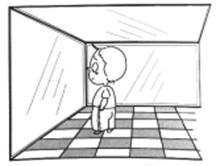

- **A**. 3个
- **B**. 4个
- **C**. 7个　✅
- **D**. 8个

**答案**：C

**官方解析**

本题考查科技常识。

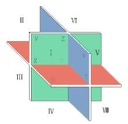

如图所示，三个平面将空间分成八块，三块平面镜会使得小明在除自己所在的那一块空间以外的每块空间都成一个像，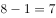。

故正确答案为C。

---

### 第 23 题　qid 2616115 · 人文常识

下列关于人体单纯性肥胖的说法错误的是：

- **A**. 进食过多的糖类食物，会导致肥胖
- **B**. 肥胖者会因动脉粥样硬化而产生心血管疾病
- **C**. 不吃肥肉少放油，提倡低脂膳食就能避免肥胖　✅
- **D**. 脂肪虽供给人体能量，但摄入过多会沉积皮下引起肥胖

**答案**：C

**官方解析**

本题考查科技常识。  
A项正确，当人摄入过量的糖分时，多余的糖分就会转化为肝肌糖元。如果还有剩余，就会大量转化成脂肪，使人长胖。 
B项正确，身体太肥胖的话会改变血流动力，左心室异常肥大，使得心律失常，提高血栓生成风险，从而加快动脉粥样硬化生成。
C项错误，肥胖的成因是多方面的，有遗传、饮食、运动、年龄等因素，所以只是不吃肥肉少放油，提倡低脂膳食并不一定能够避免肥胖。
D项正确，人体能量摄入超过能量消耗，多余的能量就会转变成脂肪囤积在人体内，从而导致肥胖。
本题为选非题，故正确答案为C。

---

## 言语理解与表达

### 第 1 题　qid 2616139 · 逻辑填空

作为一种现象，城市垃圾问题早已凸显，异地倾倒、            ，不过是垃圾困境的一种不当突围方式而已。治理垃圾异地倾倒问题，必须依靠严厉执法和监督举报，但最终还是要回到城市垃圾处理上来。
填入划横线部分最恰当的一项是：

- **A**. 投机取巧
- **B**. 以邻为壑　✅
- **C**. 落井下石
- **D**. 寡廉鲜耻

**答案**：B

**官方解析**

横线处用“、”和“异地倾倒”构成近义并列，所填成语应体现把自己城市的垃圾倾倒在别的城市的意思。B项“以邻为壑”指把本国的洪水排泄到邻国，比喻只图自己一方的利益，而把困难或灾祸转嫁给别人，与“异地倾倒”语义相近可以构成近义并列，当选。
A项“投机取巧”是指用不正当的手段谋取私利，C项“落井下石”比喻趁人危难时加以陷害，D项“寡廉鲜耻”指不廉洁，不知羞耻。A、C、D三项均未能体现把对自己有害的转嫁到别人的身上，不能与“异地倾倒”构成近义并列，均排除。
故正确答案为B。
【文段出处】《异地偷倒垃圾为何还在疯狂上演》

---

### 第 2 题　qid 2616065 · 逻辑填空

向民众        科学知识，        科学精神，是科学家义不容辞的责任。但是科学家首先要致力于科研，他究竟能花多少时间来做科普，显然无法一概而论。通常，一线科学家很难花费太多的时间和精力直接参与一波又一波的科普活动。
依次填入划横线部分最恰当的一项是：

- **A**. 传输  传递
- **B**. 传递  传播　✅
- **C**. 传导  传扬
- **D**. 传达  传承

**答案**：B

**官方解析**

第一空，搭配“科学知识”，表示向民众传播科学知识，A项“传输”指传递、输送，一般搭配信息、数据，与“知识”搭配得当，保留；B项“传递”指由一方交给另一方，表示科学家把科学知识传播给民众，搭配得当且语义恰当，保留。C项“传导”指热或电从物体的一部分传到另一部分，多用于物理学或神经方面，与知识搭配不当，排除；D项“传达”意为把一方的意思告诉给另一方，多与命令、消息搭配，与知识搭配不当，排除。
第二空，搭配“科学精神”，根据横线后“做科普”“科普活动”可知，“科普”即科学普及，特点是范围广、受众多，所以横线处所填词语要体现出范围广、受众多，B项“传播”指广泛散布，与“科学精神”搭配恰当，且与“科普活动”对应准确，当选。A项“传递”无法体现出科普活动受众多的特点，排除。
故正确答案为B。
【文段出处】《期待我国的“元科普”力作》

---

### 第 3 题　qid 2616127 · 逻辑填空

研究结果显示，只要手机在视线范围或            的范围之内，就会导致人们的注意力下降。这并不是手机的推送或通知分散了人的注意力，而是人们下意识地不去“        ”手机，但发布这个指令的过程本身就会耗费有限的认知资源，造成脑力流失。
依次填入划横线部分最恰当的一项是：

- **A**. 近在咫尺  牵挂
- **B**. 唾手可得  惦念
- **C**. 触手可及  惦记　✅
- **D**. 一步之遥  想念

**答案**：C

**官方解析**

第一空，根据横线前“手机在视线范围”可知，所填词语表达距离手机很近之意。A项“近在咫尺”形容离得特别近，C项“触手可及”指近在手边，一伸手就可以接触到，形容距离极近，D项“一步之遥”指一步的距离，比喻距离很近，三项均符合文意，保留。B项“唾手可得”形容非常容易得到，与文意不符，排除。
第二空，根据文意可知，下意识地不去“想”手机的过程本身就会耗费有限的认知资源，故所填词语应体现“总想着、记着”之意。C项“惦记”指对人或事物心里老想着，放不下，置于此处形容人心里一直想着手机，符合文意，当选。A项“牵挂”指挂念，因放心不下而想念，D项“想念”指对离别的人或环境不能忘怀，希望见到，两者均有主观上关心之意，形容“手机”不恰当，排除。
故正确答案为C。
【文段出处】《科普：手机在身边会影响大脑认知功能》

---

### 第 4 题　qid 2616125 · 逻辑填空

文化是“人化”，同时又要“化人”。城市中的人一方面是文化形象的        和代言人，人们的精神面貌、道德修养、行为举止诸方面都反映出城市的文化形象；另一方面其行为方式又受到城市文化形象的影响，良好的文化形象会对人产生引导、规范和        作用。
依次填入划横线部分最恰当的一项是：

- **A**. 载体  激励　✅
- **B**. 体现  训诫
- **C**. 内涵  塑造
- **D**. 象征  制约

**答案**：A

**官方解析**

第一空，所填词语和“代言人”构成近义并列，且能对应后文“人们的精神面貌、道德修养、行为举止诸方面都反映出城市的文化形象”，A项“载体”指能够承载其他事物的事物；B项“体现”指某种性质或现象在某一事物上具体表现出来；D项“象征”指用来象征某种特别意义的具体事物，均符合文意，保留。C项“内涵”指一个概念所反映的事物的本质属性的总和，也就是概念的内容，文段并未体现此意，排除。
第二空，所填词语和“引导”“规范”构成近义并列，由前文“良好的文化形象”可知，所填词语应该是褒义词。A项“激励”指激发鼓励，为褒义词，符合文意，当选。B项“训诫”指教导和告诫，与文段“良好的文化形象”对应不当，排除；D项“制约”指限制约束，感情色彩中性，且常用于消极语境，与文段感情色彩不符，排除。
故正确答案为A。
【文段出处】《以城市文化形象助力城市发展》

---

### 第 5 题　qid 2616066 · 逻辑填空

中华文化绵延5000年，有其独特的价值体系，已成为中华民族的基因。中华优秀传统文化是中华民族的突出优势，        着中华民族最深沉的精神追求，为中华民族生生不息、发展壮大提供了丰厚        ，潜移默化地影响着中国人的思想方式和行为方式，至今仍然具有鲜活的时代价值。
依次填入划横线部分最恰当的一项是：

- **A**. 沉淀  润泽
- **B**. 积淀  滋养　✅
- **C**. 积聚  滋润
- **D**. 积蓄  滋补

**答案**：B

**官方解析**

第一空，所填词语搭配“精神追求”，根据前文“中华文化绵延5000年”、“中华优秀传统文化是中华民族的突出优势”可知，此处表达中华优秀传统文化中积累包含最深沉的精神追求的意思，A项“沉淀”表示凝聚积累、 B项“积淀”指积累沉淀，两项均可体现积累的意思，保留。C项“积聚”指逐渐聚集，常搭配物资、钱财，D项“积蓄”指积攒聚存，常搭配力量、钱财，均与“精神追求”搭配不当，排除。
第二空，所填词语搭配“提供”，需要填一个名词，B项“滋养”可做名词，表示养分、养料的意思，与“提供”搭配恰当，当选。A项“润泽”指的是滋润、使滋润的意思，一般不做名词使用，与“提供”“丰厚”均搭配不当，排除。
故正确答案为B。
【文段出处】《以高度的文化自信推动中华文化繁荣发展》

---

### 第 6 题　qid 2616181 · 逻辑填空

在未来30年里，“气候变化技术”既包括        防洪设施、使用转基因技术使庄稼抵御干旱气候等短期防御科技，也包括使用碳隔离方式将温室气体从大气层抽离并存入地下，将二氧化铝离子植入大气层以此来减少太阳辐射对地球温度影响等长期防御科技        。
依次填入划横线部分最恰当的一项是：

- **A**. 修建  计划
- **B**. 兴建  打算
- **C**. 建设  设想
- **D**. 建造  构想　✅

**答案**：D

**官方解析**

第一空，搭配“防洪设施”，D项“建造”指建筑或修建，A项“修建”指施工，B项“兴建”指开始建筑，三项均搭配恰当，保留；C项“建设”指建立、设置，通常指创立新事业，与“防洪设施”这一具体事物搭配不当，排除。
第二空，横线对应“使用碳隔离方式将温室气体从大气层抽离并存入地下，将二氧化铝植入大气层以此来减少太阳辐射对地球温度影响等”，根据现实可知此防御科技更多为一种想法，而非目前可以实施的工作。A项“计划”指工作或行动以前预先拟定的具体内容和步骤，不符合文意，排除；B项“打算”为口语化表述，用于文段中表述不恰当，排除；D项“构想”指构思，形成想法，符合文意，当选。
故正确答案为D。
【文段出处】《美国陆军部&lt;2016-2045年新兴科技趋势&gt;解读》

---

### 第 7 题　qid 2616009 · 逻辑填空

壁虎吸附墙壁是靠它们脚上细微毛发与墙壁        的分子间吸附力，仿壁虎材料运用了相同原理，核心在于有方向的吸附力，也就是说这种材料在平时不粘，而当有        的时候就会牢牢吸住物体表面，整个过程几乎不需要进行按压。
依次填入划横线部分最恰当的一项是：

- **A**. 粘连  向心力
- **B**. 附着  零重力
- **C**. 贴合  离心力
- **D**. 接触  切向力　✅

**答案**：D

**官方解析**

第一空，由“仿壁虎材料运用了相同原理”可知，壁虎吸附墙壁的原理与后文阐述的仿壁虎材料的原理是一致的。根据后文“这种材料在平时不粘”可知，壁虎脚上的细微毛发与墙壁之间也是不粘的，A项“粘连”与文意相悖，排除；B项“附着”指较小的物体黏着在较大的物体上，壁虎脚上细微毛发并非脱离壁虎本体而黏着在墙壁上面，不符合语境，排除；C项“贴合”指贴切吻合，表示两事物大小、形状等完全吻合，壁虎脚上的细微毛发与墙壁并非完全吻合，排除；D项“接触”指挨上、碰着，可以用于表示壁虎脚上的细微毛发与墙壁的位置关系，保留。
第二空，代入验证，D项“切向力”是物体作曲线运动时，在其轨道切线方向上所受到的力，与前文“有方向的吸附力”构成对应，符合文意，当选。
故正确答案为D。
【文段出处】《科学家研制仿壁虎抓手，你知道用来干嘛吗？》

---

### 第 8 题　qid 2616131 · 语句表达

长期以来，人们对于“阳春白雪”的传统文化，都是一种仰望的姿态，认为            ，于是常常过而不入。从这个意义上说，搞好文创，需要首先激发起人们对文化的浓厚兴趣，然后同样重要的，是想方设法保留住它。如此，人们才会在文化探索的旅程中              ，走得更深、更远。
依次填入划横线部分最恰当的一项是：

- **A**. 海水不可斗量  登堂入室
- **B**. 百思不得其解  斗折蛇行
- **C**. 夏虫不可语冰  登高履危
- **D**. 可望而不可即  拾级而上　✅

**答案**：D

**官方解析**

第一空，根据文意可知，人们对于传统文化是仰望的姿态，故横线处应与此意相近，D项“可望而不可即”指可以望到但无法接近，与文段对应恰当，保留；A项“海水不可斗量”比喻不可根据某人的现状就低估他的未来，文段未谈论人的现状与未来，与文段语义无关，排除；B项“百思不得其解”的意思是对事情百般思索都不明白，文段谈论的是人们对传统文化的看法而非是否明白，与文段语义无关，排除；C项“夏虫不可语冰”比喻时间局限人的见识，也比喻人的见识短浅，不懂大道理，文段并未提及见识是否短浅，与文段语义无关，排除。
第二空，代入验证，D项“拾级而上”的意思是顺着阶梯一步一步地往上走，与后文“走得更深、更远”对应恰当，符合语境，当选。
故正确答案为D。
【文段出处】《文创产业功夫在诗外》

---

### 第 9 题　qid 2616133 · 逻辑填空

饮食在中国文化传承中是较稳定的领域，国有盛衰，代有兴亡，用筷子吃饭数千年不变，与宴饮相关的某些礼仪程式也很少变化，盛行在西周的乡饮酒礼，上可溯至三代遗风，下传至清道光年间，其敬老、尊长、议政的古风            ，连酒会程序——谋宾、迎宾、旅酬和送宾等礼仪也            。
依次填入划横线部分最恰当的一项是：

- **A**. 如出一辙  毫无二致
- **B**. 一脉相承  大同小异　✅
- **C**. 一脉相通  相差无几
- **D**. 衣钵相传  半斤八两

**答案**：B

**官方解析**

第一空，文段指出我国饮食在传统文化中比较稳定，相关的吃饭习俗数千年不变，且横线前提到“上可溯至三代遗风，下传至清道光年间”，故横线处表示敬老、尊长、议政的古风是一直传承、延续的。A项“如出一辙”表示好像从一道车辙上走过来，形容两种言论或行动一模一样，与文中表示古风一直延续、传承的语义不符，排除；B项“一脉相承”表示从同一血统、派别世代相承流传下来，可体现出敬老、尊长、议政的古风一直传承、延续之意，保留。C项“一脉相通”指事物之间相互关联，可以互通，侧重强调关联性强，文段表示传承之意，而非事物之间的关联性，排除；D项“衣钵相传”比喻技术、学术的师徒相传，不符合语境，排除。
第二空，代入验证，横线处前“也”字表明与上文内容形成近义并列，应表达这些礼仪也大致相同之意。B项“大同小异”表示大部分相同，只有小部分不同，与文意相符，当选。
故正确答案为B。
【文段出处】《150年前，西餐进入中国，吃个饭竟然促进了男女平等》

---

### 第 10 题　qid 2616128 · 逻辑填空

在新型城镇化的过程中，凸显本地文化特色至关重要。文化是一座城市的灵魂，只有文化的        ，城市才能        其特色与气质。人是一种文化的存在，所以我们必须切实推进有文化记忆的城镇化。
依次填入划横线部分最恰当的一项是：

- **A**. 传播  凸显
- **B**. 继承  形成
- **C**. 融入  定格
- **D**. 浸润  彰显　✅

**答案**：D

**官方解析**

本题从第二空入手，根据前文“凸显本地文化特色至关重要”可知，横线处表示城市显示出它的特色与气质。A项“凸显”表示清楚地显露，D项“彰显”表示鲜明地显示，均符合文意，保留。B项“形成”表示发展变化而成，C项“定格”表示固定在某一个画面上，均不符合文意，排除。
第一空，横线处搭配“文化”，根据前文“文化是一座城市的灵魂”可知，文化是深入骨髓的。A项“传播”搭配文化，强调文化传递、广泛散布，不能体现文化是灵魂这层含义，排除。D项“浸润”表示浸染、熏陶，文化经过熏陶可逐渐由表及里，体现文化是灵魂的含义，符合文意，当选。
故正确答案为D。
【文段出处】《推进有文化记忆的城镇化》

---

### 第 11 题　qid 2616008 · 逻辑填空

在西汉时期，一种青铜染炉非常流行，以至于在许多地方都有出土。这种染炉分为三个构造：主体为炭炉，下部是        炭灰的盘体，上面放置一具活动的杯。它曾让几代学者对它的用途             ，直到今天，考古界才确定它就是一种类似现代意义上的“小火锅”。
依次填入划横线部分最恰当的一项是：

- **A**. 接收  孜孜以求
- **B**. 承接  迷惑不解　✅
- **C**. 收纳  朝思暮想
- **D**. 盛放  潜精研思

**答案**：B

**官方解析**

第一空，根据文段信息“主体为炭炉，下部是······炭灰的盘体”可知，染炉下部是用来接上面掉下来的炭灰的。B项“承接”意思是承前接后，体现出接住上面掉下的东西，与文段对应恰当，保留。A项“接收”指收取、收受，一般搭配“礼物、遗产、工程”等，与炭灰搭配不当，排除；C项“收纳”指收留容纳，D项“盛放”指安放，均体现要把东西收好、保存，炭灰是燃烧后的废物不需要完好保存，与文意不符，排除。
第二空，代入验证，根据后文“直到今天，考古界才确定它就是······”可知，以前几代学者并不知道染炉的用途。B项“迷惑不解”指对某事非常疑惑，很不理解，与文段对应恰当，当选。
故正确答案为B。
【文段出处】《考古证实：汉代吃火锅撸串儿喝酒很流行 》

---

### 第 12 题　qid 2616129 · 逻辑填空

两相比较，白话文在通俗易懂的同时，往往在韵律上缺少节奏感，篇幅冗长，而文言文能用            传达出深层或多层意思，其凝练之美、韵律之美和意境之美是白话文            的。
依次填入划横线部分最恰当的一项是：

- **A**. 一语双关  略逊一筹
- **B**. 只言片语  无与伦比
- **C**. 三言两语  相形见绌
- **D**. 寥寥数语  无可比拟　✅

**答案**：D

**官方解析**

第一空，根据“两相比较”可知，文段把白话文与文言文作对比，所填成语与“篇幅冗长”构成反义对应，表示文章字数少的意思。B项“只言片语”指个别词句或片断的话，C项“三言两语”形容话很少，D项“寥寥数语”指非常简括地说，均能体现出文言文篇幅不冗长的含义，保留。A项“一语双关”指一句话包含两个意思，不强调文章的字数少，无法与“篇幅冗长”对应，排除。
第二空，根据文段“其凝练之美、韵律之美和意境之美”可知，白话文不具备以上特点，所填成语表示文言文的三种美是白话文无法相比的。D项“无可比拟”指没有可以相比的，符合语境，当选。B项“无与伦比”指事物非常完美，没有能够与它相比的同类的东西，用在此处程度过重，排除；C项“相形见绌”指和同类的事物相比较显出不足，文段强调的是文言文的三种美是白话文无法与之相比，并非强调白话文自身的缺陷和不足，排除。 
故正确答案为D。 
【文段出处】《冉启斌：文言文在意境、形式、音韵等方面有特殊美感》

---

### 第 13 题　qid 2616141 · 逻辑填空

研究人员分别给成年小鼠和老年小鼠喂食膳食纤维含量不同的两种食物，持续4周，然后对小鼠血液中短链脂肪酸水平、肠道炎症状况等进行检测，结果表明，多补充膳食纤维，不仅可以提高老年小鼠血液中短链脂肪酸水平，而且会显著        小鼠肠道炎症，增强细胞抗炎能力，进而抑制有害化学物质的产生，延缓大脑功能        进程。
依次填入划横线部分最恰当的一项是：

- **A**. 减弱  衰萎
- **B**. 减缓  衰弱
- **C**. 减轻  衰退　✅
- **D**. 减少  衰变

**答案**：C

**官方解析**

第一空，搭配“炎症”，A项“减弱”，C项“减轻”，D项“减少”均可与之搭配，保留。B项“减缓”指速度变慢，不能直接搭配“炎症”，排除。
第二空，横线前搭配“大脑功能”，C项“衰退”指衰弱减退，可与“大脑功能”搭配，当选。A项“衰萎”指衰败萎缩，可以搭配“大脑”，但不能搭配“功能”，排除。D项“衰变”指放射性元素放射出粒子后变成另一种元素的现象，与本题语境无关，排除。
故正确答案为C。
【文段出处】《补充膳食纤维有助于延缓大脑衰退》

---

### 第 14 题　qid 2616161 · 逻辑填空

不少街坊所熟知的“冬病夏治”，就是根据祖国医学“春夏养阳，秋冬养阴”的理论，        四时特性的养生疗法。“冬病”指某些好发于冬季，或在冬季加重的病变，如支气管炎、慢性阻塞性肺疾病、过敏性鼻炎、失眠、骨关节痛、体质虚寒症等疾病。“夏治”指夏季这些病情有所缓解，趁其发作缓解季节，补气扶阳、辨证施治，以        冬季旧病复发，或减轻其症状。
依次填入划横线部分最恰当的一项是：

- **A**. 服从  防止
- **B**. 适应  免予
- **C**. 顺应  预防　✅
- **D**. 符合  避免

**答案**：C

**官方解析**

第一空，搭配“四时特性”，且由前一分句的“根据”可知，横线处表示“冬病夏治”受到了“四时特性”的引导与影响。A项“服从”指遵照、听从，一般搭配命令、管理等，与“四时特性”搭配不当，排除；D项“符合”指数量、形状、情节等相合，虽然可与“四时特性”搭配，但体现不出受到了其影响之意，排除；B项“适应”指适合，C项“顺应”指顺从、适应，均可与“四时特性”搭配，且能体现出受到了其影响之意，保留。
第二空，根据文意，“夏治”的目的即提前做准备，防止冬季旧病复发，故横线处应体现时间角度的提前，做防备之意。C项“预防”指事先防备，符合文意，当选。B项“免予”指不给予或不施行，与文意不符，排除。
故正确答案为C。
【文段出处】《夏天晒太阳防病有讲究》

---

### 第 15 题　qid 2616010 · 逻辑填空

目前，第五代移动通信（5G）已成为当前和未来全球业界的焦点，将        移动互联网进入新时代。美国高通公司指出，5G技术将成为同电力、互联网等发明一样的通用技术，        未来的转型变革，重新定义工作流程并        经济竞争优势规则。到2035年，5G将在全球创造12.3万亿美元的经济产出，同时创造2200万个工作岗位。
依次填入划横线部分最恰当的一项是：

- **A**. 带领  催生  重造
- **B**. 引领  催化  重塑　✅
- **C**. 引导  催发  制定
- **D**. 带动  催促  制订

**答案**：B

**官方解析**

本题可从第三空入手，搭配“规则”，且由“并”可知，横线处所填词语与“重新”构成并列语义相近。B项“重塑”指重新塑造，与文意相符且搭配恰当，保留。A项“重造”指不把原先做基础，完全重新再造，与“规则”搭配不当，排除；C项“制定”指经过一定的程序定出（法律、规程、计划等），D项“制订”指草拟创制，二者均无法体现“重新”之意，排除。
第一空，代入验证，形容“5G”对“移动互联网”的作用，B项“引领”指引导、带领，符合文意且搭配恰当。
第二空，代入验证，搭配“转型变革”，B项“催化”指促使化学反应的速率发生改变，有使加快速度之意，可与“未来的转型变革”搭配，表达加快未来的转型变革，当选。
故正确答案为B。
【文段出处】《移动互联网》

---

### 第 16 题　qid 2616130 · 逻辑填空

改革开放以来，伴随着一系列体制障碍的清除，物质资本和人力资本得到巨大的             和有效的重新            。中国终于把自己在几个世纪“大分流”中的落后地位，            为向发达经济体的“大趋同”，开始了中华民族复兴的宏伟征程，并以成为世界第二位经济体为象征，取得了世人瞩目的发展成就。
依次填入下划线部分最恰当的一项是

- **A**. 累积  组合  扭转
- **B**. 积聚  分配  转化
- **C**. 积累  配置  逆转　✅
- **D**. 积攒  组织  转化

**答案**：C

**官方解析**

本题可从第二空入手，所填词语搭配“物质资本和人力资本”。A项“组合”、B项“分配”、C项“配置”放在此处搭配均可，保留。D项“组织”指安排分散的人或事物使具有一定的系统性或整体性，常搭配人员、活动等，与“资本”搭配不当，排除。
第三空，根据文意，从横线前的“大分流”中的落后地位到横线后的发达经济体的“大趋同”可知，所填词语体现出的是中国从落后到发达的转变，“大分流”、落后与“大趋同”、发达方向相反，C项“逆转”指向相反的方向转变，与文段对应恰当，符合文意。A项“扭转”指纠正或改变事物的发展方向或目前的状况，B项“转化”指转变、改变，均体现不出向相反的方向转变之意，排除。
第一空代入验证，C项“积累”与“物质资本和人力资本”搭配恰当，符合语境，当选。
故正确答案为C。
【文段出处】 《蔡昉：改革开放是中国经济由衰至盛的转折点》

---

### 第 17 题　qid 2616147 · 逻辑填空

上海合作组织成立十多年来，创造性提出并始终        “上海精神”，主张互信、互利、平等、协商、尊重多样文明、谋求共同发展，为世界各国共同繁荣、区域合作发展壮大提供了有益        ，为推动各国        建设人类命运共同体作出了重大贡献。
依次填入划横线部分最恰当的一项是：

- **A**. 实践  启发  并肩
- **B**. 推行  借镜  昂首
- **C**. 践行  借鉴  携手　✅
- **D**. 履行  启示  挽手

**答案**：C

**官方解析**

第一空，所填词语搭配“上海精神”。B项“推行”和C项“践行”搭配“上海精神”均恰当，保留。A项“实践”作谓语时，其后一般不接宾语，即其后不能搭配“上海精神”，排除；D项“履行”一般搭配职责、义务等，不能搭配“上海精神”，排除。
第二空，文段说的是上海合作组织的经验可以让世界各国学习、效仿。B项“借镜”取自成语“借镜观形”，“借镜观形”比喻参考和吸取别人的经验教训。B项“借镜”与C项“借鉴”意思相同，填入横线处均符合语境，保留。
第三空，B项“昂首”指仰着头，C项“携手”指手拉着手，表示共同做某事。由“各国”“人类命运共同体”可知，此处强调各国齐心协力共谋发展，所以C项“携手”更符合语境，当选。
故正确答案为C。
【文段出处】《为携手建设人类命运共同体作出更大贡献》

---

### 第 18 题　qid 2616011 · 逻辑填空

近年来，人们的生活条件越来越好，对旅游        的要求也越来越高，从前到此一游、            的旅游方式已逐渐被深度体验、注重文化与互动的旅游方式所替代。正是在这种背景下，文化与旅游融合的发展方式            ，并成为热点。
依次填入划横线部分最恰当的一项是：

- **A**. 质量  浮光掠影  脱颖而出
- **B**. 环境  浅尝辄止  蔚然成风
- **C**. 品质  走马观花  应运而生　✅
- **D**. 生态  蜻蜓点水  蔚为大观

**答案**：C

**官方解析**

本题可从第三空入手，根据“这种背景下”指代前文，前文指出近年来人们的旅游方式“已逐渐被深度体验、注重文化与互动的旅游方式所替代”，故横线处应体现在这样的背景下，“文化与旅游融合的发展方式”随着人们的需要开始兴起。C项“应运而生”指随着某种形势而产生，符合文意，保留。
A项“脱颖而出”本意指锥尖透过布袋显露出来，也指人的本领全部显露出来，体现不出“开始兴起”的含义，与文意不符，排除；
B项“蔚然成风”指事物盛极一时，成为风气，体现不出“开始兴起”的含义，与文意不符，排除；
D项“蔚为大观”指事物美好而繁多，多指文物、盛大的景象等，与“发展方式”搭配不当，排除。
第一空，代入验证，“旅游品质的要求”搭配恰当，保留。
第二空，代入验证，横线处与“到此一游”构成并列，“走马观花”指粗略地观察一下，与“到此一游”语义相近，当选。
故正确答案为C。
【文段出处】《在文旅融合中讲好民俗故事》

---

### 第 19 题　qid 2616187 · 逻辑填空

随着智能科技和产业的发展，数据和计算正在成为            经济增长和发展的关键            。作为第四次工业革命的引擎，智能科技和经济在中国的发展            于经济转型升级中所创造的智能化需求。
依次填入划横线部分最恰当的一项是：

- **A**. 推动  因素  产生
- **B**. 驱使  要点  内化
- **C**. 触动  质素  生长
- **D**. 驱动  要素  内生　✅

**答案**：D

**官方解析**

第一空，此处需分别搭配“经济增长”和“发展”，A项“推动”指的是使事物推进，D项“驱动”指的是使动起来，均可与“经济增长”、“发展”构成搭配，保留A、D两项；B项“驱使”指的是强迫人按照自己的意志行动，一般搭配为“在……驱使下”“利益驱使”等，与“经济增长”、“发展”搭配不当，排除；C项“触动”指的是碰、撞，因某种刺激而引起（感情变化、回忆等），与“增长”、“发展”搭配不当，排除；
第二空，搭配“关键”，A项“因素”、D项“要素”均可构成搭配，保留；
第三空， 结合文段，此处需表达智能科技和经济能够在中国得以发展是由于有经济转型升级中所创造的智能化需求，即横线要表达智能科技和经济的发展与智能化需求之间存在因果关系。D项，“内生”指的是靠自身发展，智能这一领域的科技和经济之所以发展靠的是自身领域的需求——智能化的需求，在此能够体现同一领域的两者之间的因果关系，保留；A项“产生”指的是由已有的事物中生出新的事物，更多形容两个不同领域之间的因果关系，与文意不符，排除。
故正确答案为D。
【文段出处】《中国人工智能如何更好发展》

---

### 第 20 题　qid 2616006 · 片段阅读

水熊被认为是世界上最顽强的动物，其显著特征是能在各种极端环境中存活下来。科学家曾经将水熊冰冻在冰层之中，暴露在放射线之下，甚至将它们发送至太空，但令人惊奇的是，水熊仍能从假死状态中复活。最近，科学家揭示了水熊复活的秘密，其DNA兼具动物和细菌成分，使其成为“弗兰肯斯坦”混合体。此外，科学家们在研究水熊复活过程中哪些基因会被激活时，还发现了一组特殊蛋白质。这组蛋白质能够快速替换体内损耗的水分，并修复受损细胞，致使这种动物接近于不可毁灭状态。
这段文字旨在说明：

- **A**. 水熊的显著特征是能在各种极端环境中存活
- **B**. 水熊是一种能复活的“弗兰肯斯坦”混合体
- **C**. 水熊拥有神秘DNA使它接近于不可毁灭　✅
- **D**. 水熊拥有的特殊蛋白质能修复受损的细胞

**答案**：C

**官方解析**

文段首先介绍水熊是世界上最顽强的动物，随后从将水熊“冰冻”、“暴露在放射线之下”、“发送至太空”，水熊依然能够复活等方面进行解释说明。后文通过介绍科学家的发现引出文段重点，介绍水熊复活的秘密究竟是什么，根据“此外”前后两部分的内容可知，因为特殊的DNA，使得水熊接近于不可毁灭的状态，对应C项。
A项，“能在各种极端环境中存活”为文段引出话题部分，非重点，排除；
B项，偏离文段核心话题，文段重点围绕“DNA”的作用展开，排除；
D项，“特殊蛋白质”偏离核心话题“DNA”，且未指出水熊生命力顽强这一观点，排除。
故正确答案为C。
【文段出处】《无水无食物仍存活30年，揭秘最顽强动物——水熊的神秘DNA！》

---

### 第 21 题　qid 2615973 · 片段阅读

正因为中国法律史学除了单纯的理论研究，还要探究解决当代中国的法律问题，所以有必要坚持独立的中国立场。不论是单纯的理论研究，还是切近实际的应用研究，都需坚持独立思想立场，才能做出有价值的研究成果。这里的独立立场，其实就是中国自身的立场，而不是站在别国的立场之上。近代以来，西方国家一些学者对于中国法律不客观的负面评价，曾经影响到中国学者对待本国法律历史的态度。直到今天，这种影响仍没有完全消除，需要加以矫正。
这段文字旨在强调：

- **A**. 中国法律史学研究需探究解决当代中国的法律问题
- **B**. 中国法律史学研究受到西方学者不客观的负面评价
- **C**. 中国法律史学研究必须坚持中国自身独立的立场　✅
- **D**. 中国法律史学研究曾受西方学者影响至今未消除

**答案**：C

**官方解析**

文段开篇通过结论词“所以”提出观点，强调中国法律史学研究需坚持独立的中国立场，后文分别从正反两个方面来论证前文观点，一方面“坚持独立思想立场才能做出有价值的研究成果”，即需要坚持中国立场，另一方面“西方国家一些学者对于中国法律不客观的负面评价······这种影响仍没有完全消除，需要加以矫正”，即通过反面的角度来强调需要坚持中国立场。故文段为总分结构，旨在强调中国法律史学研究必须坚持中国自身独立的立场，对应C项。
A项“当代中国的法律问题”对应开篇话题引入部分，结论之前的内容非重点，排除。
B项“西方学者不客观的负面评价”，D项“影响至今未消除”均对应解释说明部分的内容，非重点，排除。
故正确答案为C。
【文段出处】《构建具有中国风格的法律史学》

---

### 第 22 题　qid 2616120 · 片段阅读

一次，苏格拉底与三个学生走过一块麦田，他要学生从这边走过，去摘一穗最大的麦穗。结果有一个学生空手而归，他总想最大的麦穗一定还在后面，不觉到了尽头，两手仍然空空；另一个则摘了一穗很小的麦穗，他一走进麦田便急忙摘了一穗，殊不知前面还有更大的；只有最后的学生摘了一穗很大的麦穗，虽然不一定是最大的，但他的结果是令人满意的。
这段文字意在说明：

- **A**. 生活即思想，思想源于生活实际
- **B**. 把握时机是人生快乐的最大诀窍　✅
- **C**. 优秀哲学家都以其毕生精力在孕育智慧的田地里耕耘
- **D**. 苏格拉底一生注重实践，把哲学的注意力放在生活上

**答案**：B

**官方解析**

文段主要讲述了一则寓言故事，苏格拉底让三个学生在麦田中摘一穗最大的麦穗，三个学生的做法不尽相同：第一个学生抱希望于最后，即认为最好的时机是最后，结果最后两手空空；第二个学生担心错过眼前的，即认为最好的时机就是眼前，结果摘了很小的麦穗；第三个学生则抓住了时机摘下麦穗，尽管最终摘的不一定是最大的，但却是令人满意的。文段通过尾句转折关联词“但”强调重点，即最后这位学生的做法才是最合适的，只有准确把握机会才能令人满意，对应B项。
A项，文段重在强调把握时机给自己带来满意的结果，而非生活与思想的关系，表述无中生有，排除；
C项，文段重在通过寓言故事强调把握时机才能获得满意的结果，“在孕育智慧的田地里耕耘”为无中生有，排除；
D项，文段讲述的是苏格拉底三位学生的不同做法，而非“苏格拉底”，表述偏离文段中心，排除。
故正确答案为B。
【文段出处】《尊重哲学》

---

### 第 23 题　qid 2615975 · 片段阅读

在移动阅读时代，自媒体的影响力不可小觑。由于拥有更广阔的传播途径和分发渠道，受公众关注度高，自媒体人掌握了一定话语权。有些自媒体人与传统媒体机构相比，确实不落下风，公信力给他们带来了收益。然而，公信力是把双刃剑，自媒体人既要看到流量背后的利益，也要认识到滥用自己的公信力会引发哪些负面效果。若以为可以仰仗传播力而“任性”，则实实在在打错了算盘。滥用话语权的后果，将直接影响自己辛苦树立起来的公信力，失去公众的支持与关注。
这段文字意在强调：

- **A**. 自媒体具有强大的影响力
- **B**. 自媒体人不应只关注收益
- **C**. 自媒体人应争取公众支持
- **D**. 自媒体的话语权不可滥用　✅

**答案**：D

**官方解析**

文段开篇介绍自媒体影响力不可小觑的背景，并指出由于自媒体人掌握了一定话语权，可凭借公信力获得收益。之后通过“然而”转折引出重点，指出滥用公信力会引发负面效果的问题，尾句从反面提出对策。故文段强调自媒体不能仰仗传播力而“任性”，不能滥用话语权，对应D项。
A项，“影响力”对应文段转折前内容，非重点，排除；
B项，“不应只关注收益”对应尾句之前内容，非重点，排除；
C项，“争取公众支持”对应文段尾句滥用话语权的后果，非重点且表述片面，排除。
故正确答案为D。
【文段出处】《自媒体公信力不可滥用》

---

### 第 24 题　qid 2615976 · 片段阅读

我国研究机构日前宣布，世界上第一个全超导托卡马克“东方超环”（EAST）实现了稳定的101.2秒稳态长脉冲高约束等离子体运行，创造了新的世界纪录。这标志着EAST成为世界上第一个实现稳态高约束模式运行持续时间达到百秒量级的托卡马克核聚变实验装置。EAST高11米、直径8米、重达400吨，是我国第四代核聚变实验装置，其科学目标是让海水中大量存在的氘和氚在高温条件下，像太阳一样发生核聚变，为人类提供源源不断的清洁能源，所以也被称为“人造太阳”。
这段文字主要说明了：

- **A**. 大力发展清洁能源势在必行
- **B**. 核聚变技术可创造清洁能源
- **C**. 短期内难建成真正的“人造太阳”
- **D**. “人造太阳”装置取得革命性突破　✅

**答案**：D

**官方解析**

文段首先介绍世界上第一个全超导托卡马克EAST创造了新的世界纪录，新突破使EAST成为世界上第一个持续时间达到百秒量级的托卡马克核聚变实验装置，接着通过介绍EAST的特点、科学目标等来介绍其被称为“人造太阳”的原因，故文段重点介绍“人造太阳”即EAST取得的重大突破，对应D项。
A、B两项均围绕“清洁能源”展开，但文段主题词为EAST装置，即“人造太阳”，主题词偷换，排除；
C项，“短期内难建成”无中生有，排除。
故正确答案为D。
【文段出处】《“人造太阳”新突破，奠定核聚变基础 》

---

### 第 25 题　qid 2616119 · 片段阅读

有研究团队让22名17岁至42岁的志愿者在两周内每晚照常使用电子设备，但在睡前佩戴三小时防蓝光眼镜，发现其晚间褪黑激素水平整体上升了大约，上升幅度甚至超过服用褪黑激素补充剂带来的变化。志愿者感觉睡眠质量改善，入睡更快，整体睡眠时间延长。研究者说，最大的蓝光光源是日光，但大部分基于LED灯的设备也会发出蓝光，“人造蓝光”会激活对褪黑激素有抑制作用的内在光敏视网膜神经节细胞，从而干扰睡眠。该研究者建议睡前少用电子设备，或佩戴防蓝光眼镜。

从这段文字可以推出：

- **A**. 电子设备的蓝光会减少褪黑激素的分泌而促进睡眠
- **B**. 天然的日光并不会激活内在光敏视网膜神经节细胞
- **C**. 睡前不佩戴防蓝光眼镜会使褪黑激素水平整体上升
- **D**. 提升褪黑激素水平有助于入睡更快和睡眠质量改善　✅

**答案**：D

**官方解析**

A项，根据“大部分基于LED灯的设备也会发出蓝光，‘人造蓝光’会激活对褪黑激素有抑制作用的内在光敏视网膜神经节细胞，从而干扰睡眠”可知，蓝光会减少褪黑激素的分泌，干扰睡眠，而非促进睡眠，与文意相悖，排除；

B项，文段只说“人造蓝光”会激活神经节细胞，对于天然日光并未提到，无中生有，排除；

C项，根据“在睡前佩戴三小时防蓝光眼镜，发现其晚间褪黑激素水平整体上升了大约”可知，佩戴防蓝光眼镜可以使褪黑激素水平整体上升，选项表述错误，排除；

D项，根据“在睡前佩戴三小时防蓝光眼镜，发现其晚间褪黑激素水平整体上升了大约”和“志愿者感觉睡眠质量改善，入睡更快，整体睡眠时间延长”可知，选项表述正确，当选。

故正确答案为D。

【文段出处】中国青年网《晚上用电子设备易失眠》

---

### 第 26 题　qid 2616002 · 片段阅读

社交恐惧症是焦虑障碍的一个重要亚型，其主要症状是害怕受到注视，例如害怕在大庭广众之下讲话等，症状严重时甚至不敢出门。害羞则是一种常见的人格特质，本身并不具有病理性。不过，绝大多数社交恐惧症患者在接受治疗之后，症状都会得到明显缓解。对于症状程度较轻的患者，应该首选心理治疗；如果患者因工作忙等原因不能或不愿意接受心理治疗，则可以首选药物治疗，但将药物治疗与心理治疗结合起来才是治疗社交恐惧症最有效的方法。此外，大多数社交恐惧症患者都起病于青少年时期，所以预防非常重要。
根据这段文字，下列说法正确的是：

- **A**. 害羞是社交恐惧症的一个重要亚型
- **B**. 社交恐惧症无法通过药物治疗治愈
- **C**. 中老年人不会成为社交恐惧症患者
- **D**. 症状程度较轻者用结合治疗最有效　✅

**答案**：D

**官方解析**

A项，根据“社交恐惧症是焦虑障碍的一个重要亚型”“害羞则是一种常见的人格特质，本身并不具有病理性”可知，害羞并非是社交恐惧症的一个重要亚型，它是一种常见的人格特质，本身并不具有病理性，偷换概念，排除；
B项，根据“如果患者因工作忙等原因不能或不愿意接受心理治疗，则可以首选药物治疗”可知，药物可以治疗社交恐惧症，表述错误，排除；
C项，根据“大多数社交恐惧症患者都起病于青少年时期”可知，中老年人也可能成为社交恐惧症患者，表述绝对，排除；
D项，根据“将药物治疗与心理治疗结合起来才是治疗社交恐惧症最有效的方法”可知，表述正确，当选。
故正确答案为D。

---

### 第 27 题　qid 2615979 · 片段阅读

生命存在的首要条件是液态水，一颗行星是否宜居取决于表面温度能否维持液态水的存在。冰行星或冰卫星地表原本被冰雪覆盖，此前研究认为，随着恒星辐射增强，其地表冰雪最终会融化形成液态水，从而适宜生命生存。不过，最新研究证明，随着恒星辐射增强，冰行星或冰卫星将直接进入极端炎热的温室逃逸状态，表面温度将升至100摄氏度以上，液态水无法存在。一旦冰雪融化，行星地表反射能力的突然降低使其吸收恒星辐射的能力大大增强。此外，冰雪融化后，大量水汽进入大气，强温室效应也使地表温度进一步升高。
下列说法与原文相符的是：

- **A**. 宜居行星在事实上并不存在
- **B**. 冰行星或冰卫星其实不宜居　✅
- **C**. 冰行星或冰卫星其实没有冰
- **D**. 温室逃逸状态阻止了冰融化

**答案**：B

**官方解析**

A项，根据“冰行星或冰卫星地表原本被冰雪覆盖……不过，最新研究证明……液态水无法存在”可知，冰行星或者冰卫星不宜居，而非所有行星均不宜居，故话题范围扩大，排除；
B项，根据“冰行星或冰卫星地表原本被冰雪覆盖……不过，最新研究证明……液态水无法存在”可知，选项表述正确，当选；
C项，根据“冰行星或冰卫星地表原本被冰雪覆盖”可知，冰行星或冰卫星是有冰的，故选项表述与文意相悖，排除；
D项，根据“冰行星或冰卫星将直接进入极端炎热的温室逃逸状态，表面温度将升至100摄氏度以上，液态水无法存在”可知，温室逃逸状态使液态水无法存在，而非是阻止了冰融化，排除。
故正确答案为B。
【文段出处】《新研究显示宜居行星可能少于此前估计》

---

### 第 28 题　qid 2616138 · 片段阅读

人之所以能看到物体，是因为物体阻挡了光波的通过。如想让某个小球隐形，可在该小球的四周覆盖一层以同心圆形状排列的超材料，这种材料能挡住传来的一切光波，并且不发生反射或吸收现象。被挡开的波在物体的另一边再次汇合后继续沿直线传播。在观察者看来，物体就似乎变得“不存在”了，也就实现了视觉隐身，简而言之，隐身衣使用的超材料，可以让雷达波、光线或者其他的波绕过物体而不会被反弹，进而达到不可视的效果。未来，隐身衣将被首先应用于军事领域，提高作战的隐蔽性和安全性。但如果任何人都可以实现隐形，也会引发一系列社会问题。
与这段文字意思相符的一项是：

- **A**. 隐身衣能够让光线穿透自身
- **B**. 物体阻挡光波使人能够视物　✅
- **C**. 隐身衣用于军事会引发战争
- **D**. 使用超材料能够反弹雷达波

**答案**：B

**官方解析**

A项，根据“隐身衣使用的超材料，可以让雷达波、光线或者其他的波绕过物体而不会被反弹，进而达到不可视的效果”可知，隐身衣可以让光波绕过物体，而非穿透自身，故表述错误，排除；
B项，根据“人之所以能看到物体，是因为物体阻挡了光波的通过”可知，表述正确，当选；
C项，根据“未来，隐身衣将被首先应用于军事领域，提高作战的隐蔽性和安全性”可知，“会引发战争”强加因果，排除；
D项，根据“简而言之，隐身衣使用的超材料，可以让雷达波、光线或者其他的波绕过物体而不会被反弹，进而达到不可视的效果”可知，使用超材料不会反弹雷达波，故表述错误，排除。
故正确答案为B。
【文段出处】《隐形人能从传说走向现实吗》

---

### 第 29 题　qid 2615993 · 片段阅读

近来，多家情商教育机构针对不同年龄段推出相应套餐，“情商班”火爆家长圈。情商是控制和驾驭情绪的能力，对人的生活和工作有重要的作用。可是，在很多人的心里，情商的内涵已经被异化，最早的情商概念和如今流行的情商观念大相径庭。许多人对情商的理解，是圆滑世故、阿谀奉承的另一种说法。实际上，情商的核心既是对自身情绪的认识和控制能力，也包括与人交往、融入集体的能力。这两种能力的培养，需要在日常生活中实践。孩子能否培养出良好的情绪控制能力和社交能力，很大程度上取决于家长，任何情商培训都无法取代日常生活中的情商培养。
接下来最可能讲述的是：

- **A**. 情商补习应当引起家长高度关注
- **B**. 家长在家庭教育中的身体力行
- **C**. 家长要理性地看待情商培训班　✅
- **D**. 需要培养和提高家长的情商

**答案**：C

**官方解析**

根据提问方式可知，本题为接语选择题，应重点关注文段最后讨论的核心话题。文段开篇引出“情商教育”的话题并介绍情商的作用，而后通过转折词“可是”强调很多人对情商的认知存在偏差并进行具体说明，接着通过“实际上”论述了情商的核心，通过“需要”提出对策，指出情商应在日常生活中实践得到，尾句进一步论述，日常的情商培养中家长应起到重要作用，而不能过分依赖培训班。故接下来最有可能详细介绍家长面对情商培训班的态度，对应C项。
A项，与文意相悖，文段之前提到自身情绪的认识和控制能力需要在日常生活中实践，并非是靠补习，排除；
B项，“家庭教育”范围扩大，文中强调的是情商的培养，排除；
D项，“培养和提高家长的情商”与文段话题衔接不当，排除。
故正确答案为C。
【文段出处】《“情商班”火爆家长圈 不如家长先负起责任》

---

### 第 30 题　qid 2616123 · 语句表达

①虽然农村留守儿童的生活状态令人担忧，所需的关爱力度更大
②长此以往，势必会加重城市留守儿童问题
③当前，留守儿童关爱措施主要是针对农村留守儿童
④但长期以来，城市留守儿童问题始终被边缘化
⑤从而给社会造成新的难题
⑥既无过多关注，也无相应关爱措施
将以上6个句子重新排列，语序正确的是：

- **A**. ③①④⑥②⑤　✅
- **B**. ③①②⑥④⑤
- **C**. ①③④②⑤⑥
- **D**. ①④③②⑥⑤

**答案**：A

**官方解析**

观察选项，判断首句。对比①句和③句，①句对农村留守儿童的生活状态进行了论述，而③句通过背景引入，引出农村留守儿童的话题。按照常规写作思路，通常先引出话题，再展开具体论述，即③句比①句更适合做首句，排除C、D两项。
观察①句中出现了“虽然”转折关系的前半部分，后面应接转折词，剩下AB两项，①后接④或者②，④中出现“但”转折词，①④转折关联词配套捆绑，锁定A项。
故正确答案为A。
【文段出处】人民网《城市留守儿童问题也需重视》

---

### 第 31 题　qid 2616140 · 片段阅读

作为一种积极有效的开发性保护模式，全域旅游强调旅游发展与资源环境承载能力相适应，要通过全面优化旅游资源、基础设施、旅游功能、旅游要素和产业布局，更好地疏解和减轻核心景点景区的承载压力，更好地保护核心资源和生态环境，实现设施、要素、功能在空间上的合理布局和优化配置，对推动生态保护新格局具有重要意义。
最适合做这段文字标题的是：

- **A**. 以全域旅游减轻景区的承载压力
- **B**. 以全域旅游推动生态保护新格局　✅
- **C**. 以全域旅游资源观保护核心资源
- **D**. 以全域旅游环境观优化产业布局

**答案**：B

**官方解析**

文段开篇引出全域旅游的话题，后利用程度词“更好”强调全域旅游可以带来多方面的好处，最后指出实现合理布局和优化配置后对推动生态保护新格局具有重要意义，故文段重在强调全域旅游对生态保护新格局的推动作用，对应B项。
A项“减轻景区的承载压力”对应“更好地疏解和减轻核心景点景区的承载压力”，属于好处之一，表述片面，排除；
C项侧重强调“全域旅游资源观”，D项侧重强调“全域旅游环境观”，均偏离文段核心话题 “全域旅游”，排除。
故正确答案为B。
【文段出处】《以全域旅游推动生态保护新格局》

---

### 第 32 题　qid 2616144 · 语句表达

压缩空气储能属于一种物理方式的储能，即空气在整个过程中只存在温度、压强等状态的变化，而不会发生化学方面的变化。储存了众多电力的压缩空气需要放在一间封闭性极好的“屋子”里，而这间“屋子”的“主人”就是盐。食盐开采后会自然留下一个场所，学名叫做“盐穴”。“盐穴”是一种极其宝贵的不可再生资源，并且密封性能良好。然而，长期以来这种资源的利用系数很低。由于盐岩具有良好的蠕变特性、自愈合特性，渗透率极低，并且不会与空气中的氧气发生反应。因此，                    。
填入划横线部分最恰当的一项是：

- **A**. 要依托盐穴资源的优势发展储能产业
- **B**. “盐穴”是储存高压空气的理想场所　✅
- **C**. 应当利用盐穴储能改善发电与用电
- **D**. 要大力开发盐岩提高能源利用效率

**答案**：B

**官方解析**

横线出现在文段结尾，且横线前出现“因此”，故需要结合前文内容进行分析。前文说压缩空气储能属于一种物理方式的储能，它需要放在一间封闭性极好的“屋子”里，即“盐穴”。后文接着分析“盐穴”密封性能良好、有良好蠕变特性、自愈合特性，渗透率极低，不会与空气中的氧气发生反应等优点。“因此”应该承接前文进行总结，所以横线上的内容应该围绕“盐穴”封闭性好，可以被用来存储高压空气展开，对应B项。
A项，“发展储能产业”在文段没有体现，无中生有，排除；
C项，“利用盐穴储能改善发电与用电”在文段没有体现，无中生有，排除；
D项，“大力开发盐岩”在文段没有体现，无中生有，排除。
故正确答案为B。
【文段出处】《平时储能用时取出 盐穴竟然是能量银行？》

---

### 第 33 题　qid 2616118 · 语句表达

网络书店的页面为了适应人眼的视野范围，又窄又长，容易让人疲倦，而且图书多按销量或排行榜来呈现。随着人工智能的发展，现在还可以利用大数据算法，根据读者浏览和购买历史来确定其读书品味，推荐的书目符合读者口味，这就不可避免地形成“蚕茧效应”，读者只能看到喜欢看的，长此以往，                    ，这样的不足正好可以通过实体书店来弥补。现在不少大型书店的在售图书多到十万种以上，一入书城，如进书海，给读者带来的体验是网络书店无法比拟的。此时，书店如果能从众多图书中挑选高品质图书，用品质赢得读者，就可以在和网店的竞争中凸显竞争力。
填入划横线部分最恰当的一项是：

- **A**. 读者在网络书店的收获越来越小
- **B**. 逛实体书店才可能带来意外惊喜
- **C**. 读者阅读视野不知不觉日益狭窄　✅
- **D**. 网络书店无法满足读者阅读需求

**答案**：C

**官方解析**

横线出现在文段中间，需要结合前后文内容进行分析。前文论述网络书店的不足之处，读者只能看到喜欢看的，即能看到的书会变少；横线后指出这个不足可以靠实体书店来弥补，因为“一入书城，如进书海”，也就是图书种类多，可从众多图书中挑选。故横线处所填内容应表达出因读者只能看到喜欢看的，时间长了其阅读的视野也就越来越窄，对应C项。
A项，文段围绕的核心话题是读者所看到的图书多与少，而非“收获”，排除；
B项，“意外惊喜”在文段中并未提及，前后衔接不当，排除；
D项，“无法满足”表述过于绝对，网络书店可以更精准地满足读者阅读需求，但会使读者的阅读视野越来越窄，并非无法满足读者的阅读需求，排除。
故正确答案为C。
【文段出处】《书店，不能止步于外表美》

---

### 第 34 题　qid 2616063 · 逻辑填空

苏区是一个坚实的实践样本，蕴含着整个中国近代历史的主题、主线，预示着中华民族的前途。苏区研究既属于历史主干研究，也属于历史支系研究。经过多年积累，目前的苏区研究，其广泛、细致的程度前所未有，堪称血肉丰满、            、支系发达。
填入划横线部分最恰当的一项是：

- **A**. 枝繁叶茂　✅
- **B**. 繁花似锦
- **C**. 春色满园
- **D**. 生机盎然

**答案**：A

**官方解析**

单空成语题。横线所填成语搭配“苏区研究”，根据前文“苏区研究既属于历史主干研究，也属于历史支系研究”可知，文段将苏区研究比作有主干和支系的大树，再由后文“广泛、细致的程度前所未有”“血肉丰满”“支系发达”可知，苏区研究十分兴盛，故横线处应体现出苏区研究这棵“大树”发展很好之意。A项“枝繁叶茂”指树木的枝叶繁密茂盛，符合文意，当选。
B项“繁花似锦”指无数盛开的花朵像美丽多彩的锦缎，C项“春色满园”指欣欣向荣的景象，D项“生机盎然”比喻生命力旺盛的样子，虽然均能体现兴盛之意，但均无法体现主干、支系的关系，排除。
故正确答案为A。
【文段出处】《李红岩：从改革开放40年来历史学的整体发展看苏区研究的前景》

---

### 第 35 题　qid 2616062 · 逻辑填空

业内专家建议建立国家营养日或营养周，开展“食育进农村”等活动，加大公益广告投入，发布适宜不同人群的膳食指南。针对农村留守儿童多的现状，在家庭监管        的情况下，政府可通过购买服务，让相关社会组织走进农村，帮助农村孩子健康成长。
填入划横线部分最恰当的一项是：

- **A**. 缺失　✅
- **B**. 薄弱
- **C**. 不力
- **D**. 缺乏

**答案**：A

**官方解析**

横线处所填词语修饰农村留守儿童“家庭监管”的情况，由文段可知，所填词语应体现“留守儿童”缺少家庭监管的意思。A项“缺失”可做名词或动词，指缺少，失去的意思，“家庭监管缺失”搭配恰当，符合文意，当选；B项“薄弱”为形容词，指容易破坏或动摇、不雄厚、不坚强，一般搭配“兵力”“意志”“基础”等，与“家庭监管”搭配不当，排除；C项“不力”为形容词，指不尽力、不得力的意思，文段并非表达留守儿童在家庭监管方面不得力的意思，不符合文意，排除；D项“缺乏”为动词，指（所需要的、想要的或一般应有的事物）没有或不够，应放在宾语“家庭监管”之前，一般表述为“缺乏家庭监管”，置于此处用法错误，排除。
故正确答案为A。
【文段出处】《营养“缺乏”与“过剩”困扰青少年健康》

---

## 数量关系

### 第 1 题　qid 2616070 · 数学运算

小明每天从家中出发骑自行车经过一段平路，再经过一道斜坡后到达学校上课。某天早上，小明从家中骑车出发，一到校门口就发现忘带课本，马上返回，从离家到赶回家中共用了1个小时，假设小明当天平路骑行速度为9千米/小时，上坡速度为6千米/小时，下坡速度为18千米/小时，那么小明的家距离学校多远？

- **A**. 3.5千米
- **B**. 4.5千米　✅
- **C**. 5.5千米
- **D**. 6.5千米

**答案**：B

**官方解析**

设小明家到学校的距离为，在往返的过程中，上坡和下坡的路程均为斜坡的长度即距离相等，根据等距离平均速度公式，上下坡的平均速度千米/小时，与平路速度相等，故往返全程的平均速度均为9千米/小时，往返一次走了两个全程，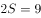千米/小时小时，得千米。

故正确答案为B。

---

### 第 2 题　qid 2616086 · 数学运算

甲、乙、丙三人去超市买了100元的商品，如果甲付钱，那么甲剩下的钱是乙、丙两人钱数之和的；如果乙付钱，则乙剩下的钱是甲、丙两人钱数之和的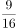；如果丙付钱，丙用他的会员卡可享受9折优惠，结果丙剩下的钱是甲、乙两人钱数之和的；那么，甲、乙、丙三人开始时一共带了多少钱？

- **A**. 850元　✅
- **B**. 900元
- **C**. 950元
- **D**. 1000元

**答案**：A

**官方解析**

方法一：设开始时甲带了元，乙带了元，丙带了元，则由题意可得：······①，······②，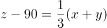······③，联立方程组，解得，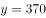，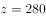。故甲、乙、丙三人开始时一共带了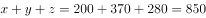元。

方法二：题干出现比例，虽然钱数不一定是整数，但选项均为整数，说明总钱数一定为整数，故优先考虑利用倍数特性解题。由题意可知，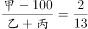，即为2份，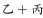为13份，则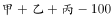为15份，即三人总钱数减去100是15的倍数，观察选项，排除B、C两项；丙用会员卡需支付元，则，即为1份，为3份，则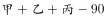为4份，即是4的倍数，排除D项，只有A项符合。

故正确答案为A。

备注：本题考场上应该选择倍数特性法，如果用方程法则太浪费时间。

---

### 第 3 题　qid 2616085 · 数学运算

南部某战区一个10人小分队里有6人是特种兵，某次突击任务需派出5人参战，若抽到3名或3名以上特种兵可成功完成突击任务，那么成功完成突击任务的概率有多大？

- **A**. 

- **B**. 

- **C**. 
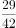

- **D**. 
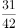
　✅

**答案**：D

**官方解析**

10人小分队里有6人是特种兵，则另外4人是非特种兵，派出5人参战，共有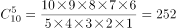种组合情况。

若不能成功完成突击任务，则5名参战队员中只有1名特种兵或2名特种兵，共有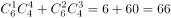种组合情况。

则成功完成突击任务的概率。

故正确答案为D。

---

### 第 4 题　qid 2616083 · 数学运算

某公司现有6箱不同的水果，安排三个配送员送到A、B、C三个不同的仓储点，其中A地1箱，B地2箱，C地3箱，问配送方式有：

- **A**. 60种
- **B**. 180种
- **C**. 360种　✅
- **D**. 420种

**答案**：C

**官方解析**

根据分步原理，选择一个配送员给A地送1箱的情况数为：种；选择一个剩下的配送员给B地送2箱的情况数为：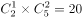种；最后剩下的一个配送员将剩下的3箱送给C地，情况数为1种，分步用乘法，则所求情况数为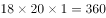种。

故正确答案为C。

---

### 第 5 题　qid 2616068 · 数学运算

某学习平台的学习内容由观看视频、阅读文章、收藏分享、论坛交流、考试答题五个部分组成。某学员要先后学完这五个部分，若观看视频和阅读文章不能连续进行，该学员学习顺序的选择有：

- **A**. 24种
- **B**. 72种　✅
- **C**. 96种
- **D**. 120种

**答案**：B

**官方解析**

根据题意，观看视频和阅读文章不连续，可用插空法，先安排其它三部分学习内容，顺序有种，这三部分学习内容共形成四个空，再插入不能连续进行的观看视频和阅读文章这两部分，有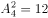种，因此总的学习顺序的选择有种。

故正确答案为B。

---

### 第 6 题　qid 2616164 · 数学运算

小王在荡秋千，当秋千摆角为时，它摆到最高位置与最低位置的高度差为0.45米。小王为寻求更大的刺激感，将秋千摆角增加，则秋千能摆到的最高位置约上升了多少米？（，）

- **A**. 0.15米
- **B**. 0.24米
- **C**. 0.37米
- **D**. 0.41米　✅

**答案**：D

**官方解析**

如下图1所示，OA为秋千在最低位置时的情况，OB为摆角是时秋千位置的情况，即，所以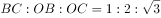，CA是摆角为时，最高位置与最低位置的高度差，即0.45米。设，则、，根据，即，解得，则。当摆角为时，如下图2所示，OA为秋千在最低位置时的情况，OE为摆角是时秋千位置的情况，即，所以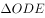为等腰直角三角形，，若，则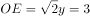，解得，此时高度差为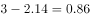米，比原来的0.45米上升了米。

故正确答案为D。

---

### 第 7 题　qid 2616154 · 数学运算

某工厂先从边长为1米的正方形铁皮切割掉一个半径1米、圆心角为直角的扇形，再用剩余材料切割正方形。为充分利用原材料，希望所得正方形越大越好。若不考虑切割损耗，问所切最大的正方形边长约为多少厘米？

- **A**. 22.6
- **B**. 25.6
- **C**. 27.6　✅
- **D**. 31.6

**答案**：C

**官方解析**

边长为1米的正方形铁皮切割掉一个半径为1米、圆心角为直角的扇形，要在剩余材料中切割出最大的正方形，则让正方形内的最长线段即对角线要在剩余材料内部，如图所示。 

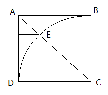

，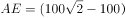厘米，所求正方形的边长为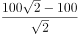，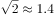，因此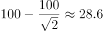厘米。切割的最大的正方形边长为28.6厘米。结合选项，最大的正方形边长可以为27.6厘米。 

故正确答案为C。

---

### 第 8 题　qid 2616078 · 数学运算

植树节期间，某单位购进一批树苗，在林场工人的指导下组织员工植树造林。假设植树的成活率为，那么，该单位职工小张种植3棵树苗，至少成活2棵的概率是：

- **A**. 

- **B**. 
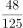

- **C**. 
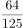

- **D**. 
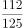
　✅

**答案**：D

**官方解析**

植树成活的概率为，即，则死亡的概率为。小张种植了3棵树苗，至少成活2棵包含2种情况，分类讨论如下：

（1）成活2棵的概率为：；

（2）成活3棵的概率为：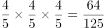；

分类用加法，则至少成活2棵的概率为。

故正确答案为D。

---

### 第 9 题　qid 2616158 · 数学运算

某公司职员预约某快递员上午9点30分到10点在公司大楼前取件，假设两人均在这段时间内到达，且在这段时间到达的概率相等。约定先到者等后到者10分钟，过时交易取消。快递员取件成功的概率为：

- **A**. 

- **B**. 

- **C**. 

　✅
- **D**. 

**答案**：C

**官方解析**

设快递员到达的时间为9点分，职员到达的时间为9点分，则只有，两人才能相遇。即直线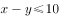、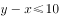、、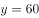围成的区域，交点坐标分别为（30,40）、（50,60）、（60,60）、（60,50）、（40,30）、（30,30），如下图所示，只有在阴影部分区域两人才能够相遇，也就是求阴影部分面积占整个正方形面积的比例。由图可以看出，正方形面积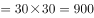，空白部分为两个全等三角形，每个的面积为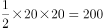，则阴影部分面积，占总面积的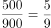。

故正确答案为C。

---

### 第 10 题　qid 2616079 · 数学运算

某电商平台每隔5千米有一座仓库，共有A、B、C、D四座仓库，图中数字表示各仓库库存货物的吨数。现需要把所有的货物集中存放在其中某一个仓库中，如果每吨货物运输1千米需要运费3元，要使运费最少，则需将货物集中到哪座仓库？

- **A**. 仓库A
- **B**. 仓库B
- **C**. 仓库C　✅
- **D**. 仓库D

**答案**：C

**官方解析**

方法一：根据题意直接代入选项计算总运费。

若将货物集中到仓库A，则运费为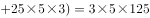元;

若将货物集中到仓库B，则运费为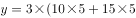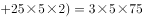元；

若将货物集中到仓库C，则运费为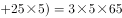元；

若将货物集中到仓库D，则运费为元；

则运费最少的是将货物集中到仓库C。

方法二：货物集中问题，只与各个仓库的存放量有关，与距离及运费无关。先考虑AB打包，CD打包，显然前者存放量（30吨）不如后者（40吨）多，因此AB的货物均需要向CD方向移动，先移到仓库C中。此时仓库C共有货物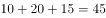吨，仓库D有25吨，则仓库D向仓库C移动，最后货物都集中到仓库C中。

故正确答案为C。

---

### 第 11 题　qid 2616143 · 数学运算

村民陶某承包一块长方形种植地，他将地分割成如图所示的4个小长方形，在A、B、C、D四块长方形土地上分别种植西瓜、花生、地瓜、水稻。其中长方形A、B、C的周长分别是20米、24米、28米，那么长方形D的最大面积是：

- **A**. 42平方米
- **B**. 49平方米
- **C**. 64平方米　✅
- **D**. 81平方米

**答案**：C

**官方解析**

如下图所示，假设标注的四条边长分别为、、、，已知长方形A、B、C的周长分别是20米、24米、28米，根据长方形周长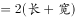，可得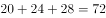，化简得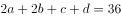，即，解得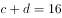。而c、d分别代表长方形D的长和宽，和一定时，当且仅当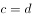时面积最大，此时米，故长方形D的最大面积平方米。

故正确答案为C。

---

### 第 12 题　qid 2616081 · 数学运算

某会展中心布置会场，从花卉市场购买郁金香、月季花、牡丹花三种花卉各20盆，每盆均用纸箱打包好装车运送至会展中心，再由工人搬运至布展区。问至少要搬出多少盆花卉才能保证搬出的鲜花中一定有郁金香？

- **A**. 20盆
- **B**. 21盆
- **C**. 40盆
- **D**. 41盆　✅

**答案**：D

**官方解析**

根据问法“至少······才能保证······”，可判定本题为最不利构造型最值问题。考虑最不利情况为前面搬出的花卉都是月季花和牡丹花，则一共搬出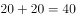盆花卉。在此基础上再搬1盆花，就可以保证一定是郁金香，则至少需要搬盆花卉。

故正确答案为D。

---

### 第 13 题　qid 2616072 · 数学运算

野外生存需要用一个简易的圆锥型过滤器（如下图所示）装满溪水进行过滤。过滤器的底面直径为20cm，高为6cm。问全部过滤完毕后，在不考虑损耗的情况下，可使底面半径为5cm，高为15cm的圆柱型容器的水面高度达到：

- **A**. 4cm
- **B**. 6cm
- **C**. 8cm　✅
- **D**. 12cm

**答案**：C

**官方解析**

根据圆锥体积公式可知，过滤溪水体积为。根据圆柱体积公式可得，圆柱型容器的水面高度达到cm。

故正确答案为C。

---

### 第 14 题　qid 2616087 · 数学运算

某企业员工组织周末自驾游。集合后发现，如果每辆小车坐5人，则空出4个座位；如果每辆小车少坐1人，则有8人没坐上车。那么，参加自驾游的小车有：

- **A**. 9辆
- **B**. 10辆
- **C**. 11辆
- **D**. 12辆　✅

**答案**：D

**官方解析**

设一共有辆车，根据总人数一定，列方程得：。解得，故参加自驾游的小车有12辆。

故正确答案为D。

---

### 第 15 题　qid 2616088 · 数学运算

某社区拟对一块梯形活动场地进行扩建，经测算，如果将梯形的上底边增加1米，下底边增加1米，则面积将扩大10平方米；如果将梯形的上底边增加1倍，下底边增加1米，则面积将扩大55平方米；如果将上底边增加1米，下底边增加1倍，则面积将扩大105平方米。现拟将梯形的上底边增加1倍还多2米，下底边增加3倍还多4米，则面积将扩大多少？

- **A**. 280平方米
- **B**. 380平方米　✅
- **C**. 420平方米
- **D**. 480平方米

**答案**：B

**官方解析**

设梯形的上底边为米，下底边为米，高为米。则根据题意有······①，······②，······③。由①解得，，代入②和③，解得，。因此当梯形的上底边增加1倍还多2米，下底边增加3倍还多4米时，面积将扩大平方米。

故正确答案为B。

---

## 判断推理

### 第 1 题　qid 2615963 · 类比推理

鸳：鸯

- **A**. 蚱蜢：蝗虫
- **B**. 白猫：黑猫
- **C**. 雄鸡：雌鸡　✅
- **D**. 红男：绿女

**答案**：C

**官方解析**

第一步：判断题干词语间逻辑关系。
鸳鸯是一种鸟类，鸳指雄鸟，鸯指雌鸟，二者为并列关系，且为并列关系中的矛盾关系。
第二步：判断选项词语间逻辑关系。
A项：蚱蜢和蝗虫的关系较有争议，多数资料显示二者为全同关系，与题干逻辑关系不一致，排除；
B项：白猫和黑猫是并列关系，但为并列关系中的反对关系，与题干逻辑关系不一致，排除；
C项：雄鸡和雌鸡是并列关系，且为并列关系中的矛盾关系，与题干逻辑关系一致，当选；
D项： 红男绿女，意思是指穿着各种漂亮服装的青年男女，二者为并列关系，但不是矛盾关系，与题干逻辑关系不一致，排除。
故正确答案为C。

---

### 第 2 题　qid 2615964 · 类比推理

售后：品控

- **A**. 数据：科学
- **B**. 融资：风投
- **C**. 龙骨：地板
- **D**. 听证：监管　✅

**答案**：D

**官方解析**

第一步：判断题干词语间逻辑关系。
售后需要品控，二者为对应关系，且品控不只是售后阶段存在，所有阶段都需要品控。
第二步：判断选项词语间逻辑关系。
A项：科学研究需要数据，但两词顺序与题干相反，与题干逻辑关系不一致，排除；
B项：风投是一种融资方式，二者为种属关系，与题干逻辑关系不一致，排除；
C项：龙骨是用来支撑造型、固定结构的一种建筑材料，龙骨用来支撑地板，与题干逻辑关系不一致，排除；
D项：听证需要监管，二者为对应关系，且监管不只是听证阶段存在，所有阶段都需要监管，与题干逻辑关系一致，当选。
故正确答案为D。

---

### 第 3 题　qid 2615965 · 类比推理

牵牛花：喇叭花

- **A**. 乞巧节：七夕节　✅
- **B**. 七巧板：橡皮泥
- **C**. 人行道：车行道
- **D**. 防腐剂：添加剂

**答案**：A

**官方解析**

第一步：判断题干词语间逻辑关系。
牵牛花又称喇叭花，二者为全同关系。
第二步：判断选项词语间逻辑关系。
A项：乞巧节又称七夕节，二者为全同关系，与题干逻辑关系一致，当选；
B项：七巧板和橡皮泥均为儿童玩具，二者为并列关系，与题干逻辑关系不一致，排除；
C项：人行道和车行道为并列关系，与题干逻辑关系不一致，排除；
D项：防腐剂是添加剂的一种，二者为种属关系，与题干逻辑关系不一致，排除。
故正确答案为A。

---

### 第 4 题　qid 2615969 · 类比推理

空运：海运：运输

- **A**. 平装：精装：装帧　✅
- **B**. 货轮：客轮：邮轮
- **C**. 晚会：聚会：集会
- **D**. 试飞：试航：航天

**答案**：A

**官方解析**

第一步：判断题干词语间逻辑关系。
空运和海运是两种不同的运输方式，前两词为并列关系，并与第三词构成种属关系。
第二步：判断选项词语间逻辑关系。
A项：平装和精装是两种不同的装帧方式，前两词为并列关系，并与第三词构成种属关系，与题干逻辑关系一致，当选；
B项：货轮和客轮分别是用来运载货物和乘客的船舶，二者为并列关系，邮轮指的是在海洋中航行的旅游客轮，所以邮轮是客轮的一种，与货轮不构成种属关系，与题干逻辑关系不一致，排除；
C项：晚会是指在晚上举行的集会，多以文娱活动为主，聚会是指人数较多，有明确主题的集体活动，二者不构成并列关系，与题干逻辑关系不一致，排除；
D项：试飞是指在飞机交付使用前进行的试验性飞行，试航是指飞机、船只等在正式航行前进行的试验性航行，二者和航天没有必然关系，与题干逻辑关系不一致，排除。
故正确答案为A。

---

### 第 5 题　qid 2615968 · 类比推理

初伏：中伏：末伏

- **A**. 火星：木星：土星
- **B**. 大雨：小雨：谷雨
- **C**. 上旬：中旬：下旬　✅
- **D**. 大暑：小暑：处暑

**答案**：C

**官方解析**

第一步：判断题干词语间逻辑关系。
初伏、中伏、末伏，三者之间是并列关系，并且三者按照三伏天的时间先后顺序排列，先初伏，再中伏，最后末伏。
第二步：判断选项词语间逻辑关系。
A项：火星、木星、土星是太阳系八大行星中的三个行星，三者之间是并列关系，但是没有时间先后顺序，与题干逻辑关系不一致，排除；
B项：大雨、小雨是两种不同的天气，谷雨是二十四节气之一，三者不构成并列关系，与题干逻辑关系不一致，排除；
C项：上旬、中旬、下旬，三者之间是并列关系，并且三者按照一个月份的不同时间段的时间先后顺序排列，先上旬，再中旬，最后下旬，与题干逻辑关系一致，当选；
D项：大暑、小暑、处暑是二十四节气中的三个节气，三者之间是并列关系，但是它们的时间先后顺序应该是先小暑，再大暑，最后处暑，与题干逻辑关系不一致，排除。
故正确答案为C。

---

### 第 6 题　qid 2615966 · 类比推理

花：牡丹：玫瑰

- **A**. 茶：红茶：绿茶
- **B**. 草：艾草：蓼草　✅
- **C**. 球：足球：绒球
- **D**. 车：轿车：客车

**答案**：B

**官方解析**

第一步：判断题干词语间逻辑关系。
玫瑰和牡丹都是花，二者之间为并列关系，与花均为种属关系，且玫瑰和牡丹都是自然界的植物。
第二步：判断选项词语间逻辑关系。
A项：红茶和绿茶都是茶，二者之间为并列关系，与茶均为种属关系，但红茶和绿茶都是经过人们加工而制成的，与题干逻辑关系不一致，排除；
B项：艾草和蓼草都是草，二者之间为并列关系，与草均为种属关系，且艾草和蓼草都是自然界的植物，与题干逻辑关系一致，当选；
C项：绒球是用彩色毛线或绒线扎成的球形物体，与足球不是一类事物，二者之间不是并列关系，与题干逻辑关系不一致，排除；
D项：轿车和客车都是车，二者之间为并列关系，与车均为种属关系，但轿车和客车都是人类制造出来的产物，与题干逻辑关系不一致，排除。
故正确答案为B。

---

### 第 7 题　qid 2615962 · 类比推理

（    ）对于  裁判  相当于  案件  对于（    ）

- **A**. 球员；法庭
- **B**. 黑哨；上诉
- **C**. 比赛；法官　✅
- **D**. 比分；律师

**答案**：C

**官方解析**

逐一代入选项。
A项：球员是裁判监督的对象，二者为主体和对象的对应关系，法庭是案件审判的场所，二者为场所对应关系，前后逻辑关系不一致，排除；
B项：黑哨是足球运动中裁判违反公平性原则的行为，二者为对应关系，上诉案件，二者为动宾关系，前后逻辑关系不一致，排除；
C项：裁判是一种职业，裁判可以判决比赛，法官是一种职业，法官可以判决案件，二者是职业主体和对象的对应关系，且主体与对象之间的关系均体现为“判决”，前后逻辑关系一致，当选；
D项：裁判是一种职业，裁判可以记录比分，律师是一种职业，律师可以处理案件，二者是职业主体和对象的对应关系，但主体与对象之间的关系不一致，前面为“记录”，后面为“处理”，前后逻辑关系不一致，排除。
故正确答案为C。

---

### 第 8 题　qid 2615970 · 类比推理

了如指掌  对于（    ）相当于（    ）对于  坚固

- **A**. 知道；铁板一块
- **B**. 明白；坚不可摧
- **C**. 理解；铜墙铁壁
- **D**. 了解；固若金汤　✅

**答案**：D

**官方解析**

逐一代入选项。
A项：“了如指掌”是指对事物了解得非常清楚，“知道”是指有一定的了解和认识，二者为近义关系；“铁板一块”比喻结合紧密、不可分割的整体，“坚固”是指结实牢固，不容易破坏，二者无明显的关系，前后逻辑关系不一致，排除；
B项：“了如指掌”是指对事物了解得非常清楚，“明白”有知道、了解的意思，二者为近义关系；“坚不可摧”形容非常坚固，与“坚固”为近义关系，前后逻辑关系一致，保留；
C项：“了如指掌”是指对事物了解得非常清楚，“理解”是指懂、了解，二者为近义关系；“铜墙铁壁”是指防御十分坚固，与“坚固”为近义关系，前后逻辑关系一致，保留；
D项：“了如指掌”是指对事物了解得非常清楚，与“了解”为近义关系；“固若金汤”形容防守非常坚固，与“坚固”为近义关系，前后逻辑关系一致，保留。
对比B、C、D三项，题干的“了如指掌”和D项的“固若金汤”都含有比喻义，词语结构更加贴近，D项当选。
故正确答案为D。

---

### 第 9 题　qid 2615980 · 定义判断

联觉是一种感觉器官受到刺激时引起性质完全不同的其他感觉的现象。它是不同感觉间相互作用的结果，也是一种条件反射现象。联觉现象在所有感觉中都存在，表现有个别差异。在现实生活中，由于某一种事物属性的出现经常伴随着另一种事物属性的出现，这两种事物属性所引起的感觉之间就形成了固定的条件联系。
根据上述定义，下列选项不属于联觉的是：

- **A**. 小徐看到涂成蓝色的墙壁，浑身充满凉意
- **B**. 各种菜肴香味飘来，小刘听到了旋律变化
- **C**. 小李对人十分热情，人们都说他好像一团火　✅
- **D**. 看到写在纸上的手机号，小冯感到阵阵发麻

**答案**：C

**官方解析**

第一步：找出定义关键词。
“一种感觉器官受到刺激时引起性质完全不同的其他感觉的现象”。
第二步：逐一分析选项。
A项：小徐看到涂成蓝色的墙壁，浑身充满凉意，是视觉受到刺激后引起了触觉的变化，符合“一种感觉器官受到刺激时引起性质完全不同的其他感觉的现象”，符合定义，排除； 
B项：各种菜肴香味飘来，小刘听到了旋律变化，是嗅觉受到刺激后引起了听觉的变化，符合“一种感觉器官受到刺激时引起性质完全不同的其他感觉的现象”，符合定义，排除；
C项：小李对人十分热情，人们都说他好像一团火，是对小李的整体评价，没有涉及多种感觉，不符合“一种感觉器官受到刺激时引起性质完全不同的其他感觉的现象”，不符合定义，当选；
D项：看到写在纸上的手机号，小冯感到阵阵发麻，是视觉受到刺激后引起了触觉的变化，符合“一种感觉器官受到刺激时引起性质完全不同的其他感觉的现象”，符合定义，排除。
本题为选非题，故正确答案为C。

---

### 第 10 题　qid 2615988 · 定义判断

热传导是介质内无宏观运动时的传热现象，其在固体、液体和气体中均可发生。但严格而言，只有在固体中才是纯粹的热传导，在流体（泛指液体和气体）中又是另外一种情况，流体即使处于静止状态，也会由于温度梯度所造成的密度差而产生自然对流，因此在流体中热对流与热传导可能会同时发生。
根据上述定义，下列选项不存在热传导现象的是：

- **A**. 海洋上层高温水体和下层低温水体因温度差而交换
- **B**. 铁棒的一端放入热水中，另一端温度升高
- **C**. 太阳照射，导致地球表面温度升高　✅
- **D**. 在热水中加入冷水，热水变成温水

**答案**：C

**官方解析**

第一步：找出定义关键词。
“介质内无宏观运动”、“传热现象”、“流体中由于温度梯度所造成的密度差”。
第二步：逐一分析选项。
A项：海洋内部水体交换，符合“介质内无宏观运动”，海洋上层高温水体和下层低温水体因温度差而交换，符合“传热现象”、“流体中由于温度梯度所造成的密度差”，符合定义，排除； 
B项：铁棒的一端放入热水中，符合“介质内无宏观运动”，热量沿着铁棒传递到另一端，使得温度升高，符合“传热现象”，符合定义，排除；
C项：太阳照射，使地球表面温度升高，太阳与地球表面之间是真空环境，没有介质，不符合“介质内无宏观运动”，不符合定义，当选；
D项：热水中加入冷水，符合“介质内无宏观运动”，冷水和热水因温度差而发生热传递，最终变成温水，符合“传热现象”、“流体中由于温度梯度所造成的密度差”，符合定义，排除。
本题为选非题，故正确答案为C。

---

### 第 11 题　qid 2615986 · 定义判断

侵蚀作用指风力、流水、冰川、波浪等外力在运动状态下改变地面岩石及其风化物的过程。侵蚀作用可分为机械剥蚀作用和化学剥蚀作用。
根据上述定义，下列选项属于侵蚀作用的是：

- **A**. 裸露的人造雕像在长期的风吹日晒雨淋下，会出现机械剥蚀，甚至会出现崩塌碎裂
- **B**. 植物根部在岩缝中向岩石施加物理压力，并提供一个水及化学物的渗透渠道，造成岩石分解开裂
- **C**. 可溶性石灰岩在流水中部分溶解形成天然溶液而随水流失，造成岩体缩小甚至消失，形成岩溶地貌　✅
- **D**. 在气温变化突出的地区，岩石中的水分冻融交替，冰冻时体积膨胀，像楔子插入岩体内，导致岩石崩碎

**答案**：C

**官方解析**

第一步：找出定义关键词。
“风力、流水、冰川、波浪等外力在运动状态下”、“改变地面岩石及其风化物”。
第二步：逐一分析选项。
A项：裸露的人造雕像，不符合“改变地面岩石及其风化物”，不符合定义，排除； 
B项：植物根部在岩缝中向岩石施加物理压力最终导致岩石分解开裂，不符合“风力、流水、冰川、波浪等外力在运动状态下”，不符合定义，排除；
C项：可溶性石灰岩在流水中部分溶解形成天然溶液，符合“风力、流水、冰川、波浪等外力在运动状态下”、“改变地面岩石及其风化物”，符合定义，当选；
D项：岩石中的水分冻融交替，冰冻时体积膨胀，导致岩石崩碎，不符合“风力、流水、冰川、波浪等外力在运动状态下”，不符合定义，排除。
故正确答案为C。

---

### 第 12 题　qid 2615984 · 定义判断

亲环境行为是指个体通过减少或消除自身活动对环境的负面影响以达到改善生态系统结构的行为。它的本质是通过有效减轻环境问题实现环境改善，核心任务是构造环境稳态友好型的社会。
根据上述定义，下列选项属于亲环境行为的是：

- **A**. 植树造林
- **B**. 低碳出行　✅
- **C**. 细水长流
- **D**. 围海造田

**答案**：B

**官方解析**

第一步：找出定义关键词。

“个体通过减少或消除自身活动对环境的负面影响”、“改善生态系统结构”。

第二步：逐一分析选项。

A项：植树造林是新造或更新森林的生产活动，不符合“个体通过减少或消除自身活动对环境的负面影响”，不符合定义，排除； 

B项：低碳出行是一种降低“碳”的出行方式，符合“个体通过减少或消除自身活动对环境的负面影响”，符合“改善生态系统结构”，符合定义，当选；

C项：细水长流是指节约使用财物，精细安排，长远打算，与生态环境无关，不符合“个体通过减少或消除自身活动对环境的负面影响”，也不符合“改善生态系统结构”，不符合定义，排除；

D项：围海造田是把海洋变成陆地、田地，有效利用海洋空间，不符合“个体通过减少或消除自身活动对环境的负面影响”，也不符合“改善生态系统结构”，不符合定义，排除。

故正确答案为B。

注——本题出处如下：

王玉珏的论文《亲环境行为研究综述》中提到：个体亲环境行为可分为四类，其中私人领域的环保行为就包括“使用环保的出行工具”，即本题B项的“低碳出行”。

---

### 第 13 题　qid 2615989 · 定义判断

算法歧视是以算法为手段实施的歧视，主要指在大数据背景下，依靠机器计算的自动决策系统在对数据主体做出决策分析时，由于数据和算法本身不具有中立性或者隐含错误、被人为操控等原因，对数据主体进行差别对待，造成歧视性后果。
根据上述定义，下列属于算法歧视的是：

- **A**. 某新生班主任根据学生的入学成绩高低来安排他们的学号
- **B**. 某水果商家总是对长期参与团购的客户给予更低价格折扣
- **C**. 某信用评估平台通过用户的网络使用行为来判定其信用值
- **D**. 某招聘网站给男性推送高薪职位的广告次数是女性的6倍　✅

**答案**：D

**官方解析**

第一步：找出定义关键词。
“大数据背景下”、“机器计算的自动决策系统在对数据主体做出决策分析时”、“不具有中立性或者隐含错误、被人为操控”、“对数据主体进行差别对待，造成歧视性后果”。
第二步：逐一分析选项。
A项：某新生班主任根据学生的入学成绩高低来安排他们的学号，不符合“大数据背景下”，也不符合“对数据主体进行差别对待，造成歧视性后果”，不符合定义，排除； 
B项：某水果商家总是对长期参与团购的客户给予更低价格折扣，不符合“大数据背景下”，也不符合“对数据主体进行差别对待，造成歧视性后果”，不符合定义，排除； 
C项：某信用评估平台通过用户的网络使用行为来判定其信用值，不符合“对数据主体进行差别对待，造成歧视性后果”，不符合定义，排除；
D项：某招聘网站给男性推送高薪职位的广告次数是女性的6倍，符合“大数据背景下”，且性别本身并不存在差别，但是网站的推送结果存在差别，符合“不具有中立性或者隐含错误、被人为操控”、“对数据主体进行差别对待，造成歧视性后果”，符合定义，当选。
故正确答案为D。

---

### 第 14 题　qid 2615985 · 定义判断

积极强化是指用某种有吸引力的结果对某一行为进行奖励和肯定，以期在类似条件下重复这一行为。消极强化是指在行为出现时把不愉快的刺激撤销或减少，这样也可以增加行为频率。
根据上述定义，下列选项属于积极强化的是（    ）。

- **A**. 君子一日三省其身
- **B**. 杀鸡骇猴以儆效尤
- **C**. 重赏之下必有勇夫　✅
- **D**. 从轻发落戴罪立功

**答案**：C

**官方解析**

第一步：找出定义关键词。
积极强化：“用某种有吸引力的结果”、“对某一行为进行奖励和肯定”、“以期在类似条件下重复这一行为”；
消极强化：“在行为出现时把不愉快的刺激撤销或减少”、“可以增加行为频率”。
第二步：逐一分析选项。
A项：君子一日三省其身，意思是君子多次自觉地检查自己，不符合“对某一行为进行奖励和肯定”，也不符合“在行为出现时把不愉快的刺激撤销或减少”，不符合任何一个定义，排除；
B项：杀鸡骇猴以儆效尤，意思是用惩罚一个人的办法来警告别人，未体现奖励或减少不愉快的刺激，不符合“对某一行为进行奖励和肯定”，也不符合“在行为出现时把不愉快的刺激撤销或减少”，不符合任何一个定义，排除；
C项：重赏之下必有勇夫，意思是用重金悬赏，就会有勇于出来干事的人，符合“用某种有吸引力的结果”、“对某一行为进行奖励和肯定”、“以期在类似条件下重复这一行为”，符合“积极强化”定义，当选；
D项：从轻发落戴罪立功，意思是处罚从宽，争取立下功劳，借以赎罪，不符合“对某一行为进行奖励和肯定”，也不符合“在行为出现时把不愉快的刺激撤销或减少”，不符合任何一个定义，排除。
故正确答案为C。

---

### 第 15 题　qid 2615992 · 定义判断

外部性是指经济当事人的生产和消费行为对其他经济当事人的生产和消费行为施加的有益或者有害影响的效应。正外部性是指某个经济行为个体的活动使他人或社会受益，而受益者无需花费代价。负外部性是指某个经济行为个体的活动使他人或社会受损，而造成负外部性的人却没有为此承担成本。
根据上述定义，下列选项属于正外部性的是：

- **A**. 经过农田的蒸汽机车，喷出火花飞到农民种植的麦穗上
- **B**. 飞速行驶的火车尖锐的汽笛声吓跑在农田吃稻谷的小鸟　✅
- **C**. 某工厂在村庄建起了扶贫车间，为村民就近就业提供便利
- **D**. 某工厂排出了大量废水和有害气体，给周围居民带来健康危害

**答案**：B

**官方解析**

第一步：找出定义关键词。

正外部性：“某个经济行为个体的活动使他人或社会受益”、“受益者无需花费代价”；

负外部性：“某个经济行为个体的活动使他人或社会受损”、“造成负外部性的人却没有为此承担成本”。

第二步：逐一分析选项。

A项：火花飞到农民种植的麦穗上，对植物造成损害，符合“某个经济行为个体的活动使他人或社会受损”，不符合“某个经济行为个体的活动使他人或社会受益”，符合“负外部性”定义，不符合“正外部性”定义，排除；

B项：尖锐的汽笛声吓跑在农田吃稻谷的小鸟，保护了稻谷，符合“某个经济行为个体的活动使他人或社会受益”，且“受益者无需花费代价”，符合“正外部性”定义，当选；

C项：某工厂在村庄建起了扶贫车间，为村民就近就业提供便利，符合“某个经济行为个体的活动使他人或社会受益”，但村民到车间工作也需要付出劳动力等成本，不符合“受益者无需花费代价”，不符合任何一个定义，排除；

D项：某工厂排出了大量废水和有害气体，给周围居民带来健康危害，不符合“某个经济行为个体的活动使他人或社会受益”，不符合“正外部性”定义，排除。

故正确答案为B。

注：原文如下：

---

### 第 16 题　qid 2615991 · 定义判断

社会收缩是指人类聚落中人口持续流失，由此引发相应地区经济社会环境和文化在空间上的衰退过程。根据收缩行为是否是聚落行为主体主动采取的规划策略或管理措施，可以分为主动社会收缩和被动社会收缩。
根据上述定义，下列选项属于主动社会收缩的是（    ）。

- **A**. 某市因疏解核心区功能导致城区人口下降　✅
- **B**. 2019年我国春运人口迁移规模近30亿人次
- **C**. 某产煤大县因资源枯竭导致就业吸纳能力下降
- **D**. 某制造业基地因产业升级导致房屋空置率居高不下

**答案**：A

**官方解析**

第一步：找出定义关键词。
社会收缩：“人类聚落中人口持续流失，由此引发相应地区经济社会环境和文化在空间上的衰退过程”；
主动社会收缩：“收缩行为是聚落行为主体主动采取的规划策略或管理措施”；
被动社会收缩：“收缩行为不是聚落行为主体主动采取的规划策略或管理措施”。
第二步：逐一分析选项。
A项：某市疏解核心区功能是主动的行为，符合“收缩行为是聚落行为主体主动采取的规划策略或管理措施”，城区人口下降，符合“人类聚落中人口持续流失”，符合“主动社会收缩”定义，当选；
B项：春运人口大规模迁移，只是人口转移，不符合“人类聚落中人口持续流失”，不符合“社会收缩”定义，排除；
C项：某产煤大县资源枯竭不是主动的行为，不符合“收缩行为是聚落行为主体主动采取的规划策略或管理措施”，就业吸纳能力下降，不代表人口流失，不符合“人类聚落中人口持续流失”，不符合“主动社会收缩”定义，排除；
D项：某制造业基地产业升级导致房屋空置率居高不下，不代表人口流失，不符合“人类聚落中人口持续流失”，不符合“社会收缩”定义，排除。
故正确答案为A。

---

### 第 17 题　qid 2616108 · 图形推理

把下面六个图形分为两类，使每一类图形都有各自的共同特征或规律，分类正确的一项是：

- **A**. ①②④，③⑤⑥
- **B**. ①③④，②⑤⑥
- **C**. ①③⑥，②④⑤
- **D**. ①④⑤，②③⑥　✅

**答案**：D

**官方解析**

本题为分组分类题目。每个正方体中均出现一个三角形阴影，观察发现，图①④⑤中的三角形均为等腰三角形，图②③⑥中的三角形均不是等腰三角形。即①④⑤一组，②③⑥一组。
故正确答案为D。

---

### 第 18 题　qid 2616105 · 图形推理

把下面六个图形分为两类，使每一类图形都有各自的共同特征或规律，分类正确的一项是：

- **A**. ①⑤⑥，②③④　✅
- **B**. ①②⑤，③④⑥
- **C**. ①②④，③⑤⑥
- **D**. ①③⑤，②④⑥

**答案**：A

**官方解析**

元素组成不同，优先考虑属性规律。对称、曲直均无明显规律，考虑开闭性。图①⑤⑥均为带有封闭区域的图形，图②③④均为全开放的图形，即①⑤⑥为一组，②③④为一组。
故正确答案为A。

---

### 第 19 题　qid 2616004 · 图形推理

把下面的六个图形分为两类，使每一类图形都有各自的共同特征或规律，分类正确的一项是：

- **A**. ①④⑥，②③⑤
- **B**. ①③⑥，②④⑤
- **C**. ①②⑥，③④⑤
- **D**. ①②④，③⑤⑥　✅

**答案**：D

**官方解析**

元素组成不同，优先考虑属性规律。观察发现，图①②④均是轴对称图形，图③⑤⑥均是中心对称图形，因此图①②④为一组，图③⑤⑥为一组。
故正确答案为D。

---

### 第 20 题　qid 2615983 · 图形推理

从所给的四个选项中，选择最适合的一个填入问号处，使之呈现一定的规律性：

- **A**. A
- **B**. B
- **C**. C　✅
- **D**. D

**答案**：C

**官方解析**

元素组成不同，优先考虑属性规律。题干图形规整，考虑轴对称。观察对称轴，题干对称轴数量依次为2、1、2、1、3，无明显规律。属性无规律，考虑数量规律。再次观察图形发现，图1和图5出现“相交圆”，即笔画数的特征图，题干笔画数依次为1、1、2、2、1，无规律。题干图形线与线交叉明显，考虑交点数量。题干交点数依次为2、3、4、5、6、？，即“？”处应选择交点数为7的图形。选项交点数依次为18、8、7、8，C项符合。
故正确答案为C。

---

### 第 21 题　qid 2616003 · 图形推理

从所给的四个选项中，选择最合适的一个填入问号处，使之呈现一定的规律性：

- **A**. A
- **B**. B
- **C**. C　✅
- **D**. D

**答案**：C

**官方解析**

元素组成相同，优先考虑位置规律。九宫格图形优先按横行来看，观察第一行图形，发现图1通过顺时针旋转得到图2，图2通过左右翻转得到图3。第二行验证，同样满足此规律。因此问号处的图形应该是第三行中的图2通过左右翻转得到，四个选项中只有C项符合。

故正确答案为C。

---

### 第 22 题　qid 2616032 · 逻辑判断

在市场竞争十分激烈的时候，一个企业要是不激流勇进，创造出富有竞争力的产品，也不适时撤退、主动割爱，放弃没有前景的市场，那么这个企业最后一定会陷入危机之中。
如果以上论断为真，下列说法正确的是（    ）。

- **A**. 某企业未能创造出富有竞争力的产品，最后一定会惨遭淘汰
- **B**. 某企业紧要关头急流勇退，转向其它市场，就可以避免危机
- **C**. 某企业放弃已显颓势的产业，转向新产品的开发，它可能不会被淘汰　✅
- **D**. 某企业研发出了富有竞争力的产品，它最后一定不会陷入危机之中

**答案**：C

**官方解析**

第一步：翻译题干。

-（激流勇进，创造出富有竞争力的产品）且-（适时撤退，主动割爱，放弃没有前景的市场）→陷入危机

第二步：逐一分析选项。

A项：翻译为-创造出有市场竞争力的产品→淘汰，“-创造出有市场竞争力的产品”是对题干翻译前件“且”关系一部分的肯定，据此无法判断整个“且”关系的真假，进而无法得出确定性结论，不能推出，排除；

B项：翻译为“急流勇退，转向其他市场陷入危机”，“急流勇退，转向其他市场”即“适时撤退、主动割爱，放弃没有前景的市场”，是对题干翻译前件“且”关系的一部分的否定，否前不能得到确定性结论，不能推出，排除；

C项：翻译为放弃已显颓势的产业→可能不会被淘汰，放弃已显颓势的产业是否定题干翻译前件“且关系”的一部分，否前不能得到确定性结论，但是C选项后面说的是可能不会被淘汰，是一种可能性的表述，可以推出，当选；

D项：翻译为富有竞争力的产品→-陷入危机，是否定题干翻译前件“且关系”的一部分，否前不能得到确定性结论，不能推出，排除。

故正确答案为C。

---

### 第 23 题　qid 2616107 · 类比推理

师范类院校学生来自全国各地，甲大学是师范类院校，所以甲大学的学生来自全国各地。
下列选项所犯逻辑错误与上述推理最相似的是：

- **A**. 牛不是食肉动物，而狮子不是牛，所以狮子不是食肉动物
- **B**. 父母爱读书的孩子爱运动，小黄爱运动，所以小黄的父母爱读书
- **C**. 私人捐赠的教学楼遍布全国各高校，何况是邵逸夫先生捐赠的逸夫楼　✅
- **D**. 文明司机都是礼让行人的，有些公务司机礼让行人，所以有些公务司机是文明司机

**答案**：C

**官方解析**

第一步：翻译题干。

A（师范类院校学生）B（来自全国各地），C（甲大学）A（师范类院校），结论：C（甲大学的学生）B（来自全国各地）。

第二步：逐一分析选项。

A项：A（牛）B（不是食肉动物），C（狮子）A（牛），结论：C（狮子）B（不是食肉动物），与题干推理形式不一致，排除；

B项：A（父母爱读书）B（孩子爱运动），C（小黄）B（爱运动），结论：C（小黄）A（父母爱读书），与题干推理形式不一致，排除；

C项：该句的后半句“何况是邵逸夫先生捐赠的逸夫楼”是反问，可以理解为“逸夫楼是私人捐赠的教学楼，所以逸夫楼遍布全国各高校”。即A（私人捐赠的教学楼）B（遍布全国各高校），C（逸夫楼）A（私人捐赠的教学楼），结论：C（逸夫楼）B（遍布全国各高校），与题干推理形式一致，当选；

D项：A（文明司机）B（礼让行人），C（有些公务司机）B（礼让行人），结论：C（有些公务司机）A（文明司机），与题干推理形式不一致，排除。

故正确答案为C。

---

### 第 24 题　qid 2616036 · 逻辑判断

食品添加剂是现代食品工业的重要组成部分，按规定使用食品添加剂既对人体无害，而且能够改善食品品质，起到防腐、保鲜的作用。正是因为有了食品添加剂的发展，才有了大量的方便食品，给人们的生活带来极大的便利。如果不加入食品添加剂，大部分食品要么难看、难吃或者难以保鲜，要么就是价格昂贵。
下列说法能够支持上面论点的是（    ）。

- **A**. 食品添加剂和人类文明史一样悠久，例如点豆腐用的卤水
- **B**. 如果不使用添加剂，食品会因微生物作用而引起食物中毒　✅
- **C**. 宣称无食品添加剂往往是商家迎合消费者心理造成的噱头
- **D**. 三聚氰胺也是一种添加剂，在水泥里能够作为高效减水剂

**答案**：B

**官方解析**

第一步：找出论点和论据。
论点：食品添加剂是现代食品工业的重要组成部分，按规定使用食品添加剂既对人体无害，而且能够改善食品品质，起到防腐、保鲜的作用。正是因为有了食品添加剂的发展，才有了大量的方便食品，给人们的生活带来极大的便利。如果不加入食品添加剂，大部分食品要么难看、难吃或者难以保鲜，要么就是价格昂贵。
论据：无
本题只有论点，没有论据，加强优先考虑补充论据，即解释为什么食品添加剂按规定添加既对人体无害，并且能够改善食品品质，防腐，保鲜，或举例证明某些食品添加剂对人体无害，并且能够改善食品品质，防腐，保鲜。
第二步：逐一分析选项。
A项：论点说的是食品添加剂按规定添加既对人体无害，并且能够改善食品品质，防腐，保鲜，该项说的是食品添加剂和人类文明一样历史悠久，话题不一致，无法加强，排除；
B项：若不使用食品添加剂，食品会因微生物作用而导致食物中毒，说明食品添加剂对于食品是有好处的，解释了为什么我们要在食品中添加食品添加剂，当选；
C项：论点说的是食品添加剂按规定添加既对人体无害，并且能够改善食品品质，防腐，保鲜，该项说的是商家会以什么样的噱头来吸引消费者，话题不一致，无法加强，排除；
D项：论点强调的是食品添加剂按规定添加既对人体无害，并且能够改善食品品质，防腐，保鲜，该项说的是三聚氰胺在不同的环境中所起到的作用，与题干话题不一致，排除。
故正确答案为B。

---

### 第 25 题　qid 2616067 · 逻辑判断

近年来，“类脑计算”从理念走向实践，正走出一条制造类人智能的新途径。所谓“类脑计算”，是指仿真、模拟和借鉴大脑神经系统结构和信息处理过程的装置、模型和方法，其目标是制造类脑计算机。然而有人提出质疑：大脑奥秘尚未揭示，我们还不了解智能背后的基本原理，怎么能制造出具有“大脑智能”的类脑计算机呢？
以下哪项如果为真，最能反驳上述质疑？

- **A**. 类脑计算机的器件速度是生物神经元和突触的百万倍，一旦产生智能，后果难以预料
- **B**. 关于“类脑计算”的伦理制度和风险评估等必须与“类脑计算”的技术发明同步展开
- **C**. 揭示大脑奥秘和发明类脑计算机是相互作用的复杂过程，不是“前者决定后者”的简单关系　✅
- **D**. 国内已经启动集合各高校、科研机构和企业优势研究力量的10多项“类脑计算”研究项目

**答案**：C

**官方解析**

第一步：找出论点和论据。
论点：大脑奥秘尚未揭示，我们还不了解智能背后的基本原理，怎么能制造出具有“大脑智能”的类脑计算机。
论据：无。
本题论点讨论揭示大脑奥秘，了解智能背后的基本原理和制造“大脑智能”的类脑计算机之间的关系，没有论据，优先考虑否定论点，即揭示大脑奥秘，了解智能背后的基本原理和制造“大脑智能”的类脑计算机之间没有必然联系。
第二步：逐一分析选项。
A项：选项讨论类脑计算机产生智能的后果，论点讨论的是能否制造出类脑计算机，话题不一致，无法削弱，排除；
B项：选项讨论的是“类脑计算”的伦理制度和风险评估，论点讨论的是能否制造出类脑计算机，话题不一致，无法削弱，排除；
C项：论点意为因为没有揭示大脑奥秘，不了解智能背后的基本原理，所以不能制造类脑计算机，选项指出了揭示大脑奥秘和发明类脑计算机不是简单的“前者决定后者”的关系，否定论点，可以削弱，当选；
D项：选项讨论的是国内已启动多项“类脑计算”研究项目，启动了项目不等于就能制造出类脑计算机，话题不一致，无法削弱，排除。
故正确答案为C。

---

### 第 26 题　qid 2616035 · 逻辑判断

心理学家考察了450位中年男性和女性，他们中有白领阶层，也有蓝领阶层；有技能判断型人群，也有决策制定型人群。结果发现，那些身居重要职位的高管人士普遍比一般员工更胖。研究者认为，做出许多决定所承受的压力通过饮食方式得到排解，这最终在一定程度上改变了高管人士之前的饮食习惯，如果你的职位幸运地得到晋升，你将发现不仅是薪水变多，自己的腰围也在变粗，伴随着体重上升。
以下哪项如果为真，最能质疑上述结论？（    ）

- **A**. 比较而言，技能判断型人群的腰围较小，决策制定型人群的腰围较大
- **B**. 比较而言，身居要职的高管人士更难抽出时间投入锻炼以缩小腰围　✅
- **C**. 每晋升一次，技能判断型人群的腰围平均会减少0.5厘米
- **D**. 每晋升一次，决策制定型人群的腰围平均会增大0.28厘米

**答案**：B

**官方解析**

第一步：找出论点和论据。
论点：做出许多决定所承受的压力通过饮食方式得到排解，这最终在一定程度上改变了高管人士之前的饮食习惯，如果你的职位幸运地得到晋升，你将发现不仅是薪水变多，自己的腰围也在变粗，伴随着体重上升。
论据：心理学家考察了450位中年男性和女性，他们中有白领阶层，也有蓝领阶层；有技术判断性人群，也有决策判断性人群，结果发现，那些身居重要职位的高管人士普遍比一般职员更胖。
本题的论据是做了一个研究，论点是研究之后的结果，并且以因果的方式呈现，所以可以考虑他因削弱和因果倒置。
第二步：逐一分析选项。
A项：比较技术判断型人和决策制定型人的腰围大小，和题干压力大饮食习惯变化导致腰围增加的论点没有关系，属于无关选项，排除；
B项：高管难抽出时间锻练无法减少腰围，论点是高管因为压力大饮食习惯发生变化导致腰围增加，而选项说明腰围变化的原因在于是否进行锻练，属于他因削弱，当选；
C项：技术判断型人群平均腰围随着晋升减少，题干说的是高管，而职级晋升不一定就是高管，属于不明确选项，排除；
D项：决策制定型人群平均腰围随着晋升增加，题干说的是高管，而职级晋升不一定就是高管，属于不明确选项，排除。
故正确答案为B。

---

### 第 27 题　qid 2616000 · 逻辑判断

地球表面的大部分都被海洋覆盖，生命也诞生于海洋之中。然而，据估计，地球有的物种生活在陆地上，而海洋中仅为，剩下的生活在淡水中。研究者认为，陆地栖息地的物理布局相对海洋可能更加支离破碎，是导致陆地物种更加多样化的主要原因之一。

以下哪项如果为真，最能加强上述研究者的观点？

- **A**. 地球表面可分成热带、南温带、北温带、南寒带、北寒带五个温度带，各温度带物种差异性大，种类丰富
- **B**. 深海相对于有阳光照射的浅海岸地区而言，基本上像个冰箱，而且门已经关上很久，物种远不如浅海丰富
- **C**. 根据某群岛记录显示，随着时间推移，自然选择甚至可以把两个岛屿上相同物种的不同族群变成截然不同的物种　✅
- **D**. 森林覆盖许多陆地，而树叶和枝干形成新的生态环境，海洋中的珊瑚也起同样作用，但覆盖海底的面积没那么大

**答案**：C

**官方解析**

第一步：找出论点和论据。

论点：陆地栖息地的物理布局相对海洋可能更加支离破碎，是导致陆地物种更加多样化的主要原因之一。

论据：无。

本题只有论点没有论据，优先考虑补充论据，补充能够证明陆地栖息地的物理布局比海洋更复杂和破碎，能影响陆地物种多样化的原因或例子。

第二步：逐一分析选项。

A项：该项说的是地球表面温度差异导致各温度带物种差异大，与论点讨论的陆地栖息地的物理布局更加支离破碎导致陆地物种更加多样化无关，话题不一致，无法加强，排除；

B项：该项说的是深海物种不如浅海丰富，与论点讨论的陆地栖息地的物理布局更加支离破碎导致陆地物种更加多样化无关，话题不一致，无法加强，排除；

C项：该项说的是自然选择可以让两个岛屿上的同一物种变得不同，即说明陆地栖息地的物理布局的破碎导致陆地物种更加多样化，通过举例的方式进行加强，当选； 

D项：该项说的是森林中树叶和枝干能形成新的生态环境，而且比海洋中起同样作用的珊瑚覆盖的面积更广，只能说明陆地与海洋相比，相似的生态环境面积要广，但是否一定带来物种的多样性不明确，不能加强，排除。

故正确答案为C。

注：【原文链接】http://www.360doc.com/content/17/0724/10/5554415_673699256.shtml

原文讨论的是陆地的物种多样性远超海洋的原因，根据文段结构，C项为“陆地栖息地的物理布局可能更加支离破碎，更加多样化”的例子，即本题论点的例子。而D项为解释海洋物理障碍少，陆地可以“建造出精品”的例子。

---

### 第 28 题　qid 2616034 · 逻辑判断

二氧化碳的排放量剧增导致全球气候变暖，使珠穆朗玛峰所在的喜马拉雅地区冰川面临急剧缩小的危险。研究显示，珠峰海拔在5000米到6000米的冰川集中区域出现快速融化的现象，这些地方将只在冬季而不是在温暖的季节时看到结冰。专家推论说，根据未来的气候变化趋势，喜马拉雅地区的冰川减少的速度还有可能加快，如果本世纪内气温如预计的一样继续升高，该地区的冰川最终将消失殆尽。
如果以下各项为真，最能削弱上述论证的是：

- **A**. 
喜马拉雅冰川每年缩小约到

- **B**. 
喜马拉雅其他地区冰川对温度不敏感
　✅
- **C**. 
过去50年珠峰周边冰川覆盖面积减少了

- **D**. 
珠穆朗玛峰7000米以上区域未出现冰川快速融化现象

**答案**：B

**官方解析**

第一步：找出论点和论据。

论点：根据未来的气候变化趋势，喜马拉雅地区的冰川减少的速度还有可能加快，如果本世纪内气温如预计的一样继续升高，该地区的冰川最终将消失殆尽。

论据：珠峰海拔在5000米到6000米的冰川集中区域出现快速融化的现象，这些地方将只在冬季而不是在温暖的季节时看到结冰。

论点说的是喜马拉雅地区的冰川将会消失殆尽，论据是珠峰海拔在5000米到6000米的冰川集中区域出现快速融化的现象，因此本题目的论证关系是通过珠穆朗玛峰5000米-6000米区域的变化，来预测喜马拉雅山未来整体的情况，论点和论据的话题不一致，要想否定论证，可以补充5000米-6000米之外的地方冰川不会消融来进行否定，即通过局部是推不出整体这种方式来进行否定。

第二步：逐一分析选项。

A项：选项说喜马拉雅冰川每年缩小约到，补充论据说明冰川在不断缩小，有加强力度，排除；

B项：选项说喜马拉雅其他地区冰川对温度不敏感，说明在珠穆朗玛峰5000米-6000米之外的其他地区冰川并不会受温度的影响，那么就说明从题干中的论据是推不出论点的，可以削弱，当选；

C项：过去50年珠峰周边冰川覆盖面积减少了，补充论据说明冰川在不断缩小，有加强力度，排除；

D项：珠穆朗玛峰7000米以上区域未出现冰川快速融化现象，通过举反例来证明冰川不会完全消失，但该项只是举出了7000米以上的地区，不如B项包含的范围广，可以削弱，但是力度比B项弱，排除。

故正确答案为B。

---

### 第 29 题　qid 2616160 · 逻辑判断

一项心理学研究认为，出身经济层次最低家庭的人中年后出现代谢综合征的比例最高，无论他们获得多大成就都是如此。该研究同时发现代谢综合征虽与童年生活状况有关，但该群体中那些拥有慈母的人不容易出现该综合征。究其原因，慈母具有同情心，会告诉孩子如何应对压力并鼓励他们健康饮食，保持良好生活方式。因此，我们在现实中可以设计一套方案，指导母亲教育孩子如何应对压力、健康生活和掌控命运。
由此可以推出：

- **A**. 设计针对母亲的指导方案，有助于降低特定群体出现代谢综合征的比例　✅
- **B**. 因为缺少母爱，出身经济层次最低家庭的人出现代谢综合征的比例最高
- **C**. 因为父亲不教导孩子保持良好生活方式，所以父亲对孩子的健康没影响
- **D**. 出身经济层次最低家庭的人，童年如受到慈母呵护，中年后身体很健康

**答案**：A

**官方解析**

日常结论题，根据题干信息逐一分析选项。
A项：根据题干可知拥有慈母的人不容易出现代谢综合征，慈母可以教育孩子如何应对压力、健康生活和掌握命运，因此，设计一套方案指导母亲，可帮助出身经济最低的人群降低出现代谢综合征的几率，当选；
B项：由文段可以得出，出身经济层次最低家庭的人中年后出现代谢综合征的比例最高，慈母可以降低这一比例，但是并没有提到出现代谢综合征是否是因为缺少母爱，无法推出，排除；
C项：父亲不教导孩子保持良好生活方式，题干中并未出现父亲相关描述，属于无中生有，排除；
D项：出身经济层次最低的人群，受到慈母呵护，只能得出代谢综合征的情况不易出现，并不能说明身体整体的健康情况，属于偷换概念，排除。
故正确答案为A。

---

### 第 30 题　qid 2615990 · 逻辑判断

地球距离火星最近约为5500万公里，最远则超过4亿公里，只有地球与火星夹角为时发射探测器才能如期抵达火星。2020年，我国发射了火星探测器，预计2021年登陆火星。一位航天专家对此评论道：“如果没抓住2020年这个机会，那么，下一次合适的发射时间至少要推迟到2022年之后。”

上述专家的评论若要成立，需要补充的前提是：

- **A**. 火星探测器发射后，需要经过不少于7个月的飞行，才能抵达火星轨道
- **B**. 我国于2020年发射了火星探测器，缩小了与西方航天大国的差距
- **C**. 地球与火星的相对近点约每15年出现一次，二者距离近的年份是登陆火星的最佳时机
- **D**. 发射火星探测器须等到地球和火星形成一定夹角，而这个机会每隔26个月才出现一次　✅

**答案**：D

**官方解析**

第一步：找出论点和论据。

论点：如果没抓住2020年这个机会，那么，下一次合适的发射时间至少要推迟到2022年之后。

论据：地球距离火星最近约为5500万公里，最远则超过4亿公里，只有地球与火星夹角为时发射探测器才能如期抵达火星。

本题问题为“前提”，加强考虑搭桥和必要条件。论点说的是下一次合适的发射时间是2年后，而论据说的是只有地球与火星夹角为时发射探测器才能如期抵达火星，二者话题不一致，优先考虑搭桥，即在地球与火星夹角与下一次合适的发射时间是2年后之间建立联系。

第二步：逐一分析选项。

A项：指出火星探测器发射后需要经过不少于7个月的飞行，才能抵达火星轨道，与火星探测器下一次合适的发射时间无关，话题不一致，无法加强，排除；

B项：指出我国2020年发射了火星探测器，缩小了与西方航天大国的差距，与火星探测器下一次合适的发射时间无关，话题不一致，无法加强，排除；

C项：指出地球与火星距离近的年份是登陆火星的最佳时机，而论点说的是火星探测器下一次合适的发射时间，登陆与发射时间并不相同，且选项中说的是地球与火星的相对近点约每15年出现一次，而论点中说的是火星探测器下一次合适的发射时间是在2022年后，二者时间的长短差距较大，无法加强，排除；

D项：指出发射火星探测器须等到地球和火星形成一定夹角，而这个机会每隔26个月才出现一次，在地球与火星夹角与火星探测器下一次合适的发射时间是2年后之间建立联系，属于搭桥项，可以加强，当选。

故正确答案为D。

---

## 资料分析

### 材料 1

        2019年5月，全国12358价格监管平台受理价格举报、投诉、咨询共计37576件，同比下降，环比下降。其中，价格举报4192件，环比下降；价格投诉2059件，环比下降；价格咨询31325件，环比下降。平台受理量排名前十的省（市）依次是北京（5786件）、江苏（3528件）、上海（2499件）、重庆（2486件）、河南（2469件）、陕西（2440件）、浙江（2321件）、天津（1571件）、福建（1483件）、广西（1309件）。平台受理量行业分布如下表所示：

#### 第 1 题　qid 2616249 · 综合

2018年5月，平台受理价格举报、投诉、咨询总数约为：

- **A**. 26706件
- **B**. 34376件
- **C**. 41433件
- **D**. 63366件　✅

**答案**：D

**官方解析**

根据题干“2018年5月······总数约为”，结合材料时间为2019年5月，判定本题为基期计算问题。定位文字材料可得，2019年5月，平台受理价格举报、投诉、咨询总数共计37576件，同比下降。根据公式基期量可得，2018年5月平台受理价格举报、投诉、咨询总数约为件，只有D项满足。

故正确答案为D。

---

#### 第 2 题　qid 2616168 · 综合

2019年4月，平台受理的价格咨询比价格举报约多：

- **A**. 26146件
- **B**. 27133件
- **C**. 28627件　✅
- **D**. 29614件

**答案**：C

**官方解析**

根据题干“2019年4月······比······多”，结合材料时间为2019年5月，可判定本题为基期和差问题。定位文字材料可得，“2019年5月······价格举报4192件，环比下降······价格咨询31325件，环比下降”，则2019年4月，平台受理的价格咨询比价格举报多件，与C项最接近。

故正确答案为C。

---

#### 第 3 题　qid 2616169 · 综合

2019年5月，平台受理量排名第二的省（市）约是排名第九的省（市）的多少倍？

- **A**. 1.4
- **B**. 2.4　✅
- **C**. 3.7
- **D**. 4.4

**答案**：B

**官方解析**

根据题干“2019年5月，······是······的多少倍”，结合材料时间为2019年5月，可判定本题为现期倍数问题。定位文字材料可得，2019年5月，平台受理量排名第二的省（市）为江苏（3528件），排名第九的省（市）为福建（1483件），则2019年5月，平台受理量排名第二的省（市）约是排名第九的省（市）的倍。

故正确答案为B。

---

#### 第 4 题　qid 2616170 · 比重

2019年5月，平台受理量排名前五的行业占受理总数的比重约为：

- **A**. 

- **B**. 

　✅
- **C**. 

- **D**. 

**答案**：B

**官方解析**

根据题干“2019年5月，······占······的比重约为”，结合材料时间为2019年5月，可判定本题为现期比重问题。定位文字材料，“2019年5月，全国12358价格监管平台受理价格举报、投诉、咨询共计37576件······”；定位表格材料，可得平台受理量排名前五的行业分别为停车收费（10043件），商品零售（3118件），交通运输（2730件），社会服务（2686件），物业管理（2587件），则2019年5月，平台受理量排名前五的行业占受理总数的比重为，与B项最接近。    

故正确答案为B。

---

#### 第 5 题　qid 2616171 · 综合

2019年5月，邮政通信行业的受理量比房地产业约少：

- **A**. 

- **B**. 

- **C**. 

　✅
- **D**. 

**答案**：C

**官方解析**

根据题干“2019年5月，······比······约少”，结合选项为百分数，可判定本题为增长率计算问题。定位表格材料，可得邮政通信行业和房地产业的受理量分别为421件和1105件，代入增长率公式，增长率，与C项最接近。

故正确答案为C。

---

### 材料 2

 

#### 第 6 题　qid 2616071 · 比重

2016年，A市直接经济价值年值占现代农业生态服务价值年值的比重为：

- **A**. 

- **B**. 

　✅
- **C**. 

- **D**. 

**答案**：B

**官方解析**

根据题干“2016年，······占······的比重为”，结合材料时间“2017年”，可判定本题为基期比重问题。定位表格材料可得：2017年直接经济价值年值为372.60亿元，比上年增长，现代农业生态服务价值年值为3635.46亿元，比上年增长。故2016年A市直接经济价值年值占现代农业生态服务价值年值的比重，所求结果与B项最接近。

故正确答案为B。

---

#### 第 7 题　qid 2616080 · 比重

能够正确描述2017年A市间接经济价值年值中三个指标占比的统计图是：

 

- **A**. A　✅
- **B**. B
- **C**. C
- **D**. D

**答案**：A

**官方解析**

方法一：根据题干“······2017年······占比······”，结合材料时间“2017年”，可判定本题为现期比重问题。定位表格材料可得：2017年间接经济价值年值为1214.15亿元，旅游服务价值年值为804.78亿元，水力发电价值年值为8.68亿元，景观增值价值年值为400.70亿元。旅游服务价值年值占比为，即大于、小于，说明第一个扇形的圆心角大于、小于，结合选项排除B、C两项；景观增值价值年值占比为，说明最后一个扇形的圆心角大于，结合选项排除D项。

方法二：旅游服务价值年值与景观增值价值年值比例为，说明第一个扇形的面积约为第三个扇形面积的2倍，结合选项排除B、C、D三项。

故正确答案为A。

---

#### 第 8 题　qid 2616084 · 综合

2016年，A市旅游服务价值年值比农林牧渔业总产值年值多：

- **A**. 494.46亿元
- **B**. 462.79亿元
- **C**. 441.85亿元
- **D**. 404.35亿元　✅

**答案**：D

**官方解析**

根据题干“2016年，······比······多”，结合材料时间“2017年”，可判定本题为基期作差问题。定位表格材料可得：“2017年，A市旅游服务价值年值为804.78亿元，同比增长；农林牧渔业总产值年值为308.32亿元，同比增长”。根据：，列式：2016年A市旅游服务价值年值比农林牧渔业总产值年值多 亿元，所求结果与D项最接近。

故正确答案为D。

---

#### 第 9 题　qid 2616093 · 综合

2017年A市生态与环境价值中，年值、贴现值较上年均有所上升的指标有：

- **A**. 6个
- **B**. 5个　✅
- **C**. 4个
- **D**. 3个

**答案**：B

**官方解析**

根据题干“2017年······较上年均有所上升的······”，可知2017年A市生态与环境价值中“年值、贴现值”的增速都为正（即增长率大于0），即表明较上年均有所上升。定位表格可知：2017年A市生态与环境价值中，年值、贴现值同比增长率都为正的指标有：“气候调节价值（、）、水源涵养价值（、）、生物多样性价值（、）、防护与减灾价值（、）、土壤形成价值（、）”，共5个。

故正确答案为B。

---

#### 第 10 题　qid 2616150 · 增长

下列A市的指标中，2017年同比增量最多的是：

- **A**. 气候调节价值年值　✅
- **B**. 水源涵养价值年值
- **C**. 水源涵养价值贴现值
- **D**. 生物多样性价值贴现值

**答案**：A

**官方解析**

根据题干“······2017年同比增量最多的是”，可判定本题为增长量比较问题。定位表格材料可得，气候调节价值年值为732.34亿元，增长率为，增长量，水源涵养价值年值为287.78，增长率为，增长量，水源涵养价值贴现值为402.98，增长率为，增长量，生物多样性价值贴现值为2898.67，增长率为，增长量，所以增长量最大为38.5，是气候调节价值年值。

故正确答案为A。

---

### 材料 3

        截至2018年底，中国人工智能市场规模约为238.2亿元，同比增长率达到。从中国人工智能企业地域分布情况来看，北京企业数量最多，企业数量为368家；其次为广东，人工智能企业数量为185家；排名第三的是上海，数量为131家。

#### 第 11 题　qid 2616074 · 综合

截至2017年底，中国人工智能市场规模约为：

- **A**. 141.1亿元
- **B**. 152.1亿元　✅
- **C**. 156.1亿元
- **D**. 164.1亿元

**答案**：B

**官方解析**

定位柱形图1可得，2017年中国人工智能市场规模约为152.1亿元。

故正确答案为B。

注：若本题没有发现柱形图1的数据，直接看到文字材料，可以按照求解基期量计算。根据文字材料“截至2018年底，中国人工智能市场规模约为238.2亿元，同比增长率达到”，可得2017年中国人工智能市场规模约为亿元，与B项最接近。

---

#### 第 12 题　qid 2616075 · 增长

2017年中国人工智能市场规模同比增长率与2015年相比约：

- **A**. 减少了13.3个百分点
- **B**. 增加了13.3个百分点
- **C**. 减少了15.4个百分点
- **D**. 增加了15.4个百分点　✅

**答案**：D

**官方解析**

根据题干“2017年······同比增长率与2015年相比”，可判定本题为一般增长率问题。定位柱形图1，2017年和2016年中国人工智能市场规模分别为152.1亿元和100.6亿元，则2017年中国人工智能市场规模同比增长率约为，2015年和2014年中国人工智能市场规模分别为70.2亿元和51.7亿元，则2015年中国人工智能市场规模同比增长率约为，故2017年中国人工智能市场规模同比增长率与2015年相比约增加了，即增加了15.9个百分点，与D项最接近。

故正确答案为D。

---

#### 第 13 题　qid 2616077 · 增长

2015至2018年，中国人工智能市场规模同比增长率最高的年份是：

- **A**. 2015年
- **B**. 2016年
- **C**. 2017年
- **D**. 2018年　✅

**答案**：D

**官方解析**

根据题干“····同比增长率最高···”，可判定本题为一般增长率的比较问题。定位材料图1可知每一年的现期量与基期量，代入增长率公式：

2015年：；

2016年：；

2017年：；

2018年： 定位文字材料，截至2018年底，中国人工智能市场规模约为238.2亿元，同比增长率达到。

比较可知，2018年增长率最高。

故正确答案为D。

---

#### 第 14 题　qid 2616098 · 增长

若按照2018年同比增长率，到2019年底中国人工智能市场规模约为：

- **A**. 363亿元
- **B**. 371亿元
- **C**. 373亿元　✅
- **D**. 383亿元

**答案**：C

**官方解析**

根据题干“按照2018年同比增长率，到2019年底···约为”，材料给出的是2018年的数据，可判定本题为现期计算问题。定位文字材料：截至2018年底，中国人工智能市场规模约为238.2亿元，同比增长率达到。根据公式：，可得2019年底中国人工智能市场规模亿元，与C项最为接近。

故正确答案为C。

---

#### 第 15 题　qid 2616148 · 综合

图2中排名第二的省（市），其人工智能企业数量的个数约是排名后四位的数量之和的多少倍？

- **A**. 11.3
- **B**. 12.3　✅
- **C**. 12.8
- **D**. 13.3

**答案**：B

**官方解析**

根据题干“···约是···的多少倍”，可判定本题为现期倍数计算问题。定位图2可得：排名第二的省（市）是广东，其人工智能企业数量为185个，排名后四位的为广西、重庆、河南、辽宁，其人工智能企业数量依次为1个、3个、5个、6个。因此所求倍数。

故正确答案为B。

---
