# 2020年河南省公务员考试《行测》试题（网友回忆版）

> 省考 · 2020 年 · 6 个模块 · 共 120 题

- [政治理论](#%E6%94%BF%E6%B2%BB%E7%90%86%E8%AE%BA) · 2 题
- [常识判断](#%E5%B8%B8%E8%AF%86%E5%88%A4%E6%96%AD) · 13 题
- [言语理解与表达](#%E8%A8%80%E8%AF%AD%E7%90%86%E8%A7%A3%E4%B8%8E%E8%A1%A8%E8%BE%BE) · 35 题
- [数量关系](#%E6%95%B0%E9%87%8F%E5%85%B3%E7%B3%BB) · 15 题
- [判断推理](#%E5%88%A4%E6%96%AD%E6%8E%A8%E7%90%86) · 40 题
- [资料分析](#%E8%B5%84%E6%96%99%E5%88%86%E6%9E%90) · 15 题

---

## 政治理论

### 第 1 题　qid 2577912 · 马克思主义

习近平总书记在《辩证唯物主义是中国共产党人的世界观和方法论》一文中指出，“学习和运用唯物辩证法，就要反对形而上学的思想方法”。中国古代成语中，就有对形而上学思想的批判，下列成语中不属于对形而上学思想批判的是：

- **A**. 盲人摸象、刻舟求剑
- **B**. 缘木求鱼、邯郸学步
- **C**. 坐井观天、水中捞月
- **D**. 老骥伏枥、老马识途　✅

**答案**：D

**官方解析**

本题考查政治常识。
形而上学是与辩证法相对立的世界观和方法论。其特点是用孤立、静止、片面观点来看世界。
A项正确，盲人摸象，比喻对事物只凭片面的了解或局部的经验，就乱加猜测，想做出全面的判断，以偏概全，不能了解真相，是片面地看待事物。刻舟求剑，一般比喻死守教条，拘泥成法，固执不变通的人，忽视了运动是物质的根本属性。两个典故都属于对形而上学思想的批判。
B项正确，缘木求鱼，比喻方向或办法不对头，不可能达到目的。邯郸学步，比喻一味地模仿别人，不仅没学到本事，反而把原来的本事也丢了。两个典故都体现了没有把握事物本质，片面地看问题，都属于对形而上学思想的批判。
C项正确，坐井观天，比喻眼界小，见识少。水中捞月，比喻去做根本做不到的事情，只能白费力气。两个典故都体现了用片面的、孤立的观点看问题，都属于对形而上学思想的批判。
D项错误，老骥伏枥，比喻有志向的人虽然年老，仍有雄心壮志，蕴含着自强不息的民族精神。老马识途，意思是指老马认识路，比喻有经验的人对事情比较熟悉。两个典故属于辩证法的观点，不属于对形而上学思想的批判。
本题为选非题，故正确答案为D。

---

### 第 2 题　qid 2577902 · 新思想

《中共中央关于坚持和完善中国特色社会主义制度推进国家治理体系和治理能力现代化若干重大问题的决定》提到“坚持和发展新时代‘枫桥经验’”。“枫桥经验”主要针对的是：

- **A**. 完善正确处理新形势下人民内部矛盾有效机制　✅
- **B**. 健全有利于更充分更高质量就业的促进机制
- **C**. 实行最严格的生态环境保护机制
- **D**. 健全人民文化权益保障制度

**答案**：A

**官方解析**

本题考查政治常识。
1963年，毛泽东在浙江枫桥创造的“发动和依靠群众，坚持矛盾不上交，就地解决，实现捕人少，治安好”的经验材料上批示：“要各地仿效，经过试点，推广去做”。从此，“枫桥经验”成为全国政法战线的一面旗帜。
2019年10月31日，中国共产党第十九届中央委员会第四次全体会议通过了《中共中央关于坚持和完善中国特色社会主义制度推进国家治理体系和治理能力现代化若干重大问题的决定》。《决定》提出：“完善正确处理新形势下人民内部矛盾有效机制。坚持和发展新时代‘枫桥经验’，畅通和规范群众诉求表达、利益协调、权益保障通道，完善信访制度，完善人民调解、行政调解、司法调解联动工作体系，健全社会心理服务体系和危机干预机制，完善社会矛盾纠纷多元预防调处化解综合机制，努力将矛盾化解在基层。”
故正确答案为A。

---

## 常识判断

### 第 1 题　qid 2577916 · 科技常识

传媒艺术产生于19世纪上半叶的摄影术，因此传媒艺术将现代科技对艺术生产作用作为与传统艺术的重要区别之一，正是因为有了光学技术、电子技术、数字技术、人工智能、新媒体技术、数据模型等现代科技，传媒艺术才有了更丰富的艺术表现领域。下列属于传媒艺术的是：

- **A**. 电影艺术　✅
- **B**. 书法艺术
- **C**. 草编艺术
- **D**. 剪纸艺术

**答案**：A

**官方解析**

本题考查科技常识。
传媒艺术指自摄影术诞生以来，借助工业革命之后的科技进步、大众传媒发展和现代社会环境变化，在艺术创作、传播与接受中具有鲜明的科技性、媒介性和大众参与性的艺术形式与族群。传媒艺术主要包括摄影艺术、电影艺术、广播电视艺术、新媒体艺术等艺术形式，同时也包括一些经现代传媒和传媒技术改造了的传统艺术形式。
A项正确，电影艺术是现代科学技术与艺术相结合的产物。电影艺术是以画面和音响为媒介，在银幕上创造出感性直观的形象，再现和表现生活的一门艺术，属于传媒艺术。
B项错误，书法艺术的第一批作品是一些刻画符号——象形文字或图画文字。
C项错误，草编艺术是民间广泛流行的一种，草编工艺品利用茅草、蒲草、苇草及野草、农作物秸秆，用手工编制而成，具有家具的实用价值、艺术品的观赏价值和收藏价值的工艺品。
D项错误，剪纸艺术是最古老的中国民间艺术之一，作为一种镂空艺术，它能给人以视觉上以透空的感觉和艺术享受。
故正确答案为A。

---

### 第 2 题　qid 2577923 · 人文常识

2019年12月4日，中共中央、国务院印发《关于营造更好发展环境支持民营企业改革发展的意见》，充分肯定了我国民营经济的地位和作用，提出了有力举措，为民营企业未来发展指明了方向。下列与之相关的说法错误的是：

- **A**. 要进一步放开民营企业市场准入和实施公平统一的市场监管制度，保障民营企业平等获得资源要素
- **B**. 民营企业在推动发展、促进创新、增加就业、改善民生和扩大开放等方面发挥了不可替代的作用
- **C**. 支持民营企业发行债券，降低可转债发行门槛
- **D**. 对民营企业实行公平竞争审查制度的软性约束　✅

**答案**：D

**官方解析**

本题考查政治常识。
2019年12月4日，中共中央、国务院印发《关于营造更好发展环境支持民营企业改革发展的意见》（以下简称《意见》）。
A项正确，《意见》第二项，优化公平竞争的市场环境。（三）进一步放开民营企业市场准入······（四）实施公平统一的市场监管制度。深化要素市场化配置体制机制改革，健全市场化要素价格形成和传导机制，保障民营企业平等获得资源要素。
B项正确，《意见》中指出，改革开放40多年来，民营企业在推动发展、促进创新、增加就业、改善民生和扩大开放等方面发挥了不可替代的作用。民营经济已经成为我国公有制为主体多种所有制经济共同发展的重要组成部分。
C项正确，《意见》第三项，完善精准有效的政策环境。（九）完善民营企业直接融资支持制度。支持民营企业发行债券，降低可转债发行门槛。在依法合规的前提下，支持资管产品和保险资金通过投资私募股权基金等方式积极参与民营企业纾困。鼓励通过债务重组等方式合力化解股票质押风险。积极吸引社会力量参与民营企业债转股。
D项错误，《意见》第二项，优化公平竞争的市场环境。（五）强化公平竞争审查制度刚性约束。坚持存量清理和增量审查并重，持续清理和废除妨碍统一市场和公平竞争的各种规定和做法等。
本题为选非题，故正确答案为D。

---

### 第 3 题　qid 2578162 · 人文常识

二十八星宿对于古人来说，不仅与军事、农耕等有紧密关系，与文学关系也很密切，所以古代诗文中对于二十八星宿的引用很多。下列诗句中，没有涉及到二十八星宿的是：

- **A**. 二十四桥仍在，波心荡，冷月无声　✅
- **B**. 人生不相见，动如参与商
- **C**. 迢迢牵牛星，皎皎河汉女
- **D**. 七月流火，九月授衣

**答案**：A

**官方解析**

本题考查人文常识。
二十八星宿，是中国古代天文学名词，由东方苍龙、南方朱雀、西方白虎、北方玄武各七宿组成。东方苍龙七宿：角宿，亢宿，氐宿，房宿，心宿，尾宿，箕宿；北方玄武七宿：斗宿，牛宿，女宿，虚宿，危宿，室宿，壁宿；西方白虎七宿：奎宿，娄宿，胃宿，昴宿，毕宿，觜宿，参宿；南方朱雀七宿：井宿，鬼宿，柳宿，星宿，张宿，翼宿，轸宿。
A项错误，“二十四桥仍在，波心荡，冷月无声”出自姜夔的《扬州慢·淮左名都》。意思是二十四桥仍然还在，桥下江中的波浪浩荡，凄冷的月色，处处寂静无声。未涉及二十八星宿。
B项正确，“人生不相见，动如参与商”出自杜甫的《赠卫八处士》。意思是世间上的挚友真难得相见，好比此起彼落的参星与商星这两个星宿。参星属西方白虎七宿。商星属东方苍龙七宿中的心宿。
C项正确，“迢迢牵牛星，皎皎河汉女”出自《迢迢牵牛星》。意思是看那遥远的牵牛星，明亮的织女星。牵牛星和织女星分别属于北方玄武七宿中的牛宿和女宿。
D项正确，“七月流火，九月授衣”出自《七月》。意思是在农历七月天气转凉的时节，天黑以后可以看见大火星从西方落下去。九月就该准备御寒的衣服了。此处的“大火星”即商星。商星，属东方苍龙七宿中的心宿，由于它火红的颜色，也称“大辰”、“大火”、“龙星”。
本题为选非题，故正确答案为A。

---

### 第 4 题　qid 2578164 · 科技常识

下列有关生物知识的表述错误的是：

- **A**. 但凡影响种群基因频率改变的因素都会影响其进化
- **B**. 基因水平的突变一定会影响生物学习性的改变　✅
- **C**. 鱼类的偶鳍与人体的四肢是同源器官
- **D**. 最低等的动物和植物都是单细胞的

**答案**：B

**官方解析**

本题考查科技常识。
A项正确，生物进化的实质是种群基因频率的改变，其中影响种群基因频率的因素有很多，如自然选择、基因突变、基因重组、遗传漂变、生物个体的迁入迁出等。因此，凡是影响种群基因频率改变的因素都会影响其进化。
B项错误，DNA分子中发生碱基的替换、增添或缺失，而引起的基因碱基序列的改变，叫作基因突变。基因突变一定会导致基因结构的改变，但由于密码子的简并性等原因，基因突变不一定引起生物学习性的改变。
C项正确，同源器官指不同生物的某些器官在基本结构、与生物体的相互关系以及胚胎发育的过程彼此相同，但在外形上有时并不相似，功能上也有差别。鱼的偶鳍与人体的四肢虽然具有不同的外形，功能也并不尽相同，但却有相同的基本结构，身体的相对位置也相同，故是同源器官。
D项正确，在动物界中，最古老、最低等、最原始、结构最简单的是原生动物，只有一个细胞构成；在植物界，最原始、最低等的植物是藻类植物，它们结构简单，都无根、茎、叶的分化，多为单细胞，也有多细胞，其中最低等的植物为单细胞。
本题为选非题，故正确答案为B。

---

### 第 5 题　qid 2577950 · 科技常识

下列与动物行为有关的表述正确的是：

- **A**. 蜜蜂用蜡筑造蜂房和蜘蛛织网均属本能行为　✅
- **B**. 本能行为不需要通过自然选择而进化
- **C**. 动物的拟态现象不属于防御行为
- **D**. 动物的行为不存在生理基础

**答案**：A

**官方解析**

本题考查科技常识。
A项正确，动物的行为分为先天性行为和学习行为。先天性行为是一种本能行为，由遗传物质决定，是生来就有的一种行为能力。蜜蜂筑巢、蜘蛛织网均属于动物的本能行为。而学习行为是在体内遗传因素的基础上，通过环境因素的作用，由生活经验和学习而获得的行为。如小狗做算术题。
B项错误，先天性行为是一种本能行为，虽是由遗传物质决定的，但也需要通过自然选择进化而来。
C项错误， 拟态是指一种生物在形态、行为等特征上模拟另一种生物，从而使一方或双方受益的生态适应现象。某种动物通常模拟另一种动、植物或周围环境的形状、颜色、斑纹等，借以保护自身、免受其他动物攻击。因此，动物的拟态现象通常属于防御行为。
D项错误，神经系统和内分泌系统是动物行为的生理学基础，因此，动物行为存在生理基础。
故正确答案为A。

---

### 第 6 题　qid 2578168 · 人文常识

李某认为某电商平台上的商户所销售服装的外观侵害了其设计著作权，于是通知电商平台对该商户采取删除、屏蔽、断开链接、终止交易和服务等措施。关于李某的上述通知，下列说法正确的是：

- **A**. 李某只需要提出主张，无须举证，举证商户是否侵权的责任由电商平台和商户承担
- **B**. 李某通知错误，造成商户损失的，李某应当加倍赔偿商户损失
- **C**. 李某必须提供商户侵权的确切证据
- **D**. 李某必须提供商户侵权的初步证据　✅

**答案**：D

**官方解析**

本题考查法律常识。
根据《电子商务法》第四十二条规定：“知识产权权利人认为其知识产权受到侵害的，有权通知电子商务平台经营者采取删除、屏蔽、断开链接、终止交易和服务等必要措施。通知应当包括构成侵权的初步证据。电子商务平台经营者接到通知后，应当及时采取必要措施，并将该通知转送平台内经营者；未及时采取必要措施的，对损害的扩大部分与平台内经营者承担连带责任。因通知错误造成平台内经营者损害的，依法承担民事责任。恶意发出错误通知，造成平台内经营者损失的，加倍承担赔偿责任。”
A项错误，李某作为知识产权权利人认为其知识产权受到侵害提出主张，需要举证。
B项错误，恶意发出错误通知，造成平台内经营者损失的，才是加倍承担赔偿责任。
C项错误，D项正确，通知应当包括的是侵权的初步证据，不是确切证据。
故正确答案为D。

---

### 第 7 题　qid 2577908 · 人文常识

我国新冠肺炎疫情防控工作的总要求是：

- **A**. 人民利益高于一切
- **B**. 外防输入，内防反弹
- **C**. 统一领导、统一指挥、统一行动
- **D**. 坚定信心、同舟共济、科学防治、精准施策　✅

**答案**：D

**官方解析**

本题考查政治常识。
2020年2月12日，中共中央政治局常务委员会召开会议，中共中央总书记习近平主持会议并发表重要讲话。习近平指出，新冠肺炎疫情发生以来，我们始终坚持把人民群众生命安全和身体健康放在第一位，按照坚定信心、同舟共济、科学防治、精准施策的总要求，全面开展疫情防控工作。在党中央集中统一领导下，中央应对疫情工作领导小组及时研究部署工作，国务院联防联控机制加大政策协调和物资调配力度，各地区各部门积极履职尽责，广大医务人员冲锋在前、无私奉献，全国各族人民众志成城、团结奋战。经过艰苦努力，疫情形势出现积极变化，防控工作取得积极成效。这是来之不易的，各方面都作出了贡献。
故正确答案为D。

---

### 第 8 题　qid 2578166 · 科技常识

下列关于激光的说法错误的是：

- **A**. “激光”一词是受激辐射的光放大的简称
- **B**. 产生激光的必要条件是要有泵浦源和谐振腔
- **C**. 激光按不同的波长可以分为红外激光、可见激光和紫外激光　✅
- **D**. 激光由于能量高、方向性好，目前广泛应用于测量、加工和军事等领域

**答案**：C

**官方解析**

本题考查科技常识。
A项正确，爱因斯坦提出了一套全新的技术理论“光与物质相互作用”。这一理论是说在组成物质的原子中，有不同数量的粒子（电子）分布在不同的能级上，在高能级上的粒子受到某种光子的激发，会从高能级跳（跃迁）到低能级上，这时将会辐射出与激发它的光相同性质的光，而且在某种状态下，能出现一个弱光激发出一个强光的现象。这就叫做“受激辐射的光放大”，简称激光。
B项正确，产生激光需要增益介质、泵浦器和谐振腔三个条件。增益介质是工作物质，比如二氧化碳、蓝宝石等，都可以作为增益介质。泵浦器是用于激发增益介质中的粒子，使得高能粒子增加，这种激发方式被形象地称为泵浦。被激发的强度往往很弱，达不到实用强度，因此使用谐振腔进行放大。通过以上三个条件，才能获得激光。因此，泵浦器和谐振腔是产生激光的必要条件。
C项错误，激光按不同的波长可分为：红外激光、可见激光、紫外激光、X射线激光和多波段可调谐激光。
D项正确，激光是20世纪60年代的新光源，具有方向性好、亮度高、单色性好和相干性好等特点。以激光器为基础的激光工业在全球发展势头迅猛，现在已广泛应用于工业生产、测量、通信、信息处理、医疗卫生、军事、文化教育以及科研等方面。
本题为选非题，故正确答案为C。

---

### 第 9 题　qid 2578486 · 科技常识

植物在自然环境中会遇到生物胁迫，比如食植动物和各种病原微生物的侵害，在进化过程中，植物发展了多种物理和化学防御机制。下列叙述中，不属于植物防御生物胁迫的是：

- **A**. 玫瑰长刺
- **B**. 睡莲长出宽大的叶子　✅
- **C**. 巨魔芋的花散发烂鱼臭虾似的臭气
- **D**. 伞形科植物释放特殊气味吸引胡蜂捕食其体上的毛毛虫

**答案**：B

**官方解析**

本题考查科技常识。
A项正确，玫瑰是一种叶子嫩绿、多花的植物，而这种植物恰好是许多食草动物喜欢的食物，这便是玫瑰遇到的生物胁迫，为了不被动物吃掉，在进化过程中，玫瑰慢慢生出了又尖又硬的刺，属于物理防御机制。
B项错误，睡莲长出宽大的叶子是为了增大光合作用面积，更好的利用阳光进行光合作用，并非是为了应对生物胁迫。
C项正确，巨魔芋的花朵开放时，会发出阵阵恶臭，一方面是为了招引苍蝇、甲虫等帮助传粉，另一方面也让一些食草动物无法接近，更好的保护自己，属于化学防御机制。 
D项正确，毛毛虫是伞形科植物遇到的生物胁迫，伞形科植物释放特殊气味吸引胡蜂捕食毛毛虫，属于化学防御机制。
本题为选非题，故正确答案为B。

---

### 第 10 题　qid 2577903 · 科技常识

人们常说“种豆可以肥田”，这是因为：

- **A**. 豆科植物根上的根瘤菌具有固氮能力　✅
- **B**. 豆科植物根上的根瘤菌具有固磷能力
- **C**. 豆科植物根上的根瘤菌具有固钾能力
- **D**. 豆科植物光合作用能力强

**答案**：A

**官方解析**

本题考查科技常识。
A项正确，B、C、D三项错误。豆科植物中含有一种与豆类根部共生形成根瘤并能固氮的细菌，一般指根瘤菌属和慢生根瘤菌属。根瘤菌聚集在豆类作物的根毛周围，通过分泌一种纤维素酶，将根毛细胞壁溶解掉，随后根瘤菌从根毛尖端侵入根的内部，直到根的内皮层。根瘤菌分泌的一些物质促使内皮层处的薄壁细胞快速分裂，细胞数目增多，体积增大。与此同时，根瘤菌在皮层的薄壁细胞内大量繁殖，最终在根的表面形成“瘤子”。根瘤菌能够固定大气中的氮，不仅供给豆科植物生长需要的氮肥，还可以提高土壤的肥力，因此人们常说“种豆可以肥田”。
故正确答案为A。

---

### 第 11 题　qid 2577905 · 科技常识

西汉末巧工丁缓发明的“被中香炉”是世界上已知最早的常平支架，其构造精巧，使用时把燃烧的炭火放入香炉中心的火盆中，无论香炉如何滚动，香炉中心的火盆都能保持水平，炭火始终不会掉出来。下列装置的物理原理与之相同的是：

- **A**. 指南针
- **B**. 陀螺仪　✅
- **C**. 水平仪
- **D**. 高度计

**答案**：B

**官方解析**

本题考查科技常识。
“被中香炉”是基于角动量守恒的力学原理，角动量守恒定律反映质点和质点系围绕一点或一轴运动的普遍规律；反映不受外力作用或所受诸外力对某定点（或定轴）的合力矩始终等于零的质点和质点系围绕该点（或轴）运动的普遍规律。
A项错误，指南针是利用磁铁“同性相斥、异性相吸”的特性，与题干“被中香炉”原理不同。
B项正确，陀螺仪是基于角动量守恒的理论设计出来的，主要是由一个位于轴心且可旋转的转子构成，一旦开始旋转，由于转子的角动量，陀螺仪有抗拒方向改变的趋向，与题干“被中香炉”原理相同。
C项错误，水平仪利用的是重力的方向总是竖直向下的原理，与题干“被中香炉”原理不同。
D项错误，常见的高度计主要为气压高度计，利用气压差得出高度差，在3000m范围内，每升高12m，大气压减小1mmHg，与题干“被中香炉”原理不同。
故正确答案为B。

---

### 第 12 题　qid 2577930 · 法律常识

甲方将乙方诉至人民法院，要求乙方偿还借款期限为一年，且已到期的2万元借款以及借款利息。在诉讼中，甲方向法庭提交了借据作为乙方借款的证据。下列与之相关的说法正确的是：

- **A**. 
甲方除了提交借据外，还需要提交向乙方实际付款的凭证，才能证明甲、乙双方之间的借贷关系真实发生

- **B**. 
虽然借据上未约定利息，但是乙方仍应按照年利率的标准向甲方支付借期内和逾期后的资金占用利息

- **C**. 
甲方提交借据足以证明甲、乙双方之间的借贷关系合法成立，乙方抗辩无效

- **D**. 
借据上没有约定利息，故乙方无须向甲方支付借期内利息
　✅

**答案**：D

**官方解析**

本题考查法律常识。
A项错误，根据《最高人民法院关于审理民间借贷案件适用法律若干问题的规定(2020第二次修正)》第二条第一款规定：“出借人向人民法院提起民间借贷诉讼时，应当提供借据、收据、欠条等债权凭证以及其他能够证明借贷法律关系存在的证据。”甲方凭借借据提起诉讼，可以证明甲乙之间借贷法律关系存在。
B项错误，根据《最高人民法院关于审理民间借贷案件适用法律若干问题的规定(2020第二次修正)》第二十八条规定：“借贷双方对逾期利率有约定的，从其约定，但是以不超过合同成立时一年期贷款市场报价利率四倍为限。未约定逾期利率或者约定不明的，人民法院可以区分不同情况处理：（一）既未约定借期内利率，也未约定逾期利率，出借人主张借款人自逾期还款之日起参照当时一年期贷款市场报价利率标准计算的利息承担逾期还款违约责任的，人民法院应予支持；（二）约定了借期内利率但是未约定逾期利率，出借人主张借款人自逾期还款之日起按照借期内利率支付资金占用期间利息的，人民法院应予支持。”因此，甲、乙双方之间借据上未约定利息，则视为不支付借款期间内的利息，但是甲可以主张乙自逾期还款之日起承担逾期还款违约责任。
C项错误，根据《最高人民法院关于审理民间借贷案件适用法律若干问题的规定(2020第二次修正)》第十五条规定：“第十五条　原告仅依据借据、收据、欠条等债权凭证提起民间借贷诉讼，被告抗辩已经偿还借款的，被告应当对其主张提供证据证明。被告提供相应证据证明其主张后，原告仍应就借贷关系的存续承担举证责任。被告抗辩借贷行为尚未实际发生并能作出合理说明的，人民法院应当结合借贷金额、款项交付、当事人的经济能力、当地或者当事人之间的交易方式、交易习惯、当事人财产变动情况以及证人证言等事实和因素，综合判断查证借贷事实是否发生。”因此，在甲提供借据的情况下，乙仍然可以抗辩。
D项正确，根据《民法典》第六百八十条规定：“禁止高利放贷，借款的利率不得违反国家有关规定。借款合同对支付利息没有约定的，视为没有利息。借款合同对支付利息约定不明确，当事人不能达成补充协议的，按照当地或者当事人的交易方式、交易习惯、市场利率等因素确定利息；自然人之间借款的，视为没有利息。”因此，借据上没有约定利息，乙方无需向甲方支付借期内利息。
故正确答案为D。

---

### 第 13 题　qid 2577899 · 人文常识

《荀子·儒效》中写道，“不闻不若闻之，闻之不若见之，见之不若知之，知之不若行之”。
关于这句论述反映的思想，下列说法错误的是：

- **A**. 知行合一
- **B**. 实践出真知
- **C**. 人定胜天　✅
- **D**. 实践决定认识

**答案**：C

**官方解析**

本题考查政治常识。
“不闻不若闻之，闻之不若见之，见之不若知之，知之不若行之”意思是：学习中听说比不听好，见到比听说好，知晓比见到好，实践比知晓好，学习的最终就是实践，实践了，就明白了。反映了实践和认识的辩证关系，实践是认识的基础，实践决定认识。认识对实践有反作用，正确的认识、科学的理论对实践有指导作用。错误的认识、不科学的理论对实践有阻碍作用。
A项正确，“知”就是知识，理论；“行”指行为，也就是实践。“知行合一”就是要将理论转化为实践，而且实践是理论的具体体现，是题干所反映的实践和认识的辩证关系。
B项正确，题干反映了任何事情只有通过自己亲自尝试、实践，才能真正地认识、理解、掌握。即“实践出真知”。
C项错误，“人定胜天”过分夸大了主观能动性，否认了规律的客观性。主观能动性的发挥要受到客观条件的制约。
D项正确，题干反映了实践是认识的基础，实践决定认识。
本题为选非题，故正确答案为C。

---

## 言语理解与表达

### 第 1 题　qid 2578609 · 逻辑填空

只要是创新，就会突破一些条条框框，往往越是重大的创新，对传统标准的        也会越大。我们鼓励创新，就不能把所有的现行技术标准都当成            ，而要一定程度上允许新技术去挑战某些旧的标准，只有这样，才不会让旧的标准成为阻挡创新的绊脚石。
填入横线处最恰当的一组词是：

- **A**. 修正  理所当然
- **B**. 冲击  金科玉律　✅
- **C**. 超越  天经地义
- **D**. 调整  不易之论

**答案**：B

**官方解析**

第一空，根据文段信息“只要是创新，就会突破一些条条框框”，说明此处也应体现创新会打破传统标准之意，并且横线处体现的是“重大的创新”对于“传统标准的影响”，可知此处所填词语程度较重。B项“冲击”指冲拍撞击；C项“超越”指超过、胜过，均可体现出打破、突破之意，保留。A项“修正”指改正错误使之正确，文段并非是改正错误，排除；D项”调整“指重新调配整顿，使适应新的情况和要求，无法体现打破、突破之意，程度较轻，排除。
第二空，搭配“标准”，且体现不允许挑战、改动之意，B项“金科玉律”比喻必须遵守、不能变更的信条，搭配恰当，当选。C项“天经地义”指绝对正确,不能改变的道理，也指理所当然的事，常搭配道理、事件，与“标准”搭配不当，排除。
故正确答案为B。
【文段出处】《人民日报观象台：创新需要智慧和勇气》

---

### 第 2 题　qid 2578000 · 逻辑填空

中国长城是在农耕民族和游牧民族的分界线上耸立起来的，这条分界线随着双方力量的            ，在不同历史时期就像改道的黄河一样，在大地上留下深浅不一的痕迹：有的        如巨龙蜿蜒，有的湮灭如草蛇灰线。
依次填入划横线部分最恰当的一项是：

- **A**. 变幻莫测  连绵
- **B**. 斗转星移  盘旋
- **C**. 此消彼长  清晰　✅
- **D**. 日异月殊  交错

**答案**：C

**官方解析**

第一空，横线处修饰“双方力量”，根据文段信息“中国长城是在农耕民族和游牧民族的分界线上耸立起来的”“留下深浅不一的痕迹”可知，形成长城的“双方力量”应当有变化，C项“此消彼长”指这个下降，那个上升，与文段对应恰当，保留。A项“变幻莫测”指事物变化多端，难以预测，B项“斗转星移”指季节或时间的变化，D项“日异月殊”形容变化大，均仅能体现变化，但无法表现“双方力量”，排除。
第二空，横线处是对“深浅不一的痕迹”进行的解释说明。“草蛇灰线”比喻事物留下隐约可寻的线索和迹象，“有的湮灭如草蛇灰线”体现出有的长城破败，仅留下模糊的痕迹，对应“浅”，故横线处应当对应“深”，体现出留下清楚的痕迹，C项“清晰”符合文意，当选。A项“连绵”指（山脉、河流、雨雪等）接连不断，B项“盘旋”指环绕着飞或者走，D项“交错”指交叉、错杂，均与“深浅”对应不当，排除。
故正确答案为C。
【文段出处】《世界有多少长城》

---

### 第 3 题　qid 2578616 · 逻辑填空

大自然的            创造了光这个神奇的东西，因为光，我们能去感受这个斑斓的世界。光有着绚丽的色彩，而其中最为神奇的要数绿光了。尽管            的世界里到处都能看到绿色，但是植物的绿色属于反射光，植物本身并不是绿光源。
填入横线处最恰当的一组词是：

- **A**. 鬼斧神工  五彩缤纷　✅
- **B**. 巧夺天工  五颜六色
- **C**. 天造地设  万紫千红
- **D**. 匠心独运  姹紫嫣红

**答案**：A

**官方解析**

第一空，搭配“大自然”，指非人力所为。A项“鬼斧神工”形容艺术技巧高超，不是人力所能达到的，与“大自然”搭配恰当，符合文段语境，保留；B项“巧夺天工”指精巧的人工胜过天然，形容技艺极其精巧，形容人工的事物，不能搭配“大自然”，排除；C项“天造地设”指自然形成而合乎理想，“造”指制作、创造，与横线后“创造”一词表述重复，排除；D项“匠心独运”指独创性地运用精巧的心思，形容文学艺术等方面构思巧妙，与“大自然”搭配不当，排除，初步确定A项。
第二空，代入验证，A项“五彩缤纷”指颜色繁多，色彩绚丽，十分好看的样子，与后文“绿色”对应，强调在多彩的世界中绿色到处可见，语意相符，当选。
故正确答案为A。
【文段出处】《寻找大自然中神秘的绿光》

---

### 第 4 题　qid 2578003 · 逻辑填空

现在，随着人们对橡胶认识的深入，橡胶技术也             ，不论是天然橡胶还是人工合成橡胶，都已经成为我们生活的必需品。没有一种原材料像橡胶这样，        了我们生活的方方面面：从家居日用品到体育娱乐制品，从医疗领域到军事工业，都随处可见橡胶制品的影子。
依次填入划横线部分最恰当的一项是：

- **A**. 高歌猛进  总括
- **B**. 日臻完善  囊括　✅
- **C**. 今非昔比  概括
- **D**. 革故鼎新  包括

**答案**：B

**官方解析**

第一空，搭配“橡胶技术”，根据“随着人们对橡胶认识的深入”“不论是天然橡胶还是人工合成橡胶，都已经成为我们生活的必需品”可知，横线处表示橡胶技术不断提高，越来越好。B项“日臻完善”指一天天逐步达到完美的境地，C项“今非昔比”指现在不是过去所能比得上的，形容变化很大，均符合文意，保留。A项“高歌猛进”指高声歌唱，勇猛前进，形容在前进的道路上，充满乐观精神，侧重形容情绪高涨，与“橡胶技术”搭配不当，排除；D项“革故鼎新”泛指除去旧的，建立新的，文段并未指出去掉旧的，排除。
第二空，冒号进行解释说明，横线处表示我们生活的方方面面都有橡胶，B项“囊括”指包罗、席卷一切，符合文意，当选。C项“概括”指归纳、总括，把事物的共同特点归结在一起加以简明地叙述，与文意不符，排除。
故正确答案为B。
【文段出处】《橡胶改变世界》

---

### 第 5 题　qid 2578010 · 逻辑填空

有些作家，他们笔尖触动的生活与人性之深，文字创造力之强，令人吃惊。待到人们去        去议论，他们又不声不响扎到什么地方去了。惟有这样才能写出真正        社会人生的作品来。
依次填入划横线部分最恰当的一项是：

- **A**. 捧读  知悉
- **B**. 拜读  熟悉
- **C**. 研读  获悉
- **D**. 品读  洞悉　✅

**答案**：D

**官方解析**

本题可从第二空入手。第二空，搭配“社会人生”，D项“洞悉”即以敏锐的洞察力辨别，用在此处搭配恰当，且与“他们笔尖触动的生活与人性之深”形成对应，保留。A项“知悉”即知道、了解，通常搭配为“知悉情况”、“知悉流程”；B项“熟悉”即了解得清楚，通常搭配为“熟悉工作”、“熟悉业务”；C项“获悉”即得到消息，通常用法为“从······获悉”，均与“社会人生”搭配不当，且体现不出了解的深入之意，排除。
第一空代入验证，“品读”填入文段搭配恰当，符合语境，当选。
故正确答案为D。
【文段出处】《作家是最沉得住气的一群人》

---

### 第 6 题　qid 2578008 · 逻辑填空

从结绳记事到竹简纸张，从计算机存储到光盘刻录，人类从未停止        更加高效便捷的信息存储方式，信息存储方式的变革很大程度上也        着我们获取信息和认知世界的方式。
依次填入划横线部分最恰当的一项是：

- **A**. 追求  塑造　✅
- **B**. 追逐  制造
- **C**. 探求  创造
- **D**. 探究  缔造

**答案**：A

**官方解析**

第一空，根据文段信息“从结绳记事到竹简纸张”、“从计算机存储到光盘刻录”可知，我们一直在让我们的信息存储方式更加高效便捷，故横线处应表示“努力达到某种目的”、“想要”之意，A项“追求”表达通过行动达到某种目的，B项“追逐”表达积极追寻，C项“探求”意为探索寻求，均与文段对应恰当，保留。D项“探究”意为探索研究，文中并无研究之意，与文意不符，排除。
第二空，前文搭配“信息存储方式的变革”，后文搭配“我们获取信息和认知世界的方式”，表达信息存储方式的变革对我们获取信息和认知世界方式有重大影响之意，A项“塑造”强调通过培养、改造使人或事物达到某种预定的目标，当选。B项“制造”往往搭配“装备”“机器”等具体事物，且“制造”的主体多为人，与前文“信息存储方式的变革”搭配不当，排除；C项“创造”重在强调首次做出或建立，强调开创性，而我们获取信息和认知世界的方式是始终存在的，并非首次开创，排除。
故正确答案为A。
【文段出处】《数字存储打开想象空间》

---

### 第 7 题　qid 2578031 · 逻辑填空

“新鲜”与“创新”，二者有一字之别却            。当今，一些篆刻家努力创作出某些颇为“新鲜”的作品，它们也许是“创新”的前奏，却缺乏艺术土壤的滋养，必会            而凋谢。
依次填入划横线部分最恰当的一项是：

- **A**. 相去甚远  昙花一现　✅
- **B**. 毫无二致  烜赫一时
- **C**. 大相径庭  电光火石
- **D**. 各有千秋  稍纵即逝

**答案**：A

**官方解析**

第一空，根据“却”字可知前后文语义相反，前文“一字之别”表达两者差距很小，故横线处所填词语要体现出两者差距很大之意，A项“相去甚远”，C项“大相径庭”均可表达差距很大之意，保留。B项“毫无二致”表达丝毫没什么两样，与文意相悖，排除；D项“各有千秋”强调各有所长，各有优点，各自有特色，与差距大小无关，排除。
第二空，根据“却”转折可知，文段表达“新鲜”的作品也许是“创新”的前奏，但最终依然不是创新，不能被保留下来，很快就会消失，A项“昙花一现”比喻稀有的事物或显赫一时的人物出现不久就消逝，与文意相符，且与文段“艺术土壤的滋养”及“凋谢”形象表达对应恰当，当选；C项“电光火石”现多形容事物像闪电和石火一样一瞬间就消失，在形容时间时往往用为“电光火石间”，此处用法不当，且与文段“艺术土壤的滋养”及“凋谢”形象表达的对应不及“昙花一现”准确，排除。
故正确答案为A。
【文段出处】《保持艺术新鲜度》

---

### 第 8 题　qid 2577992 · 逻辑填空

防控疫情，应该多一些“小题大做”的        意识。小题大做，不是无理取闹，更不是渲染紧张气氛，而是体现出对疫情的        ，以及对防控疫情的重视。
依次填入划横线部分最恰当的一项是：

- **A**. 警惕  戒备　✅
- **B**. 大局  防御
- **C**. 敏锐  监测
- **D**. 谨慎  预判

**答案**：A

**官方解析**

第一空，对应“小题大做”，“小题大做”本意指把小事当作大事来处理，可以体现出防控疫情要十分严谨、小心。A项“警惕”是指对可能发生的危险情况或错误倾向保持敏锐的感觉，D项“谨慎”指对外界事物或自己言行密切注意，以免发生不利或不幸的事情，均符合文意，保留。B项“大局”指整个局势，整个局面，文段并无体现，排除；C项“敏锐”指反应灵敏，头脑灵活，目光尖锐，不能体现“严谨、小心”之意，排除。
第二空，横线处与“重视”意思相近，指“小题大做”，可以体现出对疫情重视的态度。A项“戒备”指警惕防备以应不测，符合文意，当选。D项“预判”指对即将到来的事进行判断，不能体现对疫情的防备和重视，排除。
故正确答案为A。
【文段出处】《疫情面前要算大账，不为一己私利，才可能切实抓好防控》

---

### 第 9 题　qid 2577997 · 逻辑填空

社交裂变简单点来说就是病毒式传播，爆款单品能在短时间内        最多用户，平台也由此获得大量用户和粉丝。获客成本高成为传统电商增长的瓶颈，以人和内容为核心的社交平台，利用用户自身的社交关系网络，能够更快地实现商品和用户        ，自然就被当做商品营销的新渠道。
依次填入划横线部分最恰当的一项是：

- **A**. 成就  碰撞
- **B**. 催生  融合
- **C**. 捕捉  适配
- **D**. 抵达  连接　✅

**答案**：D

**官方解析**

第一空，搭配“用户”，结合后文，平台也由此获得大量用户和粉丝，可以看出横线处指爆款单品能够让用户了解、吸引用户。D项“抵达”指到达，在文中指被用户看到、了解，符合文意，保留。A项“成就”指造就成全，一般指辅助对方获得成绩，不符合文意，排除；B项“催生”指催产、助产或促使事物发生或形成，排除；C项“捕捉”指捉拿、缉拿，与“用户”搭配不当，且通过“社交裂变简单点来说就是病毒式传播”可知，病毒没有捕捉的功能，瞻前顾后“捕捉”不符合，排除。
第二空，代入验证，D项“连接”指相互衔接、相连，在文中指借助社交平台使用户能够直接了解商品、商品也能够直接推销到用户面前，对应后文的“渠道”，符合文意，当选。
故正确答案为D。
【文段出处】《盘点微信小程序裂变玩法，分分钟告别流量困扰！》

---

### 第 10 题　qid 2578617 · 逻辑填空

人脸识别是利用可见光        人脸图像信息，不同于指纹识别或虹膜识别，后两种采集方式需要利用电子压力传感器、扫描仪等，容易被人察觉，因此有可能        和欺骗。
依次填入横线处最恰当的一组词是：

- **A**. 收集  误判
- **B**. 判断  遮蔽
- **C**. 获取  伪装　✅
- **D**. 捕捉  复制

**答案**：C

**官方解析**

第一空，根据后文“不同于指纹识别或虹膜识别，后两种采集方式······”可知，横线处也表示“采集”之意，即收集、搜罗之意。A项“收集”表示使聚集在一起，C项“获取”表示获得、取得，D项“捕捉”表示获得、获取，均符合文意，且与“信息”搭配得当，保留；B项“判断”指分析裁定，与文意不符，排除。
第二空，所填词语应和“欺骗”并列，表示指纹识别与虹膜识别因其易察性，所以采集到的信息可能并不真实、使人上当。C项“伪装”指故意迷惑对方的行为，使之受骗，与文意相符，当选；A项“误判”指判断错误，文段并非强调指纹、虹膜识别过程中出现错误判断，排除；D项“复制”指依照原件制作成一份或多份的行为，无法体现“欺骗”之意，排除。
故正确答案为C。
【文段出处】《指纹过后 人脸识别能否扛起门禁大旗？》

---

### 第 11 题　qid 2578020 · 逻辑填空

这种恢弘的春天的仪式，是古老先民为子孙创造的狂欢节，它依然        着祖先们的记忆、嘱托和想象，让春天变得如此华丽，盎然        着他们的激情，那么浓郁、雄健、炽热，洪波涌起，渐至澎湃。
依次填入划横线部分最恰当的一项是：

- **A**. 承载  疏放
- **B**. 记载  释放
- **C**. 浸透  吐放　✅
- **D**. 渗透  绽放

**答案**：C

**官方解析**

第一空，横线处所填词语搭配“记忆、嘱托和想象”，用以形容“春天的仪式”，意在表达从这样的“仪式”中可以看到祖先们的“记忆、嘱托和想象”，A项“承载”指托着物体，承受它的重量，C项“浸透”指比喻饱含（某种思想感情等），置于此处均符合文意，保留。B项“记载”指把事情写下来，置于此处与“仪式”搭配不当，排除；D项“渗透”比喻一种事物或势力逐渐进入到其他方面，与文意无关，排除。
第二空，横线处所填词语搭配“激情”，C项“吐放”指放射，多与抽象事物搭配，置于此处符合文意，与“盎然”对应得当，当选。A项“疏放”指行为放纵或者文章不拘常格，与文段含义无关，排除。
故正确答案为C。
【文段出处】《金川的花季》

---

### 第 12 题　qid 2578618 · 逻辑填空

在人类文明的历史长河中，我们曾数次面临来自微生物的致命威胁。天花、梅毒、黑死病、流感、霍乱等流行病曾        人类社会数千年。每一次大流行后，它们都会突然            ，所发生的一切都会烙印在我们的基因里。
依次填入横线处最恰当的一组词是：

- **A**. 荼毒  杳无音信
- **B**. 摧残  烟消云散
- **C**. 蹂躏  无影无踪
- **D**. 肆虐  销声匿迹　✅

**答案**：D

**官方解析**

从第二空入手，横线处表示流行病每一次大流行后，就会突然消失不见。D项“销声匿迹”形容隐藏起来或不公开出现，符合语境，保留；A项“杳无音信”指一点消息也没有，形容失去联系或没有方式联系，侧重强调联系不上，此处并非强调要联系流行病，不符合语境，排除；B项“烟消云散”像烟云消散一样，比喻事物消失得干干净净；C项“无影无踪”指没有一点踪影，形容完全消失，不知去向，B、C两项均侧重彻底消失，程度过重，天花、梅毒、黑死病、流感等病毒并非流行后就彻底消失不再出现，排除。
第一空，代入验证， D项“肆虐”指任意残害、危害，与“人类社会”搭配得当，当选。
故正确答案为D。
【文段出处】《细菌和病毒上了天怎么办？》

---

### 第 13 题　qid 2577954 · 逻辑填空

病毒的故事或许还要从远古说起。在那个            的地球上，海洋占据了世界的绝大部分，而无垠的大海之下是数亿年            的火山活动。在某些            之下，海水中产生了史上第一批有机大分子，从而点燃了生命的星星之火。
依次填入划横线部分最恰当的一项是：

- **A**. 病入膏肓  动荡不安  阴差阳错
- **B**. 死气沉沉  经天纬地  不期而遇
- **C**. 了无生机  连绵不断  机缘巧合　✅
- **D**. 奄奄一息  接踵而至  逢机遘会

**答案**：C

**官方解析**

第一空，所填词语用来形容“地球”，根据后文“海水中产生了史上第一批有机大分子”可知，之前的地球是没有生命存在、没有生机的。B项“死气沉沉”指气氛不活泼，也形容人精神消沉，不振作，C项“了无生机”指一点生命的活力都没有，均符合地球没有生命气息的文意，保留。A项“病入膏肓”指病情特别严重，无法医治，D项“奄奄一息”比喻事物即将消亡、湮没或毁灭，文中没有描述地球面临重大问题、即将毁灭的状态，均排除。
第二空，搭配“火山活动”，B项“经天纬地”形容人的才能极大，能做非常伟大的事业，搭配不当，排除。C项“连绵不断”指连续不止，一直都不中断，与“火山活动”搭配恰当，且能与“数亿年”形成对应，符合文意，保留。
第三空，代入验证，C项“机缘巧合”指特殊的缘分，巧妙地融合遇到，在一起，符合地球在偶然间产生第一批有机大分子之意，当选。
故正确答案为C。
【文段出处】《病毒从哪里来》

---

### 第 14 题　qid 2577964 · 逻辑填空

研究需要            ，传播需要放下架子。中科院将物理公式和黑洞等天文现象艺术化设计后，做成了井盖涂鸦，颠覆了科学        的刻板印象，        其趣味性和人情味，推动了科学与艺术的结合，有利于科学传播以及科学氛围的形成。
依次填入划横线部分最恰当的一项是:

- **A**. 专心致志  高雅  增强
- **B**. 穷经皓首  严谨  赋予　✅
- **C**. 学而不厌  理性  给予
- **D**. 锲而不舍  高冷  强化

**答案**：B

**官方解析**

第一空，横线处所填词语形容“研究”所需要的精神品质，A项“专心致志”指一心一意，集中精神；B项“穷经皓首”指直到年老头白还在钻研经书和古籍，形容勤勉好学，至老不倦；D项“锲而不舍”比喻做事情能坚持到底，不半途而废，也形容有恒心，有毅力，三项均能体现出“研究”应具备的精神品质，保留。C项“学而不厌”意思是学习没有满足的时候，比喻非常好学，用在此处修饰“研究”不恰当，排除。
第二空，横线处所填词语形容“科学”具有的特点，B项“严谨”指严密谨慎；D项“高冷”指高傲冷淡，这两项用在此处形容大众对科学的刻板印象，均恰当，保留。A项“高雅”指高尚，不粗俗，通常用来形容艺术，与“科学”搭配不当，排除。
第三空，横线处所填词语搭配“趣味性和人情味”，且由“中科院将物理公式和黑洞等天文现象艺术化设计后，做成了井盖涂鸦”可知，“科学与艺术”相结合给予了科学“趣味性和人情味”。D项“强化”指加强，文段并未出现科学已有一定趣味的内容，故“强化”与文意不符，排除。B项“赋予”指给予，井盖文化给予了科学“趣味性和人情味”，符合文意，当选。
故正确答案为B。
【文段出处】《中科院的“井盖涂鸦”，算亵渎科学吗》

---

### 第 15 题　qid 2578051 · 逻辑填空

民族精神是衡量一个国家综合国力强弱的重要因素，是衡量一个民族有无凝聚力、向心力、战斗力的重要指标。一个国家重视民族精神的培养，就能凝心聚力、            ，各项事业就会             ；忽视民族精神的培养，只会             、消极颓废，各项事业都难以搞好。
依次填入划横线部分最恰当的一项是：

- **A**. 奋发图强  一日千里  一盘散沙
- **B**. 精神振奋  兴旺发达  人心涣散　✅
- **C**. 聚精会神  繁荣昌盛  离心离德
- **D**. 精神抖擞  蒸蒸日上  分崩离析

**答案**：B

**官方解析**

第一空，横线处与“凝心聚力”构成并列结构，形容重视民族精神的培养所带来的好处， A项“奋发图强”指振作精神,努力工作,以谋求强盛；B项“精神振奋”指振作精神，奋发努力；D项“精神抖擞”形容精神振奋，饱满。三项均符合文意，保留。C项“聚精会神”形容专心致志，注意力高度集中的样子，常用于搭配具体的某事，如聚精会神地听课，与文段中“国家”“民族精神”搭配不当，排除。
第二空，根据“民族精神是······重要因素·······重要指标”可知，国家重视培养民族精神后，各项事业就会发展得很好，A项“一日千里”比喻进展极快；B项“兴旺发达”指事物或事业充分发展、欣欣向荣的景象；D项“蒸蒸日上”比喻事情蓬勃发展，日日都有进步，均符合文意，保留。
第三空，横线处与“消极颓废”构成近义并列，B项“人心涣散”形容人心不齐，与“消极颓废”语意相近，且可以作为不注重民族精神培养的结果，当选。A项“一盘散沙”比喻涣散不团结或力量分散没有组织起来，相较于“人心涣散”缺少“人心”这一重要主语，导致前后衔接不够准确，排除；D项“分崩离析”形容国家或集团四分五裂，这一后果程度过重，且与后文“消极颓废”的并列不够准确，排除。
故正确答案为B。
【文段出处】《光明日报--厚植家国情怀 培育精神家园》

---

### 第 16 题　qid 2578619 · 逻辑填空

地球自转促进了地球形状的形成，地球自转所产生的惯性离心力，使得地球物质由两极向赤道运动，从而使地球外形呈现出赤道半径大、两极略扁的旋转椭球体的形状，并产生了地球弹性变形。由于日月的引力，地球体发生弹性变形，在海洋面上则表现为海洋潮汐，而地球的自转又使潮汐变为绕地球传播的潮汐波，其传播方向与地球自转方向相反。
对这段文字中划横线的“其”，理解最准确的一项是：

- **A**. 弹性变形
- **B**. 日月引力
- **C**. 潮汐波　✅
- **D**. 海洋潮汐

**答案**：C

**官方解析**

代词“其”出现在文章最后一句，指代词应该对应前文内容，前文主要提到潮汐波，故“其”指代“潮汐波”，答案锁定C项。
A项为日月引力所带来的结果；B项为产生潮汐波的原因之一；D项为潮汐波是由谁变化而来，均非“其”指代对象，排除。
故正确答案为C。
【出处】《地球自转运动及其环境效应_自然地理学》

---

### 第 17 题　qid 2577975 · 片段阅读

从社会治理的角度看，占用消防通道的行为之所以屡禁不止，除了违法者缺乏公共安全观念、对生命和法律缺乏敬畏以及监管不到位等因素之外，也有停车难的深层原因。随着我国汽车保有量不断攀升，一些居民区面临停车位紧缺的问题。特别是一些老旧小区，当初设计建设的局限，使得这一矛盾愈发凸显。这也是一些地方占用消防通道的现象反复出现，治理举措管得了一阵子，却无法管长期、管根本的原因所在。就此而言，保持消防通道畅通、有效解决停车难题，既要管要堵，更要疏要导，这考验着基层社会治理的有效性和精准度。
这段文字接下来最可能讲的是：

- **A**. 加大处罚力度、提高违法成本等措施
- **B**. 在纾解停车难问题上进行的有益探索　✅
- **C**. 占用消防通道现象反复出现的原因
- **D**. 探讨停车难问题的深层次原因

**答案**：B

**官方解析**

接语选择题。文段开篇分析占用消防通道行为屡禁不止的深层原因，随后进行进一步的解释说明，尾句通过“就此而言”得出结论，强调“保持消防通道畅通、有效解决停车难题，既要管要防，更要疏要导，这考验着基层社会治理的有效性和精准度”，故文段最后针对保持消防通道畅通，解决停车难题论述解决对策，后文应继续围绕解决这一问题进行展开，对应B项。
A项，“加大处罚力度、提高违法成本等措施”表述不明确，且没有提到文段最后谈论的核心话题“停车难题”，排除；
C项 “占用消防通道现象反复出现的原因”、D项 “停车难问题的深层次原因”前文均已阐述，故后文不会再论述，排除。
故正确答案为B。
【文段出处】《破解停车难题，畅通生命通道》

---

### 第 18 题　qid 2578621 · 片段阅读

暴力伤医现象的频繁发生，或许已经让不少人产生了无力感，但无力不代表可以麻木。根据2019年3月最高检发布的数据，2018年检察机关就暴力伤医、聚众扰医等犯罪行为共起诉了3202人，尽管同比下降了29%，但绝对数量依然不低，而且这还只是明确纳入司法轨道的案件。就此来说，我们固然不能渲染和放大医患冲突，但在治理端也不能低估其发生概率。医生的职业环境与安保水平确实仍有待改善与提高。
根据这段文字，下列说法正确的是：

- **A**. 医患关系的治理仍需要加强　✅
- **B**. 暴力伤医现象得到了有效控制
- **C**. 医患关系的矛盾已经有所缓解
- **D**. 人们对暴力伤医现象无能为力

**答案**：A

**官方解析**

本题属于细节主旨化题目。文段开篇引出暴力伤医话题，随后通过一系列数字进行论证，指出暴力伤医事件较多，最后通过转折强调医生的职业环境和安保水平有待改善，即对于医患关系的治理仍需加强，对应A项。
B项，根据“但绝对数量依然不低，而且这还只是明确纳入司法轨道的案件”可知，暴力伤医并没有得到有效控制，排除；
C项，根据“暴力伤医现象频繁发生”可知，医患矛盾并没有得到缓解，排除；
D项，根据“无力并不代表可以麻木”以及最后一句可知，人们对暴力伤医并不是无能为力的，表述过于绝对，排除。
故正确答案为A。
【文段出处】光明时评《暴力伤医必须严惩，化解之道还在于完善医疗服务》

---

### 第 19 题　qid 2577967 · 片段阅读

在闽江及其支流上存在着大量的传统村镇与古厝，如琴江满族村、闽安古镇、林浦村的“泰山行宫”、大埕村“九条金带”等。它们在类型和内涵上都有相似之处，虽然得到了一定程度的保护，但开发和利用力度仍普遍不够，导致一些历史记忆有湮灭的危险。随着城市化进程的加速及旧城改造规模的不断扩大，传统村镇与古厝必然会面临如何被有效保护的问题。
接下来作者最有可能讲述的是：

- **A**. 传统村镇和古厝的招商引资
- **B**. 传统村镇和古厝的文物保护
- **C**. 传统村镇和古厝的开发与保护　✅
- **D**. 传统村镇和古厝的文化内涵

**答案**：C

**官方解析**

接语选择题。文段开篇引出传统村镇与古厝的话题，随后指出其开发和利用力度欠缺，最后强调“传统村镇与古厝必然会面临如何被有效保护的问题”，故把握“保护传统村镇与古厝”这一核心话题，可对应C项。
A项“招商引资”、B项“文物保护”、D项“文化内涵”均无中生有，且与文段最后谈论的话题衔接不一致，排除。
故正确答案为C。
【文段出处】《古厝特色成为“福州元素”》

---

### 第 20 题　qid 2577995 · 片段阅读

朊病毒是一种结构异常的蛋白，能迫使正常蛋白呈现相同的错误折叠形状并像传染病一样在组织中传播。这是继认识到细菌、病毒、支原体等微生物可以引发疾病后，人类又发现的另一种引发疾病的病原体。因此，如果想要成功开发有效的治疗方法，需要针对（靶向）有活性的朊病毒，而不是已经死亡的斑块和缠结物中的大量蛋白。
从这段文字我们可以推出:

- **A**. 朊病毒的结构非常复杂
- **B**. 朊病毒比细菌危害更大
- **C**. 朊病毒能够引发疾病　✅
- **D**. 朊病毒引发的疾病能够被有效治疗

**答案**：C

**官方解析**

A项，根据“朊病毒是一种结构异常的蛋白”，只是强调其结构和其他的不一样，并未阐述结构复不复杂，偷换概念，排除；
B项，文段只是论述朊病毒同细菌、病毒等微生物一样，可以引发疾病，并未涉及到朊病毒和细菌谁危害性更大的比较，无关对比，排除；
C项，根据“这是继认识到细菌、病毒、支原体等微生物可以引发疾病后，人类又发现的另一种引发疾病的病原体”可知，表述正确，当选；
D项，根据“如果想要成功开发有效的治疗方法”可知，文中只是论述一种有效治疗方法的假设情况，选项以肯定语气论述出来，偷换语气，故表述错误，排除。
故正确答案为C。
【文段出处】《谨慎看待老年性痴呆药物的历史性突破》

---

### 第 21 题　qid 2578021 · 语句表达

①在利益的驱使下，行业内滋生了“流量至上”甚至“流量造假”等现象，亟待规范和引导。
②互联网和社交媒体的升级迭代、文化娱乐产业的蓬勃发展，成为“粉丝经济”兴起的深厚土壤。
③理性对待粉丝热情、引导粉丝合理消费，同时将明星效应转化为提升商业品牌知名度的契机，才能更好体现“粉丝经济”背后的流量价值。
④对商家来说，粉丝们带来的“流量”往往与“销量”直接挂钩。
⑤而粉丝群体中存在的“刷单”“刷票房”“刷好评”等不良行为，也会为自身带来负面评价。
将以上5个句子重新排列，语序正确的一项是：

- **A**. ③②⑤①④
- **B**. ③⑤①④②
- **C**. ②③⑤④①
- **D**. ②④①⑤③　✅

**答案**：D

**官方解析**

首先对比选项，在②③句中判断首句。②句引出了“粉丝经济”兴起的背景是互联网、社交媒体、文化娱乐产业的迭代发展，③句“······才······”强调了体现“粉丝经济”流量价值的两个对策，②句的背景引入，更适合作为首句，排除A、B两项。
再根据C、D两项特征，判断③⑤的顺序，③句主要强调体现“粉丝经济”流量价值的对策，而⑤句由“而”引出粉丝群体的不良行为及影响，即“粉丝经济”中存在的问题，根据“提出问题+解决问题”的逻辑顺序，⑤句应在③句前，排除C项。
代入D项进行验证，文段逻辑正确。
故正确答案为D。
【文段出处】《推动“粉丝经济”行稳致远》

---

### 第 22 题　qid 2577982 · 语句表达

数字经济的重要意义不仅体现在对总量的贡献上，更重要的是                    ，一方面表现为数字技术赋能传统产业，另一方面表现为数字技术催生新产业。数字技术赋能传统产业，通常也被称为产业数字化，即利用数字技术对传统行业的业务进行升级，进而提升生产数量和效率。从生产流程角度看，数字技术可以通过对企业生产过程中产生的数据进行分析，将程序性业务交给计算机处理，从而降低了操作失误率。同时，企业通过数据分析，能够对业务流程进行全面而系统的监督，及时发现经营过程中的异常和隐患，大大降低风险。
填入划横线部分最恰当的一项是：

- **A**. 及时降低企业经营过程中的损耗与风险
- **B**. 将数字化的知识和信息转化为生产要素
- **C**. 对产业结构优化升级所起到的推动作用　✅
- **D**. 不断发掘与推动产业经济的新增长点

**答案**：C

**官方解析**

横线出现在文段开头，需结合后文内容进行分析。后文先说明数字经济的重要意义体现为两方面，即数字技术赋能传统产业和数字技术催生新产业。接着对数字技术赋能传统产业展开介绍，指出其本质是通过数字技术对传统产业结构进行的优质升级，随后分别通过生产流程及业务流程两方面继续围绕数字技术赋能传统产业展开详细说明。横线后文重在强调数字技术能够为传统产业结构的调整带来积极作用，故横线处所填内容应体现出数字技术对产业结构变化起到了重要的助推作用，对应C项。
A项“降低······损耗与风险”对应后文详细展开论述的一部分，表述片面且非重点，排除；
B项“将······转化为生产要素”文段没有体现，无中生有，排除；
D项“······产业经济的新增长点”仅对应文段“另一方面表现为数字技术催生新产业”，表述片面，排除。
故正确答案为C。
【文段出处】《人民日报：激发数字经济“牵引力”》

---

### 第 23 题　qid 2577961 · 片段阅读

就青少年网络成瘾这个社会心理痼疾，社会各界一直在努力寻找对策。相关科学研究从生物医学、心理学和社会学等不同角度阐释了游戏成瘾的生成机理并寻求相应的干预治理机制。生化科学家从生物医学角度研究发现，游戏成瘾应作为一种大脑神经多巴胺系统疾病开展治疗；心理学家从大量案例研究中揭示了游戏成瘾大多来源于缺陷人格、认知偏离、平衡内心世界和外界现实冲击的特定防御机制；社会学研究则关注游戏成瘾行为背后的国家政策、社会环境、家庭教育、亲子关系、学校教学、社会交往方式及重要的生活事件环境因素等。
接下来作者最有可能讲述的是：

- **A**. 生化科学家研发治疗青少年网瘾的药物
- **B**. 心理学家提出解决青少年网瘾的对策
- **C**. 社会学家分析青少年网瘾问题的成因
- **D**. 社会各界如何解决青少年网瘾问题　✅

**答案**：D

**官方解析**

该题为接语选择题。文段开篇指出社会各界一直在寻找针对青少年网络成瘾的解决对策，接下来从生化科学、心理学、社会学三个不同角度阐释游戏成瘾的生成机理的研究成果。后文应全面承接并提出对策，对应D项，“社会各界”是对前文提及三个角度的概括，“如何解决⋯⋯”为对策表述。
A项“生化科学家”、B项“心理学家”、C项“社会学家”均为文段最后提及的一个方面，表述片面，排除。
故正确答案为D。
【文段出处】《光明日报：形成防范青少年网络游戏成瘾的合力》

---

### 第 24 题　qid 2578623 · 语句表达

①“适度距离”不单是居住空间上的物理距离，也是心理上的“代际距离”。
②个性解放、知识快速更新和年轻一代的经济独立不断冲击着传统家长权威。
③当年轻人与父辈的价值观念和行为方式难以快速趋同时，保持适度距离是确保良性代际互动的前提。
④在社会转型进程中，中国的家庭结构经历着革命式变迁。
⑤有学者提出，两代人的居住格局应保持“一碗汤的距离”，既要让子代和父代有各自的独立空间，又要维系家庭成员之间的亲密关系。
⑥不同价值观念和行为方式在同一时空并存的环境下，代际之间的适度空间和社会距离是彼此有效沟通与和谐共处的基本条件之一。
将以上6个句子重新排列，语序正确的一项是：

- **A**. ⑤①③④②⑥
- **B**. ②⑥③④①⑤
- **C**. ④②⑥③⑤①　✅
- **D**. ⑥③⑤④①②

**答案**：C

**官方解析**

观察选项，②④⑤⑥充当首句，对比这四句话，②句指出年轻一代冲击家长权威，提出问题，④句提出中国家庭结构发生变迁这一观点，根据文意可知②句是对④句中国结构的变迁这一观点进行原因的解释说明，因此④句应该在②句的前面，排除B项。接下来⑤句学者通过“应”提对策，逻辑顺序应该是先提出问题然后给出对策，因此不适合放在首句，排除A项；并且对比⑤②这两句话，②句是提出问题，⑤句是给出对策，故②句在⑤句的前面，排除D项。
故正确答案为C。
【文段出处】光明日报《春节，代际弥合好时机》

---

### 第 25 题　qid 2577957 · 片段阅读

隐球菌首先通过肺部感染侵入人体，而后蔓延至包括大脑在内的其他各处器官，可导致胸痛、干咳、腹部肿胀、头痛、视力模糊等症状。其中，隐球菌性脑膜炎最为严重，如治疗不及时，约有的患者可能在一年内死亡；即使在目前已有多种药物治疗的情况下，其死亡率仍保持在至。更可怕的是，在那些幸免于死的病人中，部分患者还可能留下失明、听力障碍、偏瘫、头痛、下肢肌肉萎缩等后遗症，其致残率约为。

这段文字主要介绍的是：

- **A**. 隐球菌病的症状明显
- **B**. 隐球菌病的死亡率高
- **C**. 隐球菌病的后遗症多
- **D**. 隐球菌病的危害性大　✅

**答案**：D

**官方解析**

文段开篇介绍隐球菌如何进入人体以及所带来的症状，引出隐球菌话题，然后通过程度词“最”表示其所带来的疾病十分严重，后文通过一系列数据，对于为什么说疾病严重进行解释说明，故文段重在强调隐球菌所带来的疾病危害性非常大，对应D项。

A项，“症状明显”对应首句引出话题，并非文段重点，排除；

B项，“死亡率高”对应文段“如治疗不及时，约有的患者可能在一年内死亡”，为解释说明的一部分，表述片面且非文段重点，排除；

C项，“后遗症多”对应文段“在那些幸免于死的病人中，部分患者还可能留下失明、听力障碍、偏瘫、头痛、下肢肌肉萎缩等后遗症”，为解释说明的一部分，表述片面且非文段重点，排除。

故正确答案为D。

【文段出处】《破解“木乃伊诅咒”之谜，揭示夺命真菌-生物通》

---

### 第 26 题　qid 2578022 · 片段阅读

当前我国正处于人口结构高速转变的时期，农村人力资源开发将需要同时面临“农村劳动力转移的难度加大”与“农村劳动力存量的整体素质趋于降低”两大问题。从农业农村发展的要求出发，今后一个时期，开发农村人力资源、优化农村人力资本结构必须着眼于提升农村人力资源的自我发展能力和辐射带动能力，通过“以点带面”加快促进农村劳动者整体素质的提高，从而有效缓解当前人力资源日益短缺的问题，促进农业农村平稳发展。
这段文字主要强调的是：

- **A**. 当前我国农村人力资源开发的问题
- **B**. 当前农村人力资源日益短缺的问题
- **C**. 农村劳动者整体素质提升的策略
- **D**. 农村劳动力资源短缺的解决办法　✅

**答案**：D

**官方解析**

文段首先铺垫背景，介绍当前我国人口结构正处于高速转变时期，紧接着指出农村人力资源开发面临着“农村劳动力转移的难度加大”与“农村劳动力存量的整体素质趋于降低”两大问题，之后由“必须”给出对策，即“着眼于提升农村人力资源的自我发展能力和辐射带动能力”，通过“以点带面”来提升农村劳动者的整体素质，解决当前人力资源短缺的问题，故文段重点强调解决人力资源短缺的对策，对应D项。
A、B两项，均为问题的表述，文段重点强调对策，排除；
C项，“农村劳动者整体素质提升”非文段重点，文段最终要解决的是“农村劳动力资源短缺”的问题，排除。
故正确答案为D。
【文段出处】《职教培训需补齐乡村人才“短板”》

---

### 第 27 题　qid 2578036 · 片段阅读

克黎利引述《新科学家》杂志的文章称，记忆的作用不一定是为了记住过去，而是帮助我们走向未来，记忆有时会运用想象和创造的方式，让我们知道接下来怎么做，或者在某些情况下做出什么反应。有些人以为自己有预见未来的能力，其实也许是过去的碎片化记忆而已。如果似曾相识的感觉是来自一段想不起来的记忆，那么就容易产生这样的错觉：接下来发生的事情也是来自于这段记忆，自己具备了“心灵能力”。
与这段文字观点不符的是：

- **A**. 似曾相识不是“心灵能力”
- **B**. 似曾相识能够帮助我们预见未来　✅
- **C**. 似曾相识是对过去不完整的记忆
- **D**. 人们的记忆不一定是对过去的回忆

**答案**：B

**官方解析**

B项，根据“有些人以为自己有预见未来的能力，其实也许是过去的碎片化记忆而已”可知，人们并无“预见未来的能力”，表述错误；
A项，根据尾句可知，似曾相识的感觉是基于“一段想不起来的记忆”，并导致“自己具备了‘心灵能力’”这一错觉，故“似曾相识”并不是“心灵能力”，表述正确；
C项，根据“有些人以为自己有预见未来的能力，其实也许是过去的碎片化记忆而已”以及“如果似曾相识的感觉是来自一段想不起来的记忆······”可知，表述正确；
D项，根据首句可知，人们的记忆可以“运用想象和创造的方式，让我们知道接下来怎么做，或者在某些情况下做出什么反应”，故“人们的记忆不一定是对过去的回忆”，也可能是想象等，表述正确。
本题为选非题，故正确答案为B。
【文段出处】《“似曾相识”是一种心灵能力吗？》

---

### 第 28 题　qid 2578039 · 片段阅读

大多数星系正在远离我们而去，其退行速度（红移）和星系的距离成正比。这一比例系数如今被称为哈勃常数，它表示着宇宙当前的膨胀速度。观测宇宙学的核心任务之一就是测量距离与红移的关系，它描述宇宙膨胀的历史，回答关于宇宙年龄、几何、组成成分等基本问题，甚至能够检验很多新物理预言。在天文观测中，遥远天体的红移可以精确获得，但距离的精确测量从来都是天文学家最大的难题。
接下来作者最有可能讨论的是：

- **A**. 天文学家如何精确测量距离　✅
- **B**. 天文学家如何精确测量红移
- **C**. 在距离测量方面遇到的困难
- **D**. 在距离测量方面获得的突破

**答案**：A

**官方解析**

根据提问方式可知，本题为接语选择题，重点关注文段尾句，把握尾句的核心话题。尾句通过转折词“但”强调天文学家面临“距离的精确测量”的难题，因此文段接下来也应该围绕“天文学家”和“距离的精确测量”两个话题展开论述，可阐述解决方法，对应A项。 
B项，“精确测量红移”为尾句转折前的话题，并非尾句的核心话题，排除；
C、D两项，尾句强调的是“距离的精确测量”而非“距离测量”且未提到另一个核心话题“天文学家”，均排除。
故正确答案为A。
【文段出处】中国科学院《天文学家首次实现类星体几何距离测量》

---

### 第 29 题　qid 2578627 · 语句表达

从土地开发（农业经济时代的“活动对象”），到技术开发（工业经济形态的“活动方式”），再到素质提升（知识经济形态的“活动主体”），是随着经济形态的时间历时性演进，由“客体”向“主体”不断迁移的空间秩序性的发展结果。只有在知识经济形态下，人的实践活动要素——实践主体（知识结构）、实践方式（专业技能）、实践对象（职业责任）和实践目的（创新能力），才能构成一个具有内在联系的有机价值整体。这既是提升素质生产力的重要原因，也是强调创新驱动的依据所在。
这段文字最后一句话中划横线的“这”指的是：

- **A**. 从农业经济的“活动对象”到工业经济的“活动方式”，再到知识经济的“活动主体”，三者构成一个价值整体
- **B**. 在知识经济形态下，人的实践活动要素——实践主体、实践方式、实践对象、实践目的本身就是一个价值整体
- **C**. 农业经济、工业经济、知识经济，随着经济形态的历时性演进，逐渐构成一个具有内在联系的有机价值整体
- **D**. 知识经济将人的实践活动要素——实践的主体、方式、对象和目的构成一个具有内在联系的有机价值整体　✅

**答案**：D

**官方解析**

代词出现在文段的结尾，需结合前文进行判断。文段首先说明经济形态从高到低的时间历时性演进就是“客体”向“主体”的不断迁移，即随着经济形态的演进，“人的实践活动要素”中的“主体”越来越凸显，强调的是人的实践活动，然后用条件句说明“知识经济形态”是人的实践各要素构成有机价值整体的必要条件，依然还是在说人的实践活动，并且强调人的活动依靠知识经济形态，由前文可知，“这”应指代前面条件句的内容，即在知识经济条件下，人的实践活动要素构成有机价值整体，对应D项。
A项的“三者构成一个价值整体”、C项的“逐渐构成······有机价值整体”与文意不符，排除；
B项，“本身就是”不符文意，文段强调是“在知识经济形态下”，四者才能构成有机价值整体，而不是说四者是一个价值整体，排除。
故正确答案为D。
【文段出处】《刘梓良 | 从实践哲学思维看卓越全球城市建设》

---

### 第 30 题　qid 2578011 · 片段阅读

广告、点击量变现和会员付费，是现阶段视频平台的三大主要收入来源。从国内近几年的发展态势来看， L视频平台公司的会员付费模式备受国内同行的青睐和追捧。从2009年到2018年，该公司的市值增长了约60倍，目前高达1293亿美元，在众多科技股中表现抢眼。但即使这样的“巨无霸”，现在也面临着会员增长的压力，这部分收入未来恐怕难以填补其在原创内容领域巨额投入的缺口。
根据这段文字，下列说法正确的是：

- **A**. L公司的广告收入没有会员付费收入高
- **B**. L公司的会员付费模式优于国内视频网站
- **C**. L公司的市值增长主要依靠会员付费收入　✅
- **D**. L公司的点击量变现收入比不上国内其他视频网站

**答案**：C

**官方解析**

A项，文段没有关于L公司“广告收入”的具体描述，故广告收入与会员付费收入的比较属于无关对比，排除；
B项，文段只介绍“会员付费模式备受国内同行的青睐和追捧”，但受青睐和追捧不代表L公司的会员付费模式就优于国内同行，且文段没有关于L公司与国内同行对比的描述，排除；
C项，L公司会员付费模式备受国内同行的青睐和追捧，说明视频企业比较依赖这种模式，接着通过“该公司的市值增长了约60倍，目前高达1293亿美元”进行论证，说明会员付费模式对企业市值影响巨大，表述正确，当选；
D项，文段仅仅提到“点击量变现”收入是视频平台主要收入来源之一，但没有将L视频平台的“点击量变现”收入与国内其他视频网站进行比较，与文意不符，排除。
故正确答案为C。
【文段出处】新华网《视频平台亏损寒冬来袭 不能只靠“烧钱取暖”》

---

### 第 31 题　qid 2578025 · 片段阅读

重大疫情面前，及时发布权威信息，公开透明回应群众关切，能够有效解决信息不对称的问题，压减谣言等虚假信息传播空间，更好地维护社会大局稳定。一段时间以来，有关部门和相关机构及时发布确诊、疑似、治愈和病亡人员数据，一些互联网企业运用大数据、云计算、可视化技术，推出“实时疫情动态”“疫情地图”“同乘患者查询系统”“发热门诊地图”等产品，同步普及科学防护知识，有效满足了民众的信息需求，引导群众理性看待疫情，增强自我防范意识和防护能力。
这段文字意在强调：

- **A**. 信息公开透明有助于疫情防护　✅
- **B**. 利用技术手段增强自我防护能力
- **C**. 利用技术手段普及科学防护知识
- **D**. 信息公开透明满足了人民信息需求

**答案**：A

**官方解析**

文段开门见山提出对策 “及时发布权威信息，公开透明回应群众关切”，并阐述对策带来的意义。接着列举“有关部门和相关机构”以及“一些互联网企业”的具体事例，进行解释说明，故整个文段为“总分”结构，首句的对策句即为中心句，对应A项。
B项和C项，“利用技术手段”，是后文分述句的内容，非重点，均排除；
D项，信息公开透明是为了有效引导群众抗击疫情，该项未包含核心话题“疫情”，排除。
故正确答案为A。
【文段出处】《防控疫情要用好大数据》

---

### 第 32 题　qid 2578005 · 片段阅读

目前一些地区产生相对贫困问题，就是由于这些地区的人群缺乏信息和资源。在现代信息社会中，掌握较多信息和资源的人群能够获得更多的致富机会；相反，缺少信息和资源的一部分人群就会被逐渐分化，成为相对贫困人群。要针对相对贫困问题的产生根源和主要特征，在进一步加大政策扶持和资金投入力度、加快基础设施建设的同时，形成产业扶贫、金融扶贫、技术扶贫、信息扶贫、教育扶贫、就业扶贫、文化扶贫、减灾扶贫、医疗扶贫等解决相对贫困的多层次资源支撑和保障。
这段文字意在说明:

- **A**. 相对贫困受到各种条件与因素的制约
- **B**. 形成解决相对贫困的多层次资源支撑　✅
- **C**. 信息和资源是造成相对贫困的主要因素
- **D**. 解决相对贫困是扶贫的重要内容与途径

**答案**：B

**官方解析**

文段开篇引出话题，即一些地区的人群由于缺乏信息和资源，出现了相对贫困的问题，紧接着从两个方面分析了掌握信息和资源的多少对于贫困的影响，即一方面论述了掌握信息和资源较多的人，致富的机会更多，另一方面论述了缺少信息和资源的人，会成为相对贫困人群，文段尾句针对如何解决相对贫困的问题提出对策，也就是要通过多层次资源的支持和保障来解决，故文段强调的是应该通过多层次的资源支持来解决相对贫困的问题，对应B项。
A项，“受到······制约”为问题阐述，与文段强调的解决相对贫困的对策对应不当，非重点，排除。
C项，为问题产生的原因阐述，而文段强调的是解决相对贫困的对策，非重点，排除。
D项，文段并未提及“扶贫”的内容与途径，无中生有，排除。
故正确答案为B。
【文段出处】光明日报：《建立解决相对贫困的长效机制》

---

### 第 33 题　qid 2577968 · 片段阅读

在现实中，农民工维权时往往面临证据不足、难以取证的问题。B市某法院审理的案件统计数据显示，在农民工讨薪案件中，约有的败诉是农民工没有相关证据而导致的。虽然劳动合同、工资卡、工资条、银行转账记录、考勤表、工作证等资料证明都可以作为农民工被欠薪的证据，但很多农民工跟着包工头干活仅以现金结账，而没有留存证据。再加上部分农民工缺乏证据意识，也可能导致被欠薪后拿不出足够证据来维权。

这段文字接下来最可能讲述的是：

- **A**. 用法规来解决农民工被欠薪之后证据不足的问题　✅
- **B**. 用法规来强制用工单位解决农民工被欠薪问题
- **C**. 培训农民工学会用法规维护自己合法权益
- **D**. 农民工在讨薪过程中遇到的法规问题

**答案**：A

**官方解析**

根据提问方式可知，本题为接语选择题，应在阅读全文基础上，重点关注文段最后谈论的核心话题。文段首先指出农民工维权时面临证据不足、难以取证的问题，并举例论证，紧接着围绕这一问题进行了原因分析，说明很多农民工的工资以现金结账，而没有留存证据，尾句通过“再加上”表示并列，指出问题产生的另一原因在于农民工缺乏证据意识，故文段是提出问题+分析问题的结构，后文也应围绕“证据不足”展开论述，综合选项分析，对应A项。
B项“强制用工单位······”对应文段倒数第二句，仅可解决用工单位导致的证据不足问题，C项“农民工学会用法规······”对应文段尾句，仅可解决农民工自身原因导致的证据不足问题，表述均片面，排除；
D项，文段尾句强调的是证据不足而导致的问题，“讨薪过程中遇到的法规问题”概念扩大，排除。
故正确答案为A。
【文段出处】人民网《北青报：依法破解农民工工资维权举证难》

---

### 第 34 题　qid 2578030 · 语句表达

①实际上，根据闪电发生时的电量密度、空气密度以及电压变化等，可以估算闪电（包括非发光区域在内的闪电）约粗1至40米。
②最长闪电甚至可以长达数百千米，这么长，这么细，怪不得我们常说“瘦成一道闪电”呢。
③但是通过观测闪电的发光部分，可以判断其直径约为3至23厘米。
④闪电发生时，常常呈现出明亮的闪电通路。
⑤从闪电灼烧形成的地面坑洼直径来看，闪电的能量集中区域不足5厘米，但闪电的长度变化较大，从数百米到数千米不等。
将以上5个句子重新排列，语序正确的一项是：

- **A**. ④①③⑤②　✅
- **B**. ①④③②⑤
- **C**. ⑤③①④②
- **D**. ②⑤③①④

**答案**：A

**官方解析**

首先对比选项，判断首句。①句通过“实际上”强调“可以估算闪电（包括非发光区域在内的闪电）约粗1至40米”，为关联词的后半部分，不适合作为首句，排除B项。②句介绍最长的闪电的特征，根据“甚至”可知，为递进关系的后半部分，之前有关于闪电长度的内容，不适合作为首句，排除D项；又根据⑤句介绍闪电发生后，根据灼烧地面坑洼直径判断闪电能量集中区域的范围，而④句介绍“闪电发生”时的情景，按照时间顺序④句应在⑤句前，排除C项。
故正确答案为A。
【文段出处】《雷电知多少？》

---

### 第 35 题　qid 2578646 · 语句表达

近年来随着新品种与种薯引进和全球气候变暖，云南马铃薯病毒优势种发生了变化，科学家在种薯上检测到一种新发病毒病——番茄斑萎病毒属病毒引起的病害，该属病毒除通过带毒种苗、种薯传播外，主要通过蓟马进行传播。因此，明确目前云南马铃薯病毒优势种及其主要媒介蓟马优势种，                    ，并对云南马铃薯斑萎病流行传播及发生风险进行分析，对马铃薯安全生产具有重要意义。
填入划横线部分最恰当的一项是:

- **A**. 寻求对新发病毒病抑制的具体措施
- **B**. 重塑云南马铃薯病毒优势种的类型
- **C**. 掌握蓟马种群结构及区域分布情况　✅
- **D**. 厘清蓟马作为传播中介的运作机制

**答案**：C

**官方解析**

横线出现在文段中间，需要结合前后文内容进行分析。前文论述了科学家在云南马铃薯种薯上检测到一种新发病毒病，并且指出该属病毒主要通过蓟马进行传播。紧接着出现结论词“因此”，对如何应对该属病毒进行阐释，横线后出现“并”表并列，故横线处和前后两个分句是并列的三个对策。前文提到该病毒“主要通过蓟马进行传播”，那么对策也应针对“蓟马”提出，横线前的分句提出了“明确主要媒介蓟马优势种”的对策，故横线处的对策应与其不同，对应C项“掌握蓟马种群结构及区域分布情况”。
A、B两项均未提及“蓟马”，与前文话题不一致，无法衔接，排除。
D项“根据后文的“传播及发生风险”可知，后文的核心话题强调对某地发生疾病的风险高低做一个评判，对于传播及发生风险需要根据传播物种数量分布情况来定的，而传播机制的研究并不能分析出病毒发生风险的高低，话题衔接不当，排除。
故正确答案为C。
【文段出处】《云南省马铃薯病毒及蓟马优势种发生趋势》

---

## 数量关系

### 第 1 题　qid 2577876 · 数学运算

某医疗器械公司为完成一批口罩订单生产任务，先期投产了A和B两条生产线，A和B的工作效率之比为2：3，计划8天可完成订单生产任务，两天后公司又对这批订单投产了生产线C，A和C的工作效率之比为2：1，问该批口罩订单任务将提前几天完成？

- **A**. 1　✅
- **B**. 2
- **C**. 3
- **D**. 4

**答案**：A

**官方解析**

根据题意，A、B生产线工作效率之比为2：3，A、C生产线工作效率之比为2：1，则A、B、C三条生产线工作效率之比为2：3：1。赋值A、B、C三条生产线工作效率分别为2、3、1，则生产任务总量。A、B两条生产线工作两天后，又投产生产线C，因此完成任务还需天，则该批口罩订单任务将提前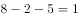天完成。

故正确答案为A。

---

### 第 2 题　qid 2577879 · 数学运算

红星中学高二年级在本次期末考试中竞争激烈，年级前七名的三科（语文、数学、英语）平均成绩构成公差为1的等差数列，第七、八、九名的平均成绩既构成等差数列，又构成等比数列，张龙位列第十，与第九名相差1分，张龙的英语成绩为121分，但老师误登记为112分。那么，张龙的名次本该是：

- **A**. 第四
- **B**. 第五　✅
- **C**. 第七
- **D**. 第八

**答案**：B

**官方解析**

根据题意，第七、八、九名的平均成绩构成等差数列，设分别为、、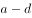，因三人的平均成绩又构成等比数列，则，解得，即第七、八、九名的平均成绩均为。张龙平均成绩为，因为英语成绩实为121分，误登记为112分，则三科平均成绩应比目前平均成绩多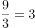分，实为。前七名平均成绩构成公差为1的等差数列，从高到低分别为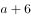、、、、、、，张龙实际成绩为，名次本该是并列第五名。

故正确答案为B。

---

### 第 3 题　qid 2577878 · 数学运算

一条直线将一个平面分成2个部分，两条直线最多将一个平面分成4个部分，那么6条直线最多将一个平面分成的部分为：

- **A**. 20
- **B**. 21
- **C**. 22　✅
- **D**. 23

**答案**：C

**官方解析**

如下图所示，一条直线可将平面分成2个部分，两条直线可将平面分成4个部分，三条直线可将平面分成7个部分······，设共有条直线，则平面可分成的部分数量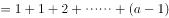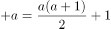，则6条直线可分成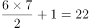个部分。

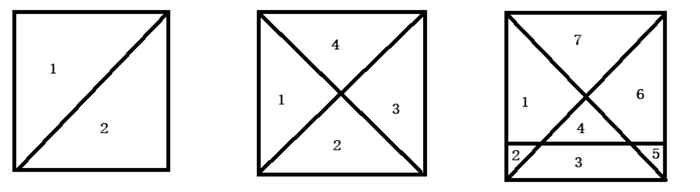

故正确答案为C。

---

### 第 4 题　qid 2577871 · 数学运算

甲、乙、丙三人沿着长为500米，宽为250米的长方形场地跑步，三人以2：1：3的速度之比匀速顺时针跑步，当甲开跑时乙刚跑完圈，丙开跑时甲跑了100米。问当乙跑完2圈时，甲与丙的位置关系如何？

- **A**. 丙领先甲2350米　✅
- **B**. 丙领先甲2450米
- **C**. 丙领先甲2900米
- **D**. 丙领先甲3000米

**答案**：A

**官方解析**

长方形周长为米；乙比甲提前开跑米；甲比丙提前开跑100米；根据甲、乙、丙的速度之比为2：1：3，则乙比丙提前开跑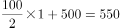米；乙跑完2圈即米，此时甲跑了米，丙跑了米，因此，丙领先甲米。

故正确答案为A。

---

### 第 5 题　qid 2578523 · 数学运算

某药材公司以每千克8元的价格收购了5000千克药材，深加工后得到合格品和废料，合格品分为一、二、三等品，其比例为1：3：6，每千克售价分别为80元、50元、20元，废料价值为零。公司在加工中需投入其他成本20000元，最终获利108000元。问加工中药材的废品率是多少？

- **A**. 

- **B**. 

　✅
- **C**. 

- **D**. 

**答案**：B

**官方解析**

由题干“合格品分为一、二、三等品，其比例为1：3：6”，设一、二、三等合格品分别为千克，千克，千克，根据公式：总利润，可得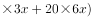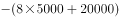，解得，则合格品千克，废料千克，则废品率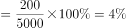。

故正确答案为B。

---

### 第 6 题　qid 2577867 · 数学运算

某水果经销商到一山区水果基地采购猕猴桃和苹果。猕猴桃和苹果的采购价分别为10元/斤和4元/斤，销售价分别为25元/斤和12元/斤。已知该经销商在本次经营中获利40000元，每种水果采购都超过500斤且为整数。那么该经销商的最佳投入资金是：

- **A**. 20000元
- **B**. 21260元　✅
- **C**. 21300元
- **D**. 21280元

**答案**：B

**官方解析**

根据题意，设采购了猕猴桃、苹果分别、斤，根据获利40000元为等量关系列方程，则有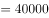，化简得：，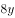和40000都是8的倍数，则是8的倍数；“最佳投入资金”即尽可能投入较少资金，猕猴桃利润率为，苹果利润率为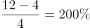。则利润率低的猕猴桃数量应该尽量少，又因为题干说明每种水果采购都超过500斤且为整数，则最少为504，解得，因此最佳投入资金为元。

故正确答案为B。

---

### 第 7 题　qid 2578524 · 数学运算

同事甲、乙两人共携带120千克行李乘坐飞机，根据规定，甲单独托运则超重需支付200元，乙单独托运则超重需支付100元。若全部行李由一人负责托运，则超重需支付450元。问每位乘客的免费托运的行李最多为多少千克？

- **A**. 20
- **B**. 25
- **C**. 30　✅
- **D**. 35

**答案**：C

**官方解析**

根据题意，“甲单独托运则超重需支付200元，乙单独托运则超重需支付100元”，甲、乙分别单独托运超重共需支付元，“若全部行李由一人负责托运，则超重需支付450元”，全部由一人托运比甲、乙单独托运需多支付元，多出的150元费用就是其中一个人免费的重量变成超重部分产生的费用。设免费重量为千克，超出部分的费用为元/千克，根据题意列方程组：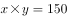······①，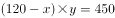······②；解得，，故每位乘客的免费托运的行李最多为30千克。

故正确答案为C。

---

### 第 8 题　qid 2578527 · 数学运算

小李一家3人进行抢红包游戏，每人发1个红包。结果每人抢得金额总额一致，均为100元，刚巧3人所发红包金额为互不相同整数且成等差数列。问3人中所发红包金额最多的可能是多少元？

- **A**. 197
- **B**. 198
- **C**. 199　✅
- **D**. 200

**答案**：C

**官方解析**

根据题意，“每人抢得金额总额一致，均为100元”，那么三人红包的总额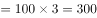元，“3人所发红包金额为互不相同整数且成等差数列”，则中间的金额应为三个红包的总额平均数100元，想要最大的红包金额最多，则最小的红包金额应该为最小，3人每人都发1个红包，金额不能为0元，那么最小金额为1元，则最大的红包金额为元。

故正确答案为C。

备注：本题问法不够严谨，题目的本意应为金额最大的红包，金额最多是多少元。

---

### 第 9 题　qid 2577866 · 数学运算

春节期间，省图书馆邀请多位书法老师免费为读者书写春联。现场书写的春联中有188副不是刘老师书写的，有219副不是陈老师书写的，刘、陈两位老师今年一共书写了311副春联。问陈老师今年一共书写了多少副春联？

- **A**. 208
- **B**. 171
- **C**. 140　✅
- **D**. 126

**答案**：C

**官方解析**

设各位书法老师共写了副春联，可列式为，解得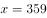，则陈老师写了副。

故正确答案为C。

---

### 第 10 题　qid 2577863 · 数学运算

从某物流园区开出6辆货车，这6辆货车的平均装货量为62吨。已知每辆货车载重量各不相同且均为整数，最重的装载了71吨，最轻的装载了54吨。问这6辆货车中装货第三重的卡车最少要装多少吨？

- **A**. 59
- **B**. 60　✅
- **C**. 61
- **D**. 62

**答案**：B

**官方解析**

由题意可知，6辆车载货总量为吨，设装货第三重的卡车装载了吨，要使取值尽量小，则其他货车装载量应尽量多，可列表为：

可列式为：，解得，即装货第三重的卡车最少要装60吨。

故正确答案为B。

---

### 第 11 题　qid 2578529 · 数学运算

甲、乙两人同时加工一批零件，速度比为3：2，当两人共同完成总任务的一半后，甲生产速度降低，乙生产速度提高，当甲完成总任务的一半时，还剩100个零件未加工，问这批零件总数在以下哪个范围内？

- **A**. 不到500
- **B**. 500～800
- **C**. 801～1200　✅
- **D**. 超过1200

**答案**：C

**官方解析**

给效率比例型工程问题，第一步：赋值初始效率甲，乙，效率调整之后甲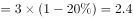，乙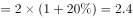；第二步：求总量，设两人共同完成总任务的一半所花时间为，则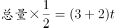，总量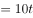；第三步：设甲继续做完成总任务的一半，可得： 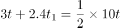，解得：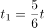······①；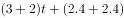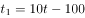······②，将①代入②可得：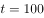，因此总量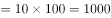。

故正确答案为C。

---

### 第 12 题　qid 2577881 · 数学运算

某景区圆形摩天轮的最高点距离地面120米，摩天轮旋转半径为50米。摩天轮开启后按逆时针方向匀速旋转，旋转一周大约需30分钟。甲在最低点的位置坐上摩天轮，则第45分钟时甲距离地面大约多少米？

- **A**. 45
- **B**. 70
- **C**. 100
- **D**. 120　✅

**答案**：D

**官方解析**

由题意可知，摩天轮旋转一周需30分钟，则从最低点到最高点需15分钟。甲从最低点坐上摩天轮后，30分钟后会再次到达最低点，再经过15分钟后到达最高点，此时距离地面120米。
故正确答案为D。

---

### 第 13 题　qid 2578533 · 数学运算

某单位开展“我身边的榜样”评选活动，现对3名候选人甲、乙、丙进行不记名投票，投票要求详见选票。这3名候选人的得票数（不考虑是否有效）分别为总票数的、、，则本次投票的有效率（有效票数与总票数的比值）最高可能为：

- **A**. 

- **B**. 

- **C**. 

　✅
- **D**. 

**答案**：C

**官方解析**

方法一：赋值总票数为100，那么甲、乙、丙获得的票数分别为88、70、46。未投甲的票数为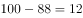；未投乙的票数为；未投丙的票数为。无效投票为甲、乙、丙三者同时被选。如果有效投票率最高，那么无效票数应最低。无效票数最低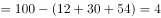，此时有效票数最高为96，因此有效率最高可能为。

方法二：设投1票的人数占比为，投2票的人数占比为，投3票的人数占比为，则：

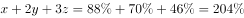······①，

······②；

联立①②可得：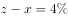，，要想有效投票率最高，即无效票数占比应尽可能小，也就是尽可能小，当时，最小为，所以有效投票率最高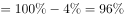。

故正确答案为C。

---

### 第 14 题　qid 2578548 · 数学运算

疫情期间，某地推出电子健康码，用户需凭电子健康码出入小区、学校、医院等公共场所。健康码是黑白相间的二维码，该二维码是边长为15cm的正方形，现利用随机模拟的方法向该健康码内投入1500个点，其中落入黑色部分的点的个数为800个，则该健康码的黑色部分的面积约为多少？

- **A**. 135
- **B**. 120　✅
- **C**. 115
- **D**. 105

**答案**：B

**官方解析**

该二维码的面积为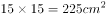。投入1500个点有800个在黑色部分，那么黑色部分占总面积之比为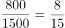，则黑色部分的面积为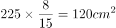。

故正确答案为B。

---

### 第 15 题　qid 2577864 · 数学运算

学校有300个学生选择参加地理兴趣小组、生物兴趣小组或者两个小组同时参加，如果学生参加地理兴趣小组，学生参加生物兴趣小组。问同时参加地理和生物兴趣小组的学生人数是多少？

- **A**. 240
- **B**. 150
- **C**. 90　✅
- **D**. 60

**答案**：C

**官方解析**

根据两集合容斥原理公式：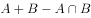，同时参加地理和生物兴趣小组的学生比例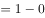，则同时参加地理和生物兴趣小组的学生比例，为人。

故正确答案为C。

---

## 判断推理

### 第 1 题　qid 2578703 · 图形推理

从所给的四个选项中，选择最合适的一个填入问号处，使之呈现一定的规律性：

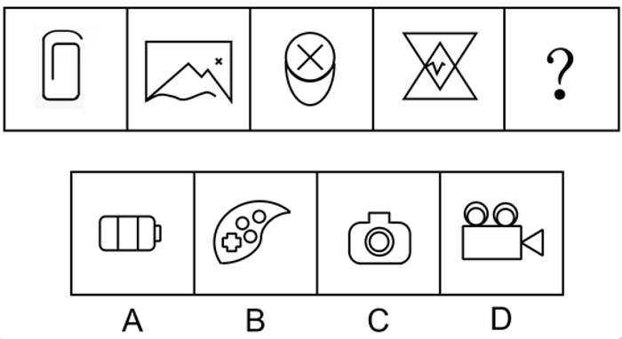

- **A**. A　✅
- **B**. B
- **C**. C
- **D**. D

**答案**：A

**官方解析**

元素组成不同，且无明显属性规律，优先考虑数量规律。由于图形封闭面明显，优先考虑数面的数量。观察发现，题干图形面的数量依次为0、1、2、3，构成了递增的等差数列，因此？处图形面的个数应为4。A项面的个数为4，B项面的个数为5，C项面的个数为3，D项面的个数为6，只有A项符合要求。
故正确答案为A。

---

### 第 2 题　qid 2578718 · 图形推理

从所给的四个选项中，选择最合适的一个填入问号处，使之呈现一定的规律性：

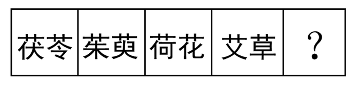

- **A**. 地黄
- **B**. 菖蒲　✅
- **C**. 山药
- **D**. 苦笋

**答案**：B

**官方解析**

元素组成相似，都出现了“艹”，优先考虑样式规律。题干每一个汉字都有“艹”，且都是上下结构。观察选项，A项中的“地”没有“艹”，B项每一个汉字都有“艹”，且是上下结构，C项中的“山”没有“艹”，D项中的“笋”没有“艹”，只有B项符合要求。
故正确答案为B。

---

### 第 3 题　qid 2578721 · 图形推理

从下列四个图形中，找出一个和其他三个具有不同规律的图形：

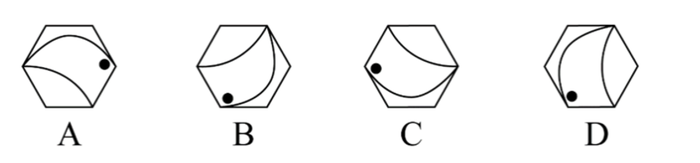

- **A**. A
- **B**. B
- **C**. C
- **D**. D　✅

**答案**：D

**官方解析**

每幅图形都是由一个正六边形、小黑点和两条曲线构成，元素组成相同，考虑位置规律。观察发现，A、B、C三项均可以只通过旋转得出同一图形，而D项需经过翻转得出与其余三项旋转后相同的图形。
本题为选非题，故正确答案为D。

---

### 第 4 题　qid 2578708 · 图形推理

从下列四个图形中，找出一个和其他三个具有不同规律的图形。

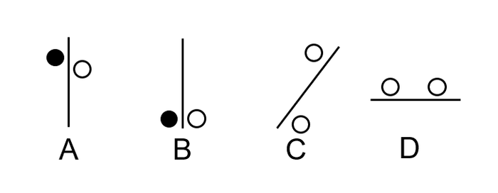

- **A**. A
- **B**. B
- **C**. C
- **D**. D　✅

**答案**：D

**官方解析**

观察题干特征，每个选项出现了功能元素白圆和黑圆，考虑功能元素的考点，找到功能元素的标记方式。
A选项白圆和黑圆标记在直线的两侧；
B选项白圆和黑圆也标记在直线的两侧；
C选项出现两个白圆标记在直线的两侧；
D选项的两个白圆标记在直线的同侧，D选项标记的位置与A、B、C选项不同，当选。
故正确答案为D。

---

### 第 5 题　qid 2578714 · 图形推理

从所给的四个选项中，选择最合适的一个填入问号处，使之呈现一定的规律。

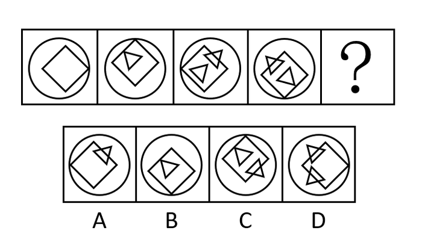

- **A**. A
- **B**. B
- **C**. C
- **D**. D　✅

**答案**：D

**官方解析**

图形元素组成不同，且无明显属性规律，考虑数量规律。
观察发现，每幅图的圆形外框和正方形都有一个交点，且交点的位置依次逆时针旋转90°，因此问号处图形中该交点应旋转到右侧，只有D选项符合；且题干图形内部三角形与正方形的交点数依次是0、1、2、3个，因此问号处图形内部三角形与正方形的交点数应是4个，D选项也符合规律。
故正确答案为D。

---

### 第 6 题　qid 2578715 · 图形推理

从下列四个图形中，找出一个和其他三个具有不同规律的图形。

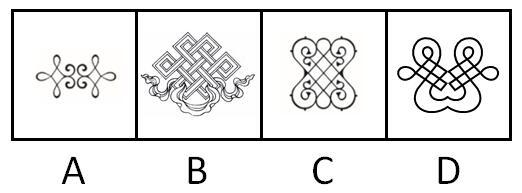

- **A**. A
- **B**. B　✅
- **C**. C
- **D**. D

**答案**：B

**官方解析**

本题让我们找出一个和其他三个具有不同规律的图形。
解析一：观察发现，题干四个图形整体看起来很规整，因此考虑对称性，其中A、C、D选项均是轴对称图形，B选项两侧不对称，不是轴对称图形，与题干其他图形存在不同规律。
故正确答案为B。
解析二：观察发现，题干图形趋向于生活化，因此考虑部分数。其中B、C、D选项中图形都是一部分，A选项中图形是两部分，与题干其他图形存在不同规律。
故正确答案选A。
由于题干图形对称性更为明显，所以倾向考查对称，如果想考部分数，图形没必要出的这么对称，并且B选项迷惑性比较强，因此本题答案粉笔倾向于B。

---

### 第 7 题　qid 2578111 · 图形推理

从所给四个选项中，选择最合适的一项填入问号处，使之呈现一定的规律性。

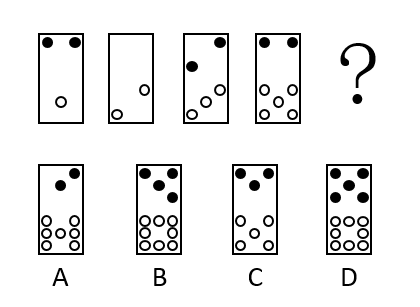

- **A**. A
- **B**. B　✅
- **C**. C
- **D**. D

**答案**：B

**官方解析**

元素组成不同，且无明显属性规律，优先考虑数量规律。题干由若干小元素构成，考虑素的数量，其中白元素的个数分别为：1、2、3、5、？，没有明显的规律，再次观察发现存在、的运算规律，？处应该为，排除A、C两项；黑元素的个数分别为：2、0、2、2、？，同样存在、的运算规律，？处应该为，对应B项。

故正确答案为B。

---

### 第 8 题　qid 2578104 · 图形推理

从所给四个选项中，选择最合适的一项填入问号处，使之呈现一定的规律性。

- **A**. A
- **B**. B　✅
- **C**. C
- **D**. D

**答案**：B

**官方解析**

本题为九宫格题。元素组成相同，优先考虑位置规律。九宫格优先看横行，第一行图1旋转得到图2，图2左右翻转得到图3，第二行验证符合此规律。第三行应用此规律，图1旋转得到图2，故？处图形由图2左右翻转得到，只有B项符合。

故正确答案为B。

---

### 第 9 题　qid 2578697 · 图形推理

下列立体图形，其视图（正视图、俯视图、侧视图）不可能是所给四个选项中的哪一项？

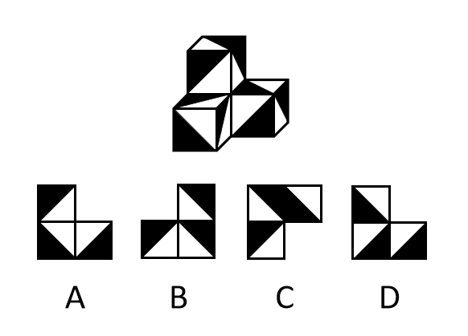

- **A**. A
- **B**. B
- **C**. C
- **D**. D　✅

**答案**：D

**官方解析**

本题考查三视图:
A项，从前往后看可以看到，为主视图，排除；
B项，从右往左看可以看到，为右视图，排除；
C项，从上往下看可以看到，为俯视图，排除；
本题为选非题，故正确答案选D。

---

### 第 10 题　qid 2578711 · 类比推理

从所给的四个选项中，选择最合适的一项填入问号1和问号2处，使之具有一定规律。

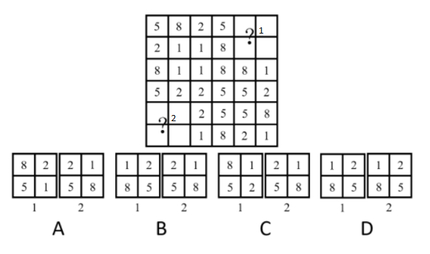

- **A**. A
- **B**. B
- **C**. C
- **D**. D　✅

**答案**：D

**官方解析**

本题为九宫格题目。元素组成相同，优先考虑位置规律。根据“？”部分都是2×2宫格，观察发现题干其余部分2×2宫格形式当中包含的数字相同，所以考虑2×2宫格的位置关系。

观察发现九宫格中“米”字的两端的2×2宫格完全相同（如下图中相同颜色标记的图形完全相同），所以1图和2图中的两个图形应该完全相同，只有D项符合。

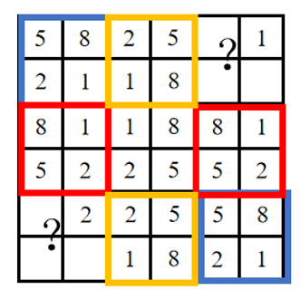

故正确答案为D。

---

### 第 11 题　qid 2578719 · 定义判断

“小确丧”是网络流行词语，指小而确定的沮丧，是持续发生在日常生活中却又摆脱不了的小烦恼，有专家提出，面对小确丧，人们不应无奈地接受或忍受，而应通过努力，将其转化为“小确幸”。小确幸是人们心中隐约期待的美好小事刚好发生在自己生活中，所产生的微小确实的幸运快乐感。
根据上述定义，下列属于小确幸的一项是：

- **A**. 小刘周末过得甭提多高兴了，但想到周一又要早起上班就有些莫名烦恼辗转难眠
- **B**. 小张决心购买某款心仪已久的5G手机，下单时发现该手机正好降价500元，爽了　✅
- **C**. 小黄和小芳恋爱10年，今天终于在亲朋好友的见证和祝福中，走进了婚姻的殿堂
- **D**. 小李不爱做居所卫生，每天下班一想到又要回到乱糟糟的租住屋就感觉头痛和无奈

**答案**：B

**官方解析**

第一步：找出定义关键词。
小确丧：“小而确定的沮丧”“持续发生”“摆脱不了的小麻烦”；
小确幸：“隐约期待的美好小事”“发生在自己生活中”“产生的微小确实的幸运快乐感”。
第二步：逐一分析选项。
A项：莫名烦恼是产生了负面的情绪，不符合“产生的微小确实的幸运快乐感”定义，排除；
B项：心仪已久说明早就想买了，符合“隐约期待的美好小事”定义，下单时降价开心，也符合“发生在自己生活中”与“产生的微小确实的幸运快乐感”定义，当选；
C项：恋爱10年走入婚姻，没有体现“隐约期待的美好小事”，不符合定义，排除；
D项：感到头痛和无奈，不符合“产生幸运快乐感”，排除。
故正确答案为B。
注——本题出处如下：
小确幸，网络用语，该词来源于村上春树的随笔集《兰格汉斯岛的午后》 ，由翻译家林少华直译而进入的现代汉语。
小确幸，意思是心中隐约期待的小事刚刚好发生在自己身上的那种微小而确实的幸福与满足。
小确丧，网络流行词，是指微小而确实的颓丧，是稍纵即逝的掏空。小确丧是可以预测但又不可避免的，比如你一定知道你凌晨三点睡第二天早起会很困，但你为了生活还是不得不早起;你知道期末了可以回家了，却不得不面对繁杂的期末考;到周末了却又不得不面对下一个周一。但是如果我们每个人都能过自己想要的生活，那么这个世界将会没有咖啡厅、电影院、公交车、理发店、餐厅、酒吧、学校、超市、警察、书店等等，所以还是应该远离负能量，忘掉生活中的小确丧。

---

### 第 12 题　qid 2578079 · 定义判断

一项新研究显示，中国的消费升级正在延续。所谓消费升级是指消费者对更能满足自己美好物质和精神生活需要的、价格更高的优质商品和服务日益增长的需求。
根据上述定义，下列最能体现消费升级的是：

- **A**. 
现在收入多了，生活水平高了，人们不再满足于吃饱穿暖，而是想要提高消费档次

- **B**. 
某机构研究发现，中国家庭2019年在生活消费品方面的开支预计相较去年增长

- **C**. 
中国人对包装食品、饮料、护肤品、洗发水和处方药等快速消费品的消费呈增长趋势

- **D**. 
越来越多中国人付出更多成本，去享受健康、快乐、体验好且富有内涵的高端商品和服务
　✅

**答案**：D

**官方解析**

第一步：找出定义关键词。

“消费者”、“更能满足自己美好物质和精神生活需要的、价格更高的优质商品和服务”、“日益增长的需求”。

第二步：逐一分析选项。

A项：现在收入多了，人们想要提高消费档次，但并不清楚档次提高后的消费是否属于价格更高的优质商品和服务，不符合“更能满足自己美好物质和精神生活需要的、价格更高的优质商品和服务”，不符合定义，排除；

B项：中国家庭2019年在生活消费品方面的开支预计相较去年增长，生活消费品的开支虽然增长了，但是不清楚这些生活消费品是否是价格更高的优质商品和服务，不符合“更能满足自己美好物质和精神生活需要的、价格更高的优质商品和服务”，不符合定义，排除；

C项：中国人对快速消费品的消费呈增长趋势，但是不清楚这些增长的快速消费品是否是价格更高的优质的商品和服务，不符合“更能满足自己美好物质和精神生活需要的、价格更高的优质商品和服务”，不符合定义，排除；

D项：越来越多的中国人付出更多成本，去享受健康、快乐、体验好且富有内涵的高端商品和服务，符合“更能满足自己美好物质和精神生活需要的、价格更高的优质商品和服务”，越来越多的中国人付出成本，也符合“日益增长的需求”，符合定义，当选。

故正确答案为D。

---

### 第 13 题　qid 2578701 · 定义判断

和谐管理是组织为了达到其目标，在变动的环境中，围绕社会、市场、政府和职工等和谐主题要素，以优化和不确定性消减为和谐手段提供问题解决方案的实践活动。
根据上述定义，下列属于和谐管理的是：

- **A**. 甲公司为在竞标政府项目中获得优势，专门成立公关部门与政府搞关系
- **B**. 丙企业为了治理因生产所造成的环境污染，成立专门基金进行长效维护　✅
- **C**. 乙公司为了让产品赢得市场，孤注一掷花费巨资请明星代言
- **D**. 丁公司为了强化公司的“狼性”文化，经常让员工超时加班

**答案**：B

**官方解析**

第一步：找出定义关键词。
“组织为了达到其目标”、“在变动的环境中，围绕社会、市场、政府和职工等和谐主题要素”、“以优化和不确定性消减为和谐手段提供问题解决方案的实践活动”。
第二步：逐一分析选项。
A项：甲公司为在竞标政府项目中获得优势，专门成立公关部门与政府搞关系，有可能会促进企业和政府的关系，也有可能会产生跨越红线的事，不符合“以优化和不确定性消减为和谐手段提供问题解决方案的实践活动”，不符合定义，排除；
B项：丙企业为了治理因生产所造成的环境污染，成立专门基金进行长效维护，该企业治理自己产生的污染，可以减少因环境污染给企业自身带来的问题，消减了不确定性，符合“以优化和不确定性消减为和谐手段提供问题解决方案的实践活动”，符合定义，当选；
C项：乙公司为了让产品赢得市场，孤注一掷花费巨资请明星代言，孤注一掷风险较大，不能消减不确定性，不符合“以优化和不确定性消减为和谐手段提供问题解决方案的实践活动”，不符合定义，排除；
D项：丁公司为了强化公司的“狼性”文化，经常让员工超时加班，会影响员工与公司的关系，增加不确定性，不符合“以优化和不确定性消减为和谐手段提供问题解决方案的实践活动”，不符合定义，排除。
故正确答案为B。

---

### 第 14 题　qid 2578082 · 定义判断

越轨创新是指组织在鼓励员工创新的同时，为防止过度自主而偏离组织发展轨道，设置相应的规章制度来约束其创新想法与行为，而一些员工在其创新方案被否决后，仍坚信其创新方案最终会为组织带来收益，并继续隐蔽地进行创新实践的行为。
根据上述定义，下列属于越轨创新的是：

- **A**. 服装设计师小王为公司设计了一系列新型饰品，因与公司发展定位不符被否定后，他仍在继续悄悄改进　✅
- **B**. 某高校保安经常到课堂蹭课学外语，队长提醒他这不符合制度规范，他就趁空闲时间偷偷继续过去旁听
- **C**. 因担心影响本职工作，经理反对小刘参加公司举办的创新技能大赛，但小刘仍私下准备着
- **D**. 程序员小张利用上班时间悄悄为朋友设计一款APP软件

**答案**：A

**官方解析**

第一步：找出定义关键词。
“组织鼓励员工创新”、“为防止过度自主而偏离组织发展轨道，设置相应的规章制度来约束其创新想法与行为”、“一些员工在其创新方案被否决后，仍坚信其创新方案最终会为组织带来收益，并继续隐蔽地进行创新实践的行为”。
第二步：逐一分析选项。
A项：小王为公司设计新型饰品，因与公司发展定位不符被否定后，他仍在继续悄悄改进，符合“为防止过度自主而偏离组织发展轨道，设置相应的规章制度来约束其创新想法与行为”，也符合“一些员工在其创新方案被否决后，仍坚信其创新方案最终会为组织带来收益，并继续隐蔽地进行创新实践的行为”，符合定义，当选；
B项：保安去课堂蹭课，队长提醒他不符合制度规范，不符合“组织鼓励员工创新”，不符合定义，排除；
C项：经理因担心影响本职工作反对小刘参加创新比赛，只是反对，不符合“为防止过度自主而偏离组织发展轨道，设置相应的规章制度来约束其创新想法与行为”，不符合定义，排除；
D项：小张利用上班时间悄悄为朋友设计APP软件，不符合“坚信其创新方案最终会为组织带来收益”，不符合定义，排除。
故正确答案为A。

---

### 第 15 题　qid 2578084 · 定义判断

员工绿色行为是指组织中员工展现的一系列旨在保护生态环境，降低个人活动对自然环境造成负面影响的行为，这些行为是组织正式绿色管理计划的重要补充，能提高组织绿色管理措施的效率，最终有利于环境的可持续发展。
根据上述定义，下列属于员工绿色行为的是：

- **A**. 公司员工自觉遵守公司关于垃圾分类的规定
- **B**. 部门经理经常利用废纸打印一些非正式文件　✅
- **C**. 办公室的一位女员工宁愿忍受高温也不愿开冷气，她认为这样更健康
- **D**. 公司保洁员经常把垃圾箱内的废塑料瓶收集起来，下班时顺便带回家

**答案**：B

**官方解析**

第一步：找出定义关键词。
“组织中员工展现的一系列旨在保护生态环境，降低个人活动对自然环境造成负面影响”、“组织正式绿色管理计划的重要补充”、“提高组织绿色管理措施的效率，最终有利于环境的可持续发展”。
第二步：逐一分析选项。
A项：公司员工自觉遵守公司关于垃圾分类的规定，说明是公司规定的，不是员工自愿的，不符合“组织中员工展现的一系列旨在保护生态环境，降低个人活动对自然环境造成负面影响”，不符合定义，排除；
B项：部门经理用废纸打印非正式文件，符合“组织中员工展现的一系列旨在保护生态环境，降低个人活动对自然环境造成负面影响”，也符合“组织正式绿色管理计划的重要补充”、“提高组织绿色管理措施的效率，最终有利于环境的可持续发展”，符合定义，当选；
C项：办公室的女员工不开冷气，认为这样更健康，是为了自己身体健康并不是为了环保，不符合“组织中员工展现的一系列旨在保护生态环境，降低个人活动对自然环境造成负面影响”，不符合定义，排除；
D项：公司保洁员把垃圾箱的废塑料瓶收集起来带回家，只是带回了家并不是为了环保，不符合“组织中员工展现的一系列旨在保护生态环境，降低个人活动对自然环境造成负面影响”，不符合定义，排除。
故正确答案为B。

---

### 第 16 题　qid 2578077 · 定义判断

社交焦虑障碍，是指个体在可能受到他人审视的一种或多种社交环境中存在持久的强烈恐惧和回避行为。
根据上述定义，下列属于社交焦虑障碍的是：

- **A**. 尽管已经获得了公务员招录面试资格，但考虑到排名靠后再加上自己一贯不善于表达，陈某决定放弃这次机会
- **B**. 随着演讲比赛日期的临近，王刚的焦虑和压力也与日俱增，最后他干脆放弃了　✅
- **C**. 小杨一想到下周要当众发言，紧张得一连几天都睡不好觉
- **D**. 大强因为担心被父母催婚，今年春节决定不回家过年

**答案**：B

**官方解析**

第一步：找出定义关键词。
“个体”、“可能受到他人审视的一种或多种社交环境中”、“持久的强烈恐惧”、“回避”。
第二步：逐一分析选项。
A项：陈某，符合“个体”，考虑到排名靠后和不善表达而放弃机会，不符合“持久的强烈恐惧”，不符合定义，排除；
B项：王刚，符合“个体”，演讲比赛临近，符合“可能受到他人审视的一种或多种社交环境中”，他的焦虑压力与日俱增，符合“持久的强烈恐惧”，最后放弃，符合“回避”，符合定义，当选；
C项：小杨，符合“个体”，想到下周要当众发言，符合“可能受到他人审视的一种或多种社交环境中”，紧张得一连几天睡不好觉，符合“持久的强烈恐惧”，但不符合“回避”，不符合定义，排除；
D项：大强，符合“个体”，被父母催婚，不符合“可能受到他人审视的一种或多种社交环境中”，不符合定义，排除。
故正确答案为B。

---

### 第 17 题　qid 2578068 · 定义判断

闯入性思维是指一些非自主的、反复出现的、无规律的进入个体大脑的干扰性想法，会造成一系列适应问题并诱发负面情绪，包括焦虑、抑郁和强迫症等。
根据上述定义，下列属于闯入性思维的是：

- **A**. 每到年底，在外地工作的小孟都要为回不回老家过年而纠结，并因此而情绪烦躁
- **B**. 这段时期股市波动较大，股民老张的心情也像股票指数一样起伏难料，焦虑至极
- **C**. 小强在上课的时候，头脑中总是出现网络游戏的画面，这让他很难静下心来学习　✅
- **D**. 一想到完不成销售任务所带来的负面后果，小程都感到一阵阵的沮丧

**答案**：C

**官方解析**

第一步：找出定义关键词。
“非自主的、反复出现的、无规律的”、“干扰性想法”、“造成一系列适应问题”。
第二步：逐一分析选项。
A项：小孟为回不回老家过年而纠结，是小孟自主的想法，不符合“非自主的、反复出现的、无规律的”、“干扰性想法”，不符合定义，排除；
B项：股民老张的心情像股票指数一样起伏难料，但心情不是“想法”，不符合“非自主的、反复出现的、无规律的”、“干扰性想法”，不符合定义，排除；
C项：小强在上课时头脑中总是出现网络游戏的画面，符合“非自主的、反复出现的、无规律的”，这让他很难静下心来学习，符合“干扰性想法”、“造成一系列适应问题”，符合定义，当选；
D项：一想到完不成销售任务所带来的负面后果，是小程自主的想法，不符合“非自主的、反复出现的、无规律的”、“干扰性想法”，不符合定义，排除。
故正确答案为C。

---

### 第 18 题　qid 2578709 · 定义判断

情绪惰性，是指个体当前情绪状态能被之前情绪状态所预测的程度，预测程度越大则反映情绪惰性水平越高，情绪惰性作为情绪动态性指标之一反映了情绪变化的速度。
根据上述定义，下列情形属于情绪惰性的是：

- **A**. 冬季往往容易使人情绪低落，所以这个冬天也不会例外
- **B**. 调皮的小铭被老师批评之后终于老实了，随后几天都一直规规矩矩的
- **C**. 自从万师傅的老伴儿半年前去世后他就一直很忧郁，估计一时半会儿好不起来　✅
- **D**. 自从首长做了战时动员令之后，整个工厂的工人都保持着激昂的心情努力生产

**答案**：C

**官方解析**

第一步：找出定义关键词。
“个体当前情绪状态”、“能被之前情绪状态所预测的程度，预测程度越大则反映情绪惰性水平越高”。
第二步：逐一分析选项。
A项：冬季使人情绪低落，这个冬天也不例外，只是体现冬天的普遍情绪状态，没有指明“个体当前情绪状态”，并不能说明预测程度到底怎么样，不符合“能被之前情绪状态所预测的程度，预测程度越大则反映情绪惰性水平越高”，不符合定义，排除； 
B项：小铭被批评之后就老实了，之后几天也都规规矩矩的，没有体现出通过之前情绪进行预测的过程，不符合“能被之前情绪状态所预测的程度，预测程度越大则反映情绪惰性水平越高”，不符合定义，排除； 
C项：万师傅在老伴儿去世后一直很忧郁，估计一时半会好不了，既体现了当前的情绪状态，又体现了能被之前的情绪所预测，符合“个体当前情绪状态”、“能被之前情绪状态所预测的程度，预测程度越大则反映情绪惰性水平越高”，符合定义，当选；
D项：工人们在战时动员令后保持着激昂的心情努力生产，并没有体现出通过之前情绪进行预测的过程，不符合“能被之前情绪状态所预测的程度，预测程度越大则反映情绪惰性水平越高”，不符合定义，排除。
故正确答案为C。

---

### 第 19 题　qid 2578061 · 定义判断

类别化是指个体对自身或他人在社会中所处位置的感知和判断，这种感知和判断不仅基于现实社会中社会体制的不同分类标准，也基于自身与他人的社会比较过程。类别化分为社会类别化和自我类别化。社会类别化是个体基于共享的相似性把他人分为不同群体类别的主观心理过程。自我类别化指个体从独立个体到群体成员的过程是通过类别化而得以实现的，是通过“去个性化”实现对群体的归属和成员身份的定位。
根据上述定义，下列属于自我类别化的是：

- **A**. 只要每个人的素质提高了，我们整个国民的素质也就自然提高了，因此，重要的是首先做好自己
- **B**. 小明打算应聘公司某职位，但他的父母却认为他更适合做公务员
- **C**. 同学们都说小倩长得像明星，做主播肯定有前途
- **D**. 王医生常常为自己所从事的职业感到无比自豪　✅

**答案**：D

**官方解析**

第一步：找出定义关键词。
类别化：“个体对自身或他人在社会中所处位置的感知和判断”、“基于现实”、“也基于自身与他人的社会比较”；
社会类别化：“个体基于共享的相似性”、“把他人分为不同群体类别”；
自我类别化：“个体从独立个体到群体成员”、“实现对群体的归属和成员身份的定位”。
第二步：逐一分析选项。
A项：强调做好自己的重要性，并不涉及“个体对自身或他人在社会中所处位置的感知和判断”，不符合题干中任何一个定义，排除；
B项：父母认为小明适合做公务员，符合“个体基于共享的相似性”、“把他人分为不同群体类别”，符合“社会类别化”定义，不符合“自我类别化”定义，排除；
C项：同学们觉得小倩长得像明星，做主播有前途，符合“个体基于共享的相似性”、“把他人分为不同群体类别”，符合“社会类别化”定义，不符合“自我类别化”定义，排除；
D项：王医生为自己所从事的职业感到自豪，符合“个体从独立个体到群体成员”、“实现对群体的归属和成员身份的定位”，符合“自我类别化”定义，当选。
故正确答案为D。

---

### 第 20 题　qid 2578071 · 定义判断

辟谣有时会使受众将谣言错记为“事实”，其中原因之一是受众遗忘了谣言的反驳信息，即事实幻觉效应。为了避免这一认知错觉，可以采用“反驳改述谣言”的方法，即辟谣者可以将谣言改述为否定句式，再进行反驳。
根据上述定义，下列属于“反驳改述谣言”的是：

- **A**. 食用野兔等野生动物安全，这不是谣言
- **B**. 即便少量饮酒也不利于健康，这是谣言　✅
- **C**. 有节制的吸烟不易致癌，这不是谣言
- **D**. 药品X是危险的，这是谣言

**答案**：B

**官方解析**

第一步：找出定义关键词。
“将谣言改述为否定句式”、“再进行反驳”。
第二步：逐一分析选项。
A项：食用野兔等野生动物安全，不符合“将谣言改述为否定句式”，且“这不是谣言”也不符合“再进行反驳”，不符合定义，排除； 
B项：少量饮酒也不利于健康，符合“将谣言改述为否定句式”，且“这是谣言”符合“再进行反驳”，符合定义，当选；
C项：有节制的吸烟不易致癌，符合“将谣言改述为否定句式”，但“这不是谣言”不符合“再进行反驳”，不符合定义，排除； 
D项：药品X是危险的，不符合“将谣言改述为否定句式”，不符合定义，排除。
故正确答案为B。

---

### 第 21 题　qid 2578069 · 类比推理

有备：无患

- **A**. 有口：无心
- **B**. 前赴：后继
- **C**. 苦尽：甘来　✅
- **D**. 有眼：无珠

**答案**：C

**官方解析**

第一步：判断题干词语间逻辑关系。
“有备无患”意思是事先有准备，就可以避免祸患，因为“有备”，所以“无患”，二者是因果对应关系，且“无患”是好的结果。
第二步：判断选项词语间逻辑关系。
A项：“有口无心”意思是嘴上说了，心里可没那样想，二者为并列关系，与题干逻辑关系不一致，排除；
B项：“前赴后继”意思是前面的上去了，后面的紧跟上来，二者为并列关系，与题干逻辑关系不一致，排除；
C项：“苦尽甘来”意思是艰苦的日子过完，美好的日子来到了，因为“苦尽”，所以“甘来”，二者是因果对应关系，且“甘来”是好的结果，与题干逻辑关系一致，当选；
D项：“有眼无珠”用来责骂人瞎了眼，看不见某人或某事物的伟大或重要，二者为并列关系，与题干逻辑关系不一致，排除。
故正确答案为C。

---

### 第 22 题　qid 2578105 · 类比推理

摇曳：晃动

- **A**. 自满：自谦
- **B**. 翻天覆地：一成不变
- **C**. 悲痛：欲绝
- **D**. 顺风转舵：见机行事　✅

**答案**：D

**官方解析**

第一步：判断题干词语间逻辑关系。
摇曳指摇荡；晃动指摇晃、摆动，二者为近义关系。
第二步：判断选项词语间逻辑关系。
A项：自满多指满足于自己已有的成绩而沾沾自喜的心理状态；自谦指的是自抱谦逊态度，二者为反义关系，与题干逻辑关系不一致，排除；
B项：翻天覆地形容变化大；一成不变指的是一经形成，不再改变，二者为反义关系，与题干逻辑关系不一致，排除；
C项：悲痛指悲伤哀痛；欲绝指感情极其强烈的，非常激动的，用来形容悲痛的程度，二者为对应关系，与题干逻辑关系不一致，排除；
D项：顺风转舵比喻顺着情势改变态度；见机行事指看具体情况灵活办事，二者为近义关系，与题干逻辑关系一致，当选。
故正确答案为D。

---

### 第 23 题　qid 2578713 · 类比推理

蛛丝马迹∶鸟迹虫丝

- **A**. 寒酸落魄∶寒心酸鼻
- **B**. 堆玉积金∶屯粮积草
- **C**. 冰肌玉骨∶劲骨丰肌　✅
- **D**. 挨冻受饿∶担饿受冻

**答案**：C

**官方解析**

第一步：判断题干词语间逻辑关系。
蛛丝马迹指事情所留下的隐约可寻的痕迹和线索，鸟迹虫丝比喻极易消失的事物，二者没有明显的语义关系，考虑拆分。蛛丝马迹可拆分为“蛛丝（蜘蛛的丝）”、“马迹（灶马留下的痕迹）”，鸟迹虫丝可拆分为“鸟迹（鸟的爪印）”、“虫丝（虫吐的丝）”，均为偏正结构。
第二步：判断选项词语间逻辑关系。
A项：寒酸落魄指穷困、狼狈的样子， “寒酸”和“落魄”都是形容词，与题干逻辑关系不一致，排除；
B项：堆玉积金指金玉多得可以堆积起来，“堆玉”和“积金”是动宾结构；屯粮积草指储存粮食和草料，“屯粮”和“积草”是动宾结构。四词均非偏正结构，与题干逻辑关系不一致，排除；
C项：冰肌玉骨指肌骨如同冰玉一般，“冰肌（像冰一样的肌肤）”和“玉骨（像玉一样的肌骨）”是偏正结构；劲骨丰肌指书法有力而丰润，“劲骨（有力的骨架）”和“丰肌（丰满的肌肉）”也是偏正结构，与题干逻辑关系一致，当选；
D项：挨冻受饿指遭受饥饿与寒冷侵袭，“挨冻”和“受饿”是动宾结构；担饿受冻意思与挨饿受冻相同，且 “担饿”和“受冻”也是动宾结构。四词均非偏正结构，与题干逻辑关系不一致，排除。
故正确答案为C。

---

### 第 24 题　qid 2578117 · 类比推理

栉风：沐雨

- **A**. 门当：户对　✅
- **B**. 东山：再起
- **C**. 万里：长城
- **D**. 助人：为乐

**答案**：A

**官方解析**

第一步：判断题干词语间逻辑关系。
“栉风”指的是以风梳头，“沐雨”指的是以雨洗发，二者为并列关系。
第二步：判断选项词语间逻辑关系。
A项：“门当”与“户对”是古民居建筑中大门的组成部分，古人结婚讲究二者要对等，二者为并列关系，与题干逻辑关系一致，当选；
B项：“东山”是名词，“再起”是一个动作，二者不是并列关系，与题干逻辑关系不一致，排除；
C项：“万里”是修饰“长城”的，二者为偏正关系，与题干逻辑关系不一致，排除；
D项：“助人”指的是帮助他人，“为乐”指当作快乐，二者为主谓关系，与题干逻辑关系不一致，排除。
故正确答案为A。

---

### 第 25 题　qid 2578121 · 类比推理

和衷共济：和合共生

- **A**. 如临深渊：如履薄冰　✅
- **B**. 或为玉碎：或为瓦全
- **C**. 不入虎穴：焉得虎子
- **D**. 锲而不舍：金石可镂

**答案**：A

**官方解析**

第一步：判断题干词语间逻辑关系。
和衷共济指团结互助，战胜困难；和合共生指相互协助，共同发展，二者为近义关系。
第二步：判断选项词语间逻辑关系。
A项：如临深渊指如同处于深渊边缘一般，比喻存有戒心，行事极为谨慎；如履薄冰指像走在薄冰上一样，比喻行事极为谨慎，存有戒心，二者为近义关系，与题干逻辑关系一致，当选；
B项：或为玉碎指或者玉器被打碎；或为瓦全指或者瓦器被保全，二者无近义关系，与题干逻辑关系不一致，排除；
C项：不入虎穴指不进入老虎的巢穴；焉得虎子指怎么能捉到小老虎，二者无近义关系，与题干逻辑关系不一致，排除；
D项：锲而不舍指不停地雕刻；金石可镂指金属、玉石也可以雕出花饰，二者无近义关系，与题干逻辑关系不一致，排除。
故正确答案为A。

---

### 第 26 题　qid 2578088 · 类比推理

固根基：扬优势：补短板

- **A**. 清谈客：奋斗者：泥菩萨
- **B**. 勤思考：爱劳动：学习好
- **C**. 涉险滩：破坚冰：攻堡垒　✅
- **D**. 有政治：有形象：有人格

**答案**：C

**官方解析**

第一步：判断题干词语间逻辑关系。
固根基、扬优势和补短板三者均为动宾结构。
第二步：判断选项词语间逻辑关系。
A项：清谈客指纸上谈兵的人，奋斗者指奋斗的人，泥菩萨比喻虚弱不中用的人，三者均不是动宾结构，与题干逻辑关系不一致，排除；
B项：勤思考为偏正结构，爱劳动为动宾结构，学习好为主谓结构，与题干逻辑关系不一致，排除；
C项：涉险滩、破坚冰和攻堡垒三者均为动宾结构，与题干逻辑关系一致，保留；
D项：有政治、有形象、有人格三者均为动宾结构，与题干逻辑关系一致，保留。
对比C、D两项，题干和C项的动宾结构是根据不同的宾语搭配不同的动词，三个动词均不相同，而D项均为同一个动词，故C项与题干更一致，当选。
故正确答案为C。

---

### 第 27 题　qid 2578067 · 类比推理

青年人：公务员：服务人民

- **A**. 当代史：革命史：史海耕耘
- **B**. 下农村：进工厂：劳动锻炼
- **C**. 创业者：劳动者：市场打拼
- **D**. 大学生：志愿者：奉献社会　✅

**答案**：D

**官方解析**

第一步：判断题干词语间逻辑关系。
有的青年人是公务员，有的公务员是青年人，有的青年人不是公务员，有的公务员不是青年人，二者是交叉关系，“公务员”的宗旨是“服务人民”，二者是对应关系。
第二步：判断选项词语间逻辑关系。
A项：世界当代史为1945年-至今，中国当代史为1949年-至今，而革命史指二战结束前（1945年）一些具有历史意义革命的历史，当代史与革命史时间范围上不存在交叉，因此二者不属于交叉关系，与题干逻辑关系不一致，排除；
B项：“下农村”和“进工厂”是两种不同的“劳动锻炼”方式，二者是并列关系，与题干逻辑关系不一致，排除；
C项：“创业者”是主导劳动方式的领导人，“劳动者”是对从事劳作活动的一类人的统称，“创业者”是“劳动者”，二者是种属关系，与题干逻辑关系不一致，排除；
D项：有的大学生是志愿者，有的志愿者是大学生，有的大学生不是志愿者，有的志愿者不是大学生，二者是交叉关系，“志愿者”的宗旨是“奉献社会”，二者为对应关系，与题干逻辑关系一致，当选。
故正确答案为D。

---

### 第 28 题　qid 2578091 · 类比推理

大豆：豆油：压榨

- **A**. 茶叶：茶水：冲泡　✅
- **B**. 水泥：房屋：建造
- **C**. 布料：成衣：缝制
- **D**. 太阳：阳光：辐射

**答案**：A

**官方解析**

第一步：判断题干词语间逻辑关系。
大豆经过压榨得到豆油，三者为原材料、成品和工艺的对应关系，并且豆油是通过提取大豆中的成分得到的成品。
第二步：判断选项词语间逻辑关系。
A项：茶叶经过冲泡得到茶水，三者为原材料、成品和工艺的对应关系，并且茶水是通过提取茶叶中的成分得到的成品，与题干逻辑关系一致，当选；
B项：水泥经过建造得到房屋，三者为原材料、成品和工艺的对应关系，但房屋不是通过提取水泥中的成分得到的成品，与题干逻辑关系不一致，排除；
C项：布料经过缝制得到成衣，三者为原材料、成品和工艺的对应关系，但成衣不是通过提取布料中的成分得到的成品，与题干逻辑关系不一致，排除；
D项：太阳以辐射的方式产生阳光，三者不是原材料、成品和工艺的对应关系，与题干逻辑关系不一致，排除。
故正确答案为A。

---

### 第 29 题　qid 2578135 · 类比推理

和谐 对于 （    ） 相当于 谦虚 对于 （    ）

- **A**. 强硬蛮横；安分守己
- **B**. 融洽无间；夜郎自大
- **C**. 波澜不惊；虚怀若谷
- **D**. 动荡不安；趾高气扬　✅

**答案**：D

**官方解析**

逐一代入选项。
A项：强硬蛮横是指骄横跋扈的人，与和谐没有语义关系；安分守己是指规矩本分的人，与谦虚没有语义关系，前后逻辑关系不一致，排除；
B项：融洽无间是指没有隔阂，相处和谐，与和谐是近义关系；夜郎自大比喻骄傲无知的肤浅自负或自大行为，与谦虚是反义关系，前后逻辑关系不一致，排除；
C项：波澜不惊是指没有什么变化或曲折，与和谐没有语义关系；虚怀若谷是指十分谦虚，能容纳别人的意见，与谦虚是近义关系，前后逻辑关系不一致，排除；
D项：动荡不安是指局势不稳定、不平静，与和谐是反义关系；趾高气扬是指骄傲自满，得意忘形的样子，与谦虚是反义关系，前后逻辑关系一致，当选。
故正确答案为D。

---

### 第 30 题　qid 2578717 · 类比推理

（    ） 对于 探月 相当于 北斗三号 对于 （    ）

- **A**. 玉兔二号；通信
- **B**. 嫦娥四号；导航　✅
- **C**. 长征五号；短信
- **D**. 绕月卫星；授时

**答案**：B

**官方解析**

逐一代入选项。
A项：玉兔二号有探月的功能，北斗三号有通信的功能，但玉兔二号是嫦娥四号任务月球车，不是探月任务的主体，而北斗三号是通信功能的主体，前后逻辑关系不一致，排除；
B项：嫦娥四号有探月的功能，北斗三号有导航的功能，二者为功能对应关系，前后逻辑关系一致，当选；
C项：长征五号的功能是运载，与探月无关，可以通过北斗三号来发送短信，前后逻辑关系不一致，排除；
D项：绕月卫星有探月的功能，北斗三号有授时的功能。但绕月卫星是泛指的，而北斗三号是特指的，前后逻辑关系不一致，排除。
故正确答案为B。

---

### 第 31 题　qid 2578148 · 类比推理

小严在商场看中一款鞋子，纠结是买黑色好还是买白色好。同行的好朋友小芳说：你去问下柜员，是黑色的销量高，还是白色的销量高，不就知道了吗？
以下选项与题干中的问答方式最为相似的是：

- **A**. 准备考研的小张在A培训班和B培训班之间犹豫不决，室友小王说：你去问问已经考上了研究生的学长学姐们，看看他们报的是A还是B，不就知道了吗
- **B**. 老郑打算给乔迁新居的战友老袁买一件礼物，在书法字画和艺术盆景之间有点为难，老伴说：你去花店打听下，乔迁送艺术盆景的人多不多，不就知道了吗
- **C**. 小莫和男友去网红美食街探寻美食，面对众多从未吃过的各地特色美食不知如何取舍，男友说：我们看看哪家店门口的队伍排得最长，就去吃哪家的吧
- **D**. 七夕节到了，小汪准备给女朋友送一支口红，不知道女朋友是喜欢001色号还是006色号，同事小林建议说：你上网查下哪个色号最热门，就选哪个呗　✅

**答案**：D

**官方解析**

第一步：分析题干问答方式。
小严在买黑色鞋还是白色鞋之间犹豫，而小芳建议询问柜员二者销量来进行选择，即建议是通过对比二者的销量来确定应该买什么。
第二步：逐一分析选项。
A项：准备考研的小张在报A班还是报B班之间犹豫，室友小王建议询问考上研究生的学长学姐们如何选择，即建议是通过别人报了什么来进行选择，而没有通过对比二者报名数量的多少来进行选择，与题干问答形式不一致，排除；
B项：老郑在买书法字画和艺术盆景之间犹豫，他老伴的建议是询问花店乔迁送艺术盆景的人多不多，建议的方式只是看艺术盆景的销量，而没有对比艺术盆景和书法字画的销量，与题干问答方式不一致，排除；
C项：小莫面对众多从未吃过的美食不知如何取舍，这是在众多美食中进行取舍，而不是二选一，与题干问答形式不一致，排除；
D项：小汪在买001色号和006色号之间犹豫，同事小林建议查找二者谁更热门来进行选择，即建议是通过对比二者的销量来确定应该买什么，与题干问答形式一致，当选。
故正确答案为D。

---

### 第 32 题　qid 2578119 · 逻辑判断

人们常说“要想身体好，天天吃核桃”，多年经验浓缩成的俗话一定有它的道理，最近，有研究证实，多吃核桃的确有益肠道健康，可增加大量的有益肠道细菌，因此对人类心脏有好处。
上述论证若要成立，必须增加的前提是：

- **A**. 充满益生菌的肠道，可以长时间地保护人类心脏健康　✅
- **B**. 核桃可以增加肠道益生菌，从而降低患高血压的风险
- **C**. 每天食用核桃可以帮助中老年人降低血压和胆固醇
- **D**. 核桃还对糖尿病人的血糖控制有一定的帮助

**答案**：A

**官方解析**

第一步：找出论点和论据。
论点：多吃核桃对人类心脏有好处。
论据：最近有研究证实，多吃核桃的确有益肠道健康，可增加大量的有益肠道细菌。
提问中问到“前提”，且论点和论据话题不一致，论点说的是“心脏”，论据说的是“肠道细菌”，考虑在两者之间搭桥进行加强。
第二步：逐一分析选项。
A项：充满益生菌的肠道可长时间地保护人类心脏健康，在“有益肠道细菌”和“心脏健康”之间建立了联系，属于搭桥，可以加强，当选；
B项：肠道益生菌降低患高血压风险，高血压与论点中的“对人类心脏有好处”没有关系，话题不一致，无法加强，排除；
C项：食用核桃降低血压和胆固醇，高血压、胆固醇与论点中的“对人类心脏有好处”没有关系，话题不一致，无法加强，排除；
D项：核桃有利于控制糖尿病人血糖，血糖与论点中的“对人类心脏有好处”没有关系，话题不一致，无法加强，排除。
故正确答案为A。

---

### 第 33 题　qid 2578124 · 逻辑判断

近年来，伴随着信息技术的发展和传播形态的演变，出现了一种“深度造假”新现象，这一现象是指经过处理的视频，或者通过人工智能技术生成的其他数字内容，它们会产生看似真实的虚假图像和声音。2019年初，某国际知名人工智能杂志的一篇文章提到：人工智能基金会筹集了1000万美元，开发了一套系统工具，能够通过人工审核或机器学习来识别诸如深度造假之类的欺骗性恶意内容。这篇文章还介绍了一家总部位于荷兰的科技初创公司努力将对抗性机器学习“作为探测深度造假的主要工具”。
由此可以推出：

- **A**. “深度造假”的技术往往是领先于最新的检测技术的
- **B**. 我们依靠技术进步才能解决“深度造假”带来的挑战
- **C**. 人类无法像人工智能那样能识别出“深度造假”现象
- **D**. 强大的人工智能技术可以用来检测虚假或欺骗性内容　✅

**答案**：D

**官方解析**

日常结论题，根据题干信息逐一分析选项。
A项：题干中指出“开发了一套系统工具，能够通过人工审核或机器学习来识别诸如深度造假之类的欺骗性恶意内容”，选项中是“深度造假”的技术领先于最新的检测技术，题干中并未对“深度造假”技术和检测技术进行比较，无法判断谁更领先，无法推出，排除；
B项：题干中指出开发的工具可以识别和探测深度造假，只是说明针对“深度造假”现象，技术进步可以解决，但没有提及我们是否只能依靠技术进步才能解决“深度造假”现象，逻辑错误，排除；
C项：题干中指出“开发了一套系统工具，能够通过人工审核或机器学习来识别诸如深度造假之类的欺骗性恶意内容”，选项中是人类无法像人工智能那样能识别出“深度造假”现象，题干中并未对人类和人工智能的识别水平进行比较，无法推出，排除；
D项：根据最后一句可知，机器学习可作为识别和探测深度造假的主要工具，机器学习属于人工智能技术，可以推出人工智能技术能用来检测虚假或欺骗性内容，该项属于最后一句的同义替换，可以推出，当选。
故正确答案为D。

---

### 第 34 题　qid 2578149 · 逻辑判断

国外某公司从农户手中收购伪步行虫和蟋蟀等昆虫，把它们加工成粉末或油，再与其它食材混合，制成让人吃不出昆虫味道的美味食品。2019年该公司销售这种食品已实现百万美元盈利。联合国粮农组织肯定这家公司的做法，并指出食用昆虫，有利于应对世界性粮食供应紧缺和营养不良的问题。
上述论证若要成立，必须增加的前提是：

- **A**. 世界粮食供应紧张状况还将持续，开发昆虫等新食材，可有效应对食物需求增长
- **B**. 昆虫富含蛋白质、脂肪、补足维生素和铁的营养成分，是量大低成本的补充食材　✅
- **C**. 国外某权威研究机构称，在本世纪，食用昆虫有利于人口增长和蛋白质消费增加
- **D**. 亚洲、非洲一些缺粮且人口营养不良的地区在大力发展昆虫养殖加工业

**答案**：B

**官方解析**

第一步：找出论点和论据。
论点：食用昆虫，有利于应对世界性粮食供应紧缺和营养不良的问题。
论据：把昆虫加工成粉末或油，再与其它食材混合，制成美味食品，销售这种食品已经实现百万美元盈利。
本题的论点和论据都围绕食用昆虫展开，论点和论据话题一致，提问为“前提”，优先考虑必要条件。
第二步：逐一分析选项。
A项：昆虫等新食材可以有效应对食物需求增长，说的是昆虫可以应对食物需求增长，是论证成立的前提，但没有涉及补充营养，比较片面，排除；
B项：如果昆虫营养价值不高，那么就无法应对营养不良问题，如果昆虫没有量大价低的优势，那么就无法应对世界性粮食供应紧缺问题，选项是论点成立的必要条件，是论证成立的前提，并且两个方面都有涉及，比A项更好，当选；
C项：国外某研究机构的观点主要指出本世纪食用昆虫有相关好处，但并不明确食用昆虫是否能应对世界性粮食供应紧缺等问题，不是论证成立的前提，排除；
D项：亚洲、非洲部分地区正在发展昆虫养殖加工业，但并不明确发展昆虫养殖加工业是否能应对世界性粮食供应紧缺等问题，不是论证成立的前提，排除。
故正确答案为B。

---

### 第 35 题　qid 2578163 · 逻辑判断

最新研究显示，常喝绿茶有益心血管。研究者对十万余名参与者进行了为期七年的跟踪研究。参与者被分成两组：有喝绿茶习惯者（即每周喝绿茶三次以上的人）和没有喝绿茶习惯者（即从不或每周喝绿茶次数不到三次的人）。研究者发现，与没有喝绿茶习惯者相比，有喝绿茶习惯者患心脏病和中风的风险低，死于心脏病和中风的风险低。

以下各项如果为真，最能支持上述结论的是：

- **A**. 
与常喝绿茶的人相比，从不吸烟者患心脏病和中风的风险低

- **B**. 
绿茶中含有的黄酮醇类，具有预防血液凝块及血小板成团的作用
　✅
- **C**. 
绿茶中的儿茶素和多种维他命成分，可有效延缓衰老、预防癌症

- **D**. 
习惯喝绿茶组的参与者其年龄普遍大于无喝绿茶习惯组的参与者

**答案**：B

**官方解析**

第一步：找出论点和论据。

论点：常喝绿茶有益心血管。

论据：研究者对十万余名参与者进行了为期七年的跟踪研究。参与者被分成两组：有喝绿茶习惯者（即每周喝绿茶三次以上的人）和没有喝绿茶习惯者（即从不或每周喝绿茶次数不到三次的人）。研究者发现，与没有喝绿茶习惯者相比，有喝绿茶习惯者患心脏病和中风的风险低，死于心脏病和中风的风险低。

本题论点说的是常喝绿茶有益心血管，论据是对比有喝绿茶习惯者和没有喝绿茶习惯者患心脏病和中风的风险及死于心脏病和中风的风险的数据结果。二者话题一致，加强优先考虑补充论据。

第二步：逐一分析选项。

A项：论点说的是常喝绿茶有益心血管，对比的是常喝绿茶和不常喝绿茶，该项是常喝绿茶的人与从不吸烟者相比，话题不一致，无法加强，排除；

B项：该项说的是绿茶中的黄酮醇类，具有预防血液凝块及血小板成团的作用，而中风等心血管疾病常见的原因之一是血液凝固成团，解释了为什么常喝绿茶有益心血管，补充论据，当选；

C项：绿茶中的儿茶素和多种维他命成分，可有效延缓衰老、预防癌症，并没有说明绿茶中的儿茶素和多种维他命成分对心血管的益处，话题不一致，无法加强，排除；

D项：习惯喝绿茶组的参与者其年龄普遍大于无喝绿茶习惯组的参与者，无法确定中风和心脏病的患病和死亡风险与年龄之间的关系，也无法确定两组参与者之间的具体年龄差距，属于不明确选项，无法加强，排除。

故正确答案为B。

---

### 第 36 题　qid 2578144 · 逻辑判断

磷存在于我们的DNA中，是构成生命的基本元素之一，但它早期是如何到达地球的仍是一个谜。近日，科学家通过观测恒星形成区域，追踪到了含磷分子从宇宙到达地球的“旅程”。观测结果表明，含磷分子是在大质量恒星形成时产生的，刚形成的恒星会释放气流，在星际云中打造出一条通道。随着恒星震动和释放辐射，含磷分子在这些通道壁上沉积并产生大量一氧化磷粒子，这些粒子逐渐汇聚、融合，从一块小石头变成了彗星，而这些彗星，就成为了生命的“信使”，携带着生命分子来到了地球。
以下各项如果为真，最能质疑上述结论的是：

- **A**. 
科学家已经在陨石中找到了证据，研究发现为数不多的一些陨石携带有包含了一氧化二磷等含磷分子的有机物

- **B**. 
彗星撞击地球表面时，可产生36万个大气压，温度可达，会引发彗星晶体中的磷元素发生未知化学变化
　✅
- **C**. 
早期的彗星撞击事件为地球带来每年10万亿千克的有机物质，它们进入地球环境后开启了地球生命的演化历程

- **D**. 
仅仅是拥有DNA的所需物质是远远不够的，只有上千万甚至是上亿万分之一的概率才能满足生命形成所需的条件

**答案**：B

**官方解析**

第一步：找出论点和论据。
论点：磷如何到达地球？含磷分子是在大质量恒星形成时产生的，刚形成的恒星会释放气流，在星际云中打造出一条通道。随着恒星震动和释放辐射，含磷分子在这些通道壁上沉积并产生大量一氧化磷粒子，这些粒子逐渐汇聚、融合，从一块小石头变成了彗星，而这些彗星，就成为了生命的“信使”，携带着生命分子来到了地球。
论据：无。
本题只有论点，没有论据，优先考虑否论点。
第二步：逐一分析选项。
A项：该项讨论的是陨石携带包含了一氧化二磷等含磷分子的有机物，题干讨论的是彗星携带一氧化磷粒子，讨论主体不一致，不能削弱，排除；
B项：该项表明彗星携带的磷元素在撞击地球表面时，会发生未知的化学变化，那么磷可能到达不了地球，无法成为构成生命的基本元素之一，可以削弱，当选；
C项：该项表明彗星撞击事件为地球带来了很多有机物质，开启了地球生命的演化历程，肯定了彗星携带着生命分子来到了地球，可以加强，排除；
D项：该项讨论的是生命形成所需的条件，与磷如何到达地球无关，无关项，排除。
故正确答案为B。

---

### 第 37 题　qid 2578155 · 逻辑判断

一项研究利用250多万份图像，训练人工智能算法分析脑癌。研究结果表明，计算机能在三分钟内诊断出常见癌症，而一名医学专家作出诊断大约需要30分钟。在一项278名脑瘤患者参与的临床试验中，研究人员发现，人工智能算法的诊断结果与病理学家的诊断相符——实际上更准确一些。一实验中，医生误诊17次，而人工智能仅误诊14次。由此，研究者得出结论：人工智能虽还不能取代医生，但可以发挥复查作用，确保诊断万无一失。
以下各项如果为真，最能支持研究人员上述结论的是：

- **A**. 人工智能全天候二十四小时无间歇工作的特质，可以有效缓解现阶段优秀医生极度紧缺的状况
- **B**. 培养一名医生至少需要十年以上的时间，但人工智能只要技术上实现一次突破，就可以被复制
- **C**. 病理学家误诊的病例，人工智能无一出错；同时人工智能误诊的病例，也被病理学家逐一纠正　✅
- **D**. 现阶段，病例诊疗软件已经用于医学院教学和培训青年医生，机器人完成的手术台数已经破万

**答案**：C

**官方解析**

第一步：找出论点和论据。
论点：人工智能虽还不能取代医生，但可以发挥复查作用，确保诊断万无一失。
论据：人工智能算法的诊断结果与病理学家的诊断相符——实际上更准确一些。一实验中，医生误诊17次，而人工智能仅误诊14次。
本题论点和论据都在说人工智能的诊断结果准确，话题一致，可以通过补充论据的方式进行加强，即解释原因或举例。
第二步：逐一分析选项。
A项：该项说的是人工智能可以缓解现阶段优秀医生极度紧缺的状况，选项未涉及人工智能能否起到“复查作用”，话题不一致，无法加强，排除；
B项：该项说的是人工智能技术上的突破可以被复制，选项未涉及人工智能能否起到“复查作用”，话题不一致，无法加强，排除；
C项：病理学家误诊的病例，人工智能无一出错；同时人工智能误诊的病例，也被病理学家逐一纠正，二者是相辅相成的，能够说明人工智能可以发挥“复查作用”、确保诊断准确，补充论据，当选；
D项：该项说的是人工智能已经用于医学教学等领域，选项未涉及人工智能能否起到“复查作用”，话题不一致，无法加强，排除。
故正确答案为C。

---

### 第 38 题　qid 2578130 · 逻辑判断

2006年，国际天文学联合会(IAU)对太阳系大行星进行了重新定义，结果导致冥王星被排除出太阳系“九大行星”。最近有天文学家指出，由于冥王星运行在太阳系中天体密集的一个特殊区域——柯伊伯带，并且被证明是太阳系中第二复杂、最有趣、比火星更具活力的一颗天体，因此冥王星就是太阳系的第九大行星。
以下各项如果为真，最能质疑上述天文学家结论的是:

- **A**. 冥王星位于太阳系的外圈，非常黯淡，其个头甚至比月球还要小
- **B**. 冥王星轨道周边还有其他天体，就连其卫星都有它自身一半大小
- **C**. 太阳系其他八大行星围绕太阳运行的轨道基本都在同一个平面上
- **D**. 太阳系大行星必须有的特点之一是清理了轨道周边的其他天体　✅

**答案**：D

**官方解析**

第一步：找出论点和论据。
论点：冥王星就是太阳系的第九大行星。
论据：由于冥王星运行在太阳系中天体密集的一个特殊区域——柯伊伯带，并且被证明是太阳系中第二复杂、最有趣、比火星更具活力的一颗天体。
论点讨论的是“冥王星”与“第九大行星”的关系，论据讨论的是“冥王星”与“天体密集区域”的关系，二者话题不一致，削弱优先考虑拆桥。
第二步：逐一分析选项。
A项：论点说的是冥王星是太阳系的第九大行星，该项说的是冥王星个头的大小，无法削弱，排除；
B项：论点说的是冥王星是太阳系的第九大行星，该项说的是冥王星周围卫星大小的情况，话题不一致，无法削弱，排除；
C项：论点说的是冥王星是太阳系的第九大行星，该项说的是太阳系其他八大行星的运行情况，话题不一致，无法削弱，排除；
D项：该项指出太阳系大行星必须有的特点之一是清理了轨道周边的其他天体，但论据中指出冥王星运行在太阳系中天体密集的一个特殊区域，说明冥王星没有清理轨道周边的其他天体，不能满足太阳系大行星的必须特点，所以冥王星不能算作太阳系的第九大行星，切断了论据和论点之间的关系，拆桥项，可以削弱，当选。
故正确答案为D。

---

### 第 39 题　qid 2578723 · 逻辑判断

调查显示，在中国，男性越来越时兴购买并使用洗面奶、化妆水等护肤品，还开始购买并使用遮瑕膏或BB霜等化妆品，某大型商场推介会上，展出的化妆品全部面向男性，导购也是清一色妆容精致的男士。某大型电商在2019年“双十一”开始1小时内，男性化妆品交易额达到上年同期的44倍，中国男性化妆品市场的快速增长是消费需求的反映。
由此可以推出：

- **A**. 越来越多中国青年男性开始使用化妆品
- **B**. 消费观念多元化导致中国男性喜欢化妆
- **C**. 男性化妆时尚正通过社交媒体迅速传播
- **D**. 购买并使用化妆品的中国男性越来越多　✅

**答案**：D

**官方解析**

日常结论题，根据题干信息逐一分析选项。
A项：题干只说越来越多的中国男性开始使用化妆品，但没提及是青年男性，无中生有，无法推出，排除；
B项：题干只提到了男性化妆品市场的快速增长是消费需求的反映，但对于中国男性喜欢化妆的原因和消费观念多元化都没有提及，无中生有，无法推出，排除；
C项：对于男性化妆时尚通过什么途径传播题干没有提及，对于社交媒体也没有提及，无中生有，无法推出，排除；
D项：根据题干可知男性越来越时兴购买并使用洗面奶、化妆水等护肤品，某大型电商在2019年“双十一”开始1小时内，男性化妆品交易额达到上年同期的44倍，可以推出购买并使用化妆品的中国男性越来越多，当选。
故正确答案为D。

---

### 第 40 题　qid 2578169 · 逻辑判断

科研人员发现，鸟蛋颜色与温度有极大关联。研究结果显示，在日照强度较低的地方，深色鸟蛋更常见；而在阳光强度更高、更暖和的区域，鸟蛋颜色普遍更浅。研究小组认为，更深颜色的壳意味着可以吸收更多热量，从而在更寒冷的环境中具有生存优势。因为蛋中胚胎需要稳定的环境温度，但其自身却不具备温度调节能力。
以下各项如果为真，最能支持上述结论的是：

- **A**. 将不同品种的鸡蛋放置在阳光中，颜色更深的鸡蛋比浅色鸡蛋升温更快，而且其蛋壳表面保持较高温度的时间更长　✅
- **B**. 大杜鹃将自己生的蛋寄宿在一百多种鸟的巢中，为了避免蛋被鸟巢主人赶跑，它们能够高仿出二十多种色型的鸟蛋
- **C**. 要孵化出小鸟，适宜的温度十分重要，所以为了保证小鸟能顺利破壳，鸟妈妈只能待在窝里孵蛋，来提高蛋的温度
- **D**. 蛇、乌龟的蛋大多埋在地下，有隐蔽性，所以是白色的，而鸟蛋暴露在环境中，则需要斑纹和颜色做障眼法迷惑天敌

**答案**：A

**官方解析**

第一步：找出论点和论据。
论点：更深颜色的壳意味着可以吸收更多热量，从而在更寒冷的环境中具有生存优势。
论据：研究结果显示，在日照强度较低的地方，深色鸟蛋更常见；而在阳光强度更高、更暖和的区域，鸟蛋颜色普遍更浅。蛋中胚胎需要稳定的环境温度，但其自身却不具备温度调节能力。
本题的论点是蛋壳颜色与温度的关系，论据是在日照强度较低的地方深色鸟蛋更多，且蛋的胚胎不具备温度调节的能力，二者话题一致，优先考虑补充论据的方式加强，即举例子或解释原因。
第二步：逐一分析选项。
A项：举出鸡蛋在阳光中的例子，说明颜色更深的蛋壳可以吸收更多热量，举例加强，当选；
B项：该项说的是大杜鹃鸟为了避免蛋被鸟巢主人赶跑而高仿出二十多种颜色的鸟蛋，但是没有说明鸟蛋颜色的深浅与温度之间的关系，属于无关项，无法加强，排除；
C项：该项说的是为了保证小鸟顺利破壳，鸟妈妈只能待在窝里孵蛋，没有提及鸟蛋的颜色，属于无关项，无法加强，排除；
D项：该项说的是鸟蛋需要颜色做障眼法迷惑天敌，但是没有说明鸟蛋颜色的深浅与温度之间的关系，属于无关项，无法加强，排除。
故正确答案为A。

---

## 资料分析

### 材料 1

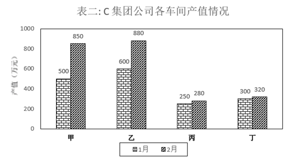

#### 第 1 题　qid 2578512 · 综合

与上个月相比较，2月份职工人数变动幅度最大的是：

- **A**. 甲车间　✅
- **B**. 乙车间
- **C**. 丙车间
- **D**. 丁车间

**答案**：A

**官方解析**

根据题干“······变动幅度最大的是”，可判定本题为一般增长率问题。定位表一，可得甲、乙、丙、丁4个车间1月份的职工人数分别为500、600、300、200，2月份的职工人数分别为550、580、320、200。变动幅度比较大小，比较增长率的绝对值即可。根据增长率=，可得甲、乙、丙、丁4个车间职工人数的环比增速分别为，，，，甲车间职工人数的变动幅度最大。

故正确答案为A。

---

#### 第 2 题　qid 2578678 · 综合

2月份较上月工资总额减少最多的车间是：

- **A**. 甲车间
- **B**. 乙车间　✅
- **C**. 丙车间
- **D**. 丁车间

**答案**：B

**官方解析**

根据题干“2月份较上月工资总额减少最多······”，可判定此题为增长量比较问题。根据公式：工资总额，增长量，代入表格数据，各车间工资总额环比增长量分别为：甲车间：，排除；乙车间：元，丙车间，排除；丁车间元。比较乙车间和丁车间，工资总额减少最多的车间是乙车间。

故正确答案为B。

---

#### 第 3 题　qid 2578513 · 平均数

与上个月相比较，2月份平均工资增长速度最快的车间是：

- **A**. 甲车间
- **B**. 乙车间
- **C**. 丙车间　✅
- **D**. 丁车间

**答案**：C

**官方解析**

根据题干“······增长速度最快的车间是”，可判定本题为一般增长率问题。定位表一，可得甲、乙、丙、丁4个车间1月份的平均工资分别为5000、4500、6000、8000，甲、乙、丙、丁4个车间2月份的平均工资分别为5200、4600、6500、7950。根据增长率=，可得甲、乙、丙、丁4个车间的环比增速分别为，，，，丙车间增长速度最快。

故正确答案为C。

---

#### 第 4 题　qid 2578475 · 综合

对C集团公司1-2月份的产值贡献率最大的是：

- **A**. 甲车间
- **B**. 乙车间　✅
- **C**. 丙车间
- **D**. 丁车间

**答案**：B

**官方解析**

根据题干“对C集团公司1-2月份的产值贡献率最大的是”，因，可判定本题为现期比重问题。定位表二，可得：

甲车间贡献率；

乙车间贡献率；

丙车间贡献率；

丁车间贡献率；

根据结果可知乙车间贡献率最高。

方法二：

根据产值贡献率，总产值不变的情况下，车间产值越大，则贡献率越高，本题1-2月总产值是一个定值，因此1-2月产值最高的车间，贡献率最大，观察表二的数据和柱状图高度，能看出乙车间1-2月产值最高，因此乙车间贡献率最大。

故正确答案为B。

---

#### 第 5 题　qid 2578478 · 增长

与上个月相比较，C集团公司2月份的总产值增长额是：

- **A**. 520万元
- **B**. 650万元
- **C**. 680万元　✅
- **D**. 710万元

**答案**：C

**官方解析**

根据题干“与上个月相比较······2月份的总产值增长额是”，结合选项带单位，可判定本题为增长量计算问题。定位材料表二，可得：C集团公司各车间1月份的产值分别为500、600、250、300，2月份的产值分别为850、880、280、320。 故C集团公司2月份总产值的环比增长量万元。 

故正确答案为C。

---

### 材料 2

#### 第 6 题　qid 2578500 · 综合

在四个城市中，通勤空间半径最短的是：

- **A**. 甲市
- **B**. 乙市
- **C**. 丙市　✅
- **D**. 丁市

**答案**：C

**官方解析**

定位图一可得，甲、乙、丙、丁四个城市的通勤空间半径分别为：40公里、39公里、31公里、40公里，则通勤空间半径最短的是丙市（31公里）。
故正确答案为C。

---

#### 第 7 题　qid 2578505 · 平均数

平均通勤距离超过了四个城市平均值的有：

- **A**. 一个城市　✅
- **B**. 两个城市
- **C**. 三个城市
- **D**. 四个城市

**答案**：A

**官方解析**

由题干“平均通勤距离超过了四个城市平均值的有”，默认时间为现期，可判定此题为现期平均数问题。定位图一可得， 甲、乙、丙、丁四个城市的平均通勤距离分别为：11.1公里、9.1公里、8.7公里、8.1公里，则四个城市平均通勤距离的平均值为公里。因此，平均通勤距离超过了四个城市平均值的只有甲市（11.1公里），数量为一个。

故正确答案为A。

---

#### 第 8 题　qid 2578516 · 综合

如果5公里内可采用步行或自行车等绿色出行方式上班，超过半数的通勤人口可以采用绿色出行方式上班的城市有：

- **A**. 甲市和乙市
- **B**. 甲市和丙市
- **C**. 乙市和丁市
- **D**. 丙市和丁市　✅

**答案**：D

**官方解析**

定位图二可得，甲、乙、丙、丁四个城市的5公里通勤比重分别为：、、、。则根据题干可知，5公里通勤距离可以采用绿色出行方式上班，超过半数（比重大于）的城市有丙市（）和丁市（）。

故正确答案为D。

---

#### 第 9 题　qid 2578522 · 比重

通勤人口被轨道交通覆盖的比重最大的城市是：

- **A**. 甲市
- **B**. 乙市
- **C**. 丙市　✅
- **D**. 丁市

**答案**：C

**官方解析**

定位图二可得，甲、乙、丙、丁四个城市的轨道交通覆盖比重分别为：、、、，则通勤人口被轨道交通覆盖的比重最大的城市是丙市（）。

故正确答案为C。

---

#### 第 10 题　qid 2578526 · 综合

关于四个城市通勤的公共交通情况，下列说法正确的是：

- **A**. 甲市公共交通服务能力最强但是轨道覆盖通勤最差
- **B**. 甲市公共交通服务能力最弱并且轨道覆盖通勤最差　✅
- **C**. 乙市公共交通服务能力最强但是轨道覆盖通勤一般
- **D**. 丁市公共交通服务能力最强并且轨道覆盖通勤最好

**答案**：B

**官方解析**

A项：定位图二可得，甲市45分钟公交服务能力占比为，为四个城市中占比最低的，即公共交通服务能力最弱，错误；

B项：定位图二可得，甲市45分钟公交服务能力占比为，为四个城市中占比最低的，即公共交通服务能力最弱；轨道覆盖通勤比重为，为四个城市中比重最低的，即轨道覆盖通勤最差，正确；

C项：定位图二可得，乙市45分钟公交服务能力占比为，小于丙市（）与丁市（），即公共交通服务能力不是最强的，错误；

D项：定位图二可得，丁市轨道覆盖通勤比重为，小于乙市（）与丙市（），即轨道覆盖通勤不是最好的，错误。

故正确答案为B。

---

### 材料 3

        2019年全国房地产开发投资132194亿元，比上年增长，增速比上年加快0.4个百分点。其中，住宅投资97071亿元，增长，增速比上年加快0.5个百分点。2019年，全国商品房销售面积171558万平方米，比上年下降。其中，住宅销售面积增长，办公楼销售面积下降，商业营业用房销售面积下降。商品房销售额159725亿元，增长，增速比上年回落5.7个百分点。其中，住宅销售额增长，办公楼销售额下降，商业营业用房销售额下降。

#### 第 11 题　qid 2578242 · 增长

2018年全国房地产开发投资比上年增长：

- **A**. 

- **B**. 

- **C**. 

- **D**. 

　✅

**答案**：D

**官方解析**

根据题干“2018年全国房地产开发投资比上年增长”，结合选项为百分数，可判定本题为一般增长率问题。定位文字材料“2019年全国房地产开发投资······，比上年增长，增速比上年加快0.4个百分点”，可得2018年全国房地产开发投资的增长率。

故正确答案为D。

---

#### 第 12 题　qid 2578246 · 增长

2019年全国房地产开发投资增长最快的地区是：

- **A**. 东部地区
- **B**. 中部地区
- **C**. 西部地区　✅
- **D**. 东北地区

**答案**：C

**官方解析**

定位表一可知，2019年各地区房地产开发投资额的增长率分别为：东部地区；中部地区；西部地区；东北地区，则2019年全国房地产开发投资增长最快的地区是西部地区。

故正确答案为C。

---

#### 第 13 题　qid 2578488 · 比重

2019年全国住宅投资在房地产开发投资中的比重约为：

- **A**. 

　✅
- **B**. 

- **C**. 

- **D**. 

**答案**：A

**官方解析**

根据题干“2019年······在······中的比重约为”且材料时间为2019年，可判定此题为现期比重问题。定位文字材料“2019年全国房地产开发投资132194亿元······住宅投资97071亿元”，根据公式：比重，则2019年全国住宅投资在房地产开发投资中的比重，首位商7，与A项最接近。

故正确答案为A。

---

#### 第 14 题　qid 2578489 · 增长

2019年全国商品房销售面积同比下降幅度最大的地区是：

- **A**. 东部地区
- **B**. 中部地区
- **C**. 西部地区
- **D**. 东北地区　✅

**答案**：D

**官方解析**

定位表二，可知2019年东部地区商品房销售面积同比下降，中部地区商品房销售面积同比下降，西部地区商品房销售面积同比上升，东北地区商品房销售面积同比下降。西部地区商品房销售面积同比上升，可排除；其余三个地区商品房销售面积同比下降幅度最大的是东北地区。

故正确答案为D。

---

#### 第 15 题　qid 2578507 · 综合

根据上述材料可以推出：

- **A**. 与上一年相比，2019年全国住宅投资和住宅销售面积均有增长　✅
- **B**. 与上一年相比，2019年全国商品房销售面积和销售额均有下降
- **C**. 与上一年相比，2019年全国住宅销售额和办公楼销售额均有增长
- **D**. 与上一年相比，2019年东北地区商品房销售面积和销售额均有下降

**答案**：A

**官方解析**

A项：定位文字材料“2019年全国房地产······住宅投资······增长······住宅销售面积增长”，可知与上一年相比，2019年全国住宅投资和住宅销售面积均有增长，正确；

B项：定位文字材料“2019年，全国商品房销售面积······比上年下降，······商品房销售额······增长”，可知与上一年相比，2019年全国商品房销售面积下降，销售额上升，错误；

C项：定位文字材料“2019年······住宅销售额增长，办公楼销售额下降”，可知与上一年相比，全国住宅销售额上升，办公楼销售额下降，错误；

D项：定位表二，可知2019年东北地区商品房销售面积增长率为，销售额增长率为，可知与上一年相比，东北地区商品房销售面积下降，销售额上升，错误。

故正确答案为A。

---
