# 2020年浙江公务员考试《行测》（B类）试题（网友回忆版）

> 省考 · 2020 年 · 6 个模块 · 共 95 题

- [政治理论](#%E6%94%BF%E6%B2%BB%E7%90%86%E8%AE%BA) · 1 题
- [常识判断](#%E5%B8%B8%E8%AF%86%E5%88%A4%E6%96%AD) · 14 题
- [言语理解与表达](#%E8%A8%80%E8%AF%AD%E7%90%86%E8%A7%A3%E4%B8%8E%E8%A1%A8%E8%BE%BE) · 25 题
- [数量关系](#%E6%95%B0%E9%87%8F%E5%85%B3%E7%B3%BB) · 15 题
- [判断推理](#%E5%88%A4%E6%96%AD%E6%8E%A8%E7%90%86) · 25 题
- [资料分析](#%E8%B5%84%E6%96%99%E5%88%86%E6%9E%90) · 15 题

---

## 政治理论

### 第 1 题　qid 2579711 · 新思想

中国共产党人的初心和使命是：

- **A**. 全心全意为人民服务
- **B**. 建设社会主义现代化强国
- **C**. 推翻三座大山，建立新中国
- **D**. 为中国人民谋幸福，为中华民族谋复兴　✅

**答案**：D

**官方解析**

本题考查政治常识。
A项错误，全心全意为人民服务是党的根本宗旨。
B项错误，中国共产党在社会主义初级阶段的基本路线是领导和团结全国各族人民，以经济建设为中心，坚持四项基本原则，坚持改革开放，自力更生，艰苦创业，为把我国建设成为富强民主文明和谐美丽的社会主义现代化强国而奋斗。
C项错误，1949年以毛泽东主席为领袖的中国共产党领导全国各族人民，推翻了帝国主义、封建主义、官僚资本主义三座大山，建立了中华人民共和国。
D项正确，党的十九大报告指出：“中国共产党人的初心和使命，就是为中国人民谋幸福，为中华民族谋复兴。这个初心和使命是激励中国共产党人不断前进的根本动力。”
故正确答案为D。

---

## 常识判断

### 第 1 题　qid 2579721 · 人文常识

下列说法错误的是：

- **A**. 新时代的五大发展理念是指创新、绿色、开放、包容、可持续　✅
- **B**. “四个意识”是指政治意识、大局意识、核心意识、看齐意识
- **C**. “四个自信”是指中国特色社会主义道路自信、理论自信、制度自信、文化自信
- **D**. “两个维护”是指坚决维护习近平总书记党中央的核心、全党的核心地位，坚决维护党中央权威和集中统一领导

**答案**：A

**官方解析**

本题考查政治常识。
A项错误，党的十八届五中全会指出：“实现‘十三五’时期发展目标，破解发展难题，厚植发展优势，必须牢固树立并切实贯彻创新、协调、绿色、开放、共享的发展理念。这是关系我国发展全局的一场深刻变革。”
B项正确，党的十九大报告指出：“推动全党尊崇党章，增强政治意识、大局意识、核心意识、看齐意识，坚决维护党中央权威和集中统一领导，严明党的政治纪律和政治规矩，层层落实管党治党政治责任。”
C项正确，党的十九大报告指出:“全党要更加自觉地增强道路自信、理论自信、制度自信、文化自信，既不走封闭僵化的老路，也不走改旗易帜的邪路，保持政治定力，坚持实干兴邦，始终坚持和发展中国特色社会主义。”
D项正确，在中国共产党第十九届中央纪律检查委员会第三次全体会议上中共中央政治局常委、中央纪律检查委员会书记赵乐际作题为《忠实履行党章和宪法赋予的职责 努力实现新时代纪检监察工作高质量发展》的工作报告。报告指出：“把党的政治建设摆在首位，自觉担负坚决维护习近平总书记党中央的核心、全党的核心地位，坚决维护党中央权威和集中统一领导的重大政治责任。”
本题为选非题，故正确答案为A。

---

### 第 2 题　qid 2579736 · 法律常识

下列说法不符合我国宪法规定的是：

- **A**. 国家监察机关和审判机关均由人民代表大会产生
- **B**. 国家工作人员就职时应当依照法律规定公开进行宪法宣誓
- **C**. 上级人民法院、人民检察院领导下级人民法院、人民检察院的工作　✅
- **D**. 监察委员会依照法律规定独立行使监察权，不受行政机关、社会团体和个人的干涉

**答案**：C

**官方解析**

本题考查法律常识。
A项正确，根据《宪法》第三条第三款规定：“国家行政机关、监察机关、审判机关、检察机关都由人民代表大会产生，对它负责，受它监督。”
B项正确，根据《宪法》第二十七条第三款规定：“国家工作人员就职时应当依照法律规定公开进行宪法宣誓。”
C项错误，根据《宪法》第一百三十二条规定：“最高人民法院是最高审判机关。最高人民法院监督地方各级人民法院和专门人民法院的审判工作，上级人民法院监督下级人民法院的审判工作。”第一百三十七条规定：“最高人民检察院是最高检察机关。最高人民检察院领导地方各级人民检察院和专门人民检察院的工作，上级人民检察院领导下级人民检察院的工作。”上下级法院之间是监督关系，上下级检察院之间是领导关系。
D项正确，根据《宪法》第一百二十七条规定：“监察委员会依照法律规定独立行使监察权，不受行政机关、社会团体和个人的干涉。监察机关办理职务违法和职务犯罪案件，应当与审判机关、检察机关、执法部门互相配合，互相制约。”
本题为选非题，故正确答案为C。

---

### 第 3 题　qid 2579746 · 法律常识

下列关于试用期的说法错误的是：

- **A**. 劳动者在试用期内依法享受社会保险待遇
- **B**. 同一用人单位与同一劳动者只能约定一次试用期
- **C**. 用人单位在试用期解除劳动合同的，应当向劳动者说明理由
- **D**. 以完成一定工作任务为期限的劳动合同，约定的试用期不得超过一个月　✅

**答案**：D

**官方解析**

本题考查法律常识。
A项正确，根据《劳动合同法》的规定，社会保险是劳动合同的必备条款，劳动关系一旦建立，用人单位就应当依法为劳动者缴纳社会保险，试用期并非独立于劳动关系外的“特殊期”，试用期包括在劳动合同期限内，因此劳动者在试用期内依法享受社会保险待遇。
B项正确，D项错误，根据《劳动合同法》第十九条规定：“劳动合同期限三个月以上不满一年的，试用期不得超过一个月；劳动合同期限一年以上不满三年的，试用期不得超过二个月；三年以上固定期限和无固定期限的劳动合同，试用期不得超过六个月。同一用人单位与同一劳动者只能约定一次试用期。以完成一定工作任务为期限的劳动合同或者劳动合同期限不满三个月的，不得约定试用期。试用期包含在劳动合同期限内。劳动合同仅约定试用期的，试用期不成立，该期限为劳动合同期限。”因此，以完成一定工作任务为期限的劳动合同，不得约定试用期。
C项正确，根据《劳动合同法》第二十一条规定：“在试用期中，除劳动者有本法第三十九条和第四十条第一项、第二项规定的情形外，用人单位不得解除劳动合同。用人单位在试用期解除劳动合同的，应当向劳动者说明理由。”
本题为选非题，故正确答案为D。

---

### 第 4 题　qid 2579764 · 科技常识

下列我国重大科技成就时间先后顺序排列正确的是：
①第一颗人造卫星发射成功
②第一台亿次巨型计算机研制成功
③神舟五号载人飞船成功返航
④第一株籼型杂交水稻培育成功
⑤第一颗原子弹爆炸成功
⑥三峡大坝全线修建成功

- **A**. ①④⑤③⑥②
- **B**. ⑤①④②③⑥　✅
- **C**. ④①⑤⑥②③
- **D**. ⑤⑥①②④③

**答案**：B

**官方解析**

本题考查科技常识。
①“东方红一号”卫星，是中国发射的第一颗人造地球卫星，于1970年4月24日在酒泉卫星发射中心成功发射，由此开创了中国航天史的新纪元，使中国成为继苏、美、法、日之后世界上第五个独立研制并发射人造地球卫星的国家。
②1983年12月22日，国防科技大学研制成功我国第一台亿次巨型计算机银河-I，运算速度每秒1亿次。
③2003年10月16日，神舟五号载人飞船成功返航。
④1973年，袁隆平在世界上首次培育成功籼型杂交水稻。
⑤1964年10月16日下午3时，在我国西部地区新疆罗布泊上空，中国第一次将原子核裂变的巨大火球和蘑菇云升上了戈壁荒漠，第一颗原子弹爆炸成功。
⑥三峡水电站是中国湖北省宜昌市境内的长江西陵峡段与下游的葛洲坝水电站构成梯级电站。三峡大坝于2006年全线修建成功。
我国重大科技成就时间先后顺序排列为⑤①④②③⑥。
故正确答案为B。

---

### 第 5 题　qid 2579714 · 人文常识

下列关于图中日历中信息的说法错误的是：

- **A**. 上一年是丙申年
- **B**. 这一年的2月有28天
- **C**. 这一天中某一时刻太阳直射点位于赤道　✅
- **D**. “大地阳和暖气生”是描写这一时节的诗句

**答案**：C

**官方解析**

本题考查人文常识。
A项正确，丁酉年为干支纪年法的表示。十天干：甲、乙、丙、丁、戊、己、庚、辛、壬、癸；十二地支：子、丑、寅、卯、辰、巳、午、未、申、酉、戌、亥。把十天干和十二地支一对一进行相配，共可配成60个组合，用来表示年份的次序，周而复始，循环使用。2017年的上一年天干为“丙”，地支为“申”，合起来为丙申年。
B项正确，一般情况下，能被4整除的年份是闰年，不能被4整除的年份是平年，闰年2月有29天，平年2月有28天，2017年为平年，2月有28天。
C项错误，春分和秋分太阳直射点都在赤道。春分一般在每年的3月19日-22日中的一天，即农历的二月十四日，春分这天，太阳光直射赤道。日历中的日期为立春，此时太阳直射点不位于赤道。
D项正确，“东风带雨逐西风，大地阳和暖气生”出自左河水的《立春》，描写的是立春。
本题为选非题，故正确答案为C。

---

### 第 6 题　qid 2579717 · 科技常识

下列与土壤有关的说法正确的是：

- **A**. 犁地可以增加土壤中的矿物质
- **B**. 红壤的pH值大于7，是碱性土壤
- **C**. 土壤的形成与岩石的风化作用有关　✅
- **D**. 土壤的有机质可被植物的根部直接吸收

**答案**：C

**官方解析**

本题考查科技常识。
A项错误，犁过的土地，土壤间隙增大，透气性好，水和空气能够很好地进入土壤中，并且能够很好地保留下来，并不能增加土壤中的矿物质。
B项错误，酸性土壤是pH值小于7的土壤总称。包括砖红壤、赤红壤、红壤、黄壤和燥红土等土类。红壤是酸性土壤。
C项正确，风化作用使岩石破碎，理化性质改变，形成结构疏松的风化壳，故土壤的形成与岩石的风化作用有关。
D项错误，土壤的有机质不能被直接吸收，必须经过微生物的发酵，将有机物分解为无机物，比如铵态氮、硝态氮、矿物质离子，之后才能被吸收。
故正确答案为C。

---

### 第 7 题　qid 2579720 · 人文常识

下列典故的发生年代与“破釜沉舟”最接近的是：

- **A**. 围魏救赵
- **B**. 明修栈道，暗度陈仓　✅
- **C**. 卧薪尝胆
- **D**. 庆父不死，鲁难未已

**答案**：B

**官方解析**

本题考查人文常识。
破釜沉舟，故事源于秦末，意思是把饭锅打破，把渡船凿沉；表示下定决心，为取得胜利准备牺牲一切。
A项错误，围魏救赵，原指战国时齐军用围攻魏国的方法，迫使魏国撤回攻赵部队而使赵国得救。后指袭击敌人后方的据点以迫使进攻之敌撤退的战术。
B项正确，明修栈道，暗度陈仓，发生在秦朝灭亡，楚汉相争之时，指将真实的意图隐藏在表面的行动背后，用明显的行动迷惑对方，使敌人产生错觉，并忽略自己的真实意图，从而出奇制胜。其发生年代与“破釜沉舟”最为接近。
C项错误，卧薪尝胆，发生在春秋战国时期，形容一个人忍辱负重，发愤图强，最终苦尽甘来。
D项错误，庆父不死，鲁难未已，出自《左传·闽公元年》，故事源于春秋战国时期，意思是如果不除去庆父，鲁国的灾难是不会终止的；比喻不清除制造内乱的罪魁祸首，国家就不得安宁。
故正确答案为B。

---

### 第 8 题　qid 2579727 · 地理国情

下列诗词描绘的名胜位于长江以北的是：

- **A**. 二十四桥明月夜，玉人何处教吹箫　✅
- **B**. 横看成岭侧成峰，远近高低各不同
- **C**. 水光潋滟晴方好，山色空蒙雨亦奇
- **D**. 月落乌啼霜满天，江枫渔火对愁眠

**答案**：A

**官方解析**

本题考查人文历史。
A项正确，“二十四桥明月夜，玉人何处教吹箫”出自杜牧的《寄扬州韩绰判官》，“二十四桥”是扬州古代桥梁建筑的杰作，扬州位于长江以北，有“淮左名都，竹西佳处”之称。
B项错误，“横看成岭侧成峰，远近高低各不同”出自苏轼的《题西林壁》，描写的是庐山景象，位于江西省九江市庐山市境内，东偎婺源、鄱阳湖，南靠滕王阁，西邻京九铁路大通脉，北枕滔滔长江（即位于长江以南）。
C项错误，“水光潋滟晴方好，山色空蒙雨亦奇”出自苏轼的《饮湖上初晴后雨》，描写的是西湖景象，西湖位于浙江省杭州市境内，杭州位于长江以南。
D项错误，“月落乌啼霜满天，江枫渔火对愁眠”出自张继的《枫桥夜泊》，描写的是秋天夜晚姑苏城外的枫桥。姑苏是苏州的古称，苏州位于长江以南。
故正确答案为A。

---

### 第 9 题　qid 2579733 · 科技常识

下列关于植物种子传播方式的说法错误的是：

- **A**. 柳树的种子利用风力传播
- **B**. 樱桃会自己裂开通过弹力传播种子　✅
- **C**. 莲蓬的种子利用水流传播
- **D**. 野葡萄靠鸟类食用和排泄传播种子

**答案**：B

**官方解析**

本题考查科技常识。
A项正确，柳树种子上有附生的白色绒毛，即柳絮，柳树种子成熟后靠柳絮随风飞扬把种子传播到远处。
B项错误，樱桃种子的传播主要是靠鸟类或其他小型哺乳动物的食用和排泄。这些动物会把樱桃果实吃掉，种子很难消化，然后就会随着粪便排出，从而把种子传播开来。
C项正确，莲蓬的种子是莲子，莲子能够长出新的植株，一般等莲子自然老去，会掉落到水中，随后随着水流遇到合适的环境就会自己发芽生长。
D项正确，野葡萄是某些鸟类或小型哺乳动物的食物，被吃下后，种子会因为动物的迁移，随着它们的粪便四处传播，形成新的生命个体。
本题为选非题，故正确答案为B。

---

### 第 10 题　qid 2579792 · 地理国情

下列关于我国岛屿的说法错误的是：

- **A**. 我国第二大岛海南岛属于亚热带岛屿　✅
- **B**. 我国领土最南端是南沙群岛的曾母暗沙
- **C**. 我国岛屿大部分分布在长江口以南的海域
- **D**. 舟山群岛的舟山渔场是我国最大的海洋渔场

**答案**：A

**官方解析**

本题考查地理国情。

A项错误，海南岛是中国南方的热带岛屿，面积3.39万平方公里，为国内仅次于台湾岛的第二大岛。

B项正确，中国地理四至：最北端位于黑龙江省漠河以北黑龙江主航道的中心线上；最南端为南沙群岛的曾母暗沙；最西端在帕米尔高原上；最东端在黑龙江和乌苏里江主航道中心线交汇处。

C项正确，我国岛屿大部分分布在长江口以南的海域，其中，东海约占岛屿总数的，南海约占，黄、渤海约占。

D项正确，舟山渔场位于杭州湾以东，长江口东南的浙江东北部，面积约5.3万平方公里，是中国最大的渔场，是浙江省、江苏省、福建省和上海市三省一市及台湾渔民的传统作业区域。

本题为选非题，故正确答案为A。

---

### 第 11 题　qid 2579794 · 经济常识

下列关于经济指数的说法正确的是：

- **A**. 
恩格尔系数越大，表示生活越富裕

- **B**. 
货币供应量中，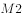的流动性强于

- **C**. 
基尼系数小于0.2时，表示收入绝对平均
　✅
- **D**. 
国民总收入（GNI）一定大于国内生产总值（GDP）

**答案**：C

**官方解析**

本题考查经济常识。

A项错误，恩格尔系数是食品支出总额占个人消费支出总额的比重。19世纪德国统计学家恩格尔根据统计资料，对消费结构的变化得出的规律，即收入中购买食品的比重越大，生活水平越低，即恩格尔系数越大，生活水平越低；反之，恩格尔系数越小，生活水平越高。 

B项错误：参照国际通用原则，根据我国实际情况，中国人民银行将我国货币供应量指标分为以下五个层次：流通中的现金；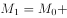企业活期存款机关团体部队存款农村存款个人持有的信用卡类存款；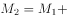城乡居民储蓄存款企业存款中具有定期性质的存款外币存款信托类存款；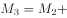金融债券商业票据大额可转让存单等；其它短期流动资产。其中，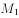是通常所说的狭义货币量，流动性较强，是国家中央银行重点调控对象。是广义货币量，与的差额是准货币，流动性较弱。

C项正确，基尼系数是指国际上通用的、用以衡量一个国家或地区居民收入差距的常用指标。基尼系数最大为“1”，最小等于“0”。基尼系数越接近0表明收入分配越是趋向平等。国际惯例把0.2以下视为收入绝对平均；0.2-0.3视为收入比较平均；0.3-0.4视为收入差异相对合理；0.4-0.5视为收入差距较大，当基尼系数达到0.5以上时，则表示收入差距悬殊。

D项错误，国民总收入GDP来自国外的净要素收入净额。所以，两者的关系取决于来自国外的净要素收入净额。而国外净要素收入净额为国外本国居民同期创造价值与国内外国居民同期创造的价值之差。当国内外国居民同期创造的价值大于国外本国居民同期创造价值时，国民总收入会小于国内生产总值。

故正确答案为C。

---

### 第 12 题　qid 2579795 · 人文常识

刘某乘火车从徐州出发去乌鲁木齐，列车行驶在徐新高铁线上，下列情况不可能发生的是：

- **A**. 刘某看到了黄河
- **B**. 列车经过太原站　✅
- **C**. 列车驶入河南省境内
- **D**. 列车速度达到300千米/小时

**答案**：B

**官方解析**

本题考查地理国情。
徐新高铁，是从江苏徐州到新疆乌鲁木齐的一条高速线路，途经江苏、安徽、河南、陕西、甘肃、青海、新疆7省/自治区。
A项正确，徐新高铁途经郑州、西安、兰州等城市，在兰州跨越黄河，通向乌鲁木齐，因此，刘某在火车上可以看到黄河。
B项错误，徐新高铁途经河南郑州后直接向西通向陕西西安，不经过山西太原。
C项正确，徐新高铁途经河南郑州后直接向西通向陕西西安，因此要经过河南。
D项正确，目前我国“复兴号”动车组已实现350公里时速运营，因此列车速度达到300千米/小时是可能发生的。
本题为选非题，故正确答案为B。

---

### 第 13 题　qid 2579796 · 人文常识

下列与农业有关的说法符合历史事实的是：

- **A**. 隋唐时期，我国农民种植番薯
- **B**. 汉朝农民使用曲辕犁在水田耕作
- **C**. 河姆渡先民广泛使用彩陶来储存稻米
- **D**. 宋朝时期，贫困农民可以出卖自己的土地　✅

**答案**：D

**官方解析**

本题考查人文常识。
A项错误，番薯原产于美洲，明万历年间从东南亚传入我国福建等地，明代中后期，其种植已由江南推广到北方各地， 成为全国主要杂粮作物中的一种。故隋唐时期我国农民种植番薯不符合历史事实。
B项错误，曲辕犁是唐代普遍使用的耕犁。唐以前，主要使用笨重的长直辕犁，回转困难，耕地费力。故汉朝农民使用曲辕犁不符合历史事实。
C项错误，彩陶是一种出现在新石器时代晚期的绘有黑色、红色的装饰花纹的红褐色或棕黄色的陶器，陕西西安半坡原始居民掌握较高的制陶技术，出现彩陶。而河姆渡属于新石器早期文化，其陶器比较原始，以夹碳黑陶为主。故河姆渡先民广泛使用彩陶储存稻米不符合历史事实。
D项正确，北宋政府为了巩固中央集权专制统治的基础，对地主阶级采取优容的态度，“不立田制”“不抑兼并”，鼓励和支持土地的私人占有，允许土地自由买卖，对土地兼并基本采取了放任的态度，这使得宋代典卖土地的现象十分普遍。所谓“典卖”，是指将土地、房屋等不动产出典给他人，收取一定的典价，在约定期限内原价赎回，典卖者大多数是贫困农民。故选项表述符合历史事实。
故正确答案为D。

---

### 第 14 题　qid 2579799 · 人文常识

下列与人体有关的说法错误的是：

- **A**. 消化和吸收的主要场所是小肠
- **B**. 尿液中糖分过多可能是由于胰岛素分泌不足
- **C**. 分泌生长激素，促进人体生长发育的器官是垂体
- **D**. 人能看清远处和近处的物体是因为瞳孔的大小可以调节　✅

**答案**：D

**官方解析**

本题考查科技常识。
A项正确，小肠上端起于胃幽门口，下端止于回盲瓣，是消化管中最长的一部分，成人全长5-7m，按位置与形态，分为十二指肠、空肠和回肠三部分，是食物消化与吸收的主要场所。 
B项正确，胰岛素的主要功能是调节糖在体内的吸收、利用和转化等，如促进血糖合成糖元，加速血糖的分解，从而降低血糖的浓度，若胰岛素分泌不足，会使血糖浓度超过正常水平，导致尿液中糖分过多。
C项正确，垂体是人体最重要的内分泌腺，分前叶和后叶两部分。它分泌多种激素，如生长激素、促甲状腺激素、促肾上腺皮质激素、促性腺素、催产素、催乳素、黑色细胞刺激素等，还能够贮藏并释放下丘脑分泌的抗利尿激素。这些激素对代谢、生长、发育和生殖等有重要作用。
D项错误，人能够看清远近不同的物体，是因为睫状体能够调节晶状体的曲度大小，而瞳孔的大小是控制进入眼球内部光线的多少。
本题为选非题，故正确答案为D。

---

## 言语理解与表达

### 第 1 题　qid 2579710 · 逻辑填空

抗战小说因为题材的特殊性，一般强调英雄人物的“神圣使命”，强调军人形象塑造，        百姓形象。而在《怒吼的平原》中，作者将普通群众纳入群像之中，军与民的笔墨虽不是            ，却同样饱含深情。
依次填入划横线部分最恰当的一项是：

- **A**. 忽视  厚此薄彼
- **B**. 削弱  等量齐观
- **C**. 忽略  伯仲之间
- **D**. 淡化  平分秋色　✅

**答案**：D

**官方解析**

本题可从第二空入手，横线处搭配“军与民的笔墨”，由转折标志词“却“可知前后语义相反，转折后提及“同样饱含深情”，且横线前有否定词“不是”，可知空缺处应体现同样篇幅笔墨描写的意思。D项“平分秋色”比喻双方各得一半，符合语境，保留。A项“厚此薄彼”比喻对人、对事不同看待，与文意相悖，排除；B项“等量齐观”指对有差别的事物同等看待，不能搭配“军与民的笔墨”，排除；C项“伯仲之间”比喻差不多，难分优劣，文段并非强调两者的好坏，与文意不符，排除。
第一空，代入验证，D项“淡化”指弱化，减化，与前文强调军人形象塑造的方式恰好相反，符合文意，当选。
故正确答案为D。
【文段出处】光明日报《现实主义精神的坚守》

---

### 第 2 题　qid 2579723 · 逻辑填空

传统村落需要保护，是            的吗？不是，反而需要充分的理由，尤其是对各利益相关方而言。传统村落保护的重大意义，凸显在中华民族整体的、长远的利益上，但现实中保护的责任或        却由具体的人来承担。
依次填入划横线部分最恰当的一项是：

- **A**. 不言自明  代价　✅
- **B**. 自然而然  义务
- **C**. 无庸赘述  使命
- **D**. 理直气壮  后果

**答案**：A

**官方解析**

第一空，根据“不是，反而需要充分的理由”可知，横线前后意思相反，所填成语应体现不需要充分理由，即道理很浅显，不用多说的意思。A项“不言自明”指不用说话就能明白，C项“无庸赘述”指用不着多说，两者均含有不用多说的意思，保留。B项“自然而然”指自由发展，必然这样，非人力干预而自然如此，侧重于发展的自然性，无需干预，而非无需充分理由，与文意不符，排除；D项“理直气壮”指理由充分，说话气势就壮，而文段要体现无需充分理由之意，与文意相悖，且“气壮”文段未体现，排除。
第二空，“或”表示并列，横线处词语与“责任”语义不能重复。A项“代价”泛指为达到某种目的所耗费的物质、精力或所作出的牺牲，与“责任”含义不同，用在此处可体现出在对传统村落保护的过程中，个人所作的付出或牺牲，符合文意，当选。C项“使命”比喻重大的责任，二者意思相近，表述重复，排除。
故正确答案为A。
【文段出处】《传统村落：爱她，就要先懂她》

---

### 第 3 题　qid 2579738 · 逻辑填空

徽州的一景一物，较之粗犷的西北，是            的。那马头墙、小青瓦透出的人文气息，浓郁得似乎连游客都成了诗的一部分。粉墙黛瓦，青山绿水，全然一派水墨丹青的        。
依次填入划横线部分最恰当的一项是：

- **A**. 大相径庭  韵味　✅
- **B**. 截然不同  氛围
- **C**. 别具一格  风格
- **D**. 无可比拟  意境

**答案**：A

**官方解析**

第一空，根据文段“粗犷的西北”“那马头墙、小青瓦透出的人文气息”可知，徽州应与西北是不同的，有很大差距的，故A项“大相径庭”、B项“截然不同”二者均可表达两者不同之意，保留；C项“别具一格”表达另有一种风格，强调有特色，与文意不符，排除；D项“无可比拟”强调谁都比不了，与文意无关，且程度过重，排除。
第二空，根据文段“粉墙黛瓦，青山绿水”“水墨丹青的”可知，文段表达徽州的粉墙黛瓦，青山绿水，有一种水墨丹青的意境，非常雅致有趣味，A项“韵味”指有情趣，有趣味，与文意相符，当选；B项“氛围”指周围环境的气氛，与文意不符，且“氛围”一词相较“韵味”无法体现文段所传达出的美感，排除。
故正确答案为A。
【文段出处】《写生的探索是构建一种观看语法》

---

### 第 4 题　qid 2579759 · 逻辑填空

传统高性能材料越来越依赖各类稀缺资源，人们想在自然界中找寻具有超物理特性天然材料的尝试一直            ，必须另辟蹊径，探寻超越常规材料性能极限的新型材料。直到21世纪初，美国研究人员在研制“隐身衣”的实验中利用微波技术发现了超材料的            ，才宣告了超材料的诞生。
依次填入划横线部分最恰当的一项是：

- **A**. 屡试不爽  乾端坤倪
- **B**. 收效甚微  蛛丝马迹　✅
- **C**. 困难重重  奇思妙想
- **D**. 举步维艰  一鳞半爪

**答案**：B

**官方解析**

第一空，由“必须另辟蹊径”可知，之前找寻具有超物理特性天然材料的尝试没有什么收获或者阻碍重重。A项“屡试不爽”指屡次试验都没有差错，与文意相悖，排除。B项“收效甚微”指付出的努力基本没什么效果，C项“困难重重”指一个困难接着一个困难，表示困难很多，D项“举步维艰”比喻办事情每向前进行一步都十分不容易，三者均符合语境，保留。
第二空，由“才宣告了超材料的诞生”可知，横线处表示美国研究人员在探寻超材料上有了突破，找到了线索。B项“蛛丝马迹”比喻事情所留下的隐约可寻的痕迹和线索，符合语境，当选。C项“奇思妙想”意思是奇妙的想法，一般搭配人，不能搭配“超材料”，排除；D项“一鳞半爪”原指龙在云中，东露一鳞，西露半爪，看不到它的全貌，比喻零星片段的事物，侧重事物残缺不全，此处并非强调发现超材料的碎片，排除。
故正确答案为B。
【文段出处】《超材料：会改写未来战争吗？》

---

### 第 5 题　qid 2579768 · 逻辑填空

芸芸众生中的一些人，放不下自己的身段，觉得到了某个年龄某个职位，就一定要有怎样的标配，略有不足，就觉得        。这样的人        又乏味。当把自己套进一个标准里面，就难免变得坚硬、无趣，            。其实，聪明的活法，是可以把生活过得有弹性，能屈能伸，能进能退。
依次填入划横线部分最恰当的一项是：

- **A**. 无奈  固执  斤斤计较
- **B**. 屈就  刻板  作茧自缚　✅
- **C**. 失落  平庸  形如槁木
- **D**. 不满  可悲  碌碌无为

**答案**：B

**官方解析**

第一空，根据“到了某个年龄某个职位，就一定要有怎样的标配”可知，横线词语应表达一些人到了某一职位后，没有得到“标配”后的一种消极状态。B项“屈就”指降低身份任职，C项“失落”指精神上空虚或失去寄托，D项“不满”指不满意，均符合文意，保留；A项“无奈”表示没有办法了，无计可施，与文意不符，排除。
第二空，B、C、D三项均符合题意，保留。
第三空，根据横线后“其实”可知，横线内容应与“把生活过得有弹性，能屈能伸，能进能退”语义相反，即把自己限制住了，无法动弹。B项“作茧自缚”比喻自己使自己陷入困境，与文意相符，当选。C项“形如槁木”形容身体瘦得像干枯的木头，D项“碌碌无为”意思是平平庸庸、无所作为，C、D两项均无法与后文内容构成转折关系，排除。
故正确答案为B。
【文段出处】《[夜读]最聪明的活法，是把生活过得有弹性》

---

### 第 6 题　qid 2579810 · 逻辑填空

近年来，我国在信息技术上取得长足进步，但仍然没有完全解决核心技术“卡脖子”的问题。面对现实，我们既不可夜郎自大，也不能            。路是自己走出来的，突破核心技术这个难题，说到底要靠我们自己奋发有为，加速打造“中国芯”，以自主创新        技术格局。
依次填入划横线部分最恰当的一项是：

- **A**. 一蹶不振  主导
- **B**. 妄自菲薄  重塑　✅
- **C**. 自怨自艾  刷新
- **D**. 安之若素  构建

**答案**：B

**官方解析**

第一空，由“既不可······也不能”可知，横线处词语与“夜郎自大”相反，“夜郎自大”比喻人无知，妄自尊大，侧重强调人过于自负，故横线处应与其相反，体现出自卑、不自信之意。A项“一蹶不振”比喻受到挫折就再也振作不起来了，可体现出不自信之意，B项“妄自菲薄”指过分地看轻自己，均符合文意，保留。C项“自怨自艾”指悔恨自己的错误，应当做错事情才会有悔恨，与文意无关，排除；D项“安之若素”指（遇到不好的情况或异常情况）跟平常一样对待，毫不在意，体现不出自卑、不自信之意，排除。
第二空，根据“路是自己走出来的”“要靠我们自己奋发有为，加速打造‘中国芯’”可知，面对“核心技术‘卡脖子’的问题”，我国不再奢望寻找国外技术支持，而是自力更生，另辟蹊径。B项“重塑”指重新塑造，符合语境，当选。A项“主导”指主要的并且引导事物向某方面发展的，如主导思想、主导作用等，文中并未提及“自主创新”是主导还是辅助，故与文意不符，排除。
故正确答案为B。
【文段出处】《辛识平：加速打造“中国芯”》

---

### 第 7 题　qid 2579812 · 逻辑填空

在媒体市场竞争中，            是整个市场正常有序运行的根本法则。新媒体凭借超越时空的非线性传播特性、跨边界的国际传播影响力成为新时代的        。可以说，谁掌握了新媒体，谁就走在了市场的前面。
依次填入划横线部分最恰当的一项是：

- **A**. 与时俱进  骄子
- **B**. 推陈出新  潮流
- **C**. 优胜劣汰  宠儿　✅
- **D**. 弱肉强食  利器

**答案**：C

**官方解析**

第一空，根据“市场竞争”“市场正常有序运行的根本法则”等表述可知，横线处强调市场中的相互竞争。A项“与时俱进”指随着时代的发展而不断发展、前进，B项“推陈出新”指去掉旧事物的糟粕，取其精华，并使它向新的方向发展，二者均体现不出与市场竞争相关的根本法则，排除。C项“优胜劣汰”指生物在生存竞争中适应力强的保存下来，适应力差的被淘汰，恰如其分地体现出竞争关系，符合文意，保留。D项“弱肉强食”比喻弱者被强者吞并，体现的是一种“丛林法则”而非“市场根本法则”，与文意不符，排除。
第二空，代入验证，C项“宠儿”指受到社会欢迎、青睐的人或事物，与后文“谁掌握了新媒体，谁就走在了市场的前面”对应得当，符合文意，当选。
故正确答案为C。
【文段出处】《新媒体传播》

---

### 第 8 题　qid 2579814 · 逻辑填空

在视频网站行业，每一个视频内容获得多少点击量            ，行业也会根据视频内容带来的流量分配收益，但在线音乐平台并不公开这些数据，这就导致大家很难按照音乐作品真正带来的价值来分配收益。数据          才能令音乐行业得以变革，也会促进优秀音乐内容的生产。
依次填入划横线部分最恰当的一项是：

- **A**. 了如指掌  精准化
- **B**. 显而易见  可视化
- **C**. 不言而喻  公开化
- **D**. 一清二楚  透明化　✅

**答案**：D

**官方解析**

第一空，横线处搭配“点击量”，根据“行业也会根据视频内容带来的流量分配收益”可知，横线处表示点击量多少非常清楚明白，B项“显而易见”形容事情或道理很明显，极容易看清楚，D项“一清二楚”指十分清楚、明白，均符合文意，保留。A项“了如指掌”形容对情况极为清楚，常见用法是“对······了如指掌”，文段无此用法，排除；C项“不言而喻”指不用说话就能明白，形容道理很明显，与“点击量”搭配不当，排除。
第二空，“但”表示转折，横线处与“在线音乐平台并不公开这些数据”语义相反，表示数据要公开，让所有人都看见，D项“透明化”指公开、不掩饰，符合文意，当选。B项“可视化”指可以看见，表示能看得见了，但不表示允许所有人都看见，不符合文意，排除。
故正确答案为D。
【文段出处】光明网《音乐版权混战结束 天价版权费或成历史》

---

### 第 9 题　qid 2579816 · 逻辑填空

金融的本质特征之一是风险管理，金融机构控风险            。与此同时，民营企业也需要管理自己的风险，要对自己负责。因为，通过市场化的方案解决企业融资难未来将越发成为应对问题的主流，风险        才是市场化。这是一种挑战和约束，有利于在实体经济和金融体系之间，树立一个正向的“市场化预期”。
依次填入划横线部分最恰当的一项是：

- **A**. 理所当然  自担　✅
- **B**. 势在必行  均摊
- **C**. 大势所趋  防控
- **D**. 情有可原  规避

**答案**：A

**官方解析**

第一空，根据前文“金融的本质特征之一是风险管理”可知，控风险是金融机构本应要做的事情，A项“理所当然”意为从道理上说应当这样，B项“势在必行”指从事情发展的趋势看，必须采取行动，C项“大势所趋”指整个局势发展的必然趋向，均符合文段语境，保留。D项“情有可原”指在情节或情理上有可以原谅之处，文段并无可以原谅的语境，排除。
第二空，根据“因为”可知，横线处对应“民营企业也需要管理自己的风险，要对自己负责”，A项“自担”指自己承担，符合文段语境，当选。B项“均摊”指平均分摊，文段并无多家企业平均分摊风险之意，排除；C项“防控”，不能体现自己管理自己的风险之意，排除。
故正确答案为A。
【文段出处】《解决融资难需要市场化方案》

---

### 第 10 题　qid 2579817 · 逻辑填空

天下熙熙攘攘，为稀土而来，为稀土而往。各种黑科技产品        离不开的稀土一直都是“香饽饽”，各国都为寻找掌握更多稀土资源而            。
依次填入划横线部分最恰当的一项是：

- **A**. 根本  挖空心思
- **B**. 完全  殚思竭虑
- **C**. 须臾  绞尽脑汁　✅
- **D**. 片刻  尽心竭力

**答案**：C

**官方解析**

本题可从第二空入手。根据“为稀土而来，为稀土而往”“一直都是‘香饽饽’”可知，横线处体现各国都在为掌握更多稀土资源而努力想办法。C项“绞尽脑汁”形容苦思积虑，费尽脑筋，想尽办法，符合文意，保留。A项“挖空心思”形容费尽心思，想尽一切办法，多含贬义，原文没有明显批判意味，排除。B项“殚思竭虑”指用尽心思，D项“尽心竭力”意思是用尽心思，使出全力，两项均侧重做事尽心尽力，且感情色彩积极，而文段侧重为了找稀土资源而想办法，为中性表达，B、D两项均排除。
第一空代入验证，该空形容各种黑科技产品都离不开稀土。C项“须臾”指片刻之间，置于此处指一刻也离不开，体现出稀土的重要性，符合语境，当选。
故正确答案为C。
【文段出处】《海底的稀土，挖起来没那么容易》

---

### 第 11 题　qid 2579715 · 逻辑填空

媒介失忆是指值得记忆信息的        ，而媒介失声则是对值得记忆信息的        。迅速、真实、客观、准确地告知、报告和记载有意义的新闻事实和信息，本应是媒介记忆中的头等大事。媒介如果在重大社会问题或重要新闻事件上发生障碍性、麻痹性失声，对有文献和历史价值的信息熟视无睹，其实就是媒介的不记忆和不作为，是媒介        。
依次填入划横线部分最恰当的一项是：

- **A**. 错失  无视  失责
- **B**. 丢失  漠视  失职　✅
- **C**. 消失  轻视  渎职
- **D**. 散失  忽视  塞责

**答案**：B

**官方解析**

第一空，所填词语搭配“值得记忆信息”，B项“丢失”、C项“消失”搭配均可，保留。A项“错失”强调错过失去，通常搭配时机、机遇等，与“信息”搭配不当，排除；D项“散失”表示分散遗失或消散失去，通常搭配书稿、水分等，与“信息”搭配不当，排除。
第三空，根据前文“就是媒介的不记忆和不作为”可知，这种做法违背了媒介原本的职责。B项“失职”指没有履行自己的职责，符合文意，保留。C项“渎职”指国家机关工作人员在履行职责或者行使职权过程中玩忽职守，与“媒介”搭配不当，排除。
第二空，代入验证，B项“漠视”填入文段搭配恰当，符合文意，当选。
故正确答案为B。
【文段出处】《媒介记忆论：媒介作为人类文明记忆过程的研究》

---

### 第 12 题　qid 2579732 · 逻辑填空

传统的银行信贷模式是依赖担保和抵押。互联网、大数据等技术的快速        ，催生了金融的变革和创新。借助大数据的应用，以科技金融的方式        传统小微业务，可以提升金融服务的质量和效率，做到真正意义上的普惠金融。
依次填入划横线部分最恰当的一项是：

- **A**. 崛起  打造
- **B**. 更新  推动
- **C**. 启动  重构
- **D**. 迭代  介入　✅

**答案**：D

**官方解析**

第一空，横线处描述互联网、大数据等技术的发展，C项“启动”指发动、开动，强调“开始”，与文意不符，排除；A项“崛起”强调兴起，强调发展的程度，符合文意，保留；B项“更新”与D项“迭代”都可表示发展变化，可用来强调发展的过程，均符合文意，保留。
第二空，根据“提升金融服务的质量和效率”可知，横线处表示科技金融对传统小微业务的影响，A项“打造”有制造、创造之意，与“传统业务”搭配不当，排除；B项“推动”有促进，使事物向前发展的意思，“推动”与“业务”搭配不当，常见搭配应为“推动业务的发展”“推动业务的进步”等等，排除；D项“介入”强调参与、干预，放在此处可以表示科技金融参与传统小微业务的发展，符合文意，当选。
故正确答案为D。
【文段出处】南风窗《科技赋能，让金融世界更具想象力》

---

### 第 13 题　qid 2579740 · 片段阅读

“国学”这个概念是从日本输入的。19世纪末，刘师培、章太炎、梁启超等接受了日本的“国学”概念，并将其引入中国。当时引进这样一个概念，是为了和西方学问相区别，是被逼出来的。古人从不称自己的学问为“国学”，而直称其为儒学、道学、理学、心学、佛学、玄学、子学等。“国学”概念出现之后，作为一国固有之学问，究竟包含哪些内容，实在是各说各话，无法统一。
根据这段文字，“国学”的哪一方面不能确定？

- **A**. 诞生背景
- **B**. 具体所指　✅
- **C**. 传播过程
- **D**. 概念来源

**答案**：B

**官方解析**

A项，“诞生背景”对应文段“当时引进这样一个概念，是为了和西方学问相区别，是被逼出来的”，“诞生背景”可确定，排除；
B项，“具体所指”对应文段“‘国学’概念出现之后，作为一国固有之学问，究竟包含哪些内容，实在是各说各话，无法统一”，故“国学”具体包含的内容不能确定，当选；
C项，“传播过程”对应文段“19世纪末，刘师培、章太炎、梁启超等接受了日本的‘国学’概念，并将其引入中国”，“传播过程”可确定，排除；
D项，“概念来源”对应文段“‘国学’这个概念是从日本输入的”，“概念来源”可确定，排除。
本题为选非题，故正确答案为B。
【文段出处】《虚热的“国学热”：低俗化？不治本？》

---

### 第 14 题　qid 2579748 · 片段阅读

文艺复兴一般被视为一场源自14世纪意大利而后蔓延到整个欧洲的思想与艺术运动，而殖民主义则往往同15世纪末以来欧洲开辟新航路、发现新大陆以至对亚非拉地区的政治奴役、经济剥削、军事占领等历史发展相联系。过去，两者的研究相隔甚远，但最近有学者敏锐地把握到两者实有一种隐蔽的叠合关系。
这段文字接下来最可能讲述的是：

- **A**. 文艺复兴如何为殖民主义铺路　✅
- **B**. 殖民主义相关内容的研究现状
- **C**. 殖民主义对亚非拉地区的深远影响
- **D**. 文艺复兴如何引发欧洲思想艺术运动

**答案**：A

**官方解析**

本题为接语选择题，需通读全文，重点把握文段最后讨论的核心话题。文段开篇引出了文艺复兴与殖民主义的话题，尾句转折之后强调的是“两者实有一种隐蔽的叠合关系”，这里的两者即是前文论述的“文艺复兴”和“殖民主义”，根据话题一致的原则，下文应该继续围绕这一话题具体展开论述，描述“文艺复兴”与“殖民主义”之间的关系，对应A项。
B项和C项主要论述的是“殖民主义”、D项论述的是“文艺复兴”，均只涉及尾句两个话题中的一个，表述片面，与尾句话题不一致，排除。
故正确答案为A。
【文段出处】《作为硬币两面的“文艺复兴”与“殖民掠夺”》

---

### 第 15 题　qid 2579757 · 片段阅读

军事战略空间融合化指的是战略空间不再仅限于军事或战时范畴，而是融合了一个国家治国理政的各个领域和所有时期。在和平与发展成为时代主题的大背景下，战争和冲突只发生在世界局部地区。这就要求战略主体转变对战略空间的价值判断，把战略空间的安全目标和发展目标有机融合。冷战结束后，许多军事空间开始向军民融合空间的方向转变，形成一股潮流。历史上，各国十分重视边境线、公海、两极、太空等战略空间的军事控制权，而现在越来越关注的则是如何实现共同安全和共同发展的融合。
这段文字意在说明：

- **A**. 战略空间的概念已扩展至国家治理各个层面
- **B**. 军民融合是军事战略空间融合化的主要方向
- **C**. 时代主题的变化改变了军事战略空间的内涵　✅
- **D**. 安全和发展是当前国际军事战略研究的主题

**答案**：C

**官方解析**

文段开篇“军事战略空间融合化指的是······而是融合了一个国家治国理政的各个领域和所有时期”引出“军事战略空间融合化”融合了更多的内容。随后指出在和平与发展的时代主题背景下，要求战略主体转变对战略空间的价值判断，把战略空间的安全目标和发展目标有机融合。接下来通过“冷战结束后”“历史上”进行进一步的解释说明。故文段重在强调军事战略空间在和平与发展成为时代主题的大背景下发生了改变，对应C项。
A项，“战略空间”主题词范围扩大，文段主题词为军事战略空间，排除；
B项，“军民融合”出现在后文解释说明当中，非重点，排除；
D项，“军事战略研究”偏离文段核心话题，排除。
故正确答案为C。
【文段出处】《军事战略空间演化进程》

---

### 第 16 题　qid 2579773 · 片段阅读

长期的城乡二元发展格局，导致城乡在科技、人才、资金及土地等要素配置方面严重不均衡，并且农村的优质资源还在源源不断地向城市集中，难以避免地造成农村产业萎缩乃至空心化。通过建立健全城乡融合发展机制，推动城乡要素自由平等交换，消除城市优质要素资源向农村流动的各种障碍，才能真正形成乡村产业兴旺的基础条件。事实上，我国农村三产融合发展好的地方往往也是城乡融合发展程度高的地方。
这段文字主要说明农村三产融合发展：

- **A**. 受制于城乡二元发展格局
- **B**. 需吸引城市优质要素资源的流入
- **C**. 与城乡融合的发展水平息息相关　✅
- **D**. 应解决城乡间资源配置不均衡的问题

**答案**：C

**官方解析**

文段首先指出长期城乡二元发展带来的问题，随后以“通过······才能”的句式给出对策，强调要建立健全城乡融合发展机制，才能促进乡村产业兴旺。最后通过“事实上”进行转折，引出文段重点，即“城乡融合发展”与“农村三产融合发展”关系密切，C项“息息相关”体现了二者关系紧密，当选。
A项“受制于城乡二元发展格局”属于问题表述，为转折前内容，非重点，排除。
B项“吸引城市优质要素资源的流入”及D项“应解决城乡间资源配置不均衡的问题”，均为针对文段问题的一个方面提出的对策，表述片面且不契合文段中心，排除。
故正确答案为C。
【文段出处】《健全城乡融合发展机制》

---

### 第 17 题　qid 2579775 · 语句表达

从政策沿革来看，行业出现产能过剩时，治理政策通常先从拉动内需的角度去设计。实际上，                    。许多基础设施比较薄弱的新兴市场经济国家对传统产业产能需求还非常大，外部市场正在帮助解决内部需求不足的问题。
填入划横线部分最恰当的一项是：

- **A**. 外部需求也是化解产能过剩的突破口　✅
- **B**. 化解产能过剩还要更多依靠市场机制
- **C**. 化解产能过剩必然是个长期的过程
- **D**. 一味依赖市场扩容也仅仅是缓兵之计

**答案**：A

**官方解析**

横线出现在文段中间，需结合前后文进行分析。首句介绍通过拉动内需来解决产能过剩问题。紧接着出现转折词“实际上”，提示前后语义相反，故应体现与“内需”相反之意，即依靠“外需”解决产能过剩问题。再结合后文，尾句指出外部市场可解决内需不足的问题。所以，横线处应与前后文话题一致，应体现通过外需或外部市场解决产能过剩问题，对应A项。
B、C两项均未提及“外需”或“外部市场”，与后文无法衔接，排除；
D项“市场扩容”并非仅针对外部市场，表述不明确，排除。
故正确答案为A。
【文段出处】学习时报《产能过剩治理方式的四大积极转变》

---

### 第 18 题　qid 2579776 · 片段阅读

人们喜欢从安全的、半封闭式的住宅中，往外眺望心目中理想的景色。如果能自由选择，他们选择的居家环境总是两者兼顾，一方面是安全的避难所，另一方面则视野辽阔，以便向外发展和觅食。不同性别的人，选择可能稍有差异，至少在西方风景画画家中是如此：女性画家强调安全的居所，前景通常不大；男性画家则强调开阔的前景。此外，女画家似乎比较喜欢把人物的位置安排在居所内或附近；反观男画家，常常把人物安排到一望无际的空间中。
对这段文字理解错误的是：

- **A**. 人们的择居倾向是主要话题，性别比较是衍生话题
- **B**. 人们在选择住宅时首先考虑安全，也渴望亲近自然
- **C**. 可以看出作者更赞赏男画家对住宅开阔前景的喜好　✅
- **D**. 可以推断作者认为的理想住宅的前景不可能是森林

**答案**：C

**官方解析**

A项，“如果能自由选择，他们选择的居家环境总是两者兼顾”属于“择居倾向”，是文段的主要话题，“不同性别的人，选择可能稍有差异”属于性别比较，是在“择居倾向”上进行比较，属于衍生话题，表述正确。
B项，原文表述为“他们选择的居家环境总是两者兼顾，一方面是安全的避难所，另一方面则视野辽阔，以便向外发展和觅食”，分别对应“安全”和“亲近自然”，表述正确。
C项，文段没有体现出作者“更赞赏”男画家的喜好，表述错误。
D项，根据文段，作者认为人们选择居家环境要兼顾“视野辽阔，以便向外发展和觅食”，森林不符合“视野辽阔”的特点，表述正确。
本题为选非题，故正确答案为C。
【文段出处】《西方环境心理学对宜居环境的评价与中国风水审美观异工同曲》

---

### 第 19 题　qid 2579781 · 片段阅读

从古代开始，对修辞的研究，就一直包含着伦理的层面。所谓修辞，也就是使用语言来有效说服他人的技巧、技艺或艺术。修辞这种公共话语的伦理价值包括好的动机、对他人的善意、话语内容的真实。离开或背弃了这样的伦理价值，言论技巧就会成为一种不正当的修辞，一种为达目的可以无所不用的手段，一种不正当的诡辩或巧言。
这段文字的中心话题是：

- **A**. 公共话语的修辞
- **B**. 修辞的伦理价值　✅
- **C**. 伦理价值的内涵
- **D**. 反对诡辩或巧言

**答案**：B

**官方解析**

文段开篇“从古代开始”引出话题“修辞”与“伦理”的关系，接下来介绍“修辞”的定义，并具体说明“修辞”的“伦理价值”包含“好”“善意”“真实”三个方面。尾句通过反面论证，再次强调修辞不能背弃这些伦理价值。故文段主要谈论的话题是“修辞的伦理价值”，对应B项。
A项缺少主题词“伦理”，C项缺少主题词“修辞”，D项对应尾句反面论证的内容，非重点，且缺少主题词“修辞”与“伦理”，均排除。
故正确答案为B。
【文段出处】《徐贲：公共话语的伦理和价值观》

---

### 第 20 题　qid 2579785 · 片段阅读

把环卫工群体的人力资源利用起来，将之与规范共享单车停放的需求对接，是多赢之举：兼管单车虽然会加重环卫工的劳动负担，但他们的收入也会增加；环卫工参与管理单车，有利于单车企业降低损耗和成本，将更多资金用在企业发展上；对于城市管理来说，单车摆放有秩序，市容市貌也会更好。
这段文字意在说明：

- **A**. 兼管单车能够增加环卫工收入
- **B**. 城市管理应整合各方资源优势
- **C**. 环卫工兼管单车可以一举多赢　✅
- **D**. 共享经济需多方参与才能共赢

**答案**：C

**官方解析**

文段开篇指出观点，让环卫工人管理单车是多赢之举，冒号后通过并列结构解释说明，一是对环卫工人有好处，可增加收入；二是对企业有好处，可使更多资金用于企业发展；三是对城市管理有好处，可以让市容市貌变得更好。故文段为总分结构，强调的重点为环卫工人管理单车有多种好处，对应C项。
A项，仅为多赢之举中的一方面，表述片面，排除；
B项，文段强调的重点为环卫工人管理单车的好处，并非城市管理，无中生有，排除；
D项，“共享经济”无中生有，排除。
故正确答案为C。
【文段出处】《环卫工“兼管”共享单车 让城市管理多一条路径》

---

### 第 21 题　qid 2579699 · 语句表达

①于是，无数的天文爱好者冒着眼眸被灼伤的风险，持续追寻这颗行星的踪迹
②祝融星，这颗曾经被热捧的行星是物理学发展史最好的注脚，它的“出现”和“消失”都十分精彩
③《追捕祝融星》一书里，这场漫长博弈中的理论和实践的冲突被摆在读者的眼前，科学家内心的矛盾和挣扎也纤毫毕现
④原来，祝融星根本不存在
⑤直到1915年，爱因斯坦顶着巨大的压力提出广义相对论，才为这场持续数百年的追寻画上句号
⑥自从牛顿奠定经典力学理论以来，无数人将祝融星奉为圭臬，即使发现水星的轨道偏离理论预言，也只是相信在更靠近太阳的地方，是祝融星的存在干扰了水星轨道
将以上6个句子重新排列，语序正确的是：

- **A**. ②④③⑥⑤①
- **B**. ②⑥①⑤④③　✅
- **C**. ⑥③④②①⑤
- **D**. ⑥⑤①④③②

**答案**：B

**官方解析**

根据选项可知，首句可能为②句或⑥句，对比②⑥两句发现，②句介绍祝融星，引出祝融星出现和消失的话题；⑥句说明人们非常重视祝融星。应先引出话题，再说明人们对祝融星的态度，故②句更适合作为首句，排除C、D两项。继续观察选项，判断②句后连接的是④句还是⑥句，④句说明祝融星根本不存在，即讲述了祝融星的消失，按照②句引出话题的顺序，应先讲述祝融星的出现，再讲述它的消失，故④句衔接上文不当，排除A项。
验证B项，⑥①两句讲述了祝融星出现时人们对其的态度，⑤④两句讲述了祝融星的消失，最后③句总结上文，验证正确，当选。
故正确答案为B。
【文段出处】《2019年＜环球科学＞最美科学阅读》

---

### 第 22 题　qid 2579701 · 片段阅读

数字经济的发展与个人信息保护本不应是非此即彼的选择。然而，无论是传统产业的兴衰，还是近年来经济新业态的更迭，许多教训在提醒我们，发展与规范极易顾此失彼。大数据是数字经济的“粮食”，而数字经济则被看作是中国经济实现弯道超车的良机。然而，数字经济与信息数据保护之间的冲突已日益突显。个人信息保护基本规范缺位，监管执行无力且迟缓，平台侵权频发，诸多难题倘若不能尽快破解，最终必然拖累数字经济本身。
这段文字意在强调：

- **A**. 中国发展数字经济须先建立规范有序的市场
- **B**. 数字经济时代依法依规保护个人信息迫在眉睫　✅
- **C**. 数据收集与个人权益保护之间的矛盾难以调和
- **D**. 迅猛发展的数字经济不可避免地带来数据安全问题

**答案**：B

**官方解析**

文段开篇指出，数字经济的发展与个人信息保护不是对立的，“然而”之后话锋一转，说明“发展与规范极易顾此失彼”。紧接着描述了数字经济的重要性，随即再次通过“然而”表转折，重点突出“数字经济与信息数据保护之间的冲突已日益突显”。尾句对“个人信息保护”方面存在的问题进行详细的介绍，并通过反面提出对策，说明应尽快解决这些问题。B项为合理的对策，当选。
A项，“先建立规范有序的市场”无中生有，文段未提及，排除。
C项，“矛盾难以调和”与文意相悖，文段中指出，信息保护与数字经济发展不应是非此即彼，且“矛盾难以调和”是问题表述，非重点，排除。
D项，“数据安全问题”为问题表述，文段重点在对策，排除。
故正确答案为B。
【文段出处】《保护个人信息不只是一场利害权衡》

---

### 第 23 题　qid 2579702 · 片段阅读

不可否认，数学在经济学、管理学研究中有广泛的应用，为推动学术研究和科学决策发挥了积极作用。但是，学术研究应以问题为导向，而不是以技术为导向，数学方法只是工具和手段，不是目的。研究实践中，一些论文只用文字或辅以简单的图表，学术水平依然很高；有的论文没有使用数学模型，明白晓畅，即使非专业人士都能读懂。说到底，论文是用来表达思想和观点的，优秀的论文应兼具思想启迪性、理论创造性、通俗可读性。
根据这段文字，作者最可能想批评的是：

- **A**. 学术论文存在片面追求数理模型的倾向　✅
- **B**. 经管研究类论文缺乏深度、创新和易读性
- **C**. 学术研究成果在一定程度上与现实需求脱节
- **D**. 学术评价中“唯论文”、重数量、功利化的现状

**答案**：A

**官方解析**

文段开篇介绍数学为推动学术研究和科学决策发挥的积极作用，紧接着通过转折词“但是”强调数学方法只是研究工具，不是目的，后文通过研究实践的实际情况，以此说明优秀论文的标准并非以数学方法为最终目的。故文段重在说明学术研究不能以数学方法作为最终目的，批评学术研究过度看重数学模型的倾向，对应A项。
B项，“经管研究类”对应转折前内容，非重点，且偏离文段核心话题“数学方法”，排除；
C项“与现实需求脱节”、D项“学术评价中‘唯论文’、重数量、功利化的现状”文段均未提及，无中生有，且偏离文段核心话题“数学方法”，排除。
故正确答案为A。
【文段出处】《优秀论文，应当明白晓畅》

---

### 第 24 题　qid 2579713 · 片段阅读

荣格说：“一切文化将最终积淀为人格。”对家的依恋和向往，构成了中国人千百年来的文化人格，以至于亲情眷顾成为中国人深入骨髓的文化胎记，过年回家成为春节最重要的节日仪式。年复一年，亿万个家庭的团圆故事总会在春节集中上演，“人类最大规模的周期性迁徙”成为春节这股文化潮汐持久不衰的生动见证。
关于划线的段首句的作用，解释错误的是：

- **A**. 为观点提供有力的论据
- **B**. 增强现象描述的说服力
- **C**. 可以让表达更简洁凝练
- **D**. 是对段旨的提炼和概括　✅

**答案**：D

**官方解析**

划线句子为首句，其作用需结合后文进行分析。首句论述荣格的观点，表示文化会积淀为人格。然后把话题转向“中国人”，强调了对家的依恋和向往作为中国人的文化人格深入骨髓，过年回家是春节中最重要的事情。接着又进一步论述了春节回家的意义，表示回家团圆是春节文化的见证。文段为分-总-分结构，强调家文化成为中国人的文化人格，首句及尾句均为了论证作者观点。
A项“论据”解释正确，首句为道理论据，支撑作者观点，排除。
B项解释正确，名人名言让论据的支持作用更强，更有说服力，排除。
C项解释正确，名人名言言简意赅，让表达更简洁凝练，排除。
D项解释错误，首句是对文段观点的论证，并非是对文段主旨的提炼和概括，当选。
本题为选非题，故正确答案为D。
【文段出处】《春节里细品文化的佳酿》

---

### 第 25 题　qid 2579719 · 片段阅读

家长们担心孩子过度依赖手机会损害视力、看到不良信息。但值得注意的是，除了这些浅表层次的影响外，最重要的在于移动学习提高了学生的信息搜索能力，却也因答案的易得性而忽略了学生分析能力、创造能力的训练，这些才是学习最重要、最核心的部分。
这段文字意在强调：

- **A**. 家长们为孩子过度依赖手机感到焦虑
- **B**. 过度依赖手机会对学生身体健康不利
- **C**. 移动学习提高了学生的信息搜索能力
- **D**. 移动学习对训练分析和创造能力不利　✅

**答案**：D

**官方解析**

文段开篇引出话题，即家长对孩子过度依赖手机的担心，紧接着通过转折词“但值得注意的是”进一步阐述除了表层影响之外的更深层次的影响，即文段的核心观点，使用手机的移动学习更需要担忧的是不利于学生分析能力和创造能力的训练，对应D项。
A项，“感到焦虑”表述不明确，文中已经给出应该焦虑担心的具体方面，排除。
B项，“对学生身体健康不利”只是转折前的表层影响，非重点，排除。
C项，文段强调的是移动学习的危害而非意义，与核心文意相悖，排除。
故正确答案为D。
【文段出处】光明日报：《“不用手机，我怎么学习？”小学生的诘问引发深思》

---

## 数量关系

### 第 1 题　qid 2579959 · 数学运算

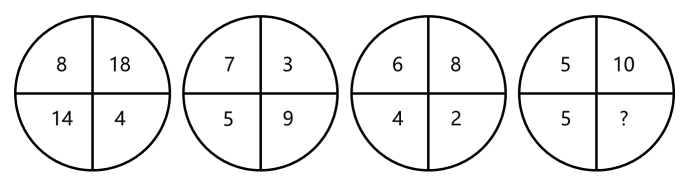

- **A**. 0　✅
- **B**. 1
- **C**. 2
- **D**. 3

**答案**：A

**官方解析**

无中心的图形数阵，优先考虑凑对角线关系。观察发现：

第一个数阵中，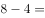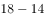；

第二个数阵中，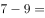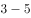；

第三个数阵中，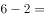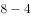；

即规律为：左上角数字右下角数字右上角数字左下角数字。

则第四个数阵中，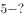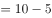，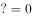。

故正确答案为A。

---

### 第 2 题　qid 2579980 · 数学运算

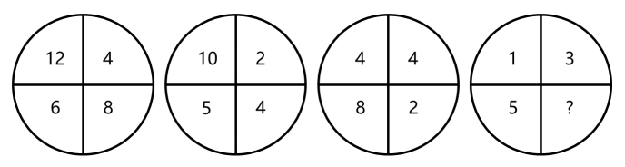

- **A**. 

- **B**. 

- **C**. 
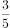
　✅
- **D**. 

**答案**：C

**官方解析**

无中心的图形数阵，优先考虑凑对角线关系。观察发现：

第一个数阵中，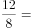；

第二个数阵中，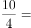；

第三个数阵中，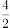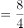；

即规律为：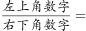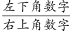。

则第四个数阵中，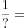，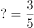。

故正确答案为C。

---

### 第 3 题　qid 2579983 · 数学运算

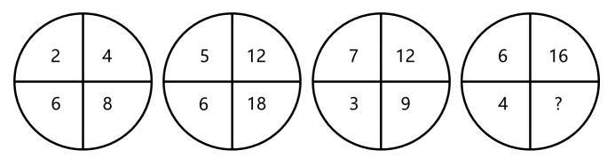

- **A**. 2
- **B**. 4
- **C**. 6
- **D**. 8　✅

**答案**：D

**官方解析**

无中心的图形数阵，对角线方向无明显规律，考虑纵向寻找规律。观察发现：

第一个数阵中，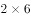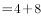；

第二个数阵中，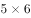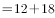；

第三个数阵中，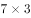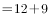；

即规律为：左上角数字左下角数字右上角数字右下角数字。

则第四个数阵中，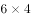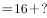，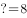。

故正确答案为D。

---

### 第 4 题　qid 2579984 · 数学运算

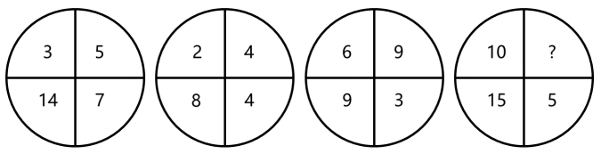

- **A**. 11
- **B**. 12
- **C**. 13　✅
- **D**. 14

**答案**：C

**官方解析**

无中心的图形数阵，对角线方向无明显规律，考虑横向寻找规律。观察发现：

第一个数阵中，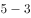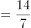；

第二个数阵中，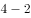；

第三个数阵中，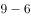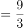；

即规律为：右上角数字左上角数字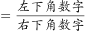。

则第四个数阵中，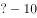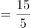，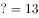。

故正确答案为C。

---

### 第 5 题　qid 2579985 · 数学运算

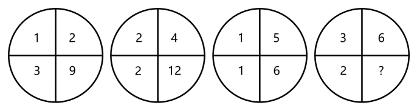

- **A**. 15
- **B**. 18　✅
- **C**. 21
- **D**. 24

**答案**：B

**官方解析**

无中心的图形数阵，对角线方向无明显规律，考虑横向寻找规律。观察发现：

第一个数阵中，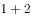；

第二个数阵中，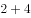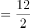；

第三个数阵中，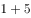；

即规律为：左上角数字右上角数字。

则第四个数阵中，，。

故正确答案为B。

---

### 第 6 题　qid 2579707 · 数学运算

某会务组租了20多辆车将2220名参会者从酒店接到活动现场。大车每次能送50人，小车每次能送36人，所有车辆送2趟，且所有车辆均满员，正好送完，则大车比小车（    ）。

- **A**. 多5辆　✅
- **B**. 多2辆
- **C**. 少2辆
- **D**. 少5辆

**答案**：A

**官方解析**

设大车有辆，小车有辆，根据题意可列式为：，。在②式中，的尾数为0，2220的尾数为0，说明的尾数也为0，必为5的倍数，可能的解为：5、10、15······。代入验证，若，则，为非整数，排除；若，则，此时满足，符合，因此大车比小车多辆。

故正确答案为A。

---

### 第 7 题　qid 2579735 · 数学运算

用边长为0.2m的正三角形地砖铺满一块边长为1m的正六边形地面，需要多少块地砖？

- **A**. 30
- **B**. 60
- **C**. 150　✅
- **D**. 180

**答案**：C

**官方解析**

如图所示，单块正三角形地砖边长为0.2m，则高为m，单块正三角形地砖面积。正六边形地面总面积，则共需要地砖数量正六边形地面总面积单块正三角形地砖面积块。

故正确答案为C。

---

### 第 8 题　qid 2579747 · 数学运算

一套试卷有若干道题，每题答对得10分，答错扣5分，不答扣3分。小郑答对、答错、不答的题目数量依次成等差数列，最后总分为95分，问这套试卷共有多少道题？

- **A**. 15
- **B**. 30
- **C**. 36
- **D**. 45　✅

**答案**：D

**官方解析**

根据答对、答错、不答的题目数量为等差数列，设答错的题目有道，则答对与不答的题目为道、道，其中为等差数列的公差。则总题量为。由题意可列式为，化简可得，正面求解繁琐，可代入选项进行验证。

代入A项，试卷共有15题，则答错的题目有道，，为非整数，不符合题意要求，排除；

代入B项，试卷共有30题，则答错的题目有道，，为非整数，不符合题意要求，排除；

代入C项，试卷共有36题，则答错的题目有道，，为非整数，不符合题意要求，排除；

代入D项，试卷共有45题，则答错的题目有道，，解得，则答对的题目为道，不答的题目为道，总分为分，符合题意。

故正确答案为D。

---

### 第 9 题　qid 2579708 · 数学运算

一辆汽车第一天和第二天的行驶时间之比为3：4，第二天与第三天行驶路程相同，第三天行驶5小时，第一天行驶400千米，三天全程的平均速度为80千米/小时。问第二天的平均速度是多少千米/小时？

- **A**. 70　✅
- **B**. 75
- **C**. 80
- **D**. 85

**答案**：A

**官方解析**

根据题意，设第一天与第二天行驶时间分别为、，设第二天、第三天行驶路程均为。则这三天的路程、时间关系如下表所示：

根据公式：平均速度，可列方程，，解得，则第二天平均速度为千米/小时。

故正确答案为A。

---

### 第 10 题　qid 2579729 · 数学运算

超市销售某种圆珠笔，单盒装的售价10元，5盒装的售价40元，10盒装的售价70元，20盒装的售价120元。现有两家企业来采购这种圆珠笔，甲企业的预算最多正好买92盒，乙企业的预算最多正好买103盒。问，两家企业如果合买最多比分开买多采购多少盒？

- **A**. 3
- **B**. 5　✅
- **C**. 8
- **D**. 10

**答案**：B

**官方解析**

根据题意，各种规格的圆珠笔每盒的售价分别为：单盒装10元、5盒装元、10盒装元、20盒装元。在预算一定的情况下，要使采购数量最多，则尽量优先选择单价低的盒装采购。

甲企业的预算最多正好买92盒，为4个20盒装、1个10盒装、2个1盒装；乙企业的预算最多正好买103盒，为5个20盒装、3个1盒装。合买最多的情况为：分开买10盒装与1盒装的预算全部用于采购20盒装，共元，可买1个20盒装。因此，合买最多比分开买多采购盒，B项当选。

故正确答案为B。

---

### 第 11 题　qid 2579737 · 数学运算

从分别写着1-9数字的9张卡中选出4张并排列为一个四位数，其结果能被75整除的数字：

- **A**. 不到15个
- **B**. 15-20个
- **C**. 21-25个
- **D**. 超过25个　✅

**答案**：D

**官方解析**

四位数能被75整除，因式分解后，即同时是25和3的倍数。

根据整除判定法则，25的倍数看后两位，根据题意，四位数字各不相同，符合条件的有25、75；3的倍数看各位数字之和为3的倍数，当后两位为25时，，则前两位之和只能为5、8、11、14、17，有（1，4）、（1，7）、（3，8）、（4，7）、（6，8）、（8，9）6种组合，数字可以交换顺序，则有个；当后两位为75时，，则前两位之和也是3的倍数，有（1，2）、（1，8）、（2，4）、（3，6）、（3，9）、（4，8）、（6，9）7种组合，数字可以交换顺序，则有个。因此共个。

故正确答案为D。

---

### 第 12 题　qid 2579744 · 数学运算

火车站售票窗口一开始有若干乘客排队购票，且之后每分钟增加排队购票的乘客人数相同。从开始办理购票手续到没有乘客排队，若开放3个窗口，需耗时90分钟，若开放5个窗口，则需耗时45分钟。问如果开放6个窗口，需耗时多少分钟？

- **A**. 36　✅
- **B**. 38
- **C**. 40
- **D**. 42

**答案**：A

**官方解析**

设每个窗口办理购票手续的效率为1人/分钟，每分钟增加排队购票的乘客人数为人。由题意，原有人数，解得，原有人数人。设若开放6个窗口，需耗时分钟，则有：，解得，A项当选。

故正确答案为A。

---

### 第 13 题　qid 2579758 · 数学运算

某公园雇佣一名小丑表演骑独轮车。独轮车车轮直径为50厘米，小丑沿如图所示8字形轨迹骑行。轨迹为相切的两个圆，两个圆面积比是16：9，小圆直径为15米。问小丑沿8字形轨迹骑行一圈，车轮转动了多少圈？

- **A**. 50
- **B**. 60
- **C**. 70　✅
- **D**. 90

**答案**：C

**官方解析**

小丑沿8字形轨迹骑行一圈，所走路程刚好是两个圆的周长，两个圆的面积比是16：9，，则两个圆的周长比4：3，根据圆的周长公式，可得小圆的周长米，大圆的周长米，两个圆的周长和米，独轮车车轮直径为50厘米，则独轮车车轮的周长米，故小丑沿8字形轨迹骑行一圈，车轮转动了圈。

故正确答案为C。

---

### 第 14 题　qid 2579771 · 数学运算

有两排各6个连续的空车位，包含甲车、乙车在内的6辆车随机停入这12个车位中，则以下哪种情况发生的概率最低？

- **A**. 有一排正好停了2辆车
- **B**. 甲车和乙车停在同一排的不相邻车位　✅
- **C**. 甲车停在某一排的中间两个车位之一
- **D**. 甲车和乙车中至少有1辆停在靠边的车位

**答案**：B

**官方解析**

分别计算四个选项的概率：

A项：分步考虑，第一步先选择其中2辆车，为；第二步选择其中一排，停入这2辆车，为；第三步在另外一排停入其他4辆车，为。根据乘法原理，分步相乘，情况数为。

总情况数为：6辆车随机停12个车位的情况数为。

概率；

B项：分步考虑，第一步从两排中先挑一排，为；第二步，要求甲乙不相邻使用插空法，除了甲乙停放的两个车位还剩下四个车位，四个车位有5个空，挑两个空停甲和乙，为；第三步排其他4辆车，剩余10个空车位任选，为。根据乘法原理，分步相乘，情况数为。

总情况数为：6辆车随机停12个车位的情况数为。

概率；

C项：分步考虑，第一步排甲车，中间四个位置任选，为；第二步排其他5辆车，剩余11个空车位任选，为。根据乘法原理，分步相乘，情况数为。

总情况数为：6辆车随机停12个车位的情况数为。

概率；

D项：从反面思考，当甲乙两车停在中间时不符合条件：

分步考虑，第一步先排甲乙两车，8个不靠边车位任选，为；第二步排其他4辆车，剩余10个位置任选，为。根据乘法原理，分步相乘，情况数为。

总情况数为：6辆车随机停12个车位的情况数为。

概率不满足情况概率。

综合以上，概率最低的为B项。

故正确答案为B。

---

### 第 15 题　qid 2579774 · 数学运算

企业对25名应聘者进行面试。已知所有应聘者的能力都不相同，面试采取5人一组的无领导小组讨论形式，每次面试都能对小组内5个人的能力进行排名。问至少要进行多少次面试才能保证选出能力最强的4个人？

- **A**. 7
- **B**. 8　✅
- **C**. 9
- **D**. 10

**答案**：B

**官方解析**

第1-6次无领导小组面试确定成绩表：先把所有人分成5组进行5次无领导小组面试，可以得到5组的组内排名，标记为数字1-5；之后把各组的第一名再并成一组进行第6次无领导小组面试，可以得到每组第一名的组间排名，标记为字母A-E。之后按照分数排名把各组成绩列表如下：

由于A1应聘者既是组内第一也是组间第一可以确定为第一名，并且前四名在表格中的位置必然距离他最近，在表中标记每个位置最高可能名次分别为①、②、③、④。（例如：A2A1，最高可能第二名，标记为②；B2B1A1，最高可能第三名，标记为③；C2C1B1A1，最高可能第四名，标记为④。每个人的最高可能名次其实就是从A1出发的最短格数。）

第7次无领导小组面试确定第二、第三名：把最高名次可能为②和③的A2、A3、B1、B2、C1五人并为一组进行第7次无领导小组面试。之后可能出现两种情况：

（1）A2、B1为组内前两名，则可以确定能力最强的前三名，剩余的三位中最强的为第四名，因为前四名已经产生，无需再验证剩余那四位第四名候选人。

（2）A2、B1中有一人不在组内前两名，也就是A3、B2、C1中产生了组内第二名，也就是总体第三名，拿到了自己能拿到的最高名次，那么表格横列中紧邻第三名的第四名候选人要与组内第三名一起参与到下一轮竞争中（例如组内第一、第二为A2、A3，则无法知道紧邻他的A4是否比组内第三名B1要强，所以要加试。），通过第8次无领导小组面试决定第四名。

因此至少要进行8次无领导小组面试才能保证选出能力最强的4个人。

故正确答案为B。

---

## 判断推理

### 第 1 题　qid 2579743 · 图形推理

从所给的四个选项中，选择最合适的一个填入问号处，使之呈现一定的规律性：

- **A**. A
- **B**. B
- **C**. C　✅
- **D**. D

**答案**：C

**官方解析**

元素组成相同，优先考虑位置规律。观察发现，灰色三角形在最内圈（矩形的六个面）中每次逆时针平移1格，排除A、B两项；对比C、D两项，观察发现五角星位置不同，题干中五角星在外圈（与外框相连的六个面中）每次顺时针移动2格，故？处五角星的位置应该在最下方的三角形中，只有C项符合。
故正确答案为C。

---

### 第 2 题　qid 2579745 · 图形推理

从所给的四个选项中，选择最合适的一个填入问号处，使之呈现一定的规律性：

- **A**. A　✅
- **B**. B
- **C**. C
- **D**. D

**答案**：A

**官方解析**

元素组成相似，优先考虑样式规律。观察可知，题干图形轮廓相同，且内部分割相同，考虑黑白运算，但是发现黑白运算并不存在规律。继续观察发现，前一幅图的黑色区域和后一幅图的白色区域相同，且前一幅图的白色区域与后一幅图的黑色区域相同。左边一组图中，图一顺时针转之后，将黑白颜色互换，得到第二幅图；继续将第二幅图顺时针旋转之后，黑白颜色互换得到第三幅图。将此规律运用到右边一组图中发现，图一顺时针转之后，黑白颜色互换得到第二幅图，满足左边的规律，因此将右边图二再顺时针转且黑白颜色互换之后，得到A项的图形。

故正确答案为A。

---

### 第 3 题　qid 2579750 · 图形推理

从所给的四个选项中，选择最合适的一个填入问号处，使之呈现一定的规律性：

- **A**. A　✅
- **B**. B
- **C**. C
- **D**. D

**答案**：A

**官方解析**

图形元素组成不同，且无明显属性规律，考虑数量规律。题干中图形都是多边形，由多条直线构成，考虑直线数，但整体数直线没有规律，观察发现题干图形出现成对的平行线，故考虑平行线。如下图所示，第一组图中，每幅图均有2组平行线，第二组图前两幅图均有3组平行线，故问号处图形要满足有3组平行线，只有A选项符合。

故正确答案为A。

---

### 第 4 题　qid 2579754 · 图形推理

把下面的六个图形分为两类，使每一组图形都有各自的共同特征或规律。分类正确的一项是：

- **A**. ①②③，④⑤⑥
- **B**. ①②⑥，③④⑤　✅
- **C**. ①②④，③⑤⑥
- **D**. ①④⑥，②③⑤

**答案**：B

**官方解析**

本题为分组分类题目。元素组成不同，无明显属性规律，考虑数量规律。每个图形均由黑圆和白圆构成，且有部分黑白圆被分隔开，因此考虑数部分数。发现图①②⑥白色部分均为两部分，图③④⑤白色部分均为三部分，故①②⑥分为一组，③④⑤分为一组，只有B项符合。
故正确答案为B。

---

### 第 5 题　qid 2579760 · 图形推理

把下面的六个图形分为两类，使每一组图形都有各自的共同特征或规律。分类正确的一项是：

- **A**. ①②③，④⑤⑥
- **B**. ①②⑤，③④⑥
- **C**. ①②④，③⑤⑥
- **D**. ①④⑤，②③⑥　✅

**答案**：D

**官方解析**

本题为分组分类题。元素组成不同，优先考虑属性规律。观察可知，题干中出现了等腰三角形，是轴对称的特征图，优先考虑对称性。图①④⑤一组，有两条对称轴；图②③⑥一组，有一条对称轴，对应D项。
故正确答案为D。

---

### 第 6 题　qid 2579703 · 定义判断

体象障碍是指一个人强迫性地认为自己身体的某些部分有严重的缺陷，并采取特殊的方式来掩盖或“修复”。而这些被感受到的缺陷，通常是想象出来的；即便缺陷确实存在，它的严重性也是被夸大的。
根据上述定义，下列符合体象障碍表现的是：

- **A**. 爱美的小王在拍完证件照后让摄影师为其修图
- **B**. 爱干净的小李每天早上花一小时在卫生间洗漱
- **C**. 外表不突出的小高经常宅在家中，不喜欢参加社交活动
- **D**. 身高170厘米的张女士认为自己身材矮小，每次出门必穿高跟鞋　✅

**答案**：D

**官方解析**

第一步：找出定义关键词。
“强迫性地认为自己身体的某些部分有严重的缺陷”、“采取特殊的方式来掩盖或‘修复’”、“缺陷通常是想象出来的”、“即便缺陷确实存在，它的严重性也是被夸大的”。
第二步：逐一分析选项。
A项：小王因爱美让摄影师修图，不符合“强迫性地认为自己身体的某些部分有严重的缺陷”，不符合定义，排除； 
B项：小李因爱干净花一小时洗漱，不符合“强迫性地认为自己身体的某些部分有严重的缺陷”，不符合定义，排除；
C项：外表不突出的小高宅在家中不参加社交，不符合“强迫性地认为自己身体的某些部分有严重的缺陷”，不符合定义，排除；
D项：身高170厘米的张女士认为自己矮小，符合“强迫性地认为自己身体的某些部分有严重的缺陷”、“缺陷通常是想象出来的”，出门必穿高跟鞋，符合“采取特殊的方式来掩盖或‘修复’”，符合定义，当选。
故正确答案为D。

---

### 第 7 题　qid 2579709 · 定义判断

信息影响法则指的是人们往往会对极为熟悉的、形象生动的、特点鲜明的信息产生积极的心理反应，不仅表现得非常敏感，而且容易印象深刻。
根据上述定义，下列没有反映信息影响法则的是：

- **A**. 小郑在电视中看到某洗发水广告，他觉得葫芦形产品包装很可爱，于是去超市买了这款洗发水
- **B**. 小林最近加班多，觉得颈部不适，同事推荐给他一款配乐颈椎按摩仪，他试用了一下，觉得效果不错　✅
- **C**. 许多小朋友爱看某款动画片，当商场里出现该动画片里相关人物的玩偶时，小朋友们都会特别兴奋
- **D**. 小李在阅读一本推理小说时，发现作者的写法和自己之前看过的小说完全不同，因此他产生了更大的兴趣

**答案**：B

**官方解析**

第一步：找出定义关键词。
“对极为熟悉的、形象生动的、特点鲜明的信息”、“积极的心理反应”、“不仅表现得非常敏感，而且容易印象深刻”。
第二步：逐一分析选项。
A项：小郑觉得葫芦形洗发水产品包装可爱，符合“对极为熟悉的、形象生动的、特点鲜明的信息”“积极的心理反应”，去超市买了洗发水，符合“不仅表现得非常敏感，而且容易印象深刻”，符合定义，排除；
B项：同事推荐给小林一款配乐颈椎按摩仪，不符合“对极为熟悉的、形象生动的、特点鲜明的信息”，不符合定义，当选；
C项：小朋友爱看某款动画片，当商场里出现该动画片里相关人物的玩偶时，符合“对极为熟悉的、形象生动的、特点鲜明的信息”，小朋友们都会特别兴奋，符合“ 积极的心理反应”，也符合“不仅表现得非常敏感，而且容易印象深刻”，符合定义，排除；
D项：小李在阅读一本推理小说时，发现作者的写法和自己之前看过的小说完全不同，符合“对极为熟悉的、形象生动的、特点鲜明的信息”，他产生了更大的兴趣，符合“积极的心理反应”，也符合“不仅表现得非常敏感，而且容易印象深刻”，符合定义，排除。
本题为选非题，故正确答案为B。

---

### 第 8 题　qid 2579712 · 定义判断

市场补缺者战略是指行业中相对弱小的企业，在竞争中为避免与实力强大的企业正面冲突，选择未被满足的细分市场，向细分市场提供专门的产品或服务，以谋求生存与发展的战略。
根据上述定义，下列属于市场补缺者战略的是：

- **A**. 某小型培训机构通过降低学费、免费接送等方法吸引生源
- **B**. 某网商将市场上深受喜爱的卡通形象印制在水杯、优盘上出售，销量很好
- **C**. 某新成立的化妆品公司专门开发生产市场上较为稀缺的适合老年人使用的护肤品　✅
- **D**. 某小型服装生产企业将今年市场上的流行元素融入设计中，生产出物美价廉的女装

**答案**：C

**官方解析**

第一步：找出定义关键词。
“相对弱小的企业”、 “为避免与实力强大的企业正面冲突，选择未被满足的细分市场”、“向细分市场提供专门的产品或服务”。
第二步：逐一分析选项。
A项：小型培训机构，符合“相对弱小的企业”，通过降低学费、免费接送等方法来吸引生源，并没有针对某一细分市场上的生源，不符合“选择未被满足的细分市场”、“向细分市场提供专门的产品或服务”，不符合定义，排除；
B项：某网商将卡通形象印制在水杯、优盘上出售，某网商不确定是否是“相对弱小的企业”，把卡通形象印制在水杯上也不是针对某一细分市场，不符合“选择未被满足的细分市场”、 “向细分市场提供专门的产品或服务”，不符合定义，排除；
C项：新成立的化妆品公司专门生产老年人护肤品，新成立的公司符合“相对弱小的企业”，而且专门开发生产市场上较为稀缺的老年人护肤品，是针对老年人护肤品这个细分市场，也符合“选择未被满足的细分市场”、“向细分市场提供专门的产品或服务”，符合定义，当选；
D项：小型服装生产企业符合“相对弱小的企业”，生产物美价廉的女装，并没有针对某一细分市场上的消费者，不符合“选择未被满足的细分市场”、“向细分市场提供专门的产品或服务”，不符合定义，排除。
故正确答案为C。

---

### 第 9 题　qid 2579718 · 定义判断

单务合同是指一方只享有权利而不尽义务，另一方只尽义务而不享有权利的合同，该合同中，当事人的权利义务不存在对应关系。
根据上述定义，下列属于单务合同的是：

- **A**. 甲因资金周转困难，与乙签订合同，约定将个人名下的一辆越野车抵押给乙，乙一次性出借5万元给甲
- **B**. 甲与乙签订合同，合同约定甲一次性支付乙10万元，乙为甲提供市场调研与营销策略服务，期限为2年
- **C**. 甲与乙准备结婚，甲的父母将名下的一处房产赠予甲，并签订合同，约定该房产仅赠予甲，非夫妻共有财产　✅
- **D**. 甲被公司派至海外工作1年，甲将个人电脑、家庭影院等贵重设备委托乙保管，并签订合同，支付乙1000元保管费

**答案**：C

**官方解析**

第一步：找出定义关键词。
“一方只享有权利而不尽义务”、“另一方只尽义务而不享有权利”。
第二步：逐一分析选项。
A项：甲与乙签订合同，甲有得到5万元借款的权利，也有抵押越野车的义务；乙有出借5万元的义务，也有暂时拥有越野车的权利，不符合“一方只享有权利而不尽义务”，也不符合“另一方只尽义务而不享有权利”，不符合定义，排除；
B项：甲与乙签订合同，甲有支付10万元的义务，也有得到乙服务的权利；乙有得到10万元的权利，也有为甲提供服务的义务，不符合“一方只享有权利而不尽义务”，也不符合“另一方只尽义务而不享有权利”，不符合定义，排除；
C项：甲与甲的父母签订合同，甲只需要收下房产，符合“一方只享有权利而不尽义务”；甲的父母只需提供房产，符合“另一方只尽义务而不享有权利”，符合定义，当选；
D项：甲和乙签订合同，甲有物品得到保管的权利，也有支付1000元保管费的义务；乙有保管物品的义务，也有得到保管费的权利，不符合“一方只享有权利而不尽义务”，也不符合“另一方只尽义务而不享有权利”，不符合定义，排除。
故正确答案为C。

---

### 第 10 题　qid 2579726 · 定义判断

联边是一种为了表达的需要，在特定的语言环境中，连用三个以上的联边字（即偏旁部首相同的字）的修辞方式。运用联边的修辞手法，通过形旁表义，往往具有一定的形象性，看到形旁，人们会对其所表意义产生形象上的联想。
根据上述定义，以下哪项不属于联边？

- **A**. 腾欢今日新天地，澎湃潮流沸海江
- **B**. 但见云暗江心，波涛滚滚，杳无踪影
- **C**. 他一个人叽哩咕噜地说些不满意的话
- **D**. 烟锁池塘柳，桃燃锦江堤，炮镇海城楼　✅

**答案**：D

**官方解析**

第一步：找出定义关键词。
“连用三个以上的联边字（即偏旁部首相同的字）”。
第二步：逐一分析选项。
A项：“澎湃潮流沸海江”中的偏旁部首都是“氵”，符合“连用三个以上的联边字（即偏旁部首相同的字）”，符合定义，排除；  
B项：“波涛滚滚”四个字的偏旁部首都是“氵”，符合“连用三个以上的联边字（即偏旁部首相同的字）”，符合定义，排除；
C项：“叽哩咕噜”中的偏旁部首都是“口”，符合“连用三个以上的联边字（即偏旁部首相同的字）”，符合定义，排除；
D项：句中没有出现“连用三个以上的联边字（即偏旁部首相同的字）”，不符合定义，当选。
本题为选非题，故正确答案为D。

---

### 第 11 题　qid 2579716 · 类比推理

射箭：靶心

- **A**. 购买：卖家
- **B**. 审判：法庭
- **C**. 投标：项目　✅
- **D**. 出发：起点

**答案**：C

**官方解析**

第一步：判断题干词语间逻辑关系。
通过射箭射中靶心，射箭是射中靶心的方式，二者为对应关系。
第二步：判断选项词语间逻辑关系。
A项：购买和卖家无明显逻辑关系，与题干逻辑关系不一致，排除；
B项：在法庭审判，法庭是审判的地点，二者为地点对应关系，与题干逻辑关系不一致，排除；
C项：通过投标投中项目，投标是投中项目的方式，二者为对应关系，与题干逻辑关系一致，当选；
D项：在起点出发，起点是出发的地点，二者为地点对应关系，与题干逻辑关系不一致，排除。
故正确答案为C。

---

### 第 12 题　qid 2579722 · 类比推理

萧条：欣欣向荣

- **A**. 激进：墨守成规
- **B**. 全面：以偏概全　✅
- **C**. 默契：心照不宣
- **D**. 统一：众叛亲离

**答案**：B

**官方解析**

第一步：判断题干词语间逻辑关系。
欣欣向荣形容草木长得茂盛，比喻事业蓬勃发展，与萧条为反义关系。
第二步：判断选项词语间逻辑关系。
A项：墨守成规指思想保守，守着老规矩，强调一成不变，而激进的意思为急于变革和进取，强调的是变革的速度，二者不是反义关系，与题干逻辑关系不一致，排除；
B项：以偏概全指用片面的观点看待整体问题，与全面是反义关系，与题干逻辑关系一致，当选；
C项：心照不宣指彼此心里明白，而不公开说出来，与默契是近义关系，与题干逻辑关系不一致，排除；
D项：众叛亲离意思是不得人心，陷入完全孤立，强调的是个人的孤独，统一指的往往不是个人，二者主体不一致，不是反义关系，与题干逻辑关系不一致，排除。
故正确答案为B。

---

### 第 13 题　qid 2579728 · 类比推理

支援：雪中送炭

- **A**. 了解：洞若观火　✅
- **B**. 打击：祸起萧墙
- **C**. 打扮：天生丽质
- **D**. 配合：锦上添花

**答案**：A

**官方解析**

第一步：判断题干词语间逻辑关系。
雪中送炭是指在下雪天给人送炭取暖，比喻在别人急需时给以物质上或精神上的帮助，与支援是近义关系。
第二步：判断选项词语间逻辑关系。
A项：洞若观火指清楚得就像看火一样 ，形容观察事物非常清楚，与了解是近义关系，与题干逻辑关系一致，当选；
B项：祸起萧墙指祸乱发生在家里，比喻内部发生祸乱或身边的人带来灾祸，该词强调的是祸乱，与打击不是近义关系，与题干逻辑关系不一致，排除；
C项：天生丽质指生来容貌就姣好美丽，该词强调的是容貌，与打扮不是近义关系，与题干逻辑关系不一致，排除；
D项：锦上添花指在锦上面再绣上花，比喻使美好的事物更加美好，与配合不是近义关系，与题干逻辑关系不一致，排除。
故正确答案为A。

---

### 第 14 题　qid 2579734 · 类比推理

无知：教育

- **A**. 落后：与时俱进　✅
- **B**. 保守：解放思想
- **C**. 经济：反腐倡廉
- **D**. 温饱：改革开放

**答案**：A

**官方解析**

第一步：判断题干词语间逻辑关系。
教育可以改变无知，且无知是不好的事情。
第二步：判断选项词语间逻辑关系。
A项：与时俱进可以改变落后，且落后是不好的事情，与题干逻辑关系一致，当选；
B项：解放思想可以改变保守，但保守是中性词，与题干逻辑关系不一致，排除；
C项：反腐倡廉和经济没有必然联系，与题干逻辑关系不一致，排除；
D项：改革开放和温饱没有必然联系，与题干逻辑关系不一致，排除。
故正确答案为A。

---

### 第 15 题　qid 2579741 · 类比推理

保温杯：玻璃杯

- **A**. 望远镜：显微镜
- **B**. 自行车：三轮车
- **C**. 睡裙：真丝裙　✅
- **D**. 白炽灯：LED灯

**答案**：C

**官方解析**

第一步：判断题干词语间逻辑关系。
有的保温杯是玻璃杯，有的保温杯不是玻璃杯，有的玻璃杯是保温杯，有的玻璃杯不是保温杯，故两者之间是交叉关系，同时保温杯是因保温功能而得名，玻璃杯是因为玻璃材质而得名。
第二步：判断选项词语间逻辑关系。
A项：望远镜和显微镜是并列关系，与题干逻辑关系不一致，排除；
B项：自行车通常指二轮的小型陆上车辆，三轮车通常指三个轮子的车辆，二者为并列关系，与题干逻辑关系不一致，排除；
C项：有的睡裙是真丝裙，有的睡裙不是真丝裙，有的真丝裙是睡裙，有的真丝裙不是睡裙，二者是交叉关系，同时睡裙因功能而得名，真丝裙是因真丝材质而得名，与题干逻辑关系一致，当选；
D项：白炽灯与LED灯在发光原理、材料属性上都不同，二者之间无交叉，是并列关系，与题干逻辑关系不一致，排除。
故正确答案为C。

---

### 第 16 题　qid 2579730 · 逻辑判断

一项对准父亲饮食状况对后代影响的追踪研究发现，作为准父亲的男性，如果在有下一代之前，因饮食过量出现了肥胖症，那么他的孩子更容易出现肥胖症，而这一几率与母亲的体重关系不大；而当准父亲饮食匮乏并经历了饥饿的威胁时，那么他的孩子更容易出现心血管疾病。因此，该研究认为：准父亲的饮食状况会影响后代的健康。
以下哪项如果为真，最能支持上述结论？

- **A**. 有不少体重严重超标的孩子，其父亲并没有出现体重超标的情况
- **B**. 父亲的营养状况塑造其传递的生殖细胞的信息，这影响孩子的生理机能　✅
- **C**. 如果孩子的父亲患有心血管疾病，那么这个孩子成年后得该病的几率会大大增加
- **D**. 准父亲如果年龄过大或者有抽烟等不良生活习惯，其孩子出现新生儿缺陷的概率就会增高

**答案**：B

**官方解析**

第一步：找出论点和论据。
论点：准父亲的饮食状况会影响后代的健康。
论据：作为准父亲的男性，如果在有下一代之前，因饮食过量出现了肥胖症，那么他的孩子更容易出现肥胖症，而这一几率与母亲的体重关系不大；而当准父亲饮食匮乏并经历了饥饿的威胁时，那么他的孩子更容易出现心血管疾病。
本题论点和论据都在说准父亲的饮食状况会影响后代的健康，二者话题一致，可以通过补充论据的方式进行加强，即解释原因或举例。
第二步：逐一分析选项。
A项：该项说的是不少体重严重超标的孩子，其父亲没有体重超标，选项未涉及准父亲的饮食状况是否会影响后代的健康，话题不一致，无法加强，排除；
B项：该项说的是父亲的营养状况塑造其传递的生殖细胞的信息，这影响孩子的生理机能，父亲的营养状况与饮食状况有关，孩子的生理机能与健康有关，解释了为什么准父亲的饮食状况会影响后代的健康，补充论据，可以加强，当选；
C项：该项说的是孩子的父亲患有心血管疾病，这个孩子成年后得该病的几率会增加，选项未涉及准父亲的饮食状况是否会影响后代的健康，话题不一致，无法加强，排除；
D项：该项说的是准父亲的年龄过大或者有抽烟等不良生活习惯，会影响其孩子的健康，选项未涉及准父亲的饮食状况是否会影响后代的健康，话题不一致，无法加强，排除。
故正确答案为B。

---

### 第 17 题　qid 2579739 · 逻辑判断

对于设在花园小区内的社区养老机构，多数人认为老人们不仅可以在一起下棋聊天，愉悦身心，还能发挥余热，帮助其他居民。但老王提出反对意见，认为社区养老机构带来噪音污染，影响居民正常生活。
以下哪项如果为真，最能反驳老王的意见？

- **A**. 花园小区处于闹市区，噪音污染一直较重
- **B**. 部分居民对社区养老机构因为不了解而存在误会
- **C**. 老人们开展娱乐活动时的噪音低于日常生活的噪音　✅
- **D**. 未办社区养老机构前，噪音污染也是小区居民反映的主要问题

**答案**：C

**官方解析**

第一步：找出论点和论据。
论点：社区养老机构带来噪音污染，影响居民正常生活。
论据：无。
本题只有论点，没有论据，削弱优先考虑削弱论点，即证明社区养老机构不会带来噪音污染，或者社区养老机构带来的噪音污染不会影响居民正常生活。
第二步：逐一分析选项。
A项：花园小区处于闹市区，噪音污染一直较重，该项只是说明花园小区的噪音污染严重，并未涉及设立社区养老机构对居民的影响，话题不一致，无法削弱，排除；
B项：部分居民对社区养老机构因为不了解而存在误会，而论点是老王对社区养老机构的意见，无法确定部分居民是否包括老王，属于不明确选项，无法削弱，排除；
C项：老人们开展娱乐活动时的噪音低于日常生活的噪音，那说明设立社区养老机构不会带来噪音污染，不会影响居民正常生活，削弱论点，当选；
D项：未办社区养老机构前，噪音污染也是小区居民反映的主要问题，该项只是说明噪音污染是花园小区一直存在的问题，并未涉及设立社区养老机构对居民正常生活的影响，话题不一致，无法削弱，排除。
故正确答案为C。

---

### 第 18 题　qid 2579749 · 逻辑判断

某国一位经济学家指出：“除非该国采取大刀阔斧的举措来根治经济的顽疾，否则经济不可能稳健增长。没有经济稳健增长，公共债务就会不断攀升。”
由此可以推出：

- **A**. 如果公共债务不断攀升，则该国没有采取大刀阔斧的举措来根治经济的顽疾
- **B**. 只有该国不采取大刀阔斧的举措来根治经济的顽疾，公共债务才会不断攀升
- **C**. 如果该国采取大刀阔斧的举措来根治经济的顽疾，则公共债务就不会不断攀升
- **D**. 如果公共债务没有不断攀升，说明该国采取了大刀阔斧的举措来根治经济的顽疾　✅

**答案**：D

**官方解析**

第一步：翻译题干。

①经济稳健增长该国采取大刀阔斧的举措来根治经济的顽疾；

②经济稳健增长公共债务不断攀升。

将②进行逆否：公共债务不断攀升经济稳健增长，①②可串连为③公共债务不断攀升经济稳健增长该国采取大刀阔斧的举措来根治经济的顽疾。

第二步：逐一分析选项。

A项：翻译为公共债务不断攀升该国采取大刀阔斧的举措来根治经济的顽疾，是对③的否前，但否前得不到确定性的结论，无法推出，排除；

B项：翻译为公共债务不断攀升该国采取大刀阔斧的举措来根治经济的顽疾，是对③的否前，但否前得不到确定性的结论，无法推出，排除；

C项：翻译为该国采取大刀阔斧的举措来根治经济的顽疾公共债务不断攀升，是对③的肯后，但肯后得不到确定性的结论，无法推出，排除；

D项：翻译为公共债务不断攀升该国采取大刀阔斧的举措来根治经济的顽疾，是对③的肯前，肯前必肯后，可以推出，当选。

故正确答案为D。

---

### 第 19 题　qid 2579755 · 逻辑判断

研究人员招募了697名想要戒烟的吸烟者，把他们分为两组。第一组“快速戒烟”，即在戒烟当天停止吸烟；第二组“逐步戒烟”，设定一个停止吸烟的日期，在一个月内逐渐减少吸烟数量。一个月后，“快速戒烟”组戒烟成功的比率为，而“逐步戒烟”组则为。因此，研究人员认为“快速戒烟”成功率比“逐步戒烟”高。

以下哪项如果为真，最能支持上述结论？

- **A**. 相对于逐步戒烟，快速戒烟对心脏的损害更小
- **B**. 戒烟半年后，快速戒烟组仍想吸烟的欲望比逐步戒烟组低　✅
- **C**. 快速戒烟组在戒烟过程中承受的精神压力比逐步戒烟组小
- **D**. 快速戒烟组5～15年后发生中风的危险会降到不吸烟者的程度

**答案**：B

**官方解析**

第一步：找出论点和论据。

论点：研究人员认为“快速戒烟”成功率比“逐步戒烟”高。

论据：第一组“快速戒烟”，即在戒烟当天停止吸烟；第二组“逐步戒烟”，设定一个停止吸烟的日期，在一个月内逐渐减少吸烟数量。一个月后，“快速戒烟”组戒烟成功的比率为，而“逐步戒烟”组则为。

本题是通过对比“快速戒烟”组和 “逐步戒烟”组的戒烟成功率，得出“快速戒烟”成功率比“逐步戒烟”高的结论，论点论据话题一致 ，考虑补充论据进行加强。

第二步：逐一分析选项。

A项：该选项说相对于逐步戒烟，快速戒烟对心脏的损害更小，而本题论点在说“快速戒烟”成功率比“逐步戒烟”高，话题不一致，无法加强，排除；

B项：该选项说戒烟半年后，快速戒烟组仍想吸烟的欲望比逐步戒烟组低，补充了一个半年以后的试验结果，说明“快速戒烟”成功率比“逐步戒烟”高，补充论据，可以加强，当选；

C项：该选项说快速戒烟组在戒烟过程中承受的精神压力比逐步戒烟组小，但精神压力大小与戒烟成功率高低的具体关系不明确，属于不明确选项，无法加强，排除；

D项：该选项说快速戒烟组5～15年后发生中风的危险会降到不吸烟者的程度，说明快速戒烟组的好处，与“快速戒烟”和“逐步戒烟”的成功率无关，无法加强，排除。

故正确答案为B。

---

### 第 20 题　qid 2579762 · 逻辑判断

研究发现，人们在社交媒体上花费的时间越长，越容易感到孤独。研究人员招募了1787名19岁至32岁的成年人，让他们完成一份问卷。调查发现，在社交媒体上每天花费时间超过120分钟的人感受到的孤独，大约是那些每天费时少于30分钟的人的两倍。研究人员解释说，这可能是因为人们在社交媒体上花的时间越多，现实世界中与人交流的时间就越少，因此越容易感到孤独。
以下哪项如果为真，最能削弱上述研究结论？

- **A**. 越容易感到孤独的人越喜欢用社交媒体　✅
- **B**. 越喜欢用社交媒体的人，对生活的满意度越低
- **C**. 人们越来越喜欢通过社交媒体来了解其他人的生活
- **D**. 人们喜欢在社交媒体上发布积极经历，容易使接收此类信息的人心态失衡

**答案**：A

**官方解析**

第一步：找出论点和论据。
论点：人们在社交媒体上花费时间越长，越容易感到孤独。
论据：研究人员招募了1787名19岁至32岁的成年人，让他们完成一份问卷。调查发现，在社交媒体上每天花费时间超过120分钟的人感受到的孤独，大约是那些每天费时少于30分钟的人的两倍。
论点说的是社交媒体上花费时间长与孤独感之间的关系，论据说的也是社交媒体上花费时间长与孤独感之间的关系，论点论据话题一致，论点有因果关系，可优先考虑因果倒置和他因削弱。
第二步：逐一分析选项。
A项：该项讨论的是越容易感到孤独的人越喜欢用社交媒体，而论点讨论的是人们在社交媒体上花费时间越长越容易感到孤独，属于因果倒置，可以削弱，当选；
B项：该项讨论的是越喜欢用社交媒体的人，对生活的满意度越低，论点讨论的是人们在社交媒体上花费时间越长越容易感到孤独，话题不一致，无法削弱，排除；
C项：该项讨论的是人们喜欢用社交媒体来了解其他人的生活，论点讨论的是人们在社交媒体上花费时间越长越容易感到孤独，话题不一致，无法削弱，排除；
D项：该项讨论的是在社交媒体上接收积极经历信息的人容易心态失衡，但心态失衡是否会使人容易感到孤独并没有说明，与论点话题不一致，排除。
故正确答案为A。

---

### 第 21 题　qid 2579777 · 逻辑判断

一般消毒用的酒精浓度为～，此浓度的酒精渗透性最好，杀毒效果也最好，浓度更高的话，反而达不到消毒作用。因此，酒精浓度越高，消毒效果不一定越好。

以下哪项如果为真，最能支持上述结论？

- **A**. 
即使浓度低于，酒精也可以杀灭一部分病毒和细菌

- **B**. 
酒精通过渗透进入病原体并破坏其完整性，以达到杀毒效果

- **C**. 
高浓度的酒精会刺激皮肤，吸收表皮大量的水分，造成皮肤脱水

- **D**. 
浓度为的酒精可在病毒表面形成一层防止酒精渗透的保护壳
　✅

**答案**：D

**官方解析**

第一步：找出论点和论据。

论点：酒精浓度越高，消毒效果不一定越好。

论据：一般消毒用的酒精浓度为～，此浓度的酒精渗透性最好，杀毒效果也最好，浓度更高的话，反而达不到消毒作用。

本题论点说的是酒精浓度越高，消毒效果不一定越好，论据说～的酒精杀毒效果最好，浓度更高达不到消毒效果，论点论据话题一致，优先考虑补充论据，说明酒精浓度越高，消毒效果不一定越好。

第二步：逐一分析选项。

A项：即使浓度低于，酒精也可以杀灭一部分病毒和细菌，说明浓度较低的酒精也有杀菌效果，但题干论点在说酒精浓度越高，消毒效果不一定越好，与论点话题不一致，无法加强，排除；

B项：酒精通过渗透进入病原体并破坏其完整性，以达到杀毒效果，是对酒精的杀菌原理进行的阐述，与论点话题不一致，无法加强，排除；

C项：高浓度的酒精会刺激皮肤，吸收表皮大量的水分，造成皮肤脱水，是对高浓度酒精的坏处进行的阐述，与论点话题不一致，无法加强，排除；

D项：浓度为的酒精可在病毒表面形成一层防止酒精渗透的保护壳，说明的酒精高浓度反而起不到杀灭病毒的作用，可以进一步证明酒精浓度越高，消毒效果不一定越好，补充论据，可以加强，当选。

故正确答案为D。

---

### 第 22 题　qid 2579780 · 逻辑判断

国外某大学的团队研究了102种不同的毒蛇，调查了这些蛇的毒液、食物以及栖息地状况，发现生活在树上或水中这样三维环境中的蛇，毒性低于二维环境中（即地面）的蛇。研究人员推测，这是因为生活在三维环境中的蛇能遇到更多东西，所以遇到猎物的频率也更高，不需要毒性很强的毒液来确保每次捕猎都能成功。
以下哪项如果为真，最能质疑研究人员的推测？

- **A**. 不同的毒蛇分泌的毒液，毒性差别很大
- **B**. 三维环境中的动物比二维环境中的更为灵活，更难捕捉
- **C**. 同一种毒蛇在不同季节分泌的毒液，毒性成分并不完全相同
- **D**. 树上或水中遇到的猎物比地面上的小很多，蛇需要捕食更多才能果腹　✅

**答案**：D

**官方解析**

第一步：找出论点和论据。
论点：因为生活在三维环境中的蛇能遇到更多东西，所以不需要毒性很强的毒液。
论据：无。
本题只有论点，优先考虑削弱论点，比如：即使三维环境中的蛇能遇到更多猎物，也需要强毒液。
第二步：逐一分析选项。
A项：题干讨论的是不同环境的毒蛇毒性差距大的原因，该选项只是客观陈述不同的毒蛇毒性不同，讨论的话题不一致，无法削弱，排除；
B项：三维环境中的动物比二维环境中的更为灵活，更难捕捉，首先其中的“动物”指代的是“蛇”还是“蛇的猎物”不明确；其次，即使是猎物更难捕捉，难捕捉是否能推出一定需要强毒液，也不明确，保留；
C项：题干讨论的是不同环境的毒蛇毒性差距大的原因，该选项讨论的是同一种毒蛇不同季节的情况，讨论的话题不一致，无法削弱，排除；
D项：树上或水中（即三维环境）遇到的猎物比地面的小很多，蛇需要捕食更多才能果腹，说明即使遇到猎物频率高，但由于需要的量大，三维环境的蛇还是可能需要很强的毒性，保留； 
对比BD项，B项的“更难捕捉”和D项的“需要捕食更多才能果腹”都不能直接推出“一定需要强毒液”，都只是“可能需要强毒液”，但是D项的主体比B项更明确，更能与题干“三维环境的蛇及其猎物”对应上，择优选择D项。
故正确答案为D。

---

### 第 23 题　qid 2579783 · 逻辑判断

荷兰研究人员培育出了一种人造牛肉。从牛的肌肉组织中分离出干细胞，放入营养液中，促进细胞生长和繁衍，进而合成“牛肉”。有媒体据此认为，这种人造牛肉将会在未来取代真正的牛肉，人类可以停止对肉牛乃至其他牲畜的养殖。
以下哪项如果为真，最能质疑该媒体的观点？

- **A**. 目前人造牛肉的制造成本极高，无法大规模生产
- **B**. 很多人在品尝人造牛肉后认为其口感比真牛肉差
- **C**. 推广人造牛肉有助于人类应对未来的肉类紧缺问题
- **D**. 制备人造牛肉的干细胞需要从健康的圈养牛身上获取　✅

**答案**：D

**官方解析**

第一步：找出论点和论据。
论点：这种人造牛肉将会在未来取代真正的牛肉，人类可以停止对肉牛乃至其他牲畜的养殖。
论据：从牛的肌肉组织中分离出干细胞，放入营养液中，促进细胞生长和繁衍，进而合成“牛肉”。
题干论点论据话题一致，优先考虑削弱论点。削弱论点的时候既可以否定前半句，说人造牛肉不会取代牛肉，也可以否定后半句，说人类无法停止牲畜养殖。
第二步：逐一分析选项。
A项：选项讨论的是目前人造牛肉的制作成本，而论点讨论的是未来人造牛肉将取代真牛肉和人类停止牲畜养殖，二者讨论的话题不同，无法削弱，排除；
B项：选项讨论的是人造牛肉的口感，而论点讨论的是未来人造牛肉将取代真牛肉和人类停止牲畜养殖，二者讨论的话题不同，无法削弱，排除；
C项：选项讨论的是人造牛肉的作用，而论点讨论的是未来人造牛肉将取代真牛肉和人类停止牲畜养殖，二者讨论的话题不同，无法削弱，排除；
D项：指出制作人造牛肉离不开圈养牛，即人类不能停止对肉牛乃至其他牲畜的养殖，直接否定论点，可以削弱，当选。
故正确答案为D。

---

### 第 24 题　qid 2579784 · 逻辑判断

很多人认为大飞机比小飞机更安全，更愿意选择乘坐大飞机，因为大飞机飞得很平稳，而小飞机常常会有颠簸。
以下哪项如果为真，最能支持上述论证？

- **A**. 飞机颠簸的原因是气流的扰动，气流扰动不会影响飞机安全
- **B**. 某航空公司统计显示，小飞机的准点率低于大飞机的准点率
- **C**. 飞机在对流层飞行时颠簸最剧烈，小飞机主要在对流层飞行　✅
- **D**. 飞机的安全性主要取决于设备的可靠性，与飞机的大小无关

**答案**：C

**官方解析**

第一步：找出论点和论据。
论点：很多人认为大飞机比小飞机更安全。
论据：大飞机飞得很平稳，而小飞机常常会有颠簸。
本题论点说的是飞机大小与安全性之间的关系，论据说的是飞机大小与是否颠簸之间的关系，二者话题不一致，加强可考虑搭桥，即证明颠簸与安全之间有关系，也可以补充论据。
第二步：逐一分析选项。
A项：指出引起颠簸的真正原因，拆断颠簸与安全之间的联系，为拆桥项，排除；
B项：说明的是准点率问题，与安全与否无关，无法加强，排除；
C项：指出小飞机颠簸剧烈的原因，证明确实小飞机常常会有颠簸，补充论据，当选；
D项：指出安全与设备之间有关系，和飞机大小无关，否定论点，排除。
故正确答案为C。

---

### 第 25 题　qid 2579787 · 逻辑判断

为登上月球，有科学家开始进行“月球导航”的验证，他们表示目前地球轨道上的GPS卫星发射的信号，在月球上可以接收使用，定位精度能达到200米至300米。有研究人员认为，月球导航很快即可实现。
以下哪项如果为真，最能质疑上述结论？

- **A**. 目前的探月活动中，各国主要采用的是基于地面的测控进行导航定位
- **B**. 月球航天器可通过在一段时间内收到几颗卫星在某个弧段发来的数据，最终计算出自己的轨道
- **C**. 月球导航最直接有效的途径是各国合力在近月空间建设具备定位、授时功能的时空基准，打造一套“月球导航卫星系统”
- **D**. 月球航天器要具备远距离信号接收能力，就需要大天线，而从航天器研制、发射角度来说，天线越小越好，这对矛盾暂时无法破解　✅

**答案**：D

**官方解析**

第一步：找出论点和论据。
论点：月球导航很快即可实现。
论据：目前地球轨道上的GPS卫星发射的信号，在月球上可以接收使用，定位精度能达到200米至300米。
本题的论点和论据话题一致，优先考虑削弱论点，即说明月球导航不会很快实现。
第二步：逐一分析选项。
A项：目前的探月活动中，各国采用的导航方式，并没有说明月球导航不会很快实现，无关选项，排除；
B项：月球航天器可计算出自己的轨道，并没有说明月球导航不会很快实现，无关选项，排除；
C项：选项说明月球导航最有效的途径是什么，并没有说明月球导航不会很快实现，无关选项，排除；
D项：选项说明月球航天器要具备接受信号接受能力所需要的大天线，而从航天研制等角度无法实现大天线，说明了月球航天器无法具备远距离信号接受能力，故月球导航不会很快实现，削弱论点，当选。
故正确答案为D。

---

## 资料分析

### 材料 1

        2017年1-4月，T地区批发和零售业商品销售总额为15220亿元，同比增长，其中，限额以上商品销售额达到11107亿元，同比增长；4月份，T地区批发和零售业商品销售总额和限额以上商品销售额分别为3339亿元和2554亿元。

#### 第 1 题　qid 2579778 · 综合

2017年一季度，T地区月均批发和零售业商品销售额约为多少亿元？

- **A**. 2851
- **B**. 3960　✅
- **C**. 4591
- **D**. 11881

**答案**：B

**官方解析**

根据题干“2017年一季度，T地区月均······约为多少亿元”，结合材料时间为2017年1-4月及4月，可判定本题为现期平均数计算问题。定位文字材料可得，2017年1-4月，T地区批发和零售业商品销售总额为15220亿元，4月份，T地区批发和零售业商品销售总额为3339亿元。则2017年一季度，T地区月均批发和零售业商品销售额约为亿元。

故正确答案为B。

---

#### 第 2 题　qid 2579779 · 增长

2017年4月，T地区限额以上商品批发业销售额同比增速约比当年一季度：

- **A**. 高0.5个百分点
- **B**. 低0.1个百分点
- **C**. 低0.4个百分点
- **D**. 低0.9个百分点　✅

**答案**：D

**官方解析**

根据题干“2017年4月，······同比增速约比······”，结合选项为高低百分点，材料给出2017年1-3月及1-4月具体销售额与同比增速，可判定本题为混合增长率问题。定位表格可得，2017年1-3月T地区限额以上商品批发业销售额为7913亿元，同比增速为，1-4月份销售额为10251亿元，同比增速为。根据“混合居中不正中”可知，2017年4月份其同比增速应小于，可排除A、B项。现期量近似代替基期量比较大小，2017年4月份销售额为亿元亿元，可知其2017年1-4月份的同比增速更接近于2017年1-3月份的同比增速，即2017年4月份同比增速与的距离应大于个百分点，则2017年4月份其同比增速应小于。因此2017年4月，T地区限额以上商品批发业销售额同比增速约比当年一季度低个百分点以上，只有D项符合。

故正确答案为D。

---

#### 第 3 题　qid 2579782 · 增长

2017年1-4月，不同所有制企业限额以上商品销售额同比增量由小到大排序正确的是：

- **A**. 国有企业、外商及港澳台商企业、民营企业　✅
- **B**. 外商及港澳台商企业、国有企业、民营企业
- **C**. 国有企业、民营企业、外商及港澳台商企业
- **D**. 外商及港澳台商企业、民营企业、国有企业

**答案**：A

**官方解析**

根据题干“2017年1-4月······同比增量由小到大排序······”，结合材料时间为2017年，可判定本题为增长量比较问题。定位表格材料可得：2017年1-4月国有企业限额以上商品销售额为4964亿元，同比增长率为；民营企业限额以上商品销售额为5333亿元，同比增长率为；外商及港澳台商企业限额以上商品销售额为810亿元，同比增长率为。国有企业限额以上商品销售额的增长量亿元；民营企业限额以上商品销售额的增长量亿元；外商及港澳台商企业限额以上商品销售额的增长量亿元。则2017年1-4月，不同所有制企业限额以上商品销售额同比增量由小到大排序为：国有企业、外商及港澳台商企业、民营企业。

故正确答案为A。

---

#### 第 4 题　qid 2579789 · 比重

以下哪个饼图最符合2017年4月T地区限额以上商品销售额中不同规模的企业销售额占比关系？

- **A**. 

　✅
- **B**. 

- **C**. 

- **D**. 

**答案**：A

**官方解析**

根据题干“······2017年4月······占比关系”，结合材料时间为2017年，可判定本题为现期比重问题。定位表格材料可得：

2017年1-4月大型企业限额以上商品销售额为1811亿元，1-3月其限额以上商品销售额为1381亿元，可知2017年4月份大型企业限额以上商品销售额为亿元；

2017年1-4月中型企业限额以上商品销售额为4498亿元，1-3月其限额以上商品销售额为3533亿元，可知2017年4月份中型企业限额以上商品销售额为亿元；

2017年1-4月小微型企业限额以上商品销售额为4798亿元，1-3月其限额以上商品销售额为3639亿元，可知2017年4月份小微型企业限额以上商品销售额为亿元。

可知2017年4月T地区限额以上商品销售额中：小微型企业中型企业大型企业，排除B、C两项，又因为小微型企业和中型企业明显比大型企业大，排除D项。

故正确答案为A。

---

#### 第 5 题　qid 2579790 · 综合

关于2017年T地区限额以上商品销售额，能够从资料中推出的是：

- **A**. 4月批发业及零售业销售额均低于一季度月均数值
- **B**. 一季度，外商及港澳台商企业销售额同比增长100亿元以上
- **C**. 一季度，小微型企业销售额同比增量超过大型企业和中型企业之和　✅
- **D**. 1-4月，限额以上商品销售额占批发和零售业商品销售总额的比重较上年同期有所提升

**答案**：C

**官方解析**

（以下解析中的描述均省略了T地区限额以上商品这个前提。）

A项：定位表格材料，2017年1-4月批发业销售额为10251亿元，1-3月销售额为7913亿元，则4月份销售额为亿元，一季度月均亿元，4月份销售额低于一季度月均数值；2017年1-4月零售业销售额为856亿元，1-3月销售额为640亿元，则4月份销售额为亿元，一季度月均亿元，4月份销售额高于一季度月均数值，错误；

B项：定位表格材料，2017年1-3月外商及港澳台商企业销售额为614亿元，同比增长率为，则2017年一季度，外商及港澳台商企业销售额同比增长量亿元亿元，错误；

C项：定位表格材料，2017年1-3月小微型企业销售额为3639亿元，同比增长率为，所以小微型企业销售额同比增长量亿元；2017年1-3月中型企业销售额为3533亿元，同比增长率为，所以中型企业销售额同比增长量亿元；2017年1-3月大型企业销售额为1381亿元，同比增长率为，所以大型企业销售额同比增长量亿元；故大、中型企业同比增长量之和为亿元小微型企业销售额同比增长量485.2亿元，即小微型企业销售额同比增量超过大型企业和中型企业之和，正确；

D项：定位文字材料，2017年1-4月，T地区批发和零售业商品销售总额为15220亿元，同比增长，其中，限额以上商品销售额达到11107亿元，同比增长。则，，，根据两期比重比较结论，比重较上年同期有所下降，错误。

故正确答案为C。

---

### 材料 2

        2017年，全球对清洁能源的投资为3335亿美元，同比增长，但仍低于2015年的历史峰值3485亿美元。中国的清洁能源投资占全球清洁能源总投资的，占亚太地区清洁能源投资的。

        从主要清洁能源类型看，2017年全球对风能的投资为1070亿美元，风电新增装机容量52.5GW，同比下降；累计装机容量达到539.1GW，同比增长。2017年全球对光伏的投资为1608亿美元，同比增长；光伏新增装机容量99.1GW，同比增长；累计装机容量达到404.5GW。其中，亚太地区新增装机容量73.7GW，累计装机容量221.3GW。（累计装机容量不含报废机器的装机容量）

#### 第 6 题　qid 2579803 · 综合

2017年，亚太地区的清洁能源投资约为多少亿美元？

- **A**. 1034
- **B**. 1334
- **C**. 1879　✅
- **D**. 2368

**答案**：C

**官方解析**

根据题干“2017年，亚太地区的清洁能源投资约为······”，结合材料中给出2017年中国的清洁能源投资占全球及亚太地区清洁能源投资的比重，可判定本题为现期比重问题。定位文字材料第一段可得：2017年，全球对清洁能源的投资为3335亿美元，中国的清洁能源投资占全球清洁能源总投资的，占亚太地区清洁能源投资的。根据比重公式：比重，则中国的清洁能源投资亿美元，亚太地区的清洁能源投资亿美元，与C项最接近，C项当选。

故正确答案为C。

---

#### 第 7 题　qid 2579806 · 增长

2009-2017年，风电与光伏累计装机容量总计同比增加100GW以上的年份有几个？

- **A**. 2
- **B**. 3　✅
- **C**. 4
- **D**. 5

**答案**：B

**官方解析**

根据题干“······同比增加100GW以上······”，可判定本题为增长量计算问题。定位柱状图，可得2008年-2017年风电与光伏累计装机容量。根据增长量，则风电与光伏累计装机容量总计同比增加100GW以上的年份有2015年：GW；2016年：GW；2017年：GW，共3个年份。

故正确答案为B。

---

#### 第 8 题　qid 2579807 · 比重

2017年，亚太地区光伏新增装机容量占全球比重比其累计装机容量占全球比重：

- **A**. 低10个百分点以内
- **B**. 低10个百分点以上
- **C**. 高10个百分点以内
- **D**. 高10个百分点以上　✅

**答案**：D

**官方解析**

根据题干“2017年，······占······比重”，并且问题时间和材料一致，可判定本题为现期比重问题。定位文字材料第二段可得：2017年全球光伏新增装机容量99.1GW，累计装机容量达到404.5GW，亚太地区新增装机容量73.7GW，累计装机容量221.3GW。故亚太地区光伏新增装机容量占全球比重，亚太地区光伏累计装机容量占全球比重。，所以2017年亚太地区光伏新增装机容量占全球比重比其累计装机容量占全球比重高10个百分点以上，D项当选。

故正确答案为D。

---

#### 第 9 题　qid 2579811 · 增长

以下哪个折线图最符合2009-2012年全球光伏累计装机容量同比增速的变化趋势？

- **A**. 

　✅
- **B**. 

- **C**. 

- **D**. 

**答案**：A

**官方解析**

根据题干“同比增速的变化趋势”，可判定本题为一般增长率问题。定位柱状图可得：2008-2012年全球光伏累计装机容量分别为：15.8、23.2、40.3、70.5、100.5。根据增长率，可得2009-2012年全球光伏累计装机容量同比增速分别为：、、、。所以2010年和2011年两年增速对应的第二个点和第三个点是折线图中最高的两个点，只有A项满足，A项当选。

故正确答案为A。

---

#### 第 10 题　qid 2579813 · 综合

根据资料，下列可以推出的是：

- **A**. 2017年全球对风能投资的同比增速
- **B**. 2016年全球对清洁能源投资的同比增速　✅
- **C**. 2017年亚太地区对光伏投资的同比增量
- **D**. 2008年全球风电累计装机容量的同比增速

**答案**：B

**官方解析**

A项：定位文字材料第二段可得：2017年全球对风能的投资为1070亿美元，风电新增装机容量52.5GW，同比下降。只有全球对风能投资的现期量，无法计算增长率，错误；

B项：定位文字材料第一段可得：2017年，全球对清洁能源的投资为3335亿美元，同比增长，但仍低于2015年的历史峰值3485亿美元。故2016年全球对清洁能源投资亿美元。则2016年全球对清洁能源投资的同比增速，可以推出，正确；

C项：定位文字材料第二段可得：2017年全球对光伏的投资为1608亿美元，同比增长。材料只给出全球对光伏的投资，并未给出亚太地区对光伏投资的相应数据，无法计算增长量，错误；

D项：定位柱状图可得：2008年全球风电累计装机容量为120.7GW，并未给出2007年的数据或同比增量，故无法计算2008年的增长率，错误。

故正确答案为B。

---

### 材料 3

        2018年，从险种来看，财产险业务原保险保费收入10770.08亿元，同比增长；人身险原保险保费收入27246.54亿元，其中寿险业务原保险保费收入20722.86亿元，同比下降；健康险业务原保险保费收入5448.13亿元，同比增长；意外险业务原保险保费收入1075.55亿元，同比增长。从保费收入结构来看，人身险、财产险的保费占比与上年相比趋于稳定。

#### 第 11 题　qid 2579797 · 增长

与2011年相比，2018年中国保险行业原保险保费收入约增长了：

- **A**. 

- **B**. 

　✅
- **C**. 

- **D**. 

**答案**：B

**官方解析**

根据题干“与2011年相比，2018年······约增长了”，结合选项为百分数，可判定本题为一般增长率问题。定位柱状图1可得，2018年我国保险行业原保险保费收入为3.80万亿元，2011年为1.43万亿元。根据公式“”，则所求增长率，B项满足。

故正确答案为B。

---

#### 第 12 题　qid 2579798 · 增长

2014～2017年，中国保险行业原保险保费收入同比增速最高的年份是：

- **A**. 2014年
- **B**. 2015年
- **C**. 2016年　✅
- **D**. 2017年

**答案**：C

**官方解析**

根据题干“2014～2017年，······同比增速最高的年份是”，可判定本题为一般增长率的比较问题。定位柱状图1，结合公式“”，可得我国保险行业原保险保费收入各年的增长率分别为：

2014年：；

2015年：；

2016年：；

2017年：；

对比可得，2016年的同比增速最高。

故正确答案为C。

---

#### 第 13 题　qid 2579800 · 增长

2018年，下列险种中，原保险保费收入同比增长额最大的是：

- **A**. 财产险业务
- **B**. 寿险业务
- **C**. 意外险业务
- **D**. 健康险业务　✅

**答案**：D

**官方解析**

根据题干“······收入同比增长额最大的是”，可判定本题为增长量比较问题。定位文字材料可知，2018年寿险业务原保险保费收入20722.86亿元，同比下降，收入下降，排除B项。

2018年意外险业务原保险保费收入1075.55亿元，同比增长，2018年健康险业务原保险保费收入5448.13亿元，同比增长。根据增长量比较结论“现期量大，增长率大，则增长额大”可得，健康险业务原保险保费收入增长额意外险业务原保险保费收入增长额，排除C项。

根据公式“”，可得2018年财产险业务原保险保费收入增长额亿元；

2018年健康险业务原保险保费收入增长额亿元；

故原保险保费收入增长额最大的为健康险业务，对应D项。

故正确答案为D。

---

#### 第 14 题　qid 2579802 · 综合

2011-2018年，人身险原保险保费收入高于财产险1万亿元以上的年份有几个？

- **A**. 1
- **B**. 2
- **C**. 3　✅
- **D**. 4

**答案**：C

**官方解析**

根据题干“2011-2018年，人身险原保险保费收入高于财产险1万亿元以上的年份有几个”，结合材料所给2011年-2018年中国保险行业原保险保费收入及人身险、财产险原保险保费收入占比，判定本题为现期比重问题。定位两个柱状图，根据公式：，可知：所求差值。

2011年差值万亿元；

2012年差值万亿元；

2013年差值万亿元；

2014年差值万亿元；

2015年差值万亿元；

2016年差值万亿元。

又因2017年、2018年原保险保费收入均大于2016年（3.09万亿元），比重差不小于2016年比重差（），则2017年、2018年差值均大于2016年差值（1.36万亿元），故人身险原保险保费收入高于财产险1万亿元以上的年份有2016年、2017年、2018年，对应C项。

故正确答案为C。

---

#### 第 15 题　qid 2579809 · 综合

根据资料，下列可以推出的是：

- **A**. 
2018年，人身险原保险保费收入同比增速超过
　✅
- **B**. 
2011～2018年，财产险业务原保险保费收入均不超过1万亿元

- **C**. 
2018年，意外险业务原保险保费收入比上年增长了200多亿元

- **D**. 
2011～2018年，中国保险行业原保险保费收入总计超过20万亿元

**答案**：A

**官方解析**

A项：定位柱状图可知，2017年中国保险行业原保险保费收入为3.66万亿元，人身险占比为，根据公式“部分=整体×比重”可得，2017年人身险原保险保费收入万亿元；定位文字材料部分可知，2018年人身险原保险保费收入为27246.54亿元，即约为2.72万亿元，根据公式，所求，正确；

B项：定位柱状图可知，2011～2018年中国保险行业原保险保费收入及财产险占比，根据公式“部分=整体×比重”可得，2018年财产险业务原保险保费收入万亿元万亿元，错误；

C项：定位文字材料可知，2018年，意外险业务原保险保费收入1075.55亿元，同比增长，则2018年意外险业务原保险保费收入比上年增长的量亿元，并非增长200多亿元，错误；

D项：定位柱状图可知，2011～2018年中国保险行业原保险保费收入，则收入总计万亿元万亿元，错误。

故正确答案为A。

---
