# 2020年深圳市考公务员录用考试《行测1》试题（网友回忆版）

> 省考 · 2020 年 · 6 个模块 · 共 97 题

- [政治理论](#%E6%94%BF%E6%B2%BB%E7%90%86%E8%AE%BA) · 3 题
- [常识判断](#%E5%B8%B8%E8%AF%86%E5%88%A4%E6%96%AD) · 16 题
- [言语理解与表达](#%E8%A8%80%E8%AF%AD%E7%90%86%E8%A7%A3%E4%B8%8E%E8%A1%A8%E8%BE%BE) · 30 题
- [数量关系](#%E6%95%B0%E9%87%8F%E5%85%B3%E7%B3%BB) · 13 题
- [判断推理](#%E5%88%A4%E6%96%AD%E6%8E%A8%E7%90%86) · 20 题
- [资料分析](#%E8%B5%84%E6%96%99%E5%88%86%E6%9E%90) · 15 题

---

## 政治理论

### 第 1 题　qid 2730977 · 新思想

在“不忘初心、牢记使命”主题教育总结大会上，习近平总书记深刻阐释理论学习的重大意义，明确提出“要把学习贯彻（    ）作为思想武装的重中之重”。为我们高举思想旗帜、强化理论武装，夺取新时代中国特色社会主义伟大胜利，提供了重要认识论和方法论。

- **A**. 马克思主义基本原理
- **B**. 党的创新理论　✅
- **C**. 党的基本理论
- **D**. 党的初心使命

**答案**：B

**官方解析**

本题考查政治常识。
在“不忘初心、牢记使命”主题教育总结大会上，习近平总书记深刻阐释理论学习的重大意义，明确提出“把学习贯彻党的创新理论作为思想武装的重中之重”，为我们高举思想旗帜、强化理论武装，夺取新时代中国特色社会主义伟大胜利，提供了重要认识论和方法论。
故正确答案为B。

---

### 第 2 题　qid 2730541 · 新思想

根据《深圳建设中国特色社会主义先行示范区综合改革试点实施方案（2020-2025年）》，中央支持更高水平深港合作，增强在粤港澳大湾区建设中的（    ）功能，努力创建社会主义现代化强国的城市范例。

- **A**. 聚合辐射
- **B**. 桥梁纽带
- **C**. 头雁领航
- **D**. 核心引擎　✅

**答案**：D

**官方解析**

本题考查政治常识。
2020年10月，中共中央办公厅、国务院办公厅印发了《深圳建设中国特色社会主义先行示范区综合改革试点实施方案（2020－2025年）》。方案中指出：“按照党中央、国务院决策部署，牢牢把握正确改革方向，围绕中国特色社会主义先行示范区的战略定位和战略目标，赋予深圳在重点领域和关键环节改革上更多自主权，支持深圳在更高起点、更高层次、更高目标上推进改革开放，率先完善各方面制度，构建高质量发展体制机制，推进治理体系和治理能力现代化，加快形成全面深化改革、全面扩大开放新格局，推动更高水平深港合作，增强在粤港澳大湾区建设中的核心引擎功能，努力创建社会主义现代化强国的城市范例。”
故正确答案为D。

---

### 第 3 题　qid 2730549 · 新思想

《中国共产党章程》规定，在特殊情况下可以直接接收党员。新冠肺炎“战疫”中，许多表现突出的医务人员、公安民警、社区工作者、基层干部群众等纷纷“火线入党”。关于在抢险救灾、抗击疫情等重大任务第一线发展党员，下列说法错误的是：

- **A**. 应当进行入党宣誓
- **B**. 在一线递交入党申请书或向党组织提出入党申请的，可及时吸收其为预备党员
- **C**. 已确定为入党积极分子的，可及时吸收其为预备党员
- **D**. 已确定为发展对象的，可及时吸收其为正式党员　✅

**答案**：D

**官方解析**

本题考查政治常识。
2020年2月23日，中共中央组织部发布《关于抓紧做好在新冠肺炎疫情防控第一线发展党员工作的通知》（以下简称《通知》）。
A项正确，《通知》中指出，抗疫一线基层党组织要采取适当方式，组织新发展的预备党员进行入党宣誓。
B项正确，《通知》中指出，对上一线前以及在抗疫一线递交入党申请书或向党组织提出入党申请，本人一贯表现好、符合党员条件、在抗疫一线表现特别突出的，经党支部研究同意，报上级党委批准，可以吸收其为预备党员。
C项正确，《通知》中指出，对奋战在抗疫一线的医务人员、基层干部群众、公安民警、社区工作者等，已确定为入党积极分子或发展对象，本人一贯表现好、符合党员条件，但培养考察期未满一年，在抗疫一线事迹突出的，经党支部研究同意，报上级党委批准，可及时吸收其为预备党员。
D项错误，根据《通知》内容，已确定为入党积极分子或发展对象的，可及时吸收其为预备党员，而非正式党员。
本题为选非题，故正确答案为D。

---

## 常识判断

### 第 1 题　qid 2730523 · 人文常识

2020年，是具有特殊意义的一年，它承载了许多重大历史记忆，也将开启更加美好的国家未来。下列历史时点不属于2020年度记忆的是：

- **A**. 深圳证券交易所成立40周年　✅
- **B**. “东方红一号”发射成功50周年
- **C**. 深圳经济特区建立40周年
- **D**. 全面建成小康社会收官之年

**答案**：A

**官方解析**

本题考查政治常识。
A项错误，深圳证券交易所于1990年12月1日开始营业，是经国务院批准设立的全国性证券交易场所，受中国证监会监督管理。因此，2020年12月1日年是深圳证券交易所成立30周年纪念日。
B项正确，1970年4月24日，我国自行研制的第一颗人造地球卫星——“东方红一号”准确进入预定地球轨道，开创了中国航天事业的新纪元，使中国成为世界上第五个自行研制和发射人造卫星的国家，也掀开了中国向浩瀚宇宙进军的璀璨篇章。因此，2020年4月24日是“东方红一号”发射成功50周年纪念日。
C项正确，1980年8月，党和国家批准在深圳、珠海、汕头、厦门设置经济特区。2020年10月14日上午，深圳市经济特区建立40周年庆祝大会在广东省深圳市隆重举行。
D项正确，党的十八届五中全会指出：“到二〇二〇年全面建成小康社会，是我们党确定的‘两个一百年’奋斗目标的第一个百年奋斗目标。‘十三五’时期是全面建成小康社会决胜阶段，‘十三五’规划必须紧紧围绕实现这个奋斗目标来制定。”同时党的十九大报告指出：“从现在到二〇二〇年，是全面建成小康社会决胜期。”因此，2020年是我国全面建成小康社会收官之年。
本题为选非题，故正确答案为A。

---

### 第 2 题　qid 2730545 · 人文常识

公权本姓公，用权当为民。党风廉政建设是党的重大政治任务，更是治党治国的永恒课题，下列名言体现了“廉洁自律”的精神内涵的是：

- **A**. 见善如不及，见不善如探汤　✅
- **B**. 功崇惟志，业广惟勤
- **C**. 君子务本，本立而道生
- **D**. 法不能独立，类不能自行；得其人则存，失其人则亡

**答案**：A

**官方解析**

本题考查人文常识。
A项正确，“见善如不及，见不善如探汤”出自《论语·季氏》，意思是说看到善事就唯恐来不及似的赶紧去做，看到不善的事情就好像碰到沸水那样立刻收手。习近平总书记在中国共产党第十八届中央纪律检查委员会第三次全体会议上借此古训，提醒领导干部要心存敬畏，方能行有所止，告诫党员干部应廉洁自律，不要心存侥幸。
B项错误，“功崇惟志，业广惟勤”出自《尚书·周官》，意思是说功勋卓著，只有靠立志高远；学识广博，只能靠勤奋努力。也就是说，想要建立一番功业，既要有高远的志向，同时也要付出辛勤的努力，“志”与“勤”二者缺一不可。该项与廉洁自律无关。
C项错误，“君子务本，本立而道生”出自《论语·学而》，意思是说君子要潜心致力于根本的事物，确立了根本，治国做人的基本原则也就随之产生了。该项与廉洁自律无关。
D项错误，“法不能独立，类不能自行；得其人则存，失其人则亡”是荀子所说。意思是说，良好的律法，仅仅是治国的一个开端，一个条件而已，没有恰当的执行法的人，“良法”只能停留在口头上、纸面上，无法成为现实的社会秩序。该项与廉洁自律无关。
故正确答案为A。

---

### 第 3 题　qid 2730532 · 法律常识

2020年3月1日，《网络信息内容生态治理规定》正式施行，该项规定旨在整合多方主体，着力整治“网络暴力”乱象，但有人认为，此举将限制公民在网络平台自由发表言论的权利。甲、乙、丙对此展开讨论。
甲：“公民依托互联网行使言论自由时，网络信息内容服务平台应积极履行信息内容管理主体责任。”
乙：“英美等国限制言论自由的方式是追惩制，我国则是多方参与治理，以追惩制为主，预防制为辅。”
丙：“有的网民发微博诋毁公众人物，其行使言论自由但侵害他人名誉权的行为触犯刑法。”
以上三人的说法正确的是：

- **A**. 只有甲　✅
- **B**. 只有丙
- **C**. 甲、乙
- **D**. 甲、乙、丙

**答案**：A

**官方解析**

本题考查法律常识。
甲的说法正确，《网络信息内容生态治理规定》第八条规定：“网络信息内容服务平台应当履行信息内容管理主体责任，加强本平台网络信息内容生态治理，培育积极健康、向上向善的网络文化。”
乙的说法错误，追惩制是事后限制，即所有的言论与出版不受事前的审查，都事先被假定为可以行使，只有在表达言论后构成违法的才依法定程序予以制裁的制度。英国、美国等世界上的大多数国家都实行这种制度。我国的限制方式是追惩与预防二者结合，没有主辅之说。
丙的说法错误，《网络信息内容生态治理规定》第二十一条规定：“网络信息内容服务使用者和网络信息内容生产者、网络信息内容服务平台不得利用网络和相关信息技术实施侮辱、诽谤、威胁、散布谣言以及侵犯他人隐私等违法行为，损害他人合法权益。”《网络信息内容生态治理规定》第四十条规定：“违反本规定，给他人造成损害的，依法承担民事责任；构成犯罪的，依法追究刑事责任；尚不构成犯罪的，由有关主管部门依照有关法律、行政法规的规定予以处罚。”《刑法》第二百四十六条规定：“以暴力或者其他方法公然侮辱他人或者捏造事实诽谤他人，情节严重的，处三年以下有期徒刑、拘役、管制或者剥夺政治权利。前款罪，告诉的才处理，但是严重危害社会秩序和国家利益的除外。通过信息网络实施第一款规定的行为，被害人向人民法院告诉，但提供证据确有困难的，人民法院可以要求公安机关提供协助。”因此，诋毁公众人物必须达到以暴力或者其他方法公然侮辱或者捏造事实诽谤，情节严重的程度，才触犯刑法。
故正确答案为A。

---

### 第 4 题　qid 2730749 · 科技常识

众所周知，吸烟有害健康，于是，一个卷烟替代品——电子烟，借助“健康无害”的标签在烟民中流行起来。某科学期刊曾发布一项研究，对31名无吸烟史的健康人士进行电子烟吸食测试，测量其在吸食后的血氧变化。研究表明，只要吸食一次，血管功能便会短暂受损，若长期吸食，则血管功能可能难以修复，并有几率诱发心血管疾病。
以上事例体现的哲学原理不包括：

- **A**. 量变是质变的必要准备，质变是量变的必然结果
- **B**. 实践是认识产生和发展的基础
- **C**. 矛盾着的事物及其每一个侧面各有其特点　✅
- **D**. 事物之间的联系具有普遍性

**答案**：C

**官方解析**

本题考查政治常识。
A项正确，质量互变规律是唯物辩证法的三个基本规律之一，强调量变是质变的必要准备，质变是量变的必然结果。题干中提到，长期吸电子烟可能会导致血管功能难以修复，并有几率诱发心血管疾病，体现了质量互变规律。
B项正确，实践是认识发展的动力，实践的发展不断地提出认识的新课题，推动着认识向前发展。题干中提到对31名无吸烟史的健康人士进行电子烟吸食测试，得到了研究结论，体现了实践是认识产生和发展的基础。
C项错误，矛盾具有特殊性，矛盾及其各个方面在不同发展阶段各有特点。观察事物，首先就要注意到矛盾的特殊性，坚持具体问题具体分析。题干中并未体现这一哲学原理。
D项正确，事物的联系具有普遍性，主要表现在：第一，任何事物内部的各个部分、要素、环节都是相互联系的；第二，任何事物都与周围的其他事物相互联系着；第三，整个世界是一个相互联系的统一整体。电子烟借助“健康无害”的标签流行起来，体现了事物联系的普遍性。
本题为选非题，故正确答案为C。

---

### 第 5 题　qid 2730751 · 法律常识

某涉外机构拟对全体员工进行《中华人民共和国国家安全法》的普及教育活动，以提高全员的国家安全法治意识，增强防范和抵御安全风险能力，该机构将活动安排在（    ）将最具教育意义。

- **A**. 4月15日　✅
- **B**. 5月4日
- **C**. 9月18日
- **D**. 12月4日

**答案**：A

**官方解析**

本题考查人文常识。
A项正确，2015年7月1日，第十二届全国人民代表大会常务委员会第十五次会议通过新《中华人民共和国国家安全法》。其中，第十四条明确规定，每年4月15日为全民国家安全教育日。若要进行《中华人民共和国国家安全法》的普及教育活动，安排在4月15日将最具教育意义。
B项错误，中华人民共和国成立后，中央人民政府政务院于1949年12月正式宣布以五月四日为中国青年节。五四青年节源于中国1919年反帝爱国的“五四运动”，五四爱国运动是一次彻底的反对帝国主义和封建主义的爱国运动，也是中国新民主主义革命的开始。
C项错误，9月18日是九·一八事变纪念日。九·一八事变，又称奉天事变、柳条湖事件，是1931年9月18日夜日本在中国东北蓄意制造并发动的一场侵华战争，是日本帝国主义侵华的开端。
D项错误，2014年11月1日，第十二届全国人民代表大会常务委员会第十一次会议通过设立每年12月4日为国家宪法日的决定。设立国家宪法日，传递的是依宪治国、依宪执政的理念，其目的是形成举国上下尊重宪法、宪法至上、用宪法维护人民权益的社会氛围。
故正确答案为A。

---

### 第 6 题　qid 2731000 · 法律常识

某日，甲通过“代刷好评”网页广告找到乙，二人合同约定，由乙以每单0.5元的价格为甲的网店“刷好评”，服务费按月结算。三个月后，当乙向甲催收共计13000元服务费时，甲仅向其转账3000元，并以网店销量不好为由，拒绝支付余款。关于该案，下列说法不正确的是（    ）。

- **A**. 该合同损害了社会公共利益，属于无效合同
- **B**. “刷好评”行为属于法律规定的不正当竞争行为
- **C**. “刷好评”行为属于法律规定的虚假宣传行为
- **D**. 甲无权要求乙返还其已经支付的3000元　✅

**答案**：D

**官方解析**

本题考查法律常识。
A、B、C三项正确，D项错误，根据《民法典》第一百五十三条规定：“违反法律、行政法规的强制性规定的民事法律行为无效。但是，该强制性规定不导致该民事法律行为无效的除外。违背公序良俗的民事法律行为无效。”《反不正当竞争法》第八条规定：“经营者不得对其商品的性能、功能、质量、销售状况、用户评价、曾获荣誉等作虚假或者引人误解的商业宣传，欺骗、误导消费者。经营者不得通过组织虚假交易等方式，帮助其他经营者进行虚假或者引人误解的商业宣传。”题中，一方面，“代刷好评”构成《反不正当竞争法》第八条规定的虚假宣传的不正当竞争行为；另一方面，甲乙关于“代刷好评”的合同因违反《反不正当竞争法》的强制性规定而无效。同时，“代刷好评”也损害了消费者的知情权，对消费者构成了欺诈，与其他商家之间构成了不正当竞争关系，甲乙之间的合同也损害了社会公共利益。故甲有权要求乙返还其已经支付的3000元。
本题为选非题，故正确答案为D。

---

### 第 7 题　qid 2730756 · 人文常识

深圳市公务员小宋不服所在单位对其作出的降职的人事处理决定，拟提出申诉，下列说法正确的是：

- **A**. 小宋须在该人事处理决定作出之日起三十日内提出申诉
- **B**. 受理申诉的机关应当组成公务员申诉公正委员会　✅
- **C**. 小宋应当向广东省公务员主管部门提出申诉
- **D**. 若小宋对申诉处理决定不服，不得提出再申诉

**答案**：B

**官方解析**

本题考查法律常识。
A项错误，根据我国《公务员法》第九十五条第一款规定：“公务员对涉及本人的下列人事处理不服的，可以自知道该人事处理之日起三十日内向原处理机关申请复核；对复核结果不服的，可以自接到复核决定之日起十五日内，按照规定向同级公务员主管部门或者作出该人事处理的机关的上一级机关提出申诉；也可以不经复核，自知道该人事处理之日起三十日内直接提出申诉······”
B项正确，根据我国《公务员法》第九十五条第三款规定：“受理公务员申诉的机关应当组成公务员申诉公正委员会，负责受理和审理公务员的申诉案件。”
C项错误，根据我国《公务员法》第九十五条第一款规定，可以向同级（深圳市）公务员主管部门或者作出该人事处理的机关的上一级（广东省）机关提出申诉。
D项错误，根据我国《公务员法》第九十五条第二款规定：“对省级以下机关作出的申诉处理决定不服的，可以向作出处理决定的上一级机关提出再申诉。”
故正确答案为B。

---

### 第 8 题　qid 2730974 · 经济常识

在全球经济一体化背景下，若一国的国际收支盈余，则该国短期内最不可能出现的情况是：

- **A**. 通货膨胀率升高
- **B**. 外汇储备增加
- **C**. 公民出境人数增加　✅
- **D**. 对外清偿能力增强

**答案**：C

**官方解析**

本题考查经济常识。
国际收支盈余是在一定时期内（通常为一年），各个国家之间对外经济往来的收入总额大于支出总额的差额，即为顺差。
A项正确，一国的国际收支盈余，会造成一国国际储备增加，货币供应增加，物价上升，加剧通货膨胀。
B项正确，一国的国际收支盈余增强了综合国力，有利于维护国际信誉，提高对外融资能力，增加外汇储备。
C项错误，公民出境受到多种因素影响，如国家政策、安全因素、汇率因素、交通成本、闲暇时间等，国际收支盈余虽然意味着国民收入有所增长，对公民出境产生了一定积极影响，但综合考虑，短期内出境人数增加是最不可能出现的情况。
D项正确，一国的国际收支盈余，本币趋于升值，对外偿还债务的能力增强。
本题为选非题，故正确答案为C。

---

### 第 9 题　qid 2731003 · 人文常识

下列古代艺术名作的问世时间距离诗人李白的生活年代最近的是：

- **A**. 《步辇图》　✅
- **B**. 《快雪时晴帖》
- **C**. 《清明上河图》
- **D**. 《女史箴图》

**答案**：A

**官方解析**

本题考查人文常识。
李白，字太白，号青莲居士，又号“谪仙人”，唐代伟大的浪漫主义诗人，被后人誉为“诗仙”，与杜甫并称为“李杜”。
A项正确，《步辇图》是唐朝政治家书画家阎立本所画，以贞观十五年（641年）吐蕃首领松赞干布与文成公主联姻的历史事件为题材，描绘唐太宗接见来迎娶文成公主的吐蕃使臣禄东赞的情景。《步辇图》问世时间和李白的生活年代都是唐朝。
B项错误，《快雪时晴帖》传为东晋书法家王羲之创作的行书书法作品，其内容是作者在大雪初晴时以愉快心情对亲朋友人的问候。《快雪时晴帖》被誉为“二十八骊珠”，被古人称为“天下法书第一”，与王献之《中秋帖》、王珣《伯远帖》被乾隆合称为“三希”，且此帖列于首位。
C项错误，《清明上河图》，中国十大传世名画之一。为北宋风俗画，是北宋画家张择端的存世精品，生动记录了中国十二世纪北宋都城东京的城市面貌和当时社会各阶层人民的生活状况。
D项错误，《女史箴图》为中国东晋顾恺之创作的绘画作品，该作品成功地塑造了不同身份的宫廷妇女形象，一定程度上反映了作者所处时代的妇女生活情景。
故正确答案为A。

---

### 第 10 题　qid 2730975 · 人文常识

近年来，我国大力推进数字政府建设，助推国家治理体系和治理能力现代化。关于数字政府，下列说法不正确的是：

- **A**. 旨在构建统筹规划、统一标准、保障安全的电子政务系统，是电子政务发展的高级阶段
- **B**. 依托现代化信息技术手段，着力消除信息孤岛，实现政务数据全面共享和业务协同
- **C**. 由各级政府部门自行组织实施建设、管理、运营，确保管运统一、权责明确　✅
- **D**. 有利于实现政务服务便利化、普惠化，打造人民满意的服务型政府

**答案**：C

**官方解析**

本题考查政治常识。
A项正确，数字政府旨在构建统筹规划、统一标准、保障安全的电子政务系统，对于政务服务领域来说，数字政府是电子政务发展的高级阶段和必然阶段。数字政府阶段的主要特征是“数据业务化”，要解决当前政务服务业务创新速度落后于社会需求的问题，就需要推动数据和业务的融合，从而更大地发挥“数据”价值。
B项正确，通过构建数据驱动的政务运行新机制、新平台、新渠道，打造整体协同、高效运行的数字政府， 能够有效打通信息孤岛，实现业务协同、系统互通、资源整合、信息共享，加快信息技术与政府业务全面深度融合，不断提高数据应用创新能力。
C项错误，新时期数字政府建设改变了过去分散建设、单部门建设模式，重点从组织扁平化、业务协同化、数据共享化改革入手，重塑组织架构、业务架构、技术架构，最终目标是建成线上线下融合的一体化服务型政府。这一时期数字政府建设的重点方向是实现跨层级、跨地域、跨系统、跨部门、跨业务的协同管理和服务建设。
D项正确，当前我国数字政府建设已进入全面提升阶段，数字政府建设成为政府以信息化推动政府治理体系和治理能力现代化，提高管理和服务一体化、便捷化、智能化水平，建成人民满意服务型政府的重要抓手。
本题为选非题，故正确答案为C。

---

### 第 11 题　qid 2730976 · 科技常识

国家航天局在2020年“中国航天日”线上启动仪式上宣布，中国行星探测任务正式命名为“（    ）系列”，该名称源于（    ）。

- **A**. 悟空，唐代游记
- **B**. 悟空，明代小说
- **C**. 天问，屈原长诗　✅
- **D**. 天问，诗经

**答案**：C

**官方解析**

本题考查科技常识。
2020年4月24日，第五个中国航天日之际，国家航天局在2020年“中国航天日”线上启动仪式上宣布，中国行星探测任务正式命名为“天问系列”，首次火星探测任务被命名为“天问一号”。该名称源于屈原长诗《天问》，表达了中华民族对真理追求的坚韧与执着，体现了对自然和宇宙空间探索的文化传承，寓意探求科学真理征途漫漫，追求科技创新永无止境。
2015年12月16日，中国科学院国家空间科学中心宣布将暗物质粒子探测卫星命名为“悟空”，该名称来源于明代吴承恩的小说《西游记》，有“领悟、探索太空”之意。12月17日，“悟空”在酒泉卫星发射基地成功发射升空。“悟空”暗物质粒子探测卫星是中国科学院空间科学战略性先导科技专项中首批立项研制的4颗科学实验卫星之一，是目前世界上观测能段范围最宽、能量分辨率最优的暗物质粒子探测卫星。
故正确答案为C。

---

### 第 12 题　qid 2730708 · 人文常识

2020年2-3月，中国科学院紫金山天文台接连发现三颗近地小行星，并对其开展了跟踪观测，以评估与预测对地球环境和人类生存安全可能产生的影响。若近地小行星撞击地球，下列说法错误的是：

- **A**. 小行星穿越大气层时，其部分机械能转化为内能，产生高温
- **B**. 小行星穿越大气层时，大气中的氮气在高温条件下与水化合成硝酸盐，形成强酸雨　✅
- **C**. 小行星穿越大气层后，其重力势能转化为动能，产生极大加速
- **D**. 小行星撞击地球后，可能引发地震、海啸、火山喷发、森林大火等次生灾害

**答案**：B

**官方解析**

本题考查科技常识。
A项正确，小行星穿越大气层时，小行星和大气摩擦生热，小行星表面温度升高，这是通过克服摩擦做功的方式使其内能增加的，在此过程中把机械能转化为内能。
B项错误，小行星穿越大气层时，氮气和水不会发生反应，不会形成强酸雨。当小行星撞击地球时，大量的硫磺气体被释放到大气中，容易形成强酸雨。
C项正确，小行星在空中加速降落时，不考虑质量变化，速度增大，高度减小，所以动能增加，重力势能减少，重力势能转化为动能。
D项正确，小行星高速冲进地球大气层，压缩前端的大气层分子，形成强大的高温高压冲击波，冲击波撞击地面，诱发强烈的地震和海啸，引发森林大火，使撞击的靶岩气化、熔融、破碎和溅射，挖掘出一个巨大的撞击坑。
本题为选非题，故正确答案为B。

---

### 第 13 题　qid 2730506 · 人文常识

近年来，深圳着力提高政务服务便捷化水平，更加注重从企业和群众的办事体验出发，积极拓展政务服务新模式，让市民办事少折腾、少跑腿、更舒心，下列不属于深圳政务服务新模式的是：

- **A**. 千人千面
- **B**. 无感申办
- **C**. 容缺办理
- **D**. 多门多网　✅

**答案**：D

**官方解析**

本题考查政治常识。
深圳以习近平新时代中国特色社会主义思想为指引，按照建设双区驱动的要求，把智慧城市建设作为推进深化改革、优化营商环境和增进人民福祉的重要抓手，推出了一系列改革，为提升城市治理体系和治理能力现代化赋能，让市民生活更方便，让企业办事更便捷。深圳政务服务新模式主要包括以下内容：强化电子证照和电子材料共享复用，推出申报端“秒报”（无感申办）服务；推广容缺办理，打造有温度的政务服务；深圳市统一政务服务APP“i深圳”，推出了区块链电子证照、AI智能客服、千人千面等创新模块。因此，多门多网不属于深圳政务服务新模式。
本题为选非题，故正确答案为D。

---

### 第 14 题　qid 2730552 · 人文常识

中共十九届五中全会提出到二〇三五年基本实现社会主义现代化远景目标，其中不包括：

- **A**. 基本建成法治国家、法治政府、法治社会
- **B**. 平安中国建设达到更高水平，基本实现国防和军队现代化
- **C**. 生态环境根本好转，美丽中国建设目标基本实现
- **D**. 基本建成文化强国、教育强国、人才强国、体育强国、健康强国　✅

**答案**：D

**官方解析**

本题考查政治常识。
A、B、C三项正确，中国共产党第十九届中央委员会第五次全体会议，于2020年10月26日至29日在北京举行。全会提出了到二〇三五年基本实现社会主义现代化远景目标，这就是：我国经济实力、科技实力、综合国力将大幅跃升，经济总量和城乡居民人均收入将再迈上新的大台阶，关键核心技术实现重大突破，进入创新型国家前列；基本实现新型工业化、信息化、城镇化、农业现代化，建成现代化经济体系；基本实现国家治理体系和治理能力现代化，人民平等参与、平等发展权利得到充分保障，基本建成法治国家、法治政府、法治社会；建成文化强国、教育强国、人才强国、体育强国、健康中国，国民素质和社会文明程度达到新高度，国家文化软实力显著增强；广泛形成绿色生产生活方式，碳排放达峰后稳中有降，生态环境根本好转，美丽中国建设目标基本实现；形成对外开放新格局，参与国际经济合作和竞争新优势明显增强；人均国内生产总值达到中等发达国家水平，中等收入群体显著扩大，基本公共服务实现均等化，城乡区域发展差距和居民生活水平差距显著缩小；平安中国建设达到更高水平，基本实现国防和军队现代化；人民生活更加美好，人的全面发展、全体人民共同富裕取得更为明显的实质性进展。
D项错误，中共十九届五中全会提出的目标是“建成”而非“基本建成”，是“健康中国”而非“健康强国”。
本题为选非题，故正确答案为D。

---

### 第 15 题　qid 2730688 · 人文常识

与传统基础设施相比，新型基础设施更加侧重于产业转型升级的新方向，更能体现数字经济的特征。下列不属于“新基建”的是：

- **A**. 地下综合管廊　✅
- **B**. 深汕高铁
- **C**. 5G基站
- **D**. 特高压输电工程

**答案**：A

**官方解析**

本题考查科技常识。

2020年3月4日，中共中央政治局常务委员会召开会议，研究当前新冠肺炎疫情防控和稳定经济社会运行重点工作。会议强调，要加大公共卫生服务、应急物资保障领域投入，加快5G网络、数据中心等新型基础设施建设进度。新基建主要包含5G基站建设、特高压、城际高速铁路和城市轨道交通、新能源汽车充电桩、大数据中心、人工智能和工业物联网。

A项错误，地下综合管廊是指建设在城市地下，用于集中敷设电力、通信、广播电视、给水等市政管线的公共隧道。地下综合管廊可有效杜绝“拉链马路”现象，让技术人员无需反复开挖路面，在管廊中就可对各类管线进行抢修、维护、扩容改造等，同时大大缩减管线抢修时间。地下综合管廊不属于“新基建”。

B项正确，深汕高铁指深圳至汕尾高速铁路，其由深圳西丽始发，终点站为深汕站，正线全长126.8千米，其中约为高架线路，深汕高速铁路将是深圳第一条时速350公里以上城际高速铁路。深汕高铁属于“新基建”。

C项正确，5G基站是5G网络的核心设备，提供无线覆盖，实现有线通信网络与无线终端之间的无线信号传输。基站的架构、形态直接影响5G网络如何部署。5G基站属于“新基建”。

D项正确，特高压输电工程具有输电容量大，送电距离长，线路损耗低，节省工程建设投资，减少土地使用面积等优势。发展特高压输电技术能够促进大煤电、大水电、大核电的集约化发展。特高压输电工程属于“新基建”。

本题为选非题，故正确答案为A。

---

### 第 16 题　qid 2730514 · 人文常识

下列党政机关公文格式处理，正确的是：

- **A**. 睦邻街道办事处印发公文，其发文字号为“睦邻街道发〔2020〕第5号”
- **B**. 多部门联合行文，为便于在首页列全发文机关，将正文移至第二页显示
- **C**. 教育局印发公文，其印章顶端上距附件说明三行
- **D**. 保密局印发公文，其密级和保密期限同行排列　✅

**答案**：D

**官方解析**

本题考查公文写作与处理。
A项错误，根据《党政机关公文格式》第七条第二项规定：“发文字号编排在发文机关标志下空二行位置，居中排布。年份、发文顺序号用阿拉伯数字标注；年份应标全称，用六角括号“〔〕”括入；发文顺序号不加“第”字，不编虚位（即1不编为01），在阿拉伯数字后加“号”字。”故发文字号不应有“第”字。
B项错误，根据《党政机关公文格式》第七条第三项规定：“主送机关编排于标题下空一行位置，居左顶格，回行时仍顶格，最后一个机关名称后标全角冒号。如主送机关名称过多导致公文首页不能显示正文时，应当将主送机关名称移至版记。”首页必须显示正文。
C项错误，根据《党政机关公文格式》第七条第三项规定：“加盖印章的公文，单一机关行文时，印章端正、居中下压发文机关署名和成文日期，使发文机关署名和成文日期居印章中心偏下位置，印章顶端应当上距正文（或附件说明）一行之内。”故距离三行错误。
D项正确，根据《党政机关公文格式》第七条第二项规定：“如需标注密级和保密期限，一般用3号黑体字，顶格编排在版心左上角第二行；保密期限中的数字用阿拉伯数字标注。密级和保密期限为同行排列，编排至版心左上角第二行。”
故正确答案为D。

---

## 言语理解与表达

### 第 1 题　qid 2730953 · 语句表达

将下列选项中的词语依次填入句子横线处，最恰当的一组是：
（1）在金大的四年中，程先生如饥似渴地吸取营养，学问大进，他在晚年深情回忆：“在大学四年中，诸位老师各有专长，已使我            ，枵腹日充。”
（2）张旭诗云：“山无物态弄春晖，莫为轻阴便拟归”，可见在日常生活，斜风细雨也可能成为            的借口。

- **A**. 耳濡目染、裹足不前　✅
- **B**. 通达谙练、停滞不前
- **C**. 耳濡目染、停滞不前
- **D**. 通达谙练、裹足不前

**答案**：A

**官方解析**

第一空，根据前文“在金大的四年中，程先生如饥似渴地吸取营养，学问大进”“诸位老师各有专长”可知，所填成语应表示学问上受到了各有专长的老师们的好的影响的含义，A、C两项的“耳濡目染”指经常听到看到，不知不觉地受到影响，符合文意，保留；B、D两项的“通达谙练”指深知人情事理，处理问题老练，文段并没有体现“人情事理”方面的长进，排除。
第二空，修饰“借口”，可知应填入带有消极色彩的成语，且由“莫为轻阴便拟归”（不应该因为微微的阴天就想要回家）可知，横线处要表达的意思是不应该因为有所担心而停下来，A项“裹足不前”形容有所顾虑而止步不敢向前，带有消极色彩，且对应前文“便拟归”，可体现害怕困难而主动退缩的含义，当选；C项“停滞不前”指停止下来，不继续前进，不能体现出是因为“有所担心”而停下来之意，用于此处，表意不如“裹足不前”明确，排除。
故正确答案为A。
【文段出处】《程千帆评传》

---

### 第 2 题　qid 2730448 · 语句表达

将下列选项中的词语依次填入句子横线处，最恰当的一组是：
走过绚烂之夏，秋天宛如巨幅油画缓缓        在眼前，处处如泼墨一般，流溢着斑斓的色彩。绸缎般厚重的色调蔓延成流动的河，让高处的云天、远处的雪山、眼前的草地、脚下的河流渲染着奔放而自由的美丽，        着浓到化不开的秋意。

- **A**. 展现、点染
- **B**. 铺展、浸染　✅
- **C**. 展现、浸染
- **D**. 铺展、点染

**答案**：B

**官方解析**

第一空，将秋天比喻为巨幅油画，横线处修饰油画，B、D两项“铺展”意思是铺开并向四外伸展，可以形象地描绘出油画缓缓铺开并展现在眼前的画面，保留；A、C两项“展现”意思是明显地表现出来，“铺展”更符合油画展开的特点，排除。
第二空，根据横线后“浓到化不开的秋意”可知，此处将“秋意”比喻为某种液体，横线处表意为“秋意”这种液体渗入到油画之中，B项“浸染”意思是液体渗入而使染上颜色，符合文意，当选；D项“点染”意思是绘画时点缀景物和着色，侧重小面积点缀，不符合液体渗入的特点，排除。
故正确答案为B。
【文段出处】《秋之韵章》

---

### 第 3 题　qid 2730433 · 片段阅读

好的人才如高岭之花，求贤若渴者甚多。古有周公“            ”、秦昭王“五跪得范雎”、萧何“月下追韩信”、刘备“三顾茅庐”，想要在众多竞争者中最终得到人才，还得看如何抓住人才的心，创造出适合他们发挥才能的环境，并使其安居乐业，没有后顾之忧。

- **A**. 三年不目月
- **B**. 三年不窥园
- **C**. 一沐三握发　✅
- **D**. 一饭三遗矢

**答案**：C

**官方解析**

横线处通过“、”与“五跪得范雎”“月下追韩信”“三顾茅庐”构成并列结构，且根据“求贤若渴者甚多”“想要在众多竞争者中最终得到人才”可知，横线处表意为对人才的渴求，C项“一沐三握发”出自《史记·鲁周公世家》，意思是洗一次头要多次握起头发，起来接待贤士，这样还怕失掉天下贤人，比喻求贤心切，符合文意，当选。
A项“三年不目月”出自《法言·修身》，意思是三年不见日月，精神不振，眼睛朦胧，比喻懒于修养，不求进取，与文意不符，排除；
B项“三年不窥园”出自《汉书·董仲舒传》，意思是三年没有进过一次花园，甚至连一眼都没瞧过，形容专心苦学，不受外界干扰，与文意不符，排除；
D项“一饭三遗矢”出自《史记·廉颇蔺相如列传》，意思是一顿饭的功夫上了三次厕所，形容年老体弱或年老无用，与文意不符，排除。
故正确答案为C。
【文段出处】《长三角崛起“沪宁线”人才走廊》

---

### 第 4 题　qid 2730452 · 逻辑填空

陈寅恪讲课，从不            。他曾言：“前人讲过的，我不讲；近人讲过的，我不讲；外国人讲过的，我不讲；我自己过去讲过的，也不讲。现在只讲未曾有人讲过的。”因而，陈寅恪上课的教室，总是坐得满满的。

- **A**. 拾人牙慧　✅
- **B**. 人云亦云
- **C**. 步人后尘
- **D**. 随波逐流

**答案**：A

**官方解析**

所填成语呼应后文“前人讲过的，我不讲；近人讲过的，我不讲；外国人讲过的，我不讲；我自己过去讲过的，也不讲。现在只讲未曾有人讲过的”，强调陈寅恪讲课有自己的思考，不拾取别人或自己以前的成果，A项“拾人牙慧”指拾取人家的只言片语当作自己的话，比喻窃取别人的语言和文字，符合语境，当选。
B项“人云亦云”指人家说什么自己也跟着说什么，侧重强调没有主见，若置于横线处结合横线前的否定词，表示有主见，而文段侧重强调陈寅恪讲课不拾取别人或自己以前的成果，与“拾人牙慧”对比，“拾人牙慧”更符合文意。故“人云亦云”排除；
C项“步人后尘”指跟在别人的后面走，比喻追随、模仿别人，D项“随波逐流”指随着波浪起伏，跟着流水漂荡，比喻自己没有主见，随着潮流走，两者均侧重行为，而“讲课”侧重说话，排除。
故正确答案为A。
【文段出处】《陈寅恪的“四不讲”》

---

### 第 5 题　qid 2730460 · 逻辑填空

将下列选项中的词语依次填入各句横线处，最恰当的一项是：
（1）她对这些诗人诗作的解析，            ，丝丝入扣，毫无牵强，读她的文章，就像是面对着那个活生生的诗人。
（2）在边防工作站，我们见到了年轻的站长，他能用流利的外语与境外人员交谈，对境外的民族、文化等知识更是            。
（3）他删除的用心是隐秘的、手法是细腻的，但是，在            的历史学家眼里，他所有暗中的手脚都无所遁形。

- **A**. 明察秋毫 洞若观火 了如指掌
- **B**. 明察秋毫 了如指掌 洞若观火
- **C**. 了如指掌 明察秋毫 洞若观火
- **D**. 洞若观火 了如指掌 明察秋毫　✅

**答案**：D

**官方解析**

本题可从第二空入手，程度词“更”表递进，所填成语语义比“能用流利的外语与境外人员交谈”重，强调站长十分了解境外的民族、文化等知识，B、D两项“了如指掌”指好像指着自己的手掌给人看一样，形容对情况非常清楚，程度较重，均符合语境，保留；A项“洞若观火”形容看得清楚明白，C项“明察秋毫”形容为人非常精明，任何小问题都看得很清楚，两者均不符合语境，排除。
第三空，所填成语搭配“历史学家”，表示历史学家能够看出他暗中的手脚，D项“明察秋毫”侧重不太容易看到的细节能看得清楚，符合语境，且与“历史学家”搭配恰当，保留；B项“洞若观火”侧重于观察事物的透彻程度，十分明白清楚，体现不出对不容易看到的细节观察仔细，不符合语境，且搭配人时一般表述为“某人洞若观火”，不能表述为“洞若观火的某人”，排除。
第一空，代入验证。结合后文“读她的文章，就像是面对着那个活生生的诗人”可知，她对这些诗人诗作的解析是很清楚明白的，读者看得懂、能理解，D项“洞若观火”符合语境，当选。
故正确答案为D。
【文段出处】《一道亮丽的风景线——云南边防见闻之五》《李敖快意恩仇录》等

---

### 第 6 题　qid 2730471 · 逻辑填空

将下列选项中的词语依次填入句子横线处恰当的一组是：
我们自幼及长，从做学生时的大小考试，到毕业后的就业、定级、升迁等，一生中不知要过多少关口。等候判决的滋味真没少尝。当然，一个人        有足够的悟性，        迟早会看淡浮世功名，不再把自己放在这个等候判决的位置。        ，        修炼到类似涅槃的境界，恐怕总有一些事情的结局是我们不能无动于衷的。

- **A**. 只要 就 因此 哪怕
- **B**. 如果 就 但是 若非　✅
- **C**. 即使 也 于是 一旦
- **D**. 只有 才 然而 倘若

**答案**：B

**官方解析**

本题可从第三空入手，根据前文“迟早会看淡浮世功名”可知，横线前表意为不在意功名，根据后文“恐怕总有一些事情的结局是我们不能无动于衷的”可知，横线后表意为在意事情发展的结果，横线前后呈转折关系，B项“但是”、D项“然而”均符合文意，保留；A项“因此”、C项“于是”均表示因果关系，与文段逻辑不符，排除。
第四空，“修炼到超脱生死的境界”与“恐怕总有一些事情的结局是我们不能无动于衷的”表意相反，B项“若非”表否定假设，填入横线处与后文对应得当，保留；D项“倘若”表假设关系，填入横线处与后文矛盾，排除。
第一空、第二空，代入验证。B项“如果······就”表假设关系，符合文段逻辑，当选。
故正确答案为B。
【文段出处】周国平《等的滋味》

---

### 第 7 题　qid 2730472 · 逻辑填空

将下列选项中的词语依次填入句子横线处恰当的一组是：
毛笔文化的特征，恰是中国传统文人群体人格的        。在总体上，它应该淡隐了，但这并不        书法作为一种传统艺术光耀百世。喧嚣迅捷的现代社会时时需要获得审美慰抚，书法对此独具功效。我自己每每在头昏脑胀之际，近乎本能地把手伸向那些碑帖，只要轻轻翻开，洒脱委和的        立即扑面而来。

- **A**. 反映 妨害 神韵
- **B**. 映照 妨碍 气韵　✅
- **C**. 映射 阻碍 韵味
- **D**. 映衬 阻隘 风韵

**答案**：B

**官方解析**

第一空，根据“毛笔文化的特征，恰是中国传统文人群体人格的”可知，横线处表意为毛笔文化的特征能体现出中国传统文人群体的人格特征，A项“反映”比喻把客观事物的本质表现出来，B项“映照”指照射、呼应，C项“映射”指照射、映照，均符合文意，保留；D项“映衬”指相互映照、衬托，文段并未体现“毛笔文化”与“中国传统文人群体人格”的相互性，也无“衬托”之意，排除。
第二空，横线处表意为毛笔文化的淡隐没有影响书法的发扬光大，横线处要体现影响之意，B项“妨碍”、C项“阻碍”均指干扰、阻碍，使事情不能顺利进行，均符合文意，保留；A项“妨害”指有害于、阻碍，文段并未体现损害之意，程度过重，排除。
第三空，根据“近乎本能地把手伸向那些碑帖”“扑面而来”可知，横线处搭配“碑帖”，B项“气韵”指文章或书法绘画的意境或韵味，与“碑帖”搭配得当，且与“扑面而来”相对应，当选；C项“韵味”指风味、风韵，无法对应“扑面而来”，排除。
故正确答案为B。
【文段出处】余秋雨《笔墨祭》

---

### 第 8 题　qid 2730773 · 逻辑填空

将下列选项中的词语依次填入句子横线处恰当的一组是：
（1）这样多的读者哪一个是先看批评家的文章，然后再让批评家牵着鼻子走，            地去读原著呢？我看是绝无仅有的。
（2）30年前，国际形势            ，国内改革            ，党中央作出重大决策，掀开了我国改革开放向纵深推进的崭新篇章。

- **A**. 照本宣科 风云变幻 风起云涌
- **B**. 按图索骥 风起云涌 风云变幻
- **C**. 照本宣科 风起云涌 风云变幻
- **D**. 按图索骥 风云变幻 风起云涌　✅

**答案**：D

**官方解析**

第一空，根据文段“先看批评家的文章，然后再让批评家牵着鼻子走”可知，横线处表达读者依据已知信息阅读文章。“按图索骥”比喻根据线索去寻找或追究事物，符合文意，保留B、D两项；“照本宣科”指死板地照现成文章或稿子宣读，侧重强调死板不灵活，与文意不符，排除A、C两项。
第二空，横线处搭配“国际形势”，B项“风起云涌”比喻事物迅速发展，声势浩大，搭配不当，排除；D项“风云变幻”比喻事物变化复杂或局势动荡不安，搭配恰当，保留。
第三空，代入验证，横线处搭配“国内改革”，D项“风起云涌”搭配恰当，符合文意，当选。
故正确答案为D。
【文段出处】《文学批评无用论》《下一个三十年，浦东如何续写传奇？12位金融机构高管、专家学者献良策》

---

### 第 9 题　qid 2730777 · 逻辑填空

将下列选项中的词语依次填入各句横线处，最恰当的一项是：
（1）春运是我国特别的        ，1978-2020，我们经历了40多个春运，经过40多年的高速发展。我国已经从经济发展受交通瓶颈制约的国家成长为交通大国。
（2）国务院决定，2020年4月4日举行全国性哀悼活动。在此期间，全国和驻外使领馆下半旗        ，全国停止公共娱乐活动。

- **A**. 胜景 致哀
- **B**. 胜景 志哀
- **C**. 盛景 致哀
- **D**. 盛景 志哀　✅

**答案**：D

**官方解析**

第一空，搭配“春运”，且根据后文可知，横线处表达春运是较为繁盛的景象之意。“盛景”指盛大的景象，符合文意，保留C、D两项。“胜景”指优美的风景，与“春运”搭配不当，排除A、B两项。
第二空，由文段信息可知，全国和驻外使领馆通过采取下半旗的方式表示哀悼。D项“志哀”是指以某种方式或活动来表示哀悼，多指集体的大型的哀悼方式，与文意相符，当选。C项“致哀”指用语言向别人传达自己对某人某事的哀意，多用于“向······致哀”，与文意不符，排除。
故正确答案为D。
【文段出处】《为何说春运是我国特别的盛景？40多年见证了时代变迁》《国务院公告：2020年4月4日举行全国性哀悼活动》

---

### 第 10 题　qid 2730778 · 逻辑填空

将下列选项中的词语依次填入横线处，最恰当的一组是：
一位学者在给中华书局百年的贺词中写道：“清末以来，中国文化传统之所以危而未倾，中华书局在以往百年中之努力与有功焉。”回望历史，此言可谓            ，一个国家民族的历史文化由其典籍        ，典籍存，则文化存；典籍亡，则文化亡。

- **A**. 不刊之论 承载　✅
- **B**. 不根之论 承载
- **C**. 不刊之论 承继
- **D**. 不根之论 承继

**答案**：A

**官方解析**

第一空，“此言”指代前文学者的言论，且根据“典籍存，则文化存；典籍亡，则文化亡”可知，横线处表达学者的话正确的意思，A、C两项“不刊之论”指正确的、不可修改的言论，符合文意，均保留。B、D两项“不根之论”指没有根据的言论，与文意不符，均排除。
第二空，横线处所填词语应体现出“典籍”与“历史文化”的关系，且根据后文“典籍存，则文化存；典籍亡，则文化亡”可知，历史文化留存依靠典籍，A项“承载”指承受负载，与文意相符，当选。C项“承继”指继承，典籍不能继承历史文化，与文意不符，排除。
故正确答案为A。
【文段出处】《中华书局，一个世纪的光荣与梦想——守正出新启民智》

---

### 第 11 题　qid 2730780 · 语句表达

下列语句中，没有语病的一句是：

- **A**. 
世界上没有哪一个国家能在这么短的时间内帮助这么多人脱贫，这对中国和世界都具有重大意义。
　✅
- **B**. 
有学者统计，李时珍写《本草纲目》，参考书目极为丰富，其中和道教有关的超过左右。

- **C**. 
通过越来越先进的计算机及其算法，使天文学家们对整个可观测宇宙中数以万亿计的星系演变过程有了更为细致的模拟分析。

- **D**. 
冬日的内蒙古巴彦淖尔是十分寒冷的时候，但形式多样的冬季旅游活动却进行得热火朝天。

**答案**：A

**官方解析**

A项，无语病，当选。 B项，“超过左右”表述矛盾，应去掉“左右”，排除。

C项，语句不通顺，应改为“天文学家们通过越来越先进的计算机及其算法，对整个可观测宇宙中数以万亿计的星系演变过程有了更为细致的模拟分析。”排除。

D项，搭配不当，“内蒙古巴彦淖尔”不能是“时候”，应改为，“内蒙古巴彦淖尔的冬日是十分寒冷的时候”，主干成分搭配不当，排除。

故正确答案为A。

---

### 第 12 题　qid 2730956 · 语句表达

下列语句中，没有语病的一句是：

- **A**. 尽管这份意见不乏突破，甚至提出故意从高空抛掷物品的，根据具体情形最高可按故意杀人罪定罪处罚，但仍显“先天不足”。　✅
- **B**. 只有完善疏通市民投诉和反映问题的渠道，限定责任单位在规定时间内进行处理，否则就依法严加问责处罚，城市窖井盖是可以不沦为致命陷阱的。
- **C**. 虽然是公众人物，但应该严格要求自己，如果放纵自我，五毒俱全，还想着“收割流量”，怎么可能？
- **D**. 对道路工程的不安并非不是无中生有，近年来，多个城市都曾发生路面坍塌事故，看似互不关联的偶然事故，其实蕴涵着某种必然。

**答案**：A

**官方解析**

A项，表述正确，没有语病，当选。
B项，“只有······是可以”是错误关联词，应更改为“只要完善······是可以不沦为致命陷阱的”，排除。
C项，关联词应用不当，由后文反问句可知，公众人物应该严格要求自己，“虽然······但是······”表转折关系，用于此处不当，可改为“因为是公众人物，所以应该严格要求自己”，排除。
D项，肯否矛盾，分析句子可知，“对道路工程的不安并不是无中生有”，而文段“并非不是无中生有”与之矛盾，故该句语义错误，存在语病，排除。
故正确答案为A。

---

### 第 13 题　qid 2730774 · 语句表达

下列语句中，有语病的一句是：

- **A**. 仍然有人经常问及中美科幻的差距，但现在的答案已与十年前格外大相径庭。　✅
- **B**. 书是工具和媒介，它是用来传播知识的，只有被使用它才有价值。
- **C**. 广交会的延期举办不仅是一项经济命题，也是一项政治命题，更是一项生命命题。
- **D**. 红荷的红不同于桃、杏，鲜艳中显出端庄，就像白玉兰于素静中显出华贵一样。

**答案**：A

**官方解析**

A项，语义重复，“格外”即表示“超过寻常”，“大相径庭”比喻彼此差别很大，极为不同，两者均有“超过寻常”之意，语义重复，删除“格外”，当选。
B、C、D三项均无语病，排除。
故正确答案为A。

---

### 第 14 题　qid 2730686 · 语句表达

下列语句中，没有歧义的一句是：

- **A**. 这个连外科主任医师王刚都不认识的人，居然被评为本院的“杰出青年”？
- **B**. 这本讲述了一名大学生毕业之后的支教故事的小说被放在抽屉里。　✅
- **C**. 教练让我们三个人一组去完成任务，这确实是最佳方案。
- **D**. 小宝似乎有绘画天赋，他最喜欢的事情就是在车上画画。

**答案**：B

**官方解析**

A项，有两种理解：“王刚不认识的人”；“不认识王刚的人”，存在歧义，排除；
C项，有两种理解：“我们一共三个人”；“我们所有人每三人一组”，存在歧义，排除；
D项，有两种理解：“小宝在车身上画画”；“小宝在车里画画”，存在歧义，排除；
B项说法并无歧义，当选。
故正确答案为B。

---

### 第 15 题　qid 2730818 · 语句表达

下列语句中，没有语病的一句是：

- **A**. 一名考生的一系列小动作引起了监考员的怀疑，于是遭到了民警的讯问，被带回派出所进行调查。
- **B**. 虽然他几年前考试作弊的丑事被亲戚们早忘了，但这却作为一项犯罪记录永远镌刻在他的档案里。
- **C**. 他认为这种掩人耳目的小伎俩可以让自己获得高分，可等待他的只会是多年的禁考和零分。
- **D**. 该犯罪团伙上个月刚研发出的这种新型作弊橡皮擦，还未出售就被公安机关查获了。　✅

**答案**：D

**官方解析**

A项，第一个分句主语为“一系列小动作”，后两个分句主语为考生，前后主语不一致，有语病，排除；
B项，动宾搭配不当，“镌刻”意为雕刻，不能将“犯罪记录”雕刻在“档案”里，排除；
C项，并列短语语序不当，“零分”的事实先发生，并列语句应为“零分和多年的禁考”，排除；
D项，无语病，当选。
故正确答案为D。

---

### 第 16 题　qid 2730765 · 语句表达

下列语句中，没有语病的一句是：

- **A**. 清华大学智能产业研究院将以人工智能、类脑计算与智能汽车开发相结合，打造世界顶尖的创新研究平台。
- **B**. 经过不懈努力，阿伯如今已经可以通过摄影获得稳定收入，他还和妻子一起开办了农家乐，生活条件大为改善。　✅
- **C**. 该行动将严厉打击拒不支付劳动报酬犯罪，帮助被拖欠工资农民工解决临时生活困难，依法处置拖欠农民工工资违法行为。
- **D**. 在这场严峻的考验中，彰显了挺立风雨的坚强脊梁，共克时艰的磅礴力量，以及休戚与共的责任担当。

**答案**：B

**官方解析**

A项，“清华大学智能产业研究院将以人工智能、类脑计算与智能汽车开发相结合”成分多余，滥用介词，应去掉介词“以”，改为“清华大学智能产业研究院将人工智能、类脑计算与智能汽车开发相结合”，排除；
B项，表意明确，没有语病，当选；
C项，句子“该行动将严厉打击拒不支付劳动报酬犯罪”成分残缺，缺少宾语，应添加宾语，改为“该行动将严厉打击拒不支付劳动报酬的犯罪行为”，排除；
D项，“在这场严峻的考验中，彰显了······”成分残缺，缺少主语，应添加主语，可改为“国人在这场严峻的考验中，彰显了······”，排除。
故正确答案为B。

---

### 第 17 题　qid 2730767 · 语句表达

下列语句中，有语病的一句是：

- **A**. 令陈老板意想不到的是，自己苦心经营多年的企业之所以破产，竟然是因为舆情应对不力引起的。　✅
- **B**. 天空高处很蓝，愈往边上愈淡，亮亮地发白，此时的未名湖畔像是一幅没有着色只有线条的钢笔画。
- **C**. 今年以来，各大城市都在结合自身情况，打造从垃圾产生源头到回收的整套解决方案。
- **D**. 理论医学并不会代替实验医学和循证医学，而是以二者的研究成果为基本研究材料。

**答案**：A

**官方解析**

A项，句子“企业之所以破产，竟然是因为舆情应对不力引起的”中的“因为”和“引起的”表意重复，造成了句式杂糅，可改为“企业之所以破产，竟然是因为舆情应对不力”或“企业之所以破产，竟然是舆情应对不力引起的”，故存在语病，当选。
B、C、D三项均表意明确，没有语病，排除。
故正确答案为A。

---

### 第 18 题　qid 2730761 · 片段阅读

这位职业经理人具有过硬的专业素质，他通过对基于差异化战略的企业管理进行了研究，提出了有效的公司发展策略，为全面提高公司综合竞争力作出了贡献。
以上句子的语病类型是：

- **A**. 成分残缺
- **B**. 成分赘余　✅
- **C**. 搭配不当
- **D**. 不合逻辑

**答案**：B

**官方解析**

“他通过对基于差异化战略的企业管理进行了研究”中“通过对基于”成分赘余，可改成“他对差异化战略的企业管理进行了研究”。
故正确答案为B。

---

### 第 19 题　qid 2730938 · 语句表达

把下面几个句子组成语意连贯的一段文字，排序正确的一项是：
①原因是，一个人永远不可能再是同一个人。
②一切社会理想都犯这种错误。
③一旦有可能通过强大的意志推翻整个世界，我们就会立刻加入独立的精神的行列。
④给全人类刻板地套上某种特殊的国家形式或社会形式是一种狭隘的做法。
⑤于是，世界历史对于我们来说只不过是一种梦幻般的自我沉迷状态。

- **A**. ③⑤①②④
- **B**. ④①⑤②③
- **C**. ③⑤④①②
- **D**. ④②①③⑤　✅

**答案**：D

**官方解析**

观察选项，判断首句。④句提出观点，作者认为给全人类刻板地套上某种特殊的国家形式或社会形式的做法是错误的，③句引出话题，如果有强大的意志推翻世界我们会加入独立的精神的行列，对比两句可知，首句不易判断。
观察句子，②句出现指代词“这种错误”，故前文应提到某种错误做法，①句为原因解释，客观论述一个人不可能永远保持同一性，无法与②句指代词进行捆绑，排除A、C两项。④句“狭隘的做法”和⑤句“自我沉迷状态”均可理解为错误的做法，故④句和⑤句均可与②句指代词进行捆绑，故保留B、D两项。
对比尾句，⑤句通过结论词“于是”引导结论，而③句通过“一旦······就会······”进行假设论证，对比而言，从形式看，⑤句更适合作尾句，从内容看，⑤句“梦幻般的自我沉迷状态”是③句“加入独立的精神的行列”所带来的结果，故⑤句适合放在③句之后，锁定D项。
验证D项，④句开篇提出作者观点，认为给全人类刻板地套上某种特殊的国家形式或社会形式的做法是狭隘的，紧接着②句指出一切社会理想都会犯这种狭隘做法的错误，①句解释原因，③句假设论证作者观点，最后⑤句通过“于是”总结全文，强调世界历史对于我们来说是一种自我沉迷的状态，逻辑通顺，表述合理，当选。
故正确答案为D。
【文段出处】弗里德里希·威廉·尼采《潜在力量》

---

### 第 20 题　qid 2730940 · 语句表达

把下面几个句子组成语意连贯的一段文字，排序正确的一项是：
①由此形成了一个悖论。
②一方面，专业化才能有好作家；另一方面，文学脱离生活本质，专业化难有好作家。
③专门文学家的出现，是文学史上产生众多优秀作品的原因之一。
④但是，文学的专门化，又使文学家们得以生活在书斋、阁楼、亭子间里，局限在一个独特的小圈子中，与社会和他人的生活相隔离。
⑤文学家们受过良好教育，熟悉各种文学经典，掌握丰富的创作技巧，这些都是普通人难以企及的。

- **A**. ②③④⑤①
- **B**. ③④②①⑤
- **C**. ③⑤④①②　✅
- **D**. ③⑤①②④

**答案**：C

**官方解析**

观察选项，判断首句。②句论述专业化和好作家的关系，③句指出专门文学家的出现带来了文学史上众多的优秀作品，从内容上分析，难以判断首句，进而寻找其他线索。
④句出现转折词“但是”，且主要阐述“文学的专门化”给文学家带来的劣势，故前文应论述其优势，对比选项，③句和⑤句均论述了文学家的优势，可与④句构成转折词捆绑，而②句结尾部分未论述文学家的优势，无法与④句构成语义相反的转折词捆绑，故排除D项。
继续对比选项，较大的区别在于①句和②句的先后顺序，②句论述了“专业化”和“好作家”之间的矛盾，是对①句“悖论”的解释说明，故①句应在②句之前，可初步锁定答案为C项。
验证C项，③句首先引出“专门文学家”的话题，随后⑤④两句分别论述其优势与劣势，接着①句的“由此”下结论，指出“悖论”的存在，并通过②句对结论进行了具体解释。经验证，C项顺序符合逻辑，当选。
故正确答案为C。
【文段出处】《文学，请回归生活（文学观象）》

---

### 第 21 题　qid 2730942 · 片段阅读

鳝鱼在水中，若不将头部伸出水面呼吸新鲜空气的话，即使水中溶氧十分丰富，也很可能会窒息而死。一般雄鳝将头伸出水面呼吸的频率较高，雌鳝相对较低，小雌鳝甚至不到水面吞吐空气。因为，刚孵出的稚鳝具有胸鳍和鳍褶，上面有许多毛细血管，卵黄囊上具有与水有很大接触面的血管网膜，这些血管网膜是这一时期的主要呼吸器官。稚鳝的胸鳍和鳍褶不停地扇动，在水中进行着气体交换，而不必将头伸出水面呼吸。随着稚鳝的个体增大，卵黄囊、鳍褶和胸鳍逐渐退化，而后主要靠口腔和喉部呼吸。
根据上文，不能推出的是：

- **A**. 即使水中溶氧丰富，鳝鱼也需要呼吸水面空气
- **B**. 血管网膜不再是成年鳝鱼的呼吸器官　✅
- **C**. 在相同时间内，雄鳝将头部伸出水面的次数比雌鳝多
- **D**. 稚鳝一般不会将头部伸出水面呼吸

**答案**：B

**官方解析**

A项，根据“即使水中溶氧十分丰富，也很可能会窒息而死”可知，A项“鳝鱼也需要呼吸水面空气”符合文意，排除。
B项，根据“刚孵出的稚鳝具有胸鳍和鳍褶，上面有许多毛细血管······这些血管网膜是这一时期的主要呼吸器官······而后主要靠口腔和喉部呼吸”可知，鳝鱼并不是完全不用血管网膜呼吸，只是成年后，血管网膜不再是主要的呼吸器官，故B项“血管网膜不再是成年鳝鱼的呼吸器官”表述过于绝对，当选。
C项，根据“一般雄鳝将头伸出水面呼吸的频率较高，雌鳝相对较低”可知，在相同时间内，雄鳝会比雌鳝伸出水面呼吸的次数多，符合文意，排除。
D项，根据“稚鳝的胸鳍和鳍褶不停地扇动，在水中进行着气体交换，而不必将头伸出水面呼吸”可知，稚鳝一般不会把头伸出水面呼吸，符合文意，排除。
本题为选非题，故正确答案为B。
【文段出处】《常见放生物种及生活习性》

---

### 第 22 题　qid 2730697 · 片段阅读

普通照相中的人物，都装着在舞台上演剧的优伶的神气，或南面而朝的王者的神气，或庙里的菩萨像的神气，又好像正在摆步位的拳教师的神气。因为普通人坐在照相镜头前面被照的时间，往往起一种复杂的心理，以致手足无措，坐立不安，全身紧张得很，故其姿态极不自然，加之照相者又要命令他“头抬高点！”“眼睛看着！”“带点笑容！”内面已在紧张，外面又要听照相者的忠告，而把头抬高，把眼钉住，把嘴勉强笑出，这是何等困难而又滑稽的办法！
上文的主要观点是：

- **A**. 人无法通过照相展现生活状态
- **B**. 刻意营造美的氛围反而不美
- **C**. 普通照相中的人物姿态不是自然反映　✅
- **D**. 人体美的状态，难以通过普通照相表达

**答案**：C

**官方解析**

文段开篇引出普通照相中的各种人物姿态，接着通过“因为”对其姿态表现进行原因解释，后用“故”得出结论，即强调照相中的人物因自身心理原因导致姿态极不自然。后通过“加之”表示并列，论述除了内心紧张外，听从照相者的忠告所带来的外界因素，也会导致“困难而又滑稽的”，让照相中的人物姿态不自然，故文段重点强调普通照相中的人物姿态因内外多种因素导致极不自然，对应C项。
A项，“人无法通过照相展现生活状态”文段并未论述，无中生有，排除；
B项，“刻意营造美的氛围”偏离文段重点，排除；
D项，“人体美的状态”无中生有，排除。
故正确答案为C。
【文段出处】中国青年网：《有趣生活》

---

### 第 23 题　qid 2730758 · 片段阅读

在传统画论中，诸如“神”“妙”“能”“逸”等术语暗示了一系列内化的批评标准，关注的是画家内在的感受能力和情绪状态，而不是能否准确地再现外部世界，或画面本身的形式感，与功能性较强的人物故事画或肖像画相比，山水画的题材处理相对自由，千树万树，只要把握“常理”，即可自由生发。苏轼说：“余尝论画，以为人禽宫室器用皆有常形，至于山石竹木，水波烟云，虽无常形，而有常理。”“常理”即自然万物的勃勃生机，需要画家超越肉眼所见的真实，用心灵去感受万物的生命与气质，有了这样的自由，山水画更便于展示“书写”的技巧与趣味。早在荆浩的《笔记法》中，“筋”“肉”“骨”“血”这一类书法创作经验已经完成了向山水画的转移，《笔记法》为画家提供了丰富的形式语言，当然，也提出了更高的技术要求。
下列对材料的理解，正确的是：

- **A**. “神”“妙”“能”“逸”等术语是专门用于评价传统山水画家的内化标准
- **B**. 画家需把握自然万物的“常理”，方能更自如地在山水画中展示“书写”的技巧与趣味　✅
- **C**. 书法创作较之山水画创作，技术要求更高
- **D**. 人禽宫室器用，因其有常形，故可用作人物故事画或肖像画的题材，而山石竹木，水波烟云，因其无常形则不可

**答案**：B

**官方解析**

A项，根据“诸如‘神’‘妙’‘能’‘逸’等术语暗示了一系列内化的批评标准”可知，“专门用于”无中生有，排除；
B项：根据“山水画的题材处理相对自由，千树万树，只要把握‘常理’，即可自由生发”和“‘常理’即自然万物的勃勃生机······有了这样的自由，山水画更便于展示‘书写’的技巧与趣味”可知，画家只有把握住“常理”，便能更好地展示“书写”的技巧和趣味，表述正确，当选；
C项，根据“《笔记法》为画家提供了丰富的形式语言，当然，也提出了更高的技术要求”可知，山水画创作需要更高的技术要求，表述错误；且文段并未涉及书法创作和山水画创作之间的对比，属于无关对比，排除；
D项，根据“余尝论画，以为人禽宫室器用皆有常形，至于山石竹木，水波烟云，虽无常形，而有常理”可知，人物故事画或肖像画的题材与有常形和无常形无关，无中生有，排除。
故正确答案为B。
【文段出处】《中国绘画史图鉴》| 山水卷

---

### 第 24 题　qid 2730463 · 片段阅读

无论过去还是现在，中国人的宗教首先都是一种祈求神力以增强对现世生活掌控的手段。此外，它还有道德教化作用，可以解释罪孽、蒙受的苦难、亡者的去向，为社会秩序与世俗权力的构建提供象征符号和隐喻，为永生的实现提供精神、仪式、身体方面的戒律。然而，中国的宗教从未产生过独立于宇宙存在的神圣观，而且支配人类所栖居的俗世的，并不是由超然物外的创世神设定的法则。因此，神圣和世俗有机地联系在了一起，都受制于物质世界所固有的改变和转化之力。
下列说法与原文意思相符的是：

- **A**. 对世俗进行道德教化是中国人的宗教最重要的作用
- **B**. 与独立宇宙存在的神圣观相比，以现世生活为基础的神圣观能更有效地支配人类所栖居的俗世
- **C**. 自古以来，中国的宗教从未产生过超然物外的创世神
- **D**. 中国的宗教产生了将神圣和世俗有机联系的神圣观　✅

**答案**：D

**官方解析**

A项，根据文段“中国人的宗教首先都是一种祈求神力以增强对现世生活掌控的手段。此外，它还有道德教化作用”可知，道德教化是中国人宗教作用中的一种，并非最重要的，程度过重，排除；
B项，“以现世生活为基础的神圣观”，文段未提及，无中生有，且文段并未将两种神圣观作对比，排除；
C项，根据“中国的宗教从未产生过独立于宇宙存在的神圣观”可知，“超然物外的创世神”偷换概念，排除；
D项，根据“中国人的宗教首先都是一种祈求神力以增强对现世生活掌控的手段”以及“中国的宗教从未产生过独立于宇宙存在的神圣观······因此，神圣和世俗有机地联系在了一起”可知，中国的宗教产生的是将神圣和世俗有机联系的神圣观，表述正确，当选。
故正确答案为D。
【文段出处】《妖魔鬼怪与平民之声：中国宗教文化中的“左道”》

---

### 第 25 题　qid 2730694 · 片段阅读

虽说器物的名称只是一个符号，但名称又往往与我们对器物功能、性质的认定密切相关，尤其是夏商周时期的礼器。因此在器物命名上，我们应该慎重，不能想当然，应尽量避免简单化和先入为主。在考虑器形的同时，更应该通过多学科手段弄清楚器物的功能、用途。此外，考古学界还应该制定某种共同遵守的器物命名标准与规范。唯有如此，我们对古代器物的命名才可能更准确，更具有科学性、规范性和统一性。
下列对材料的理解，错误的是（    ）。

- **A**. 考古学界以往对器物的命名往往流于简单化和先入为主，不够慎重　✅
- **B**. 器物的名称不仅是一个符号，还反映了人们对器物功能、性质的认知
- **C**. 器物的功能、性质、用途以及器形，都是器物命名的依据
- **D**. 制定器物命名标准与规范是提高器物命名准确性和统一性的必要手段

**答案**：A

**官方解析**

A项，由“因此在器物命名上，我们应该慎重，不能想当然，应尽量避免简单化和先入为主”可知，我们在给器物命名时要避免简单化和先入为主，并没有体现出以往对器物是怎样命名的，表述错误，当选；
B项，由“虽说器物的名称只是一个符号，但名称又往往与我们对器物功能、性质的认定密切相关”可知，表述正确，排除；
C项，由“在考虑器形的同时，更应该通过多学科手段弄清楚器物的功能、用途”可知，表述正确，排除；
D项，由“在考虑器形的同时······此外，考古学界还应该制定某种共同遵守的器物命名标准与规范。唯有如此······更具有科学性、规范性和统一性”可知，制定共同遵守的器物命名标准与规范对提高器物命名准确性和统一性很重要，表述正确，排除。
本题为选非题，故正确答案为A。
【文段出处】《开展多学科的现代名物学研究》

---

### 第 26 题　qid 2730698 · 片段阅读

在北京人头盖骨失踪63年后，周口店再次成为世界关注的焦点。目前，这里正在进行大规模勘探，希望北京人头盖骨能够“再现”。与“挖新”工程几乎同一时刻，“搜旧”工作也被提上了有关部门的议事日程。日籍沉船“阿波丸”号被许多人认为是北京人头盖骨最有可能的藏身之处。据报道，国家博物馆水下考古研究中心主任、中国水下考古队队长表示，水下考古队正在集训，等待明年选择适当时机出发——打捞“阿波丸”号。
最适合做这段文字标题的是：

- **A**. 北京人头盖骨失踪之谜
- **B**. 寻觅沉船——北京人头盖骨在哪里
- **C**. 周口店有望“再现”北京猿人遗址
- **D**. 考古队明年下水搜寻北京人头盖骨　✅

**答案**：D

**官方解析**

文段开篇指出周口店再次成为世界关注的焦点，并介绍了目前的情况，随后引出“搜旧”这一话题，指出“日籍沉船’阿波丸’号”最有可能成为北京人头盖骨的藏身之处，尾句明确指出，明年会下水打捞“阿波丸”号，即对北京人头盖骨进行搜寻，故文段重点强调要下水搜寻北京人头盖骨，对应D项。
A项，“失踪之谜”在文中并未体现，排除；
B项，文段重点并非“搜寻”沉船，而是要去寻找北京人头盖骨，对于沉船，仅仅是“打捞”而已，排除；
C项，“周口店有望‘再现’”对应文段第二句话的内容，非重点，且“北京猿人遗址”在文中并未体现，排除。
故正确答案为D。
【文段出处】《新浪网：中国明年下水寻找失踪63年北京人头盖骨》

---

### 第 27 题　qid 2730701 · 片段阅读

想来一杯奶茶不用排队，“代买奶茶”的小哥会将热乎的奶茶送到手中；外出旅行家里的宠物没人照看，代遛狗服务让主人们安心外出；商场停车位难找，代客泊车服务让逛街更方便；朋友聚会喝酒，代驾司机送自己安全到家······在互联网模式普及后，随着移动支付以及共享经济发展趋于成熟，“代经济”的发展速度得以提升。动动手指就能解决问题，“代经济”的发展不仅为“懒人”们提供全新消费选择，也为市场注入新活力。有学者表示，于社会而言，专业的事由专业的人来干，催生相关行业兴起，社会分工进一步细化有助于增加就业机会，促进经济增长。当然，“代经济”个性化发展还需谨防乱象伴生。
这段文字接下来最有可能讲述的是（    ）。

- **A**. “代经济”增加就业机会，促进经济增长的具体表现
- **B**. “代经济”所伴生的乱象的种种表现　✅
- **C**. “代经济”所伴生的乱象对社会的负面影响
- **D**. 对“代经济”所伴生的乱象予以监管的具体措施

**答案**：B

**官方解析**

本题为接语选择题，需通读全文，重点把握文段最后讨论的核心话题。文段开篇论述“代经济”发展迅速，接着介绍“代经济”发展带来的好处，尾句通过“当然”强调在看到好处的同时也要谨防问题产生。故文段接下来应重点介绍“代经济”所伴生的问题的具体表现，对应B项。
A项，“增加就业机会”前文已经论述过，排除；
C项，“对社会的负面影响”与尾句衔接不紧密，应先介绍乱象的具体表现，再论述乱象带来的负面影响，排除；
D项，“予以监管的具体措施”与尾句衔接不恰当，应先介绍乱象的具体表现，再论述监管措施，排除。
故正确答案为B。
【文段出处】《代买奶茶，代遛狗：火爆“代经济”需要正确打开方式》

---

### 第 28 题　qid 2730705 · 片段阅读

如今，音乐艺术好像进入了一个兴盛时期。中国人谁不能唱几支歌？然而，就是在这种全民皆卡拉OK的热潮中，音乐正令人不安地走“下坡路”。有报道称，目前各种演奏会的观众中，大部分是音乐圈的人。其余的是音乐学院的老师和学生们，形成今天你演我看、明天我演你看的情形。与此形成强烈反差的，是人们对儿童音乐教育的热情。笛子二胡、吉他扬琴、黑管小号萨克斯、电子琴手风琴乃至钢琴，所有高雅的乐器都走进了儿童世界。
文中“与此形成强烈反差的”中的“此”具体指代的是：

- **A**. 音乐正令人不安地走“下坡路”　✅
- **B**. 全民皆卡拉OK的社会现象
- **C**. 专业音乐人士是各种演奏会的主要观众来源
- **D**. 各种演奏会上，音乐圈内人互为表演者和观众的情形

**答案**：A

**官方解析**

定位文段，“与此形成强烈反差的”中的“此”位于文段结尾。结合文段结尾“人们对儿童音乐教育的热情······都走进了儿童世界”可知，“此”指代的内容应为比较消极的情况。文段开篇论述音乐艺术好像进入了兴盛时期，紧接着通过转折词“然而”指出音乐正令人不安地走“下坡路”这一情况，后文通过报道的内容对其进行具体解释说明，故“此”指代的内容即音乐正令人不安地走“下坡路”，对应A项。
B项，“全民皆卡拉OK的社会现象”对应文段问题前的表述，且与“此”之后的内容“人们对儿童音乐教育的热情”无法构成反差，排除；
C项“专业音乐人士是各种演奏会的主要观众来源”、D项“各种演奏会上，音乐圈内人互为表演者和观众的情形”均对应文段“有报道称”之后的内容，属于对“此”这一指代内容的具体解释说明，而非指代内容本身，排除。
故正确答案为A。

---

### 第 29 题　qid 2730712 · 片段阅读

前颞上回是位于耳朵上方的一小块脑组织，左右各一个，主要负责声音信号的处理，和语言能力有关。“人的左脑负责语言和逻辑思维，右脑负责空间意识和直觉”这一说法是有道理的，原因就在于左右脑前颞上回的神经结构有所不同。左脑前颞上回向其他部位伸展的神经树突数量较少，长度也较短。这样的结构提高了神经信号的传导速度，却降低了信号来源的广度。右脑前颞上回则正相反，向外伸展的神经树突数量较多，走的距离也长，这样的结构牺牲了神经信号的传导速度，却让右脑接收信息的来源更广，可供选择的信息更多，更容易找出隐藏在大脑深处的被遗忘的信息，而灵感就是这么来的。
下列说法与原文意思相符的是（    ）。

- **A**. 人的左右脑对语言能力的分工不同源于左右脑结构的重大差异
- **B**. 灵感来临时，右脑前颞上回比左脑前颞上回更活跃　✅
- **C**. 由于右脑前颞上回的神经树突数量多、距离长，因而右脑的反应速度比左脑慢
- **D**. 灵感与以往知识或经验的积累有关

**答案**：B

**官方解析**

A项，根据“人的左脑负责语言和逻辑思维······神经结构有所不同”可知，分工不同是源于“左右脑前颞上回的神经结构”的不同，而非“左右脑结构”，表述不准确，且“重大差异”程度过重，排除；
B项，根据“右脑前颞上回······灵感就是这么来的”可知，灵感的出现主要是来自于右脑对大脑深处被遗忘信息的调动，与左脑关系不大，因此“右脑前颞上回更活跃”符合文意，当选；
C项，根据“左脑······提高了神经信号的传导速度”和“右脑······牺牲了神经信号的传导速度”可知，文段仅介绍了“神经信号”传导速度的快慢，未提及“反应速度”如何，且未将二者进行对比，排除；
D项，根据尾句中“更容易找出隐藏在大脑深处的被遗忘的信息，而灵感就是这么来的”可知，“灵感”是与“大脑深处的被遗忘的信息”有关的，而非“以往知识或经验的积累”，排除。
故正确答案为B。
【文段出处】《灵光如何才能一现》

---

### 第 30 题　qid 2730747 · 片段阅读

文物是活着的历史，保护文物本质就是保护历史，护佑文化传承。近年来，随着城市化进程加快，文物破坏严重与保护不力的矛盾日益突出，亟待公益诉讼在依法保护文物方面及时补位，而文物具有典型的公共利益属性，完全契合公益诉讼保护公共利益的立法意图。此前的司法实践中，也曾有社会组织对破坏、损毁文物的违法行为提起过公益诉讼。由于我国目前尚未建立起文物保护的民事公益诉讼制度，多数社会组织在提起文物保护的公益诉讼时，只能以破坏生态环境为由，诉请追究未认真履行保护文物职责的地方政府或职能部门的法律责任。
这段文字意在（    ）。

- **A**. 揭露文物保护不力的社会现象
- **B**. 陈述文物保护公益诉讼的司法实践
- **C**. 呼吁将文物保护纳入民事公益诉讼范围　✅
- **D**. 强调用法律武器保护文物的重要性

**答案**：C

**官方解析**

文段开篇提出文物的定义及保护文物的重要性。随后指出近年来文物破坏严重与保护不力的矛盾日益突出，并通过“亟待”提出“公益诉讼”这一对策，且论述文物契合公益诉讼的立法意图。后文通过介绍因为我国缺乏文物保护的民事公益诉讼制度，导致在此前的司法实践中此类公益诉讼只能以破坏生态环境为由，再次强调公益诉讼在保护文物中的失位。故文段意在强调对策，即把涉及文物保护的案件纳入公益诉讼领域，主题词为“文物保护”和“公益诉讼”，对应C项。
A、D两项未提及文段主题词“公益诉讼”，偏离文段核心话题，排除；
B项“司法实践”对应文段中的问题表述，文段重点在于对策，且选项表述不明确，排除。
故正确答案为C。
【文段出处】《以公益诉讼加强文物保护正当其时》

---

## 数量关系

### 第 1 题　qid 2730451 · 数学运算

11，22，34，（    ）

- **A**. 50
- **B**. 48　✅
- **C**. 46
- **D**. 44

**答案**：B

**官方解析**

观察数列，无明显特征，项数少，作差作和不成规律，考虑数位之间的机械划分。将数列中每一个数的十位部分和个位部分划分后，十位部分形成新数列：1，2，3，是公差为1的等差数列，则下一项的十位部分为4；个位部分形成新数列：1，2，4，是公比为2的等比数列，则下一项的个位部分为8，故所求项为48。
故正确答案为B。

---

### 第 2 题　qid 2730461 · 数学运算

-1，7，34，98，223，（    ）

- **A**. 461
- **B**. 441
- **C**. 440
- **D**. 439　✅

**答案**：D

**官方解析**

方法一：观察数列，无明显特征，优先考虑作差。作差后得到新数列：8，27，64，125，（    ）。新数列的各项均为立方数，分别为：，，，。则新数列的下一项应为，即原数列所求项为。

方法二：数列中各个数字均位于幂次数附近，考虑幂次数列。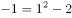；；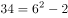；；。数列的底数为：1，3，6，10，15。两两作差为2，3，4，5，为公差是1的等差数列，所求项底数为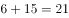；指数均为2；修正项均为-2，故所求项为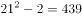。

故正确答案为D。

---

### 第 3 题　qid 2730450 · 数学运算

2，3， ，，（    ）

- **A**. 
1

- **B**. 

- **C**. 

- **D**. 

　✅

**答案**：D

**官方解析**

题干数列包含整数与分数，选项大多为分数，优先考虑分数数列，但将整数转化为分数后无规律。作差作和作积后均无规律，尝试作商，前项÷后项依次得到：，，，即相邻两项作商得到新数列为，2，6，是公比为3的等比数列。因此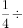所求项，故所求项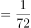。

故正确答案为D。

---

### 第 4 题　qid 2730462 · 数学运算

小成下午2点有课，出门前他发现寝室的挂钟因电池耗尽停在12点，于是匆匆换了新电池但是忘了校准时间就离开寝室，到达教室时发现离上课还有15分钟，课后小成在教室自习到晚上9点才动身离开，到达寝室时发现挂钟显示为7点45分，若小成在寝室与教室之间往返用时相同，则其离开寝室的实际时间为下午（    ）。

- **A**. 1点15分
- **B**. 1点26分
- **C**. 1点30分　✅
- **D**. 1点36分

**答案**：C

**官方解析**

方法一：根据题意可知，小成到达教室的实际时间为下午1：45，离开教室的实际时间为晚上9：00，故小成在教室共待了7小时15分钟；又因为，小成从寝室出发时挂钟显示12：00，小成回到寝室时挂钟显示为7：45，故小成从寝室出发到回到寝室的总时间为7小时45分钟，则小成往返于寝室和教室的总时间为7小时45分钟7小时15分钟分钟，即单程时间分钟，则其离开寝室的实际时间为下午1：30。

方法二：考虑代入排除，先代入便于运算的。

代入C项：“下午1点30分”，即离开寝室的实际时间为下午1：30，而此时挂钟显示12：00，则挂钟比实际时间慢1小时30分钟。由题意可知，小成到达教室的实际时间为下午1：45，则从寝室到教室路上所用时间为15分钟。小成上完晚自习离开教室的实际时间为晚上9：00，且小成在寝室与教室之间往返用时相同，故小成到达寝室的实际时间为晚上9：15，此时挂钟显示7：45，恰好挂钟比实际时间慢1小时30分钟，符合题意，无需验证其他选项。

故正确答案为C。

---

### 第 5 题　qid 2730470 · 数学运算

某喷绘机每次同时单面印刷2张广告布，每印1面需要1分钟，广告布印后需晾干2分钟，现需双面印刷15张广告布，则至少需（    ）分钟的印刷时间。

- **A**. 15　✅
- **B**. 16
- **C**. 17
- **D**. 19

**答案**：A

**官方解析**

15张广告布共有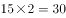个面，每分钟可以印刷2面，则印刷机印刷完所有广告布需要的时间为分钟。

故正确答案为A。

备注：本题对于题干的理解存在争议，粉笔倾向于认为题目所问为“印刷时间”不包含最后一次印刷后的晾干时间。

---

### 第 6 题　qid 2730449 · 数学运算

深圳市民老李周末去郊游，他从家出发匀速骑行2小时到达梧桐山，游玩4小时后沿原路以原速返回，已知老李离开家5.5小时后，其子小李驾车以30公里/小时的速度从家出发沿同一路线接老李，两人在距离梧桐山10公里路程处相遇，则老李的骑行速度是（    ）公里/小时。

- **A**. 20　✅
- **B**. 18
- **C**. 16
- **D**. 15

**答案**：A

**官方解析**

设老李的骑行速度为公里/小时，则老李家到梧桐山的距离为公里。由题意可知，老李从梧桐山返回时，小李已经驾车行驶了小时，行驶了公里。根据老李和小李的路程和为公里，可列式：，化简得：，代入A项，符合。

故正确答案为A。

---

### 第 7 题　qid 2730453 · 数学运算

“数艺杯”绘画比赛的决赛规则如下：由3位评委对11件作品进行投票，每位评委对每件作品可以投一票或者不投票；得3票的作品为一等奖，得2票的作品为二等奖；得1票的作品为三等奖，不得票的作品为鼓励奖。已知三位评委分别投出了6票、7票、8票。且有3件作品为鼓励奖，那么（    ）。

- **A**. 一等奖作品比三等奖作品多5件　✅
- **B**. 一等奖作品比二等奖作品多2件
- **C**. 二等奖作品比一等奖作品多5件
- **D**. 二等奖作品比三等奖作品多3件

**答案**：A

**官方解析**

根据题意，设一等奖作品件，二等奖作品件，三等奖作品件，根据作品总数可得：······①；根据得票情况可得：······②。联立两式，可得，即一等奖作品比三等奖作品多5件。

故正确答案为A。

---

### 第 8 题　qid 2730458 · 数学运算

某演唱会主办方为观众准备了白红橙黄绿蓝紫7种颜色的荧光棒各若干只，每名观众可在入口处任意选取2只，若每种颜色的荧光棒都足够多，那么至少（    ）名观众中，一定有两人选取的荧光棒颜色完全相同。

- **A**. 14
- **B**. 22
- **C**. 28
- **D**. 29　✅

**答案**：D

**官方解析**

由题意可知，观众选取2只颜色相同的荧光棒共有7种方式；选取2只颜色不同的荧光棒共有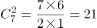种方式，共有种，根据最不利原则，至少名观众中，一定有两人选取的荧光棒颜色完全相同。

故正确答案为D。

---

### 第 9 题　qid 2730828 · 数学运算

社区工作人员小吴在统计辖区人口的年龄时，不小心将某人年龄的十位数字与个位数字交换了位置，则以下可能为其错误年龄与实际年龄的差值的是（    ）。

- **A**. 45　✅
- **B**. 46
- **C**. 47
- **D**. 48

**答案**：A

**官方解析**

设十位数字为，个位数字为，根据题意可得，错误年龄与实际年龄的差值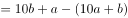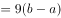。因为、为整数，故为整数，则差值必定为9的倍数，只有A项满足。

故正确答案为A。

---

### 第 10 题　qid 2730832 · 数学运算

某班级开展素质拓展游戏，20名同学围成一个圆圈，以任意一名同学为起点从1开始依次报数，若所报数字含7或为7的倍数，则该同学需表演节目。表演后即退出圆圈，余下的同学继续报数，那么当圆圈内只剩5名同学时，报数次数最多的同学报过（    ）次。

- **A**. 4
- **B**. 5
- **C**. 6　✅
- **D**. 7

**答案**：C

**官方解析**

根据题意，报如下数字需表演节目：7、14、17、21、27、28、35、37、42、47、49、56、57、63、67、70······

第一轮报数为1-20，报数为7、14、17的3个人表演节目，还剩人；

第二轮报数为21-37，报数为21、27、28、35、37的5个人表演节目，还剩人；

第三轮报数为38-49，报数为42、47、49的3个人表演节目，还剩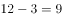人；

第四轮报数为50-58，报数为56、57的2个人表演节目，还剩人；

第五轮报数为59-65，报数为63的人表演节目，还剩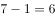人；

第六轮报数为66-71，报数为67的人表演节目，还剩人；

此时，报数次数最多的同学共参加6轮报数，即报过6次。

故正确答案为C。

---

### 第 11 题　qid 2730833 · 数学运算

港口仓库有4个不同重量的集装箱（均为整数吨），管理员将集装箱重量两两求和，并将得到的6个数都登记在册，后因保管不当，数据中的最大值被污渍遮盖。已知其余5个数据分别是23吨、27吨、30吨、31吨、34吨，则4个集装箱中最重的为（    ）吨。

- **A**. 17
- **B**. 18
- **C**. 21　✅
- **D**. 23

**答案**：C

**官方解析**

将4个集装箱按重量由大到小分别表示为、、、，则被污渍遮盖的数据为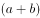，。将两两求和的6个数相加，可得：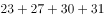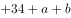，将代入，解得：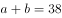。因此一定大于19，排除A、B两项；代入C项，若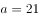，则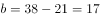，，，满足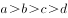且均为整数。

故正确答案为C。

---

### 第 12 题　qid 2730842 · 数学运算

某科学家做了一项实验，通过向若干只狒狒提供不限量的香蕉和香肠以研究其食性。结果表明，的狒狒有进食，其中吃香蕉的狒狒是吃香肠的狒狒数量的3倍，而两种食物都吃的狒狒是只吃香肠的狒狒数量的，则未进食的狒狒是只吃香蕉的狒狒数量的（    ）。

- **A**. 

- **B**. 

- **C**. 

　✅
- **D**. 

**答案**：C

**官方解析**

赋值只吃香肠的狒狒数量为3，根据题意可得：两种食物都吃的狒狒数量为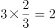，吃香肠的狒狒数量为，吃香蕉的狒狒数量为，只吃香蕉的狒狒数量为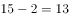，如下图所示。因此有进食的狒狒数量为，则狒狒总数为，未进食的狒狒数量为，故未进食的狒狒是只吃香蕉的狒狒数量的。

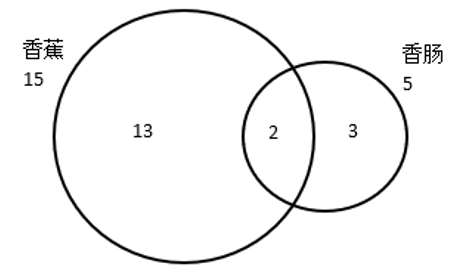

故正确答案为C。

---

### 第 13 题　qid 2730851 · 数学运算

某款游戏共有7名英雄供玩家选择，7名英雄的能力值恰好为1-7的不同整数。每局游戏开始前，玩家需要任选3名英雄进行组队。玩家阿坤在进行了无数次的组队尝试后发现，不能一味选择能力值高的英雄组队，只有当3名英雄的能力值平均数大于3且小于5时才能获胜。则阿坤在组队尝试过程中的胜率是（    ）。

- **A**. 

- **B**. 

- **C**. 

- **D**. 

　✅

**答案**：D

**官方解析**

从7名英雄中选出3名英雄的总情况数为。

当3名英雄的能力值平均数大于3且小于5时才能获胜，则获胜的能力总值在9到15之间，满足该要求的情况如下：

总值为10，（1、2、7），（1、3、6），（1、4、5），（2、3、5），共4种情况；

总值为11，（1、3、7），（1、4、6），（2、3、6），（2、4、5），共4种情况；

总值为12，（1、4、7），（1、5、6），（2、3、7），（2、4、6），（3、4、5），共5种情况；

总值为13，（1、5、7），（2、4、7），（2、5、6），（3、4、6），共4种情况；

总值为14，（1、6、7），（2、5、7），（3、4、7），（3、5、6），共4种情况。

则获胜的情况数为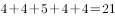种。

因此获胜的概率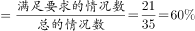。

故正确答案为D。

---

## 判断推理

### 第 1 题　qid 2730660 · 图形推理

从四个选项中选择一个替代问号，使两套图形的规律表现出最大的相似性，最适合的是（    ）。

- **A**. A
- **B**. B　✅
- **C**. C
- **D**. D

**答案**：B

**官方解析**

解析一：观察第一组图形，发现图形均由黑球、白球、短线组成，但数量不同且无规律，再观察发现每条短线均连接两个图形，且两个图形的颜色相同，第二组图形应用此规律，排除A、C两项；比较B、D两项发现，D项短线连接的只有白色图形，题干图形中短线连接的既有黑色图形也有白色图形，排除D项。
故正确答案为B。
解析二：观察第一组图形，发现斜向相邻的黑球以短线相连，横向相邻的白球以短线相连；第二组前两个图形中竖向相邻的黑块以短线相连，横向相邻的白块以短线相连，故？处图形应与其规律保持一致，排除A、B、D三项。
故正确答案为C。

---

### 第 2 题　qid 2731137 · 图形推理

从四个选项中选择一个替代问号，使两套图形的规律表现出最大的相似性，最适合的是（    ）。

- **A**. A
- **B**. B
- **C**. C　✅
- **D**. D

**答案**：C

**官方解析**

元素组成不同，且无明显属性规律，考虑数量规律。题干图形均为汉字，考虑汉字笔画数。第一组汉字的笔画数均为4，第二组前两个汉字的笔画数均为5，故问号处汉字笔画数应为5，排除B、D两项；比较A、C两项发现，A项为上下结构，C项为左右结构，题干第一组汉字均为半包围结构，第二组前两个汉字均为左右结构，故问号处汉字也应为左右结构，排除A项。
故正确答案为C。

---

### 第 3 题　qid 2730675 · 图形推理

从四个选项中选择一个替代问号，使之呈现一定规律性，最适合的是（    ）。

- **A**. A
- **B**. B
- **C**. C　✅
- **D**. D

**答案**：C

**官方解析**

观察发现题干图形均由小方块拼接而成的几部分构成，优先考虑部分数。第一组图形均由3部分构成，第二组前两个图形均由4部分组成，故问号处图形应为4部分，排除A、D两项。比较B、C两项，发现小方块数量不同，题干图形的小方块数均为9，排除B项，只有C项满足所有规律，当选。
故正确答案为C。

---

### 第 4 题　qid 2730558 · 图形推理

从四个选项中选择一个替代问号，使之呈现一定规律性，最适合的是（    ）。

- **A**. A
- **B**. B
- **C**. C
- **D**. D　✅

**答案**：D

**官方解析**

元素组成不同，且无明显属性规律，考虑数量规律。观察发现，题干每幅图形均存在明显的圆和直线，且圆与直线多存在相切，优先考虑切点数。第一组图切点数分别为0、1、2，数量递增；第二组图切点数分别为2、3、？，故问号处图形的切点数应为4，只有D项满足规律。
故正确答案为D。

---

### 第 5 题　qid 2730814 · 图形推理

从四个选项中选择一个替代问号，使之呈现一定规律性，最适合的是（    ）。

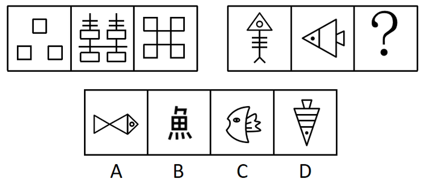

- **A**. A　✅
- **B**. B
- **C**. C
- **D**. D

**答案**：A

**官方解析**

解法一：元素组成不同，优先考虑属性规律。题干图形均为轴对称图形，排除B、C两项。观察发现，题干图形封闭区域明显，考虑面数量。第一组图形的面数量分别为3、4、5；第二组前两幅图的面数量分别为2、3，故问号处图形的面数量应为4，只有A项符合。
解法二：元素组成不同，优先考虑属性规律，但对称性无法得出唯一答案，考虑数量规律。观察发现第一组图中矩形的数量分别为3、4、5，数量递增；第二组图中三角形的数量为1、2（需重复数）、？，故问号处图形中三角形的数量应为3，只有A项满足规律。
注：一般三角形优先不重复数，但是如本题所示，矩形和三角形的特征明显，当数第二组图的图2时，想延续前面数量的等差规律，自然会重复数了，刚好也有唯一答案，这种思路也是没有问题的。即没思路时优先不重复数，有思路时可结合本题情况灵活判断。
故正确答案为A。

---

### 第 6 题　qid 2730904 · 类比推理

①《松花江上》
②《北京欢迎你》
③《走进新时代》
④《春天的故事》
⑤《中国人民志愿军战歌》

- **A**. ⑤④①②③
- **B**. ⑤①④③②
- **C**. ①⑤④③②　✅
- **D**. ①④⑤②③

**答案**：C

**官方解析**

第一步：先确定逻辑关系最为明显的逻辑顺序。
观察题干，五个事件均为歌曲，可根据歌曲的发行时间进行排序。顺序比较明显的是事件②《北京欢迎你》发行于2008年，事件③《走进新时代》发行于1997年和事件④《春天的故事》发行于1994年，顺序应为④③②，且发生在事件①和⑤之后，排除A、D两项。
第二步：逐一对照选项并判断正确答案。
根据第一步的结果可以判断只有B、C两项符合，再根据事件①《松花江上》发行于1936年，事件⑤《中国人民志愿军战歌》发行于1950年，可以判断事件①应在事件⑤之前，排除B项。
故正确答案为C。

---

### 第 7 题　qid 2730664 · 类比推理

①用绳捆绑，加以检木
②封泥盖章，作为信验
③火上炙干，刮去青皮
④联编成册，笔书文字
⑤截竹为筒，破箕成牒

- **A**. ⑤③④②①
- **B**. ①③⑤④②
- **C**. ⑤③④①②　✅
- **D**. ⑤①④③②

**答案**：C

**官方解析**

第一步：先确定逻辑关系最为明显的逻辑顺序。
观察题干，五个事件主要围绕“截竹制书”的过程。逻辑关系的先后比较明显的是事件⑤和事件③，先截竹，再炙干刮青皮，即⑤应紧邻着③排在前面，排除B、D两项。
第二步：逐一对照选项并判断正确答案。
根据第一步的结果可以判断只有A、C两项符合，先把简牍文书或物品以绳捆扎，再用泥团封信盖章，因此①在②前面，排除A项。
故正确答案为C。

---

### 第 8 题　qid 2730666 · 类比推理

①动物实验，结果积极
②志愿接种，临床研究
③获准上市，批量生产
④获取样本，分离毒株
⑤灭活减毒，制备疫苗

- **A**. ⑤-④-②-③-①
- **B**. ④-⑤-①-②-③　✅
- **C**. ②-④-①-③-⑤
- **D**. ③-④-①-⑤-②

**答案**：B

**官方解析**

观察题干，五个事件主要围绕“研制疫苗”的过程。逻辑关系的先后比较明显的是事件④和事件⑤，先获得样本分离毒株，再对病毒进行灭活，去除致病力，保留免疫原性，制备疫苗，即④紧邻着⑤，在⑤的前面，排除A、C、D三项。
故正确答案为B。

---

### 第 9 题　qid 2730672 · 类比推理

①惊涛骇浪
②离家远航
③抓挠负伤
④群猴哄抢
⑤流落荒野

- **A**. ②⑤④①③
- **B**. ②①⑤④③　✅
- **C**. ⑤④③②①
- **D**. ①⑤④③②

**答案**：B

**官方解析**

第一步：先确定逻辑关系最为明显的逻辑顺序。
观察题干，五个事件主要围绕“离家航海”的过程展开。逻辑关系的先后顺序比较明显的是事件①和事件②，先离家远航，再惊涛骇浪，即事件②应紧挨着事件①，在事件①的前面，且事件②是所有事情的开端，应在首句位置，排除A、C、D三项。
第二步：逐一对照选项并判断正确答案。
根据第一步的结果可以判断B项符合，先流落荒野，再遇到猴群哄抢，最后被抓挠并受伤，因此事件的顺序为⑤、④、③。
故正确答案为B。

---

### 第 10 题　qid 2730703 · 类比推理

①建立伏安特性曲线
②计算斜率，求解电阻值
③连接电路，闭合电键
④读取电流表与电压表示数
⑤调节滑动电阻器

- **A**. ⑤④①②③
- **B**. ③④①②⑤
- **C**. ③⑤④①②　✅
- **D**. ④①②③⑤

**答案**：C

**官方解析**

第一步：先确定逻辑关系最为明显的逻辑顺序。
观察题干，五个事件主要是围绕着“如何求出电阻值”开展的。逻辑关系的先后顺序比较明显的事件是事件③和事件④，要先连接电路，使电路通电后才可以读取电流表和电压表示数，事件③应该在事件④前面，排除A、D两项。
第二步：逐一对照选项并判断正确答案。
根据第一步的结果可以判断只有B、C两项符合，建立伏安特性曲线后才能计算斜率，进而求出电阻值，这里求出电阻值应为事件的结果，而不是⑤，因此事件②应是尾句，故排除B项。
故正确答案为C。

---

### 第 11 题　qid 2730792 · 逻辑判断

有的上位者缺乏主动性、创造性，因为他们不愿真正动脑筋想问题。
要使以上论证有效，必要的前提是（    ）。

- **A**. 缺乏主动性、创造性的人很难上位
- **B**. 某些不愿真正动脑筋想问题的人具有主动性、创造性
- **C**. 某些缺乏主动性、创造性的人不愿真正动脑筋想问题
- **D**. 不愿真正动脑筋想问题的人都缺乏主动性、创造性　✅

**答案**：D

**官方解析**

第一步：找出论点和论据。
论点：有的上位者缺乏主动性、创造性。
论据：他们不愿真正动脑筋想问题。
论据和论点话题不一致，并且问题是要求补充必要前提，所以优先考虑搭桥，补充说明缺乏主动性、创造性与不愿真正动脑筋之间的关系。
第二步：逐一分析选项。
A项：该项涉及的是缺乏主动性、创造性与很难上位之间的关系，很难上位与题干无关，不是需要补充的前提，排除；
B项：该项涉及的是具有主动性、创造性与不愿真正动脑筋想问题之间的关系，不是需要补充的前提，排除；
C项：该项相当于某些不愿真正动脑筋想问题的人是缺乏主动性、创造性的，无法使不愿真正动脑筋推出缺乏主动性、创造性，所以不是使论证有效的必要前提，排除；
D项：该项可以使不愿真正动脑筋推出缺乏主动性、创造性，建立论点和论据的联系，是题干论证有效的必要前提，当选。
故正确答案为D。

---

### 第 12 题　qid 2730656 · 逻辑判断

某国际连锁超市的中国大陆首店开业第一天，生意火爆程度令人瞠目结舌。当天新售会员卡即超16万张，因进店购物人数太多，超市入口处排起了长队，停车位至少要等3个小时。开业不到1小时，部分货架已挂上了商品售罄的牌子，分析人士认为，超市商品的低廉价格是引发抢购热潮的原因。
若以下各项为真，则最能削弱上述结论的是（    ）。

- **A**. 该超市实行会员制，必须购买会员卡才能购物
- **B**. 开业首日所售会员卡中，有相当部分是由超市管理层及其员工购入
- **C**. 低成本策略几乎是所有商家都会选择的经营策略，力求在价格上吸引消费者　✅
- **D**. 大多数客人都是被超市开业首日的巨大优惠广告吸引而来

**答案**：C

**官方解析**

第一步：找出论点和论据。
论点：超市商品的低廉价格是引发抢购热潮的原因。
论据：无。
本题只有论点，没有论据，优先考虑否定论点的削弱方式。
第二步：逐一分析选项。
A项：该项说明购物的前提是要购买会员卡，与引发抢购热潮的原因是否是商品价格低廉无关，与论点话题不一致，无法削弱，排除；
B项：该项说明超市会员卡的购买者都是哪些人，与引发抢购热潮的原因是否是商品价格低廉无关，与论点话题不一致，无法削弱，排除；
C项：该项表明几乎所有商家都会选择低成本策略，所以题干中的国际连锁超市引发抢购热潮的原因就不是商品的低廉价格，直接否定了论点，可以削弱，当选；
D项：该项说明超市商品的低廉价格确实是引发抢购热潮的原因，可以加强论点，排除。
故正确答案为C。

---

### 第 13 题　qid 2731069 · 类比推理

有黑、白、蓝、红、黄5个小球。甲、乙、丙、丁、戊每轮从中各拿1个，同时确认颜色后放回，经过5轮，正好每个人都拿到过5个颜色的小球。已知：
（1）甲最后拿的小球与乙第二轮拿的相同；
（2）乙第四轮拿的小球与戊第三轮拿的相同；
（3）丙第二轮拿的小球与甲第一轮拿的相同；
（4）丙最后拿的小球与乙第四轮拿的相同；
（5）丁第三轮拿的小球与丙第一轮拿的相同；
（6）丁最后拿的小球与丙第三轮拿的相同。
如果甲拿到的小球颜色依次是黑、白、蓝、红、黄，那么（    ）。

- **A**. 乙拿到的小球白、黄、红、黑、蓝
- **B**. 丙拿到的小球红、黑、黄、白、蓝
- **C**. 丁拿到的小球白、蓝、黄、黑、红　✅
- **D**. 戊拿到的小球蓝、黑、白、黄、红

**答案**：C

**官方解析**

第一步：分析题干条件。

关于小球颜色：

（1）甲5乙2；

（2）乙4戊3；

（3）丙2甲1；

（4）丙5乙4；

（5）丁3丙1；

（6）丁5丙3；

（7）甲1黑、甲2白、甲3蓝、甲4红、甲5黄。

第二步：根据题干条件进行推理。

条件（7）较为确定，可以从条件（7）入手解题；结合条件（1）（7）可知，乙2黄；结合条件（3）（7）可知，丙2黑，可列表如下：

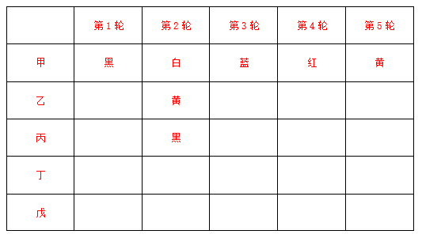

在每一轮5个人小球的颜色不同情况下，根据丙2黑可以得到戊2黑，排除D项；

根据条件（2）（4）可知，乙4戊3丙5；根据每一轮中5人的颜色不相同可知，戊3甲3（蓝）、乙4甲4（红）、丙5甲5（黄），则乙4蓝、红、黄；根据每个人都拿到过5个颜色的小球以及前面推出的丙2黑，则丙5黑，可得乙4蓝、红、黄、黑。因此乙4戊3丙5白，排除A项和B项；

故正确答案为C。

---

### 第 14 题　qid 2730961 · 类比推理

某公司总经理郑某在家中被杀，警方确切掌握的是，案发当天，其下属赵一、王二、张三、李四都进出过一次郑某家中，且排除同时出现的可能性，被警方传讯前，四人秘密约定，向警方所作的每句供词都是虚假供述，供词如下：
赵一：“我们四人都没杀害他，我离开他家时，他还活着。”
王二：“我是第二个进他家的，我到他家时，他已经死了。”
张三：“我是第三个进他家的，我离开他家时，他还活着。”
李四：“凶手进他家不比我晚，我到他家时，他已经死了。”
由此可知推知，凶手是：

- **A**. 赵一　✅
- **B**. 王二
- **C**. 张三
- **D**. 李四

**答案**：A

**官方解析**

第一步：分析题干。

根据四人向警方所作的每句供词都是虚假供述，得知每人每句话的矛盾为真，即：

（1）赵一的矛盾：四人中有人杀害他，赵一离开他家时，他已经死了；

（2）王二的矛盾：王二不是第二个进他家的，王二到他家时，他还活着；

（3）张三的矛盾：张三不是第三个进他家的，张三离开他家时，他已经死了；

（4）李四的矛盾：凶手比我晚进他家，我到他家时，他还活着；

第二步：逐一分析选项。

根据条件（1）可知，赵一可能是凶手或在凶手之后进入郑某家中，即到来顺序：赵一凶手；根据条件（2）可知，王二可能是凶手或在凶手之前进入郑某家中，即到来顺序：凶手王二，且王二；根据条件（3）可知，张三可能是凶手或在凶手之后进入郑某家中，即到来顺序：张三凶手，且张三；根据条件（4）可知，凶手比李四晚进郑某家，即凶手李四，李四不可能是凶手，排除D项；

综合上述分析，得到四人进入郑某家中的顺序为：李四凶手赵一、王二凶手张三；假设王二是凶手，则王二第二个进入郑某家，与条件（2）矛盾，则王二不是凶手，排除B项；假设张三是凶手，则张三第三个进入郑某家，与条件（3）矛盾，则张三不是凶手，排除C项；则凶手只能是赵一，A项当选。

故正确答案为A。

---

### 第 15 题　qid 2730979 · 类比推理

有的人是他随时可以批判的。
如果以上说法为真，则以下判断必然为真的是：
（1）批判他的人不可能随时都被他批判；
（2）有的人他能一直批判；
（3）他随时都可能批判人；
（4）他不能批判所有人。

- **A**. 只有（3）　✅
- **B**. 只有（2）
- **C**. （1）（3）
- **D**. （2）（3）（4）

**答案**：A

**官方解析**

第一步：翻译题干。
有的人是他随时可以批判的（为“有的A是B”形式）。
第二步：逐一分析选项。
（1）“批判他的人不可能随时都被他批判”即为“有的人不可能随时都被他批判”，根据“有的A是B”无法推出“有的A不是B”，则无法根据“有的人是他随时可以批判的”推出“有的人不可能随时都被他批判”；
（2）“有的人他能一直批判”并不等价于“有的人是他随时可以批判的”，“随时”指任何时候，“一直”指始终不间断或状态始终不变，二者含义不同，无法推出；
（3）“他随时都可能批判人”即为“他随时都可能批判有的人”，等价于“有的人是他随时可以批判的”，可以推出；
（4）根据“有的人”无法推出“所有人”，则不能根据“有的人是他随时可以批判的”推出“他不能批判所有人”。
综上，只有（3）的判断是真的。
故正确答案为A。

---

### 第 16 题　qid 2730649 · 类比推理

如果古代帝王是否为圣贤明君有唯一标准，则秦始皇和武则天中至少有一人是圣贤明君。假设把秦始皇或武则天看作圣贤明君，那么汉武帝和明成祖则更加当之无愧。除非明朝出现永乐盛世且维持统治上千年，否则明成祖不配称为圣贤明君。但事实上，自明太祖朱元璋称帝建立大明，至李自成攻入北京明朝灭亡，历时仅276年。
根据上文，下列说法正确的是：

- **A**. 秦始皇和武则天中有一人是圣贤明君
- **B**. 汉武帝和明成祖都不是圣贤明君
- **C**. 古代帝王是否为圣贤明君并没有唯一标准　✅
- **D**. 明朝本可以维持统治上千年

**答案**：C

**官方解析**

第一步：翻译题干。

①古代帝王是否为圣贤明君有唯一标准秦始皇或武则天是圣贤明君；

②秦始皇或武则天是圣贤明君汉武帝且明成祖是圣贤明君；

③明成祖是圣贤明君明朝出现永乐盛世且维持统治上千年；

④明朝没有维持统治上千年。

第二步：根据题干条件进行推理。

从确定信息条件④入手，明朝没有维持统治上千年是对条件③的否后，根据否后必否前，可以得出：明成祖不是圣贤明君，此结论是对条件②的否后，根据否后必否前可以得出：秦始皇不是圣贤明君且武则天不是圣贤明君，此结论是对条件①的否后，根据否后必否前，可以得出： 古代帝王是否为圣贤明君没有唯一标准，故A、B两项推理错误，D项依据题干无法直接推出，均排除；C项当选。

故正确答案为C。

---

### 第 17 题　qid 2730560 · 定义判断

泡菜效应，是指人在不同的环境里长期耳濡目染，就会“近朱者赤，近墨者黑”，就像同样的蔬菜在不同的水中浸泡一段时间后，制成的泡菜风味是不一样的。
下列事例体现了“泡菜效应”的是（    ）。

- **A**. 某市市民有个饮食规律，一家人中爸爸喜欢新鲜泡菜，妈妈喜欢老坛泡菜，孩子不喜欢泡菜
- **B**. 泡菜公司职员阿斌在研发组时，整天和组内同事浑水摸鱼；后调动至推广组，全组积极上进，他也变得干劲十足　✅
- **C**. 某泡菜制作大师收了20名关门弟子同时授课，但还是有8名学徒制作的泡菜非常难吃
- **D**. 朴博士在欧洲旅居十年有余。但始终无法适应当地饮食习惯，每餐都会拿出家乡特产泡菜佐餐

**答案**：B

**官方解析**

第一步：找出定义关键词。
“在不同的环境里长期耳濡目染”、“近朱者赤，近墨者黑”、“就像同样的蔬菜在不同的水中浸泡一段时间后，制成的泡菜风味是不一样的”。
第二步：逐一分析选项。
A项：爸爸喜欢新鲜泡菜，妈妈喜欢老坛泡菜，孩子不喜欢泡菜，不符合“近朱者赤，近墨者黑”，不符合定义，排除；
B项：阿斌在研发组时，整天和组内同事浑水摸鱼，调动至推广组，全组积极上进，他也变得干劲十足，符合“在不同的环境里长期耳濡目染”、“近朱者赤，近墨者黑”、“就像同样的蔬菜在不同的水中浸泡一段时间后，制成的泡菜风味是不一样的”，符合定义，当选；
C项：泡菜制作大师收了20名关门弟子同时授课，但还是有8名学徒制作的泡菜非常难吃，不符合“在不同的环境里长期耳濡目染”、“近朱者赤，近墨者黑”，不符合定义，排除；
D项：朴博士在欧洲十年有余，但始终无法适应当地饮食习惯，不符合“近朱者赤，近墨者黑”、“就像同样的蔬菜在不同的水中浸泡一段时间后，制成的泡菜风味是不一样的”，不符合定义，排除。
故正确答案为B。

---

### 第 18 题　qid 2730908 · 类比推理

某款“打地鼠”游戏的规则如下：游戏开始后，界面随机出现编号为1-10的10只地鼠，玩家每次最多可击中1只地鼠，击中1号地鼠得1分，击中2号地鼠得2分，以此类推，击中10号地鼠得10分；玩家击中地鼠后，界面立即显示得分，游戏随即重新开始，游戏昵称分别为“盯得准”“出得快”“敲得狠”的3名玩家各参与4次游戏，每次都有得分，已知：
（1）没有人击中8-10号地鼠；
（2）每人总得分恰好都为17分，但每人的4次都击中了不同的地鼠；
（3）“敲得狠”有2次得分和“盯得准”相同，其余2次得分和“出得快”相同；
（4）“盯得准”和“出得快”只有1次得分相同。
由此可推知，“盯得准”和“出得快”都击中过（    ）地鼠。

- **A**. 2号
- **B**. 3号
- **C**. 4号
- **D**. 6号　✅

**答案**：D

**官方解析**

第一步：整理题干条件。

（1）没有人击中8-10号地鼠；

（2）每人总得分恰好都为17分，但每人的4次都击中了不同的地鼠；

（3）“敲得狠”有2次得分和“盯得准”相同，其余2次得分和“出得快”相同；

（4）“盯得准”和“出得快”只有1次得分相同。

根据条件（1）可知没有人击中8-10号地鼠，则击中的是1-7号地鼠；

根据条件（2）可知每人4次击中了不同的地鼠，且根据题干可知每次得分无法确定，所以可以用不同字母表示不同得分来梳理三个人的得分情况：

以a、b、c、d表示“敲得狠”的得分情况；又结合条件（3）“敲得狠”有2次得分和“盯得准”相同，其余2次得分和“出得快”相同，以及条件（4）“盯得准”和“出得快”只有1次得分相同，则“盯得准”得分情况可以用a、b、e、f表示，“出得快”得分情况用c、d、e、g表示。

故可将条件（2）（3）（4）信息中得分情况整理如下表：

第二步：根据题干条件进行推理。

根据“盯得准”和“出得快”得分情况可知，重复的地鼠为e，“盯得准”和“出得快”加和可知：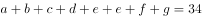，又由条件（1）可知击中的是1-7号地鼠，则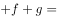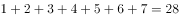，则“盯得准”和“出得快”重复的分数也就是击中的地鼠，故可以得知“盯得准”和“出得快”都击中了6号地鼠。

故正确答案为D。

---

### 第 19 题　qid 2730981 · 类比推理

小亮是一名初中生，本学期设有语文、英语、数学、历史、地理、物理、化学、生物、道德与法治、体育共10门课程，疫情期间他每天在家上7节网课，上午4节，下午3节，中午有休息。某天，妈妈下班后问小亮当天的上课情况，小亮卖了个关子，说出如下事实：
（1）只有一门课程安排了两节课，上、下午各一节；
（2）语文课是紧挨着数学课上的；
（3）体育老师布置的任务是课后跳绳200次，我怕打扰楼下邻居，所以还没完成；
（4）物理课、化学课是在下午上的；
（5）没有历史、地理、生物、道德与法治课。
对于当天的上课情况，可推知（    ）。

- **A**. 上了5门课程
- **B**. 上午上了体育课　✅
- **C**. 下午第一节课有可能是语文课
- **D**. 有可能上了两节化学课

**答案**：B

**官方解析**

第一步：整理题干条件
（1）只有一门课程安排了两节课，上、下午各一节；
（2）语文课是紧挨着数学课上的；
（3）体育课已经上完；
（4）物理化学在下午上课；
（5）没有历史、地理、生物、道德与法治课。
第二步：根据题干条件逐一分析选项。
根据条件（1）可知，有一门课程上了两节，且总共上7节课，因此小亮上了6门课程，排除A项；根据条件（1）（2）（4）可知，语文、数学、物理、化学只能上一节，排除D项；又因为物理化学已经在下午上，所以上午上的是语文和数学，排除C项；根据条件（5）可知，今天一共上了6门课，因此上两节的课程只能是英语或者体育，假设上两节的是体育，根据（1）（3）可知，上午上了体育；假设上两节的是英语，根据（1）（3）也可得出上午上了体育，B项当选。
故正确答案为B。

---

### 第 20 题　qid 2730998 · 逻辑判断

“开窗理论”即运动型免疫抑制，是指人在突然高强度运动之后容易导致免疫力降低，免疫力低下期一般持续3-72小时不等，有时会出现上呼吸道不适或感染等现象。因此，要适当控制运动强度，在运动过程中补充碳水化合物，运动后补充蛋白质、维生素等营养素。
若以下各项为真，对上述结论没有支持作用的是：

- **A**. 
高强度运动后，人对各种细菌、病毒的易感性增强

- **B**. 
碳水化合物、蛋白质、维生素可以增强人体免疫力

- **C**. 
专业运动员在高强度运动后的免疫低下期非常短暂
　✅
- **D**. 
超过90分钟的高强度运动会让运动者的免疫力降低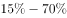

**答案**：C

**官方解析**

第一步：找出论点和论据。
论点：要适当控制运动强度，在运动过程中补充碳水化合物，运动后补充蛋白质、维生素等营养素。
论据：人在突然高强度运动之后容易导致免疫力降低，免疫力低下期一般持续3-72小时不等，有时会出现上呼吸道不适或感染等现象。
本题提问方式为“没有支持作用的是”，故排除可以加强的选项，选择不能加强的选项即可。
第二步：逐一分析选项。
A项：说的是高强度运动，人对各种细菌、病毒的易感性增强，说明高强度会使人的免疫力降低，补充论据，可以加强，排除；
B项：说的是碳水化合物、蛋白质、维生素可以增强免疫力，解释了为什么要补充这些物质，补充论据，可以加强，排除；
C项：说的是专业运动员在高强度运动后的免疫低下期非常短暂，而题干讨论的是突然的高强度运动后，人体的免疫力低下，需要适当控制运动强度，并补充相应营养物质，选项与题干话题不一致，无法加强，当选；
D项：说的是长时间高强度运动会使免疫力降低，说明高强度运动确实会使运动者的免疫力降低，补充论据，可以加强，排除。
本题为选非题，故正确答案为C。

---

## 资料分析

### 材料 1

        2018年，某市实现地区生产总值24221.98亿元，比上年增长。其中，第一产业增加值22.09亿元，增长；第二产业增加值9961.95亿元，增长；第三产业增加值14237.94亿元，增长。现代产业中，现代服务业增加值10090.59亿元，增长；先进制造业增加值6564.83亿元，增长；高技术制造业增加值6131.20亿元，增长。四大支柱产业中，金融业增加值3067.21亿元，增长；物流业增加值2541.58亿元，增长；文化及相关产业（规模以上）增加值1560.52亿元，增长；高新技术产业增加值8296.63亿元，增长。七大战略性新兴产业增加值合计9155.18亿元，比上年增长，占地区生产总值比重。其中，新一代信息技术产业增加值4772.02亿元，增长；数字经济产业增加值1240.73亿元，增长；高端装备制造产业增加值1065.82亿元，增长；绿色低碳产业增加值990.73亿元，增长；海洋经济产业增加值421.69亿元，下降；新材料产业增加值365.61亿元，增长；生物医药产业增加值298.58亿元，增长。

        全市年末常住人口1302.66万人，其中常住户籍人口454.70万人，增长，占常住人口比重；常住非户籍人口847.97万人，增长，占比重。年末城镇登记失业率为。全年居民消费价格比上年上涨。全年完成一般公共预算收入3538.41亿元，比上年增长。其中税收收入2899.60亿元，增长。一般公共预算支出4282.54亿元，下降。

#### 第 1 题　qid 2730982 · 增长

2017年，该市三大产业增加值同比增速最快的是：

- **A**. 第一产业
- **B**. 第二产业
- **C**. 第三产业
- **D**. 无法判断　✅

**答案**：D

**官方解析**

定位文字材料第一段，材料中没有给出2017年三大产业增加值同比增速的相关数据，故无法判定2017年同比增速的大小。
故正确答案为D。

---

#### 第 2 题　qid 2730983 · 增长

2018年，下列产业对该市地区生产总值增长的贡献率最大的是：

- **A**. 第三产业
- **B**. 现代服务业
- **C**. 文化及相关产业（规模以上）
- **D**. 高新技术产业　✅

**答案**：D

**官方解析**

根据题干“2018年，······对······贡献率最大的是”，结合材料时间为2018年，可判定本题为现期比重问题。根据公式：增长贡献率，总体增长量均为该市地区生产总值增长量，则本题只需比较部分增长量的大小即可。定位文字材料第一段可知，第三产业增加值14237.94亿元，增长；现代服务业增加值10090.59亿元，增长；文化及相关产业（规模以上）增加值1560.52亿元，增长；高新技术产业增加值8296.63亿元，增长。根据增长量比较“大大则大”原则，文化及相关产业（规模以上）增加值及同比增速均为最小，则其增长量最小，排除C项。根据公式：增长量，则第三产业增加值的增长量亿元；现代服务业增加值的增长量亿元；高新技术产业增加值的增长量亿元。故高新技术产业增加值的增长量最大，对该市地区生产总值增长的贡献率最大。

故正确答案为D。

---

#### 第 3 题　qid 2730984 · 增长

2018年，从产业增加值的同比增量看，该市七大战略性新兴产业中，高端装备制造产业和（    ）最接近。

- **A**. 新一代信息技术产业
- **B**. 数字经济产业
- **C**. 绿色低碳产业　✅
- **D**. 生物医药产业

**答案**：C

**官方解析**

根据题干“从产业增加值的同比增量看，······高端装备制造产业和（    ）最接近”，可判定本题为增长量计算问题。定位文字材料第一段可知，高端装备制造产业增加值1065.82亿元，增长；新一代信息技术产业增加值4772.02亿元，增长；数字经济产业增加值1240.73亿元，增长；绿色低碳产业增加值990.73亿元，增长；生物医药产业增加值298.58亿元，增长。根据公式：增长量，各产业增加值的同比增量如下： 

高端装备制造产业增加值：亿元；

新一代信息技术产业增加值：亿元；

数字经济产业增加值：亿元；

绿色低碳产业增加值：亿元；

生物医药产业增加值：亿元。

则高端装备制造产业增加值的同比增量与绿色低碳产业增加值的同比增量最接近。

故正确答案为C。

注：考试时，通过观察比较数据，可知“高端装备制造产业增加值”与“绿色低碳产业增加值”的现期量与同比增速均是最接近的，可直接猜C项。

---

#### 第 4 题　qid 2730985 · 增长

2018年，该市年末常住人口同比增长约：

- **A**. 

- **B**. 

　✅
- **C**. 

- **D**. 

**答案**：B

**官方解析**

根据题干“2018年，该市年末常住人口同比增长约”，结合选项为百分数，且材料给出该市2018年末该市常住户籍人口与常住非户籍人口的增长率，可判定本题为混合增长率问题。定位文字材料第二段，2018年，全市年末常住人口1302.66万人，其中常住户籍人口454.70万人，增长，占常住人口比重；常住非户籍人口847.97万人，增长，占比重。根据“混合后居中，偏向基期大的（一般用现期量代替基期量计算）”，可得：，结合选项，排除A、C两项；由于常住户籍人口数（454.70万人）常住非户籍人口数（847.97万人），可得：更接近常住非户籍人口的增长率（），即，只有B项在范围内。

故正确答案为B。

---

#### 第 5 题　qid 2730986 · 综合

根据上文，下列说法正确的是：

- **A**. 2018年，该市第二产业增加值占地区生产总值比重同比下降
- **B**. 2017年，该市四大支柱产业中，物流业增加值最大
- **C**. 2018年，该市年末城镇登记失业人口29.96万人
- **D**. 2018年，该市一般公共预算收入中，非税收收入同比负增长　✅

**答案**：D

**官方解析**

A项：定位文字材料第一段，“2018年，某市实现地区生产总值24221.98亿元，比上年增长。其中，······第二产业增加值9961.95亿元，增长”，根据两期比重比较的结论：若部分增长率整体增长率，比重上升；反之下降。，因此第二产业增加值占地区生产总值比重同比上升，错误。

B项：定位文字材料第一段，2018年“四大支柱产业中，金融业增加值3067.21亿元，增长；物流业增加值2541.58亿元，增长；文化及相关产业（规模以上）增加值1560.52亿元，增长；高新技术产业增加值8296.63亿元，增长”。根据基期量，2017年四大支柱产业增加值分别为：

2017年金融业增加值：亿元；

2017年物流业增加值：亿元；

2017年文化及相关产业（规模以上）增加值：亿元；

2017年高新技术产业增加值：亿元。

比较可知，2017年该市四大支柱产业中，高新技术产业增加值最大，错误。

C项：定位文字材料第二段，根据城镇登记失业率，材料并未给出城镇从业人员的数据，故无法推出城镇登记失业人数，错误。

D项：定位文字材料第二段，2018年“全年完成一般公共预算收入3538.41亿元，比上年增长。其中税收收入2899.60亿元，增长”，根据线段法“距离与量成反比（一般用现期量代替基期量计算）”，可知，即，解得，即非税收收入同比负增长，正确。

故正确答案为D。

---

### 材料 2

#### 第 6 题　qid 2730989 · 平均数

若电影票房按“观影人次平均票价”计算，则2019年电影平均票价比2015年：

- **A**. 高2.2元　✅
- **B**. 高3.9元
- **C**. 低2.2元
- **D**. 低3.9元

**答案**：A

**官方解析**

根据题干“2019年电影平均票价比2015年”，结合选项：高/低单位，可判定本题为平均数的增长量问题。定位统计图一可知：2019年票房收入为642.66亿元，观影人次为17.27亿人次；2015年票房收入为440.69亿元，观影人次为12.60亿人次。代入平均票价可得：元，与A项最接近。

故正确答案为A。

---

#### 第 7 题　qid 2730990 · 增长

2016-2019年，电影票房同比增幅最低的年份，当年观影人次的同比增幅为：

- **A**. 

- **B**. 

- **C**. 

　✅
- **D**. 

**答案**：C

**官方解析**

根据题干“当年观影人次的同比增幅”，结合选项为，可判定本题为一般增长率计算问题。定位统计图一，已知2016~2019年电影票房收入，根据公式：增长率，可知各年份电影票房增长率如下：

2016年：；

2017年：；

2018年：；

2019年：。

则2016年电影票房同比增幅最低，结合统计图一，2015、2016年的观影人次分别为12.60亿人、13.72亿人，故2016年的观影人次的同比增幅，与C项最接近。

故正确答案为C。

---

#### 第 8 题　qid 2730991 · 增长

2016-2019年，上映电影数同比增幅超过的年份有（    ）个。

- **A**. 1
- **B**. 2　✅
- **C**. 3
- **D**. 4

**答案**：B

**官方解析**

根据题干“······同比增幅超过······”，可判定本题为一般增长率问题。定位统计图二可知上映电影数进口电影国产电影，可知各年份上映电影数：2015年为；2016年为；2017年为；2018年为；2019年为；根据公式：增长率，同比增幅超过，即现期量。2016年：，满足；2017年上映电影数较上年下降，排除；2018年：，满足；2019年：，排除。因此2016-2019年，上映电影数同比增幅超过的年份有2个。

故正确答案为B。

---

#### 第 9 题　qid 2730993 · 综合

2016-2019年，下列指标中，与下方折线图的变化趋势最相符的是：

- **A**. 上映国产电影数
- **B**. 电影观影人次同比增量　✅
- **C**. 电影平均票价
- **D**. 上映进口电影数同比增量

**答案**：B

**官方解析**

A项：定位统计图二可得2016-2019年我国每一年上映的国产电影数量，发现2017年的355部2016年的381部，与折线图趋势不符，排除；

B项：定位统计图一的折线图可得2015-2019年我国每一年的观影人次，根据增长量，可得2016-2019年的增长量分别为，，，，与折线图趋势一致，当选；

C项：定位统计图一可得2016-2019年我国每一年的票房和观影人次，根据平均票价，可得2016-2019年平均票价分别为元/人，元/人，元/人，元/人，发现2019年的平均票价是最高的，与折线图趋势不符，排除；

D项：定位统计图二可得2015-2019年我国每一年上映的进口电影数量，根据增长量，可得2016-2019年的增长量分别为，，，，发现2018年的增长量132016年的增长量10，折线图中第一个点高于第三个点，排除。

故正确答案为B。

备注：折线图中第一点与第三点的高度差别不明显，第二、三点之间的高度差明显大于第三、四点之间的高度差，故排除D项。

---

#### 第 10 题　qid 2730994 · 综合

根据上图，下列说法正确的是：

- **A**. 2015—2019年，上映电影数与电影票房的变化趋势一致
- **B**. 2016—2019年，观影人次同比增长最快的一年，其电影票房及上映电影数均同比增长最快
- **C**. 2015—2019年，上映电影平均票房均超1亿元/部
- **D**. 2015—2019年，当年电影票房超过五年年均电影票房的年份有3个　✅

**答案**：D

**官方解析**

A项：定位统计图一、二，发现2017年电影票房增加，而2017年上映的电影总数下降，变化趋势不一致，错误；

B项：定位统计图一，根据公式：增长率，可知2016-2019年观影人次增长率依次为：；；；，观影人次同比增长最快的为2017年。定位统计图二，观察发现2017年上映电影数同比减少，故上映电影数同比增长率为最低的一年，不满足电影票房及上映电影数均同比增长最快，错误；

C项：定位统计图一、二，可得2015-2019年票房数以及电影数量，根据公式：平均票房，可得2015-2019年每年的平均票房依次为：；；；；，没有均超1亿元/部，错误；

D项：定位统计图一，可得2015-2019年票房数，根据年均票房，超过540的有3个，正确。

故正确答案为D。

---

### 材料 3

#### 第 11 题　qid 2730465 · 增长

2012-2018年，国家财政支出同比增速最快的年份是：

- **A**. 2018年
- **B**. 2015年　✅
- **C**. 2014年
- **D**. 2012年

**答案**：B

**官方解析**

根据题干“2012-2018年，······同比增速最快的年份是”，可判定本题为一般增长率计算问题。定位统计表材料，可知2011-2018年国家财政支出。根据公式：增长率，可知选项各年份的增长率如下：

2018年：；

2015年：；

2014年：；

2012年：。

则同比增速最快的年份是2015年。

故正确答案为B。

---

#### 第 12 题　qid 2730466 · 综合

2011-2018年，国家财政赤字的变化趋势为：

- **A**. 不断缩小
- **B**. 与国家财政收入的变化趋势相反
- **C**. 不断扩大　✅
- **D**. 先扩大后缩小

**答案**：C

**官方解析**

财政赤字是指财政支出超过财政收入的部分，即财政赤字财政支出财政收入。定位统计表材料，可知2011-2018年国家财政收入和国家财政支出。则各年份的财政赤字如下：

2011年：亿元；

2012年：亿元；

2013年：亿元；

2014年：亿元；

2015年：亿元；

2016年：亿元；

2017年：亿元；

2018年：亿元。

则2011-2018年，国家财政赤字的变化趋势为不断扩大。

故正确答案为C。

---

#### 第 13 题　qid 2730467 · 增长

2018年，上表所列国家税收收入的税种中，按税收收入同比增速从高到低排序，正确的是：

- **A**. 
企业所得税国内增值税个人所得税国内消费税关税

- **B**. 
个人所得税企业所得税国内增值税国内消费税关税
　✅
- **C**. 
企业所得税个人所得税国内增值税关税国内消费税

- **D**. 
个人所得税国内消费税企业所得税国内增值税关税

**答案**：B

**官方解析**

根据题干“2018年······同比增速从高到低排序······”，可判定本题为一般增长率计算问题。定位统计表材料，可知2017年及2018年选项各税种的税收收入。根据公式：增长率，表中各税种的增长率如下：

国内增值税：；

国内消费税：；

关税：；

个人所得税：；

企业所得税：。

则按税收收入同比增速从高到低排序为：个人所得税企业所得税国内增值税国内消费税关税。

故正确答案为B。

---

#### 第 14 题　qid 2730468 · 增长

2011-2016年，中央税收收入年均增速约为：

- **A**. 

　✅
- **B**. 

- **C**. 

- **D**. 

**答案**：A

**官方解析**

根据题干“2011-2016年，······年均增速约为”，可判定本题为年均增长率计算问题。定位统计表材料，可知2011年及2016年中央税收收入分别为48632亿元、65669亿元。根据年均增长率计算公式，，因此。因，所以，，只有A项满足。

故正确答案为A。

---

#### 第 15 题　qid 2730469 · 增长

根据上表，下列说法正确的有（    ）个。
（1）2011-2018年，中央财政支出占国家财政支出比重逐年降低
（2）2011-2018年，地方财政收入均超过6万亿元
（3）与2011年相比，2018年中央财政收入的增幅小于国家财政收入的增幅

- **A**. 3
- **B**. 2
- **C**. 1　✅
- **D**. 0

**答案**：C

**官方解析**

（1）定位统计表，可知2011年-2018年中央及国家财政支出。2011年占比为；2012年占比为；2013年占比为；2014年占比为，不满足逐年降低趋势，错误。

（2）定位统计表，可知2011年-2018年中央及国家财政收入。地方财政收入国家财政收入中央财政收入，2011年地方财政收入为亿元万亿元，不满足均超过，错误。

（3）定位统计表，可知2011年中央及国家财政收入分别为51327亿元、103874亿元；2018年中央及国家财政收入分别为85456亿元、183360亿元。中央财政收入增幅为，国家财政收入增幅为，中央财政收入的增幅小于国家财政收入的增幅，正确。

因此只有（3）表述正确。

故正确答案为C。

---
